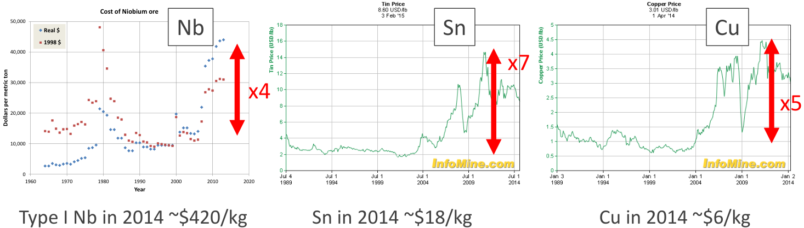
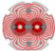
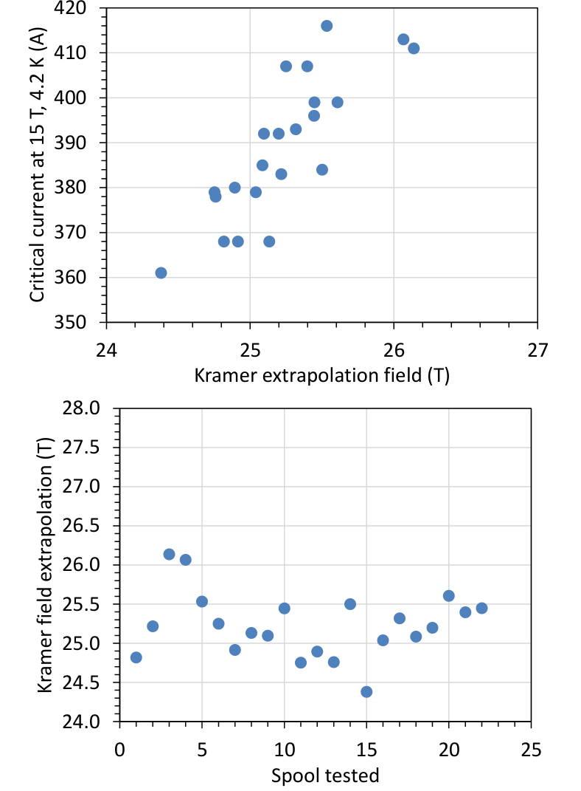
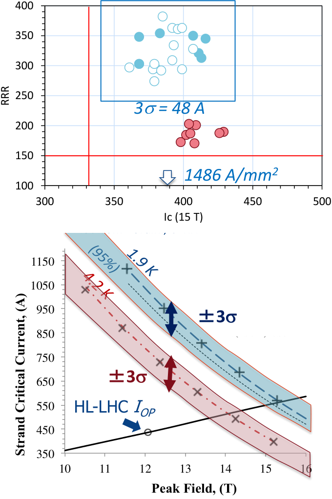
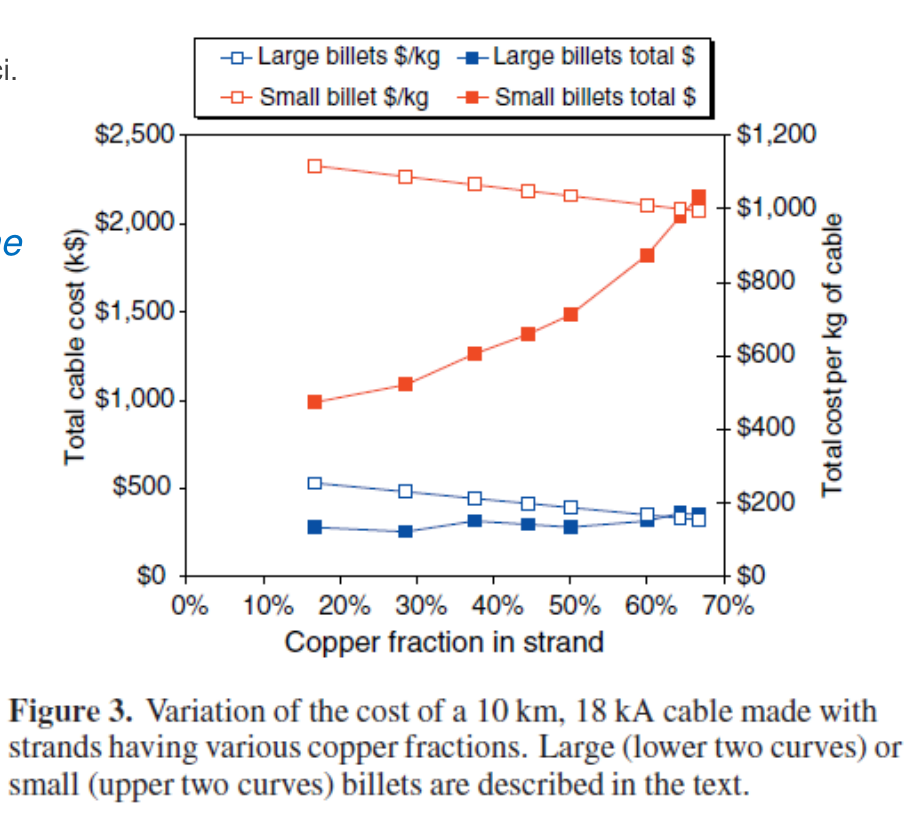
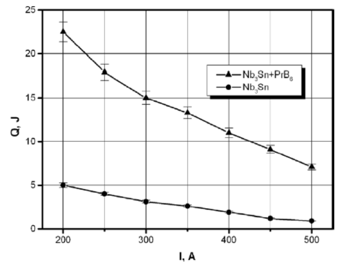
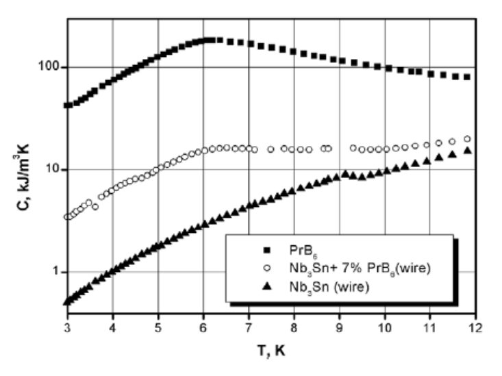

## **Cost drivers for very high energy p-p collider magnet conductors** 

Lance Cooley and Ian Pong 

_FCC 2016, Rome_ 

## **Overview** 

- Bi-2212 – no update on costs from FCC 2015 

- REBCO – some interesting developments 

- Nb Sn for FCC 3 

   - From Amalia: 

      - 1 mm strand diameter 

      - Copper to non-copper (Cu:NC) ratio = 1.0 

      - 1500 A/mm[2] current density (strand) at 16 T 4.2 K 

      - Magnetization < 150 mT, sigma < 4.5 % 

      - Ds < 20 µm 

      - RRR > 150 

      - Unit length (UL) > 5 km  --- is this a cable unit or a piece length? 

      - Cost < 5 $ / kA-m 

## **REBCO** 

- A quick frame of reference (B. Strauss) 

   - “Copper wire” at 1 mm[2] = 8.96 g/m or 8.96 kg/km, i.e. about 111 km / ton 

   - If sold for $100 /m, then 1 ton annual production results in $11.1 million 

   - $100 million capital amortized at 5% over 30 years = $6 million annual payment 

   - 30 full-time staff ~ $6 million annual 

- Assume that the “first ton” of material per year only pays for amortization and operations, i.e. the cost of this material does not reflect raw materials or manufacturing of a baseline 

   - Baseline: 100 A conductor at 77 K, s.f.  400 A at 20 T, 4.2 K 

   - $80 / m, as indicated in recent DOE EERE funding opportunity announcement 

   - i.e. $200 / kA-m at 20 T, 4.2 K, for nominally 1 mm[2] conductor 

      - 4 mm x 0.25 mm, includes 100 µm stainless and 100 µm copper 

## **Advanced REBCO** 

- SuperPower and U. Houston are collaborating to advance conductor technology 

   - Stainless steel  38 µm and more recently 30 µm.  Is 25 µm possible? 

   - 3x thicker REBCO layer with no degradation 

   - Better flux pinning, mostly at elevated temperature 

   - $200  $68  $23 / kA-m at 20 T, 4.2 K with same 100 µm copper 

- CORC[®] cables combine 10 to 50 REBCO tapes, on core diameters mostly determined by the bend diameter of the REBCO tape 

   - That is, cable area scales with conductor thickness, so kA can be increased for same net $/m (It’s still $100 / m in this estimate) 

   - Cable design uses less copper plating and still shares current 

      - Put thick copper in core (analogous to adding pure Cu strands to Nb3Sn cables) 

      - **$68**  **$40 or $23**  **$14 / kA-m (not incl. core, i.e. each tape is a filament)** 

   - 2012 to 2016: 114  217  309 A/mm[2] at 20 T, 4.2 K for 7.5  6.0  5.1 mm dia cable (all 5-6 kA cable) at 20 T, 4.2 K with 50 layers 

   - Are 3, 2, or even 1 mm diameter cables in sight? 1 kA / mm[2] ?? 

      - Can Rutherford cables be made from 1 mm CORC[®] “strands”?? 

## **Nb Sn 3** 

- 6,000 tons of Nb3Sn conductor at 1.5 to 2 M$/ton = 9-12 B$ – This cost is for conductor that presently falls short of spec 

- Niobium is 30% of the conductor  1,800 tons of Nb 

- Grade 1 Nb (wrought forms) @ 0.45 $M / ton = 810 M$ 

   - ILC: 600 to 1,500 tons of SRF grade Nb 

## **Cost - Raw Material** 

- Past LARP work shows that using grade 2 niobium makes no apparent difference in the performance statistics – 30% cheaper, might get to $250 / kg ?? 

- Raw material cost may fluctuate significantly, but out of our (Applied Superconductivity community) control 

   - Can hedge to reduce risk, but out of scope of this talk 

**----- Start of picture text -----** 
Cost of Niobium ore 50,000 Real $ Nb Sn Cu 1998 $ 40,000 x7 30,000 x4 x5 20,000 10,000 0 1960 1970 1980 1990 2000 2010 2020 Year Type I Nb in 2014 ~$420/kg Sn in 2014 ~$18/kg Cu in 2014 ~$6/kg Dollars per metric ton **----- End of picture text -----** 

## **Interesting news on the raw materials front…** 

From 2016 USGS commodity report: 

_One domestic company planned to exploit the only primary niobium deposit in the United States at its Elk Creek project in Nebraska, where it planned to begin production in 2017. One domestic company concluded an offtake agreement for ferroniobium with a second company. Under the 10-year agreement, the first company would purchase 3,750 tons of ferroniobium per year, which equated to about one-half of the second company’s planned production._ 

_The DLA Strategic Materials planned to acquire ferroniobium to address a U.S. stockpile shortfall._ 

## **Translating conductors from the Hi-Lumi spec to FCC spec** 

- 0.85 mm  1.0 mm diameter, Cu:NC 1.2  1.0 

   - 38% more conductor area 

   - 5 g/m  6.8 g/m 

- Raw material $613 / km  $928 / km based on commodity prices – Grade 1 niobium holding steady at $420 / kg (wrought forms) 

   - Opportunity for grade 2 material at $250 - $350 / kg 

   - Premium for fine-grain material could be x2 (estimation) 

- 320 A  589 A per strand at 16 T, 4.2 K 

   - 1240  1500 A/mm[2] 

- Conductor raw cost $1.91 / kA-m  $1.58 / kA-m 

   - Hi-Lumi strand would be $1.74 / kA-m (raw) at Cu:NC = 1.0 

- Actual cost > $20 / kA-m  < $5 / kA-m (< $10 / kA-m) at 16 T 4.2 K – Manufacturing: reduce P from ~10 to ~3 (or ~5 to ~3) 

## **Cost - Manufacturing** 

- ITER, LARP experiences do not indicate significant changes in labor or manufacturing are likely to occur 

   - However, steady procurements are required to maintain steady labor force 

- LARP started with RRP[®] in ~2003, HiLumi upgrade ~2023 

   - FCC _magnet_ development time could be >10 years; Wire design must be performance-ready ~20 years ahead! 

   - That is, it is more likely that the FCC conductor will evolve from HiLumi strand instead of emerge from, e.g., APC 

      - If APC is to be the solution, then we need long lengths of wire in magnets now! 

- If 800 tons / yr at many manufacturers, then are there many types of strand?  Or licensing of RRP[®] and PIT approaches? 

   - Is there a qualification exercise? Cost-schedule dilemma? 

- _Let’s assume the FCC strand is an extension of existing conductors_ 

## **Getting P from 5 to 3** 

- P decreases as square root of billet mass  need 4x scale up 

   - No other end-user exists to justify scale-up; will FCC pay for capital? 

- OST can go from 45 kg to 60 kg billets now, but not to 400 kg 

   - Cannot extrude, but OST does have a long draw bench 

      - Large surface area of a very long 400 kg billet could necessitate semiconductor-quality clean rooms 

   - 3 stacks for present route (mono, sub-element, conductor) 

- Is it worthwhile to focus on “component manufacturing” for the highly round monofilament (for RRP[®] ) and uniform tube (for PIT)? 

   - Very fine grains required to create the perfect Nausite membrane – Cooley and Larbalestier talks on Tuesday 

   - There are experimental routes, such as equal channel angular extrusion, which could produce very fine grained Nb “components” 

   - Is this compatible with grade 2 niobium? 

## **Cost – QC** 

- “ITER QC was an overkill” 

   - Largest Nb3Sn procurement in history, Cannot fail for community’s sake 

   - 4 phase procurement with decreasing verification testing (strand): Phase II 100%, Phase III 50%, Phase IV 25% 

- For Hi-Lumi, QC is specified to be at the billet and spool level 

   - Primary QC is by supplier’s qualified and benchmarked test facility, with monitoring by purchaser 

   - We estimate that supplier inflates cost by 5-10% to cover QC 

– Labs spend ~3% of procurement cost for 50% verification 

   - For example, lab measures 1 piece per billet, supplier 2 pieces 

- For FCC, if billets increase in mass by 5-10x, then QC could drop to 1-2 % of cost 

- _QC is not, and should not be, a cost driver for strand procurements_ 

## **Cost – “Waste”** 

- Yield = mass of pieces certified for delivery / total billet mass 

- Wire production yield is 80% to 90+% 

   - LARP strand is running at 87% right now… 

   - Manufacturer price = (1 / yield) x base price 

- Yield is reduced by piece breaks 

- Yield can be reduced for higher complexity of conductor 

   - For 169 stacks, lower Jc and lower RRR was noted upon drawing from 0.85 mm to 0.7 mm or lower (Parrell talk Tuesday) 

   - For PIT, similar trends occur (Schlenga talk Tuesday) 

   - Cannot estimate cost increase for Ds  20 µm at this time 

- Metallurgical origins of piece breaks are also related to origins of reduced performance 

   - _**For FCC, academic research and conductor development that targets Ds going from 50 to 20 µm must contribute a solution, since no clear pathway exists in manufacturing**_ 

## **Cost – “Waste”** 

- Larger strand diameter is more sensitive to mapping losses from breaks 

- Cable mapping compels purchase of 10 to 30% extra 

– ITER TF requires 384 t.  Produced over 500 t.  ~30%  extra 

– LARP mapping loss ~10% at 500 m UL, ~15% at 800 m UL • Nested ULs, e.g. 200 – 500 – 800 m, result in 2-4% loss 

- FCC at 1 km (not 5 km) UL would have 30% loss with present piece length yields (see FCC Washington talk) 

– Cabling startup + samples ~7% 

– Cable twist pitch contributes to mapping loss! 

- A single 45 kg billet yields 9.2 km at 0.85 mm  7.3 km at 1 mm dia. – A 1 km UL will have a _minimum_ waste of ~7% = UL / max yield 

- _As in previous LARP procurements, separation of production strand (i.e. strand that can be delivered in many-UL pieces) from development strand (i.e. strand designed to overcome issues such as Ds_  _20 µm)_ 

## **Cost – production variation** 

- For LARP and Hi-Lumi, production statistics are reaching 3s = 13% at 15 T 

- New objective: optimize the Bc2 (or Kramer field) because high-field Ic is closely tied to this value 

   - Does this replace or supersede RRR? 

   - 3s = 15% here 

## _Plots from Tuesday (Cooley)_ 

**----- Start of picture text -----** 
420 410 400 390 380 370 360 350 24 25 26 27 Kramer extrapolation field (T) 28.0 27.5 27.0 26.5 26.0 25.5 25.0 24.5 24.0 0 5 10 15 20 25 Spool tested Critical current at 15 T, 4.2 K (A) Kramer field extrapolation (T) **----- End of picture text -----** 

OST-A OST-B BNL-A 

## **Cost – Stability margin** 

**----- Start of picture text -----** 
400 350 300 250 3 s  = 48 A 200 150 1486 A/mm [2] 100 300 350 400 450 500 Ic (15 T) , Ic(4.32 K) Ic(1.90 K) 1150 Magnet Load-Line 1050  Magnet Operating Point Data 4.3 K 950 ± 3 s Data 1.90 K 850  Ic(1.90 K)*0.95 750 ± 3 s 650 550  HL-LHC I OP 450 350 10  11  12  13  14  15  16 Peak Field, (T) Strand Critical Current, (A) RRR **----- End of picture text -----** 

- ITER TF, internal tin conductor Ic statistics s = 4-7% 

   - Production control at ±3 sigma, i.e. 12 to 21% width 

- LARP and Hi-Lumi conductors are presently achieving 3s of about 13% 

   - Is present Hi-Lumi operating point somewhat conservative? 

   - 6-sigma below best conductor is the bottom of the control band… 

      - use this for magnet design? 

         - (i.e. 15 T @ 1.9 K now?) 

- What margin is needed at 16 T? 

- _Plots from Tuesday (Cooley, Bordini)_ 

## **Adding cheap, pure Cu strands in graded cables** 

This was examined in 2005 Cooley Ghosh Scanlan Supercond. Sci. Technol. **18** (2005) R51–R65 

_For Cu:NC = 1.0 to 1.2, and small (45 kg) billets, cost of the cable can be reduced significantly_ 

_For large billets, i.e. cheap strands, copper strands offer little gain_ 

## **An overlooked wild card for margin?** 

- V. Keilin and Kurchatov group have researched the addition of Rare Earth hexaborides to epoxies, cables, and even conductors (below) to increase heat capacity and margin vs quench for over a decade 

## **Cost estimate – Summary** 

- Present conductor: >$20 / kA-m at 16 T 4.2 K 

- QC cost: Supplier QC hidden inside of manufacturer’s price 

   - Lab ~3% additional 

- Yield: hidden inside of manufacturer’s price, keep it at ~ 90% (10% cost) 

   - This will be difficult while simultaneously innovating, e.g. for Ds  20 µm 

- 

   - Cable mapping: 30% loss for 1 km UL 

   - Either project buys more wire, or manufacturer raises price to cover loss 

   - Find ways to nest UL and lower the ratio of wire UL to magnet length 

- Production variation: must accommodate 6-sigma width of 20-25%, i.e. 120 A for 589 A average, above manufacturer’s performance guarantee and extending below best known performance value 

- Total: ~60-65% extra cost (and not accounting for inflation during project) – Or, we might rationalize P = 3 x 1.6 = 4.8 

   - Use grade 2 Nb, perhaps save 20 to 40% if no other impact 

- 

- Magnet margin: too conservative? 

## **What has to be attained by Hi-Lumi production and Conductor R&D programs for FCC to have a chance?** 

## _Considering that:_ 

- A potential FCC conductor is likely to evolve from Hi-Lumi conductor, and 

- … Hi-Lumi conductor is “simple” vs what FCC conductor might be, and 

- … critical current at 16 T is within range of “process tweaks” 

- _We should see in 5 years:_ 

- Grade 2 niobium is proven to have no drawbacks 

   - **Perhaps alternate vendors are qualified?** 

- Every billet draws down in 1 or 2 pieces, i.e. average piece length > 5 km 

- All sigmas stay the same or reduce (is this too optimistic?) 

– **New focus on H K** 

- Some billets exceed 60 kg and are processed on long benches 

- Cheap, reliable “component manufacturing” feeds production 

– **ECAE tubes and monofilaments with extraordinary shape stability?** 

- Nausite reactions are understood and resolve cost risks for Ds < 50 µm 

## **Most significant cost drivers (in our opinion)** 

- Pushing to Ds < 20 µm without understanding the “Nausite” reaction path 

   - Risks compound – more wire breaks and lower yield, shorter pieces and higher mapping losses, critical current gets lower, RRR also controlled less well, property distributions get broader 

- “Entrapment” in conventional magnet designs 

   - Present conductor costs are exacerbated by need for large thermal margin, long unit lengths (or large ratio of wire UL to magnet length) 

- High (estimated) cost of the “fine grained niobium components” 

   - Evaluation of grade 2 niobium might mitigate this; advanced manufacturing routes might be available 

- Lack of time for “next generation” Nb3Sn conductor to take hold 

   - Design effort seems to be pushing conductor decision horizon forward, cannot invest appropriate time to realize _production ready_ versions of e.g. APC Nb3Sn 

