Home Search Collections Journals About Contact us My IOPscience 

## Critical current scaling and the pivot-point in Nb3Sn strands 

This article has been downloaded from IOPscience. Please scroll down to see the full text article. 

2012 Supercond. Sci. Technol. 25 054008 

(http://iopscience.iop.org/0953-2048/25/5/054008) 

View the table of contents for this issue, or go to the journal homepage for more 

Download details: IP Address: 129.234.189.104 The article was downloaded on 23/04/2012 at 16:03 

Please note that terms and conditions apply. 

IOP PUBLISHING 

SUPERCONDUCTOR SCIENCE AND TECHNOLOGY 

Supercond. Sci. Technol. **25** (2012) 054008 (15pp) 

doi:10.1088/0953-2048/25/5/054008 

## **Critical current scaling and the Sn strands pivot-point in Nb3** 

## **Y Tsui and D P Hampshire** 

European Reference Fusion Energy Laboratory for Superconducting Materials, Centre for Materials Physics, Department of Physics, Durham University, Durham DH1 3LE, UK 

## E-mail: d.p.hampshire@durham.ac.uk 

Received 13 March 2012, in final form 20 March 2012 Published 23 April 2012 Online at stacks.iop.org/SUST/25/054008 

## **Abstract** 

Detailed measurements are provided of the engineering critical current density ( _J_ c) and the index of transition ( _n_ -value) of two different types of advanced ITER Nb3Sn superconducting strand for fusion applications. The samples consist of one internal-tin strand (OST) and two bronze-route strands (BEAS I and BEAS II—reacted using different heat treatments). Tests on different sections of these wires show that prior to applying strain, _J_ c is homogeneous to better than 2% along the length of each strand. _J_ c data have been characterized as a function of magnetic field ( _B_ ≤ 14 _._ 5 T), temperature (4 _._ 2 K ≤ _T_ ≤ 12 K) and applied axial strain (−1% ≤ _ε_ A ≤ 0 _._ 8%). Strain-cycling tests demonstrate that the variable strain _J_ c data are reversible to better than 2% when the applied axial strain is in the range of −1% ≤ _ε_ A ≤ 0 _._ 5%. The wires are damaged when the intrinsic strain ( _ε_ I) is _ε_ I ≥ 0 _._ 55% and _ε_ I ≥ 0 _._ 23% for the OST and BEAS strands, respectively. The strain dependences of the normalized _J_ c for each type of strand are similar to those of prototype strands of similar design measured in 2005 and 2008 to about 2% which makes them candidate strands for a round-robin interlaboratory comparison. 

The _J_ c data are described by Durham, ITER and Josephson-junction parameterizations to an accuracy of about 4%. For all of these scaling laws, the percentage difference between the data and the parameterization is larger when _J_ c is small, caused by high _B_ , _T_ or | _ε_ I|. The _n_ -values can be described by a modified power law of the form _n_ = 1 + _rI_ c _[s]_[, where] _[ r]_[ and] _[ s]_[ are] approximately constant and _I_ c is the critical current. 

It has long been known that pivot-points (or cross-overs) in _J_ c occur at high magnetic field and temperature. Changing the magnetic field or temperature from one side of the pivot-point to the other changes the highest _J_ c sample to the lowest _J_ c sample and vice versa. The pivot-point follows the _B_ – _T_ phase boundary associated with the upper critical field and is usually attributed to the different tin content profiles and pinning properties of internal-tin and bronze-route strands. We report that the strain dependence of the pivot-point in these strands is quite different from that of the upper critical field and suggest that its origin in optimized high tin content strands is the proximity of the tetragonal Nb3Sn phase, which has low superconducting critical parameters. 

(Some figures may appear in colour only in the online journal) 

## **1. Introduction** 

The discovery of superconductivity in Nb3Sn almost 60 years ago [1] opened a new horizon for applied superconductivity. Currently, Nb3Sn superconducting strands are used in almost all high-field superconducting magnets operating above 

12 T [2]. In addition, large international scientific projects, such as the International Thermonuclear Experimental Reactor (ITER) [3–6], the 1 GHz NMR project [7, 8], and the Next European Dipole program [8, 9], help drive the continuous development of better Nb3Sn strands for high-field applications. In particular, the 15 billion-euro ITER project 

> ⃝c 2012 IOP Publishing Ltd Printed in the UK & the USA 

0953-2048/12/054008+15$33.00 

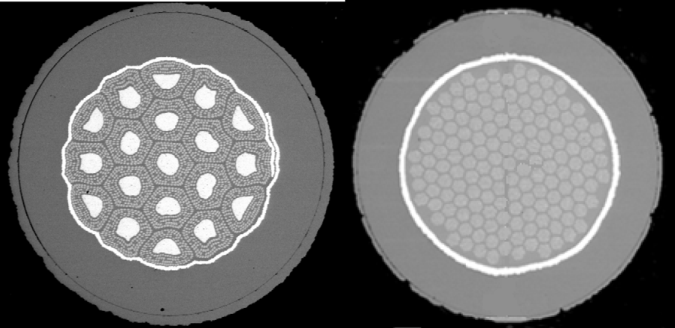

**Figure 1.** SEM images of the cross-section of unreacted copper-plated (LHS) OST internal-tin and (RHS) BEAS bronze-route Nb3Sn strands. 

**Table 1.** Technical specifications for ITER TF Nb3Sn strands [10]. 

will require about 80 000 km of advanced Nb3Sn strands to build 18 toroidal-field magnets for the fusion reactor tokamak. In order to meet the demanding requirements (both technical and economic) for the toroidal-field (TF) magnets, intensive research has resulted in two types of Nb3Sn strands (bronze-route and internal-tin) being used by ITER. The technical specifications for the ITER TF Nb3Sn strands are listed in table 1 [10]. 

It is well known that high critical current density, low losses and good strain tolerance are important parameters in magnet design. Strain is important because of the large unavoidable stresses/strains on the conductors in magnets during their cool down and operation, and the strain dependence of the superconducting properties [4–6, 11–13]. For the large ITER TF magnets, the compressive strain on Nb3Sn strands at operating conditions may be as high as −0 _._ 8% [14]. Therefore, the properties of each type of Nb3Sn strand under strain need to be known before they are used. 

In this paper we present extensive characterizations of two different types of advanced Nb3Sn strands, which are to be used for ITER TF magnet construction. Three strands were measured—one strand was an internal-tin type strand (OST) and the other two were both bronze-route strands (BEAS I and BEAS II), which were from the same billet but received different heat treatments. Comprehensive measurements of the engineering critical current density ( _J_ c) of each strand 

**Table 2.** The different Nb3Sn wire types studied in this work. 

have been performed over a wide range of magnetic field (1 T ≤ _B_ ≤ 14 _._ 5 T), temperature (4 _._ 2 K ≤ _T_ ≤ 12 K), and applied strain (−1 _._ 1% ≤ _ε_ A ≤∼0 _._ 5%). _J_ c data are parameterized by the Durham scaling law [15, 16], the ITER scaling law [16] and a Josephson-Junction model [17, 18]. We discuss the merits and drawbacks of each. Comparison of these strands shows a clear crossover in _J_ c, denoted in this paper as a pivot-point. Crossing from one side of the pivot-point to the other using magnetic field, temperature or strain, changes the highest _J_ c sample to the lowest _J_ c sample and vice versa. This paper includes a description of the functional form of the pivot-point which we suggest arises from the different tin content of these strands. 

The contents of this paper are arranged as follows. The description of sample specifications and preparation, experimental apparatus and techniques, will be presented in section 2. Section 3 contains the experimental results and data analysis for each sample. The significance of the results and the errors in measurements will also be discussed in this section. Finally, the important conclusions are discussed and summarized. 

## **2. Experimental details** 

## _2.1. Sample specifications and heat treatment_ 

The SEM images are shown in figure 1 and the two different types of strands shown in table 2. The strands were heat-treated in an argon atmosphere on oxidized stainlesssteel mandrels in a three-zone furnace, with an additional thermocouple positioned next to the sample in order to monitor and control the temperature. The heat-treatment schedules for the different strands are described in table 3. 

**Table 3.** Heat-treatment schedules for the advanced internal-tin strand (OST) and the two bronze-route strands (BEAS I and BEAS II). 

|OST and BEAS II strands|BEAS I strand|
|---|---|
|Ramp at 5 ◦C h−1 to 210 ◦C and hold for 50 h|Ramp at 5 ◦C h−1 to 595 ◦C and hold for 160 h|
|Ramp at 5 ◦C h−1 to 340 ◦C and hold for 25 h|Ramp at 5 ◦C h−1 to 620 ◦C and hold for 320 h|
|Ramp at 5 ◦C h−1 to 450 ◦C and hold for 25 h|Ramp at 5 ◦C h−1 to 500 ◦C|
|Ramp at 5 ◦C h−1 to 575 ◦C and hold for 100 h|Cooled to room temperature inside the furnace|
|Ramp at 5 ◦C h−1 to 650 ◦C and hold for 100 h||
|Ramp at 5 ◦C h−1 to 500 ◦C cooled to room||
|temperature inside the furnace||
|||

After reaction, the strands were etched in hydrochloric acid to remove the chromium coating on the strand surface. The strands were then transferred to rectangular copper–beryllium helical springs [19, 20], to which they were attached by copper-plating and soldering. 

## _2.2. Apparatus and techniques_ 

After each strand was soldered to the spring, it was mounted onto our purpose-built strain probe [21]. To apply strain, the spring is twisted via concentric shafts attached to the spring: the inner shaft connects a worm-wheel system at the top of the probe to the top of the spring, and the outer shaft is connected to the bottom of the spring via an outer can. The strain is applied by fixing the angular separation between the top and the bottom of the spring with reference to an angle versus strain calibration, completed for each spring prior to cryogenic measurements. The applied strain values quoted characterize the average applied strain ( _ε_ A) in the middle of the strand. They include a correction factor of ∼9% obtained from finite-element analysis to account for the finite diameter of the strand [20]. 

We have checked the accuracy of the calculated correction factor associated with the diameter of the wire by measuring the change in the angle versus strain calibration factor after soldering a copper strip onto the spring. The strip had a thickness of 0.55 mm (similar to the radius of a typical strand). Figure 2 shows the calibration of the spring, first measured using strain gauges on the surface of the spring and secondly on the surface of the strip. Excellent agreement was found between the FEA correction (including the finite thickness of the strain gauges: 0.045 mm), which was calculated to be 12.1%, compared to the experimental data, which gave 11.9%. 

_J_ c measurements were carried out in applied magnetic fields up to 14.5 T. For measurements at 4.2 K, samples were in direct contact with liquid helium. For variabletemperature measurements above 4.2 K, the probe provided a vacuum chamber around the sample and the temperature was kept constant during the measurement using three sets of independently controlled Cernox thermometers and constantan wire heaters distributed to produce a uniform temperature profile along the turns of the spring. The uncertainty in the temperature of the wire was ∼20 mK. At fixed specified values of magnetic field, temperature and strain, the voltage ( _V_ ) across each of six sections of the 

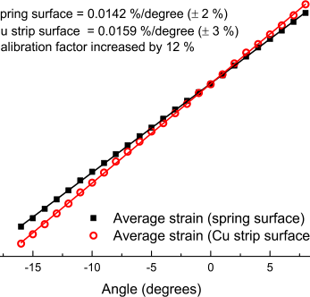

**Figure 2.** Average strain on the spring and copper strip surface versus the twisted angle of the spring. The outer surface of the copper strip was 0.5 mm above the spring surface. The calibration factor on the spring surface and the copper strip surface was measured to be 0.0142% and 0.0159%, respectively. Lines are best 

strand (typical length of each section is ∼20 mm) was measured using a nanovolt amplifier and a digital voltmeter as a function of a slowly increasing current ( _I_ ) through it. The _V_ – _I_ measurements were first made at 4.2 K in an applied strain cycle from zero to −1 _._ 1% (compression) then to ∼0.4% (OST) or ∼0.5% (BEAS I and BEAS II) and back to zero afterwards. The probe was then warmed to room temperature. After fitting the variable-temperature enclosure on the probe, the probe was cooled back to 4.2 K. More _V_ – _I_ measurements were conducted at different temperatures and magnetic fields using the same applied strain cycle as at 4.2 K and then we applied increasingly large tensile strains until the samples were damaged. 

## **3. Results and discussions** 

## _3.1. Reversibility and consistence of data_ 

Figure 3 shows typical data for the electric field and current density ( _E_ – _J_ ) characteristics of the samples. Throughout this paper, we quote an engineering critical current density _J_ c which is defined as the critical current ( _I_ c) divided by the entire cross-sectional area of the strand. The electric 

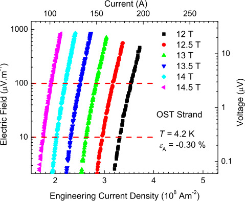

**Figure 3.** Log–log plot of electric field as a function of engineering current density (and voltage versus current) for the OST strand at 4.2 K, with _ε_ A = −0 _._ 30% in magnetic fields between 12 and 14.5 T in increments of 0.5 T. 

field criterion used for _J_ c is 10 _µ_ V m[−][1] and the index of transition or _n_ -value is calculated using the power-law expression _E_ ∝ _J[n]_ with _E_ in the range 10–100 _µ_ V m[−][1] . The variation of _J_ c between the 6 pairs of voltage taps before any strain was applied is _<_ 2%. Measurements were conducted in strain cycles so we could monitor the reversibility of our data throughout the whole experiment. We have found that independent of electric field criterion used, the _J_ c data are reversible (≤2%) when the applied strain is in the range ∼−1 _._ 1% ≤ _ε_ A ≤∼0 _._ 4% for the OST strand and ∼−1 _._ 1% ≤ _ε_ A ≤∼0 _._ 5% for the BEAS I and BEAS II strands. These results are consistent with there being no damage to the strand filaments nor any large irreversible effects due to plastic deformation of the wires [22] in any of the samples during the measurements of _J_ c (cf figures 4 and 5) used to parameterize these strands. 

## _3.2. Strong compression, plasticity and strain oscillations_ 

When all parts of the spring are elastic, we have reported that oscillations along the surface of the spring can occur that remain small and broadly consistent with FEA modeling of elastic materials [20]. We have extended these measurements to the strongly plastic regime using multiple strain gauges along the surface of Walters springs made of Cu–Be and Ti-alloy with both rectangular and T-piece cross-sections. The ratio of the strain at the inner and outer surface of our springs is typically ∼−1.5 for rectangular springs and ∼−2.2 for T-piece springs. In the plastic regime, the oscillations can become very large when parts of the springs are at high strains—for example we have found that when the compressive strain on the outer surface of a Ti-alloy T-piece spring has an average value of −2% (note that the nominal average strain on the inner surface is very large (i.e. +4 _._ 4%)), the strain along the outer surface varies from −1 _._ 5% to 

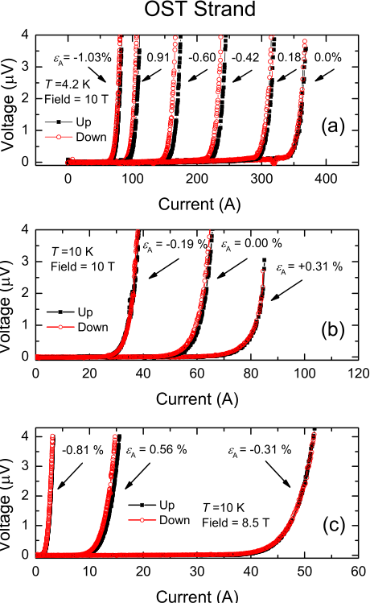

**Figure 4.** _V_ – _I_ characteristics of the OST strand at 4.2 K (a) and 10 K ((b) and (c)) when the applied strain ( _ε_ A) was increasing in compression (up) and decreasing in compression (down). 

−2 _._ 5% [23]. Our experience with many different strands has been that the equivalent oscillations seen in _J_ c are much smaller than those measured by strain gauges on the surface of the springs. In the data presented here, variations of _J_ c between five of the six taps, due to variations of the local strain along the Cu–Be springs on which samples were attached [20] is very small—equivalent to an effective overall variation in strain of just two parts in a hundred of the strain applied. There are a number of approaches to eliminating uncertainties about the strain on the wire caused by these oscillations (as they become larger) including calibrating with strain gauges/measuring with voltage taps that extend over a complete turn or calibrating/measuring at the zero points in the oscillations [24]. In Durham, because we measure many voltage taps to check uniformity of _J_ c along the wire before we start applying strain, we make sure to include several voltage taps that measure a number of short lengths along the central turns. Our approach to minimizing errors associated with these strain oscillations is to chose to characterize in detail a voltage tap that has an average value of _J_ c for a turn in the middle of the spring and has low noise. 

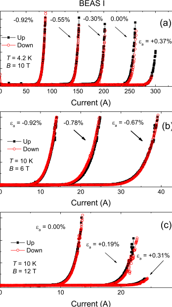

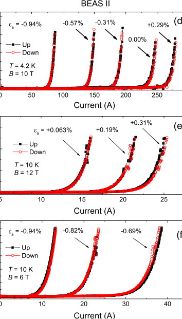

**Figure 5.** _V_ – _I_ characteristics of the BEAS I and BEAS II strand at 4.2 K ((a) and (d)) and 10 K ((b), (c), (e) and (f)) when the applied strain ( _ε_ A) was increasing in compression (up) and decreasing in compression (down). 

## _3.3. Tensile strain and damage_ 

In these types of measurements where a great deal of resource is invested in sample preparation, we try to minimize the risk of damaging the sample with tensile strain early in the experiment. During the 4.2 K measurements, the strain range is limited to that important for the ITER tokomak but which also captures the strain at which _J_ c reaches its peak value. At 4.2 K we measured up to tensile strains that reduced _J_ c by 5–10% from its peak value. Measurements at higher temperatures extended over the same strain range reduced _J_ c by ∼25% of its peak value. 

We note that for samples BEAS I and II, one pair of voltage taps behaved unlike the other five in tension. These anomalous data were reversible ( _<_ 2%) suggesting there was no damage. For both samples, _J_ c obtained from the anomalous tap deviates from the mean value obtained from all taps by ∼14% at the highest applied strain ( _ε_ A ∼ 0 _._ 5%) in the reversible regime. We could see no obvious physical explanation for the anomalous behavior. Eventually tensile strains were applied until the strands were damaged. We estimated that the damage occurred in the OST and BEAS II strands when the applied strains were ∼0.8% and ∼0.6%, respectively. These values are equivalent to intrinsic strain values of 0.55% and 0.23%, respectively, since the values of strain at which _J_ c reached peak values were 0.25% and 0.37% (cf equation (3) and table 4 discussed below). As expected, after the strand starts breaking, _J_ c drops in the broken regions, but in undamaged regions _J_ c increases as the tensile strain 

is released. Sometimes the broken regions are distributed, consistent with the data in figures 6(a) and (b) and sometimes damage appears to be more localized (cf figures 6(c) and (d)). 

## _3.4. Critical current density and parameterization_ 

_J_ c data of each sample at various magnetic fields, temperatures and applied strains are displayed in figures 7–9 along with the calculated best fit. The well-known inverted quasi-parabolic behavior of _J_ c as a function of strain is observed in all samples. The important role of strain can be seen from noting that at 4.2 K and 12 T _J_ c of the OST strand has dropped by more than 50% when the applied strain is changed from 0% to −0 _._ 4%. _J_ c of the OST internal-tin strand is the highest among all the samples in the low strain region, but also has the highest sensitivity to strain. Hence _J_ c of the OST strand decreases sharply as the magnitude of the strain rises. As a result, eventually the OST strand has the lowest _J_ c in the high compressive strain region. 

In order to analyze the results, we parameterized _J_ c using the Durham scaling law [15], the ITER scaling law [16] and a Josephson-Junction model [17]. The Durham scaling law involves 13 fitting parameters but in general that is reduced to nine free parameters without much loss of accuracy [15]. Durham scaling is defined using equations (1)–(5): 

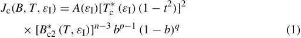

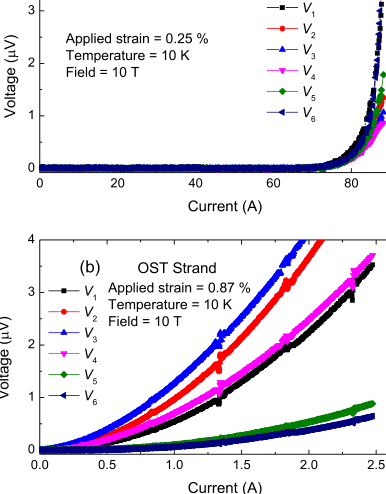

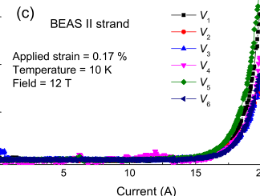

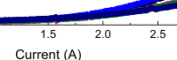

**Figure 6.** _V_ – _I_ characteristics of the six voltage taps of the OST/BEAS II strand before ((a) and (c)) and after ((b) and (d)) the strand was damaged. 

**Table 4.** Durham scaling law parameters for (a) OST (advanced internal-tin) strand, (b) BEAS I (bronze-route) strand and (c) BEAS II (bronze-route) strand. Note that _**n**_ , ν, _**w**_ and _**u**_ are fixed constants. There are nine free fitting parameters. 

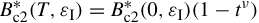

- _B_ c2 _[(][T][, ε]_[I] _[)]_[ =] _[ B]_ c2 _[(]_[0] _[, ε]_[I] _[)(]_[1][ −] _[t][)]_ (2) where _J_ c is the engineering critical current density, _ε_ A is the applied strain, _ε_ I is the intrinsic strain, _ε_ M is the applied strain 

- _A(ε_ I _)_ 1 _/u B_ ∗c2 _[(]_[0] _[, ε]_[I] _[)]_ 1 _/w_ c _[(ε]_[I] _[)]_ at the peak, _T_ c[∗][is the effective critical temperature,] _[ B]_[∗] c2[is the] 

- � _A(_ 0 _)_ � = � _B_[∗] c2 _[(]_[0] _[,]_[ 0] _[)]_ � = _[T] T_[∗] c[∗] _(_ 0 _)_ (3) effective upper critical field, _b_ = _B/B_[∗] c2[is][the][reduced][field] and _t_ = _T/T_ c[∗][is][the][reduced][temperature.][Four][parameters] 

- _B_[∗] c2 _[(]_[0] _[, ε]_[I] _[)]_ are fixed constants: _n_ = 2 _._ 5, _ν_ = 1 _._ 5, _w_ = 2 _._ 2 and _u_ = 0, _B_[∗][=][ 1][ +] _[ c]_[2] _[ε]_ I[2][+] _[ c]_[3] _[ε]_ I[3][+] _[ c]_[4] _[ε]_ I[4] (4) where the last constraint removes the effect of any strain c2 _[(]_[0] _[,]_[ 0] _[)]_ dependence from _A(ε_ I _)_ . The values of the nine free parameters 

- _ε_ I = _ε_ A − _ε_ M _,_ (5) obtained for each sample are listed in table 4. _B_[∗] c2 _[(]_[0] _[,]_[ 0] _[)]_[and] 

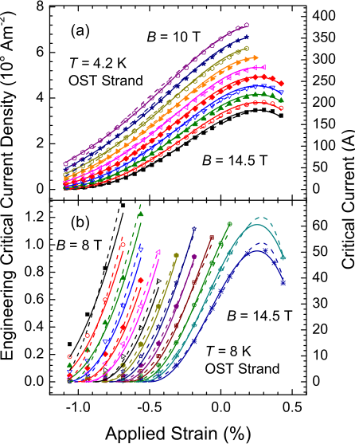

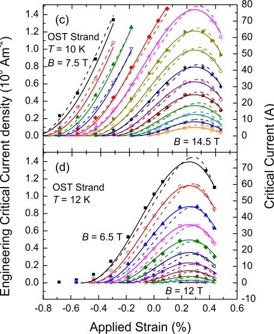

**Figure 7.** Engineering critical current density versus applied strain (and critical current versus applied strain) for the OST strand in magnetic fields (a) from 10 to 14.5 T at 4.2 K, (b) from 8 to 14.5 T at 8 K, (c) from 7.5 to 14.5 T at 10 K and (d) from 6.5 to 12 T at 12 K. The increment of the magnetic fields is 0.5 T. The solid lines were obtained by fitting the nine free-parameter Durham scaling law (table 4). The dashed lines are obtained from the ITER scaling law [16] (parameters in table 5). 

_T_ c[∗] _[(]_[0] _[)]_[ for these strands are found to be 29–31 T and][ ∼][16.5 K,] respectively. These are acceptable values for the upper critical field and transition temperature for Nb3Sn strands. 

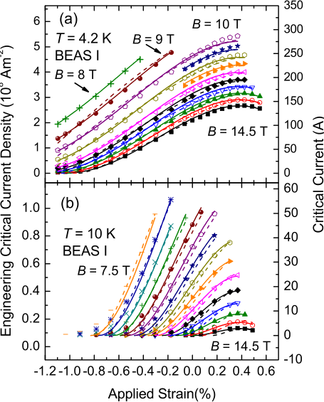

**Figure 8.** Engineering critical current density (and critical current) of BEAS I strand as a function of applied strain at (a) 4.2 K in magnetic fields from 8 to 14.5 T and at (b) 10 K in fields from 7.5 to 14.5 T in increments of 0.5 T. The solid lines were obtained by fitting the Durham scaling law [15] using the nine free parameters listed in table 4. The dashed lines were obtained from the ITER scaling law [16] (table 5). 

We have also parameterized the three data sets with the ITER scaling law [16] using: 

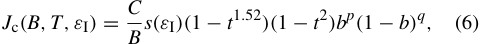

where 

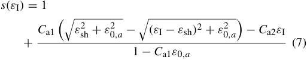

is a specified function of strain. The parameters _C_ a1 and _C_ a2 are the second and third invariant axial strain coefficients, respectively. _ε_ 0 _,_ a is the remaining strain component. _ε_ sh = _C_ a2 _ε_ 0 _,_ a _/_ � _C_ a1[2][−] _[C]_ a2[2][is][a][shift][due][to][the][difference][between] the deviatoric and axial strain. The critical temperature and the upper critical field are written as _T_ c _(ε)_ = _T_ c _(_ 0 _)_ [ _s(ε)_ ][1] _[/]_[3] and _B_ c2 _(T, ε)_ = _B_ c2 _(_ 0 _,_ 0 _)s(ε)(_ 1 − _t_[1] _[.]_[52] _)_ , respectively. The associated nine free fitting parameters for ITER scaling are provided in table 5. 

Finally we have parameterized the data using a Josephson-Junction (J-J) model [17] in which the polycrystalline material consists of superconducting grains separated by normal-metal barriers representing the grain boundaries [17, 25]. This model describes _J_ c using: 

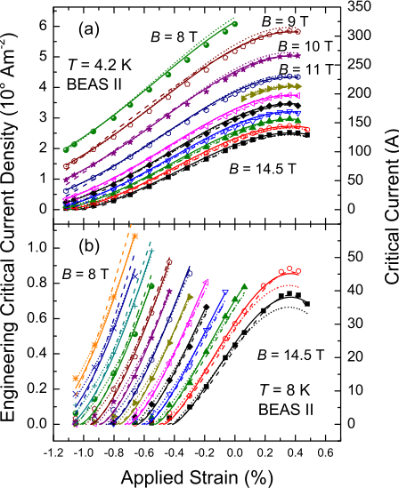

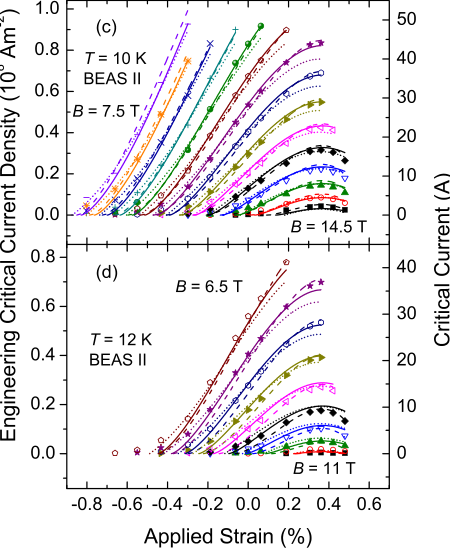

**Figure 9.** Engineering critical current density versus applied strain (and critical current versus applied strain) for the BEAS II strand in magnetic fields (a) from 8 to 14.5 T at 4.2 K, (b) from 8 to 14.5 T at 8 K, (c) 7.5 to 14.5 T at 10 K, and (d) from 6.5 to 11 T at 12 K. The solid lines were obtained from the Durham scaling law [15] using the nine free parameters listed in table 4. The dashed lines were obtained from the ITER scaling law [16] (table 5). The dotted lines were obtained from the Josephson-Junction model [17] using the nine free parameters listed in table 6. 

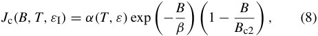

**Table 5.** ITER scaling law parameters for (a) OST (advanced internal-tin) strand, (b) BEAS I (bronze-route) strand and (c) BEAS II (bronze-route) strand. There are nine free fitting parameters. 

(a) OST strand (internal-tin); RMS = 3 _._ 3 A 

where _β_ characterizes the suppression of the Ginzburg–Landau order parameter by the magnetic field across the normal-metal barriers (grain boundaries), _α(T, ε)_ ∝ _[B] κ_[c][∝] _[B] κ_ c2[2][2] and _κ_ is the Ginzburg–Landau parameter. In order to reduce the number of free parameters in equation (8), we make the assumption that _β_ = _s_[2] _B_ c2, where _s_ is a constant, and use the well-known temperature dependence for _κ_ in low temperature superconductors so that equation (8) becomes: 

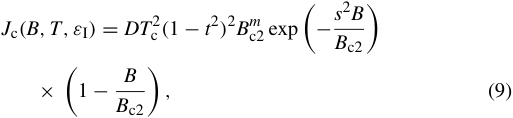

where _D_ and _m_ are constants and the relationships between _T_ c _(ε)_ , _B_ c2 _(T, ε)_ and strain are defined by equations (2)–(5). The total number of free fitting parameters in the J-J model is nine, which is the same for both Durham and ITER scaling laws. They are given in table 6. Figure 9 shows the parameterization of _J_ c for the BEAS II strand by using the J-J model showing reasonable agreement with the data. In figure 10 we have plotted log10 _(J_ c _/(_ 1 − _B/B_ c2 _))_ versus _B_ at low compressive strains ( _ε_ I _>_ −1%) confirming the straight lines expected from equation (9). Although the fits are quite reasonable, they are not yet sufficiently good to help the research community with grain boundary engineering in Nb3Sn which is part of the aim of this J-J approach. 

All three scaling laws include a parameter to characterize the peak in _J_ c at zero intrinsic strain. The uncertainty in the value of the zero intrinsic strain value is reduced significantly by including the data at high temperatures where the strain dependence of _J_ c is strongly peaked. We conclude that experimentally _ε_ M does not depend on _B_ or _T_ and can be determined to an accuracy of ∼0.015% strain. All scaling laws are least accurate in a similar part of phase space where the magnetic field, temperature and strain combine to approach 

**Table 6.** Josephson-Junction model parameters for the BEAS II (bronze-route) strand. Both ν and _**w**_ are kept fixed in the fitting procedure. There are nine free fitting parameters. 

|rameters.|||||||
|---|---|---|---|---|---|---|
||BEAS|II strand (bronze-route); RMS||=2_._9 A|||
|_c_2||_c_3|_c_4|ν|**_w_**|_ε_M (%)|
|−0.432||−0.237|−0.044|**_1_**_._**_500_**|**_2_**_._**_200_**|0.357|
|_D_(A m−2 T−n|K−2)|_T_c_(_0_)_(K)|_B_c2_(_0_,_0_)_(T)|_s_|_m_||
|2_._51×107||16.53|27.94|1.411|1.661||
||||||||

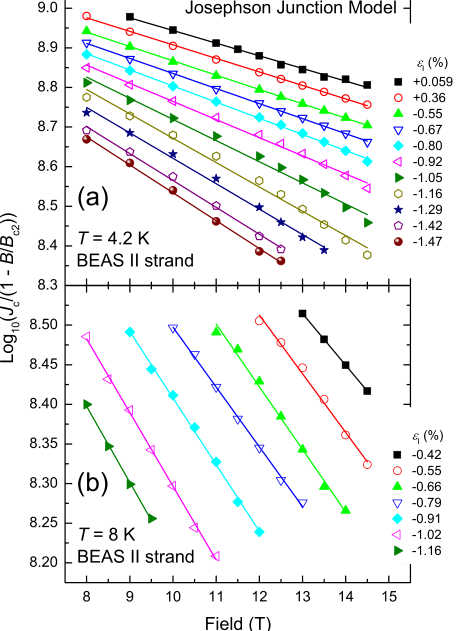

**Figure 10.** Log10 _(J_ c _/(_ 1 − _B/B_ C2 _))_ versus magnetic field at different intrinsic strains and at (a) 4.2 K and (b) 8 K for the BEAS II strand. _B_ c2 are calculated values obtained by using the Josephson-Junction model. Lines are best fits to the data. 

the superconducting–normal phase boundary. For example, at 4.2 K and at _ε_ I = −1 _._ 05%, the calculated values of _J_ c start to deviate significantly from the measured values for _B >_ 12 T for all three parameterizations. The deviation starts at a lower magnetic field as _ε_ I drops further. The phase space near the phase boundary is the least important for high-field applications and therefore usually does not garner much interest. Finally we note that the ITER parameterization generally overestimates the value of _ε_ M and the Durham scaling law gives the smallest RMS values, as shown by comparing tables 4–6. 

## _3.5. Strain dependence of the pivot-point_ 

Figures 11(a)–(c) shows _J_ c as a function of intrinsic strain at 4.2 K at different magnetic fields for all three samples. 

Crossover behavior of _J_ c is clearly observed with a single pivot-point where _J_ c of all strands coincides. Although internal-tin strands have both higher tin content in the Nb3Sn fraction [26, 27] and higher fractional cross-sectional area of Nb3Sn in the composite [26, 27] leading to higher _J_ c than found in bronze-route strands at small strains, the higher tin content of the internal-tin strands brings with it higher strain sensitivity. Figure 11(d) shows the pivot-point on a constant strain plot where _J_ c is plotted against magnetic field. Similar results can also be found in other bronze-route strands in literature [28]. Uncertainties in _ε_ M do not significantly affect the functional form derived for the pivot-point. As shown in figure 12(a), the pivot-point moves to smaller values as either the magnetic field or temperature increases. Figure 12(b) shows that the temperature dependence of the pivot-point broadly follows the temperature dependence of the upper critical field (i.e. _B_[∗] c2 _[(][T][)]_[∝] _[(]_[1][−] _[(][T][/][T]_ c[∗] _[)]_[1] _[.]_[5] _[)]_[).] However figure 12(c) shows that in contrast to the temperature dependence there is a very strong strain dependence for the pivot-point that is completely different to that of the upper critical field. Indeed there are compressive (∼−0.3%) and tensile strains (∼+0.1%) where the pivot-point is a very rapidly changing function of strain and between which the pivot-point cannot be measured. 

## _3.6. Parameterization over limited ranges_ 

Of interest to the ITER community is to what degree the parameterization of _J_ c improves if it is limited to a smaller part of phase space, focused for example on the operation conditions of the tokomak. We have refitted a subset of the data for these three strands in magnetic fields from 10 to 14 T; temperatures of 4.2 and 8 K for the OST and BEAS II strands and 4.2 and 10 K for the BEAS I strand and strains over the whole reversible range measured above −1%. Since less data are involved in these local fits, the resulting parameterizations have higher accuracy in the fitted range of parameter space. The new fitting parameters are listed in tables 7 and 8. When using the Durham scaling law to fit the whole or the reduced dataset, the changes to the parameters obtained for the OST strand are small (typically ∼2%). _J_ c outside the measured range of parameters could have been estimated from the smaller data set without losing too much accuracy. However, the parameters obtained from the smaller set of the BEAS data differ by ∼20% from the large data set. If the ITER scaling law is used, similar results are obtained, but in addition the free parameters can become almost non-physical. For example, _B_[∗] _c_ 2 _[(]_[0] _[,]_[ 0] _[)]_[obtained][in][the][reduced][dataset][of][the] 

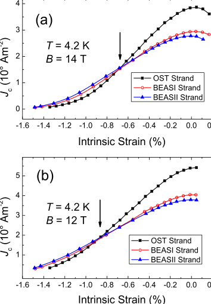

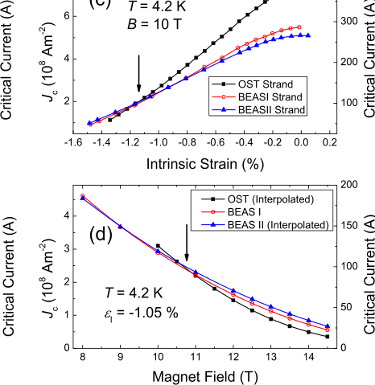

**Figure 11.** Critical current density as a function of intrinsic strain at 4.2 K and at (a) 14 T, (b) 12 T and (c) 10 T for all three stands measured. (d) Critical current density as a function of magnetic field at 4.2 K and _ε_ I = −1 _._ 05% for all strands measured. OST and BEAS II curves are obtained by interpolating the data from _ε_ I = −1 _._ 04% and −1.06%, respectively. A clear field-pivot-point can be seen at _B_ ∼ 10 _._ 5 T. All lines are guides to the eye. 

**Table 7.** Durham scaling law parameters for (a) OST (advanced internal-tin) strand, (b) BEAS I (bronze-route) strand and (c) BEAS II (bronze-route) strand. Note that _**n**_ , ν, _**w**_ and _**u**_ are fixed constants. The fitting parameters were derived from a reduced range of data taken at temperatures and magnetic fields that are appropriate for operating conditions in ITER. 

BEAS II is 34.5 T. Therefore, parameters obtained from a much reduced dataset cannot be used for extrapolation and have limited physical interpretation. 

## _3.7. n-values_ 

The _n_ -values for each sample, obtained over the range of technical interest 10–100 _µ_ V m[−][1] using the power-law expression _E_ ∝ _J[n]_ , have been plotted as a function of 

critical current at various temperatures and magnetic fields in figures 13 and 14. _n_ -values are usually considered an ‘index of quality’ since they characterize the sharpness of the _E_ – _J_ transition. In applications, _n_ -values are also needed for optimized magnet design. Both BEAS I and BEAS II strands have slightly higher _n_ -values than the OST strand (see figure 13(a)). However, the normalized _n_ -values of all strands have similar strain dependence (see figure 13(b)). Consistent with previous work [13, 29–31], the relation between the 

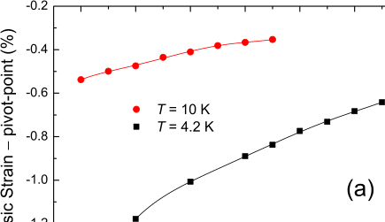

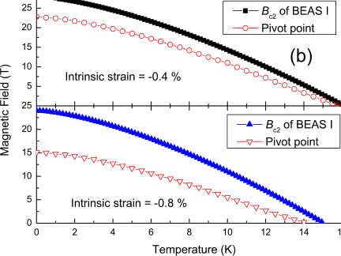

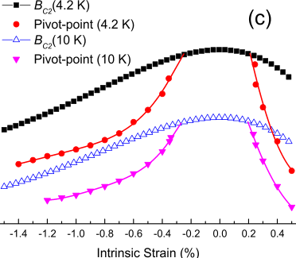

**Figure 12.** (a) Measured values of the pivot-point of the strands at 4.2 and 10 K as a function of field. (b) Measured and extrapolated values of the upper critical field of BEAS I and the pivot-point between BEASI and the OST strands on a magnetic field versus temperature plot at fixed strains of −0.4% and −0.8%. (c) The upper critical field and the pivot-point on a magnetic field versus strain plot at fixed temperatures of 4.2 and 10 K. Unlike the temperature dependence shown in panel (b), the strain dependence of the pivot-point shown in panel (c) is completely different to that of the upper critical field. 

_n_ -value and _I_ c can be described by a modified power law: 

_n(B, T, ε_ I _)_ = 1 + _r_ [ _I_ c] _[s] ,_ (10) 

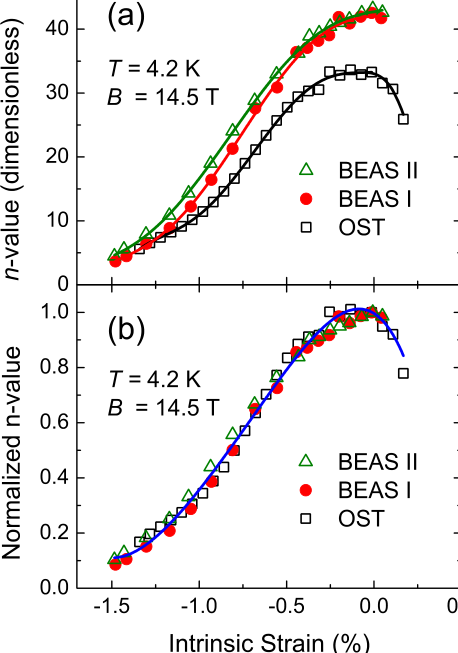

**Figure 13.** (a) _n_ -value and (b) normalized _n_ -value as functions of intrinsic strain at 4.2 K and 14.5 T for each sample. The lines are guides to the eye. 

**Table 8.** ITER scaling law parameters for (a) OST (advanced internal-tin) strand, (b) BEAS I (bronze-route) strand and (c) BEAS II (bronze-route) strand. The fitting parameters were derived from a reduced range of data taken at temperatures and magnetic fields that are appropriate for operating conditions in ITER. 

where _r_ and _s_ only depend weakly on temperature and strain and to a good approximation can be taken as approximately 3 and 0.5 respectively. 

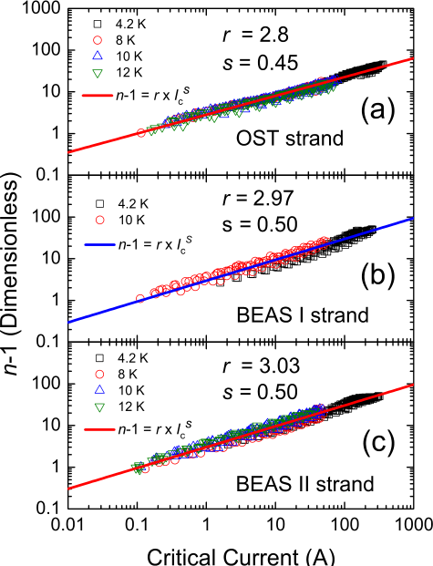

**Figure 14.** _n_ − 1 of as a function of critical current at various temperatures and fields for the (a) OST strand, (b) BEAS I strand and (c) BEAS II strand. The solid lines show fits made using equation (10). 

## **4. Discussion** 

There is increasing appetite in the community for interlaboratory comparisons, perhaps including a series of round-robin experiments of variable strain _J_ c data on Nb3Sn strands [32]. In figure 15, we have included a comparison between the work presented here and measurements on prototype bronze-route [33, 34] and internal-tin [15, 35] strands measured in Durham as part of the EFDA/F4E/ITER programme. All bronze-route strands measured in 2008 (figures 15(c) and (d)) received the same heat treatment but were manufactured from different billets. A comparison of the parameters derived shows that most parameters agree to ∼3% except for the strongly correlated coefficients of the strain polynomial _c_ 2, _c_ 3 and _c_ 4 of the BEAS strands. Such a comparison shows that data comparisons will be more straightforward than comparisons of interlaboratory correlated fitting parameters. In figures 16 and 17, we have compared the measurements presented here with those from other laboratories which were conducted using various techniques. The Korean Basic Science Institute (KBSI) used a modified Walters-spring probe similar to the one used at Durham. The University of Twente used the ‘bending spring’ technique and the Japan Atomic Energy Agency (JAEA) used a ‘bending ring’ technique. Regardless of the methods used in different laboratories the _J_ c results obtained are similar to ±3% and ±5% in _J_ c at −0 _._ 6% strain for 

different bronze-route and internal-tin strands respectively. To what degree these differences are due to differences in the wires (i.e. not all internal-tin wires are the same) or due to differences in the measurements would be resolved by a round-robin benchmarking series of experiments. 

Choice of which scaling law to use requires decisions about to what degree one weighs capturing the important science against characterizing the data as accurately as possible or minimizing the data set required and is largely a matter of how the scaling law parameterization is to be used. To a greater or lesser degree these scaling laws are interpolative. Recently there has been more work directed at trying to make them useful in extrapolation [36, 37] but this will require a deeper understanding of dissipation in polycrystalline superconductors and possibly a more detailed understanding of the materials in these composites. The Durham scaling law has the advantages that it fits the data with the lowest RMS values in this study (and others [38]) and includes a 1 _/κ_[2] dependence which is consistent with analytic consideration of flux pinning/flux shear and computational modeling [39]. The ITER scaling law has the advantage of explicitly including a three-dimensional (3D) description of the strain which will become increasingly important as more complementary three-dimensional (neutron) data become available. We have also considered a Josephsonjunction model here which also provides reasonable (but the least good) fits to the data and explicitly includes a characterization of the grain boundaries. All the scaling laws or models implicitly assume a single value for the critical superconducting parameters without including any realistic distributions in _B_ c2 or _T_ c. We suggest that including such distributions explicitly, may help lower the number of free parameters by providing a more accurate description of these strands, most obviously at high magnetic fields, temperature and strains (i.e. close to the superconducting/normal phase boundary) but also throughout the entire superconducting phase. It is well known that there are more low tin regions in bronze-route Nb3Sn strands than internal-tin strands [40–42]. Bronze-route strands have a gradient of tin content of over 7 at% Sn (from ∼18 to ∼24.5% Sn) across the A15 Nb3Sn layer, while internal-tin strands show a smaller distribution ∼4 at% Sn (between ∼21 and ∼25 at% Sn) across the A15 layer. Hence _B_ c2 _(_ 0 _)_ changes markedly from less than 5 up to ∼30 T across the A15 layer of such a strand [26]. Unfortunately without large comprehensive data sets and with so many free-variables, one has to be careful about adding more details of the science into the scaling laws because of the risk of losing meaning for the (correlated) free parameters derived. 

One can interpret the parameterization in table 4 for the three strands OST/Beas I/Beas II as follows for low strains: systematically decreasing _A(_ 0 _)_ describes decreasing crosssectional area of superconducting material; systematically decreasing _T_ c, _B_ c2 and _c_ 2, which describe decreasing superconducting critical parameters and strain sensitivity are explained by decreasing average tin content. Explaining the functional form of the pivot-point at high compressive and tensile strains is difficult but important since the difference 

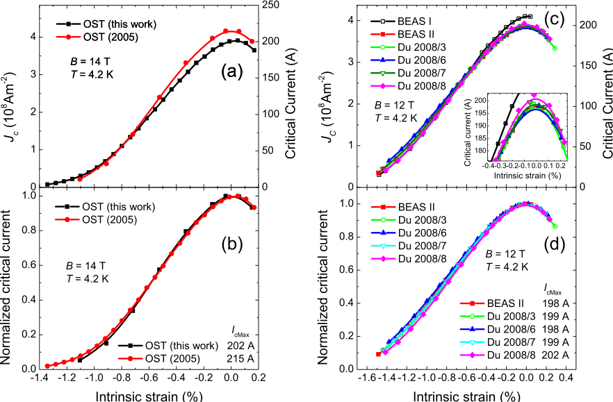

**Figure 15.** Comparison of the results obtained at Durham on the OST internal-tin [35] ((a) and (b)) and the BEAS bronze-route [33] ((c) and (d)) Nb3Sn strands. The deviations of the data are ∼2% for both types of strands. Lines are guides to the eye. 

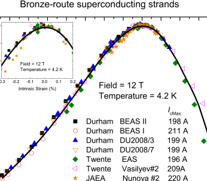

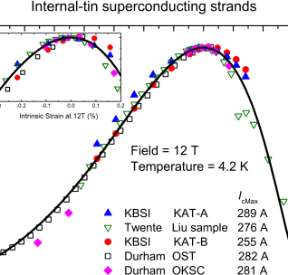

**Figure 16.** Interlaboratory comparisons of the normalized critical current as a function of intrinsic strain at 4.2 K and 12 T for bronze-route strands with similar maximum critical current [28, 34, 56]. Inset displays the data near zero intrinsic strain. The line is a guide to the eye. 

**Figure 17.** Interlaboratory comparisons of the normalized critical current as a function of intrinsic strain at 4.2 K and 12 T for internal-tin strands with similar maximum critical current [15, 57, 58]. Inset displays the data near zero intrinsic strain. The line is provided by the Durham scaling law for the BEAS II data. 

between the conditions (magnetic field, temperature and strain) that two strands are optimized at and their pivot-point, provides a important scale for determining whether the optimization conditions can be considered close to the operating conditions or not. Moreover the literature provides other reports of similar wires that have been optimized using different heat treatments that show pivot-points at high compressive strain values similar to those presented here [28, 

33, 35] and that some heat treatments lead to crossover behavior of _J_ c at high magnetic fields that can even occur at zero applied strain—observed in both bronze-route and internal-tin wires [27, 43–46]. Part of the difficulty results from untangling the role of the many different features of the final form of the bronze-route and internal composite strands. The spatial distribution of the Ti and/or Ta dopants that are used to increase _B_ c2 is different in these strands [47] 

with the result that dopants can appear throughout the bulk or preferentially at grain boundaries [3]. It has been shown that the Ti has significantly higher irreversibility strain than Ta [48]. The macro and micro-homogeneity of the binary material itself will differ significantly across the superconducting layer given the range of chemical environment that occurs in these composites (cf figure 1). The local strain state will vary throughout the strands and between the strands because of the different distribution and size of voids found in these complex composites. The grain size [49] and the local composition of the grains will be different for these two strands. The effective filament size (measured by the losses) and the superconducting cross-sectional area (at low strain) is much larger in the internal-tin wires than the bronze-route wires. All these issues will affect the functional form of the critical current density. But to date, in the literature, they are addressed within the approximations of WHH [50] theory for simple composite materials and (time-dependent) Ginzburg–Landau theory [39, 51, 52]. As a result one finds relatively smooth changes in the critical superconducting parameters as a function of field, temperature and strain and good agreement between experiment and theory for the magnitude of _J_ c. Under these approximations, one would expect the pivot-point to vary smoothly on a _B_ – _T_ – _ε_ phase diagram since beyond the superconducting phase transition, there are no additional phase transitions required to describe the performance of these intermetallic/metallic composites. However the data in figure 12 suggest that unlike the temperature and field dependence of the pivot-point, the strain dependence of the high tin content OST strand is quite different. One could even speculate that the data are characteristic of bimodal Nb3Sn where material with lower tin content has a broad strain dependence similar to _B_ c2 but the material with the very highest critical parameters has very low or even non-superconducting properties beyond the strain window from −0.3% to +0.1%. The data from Kupfer _et al_ showed in 1988 that one must also consider to some degree both intrinsic and extrinsic (e.g. _p_ and _q_ ) properties [46] in determining pivot-points. However given that for any single pinning mechanism one expects a single scaling law to operate, we cannot explain the strain window by invoking variations in pinning or multiple types of pinning in a strand. We conclude in the context of a very marked change in superconducting properties under strain but not temperature or field, that the high tin content OST strands have significantly reduced properties under strain because of the proximity of the tetragonal Nb3Sn phase which has low superconducting critical parameters [42] and is found for near stoichiometric (∼25 at% Sn) Nb3Sn material. 

Finally we note that: although the correlation between tetragonal Nb3Sn and low superconducting properties is well established in the literature [40, 42, 53, 54], recent results on very high homogeneity Nb3Sn (produced using hotisostatic-pressing) suggest that there may be some important special conditions under which tetragonal material can retain high critical superconducting parameters [55]; given the importance of phonons in determining the strain dependence of the superconducting properties in Nb3Sn [15, 29], 

they provide an explanation for the underlying strain sensitivity of the pivot-point reported here [40, 59–61]; in the optimization of Nb3Sn strands, one often tries to maximize properties that compete—for example a high heat-treatment temperature can increase the tin content and enlarge the A15 layer but it also increases grain size which is deleterious to high _J_ c [40, 45]. It is clear that one must be careful optimizing materials at low applied strains by increasing tin content if the operating conditions for the strand are in fact under high compression since the increase in tin content may increase the probability of producing materials with superconducting properties under uniaxial strain with low superconducting properties similar to tetragonal material. 

## **5. Conclusions** 

We have comprehensively characterized one advanced internal-tin (OST) and two advanced bronze-route (BEAS I and BEAS II) Nb3Sn strands. The _J_ c data show a clear pivot-point. Changing the magnetic field, temperature or strain from one side of the pivot-point to the other changes the highest _J_ c sample to the lowest _J_ c sample and vice versa. This paper provides evidence (cf figure 12) that regions with excellent critical superconducting parameters at low intrinsic strains appear to be very sensitive to strain indeed. We suggest this is probably related to uniaxial strain producing material similar to tetragonal phase Nb3Sn which has low superconducting properties. 

## **Acknowledgments** 

We would like to thank Mark Raine, Prapaiwan (Bew) Sunwong, Thierry Boutboul and Peter Readman for the many useful discussions in the production of this work. 

## **References** 

- [1] Matthias B T 1953 _Phys. Rev._ **92** 874–6 

- [2] Miyazaki T, Hase T and Miyatake T 2003 _Handbook of Superconducting Materials_ ed D Cardwell and D Ginley (Bristol: IOP Publishing) pp 639–72 

- [3] Vostner A and Salpietro E 2006 _Supercond. Sci. Technol._ **19** S90–5 

- [4] Zanino R and Savoldi-Richard L 2003 _Cryogenics_ **43** 79–90 

- [5] Zanino R, Mitchell N and Savoldi-Richard L 2003 _Cryogenics_ **43** 179–97 

- [6] Mitchell N 2003 _Fusion Eng. Des._ **66–8** 971–93 

- [7] Wada H and Kiyoshi T 2002 _IEEE Trans. Appl. Supercond._ **12** 715–7 

- [8] Devred A _et al_ 2006 _Supercond. Sci. Technol._ **19** S67–83 

- [9] Farinon S, Boutboul T, Devred A, Fabbricatore P, Leroy D and Oberli L 2007 _IEEE Trans. Appl. Supercond._ **17** 1136–9 

- [10] Sborchia M _et al_ 2011 _IEEE/NPSS 24th Symp. on Fusion Engineering_ S03D-l 

- [11] Bruzzone P _et al_ 2007 _IEEE Trans. Appl. Supercond._ **17** 1370 

- [12] Lu X F, Pragnell S and Hampshire D P 2007 _Appl. Phys. Lett._ **91** 132512 

- [13] Lu X F and Hampshire D P 2010 _Supercond. Sci. Technol._ **23** 025002 

- [14] Mitchell N 2003 _Cryogenics_ **43** 255–70 

- [15] Taylor D M J and Hampshire D P 2005 _Supercond. Sci. Technol._ **18** S241–52 

- [16] Bottura L 2008 _ITER TF Conductor Procurement Package 1.1.P6A_ 

- [17] Hampshire D P 1998 _Physica_ C **296** 153–66 

- [18] Hsiang T Y and Finnemore D K 1980 _Phys. Rev._ B **22** 154–63 

- [19] Walters C R, Davidson I M and Tuck G E 1986 _Cryogenics_ **26** 406–12 

- [20] Taylor D M J and Hampshire D P 2005 _Supercond. Sci. Technol._ **18** 356–68 

- [21] Cheggour N and Hampshire D P 2000 _Rev. Sci. Instrum._ **71** 4521–30 

- [22] Taylor D M J and Hampshire D P 2004 _Physica_ C **401** 40–6 

- [23] Tsui Y and Hampshire D P 2012 at press 

- [24] Cheggour N _et al_ 2012 4G02-4 MT22 at press 

- [25] Carty G J, Machida M and Hampshire D P 2005 _Phys. Rev._ B **71** 144507 

- [26] Godeke A 2005 Performance boundaries in Nb3Sn superconductors, University of Twente 

- [27] Muller H and Schneider T 2008 _Cryogenics_ **48** 323–30 

- [28] Vasilyev R, Kolenkova N, Vorobyeva A, Pantsyrny V and Nijhuis A 2011 _IEEE Trans. Appl. Supercond._ **21** 2505 

- [29] Taylor D M J, Keys S A and Hampshire D P 2002 _Physica_ C **372** 1291–4 

- [30] Taylor D M J and Hampshire D P 2005 _Supercond. Sci. Technol._ **18** S297–302 

- [31] Lu X F and Hampshire D P 2009 _IEEE Trans. Appl. Supercond._ **19** 2619–23 

- [32] Cheggour N 2011 private communication at MEM11—Okinawa 

- [33] Lu X F, Pragnell S and Hampshire D P 2008 _Durham University Report No. EFDA/06-1524_ 

- [34] Lu X F, Taylor D M J and Hampshire D P 2008 _Supercond. Sci. Technol._ **21** 105016 

- [35] Taylor D M J and Hampshire D P 2005 _University of Durham Report No. EFDA-03-1126_ 

- [36] Ilyin Y, Nijhuis A and Krooshoop E 2007 _Supercond. Sci. Technol._ **20** 186–91 

- [37] Bordini B 2011 private communication at MEM11—Okinawa 

- [38] Bottura L and Bordini B 2008 _IEEE Trans. Appl. Supercond._ **19** 1521–4 

- [39] Carty G and Hampshire D P 2008 _Phys. Rev._ B **77** 172501 

- [40] Flukiger R, Uglietti D, Senatore C and Buta F 2008 _Cryogenics_ **48** 293–307 

- [41] Uglietti D, Abacherli V, Cantoni M and Flukiger R 2007 _IEEE Trans. Appl. Supercond._ **17** 2615 

- [42] Godeke A 2006 _Supercond. Sci. Technol._ **19** R68–80 

- [43] Oh S, Park S-H, Lee C, Choi H J and Kim K 2010 _Physica_ C **470** 129–33 

- [44] Egawa K _et al_ 2004 _AIP Conf. Proc._ **77** 403 

- [45] Flukiger R, Senatore C, Cesaretti M, Buta F, Uglietti D and Seeber B 2008 _Supercond. Sci. Technol._ **21** 054015 

- [46] K¨upfer H R M-H and Schauer W 1988 _Adv. Cryog. Eng. Mater._ **34** 725 

- [47] Suenaga M, Welch D O, Sabatini R L, Kammerer O F and Okuda S 1986 _J. Appl. Phys._ **59** 840–53 

- [48] Cheggour N, Goodrich L F, Stauffer T C, Splett J D, Lu X F, Ghosh A K and Ambrosio G 2010 _Supercond. Sci. Technol._ **23** 052002 

- [49] Schauer W and Schelb W 1981 _IEEE Trans. Magn._ **17** 374–7 

- [50] Werthamer N R, Helfand E and Hohenberg P C 1966 _Phys. Rev._ **147** 295–302 

- [51] Campbell A M and Evetts J E 1972 _Adv. Phys._ **21** 395–9 

- [52] Dew-Hughes D 1974 _Phil. Mag._ **30** 293–305 

- [53] Foner S and McNiff E J Jr 1981 _Solid State Commun._ **39** 959–64 

- [54] Arko A J, Lowndes D H, Muller F A, Roeland L W, Wolfrat J, van Kessel A T, Myron H W, Mueller F M and Webb G W 1978 _Phys. Rev. Lett._ **40** 1590 

- [55] Zhou J, Jo Y, Sung Z H, Zhou H, Lee P and Larbalestier D C 2011 _Appl. Phys. Lett._ **99** 122507 

- [56] Nunoya Y, Isono T, Koizumi N, Hamada K, Matsui K, Nabara Y and Okuno K 2008 _IEEE Trans. Supercond._ **18** 1055 

- [57] Oh S, Park S H, Lee C, Chang Y, Kim K and Park P-Y 2005 _IEEE Trans. Appl. Supercond._ **15** 3462–5 

- [58] Liu B, Wu Y K, Liu F and Long F 2011 _Fusion Eng. Des._ **86** 1–4 

- [59] Vieland L J and Wicklund A W 1968 _Phys. Rev._ **166** 424–31 

- [60] Junod A, Jarlborg T and Muller J 1983 _Phys. Rev._ B **27** 1568–85 

- [61] Guritanu V, Goldacker W, Bouquet F, Wang Y, Lortz R, Goll G and Junod A 2004 _Phys. Rev._ B **70** 184526 

