IOP PUBLISHING 

SUPERCONDUCTOR SCIENCE AND TECHNOLOGY 

doi:10.1088/0953-2048/21/10/105016 

Supercond. Sci. Technol. **21** (2008) 105016 (11pp) 

## **Critical current scaling laws for advanced Nb 3Sn superconducting strands for fusion applications with six free parameters** 

## **Xi Feng Lu**[1] **, David M J Taylor**[1] **and Damian P Hampshire**[1] _[,]_[2] 

> 1 Superconductivity Group, Physics Department, Durham University, Durham DH1 3LE, UK 

> 2 Grenoble High Magnetic Field Laboratory, BP 166, F-38042 Grenoble Cedex 9, France 

E-mail: d.p.hampshire@dur.ac.uk 

Received 25 June 2008, in final form 21 July 2008 Published 5 August 2008 Online at stacks.iop.org/SUST/21/105016 

## **Abstract** 

This paper presents comprehensive measurements on three advanced ITER internal-tin Nb3Sn strands manufactured by Oxford Superconducting Technology (OST), Outokumpu Superconductors (OKSC) and Luvata Italy (OCSI) for fusion applications. The engineering critical current density ( _J_ C) at 10 _μ_ V m[−][1] and the index ( _n_ ) characterized over the range 10–100 _μ_ V m[−][1] are presented as a function of magnetic field ( _B_ ⩽ 15 T in Durham and _B_ ⩽ 28 T at the European high-field laboratory in Grenoble), temperature (2 _._ 35 K ⩽ _T_ ⩽ 14 K) and intrinsic strain (−1 _._ 1% ⩽ _ε_ I ⩽ 0 _._ 5%). Consistency tests show that the variable strain _J_ C data are homogeneous (±5%) along the length of the strand, and that there is a good agreement between different samples measured in Durham and in other laboratories (at zero applied strain). Limited strain cycling (fatigue) tests demonstrate that there is no significant degradation in the critical current density in the strands due to cyclic mechanical loads. 

_J_ C is accurately described by the scaling law that was derived using microscopic and phenomenological theoretical analysis and _n_ is described by the modified power law of the form _n_ = 1 + _r I_ C _[s]_[, where] _[ r]_[and] _[ s]_[are approximately constant.][Using variable strain high magnetic] field data at 2.35 K for the OCSI sample, it is demonstrated that these laws can be extended to describe data below 4.2 K. For these advanced strands, thirteen, nine and six free parameter fits to the data are considered. When thirteen or nine free parameters are used, the scaling laws fit the data very accurately. The accuracy with which the scaling law derived from fitting data taken at 4.2 K alone fits all the variable temperature data if calculated errors in fitting _J_ C are shown to be primarily determined by uncertainties in _T_ C. It is shown that six free parameter fits can successfully be used when, as with these advanced strands, the strain dependence of the normalized effective upper critical field at zero temperature is accurately known—this approach may provide the basis for comparing partial _J_ C _(B, T, ε)_ data on other similar strands from different laboratories. The extensive data presented here are also parametrized using an ITER scaling law recently proposed for characterizing Nb3Sn strands and the strengths and weaknesses of that approach are discussed. 

## **1. Introduction** 

It is clear that the management of energy resources is one of the most important issues at the beginning of the 21st century. Superconductivity has a critical contribution to make in the areas of both supply (e.g. magnetic fusion) and demand 

reduction (e.g. energy transmission and storage). In the context of the supply of energy, the USA DOE report—facilities for the future of science [1]—considers the $10B ITER fusion machine to be the world’s most important large scientific facility to be built in the next 20 years. Commercial fusion can only be realized with high magnetic field superconducting 

0953-2048/08/105016+11$30.00 

© 2008 IOP Publishing Ltd Printed in the UK 

magnets—indeed ∼1 _/_ 3 of the cost of the ITER tokamak is the magnets. The specifications for the current density of the superconducting strands are not too demanding but the work on a number of model coils for ITER [2–5], motivated the investigation of advanced Nb3Sn strands with higher critical current densities in an effort to decrease cost [2, 6]. As a result, significant industrial effort has transferred from fabricating bronze-route strands (ITER specification: non-Cu _J_ C ∼ 750A mm[−][2] at 4.2 K and 12 T, losses _<_ 400 kJ m[−][3] for a ±3 T cycle) to advanced internal-tin strands where higher _J_ C values can be achieved (ITER specification: non-Cu _J_ C ∼ 950 A mm[−][2] , losses _<_ 600 kJ m[−][3] ) at the expense of extra ac losses [2]. 

This paper presents comprehensive characterizations of three so-called advanced ITER Nb3Sn strands. They were manufactured by Oxford Superconducting Technology (OST), Outokumpu Superconductors (OKSC) and Luvata Italy (OCSI) for fusion applications. Comprehensive measurements of the engineering critical current density ( _J_ C) at 10 _μ_ V m[−][1] as a function of magnetic field ( _B_ ⩽ 15 T in Durham and _B_ ⩽ 28 T at the European high-field laboratory in Grenoble), temperature (2 _._ 35 K ⩽ _T_ ⩽ 14 K) and intrinsic strain (−1 _._ 1% ⩽ _ε_ I ⩽ 0 _._ 5%) are reported [7–13]. By making measurements of _J_ C _(B, T, ε)_ in the European high magnetic field facility in Grenoble in magnetic fields up to 28 T, direct measurements of the effective upper critical field were made. Hence we can report both intrinsic properties (e.g. effective upper critical field and effective critical temperature) and the extrinsic properties (e.g. critical current density) of these strands. The variable strain aspect of these measurements is very important [14–16] because large strains are unavoidable in large magnets, originating from the differential thermal contraction between the components of the magnets during the process of cool-down and also the large Lorenz forces produced during high-field operation. The structure of this paper is as follows. Section 2 describes the experimental procedure. This section includes a description of the reaction and mounting procedure used in this work and an outline of the probe used to make these measurements. Section 3 provides a description of the consistency tests to confirm the reliability and accuracy of these data; the raw electric field– current density ( _E_ – _J_ ), critical current density ( _J_ C) and index of transition ( _n_ ) data for the three strands and a comparison of equivalent data from other laboratories. Limited strain cycling data are also presented. In section 4, the analysis of the data is presented including the parametrization of the _J_ C data [13] and the _n_ data [17, 18] and the associated fitting parameters. Parametrization is made using both the Durham scaling law and an ‘ITER Nb3Sn critical surface parametrization’ recently proposed to characterize ITER strands [19]. In section 5, the intrinsic and extrinsic properties of the three advanced strands are compared. The universal behaviour for the strain dependence of the upper critical field is presented which leads to a six parameter fit for the advanced strand _J_ C _(B, T, ε)_ data. Finally the important conclusions are summarized. 

**Table 1.** Heat-treatment schedules for the three advanced internal-tin Nb3Sn strands. 

## **2. Experimental details** 

## _2.1. Samples and heat treatments_ 

The approach to preparing all three samples was similar. The samples all have a diameter of 0.81 mm and nominal Cu/nonCu ratios of 0.9–1.5 (OST ∼ 1, OCSI ∼ 1 _._ 5, OKSC ∼ 1). The hard chrome coating thickness is ∼1 _._ 9–2 _._ 4 _μ_ m and the residual resistivity ratio (RRR) is ∼100. The number of subelements is 19 (OST), 37 (OKSC) and 26 (OCSI). The number of filaments in each subelement is ∼160 for all three strands. The updated higher specification from ITER of current capacity for Nb3Sn strands is _J_ C _(_ non-Cu _) >_ 800 A mm[−][2] at 4.2 K and 12 T, which is equivalent to a critical current _(I_ C _) >_ 200 A [2]. We found _I_ C (4.2 K and 12 T) was ∼296 A (OST), ∼273 A (OKSC) and ∼216 A (OCSI), respectively. Hence, the performance of the advanced strands [20, 21] and the cable-in-conduit conductors [22] fabricated using these strands has attracted a great deal of interest from the fusion and superconductivity communities. 

All strands were heat-treated in an argon atmosphere on oxidized stainless-steel mandrels in a three-zone furnace, with an additional thermocouple positioned next to the sample in order to monitor and control the temperature using the heattreatment schedules shown in table 1. After reaction, the wires were etched in hydrochloric acid to remove the chrome and transferred to nickel-plated Ti–6Al–4V helical springs, to which they were attached by copper plating and soldering. The helical springs used for all these three strands have the same optimized tee-shaped cross section [23, 24]. 

## _2.2. Apparatus and techniques_ 

After the strands were attached to the springs, they were mounted onto a _J_ C _(B, T, ε)_ probe [9, 10, 13] built for the purpose of these experiments. The measurements were carried out in Durham in magnetic fields up to 15 T and in magnetic fields up to 28 T using the resistive magnets at the European LCMI-CNRS high magnetic field laboratory in Grenoble, France. For variable strain measurements in the probe, the spring is twisted to apply the strain to the wire via concentric shafts: the inner shaft connects a worm-wheel system at the top of the probe to the top of the spring, and the outer 

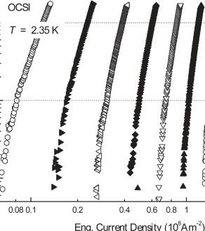

**Figure 1.** Log–log plot of electric field versus engineering current density (and voltage versus current) for the OCSI strand at a temperature of 2.35 K, with _ε_ A = −0 _._ 14% and integer magnetic 

shaft is connected to the bottom of the spring via the outer can. For variable temperature measurements above 4.2 K, the probe provides a vacuum chamber around the sample and the temperature is maintained during the measurement using three sets of independently controlled Cernox thermometers and constantan wire heaters [25] distributed to produce a uniform temperature profile along the turns of the spring. For measurements at 4.2 K and below, an outer can is used that contains a number of holes to admit liquid helium from the surrounding bath so that the sample is in direct contact with the liquid helium. For the measurements on the OCSI sample at 2.35 K, the liquid helium was pumped using a rotary pump and a pressure controller. The temperature was measured in zero field by the three Cernox thermometers that were attached to the sample and then held constant using vapour-pressure thermometry in-field. 

At specified values of magnetic field, temperature and strain, measurements are made of the voltage ( _V_ ) across sections of the strand as a function of the current through it. The voltage noise is typically a few nV, predominantly from the Johnson noise from the voltage taps. The voltage across a section of the wire (typical length: ∼20 mm) was measured using a nanovolt amplifier and a digital voltmeter and the current was measured using a four-terminal standard resistor. Each _J_ C measurement typically takes 2 min [26, 27]. Figure 1 shows a typical set of electric field–current density ( _E_ – _J_ ) (and voltage–current: _V_ – _I_ ) characteristics measured at 2.35 K with _ε_ A = −0 _._ 14% on a log–log plot. Throughout this paper we quote an engineering critical current density _J_ C (defined as the critical current ( _I_ C) divided by the entire cross-sectional area of the wire) as a function of applied magnetic field. We do not present the current density data in terms of non-Cu cross-sectional area or correct for the self-field produced by the strand, although these are important considerations to be included in magnet design and in order to understand flux pinning. Our choices avoid ambiguity or loss of clarity that can occur if the nominal value for the Cu/non-Cu ratio or 

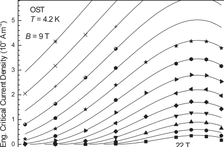

**Figure 2.** Engineering critical current density (and critical current) as a function of intrinsic strain at 4.2 K and integer magnetic fields between 9 and 22 T for OST strands. The lines are provided by the Durham scaling law. 

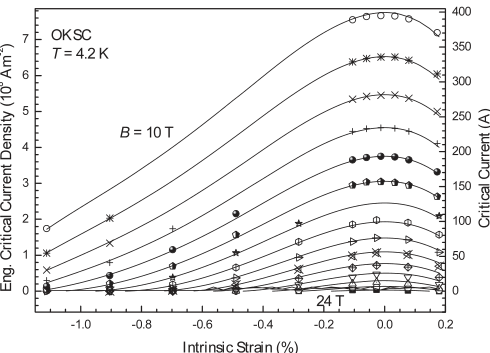

**Figure 3.** Engineering critical current density (and critical current) as a function of intrinsic strain at 4.2 K and integer magnetic fields between 10 and 24 T for OKSC strands. The lines are provided by the Durham scaling law. 

the area or distribution of the reacted Nb3Sn material in the strand is subsequently found to be significantly different from the nominal values. The electric field criterion used for _J_ C is 10 _μ_ V m[−][1] and the index of transition or _n_ value is calculated using the power law expression _E_ ∝ _J[n]_ with _E_ in the range between 10 and 100 _μ_ V m[−][1] (see the dotted lines in figure 1). Details of the experimental apparatus and techniques have been provided previously [24, 27–29]. 

## **3. Results** 

## _3.1. Critical current versus strain and field at variable temperature_ 

Figures 2, 3 and 4 show _J_ C (and _I_ C) as a function of intrinsic strain (or magnetic field) at 4.2 K in high magnetic fields for OST, OKSC and OCSI strands, respectively. By definition the 

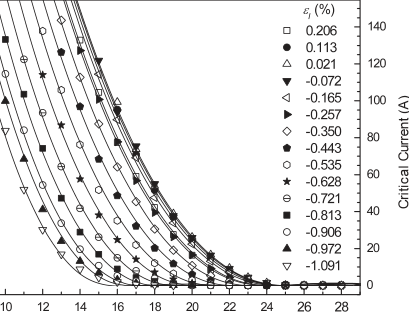

**Figure 4.** Engineering critical current density (and critical current) as a function of magnetic field at 4.2 K with intrinsic strain from −1 _._ 091% to +0 _._ 206% for OCSI strands. The lines are provided by the Durham scaling law. 

**Table 2.** Durham scaling law parameters for the OST strand (billet 7567-2)—13 free parameters. 

intrinsic strain ( _ε_ I) is given by 

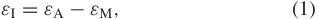

> where _ε_ M is chosen so that _εI_ is zero when _J_ C is a maximum [30–32]. The well-known inverted quasi-parabolic behaviour for _J_ C as a function of strain is clearly observed and the critical role of strain can be seen from noting that ±0 _._ 5% strain (4.2 K and 12 T) can decrease _J_ C by more than 50%. Figure 5 shows an interlaboratory comparison or multiple sample measurements for the three different strands at 4.2 K. The close agreement provides support for the reliability of the data presented. _J_ C (or _I_ C) data (with zero applied strain) measured in Durham show good agreement with the manufacturer’s data for the OST strand or on two different samples of the same OKSC strand and with another laboratory (i.e. CRPP—Center for Research in Plasma Physics of Switzerland) for the OCSI strand. Furthermore the strain dependence of the normalized _I_ C and the _n_ value for all three advanced internal-tin Nb3Sn strands are similar, as shown in figures 6(a) and (b). 

For ITER, which uses cable-in-conduit-conductors (CICC), the conductor operates at temperatures above 4.2 K. Figures 7 and 8 show _J_ C (and _I_ C) as a function of intrinsic strain at 6 K, 8 K, 10 K and 12 K in variable applied magnetic fields for OST and OKSC, respectively. Figure 9 shows _J_ C (and _I_ C) for the OCSI strand as a function of strain at 2.35 and 4.2 K. Figure 10 shows _J_ C (and _I_ C) as a function of magnetic field from temperatures of 2.35 to 16 K with a small applied compressive strain (−0 _._ 08%) for OCSI strands. The inset of figure 10 shows _J_ C 

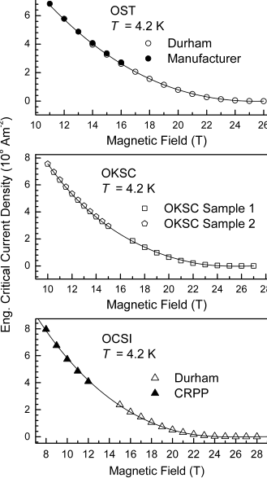

**Figure 5.** Comparisons of the critical current of the three advanced strands at zero strain and 4.2 K as a function of magnetic field. The lines are provided by the Durham scaling law. 

**Table 3.** Durham scaling law parameters for the OKSC strand (billet NT6801)—13 free parameters. 

**Table 4.** Durham scaling law parameters for the OCSI strand derived from variable field, variable temperature and variable strain data—9 free parameters. The four parameters whose values are given in bold were not varied in the fitting procedure. 

as a function of magnetic field at 6 K with _ε_ A = −0 _._ 725%. For figures 2–10, the solid lines are provided by the Durham scaling law, with free parameters determined by tables 2, 3 and 4. The accuracy of the fits will be discussed in section 4. 

The OST and OKSC strands were subject to a number of strain cycles during the course of the detailed _I_ C measurements and in the subsequent strain cycling tests. Figure 11 shows variable strain _I_ C data for the OST and OKSC strands at two different stages in the strain cycling procedure. For the 

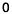

**----- Start of picture text -----** 
0 **----- End of picture text -----** 

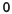

**----- Start of picture text -----** 
0 **----- End of picture text -----** 

**Figure 6.** (a) The normalized critical current at 4.2 K as a function of intrinsic strain for OST ( _I_ Max = 219 _._ 6 A), OKSC ( _I_ Max = 193 _._ 4 A) and OCSI ( _I_ Max = 149 _._ 6 A) strands; (b) _n_ value as a function of intrinsic strain for OST, OKSC and OCSI strands (at 4.2 K and 18 T). All the dotted lines are guides to the eye. 

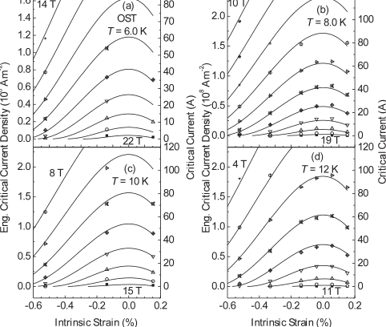

**Figure 7.** Engineering critical current density (and critical current) as a function of intrinsic strain at the integral magnetic fields shown. Panels (a)–(d) are at temperatures of 6 K, 8 K, 10 K and 12 K, respectively, for the OST strand. The lines are provided by the Durham scaling law using parameters in table 2. 

OST strand, the first dataset was obtained at the beginning of the experiment; for the OKSC strand, the first dataset was obtained in the second full strain cycle. For both strands, the second dataset (cycle 3 (increasing)) was obtained after the detailed _I_ C measurements had been performed, on the first leg 

**Figure 8.** Engineering critical current density (and critical current) as a function of intrinsic strain at integral magnetic fields shown. Panels (a)–(d) are at temperatures of 6 K, 8 K, 10 K and 12 K, respectively, for the OKSC strand. The lines are provided by the Durham scaling law using parameters in table 3. 

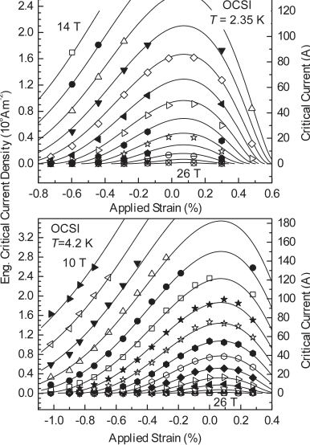

**Figure 9.** Engineering critical current density (and critical current) as a function of applied strain at temperatures of 2.35 K and 4.2 K for OCSI strands. The lines are provided by the Durham scaling law using parameters in table 4. 

of the fatigue-test cycles. Table 5 shows the values of critical current at 22 T, 4.2 K and zero applied strain at various stages throughout the experiment for the OST and OKSC strands. The final set of five strain cycles from +0 _._ 4% to −0 _._ 8% applied strain did not have a significant effect on _I_ C for either wire. The data show typical deviations of ±5% and confirm 

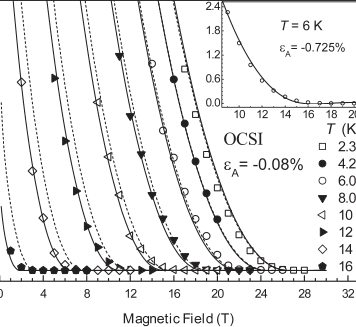

**Figure 10.** Engineering critical current density (and critical current) as a function of magnetic field with temperatures from 2.35 to 16 K for OCSI strands. The solid lines are provided by the Durham scaling law using parameters listed in table 4. The dotted lines are the Durham scaling law that is found if data at 4.2 K alone and a _T_ C of 17.5 K are used (parameters in table 6). The inset is the _J_ C versus magnetic field at 6 K with _ε_ A = −0 _._ 725%. 

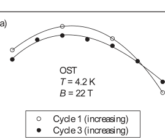

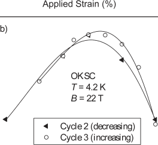

**Table 5.** The critical current of the OST and OKSC strands at 22 T, 4.2 K and zero applied strain after various strain cycles. 

||_I_C (22 T, 4.2 K,_ε_A =0) (A)|_I_C (22 T, 4.2 K,_ε_A =0) (A)|
|---|---|---|
|Applied strain history (%)|OST|OKSC|
|No strain cycles|14.1|—|
|0→+0_._3→−0_._8→+0_._3→0|16.0|11.6|
|0→+0_._3→0|14.5|10.7|
|0→−1→0|15.2|10.7|
|5×_(_0→+0_._4→−0_._8→0_)_|15.4|11.7|

previous observations that, under uniaxial cycling, _I_ C is not completely reversible because of the plastic deformation of some components of the Nb3Sn strands [33, 34]. The effects of plasticity are most pronounced at high magnetic fields where the changes in the upper critical field that occur are most easily measured. Hence we attribute the changes in critical current reported in table 5 to the effects of plasticity in the strands and conclude that the Nb3Sn superconducting filaments were undamaged during these measurements. 

## _3.2. n values_ 

> The _E_ – _J_ characteristics of the superconducting strands are known to follow the power law expression [35–38] _E_ ∝ _J[n]_ . 

> The _n_ values for the three strands were obtained from _E_ – _J_ characteristics over the range of technical interest from 10 to 100 _μ_ V m[−][1] electric field ( _E_ ). Typical _n_ -value data for the three strands are shown in figure 12 as a function of intrinsic strain. The _n_ value as a function of uniaxial strain shows the well-known inverted quasi-parabolic behaviour, similar to the critical current as a function of strain shown in figures 2 and 3. As such, in figure 13, _n_ − 1 is plotted as a function of _I_ C for the OST, OKSC and OCSI strands on a log–log plot [39]. The straight lines in figure 13 are discussed in section 4. 

**Figure 11.** The critical current of the OST and OKSC strands at 4.2 K and 22 T with different strain cycling histories. The symbols show the measured data. The lines are guides to the eye. 

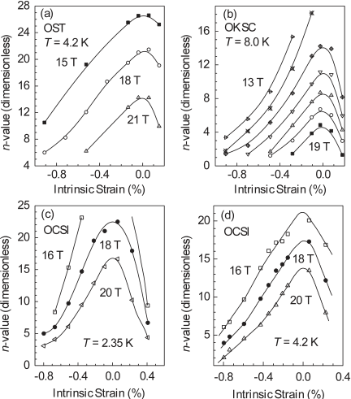

**Figure 12.** _n_ value as a function of intrinsic strain. (a) OST strand, _T_ = 4 _._ 2 K. (b) OKSC strand, _T_ = 8 K. (c), and (d) OCSI strand, _T_ = 4 _._ 2 K and 2.35 K, respectively. The lines are guides to the eye. 

## **4. Analysis** 

## _4.1. Variable strain critical current data analysed using scaling laws_ 

Historically, the usual starting point for deriving scaling laws has been the seminal phenomenological work by Dew- 

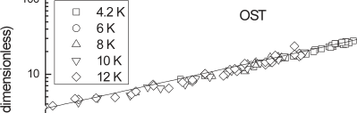

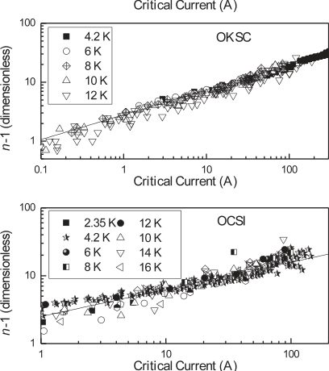

**Figure 13.** _n_ − 1 as a function of critical current for (a) OST, (b) OKSC and (c) OCSI strands. 

Hughes [40] and Kramer [41, 42] which leads to expressions for the volume pinning force ( _F_ P = _J_ C _B_ ) given by 

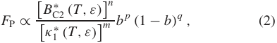

where _b_ = _B/B_ C2[∗] _[(][T][, ε)]_[,] _[κ]_ 1[∗] _[(][T][, ε)]_[is][the][Ginzburg–Landau] parameter [10] and _B_ C2[∗] _[(][T][, ε)]_[is][the][effective][upper][critical] field. Experimental work provided confirmation of temperature scaling and strain scaling parametrized in the simplified form: 

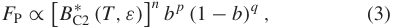

where the _n_ ∼ 1 for strain scaling and _n_ ∼ 2 for temperature scaling using equation (3). These differences in the exponent _n_ were resolved with a unified scaling law consistent with equation (2) when the strain and temperature dependence of the Ginzburg–Landau parameter were included [7, 9, 12, 28, 43, 44]. In the early phenomenological work, relatively simple models were proposed that led to a range of integral and half-integral values for the exponents, _m_ , _n_ , _p_ and _q_ . Incorporating both microscopic(BCS) and phenomenological (GL) theory [45–52] and considering the effects of strong coupling [10] leads to 

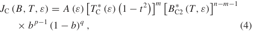

**Table 6.** Durham scaling law parameters for the OCSI strand derived from variable strain and variable field data at 4.2 K alone—eight free parameters. Five of the parameters whose values are given in bold were not varied in the fitting procedure. 

where _A(ε)_ is a complex strain-dependent term that includes weak and strong coupling terms [10], _t_ = _T /T_ C[∗] _[(ε)]_[ and] _[ T]_ C[ ∗] _[(ε)]_ is the effective critical temperature. Detailed experimental results [28] confirmed the theoretical expectation [40–42] that _m_ = 2, which eventually led to a scaling law for _J_ C _(B, T, ε)_ of the form [13] 

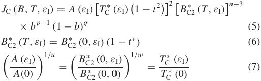

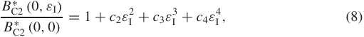

where _J_ C is the engineering critical current density, _ε_ A is the applied strain, _ε_ I is the intrinsic strain and _ε_ M is the applied strain at the peak in _J_ C [30–32]. In this paper, we have confirmed that the scaling law (equations (5)–(8)) parametrizes the _J_ C _(B, T, ε)_ data for the three advanced strands. The 13 free parameters in this scaling law were obtained for all three strands and the root-mean-square (RMS) differences between the measured and calculated values of _I_ C were less than 2 A over the whole measured range. Free parameters are specified in tables 2 and 3 for the OST and OKSC strands, respectively. We have also confirmed that there is little loss of accuracy parametrizing the three strands if the number of free parameters is reduced to nine and universal values of _n_ = 2 _._ 5, _ν_ = 1 _._ 5, _w_ = 2 _._ 2 and _u_ = 0 are used [13]. In table 4, the nine free parameter fit is presented for the OCSI strand obtained from fitting all the data. The data in figure 9 obtained at 2.35 K confirms that the scaling law accurately describes data in pumped helium. The good agreement between the data and the solid lines provided in the figures throughout this work confirms that the scaling law fits the data, using either nine or thirteen free parameters to within the uncertainty of the measurements. 

For the OCSI strand, we also investigated whether we could reduce the number of free parameters from nine to eight by assuming _T_ C[∗] _[(ε)]_[is][17.5][K][[][13][].] Table 6 shows the free parameters that were obtained. In figure 10, a comparison between the nine-parameter and eight-parameter fits are shown. It is clear that one can consider uncertainties in _T_ C[∗] _[(ε)]_[to][be][the][dominant][source][of][error][if][variable] temperature data are not available to characterize the strand in detail. 

By making measurements in magnetic fields up to 28 T in Grenoble, the upper critical fields of the three strands were 

**Table 7.** Durham scaling law parameters for the three strands using the universality of the strain dependence of the upper critical field with six free parameters. The seven parameters whose values are given in bold were not varied in the fitting procedure. 

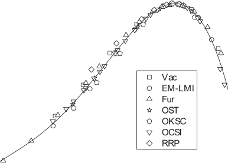

**Figure 14.** The normalized effective upper critical field at _T_ = 0 as a function of intrinsic strain for the OST, OKSC and OCSI strands, compared with previous data for other doped Nb3Sn strands. 

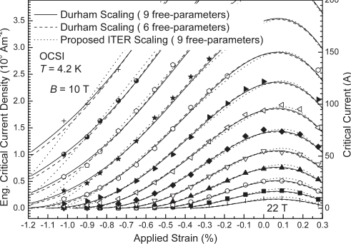

**Figure 15.** A comparison of the fit to the data using the Durham scaling law (solid lines + dashed lines) and the proposed ITER scaling law (dotted lines) to the data at 4.2 K for the OCSI strand. 

measured directly. In figure 14, the normalized effective upper critical field at _T_ = 0 ( _B_ C2[∗] _[(]_[0] _[, ε]_[I] _[)]_[)][as][a][function][of][intrinsic] strain is displayed for the OST, OKSC and OCSI strands and compared with data for other doped Nb3Sn strands. The data points can be considered to lie on a single curve with a scatter of ±5%. Unfortunately this scatter is too large to be useful for reducing the number of free parameters in scaling laws. However the scatter in _B_ C2[∗] _[(]_[0] _[, ε]_[I] _[)]_[is][much][smaller][if] only the advanced strands are considered on this general fitting curve. This reduced scatter motivated us to use a single strain dependence curve for all the advanced strands. For the three advanced strands in this work, we conclude that equation (8) can be rewritten: 

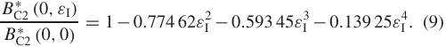

It is not ideal that the strain dependence of _B_ C2[∗][is] expressed as a polynomial function (equation (8)) with parameters _c_ 2, _c_ 3 and _c_ 4. A simple empirical relation _B_ C2[∗] _[(ε)/][B]_ C2[∗] _m_[=][1][ −] _[a]_[|] _[ε][I]_[|] _[u]_[was used by Ekin [][7][,][ 53][], but this] is only valid in the moderate strain range of | _εI_ | _<_ ∼0 _._ 5%. For early binary materials, _u_ is ∼1 _._ 7 and _a_ is ∼900 for compressive strain and _a_ is ∼1250 in tensile strain [7]. If we fix _u_ to be ∼1 _._ 7, we find that for these doped materials _a_ ∼ 1097 in compression (−0 _._ 5% _< ε_ I _<_ 0) and ∼1765 in tension (0 _< ε_ I _<_ 0 _._ 4%) consistent with the higher strain sensitivity [13] expected from theory. Nevertheless the 

accuracy with which equation (9) fits the data, together with the universal values for _n_ , _ν_ , _w_ and _u_ , can be used to reduce the number of free parameters in equations (5)–(8) down to six. In table 7, the six free parameters that characterize each of the three advanced strands are presented. Table 8 shows the RMS error in the critical current density associated with thirteen, nine and six free parameters. Figure 15 shows a comparison between the nine- and six-parameter fits. Although the six-parameter fit does have larger errors than when the scaling law includes more free parameters, we suggest that the six-parameter fit can provide a very effective framework for comparing interlaboratory partial _J_ C _(B, T, ε)_ datasets on other similar advanced internal-tin strands and for extrapolating from partial datasets. 

Careful consideration of the strain dependence of _B_ C2[∗] _[(]_[0] _[, ε]_[I] _[)]_[for][the][bronze-route][strand][in][figure][14][shows][that] _B_ C2[∗] _[(]_[0] _[, ε][I][)]_[is][less][strain-dependent][than][the][advanced][strands.] This is consistent with the higher value of _T_ C[∗] _[(ε)]_[for][the] bronze-route material and theoretical considerations that show that, as the critical temperature of binary Nb3Sn is reduced by doping, _B_ C2[∗] _[(]_[0] _[, ε]_[I] _[)]_[becomes][more][strain-sensitive][[][13][].] This also opens the possibility that a reliable set of values for _c_ 2, _c_ 3 and _c_ 4 in equation (8) for strands fabricated using the bronze-route process will, in the future, enable reliable six-parameter fits to partial datasets for those types of material. 

**Table 8.** The accuracy of various scaling laws when used to fit the data for the three advanced strands in this work. Four scaling laws are considered—the Durham scaling law with thirteen, nine and six free parameters as well as the proposed ITER scaling law which has nine free parameters. 

**Table 9.** Proposed ITER scaling parameters for the OST strand derived from variable field, variable temperature and variable strain data—nine free parameters. 

**Table 10.** Proposed ITER scaling parameters for the OKSC strand derived from variable field, variable temperature and variable strain data—nine free parameters. 

## _4.2. Relationship between n value and critical current_ 

The _n_ value characterizes the sharpness of the _E_ – _J_ transition in technological superconductors [18, 38, 54]: the sharper the transition, the larger the _n_ value [17]. The origin of the _n_ value in superconducting wires can be attributed to the distributions in the critical current and the flux-flow resistivity within the filaments [17, 18, 54–59]. In some simple cases, non-uniformity of the filaments can be the most important factor that determines the _n_ value [17, 18, 36, 57, 58], in others intrinsic effects are important [59]. Experimentally, we have found that the _n_ value approaches 1 as _I_ C tends to zero for all strands measured—and that this occurs for values of resistivity that are far below the normal state resistivity for either of the superconducting filaments or even the copper stabilizer in the strands. This result, together with the similar inverted quasi-parabolic strain dependence observed for both the _n_ value and _J_ C, provided the motivation to describe _n_ empirically using [39]: 

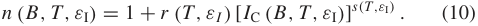

From the data in figure 13, we find that _s(T, ε_ I _)_ is approximately a constant for all the temperatures and applied strains for all three strands and _r (T, ε_ I _)_ only very weakly depends on the applied strain. These conclusions about the _n_ values are consistent with previous work on different types of strands [39]. The average values of _r_ and _s_ for each strand are shown in table 12. Recent work has suggested that thermal activation may be important [60]. However, we have found that strands with almost identical critical current density can have very different _n_ values which suggests that _J_ C is not always uniquely correlated with _n_ , but may also depend on how the current leaves and re-enters a filament to bypass a region of low _J_ C. We conclude that a detailed understanding of the connectivity between the superconducting regions and the lowresistivity normal regions will be required to provide further insight into _n_ values. 

## _4.3. An alternative ITER scaling law_ 

The extensive data in this work has also been parametrized using a scaling law proposed for characterizing interlaboratory 

**Table 11.** Proposed ITER scaling parameters for the OCSI strand derived from variable field, variable temperature and variable strain data—nine free parameters. 

**Table 12.** _r_ and _s_ values for the OST, OKSC, and OCSI strands. 

measurements of ITER strands. It has nine free parameters and is of the form 

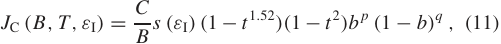

> where _s(ε_ I _)_ is a specified function of strain. This equation follows excellent work that explicitly incorporates the threedimensional nature of strain into the scaling law [32, 61–63]. It effectively includes a 1 _/κ_ term rather than the 1 _/κ_[2] found, for example, by Dew-Hughes [40] and Kramer [41, 42]. In tables 9–11, we have provided the free parameters obtained using equation (11) to fit all the data. Figure 15 shows how the parametrizations associated with equations (5) and (11), using the parameters in tables 4, 7 and 11, fit the data for the OCSI sample at 4.2 K. We conclude that equation (11), in its current form, does not yet fit the data throughout much of the strain range to within the uncertainty of the measurements and is particularly problematic for these strands in the range _ε_ applied _<_ −0 _._ 8%. 

Tabulations have been made available of the _J_ C and _n_ - value data, as well as the scaling law parametrization of _J_ C _(B, T, ε)_ and _n(B, T, ε)_ for these three advanced internaltin Nb3Sn strands on the web [64]. 

## **5. Discussion** 

The issue of how to parametrize _J_ C _(B, T, ε)_ data is complex and long-standing. Which parametrization is ‘best’ depends on how the parametrization is to be used. If the intention is to design a magnet with the strand, the priority may be to parametrize the critical current performance of the strands accurately over as large a range of field, temperature and strain as possible. In contrast, if one wishes to identify the dominant pinning mechanism operating, one may consider setting aside data close to the upper critical field [65] where the role of compositional variations in the strand may be important and set aside data at very low fields where general theoretical considerations [66] show that simple analytic formulae cannot describe accurately the magnetic field dependence of the free energy or the magnetization (that directly feed into expressions for the critical current density) and choose to fit the data in the intermediate field range alone. Unfortunately, even the simple form of equation (2) leads to complex scaling laws of which equations (5)–(8) are a reasonable but not unique choice. In real polycrystalline materials, the pinning sites are the grain boundaries. Recent visualizations of pinning in polycrystalline superconductors using the time-dependentGinzburg–Landau equations show that the flux flows along the grain boundaries past a wide flux-free region [67] caused by the pinning barrier at the grain boundaries. These visualizations confirm that those early phenomenological models that assume either that the flux-line lattice remains hexagonal or that it is completely disordered omit important features of real superconducting technological materials. Given that the electric fields produced when the current reaches the critical current density are generated at the grain boundaries, and that this is the location where there are strong local variations in the superconducting and normal state properties, one can expect the characteristic parameters in the scaling laws to represent distributions rather than simply the interior of the grains. Furthermore, only in special cases can one expect the exponents in equation (2) to be simple integral and half-integral numbers. Nevertheless, in the face of the complexity of stateof-the-art technological superconductors, we need to develop a standardized scaling law to facilitate comparisons between laboratories of _J_ C _(B, T, ε)_ data—particularly with the advent of ITER. Given that Summer’s scaling was used for many years [12] but has eventually been abandoned because it could not accurately parametrize the range of technological Nb3Sn wires that are being fabricated, it is important that any scaling law be sufficiently general that it accurately fits the _J_ C _(B, T, ε)_ data for the new strands that are being developed. 

This work shows that the free parameters for three advanced Nb3Sn strands are very similar, as expected for strands made with the same technique (internal-tin route) and similar heat-treatment schedules (see table 1). The effective critical temperature _T_ C[∗][is about 17 K for all strands.][The values] of the effective upper critical field _B_ C2[∗][(0, 0) are about 29 T—] consistent with doped Nb3Sn strands where, in the binary state, _B_ C2[∗][(0, 0) is about 24 T [][7][,][ 61][,][ 68][].][We suggest that all types] of Nb3Sn strand can be parametrized using a nine-parameter fit as used here. Importantly the universal behaviour observed 

_B_ C2[∗] _[(]_[0] _[,ε]_[I] _[)]_ for[these][three][advanced][strands][facilitates][fits] _B_ C2[∗] _[(]_[0] _[,]_[0] _[)]_[for] to _J_ C _(B, T, ε)_ data using just six free parameters. This clearly opens the possibility of providing a framework for comparing partial datasets from different laboratories and better extrapolations of partial _J_ C _(B, T, ε)_ datasets for other types of Nb3Sn strands once the strain dependence of _[B] B_ C2[∗] C2[∗] _[(][(]_[0][0] _[,ε][,]_[0][I] _[)][)]_ is accurately known. 

## **6. Conclusions** 

With high critical current density (∼1000 A mm[−][2] ) and acceptable ac losses, the advanced internal-tin Nb3Sn strands provide excellent materials for the ITER project. In this paper, we have reported comprehensive variable magnetic field, variable temperature and variable strain _J_ C data for three advanced ITER internal-tin Nb3Sn strands manufactured by Oxford Superconducting Technology, Outokumpu Superconductors and Luvata Italy, in magnetic fields up to 28 T. The new variable strain _J_ C data for OCSI strands below 4.2 K show that the scaling law can be successfully extended into this temperature range. The optimum parameters for each of the three advanced internaltin Nb3Sn strands are provided. The _n_ values from the _V_ – _I_ characteristics were fitted by the modified power law: _n(B, T, ε)_ = 1 + _r (T, ε)_ [ _I_ C _(B, T, ε)_ ] _[s][(][T][,ε)]_ and the values of _s(T, ε)_ and _r (T_ , _ε)_ were presented. It has been confirmed that there is an approximately universal polynomial function for the normalized effective upper critical field that holds very accurately for all three advanced strands. We propose that this result can be used to successfully parametrize _J_ C _(B, T, ε)_ in this type of material using just six free parameters. 

## **Acknowledgments** 

The authors acknowledge the help and support of E Salpietro, A Vostner, M Soorie and R Zanino. We also acknowledge the many discussions we have had with those in the community, including D Bessette, L Bottura, D Bruzzone, N Cheggour, J Duchateau, J Ekin, W H Fietz, H Fillunger, B Karlemo, P Komarek, R Maix, N Martovetsky, N Mitchell, J Minervini, A Nyilas, A Nijhuis, A Portone, K Osamura, L Savoldi Richard and J Schultz—although of course they are not responsible for the conclusions reached in this work. Finally we wish to thank the staff at GHMFL for their invaluable support during these nocturnal measurements. 

## **References** 

- [1] 2003 DOE http://www.science.doe.gov/ 

   - Scientific User Facilities/History/20-Year-Outlook-screen. pdf 

- [2] Vostner A and Salpietro E 2006 _Supercond. Sci. Technol._ **19** S90–5 

- [3] Zanino R, Mitchell N and Savoldi-Richard L 2003 _Cryogenics_ **43** 179–97 

- [4] Zanino R and Savoldi-Richard L 2003 _Cryogenics_ **43** 79–90 

- [5] Mitchell N 2003 _Fusion Eng. Des._ **66–8** 971–93 

- [6] Hong S _et al_ 2006 _IEEE Trans. Appl. Supercond._ **16** 1146–51 

- [7] Ekin J W 1980 _Cryogenics_ **20** 611–24 

- [8] ten Haken B, Godeke A and ten Kate H H J 1999 _J. Appl. Phys._ **85** 3247–53 

- [9] Cheggour N and Hampshire D P 1999 _J. Appl. Phys._ **86** 552–5 

- [10] Keys S A and Hampshire D P 2003 _Supercond. Sci. Technol._ **16** 1097–108 

- [11] Mart´ınez A and Duchateau J L 1997 _Cryogenics_ **37** 865–75 

- [12] Summers L T _et al_ 1991 _IEEE Trans. Magn._ **27** 2041–4 

- [13] Taylor D M J and Hampshire D P 2005 _Supercond. Sci. Technol._ **18** S241–52 

- [14] Welch D O 1980 _Adv. Cryog. Eng._ **26** 48–65 

- [15] Godeke A, ten Haken B and ten Kate H H J 2002 _Physica_ C **372–376** 1295–8 

- [16] Lim K C, Thompson J D and Webb G W 1983 _Phys. Rev._ B **27** 2781–7 

- [17] Warnes W H and Larbalestier D C 1986 _Cryogenics_ **26** 643–53 

- [18] Hampshire D P and Jones H 1987 _Cryogenics_ **27** 608–16 

- [19] Bottura L 2008 _ITER TF Conductor Procurement Package 1.1.P6A_ 

- [20] Taylor D M J and Hampshire D P 2005 _University of Durham Report No._ EFDA-03-1126 

- [21] Ilyin Y, Nijhuis A and Krooshoop E 2007 _Supercond. Sci. Technol._ **20** 186–91 

- [22] Bruzzone P _et al_ 2007 _IEEE Trans. Appl. Supercond._ **17** 1370 

- [23] Walters C R, Davidson I M and Tuck G E 1986 _Cryogenics_ **26** 406–12 

- [24] Taylor D M J and Hampshire D P 2005 _Supercond. Sci. Technol._ **18** 356–68 

- [25] Brandt B L, Liu D W and Rubin L G 1999 _Rev. Sci. Instrum._ **70** 104–10 

- [26] IEC: International Electrotechnical Commission 1999 _International Standard_ p IEC 61788-2 

- [27] Keys S A and Hampshire D P 2003 _Handbook of Superconducting Materials_ vol 2, ed D Cardwell and D Ginley (Bristol: IOP Publishing) pp 1297–322 

- [28] Keys S A, Koizumi N and Hampshire D P 2002 _Supercond. Sci. Technol._ **15** 991–1010 

- [29] Cheggour N and Hampshire D P 2000 _Rev. Sci. Instrum._ **71** 4521–30 

- [30] Luhman T, Suenaga M and Klamut C J 1978 _Adv. Cryog. Eng._ **24** 325–30 

- [31] Rupp G 1977 _IEEE Trans. Appl. Supercond._ **13** 1565–7 

- [32] Markiewicz W D 2004 _Cryogenics_ **44** 895–908 

- [33] Taylor D M J and Hampshire D P 2004 _Supercond. Sci. Technol._ **401** 40–6 

- [34] Suenaga M and Clark A F 1980 _Filamentary A15 Superconductors_ (New York: Plenum) 

- [35] Volker F 1970 _Part. Accel._ **1** 205 

- [36] Taylor D M J, Keys S A and Hampshire D P 2002 _Physica_ C **372** 1291–4 

- [37] Taylor D M J _et al_ 2004 _Durham University Report No._ EFDA/03-1103 

- [38] Bruzzone P 2004 _Physica_ C **401** 7–14 

- [39] Taylor D M J and Hampshire D P 2005 _Supercond. Sci. Technol._ **18** 297–302 

- [40] Dew-Hughes D 1974 _Phil. Mag._ **30** 293–305 

- [41] Kramer E J 1973 _J. Appl. Phys._ **44** 1360–70 

- [42] Kramer E J 1975 _J. Electron. Mater._ **4** 839–79 

- [43] Hampshire R G 1974 _J. Phys. D: Appl. Phys._ **7** 1847–63 

- [44] Hampshire D P, Jones H and Mitchell E W J 1985 _IEEE Trans. Magn._ **21** 289–92 

- [45] Allen P B and Dynes R C 1975 _Phys. Rev._ B **12** 905–22 

- [46] Bardeen J, Cooper L N and Schrieffer J R 1957 _Phys. Rev._ **108** 1175–204 

- [47] McMillan W L 1968 _Phys. Rev._ **167** 331–44 

- [48] Kresin V Z, Gutfreund H and Little W A 1984 _Solid State Commun._ **51** 339–42 

- [49] Kresin V Z 1987 _Phys. Lett._ A **122** 434–8 

- [50] Helfand E and Werthamer N R 1966 _Phys. Rev._ **147** 288–94 

- [51] Carbotte J P 1990 _Rev. Mod. Phys._ **62** 1027–157 

- [52] Orlando T P _et al_ 1979 _Phys. Rev._ B **19** 4545 LP-61 

- [53] Ekin J W 2007 _Experimental Techniques for Low-Temperature Measurements_ (Oxford: Oxford University Press) 

- [54] Hampshire D P and Jones H 1985 _Magnet Technol._ **9** 531–5 

- [55] Baixeras J and Fournet G 1967 _J. Phys. Chem. Solids_ **28** 1541–7 

- [56] Edelman H S and Larbalestier D C 1993 _J. Appl. Phys._ **74** 3312–5 

- [57] Warnes W H 1988 _J. Appl. Phys._ **63** 1651–62 

- [58] Warnes W H and Larbalestier D C 1986 _Appl. Phys. Lett._ **48** 1403–5 

- [59] W¨ordenweber R 1998 _Rep. Prog. Phys._ **62** 187–236 

- [60] Oh S _et al_ 2007 _Supercond. Sci. Technol._ **20** 851–8 

- [61] ten Haken B, Godeke A and ten Kate H H J 1995 _IEEE Trans. Appl. Supercond._ **5** 1909–12 

- [62] Markiewicz W D 2004 _Cryogenics_ **44** 767–82 

- [63] Markiewicz W D 2008 _Supercond. Sci. Technol._ **21** 054004 

- [64] Durham-Superconductivity-Group 2008 http://www.dur.ac.uk/ superconductivity.durham/ 

- [65] Cooley L D _et al_ 2004 _J. Appl. Phys._ **96** 2122–30 

- [66] Brandt E H 1997 _Phys. Rev. Lett._ **78** 2208–11 

- [67] Carty G and Hampshire D P 2008 _Phys. Rev._ B **77** 172501 

- [68] Wang S T _et al_ 1994 _IEEE Trans. Magn._ **30** 2344–7 

