EUROFUSION CP(15)09/01 

P. Bruzzone et al. 

## Design, Manufacture and Test of a 82kA React & Wind TF Conductor for DEMO 

(18th October 2015 – 23rd October 2015) Seoul, Korea 

This work has been carried out within the framework of the EUROfusion Consortium and has received funding from the Euratom research and training programme 2014-2018 under grant agreement No 633053. The views and opinions expressed herein do not necessarily reflect those of the European Commission. 

“This document is intended for publication in the open literature. It is made available on the clear understanding that it may not be further circulated and extracts or references may not be published prior to publication of the original when applicable, or without the consent of the Publications Officer, EUROfusion Programme Management Unit, Culham Science Centre, Abingdon, Oxon, OX14 3DB, UK or e-mail Publications.Officer@euro-fusion.org”. 

“Enquiries about Copyright and reproduction should be addressed to the Publications Officer, EUROfusion Programme Management Unit, Culham Science Centre, Abingdon, Oxon, OX14 3DB, UK or e-mail Publications.Officer@euro-fusion.org”. 

The contents of this preprint and all other EUROfusion Preprints, Reports and Conference Papers are available to view online free at http://www.euro-fusionscipub.org. This site has full search facilities and e-mail alert options. In the JET specific papers the diagrams contained within the PDFs on this site are hyperlinked. 

## Design, Manufacture and Test of a 82 kA React&Wind TF Conductor for DEMO 

P. Bruzzone, K. Sedlak, B. Stepanov, R. Wesche, L. Muzzi, M. Seri, L. Zani, M. Coleman 

_**Abstract**_ **— The Toroidal Field Coils (TFC) of the EUROFusion DEMO reactor call for Nb3Sn conductor with high field and high current. Another, major requirement is the cost effectiveness, to keep the ratio of investment to electric power in the same range of the competing energy sources (fission, hydro, coal, gas, etc.). The TFC proposed by the Swiss Plasma Center (SPC) is based on a double-layer Nb3Sn/NbTi winding. A react&wind flat cable is the core of the Nb3Sn conductor, with six grades to minimize the cost and maintain a roughly constant temperature margin of 1.5 K over the winding cross section.** 

**A short length section of the high grade Nb3Sn conductor has been manufactured using relevant industrial cabling equipment. One hundred kg of 1.5 mm Nb3Sn strand has been procured at WST with average Jc up to 15% higher than specified (Jc ≥ 1000A/mm[2] at 12T/4.2K). A dedicated cabling line has been set up at TRATOS cavi (Italy), producing over 350m of dummy cable and about 13 m of superconducting cable. The assembly of the cable into a conduit by longitudinal laser welding of two steel profiles is demonstrated, including the QA procedures.** 

**A test sample has been prepared at SPC by heat treating straight sections of the cable and encasing it into a steel jacket after the heat treatment to minimize the thermal strain. The test is carried out in three test campaigns at the EDIPO facility at SPC. The test program includes DC performance at the relevant operating conditions. An assessment of the conductor test results in terms of strand performance suggests that the applicable thermal strain is less than -0.33%. The DC performance is stable upon load cycles.** 

_**Index Terms**_ **— Fusion Conductors, Test facility, High magnetic field, High current superconducting cables** 

## I. INTRODUCTION 

THE conceptual design studies for the European DEMO fusion reactor, former led by EFDA-PPPT (European Fusion Development Agreement – Power Plant Physics and Technology) are coordinated since 2014 by the EUROFusion Consortium [1]. In the scope of the R&D activities, the Swiss Plasma Center (SPC) has designed, manufactured and tested a short section of Nb3Sn prototype Toroidal Field (TF) conductor. The layout of the prototype conductor presented 

Manuscript submitted October 20[th] 2015. 

P. Bruzzone, B. Stepanov, K. Sedlak and R. Wesche are with EPFL Swiss Plasma Center, CH-5232 Villigen-PSI, Switzerland (e-mail: Pierluigi.bruzzone@psi.ch). 

- L. Muzzi is with ENEA, Via E. Fermi 45, Frascati, I-00044, Italy. 

- M. Seri is with TRATOS Cavi Spa, I-52036 Pieve Santo Stefano, Italy. 

- L. Zani is with CEA Cadarache, 13108 St-Paul Lez Durance, France. 

M. Coleman is with EUROfusion Consortium, 85748 Garching, Germany. 

here is based on the requirements for the TF magnet system of DEMO given by the PROCESS [2] system code in the run of July 2012, summarized in [3], and by the 2013 version of CAD model maintained by EUROFusion [4]. Although the reference DEMO design evolved in the last two years (and will further evolve in next two decades), the technology demonstration achieved with the R&D is applicable with minor adjustments to a broad range of conductor layouts. 

## II. PROTOTYPE CONDUCTOR 

Besides the technical requirement and the engineering design criteria, the main driver for the selection of the magnet and conductor options is the cost effectiveness. Many different conductor designs can lead to electricity production in a fusion power plant, but only a cost effective magnet/conductor layout will allow selling electricity on the market. 

The design operating field for the high grade Nb3Sn conductor is 13.50 T and the operating current is 82.4 kA [5, 6]. The main design features are gathered below: 

- Double layer winding with six Nb3Sn conductor grades. 

- Use of NbTi conductor for double layers with B ≤ 6 T. 

- React&Wind (RW) to enhance the Nb3Sn current density. 

Beside the obvious cost advantage of the above features, the conductor grading provides a homogeneous temperature margin over the winding cross section, fulfilling the hot spot criterion also in the low field zone (opposite to the pancake windings). Further on, the layer winding allows grading of the conduit wall thickness (impossible for pancake windings), with a substantial saving of the radial build of the winding pack. As the cost of a fusion plant is proportional to the third power of the major radius, a saving of 120 mm in the radial build of the DEMO TF coil means straightaway 4% reduction of the overall costs of the plant. 

The RW technique for forced flow, cable-in-conduit conductors, with a flat cable encased in a welded conduit after the heat treatment, has been applied in the past [7, 8]. For the D-shaped TFC of DEMO, the cable curvature during the heat treatment must be twice the minimum radius in the magnet, Rht = 2Rmin = 7.18 m [5]. To limit the bending strain after manufacturing and assembly within εb = ± 0.1%, the flat cable thickness is tcable ≤ 2 Rht εb = 14.3 mm, considering the cable as a solid body. Most of the copper cross section for protection is added as an outer layer of high RRR thick copper wires. 

## _A. Cable Manufacture_ 

The cabling work was carried out at TRATOS cavi (Italy), where a dedicated cabling line was set up and 350 m of 

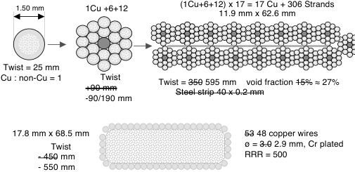

**----- Start of picture text -----** 
1.50 mm 1Cu +6+12 (1Cu+6+12) x 17 = 17 Cu + 306 Strands11.9 mm x 62.6 mm  Twist = 25 mm Cu : non-Cu = 1 Twist  Twist =  350  595 mm    void fraction  15%  ≈ 27% +90 mm Steel strip 40 x 0.2 mm -90/190 mm 17.8 mm x 68.5 mm 53  48 copper wires Twist  ø =  3.0  2.9 mm, Cr plated - 450  mm RRR = 500 - 550 mm **----- End of picture text -----** 

Fig. 1. Original specification (strikethrough) and actual parameters of the 12 m long superconducting cable produced at TRATOS cavi. 

dummy cable were produced to set up the parameters. From the 100 kg of Nb3Sn strand 1.5 mm diameter procured at WST [5] and 200 kg of high RRR copper wires procured at Luvata, about 12 m of superconducting cable was produced. The nonconformities about twist pitches, missing steel strip and cu wires are gathered in Fig.1, where the original spec is strikethrough. The double pitch used erroneously in the first cable stage (90+190 mm instead of 90 mm) led to strand damage, when the first stage is tensioned and one of the strands in the inner ring springs out, see Fig. 2 top. The smaller number of cu wires and the longer pitch led to gaps in the outer layer of cu wires, see also Fig. 2 bottom. 

Three cable sections, each ≈ 3.5 m long have been heat treated at SPC, held together by a segmented steel clamps, see Fig. 3 left. 

## _B. Conductor Jacketing_ 

For demonstration purposes, 2 m long sections of steel profile, Fig. 3 right, are manufactured by milling instead of hot extrusion method. They are used to set up the longitudinal laser welding and the related QA procedures and to produce a short length of conductor, using the cable section left over from the EDIPO [9] sample, see Fig. 2 bottom. The geometry of the side channels is modified to allow plane reflection of the sound wave at the ultra-sound quality control of the longitudinal welding. 

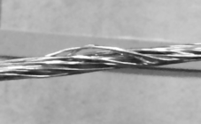

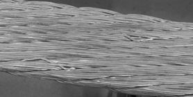

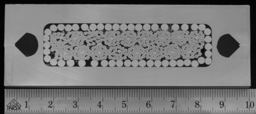

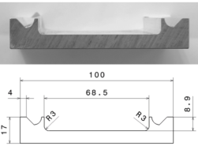

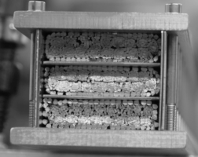

Two stationary fiber optic laser sources, each 4 kW nominal power, were used for the simultaneous longitudinal welding at Montanstahl, Switzerland. The speed of welding is in the range of 1 m / minute (comparable to the speed of compaction for the pull-through method). 

## _C. EDIPO Sample_ 

The 100 mm x 34 mm prototype conductor cannot be assembled in an EDIPO sample, where the maximum, net conductor width, excluding clamps and insulation, is in the range of 72 mm, see Fig. 4. For the EDIPO conductor sample, an “ad hoc” thin steel jacket is procured. 

For the sample termination, the outer layer of cu wires is cut away. The cr plating is chemically removed from the flat cable, which is eventually soldered into a brazed copper steel box. The two conductor sections are joined at the bottom using 

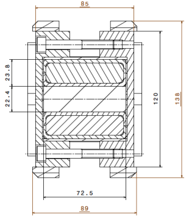

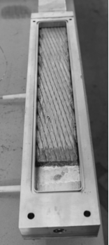

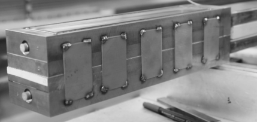

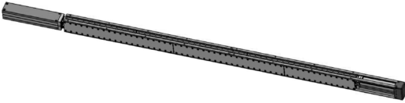

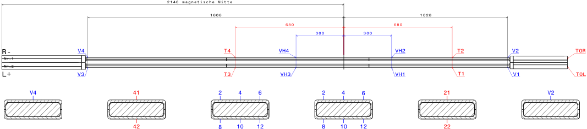

**----- Start of picture text -----** 
2146  ma g netische Mitte 1606 1028 680 680 300 300 R- V4 T4 VH4 VH2 T2 V2 T0R Nr.1 Nr.2 L+ V3 T3 VH3 VH1 T1 V1 T0L V4 41 2 4 6 2 4 6 21 V2 42 8 10 12 8 10 12 22 **----- End of picture text -----** 

Fi ~~g. 5 Instrumenta~~ tion scheme: ~~the voltage tap~~ s at the VH l ~~ocations are ma~~ de by an arra ~~y of six, the tem~~ perature is s ~~ensed by one se~~ nsor at each ~~broad side.~~ 

indium wires, see Fig. 4. For instrumentation, see Fig. 5. 

## III. THE TEST IN EDIPO 

## _A_ ~~_._~~ _The Term_ ~~_in_~~ _ation Re_ ~~_si_~~ _stance_ 

~~Since the co~~ ld instrum ~~entation test~~ s, a large ~~resistance w~~ as observed at t ~~h~~ e bottom joint and ~~u~~ pper terminations, t ~~o~~ tal ≈ 8 nΩ at high current/field. A large resistance, > 3 nΩ, was also observed in the region between the bottom joint and the high field zone, mostly at the right conductor section. 

At operating current > 75 kA, a quench started in the Right conductor next to the bottom joint, i.e. in the low field region. ~~The sampl~~ e was warmed up, the four termination boxes were ~~opened are~~ re-soldered. More voltage taps were also applied to ~~monitor each~~ section of the conductor, next to the termination. 

In the sec ~~o~~ nd test campaign, after termination improvement, ~~the resistance~~ dropped from ≈ 8 nΩ to 1.9 nΩ (which is a very ~~good value for EDIPO conductor samples). However, a~~ resistance up to 0.5 nΩ persisted in the low field conductor sections next to the termination, independent on operating current and field. At background field < 5 T, 100 kA can be reached, but the quenches at low field persisted at the same location for current > 82.1 kA when EDIPO field is > 5 T. 

## _B. The DC Performance_ 

The DC tests are carried out at I ≤ 70 kA to obtain a clean transition at the high field zone. A comparison of the Tcs results at 60 kA, 12.35 T background field shows in Fig. 6 that Tcs increased by ≈0.4 K in the second test campaign and that 

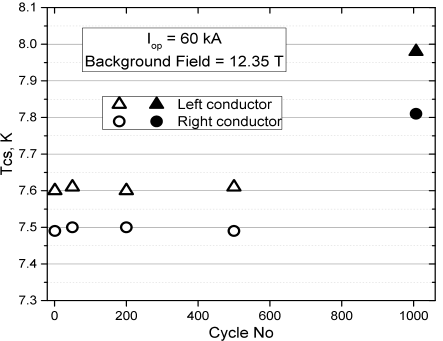

the Right conductor section has 0.2 K poorer performance than the Left section, suggesting that the performance in high field is affected by the termination artifact and the actual con ~~ductor perfo~~ rmance m ~~ay be higher~~ . 

~~V~~ oltage sp ~~ik~~ es are ob ~~s~~ erved duri ~~ng~~ the curr ~~e~~ nt ramp, ~~wi~~ th incr ~~easing frequ~~ ency and ~~amplitude~~ at higher ~~current, se~~ e Fig. 7. The lar ~~ge~~ st spikes are observe ~~d~~ in the low field zone, ~~o~~ f the Right conductor. No single spike is observed at zero background field. Comparing the left and right plots in Fig. 7, we observe that the amplitude and frequency of the spikes decreased after 500 load cycles and the resistance of the low field region drops by a factor of two. At the second test campaign, the resistance of the low field region dropped further, but the frequency and amp ~~litude of the spikes was in~~ the same range as at the start of th ~~e first campaign. At a third~~ test campaign, after improving t ~~he lateral support of the~~ conductor in the sample, the num ~~ber of spikes drastically~~ decreased, but the performance impro ~~ved o~~ nly marginally. 

~~The expected performance is assessed using the strand test~~ results, the scaling parameters [10], and the scaling law. The 

![Fig. 7. Voltage spikes in the 1[st] (top) and 500[th] (bottom) current ramp to 60 kA and 12.35 T background field during the first test campaign.](images/efcp150901.pdf-0005-17.png)

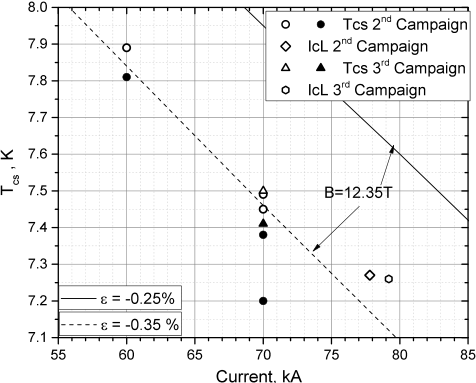

cool-down of the jacketed conductor from 300 K to 5 K and the cool-down of the free standing cable from 920 K to 300 K give the total average thermal strain, εth, estimated ≈-0.28%. On top of the incertitude on the estimation of εth, the strain distribution in multistage cable-in-conduit [11] must be accounted for the assessment of the conductor performance (the tail of the strain distribution is the relevant strain). 

The field to be retained in the scaling law for performance assessment is the effective field Beff, which accounts for the EDIPO background field, Bbackground, the self field distribution over the cable cross section [12] and the contribution from the return conductor in the sample, Beff = Bbackground + 0.0084 · Iop, where Iop is in units of kA. 

In Fig. 8 the assessment at Bbackground = 12.35 T is shown by dotted (ε = -35%) and solid (ε = -25%) lines. The results for the Left conductor are open symbols, for the Right conductor full symbols. The 70 kA Tcs test at 12.35 T is repeated at the start (500 cycles) and at the end (1000 cycles) of the second campaign, with 50 mK improvement in the Left conductor and degradation by 0.2 K in the Right conductor. At the third test campaign, both conductors improve. The take-off electric field for the DC runs is ≈ 30 µV/m. The n-index from the Ic test is n = 13, about half of the n-index of the free standing strand at the same current. 

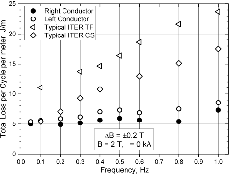

The performance of the L conductors, which is considered “less affected” by the termination artifact, is fitted by the scaling law with ε ≈ -0.33%. 

## _C. AC Loss_ 

The AC loss results per conductor unit length after 1000 load cycles (second campaign) are reported in Fig. 9. A rough comparison of the coupling current loss with ITER TF and CS conductors after cyclic loading shows that despite the large aspect ratio and the accidental lack of the median steel strip, the loss per meter is lower than typical ITER conductors. 

## IV. CONCLUSION 

The resistive sections next to the termination boxes, as well as the inadequate lateral support of the conductor sections are artifacts of the sample assembly, which cause sudden quench in the low field region for current > 82 kA and affect the DC performance at high field. The very low coupling loss, the frequent voltage spikes and the reduced n-index suggest strand movements in the cable, likely linked to the non-conformity in the manufacture (large void fraction in strand bundle and gaps in the outer layer of cu wires). 

The performance of the left conductor is stable over the cyclic loading, with a small improvement after 1000 load cycles. The performance fits the scaling law assessment with ε ≈ -0.33%, which satisfactory matches the estimate of average thermal strain (-0.28%) and a moderately small strain distribution (0.05%). The design target is demonstrated, despite the above artifacts and non-conformity. 

The AC loss after cyclic loading is lower than expected for a flat cable without resistive barrier in the median plane. 

About conductor layout, the manufacturing experience showed that it is difficult to obtain a perfectly closed layer of segregated copper wires around the flat cable. The layer of copper wires will be replaced in future by flat copper profiles with mixed matrix. The void fraction in the flat cable must also be reduced < 20%, as in the nominal design. 

The winding pack mechanical analysis showed that a smaller conductor aspect ratio mitigates the jacket membrane stress in the outer layers and save steel cross section. In future, a smaller aspect ratio will be used in the design. 

## ACKNOWLEDGMENT 

This work has been carried out within the framework of the EUROfusion Consortium and has received funding from the Euratom research and training programme 2014-2018 under grant agreement No 633053. The views and opinions expressed herein do not necessarily reflect those of the European Commission. 

The technical support of Paul Scherrer Institute, PSI, in the installation work (cryogenics, vacuum, wiring and plumbing) is acknowledged. 

## REFERENCES 

- [1] G. Federici et al., “Overview of EU DEMO design and R&D activities”, _Fusion Engineering and Design_ , 89, 7–8, 2014, 882-889. 

- [2] M. Kovari, R. Kemp, PH. Lux, J. Knight, J. Morris, D.J. Ward, http://www.ccfe.ac.uk/assets/Documents/Other/PROCESS_ a systems - 

- code for fusion power plants Part 1 Physics.pdf 

- [3] P. Bruzzone, K. Sedlak, B. Stepanov, “High current Superconductors for DEMO”, _Fusion Engineering and Design_ 88, 9-10, 2013, 1564-1568. 

- [4] J. Harman, WP13 Reference DEMO CAD Model Specification, https://idm.euro-fusion.org/?uid=2M9AJJ 

- [5] P. Bruzzone et al., “Design of Large Size, Force Flow Superconductors for DEMO TF Coils”, _IEEE Appl. Supercond_ . 24, 4201504 (2014). 

- [6] P. Bruzzone et al. “LTS and HTS high current conductor development for DEMO”, _Fusion Engineering and Design_ , 96-97, 2015, pp. 77-82. 

- [7] T. Ando et al., Fabrication and test of the Nb3Sn demo poloidal coil (DPC-EX), Fusion Technology 1990, 243 (Elsevier 1991). 

- [8] P. Bruzzone et al., ”Test Results of a large Size, forced Flow Nb3Sn Conductor, based on a Design alternative to the Cable-in-Conduit”, _IEEE Appl. Supercond_ . 17, 1473-1476, (2007). 

- [9] P. Bruzzone et al., ”EDIPO: the Test Facility for high-Current, highField HTS Superconductors”, submitted to _IEEE Appl. Supercond_ . (2015). 

- [10] A. Nijhuis, UT-MCD-4.3-T01-FD (2LJMHD), 6 March 2015, Eurofusion IDM server, https://user.euro-fusion.org/?uid=2LJMHD. 

- [11] H. Bajas et. al., “Approach to heterogeneous strain distribution in cablein-conduit conductors through finite elements simulations”, _IEEE Appl. Supercond_ . 22, 4803104, (2012). 

- [12] K. Sedlak, WP#1 – Electromagnetic Analysis (2LN3K8), 21 Nov. 2014, Eurofusion IDM server, https://user.euro-­‐fusion.org/?uid=2LN3KB. 

- [13] A. Panin et al., “Analysis approaches to resolve structural issues of European DEMO Toroidal Field Coil System at design stage”, presented at MT24, Seoul, October 2015. 

