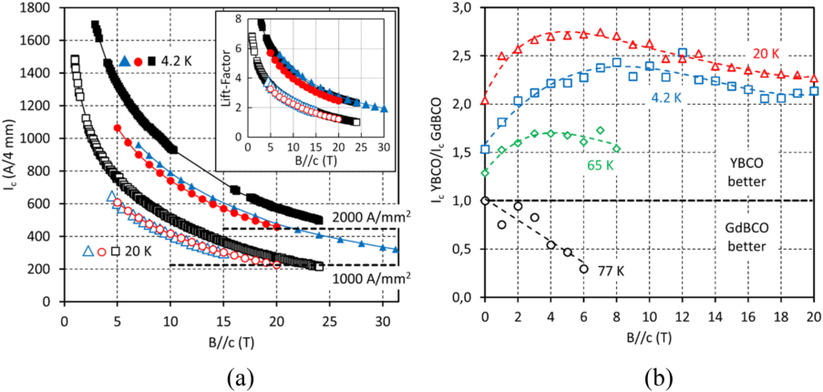
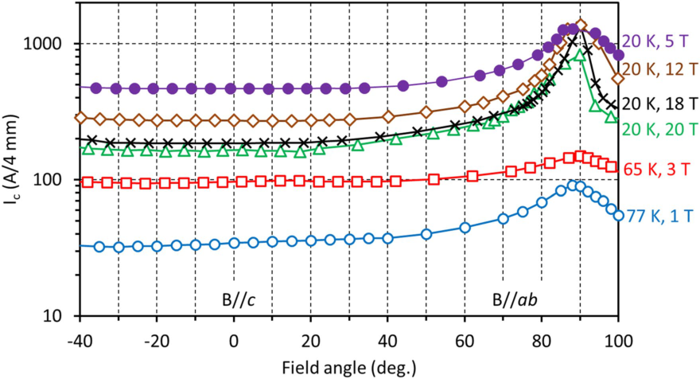
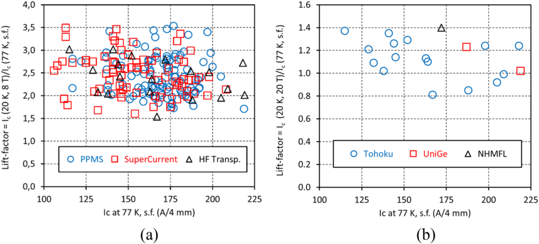
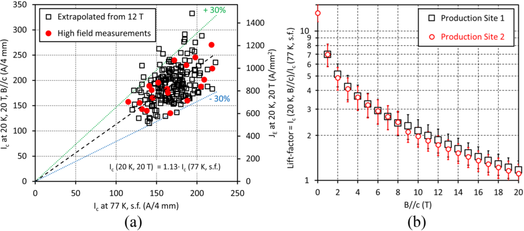
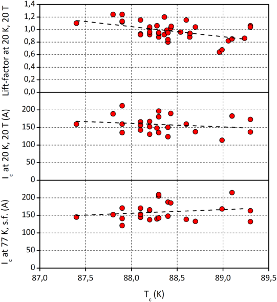
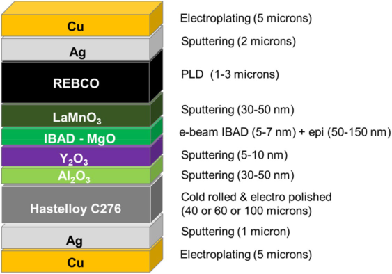
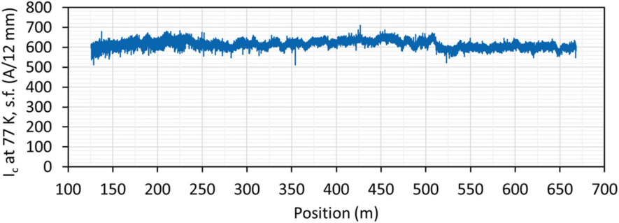

www.nature.com/scientificreports 

## **OPEN Development and large volume production of extremely high Cu O current density YBa2 3 7 superconducting wires for fusion** 

**A. Molodyk[1,2]**[*] **, S. Samoilenkov[1,2] , A. Markelov[1] , P. Degtyarenko[2,3] , S. Lee[4] , V. Petrykin[4] , M. Gaifullin[4] , A. Mankevich[1] , A. Vavilov[1,2,4] , B. Sorbom[5] , J. Cheng[5] , S. Garberg[5] , L. Kesler[5] , Z. Hartwig[6] , S. Gavrilkin[7] , A. Tsvetkov[7] , T. Okada[8] , S. Awaji[8] , D. Abraimov[9] , A. Francis[9] , G. Bradford[9] , D. Larbalestier[9] , C. Senatore[10] , M. Bonura[10] , A. E. Pantoja[11] , S. C. Wimbush[11] , N. M. Strickland[11] & A. Vasiliev[12,13,14]** 

**The fusion power density produced in a tokamak is proportional to its magnetic field strength to the fourth power. Second-generation high temperature superconductor (2G HTS) wires demonstrate remarkable engineering current density (averaged over the full wire),** _**JE**_ **, at very high magnetic fields, driving progress in fusion and other applications. The key challenge for HTS wires has been to offer an acceptable combination of high and consistent superconducting performance in high magnetic fields, high volume supply, and low price. Here we report a very high and reproducible** _**JE**_ **in practical HTS wires based on a simple YBa2Cu3O7 (YBCO) superconductor formulation with Y2O3 nanoparticles, which have been delivered in just nine months to a commercial fusion customer in the largest-volume order the HTS industry has seen to date. We demonstrate a novel YBCO superconductor formulation without the** _**c**_ **-axis correlated nano-columnar defects that are widely believed to be prerequisite for high in-field performance. The simplicity of this new formulation allows robust and scalable manufacturing, providing, for the first time, large volumes of consistently high performance wire, and the economies of scale necessary to lower HTS wire prices to a level acceptable for fusion and ultimately for the widespread commercial adoption of HTS.** 

The discovery of high temperature superconductivity (HTS) in  1986[1] generated great hope for widespread superconducting devices. Today we can see that it took more time and effort to develop HTS technology than many had anticipated. But that development brought about practical 2G HTS wires that now can revolutionise some of the most basic branches of the world’s economy. Among their many important uses, HTS wires enable very high magnetic fields with a relatively low power input. The 26.4 T all-HTS  magnet[2] and the 45.5 T hybrid HTS magnet[3] are recent landmark achievements in this field. Perhaps the most significant impact HTS materials can make is in magnetic confinement fusion  devices[4][,][5] . Fusion has the potential to rewrite the electric power landscape of mankind, solving rapidly accelerating climate issues and bringing affordable, non-polluting power to billions of people. 

The progress of HTS technology has been especially impressive in the last decade, culminating recently in _JE_ values in excess of 1000 A/mm[2] at 4.2 K in 18–20 T magnetic  field[6][,][7] . While this is ample for some  applications[8] , higher _JE_ opens new frontiers in magnets for fusion  reactors[9][,][10] , particle  accelerators[11][–][13] , magnetic resonance imaging[14] , nuclear magnetic resonance  spectroscopy[15][,][16] and space  detectors[17] . For instance, a minimum 

1S-Innovations, Moscow, Russia. 2SuperOx, Moscow, Russia. 3Joint Institute for High Temperature, Russian Academy of Sciences, Moscow, Russia.[4] SuperOx Japan, Kanagawa, Japan.[5] Commonwealth Fusion Systems, Cambridge, MA, USA. 6Massachusetts Institute of Technology, Cambridge, MA, USA. 7P.N. Lebedev Physics Institute, Russian Academy of Sciences, Moscow, Russia.[8] Institute for Materials Research, Tohoku University, Sendai, Japan.[9] National High Magnetic Field Laboratory, Florida State University, Tallahassee, FL, USA.[10] University of Geneva, Geneva, Switzerland.[11] Robinson Research Institute, Victoria University of Wellington, Wellington, New Zealand.[12] National Research Centre “Kurchatov Institute”, Moscow, Russia.[13] Shubnikov Institute of Crystallography, Russian Academy of Sciences, Moscow, Russia.[14] Moscow Institute of Physics and Technology, Dolgoprudny, Russia.[*] email: a.molodyk@superox.ru 

**Scientific Reports** |         (2021) 11:2084 

| https://doi.org/10.1038/s41598-021-81559-z 

engineering current density of 700 A/mm[2] at 20 K, 20 T is essential for the magnet system of the prototype commercial fusion device SPARC[18] , which is being designed and constructed by a collaboration of MIT and Commonwealth Fusion Systems (CFS). This target was a significant challenge when first announced, because even the best laboratory samples could barely reach that performance. Moreover, all the above applications require large wire volumes, the SPARC device for example needing approximately 10,000 km of 4 mm wide wire. For most commercial applications of HTS, the wire cost is still too high for commercial viability and only robust, highvolume manufacturing can lower the price to a level amenable to the widespread commercial adoption of  HTS[19] . 

In this article we demonstrate very high engineering current density in practical 2G HTS wires based on a simple YBCO superconductor formulation with  Y2O3 nanoparticles. We present a large and consistent dataset of critical current measurements independently performed in leading laboratories worldwide on wires delivered in large industrial volumes for a commercial fusion power customer. 

## **Concept** 

Our concept for developing HTS wire with high in-field performance suitable for large volume, low cost manufacturing was the following: 

- (1) Select yttrium as the rare earth element in place of gadolinium or europium as commonly used in the 2G HTS wire industry. We choose yttrium because of its small ionic radius, which results in higher charge carrier (hole) density in the superconducting  CuO2 planes and also because it confers a lower electronic . 

- anisotropy and higher irreversibility  field[20] 

- (2) Employ uniformly distributed  Y2O3 nanoparticles, native to YBCO, as vortex pinning centres, thus keeping the composition and microstructure simple to facilitate reproducible fabrication. This contrasts with the common approach of introducing extrinsic nano-columns aligned about the REBCO _c_ -axis as pinning centres[21][–][25] , a proven challenge to industrial  implementation[25][–][28] . 

- (3) Take advantage of the very low neutron cross-section of Y of 1.28 b compared to those of Gd (49,000 b) and Eu (4570 b), which is particularly important for application in a fusion reactor. 

- (4) Use thin substrate and deposit thick YBCO films, to further increase engineering current density. 

## **Experimental results** 

In 9 months, we manufactured over 300 km of 4 mm wide YBCO wire, delivering most of it to CFS. This has been the largest completed order in the history of the 2G HTS wire industry. We fabricated the wire on a strong Hastelloy C276 substrate with a buffer layer architecture based on MgO textured using ion beam assisted deposition and with the HTS layer grown by pulsed laser deposition (PLD), as explained in the Methods section. The YBCO layer contains uniformly distributed  Y2O3 nanoparticles with (001) and (110) axial orientation, with the average density of 4000 ± 2000 μm[-2] . Microstructural analysis is presented in Supplementary Information. 

**Superconducting properties in high magnetic field.** In Fig. 1a we present the superconducting performance at low temperature and high magnetic field oriented perpendicular to the wire surface ( _B//c_ ) of three representative YBCO wires measured at high field facilities in Switzerland, Japan and the USA. The samples differed in substrate thickness: 40, 60 and 100 µm and YBCO layer thickness: 2.55, 2.82 and 3.28 µm, respectively. In all three samples very high values of critical current were achieved, among the best reported to date for commercial 2G HTS  wire[7][,][26][,][30][–][34] . In particular, an _Ic_ at 20 K, 20 T in the 220–270 A/4 mm range and an _Ic_ at 4.2 K, 20 T in the 450–570 A/4 mm range were measured. Record _J_ E values for commercial wires of over 1000 A/mm[2] at 20 K, 20 T and over 2000 A/mm[2] at 4.2 K, 20 T were established for 40 μm substrate with 5 μm per side of stabilising copper. Despite a certain variation in the _Ic_ values in the three samples, there is a low statistical scatter in the ratio of the _Ic_ at 4.2 and 20 K to that at 77 K in self-field (the so-called lift-factor explained in the Methods section), for these samples (Fig. 1a, inset), as well as for the entire production as we show below. This verifies the applicability of the lift-factor approach in the case of this simplified YBCO wire, in contrast to previous reports for other, more complex 2G HTS wire  formulations[26][,][27] . 

In Fig. 1b we compare the relative performance of our YBCO and  GdBCO[35][,][36] wires prepared on the same production line, over a wide range of temperatures and magnetic fields, using a representative _Ic_ at 77 K in selffield of 180 A/4 mm for wires of both types. In the entire range of magnetic fields studied, at temperatures of 65 K and below, YBCO wire outperforms GdBCO wire by a factor of 1.5 to over 2.5. Only at 77 K is GdBCO preferable for application. 

Due to the structural anisotropy of YBCO, _Ic_ depends on the magnetic field direction (Fig. 2). The maximum of _Ic_ occurs with field applied parallel to the wire surface (90°, _B//ab_ ). Importantly, there is no _Ic_ peak at the 0° ( _B//c_ ) orientation, as is typical for REBCO films with _c_ -axis correlated artificial pinning  centres[21][–][25] . In a wide angular region about the _B//c_ orientation, the _Ic_ dependence is flat, with the _Ic_ variation below 3%. Therefore, for YBCO wire the minimum _Ic_ for all field orientations, an important parameter for practical use, is at _B//c_ . 

**Statistical verification of results.** HTS applications require _reproducible_ production at high volume and low cost. Our success is supported by a large and self-consistent data set on samples taken from the front and back ends of the 300–600 m lengths which make up the 300 km of wire underpinning this paper. The samples were evaluated by multiple labs and the finding of identical performance of wire sourced from our two identical production lines in Russia and in Japan. Figure 3 shows the statistical scatter of lift-factors at 20 K determined from measurements with 6 different systems. The data show no pronounced dependence of _Ic_ lift-factor (the 

**Figure 1.** ( **a** ) Critical current, _Ic_ , in magnetic field ( _B//c_ ) at 4.2 and 20 K of three YBCO wire samples measured at University of Geneva (red curves), Tohoku University (black curves) and the NHMFL at Florida State University (blue curves). The 1000 and 2000 A/mm[2] marks for engineering current density, _JE_ , are provided for wire on 40 μm substrate with 5 μm per side stabilising copper layer. In the inset: lift-factors based on 77 K, self-field _Ic_ values. Very high values of _Ic_ and _JE_ have been achieved. Although the _Ic_ values in the three samples are noticeably different, the lift-factor values are very close, manifesting good process reproducibility and predictability of superconducting performance. ( **b** ) Ratios of _Ic_ values of YBCO and GdBCO wires at 4.2, 20, 65, and 77 K in magnetic field. Wherever the ratio is greater than unity, the superconducting performance of YBCO is superior to that of GdBCO and vice versa. Dashed lines on the plot are provided for guidance only. 

**Figure 2.** Angular dependences of _Ic_ in magnetic field of YBCO wire at 77 K, 1 T; 65 K, 3 T and 20 K, 5, 12, 18, and 20 T. Measurements were performed at Tohoku University. 0° corresponds to the _B//c_ orientation and 90° corresponds to the _B//ab_ orientation. Within the accuracy of measurement, the minimum value of _Ic_ for all field orientations is at _B//c_ . At 20 K, _Ic_ at _B//ab_ stays almost constant with increasing magnetic field. We believe the smaller value of _Ic_ at _B//ab_ at 20 T may be an artefact due to the sharp _Ic_ angular peak and the discrete angle step during measurements. 

ratio of the _Ic_ at 20 K, high field to _Ic_ at 77 K, self-field), even though _Ic_ values ranged quite widely as we developed our ability to make thicker HTS  layers[37] . 

Figure 4a presents the correlation between _Ic_ (77 K, self-field) and _Ic_ (20 K, 20 T). The 200 points cluster tightly along an average “lift-factor” line with an approximately 15% standard deviation. For wires made on a 40 μm 

**Figure 3.** Statistical scatter of lift-factors at ( **a** ) 20 K, 8 T ( _B//c_ ) and ( **b** ) 20 K, 20 T ( _B//c_ ) measured by different apparatus. Data points from different measurement apparatus constitute one set. There is no pronounced dependence of the lift-factor value on the _Ic_ at 77 K in self-field. (We provide a table with lift-factor values at 4.2 and 20 K in Supplementary Information). 

**Figure 4.** Statistical data for the new YBCO wire at 20 K in magnetic field ( _B//c_ ). ( **a** ) Correlation between _Ic_ at 77 K in self-field and _Ic_ at 20 K, 20 T. Linear approximation starting at origin gives the slope (lift-factor) of 1.13. Almost all data points lie within the + /− 30% corridor, which is approximately 4 σ. The right vertical axis represents engineering current density for wire on a 40 μm thick substrate with 5 μm per side stabilising copper layer, and a total wire thickness of 56 μm. ( **b** ) Comparison of lift-factors at 20 K for YBCO wires fabricated at two production sites in Russia and Japan. The lift-factor values almost coincide, well within the statistical spread. 

thick substrate with 5 μm per side stabilising copper layer, _J_ E is in the 500–1400 A/mm[2] range, 87% of the wires having a _JE_ above 700 A/mm[2] and 72% having a _JE_ of 700–1000 A/mm[2] . 

Figure 4b compares lift factors at 20 K for both our Russian and Japanese production lines. The differences are very small and well within the statistical variation. This verification is of high practical importance, though not surprising, because we use identical production equipment at each site. The good reproducibility is due to two main reasons: the simple microstructure of the YBCO layer containing no _c_ -axis correlated nano-columns and the reproducible and well-controlled PLD technology used to grow the HTS layer. 

## **Discussion** 

We have established a record engineering current density in commercial wire of over 1000 A/mm[2] at 20 K, 20 T and over 2000 A/mm[2] at 4.2 K, 20 T. These values surpass the ambitious _JE_ targets of 700 A/mm[2] at 20 K, 20 T for fusion  magnets[18] and of 1000 A/mm[2] at 4.2 K, 20 T for accelerator  magnets[12] . This is possible through the combination of a high in-field _Ic_ and a thin substrate. Especially important is that we obtain these extraordinarily high values not in select champion samples but in hundreds of kilometres of routinely manufactured wires. 

Indeed, this achievement has caused SPARC to raise their specification to 750 A/mm[2] because of the benefits to the system design. 

A common approach to enhance _Jc_ in magnetic field has been to introduce artificial pinning centres (APC) of _c_ -axis correlated nano-columns of various  perovskites[21][–][25] , a technique utilised in commercial  PLD[28][,][29][,][38] and metalorganic chemical vapour deposition (MOCVD) film  growth[6] . Although the highest _Jc(B)_ values have been obtained in this  way[39][–][41] , the complex HTS film nanostructure results in considerable spread in commercial wire in-field  performance[26][,][27] and greatly narrows the processing window, requiring slower deposition rates to achieve maximum _Jc_ enhancement[28][,][29] . For 2G HTS wire with nano-columnar APC, more typical is a faster decay of critical current with increasing magnetic field than for wire without  APC[42] . At a temperature of approximately 30 K and below, most pinning occurs on abundant point defects; therefore, APC only indirectly influence the pinning properties by altering the point defect concentration and distribution. 

The overall trend to improving HTS wire performance has long been to keep increasing the complexity of the material composition and microstructure by introducing such APC defects, a path which is in direct conflict with nurturing mature, cost-effective mass production technologies. We attribute the great stability of our commercial production to our choice of native  Y2O3 nanoparticles as dominant pinning centres. They do not increase the chemical complexity of YBCO and they impart a simple, uniform nanostructure, amenable to reproducible fabrication. 

Indeed, our present _Jc(B)_ results are superior to many excellent results achieved with nano-columnar APC reported by other  groups[7][,][26][,][30][–][34] . We conclude, therefore, that nano-columnar defects are not indispensable for high critical current in magnetic field. Indeed, rare earth oxides form randomly distributed nanoparticles semicoherent to the REBCO matrix and lead to isotropic enhancement of _Jc_ . For instance, Xu et al.[43] reported a very high pinning force of 1 TN/m[3] at 4.2 K, 16 T (B//c) in YBCO films with  Y2O3 nanoparticles. It is interesting that the  Y2O3 nanoparticle density of 4000 ± 2000 μm[-2] in our YBCO films is of the same order of magnitude as the BaZrO3 nano-column density in REBCO films in ref.[39] . With the average distance between the  Y2O3 nanoparticles of 16 nm, we calculate matching field of approximately 8 T. The pinning force field dependence (graphs are not presented here) saturates at approximately 15 T at 20 K, but at 4.2 K pinning force keeps increasing beyond 20 T, exceeding 1 TN/m[3] . The values of the α exponent in the power law dependence of _Jc_ ~ _H[-α]_ are approximately 0.6 at 20 K and 0.7 at 4.2 K, which is within the typical range for REBCO films and corresponds to the collective pinning large-bundle  regime[44] . 

Our observations and cited literature indicate that the influence of  RE2O3 nanoparticles on the pinning landscape of REBCO films needs further study, including investigation of the effects of the size, concentration and orientation type of the nanoparticles. We have found two types of axial orientation of  Y2O3 nanoparticles in our YBCO films: (001) and (110), and plan to study their effects on the pinning properties of YBCO and report them in future publications. 

Another route to improving _Jc(B)_ at low temperature is to enhance the charge carrier (hole) density in the superconductor. High hole doping levels lead to smaller anisotropy and higher irreversibility  field[20] . The doping pattern of fully oxygenated  REBa2Cu3O7-δ (δ ≈ 0) has been well studied, and low temperature anneals at high oxygen partial pressure are applied. Recently, Zhang et al.[45] reported a systematic dependence of REBCO _Jc(B)_ on the  RE[3+] radius, obtaining higher _Jc_ for the smaller radii. Although the authors did not attribute the effect to the hole doping level, our data comparing YBCO and GdBCO wires (Fig. 1b) made on our production lines support this conclusion, too. The  Y[3+] ionic radius (0.102 nm) is smaller than that of  Gd[3+] (0.105 nm), resulting in CuO2 plane hole concentrations of 0.287 and 0.273,  respectively[46] . This difference is also manifested in the lower anisotropy of YBCO, with the following values typical for our HTS wires: the YBCO _c_ -parameter of 1.170 nm and a superconducting transition temperature, _Tc_ , of 88–89 K and the GdBCO _c_ -parameter of 1.172 nm and a _Tc_ of 93 K. Thus, we saw a correlation between the _Tc_ of YBCO films and the lift-factor to 20 K, 20 T: the lower the _Tc_ –-as manifestation of overdoping with complete oxygenation of YBCO and the oxygen content in  YBa2Cu3O7-δ approaching 7, the higher the lift-factor value (Fig. 5). The same sign of correlation between the _Ic_ at 20 K, 20 T and the _Tc_ suggests that this effect is likely not a normalisation artefact of the lift-factor methodology, which one might suspect due to the reduced _Ic_ at 77 K in self-field in overdoped YBCO films with the lower _Tc_ . It is interesting that GdBCO and YBCO wires in Fig. 1b both contain  RE2O3  nanoparticles[29][,][36][,][47] . The density of  Gd2O3 nanoparticles in GdBCO, however, is much lower than that of  Y2O3 nanoparticles in YBCO. We believe this is the manifestation of the differences in YBCO and GdBCO phase diagrams in epitaxial  films[48] , and that the resulting difference in microstructure contributes to the difference in in-field properties. It is only at 77 K where the slightly higher _Tc_ of GdBCO offers advantage that it exceeds YBCO wire. At lower temperatures the combination of  Y2O3 nanoparticles and the higher hole doping level of YBCO makes YBCO wires superior. We have developed a product that satisfies specific performance requirements from the fusion industry, which has created an unprecedented demand on HTS wire. When this demand turns into orders, HTS industry will scale the production driving down the wire cost ultimately to tens of dollars per kiloAmpere-metre, at which level commercial fusion plants become economically  feasible[18] , as well as many other commercial HTS applications. 

## **Conclusion** 

We have developed 2G HTS wire with a very high performance in magnetic field: engineering current density over 1000 A/mm[2] at 20 K, 20 T and over 2000 A/mm[2] at 4.2 K, 20 T. This is a result of our engineering a simple Y2O3 intrinsic nanoparticle vortex pinning centres in an easy to fabricate and control commercial production environment. The  Y2O3 provides isotropic pinning amplified by point defects arising from the epitaxial strain induced by the presence of the nanoparticles. In addition, the high  CuO2 plane hole doping level minimises the electronic anisotropy and strengthens the vortex pinning of YBCO. We emphasise that this newly developed YBCO wire is not a research laboratory scale result, but a real commercial product made daily in large quantities 

**Figure 5.** The correlation between the _Tc_ of YBCO films and their superconducting properties at 77 K, self-field and 20 K, 20 T. The higher oxygen content in  YBa2Cu3O7-δ results in overdoping of YBCO with charge carriers and leads to the lower _Tc_ and lower _Ic_ at 77 K in self-field, but to the higher _Ic_ and greater lift-factor values at 20 K, 20 T. 

and available on the market. The incentive for this innovative industrial development has been market pull from an ambitious project aimed at commercialising fusion power through the use of high field HTS magnets setting unprecedented performance targets for 2G HTS wire. 

A simple, robust 2G HTS wire formulation with enhanced performance brings benefits not only to the prospective fusion magnets, but also to all HTS applications. The cost reductions enabled by high-volume, reliable manufacturing of this HTS wire will allow 2G HTS to transition from a “novel” material only used in small quantities by specialised research labs to commercial applications such as energy production, power transmission, grid protection, and MRIs which will be seen by and benefit all of society. 

## **Methods** 

**2G HTS wire fabrication.** 2G HTS wire was fabricated using production equipment at the SuperOx group of companies: at S-Innovations LLC in Moscow, Russia and at SuperOx Japan LLC in Kanagawa, Japan. The wire architecture is based on cold rolled Hastelloy C276 substrate, biaxially textured MgO buffer layer deposited by ion beam assisted deposition (IBAD), and  YBa2Cu3O7 HTS layer deposited by pulsed laser deposition (PLD). 6 and was described in detail  elsewhere[35][,][36][,][49] . The full architecture is given in Fig. Wire fabrication starts with a 12 mm wide substrate; if needed, the wire is slit to narrower width after the deposition of the HTS and silver protective layers. Substrate tapes of 100 ± 3 µm, 60 ± 3 µm and 40 ± 3 µm thickness were used in this work. 

Substrate electropolishing and buffer layer deposition were performed at S-Innovations, and the HTS layer growth by PLD was performed at S-Innovations and SuperOx Japan, using Coherent LEAP 130C (200 Hz) and LEAP 300C (300 Hz) lasers. Ceramic targets with an excess of yttrium oxide with respect to the stoichiometric YBa2Cu3O7 composition were used, in order to ensure the formation of  Y2O3 phase in the YBCO film matrix. 

YBCO film thickness in different wires ranged from 1.5 to 3.5 µm, with an average among all wires of 2.4 µm and a standard deviation of 0.3 µm. Thicker YBCO layers were deposited in order to achieve higher absolute critical current and higher engineering current density. After the YBCO production conditions were established and the superconducting performance was ascertained, the YBCO thickness of about 2.4 µm was chosen as optimal for the combination of high performance and adequate production throughput. 

After the YBCO layer deposition, a silver layer was deposited by magnetron sputtering at room temperature, with a thickness of 2 µm on the HTS side and of 1 µm on the substrate side. Most 12 mm wide wires were mechanically slit to 4 mm width. After slitting, an additional silver layer, at least 1 µm thick, was deposited onto the slit edge, to protect the exposed HTS layer. For electrical stabilisation, surround copper layer, in most cases 5 µm per side, was deposited onto 4 mm wide wires by electroplating. 

**Figure 6.** Layer-by-layer structure of 2G HTS wire described in this article. 

**Figure 7.** Typical data on critical current at 77 K in self-field along the length of a 542 m long, 12 mm wide YBCO-based 2G HTS wire, serial number 1034 (126–668). Average critical current is 618 ± 18 A. 

Production wires were routinely made in 300–600 m lengths, mostly on the 40 μm thick substrate. 

**Deposition of thick YBCO films on thin substrate.** To further increase _JE_ , we deposited thick YBCO films on a thin (40 μm thick) substrate. Although both these approaches are straightforward and are generally followed for the  purpose[6][,][21][,][39][–][41][,][50][,][51] , they are nontrivial to implement in economical, high yield production. For thick REBCO films typical is the decay of microstructure and _Jc_ when the film thickness exceeds 1 micron. Certain improvements have been demonstrated by the careful temperature control of the growing film surface. Recently, we have reported high _Jc_ and absolute _Ic_ in more than 3 μm thick GdBCO films by improved temperature profile in the HTS film deposition  zone[37] . Here we successfully used the same approach to grow thick YBCO films. 

The buffer layer and HTS film quality and superconducting performance were the same on substrates of all thicknesses we used: 100, 60 and 40 microns. However, the production yield was initially lower on the 40 μm thick substrate due to mechanical damage of the tape during winding procedures at all process steps. We resolved this mechanical issue by improving tape tension control in all winding systems. In particular, tension relieve points were added in multipass winding systems. 

**Routine characterisation of 2G HTS wire.** Positional non-contact measurements of critical current at 77 K in self-field were performed along the entire length of each wire with a TapeStar XL machine, with a longitudinal resolution of 2 mm. As-measured non-contact _Ic_ data for each wire were calibrated by the standard 4-contact transport DC measurements, using a 1 µV/cm criterion for _Ic_ . Typical calibrated TapeStar XL data for a production wire are shown in Fig. 7. 

The critical current, _Ic_ , at 77 K in self-field was 175 A, averaged over the entire wire lot. The best 10% of wires had an _Ic_ of over 200 A. With a typical YBCO layer thickness of 2.35 microns, the average critical current density, _Jc_ , was 1.86 MA/cm[2] . 

X-ray diffraction analysis was performed with a Rigaku SmartLab diffractometer (CuKα1) by measuring θ-2θ-, φ-, and ω-scans. The mean particle size of the  Y2O3 crystallites was calculated using the Scherrer equation. Surface morphology was analysed with a Carl Zeiss EVO50 scanning electron microscope equipped with an IXRF energy dispersive element analysis system. 

YBCO film thickness was determined gravimetrically by weighing three 30 cm long pieces of 12 mm wide . wire before and after dissolving the HTS layer in 5% nitric  acid[52] 

Delamination energy was routinely tested on samples taken from ends of each 12 mm wide wire in silver finish by the climbing drum  method[53] using a Tinius Olsen material testing machine 5 ST series and a custom climbing drum rig. Average delamination energy is 7.4 ± 2.5 J/m[2] . Delamination takes place at the buffer layer/ HTS layer interface and/or within the buffer layer stack. The reported values of delamination energy and its rather wide variation, as well as failure interfaces are typical for 2G HTS wire  industry[53] . We plan to report the delamination measurements and results in detail in a separate publication. 

**Transmission electron microscopy.** Transmission electron microscopy (TEM) images were taken in an Osiris TEM/STEM (Thermo Fisher Scientific) equipped with a high angle annular dark field (HAADF) electron detector (Fischione) and Bruker energy-dispersive X-ray microanalysis (ERA) system (Bruker) at an accelerating voltage of 200 kV. Image processing was performed using Digital Micrograph (Gatan) and TIA (ThermoFisher Scientific) software. Samples for TEM were prepared using the focused ion beam (FIB) technique in a Versa (ThermoFisher Scientific) dual beam microscope. 

**Measurement of critical current in magnetic field.** A number of independent measurement techniques and apparatus were used for the measurement of critical current in magnetic field. 

A PPMS-9 system at P.N. Lebedev Physics Institute was used for the measurement of magnetisation hysteresis loops in the 4.2–77 K temperature range and 0–8 T ( _B_ // _c_ ) magnetic field range. Sample size was 3 × 3 mm. Lift-factors were calculated as ratios of magnetisation at corresponding temperature and magnetic field to that at 77 K, 0 T. 

A SuperCurrent  system[54] at Robinson Research Institute was used for transport current measurements of _Ic_ in the 82.5–20 K temperature range and 0–8 T field range ( _B//c_ and angular dependences) on full 4 mm width samples. 

A SuperCurrent system at Commonwealth Fusion Systems was used for transport current measurements of _Ic_ in the 77–20 K temperature range and 0–12 T field range ( _B//c_ and angular dependences) on full 4 mm width samples. The dependence of critical current on magnetic field at 20 K was extrapolated to 20 T using the . fit equation published  in[55] 

The _Ic(B, T, Ɵ)_ data collection in High Field Laboratory for Superconducting Materials at Tohoku University was carried out using 30 µm and 40 µm bridges of 1 mm length fabricated by picosecond laser micromachining from the 4 mm tapes with the top Ag layer. The measurements were performed at 77, 65, 40, 20 and 4.2 K using 20 T-CSM[56] and 25 T-CSM[57] cryogen-free superconducting magnets. The angular dependence _Ic(Ɵ)_ data were collected in the range from − 45° to 120°. 

High-field measurements at NHMFL were performed on full 4 mm width samples in two magnets. For in-field experiments up to 15 T, we used the Oxford Instruments 15 T/17 T magnet system with a 52 mm cold bore. Samples were immersed in liquid helium during experiments at 4.2 K. Samples were in helium gas during experiments at 20 K[26] In experiments up to 31.2 T we used the NHMFL resistive magnet system (cell 7) with a 50 mm bore magnet; 38 mm in Janis cryostat. More experimental detail can be found  in[38] . 

The experimental setup at the University of Geneva allows measuring _Ic_ up to 2 kA at 4.2 K in liquid He and up to 1 kA in He gas flow by standard four-probe measurement. A 19 T (at 4.2 K) / 21 T (at 2.2 K) superconducting solenoid magnet from Bruker BioSpin completes the system. A temperature precision down to ± 0.01 K is achieved in He gas flow up to 50 K using an active temperature stabilisation system which compensates the heating during current runs with PID controlled  heaters[58] . 

**Lift-factor methodology.** We used the so-called “lift-factor” methodology in our result analysis. This methodology is accepted among 2G HTS wire  manufacturers[27][,][28][,][36] ; however, it has certain applicability constraints and thus is often  criticised[26][,][27] . Lift-factor is a simple empirical _Ic_ scaling parameter: it is defined as the ratio of a sample’s _Ic_ at a specific temperature and magnetic field to the _Ic_ of the same sample at 77 K in self-field. If lift-factors reproduce reasonably well among many different samples of the same type (same HTS layer chemical composition, growth conditions, etc.), a database of previously measured lift-factors (see Table 1 in Supplementary Information and ref.[59] ) becomes a useful predictive tool for the estimation of the wire performance in specific operation conditions: one just needs to measure the wire’s critical current at 77 K in self-field and multiply it by the corresponding lift-factor. 

Received: 17 September 2020; Accepted: 5 January 2021 

## **References** 

> 1. Bednorz, J. G. & Mueller, K. A. Possible high  Tc superconductivity in the Ba−La−Cu−O system. _Zeitschrift für Physik B Condens. Matter._ **64** , 189–193 (1986). 

2. Yoon, S. _et al._ 26 T 35 mm all-GdBa2Cu3O7–x multi-width no-insulation superconducting magnet. _Supercond. Sci. Technol._ **29** , 404 (2016). 

3. Hahn, S. _et al._ 45.5-tesla direct-current magnetic field generated with a high-temperature superconducting magnet. _Nature_ **570** , 496–499. https ://doi.org/10.1038/s4158 6-019-1293-1 (2019). 

4. Sorbom, B. N. _et al._ ARC: A compact, high-field, fusion nuclear science facility anddemonstration power plant with demountable magnets. _Fusion Eng. Des._ **100** , 378–405 (2015). 

5. Sykes, A. _et al._ Compact fusion energy based on the spherical tokamak. _Nucl. Fusion_ **58** , 016039 (2018). 

6. Sundaram, A. _et al._ 2G HTS wires made on 30 μm thick Hastelloy substrate. _Supercond. Sci. Technol._ **29** , 104007 (2016). 

7. Usoskin, A., Betz, U., Gnilsen, J., Noll-Baumann, S. & Schlenga, K. Long-length YBCO coated conductors for ultra-high field applications: gaining engineering current density via pulsed laser deposition/alternating beam-assisted deposition route. _Supercond. Sci. Technol._ **32** , 094005 (2019). 

8. Xia, J. _et al._ Stress and strain analysis of a REBCO high field coil based on the distribution of shielding current. _Supercond. Sci. Technol._ **32** , 095005 (2019). 

9. Whyte, D. G. _et al._ Smaller & sooner: Exploiting high magnetic fields from new superconductors for a more attractive fusion energy development path. _J. Fusion Energ._ **35** , 41–53. https ://doi.org/10.1007/s1089 4-015-0050-1 (2016). 

10. Bruzzone, P. _et al._ High temperature superconductors for fusion magnets. _Nucl. Fusion_ **58** , 103001 (2018). 

11. Wang, X., Gourlay, S. A. & Prestemon, S. O. Dipole magnets above 20 Tesla: Research needs for a path via high-temperature superconducting REBCO conductors. _Instruments_ **3** , 62. https ://doi.org/10.3390/instr ument s3040 062 (2019). 

12. Rossi, L. & Tomassini, D. The prospect for accelerator superconducting magnets: HL-LHC and beyond. _Rev. Acceler. Sci. Technol._ **10** , 157–187. https ://doi.org/10.1142/S1793 62681 93000 93 (2019). 

13. Kirby, G. _et al._ Status of the demonstrator magnets for the EuCARD-2 future magnets project. _IEEE Trans. Appl. Supercond._ **26** , 4003307 (2016). 

14. Parizh, M., Lvovsky, Y. & Sumption, M. Conductors for commercial MRI magnets beyond NbTi: Requirements and challenges. _Supercond. Sci. Technol._ **30** , 14007 (2017). 

15. Maeda, H. & Yanagisawa, Y. Future prospects for NMR magnets: A perspective. _J. Magn. Reson._ **306** , 80–8583 (2019). 

16. https ://ir.bruke r.com/press -relea ses/press -relea se-detai ls/2019/Bruke r-Annou nces-World s-First -12-GHz-High-Resol ution -Prote in-NMR-Data/defau lt.aspx 

17. Schael, S. _et al._ AMS-100: The next generation magnetic spectrometer in space—an international science platform for physics and astrophysics at Lagrange point 2. _Nuclear Inst. Methods Phys. Res. A_ **944** , 162561 (2019). 

18. Z. Hartwig, SPARC: The High-field Path to Fusion Energy, presented at ICMC-2019, 21–25 July 2019, Hartford CT, USA 

19. V Matias, R H Hammond, HTS superconductor wire: $5/kAm by 2030? Presented at CCA 2014 (Seoul, Korea, 30 November–3 December), 2014 

20. Yasukawa, Y., Nakane, T., Yamauchi, H. & Karppinen, M. Consequence of isovalent rare earth substitution to magnetic irreversibility in cation-stoichiometric CuBa2RECu2O693±001. _Appl. Phys. Lett._ **78** , 2917 (2001). 

21. Foltyn, S. R. _et al._ Materials science challenges for high-temperature superconducting wire. _Nat. Mater._ **6** , 631–642 (2007). 

22. Maiorov, B. _et al._ Synergetic combination of different types of defect to optimize pinning landscape using  BaZrO3-doped YBa2Cu3O7. _Nat. Mat._ **8** , 398–404 (2009). 

23. Wee, S. H., Zuev, Y. L., Cantoni, C. & Goyal, A. Engineering nanocolumnar defect configurations for optimized vortex pinning in high temperature superconducting nanocomposite wires. _Nat. Sci. Rep._ **3** , 2310 (2013). 

24. Matsumoto, K. & Mele, P. Artificial pinning center technology to enhance vortex pinning in YBCO coated conductors. _Supercond. Sci. Technol._ **23** , 014001 (2010). 

25. Feighan, J. P. F., Kursumovic, A. & MacManus-Driscoll, J. L. Materials design for artificial pinning centres in superconductor PLD coated conductors. _Supercond. Sci. Technol._ **30** , 123001 (2017). 

26. Francis, A. _et al._ Development of general expressions for the temperature and magnetic field dependence of the critical current density in coated conductors with variable properties. _Supercond. Sci. Technol._ **33** , 044011 (2020). 

27. Rossi, L. _et al._ Sample and length-dependent variability of 77 and 4.2 K propertiess in nominally identical RE123 coated conductors. _Supercond. Sci. Technol._ **29** , 054006 (2016). 

28. Fujita, S. _et al._ Flux-pinning properties of  BaHfO3-doped EuBCO-coated conductors fabricated by hot-wall PLD. _IEEE Trans. Appl. Supercond._ **29** (5), 8001505 (2019). 

29. Chepikov, V. _et al._ Introduction of BaSnO3 and BaZrO3 artificial pinning centres into 2G HTS wires based on PLD-GdBCO films. Phase I of the industrial R&D programme at SuperOx Supercond. _Sci. Technol._ **30** , 124001 (2017). 

30. Fujita, S. _et al._ Flux-pinning properties of  BaHfO3-doped EuBCO-coated conductors fabricated by hot-wall PLD. _IEEE Trans Appl. Supercond._ **29** (5), 8001505 (2019). 

31. Hazelton, D. W. Progress of 2G HTS conductor development and process improvement at superpower. presented at ASC 2018, Seattle WA, USA 

32. Shanghai Superconductor Technologies commercial leaflet distributed at EUCAS-2019, 1–5 September 2019, Glasgow, UK 

33. Jiang, G. _et al._ Recent development and mass production of high Je 2G-HTS tapes by using thin hastelloy substrate at shanghai superconductor technology. _Supercond Sci. Technol_ https ://doi.org/10.1088/1361-6668/ab90c 4 (2020). 

34. Fujikura web site http://www.fujik ura.co.jp/eng/produ cts/newbu sines s/super condu ctors /01 

35. Lee, S. _et al._ Development and production of second generation high  Tc superconducting tapes at SuperOx and first tests of model cables. _Supercond. Sci. Technol._ **27** (4), 44022 (2014). 

36. Samoilenkov, S. _et al._ Customised 2G HTS wire for applications. _Supercond. Sci. Technol._ **29** , 024001 (2016). 

37. Markelov, A. _et al._ 2G HTS wire with enhanced engineering current density attained through the deposition of HTS layer with increased thickness. _Progr. Superconduct. Cryogen._ **21** (4), 29–33 (2019). 

38. Abraimov, D. _et al._ Double disordered YBCO coated conductors of industrial scale: high currents in high magnetic field. _Supercond. Sci. Technol._ **28** , 114007 (2015). 

39. Majkic, G. _et al._ Engineering current density over 5 kA/mm2 at 42 K, 14 T in thick film REBCO tapes. _Supercond. Sci. Technol._ **31** (10), 1 (2018). 

40. Galstyan, E. _et al._ In-Field critical current and pinning mechanisms at 4.2 K of Zr-added REBCO coated conductors. _Supercond. Sci. Technol._ **2** , 2. https ://doi.org/10.1088/1361-6668/ab90c 6 (2020). 

41. Majkic, G. _et al._ In-field critical current performance of 40 μm thick film REBCO conductor with Hf addition at 42 K and fields up to 312 T. _Supercond. Sci. Technol._ **2** , 2. https ://doi.org/10.1088/1361-6668/ab954 1 (2020). 

42. Braccini, V. _et al._ Properties of recent IBAD-MOCVD coated conductors relevant to their high field, low temperature magnet use. _Supercond. Sci. Technol._ **24** , 035001 (2011). 

43. Xu, A., Jaroszynski, J., Kametani, F. & Larbalestier, D. Broad temperature range study of  Jc and  Hirr anisotropy in  YBa2Cu3Ox thin films containing either  Y2O3 nanoparticles or stacking faults. _Appl. Phys. Lett._ **106** , 052603 (2015). 

44. Nelson, D. R. & Vinokur, V. M. Boson localization and correlated pinning of superconducting vortex arrays. _Phys. Rev. B_ **48** (17), 1360–13097 (1993). 

45. Zhang, S. _et al._ Broad temperature study of RE-substitution effects on the in-field critical current behavior of REBCO superconducting tapes. _Supercond. Sci. Technol._ **31** , 125006 (2018). 

46. Samoylenkov, S. V., Yu, O. & Gorbenko and A. R. Kaul, ,. An analysis of charge carriers distribution in  RBa2Cu3O7 using the calculation of bond valence sums. _Physica C_ **278** (1–2), 49–54 (1997). 

47. Ovcharov, A. V. _et al._ Microstructure and superconducting properties of high-rate PLD-derived  GdBa2Cu3O7−δ coated conductors with  BaSnO3 and  BaZrO3 pinning centres. _Sci Rep._ **9** (1), 15235. https ://doi.org/10.1038/s4159 8-019-51348 -w (2019). 

48. Samoylenkov, S. V. _et al._ Secondary Phases in (001)RBa2Cu3O7-δ epitaxial Thin Films. _Chem. Mater._ **11** (9), 2417–2428 (1999). 

49. Mankevich, A. _et al._ Quality management in production of textured templates for 2G HTS wire. _IEEE Trans. Appl. Supercond._ **28** (4), 6602005 (2018). 

50. Kim, H. _et al._ Ultra-high performance, high-temperature superconducting wires via cost-effective, scalable co-evaporation process. _Sci Rep_ **4** , 4744 (2015). 

51. Durrschnabel, M. _et al._ DyBa2Cu3O7-x superconducting coated conductors with critical currents exceeding 1000 A  cm[-1] . _Supercond. Sci. Technol._ **25** , 105007 (2012). 

52. A. Mankevich, V. Chepikov, A. Makarevich, Method for gravimetrical determination of the thickness of superconductor layer in second generation high temperature superconductor wire, Russian Patent 2687312, 2019 

53. Long, N. J., Mataira, R. C., Talantsev, E. & Badcock, R. A. Mode I delamination testing of REBCO coated conductors via climbing drum peel test. _IEEE Trans. Appl. Supercond._ **28** (4), 6600705 (2018). 

54. Strickland, N. M., Hoffmann, C. & Wimbush, S. C. A 1 kA-class cryogen-free critical current characterization system for superconducting coated conductors. _Rev. Sci. Instrum._ **85** (11), 113907. https ://doi.org/10.1063/1.49021 39 (2014). 

55. Zhang, X., Zhong, Z., Ruiz, H. S., Geng, J. & Coombs, T. A. General approach for the determination of the magneto-angular dependence of the critical current of YBCO coated conductors. _Supercond. Sci. Technol._ **30** , 025010 (2017). 

56. Awaji, S. _et al._ Repairing and upgrading of the HTS insert in the 18 T cryogen-free superconducting magnet. _Adv. Cryo. Eng._ **59** , 732–738 (2014). 

57. Awaji, S. _et al._ First performance test of a 25 T cryogen-free superconducting magnet. _Supercond. Sci. Technol._ **30** , 065001 (2017). 

58. Barth, C., Bonura, M. & Senatore, C. High current probe for Ic(B, T) measurements with ±0.01 K precision: HTS current leads and active temperature stabilization system. _IEEE Trans. Appl. Supercond._ **28** (4), 9500206 (2018). 

59. On-line database of lift-factors of SuperOx YBCO and GdBCO 2G HTS wire http://www.s-innov ation s.ru/uploa d/Super Ox%20 wir e%20for %20in-field %20use %20vs%20wir e%20for %20LN2 .xlsx 

## **Acknowledgements** 

The authors are grateful to Michael Segal (CFS) for help in preparing the manuscript. SuperOx acknowledges the support from Ministry of Science and Higher Education of Russia, Grant 075-11-2018-176, number RFMEFI58818X0009. Magnetic measurements using PPMS were done at LPI Shared Facility Centre for Studies of HTS and other Strongly Correlated Materials of P.N. Lebedev Physics Institute. A part of this work was performed at High Field Laboratory for Superconducting Materials, Institute for Materials Research, Tohoku University (Project No 19H0079). A part of this work was performed at the National High Magnetic Field Laboratory, which is supported by National Science Foundation Cooperative Agreement DMR-1644779 and the State of Florida. The work performed at the University of Geneva was supported in part by the European Union’s Horizon 2020 Research and Innovation Programme under Grant No. 730871, ARIES project. 

## **Author contributions** 

A.Mo., S.S., S.L., V.P., A.Vav., B.S. and Z.H. conceived the idea; S.S. and A.Vav. supervised the effort at SuperOx, A.Mo. supervised the effort at S-Innovations, S.L. supervised the effort at SuperOx Japan, B.S. supervised the effort at CFS, A.Mar. supervised HTS fabrication at S-Innovations, V.P. supervised HTS fabrication at SuperOx Japan, A.Man. supervised the fabrication of buffer and finishing layers of HTS wire at S-Innovations, P.D. supervised _Ic_ measurements at 77 K and at low temperature in high magnetic field in Moscow, M.G. supervised _Ic_ measurements at 77 K and at low temperature in high magnetic field in Japan, J.C., L.K. and S.Gar. supervised and performed _Ic_ measurements at 77 K and at low temperature in high magnetic field at CFS, S.Gav. and A.T. performed _Ic_ measurements at low temperature in high magnetic field at Lebedev Institute, S.A. supervised and T.O. performed _Ic_ measurements at low temperature in high magnetic field at Tohoku University, D.L. and D.A. supervised and D.A., A.F. and G.B. performed _Ic_ measurements at low temperature in high magnetic field at NHMFL, C.S. supervised and performed and M.B. performed _Ic_ measurements at low temperature in high magnetic field at the University of Geneva, S.C.W. supervised and A.E.P., S.C.W. and N.M.S. performed _Ic_ measurements at low temperature in high magnetic field at R.R.I., A.Vas. performed TEM studies, A.Mo., S.S., A.Mar., P.D., S.L., V.P., M.G., B.S. and D.L. analysed and interpreted the results, A.Mo. and S.S. drafted and A.Mo., S.S., S.L., V.P., A.Vav., B.S. and D.L. edited the manuscript. All authors have read and agreed to the manuscript. 

## **Competing interests** 

The authors declare no competing interests. 

## **Additional information** 

**Supplementary Information** The online version contains supplementary material available at https ://doi. org/10.1038/s4159 8-021-81559 -z. 

**Correspondence** and requests for materials should be addressed to A.M. 

**Reprints and permissions information** is available at www.nature.com/reprints. 

**Publisher’s note** Springer Nature remains neutral with regard to jurisdictional claims in published maps and institutional affiliations. 

**Open Access** This article is licensed under a Creative Commons Attribution 4.0 International License, which permits use, sharing, adaptation, distribution and reproduction in any medium or format, as long as you give appropriate credit to the original author(s) and the source, provide a link to the Creative Commons licence, and indicate if changes were made. The images or other third party material in this article are included in the article’s Creative Commons licence, unless indicated otherwise in a credit line to the material. If material is not included in the article’s Creative Commons licence and your intended use is not permitted by statutory regulation or exceeds the permitted use, you will need to obtain permission directly from the copyright holder. To view a copy of this licence, visit http://creat iveco mmons .org/licen ses/by/4.0/. 

© The Author(s) 2021 

