DOE/NETL-2002/1169 

# **Process Equipment Cost Estimation Final Report** 

## **January 2002** 

## **H.P. Loh** 

U.S. Department of Energy National Energy Technology Laboratory P.O. Box 10940, 626 Cochrans Mill Road Pittsburgh, PA  15236-0940 and 

- P.O. Box 880, 3610 Collins Ferry Road Morgantown, WV  26507-0880 

## and 

## **Jennifer Lyons** and **Charles W. White, III** 

EG&G Technical Services, Inc. 3604 Collins Ferry Road, Suite 200 Morgantown, WV  26505 

## **Disclaimer** 

This report was prepared as an account of work sponsored by an agency of the United States Government.  Neither the United States Government nor any agency thereof, nor any of their employees, makes any warranty, express or implied, or assumes any legal liability or responsibility for the accuracy, completeness, or usefulness of any information, apparatus, product, or process disclosed, or represents that its use would not infringe privately owned rights. Reference herein to any specific commercial product, process, or service by trade name, trademark, manufacturer, or otherwise does not necessarily constitute or imply its endorsement, recommendation, or favoring by the United States Government or any agency thereof.  The views and opinions of authors expressed herein do not necessarily state or reflect those of the United States Government or any agency thereof. 

ii 

## **Contents** 

Abstract............................................................................................................................... 1 Background......................................................................................................................... 1 Results and Usage............................................................................................................... 2 Assessment.......................................................................................................................... 3 Conclusions/Recommendations.......................................................................................... 3 Cost Curves....................................................................................................................5-39 _Vertical Vessel.............................................................................................................................5 Horizontal Vessel.........................................................................................................................6 Storage Tanks ..............................................................................................................................7 Valve Tray Column – 15 psig ......................................................................................................8 Valve Tray Column – 150 psig ....................................................................................................9 Sieve Tray Column – 15 psig.....................................................................................................10 Sieve Tray Column – 150 psig...................................................................................................11 Packed Column – 15 psig ..........................................................................................................12 Packed Column – 150 psig ........................................................................................................13 Shell and Tube Heat Exchanger ................................................................................................15 Air Cooler..................................................................................................................................16 Spiral Plate Heat Exchanger.....................................................................................................17 Furnace......................................................................................................................................18 Cooling Tower...........................................................................................................................19 Package Steam Boiler................................................................................................................20 Evaporators ...............................................................................................................................21 Crushers ....................................................................................................................................22 Mills...........................................................................................................................................23 Dryers........................................................................................................................................24 Centrifuges ................................................................................................................................25 Filters ........................................................................................................................................26 Agitator......................................................................................................................................27 Rotary Pump..............................................................................................................................28_ 

iii 

_Inline Pump ...............................................................................................................................29 Centrifugal Pump ......................................................................................................................30 Reciprocating Pump ..................................................................................................................31 Vacuum Pump............................................................................................................................32 Reciprocating Compressor........................................................................................................33 Centrifugal Compressor ............................................................................................................34 Centrifugal Fan .........................................................................................................................35 Rotary Blower............................................................................................................................36 Gas Turbine...............................................................................................................................37 Steam Turbine – under 1000 Horsepower.................................................................................38 Steam Turbine – over 1000 Horsepower...................................................................................39_ Cost Indexes...................................................................................................................... 46 Appendix A....................................................................................................................... 51 Appendix B....................................................................................................................... 52 

iv 

## **List of Tables** 

Table 1      Packing Costs.................................................................................................. 15 Table 2      Distributive Factors for Bulk Materials - Solids Handling Processes ............ 40 Table 3      Distributive Factors for Bulk Materials – Solids - Gas Processes.................. 41 Table 4      Distributive Factors for Bulk Materials - Liquid and Slurry Systems............ 42 Table 5      Distributive Factors for Bulk Materials - Gas Processes................................ 43 Table 6      Distributive Labor Factors for Setting Equipment ......................................... 44 Table 7      Factors for Converting Carbon Steel to Equivalent Alloy Costs.................... 45 Table 8      Engineering News Record Construction Cost Index...................................... 47 Table 9      Marshall and Swift Installed-Equipment Index.............................................. 48 Table 10    Nelson-Farrar Refinery Construction Index ................................................... 49 Table 11    Chemical Engineering Plant Cost Index......................................................... 50 

v 

## **Abstract** 

This report presents generic cost curves for several equipment types generated using ICARUS Process Evaluator.  The curves give Purchased Equipment Cost as a function of a capacity variable.  This work was performed to assist NETL engineers and scientists in performing rapid, order of magnitude level cost estimates or as an aid in evaluating the reasonableness of cost estimates submitted with proposed systems studies or proposals for new processes. The specific equipment types contained in this report were selected to represent a relatively comprehensive set of conventional chemical process equipment types. 

## **Background** 

As part of its mission to identify and develop practical and viable processes for power production, chemicals processing, fuel processing, CO2 capture and sequestration, and other environmental management applications, NETL engineers and scientists need to both perform order of magnitude cost estimates and evaluate and assess cost estimates contained in proposals for novel processes.  In these applications where process and technological specifics are lacking, detailed cost estimates are not justified.  Rather, rough estimates that can be obtained relatively quickly are more suitable. There are a number of tools available to NETL engineers to assist in the performance and evaluation of chemical process equipment cost estimates. 

One such tool is ICARUS Process Evaluator (IPE).  IPE is a sophisticated and industryaccepted software tool for generating cost estimates, process facility designs, and engineering and construction schedules.  The IPE equipment library contains over 320 process equipment types.  Sizing is performed using common engineering methodologies from intrinsic sizing algorithms.  IPE utilizes self-contained equipment, piping, instrumentation, electrical, civil, steel, insulation, and paint sizing and design algorithms for a preliminary equipment model that is properly integrated and evaluated for many safety and operability issues. 

When used with appropriate values for the adjustable design and construction parameters, IPE provides a highly detailed and accurate cost estimate.  However, the program is very complex and both expensive and time consuming to learn and use.  Furthermore, IPE requires well-defined process configuration and process parameters that typical proposals do not provide.  In general, it is not practical or cost-effective to use IPE for the assessment of cost estimates contained in proposals for novel processes or in generating rough cost estimates from laboratory scale data.  Instead, the factored estimation methodology, a cost-effective methodology widely used in industry, is more suitable for that application.  To leverage the cost information contained within IPE, a series of cost curves for different equipment types were generated.  The cost curves and other information contained in this report can then be used to develop the overall process plant capital cost using the factored estimation methodology. 

## **Results and Usage** 

For this activity, a general file was created in ICARUS Process Evaluator version 5.0 that contained several pieces of stand-alone equipment.  The specific equipment types were selected by NETL and intended to represent a relatively comprehensive set of conventional chemical process equipment types that might be encountered in processes relevant to CO2 capture and sequestration.  Each piece of equipment was then varied in size to generate costs for a spectrum of sizes.  The cost versus sizing capacity was plotted for each equipment type.  The data was then regressed to provide smoothed cost curves. 

The cost curves for the 31 different types of equipment examined in this report are shown on pages 6 - 40.  In addition to the graphs, the applicable design specifications and equipment descriptions are provided as appropriate. 

All graphs portray purchased equipment cost data.  This total material cost includes: 

- Internals, shells, nozzles, manholes, covers, etc as noted for each piece equipment. 

- Vendor engineering, shop drawings shop testing, certification. 

- Shop fabrication labor (and field labor if field-fabricated). 

- Typical manuals, small tools, accessories. 

- Packaging for shipment by land. 

- FOB Vendor. 

The total material cost does not include: 

- Owner/contractor indirects (engineering, shop inspection, start-up/commissioning). 

- Packaging for overseas/air shipment, modularization. 

- Freight, insurance, taxes/duties 

- Field setting costs (off-loading, storage, transportation, setting, testing) 

- Installation bulks 

The total capital cost of each piece of equipment includes material and labor charges. The material charges include the delivered equipment costs and installation bulk material costs.  The labor charges include labor for handling and placing bare equipment and labor for installation of bulk materials. 

Installation bulks consist of foundations, structural steel, buildings, insulation, instruments, electrical, piping, painting and miscellaneous.  Tables 2 - 5 list distributive percentage factors that can be used to estimate installation bulk labor and materials for different plant types.[ 1] The factors vary depending on the type of process and the temperature and pressure of the system.  The bare equipment cost is used as the base to apply the percentage factor for the installation material cost.  This installation material cost is then used as the base to apply the percentage factor for determining the associated labor cost involved. 

Handling and placing equipment involves unloading, uncrating, mechanical connection, alignment, storage, inspection, and other factors.  The costs vary by type and size of 

> 1 AACE Recommended Practices and Standards – “Conducting Technical and Economic Evaluations in the Process and Utility Industries,” adopted November 1990. 

equipment.  The setting costs can be estimated by using historical work hours or by applying factors for labor cost as a percentage of delivered equipment cost.  Table 6 shows approximate factors for setting various types of equipment.[1] 

The total cost for installing a piece of equipment would be the bare equipment cost plus the setting labor cost plus the installation bulks material and labor costs as determined from the distributive labor percentages.  See Appendix A for a detailed example. 

Appendix B shows the ICARUS generated purchased/ installed costs of the equipment used in each chart.  All costs in this document are reported in first quarter 1998 dollars. 

## **Assessment** 

The charts can be used for preliminary purchased equipment cost estimates (i.e. order of magnitude estimates with accuracy of +50%/-30% and budget estimates with accuracy of +30%/-15%). Clearly, the charts are most accurate when used for the operating conditions listed as defaults for each equipment type.  Nevertheless, they should provide reasonable cost estimates for conditions that contain small or moderate deviations from the assumed design conditions.  Correlations to correct for deviations in some design variables, particularly pressure, are available in the literature.  Peters and Timmerhaus “Plant Design and Economics for Chemical Engineers” is one such source for correction factor data.  Without appropriate correction, estimates generated for conditions that deviate markedly from those used in this study should be used with caution. 

Another limitation is that most of the charts give estimates for equipment manufactured from carbon steel.  Conversion factors for converting the carbon steel costs to equivalent alloy costs for a few items of equipment are shown in Table 7.[2] 

As mentioned previously, setting costs can be estimated by using historical data or by applying factors.  It should be noted that the factors do not work well for very large pieces of equipment.  If available, historical work hours provide more accurate costs. 

## **Conclusions/Recommendations** 

This report contains cost curves for various equipment types at specific operating temperatures and pressures.  These conditions and other design parameters are listed for each equipment type.  When used within the expected design conditions, the cost estimates derived from the cost curves contained in this report will provide accurate estimates.  The data can also be used to provide reasonableness estimates when the actual design conditions are outside the expected values but the level of accuracy cannot be quantified. 

> 2 Perry, Robert H. , and Don W. Green, “Perry’s Chemical Engineers’ Handbook,” The McGraw-Hill Companies, Inc., 1999. 

To help quantify the error induced by large deviations in the design conditions, it is recommended that a first-order sensitivity analysis of the cost curves be performed. Another activity that could improve the range of accuracy of the charts would be to run cases with various materials of construction to show how the price is affected.  If requested, additional support can be provided to expand the set of equipment types beyond those examined in this report.  For example, cost data for slurry pumps and solids conveying equipment would be useful for many of the technologies at NETL. 

## **Cost Curves** 

## _**Vertical Vessel**_ 

**Description:** The vertical process vessel is erected in the vertical position.  They are cylindrical in shape with each end capped by a domed cover called a head.  The length to diameter ratio of a vertical vessel is typically 3 to 1.  Vertical tanks include: process, storage applications liquid, gas, solid processing and storage; pressure/vacuum code design for process and certain storage vessel types; includes heads, single wall, saddles, lugs, nozzles, manholes, legs or skirt, base ring, davits where applicable. 

1[st] Quarter 1998 Dollars Shell Material: A515 (Carbon Steel Plates for pressure vessels for intermediate and higher temperature service) Design Temperature: 650 °F 

Design Pressure: 15 psig and 150 psig Diameter: 2.5 – 8 feet Length: 2.7 – 13.3 feet Total Weight: 1,000 –7,100 pounds 

## **Vertical Vessel Purchased Equipment Cost** 

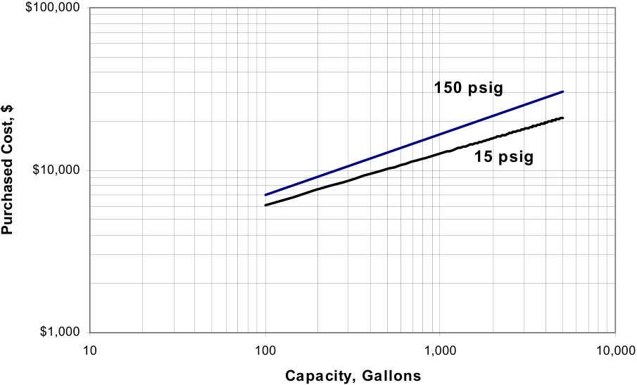

**----- Start of picture text -----** 
$100,000 150 psig 15 psig $10,000 $1,000 10 100 1,000 10,000 Capacity, Gallons Purchased Cost, $ **----- End of picture text -----** 

## _**Horizontal Vessel**_ 

**Description:** The horizontal vessel is a pressure vessel fabricated according to the rules of the specified code and erected in the horizontal position.  Although the horizontal vessel may be supported by lugs in an open steel structure, the more usual arrangement is for the vessel to be erected at grade and supported by a pair of saddles.  Cylindrical, pressure/vacuum, code design and construction, includes head, single wall (base material, clad/lined), saddles/lugs, nozzles and manholes. 

1[st] Quarter 1998 Dollars Shell Material: A515 (Carbon Steel Plates for pressure vessels for intermediate and higher temperature service) Design Temperature: 650 °F Design Pressure: 15 psig Diameter: 2 – 14 feet Length: 4.3 – 81 feet Total Weight: 1100 –59,400 pounds 

## **Horizontal Drum Purchased Equipment Cost** 

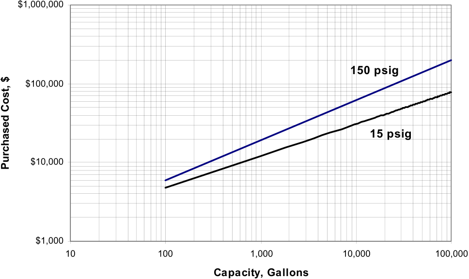

**----- Start of picture text -----** 
$1,000,000 150 psig $100,000 15 psig $10,000 $1,000 10 100 1,000 10,000 100,000 Capacity, Gallons Purchased Cost, $ **----- End of picture text -----** 

## _**Storage Tanks**_ 

**Floating Roof:** Typically constructed from polyurethane foam blocks or nylon cloth impregnated with rubber or plastic, floating roofs are designed to completely contact the surface of the storage products and thereby eliminate the vapor space between the product level and the fixed roof.  Floating roof tanks are suitable for storage of products having vapor pressure from 2 to 15 psia. 

**Cone Roof:** Typically field fabricated out of carbon steel.  They are used for storage of low vapor pressure (less than 2 psia) products, typically ranging from 50,000 – 1,000,000 gallons. 

1[st] Quarter 1998 Dollars Shell Material: A515 (Carbon Steel Plates for pressure vessels for intermediate and higher temperature service) Design Temperature: 650 °F Design Pressure: 15 psig Diameter: 2 – 14 feet Length: 4.3 – 81 feet Total Weight: 1100 –59,400 pounds 

## **Floating/Cone Roof Tanks Purchased Equipment Cost** 

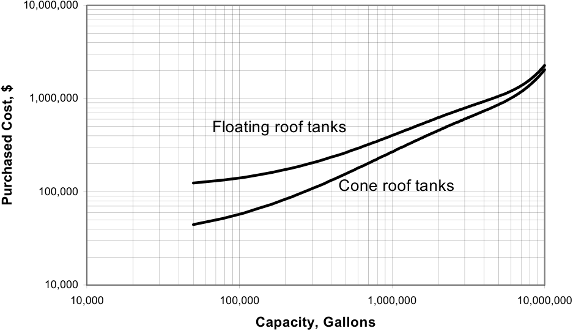

**----- Start of picture text -----** 
10,000,000 1,000,000 Floating roof tanks Cone roof tanks 100,000 10,000 10,000 100,000 1,000,000 10,000,000 Capacity, Gallons Purchased Cost, $ **----- End of picture text -----** 

## _**Valve Tray Column – 15 psig**_ 

**Description:** Pressure/vacuum column includes vessel shell, heads, single base material (lined or clad, nozzles, manholes (one manhole below and above tray stack or packed section and one manhole every tenth tray or 25 feet of packed height), jacket and nozzles for heating or cooling medium, base ring, lugs, skirt or legs; tray clips, tray supports (if designated), distributor piping, plates. 

1[st] Quarter 1998 Dollars Shell Material: A515 (Carbon Steel Plates for pressure vessels for intermediate and higher temperature service) Design Temperature: 650 °F Design Pressure: 15 psig Height: 17 - 133 feet Application: Distillation Tray Type: Valve Tray Spacing: 24 Inches Tray Material: A285C (Low and intermediate strength carbon steel plates for pressure vessels.) Tray Thickness: 0.19 Inches 

## **Single Diameter Valve Tray Column 15 psig Purchased Equipment Cost** 

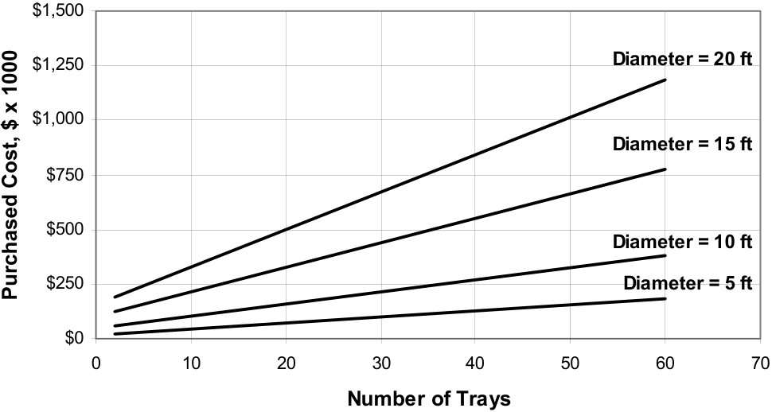

**----- Start of picture text -----** 
$1,500 $1,250 Diameter = 20 ft $1,000 Diameter = 15 ft $750 $500 Diameter = 10 ft $250 Diameter = 5 ft $0 0 10 20 30 40 50 60 70 Number of Trays Purchased Cost, $ x 1000 **----- End of picture text -----** 

## _**Valve Tray Column – 150 psig**_ 

**Description:** Pressure/vacuum column includes vessel shell, heads, single base material (lined or clad, nozzles, manholes (one manhole below and above tray stack or packed section and one manhole every tenth tray or 25 feet of packed height), jacket and nozzles for heating or cooling medium, base ring, lugs, skirt or legs; tray clips, tray supports (if designated), distributor piping, plates. 

1[st] Quarter 1998 Dollars Shell Material: A515 (Carbon Steel Plates for pressure vessels for intermediate and higher temperature service) Design Temperature: 650 °F Design Pressure: 150 psig Height: 17 - 133 feet Application: Distillation Tray Type: Valve Tray Spacing: 24 Inches Tray Material: A285C (Low and intermediate strength carbon steel plates for pressure vessels.) Tray Thickness: 0.19 Inches 

## **Single Diameter Valve Tray Column 150 psig Purchased Equipment Cost** 

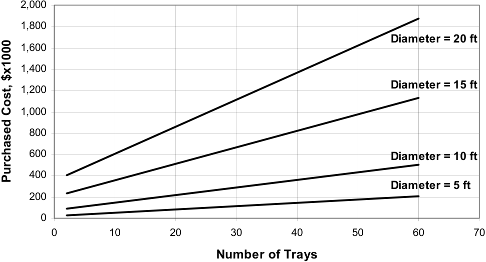

**----- Start of picture text -----** 
2,000 1,800 Diameter = 20 ft 1,600 1,400 Diameter = 15 ft 1,200 1,000 800 600 Diameter = 10 ft 400 Diameter = 5 ft 200 0 0 10 20 30 40 50 60 70 Number of Trays Purchased Cost, $x1000 **----- End of picture text -----** 

## _**Sieve Tray Column – 15 psig**_ 

**Description:** Pressure/vacuum column includes vessel shell, heads, single base material (lined or clad, nozzles, manholes (one manhole below and above tray stack or packed section and one manhole every tenth tray or 25 feet of packed height), jacket and nozzles for heating or cooling medium, base ring, lugs, skirt or legs; tray clips, tray supports (if designated), distributor piping, plates. 

1[st] Quarter 1998 Dollars Shell Material: A515 (Carbon Steel Plates for pressure vessels for intermediate and higher temperature service) Design Temperature: 650 °F Design Pressure: 15 psig Height: 17 - 133 feet Application: Distillation Tray Type: Sieve Tray Spacing: 24 Inches Tray Material: A285C (Low and intermediate strength carbon steel plates for pressure vessels.) Tray Thickness: 0.19 Inches 

## **Single Diameter Sieve Tray Column 15 psig Purchased Equipment Cost** 

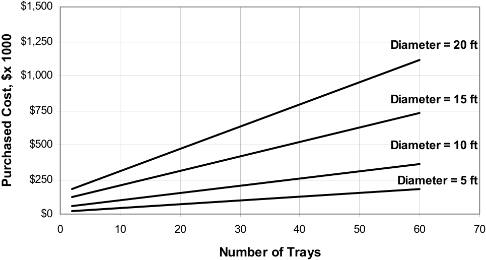

**----- Start of picture text -----** 
$1,500 $1,250 Diameter = 20 ft $1,000 Diameter = 15 ft $750 $500 Diameter = 10 ft $250 Diameter = 5 ft $0 0 10 20 30 40 50 60 70 Number of Trays Purchased Cost, $x 1000 **----- End of picture text -----** 

## _**Sieve Tray Column – 150 psig**_ 

**Description:** Pressure/vacuum column includes vessel shell, heads, single base material (lined or clad, nozzles, manholes (one manhole below and above tray stack or packed section and one manhole every tenth tray or 25 feet of packed height), jacket and nozzles for heating or cooling medium, base ring, lugs, skirt or legs; tray clips, tray supports (if designated), distributor piping, plates. 

1[st] Quarter 1998 Dollars Shell Material: A515 (Carbon Steel Plates for pressure vessels for intermediate and higher temperature service) Design Temperature: 650 °F Design Pressure: 150 psig Height: 17 - 133 feet Application: Distillation Tray Type: Sieve Tray Spacing: 24 Inches Tray Material: A285C (Low and intermediate strength carbon steel plates for pressure vessels.) Tray Thickness: 0.19 Inches 

## **Single Diameter Sieve Tray Column 150 psig Purchased Equipment Cost** 

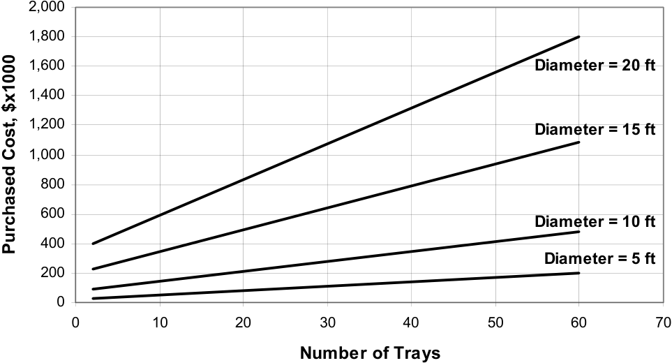

**----- Start of picture text -----** 
2,000 1,800 1,600 Diameter = 20 ft 1,400 1,200 Diameter = 15 ft 1,000 800 600 Diameter = 10 ft 400 Diameter = 5 ft 200 0 0 10 20 30 40 50 60 70 Number of Trays Purchased Cost, $x1000 **----- End of picture text -----** 

## _**Packed Column – 15 psig**_ 

**Description:** Pressure/vacuum column includes vessel shell, heads, single base material (lined or clad, nozzles, manholes (one manhole below and above tray stack or packed section and one manhole every tenth tray or 25 feet of packed height), jacket and nozzles for heating or cooling medium, base ring, lugs, skirt or legs; tray clips, tray supports (if designated), distributor piping, plates, packing not included (see Table 1). 

1[st] Quarter 1998 Dollars Shell Material: A515 (Carbon Steel Plates for pressure vessels for intermediate and higher temperature service) Design Temperature: 650 °F Design Pressure: 15 psig Application: Absorption 

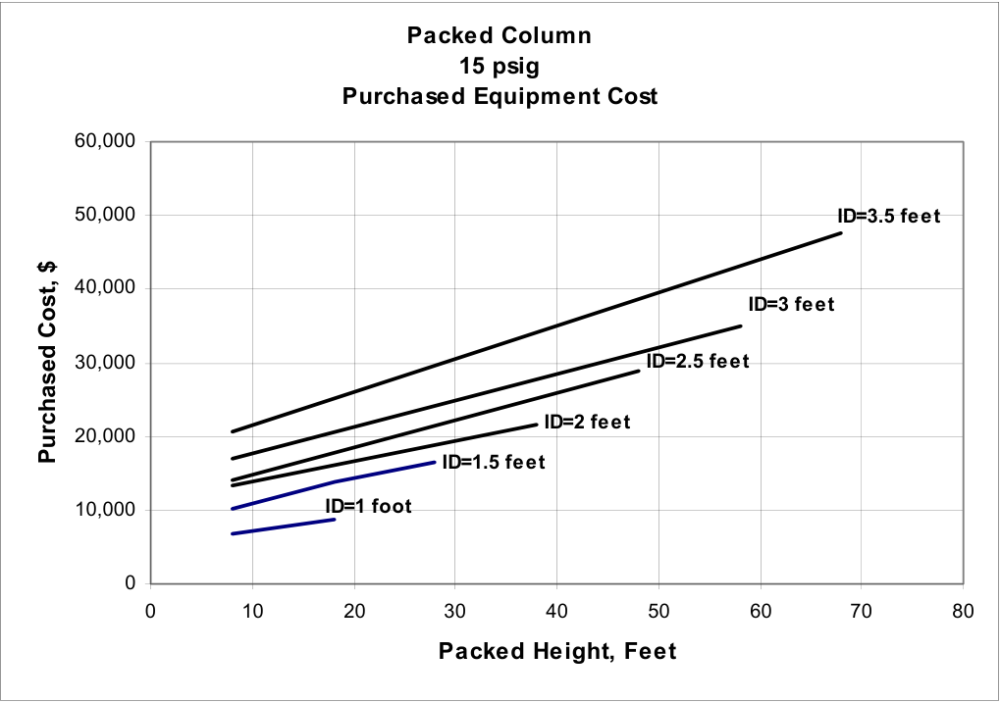

**----- Start of picture text -----** 
Packed Column 15 psig Purchased Equipment Cost 60,000 50,000 ID=3.5 feet 40,000 ID=3 feet 30,000 ID=2.5 feet ID=2 feet 20,000 ID=1.5 feet 10,000 ID=1 foot 0 0 10 20 30 40 50 60 70 80 Packed Height, Feet Purchased Cost, $ **----- End of picture text -----** 

## _**Packed Column – 150 psig**_ 

**Description:** Pressure/vacuum column includes vessel shell, heads, single base material (lined or clad, nozzles, manholes (one manhole below and above tray stack or packed section and one manhole every tenth tray or 25 feet of packed height), jacket and nozzles for heating or cooling medium, base ring, lugs, skirt or legs; tray clips, tray supports (if designated), distributor piping, plates, packing not included (see Table 1). 

1[st] Quarter 1998 Dollars Shell Material: A515 (Carbon Steel Plates for pressure vessels for intermediate and higher temperature service) Design Temperature: 650 °F Design Pressure: 150 psig Application: Absorption 

## **Packed Column 150 psig Purchased Equipment Cost** 

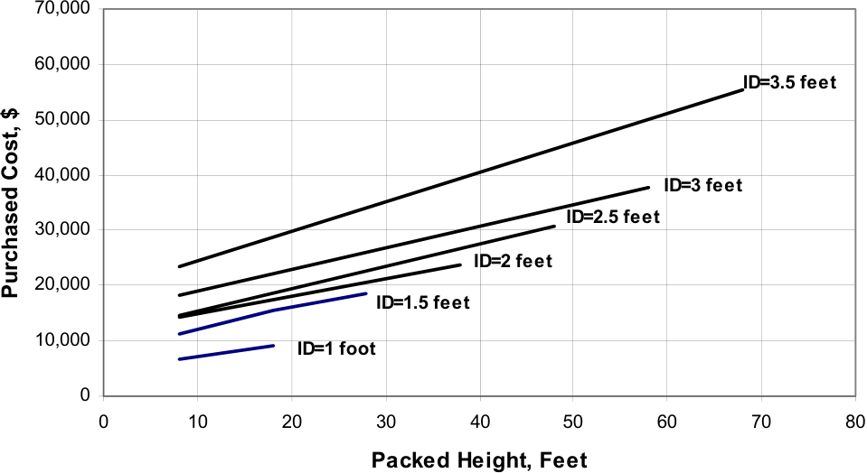

**----- Start of picture text -----** 
70,000 60,000 ID=3.5 feet 50,000 40,000 ID=3 feet ID=2.5 feet 30,000 ID=2 feet 20,000 ID=1.5 feet 10,000 ID=1 foot 0 0 10 20 30 40 50 60 70 80 Packed Height, Feet Purchased Cost, $ **----- End of picture text -----** 

Packing Costs Uninstalled cost, dollar per cubic feet 1[st] Quarter 1998 Dollars 

## _**Shell and Tube Heat Exchanger**_ 

**Description:** Shell and tube heat exchanger consists of a bundle of tubes held in a cylindrical shape by plates at either end called tube sheets.  The tube bundle placed inside a cylindrical shell.  The size of the exchanger is defined as the total outside surface area of the tube bundle.  Maximum shell size is 48 Inches. 

1[st] Quarter 1998 Dollars Type: Floating Head (BES)/ Fixed Head (BEM) Shell Material: A285C (Low and intermediate strength carbon steel plates for pressure vessels.) Shell Temperature: 650 °F Shell Pressure: 150 psig Tube Material: A214 (Electric-resistance-welded carbon steel heat exchanger and condenser tubes) Tube Temperature: 650 °F Tube Pressure: 150 psig Tube Length: 10– 20 Feet Tube Diameter: 1 Inch 

**Shell & Tube Heat Exchanger Purchased Equipment Cost** 

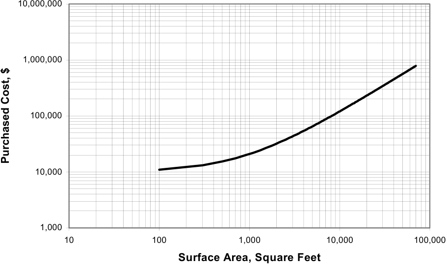

**----- Start of picture text -----** 
10,000,000 1,000,000 100,000 10,000 1,000 10 100 1,000 10,000 100,000 Surface Area, Square Feet Purchased Cost, $ **----- End of picture text -----** 

## _**Air Cooler**_ 

**Description** :  Variety of plenum chambers, louver arrangements, fin types (or bare tubes), sizes, materials, free-standing or rack mounted, multiple bays and multiple services within a single bay. 

1[st] Quarter 1998 Dollars Tube Material: A214 (Electric-resistance-welded carbon steel heat exchanger and condenser tubes) Tube Length: 6 – 60 Feet Number of Bays: 1 – 3 Power/ Fan: 2 – 25 Horsepower Bay Width: 4 – 12 Feet Design Pressure: 150 psig Inlet Temperature: 300 °F Tube Diameter: 1 Inch Plenum Type: Transition shaped Louver Type: Face louvers only Fin Type: L-footed tension wound Aluminum 

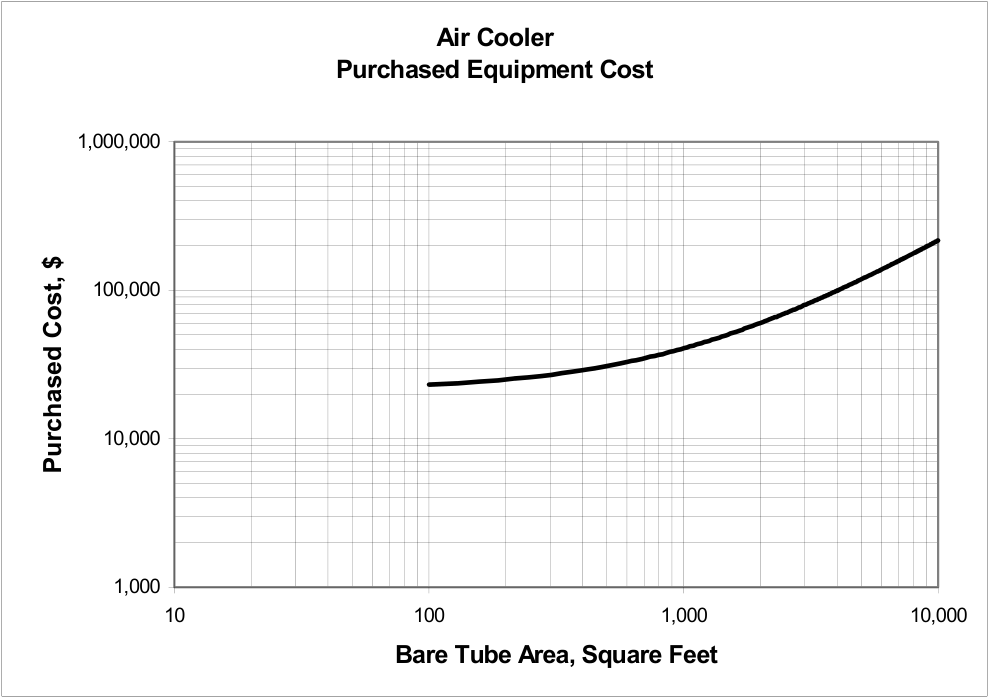

**----- Start of picture text -----** 
Air Cooler Purchased Equipment Cost 1,000,000 100,000 10,000 1,000 10 100 1,000 10,000 Bare Tube Area, Square Feet Purchased Cost, $ **----- End of picture text -----** 

## _**Spiral Plate Heat Exchanger**_ 

## 1[st] Quarter 1998 Dollars 

Material: SS304 

(High Alloy Steel - Chromium-Nickel stainless steel plate, sheet and strip for fusion-welded unfired pressure vessels) 

Tube Pressure: 150 psig 

## **Spiral Plate H eat Exchanger Purchased Equipm ent C ost** 

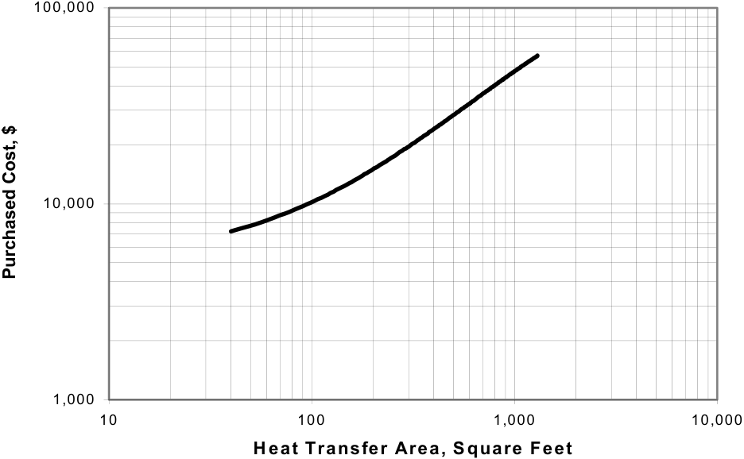

**----- Start of picture text -----** 
100,000 10,000 1,000 10 100 1,000 10,000 Heat Transfer Area, Square Feet Purchased Cost, $ **----- End of picture text -----** 

## _**Furnace**_ 

**Description:** Gas or Oil fired vertical cylindrical type for low heat duty range moderate temperature with long contact time.  Walls of the furnace are refractory lined. 

1[st] Quarter 1998 Dollars Tube Material: A214 (Electric-resistance-welded carbon steel heat exchanger and condenser tubes) Design Pressure: 500 psig Design Temperature: 750 °F 

## **Furnace/P rocess H eater P urchased E quipm ent C ost** 

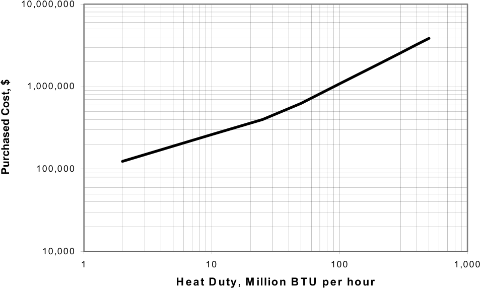

**----- Start of picture text -----** 
10,000,000 1,000,000 100,000 10,000 1 10 100 1,000 H eat D uty, M illion B TU  per hour Purchased Cost, $ **----- End of picture text -----** 

## _**Cooling Tower**_ 

**Description:** Factory Assembled cooling tower includes fans, drivers and basins 

1[st] Quarter 1998 Dollars Temperature Range: 15 °F Approach Gradient: 10 °F Wet Bulb Temperature: 75 °F 

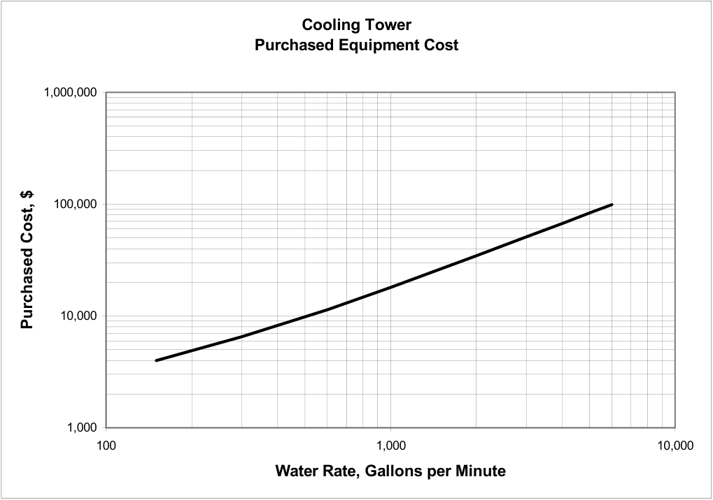

**----- Start of picture text -----** 
Cooling Tower Purchased Equipment Cost 1,000,000 100,000 10,000 1,000 100 1,000 10,000 Water Rate, Gallons per Minute Purchased Cost, $ **----- End of picture text -----** 

## _**Package Steam Boiler**_ 

**Description:** Package boiler unit includes forced draft fans, instruments, controls, burners, soot-blowers, feedwater deaerator, chemical injections system, steam drum, mud drum and stack.  Shop assembled. 

1[st] Quarter 1998 Dollars Material: A285C (Low and intermediate strength carbon steel plates for pressure vessels.) Pressure: 250 psig Superheat: 100 °F 

**S te a m  Bo ile r P u rch a se d  Eq u ip m e n t Co st** 

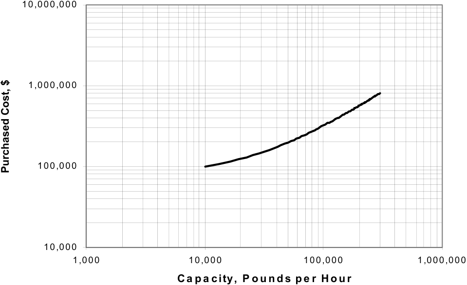

**----- Start of picture text -----** 
10,000,000 1,000,000 100,000 10,000 1,000 10,000 100,000 1,000,000 Ca p a city, P o u n d s p e r Ho u r Purchased Cost, $ **----- End of picture text -----** 

## _**Evaporators**_ 

**Description:** Standard vertical tube evaporator and standard horizontal tube evaporator. 

1[st] Quarter 1998 Dollars Material: A285C (Low and intermediate strength carbon steel plates for pressure vessels.) Tube Material: Carbon Steel 

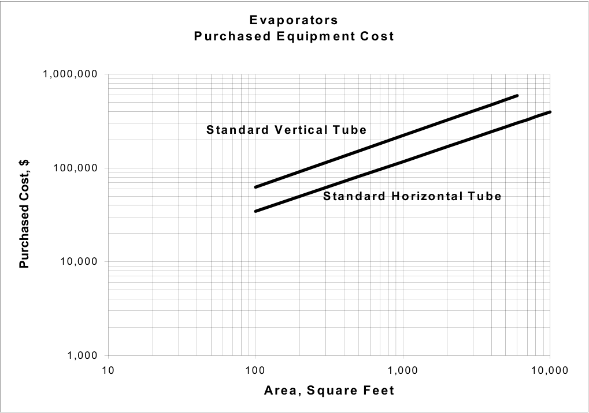

**----- Start of picture text -----** 
E vaporators P urchased E quipm ent C ost 1,000,000 S tandard V ertical Tube 100,000 S tandard H orizontal Tube 10,000 1,000 10 100 1,000 10,000 Area, S quare Feet Purchased Cost, $ **----- End of picture text -----** 

## _**Crushers**_ 

**Description:** All crushers include motor and drive unit. **Gyratory** : Primary crushing of hard and medium hard materials. **Rotary** : For course, soft materials. **Ring Granulator** :  For primary and secondary crushing of bituminous and subbituminous coals, lignite, gypsum and some medium hard minerals. 

**C ru s h e rs P u rch a se d  E q u ip m e n t C o s t** 

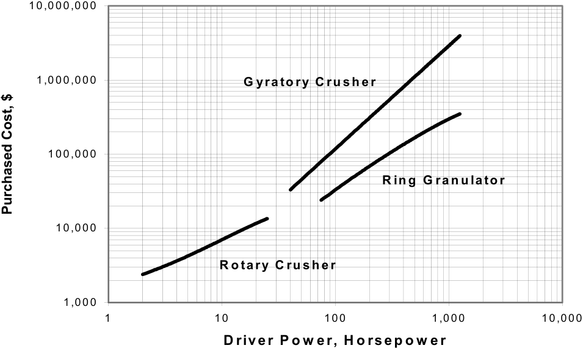

**----- Start of picture text -----** 
1 0,0 00 ,0 0 0 1 ,0 0 0,00 0 G yra to ry C ru s h e r 1 00 ,00 0 R in g  G ra n u la to r 1 0,0 00 R o ta ry C ru s h e r 1 ,0 0 0 1 1 0 1 00 1 ,0 0 0 1 0,0 00 D rive r P o w e r, H o rs ep o w e r Purchased Cost, $ **----- End of picture text -----** 

## _**Mills**_ 

**Description:** All units include mill, bearings, gears, lube system and vendor-supplied instruments.   Ball mill includes initial ball charge. 

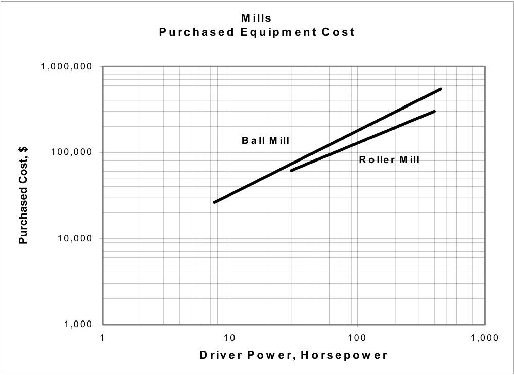

**----- Start of picture text -----** 
M ills P u rc h a s e d  E q u ip m e n t C o s t 1 ,0 0 0 ,0 0 0 B a ll M ill 1 0 0 ,0 0 0 R o lle r M ill 1 0 ,0 0 0 1 ,0 0 0 1 1 0 1 0 0 1 ,0 0 0 D riv e r P o w e r, H o rs e p o w e r Purchased Cost, $ **----- End of picture text -----** 

## _**Dryers**_ 

**Atmospheric tray batch dryer** includes solid materials. **Rotary and Drum dryers** include motor and drive unit. 

**Dryer Purchased Equipm ent Cost** 

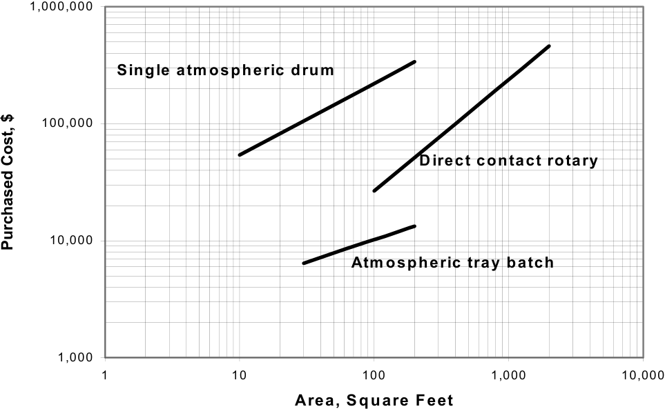

**----- Start of picture text -----** 
1,000,000 Single atm ospheric drum 100,000 D irect contact rotary 10,000 Atm ospheric tray batch 1,000 1 10 100 1,000 10,000 Area, Square Feet Purchased Cost, $ **----- End of picture text -----** 

## _**Centrifuges**_ 

**Description:** Centrifuges include motor and drive unit. **Reciprocating Conveyor** with continuous filtering centrifuge for free-draining granular solids, horizontal bowl, removal by reciprocating piston. 

**Continuous Filtration Vibratory Centrifuge** with solids removal by vibratory screen for dewatering of course solids. 

**Design Basis:** 1[st] Quarter 1998 Dollars Material: A285C 

**C e n trifu g e P u rc h a s e d  E q u ip m e n t C o s t** 

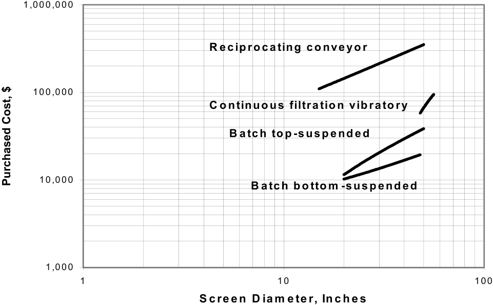

**----- Start of picture text -----** 
1,000,000 R ecip ro cating co nveyo r 100,000 C o ntinuous filtratio n vib rato ry B atch top -susp end ed 10,000 B atch bo tto m -susp end ed 1,000 1 10 100 S c re e n  D ia m e te r, In c h e s Purchased Cost, $ **----- End of picture text -----** 

## _**Filters**_ 

**Cartridge Filter** consists of a tank containing one or more disposable cartridges. Contains 5-micron cotton filter. 

**Drum Filter** is a vacuum type, multi compartment cylinder shell with internal filtrate piping with polypropylene filter cloth, feed box with inlet and drain nozzles, suction valve, discharge trough, driver consisting of rotor, drive motor base plate, worm, gear reducer and two pillow block bearing with supports. 

**Defaults** for Drum Filter 

medium filtration rate, 

0.5 tons per day/ square feet solids handling rate, 

20% consistency (percent of solids in feed stream). 

**Tubular Fabric Filters** are a bank of three without automatic cleaning option. **Plate and Frame Filter** default material is rubber-lined carbon steel. 

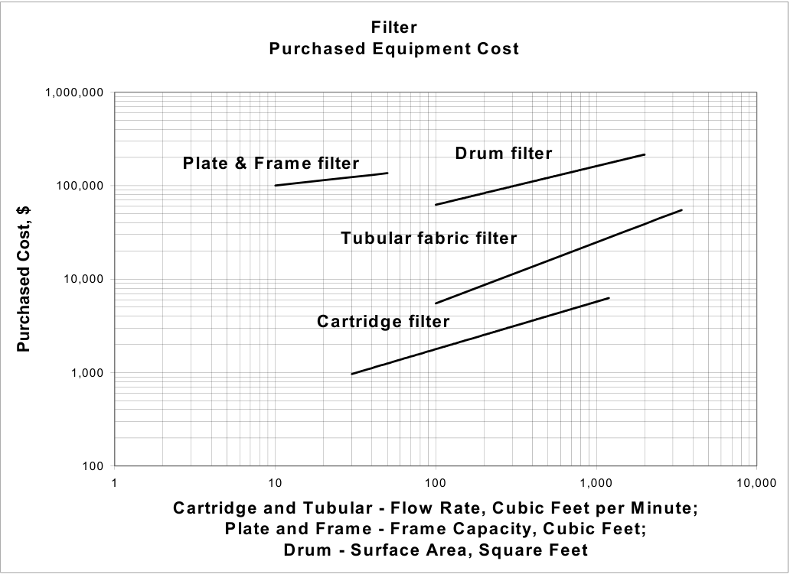

**----- Start of picture text -----** 
Filter Purchased Equipment Cost 1,000,000 Drum filter Plate & Frame filter 100,000 Tubular fabric filter 10,000 Cartridge filter 1,000 100 1 10 100 1,000 10,000 Cartridge and Tubular - Flow Rate, Cubic Feet per Minute; Plate and Frame - Frame Capacity, Cubic Feet; Drum - Surface Area, Square Feet Purchased Cost, $ **----- End of picture text -----** 

## _**Agitator**_ 

**Description:** Fixed propeller mixer with motor and gear drive.  Includes motor, gear drive, shaft and impeller. 

1[st] Quarter 1998 Dollars Material: A285C (Low and intermediate strength carbon steel plates for pressure vessels.) Speed: 1800 RPM 

**----- Start of picture text -----** 
Agitator Purchased Equipment Cost **----- End of picture text -----** 

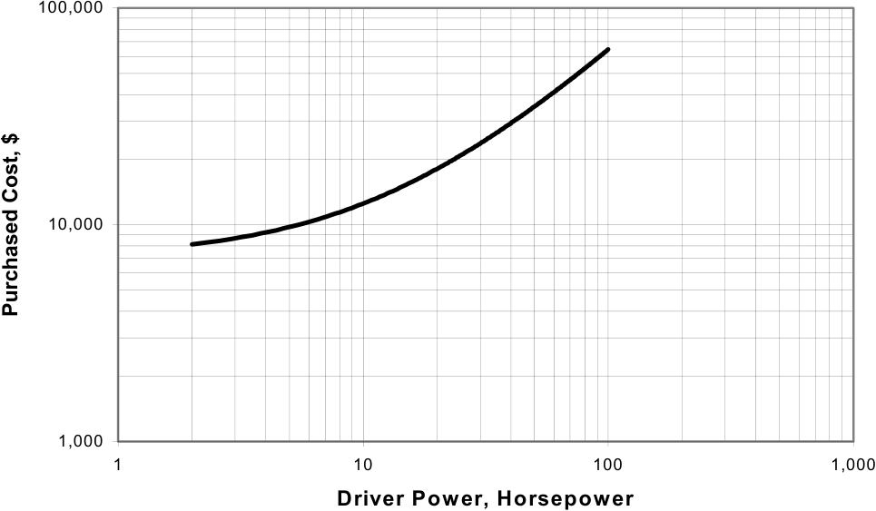

**----- Start of picture text -----** 
100,000 10,000 1,000 1 10 100 1,000 Driver Power, Horsepower Purchased Cost, $ **----- End of picture text -----** 

## _**Rotary Pump**_ 

**Description:** Rotary (sliding vanes) pump includes motor driver. 

1[st] Quarter 1998 Dollars Material: Cast Iron Temperature: 68 °F Power: 25 – 20 Horsepower Speed: 1800 RPM Liquid Specific Gravity:1 Efficiency: 82% 

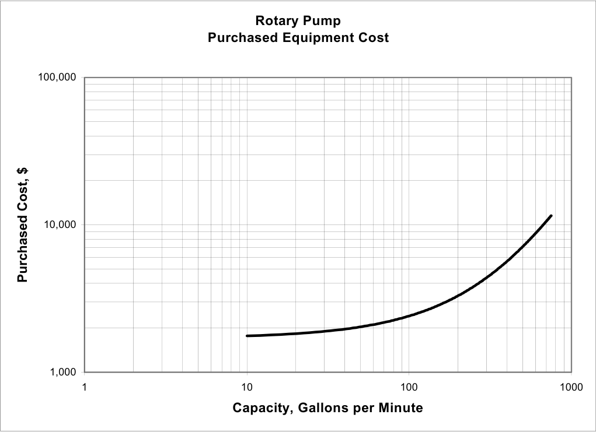

**----- Start of picture text -----** 
Rotary Pump Purchased Equipment Cost 100,000 10,000 1,000 1 10 100 1000 Capacity, Gallons per Minute Purchased Cost, $ **----- End of picture text -----** 

## _**Inline Pump**_ 

**Description:** General service in-line pump includes pump and motor driver. 

1[st] Quarter 1998 Dollars Material: Carbon Steel Temperature: 120 °F Speed: 1800 RPM Liquid Specific Gravity:1 Efficiency: <50 GPM = 60% 50 – 199 GPM = 65% 100 – 500 GPM = 75% > 500 GPM = 82% Driver Type: Standard motor Seal Type: Single mechanical seal 

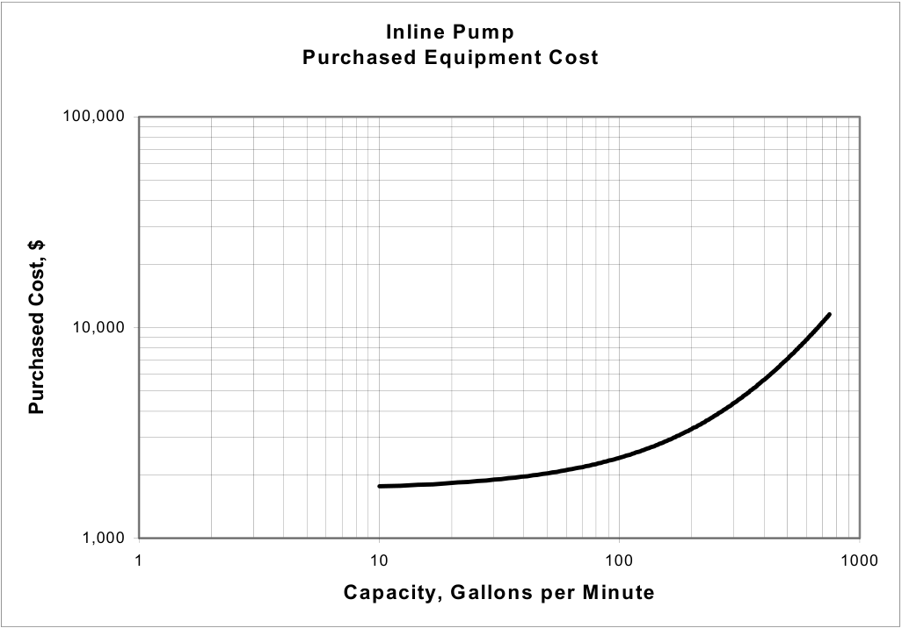

**----- Start of picture text -----** 
Inline Pump Purchased Equipment Cost 100,000 10,000 1,000 1 10 100 1000 Capacity, Gallons per Minute Purchased Cost, $ **----- End of picture text -----** 

## _**Centrifugal Pump**_ 

**Description:** Single and multistage centrifugal pumps for process or general service when flow/head conditions exceed general service.  Split casing not a cartridge or barrel. Includes standard motor driver. 

1[st] Quarter 1998 Dollars Material: Carbon Steel Design Temperature: 120 °F Design Pressure: 150 psig Liquid Specific Gravity:1 Efficiency: <50 GPM = 60% 50 – 199 GPM = 65% 100 – 500 GPM = 75% > 500 GPM = 82% Driver Type: Standard motor Seal Type: Single mechanical seal 

## **Single and Multi-Stage Centrifugal Pump Purchased Equipment Cost** 

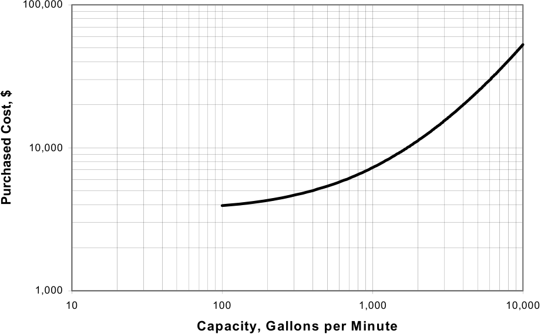

**----- Start of picture text -----** 
100,000 10,000 1,000 10 100 1,000 10,000 Capacity, Gallons per Minute Purchased Cost, $ **----- End of picture text -----** 

## _**Reciprocating Pump**_ 

**Description:** Reciprocating duplex with steam driver.  Triplex (plunger) with pumpmotor driver. 

1[st] Quarter 1998 Dollars Material: Carbon Steel Design Temperature: 68 °F Liquid Specific Gravity:1 Efficiency: 82% 

## **Reciprocating Pump Purchased Equipment Cost** 

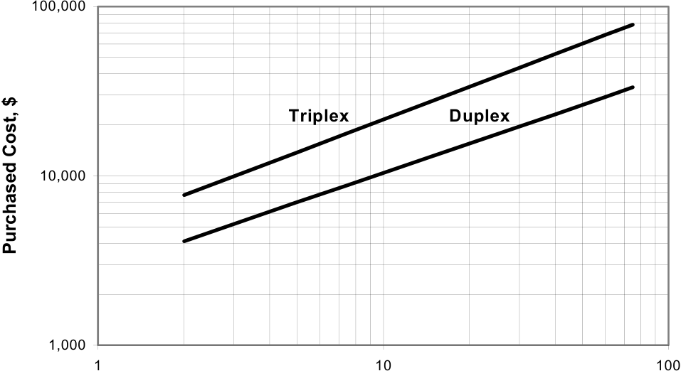

**----- Start of picture text -----** 
100,000 Triplex Duplex 10,000 1,000 1 10 100 Purchased Cost, $ **----- End of picture text -----** 

**Driver Power, Horsepower** 

## _**Vacuum Pump**_ 

**Description:** Mechanical oil-sealed vacuum pump includes pump, motor and drive unit. 

1[st] Quarter 1998 Dollars Material: Carbon Steel First Stage: 0.01 MM HG (Mercury) Second Stage: 0.0003 MM HG (Mercury) 

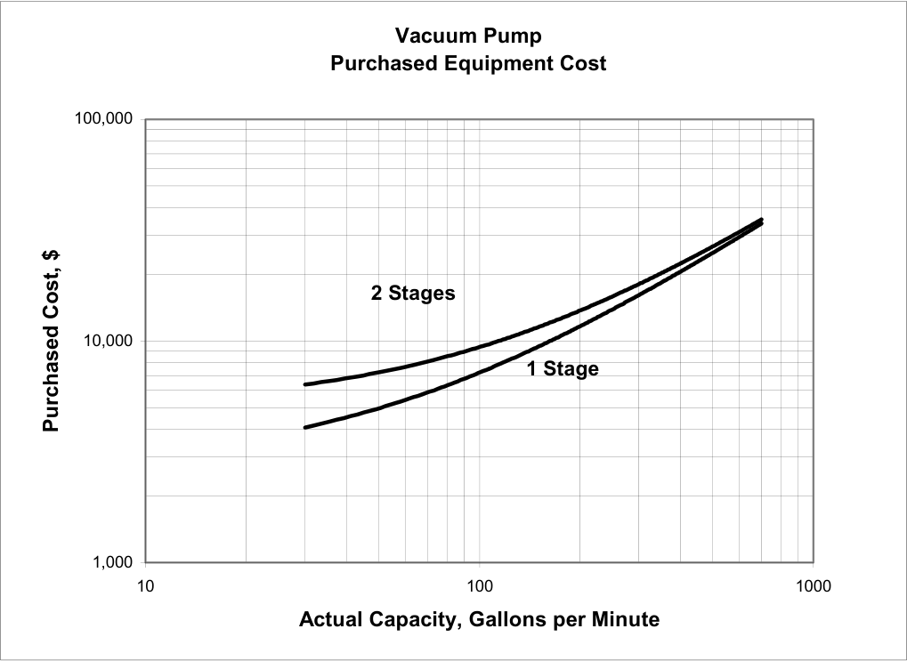

**----- Start of picture text -----** 
Vacuum Pump Purchased Equipment Cost 100,000 2 Stages 10,000 1 Stage 1,000 10 100 1000 Actual Capacity, Gallons per Minute Purchased Cost, $ **----- End of picture text -----** 

## _**Reciprocating Compressor**_ 

**Description:** Reciprocating compressor with gear reducer, couplings, guards, base plate, compressor unit, fittings, interconnecting piping, vendor-supplied instruments, lube/seal system.  Does not include intercoolers or aftercoolers and interstage knock-out drums. 

1[st] Quarter 1998 Dollars Material: Carbon Steel Inlet Temperature: 68 °F Inlet Pressures: 14.7/ 14.7/ 165 psia Pressure Ratios: 4:1/ 30:1/ 30:1 Molecular Weight: 30 Specific Heat Ratio: 1.22 

## **Reciprocating Compressor Purchased Equipment Cost** 

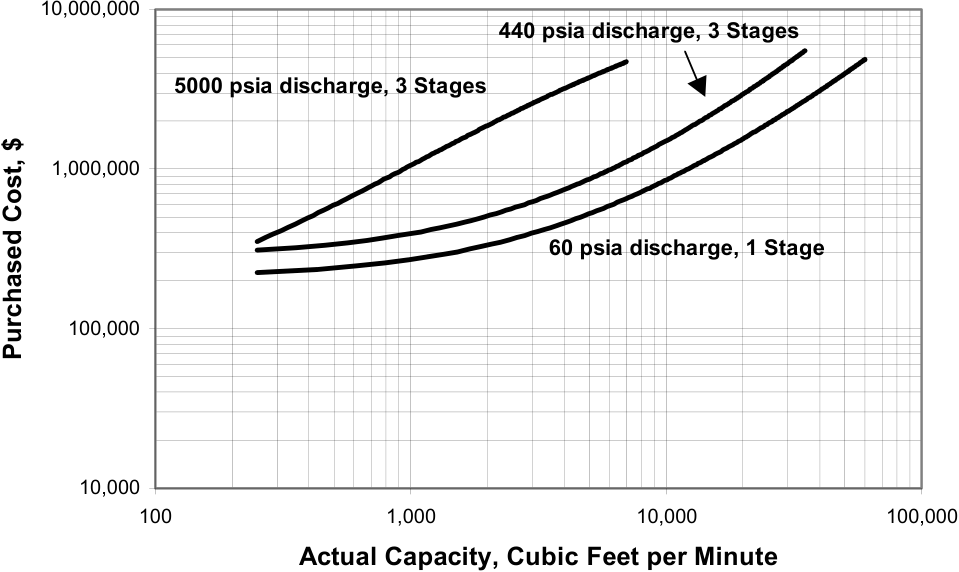

**----- Start of picture text -----** 
10,000,000 440 psia discharge, 3 Stages 5000 psia discharge, 3 Stages 1,000,000 60 psia discharge, 1 Stage 100,000 10,000 100 1,000 10,000 100,000 Actual Capacity, Cubic Feet per Minute Purchased Cost, $ **----- End of picture text -----** 

## _**Centrifugal Compressor**_ 

**Description:** Axial (inline) centrifugal gas compressor with motor driver.  Excludes intercoolers and knock-out drums. 

1[st] Quarter 1998 Dollars Material: Carbon Steel Inlet Temperature: 68 °F Inlet Pressures: 14.7/ 14.7/ 190 psia Pressure Ratios: 3:1/ 10:1/ 10:1 Molecular Weight: 29 Specific Heat Ratio: 1.4 

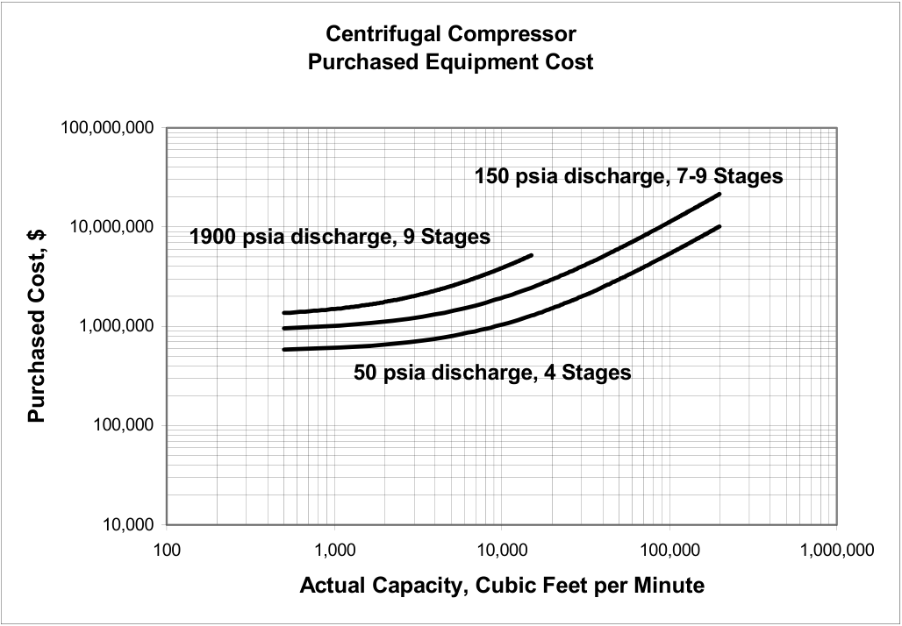

**----- Start of picture text -----** 
Centrifugal Compressor Purchased Equipment Cost 100,000,000 150 psia discharge, 7-9 Stages 10,000,000 1900 psia discharge, 9 Stages 1,000,000 50 psia discharge, 4 Stages 100,000 10,000 100 1,000 10,000 100,000 1,000,000 Actual Capacity, Cubic Feet per Minute Purchased Cost, $ **----- End of picture text -----** 

## _**Centrifugal Fan**_ 

**Description:** Centrifugal fans move gas through a low pressure drop system.  Maximum pressure rise is about 2 PSI. 

1[st] Quarter 1998 Dollars Material: Carbon Steel Power: 1.5 - 300 Horsepower Speed: 1800 RPM Exit Pressure: 6 In H2O 

## **Centrifugal Fan Purchased Equipment Cost** 

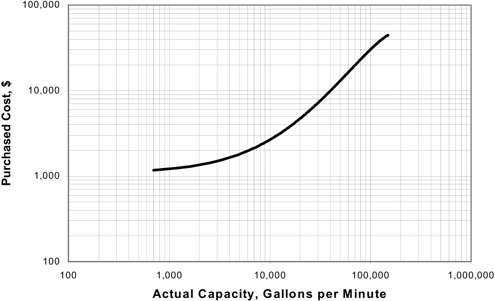

**----- Start of picture text -----** 
100,000 10,000 1,000 100 100 1,000 10,000 100,000 1,000,000 Actual Capacity, Gallons per Minute Purchased Cost, $ **----- End of picture text -----** 

## _**Rotary Blower**_ 

**Description:** This general-purpose blower includes inlet and discharge silencers.  The casing of the rotary blower is cast iron and the impellers are ductile iron. 

1[st] Quarter 1998 Dollars Material: Carbon Steel Power: 5 - 200 Horsepower Speed: 1800 RPM Exit Pressure: 8 psig 

## **Rotary Blower Purchased Equipment Cost** 

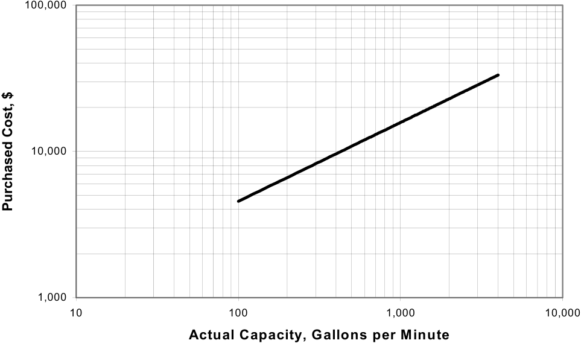

**----- Start of picture text -----** 
100,000 10,000 1,000 10 100 1,000 10,000 Actual Capacity, Gallons per Minute Purchased Cost, $ **----- End of picture text -----** 

## _**Gas Turbine**_ 

**Description:** Gas turbine includes fuel gas combustion chamber and multi-stage turbine expander. 

1[st] Quarter 1998 Dollars Material: Carbon Steel 

## **Gas Turbine Purchased Equipm ent Cost** 

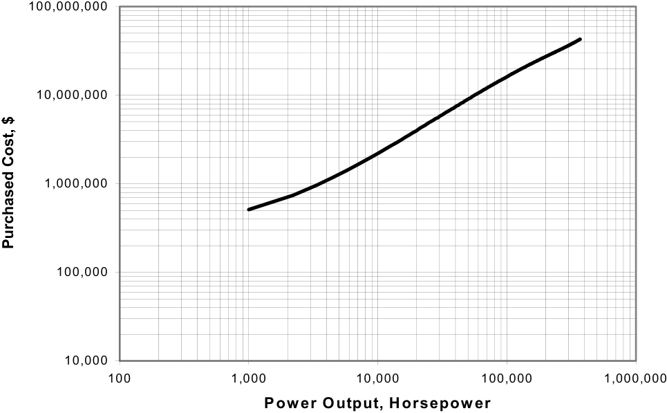

**----- Start of picture text -----** 
100,000,000 10,000,000 1,000,000 100,000 10,000 100 1,000 10,000 100,000 1,000,000 Power Output, Horsepower Purchased Cost, $ **----- End of picture text -----** 

## _**Steam Turbine – under 1000 Horsepower**_ 

**Description:** Steam turbine driver includes condenser and accessories. 

1[st] Quarter 1998 Dollars Material: Carbon Steel Steam Pressure: 400 psig Speed: 3600 RPM 

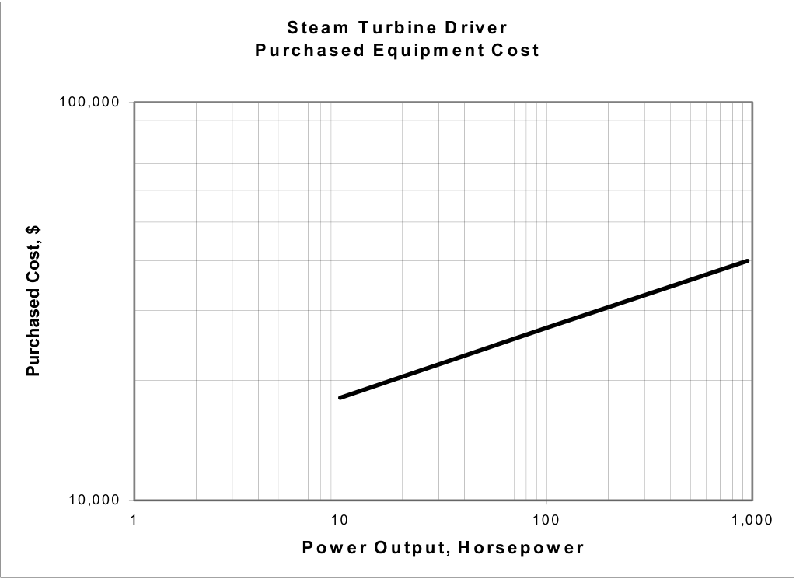

**----- Start of picture text -----** 
S team  T u rb in e D rive r P u rch ased  E q u ip m e n t C o st 100,000 10,000 1 10 100 1,000 P o w e r O u tp u t, H o rsep o w er Purchased Cost, $ **----- End of picture text -----** 

## _**Steam Turbine – over 1000 Horsepower**_ 

**Description:** Steam turbine driver includes condenser and accessories. 

1[st] Quarter 1998 Dollars Material: Carbon Steel Steam Pressure: 400 psig Speed: 3600 RPM 

**S te a m  T u rb in e  D riv e r P u rc h a s ed  E q u ip m e n t C o s t** 

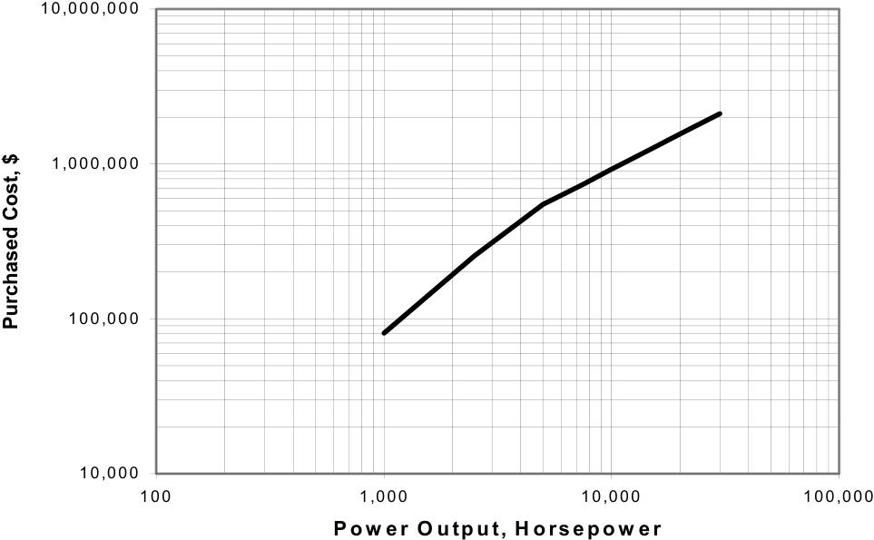

**----- Start of picture text -----** 
10,000,000 1,000,000 100,000 10,000 100 1,000 10,000 100,000 P o w e r O u tp u t, H o rse p o w e r Purchased Cost, $ **----- End of picture text -----** 

Distributive Factors for Bulk Materials - Solids Handling Processes 

Distributive Factors for Bulk Materials – Solids - Gas Processes 

Distributive Factors for Bulk Materials - Liquid and Slurry Systems 

|**Pressure**||**< 150 psig**|**>150 psig**|
|---|---|---|---|
|||**(%)**|**(%)**|
|**Foundations**|_Material_|5|6|
||_Labor_|133|133|
|**Structural Steel**|_Material_|4|5|
||_Labor_|50|50|
|**Buildings**|_Material_|3|3|
||_Labor_|100|100|
|**Insulation**|_Material_|1|3|
||_Labor_|150|150|
|**Instruments**|_Material_|6|7|
||_Labor_|40|40|
|**Electrical**|_Material_|8|9|
||_Labor_|75|75|
|**Piping**|_Material_|30|35|
||_Labor_|50|50|
|**Painting**|_Material_|0.5|0.5|
||_Labor_|300|300|
|**Miscellaneous**|_Material_|4|5|
||_Labor_|80|80|

Distributive Factors for Bulk Materials - Gas Processes 

Distributive Labor Factors for Setting Equipment 

|**Equipment Type**|**Factor**|**Equipment Type**|**Factor**|
|---|---|---|---|
||(%)||(%)|
|Absorber|20|Hammermill|25|
|Ammonia Still|20|Heater|20|
|Ball Mill|30|Heat Exchanger|20|
|Briquetting machine|25|Lime Leg|15|
|Centrifuge|20|Methanator (catalytic)|30|
|Clarifier|15|Mixer|20|
|Coke Cutter|15|Precipitator|25|
|Coke Drum|15|Regenerator (packed)|20|
|Condenser|20|Retort|30|
|Conditioner|20|Rotoclone|25|
|Cooler|20|Screen|20|
|Crusher|30|Scrubber (water)|15|
|Cyclone|20|Settler|15|
|Decanter|15|Shift converter|25|
|Distillation column|30|Splitter|15|
|Evaporator|20|Storage Tank|20|
|Filter|15|Stripper|20|
|Fractionator|25|Tank|20|
|Furnace|30|Vaporizer|20|
|Gasifier|30|||

Factors for Converting Carbon Steel to Equivalent Alloy Costs 

|**Material**|**Pumps, etc.**|**Other Equipment**|
|---|---|---|
|All Carbon Steel|1.00|1.00|
|Stainless Steel, Type 410|1.43|2.00|
|Stainless Steel, Type 304|1.70|2.80|
|Stainless Steel, Type 316|1.80|2.90|
|Stainless Steel, Type 310|2.00|3.33|
|Rubber-lined Steel|1.43|1.25|
|Bronze|1.54||
|Monel|3.33||

|**Material**|**Heat Exchangers**|
|---|---|
|Carbon Steel Shell and Tubes|1.00|
|Carbon Steel Shell, Aluminum Tubes|1.25|
|Carbon Steel Shell, Monel Tubes|2.08|
|Carbon Steel Shell, 304 Stainless Steel Tubes|1.67|
|304 Stainless Steel Shell and Tubes|2.86|

## **Cost Indexes** 

Cost indexes are used to update costs from the base time, in this case First Quarter 1998 dollars, to the present time of the estimate.  Cost indexes are used to give a general estimate, but can not take into account all factors.  Some limitations of cost indexes include:[3] 

1. Accuracy is very limited.  Two Indexes may yield much different answers. 

2. Cost indexes are based on averages.  Specific cases may be much different from the average. 

3. At best, 10% accuracy can be expected for periods up to 5 years. 

4. For periods over 10 years, indexes are suitable only for order of magnitude estimates. 

The most common indexes are Engineering News-Record Construction Cost Index, Table 8, (published in the _Engineering News-Record_ ), Marshall and Swift Equipment Cost Indexes, Table 9, (published in _Chemical Engineering_ ), Nelson-Farrar Refinery Construction Cost Index, Table 10, (published in the _Oil and Gas Journal_ ) and the Chemical Engineering Plant Cost Index, Table 11, (published in _Chemical Engineering_ ). Annual averages for each of these indexes are included in this report. 

The Marshall and Swift Equipment Cost Indexes are divided into two categories, the allindustry equipment index and the process-industry equipment index.  The indexes take into consideration the cost of machinery and major equipment plus costs for installation, fixtures, tools, office furniture, and other minor equipment.  The Engineering NewsRecord Construction Cost Index shows the variation in the labor rates and materials costs for industrial construction.  The Nelson-Farrar Refinery Construction Cost Index uses construction costs in the petroleum industry as the basis.  The Chemical Engineering Plant Cost Index uses construction costs for chemical plants as the basis. 

Two cost indexes, the Marshall and Swift equipment cost indexes and the Chemical Engineering plant cost indexes, give very similar results and are recommended for use with process-equipment estimates and chemical-plant investment estimates.  The Engineering News-Record construction cost index, relative with time, has increased much more rapidly than the other two because it does not include a productivity improvement factor.  Similarly, the Nelson-Farrar refinery construction index has shown a very large increase with time and should be used with caution and only for refinery construction.[4] 

3 Humphreys, Dr. Kenneth K. PE CCE, "Preliminary Capital and Operating Cost Estimating (for the Process and Utility Industries)," course notes. 

4 Peters, Max S. and Klaus D. Timmerhaus, "Plant Design and Economics for Chemical Engineers" McGraw-Hill, Inc. 1991. 

Engineering News Record Construction Cost Index Published in the _Engineering News-Record_ 

|**Year**|**Annual Average**|
|---|---|
|**1913**|**100**|
|1960|824|
|1965|971|
|1970|1381|
|1975|2212|
|1980|3237|
|1985|4195|
|1990|4732|
|1995|5471|
|1996|5620|
|1997|5825|
|1998|5920|
|1999|6060|
|2000|6222|
|2001||
|January|6281|
|February|6273|
|March|6280|
|April|6286|
|May|6288|

Marshall and Swift Installed-Equipment Index Published in _Chemical Engineering_ 

||**Annual Average**||
|---|---|---|
|**Year**|**All Industry**|**Process Industry**|
|**1926**|**100**|**100**|
|1964|242|241|
|1965|245|244|
|1970|303|301|
|1975|444|452|
|1980|560|675|
|1985|790|813|
|1990|915|935|
|1995|1027.5|1037.4|
|1996|1039.2|1051.3|
|1997|1056.8|1068.3|
|1998|1061.9|1075.9|
|1st Quarter|1061.2|1074.6|
|2nd Quarter|1061.8|1075.2|
|3rd Quarter|1062.4|1077.2|
|4th Quarter|1062.3|1076.6|
|1999|1068.3|1083.1|
|1st Quarter|1062.7|1078.8|
|2nd Quarter|1065.0|1080.7|
|3rd Quarter|1069.9|1084.0|
|4th Quarter|1075.6|1088.7|
|2000|1089.0|1102.7|
|1st Quarter|1080.6|1093.5|
|2nd Quarter|1089.0|1102.2|
|3rd Quarter|1092.0|1106.3|
|4th Quarter|1094.5|1108.7|
|2001|||
|1stQuarter|1092.8|1106.9|

## Nelson-Farrar Refinery Construction Index Published in the _Oil and Gas Journal_ 

Chemical Engineering Plant Cost Index Published in _Chemical Engineering_ 

|**Year**|**Annual Average**|
|---|---|
|**1957-59**|**100**|
|1964|103|
|1965|104|
|1970|126|
|1975|182|
|1980|261|
|1985|325|
|1990|357.6|
|1995|381.1|
|1996|381.8|
|1997|386.5|
|1998|389.5|
|1999|390.6|
|2000|394.1|
|2001||
|January|395.4|

## **Appendix A** 

The following is an example of the usage of the cost curves and tables to estimate the installed cost of a 5,000 square foot gas-gas shell and tube heat exchanger with a design temperature of 650°F and a design pressure of 150 psig. 

From the chart on page 16, the estimated purchased equipment cost is $62,000.  From Table 6, the factor for setting a heat exchanger is 20%.  Column 3 of Table 5 is used to estimate the bulk material and labor costs. 

|Bare cost:||$62,000|
|---|---|---|
|Setting Cost:|$62,000*0.2|$12,400|
|Bulk Installations:|||
|Foundations|||
|Material|$62,000*0.06|$3,720|
|Labor|$3,720*1.33|$4,948|
|Structural Steel|||
|Material|$62,000*0.05|$3,100|
|Labor|$3,100*0.5|$1,550|
|Buildings|||
|Material|$62,000*0.03|$1,860|
|Labor|$1,860*1.0|$1,860|
|Insulation|||
|Material|$62,000*0.02|$1,240|
|Labor|$1,240*1.5|$1,860|
|Instruments|||
|Material|$62,000*0.07|$4,340|
|Labor|$4,340*0.75|$3,255|
|Electrical|||
|Material|$62,000*0.06|$3,720|
|Labor|$3,720*0.4|$1,488|
|Piping|||
|Material|$62,000*0.4|$24,800|
|Labor|$24,800*0.5|$12,400|
|Painting|||
|Material|$62,000*0.005|$310|
|Labor|$310*3.0|$930|
|Miscellaneous|||
|Material|$62,000*0.04|$2,480|
|Labor|$2,480*0.8|$1,984|
|Total Installed Cost:||$150,245|
|From ICARUS-generated results (page 59):|||
|Purchased Equipment Cost||$62,100|
|Total Installed|Cost|$141,800|

## **Appendix B** 

**Vertical Vessels** 1[st] Quarter 1998 dollars 

**Horizontal Vessels** 1[st] Quarter 1998 dollars 

## **Storage Tanks** 

## **Valve Tray Columns** 1[st] Quarter 1998 dollars 

**Sieve Tray Columns** 1[st] Quarter 1998 dollars 

## **Packed Columns** 

**Shell and Tube Heat Exchangers** 1[st] Quarter 1998 dollars 

## **Air Cooler** 

**Spiral Plate Heat Exchanger** 1[st] Quarter 1998 dollars 

## **Furnace** 

**Cooling Tower** 1[st] Quarter 1998 dollars 

## **Package Steam Boiler** 1[st] Quarter 1998 dollars 

## **Evaporator** 1[st] Quarter 1998 dollars 

## **Crusher** 

## **Mill** 

## **Dryers** 

**Centrifuge** 1[st] Quarter 1998 dollars 

## **Filter** 

## **Agitators** 

**Rotary Pump** 1[st] Quarter 1998 dollars 

## **Inline Pump** 

**Centrifugal Pump** 1[st] Quarter 1998 dollars 

**Reciprocating Pump** 1[st] Quarter 1998 dollars 

**Vacuum Pump** 1[st] Quarter 1998 dollars 

**Reciprocating Compressor** 1[st] Quarter 1998 dollars 

**Centrifugal Compressor** 1[st] Quarter 1998 dollars 

**Centrifugal Fan** 1[st] Quarter 1998 dollars 

**Rotary Blower** 1[st] Quarter 1998 dollars 

**Gas Turbine** 1[st] Quarter 1998 dollars 

## **Steam Turbine** 

