## **Advanced Nuclear Power Technology Program** 

## **A Supercritical Carbon Dioxide Cycle for Next Generation Nuclear Reactors** 

**V. Dostal, M.J. Driscoll, P. Hejzlar** 

## **MIT-ANP-TR-100** 

**March 10, 2004** 

i 

## **Acknowledgements** 

Substantially the same document has been submitted by the principal author, Vaclav Dostal, as his thesis for the Doctor of Science degree in Nuclear Engineering at MIT. 

The authors gratefully acknowledge the research project support which made this work possible:  initially, and of longest duration, two successive LDRD awards from INEEL; and, more recently, partial funding in an INERI GFR project subtask through ANL; plus a new project via SANDIA as part of their DOE program fro advanced reactor power cycle development. 

Yong (Jeff) Wang made valuable contributions in the area of turbomachinery design as part of his continuing doctoral thesis research in the MIT Department of Aeronautics and Astronautics under the supervision of Dr. Gerald Guenette. 

i 

## **The MIT Center for Advanced Nuclear Energy Systems** 

Topical reports Progress are published under four series: 

- (1) **Advanced Nuclear Power Technology Program (MIT-ANP-)** 

- (2) **Nuclear Fuel Cycle Technology and Policy Program (MIT-NFC-)** (3) **Nuclear Systems Enhanced Performance Program (MIT-NSP-)** (4) **Nuclear Energy and Sustainability Program (MIT-NES-)** 

Please visit our Web Site: **http://web.mit.edu/canes/** to view more publication lists. 

MIT-ANP- Series (includes Annual and Progress Reports) 

- **001** _**The Role of Actinide Burning and the Integral Fast Reactor in the Future of Nuclear Power**_ , W.R. Hollaway, L.M. Lidsky, and M.M. Miller (December 1990). 

- **002** _**Out-of-Core Thermionic Space Nuclear Reactors: Design and Control Considerations**_ , M.G. Houts and D.D. Lanning (January 1991). 

- **003** _**Passive Decay Heat Removal in Advanced Reactor Concepts**_ , Vols I & II, P. Hejzlar, N.E. Todreas, and M.J. Driscoll (May 1991). 

- **004** _**The Effects of Non-Condensable Gases on Steam Condensation under Turbulent Natural Convection Conditions**_ , A.A. Dehbi, M.W. Golay, and M.S. Kazimi (June 1991). 

- **005** _**The Effect of Thermal Conductivity of Prismatic MHTGR Fuel**_ , J-C Han, M.J. Driscoll and N.E. Todreas (September 1989). 

- **006** _**Passive Containment Cooling for a 900 MWe Reactor**_ , A.A. Dehbi, M.W. Golay, and M.S. Kazimi (August 1991). 

- **007** _**The Combined Hybrid System – A Symbiotic Thermal Reactor/Fast Reactor System for Power Generation and Radioactive Waste Toxicity Reduction**_ , W.R. Hollaway and L.M. Lidsky (August 1991). 

- **008** _**Concepts for a Pressure Tube Light Water Reactor with Passive Safety Features**_ , J.R. Tang, N.E. Todreas, and M.J. Driscoll (September 1991). 

- **009** _**Physics Considerations in a Passive Light Water Pressure Tube Reactor (PLPTR)**_ , J.R. Tang, M.J. Driscoll, and N.E. Todreas (November 1991). 

- **010** _**The Effects of Noncondensable Gases on Steam Condensation under Forced Convection Conditions**_ , M. Siddique, M.W. Golay, and M.S. Kazimi (March 1992). 

- **011** _**A Sensitivity Analysis of the Role of Human Actions for the Loss of Offsite Power Scenario**_ , N.S. Qureshi and M.W. Golay (May 1992). 

- **012** _**ORNL/MIT Technical Support Tasks for USDOE/MITNE Integral Fast Reactor Program: Task 2, Environmental Impact Assessment**_ , W.W. Schenler and M.W. Golay (May 1992). 

- **013** _Conceptual Design of the Passive Light Water Cooled and Moderated Pressure Tube Reactor (PLPTR)_ , Volumes I and II, J.R. Tang, N.E. Todreas, and M.J. Driscoll (August 1992). 

ii 

- **014** _**Integral Fast Reactor-Related Research – Subtask 1C: Analysis of IFR Demonstration Program**_ , Final Report, A. Schneider and D. Freed (June 1992). 

- **015** _**Transmutation Effects on Transuranic Waste Inventory and Its Repository Risk**_ , C.H. Kang and M.S. Kazimi (March 1993). 

- **016** _**Conceptual Design of a Water Cooled Reactor with Passive Decay Heat Removal**_ , DOE Progress Report, P. Hejzlar, N.E. Todreas, M.J. Driscoll, and B. Mattingly (May 1993). 

- **017** _**Evaluation of Materials for the Pressure Tube Matrix of a Passive LWR Concept**_ , P. Hejzlar, N.E. Todreas, and M.J. Driscoll (November 1993). 

- **018** _**An Evaluation of Passive Spray Cooling for Nuclear Reactor Containments**_ , H. Khan and M.J. Driscoll (September 1993). 

- **019** _On the Complete Testing of Simple, Safety-Related Software,_ K.E. Poorman, M.W. Golay, and D.D. Lanning (February 1994). 

- **020** _**Integrated Containment/Hyperbolic Cooling Tower System**_ , A.R. Patel, N.E. Todreas, and M.J. Driscoll (January 1994). 

- **021** _**Special Computer Codes and Supplementary Data for the Conceptual Design of a Large, Passive, Pressure-tube LWR**_ , P. Hejzlar, N.E. Todreas, and M.J. Driscoll (May 1994). 

- **022** _**Verification and Validation of Safety Related Software**_ , M.G. Arno and M.W. Golay (June 1994). 

- **023** _**Conceptual Design of a Large, Passive Pressure-Tube Light Water Reactor**_ , P. Hejzlar, N.E. Todreas, and M.J. Driscoll (June 1994). 

- **024** _**Steam Condensation in the Presence of Noncondensable Gases under Forced Convection Conditions**_ , H.A. Hasanein, M.W. Golay, and M.S. Kazimi (July 1994). 

- **025** _**Technical Summary of a Conceptual Design of a Large, Passive Pressure-Tube Light Water Reactor**_ , P. Hejzlar, N.E. Todreas, and M.J. Driscoll (July 1994). 

- **026** _**The Dependence of Human Reliability Upon Task Information Content**_ , E.M. Hermanson and M.W. Golay (August 1994). 

- **027** _**Experimental Evaluation of a Passive Water Cooled Containment Concept**_ , J.T. Hwang, N.E. Todreas, and M.J. Driscoll (August 1994). 

- **028** _**Comparative Performance Evaluation of an Advanced Semi-Passive and an Evolutionary Pressurized Water Reactor Nuclear Power Plants in the Loss of Offsite Power Event**_ , M.Ouyang and M.W. Golay (December 1994). 

- **029** _**Thermal Analysis of Dry Spent Fuel Transportation and Storage Casks**_ , X. Chen and N.E. Todreas (January 1995). 

- **030** _**Achieving Higher Capacity Factors in Nuclear Power Plants Through Longer Operating Cycles**_ , G. Dalporto and N.E. Todreas (February 1995). 

- **031** _Fuel Matrices for the Passive Pressure Tube Light Water Reactor_ **,** B.T. Mattingly, P. Hejzlar, N.E. Todreas, and M.J. Driscoll (March 1995). 

iii 

- **032** _**A Strategy for Extending Cycle Length to Improve Pressurized Water Reactor Capacity Factor**_ , A.F.A. Ayoub and M.J. Driscoll (June 1995). 

- **033** _**Conception and Experimental Investigation of Thermal Switches**_ , J. Novak, N.E. Todreas, and M.J. Driscoll (June 1995). 

- **034** _**Alternative Passive Cooling Concepts for a Large Rating Pressurized Water Reactor Containment**_ , M. Gavrilas, N.E. Todreas, and M.J. Driscoll (August 1995). 

- **035** _**An Integrated Formal Approach for Developing High Quality Software for Safety-Critical Systems**_ , M. Ouyang and M.W. Golay (September 1995). 

- **036** _Surveillance Strategy for a Four-Year Operating Cycle in Commercial Nuclear Reactors_ , T.J. Moore, J.H. Maurer, R.S. McHenry, and N.E. Todreas (June 1996). 

- **037** _**The Performance Study of the Tube Water Wall PCCL and an Experimental Correlation for Steam Condensation in the Presence of Air Under Natural Convection**_ , A.A. Dehbi, M.W. Golay, and M.S. Kazimi (September 1995). 

- **038** _**A Methodology for Modular Nuclear Power Plant Design and Construction**_ , C. Lapp and M.W. Golay (October 1995). 

- **039** _**A Mental Procedure for More Reliable Specification of System Control Software Requirements**_ , C.W. Kang, M. Ouyang, and M.W. Golay (December 1995). 

- **040** _**Complete Safety Software Testing: A Formal Method**_ , J.R. Lunglhofer, M.W. Golay, and D.D. Lanning (January 1996). 

- **041** _**Quantitative Methodology for Surveillance Interval Extension at Nuclear Power Plants**_ , H. Masui and M.W. Golay (June 1996). 

- **042** _**An Investigation of How Powerful a Nuclear Reactor Can Be**_ , T.L. Stoops and M.W. Golay (June 1996). 

- **043** _**A Study for Improving Reliability and Capacity Factor of the PWR Feedwater Supply System**_ , F. Li and M.W. Golay (June 1996). 

- **044** _**A Strategy for Reducing Forced Outage Rates in Commercial Nuclear Reactors with a Main Feed Pump Case Study**_ , T.J. Moore and N.E. Todreas (July 1996). 

- **045** _**Modeling and Design of a Reload PWR Core for a 48-Month Fuel Cycle**_ , M.V. McMahon, M.J. Driscoll, and N.E. Todreas (July 1996). 

- **046** _Improvement in Nuclear Plant Capacity Factors Through Longer Cycle Length Operation_ , Annual Report, N.E. Todreas and M.V. McMahon (July 1996). 

- **047** _**Dependency of Human Operator Performance Quality Upon Task Complexity**_ , J. Automo and M.W. Golay (September 1996). 

- **048** _**Passive Containment Cooling System for Large PWRs Using Thermosyphon Loops**_ , M. Leiendecker, N.E. Todreas, M.J. Driscoll and A. Hurtado (October 1996). 

- **049** _**Economic Analysis of Implementing a Four-Year Extended Operating Cycle in Existing PWRs**_ , C.S. Handwerk, M.J. Driscoll, N.E. Todreas and M.V. McMahon (January 1997). 

iv 

- **050** _Conceptual Design of a Water Cooled Reactor with Passive Decay Heat Removal:  Final Performance Technical Report_ , N.E. Todreas, M.J. Driscoll, P. Hejzlar, B. Mattingly, and G. Dalporto (November 1996). 

- **051** _**Nuclear Power Plant Surveillance Issues for Extended Operating Cycles**_ , R.S. McHenry and N.E. Todreas (February 1997). 

- **052** _**A Strategy for Reducing the Forced Outage Rates of Reactor Coolant Pumps for a 48-Month Operating Cycle**_ , C.W. Kang and N.E. Todreas (August 1997). 

- **053** _**Design and Numerical Simulation of a Two-Phase Thermosyphon Loop as a Passive Containment Cooling System for PWRs**_ , Rev. 1, Vols. I & II , M. Leiendecker, N.E. Todreas, and M.J. Driscoll (September 1997). 

- **054** _**Lumped Parameter Modeling of the KNGR Containment Using GOTHIC**_ ,  Y.H. Kim, N.E. Todreas, and M.J. Driscoll (July 1997). 

- **055** _**MIT Advanced Containment Project: Review of Condensation Models and Computer Code**_ **Part I** _**Evaluation**_ , B.T. Mattingly and N.E. Todreas (July 1997). **055** _**Containment Analysis Incorporating Boundary Layer Heat and Mass Transfer Techniques**_ , B.T. **Part II** Mattingly, N.E. Todreas, and M.J. Driscoll (February 1999). **056** _**Use of Performance Monitoring to Improve Reliability of Emergency Diesel Generators**_ , J.D. Dulik and M.W. Golay (December 1997). 

- **057** _**On-Line Monitoring for Improved Nuclear Power Plant Availability and Operational Advice**_ , Vols. I, II, & III, M.W. Golay, C.W. Kang, J.B. Lee, and Y. Sui (February 1998). 

- **058** _**Risk-Informed, Performance-Based Regulatory Implications of Improved Emergency Diesel Generator Reliability**_ , S. Utton and M.W. Golay (January 1998). 

- **059** _**Distributed Parameter Modeling of the KNGR Containment using GOTHIC**_ , Y.H. Kim, N.E. Todreas and M.J. Driscoll (January 1998). 

- **060** _**Project on Integrated Models, Data Bases and Practices Needed for Performance-Based Safety Regulation: Final Report**_ , M.W. Golay, J.D. Dulik, F.A. Felder, and S.M. Utton (December, 1998). 

- **061** _**An Experimental Investigation of A Passive Cooling Unit for Nuclear Plant Containment**_ , H-Y. Liu, N.E. Todreas, and M.J. Driscoll (February 1999). 

- **062** _**Conceptual Design and Distributed Parameter Analysis of a Semi-passive Containment Cooling System for a Large Dry Concrete Containment**_ , C.S. Byun, D.W. Jerng, N.E. Todreas, and M.J. Driscoll (February 1999). 

- **063** _**A Semi-Passive Containment Cooling System Conceptual Design: Final Report**_ , H. Liu and N.E. Todreas (March 1999). 

- **064** _**Reliability-Based Nuclear Power Plant Maintenance Resource Allocation in Order to Reduce Unfavorable Operational Publicity**_ , K. Tezuka and M.W. Golay (June 1999). 

- **065** _**Design of an Actinide Burning, Lead-Bismuth Cooled Reactor That Produces Low Cost Electricity**_ , J. Buongiorno et al. (June 1999). 

- **066** _**Thermal Design of Lead-Bismuth Cooled Reactor for Actinide Burning and Power Production**_ , J. Buongiorno, N.E. Todreas, and M.S. Kazimi (July 1999). 

v 

- **067** _**Dependency of Human Operator Performance Quality upon Task Complexity**_ , _**see 047**_ S.J. Automo and M.W. Golay (February 1998). **068** _**Void Reactivity Performance in Lead-Bismuth-Cooled Reactor for Actinide Transmutation**_ , P. Hejzlar, M.J. Driscoll, and M.S. Kazimi (August 1999). 

- **069** _**Conceptual Reactor Physics Design of a Lead-Bismuth-Cooled Critical Actinide Burner**_ , P. Hejzlar, M.J. Driscoll, and M.S. Kazimi (February 2000). 

- **070** _**Physics Benchmark Analysis of the HTR-10 Reactor Using the Monte Carlo Code MCNP**_ , J.R. Lebenhaft and M.J. Driscoll (March 2000). 

- **071** _**Selection of Correlations and Look-Up Tables for Critical Heat Flux Prediction in the Generation IV ‘IRIS’ Reactor**_ , A. Romano and N.E. Todreas (June 2000). 

- **072** _**Design of Lead-Bismuth Cooled Reactors for Actinide Burning and for Low Cost Electricity**_ , J. Buongiorno, et al., (June 2000). 

- **073** _**Analysis of Novel Fuel Geometries for the Generation IV “IRIS” Reactor,**_ A. Romano, and N.E. Todreas (June 2000). 

- **074** _**Plant Design and Cost Estimation of a Natural Circulation Lead-Bismuth Reactor with Steam Power Conversion Cycle**_ , D. Kim, N.E. Todreas, M.S. Kazimi, and M.J. Driscoll (August 2000). 

- **PR-075** _**Modular Pebble Bed Reactor Project, Second Annual Progress Report**_ , A.C. Kadak and R.G. Ballinger et al. (July 2000). 

- **076** _**Plant Design and Cost Estimation of a Natural Circulation Lead-Bismuth Reactor with Helium Power Conversion Cycle**_ , D. Kim, N.E. Todreas, M.S. Kazimi, and M.J. Driscoll (November 2000). 

- **077** _**Comparison Between Air and Helium for Use as Working Fluids in the Energy-Conversion Cycle of the MPBR**_ , T.A. Galen, D.G. Wilson, and A.C. Kadak (February 2001). 

- **078** _**The Role of Uncertain Consequences in Nuclear Power Investment Decision Making**_ , L.C. Doboe Jr., N.E. Todreas, and M.W. Golay (September 2000). 

- **079** _**Conceptual Design of a Lead-Bismuth Cooled Fast Reactor with In-Vessel Direct-Contact Steam Generation**_ , J. Buongiorno, N.E. Todreas, M.S. Kazimi, and K.R. Czerwinski (March 2001). 

- **080** _**A Review of US Research Activities on Material Compatibility Issues in Nuclear Systems Using Heavy Liquid-Metal Coolant and Needs for Improved Materials**_ , R.G. Ballinger, J.Y. Lim, and M.S. Kazimi (July 2001). 

- **081** _**Evaluation of a Once-Through Lead-Bismuth-Cooled Reactor Concept**_ , P. Hejzlar, M.J. Driscoll, N.E. Todreas, and M.S. Kazimi (September 2001). 

- **082** _**Plant Design and Cost Assessment of Forced Circulation Lead-Bismuth Cooled Reactor with Conventional Power Conversion Cycles**_ , V. Dostal, P. Hejzlar, N.E. Todreas, and M.S. Kazimi (September 2001). 

- **PR-083** _**Design of an Actinide Burning, Lead or Lead-Bismuth Cooled Reactor that Produces Low Cost Electricity**_ , FY 2001 Annual Report, P.E. MacDonald, N.E. Todreas, and J. Buongiourno et al. (October 2001). 

vi 

- **PR-084** _**Modular Pebble Bed Reactor Project: Third Annual Report**_ , A.C. Kadak and R.G. Ballinger et al. (November 2001). 

- **085** _**Power Conversion Cycle Selection for the LBE Cooled Reactor with Forced Circulation**_ , V. Dostal, N.E. Todreas, P. Hejzlar, and M.S. Kazimi (February 2002). 

- **086** _**Neutronic Evaluation of GCFR Core Diluents**_ , K. Yu, M.J. Driscoll, and P. Hejzlar (June 2003). 

- **087** _**Modern Gas-Cooled Fast Reactor Safety Assurance Considerations**_ , M.J. Driscoll, P. Hejzlar, N.E. Todreas, and B. Veto (May 2003). 

- **088** _**Thermal Hydraulics and Shutdown Cooling of Supercritical CO2 GT-GCFRs**_ , Y. Okano, P. Hejzlar, N.E. Todreas, and M.J. Driscoll (August 2002). 

- **089** _**Deterministic Casuality Analysis of the Pebble Bed Modular Reactor for use with Risk-Based Safety Regulation**_ , J.E. Withee and M.W. Golay (August 2002). 

- **090** _**CO2 Brayton Cycle Design and Optimization**_ , V. Dostal, M.J. Driscoll, P. Hejzlar, and N.E. Todreas (November 2002). 

- **091** _**Component Design and Capital Cost Analysis of a Forced Circulation Lead-Bismuth Eutectic Cooled Nuclear Reactor**_ , R. Herron, N.E. Todreas, and P. Hejzlar (February 2003). 

- **PR-092** _**Design of an Actinide Burning, Lead or Lead-Bismuth Cooled Reactor That Produces the Low Cost Electricity**_ , FY-02 Annual Report, P.E. MacDonald, N.E. Todreas, and J. Buongiourno et al. (October 2002). 

- **PR-093** _**Development of Gen IV Advanced Gas-Cooled Reactors with Hardened/Fast Neutron Sprectrum**_ , Annual Progress Report, M.J. Driscoll, P. Hejzlar, N.E. Todreas, Y. Okano, V. Dostal, and K. Yu (September 2002). 

- **PR-094** _**Modular Pebble Bed Reactor Project: Fourth Annual Report**_ , A.C. Kadak and R.G. Ballinger et al. (December 2002). 

- **095** _**Analysis of a Convection Loop for GFR Post – LOCA Decay Heat Removal from a Block-Type Core**_ W. Williams, P. Hejzlar, M.J. Driscoll, W-J. Lee, and P. Saha (March 2003). 

- **096** _**A Tight Lattice, Epithermal Core Design for the IRIS Reactor**_ , J.G.B. Saccheri and N.E. Todreas (May 2003). 

- **097** _**A Tight Lattice, Epithermal Core Design for the Integral PWR**_ , J.G.B. Saccheri, N.E. Todreas, and M.J. Driscoll (August 2003). 

- **098** _**Thermal Hydraulic Design of Hydride Fueled Pressurized Water Reactor Cores**_ , J.A. Malen and N.E. Todreas (to be published). 

- **099** _**Thermal Hydraulic Performance Analysis of a Small Integral Pressurized Water Reactor Core**_ , S. Blair and N.E. Todreas (to be published). 

- **100** _**A Supercritical Carbon Dioxide Cycle for Next Generation Nuclear Reactors,**_ V. Dostal, M.J. Driscoll, P. Hejzlar, March 2004 

vii 

## **Abstract** 

A systematic, detailed major component and system design evaluation and multipleparameter optimization under practical constraints has been performed of the family of supercritical CO2 Brayton power cycles for application to advanced nuclear reactors.  The recompression cycle is shown to excel with respect to simplicity, compactness, cost and thermal efficiency. 

The main advantage of the supercritical CO2 cycle is comparable efficiency with the helium Brayton cycle at significantly lower temperature (550[o] C vs. 850[ o] C), but higher pressure (20 MPa vs. 8 MPa).  The supercritical CO2 cycle is well suited to any type of nuclear reactor with core outlet temperature above ~ 500[o] C in either direct or indirect versions.  By taking advantage of the abrupt property changes near the critical point of CO2 the compression work can be reduced, which results in a significant efficiency improvement.  However, a real gas cycle requires much more careful optimization than an ideal gas Brayton cycle.  Previous investigations by earlier authors were systematized and refined in the present work to survey several different CO2 cycle layouts.  Intercooling, re-heating, re-compressing and pre-compressing were considered.  The recompression cycle was found to yield the highest efficiency, while still retaining simplicity. Inter-cooling is not attractive for this type of cycle as it offers a very modest efficiency improvement.  Re-heating has a better potential, but it is applicable only to indirect cycles.  Economic analysis of the benefit of re-heating for the indirect cycle showed that using more than one stage of re-heat is economically unattractive. 

For the basic design, turbine inlet temperature was conservatively selected to be 550[o] C and the compressor outlet pressure set at 20 MPa.  For these operating conditions the direct cycle achieves 45.3 % thermal efficiency and reduces the cost of the power plant by ~ 18% compared to a conventional Rankine steam cycle.  The capital cost of the basic design compared to a helium Brayton cycle is about the same, but the supercritical CO2 cycle operates at significantly lower temperature. The current reactor operating experience with CO2 is up to 650[o] C, which is used as the turbine inlet temperature of an 

viii 

advanced design.  The thermal efficiency of the advanced design is close to 50% and the reactor system with the direct supercritical CO2 cycle is ~ 24% less expensive than the steam indirect cycle and 7% less expensive than a helium direct Brayton cycle.  It is expected in the future that high temperature materials will become available and a high performance design with turbine inlet temperatures of 700[o] C will be possible.  This high performance design achieves a thermal efficiency approaching 53%, which yields additional cost savings. 

The turbomachinery is highly compact and achieves efficiencies of more than 90%. For the 600 MWth/246 MWe power plant the turbine body is 1.2 m in diameter and 0.55 m long, which translates into an extremely high power density of 395 MWe/m[3] .  The compressors are even more compact as they operate close to the critical point where the density of the fluid is higher than in the turbine.  The power conversion unit that houses these components and the generator is 18 m tall and 7.6 m in diameter.  Its power density (MWe/m[3] ) is about ~ 46% higher than that of the helium GT-MHR (Gas Turbine Modular Helium Reactor). 

A by-pass control scheme is shown to be applicable to the supercritical CO2 cycle and exhibits an almost linear efficiency decrease with power.  The use of inventory control is difficult since it controls the cycle by changing the operating pressure, which changes the split of the flow between two compressors that work in parallel.  The change is so significant that the compressors cannot cope with it.  This is mainly because of the current cycle design with a single shaft synchronized with the grid, which was chosen in order to simplify the plant layout, the start-up procedure and eliminate the need for a start up motor.  Multiple shaft layouts or compressors with adjustable blade geometry would be necessary to overcome this problem.  Since these modifications would increase the capital cost of the system they are not pursued in the present work, which emphasizes base-load performance. 

ix 

## **Table of Contents** 

x 

xi 

xii 

**APPENDIX A  COST DATA BASE AND COST ESTIMATIONS.............................................. 305** 

xiii 

## **List of Figures** 

|Figure|2.1|Simple Brayton cycle layout|10|
|---|---|---|---|
|Figure|2.2|CO2turbine work|10|
|Figure|2.3|CO2compressor work|11|
|Figure|2.4|Recuperator effectiveness of a Brayton cycle without inter-cooling|13|
|Figure|2.5|Recuperator effectiveness of a Brayton cycle without inter-cooling (top view)|14|
|Figure|2.6|Temperature difference profile in the recuperator of a simple Brayton cycle|15|
|Figure|2.7|Enthalpy - temperature diagram of CO2[from Feher, 1967]|17|
|Figure|2.8|Effect of pressure drops on cycle efficiency [from Feher, 1967]|18|
|Figure|2.9|Effect of maximum and minimum temperature on the Feher cycle [from Feher, 1967]|18|
|Figure|2.10|Condensation cycles considered in [Angelino, 1968]|20|
|Figure|2.11|Cycle efficiency comparison [from Angelino, 1968]|21|
|Figure|2.12|Carbon dioxide turbine for 1000 MW net output, inlet 30 MPa, 565oC [from Angelino, 1968]22||
|Figure|2.13|Cycles investigated by Angelino in 1969 [from Angelino 1969]|23|
|Figure|2.14|Summary of the performance of different CO2cycles [from Angelino, 1969]|25|
|Figure|2.15|Schematic of the Hoffman – Feher 150 kWe S-CO2power cycle module [from Hoffman and||
|||Feher, 1970]|27|
|Figure|2.16|Temperature entropy diagrams of the investigated cycle layouts [from Dievoet, 1968]|28|
|Figure|2.17|Comparison of component sizes for different power cycles [from Strub and Frieder, 1970]|30|
|Figure|2.18|Schematics and temperature entropy diagram of the CO2binary cycle [from Gokhstein and||
|||Verkhivker, 1969]|31|
|Figure|2.19|Summary of results of the ECAS evalution [from Corman, 1976]|33|
|Figure|3.1|Subroutines COMPRESS and EXPAND flow chart|44|
|Figure|3.2|PCHE cross-section|53|
|Figure|3.3|Heat exchanger nodalization|54|
|Figure|3.4|Subroutine SIMPCYC flow chart|65|
|Figure|3.5|Subroutine RECOMP flow chart|66|
|Figure|3.6|Program CYCLES (for simple Brayton cycle optimization)|71|
|Figure|4.1|Closed Brayton cycle without inter-cooling|74|
|Figure|4.2|Efficiency vs pressure ratio for 60m3total heat exchanger volume|76|
|Figure|4.3|Variation of specific heat of CO2near the critical point (7.38 MPa, 30.98oC)|76|
|Figure|4.4|Pre-cooler characteristics|77|
|Figure|4.5|Pre-cooler pumping power and water flow|77|
|Figure|4.6|Fractional pressure drops for 60m3total heat exchanger volume|78|
|Figure|4.7|Recuperator parameters vs. the pressure ratio|79|
|Figure|4.8|Cycle Efficiency Optimization for 60m3total heat exchanger volume|82|
|Figure|4.9|Effect of pre-cooler volume fraction on cycle efficiency|83|
|Figure|4.10|Effect of pre-cooler length on cycle efficiency|83|
|Figure|4.11|Effect of recuperator length on cycle efficiency|84|
|Figure|4.12|Cycle parameters as a function of heat exchanger volume|86|
|Figure|4.13|Efficiency reduction due to the pumping power at optimum pressure ratio|86|
|Figure|4.14|Optimum design values for the simple Brayton cycle|87|
|Figure|4.15|Fractional pressure drops for optimized design|88|
|Figure|4.16|Performance of the recuperator|89|
|Figure|4.17|CO2mass flow rate and cooling water outlet temperature|90|
|Figure|4.18|Pre-cooler pumping power and mass flow rate|91|
|Figure|4.19|Re-heated Brayton Cycle Layouts|93|
|Figure|4.20|Effect of different pressure ratio split between the reheat stages|94|
|Figure|4.21|Effect of re-heat on cycle efficiency|95|
|Figure|4.22|Efficiency change caused by re-heat|96|

xiv 

|Figure|4.23|Optimum pressure ratio for different pressure drops|96|
|---|---|---|---|
|Figure|4.24|Effect of re-heat on pressure drops|97|
|Figure|4.25|Effect of re-heat on recuperator effectiveness|97|
|Figure|4.26|Comparison of efficiency for multiple re-heat Brayton cycle|98|
|Figure|4.27|Efficiency improvement of multiple re-heat|98|
|Figure|4.28|Inter-cooled Brayton cycle layout|100|
|Figure|4.29|Optimum pressure ratio split|101|
|Figure|5.1|Schematic of the pre-compression Brayton cycle [from Angelino, 1968]|106|
|Figure|5.2|Schematic of the partial cooling cycle [from Angelino, 1968]|108|
|Figure|5.3|Schematic of partial cooling cycle with improved regeneration [from Angelino 1969]|109|
|Figure|5.4|Schematic of the recompression Brayton cycle [from Angelino, 1968]|110|
|Figure|5.5|Comparison of cycle losses [from Angelino, 1969]|111|
|Figure|6.1|Recompression Brayton cycle layout|115|
|Figure|6.2|Temperature-entropy diagram of a recompression Brayton cycle|115|
|Figure|6.3|Recompression cycle efficiency as a function of pressure ratio|116|
|Figure|6.4|Recuperator performance for recompression cycle|117|
|Figure|6.5|Fractional pressure drops for recompression cycle|117|
|Figure|6.6|Pumping power and cooling water mass flow rate for recompression cycle|118|
|Figure|6.7|Cooling water outlet temperature and CO2mass flow rate for recompression cycle|119|
|Figure|6.8|Recompression cycle efficiency as a function of heat exchanger volume|120|
|Figure|6.9|Efficiency improvement per extra 10 m3of additional volume|121|
|Figure|6.10|Optimum size of heat exchangers for recompression cycle|122|
|Figure|6.11|Optimum pressure ratio for recompression cycle|124|
|Figure|6.12|Recuperator performance of the recompression cycle|125|
|Figure|6.13|Fractional pressure drops for different recompression cycle components|126|
|Figure|6.14|Optimum length of recompression cycle heat exchangers|126|
|Figure|6.15|Optimum heat exchanger volume fractions for recompression cycle|127|
|Figure|6.16|Pre-cooler pumping power and cooling water mass flow rate for different total heat||
|||exchanger volume|128|
|Figure|6.17|Pre-cooler cooling water outlet temperature and CO2mass flow rate for recompression cycle 129||
|Figure|6.18|Effect of compressor inlet temperature on cycle efficiency for recompression cycle|130|
|Figure|6.19|Recuperator performance and recompressed fraction for recompression cycle|130|
|Figure|6.20|Temperature profile in the recuperators of the recompression cycle|132|
|Figure|6.21|Optimum heat exchanger volume fractions for recompression cycle|133|
|Figure|6.22|Optimum heat exchanger lengths for recompression cycle|134|
|Figure|6.23|Cycle pressure drops for recompression cycle|134|
|Figure|6.24|Pre-cooler Requirements for recompression cycle|135|
|Figure|6.25|CO2mass flow rate and cooling water outlet temperature for recompression cycle|135|
|Figure|6.26|Effect of turbine inlet temperature and compressor outlet pressure on efficiency for||
|||recompression cycle|137|
|Figure|6.27|Efficiency improvement with temperature for recompression cycle|138|
|Figure|6.28|Efficiency improvement with pressure for recompression cycle|138|
|Figure|6.29|Recompressed fraction for recompression cycle|139|
|Figure|6.30|High temperature recuperator optimum volume fraction for recompression cycle|140|
|Figure|6.31|Low temperature recuperator optimum volume fraction for recompression cycle|141|
|Figure|6.32|Pre-cooler optimum volume fraction for recompression cycle|142|
|Figure|6.33|High temperature recuperator optimum length for recompression cycle|143|
|Figure|6.34|Low temperature recuperator optimum length for recompression cycle|145|
|Figure|6.35|Pre-cooler optimum length for recompression cycle|145|
|Figure|6.36|High temperature recuperator effectiveness for recompression cycle|146|
|Figure|6.37|Low temperature recuperator effectiveness for recompression cycle|146|
|Figure|6.38|Effect of pressure drop on recompression cycle efficiency|147|
|Figure|6.39|Optimum heat exchanger volume fractions for different primary system pressure drops|148|
|Figure|6.40|Effect of primary system pressure drop on the optimum heat exchanger length|149|
|Figure|6.41|CO2mass flow rate for different intermediate heat exchanger pressure drop values|150|
|Figure|6.42|Fractional pressure drops as a function of intermediate heat exchanger pressure drop values 150||

xv 

|Figure|6.43|Effect of re-heating on the recompression cycle|151|
|---|---|---|---|
|Figure|6.44|Efficiency for different total pressure drops in IHX and re-heaters|152|
|Figure|7.1|Primary loop geometry of a helium cooled gas fast reactor (GFR) [from Francois, 2003]|160|
|Figure|7.2|Indirect cycle cost relative to the direct cycle for different reactor inlet and outlet||
|||temperatures|163|
|Figure|7.3|Efficiency of indirect cycle for different reactor inlet and outlet temperatures|164|
|Figure|7.4|IHX cost for different reactor inlet and outlet temperatures|164|
|Figure|7.5|Recompression Cycle with one and two stages of re-heat|166|
|Figure|7.6|Relative cost of the indirect cycle with single re-heat compared to the direct cycle for||
|||different reactor inlet and outlet temperatures|167|
|Figure|7.7|Relative cost of the indirect cycle with two re-heats compared to the direct cycle for different||
|||reactor inlet and outlet temperatures|167|
|Figure|7.8|Efficiency of the indirect cycle with one re-heat for different reactor inlet and outlet||
|||temperatures|168|
|Figure|7.9|Efficiency of the indirect cycle with two re-heats for different reactor inlet and outlet||
|||temperatures|168|
|Figure|7.10|Total cost of all exchangers (IHX and re-heaters) for the indirect cycle with one re-heat for||
|||different reactor inlet and outlet temperatures|169|
|Figure|7.11|Total cost of all exchangers (IHX and re-heaters) for the indirect cycle with two re-heats for||
|||different reactor inlet and outlet temperatures|169|
|Figure|7.12|Relative costs of different indirect cycle options|171|
|Figure|7.13|Efficiencies of different indirect cycle options|172|
|Figure|7.14|Cost of all heat exchangers (IHX + re-heaters) for different indirect cycles|173|
|Figure|7.15|Cost optimized reactor inlet temperature for different indirect cycle options|173|
|Figure|7.16|Indirect cycle capital cost for different reactor inlet and outlet temperatures for lead alloy||
|||primary coolant|174|
|Figure|7.17|Efficiency of lead alloy / CO2indirect cycle for different reactor inlet and outlet temperatures175||
|Figure|7.18|Relative cost for lead alloy / CO2for different indirect cycle options|176|
|Figure|7.19|Lead alloy / CO2indirect cycle efficiency for different cycle options|177|
|Figure|7.20|Intermediate heat exchanger costs for lead alloy / CO2indirect cycle for different cycle||
|||options|178|
|Figure|7.21|Optimized reactor inlet and outlet temperatures for lead alloy / CO2indirect cycle for||
|||different cycle options|180|
|Figure|8.1|Net efficiency and relative costs for different power cycles|198|
|Figure|9.1|Heat transfer coefficient of CO2close to the critical point from Gnielinski correlation|203|
|Figure|9.2|Channel shape of the PCHE [from Dewson and Grady, 2003]|204|
|Figure|9.3|Assembling sequence of the new PCHE design [from Dewson and Grady, 2003]|208|
|Figure|9.4|Current operating experience of HEATRIC PCHEs [from Dewson and Grady, 2003]|209|
|Figure|9.5|Effective conduction length|210|
|Figure|9.6|Effect of conduction length on the PCHE volume|212|
|Figure|9.7|Stress rupture strength of alloy 800|214|
|Figure|9.8|Compressor characteristics –efficiency vs. mass flow rate|218|
|Figure|9.9|Compressor characteristics – pressure ratio vs. flow rate|218|
|Figure|9.10|Schematic of the main compressor|219|
|Figure|9.11|Schematic of the recompressing compressor|220|
|Figure|9.12|Recompressing compressor characteristics – efficiency vs. mass flow rate|220|
|Figure|9.13|Recompressing compressor characteristics – pressure ratio vs. mass flow rate|221|
|Figure|9.14|Turbine schematic|222|
|Figure|9.15|Turbine characteristic – efficiency vs. mass flow rate|222|
|Figure|9.16|Turbine characteristics – mass flow rate vs. pressure ratio|223|
|Figure|9.17|Comparison of turbine sizes for steam, helium and CO2|224|
|Figure|10.1|Temperature-entropy diagram of the supercritical CO2cycle|228|
|Figure|10.2|High temperature and low temperature recuperator module layout|233|
|Figure|10.3|Pre-cooler modules and their layout|236|
|Figure|10.4|Physical configuration of the supercritical CO2Power Conversion Unit|237|
|Figure|10.5|Comparison of the supercritical CO2PCU and the GT-MHR PCU|237|

xvi 

|Figure|11.1|High-low pressure inventory control|242|
|---|---|---|---|
|Figure|11.2|High-high pressure inventory control|243|
|Figure|11.3|Different bypass control schemes|245|
|Figure|11.4|Effect of different control schemes on Helium Brayton cycle efficiency [from Xinglong,||
|||1990]|246|
|Figure|11.5|Possible location of bypass and throttling valves|248|
|Figure|11.6|Turbine characteristics|249|
|Figure|11.7|Compressor characteristics|249|
|Figure|11.8|Performance of bypass control|251|
|Figure|11.9|Recompressed fraction and bypass flow|252|
|Figure|12.1|Temperature – entropy diagrams of helium Brayton cycle with 3 compressors and||
|||supercritical recompression Brayton cycle|256|
|Figure|12.2|Thermal efficiency for the multiply re-heated and inter-cooled helium Brayton cycle at||
|||600oC turbine inlet temperature|261|
|Figure|12.3|Efficiency improvement for every added stage of re-heat and inter-cooling (600oC)|261|
|Figure|12.4|Thermal efficiency for the multiply re-heated and inter-cooled helium Brayton cycle at||
|||900oC turbine inlet temperature|262|
|Figure|12.5|Efficiency improvement for 1 and 2 stages of re-heat and inter-cooling and for  2 inter-||
|||coolings (900oC)|262|
|Figure|12.6|Supercritical CO2recompression cycle layout|264|
|Figure|12.7|Helium Brayton cycle layout [from Wang et al., 2002]|264|
|Figure|12.8|Superheated steam Rankine cycle layout [from Dostal et al., 2002]|265|
|Figure|12.9|Supercritical steam Rankine cycle layout [from Oka and Koshizuka, 2000]|265|
|Figure|12.10|Cycle efficiency comparison of advanced power cycles|266|
|Figure|13.1|Simple supercritical CO2Brayton cycle|271|
|Figure|13.2|Effect of main parameter optimization on recuperated Brayton cycle efficiency|272|
|Figure|13.3|Comparison of cycle losses [from Angelino, 1969]|273|
|Figure|13.4|Supercritical CO2recompression cycle layout|274|
|Figure|13.5|Optimum size of heat exchangers for recompression cycles|275|
|Figure|13.6|Effect of compressor inlet temperature on cycle efficiency for different compressor inlet||
|||temperatures|276|
|Figure|13.7|Effect of turbine inlet temperature and main compressor outlet pressure on efficiency|277|
|Figure|13.8|Comparison of turbine sizes|280|
|Figure|13.9|Supercritical CO2PCU|282|
|Figure|13.10|Comparison of GT-MHR PCU and the supercritical CO2PCU|282|
|Figure|13.11|Helium/CO2Indirect cycle cost relative to the direct cycle for different reactor inlet and||
|||outlet temperatures|284|
|Figure|13.12|PbBi/CO2Indirect cycle cost relative to the direct cycle for different reactor inlet and outlet||
|||temperatures|285|
|Figure|13.13|Relative costs of different helium/CO2indirect cycle options|286|
|Figure|13.14|Relative costs of different PbBi/CO2indirect cycle options|286|
|Figure|13.15|Recompression cycle with one and two stages of re-heat|287|
|Figure|13.16|Possible location of bypass and throttling valves|289|
|Figure|13.17|Performance of bypass control|290|
|Figure|13.18|Net efficiency and relative costs for different power cycles ($/kWe)|291|
|Figure|13.19|Cycle efficiency comparison of advanced power cycles|293|

xvii 

## **List of Tables** 

|Table|1.1|Critical conditions for different fluids|3|
|---|---|---|---|
|Table|7.1|Primary loop parameters|159|
|Table|8.1|Costs of HTGR reactor with steam cycle|184|
|Table|8.2|Costs of HTGR reactor with helium Brayton direct cycle|185|
|Table|8.3|Capital cost differences: superheated steam cycle minus helium Brayton cycle|186|
|Table|8.4|Summary of heat exchanger costs (Stainless steel case)|189|
|Table|8.5|Summary of heat exchanger costs (Stainless steel + Titanium) case|189|
|Table|8.6|Summary of the turbine costs|192|
|Table|8.7|Account 246 adjustments|193|
|Table|8.8|Account 263 adjustments|194|
|Table|8.9|Costs of HTGR reactor with supercritical CO2cycle|195|
|Table|8.10|Cost difference of the supercritical CO2cycle compared to the steam cycle|196|
|Table|8.11|Fractional costs of the different supercritical CO2cycle designs|197|
|Table|8.12|Fractional costs of the supercritical CO2cycle|199|
|Table|9.1|PCHE design characteristics – www.heatric.com|204|
|Table|9.2|Comparison of straight and wavy channel s|212|
|Table|9.3|Main compressor parameters|219|
|Table|9.4|Recompressing compressor parameters|219|
|Table|9.5|Turbine parameters|221|
|Table|10.1|Operating conditions of the selected designs|227|
|Table|10.2|Basic design state points (conservative turbomachinery efficiencies)|228|
|Table|10.3|Advanced design state points (conservative turbomachinery efficiencies)|229|
|Table|10.4|High performance design state points (conservative turbomachinery efficiencies)|229|
|Table|10.5|Overall heat balance for the reference design|231|
|Table|10.6|Recuperator design summary|234|
|Table|10.7|Precooler design|234|
|Table|10.8|Turbomachinery characteristics|235|
|Table|12.1|Supercritical recompression cycle vs. helium Brayton cycles|254|
|Table|12.2|Summary of multiple re-heated and inter-cooled helium Brayton cycle design [from  Peterson,||
|||2003]|259|
|Table|13.1|State points of the selected designs|279|
|Table|13.2|Thermal and Net Efficiencies for Selected Designs|279|
|Table|A.1|MHGTR-Steam Cycle, [from GCRA, 1993]|305|
|Table|A.2|MHGTR-Helium Direct Brayton Cycle, [from GCRA, 1993]|306|
|Table|A.3|MHGTR--Helium Direct Brayton Cycle – Reactor Plant Equipment Costs, [from GCRA,||
|||1993]|307|

xviii 

## **1 Introduction** 

## _**1.1 Motivation**_ 

The reduction of the cost of electricity produced by nuclear power plants is a crucial step toward the successful future utilization of nuclear power.  In achieving this goal most work and effort in the past has been directed toward the simplification and cost reduction of primary systems.  However, the balance of plant is a large contribution to the cost of the nuclear plant and accounts for about 30% or so of the capital cost.  Therefore, efforts to redesign and reduce the cost of power cycles have to be performed as well. Moreover, the sustainability goals set for Generation IV reactors can be enhanced if cycle efficiency is increased.  Thus, a power cycle with high efficiency that has small primary resource consumption is sought.  Compared to steam cycles, closed cycle gas turbines are in general simple, compact, less expensive and have shorter construction periods, thus reducing the interest during construction.  Due to their simplicity they are well suited to modular construction techniques.  Therefore, they are a primary topic of current advanced power cycle research. 

The most mature among the closed gas turbine cycles is the helium Brayton cycle. However helium Brayton cycles require core outlet temperatures around 900[ o] C in order to achieve attractive efficiencies (~ 45 – 48%).  The ESKOM PBMR development program in South Africa is currently the furthest along of several projects aimed at proving out the use of the helium Brayton cycle.  However, the high temperature used in this pebble bed reactor may prove to be difficult to accommodate especially when very high goals are set for the plant capacity factor.  Thus a prolonged development program for the helium Brayton cycle may be necessary in order to improve its reliability, particularly for direct cycle applications. 

The high temperature environment required for helium Brayton cycles, and for any ideal gas cycle in general, is challenging to structural materials, and metal-based nuclear fuels are also disqualified.  Therefore a power conversion cycle that would be capable of 

achieving high efficiencies at temperatures ranging from 500[o] C to at most 700[o] C should be of considerable primary interest.  Such a power cycle could close the gap between low temperature and high temperature reactors, broadening the possible application of nuclear power.  In addition, in the case of high temperature thermo-chemical hydrogen production it would be possible to use this type of cycle as a simple and highly efficient bottoming cycle to the chemical process.  Since real gas Brayton cycles are capable of achieving efficiencies better than ideal gas cycles they merit investigation for nuclear power plant service: this is the central goal of the present work. 

Taking advantage of real gas properties is a well-known way of improving the cycle efficiency.  There have been prior studies involving gases that can be operated in the supercritical mode, mainly CO2.  SO2 has also been evaluated, but it has unattractive features since it is toxic and highly corrosive [Bender et al., 1964].  There are also many organic working fluids – primarily hydrocarbons and chloro-fluorocarbons – with critical temperatures around 30 – 40[o] C which have been used in or considered for service in airconditioning, refrigeration or geothermal power generation.  However, considerations of flammability, ozone layer damage and radiation instability argue against their use in the present application. 

Another significant efficiency improvement over the ideal gas Brayton cycles can be achieved by using dissociating gases such as N2O4 [Sorokin, 1979].  Although attractive thermodynamically, the high corrosiveness and toxicity of NO2/N2O4 make application problematical. 

Therefore, for the reasons stated above supercritical cycles operating with technically familiar and more benign gases are of main interest.  In his work on supercritical cycles Feher compared critical conditions of several different fluids [Feher, 1967], since in principle the supercritical cycle can employ a wide variety of working fluid.  Table 1.1 shows the fluids he considered.  CO2 was selected because of the moderate value of its critical pressure, its stability and relative inertness (for the temperature range of interest), sufficient knowledge of its thermodynamic properties, non-toxicity, abundance and low cost. 

**Table 1.1 Critical conditions for different fluids** 

There are few additional comments on Table 1.1 that Feher did not stress, but should be made.  From the thermodynamic standpoint, the lower the temperature at which the cycle rejects heat the higher the cycle efficiency.  Therefore, one would like to have a low critical temperature.  On the other hand, if the critical temperature is too low it is difficult or even impossible to cool the working fluid sufficiently, because of the lower limit set by the terrestrial ambient temperature.  That is another reason why CO2 if used in noncondensing cycles has the greatest potential for high efficiency since the maximum temperature difference is available.  On the other hand if one would like to employ a condensation cycle the critical temperature should be high enough to prevent crossing of the critical temperature in the compression process and the consequential cavitation problems with pumps.  From this point of view perfluoropropane or sulfur hexafluoride look the best.  Since supercritical cycles are usually highly regenerative, in order to prevent large recuperator volumes the pressure should be high in order to minimize the effect of pressure drops on the cycle efficiency.  From this point of view the latter two fluids have low critical pressure, and therefore higher operating temperature may be required in order to overcome the efficiency reduction related to pressure drop.  CO2 has a critical pressure of 7.38 MPa, which means that the fractional pressure drops are low while the cycle still operates at manageable pressures. These considerations suggest that CO2 should be promising for use in a supercritical cycle with no condensation. 

The principal advantage of a supercritical CO2 Brayton cycle is its reduced compression work compared to an ideal gas such as helium: about 30% of gross power 

turbine output vs. 45% or so.  This also permits the simplification of use of a single compressor without inter-cooling stages. The requisite high pressure (~20 MPa) also confers the benefit of more compact heat exchangers and turbines.  Finally, CO2 requires significantly fewer turbine and compressor stages than helium, its principal competitor for nuclear gas turbine service. 

Over the past several decades developments have taken place that make the acceptance of supercritical CO2 systems more likely.  Supercritical CO2 pipelines are in use in the western US in oil-recovery operations [Klins, 1984].  14 advanced gas-cooled reactors (AGR) are employed in the UK using CO2 at temperatures up to 650˚C and a pressure of 4.2 MPa [Beech and May, 1999].  Finally, utilities now have experience with Rankine cycle power plants at pressures as high as 28 MPa.  Extensive recent improvements in compact heat exchangers and gas turbomachinery are another relevant favorable development.  Furthermore, CO2 is the subject of R&D as the working fluid in schemes to sequester CO2 from fossil fuel combustion and for refrigeration service as a replacement for CFCs. 

One disadvantage of CO2 in a direct cycle application is the production of N-16, which will require turbine plant shielding (albeit much less than in a BWR).  Another disadvantage of CO2 compared to helium is that it is more corrosive.  However, experience with British AGR units operating with CO2 up to 650[o] C has established sufficient knowledge of corrosion mechanisms and demonstrated satisfactory material performance. 

The supercritical CO2 cycle is of primary interest today in the efforts for reduction of the cost of the balance of plant in advanced nuclear reactors.  The cycle’s favorable characteristics are well established.  It was initially investigated in the 1960’s and 1970’s but was not deployed in part because LWRs have too low a core exit temperature and the cycle is not well suited for conventional fossil plant service.  The high pressure (20 MPa) was also considered a drawback, but since then utilities have acquired experience with supercritical steam units well above 20 MPa.  The supercritical CO2 recompression cycle offers a more efficient, significantly simpler and more compact alternative to the 

superheated steam cycle. It is also considerably simpler than the helium Brayton cycle and achieves the same efficiency as helium Brayton cycles, which operate at much higher temperatures. The supercritical CO2 cycle at 550[o] C achieves 46% thermal efficiency, which is the same as the helium Brayton cycle at 800[o] C (if all losses are taken into account).  This allows initial deployment of the cycle at lower temperatures (550[o] C), which are common in current industrial practice, and one can subsequently improve the cycle efficiency as more operating experience and higher temperatures become available. CO2 has been used in British AGRs for more than 20 years at core exit temperatures up to 650[o] C.  At this temperature the cycle achieves a thermal efficiency of around 50%. Electricity generated by this cycle can be used for hydrogen production from high temperature electrolysis.  An MIT study [Yildiz et al., 2003] shows that this is currently the most efficient way of producing hydrogen.  More importantly, the supercritical CO2 cycle has a large potential to significantly reduce the cost of nuclear power plants, which is currently the main obstacle towards their deployment. 

## _**1.2 Objectives and Contributions**_ 

Even though there has been considerable prior research done in the area of supercritical CO2 cycles a detailed feasibility study that performs a full-scope cycle optimization, component design, economic analysis and control scheme development is not available.  Most of the earlier analysis focused either on a purely thermodynamic analysis of the cycle, or on a steady state reference point design.  Generally, the process used (if any) in the selection of the optimum cycle layout is quite vague. 

The major contributions of this work are: 

- The development of an optimization scheme for Brayton cycles. 

- Identification of the most promising supercritical CO2 cycle layout 

- Identification of the best suited operating conditions 

- Design of major cycle components 

- Development of a suitable control scheme for the selected cycle layout 

- An economic analysis and quantification of the savings that a supercritical CO2 cycle can offer over steam and helium cycles. 

The main objective of this work is to select the most promising carbon dioxide Brayton cycle suitable for advanced nuclear reactor applications.  While the cycle is mainly intended for gas cooled reactors, the possible application to other nuclear reactors will be addressed as well.  The cycle should be economically attractive and readily applicable (in direct or indirect versions) to advanced nuclear reactors.  Several possible plant layouts will be investigated in order to select the best option.  They will be optimized with particular attention to the best utilization of the heat exchanger volumes. The results will be compared and the cycle that achieves the highest efficiency while having reasonable heat exchanger volumes will be used for further investigation. 

Once a generic optimum cycle layout is selected it is important to refine it and perform a more detail plant design and analysis, including the plant optimization with respect to the capital cost.  This includes sizing of the major components and development of the preliminary plant footprint.  A nuclear power plant must follow utility performance requirements placed on power stations; therefore it is necessary to perform a preliminary assessment of possible control schemes and find an approach that guarantees the highest possible efficiency over a wide range of power levels.  The last task of this part of the investigation is to perform preliminary cost estimates. 

The final objective is to identify the possible applications of the supercritical CO2 power cycle and compare it with its primary competitors: the helium Brayton cycle and Rankine steam cycle.  This will yield the range of operating conditions for which the supercritical CO2 cycle is best suited. 

## _**1.3 Report Organization**_ 

After the brief introduction and motivation that was presented in the preceding section the history and basic background on supercritical CO2 cycles are presented in Chapter 2.  The history and background section thoroughly reviews the past effort directed towards the supercritical CO2 cycle as well as the main reasons why the cycle is so promising. 

Chapter 3 describes the computational models that were used to obtain the cycle performance results.  It describes the heat transfer and pressure drop models used for the design of heat exchangers and the methodology used for the design of different heat exchangers.  The compression and expansion processes evaluation is presented here as well.  The basic iteration and optimization schemes used to obtain the final results for different cycle layouts and the description of the code CYCLES developed by the author for the thermodynamic analysis of different closed cycle gas turbine cycles are discussed last. 

For the example of the simple Brayton cycle Chapter 4 demonstrates the optimization methodology for the closed cycle gas turbine cycles used in this work.  In addition Chapter 4 investigates different Brayton cycle layouts with and without reheating and inter-cooling and assesses the potential of re-heating and inter-cooling for the supercritical CO2 cycles. 

Chapter 5 searches for the best-suited cycle layout among the compound cycles.  The previous analysis of Angelino is used as the basis for the selection of the reference cycle layout.  The recompression cycle is sorted out as the most promising cycle layout that is used in the rest of this work for establishment of the reference supercritical CO2 cycle design. 

Chapter 6 investigates the behavior of the recompression cycle.  The optimum heat exchanger volume with respect to the plant capital cost in $/kWe is selected.  Different operating conditions are investigated to establish the reference cycle design.  The effect of intermediate heat exchanger (or reactor) and re-heaters pressure drop on the recompression cycle efficiency is investigated and the results are used in Chapter 7 on the indirect cycle. 

Chapter 7 presents the methodology for the optimization of the intermediate heat exchangers with respect to the plant capital cost in $/kWe.  The helium and lead alloy primary systems are evaluated.  The reactor inlet and outlet temperatures are optimized. The effect of re-heat on plan capital cost is investigated as well. 

Chapter 8 contains the economic assessment of the direct supercritical CO2 cycle and compares the obtained results with the helium direct cycle.  The costs for different selected designs as described in Chapter 6 are used. 

Chapter 9 describes the main components.  Due to their novelty the Printed Circuit Heat Exchangers (PCHE) are described here in detail.  The effect of wavy channels and conduction length on the PCHE performance is presented here as well.  The design of turbomachinery as developed by Yong Wang, which is used for the development of plant layout and for the development of a control scheme is presented here.  The last task performed in this chapter is the development of plant layout. 

In Chapter 10 the selected designs, the component performance and plant layout are summarized. 

Chapter 11 compares the potential of the recompression cycle to its primary competitors the helium Brayton and steam Rankine cycles.  The cycles are compared based on thermal efficiency, which is presented over a wide range of operating temperatures. 

Chapter 12 deals with the development of a suitable control scheme for the recompression cycle.  First, the typical control methods for ideal gas Brayton cycles are summarized.  These approaches are then applied to the case of the recompression cycle. 

Chapter 13 summarizes the most important results and findings, draws the major conclusions and recommends future work. 

## **2 Background and History** 

## _**2.1 Introduction**_ 

This chapter presents a survey of past CO2 power cycle investigations.  At the outset the supercritical CO2 working fluid cycle is compared to ideal gas Brayton cycles.  The most important differences introduced by real gas behavior are the reduced compression work and the recuperator pinch-point problem.  After the introduction of these two important phenomena the focus will shift to the history of the supercritical CO2 power cycle in general.  The review starts with the very first proposals dating back to the 1940’s continuing through the 1960’s and 1970’s when the CO2 power cycle was actively investigated.  Finally, the revival of interest in the power cycle in the late 1990’s will be summarized. 

## _**2.2 Supercritical CO2 Cycle – Characteristics and Variations**_ 

In the temperature range of interest CO2 is not an ideal gas. This is caused by the fact that the critical point of CO2 is 7.38 MPa and 30.98[o] C.  The behavior of a gas near its critical point is very sensitive to pressure and temperature.  Fluid properties are significantly affected.  Therefore, unlike for an ideal gas, cycle operating conditions have a strong effect on cycle performance. 

Figure 2.1 shows the layout of the simplest version of a Brayton cycle. With supercritical CO2 the main mechanism of improving cycle efficiency is the reduction of compressor work by performing the compression process close to the critical point.  To understand the effect, first consider turbine work. Figure 2.2 shows the turbine work for different turbine inlet pressures and turbine pressure ratios for turbine efficiency of 90% and turbine inlet temperature of 550[o] C. 

As can be seen from Figure 2.2 the turbine work is almost independent of operating pressure. Its value is determined mainly by the pressure ratio.  For an ideal gas, as pressure  ratio  increases the turbine work increases, but  the  increment  becomes smaller 

**----- Start of picture text -----** 
5 COMPRESSOR TURBINE GENERATOR 1 2 4 REACTOR 6 3 RECUPERATOR PRECOOLER **----- End of picture text -----** 

**Figure 2.1 Simple Brayton cycle layout** 

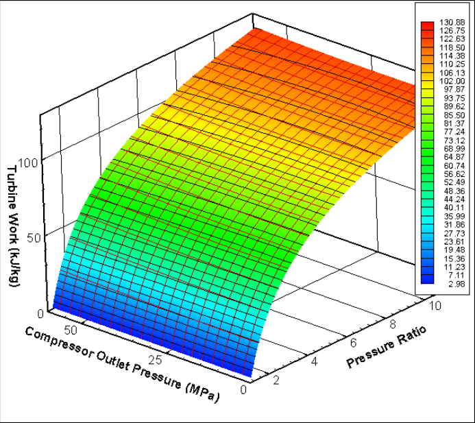

**Figure 2.2 CO2 turbine work** 

and smaller. Since the turbine work of CO2 follows this behavior, one can see that in the turbine the fluid behaves almost as an ideal gas. Only at very high-pressure ratios is the deviation from this behavior noticeable. However, these ultra-high-pressure ratios are not 

relevant since the cycle would not be operated in this region because of efficiency and material considerations. 

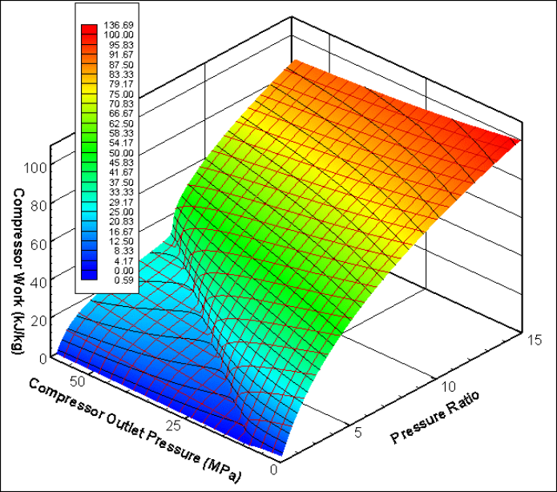

**Figure 2.3 CO2 compressor work** 

Since the compressor operates close to the critical point one would expect to see significant deviations from ideal gas behavior in compressor work.  A figure similar to Figure 2.2 showing the compressor work for different pressure ratios and different compressor outlet pressures was developed using compressor efficiency of 89% and compressor inlet temperature of 32[o] C (Figure 2.3). This figure shows that the compressor work changes significantly as a function of operating pressure and pressure ratio; both parameters are linked to the deviation from ideal gas behavior.  For a compressor operating with ideal gas one would see the same profile as was observed for the turbine. However, the proximity of the critical point significantly affects the compressor work. Once the inlet pressure exceeds the critical pressure (7.38 MPa) the compressor work is significantly reduced.  One can also observe the less steep rise of compressor work with the pressure ratio than in the case of the turbine.  Therefore, the cycle optimum pressure ratio will have lower values, since at those values the compressor work is low and the 

turbine output is high.  The reduction of the compressor work comes from the low compressibility of CO2 near the critical point.  The density change for different pressures is not very high and thus the compression work is reduced.  This is the main reason why supercritical CO2 cycles achieve an advantage over the ideal gas Brayton cycle, where the gas exhibits the same trends in both turbine and compressor. 

Unfortunately, the reduction of the compressor work is only one of the effects caused by the non-ideal properties.  The specific heat, which affects recuperator design in particular, also varies widely.  It is known [Feher, 1967], that for certain cycle operating conditions a pinch-point exists in the recuperator.  The pinch-point is the location in the recuperator with the lowest – in the limit zero – temperature difference.  Due to the radical temperature and pressure dependence of specific heat, the temperature difference between the hot and the cold fluid varies widely within the recuperator.  Thus, even for the single-phase state of the CO2 working fluid the minimum value of the temperature difference is not always achieved at the recuperator inlet or outlet, but sometimes somewhere along the recuperator.  An overly simple analysis of the cycle based only on identifying component end state points would not reveal this behavior.  Therefore, it is necessary to evaluate the local temperature difference throughout the recuperator, and the minimum temperature difference encountered is an important parameter in cycle evaluation.  For an ideal gas such as helium, the design of the recuperator is not complex since the recuperator temperature difference is almost constant and depends only on the temperatures and pressure ratio at which the cycle operates.  In the case of CO2 the operating pressure is important as it affects the temperature difference in the recuperator and the resulting regenerated heat, which affects the cycle efficiency and the size of the recuperator.  For these reasons it is necessary to investigate the behavior of the cycle over a wide range of possible operating pressures in order to find the optimum for cycle design [Dostal et al., 2002]. 

In order to demonstrate the pinch-point behavior a simple analysis was carried out. The component characteristics such as pressure drops and turbomachinery efficiencies were kept constant as well as the maximum and minimum cycle temperatures and the operating pressure and pressure ratios were varied.  The minimum temperature difference 

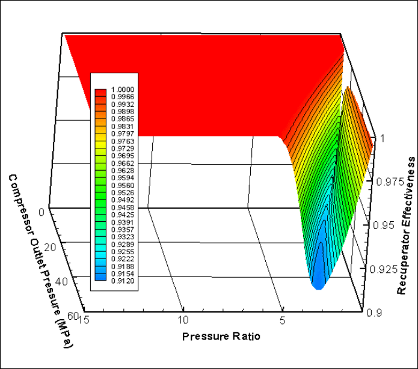

**Figure 2.4 Recuperator effectiveness of a Brayton cycle without inter-cooling** 

in the recuperator was set to 0[o] C and the recuperator effectiveness was evaluated.  Figure 2.4 shows the result of this analysis.  If an ideal gas was used instead of CO2 the recuperator effectiveness for zero temperature difference in the recuperator would be 1 (or 100%, i.e. all available heat is recuperated) regardless of the operating conditions. Thus, from Figure 2.4 one may see that there is a region of operating pressures and pressure ratios in which a pinch-point occurs (the region where the recuperator effectiveness is less than one).  Figure 2.5 shows a cut from Figure 2.5 viewing it from the top (note the change of scale on the pressure ratio axis), so the pinch-point region (region where the recuperator effectiveness is less than one) is more clearly visible.  In the extreme case it is impossible to regenerate about 10% of available heat.  All operating pressures of the cycles that operate in the pinch-point region are supercritical.  However the beginning of the pinch-point region does not precisely correspond to the critical pressure.  It turns out that slightly higher pressure than critical is necessary to start seeing the pinch-point behavior in the recuperator. From this picture one may see that for certain operating conditions it is impossible to regenerate all available heat unless additional 

steps are taken. If the minimum temperature difference in the recuperator were changed from zero to some positive value (which would be necessary in a real application), the pinch-point region would increase. 

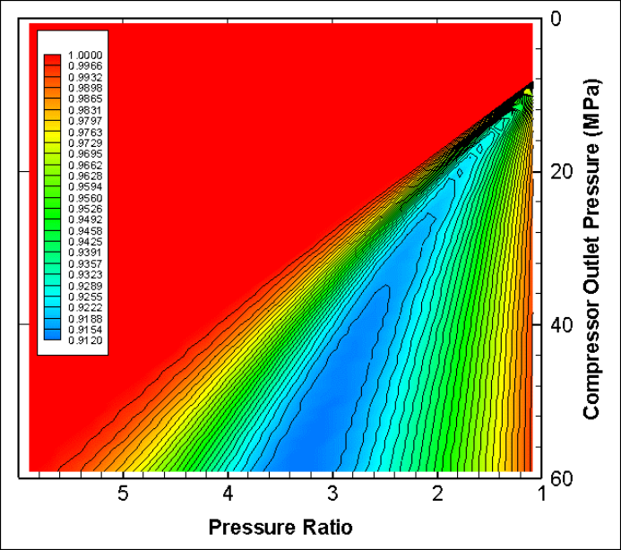

**Figure 2.5 Recuperator effectiveness of a Brayton cycle without inter-cooling (top view)** 

Figure 2.6 shows the temperature difference profiles for cycles operating with a turbine inlet temperature of 550[o] C and at the optimum pressure ratio.  The pinch-point problem is clearly visible.  Up to about 21 MPa the recuperator effectiveness for cycles operating at optimum pressure ratio is 1.  That means no pinch-point problem.  The minimum temperature difference exists at the cold end of the recuperator.  However as the compressor outlet pressure increases past 21 MPa the highest efficiency and optimum pressure ratio for these pressures falls into the pinch-point region, where the recuperator effectiveness is less than 1.  In Figure 2.6 it is identified by the complete change in the temperature difference profile.  The minimum temperature difference (zero in our case) now exists somewhere within the recuperator, however the location is not fixed. 

The preceding discussion has laid the bases for the discussion of supercritical CO2 cycle investigations.  Being familiar with the cycle behavior we can proceed to the history of investigation of the supercritical CO2 cycle. 

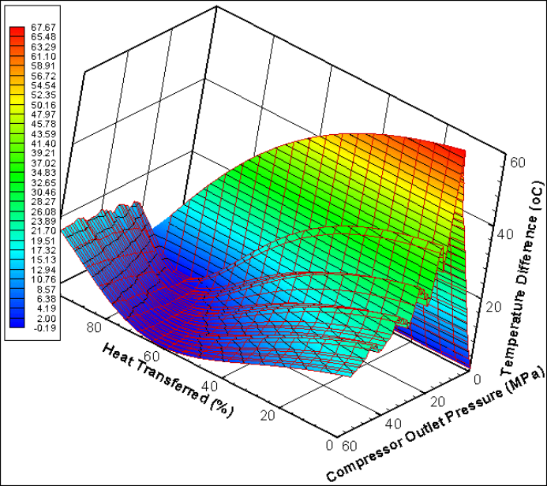

**Figure 2.6 Temperature difference profile in the recuperator of a simple Brayton cycle** 

## _**2.3 History of the Supercritical CO2 Cycle**_ 

In some thermodynamic texts this kind of cycle would be called transcritical or hypercritical.  The reason for this is to distinguish this type of cycle from the supercritical Rankine steam cycle, where the working fluid is compressed to pressures above the critical pressure and expands to subcritical pressure, e.g. only the high-pressure part of the cycle operates above the critical pressure.  The first CO2 cycle design in the United States was proposed by E. G. Feher [Feher, 1967].  In the case of the Feher cycle all pressures are supercritical, however he does not call the cycle trans – or hyper-critical, but supercritical.  For these historical reasons it was decided for the purpose of this work to adopt the Feher nomenclature and call the cycle supercritical without regard to whether 

it operates entirely or partly above the critical pressure since in our case both situations may occur. 

The supercritical CO2 (S-CO2) Brayton cycle has a very long history. The oldest reference found is from 1948, when Sulzer Bros patented a partial condensation CO2 Brayton cycle [Sulzer Patent, 1948].  The advantage of CO2 fluid was quickly realized and investigation of supercritical CO2 cycles was carried on in many countries: by Gokhstein and Verhivker in the Soviet Union [Gokhstein and Verhivker, 1969], [Gokhstein, 1971], Angelino in Italy [Angelino, 1968], [Angelino, 1969],  Feher in the United states [Feher, 1967], Sulzer Brown – Boveri in Switzerland [Strub and Frieder, 1970] are the most important among many others.  The following sections discuss their contributions to supercritical CO2 cycle evaluation and development in more detail. 

## 2.3.1 Feher’s Cycle 

In the United States a cycle employing CO2 was proposed in 1967 by Ernest G. Feher [Feher, 1967] as a follow-up on his earlier report on supercritical cycles in general [Feher, 1962].  He proposed a power cycle that operates entirely above the critical pressure of CO2, is regenerative, and the compression is performed in the liquid phase. He postulated that an engine based on this cycle would be very compact and can be used for electric power generation (terrestrial or space) or to produce shaft power for propulsion.  His paper very transparently illustrates the pinch-point problem using the enthalpy temperature diagram.  As shown in Figure 2.7 for two constant pressure lines, if the same enthalpy increments are taken the temperature increments are different.  This ultimately causes the pinch-point problem as described in the preceding section. 

The original Feher cycle operated between 700[o] C and 20[o] C with a pump inlet pressure of 13.8 MPa.  His results show the small dependence of cycle efficiency on the pressure ratio once the pressure ratio of 2 is exceeded.  It is important to point out that he kept the pump inlet pressure constant.  Therefore, he failed to determine whether an optimum pump inlet pressure exists.  An investigation of optimum operating pressures was performed in [Dostal et al., 2002] and the findings are used later in this work.  The 

investigation of recuperation at different pinch-point temperatures revealed that the higher the pinch-point temperature the more pronounced is the effect of the pressure ratio.  Due to the low pumping power the pump efficiency does not have a significant effect on cycle efficiency.  The effect of turbine efficiency was the same as for the usual Brayton cycle.  Taking into account the characteristics of real turbomachinery brings the optimum pressure ratio down to the range of 2 to 3 for a turbine efficiency range of 70 to 90%. 

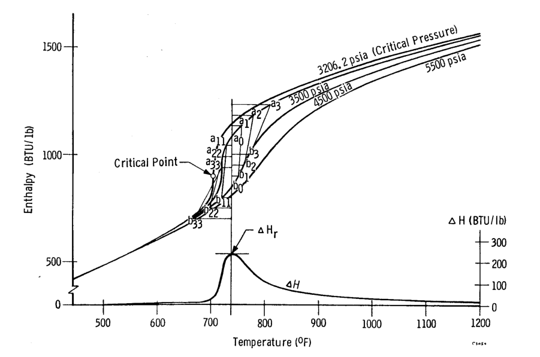

**Figure 2.7 Enthalpy - temperature diagram of CO2 [from Feher, 1967]** 

The effect of pressure drops was investigated as well.  Feher defined the total system fractional pressure drop as: 

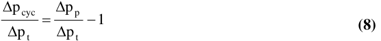

where ∆ p cyc is the sum of the pressure drops from the compressor outlet to turbine inlet and from turbine outlet to the compressor inlet, ∆ p p is the pressure rise across the pump 

and ∆[p] t is the pressure rise across the turbine. A fractional pressure drop of 0.075 reduces the cycle efficiency by about 5% (see Figure 2.8).  This figure clearly identifies the importance of pressure drops for efficiency calculations. 

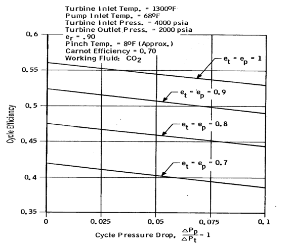

**Figure 2.8 Effect of pressure drops on cycle efficiency [from Feher, 1967]** 

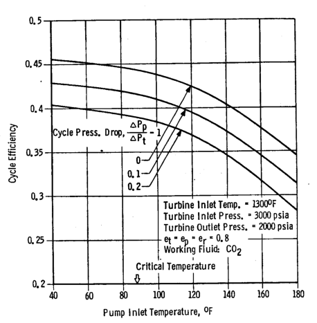

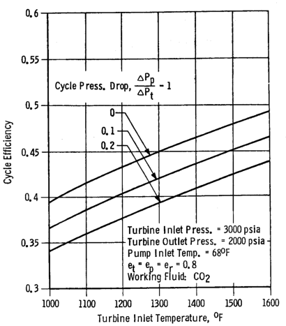

**Figure 2.9 Effect of maximum and minimum temperature on the Feher cycle [from Feher, 1967]** 

Furthermore, he investigated the effect of pump inlet and turbine inlet temperature for different pressure drops. The results are shown in Figure 2.9. Again, the effect of pressure drop on the cycle efficiency is clearly visible. 

Feher concluded that high thermal efficiency is achievable with this type of cycle. The volume to power ratio is very low and the cycle is not very sensitive to the compressor efficiency. 

## 2.3.2 Condensation Cycles and Cycles with Sub-critical Temperature 

Angelino performed one of the most detailed investigations of the supercritical CO2 cycle.  Unfortunately, his prime focus was on condensation cycles [Angelino, 1967], [Angelino, 1968] and [Angelino, 1969]. 

He concluded that at turbine inlet temperatures higher than 650[o] C single heating CO2 cycles exhibit a better efficiency than reheat steam cycles.  He also recognized the suitability of the cycle for high temperature nuclear heat sources.  However, the requirement for very low temperature cooling water represents a geographical limitation to the possible use of such CO2 cycles.  Among the reasons in favor of CO2 cycles over steam cycles he mentioned the low efficiency improvement of the steam cycle for turbine inlet temperatures above 600[o] C compared to CO2 cycles and the steam cycle’s complexity.  The main advantage over the ideal gas Brayton cycle is the significantly higher efficiency. 

In the first two analyses [Angelino, 1967 and 1968] the focus was completely on condensation cycles.  The first [Angelino, 1967] investigated the possible use of fully condensing cycles, however it was found that they exhibited a large internal irreversibility due to the heat transfer from the low specific heat turbine exhaust stream to the high specific heat pump exit stream (pinch-point problem). 

In order to overcome these problems he introduced four different so called compound condensation cycles.  It should be noted that some cycle layouts he used could 

be employed in non-condensing cycles as well.  Figure 2.10 shows the cycle layouts from his second study [Angelino, 1968]. 

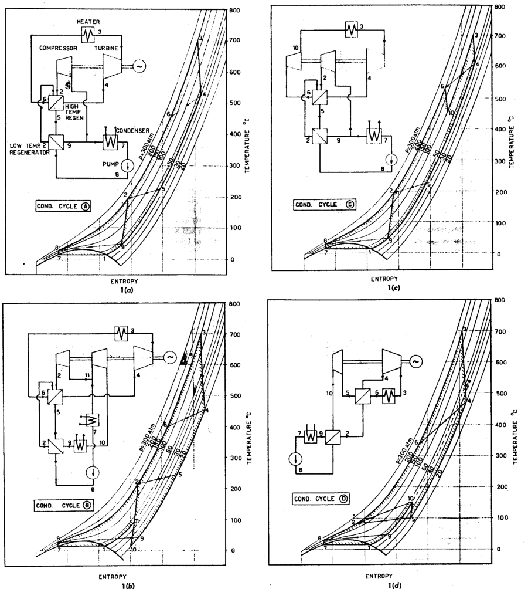

**Figure 2.10 Condensation cycles considered in [Angelino, 1968]** 

The most promising cycle is the cycle A (re-compression cycle).  Cycle B was introduced in order to make the turbine exhaust pressure independent of the condensing pressure (re-compression cycle with pre-compression).  Cycle C was introduced in order to minimize the stresses in the hottest components.  Part of the expansion occurs before 

the heat addition, so the heat source can operate at lower pressure.  The last cycle, cycle D, is the pure pre-compression cycle.  The high temperature required to achieve better performance than the steam cycles is caused by the cycle assumptions Angelino made. His turbine isentropic efficiency of 90% is reasonable, however, his compressor and pump efficiency of 85% appears too low, causing the resulting cycle efficiencies to be about 2% lower than if 89% compressor efficiency, which can be achieved with today’s compressors, was used.  Recuperator design was not performed.  A total cycle fractional pressure drop of 0.15 is assumed, which is probably reasonable, however as this number is fixed without regard to the operating pressure or cycle layout the results are biased. The second effect is that the more complicated cycles would have a higher fractional pressure drop.  He also selects the minimum temperature difference of 30[o] C for the high temperature recuperator and 15[o] C for the low temperature recuperator.  With current compact heat exchanger technology those minimum temperature differences can be further reduced while still retaining a reasonable heat exchanger volume.  This leads to a significant improvement of the cycle efficiency [Dostal et al., 2002].  Finally, the pump inlet temperature of 15[o] C is very close to the critical temperature of 30.98[o] C, which may cause severe pump cavitation problems. 

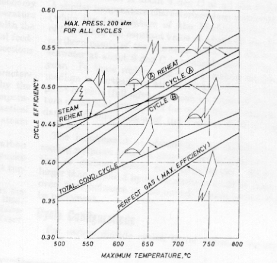

**Figure 2.11 Cycle efficiency comparison [from Angelino, 1968]** 

Despite these deficiencies he was able to demonstrate the significant advantage over ideal gas cycles and competitiveness with steam cycles (Figure 2.11).  The only component for which the preliminary design was completed was a turbine.  As can be seen in Figure 2.12 the compactness compared to the steam turbine is striking. 

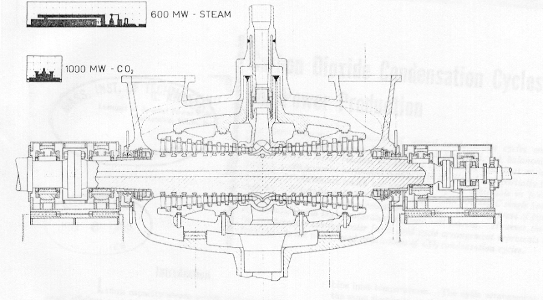

**Figure 2.12 Carbon dioxide turbine for 1000 MW net output, inlet 30 MPa, 565[o] C [from Angelino, 1968]** 

Angelino concluded that at about 650[o] C the efficiency of the condensing recompression cycle and that of steam cycle having the same maximum pressure are equal. He suggested that application of CO2 cycles is two-fold.  At low temperatures (400550[o] C) even though the cycle’s efficiency is inferior to that of the steam cycle its simplicity and compactness could prove more economic.  At high temperatures (650 to 800[o] C) a CO2 cycle offers a substitute for the steam cycle due to its simplicity, compactness and higher efficiency.  The application to high temperature gas-cooled reactors is particularly interesting.  The conclusion that structural materials allowing operation up to 800[o] C in CO2 are available is probably a bit overstated, since even today such high temperatures present a challenge to structural materials.  The non-corrosive helium Brayton cycle might be favored for such high temperature applications. 

In 1969 Angelino summarized his previous findings and extended the analysis to higher pump inlet temperatures and a wider range of operating pressures. [Angelino, 1969].  The cycle layouts and temperature entropy diagrams used in this new study are shown in Figure 2.13.  Some of these cycle layouts were investigated in his preceding study, however this study looked at a wider range of operating conditions, therefore some of the cycle layouts were investigated again.  In addition to the previously mentioned advantages of CO2 (availability and low cost) he adds very good thermal stability up to 1500[o] C and for the investigated pressures (2 - 40 MPa) a decomposition of CO2 which is negligibly small [Bailey, 1965].  Higher inertness than air or steam, and a very small neutron absorption cross-section, that makes it a suitable coolant for gascooled reactors, are also noted.  Furthermore, due to its extensive use in gas-cooled reactors the technology related to handling large CO2 quantities in closed circuits is well established. 

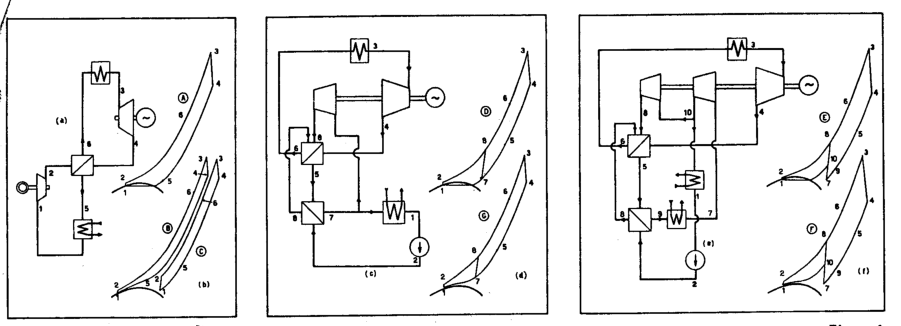

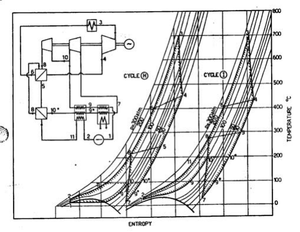

**Figure 2.13 Cycles investigated by Angelino in 1969 [from Angelino 1969]** 

An important fact that Angelino recognizes is that full advantage of the beneficial reduction of specific volume (low compressor work) and minimization of the penalty of the detrimental effect of differences in heat capacity (pinch-point problem) must be realized in order to achieve high efficiency.  This ultimately results in more complex cycle layouts, such as recompression and pre-compression recompression cycles. 

Among the important technical aspects he mentioned is the 5 to 10 times smaller expansion work than in the case of advanced steam cycles.  This results in a much lower number of stages than for steam turbines.  The radial dimensions of turbomachinery are a strong function of the volumetric flow rate; the exhaust volumetric flow rate is of main importance.  Exhaust flow per unit power is 30 to 150 times less than that of steam.  As a consequence the radial dimensions of CO2 turbines can be extremely small even for very high power ratings. 

The most promising cycle layouts are the re-compression cycle and the recompression cycle with pre-compression.  The later is especially beneficial when used at medium pressures (10 – 18 MPa), while the re-compression cycle achieves the highest efficiency at pressures 18 MPa and higher.  The reason for this behavior is that the turbine outlet pressure is independent of the pump inlet pressure in the case of a recompression cycle with pre-compression, therefore there is more flexibility for optimization.  However it requires more components and thus a more complex cycle layout.  The summary of cycle efficiencies for 13 and 30 MPa is presented in Figure 2.14. 

The overall conclusion drawn from this study is that real gas effects if properly accounted for represent a powerful tool to improve cycle efficiency.  For a cooling water temperature of 5[o] C and turbine inlet temperature of 700[o] C cycle efficiencies better than that of a double re-heat steam cycle at the same maximum temperature and in excess of 50% are achievable.  The superiority of re-heat CO2 cycles over the double re-heat steam cycle is maintained up to the cooling water temperature of 20[o] C.  Furthermore, CO2 will benefit much more from the use of higher temperatures.  If the minimum temperature of the working fluid cannot be lowered below 30[o] C the limit of CO2 cycle superiority is shifted to 800[o] C.  However, lower temperature application is still attractive. 

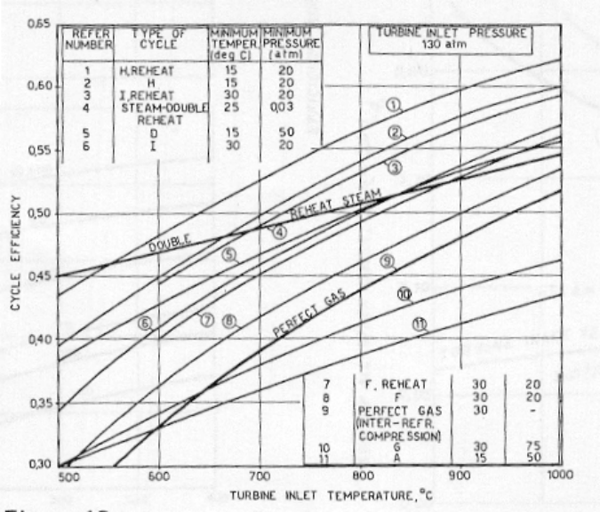

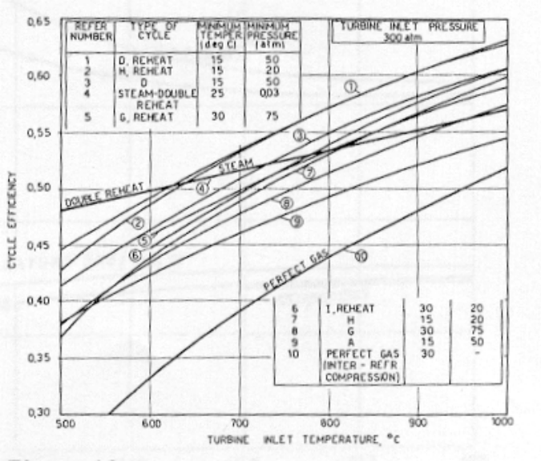

**Figure 2.14 Summary of the performance of different CO2 cycles [from Angelino, 1969]** 

At 500[o] C turbine inlet temperature and 20[o] C cooling water temperature the CO2 cycle without re-heat achieves an efficiency of around 38%.  It should be pointed out that by use of the new technology of compact heat exchangers the achievable cycle 

efficiencies for a given temperature are higher today than that from Angelino’s work. Never heless, his study can st till serve as an excellent comparison of different CO2 cycle layouts. 

## 2.3.3 150 kWe Feher Cycle Test Loop 

In 1970 a 150 kWe supercritical CO2 loop was designed [Hoffman and Feher, 1970]. The focus was on exploring the potential of the S-CO2 cycle for small terrestrial nuclear systems.  They recognized the potential for high thermal efficiency and compact machinery.  Because the cycle is highly regenerative it receives heat over a narrow temperature range, which makes it well suited for nuclear reactors.  The proposed heat source is a helium cooled nuclear reactor operating at 760[o] C and 3.5 MPa.  The cycle used static frequency conversion, because the high speed and high pressure dynamic seals were incompatible with the lifetime requirements imposed on the cycle, and frequency conversion by a motor generator set did not conform with the low weight requirements. A two-shaft arrangement was selected because of higher system efficiency and easier start-up.  The main reason is the incompatibility of the pump and turbine optimum rotational speeds.  Turbines in series were used because the reduction of head across each turbine increases turbine efficiency.  Several working fluids were scoped for possible application.  CO2 was selected because of its good critical properties, good thermal stability, low corrosion levels with the materials used; furthermore it is not poisonous, it is abundant, has relatively low cost and its thermodynamic and transport properties are well known.  The cycle operated entirely above the critical pressure of carbon dioxide. The proposed cycle was regenerative and the compression process was performed in the liquid phase below the critical temperature (critical point 7.38 MPa, 30.98[o] C).  The high pressure of the working fluid enables the cycle to be very compact, due to the high CO2 density.  However, condensing CO2 cycles require an available year-round supply of very cold cooling water (10 – 15[o] C), so they cannot be applied generally.  The cycle upper operating temperature was 732[o] C in order to keep the intermediate heat exchanger at acceptable size.  The pump inlet temperature was set at 66[o] C.  The alternator shaft speed optimization yielded 40,000rpm.  A single stage pump was used.  Turbine inlet pressure 

was 11.4 MPa and a turbine pressure ratio of 2 was used.  The major components such as pump, turbine and recuperator were designed.  The pump efficiency achieved 75%, for the turbine driving the pump the maximum efficiency was over 88%.  For the power turbine a more compact (2 stages) rather than a highly efficient (4 stages) design was selected, yielding an efficiency of 85%.  The tube inner diameter for the recuperator was 2.3mm.  The pre-cooler was a CO2 to air atmospheric heat exchanger.  Start-up and control methods were postulated as well.  Part load operation was achieved by use of a parasitic load bank.  The turbine bypass control method was rejected because of the high requirements on the bypass valve.  Figure 2.15 depicts the 150 kWe power cycle module, showing the basic dimensions. 

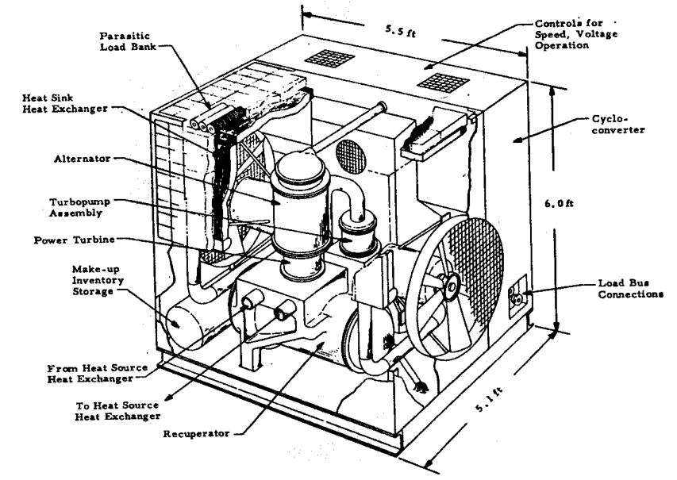

**Figure 2.15 Schematic of the Hoffman – Feher 150 kWe S-CO2 power cycle module [from Hoffman and Feher, 1970]** 

## 2.3.4 Case Study Designs 

During the late 1960s and early 1970s the investigation shifted from thermodynamic studies to more detailed design studies.  These studies used two different cycle layouts: 

the recompression cycle and the Brayton cycle with three compression stages and two inter-coolers (sometimes with re-heat).  Figure 2.16 depicts the temperature entropy diagrams of the CO2[ cycles ] that were investigated in the most depth. The reason why the compressor outlet temperatures are different in the case of cycles with three compressors and two inter-coolers is the effort to minimize the temperature at which heat is rejected from the cycle.  For this particular design the specific heat is the largest in the first intercooler and smallest in the pre-cooler.  In order to equalize the mean temperature of heat rejection the inter-cooler and pre-cooler temperatures have to differ given that the outlet temperatures are the same. 

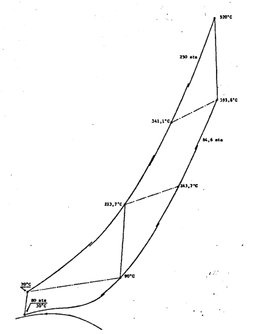

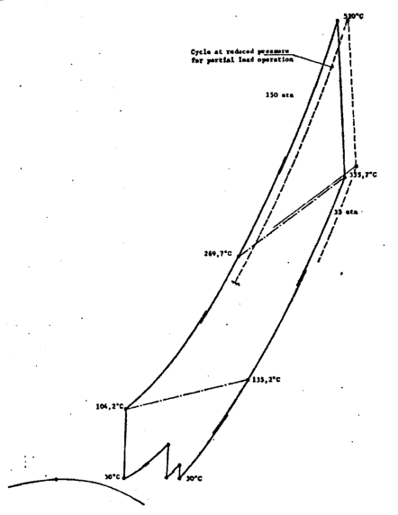

**Figure 2.16 Temperature entropy diagrams of the investigated cycle layouts [from Dievoet, 1968]** 

In 1968 J. P. Van Dievoet proposed a coupled sodium – CO2 fast breeder reactor concept [Dievoet, 1968].  He pointed out the simplification of the typical three loop (primary, intermediate, power cycle) sodium plant to the two loop only plant, because of the satisfactory chemical compatibility of CO2 with sodium.  Although the sodium CO2 chemical reaction is exothermic it does not produce hydrogen.  The reaction products, sodium carbonate and free carbon are not readily corrosive.  In addition the relatively 

small speed of sound in CO2 provides a safety feature in limiting the gas flow rate in case of a major tube rupture. 

Three different cycle layouts were proposed, each for a different pressure level.  The Brayton cycle with three compressors and two inter-coolers operated at the maximum pressures of 10 to 15 MPa.  This cycle achieved efficiencies on the order of 35 to 40%. The same cycle with the addition of a re-heat stage operated at 18 to 25 MPa was capable of achieving efficiencies above 40%.  The recompression cycle layout was used at highpressures of 25 to 30 MPa and achieved even higher efficiencies but was penalized by the thick wall of the components.  For the assumed maximum CO2 temperature of 520[o] C the net efficiencies of these three cycles were 33.42%, 35.14% and 35.30% respectively. This did not compare well to the superheated steam cycle net efficiency of ~41%.  This indicates that the Brayton cycle with multiple inter-cooling and re-heating is capable of achieving about the same efficiencies as the recompression cycle.  Unfortunately, these studies did not investigate the design of the particular components and therefore, a direct comparison of cycle capital costs is not impossible. 

In 1970 Strub and Frieder [Strub and Frieder, 1970] investigated the recompression CO2 cycle as an indirect cycle for helium cooled fast breeders.  They claim the following advantages for using the indirect CO2 cycle: 

- Helium is preferred to CO2 as a reactor coolant due to its excellent cooling capabilities and inertness. 

- The reactor design and development is independent of the CO2 cycle development and the reactor can be used with any other indirect cycle. 

- Small leaks of CO2 into the helium side are less disturbing than a steam leak due to the similar nuclear properties of helium and CO2.  The corrosion is also a smaller problem in such a case. 

- CO2 is much cheaper than helium (about 250 times per unit weight and 24 times per unit of volume) and its leakage problems in the gas  turbine cycle are therefore orders of magnitude less severe than with helium 

- Since CO2 can be stored in the liquid phase at relatively low pressures the required storage capacity is smaller than for helium. 

- CO2 gas turbine cycles achieve higher efficiencies than the helium Brayton cycles at fast breeder reactor temperatures. 

- Since the entire gas turbine plant is in the secondary loop it can be placed in the open air. 

- The cooling system can be of the direct type because the primary coolant is not in direct contact with the cooling water. 

- With CO2 in the secondary circuit higher cycle temperatures could be used in the future 

- The size of the turbomachinery is smaller than for steam or helium cycles. 

The disadvantage of CO2 indirect cycles is mainly in the supplemental helium – CO2 heat exchanger leading to a longer concrete vessel and supplementary losses. Nevertheless, Strub and Frieder thought that the indirect cycle was highly desirable from the safety standpoint and the direct gas turbine cycle should be introduced only after careful consideration regarding maintenance and safety. 

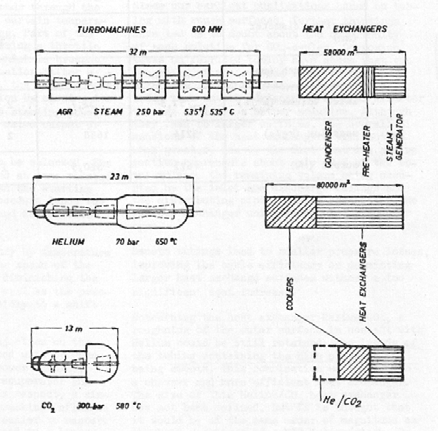

**Figure 2.17 Comparison of component sizes for different power cycles [from Strub and Frieder, 1970]** 

With respect to the cycle layout condensation cycles were not considered because of the requirement of a year round supply of very cold cooling water.  In addition the partial condensation cycle is very complex.  Starting and power regulation are difficult in order to keep the balance between the pump and compressor.  Therefore, they focused on investigating the recompression CO2 cycle.  The study looked at cycles operating at 580[o] C and 700[o] C between 8 and 34 MPa.  The calculated efficiencies were 38% for a turbine inlet temperature of 580[o] C and 42% for a turbine inlet temperature of 700[o] C.  The turbomachinery efficiencies were selected to be conservatively low (82% for the main pump, 86% for the recompressing compressor and 90% for the turbine).  Figure 2.17 shows the comparison of the main component sizes for steam, helium and CO2 cycles. 

There were other studies of the recompression cycle [Watzel, 1971] and [Pfost and Seitz, 1971] and a cycle with three compressors and two inter-coolers [Chermanne, 1971].  These studies reached the same conclusions as those that have been already described in this section. 

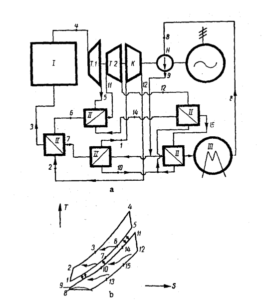

**Figure 2.18 Schematics and temperature entropy diagram of the CO2 binary cycle [from Gokhstein and Verkhivker, 1969]** 

## 2.3.5 Binary Supercritical CO2 – Water Vapor Cycle 

Figure 2.18 shows another possible application of the CO2 cycle.  This binary cycle was proposed by Gokhstein and Verkhivker in 1969 [Gokhstein and Verkhivker, 1969]. CO2 is used as a reactor coolant.  The primary loop is a simple Brayton cycle.  The secondary side can be either steam or, in this case, a condensing supercritical CO2 cycle. The efficiency of this cycle at 675[o] C, 3.2 MPa in the primary side and 10 MPa in the secondary side was estimated to be 44.5 %.  If the temperature was raised to 675[o] C the efficiency reached 52%.  The conclusion of this study was that further scientific and engineering investigation of this cycle is desirable and if CO2 could indeed be used as a heat carrier for fast reactors an improvement in efficiency of 10% over current light water reactors is possible. 

## 2.3.6 ECAS study 

In 1976 General Electric performed the Energy Conversion Alternatives Study that compared advanced energy conversion systems for utility applications using coal and coal derived fuels.  The study compared 10 different energy conversion systems: open cycle gas turbine, recuperative open cycle gas turbine, closed cycle gas turbine with helium, supercritical CO2 cycle, advanced steam cycle, liquid metal topping cycle, open cycle MHD, closed cycle inert gas MHD, closed cycle liquid metal MHD and fuel cells. The summary of the results is presented in Figure 2.19.  The chart shows the cost of electricity and efficiency of the investigated advanced energy conversion systems. 

Figure 2.19 shows that the supercritical CO2 cycle did not perform well in this comparison.  This is easy to foretell from the operating conditions that were selected in this study.  The pump discharge pressure was 26.5 MPa and the turbine inlet temperature was 732[o] C.  At these conditions the cycle achieved 48% thermal efficiency, however additional station losses, mainly the heat loss from the stack, resulted in a net efficiency of 40%.  This reduction is about twice as much as in the case of the advanced steam cycle.  This clearly demonstrates that the supercritical CO2 cycle is not well suited for application to fossil-fired power plants.  The high cost of electricity is a result of very 

high pressure and very high temperature.  The study does not explain why such extreme conditions were used.  One has to infer that efficiency rather than cost of electricity was the target.  Thus, to achieve net efficiencies on the order of 40%, high temperature was necessary.  The high pressure is questionable since above 20 MPa the efficiency of the supercritical CO2 cycle is not significantly improved [Dostal et. al, 2002]. 

In the case of a nuclear power plant the situation is quite different, as the net efficiency is not compromised by the stack heat losses and thus an efficiency around 45% is achievable at a turbine inlet temperature of 550[o] C and a compressor outlet pressure of 20 MPa.  This significantly reduces the capital cost of the supercritical CO2 cycle and it is one of the main objectives of this work to demonstrate that this cycle is significantly less expensive than the steam cycle. 

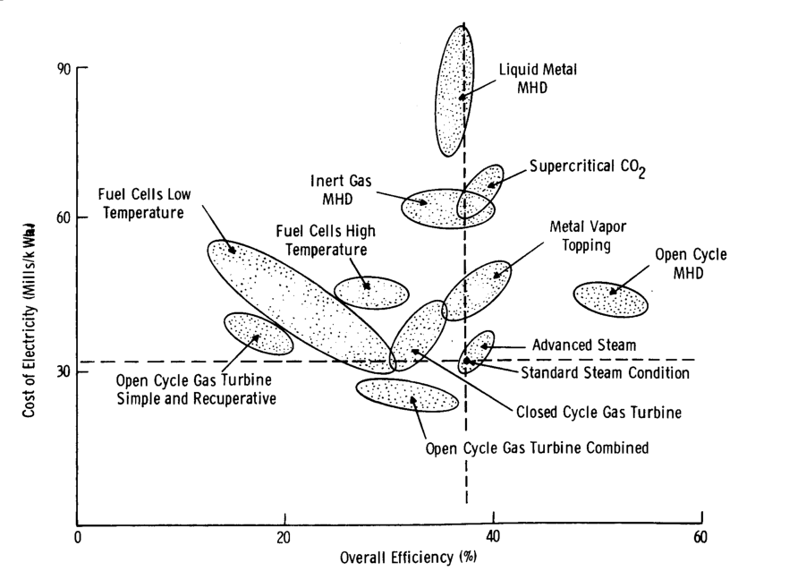

**Figure 2.19 Summary of results of the ECAS evaluation [from Corman, 1976]** 

## 2.3.7 Supercritical CO2 Cycle for Shipboard Application 

Another possible recognized application of the supercritical CO2 cycle is for shipboard application.  The very compact and highly efficient supercritical CO2 cycle can realize volume and fuel savings for ships.  This application was investigated by O. Combs [Combs, 1977].  In his thesis Combs focused on the Feher cycle and the recompression cycle (both cycles have been described in the preceding sections).  The conclusion of the work was that both cycles achieved large fuel savings (Feher cycle ~25% saving, recompression cycle ~27% saving) and are therefore suitable for ship propulsion.  Combs selected the simple Brayton cycle as a primary option due to its higher compactness, which is very important for the shipboard application.  For a terrestrial application the situation is different. 

## _**2.4 Supercritical CO2 Cycle – the Revival**_ 

Despite all prior investigations the supercritical CO2 cycle has not been deployed in practice.  The main reasons were insufficient turbomachinery experience, lack of suitable compact heat exchangers and the absence of a suitable (e.g. nuclear) heat source.  In the past several years high temperature gas-cooled reactors and medium temperature liquid metal or molten salt reactors have been given renewed attention.  Economics of the overall power station, including the power conversion system, play a key role in determining whether their actual deployment takes place.  As more thermally and cost efficient power cycles are sought, gas working fluid cycles, mainly the helium Brayton cycle, have become of prime interest.  Given the significant technological development of turbomachinery and compact heat exchangers in the past two decades the closed gas turbine cycles are getting a second look.  Specifically, the investigation of supercritical CO2 cycles has started again. 

## 2.4.1 Supercritical CO2 cycle at the Czech Technical University 

In 1997 an investigation of the supercritical CO2 cycle for possible use in new power plants was conducted at the Czech Technical University in Prague, Czech Republic 

[Petr et al., 1997].  The study focused on the Brayton and recompression supercritical CO2 cycles.  The effect of re-heating on the recompression cycle was investigated as well.  The re-compression cycle with re-heating gave the best cycle efficiency.  It was found that this type of cycle is mainly suited for high temperature nuclear reactor application and for combined cycle fossil technology, however here the benefit is not as significant and more detailed studies have to be conducted in order to determine the benefits.  The main disadvantage is the low specific work of the supercritical CO2 cycle compared to steam or helium, which results in smaller system efficiency improvements compared to the traditional combined cycles, because the fraction of total power output provided by the supercritical CO2 cycle is low. 

The work continued and in 1999 the published conclusions were [Petr et al., 1999]: 

- Due to the high pressure of CO2 at the turbine inlet (25 – 30 MPa) the maximum turbine inlet temperature is, due to material considerations, limited to ~600oC. 

- The cycle efficiency is higher than the helium or air Brayton cycles operating at the same parameters. 

- For application to fossil power plants it is necessary to co-utilize a steam cycle.  The efficiency of such a combined cycle is on the order of 51%, which, however, does not exceed the efficiency of current gas turbine/Rankine combined cycles. 

- For nuclear heat sources the most promising is the application to reactors operating with outlet temperatures of 450 – 600[o] C, which are mostly in the developmental stage. 

- Overall the application venue of the supercritical CO2 cycle is very narrow, and depends on the future development of suitable nuclear reactors. 

A preliminary design of turbomachinery was performed demonstrating their compactness and high efficiency (more than 90%).  The seals and blades may need further investigation as their parameters are out of the range of current industrial practice; nevertheless there are no significant issues that would prevent this development. 

## 2.4.2 Supercritical CO2 cycle at the Tokyo Institute of Technology 

Another institute that is currently investigating the supercritical CO2 cycle is the Tokyo Institute of Technology in Japan [Kato et al., 2001].  The work here at first focused on partial condensation cycles, but given the difficulties with the supply of the cold cooling water the current reference design is a partial cooling cycle.  A thermal efficiency of 50% at 12 MPa was achieved with the partial cooling cycle operating at a reactor outlet temperature of 800[o] C. 

Recently, a corrosion loop was built at the Tokyo Institute of Technology and corrosion studies of candidate materials for use in the supercritical CO2 cycle are in progress.  One part of the corrosion loop is a HEATRIC design printed circuit heat exchanger.  This type of heat exchanger is vital for the future successful implementation of the cycle and its testing is of prime interest. 

## 2.4.3 Supercritical CO2 cycle at other institutes 

In the United States the investigation of the recompression supercritical CO2 cycle was resumed in the year 2000 at MIT under collaboration with INEEL.  An indirect supercritical CO2 recompression cycle was designed for a lead-bismuth eutectic cooled reactor [Dostal et al., 2001].  A net efficiency of 41% was calculated for a compressor outlet pressure of 20 MPa and LBE reactor outlet temperature of 555[o] C.  Currently, both direct and indirect versions for fast gas cooled reactors are being pursued. 

At Argonne National Laboratory the recompression cycle is being evaluated for the STAR-LM reactor [Moisseytsev et al., 2003], and at INEEL the CO2 Brayton cycle with multiple inter-coolers operating at temperatures above 900[o] C is being investigated for thermal spectrum gas cooled reactors [Oh, 2002]; both are NERI projects. 

## _**2.5 Summary**_ 

This chapter described the benefits of compression near the critical point, the causes of the pinch-point problem and the past investigations of supercritical CO2 cycles.  The 

advantage of the supercritical CO2 cycle over ideal gas cycles lies in the reduced compression work.  The vicinity of the critical point significantly affects the properties of CO2.  The fluid is very dense in this region and its compressibility is low, therefore the compression work is reduced substantially and more turbine work is available for the generator.  However, the specific heat is affected as well.  The different and variable values of specific heat on the high and low pressure side of the recuperator affect the temperature difference between the hot and cold fluids.  For certain operating conditions the minimum temperature difference may be reached inside rather than at the hot or cold ends of the recuperator.  Therefore, simple cycle analysis based on the cycle component end state points is not sufficient since there may be a negative temperature difference in the recuperator, which violates the laws of thermodynamics.  Thus, one always has to check the temperature difference through the recuperator in order to determine the achievable recuperator effectiveness. 

The investigation of the supercritical CO2 cycle in the past focused more often on the condensing cycle, for which widespread application is prevented by the requirement of a year round supply of very cold cooling water (~10[o] C).  Fortunately, the same cycle layouts that were investigated for the condensing cycles can also be used in the gas only state.  The early thermodynamic studies were reviewed, and led to identification of the two most promising cycle layouts, the Brayton cycle with two inter-coolers, and the recompression cycle.  The advantages of the supercritical CO2 cycle such as compactness, low cost and smaller leakage problems were discussed. 

Currently, the recompression cycle operating at pressures of 20 MPa and higher and maximum temperature of 650[o] C is perceived as the most promising cycle layout since the introduction of compact heat exchangers has now enabled achieving a high degree of regeneration with recuperators of reasonable cost.  Some investigators explored the use of partial cooling, which operates at pressures ~12 MPa and temperature around 700 – 800[o] C or Brayton cycles with several stages of inter-cooling operating at pressures ~ 8MPa and temperatures above 900oC. 

The theoretical thermodynamic performance of supercritical CO2 cycles is well established, however a full feasibility analysis of all cycle components and an economic optimization of cycle performance is still missing.  There is not sufficient knowledge regarding the cycle behavior at part load operation and during start-up.  Among the components only the compressors present a unique challenge, as there is currently very limited experience with large axial compressors operating close to the critical point.  The effect of off-design compressor performance on cycle operation is very important. Therefore, cycle behavior should be investigated at an early stage in order to confirm the compatibility of all cycle components. 

## **3 Computational Models** 

To perform the desired cycle calculations a code called CYCLES was developed. This chapter presents the description of the computational models used in CYCLES and the structure of the code.  First the approach to modeling of different Brayton cycles is described.  Then the description of the component modeling such as turbines, compressors and heat exchangers is addressed.  Finally, the integration of these into the cycle calculations is presented. 

## _**3.1 CYCLES Code Philosophy**_ 

The requisite code was developed in FORTRAN 90.  The code is based on the fact that any type of Brayton cycle consists of a combination of compressors, turbines and heat exchangers.  Heat exchangers can be divided into three categories.  Recuperators (sometimes called regenerators, i.e. the working fluid is on both sides, but does not necessarily have the same mass flow rate) are used to preheat the working fluid before it enters the component in which the heat is added to the cycle (reactor or intermediate heat exchanger).  Pre-coolers and inter-coolers (i.e. working fluid on one side and cooling medium, usually water, on the other) are used to reject heat from the cycle.  Intermediate heat exchangers (i.e. reactor primary coolant on the hot side and the working fluid on the cold side) are used for heat addition into the cycle.  In the case of the direct cycle a reactor can also be considered as a cycle component; however since the code in question is for steady state only, the reactor affects the cycle performance solely through its pressure drop, therefore unlike the other components the reactor was not explicitly modeled.  The more sophisticated approach would be to develop a code that would be capable of evaluating any type of power cycle based on the conservation equations and a library of components.  However, since the level of generalization would be very high this approach was not taken. 

Turbomachinery components, i.e. turbine and compressor, are modeled in subroutines COMPRESS and EXPAND for compressors and turbines respectively. Both 

COMPRESS and EXPAND subroutines are written in such a way that they contain the whole compression or expansion process. Inter-cooling and re-heating are inherent parts of the COMPRESS and EXPAND subroutines. 

Heat exchangers modeled in the code are of the printed circuit heat exchanger (PCHE) type. There are three main heat exchanger subroutines that govern the heat exchanger calculations. Subroutine RECUP evaluates recuperators, subroutine PRECOOLER models the pre-cooler and inter-coolers and subroutine IHX models intermediate heat exchangers.  In order to provide the user with flexibility for the parametric analyses as well as the design point calculation, several subroutines were developed to model the heat exchangers.  The user can either keep the heat exchanger volume constant and evaluate the pressure drops and outlet temperatures (subroutine PCHEvol) or specify the operating conditions and the basic geometry characteristics and let the code evaluate the length and the pressure drops (subroutine PCHElen). 

Every power cycle layout has its own subroutine that consists of call statements for the component subroutines, stores the state points of the power cycle, evaluates the cycle efficiency and contains the iteration scheme.  The subroutines for the cycles analyzed in this work are readily available for different power cycle layouts should such be developed.  Currently available subroutines are SIMPCYC for recuperated Brayton cycles with any number of inter-coolers and re-heaters and RECOMP for the recompression cycles with any number of inter-coolers and re-heaters.  The following sections describe the main subroutines.  The description of the program CYCLES that governs these subroutines is presented in Section 3.6. 

## _**3.2 Subroutines COMPRESS and EXPAND**_ 

Compressors and turbines are modeled in the code by the subroutines COMPRESS for compressors and EXPAND for turbines.  Since both subroutines are very similar they will be described together in this section. 

The main input parameters for both routines are the inlet temperature and the total pressure ratio across all compressor or turbine components.  For example if a single stage 

of re-heat is used the total pressure ratio is the pressure ratio corresponding to the first turbine inlet pressure divided by the second turbine outlet pressure.  Another main parameter is the compressor or turbine inlet pressure.  The last important parameter that has to be specified is the total to total turbine and compressor efficiency.  A constant value can be supplied if only the steady state analysis is desired.  However, CYCLES allows for off-design cycle performance calculations.  If the turbine and compressor offdesign maps are specified the code can calculate the turbine and compressor efficiencies based on the operating conditions that were specified in the preceding paragraph, namely the mass-flow rate and the rotational speed of the machine.  The shaft is synchronized with the grid in this work, therefore the rotational speed is 3600 rpm. 

If multiple turbines in series (re-heating) or multiple compressors in series (intercooling) are used their number has to be specified.  For modeling of the inter-coolers or re-heaters only the pressure drop is specified.  In the case of inter-coolers there is a possibility of actually calculating the inter-cooler pressure drops and pumping power by subroutine PRECOOLER. 

CO2 is a real gas.  This is especially true for compressors, which are located close to the critical point in order to minimize the compressor work.  Therefore unlike for ideal gas, when optimizing the compression process it might be desirable to split the pressure ratio unequally among the compressors.  Vectors of pressure ratio fractions RAFRAC for COMPRESS and RAFRAT for EXPAND can be specified.  Each node in these arrays specifies what fraction of equal pressure ratio split is used for the specific turbine or compressor.  For example, in the case when the pressure ratio is split equally between two compressors or turbines RAFRAC or RAFRAT would be 1. 

The subroutines COMPRESS or EXPAND are used to calculate the compressor or turbine work in kJ/kg.  In addition if inter-cooling or re-heating is used the subroutines also collect information on the heat rejected from the cycle during the compression process or heat added to the cycle in the expansion process both in kJ/kg.  Finally, if the design of inter-coolers or re-heaters is required the subroutines COMPRESS and 

EXPAND track the values of the inter-coolers’ or re-heaters’ hydraulic and thermal performance and make them available for the cycle efficiency calculations. 

The evaluation of the compression or expansion process starts from the machine inlet conditions that were specified in the input.  If only one compressor or turbine is used the subroutine calculates the outlet conditions based on the total pressure ratio, machine efficiency and the inlet fluid conditions.  The calculation procedure is the following: 

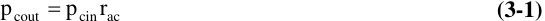

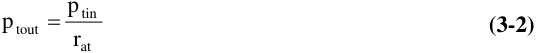

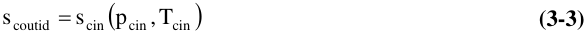

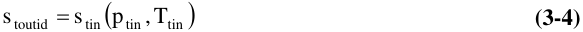

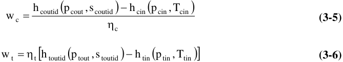

where p stands for pressure, s for entropy, w for work (kJ/kg), h for enthalpy T for temperature, ra for pressure ratio and η for total to total efficiency.  Suffix c denotes a compressor and suffix t denotes a turbine.  Suffixes in and out denote the inlet or outlet conditions respectively.  The suffix id denotes the ideal state, i.e. f the turbine or i compressor were ideal components and the compression or expansion process was isentropic. 

Given the turbine and compressor work the rest of the state points can be determined. In the case of inter-cooling or re-heating the situation is more complicated.  For each turbine or compressor the same calculation procedure as described above can be used if we know the inlet conditions and the pressure ratio.  The inlet conditions are known for the first compressor or turbine; for every other they have to be evaluated based on the pressure ratio split and inter-cooler or re-heater pressure drop. 

If more than one inter-cooler or re-heater is used their pressure drop can be different. A simple prescription for pressure ratio split calculation is difficult to formulate, and an iteration scheme is used instead.  At first the total pressure ratio is split among the N number of turbines or compressors using the following formula: 

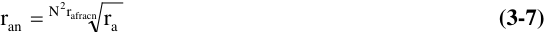

where ran is the pressure ratio for the n[th] turbine or compressor, ra is the total pressure ratio and rafracn is the fraction of the total pressure ratio allocated for the n[th] turbine or compressor. 

In the real situation, the inter-cooler or re-heater pressure drops are present and to achieve the desired total pressure ratio it is necessary to increase slightly the pressure ratio of each turbine or compressor in order to overcome these pressure drops.  Therefore, it is necessary to correct the pressure ratio calculated from Eq. 3-6.  There are two possible situations, either the pressure drops of the inter-coolers and re-heaters are specified or they come from the heat exchanger design.  Therefore the pressure ratio adjusted for the inter-coolers’ and re-heaters’ pressure drop for the n[th] turbine can be calculated from: 

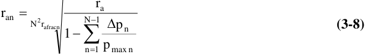

for the compressor and from: 

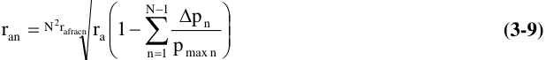

for the turbine, where ∆ pn is the pressure drop in the n[th] inter-cooler or re-heater and pmaxn is the maximum pressure in the n[th ] inter-cooler or pre-cooler.  Since the pressure drops will be affected by the pressure ratio adjustment the subroutines iterate until the change of the pressure ratio is within the specified precision. 

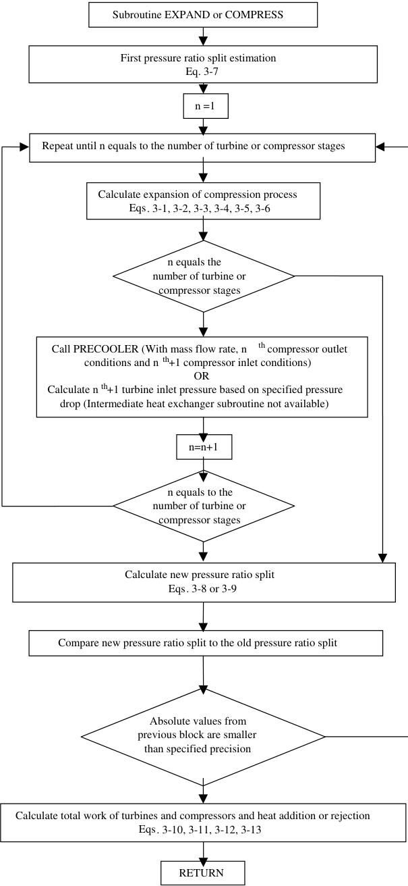

**----- Start of picture text -----** 
Subroutine EXPAND or COMPRESS First pressure ratio split estimation Eq. 3-7 n =1 Repeat until n equals to the number of turbine or compressor stages Calculate expansion of compression process Eqs. 3-1, 3-2, 3-3, 3-4, 3-5, 3-6 n equals the number of turbine or compressor stages Call PRECOOLER (With mass flow rate, n th compressor outlet conditions and n [th] +1 compressor inlet conditions) OR Calculate n [th] +1 turbine inlet pressure based on specified pressure drop (Intermediate heat exchanger subroutine not available) n=n+1 n equals to the number of turbine or compressor stages Calculate new pressure ratio split Eqs. 3-8 or 3-9 Compare new pressure ratio split to the old pressure ratio split Absolute values from previous block are smaller than specified precision Calculate total work of turbines and compressors and heat addition or rejection Eqs. 3-10, 3-11, 3-12, 3-13 RETURN **----- End of picture text -----** 

**Figure 3.1 Subroutines COMPRESS and EXPAND flow chart** 

The work of a compressor with inter-cooling and a turbine with re-heating is calculated from: 

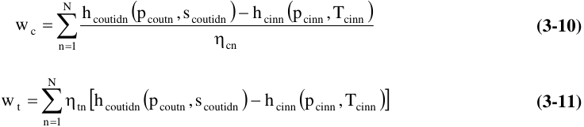

where the suffix n denotes the compressor or turbine number and N is the total number of compressors or turbines respectively.  The rest of the symbols have been already defined when describing the work of a single compressor or turbine. 

In addition to the work of compressor and turbine it is necessary to calculate heat rejected from the cycle qoutc and heat added to the cycle qaddt.  These can be calculated as: 

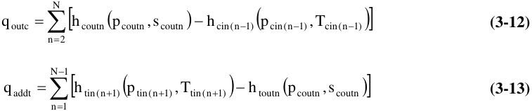

For the off-design performance calculations the off-design maps that relate the efficiency and the operating conditions to the pressure ratio were used.  Since only pressure ratio and efficiency are affected the same routines can be used for the off-design calculations, only the values of the off-design efficiency and pressure ratio are specified. For the details on the off-design calculations see the Chapter 11 on control scheme development. 

## _**3.3 Heat Exchanger Subroutines**_ 

To perform the design of heat exchangers it is first necessary to establish the heat exchanger geometry, heat transfer model and the pressure drop model.  Once those are established then the iteration schemes for different design approaches need to be developed.  The geometry of the heat exchanger is established by selection of the heat 

exchanger type.  After scoping several possible heat exchanger designs it was decided to use printed circuit heat exchangers.  The details of the selection process and the description of these heat exchangers are given in Chapter 9. 

## 3.3.1 Heat Transfer Model 

There are at most three different types of heat exchangers in any gas cycle: the recuperator, which operates with the working fluid, CO2 in our case, on both sides; the pre-cooler that cools the working fluid with a stream of cooling water; and the intermediate heat exchanger, which transfers the heat from the primary coolant to the power cycle working fluid.  Therefore, it is necessary to develop a heat transfer model for supercritical CO2, water and primary coolant.  In this work PbBi and helium are used as a primary coolant.  For helium the same heat transfer model as for CO2 can be used. For PbBi an additional model must be implemented. 

The information on heat transfer modeling in PCHE in the literature is limited.  The PCHE channels are semicircular channels that can be either straight or wavy.  Unless otherwise specified in the text straight channels were used in this work, because of better understanding of this geometry and lack of reliable heat transfer and pressure drop correlations for the wavy channels.  Thus the obtained results are conservative, as wavy channels improve the heat transfer performance significantly. Hesselegraves [Hesselegraves, 2001] recommends using the Gnielinski correlation for the straight semicircular channels for the turbulent flow regime (Re > 2300) 

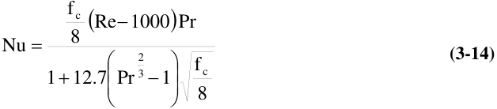

where Nu is the Nusselt number, Re is the Reynolds number, Pr is the Prandtl number and fc is the Moody friction factor defined as: 

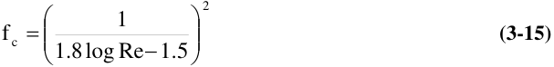

These equations are valid up to Reynolds numbers of 5 x 10[6] and Prandtl numbers ranging from 0.5 to 2000.  This range of Prandtl numbers is applicable for CO2, water and helium. If liquid metal or molten salt is used as a primary coolant a different correlation must be used. 

Reynolds number is defined as: 

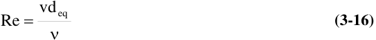

where v is the fluid velocity, deq is the hydraulic diameter and ν is the fluid kinematic viscosity.  The hydraulic diameter for the semi-circular channel can be evaluated from: 

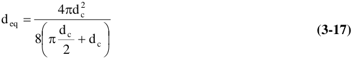

where dc is the semi-circular channel diameter. 

Prandlt number is defined as: 

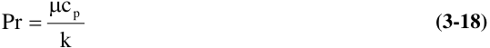

where µ is dynamic viscosity in (Pas), cp is the specific heat in (J/kg-K) and k is the fluid thermal conductivity in (W/m-K). 

For laminar flow Hesselgraves [Hesselgraves, 2001] recommends use of Nu = 4.089. Since the value of the Nusselt number from the Gnielinski correlation at 2300 is not 4.089 there would be a discontinuity in the evaluation of the Nusselt number. That could introduce convergence difficulties in the code, therefore the range of Reynolds number 

between 2300 and 5000 is used as a transitional region, where the Nusselt number is evaluated by linear interpolation, i.e.: 

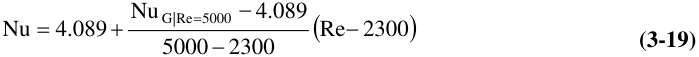

where Nu is the Nusselt number from the Gnielinski correlation evaluated at G|Re=5000 Reynolds number of 5000. 

The Nusselt number for Pb-Bi was calculated from [Seban et al., 1950] who proposed for liquid metal flowing in pipes the following expression for the Nusselt number 

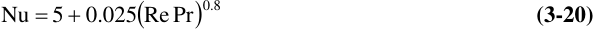

Once the Nusselt number is known the heat transfer coefficient h (W/m[2] -K) can be calculated from: 

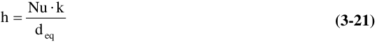

The heat transfer model for straight channels is well established and the Gnielinski correlation is one of the most accurate.  It was recommended by Olsen [Olsen, 2000] for use with supercritical CO2 with correction for property gradients between the core fluid and the wall, by applying a density ratio and specific heat ratio.  Since the simple Gnielinski correlation gives more conservative results and the property gradients vanish at temperatures far from the critical point (both recuperators and part of the pre-cooler) the simple Gnielinski correlation was used.  For wavy channels the situation is more difficult.  For the extended heat transfer surfaces used in compact heat exchangers usually the j factor from experiment is used or some sort of correlation involving the j factor is used.  As experimental data on the PCHE are not publicly available Hesselgraves [Hesselgraves 2001] recommends using the following formula that was developed for corrugated planar channels: 

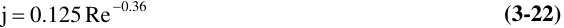

This formula was developed from the two-dimensional data of [Oyakawa et al, 1989].  The performance will be strongly dependent on the details of the channel.  For a typical channel the wavelength to width ratio should be about 7.  The characteristic length for the Reynolds number is twice the channel width. 

Factor j is defined as: 

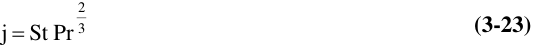

Where St is the Stanton number defined as: 

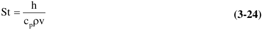

The heat transfer coefficient for the corrugated channels then can be evaluated from: 

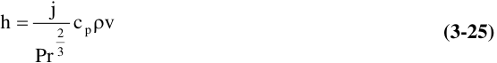

Given the large uncertainty of the j factor of corrugated channels when applied to the PCHE it is only used in Chapter 9 to demonstrate the potential heat transfer improvement and the heat exchanger volume reduction if the wavy channels were used.  This is clearly an aspect recommended for future work. 

## 3.3.2 Pressure Drop Model 

The pressure drop model consists of two major parts: one for form losses and the other for friction losses.  It does not reflect gravitational or acceleration losses since these will be recovered in other parts of the cycles.  Only the friction and form losses relate to energy dissipation. 

The form pressure loses for straight channels are two, the entrance and the exit loss. Both can be evaluated from: 

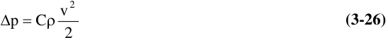

where C is the form loss coefficient that was taken to be 0.5 for the entrance loss and 1.0 for the exit loss [Todreas and Kazimi, 2000], ρ is the local fluid density (kg/m[3] ) and v is the local fluid velocity (m/s). 

The friction losses can be estimated from: 

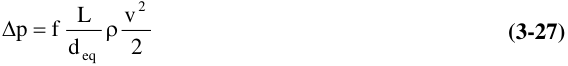

where L is the length and deq is the equivalent hydraulic diameter for the semi-circular channel.  The friction factor f has to be determined from a correlation.  Since it is necessary to cover a wide range of Reynolds numbers the same model that was developed for friction factor by Hejzlar based on Idelchik’s approach [Idelchik, 1996] and documented in [Williams et al., 2003] was used. 

For the friction factor it is necessary to cover all possible flow regimes starting from laminar flow all the way to stabilized turbulent flow.  Therefore, it is necessary to correctly evaluate the borders between the flow regimes. 

The transition regime from laminar flow to turbulent (2000 < Re < 4000) is the region where the friction factor rapidly changes with Reynolds number.  The departure Reynolds number from the Hagen-Poiseulle law Re0 is defined as: 

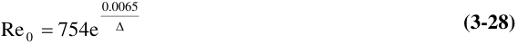

where ∆ is the relative roughness (ratio of surface roughness and tube diameter).  The range of applicability of this equation is ∆ > 0.007.  For ∆ < 0.007 the departure Reynolds number is Re0 = 2000. 

For laminar flow, i.e. Reynolds number below Re0 the friction factor is independent of wall roughness and the Hagen-Poiseulle law is applicable: 

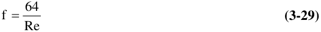

For Reynolds numbers above Re0 the friction factor continues to decrease, but the rate of decrease becomes smaller.  At some point the friction factor reaches its minimum and starts to increase.  The Reynolds number Re1 defines this point.  The Samoilenko expression is used to calculate this Reynolds number: 

The range of applicability is again for ∆ > 0.007 and Re1 = 2000 is used for smaller values of roughness.  For departure from the Hagen-Poiseuille law range, Reynolds numbers between Re0 and Re1, the friction factor can be calculated from: 

For the relative roughnesses below 0.007 linear interpolation between the HagenPoiseuille law and the Blasius law is used. 

The limiting Reynolds number for the rise of the friction factor Re2 can be obtained from: 

For the range of increasing friction factor within the transition regime (Re1 < Re < Re2) the friction factor is evaluated as: 

where f[*] = f1 for ∆ ≤ 0.007 and f[*] = f1 – 0.0017 for ∆ > 0.007. The friction factor f1 was evaluated at Re1 based on the formulas given by [Idelchik, 1996]: 

Similar relations were provided by [Idelchik, 1996] for the friction factors f2, however they provided an unsatisfactory transition to the next regime and therefore the f2 friction factor was calculated from the Colebrook-White correlation (Eq. 3-37) by substituting Re2[ for the Reynolds number. ] 

Finally, the beginning of stabilized turbulent flow starts at Reynolds number Re3 which can be calculated as: 

For the region of turbulent developed flow (Reynolds number between Re2 and Re3 the Colebrook-White correlation was used: 

For the region of stabilized turbulent flow in the quadratic region (Reynolds numbers above Re3) the Prandtl-Nikuradse formula is recommended by [Idelchik, 1996]. Unfortunately it does not exhibit sufficient smoothness for some Reynolds numbers and relative roughnesses.  Therefore the Colebrook-White correlation with Reynolds number equal to Re3 was used instead. 

For wavy channels Hesselgraves [Hesselgraves, 2001] again recommends the work of [Oyakawa et al., 1998] on corrugated channels.  For the friction factor the following 

approximation is recommended, where the characteristics length for the calculation of Reynolds number is the commonly used hydraulic diameter: 

All calculations used typical roughness values for heat exchanger tubes ( ζ = 10-5 m). 

## 3.3.3 Heat Exchanger Modeling 

Since the heat exchangers are the largest components in the cycle their careful design is an important issue.  In order to reduce the total volume of heat exchangers compact heat exchangers must be used.  Printed circuit heat exchangers (PCHE) are the best suited for this type of application.  The reasons for selecting the PCHE are described in detail in Chapter 9 along with the detailed description of the PCHE concept and current applications.  For the purpose of this chapter it is sufficient to mention that the heat exchanger consists of plates into which the channels are chemically etched.  The plates are then stacked on top of each other in the hot plate / cold plate sequence and diffusion bonded into a monolithic block.  The arrangement of the flow is counter-current and the channels are semi-circular in cross-section.  A picture of the heat exchanger cross-section is shown in Figure 3.2. 

**----- Start of picture text -----** 
t tf **----- End of picture text -----** 

**Figure 3.2 PCHE cross-section** 

For the purpose of modeling, the heat exchanger was divided into several axial nodes as shown in Figure 3.3 (40 nodes were found to be sufficient to properly capture the effect of the fluid property variations). 

A few simplifying assumptions were made: 

1. The total mass flow rate is uniformly distributed among the channels. 

2. The temperature distribution in the heat exchanger is periodic with the period of two plates (one hot and one cold). 

3. Hot and cold side channel and plate geometry is the same. 

4. The wall channel temperature is uniform along channel periphery at every axial location. 

5. The heat conduction area is assumed to be equal to the heat transfer area in the channel. 

6. The heat conduction length is equal to the distance between the hot and cold channel (t in Figure 3.2). 

Based on the assumption 1, 2 and 3 it is sufficient to model a single channel on the hot side and a single channel on the cold sides because all the other hot and cold channels are identical with those that are modeled.  Since the hot and cold side geometry is the same there is the same number of channels on the hot and cold sides.  Therefore, the total heat exchanger performance can be calculated based on the performance of one hot and one cold channel by simply multiplying by the number of channels in the heat exchanger. 

**----- Start of picture text -----** 
Heat Heat Exchanger Exchanger Hot End i - 1 i i + 1 Cold End Hot side in Hot side out 1 2 3 …… j-1 j j+1 …… N Cold side out Cold side in Node j Node j Hot End Cold End **----- End of picture text -----** 

**Figure 3.3 Heat exchanger nodalization** 

Assumptions 4, 5 and 6 were made to simplify the heat conduction modeling, since based on these assumptions it is possible to model the heat conduction as the heat conduction through the planar wall.  Since in reality the area for heat transfer is smaller than that for the heat conduction and the conduction length is different for different locations around the channel wall (sometimes shorter than the distance between the hot and cold channels) these assumption are conservative.  Chapter 9 addresses the effect of the conduction length on the heat exchanger thermal performance. 

The heat exchanger performance calculation can start from either the hot or cold end, therefore either hot or cold side operating conditions must be known.  The heat exchanger calculation proceeds from the known end to the other one by sequentially evaluating the performance of all nodes.  For the case when the calculation proceeds from the hot end to the cold end the performance of the node j will be calculated as follows: 

1. The average node temperature and pressure on hot and cold sides will be calculated as the average between the i and i+1 conditions.  The temperature and pressure at point i are known from the results of node j-1, at the point i+1 the last iteration results of node j+1 are used.  If those are zero (i.e. the first iteration) the average values of pressures and temperatures over node i are used. 

2. Fluid properties for the average pressure and temperature are calculated. The code allows the user to specify whether the NIST subroutines or user-supplied interpolation tables will be used.  The use of tables significantly increases the overall calculation speed. 

3. The hot and cold fluid velocities, heat transfer coefficients and friction factors are calculated based on the fluid properties and the channel mass flow rate. The heat transfer coefficients are calculated based on the methodology described in Section 3.3.1.  The overall heat transfer coefficient is calculated from: 

where hh and hc are the heat transfer coefficients on hot and cold sides respectively and k is the thermal conductivity of the heat exchanger material and t is the plate thickness. 

4. At this point it depends which subroutine the user has called.  For subroutine PCHEvol the heat transferred in a node was calculated from: 

where tavh and tavc are the average hot and cold fluid temperatures respectively and Ah is the node heat transfer surface, defined as ln ( π dc/+dc). 

For subroutine PCHElen the length of the node, ln, is calculated based on the node power q (total power divided uniformly among the nodes).  It is calculated from: 

where dc is the channel diameter 

5. The cold end node enthalpy hce can be calculated from: 

where hhe is the known cold or hot side enthalpy on the node hot end and m & n is the hot or cold node mass flow rate 

6. The outlet pressure is calculated based on the model described in Section 3.3.2. 

7. Given the pressure and enthalpy the cold end temperatures can be estimated 

8. The code iterates until the calculated values of pressures, temperatures and enthalpies are within the specified precision.  Then the node evaluation is 

completed and the cold end parameters of node j are used as the hot end parameter in the node j+1. 

The geometry of the PCHE is evaluated based on the following basic dimensions for both hot and cold sides: 

These dimensions were used in most of the studies performed in this work.  In some analyses the plate thickness and channel pitch are adjusted according to the operating pressure and temperature.  In such a case it is explicitly stated in the text.  For more details on the stress relations in PCHE see Chapter 9 for component description.  The rest of the geometrical characteristics can be calculated based on the specified heat exchanger dimensions. 

The node thickness tn is the sum of the thicknesses of the cold side plate tcs and hot side plate ths 

The node length ln[ (if not spec] ified) is defined based on the total width W and length L of the heat exchanger core and the user specified number of nodes nn 

The total number of hot or cold side plates npl is the total height of the heat exchanger core H divided by the node thickness tn 

Now it is possible to evaluate other hot and cold side characteristics.  The number of channels on the cold side per plate, nc, the heat transfer surface per one layer of nodes Ah, the flow area per one layer of nodes Af, the node heat transfer surface Ahel, the node flow area Afel, the node mass flow rate m & el and the node mass flux Gel from the following formulas: 

where nmod is the number of heat exchanger modules if more than 1 heat exchanger is used. 

## 3.3.4 Subroutine PCHEvol 

This subroutine models the PCHE.  The user supplies the heat exchanger volume, heat exchanger face dimensions and inlet conditions: 

- Hot side: mass flow rate, hot end fluid temperature and hot end fluid pressure. 

- Cold side: the mass flow rate, cold end fluid temperature and cold end fluid pressure. 

The geometry is read from the input file, the name of which is specified in the input variable hxtype (hxtype is defined in the corresponding cycle subroutine).  The input file 

also contains the numerical model variables, such as convergence tolerance. The subroutine calculates the heat exchanger outlet conditions.  The code first guesses the cold side enthalpy at the hot end and calculates the thermal and hydraulic performance through the heat exchanger as described in Section 3.3.3.  The calculated cold side enthalpy at the cold end is compared to the input value.  If the difference is within the user-specified tolerance the subroutine returns the calculated values.  Otherwise, the guess of the cold side enthalpy at the hot end is adjusted and the heat exchanger performance is evaluated again. 

## 3.3.5 Subroutine PCHElen 

In this subroutine the length and the pressure drops of the PCHE are estimated based on the heat exchanger face dimensions and operating conditions.  The operating conditions are all known with the exception of pressures on the hot and cold side outlets. 

The subroutine first calculates the total heat exchanger power based on the input enthalpies and mass flow rate and using the methodology described in Section 3.3.3 the heat exchanger length and pressure drop are calculated.  The geometry is read from the input file, the name of which is specified in the input variable hxtype (hxtype is defined in the corresponding cycle subroutine). 

## 3.3.6 Subroutine PRECOOLER 

The subroutine PRECOOLER is organized in a slightly different manner than that of PCHEvol.  The user specifies the total volume of the pre-cooler and the operating conditions: 

- Hot side (CO2): mass flow rate, inlet and outlet temperatures. 

- Cold side (cooling water): inlet temperature. 

Therefore the subroutine iterates on the cooling water mass flow rate and the cooling water outlet temperature. 

The subroutine guesses the cooling water mass flow rate and starting from the cold end of the pre-cooler, i.e. in reverse to the methodology described in Section 3.3.3, and calculates the hot end conditions.  If the difference between the calculated hot side enthalpy at the hot end is lower than the user specified tolerance the subroutine returns the calculated values.  Otherwise, the cooling water mass flow rate is adjusted until the hot end hot fluid enthalpy is matched within the specified tolerance. 

The same subroutine is used for evaluating the performance of inter-coolers.  The input file names that contain the geometry are specified in the variable hxtype. 

## _**3.4 Subroutine RECUP**_ 

Subroutine RECUP evaluates the performance of a recuperator.  It is an interface between the cycle routines such as SIMPCYC or RECOMP and the heat exchanger routines such as PCHEvol or PCHElen. 

There are basically three different approaches to the evaluation of the recuperator performance: 

1. The recuperator effectiveness and pressure drops are specified. 

2. The effectiveness and the heat exchanger face dimensions are specified and the pressure drops and heat exchanger length volume are calculated. 

3. The heat exchanger volume is specified and the recuperator effectiveness and pressure drops are evaluated. 

In order to apply the subroutine RECUP the inlet recuperator conditions must be known. 

In the first case, which can be used for preliminary calculations, the effectiveness and pressure drops are known, therefore the recuperator performance can be easily estimated from: 

where h is enthalpy, p is pressure, T is temperature and subscript rc stands for the cold side of the recuperator and subscript rh stands for the hot side of the recuperator. Subscripts in and out denote the inlet and outlet conditions respectively.  Note that effectiveness ε is defined as: 

The effectiveness defines the fraction of heat that is regenerated.  This definition does not precisely correspond to the usual definition of effectiveness used in the heat exchanger theory, which is defined as: 

Because there is no check on which side of the recuperator has the minimum heat capacity Cmin,  the effectiveness is always evaluated based on the maximum heat content of the hot side. 

The second case is when the effectiveness and the heat exchanger face dimensions are known and pressure drop and heat exchanger length are to be estimated.  The subroutine RECUP then calls the subroutine PCHElen and asks it to evaluate the length of the heat exchanger and the pressure drops given the heat exchanger face area and all other geometrical characteristics (specified in hxtype).  This option is not used by the program CYCLEs, but is available. 

The last and most important case is the case when the recuperator volume is known. The subroutine RECUP then calls the subroutine PCHEvol and estimates the outlet recuperator conditions based on the inlet recuperator conditions and the heat exchanger geometry. 

## _**3.5 Cycle Routines**_ 

Using the above-described subroutines it is possible to construct any type of Brayton cycle.  In this work the standard Brayton cycle and the recompression cycle are of main interest.  Therefore, two cycle subroutines (SIMPCYC and RECOMP) were developed. Subroutine SIMPCYC analyzes the standard Brayton cycle either in the simple layout or with any combination of re-heat and inter-cooling.  Subroutine RECOMP analyzes the recompression cycle.  In both routines it is possible to select whether the cycle’s characteristics such as pressure drops, recuperator effectiveness and turbomachinery efficiencies are supplied or whether they are calculated by heat exchanger routines and the off-design turbomachinery performance maps. 

## 3.5.1 Subroutine SIMPCYC 

This routine evaluates the performance of a standard Brayton cycle.  It is possible to specify any number of inter-coolers or re-heaters.  The flow chart of the subroutine SIMPCYC is shown in Figure 3.4.  There are four main parameters based on which other cycle parameters are evaluated: the last compressor outlet pressure (i.e. the maximum cycle pressure), the total pressure ratio (i.e. the last compressor outlet pressure divided by the first compressor inlet pressure), the first compressor inlet temperature (i.e. the minimum cycle temperature) and the turbine inlet temperature (i.e. the cycle maximum temperature).  Additional parameters are the cooling water inlet temperature, and the heat exchanger geometry. 

Based on these parameters the compression process can be completely evaluated; therefore the first subroutine called is COMPRESS.  Then the program calculates the turbine inlet pressure from: 

where suffix rc denotes the cold side of the recuperator and the suffix r denotes the reactor or intermediate heat exchanger.  The turbine outlet pressure can be similarly calculated as: 

where the suffix rh stands for the hot side of the recuperator and the suffix p stands for pre-cooler.  If the pressure drops are not defined they are zero at the first guess and the code iterates until the pressure drop difference is within the specified precision.  Given the turbine inlet and outlet pressure the turbine pressure ratio is known and the subroutine EXPAND can be called. 

The recuperator inlet conditions are now known from the results of the COMPRESS and EXPAND subroutines and therefore the recuperator state points can be evaluated. The subroutine RECUP calculates the outlet conditions of the recuperator either based on the specified recuperator effectiveness or based on the provided recuperator geometry.  If the pressure drops were not specified the subroutine RECUP uses the results of the PCHEvol or PCHElen routines as the new values of the recuperator pressure drops. 

After establishing the recuperator outlet conditions the pre-cooler and the reactor or intermediate heat exchanger (based on whether the direct or an indirect cycle is used) are calculated.  The subroutine PRECOOLER is used if it is desired to evaluate the precooler pressure drop and the cooling water pumping power. 

At this point all the cycle state points have been evaluated. Therefore, the value of heat addition to the cycle and net specific work can be used to calculate the new mass flow rate or new power.  Hence, next important specification for the cycle calculation is whether the working fluid mass flow rate is known or not.  If the mass flow rate is specified (IPOWER 0) the program evaluates the cycle thermal power from: 

where m & is the mass flow rate (kg/s), Q is the cycle thermal power (kW) and qad is the specific heat addition to the cycle (kJ/kg), and electric power from: 

where m & is the mass flow rate (kg/s), P is the cycle electric power (kW) and wnet is the cycle specific net work (kJ/kg). 

However, usually cycle power is known and the mass flow rate needs to be evaluated.  Therefore, if the power is specified the cycle subroutines iterate on the mass flow rate given the power.  Two options are available.  If the thermal power is fixed (IPOWER 1) the mass flow rate is evaluated from the following formula: 

If the electric power is specified (IPOWER 3) the mass flow rate is calculated from 

The first values of qad and wnet are established based on the initial guess of mass flow rate. 

The new pressure drops are compared to the old pressure drops and the new mass flow rate or power is compared to the old mass flow rate or power.  If the difference is smaller than the specified tolerance the cycle efficiency is estimated based on the calculated state points from the following two formulas: 

where wt is the work of all cycle turbines, wc is the work of all cycle compressors, qad is the total heat added to the cycle and qout is the total heat rejected from the cycle.  The results from these two formulas should give the same result.  If these two values are not the same it is an indication that the code did not properly converge.  The subroutine writes the main results to a file and if required it writes the cycle state points as well. 

**----- Start of picture text -----** 
Subroutine SIMPCYC Call COMPRESS (With compressor inlet conditions) Calculate turbine inlet pressure and pressure ratio based on pressure drops Eqs. 3-54, 3-55 Call EXPAND (With turbine inlet conditions) Call RECUP (With mass flow rate, turbine outlet and main compressor outlet conditions) Call PRECOOLER (With mass flow rate recuperator outlet conditions and compressor inlet conditions) Calculate new mass flow rate (IPOWER = 1 or 2) or power (IPOWER = 0) Eqs. 3-59, 3-60 or 3-57 Compare new mass flow rate, power and pressure drops to their preceding values Absolute values from previous block are smaller than specified precision Calculate efficiency and other cycle parameters Eqs. 3-61, 3-62 RETURN **----- End of picture text -----** 

**Figure 3.4 Subroutine SIMPCYC flow chart** 

**----- Start of picture text -----** 
Subroutine RECOMP Call COMPRESS (With main compressor inlet conditions) Call COMPRESS (With recompressing compressor inlet conditions) Calculate turbine inlet and outlet pressure Eqs. 3-63, 3-64 Call EXPAND (With turbine inlet conditions) Call RECUP for High temperature recuperator. (With mass flow rate turbine outlet and recompressing compressor outlet conditions) Estimate new recompressed fraction Eq. 3-65 Call RECUP for low temperature recuperator. (With mass flow rate, high temperature outlet conditions and main compressor outlet condition and the new recompressed fraction) Call PRECOOLER (With mass flow rate, low temperature recuperator outlet conditions and main compressor inlet conditions) Calculate new mass flow rate (IPOWER = 1 or 2) or power (IPOWER = 0) Eqs. 3-59, 3-60 or 3-57 Compare new mass flow rate or power, pressure drops and recompressed fraction to their preceding values Absolute values from previous block are smaller than specified precision Calculate efficiency and other cycle parameters Eqs. 3-66, 3-67, 3-68, 3-69 RETURN **----- End of picture text -----** 

**Figure 3.5 Subroutine RECOMP flow chart** 

## 3.5.2 Subroutine RECOMP 

Subroutine RECOMP is in many aspects similar to the subroutine SIMPCYC.  There is a new parameter that has to be evaluated compared to the standard Brayton cycle, and that is the recompressed fraction, i.e. the fraction of flow that does not go through the pre-cooler, but is recompressed in the recompression compressor and fed to the high temperature recuperator inlet. The flow chart of the subroutine RECOMP is shown in Figure 3.5.  The subroutine starts again by evaluating the compression process and establishing the turbine pressure ratio in the same manner as in the subroutine SIMPCYC. Given the results for the main compressor the recompression compressor performance is established based on the same pressure ratio as was used for the main compressor and the inlet temperature equal to the main compressor outlet temperature increased by 5oC (a reasonable minimum temperature difference for the low temperature recuperator).  The turbine inlet and outlet pressures are estimated in the same manner as in the case of the SIMPCYC subroutine from: 

where the suffix rlh stands for the hot side of the low temperature recuperator, the suffix rhh stands for the hot side of the high temperature recuperator, the suffix rlc stands for the cold side of the low temperature recuperator and the suffix rhc stands for the cold side of the high temperature recuperator.  If the pressure drops are not defined they are zero at the first guess and the code iterates until the pressure drop difference is within the specified precision.  Given the turbine inlet and outlet pressures the turbine pressure ratio is known and the subroutine EXPAND can be called. 

After evaluating the turbine outlet conditions the next step is the estimation of the recuperators.  In the recompression cycle there are high and low temperature recuperators.  Therefore, even if the effectiveness of both of these recuperators is known 

the amount of recuperated heat cannot be calculated, because the maximum heat available for recuperation is not known.  Clearly, an iteration process is necessary. 

First, the subroutine RECUP is called to establish a first guess of the high temperature recuperator conditions.  The hot side inlet conditions are equal to the turbine outlet conditions.  The cold side inlet conditions are equal to the recompression compressor outlet conditions.  Therefore, the high temperature recuperator performance can be estimated.  Given the performance of the high temperature recuperator it is possible to establish the new value of the recompressed fraction rfrac from: 

where h stands for enthalpy, suffix rh stands for the high temperature recuperator, suffix rl stands for the low temperature recuperator and suffix cm stands for the main compressor.  Suffixes in and out denote the inlet and outlet conditions respectively.  In the first iteration the enthalpy hrlout is set equal to the enthalpy evaluated at the main compressor inlet pressure and the main compressor outlet temperature increased by 5[o] to allow for some real temperature difference.  Given the recompressed fraction, the mass flow rates on the hot and cold side of the low temperature recuperator can be estimated and the low temperature recuperator performance can be estimated.  Finally, the subroutine PRECOOLER is called to evaluate the pre-cooler pressure drop and cooling water pumping power. 

The new values of component pressure drops, recompressed fraction and mass flow rate are compared to their preceding values and if the difference is lower than the specified precision the cycle efficiency is calculated based on the following formulas: 

where: 

where w stands for work and q for heat.  Suffix c denotes the sum of compressors’ work and subscript cr stands for recompressing compressor.  Subscript p denotes the pre-cooler and subscripts in and out stand for inlet and outlet conditions respectively. 

The efficiency is calculated based on two formulas in order to confirm the convergence of the subroutine RECOMP.  The subroutine writes the main results to a file and if required it writes the cycle state points as well. 

## _**3.6 Program CYCLES**_ 

Program CYCLES is the governing program for the parametric studies.  It reads the input and calls the other subroutines with the appropriate variables.  The main program also manages the output files and property tables if required.  Currently the property tables are available only for the heat exchanger calculations.  All other subroutines use the NIST 12 pure fluid property subroutines.  If required the property read in can be suppressed by setting ITAB to 1, in which case the code can use only the NIST 12 pure fluid property subroutines. This setting is helpful if one does not intend to go through the design of the heat exchangers or require that they be designed using the NIST 12 property routines. It should be noted that designing the heat exchangers using the NIST 12 subroutines is more precise, but requires a significant amount of time. 

The code CYCLES can be used for many different analyses of different Brayton cycles.  The rest of this section describes the most important case - the steady state optimization of the power cycle.  It is demonstrated on the example of a simple Brayton cycle.  For the cycle design the optimization of the cycle heat exchangers is a very important step.  In the case of the standard Brayton cycle without inter-cooling or reheating in a configuration of a direct closed cycle there are two heat exchangers: the pre- 

cooler and the recuperator.  If the total heat exchanger volume is selected the cost of the heat exchanger is set; therefore one would like to make sure that the heat exchanger volume is used such to minimize the plant cost in $/kWe.  In this work the assumption is made that the cost per unit mass of all heat exchangers within the cycle is the same and that their internal geometry is the same, therefore it does not matter to which heat exchanger the volume is allocated.  Therefore, the maximum cycle efficiency for different volume split and heat exchanger lengths is optimized.  If the costs are different for different heat exchangers then the total cost of the heat exchangers, rather than volume, should be kept constant and the cost split among the heat exchangers should be optimized to yield the highest cycle efficiency.  In such a case the same optimization scheme is applicable, however now one of the optimized parameters is different (cost instead of volume). 

For the case of the standard Brayton cycle there are three different parameters that have to be optimized.  The first parameter to be optimized is the split of the total heat exchanger volume between the recuperator and pre-cooler.  The second and third task is to optimize the recuperator and pre-cooler length once their volume is set.  This in fact means to balance the effect of the heat exchanger effectiveness and pressure drop on the cycle efficiency. 

In this work the phrase “fully optimized cycle” means that the heat exchangers and the pressure ratio of the cycle have been evaluated in a manner yielding the highest efficiency achievable with the specified total heat exchanger volume.  Figure 3.6 shows the flow chart for the simple Brayton cycle optimization. 

Since the effect of pressure ratio is important some studies were carried out that show the effect of pressure ratio for a fixed heat exchanger design, i.e. the heat exchangers were not re-optimized. 

**----- Start of picture text -----** 
Program Cycles n = 1 Repeat until n equals to the number of optimized parameters Parameter n = Parameter n + Parameter n step m = 1 Repeat until m equals to 3 Call SIMPCYC with current pressure ratio Call SIMPCYC with current pressure ratio + pressure ratio step Call SIMPCYC with current pressure ratio –pressure ratio step Efficiency for current pressure ratio is the highest Efficiency for current [pressure + pressure ratio] step is the highest Current pressure ratio = Current pressure ratio + pressure ratio step Current pressure ratio = Current pressure ratio - pressure ratio step m=m+1 m equals 3 Parameter n = Parameter n – Parameter n step Efficiency (m) = Calculated Efficiency Efficiency (2) is the highest Efficiency (1) is the highest Parameter n = Parameter n + Parameter n step n = 1 Parameter n = Parameter n + Parameter n step n = 1 n=n+1 n equals the number of optimized parameters Write results RETURN **----- End of picture text -----** 

**Figure 3.6 Program CYCLES (for simple Brayton cycle optimization)** 

## _**3.7 Summary**_ 

This chapter described the approach to the modeling of closed gas turbine power cycles.  The developed code CYCLES evaluates the performance of cycles that consists of compressors, turbines, recuperators and pre-coolers (or inter-coolers).  For each of these components subroutines necessary for their modeling were developed and described here.  The correlations used for estimation of heat transfer coefficients and friction factors were presented.  A wide range of Reynolds numbers ranging from laminar flow to turbulent flow was considered as well as different channel geometry (straight and wavy channels) for the PCHE, which is the only heat exchanger type that can be modeled. Because of the lack of data on heat transfer and friction factor of wavy channels unless otherwise specified straight channels will be used. 

The component subroutines are used by the cycle subroutines to calculate the performance of different gas turbine cycles.  Currently available are Brayton cycle with any number of re-heating and inter-cooling stages (subroutine SIMPCYC) and recompression cycle with any number of re-heating and inter-cooling stages (subroutine RECOMP).  The cycle performance calculations done by the cycle subroutines were described and their flow charts were presented. 

The governing program CYCLES flow chart for the optimization of the simple Brayton cycle was presented to explain the optimization methodology that was used in this work.  The main point of the optimization is to correctly allocate the available heat exchanger volume among the cycle heat exchangers and optimize the heat exchanger length to maximize the cycle efficiency and thus minimize the cost of the power plant in $/kWe. 

## **4 Thermodynamic analysis of Supercritical Carbon Dioxide Brayton Cycles** 

This chapter describes the optimization process for Brayton cycles that will be used in the rest of this work.  The optimization is then demonstrated on the simple Brayton cycle.  It evaluates the benefit of inter-cooling and re-heating on the cycle efficiency. The direct cycle version is of primary interest here.  The efficiencies reported are the cycle thermal efficiencies corrected for the pumping power requirements of the precooler. All major components of the plant are modeled using the code that was described in Chapter 3.  The heat exchangers’ thermal performance, pressure drops and pumping power are evaluated.  For the reactor an assumption of 500 kPa pressure drop is made and used throughout the study since the reactor core design is constrained by neutronic performance and both full power and decay heat removal requirements.  This slightly penalizes the performance of the cycles with lower mass flow rates, because no adjustment is made to account for the possible reduction of the cost of the reactor. 

## _**4.1 Brayton Cycle without Inter-cooling and Re-heating**_ 

For the initial cycle evaluation a Brayton cycle with one compressor and one turbine (without any inter-cooling or re-heating) was selected. The cycle layout is shown in Figure 4.1. It is a typical Brayton cycle. The fluid is compressed in the compressor from the inlet conditions, point 1, to point 2. Then it enters the recuperator where it is preheated by the exhaust from the turbine (points 2 to 3). After the pre-heat the fluid passes through the reactor (points 3 to 4). In the reactor the fluid achieves the highest temperature within the cycle. An expansion in the turbine follows (points 4 to 5). The turbine supplies work for the compressor and generator. After the expansion the heat of the fluid is used in the recuperator for preheating (points 5 to 6). Finally, the heat is rejected from the cycle in the precooler, where the fluid is cooled to the initial conditions. 

## 4.1.1 Description of the Analysis 

The operating conditions selected for this analysis are 550[o] C for the turbine inlet temperature, 32[o] C for the compressor inlet temperature and 20 MPa for the compressor outlet pressure. The reactor power is 600 MWth. The total volume of heat exchangers is varied from 20 to 100 m[3] , which for the efficiency of about 40% that the cycles will achieve, is about 0.08 - 0.42 m[3] /MWe.  A cooling water inlet temperature of 27[o] C is used. The last two assumptions are the turbine and compressor efficiencies, which were taken at 0.9 and 0.89 respectively.  Unless otherwise specified the values presented in this paragraph will be used for the optimization process of all cycle layouts. 

**----- Start of picture text -----** 
5 COMPRESSOR TURBINE GENERATOR 1 2 4 REACTOR 6 3 RECUPERATOR PRECOOLER **----- End of picture text -----** 

**Figure 4.1 Closed Brayton cycle without inter-cooling** 

The optimized parameters are the length of the pre-cooler and recuperator, the split of the total heat exchanger volume between the recuperator and precooler and, obviously, the cycle pressure ratio.  This yields the maximum achievable efficiency of the cycle for a fixed total volume of the heat exchangers.  The analysis of the simple Brayton cycle will be performed in greater detail in order to establish a better general understanding of each of the cycle operating characteristics. 

## 4.1.2 Pressure Ratio Studies 

The optimization of cycle pressure ratio is usually the first step in designing a Brayton cycle.  Figure 4.2 shows the profile of the cycle thermal efficiency and the cycle efficiency corrected for the pre-cooler pumping vs the pressure ratio.  This figure was obtained for a total heat exchanger volume of 60 m[3] .  This selection is somewhat arbitrary, but 60 m[3] is a reasonable heat exchanger volume and the figure serves only for illustrative purposes. As will be shown later the cycle behavior was investigated over a range of total heat exchanger volumes as well.  The reason why the pre-cooler pumping power is especially important for the supercritical cycle is that it operates close to the critical point.  As shown in Figure 4.3 the specific heat that sets the requirements on the cooling water mass flow rate significantly varies during the cooling process.  Therefore, the cooling mass flow rate is a function of CO2 pressure and thereby the pressure ratio. For the cases with high specific heat around the critical point most of the heat is rejected at temperatures around 32 – 35[o] C.  Thus the pre-cooler temperature difference is very low and the cooling water requirements are very high.  For an ideal gas the pre-cooler pumping power would be virtually independent of the cycle pressure ratio.  The only effect would be caused by increased heat rejection caused by the lower efficiency achieved at pressure ratios lower or higher than the optimum pressure ratio.  That effect is miniscule. 

Figure 4.4 and Figure 4.5 explain the significant drop in the net efficiency around the critical point in greater detail.  The pumping power requirements are very high as a high mass flow rate of water is required to cool the working fluid to 32[o] C.  The reason for the spike of the cooling water mass flow rate (Figure 4.5) is that the pre-cooler volume is kept constant and the CO2 mass flow rate and temperatures are results of the analysis. With fixed pre-cooler volume, pre-cooler power and cooling water inlet temperature the only independent variables are the mass flow rate of cooling water or the cooling water temperature.  When either one of them is selected the second is determined by a heat balance. 

**----- Start of picture text -----** 
40 38 36 34 32 Thermal Efficiency Net Efficiency 30 2 2.5 3 3.5 4 Pressure ratio Figure 4.2 Efficiency vs pressure ratio for 60m [3]  total heat exchanger volume 50 7.4 MPa 7.5 MPa 40 8 MPa 9 MPa 30 20 10 0 30 35 40 45 50 Temperature ( [o] C) Efficiency (%) Specific Heat (kJ/kg) **----- End of picture text -----** 

**o Figure 4.3 Variation of specific heat of CO2[ near the critical point (7.38 MPa, 30.98] C)** 

**----- Start of picture text -----** 
3000 43 41 39 2000 37 35 33 1000 31 29 Mass flow rate 27 Temperature 0 25 2 2.5 3 3.5 4 Pressure ratio C) o (  mass flow rate (kg/s) 2 CO Cooling water outlet temperature **----- End of picture text -----** 

**Figure 4.4 Pre-cooler characteristics** 

**----- Start of picture text -----** 
50000 5000 Pumping work 4500 Mass flow rate 40000 4000 3500 30000 3000 2500 20000 2000 1500 10000 1000 500 0 0 2 2.5 3 3.5 4 Pressure ratio Precooler pumping power (kW) Cooling water mass flow rate (kg/s) **----- End of picture text -----** 

**Figure 4.5 Pre-cooler pumping power and water flow** 

As can be seen from Figure 4.4 for a certain pressure ratio (around 2.7 in this case) the pre-cooler outlet temperature is almost equal to the inlet temperature of 27[o] C.  In order to transfer the required heat, very high flow rates that improve the heat transfer coefficient and a low cooling water temperature that increases the temperature difference across the pre-cooler are necessary.  Once the cycle operates in the sub-critical region the pumping power quickly decreases and stabilizes as it reflects only the increased demand of heat rejection due to the reduction of cycle efficiency at higher pressure ratios.  This indicates the difficulty of designing the cycle very close to the critical point.  While the CO2 side does not have any problems, the water side of the pre-cooler is almost impossible to design. In order to achieve a reasonable net efficiency a very large precooler volume is required.  This suggests a region where the cycle should not be designed to operate. However, this complication would not significantly affect the cycle operation since if for some reason the cycle should enter this region during its operation the effect of specific heat variation would result in an increased compressor inlet temperature.  The cycle would continue operation without a significant deterioration of efficiency. 

**----- Start of picture text -----** 
0.03 0.02 Reactor Recuperator low pressure side Precooler Recuperator high pressure side 0.01 0 2 2.5 3 3.5 4 Pressure ratio Fractional Pressure Drops **----- End of picture text -----** 

**Figure 4.6 Fractional pressure drops for 60m[3] total heat exchanger volume** 

The component pressure drops behave as expected (Figure 4.6).  The high pressure recuperator side pressure drop is affected only by the different mass flow rate of CO2 and matches the increase and decrease of the CO2 mass flow rate (Figure 4.4).  The fractional pressure drop on the low pressure side of the recuperator increases with increasing pressure ratio, because as the pressure ratio increases the recuperator operating pressure decreases and thus the fractional pressure drop increases even if the absolute value of pressure drop remains constant.  A significant step increase in the fractional pressure drop is visible once critical pressure is crossed.  This is caused by the decrease of the CO2 density.  The fractional pressure drop on the low pressure side of the recuperator is the highest pressure drop among the heat exchanger pressure drops.  Pre-cooler fractional pressure behavior is analogous to the behavior of the low pressure side of the recuperator. However, its increase is less steep.  Reactor fractional pressure drop is constant because of the assumption of 500 kPa pressure drop across the reactor.  Its value is shown here for reference. 

**----- Start of picture text -----** 
1 1600 1400 Recuperator Effectiveness 0.975 1200 Recuperated Heat (kJ/kg) Recuperated Heat (MW) 1000 0.95 800 600 0.925 400 200 0.9 0 2 2.5 3 3.5 4 Pressure ratio Recuperator effectiveness Recuperated heat **----- End of picture text -----** 

**Figure 4.7 Recuperator parameters vs. the pressure ratio** 

The recuperator effectiveness for a 60 m[3] total heat exchanger volume is very high. For the optimum value of pressure ratio its value is about 99%.  Interesting information regarding the pinch-point can be obtained from Figure 4.7.  As can be seen the recuperated heat monotonically decreases with increasing pressure ratio.  For high pressure ratios the recuperator effectiveness decreases as well.  This is caused by the lower temperature difference in the recuperator.  As the pressure ratio increases the turbine outlet and compressor outlet temperatures move closer together, thus lowering the recuperator temperature difference.  This is a usual behavior that would be observed for ideal gas Brayton cycles as well.  However, for lower pressure ratios the effectiveness of the recuperator decreases, even though the transferred heat keeps increasing.  This is caused by the significant increase in the specific heat at pressures near the critical point. The critical pressure is marked by the vertical black line.  One can notice a change in behavior once the critical pressure is exceeded.  The only reason for the reduction of recuperator effectiveness is that more heat is available than can be recuperated.  Since the volume of heat exchangers is sufficiently large, the only explanation is that a pinch-point exists in the recuperator and prevents heat recovery. 

Figure 4.7 also shows the high degree of regeneration of the cycle.  Around the critical pressure almost twice as much heat is regenerated than is added in the reactor. Since this cycle layout does not achieve high enough efficiency for nuclear power plant service further steps must be taken in order to improve the efficiency.  In Chapter 6 this effort will be described in more detail.  However, these steps can only lead to further increase of the regeneration.  Therefore, the improved cycle will have even higher demand on the recuperators. 

## 4.1.3 Optimization Methodology for the Brayton Cycles 

This section describes the optimization methodology that is used in the rest of this work for optimization of cycle design.  It is presented for the example of the simple Brayton cycle, but can be in general applied to any cycle layout; only the amount of parameters open for optimization will be different. 

The parameters of the cycle that will be described were obtained by a thorough optimization process.  The optimum values of recuperator and pre-cooler length and the optimum split of the total heat exchanger volume between the recuperator and pre-cooler were calculated in the following manner.  The cycle pressure ratio was varied by increments of 0.05 until the optimum pressure ratio was found within the precision of this step.  The volume of the pre-cooler was optimized in a similar manner, with a step of 0.5 m[3] .  For every new pre-cooler volume the pressure ratio was re-optimized.  Once the optimum pre-cooler volume was set, the length of the pre-cooler and recuperator were optimized with a step size of 0.05 m.  The optimization process was done by calculating the cycle efficiency at optimum pressure ratio for the current value of recuperator length and for values 0.05 m less and more than the current value of length.  The cycle efficiencies calculated at these three points were compared to each other in order to see if the maximum value is the middle one.  If that was true the optimization process then moved to another parameter, otherwise the value of length for which the highest efficiency was achieved was used in the next step of the optimization.  After the optimization of the recuperator length it was checked again whether the volume split is still at its optimum value.  If it was not it was re-optimized.  Finally, the length of the precooler was optimized in the same manner as for the recuperator length.  This procedure was repeated until the optimum values of all parameters were found.  The optimization can be done in this manner only if just one optimum value exists for every parameter.  It is easy to see that this is the case for the optimum length and optimum volume split.  In those cases the optimum point is where the pressure drops overcome the improvement of the heat exchanger effectiveness, thus only two effects are competing and the trend cannot be reversed.  In the case of the pressure ratio it was necessary to make sure that the pressure ratio starts at a high enough value, as there are two maximums as depicted in Figure 4.2.  That is why the optimum pressure ratio was calculated over a wider range. After reaching an optimum value the calculation continued for the next total heat exchanger volume.  This procedure was repeated for every total volume of heat exchanger. 

**----- Start of picture text -----** 
39.4 39.35 39.3 12.5/0.7/2.05 39.25 12.5/0.7/2 12.5/0.7/2.1 39.36 12.5/0.75/2.05 39.2 12.5/0.65/2.1 12.5/0.65/2.05 39.15 12/0.7/2.05 39.35 12/0.65/2.1 39.1 12/0.65/2.05 13/0.7/2.05 13/0.65/2 39.05 39.34 13/0.65/2.1 13/0.65/2.05 2.75 2.8 2.85 39 2.7 2.75 2.8 2.85 2.9 2.95 Pressure Ratio Cycle Efficiency (%) **----- End of picture text -----** 

**Figure 4.8 Cycle Efficiency Optimization for 60m[3] total heat exchanger volume** 

The total heat exchanger volume of 60 m[3] was again selected to present the result of the optimization.  Figure 4.8 displays the cycle efficiency for different cases.  The first number in the legend stands for the pre-cooler volume in m[3] , the second for the length of the pre-cooler in m and the last for the length of the recuperator in m.  As can be seen the pressure ratio does not significantly affect the cycle efficiency.  If the pressure ratio is varied between 2.7 and 3.2 the maximum efficiency reduction from not operating at the optimum pressure ratio is only about 0.36%.  Similarly once the pressure ratio is higher than 2.75 the cycle efficiency is not very sensitive to the heat exchanger length and the split of volume between the recuperator and the pre-cooler.  Since there is a greater flexibility in selecting the volume split and the heat exchanger lengths one should investigate the importance of these parameters on the cycle efficiency. 

One might expect that the volume of the pre-cooler would significantly affect the cycle efficiency.  Figure 4.9 was obtained for a total volume of heat exchangers of 60 m[3] . When the pre-cooler volume fraction was varied from 0.1 to 0.5 and the recuperator volume  was  adjusted  accordingly  in  order  to  keep  the  total  heat  exchanger  volume 

**----- Start of picture text -----** 
40 0.1 0 -0.1 39 -0.2 -0.3 38 -0.4 -0.5 -0.6 37 -0.7 Net efficiency -0.8 Efficiency reduction 36 -0.9 0 0.1 0.2 0.3 0.4 0.5 0.6 Pre-cooler volume fraction Figure 4.9 Effect of pre-cooler volume fraction on cycle efficiency 40 0 -0.5 39 -1 38 -1.5 -2 37 -2.5 Net efficiency Efficiency reduction 36 -3 0.4 0.6 0.8 1 1.2 1.4 1.6 1.8 2 Pre-cooler length (m) Efficiency (%) Efficiency reduction (%) Efficiency (%) Efficiency reduction (%) **----- End of picture text -----** 

**Figure 4.10 Effect of pre-cooler length on cycle efficiency** 

constant the effect on efficiency was almost 0.9%.  More importantly the efficiency reduction is much steeper when not enough pre-cooler volume is provided.  Therefore, one should pay attention to the design of the pre-cooler, which is usually neglected, as more attention is given to the recuperator.  The pre-cooler is a significant contributor to the overall plant efficiency, especially in the case of the supercritical CO2 cycle as the cooling water pumping power requirements can significantly compromise the overall plant efficiency. 

**----- Start of picture text -----** 
40 0.2 0 -0.2 39 -0.4 -0.6 -0.8 38 -1 -1.2 -1.4 37 -1.6 Net efficiency -1.8 Efficiency reduction 36 -2 1 1.5 2 2.5 3 Recuperator length (m) Efficiency (%) Efficiency reduction (%) **----- End of picture text -----** 

**Figure 4.11 Effect of recuperator length on cycle efficiency** 

The optimization of the pre-cooler length is much more important than the correct volume split between the recuperator and pre-cooler.  As shown in Figure 4.10 failure to optimize the precooler length can lead to the reduction of cycle efficiency by more than 2%.  If the pre-cooler length is high its fractional pressure drop significantly increases, which reduces the cycle efficiency.  On the other hand having too short a pre-cooler causes its effectiveness to drop significantly, which results in a steep increase of the cooling water mass flow rate demand.  Thus, the pre-cooler pumping power requirements are very high, which penalizes the cycle efficiency even more.  Pre-cooler length has the 

strongest effect on the cycle efficiency among all three optimized parameters: the precooler volume fraction, the recuperator length and the pre-cooler length. 

For the recuperator, the effect on cycle efficiency is still significant, but not as much as in the case of the pre-cooler.  From Figure 4.11 it is possible to observe that a longer recuperator is better than a shorter one, as the efficiency reduction for having a longer than optimum recuperator is less than if it is shorter than optimum.  This indicates that the recuperator effectiveness has a higher effect on the cycle efficiency than the recuperator pressure drops.  A shorter recuperator reduces the pressure drops, but it reduces the recuperator effectiveness as well.  As can be seen from Figure 4.11, changing the recuperator length from 1 m to 2 m can improve the efficiency by 1.8 %, which is a significant improvement that should not be neglected in the plant optimization. 

## 4.1.4 Total Heat Exchanger Volume Studies 

This section focuses on behavior of the simple Brayton cycle if different total volumes of heat exchanger are used.  All the results here are fully optimized as was described in the preceding sections, thus they show the maximum achievable efficiency for the assumptions made. 

Figure 4.12 shows the most important cycle characteristics, i.e. the thermal and cycle efficiency and the optimum pressure ratio for different total heat exchanger volume.  As expected, the larger the total heat exchanger volume, the higher the thermal and cycle efficiency.  However, as the total heat exchanger volume increases the efficiency improvements saturate as shown in Figure 4.13.  The efficiency improvement was obtained by subtracting the cycle efficiency from the cycle efficiency at a total heat exchanger volume smaller by 10 m3; i.e. the figure depicts the efficiency improvement if an extra 10 m[3] of heat exchangers is provided.  The second function is the efficiency reduction due to the pre-cooler pumping power.  It is possible to conclude that with larger heat exchangers the pumping power penalty is decreased, however its generally low value is not a significant contributor to the efficiency reduction. 

**----- Start of picture text -----** 
41 3 40 2.95 39 2.9 38 2.85 37 2.8 36 2.75 35 2.7 Cycle Efficiency (pumping power included) 34 Thermal Efficiency 2.65 Optimum pressure ratio 33 2.6 0 20 40 60 80 100 120 Total Heat Exchanger Volume (m [3] ) Pressure Ratio Efficiency (%) **----- End of picture text -----** 

**Figure 4.12 Cycle parameters as a function of heat exchanger volume** 

**----- Start of picture text -----** 
0.35 2.8 Pumping power efficiency reduction Increased HX volume improvement 0.3 2.4 0.25 2 0.2 1.6 0.15 1.2 0.1 0.8 0.05 0.4 0 0 0 20 40 60 80 100 120 Total Heat Exchanger Volume (m [3] ) Efficiency Reduction (%) )Efficiency Improvement (% **----- End of picture text -----** 

**Figure 4.13 Efficiency reduction due to the pumping power at optimum pressure ratio** 

The optimum pressure ratio (Figure 4.12) is important for the lower values of heat exchanger volume, where the pressure drops play a significant role.  As larger heat exchangers are made available the optimum pressure ratio saturates.  The slow steady increase of the optimum pressure ratio at higher heat exchanger volumes is again caused by the increased importance of the pressure drop, since the efficiency improvement is very small and the recuperator and pre-cooler lengths are increasing (Figure 4.14). 

The optimum design values for various heat exchanger volumes are depicted in Figure 4.14.  It is immediately apparent that the pre-cooler optimum length is not significantly affected.  This shows that if an optimized pre-cooler affects the cycle efficiency mainly through its pressure drops.  Therefore, it is very short.  In the case of the recuperator the situation is different, since both the recuperator effectiveness and pressure drops have an effect on cycle efficiency.  Since the recuperator effectiveness increases with increasing length a similar trend as for the cycle efficiency is obtained. Once the recuperator effectiveness saturates the optimum length increase is smaller as well, because the pressure drops become important. 

**----- Start of picture text -----** 
2.5 0.5 Recuperator Precooler Fraction of precooler 2.1 0.4 1.7 0.3 1.3 0.2 0.9 0.1 0.5 0 0 20 40 60 80 100 120 Total Heat Exhanger Volume (m [3] ) Optimum HX Length (m) Optimum Volume Fraction **----- End of picture text -----** 

**Figure 4.14 Optimum design values for the simple Brayton cycle** 

**----- Start of picture text -----** 
0.04 Reactor Recuperator - Low Pressure Side Precooler 0.03 Recuperator - High Pressure Side 0.02 0.01 0 0 20 40 60 80 100 120 Total Heat Exchanger Volume (m [3] ) Fractional Pressure Drop **----- End of picture text -----** 

**Figure 4.15 Fractional pressure drops for optimized design** 

Figure 4.15 shows the fractional pressure drops for the optimum designs.  The results are similar to those obtained earlier in the pressure ratio studies.  The low-pressure side of the recuperator represents the largest pressure drop in the system, which can be an order of magnitude higher than the other heat exchanger pressure drops.  It decreases almost linearly with heat exchanger volume.  Since the pre-cooler and the high pressure side of the recuperator pressure drops are not significantly affected and the recuperator effectiveness is also almost unchanged (see Figure 4.16) the reduction of the pressure drop for the low pressure side of the recuperator is the prime reason for efficiency improvement at higher total heat exchanger volumes.  The pre-cooler pressure drop is very high for the total volume of heat exchangers of 40 m[3] and lower.  Once sufficient pre-cooler volume is provided the pre-cooler fractional pressure drop saturates and an additional increase of the total heat exchanger volume does not have a significant impact on its value.  The high-pressure recuperator side fractional pressure drop is the least important parameter.  Its value is very low, thus its contribution to the efficiency 

reduction is negligible.  The reactor pressure drop was taken as constant and is shown here only for reference. 

**----- Start of picture text -----** 
1 390 0.99 380 0.98 0.97 370 0.96 0.95 360 0.94 350 0.93 0.92 340 Effectiveness 0.91 Heat 0.9 330 0 10 20 30 40 50 60 70 80 90 100 110 120 Total Heat Exchanger Volume (m3) Recuperator Effectiveness Regenerated Heat (kJ/kg) **----- End of picture text -----** 

**Figure 4.16 Performance of the recuperator** 

The recuperator effectiveness behaves exactly as expected (Figure 4.16).  Its value increases to the value of almost 1.  Therefore, further increase of recuperator volume would not have a significant impact on the cycle efficiency other than the reduction of the pressure drops.  The effectiveness of 99% is achieved for the total heat exchanger volume of 50 m[3] and increasing the volume beyond this point yields a very small efficiency improvement.  Increasing the total heat exchanger volume from 50 to 100 m[3] increases the cycle efficiency by about 1%, while increasing the volume from 20 to 50 m[3] increases the efficiency by about 4.5%.  The shape of the regenerated heat vs. volume plot reflects the value of the optimum pressure ratio.  The dips visible in Figure 4.16 are caused by the pressure ratio step of 0.05.  If infinitely small steps were taken we would observe a steady decline of the regenerated heat. 

CO2 mass flow rate within the cycle increases (Figure 4.17) because as the total heat exchanger volume increases the recuperator effectiveness increases and thus the heat addition to the cycle (in kJ/kg) is reduced.  Since the thermal power is fixed, the only way in which the reduction of the heat addition can be matched is by increasing the CO2 mass flow rate.  The improvement of the recuperator effectiveness together with the mass flow rate increase causes the cooling water temperature to drop.  The waviness of the curve at higher total heat exchanger volumes is again caused by the discrete pressure ratio step change. 

As more heat exchanger volume is provided the pumping power of the pre-cooler is reduced even though the cooling water mass flow rate requirements increase (Figure 4.18).  This is caused by the reduction of the cooling water outlet temperature (Figure 4.17), which has a stronger effect than the reduction of the heat rejection from the system due to the efficiency improvement. 

**----- Start of picture text -----** 
2800 40 Mass flow rate 39.5 2750 Temperature 39 2700 38.5 2650 38 2600 37.5 37 2550 36.5 2500 36 2450 35.5 2400 35 0 10 20 30 40 50 60 70 80 90 100 110 120 Total Heat Exchanger Volume (m3) C) o (  Mass Flow Rate (kg/s) 2 CO Cooling Water Outlet Temperature **----- End of picture text -----** 

**Figure 4.17 CO2 mass flow rate and cooling water outlet temperature** 

## _**4.2 Re-heated and Inter-cooled Brayton Cycle**_ 

This section investigates the use of several cycle layouts that use a combination of re-heat and inter-cooling.  The cycles are investigated again in a direct version, which may be difficult to apply in the case of re-heat, as it requires a reactor operating at multiple pressure levels.  In real life re-heat would be used only in an indirect cycle.  This requires design of intermediate heat exchangers, which is difficult since the operating conditions and choice of reactor coolants can vary widely, which affects the final cycle performance.  In addition it would be difficult to make a direct comparison with the cycle without re-heating.  Therefore, the analysis helps understand the potential of re-heating for an indirect cycle only in a general way.  In the case of inter-cooling the situation is much simpler since the design of an inter-cooler is the same as the design of the precooler.  Therefore, the analysis can show directly how inter-cooling affects the cycle efficiency. 

**----- Start of picture text -----** 
2000 11000 1750 10500 1500 10000 1250 9500 1000 9000 750 8500 500 8000 250 Pumping Power 7500 Mass Flow Rate 0 7000 0 10 20 30 40 50 60 70 80 90 100 110 120 Total Heat Exchanger Volume (m3) e (kg/s) Precooler Pumping Power (kW) Cooling Water Mass Flow Rat **----- End of picture text -----** 

**Figure 4.18 Pre-cooler pumping power and mass flow rate** 

## 4.2.1 Re-heated Brayton Cycle 

The first investigated cycle layout is the re-heated Brayton cycle. Cycles with one, and two stages of re-heat are investigated. The re-heating improves the cycle efficiency by increasing the equivalent Carnot temperature for the cycle.  We can assume that every thermodynamic cycle has its own equivalent Carnot cycle, i.e. Carnot cycle that achieves the same efficiency.  The maximum and minimum temperatures of such an equivalent Carnot cycle can be obtained by evaluating the average temperatures at which the heat is added to and rejected from the real cycle.  To increase the efficiency of a real cycle one has to either increase the average temperature of heat addition or reduce the average temperature of heat rejection.  With this view it is easy to see that re-heating is the first strategy.  By the introduction of a re-heat stage the turbine outlet temperature increases, which leads to the increase of the reactor inlet temperature and thus to the increase of the average temperature at which the heat is added to the cycle.  Therefore, to get the best efficiency improvement from re-heating one would like to keep the inlet temperature the same and the outlet temperatures the same for all turbines.  For an ideal gas cycle, due to the constant pressure ratio this leads to the equal split of the total pressure ratio among the turbines.  For a real gas cycle such as CO2 the pressure ratio split should be optimized to give the same equivalent temperatures of heat addition.  However the optimized value is not expected to significantly differ from the equal pressure ratio split, because CO2 is very close to ideal gas behavior in the turbine.  The situation may be different for intercooling, where the specific heat varies more widely. 

The cycle layouts are depicted in Figure 4.19. The cycle is similar to the simple Brayton cycle, i.e. the working fluid is compressed in the compressor, then heated in the recuperator by the turbine exhaust, and before entering a turbine it is heated in the reactor.  The only difference from the simple Brayton cycle is the split of the turbine into high pressure and a low-pressure turbine and introduction of another pass through the reactor in order to reheat CO2.  After the expansion in the low-pressure turbine the working fluid enters the recuperator where it is used to pre-heat the working fluid from the compressor to the reactor inlet temperature. Finally, the heat is rejected in the precooler, where the working fluid is cooled to the compressor inlet temperature.  It is 

possible to introduce more than just one re-heat stage as shown in Figure 4.19 part b where two re-heat stages are used.  In the case of three stages of re-heat there will be an addition of another turbine body into the system. 

**----- Start of picture text -----** 
7 PRECOOLER 8 REACTOR 3 RECUPERATOR 1 4 5 6 7 2 GENERATOR COMPRESSOR HP TURBINE LP TURBINE a) Brayton cycle with one re-heat 9 PRECOOLER 10 3 REACTOR RECUPERATOR 1 4 5 6 7 8 9 GENERATOR 2 HP TURBINE COMPRESSOR MP TURBINE LP TURBINE **----- End of picture text -----** 

- b) Brayton cycle with two re-heats 

**Figure 4.19 Re-heated Brayton Cycle Layouts** 

**----- Start of picture text -----** 
40 38 Pressure Ratio 2.7 Pressure Ratio 2.75 36 Pressure Ratio 2.8 Pressure Ratio 2.85 Pressure Ratio 2.9 Pressure Ratio 2.95 Pressure Ratio 3 34 Pressure Ratio 3.05 Pressure Ratio 3.1 32 30 0 0.5 1 1.5 2 Real Second Turbine Pressure Ratio / Equally Split Pressure Ratio Cycle Efficiency (%) **----- End of picture text -----** 

**Figure 4.20 Effect of different pressure ratio split between the reheat stages** 

Figure 4.20 shows this behavior.  The pressure ratios of both turbines were varied in a way to yield a constant total pressure ratio.  If the ratio of pressure ratios is unity the pressure ratios across both turbines are the same.  When the high-pressure turbine pressure ratio was reduced the low-pressure turbine pressure ratio was correspondingly increased.  As one may see from Figure 4.20 the optimum value is very close to 1, but not exactly 1.  This shows the effect of the real gas properties.  However, since the difference between the optimum value and the equal pressure ratio split is very small (efficiency reduction less than 0.001 %) the value of 1 will be used for the subsequent optimization of the re-heated cycle.  As will be shown later when the CO2 properties change more rapidly, i.e. compressor region, this effect is more pronounced and should be taken into account during the optimization. 

As can be seen from Figure 4.21 the effect of re-heat is strongly dependent on the pressure drop in the re-heater.  Unlike in the case of a steam cycle, where the expansion is performed to vacuum conditions, the reduction of turbine work for a gas cycle yields a significant reduction of the beneficial effect of re-heating.  As the pressure difference 

across a turbine decreases the importance of the pressure drop in the re-heater increases. Therefore, re-heat is very effective in the case of a steam cycle, where the total pressure difference is large.  In the case of supercritical CO2 the pressure difference across the turbine is lower than in the case of the steam cycle, but still high enough to significantly improve the cycle efficiency.  In the helium cycle the pressure difference across the turbine is quite low and therefore the effect of re-heater pressure drops is very important and the overall benefit of the re-heating is not as pronounced. 

**----- Start of picture text -----** 
42 41 40 39 38 37 36 Re-heat dp=0 kPa 35 Re-heat dp=65 kPa 34 Re-heat dp=125 kPa Re-heat dp=250 kPa 33 No Re-heat Re-heat dp=500 kPa 32 0 20 40 60 80 100 120 Total Heat Exchanger Volume (m [3] ) Efficiency (%) **----- End of picture text -----** 

**Figure 4.21 Effect of re-heat on cycle efficiency** 

Since in reality the re-heating will be likely introduced for an indirect cycle, the requirement of very low pressure drop in the re-heater will result in large heat exchangers, whose additional cost may offset any benefit from re-heat.  Figure 4.21 reveals that for large pressure drop re-heat can result in the reduction of cycle efficiency. Figure 4.22 displays the efficiency change due to the introduction of one stage of re-heat. The curve for zero pressure drop in the re-heater indicates the maximum benefit from reheat, which is around 1.5% in efficiency.  Once the pressure drop in the re-heater is introduced the efficiency improvement falls below 1.5%. 

**----- Start of picture text -----** 
2 1.5 1 0.5 0 -0.5 dp=0 kPa -1 dp=65 kPa dp=125 kPa -1.5 dp=250 kPa dp=500 kPa -2 0 20 40 60 80 100 120 Total Heat Exchanger Volume (m [3] ) ) Efficiency Change (% **----- End of picture text -----** 

**Figure 4.22 Efficiency change caused by re-heat** 

**----- Start of picture text -----** 
3.2 Re-heat dp=0 kPa 3.15 Re-heat dp=65 kPa Re-heat dp=125 kPa 3.1 Re-heat dp=250 kPa No Re-heat 3.05 Re-heat dp=500 kPa 3 2.95 2.9 2.85 2.8 2.75 2.7 0 20 40 60 80 100 120 Total Heat Exchanger Volume (m [3] ) ) Optimum Pressure Ratio (% **----- End of picture text -----** 

**Figure 4.23 Optimum pressure ratio for different pressure drops** 

**----- Start of picture text -----** 
0.05 Recuperator High Pressure Side - No Re-hea t Recuperator Low Pressure Side No Re-heat 0.045 Precooler No Re-heat Recuperator High Pressure Side Re-heat 0.04 Recuperator Low Pressure Side Re-heat Precooler Re-heat 0.035 0.03 0.025 0.02 0.015 0.01 0.005 0 0 20 40 60 80 100 120 Total Heat Exchanger Volume (m [3] ) Figure 4.24 Effect of re-heat on pressure drops 1 0.99 0.98 0.97 0.96 0.95 0.94 0.93 0.92 No Re-heat 0.91 Re-heat 0.9 0 20 40 60 80 100 120 Total Heat Exchanger Volume (m [3] ) Fractional Pressure Drops Recuperator Effectiveness **----- End of picture text -----** 

**Figure 4.25 Effect of re-heat on recuperator effectiveness** 

**----- Start of picture text -----** 
42 41 40 39 38 37 36 35 34 No Re-heat 1 Re-heat 33 2 Re-heats 32 0 20 40 60 80 100 120 Total Heat Exchanger Volume (m [3] ) Figure 4.26 Comparison of efficiency for multiple re-heat Brayton cycle 1.5 1 Re-heat - 65 kPa 2 Re-heats - 65 kPa 1.25 1 Re-heat - 125 kPa 2 Re-heats - 125 kPa 1 0.75 0.5 0.25 0 0 20 40 60 80 100 120 Total Heat Exchanger Volume (m [3] ) Cycle Efficiency (%) Efficiency Improvement (%) **----- End of picture text -----** 

**Figure 4.27 Efficiency improvement of multiple re-heat** 

Figure 4.23 shows that the optimum pressure ratio has higher values for re-heated cycles.  The pressure drops in the re-heater reduce the pressure ratio deviation from the cycle without re-heat. 

The effect of re-heat on the cycle pressure drops is depicted in Figure 4.24.  It can be seen that the pressure drops for the optimum cycle design are slightly increased compared to the Brayton cycle without re-heating.  The pressure drops are compared only for one case of the re-heater pressure drop (65 kPa) because it turns out that the component pressure drop change was about the same for all re-heater pressure drops.  The same is true for the recuperator effectiveness; therefore Figure 4.25 shows the recuperator effectiveness only for the case of 65 kPa pressure drop in the re-heater.  As can be seen the recuperator effectiveness for the same total heat exchanger volume is slightly lower in the case of re-heat.  The reduction of the effectiveness is dependent on the total volume of heat exchangers.  Introduction of one stage of re-heat reduces the recuperator effectiveness by about 0.4% for small values of the total volume of heat exchangers and 0.1% for large values of total volume of heat exchangers.  This is caused by the increased regeneration of the cycle due to the introduction of re-heat. 

Figure 4.26 shows the efficiency that can be achieved with multiple re-heating if the re-heater fractional pressure drop is 65 kPa.  While the first stage of re-heat gives a significant improvement of the efficiency the second stage introduces a very low benefit. The next stage of re-heating would have an even smaller effect on the cycle efficiency. This clearly shows that introducing more than one stage of re-heat is not reasonable, since re-heating is available only to indirect cycles and in such a case the additional cost of the re-heater must be worthwhile.  For the second stage of re-heat the minor efficiency improvement will be offset by the additional capital cost. 

Figure 4.27 offers an additional insight into the efficiency improvement due to reheat.  One can see that while for the first stage of re-heat it is beneficial to have a large total volume of heat exchangers, for the second stage of re-heat the additional improvement increase is much less for an increase of the total heat exchanger volume. 

As pressure drops of the re-heater are likely to fall between 65 and 125 kPa, this figure also shows the band of possible efficiency improvements. 

## 4.2.2 Inter-cooled Brayton Cycle 

Another way of improving the cycle efficiency is through the introduction of intercooling.  Inter-cooling helps by reducing the average temperature of the heat rejection from the cycle.  The outlet and inlet compressor temperatures should be the same in order to achieve the maximum benefit from inter-cooling.  This strategy works well for the Brayton cycles that use ideal gas.  Given that the compressors operate close to the critical point it may be difficult to apply inter-cooling.  As was shown in the case of the turbine the optimum pressure ratio split for the turbine is 1 to 1 even though it was observed that a slightly lower value yields the maximum efficiency.  This was caused by the fact that the effect of real gas properties on the turbine is very low and thus the departure from the 1 to 1 value of the pressure ratio split is very small.  In the case of the compressor this is not the case since the properties of CO2 are significantly affected by the critical point and thus in order to achieve the same compressor outlet temperatures the pressure ratio split is not equal.  The investigated cycle layout is shown in Figure 4.28. 

**----- Start of picture text -----** 
INTERCOOLER 7 3 2 TURBINE GENERATOR 4 COMPRESSORS 1 6 REACTOR 8 5 RECUPERATOR PRECOOLER **----- End of picture text -----** 

**Figure 4.28 Inter-cooled Brayton cycle layout** 

**----- Start of picture text -----** 
45 40 35 2.1 30 2.4 2.8 Total 3.2 Pressure 3.4 Ratio 25 3.6 4 No Intercooling 20 0 0.5 1 1.5 2 Second Compressor Pressure Ratio / Equal Split Pressure Ratio Cycle Efficiency (%) **----- End of picture text -----** 

**Figure 4.29 Optimum pressure ratio split** 

The analysis was performed such that an inter-cooler of the same design as the precooler was added to the optimized design of the simple Brayton supercritical CO2 cycle and the results of the inter-cooled cycle were compared to the non-inter-cooled cycle. Figure 4.29 shows the result of this analysis.  The departure from the equal pressure ratio split is immediately apparent.  The cycle achieves the best performance when the second compressor provides a 1.5 to 1.9 times larger pressure ratio than the equally-split pressure ratio.  The optimum pressure ratio split is a function of the total pressure ratio.  The maximum efficiency improvement achieved by inter-cooling is ~ 0.8 %. 

This explains why the preceding investigators did not report any results for the intercooled supercritical CO2 cycle.  Inter-cooling is not a viable way of improving the efficiency of this cycle.  The small efficiency improvement is not worth the complication of the system.  The additional capital cost introduced by the inter-cooling is likely to offset the small benefit that inter-cooling offers.  In the case of the sub-critical CO2 Brayton cycle the inter-cooling is beneficial since the fluid behaves as an ideal gas. Therefore, those that focused on this type of cycle successfully used multiple inter- 

cooling.  However, an inter-cooled sub-critical CO2 Brayton cycle achieves lower efficiency than the simple supercritical CO2 cycle [Dostal et al., 2002].  Even though the thermodynamically simplified inter-cooled CO2 Brayton cycle can achieve higher efficiency than the simple supercritical CO2 cycle, when the effect of pressure drop is modeled the simple supercritical CO2 cycle performs better.  For these reasons intercooling will not be investigated further and is not investigated for the advanced cycle layouts discussed later in this work. 

## _**4.3 Summary**_ 

This chapter demonstrated the approach that should be used in general for optimization of any type of Brayton cycle.  As an example the supercritical CO2 Brayton cycle was analyzed. 

First, the layout of the Brayton cycle and the optimization methodology was described.  The parameters that needed to be optimized were identified. In the case of the simple Brayton cycle they are: pressure ratio, the recuperator length, the pre-cooler length and the ratio of pre-cooler to recuperator volume.  The basic input is the total volume of heat exchangers.  These parameters are optimized to yield the highest possible efficiency. Since the cost of the heat exchangers is assumed to be the same for the pre-cooler and the recuperator this also minimizes the cost of the cycle. If the costs were different it should be the total heat exchanger cost that should be minimized. 

While studying the pressure ratio effect on the cycle performance it was discovered that the optimum pressure ratio is different if the pre-cooler pumping power is included in the overall heat balance than if it was not.  Therefore, when optimizing the Brayton cycle one should carefully look at the pre-cooler design, which is usually neglected; this is especially important in the case of a real gas Brayton cycle, particularly with the operating point of the pre-cooler near the critical point.  In the section on the effect of the pressure ratio the value of other important cycle parameters, such as component pressure drop and recuperator effectiveness were also investigated and the effect of the pressure 

ratio on these parameters was captured.  This helped further explain the efficiency behavior. 

After the pressure ratio optimization the methodology for optimizing the other three parameters (the total heat exchanger volume split, the recuperator length and the precooler length) was described.  Since there are only two competing effects (either the magnitude of pressure drop vs. the heat exchanger effectiveness in the case of the length optimization or the effectiveness of the recuperator vs. the effectiveness of the pre-cooler in the case of the heat exchanger volume ratio optimization) only one optimum exists for each parameter.  Unfortunately, this optimum is a function of other parameters being optimized, therefore the optimization process is quite complex.  This section also demonstrated the importance of this optimization, since if it is not performed the cycle efficiency can be significantly compromised. 

Using this methodology the effect of total heat exchanger volume and different supercritical CO2 cycle layouts on the cycle efficiency was evaluated.  This investigation demonstrated how the effect of re-heating decreases with any additional re-heat stage and how sensitive it is to the pressure drop in the re-heaters.  Nevertheless, re-heating constitutes a significant efficiency improvement, up to about 1.5% for the first stage of re-heat, and therefore should be investigated in more detail.  Inter-cooling on the other hand has a minor effect on the efficiency, only about 0.8% at the best.  This is caused by the fact that the compression process is performed close to the critical point where the fluid density is very high and the compression work is already low.  Because of the abrupt changes of fluid properties the pressure ratio has to be split unevenly among the compressors.  In the case of a CO2 cycle operating at low pressures (turbine inlet pressure ~ 8MPa) the inter-cooling is more beneficial, however such cycles achieve lower cycle efficiency than the supercritical CO2 cycle.  Therefore, inter-cooling is not investigated further in this work. 

Overall, the highest thermal efficiency achievable with the re-heated supercritical CO2 cycle at 550[o] C turbine inlet temperature is ~ 41.5%.  This would result in a net 

efficiency of ~37%.  Therefore, more complicated cycle layouts should be investigated in order to further improve the cycle net efficiency. 

## **5 Compound Brayton Cycles** 

## _**5.1 Introduction**_ 

Even though the supercritical CO2 Brayton cycle is very simple and compact, a key to good economy, and offers a significant efficiency advantage over the helium Brayton cycle (at the same turbine inlet temperature) its performance at 550[o] C is slightly inferior to that of steam.  Therefore, further steps that increase the cycle efficiency should be taken in order to make the cycle a prime power cycle option for advanced reactors. 

As suggested by Angelino [Angelino, 1969], the biggest efficiency reduction in cycle efficiency of the supercritical CO2 Brayton cycle comes from the large irreversibility of the recuperator.  This is the result of the pinch-point problem.  To overcome this problem Angelino introduced the so called compound cycles.  These cycles feature either recompression or pre-compression.  As was shown in Chapter 3 these cycles perform significantly better than the regular supercritical CO2 Brayton cycle. 

This chapter surveys the available compound cycles using simplified thermodynamic insights into how the cycle modification affects the mean temperature of heat addition and heat rejection.  The result of the comparison is the selection of the most promising cycle layout that will be used for further investigation. Where applicable Angelino’s results are used to support the conclusions of this chapter. 

## _**5.2 Pre-compression Cycle**_ 

The pre-compression Brayton cycle is one way to increase the regeneration within the cycle and reduce the pinch-point problem.  Figure 5.1 shows the layout and temperature entropy diagram of the pre-compression cycle.  The picture was adopted from [Angelino, 1968] and depicts a condensation version of the cycle, but the same layout is possible for the non-condensing cycle as well.  The cycle is similar to the normal Brayton cycle.  Fluid is compressed in the compressor (or pump), then it is heated by the turbine exhaust to the reactor inlet temperature. Heat is then added to the fluid in 

the reactor.  Next, the fluid expands in a turbine and passes to the recuperator where its heat is regenerated.  The difference from the normal Brayton cycle is that when the temperature difference in the recuperator becomes low a compressor is introduced that compresses the fluid to higher pressure.  The temperature of the fluid rises as a result of the compression process and in addition its specific heat increases as it is compressed to the higher pressure.  Thus, the regeneration process can continue and more heat is available for the regeneration than in the case of the normal Brayton cycle.  This extra heat reduces the average temperature at which heat is rejected from the cycle and increases the average temperature at which heat is added to the cycle.  This ultimately leads to an efficiency improvement over a Brayton cycle that would otherwise suffer from the pinch-point problem. 

**Figure 5.1 Schematic of the pre-compression Brayton cycle [from Angelino, 1968]** 

As reported in [Angelino, 1968] this cycle layout can achieve an up to 6% efficiency improvement over the normal Brayton cycle, if carefully optimized. 

## _**5.3 Partial Cooling Cycle**_ 

Another cycle layout investigated by Angelino is the partial cooling cycle (Figure 5.2).  Its operation is similar to the previously described cycle.  However, there are two main differences.  The first is that only a fraction of the working fluid is compressed in the low temperature (main) compressor (or pump).  The rest is compressed in the recompression compressor that is introduced before the pre-cooler and after the precompression compressor (or pump).  The second difference is the introduction of another pre-cooler before the pre-compression compressor.  Thus again more heat is available for the regeneration process. 

After the compression in the main compressor (or pump) a fraction of the working fluid is heated in the low temperature recuperator and then merged with the flow from the re-compressing compressors that is at the same conditions.  The fluid is further heated in the high temperature recuperator and the reactor and then expands in a turbine.  After the expansion in the turbine the fluid regenerates the available heat to its high-pressure stream.  Then it enters the pre-cooler in which it is cooled to the pre-compressing compressor inlet temperature, which is usually the same as the main compressor inlet temperature.  After leaving the pre-compressing compressor the working fluid is split into two streams.  One is sent to the pre-cooler and the main compressor (or pump).  The other is recompressed in the second recompressing compressor to the high temperature recuperator inlet conditions, and then it is merged with the stream from the main compressor.  This solves the pinch-point problem, since due to the lower mass flow rate on the high pressure side of the low temperature recuperator the mass flow weighted heat capacity of the streams is about equal and a pinch point does not occur. 

This cycle improves its efficiency by reducing the average temperature of heat rejection.  The first part of the heat is rejected at much lower temperatures (9 to 10) than the main portion (11 to 1).  In addition the recompression causes that heat to be rejected from only a certain fraction of the fluid.  This further reduces the medium temperature of heat rejection as the first cooling (9 to 10) has higher weight than the second (11 to 1) 

does.  This ultimately leads to an efficiency improvement in excess of that for the precompression cycle. 

**Figure 5.2 Schematic of the partial cooling cycle [from Angelino, 1968]** 

## _**5.4 Partial Cooling Cycle with Improved Regeneration**_ 

The partial cooling cycle described in the preceding section significantly improved the efficiency of the simple cycle, however there is still room left for further improvement.  Therefore, a more advanced cycle emerged (Figure 5.3).  In the partial cooling cycle one of the pre-coolers (11 to 1) rejects heat at temperatures above those of the main compressor (or pump) outlet temperature: therefore this heat can be regenerated. The partial cooling cycle with improved regeneration takes advantage of this by the introduction of a third recuperator.  It is a heat exchanger with three streams.  Part of the heat that was previously recuperated in the low temperature recuperator is now recuperated in this third recuperator together with the stream that goes to the pre-cooler, since these streams are both at the same temperature.  In the same sense both pre-coolers 

are arranged into a single unit with three streams, the low-pressure working fluid, the medium pressure working fluid and the cooling water.  This configuration yields another reduction of the average temperature of heat rejection, thus further improving the efficiency of the partial cooling cycle.  Unfortunately, it significantly complicates the cycle layout.  Also, the performance of the three-stream heat exchangers close to the critical point would have to be evaluated in detail.  HEATRIC heat exchangers can handle three streams, so the remaining question is if the operating temperatures of the two hot streams would be equal. 

**Figure 5.3 Schematic of partial cooling cycle with improved regeneration [from Angelino 1969]** 

## _**5.5 Recompression Cycle**_ 

While the efficiency benefit of the partial cooling cycle with improved regeneration over the preceding cycles is apparent, the complication of the cycle layout may prove detrimental to cycle economy.  Therefore, Angelino introduced still another cycle layout, the recompression cycle (Figure 5.4) that is simpler than both the partial cooling and partial cooling with improved regeneration cycles. 

This cycle eliminates the third recuperator introduced in the partial cooling cycle with improved regeneration and the first recompressing compressor used in both partial cooling cycle layouts.  Instead the turbine outlet pressure is the same as the pressure in the pre-cooler (except for the system pressure drops).  This eliminates both the use of the pre-compressing compressor and the third recuperator.  The advantage of this cycle is that it completely eliminates one pre-cooler stage from the cycle.  Only a pre-cooler fed by a fraction of the working fluid remains.  If the effect of recompression is sufficient to overcome the pinch-point problem and the temperature at point 9 of Figure 5.4 is made equal to the temperature at point 9[*] of the partial cooling cycle with improved regeneration (Figure 5.3) the recompression cycle will achieve the same efficiency as its more complex counterpart. 

**Figure 5.4 Schematic of the recompression Brayton cycle [from Angelino, 1968]** 

## _**5.6 Comparison of Advanced Supercritical Cycle Layouts**_ 

Angelino carried out a comparison of all these cycle layouts and concluded that at turbine inlet pressures around 20 MPa the recompression cycle achieves the highest efficiency among the studied cycle layouts.  At lower pressures the more complicated partial cooling cycle with improved regeneration performs the best.  The reason for this behavior is that the turbine exhaust pressure can be selected independently of the main compressor (or pump) inlet pressure, which improves the cycle potential at lower pressures. 

Probably the best way to display the effect of each component on cycle efficiency is to track the effect of each component on the deviation of the cycle from the Carnot cycle. Figure 5.5 shows this comparison as obtained by Angelino [Angelino, 1969].  This figure clearly shows the virtual independence of the partial cooling cycle with improved regeneration on the turbine inlet pressure.  This is a significant advantage for cycle operation at part load if pressure control is used.  The cycle efficiency would be unaffected by the operating pressure reduction due to part load operation and the cycle would behave in the same way as the helium Brayton cycle with pressure control. 

**----- Start of picture text -----** 
Perfect Gas  Condensation  Recompression  Partial  Partial Condensation Cycle  Cycle  Cycle  Condensation  Cycle with Improved Cycle  Regeneration **----- End of picture text -----** 

**Figure 5.5 Comparison of cycle losses [from Angelino, 1969]** 

The simpler recompression cycle is more significantly affected if the turbine inlet pressure is reduced, therefore its performance at part load operation will have to be established and a suitable control scheme developed.  This task is performed in Chapter 11.  Figure 5.5 also shows that for turbine inlet pressures of about 20 MPa and more the recompression cycle performance is better than that of the partial cooling cycle with improved regeneration.  Since 20 MPa is a manageable pressure at 550[o] C turbine inlet temperature it was decided to adopt the recompression cycle for the further investigation of supercritical CO2 as a working fluid, due to its simplicity and high efficiency. 

## _**5.7 Summary**_ 

This chapter described and compared the potential of several cycle layouts that are available for further improving the efficiency of the Brayton cycle operating with supercritical CO2.  The chapter surveyed the pre-compression cycle, partial cooling cycle, partial cooling cycle with improved regeneration and the recompression cycle. 

The pre-compression cycle improves the efficiency by using a different pressure level on the hot sides of the high and low temperature recuperator, which equalizes the heat capacity of the streams in the low temperature recuperator and solves the pinch-point problem.  More heat is available for regeneration and the cycle efficiency is improved. 

The partial cooling cycle improves the cycle efficiency by recompressing a fraction of the flow to the inlet of the high temperature recuperator, thus equalizing the flow weighted heat capacities in the low temperature recuperator (and third recuperator if employed).  The efficiency improvement of the partial cooling cycle is larger than for the pre-compression cycle.  In the case of the partial cooling cycle with improved regeneration the achievable efficiency at turbine inlet pressures below ~ 20 MPa is the highest among the surveyed cycles.  Another benefit is that the cycle efficiency is almost independent of the turbine inlet pressure.  This feature is very useful if pressure control is applied to the cycle. 

The recompression cycle is, along with the pre-compression cycle, the simplest among the surveyed cycles. In addition, at the desired operating condition of turbine inlet pressures ~ 20 MPa and  turbine inlet temperature of 550[o] C, it achieves the highest efficiency among the surveyed cycles.  Therefore, the recompression cycle was selected as the best-suited cycle and will be investigated in more detail in the chapters that follow. 

## **6 Thermodynamic Analysis of Recompression Cycle** 

## _**6.1 Introduction**_ 

Chapter 5 pointed out the advantage of compound cycles over the normal Brayton cycle and indicated that the recompression cycle has the biggest potential for efficiency improvement among the investigated cycles.  This chapter investigates the performance of the recompression cycle in detail in order to optimize its design and operating conditions that will be used for the reference cycle design. 

The recompression cycle layout is shown in Figure 6.1.  This cycle layout improves efficiency by reducing the heat rejection from the cycle by introducing another compressor (a recompressing compressor) before the pre-cooler. The flow is split before entering the pre-cooler and heat is rejected only from part of the fluid flow. The outlet of the recompressing compressor is connected between the high and low temperature recuperators. This is another difference from the simple Brayton cycle where only one recuperator is used. Otherwise, the cycle is the same. In the main compressor (points 1 – 2) a fraction of the fluid flow is compressed to high pressure. In the low temperature recuperator it is preheated to the recompressing compressor outlet temperature (points 2 – 3). Then the fluid is merged with the rest of the fluid flow from the recompressing compressor (point 3). The entire fluid flow is then preheated in the high temperature recuperator to the reactor inlet temperature (points 3 – 4). The heat addition into the cycle takes place in the reactor (points 4 – 5). The fluid leaves the reactor at the highest cycle temperature. At this temperature it enters the turbine, where fluid expansion (points 5 – 6) generates rotational energy, which is converted into electricity in the generator. After leaving the turbine the high temperature fluid is cooled in the high (points 6 – 7) and low (points 7 – 8) temperature recuperators, where the available heat is transferred to the cooler high pressure side fluid flow. Before entering the precooler the fluid flow is split (point 8). One part is recompressed to high pressure (points 8 – 3), the other is cooled in the precooler to the main compressor inlet temperature (points 8 – 1). The temperature entropy diagram of the recompression cycle is shown in Figure 6.2. 

**----- Start of picture text -----** 
PRECOOLER 8 8 FLOW 1 SPLIT 8 MAIN RECOMPRESSING 6 COMPRESSOR COMPRESSOR 3 5 FLOW TURBINE MERGE 3 3 REACTOR 2 4 LOW 7 HIGH TEMPERATURE TEMPERATURE RECUPERATOR 8 6 RECUPERATOR Figure 6.1 Recompression Brayton cycle layout 600 5 500 4 6 400 300 200 3 7 100 2 8 1 0 1.3 1.5 1.7 1.9 2.1 2.3 2.5 2.7 Entropy (kJ/kgK) C) o Temperature ( **----- End of picture text -----** 

**Figure 6.2 Temperature-entropy diagram of a recompression Brayton cycle** 

## _**6.2 Pressure Ratio Studies**_ 

First, the effect of pressure ratio on the cycle performance was investigated in the same manner as for the simple Brayton cycle in Chapter 4.  A total volume of 120m3 of heat exchangers was used and their volume split was optimized for the optimum pressure ratio (2.6).  The system pressure ratio was then changed in order to see the effect of pressure ratio on the cycle characteristics.  As can be seen from Figure 6.3 the pressure ratio significantly affects the cycle efficiency.  The earlier studies of recompression cycles usually pointed out that the cycle is not very sensitive to the pressure ratio [Feher, 1967].  The reason for departure from this conclusion is that in this analysis the heat exchanger geometry is fixed.  The situation would be different if heat exchangers were re-optimized for every pressure ratio.  Figure 6.3 shows that even a small departure from the optimum pressure ratio can cause a significant reduction of cycle efficiency. 

**----- Start of picture text -----** 
46 43 40 37 Thermal Efficiency Less Pre-cooler Pumping power Thermal Efficiency 34 1.75 2.25 2.75 3.25 Pressure Ratio Efficiency (%) **----- End of picture text -----** 

**Figure 6.3  Recompression cycle efficiency as a function of pressure ratio** 

**----- Start of picture text -----** 
1 0.45 0.4 0.9 0.35 0.3 0.8 0.25 0.2 0.7 0.15 0.1 0.6 LT Recuperator Effectiveness HT Recuperator Effectiveness 0.05 Recompressed Fraction 0.5 0 1.75 2.25 2.75 3.25 3.75 Pressure Ratio Figure 6.4 Recuperator performance for recompression cycle 0.1 High Pressure Side HT Recuperator Low Pressure Side LT Recuperator High Pressure Side HT Recuperator 0.075 Low Pressure Side HT Recuperator Pre-cooler Reactor 0.05 0.025 0 1.75 2.25 2.75 3.25 3.75 Pressure Ratio Recuperator Effectiveness Recompressed Fraction Fractional Pressure Drops **----- End of picture text -----** 

**Figure 6.5 Fractional pressure drops for recompression cycle** 

**----- Start of picture text -----** 
2000 12000 Pumping Power Mass Flow Rate 10000 1500 8000 1000 6000 4000 500 2000 0 0 1.75 2.25 2.75 3.25 3.75 Pressure Ratio (kg/s) Pumping Power (kW) Cooling Water Mass Flow Rate **----- End of picture text -----** 

**Figure 6.6 Pumping power and cooling water mass flow rate for recompression cycle** 

Figure 6.4 explains the sensitivity of cycle efficiency to the pressure ratio.  For fixed heat exchanger volume the high temperature recuperator effectiveness is significantly affected if the pressure ratio is varied.  At low pressure ratios it is mainly the high temperature recuperator that is responsible for the large efficiency reduction.  At high pressure ratios the low temperature recuperator effectiveness decreases as well, albeit much less than the high temperature recuperator effectiveness.  The high temperature recuperator effectiveness is not dropping as quickly as at low pressure ratios.  At very high pressure ratios the reduction of the high temperature recuperator effectiveness is much less than at low pressure ratios, but the efficiency decrease is similar to that at the low pressure ratio.  To explain this behavior we have to look at the component pressure drops.  As the pressure ratio increases the low pressure side working fluid density becomes lower, which results in increased velocity and pressure drop.  In addition, since the maximum component pressure is lower the fractional pressure drops increase.  This steep increase of pressure drops with the pressure ratio contributes significantly to the deterioration of the cycle efficiency at high pressure ratios.  Also the heat available for 

regeneration decreases as the pressure ratio increases, which has another detrimental effect on the cycle efficiency. 

**----- Start of picture text -----** 
3800 100 Mass Flow Rate Temperature 3600 75 3400 50 3200 25 3000 0 1.75 2.25 2.75 3.25 3.75 Pressure Ratio C)  o  Mass Flow Rate (kg/s) 2 CO Pre-cooler Outlet Temperature ( **----- End of picture text -----** 

**Figure 6.7 Cooling water outlet temperature and CO2 mass flow rate for recompression cycle** 

Unlike in the case of the simple Brayton cycle the effect of the pre-cooler is much less significant.  As can be seen from Figure 6.6 the pumping power increase is not significant.  However, the pumping power is still significantly higher in the supercritical region (pressure ratios below 2.7).  The optimum pressure ratio of the cycle with and without consideration of the pre-cooler pumping power is the same.  The cooling water mass flow rate has a similar profile as the pumping power, but small discrepancies in the magnitude are visible.  This leads to the conclusion that the pre-cooler outlet temperature is not constant.  This is demonstrated in Figure 6.7 from which one may see that the precooler outlet temperature at first slightly decreases with pressure ratio, but once the critical pressure is crossed (pressure ratio of 2.6) it starts to increase and then increases over the entire range of the pressure ratios considered.  Around the critical point its 

increase is steeper.  Figure 6.7 also shows the CO2 mass flow rate required for the 600 MWth plant design. 

## _**6.3 Study of Required Heat Exchanger Volume**_ 

Probably the most important question is how large the recuperators and pre-cooler should be to achieve the highest efficiency at the lowest cost.  Another question is how the total heat exchanger volume should be allocated among the cycle heat exchangers. This section gives an answer to these pressing questions and establishes the total heat exchanger volume that will be used for further studies. 

**----- Start of picture text -----** 
48 46 44 42 Thermal Efficiency Thermal Efficiency Less the Pre-cooler Pumping Power Simple Brayton - Thermal Efficiency Less the Pre-cooler Pumping Power 40 38 36 34 0 50 100 150 200 Total Heat Exchanger Volume (m [3] ) Efficiency (%) **----- End of picture text -----** 

**Figure 6.8  Recompression cycle efficiency as a function of heat exchanger volume** 

The system optimization of the recompression cycle was performed in a similar manner as for the normal Brayton cycle.  The analysis is more complex in this case since there are three heat exchangers that have to be optimized.  The split of the total heat exchanger volume among the high temperature recuperator, low temperature recuperator and the pre-cooler presents two parameters that have to optimized.  In addition the 

optimum length to diameter ratio has to be found for each of the heat exchangers, which presents another three parameters open for optimization.  These five parameters were optimized in order to find the highest efficiency given the total volume of heat exchangers.  The results of the analysis are presented in Figure 6.8, which compares the efficiency of the recompression cycle to the normal Brayton cycle.  As can be seen, the performance of the recompression version is significantly better than the performance of the normal Brayton cycle.  Both cycles were investigated for the same assumptions, therefore Figure 6.8 is a direct comparison of the benefit of the recompression cycle. While the efficiency of the simple Brayton cycle saturates at about 100 m[3] total heat exchanger volume the efficiency of the recompression cycle significantly increases beyond this total heat exchanger volume.  At 100 m[3] total heat exchanger volume the benefit of the recompression cycle over the simple Brayton cycle is more than 4%.  Such significant efficiency improvement offsets the cost of additional heat exchangers and the recompression cycle, even though less compact, offers better economy. 

**----- Start of picture text -----** 
5 0.6 Effect of Cycle Layout Effect of Volume 0.5 4.5 0.4 4 0.3 3.5 0.2 3 0.1 2.5 0 80 100 120 140 160 180 200 Total Heat Exchanger Volume (m [3] ) Cycle(%) Efficiency Improvement - Recompression vs. Brayton Heat Exchanger Volume(%) Efficiencyc Improvement - Effect of **----- End of picture text -----** 

**Figure 6.9 Efficiency improvement per extra 10 m[3] of additional volume** 

Figure 6.9 depicts the value of efficiency improvement of the recompression cycle over the normal Brayton cycle.  The second curve is the efficiency improvement of the recompression cycle for an additional 10 m[3] of total heat exchanger volume (i.e. efficiency at a certain heat exchanger total volume minus the efficiency at the 10 m[3] smaller volume).  One would like to know the optimum total heat exchanger volume that should be used for the cycle to give the maximum economic benefit, because as can be seen from Figure 6.9 the efficiency improvement becomes smaller and smaller as a larger total volume of heat exchangers is provided.  Therefore at some point the efficiency improvement will be offset by the additional cost of the heat exchangers. In order to resolve this issue the following analysis was performed. 

**----- Start of picture text -----** 
1.05 Original Plant 1000 $/kWe 1.04 Original Plant 1500 $/kWe Original Plant 2000 $/kWe 1.03 1.02 1.01 1 0.99 0.98 80 100 120 140 160 180 200 Total Heat Exchanger Volume (m [3] ) e Actual Cost ($/kWe)/ Original Cost ($/kW **----- End of picture text -----** 

**Figure 6.10 Optimum size of heat exchangers for recompression cycle** 

If one assumes the plant capital cost (in $/kWe) for a certain total heat exchanger volume the total capital cost can be calculated because the reactor thermal power and the cycle efficiency are known.  By using this plant as a reference one may quantify the additional cost arising from the additional heat exchanger volume.  This yields a new total capital cost. This new plant will have a higher efficiency and therefore the electric 

power production will be higher as well.  The cost of the new plant on a $/kWe basis can then be calculated from the new electric power and the new total capital cost.  By dividing by the original plant cost it is possible to obtain the fraction of the cost of the new plant compared to the original plant.  Because the cost increase is linear with the total heat exchanger volume, but the efficiency increase becomes smaller and smaller with the increase of the total heat exchanger volume; at some point the plant capital cost in $/kWe will reach its minimum, i.e. at the optimum total heat exchanger volume. 

Figure 6.10 shows the result of this analysis for different values of the capital cost per kWe of the original plant.  The cost was normalized to the cost at which the plant capital cost was the lowest (140 m[3] for 1000 $/kWe, 160 m[3] for 1500 $/kWe and 200 m[3] for 2000 $kWe).  These curves were developed assuming that the pre-cooler is made of titanium with a cost of 304 K$/m[3] and the recuperators are made of stainless steel with a cost of 132 K$/m[3] [Dewson and Grady, 2003].  As one would expect the optimum value of the total heat exchanger volume is a function of the plant capital cost.  This is caused by the fact that for the higher values of the plant capital cost the cost of heat exchangers is a smaller fraction and therefore the total capital cost is not as sensitive to the increase of their cost.  Thus, the optimum value of the total heat exchanger volume is higher. 

The target capital cost for advanced reactors is on the order of 1,000 $/kWe.  If we assume this cost for the plant employing supercritical CO2 then the optimum total volume of the heat exchangers is 140 m[3] .  However, since the difference in cost between 120 and 140 m[3] is negligibly small (1 $/kWe) and since larger heat exchangers will introduce higher costs for installation etc., which were fixed in this analysis, 120 m[3] of total heat exchanger volume will be used in the rest of this work. 

Because the pre-cooler and the recuperators are not made of the same material and their costs are different, a further optimization of the split of the total heat exchanger volume among the cycle heat exchangers should be performed such as to minimize the capital cost rather than to maximize the efficiency. This optimization can be done once the reference design is established.  This chapter serves more as a thermodynamic 

analysis than a final plant design.  Therefore, it is better if the thermodynamic results are not biased by the different heat exchanger costs at this point. 

The rest of this section explains in detail the behavior of the cycle parameters with respect to the total heat exchanger volume.  Figure 6.11 shows the value of the optimum pressure ratio for different total heat exchanger volumes.  Unlike the case of the normal Brayton cycle the optimum pressure ratio is constant (the analysis was performed with a pressure ratio step of 0.05) at the value 2.6. 

**----- Start of picture text -----** 
3 2.75 2.5 2.25 2 80 110 140 170 200 Total Heat Exchanger Volume (m [3] ) o Optimum Pressure Rati **----- End of picture text -----** 

**Figure 6.11 Optimum pressure ratio for recompression cycle** 

Compared to the normal Brayton cycle the recompression cycle has another parameter that has to be evaluated, the recompressed fraction, i.e. the fraction of flow that is recompressed in the recompressing compressor and does not go through the pre-cooler. Once the high and low temperature recuperator volumes are selected the recompressed fraction is fixed as well.  Figure 6.12 shows the resulting value of the recompressed fraction for the range of 80 to 200 m[3] of total heat exchanger volume.  Its value varies between ~ 0.37 and ~ 0.42.  The effectiveness of the low temperature recuperator starts at 

about 88% for 80 m[3] of total heat exchanger volume and increases to about 91% at 200m[3] of total heat exchanger volume.  The effectiveness of the high temperature recuperator starts at about 94% and increases to slightly more than 98%. 

**----- Start of picture text -----** 
1 0.44 0.975 0.42 0.95 0.4 0.38 0.925 0.36 0.9 0.34 HT Recuperator 0.875 LT Recuperator 0.32 Recompressed Fraction 0.85 0.3 80 110 140 170 200 Total Heat Exchanger Volume (m [3] ) Recompressed Fraction Recuperator Effectiveness **----- End of picture text -----** 

**Figure 6.12 Recuperator performance of the recompression cycle** 

Other important cycle parameters are the fractional pressure drops of the components.  Their values are depicted in Figure 6.13.  Unlike in the case of the normal Brayton cycle the fractional pressure drop of the pre-cooler is very low, about the same order as the high pressure sides of the recuperators.  This is due to the lower mass flow rate in the pre-cooler, which is caused by the flow split and recompression before the precooler and by the high density of CO2 around the critical point.  The most important pressure drops are those for the low pressure sides of the recuperators.  The low temperature recuperator low pressure side pressure drop dominates the pressure drops. The pressure drops of the high pressure sides of the recuperators are very small, on the order of the pre-cooler pressure drop.  The low temperature recuperator pressure drop is slightly higher than the high temperature recuperator pressure drop. 

**----- Start of picture text -----** 
0.03 Reactor LT Recuperator - Low Pressure Side 0.02 LT Recuperator - High Pressure Side HT Recuperator - Low Pressure Side HT Recuperator - High Pressure Side Pre-cooler 0.01 0 80 110 140 170 200 Total Heat Exchanger Volume (m [3] ) Figure 6.13 Fractional pressure drops for different recompression cycle components 3 2.5 2 1.5 1 LT Recuperator 0.5 HT Recuperator Pre-cooler 0 80 110 140 170 200 Total Heat Exchanger Volume (m [3] ) Fractional Pressure Drops Optimum HX Length (m) **----- End of picture text -----** 

**Figure 6.14 Optimum length of recompression cycle heat exchangers** 

As was shown in Chapter 4, optimization of the heat exchanger lengths is important for achieving high cycle efficiency.  Figure 6.14 shows the optimum heat exchanger lengths for the recompression Brayton cycle.  The optimum length of the pre-cooler is 1.05 m and is virtually independent of the total heat exchanger volume.  The optimum lengths of both recuperators increase as the total heat exchanger volume increases.  The length of the low temperature recuperator is bigger than the length of the high temperature recuperator, which corresponds to the higher fractional pressure drop.  The lower effectiveness and higher length of the low temperature recuperator indicates that there is a lower temperature difference in the low temperature recuperator. 

**----- Start of picture text -----** 
0.5 0.4 0.3 0.2 0.1 Pre-cooler HT Recuperator LT Recuperator 0 80 110 140 170 200 Total Heat Exchanger Volume (m [3] ) Optimum HX Fraction **----- End of picture text -----** 

**Figure 6.15 Optimum heat exchanger volume fractions for recompression cycle** 

The optimum heat exchanger volume fractions show the importance of the precooler for the lower values of total heat exchanger volume. **Figure 6.15** shows that while the optimum volume fraction of the pre-cooler is decreasing with total heat exchanger volume the optimum volume fractions of the high and low temperature recuperators increase.  The fraction of heat exchanger volume that is not used by the pre-cooler is split between the high and low temperature recuperators.  Slightly more of the volume is 

allocated for the low temperature recuperator.  For the range of total heat exchanger volumes displayed in **Figure 6.15** the high temperature recuperator uses from about 10 to 5% more volume than the low temperature recuperator. 

**----- Start of picture text -----** 
3000 12200 Pumping Power Mass Flow Rate 12000 11800 2000 11600 11400 11200 1000 11000 10800 0 10600 80 110 140 170 200 Total Heat Exchanger Volume (m [3] ) (kg/s) Pre-cooler Pumping Power (kW) Cooling Water Mass Flow Rate **----- End of picture text -----** 

**Figure 6.16 Pre-cooler pumping power and cooling water mass flow rate for different total heat exchanger volume** 

Figure 6.16 shows that the pre-cooler pumping power decreases as the total volume of all heat exchangers increases.  This indicates the importance of the pre-cooler at the lower values of the total heat exchanger volumes, where the precooler volume fraction is also higher, as was shown in **Figure 6.15** .  The cooling water mass flow rate is on the order of 11,200 kg/s and is almost independent of total heat exchanger volume.  Figure 6.17 shows that the pre-cooler outlet temperature is almost constant.  This is caused by the similar properties of CO2 in the region investigated, since the pre-cooler CO2 pressure is determined by the optimum pressure ratio.  Since the optimum pressure ratio is constant the CO2 properties do not change much for the different total heat exchanger volumes.  The reduction of rejected heat due to the higher efficiency is matched by the small reduction of the outlet temperature. 

**----- Start of picture text -----** 
35 3300 3280 3260 34.5 3240 3220 34 3200 3180 3160 33.5 3140 Temperature 3120 Mass Flow Rate 33 3100 80 110 140 170 200 Total Heat Exchanger Volume (m [3] ) C) o )  Mass Flow Rate (kg/s 2 CO Pre-cooler Outlet Temperature ( **----- End of picture text -----** 

**Figure 6.17 Pre-cooler cooling water outlet temperature and CO2 mass flow rate for recompression cycle** 

The behavior of the CO2 mass flow rate, Figure 6.17, with respect to the total heat exchanger volume seems counter-intuitive since the mass flow rate increases while the efficiency also increases and the thermal power is fixed.  This is caused by the improved regeneration of the cycle.  As more heat is regenerated the heat addition to the cycle in kJ/kg decreases and thus the only way to stay at 600 MWth is to increase the CO2 mass flow rate. 

## _**6.4 Effect of Minimum Operating Temperature**_ 

The effect of the compressor inlet temperature on the cycle efficiency is especially important for the supercritical CO2 cycles because it significantly affects the compression process.  Since the cycle takes advantage of the property changes near the critical point the change of the compressor inlet temperature results in a significant change of the CO2 properties and the compression process may not be performed at the optimum conditions. 

**----- Start of picture text -----** 
45 2.8 Efficiency Pressure Ratio 44 2.6 43 42 2.4 41 2.2 40 39 2 30 35 40 45 50 Compressor Inlet Temperature ( [o] C) Pressure Ratio Efficiency (%) **----- End of picture text -----** 

**Figure 6.18 Effect of compressor inlet temperature on cycle efficiency for recompression cycle** 

**----- Start of picture text -----** 
0.45 HT Recuperator Effectiveness 0.99 LT Recuperator Effectiveness 0.4 Recompressed Fraction 0.35 0.97 0.3 0.95 0.25 0.2 0.93 0.15 0.1 0.91 0.05 0.89 0 30 35 40 45 50 Compressor Inlet Temperature ( [o] C) Recuperator Effectiveness Recompressed Fraction **----- End of picture text -----** 

**Figure 6.19 Recuperator performance and recompressed fraction for recompression cycle** 

Figure 6.18 shows that the cycle efficiency decreases linearly with the increasing compressor inlet temperature.  This would be an encouraging result (since it is the same behavior that can be seen for ideal cycles) if the optimum pressure ratio would not be significantly affected.  We can see that the optimum pressure ratio decreases rapidly as the compressor inlet temperature increases.  At some point its value saturates once the compressor operates far enough away from the critical point and fluid properties are not as significantly affected by it.  This indicates that if the cycle is designed for a certain compressor inlet temperature, operation at a different compressor inlet temperature will result in a significant decrease of the cycle efficiency since the cycle will be operating away from its optimum pressure ratio.  It was shown in Figure 6.3 that the cycle efficiency is significantly affected if the cycle operates off its optimum pressure ratio with fixed design of the heat exchangers.  From the steady state point of view the compressor inlet temperature does not have a significant effect on the cycle optimization. Therefore, cycles operating with compressor inlet temperatures farther from the critical temperature can still achieve significantly better efficiency than ideal gas cycles operating at the same conditions.  Nevertheless, increasing the compressor inlet temperature to 50[o] C causes the efficiency to drop by about 5%. 

As the main compressor inlet temperature increases the recompressed fraction decreases (Figure 6.19).  At 32[o] C its value is around 0.4, but at 50[o] C it is reduced by almost half (the value is about 0.22).  As the main compressor inlet temperature increases the effectiveness of both recuperators change (Figure 6.19).  This is caused by the fact that they operate more in the ideal gas regime, further from the critical point.  This equalizes the specific heat of the hot and cold streams in the recuperators.  Therefore, the temperature difference profile in the recuperators is affected.  The effect is especially important in the high temperature recuperator, which operates with equal mass flow rates on both sides.  Therefore the more constant the specific heat the more constant the temperature difference becomes.  This results in the reduction of the high temperature recuperator effectiveness.  The low temperature recuperator effectiveness increases because its temperature difference profile is more even and therefore is not as significantly affected by the change of the operating conditions.  In addition, the value of recompressed fraction changes as well, which improves the low temperature recuperator 

performance.  For the shape of the temperature profiles in the high and low temperature recuperators see Figure 6.20. 

**----- Start of picture text -----** 
40 High temperature recuperator Low-temperature recuperator 30 Tmax = 550  [o] C Pmax = 20 Mpa Tmin = 32  [o] C 20 ra = 2.6 Total HX volume 120 m [3] 10 0 0 0.2 0.4 0.6 0.8 1 Fraction of Heat Transferred C) o Temperature Difference ( **----- End of picture text -----** 

**Figure 6.20 Temperature profile in the recuperators of the recompression cycle** 

It should be stressed that in this section the recuperator geometries are not constant. They are re-optimized for every new main compressor inlet temperature.  Therefore, the reduction of the effectiveness can also be a result of the change of heat exchanger geometry, which is described next. 

Figure 6.21 shows the optimum volume fractions for pre-cooler, high temperature recuperator and low temperature recuperator.  As has been already mentioned these figures were developed for the reference heat exchanger volume of 120 m[3] and these optimum volume fractions were developed to yield the highest efficiency achievable with this total heat exchanger volume.  Figure 6.21 shows that the optimum value of precooler volume fraction decreases.  This is caused by two effects.  The first is the reduction of the mean specific heat of CO2 in the pre-cooler, which leads to the increase of the mean temperature difference in the pre-cooler and thus improvement of the heat 

transfer.  At some point this effect become miniscule, as the critical point is far enough away not to affect the pre-cooler behavior significantly.  Therefore, the slope of the optimum pre-cooler volume fraction as a function of compressor inlet temperature changes, but since the optimum pre-cooler volume fraction continues to decrease another effect is in play.  As the main compressor inlet temperature increases the temperature difference between the cooling water and CO2 increases, since the cooling water inlet temperature is kept constant.  This causes the steady slow decrease of the optimum precooler volume fraction above about 37[o] C. 

Another behavior that is revealed in Figure 6.21 is the increased importance of the low temperature recuperator to the cycle efficiency.  The extra heat exchanger volume that is provided by the reduction of the pre-cooler volume is now available for the recuperators. The low temperature recuperator optimum volume fraction increase is very modest.  Most of the volume is allocated to the high temperature recuperator in order to overcome the detrimental effect of the temperature difference reduction. 

**----- Start of picture text -----** 
0.6 0.45 0.3 Pre-cooler HT Recuperator LT Recuperator 0.15 0 30 35 40 45 50 Compressor Inlet Temperature ( [o] C) Optimum HX Volume Fraction **----- End of picture text -----** 

**Figure 6.21 Optimum heat exchanger volume fractions for recompression cycle** 

**----- Start of picture text -----** 
3 Pre-cooler LT Recuperator 2.5 HT Recuperator 2 1.5 1 0.5 0 30 35 40 45 50 Compressor Inlet Temperature ( [o] C) Figure 6.22 Optimum heat exchanger lengths for recompression cycle 0.03 0.0225 High Pressure Side LT Recuperator Low Pressure Side LT Recuperator High Pressure Side HT Recuperator Low Pressure Side HT Recuperator Pre-cooler 0.015 Reactor 0.0075 0 30 35 40 45 50 Compressor Inlet Temperature ( [o] C) Optimum HX Length (m) Fractional Pressure Drops **----- End of picture text -----** 

**Figure 6.23 Cycle pressure drops for recompression cycle** 

**----- Start of picture text -----** 
2000 12000 Pumping Power Mass Flow Rate 10000 1500 8000 1000 6000 4000 500 2000 0 0 30 35 40 45 50 Compressor Inlet Temperature (oC) Figure 6.24 Pre-cooler Requirements for recompression cycle 4200 36 Mass Flow Rate 35.5 Temperature 35 3900 34.5 34 3600 33.5 33 3300 32.5 32 3000 31.5 30 35 40 45 50 Compressor Inlet Temperature (oC) (kg/s) Pumping Power (kW) Cooling Water Mass Flow Rate C)  o )  Mass Flow Rate (kg/s 2 CO Pre-cooler Outlet Temperature ( **----- End of picture text -----** 

**Figure 6.25 CO2 mass flow rate and cooling water outlet temperature for recompression cycle** 

The optimum lengths of the cycle heat exchangers are shown in Figure 6.22.  As the pre-cooler temperature difference increases with the increased main compressor inlet temperature the optimum pre-cooler length becomes smaller, because the required heat exchanger effectiveness is smaller.  This reflects the reduction of the pre-cooler volume. The optimum length of the recuperators decreases with the increase of the main compressor inlet temperature.  The reduction of the optimum length of all cycle heat exchangers indicates the increased importance of pressure drops to the cycle efficiency, since further away from the critical point the fluid density decreases. 

In general the fractional pressure drops decrease as the main compressor inlet temperature increases (Figure 6.23).  The only exceptions are the high pressure sides of the recuperators.  Their slight increase is caused by the increase of the mass flow rate (Figure 6.25), which is a result of the efficiency reduction.  The decrease of the fractional pressure drop of the pre-cooler and the low pressure side of the recuperators is caused by the fact that the optimum pressure ratio decreases with the increase of the main compressor inlet temperature and therefore the absolute pressure drops are divided by a larger pressure, which leads to the reduction of their values.  This behavior is confirmed by the fact that as the pressure ratio saturates the fractional pressure drop reduction saturates as well. 

Figure 6.24 indicates that the pumping power of the pre-cooler is reduced as the main compressor inlet temperature increases.  This is caused mainly by the reduction of the pre-cooler optimum length.  The pre-cooler mass flow rate, which varies with the precooler outlet temperature is not significantly affected by the main compressor inlet temperature and has a minor effect on the pumping power.  Figure 6.25 shows that the CO2 flow rate increases with the main compressor inlet temperature.  This is caused by the reduction of the cycle efficiency. 

## _**6.5 Effect of Maximum Operating Pressure and Temperature**_ 

Since the recompression cycle was selected as the best supercritical CO2 cycle layout the effect of the major operating conditions that are used to improve cycle efficiency 

should be investigated.  From Chapter 5 it is known that the efficiency of the recompression cycle decreases significantly at pressures below 20 MPa.  Nevertheless, it is worthwhile to have the effect precisely quantified in order to make a more educated selection of the optimum operating conditions.  The same is true for turbine inlet temperature, which improves the cycle efficiency while reducing the maximum stresses that the applied structural materials can withstand.  Finding the optimum operating conditions that yield the lowest cost is an important step for proper cycle design. Unfortunately, this requires knowing the cost of the supercritical CO2 plant as a function of pressure and temperature.  These cost functions are not currently available and therefore only the estimated efficiency improvement can provide guidance for the selection of the optimum operating conditions.  If the supercritical CO2 cycle is found attractive, and pursued to the detailed plant engineering stage more rigorous economic optimization of the operating conditions will become possible.  Figure 6.26 shows the effect of main compressor outlet pressure on the cycle efficiency for different turbine inlet temperatures. 

**----- Start of picture text -----** 
60 850oC 750oC 650oC 550oC 55 50 45 40 15 17.5 20 22.5 25 27.5 30 Compressor Outlet Pressure (MPa) Efficiency (%) **----- End of picture text -----** 

**Figure 6.26 Effect of turbine inlet temperature and compressor outlet pressure on efficiency for recompression cycle** 

**----- Start of picture text -----** 
12 9 6 15 MPa 3 20 MPa 25 MPa 30 MPa 0 550 600 650 700 750 800 850 Turbine Inlet Temperature ( [o] C) Efficiency Improvement (%) **----- End of picture text -----** 

**Figure 6.27 Efficiency improvement with temperature for recompression cycle** 

**----- Start of picture text -----** 
12 550oC 650oC 750oC 9 850oC 6 3 0 15 17.5 20 22.5 25 27.5 30 Compressor Outlet Pressure (MPa) Efficiency Improvement (%) **----- End of picture text -----** 

**Figure 6.28 Efficiency improvement** 

**with pressure for recompression cycle** 

Figure 6.27 and Figure 6.28 show the efficiency improvement for pressure increase (compared to 15 MPa) and temperature increase (compared to 550[o] C).  These figures clearly indicate the effect of the main compressor outlet pressure and turbine inlet temperature on the cycle efficiency.  While increasing the temperature improves the efficiency almost linearly, the beneficial effect of the main compressor outlet pressure increase saturates and is less than a percent for a pressure increase from 25 MPa to 30 MPa.  This is not a surprising result since by increasing the turbine inlet temperature the underlying thermodynamic efficiency of the cycle is improved.  Therefore, the cycle efficiency increase does not saturate with temperature.  On the other hand, increasing the compressor outlet pressure helps by reducing the system fractional pressure drops and within a certain range (to ~ 25 MPa) improves the cycle Carnotization.  That is why past 25 MPa the additional efficiency improvement is not significant, since only the reduction of the fractional pressure drops contributes to the efficiency improvement.  The reason for the changing effect of pressure on the cycle efficiency can be explained by looking at the recompressed fraction, which is depicted in Figure 6.29. 

**----- Start of picture text -----** 
0.5 0.4 0.3 0.2 550oC 0.1 650oC 750oC 850oC 0 15 17.5 20 22.5 25 27.5 30 Compressor Outlet Pressure (MPa) Recompressed Fraction **----- End of picture text -----** 

**Figure 6.29 Recompressed fraction for recompression cycle** 

From Figure 6.29 it is apparent that the recompressed fraction is affected by the compressor outlet pressure significantly more than by the operating temperature.  At low main compressor outlet pressure the recompressed fraction is very small (about 10% of the total mass flow) and therefore a large portion of the flow is sent to the pre-cooler, which causes higher heat extraction from the cycle and therefore reduces the cycle efficiency.  The recompressed fraction reaches its maximum value somewhere near 21 MPa (depending on the turbine inlet temperature).  Therefore, at this pressure the cycle operates thermodynamically at its optimum.  The further increase of the main compressor outlet pressure reduces the recompressed fraction, but since its decrease is not very steep the beneficial effect of fractional pressure drop reduction has a larger effect and thus the cycle efficiency keeps on increasing. 

**----- Start of picture text -----** 
0.6 0.5 0.4 0.3 0.2 550oC 0.1 650oC 750oC 850oC 0 15 17.5 20 22.5 25 27.5 30 Compressor Outlet Pressure (MPa) HT Recuperator Optimum Volume Fraction (- **----- End of picture text -----** 

**Figure 6.30 High temperature recuperator optimum volume fraction for recompression cycle** 

The behavior of the recompressed fraction affects the design of the cycle heat exchangers as well.  The following three figures (Figure 6.30, Figure 6.31 and Figure 6.32) show the value of the optimum heat exchanger volume fraction for the high and low 

temperature recuperators and the pre-cooler.  At first the optimum volume fraction of the high temperature recuperator is not always higher than the optimum volume fraction of the low temperature recuperator.  The trends of the optimum volume fractions are opposite for the high and low temperature recuperators.  The optimum volume fraction of the high temperature recuperator first increases (except for the 550[o] C case) and after reaching its maximum value near 20 MPa it starts to decrease.  The trend is opposite for the optimum volume fraction of the low temperature recuperator.  Depending on the operating temperature at some compressor outlet pressure the optimum volume fraction of the low temperature recuperator becomes higher than that of the high temperature recuperator.  This behavior is retained for the rest of the investigated pressure range. 

**----- Start of picture text -----** 
0.6 0.5 0.4 0.3 0.2 550oC 0.1 650oC 750oC 850oC 0 15 17.5 20 22.5 25 27.5 30 Compressor Outlet Pressure (MPa) LT Recuperator Optimum Volume Fraction (-) **----- End of picture text -----** 

**Figure 6.31 Low temperature recuperator optimum volume fraction for recompression cycle** 

The optimum volume fraction of the pre-cooler at first significantly increases with the compressor outlet pressure.  Its volume goes up by about 50% when increasing the compressor outlet pressure from 15 to 20 MPa.  Above 20 MPa, the optimum volume fraction of the pre-cooler increases only slightly or remains constant.  Unlike in the case 

of both recuperators, the turbine inlet temperature significantly affects the behavior of the pre-cooler optimum volume fraction.  The higher the turbine inlet temperature the less steep is the increase of the pre-cooler volume.  Unlike at 750 and 850[o] C turbine inlet temperature, at 550 and 650[o] C the optimum volume fraction of the pre-cooler is almost constant above 20 MPa. 

**----- Start of picture text -----** 
0.2 0.15 0.1 0.05 550oC 650oC 750oC 850oC 0 15 17.5 20 22.5 25 27.5 30 Compressor Outlet Pressure (MPa) Pre-cooler Optimum Volume Fraction (-) **----- End of picture text -----** 

**Figure 6.32 Pre-cooler optimum volume fraction for recompression cycle** 

The optimum heat exchanger length is significantly affected by the operating conditions as well.  Therefore, it is necessary to re-optimize a design for every new set of operating conditions.  The high temperature recuperator optimum length (Figure 6.33) has a similar profile as the recompressed fraction (Figure 6.29).  In general the higher the turbine inlet temperature the longer is the high temperature recuperator.  The high temperature recuperator optimum length at first increases until it reaches its maximum (between 1.7 and 2.7 m based on the turbine inlet temperature).  It reaches a maximum somewhere between 20 and 22.5 MPa.  After that the optimum length slowly decreases. For the low temperature recuperator the behavior is completely different. The optimum heat exchanger length monotonically increases over the whole investigated pressure 

range, as shown in Figure 6.34.  The optimum length of the low temperature recuperator is also less sensitive to the turbine inlet temperature, especially for low pressures. Increasing the compressor outlet pressure from 15 to 30 MPa at least doubles the optimum heat exchanger length (change from ~ 1.5 to 3 m). 

**----- Start of picture text -----** 
3 2.5 2 1.5 1 550oC 0.5 650oC 750oC 850oC 0 15 17.5 20 22.5 25 27.5 30 Compressor Outlet Pressure (MPa) ) HT Recuperator Optimum Length (m **----- End of picture text -----** 

**Figure 6.33 High temperature recuperator optimum length for recompression cycle** 

The optimum length of the pre-cooler is virtually independent of the turbine inlet temperature and is almost constant at ~ 1 m once the compressor outlet pressure exceeds 20 MPa (Figure 6.35).  Below that, its value decreases to about 0.5 m at 15 MPa.  This reflects the importance of the pre-cooler pressure drops at lower pressures. 

Figure 6.36 and Figure 6.37 show the effectiveness of the high and low temperature recuperators respectively.  The effectiveness of the low temperature recuperator is more strongly affected by the operating pressure and temperature, but the final effect on the cycle efficiency is minor (see Figure 6.26). The significantly larger amount of heat regenerated in the high temperature recuperator has a more significant effect on the cycle efficiency.  This also explains why the cycle is not as efficient at lower pressures.  On the 

other hand past the compressor outlet pressure of 20MPa the effectiveness of the high temperature recuperator is stable or slightly decreasing, while the effectiveness of the low temperature recuperator improves as the compressor outlet pressure increases.  Overall, the cycle efficiency keeps on increasing; therefore the small reduction of the high temperature recuperator effectiveness is overcome by the improvement of the low temperature recuperator effectiveness. 

The reference cycle compressor outlet pressure and turbine inlet temperature are next selected based on the cycle performance at different operating conditions, as was described above.  The selection of the operating pressure follows from Figure 6.26 and Figure 6.28.  For example, increasing the pressure from 15 to 20 MPa yields more than 4% efficiency improvement, while increasing it from 20 to 25 MPa yields only about 1.4% efficiency improvement and increasing the pressure from 25 to 30 MPa helps only about 0.8%.  Since currently precise cost vs. pressure functions and detailed economic evaluations are not available it is reasonable to select 20 MPa as the current reference operating pressure.  If the cycle can successfully compete with other advanced power cycles at this pressure and if future operating experience proves higher pressure more economically favorable there is room for additional efficiency improvement (supercritical steam plants are currently in service at up to 28 MPa).  At any rate selection of the compressor outlet pressure of 20 MPa is conservative and does not stretch the currently available technology, while still enabling the supercritical CO2 recompression cycle to perform very well.  The selection of the turbine inlet temperature is more straightforward. Since its effect on cycle efficiency is almost linear the turbine inlet temperature should be as high as possible given the capability of current materials and operating experience. The nuclear unit (AGR) operating experience with CO2 is up to 650[o] C and it is reasonable to expect that materials capable of handling pressures of 20 MPa and 650[o] C are currently available, mainly because this temperature will be achieved only in the reactor and at the first stage of the turbine.  Nevertheless, since there is currently no extensive operating experience with both 650[o] C and 20 MPa, 550[o] C is selected as the current reference turbine inlet temperature, and the turbine inlet temperature of 650[o] C is designated as an advanced design. 

**----- Start of picture text -----** 
4 3 2 1 550oC 650oC 750oC 850oC 0 15 17.5 20 22.5 25 27.5 30 Compressor Outlet Pressure (MPa) LT Recuperator Optimum Length (m) **----- End of picture text -----** 

**Figure 6.34 Low temperature recuperator optimum length for recompression cycle** 

**----- Start of picture text -----** 
2 1.5 1 0.5 550oC 650oC 750oC 850oC 0 15 17.5 20 22.5 25 27.5 30 Compressor Outlet Pressure (MPa) ) Pre-cooler Optimum Length (m **----- End of picture text -----** 

**Figure 6.35 Pre-cooler optimum length for recompression cycle** 

**----- Start of picture text -----** 
1 0.975 0.95 0.925 550oC 650oC 750oC 850oC 0.9 15 17.5 20 22.5 25 27.5 30 Compressor Outlet Pressure (MPa) HT Recuperator Effectiveness **----- End of picture text -----** 

**Figure 6.36 High temperature recuperator effectiveness for recompression cycle** 

**----- Start of picture text -----** 
0.985 0.96 0.935 0.91 550oC 0.885 650oC 750oC 850oC 0.86 15 17.5 20 22.5 25 27.5 30 Compressor Outlet Pressure (MPa) LT Recuperator Effectiveness **----- End of picture text -----** 

**Figure 6.37 Low temperature recuperator effectiveness for recompression cycle** 

## _**6.6 Effect of Primary System or Intermediate Heat Exchanger Pressure Drop**_ 

The only parameter that was not evaluated during the efficiency calculations in this section was the intermediate heat exchanger or primary system pressure drop.  Its value was assumed to be constant and was taken to be 500 kPa, rather high for gas cooled reactors, where pressure drops are minimized during the design process.  This pressure drop is especially high for an indirect cycle in which the intermediate heat exchanger pressure drop will likely be on the order of a few kPa.  The reason for this assumption was the large variety of parameters affecting this pressure drop for the direct cycle. Therefore the next task of this chapter is to show the dependence of the cycle efficiency on this pressure drop so that one can understand to what extent the reference value may bias the results. 

**----- Start of picture text -----** 
46 y = -0.002x + 45.265 R [2]  = 1 45.5 45 44.5 44 0 100 200 300 400 500 Primary System Pressure Drop (kPa) Efficiency (%) **----- End of picture text -----** 

**Figure 6.38 Effect of pressure drop on recompression cycle efficiency** 

Figure 6.38 shows the effect of the pressure drop between the high temperature recuperator outlet and turbine inlet on the cycle efficiency for 120m[3] of total heat exchanger volume.  The effect of this pressure drop is linear and can be approximated by the equation displayed on the chart, where y stands for efficiency and x for the pressure drop in kPa.  This behavior would be expected for the ideal gas cycle, where the only effect of this pressure drop is its reduction of the turbine pressure ratio, which is directly proportional to the turbine work.  Seeing the same result for the supercritical CO2 cycle demonstrates that the turbine side of the cycle actually operates in the ideal gas region of CO2 properties.  The formula displayed in Figure 6.38 will be used in Chapter 7 on the indirect cycle for optimization of the intermediate heat exchangers. 

**----- Start of picture text -----** 
1 Pre-cooler HT Recuperator LT Recuperator 0.75 0.5 0.25 0 0 100 200 300 400 500 Primary System Pressure Drop (kPa) tions (-) rac olume F Optimum V **----- End of picture text -----** 

**Figure 6.39 Optimum heat exchanger volume fractions for different primary system pressure drops** 

Another important question is how does the primary system pressure drop or intermediate heat exchanger pressure drop affect the optimum heat exchanger designs. Figure 6.39 shows the effect of this pressure drop on the optimum heat exchanger volume fractions.  It can be seen that the optimum volume fractions are almost independent of 

this pressure drop.  For zero pressure drop there is a slight change; the reason why the effect is not seen at higher pressure drop values is the crude step that was used in the optimization.  If an infinitely small change was used a very slight change in the optimum volume fractions would be visible.  The same is true for the optimum heat exchanger length.  Figure 6.40 shows a very slight decrease of the optimum length of the high temperature recuperator and an even smaller increase of the pre-cooler length with the primary system pressure drop.  In Chapter 4 it was demonstrated that a small deviation from the optimum volume fractions and optimum heat exchanger lengths does not significantly compromise the cycle efficiency.  Therefore, it can be concluded that primary system pressure drop does not significantly affect the optimum cycle design and therefore the heat exchangers do not have to be redesigned for different primary system pressure drops. 

**----- Start of picture text -----** 
2.2 1.9 1.6 Pre-cooler HT Recuperator 1.3 LT Recuperator 1 0 100 200 300 400 500 Primary System Pressure Drop (kPa) ) X Length (m Optimum H **----- End of picture text -----** 

**Figure 6.40 Effect of primary system pressure drop on the optimum heat exchanger length** 

**----- Start of picture text -----** 
3300 y = 0.045x + 3189.140 R [2]  = 0.830 3250 3200 3150 3100 0 100 200 300 400 500 Intermediate Heat Exchanger Pressure Drop (kPa)  Mass Flow rate (kg/s) 2 CO **----- End of picture text -----** 

**Figure 6.41 CO2 mass flow rate for different intermediate heat exchanger pressure drop** 

**values** 

**----- Start of picture text -----** 
0.002 y = -0.0000005x + 0.0018162 0.0015 R [2]  = 0.7969438 LT Recuperator HT Recuperator 0.001 0.0005 y = -0.0000000001x [2]  + 0.0000000996x + 0.0005556467 R [2]  = 0.8935887149 0 0 100 200 300 400 500 Intermediate Heat Exchanger Pressure Drop (kPa) Fractional Pressure Drop (-) **----- End of picture text -----** 

**Figure 6.42 Fractional pressure drops as a function of intermediate heat exchanger pressure** 

**drop values** 

For the investigation of the intermediate heat exchangers additional parameters such as CO2 mass flow rate and the cold side fractional pressure drop of the high and low temperature recuperator have to be known as a function of the intermediate heat exchanger pressure drop.  CO2 mass flow rate is a vital input for the intermediate heat exchanger calculations and the high and low temperature recuperator pressure drops set the boundary conditions since they affect the inlet pressure to the intermediate heat exchanger.  Their profiles and the formulas that were used for the intermediate heat exchanger investigation are depicted in Figure 6.41 and Figure 6.42. 

**----- Start of picture text -----** 
48 47.236 47 46.775 46 45.56 45 44 0 1 2 Number of Re-heaters Efficiency (%) **----- End of picture text -----** 

**Figure 6.43 Effect of re-heating on the recompression cycle** 

## _**6.7 Effect of Re-heating**_ 

Re-heating is a traditional way of improving the cycle efficiency.  Since a multiple pressure level reactor is not likely to be built, re-heating is available only to the indirect cycle.  In Chapter 7 the indirect cycle is investigated and part of the investigation will be the effect of re-heat on the indirect cycle efficiency.  This section serves as a preparation 

for that analysis.  Re-heat was investigated only for the 120m[3] case of total heat exchanger volume (not including the volume of re-heaters, which will be estimated in Chapter 7).  The pressure drops in the intermediate heat exchanger and the re-heaters was varied in order to capture the effect of pressure drops on the cycle efficiency in the same manner as in the non-re-heated recompression cycle.  The results will be used for the optimization of the intermediate heat exchangers and re-heaters in Chapter 7.  Figure 6.43 shows the effect of one and two stages of re-heat on the cycle efficiency for zero pressure drop in the intermediate heat exchanger and re-heaters.  The behavior is similar to that of the simple Brayton cycle.  The first stage of re-heating introduces about 1.2 % efficiency improvement, while the second only 0.46%.  This indicates that using more than one stage of re-heat may not be economically attractive.  This question will be answered in Chapter 7, where the benefit of re-heating is evaluated based on the cost of the re-heaters. 

**----- Start of picture text -----** 
48 Pressure Drops: IHX = 500 kPa  Two re-heats 1 [st]  Reheater = 0kPa 2 [nd]  Reheater = 500 kPa 46 Pressure Drops: IHX = 500 kPa 1 [st]  Reheater = 500 kPa 2 [nd]  Reheater = 0 kPa 44 Pressure Drops: IHX = 0 kPa 1 [st]  Reheater = 500 kPa 2 [nd]  Reheater = 500 kPa 42 0 400 800 1200 1600 Total Pressure Drop (kPa) Efficiency (%) **----- End of picture text -----** 

**Figure 6.44 Efficiency for different total pressure drops in IHX and re-heaters** 

Figure 6.44 plots the cycle efficiency vs. the sum of the intermediate heat exchanger and re-heaters’ pressure drops.  It shows that each of these heat exchanger pressure drops has a different effect on the cycle efficiency.  That is why we can see different cycle 

efficiencies for the same sum of the pressure drops.  Thus the sum of the pressure drops of the intermediate heat exchanger and the re-heaters does not give a definite answer as to what will be the value of the cycle efficiency.  Therefore, the single formula that was used in the case of the recompression cycle cannot be applied here.  To evaluate the efficiency a linear interpolation between the calculated values was used.  Linear interpolation is also used to evaluate the other parameters needed for the evaluation of the intermediate heat exchangers and the re-heaters (i.e. mass flow rate of CO2 and component fractional pressure drops). 

## _**6.8 Summary**_ 

This chapter described the optimization and performance analysis of the supercritical CO2 recompression cycle, which was found to be the most promising cycle layout in Chapter 5 and was selected as the reference cycle layout for the rest of this work.  The optimization uses the methodology that was developed in Chapter 4.  The optimized parameters in this case are: the pressure ratio, the ratio of pre-cooler volume to the total volume of recuperators, the ratio of the high temperature recuperator volume to the low temperature recuperator volume, the pre-cooler length, the high temperature recuperator length and the low temperature recuperator length.  There are six parameters that need to be optimized compared to the four in the case of the simple supercritical CO2 Brayton cycle.  Therefore, the optimization is much more complex. 

The first analysis evaluated the effect of pressure ratio on the cycle performance if the heat exchanger design is fixed.  In the case of the recompression cycle there are two compressors working in parallel.  Therefore, the flow split between these two compressors is an important cycle parameter, mainly because in the case of off-designpoint operation the flow rate through the compressor is an important parameter that affects the compressor performance.  If the deviation is too large the compressor can stall or surge.  It was found that if the pressure ratio changes the flow split changes as well. This causes the cycle efficiency to drop quickly if the cycle operates away from its optimum pressure ratio.  The rest of the section described the effect of pressure ratio on 

other important cycle parameters such as cycle pressure drops, recuperator and pre-cooler performance. 

The next section investigated the effect of the total heat exchanger volume on the cycle efficiency and cost.  It was found that the efficiency benefit of additional heat exchanger volume decreases as more heat exchanger volume becomes available. Therefore, there is a value of the heat exchanger volume at which the cycle cost is the lowest.  This volume depends on the total cost of the plant.  For the target cost of advanced nuclear reactors (1000 $/kWe) this optimum, if HEATRIC heat exchangers at a cost of 30 $/kg are used, is 120 m[3] .  This volume is used for the rest of this work as the reference total heat exchanger volume. 

Another important effect that should be quantified is the effect of main operating conditions, i.e. the compressor outlet pressure, turbine inlet temperature and the compressor inlet temperature. 

Since the critical temperature of CO2 is 30.98[o] C and it is undesirable to cross this temperature (because of the phase change) the minimum compressor inlet temperature considered is 32[o] C.  As this temperature increases the efficiency linearly decreases.  The optimum pressure ratio is significantly affected.  This means that if the compressor inlet temperature changes the cycle will operate away from its optimum pressure ratio, which would result in the reduction of the cycle efficiency.  Therefore, the compressor inlet temperature has to be controlled during cycle operation. 

The effect of increasing the turbine inlet temperature and compressor outlet pressure has a beneficial effect on the cycle efficiency, but increases the cost of the system. Therefore, an optimum that gives the lowest cost is sought.  This optimization is impossible to perform without a very thorough economic analysis.  Thus in this work, the optimum operating conditions were selected based only on the values of efficiency improvement attained and operating experience considerations.  Increasing the turbine inlet temperature causes the cycle efficiency to linearly increase.  Since thermal efficiency in the vicinity of 45% is achievable at 550[o] C, where the current operating experience is extensive, this temperature was selected as the basic operating temperature. 

However, since experience with CO2 up to 650[o] C is available (AGR units) it was decided to evaluate the cycle potential at 650[o] C as well, as an advanced design.  In addition a high-performance design at 700[o] C for future application will also be explored.  In the case of the compressor outlet pressure the efficiency benefit caused by its increase is not linear.  As the compressor outlet pressure increases the efficiency improvement saturates. This indicated that there are two effects.  One is the thermodynamic optimum of the cycle and the second is the reduction of the cycle fractional pressure drops.  It was found that increasing the pressure from 25 to 30 MPa yielded less than a percent efficiency improvement.  25 MPa seems to be the optimum operating pressure, however since at 20 MPa the efficiency reduction compared to 25 MPa was about 1.3% and since there is much more operating experience at pressures below this value it was decided to use 20 MPa as the reference compressor outlet pressure.  This leaves room for further efficiency improvements in the future if the cycle proves attractive. 

Since all the analyses were performed for a constant pressure drop of the reactor system of 500 kPa the effect of this pressure drop on the cycle was investigated.  It was found that by completely eliminating the pressure drop (from 500 to 0 kPa) the efficiency is improved by about 1.5%, and the dependence on the pressure drop is linear.  Therefore, for the reference cycle design one should estimate the reactor system pressure drop and take advantage of the available efficiency improvement (Chapter 10).  In this section the regressions for efficiency and other parameters needed for indirect cycle design were also developed. 

The last topic investigated was the effect of re-heat on the performance of the recompression cycle.  The first stage of re-heat introduces about 1.2% efficiency improvement, while the second one only about 0.5% additional benefit.  Since re-heating is practical only in the case of an indirect cycle its benefit on the plant cost will be investigated in Chapter 7. 

## **7 Indirect Cycle** 

## _**7.1 Introduction**_ 

A direct cycle is the most efficient approach from the electricity production point of view.  There are no additional losses associated with the primary loop, which can cause significant efficiency reduction, especially in the case of a gas-cooled primary system.  In addition, introduction of an indirect cycle significantly complicates the plant layout and increases its cost.  However, investigating only direct cycles would limit the possible application of the cycle to CO2 gas cooled reactors.  Since the cycle is very attractive as a replacement of the steam cycle for any reactor that operates with core outlet temperatures above ~500[o] C the indirect cycle can significantly broaden the spectrum of possible applications.  Basically there are three different groups of reactors that can utilize the supercritical CO2 cycle: gas cooled reactors that use either helium or CO2, and liquid metal or molten salt cooled reactors; the latter two are sufficiently similar for present purposes to treat them as a single case.  Therefore, two different analyses will be performed, one for the helium/CO2 indirect cycle (which serves to model the gas / gas indirect cycle) and one for the PbBi/CO2 indirect cycle (which serves to model liquid metal or molten salt-to-gas indirect cycles.  The main reason for using these two cases is that in the case of gas-to-gas indirect cycles the pumping power on the primary side is a significant contributor to efficiency reduction, which is not the case for molten salts or liquid metals.  Moreover the heat transfer capabilities of gases and molten salts or liquid metals are significantly different. 

The two major disadvantages of the indirect cycle, mainly for the gas-gas indirect cycle, are: 

- 1) Lower turbine inlet temperature, and primary system blower power consumption, reduce overall plant efficiency 

- 2) Additional plant components and systems increase capital cost. Hence a thorough re-optimization of the indirect cycle version must be carried out. 

The principal advantages of an indirect cycle are: 

- 1) The reactor and primary system are physically independent of the secondary system, which improves overall plant safety, especially for the first of a kind plant. 

- 2) Primary coolant can be selected to eliminate potential fuel, clad or construction material corrosion issues. 

- 3) The power cycle can be located outside containment in a much more accessible layout, and containment free volume needed to accommodate the LOCA gas inventory reduced by more than a factor of two, with significant cost savings. 

- 4) LOCA initiators for reactor vessel depressurization are far less frequent and severe.  In the case of a gas-to-gas indirect cycle the secondary plant inventory and makeup are available for core flood and re-pressurization. 

- 5) Radiological problems are ameliorated: no turbine plant contamination by failed fuel or corrosion product transport; no N-16 in the turbine plant (from the O-16 [n,p] N-16 reaction in CO2 ); no corrosion enhancement by the products of CO2 radiolysis in the neutron flux environment; all of which facilitate both on-line and shutdown maintenance. 

- 6) Pressure on fuel cladding and the pressure vessel can be reduced, reducing their cost and probability of loss of integrity. 

- 7) An isolation cooling water loop for the pre-cooler is not required. 

- 8) An indirect cycle offers the possibility of using re-heating, which is in general impracticable in the case of a direct cycle.  Re-heating improves the efficiency and may offset the efficiency reduction caused by addition of the primary circuit 

## _**7.2 Methodology**_ 

An important question to answer in the case of an indirect cycle is the additional volume of the intermediate heat exchangers and their cost.  Furthermore, the intermediate heat exchanger design affects the cycle efficiency through the pumping power of the primary loop.  This requires a high temperature difference in the intermediate heat exchangers in order to minimize their volume and pressure drop.  On the other hand increasing the temperature at which the intermediate heat exchanger operates increases its cost since the allowable stresses decrease as operating temperature increases and this causes the heat exchanger volume to increase.  Clearly, this is a multiple-parameter problem, for which optimization is required in the assessment of the potential of the indirect cycle. 

To reduce the complexity of this optimization problem only two fluids are considered: helium, to identify the feasibility of a gas-to-gas indirect cycle and leadbismuth alloy to identify the feasibility of liquid metal or molten salt–to-gas indirect cycles.  In order to optimize the cost of the intermediate heat exchangers the following method was used: 

First the cycle efficiency of a fully optimized recompression cycle for different pressure drops in the intermediate heat exchanger is evaluated as described in section 6.6 and 6.7 of Chapter 6.  The obtained results will be used in order to speed-up the calculations: since now only the intermediate heat exchanger has to be designed, the cycle efficiency and the secondary side intermediate heat exchanger pressure drop are already known.  The cycle operating conditions used for the indirect cycle optimization are 550[o] C turbine inlet temperature, 20 MPa compressor outlet pressure and 120m[3] of total heat exchanger volume.  Turbine efficiency is 90%, compressor efficiency is 89% and the cooling water inlet temperature is 27[o] C.  The reference thermal power of the cycle is 600 MWth. 

The goal of the optimization is to minimize the capital cost of the plant on a $/kWe basis.  The inlet and outlet reactor temperature will be changed.  For every set of inlet and outlet reactor temperatures the mass flow rate and pumping power around the primary 

loop will be assessed.  To simplify the calculation procedure the power transmitted in the intermediate heat exchanger remains constant at 600 MWth and the reactor power will be lowered by the pumping power supplied in the pump or circulator (both with efficiency of 85%).  The volume and cost of the intermediate heat exchanger can be calculated as well as the overall efficiency of the indirect cycle, since the primary circuit pumping power requirements are known.  Based on the obtained results the optimum reactor operating temperatures will be identified. 

The same approach will be repeated for assessment of re-heating.  This will also identify how many stages of re-heat are economically feasible, since the benefit of reheating decreases with additional re-heating stages. 

## _**7.3 Primary Loop Description**_ 

## 7.3.1 Helium Primary System 

The detailed modeling of the helium primary system is needed because the inlet and outlet core temperatures significantly affect the mass flow rate of the helium, pressure drop around the primary loop and thus the required blower power, which is a significant fraction of the plant house load.  The geometry is based on a fast gas cooled reactor and is depicted in Figure 7.1.  The dimensions and loss coefficients are summarized in Table 7.1.  Helium is at 8 MPa operating pressure. 

**Table 7.1 Primary loop parameters** 

After the blower the primary fluid is brought to the reactor vessel through the outer annulus space of the coaxial pipe.  In the vessel it is directed downward in the downcomer and after turning the flow it enters the distribution plate.  Following the distribution plate the primary fluid flows through the bottom reflector, core and upper reflector, which are all made of hexagonal blocks with cylindrical holes that serve as fuel cooling channels.  Above the upper reflector the primary fluid enters the chimney above the core from which it is directed out from the reactor vessel to the outlet piping, which brings the primary coolant to the intermediate heat exchanger.  After leaving the intermediate heat exchanger the primary coolant enters the pump or the blower.  An alternative design (not used in this analysis) under investigation considers placing the intermediate heat exchangers inside the vessel, which would further decrease the required blower power. 

**----- Start of picture text -----** 
Outlet Duct Outlet Plenum Inlet Duct Top Reflector Downcomer  Core Inlet Plenum  Bottom Reflector Distribution Plate **----- End of picture text -----** 

**Figure 7.1 Primary loop geometry of a helium cooled gas fast reactor (GFR) [from Francois, 2003]** 

## 7.3.2 Lead Bismuth Alloy Primary System 

In the case of lead bismuth cooling the pumping power is significantly reduced. Therefore the detailed modeling that was used for the helium primary system is not 

necessary.  In this case the reactor core and the intermediate heat exchangers and reheaters constitute the major system pressure drops and the rest of the loop can be neglected. The pumping power of the reference design of a lead alloy cooled fast reactor (LFR) developed at MIT [Dostal et al., 2001] was used.  Since the power of the indirect cycle is 600 MWth and the power of the LFR is 700 MWth the value of pumping power from the LFR design was scaled down by the factor of 6/7.  The value of mass flow rate corresponding to the LFR operating temperatures was taken as the reference mass flow rate.  During the evaluation of the indirect lead bismuth alloy/supercritical CO2 cycle the value of the pumping power across the core was scaled with the square of the mass flow rate: 

where P is the new pumping power, Pref is the reference pumping power, m & is the new mass flow rate of lead bismuth and m & ref is the reference mass flow rate.  The pumping power across the intermediate heat exchangers and re-heaters was then calculated and added to core pumping power to obtain total pumping power of the primary system for lead alloy circulation. 

## _**7.4 Helium Indirect Cycle**_ 

This section covers the results obtained for the helium supercritical CO2 indirect cycle.  The investigated cycle layout is a recompression cycle with none, one and two stages of re-heat.  Primary system helium is at 8 MPa operating pressure. 

## 7.4.1 Indirect Helium / Supercritical CO2 Recompression Cycle 

Using the methodology described above the performance of the indirect helium to supercritical CO2 cycle was calculated.  The most important question is the magnitude of the cycle efficiency penalty due to additional blower pumping power compared to the direct cycle.  For the comparison a reference direct supercritical CO2 cycle with a cost of 

1000 $/kW  and efficiency of 45% was assumed.  Figure 7.2 shows the indirect cycle cost e in $/kWe relative to the reference cycle as a function of the reactor inlet temperature for different reactor outlet temperatures.  The cost of the indirect cycle includes only the additional cost of heat exchangers and is calculated based on the calculated indirect cycle efficiency.  It should be stressed that this does not give a full picture regarding the true capital cost of the indirect cycle for the following reasons: 

- 1) Introduction of the indirect cycle introduces additional expenses such as blowers, their motors, check valves, additional piping etc.  In some areas an indirect cycle can also constitute savings (pre-cooler isolation cooling loop not necessary, smaller containment size etc).  To assess the overall cost all these effects have to eventually be taken into account in future work. 

- 2) The operating temperature of the reactor is significantly increased in this analysis and it cannot be expected that the cost of the reactor system will remain the same under the elevated operating temperature.  On the other hand operating pressure will be much lower. 

- 3) Minimizing intermediate heat exchanger size is not necessarily the best goal: oversizing this component to reduce the mean logarithmic temperature difference and pumping power may be preferable. 

This analysis serves to identify the optimum design point for the intermediate heat exchangers and gives a first insight into the performance of the indirect cycle.  This insight is more engineering than economic and helps one to assess whether the indirect cycle is at all feasible.  Figure 7.2 shows that a reactor outlet temperature of at least 650[o] C is necessary in order to reduce the cost increase due to the additional heat exchangers to below 4%.  The minimum cost increase of 2.9% was achieved at reactor o core outlet temperature of 740 C (compare with 550[o] C for direct supercritical CO2 cycle) and inlet temperature of 440oC.  It is likely that such a high temperature would increase the other costs of the reactor; on the other hand reactor pressure is reduced from 20MPa to 8MPa.  Nevertheless, as shown in Figure 7.2, compared to the direct cycle the operation of the indirect cycle with a reactor core outlet temperature of 650[o] C does not 

introduce a significant cost increase due to the additional cost of the intermediate heat exchangers.  The efficiency reduction due to the additional blower power is also not high enough to completely rule out this cycle. 

**----- Start of picture text -----** 
1.2 1.16 1.12 580 oC 600 oC 1.08 620 oC 640 oC 660 oC 680 oC 1.04 700 oC 720 oC 740 oC 760 oC 1 400 450 500 550 600 650 Reactor Inlet Temperature ( [o] C)  Capital Cost e Relative $/kW **----- End of picture text -----** 

**Figure 7.2 Indirect cycle cost relative to the direct cycle for different reactor inlet and outlet temperatures** 

Figure 7.3 shows how the indirect cycle efficiency decreases as the reactor inlet temperature increases for constant outlet temperature: hence as the core temperature rise decreases.  Figure 6.40 shows the efficiency range between 0 and 500 kPa (well within the range of representative primary system pressure drops). The efficiency of the supercritical CO2 cycle for a 550[o] C turbine inlet temperature and 20 MPa compressor outlet pressure from Figure 6.40 is 45.3% for zero primary system pressure drop and 44.3% for 500 kPa primary system pressure drop.  Therefore the efficiency reduction caused by the indirect cycle is not significant, if the intermediate heat exchangers are carefully optimized. 

**----- Start of picture text -----** 
45 580 oC 600 oC 620 oC 640 oC 660 oC 42.5 680 oC 700 oC 720 oC 740 oC 760 oC 40 37.5 35 400 450 500 550 600 650 Reactor Inlet Temperature ( [o] C) %) fficiency ( le E Indirect Cyc **----- End of picture text -----** 

**Figure 7.3 Efficiency of indirect cycle for different reactor inlet and outlet temperatures** 

**----- Start of picture text -----** 
9000000 580 oC 8000000 600 oC 620 oC 7000000 680 oC 700 oC 6000000 720 oC 740 oC 5000000 760 oC 4000000 3000000 2000000 1000000 0 400 450 500 550 600 650 Reactor Inlet Temperature ( [o] C) IHX Cost ($) **----- End of picture text -----** 

**Figure 7.4 IHX cost for different reactor inlet and outlet temperatures** 

Inspecting Figure 7.2 and Figure 7.4 reveals that the effect of increasing the primary coolant mass flow rate (and thus increasing the pumping power) is more important than the reduction of the heat exchanger volume due to adoption of a higher temperature difference.  The minimum of the cost, with the exception of the highest reactor core out el t temperatures, is always at a very low reactor inlet temperature.  Obviously, if the core inlet temperature were brought too close to the supercritical CO2[ inlet temp] erature to the nteri mediate heat exchanger, the cost of the intermediate heat exchanger would increase dramatically (for details on heat exchanger cost calculations see Chapter 8). This optimum of relative capital cost versus the reactor inlet temperature is seen only at higher reactor outlet temperatures, but even at lower reactor outlet temperature the minimum reactor inlet temperature used in the analysis is very close to the optimum value. 

Figure 7.4 shows additional behavior of the intermediate heat exchanger design trends. The heat exchanger length to diameter ratio was optimized during the calculations.  Therefore, for very large primary mass flow rates (e.g. when the reactor temperature rise is small) the heat exchanger length was reduced, which resulted in the reduction of the heat exchanger effectiveness and thus larger heat exchangers with higher cost.  This can be seen in Figure 7.4, but only for reactor outlet temperatures of 580, 600 and 620 C; for higher reactor outlet temperatures higher reactor inlet temperatures than o those used in Figure 7.4 are necessary to start seeing this behavior.  These temperatures were not used since the optimum of the $/kWe capital cost had been already reached and investigation of higher reactor inlet temperatures was not necessary.  This shows again that the pumping power, and thus efficiency reduction, is more detrimental to the cycle cost than the intermediate heat exchanger cost. 

## 7.4.2 Indirect Helium Single and Double Re-heated Supercritical CO2 Recompression Cycle 

With the use of an indirect cycle the application of re-heating becomes possible. Therefore, the same analysis as for the simple indirect cycle was carried out.  Figure 7.5 

shows the layout of the recompression cycle with one and two stages of re-heat that were used in the analysis. 

**----- Start of picture text -----** 
PRECOOLER FLOW SPLIT COMPRESSORS TURBINES GENERATOR FLOW MERGE REACTOR LOW TEMPERATURE HIGH RECUPERATOR TEMPERATURE RECUPERATOR PRECOOLER FLOW SPLIT COMPRESSORS TURBINES GENERATOR FLOW MERGE REACTOR LOW TEMPERATURE HIGH RECUPERATOR TEMPERATURE RECUPERATOR **----- End of picture text -----** 

**Figure 7.5 Recompression Cycle with one and two stages of re-heat** 

The following figures display the results of this analysis.  Figure 7.6 and Figure 7.7 show the costs in $/kWe relative to the reference direct cycle, Figure 7.8 and Figure 7.9 show the efficiency profiles and Figure 7.10 and Figure 7.11 show the cost of the intermediate heat exchangers and re-heaters. The details of intermediate and re-heater cost are described in Chapter 8.  The trends on all figures are similar to those obtained for the simple recompression cycle.  However, there are a few things that deserve mentioning.  First of all, the split of the primary coolant flow among the multiple heat exchangers reduces significantly the pressure drop of the heat exchangers.  In addition, in the case of re-heating, only the first heat exchanger has to withstand the design pressure (20 MPa in our case).  Each successive re-heater deals with lower and lower pressures, which reduces the requirements on the amount of material and thus permits an increase of the flow area, which further reduces the re-heater pressure drops. 

**----- Start of picture text -----** 
1.14 1.12 1.1 620 640 1.08 660 680 1.06 700 720 1.04 740 760 1.02 780 1 0.98 480 520 560 600 640 680 Core Inlet Temperature (oC) Relative $/kWe Capital Cost **----- End of picture text -----** 

**Figure 7.6 Relative cost of the indirect cycle with single re-heat compared to the direct cycle for different reactor inlet and outlet temperatures** 

**----- Start of picture text -----** 
1.18 700 oC 720 oC 1.14 740 oC 760 oC 780 oC 1.1 1.06 1.02 0.98 500 550 600 650 Reactor Inlet Temperature ( [o] C) Relative $/kWeCapital Cost **----- End of picture text -----** 

**Figure 7.7 Relative cost of the indirect cycle with two re-heats compared to the direct cycle for different reactor inlet and outlet temperatures** 

**----- Start of picture text -----** 
47 46 45 620 640 44 660 680 43 700 720 42 740 760 41 780 40 39 480 520 560 600 640 680 Core Inlet Temperature (oC) ycle Efficinecy (%) Indirect C **----- End of picture text -----** 

**Figure 7.8 Efficiency of the indirect cycle with one re-heat for different reactor inlet and outlet temperatures** 

**----- Start of picture text -----** 
47 700 oC 720 oC 740 oC 760 oC 45 780 oC 43 41 39 500 550 600 650 Reactor Inlet Temperature ( [o] C) ) Indirect Cycle Efficiency (% **----- End of picture text -----** 

**Figure 7.9 Efficiency of the indirect cycle with two re-heats for different reactor inlet and outlet temperatures** 

**----- Start of picture text -----** 
1.60E+07 1.40E+07 1.20E+07 620 640 1.00E+07 660 680 8.00E+06 700 720 6.00E+06 740 760 4.00E+06 780 2.00E+06 0.00E+00 480 520 560 600 640 680 Core Inlet Temperature (oC) IHX Cost ($) **----- End of picture text -----** 

**Figure 7.10 Total cost of all exchangers (IHX and re-heaters) for the indirect cycle with one re-heat for different reactor inlet and outlet temperatures** 

**----- Start of picture text -----** 
1.40E+07 700 oC 720 oC 1.20E+07 740 oC 760 oC 1.00E+07 780 oC 8.00E+06 6.00E+06 4.00E+06 2.00E+06 0.00E+00 500 550 600 650 Reactor Inlet Temperature ( [o] C) IHX Cost ($) **----- End of picture text -----** 

**Figure 7.11 Total cost of all exchangers (IHX and re-heaters) for the indirect cycle with two re-heats for different reactor inlet and outlet temperatures** 

Another thing that slightly changes the design of the intermediate heat exchangers and re-heaters is the fact that re-heating increases the inlet temperature of the secondary fluid (supercritical CO2) in the heat exchangers due to the improved cycle regeneration. Therefore, higher reactor inlet temperatures than those for the cycle without re-heat are necessary.  Nevertheless, the effect of re-heating on the indirect cycle performance is beneficial.  The detailed comparison among the different indirect cycles is presented in the next section. 

## 7.4.3 Comparison of Different Helium Indirect Cycle Options 

Based on the results calculated for different reactor inlet and outlet temperatures the temperature pairs that achieve the lowest relative capital cost were selected.  Figure 7.12 shows the values of the relative costs for different reactor outlet temperatures.  Based on Alloy 800 material data the optimum reactor outlet temperature is on the order of 740 – 760[o] C.  Again it should be stressed that this takes into account only the design of the heat exchangers and does not include the additional cost increase associated with the increase of the system operating temperature and other cost effects of the indirect cycle. 

If temperatures above 700[o] C were available, and the overall plant cost increase due to operation at this temperature were not significant, then using more than one re-heat may be economically tolerable.  However, the displayed costs do not include the additional cost differences due to the increased system complexity.  From the calculated data there is only about 0.7% saving, which leaves, for a 300 MWe plant, costing about 1000 $/kWe, only about 2.2 million for the additional investments associated with the second stage of re-heat.  Using one re-heat stage at 660[o] C introduces ~ 2.3% savings, which again for a 300 MWe plant costing 1000 $/kWe translates into about 7 million dollars. 

It is mainly the turbomachinery cost that is affected by re-heat.  The cost of the reference turbomachinery estimated in Chapter 8 is 46,000K$.  Its contingency is about 24%, therefore the uncertainty on the cost is about 11,000K$.  Thus both one and two stages of re-heat do not constitute savings higher than the turbomachinery cost 

uncertainty.  Since the turbomachinery consists of a generator, turbine and two compressors (four bodies), one may in the first approximation assume that the cost of single turbomachinery body is about one fourth of 46,000K$.  In such a case, the additional turbomachinery cost will be 11,500K$ for one stage of re-heat and 23,000K$ for two stages of re-heat.  Therefore neither one nor two stages of re-heat constitute savings large enough to overcome this additional capital investment. 

**----- Start of picture text -----** 
1.15 2 Re-heats 1 Re-heat 1.1 No Re-heat 1.05 1 0.95 580 620 660 700 740 780 Reactor Outlet Temperature ( [o] C) Relative $/kWe Capital Cost **----- End of picture text -----** 

**Figure 7.12 Relative costs of different indirect cycle options** 

Hence one cannot draw any conclusion other than that the potential of re-heat is very limited and use of more than one stage of re-heat is not economically attractive.  A final answer would require a very detailed economic analysis. 

Figure 7.13 shows the indirect cycle efficiencies.  The efficiency improvement between the simple and single re-heat recompression cycle is about 1.5%, and yet as was shown in the preceding paragraph, this does not constitute a really significant advantage for single re-heat cycles.  This is caused partly because of the higher cost of the required heat exchangers (Figure 7.14) and partly because of the additional non-quantified 

investments.  This strongly supports the prediction that introducing multiple re-heat cycles in the quest for higher efficiency is counterproductive and one should rather focus on detailed economic analyses before making decisions affecting the plant complexity and cost. 

Figure 7.15 shows the optimum reactor inlet temperatures.  The curve shapes are affected by the 20oC step that was taken during the ca culatiol n. It is apparent that introducing one re-heat stage significantly increases the optimum reactor inlet temperature, but additional stages of re-heat do not have significant impact.  Any cost advantage is much smaller than the uncertainty of economic predictions. 

**----- Start of picture text -----** 
47 45 43 41 2 Re-heats 1 Re-heat No Re-heat 39 580 620 660 700 740 780 Reactor Outlet Temperature (oC) ) Indirect Cycle Efficiency (% **----- End of picture text -----** 

**Figure 7.13 Efficiencies of different indirect cycle options** 

**----- Start of picture text -----** 
1.40E+07 2 Re-heats 1.20E+07 1 Re-heat No Re-heat 1.00E+07 8.00E+06 6.00E+06 4.00E+06 2.00E+06 0.00E+00 580 620 660 700 740 780 Reactor Outlet Temperature ( [o] C) IHX Cost ($) **----- End of picture text -----** 

**Figure 7.14 Cost of all heat exchangers (IHX + re-heaters) for different indirect cycles** 

**----- Start of picture text -----** 
550 2 Re-heats 1 Re-heat No Re-heat 500 450 400 580 620 660 700 740 780 Reactor Outlet Temperature ( [o] C) C) o Reactor Inlet Temperature ( **----- End of picture text -----** 

**Figure 7.15 Cost optimized reactor inlet temperature for different indirect cycle options** 

## _**7.5 Lead Alloy / CO2 Indirect Cycle**_ 

The same analysis that was performed for the helium primary system was performed for the lead alloy primary system.  In this case the lead alloy was at atmospheric pressure and the pump had to overcome only the loop- pressure drop.  The inlet and outlet temperature of the reactor were varied in order to find the minimum of the capital cost in $/kWe.  The reference plant is a direct CO2 recompression cycle with turbine inlet temperature of 550[o] C and thermal efficiency of 45%. 

**----- Start of picture text -----** 
1.05 580 oC 1.04 600 oC 620 oC 640 oC 660 oC 1.03 680 oC 700 oC 720 oC 1.02 740 oC 760 oC 1.01 1 0.99 400 450 500 550 600 650 700 Reactor Inlet Temperature ( [o] C) IC Cost ($/kWe)/Reference DC Cost ($/kWe) **----- End of picture text -----** 

**Figure 7.16  Indirect cycle capital cost for different reactor inlet and outlet temperatures for lead alloy primary coolant** 

Figure 7.16 shows that lead alloy performs significantly better as a primary coolant from the cost perspective.  The capital cost in $/kWe is almost the same as for the reference direct cycle if the primary system temperatures are optimized.  Much lower reactor outlet temperature is required compared to the helium primary system.  At 600[o] C (i.e. 50[o] C higher than for direct cycle) the capital cost increase compared to the reference 

direct cycle is minimal.  This gives much larger flexibility in designing the intermediate heat exchangers. 

**----- Start of picture text -----** 
46 45 580 oC 44 600 oC 620 oC 640 oC 660 oC 680 oC 43 700 oC 720 oC 740 oC 760 oC 780oC 42 400 450 500 550 600 650 700 Reactor Inlet Temperature ( [o] C) )  (% ncy ndirect Cycle Efficie I **----- End of picture text -----** 

**Figure 7.17 Efficiency of lead alloy / CO2 indirect cycle for different reactor inlet nd outlet a temperatures** 

Since for some reactor inlet and outlet temperatures the cost of the indirect cycle is almost the same as that of the direct cycle (only the cost of the intermediate heat exchangers is included) this means that for some cases the efficiency is actually improved compared to the direct cycle and this efficiency improvement offsets the cost increase due to intermediate heat exchangers.  This is caused by the fact that in the indirect cycle the as fg lows only through the intermediate heat exchanger, whereas in the direct cycle it has to flow through the whole primary system, which causes higher pressure drop than in the case of the indirect cycle. Since the efficiency reduction due to the pumping of lead alloy is negligible the cycle efficiency is improved. Figure 7.17 shows the efficiency profiles for different operating temperatures.  The efficiency profiles are much more flat than in the case of the helium ndirect cycle.  This isi again the benefit of the low pumping power of lead alloy systems.  Only when the temperature rise across the core falls below 

about 30[o] C (unrealistic with respect to core thermal hydraulic design) is the efficiency more significantly affected.  The estimated costs of the intermediate heat exchangers are about one third of the helium / CO2 heat exchangers (on the order 750,000 K$).  This is due to the better heat transfer performance of the lead alloy.  However, the only liquid metal used to date with PCHE was mercury.  In this analysis semicircular channels with 2mm diameter were used, which may not be possible with lead alloys.  Feasibility of PCHE use with lead alloy coolants needs to be confirmed and the cost of these heat exchangers may be increased significantly. 

**----- Start of picture text -----** 
1.15 2 Re-heats 1 Re-heat 1.1 No Re-heat 1.05 1 0.95 580 620 660 700 740 780 Reactor Outlet Temperature ( [o] C) Capital Cost e Relative $/kW **----- End of picture text -----** 

**Figure 7.18  Relative cost for lead alloy / CO2 reactor plants for different indirect cycle options** 

## 7.5.1 Comparison of Re-heated and Non-reheated Indirect Cycle 

As in the case of the helium indirect cycle, the effect of re-heating was investigated for the lead alloy indirect system as well.  Re-heating has the same effect on the lead alloy system as on the helium system.  The cycle efficiency is slightly improved, the optimum reactor inlet and outlet temperatures are slightly increased and the capital cost 

on a $/kWe basis (if only additional intermediate heat exchangers are evaluated) is slightly reduced.  Therefore, only the summary of results for the optimum reactor inlet and outlet temperatures are presented here. 

**----- Start of picture text -----** 
47 45 43 41 2 Re-heats 1 Re-heat No Re-heat 39 580 620 660 700 740 780 Reactor Outlet Temperature (oC) ) Indirect Cycle Efficiency (% **----- End of picture text -----** 

**Figure 7.19 Lead alloy / CO2 indirect cycle efficiency for different cycle options** 

**----- Start of picture text -----** 
4.50E+06 2 Re-heats 4.00E+06 1 Re-heat 3.50E+06 No Re-heat 3.00E+06 2.50E+06 2.00E+06 1.50E+06 1.00E+06 5.00E+05 0.00E+00 580 620 660 700 740 780 Reactor Outlet Temperature ( [o] C) IHX Cost ($) **----- End of picture text -----** 

**Figure 7.20 Intermediate heat exchanger costs for lead alloy / CO2 indirect cycle for different cycle options** 

Figure 7.18 shows the relative $/kWe capital cost for none, one and two stages of reheat.  The costs are lower than that of the helium primary system, which clearly indicates the benefit of using lead alloy as a primary system coolant.  As for the re-heat the same conclusion can be drawn as for the helium indirect cycle.  Since the cost reported here includes only the additional cost of the intermediate heat exchanger and not the costs of adding the additional loop for the re-heat stage the savings achieved here indicate that use of re-heat is not economically attractive as pointed out in section 7.4.3.  In addition in the case of lead alloy cooled reactors the intermediate heat exchangers are located inside the vessel.  Re-heat increases the number of penetrations through the vessel and the additional volume of re-heaters may not fit inside the reactor vessel.  Placing them outside would introduce a significant capital cost increase.  A final answer would require a very detailed economic analysis.  The reason why re-heat is regularly used at fossil stations is that the fuel cost is a significant portion of the electricity generating cost and plant efficiency can reduce this cost.  However, this is not the case for nuclear plants. Another reason is that the pressure difference across steam cycle turbines is very high. 

Therefore, reheater pressure drop does not constitute a significant loss of the useful turbine work.  In the case of supercritical CO2 turbines this pressure difference is smaller and thus the re-heater pressure drop is more important.  This is especially true in the case of the helium Brayton cycle, where the pressure difference across the turbine is even smaller. 

Figure 7.19 shows the minimum effect of the primary system pumping power on the cycle efficiency, which explains the good performance compared to the direct cycle.  The cost of the heat exchangers is much less than that for the helium indirect cycle, where the heat exchanger cost was at best around 3 million dollars.  The optimum reactor inlet temperatures are higher than those of the helium Brayton cycle, which indicates that higher temperature difference is more beneficial than the increase of pumping power, which is opposite to the helium system finding.  This also helps to explain why the cost of the heat exchanger is so low. 

**----- Start of picture text -----** 
750 2 Re-heats 700 1 Re-heat No Re-heat 650 600 550 500 450 400 580 620 660 700 740 780 Reactor Outlet Temperature ( [o] C) C) o Reactor Inlet Temperature ( **----- End of picture text -----** 

## **Figure 7.21 Optimized reactor inlet and outlet temperatures for lead alloy / CO2 indirect cycle for different cycle options** 

## _**7.6 Summary**_ 

The performance of the helium and lead alloy indirect cycles coupled with a supercritical CO2 recompression cycle at 600 MWth was investigated.  The optimum reactor inlet and outlet temperatures were found based on minimizing the additional cost of intermediate heat exchangers.  The cost of the additional components needed for the indirect cycle will be about the same without regard to the operating temperatures, thus the minimum cost increase in $/kWe that takes into account only the intermediate and reheater costs identifies the best-suited operating conditions.  To achieve this the additional cost of the heat exchangers and the reduction of the cycle efficiency due to the primary loop pumping power were estimated.  These two combined yielded the cost increase in $/kWe compared to the reference direct supercritical CO2 recompression cycle with turbine inlet temperature of 550[o] C and an efficiency of 45%. 

The lead alloy primary system performs significantly better than the helium primary system due to its lower pumping power and better heat transfer capabilities. Nevertheless, the performance of the helium primary system is satisfactory.  The efficiency reduction is not significant and the additional cost increase associated with the additional heat exchangers does not disqualify the application of this type of cycle.  This conclusion serves only as a primary engineering analysis on the feasibility of indirect cycles.  A detailed economic analysis needs to be performed in order to quantify the capital cost in $/kWe of any indirect system. 

Since an indirect cycle enables the use of re-heat its effect on the cycle performance was analyzed.  Single and double re-heated cycles were investigated.  Only the additional cost of the intermediate heat exchangers and re-heaters was included.  Thus, the reheating has to constitute a significant cost reduction since additional investments on the additional turbine body, casing, ducting and piping are necessary, and for lead alloy an intermediate loop might be necessary.  After adding all these additional investments if the cycle cost is close to the non-reheated cycle, the non-reheated cycle would be the choice, 

because it is more simple and easier to maintain.  The single re-heated cycle realizes a modest cost improvement and its application would have to be decided by further detailed economic analysis.  The double re-heated cycle shows a very minor cost improvement compared to the single re-heated cycle and therefore is economically unattractive.  This conclusion was reached for both the helium and the lead alloy primary systems.  Given the contingency allowance used for the advanced power cycle (~24% of the total capital cost is used for new systems) even the calculated cost improvement, which as was pointed out above is over-optimistic, is well below the uncertainty of the cost analysis.  In addition since the total turbomachinery cost for the non-reheated cycle is 46,000K$ it is reasonable to assume that the additional turbine body cost will be in the vicinity of 11,500K$.  In such case neither one (7 million savings) nor two stages (9.2 million savings) of re-heat are economically attractive. 

## **8 Economic Analysis** 

## _**8.1 Introduction**_ 

Economic analysis is one of the most important and most difficult tasks in assessing the potential of a new technology.  This is caused mainly by the fact that the cost of the components and their assembly into a system can be based only on expert opinion.  In the case of the supercritical CO2 cycle the similarity with the helium Brayton cycle is helpful since many studies and economic assessments have been already performed.  With the exception of the main components, for which costs have to be estimated, the cost of the support and auxiliary systems can be to a reasonable degree taken from helium Brayton cycle economic estimates as both cycles will need similar systems. 

Since the supercritical CO2 cycle is intended to replace the steam cycle the relative cost of the cycle compared to the steam cycle rather than the absolute value of the cost is of main importance.  The economic analysis that is conducted in this chapter will focus on the direct supercritical CO2 cycle.  The costs of the gas cooled systems are taken from the report published by the Gas Cooled Reactor Associates (GCRA) [GCRA, 1993].  This report presents a comparison of a helium cooled high temperature reactor with a steam cycle, helium Brayton direct cycle and helium Brayton indirect cycle.  From this comparison it is possible to obtain consistently generated costs of these three power cycles. 

The supercritical CO2 cycle is more efficient than the steam cycle and its operating and maintenance costs are not expected to exceed those of the steam cycle.  Therefore, if the capital cost of the supercritical CO2 cycle is lower than that of the steam cycle the electricity generation cost will be lower as well. 

## _**8.2 Evaluation Methodology**_ 

The cost estimation methodology developed by the Oak Ridge National Laboratory (ORNL) [Delene and Hudson, 1993], which is recommended for cost estimates of 

advanced reactor technology, is used in this work.  This methodology subdivides the costs into accounts.  Accounts that start with the number 2 are direct cost accounts, while accounts that start with number 9 are indirect cost accounts.  The advantage of this methodology is that one can readily compare the cost of different plant systems. Unfortunately, this methodology was developed for reactors with an indirect steam cycle. This makes the application of the methodology difficult since for the case of a gas cooled reactor with a direct cycle many of the account numbers do not apply and one has to decide under which account a component will fall.  The authors of the GCRA report also had to solve this problem, so their approach will be used for account designation and content.  Note that the comparisons are performed for thermal spectrum HTGRs and not fast spectrum GFR units, without taking into account any potential cost differences or special issues such as the reaction of CO2 with graphite. 

## _**8.3 Comparison of Steam and Helium Brayton Cycles from GCRA**_ 

The reference plant in the GCRA report consists of four blocks each 450 MWth. Each reactor supplies its own power cycle.  The reference power cycle is a steam cycle. Two alternatives: indirect and direct helium Brayton cycles were investigated as well. The direct helium Brayton cycle net electric power is 869 MWe.  The indirect helium Brayton cycle net electric power is 806 MWe.  The GCRA report cost estimates for a steam cycle are presented in Table 8.1 and the cost estimates for the helium direct cycle are presented in Table 8.2.  All the costs are presented in January 1992 dollars.  In order to identify better the differences between these two plants Table 8.3 shows the cost differences between these two plants obtained by subtracting the helium direct cycle plant account costs from the steam cycle costs.  If the difference is negative it represents a saving, if it is positive it represents additional expense.  The full tables with the detailed account breakdown are presented in Appendix A.  From the result it can be immediately seen that the total plant capital cost increased for the direct helium Brayton cycle, but the improved efficiency and thus higher electric power rating reduced the unit capital cost in $/kWe.  To apply these results to the supercritical CO2 cycle one has to first understand the cost differences. 

In account 21 – Structures and improvements - the major cost saving of about 14% is caused by the elimination of the Turbine Complex.  The plant simplification further resulted in the cost reduction of Yardwork (account 211) and Other Buildings (account 216).  On the Nuclear Island (NI) side there is a small cost increase in Reactor Complex 

**Table 8.1 Costs of HTGR reactor with steam cycle** 

**Table 8.2 Costs of HTGR reactor with helium Brayton direct cycle** 

## **Table 8.3 Capital cost differences: superheated steam cycle minus helium Brayton cycle** 

NOTE: minus values indicate savings attributable to helium Brayton cycle 

(account 212) due to the increase in silo diameter to accommodate the larger power conversion vessel.  However due to the reduction of the silo depth the reactor building structural and excavation costs are reduced. 

In account 22 – Reactor Plant Equipment - the cost increase of 9% was mainly due to the cost increase of the Heat Transport System (account 223).  This increase represents a net effect of elimination of the steam generator and main circulator and the addition of the three power conversion loop heat exchangers.  Accounts 221 and 222 were mainly affected by the change of materials required due to higher operating temperature. Account 222 is in addition affected by the increase in size of the power conversion unit. Accounts 224 and 225 (shutdown cooling accounts) are affected due to the increase in normal operating temperature.  Account 227 – Reactor Service System - presents a cost increase due to the additional remote maintenance requirements of the turbomachinery. The cost of Reactor Control Protection and Monitoring (account 228) increases for the same reason, i.e. the more demanding control and protective requirements of the turbomachinery. 

Account 23 – Turbine Plant Equipment - presents one of the largest savings of the helium direct cycle compared to the steam cycle.  This reflects the elimination of most steam turbine plant functions.  The exception is the Turbine Generator (account 231) which is more expensive than in the case of steam cycles.  It should be pointed out that this also contains the costs of the compressors.  This increase is mainly due to the addition of the frequency converter, which is necessary because the helium turbomachinery must operate at higher rotational speed than the synchronous speed to achieve high efficiency. 

Account 24 – Electric Plant Equipment - is increased by about 7% mainly due to the increased electrical output compared to the steam cycle. 

Account 25 – Miscellaneous Plant Equipment - is reduced by 24%.  This reflects the elimination of systems that are not required for the helium cycle.  Elimination of requirements for steam, water and air systems account for most of the cost reduction. 

Account 26 – Heat Rejection System - is mainly affected by the increased efficiency of the power cycle and thus reduced heat rejection requirements.  There are two competing effects: the large reduction of account 263 (Circulating and Service Water System) and the increase in account 262 (ECA Cooling Water System), which provides the isolation cooling loop between the Circulating and Water Service System and the precooler and inter-cooler, located in the primary system.  The reason for deployment of this isolation cooling loop was to improve the chemistry control and reduce the maintenance for these primary system heat exchangers. 

Accounts 9 - Indirect Costs - reflect the reduction of cost of services due to the reduction of the direct costs. 

## _**8.4 Cost of Heat Exchangers**_ 

To assess the cost of the supercritical CO2 plant it is important first to evaluate the costs of the main cycle components.  The cost of heat exchangers can be estimated based on the weight of the heat exchanger.  As described in Chapter 3 the HEATRIC printed circuit heat exchangers are used for the current design.  For a large order, i.e. at least one supercritical CO2 cycle unit at 300 MWe, HEATRIC quoted the cost of 30 $/kg for stainless steel units and 120 $/kg for titanium units [Dewson and Grady, 2003]. Currently, the HEATRIC company is actually selling its heat exchangers to STATOIL on a £/kg basis.  HEATRIC supplies the heat exchanger and upon delivery to STATOIL it is weighed and then paid for, so this is an established practice. 

To assess the cost it is necessary to evaluate the weight of the unit.  Since a common reference geometry for the heat exchanger is used for the recuperators and pre-cooler it is quite simple to establish the fraction of metal per m[3] of the heat exchanger and then based on the total weight of the heat exchanger calculate its cost. 

The fraction of metal, fm, per m[3] of heat exchanger can be calculated from: 

where d is the semicircular channel diameter, P is the channel pitch and t is the thickness of the heat exchanger plate.  For the reference heat exchanger design with channel diameter 2mm, channel pitch 2.4mm and plate thickness 1.5mm the metal fraction is fm is 0.564, i.e. 56.4 % of the total heat exchanger volume is metal. 

From the heat exchanger design the required core volumes of heat exchangers are known.  The heat exchanger core weight thus can be obtained simply by multiplying the fraction of metal fm and the heat exchanger core volume by the metal density.  As described in Chapter 9 on component description the additional mass of the headers is negligibly small and was therefore neglected. 

Table 8.4 and Table 8.5 summarizes the costs of the heat exchangers required for the supercritical CO2 cycles.  The reference cycle design analysis estimated the net efficiency to be 42%.  Therefore, for 4 x 450 MWth the electric output is 756 MWe.  The costs in Table 8.4 and Table 8.5 were derived not for the reference case of 600 MWth for which the reference case has been developed, but for the electric power that corresponds to the GCRA specification, the reason being an effort to preserve the correct cost proportion. The density used for stainless steel is 7800 kg/m[3] , and for titanium 4500 kg/m[3] .  The inflation add-on between January 1992 and December 2003 is 33.96% (http://inflationdata.com/Inflation/Inflation_Rate/InflationCalculator.asp). 

**Table 8.4 Summary of heat exchanger costs (Stainless steel case)** 

**Table 8.5 Summary of heat exchanger costs (Stainless steel + Titanium) case** 

Thus, the account 223.31310 that contains the 1992 cost of the recuperators is decreased from 34,085 K$ to 25,886 K$.  The account 223.31320 which contains the 1992 cost of the pre-cooler and inter-cooler is reduced from 28,439 K$ to 5,491 K$ for the stainless steel pre-cooler or to 12,671 K$ for the titanium pre-cooler. 

## _**8.5 Cost of Turbomachinery**_ 

The estimation of the turbomachinery cost is more difficult than that of the heat exchangers because CO2 turbines are not currently manufactured.  Therefore, the helium turboset costs from the GCRA report were scaled using cost functions published for the HTR direct cycle [Schlenker, 1974].  This paper suggests that the cost of the turbomachinery can be scaled from the known cost to the new cost if the new power, operating pressure and temperature are known.  The relations were developed for units containing two compressors and one turbine.  Both the supercritical CO2 turboset and the GCRA helium turboset have two compressors and one turbine.  The paper gives the following formulas: 

where Cn is the cost proportionality constant, TTin is the turbine inlet temperature in[o] C and pTin is the turbine inlet pressure (bar) and NG is the power in MWe.  The range of applicability is for temperature scaling from 850 to 1150[o] C, for pressure scaling from 50 to 120 bars and for power scaling from 500 to 2000MWe.  The cited paper gives pressure dependence formulas only for a turboset rated at 1000 MWe. Luckily, it provides a chart for costs ranging from 500 MWe to 2000 MWe with a 250 MWe step.  From this chart it was possible to develop a function for the exponent used in the scaling formula. The exponent in Eq. 8-3 was calculated based on this function.  The reference operating conditions of the helium turbine from GCRA are inlet temperature of 850[o] C, inlet 

pressure of 7 MPa and a power of 869 MWe.  The supercritical CO2 turbine operating conditions are 550[o] C, 20 MPa and 738 MWe.  Unfortunately, all the parameters for the supercritical CO2 turbine are out of range of the formulas described above, but Schlenker’s study shows regularity over a wide range thus it is reasonable to expect that the extrapolation would yield good results.  The temperature scaling is independent of power and turbine inlet pressure.  The scaling for power and pressure are not independent.  The paper does not provide guidance as to which parameter should be scaled first.  Therefore, the more conservative value of the two was taken.  For the helium turbine from GCRA the proportional constant for temperature is 3.631, the proportional constant for pressure is 0.280 and the proportional constant for power is 73.459.  For the CO2 turbine the proportional constant for temperature is 3.359, for the pressure it is 0.042 and for the power 37.392. Thus the cost ratio for temperature is 0.925, for pressure it is 0.730 and for power it is 0.915.  The overall turbine cost ratio is 0.618. 

Before these cost ratios will be applied to the turboset cost it is necessary to take into account the fact that the GCRA design used frequency converters to synchronize with the grid.  The frequency converter is not used in the supercritical CO2 cycle, therefore its cost should be subtracted from the cost of the turbomachinery.  In his thesis Staudt reviewed the possible use of frequency converters for a helium Brayton cycle [Staudt, 1987].  The cost of the frequency converters he referenced was 20 million in 1992 dollars for a 200 MWe unit.  These are used for isolation of weak sections of power grids, therefore their cost is likely to be high.  The GCRA helium Brayton cycle needs four of these machines, which results in 80,000 K$ for only the frequency converters leaving only about 40,000 $K for the four turbosets.  It can be expected that the cost of the frequency converters used in the GCRA study was much lower, but unfortunately it is not referenced.  Therefore, the assumption is made that the frequency converters used in the GCRA helium Brayton cycle cost 40,000 K$.  The helium turbomachinery cost is then 78,000 K$.  Applying the cost ratio developed above the supercritical CO2 turbomachinery cost is 48,204 K$.  The account 231.1 for turbomachinery is thus changed from 118,009 $K to 48,204 K$. 

Multiple cases at different turbine inlet temperatures and turbomachinery efficiency will be used so the cost of the turbomachinery needs to be estimated for them as well. The same methodology was applied and the results are presented in Table 8.6. 

**Table 8.6 Summary of the turbine costs** 

* see Chapter 10 for conservative and best estimate turbomachinery efficiencies 

## _**8.6 Direct Cycle Cost**_ 

Given the costs of all the major components the cost savings that can be achieved by the use of the supercritical CO2 cycle can be estimated.  The following section describes the adjustment done to other accounts than those containing the major cycle components. 

## 8.6.1 Discussion of Changes for the Supercritical CO2 Cycle 

Since cost changes between the steam cycle and helium cycle in the GCRA report were performed on both the Nuclear Island (NI) and Balance of Plant (BOP) it is difficult to decouple the costs of the BOP and NI in an easy manner.  Accounting for BOP costs only does not give the full cost of the power cycle option.  First of all it is important to point out that for the supercritical CO2 cycle the operating temperature remains practically unchanged from that of the GCRA steam cycle, therefore any cost increases that were made due to the temperature increase for the helium Brayton cycle are not necessary here. 

Based on this assumption the 224/225 shutdown accounts cost increase is not necessary since the operating temperature is unchanged.  Therefore, for these accounts the costs from the steam plant will be used. 

The cost increase in account 262 reflects the addition of the isolation cooling loop, which was introduced in order to improve cooling water control and thus reduce the maintenance issues of the pre-cooler and inter-cooler.  The supercritical CO2 cycle requires the compressor inlet temperature of 32[o] C.  Addition of another cooling water loop might make achievement of this temperature difficult.  It was decided to evaluate both cases to see the cost difference before the final decision is made.  If the cost increase is negligible and if the compressor inlet temperature of 32[o] C can be maintained with the isolation cooling loop, then it should be used. This is mainly because the use of the isolation loop makes possible the use of a stainless steel pre-cooler, which is significantly cheaper than the titanium pre-cooler.  However, if the compressor inlet temperature cannot be maintained at 32[o] C the isolation cooling should not be used, since the saving due to the use of a stainless steel pre-cooler would be largely offset by the efficiency reduction. 

**Table 8.7 Account 246 adjustments** 

* see Chapter 10 for conservative and best estimate turbomachinery efficiencies BOP Steam = 6353.53 $K, NI Steam = 6936.28 $, Steam power = 693 MWe BOP Helium = 5557.20 $K, NI Helium = 10780.02 $K, Helium power = 869 MWe 

Account 24 was increased in the case of the helium direct cycle due to the larger electric output.  Supercritical CO2 power output is different than that of helium and higher than that of the steam cycle.  This is mainly reflected in account 246.  Therefore, the cost in account 246 in the case of supercritical CO2 was obtained by a linear interpolation between the steam cycle and helium cycle values.  The value of account 246 for the steam cycle is 6936.28 $K for the Nuclear Island and 6353.53 $K for the BOP.  In the case of the helium cycle these values are 10780.02 $K for the Nuclear Island and 5557.20 $K for the BOP.  Steam cycle net electric rating is 693 MWe, helium cycle net electric rating is 869 MWe and supercritical CO2 basic cycle net electric rating is 738 MWe.  Account 246 thus has a value of 8312.16 $K for the Nuclear Island and 

6068.48 $K for the BOP.  Since multiple cases are used the same methodology was applied to them and the results are summarized in Table 8.7 

Account 26 – Heat rejection system – is affected by the isolation cooling loop and the change of efficiency.  The isolation cooling loop affects account 262 in the same manner as in the case of the helium cycle.  The additional capital cost of the isolation cooling loop has a miniscule effect on the total plant cost and has a beneficial safety feature in isolating the water that goes to the pre-cooler.  Thus, the pre-cooler corrosion can be better monitored and controlled.  In such a case a stainless steel pre-cooler can be used.  On the other hand if introduction of the isolation cooling would result in an increase of the compressor inlet temperature and thus reduction of the plant net efficiency the isolation cooling loop would have to be reconsidered especially in the case of the supercritical CO2 cycle, which is sensitive to this temperature.  If the isolation cooling water loop would increase compressor inlet temperature by 5[o] C (a very small temperature difference for the isolation cooling loop heat exchanger) the net efficiency would be reduced to about 39% net efficiency for the basic design,  which results in a $/kW  cost e increase of about 5%.  This clearly demonstrates that an isolation cooling loop can be used only if the compressor inlet temperature is not affected. 

**Table 8.8 Account 263 adjustments** 

* see Chapter 10 for conservative and best estimate turbomachinery efficiencies Steam cycle = 26148.07 $K, Steam cycle power = 693 MWe, Helium cycle = 16442.65 $K, Helium cycle power = 869 MWe 

Account 263 contains the requirements on the cooling water and is a function of the cycle efficiency.  The supercritical CO2 cycle has lower efficiency than the helium cycle, but higher than the steam cycle.  Therefore, the cost reduction compared to the steam cycle was again obtained as a linear interpolation.  In the case of the steam cycle the efficiency is 38.5% and account 263 has a value of 26148.07 K$.  In the case of the 

helium cycle the efficiency is 48.3% and account 263 has a value of 16442.65 K$. Therefore, for the supercritical CO2 basic cycle, which has a net efficiency of 41%, account 263 has a value of 22681.85 K$.  The results for all the CO2 cases are summarized in Table 8.8. 

**Table 8.9 Costs of HTGR reactor with supercritical CO2 cycle** 

## **Table 8.10 Cost difference of the supercritical CO2 cycle compared to the steam cycle** 

## NOTE: minus values indicate savings attributable to supercritical CO2 

## 8.6.2 Cost Estimations 

Based on the adjustments and cost calculations presented in the preceding sections the cost of the supercritical CO2 direct cycle nuclear plant was estimated.  Table 8.9 shows the main cost accounts for the HTGR using the supercritical CO2 basic cycle without the isolation cooling loop and with the titanium pre-cooler. 

Table 8.10 shows the savings achieved on GCRA’s HTGR if the supercritical CO2 cycle is used instead of steam.  To better judge the potential of each cycle Table 8.11 and Table 8.12 compare\ the steam, helium and supercritical CO2 cycles; two major parameters are compared, the total capital cost and the capital cost per kWe. 

**Table 8.11 Fractional costs of the different supercritical CO2[ cyc] le designs** 

* see Chapter 10 for conservative and best estimate turbomachinery efficiencies 

Table 8.11 compares different cycle designs, the basic cycle with turbine inlet temperature of 550[o] C, the advanced design with turbine inlet temperature of 650[o] C and the advanced design with turbine inlet temperature of 700[o] C, all with the conservative and best estimate turbomachinery efficiencies.  The cycles are direct without the isolation loop and with the titanium pre-cooler.  The table shows that the supercritical CO2 cycle realizes about 8% savings versus the total capital cost of the HTGR with steam cycle. The reason why this saving does not change with operating temperature of the 

supercritical CO2 cycle is that only those accounts summarized in Table 8.6, Table 8.7 and Table 8.8 were adjusted.  The net effect of temperature increase on these accounts is almost zero.  Thus, the total capital cost remained about the same, while the net efficiency significantly increased.  Therefore, the saving on the capital cost in $/kWe compared to the HTGR with steam cycle increased from about 13% for the basic cycle design with the conservative turbomachinery to about 27% saving for the high performance design with the high efficiency turbomachinery. 

**----- Start of picture text -----** 
1.1 1 0.9 0.8 0.7 Steam Cycle (GCRA) Helium Direct Cycle (GCRA) 0.6 Helium Indirect Cycle (GCRA) Supercrticial CO2 Direct Cycle Basic Conservative Turbomachinery Efficiency (550oC) Supercritical CO2 Direct Cycle Advanced Conservative Turbomachinery Efficiency (650oC) Supercritical CO2 Direct Cycle High Performance Conservative Turbomachinery Efficiency (700oC) 0.5 Supercrticial CO2 Direct Cycle Basic Best Estimate Turbomachinery Efficiency (550oC) Supercritical CO2 Direct Cycle Advanced Best Estimate Turbomachinery Efficiency (650oC) Supercritical CO2 Direct Cycle High Performance Best Estimate Turbomachinery Efficiency (700oC) 0.4 35 38 41 44 47 50 Net Efficiency Steam Cycle  Cost Relative to HTGR with $/kWe **----- End of picture text -----** 

**Figure 8.1 Net efficiency and relative costs for different power cycles** 

Compared to the helium cycle the total capital cost is always lower by about 10%. On the $/kWe basis the basic design with the conservative turbomachinery is about 5.5% more expensive than the helium Brayton cycle.  This is caused by the significantly higher net efficiency of the helium Brayton cycle (48%).  The basic design with the high efficiency turbomachinery costs about the same as the helium Brayton cycle.  All other cases of the CO2 recompression cycle achieve a saving over the helium Brayton cycle ranging from about 5 to about 11%. 

The supercritical CO2 recompression cycle if employed in the direct version to a gascooled reactor can significantly reduce the cost of a nuclear plant compared to the option with a steam indirect cycle.  Even the basic design with conservative turbomachinery constitutes savings of about 13% of the capital cost on a $/kWe basis.  Compared to the helium Brayton cycle the supercritical CO2 recompression cycle constitutes smaller savings and in the case of the basic design it is even more expensive.  Nevertheless, the operation at significantly lower temperature is beneficial and the supercritical CO2 cycle thus can replace the helium Brayton cycle. 

Table 8.12 shows the comparison of the basic design with the conservative turbomachinery with different ultimate heat sink options.  Case 1 is the case with the isolation loop and titanium pre-cooler, Case 2 is the case with the isolation loop and stainless steel pre-cooler, Case 3 is the case without the isolation loop and with the titanium pre-cooler and Case 4 is the case without the isolation loop and with the stainless steel pre-cooler.  From Table 8.12 it is apparent that the effects of using a titanium or stainless steel pre-cooler and using or omitting the isolation cooling loop are very small.  As was shown previously if an isolation-cooling loop is used and the compressor inlet temperature is increased by 5[o] C the $/kWe capital cost increases by about 5%.  Clearly, isolation cooling presents a problem in the case of the supercritical CO2 cycle.  Therefore, as the reference design the system with the titanium pre-cooler and no isolation cooling loop is selected, since using the titanium pre-cooler does not significantly affect the plant capital cost. 

**Table 8.12 Fractional costs of the supercritical CO2[ cycle ]** 

*Case 1 – iso loop, Ti prec, Case 2 – iso loop, SS prec, Case 3 – no iso loop, Ti prec, Case 4 – no iso loop, SS prec 

## _**8.7 Summary**_ 

An economic assessment of the capital cost of the direct supercritical CO2 recompression cycle was performed.  The costs are based on the GCRA report [GCRA, 1993], which presented the costs of a thermal spectrum HTGR with a steam cycle and HTGR with the direct helium Brayton cycle. Advantage of the similarity between the helium Brayton cycle and the supercritical CO2 was taken and the costs of the most of the support systems for the supercritical CO2 plant were taken from the helium plant. 

The costs of the major supercritical CO2 cycle components were calculated.  The recuperators are PCHE made of stainless steel; for the pre-cooler both a stainless steel and a titanium case were considered.  The reason for using titanium is to prevent possible maintenance problems with the pre-cooler.  In the case of the supercritical CO2 cycle the use of an isolation cooling loop is difficult because it increases the compressor inlet temperature, which results in the reduction of the plant net efficiency and thus a $/kWe capital cost increase.. 

The cost of the turbomachinery was calculated from cost functions that were developed for HTR components.  The scaling parameters are temperature, pressure and electric power. 

A few additional minor cost adjustments were performed on the plant auxiliary and support systems to better reflect the efficiency driven costs. 

The direct cycle supercritical CO2 recompression cycle significantly reduces the cost compared to a HTGR using the steam cycle.  For the high performance design these savings are 27% of the capital cost on a $/kWe basis.  The basic design constitutes savings of about 13%.  Compared to the helium Brayton cycle the savings are not as significant and the basic design is more expensive on the $/kWe basis even though the total capital cost is about 10% lower than that of the helium cycle.  This is caused by the higher efficiency in the case of the helium Brayton cycle. 

## **9 Component Description and Selected Design Issues** 

## _**9.1 Introduction**_ 

This chapter describes the major plant components: the recuperators, pre-cooler, compressors and turbine.  The details of the heat exchanger thermal and hydraulic design were described in Chapter 3.  However, since the HEATRIC PCHE is a relatively new piece of technology they deserve more thorough description and discussion.  The majority of the information presented here is a summary of the HEATRIC workshop at MIT.  Some other issues for the PCHEs such as the effect of the conduction length and wavy channels on the heat exchanger performance are presented here as well.  The turbomachinery design was performed using the code AXIAL[TM] provided by CONCEPTS/NREC.  The section on turbomachinery summarizes the design developed by Yong Wang using this code. 

## _**9.2 Heat Exchangers**_ 

Heat exchangers are by far the largest cycle components. One of the main goals is to keep the cycle compact. Therefore it is necessary to survey current heat exchanger technology and select a heat exchanger type that is compact and has a small pressure drop. Classical shell and tube heat exchangers are not suitable. In order to achieve a high degree of compactness the tube diameters would have to be very small. This would introduce difficulties in manufacturing. Furthermore, the pressure differential in the recuperator is large, so the tube wall would have to be thick to withstand the difference between the high and low cycle pressures. Due to these reasons shell and tube heat exchangers were not investigated further. 

The main focus was on compact heat exchangers, which have been used for several decades with satisfactory operating experience. They were developed mainly for gas applications since gases in general have poor heat transfer capabilities. In order to improve the heat transfer, extended surfaces are used. Compact heat exchangers can be 

divided into several types based on their means for heat transfer augmentation: fins, plates, matrices etc. 

In our case the cycle requires three different heat exchangers: the high and low temperature recuperators and the precooler. 

The high temperature recuperator is the simplest one to design since it operates far from the critical point in the region where the change of the fluid properties is not very significant. The performance calculations can be done using the mean logarithm temperature difference or the ε - NTU method [Kays and London, 1984]. 

The low temperature recuperator operates closer to the critical point and the change of fluid properties significantly affects its temperature difference.  When proceeding from the hot inlet, the temperature difference at first increases then reaches its maximum and starts to decrease, ending at about the same value at the cold end as at the hot end. This behavior is caused by the variation of specific heat.  Thus the heat exchanger size cannot be evaluated by the simple mean logarithmic temperature difference or ε - NTU method. Instead, the heat exchanger has to be split into several axial nodes and every node has to be evaluated based on the node mean temperature difference. This should also capture the variation of the heat transfer coefficient due to the variation of fluid transport properties. Once developed, this method can be used for the high temperature recuperator as well, in order to obtain more accurate values of heat transfer coefficients. 

The last heat exchanger in the cycle is the precooler. This heat exchanger has a different medium on each side: the hot side is CO2 the cold side is water. This heat exchanger operates close to the CO2 critical point since it cools the CO2 that leaves the low temperature recuperator to the compressor inlet temperature, which is only about one degree centigrade above the critical temperature. For certain cycle pressure ratios the pressure is very close to the critical pressure. If the precooler operates close to the critical point it takes advantage of improved heat transfer coefficients around the critical point as shown in Figure 9.1, where the normalized heat transfer coefficient (at a velocity of 5 m/s, hydraulic diameter of 0.015 m and pressure of 7.5 MPa) is plotted.  It was normalized to the CO2 heat transfer coefficient at 66[o] C (~ 3000 W/m[2] K) in order to 

capture the trend. It turns out that close to the critical point the CO2 heat transfer coefficient is comparable to that of water. Due to the comparable densities of water and CO2 the use of the same hydraulic radius on both (hot and cold) sides is possible, without forcing one of the fluids to operate with high pressure drop or low heat transfer. In addition to the large variation of heat transfer coefficient the temperature difference varies in a similar manner as in the case of the low temperature recuperator. The minimum temperature difference appears somewhere along the precooler. Consequently, it is again necessary to use several nodes to correctly evaluate the precooler performance. 

**----- Start of picture text -----** 
10 8 6 4 2 0 30 35 40 45 50 55 60 65 70 Temperature ( [o] C) Normalized Heat Transfer Coefficient **----- End of picture text -----** 

**Figure 9.1 Heat transfer coefficient of CO2 close to the critical point from Gnielinski** 

**correlation** 

## 9.2.1 Description of the HEATRIC PCHEs 

Two different compact heat exchanger types were investigated. The first choice, plate and fin compact heat exchangers performed well and their size was reasonable. However, when the high-pressure differential was taken into account and a basic structural analysis was performed, the required material thickness (mainly that of the 

parting plates) was too high. This increased the size of the heat exchangers beyond acceptable values and hence use of these heat exchangers had to be abandoned. 

**----- Start of picture text -----** 
t tf **----- End of picture text -----** 

**Figure 9.2 Channel shape of the PCHE [from Dewson and Grady, 2003]** 

**Table 9.1 PCHE design characteristics – www.heatric.com** 

(1) 0.2 mm for special cases 

(2) >10 mm for non-semicircular passages 

The second possibility investigated was the use of printed circuit heat exchangers (PCHE) manufactured by HEATRIC. These heat exchangers are not sensitive to high pressures and high-pressure differentials since they consist of many plates into which the channels are chemically etched, followed by diffusion bonding to form a monolithic 

block.  The channels can be straight or wavy.  F gure 9.2 si hows a cut through the PCHE showing the shape of the channels [Dewson and Grady, 002], [He2 sselgreaves, 2001]. The detailed PCHE characteristics are presented in Table 9.1, which is taken from the official HEATRIC web page.  HEATRIC heat exchangers are especially well suited for off-shore applications where compactness is very important.  These heat exchangers offer a large saving compared to traditional shell and tube heat exchangers.  In the direct cycle application to a nuclear reactor a similar challenge is faced, since the heat exchangers are part of the second barrier against the escape of fission products in the case of accidents. Therefore, they, as well as the whole power cycle, have to be enclosed within the containment, which imposes a compactness requirement on the size of the power cycle unit.  In the case of an indirect cycle this situation may be different; however the comparison of the cost of HEATRIC heat exchangers with the costs of the recuperator and pre-cooler from the GCRA is in favor of HEATRIC heat exchangers (see Chapter 8 on economics).  The HEATRIC heat exchangers are available in a variety of materials ranging from different types of stainless steel to duplex steels and high temperature alloys, i.e. both austenitic and ferritic steels and advanced alloys are suitable for diffusion bonding.  Carbon steels cannot be used for two reasons.  The first is difficulty in the diffusion bonding process.  The second is the fact that HEATRIC heat exchangers are designed with zero corrosion allowance (because of their small channels), hence a carbon steel could introduce plugging problems.  For most applications HEATRIC found the economic thermal performance optimum channel diameter to be 2 mm.  Nevertheless, much smaller diameters are possible.  Technically it is expected that 0.1 mm etching depth is achievable, while 0.2 mm was actually manufactured.  Increasing the diameter is not effective, because the customer pays for all the metal.  If the channel diameter is large, a considerable amount of metal is etched away.  In general the larger the etching diameter the higher the heat exchanger cost.  It may be favorable to machine rather than etch even larger diameters, but this approach has not been used.  If larger flow area is required on one side (gas/liquid metal application) it is better to use two (or more) plates for one fluid and one plate for the other, which doubles (or more than doubles) the flow area.  Another approach is the reduction of the angle of the wave or the length of the wave in the channel.  The reason for prefering these approaches rather than increasing the 

channel diameter is that uniform “sponginess” of the plates is very important for the diffusion bonding process.  Their experience with a liquid metal application is especially interesting for the sodium, molten salt or lead alloy cooled reactors.  The only liquid metal used in HEATRIC heat exchangers so far was mercury, but conceptually there is no reason why other liquid metals could not be used. 

One advantage of small channels is in safety.  First, the probability of a leak is very low and secondly, if the leak does occur it is very small.  The repair of such a leak is performed by removing the headers, finding the leaking channels and spot welding them closed.  This procedure has already been sucessfully performed.  The only failure mechanism encountered is fatigue: especially in cases where rapid on-off flow control is used as a control mechanism.  So far HEATRIC has not had a single failure of the headers, i.e. no leaks to atmosphere.  The heat exchangers are designed to 1% fractional pressure drop unless otherwise specified by the customer.  The maximum current dimensions of heat exchanger modules are 600 mm width, 600 mm height and 1,500 m length.  Only the width is fixed by the widest available photo film, which is 600 mm. The modules can be stacked side by side to increase frontal area with the same envelope to create larger heat exchanger assemblies.  The other dimensions can be adjusted according to the customer if a large quantity of heat exchangers is ordered.  These dimensions are currently driven by the demand, because the limit on oil rig decks sets the limit on the dimensions.  Larger units are not currently required. 

Currently, HEATRIC has introduced a new heat exchanger design, which eliminates the formely used Z-flow pattern and thus improves the thermal performance of the heat exchanger and makes its analysis simpler.  The headers are incorporated into the plate and the distributors are etched into the plate as well.  This design minimizes the flow maldistributions among the channels and improves the performance of the heat exchanger.  The volume of headers is normally negligible compared to the total heat exchanger volume.  The plate dimensions are not completely optional.  The maximum plate width is 600 mm.  This limit is set by the widest industrial photo film currently available.  The photo film is used during the manufacturing process.  The maximum plate length is currently 1500 mm, which if headers are included leaves about 1350 mm of 

active heat exchanger length and since there are two active heat exchanger parts per plate the maximum current active channel length is about 675 mm.  However if a large order is placed, such as heat exchangers for a large nuclear plant using the supercritical CO2 cycle, this length can be changed to whatever length is required. 

**----- Start of picture text -----** 
 a)  b)  c) d)  e)  f) g)  h)  j) **----- End of picture text -----** 

**----- Start of picture text -----** 
k)  l)  m) **----- End of picture text -----** 

**Figure 9.3 Assembling sequence of the new PCHE design [from Dewson and Grady, 2003]** 

Figure 9.3 shows how the plates are stacked and the whole heat exchanger assembled.  Part a) of that figure displays the stacked plates after they were diffusion bonded.  The maximum height of this stack is currently 1500 mm, but can be increased if a large order is placed, as noted above.  Two stacks form the core of the heat exchanger module, part b).  The plates are designed such that they keep one medium between the two stacks and the other on the outside.  To separate the hot and cold end of the medium that is placed on the inside of the stacks there are two separating sheets placed between the stacks, part c).  Since they separate inlet and outlet of the same medium they have to withstand only the pressure differential caused by the heat exchanger pressure drop.  Part d) shows the outer headers that separate the cold end of one medium from the hot end of the other medium.  These headers are the pressure boundary between the fluids.  This arrangement also minimizes the temperature difference at the partition.  Parts e) and f) show the connection of the inlet and outlet piping for one of the fluids.  The whole module is shown in part g).  Part h) displays the detail of the bottom header.  Part j) explains the flow path for the high pressure medium, which is placed on the inside in order to minimize the stresses that the module pressure vessel has to withstand.  Part k) explains the flow path of the low pressure fluid, which does not include any headers, since the intake and outake are from and into separate volumes of the module pressure vessel.  The arrangement of the 6 modules inside the pressure vessel is shown in part l) and m).  This design was developed for the helium Brayton cycle [Dewson and Thonon, 2003].  A similar layout would be well suited for the supercritical CO2 cycle as well.  The 

central cavity is reserved for the turbomachinery.  The details of the recuperators and precooler layouts are described in Chapter 10. 

Figure 9.4 shows the current operating experience with HEATRIC heat exchangers. Our intended application is well within the current operating limits.  The maximum pressure required for the current reference design of the supercritical CO2 recompression cycle is 20 MPa.  The recuperators operate with a maximum temperature on the order of 430[o] C.  HEATRIC has supplied CO2 coolers for STATOIL operating at ~ 200[o] C.  One 8 MW unit operated at 9 MPa, one 5 MW unit operated at 2.6 MPa and one 6 MW unit operated at 1.4 MPa.  All the units perform well without any corrosion problems. Therefore, there is a successful operating experience with supercritical CO2 in HEATRIC heat exchangers. 

**Figure 9.4 Current operating experience of HEATRIC PCHEs [from Dewson and Grady, 2003]** 

- 9.2.2 Effect of Conduction Length on the Heat Exchanger Volume 

An important issue is the heat conduction through the metal between the channels. Since the heat exchanger basic node is neither tube nor plate the conduction has to be 

modeled in some type of finite node code such as FLUENT. In the heat exchanger design calculations the plate thickness, t, (Figure 9.2) was used as the characteristic length for heat conduction, i.e. assumption of conduction through a wall.  This is a conservative assumption, since the area over which the heat transfer from the fluid to the metal occurs is smaller than the area through which the heat is conducted to another plate. Figure 9.5 shows the results of heat conduction modeling in FLUENT.  In this modelling two plates with semicircular channels were put together and the heat conduction across this node was calculated.  In order to minimize the deviation from the uniform heat conduction between the plates caused by the heat conduction out of the modeled node it was necessary to use multiple plate nodes so that the total power conducted through the plates was much higher than that conducted out from the last plate.  The x axis shows how many plates were used in the model.  If at least 24 plates were used the results did not change much anymore since the effect of heat losses into the surroundings became negligible [Gezelius, 2003]. This analysis clearly demonstrates that the effective conduction length is about 60% of the geometrical thickness, t. 

**----- Start of picture text -----** 
1 0.75 0.5 0.25 dc = 1 mm,hh/hc = 1 dc = 1 mm,hh/hc =0.1 dc = 1 mm,hh/hc = 10 dc = 2 mm,hh/hc = 1 0 0 8 16 24 32 40 48 56 64 Number of Plates Thickness Ratio of Effective and Geometrical **----- End of picture text -----** 

**Figure 9.5 Effective conduction length** 

Figure 9.6 shows the effect of the reduction of the conduction length on the total heat exchanger volume of the high temperature recuperator.  In this study the face area, power rating and operating conditions were kept constant and the heat exchanger lengths for different fractions of the geometrical thickness, t, were calculated.  The operating conditions and thermal power of the high temperature recuperator were used for this study.  The figure shows the total heat exchanger volume normalized to the heat exchanger volume for which the geometrical length was used as a conduction length.  If the effective conduction length is 60% of the geometrical length between the hot and cold channels the total heat exchanger volume is reduced by only by about 2%.  This indicates that conduction is not a primary heat transfer resistance in this case and using the geometrical thickness instead of the true conduction length introduces a small error in the evaluation of the recuperators and pre-cooler.  Given the minor effect of the conduction length on the heat exchanger volume the geometrical thickness was used in all PCHE calculations in this work.  This situation would be different if conduction was the main heat transfer resistance.  In such cases using the geometrical thickness would introduce a significant overestimate of the heat exchanger size. 

**----- Start of picture text -----** 
1 0.99 0.98 0.97 0.96 0.4 0.5 0.6 0.7 0.8 0.9 1 Fraction of Real Thickness f Total Volume Fraction o **----- End of picture text -----** 

**Figure 9.6 Effect of conduction length on the PCHE volume** 

## 9.2.3 Effect of Wavy Channels on PCHE Performance 

Straight channels are used in this work for evaluation of the thermal performance of the PCHE.  However, HEATRIC units are usually manufactured with wavy channels to improve the heat transfer.  Unfortunately, validated correlations for prediction of the heat transfer performance of wavy channels are not available.  Therefore, straight channels were used since their thermal performance is well established and more conservative. However, one would like to quantify the potential volume reduction if the wavy channels were used.  Therefore, a simple analysis for the case of the high temperature recuperator was carried out.  In this analysis the operating conditions and the face area of the heat exchanger were kept the same and the heat exchanger length and pressure drop were calculated.  For modeling of the wavy channels the heat transfer and friction models describe in Chapter 3 were used.  Table 9.2 shows the result of this analysis. 

**Table 9.2 Comparison of straight and wavy channel s** 

||Straight Channels|Wavy Channels|
|---|---|---|
|Length(m)|1.69|1.43|
|Volume (m3)|51.17|43.19|
|Hot side pressure drop (kPa)|83.80|100.21|
|Cold side pressure drop (kPa)|29.08|36.14|

If wavy channels were used the volume of the heat exchanger was reduced by 16%. On the other hand the hot side pressure drop increased by 20% and the cold side pressure drop by 34%.  This would require to re-optimize the heat exchanger for the cycle to gain the best performance.  It should be noted that this is a very crude analysis and in the future it is necessary to obtain more precise correlations of the heat transfer coefficient and friction factor. 

## 9.2.4 Simplified Stress Analysis for PCHE Design Calculations 

The important issue of stress analysis was not addressed in full detail due to its complexity.  From the HEATRIC workshop at MIT [Dewson and Grady, 2003] it is known that the stress analysis is performed such that every single channel is designed as an independent pressure vessel based on the ASME code for non-cylindrical pressure vessels.  Each of the channels itself is designed as a pressure boundary.  No credit is taken for the round shape of the channel.  The channel is approximated as a rectangle. This leads to a very safe design.  HEATRIC reported that under a burst test the diffusion bonded plates designed for 12.4 MPa ruptured at room temperature at 175 MPa.  The rupture occurred in the base metal and not in the diffusion bond.  The diffusion bonding process does not change the mechanical properties of the base metal.  Up to 20 MPa HEATRIC uses a plate thickness of 1.1 to 1.6 mm.  It was decided to use 1.5 mm for the current heat exchanger reference design.  The channel pitch is 2.4 mm.  The channel shape does not necessarily have to be semi-cylindrical.  HEATRIC prefers to use constant plate thickness and vary the etching depth in order to satisfy the stress analysis.  In this work the channel shape was, for all calculations, approximated by a semi-circle.  The typical channel diameter manufactured by HEATRIC is 2mm.  This channel diameter was used for all calculations and the channel depth was 1 mm in order to satisfy the semicircular channel shape.  The dimensions specified in this paragraph were used for all heat 

exchangers with the exception of the intermediate heat exchangers, which may operate at significantly higher temperatures, where these dimensions have to be corrected as described in the next paragraph. 

**Figure 9.7 Stress rupture strength of alloy 800** 

At elevated temperature creep becomes the primary mechanism of concern for stress analysis.  The lifetime of a component is limited by the stresses applied to the component.  This behavior was respected in Chapter 7 on the indirect cycle.  The intermediate heat exchanger dimensions were redesigned to withstand the 20 MPa design pressure of the power cycle in the event of the rapid depressurization of the primary system.  The intermediate heat exchangers were designed to employ alloy 800, which is currently a prime structural material for high temperature reactors.  The mechanical properties reported in [Diehl and Bodmann, 1990] were used as allowable material stresses.  The stress rupture strength (Figure 9.7) was used as the allowable design stress. This figure shows the mean values of the stress rupture strength for solution annealed Alloy 800 heats according to VdTUeV Material Data Sheets 412 [Diehl and Bodmann, 

1990] and 434 [Diehl and Bodmann, 1990] for different times to rupture.  In our case the lifetime of 10[5] hours was taken, since this is the longest lifetime for which the material data were reported.  This constitutes component lifetimes of about 11.5 years.  Given these material data it was possible to develop the temperature and stress dependent heat exchanger geometry. 

The temperature and stress dependent geometry of the PCHE heat exchanger used in this work includes evaluation of the plate thickness and the channel pitch.  Hesselgraves [Hesselgraves, 2001] recommends the following formula for the minimum wall thickness tf: 

where ∆ p is the pressure differential between the hot and cold fluid (in this work 20 MPa is used), NF is the number of “fins” per meter and σ D is the allowable stress, which is taken as the Alloy 800 stress rupture strength.  The number of “fins” per meter means in the case of PCHE the number of channel walls per meter, since PCHE does not have typical fins.  The fin thickness is depicted in Figure 9.2.  The design pressure of 20 MPa is conservative for the helium indirect cycle since during normal operation the pressure difference between primary and secondary sides is 12 MPa (20 MPa for CO2 minus 8 MPa for helium) and 20 MPa only during transients involving depressurization of the power cycle.  In the case of the lead alloy indirect cycle the situation is different since the lead alloy is at atmospheric pressure and thus the heat exchnager will be at all times under 20 MPa pressure. 

The channel pitch P is then calculated from: 

where dc is the channel diameter (2 mm) and tf is the fin thickness, which in this case is the wall thickness between the channels.  An iteration loop is required since the number 

of fins per meter is a function of the pitch.  The minimum pitch used is 2.4mm and the above methodology was adjusted to achieve this value at 500[o] C in order to keep the same margin as for the reference heat exchanger geometry desribed above.  This resulted in an increase of the calculated length by a factor of ~ 1.11. 

The plate thickness was calculated as if the plate consisted of thick cylindrical pressure vessels.  The channel radius used is 1 mm.  Using the Mohr theory the maximum stress is defined as: 

where p is the design pressure, in our case 20 MPa, rout[ is the outer radius of the pressure ] vessel, i.e. the plate thickness and rin is the inner radius of the pressure vessel, i.e. channel radius.  The minimum plate thickness used is 1.5 mm at 500[o] C as recommended by HEATRIC and the results of the stress analysis were corrected by a factor of 1.44 in order to keep the same margin.  This reflects the fact that a thick cylinder approximation was used in this work, whereas HEATRIC uses rectangular pressure vessels, which gives more conservative results due to their worse geometry.  Nevertheless, this stress analysis is sufficient to give a rough idea of the heat exchanger geometry change as a function of temperature.  Thus the cost increase of intermediate heat exchangers due to higher operating temperature can be captured. 

## _**9.3 Turbomachinery Design**_ 

This section describes the turbomachinery design.  For both component types (turbine and compressors) axial flow machines were selected.  The main reason was the necessity for employing multiple stage machines.  The efficiency of centrifugal flow machines drops significantly when multiple stages are used.  In general axial flow machines dominate large power applications whereas centrifugal machines are restricted to low powers, where the flow is too small and efficient use of axial blading is not possible.  Another important aspect of turbomachinery design is synchronization with the 

grid.  This sets the rotational speed of the turbomachinery.  It is not intended to use frequency converters in the present applications since their efficiencies and power rating do not achieve the required level of performance needed here.  For the design of turbomachinery a computer code, AXIAL[TM] , developed by NREC was used.  This code is capable of designing axial flow machines and using real gas properties.  The off-design performance maps were developed using this code as well.  The following sections describe the design developed by Yong Wang [Wang et. al, 2003], who performed the optimization of the turbomachinery for the current design.  The description below reflects the current status of work in progress; the above reference shows an earlier turbine design which has been superceded. 

## 9.3.1 Compressor Design 

The cycle uses two compressors.  The main compressor operates close to the critical point and compresses at least 60% of the total flow.  So far the closest temperature to the critical point at which the AXIAL[TM] code converged is 42[o] C.  The main reason is the numerical instability during the calculations in the vicinity of the critical point.  Code improvement is under development.  Since without the design of the main compressor it would be impossible to perform the control analysis the 42[o] C inlet temperature design was used and the cycle was for the purpose of the control analysis re-optimized to this temperature as well.  Figure 9.10 shows the main compressor design.  Table 9.3 summarizes the main compressor parameters.  Figure 9.8 and Figure 9.9 depict the compressor characteristics that were used for the control analysis. 

**----- Start of picture text -----** 
0.96 0.95 0.94 0.93 0.92 0.91 0.9 Total Efficiency Static Efficiency 0.89 Design Point 0.88 2000 2100 2200 2300 2400 2500 2600 2700 2800 2900 Mass Flow Rate (kg/s) Efficiency **----- End of picture text -----** 

**Figure 9.8 Compressor characteristics –efficiency vs. mass flow rate** 

**----- Start of picture text -----** 
2.9 2.7 2.5 2.3 2.1 1.9 Total-to-total Pressure Ratio 1.7 Total-to-static Pressure Ratio Design Point 1.5 2000 2100 2200 2300 2400 2500 2600 2700 2800 2900 Mass Flow Rate (kg/s) Pressure Ratio **----- End of picture text -----** 

**Figure 9.9 Compressor characteristics – pressure ratio vs. flow rate** 

The recompressing compressor is considerably easier to design, since it operates much further away from the critical point.  Its design for the current reference cycle was accomplished successfully, but since the 42[o] C design is used for the control analysis the recompressing compressor for this design is presented here. Figure 9.11 shows the recompressing compressor schematic.  Table 9.4 summarizes the main compressor parameters.  Figure 9.12 and Figure 9.13 depict the compressor characteristics that were used for the control analysis. 

**Table 9.3 Main compressor parameters** 

|Number of stages|4|
|---|---|
|Total to total pressure ratio|2.2|
|Totalto totalefficiency (%)|95.5|
|Length (m)|0.37|
|Maximum radius (m)|0.4|
|RatedFlowRate (kg/s)|2604|

**Table 9.4 Recompressing compressor parameters** 

|Numberofstages|9|
|---|---|
|Total to total pressure ratio|2.2|
|Total to total efficiency (%)|94.8|
|Length(m)|1|
|Maximum radius (m)|0.4|
|Ratedmassflowrate (kg/s)|1145.5|

**----- Start of picture text -----** 
Radius (mm) DISKS HUB Length (mm) **----- End of picture text -----** 

**Figure 9.10 Schematic of the main compressor** 

**----- Start of picture text -----** 
DISKS Radius (mm) HUB Length (mm) **----- End of picture text -----** 

**Figure 9.11 Schematic of the recompressing compressor** 

**----- Start of picture text -----** 
1 0.9 0.8 0.7 0.6 0.5 0.4 0.3 Total Efficiency 0.2 Static Efficiency 0.1 Design Point 0 900 950 1000 1050 1100 1150 1200 1250 1300 Mass Flow Rate (kg/s) Efficiency **----- End of picture text -----** 

**Figure 9.12 Recompressing compressor characteristics – efficiency vs. mass flow rate** 

**----- Start of picture text -----** 
4 3.5 3 2.5 2 1.5 1 Total-to-total Pressure Ratio Total-to-static Pressure Ratio 0.5 Design Point 0 900 950 1000 1050 1100 1150 1200 1250 1300 Mass Flow Rate (kg/s) Pressure Ratio **----- End of picture text -----** 

**Figure 9.13 Recompressing compressor characteristics – pressure ratio vs. mass flow rate** 

## 9.3.2 Turbine Design 

Design of a turbine is in general simpler than compressor design, since the pressure gradient has the same direction as the fluid flow.  A turbine design was compiled in prior work [Dostal et al., 2002].  Nevertheless, the code AXIAL[TM] was used to re-design the turbine using the same methodology as for the compressors.  Figure 9.14 shows the schematic of the 42[o] C cycle design.  The most important parameters of this design are summarized in Table 9.5.  The off-design performance maps that will be used for the development of the control scheme are presented in Figure 9.15 and Figure 9.16 

**Table 9.5 Turbine parameters** 

**----- Start of picture text -----** 
DISKS Radius (mm) HUB Length (mm) **----- End of picture text -----** 

**Figure 9.14 Turbine schematic** 

**----- Start of picture text -----** 
0.94 0.93 0.92 0.91 0.9 0.89 0.88 0.87 0.86 Total Efficiency 0.85 Static Efficiency 0.84 Design Point 0.83 1.4 1.6 1.8 2 2.2 2.4 2.6 2.8 Total to Total Pressure Ratio Efficiency **----- End of picture text -----** 

**Figure 9.15 Turbine characteristic – efficiency vs. mass flow rate** 

**----- Start of picture text -----** 
3900 3800 3700 3600 3500 3400 Total-to-total Pressure Ratio 3300 Total-to-static Pressure Ratio Design Point 3200 1.4 1.6 1.8 2 2.2 2.4 2.6 2.8 Pressure ratio Mass Flow Rate (kg/s) **----- End of picture text -----** 

**Figure 9.16 Turbine characteristics – mass flow rate vs. pressure ratio** 

## 9.3.3 Turbomachinery Comparison 

In comparison with other turbomachinery the CO2 turbines and compressor are very compact and highly efficient.  The usual rotor dimension for a helium turbine at synchronized rotational speed is about 1.5 m [Yan and Lidsky, 1993]. For this rotor diameter the helium turbine efficiency is lower than for CO2 and the turbine has more stages than a CO2 turbine.  The helium turbine is about 4-5 times longer.  Figure 9.17 compares a steam turbine and a helium turbine to the CO2 turbine. In addition to the size reduction, another significant advantage of the CO2 turbine is that it can be a single body design, whereas both steam and helium turbines usually employ more turbine bodies (high, medium and low-pressure in the case of steam, a high-pressure unit to power compressors and a low-pressure unit to power the generator in the case of helium). This further increases the difference in size as additional plena and piping are necessary. 

The high efficiency turbomachinery can substantially improve the cycle potential. As shown in Chapter 10 using the calculated turbomachinery efficiencies can increase the 

net efficiency of the cycle by 2%.  Higher efficiency than that of the helium turbomachinery also improves the supercritical CO2 cycle in comparison to the helium Brayton cycle.  Similarly high turbomachinery efficiencies were also reported by other investigators.  For example, the design of turbomachinery for the partial cooling CO2 cycle at the Tokyo Institute of Technology performed in cooperation with Mitshubishi reached similar results [Muto et al., 2003]. 

**----- Start of picture text -----** 
Steam turbine: 55 stages / 250 MW Mitsubishi Heavy Industries Ltd, Japan (with casing) 5 m 5 Helium turbine: 17 stages / 333 MW (167 MWe) X.L.Yan, L.M. Lidsky (MIT) (without casing) Supercritical CO2 turbine: 4 stages / 450 MW (300 MWe) (without casing) Compressors are of comparable size **----- End of picture text -----** 

**Figure 9.17 Comparison of turbine sizes for steam, helium and CO2** 

## _**9.4 Summary**_ 

This chapter described the main components used by the supercritical CO2 Brayton cycle.  The necessity for effective compact recuperators led to the adoption of compact heat exchangers.  In order to accommodate the high pressure differential, the printed circuit heat exchangers manufactured by HEATRIC were selected.  The design of these novel heat exchangers was described in detail. 

The effect of heat conduction length on the heat exchanger was studied and it was found that for the gas/gas heat exchangers the heat conduction is not the primary resistance, therefore using the geometrical thickness introduces a small error.  For high heat transfer fluids the situation would be different and using the geometrical thickness would lead to the significant overprediction of the heat exchanger volume. 

The effect of wavy channels is difficult to capture since a reliable correlation for their heat performance is not available.  Therefore, the work of Oyakawa was used as described in Chapter 3.  Based on this correlation using wavy channels reduces the heat exchanger volume by about 16%.  The pressure drop increases by 20% on the hot side and 34% on the cold side.  The development of correlations for the performance of wavy channels is essential for future work. 

The turbomachinery design for supercritical CO2 developed by Yong Wang was described.  The turbomachinery dimensions and performance parameters were pointed out.  The turbomachinery is extremely compact and achieves higher efficiencies than helium turbomachinery, which improves the potential of the supercritical CO2 cycle. 

## **10 Reference Cycle and Plant Layout** 

In Chapter 6 the three different optimum cycle designs were selected: the basic design operating at 550[o] C turbine inlet temperature, the advanced design operating at 650[o] C turbine inlet temperature and the high performance design operating at 700[o] C turbine inlet temperature.  In addition two different cases of turbomachinery design are used, the conservative and the best estimate.  This chapter describes these designs in more detail.  All the available component dimensions and characteristics are presented. 

## _**10.1 Operating Conditions and Cycle Characteristics**_ 

All the selected designs are direct cycles for a gas-cooled reactor.  The primary system pressure drop was evaluated for the geometry described in Chapter 7.  The selected design operating conditions are summarized in Table 10.1.  Figure 10.1 shows the temperature entropy diagram of the basic cycle design, Table 10.2 summarizes the basic design cycle state points, Table 10.3 summarizes the advanced design cycle state points and Table 10.4 summarizes the high performance design cycle state points (all three for the conservative turbomachinery efficiencies). 

The net efficiency values estimated in this section are used in Chapter 8 on economics.  There are two effects that are of importance.  The first is the effect of the operating temperatures.  The basic design has the turbine inlet temperature of 550[o] C.  The 650[o] C turbine inlet temperature case corresponds to the advanced design (see Chapter 6 for details) as 650[o] C is currently the highest temperature for which operating experience is available (AGR units).  The temperature of 700[o] C was chosen for the high performance design to show the cycle potential improvements should better materials become available.  The second effect is that of the turbomachinery efficiency.  For the reference design a turbine efficiency of 90% is used and for the compressors 89% is used. However, the detailed turbomachinery design, summarized later in this chapter, shows that significantly higher efficiencies are achievable.  Therefore, the second column of 

Table 10.1 shows how would the thermal and net efficiencies are affected if the calculated best-estimate turbomachinery efficiencies were used. 

**Table 10.1 Operating conditions of the selected designs** 

*Con. – conservative turbomachinery design 

** B. E. – best estimate turbomachinery efficiencies 

It can be seen that using the calculated best-estimate turbomachinery efficiencies instead of the conservative ones, the net efficiency is improved by 2%.  Thus for the basic design the net efficiency is 43%, instead of 41%.  The advanced design achieves more than 45 % for the conservative, and slightly more than 47% for the best estimate turbomachinery efficiencies.  It should be stressed that the advanced design that achieves 47% net efficiency is reasonable, since it is supported by operating experience with CO2 at 650[o] C (AGR units) and a fairly complete turbomachinery design.  For the advanced design the thermal efficiencies are close to or above 50%.  Finally, the high performance design achieves up to ~ 49% net efficiency, but significant research and material development will be necessary before such a design could be deployed.  Nevertheless, this  paragraph  demonstrates  the tremendous  potential that  the  supercritical  CO2 cycle 

**----- Start of picture text -----** 
600 5 500 4 6 400 300 200 3 7 100 2 8 1 0 1.3 1.5 1.7 1.9 2.1 2.3 2.5 2.7 Entropy (kJ/kgK) C) o Temperature ( **----- End of picture text -----** 

**Figure 10.1 Temperature-entropy diagram of the supercritical CO2[ cy] cle** 

**Table 10.2 Basic design state points (conservative turbomachinery efficiencies)** 

*id stands for ideal isentropic expansion or compression 

** max stands for the point achievable by the maximum regeneration (recuperator effectiveness of 1) 

**Table 10.3** Advanced design state points (conservative turbomachinery efficiencies) 

- *id stands for ideal isentropic expansion or compression ** max stands for the point achievable by the maximum regeneration (recuperator 

- effectiveness of 1) 

**Table 10.4** High performance design state points (conservative turbomachinery efficiencies) 

*id stands for ideal isentropic expansion or compression 

- ** max stands for the point achievable by the maximum regeneration (recuperator 

- effectiveness of 1) 

offers.  Even the basic design offers a favorable economy.  With the potential efficiency improvements the cycle looks even more promising.  One should note that the current net 

efficiency quoted for the ESKOM PBMR helium gas cooled reactor, which has a reactor outlet temperature of 900[o] C, is 41%. 

## _**10.2 Net Efficiency Estimation**_ 

Estimation of the net efficiency from the thermal efficiency is an important task, which is quite often neglected and the thermal efficiency is claimed as net efficiency, which leads to claiming an overly optimistic performance of the plant.  Net efficiency includes all additional loses that are not directly associated with the cycle thermodynamic.  As was pointed out in Table 10.1 these losses come from other components such as generator, switchyard, clutches etc., but also from the additional station loads, such cooling water pumping power, control mechanisms and additional power plant loads.  The estimation of the net efficiency from the thermal efficiency based on the losses and loads shown in Table 10.1 is described here for the case of the basic design with conservative turbomachinery. 

Mechanical losses are introduced by clutches on the shaft which connects a turbine to compressors.  The mechanical losses increase the portion of the turbine work that has to be provided for the compressors.  The recompressing compressor is right next to the turbine, thus only one clutch is interposed between the compressor and the turbine, therefore its work is increased by 1% to account for the mechanical loss.  In the case of the main compressor, which is connected behind the recompressing compressor there are actually two clutches.  Therefore, the main compressor work is increased by 1% to account for the clutch between the main compressor and the recompressing compressor. The new value of the main compressor work is again increased by 1% to account for the clutch between the recompressing compressor and the turbine.  The last clutch connects the turbine to the generator.  To account for this clutch the net specific work is reduced by 1%. 

Other losses are parasitic losses within the system, which come from the friction on the control equipment, heat losses to the surroundings etc.  To account for these losses an 

assumption is made that they reduce the net specific work by 2% of its value. The accurate determination of this value for each design will be the subject of future work. 

Reducing the net specific work by the mechanical losses and the parasitic loss yields the generator shaft specific work.  The generator efficiency reduces the value of the generator shaft specific work by 2%.  This reduced generator shaft specific work is further reduced by the losses in the switchyard, which are assumed to be 0.5% in this work.  The  pre-cooler pumping power was calculated to be 1.6 MW; dividing this value by the mass flow rate of CO2 one obtains the specific pump work for the pre-cooler, which can be subtracted from the specific work in the switchyard.  This finally gives the gross specific power. 

**Table 10.5 Overall heat balance for the reference design** 

|**Table 10.5 Overall heat balance for the reference design**||
|---|---|
|**Heat added (kJ/kg)**|**188.89**|
|**Heat rejected (kJ/kg)**|**103.38**|
|**Work of turbine (kJ/kg)**|**120.80**|
|Workof maincompressor(kJ/kg)|12.38|
|Work of recompressing compressor (kJ/kg)|22.91|
|**Total work of compressors (kJ/kg)**|**35.29**|
|**Net specific work (kJ/kg)**|**85.51**|
|**Thermal efficiency (%)**|**45.27**|
|Mechanical losses (kJ/kg)|1.34|
|Parasiticlosses (kJ/kg) (calculatedfrom net specific work)|1.71|
|**Generator shaft specific work (kJ/kg)**|**82.46**|
|Generator losses (kJ/kg)|1.65|
|Switchyardlosses (kJ/kg)|0.40|
|Precooler pump work (kJ/kg)|0.51|
|**Gross specific work (kJ/kg)**|**79.90**|
|**Gross efficiency (%)**|**42.30**|
|Additional house load (kJ/kg)|2.46|
|**Net station efficiency (%)**|**41.00**|
|**Mass flow rate (kg/s)**|**3176.40**|
|**Thermal power (MW)**|**600.00**|
|**Net electric power (MWe) **|**246.00**|

The last step is to account for additional station loads.  Since a supercritical CO2 has not been built and a detailed design is not available either, one has to guess what the additional station loads will be.  Since the cycle is very simple it is reasonable to expect 

that an additional 3% of the gross specific power will be consumed for these loads.  For the 600 MWth plant 3% constitutes about 8 MWe.  The cycle net electric power is thus 246 MWe.  The thermal efficiency was thus reduced by ~ 4.3% to give the value of the net efficiency.  This is a significant efficiency reduction, emphasizing the importance of taking into account losses which are not part of the thermodynamic analyses.  This clearly demonstrates that failure to do so will lead to a significant efficiency, and thus electric power, overprediction.  Since the electric power is an important parameter for the capital cost ($/kWe) calculation if the value of the net efficiency is not precise the whole economic assessment is biased.  This approach was adopted for all the selected cycle designs to calculate the net efficiencies, which were presented in Table 10.1. 

## _**10.3 Supercritical CO2 Power Conversion Unit Layout**_ 

It has been pointed out several times in this work that the supercritical CO2 cycle is extremely compact.  To prove this point a power cycle layout was developed and will be presented here.  The heat exchanger dimensions calculated for the basic design using conservative turbomachinery are used.  The power conversion unit design is based on the General Atomics/Russian design of the helium Brayton cycle GT-MHR.  All the major components of the power cycle are placed within a single vessel since the power cycle boundary is part of the barrier against the escape of fission products. 

## 10.3.1 Recuperators 

The optimized design of recuperators for the basic design is presented in Table 10.6. Both types are PCHE designs with straight channels having a semicircular channel diameter of 2 mm.  The recuperators were designed to fit in the power conversion unit vessel.  Each recuperator consists of four modules, which together make up a cylindrical shape.  Each module occupies one quarter of the cylinder.  The detailed design and flow path of one module are shown in Figure 10.2.  In this picture the volume required for the headers has been added.  The final dimensions of heat exchangers are thus 2.15m and 2.45m for the high and low temperature recuperators, respectively. 

**----- Start of picture text -----** 
3.5 m High High Pressure Pressure Fluid In Fluid Out 3.1 m LP LP LP IN IN IN Low Pressure Fluid In HP OUT 2.15m or Insulation 2.45m Low Pressure HP LP Fluid Out LP IN OUT OUT 0.01 m 0.1 m **----- End of picture text -----** 

**Figure 10.2 High temperature and low temperature recuperator module layout** 

## 10.3.2 Precooler 

The optimized precooler design is summarized in Table 10.7.  The pre-cooler is made of titanium.  Given its considerably smaller volume compared to the recuperators it was easier to fit the pre-cooler modules inside the PCU vessel.  Therefore, the same modules that were described in Figure 9.3 are used.  The cooling water flows inside the headers while CO2 is on the shell side.  The pre-cooler modules and their arrangement at the bottom of the PCU vessel are shown in Figure 10.3; the dimensions consider the additional header volume that is not reported in Table 10.7. 

**Table 10.6 Recuperator design summary** 

* of core block excluding the header 

- ** based on recuperator hot or cold side inlet pressure 

**Table 10.7 Precooler design** 

* of core block excluding the header 

- ** based on precooler inlet pressure 

## 10.3.3 Turbomachinery 

As aforementioned certain aspects of the turbomachinery design were not completely finished for the reference design.  Therefore the results obtained for the cycle with compressor inlet temperature of 42[o] C is presented here to give some prospective of the dimensions and efficiencies that are achievable.  The details of the turbomachinery 

design are described in Chapter 9.  The results show that the CO2 turbomachinery is extremely compact.  The currently estimated dimensions (without casing) are summarized in Table 10.8.  The rotational speed of the turbomachinery is synchronized with the grid.  For the 42[o] C compressor inlet temperature and 550[o] C turbine inlet temperature the cycle thermal efficiency would be 42.59% for the conservative turbomachinery efficiency and 44.02 for the best estimate turbomachinery efficiency. The net efficiencies would be 38.32% and 39.75 for the conservative and best estimate turbomachinery efficiencies, respectively.  Since the compressor design code experienced convergence problems close to the critical point, the main compressor was designed at inlet temperature of 42 ° C, rather than the actual temperature of 32 ° C. Since these problems are of numerical nature it is expected that after they are resolved and the design at 32 ° C is accomplished that the efficiency of the main compressor will not change appreciably. Hence, the compressor efficiency at 32 ° C was taken the same as the efficiency at 42 ° C.  But even at compressor inlet temperature of 42 ° C the net cycle efficienc es in this paragraph show that the cycle still exhibits a good performance.i However, turbine inlet temperatures higher than 550oC would be required for the cycle to regain the potential that was demonstrated when 32[o] C compressor inlet temperature was used. 

**Table 10.8 Turbomachinery characteristics** 

**----- Start of picture text -----** 
1.77 m CO2 In CO2 Out CO2 Out CO2 In 7.2 m 1.5 m Water Water Water In Out In **----- End of picture text -----** 

**Figure 10.3 Pre-cooler modules and their layout** 

## 10.3.4 Supercritical CO2 Cycle Power Conversion Unit 

The preceding sections described the dimensions and layout of all the major cycle components.  Figure 10.4 shows the layout of these components inside the PCU with the hot (light) and cold (dark) CO2 flowpaths indicated.  Figure 10.5 compares the supercritical CO2 PCU to the General Atomics/Russian 285 MWe GT-MHR helium power cycle design. 

**----- Start of picture text -----** 
Generator Turbine 6 m 18 m To Reactor From Reactor To Reactor High Temperature Recuperator 12 m Recompressing Compressor Low Temperature Recuperator Main Compressor Cooling Water Out Cooling Water In 7.6  m **----- End of picture text -----** 

**Figure 10.4 Physical configuration of the supercritical CO2 Power Conversion Unit** 

**----- Start of picture text -----** 
10 m GT MHR S-CO2 **----- End of picture text -----** 

**Figure 10.5 Comparison of the supercritical CO2 PCU and the GT-MHR PCU** 

As can be seen from Figure 10.5 the supercritical CO2 cycle PCU is significantly smaller than the GT-MHR.  Both vessels have the same diameter.  The power rating is 285 MWe for the GT-MHR and 246 MWe for the supercritical CO2 unit.  The volume of 

the supercritical CO2 PCU is 54 % of the GT-MHR PCU.  Thus the power density of the supercritical CO2 PCU is ~ 46 % larger than that of the GT-MHR.  This is in spite of the fact that the recuperators of the supercritical CO2 unit transfer double the power of the helium cycle (per kWe). 

## _**10.4 Summary**_ 

This chapter summarized the selected cycle designs.  The net efficiency of the basic design was estimated at 41% using the conservative turbomachinery efficiencies and 43% for the best-estimate turbomachinery efficiencies.  If 650[o] C turbine inlet temperature is used (advanced design) the net efficiency reaches 47%.  For the 700[o] C high-performance design, another 2% are gained and the net efficiency is as high as 49%.  While the advanced design is supported by the current operating experience the high performance design needs further material research and development.  Also, it is noted that the net efficiency might be lowered by the higher required component cooling for the designs with higher turbine inlet temperatures than the 550 ° C representative of the basic design. Nevertheless, the cycle has the potential to achieve net efficiencies comparable to that of the helium Brayton cycle at 900[o] C. 

The major component dimensions were reported and their layout as well as the overall power cycle footprint was presented.  The current supercritical CO2 PCU is 18 m (of which 6 m is the generator) tall and 7.6 m in diameter.  Its power density is ~ 46% larger than that of the helium Brayton cycle GT-MHR.  This demonstrates the cycle compactness. 

## **11 Control Scheme Design for the Recompression Cycle** 

So far only steady state analyses have been carried out.  The behavior of the cycle in off-design point operation is not known.  Understanding this behavior is a crucial step in selecting the cycle control scheme.  Since real CO2 properties and thus operating conditions strongly affect the cycle efficiency the control schemes currently used for Brayton cycles operating with perfect gases might not be readily applicable.  Therefore, it is necessary to perform analyses that, for a given plant design, evaluate the cycle efficiency as a function of power level.  This will help understand the effect and importance of each of these parameters on the cycle efficiency.  The goal of this effort is to identify the best-suited control scheme. 

Control schemes for closed gas turbine cycles have been described before, however all of the studies [Kumar et al., 2002], [Xinglong, 1990] looked at application of these control schemes to the helium Brayton cycle.  In the case of the supercritical CO2 cycle the situation is slightly different, because the working fluid is not an ideal gas, therefore some conclusions regarding helium Brayton cycle control will not apply here.  In addition the cycle layout is different, since helium Brayton cycles are simple or inter-cooled Brayton cycles, whereas the preferred S-CO2 cycle uses the recompression cycle layout. 

The chapter is organized in the following manner.  First, the possible control schemes and their performance on helium Brayton cycles will be described.  Second, these control schemes will be tested for the S-CO2 cycle with the objective of identifying the control scheme that achieves the highest efficiency over the range of nominal operating power. 

## _**11.1 Control Scheme Description**_ 

The intent of this section is to describe the available control schemes for the supercritical CO2 Brayton cycle.  Mainly the power control will be discussed as it is of main importance for the successful implementation of the cycle.  Other control functions such as plant protection in accident situations will be investigated in the future once the 

complete model of the supercritical CO2 plant is developed and the potential danger from severe transients is understood.  Similarly, plant startup must be addressed in the future. Theoretical background on closed-cycle gas turbine power cycles is presented first, leading to several major methods of plant control. 

Even though the working fluid has real properties it is useful to apply the ideal gas equations, which gives a useful insight into the control problem.  The main intention of this section is to identify a control scheme that is capable of high cycle efficiencies over a wide range of possible power levels.  Cycle efficiency is defined as: 

where Wnet, the net work (work of turbine minus work of compressor) is defined as: 

and Qin, the thermal power (if the effectiveness of 100% is assumed for the recuperator) is: 

From these equations it is possible to identify the parameters that can be used for the power control.  From Eq. 11-2 one may see that the net work (power output) is determined by the mass flow rate of the working fluid, the inlet compressor temperature, the inlet turbine temperature, the turbomachinery efficiencies and the pressure ratio. Plant efficiency depends on all except the mass flow rate. 

This suggests that the most promising control scheme is the one that changes the mass flow rate.  While power output is directly proportional to the mass flow rate the plant efficiency is independent of it.  Thus, by varying the mass flow rate the power level 

can be adjusted at a constant value of efficiency.  This is not exactly true for a real system, since a change in mass flow rate will affect the density and the velocity of the working fluid.  Both of these are not parameters in the equations above; however, they are a highly idealized set of equations.  If pressure drops are taken into account the density and velocity changes matter; they lead to changes in pressure drops and changes in pressure drops lead to a change in plant efficiency.  Nevertheless, mass flow rate control is the most attractive control scheme for closed-cycle gas turbine power cycles.  It is usually called inventory control or pressure control, since removing gas from the cycle is the way of reducing the pressure. 

From Eq. 11-2 it can be observed that decreasing the turbine inlet temperature causes the plant power to decrease.  However, this also results in the reduction of plant efficiency.  Compressor inlet temperature is governed by the large thermal inertia in the pre-cooler and is therefore almost constant during operation. 

Pressure ratio is another parameter that can be used for wide range power level control.  It is generally known that an optimum pressure ratio exists, and varies for every combination of plant characteristics.  Therefore, the plant design point is as close to the optimum pressure ratio as possible.  By operating the cycle at a different pressure ratio the power demand can be matched; however, the efficiency is compromised.  In addition, by adjusting the pressure ratio the aerodynamic characteristics within the turbomachinery are changed as well.  This results in changes in the turbomachinery efficiencies.  Turbines and compressors are usually designed such that they deliver their most efficient performance at about the same cycle pressure ratio for the best thermal efficiency of the cycle.  If the turbomachinery operates at a constant rotational speed the velocity triangles will be shifted from their optimal design shapes.  This will result in the decline of the turbomachinery efficiencies and thus cycle thermal efficiency. 

The discussed effects of parameters on the cycle efficiency and power lead to the most commonly used control schemes for closed-cycle gas turbine power cycles.  Actual plants usually use some combination of control strategies. 

## 11.1.1 Pressure Control (Inventory Control) 

As indicated above, in a closed gas turbine system the power will change with the change of mass flow rate of the working fluid.  When the electric load drops working fluid is withdrawn from the circuit and vice versa.  Since the pressure ratio remains unchanged and if the turbine inlet temperature and machine speed are kept constant the turbomachinery efficiency remains practically unchanged.  Therefore, the cycle efficiency depends only on the pressures within the cycle.  For an ideal gas, where the thermal efficiency is independent of pressure the cycle efficiency is affected only by the pressure drop increase at low pressures.  In the case of a real gas, such as CO2, the thermal efficiency is a function of pressure, therefore the cycle efficiency is affected by pressure and pressure drops.  As will be shown later, here lies one of the main disadvantages of cycles with real gas properties.  Nevertheless, inventory control is known to be the most efficient control method available to closed cycle gas turbine power plants. 

**----- Start of picture text -----** 
5 INLET VALVE TURBINE GENERATOR 2 COMPRESSOR 1 CONTROL VESSEL OUTLET VALVE 4 REACTOR 3 6 RECUPERATOR PRECOOLER **----- End of picture text -----** 

**Figure 11.1 High-low pressure inventory control** 

There can be two different inventory control approaches as illustrated in Figure 11.1 and Figure 11.2.  In the first approach (Figure 11.1) the working fluid is withdrawn from the cycle at the compressor outlet, stored in a pressure vessel and using the pressure differential it is returned to the circuit (when the power output is to be raised again) at the pre-cooler inlet. 

**----- Start of picture text -----** 
BOOST COMPRESSOR COMPRESSOR 5 OUTLET TURBINE GENERATOR VALVE 2 1 INLET VALVE CONTROL VESSEL 4 REACTOR 3 6 RECUPERATOR PRECOOLER **----- End of picture text -----** 

**Figure 11.2 High-high pressure inventory control** 

In the second approach (Figure 11.2) the working fluid is withdrawn also at the compressor outlet and is stored in a pressure vessel.  The difference is that in this case the working fluid is returned at the compressor outlet.  In this approach it is necessary to introduce another small compressor that boosts the flow from the pressure vessel back to the circuit.  The pressure vessel must be kept at the highest pressure within the circuit. 

The difference in control is that if the power is to be raised the pressure ratio in the cycle is initially reduced in the first approach.  Therefore the power output at first drops. This slows down the control significantly.  In the second approach the pressure ratio is 

initially increased therefore the power output is raised immediately.  Despite this fact the first approach is more favored due to its simplicity in design and operation; however its capability of meeting increased load demand is limited.  Therefore another control means must be provided for more rapid transients. 

There are two main disadvantages of inventory control.  Firstly, it requires a control vessel to store the withdrawn working fluid, which can be quite large, depending on the power range that is to be controlled.  Secondly, the rate of power change is limited by the size of control valves.  Thus, inventory control is not economically feasible for large gas turbine plants.  Once the pressure in the vessel reaches the compressor outlet pressure the power cannot be further decreased.  If more than one control vessel is used the vessel storage is more efficiently used and less volume is needed to accomplish the same control range [Xinglong, 1990].  However, a multi-vessel system requires a more complex operating procedure.  Nevertheless, it is usually used for power control. 

## 11.1.2 Bypass Control 

In bypass control the power output is controlled by controlling the mass flow rate across the turbine.  Figure 11.3 depicts one possible bypass control scheme.  The location of the bypass can be anywhere within the cycle.  For example the MPBR [Wang et al., 2002] has the bypass valves located at the compressor outlet.  Sometimes the bypass flow is split into two streams.  One of them will be mixed at the turbine outlet and the other at the pre-cooler inlet.  The reason for this is to prevent the reactor inlet temperature from rising. 

The control is accomplished by regulating the bypass flow.  When the bypass valve is opened some of the high pressure working fluid is transferred to the low pressure side. Thus, the mass flow rate to the reactor and to the turbine is reduced as well as the cycle pressure ratio.  This results in a power output decrease.  If the machine speed is kept constant the turbine will not operate at its design velocity triangles.  Therefore, its efficiency will drop. 

## **SAFETY VALVES** 

**----- Start of picture text -----** 
5 2 MAIN BYPASS TURBINE GENERATOR VALVE COMPRESSOR 1 MAIN BYPASS VALVE 4 REACTOR 3 6 RECUPERATOR PRECOOLER PROTECTION VALVE **----- End of picture text -----** 

**Figure 11.3 Different bypass control schemes** 

The main advantage of bypass control over inventory control is its capability to deal with rapid power changes.  In large closed gas cycle turbine plants this is the only option available, since the control vessel for inventory control would be too large.  In small closed cycle gas turbine plants bypass control is utilized as an emergency control or for very low power operation.  It can accomplish a 10% load step change, which is one of the typical requirements on the control scheme.  Neither pressure control nor temperature control are capable of this.  Therefore, bypass control is always present in a closed cycle gas turbine. 

## 11.1.3 Temperature Control 

The last option for controlling a closed cycle gas turbine is through turbine inlet temperature change.  In this case the turbine inlet temperature is adjusted while the inventory is kept constant.  This can be accomplished by reactor power control.  As the turbine inlet temperature drops all other temperatures around the cycle, as well as pressures, also decreases.  This control scheme is capable of achieving a load rate change of 5% per minute, which is sufficient for the operation of most plants.  Therefore, temperature control combined with bypass control can be used and is sufficient to control any closed cycle gas turbine.  It is well suited mainly for those plants that operate base loaded. 

**Figure 11.4 Effect of different control schemes on Helium Brayton cycle efficiency [from Xinglong, 1990]** 

## 11.1.4 Control Strategy Description – Conclusions 

The control scheme usually consists of a combination of the control schemes described in the preceding paragraphs.  Bypass control is used for rapid changes in power demand; inventory control is used for the slower transients, while preserving cycle efficiency.  The order of control schemes on the time scale from the fast acting to the slow acting is bypass control, inventory control and, last, temperature (reactor) control. Figure 11.4 shows the cycle efficiency as a function of fraction of rated power for different control schemes.  This figure is for an ideal gas Brayton cycle and is therefore not entirely relevant for cycles that use real gases such as CO2. 

## _**11.2 Control Schemes for the Supercritical CO2 Recompression Cycle**_ 

So far only a steady state model has been developed for the S-CO2 recompression cycle. This steady state model will be used to model the steady state operation in offdesign point modes. This will be accomplished by calculating the steady state cycle efficiency at the parameters which correspond to the off-design operating condition of interest. 

## 11.2.1 Bypass Control 

In the case of bypass control part of the flow bypasses the turbine.  It is important to carefully select the location of the bypass.  The best strategy is to insert bypass into the system such that the effect on the cycle operating temperatures will be minimal.  Based on this consideration only two possible locations of the bypass are available for the recompressing cycle (see Figure 11.5).  The first is to put the bypass after the recompressing compressor and merge it at the high temperature recuperator outlet (valve A in Figure 11.5).  The second is to put it at the reactor inlet and merge it at the high temperature recuperator inlet (valve B in Figure 11.5).  In both cases the performance will be the same in the current analysis, since the location will affect only the transient and not the final part--load steady state, which will be evaluated.  From the plant design 

point of view it is easier to locate the bypass at the reactor inlet, since it will better fit inside the PCU. 

**----- Start of picture text -----** 
PRECOOLER FLOW SPLIT C D COMPRESSORS TURBINE GENERATOR FLOW MERGE A REACTOR LOW B TEMPERATURE HIGH RECUPERATOR TEMPERATURE RECUPERATOR E **----- End of picture text -----** 

**Figure 11.5 Possible location of bypass and throttling valves** 

In the case of the bypass control the turbine operates away from its design point and its efficiency and pressure ratio is affected. It is common to present the turbine off-design performance map by using the normalized mass flow rate defined as: 

where m & is the turbine mass flow rate, Ttin is the turbine inlet temperature, Tst is the reference temperature, ptin is the turbine inlet pressure and pst is the reference pressure. The normalized mass flow rate is typically plotted against the turbine pressure ratio. 

The normalized shaft speed is defined as 

**----- Start of picture text -----** 
35 34 33 32 31 30 100% Normalized Shaft Speed 29 110% Normalized Shaft Speed 90% Normalized Shaft Speed 28 1.4 1.6 1.8 2 2.2 2.4 2.6 2.8 Pressure Ratio Figure 11.6 Turbine characteristics 4 3.5 3 2.5 2 1.5 1 100% Normalized Shaft Speed 105 % Normalized Shaft Speed 0.5 95% Normalized Shaft Speed 0 7 8 9 10 11 12 Normalized Mass flow rate (kg/s) Normalized Mass Flow Rate Total-to-total Pressure ratio **----- End of picture text -----** 

**Figure 11.7 Compressor characteristics** 

where N is the rotational speed.  Eqs. 11-4 and 11-5 describe the off-design performance of the turbomachinery and therefore were incorporated in the cycle routine RECOMP. The off-design performance maps were converted into equations to provide functions that relate the pressure ratio to the normalized flow rate and efficiency. 

From Figure 11.6 and Figure 11.7 it is apparent that only a few percent deviation from the reference conditions is permissible.  In addition, in our case the shaft is synchronized with the grid, thus its rotational speed is fixed.  The operating pressures of compressors set the operating turbine pressures.  Probably the most important factor is the fact that if the normalized mass flow rate increases the pressure ratio that the compressors can supply decreases.  In the turbine it is just the opposite, as the pressure ratio increases the turbine normalized mass flow rate increases as well.  Thus, once the bypass valve is open the mass flow rate through the turbine is reduced and the normalized mass flow rate drops, which causes the turbine pressure ratio to decrease.  The turbine inlet temperature is maintained at a constant value, since the reactor is assumed to operate at constant temperature.  The turbine outlet pressure increases, which reduces the compressor normalized mass flow rate and thus increases the pressure ratio supplied by the compressors.  The increase of the compressor outlet pressure will cause the turbine normalized mass flow rate to drop even further and the turbine pressure ratio will further decrease, i.e. this is a positive feedback that does not stabilize the system.  Compressor and turbine inlet temperatures have a minor effect on the value of the normalized mass flow rate and therefore cannot be successfully used for control even if it would be permissible.  Thus the only way to solve this situation is to introduce another component that will, through its pressure drop, increase the pressure ratio across the compressors – a throttling valve.  Locating the throttling valve on the compressor inlet (valves C and D in Figure 11.5) would be a typical option for the ideal gas cycle, however in the case of the recompression cycle this would not work.  The reason is that this cycle has two compressors operating in parallel and their flow split must be kept constant in order to 

provide the required pressure ratio.  The flow split is a function of the high and low pressures.  The effect of the real properties is different at different pressures and therefore there are different requirements for recompression.  In order to keep the flow split constant it is necessary to introduce the throttling valve on the high temperature recuperator inlet and adjust the pressure to the original value (valve E in Figure 11.5). This ensures that the flow split is almost constant and the bypass control scheme is applicable.  Figure 11.8 shows the performance of the bypass control.  Figure 11.9 shows the behavior of the recompressed fraction for both cases of throttling and the bypass mass flow rate in percent of the total mass flow rate. 

**----- Start of picture text -----** 
50 40 30 20 10 HT Recuperator Throttle Compressor Throttle 0 0 20 40 60 80 100 Percent Full Power Cycle Efficiency (%) **----- End of picture text -----** 

**Figure 11.8 Performance of bypass control** 

## 11.2.2 Pressure Control (Inventory Control) 

In pressure control the pressure ratio is held constant.  Mass flow rate is reduced in order to match the power demand and as a result the operating pressures drop from their design value.  This operating scheme works well for ideal gas cycles, since the mass flow rate reduction  and  the  pressure  reduction  are  of the same proportion compared to their 

**----- Start of picture text -----** 
0.35 0.5 0.45 0.3 HT Recuperator Throttle 0.4 Compressor Throttle 0.25 Bypass Flow - HT Recupereator Throttle 0.35 Bypass Flow - Compressor Throttle 0.3 0.2 0.25 0.15 0.2 0.15 0.1 0.1 0.05 0.05 0 0 0 0.2 0.4 0.6 0.8 1 Percent Full Power Bypass Flow (%) Recompressed Fraction **----- End of picture text -----** 

**Figure 11.9 Recompressed fraction and bypass flow** 

reference values and their effects cancel out and the turbomachinery operates at its design point.  Unfortunately, as was mentioned in the section 11.2.1 the change of the pressure causes the flow split to change.  Therefore, if inventory is withdrawn from the cycle and the pressure is reduced, the turbine operates at its design point, but the compressors will have different changes in mass flow rate and operating pressure and therefore will not operate at their design points.  In addition, changing the flow split will cause one of the compressors to operate with larger than rated mass flow rate and the second with lower than rated mass flow rate.  This will cause the pressure ratio across the recompressing compressor to increase and across the main compressor to decrease.  This will require throttling the recompressing compressor outlet to match the main compressor outlet pressure.  The reduction of the main compressor pressure ratio will result in an increased pressure ratio across the turbine.  To prevent this the bypass valve needs to be opened. Thus the inventory control ultimately leads to bypass control. 

The way around this problem would be either to use multiple shaft layouts or use compressors with adjustable blading that would adjust their characteristics according to 

the required mass flow rate.  The difficulty is that for the reference design with the 20 MPa compressor outlet pressure at about 33% of rated power the flow through the recompressing compressor is zero, therefore a very wide range of operating characteristics is required for the recompressing compressor. 

## _**11.3 Summary**_ 

A preliminary assessment of power control schemes was performed.  First typical control schemes used for closed cycle gas turbine were surveyed and their performance was described.  The developed supercritical CO2 turbomachinery off-design performance maps were then used to assess the behavior of the traditional control schemes when applied to the supercritical CO2 recompression cycle.  The focus was on bypass and inventory control.  Bypass control performs well and can be utilized for power control of the supercritical CO2 cycle if a throttling valve is introduced on the inlet of the hot side of the high temperature recuperator.  This keeps the flow split between the compressors almost constant, thus they operate close to their design points.  The location of the bypass is before the fluid enters the reactor and is merged back on the turbine outlet.  Use of inventory control is significantly more complex.  The reason is that due to real gas behavior when the pressure is dropped the flow split changes.  Thus, the compressors operate away from their design points.  At about 30% of rated power the recompressing compressor flow is zero.  This requires both compressors to have a very wide range of operating characteristics, which is difficult to achieve if the main compressor is located on the same shaft with the turbine and the recompressing compressor and the shaft is synchronized with the grid.  Either a multiple shaft layout is required or adjustable blading of the compressors is necessary.  Nevertheless, bypass control is sufficient to fulfill the requirements imposed on the control scheme of a base load power plant and power control of the supercritical CO2 recompression cycle is possible.  In the future the option of varying reactor inlet and outlet temperatures should be investigated as an alternative method of control.  The future work should primarily focus on the development of more advanced control schemes. 

## **12 Comparison with Other Advanced Power Cycles** 

The purpose of this chapter is to compare the supercritical CO2 cycle design with its primary competitors: the helium Brayton cycle and the steam Rankine cycle in its superheated and supercritical versions and to outline the advantages and drawbacks of each cycle as well as the range of applications. 

Comparison is focused on the achievable efficiencies for each cycle mentioned above and on cycle layout with respect to simplicity and compactness, which primarily determine capital cost. Since the helium Brayton cycle is a gas cycle like the supercritical CO2 cycle more attention is given to the comparison with this cycle. 

**Table 12.1 Supercritical recompression cycle vs. helium Brayton cycles** 

## _**12.1 Supercritical Recompression Cycle vs. Helium Brayton Cycle**_ 

This section is focused on a detailed comparison of the helium Brayton cycle with one, two and three compressors with the CO2 recompression Brayton cycle.  The cycles will be compared on the same power basis.  The reference power is 300 MWe.  For the 

purposes of this chapter the comparison is based on the achievable thermal efficiency (i.e. the mass flow rates will be determined such that the cycle will produce 300 MWe based on the thermal efficiency, this has an effect on the total energy balance).  Table 12.1 summarizes the main cycle characteristics.  The cycles are compared at the optimum designs.  Helium Brayton cycle operating conditions were taken from [Wang et al., 2002].  The system fractional pressure drops and the recuperator effectiveness (95%) for the helium cycles are from the same reference as well.  The only difference from MIT PBMR data is the turbomachinery efficiency, which was taken the same as for the reference CO2 cycle design in order to compare the cycles at the same conditions. 

Before we proceed with the comparison it is important to note that the cycles are compared based on their thermal efficiencies, due to lack of data needed to correct the thermal efficiency to the net efficiency. The thermal efficiency is the most optimistic of the possible efficiency definitions and cannot be reached in the real design.  If the real net efficiencies were used the helium cycle efficiencies would suffer a larger penalty than for the CO2 cycle, mainly because of more demanding requirements on component cooling (due to significantly higher temperatures) and helium leakage.  The supercritical CO2 cycle, which operates at 550[o] C will not require extensive cooling to satisfy ASME requirements on class I pressure boundaries [1998 ASME, 1998], (probably simple, conventional insulation will be sufficient) and should suffer much less from CO2 leakage due to the tri-atomic configuration of CO2 and its higher molecular weight.  These losses are not negligible in the case of the helium Brayton cycle.  For example, the ESKOM helium cycle, which uses a 900[o] C turbine inlet temperature and a 2 compressor cycle configuration claims a net efficiency of only 41-42 %. From Table 12.1 we can see that the thermal efficiency is on the order of 51%.  Thus, losses from leakage, primary pressure boundary cooling and core bypass account for about 5% loss in the efficiency (1% generator losses, 0.5% mechanical losses, 1.5% pumping power for precooler and inter-cooler, 1% additional station loads).  The radiation losses from the system are also much higher in the case of the helium cycle due to its higher system temperature, whereas radiation losses in the case of CO2 are negligible. 

**Figure 12.1 Temperature – entropy diagrams of helium Brayton cycle with 3 compressors and supercritical recompression Brayton cycle** 

The following conclusions can be drawn from Table 12.1.  The main difference between the CO2 and helium cycles is in the operating conditions.  The helium cycle operates at high temperatures and medium pressures, whereas the supercritical CO2 cycle operates at medium temperatures and high pressures.  The low specific heat in the case of CO2 and lower temperature rise across the core causes the mass flow rate to be significantly larger than in the helium cycle.  However, high pressure, hence high fluid density, reduces the volumetric flow rate in the case of the supercritical CO2 cycle (about a factor of five times).  This results in more compact plant components, mainly in the case of turbomachinery, and gives more flexibility in the design for low pressure drop, since high density reduces the velocity, which is present as a squared term in the pressure drop equations and, thus, has a higher importance than density.  Moreover, due to the high pressure the CO2 cycle efficiency is not as sensitive to pressure drop as the helium cycle (the penalty on efficiency using the same total pressure drops would be less in the case of CO2).  This is very important for the design of recuperators.  As can be seen from Table 12.1, the heat that has to be regenerated in the case of the supercritical CO2 cycle could be more than double that in the helium cycle.  This represents a challenge in the design of the recuperators.  If we would like to keep the same size as in the helium cycle it is necessary to increase the pressure drop in the recuperators.  However, as was shown in Chapter 6 this can be done without compromising either the efficiency or the attainment of reasonable recuperator volumes. 

The reason why the supercritical CO2 cycle achieves higher efficiency than the helium cycle at the same temperature can be seen from the temperature – entropy diagrams (Figure 12.1) of both cycles. In the case of helium two cycles are depicted, the solid line with square ticks shows the 880[o] C design, the dashed line with triangular ticks shows the 550oC design for comparison of average temperatures of heat addition and rejection, as described in the following text.  If we look at the helium and CO2 cycles that operate between the same maximum and minimum temperatures the following behavior can be observed: the average temperature at which the heat rejection occurs in the CO2 cycle is about the same as in the case of helium.  However, the average temperature at which the heat addition occurs is significantly higher in the case of the CO2 cycle. Higher temperature for heat addition makes the CO2 cycle closer to the Carnot cycle and 

improves its efficiency over the helium cycle.  This is due to the flatter isobaric lines in the case of CO2, since they are affected by the vicinity of the critical point.  This is the main reason why the supercritical CO2 cycle is very efficient even at medium temperatures. 

The low compressor work (~ 30% of the turbine output, vs. ~ 44% in the case of helium) makes intercooling unattractive.  This significantly simplifies the cycle design since no intercoolers have to be introduced. In the helium cycle each intercooler requires a separate cooling water line and additional support systems.  Even though intercoolers are not likely  bto e large, they increase the complexity of the system. 

If the standard 880[o] C helium cycle is compared to the CO2 cycle we can observe that the mean temperature of heat rejection is significantly higher in the case of the helium cycle.  This is beneficial in the precooler design for the helium cycle, as the higher temperature difference between the working fluid and cooling water reduces the required size of the precooler and its pressure drop.  On the other hand, the lower sensitivity of the supercritical CO2 cycle to the pressure drop mitigates this drawback.  In general, the precooler design is not a significant problem for the CO2 cycle because the improvement of the heat transfer coefficient close to the critical point is another beneficial factor. 

## 12.1.1 Helium Brayton Cycle with Multiple Re-heat and Inter-cooling 

The preceding section compared the basic thermodynamic features of the supercritical CO2 cycle and the helium Brayton cycles (with 1 to 3 stages of intercooling).  Recently, proposals for multiple re-heat and inter-cooled helium Brayton cycles for a molten salt (MS) cooled reactor have appeared in the literature [Peterson, 2003].  This work claims that a three times re-heated and inter-cooled helium Brayton cycle is capable of achieving overall cycle efficiency around 44% at 600[o] C and thus can be considered a competitor to the supercritical CO2 cycle at this lower temperature range. The high temperature design of this work is claimed to have an overall cycle efficiency up to 54%.  A summary of their results and assumptions is presented in Table 12.2.  The code CYCLES was exercised using these assumptions to recalculate the results and 

identify the potential that this power conversion cycle option has compared to the supercritical CO2 recompression cycle. 

**Table 12.2 Summary of multiple re-heated and inter-cooled helium Brayton cycle design [from  Peterson, 2003]** 

![Figure 12.2 shows the thermal efficiency for the multiply re-heated helium Brayton cycle.  The thermal efficiency is plotted in order to facilitate comparison with the supercritical CO2 recompression cycle.  The results agree fairly well with those presented in Table 12.2.  The thermal efficiency for the 4 compressors and 4 turbines at 600[o] C turbine inlet temperature is 45.8%.  The supercritical CO2 recompression cycle in its](images/physical-dostal2004.pdf-0278-02.png)

basic design (turbine inlet temperature 550[o] C achieves a thermal efficiency of 45.3%, with a significantly simpler and less capital cost intensive cycle layout (1 PCU (see Figure 10.4) compared to 4 PCUs in the case of the multiply re-heated and inter-cooled helium Brayton cycle).  Also note that supercritical CO2 at 600[o] C (same turbine inlet temperature) has a thermal efficiency of 47.4%, which is significantly higher.  Therefore, the supercritical CO2 recompression cycle is the preferable option for the medium temperature range of 500 to 700[o] C from both the efficiency and cost viewpoints. 

Figure 12.3 shows how the thermal efficiency improvement of re-heating and intercooling decreases with every added stage.  While the first stage of re-heating and intercooling introduces a significant improvement (5.9%) the second stage of re-heat and inter-cooling thermal efficiency improvement is only 2.7%.  The third stage of re-heating and inter-cooling improves the thermal efficiency only by 1.6%.  Based on the conclusions from Chapter 7, where the effect of re-heat on the supercritical CO2 cycle was investigated it can be concluded that using more than one stage of re-heat and intercooling is not economically attractive.  Chapter 7 pointed out that even a 1.5% efficiency improvement was not sufficient to overcome the additional capital cost of the intermediate heat exchanger and the additional turbine body.  Therefore, for re-heating and inter-cooling efficiency the improvement of 2.6 % (for the second stage of re-heat and inter-cooling) is not sufficient to overcome the additional capital cost of the intermediate heat exchanger, inter-cooler, compressor and turbine.  The first stage of inter-cooling introduces about 3% efficiency improvement.  Inter-cooling is much easier than re—heating, because it operates at low temperatures and uses water as a working fluid, therefore it is economically beneficial.  On the other hand re-heat achieves about the same efficiency improvement as inter-cooling (~3%), but re-heaters operate at high temperatures and require an intermediate loop between the reactor and re-heaters, which is expensive and complicates the system.  This indicates that while the first stage of intercooling is beneficial the re-heat does not appear to introduce a significant cost benefit. Detailed economic analysis would be required for the final decision regarding its implementation.  This is the reason, why the ESKOM PBMR [Kumar et al., 2002] incorporates only one stage of inter-cooling.  The economic benefit of additional intercooling stages is not economically attractive. 

**----- Start of picture text -----** 
50 45 40 1 Compressor, 1 Turbine 35 2 Compressors, 1 Turbine 2 Compressors, 2 Turbines 3 Compressors, 3 Turbines 4 Compressors, 4 Turbines 30 1.5 2 2.5 3 3.5 4 Compressor Pressure Ratio Thermal Efficiency (%) **----- End of picture text -----** 

**Figure 12.2 Thermal efficiency for the multiply re-heated and inter-cooled helium Brayton cycle at 600[o] C turbine inlet temperature** 

**----- Start of picture text -----** 
7 5.893 6 5 Re-heating benefit 4 3 2.961  2.666 Inter-cooling 2 benefit  1.611 1.136 1 2 Compressors 3 Compressors 4 Compressors 2 Turbines  3 Turbines  4 Turbines 0 Efficiency Improvement (%) **----- End of picture text -----** 

**Figure 12.3 Efficiency improvement for every added stage of re-heat and inter-cooling (600[o] C)** 

**----- Start of picture text -----** 
58 56 54 52 50 48 46 1 Compressor, 1 Turbine 44 2 Compressors, 1 Turbine 2 Compressors, 2 Turbines 42 3 Compressors, 3 Turbines 4 Compressors, 4 Turbines 40 1.5 2 2.5 3 3.5 4 Compressor Pressure Ratio Thermal Efficiency (%) **----- End of picture text -----** 

**Figure 12.4 Thermal efficiency for the multiply re-heated and inter-cooled helium Brayton cycle at 900oC turbine inlet temperature** 

**----- Start of picture text -----** 
6 5 4.699 4 Re-heating benefit 3 2.372 2.372  2.197 2 Inter-cooling benefit 1.135 1 2 Compressors 3 Compressors 2 Compressors 2 Turbines  3 Turbines  1 Turbines 0 ) Efficiency Improvement (% **----- End of picture text -----** 

**Figure 12.5 Efficiency improvement for 1 and 2 stages of re-heat and inter-cooling and for** 

**2 inter-coolings (900[o] C)** 

At 900[o] C the situation is practically the same (see Figure 12.4 and Figure 12.5) 900[o] C is the temperature for which the helium Brayton cycle is well suited and the thermal efficiencies are significantly higher.  However, one has to realize that high temperature operation is challenging and that the advanced design version of the supercritical CO2 cycle (turbine inlet 650[o] C, best estimate turbomachinery) achieves 51.4% thermal efficiency. 

It should also be noted that the effect of re-heating and inter-cooling decreases with temperature, as can be seen by comparing Figure 12.3 and Figure 12.5.  Inter-cooling introduces about the same benefit as re-heating, but is performed in the low temperature region and therefore is significantly less expensive.  This again supports the use of one inter-cooling stage for the ESKOM PBMR plant [Kumar et al., 2002]. 

## _**12.2 Efficiency and System Complexity Comparison**_ 

The previous section focused on the thermodynamic comparison and comparison of component designs of the supercritical CO2 and helium cycles. In this section the focus is on the cycle efficiency and plant layout of all four considered cycles. The design of the helium cycle, based on [Wang et al., 2002], has achieved quite a mature state so even the control scheme is depicted, which might make the cycle look more complicated than it is in reality. However, the three shaft configuration and four compressors make the cycle considerably more complex than the supercritical CO2 recompression cycle with its single shaft and two compressors.  Both steam Rankine cycles (superheated and supercritical) are much more complex than the above described gas cycles. They feature multiple heat exchangers, a large number of pumps and piping that is not necessary in the case of gas cycles and component sizes that are larger than in the case of gas cycles. The supercritical steam cycle was taken from [Oka and Koshizuka, 2000]; the superheated cycle was taken from [Dostal et al., 2002].  One may easily observe the increase of system complexity.  The number and the size of main components is the smallest in the case of the supercritical CO2 cycle. 

Figure 12.10, compares cycle efficiencies.  As was mentioned before, the best way would be to compare the net efficiencies, but due to the lack of available data the cycle efficiencies were used instead and some considerations will be noted in the following text. 

**----- Start of picture text -----** 
PRECOOLER 8 8 FLOW 1 SPLIT 8 MAIN RECOMPRESSING 6 COMPRESSOR COMPRESSOR 3 5 FLOW TURBINE MERGE 3 3 REACTOR 2 4 LOW 7 HIGH TEMPERATURE TEMPERATURE RECUPERATOR 8 6 RECUPERATOR **----- End of picture text -----** 

**Figure 12.6 Supercritical CO2 recompression cycle layout** 

**Figure 12.7 Helium Brayton cycle layout [from Wang et al., 2002]** 

**----- Start of picture text -----** 
15 MPa 3 MPa R SG HPT LPT G 280  [o] C 30 oC 230  [o] C 130  [o] C 80  [o] C 1 MPa 16 MPa, 180  [o] C **----- End of picture text -----** 

**Figure 12.8 Superheated steam Rankine cycle layout [from Dostal et al., 2002** ] 

**Figure 12.9 Supercritical steam Rankine cycle layout [from Oka and Koshizuka, 2000]** 

**----- Start of picture text -----** 
60 50 40 30 20 Supercritical CO2 cycle Helium Brayton cycle 10 Supercritical steam cycle Superheated steam cycle 0 350 450 550 650 750 850 950 Turbine Inlet Temperature ( [o] C) Cycle Efficiency (%) **----- End of picture text -----** 

**Figure 12.10 Cycle efficiency comparison of advanced power cycles** 

It can be observed that the supercritical CO2 cycle always outperforms the helium cycle at the same turbine inlet temperature. However, using high pressures at high temperatures is challenging. Therefore, the temperature range of 550 – 650[o] C with CO2 is of main importance. In this range the supercritical CO2 cycle performs better than both the supercritical steam and the superheated steam Rankine cycles.  Moreover, these cycle efficiencies do not take into account all the station loads, which are going to be significantly larger in the case of the steam cycles, due to their higher complexity and need for more support systems (chemical water treatment plant etc.).  If these were taken into account the supercritical CO2 cycle should have about 1% higher net efficiency than the supercritical steam cycle at 550[o] C.  For increasing turbine inlet temperature the difference becomes even more significant.  From current operational data on the supercritical steam cycle from the Pacific Gas and Electric Company [Livingston, 2002] their supercritical steam fossil stations operating at 538[o] C and 25 MPa turbine inlet pressure achieve a net efficiency of 39%.  The net efficiency is so low mainly because of the heat leaving the system in the form of boiler losses, which are not present in the case of a nuclear station.  The boiler efficiency would be on the order of 90% (for a natural 

gas boiler).  This would yield net efficiency of ~ 43.3 % for a nuclear station (43.3% net nuclear station efficiency (no boiler loss included); multiplied by the boiler efficiency of 90% yields 39% net efficiency for the fossil fired station).  The nuclear plant supercritical steam cycle is not as efficient as for a fossil station, because the steam cannot be reheated to the same temperature.  This would hurt the efficiency of the nuclear station; also the nuclear station loads are slightly higher than in a fossil station.  Therefore a net efficiency of the nuclear station supercritical steam cycle of 43 % with turbine inlet temperature of 550[o] C is conceivable.  The basic design of the supercritical CO2 recompression cycle with best estimate turbomachinery is capable of achieving the same net efficiency with a significantly simpler, more compact and less capital cost intensive system.  Thus this cycle is very attractive for possible application to liquid metal cooled reactors as well as to gas cooled reactors. 

In the case of helium, the story is somewhat different. By examining the cycle efficiencies we can see that the supercritical CO2 cycle at 550[o] C turbine inlet temperature achieves about the same cycle efficiency as a helium cycle at 750[o] C. However, the expected losses due to leakage and cooling are likely to reduce the net efficiency of the helium cycle to below that of the supercritical CO2 cycle. Based on the net efficiency the supercritical CO2 cycle at 550[o] C turbine inlet temperature is fully competitive with the helium cycle at 850[o] C. This does not include the other advantages of the CO2 cycle such as a simpler and more compact system that operates at significantly lower temperature, where operating experience with structural materials is abundant. However, if very hightemperature reactors and high temperature materials are developed then the helium cycle can become more efficient than the supercritical CO2 cycle, at a turbine inlet temperature greater than 950[o] C. One should expect, however, that developing the materials for the helium cycle would broaden the possible material selection for the CO2 cycle as well, which would allow the CO2 cycle to also operate at higher temperatures (650 – 750[o] C). Thus net efficiencies up to 49% will be achievable. 

High temperature operation aside, the supercritical CO2 cycle dominates in the range of medium temperatures (500 – 700[o] C) over all three other considered cycles. Its high 

efficiency, simplicity, compactness and low capital cost is very attractive. Accordingly, this type of power cycle is well suited for the next generation of nuclear reactors. 

## **13 Summary, Conclusions and Recommendations for Future Work** 

## _**13.1 Summary and Conclusions**_ 

The reduction of the cost of electricity produced by nuclear power plants is a crucial step toward the successful future utilization of nuclear power.  The balance of plant comprises a large contributor to the cost of the nuclear plant that accounts for about 30% or so of the capital cost.  Therefore, efforts to redesign and reduce the cost of power cycles for next generation reactors are vital.  Compared to steam cycles, closed cycle gas turbines are simple, compact, less expensive and have shorter construction periods, thus reducing the interest during construction.  The most mature among the closed gas turbine cycles is the helium Brayton cycle.  However helium Brayton cycles require core outlet temperatures around 900[ o] C in order to achieve attractive efficiencies (~ 45 – 48%).  The high temperature environment required for helium Brayton cycles, and for any ideal gas cycle in general, is challenging to structural materials, and metal-based nuclear fuels are also disqualified.  Therefore a power conversion cycle that would be capable of achieving high efficiencies at temperatures ranging from 500[o] C to at most 700[o] C is of considerable interest.  Such a power cycle could close the gap between low temperature and high temperature reactors, broadening the possible application of nuclear power.  The supercritical CO2 cycle can achieve this goal. 

The principal advantage of a supercritical CO2 Brayton cycle is its reduced compression work compared to an ideal gas such as helium: about 30% of gross power turbine output vs. 45% or so.  This also permits the simplification of use of a single compressor without inter-cooling stages. The requisite high pressure (~20 MPa) also confers the benefit of more compact heat exchangers and turbines.  Finally, CO2 requires significantly fewer turbine and compressor stages than helium, its principal competitor for nuclear gas turbine service.  The cycle was initially investigated in the 1960’s and 1970’s but was not deployed in part because LWRs have too low a core exit temperature and the cycle is not well suited for conventional fossil plant service.  One particular 

version - the supercritical CO2 recompression cycle offers a more efficient, significantly simpler and more compact alternative to the superheated steam cycle.  It is also considerably simpler than the helium Brayton cycle.  At 550oC it achieves 46% thermal efficiency, which is the same as the helium Brayton cycle at 800[o] C  This allows initial deployment of the cycle at lower temperatures (550oC) and one can subsequently improve the cycle efficiency as more operating experience and higher temperatures become available.  CO2 has been used in British AGRs for more than 20 years at core exit temperatures up to 650[o] C.  At this temperature the cycle achieves a thermal efficiency of around 50%.  Electricity generated by this cycle can be used for hydrogen production by high temperature electrolysis. 

Even though there has been considerable prior research done in the area of supercritical CO2 cycles a detailed feasibility study that performs a full-scope cycle optimization, component design, economic analysis and control scheme development is lacking.  The main objective of this work is to select the most promising carbon dioxide Brayton cycle suitable for advanced nuclear reactor applications.  The cycle should be economically attractive and readily applicable (in direct or indirect versions) to next generation nuclear reactors having core outlet temperatures above 500[o] C. 

## 13.1.1 Optimization Methodology 

The optimization methodology presented is centered around the example of the simple supercritical CO2 Brayton cycle (see Figure 13.1 for the examined version) with turbine inlet temperature of 550[o] C, turbine efficiency of 90% and compressor efficiency of 89%.  Optimization methodology can be in general applied to any cycle layout; only the amount of parameters open for optimization will be different.  In this case the optimized parameters are cycle pressure ratio, optimum values of recuperator and precooler length and the optimum split of the total heat exchanger volume between the recuperator and the pre-cooler.  The goal of the optimization is to achieve the highest possible efficiency given the total plant heat exchanger volume.  The heat exchanger volume split affects the effectiveness of the recuperator and the pumping power in the pre-cooler and these two parameters have to be balanced so as not to have an overly large 

recuperator and a very small pre-cooler and vice versa.  The optimization of the length maximizes the effectiveness of the heat exchanger, while minimizing its pressure drop. 

**----- Start of picture text -----** 
COMPRESSOR TURBINE GENERATOR REACTOR RECUPERATOR PRECOOLER **----- End of picture text -----** 

**Figure 13.1 Simple supercritical CO2 Brayton cycle** 

The code CYCLES developed as a major task in the present effort searches for the optimum in multi dimensional space of the above parameters.  In the first step, the cycle pressure ratio was varied until the optimum pressure ratio was found.  The optimization of other parameters was done by calculating the cycle efficiency at optimum pressure ratio for the current value of the optimized parameter and for values one step lower and one step higher than the current value of the optimized parameter.  The cycle efficiencies calculated at these three points were compared to each other in order to see if the maximum value is between adjacent points (i.e. if the current value is the optimum one). If true the, optimization process moved to another parameter, otherwise the value of the optimized parameter for which the highest efficiency was achieved was used in the next step of the optimization and all the preceding parameters were again re-optimized.  This procedure was repeated until the optimum values of all parameters were found, because the performance function surfaces are smooth, without multiple sub-optima.  The procedure has been implemented in the program CYCLES developed by the author, which is separately documented and archived for use by subsequent researchers. 

Figure 13.2 shows the effect of the deviation of the main parameters from their optimum values on the efficiency of a simple recuperated supercritical CO2 Brayton cycle.  It clearly demonstrates the necessity for full scope plant optimization if the highest efficiency is to be achieved. 

**----- Start of picture text -----** 
40 39 38 37 Pre-cooler Volume Fraction Recuperator Length Precooler Length 36 0 0.5 1 1.5 2 2.5 3 Actual / Optimum Value Efficiency (%) **----- End of picture text -----** 

**Figure 13.2 Effect of main parameter optimization on recuperated Brayton cycle efficiency** 

## 13.1.2 Selection of the Optimum Cycle Layout 

The reason why cycle layouts other than only the simple Brayton cycles with intercooling and re-heating are investigated is the existence of the pinch-point problem in the recuperator of the supercritical CO2 cycle.  The pinch-point is the location in the recuperator with the lowest – in the limit zero – temperature difference.  Due to the radical temperature and pressure dependence of specific heat, the temperature difference between the hot and the cold fluid varies widely within the recuperator.  Thus, even for the single-phase state of the CO2 working fluid the minimum value of the temperature difference is not always achieved at the recuperator inlet or outlet, but sometimes somewhere along the recuperator.  This effect significantly compromises the effectiveness of the recuperator and thus lowers the cycle efficiency.  In order to avoid the pinch-point problem some action towards equalizing the flow heat capacities on the hot and cold side of the recuperator has to be taken. 

**----- Start of picture text -----** 
Perfect Gas  Condensation  Recompression  Partial  Partial Condensation Cycle  Cycle  Cycle  Condensation  Cycle with Improved Cycle  Regeneration **----- End of picture text -----** 

**Figure 13.3 Comparison of cycle losses [from Angelino, 1969]** 

Probably the best way to display the effect of each component on cycle efficiency and to assess the cycle potential is to track the effect of each component on the deviation of the cycle from the Carnot cycle.  Figure 13.3 shows this comparison as obtained by Angelino [Angelino, 1969].  He concluded that at turbine inlet pressures around 20 MPa the recompression cycle achieves the highest efficiency among the studied cycle layouts. At lower pressures the more complicated partial cooling cycle with improved regeneration performs the best.  Since 20 MPa is a manageable pressure it was decided to adopt the recompression cycle for further investigation.  Figure 13.4 shows the layout of the supercritical CO2 recompression cycle: note the split of the recuperator into two units and the use of a recompressing compressor. 

## 13.1.3 Selection of the Optimum Heat Exchanger Volume 

As a larger total volume of heat exchangers is provided, the cycle efficiency is improved, but the efficiency improvement rate is decreasing with increasing volume. Therefore at some point the efficiency improvement is offset by the additional cost of the heat exchangers. In order to find the optimum volume of heat exchangers that minimize the capital cost per kW  the following analysis was performe ed. 

**----- Start of picture text -----** 
PRECOOLER FLOW SPLIT COMPRESSORS TURBINE GENERATOR FLOW MERGE REACTOR HIGH LOW TEMPERATURE TEMPERATURE RECUPERATOR RECUPERATOR **----- End of picture text -----** 

**Figure 13.4 Supercritical CO2recompression cycle layout** 

If one assumes the plant capital cost (in $/kWe) for a certain total heat exchanger volume the total capital cost can be calculated because the reactor thermal power and the cycle efficiency are known.  By using this plant as a reference one may quantify the additional cost arising from the additional heat exchanger volume.  This yields a new total capital cost. This new plant will have a higher efficiency and therefore the electric power production will be higher as well.  The cost of the new plant on a $/kWe basis can then be calculated from the new electric power and the new total capital cost.  By dividing by the original plant cost it is possible to obtain the ratio of the cost of the new plant compared to the original plant.  Because the cost increase is linear with the total heat exchanger volume, but the efficiency increase becomes smaller and smaller with the increase of the total heat exchanger volume, at some point the plant capital cost in $/kWe will reach its minimum, i.e. the optimum total heat exchanger volume. 

Figure 13.5 shows the result of this analysis for different values of the capital cost per kWe of the original plant.  The cost was normalized to the cost at which the plant capital cost was the lowest (140 m[3] for 1000 $/kWe, 160 m[3] for 1500 $/kWe[ and 200 m][3] for 2000 $/kWe).  These curves were developed assuming that the pre-cooler is made of titanium with a cost of 304 K$/m[3] and the recuperators are made of stainless steel with a cost of 132 K$/m[3] [Dewson and Grady, 2003].  As expected the optimum value of the total heat exchanger volume is a function of the plant capital cost.  This is caused by the 

fact that for the higher values of the plant capital cost the cost of heat exchangers is a smaller fraction and therefore the total capital cost is not as sensitive to the increase of their cost.  Thus, the optimum value of the total heat exchanger volume is higher. 

**----- Start of picture text -----** 
1.05 Original Plant 1000 $/kWe 1.04 Original Plant 1500 $/kWe Original Plant 2000 $/kWe 1.03 1.02 1.01 1 0.99 0.98 80 100 120 140 160 180 200 Total Heat Exchanger Volume (m3) e Actual Cost ($/kWe)/ Original Cost ($/kW **----- End of picture text -----** 

**Figure 13.5 Optimum size of heat exchangers for recompression cycles** 

The target capital cost for advanced reactors is on the order of 1,000 $/kWe.  If we assume this cost for the plant employing supercritical CO2 then the optimum total volume of the heat exchangers is 140 m[3] .  However, since the difference in cost between 120 and 140 m[3] is negligibly small (1 $/kWe) and since larger heat exchangers will introduce higher costs for installation etc., which were fixed in this analysis, 120 m[3] of total heat exchanger volume is used as the reference total heat exchanger volume. 

## 13.1.4 Selection of Operating Conditions 

The effect of the compressor inlet temperature on the cycle efficiency is especially important for supercritical CO2 cycles because it significantly affects the compression process: much more than ideal gas Brayton cycles.  Since the cycle takes advantage of the 

property changes near the critical point the change of the compressor inlet temperature results in a significant change of the CO2 properties and the compression process may not be performed at optimum conditions. 

**----- Start of picture text -----** 
45 2.8 Efficiency Pressure Ratio 44 2.6 43 42 2.4 41 2.2 40 39 2 30 35 40 45 50 Compressor Inlet Temperature ( [o] C) Pressure Ratio Efficiency (%) **----- End of picture text -----** 

**Figure 13.6 Effect of compressor inlet temperature on cycle efficiency for different compressor inlet temperatures** 

Figure 13.6 shows that the cycle efficiency decreases linearly with an increasing compressor inlet temperature.  Up to about 45[o] C inlet temperature the optimum pressure ratio is significantly affected.  This indicates that if the cycle is designed for a certain compressor inlet temperature below 45[o] C, operation at a different compressor inlet temperature will result in a significant decrease of the cycle efficiency since the cycle will be operating away from its optimum pressure ratio.  From the steady state point of view the compressor inlet temperature does not have a significant effect on the cycle optimization.  Therefore, cycles operating with compressor inlet temperatures farther from the critical temperature can still achieve significantly better efficiency than ideal gas cycles operating at the same conditions.  Nevertheless, increasing the compressor inlet temperature to 50[o] C causes the efficiency to drop by about 5%.  This motivates careful 

attention to pre-cooler and ambient heat sink design.  The reference compressor inlet temperature is 32[o] C to take the maximum possible advantage from the reduced compression work close to the critical point. 

**----- Start of picture text -----** 
60 850oC 750oC 650oC 550oC 55 50 45 40 15 17.5 20 22.5 25 27.5 30 Compressor Outlet Pressure (MPa) Efficiency (%) **----- End of picture text -----** 

**Figure 13.7 Effect of turbine inlet temperature and main compressor outlet pressure on efficiency** 

Figure 13.7 shows the effect of main compressor outlet pressure on the cycle efficiency for different turbine inlet temperatures. While increasing the temperature improves the efficiency almost linearly, the beneficial effect of the main compressor outlet pressure increase saturates and is less than a percent for a pressure increase from 25 MPa to 30 MPa.  This is not a surprising result since by increasing the turbine inlet temperature the underlying thermodynamic efficiency of the cycle is improved. Therefore, the cycle efficiency increase does not saturate with temperature.  On the other hand, increasing the compressor outlet pressure helps by reducing the system fractional pressure drops and within a certain range (to ~ 25 MPa) improves the cycle Carnotization.  This is caused by the fact that the recompressed fraction reaches its maximum at about 21 MPa, therefore the amount of flow that is sent to the pre-cooler is 

minimal at this pressure and thus the heat rejected from the cycle is reduced.  That is why past 25 MPa the additional efficiency improvement is not significant, since only the reduction of the fractional pressure drops contributes to the efficiency improvement. 

The selection of the operating pressure follows from Figure 13.7.  For example, increasing the pressure from 15 to 20 MPa yields more than 4% efficiency improvement, while increasing it from 20 to 25 MPa yields only about 1.4% efficiency improvement and increasing the pressure from 25 to 30 MPa helps only about 0.8%.  Since, currently, precise cost vs. pressure functions and detailed economic evaluations are not available it is reasonable to select 20 MPa as the current reference operating pressure.  If the cycle can successfully compete with other advanced power cycles at this pressure and if future operating experience proves higher pressure more economically favorable there is room for additional efficiency improvement (supercritical steam plants are currently in service at up to 28 MPa).  At any rate selection of the compressor outlet pressure of 20 MPa is conservative and does not stretch the currently available technology, while still enabling the supercritical CO2 recompression cycle to perform very well.  This selection also agrees with the findings of Angelino cited earlier.  The selection of the turbine inlet temperature is more straightforward.  Since its effect on cycle efficiency is almost linear the turbine inlet temperature should be as high as possible given the capability of current materials and operating experience.  The nuclear unit (AGR) operating experience with CO2 is up to 650[o] C and it is reasonable to expect that materials capable of handling pressures of 20 MPa and 650[o] C are currently available, mainly because this temperature will be achieved only in the reactor and at the first stage of the turbine.  Nevertheless, since there is currently no extensive operating experience with CO2 at both 650[o] C and 20 MPa, 550[o] C is selected as the basic design turbine inlet temperature, and the turbine inlet temperature of 650[o] C is designated as an advanced design.  Because the development of high temperature materials is expected to progress in the future a turbine inlet temperature of 700[o] C was adopted for high performance designs to show the efficiency potential of future cycles. 

**Table 13.1 State points of the selected designs** 

> [*] id stands for ideal isentropic expansion or compression 

> [**] stands for the condition achievable by the maximum regeneration (recuperator effectiveness of 1) 

**Table 13.2 Thermal and Net Efficiencies for Selected Designs** 

## 13.1.5 Description of Selected Designs 

The three selected designs, the basic, the advanced and the high performance designs are summarized in Table 13.1.  The state points were developed for conservative turbomachinery efficiencies (compressor efficiency 89%, turbine efficiency 90%).  Note that the best estimate efficiencies predicted by the proprietary code AXIAL[TM] developed by NREC are significantly higher (main compressor 95.5%, recompressing compressor 94.8% and turbine 92.9%).  Table 13.2 summarizes the thermal and net efficiencies of the selected designs for both the conservative and the AXIAL[TM] predicted turbomachinery efficiency.  The case at 42[o] C is included because currently only a compressor design for 

this case has been accomplished using AXIAL[TM] : the refining of AXIAL[TM] to be able to design compressors at lower temperatures is in progress.  Currently, there is no indication that the compressor efficiency will be reduced at lower inlet temperature. 

**----- Start of picture text -----** 
Steam turbine: 55 stages / 250 MW Mitsubishi Heavy Industries Ltd, Japan (with casing) 5 m 5 Helium turbine: 17 stages / 333 MW (167 MWe) X.L.Yan, L.M. Lidsky (MIT) (without casing) Supercritical CO2 turbine: 4 stages / 450 MW (300 MWe) (without casing) Compressors are of comparable size **----- End of picture text -----** 

**Figure 13.8 Comparison of turbine sizes** 

Supercritical CO2 gains an additional efficiency benefit over the helium cycle due to better turbomachinery performance.  The AXIAL[TM] efficiency results are in accordance with the findings of Japanese calculations performed by Mitsubishi [Kato et. al, 2002] and [Muto et al., 2003] where a comparison of helium and CO2 turbomachinery was performed, with the conclusion that CO2 turbomachinery achieves higher efficiency by about 2%.  This is mainly caused by the lower number of stages.  In addition the size of the turbomachinery is extremely small.  Figure 13.8 shows a comparison of steam, helium and supercritical turbines.  In addition to the size reduction, another advantage of the CO2 turbine is that it can be a single body design, whereas both steam and helium turbines usually employ more turbine bodies (high, medium and low-pressure in the case of steam, a high-pressure unit to power compressors and a low-pressure unit to power the generator in the case of helium). This further increases the difference in size as additional plena and piping are necessary. 

The thermal efficiencies in Table 13.2 are the fully optimized designs for the respective operating conditions.  The net work was reduced by the generator efficiency (98%), mechanical losses (1%), system parasitic losses (2%), switchyard losses (0.5%), pre-cooler pumping power and additional assumed station loads (3%) to give the net efficiency, which turned out to be about 4% lower than the thermal efficiency. 

The major components for a 600 MWth/246 MWe power plant were arranged inside a Power Conversion Unit (PCU) envelope, as shown in Figure 13.9.  The PCU is 7.6 m in diameter and 18 m tall.  The current design of the helium working fluid GT-MHR PCU is 7.6 m in diameter and 34 m tall for a 285 MWe plant.  The supercritical CO2 PCU thus has ~ 46% higher power density.  This is mainly due to the significantly smaller turbomachinery and more compact heat exchangers.  Another reduction comes from the use of a conventional hydrogen cooled generator, which is more compact than the helium cooled one used in the GT-MHR PCU.  This benefit comes from the fact that CO2 does not leak as easily as helium.  Thus shaft sealing between the generator and the turbine is practicable using proven technology and the generator can be placed outside the vessel. Figure 13.10 shows the size comparison of the GT-MHR PCU and the supercritical CO2 PCU. 

In the design of the direct gas turbine cycle for nuclear power plant service the question of an isolation cooling water loop for the pre-cooler is often brought up.  The isolation cooling water loop is added to improve the water chemistry control of the precooler cooling water and to simplify its maintenance.  Improved isolation of direct cycle units is also a consideration.  In the case of supercritical CO2 this option is difficult to apply because of the strong effect that the compressor inlet temperature has on the cycle efficiency.  Introduction of an isolation-cooling loop makes it difficult to keep the compressor inlet temperature at 32[o] C.  Therefore a titanium pre-cooler is used, so that possible corrosion problems are minimized and the isolation-cooling loop is not necessary. 

**----- Start of picture text -----** 
Generator Turbine 6 m 18 m To Reactor From Reactor To Reactor High Temperature Recuperator 12 m Recompressing Compressor Low Temperature Recuperator Main Compressor Cooling Water Out Cooling Water In 7.6  m **----- End of picture text -----** 

**Figure 13.9 Supercritical CO2 PCU** 

**----- Start of picture text -----** 
10 m GT MHR S-CO2 **----- End of picture text -----** 

**Figure 13.10 Comparison of GT-MHR PCU and the supercritical CO2 PCU** 

## 13.1.6 Indirect Cycle 

A direct cycle is the most efficient approach from the electricity production point of view.  There are no additional losses associated with a separate intermediate primary loop, which can cause significant efficiency reduction, especially in the case of a gascooled primary system.  In addition, introduction of an indirect cycle significantly complicates the plant layout and increases its cost.  However, since the supercritical CO2 cycle is very attractive as a replacement for the steam cycle for any reactor that operates with core outlet temperatures above ~500[o] C the indirect cycle can significantly broaden the spectrum of possible applications.  Basically there are three different groups of reactors that can utilize the supercritical CO2 cycle: gas cooled reactors that use either helium or CO2, and liquid metal and molten salt cooled reactors; the latter two are sufficiently similar for present purposes to treat them as a single case.  Therefore, two different analyses were performed, one for the helium/CO2 indirect cycle (which serves to model the gas / gas indirect cycle) and one for the PbBi/CO2 indirect cycle (which serves to model liquid metal or molten salt-to-gas indirect cycles).  The main reason for using these two cases is that in the case of a gas-to-gas indirect cycle the pumping power on the primary side is a significant contributor to the efficiency reduction, which is not the case for molten salts or liquid metals.  Moreover the heat transfer capabilities of gas and molten salts or liquid metals are significantly different. 

The goal of the indirect cycle optimization is to minimize the capital cost of the plant on a $/kWe basis.  Note that capital cost is affected by efficiency reduction from both additional pumping power and lower turbine inlet temperature due to the intermediate heat exchanger and by the cost of additional hardware.  The inlet and outlet reactor temperature were changed in these analyses.  The cycle turbine inlet temperature was fixed at 550[o] C (i.e. the basic design was used).  For every set of inlet and outlet reactor temperatures the mass flow rate and pumping power around the primary loop were assessed.  To simplify the calculation procedure the power transmitted in the intermediate heat exchanger remains constant at 600 MWth and the reactor power was lowered by the pumping power supplied to the pump or circulator (both with efficiency of 85%).  The volume and cost of the intermediate heat exchanger were calculated as well as the overall 

efficiency of the indirect cycle, since the primary circuit pumping power requirements were known.  The heat exchanger geometry was changed to reflect the reduction of allowable stresses at higher temperature.  The same approach was repeated for the assessment of re-heating, which identified how many stages of re-heat are economically feasible, since the benefit of re-heating decreases with additional re-heating stages. 

**----- Start of picture text -----** 
1.2 1.16 1.12 580 oC 600 oC 1.08 620 oC 640 oC 660 oC 680 oC 1.04 700 oC 720 oC 740 oC 760 oC 1 400 450 500 550 600 650 Reactor Inlet Temperature ( [o] C)  Capital Cost e Relative $/kW **----- End of picture text -----** 

**Figure 13.11 Helium/CO2 Indirect cycle cost relative to the direct cycle for different reactor inlet and outlet temperatures** 

Figure 13.11 and Figure 13.12 show the result of the indirect cycle analysis.  In the case of a PbBi indirect cycle the additional cost of an intermediate heat exchanger and the efficiency reduction is minimal and the plant cost is almost unchanged.  In the case of the helium/CO2 indirect cycle the cost increase just from the intermediate heat exchanger cost and efficiency reduction is about 3%.  Moreover, higher core outlet temperatures than for a direct cycle have to be utilized to minimize the pumping power requirements. 

The displayed relative cost is the capital cost in $/kWe of the indirect cycle divided by that of the direct supercritical CO2 cycle with 45% thermal efficiency and plant 

specific capital cost of 1000 $/kWe.  The costs include only the additional cost of heat exchangers.  They do not include the additional cost of the indirect cycle vs. the direct cycle such as the cost of the circulator or the differences due to the increased system complexity from addition of re-heat (second turbine, additional piping etc.). 

The minimum visible in Figure 13.11 is caused by two competing effects.  As the reactor core inlet temperature increases, the temperature difference in the intermediate heat exchanger increases, but the pumping power of the primary system increases.  It is important to find the balance between these two effects to optimize the intermediate heat exchanger design. 

**----- Start of picture text -----** 
1.05 580 oC 1.04 600 oC 620 oC 640 oC 660 oC 1.03 680 oC 700 oC 720 oC 1.02 740 oC 760 oC 1.01 1 0.99 400 450 500 550 600 650 700 Reactor Inlet Temperature ( [o] C) Relative $/kWe Capital Cost **----- End of picture text -----** 

**Figure 13.12 PbBi/CO2 Indirect cycle cost relative to the direct cycle for different reactor inlet and outlet temperatures** 

**----- Start of picture text -----** 
1.15 2 Re-heats 1 Re-heat 1.1 No Re-heat 1.05 1 0.95 580 620 660 700 740 780 Reactor Outlet Temperature ( [o] C) Figure 13.13 Relative costs of different helium/CO2 indirect cycle options 1.15 2 Re-heats 1 Re-heat 1.1 No Re-heat 1.05 1 0.95 580 620 660 700 740 780 Reactor Outlet Temperature ( [o] C) Relative $/kWe Capital Cost  Capital Cost e Relative $/kW **----- End of picture text -----** 

**Figure 13.14 Relative costs of different PbBi/CO2 indirect cycle options** 

**----- Start of picture text -----** 
PRECOOLER PRECOOLER FLOW FLOW SPLIT SPLIT COMPRESSORS TURBINES GENERATOR COMPRESSORS TURBINES GENERATOR FLOW FLOW MERGE MERGE REACTOR REACTOR LOW LOW TEMPERATURE HIGH TEMPERATURE HIGH RECUPERATOR TEMPERATURE RECUPERATOR TEMPERATURE RECUPERATOR RECUPERATOR **----- End of picture text -----** 

**Figure 13.15 Recompression cycle with one and two stages of re-heat** 

Figure 13.13 and Figure 13.14 show the optimum designs for different core outlet temperatures for both the PbBi and helium primary systems with and without reheat (for re-heat cycle layouts see Figure 13.15).  The difference between the two fluids is apparent as PbBi primary system pumping power is so low that the effect of increasing the core outlet temperature and thus reducing the mass flow rate is negligible. 

This is not true for the helium primary system where high reactor core outlet temperatures are required.  The calculated data show that there is only about 0.7% saving between the single and double re-heat cases, which leaves, for a 300 MWe plant, costing about 1000 $/kWe, only about 2.2 million for the additional investments associated with the second stage of re-heat.  Hence one cannot draw any conclusion other than that the use of more than one stage of re-heat is not attractive.  On the other hand using one reheat stage at 660[o] C introduces ~ 2.3% savings, which again for a 300 MWe plant costing 1000 $/kWe means about 7 million dollars.  Even that might not be sufficient to justify the additional investment of the re-heat loop with another turbine and additional piping. The whole turbomachinery with generator cost is 46,000K$.  Thus it is reasonable to expect that additional turbine body cost will be on the order of 10,000K$. In the case of lead alloy cooled reactors the intermediate heat exchangers are located inside the vessel. Re-heat increases the number of penetrations through the vessel and the additional volume of re-heaters may not fit inside the reactor vessel.  Placing them outside would introduce a significant capital cost increase.  A final answer would require detailed economic analysis and a mature layout of the primary system and re-heaters (which may require an intermediate loop if they do not fit inside the reactor vessel).  The reason why 

re-heat is regularly used at fossil stations is that the fuel cost is a significant portion of the electricity generating cost and plant efficiency can reduce this cost.  However, this is not the case for nuclear plants.  Another reason is that the pressure difference across steam cycle turbines is very high.  Therefore, reheater pressure drop does not constitute a significant loss of the useful turbine work.  In the case of supercritical CO2 turbines this pressure difference is smaller and thus the re-heater pressure drop is more important. This is especially true in the case of the helium Brayton cycle, where the pressure difference across the turbine is even smaller. 

## 13.1.7 Control Scheme Design 

For power control two possibilities were investigated: inventory (pressure) control and by-pass control. 

In pressure control the pressure ratio is held constant.  Mass flow rate is reduced in order to match the power demand and as a result the operating pressures drop from their design value.  This operating scheme works well for ideal gas cycles, since the turbomachinery operates at its design point.  Unfortunately, in the recompression version of the supercritical CO2 cycle the change of the pressure causes the flow split to change. Therefore, if inventory is withdrawn from the cycle and the pressure drops the turbine operates at its design point, but the compressors will operate with different mass flow rate and therefore off their design points.  The compressors would have to be equipped with adjustable blading to cope with this situation, which would significantly increase the cost and therefore was not investigated in this work, which focused on simplicity and low cost. 

In the case of bypass control part of the flow bypasses the turbine.  It is important to carefully select the location of the bypass.  The best is to place bypass into the system such that the effect on the cycle operating temperatures will be minimal.  Based on this consideration only two possible locations of the bypass are available for the recompressing cycle (see Figure 13.16).  The first is to put the bypass after the recompressing compressor and merge it at the high temperature recuperator outlet (valve 

A in Figure 13.16).  The second is to put it at the reactor inlet and merge it at the high temperature recuperator inlet (valve B in Figure 13.16).  In both cases the performance is the same in the current analysis, since the location affects only the transient and not the final part-load steady state, which was evaluated.  From the plant design point of view it is easier to locate the bypass at the reactor inlet, since it will better fit inside the PCU, but this option is more challenging from the material viewpoint. 

**----- Start of picture text -----** 
PRECOOLER FLOW SPLIT C D COMPRESSORS TURBINE GENERATOR FLOW MERGE A REACTOR LOW B TEMPERATURE HIGH RECUPERATOR TEMPERATURE RECUPERATOR E **----- End of picture text -----** 

**Figure 13.16 Possible location of bypass and throttling valves** 

In the case of bypass control the turbine operates away from its design point and its efficiency and pressure ratio are affected.  Locating the throttling valve on the compressor inlet to maintain the compressor inlet pressure (valves C and D in Figure 13.16) would be a typical option for an ideal gas cycle, however in the case of the recompression cycle this would not work.  The reason is that the cycle has two compressors operating in parallel and their flow split must be kept constant in order to provide the required pressure ratio.  The flow split is a function of the high and low pressures.  The effect of the real gas properties is different at different pressures and therefore there are different requirements for recompression.  In order to keep the flow split constant it is necessary to introduce a throttling valve on the high temperature recuperator inlet and adjust the pressure to the original value (valve E in Figure 13.16). This ensures that the flow split is almost constant and the bypass control scheme is 

applicable.  Figure 13.17 shows the performance of bypass control, which exhibits an almost linear decrease of efficiency with decreasing power.  Hence unless more elaborate approaches are adopted, the supercritical CO2 is best suited for base-load operation 

**----- Start of picture text -----** 
50 40 30 20 10 0 0 20 40 60 80 100 Percent Full Power Cycle Efficiency (%) **----- End of picture text -----** 

**Figure 13.17 Performance of bypass control** 

## 13.1.8 Economics 

In the assessment of the cost of the supercritical CO2 cycle the similarity with the helium Brayton cycle is helpful since many studies and economic assessments have been already performed on helium Brayton cycles.  Therefore, with the exception of the main components, for which costs have to be estimated, the cost of the support and auxiliary systems can be to a reasonable degree taken from helium Brayton cycle economic estimates as both cycles will need similar systems. 

Since the supercritical CO2 cycle is intended to replace the steam cycle the relative cost of the cycle compared to the steam cycle rather than the absolute value of the cost is of main importance.  The costs of the gas cooled systems that were used in this 

comparison are taken from the report published by the Gas Cooled Reactor Associates (GCRA) [GCRA, 1993].  This report presents a comparison of a helium cooled high temperature reactor with a steam cycle, helium Brayton direct cycle and helium Brayton indirect cycle.  From this comparison it is possible to obtain consistently generated costs of these three power cycles. 

The supercritical CO2 cycle is more efficient than the steam cycle and its operating and maintenance costs are not expected to exceed those of the steam cycle.  Therefore, if the capital cost of the supercritical CO2 cycle is lower than that of the steam cycle the electricity generation cost will be lower as well. 

**----- Start of picture text -----** 
1.1 1 0.9 0.8 0.7 Steam Cycle (GCRA) Helium Direct Cycle (GCRA) 0.6 Helium Indirect Cycle (GCRA) Supercrticial CO2 Direct Cycle Basic Conservative Turbomachinery Efficiency (550oC) Supercritical CO2 Direct Cycle Advanced Conservative Turbomachinery Efficiency (650oC) Supercritical CO2 Direct Cycle High Performance Conservative Turbomachinery Efficiency (700oC) 0.5 Supercrticial CO2 Direct Cycle Basic Best Estimate Turbomachinery Efficiency (550oC) Supercritical CO2 Direct Cycle Advanced Best Estimate Turbomachinery Efficiency (650oC) Supercritical CO2 Direct Cycle High Performance Best Estimate Turbomachinery Efficiency (700oC) 0.4 35 38 41 44 47 50 Net Efficiency Steam Cycle  Cost Relative to HTGR with $/kWe **----- End of picture text -----** 

**Figure 13.18 Net efficiency and relative costs for different power cycles ($/kWe)** 

Figure 13.18 summarizes the results of the economic analysis.  It plots the net efficiency of the compared cycles and the $/kWe cost of HTGRs with different power cycles normalized to the $/kWe capital cost of the HTGR reactor with steam cycle.  It indicates that the direct supercritical CO2 cycle can reduce the cost of the power plant by about 16% for the basic design.  For the best case of the high performance supercritical 

CO2 cycle with high efficiency (current best estimate) turbomachinery the cost reduction can be almost 28%.  The capital cost on a $/kWe basis for the basic design is about the same as for the helium cycle mainly because of the significantly higher efficiency of the GCRA helium Brayton cycle compared to the supercritical CO2 basic design.  The high performance design with high efficiency turbomachinery reduces the cost of the HTGR plant with supercritical CO2 cycle by about 12% compared to the helium Brayton cycle. 

## 13.1.9 Efficiency Comparisons with Other Power Cycle Options 

Figure 13.19 compares thermal efficiencies of a superheated steam cycle, supercritical steam cycle, helium Brayton cycle with two inter-coolers and supercritical CO2 recompression cycle (no re-heats in the case of the helium Brayton cycle and the supercritical CO2 cycle).  The best way would be to compare the net efficiencies (i.e. subtracting all plant auxiliary and hotel loads), but due to the lack of available data the thermal efficiencies were used instead and some qualifying considerations will be noted in the following text.  It can be observed that the supercritical CO2 cycle always outperforms the helium cycle at the same turbine inlet temperature.  However, using high pressures at high temperatures is challenging.  Therefore, the temperature range of 550 – 700[o] C with CO2 is of main importance.  In this range the supercritical CO2 cycle performs better than both the supercritical steam and the superheated steam Rankine cycles.  Moreover, these cycle efficiencies do not take into account all the station loads, which are significantly larger in the case of the steam cycles, due to their higher complexity and more support systems needed (chemical water treatment plant etc.).  If these were taken into account the supercritical CO2 cycle should have about 1% higher net efficiency than the supercritical steam cycle at 550[o] C with a significantly simpler, more compact and less capital cost intensive system.  Thus this cycle is very attractive for possible application to liquid metal cooled reactors as well as to gas cooled reactors. 

In the case of helium, the story is somewhat different.  By examining the cycle efficiencies we can see that the supercritical CO2 cycle at 550[o] C turbine inlet temperature achieves about the same cycle efficiency as a helium cycle at 750[o] C.  However, the expected losses due to leakage and cooling are likely to reduce the net efficiency of the 

helium cycle to below that of the supercritical CO2 cycle.  Based on the net efficiency the supercritical CO2 cycle at 550[o] C turbine inlet temperature is fully competitive with the helium cycle at 850[o] C.  This does not include the other advantages of the CO2 cycle such as its simpler and more compact system that operates at significantly lower temperature, where operating experience with structural materials is abundant.  However, if very hightemperature reactors and high temperature materials are developed then the helium cycle can become more efficient than the supercritical CO2 cycle, at a turbine inlet temperature greater than 950[o] C.  One should expect, however, that developing the materials for the helium cycle would also broaden the material selection menu for the CO2 cycle as well, which would allow the CO2 cycle to also operate at higher temperatures (e.g. to ~ 750[o] C). 

**----- Start of picture text -----** 
60 50 40 30 20 Supercritical CO2 cycle Helium Brayton cycle 10 Supercritical steam cycle Superheated steam cycle 0 350 450 550 650 750 850 950 Turbine Inlet Temperature ( [o] C) Cycle Efficiency (%) **----- End of picture text -----** 

**Figure 13.19 Cycle efficiency comparison of advanced power cycles** 

High temperature operation aside, the supercritical CO2 cycle dominates in the range of medium temperatures (500 – 700[o] C) over all three other power cycles considered. Its high efficiency, simplicity, compactness and low capital cost is very attractive. 

Accordingly, this type of power cycle is well suited for the next generation of nuclear reactors operating primarily for base load. 

## 13.1.10 The Main Drawbacks and Disadvantages 

The present work has also identified several disadvantages, actual or attributed, of the supercritical CO2 cycle, which prospective users should be aware of. 

For example, compared to ideal gas Brayton cycles the supercritical CO2 cycle benefits less from an increase of turbine inlet temperature and suffers more from an increase of compressor inlet temperature.  Thus careful attention has to be paid to precooler and heat sink system design.  The supercritical CO2 cycle also optimizes around a relatively small heat source inlet to outlet temperature difference (e.g. 150[o] C).  This narrow operating range requires highly efficient recuperators: about twice as much heat is recuperated as is input by the reactor core.  It is only the availability of PCHE units since about 1990 that this can be effected at sufficiently high efficiency in adequately compact units.  Otherwise the advantage conferred by extremely compact turbomachinery could be off-set by excessively large heat exchangers.  It should be stressed that it is mainly this technology development that allows successful and economic application of the supercritical CO2 cycle.  The use of other compact or shell and tube heat exchangers at the supercritical CO2 operating pressure is difficult and would result in large units. 

In the 1950 – 60s time frame when first evaluated, the supercritical CO2 cycle was stigmatized by its high pressure (~20 MPa); however since then the utilities have become familiar with supercritical steam units at more than 25 MPa. 

Supercritical CO2 power cycles are disadvantaged by the lack of other synergistic applications.  They are not well suited to fossil applications because of their high and narrow range of heat addition temperatures, which leads to high stack gas losses.  CO2 circulation rates are an order of magnitude larger than both currently existent in the US supercritical CO2 pipelines for oil recovery operations and in future schemes for fossilunit CO2 capture and sequestration. 

Also of note is the current lack of a simple effective means for high-efficiency partload operation of the supercritical CO2 recompression cycle.  Since nuclear plants are 

really only economically competitive in base load operation, this is not a disqualifying blemish.  It may also be solvable if adjustable vanes are incorporated into the turbomachinery. 

## _**13.2 Conclusions**_ 

A systematic, detailed major component and system design evaluation and multipleparameter optimization under practical constraints has been performed of the family of supercritical CO2 Brayton power cycles for application to advanced nuclear reactors.  The recompression cycle is shown to excel with respect to simplicity, compactness, cost and thermal efficiency.  The supercritical CO2 cycle is well suited to any type of nuclear reactor with core outlet temperature above ~ 500[o] C in either direct or indirect versions. Re-heating is applicable only to indirect cycles.  Economic analysis of the benefit of reheating for the indirect cycle showed that using more than one stage of re-heat is economically unattractive.  An indirect helium/CO2 cycle requires core outlet temperatures of at least 650[o] C to maintain 550[o] C turbine inlet temperature and hence a reasonable efficiency.  The PbBi/CO2 indirect cycle performs significantly better since the lead alloy primary system pumping power is very small and the heat transfer capabilities of lead alloy are much better than that of helium.  Therefore, the supercritical CO2 cycle is very well suited for the direct cycle, liquid metal or molten salt indirect cycle and to some extent also for the indirect gas cycle. 

Three direct cycle designs were selected for further investigation: the basic design with turbine inlet temperature of 550[o] C, an advanced design with turbine inlet temperature of 650[o] C and a high-performance design with turbine inlet temperature of 700[o] C, all with the compressor outlet pressure set at 20 MPa.  The basic design achieves 45.3 % thermal efficiency and reduces the cost of the power plant by ~ 18% compared to a conventional Rankine steam cycle.  The capital cost of the basic design compared to a helium Brayton cycle is about the same, but the supercritical CO2 cycle operates at significantly lower temperature.  The thermal efficiency of the advanced design is close to 50% and the reactor system with the direct supercritical CO2 cycle is ~ 24% less expensive than the steam indirect cycle and 7% less expensive than a helium direct 

Brayton cycle.  It is expected in the future that high temperature materials will become available and a high performance design with turbine inlet temperatures of 700[o] C will be possible.  This high performance design achieves a thermal efficiency approaching 53%, which yields additional cost savings. 

The turbomachinery is highly compact and achieves efficiencies of more than 90%. For the 600 MWth/246 MWe power plant the turbine body is 1.2 m in diameter and 0.55 m long, which translates into an extremely high power density of 395 MWe/m[3] .  The compressors are even more compact as they operate close to the critical point where the density of the fluid is higher than in the turbine.  The power conversion unit that houses these components and the generator is 18 m tall and 7.6 m in diameter.  Its power density (MWe/m[3] ) is about ~ 46% higher than that of the helium GT-MHR (Gas Turbine Modular Helium Reactor). 

A by-pass control scheme is shown to be applicable to the supercritical CO2 cycle and exhibits an almost linear efficiency decrease with decreasing power.  The use of inventory control is difficult since it controls the cycle by changing the operating pressure, which changes the split of the flow between two compressors that work in parallel.  The change is so significant that the compressors cannot cope with it.  This is mainly because of the current cycle design with a single shaft synchronized with the grid, which was chosen in order to simplify the plant layout, the start-up procedure and eliminate the need for a startup motor.  Multiple shaft layouts or compressors with adjustable blade geometry would be necessary to overcome this problem.  Since these modifications would increase the capital cost of the system they are not pursued in the present work, which emphasizes base-load performance. 

The cycle should be considered for future applications and a more detailed follow-on investigation leading to a demonstration and full-scale industrial unit should be pursued. Overall, it can be stated that this feasibility study has proven the high potential of the supercritical CO2 recompression cycle. 

## _**Recommendations for Future Work**_ 

Future work should focus primarily on tasks related directly towards the development of the supercritical CO2 recompression cycle in the area of materials development, qualification, component analysis and testing. 

Corrosion experiments are needed to confirm that the corrosion at 20 MPa and 650[o] C is comparable to that at 4 MPa and 650[o] C (current AGR operating experience).  Material testing for a possible temperature increase to 700[o] C should be considered.  A separate project is currently underway at MIT to make corrosion experiments under these conditions in both laboratory and in-core loops, where radiolysis of CO2 at full prototypic pressure will be studied.  Hence relevant information should become available by 2005. 

The thermal and hydraulic performance of printed circuit heat exchangers of the HEATRIC type needs to be experimentally evaluated, so that better models can be made available for modeling of this type of heat exchanger.  Again MIT has a small 24 kW recuperator unit on order from HEATRIC for confirmatory tests over the next several years.  More detailed steady state and thermal transient structural analysis is also necessary to confirm the applicability of the PCHE for supercritical CO2 cycle service. The use of liquid metals with PCHE has to be investigated. 

The steady state design of compressors operating close to the critical point has to be performed.  The behavior and performance of an axial compressor operating close to the critical point should be tested in a component test loop.  In this regard note that CO2 flow rates for the supercritical CO2 cycle are an order of magnitude higher than other currently projected CO2 applications. Thus there is industrial operating experience only with piston or radial type compressors.  Calculations should be made of the smallest useful scale at which such tests could be done.  This is one goal of another project at MIT supported via SANDIA as part of their GEN IV power cycle program. 

A dynamic analysis of the entire plant should be performed to identify the cycle response to different transients.  The currently proposed control scheme should be refined 

and the integrated cycle performance should be demonstrated on a small power cycle test loop. 

More detailed economic analysis should be performed to better judge the cycle potential.  There is need for a good indirect cycle economic assessment mainly for the liquid metal cooled or molten salt cooled reactors, since Chapter 7 concluded that the supercritical CO2 cycle indirect version is best suited to such applications. 

## **References** 

1998 ASME Boiler & Pressure Vessel Code and International Code, Rules for Construction of Nuclear Power Plant Components, Section III, The American Society of Mechanical Engineers, (1998). 

Angelino G., “Perspectives for the Liquid Phase Compression Gas Turbine”, _Journal of Engineering for Power, Trans. ASME_ , Vol. 89, No. 2, pp. 229-237, April, (1967). 

Angelino G., “Carbon Dioxide Condensation Cycles for Power Production”, ASME Paper No. 68-GT-23, (1968). 

Angelino G., “Real Gas Effects in Carbon Dioxide Cycles”, ASME Paper No. 69-GT103, (1969). 

Bailey H. E., “Equilibrium Thermodynamic Properties of Carbon Dioxide, NASA SP3014, Washington, D.C., (1965). 

Beech D. J., May R., “Gas Reactor and Associated Nuclear Experience in The UK Relevant to High Temperature Reactor Engineering”, _OECD Proceedings, The First Information Exchange Meeting on Basic Studies on High-Temperature Engineering_ , Paris, France, 17-19 September, (1999). 

Bender M., et al., “Gas-Cooled Fast Reactor Concepts”, USAEC Report ORNL-3642, Oak Ridge National Laboratory, September, (1964). 

Chermanne, J., “Kernkraftanlange mit Niederdruck- CO2-Gasturbinenprozes”, _BrenstoffWarme-Kraft_ , **23** , No. 9, pp. 405-412, September, (1971). 

Combs, O. V., “An Investigation of the Supercritical CO2 Cycle (Feher Cycle) for Shipboard Application”, MSc. Thesis, MIT, May, (1977). 

Corman, J. C., “Closed Turbine Cycles”, Energy Conversion Alternatives Study (ECAS), General Electric Phase I Final Report, Volume I, Advanced Energy Conversion Systems, Part 2, NASA-CR 134948 Volume I, SRD-76-011, (1976). 

Delene J. G., Hudson II C. R., “Cost Estimates Guidelines for Advanced Nuclear Power Technologies”, ORNL/TM-10071/R3, May, (1993). 

Dewson S. J., Thonon B., “The Development of High Efficiency Heat Exchangers for Helium Gas Cooled Reactors”, _International Congress on Advanced Nuclear Power Plants (ICAPP ‘03)_ , Cordoba, Spain, May 4-7, (2003.). 

Dewson S. J., Grady C., HEATRIC™ Workshop at MIT, Cambridge, Ma, U.S.A., October 2[nd] , (2003). 

Diehl H., Bodman E., “Alloy 800 Specifications in Compliance with Component Requirements”, _Journal of Nuclear Materials_ , **171** , pp. 63-70, (1990). 

Dievot J. P., “The Sodium-CO2 Fast Breeder Reactor Concept”, _International Conference on Sodium Technology and Large Fast Reactor Design, Argonne National Laboratory, Argonne_ , Illinois, November 7-9, (1968). 

Dostal V., Todreas N. E., Hejzlar P., Kazimi M. S., “Power Conversion Cycle Selection for the LBE Cooled Reactor with Forced Circulation”, MIT-ANP-TR-085, February, (2001). 

Dostal V., Driscoll M. J., P. Hejzlar and N. E. Todreas, “CO2 Brayton Cycle design and optimization”, MIT-ANP-TR-090, November, (2002). 

Feher E. G., “Supercritical Thermodynamic Cycles for External and Internal Combustion Engines”, Astropower, Inc. Engineering Report, May, (1962). 

Feher E. G., “The Supercritical Thermodynamic Power Cycle”, Douglas Paper No. 4348, presented to the IECEC, Miami Beach, Florida, August 13-17, (1967). 

Francois G., “Gas-cooled Fast Reactor, Conception & Preliminary Design of Primary Circuit”, _3[rd] CEA/ANL Technical Workshop on I-NERI GFR Project_ , Cadarache, October 6-8, (2003). 

GCRA, “Modular High Temperature Gas-cooled Reactor Commercialization and Generation Cost Estimates”, HTGR-90365, August, (1993). 

Gezelius K., GFR group progress report, October, (2003). 

Gokhstein D. P., “Use of Carbon Dioxide as a Heat Carrier and Working Substance in Atomic Power Station”, _Soviet Atomic Energy_ , **26** , No. 4, April, (1969). 

Gokhstein D. P, Verkhivker G. P., “Future Design of Thermal Power Stations Operating on Carbon Dioxide”, _Thermal Engineering_ , April, pp. 36-38, (1971). 

Hesselgreaves, J., E., “Compact Heat Exchangers, Selection, Design and Operation”, 1st edition, Pergamon, (2001). 

Hofman J. R., Feher G. E., “150 kwe Supercritical Closed Cycle System”, ASME paper No. 70-GT-89, (1970). 

Idelchik I. E., “Handbook of Hydraulic Resistance”, Begell House, New York, (1996). 

Kato, Y., Nitawaki T, Yoshizawa Y., “A Carbon Dioxide Partial Condensation Direct Cycle For Advanced Gas Cooled Fast and Thermal Reactors”, Global 2001, Paris September 9-13, (2001). 

Kato, Y., T. Nitawaki, Y. Muto, “Comparison of Cycle Efficiency, Turbine Efficiency, and Recuperator Heat Transfer Surface Area Between Direct Cycles of Carbon Dioxide and Helium”, _1st International Topical Meeting on High Temperature Reactor Technology (HTR)_ , Petten, The Netherlands, April 22-24, (2002). 

Kays, W. M., A. L. London, “Compact Heat Exchangers”, 3rd edition, McGraw-Hill, Inc., New York, (1984). 

Klins M. A., “Carbon Dioxide Flooding”, D. Reidel Publishing Company, Holland, (1984). 

Kumar P., Tourlidakis A., Pilidis P., “Generation and Control of Electricity in HTGR Helium Turbine Plant”, _Proceedings of ICONE 10, 10[th] International Conference on Nuclear Engineering_ , Arlington, VA, April 14-18, (2002). 

Livingston, R. S., Lead Director, Power Generation Pacific Gas and Electric Company, personal communication, MIT, June, (2002). 

Moisseytsev A. V., Sienicki J. J., Wade D. C., “Turbine Design for a Supercritical Carbon Dioxide Gas Turbine Brayton Cycle”, _International Congress on Advanced Nuclear Power Plants (ICAPP ‘03_ ), Cordoba, Spain, May 4-7, (2003.). 

Muto Y., Nitawaka T., Kato Y., “Comparative Design Study of Carbon Dioxide Gas Turbine and Helium Turbine for HTGR Power Plant”, _International Congress on Advanced Nuclear Power Plants (ICAPP ‘03)_ , Cordoba, Spain, May 4-7, (2003.). 

Oh C., “Development of a Supercritical Carbon Dioxide Brayton Cycle: Improving PBR Efficiency and Testing Material Compatibility”, Nuclear Energy Research Initiative, Proposal Number 2002-190, (2002). 

Oka, Y., S. Koshizuka S., “Design Concept of Once-Through Cycle SupercriticalPressure Light Water Cooled Reactor”, _Proceedings of The First International Symposium on Supercritical Water-cooled Reactors, Design and Technology_ , The University of Tokyo, Japan, November 6 – 9, (2000). 

Olsen D. A., “Heat Transfer of Supercritical Carbon Dioxide Flowing in a Cooled Horizontal Tube”, NISTIR 6496, May, (2000). 

Oyakawa K., Shinzato T., Mabuchi I., “The Effect of the Channel Width on Heat Transfer Augmentation in a Sinusoidal Wave Channel” _JSME International Journal_ , Series II, Vol. **32** , No.3, (1989). 

Peterson P.F., “Multiple-Reheat Brayton Cycles for Nuclear Power Conversion With Molten Coolants,” _Nuclear Technology_ , Vol. **144** , pp. 279-288, (2003). 

Petr V., Kolovratnik M, “A Study on Application of a Closed Cycle CO2 Gas Turbine in Power Engineering (in Czech)”, Czech Technical University in Prague, Department of Fluid Dynamics and Power Engineering, Division of Power Engineering, Departmental report Z-523/97, November, (1997) 

Petr V., Kolovratnik M, Hanzal V, “On the Use Of CO2 Gas Turbine in Power Engineering (in Czech)”, Czech Technical University in Prague, Department of Fluid Dynamics and Power Engineering, Division of Power Engineering, Departmental report Z-530/99, January, (1999) 

Pfost H., Seitz K., “Eigenshaften einer Anlage mit CO2-Gasturbineprozess bei uberkritishem Basisdruck”, _Brenstoff-Warme-Kraft_ , **23** No. 9, pp. 400-405, September, (1971). 

Seban  R. A., Shimazaki T., “Heat Transfer to a Fluid Flowing Turbulently in a Smooth Pipe with Walls at Constant Temperature”, ASME Paper No. 50-A-128, (1950). 

Schlenker H. V, “Cost Functions for HTR-direct-cycle Components _”, Atomkenergie (ATKE)_ , Vol. **22** , 4, pp. 226-235, (1974). 

Sorokin A., “Dissociating Nitrogen Tetroxide (N2O4) as a Working Fluid in Thermodynamic Cycles”, _Nuclear Science and Engineering_ , **72** , pp. 330-346, (1979). 

Staudt J. E., “Design Study of a MGR Direct Brayton-cycle Power Plant, MIT PhD. Thesis, (1987). 

Strub R. A., Frieder A. J., “High Pressure Indirect CO2 Closed-Cycle Design Gas Turbines”, _Nuclear Gas Turbines_ , pp 51-61, January, (1970). 

Sulzer Patent Verfahren zur Erzeugung von Arbeit aus Warme, Swiss Patent 269 599, (1948). 

Todreas, N. and E., Kazimi, M., S., “Nuclear Systems I”, 3[rd] edition, Taylor & Francis, New York, (2000). 

Wang, C., Ballinger R. G., Stahle P. W., “Design of a Power Conversion System for an Indirect Cycle, Helium Cooled Pebble Bed Reactor System”, _1st International Topical Meeting on High Temperature Reactor Technology (HTR)_ , Petten, The Netherlands, April 22-24, (2002). 

Watzel, G. V. P., “Sind CO2-Gasturbinenprozesse fur einen Schnellen Natriumgekuhlten Brutreaktor wirtschaftlich?”, _Brenstoff-Warme-Kraft_ , **23** No. 9, pp. 395-400, September, (1971). 

Xinglong Y., “Dynamic Analysis and Control System Design for an Advanced Nuclear Gas Turbine Power Plant”, MIT PhD. Thesis, (1990). 

Yan, X. L., Lidsky L. M., “Design of Closed-Cycle Helium Turbine Nuclear Power Plants”, ASME paper 93-GT-196, _International Gas Turbine and Aeroengine Congress and Exposition_ , Cincinnati, Ohio, May 24-27, (1993). 

Yildiz B., “Nuclear Energy Options for Hydrogen and Hydrogen-Based Liquid Fuels Production”, MIT-NES-TR-001, September, (2003). 

Wang Y., Dostal V., Hejzlar P., “Turbine Design for Supercritical CO2 Brayton Cycle”, _Proceedings of Global 2003 Conference_ , New Orleans, November 16-20, (2003). 

Williams W., Hejzlar P, Driscoll M. J., Lee W-J., Saha P., “Analysis of a Convection Loop for GFR Post-LOCA Decay Heat Removal from a Block-Type Core”, MIT-ANPTR-095, March, (2003). 

## **Appendix A Cost Data Base and Cost Estimations** 

**Table A.1 MHGTR-Steam Cycle, [from GCRA, 1993]** 

**Table A.2 MHGTR-Helium Direct Brayton Cycle, [from GCRA, 1993]** 

**Table A.3 MHGTR--Helium Direct Brayton Cycle – Reactor Plant Equipment Costs, [from GCRA, 1993]** 

