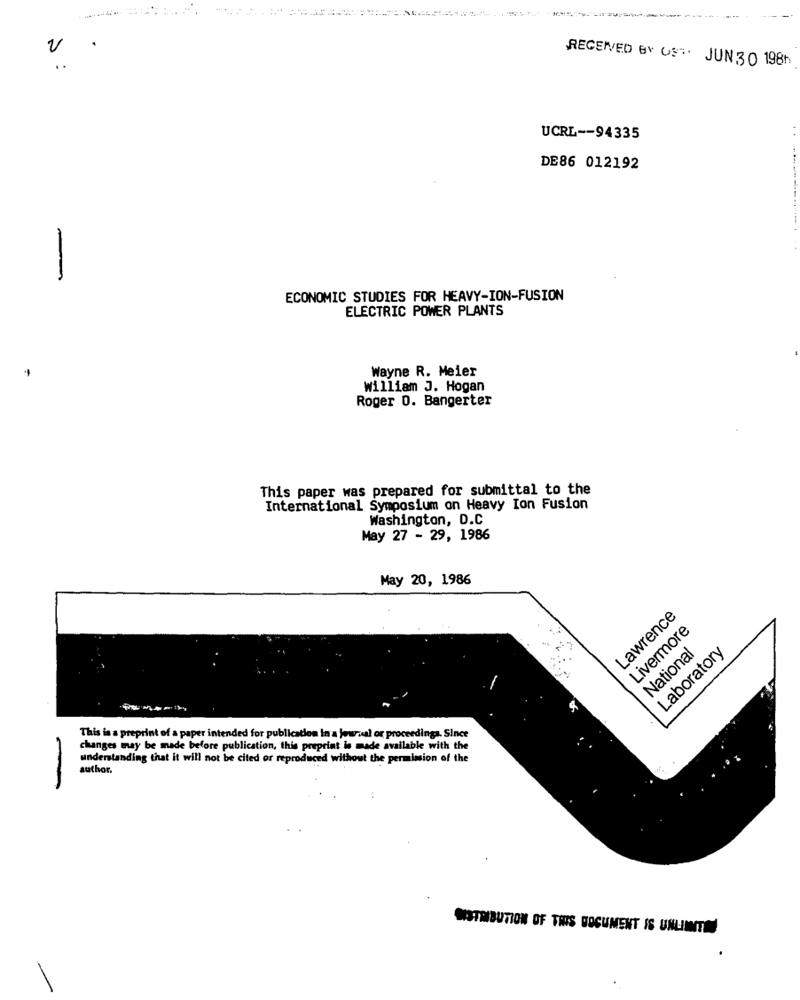
## V flECEIVEO BV 0 [j] [-] ;

JUN3Q196h

UCRL—94335

DE86 012192

## **ECONOMIC STUDIES FOR HEAVY-ION-FUSION** **ELECTRIC POWER PLANTS**

Wayne R. Meier
William J. Hogan
Roger 0. Bangerter

This paper was prepared for submittal to the
International Symposium an Heavy Ion Fusion
Washington, O.C
**`May 27 - 29, 1986`**

**`May 20, 1986`**

**This is a preprint of a paper intended for publkatkm in a knm«al or proceedings. Since**
**changes msy be made before publication, this preprint is made available with the**
**understanding that it will not be cited or reproduced without the permission of the**
**author.**

## •WWBU7KW OF THIS BWUMEJfT IS UHUSffaj

\

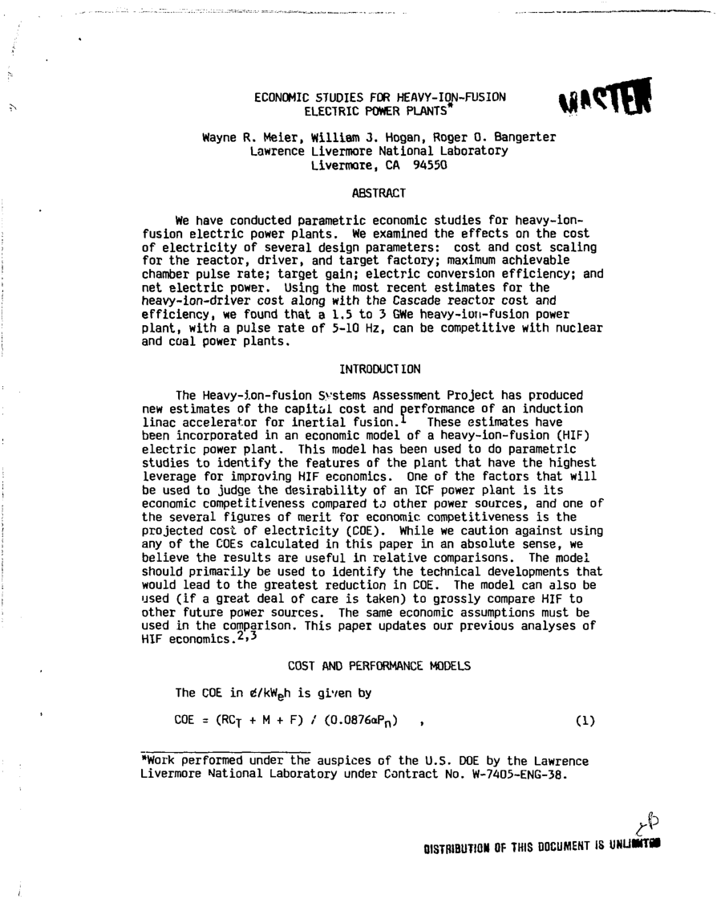
## **`ECONOMIC STUDIES FOR HEAVY-ION-FUSION`** **`ELECTRIC POWER PLANTS*`**
# **#*tfS**

**`Wayne R. Meier, William 3. Hogan, Roger 0. Bangerter`**
**`Lawrence Livermore National Laboratory`**
**`Livermore, CA 94550`**

## **`ABSTRACT`**

**`We have conducted parametric economic studies for heavy-ion-`**
**`fusion electric power plants. We examined the effects on the cost`**
**`of electricity of several design parameters: cost and cost scaling`**
**`for the reactor, driver, and target factory; maximum achievable`**
**`chamber pulse rate; target gain; electric conversion efficiency; and`**
**`net electric power. Using the most recent estimates for the`**
**`heavy-ion-driver cost along with the Cascade reactor cost and`**
**`efficiency, we found that a 1.5 to 3 GWe heavy-ion-fusion power`**
**`plant, with a pulse rate of 5-10 Hz, can be competitive with nuclear`**
**`and coal power plants.`**

## **`INTRODUCTION`**

**`The Heavy-ion-fusion Systems Assessment Project has produced`**
**`new estimates of the capital cost and performance of an induction`**
**`linac accelerator for inertial fusion.1`** **`These estimates have`**
**`been incorporated in an economic model of a heavy-ion-fusion (HIF)`**
**`electric power plant. This model has been used to do parametric`**
**`studies to identify the features of the plant that have the highest`**
**`leverage for improving HIF economics. One of the factors that will`**
**`be used to judge the desirability of an ICF power plant is its`**
**`economic competitiveness compared`** _**to**_ **`other power sources, and one of`**
**`the several figures of merit for economic, competitiveness is the`**
**`projected cost of electricity (COE). While we caution against using`**
**`any of the COEs calculated in this paper in an absolute sense, we`**
**`believe the results are useful in relative comparisons. The model`**
**`should primarily be used to identify the technical developments that`**
**`would lead to the greatest reduction in COE. The model can also be`**
**`used (if a great deal of care is taken) to grossly compare HIF to`**
**`other future power sources. The same economic assumptions must be`**
**`usedHIF economics.2> in the comparison. This paper updates3`** **`our previous analyses of`**

## **`COST AND PERFORMANCE MODELS`**

**`The COE in eS/kWeh is given by`**

**`COE = (RC T + M + F) / (0.0876aPn)`** **`,`** **`(1)`**

*Work performed under the auspices of the U.S. DOE by the Lawrence
Livermore National Laboratory under Contract No. W-7405-ENG-38.

OISTBIBUTIOM OF THIS DOCUMENT IS UNUWM

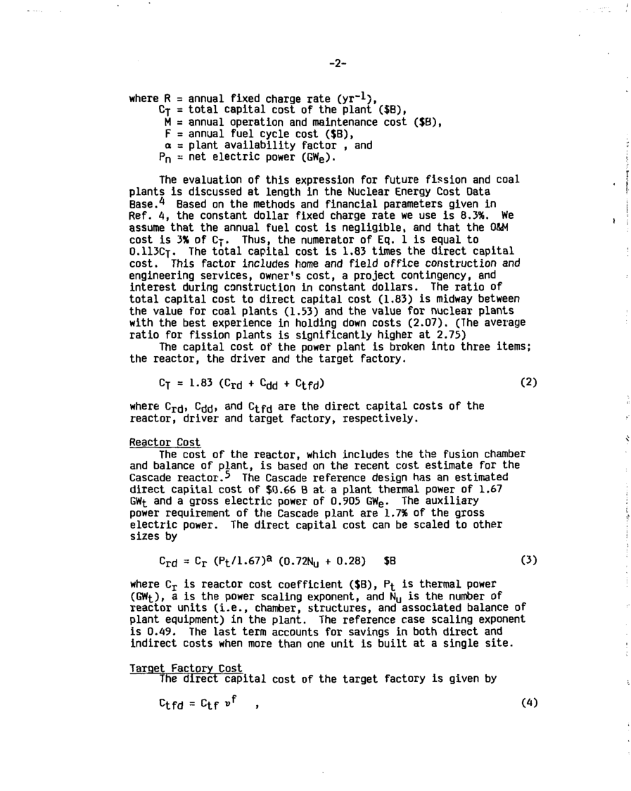

**`-2-`**

**`where R = annual fixed charge rate (yr`** **`-`** **`1`** **`),`**
**`Cf = total capital cost of the plant ($B),`**
**`M = annual operation and maintenance cost ($B),`**
**`F = annual fuel cycle cost ($B),`**
**`a = plant availability factor, and`**
## **`P n = net electric power (GW e).`**

**`The evaluation of this expression for future fission and coal`**
**`plants is discussed at length in the Nuclear Energy Cost Data`**
**`Base.4 Based on the methods and financial parameters given in`**
**`Ref.`** _**i\,**_ **`the constant dollar fixed charge rate we use is 8.3%. We`**
**`assume that the annual fuel cost is negligible, and that the O&M`**
**`cost is 3% of Cj. Thus, the numerator of Eq. 1 is equal to`**
**`0.113CT. The total capital cost is 1.83 times the direct capital`**
**`cost. This factor includes home and field office construction and`**
**`engineering services, owner's cost, a project contingency, and`**
**`interest during construction in constant dollars. The ratio of`**
**`total capital cost to direct capital cost (1.83) is midway between`**
**`the value for coal plants (1.53) and the value for nuclear plants`**
**`with the best experience in holding down costs (2.07). (The average`**
**`ratio for fission plants is significantly higher at 2.75)`**
**`The capital cost of the power plant is broken into three items;`**
**`the reactor, the driver and the target factory.`**

## **`C T = 1.83 (C r d + C d d + C t f d ) (2)`**

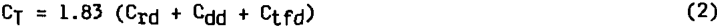
**`where C`** **`l`** **`d, C`** **`d`** **`d, and Ctf d are the direct capital costs of the`**
**`reactor, driver and target factory, respectively.`**

**`Reactor Cost`**
**`The cost of the reactor, which includes the the fusion chamber`**
**`Cascade reactor.and balance of plant, is based on the recent cost estimate for the 5 The Cascade reference design has an estimated`**
**`direct capital cost of $0.66 B at a plant thermal power of 1.67`**
**`GWt and a gross electric power of 0.905 GW e. The auxiliary`**
**`power requirement of the Cascade plant are 1.7% of the gross`**
**`electric power. The direct capital cost can be scaled to other`**
**`sizes by`**

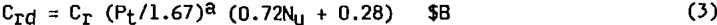

**`a`**
## **`C rd = C r (fVl-67) (0.72NU + 0.28) $B (3)`** **`where C a x is reactor cost coefficient ($B), Pt is thermal power i s t n B`**

**`(GWt),`** **`power scaling exponent, and N`** **`u is the number of`**
**`reactor units (i.e., chamber, structures, and associated balance of`**
**`plant equipment) in the plant. The reference case scaling exponent`**
**`is 0.49. The last term accounts for savings in both direct and`**
**`indirect costs when more than one unit is built at a single site.`**

**`Target Factory Cost`**
**`The direct capital cost of the target factory is given by`**
## **ctfd = Ctf » f, W**

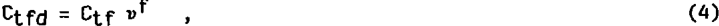

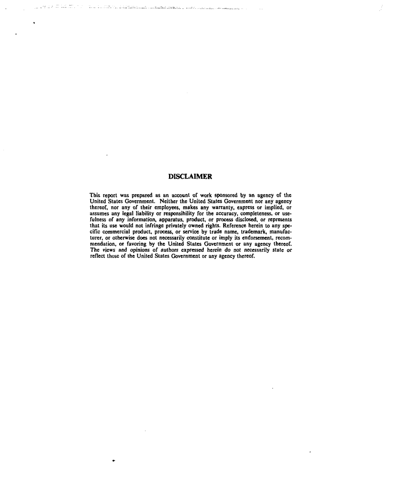
## **DISCLAIMER**

This report was prepared as an account of work sponsored by an agency of the
United States Government. Neither the United States Government nor any agency
thereof, nor any of their employees, makes any warranty, express or implied, or
assumes any legal liability or responsibility for the accuracy, completeness, or use­
fulness of any information, apparatus, product, or process disclosed^ or represents
that its use would not infringe privately owned rights. Reference herein to any spe­
cific commercial product, process, or service by trade name, trademark, manufac­
turer, or otherwise does not necessarily constitute or imply its endorsement, recom­
mendation, or favoring by the United States Government or any agency thereof.
The views and opinions of authors expressed herein do not necessarily state or
reflect those of the United States Government or any agency thereof.

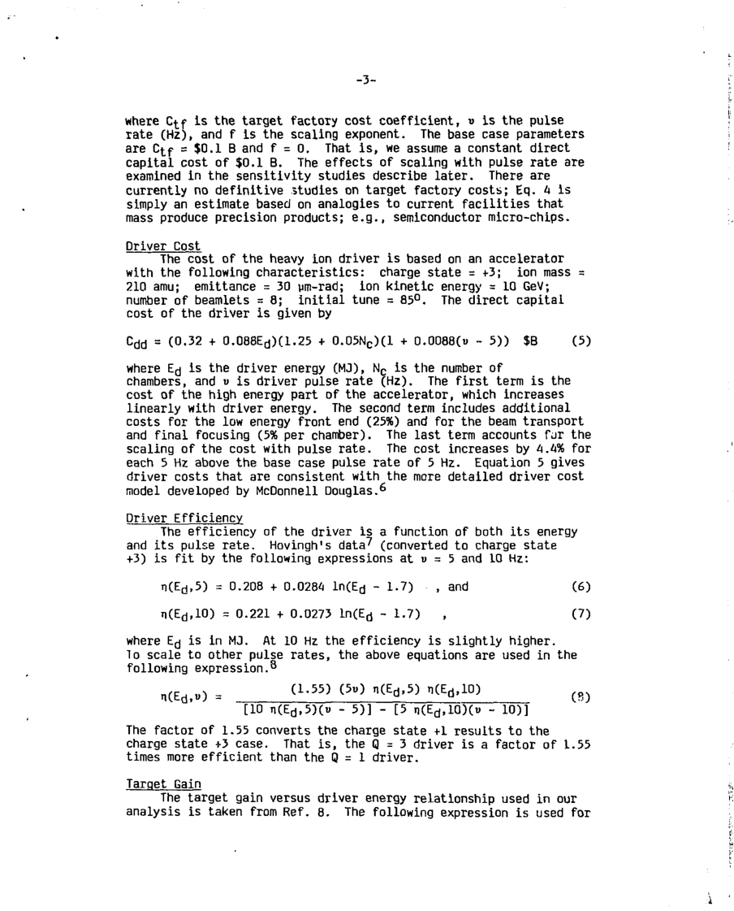

`-3-`

`where C^f is the target factory cost coefficient, » is the pulse`
`rate (Hz), and f is the scaling exponent. The base case parameters`
`are C^f = $0.1 B and f = 0. That is, we assume a constant direct`
`capital cost of $0.1 B. The effects of scaling with pulse rate are`
`examined in the sensitivity studies describe later. There are`
`currently no definitive studies on target factory costs; Eq. 4 is`
`simply an estimate based on analogies to current facilities that`
`mass produce precision products; e.g., semiconductor micro-chips.`

`Driver Cost`
`The cost of the heavy ion driver is based on an accelerator`
`with the following characteristics: charge state = +3; ion mass =`
`210 amu; emittance = 30 pm-rad; ion kinetic energy = 10 GeV;`
`number of beamlets = 8; initial tune = 85°. The direct capital`
`cost of the driver is given by`

`C` `d` `d = (0.32 + 0.088Ed)(1.25 + 0.05NC)(1 + 0.0088(v - 5)) $B` `(5)`

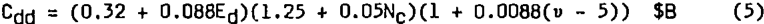

`where E` `d is the driver energy (MJ), N` `c is the number of`
`chambers, and « is driver pulse rate (Hz). The first term is the`
`cost of the high energy part of the accelerator, which increases`
`linearly with driver energy. The second term includes additional`
`costs for the low energy front end (25%) and for the beam transport`
`and final focusing (5% per chamber). The last term accounts fjr the`
`scaling of the cost with pulse rate. The cost increases by 4.4% for`
`each 5 Hz above the base case pulse rate of 5 Hz. Equation 5 gives`
`model developed by McDonnell Douglas.driver costs that are consistent with the more detailed driver cost 6`

`Driver Efficiency`
`and its pulseThe efficiency of the driver is a function of both its energy rate. Hovingh's data` `7 (converted to charge state`
`+3) is fit by the following expressions at` _v_ `= 5 and 10 Hz:`

`n(E d,5) = 0.208 + 0.0284 ln(E` `d - 1.7)` `, and` `(6)`

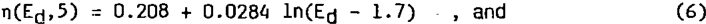

`i)(Ed,10) = 0.221 + 0.0273 ln(E` `d - 1.7)` `,` `(7)`

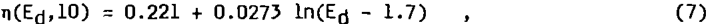

`where E` `d is in MJ. At 10 Hz the efficiency is slightly higher.`
`To scale to other pulsefollowing expression.8` `rates, the above equations are used in the`

`n` `(` `E` `d` `t` `[, )]` `=` `(1.55) (5.) n(E d,5) n(E` `d,10)` `(` `f` `l` `)`

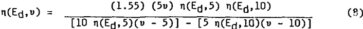
`[10 n(Ed,5)(w - 5)] - [5 n(Ed,10)(« - 10)]`

`The factor of 1.55 converts the charge state +1 results to the`
`charge state +3 case. That is, the Q = 3 driver is a factor of 1.55`
`times more efficient than the Q = 1 driver.`

`Target Gain`
`The target gain versus driver energy relationship used in our`
`analysis is taken from Ref. 8. The following expression is used for`

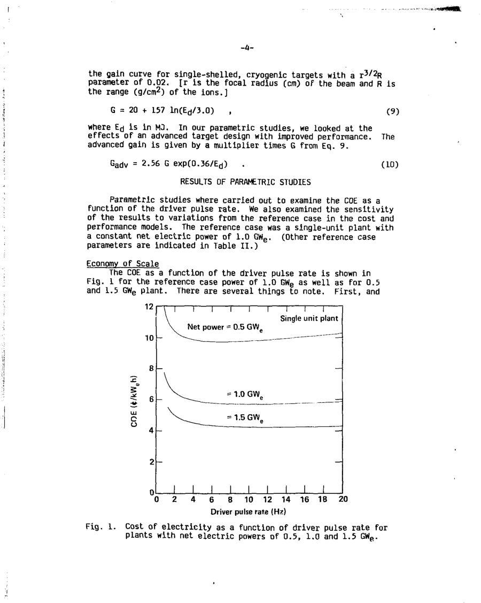

_**-i>-**_

## **`the gain curve for single-shelled, cryogenic targets with a r 3 / 2 R`**

**`parameterthe range (g/cm of 0.02.2) of the [r is the ions.] focal radius (cm) of the beam and R is`**

**`G = 20 + 157 ln(E`** **`d/3.0)`** **`(9)`**

**`where Ed is in MO. In our parametric studies, we looked at the`**
**`effects of an advanced target design with improved performance. The`**
**`advanced gain is given by a multiplier times G from Eq. 9.`**

## **`G a r J v = 2.56 G exp(0.36/E d)`** **`RESULTS OF PARAMETRIC STUDIES`**

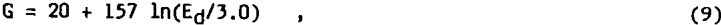

**`(10)`**

**`Parametric studies where carried out to examine the COE as a`**
**`function of the driver pulse rate. We also examined the sensitivity`**
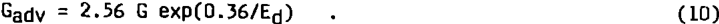
**`of the results to variations from the reference case in the cost and`**
**`performance models. The reference case was a single-unit plant with`**
**`a constant net electric power of 1.0 GW e. (Other reference case`**
**`parameters are indicated in Table II.)`**

**`Economy of Scale`**
**`The COE as a function of the driver pulse rate is shown in`**
**`Fig. 1 for the reference case power of 1.0 GW e as well as for 0.5`**
**`and 1.5 GW e plant. There are several things to note. First, and`**

## **I Z 1 1 1 1 1**

**Net power = 0.5 GWe**

## **I I I**

**Single unit plant**

**in** **-** **— —**

**-**

**`c`**

**`o`**

**6** **-** **\** **^** **=1.0GW e**

**\** **_** **^** **^** **=1.5GW e**

**4**
**"**

## **n I I I I I I I I**

**6** **8** **10** **12** **14** **`16 18 20`**

**Driver pulse rate (Hz)**

**`Fig. 1. Cost of electricity as a function of driver pulse rate for`**
**`plants with net electric powers of 0.5, 1.0 and 1.5 GW e.`**

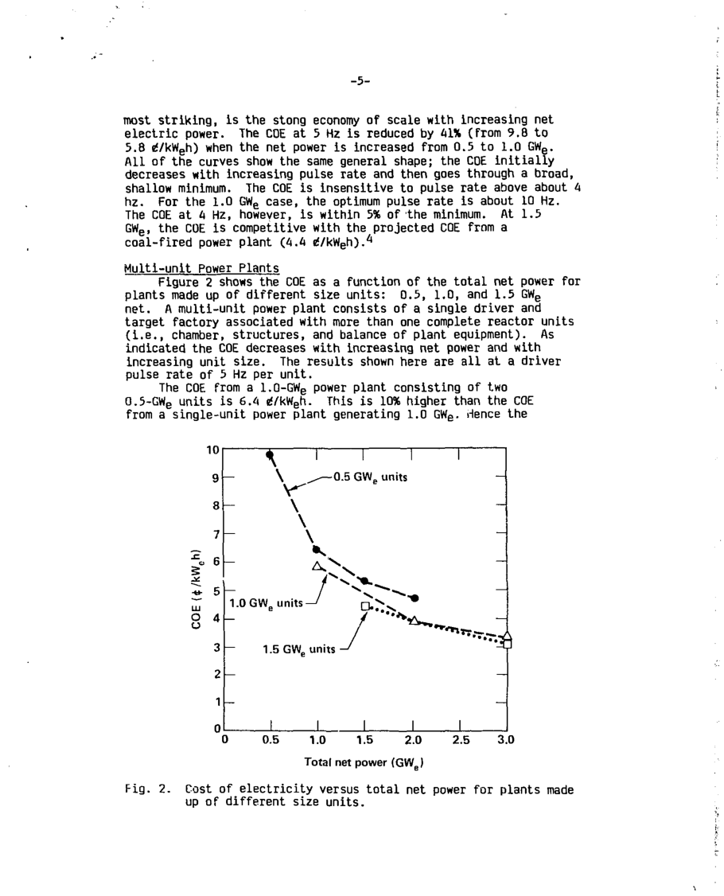

**`-5-`**

**`most striking, is the stong economy of scale with increasing net`**
**`electric power. The CDE at 5 Hz is reduced by 41% (from 9.8 to`**
**`5.8 ei/kWeh) when the net power is increased from 0.5 to 1.0 GW e.`**
**`All of the curves show the same general shape; the COE initially`**
**`decreases with increasing pulse rate and then goes through a broad,`**
**`shallow minimum. The COE is insensitive to pulse rate above about 4`**
**`hz. For the 1.0 GW e case, the optimum pulse rate is about 10 Hz.`**
**`The COE at 4 Hz, however, is within 5% of the minimum. At 1.5`**
## **`GW e, the COE is competitive with the projected COE from a`**

**`coal-fired power plant (4.4 s!/kWeh).4`**

**`Multi-unit Power Plants`**
**`Figure 2 shows the COE as a function of the total net power for`**
**`plants made up of different size units: 0.5, 1.0, and 1.5 GW e`**
**`net. A multi-unit power plant consists of a single driver and`**
**`target factory associated with more than one complete reactor units`**
**`(i.e., chamber, structures, and balance of plant equipment). As`**
**`indicated the CQE decreases with increasing net power and with`**
**`increasing unit size. The results shown here are all at a driver`**
**`pulse rate of 5 Hz per unit.`**
**`The COE from a 1.0-GWe power plant consisting of two`**
**`0.5-GWe units is 6.4 j!/kWeh. This is 10% higher than the COE`**
**`from a single-unit power plant generating 1.0 GW e. Hence the`**

## **1U \ ' ' I I**

9 [— ] \ -—0.5 GW. units

8 **\**
**\**

7 **\**

_**•£**_
## I 6

_**•£**_

**-e-** 5 **/** **^** v **^ »** **—**
**m** 1.0 GWe units _-1_ D . v

3

1

- 1.5 GWe units - ' _-y_

## 0 I I I I I

**`0.5`** **`1.0`** **`1.5`** **`2.0`** **`2.5`** **`3.0`**

**`Total net power (GW e)`**

**`Fig. 2. Cost of electricity versus total net power for plants made`**
**`up of different size units.`**

-46-

multi-unit plant achieves most of the economy of scale benefits of the single unit plant. This is important since there may be other reasons for choosing a multi-unit plant (e.g., phased construction could more closely match load growth and spread out capital investments in time). Similarly, the 4-MJ driver is not much more expensive than the sum of the two smaller reactors due to the scaling given in Eq. 3. Also the heavyball plant has additional costs for beam transport and focusing. The COE for a four-unit, 2-MJ plant is 2.47¢/kWh while a two-unit, 1-MJ plant (i.e., heavyball plant) gives 2.67¢/kWh. Both of these (as well as 3.1 ¢/kWh) are competitive with the COE from future 1-GWe nuclear power plants (3.3 ¢/kWh).

The COE from the HIF plant is comparable to other fusion reactor studies in Table 1. The costs for the other studies/plants that we compared to were adjusted as follows. The assumptions that we previously described were applied in all cases. That is, we used the same contingency, indirect cost factors, time-related cost factor, fixed charge rate, capacity factor, etc. As indicated, the COE projected for the 1000 MW HIF plant using the Cascade reactor and the two-unit plant give the lowest COE. On the other hand, compared to HYLIFE-II at 376¢, the HIF/Cascade plant has a COE that is 3% lower.

Table 1. Comparison of results with other fusion reactor studies. All cost are in constant 1988 dollars.

|  | Net Power = 1200 MWe | Net Power = 376¢ MWe |  |
|---|---|---|---|
| STARFIRE | MARS | HIF/CAS | HIBALL-II | HIF/CAS |
|---|---|---|---|---|
| Direct cost ($B) | 2.07 | 2.26 | 1.85 | 4.80 | 3.45 |
| Total cost ($B) | 3.79 | 4.10 | 3.54 | 8.79 | 6.30 |
| COE (¢/kWh) | 6.13 | 6.33 | 5.24 | 4.39 [?] | 3.02 [?] |

**OEMC Parametric Studies**

The results of a sensitivity study, where we varied several target and driver parameters, are given in Fig. 6. A 10% change in cost results in a 1% change in the COE. A 20% change in the reactor cost leads to a 1% change in the COE. The COE is insensitive to the reactor scaling exponent in Eq. 3. If the target factory cost increases modestly with increasing pulse rate, the COE increases by a few percent per MJ. For an increase in rep rate of 1 Hz, of course, arbitrary, if we had selected a higher pulse rate to nominal (or 10, the sensitivity would be less). Reducing the conversion efficiency to 10% increases the COE by 13%. The advanced target gain curve, which at 4 MJ gives a gain of 150 compared to 60 for a conservative gain curve, results in a lower COE. In addition, the economy of scale effects previously discussed are also indicated in the table and are seen to cause the largest effects.

-7-

## Table II. Changes in the COE (¢/kW$_e$h) resulting from changes in the reference case parameters. The reference case COE is 5.0 ¢/kW$_e$h. The reference case parameters are given in square brackets. Fractional changes are given in parenthesis.

| Parameter | COE | Parameter | COE |
|---|---|---|---|
| Pulse rate | | T, scaling | |
| 1 Hz | 6.5 (+ 1%) [?] | | |
| 3 Hz | 5.1 (+ 2%) | | |
| 10 Hz | 5.7 (- 2%) [?] | Conv. eff. $\eta$ | |
| [5 Hz] | | 0.1 [?] | 6.0 (+ 19%) |
| Cost | | [0.35] | |
| 0.5 $C_0$ | 3.5 (- 1%) [?] | Target/main curve | |
| [C$_0$] | | 1.33 | 5.4 (- 8%) [?] |
| 2 C$_0$ | | | |
| Reactor cost | | Net electric power | |
| 0.75 $C_R$ | 5.3 (- 13%) [?] | 1.1 [1.2] | |
| [$C_R$] | | | |
| Reactor eff. | | Unit per plant | |
| (0.43) | 5.9 (+ 2%) [?] | 4 | 4.6 (- 23%) [?] |
| 0.90 | 6.0 (+ 3%) [?] | | 3.9 (- 3%) [?] |

## CONCLUSIONS

We have examined the COE of MIF power plants in order to determine the economic impact of various design and system improvements. Our conclusions fall into three main areas: (1) optimum pulse rate, (2) economy of scale, and (3) various design improvements.

### Optimum Pulse Rate

For the single-unit, 1-MW$_e$ power plant, the optimum pulse rate (for both yield and chamber) is about 10 Hz, resulting in a COE of 5.7¢/kW$_e$h. However, the COE is not very sensitive to pulse rate. For example, if the chamber pulse rate is limited to 4 Hz, the COE only increases by about 10%, from 5.7 to about 6.3. The pulse rate is important because major technological uncertainties are associated with predicting the maximum achievable chamber pulse rate.

### Economy of Scale

As expected, the COE decreases with increasing net electric power. The reduction is significant, whether the power is increased by increasing the power of a single unit, or by using a single driver to operate several units. For a given net power, a multi-unit plant achieves most of the economy-of-scale advantage of a

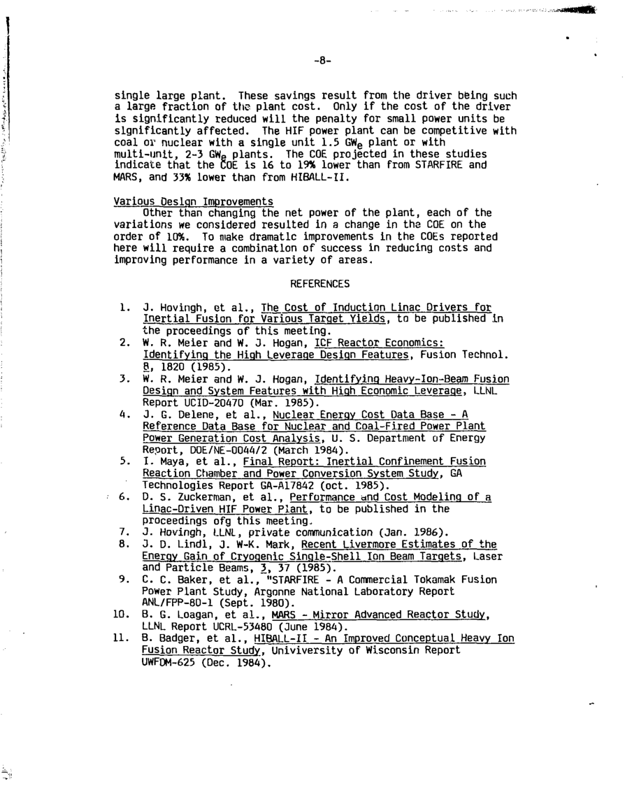

`-8-`

`single large plant. These savings result from the driver being such`
`a large fraction of the plant cost. Only if the cost of the driver`
`is significantly reduced will the penalty for small power units be`
`significantly affected. The HIF power plant can be competitive with`
`coal ov nuclear with a single unit 1.5 GW e plant or with`
`multi-unit, 2-3 GW e plants. The COE projected in these studies`
`indicate that the COE is 16 to 19% lower than from STARFIRE and`
`MARS, and 33% lower than from HIBALL-II.`

`Various Design Improvements`
`Other than changing the net power of the plant, each of the`
`variations we considered resulted in a change in the COE on the`
`order of 10%. To make dramatic improvements in the COEs reported`
`here will require a combination of success in reducing costs and`
`improving performance in a variety of areas.`

`REFERENCES`

`1. 0. Hovingh, et al., The Cost of Induction Linac Drivers for`
`Inertial Fusion for Various Target Yields, to be published in`
`the proceedings of this meeting.`
`2. W. R. Meier and W. 0. Hogan, ICF Reactor Economics:`
`Identifying the High Leverage Design Features. Fusion Technol.`
`8, 1820 (1985).`
`3. W. R. Meier and W. J. Hogan, Identifying Heavy-Ion-Beam Fusion`
`Design and System Features with High Economic Leverage, LLNL`
`Report UCID-20470 (Mar. 1985).`
`4. J. G. Delene, et al., Nuclear Energy Cost Data Base - A`
`Reference Data Base for Nuclear and Coal-Fired Power Plant`
`Power Generation Cost Analysis. U. S. Department of Energy`
`Report, DOE/NE-0044/2 (March 1984).`
`5. I. Maya, et al., Final Report: Inertial Confinement Fusion`
`Reaction Chamber and Power Conversion System Study. GA`
`Technologies Report GA-A17842 (oct. 1985).`
`6. D. s. Zuckerman, et al., Performance and Cost Modeling of a`
`Linac-Driven HIF Power Plant, to be published in the`
`proceedings ofg this meeting.`
`7. J. Hovingh, LLNL, private communication (Jan. 1986).`
`8. 0. D. Lindl, J. W-K. Mark, Recent Livermore Estimates of the`
`Energy Gain of Cryogenic Single-Shell Ion Beam Targets. Laser`
`and Particle Beams, 3, 37 (1985).`
`9. C. c. Baker, et al., "STARFIRE - A Commercial Tokamak Fusion`
`Power Plant Study, Argonne National Laboratory Report`
`ANL/FPP-80-1 (Sept. 1980).`
`10. B. G. Loagan, et al., MARS - Mirror Advanced Reactor Study.`
`LLNL Report UCRL-53480 (June 1984).`
`11. B. Badger, et al., HIBALL-II - An Improved Conceptual Heavy Ion`
`Fusion Reactor Study. Univiversity of Wisconsin Report`
`UWFDM-625 (Dec. 1984).`

