**Energy from Inertial Fusion**

[William J. HoganRoger BangerterGerald L. Kulcinski](http://physicstoday.scitation.org/author/Hogan%2C+William+J)

Citation: Physics Today **45**, 9, 42 (1992); doi: 10.1063/1.881319

[View online: http://dx.doi.org/10.1063/1.881319](http://dx.doi.org/10.1063/1.881319)

[View Table of Contents: http://physicstoday.scitation.org/toc/pto/45/9](http://physicstoday.scitation.org/toc/pto/45/9)

[Published by the American Institute of Physics](http://physicstoday.scitation.org/publisher/)

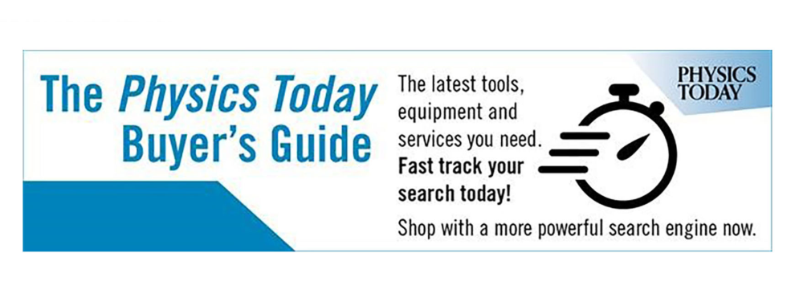

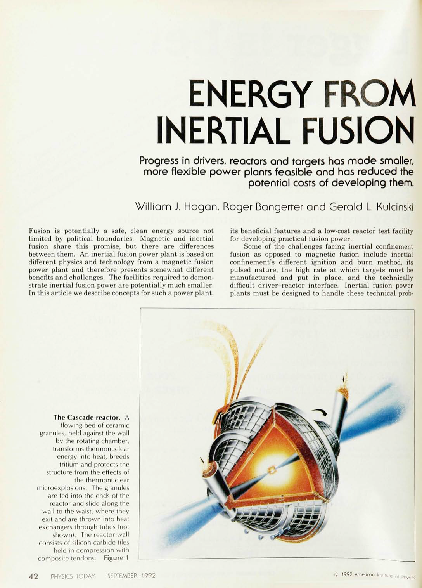
## **ENERGY FROM** **INERTIAL FUSION**

**Progress in drivers, reactors and targets has made smaller,**

**more flexible power plants feasible and has reduced the**

**potential costs of developing them.**

William J. Hogan, Roger Bongerter and Gerald L Kulcinski

Fusion is potentially a safe, clean energy source not
limited by political boundaries. Magnetic and inertial
fusion share this promise, but there are differences
between them. An inertial fusion power plant is based on
different physics and technology from a magnetic fusion
power plant and therefore presents somewhat different
benefits and challenges. The facilities required to demonstrate inertial fusion power are potentially much smaller.
In this article we describe concepts for such a power plant,

**The Cascade reactor.** A

flowing bed of ceramic
granules, held against the wall

by the rotating chamber,
transforms thermonuclear

energy into heat, breeds

tritium and protects the
structure from the effects of

the thermonuclear
microexplosions. The granules

are fed into the ends of the

reactor and slide along the
wall to the waist, where they
exit and are thrown into heat
exchangers through tubes (not

shown). The reactor wall
consists of silicon carbide tiles

held in compression with
composite tendons. **Figure 1**

its beneficial features and a low-cost reactor test facility
for developing practical fusion power.

Some of the challenges facing inertial confinement
fusion as opposed to magnetic fusion include inertial
confinement's different ignition and burn method, its
pulsed nature, the high rate at which targets must be
manufactured and put in place, and the technically
difficult driver-reactor interface. Inertial fusion power
plants must be designed to handle these technical prob

**4 2** PHYSICS TODAY SEPTEMBER 1992 © 1992 American Institute Of rhysics

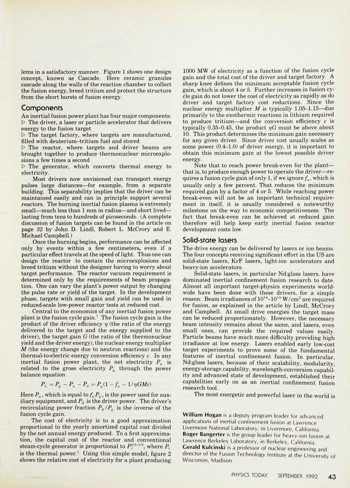

lems in a satisfactory manner. Figure 1 shows one design
concept, known as Cascade. Here ceramic granules
cascade along the walls of the reaction chamber to collect
the fusion energy, breed tritium and protect the structure
from the short bursts of fusion energy.

Components
An inertial fusion power plant has four major components:
t> The driver, a laser or particle accelerator that delivers
energy to the fusion target

 - The target factory, where targets are manufactured,
filled with deuterium-tritium fuel and stored

 - The reactor, where targets and driver beams are
brought together to produce thermonuclear microexplosions a few times a second

 - The generator, which converts thermal energy to
electricity.

Most drivers now envisioned can transport energy
pulses large distances—for example, from a separate
building. This separability implies that the driver can be
maintained easily and can in principle support several
reactors. The burning inertial fusion plasma is extremely
small—much less than 1 mm in radius—and short lived—
lasting from tens to hundreds of picoseconds. (A complete
discussion of fusion targets can be found in the article on
page 32 by John D. Lindl, Robert L. McCrory and E.
Michael Campbell.)

Once the burning begins, performance can be affected
only by events within a few centimeters, even if a
particular effect travels at the speed of light. Thus one can
design the reactor to contain the microexplosions and
breed tritium without the designer having to worry about
target performance. The reactor vacuum requirement is
determined only by the requirements of beam propagation. One can vary the plant's power output by changing
the pulse rate or yield of the target. In the development
phase, targets with small gain and yield can be used in
reduced-scale low-power reactor tests at reduced cost.

Central to the economics of any inertial fusion power
plant is the fusion cycle gain. [1] The fusion cycle gain is the
product of the driver efficiency _rj_ (the ratio of the energy
delivered to the target and the energy supplied to the
driver), the target gain _G_ (the ratio of the thermonuclear
yield and the driver energy), the nuclear energy multiplier
_M_ (the energy change due to neutron reactions) and the
thermal-to-electric energy conversion efficiency _e._ In any
inertial fusion power plant, the net electricity Pn is
related to the gross electricity _Ps_ through the power
balance equation

_Pn=Pg-Pa-Pd_ _= PK(1 -fa- l/vGMe)_

Here _Pa_, which is equal to _fa PK_, is the power used for auxiliary equipment, and _PA_ is the driver power. The driver's
recirculating power fraction _PA /PK_ is the inverse of the
fusion cycle gain.

The cost of electricity is to a good approximation
proportional to the yearly amortized capital cost divided
by the net annual energy produced. To a first approximation, the capital cost of the reactor and conventional
steam-cycle generator is proportional to pj [l] - [6] -°- [8] ) [ where] _[ P]_ _t_

is the thermal power.' Using this simple model, figure 2
shows the relative cost of electricity for a plant producing

1000 MW of electricity as a function of the fusion cycle
gain and the total cost of the driver and target factory. A
sharp knee defines the minimum acceptable fusion cycle
gain, which is about 4 or 5. Further increases in fusion cycle gain do not lower the cost of electricity as rapidly as do
driver and target factory cost reductions. Since the
nuclear energy multiplier _M_ is typically 1.05-1.15—due
primarily to the exothermic reactions in lithium required
to produce tritium—and the conversion efficiency _e_ is
typically 0.35-0.45, the product _-qG_ must be above about
10. This product determines the minimum gain necessary
for any given driver. Since driver cost usually scales as
some power (0.4-1.0) of driver energy, it is important to
obtain this minimum gain at the lowest possible driver
energy.

Note that to reach power break-even for the plant—
that is, to produce enough power to operate the driver—requires a fusion cycle gain of only 1, if we ignore /a, which is
usually only a few percent. That reduces the minimum
required gain by a factor of 4 or 5. While reaching power
break-even will not be an important technical requirement in itself, it is usually considered a noteworthy
milestone on the way to economic competitiveness. The
fact that break-even can be achieved at reduced gain
therefore will help keep early inertial fusion reactor
development costs low.

Solid-stote losers
The drive energy can be delivered by lasers or ion beams.
The four concepts receiving significant effort in the US are
solid-state lasers, KrF lasers, light-ion accelerators and
heavy-ion accelerators.

Solid-state lasers, in particular Nd:glass lasers, have
dominated inertial confinement fusion research to date.
Almost all important target-physics experiments worldwide have been done with these drivers, for a simple
reason: Beam irradiances of 10 [14] -10 [15] W/cm [2] are required
for fusion, as explained in the article by Lindl, McCrory
and Campbell. At small drive energies the target mass
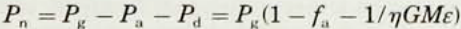
can be reduced proportionately. However, the necessary
beam intensity remains about the same, and lasers, even
small ones, can provide the required values easily.
Particle beams have much more difficulty providing high
irradiance at low energy. Lasers enabled early low-cost
target experiments to prove some of the fundamental
features of inertial confinement fusion. In particular,
Nd:glass lasers, because of their scalability, modularity,
energy-storage capability, wavelength-conversion capability and advanced state of development, established their
capabilities early on as an inertial confinement fusion
research tool.

The most energetic and powerful laser in the world is

**William Hogan** is a deputy program leader for advanced
applications of inertial confinement fusion at Lawrence
Livermore National Laboratory, in Livermore, California.
**Roger Bangerter** is the group leader for heavy-ion fusion at
Lawrence Berkeley Laboratory, in Berkeley, California.
**Gerald Kulcinski** is a professor of nuclear engineering and
director of the Fusion Technology Institute at the University of
Wisconsin, Madison.

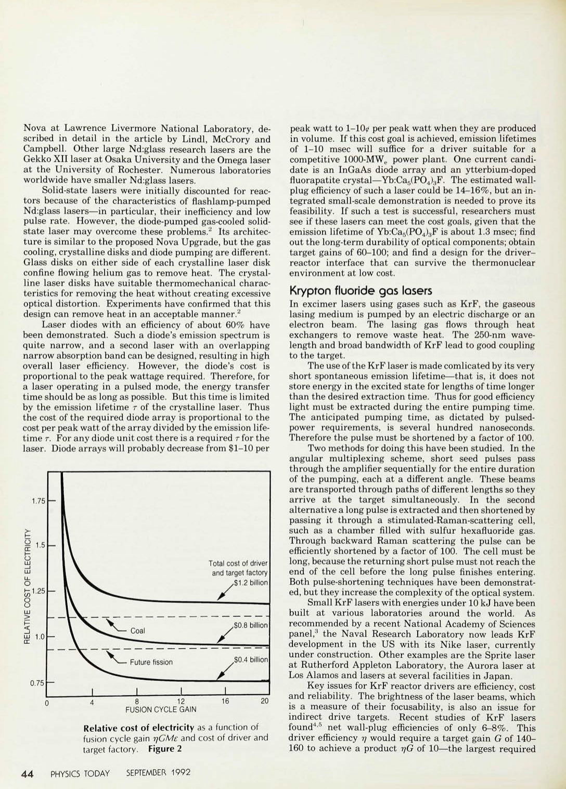

Nova at Lawrence Livermore National Laboratory, described in detail in the article by Lindl, McCrory and
Campbell. Other large Nd:glass research lasers are the
Gekko XII laser at Osaka University and the Omega laser
at the University of Rochester. Numerous laboratories
worldwide have smaller Nd:glass lasers.

Solid-state lasers were initially discounted for reactors because of the characteristics of flashlamp-pumped
Nd:glass lasers—in particular, their inefficiency and low
pulse rate. However, the diode-pumped gas-cooled solidstate laser may overcome these problems. [2] Its architecture is similar to the proposed Nova Upgrade, but the gas
cooling, crystalline disks and diode pumping are different.
Glass disks on either side of each crystalline laser disk
confine flowing helium gas to remove heat. The crystalline laser disks have suitable thermomechanical characteristics for removing the heat without creating excessive
optical distortion. Experiments have confirmed that this
design can remove heat in an acceptable manner. [2]

Laser diodes with an efficiency of about 60% have
been demonstrated. Such a diode's emission spectrum is
quite narrow, and a second laser with an overlapping
narrow absorption band can be designed, resulting in high
overall laser efficiency. However, the diode's cost is
proportional to the peak wattage required. Therefore, for
a laser operating in a pulsed mode, the energy transfer
time should be as long as possible. But this time is limited
by the emission lifetime r of the crystalline laser. Thus
the cost of the required diode array is proportional to the
cost per peak watt of the array divided by the emission lifetime _T._ For any diode unit cost there is a required r for the
laser. Diode arrays will probably decrease from $1-10 per

1.75

## **O**

LJJ

# **-1**

\ ^V^—Coal

^ V ^ >— Future fission

Total cost of driver

and target factory

.$1.2 billion

.$0.8 billion

$0.4 billion

I
LJJ
U_
## **O**

**te**

**te1-25**

**1-**

LJJ

0.75

**1** **1** **1**

## **1 1 I**

8 12
FUSION CYCLE GAIN

**16** 20

peak watt to 1-10^ per peak watt when they are produced
in volume. If this cost goal is achieved, emission lifetimes
of 1-10 msec will suffice for a driver suitable for a
competitive 1000-MWe power plant. One current candidate is an InGaAs diode array and an ytterbium-doped
fluorapatite crystal—Yb:Ca5(PO4)3F. The estimated wallplug efficiency of such a laser could be 14-16%, but an integrated small-scale demonstration is needed to prove its
feasibility. If such a test is successful, researchers must
see if these lasers can meet the cost goals, given that the
emission lifetime of Yb:Ca5(PO4)3F is about 1.3 msec; find
out the long-term durability of optical components; obtain
target gains of 60-100; and find a design for the driverreactor interface that can survive the thermonuclear
environment at low cost.

Krypton fluoride gas lasers
In excimer lasers using gases such as KrF, the gaseous
lasing medium is pumped by an electric discharge or an
electron beam. The lasing gas flows through heat
exchangers to remove waste heat. The 250-nm wavelength and broad bandwidth of KrF lead to good coupling
to the target.

The use of the **KrF** laser is made comlicated by its very
short spontaneous emission lifetime—that is, it does not
store energy in the excited state for lengths of time longer
than the desired extraction time. Thus for good efficiency
light must be extracted during the entire pumping time.
The anticipated pumping time, as dictated by pulsedpower requirements, is several hundred nanoseconds.
Therefore the pulse must be shortened by a factor of 100.

Two methods for doing this have been studied. In the
angular multiplexing scheme, short seed pulses pass
through the amplifier sequentially for the entire duration
of the pumping, each at a different angle. These beams
are transported through paths of different lengths so they
arrive at the target simultaneously. In the second
alternative a long pulse is extracted and then shortened by
passing it through a stimulated-Raman-scattering cell,
such as a chamber filled with sulfur hexafluoride gas.
Through backward Raman scattering the pulse can be
efficiently shortened by a factor of 100. The cell must be
long, because the returning short pulse must not reach the
end of the cell before the long pulse finishes entering.
Both pulse-shortening techniques have been demonstrated, but they increase the complexity of the optical system.

Small KrF lasers with energies under 10 kJ have been
built at various laboratories around the world. As
recommended by a recent National Academy of Sciences
panel, [3] the Naval Research Laboratory now leads KrF
development in the US with its Nike laser, currently
under construction. Other examples are the Sprite laser
at Rutherford Appleton Laboratory, the Aurora laser at
Los Alamos and lasers at several facilities in Japan.

Key issues for KrF reactor drivers are efficiency, cost
and reliability. The brightness of the laser beams, which
is a measure of their focusability, is also an issue for
indirect drive targets. Recent studies of KrF lasers
found [4] ' [5] net wall-plug efficiencies of only 6-8%. This
driver efficiency 77 would require a target gain _G_ of 140**160** to achieve a product _r/G_ of 10—the largest required

**Relative cost of electricity** as a function of
fusion cycle gain _-qCMe_ and cost of driver and
target factory. **Figure 2**

4 4 PHYSICS TODAY SEPTEMBER 1992

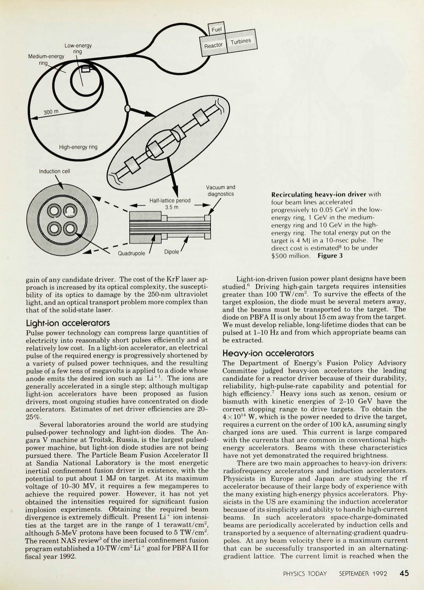

Medium-energy

ring.

Low-energy

ring

Quadrupole ' _I_ DiDipole'P ole

gain of any candidate driver. The cost of the KrF laser approach is increased by its optical complexity, the susceptibility of its optics to damage by the 250-nm ultraviolet
light, and an optical transport problem more complex than
that of the solid-state laser.

Light-ion accelerators
Pulse power technology can compress large quantities of
electricity into reasonably short pulses efficiently and at
relatively low cost. In a light-ion accelerator, an electrical
pulse of the required energy is progressively shortened by
a variety of pulsed power techniques, and the resulting
pulse of a few tens of megavolts is applied to a diode whose
anode emits the desired ion such as Li [ + 1] . The ions are
generally accelerated in a single step; although multigap
light-ion accelerators have been proposed as fusion
drivers, most ongoing studies have concentrated on diode
accelerators. Estimates of net driver efficiencies are 2025%.

Several laboratories around the world are studying
pulsed-power technology and light-ion diodes. The Angara V machine at Troitsk, Russia, is the largest pulsedpower machine, but light-ion diode studies are not being
pursued there. The Particle Beam Fusion Accelerator II
at Sandia National Laboratory is the most energetic
inertial confinement fusion driver in existence, with the
potential to put about 1 MJ on target. At its maximum
voltage of 10-30 MV, it requires a few megamperes to
achieve the required power. However, it has not yet
obtained the intensities required for significant fusion
implosion experiments. Obtaining the required beam
divergence is extremely difficult. Present Li [+] ion intensities at the target are in the range of 1 terawatt/cm [2],
although 5-MeV protons have been focused to 5 TW/cm [2] .
The recent NAS review [3] of the inertial confinement fusion
program established a 10-TW/cm [2] Li [+] goal for PBFAII for
fiscal year 1992.

**Recirculating heavy-ion driver** with
four beam lines accelerated
progressively to 0.05 CeV in the lowenergy ring, 1 CeV in the mediumenergy ring and 10 CeV in the highenergy ring. The total energy put on the
target is 4 MJ in a 10-nsec pulse. The
direct cost is estimated [8] to be under
$500 million. **Figure 3**

Light-ion-driven fusion power plant designs have been
studied. [6] Driving high-gain targets requires intensities
greater than 100 TW/cm [2] . To survive the effects of the
target explosion, the diode must be several meters away,
and the beams must be transported to the target. The
diode on PBFA II is only about 15 cm away from the target.
We must develop reliable, long-lifetime diodes that can be
pulsed at 1-10 Hz and from which appropriate beams can
be extracted.

Heavy-ion accelerators
The Department of Energy's Fusion Policy Advisory
Committee judged heavy-ion accelerators the leading
candidate for a reactor driver because of their durability,
reliability, high-pulse-rate capability and potential for
high efficiency. [7] Heavy ions such as xenon, cesium or
bismuth with kinetic energies of 2-10 GeV have the
correct stopping range to drive targets. To obtain the
4x 10 [14] W, which is the power needed to drive the target,
requires a current on the order of 100 kA, assuming singly
charged ions are used. This current is large compared
with the currents that are common in conventional highenergy accelerators. Beams with these characteristics
have not yet demonstrated the required brightness.

There are two main approaches to heavy-ion drivers:
radiofrequency accelerators and induction accelerators.
Physicists in Europe and Japan are studying the rf
accelerator because of their large body of experience with
the many existing high-energy physics accelerators. Physicists in the US are examining the induction accelerator
because of its simplicity and ability to handle high-current
beams. In such accelerators space-charge-dominated
beams are periodically accelerated by induction cells and
transported by a sequence of alternating-gradient quadrupoles. At any beam velocity there is a maximum current
that can be successfully transported in an alternatinggradient lattice. The current limit is reached when the

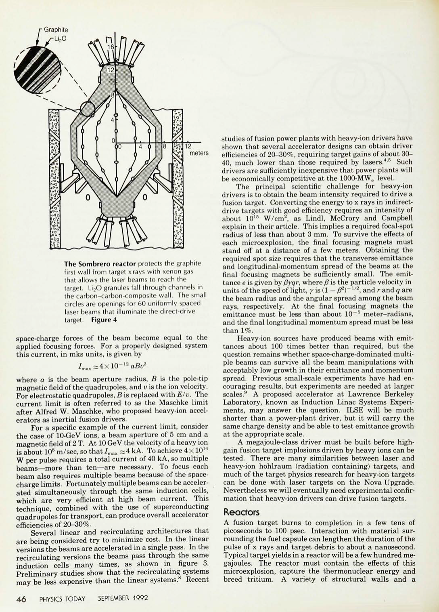

     - Graphite
-Li 2O

meters

**The Sombrero reactor** protects the graphite
first wall from target xrays with xenon gas
that allows the laser beams to reach the
target. Li2O granules fall through channels in
the carbon-carbon-composite wall. The small
circles are openings for 60 uniformly spaced
laser beams that illuminate the direct-drive
target. **Figure 4**

space-charge forces of the beam become equal to the
applied focusing forces. For a properly designed system
this current, in mks units, is given by

where a is the beam aperture radius, _B_ is the pole-tip
magnetic field of the quadrupoles, and _v_ is the ion velocity.
For electrostatic quadrupoles, _B_ is replaced with _E/v._ The
current limit is often referred to as the Maschke limit
after Alfred W. Maschke, who proposed heavy-ion accelerators as inertial fusion drivers.

For a specific example of the current limit, consider
the case of 10-GeV ions, a beam aperture of 5 cm and a
magnetic field of 2 T. At 10 GeV the velocity of a heavy ion
is about 10 [8] m/sec, so that/max ~4 kA. To achieve 4x 10 [14]
W per pulse requires a total current of 40 kA, so multiple
beams—more than ten—are necessary. To focus each
beam also requires multiple beams because of the spacecharge limits. Fortunately multiple beams can be accelerated simultaneously through the same induction cells,
which are very efficient at high beam current. This
technique, combined with the use of superconducting
quadrupoles for transport, can produce overall accelerator
efficiencies of 20-30%.

Several linear and recirculating architectures that
are being considered try to minimize cost. In the linear
versions the beams are accelerated in a single pass. In the
recirculating versions the beams pass through the same
induction cells many times, as shown in figure 3.
Preliminary studies show that the recirculating systems
may be less expensive than the linear systems. [8] Recent

4 6 PHYSICS TODAY SEPTEMBER 1992

studies of fusion power plants with heavy-ion drivers have
shown that several accelerator designs can obtain driver
efficiencies of 20-30%, requiring target gains of about 3040, much lower than those required by lasers. [45] Such
drivers are sufficiently inexpensive that power plants will
be economically competitive at the 1000-MWe level.

The principal scientific challenge for heavy-ion
drivers is to obtain the beam intensity required to drive a
fusion target. Converting the energy to x rays in indirectdrive targets with good efficiency requires an intensity of
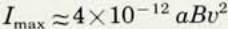
about 10 [15] W/cm [2], as Lindl, McCrory and Campbell
explain in their article. This implies a required focal-spot
radius of less than about 3 mm. To survive the effects of
each microexplosion, the final focusing magnets must
stand off at a distance of a few meters. Obtaining the
required spot size requires that the transverse emittance
and longitudinal-momentum spread of the beams at the
final focusing magnets be sufficiently small. The emittance _e_ is given by _fSyqr,_ where _0_ is the particle velocity in
units of the speed of light, _y_ is (1 — _0*"Y_ [1/2], and _r_ and _q_ are
the beam radius and the angular spread among the beam
rays, respectively. At the final focusing magnets the
emittance must be less than about 10 ~ [5] meter-radians,
and the final longitudinal momentum spread must be less
than 1%.

Heavy-ion sources have produced beams with emittances about 100 times better than required, but the
question remains whether space-charge-dominated multiple beams can survive all the beam manipulations with
acceptably low growth in their emittance and momentum
spread. Previous small-scale experiments have had encouraging results, but experiments are needed at larger
scales. [9] A proposed accelerator at Lawrence Berkeley
Laboratory, known as Induction Linac Systems Experiments, may answer the question. ILSE will be much
shorter than a power-plant driver, but it will carry the
same charge density and be able to test emittance growth
at the appropriate scale.

A megajoule-class driver must be built before highgain fusion target implosions driven by heavy ions can be
tested. There are many similarities between laser and
heavy-ion hohlraum (radiation containing) targets, and
much of the target physics research for heavy-ion targets
can be done with laser targets on the Nova Upgrade.
Nevertheless we will eventually need experimental confirmation that heavy-ion drivers can drive fusion targets.

Reactors
A fusion target burns to completion in a few tens of
picoseconds to 100 psec. Interaction with material surrounding the fuel capsule can lengthen the duration of the
pulse of x rays and target debris to about a nanosecond.
Typical target yields in a reactor will be a few hundred megajoules. The reactor must contain the effects of this
microexplosion, capture the thermonuclear energy and
breed tritium. A variety of structural walls and a

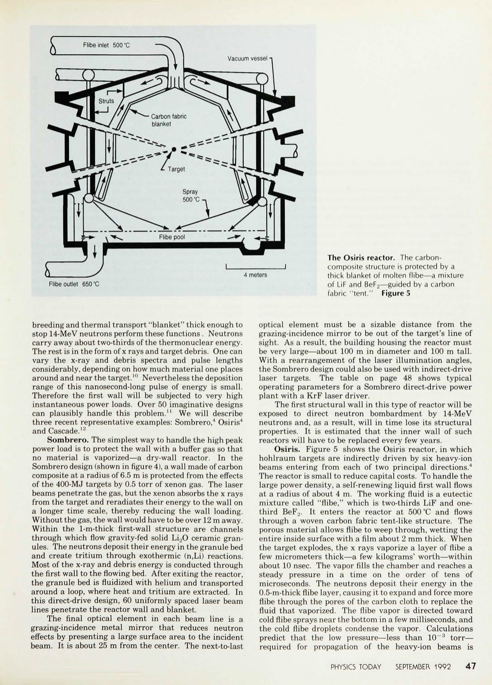

4 meters

**The Osiris reactor.** The carboncomposite structure is protected by a
thick blanket of molten flibe—a mixture
of LiF and BeF2—guided by a carbon
fabric "tent." **Figure** 5

Flibe outlet 650 °C

breeding and thermal transport "blanket" thick enough to
stop 14-MeV neutrons perform these functions . Neutrons
carry away about two-thirds of the thermonuclear energy.
The rest is in the form of x rays and target debris. One can
vary the x-ray and debris spectra and pulse lengths
considerably, depending on how much material one places
around and near the target.' ° Nevertheless the deposition
range of this nanosecond-long pulse of energy is small.
Therefore the first wall will be subjected to very high
instantaneous power loads. Over 50 imaginative designs
can plausibly handle this problem. [11] We will describe
three recent representative examples: Sombrero, [4] Osiris [4]
and Cascade. [12]

**Sombrero.** The simplest way to handle the high peak
power load is to protect the wall with a buffer gas so that
no material is vaporized—a dry-wall reactor. In the
Sombrero design (shown in figure 4), a wall made of carbon
composite at a radius of 6.5 m is protected from the effects
of the 400-MJ targets by 0.5 torr of xenon gas. The laser
beams penetrate the gas, but the xenon absorbs the x rays
from the target and reradiates their energy to the wall on
a longer time scale, thereby reducing the wall loading.
Without the gas, the wall would have to be over 12 m away.
Within the 1-m-thick first-wall structure are channels
through which flow gravity-fed solid Li2O ceramic granules. The neutrons deposit their energy in the granule bed
and create tritium through exothermic (n,Li) reactions.
Most of the x-ray and debris energy is conducted through
the first wall to the flowing bed. After exiting the reactor,
the granule bed is fluidized with helium and transported
around a loop, where heat and tritium are extracted. In
this direct-drive design, 60 uniformly spaced laser beam
lines penetrate the reactor wall and blanket.

The final optical element in each beam line is a
grazing-incidence metal mirror that reduces neutron
effects by presenting a large surface area to the incident
beam. It is about 25 m from the center. The next-to-last

optical element must be a sizable distance from the
grazing-incidence mirror to be out of the target's line of
sight. As a result, the building housing the reactor must
be very large—about 100 m in diameter and 100 m tall.
With a rearrangement of the laser illumination angles,
the Sombrero design could also be used with indirect-drive
laser targets. The table on page 48 shows typical
operating parameters for a Sombrero direct-drive power
plant with a KrF laser driver.

The first structural wall in this type of reactor will be
exposed to direct neutron bombardment by 14-MeV
neutrons and, as a result, will in time lose its structural
properties. It is estimated that the inner wall of such
reactors will have to be replaced every few years.

**Osiris.** Figure 5 shows the Osiris reactor, in which
hohlraum targets are indirectly driven by six heavy-ion
beams entering from each of two principal directions. [4]
The reactor is small to reduce capital costs. To handle the
large power density, a self-renewing liquid first wall flows
at a radius of about 4 m. The working fluid is a eutectic
mixture called "flibe," which is two-thirds LiF and onethird BeF2. It enters the reactor at 500 °C and flows
through a woven carbon fabric tent-like structure. The
porous material allows flibe to weep through, wetting the
entire inside surface with a film about 2 mm thick. When
the target explodes, the x rays vaporize a layer of flibe a
few micrometers thick—a few kilograms' worth—within
about 10 nsec. The vapor fills the chamber and reaches a
steady pressure in a time on the order of tens of
microseconds. The neutrons deposit their energy in the
0.5-m-thick flibe layer, causing it to expand and force more
flibe through the pores of the carbon cloth to replace the
fluid that vaporized. The flibe vapor is directed toward
cold flibe sprays near the bottom in a few milliseconds, and
the cold flibe droplets condense the vapor. Calculations
predict that the low pressure—less than 10~ [3] torr—
required for propagation of the heavy-ion beams is

restored within 100 msec. A low-activation carbon-carbon-composite vacuum vessel contains the entire blanket.

Heavy-ion-driven reactors have the advantage that no material object important to beam propagation or focusing need be in a direct line of sight with the target. The beams can be bent out of the direct path with magnets that are themselves out of the line of sight. Line-of-sight "get lost" (non-reflective and non-scattering) dumps absorb the x-rays, neutrons and debris, while fast-closing valves and differential pumps isolate the accelerator vacuum from the vapors in the reactor. The table on page 48 contains typical operating parameters of a heavy-ion-driven Osiris power plant.

In Osiris the structural wall is protected from neutron damage by the thick blanket of olibe, so the wall should last the 30-year lifetime of the plant without replacement. The reactor's top can be removed, and the entire carbon cloth structure, which is exposed to higher fluences, can be lifted out for replacement every few years.

**Cascade.** Cascade® uses a flowing blanket of ceramic granules, as does Sombrero, but in this design they are inside the structural wall, as seen in figure 1. The granules flow by force of gravity into the ends of a rotating, cement-mixer-like structure about 3 m in radius. The chamber's rotation keeps the 1-m-thick granule bed against the wall, flowing toward the largest radius. The reactor cone angle is set at the angle of repose (the angle of a freely formed sand cone) to maintain a uniform blanket thickness. At the waist the granules fall out of slots and are thrown through tubes (not shown) into a heat exchanger, where they transfer their heat to helium gas, which in turn generates electricity through a closed Brayton cycle. The granules can operate at very high

temperatures—1110 K maximum for the carbon first layer—a gross thermal-to-electric efficiency of 54%. The entire reactor vessel and the heat exchangers are contained inside the vacuum vessel to avoid the problem of transporting granules through interlocks. The rotating reactor wall is made of low-activation silicon carbide tiles that are held in compression by an external network of composite tendons. Seven reactor-heat-exchanger modules share a reactor from each side.

In Cascade the first few micrometers of the granule surface are vaporized within about 10 nsec. The vapor fills the chamber in tens of microseconds. During this time the shock in the first layer is mitigated by comparison of the granule bed. Neutrons deposit their energy in the granule bed during the same interval. When the rebounding vapor reaches the bed again, it flows in hundreds of microseconds into the porous bed of relatively cool granules. The enormous surface area recondenses the vaporized material to restore pressures of 1.0 pascal in less than 100 msec. The granule bed then relaxes to its original density.

Some granules may break apart due to the shock. Outside the reactor fine particles are removed and recompounded into granules of the proper size. Target debris and tritium bred in the granules are removed through the vacuum system. All structural parts in Cascade are protected by a blanket that is thick to neutrons and should not fail from neutron damage during the lifetime of the plant. The table shows characteristic operating parameters of a heavy-ion-driven Cascade power plant. The main issues to study in the development of Cascade are the integrity and lifetime of the granulite and the effects of abrasion on the reactor structure.

## Target factory

The fusion targets, which must be manufactured at rates of up to ten per second, have a simple structure. The target capsule is a spherical shell that contains the D-T fuel and that doubles as an ablator and pusher for the implosion process. In indirect-drive targets this fuel capsule is surrounded by a high-atomic-number hohlraum wall to contain the x rays. The gain at low drive energy depends upon the surface finish of the capsule. Surface finishes with no features larger than 1000 Å are required for high gain. However, the hohlraum shell does not have high precision requirements and can simply be stamped or spun.

Several techniques have been proposed for making the high-precision capsules. Drop towers are used to make today's targets at rates of several hundred per second, although only for very short times, because we do not need many targets today. In drop towers, the shell material is forced through a collection of small openings. A succession of droplets falls through the heated tower, and the droplets cure into nearly perfectly spherical shells of a predetermined size as they fall. The yield of this technique for thin targets has been 10-25% of shells

## Power plant operating parameters

| | Sombrero | Osiris | Cascade |
|---|---|---|---|
| Driver energy (MJ) | 3.4 | 5.0 | 5.0 |
| Gain | 118 | 80 | 75 |
| Yield (MJ) | 400 | 412 | 375 |
| Pulse rate (Hz) | 6.7 | 3.5 | 3.5 |
| Driver efficiency (%) | 7.5 | 35 | 35 |
| Fusion power (MW) | 2680 | 1981 | 1867 |
| Thermal power (MW) | 2847 | 2054 | 1890 |
| Thermal efficiency (%) | 47 | 43 | 54 |
| Gross electric power (MW) | 1359 | 1127 | 1036 |
| Driver power (MW) | 324 | 82 | 175 |
| Auxiliary power (MW) | 55 | 43 | 15 |
| Net electric power (MW) | 1000 | 1000 | 890 |
| Cost of electricity (1992 cents/kWh) | 6.7 | 3.6 | 5.0-4.2 |

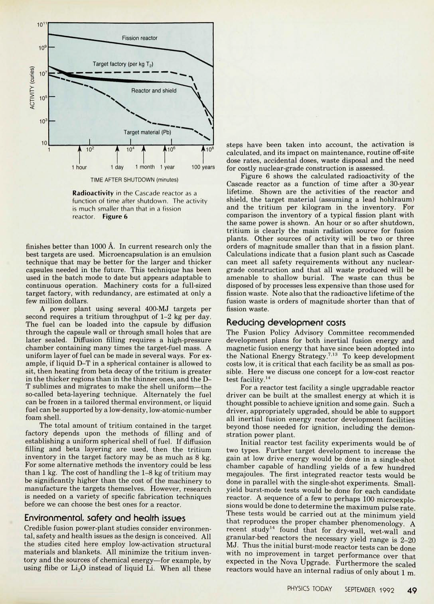

**10'**

A 10 [2] A 10 [4] A A10lio

lio [6] 6 A10 [8]

Fission reactor

Target material (Pb)

6 Ai

steps have been taken into account, the activation is
calculated, and its impact on maintenance, routine off-site
dose rates, accidental doses, waste disposal and the need
for costly nuclear-grade construction is assessed.

Figure 6 shows the calculated radioactivity of the
Cascade reactor as a function of time after a 30-year
lifetime. Shown are the activities of the reactor and
shield, the target material (assuming a lead hohlraum)
and the tritium per kilogram in the inventory. For
comparison the inventory of a typical fission plant with
the same power is shown. An hour or so after shutdown,
tritium is clearly the main radiation source for fusion
plants. Other sources of activity will be two or three
orders of magnitude smaller than that in a fission plant.
Calculations indicate that a fusion plant such as Cascade
can meet all safety requirements without any nucleargrade construction and that all waste produced will be
amenable to shallow burial. The waste can thus be
disposed of by processes less expensive than those used for
fission waste. Note also that the radioactive lifetime of the
fusion waste is orders of magnitude shorter than that of
fission waste.

Reducing development costs
The Fusion Policy Advisory Committee recommended
development plans for both inertial fusion energy and
magnetic fusion energy that have since been adopted into
the National Energy Strategy. [713] To keep development
costs low, it is critical that each facility be as small as possible. Here we discuss one concept for a low-cost reactor
test facility. [14]

For a reactor test facility a single upgradable reactor
driver can be built at the smallest energy at which it is
thought possible to achieve ignition and some gain. Such a
driver, appropriately upgraded, should be able to support
all inertial fusion energy reactor development facilities
beyond those needed for ignition, including the demonstration power plant.

Initial reactor test facility experiments would be of
two types. Further target development to increase the
gain at low drive energy would be done in a single-shot
chamber capable of handling yields of a few hundred
megajoules. The first integrated reactor tests would be
done in parallel with the single-shot experiments. Smallyield burst-mode tests would be done for each candidate
reactor. A sequence of a few to perhaps 100 microexplosions would be done to determine the maximum pulse rate.
These tests would be carried out at the minimum yield
that reproduces the proper chamber phenomenology A
recent study [14] found that for dry-wall, wet-wall and
granular-bed reactors the necessary yield range is 2-20
MJ. Thus the initial burst-mode reactor tests can be done
with no improvement in target performance over that
expected in the Nova Upgrade. Furthermore the scaled
reactors would have an internal radius of only about 1 m

1 hour

1 day 1 month 1 year 100 years

TIME AFTER SHUTDOWN (minutes)

**Radioactivity** in the Cascade reactor as a
function of time after shutdown. The activity
is much smaller than that in a fission
reactor. **Figure 6**

finishes better than 1000 A. In current research only the
best targets are used. Microencapsulation is an emulsion
technique that may be better for the larger and thicker
capsules needed in the future. This technique has been
used in the batch mode to date but appears adaptable to
continuous operation. Machinery costs for a full-sized
target factory, with redundancy, are estimated at only a
few million dollars.

A power plant using several 400-MJ targets per
second requires a tritium throughput of 1-2 kg per day.
The fuel can be loaded into the capsule by diffusion
through the capsule wall or through small holes that are
later sealed. Diffusion filling requires a high-pressure
chamber containing many times the target-fuel mass. A
uniform layer of fuel can be made in several ways. For example, if liquid D-T in a spherical container is allowed to
sit, then heating from beta decay of the tritium is greater
in the thicker regions than in the thinner ones, and the DT sublimes and migrates to make the shell uniform—the
so-called beta-layering technique. Alternately the fuel
can be frozen in a tailored thermal environment, or liquid
fuel can be supported by a low-density, low-atomic-number
foam shell.

The total amount of tritium contained in the target
factory depends upon the methods of filling and of
establishing a uniform spherical shell of fuel. If diffusion
filling and beta layering are used, then the tritium
inventory in the target factory may be as much as 8 kg.
For some alternative methods the inventory could be less
than 1 kg. The cost of handling the 1-8 kg of tritium may
be significantly higher than the cost of the machinery to
manufacture the targets themselves. However, research
is needed on a variety of specific fabrication techniques
before we can choose the best ones for a reactor.

Environmental, safety and health issues
Credible fusion power-plant studies consider environmental, safety and health issues as the design is conceived. All
the studies cited here employ low-activation structural
materials and blankets. All minimize the tritium inventory and the sources of chemical energy—for example, by
using flibe or Li2O instead of liquid Li. When all these

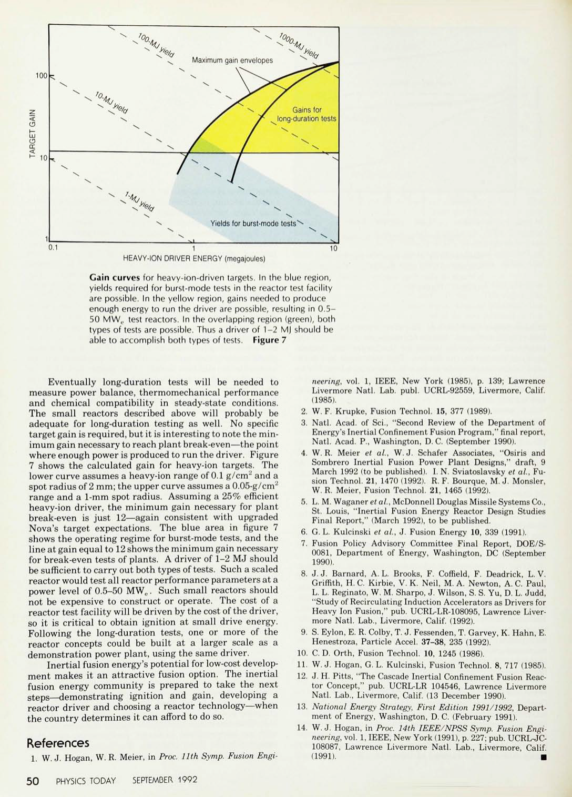

0.1 10
HEAVY-ION DRIVER ENERGY (megajoules)

**Cain curves** for heavy-ion-driven targets. In the blue region,
yields required for burst-mode tests in the reactor test facility
are possible. In the yellow region, gains needed to produce
enough energy to run the driver are possible, resulting in 0.550 MW e test reactors. In the overlapping region (green), both
types of tests are possible. Thus a driver of 1-2 MJ should be
able to accomplish both types of tests. **Figure 7**

Eventually long-duration tests will be needed to
measure power balance, thermomechanical performance
and chemical compatibility in steady-state conditions.
The small reactors described above will probably be
adequate for long-duration testing as well. No specific
target gain is required, but it is interesting to note the minimum gain necessary to reach plant break-even—the point
where enough power is produced to run the driver. Figure
7 shows the calculated gain for heavy-ion targets. The
lower curve assumes a heavy-ion range of 0.1 g/cm [2] and a
spot radius of 2 mm; the upper curve assumes a 0.05-g/cm [2]
range and a 1-mm spot radius. Assuming a 25% efficient
heavy-ion driver, the minimum gain necessary for plant
break-even is just 12—again consistent with upgraded
Nova's target expectations. The blue area in figure 7
shows the operating regime for burst-mode tests, and the
line at gain equal to 12 shows the minimum gain necessary
for break-even tests of plants. A driver of 1-2 MJ should
be sufficient to carry out both types of tests. Such a scaled
reactor would test all reactor performance parameters at a
power level of 0.5-50 MWe. Such small reactors should
not be expensive to construct or operate. The cost of a
reactor test facility will be driven by the cost of the driver,
so it is critical to obtain ignition at small drive energy.
Following the long-duration tests, one or more of the
reactor concepts could be built at a larger scale as a
demonstration power plant, using the same driver.

Inertial fusion energy's potential for low-cost development makes it an attractive fusion option. The inertial
fusion energy community is prepared to take the next
steps—demonstrating ignition and gain, developing a
reactor driver and choosing a reactor technology—when
the country determines it can afford to do so.

References

1. W. J. Hogan, W. R. Meier, in _Proc. 11th Symp. Fusion Engi-_

5 0 PHYSICS TODAY SEPTEMBER 1992

_neering,_ vol. 1, IEEE, New York (1985), p. 139; Lawrence
Livermore Natl. Lab. publ. UCRL-92559, Livermore, Calif.
(1985).
2. W. F. Krupke, Fusion Technol. 15, 377 (1989).
3. Natl. Acad. of Sci., "Second Review of the Department of

Energy's Inertial Confinement Fusion Program," final report,
Natl. Acad. P., Washington, D. C. (September 1990).
4. W. R. Meier _et al,_ W. J. Schafer Associates, "Osiris and

Sombrero Inertial Fusion Power Plant Designs," draft, 9
March 1992 (to be published). I. N. Sviatoslavsky _et al,_ Fusion Technol. 21, 1470 (1992). R. F. Bourque, M. J. Monsler,
W. R. Meier, Fusion Technol. 21, 1465 (1992).
5. L. M. Waganer _et al,_ McDonnell Douglas Missile Systems Co.,

St. Louis, "Inertial Fusion Energy Reactor Design Studies
Final Report," (March 1992), to be published.
6. G. L. Kulcinski _et al,_ J. Fusion Energy 10, 339 (1991).
7. Fusion Policy Advisory Committee Final Report, DOE/S
0081, Department of Energy, Washington, DC (September
1990).
8. J. J. Barnard, A. L. Brooks, F. Coffield, F. Deadrick, L. V.

Griffith, H. C. Kirbie, V. K. Neil, M. A. Newton, A. C. Paul,
L. L. Reginato, W. M. Sharpo, J. Wilson, S. S. Yu, D. L. Judd,
"Study of Recirculating Induction Accelerators as Drivers for
Heavy Ion Fusion," pub. UCRL-LR-108095, Lawrence Livermore Natl. Lab., Livermore, Calif. (1992).
9. S. Eylon, E. R. Colby, T. J. Fessenden, T. Garvey, K. Hahn, E.

Henestroza, Particle Accel. 37-38, 235 (1992).
10. C. D. Orth, Fusion Technol. 10, 1245 (1986).
11. W. J. Hogan, G. L. Kulcinski, Fusion Technol. 8, 717 (1985).
12. J. H. Pitts, "The Cascade Inertial Confinement Fusion Reac

tor Concept," pub. UCRL-LR 104546, Lawrence Livermore
Natl. Lab., Livermore, Calif. (13 December 1990).
13. _National Energy Strategy, First Edition 1991/1992,_ Depart
ment of Energy, Washington, D. C. (February 1991).
14. W. J. Hogan, in _Proc. 14th IEEE/NPSS Symp. Fusion Engi-_

_neering,_ vol. 1, IEEE, New York (1991), p. 227; pub. UCRL-JC108087, Lawrence Livermore Natl. Lab., Livermore, Calif.
(1991). 

