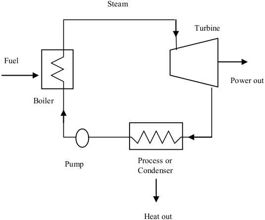
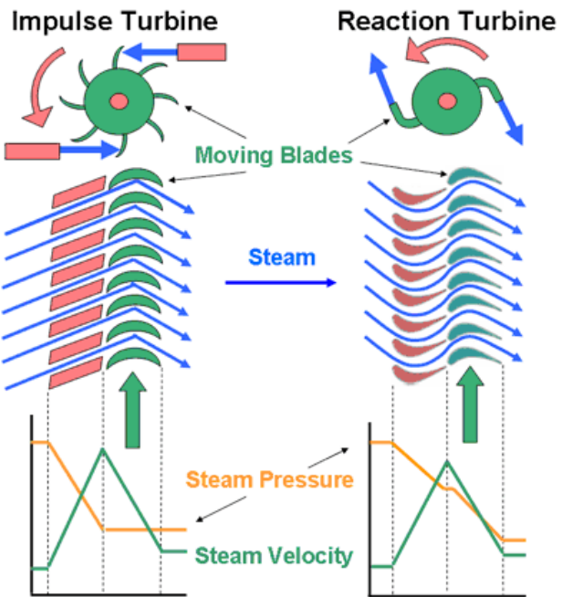
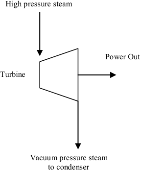
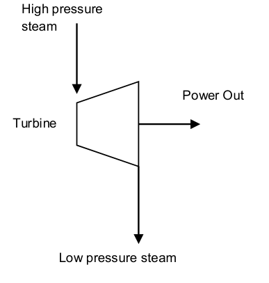
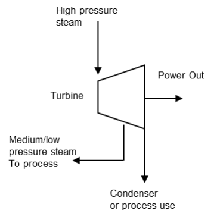

# **Section 4. Technology Characterization – Steam Turbines** 

**U.S. Environmental Protection Agency Combined Heat and Power Partnership** 

**March 2015** 

## **Disclaimer** 

The information contained in this document is for information purposes only and is gathered from published industry sources. Information about costs, maintenance, operations, or any other performance criteria is by no means representative of EPA, ORNL, or ICF policies, definitions, or determinations for regulatory or compliance purposes. 

The September 2017 revision incorporated a new section on packaged CHP systems (Section 7). 

This Guide was prepared by Ken Darrow, Rick Tidball, James Wang and Anne Hampson at ICF International, with funding from the U.S. Environmental Protection Agency and the U.S. Department of Energy. 

_Disclaimer_ 

ii 

**Section 4. Technology Characterization – Steam Turbines** 

## **4.1 Introduction** 

Steam turbines are one of the most versatile and oldest prime mover technologies still in general production used to drive a generator or mechanical machinery. The first steam turbine used for power generation was invented in 1884. Following this initial introduction, steam turbines rapidly replaced reciprocating steam engines due to their higher efficiencies and lower costs. Most of the electricity produced in the United States today is generated by conventional steam turbine power plants. The capacity of steam turbines can range from 50 kW to several hundred MWs for large utility power plants. Steam turbines are widely used for combined heat and power (CHP) applications in the United States and Europe. 

Unlike gas turbine and reciprocating engine CHP systems, where heat is a byproduct of power generation, steam turbine generators normally generate electricity as a byproduct of heat (steam) generation. A steam turbine is captive to a separate heat source and does not directly convert fuel to electric energy. The energy is transferred from the boiler to the turbine through high pressure steam that powers the turbine and generator. This separation of functions enables steam turbines to operate using a large variety of fuels, from clean natural gas to solid waste, including all types of coal, wood, wood waste, and agricultural byproducts (sugar cane bagasse, fruit pits and rice hulls). In CHP applications, steam at lower pressure is extracted from the steam turbine and used directly in a process or for district heating, or it can be converted to other forms of thermal energy including hot or chilled water. 

Steam turbines offer a wide array of designs and complexity to match the desired application and/or performance specifications ranging from single stage backpressure or condensing turbines for low power ranges to complex multi-stage turbines for higher power ranges. Steam turbines for utility service may have several pressure casings and elaborate design features, all designed to maximize the efficiency of the power plant. For industrial applications, steam turbines are generally of simpler single casing design and less complicated for reliability and cost reasons. CHP can be adapted to both utility and industrial steam turbine designs. 

**Table 4-1** provides a summary of steam turbine attributes described in detail in this chapter. 

**Table 4-1. Summary of Steam Turbine Attributes** 

## **4.2 Applications** 

Steam turbines are well suited to medium- and large-scale industrial and institutional applications, where inexpensive fuels, such as coal, biomass, solid wastes and byproducts (e.g., wood chips), refinery residual oil, and refinery off gases are available. Applications include: 

- **Combined heat and power** – Steam turbine-based CHP systems are primarily used in industrial processes where solid or waste fuels are readily available for boiler use. In CHP applications, steam may be extracted or exhausted from the steam turbine and used directly. Steam turbine systems are very commonly found in paper mills as there is usually a variety of waste fuels from hog fuel to black liquor. Chemical plants are the next most common industrial user of steam turbines followed by primary metals. There are a variety of other industrial applications including the food industry, particularly sugar and palm oil mills. 

- **Mechanical drive** – Instead of producing electric power, the steam turbine may drive equipment such as boiler feedwater pumps, process pumps, air compressors and refrigeration chillers. Such applications, usually accompanied by process use of steam are found in many of the CHP industries described above. 

- **District heating and cooling systems** – There are cities and college campuses that have steam district heating systems where adding a steam turbine between the boiler and the distribution system or placing a steam turbine as a replacement for a pressure reducing station may be an attractive application. Often the boiler is capable of producing moderate-pressure steam but the distribution system needs only low pressure steam. In these cases, the steam turbine generates electricity using the higher pressure steam, and discharges low pressure steam into the distribution system. Such facilities can also use steam in absorption chillers to produce chilled water for air conditioning. 

- **Combined cycle power plants** – The trend in power plant design is to generate power with a gas turbine and use the exhaust heat to generate steam that provides additional power through a steam turbine. Such combined-cycle power plants are capable of achieving electric generation efficiencies of over 50 percent. For large industrial CHP applications, an extraction-condensing type of steam turbine can be used in a combined cycle plant with the steam turbine extracting a portion of the steam for process use. There are many large independent power producers (IPP) using combined cycle power plants operating on natural gas to provide power to the electric grid and steam to one or more industrial customers. 

## **4.3 Technology Description** 

## **4.3.1 Basic Process** 

The thermodynamic cycle for the steam turbine is known as the Rankine cycle. This cycle is the basis for conventional power generating stations and consists of a heat source (boiler) that converts water to high pressure steam. In the steam cycle, water is first pumped to elevated pressure, which is medium to high pressure, depending on the size of the unit and the temperature to which the steam is eventually heated. It is then heated to the boiling temperature corresponding to the pressure, boiled (heated from liquid to vapor), and then most frequently superheated (heated to a temperature above that of boiling). The pressurized steam is expanded to lower pressure in a turbine, then exhausted either to a condenser at vacuum conditions, or into an intermediate temperature steam distribution system that delivers the steam to the industrial or commercial application. The condensate from the condenser or from the industrial steam utilization system is returned to the feedwater pump for continuation of the cycle. 

## **4.3.2 Components** 

A schematic representation of a steam turbine power system is shown in **Figure 4-1** . 

**Figure 4-1. Boiler/Steam Turbine System** 

**----- Start of picture text -----** 
Steam Turbine Fuel Power out Boiler Process or Pump Condenser Heat out **----- End of picture text -----** 

In the simple schematic shown, a fuel boiler produces steam which is expanded in the steam turbine to produce power. When the system is designed for power generation only, such as in a large utility power 

system, the steam is exhausted from the turbine at the lowest practical pressure, through the use of a water-cooled condenser to extract the maximum amount of energy from the steam. In CHP plants or district heating systems, the steam is exhausted from the steam turbine at a pressure high enough to be used by the industrial process or the district heating system. In CHP configuration, there is no condenser and the steam and condensate, after exiting the process, is returned to the boiler. 

There are numerous options in the steam supply, pressure, temperature and extent, if any, for reheating steam that has been partially expanded from high pressure. Steam systems vary from low pressure lines used primarily for space heating and food preparation, to medium pressure and temperature used in industrial processes and cogeneration, and to high pressure and temperature use in utility power generation. Generally, as the system gets larger the economics favor higher pressures and temperatures, along with their associated heavier walled boiler tubes and more expensive alloys. 

## **4.3.2.1 Boiler** 

Steam turbines differ from reciprocating engines, internal combustion engines, and gas turbines in that the fuel is burned in a piece of equipment, the boiler, which is separate from the power generation equipment. The energy is transferred from the boiler to the steam turbine generator by an intermediate medium, typically steam under pressure. As mentioned previously, this separation of functions enables steam turbines to operate with an enormous variety of fuels. The topic of boiler fuels, their handling, combustion and the cleanup of the effluents of such combustion is a separate and complex issue that is addressed in the fuels and emissions sections of this report. 

For sizes up to (approximately) 40 MW, horizontal industrial boilers are built. This enables them to be shipped via rail car, with considerable cost savings and improved quality, as the cost and quality of factory labor is usually both lower in cost and greater in quality than field labor. Large shop-assembled boilers are typically capable of firing only gas or distillate oil, as there is inadequate residence time for complete combustion of most solid and residual fuels in such designs. Large, field-erected industrial boilers firing solid and residual fuels bear a resemblance to utility boilers except for the actual solid fuel injection. Large boilers usually burn pulverized coal; however, intermediate and small boilers burning coal or solid fuel employ various types of solids feeders. 

## **4.3.2.2 Steam Turbine** 

In the steam turbine, the steam is expanded to a lower pressure providing shaft power to drive a generator or run a mechanical process. 

There are two distinct designs for steam turbines _– impulse_ and _reaction_ turbines. The difference between these two designs is shown in **Figure 4-2** . On impulse turbines, the steam jets are directed at the turbine's bucket shaped rotor blades where the pressure exerted by the jets causes the rotor to rotate and the velocity of the steam to reduce as it imparts its kinetic energy to the blades. The next series of fixed blades reverses the direction of the steam before it passes to the second row of moving blades. In Reaction turbines, the rotor blades of the reaction turbine are shaped more like airfoils, arranged such that the cross section of the chambers formed between the fixed blades diminishes from the inlet side towards the exhaust side of the blades. The chambers between the rotor blades essentially form nozzles so that as the steam progresses through the chambers its velocity increases while at the 

same time its pressure decreases, just as in the nozzles formed by the fixed blades. The competitive merits of these designs are the subject of business competition, as both designs have been sold successfully for well over 75 years. 

**Figure 4-2. Comparison of Impulse and Reaction Turbine Design** 

_Source: Electropaedia,_ http://www.mpoweruk.com/steam_turbines.htm 

The stationary nozzles accelerate the steam to high velocity by expanding it to lower pressure. A rotating bladed disc changes the direction of the steam flow, thereby creating a force on the blades that, because of the wheeled geometry, manifests itself as torque on the shaft on which the bladed wheel is mounted. The combination of torque and speed is the output power of the turbine. A reduction gear may be utilized to reduce the speed of the turbine to the required output speed for the generator. 

The internal flow passages of a steam turbine are very similar to those of the expansion section of a gas turbine (indeed, gas turbine engineering came directly from steam turbine design around 100 years ago). The main differences are gas density, molecular weight, isentropic expansion coefficient, and to a lesser extent, the viscosity of the two fluids. 

Compared to reciprocating steam engines of comparable size, steam turbines rotate at much higher rotational speeds, which contribute to their lower cost per unit of power developed. In addition, the inlet and exhaust valves in reciprocating steam engines cause steam pressure losses that don’t contribute to power output. Such losses do not occur in steam turbines. As a result of these design 

differences, steam turbines are more efficient than reciprocating steam engines operating from the steam at the same inlet conditions and exhausting into the same steam exhaust systems. 

There are numerous mechanical design features that have been created to increase efficiency, provide for operation over a range of conditions, simplify manufacture and repair, and achieve other practical purposes. The long history of steam turbine use has resulted in a large inventory of steam turbine stage designs that can be used to tailor a product for a specific application. For example, the division of steam acceleration and change in direction of flow varies between competing turbine manufacturers under the identification of impulse and reaction designs. Manufacturers tailor clients’ design requests by varying the flow area in the stages and the extent to which steam is extracted (removed from the flow path between stages) to accommodate the client specifications. 

When steam is expanded through a very high pressure ratio, as in utility and large industrial steam systems, the steam can begin to condense in the turbine if the temperature of the steam drops below the saturation temperature at that pressure. If water drops were allowed to form in the turbine, they would impact the blades and would cause blade erosion. At this point in the expansion, the steam is sometimes returned to the boiler and reheated to high temperature and then returned to the turbine for further (safe) expansion. In a few very large, very high-pressure utility steam systems, double reheat systems are installed. 

With these choices the designer of the steam supply system and the steam turbine have the challenge of creating a system design which delivers the (seasonally varying) power and steam, that also presents the most favorable business opportunity to the plant owners. 

Between the power (only) output of a condensing steam turbine and the power and steam combination of a back pressure steam turbine, essentially any ratio of power to heat output can be supplied to a facility. Moreover, back pressure steam turbines can be obtained with a variety of back pressures, further increasing the variability of the power-to-heat ratio. 

## **4.3.2.3 Condensing Turbine** 

The primary type of turbine used for central power generation is the condensing turbine shown schematically in **Figure 4-3.** These power-only utility turbines exhaust directly to condensers that maintain vacuum conditions at the discharge of the turbine. An array of tubes, cooled by water from a river, lake or cooling tower, condenses the steam into (liquid) water.[59 ] The vacuum conditions in the condenser are caused by the near ambient cooling water causing condensation of the steam turbine exhaust steam in the condenser. As a small amount of air is known to leak into the system when it is below atmospheric pressure, a relatively small compressor or steam air ejector may be used to remove non-condensable gases from the condenser. Non-condensable gases include both air and a small amount of the corrosion byproduct of the water-iron reaction, hydrogen. 

> 59 At 80° F, the vapor pressure of water is 0.51 psia, at 100° F it is 0.95 psia, at 120° F it is 1.69 psia and at 140° F Fahrenheit it is 

> 2.89 psia 

The condensing turbine processes result in maximum power and electrical generation efficiency from the steam supply and boiler fuel. The power output of condensing turbines is sensitive to ambient conditions.[60 ] 

**Figure 4-3. Condensing Steam Turbine** 

**----- Start of picture text -----** 
High pressure steam Power Out Turbine Vacuum pressure steam to condenser **----- End of picture text -----** 

Steam turbines used for CHP can be classified into two main types: non-condensing and extraction, which will be discussed in the following two sections. 

## **4.3.2.4 Non-Condensing (Back-pressure) Turbine** 

A non-condensing turbine (also referred to as a back-pressure turbine) exhausts some or all of its steam flow to the industrial process or facility steam mains at conditions close to the process heat requirements, as shown in **Figure 4-4.** 

## **Figure 4-4. Non-Condensing (Back-pressure) Steam Turbine** 

**----- Start of picture text -----** 
High pressure steam Power Out Turbine Low pressure steam **----- End of picture text -----** 

60 From a reference condition of condensation at 100° F, 6.5 percent less power is obtained from the inlet steam when the temperature at which the steam is condensed is increased (because of higher temperature ambient conditions) to 115° F. Similarly, the power output is increased by 9.5% when the condensing temperature is reduced to 80° F. This illustrates the influence of steam turbine discharge pressure on power output and, consequently, net heat rate and efficiency. 

Usually, the steam sent into the mains is not much above saturation temperature. _[61 ]_ The term backpressure refers to turbines that exhaust steam at atmospheric pressures and above. The discharge pressure is established by the specific CHP application. The most typical pressure levels for steam distribution systems are 50, 150, and 250 psig. The lower pressures are most often used in district heating systems, while the higher pressures are most often used in supplying steam to industrial processes. Industrial processes often include further expansion for mechanical drives, using small steam turbines for driving heavy equipment that is intended to run continuously for very long periods. Significant power generation capability is sacrificed when steam is used at high pressure, rather than being expanded to vacuum conditions in a condenser. Discharging steam into a steam distribution system at 150 psig can sacrifice slightly more than half the power (compared to a vacuum exhaust) that could be generated when the inlet steam conditions are 750 psig and 800° F, typical of small steam turbine systems. 

## **4.3.2.5 Extraction Turbine** 

An extraction turbine has one or more openings in its casing for extraction of a portion of the steam at some intermediate pressure. The extracted steam may be used for process purposes in a CHP facility, or for feedwater heating, as is the case in most utility power plants. The rest of the steam can be expanded to below atmospheric pressure to a condenser, or delivered to a low pressure steam application as illustrated in **Figure 4-5** . 

**Figure 4-5. Extraction Steam Turbine** 

The steam extraction pressure may or may not be automatically regulated depending on the turbine design. Regulated, or controlled extraction permits more steam to flow through the turbine to generate additional electricity during periods of low thermal demand by the CHP system. In utility type steam turbines, there may be several extraction points, each at a different pressure corresponding to a different temperature at which heat is needed in the thermodynamic cycle. The facility’s specific needs 

> 61 At 50 psig (65 psia) the condensation temperature is 298° F, at 150 psig (165 psia) the condensation temperature is 366° F, and at 250 psig (265 psia) it is 406° F. 

for steam and power over time determine the extent to which steam in an extraction turbine will be extracted for use in the process, or be expanded to vacuum conditions and condensed in a condenser. 

In large, complex industrial plants, additional steam may be admitted to the steam turbine by flowing into the casing to increase the flow in the steam path. Often this happens when multiple boilers are used at different pressures, because of their historical existence. These steam turbines are referred to as admission _or_ reheat turbines. At steam extraction and admission locations, there are usually steam flow control valves that add to the steam and control system cost. 

## **4.4 Performance Characteristics** 

Boilers and steam turbines used for large, central station electric power generation can achieve electrical efficiencies of up to 45 percent HHV[62 ] though the average efficiency of all units in the field is around 33 percent.[63 ] Backpressure steam turbines used in CHP applications extract only a portion of the steam energy to generate electricity, delivering the rest for process use. Consequently, the electric generation efficiencies for the examples shown are all below 10 percent HHV. However, when the energy value of the steam delivered for process use is considered, the effective electrical efficiency is over 75 percent. 

**Table 4-2** summarizes performance characteristics for typical commercially available backpressure steam turbines used in CHP applications between 500 kW to 15 MW size range. 

Isentropic steam turbine efficiency refers to the ratio of power actually generated from the turbine to what would be generated by a perfect turbine with no internal flowpath losses using steam at the same inlet conditions and discharging to the same downstream pressure. Turbine efficiency is not to be confused with electrical generating efficiency, which is the ratio of net power generated to total fuel input to the cycle. Steam turbine efficiency is a measure of how efficiently the turbine extracts power from the steam itself and is useful in identifying the conditions of the steam as it exhausts from the turbine and in comparing the performance of various steam turbines. Multistage (moderate to high pressure ratio) steam turbines have thermodynamic efficiencies that vary from 65 percent for very small (under 1,000 kW) units to over 90 percent for large industrial and utility sized units. Small, single stage steam turbines can have efficiencies as low as 40 percent. 

Heat recovery methods from a steam turbine use back pressure exhaust or extraction steam. However, the term is somewhat misleading, since in the case of steam turbines, it is the steam turbine itself that can be defined as a heat recovery device. 

Steam turbine CHP systems are generally characterized by very low power to heat ratios, typically in the 0.05 to 0.2 range. This is because electricity is a byproduct of heat generation, with the system 

> 62 All turbine and engine manufacturers quote heat rates in terms of the lower heating value (LHV) of the fuel. However, the usable energy content of fuels is typically measured on a higher heating value basis (HHV). In addition, electric utilities measure power plant heat rates in terms of HHV. For natural gas, the average heat content of natural gas is 1,030 Btu/scf on an HHV basis and 930 Btu/scf on an LHV basis – or about a 10 percent difference. 

> 63 Technology Roadmap: High-Efficiency, Low-Emissions Coal-Fired Power Generation, International Energy Agency, December 4, 2012. 

optimized for steam production. Hence, while steam turbine CHP system electrical efficiency[64 ] may seem very low, it is because the primary objective is to produce large amounts of steam. The effective electrical efficiency[65 ] of steam turbine systems, however, is generally very high, because almost all the energy difference between the high pressure boiler output and the lower pressure turbine output is converted to electricity. This means that total CHP system efficiencies[66 ] are generally very high and approach the boiler efficiency level. Steam boiler efficiencies range from 70 to 85 percent HHV depending on boiler type and age, fuel, duty cycle, application, and steam conditions. 

**Table 4-2. Backpressure Steam Turbine Cost and Performance Characteristics*** 

- 64 Net power output / total fuel input into the system. 

65 (Steam turbine electric power output) / (Total fuel into boiler – (steam to process/boiler efficiency)). 

- 66 Net power and steam generated divided by total fuel input. 

67 Characteristics for “typical” commercially available steam turbine generator systems provided by Elliott Group. 

68 Equipment cost includes turbine, gearbox, generator, control system, couplings, oil system (if required), and packaging; boiler 

and steam system costs are not included. 

- 69 Installed costs vary greatly based on site-specific conditions; installed costs of a “typical” simple installation were estimated to be 50-70% of the equipment costs. 

70 Maintenance assumes normal service intervals over a 5 year period, excludes parts. 

71 The Isentropic efficiency of a turbine is a comparison of the actual power output compared to the ideal, or isentropic, output. It is a measure of the effectiveness of extracting work from the expansion process and is used to determine the outlet 

conditions of the steam from the turbine. 

- 72 CHP electrical efficiency = Net electricity generated/Total fuel into boiler. A measure of the amount of boiler fuel converted into electricity. 

**Table 4-2. Backpressure Steam Turbine Cost and Performance Characteristics*** 

|**b67**||**System**||
|---|---|---|---|
|**Steam Turine Parameters**|**1**|**2**|**3**|
|Power/Heat Ratio74|0.086|0.066|0.101|
|Net Heat Rate(Btu/kWh)75|4,541|4,540|4,442|
|Effective Electrical Efficiency (%), HHV|75.15%|75.18%|76.84%|
|Heat/Fuel Ratio76|0.733|0.748|0.724|

* For typical systems available in 2014. 

Equipment costs shown include the steam turbine, gearbox, generator, control system, couplings, oil system (if required), and packaging. Installed costs vary greatly based on site-specific conditions. Installed costs of a “typical” simple installation were estimated to be 50-70 percent of the equipment costs. Boiler and steam system costs are not included in these estimates. 

## **4.4.1 Performance Losses** 

Steam turbines, especially smaller units, may leak steam around blade rows and out the end seals. When the turbine operates or exhausts at a low pressure, as is the case with condensing steam turbines, air can also leak into the system. The leakages cause less power to be produced than expected, and the makeup water has to be treated to avoid boiler and turbine material problems. Air that has leaked needs to be removed, which is usually done by a steam air ejector or a fan removing non-condensable gases from the condenser. 

Because of the high pressures used in steam turbines, the casing is quite thick, and consequently steam turbines exhibit large thermal inertia. Large steam turbines must be warmed up and cooled down slowly to minimize the differential expansion between the rotating blades and the stationary parts. Large steam turbines can take over ten hours to warm up. While smaller units have more rapid startup times or can be started from cold conditions, steam turbines differ appreciably from reciprocating engines, which start up rapidly, and from gas turbines, which can start up in a moderate amount of time and load follow with reasonable rapidity. 

Steam turbine applications usually operate continuously for extended periods of time, even though the steam fed to the unit and the power delivered may vary (slowly) during such periods of continuous operation. As most steam turbines are selected for applications with high duty factors, the nature of their application often takes care of the need to have only slow temperature changes during operation, and long startup times can be tolerated. Steam boilers similarly may have long startup times, although rapid start-up boilers are available. 

> 73 Total CHP efficiency = (Net electricity generated + Net steam to process)/Total fuel into boiler. 

> 74 Power/Heat Ratio = CHP electrical power output (Btu)/useful heat output (Btu). 

> 75 Net Heat Rate = (total fuel input to the boiler - the fuel that would be required to generate the steam to process assuming the same boiler efficiency)/steam turbine electric output (kW). 

> 76 Effective Electrical Efficiency = (Steam turbine electric power output) / (Total fuel into boiler – (steam to process/boiler efficiency)). Equivalent to 3,412 Btu/kWh/Net Heat Rate. 

## **4.4.2 Performance Enhancements** 

In industrial steam turbine systems, business conditions determine the requirements and relative values of electric power and process, or steam for heating. Plant system engineers then decide the extent of efficiency enhancing options to incorporate in terms of their incremental effects on performance and plant cost, and select appropriate steam turbine inlet and exhaust conditions. Often the steam turbine is going into a system that already exists and is being modified so that a number of steam system design parameters are already established from previous decisions, which exist as system hardware characteristics and the turbine must be properly matched to these conditions. 

As the stack temperature of the boiler exhaust combustion products still contain some heat, tradeoffs are made regarding the extent of investment in heat reclamation equipment for the sake of efficiency improvement. Often the stack exhaust temperature is set at a level where further heat recovery would result in condensation of corrosive chemical species in the stack, with consequential deleterious effects on stack life and safety. 

## **4.4.2.1 Steam Reheat** 

Higher pressures and temperatures along with steam reheat are used to increase power generation efficiency in large industrial (and utility) systems. The higher the pressure ratio (the ratio of the steam inlet pressure to the steam exit pressure) across the steam turbine, and the higher the steam inlet temperature, the more power it will produce per unit of mass flow, provided that the turbine can reliably accommodate the pressure ratio and that the turbine is not compromised by excessive condensation within the last expansion stage. To avoid condensation within the flowpath or to maximize available steam energy, the inlet steam temperature is increased until the economic life limit of turbine materials is reached. This limit is now generally in the range of 900° F for small industrial steam turbines using typical materials. 

Expanding steam can reach a condition of temperature and pressure where condensation to (liquid) water begins. Small amounts of water droplets can be tolerated in the last stages of a steam turbine provided that the droplets are not too large or numerous. Turbine flowpaths can employ features for extracting a portion of the condensate form the flowpath in order to limit water droplet impingement on the blading. Also, protective blade treatments such as Stellite are often employed to harden the blading surfaces exposed to the droplet impingement and reduce blade material erosion. For turbines using a reheat cycle, steam is extracted after it has partially expanded, heated in a heat exchanger, and returned to the turbine flowpath for further expansion. 

## **4.4.2.2 Combustion Air Preheating** 

In large industrial systems, air preheaters recover heat from the boiler exhaust gas stream, and use it to preheat the combustion air, thereby reducing fuel consumption. Boiler combustion air preheaters are large versions of the heat wheels used for the same purpose on industrial furnaces. 

## **4.4.3 Capital Costs** 

A steam turbine-based CHP plant is a complex process with many interrelated subsystems that must usually be custom designed. In a steam turbine CHP plant burning a solid biomass fuel, the steam turbine generator makes up only about 10 percent of the total plant equipment costs – the solid fuel 

boiler makes up 45 percent and the prep yard, electrostatic precipitator, and other equipment each adding about 15 percent.[77 ] Engineering and construction add 70 percent to equipment costs. 

The cost of complete solid fuel CHP plants varies with many factors—fuels handling, pollution control equipment and boiler cost are major cost items. Because of both the size of such plants and the diverse sources of the components, solid fuel cogeneration plants invariably involve extensive system engineering and field labor during construction. Typical complete plant costs can be over $5,000/kW, with little generalization except that for the same fuel and configuration, costs per kW of capacity generally increase as size decreases. While the overall cost of plants with a given steam output would be similar, the amount of steam extracted for process use, and thus not available for power generation, has a significant effect on the costs quoted in $/kW of electricity out. 

Steam turbine costs exhibit a modest extent of irregularity, as steam turbines are made in sizes with finite steps between the sizes. The cost of the turbine is generally the same for the upper and lower limit of the steam flowing through it, so step-like behavior is sometimes seen in steam turbine prices. Since they come in specific size increments, a steam turbine that is used at the upper end of its range of power capability costs less per kW generated than one that is used at the lower end of its capability. Additionally, raw material cost, local labor rates, delivery times, availability of existing major components, and similar business conditions can affect steam turbine pricing. 

Often steam turbines are sold to fit into an existing plant. In some of these applications, the specifications, mass flow, pressure, temperature and backpressure or extraction conditions are customized and therefore do not expose themselves to large competition. These somewhat unique machines may be more expensive per kilowatt than other machines that are more generalized, and therefore face greater competition. This is the case for three reasons: 1) a greater amount of custom engineering and manufacturing setup may be required; 2) there is less potential for sales of duplicate or similar units; and 3) there are fewer competitive bidders. The truly competitive products are the “offthe-rack” type machines, while “custom” machines are naturally more expensive. 

Because of the relatively high cost of the system, high annual capacity factors are required to enable a reasonable recovery of invested capital. 

However, retrofit applications of steam turbines into existing boiler/steam systems can be cost competitive options for a wide variety of users depending on the pressure and temperature of the steam exiting the boiler, the thermal needs of the site, and the condition of the existing boiler and steam system. In such situations, the decision is based only on the added capital cost of the steam turbine, its generator, controls and electrical interconnection, with the balance of plant already in place. Similarly, many facilities that are faced with replacement or upgrades of existing boilers and steam systems often consider the addition of steam turbines, especially if steam requirements are relatively large compared to power needs within the facility. 

In general, steam turbine applications are driven by balancing lower cost fuel or avoided disposal costs for the waste fuel, with the high capital cost and (preferably high) annual capacity factor for the steam 

> 77 “Cogeneration and Small Power Production Manual,” Scott Spiewak and Larry Weiss, 1997. Data for a 32.3 MW multi-fuel fired, 1,250 psig, 900 °F, 50 psig backpressure steam turbine used in an industrial cogeneration plant. 

plant, and the combined energy plant-process plant application through CHP. For these reasons, steam turbines are not normally direct competitors of gas turbines and reciprocating engines. 

Steam turbine prices vary greatly with the extent of competition and related manufacturing volumes for units of desired size, inlet and exit steam conditions, rotational speed and standardization of construction. Prices are usually quoted for an assembled steam turbine-electrical generator package. The electrical generator can account for 20 percent to 40 percent of the assembly. As the steam turbine/electrical generator package is heavy, due in large part to the heavy walled construction of the high pressure turbine casing, it must be mounted carefully on an appropriate pedestal or baseplate. The installation and connection to the boiler through high pressure-high temperature steam pipes must be performed with engineering and installation expertise. As the high pressure steam pipes typically vary in temperature by 750° F between cold standby/repair status and full power status, care must be taken in installing a means to accommodate the differential expansion accompanying startup and shutdown to minimize induced stress on the turbine casing. Should the turbine have variable extraction, the cost of the extraction valve and control system adds to the installation. 

Small steam turbine generators of less than 1,000 kW are generally more expensive on a per KW basis. However, products have been developed and are being marketed specifically for small market applications. 

As the steam for a steam turbine is generated in a boiler by combustion and heat transfer, the temperature of the steam is limited by furnace heat transfer design and manufacturing consideration and boiler tube bundle design. Higher heat fluxes in the boiler enable more compact boilers, with less boiler tube material to be built, however, higher heat fluxes also result in higher boiler tube temperature and the need for the use of a higher grade (adequate strength at higher temperature) boiler tube material. Such engineering economic tradeoffs between temperature (with consequential increases in efficiency) and cost appear throughout the steam plant. 

## **4.4.4 Maintenance** 

Steam turbines are very rugged units, with operational life often exceeding 50 years. Maintenance is simple, comprised mainly of making sure that all fluids (steam flowing through the turbine and the oil for the bearing) are always clean and at the proper temperature with low levels of moisture or high steam quality or superheat. The oil lubrication system must be clean and at the correct operating temperature and level to maintain proper performance. Other items include inspecting auxiliaries such as lubricating-oil pumps, coolers and oil strainers and checking safety devices such as the operation of overspeed trips. 

In order to obtain reliable service, steam turbines require long warm-up periods so that there are minimal thermal expansion stress and wear concerns. Steam turbine maintenance costs are typically below $0.01/kWh. Boilers and any associated solid fuel processing and handling equipment that is part of the boiler/steam turbine plant require their own types of maintenance which can add $0.02/kWh for maintenance and $0.015/kWh for operating labor. 

One maintenance issue with steam turbines is that solids can carry over from the boiler and deposit on turbine nozzles and other internal parts, degrading turbine efficiency and power output. Some of these 

are water soluble but others are not. Three methods are employed to remove such deposits: 1) manual removal; 2) cracking off deposits by shutting the turbine off and allowing it to cool; and 3) for water soluble deposits, water washing while the turbine is running. 

An often-overlooked component in the steam power system is the steam (safety) stop valve, which is immediately ahead of the steam turbine and is designed to be able to experience the full temperature and pressure of the steam supply. This safety valve is necessary because if the generator electric load were lost (an occasional occurrence), the turbine would rapidly overspeed and destroy itself. Other accidents are also possible, supporting the need for the turbine stop valve, which may add significant cost to the system. 

## **4.4.5 Fuels** 

Industrial boilers operate on a wide variety of fuels, including wood, coal, natural gas, oils (including residual oil, the leftover material when the valuable distillates have been separated for separate sale), municipal solid waste and sludge. The fuel handling, storage and preparation equipment needed for solid fuels considerably adds to the cost of an installation. Thus, such fuels are used only when a high annual capacity factor is expected of the facility, or when the solid material has to be disposed of to avoid an environmental or space occupancy problem. 

## **4.4.6 System Availability** 

Steam turbines are generally considered to have 99 percent plus availability with longer than one year between shutdowns for maintenance and inspections. This high level of availability applies only to the steam turbine, not to the boiler or HRSG that is supplying the steam. For complete systems, the complexity of the fuel handling, combustion, boiler, and emissions, especially for solid fuels, brings overall availability down below that of reciprocating engines and gas turbines. As shown in **Table 4-3** , a survey of 16 small steam turbine power systems showed an average availability of 90.6 percent with a range of 72.4-99.8 percent. The best system ran for a period of two years without a forced outage. 

**Table 4-3. Steam Turbine Availability** 

|**Other Technologies**|**Steam Turbines <25MW**|**Steam Turbines <25MW**|**Steam Turbines <25MW**|
|---|---|---|---|
|**Number Sampled**|**16**|||
||**Min.**|**Avg.**|**Max.**|
|Availability (%)|72.37|90.59|99.82|
|Forced Outage Rate(%)|0.00|3.12|16.41|
|Scheduled Outage Factor(%)|0.00|6.88|27.63|
|Service Factor(%)|3.37|78.72|99.65|
|Mean Time Between Forced Outages(hrs)|120|828|16,600|

_Source: ICF[78 ]_ 

## **4.5 Emissions and Emissions Control Options** 

Emissions associated with a steam turbine are dependent on the source of the boiler input fuel. Steam turbines can be used with a boiler firing any one or a combination of a large variety of fuel sources, or 

> 78 _Distributed Generation Operational Reliability and Availability Database_ , EEA, Inc. (now part of ICF) for ORNL, 2003. 

they can be used with a gas turbine in a combined cycle configuration. Boiler emissions vary depending on fuel type and environmental conditions. 

**Table 4-4** illustrates typical emissions of NOx, PM, and CO for boilers by size of steam turbine system and by fuel type. SOx emissions are not based on the size of the boiler; rather, they are a function of the sulfur content of the fuel and the fuel combustion rate. Based on using the average fuel heat content assumptions, uncontrolled input emissions for SOx range from 0.49-1.9 lbs/MMBtu from coal,[79 ] 1.162.22 lbs/MMBtu from wood,[80 ] 1.53lbs/MMBtu from fuel oils,[81 ] and very little to insignificant levels from natural gas combustion. 

**Table 4-4. Typical Boiler Emissions Ranges** 

Note: all emissions values are without post-combustion treatment. 

_Source: EPA, Compilation of Air Pollutant Emission Factors, AP-42, Fifth Edition, Volume I: Stationary Point and Area Sources_ 

## **4.5.1 Boiler Emissions Control Options - NOx** 

NOx control has been a focus of emission control research and development in boilers. The following provides a description of the most prominent emission control approaches. 

## **4.5.1.1 Combustion Process emissions Control** 

Combustion control techniques are less costly than post-combustion control methods and are often used on industrial boilers for NOx control. Control of combustion temperature has been the principal focus of combustion process control in boilers. Combustion control requires tradeoffs – high temperatures favor complete burn up of the fuel and low residual hydrocarbons and CO, but promote NOx formation. Very lean combustion dilutes the combustion process and reduces combustion temperatures and NOx formation, and allows a higher compression ratio or peak firing pressures resulting in higher efficiency. However, if the mixture is too lean, misfiring and incomplete combustion occurs, increasing CO and VOC emissions. 

> 79 _http://www.eia.gov/coal/production/quarterly/co2_article/co2.html_ 

> 80 

> _http://www20.gencat.cat/docs/dmah/Home/Ambits%20dactuacio/Medi%20natural/Gestio%20forestal/Funcions%20dels%20b oscos/Funcions%20productores%20del%20bosc/Biomassa%20forestal/Activitats%20realitzades/Curs%20daprofitament%20de% 20biomassa%20forestal/2_ncp.pdf_ 

> 81 _http://www.imo.org/OurWork/Environment/PollutionPrevention/AirPollution/Pages/Sulphur-oxides-(SOx)-%E2%80%93Regulation-14.aspx_ 

## **4.5.1.2 Flue Gas Recirculation (FGR)** 

FGR is the most effective technique for reducing NOx emissions from industrial boilers with inputs below 100 MMBtu/hr. With FGR, a portion of the relatively cool boiler exhaust gases re-enter the combustion process, reducing the flame temperature and associated thermal NOx formation. It is the most popular and effective NOx reduction method for firetube and watertube boilers, and many applications can rely solely on FGR to meet environmental standards. 

External FGR employs a fan to recirculate the flue gases into the flame, with external piping carrying the gases from the stack to the burner. A valve responding to boiler input controls the recirculation rate. Induced FGR relies on the combustion air fan for flue gas recirculation. A portion of the gases travel via ductwork or internally to the air fan, where they are premixed with combustion air and introduced into the flame through the burner. Induced FGR in newer designs utilize an integral design that is relatively uncomplicated and reliable. 

The physical limit to NOx reduction via FGR is 80 percent in natural gas-fired boilers and 25 percent for standard fuel oils. 

## **4.5.1.3 Low Excess Air Firing (LAE)** 

Boilers are fired with excess air to ensure complete combustion. However, excess air levels greater than 45 percent can result in increased NOx formation, because the excess nitrogen and oxygen in the combustion air entering the flame combine to form thermal NOx. Firing with low excess air means limiting the amount of excess air that enters the combustion process, thus limiting the amount of extra nitrogen and oxygen entering the flame. This is accomplished through burner design modification and is optimized through the use of oxygen trim controls. 

LAE typically results in overall NOx reductions of 5 to 10 percent when firing with natural gas, and is suitable for most boilers. 

## **4.5.1.4 Low Nitrogen Fuel Oil** 

NOx formed by fuel-bound nitrogen can account for 20 to 50 percent of total NOx levels in oil-fired boiler emissions. The use of low nitrogen fuels in boilers firing distillate oils is one method of reducing NOx emissions. Such fuels can contain up to 20 times less fuel-bound nitrogen than standard No. 2 oil. 

NOx reductions of up to 70 percent over NOx emissions from standard No. 2 oils have been achieved in firetube boilers utilizing flue gas recirculation. 

## **4.5.1.5 Burner Modifications** 

By modifying the design of standard burners to create a larger flame, lower flame temperatures and lower thermal NOx formation can be achieved, resulting in lower overall NOx emissions. While most boiler types and sizes can accommodate burner modifications, it is most effective for boilers firing natural gas and distillate fuel oils, with little effectiveness in heavy oil-fired boilers. Also, burner modifications must be complemented with other NOx reduction methods, such as flue gas recirculation, to comply with the more stringent environmental regulations. Achieving low NOx levels (30 ppm) through burner modification alone can adversely impact boiler operating parameters such as turndown, capacity, CO levels, and efficiency. 

## **4.5.1.6 Water/Steam Injection** 

Injecting water or steam into the flame reduces flame temperature, lowering thermal NOx formation and overall NOx emissions. However, under normal operating conditions, water/steam injection can lower boiler efficiency by 3 to 10 percent. Also, there is a practical limit to the amount that can be injected without causing condensation-related problems. This method is often employed in conjunction with other NOx control techniques such as burner modifications or flue gas recirculation. 

When used with natural gas-fired boilers, water/steam injection can result in NOx reduction of up to 80 percent, with lower reductions achievable in oil-fired boilers. 

## **4.5.2 Post-Combustion Emissions Control** 

There are several types of exhaust gas treatment processes that are applicable to industrial boilers. 

## **4.5.2.1 Selective Non-Catalytic Reduction (SNCR)** 

In a boiler with SNCR, a NOx reducing agent such as ammonia or urea is injected into the boiler exhaust gases at a temperature in the 1,400 to 1,600° F range. The agent breaks down the NOx in the exhaust gases into water and atmospheric nitrogen (N2). While SNCR can reduce boiler NOx emissions by up to 70 percent, it is very difficult to apply this technology to industrial boilers that modulate or cycle frequently because the agent must be introduced at a specific flue gas temperature in order to perform properly. Also, the location of the exhaust gases at the necessary temperature is constantly changing in a cycling boiler. 

## **4.5.2.2 Selective Catalytic Reduction (SCR)** 

This technology involves the injection of the reducing agent into the boiler exhaust gas in the presence of a catalyst. The catalyst allows the reducing agent to operate at lower exhaust temperatures than SNCR, in the 500 to 1,200° F depending on the type of catalyst. NOx reductions of up to 90 percent are achievable with SCR. The two agents used commercially are ammonia (NH3 in anhydrous liquid form or aqueous solution) and aqueous urea. Urea decomposes in the hot exhaust gas and SCR reactor, releasing ammonia. Approximately 0.9 to 1.0 moles of ammonia is required per mole of NOx at the SCR reactor inlet in order to achieve an 80 to 90 percent NOx reduction. 

SCR is however costly to use and can only occasionally be justified on boilers with inputs of less than 100 MMBtu/hr. SCR requires on-site storage of ammonia, a hazardous chemical. In addition, ammonia can “slip” through the process unreacted, contributing to environmental and health concerns. 

## **4.5.2.3 Boiler Emissions Control Options – SOx** 

The traditional method for controlling SOx emissions is dispersion via a tall stack to limit ground level emissions. The more stringent SOx emissions requirements in force today demand the use of reduction methods as well. These include use of low sulfur fuel, desulfurizing fuel, and flue gas desulfurization (FGD). Desulfurization of fuel, such as in FGD, primarily applies to coal, and is principally used for utility boiler emissions control. Use of low sulfur fuels is the most cost effective SOx control method for industrial boilers, as it does not require installation and maintenance of special equipment. 

FGD systems are of two types: non-regenerable and regenerable. The most common non-regenerable results in a waste product that requires proper disposal. Regenerable FGD converts the waste product into a product that is saleable, such as sulfur or sulfuric acid. SOx emissions reductions of up to 95 percent can be obtained with FGD. 

## **4.6 Future Developments** 

While steam turbines are a mature technology, their importance in worldwide power generation makes incremental improvements in cost and performance very beneficial. Higher efficiencies reduce fuel consumption, emissions of air pollutants and greenhouse gases, and cooling water requirements. Since commercial introduction, efficiencies for large condensing steam turbines have increased from the midteens to up to 48 percent. The U.S. Department of Energy funds collaborative research and development toward the development of improved ultra-supercritical (USC) steam turbines capable of efficiencies of 55-60 percent that are based on boiler tube materials that can withstand pressures of up to 5,000 psi and temperatures of 1,400[o] F. To achieve these goals, work is ongoing in materials, internal design and construction, steam valve development, and design of high pressure casings. A prototype is targeted for commercial testing by 2025.[82 ] 

Research is also underway to restore and improve the performance of existing steam turbines in the field through such measures as improved combustion systems for boilers, heat transfer and aerodynamics to improve turbine blade life and performance, and improved materials to permit longer life and higher operating temperatures for more efficient systems.[83 ] 

The focus on renewable markets, such as waste heat recovery, biomass fueled power, and CHP plants, is stimulating the demand for small and medium steam turbines. Technology and product development for these markets should bring about future improvements in steam turbine efficiency, longevity, and cost. This could be particularly true for systems below 500 kW that are used in developmental small biomass systems, and in waste-heat-to-power systems, as the latter is designed to operate in place of pressure reduction valves in commercial and industrial steam systems operating at multiple pressures. 

> 82 Advanced Turbines Technology Program Plan, National Energy Technology Laboratory, Clean Coal Research Program, U.S. Department of Energy, January 2013. 

> 83 Energy Tech, _http://www.energy-tech.com/article.cfm?id=17566_ 

