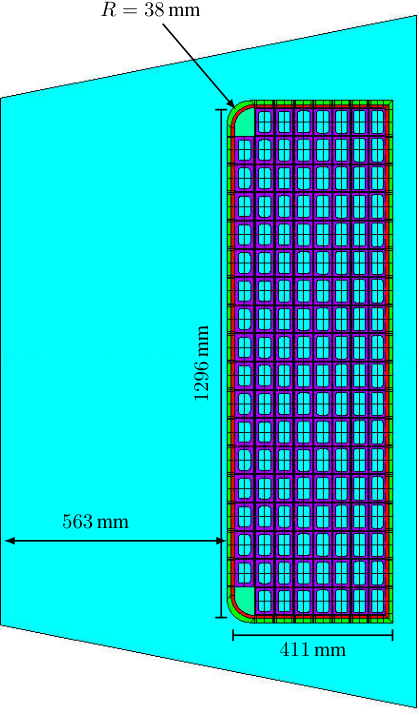
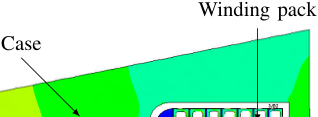
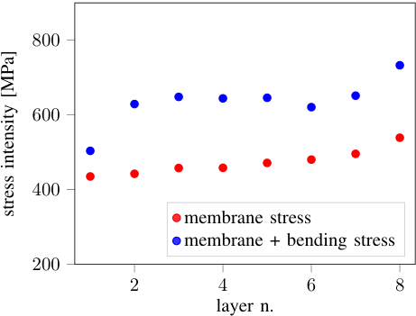
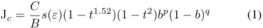
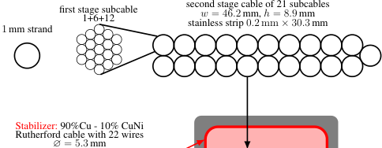
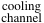
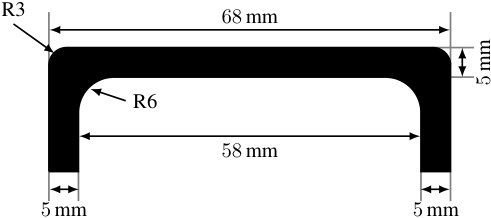

_>_ THU-PO3-205-11 _<_ 

## Preliminary Design of a High Current R&W TF Coil Conductor for the EU DEMO 

F. Dematt`e, P. Bruzzone, X. Sarasola, K. Sedlak, V. Corato 

_**Abstract**_ **—Paschen failures in ITER, W7-X and JT60 superconducting coils at the acceptance tests have shown that it is highly desirable to lower the coil discharge voltage of the DEMO Toroidal Field (TF) coils. Another benefit of lowering the discharge voltage might be the reduction of the number of coil feeders, i.e. connect in series several TF coils to a discharge unit, which is attractive for machine integration. For a given Ampere Turn (AT), one way to reduce the discharge voltage is decreasing the coil inductance. Since the inductance of a coil is proportional to N**[2] **, where N is the number of turns, for a given total TF current N** _·_ **Iop, decreasing the number of turns corresponds to a higher current flowing through each turn, which results in the inductance being proportional to I** _[−]_ **op**[2] **[. This means that increasing] the current will have a quadratic impact on the inductance and thus a linear impact on the discharge voltage making the design of a high-current (** _∼_ **105 kA) CICC attractive for the EUROfusion DEMO project. In the case of DEMO, increasing the operating current from 66 kA to 105 kA leads to a reduction of the TF discharge voltage of a factor 1** _._ **6. Designing a high current TF coil conductor layout includes performing mechanical studies to investigate the TF coil mechanical stability during operation. This contribution will thus present the first design for a react-and-wind TF conductor made of Nb** 3 **Sn and Cu as stabilizer designed for an operating current of 105 kA alongside the results of a dedicated 2D mechanical analysis.** _**Index Terms**_ **—Nb3Sn, React&Wind, High Current Superconducting Cable** 

## I. INTRODUCTION 

The conceptual design phase of the EUROfusion DEMO [1] foresees the study of several design concepts, some based on the know-how gained through the production of ITER and others investigating innovative techniques to simplify manufacturing, reduce the machine radial build and hence costs. Within this frame, the Swiss Plasma Center (SPC) focuses on the development of React&Wind (R&W) conductors for DEMO’s Toroidal Field (TF) coils [2]–[4]. 

The experience from Paschen acceptance tests for ITER, W7-X and JT60 makes the development of a low discharge voltage ( _≤_ 5 kV) TF coil highly desirable [5]. The voltage during an emergency discharge of the TF coils is inductive ( _Ud_ = _L · dI/dt_ ) and given a total TF current _IT F_ = _N · Iop_ and the proportionality _L ∝ N_[2] , the maximal voltage during 

This work has been carried out within the framework of the EUROfusion Consortium and has received funding from the Euratom research and training programme 2014-2018 and 2019-2020 under grant agreement No 633053. The views and opinions expressed herein do not necessarily reflect those of the European Commission. 

F. Dematt`e, P. Bruzzone, X. Sarasola and K. Sedlak are with EPFL Swiss Plasma Center, CH-5232 Villigen-PSI, Switzerland (e-mail: _federica.dematte@psi.ch_ ). 

V. Corato is with ENEA, I-00044 Frascati, Italy. 

discharge is _Umax_ = _LIop/τ ∝_ 1 _/Iopτ_ . From this relation it follows that there are two ways to reduce the discharge voltage: increasing the operating current or increasing the time discharge constant. However, the latter is undesirable as it would lead to a larger copper cross-section needed for quench protection and thus to a lower engineering current density. Therefore, the design proposed herein focuses on the high current approach. 

A dedicated study carried out at SPC [6] has shown that operating currents above 100 kA would reduce the discharge voltage below 5 kV with a discharge time constant of 35 s, making the operation at high current attractive for the EUROfusion DEMO project. An operating current of _∼_ 105 kA corresponds to an increase of _∼_ 50% w.r.t. the ITER cables ( _Iop_ = 68 kA), which is already technically challenging,and will result in a reduction of the discharge voltage to 4 _._ 23 kV. 

## II. METHOD 

In line with the previous TF design proposed by SPC [3], also this new design makes use of graded layer winding and R&W technology. 

Since only the Nb3Sn cable undergoes the heat treatment, with the R&W technology the thermal strain on the Nb3Sn strands at operating temperature is significantly smaller compared to W&R cables. Therefore, the critical current density will be higher for R&W cables which results in a reduction of the Nb3Sn cross-section of _∼_ 50% w.r.t. W&R cables [7]. Specifically, for a typical operating strain for W&R conductors _εW R_ = _−_ 0 _._ 7% the Nb3Sn cross-section needed for _Iop_ = 104 _._ 95 kA at 12 _._ 04 T and 6 _._ 5 K is _AW R_ = 387 _._ 3 mm[2] whereas for a typical operating strain of R&W conductor _εRW_ = _−_ 0 _._ 3%, including electromagnetic forces, the Nb3Sn is _ARW_ = 155 _._ 9 mm[2] . Furthermore, since jacketing is done by laser welding two half profiles, the jacket can be designed with variable wall thickness, to better fulfill the design requirements. 

The main advantage of layer winding is the possibility to adjust the amount of superconductor and stainless steel for each layer. This means that, depending on the background field and mechanical load acting on each layer, exact the right amount of Nb3Sn in the cable and of steel in the jacket are used. Combined with the reduced thermal strain provided by the R&W technology, this leads to a reduction in the Nb3Sn cross-section of _∼_ 73% with respect to W&R based conductors [7] and thus to a significant reduction of the radial build and hence of the material costs. 

With these advantages come also challenges. First of all, the industrial production of R&W conductors foresees the longitudinal welding of long sections ( _∼_ 1 km) under specific constraints (such as full penetration, no over-penetration tolerated, etc.) which make this a major challenge of the R&W conductor production for DEMO. Another challenge for the assembly of R&W conductors is the handling of reacted Nb3Sn which needs precise bending and tension control. 

## III. WINDING PACK LAYOUT 

DEMO’s current reference for magnet design [8] forsees a TF coil system with 16 coils with a total current _I_ TF = 14 _._ 9 MA, which corresponds to 142 turns for an operating current _Iop_ = 104 _._ 95 kA (compared to 226 turns for _Iop_ = 66 kA). 

The proposed winding pack (WP) layout is presented in Fig. 1. The violet structures represent the conductors which are distributed among 8 layers. The first 7 layers are made of 18 turns while the last one is composed by 16 turns and two rounded fillers in the corners for mechanical stability. Considering a conductor toroidal width of 68 mm (non insulated), the total toroidal width of the WP is 1296 mm, just 56 mm larger than the reference design. The decision to reduce the number of layers and increase the number of turns, and thus the WP toroidal width, was made in order to use more effectively the space inside the TF coil. By reducing the number of layer, the conductors get closer to the plasma and thus influence more the magnetic field in the plasma. 

The conductor dimensions in each layer alongside its jacket wall thickness for the proposed design are reported in Table I. The total radial build of this configuration, considering also ground insulation and filler, is 411 mm which is _∼_ 410 mm less than the reference design [8]. As shown in Fig. 1, the TF case nose has a radial thickness of 563 mm, which leads to a total radial gain of 366 mm w.r.t. to the reference design. This large radial margin could be used in multiple ways: 

- 1) the design of a larger CS, for a higher flux swing for the plasma 

- 2) a more compact tokamak by reducing the major radius 

- 3) increase the total current by using all the space available and thus increasing the field in the plasma, which leads to a better plasma confinement. 

## IV. 2D MECHANICAL ANALYSIS 

The proposed layout in Section III is the result of a first 2D mechanical optimization. Assuming a minimum jacket thickness of 5 mm for manufacturing and a linear increase of the jacket thickness from the first to the last layer, many configurations were investigated. These were obtained by changing the increase of jacket thickness between two adjacent layers as well as setting the first layer to the minimum jacket thickness of 5 mm. 

The 2D finite element model used for this analysis is taken from [9] and in its assumptions centering forces, vertical forces and cooldown from room temperature to 4 K are included. On the other hand, this model does not consider the contribution 

**----- Start of picture text -----** 
R  = 38 mm 563 mm 411 mm  mm 1296 **----- End of picture text -----** 

Fig. 1. TF winding pack design with dimensions. The violet structures represent the conductors, which are distributed among 8 layers. The green structure is the winding pack corner filler and the blue structure is the TF coil case. 

TABLE I 

CONDUCTOR DIMENSIONS IN EACH LAYER 

of the TF outboard leg and out-of-plane forces. To reduce the calculating time, the model also makes use of the azimuthal symmetry of the TF inner leg, thus calculating the mechanical stresses only on half of the considered geometry in toroidal direction. 

To evaluate the analyzed WP configurations, the Tresca limits for membrane and membrane-plus-bending stresses for 

**----- Start of picture text -----** 
Winding pack Case **----- End of picture text -----** 

Fig. 2. Stress intensitiy for the TF inboard leg. Due to azimuthal symmetry of the TF coil, only half of the inboard leg is considered for mechanical calculations. The maximum peak stress is seen in the corner of the case and is 935 _._ 5 MPa, below the yield stress of stainless steel at 4 K. 

**----- Start of picture text -----** 
800 600 400 membrane stress membrane + bending stress 200 2 4 6 8 layer n. [MPa] intensity stress **----- End of picture text -----** 

Fig. 3. Maximum membrane and membrane-plus-bending stresses for each layer. In both cases all values are well below the Tresca limits. 

stainless steel 316L at 4 K as well as the peak stress limit are considered. These are, respectively, _σm ≤_ 667 MPa, _σm_ + _b ≤_ 867 MPa and _σp ≤_ 1000 MPa. The goal was to identify a WP layout with maximum stresses corresponding to _∼_ 80% of the limits to account for 3D effects which were not considered in this analysis. 

Fig. 2 maps the peak stress intensities for the TF inner leg of the WP layout proposed in Section III. One can easily see that the maximum peak stress lies on the inboard corner of the case and is below the yield. This suggests that already jacket thicknesses below 8 _._ 5 mm are enough to withstand the Lorentz load during operation. 

The plot in Fig. 3 is a summary of the membrane and membrane-plus-bending stresses for each layer. Also in this case all computed values are well below the limits, thus confirming the mechanical stability of the presented WP layout. 

The unexpected large radial gain triggered an independent benchmark to validate the 2D model used for this mechanical analysis. With Lorenzo Giannini from ENEA, the values for 

![Fig. 4. Comparison of the membrane and membrane-plus-bending stresses in the WP calculated along paths in toroidal direction. The good agreement between the values calculated with the two models indicates that the presented 2D analysis tool from [9] is valid.](images/tmp3a3qfrmi.pdf-0003-09.png)

the membrane and membrane-plus-bending stresses for the SPC nominal current and nominal field design [3] have been calculated with another 2D model and then compared to the ones obtained with the model from [9]. As shown in Fig. 4, this comparison shows that the two models are in good agreement and thus that the presented results are valid. 

## V. CABLE LAYOUT 

To minimize bending strain on the reacted Nb3Sn, in R&W conductors the Nb3Sn strands need to be kept close to the neutral bending line. This results in a flat cable design with the superconductor placed at the center of the cable, as shown in Fig. 5. In this configuration the copper cross section needed for quench protection is added in form of two Rutherford cables with 10% void fraction, which are called “stabilizer”, and is assembled with the Nb3Sn flat cable after heat treatment. To minimize AC losses, the copper strands are clad with a thin CuNi layer which increases significantly the inter-wire resistance [10]. 

To calculate the Nb3Sn cross-section needed in every layer, several parameters are needed. First of all, the characteristics of the strands foreseen for production and then the operating temperature (with margin) as well as the effective field ( _Beff_ ) for each layer. Knowing that the same strands from Kiswire Advanced Technology are going to be used as in [11], the Nb3Sn cross-section for the highest grade is obtained using the scaling law for non-copper current density (J _c_ ) from [12] 

with the scaling factor C determined in [11], _Beff_ = 12 _._ 04 T, _εop_ = _−_ 0 _._ 3%, _T_ = 6 _._ 5 K (for 2 K temperature margin) and the parameters t, b, p and q from [13]. Dividing the operating current I _op_ = 104 _._ 95 kA by the calculated J _c_ , the target Nb3Sn cross-section for the first layer conductor is 

**----- Start of picture text -----** 
second stage cable of 21 subcables 1 mm strand first stage subcable1+6+12 stainless strip w = 46 . 2 mm, 0 . 2 mm  h  = 8  ×.  309 mm . 3 mm Stabilizer: 90%Cu - 10% CuNi Rutherford cable with 22 wires ∅ = 5 . 3 mm **----- End of picture text -----** 

**----- Start of picture text -----** 
cooling channel **----- End of picture text -----** 

**----- Start of picture text -----** 
R3 68 mm R6 58 mm 5 mm 5 mm  mm 5 **----- End of picture text -----** 

Fig. 6. Half profile of the jacket for the first layer conductor with dimensions. 

Fig. 5. Sketch for the highest grade cable layout of the presented high current R&W TF conductor. The Nb3Sn flat cable is represented in black alongside its dimensions, while the copper stabilizer is indicated in red. The cooling channel is marked in blue and the stainless steel jacket is depicted in gray. The two stage cabling process is highlighted on the top of the figure. 

is shown in Fig. 6 alongside its dimensions. As introduced in Section III the wall thickness is 5 mm and the toroidal width is 68 mm leading to a cable width of 58 mm, which is matched by the stabilizer. 

## VI. CONCLUSION 

found to be _ANb_ 3 _Sn_ = 155 _._ 9 mm[2] . The total copper crosssection needed for quench protection is calculated considering a critical current density for copper J _Cu_ = 93 _._ 4 A _/_ mm[2] . To determine the stabilizer cross-section, the amount of copper in the strands needs to be subtracted. Since the Cu:nonCu ratio of the strands is 1, the resulting cross-section for the stabilizer is _ACu_ = 1123 _._ 7 mm[2] which corresponds to two Rutherford cables with _A_ = 483 _._ 5 mm[2] each. 

Fig. 5 shows the cable layout for the first layer conductor designed with the calculated cross-sections. The superconducting flat cable is a two stage flat cable where the first stage consists in cabling 19 Nb3Sn strands with 1 mm diameter in a 1 + 6 + 12 layout and the second stage foresees the cabling of 21 first-stage cables in a Rutherford-like layout with 20% void fraction. To reduce coupling between the two rows, a thin stainless steel strip of 0 _._ 2 mm is inserted in the cable during the second cabling stage. Taking into account the void fraction and the cross-section correction cos _θ_ = 0 _._ 97 due to the cable pitch, the superconducting flat cable is found to have dimensions 46 _._ 2 mm _×_ 8 _._ 9 mm. 

For a R&W conductor the winding strain is directly linked to the thickness of the flat cable. Knowing that the D shaped TF coils in DEMO have _Rmin_ = 4 _._ 5 m and _Rmax_ = _∞_ and considering a heat treatment radius of 9 m, the worst bending strain is going to be on the straight leg and is expected to be _±_ 0 _._ 047%. 

To reach the targeted stabilizer cross section, 22 copper strands with diameter of 5 _._ 3 mm and 10% CuNi cladding are assembled in a Rutherford cable with smoothed corners and dimensions 58 mm _×_ 8 _._ 8 mm. As shown in Fig. 5, the stabilizer is placed on top and beneath of the superconducting flat cable. 

Next to the superconducting cable is placed the cooling channel which consists in a perforated rectangular CuNi pipe with 1 mm thick walls. This allows to have supercritical helium flowing through the cooling channel and the void fraction of the superconducting cable without a large pressure drop and a fast pressure equalization in case of quench. 

The half profile of the jacket for the first layer conductor 

A first preliminary design for a high current React&Wind TF winding pack, which allows to lower the terminal-toterminal discharge voltage to _Ud_ = 4 _._ 23 kV, has been presented. 

The mechanical analysis performed on the proposed design shows that a significant reduction of the radial build with respect to the reference design is possible. In particular, it has been shown that jacket wall thicknesses of 5 _−_ 8 _._ 5 mm allow to keep the stress intensity in the WP below the mechanical limits based on a 2D model. In addition, a 20% margin has been reserved to account for 3D effects (i.e. out-of-plane bending, asymmetric loads, ...). 

Furthermore, the high current option allows to reduce from 12 to 8 the number of layers which, combined with grading of both superconductor and stainless steel, leads to a WP radial build gain of _∼_ 410 mm. Moreover, the toroidal width of the presented design is just 56 mm larger than the reference. 

The total radial build gain considering also the case nose thickness is 366 mm, which could be exploited for a larger CS, and thus a higher flux which is beneficial for the duration of the plasma pulse length, a smaller major radius, and hence a smaller tokamak, or for a higher field tokamak in which all the available space is used for the TF winding pack. 

The manufacture of the highest grade prototype following the proposed layout has been started and its test campaign in SULTAN is foreseen in 2022. 

## REFERENCES 

- [1] G. Federici, C. Bachmann, W. Biel, L. Boccaccini, F. Cismondi, S. Ciattaglia, M. Coleman, C. Day, E. Diegele, T. Franke, M. Grattarola, H. Hurzlmeier, A. Ibarra, A. Loving, F. Maviglia, B. Meszaros, C. Morlock, M. Rieth, M. Shannon, N. Taylor, M. Q. Tran, J. H. You, R. Wenninger, and L. Zani, “Overview of the design approach and prioritization of R&D activities towards an EU DEMO,” _Fusion Engineering and Design_ , vol. 109-111, pp. 1464–1474, 11 2016. 

- [2] P. Bruzzone, K. Sedlak, X. Sarasola, B. Stepanov, D. Uglietti, R. Wesche, L. Muzzi, and A. della Corte, “A Prototype Conductor by React & Wind Method for the EUROfusion DEMO TF Coils,” _IEEE Transactions on Applied Superconductivity_ , vol. 28, no. 3, 2018. 

- [3] K. Sedlak, P. Bruzzone, X. Sarasola, B. Stepanov, and R. Wesche, “Design and R&D for the DEMO Toroidal Field Coils Based on Nb3Sn React and Wind Method,” _IEEE Transactions on Applied Superconductivity_ , vol. 27, 6 2017. 

- [4] K. Sedlak, P. Bruzzone, B. Stepanov, and V. Corato, “AC Loss Measurement of the DEMO TF React&Wind Conductor Prototype No. 2,” _IEEE Transactions on Applied Superconductivity_ , vol. 30, no. 4, pp. 1–4, 2020. 

- [5] C. Lange, J. Baldzuhn, S. Fink, R. Heller, M. Hollik, and W. H. Fietz, “Paschen Problems in Large Coil Systems,” _IEEE Transactions on Applied Superconductivity_ , vol. 22, no. 3, 2012. 

- [6] R. Wesche, X. Sarasola, R. Guarino, K. Sedlak, and P. Bruzzone, “Parametric study of the TF coil design for the European DEMO,” _Fusion Engineering and Design_ , vol. 164, 3 2021. 

- [7] N. Mitchell, J. Zheng, C. Vorpahl, V. Corato, C. Sanabria, M. Segal, B. Sorbom, R. Slade, G. Brittles, R. Bateman, Y. Miyoshi, N. Banno, K. Saito, A. Kario, H. T. Kate, P. Bruzzone, R. Wesche, T. Schild, N. Bykovskiy, A. Dudarev, M. Mentink, F. J. Mangiarotti, K. Sedlak, D. Evans, D. C. V. D. Laan, J. D. Weiss, M. Liao, and G. Liu, “Superconductors for fusion: a roadmap,” _Superconductor Science and Technology_ , vol. 34, p. 103001, 9 2021. 

- [8] R. Kembleton, “Baseline July 2018.” http://idm.euro-fusion.org/?uid= 2N622S, 2018. 

- [9] I. Ivashov, W. Biel, and P. Mertens, “TFC-PREDIM: A FE dimensioning procedure for the TF coil system of a DEMO tokamak reactor,” _Fusion Engineering and Design_ , vol. 159, 2020. 

- [10] P. Bruzzone, K. Sedlak, B. Stepanov, M. Kumar, and V. D’auria, “A New Cabled Stabilizer for the Nb3Sn React&Wind DEMO Conductor Prototype,” _IEEE Transactions on Applied Superconductivity_ , vol. 31, no. 5, pp. 3–7, 2021. 

- [11] F. Dematt`e, P. Bruzzone, X. Sarasola, S. Pfeiffer, E. Rodriguez Castro, G. De Marzi, and L. Muzzi, “Heat Treatment Optimization on Nb3Sn Strands Based on Electrical and Physical Properties,” _Accepted for publication_ , 2022. 

- [12] L. Bottura and B. Bordini, “ _J_ c( _B, T, ε_ ) Parameterization for the ITER Nb3Sn Production,” _IEEE Transactions on Applied Superconductivity_ , vol. 19, no. 3, 2009. 

- [13] M. Breschi, D. Macioce, and A. Devred, “Performance analysis of the toroidal field ITER production conductors,” _Superconductor Science and Technology_ , vol. 30, no. 5, 2017. 

