## EUROFUSION WPS2-PR(16) 15201 

F Warmer et al. 

**From W7-X to a HELIAS Fusion Power Plant: Motivation and Options for an Intermediate-Step Burning-Plasma Stellarator** 

## Preprint of Paper to be submitted for publication in Plasma Physics and Controlled Fusion 

This work has been carried out within the framework of the EUROfusion Consortium and has received funding from the Euratom research and training programme 2014-2018 under grant agreement No 633053. The views and opinions expressed herein do not necessarily reflect those of the European Commission. 

This document is intended for publication in the open literature. It is made available on the clear understanding that it may not be further circulated and extracts or references may not be published prior to publication of the original when applicable, or without the consent of the Publications Officer, EUROfusion Programme Management Unit, Culham Science Centre, Abingdon, Oxon, OX14 3DB, UK or e-mail Publications.Officer@euro-fusion.org 

Enquiries about Copyright and reproduction should be addressed to the Publications Officer, EUROfusion Programme Management Unit, Culham Science Centre, Abingdon, Oxon, OX14 3DB, UK or e-mail Publications.Officer@euro-fusion.org 

The contents of this preprint and all other EUROfusion Preprints, Reports and Conference Papers are available to view online free at http://www.euro-fusionscipub.org. This site has full search facilities and e-mail alert options. In the JET specific papers the diagrams contained within the PDFs on this site are hyperlinked 

## From W7-X to a HELIAS Fusion Power Plant: 

Motivation and Options for an Intermediate-Step Burning-Plasma Stellarator 

F. Warmer _[∗]_ , C.D. Beidler, A. Dinklage, R. Wolf, and the W7-X Team[1] 

> _aMax Planck Institute for Plasma Physics, D-17491, Greifswald, Germany_ 

## **Abstract** 

As a starting point for a more in-depth discussion of a research strategy leading from Wendelstein 7-X to a HELIAS power plant, the step from Wendelstein 7-X to a fusion power plant is looked upon from different perspectives. The first approach discusses the extrapolation of selected physics and engineering parameters. This is followed by an examination of advancing the understanding of stellarator optimisation. Finally, combining a dimensionless parameter approach with an empirical energy confinement time scaling, the necessary development steps are highlighted. From this analysis it is concluded that an intermediate-step burning-plasma stellarator is the most prudent approach to bridge the gap between W7-X and a HELIAS power plant. Using the systems code PROCESS, a range of possible conceptual designs is analysed. This range is exemplified by two bounding cases, a fast-track, cost-efficient device with low magnetic field and without a blanket and a device similar to a demonstration power plant with blanket and net electricity power production. 

_Keywords:_ HELIAS, Research strategy, intermediate-step burning-plasma stellarator, systems studies 

## **1. Introduction** 

- 35 

One of the high-level missions of the European Roadmap [2] to the realisation of fusion energy is to bring the HELIAS stellarator line to maturity. The near-term focus is the scien5 tific exploitation of the Wendelstein 7-X experiment in order to assess stellarator optimisation in view of economic opera40 tion of a stellarator fusion power plant [3]. W7-X will play a decisive role for these studies but may turn out to be too small to investigate stellarator burning-plasma issues. There10 fore, an intermediate burning plasma stellarator appears prudent to mitigate the risks which would otherwise arise from the 45 incomplete physics basis [4]. A decision on the necessity of a burning plasma experiment, however, must await the results of high-performance steady-state operation of W7-X and the 15 fusion phase of ITER. 

15 To be more specific, the optimisation of fast-particle confine50 ment needs to be proven, especially involving collective effects in burning plasmas within a sufficiently large plasma volume [5]. 3D-specific, Alfv´enic instabilities may give rise to physics 20 which cannot be explored in tokamaks (like ITER) [6]. In addition, looking at the extrapolation of relevant physics and engineering parameters, the step from W7-X directly to a power plant, is for some of those quantities significant (e.g. energy 55 of the magnet system, stored energy in the plasma, heating 25 power, _P/R_ , fusion power gain, triple product, normalised gyroradius). 

These arguments lead to the concern that a direct step from W7-X to a HELIAS reactor bears large scientific and technological risks. Plasma conditions anticipated in a burning 60 30 plasma experiment of smaller size than a reactor are therefore investigated to assess the potential for risk mitigation with an intermediate-step, burning-plasma HELIAS device. Such a device will require far fewer resources than a reactor due to its 

- _∗_ Corresponding author, Tel.: +49 (0)3834 88-2583 _Email address:_ `Felix.Warmer@ipp.mpg.de` (F. Warmer) 

> 1See author-list in [1]. 

smaller size, much relaxed requirements for structure materials (dpa limits) and space. At the same time, this intermediatestep device offers accessibility for scientific exploration and could also serve as a facility for fusion engineering tests. Such an approach would offer synergy effects in line with the parallel development of technology for tokamaks. 

This work discusses the latest developments towards a stellarator power plant using three methods: the extrapolation of selected physics and engineering parameters, the consideration of progress in stellarator optimisation, and the application of dimensional analysis techniques. The revealed gaps in physics and engineering understanding are presented in section 2 considering today’s point of view. A risk-reducing strategy foresees an intermediate-step stellarator to bridge those gaps and the resulting high-level requirements for such a device are outlined in section 3. On this basis, systems studies have been carried out for two possible devices with different technological sophistication and the results are presented in section 4. The economic aspects of these different concepts are compared in section 5 and the implications and conclusions of this work are summarised in section 6. 

## **2. Development steps towards a stellarator power plant** 

The understanding of the physics and technology of stellarators has made significant progress in recent years. Essential contributions came from the design process for the construction of W7-X (stellarator optimisation [7]), from the construction experience itself [8], and from the ongoing theoretical work during the construction phase [9, 10]. Nevertheless, stellarators are still less mature than tokamaks. The underlying reason is the three-dimensionality of the magnetic configuration which produces a rotational transform by magnetic field coils without needing a toroidal plasma current, but also introduces an additional level of complexity. As a consequence, stellarators need an elaborate optimisation procedure [11] to fulfil basic 

_Preprint submitted to PPCF_ 

_February 1, 2016_ 

- confinement properties. Before the advent of high-performance130 

- 70 computers, this problem could not be solved. In addition, the 3-dimensional configuration offers more degrees of freedom to find the optimum magnetic field configuration. This, however, also means that finding and empirically testing the optimum configuration can be a very costly procedure. The optimisation,135 

- 75 which forms the basis of the W7-X design, already includes an extensive set of criteria. However, it is not immediately obvious how to extrapolate to a HELIAS power plant, even assuming that the optimisation can be verified in the coming years of W7-X operation. 140 

- 80 **2.1 Extrapolation of Physics and Engineering Parameters** 

- To improve the understanding of the necessary steps between 

- W7-X and a power plant one can look at several aspects. First,145 one can compare important physics and engineering parame- 

- 85 ters. An overview, comparing such parameters for W7-X, ITER and a HELIAS power plant, is given in Table 1. The ITER values are taken from [14]. ITER is included in this discussion because it represents a confinement experiment aiming at a150 burning fusion plasma which can be characterised by an alpha- 

- 90 power exceeding the auxiliary heating power, i.e. _Pα > P_ aux or _Q >_ 5. Extrapolating from the W7-X design, the HELIAS 5-B has the typical parameters of a stellarator fusion power plant [13]. The increase of the size of the devices, e.g. reflected155 by the plasma volume, and the increase of the magnetic field 

- 95 strength is required to achieve the necessary energy confinement times which for a burning fusion plasma or even an ignited plasma have to be in the range of a few seconds. The magnetic field strength, however, is limited by the mechanical forces,160 which have to be accommodated by the support structure, and 

- 100 by the available superconductor technology. Interestingly, the magnetic field strength of ITER is similar to the HELIAS 5-B values. In fact, the case has been made that a HELIAS 5-B could use the ITER toroidal magnetic field technology [15]. As165 a consequence, the triple product rises by about two orders of 

- 105 magnitude. While also plasma densities and temperatures increase, the dominating part of the increase of _nTτ_ , when going from W7-X to ITER or a HELIAS, is the increase of the energy confinement time by about a factor of ten. Comparing the170 _β_ -values, the expected stability limit for W7-X already has the 

- 110 value of a power plant. This is in contrast to tokamaks which require a further increase to achieve the desired pulse lengths when extrapolating from ITER to a demonstration power plant [16]. The steady-state heating power of W7-X, given in the ta-175 ble is the initial value (the numbers in paranthesis represent a 

- 115 possible power upgrade). 

- 115 power W7-X will not be operated with tritium. Therefore, the heat- 

- ing power comes entirely from external sources. Nevertheless, the heating technology using electron-cyclotron resonance heat-180 ing (ECRH) is, at least for a stellarator power plant, a promis- 

- 120 ing candidate [17] as stellarators do not need any significant amount of current drive. In ITER the heating power is composed of alpha-heating and auxiliary heating. The HELIAS 5-B is assumed to operate ignited. Thus, the auxiliary heating during steady-state operation is zero. This does not mean that 

- 125 auxiliary heating systems are not required. Depending on the185 actual confinement time and impurity content during plasma build-up heating power on the order of 100 MW may become necessary [18]. The heating power divided by the plasma surface area gives an approximate value for the average heat flux 

reaching the in-vessel components assuming a completely homogenous heat deposition. Plasma radiation supports such a homogenous distribution, but full homogeneity will never be achieved. 

With respect to these values the different devices do not lie so far apart. In contrast, the _P/R_ -scaling considers the heat-flux arriving in the divertor assuming that the power decay length does not change with size [19]. This means, the wetted area on the divertor scales only with _R_ , but as the power must be exhausted by the divertor, a consequent figure-of-merit for the power exhaust results in _P/R_ [20], which has in particular been used in ASDEX Upgrade to mimic conditions to be expected in ITER and beyond [21]. 

Here, the step from W7-X to a HELIAS results in a factor in _P/R_ of about ten. ITER lies in-between. The much larger aspect ratio of the stellarator devices leads to generally lower values of _P/R_ which helps to reduce the peak heat-fluxes. However, one should also keep in mind that the magnetic island divertor as tested in W7-AS and realised in W7-X [22] is different in many other aspects to the poloidal divertor used in ITER. The long connection lengths of the open magnetic field lines in the scrape-off layer of an island divertor configuration (about 300 m in W7-X, 110 m in ITER and about 1200 m in a HELIAS [23]) support the broadening of the power deposition zones. On the other hand, while the strike zones are toroidally continuous in a poloidal divertor, they are discontinuous along the helical coordinate of the island divertor leading to a focusing of the power. The peak heat-fluxes which form the basis of the W7-X and ITER divertor designs are the same. The lower value for the HELIAS 5-B takes in to account that, in order to achieve a reasonable full power life time in the presence of the neutron fluxes expected in a power plant, the heat flux reaching the divertor has to be reduced [16]. 

Finally, Tab. 1 also shows the average neutron fluxes expected for the ITER _Q_ = 10 operation and for the HELIAS power plant. Although the fusion power is much larger in the HELIAS 5-B device the average neutron flux increases only by a factor of two since its aspect ratio is much larger. However, the main difference between ITER and any power plant like device are the integrated neutron fluxes which over time determine the life-time of the in-vessel components and the blanket. While ITER is designed for neutron load range corresponding to dpa values below _<_ 10 dpa [24], the highly loaded components of a power plant will have to achieve 100 to 150 dpa to accomplish sufficiently long intervals between the replacement of divertor and blanket [25]. Here, the larger aspect ratio of the HELIAS compared to a tokamak DEMO helps as the neutron fluxes normalised to the fusion power decrease by about a factor of two thereby increasing the lifetime of the exposed components. Comparing the spatial neutron flux distribution in the plasma vessel and normalising the values to the fusion power the values range between 0.32–0.86 _·_ 10 _[−]_[3] m _[−]_[2] for a 1.57 GW tokamak DEMO [26] and 0.07–0.50 _·_ 10 _[−]_[3] m _[−]_[2] for a 3 GW HELIAS [18]. 

## **2.2 Advances in Stellarator Optimisation** 

Another viewpoint concerning how to extrapolate from W7X to a power plant is obtained by looking at the original physics optimisation of W7-X and comparing it to the scientific progress during the construction period of W7-X. The original optimisation forming the basis of the W7-X design comprised 

Table 1: Selected physics and engineering parameters of W7-X [3], ITER [12] and HELIAS-5B [13]. 

190 several criteria: Improved neoclassical confinement, a drift optimisation for improved fast ion confinement, plasma stability up to a volume averaged _β_ of 5%, and low Shafranov-shift235 and low bootstrap currents for a stiff equilibrium facilitating a magnetic island divertor in combination with low magnetic 195 shear and a rotational transform of _ι_ � = 1 at the plasma edge [11, 27]. Aspects which have not been part of the optimisation are density and impurity control. To avoid hollow density profiles caused by neoclassically driven thermo-diffusion central particle sources are required [28]. Thus, pellet injection is now240 200 a part of the future W7-X programme. Concerning the prevention of impurity accumulation a suitable confinement regime has to be established. A promising candidate is the so-called high-density H-mode found in W7-AS [29], although it is not clear how this regime will extrapolate to W7-X with its lower245 205 collisionality. 

Concerning the drift-optimisation based on an quasiisodynamic configuration, it has been realised that the region of improved fast ion confinement is rather narrow making it difficult to verify this effect by neutral beam injection [5]. Studies250 210 about the possibility to use ion cyclotron resonance heating for this purpose are ongoing [30, 31]. However, at this stage it already can be said that achieving a large fast ion population will be difficult as the slowing down times at the high plasma densities, at which the improvement of the neoclassical confinement 215 is most effective, are rather short. While minimising the fast255 ion population is desirable in a burning fusion plasma, the short slowing-down times constrain fast ion studies considerably. As the isodynamic drift-optimisation requires a minimum _β_ (of about 4%) to become effective, reducing the density and at the 220 same time increasing the temperature might be an option for260 increasing the fast-particle population in W7-X. However, the strong temperature dependence of the neoclassical heat diffusivity � _D_ 1 _/ν ∼ T_[7] _[/]_[2][�] in combination with the limited heating power restricts this option. All in all, to provide a configuration 225 in which alpha-particle production and the region of improved265 fast-ion confinement are consistent, further optimisation of the magnetic field configuration is required [32]. Finally, turbulent transport was not considered at all during the W7-X optimisation. It turns out that the magnetic field configuration of W7230 X has a profound effect on turbulent modes, e.g. stabilising270 trapped-electron-modes [33] or leading to poloidal localisation of the ion-temperature-gradient modes [34]. With the growing 

understanding of the behaviour of turbulence in 3D magnetic field configurations, in fact tailoring of turbulent transport can become a further criterion of stellarator optimisation [35]. 

## **2.3 Step-Ladder Approach** 

Another approach, in order to link the physical behaviour of existing experiments to power plant devices, is to consider dimensionless parameter scaling techniques [36]. For this purpose, dimensional analysis [37] or transformation invariance of basic plasma physics equations [38] can be employed. Following this approach, a set of dimensionless quantities can be obtained where the exponents are restricted in a way that makes the quantities dimensionless. Consequently, any linear combination of the selected set of dimensionless parameters is valid. For the concept of magnetic confinement the three commonly employed dimensionless plasma physics parameters are the normalised plasma pressure _β_ , the normalised gyroradius _ρ[∗]_ and the collisionality _ν[∗]_ , defined as: 

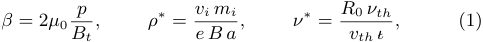

where _a_ is the minor radius, _R_ 0 the major radius, _p_ the plasma pressure, _vth_ the thermal velocity, _νth_ the thermal collision frequency and _ι_ � the rotational transform. Despite the great insight which can be obtained from dimensionless scaling techniques, the method has some limitations which should be kept in mind for the following analysis. In particular, the dimensionless quantities give no information about the dependence of phenomena, e.g. atomic physics are not reflected in such an ansatz. 

Although it is possible to simply compare the specific values of the dimensionless parameters between today’s experiments and future fusion devices, such an approach is not very conclusive. In order to measure the reactor relevance of existing and planned magnetic confinement devices, it is convenient to additionally rephrase the leading operation parameters of a device in so-called ‘dimensionless’ engineering parameters _B[∗] ∼ Ba_[5] _[/]_[4] , _P[∗] ∼ Pa_[3] _[/]_[4] and _n[∗] ∼ na_[3] _[/]_[4] _/B_ [39]. Considering the Kadomtsev similarity constraints [37], _B[∗] , P[∗]_ and _n[∗]_ must remain constant in differently sized devices, in order to obtain the same dimensionless plasma physics parameters (omitting dimensional constants). In this approach the principle of similarity requires that the magnetic geometry of the compared 

![Figure 1: Step-ladder plots for ITER-like tokamaks (left) and the HELIAS line (right). The left side shows operation windows of ASDEX Upgrade (AUG), JET and ITER in dimensionless engineering parameters with isocontours of dimensionless physics parameters at constant _n[∗]_ . The right side shows the same for the HELIAS line. The W7-X operation windows refer to operation phase 1 (OP1) and 2 (OP2) for X2 and O2 heating, respectively, where _n[∗]_ has been adapted to ECH cut-off densities and ‘HELIAS 5-B’ is an engineering-based reactor study [13]. The dotted line on the right side is the projection of the collisionallity of W7-X into the plane of HELIAS 5-B.](images/tmpgl0vr7wz.pdf-0006-00.png)

devices is identical, i.e. the aspect ratio _A_ , elongation _κ_ , as well as the rotational transform _ι_ � ( _q_ ) must be identical. 305 

275 The formulation of such dimensionless engineering parameters allows one to link both the governing dimensionless physics quantities and the device parameters. To this extent scaling laws (empirical or theoretical) can be employed to transform the engineering to the physics parameters. This approach has310 280 the advantage that anticipated physic regimes can simultaneously be displayed within expected operation windows. Such a representation is referred to as a ‘step-ladder’ plot due to its characteristic appearance. 

The combined engineering-physics parameter view can be315 285 seen in Fig. 1, where the left side shows the step-ladder plot for ASDEX Upgrade, JET and ITER assuming the normalized plasma density _n[∗]_ = const. which has been adapted from [39]. The right side of Fig. 1 reflects the same approach for the HELIAS line employing the scaling law ISS04 for the energy320 290 confinement time _τE_ [40] with the same configuration factor _f_ ren = _τE/τE_[ISS04] . The renormalization factor _f_ ren can serve as a confinement enhancement or degradation factor similar to the _H_ -factor used in tokamaks but, for stellarators, _f_ ren also reflects the complex structure of stellarator magnetic fields and325 295 is therefore, dependent on the magnetic configuration [40, 41]. For the HELIAS-line, the transformation of the dimensionless parameters are determined by the relations 

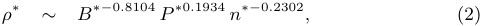

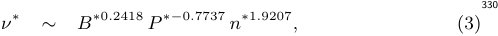

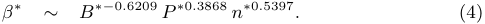

Since the density is assumed to be determined by the ECH cutoff, changes in _n[∗]_ need to be considered in the sequence from335 300 W7-X to HELIAS 5-B, which is in particular important for the collisionality which scales as _ν[∗] ∼ n[∗]_[1] _[.]_[9207] . In the tokamak picture, _n[∗]_ is similar to the Greenwald density limit [42] and if all devices operate at a fixed ratio of the Greenwald density 

limit, _n[∗]_ is constant for all devices meaning that all tokamak devices lie in the same plane of _n[∗]_ . In the stellarator picture, however, _n_ is constant instead of _n[∗]_ such that the right side of Fig. 1 becomes actually a 3D-plot. One has therefore to consider the projection of the plane from experimental devices to the plane of the power plant device. The visualisation of differences in the dimensionless parameter _ν[∗]_ is given by the broken line in the right side of Fig. 1, which is a projection of the W7-X plane to the HELIAS 5-B plane. The difference in collisionality between W7-X and the power plant scenario is therefore not a factor ten, but rather a factor two to three. 

Comparing the step-ladder plot of ITER-like tokamaks with the HELIAS-like devices, indicates that the physics basis of advanced stellarators is less well covered than that of tokamaks. In physics dimensionless parameters, the gap from existent devices to burning plasmas appears evident. In comparison to tokamaks, the change both in _B[∗]_ , _P[∗]_ and _n[∗]_ as well as in _ρ[∗]_ and _ν[∗]_ is more substantial for the discussed stellarators. In particular, the ITER device is seen to play a key role in the advancement of the tokamak-line. 

The analysis of required control parameters in the form of dimensionless variables shows that the step from W7-X to a HELIAS reactor would be very large in the dimensionless engineering and physics quantities. Especially reactor relevant _ν[∗]_ and _ρ[∗]_ are hardly accessible. In particular, simultaneous attainment of _ν[∗]_ , _ρ[∗]_ and _β_ of an envisaged reactor working point cannot be achieved in W7-X. 

Although the step-ladder approach is a powerful tool to measure the reactor-relevance of today’s experiments in terms of a number of representative dimensionless (plasma-core) physics and engineering parameters, a number of additional constraints exist which cannot be incorporated into such a representation. In particular the physics and technology of the divertor and plasma exhaust is governed by very different similarity conditions. Nonetheless, it is possible to define global parameters which are not necessarily dimensionless but which can be em- 

- 340 ployed to characterise the required step-size to reactor conditions. For example, a commonly employed figure of merit which measures the challenge for the exhaust system is the parameter _P/R_ . An additional important challenge for stellarators, which is 

- 345 not directly covered by Fig. 1, is the confinement of fast particles and their interaction with Alf´enic instabilities. Therefore we introduce an additional dimensionless quantity _p[∗]_ which serves as figure of merit to describe the importance of fast particles in comparison with the background plasma. The nor- 

- 350 malised alpha particle pressure _p[∗]_ is therefore defined as the ratio of the fast particle pressure in relation to the pressure of the background plasma 

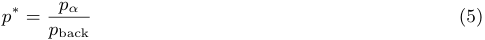

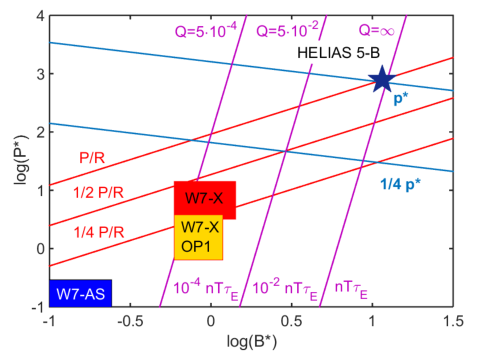

   - where _p_ back _∼ n T_ is the plasma pressure in its usual definition 

- 355 and the alpha particle pressure _pα ∼ nα Tα_ . In this ansatz _Tα_ is constant and corresponds to the average energy of the alphas over the slowing-down time. In order to define _nα_ , the equation for the fusion power can be used which is equivalent to the number of generated alpha particles per time interval. Taking 

- 360 the derivative with respect to the volume and further the slowing down time _τs ∼ T_[3] _[/]_[2] _/n_ as characteristic time interval in which the alpha particles remain ‘energetic’, the density of the alpha particles becomes 

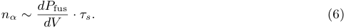

- 365 Approximating _dP_ fus _/dV_ in the relevant temperature regime of 10 – 20 keV by _∼ n_[2] _T_[2] and substituting in equation (5), a scaling for the normalised alpha particle pressure can be obtained400 with 

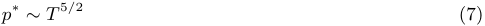

- 370 which allows us to represent _p[∗]_ in the dimensionless step-ladder 405 

- approach. However, as intrinsically assumed, this scaling is only correct as long as the heating power is dominated by the fusion alphas. Last, but not least, we consider the fusion triple product 

- 375 _nTτE_ which is a measure for the burn or ignition of a fusion device. It is generally accepted that _nTτE_ must reach a certain410 value above which the plasma can be considered to be ignited. According to the above introduced step-ladder methodology, isocontours for _P/R_ , _p[∗]_ and _nTτE_ are given within the dimen- 

- 380 sionless engineering parameter space in Fig. 2. 

- 380 space It can be seen in Fig. 2, that for either of the presented415 

- ‘challenges’ regarding exhaust, fast particles and fusion burn, substantial gaps exist in the chosen representative figures of merit. 

- 385 Comparing Fig. 2 with the values presented in Tab. 1 one realises some deviations. For example, the difference of _P/R_ 420 is less in the dimensionless plot, while the difference in _nTτ_ is greater than in the table. The renormalisation factor has been fixed in the dimensional analysis, however, the detailed 

- 390 1D transport simulations showed [43] that the renormalisation factor is quite different for W7-X and a HELIAS. Furthermore,425 the dimensionless extrapolation uses the empirical confinement time scaling ISS04 and is thus dependent on the scaling relations therein. It has also been shown in [43], that the trans- 

- 395 port regimes change from W7-X to a power plant and that for an ignited plasma the heating power is no longer an external430 

Figure 2: The figure shows the operation windows of HELIAS devices in dimensionless engineering parameters with isocontours of the parameters _P/R_ , _p[∗]_ and _nTτE_ which serve as figure of merits for the challenges regarding exhaust, fast particle confinement and fusion burn, respectively. The W7-X operation windows refer to operation phase 1 (OP1) and 2 (OP2) for X2 and O2 heating, respectively, where _n[∗]_ has been adapted to ECH cut-off densities and ‘HELIAS 5-B’ is an engineering-based reactor study [13]. Further are shown values for the fusion gain _Q_ whose contours coincide with the contours from the tripple product. 

variable, but rather determined by plasma volume, beta, and magnetic field. This together causes the underlying scaling relations of the confinement time scaling to change. While this can be reflected in Tab. 1 for single design points, it is much more complicated to accurately account for such effects in the dimensionless scaling which covers several orders of magnitude in different parameters. However, the conclusions which can be drawn from Fig. 2 remain intact, but absolute values should be taken with care. 

The existence of the gaps for the HELIAS-line leads to the conclusion that the experimental program of W7-X needs to demonstrate the physics of high-beta discharges at lowest _ρ[∗]_ and _ν[∗]_ (high-performance discharges). Since substantial gaps in _ρ[∗]_ and _ν[∗]_ exist with regard to HELIAS reactor plasmas, it is mandatory to develop predictive capabilities about any issues related to collisionality and gyro-radius effects. Examples are the interplay of neoclassical and turbulent transport and the confinement of fast particles and their excitation of Alf´enic instabilities. 

Overall, the step from W7-X to a power plant contains significant extrapolations of a number of physics and engineering parameters. While a further increase of _β_ is not foreseen and an envisaged increase of the magnetic field by a factor of about two appears to be sufficient, quantities such as plasma volume, magnetic field volume, energy stored in the plasma and power levels increase substantially. Associated with the high power levels of a power plant is the fact that the plasma heating is governed by alpha-particles which entails not only additional physics effects, but also adds requirements to the design of the device. Finally, the handling of high neutrons fluxes and fluences generated by a D-T fusion plasma introduces an entirely new level of complexity. 

The conclusion of this analysis is to introduce a burningplasma HELIAS as a reasonable next step after W7-X. The 

- main purpose of such a device would be to investigate the burning plasma physics and to a limited extent also the associated technologies while the risk related to the extrapolation from490 W7-X results is kept at an appropriate level. As outlined in 

- 435 [16], this intermediate-step burning-plasma HELIAS would rely on the parallel development of the tokamak line. In particular, it is assumed that after such an intermediate device, the following development step might already be on the commercial power plant level. This scenario, however, requires that 

- 440 the technology solutions developed for a tokamak DEMO can495 be transferred to a HELIAS power plant without the need for another major experimental verification. From the physics and engineering point of view, as presented in Figures 1 and 2, this argument is substantiated by the fact that the operating point 

- 445 of HELIAS-5B already represents an ignited plasma. On this basis a set of high-level requirements can be derived 

- which a potential intermediate-step HELIAS device must fulfill500 in order bridge the gap from today’s experiments to commercial fusion for the HELIAS line. A tentative list of these high-levels 

- 450 goals is summarised in the next section. 

- 450 Some specifications, however, are still ambiguous. For exam- 

- ple, it remains to be shown by detailed theoretical studies which value of _p[∗]_ must be achieved by an intermediate HELIAS de-505 vice to allow a meaningful experimental study of the important 

- 455 fast particle effects. Generally speaking, more in-depth studies are necessary to substantiate the list of high-level requirements presented below. 

## **3. High-Level Requirements for a next-step Stellarator** 

- 460 An intermediate device is assumed to bridge the gap between515 W7-X and a HELIAS power plant. The high-level objective of such a device is to demonstrate and investigate the physics of a burning plasma and the corresponding confinement and control of fast alpha particles. 

- 465 In this sense an intermediate step Stellarator is very much520 comparable with the general requirements for ITER [12]. New aspects would be the stellarator-specific physics and 3D engineering issues. Especially the divertor concept must be able to handle the heat and particle exhaust of a burning 3D plasma. 

- 470 Nonetheless, an intermediate step HELIAS is expected to have525 far fewer requirements and constraints than a HELIAS reactor on the power plant scale. Also with regard to accessibility, an intermediate step HELIAS can be regarded to be more a scientific experiment than an electricity generating plant. 

- 475 Consequently, an intermediate-step HELIAS is a device which530 uniquely allows for an optimisation of 3D reactor scenarios by fully investigating the plasma physics properties of 3D burning plasmas. Based on the step-ladder analysis of the last section, a tentative list of high-level specifications can be defined which 

- 480 is summarised in the list below: 535 

- sufficient fast particle pressure (to assess, e.g. the effect of Alfv´enic instabilities) 

- high plasma _β_ ( _∼_ 4% to enable fast particle confinement and to demonstrate high-performance operation) 

- _ρ[∗]_ and _ν[∗]_ must be sufficiently close to reactor conditions 

- steady-state operation to allow for reactor scenario development (e.g. exhaust) 

- optimised magnetic configuration with respect to neoclassical and turbulent transport of the main plasma, impurities as well as for fast particle confinement 

- availability and feasibility of modular magnet system 

- reliable divertor concept and operation (e.g. impurity control – [partial] detachment with high SOL radiation to reduce the divertor heat load to acceptable levels) 

The definition of such high-level goals is important, since these form the guidelines and constraints for the development of design concepts. In particular, the specifications listed here, serve as input for the systems studies of next-step HELIAS devices as will be discussed in the sections below. 

## **4. Systems Studies of possible next-step Scenarios** 

A well-established method to investigate the impact of engineering and physics parameter variations on a conceptual design are so-called ‘systems studies’. In the design phase of a next-step HELIAS device such studies allow the investigation of a wide parameter range and its impact on the design of the device. Ultimately, such an investigation allows one to show the robustness of a design point and optimise it with respect to the high-level goals taking into account trade-offs between different parameters and limitations. To conduct such systems studies usually ‘systems codes’ are employed, which are in this context simplified, yet comprehensive models of an entire fusion power plant. 

While this approach has a long tradition for tokamaks, heliotrons and compact stellarators, only recently have systems code models been developed for the HELIAS advanced stellarator concept [44] including descriptions for the 3D topology, the modular coil set, and the island divertor. These models were implemented in the European systems code PROCESS [45] and tested succesfully [46]. 

First design window analyses of helical devices were originally carried out for the heliotron concept [47]. Following the developments described above, systems studies have also recently been carried out for HELIAS reactor concepts [18]. In the following the same methodology is applied for different design concepts of an intermediate-step stellarator of the HELIAS line. Having the purpose to bridge the gap between W7-X and a HELIAS power plant, such a device must fulfill the high-level requirements outlined in the previous section. 

However, the systems code PROCESS employs empirical confinement time scalings to extrapolate the confinement time, i.e. the plasma transport, to power plant sized devices. But as already outlined in the strategy presented in [44] and discussed in [43] empirical confinement times are not sufficient to confidently predict the confinement properties of a HELIAS power plant. Therefore, in addition to the systems code approach, a dedicated 1-D transport code [48] is employed to calculate and estimate the neoclassical and turbulent transport and thus provide a more sophistacted estimation of the confinement in a HELIAS power plant and intermediate-step burning-plasma stellarators. 

Since the step from W7-X to a HELIAS power plant is rather large both in engineering and physics quantities, a number of different devices could be envisaged to fit the stated goals. In the following studies the focus is put on two cases. The first 

6 

- 545 case represents the smallest possible device, which could be realised on a near-term time scale using mostly today’s technology, in the following called ‘Option A’. The second case, which 585 

- can be seen as an upper boundary, is meant to be a DEMOlike design which employs reactor-ready technology and should 

- 550 consequently produce a net amount of electricity. Since there are still possibilities for a design compromise between those two cases, the DEMO-like concept is referred to here as ‘Option C’ (i.e. ‘Option B’ would be a compromise between these two590 options but is not investigated in this work). 

## 555 **4.1** 

Before the individual options are presented in detail, the general workflow which is followed in this work is introduced; see Fig. 3 for the flowchart. 

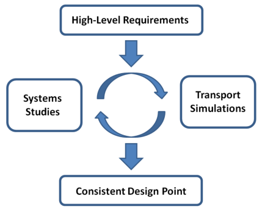

610 

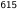

**----- Start of picture text -----** 
615 **----- End of picture text -----** 

Figure 3: Flowchart for the integrated concept development of design points of options for an intermediate-step stellarator. 

- Generally, the first approach is to define a number of high-620 

- 560 level requirements which directly influence certain parameters and in addition serve as limits and constraints in the subsequent calculations. With the general inputs defined, the next step is to carry out simulations. One could either start with systems studies and make assumptions on the transport or start with625 

- 565 transport simulations and make assumptions on the size of the device. In any case, both tools need to be coupled by iterations. E.g. starting from systems studies, engineering parameters such as the size and the magnetic field can be narrowed down which serves as input for the transport simulations which630 

- 570 in turn provide plasma parameters such as the temperature and the confinement time. This in turn, is fed back to the systems studies improving the modeling. After a few iterations back and forth between the systems studies and the transport simulations, a consistent design is obtained. The ‘final’ set of major635 

- 575 input parameters for the systems studies is summarised in Tab. 2. 

In the next section, this approach is used for Option A. First the systems studies are discussed and afterwards the transport simulations. However, one has to keep in mind, that these are 580 not separated but are actually interconnected and the results640 presented are an outcome of several iterations back and forth between both tools. 

## **4.2 Option A** 

As the rationale for Option A is to be a small device which should be realisable on a fast track, i.e. shortly after W7-X has demonstrated the achievements of optimisation and steadystate operation, the device should mostly employ today’s technology or technology expected to be ready in the near future. This option can thus be regarded more as a scientific experiment to clarify the gaps in physics mentioned earlier. In this approach it is expected that reactor-relevant technology is developed for a tokamak DEMO which should then be transferable to the HELIAS line. 

Under this guideline, a subset of goals can be defined in addition to the high-level goals of the last section. Being more a scientific experiment on a near time-scale, it is not required for this option to produce electrical power. Rather, a fair amount of fusion power is required to achieve plasma parameters relevant for reactor conditions. To be more precise, not the amount of fusion power is the real design constraint for Option A, but the required alpha pressure _p[∗]_ and the fusion gain _Q_ . However, as a detailed specification for these parameters is still lacking and subject of ongoing research, the fusion power as been taken as proxy for the design constraint with _P_ fus = 500 MW. 

Consequently, a blanket is not assumed and only a shield is considered to protect the coils. Without the blanket, space should be available to have an aspect ratio similar to that of W7-X with _A_ = 10 _._ 5. To further save costs, NbTi superconductor technology is assumed for Option A. The device will be designed for steady-state operation as this is one of the great advantages of the stellarator concept. Therefore about 100 MW are assumed for cooling based on Helium technology for safety reasons [49] and in view of power plant requirements. On the physics side, 5% Helium is assumed in the plasma as ‘ash’ and the volume-averaged temperature is fixed to _⟨T ⟩_ = 7 keV. Correspondingly, the renormalisation factor representing the confinement enhancement with respect to the empirical confinement time scaling law ISS04 was limited to _f_ ren = _τE/τE_[ISS04] _≤_ 1 _._ 8 (i.e. the systems studies have been iterated in combination with detailed transport simulations, discussed in subsection 4.2.2). For comparison, the confinement enhancement in W7-X is expected to be on the order of _f_ ren[W7X] _≈_ 2 [48]. 

For the controlled particle and energy exhaust, the island divertor concept is assumed which was succesful during operation of W7-AS and will be further qualified in the later operation phases of W7-X. The island divertor model assumes cross-field diffusion and radiation around the X-point in combination with a geometrical represenation [44]. The heat-load limit on the divertor is specified to be _q_ div[max] = 5 MW/m[2] which has been proposed as the limit for power plants [50]. Due to the low neutron fluence in Option A one could also discuss a higher limit. As input for the divertor model the perpendicular heat diffusion coefficient was set to _χ⊥_ = 1 _._ 5 m[2] /s. Further, the inclination of the divertor plate relative to the field lines is assumed to be _α_ lim = 2 _[◦]_ , the temperature in front of the divertor plates _Tt_ = 3 eV and the field line pitch angle Θ = _O_ (10 _[−]_[3] ) [46, 23]. Tab. 2 summarises the parameters of Option A and compares them to Option C. 

## _4.2.1. Design Window Analysis – Option A_ 

For the design window analysis of Option A, the main engineering parameters (i.e. the major radius and the magnetic 

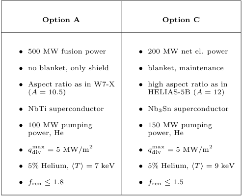

**----- Start of picture text -----** 
Option A Option C • 500 MW fusion power • 200 MW net el. power • no blanket, only shield • blanket, maintenance • Aspect ratio as in W7-X • high aspect ratio as in ( A = 10 . 5) HELIAS-5B ( A = 12) • NbTi superconductor • Nb3Sn superconductor • 100 MW pumping • 150 MW pumping power, He power, He • q div [max] = 5 MW/m [2] • q div [max] = 5 MW/m [2] • 5% Helium, ⟨T ⟩ = 7 keV • 5% Helium, ⟨T ⟩ = 9 keV • f ren ≤ 1 . 8 • f ren ≤ 1 . 5 **----- End of picture text -----** 

Table 2: Summary and comparison of additional, concept-specific sub-goals (inputs for the systems studies) for Option A (left) and Option C (right). The volume-averaged temperature _⟨T ⟩_ as well as the renormalisation factor _f_ ren have been obtained from 1-D transport simulations, see subsection 4.2.2 and 4.3.2. 

field strength on axis) were systematically varied within a predefined range of _R_ = 12 _. . ._ 15 m and _Bt_ = 4 _. . ._ 5 _._ 6 T. Both the 645 high-level and the above-mentioned subsequent goals have been taken as constraints / limits and held constant in the systems680 studies. Thus, every design point is set to reach 500 MW fusion power. To achieve this while varying device size and magnetic field, the density, the external heating power and the confine650 ment enhancement factor were used as iteration variables. The corresponding result for Option A is shown in Fig. 4 where685 isocontours of the volume-averaged thermal plasma _⟨β⟩_ , the average neutron wall-load ΓNWL, and external heating power are highlighted as important parameters. 

655 It should be noted that due to the 3D topology and the resulting higher complexity of the systems code models, the690 calculation time for a single run of a HELIAS design point is on the order of a few minutes on a modern CPU. For the design window analysis presented here a resolution of 16 _×_ 16 for the 660 varied engineering parameters was chosen corresponding to _∼_ 1 day calculation time per figure [51]. 695 

As can be seen from Fig. 4, reasonable beta-values in the range of 3 – 5% can be obtained in the considered engineering parameter range (blue lines). While the beta-limit is a strongly 665 limiting factor for the HELIAS reactor studies, it’s importance for the intermediate-step stellarator, Option A, is rather low.700 Linear stability predicts the beta-limit to be in the range of _β_ = 4 _._ 5%, but stellarator experiments have demonstrated the capability to operate above this limit [52] such that beta may 670 be ultimately limited by stochastisation of the plasma edge and corresponding destruction of flux surfaces and shrinking of the705 plasma volume. However, these effects are much reduced in a HELIAS due to the optimisation of the magnetic configuration. Such a beta-limit has been predicted to be in the range of 5 675 – 6% [53]. In the design window analysis of Option A, the isocontours of the external heating power and beta are nearly710 parallel. Already at _β_ = 4 _._ 5%, an external heating power of 50 MW is required. It would not seem desirable to select a design requiring more heating power which reduces the fusion 

![Figure 4: Design window analysis for the intermediate-step HELIAS – Option A, constrained to achieve 500 MW fusion power with a confinement enhancement factor of _f_ ren _≤_ 1 _._ 8. Shown are isocontours of the volume-averaged thermal plasma _⟨β⟩_ (blue), the average neutron wall-load ΓNWL (orange), and external heating power (black). Since the fusion power was kept constant, the heating power contours are equivalent to the fusion gain contours (black). The normalised alpha-pressure is constant reaching a value of _p[∗]_ 0[= 12% in the plasma] centre.](images/tmpgl0vr7wz.pdf-0010-05.png)

gain _Q_ , and the beta-limit therefore does not play a role. 

However, since the plasma is maintained by external heating using ECRH, the cut-off density of O1-mode heating must be taken into account. The magnetic field provides a highly localized resonance for O1-mode ECRH heating at _Bt,_ max near the magnetic axis. As the considered magnetic configurations have a mirror term for the magnetic field strength of around 10% in the plasma center, the resonance is _Bt,_ max = 1 _._ 1 _· Bt_ . For example at _Bt_ = 4 _._ 5 T the resonance is at 5 T which would be exactly the O1-resonance for the 140 GHz W7-X gyrotrons. The cut-off for O1-mode heating is then 2 _._ 4 _·_ 10[20] m _[−]_[3] which leaves about 10% of margin with respect to central densities on the order of 2 _._ 2 _·_ 10[20] m _[−]_[3] . Access to lower fields than _Bt_ = 4 _._ 5 T is therefore problematic as the cut-off density decreases with _B_[2] , i.e. at _Bt_ = 4 _._ 0 T it drops to 1 _._ 85 _·_ 10[20] m _[−]_[3] . 

As outlined above, the systems studies have been iterated in alternation with 1D transport simulations and the confinement enhancement factor was set accordingly to _f_ ren _≤_ 1 _._ 8. Since considerable external heating power is used to maintain the plasma, the confinement has a relatively small effect on the beta contours. However, the required external heating power is very sensitive to _f_ ren as an overall degradation of the confinement from _f_ ren = 1 _._ 8 to 1.6 would double the required heating power, e.g. from 50 to 100 MW. This illustrates how critical it is to accurately predict confinement. 

The average neutron wall load ΓNWL (orange) varies only moderately over the engineering range considered. This is clear as the fusion power is constant and only the first wall area is changing with size, i.e. decreasing the device size by 1.5 m from 13.75 to 12.25 m increases the neutron wall load from 0.4 to 0.5 MW/m[2] . Consequently, the neutron wall load is a factor three lower than in a HELIAS power plant, but still high enough for e.g. material testing, especially as the device could be designed for steady-state. However, without further 

- material qualifying, the lifetime of componentes and the device775 

- 715 is limited by the neutron damage in terms of displacementsper-atom (dpa). 

- Isocontours of other parameters are not shown in Fig. 4 to 

- retain clarity. E.g. the radiation fraction, which is required in the scrape-off-layer (SOL) to reduce the heat load of the780 

- 720 divertor to 5 MW/m[2] must be for the maximum considered size on the order of 40% and increases to 50% for the smallest device sizes. Impurities in the plasma core for additional radiation have not been considered in this study. 

- Another engineering parameter which is often of interest is785 

- 725 the stored magnetic energy in the coil system which is a proxy for the required support structure. For the smallest device size at low field this value is on the order of _Wmag_ = 30 GJ and increases up to 50 GJ for the highest field and largest size. The systems studies suggest that NbTi can be used to achieve790 

- 730 the desired fields, however the maximum field on the surface of the coil is for e.g. _R_ = 14 m and _Bt_ = 4 _._ 5 T on the order of _Bmax ≈_ 10 T. To push NbTi to such a high field, supercritical helium cooling at 1.8 K is needed requiring a higher effort for the cooling systems. It should be noted, that the NbTi795 

- 735 critical current density scaling was obtained from W7-X and the calculations for the maximum field on the coil consequently verified against W7-X. The device considered here, however, is nearly a factor three larger than W7-X (in terms of the major radius) which may result in some deviations and an error of 

- 740 about 10% is easily imaginable, but is sufficient to distinguish800 between the requirements for normal (4.2 K) and critical helium cooling (1.8 K). For comparison, in the more detailed ‘HSR 4/18i’ HELIAS study [4] NbTi could be employed with normal helium cooling with 4.5 T on axis by trapezoidally shaping 

- 745 the winding pack and thereby reducing the maximum magnetic805 field on the coils. A more detailed engineering study is required to clarify this aspect for Option A. 

- The results of the design window analysis for Option A may 

- suggest higher fields to reduce the device size. But with higher 

- 750 field on-axis also the maximum field at the coils increases. Ac-810 cording to the above argument it is unlikely whether NbTi can be employed for fields up to 5.5 T. Nb3Sn could be used to achieve this, but this would considerably increase the costs of the magnets and negate the savings due to reduced device size. 

## _4.2.2. 1-D Transport Scenario – Option A_ 

- 755 _–_ In order to make predictions about the expected confinement 

- in next-step devices such as an intermediate-step stellarator, a 1-D transport code [54, 48] is employed which solves the power balance for the electrons and ions and calculates the neoclas-820 

- 760 sical energy fluxes based on the DKES approach [55, 56]. Additional anomalous energy fluxes are considered at the plasma edge based on experimental data from W7-AS [57, 58, 59]. In order to carry out predictive transport simulations for 

- an exemplary design for Option A, a suitable magnetic con-825 

- 765 figuration has to be defined. As dedicated configurations for such a next-step device are still a topic of ongoing research, the existing W7-X ‘high-mirror’ configuration was selected due to its reactor-relevance. The DKES database has been prepared for a _β_ = 4 % equilibrium to account for finite beta effects.830 

- 770 The dimensionless nature of the DKES approach allows a linear upscaling of the magnetic configuration. The configuration has been scaled by a factor 2.5 which corresponds to the design point found in systems studies with a major radius of _R_ = 14 m. The magnetic field on-axis has been set to 4.5 T835 

accordingly. Additionally, 50 MW of ECRH steady-state external heating power are assumed with central deposition modeled by a Gaussian profile to reach the desired fusion power of 500 MW. The associated 100 MW of internal alpha-heating are self-consistently taken into account in the code. 

For the density a ‘standard’ profile has been selected and kept constant to avoid a fuelling scenario which requires detailed knowledge of particle sources and sinks. In fact, density control in large stellarators is generally problematic and requires central sources such as pellet injection to avoid hollow density profiles [28]. This is beyond the scope of this work, but will be investigated in future studies. 

Regarding the anomalous transport, as so far no better quantitative assessment exists, the anomalous heat conductivity has been described by _χ[ano] ∼_ 1 _/n_ and falling off towards the centre with _χ_[edge] = 3 _._ 0 m[2] /s at the very edge. A new physics motivated critical gradient model is subject of ongoing research [59]. 

The resulting density and temperature profile of an exemplary scenario of Option A are shown in Fig. 5. The global confinement according to the simulations is in this scenario _τE_[1D] _[/τ]_[ ISS04] _E_ = 1 _._ 8 in terms of the empirical ISS04 scaling. As already stated, this result, including the density and temperature profiles and values, have been taken as input for systems studies of Option A. 

## **4.3 Option C** 

While ‘Option A’ represents a bounding scenario for a small, fast-track intermediate-step stellarator, ‘Option C’ in contrast is meant to be an upper boundary scenario for a large, DEMOlike device employing reactor-ready technology. Consequently, a pre-requisite of Option C is the research and development of reactor-relevant technology similar to a tokamak DEMO [16]. 

As for Option A, a set of concept-specific sub-goals can be defined for Option C which need to be realised in addition to the high-level requirements outlined in section 3. Under the premise to be a DEMO-like device, Option C should produce a reasonable net amount of electricity, i.e. set here at 200 MW, to demonstrate the power plant capability of the concept. Consequently, a full blanket and shield are required and enough space must be foreseen to accommodate these components. As a result, the aspect ratio is increased to _A_ = 12 compared to _A_ = 10 _._ 5 for Option A as was already done in the engineering study of the of the power-plant sized HELIAS 5-B [13]. 

Further, Nb3Sn is foreseen as superconductor, which could also be a possible conductor for a HELIAS power plant. Similar to Option A, the device will be designed for steady-state operation. In a similar fashion, helium cooling technology is envisaged conservatively assuming about 150 MW pumping power. According to the detailed predictive physics transport simulations, see subsection 4.3.2, which have been iterated with the systems studies, the helium ‘ash’ is set to 5% and the volumeaveraged temperature to _⟨T ⟩_ = 9 keV. Correspondingly, the renormalisation factor representing the confinement enhancement with respect to the ISS04 confinement time scaling law was limited to _f_ ren = _τE/τE_[ISS04] _≤_ 1 _._ 5. 

It may seem surprising that the confinement enhancement factor from Option C is different to that from Option A. However, this is due to the paradigm change of the underlying scaling relations. In the regression of the empirical confinement time scaling it is assumed that the heating power _P_ is an independent parameter. Under fusion conditions, however, alpha 

particles heat the plasma and the heating power is, therefore, no longer a free parameter. Instead, it is interconnected to the plasma volume, plasma beta, and the magnetic field. As such, _τE_ scales differently for a reactor than for an experimental sce840 nario where the heating power can be externally adjusted as an independent parameter. This has been explained in detail in [43]. The sub-goals of Option C are summarised in Tab. 2. 

## _4.3.1. Design Window Analysis – Option C_ 

- Again, the high-level requirements and the above-mentioned 

- 845 sub-goals have been taken as constraints for the design window analysis of Option C. This time the major radius was varied in the range _R_ = 15 _. . ._ 20 m and the magnetic field on-axis between _Bt_ = 4 _._ 5 _. . ._ 5 _._ 6 T while the density, the confinement enhancement factor as well as the external heating power were 

- 850 taken as iteration variables. The corresponding result for Option C is shown in Fig. 6 where isocontours of the volumeaveraged thermal plasma _⟨β⟩_ , the average neutron wall-load ΓNWL, and external heating power are highlighted. 

- A first result which can be inferred from Fig. 6 is the fact 

- 855 that, under the given confinement and size constraints, the design points within the systems study are not ignited. The black curves show the required external heating power which is needed to fulfill the power balance. Again, the beta-contours (blue) run approximately parallel to the heating power con- 

- 860 tours. The plasma beta takes reasonable values of 4 _. . ._ 5% in the range between 50 and 100 MW external heating power. Consequently for Option C, the beta-limit also does not play 

- a large role unless one would be restricted in the achievement of higher field strengths. But as outlined above, Nb3Sn supercon- 

- 865 ductor is envisaged from the beginning for this option allowing a higher maximum field on the coil and therefore magnetic field strengths of up to 5.5 T on-axis should be unproblematic. In particular for _R_ = 18 m and _Bt_ = 5 _._ 5 T, the maximum magnetic field on the surface of the coil is about _B_ max _≈_ 12 T 

- 870 which is consistent with Nb3Sn technology and normal Helium 

![Figure 6: Design window analysis for the intermediate-step HELIAS – Option C, constrained to achieve 200 MW net electric power. Shown are isocontours of the volume-averaged thermal plasma _⟨β⟩_ (blue), the average neutron wall-load ΓNWL (orange), and external heating power (black). Since the fusion power varies only moderately, the contours of the fusion gain follow very closely the contours of the heating power (black). The normalised alpha-pressure is roughly constant reaching a value of _p[∗]_ 0[= 17%][in][the][plasma][centre.]](images/tmpgl0vr7wz.pdf-0012-06.png)

cooling (4.2K). As already shown in the systems studies for HELIAS power plant devices, the contours of construction cost are rather flat with respect to the magnetic field, i.e. it is very desirable to employ a high field for Option C. 

875 At a high field of about 5.5 T on-axis (6 T including the910 mirror term), the ECRH cut-off is at 3 _._ 5 _·_ 10[20] m _[−]_[3] , and therefore not a concern for the systems studies and the achievable density. Even in the centre of the plasma, a density not higher than _ne ∼_ 2 _._ 0 _·_ 10[20] m _[−]_[3] is required, cf. subsection 4.3.2. 

880 Since the considered range of device sizes is greater for Op-915 tion C than for A it follows that the average neutron wall load ΓNWL (orange) also has a broader variation over the whole design window analysis between 0 _._ 5 _. . ._ 1 _._ 0 MW/m[2] . This is mostly due to the change of first wall area with changing ma885 jor radius. However, as seen from Fig. 6, the isocontours of the920 neutron average wall load are not horizontal lines as for Option A, but rather decreasing with increasing magnetic field. This is simply due to the fact, that for lower magnetic field the confinement time is lower and the required heating power 890 must increase. As the net electric power is held constant, the925 density and fusion power must increase to provide additional gross electric power to sustain the additional heating. Thus, the higher fusion power for lower magnetic field leads directly to an increase of neutrons. At 4.5 T the required fusion power 895 is about 1400 MW and can be reduced to 1100 MW for 5.5 T930 on-axis at a constant net electric power of 200 MW. 

For the same reasons also the required radiation fraction in the SOL varies over a wider range from 60% for the largest device and field up to 80% for the smallest. And the stored 900 magnetic energy in the coil system varies vice versa from 60 GJ935 to 130 GJ. 

Similar as for Option A, the required external heating power is rather sensitive to changes in the confinement enhancement factor _f_ ren, which was set here according to the 1D transport 905 simulations to _τE_[1D] _[/τ]_[ ISS04] _E ≤_ 1 _._ 5. However, for Option C not only the external heating power would change but also the beta- 

contours would shift to lower fields as for Option C considerable heating power is coming from the fusion alphas. The transport simulation for Option C are discussed in the next section. 

## _4.3.2. 1-D Transport Scenario – Option C_ 

The same methodology for the predictive transport simulations is applied here which was already used for Option A. Again, the W7-X ‘high-mirror’ configuration was selected for its reactor relevance. However, the aspect ratio of this magnetic configuration is with _A_ = 10 _._ 5 not the same as the one used in the systems studies of Option C with _A_ = 12. Therefore the configuration has been scaled such, that the plasma volume corresponds to the design point with _R_ = 18 m. It is clear that this is not completely consistent, but is nevertheless a reasonable approximation. Dedicated magnetic configurations for an intermediate-step HELIAS will be further optimised and are therefore expected to have better confinement than the results derived based on the W7-X ‘high-mirror’ configuration. 

For the simulation a high field has been chosen with _Bt_ = 5 _._ 5 T and the external heating power by ECRH adjusted to 50 MW with a Gaussian profile and central deposition. The alpha heating power is self-consistently taken into account in the simulations. Again as for Option A, a standard flat density profile has been used and kept constant and the anomalous heat conductivity – described by _χe[ano] ∼_ 1 _/n_ and falling off towards the centre – has been set to _χ_[edge] = 3 _._ 0 m[2] /s at the very edge. The resulting profiles of this simulation are shown in Fig. 7. The simulation results were taken as input for the systems studies of Option C and have been iterated until both the design window analysis and the 1D simulations were in agreement. 

## **5. Economic Comparison** 

As the options presented here for an intermediate-step stellarator represent boundary cases with quite a conceptual difference between Option A and C, it is meaningful to carry out an 

![Figure 8: Cost breakdown of total construction costs to major costing accounts for exemplary design points of Option A, Option C as well as for a HELIAS power plant and an exemplary tokamak reactor (Model B of the European PPCS study [25]).](images/tmpgl0vr7wz.pdf-0014-00.png)

940 economic comparison in order to rate the effect of the respective sub-goals on the construction costs. 

The current version of PROCESS accommodates a basic980 cost-model with which it is possible to estimate the construction costs of a design point based on the total sum of material 945 costs. In fact, the systems code PROCESS can calculate for each component of a fusion device the size. Each component is described by a material or even several materials. Based985 on the size of the components and the material densities the total weight for each material can be estimated. Every mate950 rial in turn is associated with specific cost-per-weights which allows estimation of the costs of each component and in total the direct costs of the device as a sum of all individual com-990 ponents. The direct costs are complemented by indirect costs which are a flat rate of the direct costs and represent together 955 the total construction costs. A cost penalty for the complexity of components is of yet not included in the model (costs of certain components may thus be underestimated). The PRO-995 CESS cost model has been benchmarked with the dedicated cost analysis code FRESCO which showed a reasonable agree960 ment for the total costs of a tokamak test case with about 20% difference [60]. 

The cost estimates will be given here as ‘PROCESS currency1000 units’ (PCU) since the cost analysis is carried out for all devices in the same framework allowing a relative comparison between 965 the individual devices while absolute values should be taken with care. 

For this comparison, favourable design points are selected1005 from each design window analysis and compared in a costbreakdown. For Option A, a medium-sized low field device 970 was selected with _R_ = 14 m and _Bt_ = 4 _._ 5 T while for Option C, a high field, larger device seems to be a favourable design point with _R_ = 18 m and _Bt_ = 5 _._ 5 T, important parameters1010 are summarised in Tab. 3. The total construction cost of both these design points have been broken down to their major con975 tributions, which are the magnets, the blanket (including the shield), the buildings, the equipment and indirect costs. The results are shown in Fig. 8. Additional to these design points,1015 

the total construction costs of a HELIAS power plant and an ‘equivalent’ tokamak (Model B of the European PPCS study [25]) are presented as reference which have been discussed in [18]. 

A very striking result from this comparison as seen in Fig. 8 is the fact that the cost difference between the boundary cases Option A and C is about a factor two. In particular the magnet costs contribute to this difference which are much higher for the DEMO-like device than for the near-term step. This is attributed to two reasons. First, Option C is a larger device with higher field and requires therefore a higher amount of superconducting material and second, the costs for Nb3Sn are considerably higher than for NbTi. This confirms the strategy to employ NbTi for the near-term device. 

The costs for the blanket are of course higher for Option C which foresees a full blanket concept in contrast to Option A with solely a shield. However, in this analysis the total blanket costs are a rather small fraction of the total construction costs. It is unclear if this is an underestimation compared to the other costs since the blanket is also a complex component for a HELIAS device. As already stated above, the complexity of components is not yet considered for the costs, but is relevant for future studies. The upgrade of the cost model is an ongoing and continous process. 

Also the building and equipment costs are higher for Option C which is understandable as Option C requires many more buildings and equipment for self-sufficient supply of tritium and power conversion systems in order to produce a net amount of electricity. 

In comparison to a HELIAS power plant design point, Option A would require only a third of the construction costs, while Option C reaches two-thirds of the costs of a power plant. If one were to model an idealised version of ITER [61] in PROCESS, the construction costs would lie nearly in the middle between the exemplary design points of HELIAS Option A and C. 

Although PROCESS has been developed for modelling of power plant devices, it is possible to also model W7-X. How- 

ever, the uncertainties associated with this analysis are rather high. With respect to the cost analysis presented in Fig. 8, Option A would be about three times more expensive than W7-X. Using the actual costs of the W7-X construction (until1060 1020 2014) as a reference point, the current estimate of the ITER costs [62] is about a factor of three larger than the PROCESS estimate. How much this can be attributed to the limitations of the PROCESS cost model and how much this is due to the first-of-a-kind nature of the ITER enterprise is unclear. 1065 

1075 

Table 3: Summary and comparison of relevant parameters for the exemplary design points of Option A and C. 

## **A Remark on Tritium** 

1085 

As Option C should be designed with a tritium breeding ratio larger than one, the tritium supply should be self-sufficient apart from the start-up inventory. Tritium supply for Option A, in contrast, needs to be supplied from external sources due 1030 to the lack of a blanket. Comparing with the ITER fusion1090 burn phase, tritium consumption could be on the order of one kilogram per year [63] for _∼_ 5 years. 

Nonetheless, in either of the presented options for an intermediate-step stellarator, a tritium start-up inventory is 1035 required to initiate operation of the devices. One of the main1095 commercial tritium sources are the Canada Deuterium Uranium (CANDU) type pressurised heavy water reactors which have a total supply capacity of several kilogram tritium per year. The shutdown of the CANDU type reactors would thus 1040 have a great impact on the tritium supply. However, recently1100 discussions started regarding a 30 year life-time extensions of these reactors [64] potentially improving the situation for tritium supply in the upcoming decades. Once a ‘fleet’ of fusion power plants is running, the surplus of produced tritium can 1045 be used for the start-up of new fusion power plants. Apart1105 from that, other possibilities exist to breed tritium commercially [63]. 

Costs for tritium have not yet been taken into account in the cost assessments since the estimation of the tritium start-up 1050 inventory of a stellarator power plant are still too vague. The1110 resulting contribution of the tritium start-up inventory to the total construction costs and, for Option A, also the operation costs cannot be calculated. 

## **6. Summary and Conclusions** 

1055 This work is thought of as a starting point for a more indepth discussion of a research strategy leading from Wendel- 

stein 7-X to a HELIAS power plant. The experimental results of Wendelstein 7-X, which has just started operation, will of course play an essential role in the continuing refinement of this analysis. 

Looking at the extrapolation from W7-X to a power plant, three approaches or viewing perspectives have been presented. They shed light on the level of extrapolation required or in other words they indicate the gaps in physics and engineering parameters which have to be bridged. Selected physics and engineering parameters (e.g. energy of the magnet system, stored energy in the plasma, heating power, _P/R_ , fusion power gain, triple product), already show increases by orders of magnitude when going from W7-X to a power plant. Other quantities (plasma _β_ , average magnetic field) need no or only moderate extrapolation which is a particular property of the HELIAS concept. Considering the scientific progress which has been made since the optimised design of W7-X was frozen, a further refinement of the optimisation seems possible and also meaningful. This concerns, in particular, the fast ion confinement and the inclusion of the turbulent transport in the optimization procedure. Finally, combining dimensionless physics quantities with dimensionless engineering parameters and employing empirical confinement scaling laws show the necessary steps between different experiments or fusion devices in a more rigorous way. Comparing the HELIAS development to the tokamak line, from ASDEX Upgrade and JET to ITER and a tokamak DEMO, it becomes clear that between W7-X and HELIAS 5-B the step or gap is much larger than between JET and ITER or ITER and DEMO. 

Taking these arguments together, two possible options for filling this gap are investigated. Based on a tentative list of high-level requirements, guidelines for the conceptual study of an intermediate-step HELIAS are developed. The two options represent different levels of sophistication and basically can be considered as bounding cases for such a device. Option A is defined as a reasonably small fast-track device, while Option C is a DEMO-like device with net electrical power output. For Option A, the fusion power is fixed to a value comparable to ITER (500 MW). Selecting an example within the design window analysis, this suggests a device with a major radius of 14 m, an average magnetic field on axis of 4.5 T and a fusion power gain of _Q_ = 10. The moderate magnetic field allows the use of conventional NbTi superconductor. This may require supercritical helium cooling but needs a more detailed engineering assessment. For Option C, a fixed net electrical power of 200 MW is assumed. This results in a larger device ( _R_ = 18 m) with a larger aspect ratio ( _A_ = 12 instead of 10 for Option A), a larger magnetic field (5.5 T) and a significantly higher fusion power of 1100 MW. The higher magnetic field requires a different type of superconductor. Nb3Sn, as used for the ITER toroidal field coils, would fulfil this requirement. With a fusion power gain of _Q_ = 20, this device would still not be ignited. 

A first cost assessment indicates that Option C is more expensive by approximately a factor of two, ignoring the costs for tritium. Option C requires a start-up inventory, while Option A depends on a continuous tritium supply as it does not have a breeding blanket. 

As the Options A and C represent bounding cases, of course any compromise between them is conceivable. The further development and refinement of the conceptual design of an intermediate-step HELIAS will depend on the validation of the 

optimisation principles by W7-X, on the advancement of the1190 1120 theoretical understanding of confinement and stability of optimised stellarators and on the capability to extrapolate to a fusion power plant. Moreover, the exact design will also de1195 pend on the general development of fusion technologies and how easily these can be transferred to such a device. 

## **7. Acknowledgments** 

The authors would like to thank the PROCESS team of the Culham Centre for Fusion Energy for the fruitful collaboration.1205 This work has been carried out within the framework of the EUROfusion Consortium and has received funding from the 1130 Euratom research and training programme 2014-2018 under grant agreement No 633053. The views and opinions expressed1210 herein do not necessarily reflect those of the European Commission. 

## **References** 

- 1135 [1] H.-S. Bosch, R. Wolf, T. Andreeva et al. “Technical challenges in1220 the construction of the steady-state stellarator Wendelstein 7-X.” _Nuclear Fusion_ , vol. 53, no. 12, p. 126001 (2013). 

   - [2] F. Romanelli, L. H. Federici, R. Neu et al. “A roadmap to the realization of fusion energy.” _Proc. IEEE 25th Symp. Fusion Eng_ , pp. 1–4 (2013). 1225 

   - [3] G. Grieger and I. Milch. “Das Fusionsexperiment WENDELSTEIN 7-X.” _Physikalische Bl¨atter_ , vol. 49, p. 1001 (1993). 

   - [4] H. Wobig, T. Andreeva, C. D. Beidler et al. “Concept of Helias ignition experiment.” _Nuclear Fusion_ , vol. 43, p. 889 (2003). 

- 1145 [5] M. Drevlak, J. Geiger, P. Helander et al. “Fast particle confinement1230 with optimized coil currents in the W7-X stellarator.” _Nuclear Fusion_ , vol. 54, no. 7, p. 073002 (2014). 

- [6] A. Mishchenko, A. K¨onies, T. Feh´er et al. “Global hybridgyrokinetic simulations of fast-particle effects on Alfvn Eigenmodes 

- 1150 in stellarators.” _Nuclear Fusion_ , vol. 54, no. 10, p. 104003 (2014).1235 [7] J. Nuehrenberg, W. Lotz, P. Merkel et al. “Overview on Wendelstein 7-X theory.” _Fusion Technology_ , vol. 27 (1995). 

   - [8] T. Brauer, T. Klinger and H.-S. Bosch. “Progress, Challenges, and Lessons Learned in the Construction of Wendelstein 7-X.” _Plasma Science, IEEE Transactions on_ , vol. 40, no. 3, pp. 577 (2012). 1240 

   - [9] P. Helander. “Theory of plasma confinement in non-axisymmetric magnetic fields.” _Reports on Progress in Physics_ , vol. 77, no. 8, p. 087001 (2014). 

- [10] P. Helander, C. D. Beidler, T. M. Bird et al. “Stellarator and toka- 

- 1160 mak plasmas: a comparison.” _Plasma Physics and Controlled Fu-_ 1245 _sion_ , vol. 54, p. 124009 (2012). 

- [11] G. Grieger, W. Lotz, P. Merkel et al. “Physics optimization of stellarators.” _Physics of Plasmas B_ , vol. 4 (1992). 

   - [12] “Summary of the ITER final Design Report.” International Atomic Energy Agency, Vienna (2001). 1250 

   - [13] F. Schauer, K. Egorov and V. Bykov. “HELIAS 5-B magnet system structure and maintenance concept.” _Fusion Engineering and Design_ , vol. 88, p. 1619 (2013). 

- [14] D. Campbell. “The physics of the international thermonuclear ex- 

- 1170 perimental reactor FEAT.” _Physics of Plasmas_ , vol. 8, no. 5, pp.1255 2041 (2001). 

- [15] F. Schauer. “Coil winding pack FE-analysis for a HELIAS reactor.” _Fusion Engineering and Design_ , vol. 86, p. 636 (2011). 

- [16] H. Zohm. “Assessment of _{_ DEMO _}_ challenges in technology and 

- 1175 physics.” _Fusion Engineering and Design_ , vol. 88, no. 68, pp. 4281260 (2013). Proceedings of the 27th Symposium On Fusion Technology (SOFT-27); Lige, Belgium, September 24-28, 2012. 

   - [17] V. Erckmann, W. Kasparek, B. Plaum et al. “Large Scale CW ECRH Systems: Meeting a Challenge.” _AIP Conference Proceedings_ , vol. 1406, no. 1, pp. 165 (2011). 1265 

   - [18] F. Warmer, S. Torrisi, C. D. Beidler et al. “Systems Code Analysis of Helias Fusion Reactor and Economic Comparison to Tokamaks.” _IEEE Transactions on Plasma Science_ , vol. [under review] (2016). 

- [19] T. Eich, B. Sieglin, A. Scarabosio et al. “Empiricial scaling of inter- 

- 1185 ELM power widths in ASDEX Upgrade and JET.” _Journal of Nu-_ 1270 _clear Materials_ , vol. 438, p. S72 (2013). 

   - [20] K. Lackner. “Figures of merit for divertor similarity.” _Comments on Plasma Physics and Controlled Fusion_ , vol. 15, no. 6, pp. 359 (1994). 

- [21] A. Kallenbach, M. Bernert, R. Dux et al. “Impurity seeding for tokamak power exhaust: from present devices via ITER to DEMO.” _Plasma Physics and Controlled Fusion_ , vol. 55, no. 12, p. 124041 (2013). 

- [22] H. Renner, J. Boscary, H. Greuner et al. “Divertor concept for the W7-X stellarator and mode of operation.” _Plasma Physics and Controlled Fusion_ , vol. 44, no. 6, p. 1005 (2002). 

- [23] Y. Feng. “Up-scaling the island divertor along the W7-stellarator line.” _Journal of Nuclear Materials_ , vol. 438, p. S497 (2013). 

- [24] G. Kalinin, V. Barabash, A. Cardella et al. “Assessment and selection of materials for _{_ ITER _}_ in-vessel components.” _Journal of Nuclear Materials_ , vol. 283-287, Part 1, pp. 10 (2000). 9th Int. Conf. on Fusion Reactor Materials. 

- [25] D. Maisonnier, D. Campbell, I. Cook et al. “Power plant conceptual studies in Europe.” _Nuclear Fusion_ , vol. 47, p. 1524 (2007). 

- [26] P. Pereslavtsev, L. Lu, U. Fischer et al. “Neutronic analyses of the _{_ HCPB _} {_ DEMO _}_ reactor using a consistent integral approach.” _Fusion Engineering and Design_ , vol. 89, no. 910, pp. 1979 (2014). Proceedings of the 11th International Symposium on Fusion Nuclear Technology-11 (ISFNT-11) Barcelona, Spain, 15-20 September, 2013. 

- [27] R. Wolf. “A stellarator reactor based on the optimization criteria of Wendelstein 7-X.” _Fusion Engineering and Design_ , vol. 83, no. 79, pp. 990 (2008). Proceedings of the Eight International Symposium of Fusion Nuclear TechnologyISFNT-8 _{_ SI _}_ . 

- [28] H. Maaßberg, C. D. Beidler and E. E. Simmet. “Density control problems in large stellarators with neoclassical transport.” _Plasma Physics and Controlled Fusion_ , vol. 41, p. 1135 (1999). 

- [29] K. McCormick, P. Grigull, R. Burhenn et al. “New Advanced Operational Regime on the W7-AS Stellarator.” _Phys. Rev. Lett._ , vol. 89, p. 015001 (2002). 

- [30] J. Ongena, A. Messiaen, D. Van Eester et al. “Study and design of the ion cyclotron resonance heating system for the stellarator Wendelstein 7-X.” _Physics of Plasmas_ , vol. 21, no. 6, 061514 (2014). 

- [31] J. M. Faustin and et al. “ICRH induced particle losses in Wendelstein 7-X.” _Plasma Physics and Controlled Fusion_ (2016). 

- [32] M. Drevlak and et al. “Stellarator Optimisation with ROSE.” _20th International Stellarator-Heliotron Workshop_ , pp. P2S5–54 (2016). 

- [33] J. H. E. Proll, P. Helander, J. W. Connor et al. “Resilience of Quasi-Isodynamic Stellarators against Trapped-Particle Instabilities.” _Physical Review Letters_ , vol. 108, p. 245002 (2012). 

- [34] P. Xanthopoulos, F. Merz, T. G¨orler et al. “Nonlinear Gyrokinetic Simulations of Ion-Temperature-Gradient Turbulence for the Optimized Wendelstein 7-X Stellarator.” _Physical Review Letters_ , vol. 99, p. 035002 (2007). 

- [35] P. Xanthopoulos, H. Mynick, P. Helander et al. “Controlling Turbulence in Present and Future Stellarators.” _Physical Review Letters_ , vol. 113, p. 155001 (2014). 

- [36] T. C. Luce, C. C. Petty and J. G. Cordey. “Application of dimensionless parameter scaling techniques to the design and interpretation of magnetic fusion experiments.” _Plasma Physics and Controlled Fusion_ , vol. 50, no. 4, p. 043001 (2008). 

- [37] B. B. Kadomtsev. “Tokamaks and dimensional analysis.” _Soviet Journal of Plasma Physics_ , vol. 1, p. 295 (1975). 

- [38] J. W. Connor and J. B. Taylor. “Scaling Laws for Plasma Confinement.” _Nuclear Fusion_ , vol. 17, p. 1047 (1977). 

- [39] K. Lackner. “Dimensionless engineering variables for measuring the iter and reactor relevance of tokamak experiments.” _Fusion Science and Technology_ , vol. 54, p. 989 (2008). 

- [40] H. Yamada, J. H. Harris, A. Dinklage et al. “Characterization of energy confinement in net-current free plasmas using the extended International Stellarator Database.” _Nuclear Fusion_ , vol. 45, p. 1684 (2005). 

- [41] H. Yamada, A. Komori, N. Ohyabu et al. “Configuration flexibility and extended regimes in Large Helical Device.” _Plasma Physics and Controlled Fusion_ , vol. 43, no. 12A, p. A55 (2001). 

- [42] M. Greenwald. “Density limits in toroidal plasmas.” _Plasma Physics and Controlled Fusion_ , vol. 44, no. 8, p. R27 (2002). 

- [43] F. Warmer, C. Beidler, A. Dinklage et al. “Limits of Confinement Enhancement for Stellarators.” _Fusion Science and Technology_ , vol. 68, p. 727 (2015). 

- [44] F. Warmer, C. D. Beidler, A. Dinklage et al. “HELIAS Module Development for Systems Codes.” _Fusion Engineering and Design_ , vol. 91, p. 60 (2014). 

- [45] M. Kovari, R. Kemp, H. Lux et al. “PROCESS: A systems code for fusion power plants - Part 1: Physics.” _Fusion Engineering and Design_ , vol. 89, p. 3054 (2014). 

- [46] F. Warmer, C. D. Beidler, A. Dinklage et al. “Implementation and Verification of a HELIAS module for the Systems Code PROCESS.” _Fusion Engineering and Design_ , vol. 98-99, p. 2227 (2014). 

- [47] T. Goto, J. Miyazawa, H. Tamura et al. “Design Window Analysis for the Helical DEMO Reactor FFHR-d1.” _Plasma and Fusion Research: Regular Articles_ , vol. 7, p. 2405084 (2012). 

- [48] Y. Turkin, C. D. Beidler, H. Maaßberg et al. “Neoclassical transport 

1275 simulations for stellarators.” _Physics of Plasmas_ , vol. 18, p. 022505 (2011). 

   - [49] M. Tillack, P. Humrickhouse, S. Malang et al. “The use of water in a fusion power core.” _Fusion Engineering and Design_ , vol. 91, no. 0, pp. 52 (2015). 

- 1280 [50] H. Zohm, C. Angioni, E. Fable et al. “On the physics guidelines for a tokamak DEMO.” _Nuclear Fusion_ , vol. 53, p. 073019 (2013). 

   - [51] S. Torrisi and F. Warmer. “Design of an N-Dimensional Parameter Scanner for the Systems Code PROCESS.” Tech. Rep. Report No. 13/23, Max-Planck-Institute for Plasma Physics (2014). 

- 1285 [52] A. Weller, J. Geiger, A. Werner et al. “Experiments close to the beta-limit in W7-AS.” _Plasma Physics and Controlled Fusion_ , vol. 45, no. 12A, p. A285 (2003). 

   - [53] M. Drevlak, D. Monticello and A. Reiman. “PIES free boundary stellarator equilibria with improved initial conditions.” _Nuclear Fusion_ , vol. 45, p. 731 (2005). 

   - [54] Y. Turkin, H. Maaßberg, C. D. Beidler et al. “Current Control by ECCD for W7-X.” _Fusion Science and Technology_ , vol. 50, p. 387 (2006). 

- [55] W. I. van Rij and S. P. Hirshman. “Variational bounds for transport 

- 1295 coefficients in threedimensional toroidal plasmas.” _Phyiscs of Fluids B: Physics of Plasmas_ , vol. 1, p. 563 (1989). 

   - [56] S. P. Hirshman, K. C. Shaing, W. I. van Rij et al. “Plasma transport coefficients for nonsymmetric toroidal confinement systems.” _Physics of Fluids_ , vol. 29, p. 2951 (1986). 

- 1300 [57] H. Maaßberg, R. Brakel, R. Burhenn et al. “Transport in stellarators.” _Plasma Physics and Controlled Fusion_ , vol. 35, p. B319 (1993). 

   - [58] U. Stroth. “A comparative study of transport in stellarators and tokamaks.” _Plasma Physics and Controlled Fusion_ , vol. 40, p. 9 (1998). 

   - [59] F. Warmer, P. Xanthopoulos, C. Beidler et al. “On the Characterisation of the Edge Ion Heat-Flux in Advanced Stellarators.” _submitted to Nuclear Fusion_ (2016). 

- [60] C. Bustreo, G. Casini, G. Zollino et al. “FRESCO, a simplified code 

- 1310 for cost analysis of fusion power plants.” _Fusion Engineering and Design_ , vol. 88, no. 12, pp. 3141 (2013). 

   - [61] B. J. Green. “ITER: burning plasma physics experiment.” _Plasma Physics and Controlled Fusion_ , vol. 45, p. 687 (2003). 

   - [62] I. Organisation. “Frequently Asked Questions.” (2016). 

- 1315 [63] M. Ni, Y. Wang, B. Yuan et al. “Tritium supply assessment for _{_ ITER _}_ and _{_ DEMOnstration _}_ power plant.” _Fusion Engineering and Design_ , vol. 88, no. 910, pp. 2422 (2013). Proceedings of the 27th Symposium On Fusion Technology (SOFT-27); Lige, Belgium, September 24-28, 2012. 

- 1320 [64] http://www.brucepower.com/amended-agreement-secures-brucepower-role-in-long-term-energy-plan/ (19.01.2016). 

