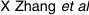
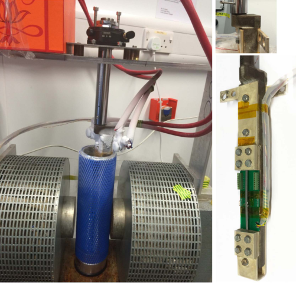
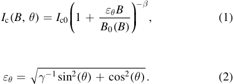
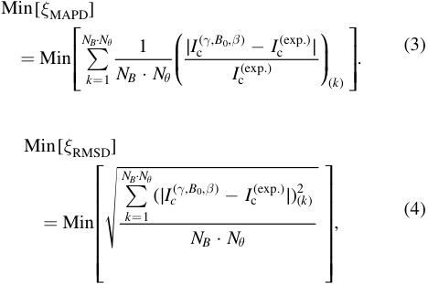
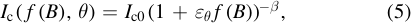
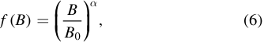

Home Search 

Collections Journals About Contact us My IOPscience 

## General approach for the determination of the magneto-angular dependence of the critical current of YBCO coated conductors 

This content has been downloaded from IOPscience. Please scroll down to see the full text. 

2017 Supercond. Sci. Technol. 30 025010 (http://iopscience.iop.org/0953-2048/30/2/025010) 

View the table of contents for this issue, or go to the journal homepage for more 

Download details: 

IP Address: 131.111.184.102 

This content was downloaded on 23/01/2017 at 14:35 

Please note that terms and conditions apply. 

You may also be interested in: 

Progresses and challenges in the development of high-field solenoidal magnets based on RE123 coated conductors 

Carmine Senatore, Matteo Alessandrini, Andrea Lucarelli et al. 

n-Values of commercial YBCO tapes before and after irradiation by fast neutrons M Chudy, Z Zhong, M Eisterer et al. 

Soldered joints—an essential component of demountable high temperature superconducting fusion magnets 

Yeekin Tsui, Elizabeth Surrey and Damian Hampshire 

High-field thermal transport properties of REBCO coated conductors 

Marco Bonura and Carmine Senatore 

Roebel cables from REBCO coated conductors: a one-century-old concept for the superconductivity of the future Wilfried Goldacker, Francesco Grilli, Enric Pardo et al. 

Full angular critical current characteristics of coated conductors studied using a two-axishigh 

current goniometer M Chudý, S C Hopkins, M Woniak et al. 

Effect of the axial stress and the magnetic field on the critical current and the electric resistance of the joints between HTS coated conductors 

K Konstantopoulou, M Sarazin, X Granados et al. 

AC loss in ReBCO pancake coils and stacks of them: modelling and measurement 

E Pardo, J Šouc and J Ková 

Superconductor Science and Technology doi:10.1088/1361-6668/30/2/025010 

Supercond. Sci. Technol. 30 (2017) 025010 (7pp) 

## General approach for the determination of the magneto-angular dependence of the critical current of YBCO coated conductors 

## X Zhang[1] , Z Zhong[1] , H S Ruiz[2] , J Geng[1] and T A Coombs[1] 

> 1 Department of Engineering, University of Cambridge, Cambridge CB3 0FA, UK 

> 2 Department of Engineering, University of Leicester, Leicester LE1 7RH, UK 

E-mail: xz326@cam.ac.uk 

Received 20 September 2016, revised 24 October 2016 Accepted for publication 26 October 2016 Published 15 December 2016 

## Abstract 

The physical understanding and numerical modelling of superconducting devices which exploit the high performance of second generation high temperature superconducting tapes (2G-HTS), is commonly hindered by the lack of accurate functions which allow the consideration of the infield dependence of the critical current. This is true regardless of the manufacturer of the superconducting tape. In this paper, we present a general approach for determining a unified function _I_ c[(] _B_ , _q_ ), ultimately capable of describing the magneto-angular dependence of the infield critical current of commercial 2G-HTS tapes in the Lorentz configuration. Five widely different superconducting tapes, provided by three different manufacturers, have been tested in a liquid nitrogen bath and external magnetic fields of up to 400 mT. The critical current was  recorded at 90 different orientations of the magnetic field ranging from _q_ = 0 , i.e., with B aligned with the crystallographic ab-planes of the YBCO layer, towards  90  , i.e., with B perpendicular to the wider surfaces of the 2G-HTS tape. The whole set of experimental data has been analysed using a novel multi-objective model capable of predicting a sole function _I_ c[(] _B_ , _q_ ). This allows an accurate validation of the experimental data regardless of the fabrication differences and widths of the superconducting tapes. It is shown that, in spite of the wide set of differences between the fabrication and composition of the considered tapes, at liquid nitrogen temperature the magneto-angular dependence of the in-field critical current of YBCO-based 2GHTS tapes, can be described by a universal function _I_ c[(] _f_[(] _B_[)] , _q_ ), with a power law field dependence dominated by the Kim’s factor _B B_ 0, and an angular dependence moderated by the electron mass anisotropy ratio of the YBCO layer. 

Keywords: superconductors, YBCO coated conductors, critical currents, angular dependence, finite-element analysis, AC losses 

(Some figures may appear in colour only in the online journal) 

## 1. Introduction 

It is expected that the progressive development of superconducting applications such as superconducting fault current limiters [1], power transmission lines [2], and HTS rotary 

Original content from this work may be used under the terms of the Creative Commons Attribution 3.0 licence. Any further distribution of this work must maintain attribution to the author(s) and the title of the work, journal citation and DOI. 

machines [3, 4], together with a steady progress in the deposition techniques and fabrication of YBCO coated conductors or 2G-HTS tapes will lead to more competitive prices and improved efficiencies in comparison to resistive conductors such as copper. However, in order to design or optimize a superconducting machine composed of 2G-HTS tapes, ideally it is necessary to know in advance what is the value of the critical current density of the used tape when it is affected by an external magnetic field, also called the in-field critical current density _J_ c[(] _B_ , _q_ ) [5]. 

0953-2048/17/025010+07$33.00 

© 2016 IOP Publishing Ltd Printed in the UK 

**----- Start of picture text -----** 
X Zhang et al **----- End of picture text -----** 

The critical current density of YBCO coated conductors displays a complex anisotropic behaviour for in-plane and out-of-plane applied magnetic field, even when the field is only applied in perpendicular direction with the flow of the electric current, and the complex interaction between shielding and transport currents is confined to two dimensions. The essential physics behind the collected vast phenomenology has been well known for decades [6, 7] and it may be analysed in terms of interactions between the flux lines themselves (lattice elasticity and line cutting) and interactions with the underlying crystal structure (flux pinning). However, if **J** is locally perpendicular to **B** , it is easy to demonstrate that the flux lines are always parallel to each other [8] and therefore, the anisotropy of the in-field critical current density _J_ c[(] _B_ , _q_ ) may have its main origin in the crystal structure and fabrication of the YBCO layer. It is this dependence on the fabrication process what hinders the assertion of the existence of a general function that might describe the in-field dependence of the critical current density of commercial 2G-HTS tapes, regardless of their manufacturer. 

We have experimentally measured the _J_ c[(] _B_ , _q_ ) function of different batches of superconducting tapes fabricated by three different companies, namely SuperPower Inc. (SP) [9], American Superconductor (AMSC) [10], and Shanghai Superconductor Technology Co., Ltd. (SHSC) [11], under the same experimental conditions, in order to explore the possibility of unifying their physical behaviour in a general _J_ c[(] _B_ , _q_ ) function. The critical current density profiles of the tested tapes are measured under the action of a homogeneous external magnetic field of intensities ranging from 50 to 400 mT, in all cases. The experiment has been performed such that the angular dependence on the magnetic field can be studied in increments of 2[◦] from the in-plane field approach, i.e., with the field parallel to the wider surface of the SC tape and with **J** ^ **B** . It covers the peak width of the critical current density which spans towards the out-of-plane field directions  ( _q_ =  90 ), with the maximum centred when the magnetic field is applied parallel to the wider surface of the SC tape. Thus, later it is shown that regardless of the manufacturer and width of superconducting tape, a simplified function of the infield critical current density _J_ c[(] _B_ , _q_ ) can be constructed, by extending the scope of the Kim’s model Jc(B) for the out-ofplane approach, and assessing the magneto-angular dependence of the fitting parameters therein assumed [12]. 

This paper is organized as follows. In section 2, the experimental setup and the most relevant information for the classification of the superconducting tapes considered across this study, are presented. Then, in section 3 the underlying approximations and the numerical procedure that has been implemented for the identification of a general function for the in-field magneto-angular dependence of the critical current for second generation HTS tapes, are discussed in detail. It will be shown that our numerical results allow to prove the existence of a sole equation for the definition of the _I_ c[(] _B_ , _q_ ) function in the Lorentz configuration, by considering the experimental results obtained for up to five different samples these provided by three different manufacturers. Finally, 

section 4 is devoted to summarize the main conclusions of this work. 

## 2. Experimental setup and measured samples 

A 600 mT electromagnet of ∼204 mm pole face diameter was employed for the angle-resolved critical current density measurements. The magnetic field was measured with a HZ11C hall-probe aligned with the pole face centre of the electromagnet. The longitudinal axis of the YBCO coated conductor, which was mounted over a tufnol support board, is coaxially aligned with the rotation axis of a high precision rotation stage as shown in figure 1. The current return path has been aligned parallel with the length of the sample at a distance of 10 cm, such that the maximum magnetic field produced by the current return path over the surface of the sample (∼1 mT at 533 A), and its influence on the measurement of the critical current for applied magnetic fields ranging from 50 to 400 mT can be neglected. In addition, the shape of the tufnol board and the rod connecting with the rotation stage, have both been carefully designed with a neck offset in order to ensure a coaxial relationship between the test sample and the rotation stage in all field orientations. 

Low temperature solder (melting point 470 K) was used to attach the voltage taps on the nameplate side of the YBCO coated conductor. However, depending on the characteristics of the stabilizer layer. The solder-flux used for adequate soldering of each of the voltage taps corresponded to the manufacturers’ suggestions. For example for copper or brass laminated tapes, zinc chloride flux (Baker’s Soldering Fluid No.3) was applied to the sample surface where solder dots were to be made. For stainless steel laminated tapes, highly 

corrosive solder flux (Superflux, Castonlin Eutectic) was used to provide a better electrical connection. 

The critical current of studied HTS tapes was measured while the samples were immersed in liquid nitrogen bath, with voltage criterion _E_ 0 = 1 ´ 10 - 4 V m - 1 applied. All measured samples are 160 mm length, and the end terminals were clamped by copper plates and copper bases with four M5 cap head screws. The contact length was 15 mm for HTS tapes 4–6 mm width, and 25 mm for HTS tapes 10–12 mm width, respectively. High purity indium was also applied to the interlayer of coppers for cold welding, and the contact resistance at room temperature was determined to be 0.8 mΩ for 4–6 mm width tapes, and 0.2 mΩ for 10–12 mm width tapes, respectively. Finally, an Agilent 6680A was used as a DC current source, and the differential of voltage between the taps was measured with a Keithley 2182A nano-voltmeter. All the instruments were connected via an IEEE-488 GPIB bus with in-house built LabVIEW controllers. 

Five different YBCO coated conductors from three different manufacturers have been considered. Two different types of SP tapes have been tested, namely, 4 mm width SCS4050 tapes with top and bottom Cu stabilizer layers of ∼0.02 mm thickness, and the 12 mm width stabilizer free SF12100 tapes [9]. In both cases, the YBCO layers are fabricated by metal organic chemical vapour deposition (MOCVD) over a buffer of heteroepitaxial layers deposited by sputtering, on a Hastelloy C-276 substrate of 0.1 mm thickness for the SF12100 tape, and 0.05 mm thickness for the SCS4050 tape, respectively. The YBCO layers ( ~ 1 _m_ m thick) are then coated by a thin Ag layer of about ~ 2 _m_ m thick to provide electrical contact. For the AMSC samples [10], we have chosen the 4.4 m width single YBCO layer tape or AMSC8700 tape with brass stabilizing layers of 0.15 mm thickness and also, the 12 mm width double layer YBCO tape or AMSC8612 tape with stainless-steel stabilizing layers of 0.075 mm thickness. In both AMSC tapes, the YBCO layers are deposited by MOCVD over a similar stack of heteroepitaxial layers (buffer) grown on a 0.075 mm thickness NiW alloy substrate. However, it is worth emphasizing that the AMSC8612 is a double layered HTS tape, i.e, the tape is composed by two stacks of YBCO/Buffer/NiW layers placed back-to-back in a single laminated package with the YBCO films coated by a 3 _m_ m thick layer of Ag. Finally, the last of our five samples corresponds to the 5.8 mm width, 0.220 mm thickness, 2G-HTS tape provided by ShangHai SuperConductor (SHSC), also called ST-06-L tape [11], with similar substrate and buffer layer characteristics to the SP tapes, although with the YBCO layer deposited over a MgO template (buffer) by pulsed laser deposition (PVD) rather than MOCVD. A brief comparison of the technical features of the five 2G-HTS tapes aforementioned, is presented in table 1 for the ease of the reader. 

## 3. Generalizing the in-field I c ðB; θÞ function 

For the selection of different 2G-HTS tapes shown in table 1, we have measured the profile of critical current Ic as a 

Table 1. 2G-HTS tapes technical parameters[a] . 

> a h refers to the overall thickness of the 2G-HTS tape, and w to its total width, respectively. The 12.2 mm width of the AMSC8612 sample includes the solder fillet layers at each side of the tape (∼1.1 mm), i.e. with an effective YBCO layer of ∼10 mm width. 

function of the applied magnetic field, B, and its orientation, θ, in the maximum Lorentz force configuration, i.e., with the magnetic field applied perpendicular to the direction of the transport current. Therefore, the field angle θ is defined as 0° when the external magnetic field is parallel to the ab-plane of the YBCO tapes, as illustrated in figure 2. Therein, similar qualitative features of the in-field _I_ c[(] _B_ , _q_ ) function can be observed for the different 2G-HTS tapes that have been studied. In more detail, the maximum critical current at self-field, _I_ c[(] 0, _q_ ), i.e., without the influence of an external magnetic field has been measured for all samples and then, the magneto-angular study has been conducted for external magnetic fields of intensities B = 50 mT, 100 mT, 200 mT, 300 mT, and 400 mT, respectively. For the sake of comparison the results obtained at _q_ = 0 ( _B_ ∣∣ _ab_ ‐ _plane_ , _B_ ^ _I_ ) and _q_ =  90 ( _B_ ∣∣‐ _c axis_ , _B_ ^ _I_ ) are shown in table 2. 

In the case of the SP samples, SCS4050 and SF12100, a more acute drop of the critical current is observed when the applied magnetic field is tilted towards  90  from the ab plane orientation of the HTS tape ( _q_ = 0 ), with a reduction of Ic of up to 67% at 400 mT for SCS4050, and 41% for SF12100, respectively. A similar drop pattern on the Ic is observed for the SHSC sample, ST-06-L, with a maximum reduction of the critical current of about 58% at 400 mT, and nearly the same percentage standard deviation when it is compared with the SCS4050 sample (Δσst = 18.36(ST-06L) − 18.04(SCS4050) = 0.32). On the other hand, the AMSC samples show a more isotropic behaviour on the angular dependence of the Ic, with a maximum drop of 31% at 400 mT for AMSC8700 ( _s_ st = 10.88), and only a 19% for the double layered HTS tape or AMSC8612 ( _s_ st = 6.16) sample. Nevertheless, although the magneto-angular dependence of Ic on the AMSC samples is smaller than the observed one for the SP and SHSC samples, for comparable widths and structure, i.e., for the SCS4050 versus AMSC8700, a significant improvement of about 53% on the relative reduction of the Ic drop at moderately high fields (400 mT) is achieved. The SP samples at self-field conditions and for in-plane field ( _q_ = 0) attain greater critical current values. This is contrary to what happens when the external magnetic field is applied at  _q_ =  90 and for intensities greater than 200 mT (see 

![Figure 2. In-field magneto-angular dependence of the critical current Ic for the 2G-HTS tapes summarized in table 1. Solid symbols correspond to the experimental data acquired for an external magnetic field of 50 mT (red-squares), 100 mT (yellow-triangles), 200 mT (blue-diamonds), 300 mT (green-circles), and 400 mT (purple-triangles), respectively. Solid lines, correspond to the results obtained from our extended version of the Kim’s model. As greater the applied magnetic field is, the lower the critical current. The orientation of the field angle and the direction of the transport current for all cases is illustrated in the top-left pane of the figure.](images/zhang2016.pdf-0005-02.png)

table 2). It is worth mentioning that for the 12 mm double layered YBCO tape (AMSC8612) a straightforward comparison with the SF12100 sample cannot be achieved. This is because each one of the two layers of YBCO that compose the AMSC8012 tape is inherently affected by the magnetic field created by its reciprocal layer. Thus, although the total Ic measured for this tape is the greatest, it is expected that assuming equal sharing of current, the Ic per layer has to be smaller than the one observed for the SF12100. 

In order to generalize the previous results and allow an accurate prediction of the critical current in the maximum Lorentz force configuration, Ic, independently of the intensity of the applied magnetic flux density, _B_ º ∣∣ **B** , and the angle θ, we have assumed that the critical current has to be moderated by the ratio between the effective mass of the charge carriers along the c-axis and the ab-plane of the YBCO layer, i.e., the electron mass anisotropy ratio _g_ = _mc_ * _mab_ *[,][as][it][was][sug-] gested by Blatter et al, in [13]. This anisotropy is caused by imperfect alignment of the ab-plane of each YBCO grain and the small fraction of grains with their ab-planes exactly parallel to the tape surface, which contributes to a large intergrain critical current in a magnetic field parallel to the tape, as it has been experimentally observed (see figure 2, _q_ = 0). Thereby, we have extended the conventional Kim’s model [12] taking into account Blatter’s angular anisotropy factor, _eq_ , as 

follows: 

with 

In equation (1), _I_ c0 = _I_ c[(] 0, _q_ ), i.e., the self-field critical current, and the empirical parameters introduced by Kim, B0 and β, take into account the thermally activated flux-creep processes into specific samples. In fact, as the mechanism of flux creep is a thermally activated motion of bundles of flux lines, aided by the Lorentz force **J** ´ **B** , over free energy barriers coming from the pinning effect of inhomogeneities, dislocations, strains, or other physical defects [16], in a first instance we have assumed that the parameter B0 can be a function of B for the different samples considered in this study. Thus, by assuming the minimum number of empirical parameters that have been formulated within the Kim [12] and Anderson [16] flux creep theory, we have fixed the value of Ic0 in equation (1) accordingly with our experimental observations (see table 1 or 2), and the parameters γ, _B_ 0[(] _B_[)][, and][ β] have been determined for the lowest mean absolute percentage deviation (MAPD) and analogously, for the lowest rootmean-square deviation (RMSD) of the experimental data, 

with the minimum order function for _B_ 0[(] _B_[)][. The latter fact is] important because multiple guesses of the parameters γ and _B_ 0[(] _B_[)][could][lead][to][similar][MAPD][and][RMSD][outcomes][on] specific tapes. Nevertheless, what is possible is to find a suitable expression for the different SC tapes along the minimization of the MAPD and RMSD values, by introducing the smaller possible number of unknown variables. 

Thus, initial estimates for each one of the three free parameters in equation (1) have been assumed, and a similar iterative procedure to the one introduced in [17] has been used. We have reduced the ambiguity on the initial guesses by taking into consideration that the electron mass anisotropy ratio, γ, ranges between 1 for fully isotropic samples to about 25 for YBa2Cu3O7 - _d_ grains with highly anisotropic conductivity [18]. Also, it has been already reported that the flux creep exponent β for YBCO samples is commonly lesser than 2 [14, 17]. Then, for a determined number of estimates, ( _g_ , _B_ 0, _b_ ), the MAPD and RMSD of equation (1) with respect to the experimental measurements have been calculated for each one of these sets, and the overall number of resulting expressions minimized according to the following expressions: 

**----- Start of picture text -----** 
Min[ x MAPD] = Min⎡⎢⎢⎣ Nk å B = · N 1 q NB 1· N q ⎛⎜⎝ ∣ I c( g , B 0, b I c)(exp. - ) I c(exp.)∣ ⎞⎟⎠( k ) ⎤⎥⎥⎦. (3) Min[ x RMSD] ⎡ NB · N q ⎤ ⎢ å (∣ Ic ( g , B 0, b ) - I c(exp.)∣)(2 k ) ⎥ = Min⎢ k = 1 ⎥, (4) ⎢⎢ NB · N q ⎥⎥ ⎢ ⎥ ⎣ ⎦ **----- End of picture text -----** 

and 

where the sub-index ( _k_ ) indicates the subset of data taken from the _N q_ angular measurements at the NB different values of applied magnetic field, and _I_ c( _g_ , _B_ 0, _b_ ) is the numerical value obtained during the minimization for the best fitting to the experimental results _I_ c(exp.) by means of equations (1) and (2). The optimal minimization process for the fitting of the ( _g_ , _B_ 0, _b_ ) parameters depends therefore on the number of estimates allocated to each one of these parameters, separately. For instance, if 20 different values are considered for each one of the parameters, γ, B0, and β, respectively, the minimization runs over a total of 8000 possible combinations for each NB curve, and the percent deviations of the MAPD ( _x_ MAPD) and RMSD ( _x_ RMSD) have to be constrained to a maximum threshold in order to accept the solution. Thus, we have constrained the solution of equation (3) to satisfy the conditions _x_ MAPD   and _x_ RMSD   2 with  = 3% for all the NB curves, simultaneously. As a result, less than 1% of the 8000 ´ _NB_[suitable][combinations][for] _I_ c( _g_ , _B_ 0, _b_ ) survive for all _N q_ measurements, and the results obtained for the minimum relative average between _x_ MAPD and _x_ RMSD are shown in table 3. Nevertheless, a univocal value for the parameter B0 was only obtained for the SCS4050 and AMSC8612 samples, 

this imposes an additional challenge for the determination of a singular _I_ c[(] _B_ , _q_ ) function for the 2G-HTS tapes: AMSC8700, SF12100, and ST-06-L. For instance, for the AMSC8700 sample, the lowest _x_ MAPD and _x_ RMSD values that have been obtained for a single definition of B0 were 6.75 and 7.24, respectively, what does not satisfy the threshold condition for _x_ MAPD resulting in a deviation of more than 15% in the peak of current _I_ c[(] _B_ , 0  ). 

Thus, in order to satisfy the tolerance conditions and reduce the deviation between the numerical results and the experimental observations, it is at this point that it is necessary to consider that the parameter B0 depends on the magnitude of the applied magnetic field. Two essential conditions need to be satisfied during the derivation of this equation: First, the resulting expression has to be as simple as possible, i.e., by introducing the minimum number of free parameters that may allow the reproduction of the experimental results in even different coated conductors. Secondly, the resulting equation has to be physically consistent with the units in equation (1). The latter is important because the uncertainty on the physical nature of B0 has led in the past to the formulation of cumbersome but yet accurate fitting expressions on specific batches of commercial tapes [14], that in some cases allows the adding of a significantly large number of physically unknown parameters with severe inconsistencies on the physical units [15]. However, we recognize that there is not a single way for finding this kind of expression, and different fitting equations can be obtained depending on the initial ansatz for the mathematical structure of the function _I_ c[(] _B_ , _q_ ). Therefore, finding an univocal solution for _I_ c[(] _B_ , _q_ ) is indeed cumbersome, and in general requires of the initial consideration of a larger number of variables during the minimization procedure. 

However, returning to the root of the problem, equation (1) can be rewritten in a more general way as 

with _f_ ( _B_ ) = [( _z B_ + _d_ ) _B_ 0 ] _a_ , being the parameters ζ, δ, and α, new variables into the minimization procedure, such that in equations (3) and (4) the function of three variables _I_ c( _g_ , _B_ 0, _b_ ) = _I_ c ( _B_ , _q_ ) in equation (1) is replaced by _I_ c[(] _f_[(] _B_[)] , _q_ ), in a first approach. The parameter δ, which is the only one with physical units, has been introduced for mathematical convenience as it allows a faster minimization of the powers α and β by compensating the impact of the highly nonlinear terms Moreover, the minimization of the objective functions is conditioned to progressively achieve a reduction of δ, i.e., to _d t_ + 1 < _d_ , for _d t_ + 1  0 in order to avoid the occurrence of complex singularities in Ic. Also it is possible to help further the minimization by imposing the conditions _z_  1, and _a_  0. Thereby, we have found that the function f (B) is strikingly reduced to a very simple and elegant expression: 

with our final results presented in table 3, and showing an excellent agreement with the experimental results displayed in figure 2. 

Table 2. In-field magneto-angular dependence of the critical current Ic for the 2G-HTS tapes summarized in table 1 for the external magnetic field intensities displayed in figure 2, and for the angles _q_ = 0 ( _B_ ∣∣ _ab_ ‐plane, _B_ ^ _I_ ) and _q_ =  90 ( _B_ ∣∣‐ _c_ axis, _B_ ^ _I_ ). 

Despite SCS4050 and AMSC8612 samples have different width and consequently different self-field critical current density [ _I_ c (0, 0  ) in table 2], they possess very close fitting parameters: B0, α and β. Therefore, the magneto-angular dependence of the SCS4050 and AMSC8612 samples is rather similar, although the electron mass anisotropy ratio of SCS4050 is about 4 times greater than in the AMSC8612 sample ( _g_ SCS4050 _g_ AMSC8612 = 4.016). This fact explains the high increase on the critical current density when the magnetic field in the Lorentz-force configuration is applied parallel to the surface of the ab-planes of the SCS4050 tape, i.e., _q_ = 0 at figure 2, a phenomenon which is nearly unseen at 50 mT with the AMSC samples. A similar comparison can be made between the SF12100 and the AMSC8700 samples ( _g_ SF12100 _g_ AMSC8700 = 3.33). Thus, further to the general expression that we have found for the magneto-angular infield function _I_ c[(] _B_ , _q_ ), from our previous analysis it is possible to conclude that the contribution due to the charge carriers along the c-axis of the YBCO tapes manufactured by SP is greater than in those manufactured by AMSC or SHSC, a phenomenon that is increased when the YBCO tape is not coated by Cu stabilizer layers. Nevertheless, the sample manufactured by SHSC (ST-06-L) has shown a stronger dependence of the mass anisotropy factor γ on the intensity of the applied magnetic field. In this case it was not possible to find a solution capable of satisfying the threshold values for _x_ MAPD and _x_ RMSD, simultaneously. Thus, although these threshold values can be adjusted, it is worth mentioning that for the best of the cases we have found that _g_ ~ 4.35 for _x_ MAPD ~ 3.5% and _x_ MAPD ~ 4.2%. However, it produces an acute deviation of the peak values of the critical current  density at _q_ = 0 , particularly noticeable at lower magnetic fields ( _B_  100 mT), with the experimental results being overestimated by more than a 10% difference. It could be seen maybe as a small difference for the reader, but it has to be noticed from table 2 that the percentage differences between the self-field critical current _Ic_[(] 0, 0  ) and the peaks values of the critical current at 50 mT and 100 mT are of ~ 10.7% and ~ 25%. Consequently, by accepting the 

> a For applied magnetic fields lower than 200 mT, the obtained electron mass anisotropy ratio for the ST-06-L sample and under the same conditions displayed in this table corresponds to _g_ = 2.08. Thus, the theoretical curves shown in the ST-06-L pane of figure 2 for _B_ ext = 50 and 100 mT are obtained with _g_ = 2.08, otherwise the results therein are for _g_ = 4.17. 

aforementioned condition, the actual overestimation of the increase in the critical current density in the in-field configuration results in a deviation of more than 20% from the selffield critical current value. Thus this simplified approach is not acceptable. Consequently, we conclude that there is a weaker influence of the charge carriers along the c-axis of the YBCO layer in the ST-06-L tape for magnetic fields lower than 200 mT, i.e., with _g_ = 2.08, than what is observed for greater magnetic fields where the minimum γ has been found to be double (see table 3). 

## 4. Conclusion 

In this paper, we have presented a thorough study of the magneto-angular dependence of the in-field critical current function in the so called Lorentz configuration, _I_ c[(] _B_ , _q_ ) with _B_ ^ _I_ , of five different samples of commercially available 2G-HTS tapes. The experimental results have been obtained for external magnetic fields of up to 400 mT, and range from 

0[◦] to  90  , i.e., with B parallel to the ab-plane of the YBCO tape, towards the perpendicularity conditions where B is parallel to the c-axis. In general, we have selected 2G-HTS tapes with broad differences regarding their width, fabrication process, and laminar structure (materials composition), in order to seek for a universal function that may describe the _I_ c[(] _B_ , _q_ ) behaviour of different commercial tapes from the numerical minimization of the objective functions introduced in equations (3) and (4). 

Two samples of 12 mm YBCO-width tapes have been considered, each fabricated by a different company, namely, the SF12100 tape by SuperPower Inc. [9], and the double layered YBCO tape AMS8612 by American Superconductor (AMSC) [10]. Analogously, measurements have been performed for the 4 mm width SCS4050 tape fabricated by SuperPower, the 4.4 mm width AMSC8700 tape by AMSC. Finally, the ST-06-L tape produced by Shanghai Superconductor Technology Co., Ltd. (SHSC) [11] has been considered. It is shown that, in spite of the apparently strong differences between these tapes, at liquid nitrogen temperature the magneto-angular dependence of the in-field critical current can be described by a universal function, _I_ c[(] _f_[(] _B_[)] , _q_ ), with a power law field dependence dominated by the Kim’s factor _B B_ 0 (see equations (5) and (6)), and the angular dependence moderated by the electron mass anisotropy ratio in equation (2). A similar power law dependence with the magnetic field has been recently observed by Barth et al [19], for fields of up to 60% of the irreversibility field and at temperatures lower than 77 K. In fact, an exponential law for the temperature dependence has been already determined by these authors, which in the future could be used as the initial estimates at the outset of our general approach. 

## Acknowledgments 

This work was supported by the Engineering and Physical Sciences Research Council (EPSRC) project NMZF/064. X 

Zhang acknowledges a grant from the China Scholarship Council (No. 201408060080). 

## References 

- [1] Ruiz H S, Zhang X and Coombs T A 2015 IEEE Trans. Appl. Supercond. 25 5601405 

- [2] Tixador P 2010 Physica C 470 971–9 

- [3] Huang Z, Ruiz H S, Zhai Y, Geng J, Shen B and Coombs T A 2016 IEEE Trans. Appl. Supercond. 26 55202105 

- [4] Baghdadi M, Ruiz H S and Coombs T 2014 Appl. Phys. Lett. 104 232602 

- [5] Vojenčiak M, Šouc J, Ceballos J, Gömöry F, Klinčok B, Pardo E and Grilli F 2006 Supercond. Sci. Technol 19 397 

- [6] Campbell A M and Evetts J E 1972 Adv. Phys. 21 199 

- [7] Badía-Majós A, Lopez C and Ruiz H S 2009 Phys. Rev. B 80 144509 

- [8] Ruiz H S, Lopez C and Badía-Majós A 2011 Phys. Rev. B 83 014506 

- [9] SuperPower[®] 2G HTS Wire. Technical information available at www.superpower-inc.com/content/2g-hts-wire 

- [10] American Superconductor, AMSC Amperium[®] HTS wire. Technical information available at www.amsc.com/ solutions-products/hts_wire.html 

- [11] Shangai Superconductor Technology Co. Ltda. 2G HTS strip. Technical information available at http://shsctec.com/en/ index.asp 

- [12] Kim Y, Hempstead C and Strnad A 1962 Phys. Rev. Lett. 9 306 

- [13] Blatter G, Feigel’Man M, Geshkenbein V, Larkin A and Vinokur V M 1994 Rev. Mod. Phys. 66 1125 

- [14] Grilli F, Sirois F, Zermeño V M and Vojenčiak M 2014 IEEE Trans. Appl. Supercond. 24 8000508 

- [15] Hu D, Ainslie M D, Raine M J, Hampshire D P and Zou J 2016 IEEE Trans. Appl. Supercond. 26 6600906 

- [16] Anderson P W 1962 Phys. Rev. Lett. 9 309 

- [17] Rostila L, Lehtonen J, Mikkonen R, Šouc J, Seiler E, Melíšek T and Vojenčiak M 2007 Supercond. Sci. Technol. 20 1097 

- [18] Harshman D R, Schneemeyer L F, Waszczak J V, Aeppli G, Ansaldo E J and Williams D L 1989 Phys. Rev. B 39 851 

- [19] Senatore C, Barth C, Bonura M, Kulich M and Mondonico G 2016 Supercond. Sci. Technol. 29 014002 

