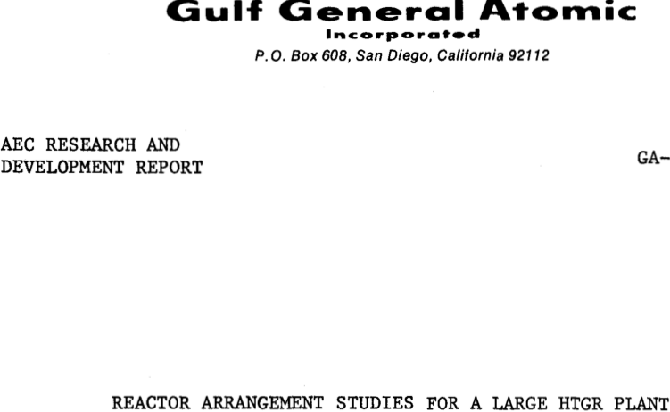

**----- Start of picture text -----** 
Gulf General Atomic Incorporated P. 0. Box 608, San Diego, California 92112 --------------------- LEGAL NOTICE---------------------- use of any information, apparatua, method, or process disclosed in this report. ployee or contractor of the Commission, or employee of such contractor, to the extent that AEC RESEARCH AND DEVELOPMENT REPORT This report was prepared aa an account of Government sponsored work. Neither the United States, nor the Commission, nor an; person acting on behalf of the Commission: racy, completeness, or usefulness of the information contained in this report, or that the use of any Information, apparatus, method, or process disclosed in this report may not Infringe prl' -tely owned rights; or B.  Assumes any liabilities with respect to the use of, or for damage* resulting from the As used in the above, “person acting on behalf of the Commlssion,, Includes any em­ disseminates, or provides access to, any information pursuant to his employment or contract with the Commission, or his employment with such contractor. REACTOR ARRANGEMENT STUDIES FOR A LARGE HTGR PLANT A. Makes any warranty or representation, expressed or implied, with respect to the accu­ such employee or contractor of the Commission, or employee of such contractor prepares, **----- End of picture text -----** 

**----- Start of picture text -----** 
GA-8439 (Rev.) **----- End of picture text -----** 

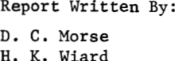

**----- Start of picture text -----** 
Report Written By: D. C. Morse H. K. Wiard **----- End of picture text -----** 

## **`Work Done By:`** 

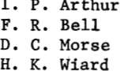

**----- Start of picture text -----** 
P. Arthur R. Bell I. F. D. H. K. Wiard C. Morse **----- End of picture text -----** 

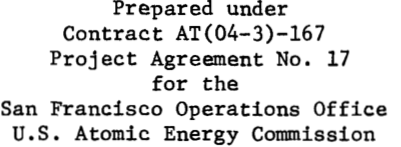

**----- Start of picture text -----** 
Project Agreement No. 17 U.S. Atomic Energy Commission Prepared under Contract AT(04-3)-167 for the San Francisco Operations Office **----- End of picture text -----** 

## **`Gulf General Atomic Project 317`** 

## **`July 31, 1969`** 

**`dm`** _`at`_ **`nnri imims ■`** `UNUMUM` 

## **DISCLAIMER** 

**This report was prepared as an account of work sponsored by an agency of the United States Government. Neither the United States Government nor any agency thereof, nor any of their employees, makes any warranty, express or implied, or assumes any legal liability or responsibility for the accuracy, completeness, or usefulness of any information, apparatus, product, or process disclosed, or represents that its use would not infringe privately owned rights. Reference herein to any specific commercial product, process, or service by trade name, trademark, manufacturer, or otherwise does not necessarily constitute or imply its endorsement, recommendation, or favoring by the United States Government or any agency thereof. The views and opinions of authors expressed herein do not necessarily state or reflect those of the United States Government or any agency thereof.** 

## **DISCLAIM ER** 

**Portions of this document may be illegible in electronic image products. Images are produced from the best available original document.** 

## **`CONTENTS`** 

|**`I.`**|**`SUMMARY .........................................................  1`**|
|---|---|
|**`II.`**|**`INTRODUCTION .................................................... 2`**|
||**`Objectives ...................................................... 2`**|
||**`Ground Rules and Scope ..........................................  2`**|
||**`Future Studies .................................................. 3`**|
|**`III.`**|**`COMPONENT DESIGN ................................................ 6`**|
||**`PCRV ............................................................ 6`**|
||**`Reactor Core .................................................... 8`**|
||**`Steam Generators ................................................ 9`**|
||**`Helium Circulators ..............................................  11`**|
||**`Helium Purification and Storage ................................. 13`**|
|**`IV.`**|**`REACTOR ARRANGEMENTS ...........  14`**|
||**`Configuration No. 1 - Single-cavity PCRV, 36 Steam`**|
||**`Generators, 12 Circulators .................................... 14`**|
||**`Configuration No. 2 - Single-cavity PCRV, 36 Steam`**|
||**`Generators with Direct Removal, 12 Circulators ................  14`**|
||**`Configuration No. 3 - Single-cavityPCRV, 6 Steam`**|
||**`Generators, 6 Circulators .....................................  17`**|
||**`Configuration No. 4 - Multicavity PCRV, 6 Steam`**|
||**`Generators, 6 Circulators .....................................  17`**|
||**`Configuration No. 5 - Multicavity PCRV, 12 Steam`**|
||**`Generators, 12 Circulators .................................... 21`**|
||**`Configuration No. 6 - Multicavity PCRV, 36 Steam`**|
||**`Generators, 12 Upflow Circulators ............................. 21`**|
||**`Configuration No. 7 - Multicavity PCRV, 36 Steam`**|
||**`Generators, 12 Downflow Circulators ........................... 24`**|
||**`Configuration No. 8 - Horizontal PCRV, 12 Steam`**|
||**`Generators, 12 Circulators .................................... 26`**|
||**`Configuration No. 9 - HorizontalPCRV, 6 Steam`**|
||**`Generators, 6 Circulators .....................................  28`**|
|**`V.`**|**`BASIS FOR COST ESTIMATES ........................................  31`**|
||**`PCRV ............................................................  31`**|
||**`Steam Generators ................................................  32`**|
||**`Helium Circulators ..............................................  32`**|
||**`Reactor Building ................................................  32`**|
||**`Plant Efficiency ................................................  32`**|
||**`Research, Development, and Design ............................... 33`**|

**`i`** 

|**`VI. SELECTION OF REFERENCE DESIGN`**|**`36`**|
|---|---|
|**`Cost Comparison .................................................  `**|**`36`**|
|**`Other Plant Sizes ...............................................  `**|**`36`**|
|**`Recommended Arrangement.........................................  `**|**`41`**|
|**`APPENDIX A............................................................  `**|**`43`**|

## **`Figures`** 

|**`1. `**|**`PCRV configurations ..............................................  4`**|
|---|---|
|**`2.`**|**`Steam generator ..................................................  10`**|
|**`3.`**|**`Helium circulator ................................................  12`**|
|**`4.`**|**`Configuration No. 1 ..............................................  15`**|
|**`5.`**|**`Configuration No. 2 ..............................................  16`**|
|**`6.`**|**`Configuration No. 3 ..............................................  18`**|
|**`7.`**|**`Configuration No. 4 ..............................................  19`**|
|**`8.`**|**`Configuration No. 5 ..............................................  22`**|
|**`9.`**|**`Configuration No. 6 ..............................................  23`**|
|**`10.`**|**`Configuration No. 7 ..............................................  25`**|
|**`11.`**|**`Configuration No. 8 ..............................................  27`**|
|**`12.`**|**`ConfigurationNo. 9 ..............................................  29`**|
|**`13.`**|**`Plant size variation with single-cavity PCRV ......................  39`**|
|**`14. `**|**`Plant size variation with multicavity PCRV ........................  40`**|

## **`Tables`** 

|**`1. `**|**`Research and Development and EngineeringCosts ....................  34`**|
|---|---|
|**`2.`**|**`Capital Cost Comparison for Several Reactor Configurations ........  37`**|
|**`3.`**|**`Research and Development and EngineeringCost Comparison ..........  38`**|

## **`I. SUMMARY`** 

**`This report presents a study of possible arrangements of the reactor core and primary coolant system components within a single prestressed con­ crete reactor vessel for a IQOO-Mw(e) high-temperature gas-cooled reactor (HTGR) plant. Although the study deals primarily with the configuration of the prestressed concrete reactor vessel (PCRV) that houses the reactor and the primary coolant system, related questions concerning the number and size of primary system components are also considered. Alternative arrangements are evaluated on the basis of capital cost, operating cost, plant reliability and maintainability, inherent safety features, research and development require­ ments, and flexibility in accommodating changes in component design and plant size.`** 

**`As a result of the evaluations reported here, an arrangement based on the multicavity type of PCRV is recommended as the single vessel, integralcontainment arrangement to be used in further work on the lOOO-Mw(e) plant. In this arrangement, the primary coolant system is composed of six parallel loops, each loop containing one steam generator and one helium circulator. The reactor core is contained in a central cavity of the PCRV, while the steam generators and circulators are located in six smaller cavities in the side wall of the PCRV.`** 

**`For a more complete review, other possible arrangements, such as a reactoronly PCRV primary coolant arrangement and a plant arrangement with separate containment vessels, should be studied.`** 

**`1`** 

## **`II. INTRODUCTION`** 

## **`OBJECTIVES`** 

**`The design and construction of the 330-Mw(e) HTGR plant for the Fort St. Vrain station of the Public Service Company of Colorado (PSC) are currently in progress.* One objective of the AEC-sponsored HTGR Base Program is to apply the design concepts being developed for the PSC plant to a larger HTGR plant having nominal output of 1000 Mw(e) and to identify those changes in design, and related research and development requirements, that may be neces­ sary or desirable for the larger plant. The specific objectives of the ar­ rangement study reported here were to establish the configuration of the PCRV and the number and size of the major primary system components for the 1000Mw(e) plant.`** 

## **`GROUND RULES AND SCOPE`** 

**`The major design parameters and criteria that were established as a basis for this study are given below; in some cases, these represent tenta­ tive decisions that may themselves be the subject of future studies.`** 

**`1. The reactor core consists of hexagonal-block fuel elements identical to those for the PSC plant; the core height is 15.6 ft as in the PSC design. Coolant flow is downward through the core. The effective core diameter is 31.1 ft, which makes the average power density some­ what greater than for PSC, but holds the peak power density to about the same level because of the lower transverse power peaking in the larger plant.`** 

**`2. The reactor is controlled by 182 control rods that are grouped in pairs and actuated by 91 control rod drives. The design of the con­ trol rods and drives is identical to the PSC design.`** 

**`3. The steam generators are once-through units, with integral reheaters consisting of helical-coil tube bundles, as in the PSC plant. The steam generator modules may be of the same size as the PSC units, or they may be scaled up in size. Gas flow is parallel to the axis of the unit and may be either upward or downward in vertical units.`** 

**`4. The helium circulators are axial-flow, steam-turbine-driven units, as in the PSC plant, and may be of the same size or scaled up in size. The circulators may be mounted in any orientation. Auxiliary water turbine drives of the type used on the PSC circulators are not expected to be necessary for the larger plant but their elimination is subject to the establishment of a satisfactory safeguards analysis phil­ osophy.`** 

**`*For a summary description of the PSC plant see A. L. Habush and A. M. Harris, GA-8002, Ref. 1; references appear at end of report.`** 

**`2`** 

**`3`** 

**`5. Mechanical components, such as the helium circulators and control rod drives, must be removable and replaceable as a routine maintenance operation. The steam generators must also be removable and replace­ able, but not as a routine operation, i.e., steam generator removal and replacement may require the fabrication of temporary tooling or handling fixtures to perform the specialized related tasks and may involve significant unscheduled power plant down time.`** 

**`6. Circimferential prestressing of the PCRV will be accomplished by wire-wrapping rather than by tensioning the individual arcs of linear tendons (as in PSC), except for the horizontal PCRV concepts. This decision is based on earlier studies, which have shown that wire­ wrapping is both feasible and economical.`** 

**`7. Both primary and secondary system cycle conditions are substantially the same as in the PSC plant; in particular, helium operating pressure is 700 psia. A listing of these cycle parameters for the recommended configuration as compared to PSC parameters, is given in Appendix A, extracted from Ref. 2.`** 

**`Three basic PCRV types were considered in this study, as shown on Fig. 1. The single-cavity type, which is the type used for PSC, provides a single cylindrical cavity for the reactor core, steam generators, and helium circula­ tors. In the multicavity type, the core is contained in a central cavity, and the steam generators and circulators are located in cavities in the PCRV side wall. The horizontal PCRV provides a central cavity for the core and a cavity at one or both ends of the PCRV for the steam generators and circulators.`** 

**`In the case of the steam generators and circulators, the principal question to be answered by the study was whether these components should have the same unit size as in the PSC plant, in which case 36 steam generator modules and 12 circulators would be required for the 1000-Mw(e) plant, or whether the unit size should be increased relative to PSC. Increasing unit size would be expected to require some additional development and design work, but would also be expected to permit capital cost savings on the units themselves and in the PCRV.`** 

**`Consideration of the various PCRV arrangements coupled with various steam generator and helium circulator unit sizes led to the establishment of nine alternative configurations. Arrangement drawings were prepared for each of these configurations, and preliminary designs of scaled-up steam generators and circulators were made. The nine configurations were evaluated with respect to ease of circulator and steam generator removal and replacement, and compara­ tive estimates of both capital cost and development cost were prepared for each configuration. Finally, a brief study was made of the arrangements that might be developed for plant sizes other than 1000 Mw(e).`** 

## **`FUTURE STUDIES`** 

**`Several arrangements having potential advantages were not considered here because they raised questions of feasibility or practicality that could not be adequately answered within the time scale of this study. It is expected that such concepts will be the subject of future studies.`** 

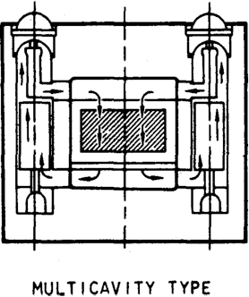

**----- Start of picture text -----** 
MULT I CAVITY TYPE **----- End of picture text -----** 

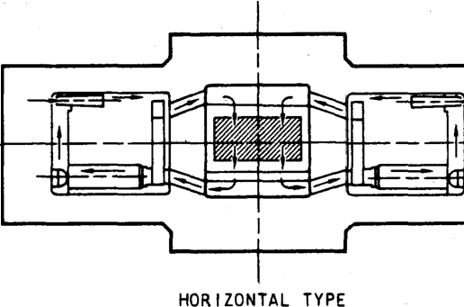

**----- Start of picture text -----** 
-t- 1 a HORIZONTAL TYPE **----- End of picture text -----** 

SINGLE CAVITY TYPE 

**`Fig. 1-—PCRV configurations`** 

**`5`** 

**`An upflow core would have simplified the helium ducting arrangement for those multicavity PCRV configurations in which helium downflow through the steam generators was required; the upflow core was not considered, however, because (1) upflow reduces the mechanical stability of the core, (2) the core orifices and control rods and cables would have to operate in high-temperature helium or would have to be driven from beneath the core, and (3) the liner insulation or a separate roof operating at high temperature would have to span the top of the core.`** 

**`A multicavity arrangement in which all steam pipes penetrate the top head of the PCRV rather than the bottom head could eliminate the requirement for space under the PCRV, which in turn would reduce safety problems related to earthquakes and might lead to savings in building cost. Such an arrange­ ment would warrant future study, but it was not included here because its desirability and practicality both depend on building layout studies and seismic analysis, and because it raises difficult problems of congestion in the PCRV top head penetrations.`** 

**`The use of concrete plugs rather than steel closures for the major PCRV penetrations is currently under consideration. If the concrete plugs are found to be feasible and more economical than steel closures, they would offer the greatest improvement in those designs that provide an access pene­ tration for each steam generator module.`** 

## **`III. COMPONENT DESIGN`** 

## **`PCRV`** 

**`In the concepts considered here, the PCRV contains and shields the reac­ tor and the entire primary coolant system. The PCRV is generally cylindrical in shape and is constructed of high-strength concrete reinforced with bonded reinforcement steel, prestressed longitudinal steel tendons, and either cir­ cumferential steel tendons or circumferentially wrapped steel wire. The PCRV is located in a reactor building of essentially conventional construction. Safe containment of the primary coolant is provided by the structural redun­ dancy of the PCRV, by double steel closures on all penetrations in the PCRV, and by the reactor building and its ventilation system, which collects any leakage from the PCRV.`** 

**`Three basic types of PCRV are considered in this study: (1) the single­ cavity type has an upright cylindrical cavity with the core and reflector located above the steam generators and circulators; (2) the multicavity type has an upright cylindrical cavity that houses the core and reflector and is surrounded by several cylindrical cavities within the PCRV wall which house the steam generators and circulators; and (3) the horizontal type has an up­ right cylindrical cavity which houses the core, the steam generators and cir­ culators being mounted in horizontal positions and housed in one or two hori­ zontal cylindrical cavities beside the core cavity.`** 

**`The PCRV heads above and below the core are flat. The upper head con­ tains refueling penetrations (which house the control rod drives), an access penetration for removal of portions of the reactor internals, and helium purification system wells. In the multicavity configurations, access pene­ trations are provided in the top head above the wall cavities for the instal­ lation and removal of the steam generator modules and helium circulators. In the single-cavity type, the bottom head has penetrations for the installation and removal of the steam generator modules and helium circulators. With the horizontal type of PCRV, the steam generators and circulators are installed and removed horizontally through the heads at one or both ends of the PCRV. All penetrations are provided with two closures and seals, and the interspace between the two closures is pressurized with purified helium to ensure zero leakage of contaminated helium from the primary system.`** 

**`The concrete walls are constructed around a carbon steel core-cavity liner; in the multicavity and horizontal types, similar carbon steel liners are used for the cavities that contain the steam generators and helium cir­ culators. The liners are anchored to the concrete and provide a helium-tight membrane. A system of water cooling tubes is attached to the concrete side of the liners which, in conjunction with the thermal barrier mounted on the inside of the liner, maintains the liner and concrete at temperatures within good design practice. The thermal barrier may be of either metallic or fibrous insulation.`** 

**`6`** 

**`7`** 

**`Prestressing tendons located in conduits embedded in the concrete are used for longitudinal prestressing of all three PCRV types and for the cir­ cumferential prestressing of the horizontal type. Wire-wrapping in troughs around the PCRV is used for circumferential prestressing in the single-cavity and multicavity types. No crosshead tendons were used in this study; detailed design and analysis will be required to confirm the soundness of this assump­ tion.`** 

**`In order to oppose the internal helium pressure, the vessel is prestressed before being pressurized. Access to the tendon end anchors is provided for retensioning or for removing and replacing the tendons if necessary. The cir­ cumferential wire will be monitored for tensile stress, and additional wire may be added in the troughs if required.`** 

**`Separate studies (Ref. 2) have shown that the wire-winding method is feasible for most arrangements and provides lower capital cost than circum­ ferential tendons (mostly as a result of the elimination of the expensive tendon end anchors). The development work required for the wire-winding technique is considered reasonable in relation to the capital cost saving that is possible.`** 

**`Sizing of the PCRV for each of the configurations considered was based on simple rules that have been found to approximate the results of more elab­ orate structural analyses. The relationship used for side wall thickness was as follows:`** 

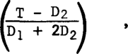

- **`where P = Helium operating pressure (700 psia),`** 

   - **`T = PCRV wall thickness,`** 

   - **`H = PCRV internal height,`** 

   - **`Dj = Core cavity diameter, and`** 

   - **`D2 = Side wall cavity diameter (zero for single-cavity PCRV).`** 

**`This relationship takes into account, in an approximate way, the fact that the side wall acts both as a hoop and as a beam between the two heads. It was derived by assuming that the hoop and beam actions could be separated into two additive terms. The coefficient for each term was determined by fitting the equation to several existing designs that had been sized by more detailed stress analysis.`** 

**`For the multicavity designs, it was also required that the wall thick­ ness exceed a minimum value of T = 1.55 D2, in order to ensure an adequate concrete ligament around the wall cavity. The thickness of the top and bot­ tom heads was set equal to the radius of the core cavity; experience has shown that this thickness satisfies both structural and layout requirements. Prestress requirements were established by proportioning the total cross sec­ tion of vertical and circvunferential prestressing steel to the maximum total pressure-bearing area in the horizontal and vertical planes, respectively.`** 

**`8`** 

**`In the single-cavity type of PCRV, a reinforced water-cooled concrete floor supports the core structure; the concrete floor is supported from the PCRV bottom head by water-cooled steel columns. Helium leaving the core flows through insulated ducts in the concrete floor and connecting steel ducts to the steam generators, which are contained within individual steel shrouds. Helium is discharged from the bottom of the steam generators to the space between a steel floor and the bottom head of the PCRV. The helium circulators draw gas from this space and discharge it to the space outside the steam generator shrouds; the helium then flows through the annulus between the core and the PCRV side wall to the top of the core.`** 

**`The internal arrangement of the multicavity PCRV is considerably simpler. The helium flow path is largely defined by the core and steam generator cavity walls and the insulated ducts in the PCRV wall, which connect the steam gen­ erator cavities to the upper and lower plenums of the core cavity.`** 

**`The internal arrangement of the horizontal PCRV is essentially that which would be obtained if the single-cavity PCRV were turned on its side, except that the core orientation does not change. In one horizontal PCRV configura­ tion, a second steam generator cavity is added on the opposite side of the core cavity.`** 

**`Descriptions and sketches of the specific configurations considered are presented in Section IV of this report.`** 

## **`REACTOR CORE`** 

**`The reactor core configuration is similar to that of the PSC plant and utilizes an identical fuel element design. The core consists of 625 fuel columns, giving an effective mean diameter of 31.1 ft. Each fuel column con­ sists of a vertical stack of six hexagonal fuel elements 14.2 in. across the flats and 31.2 in. high. Internal coolant channels within each element are aligned with coolant channels in the vertically adjacent elements. The active fuel is contained in an array of smaller-diameter holes, which are parallel to the coolant channels and occupy alternate positions in a triangular array within the graphite structure. The center fuel elements of a seven-column region contain two enlarged channels for control rods. There are 91 control rod positions (91 groups of two rods each) corresponding to 91 fuel regions; 12 regions at the outer edge of the core each contain five instead of seven columns.`** 

**`The fuel element structural material is conventional nuclear grade needlecoke graphite. The fuel itself is in the form of uranium and thorium carbide particles, coated with a highly retentive pyrolytic carbon coating and bonded in beds within the fuel holes. Coolant flow is downward through the core, and the flow rate through each region is controlled by an orifice mechanism that compensates for power peaks and maintains uniform exit gas temperature.`** 

**`The top and bottom reflectors are approximately 47-in. thick, and the side reflectors have a mean thickness of approximately 37 in. Unfueled graph­ ite reflector elements are located above, below, and around the active core.`** 

**`9`** 

**`Lateral restraint for the core and reflector is provided by a cylindrical core barrel for the single-cavity configuration and by the PCRV liner for the other configurations. Each seven-column fuel region rests on a single large hexagonal graphite core support block, which is in turn supported on graphite columns that permit lateral flow of the coolant under the core and tilt slightly to accommodate lateral thermal expansion.`** 

**`Each fuel region is located directly below a refueling penetration that is used to house a control and orificing assembly. Alignment and lateral end restraint of all columns are provided by the top reflector orifice plenum elements, which are keyed together. The boundary blocks are keyed either to the core barrel structure or to the PCRV liner, so that in the top and bottom planes of every column the core is effectively fixed relative to the support structure.`** 

## **`STEAM GENERATORS`** 

**`The steam generator modules used in the various arrangements are of the general PSC type, but vary in size as the number of units is varied from 6 to 36. The largest units considered are 12 ft in diameter, which approaches the maximum size that can be shipped by rail. In some configurations the helium flow is from top to bottom, whereas in others it is from bottom to top. In all cases, the hot helium from the reactor flows axially through the mod­ ule, encountering first the reheater, then the superheater, and finally the evaporator-economizer section. Figure 2 shows the PSC steam generator, which is designed for downward flowing helium; the positions of the tube bundles are reversed for upward flow.`** 

**`The tube bundles are made of helically coiled tubes. There are no in­ termediate tube headers between the economizer inlet and superheater outlet. Individual tubes run through the evaporator-economizer tube bundles and super­ heater tube bundles. Both ends of the reheater tubes terminate at a concentric reheat tube header, which is located on the axial centerline of the unit. Cold reheat steam flows through the annular region of the header and hot reheat steam flows through the inner pipe. Feedwater and superheater steam tubes are subheadered within the PCRV, three to six tubes joining one subheader; the subheaders terminate at headers located outside the secondary penetration closure.`** 

**`The concentric reheat steam header and the feedwater and superheated steam tubes penetrate the primary and secondary closures. The primary clos­ ure flange forms a bolted and gasketed joint with a mating flange on the PCRV penetration. The secondary closure is welded to the penetration exten­ sion on the outer face of the PCRV.`** 

**`The nine reactor configurations considered in this study may be divided into two groups with respect to steam generator installation and removal. The first group resembles the PSC plant in that lateral movement of the steam generator within the PCRV is required for installation or removal; the second group of designs permit straight installation or removal along the unit's centerline. Relative ease of installation and removal is considered an im­ portant factor in selection of the reactor arrangement, although the steam`** 

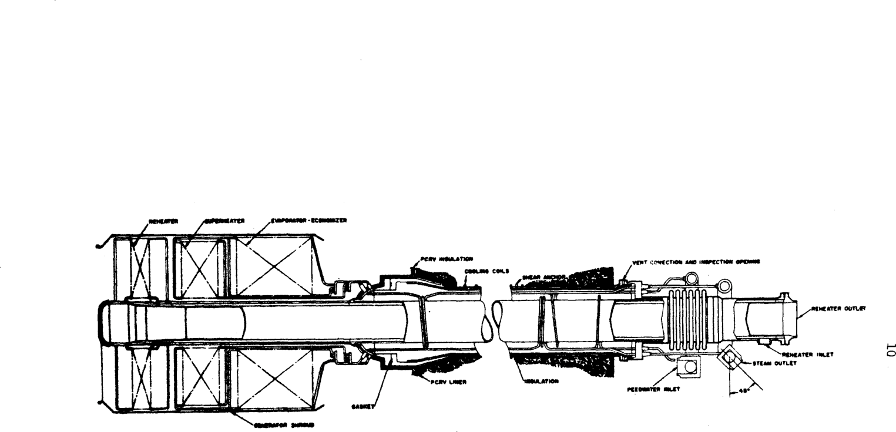

**`Fig. 2—Steam generator`** 

**`11`** 

**`generators are designed for a 30-year life and replacement of steam genera­ tors is not expected to be necessary.`** 

**`All of the steam generator arrangements considered here, except in the horizontal PCRV configurations, are drainable. However, the designs with upward helium flow must have a countercurrent superheater to be fully drainable, while those with downward helium flow may have a cocurrent or countercurrent superheater. Drainability is a significant advantage, because of the corrosion problems that can arise when an improperly drained unit is out of service.`** 

## **`HELIUM CIRCULATORS`** 

**`The helium circulators considered in these studies are of two sizes. One is identical to the PSC units, in which case 12 units are required for the lOOO-Mw(e) plant; the other has twice the flow capacity of the PSC units, so that only six units are required. The PSC circulator is illustrated on Fig. 3; the larger size unit would resemble the PSC unit in general arrange­ ment.`** 

**`The primary coolant system will utilize either one or two circulators in each of six independent loops. Each circulator consists of a single-stage axial flow compressor and a single-stage steam turbine main drive. The singlestage water turbine auxiliary drive used on the PSC circulator has been eli­ minated on the assumption that providing additional redundancy in the steam supply to the drive turbine will eliminate the need for an auxiliary drive. The circulator steam turbine drive normally operates on cold reheat steam from the exhaust of the high-pressure element of the main turbine. The cir­ culator turbines are in series with the main turbine (i.e., the entire reheat steam flow passes through the six parallel circulator turbines). The steam from the exhaust of the circulator turbines flows to the reheaters.`** 

**`The compressor and drive turbine are mounted integrally on a single ver­ tical shaft and are overhung from a central bearing and seal section. The circulator uses water-lubricated bearings rather than oil lubrication to ease sealing problems and to avoid radiation damage effects on oil. Each circu­ lator has a flow shutoff valve incorporated in the diffuser to permit stop­ page of flow through the circulator when a coolant loop is shut down.`** 

**`Three circulator orientations are considered in these studies: (1) ver­ tical with compressor on top and upward discharge of helium, (2) vertical with compressor on the bottom and downward discharge of helium, and (3) hori­ zontal shaft. The first has the advantage that it duplicates the PSC con­ figuration, whereas the other two orientations place somewhat different conditions on the bearings and seals, and thus would require some development work.`** 

**`The circulators are designed for removal into a shielded cask for trans­ port to the hot-service facility for maintenance and/or inspection. The circulator from the PCRV would be removed with the plant shut down and the primary coolant system slightly below atmospheric pressure. Location of`** 

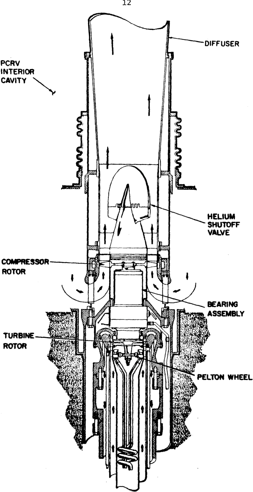

**----- Start of picture text -----** 
12 DIFFUSER PCRV INTERIOR CAVITY HELIUM SHUTOFF VALVE COMPRESSOR ROTOR BEARING ASSEMBLY TURBINE ROTOR PELTON WHEEL **----- End of picture text -----** 

**`Fig. 3—Helium circulator`** 

**`13`** 

**`circulators in the top head rather than the bottom head of the PCRV makes installation and removal somewhat easier, since the circulator is handled from above and the removal cask can be moved by the building crane.`** 

## **`HELIUM PURIFICATION AND STORAGE`** 

**`In a similar arrangement to that of PSC, two trains of the primary coolant helium purification system are contained in cavities in the top head of the PCRV. The cavities house the helium dryers, filters, gas-to-gas heat exchangers and adsorbers, and are designed for the same standards of leak tightness as other penetrations.`** 

**`During reactor shutdown for refueling or maintenance, the primary system is depressurized and the helium stored in high-pressure tanks located outside the PCRV. Preliminary studies indicate that storing the helium in cavities in the PCRV walls might lead to some cost saving, but this possibility was discarded in favor of the separate tanks in order to avoid complication of the PCRV design.`** 

## **`IV. REACTOR ARRANGEMENTS`** 

**`The nine alternative configurations that were compared in this study are described individually below. Configuration No. 1 resembles the PSC reactor most closely. The principal advantages and disadvantages of con­ figuration Nos. 2 through 9 are given relative to configuration No. 1.`** 

## **`CONFIGURATION NO. 1 - SINGLE-CAVITY PCRV, 36 STEAM GENERATORS. 12 CIRCULATORS`** 

**`Configuration No. 1 (see Fig. 4) is a direct scaleup of the PSC plant. The steam generator modules and circulators are identical to the PSC 330Mw(e) plant components, and thus require triple the number of components for 1000-Mw(e) output. The steam generator modules are located under the core support floor as close together as is feasible, while still permitting re­ moval through a central access hole in the PCRV bottom head. The inside diameter of the PCRV cavity is 51 ft 0 in., and the inside height is 81 ft 6 in. The outside diameter of the PCRV is 79 ft 0 in., and the outside height is 132 ft 6 in. The core is supported on a concrete floor that in turn is supported on steel columns from the bottom head of the PCRV. Helium coolant is directed through ducts in the support floor to adaptors on the tops of the steam generator modules. The flow leaves the steam generators below a steel floor, where it enters the circulators, and then is discharged into the large plenum that houses the steam generator modules. It then flows past the core support floor and returns to the top of the core. The core is contained within a steel barrel that is mounted on top of the support floor.`** 

**`The helium circulators are removable directly downwards from the PCRV bottom head. Steam generator modules may be removed by first removing the module duct adaptor and the primary closure bolting, and then lifting the unit clear of the circulator floor and moving it laterally and then down through the central access hole located in the center of the bottom head.`** 

## **`CONFIGURATION NO. 2 - SINGLE-CAVITY PCRV, 36 STEAM GENERATORS WITH DIRECT REMOVAL, 12 CIRCULATORS`** 

**`Configuration No. 2 (see Fig. 5) is similar to configuration No. 1, ex­ cept that each steam generator module has an access penetration for direct downward removal through the bottom head. The separation of the steam gen­ erators provides sufficient ligament between the access holes in the bottom head to ensure the structural integrity of the head. The inside cavity that houses the core, steam generators, and circulators is in the shape of a cyl­ inder in the lower portion and a truncated cone in the upper portion. The lower portion has an inside diameter of 65 ft tapering to a diameter of 40 ft at the top. In over-all outside dimensions, the PCRV is 101 ft in diam­ eter and 130 ft 8 in. in height. Piston-ring seals, or equivalent, are proposed`** 

**`14`** 

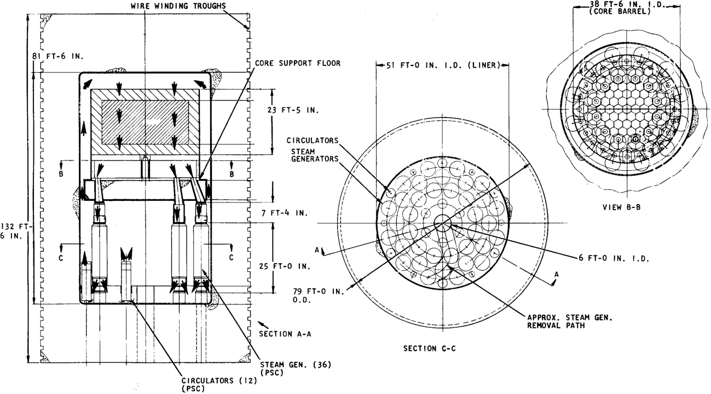

**----- Start of picture text -----** 
WIRE WINDING TROUGHS .38 FT-6 IN. I.D.. 6 FT-0 IN. I .D. APPROX. STEAM GEN. REMOVAL PATH SECTION C-C STEAM GEN. (36) (PSC) CIRCULATORS (12) (.PSC) **----- End of picture text -----** 

**----- Start of picture text -----** 
Ln **----- End of picture text -----** 

**`Fig. 4—Configuration No. 1`** 

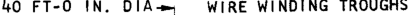

**----- Start of picture text -----** 
40 FT-0 IN. DIA WIRE WINDING TROUGHS **----- End of picture text -----** 

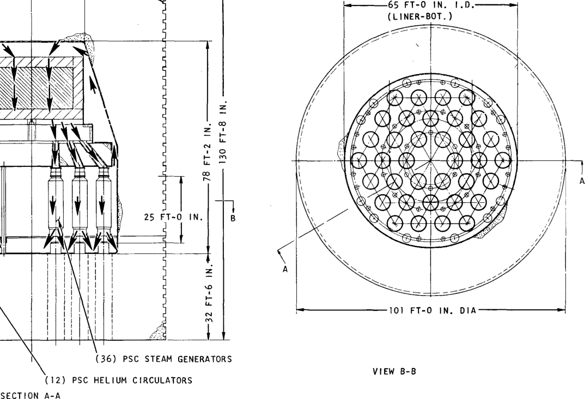

**----- Start of picture text -----** 
■65 FT-0 IN. (LINER-BOT.) 25 FT-0 IN. 101 FT-0 IN. DIA (36) PSC STEAM GENERATORS VIEW B-B (12) PSC HELIUM CIRCULATORS SECTION A-A **----- End of picture text -----** 

**`Fig. 5-^Configuration No. 5`** 

**`17`** 

**`rather than bellows for the steam generator module duct and floor seals. The advantage of this arrangement is that the steam generator installation and removal are simplified because they require only straight vertical motion and minimize remote operations.`** 

- **`The disadvantages of this arrangement are:`** 

**`1. Larger penetrations and penetration closures are required beneath each steam generator.`** 

**`2. The size of the PCRV has to be increased considerably.`** 

## **`CONFIGURATION NO. 3 - SINGLE-CAVITY PCRV, 6 STEAM GENERATORS, 6 CIRCULATORS`** 

**`In this configuration the number of steam generators and circulators was reduced to minimize the inside diameter (and cost) of the PCRV, and the cost of the steam generators and circulators themselves, for a PSC type of arrangement (see Fig. 6). Direct scaling of the PSC modules would have re­ sulted in a unit 13.75 ft in diameter, which would create shipping problems and that did not provide an optimum PCRV inside diameter; therefore, the unit diameter was decreased to 12 ft with a resultant increase in length. The PCRV inside diameter is 44 ft with an inside height of 97.5 ft; the outside diameter is 68.5 ft with an outside height of 141.5 ft. The steam generator modules are removable through a central access hole in the PCRV bottom head in a manner similar to the PSC plant. Each module weighs approximately 200 tons. The core support floor, internal ducts, circulator floor, and coolant flow path are similar to configuration No. 1. Six circulators are utilized requiring a circulator scaled up by a factor of two relative to the PSC units.`** 

**`1. The larger steam generator and circulator units will reduce the total cost of these components.`** 

**`2. Matching the number of steam generators to the number of circulators permits helium flow control for each steam generator, and thus minimizes problems of imbalance among steam generators.`** 

**`3. The reduced number of steam generators means that each steam gen­ erator draws helium from a large number of core zones, which lessens the dependence on core orificing for uniform gas temperature and strengthens the possibility of eliminating the orifices.`** 

**`The disadvantage of this arrangement is that the larger steam generator and helium circulator units will require development.`** 

## **`CONFIGURATION NO. 4 - MULTICAVITY PCRV, 6 STEAM GENERATORS, 6 CIRCULATORS`** 

**`This multicavity reactor configuration (see Fig. 7) utilizes the same diameter steam generator modules and helium circulators as used in configura­ tion No. 3. The units are located in six cavities located around the core cavity in thick PCRV walls. The steam generator modules differ from those in configuration No. 3 in that the helium flow is upwards, requiring that`** 

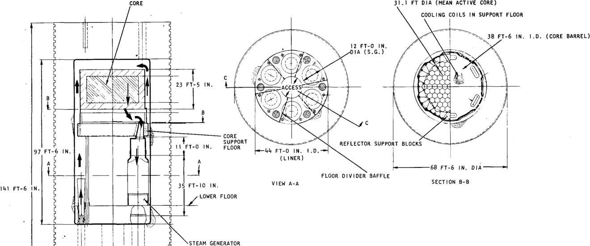

**----- Start of picture text -----** 
CORE 31.1 FT DIA (MEAN ACTIVE CORE) COOLING COILS IN SUPPORT FLOOR 38 FT-6 IN. 1.0. (CORE BARREL) 12 FT-0 IN. IA (S.G 23 FT-5 IN. lACCESS^- CORE SUPPORT REFLECTOR SUPPORT BLOCKS 11 FT-0 IN. FLOOR 97 FT-6 IN. 44 FT-0 IN. I.D. (LINER) ■68 FT-6 IN. DIA FLOOR DIVIDER BAFFLE 141 FT-6 IN. 35 FT-10 IN. VIEW A-A SECTION B-B LOWER FLOOR STEAM GENERATOR **----- End of picture text -----** 

**SECTION C-C** 

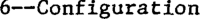

**----- Start of picture text -----** 
6—Configuration **----- End of picture text -----** 

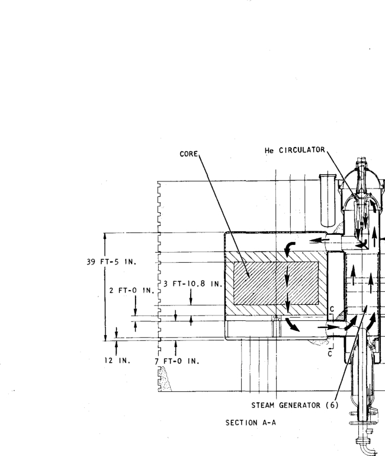

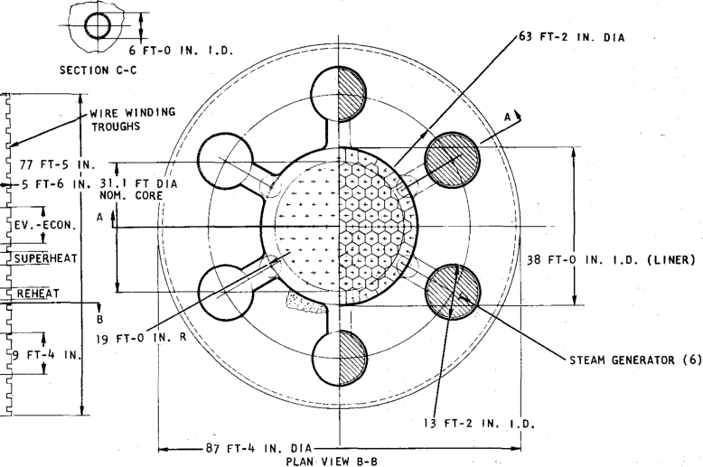

**----- Start of picture text -----** 
63 FT-2 IN. DIA I.D. (LINER) GENERATOR (6) **----- End of picture text -----** 

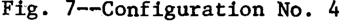

**----- Start of picture text -----** 
Fig 7—Configuration No. 4 **----- End of picture text -----** 

**`20`** 

**`the positions of the tube bundles be reversed. The circulators are located above the steam generator modules in the top head of the vessel. A steam generator module is removable by a direct lift through the top head penetra­ tion after removal of the circulator and diffuser-duct assembly.`** 

**`The core arrangement is the same as used in configuration Nos. 1, 2, and 3, except that no core barrel is required. Special seals and reflector sup­ ports and more effective insulation are required to permit the use of the PCRV liner as the core restraint in place of a core barrel. Ducts through the PCRV inner wall at the bottom and top of the steam generator modules pro­ vide coolant passages between the core and steam generator cavities.`** 

**`The inside diameter of the core cavity is 38 ft and its inside height is 39 ft 5 in. The steam generator module-circulator cavities are 13 ft 2 in. in inside diameter and approximately 67 ft high. The outside diameter of the PCRV is approximately 87 ft and the outside height is approximately 77 ft. The reactor building for this configuration is larger in plan, but much lower in elevation than those used with the single-cavity PCRV.`** 

**`1. Steam generator installation and removal are accomplished by a direct vertical lift using the building crane, which minimizes the require­ ment for specialized handling equipment.`** 

**`2. The PCRV internal structure is simplified by elimination of the core support floor and the lower steel floor, with resulting cost savings and improvement in reliability.`** 

**`3. The dimensions of the core cavity are divorced from those of the steam generator cavity, improving flexibility in accommodating changes in component design or plant size.`** 

**`4. The larger steam generator and circulator units will reduce total cost of these components.`** 

**`5. Matching the number of steam generators to the number of circulators permits helium flow control for each steam generator, and thus minimizes problems of imbalance among steam generators.`** 

**`6. The reduced number of steam generators means that each steam generator draws helium from a large number of core zones, which lessens the dependence on core orificing for uniform gas temperature and streng­ thens the possibility of eliminating the orifices.`** 

**`7. The helium circulator removal cask can be handled by the building crane.`** 

## **`The disadvantages of this arrangement are:`** 

**`1. The larger helium circulator and steam generator units will require development.`** 

**`2. Six large penetrations and penetration closures are required.`** 

**`3. The PCRV design differs radically from that of PSC and will require additional development work.`** 

**`21`** 

## **`CONFIGURATION NO. 5 - MULTICAVITY PCRV, 12 STEAM GENERATORS. 12 CIRCULATORS`** 

**`This multicavity PCRV configuration (see Fig. 8) utilizes 12 circulators and 12 steam generator modules, each mounted in separate cavities in the PCRV walls. The steam generator modules are scaled up in size from the PSC units, but the circulators are PSC size. Coolant flows from the core through long ducts embedded in the PCRV wall to the tops of the steam generators; coolant flow is then downward through the steam generators as in the PSC units. The core cavity inside the PCRV is the same as configuration No. 4. The outside height of the PCRV is the same as configuration No. 4, but the outside diam­ eter of 92 ft is somewhat larger. The steam generator module cavities are 9 ft 8 in. ID and approximately 65 ft deep; the circulator (and duct) cavities are 6 ft 8 in. ID and approximately 52 ft deep. The steam generator modules may be removed by a straight pull through the top head of the vessel. The circulators are removable directly downward through the bottom head of the vessel.`** 

**`The advantages of this arrangement are:`** 

**`1. Steam generator installation and removal are accomplished by a direct vertical lift using the building crane, which minimizes the requirement for specialized handling equipment.`** 

**`2. The PCRV internal structure is simplified by elimination of the core support floor and the lower steel floor, with resulting cost savings and improvement in reliability.`** 

**`3. The dimensions of the core cavity are divorced from those of the steam generator cavity, improving flexibility in accommodating changes in component design or plant size.`** 

**`4. Matching the number of steam generators to the number of circula­ tors permits helium flow control for each steam generator, and thus minimizes problems of imbalance among steam generators.`** 

## **`The disadvantages of this arrangement are:`** 

**`1. In addition to the circulator penetrations, a fairly large penetra­ tion and penetration closure is required for each of the 12 steam generators.`** 

**`3. The arrangement of cavities and coolant ducting is complex and gives high liner and thermal barrier surface areas.`** 

## **`CONFIGURATION NO. 6 - MULTICAVITY PCRV, 36 STEAM GENERATORS, 12 UPFLOW CIRCULATORS`** 

**`This configuration (see Fig. 9) consists of a core cavity identical to that used in configuration Nos. 4 and 5, with six large cavities in the PCRV walls, each housing a cluster of six steam generator modules and two circu­ lators. The coolant flow is downward through the steam generator modules, as in the PSC units. The circulators are the same size and are mounted in`** 

**----- Start of picture text -----** 
WIRE WINDING TROUGHS- **----- End of picture text -----** 

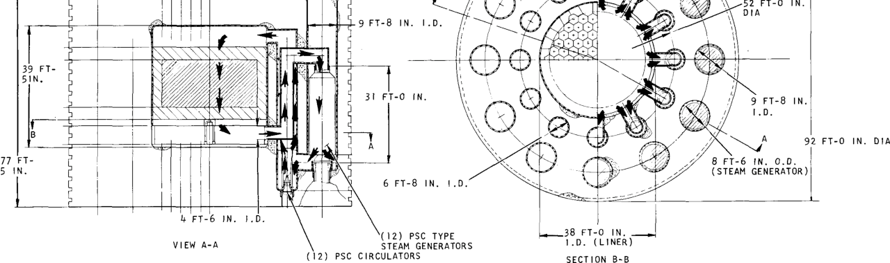

**----- Start of picture text -----** 
52 FT-0 IN. 9 FT-8 IN. I.D. 39 FT- 31 FT-0 IN. 9 FT- 92 FT-0 IN. DIA 77 FT- 8 FT-6 IN. O.D. 5 IN. (STEAM GENERATOR) 6 FT-8 IN. (12) PSC TYPE .38 FT-0 IN. . VIEW A-A STEAM GENERATORS I.D. (LINER) (12) PSC CIRCULATORS SECTION B-B **----- End of picture text -----** 

**`Fig. 8—Configuration No. 5`** 

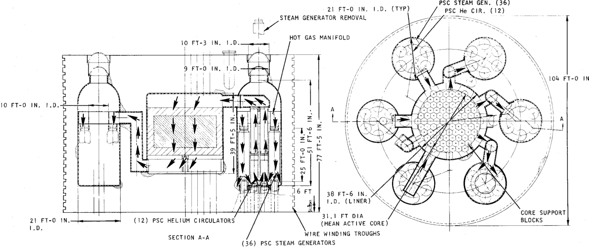

**----- Start of picture text -----** 
PSC STEAM GEN. (36) 21 FT-0 IN. I.D. (TYP) PSC He CIR. (12) STEAM GENERATOR REMOVAL \ HOT GAS MANIFOLD 10 FT-3 IN. 9 FT-0 IN A 104 FT-0 IN 10 FT-0 IN. I .D 38 FT-6 IN. I.D. (LINER) CORE SUPPORT 21 FT-0 IN. (12) PSC HELIUM CIRCULATORS (MEAN31.1 FTACTIVEDIA CORE), BLOCKS WIRE WINDING TROUGHS SECTION A-A (36) PSC STEAM GENERATORS **----- End of picture text -----** 

**`Fig 9—Configuration No. 9`** 

**`24`** 

**`the same orientation as in the PSC reactor. The coolant flows from the bot­ tom of the core through long ducts embedded in the PCRV walls and then to a torus type of plenum for distribution to the steam generator modules in each cavity. The coolant then passes upward from the circulators through long ducts into a header and then back to the top of the core. The steam genera­ tor cavity is bottle shaped with a 21-ft ID section rounded to a 9-ft ID ac­ cess penetration. The cavity is approximately 51 ft deep. The outside diam­ eter of the PCRV is 104 ft, and the outside height is approximately 77 ft.`** 

**`Circulator removal is directly downward, as in the PSC plant. Steam generator module removal requires removal of the circulator diffuser and ducting and the module plenum before the units can be moved to the central region of the cavity. The modules may then be removed by a direct lift up­ ward through the PCRV top head penetration.`** 

**`1. Steam generator installation and removal are somewhat simpler than in configuration No. 1.`** 

**`2. The PCRV internal structure is simplified by elimination of the core support floor and the lower steel floor, with resulting cost savings and improvement in reliability.`** 

**`3. The dimensions of the core cavity are divorced from those of the steam generator cavity, improving flexibility in accommodating changes in component design or plant size.`** 

**`1. Six steam generator access penetrations are required, rather than one.`** 

**`3. The arrangement of cavities and coolant ducting is complex and gives greater surface areas of liner and thermal barrier.`** 

## **`CONFIGURATION NO. 7 - MULTICAVITY PCRV, 36 STEAM GENERATORS, 12 DOWNFLOW`** 

## **`CIRCULATORS`** 

**`This arrangement (see Fig. 10) is a variation of configuration No. 6. The main difference is that the circulators are mounted in pairs in an in­ verted position in the steam generator access penetration in the PCRV top head. The coolant ducting within the steam generator cavity provides for a central duct that distributes the flow radially at the top of the steam generators. The flow leaves the steam generators at the bottom, then passes through the circulators and diffusers back to the top of the core. The cir­ culators may be removed by a direct upward lift from the PCRV top head pene­ tration. Steam generator modules are removed in a manner similar to that described for configuration No. 6. The outside dimensions of the PCRV are approximately the same as for configuration No. 6.`** 

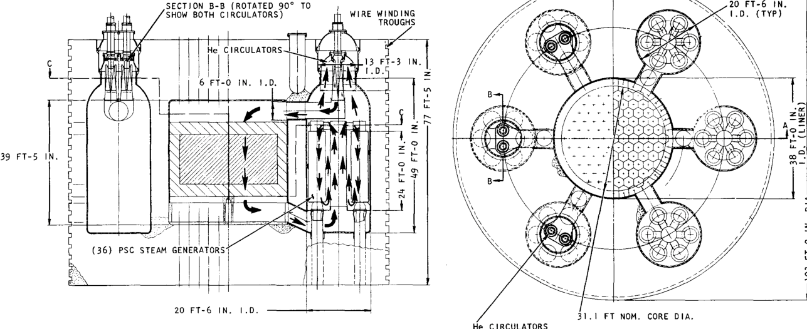

**----- Start of picture text -----** 
SECTION B-B (ROTATED 90° TO 20 FT-6 IN SHOW BOTH CIRCULATORS) WIRE WINDING I.D. (TYP) TROUGHS He CIRCULATORS 13 FT-3 IN. 6 FT-0 IN. I.D. 39 FT-5 IN. (36) PSC STEAM GENERATORS 20 FT-6 IN. I.D. 31.1 FT NOM. CORE DIA. He CIRCULATORS (L IN E R ) D . **----- End of picture text -----** 

**----- Start of picture text -----** 
SECTION A-A **----- End of picture text -----** 

**`Fig. 10—Configuration No. 7`** 

**`26`** 

**`The advantages of this arrangement are:`** 

**`1. Steam generator installation and removal are somewhat simpler than in configuration No. 1, and can be done with the building crane.`** 

**`2. The circulator removal cask can be handled with the building crane.`** 

**`3. The PCRV internal structure is simplified by elimination of the core support floor and the lower steel floor, with resulting cost savings and improvement in reliability.`** 

**`4. The dimensions of the core cavity are divorced from those of the steam generator cavity, improving flexibility in accommodating changes in component design or plant size.`** 

**`1. Six steam generator access penetrations, rather than one, are re­ quired.`** 

## **`CONFIGURATION NO. 8 - HORIZONTAL PCRV, 12 STEAM GENERATORS,`** 

## **`12 CIRCULATORS`** 

**`This arrangement (see Fig. 11) utilizes the same core and PCRV arrange­ ment around the core as used in configuration Nos. 4, 5, 6, and 7. The steam generator modules and circulators are arranged in horizontal positions in two cavities located on either side of the core cavity. These cavities are 36 ft ID and approximately 43 ft long. In over-all outside dimensions, the PCRV is 183 ft long, approximately 77 ft high, and 56 ft wide. The physical arrangement of the PCRV precludes the use of wire winding for circumferential prestressing and therefore the more expensive tendon system is used for this prestressing. The circulators are identical to those used on PSC, except for the horizontal orientation. The steam generator modules are of the same type as used on the PSC reactor, but are scaled up in size and capacity by a fac­ tor of three.`** 

**`The coolant is ducted from the bottom of the core cavity through the cavity wall into a torus-shaped plenum from which the coolant is distributed to the steam generator modules. The coolant leaves the steam generators be­ hind a cavity end plate and is compressed by the circulators and discharged through the steam generator cavity back to ducts leading to the top of the core. The steam generator modules and circulators may be removed by a direct horizontal pull through the cavity heads.`** 

**`1. Steam generator installation and removal is somewhat simpler than in configuration No. 1.`** 

**`2. Matching the number of steam generators to the number of circulators permits helium flow control for each steam generator, and thus minimizes problems of imbalance among steam generators.`** 

M 

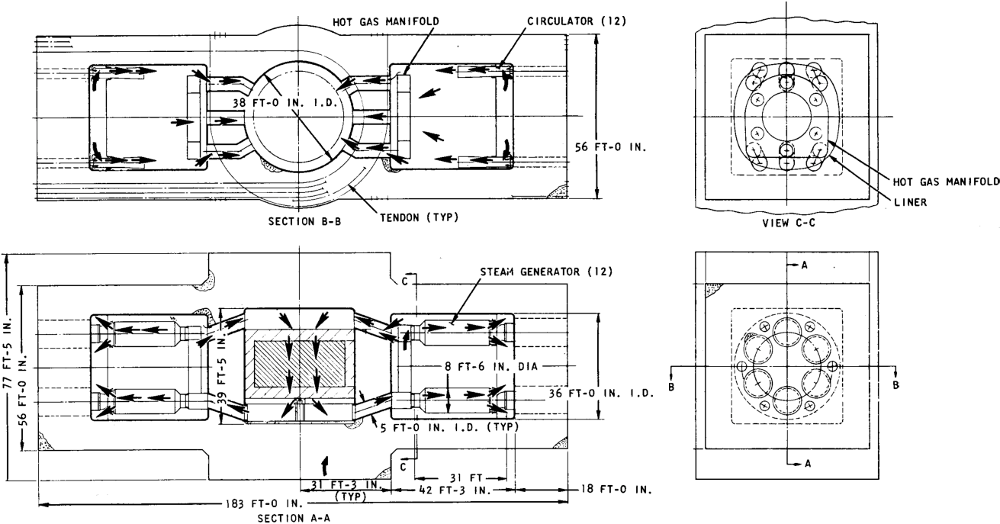

**----- Start of picture text -----** 
HOT GAS MANIFOLD CIRCULATOR (12) 38 FT-0 IN. I.D. 56 FT-0 IN. & fa & HOT GAS MANIFOLD LINER SECTION B-B TENDON (TYP) VIEW C-C STEAM GENERATOR (12) 8 FT-6 IN. DIA 36 FT-0 IN. I.0. 5 FT-0 IN. I.D. (TYP) 31 FT 31 FT-3 IN, k2 FT-3 IN. 18 FT-0 IN. 183 FT-0 IN. SECTION A-A **----- End of picture text -----** 

**`Fig. 11—Configuration No. 8`** 

**`28`** 

**`3. Reduced height of the PCRV and elimination of the need for piping space under the PCRV minimizes sensitivity to earthquakes, making it easier to satisfy safety requirements in this respect.`** 

**`1. In addition to the circulator penetrations, a fairly large penetra­ tion and penetration closure is required for each of the 12 steam generators.`** 

**`3. The PCRV is extremely long.`** 

**`4. The steam generators are not drainable.`** 

**`5. Because of the horizontal steam generator configuration, the support system and the baffle system used on PSC will not be applicable. Therefore, new design approaches will have to be developed.`** 

## **`CONFIGURATION NO. 9 - HORIZONTAL PCRV, 6 STEAM GENERATORS, 6 CIRCULATORS`** 

**`This arrangement (see Fig. 12) is an alternative to the horizontal PCRV described in configuration No. 8. It consists of the same core and PCRV ar­ rangement around the core as used in configuration Nos. 4 through 8. The steam generator modules and circulators are housed in a single cavity located on one side of the core cavity. The arrangement of steam generators and cir­ culators is essentially that of configuration No. 3, but rotated 90 degrees. The circulators may be removed by a horizontal movement through an access hole in the vertical face of the module cavity. The steam generator modules must be first moved to a central position in the module cavity and then horizontally out through an access hole in the PCRV head.`** 

**`The coolant flows from the bottom of the core through ducts into a torus­ shaped distribution plenum to the steam generator modules. The coolant leaves the steam generators behind the steel end plate, enters the circulators, and is discharged from the circulators into the steam generator cavity, from which it is ducted back to the top of the core.`** 

**`In over-all dimensions the PCRV is 153 ft long, about 77 ft high, and 68.5 ft wide. The steam generator module cavity is 44 ft ID and about 63 ft long. Circumferential prestressing is accomplished with tendons rather than wire wind­ ing.`** 

**`1. The larger steam generator and circulator units will reduce the total cost of these components.`** 

**`2. Matching the number of steam generators to the number of circulators permits helium flow control for each steam generator.`** 

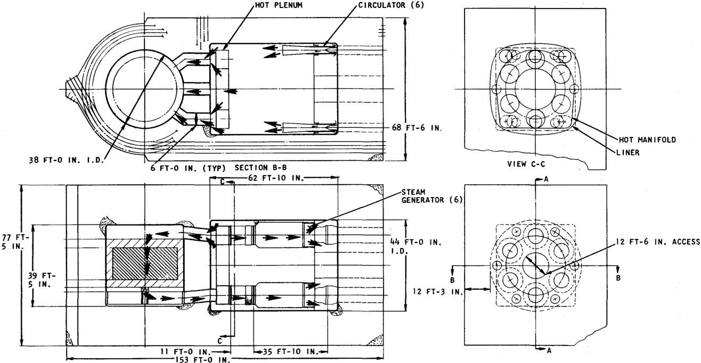

**----- Start of picture text -----** 
HOT PLENUM CIRCULATOR (6) 68 FT-6 IN HOT MANIFOLD LINER 38 FT-0 IN. I.D VIEW C-C 6 FT-0 IN. (TYP) SECTION B-B r—jr-r-- 62 FT-10 IN •STEAM GENERATOR (6) 77 FT- 44 FT-0 .12 FT-6 IN. ACCESS 5 IN. 39 FT- FT-3 IN 11 FT-0 IN. •35 FT-10 IN 153 FT-0 IN **----- End of picture text -----** 

`SECTION A-A` 

**`Fig. 12—Configuration No. 9`** 

**`30`** 

**`3. The reduced number of steam generators means that each steam genera­ tor draws helium from a large number of core zones, which eases gas temperature imbalance problems.`** 

**`4. Reduced PCRV height lessens the sensitivity to earthquakes.`** 

**`1. The PCRV design differs radically from that of PSC and will require additional development work.`** 

**`2. The larger steam generator and helium circulators will require development.`** 

**`3. The horizontal orientation of the steam generators makes installation and removal more difficult than in configuration No. 1.`** 

**`4. The steam generators are not drainable.`** 

**`5. Because of the horizontal steam generator configuration, the support system and the baffle system used on PSC will not be applicable. Therefore, new design approaches will have to be developed.`** 

## **`V. BASIS FOR COST ESTIMATES`** 

**`Estimates of capital cost for the various configurations considered in this study were based on the following sources:`** 

**`1. Cost estimates, vendor bids, and contract prices for similar equip­ ment currently being purchased for the PSC plant.`** 

**`2. Estimates of production cost by the Gulf General Atomic manufactur­ ing division.`** 

**`3. Cost estimates by outside suppliers for components and equipment which do not have counterparts in the PSC design (e.g., wire-winding equipment).`** 

**`The capital costs presented here include all vendor and subcontractor indirects and profit; field labor indirects are included on the assumption that all field work is performed by subcontractors. Prime contractor in­ directs (engineering, construction supervision, contingency, etc.) and cus­ tomer costs, such as interest during construction, are not included in the capital costs.`** 

**`Capital costs have been estimated as differences relative to configura­ tion No. 1, since it is believed that differential costs are more accurate than total costs at the preliminary design stage. Design, research, and development costs are estimated as totals, but only the development work pertinent to this comparison has been estimated.`** 

## **`PCRV`** 

**`The structural portions of the PCRV were estimated on a unit cost basis that included 100% overhead on all labor and a 10% subcontractor profit. The 100% overhead is based on detailed estimates of indirect costs for the PSC vessel.`** 

**`Rebar is estimated on an average basis of 240 lb/yd3 of concrete. Form work is estimated on a unit area basis for PCRV bottom and side areas. All cavity liners, including cooling coils, are based on PSC unit area costs. Thermal barrier costs are based on PSC unit cost for metallic insulating material.`** 

**`The cost of cooling water equipment and piping external to the PCRV but associated with PCRV heat loss is based on the total heat duty of the system, which is in turn assumed proportional to the area exposed to primary coolant, as follows:`** 

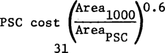

**`32`** 

## **`STEAM GENERATORS`** 

**`The cost of the large steam generator (six units for the lOOO-Mw(e) plant) was obtained from the PSC steam generator cost estimate by scaling the cost of each part of the steam generator. In scaling up the individual parts, the costs were separated into four categories: material, welding, machining, and handling. Material was scaled in direct proportion to the weight of the material required, except for tubing costs, which were obtained from vendor price lists. Welding cost included preparation and inspection and was scaled according to the total cross-sectional area to be joined. Machining cost in­ cluded inspection and was varied with the total surface area to be machined. Handling included welding and machining setup, tube bending, cleaning, and miscellaneous assembly operations; these costs were varied with the length of tubing or number of pieces to be handled.`** 

**`The cost of the intermediate unit size used in configuration Nos. 5 and 8 was scaled from a straight-line plot between the large and small steam gen­ erator costs on a logarithmic grid.`** 

## **`HELIUM CIRCULATORS`** 

**`The helium circulator costs were obtained from production cost data developed by Gulf General Atomic’s manufacturing division. Costs for the different circulator sizes were obtained by assuming that the cost of an individual circulator would vary in proportion to its capacity raised to the 0.6 power.`** 

## **`REACTOR BUILDING`** 

**`The costs of the reactor buildings for the various configurations are based on detailed cost data developed for multicavity configuration No. 4. This cost includes structural components, excavation, building equipment, ventilation, and painting. The costs of structural components, ventilation, and painting were varied in direct proportion to the volume of the building, while the remaining costs were not varied in this study. The building volume was determined by incremental differences in the height, length, and width associated with the PCRV size.`** 

## **`PLANT EFFICIENCY`** 

**`The PCRV arrangement effects plant efficiency in two ways. First, the heat loss to the PCRV cooling system is a direct penalty on plant efficiency, and for a given insulation thickness is a function of the internal surface area of the PCRV. Second, those arrangements with a longer and more tortuous helium flow path would be expected to give higher helium pressure loss, which is reflected in higher helium circulator power and lower plant efficiency.`** 

**`The heat loss to the PCRV cooling system was estimated to be about 16 Mw for configuration No. 1 (the single-cavity PCRV). For the other configurations, the heat loss was assumed to vary in direct proportion to the total cavity`** 

**`33`** 

**`liner surface area. The fractional change in plant efficiency (An/tio) is related to the PCRV heat loss (Q) and the reactor thermal power (Pt) as follows:`** 

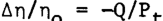

**`The total helium pressure drop was estimated to be 1 psi greater for configuration Nos. 5, 6, and 7 than for the other configurations. For the helium flow rate, pressure, and temperature of the current design, 1 psi in loop pressure drop represents a change of about 3.5 Mw in total circulator power. If one assumes that the efficiency of the circulator drive turbine is equal to the efficiency of the main turbine, the fractional change in plant efficiency is related to the change in circulator power (APC) and the base case efficiency (tIq) and electrical output (Pe) approximately as follows:`** 

**`The efficiency changes were taken into account in the cost comparison by making a fuel cycle cost adjustment and a capability adjustment. The fuel cycle cost adjustment is based on a 1.0 mill/kw-hr base fuel cycle cost, an 80% load factor, and a 12.5% capital charge rate; the equivalent capital cost change (AC) associated with a small change in efficiency is then`** 

## **`AC = -$56,000,000 An/n0`** 

**`The capability adjustment allows for the change in electrical output that results from a change in efficiency when reactor power is fixed; it may also be regarded as the change in reactor plant cost required to return the electrical output to the base case value. In this study, an incremental capability value of $50/kw was used, giving a capability adjustment for the 1000-Mw(e) plant of`** 

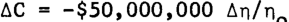

## **`RESEARCH, DEVELOPMENT, AND DESIGN`** 

**`The costs of research, development, and design cannot be considered addi­ tive to the capital costs, since the research and development and the design costs should properly be amortized over a number of plants. However, these costs must be considered as a separate factor in the selection of a design concept. In this study, consideration was limited primarily to those research and development and design requirements that might differ significantly among the various concepts considered.`** 

**`The costs given in Table 1 are for a number of research and development and design engineering efforts that would be required for one or more of the design concepts considered in this study. The costs assume successful comple­ tion of the PSC programs currently in progress, and for this reason the larger costs are generally associated with designs that differ from the PSC design.`** 

**`34`** 

## **`Table 1`** 

## **`RESEARCH AND DEVELOPMENT AND ENGINEERING COSTS`** 

||**`Cost`**|
|---|---|
|Component|($)|
|**`PCRV Structure:`**||
|**`Model tests of PCRV heads for single-cavity`**||
|**`type ........................................................  `**|**`60,000`**|
|**`CompletePCRV model tests for multicavity or`**||
|**`horizontal types ............................................  `**|**`1,800,000`**|
|**`Development of wire-wrapping machine for all`**||
|**`concepts except horizontal PCRV ............................. `**|**`240,000`**|
|**`Design engineering for single-cavity type ..................... `**|**`630,000`**|
|**`Design engineering for multicavity or horizontal`**||
|**`types .......................................................  `**|**`740,000`**|
|**`PCRV Internals:`**||
|**`Thermal barrier and seal development for`**||
|**`multicavity or horizontal types ............................. `**|**`190,000`**|
|**`Design engineering for single-cavity or`**||
|**`horizontal types ............................................  `**|**`1,650,000`**|
|**`Design engineering formulticavity type .......................  `**|**`1,600,000`**|
|**`Helium Circulators:`**||
|**`Bearing and seal test for horizontal or`**||
|**`vertical downflow circulators, same`**||
|**`size as PSC units ...........................................  `**|**`230,000`**|
|**`Bearing and seal test for circulators larger`**||
|**`than PSC units ..............................................  `**|**`440,000`**|
|**`Design engineering for PSC type of unit .......................  `**|**`260,000`**|
|**`Design engineering for horizontal or vertical`**||
|**`downflow units, same size as PSC.... .......................  `**|**`400,000`**|
|**`Design engineering for units larger than PSC .................. `**|**`650,000`**|
|**`Steam Generators:`**||
|**`Vibration tests for steam generators larger`**||
|**`than PSC units ..............................................  `**|**`300,000`**|
|**`Design engineering for same size units as PSC .................. `**|**`370,000`**|
|**`Design engineering for larger units than PSC ..................  `**|**`1,010,000`**|

**`35`** 

**`The largest single research and development cost is that of the PCRV model test, which is believed to be necessary for the multicavity and hori­ zontal PCRV types, but not for the single-cavity type, which is essentially a direct scale-up of the PSC design. The research and development and de­ sign costs associated with PCRV internals do not differ too much among the various concepts. While the multicavity and horizontal PCRV concepts pre­ sent some new problems in the design of thermal barrier, seals, and internal structures, they are also somewhat simpler in internal arrangement owing to the elimination of the separate core support floor.`** 

**`The helium circulator costs are affected by the increased size relative to the PSC units and by the change to horizontal or vertical downflow orien­ tation (compared to vertical upflow in PSC) required for some arrangements. Changes in steam generator costs are related primarily to the changes in tube bundle supports for larger units.`** 

## **`VI. SELECTION OF REFERENCE DESIGN`** 

## **`COST COMPARISON`** 

**`Using the costing procedures and assumptions described in the previous section, estimates of relative capital costs and research and development and design costs have been prepared for each of the nine configurations under consideration. The results are tabulated in Tables 2 and 3.`** 

## **`The following conclusions are drawn from the cost comparison:`** 

**`1. Increasing the steam generator and circulator unit sizes over the PSC design leads to a direct capital cost saving of about $5/kw, and requires expenditure of about $2,000,000 for research and de­ velopment and design engineering. Clearly the development of the larger components is justified.`** 

**`2. Providing simplified, straight-pull removal of steam generators incurs a capital cost penalty of about $10/kw in a single-cavity design, but incurs a research and development and design cost of only $2,000,000 (and essentially no capital cost penalty) in a multicavity design. The latter alternative is obviously more at­ tractive.`** 

**`3. The horizontal PCRV concepts shows reasonably good capital cost, but not the lowest cost. The economics do not justify further consideration of this fairly radical departure from previous HTGR designs.`** 

**`4. The concepts that use 12 steam generators and 12 circulators do not show any economic advantage, and would be attractive only if it were necessary to keep the circulators identical to the PSC units.`** 

## **`OTHER PLANT SIZES`** 

**`One desirable feature in any reactor arrangement is the ability to use the same type of arrangement and identical primary system components over a range of plant sizes. The sketches shown in Figs. 13 and 14 illustrate how different plant sizes could be achieved for both the single-cavity and multi­ cavity type of PCRV, using the same steam generator and helium circulator sizes as in a six-loop 1000-Mw(e) plant.`** 

**`As can be seen from Figs. 13 and 14, there is some waste space in the single-cavity PCRV when the number of steam generators is greater than or less than six; in sizes larger than 1000-Mw(e), the steam generator cavity requirement sets the vessel inside diameter, and there is waste space out­ side the core. In contrast, plant size increases are easily accomplished with the multicavity design by adding cavities in the PCRV wall.`** 

**`36`** 

**`37`** 

`Table 2` 

`CAPITAL COST COMPARISON FOR SEVERAL REACTOR CONFIGURATIONS (All Costs in Thousand of Dollars Relative to Configuration No. l)a` 

||`Config.k`|`Conflg.`|`Conflg.`|`Conflg.`|`Conflg.c`|`Conflg.d`|`Conflg.`|`Conflg.`|
|---|---|---|---|---|---|---|---|---|
||`No. 2`|`No. 3`|`No. 4`|`No. 5`|`No. 6`|`No. 7`|`No. 8`|`No. 9`|
|`PCRV Type`|`Single Cav.`|`Single Cav.`|`Multlcav.`|`Multlcav.`|`Multlcav.`|`Multlcav.`|`Horizontal`|`Horizontal`|
|`No. of Steam Gens.`|`36`|`6`|`6`|`12`|`36`|`36`|`12`|`6`|
|`No. of He Circs.`|`12`|`6`|`6`|`12`|`12`|`12`|`12`|`6`|
|`PCRV:`|||||||||
|`Concrete`|`875`|`-260`|`-274`|`-270`|`60`|`-5`|`82`|`-373`|
|`Reinforcing rod`|`1,067`|`-335`|`-350`|`-345`|`47`|`-35`|`102`|`-474`|
|`Form work`|`45`|`-14`|`-43`|`-35`|`-16`|`-16`|`7`|`10`|
|`Tendons`|`306`|`-32`|`-83`|`-24`|`75`|`48`|`702`|`966`|
|`Tendon conduit`|`202`|`-26`|`-55`|`-15`|`50`|`33`|`458`|`632`|
|`Tendonanchors`|`247`|`-34`|`17`|`72`|`178`|`152`|`485`|`684`|
|`Wire wrapping`|`379`|`-116`|`119`|`-51`|`219`|`90`|`-621`|`-621`|
|`Wire troughs`|`76`|`-25`|`23`|`-11`|`44`|`18`|`-130`|`-130`|
|`Subtotal`|`3,197`|`-842`|`-646`|`-679`|`657`|`285`|`1,085`|`694`|
|`LINER:`|||||||||
|`Core cavity`|`1,255`|`-75`|`-1,185`|`-1,185`|`-1,185`|`-1,185`|`-1,280`|`-1,280`|
|`Ducts`|`0`|`-141`|`-104`|`-65`|`196`|`-161`|`-58`|`-65`|
|`Steam gen. cavities`|`0`|`0`|`1,469`|`1,600`|`1,770`|`1,640`|`1,077`|`928`|
|`Circulator cavities`|`0`|`0`|`0`|`1,080`|`0`|`0`|`0`|`0`|
|`Ext. cooling system`|`265`|`-125`|`-117`|`75`|`52`|`10`|`-55`|`-130`|
|`Subtotal`|`1,520`|`-341`|`63`|`1,505`|`831`|`304`|`-316`|`-547`|
|`THERMAL BARRIER:`|||||||||
|`Carbon (12" thick.)`|`109`|`-25`|`-15`|`-15`|`-15`|`-15`|`-15`|`-15`|
|`1" Class A`|`13`|`21`|`-18`|`-18`|`-18`|`-18`|`-18`|`-18`|
|`2" Class A`|`267`|`-161`|`-218`|`-186`|`-127`|`-131`|`-81`|`-171`|
|`3" Class A`|`380`|`-20`|`30`|`90`|`150`|`160`|`-91`|`-144`|
|`4" Class B-l`|`-85`|`-85`|`167`|`167`|`167`|`167`|`167`|`167`|
|`2" Class B`|`-225`|`-123`|`-310`|`260`|`276`|`590`|`-310`|`-310`|
|`3" Class B`|`310`|`113`|`112`|`147`|`670`|`57`|`0`|`0`|
|`4" Class B`|`0`|`0`|`0`|`0`|`0`|`0`|`154`|`149`|
|`Subtotal`|`769`|`-280`|`-252`|`445`|`1,103`|`810`|`-194`|`-342`|
|`PENETRATIONS:`|||||||||
|`Steam gen. access`|`7`|`142`|`2,976`|`2,422`|`949`|`1,942`|`-43`|`142`|
|`Refueling`|`22`|`-32`|`-32`|`-32`|`-32`|`-32`|`-32`|`-32`|
|`Steam gen. piping`|`2,528`|`-262`|`310`|`-337`|`-53`|`-53`|`1,028`|`-262`|
|`Circulator`|`12`|`-71`|`-363`|`-6`|`-6`|`-363`|`-18`|`-71`|
|`Subtotal`|`2,569`|`-223`|`2,891`|`2,047`|`858`|`1,494`|`935`|`-223`|
|`REACTORINTERNALS:`|||||||||
|`Core barrel`|`0`|`0`|`-128`|`-128`|`-128`|`-128`|`-128`|`-128`|
|`Core barrel keys`|`161`|`0`|`-110`|`-110`|`-110`|`-110`|`-110`|`-110`|
|`Ducts`|`-115`|`-73`|`-199`|`-44`|`78`|`41`|`-152`|`7`|
|`Clamps and seals`|`-238`|`-466`|`-758`|`-710`|`-550`|`-418`|`-438`|`-466`|
|`Bellows`|`-274`|`-91`|`-316`|`-316`|`-316`|`-208`|`-221`|`-103`|
|`Lvr. floor assembly`|`126`|`-22`|`-206`|`-206`|`-206`|`-206`|`-47`|`-92`|
|`Loop baffles`|`11`|`16`|`-73`|`-73`|`-73`|`-73`|`16`|`16`|
|`Support floor liner`|||||||||
|`and columns`|`555`|`0`|`-370`|`-370`|`-370`|`-370`|`-370`|`-370`|
|`Support floor`|||||||||
|`cooling`|`146`|`0`|`-594`|`-594`|`-594`|`-594`|`-594`|`-594`|
|`Subtotal`|`496`|`-636`|`-3,243`|`-3,040`|`-2,758`|`-2,555`|`-2,533`|`-2,329`|
|`He STORAGE SYSTEM:`|||||||||
|`Helium`|`188`|`3`|`-65`|`-76`|`-16`|`8`|`-37`|`-24`|
|`Storage tanks`|`470`|`8`|`-162`|`-190`|`-40`|`20`|`-93`|`-61`|
|`Subtotal`|`658`|`11`|`-227`|`-266`|`-56`|`28`|`-130`|`-85`|
|`STEAM GENERATOR:`|||||||||
|`Reheater`|`0`|`-319`|`-319`|`-147`|`0`|`0`|`-147`|`-319`|
|`Superheater II`|`0`|`83`|`83`|`52`|`0`|`0`|`52`|`83`|
|`Economizer-evapora-`|||||||||
|`tor-superheater I`|`0`|`75`|`75`|`34`|`0`|`0`|`34`|`75`|
|`Subheaders`|`0`|`601`|`601`|`323`|`0`|`0`|`323`|`601`|
|`Primary closure`|`0`|`-367`|`-367`|`-236`|`0`|`0`|`-236`|`-367`|
|`Ring headers`|`0`|`-398`|`-398`|`-269`|`0`|`0`|`-269`|`-398`|
|`Penetration piping`|`0`|`-16`|`-16`|`-11`|`0`|`0`|`-11`|`-16`|
|`Outer shroud`|`0`|`-760`|`-760`|`-536`|`0`|`0`|`-536`|`-760`|
|`Secondary closure`|`0`|`-143`|`-143`|`-95`|`0`|`0`|`-95`|`-143`|
|`Reheater outlet`|||||||||
|`pipe`|`0`|`57`|`57`|`37`|`0`|`0`|`37`|`57`|
|`Assembly and`|||||||||
|`shipping`|`0`|`-439`|`-439`|`-298`|`0`|`0`|`-298`|`-439`|
|`Subtotal`|`0`|`-1,626`|`-1,626`|`-1,146`|`0`|`0`|`-1,146`|`-1,626`|

**`38`** 

||||`Table 2 (Continued)`|`Table 2 (Continued)`|||||
|---|---|---|---|---|---|---|---|---|
||`Conflg.k`|`Conflg.`|`Conflg.`|`Conflg.`|`Config.c`|`Conflg.d`|`Conflg.`|`Config.`|
||`No. 2`|`No. 3`|`No. 4`|`No. 5`|`No. 6`|`No. 7`|`No. 8`|`No. 9`|
|`PCRV Type`|`Single Cav.`|`Single Cav.`|`Multlcav.`|`Multlcav.`|`Multlcav.`|`Multlcav.`|`Horizontal`|`Horizontal`|
|`No. of Steam Gens.`|`36`|`6`|`6`|`12`|`36`|`36`|`12`|`6`|
|`No. of He Circs.`|`12`|`6`|`6`|`12`|`12`|`12`|`12`|`6`|
|`HELIUMCIRCULATORS:`|||||||||
|`Circulators`|`0`|`-900`|`-900`|`0`|`0`|`0`|`0`|`-900`|
|`Removal equipment`|`0`|`86`|`-364`|`0`|`0`|`-425`|`0`|`61`|
|`Subtotal`|`0`|`-814`|`-1,264`|`0`|`0`|`-425`|`0`|`-839`|
|`REACTOR BUILDING:`|||||||||
|`Structure and`|||||||||
|`equipment`|`1,070`|`-590`|`-473`|`-270`|`770`|`770`|`980`|`420`|
|`Ventilation`|`85`|`-35`|`-25`|`-10`|`67`|`67`|`83`|`49`|
|`Painting`|`123`|`-72`|`-55`|`-32`|`93`|`93`|`118`|`63`|
|`Subtotal`|`1,278`|`-697`|`-553`|`-312`|`930`|`930`|`1,181`|`532`|
|`PLANT EFFICIENCY`|||||||||
|`ADJUSTMENT:`|`550`|`-220`|`-220`|`460`|`305`|`238`|`-292`|`-330`|
|`TOTAL:`|`11,037`|`-5,668`|`-5,077`|`-986`|`1,870`|`1,109`|`-1,410`|`-5,095`|

`-Configuration No. 1 consists of single cavity PCRV, 36 steam generators, 12 circulators.` 

`-Downward removal of steam generator.` 

`-Circulators installed through bottom head of PCRV.` 

- `-Circulators installed through top head of PCRV.` 

## `Table 3` 

`RESEARCH AND DEVELOPMENT AND ENGINEERING COST COMPARISON (Costs in $1,000)` 

||`Conflg.`|`Config.*`|`Config.`|`Config.`|`Conflg.`|`Config.k`|`Config.c`|`Conflg.`|`Config.`|
|---|---|---|---|---|---|---|---|---|---|
||`No. 1`|`No. 2`|`No. 3`|`No. 4`|`No. 5`|`No. 6`|`No. 7`|`No. 8`|`No. 9`|
|`PCRV Type`|`Single Cav.`|`Single Cav.`|`Single Cav.`|`Multlcav.`|`Multlcav.`|`Multlcav.`|`Multlcav.`|`Horizontal`|`Horizontal`|
|`Mo. of Steam Gens.`|`36`|`36`|`6`|`6`|`12`|`36`|`36`|`12`|`6`|
|`Mo. of Helium Circs.`|`12`|`12`|`6`|`6`|`12`|`12`|`12`|`12`|`6`|
|`RESEARCH AND`||||||||||
|`DEVELOPMENT:`||||||||||
|`PCRV and Internals`|`300`|`300`|`300`|`2,230`|`2,230`|`2,230`|`2,230`|`1,990`|`1,990`|
|`Helium circulators`|`0`|`0`|`440`|`440`|`0`|`0`|`230`|`230`|`440`|
|`Steam generators`|`0`|`0`|`300`|`300`|`300`|`0`|`0`|`300`|`300`|
|`Subtotal`|`300`|`300`|`1,040`|`2,970`|`2,530`|`2,230`|`2,460`|`2,520`|`2,730`|
|`DESIGN - ENGINEERING:`||||||||||
|`PCRV and internals`|`2,280`|`2,280`|`2,280`|`2,340`|`2,340`|`2,340`|`2,340`|`2,390`|`2,390`|
|`Helium circulators`|`260`|`260`|`650`|`650`|`260`|`260`|`400`|`400`|`650`|
|`Steam generators`|`370`|`27Q`|`1.010`|`1.010`|`1.010`|`370`|`370`|`1.010`|`1.010`|
|`Subtotal`|`2,910`|`2,910`|`3,940`|`4,000`|`3,610`|`2,970`|`3,110`|`3,800`|`4,050`|
|`TOTAL (In $1,000):`|`3,210`|`3,210`|`4,980`|`6,970`|`6,140`|`5,200`|`5,570`|`6,320`|`6,780`|

- `^Downward removal of steam generator.` 

`-Circulators Installed through bottom head of PCRV.` 

- `-Circulators installed through top head of PCRV.` 

U> `VO` 

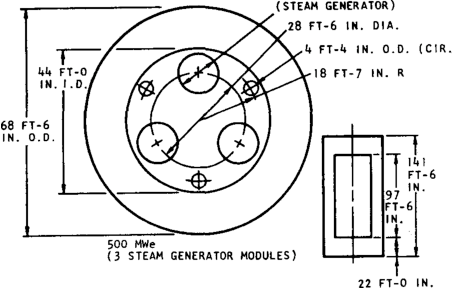

**----- Start of picture text -----** 
(STEAM GENERATOR) 28 FT-6 IN. DIA. \.4 FT-4 IN. O.D. (CIR. 44 FT-0 18 FT-7 IN. R IN. I.D., 68 FT-6 IN. O.D. 500 MWe (3 STEAM GENERATOR MODULES) 22 FT-0 IN. **----- End of picture text -----** 

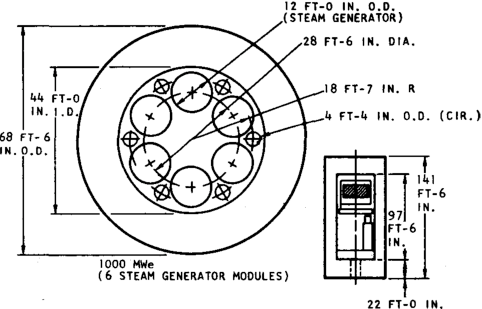

**----- Start of picture text -----** 
12 FT-0 IN. O.D .(STEAM GENERATOR) .28 FT-6 IN. DIA. .18 FT-7 IN. R 44 FT-0 .4 FT-4 IN. O.D. (CIR.) 68 FT-6 IN. O.D. IOOO MWe (6 STEAM GENERATOR MODULES) FT-0 IN. **----- End of picture text -----** 

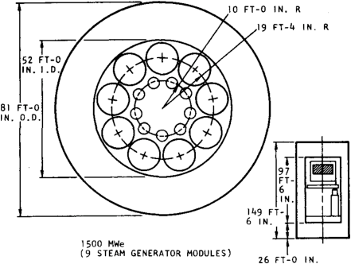

**----- Start of picture text -----** 
10 FT-0 IN. R ,19 FT-4 IN. R 52 FT-0 IN. I .D.i 81 FT-0 IN. O.D. 149 FT- 6 IN. 1500 MWe (9 STEAM GENERATOR MODULES) 26 FT-0 IN. **----- End of picture text -----** 

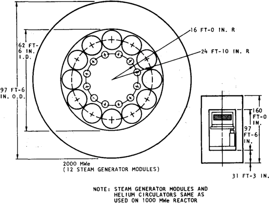

**----- Start of picture text -----** 
FT-0 IN. R 62 FT- 6 IN. •24 FT-10 IN. R 97 FT-6 IN. 0.0. 2000 MWe (12 STEAM GENERATOR MODULES) 31 FT-3 IN. NOTE: STEAM GENERATOR MODULES AND HELIUM CIRCULATORS SAME AS USED ON 1000 MWe REACTOR **----- End of picture text -----** 

> **`Fig 13—Plant size variation with single-cavity PCRV`** 

**`40`** 

**----- Start of picture text -----** 
38 FT-0 IN. **----- End of picture text -----** 

**----- Start of picture text -----** 
30 FT-0 IN. **----- End of picture text -----** 

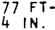

**----- Start of picture text -----** 
77 FT- 4 IN. **----- End of picture text -----** 

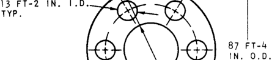

**----- Start of picture text -----** 
13 FT-2 IN. IN. O.D. **----- End of picture text -----** 

`500 MWe (3 STEAM GENERATOR MODULES)` 

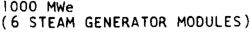

**----- Start of picture text -----** 
1000 MWe (6 STEAM GENERATOR MODULES) **----- End of picture text -----** 

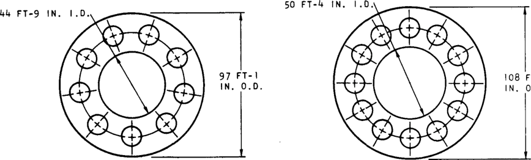

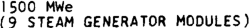

**----- Start of picture text -----** 
1500 MWe (9 STEAM GENERATOR MODULES) **----- End of picture text -----** 

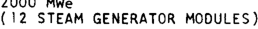

**----- Start of picture text -----** 
2000 Mwe (,2 STEAM GENERATOR MODULES) **----- End of picture text -----** 

## **`Fig. 14—Plant size variation with multicavity PCRV`** 

**`41`** 

**`The conclusion drawn from this brief analysis is that the multicavity design appears to offer some advantages in scaling plant size above 1000 Mw(e) with fixed component size.`** 

## **`RECOMMENDED ARRANGEMENT`** 

**`Based on the results of this study, it is recommended that the multi­ cavity PCRV with six steam generators and six circulators (configuration No. 4) be adopted for the 1000-Mw(e) plant. The advantages and disadvantages of the various configurations have been discussed in Section IV of this re­ port, and the related cost differentials are summarized in Tables 2 and 3. The reasons for selecting configuration No. 4 may be summarized briefly as follows:`** 

**`1. Within the accuracy of the cost estimate, this configuration is as low in capital cost as any other.`** 

**`2. The ability to install and remove steam generators by a straight vertical pull with the building crane is an important advantage and easily justifies the increased research and development required for the multicavity PCRV.`** 

**`3. The six-loop multicavity design has significant reliability and safety advantages, principally because of the less complicated core support arrangement and simplified control requirements.`** 

**`4. The separation of the core cavity from the steam generator and cir­ culator cavity offers advantages in scaling up plant size and pro­ vides greater flexibility for future development and optimization of the system and its components.`** 

## **`References`** 

**`1. Habush, A. L., and A. M. Harris, 330-Mw(e) Fort St. Vrain High-temperature Gas-cooled Reactor, General Dynamics, General Atomic Division report GA-8002, June 9, 1967.`** 

**`2. HTGR Base Program Quarterly Progress Report for the Period Ending May 31, 1967, TJSAEC report GA-7981, General Dynamics, General Atomic Division, September 29, 1967, pp. 4-5.`** 

**`Appendix A`** 

**`MAJOR PSC DESIGN PARAMETERS`** 

## **`Table 1 MAJOR DESIGN PARAMETERS`** 

|||**`1000-Mw(e)`**|
|---|---|---|
||**`PSC`**|**`Plant`**|
|**`Reactor:`**|||
|**`Reactor thermal power, Mw`**|**`837`**|**`2469`**|
|**`Active core diameter, ft`**|**`19.6`**|**`31.1`**|
|**`Active core height, ft`**|**`15.6`**|**`15.6`**|
|**`Core power density, kw/1`**|**`6.3`**|**`7.3`**|
|**`Core-reflector helium flow.`**|||
|**`106 lb/hr`**|**`3.33`**|**`9.85`**|
|**`Core helium pressure drop, psi`**|**`8.3`**|**`7.5`**|
|**`Number of control rod drives`**|**`37`**|**`91`**|
|**`PCRV:`**|||
|**`Circumferential prestressing`**|**`linear`**|**`wire-wrap`**|
|**`Inside diameter, ft`**|**`31.0`**|**`37.7`**|
|**`Inside height, ft`**|**`75.0`**|**`39.4`**|
|**`Outside diameter or across`**|||
|**`flats, ft`**|**`49.0`**|**`99.0`**|
|**`Outside height, ft`**|**`106.0`**|**`77.4`**|
|**`Steam generator cavity`**|||
|**`diameter, ft`**|**`31.0`**|**`13.2`**|
|**`Primary System:`**|||
|**`Number of loops`**|**`2`**|**`6`**|
|**`Helium pressure, psia`**|**`700`**|**`700`**|
|**`Total helium pressure drop, psi`**|**`14`**|**`12.5`**|
|**`Helium temp at circulator inlet, °F`**|**`742`**|**`745`**|
|**`Helium temp at core inlet, °F`**|**`758`**|**`755`**|
|**`Helium temp at core-reflector`**|||
|**`outlet, °F`**|**`1449`**|**`1443`**|
|**`Helium temp at steam generator`**|||
|**`inlet, °F`**|**`1427`**|**`1427`**|
|**`Primary system efficiency, %`**|**`99.65`**|**`99.65`**|
|**`Helium Circulators:`**|||
|**`Number of circulators`**|**`4`**|**`6`**|
|**`Compressor type`**|**`axial`**|**`axial`**|
|**`Drive type`**|**`steam turb`**|**`steam turb`**|
|**`Auxiliary drive type`**|**`water turb`**|**`none`**|
|**`Helium flow rate, 106 Ib/hr`**|**`3.49`**|**`10.32`**|
|**`Steam inlet pressure, psia`**|**`866`**|**`836`**|
|**`Steam inlet temperature, °F`**|**`738`**|**`727`**|
|**`Steam outlet pressure, psia`**|**`645`**|**`645`**|
|**`Turbine power/unit, hp`**|**`5750`**|**`9820`**|
|**`Turbine power margin, %`**|**`5`**|**`5`**|

**`44`** 

**`Table 1 (continued)`** 

|||**`1000-Mw(e)`**|
|---|---|---|
||**`PSC`**|**`Plant`**|
|**`SteamGenerators:`**|||
|**`Number of modules`**|**`12`**|**`6`**|
|**`Shroud outside diameter, ft`**|**`5.4`**|**`12.0`**|
|**`Helium flow rate, 106 Ib/hr`**|**`3.41`**|**`10.09`**|
|**`Helium pressure drop, psi`**|**`3.0`**|**`4.0`**|
|**`Feedwater flow rate, 106 Ib/hr`**|**`2.31`**|**`6.86`**|
|**`Feedwater temperature, °F`**|**`404`**|**`420`**|
|**`Outlet steam temperature, °F`**|**`1005`**|**`1005`**|
|**`Outlet steampressure, psia`**|**`2512`**|**`2515`**|
|**`Reheat steam flow rate, 106 Ib/hr`**|**`2.24`**|**`6.78`**|
|**`Reheat steam inlet temp, °F`**|**`673`**|**`670`**|
|**`Reheat steam outlet temp, °F`**|**`1002`**|**`1002`**|
|**`Reheat steam outlet pressure, psia`**|**`600`**|**`600`**|
|**`Reheat steam pressure drop, psi`**|**`36`**|**`36`**|
|**`Steam Cycle:`**|||
|**`Main generator output, Mw`**|**`341`**|**`1010`**|
|**`House generator output, Mw`**|**`0`**|**`9.4`**|
|**`Net station output, Mw`**|**`330`**|**`1000`**|
|**`Net stationheat rate, Btu/kw-hr`**|**`8660`**|**`8425`**|
|**`Net station efficiency, %`**|**`39.4`**|**`40.5`**|
|**`Turbine arrangement`**|**`TC2F-33.5`**|**`TC6F-33.5`**|
|**`Throttle flow, 106 Ib/hr`**|**`2.31`**|**`6.83`**|
|**`Throttle pressure, psia`**|**`2412`**|**`2415`**|
|**`Throttle temperature, °F`**|**`1000`**|**`1000`**|
|**`High pressure turbine exhaust`**|||
|**`pressure, psia`**|**`866`**|**`854`**|
|**`Reheat steam flow, 106 Ib/hr`**|**`2.24`**|**`6.78`**|
|**`Intermediate pressure turbine`**|||
|**`inlet pressure, psia`**|**`567`**|**`567`**|
|**`Intermediate pressure turbine`**|||
|**`inlet temp, °F`**|**`1000`**|**`1000`**|
|**`Turbine backpressure, in. Hg abs.`**|**`2.5`**|**`1.75`**|
|**`Number of feedwater heaters`**|**`6`**|**`6`**|

