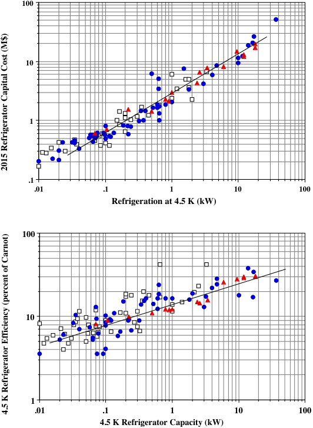
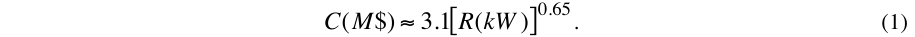
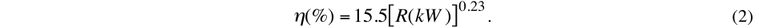
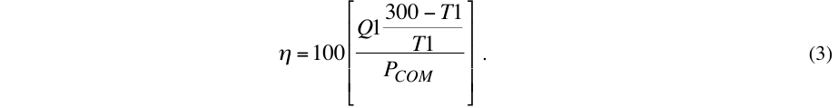
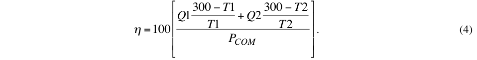
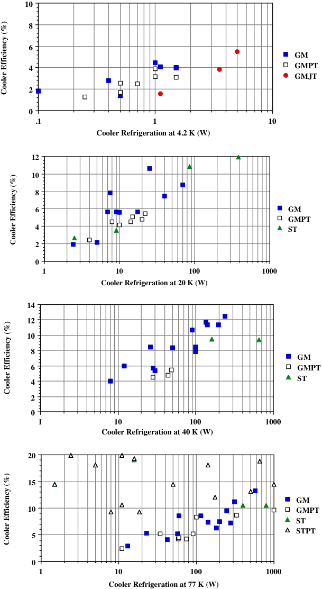
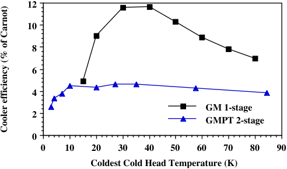
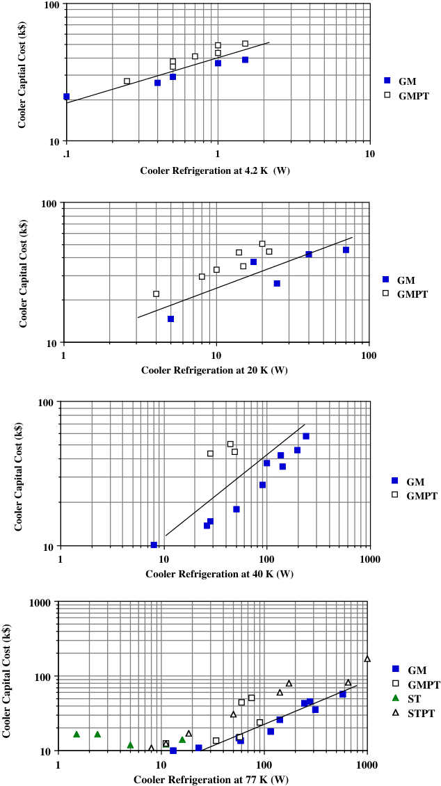

IOP Conference Series: Materials Science and Engineering 

## **PAPER • OPEN ACCESS** 

## The cost of coolers for cooling superconducting devices at temperatures at 4.2 K, 20 K, 40 K and 77 K 

To cite this article: M A Green 2015 IOP Conf. Ser.: Mater. Sci. Eng. 101 012001 

View the article online for updates and enhancements. 

## You may also like 

- Critical current and n-value prediction of second-generation high temperature superconducting conductors considering the temperature-field dependence based on the back propagation neural network with encoder 

Lingfeng Zhu, Yinshun Wang, Ziqing Meng et al. 

- An analytical study of enhancing performances for daytime silicon micropillar radiative cooler Han Han, Shao-bo Liu, Yi-yu Yue et al. 

- Novel technologies and configurations of superconducting magnets for MRI Yuri Lvovsky, Ernst Wolfgang Stautner and Tao Zhang 

This content was downloaded from IP address 73.63.211.100 on 30/09/2026 at 00:01 

# **The cost of coolers for cooling superconducting devices at temperatures at 4.2 K, 20 K, 40 K and 77 K** 

## **M A Green** 

Lawrence Berkeley Laboratory, M/S 46-0161, Berkeley CA 94720, USA 

MAGreen@lbl.gov 

**Abstract** . This author and other authors have written papers concerning the cost of refrigeration as a function of the refrigeration delivered.   These papers have included small coolers as well.  The lowest temperature range from 3.8 K to 4.7 K (the liquid helium temperature range) is covered using coolers that have two stages.  The use of magnets and power equipment that use MgB2 conductors and HTS conductors have spurred the development of coolers that work well temperature ranges from 15 K to 30 K (hydrogen temperature applications), HTS conductors like BSSCO and YBCO for the range fro 35 to 50 K and HTS devices from 65 K to 80 K (applications in the liquid nitrogen temperature range). This paper will present some cost data for a number of commercial two-stage and single-stage coolers.  This data will be fitted to allow one to estimate the cost of coolers as a function of refrigeration for temperatures of 4.2 K, 20 K, 40 K and 77 K.  The efficiency of a large number of coolers over a range of temperatures is also discussed. 

## **1.  Introduction** 

There have been a series of papers written on the cost of cryogenic refrigeration.  The first papers came out the National Bureau of Standards NBS (now NIST in the 1960’s) [1], [2].   The work in the 1960’s plotted the cost of helium refrigerators and liquefiers as a function of refrigeration at 4.5 K.  A cost equation was fitted to the measured data of refrigeration capital cost versus the refrigeration developed at 4.5 K. A later paper on the cost of cryogenic refrigerators was extended to refrigerator operating over a range of temperatures fro 4 K to 80 K.  In the later paper the cost of the refrigerator was plotted against the input power to the compressor [3].  In order to cover various refrigeration temperatures, cost algorithm was developed as a function of the input power to the compressor.  The cost equations for refrigeration were updated in 1991 [4], 1997 [5], and 2008 [6].  In the updated cases, the costs of refrigerators manufactured earlier were indexed to the rate of escalation of common machinery [7].  Between 2007 and 2015, the total escalation for mechanical systems has been 18 to 20 percent.   The cost of small coolers was included in the refrigerator cost estimates before 2007, but the cost of these coolers didn’t fit the general cost trend that was dominated by the larger machines. 

The 2008 paper included a separate plot the cost of two-stage GM and pulse tube coolers that operate at 4.2 K separately versus the refrigeration at 4.2 K [6].  Commercial two-stage coolers don’t have a minimum temperature below ~2.5 K.  As the temperature of helium 4 goes below 2.5 K, the specific heat of helium 4 increased rapidly as one approaches the lambda line.  In order to go below 

Content from this work may be used under the terms of the ~~Creative Commons Attribution 3.0 licence~~ . Any further distribution of this work must maintain attribution to the author(s) and the title of the work, journal citation and DOI. Published under licence by IOP Publishing Ltd 1 

2.5 K, one had use helium 3 as the cooler working fluid or one had to have a separate helium 4 supercritical J-T loop in conjunction with a two-stage cooler [8]. There are commercial single-stage coolers that can go down to ~12 K.  Most single-stage coolers have a minimum operating temperature of about 25 K.  Figure 1 is a plot of larger 4.5 K refrigerator cost (10 watts and above) in 2015 dollars versus 4.5 K refrigeration.  This is based on the plot in the 2008 paper [6], with all of costs escalated by 20 percent.  There are no new data points added in Figure 1.  Figure 2 shows the efficiency of the refrigerator systems shown in Figure 1.  There is no new data since 2007.  Figures 1 and 2 are shown so that the data on coolers can be put in to perspective compared to large refrigerators 

**----- Start of picture text -----** 
100 10 1 .1 .01 .1 1 10 100 Refrigeration at 4.5 K (kW) 100 10 1 .01 .1 1 10 100 4.5 K Refrigerator Capacity (kW) 2015 Refrigerator Capital Cost (M$) 4.5 K Refrigerator Efficiency (percent of Carnot) **----- End of picture text -----** 

**Figure 1** .  The cost of larger 4.5 K refrigerators versus the refrigeration generated.  The costs have been escalated 20 percent from 2007. The open squares are machines made before 1975. The closed circles are for machines made between 1975 and 1997.  The filled triangles are for machines made after 1997. There are no machines made after 2007 on this graph. 

**Figure 2** .  The efficiency of larger 4.2 K refrigerators.  The symbols above are the same as for the previous graph.    Some of the machines in this graph have LN2 pre-cooling.  There are no machines made after 2007 on this graph. 

The cost of the large refrigerators _C_ can be estimated as a function of refrigeration _R_ as follows; 

The efficiency of a large refrigerator η can be estimated as a function of R as follows; 

Equation 1 gives the cost of larger refrigerators (>100 W) in 2015 dollars.  Note there is no new data in Figure 1.  The 2007 costs were escalated by twenty percent.  Equation 2 and Figure 2 contain the same information that was found in the 2007 paper by this author [6].  The data from the previous paper can be compared with the cost and efficiency data for coolers over a range of temperatures. 

The number of cooler manufactures at 4.2 K remains at under a half dozen.  Two companies manufacture over ninety percent of the coolers sold in this temperature range.  For the most part the companies make two-stage coolers that can produce cooling at 4.5 K or below on the second-stage while producing cooling on their first-stages at temperatures as low as 30 K.  These two companies make GM coolers and GM pulse tube coolers.   There are some 4.2 K GM coolers with separate J-T circuits on the market.  These coolers don’t have a separate stage at a higher temperature. 

The production of 4.2 K coolers continues to increase despite the economic down turn that started in 2007.  There are a number of reasons for this increase in production of 4.2 K coolers.  The two primary reasons are; 1) the high cost and unavailability of liquid helium for many users and 2) the high cost and unavailability reliable Claude cycle refrigeration plants in the range of 10 to 100 W at 4.5 K. As a result many superconducting magnet systems have been developed around using small coolers to cool these magnet systems.  The same can be said concerning superconducting electronics 4.2 K. 

The possible use of MgB2 superconductors and high temperature superconductors (HTS) for a number of applications has caused the number of cooler manufactures to grow.   At temperatures above 4 K, there are a number of companies that produce coolers that cover the temperature range from 10 K to 80 K.  These coolers can be either two-stage or a single-stage coolers depending on the temperature range where the coolers operate. 

## **2.  The types of coolers surveyed and the number of coolers at each temperature point** 

The cooler refrigeration and input power data was collected for seventy-two different coolers from eight vendors.  This search does not include all of the vendors producing coolers, but the companies represented produce most of the coolers being sold.  Twenty-five coolers operate at 4.2 K; twenty coolers are suitable for 20 K cooling; twenty of these coolers can be used at 40 K; and forty of the coolers can be used at 77 K.   The author made the chose as to which coolers would be used in a given temperature range based on the vendor provided curves of cooler refrigeration versus cold head temperature.  Common sense was also a factor in the selection. 

The types of coolers in this survey include GM coolers (GM), GM pulse tube coolers (GMPT), mixed GM coolers with J-T circuits (GMJT), Stirling cycle coolers (ST) and Stirling cycle pulse tube coolers (STPT).    All of the coolers in the survey are designed to provide cooling for a period of one year or more without maintenance.  This is what is required for a cooler to be used on superconducting devices that run continuously.  The ease of maintenance may be a factor in cooler selection. 

Helium 3 coolers and dilution refrigerators and other very low temperature refrigerators are not included in this survey.  This survey is confined to coolers that operate in the temperatures range from 3 K to 80 K.  Coolers used in space or by the military are not included in this survey.  These coolers are expensive and often their operating parameters and costs are classified. 

Single stage, two stage and three stage coolers are included in the mix.  The companies are not identified in this survey.  It should be pointed out the author is not advocating one cooler or one type of cooler over another.  Each cooler type has its advantages and its disadvantages.  Not all of the companies surveyed provided budgetary cost data.   The cost data is given in US dollars and for the most part it includes delivery of the cooler cold heads, the control system, the compressor and the hoses that connect the compressor to the cold heads.  In some cases, the prices were quoted in the currency of the county of origin and converted to US dollars at the time the quote was given.  For the most part, add-ons are not included.  For example accurate calibrated temperature sensors on the cold heads are not included.  In most cases the vendor has tested the cooler in his factory.  Efficiency of the coolers where data is given for coolers at 4.2 K, 20 K, 40 K and 80 K. 

## **3.  Methods used to calculate cooler efficiency** 

For all of the coolers in this survey (even those with no cost data) there is refrigeration data for the temperature where the cooler is appropriate for use.  For example, many of the two stage 4.2 K coolers can be used at 20 K and in some cases 40 K.  Two-stage cooler with a minimum temperature that is above 4.2 K are not appropriate for use at 4.2 K, but they are usable at 20 K and perhaps even 40 K. 

Single stage coolers that are designed for use at 77 K may also be used at 40 K.  A few of these coolers may be appropriate for use at 20 K.  The author of this paper has, in some cases, made an arbitrary choice as to what graphs these coolers appear on.  The choice is clear in some cases based on input power and cost (when the cost is known).  In other cases the choice may not be clear.   The user of a particular cooler may have other ideas as to how to use that cooler.  The manufacturers of the coolers are not given in this report.  However, the type of cooler is identified. 

The efficiencies of the coolers given as percent of Carnot were calculated by the author using the equations given below.  The cooler vendors may use a different way of calculating efficiency.  The cooling is what the cooler will deliver with a 60 Hz power source.  The input power to the compressor is the input power specified by the manufacturer when run on a 60 Hz power source.  The efficiency is calculated for a rejection temperature of 300 K for all of the coolers. For single-stage coolers, the author used the following equation to estimate the cooler efficiency η; 

_Q1_ is the refrigeration produced at temperature _T1_ and _PCOM_ is the input power of the compressor selected by the manufacturer.  For two-stage coolers, the author used the following equation to estimate cooler efficiency η; 

_Q1_ the first stage refrigeration is produced at temperature _T1_ and _Q2_ the second stage refrigeration is produced at temperature _T2_ simultaneously.  There are a few coolers in the survey that are three stage coolers, but they end up producing cooling only at the lowest temperature.  These coolers are treated as single stage coolers, so equation was used to estimate the cooler efficiency. 

A given cooler will have different efficiencies at different operating temperature.  The author has not calculated the maximum efficiency point for any of the coolers.  This may result in different efficiencies compared to the efficiencies quoted by a vendor.  A cooler that may be suitable for cooling at more than one temperature will have a different efficiency at each temperature.  Many would select a cooler based on the purchase price.  Others might select a cooler based on efficiency. The selection of particular cooler at a given temperature may be based on other factors, such as vibration frequency, vibration amplitude, or the length of the maintenance interval. 

## **4.  The efficiency of coolers at 4.2 K, 20 K, 40 K, and 77 K** 

The efficiency data is presented in graphical form at 4.2 K in figure 3, at 20 K in figure 4, at 40 K in Figure 5 and at 77 K in Figure 6.  There are different symbols for the different cooler types.  The symbol name for GM coolers is GM; the symbol name for GM pulse tube coolers is GMPT, the symbol name for GM coolers with a J-T valve is GMJT; the symbol name for a Stirling cycle cooler is ST; and the symbol name for Stirling cycle pulse tube coolers is STPT.  The graphs are semi-log graphs over the range that is appropriate for the coolers at a given operating temperature. 

Figure 3 contains four graphs of cooler efficiency as a function of the cooler refrigeration at 4.2 K, 20 K, 40 K and 77 K.  The cooler efficiency is given in percent of Carnot.  In all cases the cooler calculations are done with the operating 60 Hz power with water-cooled compressors.  Some data points are the same coolers operating at more than one temperature.  This kind of data is useful when one is using a cooler to cool-down a superconducting magnet or some other device. 

**----- Start of picture text -----** 
10 8 6 GM 4 GMPT GMJT 2 0 .1 1 10 Cooler Refrigeration at 4.2 K (W) 12 10 8 6 GM GMPT 4 ST 2 0 1 10 100 1000 Cooler Refrigeration at 20 K (W) 14 12 10 8 GM 6 GMPT ST 4 2 0 1 10 100 1000 Cooler Refrigeration at 40 K (W) 20 15 GM 10 GMPT ST STPT 5 0 1 10 100 1000 Cooler Refrigeration at 77 K (W) Cooler Efficiency (%) Cooler Efficiency (%) Cooler Efficiency (%) Cooler Efficiency (%) **----- End of picture text -----** 

**Figure 3.** The efficiency of cryogenic coolers as a function of the refrigeration provided by that cooler.  This data is given at 4.2 K, 20 K, 40 K, and 77 K.  The efficiency was calculated using equations 3 and 4. 

For the coolers that operate at 4.2 K one can come up with the following expression to fit the data; η _= 3.1+ 0.91*ln(R)_ .  At 20 K, the efficiency approximate fitting equation is η _= 0.2 + 2.17 ln(R)_ .  At 40 K, one might use η _= -2.8 + 2.95 ln(R)_ .  At 77 K a meaningful fit would be difficult. 

It is clear that GM pulse tube coolers are less efficient than straight GM coolers.  The difference may be in the compressors used by the manufactures of the two types of coolers.  It is interesting to note that Stirling coolers don’t seem to be very different in efficiency than straight GM coolers.  GM coolers with an added J-T loop that operate at 4.2 don’t seem to be much more efficient than GM coolers without a J-T.   What is very interesting is the efficiency of the Stirling pulse tube coolers. These units have the compressor as an integral part of the cooler.  The compressors operate with linear motors that oscillate at frequencies of 50 or 60 Hz. 

At least half of the inefficiency in some of these coolers can be blamed on the compressor. When pumping helium, one wants to have multiple stage compressors with efficient cooling in the compressor and its intercoolers.   Fabricating an efficient and a reliable compressor for small coolers has been an issue in the business for some time.  One wants reliability combined with a technology that ensures that the helium in the cooler be kept free of contaminants.  As cryogenic refrigerators get larger the compressors become more efficient. 

Figure 4 shows the efficiency of a single-stage GM cooler designed for operation above 20 K and a two-stage GM pulse tube cooler designed for 4.2 K over a range of temperatures up to 90 K.  When the two-stage cooler is operating at the second-stage temperatures in Figure 4, the first stage is providing 40 W of cooling.  At about 50 K or above on the second stage, the first stage temperature is lower than the second stage temperature.  This inversion often occurs when a cooler is cooling down a room temperature cryogenic device.  This figure demonstrates that every cooler has its best operating point in terms of efficiency.  This may be a factor in the choice of coolers. 

**----- Start of picture text -----** 
12 10 8 6 4 GM 1-stage 2 GMPT 2-stage 0 0 10 20 30 40 50 60 70 80 90 Coldest Cold Head Temperature (K) Cooler efficiency (% of Carnot) **----- End of picture text -----** 

**Figure 4** .  The efficiency of a two-stage pulse tube cooler that goes down to 4.2 K and a larger single stage cooler that will provide cooling at 20 K as well as at 40 K and 77 K 

## **5.  The cost of coolers at 4.2 K, 20 K, 40 K and 77 K** 

The author requested cooler cost information from the same vendors that he received technical data from.  In all cases the costs of the coolers are for coolers with compressors operating on 60 Hz power. The prices are given in US dollars in the middle of 2015.  The cooler price includes the cold head, the compressor the hoses that connect the cooler to the cold head and any needed controllers that are needed to operate the cooler.  The author requested the list price for a cooler when only one is purchased.  The actual price one would pay for a particular cooler may be different depending on the number of coolers purchased and the circumstances of the buyer. 

Not all of the vendors responded with cost data, so there are more coolers with efficiency data in this report than coolers with cost data.  Since a number of coolers, can be operated over a broad temperature range, the same cooler cost may be appear in more than one temperature range.  The cost data in this report probably represents more than 90 percent of the cooler sold in the middle of 2015. As with the efficiency data given in Figure 3 the cost data given in Figure 5 is based on the following assumptions.  The coolers are operated at 60 Hz AC power and they have water-cooled compressors (for the most part).   Since this paper was presented at the 2015 Cryogenic Engineering Conference in Tucson Arizona in the USA, it is hoped that the author gets some additional feed back from the vendors before the paper is published. 

**----- Start of picture text -----** 
100 GM GMPT 10 .1 1 10 Cooler Refrigeration at 4.2 K  (W) 100 GM GMPT 10 1 10 100 Cooler Refrigeration at 20 K (W) 100 GM GMPT 10 1 10 100 1000 Cooler Refrigeration at 40 K (W) 1000 GM 100 GMPT ST STPT 10 1 10 100 1000 Cooler Refrigeration at 77 K (W) Cooler Captial Cost (k$) Cooler Capital Cost (k$) Cooler Capital Cost (k$) Cooler Capital Cost (k$) **----- End of picture text -----** 

**Figure 5.** The capital cost of cryogenic coolers given in k$ as a function of the refrigeration provided by that cooler given watts.  This data is given at 4.2 K, 20 K, 40 K, and 77 K. 

The cost fitting equations for each case are different.  At 4.2 K one would use the following fitting equation _C(k$) = 40 R(W)[0.323]_ , which is similar to the 2007 equation for 4.2 K coolers [6].  At 20 K, the following fitting equation can be used for most of the data _C(k$) = 9.29 R(W)[0.412]_ .  At 40 K one can use _C(k$) = 3.15 R(W)[0.56]_ and at 77 K use _C(k$) = 1.81 R(W)[0.57]_ .  At 77 K there is a lot of scatter. 

Over the range of temperatures, the cheapest coolers in terms of capital cost are the GM coolers, but when one considers the cost maintenance and the maintenance interval one may want to pay extra for a cryostat that allows the coolers to be maintained without warming up the device to remove the cooler.  All of the coolers in this study have a maintenance interval that allows at least 1.5 years of continuous operation without maintenance of either the cooler or its compressor.  The capital cost of the cooler and the cooler efficiency are not the only considerations when selecting a cooler. 

## **6.  Cooler selection criteria and concluding comments** 

As alluded to in the previous section, there are other criteria for selection the type of cooler to use for cooling a cryogenic device.  The following are a partial list of other selection criteria besides capital cost and cooler efficiency; 1) the cost and frequency of cooler and compressor maintenance, 2) the effect of cooler cold head orientation on cooling, 3) the effect of magnetic field at the cooler cold head or the compressor, and 4) the magnitude and frequency of cooler cold head and compressor vibration. 

GM coolers are almost not affected by cold head orientation.  A typical GMPT cooler must be operated with the cold head down.  High frequency pulse tube coolers are less affected by cold-head orientation.   For information on the effect of cold head orientation, contact the vendor. 

The cooler compressor magnetic induction limit is ~0.02 T.  Most of the cooler cold-heads will operate in a magnetic induction of ~0.05 T.  Pulse tube coolers cold heads can be shielded to operate with a magnetic induction of up to 0.5 T.  GM coolers don’t work well above 0.1 T [9].  As to the Stirling coolers and STPT coolers, one should contact the vendor. 

Cold head vibration is a serious issue for some users.  Pulse tube coolers have a lower magnitude cold head vibration than GM coolers.  Some Stirling coolers are low vibration, but others are not so low.  The effects low frequency vibrations are felt further away than high frequency vibrations [10]. 

## **Acknowledgments** 

The author thanks the companies that provided the information about coolers.  This work was supported by the Office of Science, US Department of Energy under DOE contract DESC0000661. 

## **References** 

- [1] Strobridge T R, Mann D B, and Chelton D B, 1966, “Preliminary analysis of the refrigeration requirements for superconducting magnets in the experimental area of the 200 BeV accelerator,” National Bureau of Standards Report 9259 

- [2] Strobridge T R, 1969, _IEEE Trans. Nucl. Science_ **NS-16** , No. 2, p 1104 

- [3] Strobridge T R, 1974, “Cryogenic refrigerators an updated survey,” NBS Tech. Note 655 

- [4] Green M A, Byrns R A, St. Lorant S J, 1991, “Estimating the cost of superconducting magnets the refrigerators needed to keep them cold,” _Advances in Cryogenic Engine_ ering **37** , p 637, Plenum Press, New York NY 

- [5] Byrns R A, and Green M A, 1997, “An update on estimating the cost of cryogenic refrigeration,” _Advances in Cryogenic Engineering_ **43** , p 1661, Plenum Press, New York NY 

- [6] Green M A, 2008, “The cost of helium refrigerators and coolers for superconducting devices as a function of cooling at 4 K,” _Adances in Cryogenic Enginering_ **53** , p 872, AIP Press, Melville NY 

- [7] American Institute of Economic Resources, Economic Education Bulleton, November 1996 (In USA the escalation of machinary prices betwenn 1996 and 2015 was about 60 percent.) 

- [8] Choi Y S, et al, 2006, “Helium-liqufaction by cryocoolers for high field magnet cooling,” _Proceedings of the International Cryocooler Conference_ **ICC-14** 

- [9] Green M A and Witte H, 2008, “The use of small coolers in a magnetic field,” _Adavnaces in Cryogenic Engineering_ **53** , p 1299, AIP Press, Melville NY 

- [10] Green M A, et al, “Ground motion measurements at the LBL light source site, the Bevatron and at SLAC,” page 59 and pages A1 and A2, Lawrence Berkeley Lab Report LBL-21519 (December 1986) 

