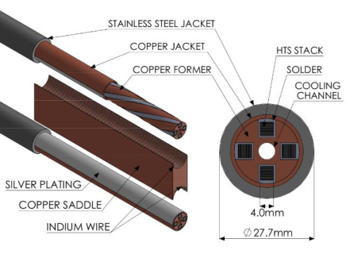
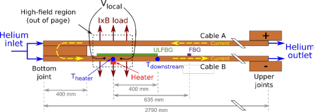
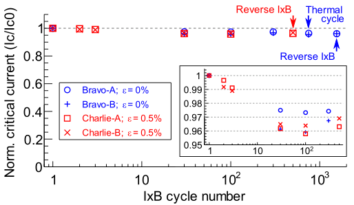
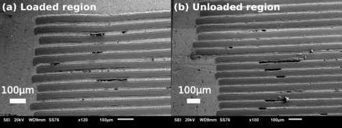
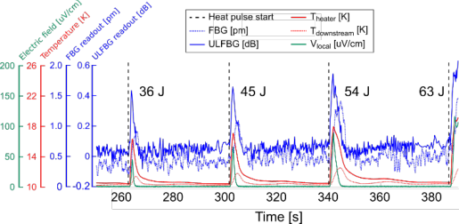
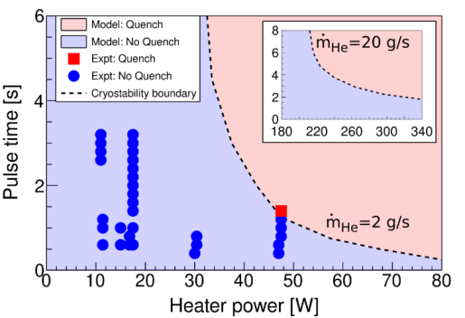

**IOP** Publishing Journal **XX** (XXXX) XXXXXX 

Superconductor Science and Technology https://doi.org/XXXX/XXXX 

## **VIPER: An industrially mature highcurrent high temperature superconductor cable** 

**Zachary S. Hartwig[1] *, Rui F. Vieira[1] , Brandon N. Sorbom[2] , Rodney A. Badcock[4] , Marta Bajko[3] , William K. Beck[1] , Bernardo Castaldo[3] , Christopher L. Craighill[2] , Michael Davies[4] , Jose Estrada[1] , Vincent Fry[1] , Theodore Golfinopoulos[1] , Amanda E. Hubbard[1] , James H. Irby[1] , Sergey Kuznetsov[2] , Christopher J. Lammi[2] , Philip C. Michael[1] , Theodore Mouratidis[1] ,Richard A. Murray[1] , Andrew T. Pfeiffer[1] , Samuel Z. Pierson[1] , Alexi Radovinsky[1] , Michael D. Rowell[1] , Erica E. Salazar[1] , Michael Segal[2] , Peter W. Stahle[1] , Makoto Takayasu[1] ,Thomas L. Toland[1] , Lihua Zhou[1 ]** 

1 MIT Plasma Science and Fusion Center, 167 Albany St, Cambridge MA, 02139, USA 

2 Commonwealth Fusion Systems, 501 Massachusetts Ave, Cambridge MA, 02139, USA 

3 CERN, CH-1211 Geneva 23, Geneva, Switzerland 

4 Robinson Research Institute, Victory University of Wellington, 69 Gracefield Rd, Lower Hutt 5046, New Zealand 

E-mail: hartwig@psfc.mit.edu 

Received xxxxxx Accepted for publication xxxxxx Published xxxxxx 

## **Abstract** 

High-temperature superconductors (HTS) promise to revolutionize high-power applications like wind generators, DC power cables, particle accelerators, and fusion energy devices. A practical HTS cable must not degrade under severe mechanical, electrical, and thermal conditions; have simple, low-resistance, and manufacturable electrical joints; high thermal stability; and rapid detection of thermal runaway quench events. We have designed and experimentally qualified a Vacuum Pressure Impregnated, Insulated, Partially transposed, Extruded, and Roll-formed (VIPER) cable that simultaneously satisfies all of these requirements for the first time. VIPER cable critical currents are stable over thousands of mechanical cycles at extreme electromechanical force levels, multiple cryogenic thermal cycles, and dozens of quench-like transient events. Electrical joints between VIPER cables are simple, robust, and demountable. Two independent, integrated fiber-optic quench detectors outperform standard quench detection approaches. VIPER cable represents a key milestone in next-step energy generation and transmission technologies and in the maturity of high-temperature superconductors as a technology. 

Keywords: HTS, superconducting cables, superconducting magnets, quench detection 

## **1. Introduction** 

Discovered in 1911 [1] and made practical in the 1960s [2], low temperature superconductors (LTS) like NbTi and Nb3Sn have seen select deployment in accelerator magnets, 

specialized research instruments, and medical MRIs. Broader application has been limited by cost, material properties, and the engineering and operational challenges of liquid-helium (4 K) temperatures. However, the discovery of ceramic-based superconductors operating above liquid nitrogen (77 K) temperatures in 1987 [3], coupled to present industrial-scale 

xxxx-xxxx/xx/xxxxxx 

© xxxx IOP Publishing Ltd 

thin-film deposition processes [4,5], has enabled the production of 100’s of km per year of rare earth barium copper oxide HTS, which alleviate many LTS limitations. 

Small bore HTS research magnets have been wound from single tapes [6,7], while larger-scale applications – accelerator and fusion magnets, generators and motors – must combine many HTS tapes into conductors, or cables, to maximize current capacity, allow sufficient cooling, and provide structural support. There are three principal HTS cable architectures: Twisted Stack Tape Conductor (TSTC) [8], Conductor on Round Core (CORC) [9], and Roebel [10]. Despite significant progress [11-17] including a recent successful demonstration of a 4 kA CORC cable in small solenoid coil at 16.5 T [18], no instantiation of these architectures has simultaneously satisfied the challenging requirements of high-field (>15 T) magnets and high-current (>25 kA) applications: (1) stability against critical current degradation under mechanical and thermal cycling; (2) high cryostability and reliable quench detection techniques; and (3) simple, low resistance, and manufacturable electrical joints. 

This paper presents the design, fabrication, and qualification of a TSTC-based HTS cable called VIPER that satisfies each of these criteria, resulting in a manufacturable and scalable conductor. VIPER cable length, cross section, shape, and current capacity can be adapted for a variety of high-current applications; here, we primarily focus on a version for high-field DC fusion magnets. Such magnets present some of the most extreme challenges of any superconducting application and, therefore, are a valuable provind ground. By enabling high-field magnetic fusion energy [18], VIPER cables can accelerate the reduction in HTS cost through industry scale up [19] and open new opportunities for HTS technology to impact superconducting magnets, DC transmission lines, generators, and transformers [20]. 

## **2. Cable Design** 

VIPER cable comprises a central leak-tight channel carrying cryogenic VIPER cable comprises a central leak-tight channel carrying cryogenic coolant in a copper core with rectangular channels on the perimeter supporting HTS stacks. The core is fabricated with a continuous extrusion method that is inexpensive, consistent, and scalable to hundreds of meters with tight tolerances. The extrusion and HTS stacks are twisted to (1) eliminate strain accumulation in the HTS during fabrication, especially when the cable is bent into a coil and (2) reduce transient heat generation mechanisms during operation through partial transposition of the HTS tapes, which breaks magnetic flux linkage in the HTS stacks under changing magnetic field conditions [21]. 

Figure 1 shows a VIPER cable design suitable for DC fusion energy magnets such as the toroidal field (TF) magnet of a tokamak. Superconducting cables in TF magnets typically 

carry high-currents (I = 25 – 75 kA) in large magnetic fields (B > 10 tesla), resulting in strong, potentially damaging IxB electromechanical forces that can exceed 1000 kN/m on the cable. Fusion machine lifetimes require magnets to survive on the order of 10 to 100 thermal cycles and 1,000 to 10,000 mechanical load cycles. Cables can range from 100 m to 1000 m in length and require minimum bend radii as low as tens of cm. The tens to hundreds of electrical joints between cables required in a TF magnet must typically be on the order of a few nano-ohms or less per joint for reasonable cryogenic cooling. Thus, TF-suitable cables must provide high-current density, structural strength, and sufficient cooling access in a manufacturable package that can be reliably jointed with nano-ohm resistances. 

VIPER cable is based on a specific configuration of the TSTC HTS cable architecture that was first proposed by Takayasu [22] and developed further by Celantano [23]. VIPER cable extends these designs by simplifying the configuration, increasing the current density, and applying a vacuum pressure impregnation (VPI) solder process. A single solder process simultaneously connects the HTS tapes within the cable and joint regions mechanically, electrically, and thermally to each other and to the copper former. There is precedent for soldered superconductors, particularly early in the development of LTS superconducting technology [28]; however, no cable engineering solution coupling HTS and solder has demonstrated the performance shown in VIPER cable. 

_Figure 1: VIPER cables for high-field superconducting fusion magnets. (Right) HTS stacks are VPI soldered into channels in a twisted copper former containing a central cooling channel and surrounded by roll-formed copper and optional stainless-steel jacket. (Left) A cut-away showing that joints are easily created by silver plating the cable ends and compressing them into a copper saddle. Indium wire ensures maximum surface contact for minimal electrical resistance. The joint shown is configured for the SULTAN facility; joints in applications would use a much smaller copper saddle to bring the cables closer._ 

Mechanically, soldering converts VIPER cable and joint regions into monolithic structures with no internal component movement. Loads are transferred away from the immobile 

HTS stacks through the solder and copper former to external structural supports such as stainless-steel jackets or plates [2425]. This prevents mechanical degradation from electromagnetic loading and cycling, which has plagued 

demountable joints and magnets operating with damaged cables. 

## 2.1 Joints 

nearly all previous superconducting cables [26-27]. 

Electrically, soldering ensures good conductivity among individual HTS tapes in a stack and between HTS stacks and the copper former. This facilitates low-resistance current sharing between the HTS and copper former volumetrically throughout the cable, resulting in uniform current distribution within HTS stacks, good current distribution within joints, and tolerance of HTS quality, manufacturing processes and localized heating. These features relax VIPER manufacturing constraints, allow for lower costs, and increase throughput and reproducibility. Twenty VIPER cables have been produced between 1 and 12 meters in length. Cable critical current was consistent and predictable to better than 3% under a variety of operating conditions, including temperature (4.5 K – 77 K) and external magnetic field (self-field to 10.9 T), while the fabrication process degraded the cable critical currents from the ideal design value by less than 5%. Post-fabrication CT scans and scanning electron microscope (SEM) imaging of VIPER cables show acceptable solder void sizes under ~3 mm[3] and void fractions under ~5% as seen in Figure 4. Importantly, VIPER cable fabrication does not require any heat treatment processes, a distinct difference to cables using LTS (Nb3Sn) and other HTS (Bi-2212) materials [28-29]. 

Thermally, soldering provides a pathway for heat deposited or generated within the HTS stack to move efficiently through the copper former to the central coolant channel. By operating at 20 K, VIPER cables access copper specific heats approximately fifty times larger and thermal conductivities approximately five times larger than LTS cables can at 4 K. The result is high cryostability against the large thermal loads found in many applications, such as nuclear heat loads in fusion or accelerator magnets, AC losses in pulsed magnets, and current-sharing operation in 

VIPER cable design allows for a simple joint design and manufacturing process. Joints, which supply current to cables, are significant sources of resistive heat load, historically complex, fragile and challenging to fabricate, and often the cause of cable and application failures. The fabrication complexity for joints in LTS cables can be high [29-30]. While higher temperature stability margins can relax joint resistance requirements in HTS cables, HTS joints to date have not achieved the simple design, consistent low resistances, and easy fabrication required for commercial applications [16,3132]. Nano-ohm resistances have been achieved, but to do so hundreds of tapes needed to be individually connected per joint, resulting in complex, long, and error-prone fabrication processes that do not scale favorably and make in-field repair and maintenance difficult [33-35]. 

These challenges are all addressed in VIPER cable. During fabrication, the VPI solder process brings individual HTS tapes into intimate electrical contact with each other, and a roll-formed copper jacket provides a mechanically strong and electrically continuous shell from termination to termination. Thus, the challenge of creating cable joints is reduced to connecting the external copper cable jacket directly to another cable jacket or current lead. As a result, VIPER joints involve minimal manufacturing complexity. For each cable pair, a double saddle is simply clamped between two cable jackets. 

An example of a VIPER cable-to-cable joint designed for a cable test in the “praying-hands” configuration is shown in Figure 1. VIPER joints provide a high degree of design flexibility, accommodating, for example, “shaking hands” style joint configurations and smaller copper saddles. Smaller saddles minimize the distance between cables, reducing joint resistance and increasing current density. Joint fabrication can 

_Table 1:  Summary of VIPER electromechanical tests at SULTAN Results include the electrical resistance in each cable-to-cable joint (at zero magnetic field and average magnetic field to show impact of magnetoresistivity) and degradation of critical temperature (Alpha) and critical current (Bravo, Charlie, Delta) from IxB mechanical cycling and axial strain. HTS with specific critical current performance was selected to achieve the objectives for each test._ 

be completed in several person-hours per joint with basic tooling and produces consistently low resistances. The electrical resistance for four VIPER cable-to-cable joints at operating temperatures and magnetic fields are shown in Table 1. These low resistances were maintained over thousands of mechanical loading cycles and multiple thermal cycles. Current was shown to be uniformly distributed within the HTS stack less than 5 cm beyond the joint regions at 77 K, indicating effective current redistribution. The joints were easily disassembled and reused in a few hours, facilitating access for inspection and maintenance essential in real-world applications. 

## **3. Cable Testing at SULTAN** 

To assess the mechanical stability, cryostability, and robustness to quench of VIPER cable, four cable pairs – designated Alpha, Bravo, Charlie, and Delta – were tested in the SULTAN facility at the Paul Sherrer Institut [36] under prototypic high-field magnet conditions as shown in Figure 2. The primary objective of Alpha, Bravo, and Charlie samples were to maximize the mechanical load achievable per HTS stack – the most important risk retirement parameter for VIPER cables – not the total cable current; the primary objective of the Delta cable was to investigate the effect of multiple stacks per cable and quench detection techniques. HTS with specific performance was chosen to achieve the objectives of each cable test. 

_Figure 2: Simplified schematic of VIPER cable test setup at SULTAN. Two VIPER cables are connected by a joint and tested at temperatures between 4.5 and 20 K and background magnetic fields up to 10.9 T. Instrumentation cited in this paper including voltage taps (Vlocal), temperature sensors (Theater, Tdownstream), fiber optic quench detectors (FBG, ULFBG), and the external heater is shown. IxB loading for mechanical cycling impact on critical current (Figure 3) is achieved in the high-field region. Dimensions not to scale._ 

## _3.1 Mechanical Stability_ 

In high-field magnets, IxB forces can destroy HTS tapes by driving them into surrounding structural material, by creating high tape stack face pressures, and by creating strain from the circumferential expansion of the magnet [37]. The Alpha pair followed the design shown in Figure 1 but had one HTS stack each. It underwent 2000 IxB cycles with 17 kA x 10.9 T = 185 kN/m (36 MPa transverse pressure) on the HTS stack at T = 5 K, a reverse IxB cycle, and a cryogenic-to-room- 

temperature thermal cycle. Critical temperature (measured at I = 7 kA current and T = 30 K) degraded only slightly (2.0% and 3.8% for the two cables) in the first 30 cycles before stabilizing for the remainder of the test. 

The Bravo and Charlie pairs were identical to each other and had one 1 HTS stack in each cable. They underwent 1550 (Bravo) and 500 (Charlie) IxB cycles at 35 kA x 10.9T = 382 kN/m (75 MPa transverse pressure) on the HTS stack at 5 K, a reverse IxB cycle, and a thermal cycle (Bravo). The Charlie cables were axially strained to 0.5% using a specially engineered support structure to simulate the hoop strain that occurs in a magnet. To our knowledge, this is the first simultaneous IxB loading and axial strain test in straight superconducting cables at realistic operating conditions, avoiding the need for placing complex 3D test cables inside expensive and rare large-bore magnets. 

_Figure 3: Critical current degradation over mechanical cycling. IxB mechanical cycling results for the Bravo and Charlie VIPER cable pairs at T = 5 K, and IxB = 382 kN/m; the critical current was checked at the intervals using voltage tap measurements. Charlie cables had an additional 0.5% axial strain applied. The initial degradation between 3% and 4% consistently stabilizes after 30 cycles. Thermal cycling and current-reversal events occur as indicated with negligible impact on critical current._ 

The critical current evolution for the Bravo and Charlie pairs are shown in Figure 3. Critical current in the four cables degraded by between 3.1% and 4.1% in the first 30 cycles then stabilized. The ability to withstand 382 kN/m on a single HTS stack with negligible degradation improves on the previous record of 102 kN/m by almost a factor of four [11]. 

The Delta pair (4 HTS stacks each) experienced 150 IxB cycles at 50 kA x 10.9T = 545 kN/m for the cable and 136 kN/m (27 MPa transverse pressure) per HTS stack, two thermal cycles, and 24 quench simulation events. Delta cables responded similarly to cycling as Alpha, Bravo, and Charlie with critical current (Ic = 45.5 kA measured at B = 10.9 T and T = 10 K) degradations of 2.4% and 2.5%. 

A summary of the electromechanical results is shown in Table 1. For all eight cables, performance degradation asymptoted to between 2.0% and 4.1%, independent of cable fabrication specifics, HTS tape manufacturer, IxB loading, 

axial strain, and operating conditions. Sectioning, polishing, and SEM imaging of the cables after the SULTAN tests, such as a cable from the Charlie pair shown in Figure 4, showed no significant macroscopic mechanical damage due to the immobilization of the HTS tapes in the solder. 

_Figure 4: Post-mortem imaging of a VIPER cable. Following tests at SULTAN, one of the cables from the Charlie pair was sectioned, polished, and imaged with a scanning electron microscope to investigate fabrication quality and electromechanical loading on the HTS stack. The region in (a) experienced 500 mechanical cycles at an IxB loading of 382 kN/m under an axial strain of 0.5% while (b) experienced neither IxB loading or axial strain. Solder uniformity is high with only small, infrequent inter-HTS tape voids. The HTS tape stack and solder show no significant mechanical degradation from load cycling._ 

Microscopic 100 µm lengths of HTS were observed to have separated from the HTS substrate into inter-HTS tape solder voids. These low-density microscopic defects – a combination of fabrication imperfections and mechanical cycling – do not significantly degrade the electrical performance. Electromechanical finite element analysis was performed and suggests that plastic strains in the solder, which concentrate at the corner tips of the HTS stack and approach 1%, likely cause a few percent of the HTS tape to degrade under loading, consistent with experimental observations. The analysis showed that ensuring good HTS structural support through good solder ductility, small solder coefficient of thermal expansion, and strong solder adhesion to the HTS and copper former are the key drivers to eliminate critical current degradation. 

The immobilization of the HTS stacks provided by the VPI solder mitigates Ic degradation from large IxB forces in VIPER cables and effectively transfers the force into the surrounding steel support structure. This compares favorably to the challenging development of LTS Nb3Sn cables for fusion magnets, in which substantial efforts were required to overcome the large and continuous Ic degradation observed in SULTAN tests [38], and to other present HTS cable concepts, in which repeated movement of HTS stacks or sub-strands caused unstabilized Ic degradation of 10% to 20% at 2000 cycles under twelve times less IxB force (~30 kN/m) and seven times less transverse pressure (~10 MPa) per HTS stack than was applied to VIPER cables [39]. Because force per stack – not total cable current – is the critical risk retirement metric for eliminating Ic degradation, a VIPER cable with six 

HTS stacks with roughly six times the current density of the Bravo or Charlie cables can be deployed with minimal additional risk of Ic degradation. 

## _3.2 Cryostability & Quench_ 

Off-normal heating in a superconducting cable can cause thermal runaway known as quench, which has been a major outstanding issue for insulated HTS magnets, particularly for fusion and accelerator magnets with large stored energy. Quench detection in HTS cables is more challenging than in LTS cables due to their higher thermal stability, which can cause lower normal zone propagation velocities (NZPV), slower detection times, and higher probability of damage [40,41]. Quench detection techniques that are fast enough to avoid damage in practical HTS cable-based magnets with high electrical noise and significant energy storage have not been demonstrated to date. 

_Figure 5: Heat pulse response and quench detection. Four external heater pulses at 45 W depositing energies of 36 J, 45 J, 54 J, and 63 J into a Delta cable operated at B = 10.9 T, T = 10 K, Iop/Ic = 0.9, and_ 𝑚 _He = 2.0 g/s. The cable returns to stable operation after the first three pulses despite current-sharing with local electric fields reaching 85 µV/cm. The cable quenches after the fourth pulse. Two fibre optic quench detection technologies, based on FBG and ULFBG techniques, track temperature excursions with local temperature sensitivities of 1-2 K and with ULFBG detection times approaching 5 ms._ 

For the Delta cables in SULTAN, NZPVs were measured by using the propagation of a 100 µV/cm electric field front on axial voltage tap arrays during quench events with results between 0.04 to 0.42 m/s under various operating conditions (B = 10.9 T; T = 10 K, 20 K; operating current Iop = 36.0 kA, 40.5 kA, 45.0 kA, 47.5 kA; Iop/Ic = 0.8, 0.9, 1.0, 1.05). The measured NZPVs were equal to or faster than those measured in individual HTS tapes, which have been found between 0.07 and 0.13 m/s for typical operating conditions [40]. VIPER NZPVs approach those in LTS conductors [42], are consistent with analytical calculations [43], and enable a wide optimization for voltage-tap based quench detection systems on VIPER cables. 

_Figure 6: VIPER cable cryostability map. A multiphysics model predicting the cryostability boundary in response to external heater pulses of increasing power and time for conditions B = 10.9 T, T = 10 K, Iop/Ic = 0.9, and ṁHe = 2.0 g/s. The available experimental data in these conditions shows good agreement with the model. The inset shows the enhanced cryostability that is achievable in VIPER cable applications with increase helium mass flow rate._ 

Figure 5 shows a Delta cable recovering from three increasing-duration 45 W external resistive heater pulses but quenching on a fourth. A detailed multiphysics model successfully captures the superconducting, electrical, thermal, and magnetic behavior of the cables without relying on any free parameters. Figure 6 shows a model-generated cryostability map with a predictive boundary between stability and quench in response to external heating that is in good agreement with measured data. The model confirmed that VIPER cryostability results from the favorable combination of high heat capacity, low electrical resistance of the copper former at 20 K, and the rapid heat removal pathway provided by the VPI soldering of the HTS and copper former. 

At typical cable operating conditions (B = 10.9 T, T = 20 K, Ic = 31.5 kA, Iop < 31.5 kA, Iop/Ic < 1.0, and helium mass flow rate (ṁHe) = 2.0 g/s), Delta cables were stable up to 0.8 MW/m[3] of heating, induced by the external heater running at 57 W for up to 15 s and depositing 0.9 kJ of energy. In response to heater pulses greater than 47 W, the cables recovered from strong current-sharing operation with electric fields in excess of 100 µV/cm, one hundred times greater than the 1 µV/cm HTS superconducting-to-normal transition criterion. Quenches in response to external heater pulses were almost exclusively observed at T < 20 K and Iop/Ic > 1.0. Temperature excursions on the Delta cable were monitored with two fiber optic quench detection technologies: an array of discrete fiber Bragg gratings (FBG) [44] and a distributed single ultra-long FBG (ULFBG) [48]. Each technique uses a variation of monitoring the temperature-dependent spectral response of fiber Bragg gratings inscribed into optical fibers. FBG and ULFBG coated optical fibers were embedded in the outer circumference of the Delta cable copper jackets, ensuring good thermal contact and mechanical protection. 

Figure 5 shows that both technologies demonstrated consistent, unambiguous detection of local temperature excursions of 2 to 3 K. ULFBG detection times were on the order of 100 ms, oven ten times shorter than time-to-damage from quenches in superconducting fusion magnets [45]. FBG response times to hot spots at the gratings are as rapid but total detection times are dependent on the grating spacing and NZPV. 

Both techniques represent improvement over traditional voltage tap approaches in, for example, large-scale fusion magnets, which require multi-second wait times to achieve sufficient signal-to-noise and could result in potentially destructive temperature rises up to 150 K [46]. The two fiberoptic systems are complementary: the ULFBG system is a sectional measurement that provides fast detection times at the expense of positional information; the FBG system provides spatially resolved temperature excursions anywhere in the cable but requires time for the normal zone to propagate to the nearest discrete grating. Both technologies have favorable scaling to the 100 m lengths required for high-field fusion magnets and other applications, requiring manufacturing of longer fibers but utilizing the same equipment and analysis techniques used in the shorter experiments described here. 

## **4. Discussion** 

With its combination of mechanical strength, high cryostability, rapid quench detection, simple joints, and ease of manufacture, VIPER cable expands the performance boundaries of many critical energy generation and transmission technologies. It will, for example, enable the performance of large-scale high-field superconducting magnets to push well past 15 T. Such high-field superconducting magnet technology is presently enabling the high magnetic field pathway to accelerated fusion energy [47], including in the SPARC tokamak, an experiment seeking the demonstration of net fusion energy by the mid 2020’s, and slated to begin construction in 2021 [48]. VIPER cable may also be relevant to high-energy physics detector magnets like those planned for the future circular collider (FCC) [49]. And it may find use in DC power cables, in the DC field winding components of electric motors and generators in the 10+ MW class, as well as in magnetic energy storage devices. Combined, these application categories are expected to collectively drive significant scale-up of HTS industry volumes and a corresponding reduction in cost. HTS demand in excess of 1000 km/yr is projected to drive the price of HTS tape below the $50 / kA-m level over the next decade, widely considered a threshold for wide-scale application [19,20]. We expect cost-effective VIPER cables to replace LTS cable in present and future applications and open new opportunities previously inaccessible to superconducting technology. 

## **Acknowledgements** 

The authors would like to thank the following people, without which this work would not have been possible: the technical staff at MIT for their work on fabrication, testing, and facilities; the SULTAN team at Paul Sherrer Institut, especially Pierluigi Bruzzone, Boris Stepanov, Kamil Sedlak, Markus Jenni, and Christophe Müller, for all their tireless work and expert guidance during the cable test campaigns; Tancredi Botto, Maxim Marchevsky, Federico Scurti, and Justin Schwartz for their work on additional quench instrumentation; Rein Beeuwkes for his indefatigable support of fusion energy and MIT; and the entire SPARC team for constant insights, ideas, and support. This work was sponsored by Commonwealth Fusion Systems. 

## **References** 

- [1] Onnes, H. K. Further experiments with Liquid Helium G. On the electrical resistance of Pure Metals etc. VI. On the Sudden Change in the Rate at which the Resistance of Mercury Disappears. KNAW Proc. 14, 818–821 (1912). 

- [2] Kunzler, J. E., Buehler, E., Hsu, F. S. L. & Wernick, J. H. Superconductivity Nb3Sn at High Current Density in a Magnetic Field of 88 kgauss. Phys. Rev. Lett. 6, 89–91 (1961). 

- [3] Bednorz, J. G. & Muller, K. A. Possible highT c superconductivity in the Ba-La-Cu-O system. Z. Phys. B Condens. Matter 64, 189–193 (1986). 

- [4] Goyal, A. et al. High critical current density superconducting tapes by epitaxial deposition of YBa2Cu3Ox thick films on biaxially textured metals. Appl. Phys. Lett. 69, 1795–1797 (1996). 

- [5] Usoskin, A. et al. Large area YBCO-coated stainless steel tapes with high critical currents. IEEE Trans. Appl. Supercond. 13, 2452–2457 (2003). 

- [6] Markiewicz, W. D. et al. Design of a Superconducting 32 T Magnet With REBCO High Field Coils. IEEE Trans. Appl. Supercond. 22, 4300704–4300704 (2012). 

- [7] Maeda, H., Shimoyama, J., Yanagisawa, Y., Ishii, Y. & Tomita, M. The MIRAI Program and the New Super-High Field NMR Initiative and Its Relevance to the Development of Superconducting Joints in Japan. IEEE Trans. Appl. Supercond. 29, 1–9 (2019). 

- [8] Takayasu, M., Chiesa, L., Bromberg, L. & Minervini, J. V. Cabling Method for High Current Conductors Made of HTS Tapes. IEEE Trans. Appl. Supercond. 21, 2340–2344 (2011). 

- [9] Laan, D. C. van der. YBa2Cu3O7-$\updelta$coated conductor cabling for low ac-loss and high-field magnet applications. Supercond. Sci. Technol. 22, 065013 (2009). 

- [10] Goldacker, W. et al. ROEBEL Assembled Coated Conductors (RACC): Preparation, Properties and Progress. IEEE Trans. Appl. Supercond. 17, 3398–3401 (2007). 

- [11] Takayasu, M., Chiesa, L., Noyes, P. D. & Minervini, J. V. Investigation of HTS Twisted Stacked-Tape Cable (TSTC) Conductor for High-Field, High-Current Fusion Magnets. IEEE Trans. Appl. Supercond. 27, 1–5 (2017). 

- [12] Uglietti, D. et al. Progressing in cable-in-conduit for fusion magnets: from ITER to low cost, high performance DEMO. Supercond. Sci. Technol. 31, 055004 (2018). 

- [13] Bykovsky, N., Uglietti, D., Wesche, R. & Bruzzone, P. Damage Investigations in the HTS Cable Prototype After the Cycling Test in EDIPO. IEEE Trans. Appl. Supercond. 28, 1–5 (2018). 

- [14] Celentano, G. et al. Bending Behavior of HTS Stacked Tapes in a Cable-in-Conduit Conductor With Twisted Al-Slotted Core. IEEE Trans. Appl. Supercond. 29, 1–5 (2019). 

- [15] Wolf, M. J., Bagrets, N., Fietz, W. H., Lange, C. & Weiss, K.P. Critical Current Densities of 482 A/mm2 in HTS CrossConductors at 4.2 K and 12 T. IEEE Trans. Appl. Supercond. 28, 1–4 (2018). 

- [16] Laan, D. C. van der, Weiss, J. D. & McRae, D. M. Status of CORC® cables and wires for use in high-field magnets and power systems a decade after their introduction. Supercond. Sci. Technol. 32, 033001 (2019). 

- [17] Uglietti, D. A review of commercial high temperature superconducting materials for large magnets: from wires and tapes to cables and conductors. Supercond. Sci. Technol. 32, 053001 (2019). 

- [18] Whyte, D. G. et al. Smaller & Sooner: Exploiting High Magnetic Fields from New Superconductors for a More Attractive Fusion Energy Development Path. J. Fusion Energy 35, 41–53 (2016). 

- [19] Matias, V. & Hammond, R. H. YBCO Superconductor Wire based on IBAD-Textured Templates and RCE of YBCO: Process Economics. Phys. Procedia 36, 1440–1444 (2012). 

- [20] Grant, P. M. Superconductivity and electric power: promises, promises ... past, present and future. IEEE Trans. Appl. Supercond. 7, 112–133 (1997). 

- [21] Dahl, P. F., Morgan, G. H. & Sampson, W. B. Loss Measurements on Twisted Multifilamentary Superconducting Wires. J. Appl. Phys. 40, 2083–2085 (1969). 

- [22] Takayasu, M., Minervini, J. V. & Bromberg, L. Superconductor cable. (2013). 

- [23] Celentano, G. et al. Design of an industrially feasible twistedstack HTS cable-in-conduit conductor for fusion application. IEEE Trans. Appl. Supercond. 24, (2014). 

- [24] Hoenig, M. & Montgomery, D. Dense supercritical-helium cooled superconductors for large high field stabilized magnets. IEEE Trans. Magn. 11, 569–572 (1975). 

- [25] Huguet, M., Team, I. J. C. & Teams, I. H. Key engineering features of the ITER-FEAT magnet system and implications for the R&D programme. Nucl. Fusion 41, 1503–1513 (2001). 

- [26] Mitchell, N. et al. Reversible and irreversible mechanical effects in real cable-in-conduit conductors. Supercond. Sci. Technol. 26, 114004 (2013). 

- [27] Sanabria, C., Lee, P. J., Starch, W., Devred, A. & Larbalestier, D. C. Metallographic autopsies of full-scale ITER prototype cable-in-conduit conductors after full cyclic testing in SULTAN: II. Significant reduction of strand movement and strand damage in short twist pitch CICCs. Supercond. Sci. Technol. 28, 125003 (2015). 

- [28] Bruzzone, P. Superconductors, Forced Flow Conductor Manufacturing. in Wiley Encyclopedia of Electrical and Electronics Engineering (American Cancer Society, 1999). doi:10.1002/047134608X.W1308. 

- [29] D’Auria, V., Stepanov, B., Sedlak, K. & Bruzzone, P. InterLayer Joint of Nb3Sn React Wind Cables for Fusion Magnets. IEEE Trans. Appl. Supercond. 30, 1–5 (2020). 

- [30] Stepanov, B., Bruzzone, P. & Sedlak, K. Inter-Layer Joint for the TF Coils of DEMO—Design and Test Results. IEEE Trans. Appl. Supercond. 28, 1–4 (2018). 

- [31] Takayasu, M., Chiesa, L. & Minervini, J. V. Development of Termination Methods for 2G HTS Tape Cable Conductors. IEEE Trans. Appl. Supercond. 24, 1–5 (2014). 

   - [47] Whyte, D. Small, modular and economically attractive fusion enabled by high temperature superconductors. Philos. Trans. R. Soc. Math. Phys. Eng. Sci. 377, 20180354 (2019). 

   - [48] Creely, A. J. et al. Overview of the SPARC Tokamak. J. Plasma Phys. 9. 

   - [49] Mentink, M. et al. Evolution of the Conceptual FCC-hh Baseline Detector Magnet Design. IEEE Trans. Appl. Supercond. 28, 1–10 (2018). 

- [32] Nishio, T., Ito, S. & Hashizume, H. Heating and Loading Process Improvement for Indium Inserted Mechanical Lap Joint of REBCO Tapes. IEEE Trans. Appl. Supercond. 27, 1–5 (2017). 

- [33] Mulder, T. Advancing ReBCO-CORC Wire and Cable-inconduit Conductor Technology for Superconducting Magnets. (University of Twente, 2018). 

- [34] Ito, S., Hashizume, H., Yanagi, N. & Tamura, H. Bridge-type mechanical lap joint of HTS STARS conductors using an integrated joint piece. Fusion Eng. Des. 146, 590–593 (2019). 

- [35] Uglietti, D. et al. Test of 60 kA coated conductor cable prototypes for fusion magnets. Supercond. Sci. Technol. 28, 124005 (2015). 

- [36] Stepanov, B., Bruzzone, P., Sedlak, K. & Croari, G. SULTAN test facility: Summary of recent results. Fusion Eng. Des. 88, 282–285 (2013). 

- [37] Pierro, F., Zhao, Z., Chiesa, L. & Takayasu, M. Finite element investigation of the mechanical behaviour of a Twisted StackedTape Cable exposed to large Lorentz loads. IOP Conf. Ser. Mater. Sci. Eng. 279, 012035 (2017). 

- [38] Devred, A. et al. Challenges and status of ITER conductor production. Supercond. Sci. Technol. 27, 044001 (2014). 

- [39] Bykovsky, N. et al. Performance evolution of 60 kA HTS cable prototypes in the EDIPO test facility. Supercond. Sci. Technol. 29, 084002 (2016). 

- [40] van Nugteren, J. et al. Measurement and Analysis of Normal Zone Propagation in a ReBCO Coated Conductor at Temperatures Below 50K. Phys. Procedia 67, 945–951 (2015). 

- [41] Kang, R. et al. Quench Simulation of REBCO Cable-inConduit Conductor With Twisted Stacked-Tape Cable. IEEE Trans. Appl. Supercond. 30, 1–7 (2020). 

- [42] Zanino, R. et al. Prediction, experimental results and analysis of the ITER TF insert coil quench propagation tests, using the 4C code. Supercond. Sci. Technol. 31, 035004 (2018). 

- [43] Iwasa, Y. Case Studies in Superconducting Magnets: Design and Operational Issues. (Springer US, 2009). doi:10.1007/b112047. 

- [44] Chiuchiolo, A. et al. Advances in Fiber Optic Sensors Technology Development for Temperature and Strain Measurements in Superconducting Magnets and Devices. IEEE Trans. Appl. Supercond. 26, 1–5 (2016). 

- [45] Coatanea-Gouachet, M., Carrillo, D., Lee, S. & RodríguezMateos, F. Electromagnetic Quench Detection in ITER Superconducting Magnet Systems. IEEE Trans. Appl. Supercond. 25, 1–7 (2015). 

- [46] Martovetsky, N. N. & Radovinsky, A. L. ITER CS Quench Detection System and Its Qualification by Numerical Modeling. IEEE Trans. Appl. Supercond. 24, 1–4 (2014). 

