UKAEA-CCFE-PR(21)83 

D.J.M. King, A.J. Knowles, D. Bowden, M.R. Wenman, S. Capp, M. Gorley, J. Shimwell, L. Packer, M.R. Gilbert, A. Harte 

**High Temperature Zirconium Alloys for Fusion Energy** 

Enquiries about copyright and reproduction should in the first instance be addressed to the UKAEA Publications Officer, Culham Science Centre, Building K1/0/83 Abingdon, Oxfordshire, OX14 3DB, UK. The United Kingdom Atomic Energy Authority is the copyright holder. 

The contents of this document and all other UKAEA Preprints, Reports and Conference Papers are available to view online free at scientific-publications.ukaea.uk/ 

## **High Temperature Zirconium Alloys for Fusion Energy** 

D.J.M. King, A.J. Knowles, D. Bowden, M.R. Wenman, S. Capp, M. Gorley, J. Shimwell, L. Packer, M.R. Gilbert, A. Harte 

This is a preprint of a paper submitted for publication in Journal of Nuclear Materials 

## **High Temperature Zirconium Alloys for Fusion Energy** 

DJM King[1,2] , AJ Knowles[2,3] , D Bowden[1] , MR. Wenman[2] , S. Capp[1] , M Gorley[1] , J Shimwell[1] , L Packer[1] , MR Gilbert[1] , A Harte[1 ] 

> 1 _United Kingdom Atomic Energy Authority (UKAEA), Culham Science Centre, Abingdon, OX14 3DB, United Kingdom_ 

> 2 _Centre for Nuclear Engineering, Imperial College London, South Kensington, London, SW7 2AZ, United Kingdom_ 

> 3 _School of Metallurgy & Materials, University of Birmingham, Birmingham, UK_ 

**Abstract** . This Review considers current Zr alloys and opportunities for advanced zirconium alloys to meet the demands of a structural material in fusion reactors. Zr based materials in the breeder blanket offer the potential to increase the tritium breeding ratio above that of Fe, Si and V based materials. Current commercial Zr alloys might be considered as a material in water-cooled breeder blanket designs, due to the similar operating temperature to fission power plants. For breeder blankets designed to operate at higher temperatures, current commercial Zr alloys will not meet the high temperature strength and thermal creep requirements. Hence, Zr alloys with an operational temperature capability beyond that of current commercial fission alloys have been reviewed, specifically: binary Zr alloy systems Zr-Al, Zr-Be, Zr-Cr, Zr-Nb Zr-Ti, Zr-Si, Zr-Sn, Zr-V and ZrW; as well as higher order Zr alloys Zr-Mo-Ti, Zr-Nb-Ti, Zr-Ti-Al-V and Zr-Mo-Sn. It is concluded that, with further work, higher order Zr alloys could achieve the required high temperature strength, alongside ductility, while maintaining a low thermal neutron cross-section. However, there is limited data and uncertainty regarding the structural performance and microstructural stability of the majority of advanced Zr alloys for temperatures 500-700ºC, at which they would be expected to operate for helium- and liquid metal-cooled breeder blanket designs. 

**Keywords:** Zirconium alloys, Tritium breeder, high temperature materials 

## Contents 

## **1. Introduction** 

Materials selection and development for fusion reactors is a primary research topic underpinning 

the progression of fusion technology. Popular candidates for the structural material in the breeder blanket are Fe, V, Cr, or Si based materials. However, recent work has shown that Zr can offer an advantage over these candidates if used as the structural material within the first wall of a DEMO-like reactor, where it was predicted to yield a positive tritium breeding ratio (TBR) relative to an omission of a first wall material [1]. This may offer particularly important advantages for spherical tokamak reactor designs [2,3], where the reduced volume for breeding would mean a higher TBR is harder to obtain. 

The development of Zr alloys for in-core nuclear fission applications began ~60 years ago, as a replacement for steel components. Today, examples of Zr alloys that are in regular use include: Zircaloy2, -4, ZIRLO[TM] , M5®, Zr-2.5 and E110, for fuel assemblies and fuel claddings in light water reactors. Their success is largely due to the small thermal neutron absorption cross-section (σabs) of Zr, 0.185 barns (bn), relative to the majority of elements in other structural materials, which allows for a higher availability of neutrons at thermal energies to sustain criticality of the fission reaction. If other materials 

with higher σabs are used within the reactor core, the[235] U content in the UO2 fuel must be enriched further, which is generally a more financially costly option. 

Fusion energy devices, e.g., International Thermonuclear Experimental Reactor (ITER) [4], Demonstration reactor (DEMO) [4,5], and Spherical Tokomak for Energy Production (STEP) [6], present analogous neutron efficiency challenges to fission. To sustain long-term operation, the tritium (T or 31𝐻) available for fusion must be replenished. This is to be achieved through the breeding of T during operation via the inelastic scattering of the neutrons produced by the deuterium-tritium (D-T) fusion reaction, with Li, through the following reactions: 

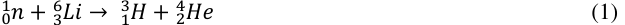

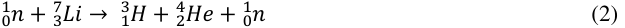

Similar to the fission cross-section of[235] U, the T breeding cross-section (σT) of the 63𝐿𝑖 isotope 1 generally increases with decreasing neutron energy (proportional to ~~)~~ and is exothermic, whereas √𝐸𝑛𝑒𝑟𝑔𝑦 

σT of the 73𝐿𝑖 is a threshold reaction taking place when neutrons energies are above ~2 MeV. 1 Nevertheless, reaction (2) produces T and 0𝑛, which is potentially available for further reaction with 63𝐿𝑖. Whilst T is produced via both of these reactions in a breeder blanket (the proportion varies depending on the blanket concept), the likelihood of reaction (1) occurring is greater than (2) due to the moderation of neutrons that occurs via elastic scattering with the various components within the reactor (structural material, coolant, multiplier, and reflector) [7]. To exploit these circumstances, enrichment of 63𝐿𝑖 is planned for a majority of designs. However, use of a low thermal neutron absorption crosssection material could be used to the same effect and lead to lower costs and greater design freedom for T breeding in the low energy regime (< 1 MeV). 

Figure 1 shows the microscopic neutron cross-sections of T production (n, T) for 63𝐿𝑖, and nonelastic scattering (n, non) of[56] Fe and[90] Zr. It can be seen that both[90] Zr and[56] Fe exhibit similar resonance behaviour between 1×10[-2] – 1 MeV but below this range, the cross-section of Zr is significantly lower. 

![Figure 1. Neutron cross-section for[6] Li breeding T (blue solid line),[56] Fe non-elastic scattering (red dotted line), 90Zr non-elastic scattering (black dashed line). Data and references used to contruct figure can be found in Ref. [8].](images/breeding-materials-king2021.pdf-0008-00.png)

There is a range of proposed designs for future fusion reactors, therefore we must consider a range of conditions that a structural material in the breeder-blanket could be exposed to [5,9]. Some watercooled fusion reactor designs operate in temperature ranges similar to current light water reactors (300350ºC [10]), and others operate in a higher temperature regime for improved plant thermal efficiency, where leading designs have coolant outlet temperatures in the region of 500 - 700ºC [5,9]. Commonly proposed high temperature coolants are: He or H gas, liquid metals such as Li, or molten salts, which will be in direct contact with the coolant pipes composed of the structural material. The structural material will also be in contact with the armour material (e.g. W), the breeder and multiplier material, which are typically Li, Be and/or Pb containing compounds [5,9]. Such alloys will also be exposed to a neutron flux with maximum energies of ~14 MeV [11]. Finally, the mode of operation could be a pulsed mode operation with ~2 h durations and ~5×10[4] cycles or quasi-continuous [12]. 

Of the current designs for the test blanket module (TBM) programme on ITER [13,14], the watercooled lithium lead (WCLL) breeder blanket concept would employ a temperature range most similar 

to those of current fission power plants (280-325°C). At these water-cooled operating temperatures in fission power plants, Zr alloys can feature as the fuel cladding, pressure tubes, fuel channels and fuel spacer grids. The helium-cooled pebble bed (HCBP) breeder blanket concept operates at a higher temperature (300- 500°C) and is another most promising TBM design [15]. It has been shown that Zr as a FW structural material would improve the TBR in this a detached first wall version of the HCPB concept, with excellent mechanical compatibility between the Zr and W as the plasma-facing material due to their similar coefficient of thermal expansion [1]. However, the mechanical behaviour of current commercial Zr at these higher temperatures would likely be unacceptable. Hence, it is pertinent to review novel Zr alloys for higher temperature mechanical stability and highlight key areas for development. 

So-far, there has not been any considerable work towards the development of Zr alloys tailored for fusion, and the primary research direction for Zr alloy development has been towards extended operational life in the environment of a light water fission reactor, _viz_ . submersion in an aqueous solution at ~300ºC [16]. Comprehensive reviews on the effects that neutron radiation has on commercial Zr alloys, in fission reactor conditions, can be found elsewhere [17–19] and will not be discussed in detail here. However, it must be noted that dimensional change via irradiation-induced creep and growth will be a concern for the WCLL design. In fission fuel cladding and pressure tubes, strong texture is created during component fabrication to prevent radial hydrogen-induced cracking. This strong crystallographic anisotropy induces highly directional irradiation-induced growth strains, which is a lifetime-limiting effect. Irradiation-induced growth can be completely absent to very high fluences (> 55 dpa) by quenching to the α-phase directly from the β-phase and hence randomising the texture, e.g. see section 3.4.1 in Ref [REF Adamson 2019]. Texture randomisation could therefore be considered as a method to limit anisotropic irradiation-induced dimensional change for Zr alloys in the WCLL breeder blanket design.  For the HCPB design, at operational temperatures >500 °C, the predominant dimensional change will not be irradiation-induced creep or growth but simply thermal creep [20]. However, it should be noted that the effects of fusion-relevant higher energy flux profiles at these higher temperatures on irradiation-induced dimensional changes have not been investigated for Zr alloys and the mechanical 

loading of structural components in the first wall blanket (estimated by Forty and Karditas for a Zr alloy previously [21]) will differ to that of a fuel cladding or assembly [22]. While Forty and Karditas concluded that thermal and irradiation creep would not be life-limiting for a Zr-based water-cooled breeder blanket, no such thermo-mechanical analysis has been performed for a helium-cooled design; commercial Zr alloys experience unacceptably high creep rates (>10[-5] h[-1] ) [20] above 500 °C, wherein lies part of the reason for their lack of consideration for fusion. Of further concern is the susceptibility of Zr to H embrittlement. In a review of this latter topic, Forty and Karditsas [23] concluded that H embrittlement of Zr is unlikely to be a life-limiting factor in a fusion environment. However, more work needs to be done to consider the varying sources of H under non-ideal conditions and the effect of pulsed temperature profile of the reactor on delayed hydride cracking. Nevertheless, given the neutronic advantage of Zr, established world-wide extraction/production routes, and their success in fission environments, some consideration should be made for Zr alloys as a structural material in the breeder blanket. 

It is therefore the purpose of this review article to consider the high temperature mechanical properties of current Zr alloys and identify the capabilities of advanced Zr alloys, as well as their suitability as structural materials in a fusion environment. Comparisons are made to other current candidate structural materials: EUROFER 97, V-4Cr-4Ti and silicon carbon fibre/silicon carbide composite (SiCf/SiC). 

## **2. Current Zr alloys 2.1. Material properties** 

Currently, ~85% of the globally produced Zr metal is used for nuclear applications (estimated at 6000 t in 2014 [24]). However, this is only a small fraction (<5%) of the total Zr ore extracted annually (~10[6] t), which is used in construction, medical and electronic applications [25]. Natural Zr contains ~4% Hf, which must be removed for nuclear applications due to the high thermal σabs of Hf (104.1 bn). Across North America and Europe, nuclear grade Zr is processed by three companies: Companie European Zirconium Ugine Sandvik, Allegheny Technologies Incorporated, and Western Zirconium. Strip/sheet and tube manufacturing knowledge and capabilities exist globally e.g. at Westinghouse, Framatome, and Sandvik Special Metal. It is therefore plausible that the world supply of Zr could be 

upscaled for use in commercial fusion reactors and therefore benefit from the pre-established nuclear supply chain, a feature only Fe alloys currently match. 

Table 1 lists example compositions of some popular Zr alloys that have been developed for fission applications. Of these alloys, Zircaloy-2 and -4 have seen the most prevalent use, while M5®, and ZIRLO[TM] have been the recent successful developments. The design basis for optimised compositions has largely focussed on gaining superior corrosion resistance and reduced H pick-up in aqueous environments. 

Table 1. Example compositions (wt.%) of commercial Zr alloys. 

Figure 2 provides a broad comparison of start-of-life thermomechanical properties (thermal conductivity, strength, ductility, toughness, fatigue and creep) measured experimentally for example commercial Zr alloys, compared to three other material families considered for use as structural materials in breeder blanket: EUROFER 97, ODS-EUROFER, V-4Cr-4Ti and, SiCf/SiC. It should be noted that the results presented are from a range of studies with differing sample geometries and treatments, therefore care must be taken when comparing exact values. For the purpose of this review only the trends in the data are plotted to provide ease of comparison. Each datapoint used for these trends can be accessed from Ref [8]. In general, it can be seen that Zr alloys underperform in high temperature strength, fracture toughness, room temperature fatigue and creep compared to the other materials. However, they have comparatively good ductility and mid-range thermal conductivity. 

At room temperature the strength of Zr-2 is similar to V-4Cr-4Ti, but will soften more dramatically with temperature, and is significantly lower than EUROFER 97, ODS EUROFER and SiCf/SiC), between 200 - 800 º C. In terms of ductility, Zr and V alloys have relatively high uniform º tensile elongations between 0 - 800 C, while SiCf/SiC,  EUROFER 97, and ODS-EUROFER can present brittle behaviour in this temperature range. The toughness of Zr alloys changes dramatically with H, He and O content; the data for Zr-2 presented in Fig 2(d) is quoted to be 20 wppm H, which is a factor of 2 higher than commercially as-received Zr-2 [34]. A trend of increasing ductile-to-brittle transition temperature (DBTT) is observed for increasing H in some cases [35] but the behaviour can also change dramatically depending on hydride morphology [36]. Nevertheless, commercial Zr alloys have a relatively low fracture toughness above room temperature, intrinsic to its crystal structure [37], making it worse than the other candidate alloys. Similarly, the creep and fatigue performances are worse than the other candidates and are prohibitive factors for use of current Zr alloys as structural components in the blanket region, even in the absence of radiation damage. This is because such components will likely be exposed to cycled thermomechanical loadings, during pulsed mode operation, with maximum operating temperatures higher than the range where commercial Zr alloys can maintain integrity. When including the effects of irradiation, corrosion, cycling, transient conditions, the material design limits become even more restrictive. Previously, EUROFER 97, V- 4Cr-4Ti and SiC/SiC have been predicted to have a maximum useful operating temperatures of approximately 550, 650, and 950ºC, respectively, when considering irradiation effects [24]. It is clear that for a Zr based alloy to be suitable as a structural component in the breeder blanket, the creep resistance must be improved. While fatigue and creep data are not available for more novel Zr alloys, here the strength is used as a first order approximation assuming that a stronger alloy will display greater creep resistance. 

![Figure 2. Relative trends in (a) thermal conductivity, (b) yield strengths (flexural strength for SiCf/SiC) (c) ductility, (d) toughness, (e) fatigue and (f) creep (50 MPa stress), of Zr, V and Fe based alloys and SiCf/SiC, between 0-900 º C. The data and literature references used to construct this Figure are accessible from Ref [8].](images/breeding-materials-king2021.pdf-0013-00.png)

## 2.2. Manufacturing, joining, and welding 

Currently, components made from nuclear grade Zr are first supplied in the form of sheet, plate or tube. These geometries are then manufactured into the desired shapes or welded to other components. Allegheny Technologies Incorporated (ATI), for example, produce Zr sponge and Zr alloys in strip, plate, foil and rod geometries [27]. The main difference between Zr alloy components used in fission and fusion are the thicknesses required i.e. more than a magnitude increase in thickness from 0.5 mm of a Zr-4 fuel cladding [38,39]. The use of Zr alloys, when joining and welding for fusion applications, does offer some advantage if a W is to be used as an armour as both elements have similar thermal expansions [40]. However, a well-documented problem resulting from the manufacturing process is the crystallographic texture introduced in the component that leads to anisotropic properties [41], which would persist in conventional Zr alloy components for fusion applications unless a post-manufacture β- quench heat treatment is included for texture randomisation. Atmospheric contamination, at various stages of Zr alloy processing, is also a known problem and therefore vacuums are needed to reduce these effects [42]. It is not expected additional issues relating to the manufacturing, joining and welding of Zr based components, specific to fusion, will be encountered using current methods. 

## **2.3. Effect of impurities (C, H, Li, and N)** 

Impurities can be introduced to a material at all stages of its life. The susceptibility of the material 

to impurity pickup and the effects of the impurities on mechanical performance is crucial to the viability of the material. It is this aspect that V based alloys face difficulties as C, N and O impurities, introduced during the fabrication process (at concentrations of 60-300, 70-460 and 150-900 weight parts per million [wppm], respectively [43]), lead to loss of workability [44] and weldability [45] and also lead to precipitation during irradiation [46]. 

The impurity concentrations of Zircaloys, after fabrication, are detailed in Table 2. Within this section, the perceived sources of additional impurity concentrations, material response and possible issues encountered are discussed based on commercial Zr alloys used in a breeder blanket. 

Table 2. Typical start-of-life impurity concentrations in commercial Zr alloys. 

a[27], b[47], c[48] 

## **2.3.1. Carbon** 

At high C concentrations (>0.5 wt%) it is known that there is a deleterious effect on the oxidation resistance of Zr alloys. This is because Zr carbides precipitate at the surface and in the bulk of the material and facilitate the diffusion of O into the material [49]. At impurity concentrations in Zr-2.5Nb, a correlation between increasing C content between 40 – 300 wppm and deuterium pickup has also been observed [50]. 

The only other likely source of additional C content in a Zr alloy is in the form of[14] C, which can be produced by the interaction of fast neutrons with[14] N, via[14] N(n,p)[14] C. The levels that are produced (~1 wppm/yr [29]) are not expected to have a large impact on the behaviour of the material during operation, but would impact on the induced radioactivity in the material [51]. 

**2.3.2. Hydrogen** Zr has a reasonably large H solubility (>0.15 wt%) at elevated temperatures (>300 º C). Therefore, during thermal cycling there is an energetic drive for H adsorption and dissolution into the metal at high 

temperatures, and subsequent precipitation as brittle hydride phases at low temperatures where H solubility is very low (~1 wppm at 20 º C). This can lead to hydride re-orientation and the possibility of delayed hydride cracking. These phenomena are well documented for commercial Zr alloys and an extensive review can be found in Refs [52,53]. The question then shifts to: How much H is available to a structural material in the breeder blanket and what is the H pickup fraction of the material used? In a review by Forty and Karditsas, it is calculated that if the D and T produced by the plasma remains implanted in the armour material, a permeation barrier exists between the breeder and structural material, and there is negligible H pickup from the coolant, then there will be an increase of 27 wppm, due to transmutation, after 5 years of operation [23]. These assumptions are plausible if an effective permeation barrier is developed. Indeed, it was concluded in a review by Davis _et al._ , that at the very least a protective barrier must be in place to prevent the implantation of plasma species to limit H levels in Ti [54]. This notion is further supported by calculations performed by the Japan Atomic Energy Research Institute (JAERI) where it is predicted that for DEMO-like reactors, T permeation from the plasma can be reduced by a factor of 10[3] , when the W armour thickness is increased to 1 mm, coated on a lowactivation ferritic/martensitic steel, compared to the omission of a first wall armour. However, due to the uncertainty in diffusion rates in the various components within the blanket, it is difficult to place an exact T inventory of each component. It is likely that the increased affinity of Zr for H will translate to a higher degree of trapping of T compared to other candidate materials, as seen with V based materials [55]. Further work should be done to assess the T diffusion rate through different materials and observe the T retention in layered systems where barriers between the T sources and a Zr material exist. 

## **2.3.3. Helium** 

The introduction of He to a Zr alloy will occur due to (n,α) transmutations within the material during operation. Unlike many other materials, He does not lead to excessive void formation and swelling in Zr alloys [56]. It has been predicted in the past, that in a DEMO-like reactor, for a Zr alloy in the blanket region, the He concentrations produced via transmutation will not be a life limiting factor [57]. However, if the alloy is subject to continuous He coolant interaction at elevated temperatures and under neutron irradiation, a different behaviour may be observed. Currently, no data exists that would 

allow for a reasonable prediction as to the interaction and behaviour, therefore, further experimentation is necessary to investigate whether a He coolant would be compatible with a Zr alloy. 

**2.3.4. Nitrogen** Historically, N was responsible for increased aqueous corrosion rate in Zircaloys. This effect was counteracted with additions of Sn [26]. However, the Zr manufacturing process has since been refined to reduce the N contents to concentrations that do not substantially impact the corrosion resistance and therefore additional Sn is not needed. As far as the Authors are aware there is no published mechanistic explanations for Sn counteracting the effect of N. 

The influence of N on oxidation of Zr alloys has also been documented. The effects have been studied in the context of “loss of coolant accidents” (LOCA) where it has been shown that the presence of N in steam can lead to increased oxidation rate at high temperatures (>600°C) [58]. The mechanism proposed to be responsible for this, is that nitrides are formed between the oxide and Zr metal interface which accelerates oxidisation of the metal as the nitrides oxidise two orders of magnitude faster compared to a non-nitrided metal [32]. 

There is not expected to be a significantly high enough concentration of N to be available in the start-of-life Zr or coolant types for deleterious effects to result in a fusion environment. 

## **2.4. Oxidation** 

When Zr-based alloys are exposed to O, various sub-oxides are formed in a concentration gradient from the metal to ZrO2 on the surface of the material. The thickness of the ZrO2 layer will increase with increasing environmental exposure time and temperature [59]. Initially, this oxidation kinetics follows a parabolic or sub-parabolic relationship and has a protective nature. However, this relationship transitions to a linear oxidation rate, termed “breakaway” oxidation, where degradation of the material occurs [60]. Below ~300°C in air, breakaway oxidation will occur on the order of hundreds of years. However, at temperatures of 600-1000°C breakaway occurs on the order of hours [61]. At temperatures close to melting, oxidation of Zr in air or steam can lead to catastrophic failures and is a topic of concern for reactor safety [62]. Although fusion reactor breeder blankets will operate in a high vacuum, this rapid failure is of key consideration for accident scenarios and for coolant side exposures; an assessment of the former is made in the following section. 

In general, the concentration of impurities, e.g. C, N, H and even O, in the alloy, will increase pre-transition oxidation rate and decrease time to transition [61]. However, the oxidation behaviour is seldom directly proportional with increase in alloying species. Past experimentation on a number of alloying elements (Al, Be, Co, Cu, Cr, Fe, Hf, Mo, Nb, Ni, Pb, Pt, Si, Sn, Ta, Ti, V, and U), in 1, 2 or 4 at.% concentrations, has identified that Be, Ni, and Cu improve oxidation resistance, whereas the others were deleterious or no change was evident to the oxidation behaviour, relative to high purity Zr [61]. However, including elements in lower contents (<1 at.%) often improves the oxidation/corrosion performance [61]. Nevertheless, the oxidation rate of commercial Zr alloys in air and water at mid-range temperatures (~350°C) have reached a stage in which breakaway is not a concern. 

## **2.5. Corrosion** 

Aqueous corrosion of conventional Zr alloys is a well-documented process, which involves breakdown of the oxide layer and adsorption/ingress of H. A comprehensive review can be found in Ref. [63]. In short, at temperatures that far exceed nominal fission reactor operation (≥500°C), aqueous corrosion will be problematic. Therefore, alternative alloys or barrier coatings will need to be utilised in these cases. 

For non-aqueous corrosion, the literature is scarce. Regarding liquid metal coolants, Li-Zr alloy interactions have been studied, in the past, as Li is present in the coolant as a pH balance in the form LiOH, in fission reactors. Ingress of Li is known to occur into the Zr oxide layer, which is theorised to increase the porosity and subsequently the corrosion rate [64]. However, the Li-Zr phase diagram predicts complete immiscibility between both species [65], which is supported by the observation that there is no detectable Li concentration in the Zr metal below the oxide layer [64]. It is likely that in a non-aqueous environment, such as if Li or LiPb coolant/breeder is used, that the interaction behaviour with the Zr oxide layer will change significantly. Data of this nature is not available and further work in this area is required. 

Much work into liquid metal embrittlement (LME), by corrosion or diffusion controlled intergranular penetration, has been conducted for a range of alloy/metal combinations [66]. However, comprehensive data is lacking for Zr alloy -Li and -Pb combinations. The most relevant work on this 

topic is likely unpublished and only mentions can be found [67]. Nevertheless, what is mentioned is that Zr based materials are not particularly susceptible to LME by Li with testing being conducted between 482 - 1000°C [68]. 

Another aspect that must be considered with exposure of Zr alloys to liquid metal environments is the latter’s increased susceptibility to the pickup of impurities. Transfer of material across temperature gradients are typically observed [69], this effect may lead to a heterogenous distribution of impurities within the coolant loop. An assessment of the extent of these effects is needed for Zr alloys and coolants. 

In terms of barriers between the structural material/coolant and /breeder, ceramic coatings (e.g. Cr2O3) are being developed for both fission [70,71] and fusion applications [72]. It is important to note that if a non-aqueous coolant is used (e.g. Li, PbLi, He, CO2, FLiBe and FLiNaK), H may still be present as a dissolved impurity or may even be deliberately added as water to improve T extraction. Further, Zr has a high affinity for F and the ZrF4 formation enthalpy (-4 eV/atom) is significantly more favourable than KF, NaF, LiF, FeF2 and VF4 (~-3 eV/atom) [73]. However, Cr has a much lower affinity to F with CrF6 having a formation enthalpy of -2 eV/atom. Therefore, an effective barrier coating will need to be used regardless of whether aqueous or non-aqueous coolants are used. Moreover, such coatings currently do have promise but further work is still required for industrial applications. 

## **2.6. Accident Scenarios** 

As mentioned, the breakaway oxidation of Zr can lead to catastrophic failure, as evidenced most recently in the Fukushima Daichi accident [74]. This occurs due to the build-up and ignition of H2 gas resulting from the following reaction: 

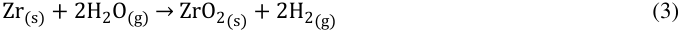

For a catastrophic explosive reaction to occur, via this mechanism, three conditions must be met: 

- A high volume of H2O needs to be available for H2 gas production. 

- Sufficiently high temperatures (≥1200°C [62]) must be reached for rapid oxidation rate. 

- Critical gaseous H2 concentration (15-30 vol.%) in a proportionate layer thickness that allows for flame acceleration and detonation initiation [75]. 

The reaction rate of Eq (3) is proportional to the temperature; in the fission industry, emergency core cooling acceptance criteria limits peak Zr cladding temperature to 1200°C [62]. In the Fukushima accident, the fuel and control rods were completely melted (≥2800°C) 16 h after loss of coolant occurred. These temperatures are well above the step-change in oxidation rate observed at 1580°C for Zr [76]. It is thought that approximately 130 kg of H2 was ignited during the explosion of Fukushima Unit One after ~25 h [77]. Production of this quantity of H2 would require the reaction of roughly an order of magnitude larger amount of H2O, which is also roughly 1572 m[3] of water under ambient conditions. The combined volume of the coolant system of ITER is an order of magnitude larger than this [78], therefore if a water coolant is used in a fusion power reactor of similar size, there will be a sufficient supply of H2O for such volumes of H2 gas to be produced via oxidation of Zr. However, if a non-aqueous coolant is used, there is not expected to be any other source of H2O large enough for this to occur. 

A large difference between LOCA accidents in fission [79] and fusion [80] environments is that the latter does not have a continued supply of heat generated by the fuel. Therefore, heat will only be generated from the decay of irradiated structural and breeding material. A worst-case LOCA model of a fusion power plant, in which no back-up cooling systems are engaged and minimal heat removal to the environment occurs, predicts that the maximum temperature within reactor will be the first wall, which could reach ~1000°C after 4 days to a maximum of ~1200°C after 30 days [81]. The latter timeframe is somewhat unrealistic for an accident scenario. However, at these temperatures, the rate of oxidation is on the threshold considered dangerous for Zircaloys [62]. Providing there is a sufficient thermal gradient away from the first wall towards a Zr structural material, and/or there is no exposure of Zr to steam at such temperatures, it is not expected that oxidation of Zr will occur at a sufficient rate for H2 gas accumulation to occur to a sufficient concentration or volume for a catastrophic event to occur during a fusion power plant LOCA. 

## **2.7. Tritium breeding ratio (TBR)** 

The TBR is the ratio of the rate of T produced during operation (Eqs. 1 and 2), to the rate of T burned in plasma. The feasibility of T breeding depends on both basic physics and engineering issues. It is estimated that a TBR of 1.10 – 1.15, i.e. incorporating a margin exceeding unity, will need to be achieved to safeguard against periods of breeding losses from decay (time between production and use) and/or incomplete recovery of bred T [82]. 

The TBR when Zr is used as a structural material has previously been calculated by Barrett _et al._ [1] _._ In their publication it is stated that the calculations were performed on a He-cooled pebble-bed design, however, details of breeder type, structural fraction, and[6] Li enrichment were not provided. Nevertheless, the TBR using Zr, as a structural material in the first wall, was calculated to be higher than without a structural material and to be superior to the other candidates (Cr, Fe, V). Among the other candidates, the relative TBR of V-4Cr-4Ti, ferritic steel and SiCf/SiC structural materials have been calculated for differing breeders by Sawan and Abdou [82], where it was shown the V-4Cr-4Ti is calculated to achieve the highest TBR of the three candidates, however, Zr alloys were not considered in parallel and there have been no studies that consider the TBR with Zr as a structural material for the whole breeder blanket. 

There are many factors that affect the TBR of a fusion reactor, e.g. breeder material, placement, geometry, multiplier, coolant, and[6] Li enrichment. As a result, there is a significant range in the calculated TBR when varying these conditions. It is therefore not useful to quote or compare the magnitude of the calculated TBR between different models, and so here we have calculated relative comparisons through a normalised TBR using a simplified system using OpenMC [83], see Figure 3. The water cooled lithium lead (WCLL) and helium cooled lithium lead (HCLL) designs were simulated to provide a comparison between designs that would operate at temperatures similar to commercial Zr alloys in fission reactors (305°C) [13,14] and one that operates at higher temperatures (500°C), respectively. Both designs predicted near identical trends in the data therefore only the results for the HCLL design is shown here. The results for the WCLL design can be seen in Fig. A2 in the _Appendix_ . For both, the armour material was W coated EUROFER 97, and Pb-Li as the breeding material. The fraction of structural material (EUROFER 97, SiC, V-4Cr-4Ti, and Zr-4) was varied from 0.0 – 0.9, 

complimentary to the breeder fraction, which was varied from 1.0 – 0.1, where the TBR at this maximum fraction (i.e. no structural material) is used to normalise the data. The[6] Li enrichment fraction in the breeder was also varied from 0.0 - 1.0 and the results are displayed in Figure 4. Further details of the methodology are provided in the _Appendix_ . 

From the TBR results in Figure 3, it is predicted that Zr-4 will outperform all other candidates by up to ~0.1 or structural fractions ≤0.8. Structural fractions above 0.8 are likely far exceeding the structural fractions that are practicable, as current practical designs include EUROFER 97 in the range of 0.14 – 0.20 material fractions across different breeders [84,85]. Although a TBR increase of 0.1 can certainly be obtained through a variety of methods, such as Li enrichment, redesigning the blanket structure, changing first wall thickness, changing coolant etc. Naturally, each method of increasing the TBR will have associated problems. For example increased 63𝐿𝑖 enrichment will have associated cost and waste, redesigning the structure to have less structural material could cause weaknesses, increasing the breeder volume will also have increased relative costs compared to the structural material. Further, some reactor designs have less freedoms that influence the TBR than others e.g. spherical reactors do not have room for inboard breeding [86], therefore knowledge of additional methods of attaining an increase in TBR is of interest to the community. This, in addition to the existing industry for mass production and machining of Zr based components, places them at an advantage over other candidate materials. It should be noted, however, that a more focused cost-benefit review of the reactor designs that would most benefit from this increased TBR, using Zr, should be made before committing long-term research efforts into the development of a high temperature Zr structural alloy e.g. for reactor designs that are predicted to comfortably meet TBR requirements [87], the use of Zr may not be of benefit. Further, designs that utilise Zr alloys complimentary to other candidate materials should also be considered. 

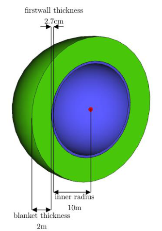

![Figure 4. The tritium breeding ratio (intensity scale and numbered solid lines) of each structural material (labelled panels) calculated at discrete points (solid circles) as a function of structural material fraction and[6] Li enrichment fraction. The final panel is a plot of the normalised TBR with 0.9[6] Li enrichment fraction.](images/breeding-materials-king2021.pdf-0023-00.png)

## **2.8. Activation** 

The activity of the majority of elements in the periodic table, 100 years succeeding 2 full power years in a DEMO-like reactor (an approximation of the lifetime exposure of in-vessel components), has been assessed for this review in a similar manner to a previous publication [51]. Each element assessed has been coloured according to their resultant activity, see Figure 5. Of the base elements that constitute the currently considered alloys within this report, the activities of C, Fe, Si and V are within the range of 10[6] -10[7] Bq∙kg[-1] , and Zr is more active at ~10[8] Bq∙kg[-1] . Of the minor metallic alloying elements, Co, Cu, Mo, Nb, Ni and Sn are even higher in activity ranging from 10[9] -10[11] Bq∙kg[-1] . Notwithstanding that Zr is the more active base element, the “cooling” over time is considerably influenced by alloying additions and impurities. For this review, FISPACT-II was used with the same method as Ref. [88] to calculate the activity over time of alloyed examples of the four materials Zr-4, V-4-4, SiC, EUROFER 97, and an armour material W, see Figure 6. We show that over 100 years the relative activities change considerably. Interestingly, after this time period, it is only SiC, V-4-4, and W that fall below the UK ∙ low-level waste (LLW) limit (1.2×10[7] Bq kg[-1] ); a design goal pursed by the European fusion research community [89,90]. Nevertheless, Zr-4 presents the highest activity of the candidates. In light of these results, it may be that the activity of such a component cannot meet the aforementioned 100 year LLW goal, while including Zr as a majority element, and that the approach should shift to pursuing an “as low as reasonably practicable (ALARP)” [91] design goal. This may be justified via the necessity to achieve a positive TBR in specific reactor designs. However, further cost-benefit analysis is required. 

![Figure 5. Periodic table showing the total becquerel activity from each element after 100 years of decay cooling following a 2 full power year irradiation in a DEMO firstwall environment. The colour of each element reflects the activity according to the Bq∙kg[-1] legend, but the absolute values are also given beneath each element symbol.](images/breeding-materials-king2021.pdf-0024-02.png)

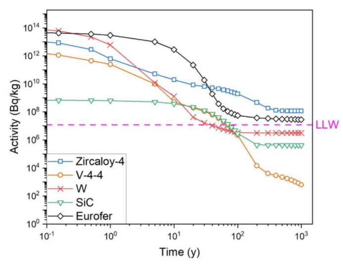

## **3. Novel Zr alloys** 

In this section we review opportunities for novel Zr alloys with higher temperature capabilities 

than conventional Zr alloys, specifically: binary systems of Zr-X, where X refers to elements Al, Be, Cr, Fe, Hf, Mg, Mo, Nb, Ni, Os, Pd, Re, Ru, Sc, Si, Sn, Ta, Ti, V, W and Y, and higher order (3+ element) systems. Microstructure and mechanical property data pertaining to many of these systems is scarce and irradiation data is scarcer. Studies that go beyond that of the initial phase diagram development for non-amorphous Zr rich binary mixtures have been identified and summarised in Table 

3. A tally (sum of check boxes) of the type of data is provided as a “score” to quantify the breadth of 

data available for each system. Systems with scores ≥2, have been discussed in the following subsections. 

It is recognised that there are many different breeder designs proposed for DEMO-like fusion reactors. Here we do not provide an assessment for a specific design, rather, we assume the operating temperature ranges from room temperature (RT) to 700°C to cover a range of designs [92]. Further, work in the context of the Zr alloy to be used as a structural component is reviewed but it is recognised that there are also works that focus on Zr as a T storage material, e.g. Zr61Co39 (wt.%) [93,94], which is not reviewed here. Comments on activity and thermal neutron absorption cross-sections refer to data presented in Figure 5 and Figure 7, respectively. Measures of “good” strength and ductility are relative to conventional Zr alloys (~400 MPa), and the minimum uniform elongation of a material to be considered ductile (5%) [95], respectively, at room temperature. Assessments of activity are made from Figure 5, i.e. 100 years after operation in a DEMO-like reactor and comments are made relative to Zr. Finally, the available mechanical property data, and calculated thermal neutron cross-sections for the specific compositions tested in each system, are compared in the section proceeding the binary and higher order systems. 

![Figure 7. Microscopic thermal neutron absorption cross-sections (y-axis) of each labelled element (x-axis). Values plotted from Ref. [96] for neutron energies of 2.53×10[-8] MeV.](images/breeding-materials-king2021.pdf-0026-02.png)

1 Table 3. Checklist and tally of the type of data identified within this review to be available within the scientific literature for each Zr-X binary system where X is the alloying 2 element. RT, σ and ε refer to room temperature, stress, and strain, respectively. 

24 

|Os||✓[125]|✓[125]||||1|-|
|---|---|---|---|---|---|---|---|---|
|Ru||✓[126]|||||1||
|Re|||✓[127]||||1||
|Y|||✓[128]||||1||
|Mg|||||||0||
|Ni|||||||0||
|Pd|||||||0||
|Sc|||||||0||
|Ta|||||||0||

25 

4 **3.1. Binary Zr systems** 

## 5 **3.1.1. Zr-Al** 

6 The solubility of Al in Zr is ~1 at.% in the α-phase at temperatures ≤600°C. The intermetallic 

- 7 compound, Zr3Al (cubic L12), exists immediately outside these bounds [129]. The Zr3Al intermetallic 8 is relatively ductile due to the five independent {111}〈110〉 slip systems of the L12 structure [98] and 9 has been demonstrated to exhibit room temperature ductility [101]. A significant body of work on 

- 10 mixtures close to 3Zr:1Al has been performed, pioneered by Schulson _et al._ in the 1970s, for use as a 11 structural material in nuclear fission reactors [98]. Zr3Al forms via peritectoid transformation at 12 ~1020ºC between β-Zr and Zr2Al (tetragonal B82). Due to the lack of solubility of excess Zr or Al in 13 the compound, monolithic samples have not been studied to date, and instead Zr2Al and α-Zr are also 14 present in the microstructure, where they are observed at intra and intergranular locations, respectively. 15 The mixing of Al in excess of 7.8 wt.% Al increases the phase fraction of Zr2Al (>10 vol.%) and 16 decreases the room temperature elongation. Conversely, a deficiency of Al below 7.8 wt.% will 17 decrease the Zr2Al phase fraction and increase ductility [102]. It is hypothesised that the morphology 18 of the intergranular region, i.e. solid solution of α-(Zr,Al), contributes to the ductility of the material; 19 analogous to the Ni3Al intermetallic that can be made ductile at room temperature by B doping, which 20 is thought to lead to the formation of a disordered face centred cubic (FCC) phase at the grain boundary 

- 21 [130]. Therefore, in Zr3Al, a decrease in Al content will also promote grain boundary α-(Zr,Al) 22 formation increasing ductility. 

- 23 The extent of ductility of this material is highly dependent on the surface state. For example, a 24 polished material with Al concentration of 8.6% can exhibit room temperature elongation of ~30% at 25 failure, however, if stress concentrations such as machining marks or abrasions exist, the total 26 elongation has been measured to be ≤5% [99,131]. This notch sensitivity may be a limiting factor for 

- 27 the use of such a material in a large-scale industrial setting, where surface state is difficult to control. 

- 28 As-such for the purposes of this review, the material is assumed not to be in a polished state. 

- 29 For long term (≥1000 h) operation at elevated temperatures (500-700ºC) it is possible that grain 30 growth will occur. A study of the mechanical properties as a function of grain size and temperature 

- 31 has been performed for 8.9 wt.% Al samples [101]. After ageing for 1000 h between 800 - 1000ºC, a 

- 32 decrease in room temperature yield strength from ~650 MPa to 180 MPa was measured. This 33 corresponded to grains sizes increasing from 1.6 µm  to 65.0 µm. This extent of softening is likely too 34 severe for the structural requirements in a breeder blanket. However, additional work has shown that 35 some degree of resistance to grain growth can occur between RT and 600ºC where samples maintained 36 grainsize at ~29 µm [98], although the heating rate of the samples was not explicitly stated. This 37 resistance was attributed to the Kear-Wilsdorf type dislocation mechanism, also observed in other L12 38 materials [98]. It follows that if resistance to grain coarsening at ageing temperatures between 50039 700ºC can be demonstrated during long term ageing treatments, it is plausible that this material could 40 meet the strength requirements of a structural material in the breeder blanket. 

- 41 Irradiations using electrons, light/heavy ions and neutrons have been performed on the Zr3Al 42 precipitate from RT to 400°C [132]. It is observed that the structure disorders initially and then 43 amorphises at higher fluences (equivalent of >1.4 dpa) between the aforementioned temperature range. 44 There is an irradiation-induced swelling (≤ 5 vol.%) associated with this disorder but it is inversely 45 proportional to irradiation temperature. Post-irradiation annealing at 575°C for 1 h allows for a 

- 46 complete recovery of damage [133]. 

- 47 In a study of α-Zr alloys with lower Al concentrations (3 – 15 at.%)  [100], samples were hot48 rolled at 920°C then air cooled. Single-phase α-Zr microstructures were observed until Al was included 49 in concentrations ≤ 9 at.%. Above 9 at.%, precipitation of Zr3Al occurred. It is assumed that the cooling 

- 50 rate of the samples did not allow for precipitation below <9 at.% Al, an assumption supported by a 

- 51 separate study that observes Zr3Al precipitation in a 6 at.% sample after annealing for 4 h at 

- 52 800°C [134]. Nevertheless, a significant strengthening effect was demonstrated, with a maximum 

- 53 measured yield stress of ~1200 MPa. Furthermore, a good retention of ductility is observed for 

- 54 compositions with ≤12 at.% Al with ~8% total elongation. 

- 55 The steady state tensile creep rates of compositions close to 3Zr:1Al have been measured at 56 various temperatures and stresses [135]. Figure 8 provides a comparison between these creep rates and 

- 57 that of EUROFER 97 [136], ZIRLO[TM] [137], and Zr-2.5Nb [138], extrapolated to applied stresses of 

- 58 70 MPa, from past experimental data. It should be noted that there are differences in geometries and 

- 59 test conditions between the different studies therefore some error may be associated in the 

- 60 comparisons. Nevertheless, for the Zr-Al compositions with 6.8-7.8 wt.% Al, the reported thermal 

- 61 creep rates an improvement relative to ZIRLO[TM ] and Zr-2.5Nb, and sufficiently low for use at 

- 62 temperatures ≤550°C. The thermal creep rate was measured to decrease by an order of magnitude for 

- 63 compositions with 8.5-9.3 wt.% Al and for a sample with 8.8 wt.% Al, a creep rate of 9.3×10[-6] hr[-1] 

- 64 was measured for a stress of 70 MPa at 640°C. Indeed, when Al is included between 8.8 – 9.1 wt.% 

- 65 the creep rate is comparable to EUROFER 97 for temperatures ~650°C. However, as mentioned 

- 66 previously, there are issues with the ductilities of samples with Al contents in this range, which may 

- 67 be a prohibitive factor for machining of components suitable for a breeder module. 

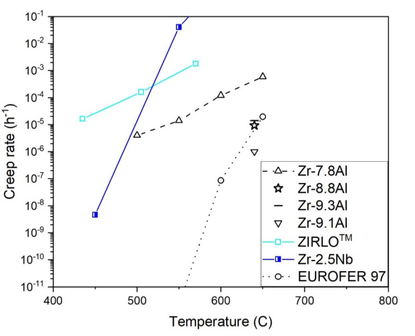

69 Figure 8. Thermal creep rate of different Zr-Al compositions (wt.%) compared to ZIRLO[TM] , Zr-2.5Nb and EUROFER 97 70 under stresses of 70 MPa. 71 

- 72 Of additional concern is the susceptibility to corrosion of Zr-Al alloys in aqueous environments 73 [139]; the α-(Zr,Al) phase forms an oxide morphology susceptible to corrosion and an increase in its 

- 74 phase fraction increases the corrosion rate [140]. Therefore, it is likely such materials will be more 

- 75 suited to a breeder blanket that employs non-aqueous coolant. To this end, Al is observed to play a key 

- 76 role in corrosion resistance against Pb coolants through the formation of a Al2O3 scale in other 

- 77 alloys [141]. However, Zr has a higher activity with O than Al and is likely to take precedence to form 

- 78 ZrO2, as observed in the past [142]. 

## 79 **3.1.2. Zr-Nb** 

- 80 Niobium is a common alloying addition to Zr in 2.5 wt.% contributions to form the Zr-2.5Nb 

- 81 alloy, which is popularly used in Canadian nuclear power plants [143] and is also under consideration 

- 82 for biomedical applications [144]. The attractiveness of this system is the duplex α-(Zr,Nb) + β-(Zr,Nb) 83 forming region between 615 - 970°C, which gives rise to a good combination of strength/ductility 84 (~800 MPa/~14% uniform elongation, respectively, at room temperature [143]), grain size and 85 microstructure control, as well as good corrosion/oxidation resistance in light water reactor 

- 86 environments. 

- 87 For fission applications, Zr-2.5Nb tubes are traditionally extruded at 815[o] C, cold-worked 27%, 88 and stress relieved at 400[o] C for 24 h. In this state, a metastable network of β-Zr filaments surround 

- 89 elongated grains of α-Zr. Between 400 - 700[o] C, the Zr content of the β phase has been observed to 

- 90 reduce with ageing time. The maximum time the Zr rich β-phase was found to be stable was 1000 h 91 [105].  Further, the β-phase will be composed of ~95 wt.% Nb after 10[4] h of ageing, and between 400- 

- 92 500[o] C ⍵-Zr (metastable hexagonal [145]) is observed to form within hours of ageing [105]. 

- 93 For operating temperatures between 500-700°C the alloy will be outside of the 94 α(Nb,Zr)+β(Nb,Zr) forming region. Instead, segregation will occur where body centred cubic (BCC) 95 Nb precipitates decorate α-Zr grain boundaries [104,146]. It is therefore not predicted that Zr-2.5Nb 

- 96 will retain its room temperature ductility after long term operation at temperatures relevant to a breeder 

- 97 blanket. 

- 98 Evaluation of the mechanical properties of Zr-2.5Nb has been conducted between 20-1200[o] C with 99 a hold time at each temperature of 3-5 min. A sharp decrease in yield strength was observed after 

- 100 550ºC accompanied by a drastic increase in elongation attributed to the manifestation of superplasticity 

- 101 [107]. 

- 102 M5® is also an example of a commercial Zr-1.0Nb (wt.%) alloy developed for oxidation 103 resistance and reduced H pickup in light water reactors. There is a notable trend in reduction of Sn and 

- 104 retention or increase in O to improve corrosion resistance in commercial Zr alloys[147]. The effect of 

- 105 O content (0.14-4.00 wt.%), in M5® and Zr-4, on the mechanical properties has been observed to 

- 106 stabilise the α phase to higher temperatures but embrittle the alloys at RT, at >0.50 wt.% concentrations 107 [148]. 

- 108 Tensile hoop tests have been performed on M5® cladding irradiated for five and six annual cycles 109 (i.e. fuel burnup of 60-75 GWd∙tU[-1] )  at temperatures between 250-800[o] C [149]. It was observed that 

- 110 the yield strength of M5® decreased linearly with temperature. M5® also displayed a lower yield 

- 111 strength than Zr-4 between 250-600[o] C where it decreased from 500-200 MPa. However, between 600- 

- 112 700[o] C the yield strength was quite similar to Zr-4 (250-150 MPa). The uniform elongation of M5® 

- 113 was recorded to be ~1% between 250-450[o] C but a lot larger at higher temperatures (4.2-6.4% at 600[o] C 114 and 8% at 700[ o] C) for a high strain rate of 1 s[-1] . It should be noted that the heating rate of these tests 115 were also quite high (200[o] C∙s[-1] ) therefore these results are not indicative of samples in their equilibrium 116 microstructures at these temperatures. 

- 117 It is difficult to translate tensile hoop test results with high strain/heating rates to a prediction of 118 performance of such alloys in a breeder blanket environment. The following points may be applicable: 

- 119 1. The irradiated mechanical performance of M5® is not markedly different from Zr-4 and likely 120 unsuitable for a breeder blanket material due to high thermal creep rates. 

- 121 2. The addition of Nb and/or O may be a more interesting avenue to explore for resistance of H 122 pickup. 

## 123 **3.1.3. Zr-Sn** 

- 124 Tin is a common addition to Zircaloys to increase the creep resistance, stabilise α-Zr, and control 

- 125 grain size during processing. However, its addition has been shown to reduce corrosion resistance 

- 126 [150]. It is measured to be soluble in the α-Zr matrix up to 5 at.% at 600°C. Outside these bounds the 

- 127 phase diagram predicts a cubic Zr4Sn intermetallic to form, which can exist in an off stoichiometric 128 Zr3Sn composition [151]. 

- 129 Tin is hypothesised to increase the creep resistance of Zr alloys through mechanisms such as: 130 increase in stress field around Sn (due to the difference in atomic radii) restricting the gliding of 131 dislocations and diffusion of vacancies and lowering of stacking fault energy [152]. Limited studies 

- 132 on pure Zr-Sn binary systems that examine the mechanical properties exist in the open literature, 133 however, various investigations into the microstructure exist [108–110,151]. The tensile properties of 134 β-quenched and tempered martensitic alloys with 2 – 7 at.% Sn has been investigated [110]. The 135 elongation was not measured to be proportional to Sn content and ranged from 5 – 15% at room 136 temperature. The yield strengths ~250 MPa are seemingly independent of Sn content at room 137 temperature. The microstructural analysis revealed precipitation and unidentified black spots in all 138 samples, which is not predicted from the phase diagram for those with ≤5 at.% Sn. Therefore, these 139 results may not be indicative of the binary systems at equilibrium. 

## 140 **3.1.4. Zr-Be** 

- 141 Beryllium is an element that has been considered for use as a first wall material for fusion power 142 reactors due to its low atomic mass, high melting temperature and neutron transparency [153]. It is 

- 143 also a prime candidate for use as a neutron multiplier [154].  Be does not form a solid solution with Zr 

- 144 below 820°C, instead it forms a Be2Zr intermetallic compound [155] which is an ordered hexagonally 

- 145 close packed (HCP) structure [156]. The mechanical properties of mixtures with 2.5 – 9.3 at.% Be 

- 146 have been studied [111]. As anticipated, the microstructure consisted of α-Zr and Be2Zr at all 147 concentrations, where the latter is observed to form at the grain boundaries, see Figure 9. A reasonable 148 trade-off between increase in strength (672 – 892 MPa) and decrease in ductility (14 – 7% total 149 elongation) was measured over this Be range. Additional experiments were performed on the 5 at.% 

- 150 Be sample where it was hot-rolled and then vacuum annealed at multiple temperatures between 600 – 

- 151 850°C for 2 h. A decrease in strength from 786 MPa to 600 MPa, and increase in elongation from 12% 

- 152 to 17% is observed due to the increase in α-Zr recrystallisation fraction, grain size, and decrease in 

- 153 dislocation density [112]. 

154 It is worth noting that Be has been identified as one of the few elements that increases the 

- 155 oxidation resistance of pure Zr when alloyed in larger quantities (1, 2 or 4 wt.%) [139]. 

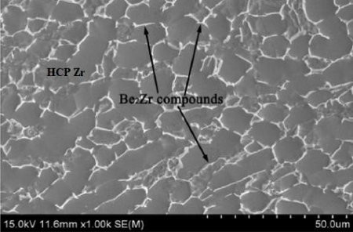

- 157 Figure 9. Scanning electron microscopy (SEM) micrograph of. Zr-5Be (at.%) alloy hot rolled and annealed at 158 850°C for 2 h taken from Ref [112]. 

## 159 **3.1.5. Zr-Ti** 

- 160 Titanium and Zr are mutually soluble with each other and the α → β transition temperature is at 161 its lowest (~600°C) when they are alloyed in equal atomic ratios [157]. A number of studies of binary 162 alloys with 10 – 50 at.% Ti have been performed, however, these focus on room temperature 163 applications with β phase retention, and the samples are in a quenched state from the β forming region 164 (≥900°C) [113,115,158,159]. For a structural material operating in the 500 – 700°C region, a single β 165 phase is unstable and a high portion α phase will likely transform. One study of a 50 at.% Ti alloy 166 provides results pertaining to samples quenched from 620°C and 750°C [160], which is likely most 167 applicable to a breeder blanket. At room temperature, only α′-phase (β transformed α) was observed, 168 and the room temperature mechanical properties were measured to be 800-1100 MPa ultimate tensile 

- 169 strength (UTS) with 4-7% elongation. 

## 170 **3.1.6. Zr-Cr** 

- 171 Chromium is a common addition in Zircaloys and was initially included as it was found to 

- 172 enhance corrosion resistance and provide strength [16]. However, the solubility of Cr in Zr is very low 

- 173 below ~700°C where the ZrCr2 C15 Laves phase will form at equilibrium [161]. The C15 Laves phase 

- 174 is a relatively strong but brittle intermetallic compound [162]. Zr(Cr,Fe)2 intermetallics of the same 

- 175 structure are observed to amorphise at RT to 300°C and dissolve between 300 to 400°C under neutron 

- 176 irradiation due to radiation enhanced diffusion effects [163]. 

- 177 A study of the mechanical properties of arc melted then hot-rolled (870°C) Zr with 0.5 – 3.0 at.% 

- 178 Cr has been performed [117]. Relatively high room temperature strengths were achieved 966 – 

- 179 1270 MPa with associated 12.6 – 6.0% elongation. Further, annealing experiments were carried out 

- 180 on a 1.8 at.% Cr sample at 550°C, 650°C and 750°C for 1 h, then air cooled [116]. Significant 

- 181 improvements to the ductility were achieved (16 – 18% from 8.8% elongation) accompanied by 

- 182 decreases in strength (818 – 991 MPa from 1118 MPa) due to coarsening of grains and reduction in 183 dislocation density. 

## 184 **3.1.7. Zr-Si** 

- 185 Silicon forms a range of complex metallic silicides that are strong but brittle intermetallic phases. 

- 186 Some are widely considered for high temperature structural applications [164], including neutron 

- 187 reflector components in fast reactors [119]. The Zr-Si phase diagram predicts the formation of Zr3Si, 

- 188 a tetragonal intermetallic, when the temperature and Si concentration is  <1571°C and <15 at.%, 

- 189 respectively [165]. However, a study on an 8.8 at.% mixture did not contain the Zr3Si phase in the as- 

- 190 cast state [118]. Instead, a tetragonal Zr2Si intermetallic was formed, evenly dispersed, with sizes 

- 191 ranging from 3 – 10 µm, in the α-Fe matrix, see Figure 10. The compressive yield strength was 

- 192 measured to be 700 MPa with 13% compression strain to failure at room temperature. Silicon additions 

- 193 to Ti alloys have been shown to improve creep resistance due to their strong pinning of dislocations, 

- 194 and grain/lath boundary sliding [166], therefore, further work into the Zr-Si system is warranted. 

195 

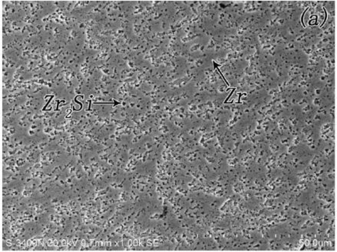

196 Figure 10. Secondary electron SEM micrograph of as cast Zr–8.8Si. Taken from Ref. [118]. 

198 199 **3.1.8. Zr-Fe** 200 Iron is a common addition to current Zr alloys due to the strengthening provided by the 201 precipitation of ZrFe2 (C14) and Zr2Fe (C16 Laves phase) secondary phase particles. In the binary 202 system, Fe has a solubility limit of ~4 at.%, in α-Zr, above 775°C. Below this temperature, Fe is 203 essentially insoluble and will instead form the Zr3Fe, an orthorhombic intermetallic, at equilibrium 204 [167]. The diffusion of Fe is relatively fast and segregation to the surface of single crystal samples is 205 observed near instantaneously between temperatures 450-750°C [168,169]. 

206 Dissolution of secondary phase particles is known to occur at high fluence (>10[26] n∙m[-2] , 20 dpa) 207 due to the effects of displacive radiation. A correlation between an increase in Fe content and <c>208 loop dislocation size and density has been made, suggesting that Fe will promote irradiation induced 209 growth [170]. It is unclear as to whether this will translate to fusion environments as thermal creep 210 will likely dominate. However, success in increasing Fe content in conventional Zr alloys (to ~0.50 211 wt.%) has been seen in HiFi[TM] for lowering H pickup in fission environments [171]. 

212 **3.1.9. Zr-Mo** 213 Molybdenum has a large high-temperature solubility in β-Zr (≤20 at.% at 1576°C) but is not 214 soluble below 730°C in α-Zr. Experimental studies on binary alloys of the two species are typically 215 made on quenched samples from the β-phase forming region and are considered for room temperature 216 biomedical applications [120]. At intermediate temperatures (500-730°C) the C15 ZrMo2 Laves phase 217 will form [172]. The mechanical properties of two binary mixtures with 0.2 and 1.0 at.% Mo, which 218 were cold worked, annealed at 750°C for 1 h then annealed at 500-550°C for 3 h, have been measured 219 at 400°C. It was observed that a linear increase in yield strength from 60 MPa to 130 MPa could be 220 achieved with increasing Mo content compared to ~20 MPa of the base metal [121]. Hydrogenation 221 experiments on these samples were also conducted and it was shown that the H retention decreased 222 with increasing Mo content and when Mo is included at ~1.0 at.% the corrosion resistance of the 223 material, in water at 350°C, is significantly improved compared to 0.2 and 0.5 at.% mixtures. It is 224 thought that the ZrMo2 has a low H absorbency, which is the main contributing factor to the decrease 225 in H retention. In these samples, it is possible that there is a β phase fraction still present as ageing 226 studies of Zr alloys containing Mo have shown that complete transformation from β → α phase occurs 227 by 1000 h yet some β phase is still retained after 100 h [173]. 

## 228 **3.1.10. Zr-V** 

229 Vanadium has a small solubility in α-Zr (1-3 at.% below 863°C) [174]. Above this concentration 230 the V2Zr C15 Laves phase forms [174], and above 863°C a single phase BCC solid solution will form, 231 which has a solubility of ≤18 at.%. 

- 232 The mechanical properties of alloys containing 0.2 and 0.5 at.% have been studied previously 233 [122]. The samples were hot-rolled at 870°C and quenched, and as a result of the quenching, some β 234 phase was retained. Both samples displayed an α+β microstructure and exhibited strengths of 700 MPa 235 and 820 MPa and elongation of 17% and 20%, respectively. It is expected that the β phase will not 

- 236 remain, and V2Zr precipitation will occur if used in long term operation between 500-700°C. 

## 237 **3.1.11. Zr-W** 

238 Tungsten has a limited solubility (1-3 at.% below 850°C) in α-Zr and will form the W2Zr C15 239 Laves phase outside these compositional bounds. Above 850°C, W is soluble in β-Zr up to ~5 at.% 240 [175]. 

241 A study reporting the mechanical properties of powder processed (34-57 at.% W) samples 242 reported large compressive strengths at room temperature (1060–2690 MPa) however these samples 243 were very brittle where fracture at <1.0% tensile strains occurred, attributed to porous defective 244 structures [123]. 

- 245 **3.2. Higher order Zr alloys** 

246 Higher order advanced Zr based structural alloys with improved room temperature mechanical 247 properties are a topic of interest in the biomedical community due to their lower magnetic 248 susceptibility, relative to Ti, and biocompatibility for implants [176]. However, it is the room 249 temperature mechanical properties of single β phase alloys that are of interest to this community, and 250 the target for a bulk moduli is 10-30 MPa for their application as implants/prosthetics. Therefore, 251 ageing studies at intermediate temperatures (500-700°C) are not typically performed and instead 252 quenching from ~1000°C is routine. Furthermore, the compositions are typically highly alloyed and 253 present large thermal neutron absorption cross-sections. Nevertheless, the state-of-art pertaining to 254 each higher order Zr alloy identified for this review is presented in the following subsections. Table 4, 

255 provides a summary of available scientific literature and score calculated identically to the binary 256 systems. No mechanical property data for >RT were found within this review. 

- 257 **Table 4.** Checklist and tally of the type of data identified within this review to be available within the scientific literature for each higher order Zr system. RT, σ and ε refer to 258 room temperature, stress, and strain, respectively. 

259 

260 **3.2.1. Zr-Ti-Al-(V)** 261 Several investigations into the mechanical properties of ternary Zr-Ti-Al alloys have been 262 conducted to-date. However, the focus has been on Ti rich compositions where the alloy with the 263 highest concentration of Zr was 45Ti-40Zr-15Al (at.%). The trend of decreasing α → β transition 264 temperature as the ratio between Ti:Zr approaches one, remains true when Al is included in the 265 concentrations studied (≤15 at.%) [177]. Conversely, Al additions increase the transition temperature 266 [178]; a concept in agreement with the α-Ti stabilising effect of Al addition observed in the past. The 267 microstructures of the Zr-Ti-Al alloys are highly dependent on cooling rate and processing conditions 268 and single phase α, β or multiphase α′ (β transformed α) and α′′ (metastable orthorhombic) 269 microstructures have been demonstrated for similar compositions [178,179]. Only the room 270 temperature mechanical properties have been assessed, where UTS ranges from 1000 – 1550 MPa with 271 3 – 11% uniform elongation. 

272 Exploration of the compositions that include V, in the Zr-Ti-Al-V system, originated with Ti-6Al273 4V wt.% (Ti-6-4), a dual phase α+β Ti alloy used for aerospace and biomedical applications [180]. In 274 the initial study, 8 – 28 at.% Zr was added to the Ti-6-4 alloy composition [181]. The maximum UTS 275 was measured to be 1317 MPa (increase of 320 MPa compared to Ti-6-4) and elongation of 8% 276 (decrease of 6% compared to Ti-6-4), at room temperature. An additional study reporting the 277 microstructures and mechanical properties of a series of alloys with higher Zr contents (Table 5) within 278 the Zr–Ti–Al–V system was published [182]. These samples were annealed at 850°C for 30 mins, hot 279 rolled, and quenched. Non-equilibrium microstructures of α′ and α″ (metastable orthorhombic ) were 280 observed in combination with the β phase for the samples with lowest and second lowest Zr content, 281 respectively. The three Zr richer samples had mixtures of α and β phase. The room temperature UTS 282 peaked at 1246 MPa for Zr–45Ti–5Al–3V wt.% and stemmed a new branch of research into this 283 composition and its variations where some are referred to as TZAV. The α → β transition temperature 284 was investigated in the original study where it was determined that as the Zr content increases, the 285 transition temperature decreases in line with the behaviour of a binary Zr-Ti alloy. Although similar 286 experiments have not been carried out on compositions with >>50 at.% Zr, it is expected that the α → 

287 β transition temperature will increase when the Zr:Ti ratio is >>1. However, precipitation of the Zr3Al 288 phase is likely due to the reduced solubility of Al in Zr compared to Ti. 

291 An investigation into the microstructure after ageing at 500°C, 550°C, and 600°C for 32 h has 

- 292 been made on the Zr–45Ti–5Al–3V (wt.%) alloy after solution treatment at 850°C and 1050°C [183]. 

293 It was determined that regardless of prior solution treatment, the fraction of α-phase changed 

294 dramatically within the first 32 h, see Figure 11. As pictured, the β-phase was partially retained in the 295 550°C aged, and 600°C aged samples but 100% of α-phase was recovered after ageing at 500°C. Phase 

296 changes of this scale, at temperatures relevant to breeder operation, would be undesirable in a structural 297 material. 

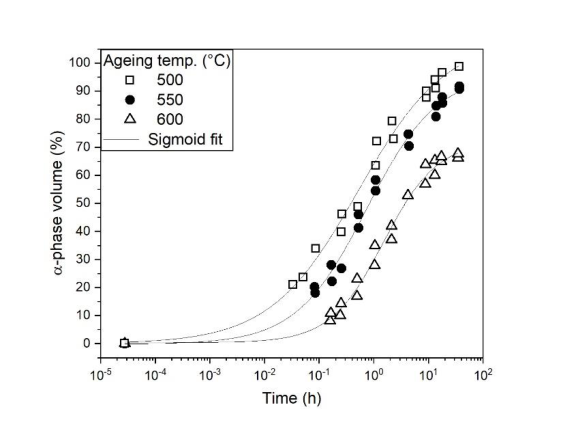

299 Figure 11. Volume fraction of α-phase measured by XRD for Zr–45Ti–5Al–3V (wt.%) when aged at 500°C 300 (squares), 550°C (circles), and 600°C (triangles). Curves fitted using sigmoid functions [183]. 

301 An additional study on the Zr–45Ti–5Al–3V (wt.%) alloy has been made comparing the 

- 302 microstructure and room temperature mechanical properties after annealing samples for 1 h at 500°C, 303 600°C, 700°C, and 800°C, after homogenisation and quench from 1000°C. The annealed samples were 

- 304 cooled in air (at a rate of 10°C∙s[-1] ) and in a furnace (0.07°C∙s[-1] ) [184]. It was found that the samples 305 that were air cooled to RT from temperatures between 500-800°C had drastically reduced total 306 elongations (1-3% from 5.4% in the as-forged state) whereas the samples that were furnace cooled 307 increased in ductility, displaying higher total elongations at RT (6-10%), see Figure 12. This was 308 attributed to the athermal ⍵-phase formation during the more rapid cooling. These results are also 

- 309 supported by a separate study with a similar conclusion on the Zr-40Ti-5Al-4V (wt.%) 

- 310 composition [185]. From these results it may be possible to hypothesise that if such cooling rates occur 

- 311 in a breeder blanket during pulsed operation the structural material may embrittle significantly. 

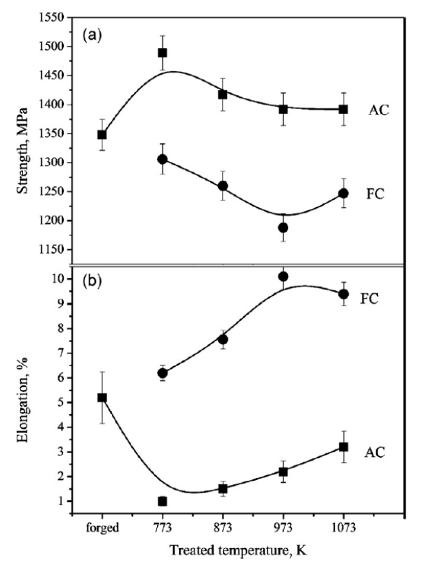

- 313 Figure 12. Strength and elongation of Zr–45Ti–5Al–3V (wt.%) after annealing at different temperatures (x-axis) 314 for 1 h and air cooling (squares) or furnace cooling (circles) to RT. Taken from Ref [184]. 

315 Variations of this system have been made with the addition of Fe in concentrations 0.5-2.5 

- 316 wt.% [186] and replacement of V with Fe in concentrations of 0.5-2.0 wt.% [187]. However, ageing 

- 317 experiments have not been conducted at 500-700ºC and only non-equilibrium microstructures, with 

- 318 high β phase fractions, quenched from a high temperature ≥850ºC have been assessed. It is likely that 

- 319 at temperatures relevant to a breeder blanket the Zr3Fe or TiFe intermetallic will precipitate due to the 

- 320 insolubility of Fe in α-(Zr,Ti). Further work is required to determine the material behaviour at the 321 relevant temperature range. 

- 322 The thermal creep properties of the Zr-Ti-Al-V system have not been assessed, however, due to 323 the similarities of Zr and Ti, and substantial amounts of literature on the creep of Ti-6-4 we may draw 324 some insights into the possible behaviour. 

- 325 The creep process in Ti-6-4 is suggested to be dominated by climb processes of α-phase 326 dislocations in the prismatic plane (<a> loops) [188,189]. It should be noted that in Ti alloys, the β- 327 phase generally exhibits faster diffusion than α and so the volume fraction of β is often minimised in 

- 328 high temperature Ti alloys [190]. Nevertheless, dual-phase α + β microstructures are effective in both 

- 329 Ti and Zr materials for conferring high strength ~1000 MPa and good creep resistance ~400°C. 

- 330 However, for every 100°C increase, the creep rate increases by over an order of magnitude, and at 331 ~525ºC the steady-state creep strain rate is >10[-6] s[-1] for applied stresses ≥70 MPa [189], see Figure 13. 

- 332 Moreover, the thermal creep rates above 500°C are likely too high for use of these materials in a 333 breeder blanket. 

334 

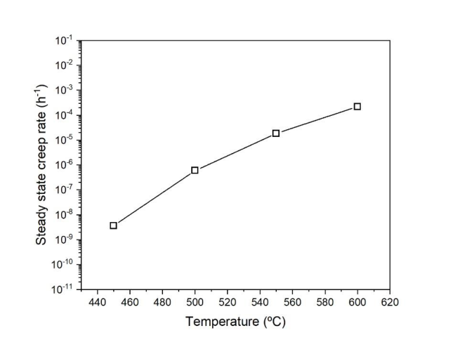

335 Figure 13. Estimated steady-state creep rate for an applied stress of 70 MPa for Ti-6-4 extrapolated from data 336 taken from Ref. [189]. 

## 337 **3.2.2. Zr-Al-Sn** 

338 One study has been conducted on alloys within the Zr-5Al-(2-6)Sn (wt.%) composition range in 

339 the context of structural nuclear materials [191]. A single α phase, lath martensitic structure was 340 identified with compressive yield strengths and strains ranging from 835-913 MPa and 18.57-21.43%, 341 respectively. Heat treating for 2 h at 900°C and air cooling led to the precipitation of ZrAl 342 (orthorhombic), which is likely metastable as one would expect Zr3Al from binary phase diagrams. 343 Nevertheless, the RT compressive yield strengths were increased to 1003-1044 MPa and the strains 344 decreased to 13.03-18.79%. 

## 345 **3.2.3. Zr-Mo-Ti** 

- 346 Alloys within the Zr-Mo-Ti ternary have been investigated by the biomedical research community 

- 347 [192]. The compositions Zr-12Mo-(3-11)Ti were quenched from the melt and only single phase β 348 microstructures were observed. The room temperature yield strengths were found to range from 1200- 

- 349 1363 MPa, and the strains to failure ranged from 12-20%, when in compression. However, it is not 

- 350 expected that these compositions would retain their single phase β microstructures at operation 351 temperatures in a breeder blanket. Instead multiphase microstructure of α-(Zr,Ti), ZrMo2 and/or β- 

352 (Zr,Ti,Mo) is predicted to occur. It is likely that this, along with possible ω phase at non-quench 

- 353 cooling rates, will contribute greatly to strengthening and the ductility will be reduced further. 

## 354 **3.2.4. Zr-Nb-Ti** 

355 The compositions that have been investigated to-date are Zr-20Nb-(3-15)Ti [193] and Zr– 356 12Nb–(2-16)Ti [194]. All samples were observed to consist of a single-phase BCC structure except 357 Zr-12Nb-16Ti, which exhibited some ω-phase. Relatively good mechanical properties were achieved 358 with strengths ranging from 1000 – 1300 MPa and compressive strains of ~35%. 

359 A majority of the lower Ti compositions exist outside the single-phase forming region and will 360 undergo transformations from β → α/α′ if operated at temperatures ~550°C [157]. However, for higher 361 Nb and Ti contents it may be possible for the single phase β forming region for this ternary system to 362 exist at this temperature. 

## 364 **3.2.5. Zr-Mo-(Sn)** 

- 365 Alloys within the Zr-Mo-Sn ternary system were investigated in the 1950-70s in the context of 

- 366 high temperature (500°C) structural materials for fission applications [173]. It was the aim of the 367 investigators to quench the Zr-2.8Mo-1.5Sn (at.%) composition from the α + β (850°C) and β (1000°C) 368 forming regions, anneal at 500°C for 1000 h, and retain a strong high temperature β or transformed 369 (α′) phase while maintaining room temperature ductility. The composition tested was Zr-2.8Mo-1.5Sn 370 (at.%). It was reported that for the sample quenched from the β forming region, an α + α′ microstructure 371 was produced, and for the sample quenched from the α + β forming region, an α + α′ + 10% β 

- 372 microstructure was produced. However, the UTS/elongation for each sample were measured to be 853 

- 373 MPa/2.6% and 1023 MPa/2.3%, respectively, which is too brittle for workability of a structural 374 material. There is insufficient data on the crystallographic analyses of these samples to discount ⍵ or 375 intermetallic precipitation, which may have led to the reduction in ductility. Alloys containing Nb and 376 V in 2 at.% contributions were also studied and were found to exhibit lower strengths and lower 377 ductility. It should also be mentioned that Zr-4.7Mo-1.5Sn and Zr-1.8Mo-3.0Sn were investigated, 378 however, were only aged for 8-24 h at 482 - 538°C and therefore likely did not have microstructures 379 or mechanical properties accurately reflecting components in operation at these temperatures. 

- 380 **3.3. Comparison of properties** 

- 381 Figure 14 shows the room temperature yield strengths and strains to failure of binary and higher 

- 382 order Zr alloys, experimentally measured in the reviewed studies. There are many systems that present 

- 383 a good combination of room temperature strength and ductility. However, this information is not 

- 384 adequate to provide confidence in their ability to maintain structural integrity at higher temperature 

- 385 operation. Some Zr-Al, Zr-V, Zr-Mo-(Ti) and Zr-Nb-Ti compositions can demonstrate comparable 

- 386 uniform elongations and markedly higher RT strengths than Zr-4. However, the latter three alloy systems 

- 387 present significant BCC phase fractions that are likely unstable at operating temperatures between 500- 

- 388 700°C, and the Zr-Al compositions that can achieve ductile behaviour at RT require a polished surface 

- 389 state. 

390 391 

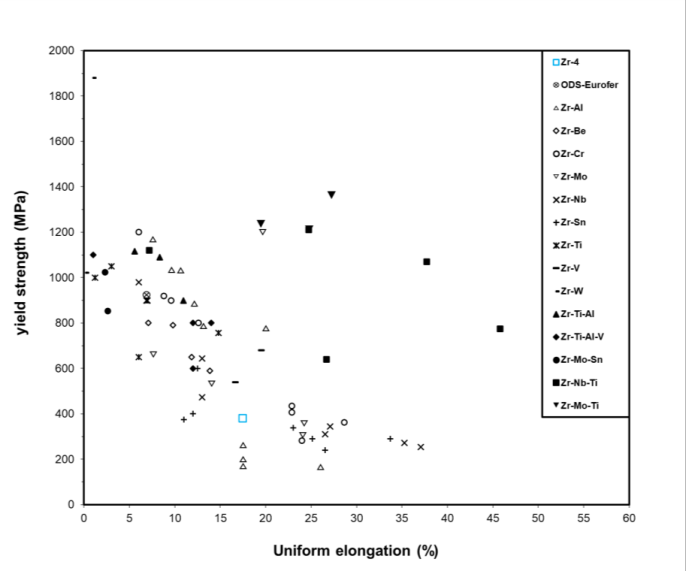

392 Figure 14. Room temperature yield strengths of pure Zr, commercial, binary, and higher order Zr alloys and their 393 tensile strains to failure. The dataset used to construct this figure is accessible from Ref [8]. 394 

395 One of the challenges of alloying Zr for nuclear applications is that including most elements in 396 large quantities (>1 at.%) significantly alters the thermal neutron absorption cross-section (σabs) for 397 which Zr was selected in the first place. A weighted average of the elemental σabs for each Zr alloy was 

398 calculated and plotted against RT yield strength, see Figure 15. It can be seen that binary Zr alloys 

399 containing Al, Be, Sn, Ti and Nb present σabs values comparable to Zr-4 of 0.2 bn. Zr-Cr, -Mo-Ti, -Nb400 Ti, -Ti-Al-V display σabs values closer to 1.0 bn, which is of similar magnitude to the[6] Li breeding cross401 section but less than half that of Fe (2.56 bn). Using this method of calculation, the maximum 402 concentration of each element allowed before a binary Zr-X alloy exceeds the σabs of Zircaloy-4 can be 403 estimated, see Table 6. Only Al, Nb and Sn can be alloyed in concentrations > 1 at.%. Be, Mg and Si 404 have σabs  values lower than Zr therefore have no concentration limit. 

405 406 Figure 15. Room temperature yield strength of experimentally measured alloys plotted against their theoretical 407 thermal neutron absorption cross-sections. 408 

409 410 

411 Table 6. Maximum allowable concentration of element before thermal neutron absorption cross-section exceeds 412 that of Zr-4 0.3 bn in a binar allo . 

|||||that of Zr-4(0.3 bn)in a binaryalloy.|that of Zr-4(0.3 bn)in a binaryalloy.|that of Zr-4(0.3 bn)in a binaryalloy.|that of Zr-4(0.3 bn)in a binaryalloy.|that of Zr-4(0.3 bn)in a binaryalloy.||||
|---|---|---|---|---|---|---|---|---|---|---|---|
||**Al**|**Be**|**Cr**|**Fe**|**Hf**|**Mg**|**Mo**|**Nb**|**Ni**|**Os**|**Pd**|
|**at.%**|32.61|-|0.52|0.63|0.01|-|0.65|1.55|0.35|0.09|0.22|
||**Re**|**Ru**|**Sc**|**Si**|**Sn**|**Ta**|**Ti**|**V**|**W**|**Y**||
|**at.%**|0.02|0.63|0.05|-|3.40|0.07|0.25|0.31|0.08|1.37||

414 

415 When compared to multi-decadal research efforts that have been undertaken for reduced416 activation ferritic/martensitic (RAFM) steels, advanced Zr alloy research is in its infancy. Targeted, 417 small-scale, laboratory experiments that investigate microstructure and mechanical properties are still 418 required to make a better judgement as to whether advanced Zr alloys are worth pursuing for use in 419 operating temperatures between 500-700°C. Castable nano-structured steels currently represent the 420 state-of-the-art in RAFM steel research and should be used as a mechanical property benchmark for any 

- 421 future Zr alloys investigated for a similar purpose. A comprehensive overview of the history and current 422 status of RAFM steels can be found in Ref. [195]. 

- 424 **3.4. High-entropy alloys** 

- 425 High-Entropy Alloys (HEAs), or complex concentrated alloys (CCAs) are alloys consisting of ≥4 426 elements in near equiatomic concentrations [196]. This relatively new area of study has seen 427 tremendous growth over the last 10 years. The original premise of HEAs is that a solid solution phase 428 is stabilised by the configurational entropy (entropy of mixing), which increases in magnitude with the 429 addition of more elements, and is maximised when their concentrations are in equal ratio [197,198]. It 430 is the solid solution phase that is typically the majority phase within a HEA, existing as simple BCC, 431 FCC or HCP structures. The highly alloyed nature of these phases is thought to contribute greatly to 432 solid solution strengthening and allow for higher strengths than conventional alloys while maintaining 433 ductility [199]. 

- 434 Difficulties arise in maintaining the solid solution phase when ageing at temperatures between 435 400-1000 º C. This is because the entropy term is a prefactor to temperature in the equation for Gibbs 

- 436 free energy, and typically stabilises the solid solution phase at temperatures close to melting. 437 Therefore, for lower temperatures more commensurate with that of breeder blanket operation in a 438 fusion reactor, decomposition of the solid solution phase and precipitation of intermetallics is more 

- 439 likely, and is observed to occur in many ageing/annealing experiments for HEAs [200–203]. Whilst 440 assessments of the room temperature properties of as-cast/solution treated and quenched HEAs is 441 commonly performed, a significantly smaller fraction of thermal ageing studies have been performed 442 on HEAs, and fewer still assess mechanical properties of equilibrium microstructures at elevated 

443 temperatures [204]. Nevertheless, very high strengths (~2.3 GPa) have been observed in BCC HEAs 

444 that also show a higher resistance to softening than Ni superalloys at elevated temperatures (500 – 445 1000 º C) [204,205]. Further, some HEAs are reported to have good tolerance to irradiation damage 446 [206,207]. 

- 447 In the context of Zr alloys for fusion, by definition a HEA cannot contain a majority portion of 448 Zr in the mixture and therefore the σabs will largely depend on the other elements in the alloy. The Nb449 Ti-V-Zr system has been identified as one of the single phase HEA systems with the lowest σabs, which 450 is still on the order of steels [208]. It may be possible that the increased strength of such alloys is 451 sufficiently high that a reduced amount of structural fraction can be used and therefore less absorption 452 of neutrons compared to other candidate materials. However, if a very low σabs (≤0.2 bn) HEA is 453 desired it would be based upon the low σabs, elements Al, Be, Mg, Pb, and Si, with Zr, where a single454 phase solid solution is unlikely to be achievable due to the largely favourable formation energies for 455 intermetallic compounds. The binary mixtures alone present many different possible intermetallic 456 phases, which among them are some ordered HCP structures, e.g., Zr3Al, Be2Zr, Zr5Pb3, that may 457 maintain some measure of ductility. However, the low melting temperatures of Al, Mg, and Pb are a 458 concern. Nevertheless, opportunities still may exist in multi-phase low σabs HEAs. 

- 459 _Pros_ : BCC refractory metal HEAs can exhibit high strengths and resistance to softening at higher 460 temperatures, and further, some HEAs may be resistant to irradiation damage. 

- 461 _Cons_ : Zr will not contribute a majority concentration to the alloy and therefore the thermal neutron 462 absorption cross-section will rely on the other alloying species, this leads to previously studied HEAs, 463 which have cross-sections comparable to steel. Therefore, the alloying species are restricted to Al, Be, 464 Mg, Pb, and Si if a maintenance of ≤0.2 bn is desired, however, these are likely to be low melting 465 temperatures multiphase, and brittle. 

- 466 Future work: Investigations into multiphase, low σabs (0.2 bn) HEAs formed between Zr, Al, Be, 

- 467 Mg, Pb, and Si species or very high strength, moderate σabs (2.0 bn) HEAs should be made and their 468 microstructures and mechanical properties assessed from RT to 700°C. 

469 **4. Summary and Conclusions** 470 Zirconium alloys have seen prevalent use in the nuclear industry for power generation by fission. 471 This is largely due to its low thermal neutron absorption cross-section (σabs). Past publications have 472 alluded to the utility of Zr alloys in a fusion reactor [1,23]. Indeed, the utilisation of Zr alloys would be 473 of great benefit due to their current production in tonnage quantities with a very well established industry 474 that works to nuclear standards with associated well developed machining, inspection techniques, and 475 knowledge base. Thus enabling rapid screening of current commercial Zr alloys for fusion. 

476 Here, we predict that by using Zr-4 as a structural material in the breeder blanket, the tritium 477 breeding ratio (TBR) is markedly improved over other candidate materials (EUROFER 97, V-4Cr-4Ti, 478 SiC/SiC) for structural fractions ≤0.8. However, current commercial Zr alloys do not have adequate 479 strength, creep resistance, and fatigue properties at the temperatures of 500-700 º C, at which some 480 blanket designs in DEMO-like fusion reactors are expected to operate [5,9]. Further, embrittlement due 481 to impurity elements such as H, He and corrosion from the coolant will likely occur and barrier coatings 482 between the structural alloy/plasma, /breeder and /coolant will need to be employed. For these reasons, 483 the use of Zr alloys may be more suited to a water-cooled lithium lead (WCLL) breeder blanket concept, 484 which operates in the temperature range 280 – 325 °C and nominal for fission reactors. However, this 485 review was conducted to explore the landscape and potential novel Zr alloys that can achieve adequate 486 mechanical properties at temperatures, above nominal for fission reactors, between 500-700 º C. 

487 Initial screening of the mechanical properties and thermal neutron absorption cross-sections of 488 advanced Zr alloys has identified systems that have demonstrated adequate room temperature properties. 489 Of these systems, Zr-Al has been studied the most extensively for its potential use as a Zr3Al structural 490 intermetallic cladding material in fission applications. Some compositions have been reported to achieve 491 room temperature ductility (≥5% uniform elongation), high strengths (≥800 MPa), resistance to high 492 temperature softening, and good creep resistance. However, ductility issues arise in unpolished 493 components, and poor corrosion resistance is noted in aqueous environments. Any additional 494 development of these alloys should be done through alloying of other species, in an attempt to address 495 these shortcomings. 

496 The alloying of Sn and Zr is historically an attractive method of increasing creep resistance in 497 conventional Zr alloys while maintaining a low thermal neutron cross-section. However, in the binary 498 form it offers inadequate strengthening. There is potential for future work in the Zr-Al-Sn system as it 499 has a very low thermal neutron absorption cross-section and is strengthened by solid solution and 500 precipitation while maintaining a ductile nature at room temperature. However, such a system is likely 501 to be susceptible to aqueous corrosion and is better suited to breeder blankets with non-aqueous cooling 502 systems. The mixture of Nb and/or O in Zr alloys may provide an option for resistance to aqueous 503 corrosion and H pickup. 

- 504 A common theme among the studies to-date is that microstructural and mechanical property data 505 pertaining to samples aged at temperatures relevant to a breeder blanket (500-700°C) is lacking. Instead, 506 the majority of studies quench from the annealed condition in the β-phase forming region (800-1000°C). 507 Long term operation at temperatures below the β-phase solvus will decompose the β-phase and therefore 508 these studies are not a good indicator of material performance at the proposed temperatures. 

- 509 To preserve the low σabs that Zr alloys are known for, only Al, Be, Nb, Si, Sn and Y can be alloyed 510 in concentrations >1 at.%. Equilibrium microstructures are important to characterise at temperatures 511 between 500-700°C due to kinetics being sufficient for equilibrium to be achieved. Therefore, 512 precipitate structures, morphologies and their influence on mechanical properties must also be 513 characterised. When an alloy is identified that can maintain adequate strength (≥400 MPa) at this 514 temperature range, tertiary screening, i.e. creep, irradiation testing, corrosion from aqueous and liquid 515 metals (Li/Pb) and H/He embrittlement, should be conducted. It is recommended that higher order Zr 516 alloys combining the aforementioned low σabs elements are explored, especially as Be has been shown 517 to strengthen but not embrittle and increase corrosion resistance and Si has potential to do the same. 

- 518 In terms of nuclear waste production, Zr alloys are predicted to decay cool to an activity of ~10[8] 519 (Bq∙kg[-1] ) after 100 years post-service, nearly an order of magnitude larger than EUROFER 97, where 520 both fail to meet the UK fusion low level waste limit. We suggest that it may not be practicable to 

- 521 produce a Zr based component that both meets the proposed mechanical and waste requirements for a 

- 522 breeder blanket. Further, some of the recommended low thermal absorption neutron cross-section 

- 523 elements (Be, Nb, and Sn) will increase the activity of such components. Therefore, an approach of “as 

- 524 low as reasonably practicable” may be more suitable in order to harness the neutron efficiency advantage 

- 525 of Zr for tritium breeding. Further cost-benefit analysis is required in this area. 

## **5. Acknowledgements** 

- 527 The Authors would like to acknowledge funding from EPSRC (EP/T012250/1) and 528 (EP/S01702X/1) for time and resources. As well as Profs. Ted Derby, Michael Preuss, Erland Schulson, 529 and Steven Zinkle for discussion regarding subject matter of this review. 

- 530 A Knowles acknowledges UKRI Future Leaders Fellowship, Royal Academy of Engineering 531 Research Fellowship, EUROfusion Research Grant and EPSRC (EP/T01220X/1). 

- 532 Acknowledgement to authors of internal reports, used to guide the writing of this review, should 533 also be given. These people include: F. Barton, J Bernard, F. Lowrie, C. Riley and M. Rogers from 534 Rolls-Royce plc, and P. Binks, S. Foster and M. Green from the John Wood Group plc. 

## 536 **6. References** 

- 538 [1] T.R. Barrett, G. Ellwood, G. Pérez, M. Kovari, M. Fursdon, F. Domptail, S. Kirk, S.C. McIntosh, S. 539 Roberts, S. Zheng, Progress in the engineering design and assessment of the European DEMO first wall 540 and divertor plasma facing components, Fusion Eng. Des. 109 (2016) 917–924. 

- 541 [2] M. Sandzelius, Fusion potential for spherical and compact tokamaks, (2003). 

- 542 [3] A. Sykes, A.E. Costley, C.G. Windsor, O. Asunta, G. Brittles, P. Buxton, V. Chuyanov, J.W. Connor, 

- 543 M.P. Gryaznevich, B. Huang, Compact fusion energy based on the spherical tokamak, Nucl. Fusion. 58 544 (2017) 16039. 

- 545 [4] P.-H. Rebut, ITER: the first experimental fusion reactor, Fusion Eng. Des. 30 (1995) 85–118. 

- 546 [5] G. Federici, R. Kemp, D. Ward, C. Bachmann, T. Franke, S. Gonzalez, C. Lowry, M. Gadomska, J. 547 Harman, B. Meszaros, Overview of EU DEMO design and R&D activities, Fusion Eng. Des. 89 (2014) 548 882–889. 

- 549 [6] E. Gibney, UK hatches plan to build world’s first fusion power plant., Nature. (2019). 

- 550 [7] Z. Shanliang, W. Yican, Neutronic comparison of tritium-breeding performance of candidate tritium551 breeding materials, Plasma Sci. Technol. 5 (2003) 1995. 

- 552 [8] D.J.M. King, High Temperature Zirconium Alloys for Fusion Energy dataset, (2020). 553 https://doi.org/http://dx.doi.org/10.17632/c7fy75wrhr.1. 

- 554 [9] T. Ihli, T.K. Basu, L.M. Giancarli, S. Konishi, S. Malang, F. Najmabadi, S. Nishio, A.R. Raffray, C.V.S. 555 Rao, A. Sagara, Review of blanket designs for advanced fusion reactors, Fusion Eng. Des. 83 (2008) 556 912–919. 

- 557 [10] M. Nakamura, K. Tobita, Y. Someya, H. Tanigawa, W. Gulden, Y. Sakamoto, T. Araki, K. Watanabe, 558 H. Matsumiya, K. Ishii, Key aspects of the safety study of a water-cooled fusion DEMO reactor, Plasma 559 Fusion Res. 9 (2014) 1405139. 

- 560 [11] M.R. Gilbert, S. Zheng, R. Kemp, L.W. Packer, S.L. Dudarev, J.-C. Sublet, Comparative assessment of 561 material performance in demo fusion reactors, Fusion Sci. Technol. 66 (2014) 9–17. 

- 562 [12] K. Ehrlich, The development of structural materials for fusion reactors, Philos. Trans. R. Soc. London. 563 Ser. A Math. Phys. Eng. Sci. 357 (1999) 595–623. 

- 564 [13] L.M. Giancarli, M.-Y. Ahn, I. Bonnett, C. Boyer, P. Chaudhuri, W. Davis, G. Dell’Orco, M. Iseli, R. 565 Michling, J.-C. Neviere, ITER TBM Program and associated system engineering, Fusion Eng. Des. 136 566 (2018) 815–821. 

- 567 [14] L.M. Giancarli, X. Bravo, S. Cho, M. Ferrari, T. Hayashi, B.-Y. Kim, A. Leal-Pereira, J.-P. Martins, M. 568 Merola, R. Pascal, Overview of recent ITER TBM Program activities, Fusion Eng. Des. 158 (2020) 569 111674. 

- 570 [15] I. Ricapito, F. Cismondi, G. Federici, Y. Poitevin, M. Zmitko, European TBM programme: First 571 elements of RoX and technical performance assessment for DEMO breeding blankets, Fusion Eng. Des. 572 156 (2020) 111584. 

- 573 [16] S. Kass, The development of the zircaloys, in: Corros. Zircon. Alloy., ASTM International, 1964. 574 [17] D.O. Northwood, Irradiation damage in zirconium and its alloys, At. Energy Rev. 15 (1977) 547–610. 575 [18] D.O. Northwood, R.W. Gilbert, L.E. Bahen, P.M. Kelly, R.G. Blake, A. Jostsons, P.K. Madden, D. 576 Faulkner, W. Bell, R.B. Adamson, Characterization of neutron irradiation damage in zirconium alloys— 577 an international “round-robin” experiment, J. Nucl. Mater. 79 (1979) 379–394. 

- 578 [19] A. Rogerson, Irradiation growth in zirconium and its alloys, J. Nucl. Mater. 159 (1988) 43–61. 

- 579 [20] D. Kaddour, S. Frechinet, A.-F. Gourgues, J.-C. Brachet, L. Portier, A. Pineau, Experimental 580 determination of creep properties of zirconium alloys together with phase transformation, Scr. Mater. 51 581 (2004) 515–519. 

- 582 [21] C.B.A. Forty, P.J. Karditsas, The potential use of zirconium-based alloys in fusion power plants, in: 17th 583 IEEE/NPSS Symp. Fusion Eng. (Cat. No. 97CH36131), IEEE, 1997: pp. 849–852. 

- 584 [22] A. Billerey, Evolution of fuel rod support under irradiation–Impact on the mechanical behaviour of fuel 585 assemblies, Struct. Behav. Fuel Assem. Water Cool. React. (2005) 101–111. 

- 586 [23] C.B.A. Forty, P.J. Karditsas, Uses of zirconium alloys in fusion applications, J. Nucl. Mater. 283 (2000) 587 607–610. 

- 588 [24] Y. Xiao, A. V Sandwijk, Y. Yang, V. Laging, New routes for the production of reactor grade zirconium, 589 Molten Salts Chem. Technol. (2014) 389–401. 

- 590 [25] K.J. Schulz, J.H. DeYoung, R.R. Seal, D.C. Bradley, Zirconium and Hafnium, in: Crit. Miner. Resour. 591 United States Econ. Environ. Geol. Prospect. Futur. Supply, Geological Survey, 2018: pp. V3–V26. 

- 592 [26] H.G. Rickover, L.D. Geiger, B. Lustman, History of the development of zirconium alloys for use in 593 nuclear reactors, Energy Research and Development Administration, Washington, DC (USA). Div …, 594 1975. 

- 595 [27] ATI, Allegheny Technologies Incorporated, Reactor Grade Zirconium, Pittsburgh, 2015. 

- 596 [28] J.L. Vandegrift, P.M. Price, J.-P. Stroud, C.J. Parga, I.J. Van Rooyen, B.J. Jaques, D.P. Butt, Oxidation 597 behavior of Zirconium, Zircaloy-3, Zircaloy-4, Zr-1Nb, and Zr-2.5 Nb in air and oxygen, Nucl. Mater. 598 Energy. 20 (2019) 100692. 

- 599 [29] D.A. Blokhin, V.M. Chernov, A.I. Blokhin, N.A. Demin, I. V Sipachev, Nuclear physical properties of 600 zirconium alloys E110 and E635 under long-term neutron irradiation in VVER-1000 reactor, Inorg. 601 Mater. Appl. Res. 3 (2012) 124–128. 

- 602 [30] C.M. Eucken, P.T. Finden, S. Trapp-Pritsching, H.G. Weidinger, Influence of chemical composition on 603 uniform corrosion of zirconium-base alloys in autoclave tests, in: Zircon. Nucl. Ind. Eighth Int. Symp., 604 ASTM International, 1989. 

- 605 [31] L. Lunde, R.C. Asher, G. Slattery, F.W. Trowse, C. Tyzack, E. Tolksdorf, Zirconium alloys, (1980). 

- 606 [32] M. Steinbrück, M. Böttcher, Air oxidation of Zircaloy-4, M5® and ZIRLO[TM] cladding alloys at high 607 temperatures, J. Nucl. Mater. 414 (2011) 276–285. 

- 608 [33] S. Yagnik, A. Garde, Zirconium Alloys for LWR Fuel Cladding and Core Internals, Struct. Alloy. Nucl. 609 Energy Appl. (2019) 247–291. 

- 610 [34] L.A. Simpson, C.K. Chow, Effect of metallurgical variables and temperature on the fracture toughness of 611 zirconium alloy pressure tubes, in: Zircon. Nucl. Ind., ASTM International, 1987. 

- 612 [35] P.H. Davies, C.P. Stearns, Fracture toughness testing of Zircaloy-2 pressure tube material with radial 613 hydrides using direct-current potential drop, in: Fract. Mech. Seventeenth Vol., ASTM International, 614 1986. 

- 615 [36] A.T. Motta, L. Capolungo, L.-Q. Chen, M.N. Cinbiz, M.R. Daymond, D.A. Koss, E. Lacroix, G. Pastore, 616 P.-C.A. Simon, M.R. Tonks, Hydrogen in zirconium alloys: A review, J. Nucl. Mater. 518 (2019) 440– 617 460. 

- 618 [37] V.M. Chernov, B.K. Kardashev, K.A. Moroz, Low-temperature embrittlement and fracture of metals 619 with different crystal lattices–Dislocation mechanisms, Nucl. Mater. Energy. 9 (2016) 496–501. 

- 620 [38] R. Liu, W. Zhou, J. Cai, Multiphysics modeling of accident tolerant fuel-cladding U3Si2-FeCrAl 621 performance in a light water reactor, Nucl. Eng. Des. 330 (2018) 106–116. 

- 622 [39] J. Cheng, Y. Wu, W. Tian, G. Su, S. Qiu, Neutronics and thermo-hydraulic design of supercritical-water 623 cooled solid breeder TBM, Fusion Eng. Des. 92 (2015) 52–58. 

- 624 [40] IAEA-TECDOC-1496, Thermophysical Properties Database of Materials for Light Water Reactors and 625 Heavy Water Reactors, (2006). 

- 626 [41] B.A. Cheadle, The physical metallurgy of zirconium alloys, Atomic Energy of Canada Limited, 1975. 627 [42] R.E. Macherey, C.H. Bean, N.J. Carson Jr, J.R. Lindgren, Manufacture of Fuel Plates for the 628 Experimental Boiling Water Reactor, Argonne National Lab., Lemont, Ill., 1957. 

- 629 [43] R. Li, P. Zhang, X. Li, C. Zhang, J. Zhao, First-principles study of the behavior of O, N and C impurities 630 in vanadium solids, J. Nucl. Mater. 435 (2013) 71–76. 

- 631 [44] D.R. Diercks, B.A. Loomis, Alloying and impurity effects in vanadium-base alloys, J. Nucl. Mater. 141 632 (1986) 1117–1124. 

- 633 [45] M.L. Grossbeck, J.F. King, D.J. Alexander, P.M. Rice, G.M. Goodwin, Development of techniques for 634 welding V–Cr–Ti alloys, J. Nucl. Mater. 258 (1998) 1369–1374. 635 [46] R.J. Kurtz, K. Abe, V.M. Chernov, V.A. Kazakov, G.E. Lucas, H. Matsui, T. Muroga, G.R. Odette, D.L. 636 Smith, S.J. Zinkle, Critical issues and current status of vanadium alloys for fusion energy applications, J. 637 Nucl. Mater. 283 (2000) 70–78. 

- 638 [47] A.M. Garde, H.M. Chung, T.F. Kassner, Uniaxial tensile properties of Zircaloy containing oxygen: 639 summary report, Argonne National Lab., Ill.(USA), 1977. 

- 640 [48] J.R. Theaker, R. Choubey, G.D. Moan, S.A. Aldridge, L. Davis, R.A. Graham, C.E. Coleman, 641 Fabrication of Zr-2.5 Nb pressure tubes to minimize the harmful effects of trace elements, in: Zircon. 642 Nucl. Ind. Tenth Int. Symp., ASTM International, 1994. 

- 643 [49] G. Vigna, L. Lanzani, G. Domizzi, S.E. Bermudez, J. Ovejero-García, R. Piotrkowski, Effect of carbides 644 on the hydriding and oxidation behavior of a Zr-2.5 Nb alloy, J. Nucl. Mater. 218 (1995) 18–29. 

- 645 [50] R.A. Ploc, Residual carbon impurities in Zr–2.5 Nb and their effect on deuterium pickup, J. Nucl. Mater. 646 279 (2000) 344–350. 647 [51] M.R. Gilbert, T. Eade, T. Rey, R. Vale, C. Bachmann, U. Fischer, N.P. Taylor, Waste implications from 648 minor impurities in European DEMO materials, Nucl. Fusion. 59 (2019) 76015. 

- 649 [52] C.E. Ells, Hydride precipitates in zirconium alloys (A review), J. Nucl. Mater. 28 (1968) 129–151. 

- 650 [53] S. Suman, M.K. Khan, M. Pathak, R.N. Singh, J.K. Chakravartty, Hydrogen in Zircaloy: Mechanism and 651 its impacts, Int. J. Hydrogen Energy. 40 (2015) 5976–5994. 

- 652 [54] J.W. Davis, M.A. Ulrickson, R.A. Causey, Use of titanium in fusion components, J. Nucl. Mater. 212 653 (1994) 813–817. 

- 654 [55] P.L. Andrew, M.A. Pick, Review of tritium retention in first-wall materials, J. Nucl. Mater. 212 (1994) 655 111–117. 

- 656 [56] M.A. Tunes, R.W. Harrison, G. Greaves, J.A. Hinks, S.E. Donnelly, Effect of He implantation on the 657 microstructure of zircaloy-4 studied using in situ TEM, J. Nucl. Mater. 493 (2017) 230–238. 

- 658 [57] M.R. Gilbert, S.L. Dudarev, S. Zheng, L.W. Packer, J.-C. Sublet, An integrated model for materials in a 659 fusion power plant: transmutation, gas production, and helium embrittlement under neutron irradiation, 660 Nucl. Fusion. 52 (2012) 83019. 

- 661 [58] M. Steinbrueck, F.O. da Silva, M. Grosse, Oxidation of Zircaloy-4 in steam-nitrogen mixtures at 600– 662 1200° C, J. Nucl. Mater. 490 (2017) 226–237. 

- 663 [59] I. Bespalov, M. Datler, S. Buhr, W. Drachsel, G. Rupprechter, Y. Suchorski, Initial stages of oxide 664 formation on the Zr surface at low oxygen pressure: An in situ FIM and XPS study, Ultramicroscopy. 665 159 (2015) 147–151. 

- 666 [60] T. Ahmed, L.H. Keys, The breakaway oxidation of zirconium and its alloys a review, J. Less Common 667 Met. 39 (1975) 99–107. 

- 668 [61] B. Cox, Oxidation of Zirconium and its Alloys, in: Adv. Corros. Sci. Technol., Springer, 1976: pp. 173– 669 391. 

- 670 [62] F.J.E.J.S. Leistikow, Zircaloy Fuel Cladding Behavior in a LOCA -A Review, in: Zircon. Nucl. Ind. 671 Seventh Int. Symp., ASTM International, 1985: pp. 24–27. 

- 672 [63] A.T. Motta, A. Couet, R.J. Comstock, Corrosion of zirconium alloys used for nuclear fuel cladding, 673 Annu. Rev. Mater. Res. 45 (2015) 311–343. 

- 674 [64] S. Xie, B. Zhou, X. Liang, Q. Li, W. Liu, M. Yao, J. Zhang, The Distribution of Li Ions in the Oxide 

- 675 Film Formed on Zircaloy-4 Corroded in Lithiated Water at 633 K, Materials (Basel). 13 (2020) 873. 

- 676 [65] C.W. Bale, The Li− Zr (Lithium-Zirconium) system, Bull. Alloy Phase Diagrams. 8 (1987) 48–50. 

- 677 [66] M.G. Nicholas, C.F. Old, Liquid metal embrittlement, J. Mater. Sci. 14 (1979) 1–18. 

- 678 [67] B. Cox, Y.-M. Wong, Liquid metal embrittlement of Zr-2.5% Nb alloy, J. Nucl. Mater. 245 (1997) 34– 679 43. 

- 680 [68] R.F. Koenig, W.A. Heywood, Corrosion of Zirconium and Its Alloys in Liquid Metals, Knolls Atomic 681 Power Laboratory, 1953. 

- 682 [69] J. Zhang, P. Hosemann, S. Maloy, Models of liquid metal corrosion, J. Nucl. Mater. 404 (2010) 82–96. 

- 683 [70] K.A. Terrani, Accident tolerant fuel cladding development: Promise, status, and challenges, J. Nucl. 684 Mater. 501 (2018) 13–30. 

- 685 [71] J.-C. Brachet, I. Idarraga-Trujillo, M. Le Flem, M. Le Saux, V. Vandenberghe, S. Urvoy, E. Rouesne, T. 686 Guilbert, C. Toffolon-Masclet, M. Tupin, Early studies on Cr-Coated Zircaloy-4 as enhanced accident 687 tolerant nuclear fuel claddings for light water reactors, J. Nucl. Mater. 517 (2019) 268–285. 

- 688 [72] L.-M. Luo, Y.-L. Liu, D.-G. Liu, L. Zheng, Y.-C. Wu, Preparation technologies and performance studies 689 of tritium permeation barriers for future nuclear fusion reactors, Surf. Coatings Technol. (2020) 126301. 

- 690 [73] A. Jain, S.P. Ong, G. Hautier, W. Chen, W.D. Richards, S. Dacek, S. Cholia, D. Gunter, D. Skinner, G. 691 Ceder, Commentary: The Materials Project: A materials genome approach to accelerating materials 692 innovation, Apl Mater. 1 (2013) 11002. 

- 693 [74] R. Gauntt, D. Kalinich, J. Cardoni, J. Phillips, A. Goldmann, S. Pickering, M. Francis, K. Robb, L. Ott, 694 D. Wang, Fukushima Daiichi accident study (status as of April 2012), Sandia Rep. Sand. 6173 (2012). 695 [75] M. Kuznetsov, J. Grune, A. Friedrich, K. Sempert, W. Breitung, T. Jordan, Hydrogen-air deflagrations 696 and detonations in a semi-confined flat layer, in: Fire Explos. Hazards, Proc. Sixth Int. Semin. (Edited by 697 D. Bradley, G. Makhviladze V. Molkov), 2011: pp. 125–136. 698 [76] L. Baker Jr, Hydrogen-generating reactions in LWR severe accidents, Argonne National Lab., 1983. 699 [77] J. Yanez, M. Kuznetsov, A. Souto-Iglesias, An analysis of the hydrogen explosion in the Fukushima700 Daiichi accident, Int. J. Hydrogen Energy. 40 (2015) 8261–8280. 

- 701 [78] B. Kolbasov, C. Barnes, J. Blevins, ITER plant systems, (1991). 

- 702 [79] B.R. Sehgal, Nuclear safety in light water reactors: severe accident phenomenology, Academic Press, 703 2011. 704 [80] M. Lukacs, L.G. Williams, Nuclear safety issues for fusion power plants, Fusion Eng. Des. 150 (2020) 705 111377. 706 [81] D. Maisonnier, I. Cook, P. Sardain, R. Andreani, L. Di Pace, R. Forrest, L. Giancarli, S. Hermsmeyer, P. 707 Norajitra, N. Taylor, A conceptual study of commercial fusion power plants. Final Report of the 708 European Fusion Power Plant Conceptual Study (PPCS), EFDA Rep. Number EFDA (05)-27/4.10. 709 (2005). 710 [82] M.E. Sawan, M.A. Abdou, Physics and technology conditions for attaining tritium self-sufficiency for 711 the DT fuel cycle, Fusion Eng. Des. 81 (2006) 1131–1144. 

- 712 [83] P.K. Romano, N.E. Horelik, B.R. Herman, A.G. Nelson, B. Forget, K. Smith, OpenMC: A state-of-the713 art Monte Carlo code for research and development, in: SNA+ MC 2013-Joint Int. Conf. Supercomput. 714 Nucl. Appl. Monte Carlo, EDP Sciences, 2014: p. 6016. 715 [84] T. Eade, M. Garcia, R. Garcia, F. Ogando, P. Pereslavtsev, J. Sanz, G. Stankunas, A. Travleev, 716 Activation and decay heat analysis of the European DEMO blanket concepts, Fusion Eng. Des. 124 717 (2017) 1241–1245. 718 [85] F. Moro, A. Del Nevo, D. Flammini, E. Martelli, R. Mozzillo, S. Noce, R. Villari, Neutronic analyses in 719 support of the WCLL DEMO design development, Fusion Eng. Des. 136 (2018) 1260–1264. 

- 720 [86] L.A. El-Guebaly, A. Team, ARIES-ST nuclear analysis and shield design, Fusion Eng. Des. 65 (2003) 721 263–284. 

- 722 [87] L. El-Guebaly, L. Mynsberge, A. Davis, C. D’Angelo, A. Rowcliffe, B. Pint, A.-A. Team, Design and 723 evaluation of nuclear system for ARIES-ACT2 power plant with DCLL blanket, Fusion Sci. Technol. 72 724 (2017) 17–40. 

- 725 [88] M.R. Gilbert, M. Fleming, J.-C. Sublet, Automated inventory and material science scoping calculations 726 under fission and fusion conditions, Nucl. Eng. Technol. 49 (2017) 1346–1353. 

- 727 [89] I. Cook, D. Maisonnier, N.P. Taylor, D.J. Ward, P. Sardain, L. Di Pace, L. Giancarli, S. Hermsmeyer, P. 728 Norajitra, R. Forrest, European fusion power plant studies, Fusion Sci. Technol. 47 (2005) 384–392. 729 [90] M.R. Gilbert, T. Eade, C. Bachmann, U. Fischer, N.P. Taylor, Activation, decay heat, and waste 730 classification studies of the European DEMO concept, Nucl. Fusion. 57 (2017) 46015. 

- 731 [91] R.E. Melchers, On the ALARP approach to risk management, Reliab. Eng. Syst. Saf. 71 (2001) 201– 732 208. 

- 733 [92] L. V Boccaccini, G. Aiello, J. Aubert, C. Bachmann, T. Barrett, A. Del Nevo, D. Demange, L. Forest, F. 734 Hernandez, P. Norajitra, Objectives and status of EUROfusion DEMO blanket studies, Fusion Eng. Des. 735 109 (2016) 1199–1206. 

- 736 [93] M. Devillers, M. Sirch, S. Bredendiek-Kämper, R.D. Penzhorn, Characterization of the zirconium-cobalt 737 (ZrCo)-hydrogen system in view of its use for tritium storage, Chem. Mater. 2 (1990) 255–262. 

- 738 [94] T. Yamanishi, T. Hayashi, Y. Kawamura, Tritium accountancy and storage by hydrogen adsorption alloy 739 in fusion fuel cycle, Seramikkusu. 46 (2011) 201–205. 

- 740 [95] R.G. Budynas, J.K. Nisbett, Shigley’s mechanical engineering design, McGraw-Hill New York, 2008. 

- 741 [96] V. Sears, Neutron scattering lengths and cross sections, Neutron News. (1992) 29–37. 

- 742 [97] E.M. Schulson, D.B. Graham, The effect of transformation temperature on the hardness of the peritectoid 743 phase Zr 3 Al, J. Nucl. Mater. 57 (1975) 358–360. 

- 744 [98] E.M. Schulson, Zr3Al: a potential nuclear reactor structural material, Intermet. Compd. Princ. Pract. 745 John Wiley Sons Ltd., Hoboken. (1994) 133–146. 

- 746 [99] E.M. Schulson, J.A. Roy, The notch-sensitivity of ordered Zr3Al, J. Nucl. Mater. 71 (1977) 124–133. 

- 747 [100] X.J. Jiang, Y.Y. Zhang, C.L. Li, G.D. Liang, R.H. Han, X.Y. Zhang, Microstructure and mechanical 748 properties of ZrAl binary alloys, J. Alloys Compd. 811 (2019) 152068. 

- 749 [101] E.M. Schulson, J.A. Roy, The yield strength of the L12 phase Zr3Al, Acta Metall. 26 (1978) 29–38. 

- 750 [102] E.M. Schulson, The tensile and corrosion behaviour of ordered Zr3Al-based alloys, J. Nucl. Mater. 50 751 (1974) 127–138. 

- 752 [103] R. Kondo, N. Nomura, Y. Tsutsumi, H. Doi, T. Hanawa, Microstructure and mechanical properties of as- 

- 753 cast Zr–Nb alloys, Acta Biomater. 7 (2011) 4278–4284. 754 [104] L. Chai, H. Wu, S. Wang, B. Luan, Y. Wu, X. Huang, Microstructural characteristics of cold-rolled Zr755 2.5 Nb alloy annealed near the monotectoid temperature, Sci. China Technol. Sci. 61 (2018) 558–566. 756 [105] M. Griffiths, J.E. Winegar, A. Buyers, The transformation behaviour of the β-phase in Zr–2.5 Nb 757 pressure tubes, J. Nucl. Mater. 383 (2008) 28–33. 758 [106] Z.N. Yang, X.B. Wang, F. Liu, F.C. Zhang, L.J. Chai, R.S. Qiu, L.Y. Chen, Effect of intercritical 759 annealing temperature on microstructure and mechanical properties of duplex Zr-2.5 Nb alloy, J. Alloys 760 Compd. 776 (2019) 242–249. 

- 761 [107] B.S. Rodchenkov, A.N. Semenov, High temperature mechanical behavior of Zr–2.5% Nb alloy, Nucl. 762 Eng. Des. 235 (2005) 2009–2018. 763 [108] G.J.C. Carpenter, E.F. Ibrahim, J.F. Watters, The aging response of zirconium-tin alloys, J. Nucl. Mater. 764 102 (1981) 280–291. 765 [109] D. Arias, L. Roberti, The solubility of tin in α and β zirconium below 1000 C, J. Nucl. Mater. 118 (1983) 766 143–149. 767 [110] S.L. Wadekar, S. Banerjee, V. V Raman, M.K. Asundi, Correlation of microstructure and mechanical 768 properties of Zr-Sn alloys, in: Zircon. Nucl. Ind. Ninth Int. Symp., ASTM International, 1991. 769 [111] Z.H. Feng, C.Q. Xia, R. Jing, X.J. Jiang, Y.K. Zhou, H. Zhong, X.Y. Zhang, M.Z. Ma, R.P. Liu, 770 Microstructure and mechanical properties of ZrBe alloys processed by hot rolling, Mater. Sci. Eng. A. 771 667 (2016) 286–292. 772 [112] Z.H. Feng, C.Q. Xia, X.J. Jiang, S.G. Liu, X. Zhang, X.Y. Zhang, M.Z. Ma, R.P. Liu, Investigating the 773 structure-property correlation of a novel Zirconium alloy by annealing treatment, Mater. Sci. Eng. A. 774 677 (2016) 393–399. 775 [113] H.-C. Hsu, S.-C. Wu, S.-K. Hsu, Y.-C. Sung, W.-F. Ho, Effects of heat treatments on the structure and 776 mechanical properties of Zr–30Ti alloys, Mater. Charact. 62 (2011) 157–163. 777 [114] S. Banerjee, R. Krishnan, Martensitic transformation in Zr− Ti alloys, Metall. Trans. 4 (1973) 1811– 778 1819. 779 [115] H.-C. Hsu, S.-C. Wu, Y.-C. Sung, W.-F. Ho, The structure and mechanical properties of as-cast Zr–Ti 780 alloys, J. Alloys Compd. 488 (2009) 279–283. 

- 781 [116] Z.G. Zhang, Y.K. Zhou, X.J. Jiang, Z.H. Feng, C.Q. Xia, X.Y. Zhang, M.Z. Ma, R.P. Liu, A novel Zr782 based alloy microstructure with high strength and excellent ductility, Mater. Sci. Eng. A. 651 (2016) 783 370–375. 

- 784 [117] Z.G. Zhang, Z.H. Feng, X.J. Jiang, X.Y. Zhang, M.Z. Ma, R.P. Liu, Microstructure and tensile properties 785 of novel Zr–Cr binary alloys processed by hot rolling, Mater. Sci. Eng. A. 652 (2016) 77–83. 

- 786 [118] C. Li, Y. Zhan, W. Jiang, Zr–Si biomaterials with high strength and low elastic modulus, Mater. Des. 32 787 (2011) 4598–4602. 

- 788 [119] M. Le Flem, J. Canel, S. Urvoy, Processing and characterization of Zr3Si2 for nuclear applications, J. 789 Alloys Compd. 465 (2008) 269–273. 

- 790 [120] N. Nomura, K. Oya, Y. Tanaka, R. Kondo, H. Doi, Y. Tsutsumi, T. Hanawa, Microstructure and 791 magnetic susceptibility of as-cast Zr–Mo alloys, Acta Biomater. 6 (2010) 1033–1038. 

- 792 [121] A. V Nikulina, V.F. Konkov, M.M. Peregud, E.E. Vorobev, Effect of molybdenum on properties of 793 zirconium components of nuclear reactor core, Nucl. Mater. Energy. 14 (2018) 8–13. 

- 794 [122] H.C. Dong, Z.H. Feng, M.Z. Ma, X.Y. Zhang, R.P. Liu, Optimization of phase composition and 795 mechanical properties in Zr alloys by micro-alloying, Mater. Lett. 202 (2017) 25–27. 

- 796 [123] H. Ren, X. Liu, J. Ning, Microstructure and mechanical properties of W-Zr reactive materials, Mater. 797 Sci. Eng. A. 660 (2016) 205–212. 

- 798 [124] D. Araki, K. Kurosaki, H. Kimura, H. Muta, Y. Ohishi, K. Konashi, S. Yamanaka, Thermal and 799 mechanical properties of hydrides of Zr–Hf alloys, J. Nucl. Sci. Technol. 52 (2015) 162–170. 

- 800 [125] N.I. Taluts, A. V Dobromyslov, Structural and phase transformations in quenched and aged Zr–Os 801 alloys, J. Alloys Compd. 298 (2000) 181–189. 

- 802 [126] N.I. Taluts, A. V Dobromyslov, V.A. Elkin, Structural and phase transformations in quenched and aged 803 Zr–Ru alloys, J. Alloys Compd. 282 (1999) 187–196. 

- 804 [127] A. V Dobromyslov, N.I. Taluts, The formation of α double-prime-phase in Zr-Re alloys, Scr. Mater. 35 805 (1996) 573–577. 

- 806 [128] J.-Q. Peng, Y. Chen, G.-Q. Yan, M. Wu, L.-J. Wang, J.-S. Li, Solid solubility extension and 807 microstructure evolution of cast zirconium yttrium alloy, Rare Met. 35 (2016) 325–330. 

- 808 [129] E. Fischer, C. Colinet, An updated thermodynamic modeling of the Al-Zr system, J. Phase Equilibria 809 Diffus. 36 (2015) 404–413. 

- 810 [130] I. Baker, E.M. Schulson, On grain boundaries in nickel-rich Ni3Al, Scr. Metall. 23 (1989) 1883–1886. 

- 811 [131] H.E. Rosinger, The effect of neutron irradiation on the tensile properties and growth of zirconium-8.6 812 wt% aluminum, Atomic Energy of Canada Ltd., 1976. 

- 813 [132] E.M. Schulson, G.J.C. Carpenter, L.M. Howe, Irradiation swelling of Zr3Al, J. Nucl. Mater. 82 (1979) 814 140–147. 815 [133] L.M. Howe, M.H. Rainville, A study of the irradiation behaviour of Zr3Al, J. Nucl. Mater. 68 (1977) 816 215–234. https://doi.org/https://doi.org/10.1016/0022-3115(77)90241-0. 

- 817 [134] J.H. Li, Q. Li, F.C. Zhang, S. Liu, L. Mao, B.C. Hu, Z.N. Yang, Effects boron on microstructure and 818 mechanical properties of Zr3Al-based alloys, Mater. Lett. 153 (2015) 70–72. 

- 819 [135] E.M. Schulson, D.J. Cameron, Preparation of zirconium alloys, (1978). 

- 820 [136] P. Fernández, A.M. Lancha, J. Lapeña, R. Lindau, M. Rieth, M. Schirra, Creep strength of reduced 821 activation ferritic/martensitic steel Eurofer’97, Fusion Eng. Des. 75 (2005) 1003–1008. 

- 822 [137] C.S. Seok, B. Marple, Y.J. Song, S. Gollapudi, I. Charit, K.L. Murty, High temperature deformation 823 characteristics of Zirlo[TM] tubing via ring-creep and burst tests, Nucl. Eng. Des. 241 (2011) 599–602. 

- 824 [138] R.S.W. Shewfelt, L.W. Lyall, D.P. Godin, A high-temperature creep model for Zr-2.5 wt% Nb pressure 825 tubes, J. Nucl. Mater. 125 (1984) 228–235. 

- 826 [139] B. Cox, Oxidation of zirconium-aluminum alloys, Atomic Energy of Canada Ltd., Chalk River, Ontario 827 (Canada), 1967. 

- 828 [140] E. V Murphy, R. Wieler, The corrosion behaviour of Zr 3 Al-based alloys, Atomic Energy of Canada 829 Ltd., 1977. 

- 830 [141] J. Ejenstam, Corrosion resistant alumina-forming alloys for lead-cooled reactors, (2015). 

- 831 [142] M. Paljević, Z. Ban, Oxidation of stoichiometric Zr3Al-based alloy, J. Nucl. Mater. 95 (1980) 253–258. 

- 832 [143] B.A. Cheadle, C.E. Coleman, H. Licht, CANDU-PHW pressure tubes: their manufacture, inspection, and 833 properties, Nucl. Technol. 57 (1982) 413–425. 

- 834 [144] S.B. Farina, A.G. Sanchez, S. Ceré, Effect of surface modification on the corrosion resistance of Zr-2.5 835 Nb as material for permanent implants, Procedia Mater. Sci. 8 (2015) 1166–1173. 

- 836 [145] B.S. Hickman, The formation of omega phase in titanium and zirconium alloys: a review, J. Mater. Sci. 837 4 (1969) 554–563. 

- 838 [146] T. Tokunaga, S. Matsumoto, H. Ohtani, M. Hasebe, Thermodynamic analysis of the phase equilibria in 839 the Nb-Ni-Zr system, Mater. Trans. 48 (2007) 2263–2271. 

- 840 [147] J.-P. Mardon, D. Charquet, J. Senevat, Influence of composition and fabrication process on out-of-pile 841 and in-pile properties of M5 alloy, in: Zircon. Nucl. Ind. Twelfth Int. Symp., ASTM International, 2000. 

- 842 [148] A. Stern, J.-C. Brachet, V. Maillot, D. Hamon, F. Barcelo, S. Poissonnet, A. Pineau, J.-P. Mardon, A. 843 Lesbros, Investigations of the microstructure and mechanical properties of prior-β structure as a function 844 of the oxygen content in two zirconium alloys, J. ASTM Int. 5 (2008) 1–20. 

- 845 [149] B. Cazalis, J. Desquines, C. Poussard, M. Petit, Y. Monerie, C. Bernaudat, P. Yvon, X. Averty, The 846 PROMETRA program: Fuel cladding mechanical behavior under high strain rate, Nucl. Technol. 157 847 (2007) 215–229. 

- 848 [150] J. Wei, P. Frankel, E. Polatidis, M. Blat, A. Ambard, R.J. Comstock, L. Hallstadius, D. Hudson, G.D.W. 849 Smith, C.R.M. Grovenor, The effect of Sn on autoclave corrosion performance and corrosion 850 mechanisms in Zr–Sn–Nb alloys, Acta Mater. 61 (2013) 4200–4214. 

- 851 [151] R.J. Pérez, C. Toffolon-Masclet, J.-M. Joubert, B. Sundman, The Zr–Sn binary system: New 852 experimental results and thermodynamic assessment, Calphad. 32 (2008) 593–601. 

- 853 [152] S.Y. Lee, K.T. Kim, S.I. Hong, Circumferential creep properties of stress-relieved Zircaloy-4 and Zr– 854 Nb–Sn–Fe cladding tubes, J. Nucl. Mater. 392 (2009) 63–69. 

- 855 [153] M.J. Rubel, V. Bailescu, J.P. Coad, T. Hirai, J. Likonen, J. Linke, C.P. Lungu, G.F. Matthews, L. 856 Pedrick, V. Riccardo, Beryllium plasma-facing components for the ITER-Like Wall Project at JET, in: J. 857 Phys. Conf. Ser., IOP Publishing, 2008: p. 62028. 

- 858 [154] Y. Mishima, N. Yoshida, H. Takahashi, K. Ishida, H. Kawamura, T. Iwadachi, T. Shibayama, I. 859 Ohnuma, Y. Sato, K. Munakata, Present status of beryllides for fusion and industrial applications in 860 Japan, Fusion Eng. Des. 82 (2007) 91–97. 

- 861 [155] T. Tokunaga, H. Ohtani, M. Hasebe, Thermodynamic analysis of the Zr–Be system using 862 thermochemical properties based on ab initio calculations, Calphad. 30 (2006) 201–208. 

- 863 [156] L.E. Tanner, R. Ray, Metallic glass formation and properties in Zr and Ti alloyed with Be—I the binary 864 Zr-Be and Ti-Be systems, Acta Metall. 27 (1979) 1727–1747. 

- 865 [157] K.C.H. Kumar, P. Wollants, L. Delacy, Thermodynamic assessment of the Ti Zr system and 866 calculation of the Nb Ti Zr phase diagram, J. Alloys Compd. 206 (1994) 121–127. 

- 867 [158] S.L. Sass, The structure and decomposition of Zr and Ti bcc solid solutions, J. Less Common Met. 28 868 (1972) 157–173. 

- 869 [159] W. Cui, Y. Liu, Fatigue behavior of Ti50Zr alloy for dental implant application, J. Alloys Compd. 793 870 (2019) 212–219. 

- 871 [160] Y.K. Zhou, S.X. Liang, R. Jing, X.J. Jiang, M.Z. Ma, C.L. Tan, R.P. Liu, Microstructure and tensile 872 properties of hot-rolled Zr50–Ti50 binary alloy, Mater. Sci. Eng. A. 621 (2015) 259–264. 

- 873 [161] H. Okamoto, Cr-Zr (chromium-zirconium), J. Phase Equilibria. 14 (1993) 768. 874 [162] C.T. Liu, J.H. Zhu, M.P. Brady, C.G. McKamey, L.M. Pike, Physical metallurgy and mechanical 875 properties of transition-metal Laves phase alloys, Intermetallics. 8 (2000) 1119–1129. 876 https://doi.org/https://doi.org/10.1016/S0966-9795(00)00109-6. 877 [163] M. Griffiths, A review of microstructure evolution in zirconium alloys during irradiation, J. Nucl. Mater. 878 159 (1988) 190–218. 879 [164] J.J. Petrovic, A.K. Vasudevan, Key developments in high temperature structural silicides, Mater. Sci. 880 Eng. A. 261 (1999) 1–5. 

- 881 [165] H.M. Chen, Y. Xiang, S. Wang, F. Zheng, L.B. Liu, Z.P. Jin, Thermodynamic assessment of the C–Si– 882 Zr system, J. Alloys Compd. 474 (2009) 76–80. 883 [166] C. Ramachandra, V. Singh, P.R. Rao, On silicides in high temperature titanium alloys, Def. Sci. J. 36 884 (1986) 207–220. 885 [167] P. Barberis, N. Dupin, C. Lemaignan, A. Pasturel, J.M. Grange, Microstructure and phase control in Zr886 Fe-Cr-Ni alloys: Thermodynamic and kinetic aspects, in: Zircon. Nucl. Ind. Fourteenth Int. Symp., 887 ASTM International, 2005. 888 [168] H. Zou, G.M. Hood, J.A. Roy, R.J. Schultz, Formation and stability of Fe-rich precipitates in dilute Zr 889 (Fe) single-crystal alloys, Metall. Mater. Trans. A. 25 (1994) 1359–1365. 890 [169] C.-S. Zhang, B. Li, P.R. Norton, The segregation of Fe to a zirconium surface, J. Nucl. Mater. 223 891 (1995) 238–244. 892 [170] Y. de Carlan, C. Regnard, M. Griffiths, D. Gilbon, C. Lemaignan, Influence of iron in the nucleation of⟨ 893 c⟩ component dislocation loops in irradiated Zircaloy-4, in: Zircon. Nucl. Ind. Elev. Int. Symp., ASTM 894 International, 1996. 895 [171] Z. Karoutas, J. Brown, A. Atwood, L. Hallstadius, E. Lahoda, S. Ray, J. Bradfute, The maturing of 896 nuclear fuel: Past to Accident Tolerant Fuel, Prog. Nucl. Energy. 102 (2018) 68–78. 

- 897 [172] H. Okamoto, Mo-Zr (molybdenum-zirconium), J. Phase Equilibria Diffus. 25 (2004) 485. 

- 898 [173] D.O. Northwood, Heat treatment, transformation reactions and mechanical properties of two high 899 strength zirconium alloys, J. Less Common Met. 61 (1978) 199–212. 

- 900 [174] C. Servant, Thermodynamic assessments of the phase diagrams of the hafnium-vanadium and vanadium901 zirconium systems, J. Phase Equilibria Diffus. 26 (2005) 39–49. 

- 902 [175] S.K. Lee, D.N. Lee, Calculation of phase diagrams using partial phase diagram data, Calphad. 10 (1986) 903 61–76. 

- 904 [176] N. Nomura, Y. Tanaka, R. Kondo, H. Doi, Y. Tsutsumi, T. Hanawa, Effects of phase constitution of Zr905 Nb alloys on their magnetic susceptibilities, Mater. Trans. 50 (2009) 2466–2472. 

- 906 [177] X.J. Jiang, Y.K. Zhou, Z.H. Feng, C.Q. Xia, C.L. Tan, S.X. Liang, X.Y. Zhang, M.Z. Ma, R.P. Liu, 907 Influence of Zr content on β-phase stability in α-type Ti–Al alloys, Mater. Sci. Eng. A. 639 (2015) 407– 908 411. 

- 909 [178] X.J. Jiang, R. Jing, C.Y. Liu, M.Z. Ma, R.P. Liu, Structure and mechanical properties of TiZr binary 910 alloy after Al addition, Mater. Sci. Eng. A. 586 (2013) 301–305. 

- 911 [179] X.J. Jiang, G. Yu, Z.H. Feng, C.Q. Xia, C.L. Tan, X.Y. Zhang, M.Z. Ma, R.P. Liu, Abnormal β-phase 912 stability in TiZrAl alloys, J. Alloys Compd. 699 (2017) 256–261. 

- 913 [180] C. Veiga, J.P. Davim, A.J.R. Loureiro, Properties and applications of titanium alloys: a brief review, 914 Rev. Adv. Mater. Sci. 32 (2012) 133–148. 

- 915 [181] R. Jing, S.X. Liang, C.Y. Liu, M.Z. Ma, X.Y. Zhang, R.P. Liu, Structure and mechanical properties of 916 Ti–6Al–4V alloy after zirconium addition, Mater. Sci. Eng. A. 552 (2012) 295–300. 

- 917 [182] S.X. Liang, M.Z. Ma, R. Jing, X.Y. Zhang, R.P. Liu, Microstructure and mechanical properties of hot918 rolled ZrTiAlV alloys, Mater. Sci. Eng. A. 532 (2012) 1–5. 

- 919 [183] Y.B. Tan, L.H. Yang, J.L. Duan, L.Y. Ji, W.C. Liu, Studies on the kinetics of β→ α phase 920 transformation in 47Zr–45Ti–5Al–3V alloy under isothermal conditions by X-ray diffraction, Mater. 921 Charact. 112 (2016) 98–104. 

- 922 [184] S.X. Liang, M.Z. Ma, R. Jing, C.L. Tan, R.P. Liu, Structural evolution and mechanical properties of Zr– 923 45Ti–5Al–3V alloy by heat treatments, Mater. Sci. Eng. A. 541 (2012) 67–72. 

- 924 [185] L. Qu, Z.N. Yang, F.C. Zhang, M. Zhang, X.Y. Zhang, R.P. Liu, Effect of deformation and heat 925 treatment on the microstructure and mechanical properties of β-Zr40Ti5Al4V alloy, J. Alloys Compd. 926 612 (2014) 80–89. 

- 927 [186] J. Li, X. Zhang, J. Qin, M. Ma, R. Liu, Strength and grain refinement of Ti-30Zr-5Al-3V alloy by Fe 928 addition, Mater. Sci. Eng. A. 691 (2017) 25–30. 

- 929 [187] S.X. Liang, L.X. Yin, L.Y. Zheng, M.Z. Ma, R.P. Liu, Preparation of low cost TiZrAlFe alloy with ultra930 high strength and favorable ductility, Mater. Sci. Eng. A. 639 (2015) 699–704. 

- 931 [188] M.J.R. Barboza, C.M. Neto, C.R.M. Silva, Creep mechanisms and physical modeling for Ti–6Al–4V, 932 Mater. Sci. Eng. A. 369 (2004) 201–209. 

- 933 [189] L. Badea, M. Surand, J. Ruau, B. Viguier, Creep behavior of Ti-6Al-4V from 450° C to 600° C, (2014). 934 [190] G. Lütjering, J.C. Williams, A. Gysler, Microstructure and mechanical properties of titanium alloys, in: 935 Microstruct. Prop. Mater. (Volume 2), 2000: pp. 1–77. 

- 936 [191] L. Nie, Y. Zhan, T. Hu, X. Chen, C. Wang, Novel high-strength ternary Zr–Al–Sn alloys with martensite 937 structure for nuclear applications, J. Nucl. Mater. 442 (2013) 100–105. 

- 938 [192] L. Nie, Y. Zhan, H. Liu, C. Tang, Novel β-type Zr–Mo–Ti alloys for biological hard tissue replacements, 939 Mater. Des. 53 (2014) 8–12. 

- 940 [193] L. Nie, Y. Zhan, T. Hu, X. Chen, C. Wang, β-Type Zr–Nb–Ti biomedical materials with high plasticity 941 and low modulus for hard tissue replacements, J. Mech. Behav. Biomed. Mater. 29 (2014) 1–6. 

- 942 [194] P. Chui, Near β-type Zr-Nb-Ti biomedical alloys with high strength and low modulus, Vacuum. 143 943 (2017) 54–58. 

- 944 [195] S.J. Zinkle, J.L. Boutard, D.T. Hoelzer, A. Kimura, R. Lindau, G.R. Odette, M. Rieth, L. Tan, H. 945 Tanigawa, Development of next generation tempered and ODS reduced activation ferritic/martensitic 946 steels for fusion energy applications, Nucl. Fusion. 57 (2017) 92005. 

- 947 [196] D.J.M. King, S.C. Middleburgh, A.G. McGregor, M.B. Cortie, Predicting the formation and stability of 948 single phase high-entropy alloys, Acta Mater. 104 (2016) 172–179. 949 https://doi.org/http://dx.doi.org/10.1016/j.actamat.2015.11.040. 

- 950 [197] J. Yeh, S. Chen, S. Lin, J. Gan, T. Chin, T. Shun, C. Tsau, S. Chang, Nanostructured High-Entropy 951 Alloys with Multiple Principal Elements: Novel Alloy Design Concepts and Outcomes, Adv. Eng. 952 Mater. (2004) 299–303. 

- 953 [198] B. Cantor, I. Chang, P. Knight, A. Vincent, Microstructural development in equiatomic multicomponent 954 alloys, Mater. Sci. Eng. A. (2004) 213–218. 

- 955 [199] D.B. Miracle, O.N. Senkov, A critical review of high entropy alloys and related concepts, Acta Mater. 956 122 (2017) 448–511. 

- 957 [200] Y. Zhou, Y. Zhang, Y. Wang, G. Chen, Microstructure and compressive properties of multicomponent 958 Alx(TiVCrMnFeCoNiCu)100-x high-entropy alloys, Mater. Sci. Eng. A. (2007) 260–265. 

- 959 [201] B.S. Li, Y.P. Wang, M.X. Ren, C. Yang, H.Z. Fu, Effects of Mn, Ti and V on the microstructure and 960 properties of AlCrFeCoNiCu high entropy alloy, Mater. Sci. Eng. A. 498 (2008) 482–486. 

- 961 [202] Y.-L. Chen, Y.-H. Hu, C.-A. Hsieh, J.-W. Yeh, S.-K. Chen, Competition between elements during 962 mechanical alloying in an octonary multi-principal-element alloy system, J. Alloys Compd. 481 (2009) 963 768–775. 

- 964 [203] Z. Wang, S. Guo, C.T. Liu, Phase Selection in High-Entropy Alloys: From Nonequilibrium to 965 Equilibrium, JOM. 66 (2014) 1966–1972. https://doi.org/10.1007/s11837-014-0953-8. 

- 966 [204] S. Gorsse, M.H. Nguyen, O.N. Senkov, D.B. Miracle, Database on the mechanical properties of high 967 entropy alloys and complex concentrated alloys, Data Br. 21 (2018) 2664–2678. 

- 968 [205] O.N. Senkov, D.B. Miracle, K.J. Chaput, J.-P. Couzinie, Development and exploration of refractory high 969 entropy alloys—A review, J. Mater. Res. (2018) 1–37. 

- 970 [206] K. Jin, C. Lu, L.M. Wang, J. Qu, W.J. Weber, Y. Zhang, H. Bei, Effects of compositional complexity on 971 the ion-irradiation induced swelling and hardening in Ni-containing equiatomic alloys, Scr. Mater. 119 972 (2016) 65–70. 

- 973 [207] O. El-Atwani, N. Li, M. Li, A. Devaraj, J.K.S. Baldwin, M.M. Schneider, D. Sobieraj, J.S. Wróbel, D. 974 Nguyen-Manh, S.A. Maloy, Outstanding radiation resistance of tungsten-based high-entropy alloys, Sci. 975 Adv. 5 (2019) eaav2002. 

- 976 [208] D.J.M. King, S.T.Y. Cheung, S.A. Humphry-Baker, C. Parkin, A. Couet, M.B. Cortie, G.R. Lumpkin, 977 S.C. Middleburgh, A.J. Knowles, High temperature, low neutron cross-section high-entropy alloys in the 978 Nb-Ti-V-Zr system, Acta Mater. 166 (2019) 435–446. 

- 979 https://doi.org/https://doi.org/10.1016/j.actamat.2019.01.006. 

989 

58 

991 992 993 **Appendix** 994 995 996 A simple spherical blanket model was created in OpenMC [1] using Constructive Solid Geometry (CSG) 997 to ascertain the relative impact of different blanket material configurations on the tritium breeding ratio (TBR). 998 The simplified model resembles inertial confinement fusion (ICF) reactors but avoids the introduction of design 999 specific choices such as lack of inboard blankets and limits bias in the study. The aim is to provide relative TBR 1000 values as a stage in the process of down selecting from a wide range of materials, material fractions and 1001 dimensions. The radius of the vacuum region between neutron source and first wall is 10 m, the first wall armour 1002 and first wall thickness was based on Ref. [2] and set to 3 mm and 2.7 cm, respectively, and the blanket thickness 1003 was set at 2 m. A point source with a Muir energy distribution around 14.06 MeV was used to approximate a 1004 deuterium-tritium plasma neutron source, which is an available source term in OpenMC [4]. No backing was 1005 applied to the breeder zone to avoid biasing the result towards a design that depends on a reflection of neutrons. 1006 Nuclear data was used in from the following sources in the following order of preference Fendl 3.1d [6], Je_ 3.3 1007 [7] and ENDF 7.1 [8]. 1008 The neutronics material maker [5] was used to create individual materials as it takes account of variables 1009 such as temperature, pressure and[6] Li enrichment when calculating material densities. The impacts the density of 1010 lithium lead and helium coolant is important to account for this when performing parameter scans. The amount of 1011 individual simulations required to accurately cover the parameter space is significant. To mitigate this, an adaptive 1012 sampling technique [9] was used to accurately cover the parameter range with a minimal number of simulations. 1013 The material composition and volume fractions of the firstwall were fixed according to Table A1. The 1014 volume fractions of the structural and breeding material in the breeding zone were varied from 0 to 0.9. However, 1015 the volume fraction of the coolant in the breeder zone was fixed at 0.1, see Table A2. The breeder material was 1016 chosen as liquid Li-Pb (Pb84.2Li15.8), due to the fact that ceramic breeders impose additional dimensions such as 1017 packing fraction and multiplier fraction. The[6] Li enrichment was also been varied (from 0 - 100%) for this study. 1018 The specific structural materials that were investigated can be found in Table A3. The structural materials were 1019 homogenised together with a coolant and a breeder material to resemble a helium cooled lithium lead (HCLL) 1020 blanket design but is not a substitute for parameter studies performed on a specific heterogeneous design such as 1021 in Ref [3]. 1022 

1023 Table A1: First wall composition, densities calculated using neutronics material maker [5] 

1025 Table A2: Breeder zone composition, densities calculated using neutronics material maker 

[5] 

1028 Table 3: Structural materials used in the simulation 

1030 

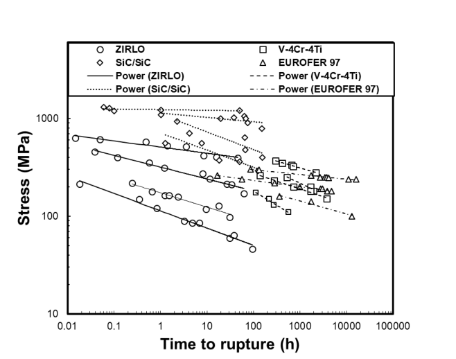

1031 1032 Figure A1. Time to rupture of ZIRLO[TM] (circle), V-4Cr-4Ti (square), SiC/SiC (diamond) and EUROFER 97 1033 (triangle) with 1034 1035 

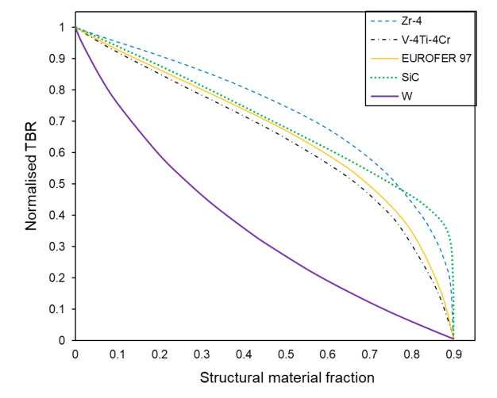

1036 1037 Figure A2. The relative TBR with 0.9[6] Li enrichment fraction for the WCLL design for different structural 1038 materials in the breeder blanket and the structural material fraction varied. 1039 1040 

