## Princeton Plasma Physics Laboratory 

## PPPL- 5297 

## In-Plane and Out-of-Plane TF Coil Support for the US FNSF Reactor 

P. Titus, C. Kessel 

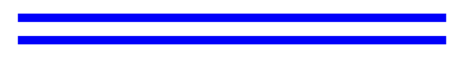

Prepared for the U.S.Department of Energy under Contract DE-AC02-09CH11466. 

## **Laborator Princeton Plasma Physics y Report Disclaimers** 

## **Full Legal Disclaimer** 

This report was prepared as  an account of work sponsored by  an agency of the United States Government. Neither the United States Government nor  any agency thereof, nor  any  of their  employees, nor  any   of  their  contractors, subcontractors or their  employees, makes any warranty, express or  implied, or  assumes any  legal liability or  responsibility for  the accuracy, completeness, or any third party’s  use  or the results of such  use  of any information, apparatus, product, or process  disclosed, or represents that  its use   would   not   infringe privately  owned rights. Reference herein to any  specific commercial product, process, or  service by  trade name, trademark, manufacturer, or otherwise, does  not  necessarily constitute or imply its endorsement, recommendation, or favoring by the United States  Government or  any   agency thereof  or its contractors  or  subcontractors. The   views   and opinions  of authors  expressed herein  do not necessarily state or reflect those of the United States Government or any  agency thereof. 

## **Trademark Disclaimer** 

Reference herein  to any  specific commercial product,  process, or  service by  trade name, trademark, manufacturer, or otherwise, does  not  necessarily constitute or imply its endorsement, recommendation, or favoring by the United States  Government or  any   agency thereof  or its contractors or subcontractors. 

## **PPPL Report Availability** 

## **Princeton Plasma Physics Laboratory:** 

http://www.pppl.gov/techreports.cfm 

## **Office of Scientific and Technical Information (OSTI):** 

http://www.osti.gov/scitech/ 

## **Related Links:** 

## **U.S. Department of Energy** 

## **U.S. Department of Energy Office of Science** 

**U.S. Department of Energy Office of Fusion Energy Sciences** 

## **TOFE Abstract Number:  Paper ID 18192** 

**In-Plane and Out-of-Plane TF Coil Support for the US FNSF Reactor** 

Peter H. Titus[1] , Edward Marriott[2] , Charles Kessel[ 1] 

1Princeton Plasma Physics Laboratory ptitus@pppl.gov 2University of Wisconsin Fusion Technology Institute marriott@wisc.edu 

Corresponding Author Address: Peter H. Titus Princeton Plasma Physics Laboratory P.O.Box 451 Princeton NJ 08543-0451 

Key Words: Magnets,  FNSF, Out-of-Plane Support 

## Abstract 

This paper addresses the global structural adequacy of the US-FNSF coil layout as of November 2015. With some improvements, the design point provided has been found to be within present structural design practice. An important conclusion of this analysis is that the radial servicing logic used as a basis for plant layout is feasible. The concept relies on large TF outer leg inter-coil spaces and a large outer leg  radial build to facilitate radial removal of blanket modules. The toroidal field at the plasma centerline is large, The high toroidal field and large radial build combine to produce a large vertical net load on the upper half of the TF coil system that must be supported by the metal cross sections of the inner leg and outer leg plus additional outer structures. After some iterations with C. Kessel’s systems code, updated  PF coil builds were provided. The TF coil profile started with results from the  systems code, but this did not fit the PF coils provided. The TF was “squashed” to allow the PF coils to be closer to the plasma. This is a substantial deviation from the constant tension D shape that introduces bending stresses in the TF case. The coil envelope also had to satisfy the radial extraction of core elements. CAD studies were performed of the component volumes and their passage through the horizontal ports. This  identified the allowed space for needed reinforcements in the outer leg. The TF case finite element model was then built within the required space and reinforced until stress allowables were met. The model was then entered into the CAD model to confirm the final TF coil and reinforcements fit. Primary stress limits and fatigue limits are addressed. 

## **I Introduction** 

This report addresses the global structural adequacy of the US-FNSF coil layout as of November 2015. The design point provided as of November  has been found to be within present structural design practice, although some modest improvements are needed in the inner leg stress. A conclusion of this analysis is that the radial servicing logic used as a basis for plant layout is feasible. The concept relies on large TF outer leg inter-coil spaces and a large outer leg radial build to facilitate radial blanket module servicing. In most other next generation machines, this space is taken up by torque structures. Many competing next generation machines use vertical servicing through openings between the upper horizontal legs of the TF coils. K-DEMO and EU Demo are examples. 

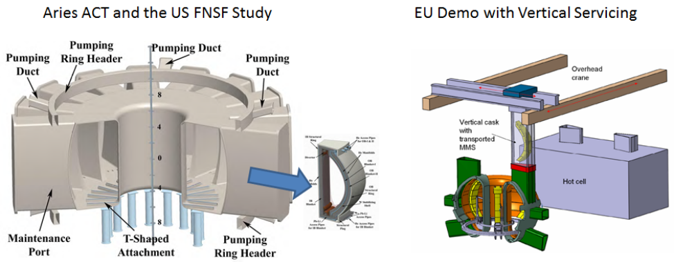

Figure 1 Radial Servicing used I ARIES Studies and the US-FNSF, and Vertical Servicing proposed for the EUDEMO 

In the case of the FNSF, the vertical spans of the outer legs must be stiff and strong enough to carry the global torque as beam elements connecting upper and lower structures. The toroidal field at the plasma centerline is 7.5 T with a peak field of 17.37 Tesla in the inner corners of the TF winding pack. The high fields and large radial build combine to produce a large vertical net load on the upper half of the TF coil system that must be supported by the metal cross sections of the inner leg and outer leg plus additional outer structures. The usual starting point of TF coil layout is a constant tension “D”, Ideally this provides a bending free shape, but as stiffness variations and poloidal field coil loads are added, other loads besides the in-plane bursting load begin to dominate. 

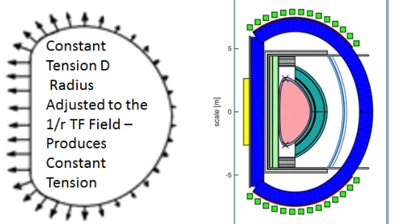

Figure 2 TF Coil “D” Shape and Approximation from C. Kessel’s System Code 

PF coil builds were iterated. This included the addition of another OH segment. The TF coil profile started with results from Mark Tillack’s running C. Kessel’s systems code, but this did not fit the PF coils provided by Chuck Kessel. The TF was “squashed” to allow the PF coils to be closer to the plasma. This is a substantial deviation from the constant tension D shape. Significant inner corner bending stresses result. These must be shown to satisfy static criteria and the alternating components must satisfy fatigue criteria. 

The outer leg position was adjusted to accommodate the dimensional studies by Edward Marriot. These provided the envelope within which the outer leg could be fit, to allow the radial extraction of the core segments. 

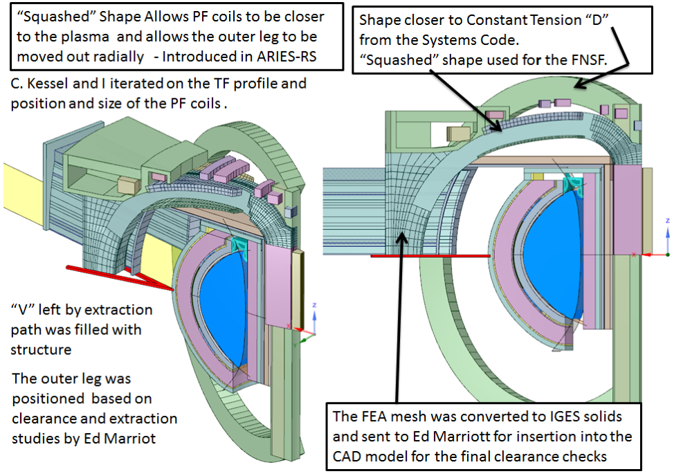

Figure 3 TF coil Configuration Studies to Accommodate Radial Servicing the PF Coils 

## **II Design Input** 

The geometric data were originally derived from Mark Tillack’s run of C. Kessel’s  Systems code model shown in figure 2. Stress Criteria are from the ITER Magnet Structural Design Criteria, and the NSTX-U structural design criteria[3]. A pilot plant is expected to operate near steady state.  It has been estimated from the present FNSF program, approximately 700 DT shots, and probably another 500 He/H and DD shots would be experienced by the reactor in its design life.  ITER (plans 30,000 full power shots).. This means that the stress requirements are dominated by very low cycle, or static stress limits. This relieves many of the constraints on design of local details. Sharper corners are less of a concern. Flaws in materials are not as critical and more practical quality and NDE requirements may be used. This shifts the design problem from design for fatigue to designing to support the extremely large but essentially static magnetic loads. 

Static Primary Stress Allowable based on ITER:   2/3*  1000 MPa Yield = 666 Mpa 

Optimistic Primary Stress Allowable based on Improved 316 metallurgy: 

800 MPa 

Limit Analysis is also an option in demonstrating margin against primary loads [2] 

## **III TF Build** 

The winding pack cross section is close to that provided by Yuhu Zhai as a part of the FNSF Study [1].  The winding pack is modeled as a central region in the case with an orthotropic set of moduli. As a default, the orthotropic set is taken from the ITER TF analysis. 

The inner leg cross section and other radial builds used in the analysis are shown in Figure 4 below. 

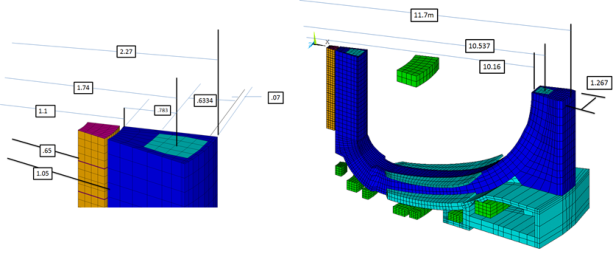

Figure 4 TF Inner Leg Dimensions Used in the Analysis 

Winding Pack Properties for the TF Coil Analysis of the US :FNSF 

ex,1, 100000000000   $ey,1, 48900000000    $ez,1, 48900000000 gxy,1, 27200000000   $gyz,1, 22700000000    $gxz,1, 6440000000 prxy,1, .24   $pryz,1, .243    $prxz,1, .159 

The  conductors are assumed to contribute little to the structural strength of the winding pack. Nb3Sn conductors are mostly annealed copper and Helium filled voids. The winding pack properties are taken from the ITER TF “smeared” winding pack orthotropic property set, although it is likely that a high temperature super conductor solution will be required to achieve the required fields. 

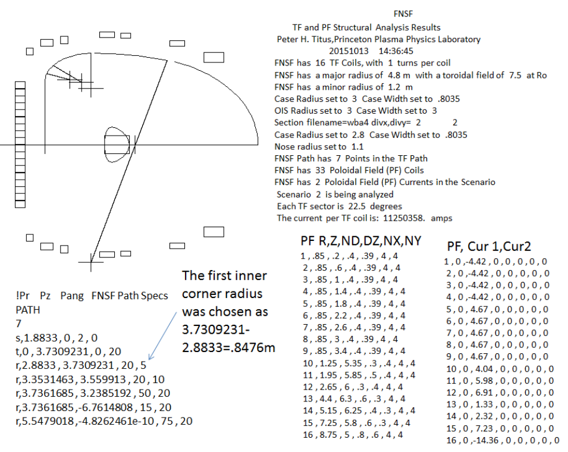

Figure 5 Major Parameters of the Coil Model 

Figure 5 shows the major parameters used in the modeling of the FNSF. The path definition in the figure begins with a starting coordinate at the winding pack center, then a translation to create the straight leg, then a series of arc centers and angles. The TF is assumed to be up-down symmetric. Figure 4 shows the “flared” outer leg cross section that uses the available space left by a radial extraction of the core components. The outer leg reinforcement can be increased radially as needed to add to the beam strength of the outer legs. 

## **IV TF Inner Leg Stress** 

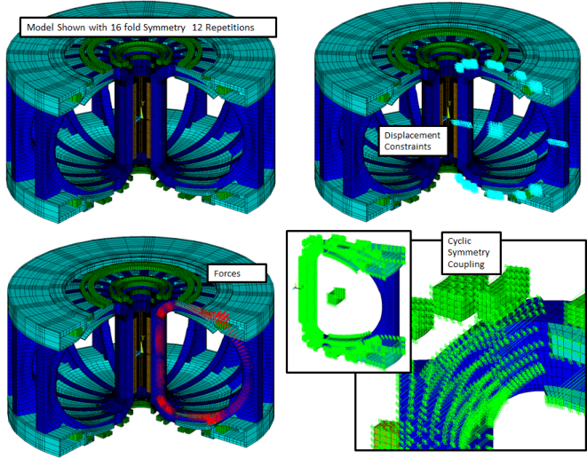

Figure 6 FNSF Analysis Model 

The TF coil sections evolved. There were adjustments to the  inner leg radii, and increases in the outer leg radius to facilitate the radial extraction of core components.  a “flare” in the geometry of the outer leg cross section was added, to take advantage of the full space envelope available from the needed radial extraction clearance. The stress results are shown in Figure 11. 

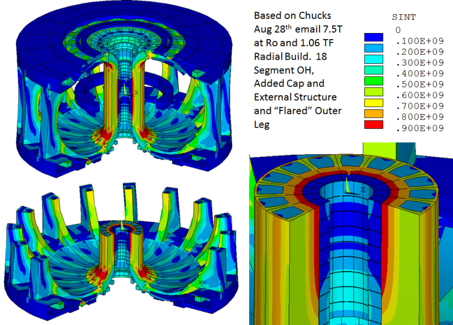

Figure 7 Inner Leg Stress Results 

Inner Leg Stress is still a bit too high. The contour boundary mid build of the nose region would represent the primary membrane stress and is about 800 MPa. 666 Mpa is the usual allowable for ITER grade 316 stainless steel.  Some modest reallocation of metal cross sections may still be needed.  Improved yield stainless steels are an option. Limit analysis has been used to qualify this level of stress by showing a factor of safety of 2.0 against burst over the design loads. This has been explored in the context of the KDEMO reactor [2] . More steel with less space for conductor may be possible with high temperature superconductors (HTS) .  REBCO HTS are thin layers of HTS coated HASTELLOY tapes in which the steel tapes make up most of the cross section . If the reactor is truly steady state or very long pulse, Solid Non-CICC Nb3Sn cable in channel conductor could be an option. 

## **V TF Corner Stress** 

The FNSF does not use a constant tension D shape. This is done to allow PF coils to be closer to the plasma. This approach was first used in the ARIES RS studies where small deviations in the D shape provided better plasma shaping and more reasonable PF coil currents, and didn’t degrade the TF stress unacceptably. In the present version of the FNSF, the inner corner radius was made relatively small to accommodate the blanket and PF coil geometry. This corresponds to a stress concentration at the corner bend that results from the sharp transition in curvature of the coil from the straight leg to the horizontal leg. Some portion of this will cycle. The alternating stress will be compared with that for ITER. 

## **VI Carrying the Machine Torque in the Outer Leg** 

Out-of-plane (OOP) forces on the TF coil result from the TF current interacting with the poloidal fields. Figure ___ shows OOP force distributions for the recently commissioned NSTX-U(left) and an old plot of OOP forces on an ITER TF coil as they evolve through the plasma pulse. 

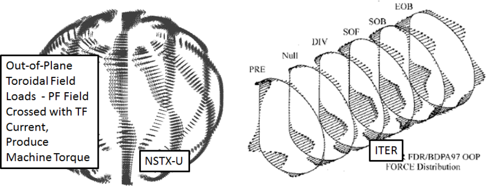

Figure 8 Out-of-Plane Force Distributions, NSTX-U (left) and Loads on a Single ITER TF Coil Through the Pulse 

This is a critical evaluation of the FNSF structure. The Radial servicing logic relies on a large opening between the outer legs to extract the core components. In most other next generation machines, this space is taken up by torque structures. Many competing next generation machines use vertical servicing through openings between the horizontal legs of the TF coils. KDEMO is 

an example.  Global machine torques can be carried by outer structures while still allowing radial servicing. In the case of the FNSF, the vertical span of the outer leg must be stiff and strong enough to carry the global torque as beam elements connecting upper and lower structures. 

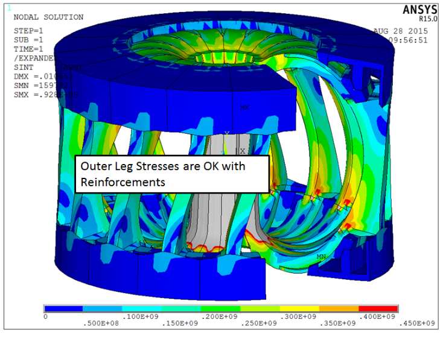

Figure 9 Tresca Stress in the outer legs of the US-FNSF 

## **VII Carrying the Inner Leg Torsional Shear** 

Torsion in the inner leg is carried by interconnections between the inner legs that form a large torque cylinder. The inner legs carry the local torques from interactions principally with the OH coil radial fields. For wedged coils, the frictional capacity ideally would be sufficient to support torsional shear. For most tokamaks the radially outward loads from the horizontal legs “dewedge” the corners, and as with ITER, some additional banding can be used to pull in the corners. Also, as with ITER, keys can lock the coil cases together . For the FNSF  wedge pressure at the nose of the TF is ample to take the inner leg torsion with  friction 

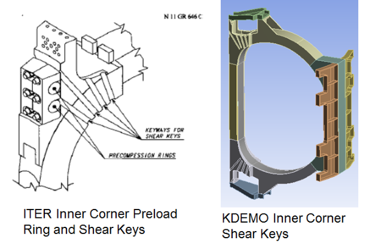

Figure 10 Inner Corner Shear Keys 

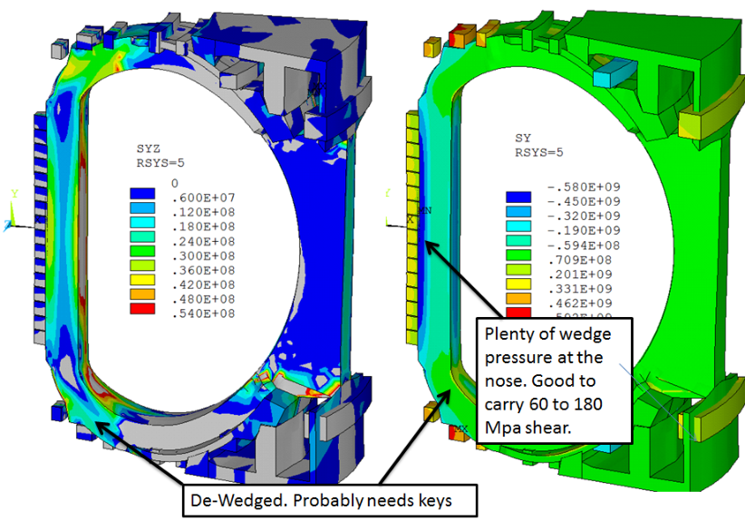

Figure 11 Torsional Shear (Left) Hoop Compression (Right) 

## **VII Cyclic Life** 

The next generation reactors are expected to be long pulse machines, if not steady state. However the Fusion Nuclear Science Facility goes through many upgrades between relatively long operational periods. Some modest cyclic loading will be experienced by the magnet systems. 

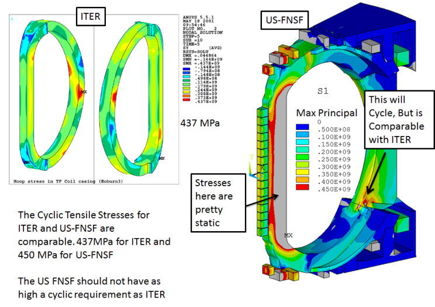

Figure 12 TF Out-of-Plane Cyclic Bending 

The out of plane loading that imposes bending on the outboard leg is cyclic, but the FNSF has many fewer design cycles expected for the life of the plant than ITER and other experimental devices. By it’s nature to obtain significant fluences, pulses must be long It has been estimated from the present FNSF program, approximately 700 DT shots, and probably another 500 He/H and DD shots would be experienced by the reactor in its design life. 

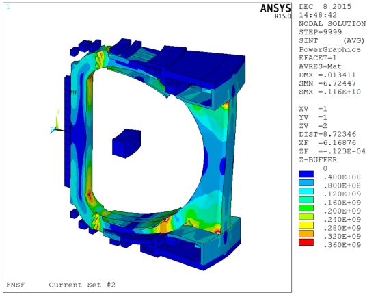

Figure 13 Stress Difference between the TFON and the TFON+PF load case 

Figure 13  is a “difference plot” of the TFON+PF load minus the TFON load case. This is a measure of the cyclic stress. Depending on how the OH is “swung” this could be an alternating stress magnitude or a stress range. This is comparable in magnitude with ITER. As expected, the 

red zones are in the outer leg, but there are also red zones in the inner leg corners. These are predominantly alternating shear stresses from the global twist of the tokamak 

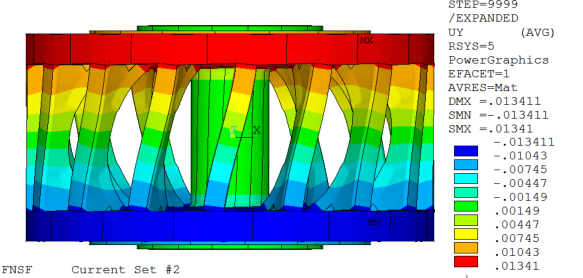

Figure 14  Global Twist of the Machine, Displacement(in meter)  Difference between TFON+PF and TFON Only 

Figure 14 shows an exaggerated displaced plot of the OOP displacements of the tokamak. The twisting load is mostly supported by outer structures, but the inner leg central column also reacts the twist. 

## **VIII TF Fields** 

One drawback of the TF Shape is the Peak Field in the Corner – Greater than the  16 T quoted in the systems code based on a 1/r scaling.   The local peak field is calculated to be 17.324 T at the inner upper and lower corners. The results are mesh dependent, particularly near the locally sharp inner corner radii. where the 1/r field and the solenoidal field from the corner radius add. Also the OH and other PF coil field adds.  A finer  mesh produces a max field of 17.57T 

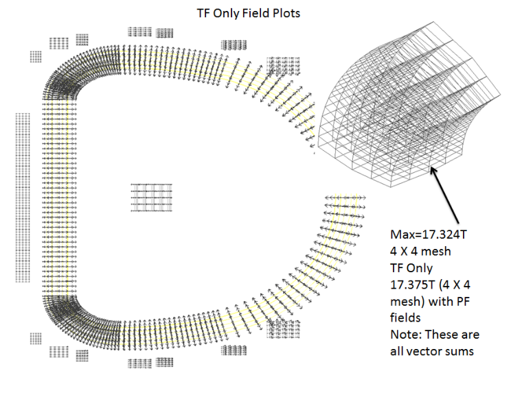

## Figure 16 Local Peak TF Field 

## **Conclusions** 

With the added radial structure and added structure above and below the horizontal port, the outer leg TF stress is similar to that which was qualified cyclically for ITER (in its inner leg). The FNSF should have less restrictive fatigue requirements. The important conclusion is that radial servicing is possible with adequate stress margins for the coil structures. 

Inner leg torsional shear will need features like ITER. Shear keys in the corner and possibly corner tensioned rings. 

Inner Leg Stress is still  a bit too high Some modest reallocation of metal cross sections may still be needed. Improved yield stainless steels are an option. More steel with  less space for conductor may be possible with HTS. If the reactor is truly steady state or very long pulse, Solid Non-CICC Nb3Sn cable in channel conductor could be an option. 

PF coil stresses are acceptable after a scenario iteration. 

## References 

[1] Fusion Energy Systems Studies (FESS) FNSF Study Year-End Report for 2015 , C. E. Kessel, et.al. Princeton Plasma Physics Laboratory Report 

[2] “TF INNER LEG SPACE ALLOCATION FOR PILOT PLANT DESIGN STUDIES” Peter H. Titus, Ali Zolfaghari  ANS Topical on Fusion Engineering, Nashville Tn, Fusion Science and Technology, Volume 64/Number 3/September 2013/Pages 680-686 

[3] NSTX Structural Design Criteria Document, NSTX_DesCrit_IZ_080103.doc I. Zatz 

## Princeton Plasma Physics Laboratory Publications Office of Reports and 

## Managed by Princeton Universit y 

under contract with the 

- U.S. De ar t ment of Ene p rgy 

- (DE **-** AC02 **-** 09CH11466) 

P.O. Box 451,  Princeton, NJ 08543 Phone: 609-243-2245 Fax: 609-243-2751 

E-mail: publications@pppl.gov Website:  http://www.pppl.gov 

