INL/RPT-22-67671 Revision 0 

**Use Cases and Model Development of Thermal Storage Coupling for Advanced Nuclear Reactors** 

**June 2022** 

**Rami M. Saeed Amey Shigrekar Konor L. Frick Daniel Mikkelson Shannon Bragg-Sitton** _**Idaho National Laboratory**_ 

_INL is a U.S. Department of Energy National Laboratory operated by Battelle Energy Alliance, LLC_ 

## **DISCLAIMER** 

This information was prepared as an account of work sponsored by an agency of the U.S. Government. Neither the U.S. Government nor any agency thereof, nor any of their employees, makes any warranty, expressed or implied, or assumes any legal liability or responsibility for the accuracy, completeness, or usefulness, of any information, apparatus, product, or process disclosed, or represents that its use would not infringe privately owned rights. References herein to any specific commercial product, process, or service by trade name, trade mark, manufacturer, or otherwise, does not necessarily constitute or imply its endorsement, recommendation, or favoring by the U.S. Government or any agency thereof. The views and opinions of authors expressed herein do not necessarily state or reflect those of the U.S. Government or any agency thereof. 

**INL/RPT-22-67671 Revision 0** 

# **Use Cases and Model Development of Thermal Storage Coupling for Advanced Nuclear Reactors** 

**Rami M. Saeed Amey Shigrekar Konor L. Frick Daniel Mikkelson Shannon Bragg-Sitton Idaho National Laboratory** 

**June 2022** 

**Idaho National Laboratory Integrated Energy Systems Idaho Falls, Idaho 83415** 

**http://www.ies.inl.gov** 

**Prepared for the U.S. Department of Energy Office of Nuclear Energy Under DOE Idaho Operations Office Contract DE-AC07-05ID14517** 

_Page intentionally left blank_ 

## **ABSTRACT** 

This report discusses the different options for coupling thermal energy storage (TES) systems to advanced nuclear power plants (A-NPPs) in order to enable flexible and hybrid plant operation. An advanced light-water reactor (ALWR) and a high-temperature gas-cooled reactor (HTGR) were selected as the initial use cases for demonstrating a thermally balanced energy storage coupling design for thermal power extraction. Cost functions for the A-LWR were derived from the fully balanced models that were developed based on three different coupling options with three different thermal energy bypass ratios. For the next steps, cost functions for the HTGR will also be derived, and additional nuclear reactors (e.g., a liquid-cooled fast reactor [LFR] or molten-salt reactor [MSR]) will be evaluated for coupling with TES in similar fashion, including the evaluation of their steady-state condition models and cost functions. 

The models presented herein showcase several design considerations, focusing on optimal deployment methodologies for achieving steady-state operation with minimum disruption to the nuclear power generation cycle. This report presents the results of steady state models developed using Aspen HYSYS[®] , wherein the thermal energy bypass for an NPP-TES coupling was varied up to 50%. The various components were sized using Aspen Process Economic Analyzer (APEA) and Aspen Exchanger Design and Rating (EDR), when applicable. Cost functions from these models were developed using the latest publicly available data obtained from APEA V11. 

The current steady-state models and cost functions provide a baseline for additional work focusing on dynamic operation and process optimization by using Idaho National Laboratory (INL)’s Framework for Optimization of Resources and Economics (FORCE) tools to evaluate the technoeconomic viability and transient operations of TES-coupled A-NPPs. 

iii 

_Page intentionally left blank_ 

iv 

## **CONTENTS** 

v 

## **FIGURES** 

Figure 1. General architecture for a thermally coupled IES. ........................................................................ 1 Figure 2. Schematics of a two-tank TES system connected to a solar-tower-based and a troughbased CSP [3]. .............................................................................................................................. 3 Figure 3. Schematic demonstrating a coupling between a nuclear reactor and a two-tank TES system [1]. .................................................................................................................................... 3 Figure 4. Aspen HYSYS[®] models of the detailed (bottom) and simplified (top) NuScale BOP system (alsp presented in larger landscape format in Appendix A). ............................................ 5 Figure 5. Simplified process flow diagrams of the first coupling option, showing the charge (top) and discharge (bottom) cycles (solid lines represent active streams and dashed lines represent standby cycles). ............................................................................................................. 9 Figure 6. Simplified process flow diagram of the second coupling option, showing the combined operation of the charge and discharge cycles. .............................................................................. 9 Figure 7. Simplified process flow diagrams of the third coupling option, showing the charge (top) and discharge (bottom) cycles. ................................................................................................... 10 Figure 8. Intermediate heat exchanger temperature profile for the LWR case study. ................................ 12 Figure 9. Process flow diagram of an advanced LWR-TES coupling with a standalone secondary TES power generation cycle (first coupling method) and a HDR of 50%, showing the active charge cycle (top) and inactive hot standby discharge cycle in hot standby mode (bottom). ..................................................................................................................................... 13 Figure 10. Process flow diagrams of an advanced LWR-TES coupling with a standalone secondary TES power generation cycle (first coupling method) and a HDR of 50%, showing the primary power generation cycle (top) and the active discharge cycle and secondary power generation cycle (bottom). .............................................................................. 14 Figure 11. Process flow diagram of the directly coupled NPP-TES setup. ................................................ 17 Figure 12. Process flow diagram of an advanced LWR-TES coupling with an oversized BOP cycle (the third coupling method) and a HDR of 50%, showing the active charge cycle (left of the hot/cold tanks) and part of the inactive hot standby discharge cycle in hot standby mode (right of the hot/cold tanks). ................................................................................ 18 Figure 13. Process flow diagram of an advanced LWR-TES coupling with an oversized BOP cycle (the third coupling method) and a HDR of 50%, showing the BOP condition during the discharge cycle (left of C-IHX-2), inactive charge cycle (left of the hot/cold tanks and right of C-IHX-2), and active discharge cycle in hot (streams entering and leaving D-IHX). .......................................................................................................................... 19 Figure 14. Intermediate heat exchanger temperature profile for the LWRs case study. ............................. 21 Figure 15. Process flow diagram of an advanced HTGR-TES coupling with a standalone secondary TES power generation cycle (first coupling method) and a HDR of 50%, showing the active charge cycle. ................................................................................................ 22 Figure 16. Process flow diagrams of an advanced HTGR-TES coupling with a standalone secondary TES power generation cycle (first coupling method) and a HDR of 50%, showing the primary power generation cycle (top) and active discharge cycle and secondary power generation cycle (bottom). .............................................................................. 23 

vi 

Figure 17. Minimum flow split to the FWH as a function of HDR to TES for the LWR use case, in order to maintain the steam generator inlet design point. 0% HDR represents the reference case (no-TES). ............................................................................................................ 25 Figure 18. Steam saturation temperature threshold and molten-salt temperature curve for the TES C-IHX from the LWR and HTGR use cases (dashed lines: LWR; solid lines: HTGR). ............ 26 Figure 19. Steam saturation temperature threshold and molten-salt temperature curve for the TES heat dispatch heat exchanger (left figure: LWR use case; right figure: HTGR use case; middle figure: both examples combined). .................................................................................. 27 Figure 20. Cost of Hitec[®] molten salt as a function of year, quantity, and grade/purity. ........................... 30 Figure 21. Cost of solar salt molten salt as a function of year, quantity, and grade/purity. ........................ 31 Figure 22. Cost functions curves for the various LWR-TES use cases components. ................................. 33 Figure 23. Cost functions curves for the superset models for the LWR-TES use cases. ............................ 35 Figure 24. Supermodel model (charge, storage, and discharge) sizing curves as a function of HDR%. ....................................................................................................................................... 37 **TABLES** Table 1. Thermophysical properties of Hitec salt [4]. .................................................................................. 4 Table 2. Operating conditions of the NuScale power conversion system ..................................................... 6 Table 3. Comparison of energy storage options for a power arbitrage discharge capacity of 500 MWe and a charging cost of $30/MWh. ...................................................................................... 6 Table 4. Operating conditions of the Xe-100 power conversion system. ..................................................... 7 Table 5. NuScale steam generator operating conditions. ............................................................................ 11 Table 6. Polynomial function constants for Hitec thermophysical properties. ........................................... 11 Table 7. Balance-of-plant and operating conditions of an advanced LWR-TES coupling with a secondary power generation cycle and a HDR of 50%. ............................................................. 15 Table 8. Balance-of-plant and operating conditions of an advanced LWR-TES coupling with a secondary power generation cycle and a HDRn of 25%. ........................................................... 15 Table 9. Balance-of-plant and operating conditions of an advanced LWR-TES coupling with a secondary power generation cycle and a HDR of 10%. ............................................................. 16 Table 10. Balance of plant and operating conditions of an advanced LWR-TES coupling with an oversized BOP cycle at a HDR of 50%. ..................................................................................... 19 Table 11. Xe-100 steam generator operating conditions. ........................................................................... 20 Table 12. Polynomial function constants for Solar Salt thermophysical properties. .................................. 20 Table 13. Balance of plant and operating conditions of an advanced LWR-TES coupling with a secondary power generation cycle at a HDR of 50%. ................................................................ 24 Table 14. Electric, thermal power dispatch and thermal efficiency indicators for the LWR use cases. ........................................................................................................................................... 25 Table 15. Electric, thermal power dispatch and thermal efficiency indicators for the HTGR use cases. ........................................................................................................................................... 25 

vii 

Table 16. Summary of the cost function constants for the various LWR-TES use cases components. ................................................................................................................................ 31 Table 17. Cost function constants for the three superset models for LWR-TES use cases. ....................... 34 Table 18. System size and cost summary for the refence case, and the various equipment needed for TES-LWR coupling at three different HDR%. ..................................................................... 36 

viii 

## **ACRONYMS** 

||**ACRONYMS**|
|---|---|
|A-LWR|advanced light-water reactor|
|A-NPP|advanced nuclear power plant|
|APEA|Aspen Process Economic Analyzer|
|BOP|balance of plant|
|C-IHX|charge intermediate heat exchanger|
|CSP|concentrated solar power|
|D-IHX|discharge intermediate heat exchanger|
|EDR|Aspen Exchanger Design and Rating|
|FORCE|Framework for Optimization of Resources and Economics|
|HERON|Holistic Energy Resource Optimization Network|
|HDR|Heat Diversion Ratio|
|HTGR|high-temperature gas-cooled reactor|
|IES|integrated energy systems|
|IHEX|intermediate heat exchanger|
|INL|Idaho National Laboratory|
|LFR|liquid-cooled fast reactor|
|LWR|light-water reactor|
|MAPE|mean percent average error|
|MSR|molten-salt reactor|
|NPP|nuclear power plant|
|NREL|National Renewable Energy Laboratory|
|SMR|small modular reactor|
|TES|thermal energy storage|

ix 

## **Use Cases and Model Development of Thermal Storage Coupling for Advanced Nuclear Reactors** 

## **1. INTRODUCTION** 

The Integrated Energy System (IES) Program is evaluating thermal energy storage (TES) systems in support of the current fleet of nuclear power plants (NPPs) as well as advanced NPPs (A-NPPs), with a focus on accommodating flexible power generation across multiple energy markets. A key component of these recent research efforts is exploring how nuclear energy can be used for purposes other than traditional electricity generation. A-NPPs may be tasked to operate in environments in which flexible power generation is more valuable than baseload generation. TES systems would enable NPPs to nimbly respond to market variability and could also enable A-NPPs to participate in multi-commodity markets, thus enhancing their economic competitiveness. Figure 1, which shows an example of a thermally coupled IES, represents one such possible IES architecture. In a thermally coupled IES configuration, the nuclear reactor provides baseload heat or power and operates at a high-capacity factor to cover operating and capital costs. TES is used to attenuate the dynamics of subsystems or defer energy delivery to a later time. This enables the reactor to operate at or near steady-state design conditions, enhancing performance and minimizing maintenance costs. Depending on the amount of heat dispatched to thermal storage, the amount of power generated from the balance of plant (BOP) can be ramped up or down, thus allowing for flexible generation. Heat recovered from storage can be used either directly and fed to the power generation cycle or sent to an industrial process when coupled within an IES. Note that this configuration represents one possible scenario, and that the specific need for and potential benefits of energy storage may differ in other IES architectures. 

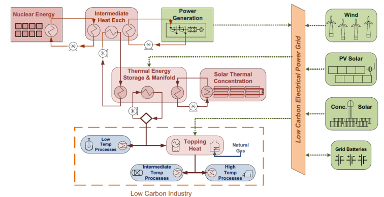

In previous work, Idaho National Laboratory (INL) evaluated the suitability of several TES technologies for coupling with A-NPPs, based on qualitative and merit indicators. Two-tank molten-salt, solid-media, and latent-heat TES systems were deemed well suited for coupling with a wide range of A-NPPs featuring different reactor sizes and temperatures. These findings, coupled with previous work in the field [1], provide the starting point for a more in-depth analysis. 

This work focuses on analyzing the steady-state and component-level cost functions of NPP-TES coupling options for enabling flexible and hybrid plant operation. This study will be followed by additional work on evaluating the transient controls and grid-wide economics of each coupling design. An integrated setup of this kind would enable energy storage during periods of oversupply, dispatching it to produce electricity during periods of high demand or for use as heat by industrial users. To date, model development has included the following: 

1. 1. Creation of steady-state Aspen HYSYS[®] systems-level BOP models of an advanced light-water reactor (A-LWR) for three TES coupling methods with three different thermal energy bypass ratios (i.e., heat diversion ratios [HDRs]). 

2. 2. Creation of cost functions derived from the fully balanced A-LWR models as a function of different system sizes. 

3. 3. Creation of Aspen HYSYS® systems-level BOP models for a high-temperature gas-cooled reactor (HTGR) for two TES coupling methods with upward of 50% thermal energy bypass. 

The different thermal energy bypass ratios, or HDRs, were analyzed to understand how thermal power extraction impacts overall system efficiency, and to perform parametric studies by varying the HDRs away from the turbine. In future work, analyses of storage cost functions and round-trip power-tostorage-to-power/heat efficiency, followed by the creation of dynamic models and design and economic optimization, will be used by INL’s Framework for Optimization of Resources and Economics (FORCE) tools to evaluate the technoeconomic viability and transient operations of TES-coupled A-NPPs. 

## **2. BACKGROUND** 

TES technologies accumulate and release energy by heating, cooling, melting, or solidifying a storage medium so the stored energy can later be used for various applications (i.e., power generation) by simply reversing the process. When coupled with NPPs, TES technologies store excess thermal energy not being used for power production. This energy is later recovered to generate heat or electrical power during periods of high demand/pricing for grid electricity. In this manner, NPPs can operate at maximum capacity without having to load follow to match market demands, thereby improving their economics, increasing their efficiency, and reducing mismatches between the energy supply and the demand. 

While TES technologies can be classified in many ways, such classifications are generally based on three common approaches to energy storage: sensible heat, latent heat, and thermochemical energy. In previous work, two-tank molten-salt energy storage systems were studied in detail for integration with NPPs [1],[2]. Due to this technology’s low-cost potential, high technology readiness level, and ability to be integrated with existing or future power plants (e.g., NPPs), and because this technology has already been widely studied and deployed, it was selected in this work as a prime candidate for coupling with A- NPPs. Other thermal storage technologies will be evaluated similarly in future work. 

The two-tank system is considered the most common form of sensible heat storage technology for medium- and high-temperature (200–600°C) applications that require hours of storage capacity. This TES technology has already been deployed on a large scale in concentrated solar power (CSP) plants. Operation of this TES system involves using two large tanks, each capable of storing the entire mass of the storage medium; a heat source to charge the TES system; and a power block to discharge it. Figure 2 shows schematics of a two-tank TES system coupled to two different CSP plant configurations. 

For the two-tank TES designs, further classification can be made as to whether the heat storage medium is heated directly by the heat source or indirectly via a heat transfer fluid. During the charge cycle in the indirect heating setup, the storage medium is pumped from the cold tank, through an intermediate heat exchanger (IHEX) that couples the TES system to the heat source, and into the hot tank for storage. During the discharge cycle, the system operates in reverse by depositing its heat to a fluid that is then sent to the power block. The power block uses the heated fluid to produce steam, which is then expanded in a turbine to generate electricity. The direct heating setup differs only in the charge cycle, since the storage medium is directly heated by the heat source prior to transfer to the cold tank. Figure 2 shows a schematic of a coupling between concentrated solar power collectors and a two-tank TES design. A similar representation of a potential two-tank TES system coupled to a NPP is shown in Figure 3. A light water reactor design-based NPP-TES coupling would use steam as the working fluid to charge the tanks. During the discharge, feedwater could be used to produce steam, that could be sent to a later stage in the turbine train to produce additional power. 

![Figure 2. Schematics of a two-tank TES system connected to a solar-tower-based and a trough-based CSP [3].](images/cooling-salt-cost.pdf-0014-01.png)

![Figure 3. Schematic demonstrating a coupling between a nuclear reactor and a two-tank TES system [1].](images/cooling-salt-cost.pdf-0014-03.png)

Molten salts are prime candidates for heat storage, as they are very well understood and possess Molten salts are prime candidates for heat storage, as they are very well understood and possess useful characteristics (e.g., low vapor pressure and high thermal conductivity). They are also low in cost and present a low degree of risk during accidents, as they solidify when they leak and cool down. Hitec salt was selected as the heat transfer fluid for the two-tank TES system in this study, for the following reasons: (1) it is stable at the operating temperatures of the reactor selected for this study, (2) it remains liquid under atmospheric pressure at near the reactor coolant temperature, and (3) it is very competitively priced compared to other energy storage materials well suited to this storage temperature (e.g., thermal oil). Another candidate, Hitec XL, will be evaluated in future work. Additional details on why Hitec salt was chosen for the selected light-water reactor (LWR) are given in Section 2.1. 

Table 1. Thermophysical properties of Hitec salt [4]. 

## **2.1 Advanced Nuclear Power Plant – Case Studies** 

As mentioned, the goal of this case study was to analyze the coupling of TES technologies with high technology readiness levels to various A-NPP options that operate over a wide temperature range. Three advanced nuclear reactor technologies were considered for achieving this target: (1) A-LWR, (2) HTGR, and (3) liquid-cooled fast reactor (LFR) or molten-salt reactor (MSR). 

## **2.1.1 Advanced Light-water Reactor** 

The first NPP design investigated in this study is a light-water-based small modular reactor (SMR). As the operating conditions of the NuScale SMR are readily available, they served as a baseline for developing the BOP models in Aspen HYSYS[®] . Using the design certification application that NuScale Power submitted to the U.S. Nuclear Regulatory Commission, a detailed steady-state model of its BOP was developed in Aspen HYSYS[® ] [7]. However, to reduce the complexity of the analysis carried out in this work, an equivalent simplified model of the steam and power conversion system was also developed (see Figure 4). For better readability, the detailed model is presented in landscape format in Appendix A. The simplified model applies the same operating conditions to its major components (e.g., steam generator, turbine, and condenser). Although the pumping power slightly differed due to the simplified model’s lack of a feedwater heater (FWH) train, the system’s overall thermal efficiency was maintained. 

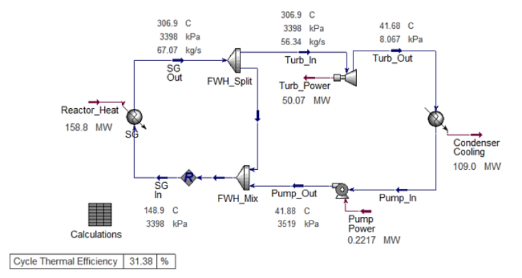

![Figure 4. Aspen HYSYS[®] models of the detailed (bottom) and simplified (top) NuScale BOP system (also presented in larger landscape format in Appendix A).](images/cooling-salt-cost.pdf-0016-01.png)

To ensure that this simplification does not affect the technoeconomic evaluation carried out in the next steps, a cost analysis of both these designs was conducted by sizing each component within the two models and then using Aspen Process Economic Analyzer (APEA) to acquire their costs. The two models showed less than a 2.8% difference with each other in terms of installed costs. 

To establish a basis for developing the steady-state models, the NuScale BOP and operating conditions used in this study are listed in Table 2. These conditions were extracted from the NuScale Standard Plant Design Certification Application, which NuScale Power submitted to the U.S. Nuclear Regulatory Commission [10]. 

Table 2. Operating conditions of the NuScale power conversion system 

As opposed to HTGRs, the NuScale steam generator has a steam outlet temperature of about 307°C and a pressure of 3398 kPa. However, due to the limitations imposed by the steam saturation point, it can only heat the Hitec salt to a maximum of 240°C (i.e., ~100° above its melting point). The design consideration discussion in Section 4 explains this technical limitation in greater detail. The fact that the cold storage tank temperature must be maintained at ~40° above the melting point of Hitec salt allows for a maximum of ~100° between the cold and hot tank temperatures. Such a small difference necessitates a large mass of molten salt in order to store a given amount of heat, as opposed to cases involving storage media with lower melting points or reactors with higher outlet temperatures—cases that will be explored in future studies. 

For example, a HTGR design could potentially offer a larger ΔT between the maximum hot tank storage temperature and the cold tank temperature. Therefore, it is preferred that TES system designs feature salts with lower melting temperatures whenever possible. For this particular case, the ideal candidate salts are Hitec (NaNO3-KNO3-NaNO2: 142°C melting point) and Hitec XL (NaNO3-KNO3Ca[NO3]2: 120°C melting point). Synthetic oils are also good heat storage media candidates. In previous work, several storage media (Hitec, Hitec XL, Therminol-66, and Dowtherm A) were evaluated over temperature ranges similar to those considered in this study. Of these, a simple technoeconomic analysis revealed that Hitec salt affords the lowest levelized cost of storage for both short (6 hours) and long (12 hours) durations [5]. The results of this comparison are summarized in Table 3, based on a discharge capacity of 500 MWe and a charging cost of $30/MWh. 

Table 3. Comparison of energy storage options for a power arbitrage discharge capacity of 500 MWe and a charging cost of $30/MWh. 

## **2.1.2 High-temperature Gas-cooled Reactor (HTGR)** 

The second NPP design investigated is a HTGR. As the operating conditions of the X-energy reactor (Xe-100) are readily available, they served as a baseline for developing the BOP models in Aspen HYSYS[®] . To establish a basis for developing the steady-state models, the BOP and operating conditions of Xe-100 are listed in Table 5. 

Table 4. Operating conditions of the Xe-100 power conversion system [11]. 

HTGRs could potentially offer a larger ΔT between the maximum hot tank storage temperature and the cold tank temperature. As opposed to LWRs, the steam generator in a HTGR (taking Xe-100 as a case study) has a steam outlet temperature of about 565°C and a pressure of 16500 kPa. Under these conditions, the design limitation imposed by the steam saturation point is more forgiving, as it can heat the storage material up to 400°C without causing a temperature cross in the TES charge intermediate heat exchanger (C-IHX). The design considerations discussion in Section 4 explains this technical limitation in greater detail (see “Molten salt maximum design temperature” in Section 4). These operating conditions enable the use of molten salts with higher melting temperatures and operating temperature thresholds. For this particular case, an ideal storage material candidate is solar salt, which is a two-component mixture of potassium nitrate and sodium nitrate and has a melting point of about 222°C for NaNO3-KNO3 (60–40 wt%). Another advantage is that, historically, solar salt is cheaper (0.49 $/kg) than Hitec (0.93 $/kg) [12]. A more detailed discussion on the current and historical costs of various energy storage material is provided in the cost functions analysis in Section 5. 

## **2.1.3 Liquid-cooled Fast Reactors or Molten-Salt Reactor** 

The third NPP design investigated will be a LFR or MSR. In future work, a reactor design will be selected as a case study for the LFR/MSR use case and will be investigated similarly to the LWR and HTGR use cases. While a final determination has not yet been made, the case study will likely be based on the Power Reactor Innovative Small Module, which is one of only a few designs for which sufficient information on its power conversion cycle is available in the public domain [13]. Using the available operating conditions taken from the Preliminary Safety Information Document prepared by General Electric for the U.S. Department of Energy, the steady-state models will be created in Aspen HYSYS[®] . These models will then be used then to create cost functions for use in the Holistic Energy Resource Optimization Network (HERON) tool, and to provide the initial conditions for the transient process models and control schemes adopted in HYBRID. 

## **2.2 NPP-TES Coupling Options** 

All three NPP-TES coupling options covered in this study were selected in order to minimize the impacts on the NPP, such that nuclear power operations can continue without affecting the NPP or its operating license. In each of the coupling options, the TES molten-salt system was designed to maintain the working fluid temperatures in the cold tank at 180 and 260°C for the LWR and HTGR, respectively (at least 38° above the melting point of each). During the charge cycle, superheated steam was used to heat the molten salt to 240 and 400°C for the LWR and HTGR, respectively (i.e., the technical heating limits for each reactor type), and thus molten salt was then transferred to the hot tank for storage. The TES loop operates at a pressure of 120 kPa. During the discharge, the hot molten-salt fluid is run through a different heat exchanger that converts a stream of feedwater into saturated steam for heat dispatch to industrial users or for power generation (as is the case in the three scenarios covered in this study). 

A key attribute of the two-tank TES system is that it can discharge molten salt at a constant temperature, indicating the ability to maintain constant power delivery or thermal energy dispatch in realworld applications, as reflected in the current steady-state Aspen HYSYS[®] models. The three coupling options investigated in this work are: 

- Option 1 – Standalone NPP-TES coupled with a secondary power generation cycle 

- Option 2 – Directly coupled NPP-TES system 

- Option 3 – Integrated NPP-TES coupled with an oversized primary turbine. 

## **2.2.1 Option 1 – Standalone NPP-TES Coupled with a Secondary Power Cycle** 

The first option entails diverting heat from the primary BOP during the charge cycle to heat the fluid flowing from the cold tank to the hot tank. During the discharge cycle, a secondary steam Rankine power generation setup is employed. Figure 5 shows simplified process flow diagrams of the first coupling option. 

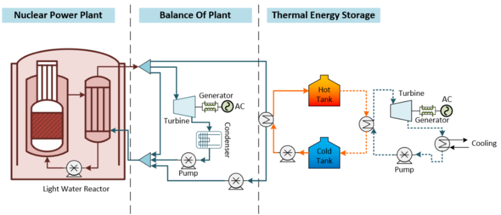

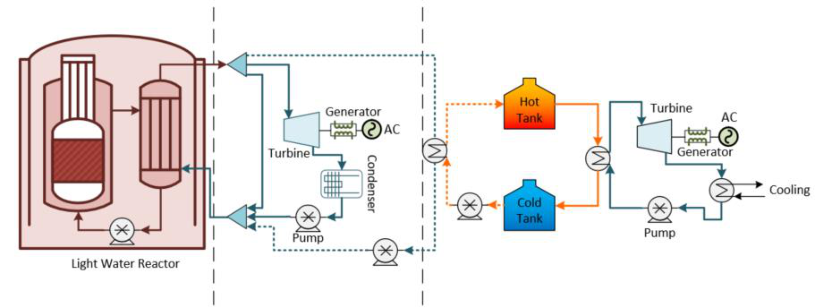

## **2.2.2 Option 2 – Directly Coupled NPP-TES System** 

The second coupling option involves direct heat transfer from the NPP to the TES system, which independently or instantaneously discharges thermal energy to the BOP and feeds the primary Rankine power generation. A simplified process flow diagram of the second option is shown in Figure 6. 

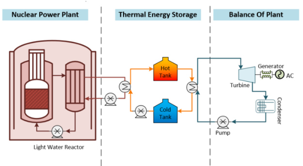

## **2.2.3 Option 3 – Integrated NPP-TES Coupled with an Oversized Primary Turbine** 

The third coupling option involves heat diversion from the NPP to the TES system during the charge cycle. During the discharge cycle, thermal energy is utilized to deliver steam to one of the low-pressure turbines in the primary turbine train assembly (details not shown here). Simplified process flow diagrams of this coupling option are shown in Figure 7. 

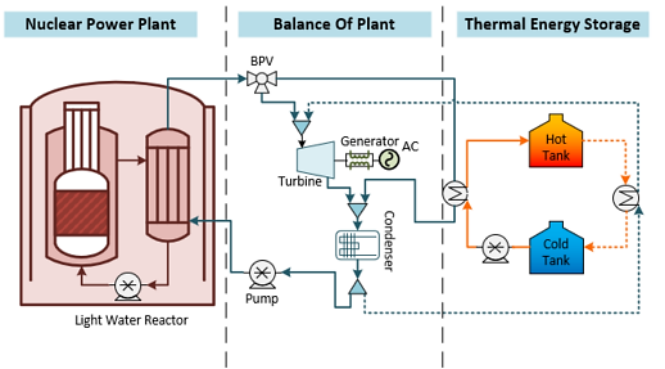

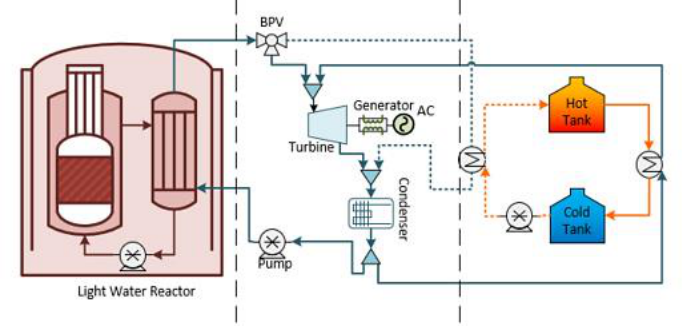

## **3. DEVELOPMENT OF ASPEN HYSYS[®] STEADY-STATE MODELS** 

To enable TES integration with A-NPPs, this work analyzed three different coupling options with various amounts of thermal power extraction via Aspen HYSYS[®] . The following sections provide details on each of the three coupling options with the LWR and HTGR reactor technologies as their primary heat source, the assumptions made in creating the models, and the results that were generated. 

## **3.1 Advanced Light-water Reactor** 

In all three methods of coupling TES with A-LWRs, the charge and discharge cycles were presented separately. In the following three subsections, a heat diversion of ~50% of the total steam production was chosen as the baseline for discussing the models. However, three thermal energy dispatch ratios (or HDRns)—50%, 25%, and 10%—were also created for the first and third coupling options and are summarized in Sections 3.1.1 and 3.1.3. All models and coupling methods were created with the goal of making the charge and discharge cycles last for 6 hours each. 

To establish a basis for developing the steady-state models, steam from the steam generator was used as the heat transfer fluid to heat the storage medium during the charge cycle. The NuScale steam generator operating conditions used for this analysis are listed in Table 5. 

Table 5. NuScale steam generator operating conditions. 

As Hitec is not readily available as a fluid for use in Aspen HYSYS[®] , it was added to the Aspen library as a hypothetical fluid, based on the thermophysical properties acquired from the literature [14]. The Peng-Robinson equation of state was used to calculate the enthalpy and entropy of this newly added hypothetical fluid, whereas the NBS Steam package was used for the heat transfer fluid. The polynomial function and constants used for calculating Hitec’s enthalpy, heat capacity, viscosity, thermal conductivity, and density are listed below. 

𝑃𝑟𝑜𝑝𝑒𝑟𝑡𝑦=  𝑎 +  𝑏∗ 𝑋 +  𝑐∗𝑋[2] +  𝑑∗𝑥[3] +  𝑒∗𝑥[4] 

Table 6. Polynomial function constants for Hitec thermophysical properties. 

To standardize the analyses of all three coupling options, the following assumptions were made when creating steady-state Aspen HYSYS[®] models for the LWR use cases: 

- No heat loss from any of the BOP components, streams, or TES tanks. 

- A cold tank temperature of 180°C and a hot tank temperature of 240°C. 

- The discharge power cycle is maintained in hot standby mode when not being utilized. The same applies to the charge cycle components when only the discharge cycle is active. Hot standby mode is achieved by diverting ~1% of the primary cycle’s original mass flow needed to operate each cycle. 

- The turbomachinery components were each operated at 90% isentropic and adiabatic efficiencies. 

- The heat exchangers had a minimum approach temperature limit and pinch point limit of 5°C, as shown in Figure 8. This also determines the maximum molten salt temperature possible for each scenario (more on this technical limitation in Section 4). 

- The pressure drop across the heat exchangers is calculated based on the pressure drop value from the Aspen Exchanger Design and Rating (EDR). 

- Molten-salt heat exchangers are sized using EDR with molten salt on the tube side and a heat source (high-pressure steam and condensation) on the shell side. 

- Condensers are modeled as heat exchangers with feedwater on the shell side and low-pressure condensate on the tube side. This is contrary to the convention where condensers are typically surface condensers with the cooling water in the tubes and steam condensing on the surface of the tubes. However, such a setting did not allow for the condenser sizing algorithm to converge, thereby preventing its cost analysis. 

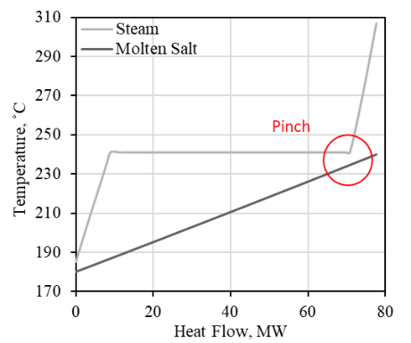

## **3.1.1 Option 1: Standalone NPP-TES Coupled with a Secondary Power Generation Cycle** 

The overall setup of this model is based on drawing superheated steam from the main steam header, running it through the C-IHX, and condensing it into a subcooled liquid at ~195°C. This condensate is then returned to a mixer that simulates the feedwater heater train in the BOP. Note that most BOP systems feature multiple feedwater heaters, drawing steam from the turbine train at various stages. However, for the sake of simplicity, a steam mixer was used in this study. On the secondary side of the C-IHX, molten salt pumped from the cold tank absorbs the heat of the steam’s condensation and is heated to ~240°C during transfer to the hot tank for storage. For the charge cycle at a 50% HDR, the amount of steam diverted from the main steam header equals 50% of the total mass flow, whereas during the discharge cycle, the diversion only accounts for ~1% in order to maintain the inactive charge components/streams in hot standby mode. Based on the operating conditions of the steam, as well as the limitations imposed on the Hitec heat storage medium, the C-IHX had a charge power of ~72.57 MWth. Thus, the total storage capacity of the TES system for the 6 hours of storage was calculated to be ~435.4 MWhth. Similarly, other models under different HDRs (25% and 10%) were also created, and these are summarized at the end of this section. 

Figure 9 shows a process flow diagram of an active charge cycle under coupling option 1 with a HDR of 50%, alongside the corresponding discharge cycle in hot standby mode (as developed in Aspen HYSYS[®] ). 

A secondary discharge intermediate heat exchanger (D-IHX) was designed to produce steam from feedwater during the discharge cycle, using the heat storage medium from the hot tank. During this process, hot salt is pumped from the hot tank and through the D-IHX, at which point it deposits its heat into the feedwater before being transferred to the cold tank. This heat exchange process converts the feedwater into steam, which is then used to produce electricity via the secondary power cycle. 

Figure 10 shows process flow diagrams of the BOP and active discharge cycle for the 50% HDR case. 

Now that the first coupling option is discussed in detail for the 50% HDR, the results in Table 7 through Now that the first coupling option has been discussed in detail for the 50% HDR case, the results in Table 7–Table 9 show the BOP and operating conditions for the different HDRs (50%, 25%, and 10%). The operation and overall structure of the models under other HDRs are very similar to those of the 50% case discussed above. It should be noted that when the system is operating in power production mode (no charge or discharge), the TES components are in a stand-by mode, with a minimum of ~1% flow through the systems to maintain temperature. Section 4 and Figure 17 discuss and provide the minimum flow split from the turbine stages to the FWH  in order to maintain the steam generator inlet design point for all  the heat diversion ratios. 

Table 7. Balance-of-plant and operating conditions of an A- LWR-TES coupling with a secondary power generation cycle and a HDR of 50%. 

Table 8. Balance-of-plant and operating conditions of an A-LWR-TES coupling with a secondary power generation cycle and a HDRn of 25%. 

Table 9. Balance-of-plant and operating conditions of an A-LWR-TES coupling with a secondary power generation cycle and a HDR of 10%. 

## **3.1.2 Option 2: Directly Coupled NPP-TES System** 

The overall setup of this coupling option is similar to that of TerraPower’s Natrium reactor and the BOP model, both of which directly couple a TES system to the NPP before depositing its heat to the power generation cycle. The difference between the Natrium reactor model and this one is that, in this model, heat transfer to the salt occurs via an intermediate loop, as is more representative of the baseline NuScale reactor system. Figure 11 shows the model developed in Aspen HYSYS[®] . The operating conditions for the steam generator are similar to those seen in options 1 and 3, as are the operating temperature limits for the storage tanks. The charge and discharge cycles for this setup look identical— the sole difference arising during cycle operations. This difference—namely, that the dynamics of charging/discharging cannot be modeled separately—becomes obvious in light of the current steady-state model. In a dynamic setup, the hot tank’s discharge rate varies in accordance with the demand of the power cycle, thus changing the storage media level within the tank. For example, during periods of lower demand, fluid from the hot tank flows at a lower rate through the D-IHX and into the cold tank, while the opposite is true during periods of higher demand. The charge cycle, however, operates at a constant rate, absorbing heat from the steam generator and maintaining baseload operation in the nuclear reactor. Thus, further analysis of this option will later be conducted using the dynamic modeling repository HYBRID, found within the FORCE toolset. 

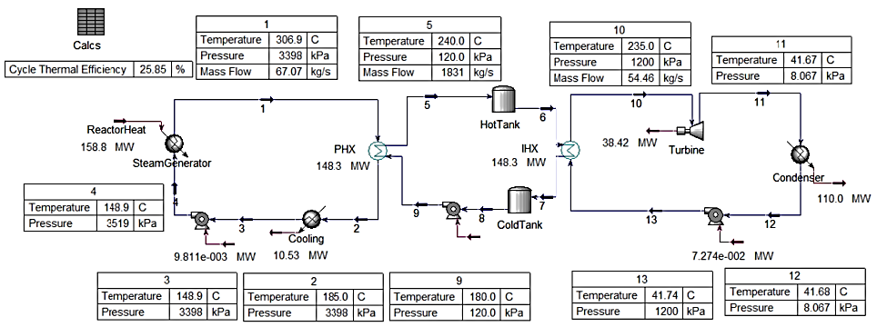

## **3.1.3 Option 3: Integrated NPP-TES Coupled with an Oversized Primary Turbine** 

The overall setup of this coupling option is similar to that seen in option 1, in which conventional operation transitions from 100% of thermal power being used to generate electricity to a hybrid operation in which 50% of thermal power is dispatched to a TES system that delivers thermal energy at times of higher demand in order to increase the level of power generation or deliver flexible thermal energy in the form of heat (i.e., steam) to industrial users. The setup and sizing of the charge and storage systems (CIHX, D-IHX, molten salt, hot/cold tanks, and hot/cold tank pumps) in this coupling option are identical to those in option 1, with the following exceptions: (1) the turbine receiving additional thermal energy from the TES loop is an oversized turbine in the BOP, as opposed to a standalone turbine in a dedicated power cycle for TES; and (2) there is no dedicated condenser in a TES power cycle, as an oversized BOP condenser is utilized. When the data from this coupling option are combined with data generated from the three HDRs from the first coupling option, these models provide enough resolution to create the cost functions for the various component and system sizes. 

During the charge cycle, the 50% heat diversion strategy is achieved by routing saturated steam from the main steam header to be condensed in the C-IHX, while simultaneously heating the molten-salt loop. As specified in the conventional operation in Section 3, the steam flow rate in the main steam header is 67.07 kg/s. In the current model, because steam is extracted from the main steam header (where its enthalpy is highest), the percentage of total steam extracted equals the percentage of thermal energy extracted. Hence, 50% thermal energy extraction equates to 50% flow rates diverted to the TES side (33.53 kg/s at 306.9°C) through the C-IHX. On the secondary side of the C-IHX, the molten salt pumped from the cold tank absorbs the heat from the steam’s condensation and rises in temperature from 180 to 238.7°C during transferal to the hot tank for storage. The steam on the primary side of the C-IHX is condensed to subcooled liquid at 195.7°C, then returned to a mixer that simulates the feedwater heater train in the primary NPP power cycle. 

Figure 12 shows a process flow diagram of an active charge cycle under coupling option 3 and a HDR of 50%, alongside the corresponding discharge cycle in hot standby mode (as developed in Aspen HYSYS[®] ). 

It should be noted that one alternative approach is to route the condensate from IHEX-1 to the condenser. However, the proposed design offers the benefit of utilizing additional available heat in the condensate (C-IHX exit) to support the feedwater heating train, such that the condensate leaving C-IHX at 195.7°C adds heat to the feedwater water heaters, thus more efficiently achieving the steam generator fixed inlet design point (149°C). This reduces the heat and mass flow that the feedwater heating train originally draws (FWH split) in the form of high-quality steam from the turbine train at various stages, or from the main steam header to the steam generator inlet. This process, under various HDRs, is discussed in more detail in Section 4. 

Although the discharge cycles discussed in this report are more focused on dispatching thermal energy for power generation purposes, the cycles presented for coupling options 1 and 3 can also be utilized as valid use cases whose end goal is to dispatch thermal energy to an industrial user. For example, Figure 12 shows a dispatch heat exchanger, D-IHX, modeled as a steam generator for a simple demonstration case. In theory, this exchanger can convert a stream of condensate or water at room temperature (20°C, 104 m[3] /hr, 29 kg/s) into saturated steam (out) at 150°C, producing up to 624 m[3] of steam during the complete 6-hour discharge duration, while simultaneously maintaining the 240 and 180°C design temperatures for the hot and cold tanks, respectively, at a flow rate of 915.5 kg/s on the molten-salt loop side. A more complicated use case for the discharge cycle (discussed in the following paragraph) focuses on the increasing power generation capacity of the NPPs. 

A secondary D-IHX (shown in Figure 13) is designed to produce steam from feedwater (condenser exit) during the discharge cycle, using the heat storage medium from the hot tank. During this process, hot salt is pumped from the hot tank and through IHEX-2, where it deposits its heat into the feedwater prior to transferal into the cold tank. This heat exchange converts the feedwater into saturated steam that is then routed to one of the low-pressure turbines in the primary NPP turbine assembly. The impact of increased flow rate, or heightened power generation capacity, on the low-pressure turbine is beyond the scope of the current analysis. In Figure 13, Turbine_2 (LPT) represents only the additional power generated by the low-pressure turbine stage(s) thanks to adding a TES-dispatched steam load to the system, whereas the total power generated from the BOP turbine train during the discharge cycle is the sum of the power generated by Turbine_1 and Turbine_2 (LPT). 

Figure 13 shows a process flow diagram of the discharge cycle and TES loop for this coupling option within Aspen HYSYS[®] . 

In the conventional case (i.e., full electrical power generation), the net electricity at 100% power is 49.5 MWe. At 50% thermal energy bypass (during the charge cycle), the turbine’s power generation drops to 26.42 MWe (approximately 53.9% of the full-power capacity). During discharge, the addition of the TESdispatched steam load to the system increased the net power to 67.38 MWe (approximately a 37.5% increase over the full-power electrical capacity in the conventional case). 

Now that the third coupling option has been discussed in detail for the 50% HDR, the results in Table 7– Table 9 show BOP and operating conditions. . It should be noted that when the system is operating in power production mode (no charge or discharge), the TES components are in a stand-by mode, with a minimum of ~1% flow through the systems to maintain temperature.  The setup in this coupling option is identical to that seen in option 1, except that the heat dispatched from TES is fed to the main BOP turbine train (Turbine 2 LPT in Figure 13) 

Table 10. Balance of plant and operating conditions of an A-LWR-TES coupling with an oversized BOP cycle at a HDR of 50%. 

* The total power generated from the BOP turbine during the discharge cycle is 67.38 Mwe (the sum of BOP Turbine_1 and BOP Turbine_2 [LPT]). ** BOP Turbine 2 (LPT) represents only additional power generated from the BOP turbine train due to the additional heat dispatched from TES. ** Steam sent from TES to the BOP Turbine_2 (LPT) during discharge is delivered at 1200 kPa. 

## **3.2 High-temperature gas-cooled reactor (HTGR)** 

In the current HTGR case study, the charge and discharge cycles were modeled separately, as they require different streams and components. The HTGR use case was studied in regard to the first coupling option (standalone NPP-TES coupling) and third coupling option (integrated NPP-TES coupling). A heat diversion of ~50% of the total steam production was chosen as the baseline for discussing the HTGR use case. Two additional thermal energy dispatch ratios (or HDRs) of 25% and 10% will be created in a follow-up work. All models and coupling methods were created with the goal of making the charge and discharge cycles last 6 hours each. 

To establish a basis for developing the steady-state models, steam from the steam generator was used as the heat transfer fluid to heat the storage medium during the charge cycle. The Xe-100 steam generator operating conditions used for this analysis are listed in Table 11. 

Table 11. Xe-100 steam generator operating conditions. 

As discussed in Section 2.1.2 the higher steam temperature and pressure produced by the steam generator in a HTGR design allow for a larger ΔT between the maximum hot tank storage temperature and the cold tank temperature. This results in a higher MWhth of storage, than what is afforded by LWRs with the same storage size (i.e., molten salt mass). Conversely, HTGRs require 16,533 kgs of molten salt for 1 MWhth of storage, whereas LWRs require 45,415 kgs. Additionally, heat storage at a higher temperature (higher quality) is more attractive than low-quality heat in regard to coupling with industrial process heat applications. 

Based on the HTGR (i.e., Xe-100) operating conditions, solar salt, a two-component mixture (NaNO3-KNO3, 60-40 wt%) with a melting point of 222°C, was selected as the storage material candidate for the HTGR case study. As solar salt is not readily available as a fluid for use in Aspen HYSYS[®] , it was added to the Aspen library as a hypothetical fluid, based on the thermophysical properties acquired from the literature [14]. The Peng-Robinson equation of state was used to calculate the enthalpy and entropy of this newly added hypothetical fluid, whereas the NBS Steam package was used for the heat transfer fluid. The polynomial function and constants used for calculating the enthalpy, heat capacity, viscosity, thermal conductivity, and density of solar salt are listed below. 

Table 12. Polynomial function constants for Solar Salt thermophysical properties. 

To standardize the analyses of all three coupling options, the following assumptions were made when creating the steady-state Aspen HYSYS[®] models for the HTGR use cases: 

- No heat loss from any of the BOP components, streams, or TES storage tanks. 

- A cold tank temperature of 260°C and a hot tank temperature of 400°C. 

- The discharge power cycle is maintained in hot standby mode when not being utilized. The same applies to the charge cycle components when only the discharge cycle is active. Hot standby mode is achieved by maintaining ~1% of the original mass flow needed to operate each cycle. 

- The turbomachinery components were each operated at 90% isentropic and adiabatic efficiencies. 

- The heat exchangers had a minimum approach temperature limit and pinch point limit of 5°C, as shown in Figure 14. This also determines the maximum holt molten salt temperature for each scenario (more on this technical limitation is found in Section 4). 

- The pressure drop across the heat exchangers is calculated based on the pressure drop value from Aspen EDR. 

- The molten-salt heat exchangers are sized using EDR, with molten salt on the tube side and heat source (high-pressure steam and condensation) on the shell side. 

- The condensers are modeled as a heat exchanger, with feedwater on the shell side and low-pressure condensate on the tube side. 

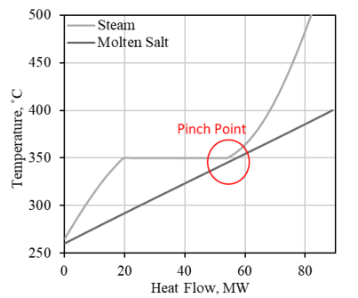

## **3.2.1 Option 1: Standalone NPP-TES Coupled with a Secondary Power Generation Cycle** 

For the first coupling option, the overall setup of this model is similar to that seen in the LWR use case. Supercritical steam is drawn from the main steam header, run through the C-IHX, and condensed into a subcooled liquid at ~266°C. This condensate is then returned to a mixer that simulates the feedwater heater train. On the secondary side of the C-IHX, molten salt pumped from the cold tank at 260°C absorbs the heat of the steam’s condensation and is itself heated to ~400°C during transfer to the hot tank for storage. The amount of steam diverted from the main steam header equals 50% of the total mass flow. Based on the operating conditions of the steam and molten-salt loops, the C-IHX had a charge power of ~88.95 MWth. Thus, the total storage capacity of the TES system for the 6 hours of storage was calculated to be ~534 MWhth. In future work, other models with different HDRs (25% and 10%) will be created and their cost functions developed. 

Figure 15 shows a process flow diagram of an active charge cycle under coupling option 1 and with a HDR of 50%, alongside the corresponding discharge cycle in hot standby mode (as developed in Aspen HYSYS[®] ). The inactive TES discharge cycle is not shown. 

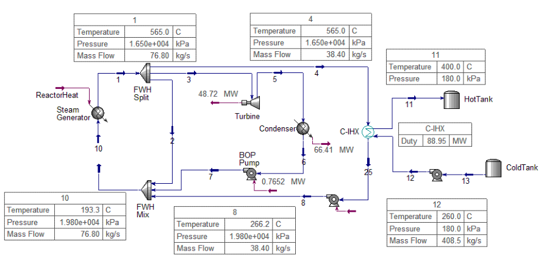

As with the models developed for the LWR case studies, the D-IHX was designed to produce steam from feedwater during the discharge cycle, using the heat storage medium from the hot tank, which is used to produce electricity in the secondary TES power cycle. 

Figure 16 shows process flow diagrams of the BOP and active discharge cycle for the 50% HDR case. 

Now that the HTGR-TES coupling use case has been discussed in detail in regard to the 50% HDR, the results in Table 13 show BOP and operating conditions for all the components. It should be noted that when the system is operating in power production mode (no charge or discharge), the TES components are in a stand-by mode, with a minimum of ~1% flow through the systems to maintain temperature. Section 4, Figure 17 discusses and shows  the minimum flow split from the turbine stages to the FWH in order to maintain  the steam generator inlet design point. 

Table 13. Balance of plant and operating conditions of an HTGR-TES coupling with a secondary power generation cycle at a HDR of 50%. 

## **4. DESIGN CONSIDERATIONS AND ANALYSIS** 

During the charge and discharge cycles, the addition of a new steam load to the system necessitates a change in how overall thermal efficiency is calculated. This can be expressed by calculating two efficiency indicators for the NPP: (1) the power generation efficiency, in which only the nuclear reactor heat and the resulting turbine power output are considered, and (2) the overall plant energy utilization efficiency, which is calculated based on how energy is utilized across the entire NPP, including TESstored/dispatched energy. 

## **Conventional case (no TES):** 

- • Power generation efficiency: 𝜂𝑝𝑜𝑤𝑒𝑟 = 

   - 𝑄𝑖𝑛−𝑖𝑛𝑡𝑜 𝑡𝑢𝑟𝑏𝑖𝑛𝑒 

- Plant energy utilization efficiency = Power generation efficiency 

## **Thermal storage case (coupling option 3):** 

- • Power generation efficiency (charge): 𝜂𝑝𝑜𝑤𝑒𝑟_𝑇𝐸𝑆_𝐶 = 𝑄𝑖𝑛 

- 𝐸𝑛𝑒𝑡+ 𝑄𝑇𝐸𝑆 

- • Plant energy utilization efficiency (charge) = 𝜂𝑁𝑃𝑃_𝑇𝐸𝑆_𝐶 = 

   - 𝑄𝑖𝑛 

- • Power generation efficiency (discharge): 𝜂𝑝𝑜𝑤𝑒𝑟_𝑇𝐸𝑆_𝐷 = 𝑄𝑖𝑛 

- • Plant energy utilization efficiency (discharge) = 𝜂𝑁𝑃𝑃_𝑇𝐸𝑆_𝐷 = 𝑄𝑖𝑛+𝑄𝑇𝐸𝑆 

where 

_Enet_ is the net electricity produced by the NPP (including the storage unit), 

_Qin_ is the thermal power input to the system from the nuclear reactor (158.9 MWth), and _QTES_ is the TES system thermal energy input/output. 

The electric and thermal power dispatch values and overall thermal efficiency indicators for the conventional case and the LWR TES uses case are summarized in Table 14. The TES use case values are based on the average values for option 1 and option 3, which were nearly identical. Similarly, Table 15 shows the calculations for the HTGR use cases. 

Table 14. Electric, thermal power dispatch and thermal efficiency indicators for the LWR use cases. 

Table 15. Electric, thermal power dispatch and thermal efficiency indicators for the HTGR use cases. 

Certain design considerations, limitations, and critical knowledge were acquired from each case. The key design considerations captured from this case are summarized as follows: 

- _**Steam generator inlet temperature and flow split from the turbine train to the feedwater heaters.**_ The proposed coupling methods offer the benefit of utilizing additional available heat in the condensate (i.e., C-IHX exit) to support the feedwater heating train, such that the condensate leaving the C-IHX at high temperatures (190–210 and 260°C for the LWR and HTGR cases, respectively) is utilized to add heat to the feedwater heaters, thus more efficiently achieving the steam generator inlet design point (i.e., 148.9 and 193.3°C for LWR and HTGR, respectively), which remains equivalent to that for the no-TES case. This reduces the heat and mass flow that the feedwater heating train originally drew in the form of high-quality steam from the turbine train at various stages, or from the main steam header. Figure 14 shows the minimum required flow-split mass flow rate from the turbine train to the FWH as a function of different HDRs for the LWR use case. 

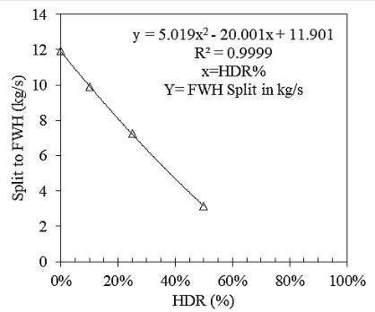

- _**Thermal extraction to an industrial user:**_ Although the current models focus on extracting thermal energy from TES for power generation purposes, another option is to extract thermal energy and then divert it to an industrial user (i.e., D-IHX in coupling option 3 [for steam generation]). In this case, note that the total thermal power (MWth) may even exceed that implied by the initial extraction percentage (i.e., HDR during the charge). For example, the industrial user may require thermal energy at a faster discharge rate—or steam at a lower temperature—than in the power generation case presented herein. 

- _**Hot standby operation:**_ During the discharge cycle, all the components used by the various streams during the charge cycle (e.g., the steam entering the C-IHX and the cold molten salt stream to the C- IHX) are maintained in hot standby mode. During this process, about 0.8 MWth is retrieved at the charge cycle C-IHX to produce additional hot molten salt for transferal to the hot tank during the discharge cycle. In this manner, hot standby operation mode can be maintained while still capturing useful heat. Similarly, during the charge cycle, a small amount of feedwater condensate (~1% of the corresponding mass flow when the discharge cycle is active) is extracted from the condenser exit and diverted to the discharge streams (i.e., D-IHX) to maintain them in hot standby mode. This causes an approximately 1% decrease in turbine power output. The advantage of maintaining the TES loop in hot standby mode even when not in use is that thermal power from the NPP can be dispatched rapidly and upon demand to industrial users, and operation can smoothly switch from charge mode to 100% discharge mode for power delivery. This is important for an IES meant to operate in markets in which spinning reserves generate large amounts of revenue. 

- _**Molten salt maximum design temperature**_ : During the charge cycle, the maximum temperature (i.e., 240 and 400°C for the LWR and HTGR use cases, respectively) of the hot molten salt was chosen such that a minimum approach temperature of 5°C could be maintained in IHEX-1. The temperatures within C-IHX are shown in Figure 8 and Figure 14 for the LWR and HTGR use cases, respectively. The LWR and HTGR C-IHX conditions are overlayed in Figure 18. 

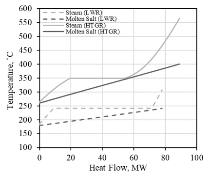

- _**Molten salt minimum design temperature**_ : The minimum cold tank temperature (i.e., 180°C for the LWR and 260°C for the HTGR use cases, respectively) was chosen such that the used molten salt for each case is maintained at a temperature of at least 38°C above its melting point. 

- _**Storage media flow rate**_ : The flow rate of the molten salt is calculated to meet three design targets: (1) the temperature of the resulting condensed steam (C-IHX exit) is 5° higher than that of the cold salt (180°C), thus avoiding a temperature cross; (2) the C-IHX molten salt exit temperature (hot tank inlet) is maintained at a specific maximum (i.e., 240 and 400°C for the LWR and HTGR, respectively); and (3) the charging power (heat transfer in C-IHX) is optimized so as to fully charge the molten-salt system within 6 hours. 

- _**Heat dispatch and steam pressure during discharge for the third coupling option:**_ The delivery pressure of the discharge-cycle pump (i.e., the TES LPT Pump in Figure 13), which determines the steam pressure supplied to the low-pressure turbine, is often limited. In such cases, the maximum pressure is 1200 and 10,000 kPa for the LWR and HTGR use cases, respectively. This pressure relates to the maximum saturation temperature the steam can achieve without causing a temperature cross within the heat exchanger. This pressure threshold is calculated such that a minimum of 5°C is maintained between the steam saturation temperature in the steam-temperature-heat-flow curve and the molten salt temperature at any location within the heat dispatch heat exchanger (i.e., D-IHX) in order to avoid a temperature cross. An example of the steam saturation curve for the TES heat dispatch heat exchanger, based on the LWR (left figure) and HTGR (right figure) use cases, is shown in Figure 19. Such limitations are also driven by the cold molten salt storage temperature. 

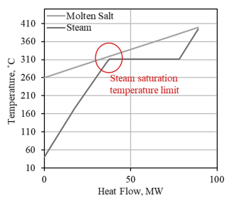

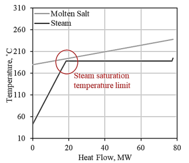

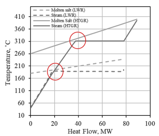

## **5. DEVELOPMENT OF COST FUNCTIONS** 

This section discusses the cost functions developed for the different use cases. With the current information from the steady-state models developed for LWRs based on different HDRs and coupling options, there is enough resolution in the data to create cost functions for the various component and system sizes. Cost functions from these models were developed using the latest publicly available data obtained from APEA-V11. To date, cost function development includes the creation of cost functions derived from the fully balanced A-LWR models as a function of varying system size. For the purposes of this report, extending or applying these cost functions to the HTGR use case was made impossible by the variability in size and higher costs incurred by the HTGR equipment as compared to the similarly sized equipment in the LWR models (mostly because the HTGR use case entails higher costs for identical equipment size/power, due to operating at higher pressures/temperatures). In future work, the resolution of data for the HTGR and LFR use cases will be enhanced by creating new cases at different HDRs and separate cost functions will be created for the HTGR and LFR use cases. 

## **5.1 Methodology** 

## **5.1.1 Cost Functions** 

The most helpful economic drivers for IES cases are the fixed and variable costs, and how they scale with changing constructed unit size. Hence, the cost functions were developed using the following equation: 

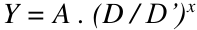

## Where 

_Y_ is the installed cost of the equipment of interest, 

_A_ is the reference installed cost for the equipment size of capacity D’, 

_D_ is the scaled equipment size determined in the optimization or that must be costed, 

_D’_ is the reference equipment size that will be fixed and assigned to each piece of equipment, and _x_ is the exponential scaling factor (<1 implies economy of scale). 

In the development of cost functions, _A_ , _D’_ , and _x_ are assigned as constants for each piece of equipment, therefore the installed cost ( _Y_ ) of the equipment at any scaled size ( _D_ ) can be derived. 

Using the equation below, the mean percent average error (MAPE) for each cost function was also calculated to indicate the accuracy of cost forecasts based on each cost function. MAPE is the most common measure for forecasting error and works best when there are no extremes in the data and no zeros. 

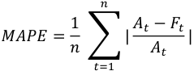

where 

- _n_ is the number of fitted points (different-sized equipment) used to generate the cost function, _At_ is the actual value “cost” for each fitted point, 

- _Ft_ is the forecast (calculated) value for each fitted point, using the cost function equation, and 

- Σ denotes the summation of the absolute values of the relative errors 

Cost functions based on these models were developed using the latest publicly available data obtained from APEA-V11. Once the costing data were acquired from APEA, the cost functions were developed via the following steps: 

4. The equipment and installed costs for all components that appeared in the current models (e.g., turbine, heat exchangers, condensers, pumps, tanks, and energy storage material) were acquired from APEA to generate a database of cost as a function of equipment size. 

   - a. The installed cost for each piece of equipment includes the estimate for the following cost elements: equipment and setting, piping, civil, structural steel, instrumentation, electrical, insulation, and paint. 

5. A separate cost function for each component type was created (installed cost as a function of equipment size). These cost functions are discussed in Section 5.2.1. 

6. Whenever the data resolution (cost as a function of equipment size) from the steady-state models was not varied enough to create a regressed cost function for a particular piece of equipment, additional cost datapoints (additional pieces of equipment) were sized, modeled, and added to the database for that particular equipment type. This enhances the accuracy and reliability of the cost functions. 

7. The individual equipment subsets were used to create three major TES (superset) models: 

   - b. Charge model: group of charge-loop-specific equipment (C-IHX, FWH pump), with a reference system size ( _D’_ ) that relates to the charging power in MWth 

      - c. Storage model: group of storage-loop-specific equipment (hot tank pump, cold tank pump, molten salt, and holding tanks), with a reference system size ( _D’_ ) that relates to the storage capacity in MWhth 

      - d. Discharge model: group of discharge-loop-specific equipment (D-IHX, turbine, condenser, condenser feedwater pump, TES power cycle pump), with a reference system size ( _D’_ ) that relates to the additional electric output from TES during discharge in MWe. 

8. A cost function was created for each of the three superset models by using the individual cost functions for each piece of equipment falling under that superset model. The cost functions of the three superset models can indicate the additional cost realized of adding TES as a function of system size. These cost functions are discussed in Section 5.2.2. 

## **5.1.2 Equipment Sizing** 

Some equipment (e.g., pumps and turbines [<20 Mwe]) can be acquired directly from APEA runs. However, some equipment requires special consideration, or additional steps, before the equipment cost and installed cost can be directly acquired from APEA, or before their cost functions can be created. These components include the heat exchanger, turbines (>20 MWe), condensers, molten-salt storage media, and tanks. 

- **Heat exchangers** : Heat exchangers require that they are sized before their equipment cost and installed cost can be acquired from APEA. This applies for the charge and discharge heat exchangers (C-IHX and D-IHX) and condensers (which re modeled as a heat exchanger in Aspen HYSYS). The sizing for the heat exchangers is accomplished via Aspen EDR using the Rigorous Shell&Tube model. The operating conditions at two inlets steams of the heat exchanger and one exit stream are defined, and sizing is accomplished by continuing to vary the allowable pressure drop for the hot and cold sides until four technical targets are met: (1) limiting the resulting pressure drop ratio to <10% of the total inlet pressure for each stream; (2) lowest or most optimal cost; (3) limiting the (“Excess surface”) in the EDR geometry window between 0-5%; and (4) limiting the (“Dp-ratio Shellside/Tubeside”) in EDR geometry window to 0.85-1. All heat exchangers in this work were modeled and sizes using Tubular Exchanger Manufacturers Association (TEMA)-type BEM heat exchanger. The BEM heat exchangers are shell and tube exchangers with tube bundle constructed in a fixed manner for easy mounting on skid, with “B” representing the front head, the “E” the core or middle section and “M” representing the rear head designs. 

- **Turbines** : Turbine equipment also require additional sizing steps before their cost can be acquired from APEA. The maximize size that can be modeled within APEA is 22.3 MWe. Hence, turbines with a capacity of over 22.3 MWe were each divided into multiple turbine stages of 20 MWe or less. When a turbine is downsized, the operating conditions are matched, and the mass flow rate reduced. The scaling constant ( _x_ ) generated from the fitted points of turbines with 20 MWe output or less was then applied to forecast the cost of turbines featuring >20 MWe output, using the cost function from the fitted points. 

- **Storage Tanks:** Cost function analysis of the storage tanks (molten-salt holding tanks) was completed outside of Aspen HYSYS. To acquire the cost of the storage tanks, the cost data were retrieved from the 2011 National Renewable Energy Laboratory (NREL) study, which was based on the capital cost estimate for two-tank storage for a 100 MWe parabolic trough power plant with 6 hours of TES. The average cost for the low-temperature tank (<450˚C) was 7.08 $/kWhth, which includes the cost of the entire storage tank system (holding tanks, tank supports, foundations, site work, electrical and instrumentation, piping, valves, and fittings). These numbers are consistent with the cost numbers found in other reports, including an INL study [5], a Sandia report based on two large-scale utility studies [6], and the 2011 NREL study [7]. 

- **Molten-salt storage media** : For Hitec[®] molten salts (the LWR use case), the cost functions were completed outside of Aspen HYSYS by using actual quotes, historical pricing data, and costing numbers from previous projects. (The LWR use case involves Hitec[®] as a storage material). Figure 20 shows the cost of Hitec[®] molten salt as a function of year, quantity, and grade/purity. Small quantities on the x-axis represent quantities of 10M kg or less. Industrial grades represent molten salt grades typically used in industrial and large-scale thermal storage systems, whereas higher grades represent the higher purity typically needed for medical/food applications or laboratory tests. The ideal zone in which most large-scale NPP-coupled TES systems would operate is in the higher quantity and industrial grade zone (bottom right corner in Figure 20). The “small quantities-high purity” dataset represents cost numbers from actual quotes and datapoints provided by the main U.S. supplier and owner of the Hitec[®] trademark (i.e., Coastal Chemical Co., LLC; a Brenntag company), for the years 1990–2021. The historical molten salt pricing data for “large quantity-industrial grade” are based on proportional cost numbers reported in the INL ($0.93/kg, 2003 project) and NREL ($1.23/kg, 2011 project) reports [5],[7]. The 2003 and 2011 cost numbers for the “large quantity-industrial grade” dataset were found to be reasonably proportional to the 2011 data points received from vendors for the “small quantity-industrial grade” dataset. To expand the data range, data based on actual quotes and data from the vendor for the “small quantities, high purity/grade” dataset were then used to generate time-dependent price trends and extrapolate the 2021 prices for the “large quantities, industrial grade” dataset. The data extrapolated via this method show an average annual increase of 4.38% year-over-year from 2011–2021, which is not too far from the 2.81% average global inflation rates for the same period, based on the Producer Price Index for the Chemical Manufacturing by Federal Reserve Economic Data [8]. We will continue working to replace any extrapolated data in the current database with actual quotes/data points from vendors as they become available. The cost functions for solar salt were obtained by following the same approach, and their cost per kg is provided in Figure 21. 

![Figure 20. Cost of Hitec[®] molten salt as a function of year, quantity, and grade/purity.](images/cooling-salt-cost.pdf-0041-01.png)

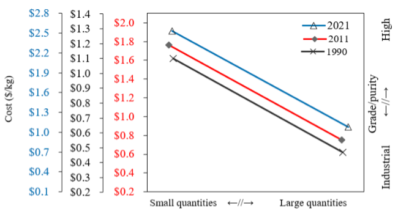

## **5.2 LWR-TES Cost Functions** 

This subsection discusses the cost functions for the LWR use case. The data points retrieved from the steady-state models developed for LWRs at different HDRs and coupling options provide enough resolution to create the cost functions for the various component and system sizes. 

## **5.2.1 Cost Functions Results for the Individual Equipment** 

First, the costing data for the various sized equipment were acquired from APEA and then used to create a cost function for each piece of equipment. The costing data for the molten-salt storage media and storage tanks were the only components analyzed outside of APEA, following the methodology outlined in Section 5.1.2. Table 16 summarizes the cost function constants for the various components in the LWR-TES coupling use cases, the MAPE for each cost function, and the superset model each piece of equipment falls under. Figure 22 combines the cost function curves for various LWR-TES use case components. 

Table 16. Summary of the cost function constants for the various LWR-TES use cases components. 

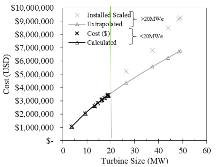

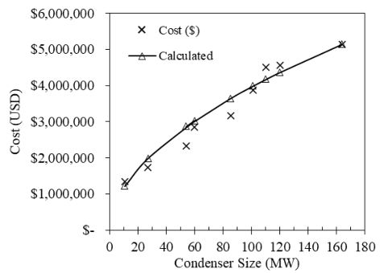

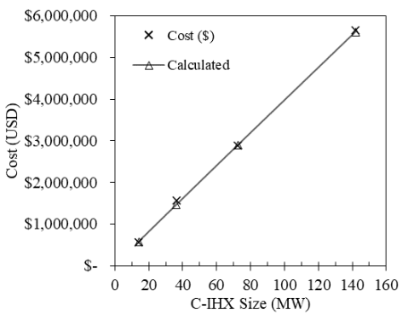

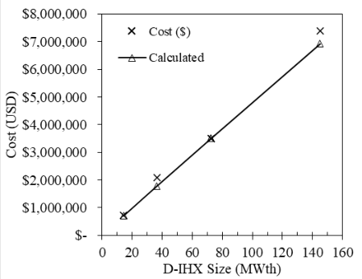

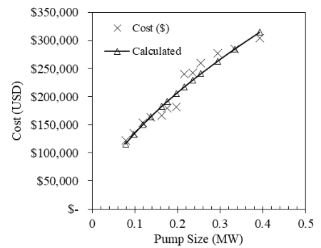

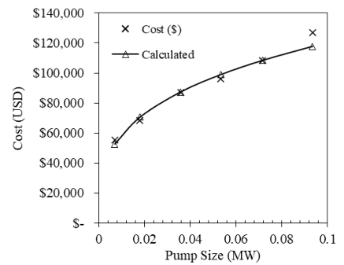

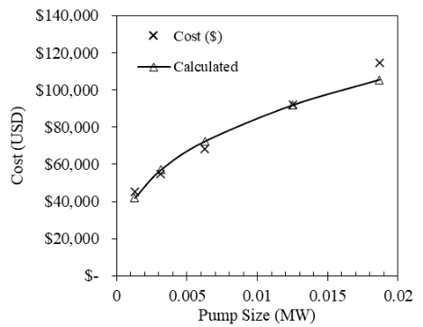

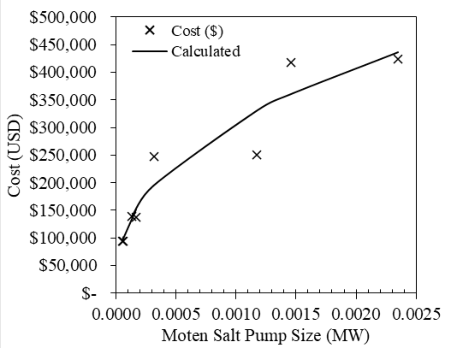

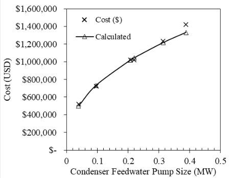

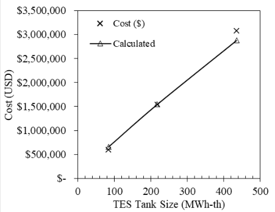

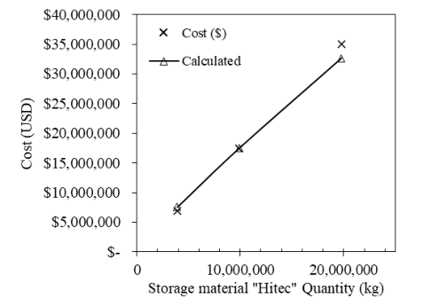

## **5.2.2 Superset Cost Functions** 

As discussed in Section 5.1.1, the subset of cost functions from the individual pieces of equipment were then used to create three superset models: the (1) charge model, (2) storage model, and (3) discharge model. A single cost function for each of these three supersets was created by combining the cost functions for the individual-pieces-of-equipment subsets that fall under each of these supersets. Figure 23 combines the curves for the three superset cost functions as a function of system size. The secondary x- axis links the system size to the proportional HDR for each, and hence to the cost. Table 17 summarizes the cost function constants for the three superset models in the LWR-TES coupling use cases, and gives the MAPE for each cost function. 

Table 17. Cost function constants for the three superset models for LWR-TES use cases. 

|Superset model|A|D'|X||MAPE|
|---|---|---|---|---|---|
|Charge|2,964,480.30|72.57 MWth|0.95986969|0.2%||
|Storage|36,452,122.78|435.42 MWhth|0.83976343|0.3%||
|Discharge|10,896,427.05|18.57 MWe|0.69183838|0.7%||

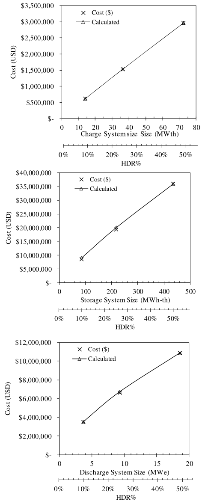

**----- Start of picture text -----** 
 $3,500,000 Cost ($)  $3,000,000 Calculated  $3,500,000  $2,500,000 Cost ($)  $3,000,000 Calculated  $2,000,000  $2,500,000  $1,500,000  $2,000,000  $1,000,000  $1,500,000  $500,000  $1,000,000  $-  $500,000 0 10 20 30 40 50 60 70 80 Charge System size Size (MWth)  $- 0% 10% 20% 30% 40% 50% HDR%  $40,000,000 Cost ($)  $35,000,000 Calculated  $30 0 $3 , 5 00,000 Cost ($)  $25,000,000 $3,000,000 Calculated  $20,000,000  $2,500,000  $15,000,000  $2,000,000  $10,000,000  $1,500,000  $5,000,000  $1,000,000  $-  $500,000 0 100 200 300 400 500 Storage System Size (MWh-th)  $- 0% 10% 20% 30% 40% 50% HDR%  $12,000,000 Cost ($)  $10,000,000 Calculated  $3,500,000 Cost ($)  $8,000,000  $3,000,000 Calculated  $2,500,000 $6,000,000  $2,000,000 $4,000,000  $1,500,000  $2,000,000  $1,000,000  $-  $500,000 0 5 10 15 20 Discharge System Size (MWe)  $- 0% 10% 20% 30% 40% 50% HDR% Cost (USD) Cost (USD) Cost (USD) **----- End of picture text -----** 

Figure 23. Cost functions curves for the superset models for the LWR-TES use cases. 

## **5.2.3 Additional Analysis** 

Using the cost functions for the individual components shown in Section 5.2.1, a preliminary system size and cost summary was developed for the TES-LWR coupling, as well as the reference (no-TES) case. As the models were sized to deliver an additional 3.67–18.57 MWe in electric output (depending on the HDR%) over various durations, the equipment size and the additional capital installed cost accrued by adding the TES system are summarized in Table 18. The sizing and installed cost analysis for the tanks and molten-salt storage media are also included in the table for each of the three HDR% values. 

Table 18. System size and cost summary for the refence case, and the various equipment needed for TESLWR coupling at three different HDR%. 

||Equipment size (MW, MWh, kg)”|Equipment size (MW, MWh, kg)”|Equipment size (MW, MWh, kg)”|Equipment size (MW, MWh, kg)”|Calculated equipment cost (USD)”|Calculated equipment cost (USD)”|Calculated equipment cost (USD)”|Calculated equipment cost (USD)”|
|---|---|---|---|---|---|---|---|---|
||Ref.|50% HDR|25% HDR|10% HDR|Ref|50% HDR|25% HDR|10% HDR|
|Turbine*|49.02|18.57|9.32|3.67|$6,774,127|$3,382,169|$2,065,010|$1,059,432|
|Condenser**|110|54.05|26.99|10.61|$4,173,439|$2,870,044|$1,990,552|$1,217,067|
|Cond. Feedwater|0.396|0.2195|0.09573|0.03883|$1,342,189|$1,043,715|$732,767|$498,798|
|Pump|||||||||
|C-IHX|-|72.57|36.35|14.11||$2,892,100|$1,460,588|$573,367|
|D-IHX|-|72.57|36.29|14.27||$3,513,100|$1,780,670|$713,046|
|BOP Pump (<400|0.216|-|-|-|$217,266||||
|kWe)|||||||||
|BOP Pump (<100|-|0.0358|0.018|0.007||$87,400|$70,590|$52,640|
|kWe)|||||||||
|FWH Pump|-|0.006261|0.003127|0.001276||$72,380|$56,966|$41,815|
|Cold Molten Salt|-|0.0003133|0.0001657|0.0000616||$195,561|$151,637|$102,136|
|Pump|||||||||
|Hot Molten Salt||0.001175|0.0001335|0.00005249|$0|$331,549|$139,100|$95,813|
|Pump|||||||||
|Tanks|-|435.42|218.1|84.66||$2,876,844|$1,544,148|$658,884|
|Molten Salt|-|19774800|9888480|3888000||$32,623,219|$17,484,069|$7,547,090|

* The turbine equipment cost for the 50%, 25%, and 10% HDR cases represent only the additional cost realized for the additional turbine capacities added due to the additional heat dispatched from TES (i.e., TES power cycle turbine for coupling option 1, or the oversizing turbine capacity value for coupling option 3). * The total power generated by the NPP during the TES discharge cycle is the sum of the reference turbine capacity and one of the HDR turbine capacity values ** The condenser equipment costs for the 50%, 25%, and 10% HDR cases represent only the additional costs realized for the additional condenser capacities added due to the additional heat dispatched from TES (i.e., TES power cycle condenser for coupling option 1, or the oversizing condenser capacity value for coupling option 3). 

** The total condenser power during TES discharge cycle is the sum of the reference condenser capacity and one of the HDR condenser capacity values. 

Figure 24 shows curves and equations usable to estimate the size of any of the three superset models (charge, storage, and discharge systems) as a function of the HDR. This information can aid in estimating the system size for HDR% other than the three standard ratios employed in this study. The charge, storage, and discharge system size for a targeted HDR% can then be applied to the superset cost functions to estimate the total installed cost of each case. Alternatively, the secondary x-axis in the curves under Figure 23 can be used to estimate the superset model size on the primary x-axis and then to determine the total installed cost of the superset system from the y-axis. 

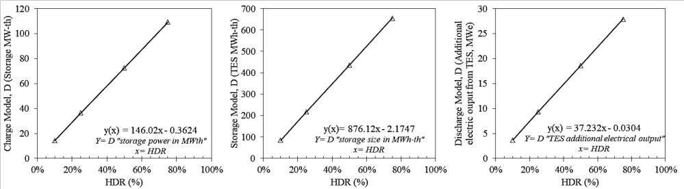

## **6. CONCLUSIONS** 

This study evaluated three different TES coupling options for thermal power extraction from LWRtype SMR and HTGR candidates to enable flexible and hybrid plant operation. Using Aspen HYSYS, steady-state systems-level BOP models were developed to demonstrate the system design, optimum equipment sizing, and operating conditions for different coupling options involving various HDRs. The LWR use case was studied in regard to three thermal energy bypass ratios and three different coupling options. The HTGR use case was studied for upward of 50% thermal energy bypass in regard to two different coupling options. To conduct full-scale technoeconomic analysis of the various coupling options, the components in each model were sized using Aspen EDR, when applicable. Details on the sized components from the fully balanced-LWR models were fed back to APEA, operating conditions were reassigned based on optimum sizing, and the cost conditions for the individual pieces of equipment in relation to different system sizes were acquired for LWRs. The cost functions from the individualpieces-of-equipment subset were then used to generate superset models for the charge, storage, and discharge systems. Lessons learned and system design considerations to be taken into account in all similar TES systems were discussed in detail. To date, the design discussed herein is specific to advanced light-water-type reactors (SMRs and HTGRs). However, the coupling approach is intended to be generic so as to be valuable to A-NPPs and other reactor types that employ a steam turbine system for power generation. These models will be used to determine the capital and operating expenses of system components for use in the HERON/HYBRID technoeconomic analysis and will provide the initial conditions for the Transient Process models and Control Schemes adopted in Modelica. 

## **7. FUTURE WORK** 

The LWR use case will be followed by additional work on evaluating the transient controls and gridwide economics of each coupling design. Because it was impossible to extend/apply the cost functions of the individual pieces of equipment from the LWR uses case to the HTGR use case, additional steady-state models for the HTGR will be created using different HDRs, so that HTGR-specific cost functions can be similarly derived. Additional nuclear reactors (e.g., an LFR or MSR) will be evaluated for coupling with TES in similar fashion, including the creation of their steady-state condition models and cost functions. A reactor design will be selected as a case study for the LFR or MSR use case and will be investigated similarly to the LWR and HTGR. The case study will likely be based on the Power Reactor Innovative Small Module. 

In summary, the steady-state models from the advanced reactor uses cases (LWR, HTGR, and LFR/MSR) will lay out the preliminary steps and baseline conditions for conducting additional research to evaluate specific configurations and optimal operating conditions under reactor transients, using HYBRID. In a follow-up work, the results and findings of this study will be used by INL FORCE system integration and economics tools to evaluate the transient operations of the various dispatching methods. 

## **8. ACKNOWLEDGEMENTS** 

This work was supported by the DOE-NE IES program, with work conducted at INL under DOE Operations contract no. DE-AC07-05ID14517. 

## **9. REFERENCES** 

- [1] Frick, K., J. M. Doster, and S. Bragg-Sitton. 2018. “Design and operation of a sensible heat peaking unit for small modular reactors,” _Nuclear Technology_ 205(3): 415-441. doi: 10.1080/00295450.2018.1491181. 

- [2] Frick, K., C. T. Misenheimer, J. M. Doster, S. D. Terry, and S. Bragg-Sitton. 2018. “Thermal Energy Storage Configurations for Small Modular Reactor Load Shedding,” _Nuclear Technology_ 202(1): 53-70. doi: 10.1080/00295450.2017.1420945. 

- [3] Wang, K., Z. Qin, W. Tong, and C. Ji. 2020. “Thermal Energy Storage for Solar Energy Utilization: Fundamentals and Applications,” Chapters, in: M. A. Qubeissi, A. El-Kharouf, and H. S. Soyhan (ed.), Renewable Energy - Resources, Challenges and Applications, IntechOpen. doi: 10.5772/intechopen.91804. 

- [4] Hoffman, H. W. and S. I. Cohen. 1960. “Fused Salt Heat Transfer–Part III: Forced— convection Heat Transfer in Circular Tubes Containing the Salt Mixture NaNO2-NANO3 - KNO3,” ORNL-2433, Oak Ridge National Laboratory, Oak Ridge, TN. doi: 10.2172/4181833. 

- [5] Knighton, L. T., A. Shigrekar, D. S. Wendt, K. Frick, R. D. Boardman, A. A. Elgowainy, A. Bafana, H. Tun, and K. R. Reddi. 2021. “Energy Arbitrage: Comparison of Options for use with LWR Nuclear Power Plants,” INL/EXT-21-62939, Idaho National Laboratory, Idaho Falls, ID. 

- [6] Kolb, G. J, C. K. Ho, T. R. Mancini, and J. A. Gary. 2011. “Power Tower Technology - 

- Roadmap and Cost Reduction Plan,” SANDIA REPORT SAND2011-2419. http://stage ste.psa.es/documents/CR%203%202011%20SANDIA%20Power%20Tower.pdf. 

- [7] Glatzmaier, G. 2011. “Developing a cost model and methodology to estimate capital costs for thermal energy storage,” No. NREL/TP-5500-53066, National Renewable Energy Laboratory (NREL), Golden, CO (United States). https://www.nrel.gov/docs/fy12osti/53066.pdf. 

- [8] Producer Price Index by Industry: Chemical Manufacturing (PCU325325), FRED, (stlouisfed.org), https://fred.stlouisfed.org/series/PCU325325. 

- [9] U.S. NRC. n.d. “Application Documents for the Design,” Accessed March 24, 2022. https://www.nrc.gov/reactors/new-reactors/smr/nuscale/documents.html. 

- [10] NuScale Standard Plant Design Certification Application, Chapter Ten, Steam and Power Conversion System, PART 2 - TIER 2, Revision 5 July 2020; https://www.nrc.gov/docs/ML2022/ML20224A499.pdf. 

- [11] Nice Future. n.d. “X-Energy: Xe-100 Reactor The Key To An Integrated Energy System, Reliable Baseload, Agile Load Following, Industrial Applications.” Accessed June 10, 2022. https://www.nice-future.org/assets/pdfs/x-energy.pdf. 

- [12] https://www.nrel.gov/docs/fy03osti/40028.pdf. 

- [13] GEFR-00793, "PRISM - Preliminary Safety Information Document, Volume II, Chapters 5-8." (nrc.gov) https://www.nrc.gov/docs/ML0828/ML082880395.pdf. 

- [14] Boerema, N., G. Morrison, R. Taylor, and G. Rosengarten. 2012. “Liquid sodium versus Hitec as a heat transfer fluid in solar thermal central receiver systems,” _Solar Energy_ 86(9):2293-2305. doi: 10.1016/j.solener.2012.05.001. 

## **APPENDIX A** 

## **NuScale Detailed Model** 

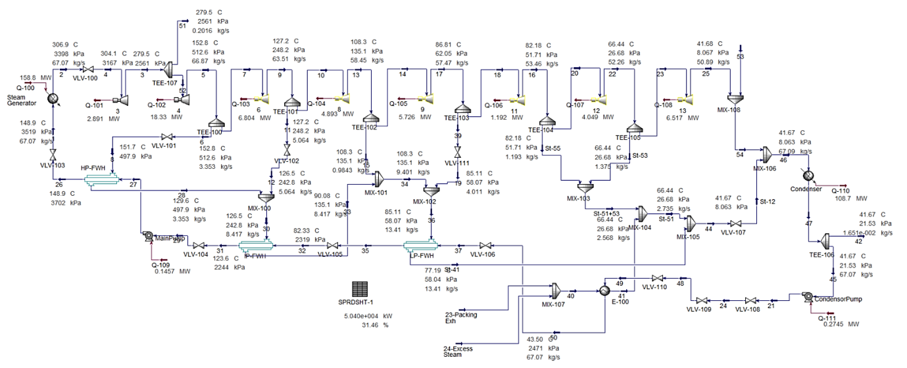

