INL/EXT-20-58884 Revision 1 

**----- Start of picture text -----** 
Light Water Reactor Sustainability Program **----- End of picture text -----** 

**----- Start of picture text -----** 
Markets and Economics for Thermal Power Extraction from Nuclear **----- End of picture text -----** 

**----- Start of picture text -----** 
Power Plants for Industrial Processes **----- End of picture text -----** 

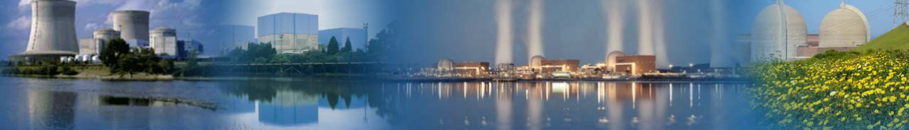

June 2020 

U.S. Department of Energy Office of Nuclear Energy 

## **DISCLAIMER** 

This information was prepared as an account of work sponsored by an agency of the U.S. Government. Neither the U.S. Government nor any agency thereof, nor any of their employees, makes any warranty, expressed or implied, or assumes any legal liability or responsibility for the accuracy, completeness, or usefulness, of any information, apparatus, product, or process disclosed, or represents that its use would not infringe privately owned rights. References herein to any specific commercial product, process, or service by trade name, trade mark, manufacturer, or otherwise, does not necessarily constitute or imply its endorsement, recommendation, or favoring by the U.S. Government or any agency thereof. The views and opinions of authors expressed herein do not necessarily state or reflect those of the U.S. Government or any agency thereof. 

# **INL/EXT-20-58884 Revision 1** 

# **Markets and Economics for Thermal Power Extraction from Nuclear Power Plants Aiding the Decarbonization of Industrial Processes** 

**L. Todd Knighton, Amey Shigrekar, Daniel S. Wendt, and Richard D. Boardman (INL) Brian Murphy and Brian D. James (Strategic Analysis)** 

**June 2020** 

**Prepared for the U.S. Department of Energy Office of Nuclear Energy** 

## **EXECUTIVE SUMMARY** 

Decarbonization (the intentional reduction of carbon dioxide emissions) is gaining momentum as an increasing number of governments and corporations seek to increase air quality and have a positive impact on climate change. Industrial processes use large amounts of heat in the manufacturing of materials, products, fuels, and chemicals and are of high interest for decarbonization. In this report, industrial markets are surveyed for low-grade thermal heat (less than 300°C) applications that could use heat from existing U.S. nuclear light water reactors (LWRs) as an alternative low-carbon heat source for industry in lieu of using conventional boilers fueled with natural gas. Thermal heat degrades in quality when transported long distances; thus, this report focuses on existing industry near LWRs and growth markets where a business case can be made to build new industrial facilities in close proximity to existing LWRs in the foreseeable future. 

In general, processes that integrate well with LWRs are those that require substantial water evaporation (specialty chemicals, chlor-alkali, paper and pulp, and food processing) or have large electrical and thermal demands (chlor-alkali in particular). In the petrochemicals industry, LWR process heat can be used to satisfy heat duties in specialty-chemical processes, typically for downstream separations, purifications, or plastics processing (to melt the polymer material). Also proposed is that LWR process water (taken from the nuclear loop as a saturated liquid) can be used as cooling fluid for exothermic processes, notably CO2 hydrogenation to methanol and methanol-to-hydrocarbons upgrading. Heat duties in the chlor-alkali, paper and pulp, and food processing industries are used almost exclusively to heat and/or evaporate water for product drying and purification. Large facilities in these industries can demand from 100 to 250 MWth steam duties. When combined in an industrial park, these facilities would consume a significant fraction of an LWR’s energy output even before considering the (substantial) electrical demands. A well-designed industrial park, containing multiple interacting processes, could produce a variety of value-added chemical processes efficiently and with minimal greenhouse-gas (GHG) emissions, reducing the climate impact of key industrial processes. A key finding of this technical analysis is that purely thermal demands needed for a particular process are unlikely to consume all of the energy generated by an LWR; therefore, large electrical demands, likely electrolysis processes (either chloralkali, water splitting, or alkane deprotonation), will be required to effectively use the entirety of an LWR’s output. 

Concepts for how a hypothetical energy park could be centered around an LWR are developed and presented. Various candidate industrial processes are sketched in ways that provide synergy to the energy park as a whole, as shown in Figure ES1, in which CO2 produced by an ethane steam-cracker burner is captured by a molten-carbonate fuel cell and upgraded through hydrogenation and methanol-to-olefins processes. Parallel brine- and water-electrolysis reactions produce chlorine, caustic soda, hydrogen, and oxygen. These products are combined with the two olefin/aromatics streams in a chemicals- and polymers-synthesis plant. The exact production of this plant can be determined by costs and market conditions, but the proposed arrangement provides the flexibility to synthesize a wide variety of commodity chemicals, specialty chemicals, and polymers. The goal of the energy park is to manufacture multiple 

iii 

industrial products at competitive costs while using LWR energy to minimize GHG emissions. The energy park contains four classes of industrial processes, each with a critical function: (1) electrochemical processes requiring heat input, (2) exothermic thermochemical processes (T >350°C), (3) endothermic thermochemical processes with associated carbon capture (T >700°C), and (4) mature industrial-demand sources with technical potential for LWR thermal integration (T <200°C). Heat and mass integration between these processes will depend on the specific process selections, plant geometry, and overall process conditions. The concept and function of each process class, including technology readiness levels (TRLs) of specific technologies, are discussed herein, but future study will be needed to develop more-detailed process models of the various proposed scenarios. 

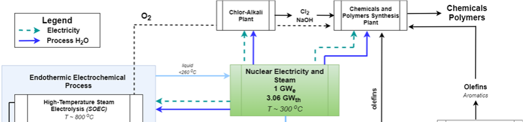

Figure ES1. Specific industrial-park concept using nuclear heat and electricity to produce chemicals and polymers with minimal CO2 emissions. 

To enable further analysis into these market opportunities, preliminary modeling is also presented for 1) modeling of the thermal-energy extraction from an LWR, along with preliminary cost estimates and comparison to conventional natural gas boiler heat cost and 2) modeling and comparison of two molten-salt thermal-energy storage systems to provide a buffer, as needed, between the LWR and the industrial heat user. Removing heat from LWRs for purposes other than electricity generation is being investigated in separate Idaho National Laboratory (INL) studies. In this report, a preliminary excerpt model is used to show preliminary mass and energy balances of a conceptual thermal-energy extraction system whereby thermal energy is taken from the LWR and transferred to a conceptual industrial process by means of a thermal-energy delivery loop. Capital and operating costs were derived from the process model to calculate a simplified levelized cost of heat (LCOH) extracted from an LWR. These results were compared to a calculated levelized cost of heat for a conventional natural gas boiler, as shown in Figures ES2 and ES3. LCOH is plotted for a 150 MWth capacity nuclear power plant (NPP) thermal delivery loop (TDL) system as a function of heat-transport distance and NPP operating and maintenance (O&M) cost. It can be seen from this figure that break-even points for NPP and natural gas-derived process heat occur at TDL transport distances of approximately 6, 8, and 10 km for systems with 150 MWth of delivered process heat and NPP O&M 

iv 

costs of $30, $25, and $20/MWhe, respectively. This analysis could be further refined in future studies by optimizing the pipeline diameter to minimize pipe costs—smaller pipes have lower capital costs, but increased frictional-pressure losses and increased operating pressures that affect the design and, consequently, the costs of all TDL process equipment—instead of assuming a constant pipe diameter for all cases with TDL transport distances ≥5 km. 

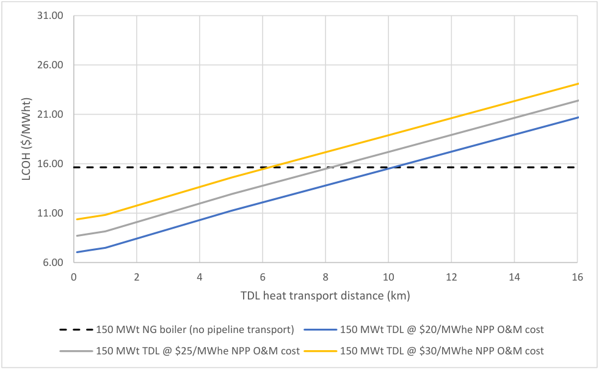

**----- Start of picture text -----** 
31.00 26.00 21.00 16.00 11.00 6.00 0 2 4 6 8 10 12 14 16 TDL heat transport distance (km) 150 MWt NG boiler (no pipeline transport) 150 MWt TDL @ $20/MWhe NPP O&M cost 150 MWt TDL @ $25/MWhe NPP O&M cost 150 MWt TDL @ $30/MWhe NPP O&M cost LCOH ($/MWht) **----- End of picture text -----** 

Figure ES2. LCOH versus heat-transport distance and NPP O&M cost. Plotted data points are based on a thermal-energy delivery loop capacity of 150 MWth and NPP O&M costs ranging from $20 to $30/MWhe. Assumes natural gas is purchased at a price of $4.04/MMBTU, which is the average value of projected industrial natural gas pricing from 2021 to 2040 in the US Energy Information Administration 2020 Annual Energy Outlook reference-case scenario. 

Further inspection of LCOH as a function of NPP O&M costs indicates that for medium- (15 MWth) and large-scale systems (150 MWth) with a transport distance of 0.1 km, NPP O&M costs within the range of $10–30/MWhe [6, 7] result in the LCOH for nuclear process heat remaining well below the LCOH for natural gas process heat (Figure 17). 

v 

**----- Start of picture text -----** 
40 35 30 25 200 kWt @ 100 m distance 20 15 MW @ 100 m distance 150 MWt @ 100 m distance 15 200 kWt NG boiler 150 MWt NG boiler 10 5 0 5 10 15 20 25 30 35 NPP O&M Cost ($/MWe) LCOH ($/MWht) **----- End of picture text -----** 

Figure ES3. Nuclear and natural gas process heat LCOH versus NPP O&M cost with a transport distance of 0.1 km. 

This suggests that, for process-heat applications with temperature requirements attainable with nuclear process heat and situated in close geographic proximity to an LWR, use of a nuclear energy source is more economical than use of a natural gas energy source. Additionally, the nuclear process heat is not associated with CO2 emissions or the possible costs associated with CO2 taxes or CO2 capture that natural gas heat sources may be subject to in the future. Future low-carbon credits that may be available to industries that decarbonize will improve the economics further. 

Thermal-energy storage may be an essential part of the process of transporting heat from an LWR to an industrial process and could allow for variability on either end. Thus, two thermal-energy storage systems were compared. It was shown that a latent-heat thermal-storage system may have some advantages over a conventional sensible-heat thermal-energy storage system and may cost less. The in-depth study and development of latent-heat and other energy-storage systems is the topic of future research. 

vi 

## **CONTENTS** 

vii 

|||5.1.2|Summary and Future Work ....................................................................................... 16|
|---|---|---|---|
||5.2|Thermal-Energy Storage ........................................................................................................ 17||
|||5.2.1|Overview ................................................................................................................... 17|
|||5.2.2|Modeling ................................................................................................................... 20|
|||5.2.3|Results and Analysis ................................................................................................. 21|
|||5.2.4|Summary and Future Work ....................................................................................... 24|
|6.|ECONOMIC||EVALUATION: NUCLEAR VERSUS NATURAL GAS PROCESS HEAT .......... 24|
||6.1|Economic Modeling Approach .............................................................................................. 24||
||6.2|Capital|Costs Estimation ........................................................................................................ 25|
|||6.2.1|Nuclear Power Plant Thermal Delivery Loop ........................................................... 25|
|||6.2.2|Natural Gas Process Heat Boiler ............................................................................... 26|
||6.3|Operating and Maintenance Costs ......................................................................................... 27||
||6.4|Results|and Discussion ........................................................................................................... 28|
|7.|CONCLUSIONS .............................................................................................................................. 33|||
|8.|REFERENCES ................................................................................................................................. 37|||

viii 

## **FIGURES** 

Figure ES1. Specific industrial-park concept using nuclear heat and electricity to produce chemicals and polymers with minimal CO2 emissions. ............................................................... iv Figure ES2. LCOH versus heat-transport distance and NPP O&M cost. ..................................................... v Figure ES3. Nuclear and natural gas process heat LCOH versus NPP O&M cost with a transport distance of 0.1 km. ....................................................................................................................... vi Figure 1. Map of nuclear power plants licensed to operate in the U.S. as of August 2019. Source, NRC. ............................................................................................................................................. 4 Figure 2. Schematic of a “generic” industrial park concept centered on a 1 GWe light-water reactor. ........................................................................................................................................ 10 Figure 3. Specific industrial park concept, using nuclear heat and electricity to produce chemicals and polymers with minimal CO2 emissions. ............................................................................... 12 Figure 4. Proposed idea of a thermal extraction system for an LWR. ........................................................ 13 Figure 5. Steam-to-oil loop, intermediate between SBL (SEL) and TDL. ................................................. 15 Figure 6. Categories of TES systems. ......................................................................................................... 17 Figure 7: Representation of a generalized two tank sensible heat TES system. ......................................... 18 Figure 8. Charging and discharging cycles for two-tank sensible-heat thermal-energy storage systems........................................................................................................................................ 19 Figure 9. Charging and discharging cycle of a conceptual latent-heat TES system. .................................. 20 Figure 10. Salt requirements for sensible- versus latent-heat TES systems. ............................................... 22 Figure 11. Cost comparison for sensible- versus latent-heat TES systems. ................................................ 22 Figure 12. Storage tank cost comparison for sensible versus latent heat energy storage systems. ............. 23 Figure 13. TDL total direct capital costs as a function of heat-delivery capacity and process-heat transport distance. ....................................................................................................................... 29 Figure 14. LCOH versus TDL capacity for nuclear and natural gas process heating. ................................ 30 Figure 16. LCOH versus heat-transport distance and NPP O&M cost. ...................................................... 32 Figure 17. Nuclear and natural gas process-heat LCOH versus NPP O&M cost with a transport distance of 0.1 km. ...................................................................................................................... 33 Figure 18: Specific Industrial Park Concept using nuclear heat and electricity to produce chemicals and polymers with minimal CO2 emissions. .............................................................. 35 Figure 19. LCOH versus heat-transport distance and NPP O&M cost. ...................................................... 36 Figure 20. Nuclear and natural gas process-heat LCOH versus NPP O&M cost with a transport distance of 0.1 km. ...................................................................................................................... 37 

ix 

## **TABLES** 

Table 1. Summary of industries selected for in-depth analysis for use of LWR thermal heat. ..................... 2 Table 2. Thermal-dispatch parameters for TDL case study in Aspen HYSYS ........................................... 16 Table 3. Results from TDL case studies. .................................................................................................... 16 Table 4. Parameters for the NaNO3-KNO3 heat-storage medium used in the latent-heat TES and sensible-heat TES comparisons. ................................................................................................. 21 Table 5. LWR thermal power extraction cases. .......................................................................................... 24 Table 6. Natural gas steam boiler specifications and capital cost for selected thermal capacities (A field erected boiler unit equipment type) .................................................................................... 27 Table 7. Economic analysis parameters for comparison of nuclear versus natural gas process heat ......... 28 Stream operating conditions for Cases 1, 2, and 3: thermal dispatch 150 MW at 1, 0.5, and 0.1 km. ........................................................................................................................................ 43 Stream operating conditions for Case 4: thermal dispatch 15 MW at 0.1 km. ........................................... 44 Stream operating conditions for Case 5: thermal dispatch 200 kW at 0.1 km. ........................................... 45 Stream operating conditions for Case 6: thermal dispatch 200 kW at 0.1 km (TEDS comparison). .......... 46 

x 

## **ACRONYMS** 

||**ACRONYMS**|
|---|---|
|ANL|Argonne National Laboratory|
|APEA|aspen process economic analyzer|
|BOP|balance of plant|
|BWR|boiling-water reactor|
|CAGR|compound annual growth rate|
|CAPEX|capital expenses|
|CHP|combined heat and power|
|CRF|capital recovery factor|
|CSP|concentrated solar power|
|DOE|Department of Energy|
|DRI|direct reduction of iron|
|EDR|exchanger design rating (AspenTech Software)|
|EIA|energy information administration|
|ENDP|electrolytic non oxidative deprotonation of alkanes to form alkenes and hydrogen|
|FCTO|fuel-cell technology office|
|GHG|greenhouse gas|
|HSSL|human systems simulation laboratory|
|HTE|high-temperature electrolysis also termed HTSE|
|HTF|heat transfer fluid|
|HTSE|high-temperature steam electrolysis also termed HTE|
|IES|integrated energy systems|
|INL|Idaho National Laboratory|
|IRR|internal rate of return|
|LCOH|levelized cost of heat|
|LTE|low-temperature electrolysis|
|LWR|light-water reactor|
|MCFC|molten carbonate fuel cell|
|MECS|manufacturing energy consumption survey|
|MED|multi effect distillation|

xi 

|MTG|methanol to gasoline|
|---|---|
|MTO|methanol to olefins|
|NGCC|natural gas combined cycle|
|NHES|nuclear-renewable hybrid energy system|
|NPP|nuclear power plant|
|NRC|Nuclear Regulatory Commission|
|NREL|National Renewable Energy Laboratory|
|OCF|operating capacity factor|
|OPEX|operating expenses|
|PCM|phase change material|
|PE|polyethylene|
|PEM|polymer-electrolyte membrane|
|PET|polyethylene terephthalate|
|PFD|process-flow diagram|
|PP|polypropylene|
|PVC|polyvinyl chloride|
|PWR|pressurized water reactor|
|SEL|steam extraction loop|
|SBL|steam bypass loop|
|SMR|small modular reactor|
|SOEC|solid-oxide electrolysis cell|
|SOFC|solid-oxide fuel cell|
|Syngas|synthesis gas (H2+ CO)|
|TDL|thermal delivery loop|
|TEDS|thermal energy delivery system|
|TES|thermal energy storage|
|tpd|tonnes per day|
|TPE|thermal power extraction|
|TRL|technology readiness level|
|UI|University of Idaho|

xii 

USDA U.S. Department of Agriculture WACC weight average cost of capital WGS water gas shift ZEC zero emissions credit 

xiii 

## **1. INTRODUCTION** 

Decarbonization, the intentional reduction of carbon dioxide emissions, is gaining momentum as an increasing number of governments and corporations seek to increase air quality and positively impact climate change. Industrial processes use large amounts of heat in the manufacturing of materials, products, fuels, and chemicals and are excellent candidates for decarbonization. The demand for industrial heat is conventionally met by fossil fuels such as coal, fuel oil, and natural gas, or byproducts of the industrial process. The domestic industrial sector is a substantial source of greenhouse gas (GHG) emissions, and the majority of these emissions derive from fossil-fuel combustion to generate electricity or process heat.[1,2] In this study, the industrial sector is defined as product manufacturing, excluding electricity-specific power plants. Current manufacturing methods often require intense, high-quality process heat (>700°C) to drive key chemical and physical transformations. Replacing high-quality heat with a carbon-free source is highly challenging, but decarbonization of the industrial sector would contribute significantly to reducing total domestic and global GHG emissions. Future carbon tax credits may be anywhere from $25 to $150/ton; thus, some companies are proactively planning their decarbonization strategies. Although coal and other fossil fuels are being replaced by cleaner-burning natural gas, there is still an opportunity to decrease CO2 emissions by replacing natural gas boilers with heat generated from zero- or low-emission life-cycle carbon sources. 

Existing nuclear light water reactors (LWRs) already in operation throughout the United States can help decarbonize industry. Nintey-six LWRs operate in the U.S. currently, providing a total of 92.3 GW (including a 94% capacity factor) of power and 19.7% of U.S. electricity. The majority of these LWRs have fully depreciated their capital expense of construction, meaning that cost-benefit analyses for future investments associated with integrated energy systems paired with LWRs need not take into account the retired capital expense of the operating nuclear power plant (NPP). U.S. LWRs are increasingly facing economic pressures to flexibly operate, meaning that they are asked by grid operators to turn down their operations from full power. As renewable-generation capacity, such as solar and wind energy, increases in penetration in many areas of the U.S., flexible operation of NPPs will continue to increase. LWRs operate most cost efficiently at full power because of the operating and fuel costs that are present, regardless of the power level. Flexible operations put cost pressure on NPPs and are an inefficient use of nuclear fuel. Flexible operations may also have increased maintenance implications to the NPP. Also, historically low natural gas prices and the increasing number of new natural gas power-generation plants has put further cost pressure on NPPs. At times, it would be economical for grid operations if an NPP were able to completely shut down for periods. A complete shutdown of an NPP mid fuel cycle would have negative effects on NPPs, but diverting the energy to another industrial use would benefit both the grid and the NPP during these times. Selling heat (and electricity) generated by LWRs to power manufacturing processes would both decarbonize the industrial sector and provide alternative revenue sources for NPPs. Previous studies[3,4] have focused on using nuclear heat and electricity to produce products such as hydrogen via electrolysis in lieu of sending electricity to the grid in times of overgeneration, when grid operators require baseload generators to turn down their capacity. 

A previous study[5 ] focused on identifying industrial process-heat demands that could be met by emerging high-temperature (i.e., >600°C) next-generation nuclear technologies, particularly modular nuclear reactors that could be installed on site at existing industrial facilities. In that report, the authors identified the key industries that contribute most significantly to GHG emissions and evaluated each industry from a process-model and market-conditions perspective. The focus of this study, by contrast, is the use of low-grade thermal heat (<300°C) from existing U.S. LWRs as an alternative low-carbon heat source in lieu of conventional natural gas boilers to provide heat for industry. LWRs output massive amounts of energy (typically >3 GWth per reactor), albeit at lower temperatures. Primarily analysis is done for market LWR heat as industrial process heat, with electricity sales a secondary consideration. 

Transporting thermal energy long distances is not cost effective due to piping costs and the degradation of the thermal heat. For the purposes of this study, it is assumed that LWR heat will be 

transported a maximum of 1 km. Thus, another focus is on growth markets and markets where the U.S. may be a net importer in which a business case can be made to build new industrial facilities in close proximity to existing LWRs in the foreseeable future to take advantage of low-carbon heat-integration opportunities. 

This report also conceptualizes an energy-park model in which various industrial facilities are colocated, with extensive heat and mass integration and multidirectional flows among facilities and the LWR. The volume of heat energy generated by an NPP (i.e., 2–12 GWth) cannot be effectively used by a single industrial process. Rather, multiple parallel processes are required to efficiently use an NPP’s energy output. Complex integration schemes are likely to increase overall efficiency and, by extension, economic viability of any proposed design. In these schemes, NPP energy could provide either heating or cooling, depending on process temperature and enthalpic requirements. A significant assumption underpinning this analysis is that firms will re-consider reliance on a global and “lean” supply chain. This shift in business priorities may lead to domestic production among previously offshored industries. No attempt is made to develop financial models for each considered industrial sector; rather, the report presents the high-level economic and technical factors so that readers can identify where more-detailed analysis might be warranted. 

To enable further analysis into these market opportunities, preliminary process modeling is also presented for 1) the modeling of thermal power extraction (TPE) from an LWR, along with preliminary cost estimates comparing the costs of LWR TPE with conventional natural gas boilers and 2) modeling and comparison of two molten-salt thermal-energy storage (TES) systems. 

## **2. OVERVIEW OF U.S. INDUSTRY AND NUCLEAR POWER PLANTS** 

The concepts explored in this report require close interaction between the domestic industrial sector and the fleet of LWR NPPs in the U.S. The current technological and economic state of these two sectors is critical to the following analysis. An overview of the domestic industrial-manufacturing sector is now provided, followed by a discussion of the challenges faced by NPPs in 2020. Finally, the role of process heat in the industrial sector is examined. 

## **2.1 The Industrial Sector** 

The United States’ industrial sector accounts for more than 20% of total GHG emissions, and analysts expect industrial emissions to rise in the absence of mitigation strategies. In 2018, the U.S. emitted roughly 5,900 million metric tons (MMT) of net CO2-equivalents (a unit used to account for non-CO2 GHGs such as NOx and CH4). Industrial-sector emissions, as defined by the Environmental Protection Agency (EPA), accounted for 22% of this total, the third-highest sector behind transportation (28%) and electricity generation (27%).[6] The industrial sector includes all product manufacturing—e.g., primary fuel production, cement and other minerals, steel and other metals, plastics, paper, foodstuffs, etc. Emissions from this category peaked circa 2005, and improved efficiencies have reduced total emissions in the years since[2] . However, the recent trend has returned upwards, with the EPA noting a 6% increase in industrial emissions from 2016 to 2018.[6] 

A majority of U.S. industrial emissions result directly from fuel combustion to generate process heat and/or electric power. In 2018, 58% of U.S. industrial emissions were directly attributed to fossil-fuel combustion, mostly coal and natural gas[1] . Globally, this value is around 40%.[7] Inherent emissions—i.e., stoichiometric GHGs released during industrial-scale chemical reactions—account for a majority of noncombustion emissions. Examples of these types of emissions include: 

1. **Cement Production:** CO2 release during the conversion of calcium carbonate (CaCO3) to lime (CaO).[8] 

2. **Steel Production:** CO2 release during the reduction of iron oxide with coke-derived syngas (CO/H2) 

3. **Chemicals Production:** CO/CO2 generated by overoxidation during chemicals synthesis. 

Remaining emissions are typically classified as “indirect” and result from transportation or buildingclimate control. Carbon dioxide is a thermodynamically favored state in chemical reactions, so it is technically challenging to completely eliminate emissions in certain industries with inherent CO2 emissions. The roughly steady trend in total industrial emissions indicates that decreasing reliance on fossil-fuel combustion for process heating is required to reduce GHG emissions overall. 

Reducing or eliminating industrial fossil-fuel combustion for process heating is both economically and technically challenging. Industrial firms rely on burners because combustible fuels are cheap, available on-demand, and can provide controllable, high-quality heat. Major industrial processes such as cement production, steel manufacturing, and oil and gas refining rely on endothermic (i.e., heatconsuming) reactions that run at high temperatures, ranging from 800–1500°C.[5] While resistive electric heating can supply temperatures in this range, direct burning of fossil fuels (particularly natural gas and coal) is usually cheaper due to efficiency losses in electricity production.[7] Slightly over 20% of global industrial process heat is provided by electricity, which is most often produced in fossil-fuel-burning power plants. In energy-intensive industries that rely on reactions with high process temperatures, the fraction of heat supplied electrically is significantly lower.[9] Global commodities such as steel, petrochemicals, or cement face strict price competition. Any increase in processing costs (i.e., from electric heating rather than direct fuel combustion) could render a facility or industry non-competitive in the global marketplace. Further, supply-chain complexity and the need for agile responses to market opportunities require an on-demand fuel source, which fossil fuels can provide. 

Despite these challenges, reducing the GHG intensity of the industrial sector is a critical aspect of overall decarbonization. As stationary-power and transportation-energy sources diversify due increased market penetration of solar, wind, battery and other “green” technologies, the industrial sector will represent an increasing fraction of overall emissions if process-heat methods do not change.[10] Processinherent emissions require new technological solutions, but increasing the use of process heat from lowor zero-carbon sources would lead to a significant reduction in total industrial GHG emissions. NPPs operating LWRs constantly generate substantial amounts of heat that could be tapped as a zero-carbon source of process heat. 

## **2.2 U.S. Light Water Nuclear Reactors Overview** 

The domestic LWR fleet is distributed throughout the country and generated over 8% of the total energy (total energy, not just electricity) consumed in the U.S. (i.e., excluding exports) in 2018.[11] The fleet consists of fifty-nine nuclear power stations operating ninety-six total reactors and using processsteam loops to power generator turbines (Figure 1). The smallest station is R.E. Ginna in New York, producing 580 MWe from 1780 MWth. The largest station is Palo Verde in Arizona, producing 3,900 MWe (~12,000 MWth) from three 1,300 MWe reactors. LWRs are not distributed evenly around the country: there are only three active stations in the western U.S. (Palo Verde, Diablo Canyon in California, and Columbia in Washington). The majority of nuclear reactors are in the eastern half of the U.S., with concentrations in the Southeast, along the Eastern Seaboard, and in the Midwest (particularly Illinois, which has six nuclear stations).[12] Two applied LWR designs are in use in the U.S. These are roughly equivalent when considering the quality of steam for process heat: boiling-water reactors (BWRs), with a representative maximum steam-loop temperature of 300°C, and pressurized water reactors (PWRs), with a representative maximum steam-loop temperature of 315°C.[13] 

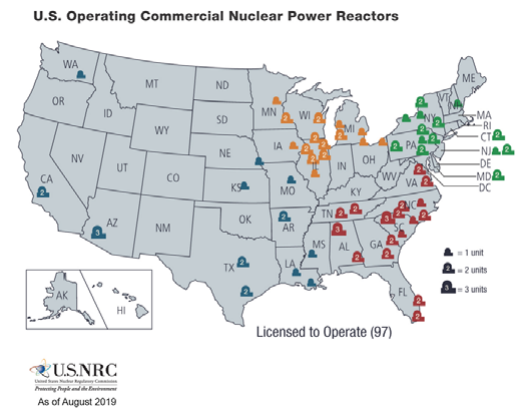

These two reactor types produce a total of 2.5 million GWhth per year in the U.S., per the Nuclear Regulatory Commission (NRC) database. For the high-level, market-focused analysis conducted in this report the technical differences between BWR and PWR operation, while significant in practice, will be set aside, and a representative steam temperature of 300°C will be used to evaluate industrial heatintegration opportunities. 

## **2.3 U.S. Process Heat Demand** 

Per the Energy Information Administration (EIA) database, in 2019 the industrial sector consumed ~23 quadrillion BTUs of total energy, or 6.8 million GWh.[11] Fifty-eight percent of this energy, or 3.9 million GWh, is thus a direct result of process-heat generation, compared to 2.5 million GWhth generated from LWRs for electricity production. Critical industrial chemical reactions for the production major industrial products are both endothermic (i.e., they consume heat) and operated at high temperature (>600°C). Examples include catalytic cracking of both petroleum and natural gas (700–900°C), dehydrogenations (600–800°C), cement precursor production (900–1200°C), and the reduction and smelting of iron ore (>1000°C). This basic analysis indicates that industrial thermal demands exceed LWR output in both total energy and temperature, leaving significant opportunity for integration with lower-temperature demand processes. The power output and consistency of LWRs are attractive for specific applications that could be seen as a transition stage for later when next-generation small modular reactors (SMRs) can be implemented. Heat-delivery and heat-transfer system designs require the consideration of a multitude of factors, including temperature gradients, transfer rates and modes, reaction regimes and reactor design, heat loss, safety, and others. While critical, these design considerations and the exergy destruction analyses required to optimize heat integration are outside the scope of this market opportunity-focused report. 

There are some LWRs in the Gulf Coast region, the area with the most significant concentration of industry process-heat demand, that are possible candidates for green-field industry integrated with an existing LWR. Many NPP locations in the north and eastern U.S. (e.g., plants in Illinois, Ohio, and eastern Pennsylvania) also overlap with thermal-demand hubs. 

## **3. INDUSTRIAL MARKETS FOR LIGHT-WATER REACTOR PROCESS HEAT** 

The GHG report on thermal demands in the industrial sector identified key industries that contribute significantly to GHG emissions.[5] Each of these industries was evaluated from process-model and marketconditions perspectives. These industrial markets are reanalyzed herein in the context of integration with an LWR in a future industrial-park concept. The industries have been recategorized, and updated GHGemission/energy-use data have been compiled from the most recent EPA GHG reporting data (with power-plant emissions removed) and the 2014 Manufacturing Energy Consumption Survey (MECS). In addition, relevant growth processes and emerging technologies have been added to the analysis. The set of previously considered (mature) industries and technologies is shown in 

Table 1. 

The newly analyzed growth and emerging technologies for process-heat integration in an energy-park model are 

- Methanol synthesis 

- Methanol upgrading (to olefins, aromatics, or fuels) 

- Fuel-cell carbon capture 

- High-temperature electrolysis 

- Plastics recycling. 

While thermal demands are the primary consideration of this report, any industrial process will also have electricity demands that might also be supplied by the LWR, and which could qualify for any available emissions-reduction related tax credits. 

Table 1. Summary of industries selected for in-depth analysis for use of LWR thermal heat. 

## **3.1 Petroleum Refining** 

Petroleum refining is the largest non-electrical source of industrial emissions, but close geographic overlap with LWR locations is not substantial. Per the EPA GHG database and 2014 MECS, petroleumfuels production generates 26% of industrial emissions. Emissions are attributable to both heat supply (often by natural gas combustion) and inherent CO/CO2 produced during chemical conversions. Petroleum refining is a mature industry, with massive revenue (>$600 billion per year in total) with a reasonable 3% projected compound annual growth rate (CAGR) for the near future.[15,24 ] The effects of the Covid-19 pandemic are potentially acute for refineries, given the drop in transportation fuel usage, making both short- and long-term market projections particularly difficult. Oil refining is highly geographically centralized, with the majority of facilities located on the U.S. Gulf Coast, where access to supply and economies of scale can decrease costs. There are some refineries in Illinois (Joliet, Wood River, and LeMont), Pennsylvania/Delaware, Minnesota, and Louisiana, for example, that are within reasonable distance of an LWR, but would still require thermal-energy transport up to 25 miles. In the near-term, incremental increases in demand are more likely to be covered by increased refinery capacity (i.e., increased capacity factor or plant modifications) than by a new green-field project co-located with a nuclear power station. Nevertheless, a proof-of-concept project as part of a refinery decarbonization strategy may be a possibility. 

Petroleum refineries may not be strong candidates for LWR thermal integration due to the high temperatures required for endothermic reactions and generally low external heat demand due to excellent internal heat integration. Catalytic cracking temperatures range from 550–800°C, and the overall endothermic reactions require constant heat input. Modern petroleum refineries are rigorously heat integrated and consume only ~6% of the energy value of their feedstock to provide heat.[5] The average refinery requires around 175 MWth of process heat (based on an estimated 300 tpd of combusted natural gas). Heat duty for the largest refineries is estimated to be ~700 MWth. The largest refinery would therefore consume less than 25% of the energy from a 1 GWe LWR, assuming all heat could be effectively transferred.[5] While thermal energy could be provided to assist with fractionation and other separations, the primary thermal duty (endothermic catalytic cracking) cannot be satisfied by nuclear process steam. Given the number of cost considerations for a complex refinery project, <100 MWth of heat duty that can be readily supplied by established natural gas burner technology is unlikely to be a determining factor in site selection. 

Zero-carbon energy credits could possibly be obtained by refineries by using nuclear electricity and heat to produce hydrogen via steam electrolysis either at the nuclear plant or onsite at the refinery, eliminating a major source of GHG emissions. The average refinery consumes roughly 100 tpd of H2; generally, around half of this H2 is produced internally.[25] The other 50% is produced externally, typically via steam methane reforming. Due to stoichiometric CO2 emissions and high thermal demand (800– 900°C for the endothermic reaction set), steam methane reforming generates substantial GHG emissions. In the proposed concept, a refinery could negotiate a power purchase agreement to buy power from a nuclear facility to run onsite high-temperature steam electrolysis (HTSE), with the required heat input pulled from a refinery process. The integration of high-grade heat from a refinery with an HTSE plant could be highly beneficial for hydrogen-production process efficiency. In states with direct renewableenergy subsidies such as Illinois, the refinery would be eligible for energy credits. For example, under the Illinois Zero-Emissions Credits (ZEC) system, nuclear energy receives a $16.50/MWh subsidy, which will increase by $1/MWh each year from 2023–2027.[26,27] Assuming 21 tpd H2 demand for the Joliet refinery (out of 42 tpd total), the ZEC represents a revenue stream of roughly $15,000/day, or $4.5– 6 million/year (depending on capacity factor). In this scenario, both the refinery and the NPP benefit. This is something to be analyzed in future studies. 

## **3.2 Petrochemicals and Other Basic Chemicals** 

Chemicals manufacturing is the second-largest source of industrial greenhouse gases, accounting for nearly 20% of emissions. Chemical and polymer syntheses consume large amounts of both heat and electricity.[28] However, electrical demands are often supplied by combined heat and power (CHP) units using high-quality steam.[5] CHP units are difficult to replicate with the lower temperatures of nuclearderived steam. The chemicals industry is also the most diverse from a process perspective of any discussed in this report. The wide variety of reaction conditions (temperatures and pressures in particular) used in the industry presents challenges to a high-level analysis. This issue is addressed, in part, in three general areas: (1) primary feedstock conversion (catalytic cracking), (2) specialty-chemicals manufacturing, and (3) polymer and plastics production and processing. 

## **3.2.1 Primary Feedstock Conversion** 

As with petroleum refining, primary chemicals feedstock conversion is not a strong candidate for LWR heat integration due to the prevalence of high-temperature endothermic reactions. Steam cracking of petroleum or ethane to generate a mix of olefins and aromatics occurs at temperatures far above 300°C. These cracking reactions are highly endothermic; thus, they require large constant supplies of high-quality heat for operation. Product separations could use nuclear heat, but as another report calculated, these demands generally account for <10% of total plant demand, and therefore would not likely be a driving cost consideration.[5] Thermal-demand analysis has used methanol synthesis as a generic reaction scheme and found that the average plant requires 150 MWth for feedstock conversion, but only an additional 10– 15 MWth for product purification.[5] Additionally, process heat for downstream operations is often derived from byproduct combustion, limiting the external heat demands of a chemicals plant. 

## **3.2.2 Specialty Chemicals** 

Specialty-chemicals manufacturing is an incredibly diverse subsector of the chemicals industry. Identifying specific opportunities in this subcategory is challenging due to the wide variety of approaches, reactions, and processes currently in operation. Broad considerations such as temperature, enthalpy change, scale, feedstock/demand proximity, and hydrogen consumption (to take advantage of energy credits, as described above) must all be examined in detail to determine the feasibility of LWR integration. Two example processes, however, are considered briefly: methanol synthesis from CO2 and H2 and methanol-to-olefins (MTO) or methanol-to-gasoline (MTG) upgrading. Both of these processes are exothermic and generally run at T >350°C.[29,30] Therefore, nuclear-derived process water can conceivably be used as cooling fluid, rather than heating fluid, with the excess heat provided to another process within an integrated industrial park centered on the nuclear facility. This concept, and the methanol-based processes, are discussed in more detail in succeeding sections. A more-detailed analysis of this subsector to identify other opportunities is beyond the scope of this report. However, specialty- or polymer-chemical processes are potentially excellent candidates for the “secondary demand sources” contained within the industrial-park models that will be discussed. 

## **3.2.3 Polymer and Plastics** 

Downstream polymer and plastics manufacturing, specifically purification, drying, and polymer processing, are good potential candidates for LWR integration. Polymerization reactions are (in general) highly exothermic and occur at T <250°C. Therefore, external process heat is not required, and nuclear heat cannot be used as a cooling fluid. However, downstream polymer and plastics processing can consume substantial amounts of heat. The average polyethylene terephthalate (PET) plant was estimated to require 25 MWe and 100 MWth (for purification and processing), provided by steam at T <300°C.[5] An industrial park focused on producing commodity and specialty chemicals might consider the combined electricity and process heat from an LWR as a key competitive advantage. 

## **3.3 Natural Gas Processing** 

Natural gas processing is the third-largest single industrial-sector source of GHGs at 19% of all emissions, due in large part to the potency of methane as a GHG. However, there is a general lack of lowquality thermal demands in the industry. Gas-exploration operations generally do not require heat (although pressure is critical), and gas separation into methane, ethane, propane, and natural gas liquids is performed cryogenically (<0°C) due to the low boiling point of the components. Downstream, gas products are either burned directly or converted in reactions requiring temperatures much greater than 300°C, including steam methane reforming (800–900°C), steam cracking (~800°C), and gasification (exothermic). Although LWRs cannot mitigate gas emissions directly, integration into an industrial park with carbon capture could limit overall emissions via a variety of processes. This concept is explored later in this report. 

## **3.4 Cement and Lime** 

Cement and lime manufacturing produces nearly 90 MMT/year of product in 96 facilities and is responsible for roughly 9% of total industrial emissions.[31] Although kiln temperatures between 1200 and 1500°C are required for clinker production, a substantial portion of this sector’s emissions are due to CO2 release from calcium carbonate (CaCO3) during conversion to lime (CaO).[8] Growth in the domestic cement industry is slow, roughly 2% CAGR between 2014 and 2019, and future growth is difficult to project.[8] The U.S. imports more than 10 MMT/year of cement, and demand is directly tied to infrastructure investments from both public and private sources.[32] Rapidly shifting political and economic conditions make future cement demand highly challenging to project. 

Regardless of future cement production, the high temperatures required throughout the cement production process make it a poor candidate for integration with LWR heat. Primary clinker production requires temperatures in excess of 1200°C, and downstream processing takes temperatures much higher than 300°C. Despite slim prospects for direct integration, however, cement production is a potential heat and CO2 source for a heat-integrated industrial park with molten-carbonate fuel-cell-based carbon-capture technology to reduce overall emissions. This concept, and the potential role of a cement clinker kiln, is discussed in more detail. 

## **3.5 Iron and Steel** 

Steel production from iron ore is the fifth-largest industrial emitter, producing nearly 7% of total GHGs in the process of manufacturing nearly 90 MMT/year of product.[19] These emissions are both stoichiometric and process-heat related. When oxidized iron ore is reduced to pig iron using syngas produced via gasification of metallurgical-grade coke, CO2 is released. Further, both blast-furnace and electric arc-furnace technologies require temperatures in excess of 1500°C to produce liquid metal that can be converted to steel. Blast furnaces burn fossil fuels directly to produce this heat, while electric arc furnaces require substantial electric power draws from fossil-fuel-based power plants. Both approaches contribute significantly to GHG emissions. 

Steel industry growth is particularly difficult to project going forward. Steel is a major U.S. import, at around 45 MMT/year total, but both political and supply-chain concerns have led to reconsideration of the domestic steel-manufacturing base. Further, steel use in the US could be dramatically boosted by a substantial infrastructure investment program. Because the basic structure of the marketplace is particularly uncertain moving forward, CAGR predictions are especially unreliable. 

Due to the high temperatures required for steel processing, including >1500°C for primary steel production and >700°C for annealing and rolling, the iron and steel industry is not well-suited for thermal integration with LWRs. A previous report investigated the hydrogen market’s potential for direct reduction of iron (DRI) technology. Using hydrogen from HTSE in the DRI process could reduce total steel-production emissions by 80%, and certain plants could be eligible for the renewable-energy credits 

discussed.[4] This electricity-focused approach is discussed in detail in the previous report. However, like current coke-reliant technologies, DRI requires temperatures well above 300°C. 

## **3.6 Chlor-Alkali** 

Chlorine gas and sodium hydroxide (i.e., caustic soda or NaOH) are produced electrochemically from NaCl-rich brine and represent around 4% of total industrial emissions. The chlor-alkali industry manufactures over 11 MMT[20] of chlorine per year, along with a stoichiometric quantity of NaOH. Chlorine is used directly as a chemical or is incorporated into petrochemical products such as polyvinyl chloride (PVC). Strongly alkaline NaOH is widely applied in industrial processes, and concentration of the NaOH product via evaporation is the major thermal demand in chlor-alkali facilities. Total industry revenue is estimated to be $8 billion/year.[33] and projected CAGR is strong at more than 4% through 2025.[21] If this growth rate is consistent through 2030, over 6 MMT/year of added capacity will be required, indicating a need for new chlor-alkali facilities. A large chlor-alkali electrolysis unit could be a linchpin demand source for a new LWR-centered industrial park. 

Chlor-alkali electrolysis plants show strong technical potential for integration with an NPP from both heat- and electricity-demand perspectives. The average chlorine facility requires roughly 140 MWe and 25–35 MWth.[5] Modern chlorine-electrolysis cells consume around 2,500 kWh/tonne Cl2 produced.[34] The heat duty is mainly used to evaporate water and concentrate the NaOH product. Plants producing aqueous NaOH at 20–35% by mass require less heat than do facilities delivering anhydrous NaOH pellets. The representative temperature for concentration process heat is 175°C, which can be readily provided by an LWR. A large facility producing 2,800 tpd Cl2 (~0.84 MMT/year) would consume over 300 MWe and 75–100 MWth, or potentially more than 1 GWth total of NPP energy. Based on current growth projections, 5–10 plants of this size could be required within the next 10 years. Chlor-alkali production integrates well with LWR coproduction of electricity and heat, and a large facility could serve as a key demand source for an industrial park, consuming >1 GWth of total NPP energy. 

Most of the chlorine is used for industrial processes, including around 40% for PVC. Less than 5% of chlorine is used for water treatment and pharmaceuticals; the remaining fraction is used to synthesize a wide array of other chemicals. Recent analysis found that chlorine plants are well distributed throughout the country, with a concentration in the Gulf Coast region to provide chlorine to industrial processes.[4] Locating a new chlor-alkali facility near industrial demand is therefore likely to be a driving cost consideration. LWRs in the Southeast region (for access to the Gulf Coast) as well as the Midwest (for access to manufacturing) could be strong candidates for integration with a new chlor-alkali plant. 

## **3.7 Ammonia** 

Ammonia is the most-produced chemical on earth, and production consumes >1% of total energy each year. The U.S. has 30 ammonia plants operating the Haber-Bosch process for converting nitrogen and hydrogen into 12.5 MMT/year of NH3.[3] These plants produce nearly 3% of total industrial emissions, due in large part to the carbon-intensive nature of steam methane reforming for hydrogen production. The average front-end steam methane reforming unit used to produce H2 for an ammonia plant consumes ~80 MWth.[5] Electrical demand for gas compression to achieve pressures of 200–400 bar is also a significant contributor to emissions. The Haber-Bosch process operates at temperatures ranging from 400 to 650°C. However, process heating of gases is not a significant energy contributor compared to endothermic methane reforming and gas compression. Therefore, under the current production regime, ammonia production is not well-suited for heat integration with existing LWRs. 

Future ammonia facilities relying more heavily on electrochemical technologies would require large quantities of consistent electricity and heat and would, therefore, be better suited to LWR integration, especially given that hydrogen for the ammonia process could also be produced electrochemically with LWR integration. Electrochemical N2-reduction technologies are still in the basic research phase, although researchers are making progress in understanding catalytic fundamentals.[35,36] Transitioning from 

a thermochemical-conversion-based ammonia process to one that is electrochemical-conversion based would allow ammonia production to be well-integrated with LWR facilities. Transitioning to front-end electrochemical H2 production would be a transition phase as the TRL for ammonia-production methods improves with increased research and development attention. 

## **3.8 Paper, Paperboard, and Pulp** 

The paper and pulp industry generates 3.1% of industrial GHG emissions, mostly attributable to steam production for product drying. The industry produces nearly 82 MMT/year of paper and paperboard products. Despite a decline in standard paper use, steady growth is projected at ~2% CAGR due mainly to the packaging sector, which relies heavily on paperboard (cardboard).[37] In terms of external heat duty, paper plants and paperboard and pulp mills are quite different. The average paper plant consumes 40 MWth and 10 MWe while a typical paperboard plant consumes 250 MWth and 54 MWe.[5] Around 65% of this heat duty is applied to drying the final product. By contrast, pulp mills produce excess power internally by burning “black liquor” byproduct, with the primary purpose of recovering expensive processing chemicals. The industry is centered around forest feedstocks, with particular concentrations in the Southeast, Midwest, and Pacific Northwest. 

Paper and paperboard mills show both technical and economic promise for integration with LWRs. The required process heat temperature is less than 300°C, and new facilities are likely to be required in the next decade, particularly for paperboard packaging production. Because there is already an industry concentration in the Southeast, a paperboard mill within an industrial park around an LWR in Georgia, South Carolina, North Carolina, Tennessee, Louisiana, or Alabama is potentially promising. 

## **3.9 Food Processing** 

Food processing generates more than 2% of all industrial emissions, driven in large part by the wet corn-milling process. An average wet corn-milling facility, delivering ~1 MMT/year of total product, draws up to 100 MWth of ~200°C steam for steeping corn grain, in addition to >10 MWe for other plant operations. The large demand for low- to medium-quality heat makes wet corn milling a good fit for thermal integration with an LWR. The food-processing industry is projected to grow at 4.5% CAGR through at least 2023 [38], and likely beyond. This growth rate suggests that new processing facilities will be required within the next 10 years, and these could be considered as potential processes for inclusion in an NPP-centered industrial park. The fermentation process used to produce ethanol for gasoline blending releases CO2, which could be integrated into nuclear-energy-driven carbon-capture processes within an industrial park. 

According to the U.S. Department of Agriculture (USDA), food processing is well distributed throughout the United States, but Midwestern states (particularly Illinois and Pennsylvania) have industry clusters.[39] These regions also have LWRs available for thermal integration. Food-processing industry growth in these regions would take advantage of the preexisting transportation infrastructure and labor base and the cost-effective heat and electricity from an NPP that could provide a competitive advantage for new firms or facilities. 

## **3.10 Biochemicals (Ethanol)** 

The ethanol industry produces almost 87 MMT of product per year for both fuel and food purposes and is responsible for roughly 2% of all industrial emissions. Ethanol production is not a strong candidate for LWR heat integration due to a lack of external thermal demands. However, the ethanol-fermentation process does release CO2, which could be used for carbon capture, coelectrolysis, and CO2 hydrogenation to methanol in the energy-park model. Ethanol is produced directly from corn, and unprocessed segments of the corn plant, typically lignin, are combusted onsite to provide process heat. Biomass-residue burning produces excess heat and power at most ethanol facilities, negating the need for external heat provision.[5] 

Unless lignin-processing technology improves significantly, which would allow plants to produce valueadded products from current waste material, heat integration with LWRs is unlikely to be attractive. 

## **3.11  Mining (Potash, Borate, Soda)** 

Mineral mining of potash, borate, and soda generates slightly over 1% of all domestic GHG emissions. These mineral plants consume, on average, 150 MWth of heat and nearly 300 MW of total energy via CHP. However, per the EPA, only 11 of these large facilities are located in the United States, none in close proximity to nuclear facilities. Given that neither mining nor existing LWRs are mobile, this industry is not a candidate for heat integration with LWRs. 

## **3.12  Plastics Recycling** 

Plastics recycling is becoming an increasingly visible issue globally as pollution from single-use plastics continues to accumulate. Globally, roughly 360 MMT of plastics were produced in 2018, of which about 75% became waste.[40] The U.S. represents roughly 15% of this amount, or 54 MMT.[23] Only a small fraction of this plastic is currently recycled, due both to cost and technical challenges associated with maintaining product quality through recycling. Plastics can be recycled in three ways: 

1. Melting and reforming: This is the most straightforward and common method, but it causes the material to accumulate defects, reducing quality. Plastics with reasonable (<250°C) glass-transition temperatures, such as high-density polyethylene, polypropylene, polyvinyl chloride, and polystyrene, are often recycled using this method. 

2. Chemical breakdown to monomers and re-polymerization: This method maintains product quality better than melting, but is only available to ether and ester polymers formed via condensation reactions. These represent a minority of polymers as a whole. 

3. Gasification and re-synthesis: In this approach, the polymers are converted to syngas. The syngas is subsequently upgraded into monomers, which are further polymerized to the original material. This method is energy intensive and expensive. 

Recycling via melting and reforming is the most straightforward approach and is applicable to a significant fraction of commercial polymers. Melting can also be performed by NPP heat, as glasstransition and melting temperatures are often below 250°C. However, preliminary heat-demand estimates show that even dramatically expanded plastics recycling will create a small heat demand for nuclear facilities. Based on the previous figures , the U.S. generates nearly 41 MMT of plastic waste per year. A representative (but simplified) mixture of polyethylene, polypropylene, polyvinyl chloride, and polystyrene has a melting temperature of 200°C and a specific heat capacity of 1.75 kJ/(kg•C). Assuming 41 MMT (100% of currently generated waste) of this representative mixture was melted at 200°C and the process was 50% heat efficient, the total heat demand is estimated to be roughly 200 MWth. Although recycling by gasification is more energy intensive, the process temperatures and enthalpic properties do not match LWR heat temperatures; gasification and polymerization are both exothermic processes, and endothermic forming reactions occur at temperatures well above 300°C. 

Plastics recycling is not a significant thermal demand for a future industrial park. However, given the small heat-transfer amounts required, low risk, and environmental benefits, expanding recycling efforts using LWR heat could be a relatively straightforward way to dramatically reduce plastic-waste generation and utilize existing LWRs to improve the environment and provide a low-risk beginning for LWR TPE for use with green-field industrial facilities near LWRs. Recent studies have expanded on the widespread environmental issues with plastic waste, and providing a cheap, straightforward approach to increased recycling could have unexpectedly wide environmental benefits.[41] 

## **3.13  Summary** 

A significant fraction of industrial emissions, roughly 15% divided among petrochemicals, chloralkali, paper and pulp, and food processing, could be mitigated through thermal and electrical integration with an LWR. In general, processes that integrate well with LWRs are those that require substantial water evaporation (specialty chemicals, chlor-alkali, paper and pulp, and food processing) or have large electrical and thermal demands (chlor-alkali in particular). In the petrochemicals industry, LWR process heat could be used to satisfy heat duties in specialty-chemical processes, typically for downstream separations, purifications, or plastics processing or for aftermarket plastics recycling. Also proposed is that LWR process water (taken from the nuclear loop as a saturated liquid) could be used as cooling fluid for exothermic processes, notably CO2 hydrogenation to methanol and methanol-to-hydrocarbons upgrading. Heat duties in the chlor-alkali, paper and pulp, and food-processing industries are almost exclusively to heat and/or evaporate water for product drying and purification. Large facilities in these industries can demand 100 to 250 MWth steam duties. When combined in an industrial park, these facilities would consume a significant fraction of an LWR’s energy output, even before considering the (substantial) electrical demands. A well-designed industrial park containing multiple interacting processes could produce a variety of value-added chemical processes efficiently and with minimal GHG emissions, reducing the climate impact of key industrial processes. A key finding of this technical analysis is that purely thermal demands needed for a particular process are unlikely to consume all of the energy generated by an LWR; therefore, large electrical demands, likely electrolysis processes (either chloralkali, water splitting, or alkane deprotonation), will be required to effectively use the entirety of an LWR’s output. 

## **4. INDUSTRIAL ENERGY PARK CONCEPTS CENTERED AROUND LIGHT-WATER REACTORS** 

Given the assumption that no individual industrial process can consume all of the heat generated by an LWR, complete utilization of nuclear energy could entail the development of nuclear-centered industrial parks: clustered (within <1 km radius) facilities all drawing heat or electricity to drive a variety of processes. The physical proximity of the facilities will allow for interprocess heat and mass-flow integration. Highly integrated plants improve efficiency, which both reduces manufacturing cost and decreases overall GHG emissions, a major goal of this analysis. This section introduces a “generic” industrial-park concept and one specific cluster of interconnected processes designed to produce commodity chemicals and polymers with minimal carbon emissions. Carbon-capture technologies that separate and concentrate CO2 from burner-flue gases have not been discussed in detail so far, but could play a critical role in emissions reduction from high-temperature processes. Both the generic and specific industrial-park models are described at a conceptual level. Detailed modeling with process-simulation software will be done in future work to validate and expand on these concepts to provide guidance for future development. 

## **4.1 Generic Industrial Park Model** 

Figure 2 presents a generic industrial park, centered on a nominal 1 GWe (3,250 MWth) LWR. The LWR outputs both electricity and heat (in the form of process water/steam) that are integrated with a set of parallel industrial processes. These processes could include emerging electrochemical technologies (left), exothermic thermochemical processes (bottom), mature industrial technologies that can be technically integrated with an LWR, and, potentially, carbon capture to reduce emissions from a hightemperature process. 

The goal of the park is to manufacture multiple industrial products at competitive costs while using LWR energy to minimize GHG emissions. The generic park contains four classes of industrial processes, each with a critical function: (1) electrochemical processes requiring heat input, (2)exothermic thermochemical processes (T >350°C), (3) endothermic thermochemical processes with associated carbon 

capture (T >700°C), and (4) mature industrial-demand sources with technical potential for LWR thermal integration (T <200°C). Heat and mass integration between these processes will depend on the specific process selections, plant geometry, and overall process conditions. The concept and function of each process class, including technology readiness levels (TRLs) of specific technologies, are discussed below. 

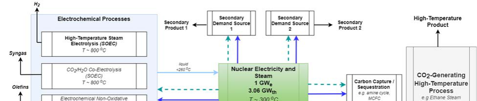

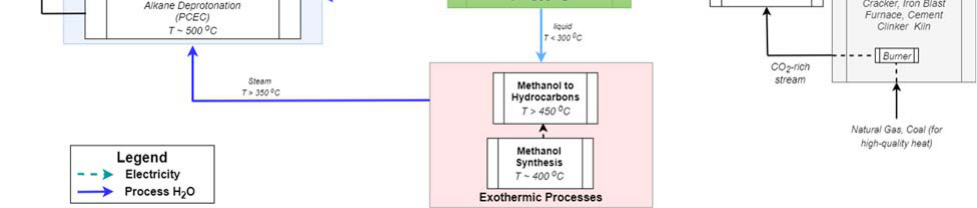

## **4.1.1 Electrochemical Processes** 

Nuclear integration with high-temperature electrochemical processes that require constant heat input has been studied in previous reports from Idaho National Laboratory (INL) and others.[3] If the technological platforms, typically solid-oxide electrolysis cells (SOECs), can be produced at scale, these electrochemical processes can consume large amounts of nuclear-generated heat and steam while producing high-value products, making them excellent candidates for integration into an LWR-centered industrial park. Three potential technologies, in order of decreasing TRL, are shown as possibilities: HTSE, coelectrolysis of CO2 and H2O, and electrochemical nonoxidative deprotonation (ENDP) of alkanes. 

## **4.1.1.1 HTSE** 

HTSE uses SOECs to convert water to hydrogen and oxygen at T >700°C. While solid-oxide fuel cells (SOFCs) are a widely used commercial technology, SOEC is an emerging technology. HTSE plant integration with LWRs has been studied in detail in other reports,[42] and scale-up research and development is underway, with pilot projects planned for the near future. HTSE integrates well with an industrial park because the technology platform can be scaled to any electricity and heat supply level. Further, the generated hydrogen, and possibly oxygen, can be consumed internally by another process or sold externally to provide plant revenue. Water electrolysis can be a cornerstone technology for the energy systems of the future, and integration into the industrial park will ensure the concept meets GHG emissions, technology, and revenue goals. 

## **4.1.1.2 Coelectrolysis** 

The SOEC technology platform can also be applied to convert mixtures of CO2 and H2O to syngas (CO/H2), known as coelectrolysis. Syngas can be subsequently upgraded to higher hydrocarbons for internal use or external sale; this is an existing commercial process. Coelectrolysis could be operated in lieu of or in tandem with thermochemical CO2 hydrogenation. Coelectrolysis platforms have a generally lower TRL than dedicated water electrolysis SOECs and, therefore, require significant development before implementation in a future industrial park. 

## **4.1.1.3 Electrochemical nonoxidative deprotonation** 

ENDP conversion of light alkanes (ethane, propane, etc.) to olefins (ethylene, propylene, etc.) using proton-conducting electrolysis cells (PCECs) has shown the potential in small-scale experimentation to produce olefins with lower energy and GHG intensity than existing cracking technologies, albeit at the laboratory scale.[43] PCECs operate at lower temperatures (400–600°C) than SOEC, but still require heat input, making them excellent candidates for future integration with LWRs. At present, PCECs have low TRLs, with only laboratory-scale demonstrations, but development is ongoing. Conceptually, the need for a high-temperature process could be seen as a bridge to an ENDP-centered future industrial park that produces specialty and commodity chemicals from natural gas with minimal carbon emissions. 

## **4.1.2 Exothermic Processes with Operating Temperatures Greater than 300°C** 

As discussed, the relatively low-temperature process steam produced by LWRs limits heating applications. However, process water from the nuclear plant might possibly be used as a cooling fluid for mid- to high-temperature exothermic chemical processes. As mentioned, these integrations are conceptual at this point, and the full impacts to the nuclear plant as a result of this increased heat load have not been modeled. Existing thermochemical processes receiving increasing industrial attention, including CO2 hydrogenation to methanol and methanol-to-hydrocarbons upgrading, are both exothermic and operated at temperatures greater than 300°C. The steam produced by removing heat from these operations can then be moved to endothermic electrochemical processes for complete heat integration. The heat integrations would need to be designed to remove heat from the process water before returning it to the NPP to avoid impacts to the NPP heat cycle. Carbon dioxide hydrogenation is typically operated near 400°C and is mildly exothermic (est. 0.43 kWh/kg methanol). Other methanol synthesis approaches are typically less costly, but the availability of low-cost (and GHG-emissions reducing) CO2 and H2 within the industrial park could change the economic prospects.[44] The produced methanol could be fed directly into a methanol-to-hydrocarbons upgrading process. Methanol-to-hydrocarbons, specifically MTO or MTG, are commercial processes receiving increasing industrial attention and investment. Both processes are exothermic, and the selection of a particular process could be based on plant location or general economic conditions. 

## **4.1.3 High-Temperature Endothermic Industrial Processes with Associated Carbon Capture** 

Nuclear heat cannot be directly applied to a number of high-volume, high-temperature, endothermic processes, including petroleum cracking, cement clinker formation, steel manufacturing, and ammonia synthesis (see Section 3). However, incorporation of these processes into a nuclear-based industrial park could reduce overall emissions through CO2 capture and upgrading. The standard natural gas- or coalburning furnaces will be used as examples for high-temperature processes. CO2-rich flue gas can be passed to a carbon-capture process, such as a molten carbonate fuel cell (MCFC) carbon capture. MCFCs are a commercial technology being increasingly considered for emissions-reduction applications.[45] MCFCs operate at temperatures between 600 and 700°C, produce electricity, and are mildly exothermic. Other carbon-capture technologies, such as amine cycles, could also be considered. The access to lowcost LWR-derived electricity and process heat in tandem with changing government policies and regulations could shift the economic prospects of these technologies. 

## **4.1.4 Mature Industries with Technical Potential for LWR Integration** 

To facilitate particular park concepts or consume excess NPP power supply, mature industries previously mentioned have strong technical potential for LWR heat integration, including chlor-alkali plants, paper/pulp mills, and food processing should receive strong consideration for inclusion in a future industrial park. The lower-quality heat required by these processes (mostly <200°C for drying applications) reduces the possibility (and the need) for complete heat integration with other processes. 

The generic industrial park model does not have a specific product focus, but each considered technology platform can be scaled up or down depending on the amount of low-cost energy available. Integration of electrochemical, thermochemical, high-temperature, and low-temperature processes provides a variety of new revenue streams for NPP heat and electricity, diffusing both technological and economic risk. Although linchpin technologies—specifically the electrolysis platforms—currently have low TRLs, a detailed technoeconomic analysis of integrating mature technologies with emerging technologies could provide a pathway to LWR-centered industrial-park development. 

## **4.2 Specific Conceptual Industrial-Park Example: CO2 EmissionsMinimizing Chemicals and Polymers Synthesis** 

An example industrial park focused on the low-emissions production of polymers and plastics is shown in Figure 3. CO2 produced by an ethane steam-cracker burner is captured by a MCFC and upgraded through hydrogenation and MTO processes. Parallel brine- and water-electrolysis reactions produce chlorine, caustic soda, hydrogen, and oxygen. These products are combined with the two olefin/aromatics streams in a chemicals- and polymers-synthesis plant. The exact production of this plant can be determined by costs and market conditions, but the proposed arrangement provides the flexibility to synthesize a wide variety of commodity and specialty chemicals and polymers. 

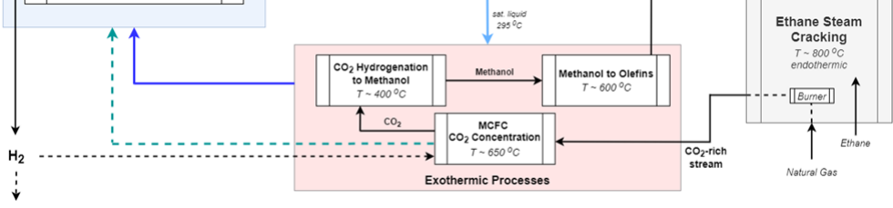

The selected processes all synthesize chemical feedstocks: hydrogen, oxygen, olefins, aromatics, chlorine, caustic soda, etc. The integration of multiple processes to manufacture a simplified set of products—i.e. selected chemicals and polymers—could improve the technical and economic viability of an LWR-focused industrial park. The example shown above is conceptual, and intensive process modeling is required to validate and expand the ideas. The reasoning for each selected process is discussed below. 

Each process shown in Figure 3 was selected based on current TRL and whether the product fit the overall plant theme. HTSE was chosen because this platform is already being heavily researched for integration with NPPs to produce low-carbon hydrogen. The coproduction of hydrogen and oxygen can both provide direct revenue and widen the array of possible end-product chemicals. Ethane steam cracking was selected as the high-temperature endothermic process because the produced olefins and aromatics are highly flexible polymer-platform chemicals.[46] The carbon dioxide produced in the ethane 

steam-cracker burner is passed into a CO2 upgrading train that increases total olefins production. MCFC technology is synergistic because it consumes hydrogen produced in the HTSE system to remove CO2 from the burner-flue gas. This concentrated CO2 is subsequently hydrogenated to methanol and, finally, upgraded via a commercial MTO process. The heat generated by these exothermic reactions is captured by nuclear process water and passed to the HTSE platform, improving overall plant efficiency. A chloralkali plant is a highly complementary secondary operation, as the generated chlorine can be combined with olefins (specifically ethylene) to make vinyl chloride (for PVC) and other specialty chemicals. Although there are some inherent inefficiencies in this schematic (for instance, the inevitable consumption/generation cycle losses between the MCFC and SOEC technologies) a 1 GWe nuclear facility could conceivably produce more than 1 MMT/year of polymer and specialty-chemical products, with the feedstock flexibility to maximize profitability as economic conditions change over time. In-depth technoeconomic modeling to validate this example concept and other possible integrations is a critical next step. 

## **5. PRELIMINARY MODELING: THERMAL ENERGY EXTRACTION AND STORAGE CONCEPTS** 

Preliminary modeling on thermal-energy extraction from LWRs, as well as on some example TES concepts, has been done to get an idea of the feasibility and costs of using thermal energy from existing LWRs for industrial processes. 

TES may be an important component of the thermal-energy extraction to have a thermal ballast to smooth the process dynamics on both the side of the LWR and the industrial process. 

## **5.1 Thermal-Energy Extraction** 

The thermal extraction system is designed to allow integration of an NPP with a flexible industrial process so that heat and electricity from the NPP can be stored or used by a nearby industrial process during periods of grid overgeneration to generate additional revenue for the LWR integrated system while supporting decarbonization of both the power and industrial sectors. As an example, a schematic of a proposed integration of an NPP with a HTSE plant is provided below in Figure 4. These analyses could be applied to any other industrial process in the place of HTSE. 

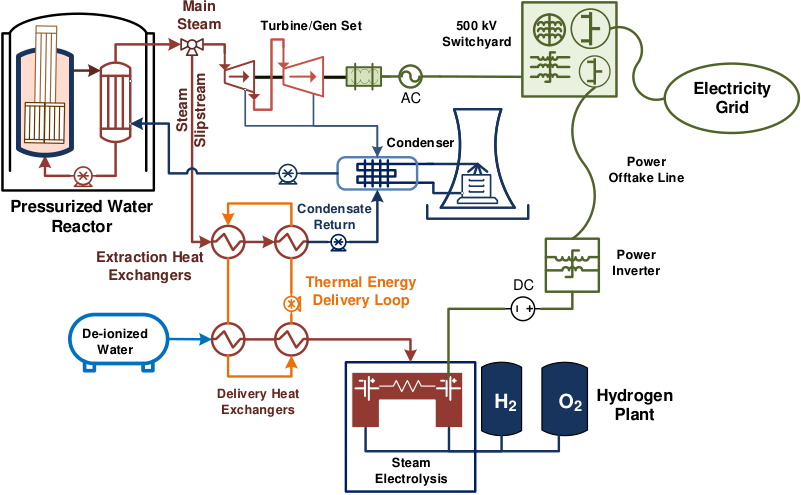

**----- Start of picture text -----** 
Main Steam Turbine/Gen Set 500 kV Switchyard AC Electricity Grid Condenser Power Offtake Line Pressurized Water Condensate Reactor Return Extraction Heat  Power Exchangers Inverter Thermal Energy  DC Delivery Loop De-ionized Water Delivery HeatExchangers H2 O2 HydrogenPlant Steam Electrolysis Steam Slipstream **----- End of picture text -----** 

Figure 4. Proposed idea of a thermal extraction system for an LWR. 

The TPE system consists of two loops: 

1. Steam-bypass loop (SBL, labelled steam extraction loop [SEL] in the figures): This loop bypasses steam from the LWR main steam header before it enters the turbine and then, through a set of heat exchangers, transfers heat to the thermal delivery loop, thereby condensing it completely into liquid, and then returning back to the condenser as condensate. 

2. Thermal delivery loop (TDL): This loop absorbs heat from the SBL and transfers it over a distance of 1 km, to an industrial process. Steam, Dowtherm A, and Therminol-66 are being analyzed as potential heat-transfer fluids (HTFs) in the TDL. 

The purposes of the SBL is to bypass steam from the turbine for use in a set of heat exchangers which provide heat to the TDL. The TDL transports the thermal power from the NPP to the nearby industrial process facility. The initial target for thermal dispatch from the NPP is 5% of total thermal power, meaning 5% of total steam flow. HTSE is a good application for this amount of thermal-energy dispatch because the energy input in an HTSE plant is ~10% thermal and ~90% electrical. The remaining 95% of steam in the secondary NPP system is used in the turbine generator to produce electricity, the majority of which will be sent to the HTSE plant for use in the electrolysis cells. 

The work involves design and testing of the SBL and TDL in various in thermal models. These models are used to cross verify the results, as well as to perform parametric studies on the TDL investigating the effects that the amount of thermal energy dispatched and the distance delivered have on the operation of the TDL. The end goal is the implementation and testing of verified thermal-hydraulic and controls model in a real-time NPP control-room simulator. The simulator used will be the Human Systems Simulation Laboratory (HSSL), as part of operator testing of thermal dispatch. 

The initial design was for a steam-to-steam heat-transfer system in which the TDL carries superheated steam to the HTSE plant. Superheated steam is the desired HTF due to extensive operating experience and the efficiency of phase-change heat transfer. Additionally, the chemistry of the secondary system of the NPP can be more easily maintained in the case of a leak in the system if steam is used as the delivery fluid. However, modeling two-phase to two-phase heat transfer in a transient system is challenging and will require much more time and effort. To meet the purposes of this project, the steam in the TDL has been replaced with a synthetic oil (Dowtherm A) which will provide single-phase delivery to the HTSE plant. Because the main focus of this work was the TDL, only the outlet conditions of the SBL (which are the input parameters for the TDL) were used. Similarly, the design of the HTSE plant has not been included for this analysis and has been replaced with heat-transfer streams. A process-flow diagram of the steam-to-oil model is shown in Figure 5. 

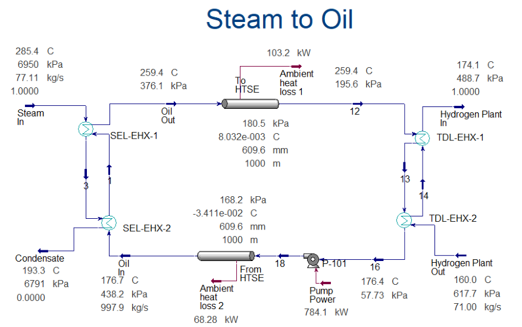

Thermal-hydraulic models were developed for several cases, as summarized in Table 2, in order to acquire improved understanding of scalability of simulation and experimental results between 200 kW and 150 MW of thermal-dispatch power and for thermal-dispatch distances between 0.1 and 1.0 km. Another motivation to conduct this analysis was to acquire thermal-hydraulic parameters for a Rancor Microworld simulator that is being developed for operator tests using INL’s 200 kW Thermal Energy Delivery System (TEDS) that will be integrated with a 150–250 kW HTSE system. 

The first case that was modeled featured a thermal-dispatch power level of 150 MW and a thermaldispatch distance of 1.0 km. The second and third cases employed a similar thermal duty of the heat exchangers, but simulated thermal delivery on distances of 0.5 and 0.1 km, respectively. For Cases 4 and 5, the thermal-dispatch distance was maintained at 0.1 km, and the thermal duty was reduced to 15 MW and 200 kW, respectively. The fluid temperatures and pressures, and the physical parameters of the pipe, were maintained in all cases. The pipe used in the HYSYS model was 24-inch Sch 40 carbon steel pipe, insulated with a 2-inch urethane foam blanket. This pipe was also assumed to be buried 1 m underground over the entirety of its length. The pipe material was chosen from the in-built library of Aspen HYSYS, resulting in a thermal conductivity of 45 W/m-K and a roughness of 4.572E-05 m. 

The operating parameters for Scenario 6 were identical to those of Scenario 5 on the steam-bypass side; however, in order for the model to be more comparable to the TEDS loop, operating parameters on the HTSE side were modified. The feedwater-inlet temperature and pressure (labeled as Hydrogen Plant Out in Figure 5) were changed to 20°C and 1 atm, respectively, and the pipe diameter of the TDL was reduced to 2 inches NPS to match the TEDS at INL. The summary of all cases analyzed for the parametric study is provided in Table 3. 

Table 2. Thermal-dispatch parameters for TDL case study in Aspen HYSYS 

* Modified operating parameters: Feedwater at 20°C and 1 atm, and pipe diameter of 2 inch NPS. 

## **5.1.1 Results and Analysis** 

Steady-state analyses were carried out for all the cases mentioned above, and the thermal-hydraulic parameters of interest acquired from these studies are provided in Table 3. 

Table 3. Results from TDL case studies. 

From the acquired results the following conclusions can be inferred: 

- Reducing the length of the pipes has a reduction in pressure, overall pressure drop, and temperature loss in the system, as expected. Lower pressure drops also led to lower pumping-power requirements. 

- The heat loss to the ambient in Cases 1–4 is less than 1% of the total thermal dispatch whereas, for Cases 5 and 6, it was 8.34 and 2.32%, respectively. 

- The pumping power in all the cases is less than 1% of the thermal dispatch. 

Operating conditions for all the case studies are provided in Appendix 1. 

## **5.1.2 Summary and Future Work** 

The work presented herein describes modeling efforts undertaken to support integration of LWRs to industrial process-heat application. The parametric study conducted herein provides a sense of the thermal-hydraulic performance of the TDL at different scales. 

This study is rudimentary, and it only shows the capability of modeling such systems. A detailed analysis, wherein thermal-hydraulic parameters (Reynolds number, pressure drops etc.) among the different case studies are maintained for better comparison, should be undertaken. Transient analyses of the case studies should also be performed to understand the response of the TDL to any changes in either the SBL or HTSE operating conditions. 

## **5.2 Thermal-Energy Storage** 

## **5.2.1 Overview** 

TES is a technology that accumulates and releases energy by heating, cooling, melting, or solidifying a storage medium, so that the stored energy can be used later by reversing the process for various applications, including power generation. There are three main methods of storing thermal energy— namely, sensible, latent, and chemical-reaction heat. Sensible heat is stored by increased temperature without phase change in the material, whereas latent heat is stored during phase transitions. Chemicalreaction energy, also known primarily as thermochemical energy, is a result of chemical reactions that release or absorb heat. These are categorized in Figure 6. 

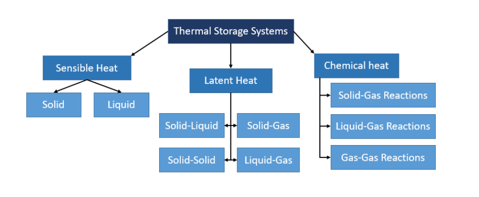

Most TES applications currently used are either based on sensible or latent heat. Even in latent-heat TES systems, which employ phase-change materials (PCMs), only solid-liquid and liquid-solid phase changes are practical. Although liquid-gas transitions, such as evaporation and condensation, have higher enthalpies and are used in steam accumulators, they are impractical for large thermal-storage systems due to the requirement of large-volume tanks and operation at high pressures. Solid-solid based PCMs absorb and release heat by reversible phase transitions between a crystalline or semi-crystalline phase, and an amorphous, semi-crystalline, or crystalline phase. However, the amount of energy stored in such a transition is relatively low and, thus, is impractical for large-scale TES systems. 

Currently, the two-tank sensible-heat-based TES design is the only system to have been deployed on a gigawatt scale. This system has two tanks to store both hot and cold storage media separately and an intermediary heat exchanger to transfer heat from the storage medium to the HTF (see Figure 7). During the charging cycle, the storage medium is pumped from the cold tank, heated primarily using solar energy, and transferred into the hot tank for storage. During hours of additional demand for electricity, the hot fluid runs through a heat exchanger and transfers its heat to the HTF. 

![Figure 7: Representation of a generalized two tank sensible heat TES system. Concentrated solar power (CSP) is depicted, but an NPP could be substituted as the energy source.[47]](images/cooling-inl-tdl.pdf-0038-00.png)

These two-tank sensible-heat systems could be modified and used for any heat-generating system. NPPs could be the heat source used to charge a sensible-heat storage during hours of low energy demand, and those storage systems could be discharged to produce auxiliary steam for heating or power-generation purposes during hours of high energy demand. A schematic of the charging and discharging cycles is provided below in Figure 8. 

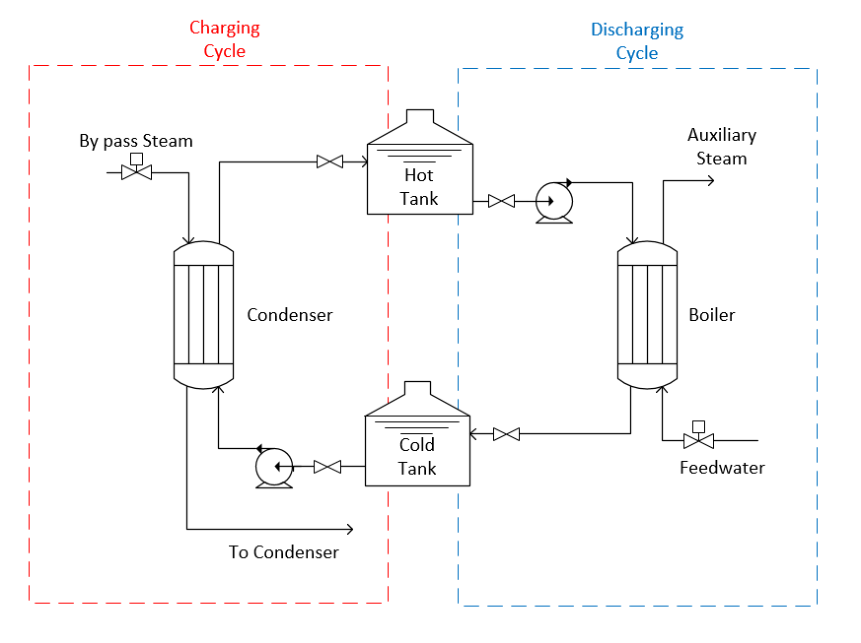

Most two-tank TES systems use molten salt as a storage medium. This is primarily because salts are cheaper than oils, and they have higher thermal conductivities, thereby requiring smaller heat exchangers and less capital cost as a consequence. However, such systems must constantly maintain the temperature of their heat exchangers and other flow components above the freezing point of the salt to avoid detrimental effects. The entire system must be kept in a hot-standby mode when there is no energy demand. Additional inspection is also required for molten-salt systems which can add to the operational costs of such systems. A latent-heat TES system can potentially overcome these issues. 

The salt in a latent-heat TES system would be held within a single container throughout its life cycle, and the HTF would ideally flow through tubes embedded within this system, transferring heat to and from the storage medium. This eliminates the need for an external heat exchanger, thereby reducing capital costs. However, latent-heat TES systems also have their own drawbacks. Thermal conductivities of the PCMs are the limiting factor that determines how quickly a latent-heat TES can be charged or discharged. During the discharging cycle, which is dominated by conduction, the heat transfer faces an incremental resistance due to the solidification of the PCM around the tubes carrying the HTF. Therefore, in most small-scale latent-heat systems, an emphasis is given to enhance the heat-transfer mechanism. The innovative design considered in this study has finned tubes and other design features which cannot, at this time, be disclosed to increase the effective thermal conductivity of the TES. It thereby reduces charging and discharging cycle time. It should be noted that two-tank TES systems primarily utilize sensible heat; therefore, their performance mainly depends on the specific heat capacity of the salt. Latent-heat storage can theoretically provide larger heat-storage densities and significantly reduce the TES volumes by using a material’s heat of fusion as well as sensible heating of the solid and liquid. Also, phase change ideally occurs isothermally, thereby allowing the TES to act as a constant-temperature heat source with little material degradation over time. 

A schematic of the latent-heat TES provided in Figure 9 shows its basic working principle. Excess thermal energy, diverted from a high-temperature source, can be used to deposit heat into the latent-heat TES via an HTF, thereby melting the storage medium. Similarly, during periods of demand, a heatrecovery fluid can be run through the TES to absorb stored heat and cause the storage medium to solidify, discharging the system to produce energy. 

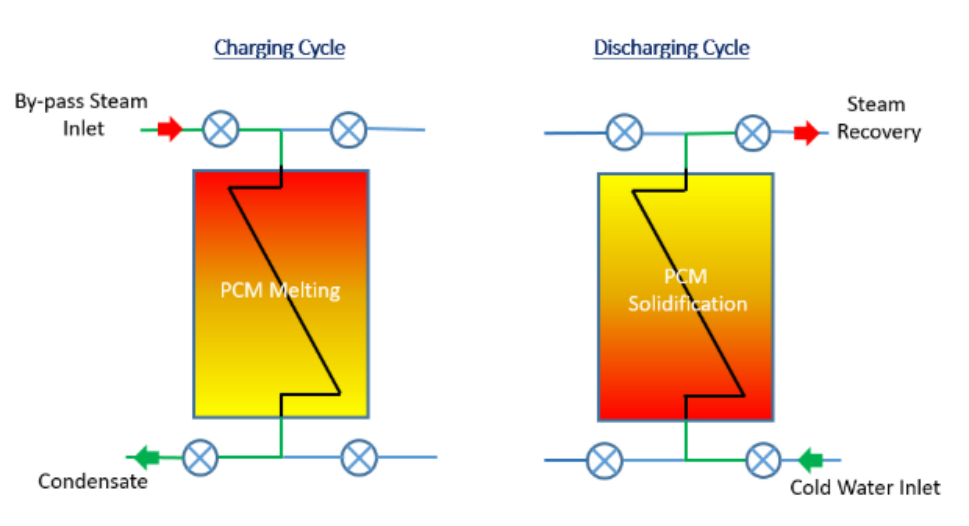

## **5.2.2 Modeling** 

A comparison between a molten-salt based two-tank sensible-heat TES system and a single-tank latent-heat TES system was drawn. This is a preliminary analysis to show possibilities. Future work will be done to further develop these models and comparisons. Also, these models are currently being modeled as coupled to a hypothetical NuScale reactor. These models and results are presented here to show progress in TES and are roughly applicable to LWRs. Future work could adapt these models to an LWR design. The salt chosen for both systems analyzed herein was NaNO3-KNO3 at a weight percent of 60–40, commonly known as solar salt. This salt is the heat-storage medium, and the HTF for charging and discharging is steam/water. This salt was chosen because it has been characterized extensively and is widely used in energy-storage systems, particularly in those coupled to CSP plants. 

Case studies were performed by varying the amount of steam, and the storage material required was calculated. The primary fluid conditions were taken from a NuScale reactor module’s steam generator,[48] and the thermophysical properties of the salt were taken from an INL report.[49] The thermophysical properties and price of salt are provided in Table 4. 

Table 4. Parameters for the NaNO3-KNO3 heat-storage medium used in the latent-heat TES and sensibleheat TES comparisons. 

|Parameter|Value|Units|
|---|---|---|
|Melting point|495|(K)|
|Density|1954|(kg/m3)|
|Enthalpyof fusion|107|(kJ/kg)|
|Specific heat capacity|1500|(kJ/kg-K)|
|Thermal conductivity|0.55|(W/m-K)|
|Price50|0.72|($/kg)|

The preliminary models for the TES systems were sized to accommodate 100% of the steam dump from a NuScale reactor module. This was assumed to be the base case. 

The modeling methodology is explained as follows: 

- Using the NuScale steam conditions, the amount of energy that could be acquired from complete condensation of the steam was calculated. 

- Using the thermophysical properties of the salt and the maximum temperature difference available (i.e., the difference between the initial temperature of the salt and the achievable temperature under ideal conditions), the amount of salt required to store the energy absorbed from steam was calculated. 

   - For sensible heating, 𝑄�𝑚𝑐�,���∆𝑇, where 𝑐�,��� is the liquid heat capacity of the salt, and the temperature difference is calculated based on the melting point of the salt and the maximum steam temperature. 

   - For latent heating, 𝑄�𝑚𝑐�,���∆𝑇� �𝑚∆ℎ��� �𝑚𝑐�,���∆𝑇�, where 𝑐�,���is the solid heat capacity, 𝑐�,��� is the liquid heat capacity and ∆ℎ��� is the enthalpy of fusion. Here, the temperature differences are based on sensible-heat additions to the solid salt, as well as the liquid salt. Therefore ∆𝑇� is based on ambient and melting temperatures, and ∆𝑇� is based on the melting temperature and the maximum steam temperature. 

   - Using the amount of salt calculated, the volume of the storage tanks required, and their subsequent costs are calculated. 

## **5.2.3 Results and Analysis** 

The amount of salt required to store energy from the base case (131.4), 200, 500, and 1000 MWth steam source over a period of 24 hours was calculated for both, the sensible-heat TES and the single-tank latent-heat TES. The results of this analysis are shown below in Figure 10. 

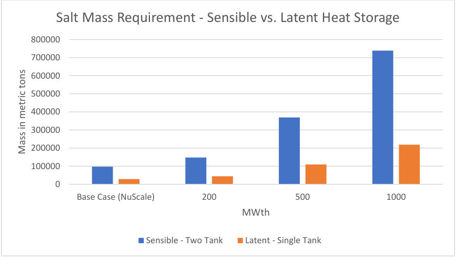

**----- Start of picture text -----** 
Salt Mass Requirement ‐ Sensible vs. Latent Heat Storage 800000 700000 600000 500000 400000 300000 200000 100000 0 Base Case (NuScale) 200 500 1000 MWth Sensible ‐ Two Tank Latent ‐ Single Tank Mass in metric tons **----- End of picture text -----** 

Figure 10. Salt requirements for sensible- versus latent-heat TES systems. 

It is evident that, due to the ability of latent-heat TES systems to utilize latent along with sensible heat in the solid and liquid phases, the amount of salt required for storage is significantly smaller than that for sensible-heat TES systems. Reducing the amount of salt required in the latent-heat TES versus the sensible-heat TES results in lower salt cost, but also lower costs due to fewer construction materials required for the holding tank. The salt cost differences are shown in Figure 11. 

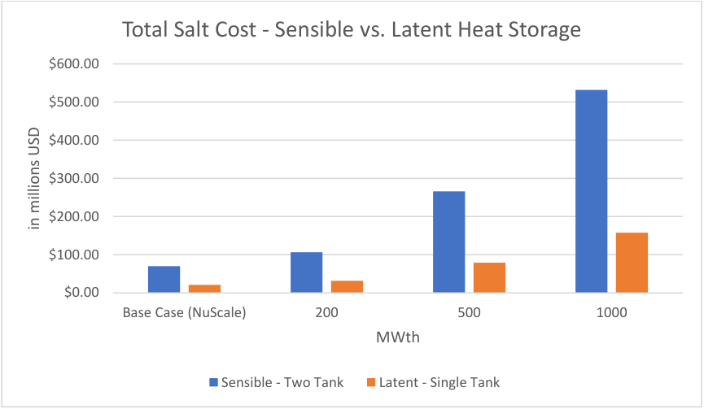

**----- Start of picture text -----** 
Total Salt Cost ‐ Sensible vs. Latent Heat Storage $600.00 $500.00 $400.00 $300.00 $200.00 $100.00 $0.00 Base Case (NuScale) 200 500 1000 MWth Sensible ‐ Two Tank Latent ‐ Single Tank in millions USD **----- End of picture text -----** 

Figure 11. Cost comparison for sensible- versus latent-heat TES systems. 

The diameter and height of the storage tanks were assumed to be on an order of magnitude similar to those deployed at the Andasol-1 Solar Power Station, a 150 MW CSP plant.[51 ] This CSP plant is a parabolic trough that uses a molten salt as the HTF and storage medium for its sensible-heat TES system. 

Based on the volume the tanks would be required to store, assuming a wall thickness of 4 cm, and using the cost of carbon steel plate of $0.64/kg, the cost of storage tanks was calculated for the different cases.[52] These data are shown in Figure 12. 

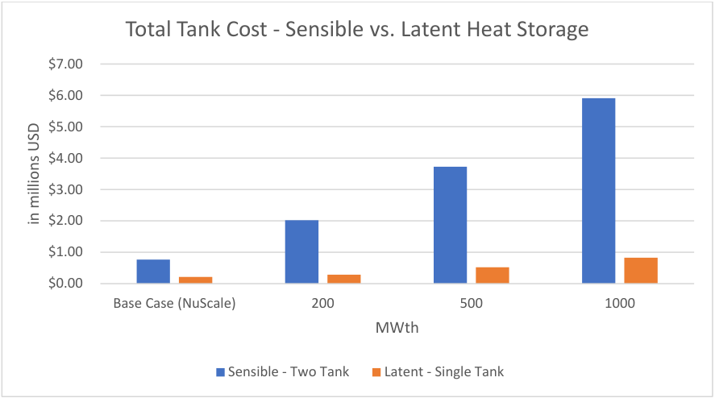

**----- Start of picture text -----** 
Total Tank Cost ‐ Sensible vs. Latent Heat Storage $7.00 $6.00 $5.00 $4.00 $3.00 $2.00 $1.00 $0.00 Base Case (NuScale) 200 500 1000 MWth Sensible ‐ Two Tank Latent ‐ Single Tank in millions USD **----- End of picture text -----** 

Figure 12. Storage tank cost comparison for sensible versus latent heat energy storage systems. 

Based on these preliminary models and cost estimates, the single-tank latent-heat TES shows promise of a cost reduction versus the standard two-tank sensible-heat TES. This is, however, a very rudimentary analysis that does not take into account many factors. Some unaccounted factors include: 

- The designs considered herein are preliminary and over-simplified. They do not account for additional components that would be required during the charging and discharging cycles. 

   - For a two-tank sensible-heat TES, heat exchangers would be needed for charging and discharging cycles. 

   - For a single-tank latent-heat TES, the header design would need to be designed carefully because the storage tank with embedded tubes is, itself, the heat exchanger. 

- As mentioned previously, there are drawbacks to latent-heat TES, the most critical being the low thermal conductivity of the PCMs. 

   - The thermal conductivity of PCMs determines the charge and discharge rates of latent-heat TES systems. 

   - For this analysis, the mode of heat transfer is assumed to be conduction only. This is, however, a conservative assumption as during the charging cycle, the PCM close to the tubes melts and generates small convection currents that lead to a shorter melt time than in a system which would have only conduction. The discharging cycle is dominated by conduction; therefore, the charging and discharging cycles will have different rates. 

- Enhancement of the effective thermal conductivity of the PCM will increase the cost of the storage material required. If the material’s thermal conductivity itself has not been enhanced, and the design 

of the latent-heat TES has been modified, that would increase the cost of the storage tank. This has not been accounted for in this analysis. 

## **5.2.4 Summary and Future Work** 

A comparison was drawn between two molten-salt-based TES systems—namely, the widely used sensible-heat TES system and a proposed design of a latent-heat TES system. The parameters for comparison were the amount of salt required, the total cost of the salt, and the cost of tanks required to store it. Based on the preliminary analysis, latent-heat TES systems show promising results in terms of overall capital investment. However, more analysis is required to understand and gauge the thermal performance of the latent-heat TES systems. Parameters such as charge and discharge rates, and roundtrip efficiencies are critical when comparing competing TES systems. 

Currently, collaborative research undertaken by the INL and the University of Idaho is investigating methods to enhance this thermal conductivity. Concepts ranging from enhancing the thermal conductivity of the PCM as well as developing novel designs for the latent-heat TES to enhance heat transfer between the HTF and the PCM are being studied. Math- and physics-based analytical and computational fluid dynamics models are being developed to better understand and visualize the thermohydraulic performance of the latent-heat TES systems. These models will be validated using experimental results conducted on a laboratory-scale latent-heat TES system at the Center for Advanced Energy Studies. The validated models will then be integrated with on-going nuclear-renewable hybrid energy system (NHES) modeling efforts at INL to evaluate the economic potential and advantages of new process designs with heat-storage capacities over baseload electricity production. 

## **6. ECONOMIC EVALUATION: NUCLEAR VERSUS NATURAL GAS PROCESS HEAT** 

The TDL process modeling results already presented were used as the basis for a comparison of the cost of NPP and natural gas-derived process heat. The analysis considers NPP costs and performance consistent with the current U.S. fleet of existing LWRs. Five nuclear process-heat cases in which varying thermal capacity and delivery distance were evaluated are shown in Table 6. 

Table 5. LWR thermal power extraction cases. 

## **6.1 Economic Modeling Approach** 

This economic analysis is based on preliminary design parameters and therefore uses a simple calculation methodology that provides transparent and straightforward results. A levelized cost of heat (LCOH) calculation was completed for both the nuclear and natural gas process-heat applications. The LCOH is calculated using the following equation: 

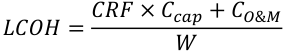

where 

CRF is the capital recovery factor 

Ccap are the project total direct capital costs 

CO&M are the annual O&M costs, and 

W is the annual heat production. 

The capital recovery factor (CRF) is the fraction of capital investment that must be repaid each year to repay a loan with a term of _n_ years and an interest rate _i_ : 

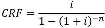

This analysis was based on a 20-year project life with a 10% discount rate. In this analysis the discount rate is an assumed rate that represents the weighted average cost of capital, including inflation and debt/equity internal rate of return (IRR) costs. As a representative example, a case with an IRR of 15% per year, a debt rate of 10% per year, a debt/equity ratio of 1:1, and an inflation rate of 2.5% per year corresponds to a weighted average cost of capital (WACC) of approximately 10%. The simplified approach for calculating LCOH utilized in this analysis does not include taxes, depreciation, or decommissioning costs for either the nuclear or natural gas process-heat application. 

Several assumptions were made in calculating the LCOH for nuclear and natural gas process heat applications. These assumptions are listed below: 

- Although process heat from natural gas may be supplied at higher temperatures than nuclear process heat, this analysis assumes that the end-use application requires process heat at a temperature of approximately 175°C or less, and that nuclear process heat could therefore be substituted for process heat derived from natural gas combustion. 

- No increase or decrease in annual heat production during the life of the project (i.e., due to heatexchanger fouling or change in NPP operating conditions). 

- NPP power-cycle efficiency is maintained at a constant value of 33.3% during plant operations. 

- No additional labor costs are required to operate the NPP TDL or natural gas boiler. It is assumed that the NPP TDL and natural gas boiler are ancillary process components controlled and maintained by the NPP and/or the process-heat application (e.g., the hydrogen-production plant operators in the case of HTSE). 

## **6.2 Capital Costs Estimation** 

Capital costs for the NPP TDL and natural gas process-heat sources were estimated to support the LCOH calculations. For the NPP TDL, Aspen HYSYS process models were used to calculate the TDL mass and energy balances and to estimate equipment specifications for the five cases identified in Table 6. For the natural gas process-heat source, capital costs were estimated for a boiler that would provide steam delivery at temperatures and flow rates consistent with the NPP TDL cases. Once the equipment specifications were identified, Aspen Process Economic Analyzer (APEA) was used to estimate equipment installed costs. APEA provides installed-equipment costs that include installation bulk costs (structural components, instrumentation, piping, paint and insulation, etc.) in addition to the material and labor costs. The costs are based on a “volumetric model” in which the estimated costs for each equipment item include the ancillary equipment (pipes, wiring, etc.) necessary to connect to the adjacent process equipment items. 

## **6.2.1 Nuclear Power Plant Thermal Delivery Loop** 

Major NPP TDL equipment components include the SBL heat exchangers, TDL heat exchangers, the HTF circulation pump, the HTF transport piping, and the HTF fluid inventory. 

Heat-transfer area was used as the basis for estimating heat-exchanger capital costs. Heat-exchanger area was calculated using the Aspen Exchanger Design and Rating (EDR) software tool. Although the EDR analysis generates heat-exchanger designs that include detailed geometry specifications, the detailed 

specifications were not used because the TDL designs evaluated in this analysis are preliminary and subject to change. Design temperature and pressure specifications for the APEA capital-cost estimation were obtained from Aspen EDR based on the specified exchanger operating conditions. 

Pipe length was varied with the scenario input specifications (0.100, 0.500, and 1 km lengths were evaluated). The pipe diameter was calculated by APEA based on the fluid-phase and flow-rate specifications. HTF circulation-pump costs were similarly based on the fluid-flow rates calculated by the HYSYS process model. The HTF inventory was estimated to be equal to the internal volume of the HTF piping. No costs for an expansion vessel or surge tank (or the costs of the associated HTF fluid inventory) were included in this evaluation. Carbon steel was used as the default heat exchanger, pipe, and pump material of construction. 

## **6.2.2 Natural Gas Process Heat Boiler** 

The major natural gas process-heat system capital cost is associated with the boiler in which the combustion of natural gas provides the thermal energy used to vaporize feedwater into steam for processheat applications. This analysis assumes that the natural gas boiler would be installed in the immediate location of the process-heat application, and that a TDL for transporting the natural gas-derived thermal energy a significant distance is not necessary. 

Steam-boiler capital costs estimated in APEA used steam pressure and flow rates equivalent to NPP TDL 15 MWth and 150 MWth cases, as well as an additional, intermediate 75 MWth case (used for establishing capital-cost scaling-factor parameters). Boiler uninstalled-equipment costs for the cases evaluated in APEA were determined to scale with a capital-cost scaling-equation exponent of 0.81; this scaling exponent was then used to extrapolate the capital costs for a 0.2 MWth steam boiler. This capacity is below that for which APEA will estimate field-erected steam-boiler capital costs. The capital-cost scaling equation is included below: 

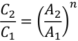

where 

- _C_ is the purchased equipment cost 

- _A_ is the equipment cost attribute (e.g., the thermal capacity) 

Subscript 2 designates the unit with required attribute 

Subscript 1 designates the unit with the base attribute, and 

_n_ is the scaling exponent (computed as 0.81 for the field-erected steam boilers in this analysis). 

A correlation for the installation factor (the ratio of the installed-equipment costs to the uninstalledequipment costs) was similarly determined based on a power law relationship between scaling factor and boiler capacity. The installation factor for the 0.200 MWth steam boiler was estimated as 3.9 using this approach. The natural gas steam-boiler specifications and capital costs for the thermal-output capacities selected in this evaluation are detailed in Table 6. An additional cost data point of 75 MWth was included to increase the accuracy of the scaling-factor analysis. 

Table 6. Natural gas steam boiler specifications and capital cost for selected thermal capacities (A field erected boiler unit equipment type) 

||||||
|---|---|---|---|---|
|Boiler Capacity (MWth)|0.2|15|75|150|
|Steam Pressure (kPa)|500|500|500|500|
|Flow Rate (kg/hr)|311.6|25,452|127,566|255,132|
|Equipment Cost|11,023|366,700|1,307,600|2,402,500|
|Direct Cost|42,969|666,400|1,730,000|2,935,700|
|Installation Factor|3.90|1.82|1.32|1.22|
|CAPEX ($/kW)|214.85|44.43|23.07|19.57|

## **6.3 Operating and Maintenance Costs** 

O&M costs are the second major cost category accounted for in the LCOH analysis. The O&M costs can be divided into fixed and variable costs. Fixed O&M costs include equipment-maintenance and labor costs. Variable O&M costs include expenses that vary with the process operation, such as the costs of fuel, feedstock, utilities, etc. 

Fixed O&M costs are incurred independently of system output. As previously indicated, this analysis assumes that the personnel required to operate and maintain the NPP and natural gas process-heat delivery systems are available from either the NPP or the process-heat end-use application such that no additional labor costs for the NPP TDL or natural gas boiler are required. Maintenance costs are assumed as 2% of the total direct equipment costs for each of the NPP and natural gas process-heat cases evaluated.[53] 

The variable O&M costs for process heat applications include energy input and fuel consumption for the NPP and natural gas process-heat cases, respectively. The NPP TDL economic analysis assumes that the nuclear heat is purchased from the NPP at a cost equal to the NPP O&M cost. The NPP O&M cost is generally reported in terms of $/MWhe for the electrical power output. The NPP power-cycle thermal efficiency is used to convert the NPP O&M cost to a thermal basis for the purposes of the LCOH calculation. In addition to thermal-energy costs, the NPP TDL uses electrical power to drive the HTF circulation pump. Although NPP O&M operating costs can be between $20 and $30/MWhe, a conservative value of $50/MWhe is used for the electrical power used by the TDL to reflect the possibility that this power may ultimately be purchased from the grid rather than directly at cost from the NPP. The natural gas process-heat cases assume that natural gas is purchased at a price of $4.04/MMBTU, which is the average value of projected industrial natural gas pricing from 2021 to 2040 in the U.S. EIA 2020 Annual Energy Outlook reference-case scenario.[54] 

A summary of the key economic analysis input parameters for comparison of NPP- versus natural gas-derived process heat is included in 

Table 7. 

Table 7. Economic analysis parameters for comparison of nuclear versus natural gas process heat 

## **6.4 Results and Discussion** 

The total direct capital costs for each of the NPP TDL cases evaluated are detailed in Figure 13. This figure illustrates that the capital costs for the NPP TDL increase with thermal capacity, as expected. It may also be observed from this figure that the heat-transport distance is a significant driver of system capital costs. The three cases with 150 MWth heat delivery have approximately equal heat-exchanger and HTF circulation-pump costs, but the TDL supply and return piping and HTF inventory significantly increase the overall capital costs for the 1000 m transport case relative to the 100 m case. It is also worth noting that the HTF piping and fluid inventories account for more than 50% of the total direct capital costs in the 1000 m transport case. 

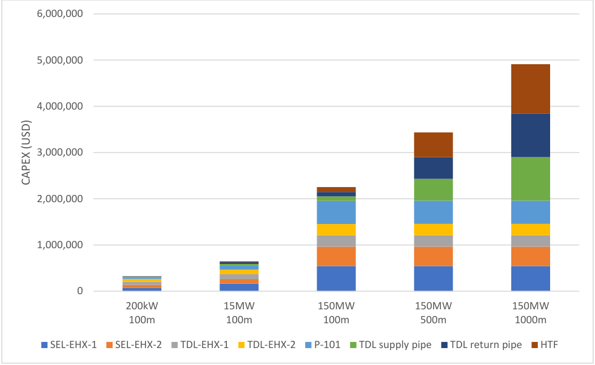

**----- Start of picture text -----** 
6,000,000 5,000,000 4,000,000 3,000,000 2,000,000 1,000,000 0 200kW 15MW 150MW 150MW 150MW 100m 100m 100m 500m 1000m SEL‐EHX‐1 SEL‐EHX‐2 TDL‐EHX‐1 TDL‐EHX‐2 P‐101 TDL supply pipe TDL return pipe HTF CAPEX (USD) **----- End of picture text -----** 

Figure 13. TDL total direct capital costs as a function of heat-delivery capacity and process-heat transport distance. 

The LCOH for the NPP TDL (100 m transport distance) and natural gas process-heat systems are shown in Figure 14. The natural gas process-heat costs do not vary as strongly with plant scale as do NPP process-heat costs. The cost of the natural gas process heat is driven mainly by fuel costs (capital costs and the associated debt servicing represent a relatively small fraction of the overall natural gas processheat cost). At the larger scales evaluated (i.e., 15 and 150 MWth), the cost of nuclear process heat is less than the cost of process heat derived from natural gas. At small scales (i.e., 200 kWth), nuclear process heat was determined to be more expensive than process heat from natural gas combustion. 

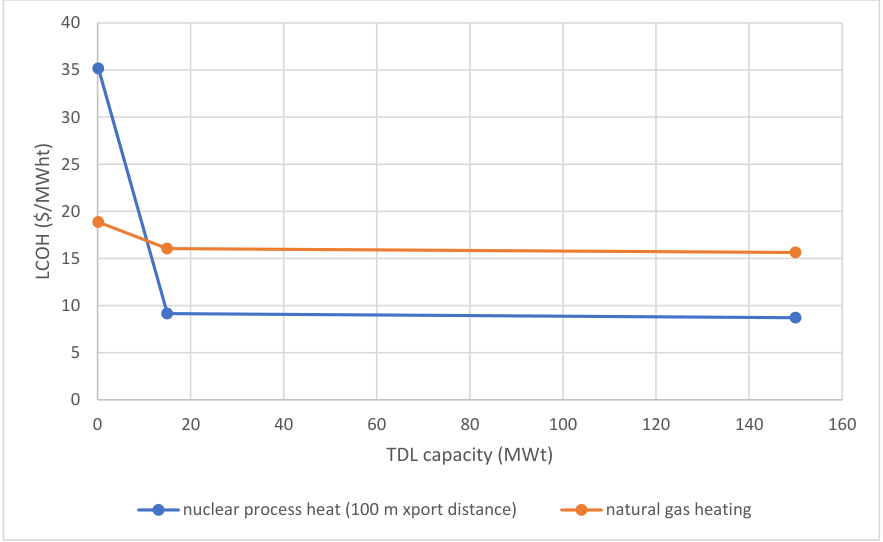

**----- Start of picture text -----** 
40 35 30 25 20 15 10 5 0 0 20 40 60 80 100 120 140 160 TDL capacity (MWt) nuclear process heat (100 m xport distance) natural gas heating LCOH ($/MWht) **----- End of picture text -----** 

Figure 14. LCOH versus TDL capacity for nuclear and natural gas process heating. Plotted data points are 

based on a heat transport distance of 100 meters. 

In small-scale systems, TDL capital costs are the primary driver for the increased LCOH of the nuclear process heat (Figure 15). 

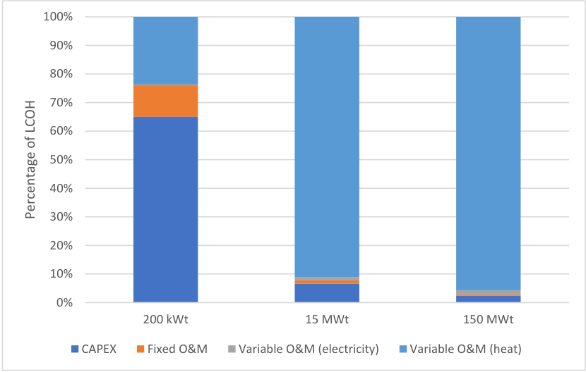

**----- Start of picture text -----** 
100% 90% 80% 70% 60% 50% 40% 30% 20% 10% 0% 200 kWt 15 MWt 150 MWt CAPEX Fixed O&M Variable O&M (electricity) Variable O&M (heat) Percentage of LCOH **----- End of picture text -----** 

Figure 15. LCOH cost component breakdown for 200 kWth and 15 and 150 MWth nuclear process heat cases. 

All cases are based on a heat-transport distance of 100 m, a nuclear heat cost of $8.33/MWhth (based on an NPP O&M cost of $25/MWhe at 33.3% thermal efficiency), and an electricity price of $50/MWhe. 

Increasing the TDL transport distance results in an increase in the TDL LCOH, but for the 150 MWth TDL cases with 1 km or less transport distances, the magnitude of the increase is relatively small, and nuclear process heat remains less expensive than natural gas-derived process heat. Several additional cases with TDL transport distances greater than 1 km were evaluated to determine the break-even point at which process heat delivered by the NPP TDL becomes more costly than natural gas process heat. This extended-transport-distance analysis was performed for the case of 150 MWth process-heat delivery at pipe lengths ranging from 5 to 20 km. The HYSYS TDL process model was used to evaluate thermal losses and pumping-power requirements. 

The heat-transfer losses associated with TDL transport distances greater than 5 km are calculated in HYSYS based on an input specification of buried uninsulated pipes with a soil temperature of 10°C. The increased pipe surface area associated with the longer transport distances results in increased thermal losses. The thermal losses associated with the increased TDL pipeline lengths are compensated for by extracting more energy from the NPP via the SBL. Although more energy must be extracted via the NPP SBL, the quantity of energy delivered to the process-heat application via the TDL heat exchangers remains constant at 150 MWth. The net result is that the TDL configurations with longer transport distances must purchase excess heat from the NPP (at additional cost) to deliver the specified 150 MWth heat duty to the process-heat customer. 

As the TDL pipeline length increases, the pumping power required to circulate the HTF increases. A larger pipe diameter of 36 in. was specified for TDL transport distances greater than or equal to 5 km to maintain similar heat-exchanger operating pressures throughout the range of transport distances evaluated. Increasing pipe diameter decreases fluid velocity and associated frictional losses; the increased frictional losses associated with the longer transport distances require significantly higher pump outlet pressures if the pipeline diameter is held constant. 

Because, at distances greater than 1 km, the pipeline will most likely be transporting heat between sites that do not share a common boundary, it is assumed that right-of-way costs in addition to the material, labor, and miscellaneous capital costs are included for the extended-transport-distance cases. Pipeline cost correlations [57] are used as the basis for calculating material, labor, right-of-way, and miscellaneous pipeline costs. This analysis assumes that the pipeline cost correlations for hydrogen transport, as evaluated in [11], are applicable for calculating HTF-piping costs. Additionally, the full pipeline costs are applied to both the HTF supply and return pipes; no reduction in the right-of-way or other pipeline costs are considered to account for the potential co-location of the two pipes. Because the operating pressure of the HTF circulation loop would be lower than that for hydrogen transport, and simultaneous installation of two pipes on a common path should lead to reductions in capital cost, it is expected that this approach will provide a conservative estimate of pipeline costs. 

In addition to TDL transport distance, NPP O&M costs have a significant impact on the cost competitiveness of NPP process heat with heat from natural gas. As shown in Figure 15 above, the NPP O&M cost (the cost of the heat input to the TDL) is a major driver of the cost of nuclear process heat for large-scale systems. LCOH is plotted for 150 MWth capacity NPP TDL systems as a function of heattransport distance and NPP O&M cost in Figure 16. It can be seen from this figure that break-even points for NPP- and natural gas-derived process heat occur at TDL transport distances of approximately 6, 8, and 10 km for systems with 150 MWth of delivered process heat and NPP O&M costs of $30, $25, and $20/MWhe, respectively. This analysis could be further refined in future studies by optimizing pipeline diameter to minimize pipe costs—smaller pipes have lower capital costs, but increased frictional-pressure losses and increased operating pressures that affect the design and, consequently, the costs of all TDL process equipment—instead of assuming a constant pipe diameter for all cases with TDL transport distances ≥ 5 km. 

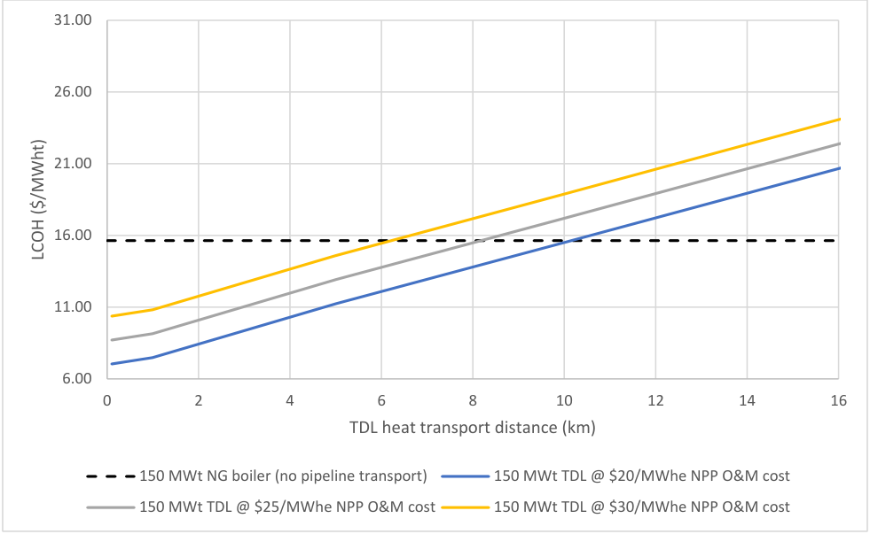

**----- Start of picture text -----** 
31.00 26.00 21.00 16.00 11.00 6.00 0 2 4 6 8 10 12 14 16 TDL heat transport distance (km) 150 MWt NG boiler (no pipeline transport) 150 MWt TDL @ $20/MWhe NPP O&M cost 150 MWt TDL @ $25/MWhe NPP O&M cost 150 MWt TDL @ $30/MWhe NPP O&M cost LCOH ($/MWht) **----- End of picture text -----** 

Figure 16. LCOH versus heat-transport distance and NPP O&M cost. Plotted data points are based on a TDL capacity of 150 MWth and NPP O&M costs ranging from $20 to $30/MWhe. Assumes natural gas is purchased at a price of $4.04/MMBTU, the average value of projected industrial natural gas pricing from 2021 to 2040 in the U.S. EIA 2020 Annual Energy Outlook reference-case scenario. 

Further inspection of LCOH as a function of NPP O&M costs indicates that for medium (15 MWth) and large-scale systems (150 MWth) with a transport distance of 0.1 km, nuclear plant O&M costs within the range of $10–30/MWhe [57] result in the LCOH for nuclear process heat remaining well below the LCOH for natural gas process heat (Figure 17). 

**----- Start of picture text -----** 
40 35 30 25 200 kWt @ 100 m distance 20 15 MW @ 100 m distance 150 MWt @ 100 m distance 15 200 kWt NG boiler 150 MWt NG boiler 10 5 0 5 10 15 20 25 30 35 NPP O&M Cost ($/MWe) LCOH ($/MWht) **----- End of picture text -----** 

Figure 17. Nuclear and natural gas process-heat LCOH versus NPP O&M cost with a transport distance of 0.1 km. 

This suggests that, for process-heat applications with temperature requirements attainable with nuclear process heat and situated in close geographic proximity to an LWR, use of a nuclear energy source is more economical than use of a natural gas energy source. Additionally, the nuclear process heat is not associated with CO2 emissions and possible costs associated with CO2 taxes or CO2 capture that natural gas heat sources may be subject to in the future. Future low-carbon credits that may be available to industries that decarbonize will improve the economics further. 

## **7. CONCLUSIONS** 

The domestic industrial sector is a substantial source of GHG emissions that, for the most part, are derived from fossil-fuel combustion to generate electricity or process heat. The existing domestic fleet of nuclear LWRs provide an opportunity to decarbonize a portion of industry by utilizing LWR heat for industrial processes in lieu of fossil-fuel combustion. These integrations would be synergistic because LWRs are currently under grid pressure to operate flexibly at less than their nameplate capacity with increasing frequency, which creates an opportunity to use the energy to create additional value, rather than turning down the LWR power. Markets for industrial heat were surveyed in this report for their potential to integrate with LWRs to serve industry heat-demand requirements. Markets specifically of interest include those that have heat requirements below 300°C where there may be a business case to locate new green-field industry near LWRs. 

Plastics recycling is not a significant thermal demand for a future industrial park. However, given the small heat-transfer amounts required, low risk, and environmental benefits, expanding recycling efforts using LWR heat could be a relatively straightforward way to dramatically reduce plastic-waste generation and utilize existing LWRs to improve the environment and provide a low-risk beginning for LWR TPE for use with green-field industrial facilities near LWRs. 

In general, processes that integrate well with LWRs are those that require substantial water evaporation (specialty chemicals, chlor-alkali, paper and pulp, and food processing) or have large electrical and thermal demands (chlor-alkali, in particular). In the petrochemicals industry, LWR process heat can be used to satisfy heat duties in specialty-chemical processes, typically for downstream separations, purifications, or plastics processing (to melt the polymer material). Also proposed is that LWR process water (taken from the nuclear loop as a saturated liquid) can be used as cooling fluid for exothermic processes receiving increasing attention in the chemicals industry, notably CO2 hydrogenation to methanol and methanol-to-hydrocarbons upgrading. Heat duties in the chlor-alkali, paper and pulp, and food-processing industries are almost exclusively to heat and/or evaporate water for product drying and purification. Large facilities in these industries can demand 100 to 250 MWth steam duties. When combined in an industrial park, these facilities would consume a significant fraction of an LWR’s energy output, even before considering the (substantial) electrical demands. A well-designed industrial park, containing multiple interacting processes, could produce a variety of value-added chemical processes efficiently and with minimal GHG emissions, reducing the climate impact of key industrial processes. A key finding of this technical analysis is that purely thermal demands needed for a particular process are unlikely to consume all of the energy generated by an LWR; therefore, large electrical demands, likely electrolysis processes (either chlor-alkali, water splitting, or alkane deprotonation), will be required to effectively use the entirety of an LWR’s output. 

As a result of the market study, concepts for a hypothetical energy park centered around an LWR were developed and presented. Various candidate industrial processes were fit together in ways that provide synergy to the energy park as a whole, as shown in Figure 18, in which CO2 produced by an ethane steam-cracker burner is captured by an MCFC and upgraded through hydrogenation and MTO processes. Parallel brine- and water-electrolysis reactions produce chlorine, caustic soda, hydrogen, and oxygen. These products are combined with the two olefin/aromatics streams in a chemicals- and polymers-synthesis plant. The exact production of this plant can be determined by costs and market conditions, but the proposed arrangement provides the flexibility to synthesize a wide variety of commodity chemicals, specialty chemicals, and polymers. The goal of the energy park is to manufacture multiple industrial products at competitive costs while using LWR energy to minimize GHG emissions. The energy park contains four classes of industrial processes, each with a critical function: (1) electrochemical processes requiring heat input, (2) exothermic thermochemical processes (T >350°C), (3) endothermic thermochemical processes with associated carbon capture (T >700°C), and (4) mature industrial-demand sources with technical potential for LWR thermal integration (T <200°C). Heat and mass integration between these processes will depend on the specific process selections, plant geometry, and overall process conditions. The concept and function of each process class, including TRLs of specific technologies, are discussed below. 

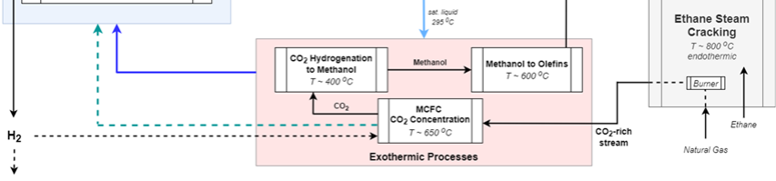

Removing heat from LWRs for purposes other than electricity generation is being investigated in separate INL studies. In this report, a preliminary excerpt model is used to show preliminary mass and energy balances of a conceptual thermal-energy extraction system whereby thermal energy is taken from the LWR and transferred to a conceptual industrial process by means of a TDL. Capital and operating costs were derived from the process model in order to calculate a simplified LCOH when extracted from the LWR. For comparison these results were compared to a calculated LCOH when using a conventional natural gas boiler. The results showed that at large scale (15–150 MWth), the heat from an LWR is more cost effective than natural gas combustion up to a 1 km distance for the heat transported from the LWR to the industrial process (Figure 18 and Figure 19). Diminishing returns apply to longer lengths of the thermal transport loop from the LWR to industry; thus, the concept of an energy park in close proximity to the LWR is the most plausible use case for the heat from LWRs. 

LCOH is plotted for 150 MWth capacity NPP TDL systems as a function of heat-transport distance and NPP O&M cost in Figure 19. It can be seen from this figure that break-even points for NPP- and natural gas-derived process heat occur at TDL transport distances of approximately 6, 8, and 10 km for systems with 150 MWth of delivered process heat and NPP O&M costs of $30, $25, and $20/MWhe, respectively. This analysis could be further refined in future studies by optimizing pipeline diameter to minimize pipe costs instead of assuming a constant pipe diameter for all cases with TDL transport distances ≥5 km. This is because smaller pipes have lower capital costs, but increased frictional-pressure losses and increased operating pressures that affect the design. Consequently, the costs of all TDL process equipment would decrease. 

**----- Start of picture text -----** 
31.00 26.00 21.00 16.00 11.00 6.00 0 2 4 6 8 10 12 14 16 TDL heat transport distance (km) 150 MWt NG boiler (no pipeline transport) 150 MWt TDL @ $20/MWhe NPP O&M cost 150 MWt TDL @ $25/MWhe NPP O&M cost 150 MWt TDL @ $30/MWhe NPP O&M cost LCOH ($/MWht) **----- End of picture text -----** 

Figure 19. LCOH versus heat-transport distance and NPP O&M cost. Plotted data points are based on a TDL capacity of 150 MWth and NPP O&M costs ranging from $20 to $30/MWhe. Assumes natural gas is purchased at a price of $4.04/MMBTU, the average value of projected industrial natural gas pricing from 2021 to 2040 in the U.S. EIA 2020 Annual Energy Outlook reference-case scenario. 

Further inspection of LCOH as a function of NPP O&M costs indicates that, for medium- (i.e., 15 MWth) and large-scale systems (150 MWth) with a transport distance of 0.1 km, NPP O&M costs within the range of $10-30/MWhe [6, 7] result in the LCOH for nuclear process heat remaining well below the LCOH for natural gas process heat (Figure 20). 

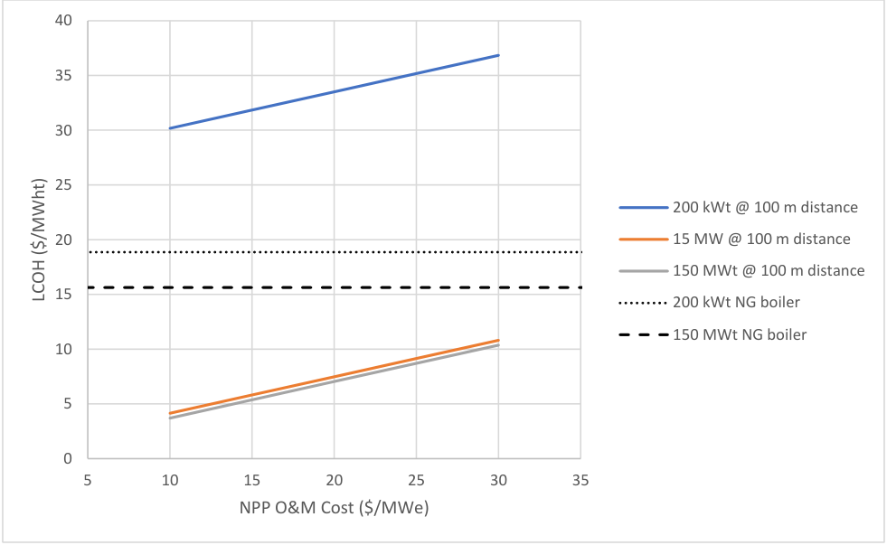

**----- Start of picture text -----** 
40 35 30 25 200 kWt @ 100 m distance 20 15 MW @ 100 m distance 150 MWt @ 100 m distance 15 200 kWt NG boiler 150 MWt NG boiler 10 5 0 5 10 15 20 25 30 35 NPP O&M Cost ($/MWe) LCOH ($/MWht) **----- End of picture text -----** 

Figure 20. Nuclear and natural gas process-heat LCOH versus NPP O&M cost with a transport distance of 0.1 km. 

This suggests that for process-heat applications with temperature requirements attainable with nuclear process heat and situated in close geographic proximity to an LWR, use of a nuclear energy source is more economical than use of a natural gas energy source. Additionally, the nuclear process heat is not associated with CO2 emissions and the possible costs associated with CO2 taxes or CO2 capture that natural gas heat sources may be subject to in the future. Future low-carbon credits that may be available to an industry that decarbonizes will improve the economics further. 

Thermal-energy storage may be an essential part of the process of transporting heat from an LWR to an industrial process and would allow for variability on either end. Thus, two TES systems were compared. It was shown that a latent-heat TES may have some advantages over a conventional sensibleheat TES system and may cost less. The in-depth study and development of latent-heat and other energystorage systems is the topic of future research. 

## **8. REFERENCES** 

1. K. Levin, and D. Rich. (2017) “Turning Points: Trends in Countries’ Reaching Peak Greenhouse Gas Emissions over Time.” World Resources Institute Publication. Retrieved May 10, 2020 from https://www.wri.org/publication/turning-points-trends-countries-reaching-peak-greenhouse-gasemissions-over-time. 

2. Energy Information Administration. (2020a) “Total Energy: Industrial Sector Energy Consumption.” Retrieved June 19, 2020 from https://www.eia.gov/totalenergy/data/browser/index.php?tbl=T02.04. 

3. R. Boardman et al. (2019) _Evaluation of Non-Electric Market Options for a Light Water Reactor in the Midwest_ . Report INL/EXT-19-55090. 

4. L. T. Knighton et al. (2020) _Scale and Regionality of Non-Electric Markets for U.S. Nuclear Light Water Reactors (LWRs)_ . Report INL/EXT-20-57885-Rev.000. DOI:10.2172/1615670. 

5. C. McMillan et al. (2016) _Generation and Use of Thermal Energy in the U.S. Industrial Sector and Opportunities to Reduce its Carbon Emissions_ . Report NREL/TP-6A50-66763; Report INL/EXT-1639680. 

6. Environmental Protection Agency [EPA] (2019) “Inventory of U.S. Greenhouse Gas Emissions and Sinks.” Retrieved May 2, 2020 from https://www.epa.gov/ghgemissions/inventory-us-greenhousegas-emissions-and-sinks. 

7. J. Friedmann, Z. Fan, and K. Tang. (2019) “Low-carbon heat solutions for heavy industry: sources, options, and costs today.” Columbia Center on Global Energy Policy. Retrieved May 15, 2020 from https://energypolicy.columbia.edu/research/report/low-carbon-heat-solutions-heavy-industry-sourcesoptions-and-costs-today. 

8. Intergovernmental Panel on Climate Change. (2018). “IPCC Special Report on Global Warming: Chapter 10—Industry”. Retrieved May 2, 2020 from https://www.ipcc.ch/site/assets/uploads/2018/02/ipcc_wg3_ar5_chapter10.pdf. 

9. International Energy Agency. (2019) “Tracking Industry 2019.” Retrieved June 1 2020 from https://www.iea.org/reports/tracking-industry-2019. 

10. Energy Information Administration. (2020b) “U.S. energy-related carbon dioxide fell by 2.8% in 2019, slightly below 2017 levels.” Retrieved May 20, 2020 from https://www.eia.gov/todayinenergy/detail.php?id=43615#. 

11. Energy Information Administration. (2019a) “U.S. Energy Flow, 2018.” Retrieved June 1, 2020 from https://www.eia.gov/totalenergy/data/monthly/pdf/flow/total_energy.pdf. 

12. Nuclear Regulatory Commission. (2019) “Operating Nuclear Power Reactors (by Location or Name.” Retrieved April 15, 2020 from https://www.nrc.gov/info-finder/reactors/. 

13. Nuclear Regulatory Commission. (2012) “2012-2013 Information Digest.” NUREG-1350, Vol. 24, p. 28. Retrieved June 2, 2020 from 

http://large.stanford.edu/courses/2015/ph241/zarubin1/docs/ML12241A166.pdf. 

14. Energy Information Administration. (2019b) “U.S. refinery capacity reaches record high at the start of 2019.” Retrieved June 5, 2020 from https://www.eia.gov/todayinenergy/detail.php?id=40012#:~:text=As%20of%20January%201%2C%2 02019,at%20the%20beginning%20of%201981. 

15. Credence Research. (2016) “Transportation Fuel Market by Fuel – Growth, Future Prospects, & Competitive Analysis. 2016-2023.” Retrieved June 3, 2020 from https://www.credenceresearch.com/report/transportation-fuels-market. 

16. Statista. (2017) “U.S. petrochemicals market size by product 2017. Retrieved May 28, 2020 from https://www.statista.com/statistics/1098199/us-petrochemical-market-size-by-product/. 

17. Deloitte. (2019) “The Future of Petrochemicals: Growth Surrounded by Uncertainty.” Retrieved May 20, 2020 from https://www2.deloitte.com/us/en/pages/energy-and-resources/articles/base-chemicalstransform-petrochemicals-industry.html. 

18. Statista. (2020a) “Cement production globally and in the U.S. from 2010 to 2019.” Retrieved June 8, 2020 from https://www.statista.com/statistics/219343/cement-production-worldwide/. 

19. World Steel Association. (2019) “World Steel in Figures 2019.” Report published December 2019. 

20. American Chemistry Council. (2019) “Chlorine Production.” Retrieved May 20, 2020 from https://chlorine.americanchemistry.com/Chlorine/ChlorineProduction/. 

21. Industry Arc. (2020) “Chlorine Market – Forecast (2020 – 2025).” Retrieved May 19, 2020 from https://www.industryarc.com/Report/15777/chlorine-market.html. 

22. Statista. (2020b) “Ammonia production in the United States from 2014 to 2019.” Retrieved May 15, 2020 from https://www.statista.com/statistics/982841/us-ammonia-production/. 

23. Statista. (2020c) “Total resin production in the United States from 2008 to 2018.” Retrieved May 15, 2020 from https://www.statista.com/statistics/203398/total-us-resin-production-from-2008/. 

24. IBIS World. (2019) “Petroleum refining in the US. Market Size 2005 – 2026.” Retrieved June 6, 2020 from https://www.ibisworld.com/industry-statistics/market-size/petroleum-refining-unitedstates/). 

25. A. Elgowainy et al. (2019) “Hydrogen Demand Analysis for H2@Scale.” Presentation at the 2019 DOE Hydrogen and Fuel Cells Program Annual Merit Review. Retrieved June 2, 2020 from https://www.hydrogen.energy.gov/pdfs/review19/sa172_elgowainy_2019_o.pdf. 

26. Illinois Power Agency. (2017) "Zero-Emission Standard Procurement Plan – FINAL.” Retrieved May 15, 2020 from https://www2.illinois.gov/sites/ipa/Documents/2018ProcurementPlan/Zero-EmissionStandard-Procurement-Plan-Approved.PDF. 

27. State Power Project. (2017) “Commerce Clause and Supremacy Clause Challenge to Nuclear Zero Emission Credit Program.” Retrieved June 2, 2020 from https://statepowerproject.org/illinois/. 

28. T. Mai et al. (2018) “Electrification Futures Study: Scenarios of Electric Technology Adoption and Power Consumption for the United States.” Report NREL/TP-6A20-71500. Retrieved June 6, 2020 from https://www.nrel.gov/docs/fy18osti/71500.pdf. 

29. D. Marlin, E. Sarron, and O. Sigurbjornsson. (2018) “Process advantages of direct CO2 to methanol synthesis.” Frontiers in Chemistry. DOI:10.3389/fchem.2018.00446. 

30. I. Yarulina et al. (2018) “Recent trends and fundamental insights in the methanol-to-hydrocarbons process.” Nature Catalysis (1):398-411. 

31. Cemnet. (2019) “Cement Plants Located in the United States.” Online database accessed May 20, 2020 from https://www.cemnet.com/global-cement-report/country/united-states. 

32. A. Ligthart. (2018) “Who’s who in North American cement imports.” Cement Distribution Consultations presentation. Retrieved June 2, 2020 from https://cementdistribution.com/wpcontent/uploads/2018/11/Who-is-who-in-North-American-cement-imports.pdf. 

33. Statista. (2019) “Chlorine production in the United States from 1990 to 2018.” Retrieved June 2, 2020 from https://www.statista.com/statistics/974614/us-chlorine-production-volume/. 

34. Office of Energy Efficiency and Renewable Energy. (2006) “Advanced Chlor-Alkali Technology.” Retrieved June 2, 2020 from 

   - https://www1.eere.energy.gov/manufacturing/industries_technologies/imf/pdfs/1797_advanced_chlor -alkali.pdf. 

35. H. Xu et al. (2020) “Electrochemical ammonia synthesis through N2 and H2O under ambient conditions: Theory, practices, and challenges, for catalysts and electrolytes.” Nano Energy 69:104469. https://doi.org/10.1016/j.nanoen.2020.104469. 

36. R. Zhao et al. (2019) “Recent progress in the electrochemical ammonia synthesis under ambient conditions.” EnergyChem 1:100011. https://doi.org/10.1016/j.enchem.2019.100011. 

37. P. Bergand O. Lingqvis. (2019). “Pulp, paper, and packaging in the next decade: Transformational change.” McKinsey & Company Report. Retrieved June 4, 2020 from https://www.mckinsey.com/industries/paper-forest-products-and-packaging/our-insights/pulp-paperand-packaging-in-the-next-decade-transformational-change#. 

38. BCC Research (2019). “2019 Food and Beverage Research Review”. Retrieved June 5, 2020 from https://www.bccresearch.com/market-research/food-and-beverage/food-and-beverage-researchreview.html. 

39. United States Department of Agriculture. (2020) “Food and Beverage Manufacturing.” Retrieved June 19, 2020 from https://www.ers.usda.gov/topics/food-markets-prices/processingmarketing/manufacturing/. 

40. T. Hundertmark et al. (2018) “How plastics waste recycling could transform the chemical industry.” McKinsey & Company Report. Retrieved May 4, 2020 from https://www.mckinsey.com/industries/chemicals/our-insights/how-plastics-waste-recycling-couldtransform-the-chemical-industry. 

41. L. Parker. (2018) “The world’s plastic pollution crisis.” National Geographic article. Retrieved June 19, 2020 from https://www.nationalgeographic.com/environment/habitats/plastic-pollution/. 

42. K. Frick et al. (2019) “Evaluation of Hydrogen Production Feasibility for a Light Water Reactor in the Midwest.” Report INL/EXT-19-55395. 

43. D. Ding et al. (2018) “A novel low-thermal-budget approach for the co-production of ethylene and hydrogen via the electrochemical non-oxidative deprotonation of ethane.” Energy and Environmental Science 11:1710-1716. 

44. S. Jarvis and S. Samsatli. (2018). “Technologies and infrastructures underpinning future CO2 value chains: a comprehensive review and comparative analysis.” Renewable and Sustainable Energy Reviews 85:46-68. https://doi.org/10.1016/j.rser.2018.01.007. 

45. M. Eisler. (2018) “Fuel cell finally find a killer app: Carbon capture.” IEEE Spectrum article. Retrieved May 2, 2020 from https://spectrum.ieee.org/green-tech/fuel-cells/fuel-cells-finally-find-akiller-app-carbon-capture. 

46. W. Ernst et al. (2007) “World Best Practice Energy Intensity Values for Selected Industrial Sectors.” LBNL Report 62806. Retrieved June 2, 2020 from https://www.osti.gov/servlets/purl/927032RWG8Cg/). 

47. C. Murphy et al. (2019) _The Potential Role of Concentrating Solar Power within the Context of DOE's 2030 Solar Cost Targets_ . Report NREL/TP-6A20-71912. National Renewable Energy Laboratory, Golden, CO (United States). 

48. Application Documents for the NuScale Design. (n.d.). Retrieved June 18, 2020, from https://www.nrc.gov/reactors/new-reactors/smr/nuscale/documents.html. 

49. M. S. Sohal et al. (2010) _Engineering database of liquid salt thermophysical and thermochemical properties._ Report INL/EXT-10-18297. Idaho National Laboratory. 

50. M. Montané et al. (2017) “Techno-economic forecasts of lithium nitrates for thermal storage systems.” Sustainability, 9(5), 810. 

51. Chloecox. (2019, September 09). “Andasol 1 Goes into Operation.” Retrieved June 19, 2020, from https://www.renewableenergyworld.com/2008/11/06/andasol-1-goes-into-operation-54019/. 

52. MetalMiner. “Sourcing & Trading Intelligence for Global Metals Markets.” Retrieved June 18, 2020, from https://agmetalminer.com/metal-prices/carbon-steel/. 

53. V. Nian et al. (2016) “A Comparative Cost Assessment of Energy Production from Central Heating Plant or Combined Heat and Power Plant,” Energy Procedia 104, pp. 556–561. 

54. U.S. Energy Information Administration. (2020) “Annual Energy Outlook 2020,” Available: https://www.eia.gov/outlooks/aeo/. 

55. C. W. Robak, T. L. Bergman, and A. Faghri. (2011) “Economic evaluation of latent heat thermal energy storage using embedded thermosyphons for concentrating solar power applications,” Solar Energy 85.10, pp. 2461–2473. 

56. DOW Chemical Company, “DOWTHERM A Technical Data Sheet,” Available: https://www.dow.com/en-us/pdp.dowtherm-a-heat-transfer-fluid.238000z.html. 

57. Nuclear Energy Institute. (2019) “Nuclear Costs In Context,” September, Available: https://www.nei.org/resources/reports-briefs/nuclear-costs-in-context. 

58. World Nuclear Association. (2005) “The New Economics of Nuclear Power.” 

## **Appendix 1** 

## **THERMAL ENERGY EXTRACTION AND STORAGE MATERIAL and ENERGY BALANCES** 

## **Appendix 1** 

## **THERMAL ENERGY EXTRACTION AND STORAGE MATERIAL and ENERGY BALANCES** 

Stream operating conditions for Cases 1, 2, and 3: thermal dispatch 150 MW at 1, 0.5, and 0.1 km. 

Stream operating conditions for Case 4: thermal dispatch 15 MW at 0.1 km. 

Stream operating conditions for Case 5: thermal dispatch 200 kW at 0.1 km. 

Stream operating conditions for Case 6: thermal dispatch 200 kW at 0.1 km (TEDS comparison). 

