INL/EXT-07-12967 Revision 1 

## **Next Generation Nuclear Plant Pre-Conceptual Design Report** 

## November 2007 

This information was prepared as an account of work sponsored by an agency of the U.S. Government.  Neither the U.S. Government nor any agency thereof, nor any of their employees, makes any warranty, expressed or implied, or assumes any legal liability or responsibility for the accuracy, completeness, or usefulness, of any information, apparatus, product, or process disclosed, or represents that its use would not infringe privately owned rights.  References herein to any specific commercial product, process, or service by trade name, trade mark, manufacturer, or otherwise, does not necessarily constitute or imply its endorsement, recommendation, or favoring by the U.S. Government or any agency thereof.  The views and opinions of authors expressed herein do not necessarily state or reflect those of the U.S. Government or any agency thereof. 

## **INL/EXT-07-12967 Revision 1** 

## **November 2007** 

**Prepared for the U.S. Department of Energy Office of Nuclear Energy Under DOE Idaho Operations Office Contract DE-AC07-05ID14517** 

**Revision 1** 

## **EXECUTIVE SUMMARY OF RESULTS, RECOMMENDATIONS, AND CONCLUSIONS** 

The Next Generation Nuclear Plant (NGNP) will be a demonstration of the technical, licensing, operational, and commercial viability of High Temperature Gas-Cooled Reactor (HTGR) technology for the production of process heat, electricity, and hydrogen.  This nuclear based technology can provide high-temperature process heat (up to 950°C) that can be used as a substitute for the burning of fossil fuels for a wide range of commercial applications.  The substitution of the HTGR for burning fossil fuels conserves these hydrocarbon resources for other uses, reduces uncertainty in the cost and supply of natural gas and oil, and eliminates the emissions of greenhouse gases attendant with the burning of these fuels.  The HTGR is a passively[1] safe nuclear reactor concept with an easily understood safety basis that permits substantially reduced emergency planning requirements and improved siting flexibility compared to current and advanced light water reactors (LWRs). 

In the _Energy Policy Act of 2005_ (EPAct), the Department of Energy (DOE) was tasked with providing a demonstration of this HTGR technology to economically and reliably produce electricity and hydrogen by the year 2021.  As the lead nuclear technology development laboratory of the DOE, the Idaho National Laboratory (INL) has initiated the work necessary to complete this task.  The EPAct also stipulated that the task should be undertaken in partnership with the industrial end users of the technology.  To that end, a working group has been assembled consisting of suppliers of the technology, nuclear plant owner/operators, other supportive technology companies, and potential end users.  The objective of the working group is to form an Alliance that would provide the private sector perspective and direction for completion of the NGNP in partnership with the DOE.  The Alliance will support the selection of the specific operating conditions and configuration for NGNP to ensure it meets private sector expectations, commence management of the project using commercial processes, share the cost of design and construction with the government, and secure a commercial nuclear operating company to operate the plant. 

In FY-07, Pre-Conceptual Design (PCD) work was completed by the NGNP Project at the INL with the objective of developing a framework in which the design and technology development of the NGNP could progress and to begin to develop bases for selection of the specific design and operational characteristics of NGNP.  This work was completed by three contractor teams with extensive experience in HTGR technology, nuclear power applications, and hydrogen production.  The teams were led by Westinghouse Electric Company, LLC; AREVA NP, Inc.; and General Atomics.  The scope of work included completion of special studies to address key aspects of the NGNP (e.g., reactor type, power levels, power conversion system [PCS] and heat transfer / transport system [HTS] designs, licensing and end product disposition).  The results of these special studies were applied to the development by each contractor of a recommended design for NGNP and a commercial version of the HTGR.  These were then used to estimate costs and schedule for design; construction; licensing; startup and testing; operation; and deactivation, decontamination, and decommissioning (DD&D) of the NGNP and an economic assessment for an Nth of a kind (NOAK) commercial plant.  A primary objective of this work is to identify research 

> 1 “Passive,” as used here, means that the performance of engineered systems (e.g., the reactor cavity cooling system) are relied upon in the safety analyses, but without requiring any component in those systems to maintain or change state to satisfy the safety functions. 

and development (R&D), data needs, and future studies required to support selection of key characteristics of and to support the design and licensing processes for the NGNP. 

The Preliminary Project Management Plan (PPMP) for the NGNP identifies two planning options that weigh a range of programmatic risks and approaches to mitigating risk. The two options are compliant with the EPAct, but emphasize different approaches to technology development risks, design and construction risks, and the extent of demonstration in support of commercialization.  Option 1, labeled the Milestone Compliant option, establishes an overall schedule based on the milestone dates in the EPAct for Phase I and Phase II, and emphasizes extended R&D activities before proceeding with design and construction activities.  Start of operations and project completion for this option is scheduled for 2021. 

Option 2, labeled the Balanced Risk option, assesses the overall project risk with the objective of balancing technology development risk against design, licensing, and construction risk.  Emphasis is on initiating design and licensing work as early as practical to reduce the uncertainties in the scope and focus of R&D activities.  The expected date for initial operations (following the test program) is 2018.  This option allows for a two- to three-year period of operation (prior to 2021) simulating a commercial power reactor operating cycle that is followed by an extensive outage, during which the equipment performance is confirmed by detailed disassembly and inspection.  This proof-of-principle operating period provides support for commercialization decisions by industry. 

Option 2 was chosen by the NGNP Project as the reference schedule for preconceptual design activities.  Discussions with the private sector indicate a strong preference for the Option 2 schedule, which will support commercialization at the earliest date practical.  Setting the Option 2 schedule as the goal for the NGNP Project provides margin to and supports the objectives of the EPAct for demonstration of the technology by 2021 while addressing the needs and expectations of the private sector. 

A brief discussion of HTGR technology and the extension of the current state-of-the-art of this technology required to meet NGNP performance objectives is provided in Appendix A. 

## **Pre-Conceptual Design Work and Report Objectives** 

There were several objectives for the FY-07 Pre-Conceptual Design work: 

- Initiate development of the functional and operational requirements (F&ORs) and the configuration of the NGNP 

- Provide direction to the NGNP Project R&D programs to ensure they support design development, licensing, construction, and deployment of the NGNP by 2018 

- Support development of the licensing strategy for the NGNP with the objective that the strategy should support operation of the NGNP in 2018 and, ultimately, development of a Certification of Design for the use of the HTGR technology in the private sector 

- Develop pre-conceptual designs with sufficient detail to provide credible estimates of the schedule and costs for NGNP and a NOAK plant 

- Perform economic assessments for the NOAK plant to confirm the economic viability of the HTGR technology in production of electricity and hydrogen. 

To meet these objectives, the contractor teams were tasked to define the state-of-the-art in HTGR technology in FY-07 and the advancements that could be made in that technology assuming deployment of the NGNP in 2018.  This work was based on prior work of each reactor vendor on development of 

HTGR technology and the experience and capabilities of their team members.  These tasks defined design values and configurations of the reactor (e.g., reactor design, power level, gas temperatures and gas pressures), the HTS (e.g., type, heat exchanger effectiveness, operating temperatures), the PCS (e.g., configuration, power level and efficiency), and the hydrogen production processes for potential application in the NGNP.  The capability and availability of materials, fabrication technologies, licensing issues, and development requirements to support effective use of the technology in private sector process heat applications (e.g., electricity, steam and hydrogen production) were focus issues. 

The results and conclusions of the PCD define key technical risks and specific requirements that will govern the evaluations and design development required to be completed in continuing NGNP design progression.  It was not an objective of the PCD work to make a final decision on the operating conditions and configuration of NGNP, but to provide the foundation for making the decisions.  The decision process will depend on results from: 

- Completion of additional evaluations on key issues (e.g., power levels, gas temperatures and pressures, IHX design, and materials) 

- Planning for the development and acquisition of fuel, graphite, high temperature materials, and analysis methods 

- Coordination with the Nuclear Hydrogen Initiative (NHI) program 

- Licensing strategy development 

- Due diligence to establish the technical completeness and credibility of work already completed by the contractor teams 

- Further characterization of the marketplace for the HTGR technology by the potential end users and input from the commercial Alliance. 

The NGNP Project schedule currently assumes that the key decisions will begin to be made in mid CY-08 as part of conceptual design.  It is anticipated that the Alliance will be able to support making these decisions at that time. 

This report summarizes the scope, results, and conclusions of the work completed during the PCD Phase for the NGNP.  This includes the operating conditions, plant configuration, data, and development needs, including required future studies, cost and schedule estimates, and the economic assessments of the three contractor teams.  This report also identifies the key technical risks for completion of the NGNP and the steps that need to be taken to resolve these risks.  This report provides a part of the foundation for advancing the design progression of the NGNP, identifying the next steps in the design progression, and providing bases for interfacing with potential end-users and for obtaining necessary support from the Alliance in making the final decisions on the operating conditions and configuration of the NGNP.  This report, however, is only one document of many documents and programs that support establishing NGNP requirements and planning.  The others include: 

- _Energy Policy Act of 2005_ 

- _Next Generation Nuclear Plant High Level Functions and Requirements_ , INEEL/EXT-0301163 

- _Design Features and Technology Uncertainties for the Next Generation Nuclear Plant_ , INL/EXT-04-01816 

- _Next Generation Nuclear Plant Preliminary Project Management Plan_ , INL/EXT-05-00952 

- R&D program plans 

- NHI program plans 

- Licensing Strategy Development Program and plans 

- Alliance working group white papers and end-user requirements. 

The following sections first summarize the results, conclusions, and recommendations of the contractor teams.  Second, they summarize the path forward for NGNP design development that is indicated from evaluation of the results, conclusions, and recommendations of the contractor teams. 

## **Pre-Conceptual Design Team Recommendations** 

## Plant Operating Conditions and Configuration 

Table ES-1 summarizes the key results of each contractor teams’ evaluations and recommendations for the NGNP operating conditions and configuration. 

Table ES-1 Summary of Results 

These recommendations represent the judgment of the reactor vendors on what can be achieved for use in NGNP assuming an operational date of 2018.  These are based on the current state of the design work related to HTGR by each contractor and prior commercial applications of gas-cooled reactor technology (see Appendix A).  The reactor vendors note that achieving the recommended operating conditions requires significant design, licensing, and development effort. 

Completing this effort to support operation of the plant in 2018, requires balancing the selection of initial operating conditions and the plant configuration for NGNP against the schedule and cost risks associated with design, licensing, R&D and construction.  This balance must also consider the impact of technology selections and operating conditions on the viability of translating the NGNP experience to private sector applications.  Later sections of this Executive Summary discuss how this balance can be struck in the progression of the NGNP design. 

## Licensing Strategies 

As requested in the PCD Statement of Work (SOW), the contractor teams provided several potential strategies for obtaining a Nuclear Regulatory Commission (NRC) license for the NGNP.  These strategies reflected the very preliminary nature of the NGNP design and the uncertainty in the approach the NRC will take in addressing the license applications for the NGNP.  As required by EPAct, the approach for licensing the NGNP is being developed through a joint effort between DOE and the NRC.  The PCD work, particularly that identifying the R&D and code committee work that will be needed to support the licensing process, will support this development.  This effort is scheduled to be completed in FY-08 and will establish the basis for the detailed NGNP licensing strategy. 

## Cost Estimate 

All three contractor teams prepared pre-conceptual level cost estimates and schedules as part of the PCD work for the NGNP.  The cost estimates were developed using different methodologies that included parametric modeling, vendor quotes, actual costs, and proprietary costing databases.  NGNP Project Engineering reviewed the assumptions and bases of estimate that supported the cost estimates for credibility and performed multiple studies to reconcile the variations in scope and assumptions among the three cost estimates.  This effort resulted in an estimated range of $3.8B to $4.3B for completion of the NGNP.  This range is based on the information and evaluations available to date and reflects possible contingency requirements.  Figure ES-1 depicts the funding profile that would be required based on this 

estimate to meet the 2018 operational date for the NGNP.  These costs estimates will be updated with higher confidence levels as design development progresses. 

The cost estimates provided by the contractor teams for the NOAK commercial plant were all in the same range.  All contractor teams proposed 4-unit plants with thermal power levels between 2000 MWt and 2400 MWt at a cost of about $4B, including owners cost.  This value was used in the economic assessments. 

## **NGNP Project Nuclear System Cost Profile (Pre-Conceptual Design Estimate)** 

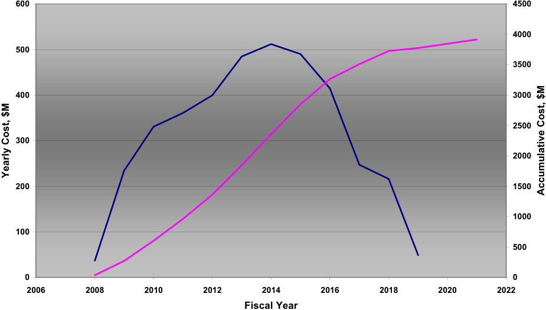

**----- Start of picture text -----** 
600 4500 4000 500 3500 400 3000 2500 300 2000 200 1500 1000 100 500 0 0 2006 2008 2010 2012 2014 2016 2018 2020 2022 Fiscal Year Yearly Cost, $M Accumulative Cost, $M **----- End of picture text -----** 

Figure ES-1. NGNP Project funding profile (based on pre-conceptual design cost estimates and operational date of 2018) 

## Schedule 

The three contractor teams prepared pre-conceptual level schedules highlighting critical paths for initial operation of the NGNP in 2018.  The NGNP Project reconciled these schedules in extensive reviews by cognizant Battelle Energy Alliance (BEA) / INL personnel to prepare an initial project schedule.  The schedule was prepared consistent with the Work Breakdown Structure (WBS) for the project.  Both this schedule and the WBS are presented in Section 8 and related Appendices of this report. 

The schedule identifies the key milestones that must be met to achieve the objective of operation in 2018.  Key milestones include the Critical Decision points for completion of design, long lead procurement initiation, start of construction, and approval for operation.  They also include the submittal and receipt of critical regulatory documentation – Limited Work Authorization (LWA), Permit to Construct (PTC), and receipt of an Operating License from the NRC.  The current critical paths for meeting the 2018 operational date are tied to completion of fuel qualification and completing the NRC licensing process. 

As the licensing strategy matures (e.g., potentially adopting the one-step licensing process currently being used for licensing of light water power reactors versus the two-step process on which the current schedule is based) and the selection of NGNP operating conditions and configuration progresses, the schedule will be updated with the goal of establishing critical paths that support initial operation in 2018. 

## Economic Assessment 

Each of the contractor teams prepared an economic assessment using their recommended design for a NOAK commercial plant producing hydrogen and, in one case, electricity.  The contractor teams did not use the same economic assessment methodology, nor did they assume the same values for key economic parameters.  For these reasons, the NGNP Project included a review of the contractor teams’ methods and results and then revised each team’s assessment using, in general, more conservative but consistent assumptions for key parameters and a consistent methodology.  These revised assessments were performed using the costs (e.g., capital, operations, DD&D) estimated by each contractor team.  A fourth assessment was then performed using the costs that were developed by the NGNP Project in reconciling the cost estimates provided by the three contractor teams. 

The results of these analyses confirm the economic viability of the HTGR technology in two markets when compared with current technologies and prices of natural gas.  Internal rates of return (IRR) in the 10% range were calculated for hydrogen and electricity production using conservative assumptions in an inflationary market.  Accordingly, these results support the continued development of the NGNP and fostering the private sector application of the HTGR technology. 

## Technology Selection and Design Development Studies 

The PCD work identified a number of areas that require further study to support the final selection of NGNP operational and physical characteristics (addressed herein as Technology Selection Studies) and to support design development of the NGNP (addressed herein as Design Development Studies).  These were identified as “future studies” during the performance of PCD work by the contractor teams and in the review of this work by the NGNP Project.  Several of these studies will be performed in the initial phase of conceptual design in FY-08. 

Many of the studies identified by the contractor teams during the PCD work and by the NGNP Project were redundant or had overlapping objectives.  NGNP Project Engineering consolidated the studies and classified them using three categories (i.e., Technology Selection, Design Development, and Other). Studies classified as “Other” were captured for later consideration as the design progresses.  The Technology Selection and Design Development studies were prioritized to assist in determining which studies will be performed in the initial phases of conceptual design depending on the funding available in FY-08.  Within the two categories, the studies were ranked into four levels of priority: highest, high, medium, and low.  The last priority was used for those areas that needed to be completed as the design progresses but were not applicable in the initial stages of conceptual design before the key technology selections have been made.  For example, establishing the specific reactor building requirements and coolant piping materials will depend on which reactor is selected for the NGNP.  Within the two categories, the Technology Selection studies have the highest priority since they should be completed to support development of the final F&ORs and selection of the fundamental configuration of the NGNP. 

Section 6.5 of the report provides summary descriptions of each of the studies.  The following lists the studies that have the highest priority in the Technical Selection and Design Development categories. (Note: Some of the highest priority studies will be used to resolve key technical risks to support selection of the NGNP operating conditions and configuration.  These are referenced in this context in later sections.) 

## **Technical Selection Studies** 

A total of 12 areas that affect technology selections were identified for further study as part of the initial phase of conceptual design.  Seven of these are judged to have the highest priority.  (Note: The bracket notation is the WBS designation for the study.  This designation is referred to later in the discussion of actions to be taken to resolve technical risks.) 

## 1. Nuclear Heat Supply System F&ORs [WBS NHS.000.S11] 

This study entails an assessment of the appropriate design operating conditions for the NGNP (e.g., maximum reactor power level, reactor inlet and outlet temperatures, and primary pressure), considering cost, technical risk, translation of the NGNP experience to the private sector, and the level of confidence of the private sector that NGNP has effectively demonstrated the technical, licensing, reliability, and economic viability of the HTGR technology.  This assessment will be completed by nuclear plant owner/operators, potential end users (e.g., petro-chemical companies, petroleum companies), and subject matter experts. This effort will ensure that the specification of the NGNP operating conditions balances the need to maximize the translation of the NGNP design; licensing; cost; construction; operating; and reliability, availability, and maintainability (RAM) experience to the private sector against the need to minimize technical, cost, and schedule risks to bringing the NGNP on-line. 

## 2. IHX and Secondary Heat Transport Loop Alternatives [WBS HTS.000.S01] 

This study entails characterization and development of the advantages and disadvantages and technical risks of the potential alternatives for the intermediate heat exchanger (IHX) and secondary heat transport loop, including materials, design configuration, fabrication, operation, maintenance, in-service inspection, and means for periodic replacement.  This study will be completed by selected members of the contractor teams and subject matter experts, and includes the following: 

- A comparison of the characteristics and development requirements for the candidate IHX designs (e.g., shell and tube, plate-fin, compact and other potential designs as identified).  This should include: 

   - Maintainability of modules or entire heat exchanger 

   - Replaceability of modules or entire heat exchanger 

   - Ability to detect material failures and the consequence of material failures during operation 

   - The impact of environmental effects on the IHX and HTS (e.g., corrosion potential due to fluid contaminants, potential for dust clogging and erosion) 

   - The impact of required in-service-inspection requirements for each design and the practicality in meeting those requirements 

   - Required material properties 

- Availability and fabricability of the candidate materials with the requisite properties. 

- Evaluation of a “two-stage” IHX design, including a high-temperature module with a limited expected lifetime, but that is easily replaceable, feeding a lower temperature module with longer expected lifetime 

- The compatibility or other considerations (e.g., load sharing, outlet temperature variability, heat transfer surface pressure differential) of the candidate designs when included in multiple primary and secondary loop configurations, including expected responses during plant normal and upset transients, such as loss of the PCS and/or of the hydrogen production system (HPS). 

The results of this study should include specific recommendations for the IHX design(s), primary and secondary loop configurations, and materials in the following areas: 

   - All pressure boundaries 

   - Valves and piping at IHX outlet 

   - Heat exchange surface. 

3. RPV and IHX Pressure Vessel Alternatives [WBS NHS.000.S01] 

This study will evaluate options for the Reactor Pressure Vessel (RPV) and IHX pressure vessel materials considering required and achievable metallurgical and physical properties, acquisition, fabricability, and reliability.  This study will also identify and evaluate the advantages of options to provide cooling or other design features to use less developmental materials for these components that reduce cost and schedule risk to the NGNP Project.  This study will be completed by selected members of the contractor teams and subject matter experts. 

This study should include the following: 

- Defining the required material properties for the operation of these pressure boundary components 

- Identifying candidate materials for each component and determining the expected properties of each candidate material in the dimensions and conditions of each application 

- Determining whether the candidate material is capable of achieving the required material properties for each application.  For example, this study should consider required thickness, operating temperature window, welding and post-weld heat treatment requirements, availability with the required metallurgical and physical properties, size, manufacturability, fabricability, etc. 

- Evaluating the maximum power level and temperatures that can be achieved using SA508/533 material for the RPV 

- Evaluating the alternatives for cooling or other design features for the RPV as an option to revising power level and temperature to permit use of SA508/533 material for the RPV. 

xi 

## 4. Reactor Containment and Building Functions[WBS NHS.000.S02] 

This study will define initial operating strategies to preclude the need for containment, recognizing the state of qualification of NGNP at the time of initial operation, and will review certain requirements for the reactor building.  This will include: 

- Review of the NRC regulations regarding design basis threats and hazards 

- Evaluation of the need for a vented/filtered confinement and, if needed, definition of its requirements 

- Consideration of the effects of air ingress on calculated dose rates (i.e., under postulated air ingress events) and the potential application of an inert atmosphere to reduce the effects. 

## 5. Contamination Control [WBS NHS.000.S05] 

This study will determine expected generation and transport rates and allowable limits on expected contamination of the gas and other heat transport loops during operation (e.g., contamination with tritium, cesium, silver, and dust), the required limits on the concentrations in the HTS and the product streams (e.g., steam, hydrogen, and oxygen), the requirements for cleanup, and the impact of the contaminants on primary and other HTS components operation and reliability.  This study will evaluate, for example: 

- The potential of contamination of the product streams with tritium and the limits on concentrations of tritium in the product streams depending on the application (e.g., hydrogen use in refining applications vs. transportation) 

- The potential for dust erosion of primary system components (e.g., pipes, valves, and circulators), contamination of the electromagnetic bearings in the circulators, and plugging in the IHX 

- The impact of silver plate out and cesium contamination on the ability to maintain primary coolant components 

- The equipment required for cleanup of the contaminants and/or the need for multiple stages of heat transport to limit transfer to the product streams. 

## 6. Helium Circulator Limitations and Design Issues [WBS HTS.000.S02] 

This study will evaluate the current state-of-the-art for circulator design (e.g., maximum capacity) relative to the flow and developed head requirements of the potential primary and secondary loop configurations proposed for the NGNP.  It will also identify any constraints on the individual loop flow rates and pressure drops due to expected limitations in the capacities of the circulators available for NGNP construction.  This study will also include: 

- A review of the reactor vendor requirements 

- A review of the circulator supplier experience and capabilities, particularly with respect to application of magnetic bearings and the maximum size used to date and practically achievable. 

xii 

## 7. White Paper on Pebble Bed Core Analysis Methods [WBS NHS.000.S08] 

This study will identify the methods that will be used to analyze the nuclear, thermal, and hydraulic characteristics of the mobile pebble-bed core and how these will be verified and validated to develop sufficient confidence on the operational and safety performance of the plant to meet private sector expectations and NRC licensing requirements. 

## **Design Development Studies** 

Sixteen areas were also identified for consideration during the initial phase of conceptual design that are important to the progression of the NGNP design.  Five of these are considered to have the highest priority.  They include the following: 

## 1. Plant Design Requirements to Support Initial Operations [WBS BOP.000.S04] 

This study will establish specific design features of the plant that will be required to support the proof-of-principle initial operating period of the NGNP (e.g., instrumentation, in-service inspection (ISI), critical component replacement, and post-irradiation examination [PIE]). The study will identify the critical plant operating parameters to be measured to support design verification and the instrumentation required for this purpose, including development of instrumentation that will be required to satisfy these needs. 

## 2. Design Code of Record [WBS BOP.000.S05] 

This study will identify the industry consensus mechanical, electrical, civil, and structural codes and any DOE, INL, and NRC standards that will apply specifically to the NGNP. 

## 3. Reactor Building Embedment Depth [WBS NHS.000.S09] 

This study will develop the requirements and criteria for embedment of the reactor building. This study will include embedment studies for the HTGR reactor building concepts, considering the interaction among factors that influence the depth of the embedment.  These factors include cost, design basis threats, seismic effects, hazards resistance, etc.  The results of this study will be used to characterize the interactions of these factors on embedment depths for commercial application of this technology.  The recommendations from relevant sections of the Electric Power Research Institute (EPRI)’s _Advanced Light Water Reactor Utility Requirements Document_ will be evaluated for applicability in this study. 

## 4. INL Site Selection [WBS BOP.000.S02] 

This study will finalize the site selection within the INL for the NGNP.  This study will be performed by a contractor with expertise and relevant experience in the power plant site selection process.  The recommendations from relevant sections of the EPRI _Advanced Light Water Reactor Utility Requirements Document_ will be evaluated for applicability in this study. 

5. High Temperature Gas Reactor Component Test Facility F&OR and Pre-Conceptual Design Requirements [WBS HTS.000.S05] 

A test facility (referred to as the High Temperature Gas Reactor – Component Test Facility [CTF]) is planned to support development of high-temperature gas thermal-hydraulic technologies (e.g., helium, helium-nitrogen, CO2) as applied in heat transport and heat 

xiii 

transfer applications in HTGRs.  The initial use of this facility will be in support of the completion of the NGNP. 

This study will prepare the F&ORs for the CTF and PCD requirements.  This will include site plan, floor plans, elevations with typical sections, piping and instrumentation drawings, block flow drawings, electrical one-line drawings, a System Engineering Management Plan (SEMP), and a Facility Design Description (FDD) all at a PCD level.  A contractor to perform this work will be identified and the work will be initiated in early FY-08.  A white paper on the justification and specification for the CTF is included as Appendix H. 

## **Key Development Risks** 

The results of the pre-conceptual phase of the design work form the foundation from which the design of the NGNP will evolve through a process of progressive selection of design conditions and features.  To make these decisions, the NGNP Project needs to develop a better understanding of the development risks and the factors affecting their resolution to be effective in selecting operating conditions and configurations that balance the timing and risk to development of a condition or feature (e.g., reactor gas outlet temperature, heat exchanger design) against the schedule for deployment.  The Project must also understand the needs and expectations of the private sector in use of the technology (e.g., applications, required schedule for availability, operating conditions, and reliability).  The former factors will be addressed through completion of additional studies in the early phase of conceptual design in FY-08, as summarized above.  The latter factors are being explored through Alliance efforts that will support development of the NGNP, and through meetings and discussions with potential end users (e.g., petrochemical companies, petroleum companies, and hydrogen producers). 

Completion of the PCD work in FY-07 represented the beginning of the design development process for the NGNP.  Prior to this work, high-level technical requirements had been established for the project [ref. _Next Generation Nuclear Plant High Level Functions and Requirements_ , INEEL/EXT-03-01163] and an independent technical review group (ITRG) had assessed the risks associated with development and demonstration of the technology [ref. _Design Features and Technology Uncertainties for the Next Generation Nuclear Plant_ , INL/EXT-04-01816].  This latter assessment recommended reducing the aggressive proposed extension of the technology in the _High Level Functions and Requirements_ document, principally recommending a reduction in objective reactor gas outlet temperature from 1000°C to no more than 900 to 950°C. _Design Features and Technology Uncertainties for the Next Generation Nuclear Plant_ provides a comprehensive summary of technical issues that the review group considered must be resolved for successful implementation of the HTGR technology by the NGNP.  The PCD work has confirmed, in general, the conclusions on the technical risks in that report and identified activities that will be necessary to resolve them. 

The principal technical risks include: 

- Qualification and acquisition of reactor fuel (e.g., qualification of fuel production facilities); reactor core ceramics, including graphite and graphite production facilities; and metals in the high-temperature regions of the plant (e.g., in the reactor and HTS) 

- Verification and validation of analysis methods required to support design development; American Society of Mechanical Engineers (ASME) code acceptance; American Society for Testing and Materials (ASTM) standards acceptance; and NRC licensing 

- Availability of materials with acceptable metallurgical and physical properties in the required sizes and thicknesses and the ability to fabricate large vessels on-site using these materials 

xiv 

- Availability and development of instrumentation (e.g., to monitor the fluence, high temperatures, and gas flow rates in the plant) 

- Development of the hydrogen production processes and components 

- Potential contamination of the product streams and meeting acceptable limits of contamination. 

It is also noted that there are other project risks of equal or greater significance (e.g., obtaining sufficient funding to complete the NGNP Project).  These are being addressed by the NGNP Project but are not addressed herein.  This report addresses only the design, licensing, and commercialization risks from a technical perspective. 

The NGNP operating conditions that have the most impact on the significance of these risks include the NGNP reactor power level, the reactor core gas inlet and outlet temperatures, and primary system pressure.  These affect the required capabilities of materials in the nuclear heat supply system (NHSS). They also have impact on the demonstration of commercialization (i.e., ensuring that these are in ranges that are consistent with a wide range of private sector applications). 

## Material Risks 

The metallic material risks are considered among the more significant from a development perspective.  The NGNP R&D High-Temperature Material Development program will address these risks; the program plan will be completed in the spring of 2008.  Equal concerns also exist regarding development, qualification, and acquisition of the reactor fuel and core ceramics.  These are being addressed in well-defined R&D programs as discussed below. 

The material risks stem from uncertainties in the availability, and ability to fabricate, some major components using materials that have the properties to operate reliably at the highest recommended gas temperatures by 2018.  The principal concerns pertain to the large vessels and heat exchange components, in particular, the RPV, the IHX pressure vessel, and components of the IHX and secondary HTS. 

The AREVA and General Atomics’ designs have reactor inlet gas temperatures in the range of 500°C. The current designs for these plants expose the RPV and IHX pressure vessel to this temperature during normal operating conditions.  The RPV is also exposed to higher temperatures for some period of time during the postulated depressurized / pressurized conduction cool down design basis events.  This extended high-temperature exposure requires use of material with an acceptable strength and creep resistance at these temperatures.  AREVA is recommending the use of 9Cr-1Mo (P91) for these vessels. General Atomics is considering P91 and 2-1/4Cr-1Mo material.  There are several areas of concern with the use of the P91 material that need to be resolved (Note that 2-1/4Cr-1Mo does not appear to be acceptable for either application), namely: 

- Japan Steel Works (JSW) has very limited experience with forging P91 in the sizes required for a full-scale NGNP.  JSW is the only foundry in the world that can handle the ingots that will be required to forge the flanges of the RPV in a full size reactor. 

- There is no commercial nuclear experience with application and welding of P91 for the large sections required in these vessels.  These vessels are too large to be shipped assembled by land.  Accordingly, they will have to be site fabricated for at least the NGNP; requiring onsite welding, post-weld heat treatment, and inspection. 

- New code cases will be required to apply P91 at these temperatures. 

xv 

The Westinghouse Pebble Bed Modular Reactor (PBMR) design uses a lower inlet temperature that does not require the use of higher alloy material; a more commonly used SA-508/533 steel is proposed for these vessels.  The code case for this material will have to be extended to these operating temperatures, and the vessels will also need to be fabricated on-site.  These are judged by the reactor vendors and subject matters experts consulted by the NGNP Project to require less developmental efforts than will be required for P91. 

There are similar concerns with the heat exchanger materials, which could be exposed to the maximum gas outlet temperatures of 950°C (e.g., in the IHX and secondary HTS).  Inconel 617 and Haynes 230 are being considered for these applications.  Additional creep and creep-fatigue testing and associated code cases are required to apply these materials at the NGNP conditions.  The reactor vendors do not believe Hastelloy XR will be required and are not currently considering it for these applications. This material can be considered if necessary in the future. 

These material risks add uncertainty to the successful completion of the NGNP on time.  Accordingly, the NGNP Project is considering a phased approach to achieving the objective design operating conditions.  In this approach, the plant would be operated at a lower than design temperature in early operation of the plant to provide more design margin for the available materials of construction.  For example, the creep rupture life of Inconel 617 increases by two orders of magnitude for an operating temperature of 815°C when compared to an operating temperature of 925°C at the same stress level.  This approach would also provide more time for expanding high-temperature material databases and for finding suitable higher-temperature replacement materials (e.g., oxide dispersion-strengthened alloys, ceramics, etc.).  This approach is discussed further below. 

The NGNP R&D program includes testing of the high chromium materials as well as Inconel 617 and Haynes 230, materials that will be used in the heat exchangers and potentially hot ducts and piping, to support extending code cases for these materials into the NGNP temperature ranges.  The principal concern at temperatures above 800°C is establishing where the onset of significant material creep and creep-fatigue occurs.  R&D testing has already been initiated for some of these materials to obtain creep data at high temperature and long periods. 

The other significant technical risks are being addressed principally in the NGNP Project R&D programs in Fuel Development and Acquisition, Graphite Development and Acquisition, High Temperature Materials, and Methods Development. 

## **Resolution of Principal Technical Risks** 

Tables ES-2 and ES-3 summarize the continuing evaluations that will be completed in the early phase of conceptual design to resolve the technical issues.  These evaluations will reconcile: 

- The recommendations on operating conditions and plant configuration and the bases for these recommendations by the contractor teams 

- On-going or planned work within the NGNP Project R&D programs 

- Prior work performed by others 

- Consultation with subject matter experts, as required. 

The objectives of these evaluations are to develop recommendations that will be used as part of the bases for establishing NGNP operating conditions and configuration.  This decision making process will also include input from the private sector as discussed below. 

xvi 

## **Plant Initial Operating Conditions, Longer Term Objectives, Commercialization** 

It is the consensus of the contractor teams and considered to be likely by the NGNP Project that, because the NGNP is a prototype plant, it will need to start initial operation at less than full design conditions with a subsequent proof-of-principle operating period of two to three years.  During this operating period, extensive instrumentation of the plant, ISI, PIE of components (e.g., fuel and ceramics), and special test rigs (e.g., material test coupons) will be used to verify design assumptions as plant operating conditions are gradually moved to full design.  These inspections and tests will validate operating procedures, plant steady state and transient operating characteristics, and other features of the plant, including steady state and transient interactions among the NHSS, PCS, and hydrogen production plant.  This initial operating period will also demonstrate general technical performance and reliability of the primary and support structures, systems, and components (SSCs; e.g., refueling equipment).  During this period, parallel efforts will also continue to extend qualification data for reactor fuel, core and internals ceramics, and high-temperature metallic materials to permit extended operation of these components. 

It is possible that the plant may need to be operated for an extended period (e.g., up to ten years) at less than full objective gas outlet temperature (i.e., 950°C) because of lower temperature capabilities in the materials of the heat exchange and transport systems.  If this is the case, the planning would be to continue to develop these components with full-temperature capabilities with the expectation that they could be in service no later than ten years after initial operation.  To understand the impact of this possibility on the commercialization potential of the technology, brief reviews of the conditions required to support commercial applications were performed.  These reviews showed that a majority of the commercial applications could be served with gas outlet temperatures lower than recommended by the contractor teams (e.g., steam production for oil sands recovery or co-generation requires less than 800°C, see Figure ES-2).  The impact on the plant performance would be slightly lower efficiency in power production (if a Brayton cycle or combined-cycle PCS were used) and in the hydrogen production process.  The latter could still be demonstrated at near full efficiency with the use of supplementary electric heating. 

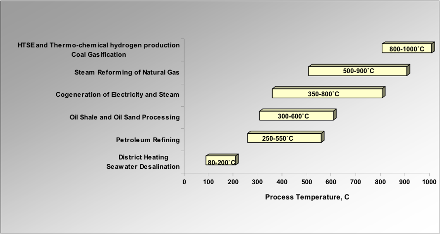

**----- Start of picture text -----** 
HTSE and Thermo-chemical hydrogen production 800-1000˚C Coal Gasification Steam Reforming of Natural Gas 500-900˚C Cogeneration of Electricity and Steam 350-800˚C Oil Shale and Oil Sand Processing 300-600˚C Petroleum Refining 250-550˚C District Heating 80-200˚C Seawater Desalination 0 100 200 300 400 500 600 700 800 900 1000 Process Temperature, C **----- End of picture text -----** 

Figure ES-2. Range of temperatures required for HTGR process heat applications 

xxiv 

In summary, a “ramp-up” in the operating conditions of the NGNP prototype will likely be necessary and desirable to prove its principles of operation and, even if material limitations require an extended period until full temperature can be realized, this does not appear to compromise the commercialization objective of the prototype. 

## **High Temperature Gas Reactor - Component Test Facility (CTF)** 

A key short-term NGNP initiative is to design, construct, and startup a test facility (referred to as the CTF) to support development of high-temperature gas thermal-hydraulic technologies (e.g., helium, helium-nitrogen, CO2) as applied in heat transport and heat transfer applications in HTGRs.  Such applications include but are not limited to primary coolant; secondary coolant; direct-cycle power conversion; intermediate, secondary and tertiary heat transfer; and demonstration of processes requiring high temperatures (e.g., hydrogen production).  The initial use of this facility will be in support of the completion of the NGNP.  However, this test facility will be open for use by the full range of suppliers, end-users, facilitators, government laboratories, and others in the domestic and international community supporting the development and application of HTGR technology. 

The facility shall provide for full scale: 

- Testing and qualification of high temperature fluid flow systems, components, and equipment (e.g., circulators, intermediate and tertiary heat exchangers, piping, and isolation valves) 

- Instrumentation and control development and qualification (e.g., reliability, calibration, response, stability, and transient response) 

- V&V of methods/codes to support licensing and future commercial applications (e.g., thermal, hydraulic, transients, etc.) 

- Heat transfer component development and fluid testing (e.g., shell & tube and compact heat exchangers, sulfuric acid decomposers) 

- Materials performance (e.g., metallics and ceramics) 

- Mock-up for high-temperature heat applications testing and research (e.g., prior to installation into the NGNP) 

- Testing of fluid inventory and quality control systems 

- Development and qualification of control room human factors 

- Operations procedure development and qualification training (e.g., for NGNP and for future commercial plants) 

- Operational problem/trouble shooting (e.g. for the NGNP prior to hot system repair/modifications and to support future commercial applications) 

- High-temperature applications mockup engineering-scale testing and qualifications (e.g., hydrogen production, coal to liquids, steam generators for Alberta Oil Sands application, etc.) 

- Maintenance and repair program and process development 

- Component replacement program and process development. 

xxv 

As noted above, a study will be initiated in early FY-08 to develop the specific design requirements and operating conditions for the facility.  A white paper on the facility is provided in Appendix H. 

## **NGNP Design Requirements** 

The PCD work has bounded the ranges of operating parameters that are believed to be achievable for the NGNP and initiated the characterization of the technical risks at the extremes of these ranges.  This work forms the bases for going forward in the early phase of conceptual design to expand the understanding of the risks and the alternatives to mitigate these risks in the time period left to initiate NGNP operation in 2018.  The outcome of the early phase of conceptual design work will establish the F&ORs and fundamental configuration of the NGNP.  NGNP Project Engineering evaluations and reconciliations of the PCD work have resulted in selecting a narrow and high-level set of design requirements that will be applied to the design progression in addition to the high-level requirements defined in the EPAct, ITRG study, and other evaluations (see Section 5, Systems Requirements Manual). These requirements are summarized as follows: 

## 1. Nuclear Island 

- Both pebble-bed and prismatic reactor designs should be considered. 

Further work is required to support making the final decision on the reactor design. The PCD work did not identify any discriminating factors that would provide a significant technical advantage of either design. 

- The nuclear island design should not preclude achieving a gas outlet temperature of 950°C. 

This temperature goal affects the design of major components within the reactor that cannot be realistically replaced over the lifetime of the plant (e.g., RPV).  This goal would support achieving the ultimate objective of a 950°C gas outlet temperature over the long-term operation of the plant, but allow for a lower temperature configuration for initial operation, recognizing the potential technology limitations associated with the heat exchanger. 

- The NGNP nuclear island will not include a direct-cycle PCS. 

Precluding the use of a direct-cycle PCS provides more flexibility in the operating conditions and configuration of the NGNP and emphasizes the application of the technology as a process heat provider. 

## 2. Intermediate HTS 

The system to transfer heat from the primary (helium gas) side to the secondary side of the plant should incorporate multiple primary and secondary heat transport loops.  The system should be configured to facilitate change out of heat exchange, circulating, and valve components.  The secondary side of the plant will supply heat to the power conversion and hydrogen production system and other applications as they are identified over the life of the plant. 

This arrangement supports the demonstration of the HTGR as principally a process heat supply.  It also provides the greatest degree of flexibility for demonstrating new technologies and components over the life of the plant.  For example: 

xxvi 

- Plate-fin and printed circuit style compact heat exchangers have potential size, weight, and efficiency advantages over more traditional shell & tube style heat exchangers for application as the IHX for HTGR.  The current designs of these compact heat exchangers may not be capable of operating at the full operating temperature and pressure of NGNP, and the development of these designs at the required operating temperatures may not progress sufficiently to support NGNP operation by 2018.  As the designs of these heat exchanger styles evolve, they can be demonstrated on a prototype engineering scale in one or more loops of NGNP. 

- Steam generation technologies offering improved efficiencies (e.g., through innovative tube arrangements) can be demonstrated as they evolve. 

- Alternative secondary heat transport materials (e.g., molten salts, liquid metals) can be tested. 

- A Brayton-cycle turbine in either a vertical or horizontal orientation could be adapted to run in a secondary loop. 

## 3. Nuclear Heat Supply System (NHSS) 

The NHSS should be defined to include: 

- The nuclear island and all of its support, control, monitoring, maintenance, refueling, spent fuel storage, etc. SSCs 

- The Intermediate HTS(s) including, at the least, the IHXs, primary circulation systems and the support, control, monitoring, maintenance, etc. SSCs.  Depending on the design, it may also include the secondary circulation system up to and including isolation valves. 

This supports the licensing objective (stated below) of ultimately supporting NRC certification of the HTGR NHSS design independent of the application.  This will require developing a set of steady state, normal transient, abnormal transient, and accident conditions that bound the potential applications to support safety analyses. 

## 4. Power Conversion System (PCS) 

The PCS should incorporate steam generation.  The configuration should not preclude, however, use of Brayton-cycle gas turbine PCSs in a combined-cycle configuration. 

- Steam is an effective medium for heat transfer and is widely applied in the private sector.  This requirement facilitates demonstration of the broad applicability of the technology. 

For example, the non-utility generation industry in the United States provides significant quantities of electricity and steam to a wide range of industries and applications.  The HTGR power range fits well either as a single module or in multiple modules within the range of power and steam conditions required to meet the needs of these applications.  NGNP will be effective in demonstrating the technical, licensability, reliability, maintainability, and economics of the HTGR in these applications 

xxvii 

## 5. Licensing and Permitting 

The licensing strategy should be formulated to meet the following objectives: 

- The strategy should support the objective scheduled operational date (currently 2018) 

- The strategy should consider that full-term qualification data may not be available to support all design assumptions included in the Safety Analysis Reports (SARs) and that additional qualification data to fully support these assumptions will be obtained during the initial two to three years of plant operation and specific inspections and tests to be conducted during this period.  For example, the final fuel irradiations and PIE may not be complete by 2018.  These will be completed over the 3-year initial operating period.  Periodic results from this work can be used to verify assumptions in the final SAR prior to plant operation. 

- The strategy should be consistent with and take into account contemporary NRC licensing positions (e.g., during licensing of LWR designs). 

- The strategy should consider the potential impact of the significant number of LWRs that may be in the licensing queue on the NRC resources available to support licensing of the NGNP. 

- The strategy should include alternative paths with identified criteria and schedule for establishing if and when alternative paths should be executed. 

- The ultimate objective of the licensing strategy should be to support application for and receipt of a design certification for the commercial application of the HTGR technology independent of the application. 

## 6. Design Features to Support Short-Term and Long-Term Operating Objectives 

The NGNP should be designed to monitor key operating parameters in the NHSS, PCS, and hydrogen production plant required for proving the principles of the designs.  The plant should also be designed to permit change out of principal components and to vary operating conditions to perform special testing to collect data/experience to support validation of design assumptions, extension of operating conditions (e.g., to higher gas temperatures), and upgrade of components (e.g., design, capacity, efficiency, maximum temperature and lifetime of the IHXs, and higher heat capacity heat transport fluids, such as liquid metals and molten salts) over the life of the plant. 

This is required to support validating design assumptions during initial operation of the plant to increase operating conditions to the objective power levels and gas temperatures, and for meeting a second objective of adapting to evolving and emerging technologies. 

## 7. Initial Operating Conditions 

The initial operating conditions and configuration for the NGNP (i.e., at initial operation in 2018) will be based on these requirements and consideration of the impact of the technical development risks on the schedule for operation. 

The selection of initial operating conditions and the plant configuration for the NGNP must be balanced against the schedule and cost risks associated with design, licensing, R&D, and 

xxviii 

construction.  This balance must also consider the impact of technology selections on the viability of translating the NGNP experience to the private sector. 

## **Decision Making and Risk Management Processes** 

The pre-conceptual design work has highlighted the several known technical risks that must be resolved to ensure successful completion of the NGNP Project.  Some of the steps planned to resolve these risks have been described.  These steps and other design work will require the NGNP Project to make decisions on alternatives for the NGNP (e.g., operating power level, gas temperatures, heat transport configuration, etc.). Additionally, throughout the design process other risks will be identified. To ensure that decisions are made and risks (both known and unknown) are addressed on a consistent and objective basis, formal decision-making and risk management concepts have been developed for the NGNP Project.  These are based on systems engineering principles that have been developed and applied for similar purposes in aerospace and other technical design development projects (e.g., the Global Nuclear Energy Partnership initiative). 

The initial activities in developing this process were to define criteria and then apply those criteria to establish the current Technology Readiness Levels (TRL) and Design Readiness Levels (DRL) for critical SSCs.  This effort was initially completed by the AREVA and Westinghouse teams, and was then refined in a subsequent task by the Westinghouse team in late FY-07.  In this latter activity, preliminary roadmaps were developed to define the steps necessary to advance the TRLs and DRLs in selected areas (e.g., reactor fuel and production facility qualification). 

The process for using TRLs and DRLs to support the decision-making process and for long-term risk management has been developed conceptually.  Work on completing its development and beginning implementation will be initiated in early FY-08.  This process will be used to ensure that TRLs and DRLs are achieved for the critical plant SSCs that provide appropriate confidence levels in the success of the project (i.e., meeting cost and schedule objectives) at the completion of each phase of design development. 

## **Conclusion** 

The preceding has summarized the recommendations of the contractor teams that completed the NGNP PCD work, and has highlighted the principal technical risks to the NGNP Project and planned actions to resolve those risks.  Resolution of many of the risks will lead to making final decisions on the operating conditions and configuration of the NGNP.  As noted, those decisions will be heavily influenced by the needs and expectations of the private sector, specifically potential end users and owner/operators of commercial plants that will apply the HTGR technology.  The needs and expectations will be communicated by close coordination between the NGNP Project and the private sector Alliance. 

The pre-conceptual work by the contractor teams and the NGNP Project has identified specific needs for data and development work necessary to advance the design, summarized the work that will be performed to address known technical risks, identified potential preliminary strategies for licensing the plant, estimated costs for completing the project, and performed very preliminary economic assessments for a NOAK plant in a commercial application producing hydrogen and electricity.  Each of these areas is discussed in more detail in the main body of this report. 

The results of this effort indicate that application of HTGR technology in the private sector is feasible and viable from technical, licensing, cost, schedule, and economic standpoints.  The pre-conceptual work has developed an adequate foundation upon which design development work can proceed.  This work will proceed with initiation of the conceptual design in FY-08, continuing to pursue the objective of an 

xxix 

operational NGNP in 2018, assuming that the necessary support from the DOE and private sector is received to achieve this objective. 

xxx 

|EXECUTIVE SUMMARY OF RESULTS, RECOMMENDATIONS, AND CONCLUSIONS...............iii|EXECUTIVE SUMMARY OF RESULTS, RECOMMENDATIONS, AND CONCLUSIONS...............iii|EXECUTIVE SUMMARY OF RESULTS, RECOMMENDATIONS, AND CONCLUSIONS...............iii|EXECUTIVE SUMMARY OF RESULTS, RECOMMENDATIONS, AND CONCLUSIONS...............iii|
|---|---|---|---|
|ACRONYMS.......................................................................................................................................... xxxv||||
|1.|INTRODUCTION.............................................................................................................................. 1|||
||1.1|NGNP|Mission Statement........................................................................................................ 1|
|||1.1.1|Energy Policy Act of 2005.......................................................................................... 1|
||1.2|NGNP|Project Scope................................................................................................................ 1|
||1.3|High-Level Objectives ............................................................................................................. 2||
||1.4|NGNP|Schedule....................................................................................................................... 2|
|2.|METHODOLOGY............................................................................................................................. 3|||
||2.1|Pre-Conceptual Design Scope, Planning, and Execution......................................................... 3||
|||2.1.1|Scope Allocation to the Various Contractor Teams.................................................... 5|
|||2.1.2|Pre-conceptual Design Planning and Execution ......................................................... 6|
||2.2|Criteria for Evaluating Contractor Team  Results and Recommendations .............................. 7||
|||2.2.1|Meets Mission Statement and Objectives ................................................................... 7|
|||2.2.2|Schedule...................................................................................................................... 8|
|||2.2.3|Development Risk / R&D........................................................................................... 8|
|||2.2.4|Cost ............................................................................................................................. 9|
|||2.2.5|Licensing Strategy....................................................................................................... 9|
|||2.2.6|Product Disposition / Economics.............................................................................. 10|
|||2.2.7|Applicability to Additional Applications.................................................................. 11|
|||2.2.8|Commercialization.................................................................................................... 11|
|3.|SUMMARY OF CONTRACTOR TEAM RECOMMENDATIONS ............................................. 12|||
||3.1|Special Studies....................................................................................................................... 12||
|||3.1.1|Introduction............................................................................................................... 12|
|||3.1.2|Reactor Type............................................................................................................. 14|
|||3.1.3|Reactor and Hydrogen Plant Power Levels .............................................................. 15|
|||3.1.4|Heat Transfer and Transport ..................................................................................... 15|
|||3.1.5|Power Conversion System ........................................................................................ 16|
|||3.1.6|Primary and Secondary Concept............................................................................... 17|
|||3.1.7|Licensing & Permitting............................................................................................. 18|
|||3.1.8|End Products and Waste Stream Disposition............................................................ 19|
||3.2|Pre-Conceptual Design .......................................................................................................... 19||
|||3.2.1|Nuclear Island ........................................................................................................... 20|
|||3.2.2|Heat Transfer and Transport ..................................................................................... 38|
|||3.2.3|Power Conversion System ........................................................................................ 44|
|||3.2.4|Hydrogen Plant ......................................................................................................... 49|
|||3.2.5|Balance of Plant ........................................................................................................ 52|
|||3.2.6|Site Integration.......................................................................................................... 59|
|||3.2.7|Overall Pre-Conceptual Design Conclusions and Recommendations ...................... 67|

xxxi 

xxxii 

## **FIGURES** 

Figure ES-1. NGNP Project funding profile (based on pre-conceptual design cost estimates and operational date of 2018)...........................................................................................................viii Figure ES-2. Range of temperatures required for HTGR process heat applications ...............................xxiv Figure 1. Pebble Bed Reactor .....................................................................................................................21 Figure 2. Pebble-bed Fuel Design (Westinghouse pellets are shown in the lower left)..............................22 Figure 3. Westinghouse Core Ceramics......................................................................................................22 Figure 4. Westinghouse Reactivity Control................................................................................................23 Figure 5. Westinghouse Core Barrel...........................................................................................................23 Figure 6. Westinghouse RPV......................................................................................................................23 Figure 7. Westinghouse Core Conditioning................................................................................................24 Figure 8. Westinghouse RCCS ...................................................................................................................24 Figure 9. Westinghouse Fuel Handling.......................................................................................................24 Figure 10. Westinghouse Helium Service...................................................................................................25 Figure 11. Prismatic Reactor.......................................................................................................................25 Figure 12. Prismatic fuel blocks (where the bottom figure has a control rod hole)....................................26 Figure 13. Graphite Reflector .....................................................................................................................27 Figure 14. Control Rods..............................................................................................................................27 Figure 15. Reactor Pressure Vessel.............................................................................................................28 Figure 16. Cross Vessel ..............................................................................................................................28 Figure 18. Fuel Handling ............................................................................................................................29 Figure 17. Reactor Cavity Cooling .............................................................................................................29 Figure 19. 500 – 600 MWt Prismatic Reactor ............................................................................................30 Figure 20. Fuel Kernel, Fuel Compact, and Fuel Block/Assembly. ...........................................................31 Figure 21. Graphite Reflectors....................................................................................................................31 Figure 22. Reactor Pressure Vessel.............................................................................................................32 Figure 23. RPV, PCS Vessel, and IHX Vessel ...........................................................................................33 Figure 24. Reactor Cavity Cooling System ................................................................................................33 Figure 25. Fuel Handling System ...............................................................................................................34 Figure 26. Westinghouse Reference Configuration....................................................................................39 Figure 27. Concentric Pipe Arrangement with Active Cooling..................................................................40 Figure 28. AREVA Brayton-Cycle Configuration......................................................................................41 Figure 29. General Atomics Recommended Configuration........................................................................42 Figure 30. General Atomics Pipe Insulation Schematics............................................................................43 

xxxiii 

Figure 31. Direct Rankine Cycle Coupled to Reactor via Steam Generator...............................................45 Figure 32. Steam Rankine Cycle.................................................................................................................47 Figure 33. General Atomics Recommended PCS Configuration................................................................48 Figure 34. Hybrid Sulfur Process Schematic..............................................................................................49 Figure 35. SI Process for Making H2 and O2 from H2O. ............................................................................50 Figure 36. High-Temperature Electrolysis (SOEC = solid oxide electrolysis cell)....................................51 Figure 37. CCSS Block Diagram................................................................................................................54 Figure 38. Simplified Overall Plant Control Configuration........................................................................55 Figure 39. Process of Design and Development.........................................................................................61 Figure 40. NGNP Pre-conceptual Design Development (PCDR Sections Identified) ...............................62 Figure 41. Evolution of Design Requirements............................................................................................62 Figure 42. Proposed Hierarchy for the Requirements.................................................................................64 Figure 43. Generic Risk Waterfall Diagram. ..............................................................................................75 Figure 44. Organizational Structure and Lines of Communication ............................................................94 Figure 45. Conceptual Design Schedule.....................................................................................................96 **TABLES** Table ES-1 Summary of Results..................................................................................................................vi Table ES-2. Nuclear heat supply operating configuration and design......................................................xvii Table ES-3. Generic technical development...............................................................................................xx Table 1. Breakdown in scope for the Pre-Conceptual Design. .....................................................................6 Table 2. Special Studies Description and Assignments..............................................................................13 Table 3. Difference between the Reactor Designs......................................................................................14 Table 4. Recommended Plant Operating Conditions..................................................................................17 Table 5. Recommended Plant Configurations ............................................................................................18 Table 6. Summary of nuclear island system/subsystem choices.................................................................35 Table 7. Steam Rankine Cycle Power Balance...........................................................................................47 Table 8. Contractor Recommendation for the NGNP PCS.........................................................................49 Table 9. General Atomics Preliminary Selections for the NGNP Design ..................................................66 Table 10. Proposed Operating Conditions and Configurations ..................................................................67 Table 11. TRL and DRL definitions for the NGNP Project .......................................................................74 Table 12. NGNP Prototype Cost Estimate Range and Periods of Performance .........................................89 Table 13. Values of Assumed Economic Parameters. ................................................................................92 

xxxiv 

||**ACRONYMS**|
|---|---|
|AC|alternating current|
|ALARA|as low as reasonably achievable|
|ASME|American Society of Mechanical Engineers|
|ASTM|American Society for Testing and Materials|
|AVR|Arbeitsgemeinschaft Versuchsreaktor (Germany)|
|BEA|Battelle Energy Alliance|
|BOP|Balance of Plant|
|C/C|carbon-fiber reinforced carbon|
|CCSS|Central Control and Supervisory System|
|CD|Critical Design|
|CDR|Conceptual Design Report|
|CFR|Code of Federal Regulations|
|COL|Combined Operating License|
|CTF|Component Test Facility|
|DC|direct current|
|DD&D|deactivation, decontamination, and decommissioning|
|DDN|Design Data Need|
|DOE|Department of Energy|
|DPP|Demonstration Power Plant|
|DRL|Design Readiness Level|
|DWP|Detailed Work Plan|
|EOI|Expression of Interest|
|EPA|Environmental Protection Agency|
|EPAct|Energy Policy Act of 2005|
|EPRI|Electric Power Research Institute|
|ESP|early site permit|
|F&OR|functional and operations requirement|
|FDD|Facility Design Description|
|FOAK|first of a kind|
|FSAR|Final Safety Analysis Report|
|GAO|Government Accountability Office|
|GT-MHR|Gas Turbine-Modular Helium Reactor|
|HETP|height equivalent to a theoretical plate|
|HPS|Hydrogen Production System|
|HTE|High-Temperature Electrolysis|
|HTGR|High Temperature Gas-cooled Reactor|
|HTR|High-Temperature Reactor|
|HTS|Heat Transfer / Transport System|
|HTTR|High Temperature Test Reactor (Japan)|

xxxv 

|HVAC|heating, ventilation and air conditioning|
|---|---|
|I&C|Instrumentation and Control|
|IHX|intermediate heat exchanger|
|INL|Idaho National Laboratory|
|IRR|internal rate of return|
|ISI|In-Service Inspection|
|ITRG|Independent Technical Review Group|
|KWh|kilowatt hour|
|LLC|Limited Liability Company|
|LWA|Limited Work Authorization|
|LWR|Light Water Reactor|
|MHR|Modular Helium Reactor|
|MHTGR|Modular High-Temperature Gas-cooled Reactor|
|MPa|megapascal|
|MWe|megawatt electric|
|MWt|megawatt thermal|
|NGNP|Next Generation Nuclear Plant|
|NHI|Nuclear Hydrogen Initiative|
|NHS|Nuclear Heat Supply|
|NHSS|Nuclear Heat Supply System|
|NOAK|Nth of a kind|
|NQA|Nuclear Quality Assurance|
|NRC|Nuclear Regulatory Commission|
|O&M|operation and maintenance|
|OBS|Organizational Breakdown Structure|
|OKBM|OKB Mechanical Engineering|
|PBMR|Pebble Bed Modular Reactor|
|PCD|Pre-Conceptual Design|
|PCDR|Pre-Conceptual Design Report|
|PCDSR|Pre-Conceptual Design Studies Report|
|PCS|Power Conversion System|
|PHD|Process Heat Distribution|
|PHP|Process Heat Plant|
|PIE|post-irradiation examination|
|PRA|Probabilistic Risk Assessment|
|R&D|research and development|
|RAM|reliability, availability, and maintainability|
|RAM|Responsibility Assignment Matrix|
|RCCS|reactor cavity cooling system|
|RFP|Request for Proposal|
|ROR|Rate of Return|

xxxvi 

|RPV|reactor pressure vessel|
|---|---|
|SDD|System Design Description|
|SEMP|Systems Engineering Management Plan|
|SG|Steam Generator|
|SHTS|Secondary Heat Transport System|
|SI|sulfur-iodine|
|SOW|Scope of Work / Statement of Work|
|SRM|System Requirements Manual|
|SSC|structures, systems, and components|
|SSDD|Subsystem Design Description|
|THTR|Thorium Hoch Temperatur Reaktor (Germany)|
|TRISO|tri-isotopic (pyrolytic carbon and silicon carbide multi-layered fuel-particle)|
|TRL|Technology Readiness Level|
|V&V|verification and validation|
|VHTR|Very High Temperature Reactor|
|WBS|Work Breakdown Structure|

xxxvii 

xxxviii 

# **1. INTRODUCTION** 

## **1.1 NGNP Mission Statement** 

As presented in the National Energy Policy, there is a national strategic need to promote further reliance on safe, clean, economical nuclear energy.  In the 2003 State of the Union Address, President George W. Bush launched a new National Hydrogen Fuel Initiative to provide domestically produced clean-burning hydrogen to the transportation sector as an alternative to imported oil.  The combination of these two objectives, to promote nuclear energy and to produce clean-burning hydrogen, can be met simultaneously with the development of new advanced reactor and hydrogen generation technology.  The U.S. Department of Energy (DOE)’s mission need is to develop this combined technology that will enable the continued use of secure, domestic nuclear energy, and establish a greenhouse-gas-free technology for the production of hydrogen, thereby supporting both the President’s agenda for a hydrogen economy and the DOE’s strategic goal to promote a diverse supply of energy.  First-of-a-kind (FOAK) technology projects typically include technology risks that are either too high, or industry is unable or unwilling to take the financial risks to work through the development and implementation needed to advance to the next generation of a technology.  The Next Generation Nuclear Plant (NGNP) is the FOAK type of project that is perfectly suited for government laboratories and will help to revitalize the U.S. nuclear industry. 

## **1.1.1 Energy Policy Act of 2005** 

In July of 2005, Congress passed the _Energy Policy Act of 2005_ (H.R. 6; EPAct), which was signed into law by President Bush in August of 2005.  Under Section 641, paragraph (a), the Act states, “The Secretary shall establish a project to be known as the ‘Next Generation Nuclear Plant Project’.”  It continues in paragraph (b): 

_The Project shall consist of the research, development, design, construction, and operation of a prototype plant, including a nuclear reactor that—_ 

- _(1) is based on research and development activities supported by the Generation IV Nuclear Energy systems Initiative…._ 

- _(2) shall be used_ 

   - _(A) to generate electricity;_ 

   - _(B) to produce hydrogen; or_ 

   - _(C) both to generate electricity and to produce hydrogen._ 

## **1.2 NGNP Project Scope** 

The scope of the NGNP project is: 

1. To secure sufficient support from government and commercial entities, ensuring the viability of the NGNP project 

2. To execute and complete all project deliverables, including conceptual design, preliminary and final design, construction, and startup and acceptance testing for the NGNP facility 

3. To complete and integrate specifically assigned technology development and system confirmatory and verification tasks 

4. To obtain Nuclear Regulatory Commission (NRC) licensing as required for a commercial demonstration reactor prototype 

5. To provide project management and integration that will coordinate and combine the efforts of the many and varied project partners, subcontractors, and stakeholders. 

The scope is further defined by the requirements of the EPAct.  The scope of the operational program will be further defined as the project progresses and will be covered in a future Operational Program Plan. 

## **1.3 High-Level Objectives** 

High-level NGNP project objectives support both the NGNP mission and the DOE vision, as follows: 

1. Develop and implement the technologies important to achieving the functional performance and design requirements determined through close collaboration with commercial industry end-users. 

2. Demonstrate the basis for commercialization of the nuclear system, the hydrogen production facility, and the power conversion concept.  An essential part of the prototype operations will be demonstrating that the requisite reliability and capacity factor can be achieved over an extended period of operation. 

3. Establish the basis for licensing the commercial version of the NGNP by the NRC.  This will be achieved in major part through licensing the prototype by NRC and initiating the process for certification of the nuclear system design. 

4. Foster rebuilding of the U.S. nuclear industrial infrastructure and contribute to making the U.S. industry self-sufficient for our nuclear energy production needs. 

## **1.4 NGNP Schedule** 

The Preliminary Project Management Plan (PPMP) for the NGNP identifies two planning options that weigh a range of programmatic risks and approaches to mitigating risk. The two options are compliant with the EPAct, but emphasize different approaches to technology development risks, design and construction risks, and the extent of demonstration in support of commercialization.  Option 1, labeled the Milestone Compliant option, establishes an overall schedule based on the milestone dates in the EPAct for Phase I and Phase II, and emphasizes extended R&D activities before proceeding with design and construction activities.  Start of operations and project completion for this option is scheduled for 2021. 

Option 2, labeled the Balanced Risk option, assesses the overall project risk with the objective of balancing technology development risk against design, licensing, and construction risk.  Emphasis is on initiating design and licensing work as early as practical to reduce the uncertainties in the scope and focus of R&D activities.  The expected date for initial operations (following the test program) is 2018.  This option allows for a two- to three-year period of operation (prior to 2021) simulating a commercial power reactor operating cycle that is followed by an extensive outage, during which the equipment performance 

Pre-Conceptual Design Report INL/EXT-07-12967 November 2007 

is confirmed by detailed disassembly and inspection.  This proof-of-principle operating period provides support for commercialization decisions by industry. 

Option 2 was chosen by the NGNP Project as the reference schedule for preconceptual design activities.  Discussions with the private sector indicate a strong preference for the Option 2 schedule which will support commercialization at the earliest date practical.  Setting the Option 2 schedule as the goal for the NGNP Project provides margin to and supports the objectives of the EPAct for demonstration of the technology by 2021 while addressing the needs and expectations of the private sector. 

## **2. METHODOLOGY** 

To support a schedule for deploying the FOAK NGNP by 2018, pre-conceptual design (PCD) activities were completed in fiscal year (FY) 2007.  The objectives of the PCD activities, as described in the Statement of Work (SOW), are: 

- To assist in focusing the technical scope and priorities of research and development (R&D) activities for the NGNP 

- To provide a basis for subsequent development of the technical and functional specifications for the prototype facilities for the NGNP. 

This scope is consistent with the Phase I SOW defined for the NGNP Project in the EPAct.  Phase I’s objective is to define the initial design parameters for the NGNP, select the principal hydrogen production technology, and conduct supporting R&D.  The detailed SOW for PCD will be described in Section 2.1. 

## Multiple Awards 

At the pre-conceptual design stage, the NGNP Project Management objective was to define the stateof-the-art for high-temperature gas reactor design and the effort required to extend this state-of-the-art to meet NGNP objectives.  Requests for proposals (RFP) were issued to industry leaders in this technology to obtain this information in a manner that provided the best value to the government.  A further objective of this solicitation and of the NGNP Project in general is to include as broad a range of industry involvement as possible to maximize the perspective in addressing the project objectives.  In this context and upon considering the objectives, it was determined that multiple awards would be made for PCD work.  The entire scope, described in Section 2.1, was awarded to a consortium consisting of Westinghouse Electric Company and Pebble Bed Modular Reactors (PBMR) of South Africa.  Reduced scopes of work were awarded to two other teams, one led by AREVA and the other by General Atomics. The breakdown of the specific scopes of work awarded to each contractor team is also provided in Section 2.1.  The award methodology allowed for the DOE and the NGNP project team to receive multiple inputs in nearly every major system and strategic area for the NGNP, providing options for future decision-making. 

## **2.1 Pre-Conceptual Design Scope, Planning, and Execution** 

The Pre-Conceptual SOW included contractor team preparation of Work Plans; progress, cost and schedule monitoring; weekly meetings; progress meetings; 50% reviews; and 90% reviews. 

In summary, the key deliverables included: 

- Special Studies Reports (see Appendix C); the contractor teams had overlapping but different scopes. 

- Pre-conceptual Design Reports (PCDR) 

- Pre-conceptual Design Executive Summary Reports 

- Cost estimates, including capital, operating, and life-cycle estimates 

- Pre-conceptual Project Schedule 

- Economic Analysis. 

The Pre-conceptual Design Executive Summary Reports from each contractor team (see Appendices I – K) include results and conclusions of the special studies and recommended PCDs for NGNP, including identification of design data needs (DDNs) and related R&D (see Appendix E), and pre-conceptual estimates of cost and schedule (see Appendix F) for NGNP and an Nth of a kind (NOAK) commercial plant. 

The scopes of the special studies support selection of the NGNP functional and operational requirements (F&ORs); configuration, licensing and permitting strategies; and disposition of products and waste streams.  They were used to support selection and development of the NGNP PCD recommended by each contractor team.  The special studies included: 

- Licensing & Permitting Special Study, INL/EXT-07-12726 

- Power Conversion System (PCS) Trade Study, INL/EXT-07-12727 

- By-Products Trade Study, INL/EXT-07-12728 

- Reactor Type Trade Study, INL/EXT-07-12729 

- NGNP Project Pre-Conceptual Heat Transfer and Transport Studies, INL/EXT-07-12730 

- Power Level Trade Study, INL/EXT-07-12731 

- Primary and Secondary Cycle Trade Study, INL/EXT-07-12732. 

The results and conclusions from these studies are summarized in Section 3.1. 

The PCDRs provide recommended PCDs.  Levels of detail for each sub-system were varied depending on the assigned areas within the individual scopes of work, but generally the design incorporated the results of the special studies and provided a design description of the options studied and a recommended conceptual design approach.  The minimum level of detail was specified as follows: 

- Establish space allocations for general occupancy and for equipment installation, operation and maintenance (O&M) 

- Establish and quantify type of construction, significant design features, hazard classifications, and occupancy ratings and define required building systems and/or utilities 

- Identify sufficient project features to develop the cost estimate.  The system design description (SDD) shall describe details not specifically delineated on the drawings. 

- Identify requirements for security, containment, environmental protection, safety, and industrial hygiene 

- Identify any potential value engineering systems that should be investigated in later design phases 

- Establish preliminary electrical one-line drawings for the “Greenfield” options that identify electrical grid connection/modification and normal, standby, and emergency power.  The oneline drawings shall identify the electrical grid and hydrogen plant electrical system characteristics.  Also, investigate the capacity and interface locations of existing Idaho National Laboratory (INL) electrical systems and provide descriptions of the recommended electrical connections and power management. 

- Establish preliminary flow sheets that include waste, cooling systems, utility, mechanical, and heating, ventilation, and air conditioning (HVAC) requirements for the nuclear system design.  Identify, where practicable, flow rates, temperatures, and pressures assumed for each flow stream.  Determine the availability and interface locations of existing utility systems. Determine system requirements and provide descriptions of the recommended systems. 

- Evaluate facility shielding and construction options that meet DOE as-low-as-reasonablyachievable (ALARA) radiation exposure requirements.  Describe, illustrate, and evaluate feasible configurations for access, containment, viewing, remote equipment, decontamination, ventilation, inter-cell transfers, and penetrations. 

- Evaluate computer-based control and instrumentation schemes and control options and provide recommendations and supporting criteria. 

- Prepare the System Requirements Manual (SRM; see Appendix D) for the various systems at an appropriate level of detail for a PCDR (generally to an SDD level) and to subsystem or component level for critical structures, systems, and components (SSCs).  Review the Electric Power Research Institute (EPRI) Utilities Requirement Document for applicability and as a basis for the SRM.  The SRM shall be generally defined as the overall organization and description of the project requirements as they flow down from the: mission needs to F&ORs to the Facility Design Description (FDD) to the SDD to Subsystem Design Descriptions (SSDD) to system elements to system components to system parts. 

- Include a chapter in the PCDR that presents and describes the safety case for the prototype plant.  The safety case should also consider interfaces and impacts of having a hydrogen production system (HPS) attached or interfacing with the nuclear system.  Included is a Preliminary Hazards Assessment to define hazard levels associated with the nuclear system, hydrogen plant, and other high-temperature process heat applications and associated critical systems.  This assessment shall discuss the overall plant design, the associated hazards, the designed or required preventative and mitigative design features, and safety systems commensurate with a PCD. 

- Prepare a pre-conceptual heat balance for the nuclear system, hydrogen plant and other high temperature process heat systems. 

## **2.1.1 Scope Allocation to the Various Contractor Teams** 

Westinghouse was awarded the full SOW.  AREVA and General Atomics were awarded partial scopes based on the available funding.  In this regard, Westinghouse performed all of the Special Studies. Table 1 shows the subset of Special Studies that were performed by AREVA and General Atomics. 

Table 1. Breakdown in scope for the Pre-Conceptual Design. 

Westinghouse also prepared the full SOW in defining the recommended design for NGNP.  AREVA and General Atomics were asked to adapt their current commercial designs, (e.g., the AREVA ANTARES design and the General Atomics Gas Turbine-Modular Helium Reactor [GT-MHR] design) to meet NGNP objectives. 

## **2.1.2 Pre-conceptual Design Planning and Execution** 

As the scopes of work were finalized for each contractor team, detailed work plans (DWP) were developed to provide cost and schedule bases for the work that would be performed.  Each work plan was agreed to by NGNP Project Engineering, with a single Project Engineering point of contact defined for each contractor team.  Those points of contact conducted regular (weekly) conference calls with the respective contractor team to obtain status reports on the development of the PCD information and deliverables.  Several site visits were also made to each contractor team by the engineering point of contact and other members of NGNP Project Engineering.  By staying in close contact with each contractor team, NGNP Project Engineering was able to handle issues in real time and ensure timely and cost effective completion of each PCD deliverable by the contractor teams. 

In addition to the weekly status meetings and periodic status visits, design reviews were conducted at the 50% and 90% of PCD levels.  Initial results and conclusions were provided for review at 50% to evaluate the products for major issues with respect to scope or methodology.  The 50% design review was conducted in a distributed manner (with respect to geography) to optimize cost / benefit at that early stage of completion.  Nearly finished products that incorporated the comments of the 50% design review and subsequent study outcomes were delivered for 90% design reviews, conducted in a co-located manner in Idaho Falls.  As this was still a review of a PCD, reviewers focused on results from special studies with only minimal attention paid to design concepts and drawings.  For both the 50% and 90% design reviews, comments were tabulated on design review sheets and dispositioned by the appropriate contractor team members in coordination with NGNP Project Engineering. 

## **2.2 Criteria for Evaluating Contractor Team Results and Recommendations** 

The following summarizes an evaluation of the contractor team submittals against criteria established to confirm that the three contractor teams’ results and recommendations are consistent with the requirements and objectives established by the EPAct, discussed above. 

## **2.2.1 Meets Mission Statement and Objectives** 

The NGNP Mission Need Statement conforms to DOE Order 413.3, “Project Management for the Acquisition of Capital Assets,” and contains the following elements: 

- Statement of Mission Need 

- Analysis to Support Mission Need 

- Constraints and Assumptions 

- Importance of Mission Need and Impact if Not Approved 

- Applicable Conditions and Interfaces 

- Resource Requirements and Schedule 

- Development Plan. 

To meet the Mission Statement and Objectives, each contractor team’s PCD results and recommendations must demonstrate the production of electricity and hydrogen using very high temperature, gas-cooled, graphite-moderated reactor technology with realistic and achievable operating conditions and a plant configuration siteable at the INL.  In addition, each contractor team’s PCD results and recommendations must demonstrate the viability and commercial applicability of the technology by 2021.  In the context of this report, commercial applicability is defined as demonstrating technology that can be applied economically with operating conditions, availability, and reliability to meet the needs of the private sector, and that the design, licensing, construction, costs, and operating experience of NGNP can be transferred to the private sector to minimize technical, licensing, and cost risks. 

Each contractor team recommended designs for the NGNP and provided technical bases for selection of the details of the designs for a plant that produces electricity and hydrogen in accordance with the requirements of the EPAct.  The recommended plant total power levels (500 MWt to 600 MWt), gas outlet temperatures (900°C to 950°C), PCS power level (100%), and hydrogen power levels (~10%) for all three designs were comparable and based on prior evaluations and recommendations for F&ORs for NGNP (ref. _Next Generation Nuclear Plant High Level Functions and Requirements_ , INEEL/EXT 0301163, September 2003; _Design Features and Technology Uncertainties for the Next Generation Nuclear Plant_ , INL/EXT-04-01816, June 2004; _Next Generation Nuclear Plant Preliminary Project Management Plan_ , INL/EXT-05-00952). 

There are differences in the recommended details of the contractor team designs, (e.g., reactor type, heat transfer and transport system design, PCS and HPS) that will be reconciled as the NGNP design 

progresses.  Each contractor team also defined the DDNs and associated R&D work that are required to establish F&ORs and final design configuration that meet NGNP objectives with an acceptable risk profile for demonstration of the technology by 2021.  Other sections of this report discuss the analyses, testing, and development of licensing strategies, schedules, cost estimates, economic assessments, etc. that are required to support the implementation of NGNP. 

## **2.2.2 Schedule** 

To meet the schedule requirements, each contractor team’s PCD results and recommendations shall include a schedule that meets the required technology demonstration date of 2021 to satisfy the EPAct and that is judged by NGNP Engineering review to have sufficient margin to be realistic and achievable. In addition, each contractor team shall identify areas of risk to the schedule and develop concepts to monitor the schedule and control the risks. 

Each contractor team provided a schedule for the project based on a Work Breakdown Structure (WBS) provided by NGNP Project Engineering.  This WBS (see Section 8.) is configured to apply to the full life of the NGNP project, (i.e., to the end of life and deactivation, decontamination, and decommissioning [DD&D] of the plant).  The three schedules all meet the requirements for completing demonstration of the technology by 2021 with, in general, initial operation of the plant in the 2018 time frame, allowing for an up to three-year demonstration operation period.  These schedules have been reviewed and reconciled by NGNP Project Engineering to develop a best estimate schedule at the preconceptual phase of design development.  This reconciliation is discussed in Section 8.2 of this report. The structure of the schedule matches the WBS and will be used in conjunction with the risk management program (see Section 6 and Appendix L) to monitor project progress and control project technical risk. Other risks to the schedule, (e.g., funding, resource availability, interface with the DOE and the industry Alliance) will be monitored and controlled at the project management level. 

## **2.2.3 Development Risk / R&D** 

To adequately identify development risk and R&D, the results and recommendations from each contractor team were reviewed against the following criteria: 

- The identification of the data needs and R&D are comprehensive and, where applicable, consistent with the other contractor team’s assessments in like areas. 

- The scope and schedule for the effort needed to satisfy the requirements are comprehensive and judged by NGNP R&D and Engineering to be necessary and sufficient. 

- The scope and schedule for the effort needed to fulfill the data needs and R&D are coordinated and complimentary with NGNP R&D plans and programs. 

- NGNP Engineering and R&D consider the costs and schedule for completing the effort realistic and achievable. 

- The schedule satisfies the needs in a timeframe that supports the NGNP schedule. 

- A risk management concept has been provided including definitions of items, such as Technology Readiness and Risk Level, that are applicable to NGNP development. 

Each contractor team identified DDNs and R&D requirements to resolve these DDNs along with scoping estimates for related costs and schedules.  Later sections of this report summarize the results from all the Teams and factor these into the schedule, cost estimates, and planning for the next phases of design development and R&D for the project.  The major R&D efforts (e.g., fuel, graphite, and high temperature materials qualification and codification) are based on the NGNP and Nuclear Hydrogen Initiative (NHI) R&D programs in which the Teams are collaborators and contributors.  Approximately 100 areas were also identified by the Teams that require further study to support making final technology selections and design decisions for the NGNP.  NGNP Project Engineering consolidated and prioritized these for future study (see Section 6.5).  The higher priority studies will be completed in the initial phase of Conceptual Design. 

The Westinghouse and AREVA teams identified ongoing and planned R&D programs that support the development of the PBMR plant in South Africa and the ANTARES plant design, respectively, and are directly applicable to the NGNP design.  These two teams also provided recommendations for definitions of Technology Readiness Levels (TRL) for the NGNP project and made first cuts at defining these levels for critical systems and components.  NGNP Project Engineering is adapting these definitions to the Risk Management program (see Section 6 and Appendix L). 

## **2.2.4 Cost** 

The cost information provided by each contractor team was reviewed against the following criteria: 

- The cost estimate has sufficient margin to be realistic and achievable. 

- The areas of high risk in maintaining costs within the estimate have been identified and concepts to monitor the costs and control the risks have been developed. 

- The costs are consistent with the schedule (e.g., resource loading, long term procurement, etc.). 

Cost estimates for the NGNP FOAK plant and a NOAK commercial plant were provided by each contractor team.  NGNP Project Engineering reviewed the detailed bases for the cost estimates with the Teams and has reconciled the estimates and completed statistical analyses, which consider uncertainties, to develop a best estimate range for these costs at the pre-conceptual level.  These analyses also considered factors affecting margins in the estimates (e.g., escalation and inflation rates, site specific labor, transportation, environmental, etc. factors). 

The risk management program is being developed to track risk as a function of expected cost to completion and schedule to completion. 

## **2.2.5 Licensing Strategy** 

The licensing strategy provided by each contractor team was reviewed against the following criteria: 

- The schedule for the licensing strategy supports the NGNP schedule. 

- The strategy takes advantage of the evolving experience with the licensing of the Gen III and Gen III+ light water reactors (LWRs) and the progress in developing NRC licensing regulations (e.g., 10CFR50, 10CFR52, and 10CFR53). 

- The strategy identifies the scope and schedule for preparation of submittals that are consistent with the scope and schedule for providing data needs and R&D. 

- The strategy has realistic and achievable schedules for development of licensing submittals, NRC review and approval, and public hearings. 

See Section 7.0 for the evaluation of the contractor team recommendations for the NGNP licensing strategy. 

## **2.2.6 Product Disposition / Economics** 

The product disposition/economics information provided by each contractor team was reviewed against the following criteria: 

- The product information has established concepts for life cycle cost and revenue management for the NGNP been included. 

- The product information addresses the disposition of all products (i.e., those with potential economic value and waste products). 

- The product information contains realistic assessments of the value and potential markets for those products with economic value and the means for getting the product to-market been included. 

- The product information establishes mechanisms for assessing the ability to transfer the NGNP economic experience to commercial applications. 

- The product information contains realistic assessments of the means and costs for dispositioning waste products been included. 

The contractor teams identified both the marketable products (e.g., electricity, hydrogen, and oxygen) and waste products of the NGNP and the commercial plant.  Assessments of the quantities of waste products and the means for their disposition were made at the pre-conceptual level.  These were areas identified as needing more development as the design progresses.  The cost estimates and schedules provided by the contractor teams and those reconciled by NGNP Project Engineering include waste disposition. 

Each contractor team also performed economic assessments for the NOAK commercial plant producing hydrogen and, in one case, electricity.  These assessments included life-cycle costs for the plant 

including construction, startup testing, operation, and DD&D.  The revenue streams developed for the assessments used market pricing data and predicted escalation rates for the hydrogen and, where applicable, electricity to make reasonable estimates of the economic viability of the commercial version of the NGNP against more traditional production processes.  The production rates were predicted based on the results of the PCD studies.  These assessments have been reviewed and reconciled by NGNP Project Engineering (see Section 9) and a best estimate economic analysis has been performed by NGNP Project Engineering using the best estimate cost data.  All of the results show that this technology can be economically viable.  Critical conditions and factors that support economic viability were identified. 

## **2.2.7 Applicability to Additional Applications** 

Information provided by each contractor team was reviewed against the following criterion: 

- The information satisfies the mission of the NGNP as a non-greenhouse emitting energy source, principally of process heat (i.e., is adaptable for commercial applications beyond NGNP). 

The evaluation of this criterion is combined with that for the following criterion. 

## **2.2.8 Commercialization** 

The commercialization information provided by each contractor team was reviewed against the following criteria: 

- The information establishes concepts for transferring the NGNP design, cost, schedule, operating experience, and economics to commercial applications. 

- The information identifies alternative applications for the HTGR technology, including the F&ORs that are needed to effectively approach use of this technology for each application. 

All three contractor teams provided recommended designs for the commercial plant based on the results of the design studies for NGNP.  In all cases, four module plants with power capacities of 2000MWt to 2400 MWt were recommended.  The economic assessments were based on the characteristics of a NOAK plant of that design in production of hydrogen and electricity.  The cost estimates and schedules for construction of the plants were based on the values developed for the NGNP. The licensing strategies recommended for the NGNP by the contractor teams and as formulated by the NGNP Project also contain a fundamental objective of supporting the receipt of a design certification for the commercial plant design. 

All three contractor teams provided brief summaries of the potential uses of the HTGR technology in industry applications as a substitute for burning fossil fuels.  Many of these included the use of hydrogen as demonstrated by NGNP (e.g., refining processes, addition to the bituminous oil from the Alberta oil sands to facilitate transport, eliminating the water shift phase of the coal to liquids process).  Others included the use of the technology for steam production for supply to a wide range of industries (e.g., refineries, ethanol producers) potentially as part of a co-generation supply with electricity, and for the 

Alberta oil sands recovery.  Other applications were also identified along with a range of temperature requirements for each category of application. 

These areas of investigation were not central to the PCD work for the NGNP, and the submittals and discussions were informal.  A future study will be made during the initial phase of Conceptual Design to address the potential prospects for use of the technology over a wide range of applications and industries. 

## **3. SUMMARY OF CONTRACTOR TEAM RECOMMENDATIONS 3.1 Special Studies** 

## **3.1.1 Introduction** 

The NGNP PCD work was performed by three contractor teams working separately to work plans developed in compliance with their responses to the SOW of the RFP issued in July 2006.  The three contractor teams were headed by Westinghouse, AREVA, and General Atomics.  Each contractor team was comprised of personnel from these companies as well as several supporting companies providing expertise and experience over the full range of engineering disciplines, licensing and regulatory interfaces, system and component design, cost and scheduling and project management required to satisfy the requirements of the SOW.  The initial phase of the PCD work scope included seven special studies. All seven of these studies were completed by Westinghouse; selected studies were performed by the other two contractor teams as part of a reduced work scope.  Table 2 summarizes the trade study objectives and identifies which of the seven studies were performed by each contractor team. 

Reconciliations of the results of the studies completed by the contractor teams are summarized in seven white papers prepared by NGNP Project Engineering (see Appendix C).  The results of these studies provided the bases for selection of the PCD developed by each contractor team for NGNP.  A summary of the salient results of the special studies follows Table 2. 

## **3.1.2 Reactor Type** 

All three contractor teams performed this special study to identify and evaluate distinguishing characteristics and discriminating factors for the pebble bed and prismatic reactor designs.  The three contractor teams independently proposed prioritized lists of evaluation criteria.  While several of the criteria were common, their relative rankings were not.  The contractor teams were parochial in assessing the discriminating characteristics of the Pebble Bed and Prismatic designs; Westinghouse concluded that the pebble bed design had advantage over the prismatic design; AREVA and General Atomics concluded the reverse.  These results are not unexpected; they parallel the commercial offerings of each contractor team; the Westinghouse PBMR, the AREVA ANTARES prismatic reactor design and the General Atomics Modular High Temperature Reactor prismatic design. 

The contractor teams did identify, however, several different characteristics of the two designs that provide discriminating factors that can be used to assess each design for application to NGNP.  These characteristics are presented in Table 3. 

Table 3. Difference between the Reactor Designs 

NGNP Project Engineering has concluded that there are no identified discriminating factors that justify selection of either the pebble bed or prismatic reactor design for NGNP at this time.  The discriminating factors will be further developed during the development of each design recommended by 

the contractor teams for NGNP and will be considered by NGNP Project Engineering in developing the F&ORs as part of advancing the design of NGNP. 

## **3.1.3 Reactor and Hydrogen Plant Power Levels** 

All three contractor teams performed this special study to establish the power level of the NGNP demonstration plant, the NGNP hydrogen production plant, and the commercial plant.  The three contractor teams independently proposed discriminating criteria.  The majority of the criteria were common between the contractor teams, including safety, economics, and licensing. 

All recommended that the prototype have the same power level as the commercial plant to minimize difficulty in translating safety, economic, licensing, costing, and operating experience from the prototype to the commercial plant.  Based on their commercial designs for both the NGNP and the commercial plant, AREVA recommends a prismatic reactor power of 565 MWt, General Atomics recommends a prismatic reactor power of 550/600 MWt, and Westinghouse recommends a pebble bed reactor power of 500 MWt. 

All of the contractor teams recommended that the PCS be capable of full power. 

All of the contractor teams recommended that the hydrogen plant should be a percentage of the power level of the prototype.  Based on the recommendations, the minimum power level that demonstrates technical and commercial viability for the thermal-chemical processes is in the range 50-60MWt (i.e., approximately 10% of the thermal output of the reactor). 

All of the contractor teams indicated that the hydrogen production process when the NGNP is first commissioned will likely be based on high temperature electrolysis (HTE) because of its advanced development compared with the thermal-chemical processes.  There is significant variation, however, in the HTE power level recommendation among the contractor teams.  AREVA recommends a 1.2-MWt HTE plant, General Atomics recommends a 4-MWt HTE plant, and Westinghouse recommends a 13MWt HTE plant.  The differences are due mainly to the number of recommended modules needed to demonstrate the operability, economics, and safety of the coupled reactor/HTE process. 

Additional studies will be performed during the initial phase of conceptual design that better address and rank the factors that determine the maximum achievable reactor power level and the hydrogen plant power levels.  In addition, other questions regarding the RPV and licensing scalability are to be addressed in further studies to support establishing the NGNP power levels. 

## **3.1.4 Heat Transfer and Transport** 

The three contractor teams performed this special study to identify and rank the options for transferring and transporting the heat from the nuclear heat supply to the electrical PCS and the hydrogen plant.  The studies revealed that there is some consensus on certain technical issues, and some differences. Helium is recommended by all contractor teams for the secondary loop to supply the hydrogen plant. Helium is recommended by Westinghouse and a helium / nitrogen mix is recommended by the AREVA to supply the PCS.  The General Atomics design applies a direct cycle PCS, so they did not make a recommendation for a secondary fluid for this purpose.  All recommend that the secondary loop operate at a pressure approximately equal to the nuclear heat supply pressure to minimize the long-term mechanical stresses across the IHX(s).  All recommend a maximum nuclear reactor operating temperature of 900 – 950°C that is determined by the material and design constraints of the IHX, and the need to provide hightemperature thermal energy to the hydrogen production plant. 

There are some differences in the preferred designs of the IHX (e.g., both tubular and compact heat exchanger designs are recommended), but all recommend the use of metallic IHXs.  Further, there is debate over whether a parallel or serial configuration of the H2 heat transport loop and the PCS are desired, and further analysis is needed to resolve it. 

Ceramic heat exchangers and molten salt heat transfer fluids might be used in the future, but considerable technical research is needed to make these a reality, and there is general skepticism that such technology can be prepared in time to meet the current NGNP schedule.  All of these issues present challenges to the development and schedule for commissioning the NGNP and will be the focus of further study as the NGNP design progresses 

## **3.1.5 Power Conversion System** 

AREVA (supported principally by Hamilton Sundstrand in the PCS area) and Westinghouse (supported principally by M-Technologies of South Africa in the PCS area) discussed nine PCS configurations as identified below: 

1. Brayton – direct: considered by both AREVA and Westinghouse.  Westinghouse analyzed five cycles of this type. 

2. Brayton – indirect: considered by both AREVA and Westinghouse 

3. Combined cycle gas-turbine – indirect gas-turbine cycle: considered by AREVA and Westinghouse 

4. Combined cycle gas-turbine – direct gas-turbine cycle: considered by Westinghouse.  Three cycles were considered. 

5. Rankine – indirect subcritical steam: considered by AREVA and Westinghouse 

6. Rankine – indirect supercritical steam: considered by AREVA 

7. Rankine – direct subcritical steam: considered by Westinghouse 

8. Supercritical CO2 – indirect: considered by AREVA 

9. Supercritical CO2 – indirect cascaded: considered by AREVA. 

Several conclusions and recommendations follow based on this short study: 

- AREVA considers the Brayton cycle to be relatively high-risk technologically.  Conversely, Westinghouse has chosen a direct-cycle Brayton PCS for their Demonstration Power Plant (DPP) in South Africa.  The difference in the two contractor teams’ evaluations of the maturity of a Brayton-cycle PCS and the translation of that maturity to technological risk needs to be reconciled.  It is noted that the Westinghouse recommendation for the NGNP demonstration plant does not include a Brayton cycle.  One variation recommended by AREVA includes an indirect Brayton cycle in a combined cycle configuration. 

- Westinghouse does not consider radioactive contamination nor dust as potential problems with a direct-cycle Brayton PCS.  AREVA, on the other hand, has considered the impact of radioactive contamination on maintenance of direct-cycle power conversion equipment. Radioactive contamination of the PCS needs to be evaluated in more detail, if a direct-cycle PCS were to be considered for the NGNP. 

- There are significant differences in the net plant efficiencies calculated by AREVA when compared with those calculated by Westinghouse for the same designs.  The differences 

between the AREVA values and the Westinghouse will be reconciled as the NGNP PCS design matures. 

- Neither of the contractor teams considered transient characteristics of the cycles as a discriminating factor.  The impact of operating transients on the performance and reliability of each of the concepts shall be evaluated as the design of the NGNP PCS is developed.  Such transients include loss-of-load, compressor surge, and other scenarios as defined in a typical plant safety analysis report. 

## **3.1.6 Primary and Secondary Concept** 

As part of the special studies, the Westinghouse and AREVA contractor teams were tasked with performing a study to establish the basic NGNP operating parameters, specifically, the primary and secondary temperatures, operating pressures, and the basic configuration of the Nuclear Heat Supply System (NHSS).  General Atomics also performed similar work scope as part of their other special studies and PCDRs.  The purpose of this special study is to confirm or modify key parameters in the NGNP PCDR and enhance the basis for the design baseline. 

Although the operating parameters vary between the individual contractor teams, each contractor team recommended the operating parameters that they believe best fit the NGNP mission based on their specific reactor design, PCS, and experience.  Tables 4 and 5 summarize the results of these studies. 

Table 4. Recommended Plant Operating Conditions 

Table 5. Recommended Plant Configurations 

These results will be factored into the selection of the F&ORs and basic configuration of the NGNP. 

## **3.1.7 Licensing & Permitting** 

Only one of the contractor teams (Westinghouse) was tasked to develop a licensing special study. However, the other contractor teams have provided limited information on their licensing recommendations that will be integrated into their PCD products.  This information has been included, where available. 

Recommendations based on the available licensing information are as follows: 

- Continue to assume (as stated in the Preliminary Project Management Plan) that the two-step 10 CFR Part 50 licensing process will be used unless Westinghouse develops a cogent schedule based on the 10 CFR Part 52 process that meets the 2018 NGNP operational date. 

- Continue to assume use of an Early Site Permit (ESP) with the two-step 10 CFR Part 50 process.  However, after the PCD studies are complete, conduct internal and external discussions to re-evaluate the usefulness of this mixed licensing approach. 

- Focus R&D and engineering efforts during the conceptual design phase to (1) identify the design’s safety analysis data needs, (2) evaluate where the license-by-test approach is beneficial, (3) determine what type of integrated test program would be required, and (4) assess the potential impacts on the plant design. 

- Conduct additional licensing discussions with contractor teams to determine the feasibility of developing a licensing strategy that allows for maximum flexibility in the configuration of the process heat applications for subsequent commercial applications of NGNP technologies. 

- Initiate development of an Environmental Permitting Plan during the conceptual design phase. 

- Continue to monitor the PBMR Design Certification review discussions with the NRC to gain experience in application of probabilistic risk assessments (PRA) in licensing products and to improve our overall understanding of risk-influenced licensing strategies. 

## **3.1.8 End Products and Waste Stream Disposition** 

As part of the Special Studies work scope, Westinghouse and General Atomics were tasked with performing studies to identify, quantify, and describe the disposition of end products that will be produced by the NGNP and by commercial HTGRs that will be based on the NGNP demonstration.  The by-products that apply to both the prototype and the commercial plants include: 

- Excess electricity and hydrogen 

- Large quantities of high purity oxygen (8 kg of O2/kg of H2) 

- Spent nuclear fuel 

- Radioactive and chemical waste streams from reactor operations 

- Limited amounts of gaseous, liquid, and chemical wastes from hydrogen production processes 

- Small quantities of corrosion products (mainly metal sulfates from reaction of sulfuric acid with structural metals) from hydrogen production processes 

- Spent solid oxide electrolyzer cells from high-temperature steam electrolysis 

- Tritium 

- Graphite 

- Replaced components (e.g., IHXs). 

Each of the studies identified the possible markets (both local and remote) for the electricity, hydrogen, and oxygen, as well as specific characteristics of the methods for treatment (e.g., to ensure levels of contaminants such as tritium meet industry standards) and transport.  They also touched briefly on the requirements for disposition of the waste products.  Each of these areas will be refined as the design of the NGNP progresses. 

## **3.2 Pre-Conceptual Design** 

As a culmination of the PCD work scope, each of the three contractor teams was tasked with preparing a final PCDR documenting their design activities.  This section contains the results and recommendations from each contractor team report for key areas of the NGNP, such as the nuclear island, heat transfer/transport system (HTS), PCS, hydrogen plant, balance of plant (BOP), and site integration. 

Each contractor team’s results and recommendations were then evaluated against the criteria outlined in Section 2.2. 

## **3.2.1 Nuclear Island** 

Each of the contractor teams proposed specific reactor types and power levels in their PCDRs.  The type and power level are key to the design details, which are given below for these reactors as summaries from the findings of each contractor team.  The summaries have been divided into six distinct systems: reactor and core, vessels, shutdown cooling, reactor cavity cooling, fuel handling, and helium services. 

## _**3.2.1.1 Westinghouse Summary**_ 

Westinghouse recommended that the NGNP be a 500MWt pebble-bed reactor for the following reasons when compared with a prismatic reactor design: 

- A fuel and fueling system based on well-qualified and demonstrated German-based fuel and on-line refueling experience 

- Minimization of development costs and risks because of the PBMR DPP baseline in South Africa 

- A strong vendor/supplier infrastructure 

- High performance capability, mainly based on higher capacity factors 

- Lower fuel temperatures during normal operations, resulting in lower calculated maximum radionuclide releases under postulated accident conditions given the same required process heat temperature 

- The PBMR Process Heat Plant (PHP) attainable at lower overall forward costs and risks. 

These reasons were based on the following conclusions by Westinghouse: 

_The pebble fuel PBMR PHP has a clear advantage over the prismatic block H2-MHR relative to R&D needs for fuel because of the German experience with UO2 fuels in the AVR and THTR and because of the pebble’s fundamental lower normal fuel operation temperatures.  DPP experience, especially the selection of LWR reactor vessel steels and other code-qualified materials, also results in much reduced R&D needs for the PBMR PHP._ 

_The advantage for process heat delivery also goes to the PBMR PHP because of the much lower risk for achieving the desired very high core outlet temperature (950°C). Capacity factor for the PBMR PHP should also be superior to that for the H[2] -MHR because of on-line refueling.  Safety in terms of potential radionuclide releases should also be better for the PBMR PHP because of the demonstrated superior performance of the fuel and its lower normal temperature of operation._ 

_The estimated unit capital cost for mature, multi-module plants is lower for the H2-MHR than for the PBMR PHP given identical assumptions.  This is primarily because of the lower power level of the latter.  However, resultant process heat or H2 costs should be lower for the PBMR PHP because of its higher capacity factor, simpler fuel cycle and lower O&M costs.  Altogether, the PBMR PHP is competitive with the H2 MHR concept at much lower overall risks.”_ 

The technology choices for the Westinghouse version of the NGNP nuclear island systems and components are discussed in greater detail below. 

## _**3.2.1.1.1 Reactor and Core**_ 

The pebble-bed reactor (see Figure 1) uses approximately 450,000 spherical fuel elements consisting of a graphite matrix pressed into a spherical shape.  A fuel sphere is divided into two regions, the inner spherical “fuel” region and an outer graphitic shell surrounding the fuel region, known as the “fuel-free” region.  The fuel region of each fuel sphere contains approximately 14,500 of evenly dispersed spherical particles, known as coated particles, while there are no coated particles in the fuel-free region. 

Each coated particle consists of a spherical kernel of uranium dioxide (UO2) surrounded by four coating layers.  The innermost coating layer is known as the buffer layer, and is followed in turn by a pyrocarbon layer known as the inner pyrocarbon (IPyC) layer, a silicon carbide (SiC) layer, and another pyrocarbon layer known as the outer pyrocarbon (OPyC) layer.  This coated particle design is known as the TRISO design, and is graphically represented by Figure 2. 

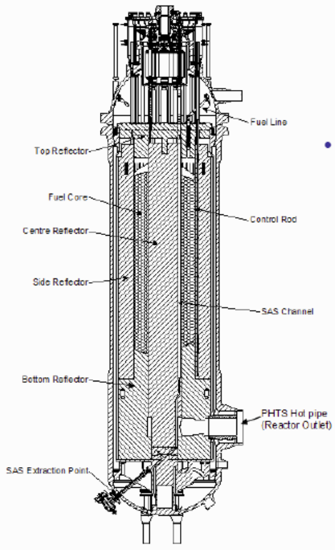

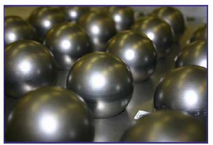

The reactor internals include the graphite reflectors, control rods, and the core barrel. 

- Graphite reflectors – The graphite reflectors are graphite (ceramic) blocks (see Figure 3) that provide moderation for the neutrons and act as a heat sink.  These blocks are divided into three zones: the central reflector (replaceable), the inner side reflector (replaceable), and the outer side reflector (permanent).  There are also bottom and top graphite structures to support the core.  The type of graphite to be used was not specified in the report. 

- Control rods – There are 24 identical control rods, which are located in the side graphite reflector blocks.  Half of the rods are used for control (see Figure 4), and the other half are used for shutdown.  The shutdown rods are longer and run the length of the reflector blocks, while the control rods only run in the upper half of the reflector blocks.  The rods consist of boron carbide (B4C) rings between two coaxial cladding tubes.  The clad material was not specified in the report.  Note that there is a secondary shutdown system located above the central reflector that is comprised of small spheres made of B4C, which are dropped into channels in the central reflector if required for additional negative reactivity margin during an accident. 

- Core barrel – The core barrel (see Figure 5) consists of metallic structures between the RPV and the outer side reflector.  It supports the graphite blocks and helps to maintain core geometry.  The core barrel material is stainless steel 316H. 

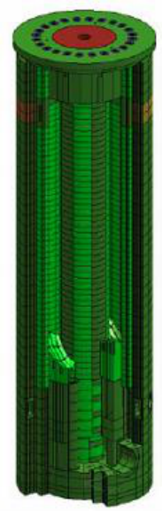

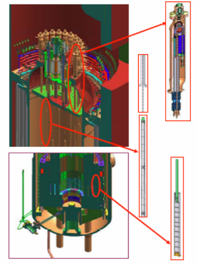

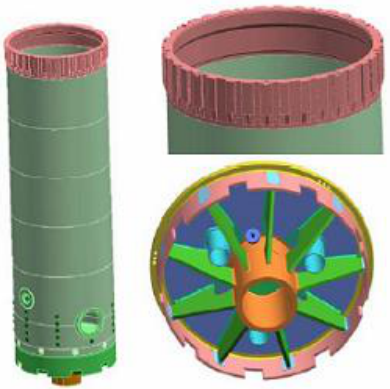

## _**3.2.1.1.2 Vessels**_ 

The RPV (see Figure 6) consists of a main cylindrical section with hemispherical upper and lower heads.  The upper head is bolted to the cylindrical section and incorporates penetrations for control rods and instrumentation.  An opening is provided in the upper head to allow access to the core for reflector replacement.  The lower head is welded to the main cylindrical sections and incorporates penetrations/openings for fuel discharge and the secondary shutdown spheres. 

The RPV has a maximum external diameter of approximately 6.8 m, and its total length is approximately 30 m. 

The RPV is manufactured from carbon steel SA 533 Type B Class 1 for plates, SA 508 Type 3 Class 1 for forgings, and SA 540 Grade B24 Class 3 for bolts.  A separate stream of helium actively cools the RPV; however, during postulated severe accident conditions, calculations indicate that the proposed RPV material temperature may be in the creep range. 

The IHX vessels connect the primary system to the secondary heat transport loop and contain the heat exchangers.  They are manufactured from the same materials as the RPV (i.e., SA-508, Grade 3, Class 1/SA533, Grade B, and Class 1). 

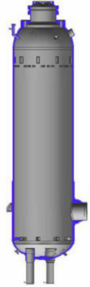

## _**3.2.1.1.3 Shutdown Cooling**_ 

The shutdown cooling system is termed the “core conditioning system” by Westinghouse (see Figure 7).  It can be used for decay heat removal during normal shutdown (e.g., maintenance, reflector change out, etc.), for decay heat removal if the main circulator in the primary loop trips, or it can be used during postulated accident conditions for decay heat removal to supplement the passive safety features of the reactor.  The major components are: blowers, piping, heat exchangers, valves, and instrumentation.  The number of shutdown cooling systems will be determined during conceptual design. 

## _**3.2.1.1.4 Reactor Cavity Cooling**_ 

The reactor cavity cooling system (RCCS; see Figure 8) is a constant flow, water-based cooling system that removes heat from the reactor cavity to protect the concrete walls of the cavity during both normal shutdown and accident conditions.  It is comprised of standpipes that line the inside of the cavity, and is a low-temperature, lowpressure system with water temperatures below 30°C during normal active operation and reaching the boiling point only during emergency passive operation.  The RCCS can operate in both an active mode by pumping water through the standpipes, or a passive mode by boiling the water for approximately 72 hours.  The passive mode time constraint will be better defined during conceptual design. 

## _**3.2.1.1.5 Fuel Handling**_ 

The fuel handling system (see Figure 9) transports fuel spheres from the reactor to the fuel monitoring system to determine burnup, or to storage for fully burnt fuel.  If the fuel monitoring system determines that the fuel has not reached its desired burnup, it is returned to the core.  The fuel handling system also transports and stores the graphite spheres that will be used for the startup core.  The fuel and graphite spheres are circulated through a combination of gravity and pneumatic conveyance using pressurized helium.  Spheres enter the reactor through pipe penetrations in the top head and exit through pipe penetrations in the bottom head.  While the ability to perform on-line refueling can result in higher availability, it also presents greater opportunity for air-ingress events. 

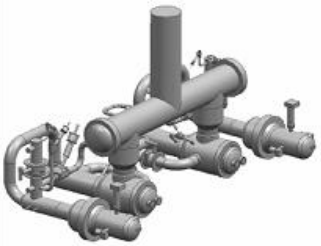

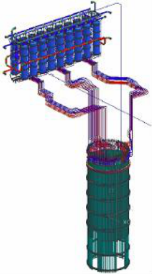

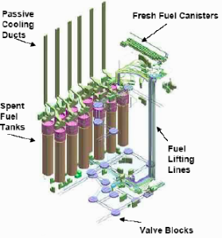

## _**3.2.1.1.6 Helium Services**_ 

Helium services (see Figure 10) refer to the systems and subsystems that handle the primary coolant gas.  It includes coolant cleanup (purification) after shutdown and during operations and maintenance of helium pressure and inventory.  It includes all the piping, valves, compressors, helium storage tanks, monitoring equipment, and filters necessary for helium gas purification and makeup. 

## _**3.2.1.2 AREVA Summary**_ 

AREVA recommended that the NGNP be a 565MWt prismatic reactor (see Figure 11) for the following reasons when compared with the pebble-bed reactor design: 

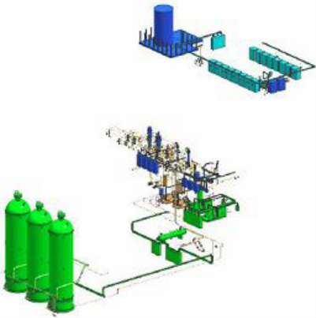

- Greater economic potential 

- Higher power level and passive safety 

- More useable power 

- Greater design flexibility 

- Higher degree of license-ability 

   - Concept previously licensed (Ft. St. Vrain) 

- Higher degree of predictability 

   - Core performance 

   - Scheduled outages 

   - Less chance of forced outages 

Ultimately, the AREVA study concluded that the prismatic block high-temperature reactor (HTR) was the preferred option to maximize the unit power level for best economic performance.  The details for the nuclear island systems and components are given below. 

## _**3.2.1.2.1 Reactor and Core**_ 

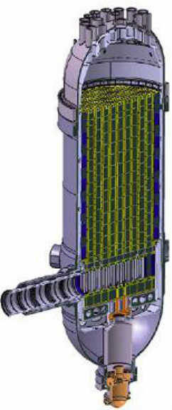

The prismatic core uses hexagonal fuel blocks (360 mm flat-to- flat width) in an annular core. There are two types of blocks; those with and those without control rod holes as shown in Figure 12. 

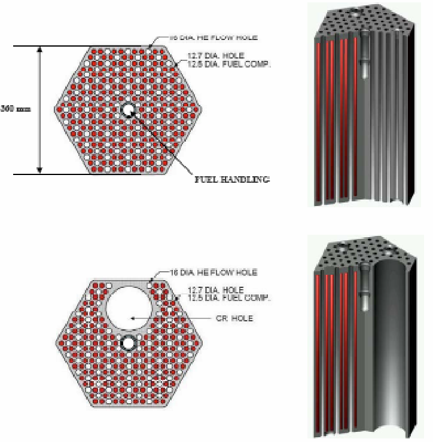

The prismatic fuel blocks contain fuel holes for fuel compacts and can contain holes for burnable poisons.  There are 1020 fuel blocks arranged in three columns to form the annular core. The compacts are 12.5 mm in diameter and contain evenly dispersed spherical particles, known as coated particles, in a graphite matrix. 

Each coated particle consists of a spherical kernel surrounded by four coating layers (see Figure 2).  The reference kernel used by AREVA is uranium oxycarbide (UCO), and the backup is uranium oxide (UO2).  The innermost coating layer next to the kernel is known as the buffer layer, and is followed in turn by a pyrocarbon layer known as the IPyC layer, a SiC layer, and another pyrocarbon layer known as the OPyC layer.  This coated particle design is known as the TRISO design. 

The reactor internals include the graphite reflectors (including the core restraints), control rods, and the core barrel. 

- Graphite reflectors – The graphite reflectors (see Figure 13) are graphite (ceramic) blocks that provide moderation for the neutrons and act as a heat sink. 

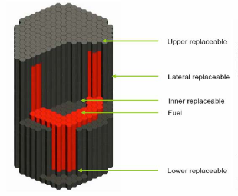

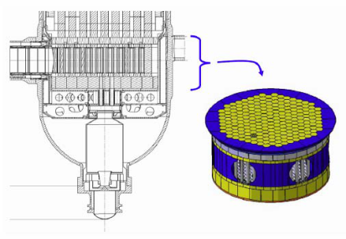

These blocks are divided into three zones: the central reflector (replaceable), the inner side reflector (replaceable), and the outer side reflector (permanent).  There are also bottom and top graphite structures to support the core.  The types of graphite being considered are PCEA from GrafTech, NBG-17 from SGL, and NBG-18 from SGL. 

� Control rods – The control rods (see Figure 14) are split into two categories: (1) 36 operating control rods located in the inner ring of the outer reflector, and (2) 12 start-up control rods in the inner ring of fuel columns.  They are comprised of an annular neutron absorbing material enclosed in carbon-carbon (C/C) composite canisters (cladding).  The reference absorbing material is B4C, but other materials will be considered in conceptual design.  The secondary shutdown system is comprised of spherical absorber elements Figure 14. Control Rods that are dropped into the core through selected channels of a designated group of fuel block under gravity driving force.  The use of C/C composite materials for the control rod cladding requires significant R&D actions to qualify this component and facilitate its approval by the NRC. 

- Core barrel – The core barrel consists of a double wall, metallic structure between the RPV and the outer side reflector.  It supports the graphite blocks and helps to maintain core geometry.  The core barrel material is 800H. 

## _**3.2.1.2.2 Vessels**_ 

The RPV (see Figure 15) is approximately 25 meters high, 7.5 meters in diameter, and 150 mm thick in the core belt line region.  The upper head provides penetrations for the control rod drives and fuel handling system.  The bottom head provides a single large opening for the shutdown cooling system blower and heat exchanger components.  There are nozzle penetrations in the lower portion of the cylindrical vessel that account for several loops. 

The reference RPV material is modified 9Cr-1Mo. This is a developmental material for this application.  An American Society of Mechanical Engineers (ASME) code extension is needed, and issues with availability, fabricability, through thickness properties, and postweld heat treatment need to be resolved. 

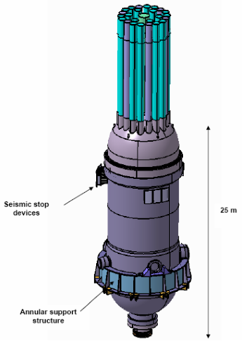

AREVA defined two other systems as vessels – the cross-vessels and IHX vessels. 

The cross-vessels (see Figure 16) connect the lower portion of the RPV to the lower portion of the IHX vessels.  The cross-vessels include a concentric duct (primary hot gas duct) that separates the hot (core exit) and the cold (core inlet) gas flow streams.  The hot gas duct is insulated to reduce regenerative heat losses to the outer flow stream (core inlet cold gas).  However, it is not clear whether the cross-vessels will be allowed to be defined as vessels rather than pipes. 

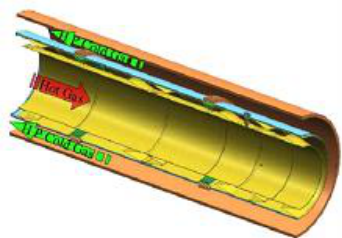

The IHX vessels connect the primary system to the secondary heat transport loop and contain the heat exchangers.  These are discussed below. 

## _**3.2.1.2.3 Shutdown Cooling**_ 

The shutdown cooling system is used for decay heat removal if the main circulator in the primary loop trips, during refueling, or during accident conditions to supplement the passive safety features of the reactor.  The major components are: blowers, piping, heat exchangers, valves, and instrumentation.  Alternatives to the proposed system were also considered (e.g., by having several loops off the RPV, one or two could be used both as a normal heat transfer loops, and as decay heat removal loops). 

In addition to the shutdown cooling system, there is a startup and decay heat removal system that is attached to the secondary circuit through a heat exchanger.  This loop contains a secondary working fluid-to-atmosphere heat exchanger, a circulator, a series of valves for each IHX module, and the required piping and control systems.  This system provides a heat removal path during 

plant startup and shutdown.  In addition, this system can provide heat removal during normal shutdown modes when the primary loop and secondary circuit are available. 

## _**3.2.1.2.4 Reactor Cavity Cooling**_ 

The RCCS (see Figure 17) is a natural convection, water-based cooling system that removes heat from the reactor cavity to protect the concrete walls of the cavity and the RPV supports during both normal shutdown and accident conditions. 

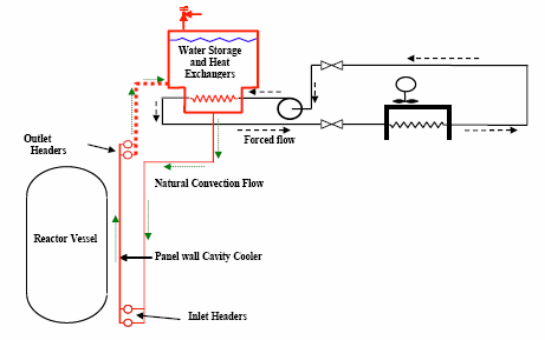

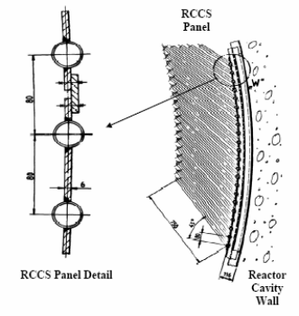

The RCCS is comprised of water-filled panels that line the inside of the cavity and are connected to water storage tanks.  Heat is removed from the water storage tanks by a dedicated circulating water loop with active forced flow that (1) picks up heat in a water-to-water heat exchanger submerged in the storage tanks, and (2) rejects the heat to the atmosphere in a forced draft, wet, water-to-air heat exchanger.  This system contains both safety and non-safety components.  The panels, loop piping, tanks, and heat circulation within the tank are all safety related.  The forced flow loop, pumps, and air blast heat exchanger are non-safety related.  If the non-safety pumped circuit heat rejection path is not available during conduction cooldown events, then water stored in tanks above the reactor vessel continues to flow by natural circulation to the panel wall heat exchangers, and heat is rejected by vaporizing the water inventory and venting steam through the water tanks to the atmosphere. 

## _**3.2.1.2.5 Fuel Handling**_ 

The fuel handling system (see Figure 18) is based on the Ft. St. Vrain fuel handling system.  It consists of a fueling adaptor that is placed on top of 

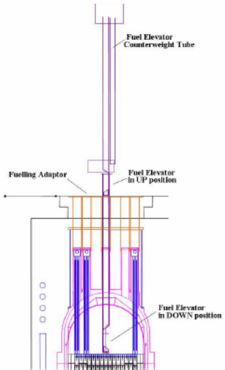

the RPV, a fuel elevator that is inserted through the fueling adaptor into the vessel, and a fuel handling machine that is a robotic manipulator that can be inserted into an inner control rod drive penetration.  It is equipped with a grapple probe that can be inserted into the handling hole in the top of any hexagonal block.  Blocks (both fuel and graphite reflector) are moved one at a time. 

## _**3.2.1.2.6 Helium Services**_ 

Helium services refer to the systems and subsystems that handle the primary coolant gas.  It includes coolant cleanup (purification) after shutdown and during operations and maintenance of helium pressure and inventory.  It includes all the piping, valves, compressors, helium storage tanks, monitoring equipment, and filters necessary for helium gas purification and makeup. 

## _**3.2.1.3 General Atomics Summary**_ 

General Atomics recommended that the NGNP be a 500-600MWt prismatic reactor (see Figure 19) for the following reasons when compared with the pebble-bed reactor design: 

- Inherently allows higher reactor power levels, resulting in better plant economics 

- Involves fewer uncertainties (and therefore less risk) with respect to: 

   - Dust in the primary coolant circuit 

   - Core thermal/hydraulic performance 

   - Replacement of graphite reflector elements 

   - Nuclear fuel accountability 

- Allows more flexibility regarding the use of alternate fuel cycles, such as those fabricated from surplus weapons grade plutonium or transuranics separated from spent LWR fuel. 

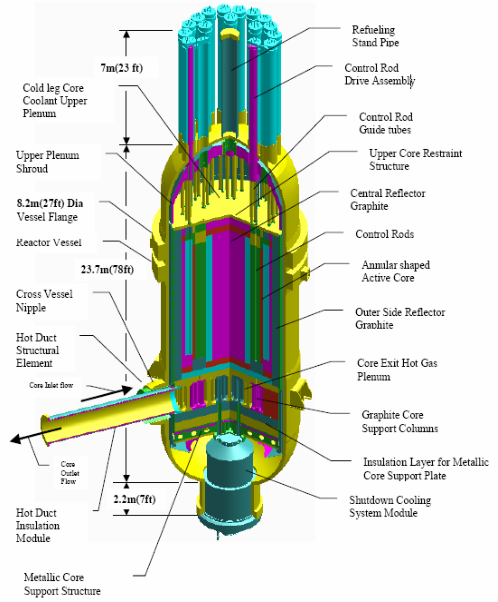

General Atomics felt the comparison revealed that the prismatic concept has a clear advantage over the pebble-bed concept as the HTR type best suited for commercial deployment. 

## _**3.2.1.3.1 Reactor and Core**_ 

The prismatic core is based on the GT-MHR design and uses hexagonal fuel blocks (360 mm flat-to-flat width; 794 mm in length) in an annular core.  There are two types of blocks: those 

with control rod holes and those without.  The prismatic fuel blocks contain fuel holes for fuel compacts, coolant holes, and holes for burnable poisons.  There are 1020 fuel blocks arranged in three columns to form the annular core. 

The compacts are 12.45 mm in diameter, 49.3 mm in length, and contain evenly dispersed spherical particles, known as coated particles, in a graphite matrix.  Each coated particle consists of a spherical kernel surrounded by four coating layers. The reference kernel used by General Atomics is uranium oxycarbide (UCO), where the startup core would use uranium oxide (UO2).  The innermost coating layer next to the kernel is known as the buffer layer, and is followed in turn by a pyrocarbon layer known as the IPyC layer, a SiC layer, and another pyrocarbon layer known as the OPyC layer.  This coated particle design is known as the TRISO design.  Figure 20 shows the fuel particles, compacts, and blocks. 

The General Atomics design for the commercial Very High Temperature Reactor (VHTR) also considers using different fuel forms based on the flexibility of the core and reactor (e.g., plutonium-based 

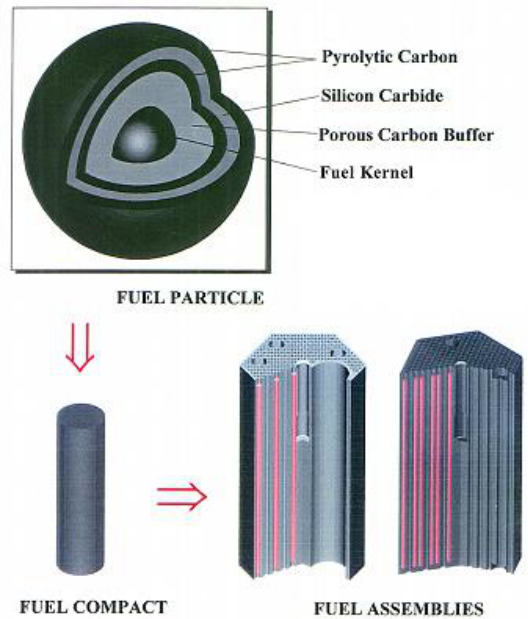

fuel, minor actinide bearing fuel, etc.).  It would be envisioned that the NGNP could be the initial test-bed for these different fuel types. 

The reactor internals include the graphite reflectors (including the core restraints), control rods, and the core barrel. 

- Graphite reflectors – The graphite reflectors (see Figure 21) are graphite (ceramic) blocks that provide moderation for the neutrons and act as a heat sink.  These blocks are divided into three zones: the central reflector (replaceable), the inner side reflector (replaceable), and the outer side reflector (permanent).  There are also bottom and top graphite structures to support the core. 

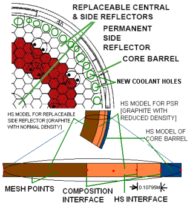

- Control rods – The control rods are split into two categories: (1) 36 operating control rods located in the inner ring of the outer reflector, and (2) 12 start-up control rods in the inner ring of fuel columns that are fully withdrawn for operation.  The neutron absorber material consists of B4C granules uniformly dispersed in a graphite matrix and formed into annular compacts.  The compacts have an inner diameter of 52.8 mm, an outer diameter of 82.6 mm, and are enclosed in Incoloy 800H canisters for structural support.  Alternatively, C/C composite canisters may be used for structural support.  The use of C/C composite materials for the control rod cladding requires significant R&D actions to qualify this component and facilitate its approval by the Regulator. 

The core also contains 18 channels for insertion of the secondary shutdown system material (in the form of boronated pellets) in the event the control rods become inoperable.  The B4C granules are coated with dense PyC to prevent oxidation during off-normal events. 

- Core barrel – Although the core barrel is referenced several times, no mention is made of its specific geometrical configuration, or the material. 

## _**3.2.1.3.2 Vessels**_ 

The RPV (see Figure 22) is approximately 31 meters high, 8.2 meters in diameter, and 261 mm thick in the core belt line region.  The upper head provides penetrations for the control rod drives and fuel handling system.  The bottom head provides a single large opening for the shutdown cooling system blower and heat exchanger components.  There are nozzle penetrations in the lower portion of the cylindrical vessel that account for two loops. 

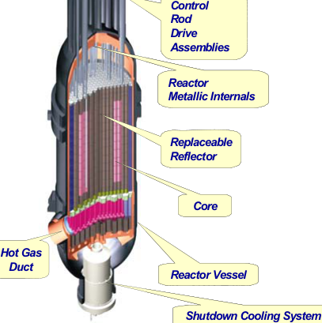

**----- Start of picture text -----** 
Control Rod Drive Assemblies Reactor Metallic Internals Replaceable Reflector Core Hot Gas Duct Reactor Vessel Shutdown Cooling System **----- End of picture text -----** 

The reference RPV material is modified 2-1/4Cr-1Mo, but this particular material _**Core**_ has low strength at the temperatures of interest, which will require very thick _**Hot Gas**_ sections.  The 2-1/4Cr-1Mo-V material has _**Duct Reactor Vessel**_ better strength at the temperatures of interest (similar to mod 9Cr-1Mo), but is not in _**Shutdown Cooling System**_ Section III (nuclear section) of the ASME code.  General Atomics is also considering a Figure 22. Reactor Pressure Vessel design alternative to incorporate cooling of the reactor vessel, which could potentially lower reactor vessel temperatures to a level that would allow use of proven LWR vessel materials (e.g., SA508/SA533 steel). 

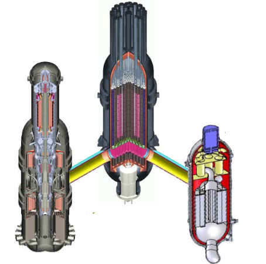

General Atomics defined two other systems as vessels – the cross-vessels and IHX vessels. 

The cross-vessels connect the lower portion of the RPV to the lower portion of the PCS and IHX vessels.  The cross-vessels include a concentric duct (primary hot gas duct) that separates the hot (core exit) and the cold (core inlet) gas flow streams.  The hot gas duct is insulated to reduce heat losses to the core inlet cold gas stream. However, it is not clear whether the crossvessels will be allowed to be defined as vessels rather than pipes.  The cross-vessel material will be identical to the RPV material (i.e., 2-1/4Cr-1Mo or SA508/SA533). 

Figure 23. RPV, PCS Vessel, and IHX Vessel 

The PCS vessel contains the turbomachinery and other PCS components, and is connected directly to the primary system via a cross-vessel (described above).  The IHX vessel connects the primary system to the secondary heat transport loop, and contains the heat exchangers.  Both vessels will be made of the same material as the cross-vessel and RPV (see Figure 23). 

## _**3.2.1.3.3 Shutdown Cooling**_ 

The shutdown cooling system is used for decay heat removal if the main heat removal system (the PCS) is offline, or it can be used during accident conditions (pressurized or depressurized) for decay heat removal.  The major components are: blowers, piping, heat exchangers, valves, and instrumentation 

## _**3.2.1.3.4 Reactor Cavity Cooling**_ 

The RCCS (see Figure 24) is a natural convection, air-based cooling system that removes heat from the reactor cavity to protect the concrete walls of the cavity during accident conditions when either the shutdown or PCSs are inoperable.  It is comprised of panels that line the inside of the cavity, which are connected to rising concentric ducts that lead to an outlet chimney and an air inlet.  It is a completely 

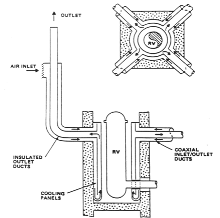

passive design that has no pumps, circulators, valves, or other active components, and is designed to operate continuously in all modes of plant operation. 

## _**3.2.1.3.5 Fuel Handling**_ 

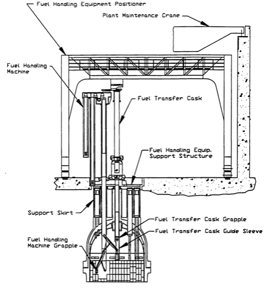

The fuel handling system (see Figure 25) will be similar to that designed for the GT-MHR.  This system includes the fuel handling machine, two fuel transfer casks, an auxiliary transfer cask, the fuel handling equipment positioner, the fuel handling equipment support structure, and the local spent fuel storage and handling facilities. Blocks (both fuel and graphite reflector) are moved on a column-by-column basis, rather than layer-by-layer. 

## _**3.2.1.3.6 Helium Services**_ 

Helium services refer to the systems and subsystems that handle the primary coolant gas.  It includes coolant cleanup (purification) after shutdown and during operations and maintenance of helium pressure and inventory.  It includes all the piping, valves, compressors, helium storage tanks, monitoring equipment, and filters necessary for helium gas purification and makeup. 

Figure 25. Fuel Handling System 

## _**3.2.1.4 Nuclear Island Conclusions and Recommendations**_ 

Table 6 summarizes the design conclusions and recommendations of the three contractor teams. 

Based on these conclusions by each contractor team, the following is observed: 

- A reactor type should be chosen as early as possible to firm up fuel geometry and fuel kernel type (UCO or UO2). 

- Regardless of type, graphite needs to be qualified, and all designs have similar challenges. 

- Control rods recommended by contractor team are similar, except for the cladding material; secondary shutdown is also similar. 

- Core barrel design and material are different for each contractor team, but there are no significant issues with the designs or materials. 

- RPV material is different for each contractor team; the SA508 material used in the PBMR reactor is currently used in LWR designs and will take less development and qualification effort than the 9Cr-1Mo material that may be required for the prismatic designs.  Procurement issues with both materials require making an early decision. 

- The temperature of the RPV is based on thermal conductivity and thermal radiation assumptions, which need to be verified. 

- The Project needs to resolve the issue of cross-vessel vs. piping (i.e., will the regulator accept the cross-vessel argument); the material choice for each is different. 

- IHX vessel material is different for each contractor team.  The same issues as identified for the RPV potentially apply to the IHX vessel and the cross-vessel. 

- The shutdown cooling system is similar for each contractor team. 

- The RCCS is similar for Westinghouse and AREVA (water-based), but different for General Atomics (air-based). 

- The Westinghouse PBMR uses an on-line refueling system; the AREVA and General Atomics refueling systems are batch operated and require a plant shutdown. 

- Helium services are similar. 

By choosing the reactor type earlier rather than later, several of the options could be eliminated, and much of the needed research could be focused and/or eliminated.  For example: 

- The fuel qualification program could be focused on a single fuel type, and any needed facilities (or facility upgrades) could be either assessed against existing facilities or construction/upgrades initiated. 

- Graphite choices could be narrowed, and needed qualification experiments could be accelerated based on available irradiation space. 

- The type of fuel handling equipment and storage could be decided. 

However, many of the recommendations are independent of the reactor type.  As such, trade studies should be performed to limit the choices.  In particular, the following choices could be made prior to conceptual design: 

- Control rod cladding configuration and material – Both the recommendations by the contractor teams and current R&D have considered the same material options – high temperature metallic alloy 800H or C/C composites.  A decision could be made based on factors such as technology maturity and performance. 

- Core barrel design and material – Early studies on design and material performance based on technology maturity and performance could be initiated. 

- RPV material – Each contractor team proposed different reference materials.  However, early choices can be made to eliminate those materials that will not meet the performance criteria or cannot be fabricated.  For example, use of 2-1/4Cr-1Mo might be eliminated based on material strength, and use of mod 9Cr-1Mo may be challenging based on issues with through thickness properties, post weld heat treatment, and fabricability of large forgings. 

- Cross-vessel – Discussions on categorizing the cross duct/piping (that connects the RPV to the IHX vessels or PCS) as a vessel is critical for the safety case. 

- IHX vessel material – As each contractor team has proposed to use the same material as the RPV, the arguments are the same as those for the RPV. 

- Purpose and use of the shutdown cooling system – This appears to simply be a design choice based on the number of loops, the primary heat transport configuration, and the need for alternative decay heat removal systems. 

- Type of RCCS (water or air; active/passive, or just passive) – A decision could be made based on factors such as technology maturity and performance.  Validation experiments would be key in such a decision. 

- Secondary reactivity shutdown and helium services systems – Although some differences exist, the secondary reactivity shutdown system and helium services system were similar, and non-similar design choices can be made based on efficiency and cost. 

## **3.2.2 Heat Transfer and Transport** 

Each of the contractor teams proposed specific heat transfer and transport designs in their PCDRs. The design features, proposed thermal cycle, required equipment, and tradeoffs considered in selecting the method of transferring and transporting process heat were included in each of the contractor teams’ PCDRs. 

## _**3.2.2.1 Westinghouse Summary**_ 

Westinghouse recommended the use of an indirect power conversion cycle and an indirect hydrogen heat transport loop arranged in a serial fashion.  The IHX for the hydrogen heat transport loop would be placed first in the series to obtain the highest temperature gas from the nuclear reactor.  A reactor outlet temperature of 950°C and a temperature drop of 50°C across the hydrogen heat transport loop IHX were assumed.  The pressure of the primary loop was assumed to be 9 MPa, and the secondary loop was assumed to operate at a pressure between 8.1 and 8.5 MPa.  The power conversion cycle uses steam generators and a Rankine Cycle to generate electricity and would be designed to receive the full power of the reactor (see Figure 26 for a schematic of this configuration). 

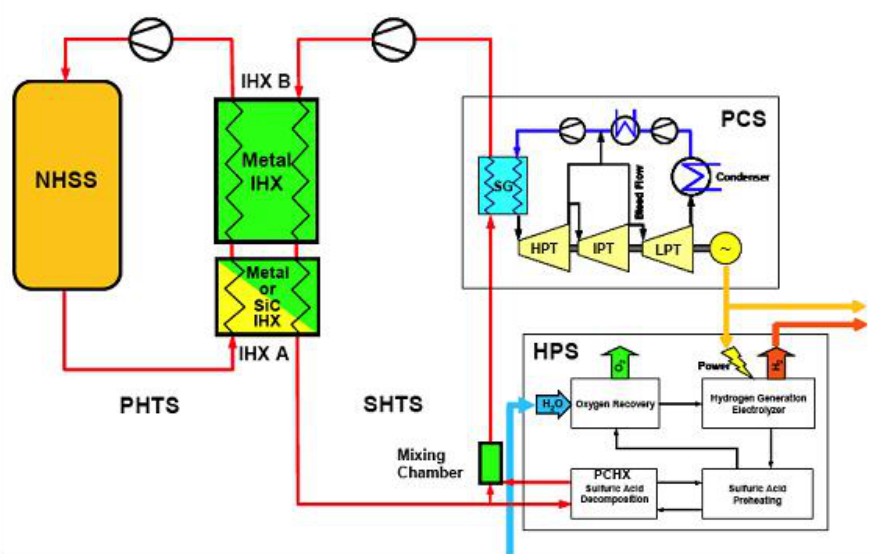

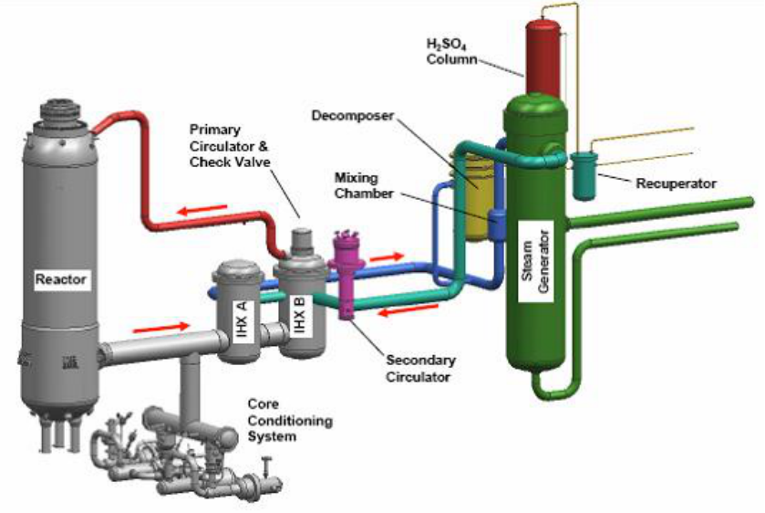

Westinghouse recommends the use of a two-section IHX.  Section 1 (IHX A) would be expected to operate at temperatures between 710 and 900°C and is expected to be replaceable.  Section 2 (IHX B) would be expected to operate at temperatures below 710°C and would be designed for a 60-year lifetime. 

IHX A may be composed of metal or ceramic, while IHX B would be made of metal.  Both IHX sections are recommended to be composed of compact heat exchanger modules, as it is believed that tubular heat exchangers would be too large and costly to be economical. 

The heat transport piping would be composed of layers of internal and external insulation, and would employ concentric pipe arrangements that use colder gas to cool the metallic pipe surfaces that come in contact with the highest temperature gases.  Figure 27 shows a diagram of one such piping scheme. 

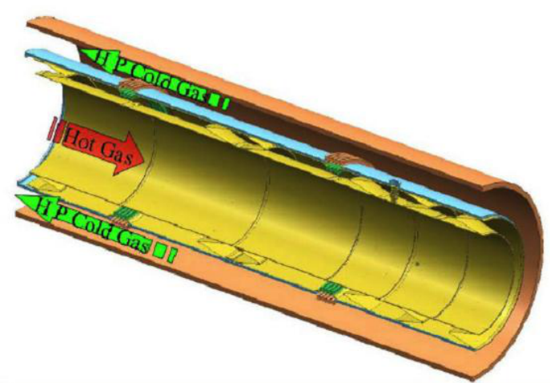

Helium is the fluid of choice for the secondary heat transport loop.  Molten salts were briefly examined, and it was decided that there is not sufficient information available at this time to consider deploying molten salt coolant in the NGNP. 

## _**3.2.2.2 AREVA Summary**_ 

AREVA provided two plant configurations – one that uses a Brayton cycle to generate electrical power, and another that uses steam to generate electricity via a Rankine cycle.  The Brayton-cycle configuration is based on the ANTARES design, which was originally used by AREVA as the baseline for application to NGNP requirements.  In the course of their evaluations, AREVA concluded that the Rankine-cycle configuration may be more adaptable to NGNP requirements.  Though it is not stated clearly in their final report, AREVA indicated in the 90% reviews that they favor the Rankine-cycle configuration.  These configurations are briefly described below. 

The combined Brayton-cycle configuration assumed a 565 MWt reactor with an outlet temperature of 900ºC and a reactor pressure of 5 MPa.  It employs an indirect power conversion unit and an indirect hydrogen heat transport loop.  The secondary loop used to provide energy to the Brayton cycle turbines uses a 20% He/80% N gas mixture at 5 MPa and would be designed to receive the full thermal energy load from the reactor.  Heat recovery steam generators would be deployed following the Brayton-cycle turbines to supply a bottoming Rankine cycle. 

The hydrogen heat transport loop would operate with 100% He and at 5 MPa, and would be designed to carry up to 60 MWt to the hydrogen plant. 

AREVA recommends three primary to secondary heat transfer loops using metallic shell & tube heat exchangers to supply gas to the power conversion loop.  AREVA considers that the use of shell & tube heat exchanger designs for the full-power conditions is less developmental than use of compact heat exchanger designs to meet the 2018 startup objective.  AREVA does recommend use of a smaller (60 MWt) compact metallic heat exchanger in a fourth loop to supply the hydrogen process.  The temperature drop between the primary heat transport loop and the secondary power conversion loop is 50ºC, while the temperature drop for the hydrogen heat transport loop is 25ºC, which takes credit for the greater heat transport efficiencies of the compact heat exchanger designs.  The indirect power conversion loop and indirect hydrogen heat transport loop are linked to the primary cooling loop in parallel (see Figure 28 for a schematic of this configuration). 

The Rankine-cycle configuration differs from the Brayton-cycle configuration in that shell & tube steam generators are directly coupled to the primary cooling loop to drive the steam turbines.  The steam generators are arranged in parallel with the hydrogen heat transport loop.  The steam system would operate at a temperature of approximately 550ºC.  No recommendation of steam system pressure was provided.  Section 3.2.3.2, _AREVA PCS Summary_ , contains a schematic of this configuration. 

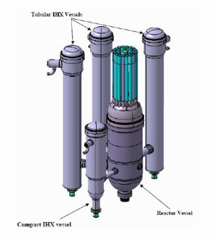

## _**3.2.2.3 General Atomics Summary**_ 

General Atomics recommends the use of a direct Brayton cycle for electricity generation and an indirect heat transport loop to transport thermal energy to the hydrogen production plant (see Figure 29). The primary loop and the hydrogen heat transport loop would use helium at 7 MPa as a heat transport medium.  The hydrogen heat transport loop would be sized to transmit up to 65 MWt.  The assumed operating temperatures of the primary loop and hydrogen heat transport loop are 950°C and 925°C, respectively.  A compact metallic heat exchanger module is assumed to serve as the IHX for the hydrogen heat transport loop.  Helical coil IHXs were also discussed, but General Atomics believes that compact heat exchangers will offer better performance and will be more economical. 

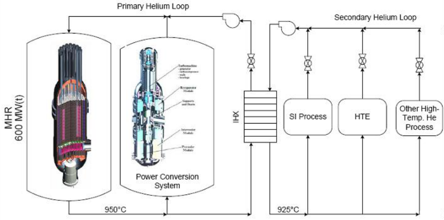

The pipe configuration for the hydrogen heat transport loop are parallel hot and cold transport pipes that use internal and external pipe insulation to lower the temperature of the metallic pipe so that metals less expensive than Inconel 617 can be used for the long-distance (i.e., 90 m) loop.  Schematics of this pipe insulation arrangement are shown in Figure 30. 

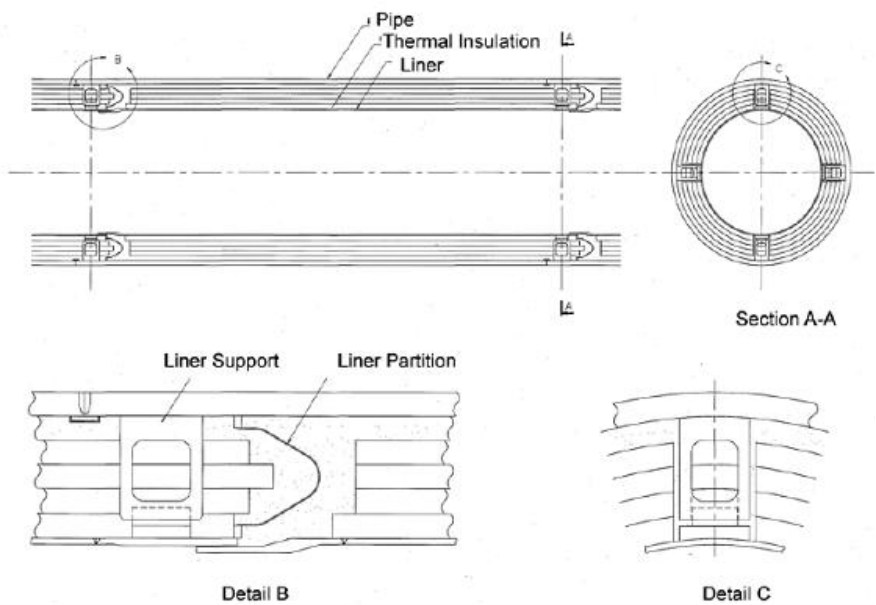

The use of molten salt as a heat transport medium for the hydrogen heat transport loop was examined, and it was determined that molten salt is not yet ready to be deployed.  There are issues of corrosion and materials compatibility, as well as concerns about the cost of the pipe materials, since it is believed that internal insulation could not be used to protect the heat transport pipes against the temperature. 

## _**3.2.2.4 Heat Transport and Transfer Conclusions and Recommendations**_ 

The consensus is that helium should be used as the heat transport fluid in the hydrogen heat transport loop.  For AREVA and General Atomics, helium would be used for a dedicated hydrogen heat transport loop; while for Westinghouse, helium would be used in a general secondary cooling loop, which would supply power to the hydrogen plant and the power conversion unit. 

The contractor teams also generally agreed that metallic heat exchangers should be used for the IHXs whenever physically possible.  While there were differences on whether tubular IHX designs or a compact metallic heat exchanger designs should be used, a metallic IHX is more likely to be deployable in the required time frame than a ceramic IHX. 

Recommendations for future studies were focused on either tackling technical issues associated with the construction and deployment of the NGNP (near-term) and on issues related to improving the economics or reliability of NOAK systems (long-term).  In the near term, it was recommended that ASME certification of compact metallic heat exchanger designs at the NQA-1 level be pursued, and that the code cases be prepared for Inconel 617 and/or other high-temperature alloys of interest.  Current ASME codes do not extend higher than 760°C for Inconel 617 and apply only to tubular heat exchangers. Therefore, if metallic heat exchangers are going to be used, codification of the metals and the designs (if compact heat exchangers are deployed) must be pursued in parallel with the NGNP design efforts. 

Questions related to tritium transport to the hydrogen plant are also of great interest, as tritium is a potential contaminant in the hydrogen product.  Further studies of tritium transport and tritium mitigation need to be undertaken to ensure that the hydrogen product does not contain unacceptable levels of tritium. It is expected that tritium studies must be performed in preparation for any licensing paperwork with the NRC. 

In the longer term, several studies were recommended.  Ceramic heat exchangers are of great interest because of their expected high-temperature performance and resistance to creep and corrosion.  Also, ceramics form much better barriers for tritium diffusion than metallic heat exchangers and may help mitigate any tritium transport problems.  It was recommended that ceramic heat exchangers be pursued for eventual use as IHXs.  This would require building an ASME code case for the ceramic materials of interest and obtaining ASME certification of ceramic heat exchanger designs at the NQA-1 level. 

Another area of interest is in the use of supercritical CO2 for the power conversion unit.  Preliminary configuration studies have shown that the use of supercritical CO2 in the power conversion unit may offer increased efficiency vs. steam-driven and even helium-driven cycles.  Additional work is needed to construct and test process equipment and to understand the long-term interactions of supercritical CO2 on the materials of construction. 

The last general area of interest was in the use of molten salts as long-distance heat transport fluids. Helium can be used today for the heat transport loop, but its use is less efficient than if a liquid were used due to the increased power requirements of moving a compressed gas vs. pumping a liquid.  Also, using a liquid salt instead of helium would allow for smaller-diameter piping and may allow the heat transport loop to be extended over distances longer than several hundred meters without appreciable energy losses. It is recommended that research continue in the area of molten salts as heat transfer fluids with the hope that practical long-distance heat transport loops might eventually be constructed and tested that use molten salt as a heat transport fluid. 

## **3.2.3 Power Conversion System** 

Each of the contractor teams proposed specific PCSs, which are outlined in their respective PCDRs. The PCS design details are given below as summaries from the recommendations from each contractor team. 

## _**3.2.3.1 Westinghouse Summary**_ 

Westinghouse recommends the NGNP utilize a conventional Rankine power cycle (see Figure 31). The use of a conventional Rankine cycle provided a flexible, well-proven, highly reliable system with the potential for process integration and use of waste heat from the HPS.  Additionally, with the exception of the steam generator (SG), the major equipment is readily available from a multitude of vendors.  R&D requirements and cost uncertainty are limited to the SG. 

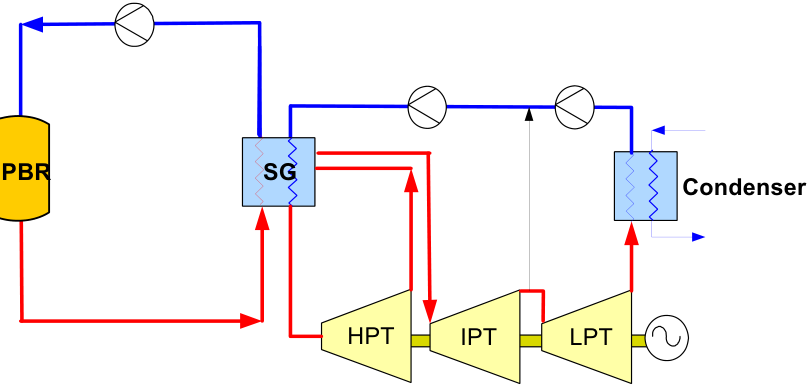

**----- Start of picture text -----** 
PBR SG Condenser HPT IPT LPT **----- End of picture text -----** 

Figure 31. Direct Rankine Cycle Coupled to Reactor via Steam Generator 

Key features of this design areas follows: 

- The system is designed using commercially available components to minimize R&D and technology development needs. 

- High-temperature helium piping is minimized to limit leakage and system heat losses. 

- The system has capability to interact and accommodate operational transients associated with the Hydrogen Production Unit Facility 

- INL is a dry site, so air-cooled condensing is selected. 

- Physical size limitations of SG components must be based on transportation limits.  This may influence selection of multiple trains. 

- The system must be adaptable to commercial sized application of hydrogen/power cogeneration. 

Design requirements and performance parameters for major equipment are identified: 

- Steam generator 

- Steam turbine generator 

- Feed-water heaters 

- Air-cooled condenser 

- Condensate and feed-water pumps 

- De-aerator 

- Support systems. 

The SG has been identified as a developmental component based on prior design development experience for other HTGR applications.  The requirements, configuration, materials, and design features of this component require that a number of DDNs be satisfied for successful design, manufacturing, delivery, and long-term operation of the prototype and follow-on components.  Eighteen items of need are identified for the SG. 

It is recommended that studies be conducted in the subsequent conceptual design phase to optimize selection of components influencing cost effectiveness of the PCS. 

## Steam Generator Design Trade Study 

It is recommended that a future study be conducted that will evaluate alternative approaches for the SG, including more conventional designs (e.g., refractory lined, U tube) compared to the once-through helical-type SG proposed in the PCD.  Single vs. multiple trains will be evaluated.  The results of the study will establish a path forward for design development of the steam generator. 

## Rankine Cycle Trade Study 

Further engineering studies are recommended to optimize Rankine-cycle configuration and performance during conceptual design.  The study will assess costs and performance benefits of more efficient cycles with steam reheat vs. more simple but less costly systems.  The study will proceed in conjunction with the SG design trade study discussed above. 

## Design Basis Transient Study 

An engineering study is recommended to identify and analyze transient cases that could effect the design requirements of the PCS regarding ensuring the safety of the NHSS and HTS.  Demonstration cases and commercial configurations will be assessed to ensure that the NHSS, HTS, and HPS function within the design basis envelopes through the assumed transient conditions. 

## _**3.2.3.2 AREVA Summary**_ 

AREVA provided two PCS configurations – a Brayton combined cycle, and a Rankine cycle. AREVA provided the Brayton cycle because it is based upon the ANTARES design; they provided the Rankine cycle because it is what they believe would be more easily deployed in the 2016-2018 timeframe.  Though it is not clearly stated in their PCDR, AREVA recommends the Rankine cycle for the NGNP. 

AREVA concluded that the Steam-Rankine cycle (possibly supercritical) is the best fit for near-term applications (see Figure 32 and Table 7).  It provides high-efficiency electricity production and can readily service near-term process heat markets.  The promising benefits of the supercritical CO2 cycle warrant continuing development for long-term electricity production applications.  Further, a more detailed evaluation of equipment costs and size would be beneficial for confirmation of these recommendations. 

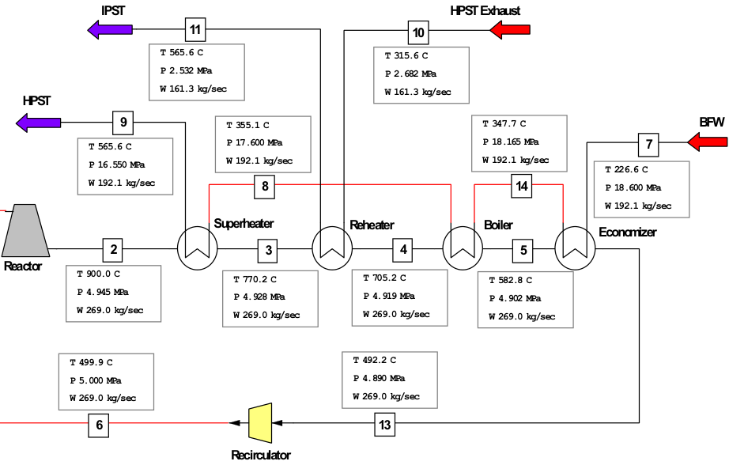

**----- Start of picture text -----** 
IPST HPST Exhaust 11 10  T 565.6 C  T 315.6 C  P 2.532 MPa  P 2.682 MPa  W 161.3 kg/sec  W 161.3 kg/sec HPST 9  T 355.1 C  T 347.7 C BFW  T 565.6 C  P 17.600 MPa  P 18.165 MPa 7  P 16.550 MPa  W 192.1 kg/sec  W 192.1 kg/sec  T 226.6 C  W 192.1 kg/sec 8 14  P 18.600 MPa  W 192.1 kg/sec Superheater Reheater Boiler Economizer 2 3 4 5 Reactor  T 900.0 C  T 770.2 C  T 705.2 C  T 582.8 C  P 4.945 MPa  P 4.928 MPa  P 4.919 MPa  P 4.902 MPa  W 269.0 kg/sec  W 269.0 kg/sec  W 269.0 kg/sec  W 269.0 kg/sec  T 499.9 C  T 492.2 C  P 5.000 MPa  P 4.890 MPa  W 269.0 kg/sec  W 269.0 kg/sec 6 13 Recirculator **----- End of picture text -----** 

Figure 32. Steam Rankine Cycle 

Table 7. Steam Rankine Cycle Power Balance 

|**Power (MW)**|**Power (MW)**|**Efficiency (%)**|**Efficiency (%)**|
|---|---|---|---|
|Reactor|565.0|Carnot Efficiency|63.6%|
|Heat Losses|-5.65|Gross Cycle Efficiency|46.6%|
|Circulator Power|10.97|% of Carnot|73.3%|
|**Net to Cycle**|**570.3**|**Net Cycle Efficiency**|**42.8%**|
|Steam Turbine|265.8|||
|**Gross Cycle Power**|**265.8**|||
|Generator Losses|-5.3|||
|BOP Losses|-2.7|||
|Circulator Power|-11.0|||
|Feed & Condensate|-5.1|||
|**Net Cycle Power**|**241.7**|||

## _**3.2.3.3 General Atomics Summary**_ 

General Atomics’ recommendation consists of a direct cycle vertical integrated PCS design, which was selected for the GT-MHR from trade studies performed as part of the GT-MHR PCD that was developed under a joint initiative of the DOE and U.S. utilities between 1991- 1994.  The original PCS design concept was developed by General Atomics, General Electric, and Allied Signal.  In 1994, the GTMHR was selected as the basis for a joint effort by the United States and Russia to design a modular 

helium reactor (MHR) to be used for disposition of weapons-grade plutonium.  OKB Mechanical Engineering (OKBM) was given responsibility for the GT-MHR design development and is the chief designer of the reactor plant.  In support of this arrangement, DOE also negotiated a contract with OKBM to perform R&D work.  Starting with the U.S. version of the GT-MHR PCS design, OKBM has further developed the design through preliminary design and has made several design improvements.  The PCS design concept is shown in Figure 33 

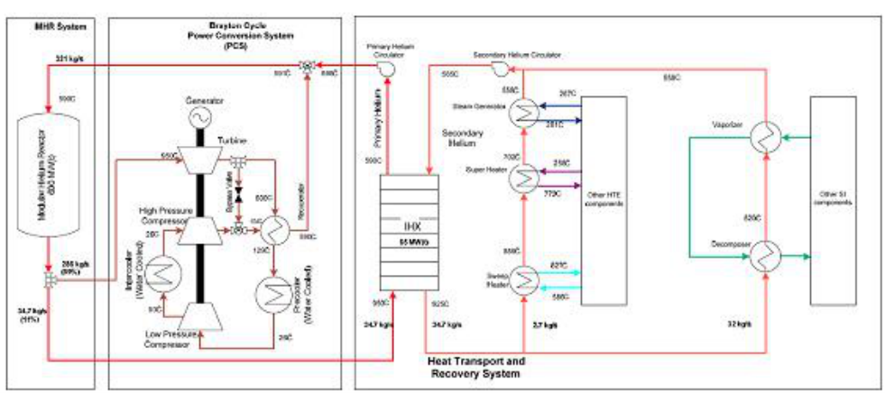

.  The PCS consists of four major components: a turbomachine, a recuperator, a precooler and intercooler, and the in-vessel metalwork.  The turbomachine speed is 4400 rpm, having a frequency at the generator outlet of 73.33 Hz.  A frequency converter is used to connect the generator with the outside grid with a standard current frequency of 60 Hz. 

The key design features include: 

- A direct Brayton cycle that provides high efficiency and superior economics 

- A vertical shaft that minimizes blade/stator clearances to reduce bypass flows, reduces plant footprint and associated capital costs, and allows vertical lifts for maintenance and the use of gravity to offset turbine thrust 

- Electromagnetic bearings that reduce energy losses and eliminate the possibility of lubricant ingress into the primary circuit 

- A single stage of intercooling that improves thermal efficiency by about 2% over a nonintercooled cycle 

- A submerged generator that eliminates a rotating seal in the primary pressure boundary and reduces leakage of primary helium coolant. 

## _**3.2.3.4 Power Conversion Conclusions and Recommendations**_ 

The three contractor teams’ recommendations for the NGNP PCS are summarized in Table 8. 

Table 8. Contractor Recommendation for the NGNP PCS 

|**Contractor Team**|**Cycle Configuration**|**PCS Type**|
|---|---|---|
|Westinghouse|Indirectcycle|Rankine|
|AREVA|Indirectcycle|Steam Rankine|
|General Atomics|Direct cycle|Brayton|

## **3.2.4 Hydrogen Plant** 

The Westinghouse and General Atomics teams proposed specific hydrogen production technology recommendations.  AREVA’s work scope did not include the hydrogen production plant. 

## _**3.2.4.1 Westinghouse Summary**_ 

Westinghouse’s PCDR recommended that the Hybrid Sulfur process be adopted as the hydrogen production technology for the NGNP.  The two-step Hybrid Sulfur process is a modification of the thermochemical SI Process that eliminates the need for iodine by employing an electrolysis unit to reconstitute the sulfuric acid and release the hydrogen from the feed water.  This process is shown schematically in Figure 34. 

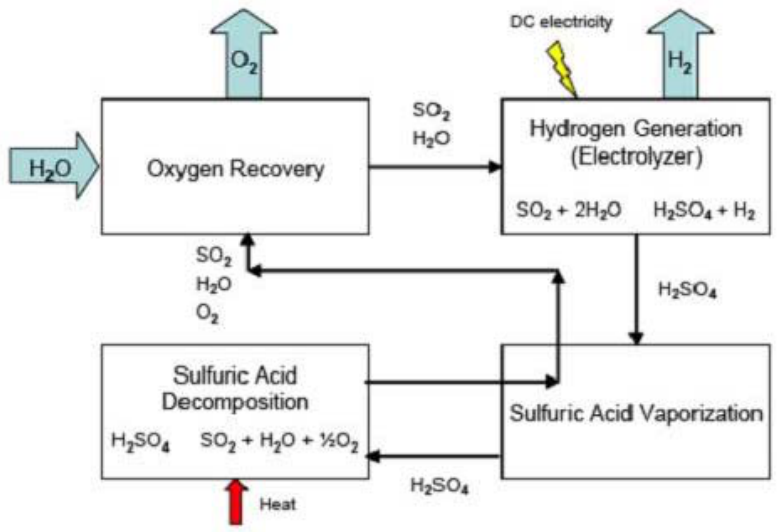

According to Westinghouse, the Hybrid Sulfur process is the best fit for the NGNP because it requires a significantly large portion of its energy in the form of high-temperature heat in comparison to hightemperature electrolysis (making it potentially more efficient on a large scale), and because it is more simple and straight-forward than the thermochemical SI process.  Also, the process does not use iodine, and so the burdensome separation trains related to iodine separation are not needed in this process. Corrosion problems are also greatly reduced.  The recommended size of the Hybrid Sulfur plant is 50 

MWt with additional power (13 MWe) provided by the NGNP’s power conversion unit or the electrical grid. 

High-temperature electrolysis was recommended as a back-up technology.  Westinghouse also identified hydrogen, oxygen, and liquid and solid waste materials as the significant products and byproducts of the hydrogen production plant. 

## _**3.2.4.2 General Atomics Summary**_ 

General Atomics recommended that the NGNP consist of two hydrogen production plants operating in parallel – a thermochemical SI plant, and a high-temperature electrolysis plant.  The SI plant uses a three-step chemical reaction to split water into hydrogen and oxygen (see Figure 35), while the hightemperature electrolysis splits water electrochemically into hydrogen and oxygen using a single decomposition step (see Figure 36). 

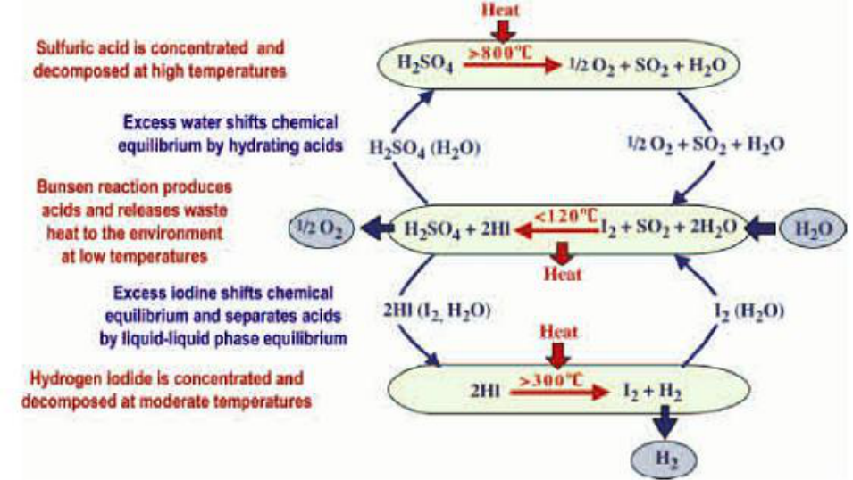

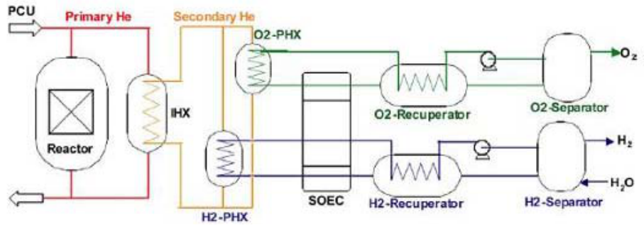

The SI process has been under development by General Atomics for more than 20 years and is the leading plant offered by General Atomics.  Toshiba is a member of General Atomics and has developed solid oxide fuel cells that are part of the primary technology in the high-temperature electrolysis process. Accordingly, General Atomics included this process as an alternative to the SI process for NGNP.  No parametric study or side-by-side comparison of these hydrogen production technologies was performed by General Atomics, and each hydrogen production concept is offered without critical review. 

General Atomics recommends a three-train SI plant having a total power requirement of 60 MWt and a multi-module high-temperature electrolysis plant having a total power requirement of 4 MWt.  Though the technologies can be demonstrated at a smaller scale, these sizes are the minimum recommended size for testing not only the individual plant performance, but also how commercially sized trains or modules interact with each other and with the nuclear plant. 

The significant products and by-products identified from the hydrogen plant include hydrogen, oxygen, solid waste materials (e.g., discarded equipment, corrosion by-products), and trace contaminants in the gas streams (e.g., tritium, sulfur dioxide). 

## _**3.2.4.3 Hydrogen Plant Conclusions and Recommendations**_ 

Though the approaches taken by General Atomics and Westinghouse were different, their opinions on the size of the hydrogen plant were consistent.  Both contractor teams recommend that full-sized trains be demonstrated in the hydrogen production plant, and that multiple trains be operated to understand how modularized trains interact with each other and with the nuclear plant.  Both contractor teams have also listed tritium and waste materials as significant items of interest that will need further examination. 

Westinghouse recommends that more work be done to fully define the flow sheets and supporting thermodynamics and kinetics data for the hydrogen production processes under consideration.  The flow sheets provide information on the energy and mass balances, stream chemical compositions and flow rates, and so forth, and are used to support component sizing determinations, component development activities, develop plant layouts, and other uses.  Having reference flow sheets is a pre-requisite to preliminary hydrogen plant design, and so this activity should be placed high on the list of priorities. 

Both contractor teams recommended that detailed tritium transport modeling be performed to understand how tritium moves from the nuclear plant to the hydrogen plant and how tritium contamination might be mitigated through operational and engineering controls.  Conceptual design of the 

feed water purification plant and the waste disposal processes for the hydrogen production plant was also recommended as it has bearing on the permitting and cost of the plant. 

Market studies were recommended for the hydrogen and oxygen product in the context of the local market for the NGNP.  Though the EPAct was silent on the need to demonstrate a use for the hydrogen and oxygen produced by the NGNP, there is significant opportunity once the NGNP is operating for testing add-on technologies and other industrial plants that might use hydrogen and oxygen to produce synthetic fuels or to process or produce other industrial materials. 

## **3.2.5 Balance of Plant** 

Each of the contractor teams proposed specific details concerning the BOP.  Westinghouse’s work scope included the entire BOP, while both the AREVA and General Atomics teams’ work scope only included those key BOP systems and structures necessary to support their design, capital cost estimate, and schedule at a PCD level. 

## _**3.2.5.1 Westinghouse Summary**_ 

The Westinghouse PCD of the BOP systems was based on similar systems and components developed for the _Advanced Light Water Reactor Utility Requirements Document_ and systems used on typical power plant and industrial projects.  The Westinghouse BOP systems provide the mechanical and electrical support utilities for all areas and processes in the plant, and environmental control systems for those buildings in the PCS, HPS, and BOP buildings.  Also included are the site security systems and environmental monitoring systems. 

To minimize water consumption by the BOP systems, it is proposed to use closed-circuit cooling towers for the component cooling water heat sink and to use air-cooled chillers for HVAC chilled water. This approach reduces evaporation, blow-down, and drift losses associated with standard cooling towers. 

It has been determined that the HPS system makeup and evaporative coolers for the NHSS, PCS, and HPS call for a significant amount of water requiring treatment and recycling.  The wastewater treatment system is designed to use an evaporator to remove solids and recover water for reuse by the plant (service) water system. 

The BOP systems interface with the NHSS, HPS, and PCS major systems to supply and receive electric power, make up water, cooling water, wastewater, compressed air, control and supervision, solid and liquid waste, compressed gases, and laboratory support.  The Westinghouse BOP systems include those systems that generally provide support functions for more than one of the major systems in the plant, namely: 

- Plant Control and Instrumentation Systems 

- Plant Electrical Distribution System 

- Plant Water System 

- Auxiliary Cooling (Component Cooling) Water System 

- Potable Water System 

- Demineralized Water System 

- Chilled Water System 

- Compressed Air System 

- Equipment Handling System 

- Decontamination System 

- Waste Handling Systems 

- Wastewater Treatment System 

- Fire Protection System 

- Environmental Monitoring Systems 

- Sanitary Sewer System 

- Gas Storage and Supply System 

- Laboratories 

- Auxiliary Boiler 

- Storm Water System. 

The Westinghouse BOP systems identified and described in Section 9.0 of the Westinghouse PCDR have been developed to provide necessary support functions to the NHSS, PCS, and HPS, as well as to provide building serviced to the remainder of the proposed NGNP facility.  The system-by-system discussion in the Westinghouse PCDR details the requirements and functions for each of these systems, and describes the features and equipment associated with the primary and subsystems associated within each.  Since these BOP systems and the associated equipment are commonly used in power and other industrial applications, it is not anticipated that design data related to technology development are required.  Westinghouse recommends that trade studies be performed in the conceptual design phase for water and wastewater optimization and control system architecture, as described below. 

## Water and Wastewater System Optimization Trade Study 

It is recommended that a trade study be performed in the conceptual design phase to optimize the approach to water and wastewater usage, treatment, and disposal.  This recommendation is based on the assumption the NGNP will be a zero liquid discharge site, and large amounts of water are required for make up and cooling of HPS, PCS, and BOP systems.  Treatment is required for process discharge and blow-down from these systems. 

## Control System Architecture 

It is recommended that a study be conducted to investigate costs, safety, and benefits of an integrated vs. distributed control system and the locations for various system control functions throughout the plant site to satisfy operational and safety needs of the NHSS, PCS, HPS, and BOP systems.  Figure 37 is a block diagram of the Westinghouse Central Control and Supervisory System (CCSS) proposed for the NGNP. 

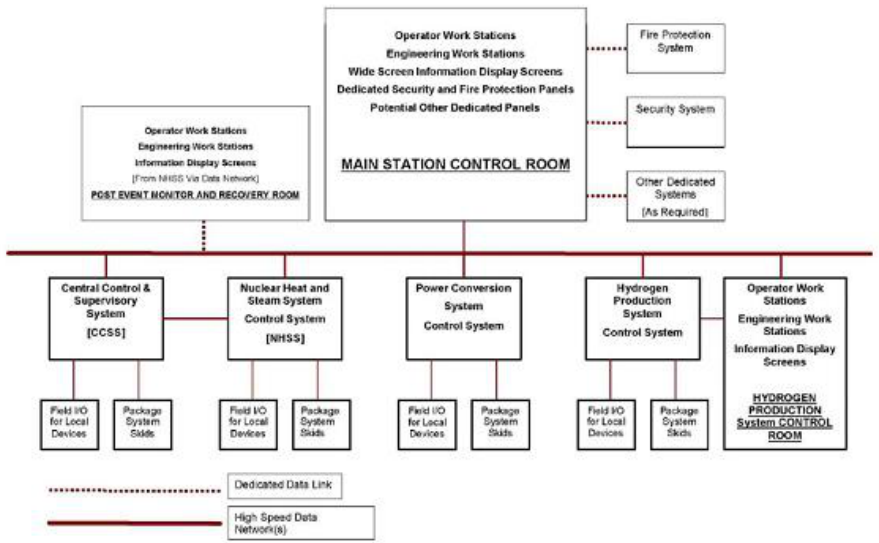

## _**3.2.5.2 AREVA Summary**_ 

The AREVA SOW did not include the PCD of the entire BOP.  As such, the AREVA Pre-Conceptual Design Studies Report (PCDSR) included only those key BOP systems and structures necessary to support their design, capital cost estimate, and schedule at a PCD level.  AREVA identified the following key BOP systems in their PCDSR: 

- Plant Control System 

- Plant Protection System 

- Plant Monitoring System 

- Electrical System 

- Component Handling System. 

Overall control of the NGNP facility is provided by the Plant Supervisory Control System (see Figure 38).  This system provides coordination between the nuclear heat source, the power generating facility, and the hydrogen production facility.  It oversees overall load control for the plant and coordinates startup and shutdown activities.  Actual control and protection functions within the nuclear heat source and within the hydrogen production facility are handled by separate dedicated systems.  These systems receive load instructions from the supervisory system. 

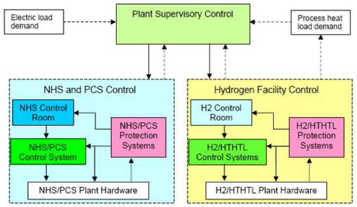

The Plant Protection System is a collection of safety and non-safety systems.  It includes the following safety-related systems: 

- Reactor Protection System 

- Reactor Control and Limitation System 

- Priority and Actuator Control System 

- Post-Accident Monitoring System 

- Seismic Monitoring System. 

It also includes the following non-safety systems: 

- Investment Protection System 

- Diagnostic and Maintenance System for Safety Instrumentation and Control (I&C). 

The Plant Electrical System and its associated subsystems support the process and BOP facility functions and services during all modes of plant operation, including start-up and testing, normal operation, shutdown, and plant outages.  The system includes the following subsystems: 

- Plant Main AC Power Supply 

- DC and Uninterruptible Power Supply 

- Plant Standby Power Supply. 

The main buildings identified in the AREVA PCDSR as having significant impact on the construction cost estimate are as follows: 

- Reactor Building 

- Reactor Service Building 

- Reactor Auxiliary Building 

- Personnel Service Building 

- Make Up Water and Auxiliary Boiler Building 

- Control Building 

- Hot and Cold Machine Shops 

- Power Conversion Building. 

The AREVA PCDSR did not identify any technology development or R&D needs for BOP systems and structures. 

## _**3.2.5.3 General Atomics Summary**_ 

The General Atomics’ SOW did not include the PCD of the entire BOP.  As such, the General Atomics’ PCDSR included only those key BOP systems and structures necessary to support their design, capital cost estimate, and schedule at a PCD level.  General Atomics identified the following key BOP systems in their PCDSR: 

- Plant Operation and Control System 

- Waste Heat Rejection System 

- Spent Fuel Cooling System 

- Nuclear Island Cooling System 

- Essential Plant AC Electrical System 

- Essential Plant DC Electrical System 

- Nuclear Island HVAC System 

- Power Conversion Handling System 

- Hydrogen and Oxygen Storage and Handling System 

- Chemical Storage System 

- Hydrogen Distribution System 

- Water Supply System. 

The Plant Operation and Control System provides normal control and instrumentation functions and overall integration of the control and protection functions into a combined plant control system.  The Nuclear Island Cooling System provides auxiliary cooling to a number of users in the immediate reactor area.  These include: 

- Shutdown Cooling Water System 

- Primary Coolant Helium Purification Cooling Water System 

- Liquid Nitrogen Recondenser(s) 

- Gaseous Radwaste System Compressors 

- Helium Transfer and Storage System (Transfer Compressors) 

- Various Nuclear Island Sampling Systems. 

The Nuclear Island Cooling System is a closed-loop arrangement consisting of two 100% capacity pumps, five 25% capacity air-cooled heat exchangers, a surge tank, and a water chemistry package. 

The BOP HVAC System provides heating, ventilation, and air conditioning services to the following buildings: 

- Reactor Service Building 

- Main Control Building 

- Administration Building 

- Personnel Service Building 

- Maintenance Building 

- Auxiliary Services Building 

- Hot Machine Shop 

- Cold Machine Shop 

- Security Structures 

- Storage Facilities 

- Miscellaneous Support Buildings. 

The Power Conversion Handling System is composed of equipment contained within the PCS that is designed for removal of PCS components as may be necessary for replacement, cleaning, or repair during a maintenance outage scheduled for that purpose.  It is expected that these activities will require the use of remotely operated handling equipment in concert with approved procedures due to the radiation fields caused by accumulated plate-out of radioactive deposits on the various power conversion equipment surfaces.  Such remote handling equipment involves special purpose robotic devices that contain multiple operating heads as necessary to perform welding, cutting, machining, local in-situ post-weld heat treatment, X-Ray radiography, and laser alignment procedures.  Various manipulators capable of making and breaking bolted connections are also required. 

The main buildings/structures identified in the General Atomics’ PCDSR as having significant impact on the construction cost estimate are as follows: 

- Helium Storage Structure 

- Nuclear Island Warehouse 

- Personnel Services Building 

- Reactor Containment Building 

- Reactor Services Building 

- Interim Spent Fuel Storage 

- Operations Center 

- Water Treatment Facility 

- Standby Power Facility 

- Turbomachinery Maintenance Facility 

- Fire Protection Pump House 

- Auxiliary Building 

- Cask Washdown Bay 

- Unit Transformer 

- Fire Water Storage Tank 

- Demineralized Water Storage Tank 

- Standby Power System Fuel Storage 

- Switchyard 

- HTE Area 

- SI Process Area. 

The General Atomics’ PCDR identified the need for a Hydrogen and Oxygen Storage and Handling System trade study to determine the most economic storage mode for use with the anticipated hydrogen production plant consistent with user demands and with the volume of space that could be allocated for such storage.  The General Atomics’ PCDSR also identified the Plant Operation and Control System as having the following technology development or R&D needs: 

- Nuclear Island Control and Instrumentation 

- Verify Core Inlet and Outlet Helium Temperature Measurement Instrumentation 

- Verify Plateout Probe Operation. 

## _**3.2.5.4 Conclusions and Recommendations**_ 

The three contractor teams each prepared and provided BOP information in accordance with their respective scopes of work.  Westinghouse was the only contractor team tasked with the PCD of the entire NGNP BOP.  Both AREVA and General Atomics SOW did not include the PCD of the entire BOP.  The AREVA and General Atomics PCDSRs included only those key BOP systems and structures necessary to support their design, capital cost estimate, and schedule at a PCD level. 

In summary, it is recommended that the following trade studies be performed in the conceptual design phase: 

- Water and Wastewater System Optimization Trade Study to optimize the approach to water and wastewater usage, treatment, and disposal 

- Control System Architecture Trade Study to investigate costs, safety, and benefits of an integrated vs. distributed control system and the locations for various system control functions throughout the plant site 

- Hydrogen and Oxygen Storage and Handling Trade Study to determine the most economic storage mode for use with the anticipated hydrogen production plant consistent with user demands, and with the volume of space that could be allocated for such storage 

It is also recommended that the following Plant Operation and Control System technology development/R&D needs be addressed: 

- Nuclear Island Control and Instrumentation 

- Verify Core Inlet and Outlet Helium Temperature Measurement Instrumentation 

- Verify Plateout Probe Operation. 

## **3.2.6 Site Integration** 

Each of the three subcontractor teams prepared PCD site integration information for the NGNP.  The Westinghouse team's site integration work focused on systems integration, which is the process that leads to the formal establishment of design requirements for SSCs. The AREVA and General Atomics teams' site integration work focused on the SRM, which defines and documents the requirements for the NGNP. The following information summarizes the site integration work conducted by each of the three subcontractor teams. 

## _**3.2.6.1 Westinghouse Summary**_ 

The Westinghouse PCDR provided a summary of the NGNP demonstration design and the process that leads to the formal establishment of design requirements for SSCs.  Those design requirements are the starting point for the subsequent sections on system and building descriptions. 

Systems integration is a disciplined approach to managing and designing complex systems.  It is required for the successful attainment of goals where divergent engineering technologies from separate disciplines are combined.  Aerospace and nuclear projects are examples of such complex systems where formal systems engineering is applied with success.  The core of the systems integration process in the pre-conceptual and conceptual design phases is the development of design requirements.  The process is vital at the beginning of the design process, and system integration needs to be maintained as a process during design, capturing, linking, analyzing, and managing changes to requirements and their traceability. Successful system integration also ensures conformance to the plant user’s goals and compliance of the resulting design with regulations and standards. 

This process and the resulting requirements flow-down are one step down from the “top” of the documentation “pyramid” and at the convergence of the documentation of the overall systems.  The documentation is as follows: 

- Summary Description of the Reference Design 

- The Plant WBS 

- Organization of the Plant Systems 

- Identification of Critical SSCs 

- Allocation of Top Level Requirements to Overall Systems 

- Allocation of Functions to Overall Systems 

- Tabulation of Plant Interfaces 

- Tabulation of Overall System-to-System Interfaces. 

The objective of NGNP Systems Integration is to establish and control the design requirements whereby an optimal balance is adopted in the overall integrated plant design.  The design requirements come (1) from the top-level user, regulatory, and mission-specific plant design requirements, and (2) from functional requirements.  The functional requirements are developed according to formal functional analysis that responds to the top-level requirements. 

Functional analysis is one element of an integrated approach to overall design that has been previously defined.  It has been applied in the past to related nuclear plant designs, particularly in detail to the Modular High Temperature Gas-Cooled Reactor (MHTGR) and at the top-level to hydrogen production design concepts. 

The role of functions and requirements in the integrated design and technology development program is illustrated in Figure 39.  Also shown is the relationship of the design process to technology development via the DDNs. 

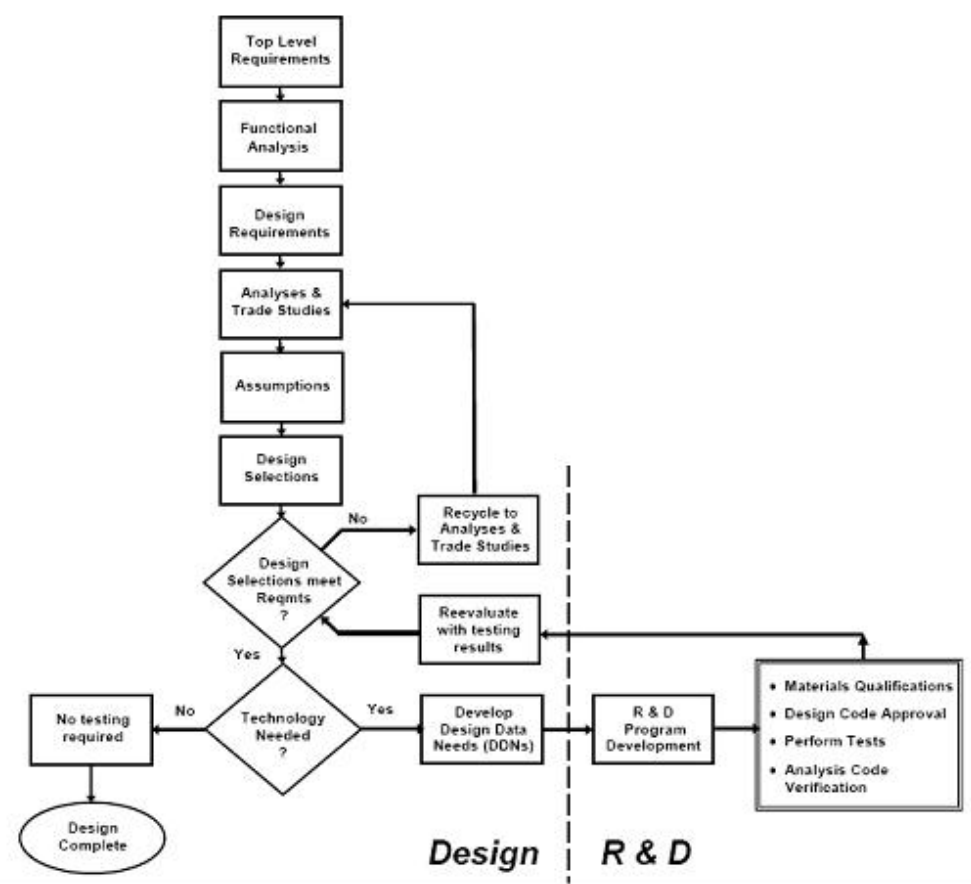

Figure 40 shows the relationship of the sections of the Westinghouse NGNP PCDR, with emphasis on Section 3, _Plant Level Design and Integration_ .  Figure 41 schematically shows how the design requirements evolve, with a key to the subsections of Section 3 of the Westinghouse NGNP PCDR. 

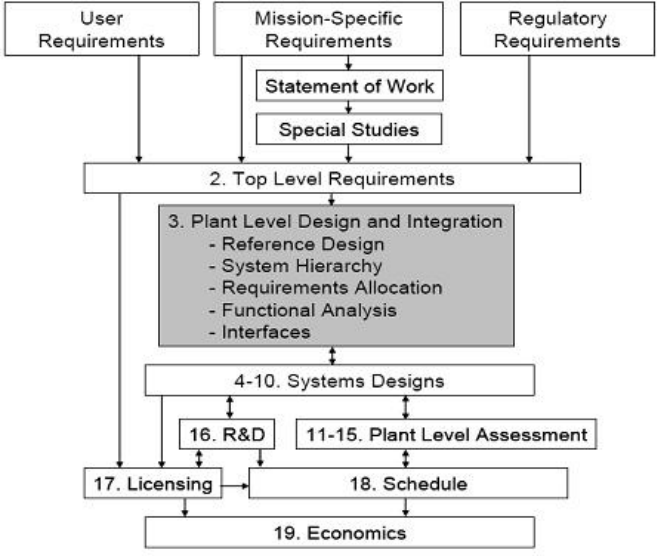

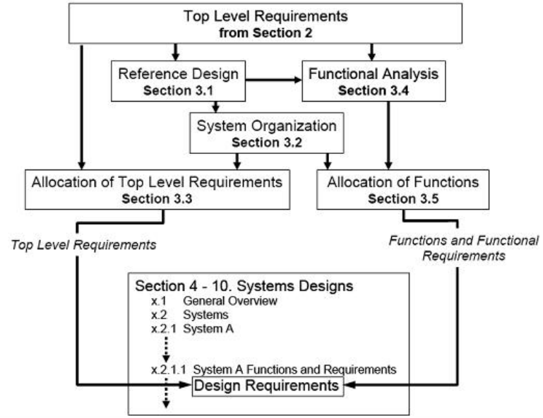

For plant-level design and system integration, there are several apparent complexities that represent risks.  These are associated with the meshing of the methods and disciplines of nuclear engineering and those of the chemical process industry.  Slightly different approaches and practices could result in engineering disconnects that could pose a potential risk to fulfilling overall goals.  These are to be addressed in the ongoing WBS element of plant-level design and integration.  No DDNs have been identified to date for plant-level design and integration. 

Areas where this complexity may affect the plant level design include the following: 

- Maintenance of a tight envelope of nuclear-related focus apart from conventional (nonnuclear) process related 

- Determination of developmental maturity in design engineering phases and the need to maintain fallback or performance options. 

The functional Analysis will be revised and refined in the conceptual design phase.  This will include establishing a scheme for tracking requirements down through the plant design documentation. Additionally, the scopes of the description, the WBS, the organization of systems, and the allocation of top-level requirements will need to be expanded as the design progresses.  Tabulations of functions, requirements, and interfaces could be expanded to tiers below the level of the overall systems to the major SSCs.  To respond to these and other needs as the design progresses, a front-end future special study is recommended to select a commercially available systems engineering software, such as CORE[®] or DOORS[®] , for these tasks. 

There is a need for a comprehensive transient computational model for the NGNP.  This model would predict the performance of the actual plant in other than the steady-state mode.  Such a program is needed for several applications, the most significant being to generate the thermal and mechanical loads imposed on SSCs for use in their design analyses.  The model is also essential to determine control set points and controller dynamic settings and to verify the adequacy of protective features of the control systems.  The model will also serve to develop plant simulation for planning of operations and for operator training. 

A Value Engineering process should be initiated for the conceptual design phase.  Value Engineering is a systematic evaluation of the plant design features, particularly addressing the features that challenge technology and/or drive overall cost, to find more elegant solutions that will improve system performance and/or reduce cost compared to the initial selections.  To be effective, a Value Engineering study needs to allow some time for the conceptual design to start and take shape, but not so long that the opportunities to make changes are lost. The Value Engineering studies would be at the facility level or system level, or a combination, based on an initial screening process. 

## _**3.2.6.2 AREVA Summary**_ 

The AREVA PCDSR included an SRM that defines the requirements for the NGNP with hydrogen production.  AREVA noted that a similar SRM will be required for the fuel fabrication plant. 

The AREVA SRM was prepared at the PCD phase of the project and detailed the design requirements at this level.  AS such, the scope of the initial effort did not include preparing requirements for all sections.  .  The AREVA format can be expanded for use in the conceptual design and later phases.  The AREVA outline contains the sections needed for a complete SRM, but only limited requirements were included in certain sections as necessary to drive the AREVA NGNP design adaptation work. 

The NGNP process heat load demand drives the nuclear heat source design options and decisions. For the purposes of this project, the hydrogen production plant was not included in the AREVA SOW. 

Therefore, the requirements for the process heat load were based on a hydrogen production plant using the thermo-chemical SI process or a thermally assisted electrolysis method.  The heat load requirements for other hydrogen production schemes can be different from what was assumed for this work; therefore, the design of the nuclear heat source produced by this set of requirements is optimized for the SI or the HTE methods of hydrogen production. 

It is a general practice that system requirements must be uniquely numbered to be referenced and traceable in down-stream documentation.  At the PCD stage, it is premature to define an exact numbering system that would allow sufficient flexibility for design, function, and requirement changes that may occur during conceptual design.  Therefore, requirements in the AREVA SRM are listed with a rather elementary numbering system, and it is recommended that requirements listed in this document be referred to by section number followed by a dash and the requirement number.  For instance, requirement #3 from Section 7.3.1.2 would be referred to as 7.3.1.2-3. 

Figure 42 shows the hierarchy proposed by AREVA for the requirements of the NGNP.  At the highest levels are the project goals and objectives as well as the regulatory requirements for the plant, which are documented in Section 3.0 of the AREVA SRM.  From these requirements, the plant level functions and requirements are defined and documented in Section 4.0 and 5.0 of the AREVA SRM, respectively.  The functions and requirements of each of the individual systems and subsystems are then defined in Section 7.0 of the AREVA SRM; each of these system level functions and requirements is based upon one or more of the top-level requirements defined above. 

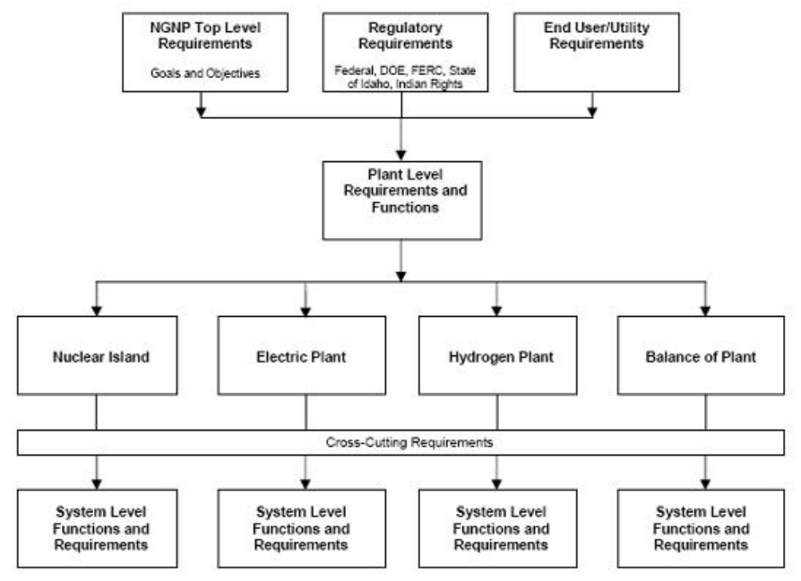

From a systems engineering and functional analysis point of view, a formal process for developing requirements at each level must be applied.  At the top level of this project, requirements are drawn from NGNP program goals and objectives as well as from various regulatory requirements.  These top-level requirements are all externally defined.  At the plant level, requirements are developed by determining what will be required of the plant to satisfy each of the top-level requirements; this may involve several levels of requirements at the plant level.  From this point, systems requirements, divided between each of the areas of the plant (Nuclear Island, Electric Plant, Hydrogen Plant, and BOP) and possibly involving several levels of requirements, are developed by determining what will be required of each system based on each of the above requirements.  This process is repeated at the subsystem and eventually the component level. 

In the PCD phase, the plant design is not at a mature enough level to strictly follow the process described above.  Therefore, this phase uses a simpler approach.  It lists top-level requirements taken from the NGNP project goals and objectives as well as various regulatory requirements.  At the system and subsystem level, however, requirements were developed based on requirements from other more mature designs, such as the AREVA ANTARES concept and the General Atomics GT-MHR and MHTGR designs. 

In the conceptual design phase, a more structured and rigorous approach to systems engineering will be necessary.  This will be a top-down approach to system design development, and AREVA will use a standard computer software tool, such as CORE[®] from Vitech Corporation.  System engineering processes and procedures will be uniquely configured and implemented at the start of conceptual design. 

The AREVA SRM contains general requirements for each of the plant designs, from the top-level requirements to the plant level and eventually the system and subsystem levels.  The set of requirements developed here are considered sufficient for the NGNP PCD adaptation work and set the starting point for the subsequent conceptual design phase. 

## _**3.2.6.3 General Atomics Summary**_ 

The General Atomics SRM includes both institutionally imposed and functionally derived requirements.  At the top level, the requirements define the objectives for the plant, and at lower levels they specify how the objectives will be achieved.  The top most requirements include the project mission, as defined in the EPAct, and the NGNP Project objectives, as defined by DOE/INL in the _Next Generation Nuclear Plant Project Preliminary Project Management Plan_ , INL/EXT-05-00952.  At the next level are the high-level functions and requirements as defined in the _Next Generation Nuclear Plant High Level Functions and Requirements_ , INEEL/EXT-03-01163, as modified based on the recommendations of the ITRG in _Design Features and Technology Uncertainties for the Next Generation Nuclear Plant_ INEEL/EXT-04-01816. 

The organization of the General Atomics SRM and the approach used for requirements flow-down are based on the _NP-MHTGR Plant Design Requirements Document, Preliminary Issue_ , CEGA-000002, Rev 3, developed by General Atomics for the GT-MHR, and _Overall Plant Design Specification; 600MW(t) GT-MHR_ , DOE-GT-MHR-100001, Rev. 0, developed by General Atomics for the NPMHTGR.  Section 2 of the General Atomics SRM identifies the institutional requirements that comprise the basis for the NGNP design.  These requirements include the mission statement, the mission objectives, and the high-level functions and requirements established by the INL.  Section 2 also identifies other institutional requirements that must be considered in defining the NGNP plant-level requirements.  These institutional requirements include DOE/INL programmatic requirements, regulatory requirements, environmental and safety requirements, utility/user recommendations for the NGNP, and utility/user requirements for a commercial MHR.  The latter requirements are particularly pertinent given 

that a primary mission of the NGNP is to serve as a prototype for a commercial VHTR.  Section 3 of the General Atomics SRM lists the plant-level requirements derived from the high-level institutional requirements identified in Section 2.  Section 4 performs the critical function of translating the plant-level requirements stated in Section 3 into design requirements applicable to the plant systems.  This flow down of requirements is intended to ensure that the individual plant systems will be designed such that the plant as a whole will meet its requirements. 

Given the INL-stated purpose of the initial version of the SRM, General Atomics believes that it would be appropriate to limit the scope of their SRM to a flow-down of NGNP requirements to the plant level; deferring lower-level requirements definition until after NGNP concept down-selection at the end of the PCD phase of the project.  However, in recognition of past DOE-sponsored work by General Atomics that has resulted in a relatively-mature definition of the GT-MHR concept and PCDs for both SIbased and HTE-based commercial H2-MHR plants, General Atomics expanded the scope of their initial version of the SRM to include design-specific requirements developed for the GT-MHR and the H2MHR.  The previous work on the GT-MHR included essentially the same concept selection studies that were performed as part of the scope of the NGNP PCD. 

Table 9 presents a set of preliminary selections for the NGNP design that are based on the GT-MHR and H2-MHR design studies.  These preliminary selections serve as the point of departure for General Atomics’ NGNP PCD effort and are the basis for the design-specific system-level requirements presented in Section 4 of the General Atomics SRM. 

Table 9. General Atomics Preliminary Selections for the NGNP Design 

|**Property**|**Design Selection**|
|---|---|
|Reactor type|Prismatic block|
|Reactorpower|550MW(t) withstretchcapabilityto 600MW(t)|
|Powerconversioncycle|Direct,Braytoncycle gasturbine|
|Numberof loops|2|
|Primary coolant|Helium|
|Core inlet helium temperature|490�C - 590�C|
|Core outlet helium temperature|850�C-950�C|
|Secondary loop working fluid|Helium|
|Hydrogen production process|SI,HTE|

The systems, the functions of the systems, and the design-specific requirements for these systems defined in General Atomics’ initial version of the SRM are preliminary in nature and will need to be updated as the design of the NGNP evolves.  Nevertheless, General Atomics considered it appropriate to incorporate the GT-MHR and H2-MHR information into the SRM at this time to provide the guidance to the NGNP PCD effort and to establish a methodology and framework for further development of the requirements for the NGNP. 

## _**3.2.6.4 Conclusions and Recommendations**_ 

The three contractor teams each prepared and provided an SRM in accordance with their respective SOWs.  Each of the three SRMs provides an adequate level of detail at the PCD stage of the NGNP. These SRMs will establish the methodology and framework for further development of the requirements for the NGNP. 

The NGNP SRM (see Section 5 and Appendix D) will be updated during the next phase of design development.  The functional analysis will also be revised and refined in the conceptual design phase. This will include establishing a scheme for tracking requirements down through the plant design documentation.  Additionally, the scopes of the description, the WBS, the organization of systems, and the allocation of top-level requirements will need to be expanded as the design progresses.  Tabulations of functions, requirements, and interfaces could be expanded to tiers below the level of the overall systems to the major SSCs.  To respond to these and other needs as the design progresses, a front-end future special study is recommended to select a commercially available systems engineering software, such as CORE[®] or DOORS[®] , for these tasks. 

## **3.2.7 Overall Pre-Conceptual Design Conclusions and Recommendations** 

Table 10 summarizes the operating conditions and the configurations proposed by the three contractor teams for the NGNP and as a single module for the commercial application of the HTGR technology. 

Table 10. Proposed Operating Conditions and Configurations 

The operating conditions and the configurations proposed by the three contractor teams will be considered in establishing the criteria and requirements for which the NGNP final design and operating conditions will be decided.  The PCDR Executive Summary Reports prepared by each of the vendors are included as Appendices I, J, and K. 

## **4. MISSION NEEDS / FUNCTIONAL and OPERATIONAL REQUIREMENTS** 

## **4.1 Mission Needs** 

As stated in the 2005 EPAct (Public Law 109-58 Subtitle C; Sec 641-645), the NGNP shall demonstrate the production of electricity, hydrogen or both using high temperature gas cooled graphite moderated nuclear reactor technology, herein referred to at High Temperature Gas Reactor (HTGR) technology.  The demonstration plant shall be sited at the INL.  The development of the plant shall be completed in a cost-sharing public-private partnership between industry and the Department of Energy using commercial processes.  The plant shall be owned by the DOE, but will be operated by a nongovernment entity directed by the industry Alliance in partnership with DOE.  This non-governmental entity shall hold and maintain the license for operation of the plant as issued by the NRC.  The mission of the plant shall be to demonstrate the technical, licensing, operational and commercial viability of HTGR technology and thereby support certification of the technology by the NRC and commercial application of the technology over a wide range of industries.  The schedule for design, licensing, construction, commissioning and initial operation of NGNP shall support completion of the demonstration of this technology no later than the beginning of FY-22. 

## **4.2 Functional and Operational Requirements** 

The PCD work has developed a foundation from which the F&ORs and fundamental configuration for NGNP can be built.  Specifically, this work defined the state-of-the-art in HTGR technology today and identified the work necessary to advance the state-of-the-art to meet NGNP objectives.  In the early phase of conceptual design, several studies will be completed to build upon the PCD work to support the selection of critical technologies for NGNP (e.g., reactor type, HTS configuration, and PCS and hydrogen production power levels and configurations, see Section 6.5 for a summary of these studies).  The final selection of the F&ORs and configuration for NGNP will be based on the results of these studies combined with the results from the PCD work.  These selections will also involve extensive consultation with the potential industry end-users of the HTGR technology that are members of the Alliance facet of the Public-Private Partnership with DOE. 

## **4.3 NGNP Design Requirements** 

The PCD work has bounded the ranges of operating parameters that are believed to be achievable for the NGNP and initiated the characterization of the technical risks at the extremes of these ranges.  This work forms the bases for going forward in the early phase of conceptual design to expand the understanding of the risks and the alternatives to mitigate these risks in the time period left to initiate NGNP operation in 2018.  The outcome of the early phase of conceptual design work will establish the F&ORs and fundamental configuration of the NGNP.  NGNP Project Engineering evaluations and reconciliations of the PCD work have resulted in selecting a narrow and high-level set of design requirements that will be applied to the design progression in addition to the high-level requirements defined in the EPAct, ITRG study, and other evaluations (see Section 5, Systems Requirements Manual). These requirements are summarized as follows: 

## 1. Nuclear Island 

- Both pebble-bed and prismatic reactor designs should be considered. 

Further work is required to support making the final decision on the reactor design. The PCD work did not identify any discriminating factors that would provide a significant technical advantage of either design. 

- The nuclear island design should not preclude achieving a gas outlet temperature of 950°C. 

This temperature goal affects the design of major components within the reactor that cannot be realistically replaced over the lifetime of the plant (e.g., RPV).  This goal would support achieving the ultimate objective of a 950°C gas outlet temperature over the long-term operation of the plant, but allow for a lower temperature configuration for initial operation, recognizing the potential technology limitations associated with the heat exchanger. 

- The NGNP nuclear island will not include a direct-cycle PCS. 

Precluding the use of a direct-cycle PCS provides more flexibility in the operating conditions and configuration of the NGNP and emphasizes the application of the technology as a process heat provider. 

## 2. Intermediate HTS 

The system to transfer heat from the primary (helium gas) side to the secondary side of the plant should incorporate multiple primary and secondary heat transport loops.  The system should be configured to facilitate change out of heat exchange, circulating, and valve components.  The secondary side of the plant will supply heat to the power conversion and hydrogen production system and other applications as they are identified over the life of the plant. 

This arrangement supports the demonstration of the HTGR as principally a process heat supply.  It also provides the greatest degree of flexibility for demonstrating new technologies and components over the life of the plant.  For example: 

- Plate-fin and printed circuit style compact heat exchangers have potential size, weight, and efficiency advantages over more traditional shell & tube style heat 

exchangers for application as the IHX for HTGR.  The current designs of these compact heat exchangers may not be capable of operating at the full operating temperature and pressure of NGNP, and the development of these designs at the required operating temperatures may not progress sufficiently to support NGNP operation by 2018.  As the designs of these heat exchanger styles evolve, they can be demonstrated on a prototype engineering scale in one or more loops of NGNP. 

- Steam generation technologies offering improved efficiencies (e.g., through innovative tube arrangements) can be demonstrated as they evolve. 

- Alternative secondary heat transport materials (e.g., molten salts, liquid metals) can be tested. 

- A Brayton-cycle turbine in either a vertical or horizontal orientation could be adapted to run in a secondary loop. 

## 3. Nuclear Heat Supply System (NHSS) 

The NHSS should be defined to include: 

- The nuclear island and all of its support, control, monitoring, maintenance, refueling, spent fuel storage, etc. SSCs 

- The Intermediate HTS(s) including, at the least, the IHXs, primary circulation systems and the support, control, monitoring, maintenance, etc. SSCs.  Depending on the design, it may also include the secondary circulation system up to and including isolation valves. 

This supports the licensing objective (stated below) of ultimately supporting NRC certification of the HTGR NHSS design independent of the application.  This will require developing a set of steady state, normal transient, abnormal transient, and accident conditions that bound the potential applications to support safety analyses. 

## 4. Power Conversion System (PCS) 

The PCS should incorporate steam generation.  The configuration should not preclude, however, use of Brayton-cycle gas turbine PCSs in a combined-cycle configuration. 

- Steam is an effective medium for heat transfer and is widely applied in the private sector.  This requirement facilitates demonstration of the broad applicability of the technology. 

For example, the non-utility generation industry in the United States provides significant quantities of electricity and steam to a wide range of industries and applications.  The HTGR power range fits well either as a single module or in multiple modules within the range of power and steam conditions required to meet the needs of these applications.  NGNP will be effective in demonstrating the technical, licensability, reliability, maintainability, and economics of the HTGR in these applications 

## 5. Licensing and Permitting 

The licensing strategy should be formulated to meet the following objectives: 

- The strategy should support the objective scheduled operational date (currently 2018) 

- The strategy should consider that full-term qualification data may not be available to support all design assumptions included in the Safety Analysis Reports (SARs) and that additional qualification data to fully support these assumptions will be obtained during the initial two to three years of plant operation and specific inspections and tests to be conducted during this period.  For example, the final fuel irradiations and PIE may not be complete by 2018.  These will be completed over the 3-year initial operating period.  Periodic results from this work can be used to verify assumptions in the final SAR prior to plant operation. 

- The strategy should be consistent with and take into account contemporary NRC licensing positions (e.g., during licensing of LWR designs). 

- The strategy should consider the potential impact of the significant number of LWRs that may be in the licensing queue on the NRC resources available to support licensing of the NGNP. 

- The strategy should include alternative paths with identified criteria and schedule for establishing if and when alternative paths should be executed. 

- The ultimate objective of the licensing strategy should be to support application for and receipt of a design certification for the commercial application of the HTGR technology independent of the application. 

## 6. Design Features to Support Short-Term and Long-Term Operating Objectives 

The NGNP should be designed to monitor key operating parameters in the NHSS, PCS, and hydrogen production plant required for proving the principles of the designs.  The plant should also be designed to permit change out of principal components and to vary operating conditions to perform special testing to collect data/experience to support validation of design assumptions, extension of operating conditions (e.g., to higher gas temperatures), and upgrade of components (e.g., design, capacity, efficiency, maximum temperature and lifetime of the IHXs, and higher heat capacity heat transport fluids, such as liquid metals and molten salts) over the life of the plant. 

This is required to support validating design assumptions during initial operation of the plant to increase operating conditions to the objective power levels and gas temperatures, and for meeting a second objective of adapting to evolving and emerging technologies. 

## 7. Initial Operating Conditions 

The initial operating conditions and configuration for the NGNP (i.e., at initial operation in 2018) will be based on these requirements and consideration of the impact of the technical development risks on the schedule for operation. 

The selection of initial operating conditions and the plant configuration for the NGNP must be balanced against the schedule and cost risks associated with design, licensing, R&D, and construction.  This balance must also consider the impact of technology selections on the viability of translating the NGNP experience to the private sector. 

A formal decision-making and risk management process was initiated as part of PCD work.  TRL and DRL criteria were defined and initial estimates of the TRL and DRL were made for critical SSCs.  The 

process for combining the estimates of TRLs and DRLs with known risks to support making decisions on the key characteristics of NGNP and to assess project technical risk (e.g., risk on cost and schedule) was formulated on a preliminary basis.  This process will be completed and applied to support decision making and to track and assess the uncertainty in the maturity of the TRLs and DRLs of the critical SSCs. This process will also identify criteria and necessary actions to achieve the TRLs and DRLs required to move from one level to the other; thereby reducing overall project technical risk and improving confidence levels in the assessment of the risks as the design progresses. 

## **5. SYSTEM REQUIREMENTS MANUAL** 

The format of the NGNP SRM is based on the SRM provided in the General Atomics PCDSR.  It is the top-level design document for the NGNP.  The NGNP SRM serves as the roadmap document that identifies the source of the NGNP top-level requirements (i.e., mission needs and objectives) and how these top-level requirements flow down through the subordinate requirements at the plant, system, subsystem, and ultimately the component level. 

As stated above, design requirements for the NGNP include both institutionally imposed and functionally derived requirements.  At the top level, the requirements define the objectives for the plant, and at lower levels they specify how the objectives will be achieved.  The top most requirements include the project mission as defined in the EPAct and the NGNP Project objectives as defined in the _Next Generation Nuclear Plant Project Preliminary Project Management Plan_ .  At the next level are the highlevel functions and requirements as defined in the _Next Generation Nuclear Plant High Level Functions and Requirements_ , as modified based on the recommendations of the ITRG in _Design Features and Technology Uncertainties for the Next Generation Nuclear Plant_ . 

The high-level functions and requirements establish the performance definitions for what the NGNP will achieve, and served as the basis for PCD.  Achievement of these high-level functions and requirements will be accomplished through implementation of plant-level requirements derived from the high-level requirements and other institutional sources, such as utility/user requirements for commercial reactors, or that are developed through plant-level functional analyses, including trade studies, plant performance analyses, engineering decisions, etc.  The plant-level requirements are either allocated directly to the systems to which they apply or are used as the basis for developing more-specific requirements for the plant SSCs. 

The primary purpose of the NGNP SRM at this early stage of the project is “to define the design independent high-level requirements that establish the framework within which subsequent work will be performed to establish the specific design attributes of the NGNP (e.g., type of reactor, direct versus indirect power conversion, hydrogen production processes, etc.).”  These requirements include, for example, reactor plant power level, primary coolant conditions, secondary coolant conditions, thermal power split between the PCS and the HPS, hydrogen plant heat flow and temperature requirements, hydrogen production goals, etc. 

Given the purpose of the initial version of the NGNP SRM, it is appropriate to limit the scope of this NGNP SRM to (1) a definition of its purpose, content, configuration, and requirements in completing it, and (2) as illustrated by the example provided by General Atomics, a flow-down of requirements to the plant level, deferring lower-level requirements definition until after NGNP concept down-selection during the next conceptual design phases of the project.  The systems, the functions of systems, and the designspecific requirements for these systems defined in the pre-conceptual version of the NGNP SRM are preliminary in nature and will be updated as the design of the NGNP evolves.  The NGNP SRM completed at the PCD phase is included as Appendix D to this document. 

## **6. DESIGN DATA NEEDS AND R&D REQUIREMENTS** 

The NGNP project has tailored a systematic approach to managing technology-related risk and uncertainty.  This approach combines similar technology maturity measurement methodologies used by NASA and the Department of Defense in their programs with unique approaches and tools developed at the INL for using uncertainty measurement to both make decisions and manage project execution. 

## **6.1 Known Risks and Uncertainty** 

Data needs for most projects are related to the known risks associated with the project scope.  Each risk introduces uncertainty to either the cost, schedule, or performance of the project against a defined set of performance criteria.  The uncertainty, or risk, can be measured by the probability of the risk coming to fruition multiplied by the consequence of the risk.  That consequence is measured in terms of the project cost, schedule, or other performance criteria. 

Research and development may be conducted to manage technology-related risk.  In that case, the specific scope of the R&D effort is tied directly to the risk statement or risk management method.  The R&D effort is tracked to ensure it delivers the risk-reducing answer(s), including data where appropriate, in a timely manner, and within expected budget.  Upon completion, the outcome of the R&D is evaluated to see if it actually reduced the risk as expected.  It is possible that the R&D will completely, partially, or not reduce the risk.  The NGNP project uses risk waterfall charts, described in Section 6.3, to track the risk-reducing activities conducted by the project or its partners. 

## **6.2 Unknown but Anticipated Risk – Technology and Design Readiness Levels** 

Most projects have observed that not all risks are known and quantified at the beginning of a project. As projects mature, more potential risks are identified and come to fruition, often negatively impacting the project scope, schedule, and cost.  To minimize this condition, the NGNP Project follows the systematic TRL approach recommended by the Government Accountability Office (GAO; see _Department of Energy, Major Construction Projects Need a Consistent Approach for Assessing Technology Readiness to Help Avoid Cost Increases and Delays_ , GAO-07-336) and combines that approach with a methodology of assessing the likely impact of unknown risk.  As the maturity of various system elements increases (along with their corresponding TRLs), the associated potential impact of unknown risk is reduced.  From a technology perspective, R&D activities increase TRL and reduce unknown risk level.  Therefore, one of the critical focus areas of the NGNP Project’s R&D planning is to increase technical maturity and associated TRL. 

The Project has also developed a similar scale measuring design maturity, called DRLs.  As with TRLs, this scale uses measurable steps to rank the design maturity associated with any element of the NGNP system, or the system as a whole, if desired.  The DRL scale provides a method of measuring the synchronicity of the technology development and design efforts associated with the NGNP.  The preliminary TRL and DRL descriptions for the NGNP Project are provided in Table 11. 

Table 11. TRL and DRL definitions for the NGNP Project 

## **6.3 Technology Roadmap** 

The plan that combines the R&D efforts, the known risks that they address, and the expected effects of those R&D efforts on the TRLs and DRLs is known as the Technology Roadmap.  Each R&D activity is either focused on reducing known risk, increasing TRLs or DRLs, or both.  Assuming success of the R&D effort, the expected completion dates for each R&D effort become the dates upon which the risk is reduced.  This allows the formation of a risk waterfall chart, like the one shown in Figure 43.  As the timeline moves to the right, the risk is reduced each time a relevant piece of information is gathered from an R&D activity that reduces known uncertainty or increases technology maturity, with the graph showing the shape of a waterfall.  In the case of Figure 43, the risk quantification scale (Y-axis) reflects project cost uncertainty.  Similarly, it could be depicted in terms of project schedule uncertainty. 

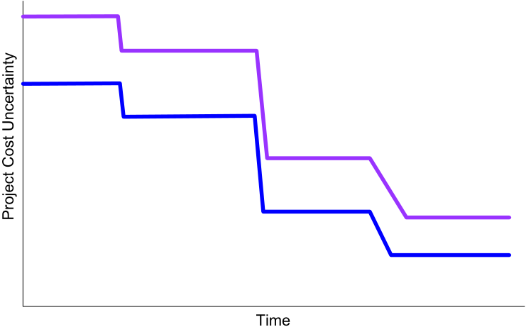

**----- Start of picture text -----** 
Time Project Cost Uncertainty **----- End of picture text -----** 

Figure 43. Generic Risk Waterfall Diagram. 

The rate at which the uncertainty for a given alternative can be reduced, combined with its overall performance against the project’s key decision criteria, are used to select project alternatives. 

## **6.4 Specific Design Data Needs Identified During Pre-conceptual Design** 

NGNP Project Engineering has combined the recommendations of the contractor teams and its own understanding of design and technology uncertainty into the following list of critical design data need areas: 

- Qualification of critical components and materials, including preparation of code cases 

- Verification and Validation (V&V) of analysis methods and codes 

- Successful completion of the licensing process 

- Availability and ability to fabricate materials 

- Availability of competent design, construction, testing, O&M personnel. 

The risks within the last category are outside the direct control of the design organization, although the design will consider design features to facilitate construction (e.g., modular construction) and DD&D. 

The qualification risks affect the reactor fuel and graphite, core internal ceramics (including reflector and support graphite), and application of metallic materials in high temperature applications (e.g., up to 950°C).  There are also comparable risks associated with the development and V&V of analytic tools used to support the use of these components in the reactor plant.  Resolving these risks are the principal focuses of the NGNP R&D Program: 

## � Fuel 

The Fuel Development and Qualification Program will qualify TRISO-coated particle fuel for use in the NGNP.  TRISO-coated particles will be fabricated at pilot scale for use in the formal qualification testing.  The testing program consists of irradiations, safety testing, and PIEs that will characterize the behavior of TRISO-coated fuel under both normal and offnormal conditions.  The program also contains out-of-pile experiments, special irradiations, and safety testing to characterize the release and transport of fission products from the kernel through the coatings, fuel matrix, graphite, and primary system (i.e., source term).  Formal validation testing is also planned to validate fuel performance and fission product models required for core performance assessments and safety analysis.  The program is currently considering both UCO and UO2.  Once a design decision is reached by the project, the program will focus on either UCO for prismatic or UO2 for pebble bed.  Feasible acquisition strategies for fabrication of first core and qualification of the associated production-scale fuel fabrication facility for both design concepts have been established and will be executed once the reactor design decision is made. 

## � Graphite 

The objective of the NGNP Graphite Program is to develop the qualification data set of thermomechanical and thermophysical properties for unirradiated and irradiated candidate grades of graphite for the NGNP.  Where practical, other grades of graphite may be tested/characterized to provide a baseline for comparison or to help understand material property changes for the NGNP graphite grades.  The program consists of statistical characterization of unirradiated graphite material properties to establish the lot-to-lot, billetto-billet, and within-billet variability of the material.  Irradiations are planned at specified temperatures and doses within the design service condition envelope anticipated for the NGNP.  Extensive PIEs are planned to establish the change in relevant material properties as a function of temperature and neutron dose.  Of particular interest is the irradiation induced creep of graphite, which is critical to determining the lifetime of the graphite under irradiation.  From these data sets, constitutive relations will be established for use in a detailed, predictive thermo-mechanical finite element model.  These data will also support development of relevant ASTM standards and ASME design rules.  In the longer term, the program plans to evaluate processing route and raw material constituent influences on graphite behavior so that additional large qualification irradiation programs are not needed when new coke sources are used to make graphite for HTGRs. 

## � High-Temperature Materials 

The goal of the NGNP High Temperature Materials Program is to establish the relevant thermomechanical performance data to support the development of IHX and another hightemperature components for an outlet temperature up to 950°C.  Creep, creep-fatigue, aging, and environmental degradation testing is planned using the candidate high-temperature material selected for the NGNP.  Thick and thin sections of base material, weldments, and other joints (e.g. diffusion bonding) will be evaluated given the different design options under consideration for the IHX (current candidates are Inconel 617 and Haynes 230.). Depending on the outlet temperature selected by the NGNP Project, additional high-temperature data may be needed to support relevant ASME code cases for the material.  R&D to establish requisite ISI techniques will be developed as key components are being designed.  Prototype testing of key components is envisioned in a high-temperature flow loop to characterize overall behavior under prototypic flowing HTGR conditions and validate ISI techniques. 

## � Methods 

The goals of the NGNP Design and Safety Methods Validation Program are to (1) develop validation experiments and data to validate models and analytical tools for the NGNP; (2) resolve key safety, performance, and technical issues through confirmatory modeling and/or tool development when existing models and/or tools are judged to be inconclusive or inadequate; and (3) modify, upgrade, and/or develop new analytical tools for future use that will reduce uncertainties and improve the capability of understanding the behavior and operating margins of the plant.  Current areas of focus include: 

- Developing improved differential cross-sections for Pu isotopes to reduce uncertainties in the reactivity performance of high-burnup LEU HTGR cores 

- Assessing and improving reactor physics and kinetic methods for prismatic and pebble-bed HTGRs 

- Performing physics benchmark studies on past relevant experiments 

- Evaluating important phenomena that influence thermal-fluid behavior in HTGRs and establishing relevant experiments for V&V 

- Evaluating air-ingress phenomena in HTGRs and participating in relevant validation experiments 

- Developing experiments to validate reactor cavity cooling system behavior 

- Evaluating and establishing system-level codes appropriate for HTGR safety analysis. 

The contractor teams indicated that there is an expectation that the NGNP Project will perform the majority of the R&D.  However, the contractor teams also identified R&D information that they will provide as part of the value-in-kind contribution to the NGNP Project.  During the initial phases of conceptual design and throughout design development, these data needs and plans will be reconciled and coordinated to support completing the NGNP as scheduled. 

The design and materials of the IHX and transport system are considered among the higher technical risks for the project.  The principal risk concerns operation of the heat exchange system at temperatures in the creep range for the candidate materials that will be available to meet the schedule constraints for the NGNP (e.g., Inconel 617 and Haynes 230).  In this temperature range, the acceptable normal operating material stress levels are low, and to meet these stress conditions the normal differential pressure on the heat exchanger must be low.  This requires operating the secondary side at a pressure similar to the primary pressure.  Under transient and abnormal operating conditions, control schemes are required to minimize the extent and duration of excursions in the differentials between primary and secondary pressures.  The calculated creep life for the material may be low, requiring relatively frequent replacement of the heat exchangers or components of the heat exchanger.  To achieve higher overall plant efficiencies, the contractor teams have recommended use of compact heat exchangers, which have higher effectiveness for the same area and volume than more traditional shell & tube heat exchangers.  These type of heat exchangers have not been used at these temperatures or in these applications so are also developmental.  A significant effort has been identified by the contractor teams to address these issues. These issues also apply to the design of the process heat exchangers in the hydrogen production system and are being addressed as a component of the NHI.  Efforts are being taken to coordinate the NHI work with that in the NGNP High Temperature Materials Development Program. 

There are also several issues associated with selection of the design and materials of the RPV.  The AREVA and General Atomics’ designs have high reactor inlet gas temperatures in the range of 500°C. The current designs for these plants expose the large vessels to this temperature during normal operating conditions.  The RPV is also exposed to higher temperatures for some period of time during postulated loss-of-coolant conduction cool down design basis accidents.  This requires use of material with an acceptable strength and creep resistance at these temperatures.  AREVA is recommending the use of 9Cr1Mo (P91) for these vessels, while General Atomics is considering P91 and 2-1/4Cr-1Mo material. Several factors affect risk with use of these materials: 

- There is no experience with application and welding these materials for the large sections required in these vessels. 

- Japan Steel Works is the only foundry in the world that can handle the ingots that will be required to forge the flanges of the RPV, and they have very limited experience with these materials in these sizes 

- These vessels are too large to be shipped pre-assembled by land.  Accordingly, they will have to be site fabricated for at least the NGNP, requiring on-site welding, post-weld heat treatment, and inspection. 

- New code cases will be required to apply these materials at these temperatures. 

The Westinghouse PBMR design uses a lower inlet temperature that does not require the use of higher alloy material, and a more common SA-508/533 steel is used for these vessels.  The code case for this material will have to be extended to these operating temperatures.  The vessels will also need to be fabricated on-site. 

These latter issues must be resolved early in conceptual design to support selection of the reactor type and operating conditions for the NGNP.  Several studies will be undertaken in early FY-08 to address these issues as well as others.  These are discussed in the following section.  The complete list of DDNs is provided in Appendix E. 

## **6.5 Future Studies** 

During the PCD work, including the several review meetings held between NGNP Project Engineering and the contractor teams, several areas were identified for emphasis and further study in the conceptual design phase of design development.  These were captured by the contractor teams and presented as recommended future studies in the PCDRs.  Upon receipt of the reports, NGNP Project Engineering extracted all of the recommended future studies from the reports for review and eventual incorporation into the conceptual design work scope.  Approximately 100 study descriptions were extracted.  In many cases, the subject, scope, and objectives of several studies were similar enough to permit consolidating them into a single study.  This consolidation effort distilled the number of studies by about half (i.e., there are now about 50 uniquely defined future studies).  NGNP Project Engineering then separated the studies into three categories: 

- Technical Selection Studies – These studies need to be completed to support the selection of key parameters and technologies for the NGNP (e.g., reactor power, gas outlet temperature, IHX design and materials, RPV materials, and hydrogen plant).  These have the highest priority since these decisions need to be made to begin the actual design of the plant. 

- Design Development Studies – These studies address areas that will affect the actual design of the plant and critical systems and components (e.g., site selection within INL, design to facilitate construction, and design to support the initial proof-of-principle operating period).  These have high priority since these areas need to be resolved to begin the actual design work. 

- Other Studies – These studies cannot be initiated until the other higher-priority studies are completed since the nature of the study depends on the results of the prior studies and design selections. 

The following subsections provide brief summaries of the 28 studies that fell into the Technical Selection and Design Development categories.  Selected Technical Selection studies will be performed as part of the initial phase of conceptual design in FY-08.  The Design Development studies will be initiated in part, but some may continue as the design progresses (e.g., I&C hardware, because of the rapid evolution of that field.)  As discussed in Section 10, detailed work plans are being developed for each of these studies.  These work plans include detailed specification of scope, deliverables, and the estimated schedule and cost to complete the scope.  NGNP Project Engineering will prioritize these studies; assigning highest priority to those that need to be completed to support making the final decision on the operating conditions and configuration of NGNP.  During FY-08, contractors will be selected to perform directed tasks to complete these studies based on the detailed work plans and negotiated costs and schedule. 

## **6.5.1 Technical Selections Studies** 

A total of twelve areas that affect technology selections were identified for further study as part of conceptual design.  The first seven of these are judged to have the highest priority.   (Note: the notation in brackets is the WBS designation for the study): 

## 1. NHS System F&ORs [WBS NHS.000.S11] 

This study entails an assessment of the appropriate design operating conditions for the NGNP (e.g., maximum reactor power level, reactor inlet and outlet temperatures, and primary pressure), considering cost, technical risk, translation of the NGNP experience to the private sector, and the level of confidence of the private sector that NGNP has effectively demonstrated the technical, licensing, reliability, and economic viability of the HTGR technology.  This assessment will be completed by nuclear plant owner/operators, potential end users (e.g., petro-chemical companies, petroleum companies), and subject matter experts. This effort will ensure that the specification of the NGNP operating conditions balances the need to maximize the translation of the NGNP design; licensing; cost; construction; operating; and reliability, availability, and maintainability (RAM) experience to the private sector against the need to minimize technical, cost, and schedule risks to bringing the NGNP on-line. 

## 2. IHX and Secondary Heat Transport Loop Alternatives [WBS HTS.000.S01] 

This study entails characterization and development of the advantages and disadvantages and technical risks of the potential alternatives for the intermediate heat exchanger (IHX) and secondary heat transport loop, including materials, design configuration, fabrication, operation, maintenance, in-service inspection, and means for periodic replacement.  This study will be completed by selected members of the contractor teams and subject matter experts, and includes the following: 

- A comparison of the characteristics and development requirements for the candidate IHX designs (e.g., shell and tube, plate-fin, compact and other potential designs as identified).  This should include: 

   - Maintainability of modules or entire heat exchanger 

   - Replaceability of modules or entire heat exchanger 

- Ability to detect material failures and the consequence of material failures during operation 

- The impact of environmental effects on the IHX and HTS (e.g., corrosion potential due to fluid contaminants, potential for dust clogging and erosion) 

- The impact of required in-service-inspection requirements for each design and the practicality in meeting those requirements 

      - Required material properties 

   - Availability and fabricability of the candidate materials with the requisite properties. 

- Evaluation of a “two-stage” IHX design, including a high-temperature module with a limited expected lifetime, but that is easily replaceable, feeding a lower temperature module with longer expected lifetime 

- The compatibility or other considerations (e.g., load sharing, outlet temperature variability, heat transfer surface pressure differential) of the candidate designs when included in multiple primary and secondary loop configurations, including expected responses during plant normal and upset transients, such as loss of the PCS and/or of the hydrogen production system (HPS). 

The results of this study should include specific recommendations for the IHX design(s), primary and secondary loop configurations, and materials in the following areas: 

- All pressure boundaries 

- Valves and piping at IHX outlet 

- Heat exchange surface. 

## 3. RPV and IHX Pressure Vessel Alternatives [WBS NHS.000.S01] 

This study will evaluate options for RPV and IHX materials considering required and achievable metallurgical and physical properties, acquisition, fabricability, and reliability This study will also identify and evaluate the advantages of options to provide cooling or other design features to use less developmental materials for these components  that reduce cost and schedule risk to the NGNP Project.  This study will be completed by selected members of the contractor teams and subject matter experts. 

This study should include the following: 

- Defining the required material properties for the operation of these pressure boundary components 

- Identifying candidate materials for each component and determining the expected properties of each candidate material in the dimensions and conditions of each application 

- Determining whether the candidate material is capable of achieving the required material properties for each application.  For example, this study should consider required thickness, operating temperature window, welding and post-weld heat treatment requirements, availability with the required metallurgical and physical properties, size, manufacturability, fabricability, etc. 

- Evaluating the maximum power level and temperatures that can be achieved using SA508/533 material for the RPV. 

- Evaluating the alternatives for cooling or other design features for the RPV as an option to revising power level and temperature to permit use of SA508/533 material for the RPV. 

## 4. Reactor Containment and Building Functions [WBS NHS.000.S02] 

This study will define initial operating strategies to preclude the need for a containment, recognizing the state of qualification of NGNP at the time of startup, and will review certain requirements for the reactor building.  This will include: 

- Review of the NRC regulations regarding design basis threats and hazards 

- Evaluation of the need for a vented/filtered confinement and, if needed, definition of its requirements 

- Consideration of the effects of air ingress on calculated dose rates (i.e., under postulated air ingress events) and the potential application of an inert atmosphere to reduce the effects. 

## 5. Contamination Control 

This study will determine expected generation and transport rates and allowable limits on expected contamination of the gas and other heat transport loops during operation (e.g., contamination with tritium, cesium, silver, dust), the required limits on the concentrations in the HTS and the product streams (e.g., steam, hydrogen, and oxygen), the requirements for cleanup, and the impact of the contaminants on primary and other HTS components operation and reliability.  This study will evaluate, for example: 

- The potential of contamination of the product streams with tritium and the limits on concentrations of tritium in the product streams depending on the application (e.g., hydrogen use in refining applications vs. transportation) 

- The potential for dust erosion of primary system components (e.g., pipes, valves, and circulators), contamination of the electromagnetic bearings in the circulators and plugging in the IHX 

- The impact of silver plate out and cesium contamination on the ability to maintain primary coolant components 

- The equipment required for cleanup of the contaminants and/or the need for multiple stages of heat transport to limit transfer to the product streams. 

## 6. Helium Circulator Limitations and Design Issues [WBS HTS.000.S02] 

This study will evaluate the current state-of-the-art for circulator design (e.g., maximum capacity) relative to the flow and developed head requirements of the potential primary and secondary loop configurations proposed for the NGNP.  It will also identify any constraints on the individual loop flow rates and pressure drops due to expected limitations in the capacities of the circulators available for NGNP construction.  This study will also include: 

- A review of the reactor vendor requirements 

- A review of the circulator supplier experience and capabilities, particularly with respect to application of magnetic bearings and the maximum size used to date and practically achievable. 

## 7. White Paper on PBMR Stochastic Core [WBS NHS.000.S08] 

This study will identify the methods that will be used to analyze the nuclear, thermal, and hydraulic characteristics of the mobile pebble-bed core and how these will be verified and validated to develop sufficient confidence on the operational and safety performance of the plant to meet private sector expectations and NRC licensing requirements. 

The following are of lower priority than the preceding and will be conducted throughout the course of the design effort: 

## 8. I&C for NHS and Plant Control [WBS NHS.000.S07] 

This study will identify any discriminating characteristics in the I&C and plant control requirements of the nuclear heat supply types and configurations that affect the design decision.  IT will also identify and document technical risks in these areas that need to be addressed in complementary design development studies and are potential candidates for additional future studies. 

## 9. HTGR Applications [WBS NHS.000.S03] 

This study will develop the requirements and perform economic assessments for applications of HTGR technology for a broad range of industry needs (e.g., Alberta oil sands, coal to liquids, co-generation, etc.) 

## 10. Hydrogen Plant Alternatives [WBS HPS.000.S01] 

This study will develop life-cycle comparisons of potential hydrogen production processes to interface with the NGNP (e.g., HTE, SI, and hybrid-sulfur).  This comparison will also establish whether the design requirements and criteria for the reactor, HTS, and PCS are sensitive to the specific process. 

## 11. Control Room Location [WBS BOP.102.S01] 

This study will evaluate the appropriate location of the control room (e.g., inside or outside the vital area). 

## 12. Helium Supply Economics [WBS NHS.000.S06] 

Address the current concerns with the potential shortages in Helium supply and its potential impacts on the operation of the NGNP and economics of the commercial plant.  Develop mitigation strategies as required from the results of these evaluations. 

## **6.5.2 Design Development Studies** 

Sixteen areas were identified for consideration during the initial phase of conceptual design that are important to the progression of the NGNP design.  The first five of these are considered to have the highest priority.  They include the following: 

## 1. Plant Design Requirements to Support Initial Operations [WBS BOP.000.S04] 

This study will establish specific design features of the plant that will be required to support the proof-of-principle initial operating period of the NGNP (e.g., instrumentation, ISI, critical component replacement, and PIE).  The study will identify the critical plant operating parameters to be measured to support design verification and the instrumentation required for this purpose, including development of instrumentation that will be required to satisfy these needs. 

## 2. Design Code of Record [WBS BOP.000.S05] 

This study will identify the industry consensus mechanical, electrical, civil, and structural codes and any DOE, INL, and NRC codes and standards that will apply specifically to the NGNP. 

## 3. Reactor Building Embedment Depth [WBS NHS.000.S09] 

This study will develop the requirements and criteria for embedment of the reactor building. This study will include embedment studies for the NGNP reactor concepts, considering the interaction among factors that influence the depth of the embedment.  These factors include cost, design basis threats, seismic effects, hazards resistance, etc.  The results of this study will be used to characterize the interactions of these factors on embedment depths for commercial application of this technology.  The recommendations from relevant sections of the EPRI _Advanced Light Water Reactor Utility Requirements Document_ will be evaluated for applicability in this study. 

## 4. INL Site Selection [WBS BOP.000.S02] 

This study will finalize the site selection within the INL for the NGNP.  This study will be performed by a contractor with expertise and relevant experience in the power plant site selection process.  The recommendations from relevant sections of the EPRI _Advanced Light Water Reactor Utility Requirements Document_ will be evaluated for applicability in this study. 

5. High Temperature Gas Reactor – Component Test Facility F&OR and Pre-Conceptual Design Requirements [WBS HTS.000.S05] 

A test facility (referred to as the CTF) is planned to support development of high-temperature gas thermal-hydraulic technologies (e.g., helium, helium-nitrogen, CO2) as applied in heat transport and heat transfer applications in HTGRs.  The initial use of this facility will be in support of the completion of the NGNP. 

This study will prepare the F&ORs for the CTF and PCD requirements.  This will include site plan, floor plans, elevations with typical sections, piping and instrumentation drawings, block flow drawings, electrical one-line drawings, a SEMP, and an FDD all at a PCD level.  A contractor to perform this work will be identified and the work will be initiated in early FY08.A white paper on the justification and specification for the CTF is included as Appendix H. 

The following are studies and areas that have lower priority than the preceding and will be performed as the design of NGNP progresses. 

## 6. Construction Techniques [WBS BOP.000.S03] 

This study will identify and evaluate the advantages and disadvantages of potential innovative techniques (e.g., modularization) that would improve the efficiency of plant construction.  It will also consider the potential efficiencies of factory assembly vs. on-site fabrication, including the impact of transportation.  This will be an ongoing effort throughout the design process 

## 7. NGNP Software and Hardware Specifications [WBS BOP.000.S06] 

This study will develop the specifications for the computer software and hardware that will be used in design development of the NGNP.  Chapter 1 of the _Advanced Light Water Reactor Utility Requirements Document_ provides an example of this kind of specification. 

## 8. NGNP Geotechnical Investigation [WBS BOP.000.S07] 

This study will identify all of the required NGNP geotechnical investigation bounds, parameters, geology, seismology, seismic source term, and geotechnical design criteria associated with the INL NGNP site.  This includes preparation of the SOW for the Geotechnical Investigation Subcontract for subsequent subcontract execution. 

## 9. ISI Strategy and Impact [WBS NHS.000.S10] 

This study will prepare an ISI strategy and impact analysis for the NHSS, heat HTS, and HPS.  As an example for the NHS, this will include: all primary vessels, RPV, reactor internals, other key components, etc.  This will also include an impact analysis on design, construction, and operations with recommendations and alternatives to mitigate high-impact areas.  This study will be performed for the configuration selected for the NGNP.  The ISI requirements and methods are factors that are included in the trade-off studies of alternatives for the RPV and the IHX (see _Technology Selection Studies_ , above). 

## 10. NGNP Mockup and Pilot Plant Testing Plan [WBS BOP.000.S08] 

This study will prepare a consolidated NGNP Mockup and Pilot Plant Testing Plan that assembles and coordinates all of the NGNP mockup and pilot plant testing requirements. This will include all laboratory and bench-scale testing and will be used to coordinate and establish the CTF F&ORs.  This plan will also document all previous and existing mockup and pilot plant work completed or underway. 

## 11. Plant-Wide I&C Measurement Hardware [WBS BOP.000.S09] 

This study will prepare the requirements for NGNP plant-wide I&C measurement and hardware, which includes: establishing what needs to be measured, what data/information 

collection is required, and how that data/information will be used.  With this basis, the study will then determine the commercial hardware and software availability and establish any DDNs for hardware and software development. 

## 12. Steam Cycle Concept Evaluation [WBS HTS.000.S03] 

This study will prepare a trade study that evaluates the issues associated with heat transfer from the reactor to the hydrogen production plant processes and other applications of hightemperature heat using a high temperature test loop to steam cycle and associated SG.  This study will address the technical (e.g., pumping costs, hydrogen process constraints, equipment simplification, R&D, maximum power, materials of construction, risk analysis, etc.), schedule, and economical issues and prepare a pro-con analysis with primary and secondary loop recommendations. 

## 13. Site Integration (Plant Layout) [WBS BOP.000.S10] 

This study will prepare an integrated plant layout that is independent of reactor type or hydrogen process selected.  This overall plant layout shall make provisions for the differences in the reactor type and hydrogen process such that when these key technologies are selected only minor modifications will required.  This will allow the design development of the BOP and hydrogen production facilities and systems to catch up with the maturity of the other major NGNP facility areas. 

## 14. Plant Wide Physical Security Plan [WBS BOP.000.S11] 

This study will evaluate the issues associated with the risk protection areas of the plant (e.g., NHSS) and interface with support facilities, systems, and structures. 

## 15. NGNP Waste Stream Identification and Disposition [WBS BOP.000.S12] 

This study will prepare a system-by-system analysis and identify all waste streams and potential waste disposal facilities/repositories. 

## 16. INL Water Resource Availability [WBS BOP.000.S13] 

This study will review the INL ground water rights to the Snake River Aquifer and determine available water usage for the NGNP, including well drilling and pumping requirements/limitations and use, treatment, and disposal of wastewater. 

## **7. LICENSING STRATEGY** 

## **7.1 Objective** 

The purpose of this section is to summarize the NGNP licensing recommendations provided by the three contractor teams.  Only Westinghouse was tasked to develop a licensing special study.  However, AREVA and General Atomics included licensing-related topics in their respective work plans, and the results from these activities were included in their associated PCDRs.  Therefore, analysis of AREVA and General Atomics’ recommendations are also included in this section. 

## **7.2 Licensing Evaluation** 

The contractor team licensing recommendations were evaluated using the following criteria: 

- The strategy takes advantage of the evolving experience with the licensing of Gen III and Gen III+ LWRs and the progress in developing NRC licensing regulations. 

- The schedule for the licensing strategy supports the NGNP schedule for completion by 2018. 

- Realistic schedules are used for development of licensing submittals, NRC review and approval, and public hearings. 

- The strategy includes alternatives with (1) mechanisms for monitoring progress, (2) defined criteria for assessing the progress and likelihood of success for the current strategy, and (3) trip points on progress vs. schedule for deciding when to shift to an alternative strategy. 

- The use of PRA concepts during the design and licensing phases of the project are described. 

- The strategy addresses the desire to license the reactor facility independent of the PHP that is selected for the facility. 

Westinghouse’s recommended 10 CFR 52, one-step licensing approach for the demonstration plant differs from the proposed two-step approach in the NGNP _Preliminary Project Management Plan_ .  Use of 10 CFR Part 52 potentially reduces the capital investment risk because the final design is approved by the NRC prior to the start of construction.  However, it increases the licensing schedule risk should the NRC’s review of the design take significantly longer than projected.  Westinghouse also recommends development of an ESP to independently address siting issues and a limited work authorization (LWA) to minimize the time required for plant construction. 

AREVA recommended a 10 CFR 50, two-step process for the NGNP demonstration plant.  This potentially provides the earliest opportunity to start plant construction, but also presents the largest capital investment risk if regulatory reviews dictate design changes after significant construction is underway. Additional risk is involved because the NRC may decide that the two-step licensing process is inappropriate for an advanced reactor design because of the capital risk issue and the NRC’s inability to allocate resources for that type of review.  General Atomics also recommended a two-step licensing approach for the demonstration plant (same as AREVA). 

Westinghouse’s licensing schedule shows that the issuance of the Combined Operating License (COL) may be possible in the 2015 timeframe.  This is based on an NRC review period of three years, including hearing.  All of the NRC review periods are judged to be optimistic based on existing experience with ESP reviews (usually taking 3 years) and projections for COL reviews for a FOAK plant design.  Westinghouse’s schedule assumptions rely heavily on successful PBMR design certification activities with the NRC (currently in the initial pre-application review phase).  Progress in review of the PBMR design is expected to benefit the NGNP in that it is assumed that the NRC will not need as much time to review the NGNP safety issues due to the similarity of the design.  This creates a significant licensing risk when the NGNP is dependent on the success of an independent project.  However, Westinghouse did recommend that a fall-back approach of using the 10 CFR Part 50, two-step licensing process be taken if NRC reviews of the PBMR design do not progress on schedule. 

AREVA’s licensing schedule shows that the issuance of the operating license may be possible by August 2018.  This is based on an NRC LWA/Construction Permit review period of two years and an Operating License review period of three years, including hearing.  These NRC review periods are judged to be optimistic, especially for the LWA/Construction Permit review.  Other issues that directly affect licensing schedule risk are: (1) completion of fuel qualification, (2) qualification of materials and methods, and (3) ASME code acceptance.  No alternate paths or fall-back provisions were identified in the licensing discussion or schedule. 

General Atomics’ licensing schedule shows that the issuance of the Operating License may be possible by December 2017.  This is based on an NRC Construction Permit review period of 1.5 years and an Operating License review period of two years, including hearing.  These NRC review periods are judged to be unrealistic.  Similar to AREVA, General Atomics did not identify any alternate paths or fallback provisions in the licensing discussion or schedule. 

All three contractor teams recommended that a risk-informed approach be used for the development of licensing bases for the NGNP.  Specifically, this approach would include: (1) the use of accident frequency vs. radiological dose criteria that are derived from current U.S. licensing requirements, referred to as top-level regulatory criteria, (2) the use of a full-scope PRA to select the licensing basis events, (3) development of reactor-specific functions and selection of the corresponding safety-related SSCs and their regulatory design criteria, (4) deterministic design conditions and special treatment requirements for the safety-related SSCs, and (5) a risk-informed evaluation of defense-in-depth attributes.  This approach is consistent with other industry efforts to apply PRA insights for licensing advanced reactor designs. 

It is highly desirable to have the licensing of the nuclear plant be independent of the process heat systems.  While Westinghouse and General Atomics provided a discussion on how a hazards analysis might be applied to a co-located hydrogen facility, and AREVA provided a discussion on what regulatory criteria might apply.  None of the licensing discussions included a strategy to address this desire. 

## **7.3 Licensing Conclusions** 

AREVA and General Atomics both recommend using a 10 CFR Part 50, two-step licensing process to obtain an operating license by 2018.  Westinghouse recommended using the 10 CFR Part 52, one-step licensing process.  While it is desirable to use 10 CFR Part 52 to reduce risk, it is not clear that this approach will allow development of a rational schedule that supports plant startup by 2018 because the design must be complete before the licensee can submit a COL application.  In addition, construction is delayed until the COL is reviewed and approved by the NRC.  Westinghouse offered an alternative strategy, incorporating a 10 CFR Part 50, two-step process in case pre-application discussions with the NRC don’t go well. 

None of the contractor teams provided a licensing schedule that included reasonable durations for the necessary NRC reviews.  This determination is based on a comparison of the contractor team schedules with various sources of NRC review estimates (e.g., SECY-01-0188, actual ESP review data, and discussions with NRC staff). 

## **7.4 Licensing Recommendations** 

The NGNP _Preliminary Project Management Plan_ recommends that the 10 CFR 50, two-step licensing process be used as the licensing starting point because the 10 CFR 52, one-step  process requires that the safety systems design be complete and the final SAR finished before submitting an application for a COL.  It is unlikely that the final safety systems design will be available in time to support standard use 

of a one-step COL and still meet the 2018 startup milestone.  Two of the contractor teams (AREVA and General Atomics) agree with this general approach. 

However, other issues (in addition to schedule) must be considered in selecting a successful licensing approach for the NGNP.  Some of these include: (1) choosing an approach that reduces investor capital risk and (2) choosing an approach that fits well with the current NRC licensing review infrastructure. Using the one-step licensing process would potentially address these two objectives.  An optimal solution to meeting schedule and reducing risk may be possible, but will require consideration of the following issues: 

- Waiting for completion of the safety systems design (and the subsequent NRC review) is the biggest obstacle to applying a standard one-step licensing approach.  Any actions taken to shorten the design schedule reduce this problem. 

- Several NRC managers have stated in public meetings that the NRC will not accept applications for new reactors that utilize the 10 CFR 50, two-step licensing process.  The rationale for this position was based on a desire to avoid the long project delays that could result if the NRC requires design changes to safety-related equipment after plant construction is underway.  Use of the two-step licensing process (i.e., construction permit and subsequent operating license) by the existing fleet of LWRs created several examples where construction periods extended to a decade or more when review of the operating license application revealed design safety issues part way through the construction period. 

- New code language being implemented [i.e., 10 CFR 50.43(e)] states that if a prototype plant is used to qualify an advanced reactor design, then additional conditions may be required for the licensed prototype plant to compensate for any uncertainties with the unproven safety features. This language may provide a path that allows the NRC to approve the NGNP design (absent completion of the confirmatory R&D results) provided that additional compensatory measures are imposed to account for the greater uncertainties in the safety basis for the design.  Some examples of potential conditions are: (1) siting the prototype in a remote location, (2) requiring a robust containment design, (3) requiring additional or redundant safety systems that would not be included in the commercial design, or (4) having operational “hold points” that restrict prototype operation until confirmatory research is complete.  The risks in following this approach must be carefully considered because NRC policy regarding application of this language does not currently exist. 

A licensing study should be performed to determine the feasibility of developing a one-step licensing strategy that is adaptable to changes in the licensing climate and the research/design constraints of the NGNP.  This strategy could possibly take advantage of new prototype licensing language, with later transition to a typical commercial license once key elements of the R&D program are complete and the associated code committee work (e.g., ASME) is finished. 

It is highly desirable to have the licensing of the nuclear plant be independent of the process heat systems.  This principal design objective for the PHP ties the licensing approach directly to the design of the secondary heat transport systems.  Meeting this objective would allow for maximum flexibility of facility design and increase the NGNP’s ability to adapt to a wide range of process heat applications (e.g., hydrogen production, oil extraction from tar sands, or syn-fuel generation).  Additional licensing studies need to be conducted to determine the feasibility of developing a licensing strategy that allows for maximum flexibility in the configuration of the process heat applications for subsequent commercial applications of NGNP technologies.  These studies will be initiated in the initial phase of conceptual design. 

## **8. COST, SCHEDULE, AND WORK BREAKDOWN STRUCTURE** 

## **8.1 Cost Estimates** 

All three contractor teams prepared pre-conceptual level cost estimates and schedules as part of the PCD work for the NGNP.  The cost estimates were developed using different development methodologies that included parametric modeling, vendor quotes, actual costs, and proprietary costing databases. 

NGNP Project Engineering reviewed the assumptions and bases of estimate that supported the cost estimates for credibility.  This included meeting with Westinghouse to review in detail the specific assumptions and cost data applied to develop the estimates.  (Note: This review was made of the Westinghouse estimates since they had the full scope of effort for PCD).  Multiple studies were then performed to reconcile the variations in scope and assumptions among the three cost estimates.  These studies included Monte Carlo analyses using estimates of the potential ranges in the detailed components of the contractor teams’ estimates to develop an expected range for the NGNP project cost to initial operation.  Table 12 summarizes the key results of this effort along with the comparable period of performance for each element based on the best estimate schedule (discussed below). 

Table 12. NGNP Prototype Cost Estimate Range and Periods of Performance 

|||||
|---|---|---|---|
|**Item**|**Best Estimate Cost, $K**||**Period of Performance**|
||**Low**|**High**||
|Conceptual Design|$168,838|$191,054|FY-08 – 09|
|Preliminary Design|$269,775|$305,271|FY-10 –  11|
|Final Design|$468,215|$529,823|FY-11 – 13|
|Licensing|$128,996|$145,969|FY-08 – 18|
|R&D|$478,572|$541,541|FY-07 – 18|
|Construction|$1,772,171|$2,005,352|FY-13 – 16|
|Startup& Test|$205,317|$232,332|FY-16 – 18|
|Project Support|$308,116|$348,658|FY-08 – 18|
|**Total**|**$3,800,000**|**$4,300,000**||

Note: The low to high spreads do not reflect an assessment of the individual risks 

These estimates reflect the work of the three contractor teams and do not include any potential reductions in project costs that may occur through contributions of value-in-kind by the reactor vendors (e.g., completed design work, current or planned testing and qualification, etc.). 

These cost estimates will be updated with higher confidence levels as design development progresses. The cost estimates and economic assessments for the NOAK commercial plant are covered in Section 9. 

## **8.2 Schedule** 

A critical path, logic driven, integrated project schedule is being developed in correlation with the project WBS structure.  It will cover design, high-risk material and fuel development, technology development, licensing and permitting, construction, acceptance testing, startup, and operational shakedown.  It will incorporate key milestones and Critical Design points for conceptual, preliminary, and final design, as well as approvals to start long-lead procurements, start of construction, and start of operations.  The NGNP Project Schedule will be a living document, and the associated confidence level 

will increase as the NGNP Project progresses through the design process.  The NGNP Project Schedule that is reflective of the PCD cost estimate is included as Appendix F. 

## **8.3 Work Breakdown Structure (WBS)** 

## **8.3.1 General** 

The NGNP Project WBS is based on a deliverable or product-oriented grouping of project work elements that organize and subdivide the total work scope of the NGNP Project.  A graphical display of the WBS is shown in Appendix G.  The WBS is an important and key project life-cycle management tool, and considerable thought and planning has been and will continue to be given to its development and implementation so that subsequent changes are minimized.  Major revisions to a WBS require both substantial effort and resources due to its application to a wide array of project activities.  The NGNP Project Summary WBS is driven by the scope of the project and is reflective of the nature and characteristics of the NGNP.  All the work contained within the WBS is to be identified, estimated, scheduled, and budgeted. 

As noted above, major revisions to the WBS are very difficult and expensive.  Therefore, during the PCD phase, only the WBS framework was established for the NGNP to begin the coordination of information and documentation between the SRM, systems engineering and plant integration, cost estimating, economic analysis and the resource loaded schedule. 

## **8.3.2 NGNP Summary WBS Development** 

DOE O 413.3 provides the rolling wave planning concept in that the overall project planning is performed at a level commensurate with the project with focused detailed planning for the next phase of work.  In agreement with this project management philosophy and input from the three contractor teams, the NGNP Project WBS was prepared at a level commensurate with the NGNP.  The WBS is used as a management tool throughout the life cycle of a project to identify, assign, and track its total work scope. The overall WBS structure was completed from project initiation to DD&D and with the three contractor teams’ PCDRs referenced as a project basis for the summary WBS.  This overall WBS was developed to a level 4 WBS element, which included the NGNP five major facility areas: overall site and BOP, nuclear NHS facility, process heat distribution (PHD) facility, PCS facility and HPS facility (see Appendix G). 

## **8.3.3 Next Phase of Work & Contractor WBS Development** 

Currently, the NGNP Project Summary WBS is being developed to a progressive level of detail to support planning for conceptual design.  In accordance with DOE-O 413.3, the NGNP Project Summary WBS will be fully developed and completed during conceptual design to a contractor WBS level by the five NGNP facility areas, including the WBS dictionary.  The WBS dictionary defines each WBS element down to the control account or work package level in terms of the content of the work to be performed. 

## _**8.3.3.1 Organizational Breakdown Structure (OBS)**_ 

During conceptual design planning, the WBS work will be defined to a level where unique organizational and personal responsibilities can be established.  Control accounts will also be established and assignments made.  The control accounts will be divided into smaller, discrete SOWs called work packages.  Work package managers will be assigned to each work package.  These work packages will then be bundled into formal SOWs that will be managed by NGNP Project Management. 

Integrating the WBS with the project and functional organizations will assure that all NGNP work is accounted for, and that each element of work is assigned to the level of responsibility necessary for planning, tracking progress, accumulating costs, and reporting.  Determining whether a specific SOW is to be performed in-house or by a subcontractor or supplier will be done through Battelle Energy Alliance (BEA) NGNP Project Management. 

## _**8.3.3.2 Responsibility Assignment Matrix (RAM)**_ 

During conceptual design planning, the WBS and organizational breakdown structure will be developed to the point where a project responsibility assignment matrix can be developed and implemented to control conceptual design development.  The development and use of this responsibility assignment matrix will provide several advantages for NGNP Project Management: 

- Identifies individual work responsibility and authority in a structured, easily understood format 

- Establishes a basis for the Project’s Records Management and Configuration Management systems 

- Serves as a basis for identifying, planning, progressing, and reporting the work of all project organizations (i.e., subcontractors, suppliers) 

- Develops and defines individual ownership for specific project tasks 

- Provides a basis for developing budgets, schedules, and milestones; tracking costs and spending; and preparing progress reports. 

In addition, once responsibilities are assigned to the work tasks, these individuals or companies assume ownership of the assigned work, namely, baselines, milestones, performance, reporting, changes, procurements, subcontracts, testing, etc. 

## _**8.3.3.3 Configuration Management**_ 

, The OBS, WBS, WBS dictionary, and RAM will be prepared, reviewed, approved, and issued at the start of conceptual design, and all will be maintained under change control.  During conceptual design, these documents are of a dynamic nature and are at the forefront of the design and NGNP Project Management’s attention.  As the design progresses, all proposed changes will be evaluated, reviewed, dispositioned, and documented.  This is critically important with these particular documents because they relate to and are the backbone of and/or influence the various sub-projects: systems engineering, work package organization and management, specifications, drawings, scope, schedule, reporting, cost estimates and economic analysis.  At the end of conceptual design, these documents will be in a final and static state and will be difficult to change after that time, emphasizing the great care and thought required during conceptual design for these key project management tools. 

## **9. ECONOMIC ASSESSMENT** 

Each of the contractor teams prepared an economic assessment using their recommended design for a NOAK commercial plant producing hydrogen and, in two cases, electricity.  The contractor teams did not use the same economic assessment methodology, nor did the they assume the same values for key economic parameters.  For these reasons, the NGNP Project included a review of the contractor teams’ methods and results and then revised each contractor team assessment using, in general, more conservative but consistent assumptions for key parameters and a consistent methodology.  These revised 

assessments were performed using the cost estimates (e.g., capital, operations, DD&D) estimated by each contractor team.  A fourth assessment was then performed using the best estimate costs that were developed by the NGNP Project in reconciling the cost estimates provided by the three contractor teams, as reported above. 

The following compares the values of the economic parameters assumed by the contractor teams with the values assumed in the revision of the assessments. 

Table 13. Values of Assumed Economic Parameters. 

Because the contractor teams did not use consistent methodologies in performing their economic assessments, the NGNP Project minimally modified and “homogenized” the methods and basis to produce a more like-to-like comparison.  Given these modifications, the NGNP Project’s economic assessment concludes that these proposed HTGR plants would be competitive with current commercial processes in the production of hydrogen and electricity.  Whereas the three contractor teams calculated internal rates of return (IRR) ranging from 6.8% to ~12% for the NOAK plant, the NGNP Project calculated IRRs ranging from 7.7% to 12.8%, both in an inflationary environment.  In general, the shift of the IRRs to a slightly higher and more economically viable range reflects the higher escalation value for the energy products and a slightly higher initial price for the electricity.  However, these returns were also tempered by a more conservative assessment that assumed higher and more broadly applied contingency rates throughout the life cycle of the project. 

The NGNP Project performed one last economic assessment – what is referred to as a “most likely outcome”.  In this assessment, the NOAK plant is constructed for $3.914B ($2007) over a four year construction phase, operates for approximately $310M annually ($2007), and produces 26,100 kg of H2 and 220,000 kg of O2 for every hour of operation (assuming a 48% energy conversion rate and 90% plant availability).  Given these adjustments, the most likely IRR is 10.8%.  Furthermore, if one assumes no escalation in any of the energy products (i.e., H2 and O2 inflate at the general rate of inflation), the IRR continues to remain at a very competitive 9.7% in a very stable energy market.  Given the results of this 

conservative assessment, one could easily assume only an upside on the economic returns in developing and deploying this technology. 

In review of these results, there are many factors that affect the competitiveness and economic viability of the HTGR technology.  Specific to these assessments, two factors drive the relatively large range in the calculated IRRs.  The first factor is the conversion efficiency of energy input (heat) into energy products (H2, O2, and kWh).  All other factors equal, the higher the conversion efficiency, the more products are sold, sales are higher, and returns on investment are higher.  Secondly, the wide range of operation costs predicted by the three contractor teams has a significant impact on the economic viability of this technology at this time.  The predicted range of $200M to $300M in annual operation costs has a significant effect on the project’s IRR.  This range reflects, in part, the fact that one of the contractor team designs included the purchase of significant amounts of off-site power.  This added $100M to operation costs and significantly reduced the economic returns for that design.  This cost could be reduced significantly if the power were generated on-site.  Given these two observations, a reasonable strategy for the future development of the HTGR plant would be for the optimal design of energy conversion that approaches the high range predicted by the contractor teams and the production of on-site electrical power. 

Lastly, the predicted IRRs assume a future where energy supplies will not be as easily available as in the past with respect to predicted demand.  Whether one prefers to assume the lower inflation and escalation rates assumed by the contractor teams or assume the higher values of the NGNP Project, the consensus is that energy will be premium, and this is reflected in the increasing (escalating) cost of energy products with respect to the general economy and products.  One may argue against this general forecast of the future, but the general consensus of these four teams is that the traditional energy market is going to change, primarily due to the anticipated reduced availability in low-cost crude petroleum and the increased environmental restrictions on the use of coal to fill the energy supply gap. 

In summary, these results confirm the economic viability of the HTGR technology in two markets, hydrogen and electricity production, using conservative assumptions.  Furthermore, these results support the continued development of the NGNP and fostering commercial application of the HTGR technology. Typical of any systems approach in the development of a technology, these economic assumptions will be re-evaluated and adjusted to reflect better knowledge.  Usually, the conservative approach of this assessment is moderated and, hopefully, reduced as more knowledge and confidence in a future outcome is developed.  Lastly, the potential realization of carbon emission credits will become clearer.  This factor has not been considered in these assessments and would only have a positive effect on the economic viability of this technology. 

## **10. CONCEPTUAL DESIGN – NEXT PHASE PLANNING** 

## **10.1 General** 

The design phases anticipated for NGNP are: PCD, conceptual design, preliminary design, and final design.  These are consistent with the DOE as well as typical commercial project management processes. 

The NGNP Project issued an Expression of Interest (EOI) and a subsequent RFP during the last quarter of FY-06 for the engineering services to prepare PCDRs during FY-07.  The commercial industry responded with three qualified contractor teams, which were awarded SOWs to perform PCD work. These contractor teams were led by Westinghouse Electric Company, LLC; AREVA NP, Inc.; and General Atomics, and were collectively composed of 26 worldwide companies comprising designers and providers of equipment applicable to HTGR and hydrogen production technologies. 

With the issuance of this report, the PCD phase will be completed.  An EOI for Design Development Engineering Services has been issued (see Appendix B) to prepare for the next phase of design and to accomplish two major goals: 

1. Receive a letter of interest from each of the existing contractor teams confirming team members 

2. Reopen the procurement to allow entry of any other qualified design teams. 

The three existing contractor teams have submitted letters of interest and confirmation of the contractor team members.  With the receipt of these letters, negotiations for contract terms and conditions have begun in preparation for the start of conceptual design work on October 1, 2007. 

The conceptual design phase will be completed under the DOE O 413.3 project management process (i.e., through CD-1).  It is anticipated that the Public-Private Partnership for NGNP will be in place at the end of conceptual design, and that the agreements of this partnership will dictate that the remaining design phases, as well as construction, commissioning and operation of the plant, will be completed using commercial processes. 

## **10.2 Design Development Acquisition Strategy** 

The development of the NGNP will be completed in a cost-sharing Public-Private Partnership between industry and the DOE using commercial processes.  The plant will be owned by the DOE, but will be operated by a non-government entity directed by an industry Alliance in partnership with DOE. This non-governmental entity will hold and maintain the license for operation of the plant as issued by the NRC.  Figure 44 provides a high-level organizational structure and lines of communication.  Alliance formulation activities were initiated in FY-06, and it is anticipated that the Alliance will be developed to a point at which it will be able to participate in the NGNP key technologies selections that are scheduled from April to May of FY-08. 

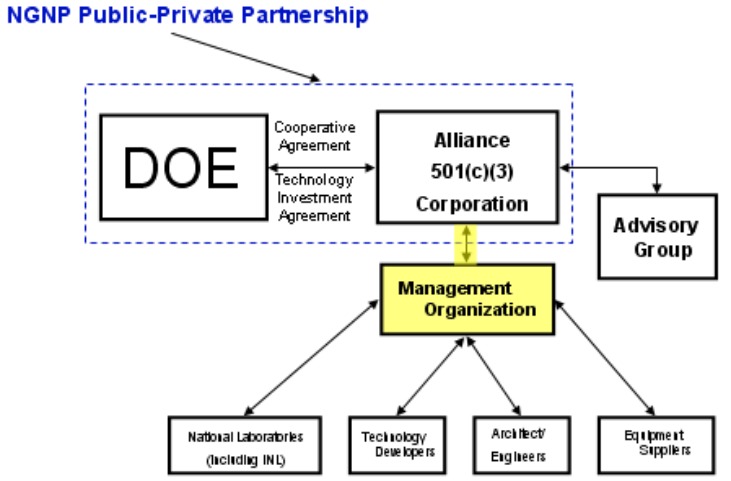

In the conceptual design phase, BEA will act as the Engineer of Record as part of the Management Organization shown above in Figure 44, and in this role will take responsibility for conceptual design management.  As noted above, the general acquisition strategy for NGNP engineering services is to negotiate the existing contractor team’s subcontracts and continue on into conceptual design.  The NGNP Conceptual Design SOW will be executed by the negotiation of directed tasks with specific SOWs related to development of designs in the five major WBS functional areas of the plant: BOP, NHS, HTS, PCS, and HPS. 

Conceptual design studies required to perform key technology selections (see Section 6.5) will be some of the first work performed during conceptual design and will support the Alliance assisted technology selection activities scheduled for April and May of FY-08.  This will be the beginning of the transition to the Alliance that is anticipated to be completed no later than the start of preliminary design. With the Alliance fully in place at the start of preliminary design, the overall NGNP acquisition strategy will then be completed as recommended by DOE O-413.3. 

## **10.3 Conceptual Design Detailed Work Plan** 

BEA has prepared a conceptual design DWP that identifies all of the required level-five conceptual design WBS elements.  This DWP will be used to prepare and form the scope basis for the directed task SOWs that will be issued to the subcontracted design teams.  The design teams will prepare and submit proposals and work plans (i.e., costs, schedule and resources) for each SOW for BEA review.  These SOWs will then be negotiated with the design teams.  The directed task SOWs contain the engineer’s basis of estimate, which will be used to support the subcontract SOW negotiations. 

## **10.4 Conceptual Design Schedule** 

The conceptual design schedule is shown in Figure 45 with the major design elements and WBS element work flow leading up to the CD-1 reviews. 

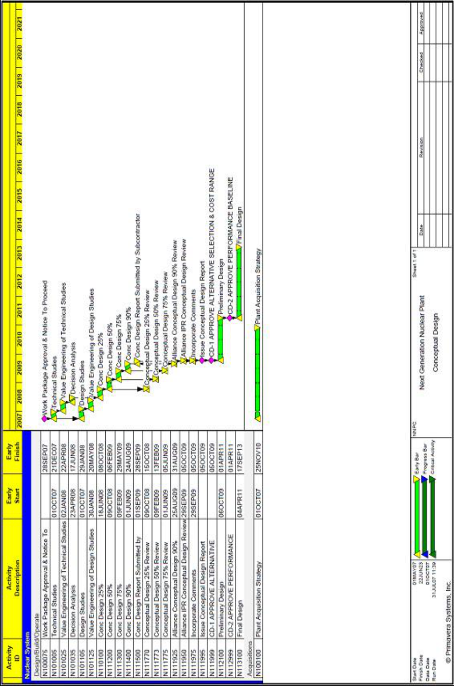

## **10.5 Conceptual Design** 

The project baseline definition for conceptual design (cost estimates, schedule, design documents, long-lead items, etc) will be documented in a Conceptual Design Report (CDR) with overall project costs and schedule.  At the end of conceptual design, all major system elements and subsystems will be identified, defined, sized, and integrated with site and facility area plans, general arrangement drawings, piping and instrumentation diagrams, bases for design, electrical one-line drawings, process flow diagrams, floor plans with typical sections and details completed, etc. 

The fundamental objectives of conceptual design are to: 

1. Develop a project scope that satisfies program needs, operating needs, and statutory requirements 

2. Assure and/or validate project feasibility and attainable technical performance levels 

3. Identify and quantify all project risks and complete project risk management plan/assessments 

4. Develop a reliable NGNP cost estimate and a realistic performance schedule 

5. Develop a detailed schedule for the next phase of work (preliminary design). 

The guidelines developed as part of a conceptual design include the following: 

1. General project criteria and design parameters, including applicable codes and standards 

2. Quality assurance requirements to satisfy program and project objectives and baseline change control 

3. Safeguards and securities against potential environmental damage and methods for mitigating environmental hazards 

4. Types and material of construction, basic facility drawings, and outline construction specifications 

5. Space allowances for various functions 

6. Significant features and components 

7. Facility siting and utility services requirements 

8. Site development requirements 

9. Energy consumption and type(s) of energy supply 

10. Energy conservation initiatives and associated design/construction features 

11. Operating, maintenance, and reliability concepts completed 

12. Health, safety, safeguards, and security requirements 

13. Applicable permits, licenses, and regulatory approvals obtained, and milestone dates for pending and new applications reviewed, revised (as appropriate), established, and under management control.  All permits, licenses, and approvals necessary to construct and operate 

a facility or to initiate and perform project activities are identified and will be obtained when needed to continue project execution on schedule.  Schedule for receipt of authorization from regulators should be realistic and shall be based on experience. 

14. Barrier-free design/construction features for facility accessibility by the handicapped 

15. Total estimated cost, performance schedules for design, procurement and construction, and methods of performance 

16. Requirements, cost estimates, and performance schedules for prerequisite R&D related to the project 

17. Any other statutory or special requirements for the project 

18. Identification and elimination of uncertainties 

19. Acquisition strategy for the project 

20. Contingency requirements and analysis 

21. Decontamination and disposal requirements. 

The conceptual design is formalized into a CDR, which is a summary of the conceptual design results that contains the conclusions and recommendations reached as a result of the conceptual design process. The CDR is the major deliverable and forms the basis for the CD-1 design review.  The following items shall be included, as a minimum: 

1. Mission Need Statement 

2. Project justification 

3. Detailed description of the project scope, including key project assumptions 

4. General discussions of the design basis and design criteria documents.  These are completed and enclosed as Appendices. 

5. Performance requirements for the project system or process, formalized in an F&OR document that includes all systems engineering documentation (SEMP, FDDs, SDDs, SSDDs, etc.) 

6. Conceptual design studies, trade-off/optimization studies, technology selection reports, DDNs, and status of R&D 

7. Value Engineering results 

8. Total estimated cost, including individual estimates for each phase of design (preliminary, final, and construction support), construction, standard equipments uncertainties, and contingencies.  All major project milestones shall be included.  Cost estimate methodology and backup details shall also be included. 

9. Resource loaded project design, procurement, construction, and environmental compliance schedules (critical path method schedule is required), including long-lead items and procurements 

10. Methods of performance for design, procurement, and construction with backup details 

11. WBS and WBS dictionary 

12. Requirements and assessments for: 

   - a. Safeguards and security 

   - b. Energy conservation 

   - c. Health and safety 

   - d. Environmental protection (detailed schedule for compliance with National Environmental Protection Act and other environmental review requirements as appropriate) 

   - e. Decontamination and decommissioning 

   - f. Quality assurance 

   - g. Maintenance and operation 

   - h. Telecommunications 

   - i. Computer equipment 

   - j. Provision for handicapped. 

13. Analysis of uncertainties, risks, contingencies, and effort required to resolve uncertainties 

14. Conceptual drawings and outline specifications 

15. Applicable codes, standards, and quality levels. 

## **11. REFERENCES** 

10 CFR 50, _Domestic Licensing of Production and Utilization Facilities_ , U.S. Nuclear Regulatory Commission, January 1, 2006. 

10 CFR 52, _Early Sire Permits; Standard Design Certifications, and Combined Licenses for Nuclear Power Plants_ , U.S. Nuclear Regulatory Commission, January 1, 2006. 

_Advanced Gas Reactor Fuel Development and Qualification Program: Project Execution Plan_ , PLN1484, Idaho National Laboratory, April 17, 2006. 

_Advanced Light Water Reactor Utility Requirements Document_ , Volume 1-Rev. 2, Volume 2-Rev. 8, Volume 3-Rev. 8, Electric Power Research Institute, March 30, 1999. 

_Department of Energy, Major Construction Projects Need a Consistent Approach for Assessing Technology Readiness to Help Avoid Cost Increases and Delays_ , GAO-07-336, Government Accountability Office, March 2007. 

DOE O 413.3A, _Program and Project Management for the Acquisition of Capital Assets_ , U.S. Department of Energy, July 28, 2006. 

_Energy Policy Act of 2005_ , Public Law No. 109-58, U.S. Congress, August 8, 2005. 

Independent Technical Review Group, _Design Features and Technology Uncertainties for the Next Generation Nuclear Plant_ , INL/EXT-04-01816, Idaho National Laboratory, June 30, 2004. 

_National Energy Policy: Reliable, Affordable, and Environmentally Sound Energy for America’s Future_ , National Energy Policy Development Group, May 2001. 

_Next Generation Nuclear Plant Graphite Selection and Acquisition Strategy_ , Draft, Idaho National Laboratory, September 2007. 

_Next Generation Nuclear Plant High Level Functions and Requirements_ , INEEL/EXT-03-01163, Idaho National Laboratory, September 2003. 

_Next Generation Nuclear Plant Material Research and Development Program Plan_ , Rev. 1, INEEL/EXT-04-02347, Idaho National Laboratory, September 2004. 

_Next Generation Nuclear Plant Preliminary Project Management Plan_ , INL/EXT-05-00952, Rev. 2, Idaho National Laboratory, March 2006. 

_NGNP and Hydrogen Production Preconceptual Design Report: Executive Summary Report_ , Rev. 0, NGNP-ESR-RPT-001, Westinghouse Electric Company LLC, May 2007. 

_NGNP System Requirements Manual_ , Document 911102, Revision 0, General Atomics, March 2007. 

_NGNP with Hydrogen Preconceptual Design Studies Report: Executive Summary_ , Document No. 129052076-000, AREVA NP Inc., June 2007. 

_NP-MHTGR Plant Design Requirements Document, Preliminary Issue_ , CEGA-000002, Rev 3 (Draft), General Atomics, June 25, 1993. 

_Overall Plant Design Specification; 600MW(t) GT-MHR_ , DOE-GT-MHR-100001, Rev. 0, General Atomics, December 1994. 

Petti, David, et al, _Assessment of Next Generation Nuclear Plant Fuel Acquisition Strategies_ , INL/EXT-07-12441, Idaho National Laboratory, March 2007. 

_Preconceptual Engineering Services For The Next Generation Nuclear Plant (NGNP) With Hydrogen Production: Executive Summary Report - NGNP and Hydrogen Production Preconceptual Design Studies Report_ , Rev. 0, PC-000544, General Atomics, July 10, 2007. 

President George W. Bush, _State of the Union Address of the President to the Joint Session of Congress_ , January 28, 2003. 

_Request For Expression of Interest Preconceptual Engineering Services for the Next Generation Nuclear Plant (NGNP) Prototype to Produce Process Heat, Hydrogen and Electricity, at the INL_ , U.S. Department of Energy, June 24, 2006, <http://fedbizopps.gov/>. 

_Request of Proposal: Preconceptual Engineering Services for the Next Generation Nuclear Power Plant (NGNP)_ , RFP No. 56889, Battelle Energy Alliance, July 26, 2006. 

Schultz, Richard R., et al, _Next Generation Nuclear Plant Methods Technical Program Plan_ , INL/EXT-06-11804, Idaho National Laboratory, January 2007. 

_Statement of Work: Preconceptual Engineering Service for the Next Generation Nuclear Plant with Hydrogen Production_ , SOW-3963, Idaho National Laboratory, July 26, 2006. 

Weaver, Kevan, et al. _Next Generation Nuclear Plant Preliminary Project Management Plan_ , INL/EXT-05-00952, Idaho National Laboratory, March 2006. 

Windes, W., T. Burchell, and R. Bratton, _Next Generation Nuclear Plant Graphite Technology Development Plan_ , INL/EXT-07-13165, Idaho National Laboratory, September 2007. 

## **12. APPENDICES** 

Background and historical information associated with this PCDR is contained in the following appendices: 

- Appendix A  A Brief Review of High Temperature Gas-Cooled Reactor Technology 

- Appendix B  EOI for Design Development Engineering Services 

- Appendix C  Special Studies White Papers 

- Appendix D  Systems Requirements Manual 

- Appendix E  Design Data Needs and R&D Requirements 

- Appendix F  NGNP Schedule 

- Appendix G  Project Work Breakdown Structure 

- Appendix H  High Temperature Gas Reactor – Component Test Facility White Paper 

- Appendix I  Westinghouse Executive Summary Report 

- Appendix J  AREVA Executive Summary Report 

- Appendix K  General Atomics Executive Summary Report 

- Appendix L  Technical Risk Management for the NGNP Project. 

## **Appendix A** 

## **A Brief Review of High Temperature Gas-Cooled Reactor Technology** 

## **Appendix A A Brief Review Of High Temperature Gas-Cooled Reactor Technology** 

A simplified configuration for a High Temperature Gas Reactor (HTGR) to be used for process heat applications like the Next Generation Nuclear Plant (NGNP) is shown in Figure A-1.  This figure is used as a basis for understanding fundamental HTGR technology and for outlining the principal extensions of the technology needed in the design, licensing, construction, and operation of the NGNP. 

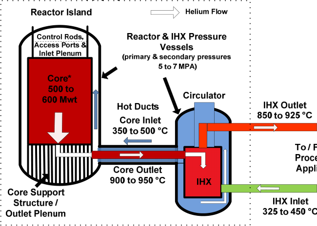

Figure A-1.  Fundamentals of HTGR Technology 

## **NGNP – An Extension of HTGR Technology** 

NGNP is an extension of past applications of HTGR technology to demonstrate the viability of this technology for wide ranging commercial applications.  A number of prototype and demonstration HTGRs have been operated over the past 40 years.  Two such reactors, Fort St. Vrain and Peach Bottom, have been licensed by the Nuclear Regulatory Commission (NRC) and operated commercially in the United States.  Internationally, both pebble bed and prismatic reactors have been licensed and operated in the United Kingdom, Germany, Japan and China.  Photos of each facility are shown in Figure A-2. 

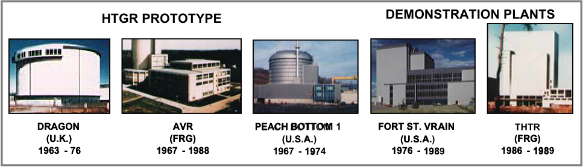

**----- Start of picture text -----** 
DEMONSTRATION PLANTS HTGR PROTOTYPE DRAGON AVR PEACH BOTTOM PEACH BOTTOM  1 FORT ST. VRAIN THTR (U.K.) (FRG) (U.S.A.) (U.S.A. (U.S.A.) (FRG) 1963 - 76 1967 - 1988 1967 1967 - - 1974 197 1976 - 1989 1986 - 1989 **----- End of picture text -----** 

Figure A-2.  Pebble Bed and Prismatic Reactor Facilities 

A comparison of the reactor operating conditions is shown in Table A-1. 

Table A-1. Comparison of Reactor Operating Conditions 

The commercial applications produced electricity and operated at significantly lower gas temperatures than the temperatures at which a process heat HTGR would need to operate (e.g., 746°C outlet temperature at Ft. St. Vrain versus an objective of 950°C for the NGNP).  Although several of the test reactors have operated at much higher temperatures for brief periods of time, no commercial application of the higher temperatures has been made.  The higher temperature objective for the NGNP is necessary to shift the focus of this technology from an electricity producer to a provider of high quality, reliable, economic, and non-emitting process heat for a wide range of applications and industry.  The majority of the technical risk to the successful demonstration of the NGNP technology results from operation at the higher temperatures. 

## **An HTGR Application / Plant Configuration** 

Referring to the plant configuration schematic, the process heat applications that will be demonstrated in NGNP include electricity and hydrogen production processes, supplied from the intermediate heat exchanger (IHX).  These production processes were selected for demonstration by the Environmental Policy Act of 2005 (EPAct).  Electricity will be produced using a power conversion system (PCS), which can take several forms independent of the nuclear heat supply.  Hydrogen will be produced using one or more of several different hydrogen production systems (HPS) independent of the nuclear heat supply.  (Note: Depending on the process, much of the electricity produced by the PCS could be used by the HPS, for example, those employing some form of electrolysis).  The nuclear heat supply is 

comprised of the nuclear island and one or more IHXs.  The nuclear heat supply can be attached to a wide variety of applications requiring a wide range of process heat temperatures. 

## **The Nuclear Heat Source – An Inherently Safe, Passive Design** 

Two different types of HTGRs are under consideration for NGNP: a prismatic reactor (see Figure A-3) and a pebble bed reactor (See Figure A-4).  In the prismatic version, the core consists of hexagonal graphite blocks that contain coolant holes and fuel holes.  The fuel holes are loaded with fuel compacts. The inner and outer annular regions of the reactor consist of graphite reflectors to shape the neutron flux. 

In the pebble bed, the core consists of graphite pebbles about the size of a tennis ball stacked between an inner and outer graphite reflector.  In both of these systems, these large graphite reflectors also act as a large heat sink to mitigate the effects of thermal transients in the core.  Surrounding the outer reflector is a metallic core barrel and Reactor Pressure Vessel (RPV).  Helium is used as the coolant.  In the prismatic variant, the coolant flows through the coolant holes in the graphite block; in the pebble bed design, the helium flows in the free volume between the pebbles.  In each case, the helium transfers heat from the reactor fuel to the IHX. 

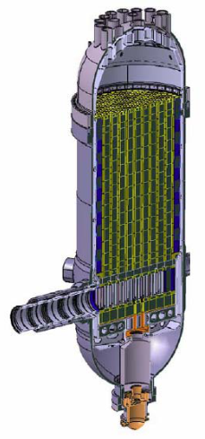

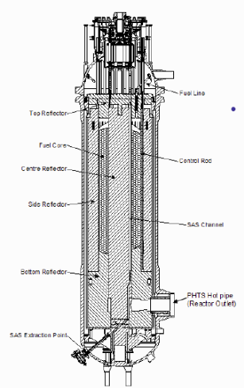

Figure A-3.  Prismatic Reactor Figure A-4.  Pebble Bed Reactor 

The reactor fuel in both systems is comprised of many multi-layered, TRISO-coated particles distributed within fuel elements comprised of either compacts or in spheres (also called pebbles; see Figure A-5).  The active fuel kernel (e.g., uranium oxycarbide or uranium dioxide) is surrounded by a layer of porous carbon, a layer of dense carbon, a layer of silicon carbide, and another dense carbon layer that collectively provide for accommodation and containment 

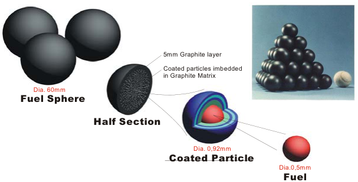

**----- Start of picture text -----** 
5mm Graphite layer Coated particles imbedded in Graphite Matrix Dia. 60mm Fuel Sphere Half Section Dia. 0,92mm Coated Particle Dia.0,5mm Fuel **----- End of picture text -----** 

Figure A-5.  TRISO-coated Fuel Pebbles 

of fission products generated during operation.  These fuel constituents are extremely stable and are designed to not fail (e.g., melt and release fission products) under any possible operating or accident 

condition, and thereby provide effective barriers to the release of fission products to the atmosphere under any condition. 

The graphite and other core ceramics used in the core are very stable materials.  There is a large volume of graphite in the core, which can store significant thermal energy at ambient pressures, thereby reducing the intensity of reactor temperature excursions and extending the time frame for reaching these excursions under analyzed abnormal and accident conditions (e.g., peak conditions are reached in transients under the most severe postulated accident conditions in hours and days, providing ample time to take corrective actions).  The helium is inert, which minimizes chemical reactivity concerns.  It is also a good conductor of heat from the fuel to the IHX, but has lower heat capacity and operates at lower pressures relative to other heat transport media (e.g., water).  Therefore, the amount of stored energy in the coolant is low; mitigating the consequences of loss of coolant conditions. 

Thus, it is the structural and retentive capabilities of the individual fuel particles, the small volume of each particle, the relatively low power density of the reactor, the inert coolant, and the large heat capacity afforded by the graphite in the core and reflector regions that form the bases for the relatively benign safety case for this technology.  This in turn minimizes the need for active safety systems, simplifies emergency planning, and thereby facilitates licensing, permitting, and plant siting. 

## **The Helium Flow Path, Heat Transfer, and Transport Systems** 

In Figure A-1, the reactor uses an annular cross duct to communicate between the reactor and the IHX.  The helium coolant enters the reactor at the bottom of the RPV through the outer annulus of the cross duct and flows up through an annulus to the inlet plenum, entering the reactor core at the top. This is the general path of the coolant in the prismatic reactor design.  The path in the pebble bed reactor design is different but still enters the vessel at the bottom and eventually enters the core at the top (see FigureA-6).  The coolant flows down through the graphite fuel and moderator blocks where it is heated, then through the core support structure and outlet plenum, ultimately exiting out the high-temperature path of the cross duct to the inlet of the IHX. The hot gas enters the top of the IHX and is cooled as it flows down and out the bottom of the heat exchanger core elements.  The helium coolant flow is maintained by the primary circulator at the top of the IHX pressure vessel.  The cooler helium flowing 

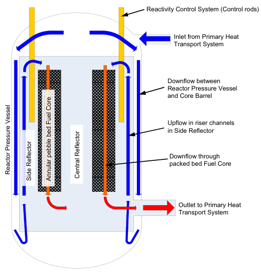

**----- Start of picture text -----** 
Reactivity Control System (Control rods) Inlet from Primary Heat Transport System Downflow between Reactor Pressure Vessel and Core Barrel Upflow in riser channels in Side Reflector Downflow through packed bed Fuel Core Outlet to Primary Heat Transport System Reactor Pressure Vessel Side Reflector Annular pebble bed Fuel Core Central Reflector **----- End of picture text -----** 

Figure A-6.  Pebble Bed Reactor Design 

up through the annulus in the IHX, through the circulator, and into the outer annulus of the cross duct completes the circuit to the reactor. 

Secondary fluid flows to and from the attached applications (e.g., the PCS and the hydrogen process system of the NGNP) interface at the bottom and top of the IHX. 

## **Technology Extensions to be Demonstrated by NGNP** 

## High Temperature Materials 

The ranges in the helium coolant outlet temperatures at the reactor and IHX interfaces that bound potential operating conditions for the NGNP are higher than experienced in prior commercial applications of gas-cooled reactors and are higher than experienced in traditional nuclear and fossil power plants. They are typical of temperatures seen in gas-fired applications, (e.g., combustion gas turbines generating electricity for hydrogen generation, petroleum refining, and steel making).  Materials used in past and current nuclear power applications are, therefore, not generally directly usable in the HTGR technology. As such, one of the principal technical development objectives of the design and research and development (R&D) efforts and operation of the NGNP demonstration plant is to prove the capabilities of selected materials for operation at the higher temperatures.  The specific applications include the RPV, the hot ducts, the IHX pressure vessel, and the core barrel.  High temperature metallic alloys being considered for these applications include SA508/533, Inconel 617, Incoloy 800H, 2-1/4Cr-1Mo and 9Cr1Mo (P91).  For example, a key factor in the design of the RPV is the reactor inlet temperature.  At the lower end of the anticipated inlet temperature (350°C), a more traditional material such as SA 508/533 may be applicable; whereas at the higher inlet temperatures (500°C), more developmental alloys (e.g., 2- 1/4Cr-1Mo and 9Cr-1Mo) or other means to reduce the operating temperature will be required (e.g., external means to cool the RPV). 

Design and R&D activities are focused on establishing the strength characteristics and high temperature creep resistance of these materials at bounding operating temperatures and radiation exposure levels.  It is also important to consider the availability of the material (e.g., the availability of sources in the size ranges required to support HTGR), the fabricability of the material (e.g., for on-site fabrication of the large vessels), and the lifetime of the components (e.g., does the plant have to be designed for replacement of the component over the design lifetime of the plant) in the overall assessment of each material candidate. 

## Qualification of Reactor Core Materials 

The other key technical development area is the qualification of the fuel and graphite components that make up the reactor core.  The qualification confirms the structural integrity of the graphite and the fission product retentiveness of the fuel particles under bounding conditions of temperature, fuel burnup, and radiation exposure.  This is confirmed by long-term irradiations of representative samples under controlled bounding conditions of temperature and fluence followed by extensive post-irradiation examination (PIE) and safety testing. 

## Proof of Principle Operation of NGNP 

These up-front R&D and design activities will be augmented by further validation of design assumptions during the initial operating period of the NGNP (two to three years after initial startup).  During this period, (1) extensive instrumentation of the plant will confirm assumptions on plant conditions during operation; (2) controlled transient operation will confirm component and system responses and interactions; (3) periodic in service inspections (ISIs) will confirm continued integrity of structural components and maintenance of geometric configurations; and (4) removal, PIE, and testing of fuel, graphite, and metallic and ceramic coupons will further support confirmation of the design assumptions that form the bases for the safety analyses. 

## **Appendix B** 

## **EOI for Design Development Engineering Services** 

## **Appendix B EOI for Design Development Engineering Services** 

## **A -- REQUEST FOR EXPRESSION OF INTEREST - NEXT GENERATION NUCLEAR PLANT (NGNP) DESIGN DEVELOPMENT ENGINEERING SERVICES FOR THE NGNP PROTOTYPE TO PRODUCE PROCESS HEAT, HYDROGEN, AND ELECTRICITY AT THE INL** 

## **General Information** 

Document Type: Sources Sought Notice Solicitation Number: Reference-Number-PROC035 Posted Date: Jul 24, 2007 Original Response Date: Aug 20, 2007 Current Response Date: Aug 20, 2007 Original Archive Date: Sep 04, 2007 Current Archive Date: Sep 04, 2007 Classification Code: A -- Research & Development Naics Code: 541330 -- Engineering Services 

## **Contracting Office Address** 

Department of Energy, Idaho National Laboratory (DOE Contractor), Idaho National Laboratory, 2525 Fremont P.O.  Box 1625, Idaho Falls, ID, 83415-3920, UNITED STATES 

## **Description** 

REQUEST FOR EXPRESSION OF INTEREST - NEXT GENERATION NUCLEAR PLANT (NGNP) DESIGN DEVELOPMENT ENGINEERING SERVICES FOR THE NGNP PROTOTYPE TO PRODUCE PROCESS HEAT, HYDROGEN, AND ELECTRICITY AT THE IDAHO NATIONAL LABORATORY (INL) 

## I. BACKGROUND/INTRODUCTION 

The Department of Energy has selected the Idaho National Laboratory as the lead national laboratory for nuclear energy research.  Per the terms of the Energy Policy Act of 2005, Title VI, Subtitle C, Section 642, INL, under the direction of the DOE, will lead the development of the Next Generation Nuclear Plant (NGNP) by integrating, conducting, and coordinating all necessary research and development 

activities and by organizing project participants.   INL, as the Managing Contractor, will be responsible for conducting project related procurements and coordinating project efforts with industry and the international community. 

Battelle Energy Alliance, LLC (BEA), Management & Operating Contractor of the INL, is requesting an expression of interest from prospective subcontractors (teams, consortiums, joint ventures, etc.) that are capable of providing complete and comprehensive Engineering Services for Design Development for the Next Generation Nuclear Plant prototype that produces very high temperature heat, hydrogen, and electricity. 

In FY 2007, BEA subcontracted engineering studies and pre-conceptual design activities with three design teams led by Westinghouse Electric Company, LLC, AREVA NP, Inc., and General Atomics.  A total of 26 companies participated in this design work.   In addition to the reports prepared by each of these teams, a consolidated and integrated Pre-conceptual Design Report will be issued in September 2007 based on this design work. 

## II. PURPOSE 

In FY 2008, BEA is planning to continue design development by performing selected further studies and proceeding with conceptual design.   This work will support progressive selection of NGNP prototype functional requirements, design features and configuration, and refinement of cost and schedule estimates. Functional, operational, and design requirements included in the Pre-conceptual Design Report will be used as the starting point for these design activities. 

## III. REQUEST FOR EXPRESSION OF INTEREST 

BEA requests an expression of interest from qualified potential subcontractors to perform this work.   The specific scope of work will be developed as part of an extension of current subcontracts or selection for a subcontract with BEA and will depend on available funding, design and technology risk characterization from pre-conceptual design work, and the capabilities of the interested potential subcontractors. 

The three design teams that performed pre-conceptual design activities and provided engineering services in FY 2007 are requested to provide a confirmation of interest in performing these design development services and confirm the makeup of the teams.   Extension of existing subcontracts is anticipated if existing subcontractors remain interested.   However, as appropriate, other subcontracts may be awarded. To that end, additional prospective subcontractors with interest in performing such design and engineering services are requested to provide a summary submittal of qualifications in accordance with section IV Submittal Requirements. 

## IV. SUBMITTAL REQUIREMENTS 

Prospective subcontractors shall provide brief statements of qualifications in the following areas: 

- 1) A description of current knowledge or capabilities related to Pebble Bed and Prismatic gas cooled graphite moderated reactor system designs, hydrogen plant design, and balance of plant design. 

- 2 Demonstrated ability to integrate specialty disciplines and industry expertise to provide for an integrated design for a prototype reactor, power generation, and hydrogen production plant. Specialties shall include but not be limited to reactor design, Brayton and steam cycle turbomachinery, controls, hydrogen production, and balance of plant engineering and design. 

- 3) The prospective subcontractor must also be able to effectively identify and evaluate technology development status and needs. 

- 4) A minimum of three references who represent a direct client of the lead team member that can validate past history regarding reactor engineering and design services, ability to assemble and integrate highly specialized design elements, and performance satisfaction. 

- 5) An indication of whether the prospective subcontractor possesses the capability to design a commercial scale prototype NGNP modular reactor, including examples of past design efforts. 

- 6) A statement to describe the prospective subcontractor's Quality Program Plan with a discussion on how it is qualified to ASME NQA-1, 2000, requirements for engineering design services. 

- 7) Demonstrated experience in licensing nuclear plants for construction and operation with the United States Nuclear Regulatory Commission. 

Failure to provide the requisite submittals may limit a prospective subcontractor's ability in being a viable candidate for a future RFP. 

Again, it is the intent of this expression of interest to develop a representative list of qualified prospective subcontractors that can and will provide all submittal requirements identified within this EOI, as well as possess the interest, the resources, and capabilities to cooperatively and successfully perform the required tasks. 

Please provide your expression of interest to the undersigned by 5 p.m.  Mountain Time, August 20, 2007.   If you have questions or need additional information, please contact Greg Anderson on Extension (208) 526-1816 or email gregory.anderson@inl.gov.   Technical questions must be submitted in writing (U.S. mail or email). 

## **Point of Contact** 

Dawn Karns, Administrative Specialist, Phone 208-526-9554, Fax null, Email Dawn.Karns@inl.gov 

## **Place of Performance** 

Address: 2525 Fremont Ave.  P.O.  Box 1625 Idaho Falls, ID Postal Code: 83415-3890 

Country: UNITED STATES 

## **Appendix C** 

## **Special Studies White Papers** 

C-1 

C-2 

## **NGNP Engineering White Paper: Licensing & Permitting Special Study** 

## Mark R. Holbrook 

This information was prepared as an account of work sponsored by an agency of the U.S. Government. Neither the U.S. Government nor any agency thereof, nor any of their employees, makes any warranty, expressed or implied, or assumes any legal liability or responsibility for the accuracy, completeness, or usefulness, of any information, apparatus, product, or process disclosed, or represents that its use would not infringe privately owned rights. References herein to any specific commercial product, process, or service by trade name, trade mark, manufacturer, or otherwise, does not necessarily constitute or imply its endorsement, recommendation, or favoring by the U.S. Government or any agency thereof. The views and opinions of authors expressed herein do not necessarily state or reflect those of the U.S. Government or any agency thereof. 

# **NGNP Engineering White Paper: Licensing & Permitting Special Study** 

## **Mark R. Holbrook** 

**Prepared for the U.S. Department of Energy Office of Nuclear Energy Under DOE Idaho Operations Office Contract DE-AC07-05ID14517** 

The purpose of this white paper is to summarize and compare the different Next Generation Nuclear Plant (NGNP) licensing recommendations provided by the three subcontractors.  Only one of the subcontractors (Westinghouse) was tasked to develop a licensing special study.  However, the other subcontractors have provided limited information on their licensing suggestions that will be integrated into their pre-conceptual design products.  This information has been included, where available. Recommendations based on the available licensing information are as follows: 

- Continue to assume (as stated in the Preliminary Project Management Plan) that the two-step Part 50 licensing process will be used unless Westinghouse develops a cogent schedule based on the Part 52 process that meets the 2018 completion date. 

- Continue to assume use of an Early Site Permit (ESP) with the two-step Part 52 process. However, after the pre-conceptual design studies are complete, conduct internal and external discussions to reevaluate the usefulness of this mixed licensing approach. 

- Focus research & development (R&D) and engineering efforts during the conceptual design phase to 1) identify the design’s safety analysis data needs, 2) evaluate where the license by test (LBT) approach is beneficial, 3) determined what type of integrated test program would be required, and 4) assess the potential impacts on the plant design. 

- Conduct additional licensing discussions with subcontractors to determine the feasibility of developing a licensing strategy that allows for maximum flexibility in the configuration of the process heat applications for subsequent commercial applications of NGNP technologies. 

- Initiate development of an Environmental Permitting Plan (EPP) during the conceptual design phase. 

- Continue to monitor the PBMR Design Certification review discussions with the Nuclear Regulatory Commission (NRC) to gain experience in application of probabilistic risk assessments (PRA) in licensing products and to improve our overall understanding of risk-influenced licensing strategies. 

## **NGNP Engineering White Paper: Licensing & Permitting Special Study** 

Westinghouse was requested to prepare a study that compares licensing the NGNP under NRC regulations 10 CFR Part 50 vs. use of 10 CFR Part 52.  The advantages and disadvantages of each approach and the risks associated with each approach were requested.  Also, the following issues were to be evaluated: 

- The feasibility of using Part 52 for development of an ESP and Part 50 for licensing the reactor facility (construction permit and operating license), 

- The availability and pros and cons of using the new advanced reactor licensing framework (to become Part 53) being developed by the NRC, 

- The feasibility of applying a “license by test” philosophy for obtaining an NRC license for the NGNP demonstration facility, 

- Identify the issues and recommend an approach for licensing an integrated nuclear facility/hydrogen production plant, 

- Identify applicable Environmental Protection Agency (EPA) and State permit requirements associated with construction and operation of an integrated nuclear facility/hydrogen production plant, 

- Develop an approach for integrating PRA methodologies early into the design process so that the reactor facility design is optimized from a safety perspective, and 

- Integrate licensing considerations while performing economic assessments and construction scheduling. 

Of the three contractors (Westinghouse, AREVA, and General Atomics), only Westinghouse was tasked to perform a licensing special study.  However, the other two contractors were directed to consider licensing issues associated with the NGNP that were to incorporated into their respective preconceptual design studies reports.  The licensing work scope for these two contractors is provided below. 

## **AREVA** 

AREVA was requested to perform engineering and design activities for the NGNP pre-conceptual design and preliminary planning for permitting and licensing their recommended design for NGNP.  This was to include establishment of NGNP safety strategy, licensing and permitting provisions and evaluation of overall nuclear system operation.  The Preconceptual Design Studies Report will describe the AREVA NGNP Team’s recommended licensing strategy, but the decision process and evaluation of alternatives will not be described. 

## **General Atomics** 

General Atomics was asked to develop a strategy for licensing their recommended design for NGNP under 10 CFR Part 50 vs. 10 CFR Part 52, and to evaluate these evolving licensing and regulatory requirements.  This included: 

- Considering the feasibility of using Part 52 for development of an ESP and Part 50 for licensing the reactor facility, 

- Evaluate the availability and pros and cons of using the new advanced reactor licensing framework being developed by the NRC (to become Part 53), 

- Evaluation of the feasibility of applying a “license by test” philosophy for obtaining an NRC license for the NGNP demonstration facility, 

- Identify the issues and recommend an approach for licensing an integrated nuclear facility/hydrogen production plant, 

- Identify applicable EPA and State permit requirements associated with construction and operation of an integrated nuclear facility/hydrogen production plant. 

- Perform a Preliminary Hazard Assessment (PHA) that defines the hazard levels associated with the high-temperature heat transport system and hydrogen plant, and chemical systems in the hydrogen plant, and 

- Integrate licensing considerations into construction scheduling. 

## **Use Part 50 or Part 52?** 

AREVA and General Atomics both recommend using NRC Part 50 two-step licensing process to obtain an operating license by 2018.  Westinghouse recommends using the one-step Part 52 licensing process with a fallback alternative to use Part 50, if necessary. 

While it is desirable to use Part 52 to reduce risk, it is not clear that using Part 52 will allow development of a rational schedule that supports plant startup by 2018, because the design must be complete before the licensee can submit a combined operating license (COL) application.  In addition, construction is delayed until the COL is reviewed and approved by the NRC.  Unfortunately, Westinghouse will not have an integrated schedule available until their final products are complete.  So, it is difficult to understand how the 2018 completion date can be met until the schedule assumptions are reviewed.  It’s interesting to note that Westinghouse hedged their bets by identifying use of a two-step Part 50 process in case pre-application discussions with the NRC don’t go well. 

## **Use Early Site Permit (ESP) with Part 50 Process?** 

If Part 50 is used, both Westinghouse and AREVA recommend that an Early Site Permit (ESP) be obtained to reduce risk and allow partial site preparation.  Neither subcontractor identified any regulatory issues that would prevent use of this mixed approach.  The limited information available from General Atomics did not address this option. 

Developing an ESP application has some advantages; however, as the project schedule becomes more compressed due to funding issues, the advantages become minimal.  The commercial industry is not in total agreement concerning the usefulness of ESPs, especially if a project for a given site is planned for completion in the near term.  After further consideration and initial discussions with the NRC, we may find that it is more efficient to include all of the environmental information as part of a standard construction permit application. 

## **Consider Use of Part 53?** 

All three of the subcontractors agree that new Part 53 technology-neutral advanced reactor licensing framework will not be developed in time to be used to license the NGNP demonstration plant. This recommendation is appropriate.  In addition, it would be appropriate to look for opportunities to assist the NRC with Part 53 development, possibly through exercising the framework in some fashion. 

## **Should We Consider “License by Test”?** 

Westinghouse recommends a selective use of the license by test (LBT) concept, based on results from studies to determine what data will be needed and cost/benefit analyses to determine where LBT is best used.  The limited information available from General Atomics noted that they did not believe that the LBT concept was feasible.  This issue was not addressed by AREVA. 

It is beneficial to consider the Westinghouse recommendation with the understanding that this type of testing may lead the NRC to impose additional restrictions on the demonstration plant design to account for plant performance uncertainties to ensure that public safety is maintained. 

## **Approach for Licensing an Integrated Nuclear/Hydrogen Facility** 

Westinghouse proposed a method for addressing the licensing requirements for each individual plant and then to consider any interactions that may occur that would exceed the regulatory limits that govern the individual plant.  This issue was not addressed in the available materials from AREVA and General Atomics. 

It is highly desirable to have the licensing of the nuclear plant be independent of the process heat systems.  Meeting this objective would allow for maximum flexibility of facility design and increase the NGNP’s ability to adapt to a wide range of process heat applications (e.g., hydrogen production, oil extraction from tar sands, or syn-fuel generation).  None of the three subcontractors has suggested a reactor licensing approach that addresses this issue. 

## **Identify EPA and State Permits** 

Westinghouse recommends development of an Environmental Permitting Plan (EPP) to ensure that required permits will be obtained in a timely manner to avoid negative schedule impacts on the overall schedule.  The EPP will also ensure that environmental permits required prior to operations will be obtained in a timely manner.  This issue was not addressed in the available materials from AREVA. General Atomics noted that the effort was estimated to require 3 to 4 years at a cost of $9 to $12 million. 

## **Integration of Probabilistic Risk Assessment (PRA) Methods** 

Westinghouse and General Atomics agree that a full-scope probabilistic risk assessment (PRA) be developed for the NGNP demonstration plant.  Westinghouse provides more detail; in that the PRA should be used for selection of licensing basis events, selection of safety related equipment, and implementation of defense in depth principles.  This approach can be used with either the Part 50 or Part 52 licensing process.  In addition, this approach is consistent with current industry efforts to implement PRA techniques as part of NRC licensing activities (e.g., PBMR Design Certification). 

The Westinghouse recommendations are acceptable.  Note that this approach is consistent with the PRA licensing discussion in the Preliminary Project Management Plan. 

- Continue to assume (as stated in the Preliminary Project Management Plan) that the two-step Part 50 licensing process will be used unless Westinghouse develops a cogent schedule based on the Part 52 process that meets the 2018 completion date. 

- Continue to assume use of an ESP with the two-step Part 52 process.  However, after the preconceptual design studies are complete, conduct internal and external discussions to reevaluate the usefulness of this mixed licensing approach. 

- Focus R&D and engineering efforts during the conceptual design phase to 1) identify the design’s safety analysis data needs, 2) evaluate where the LBT approach is beneficial, 3) determined what type of integrated test program would be required, and 4) assess the potential impacts on the plant design. 

- Conduct additional licensing discussions with subcontractors to determine the feasibility of developing a licensing strategy that allows for maximum flexibility in the configuration of the process heat applications for subsequent commercial applications of NGNP technologies. 

- Initiate development of an Environmental Permitting Plan (EPP) during the conceptual design phase. 

- Continue to monitor the PBMR Design Certification review discussions with the NRC to gain experience in application of PRA in licensing products and to improve our overall understanding of risk-influenced licensing strategies. 

## **NGNP Engineering White Paper: Power Conversion System Trade Study** 

Richard R. Schultz 

This information was prepared as an account of work sponsored by an agency of the U.S. Government. Neither the U.S. Government nor any agency thereof, nor any of their employees, makes any warranty, expressed or implied, or assumes any legal liability or responsibility for the accuracy, completeness, or usefulness, of any information, apparatus, product, or process disclosed, or represents that its use would not infringe privately owned rights. References herein to any specific commercial product, process, or service by trade name, trade mark, manufacturer, or otherwise, does not necessarily constitute or imply its endorsement, recommendation, or favoring by the U.S. Government or any agency thereof. The views and opinions of authors expressed herein do not necessarily state or reflect those of the U.S. Government or any agency thereof. 

# **NGNP Engineering White Paper: Power Conversion System Trade Study** 

## **Richard R. Schultz** 

**Prepared for the U.S. Department of Energy Office of Nuclear Energy Under DOE Idaho Operations Office Contract DE-AC07-05ID14517** 

The Westinghouse and AREVA Teams performed this special study.  It was not included in the work scope of General Atomics.  The AREVA study was performed by Hamilton Sundstrom / Rockwell / Pratt Whitney; the Westinghouse study was performed up by M-Technologies of South Africa.  These studies combined to evaluate nine Power Conversion System (PCS) configurations: 

Several conclusions and recommendations follow based on this short study: 

- The AREVA team considers the direct Brayton cycle to have relatively high technological risk. Westinghouse PTY - PBMR is developing a direct Brayton cycle PCS for the Demonstration Power Plant (DPP) in South Africa.  (Note that General Atomics also recommends a direct-cycle PCS in the GT-MHR design currently being designed by OKBM for use in Russia.)  The difference in the Teams’ evaluation of the maturity of a direct Brayton-cycle PCS and the translation of that maturity to technological risk should be reconciled. 

- Neither Westinghouse nor GA consider radioactive contamination nor dust as a problem for a direct Brayton cycle PCS.  AREVA considers that radioactive contamination will have on the maintenance and long term reliability of direct-cycle power conversion equipment. 

- There are significant differences in the net plant efficiencies calculated for the several different PCS configurations considered by Westinghouse and AREVA.  The predicted operating efficiencies of the options selected for further evaluation for NGNP will be developed as the design progresses. 

- The AREVA Team prepared a more comprehensive evaluation of several PCS concepts that will be of use in further design efforts for NGNP. 

- Neither of the teams considered the impact of the transient characteristics of the various cycles in their evaluations of alternatives.  These will need to be considered in the design of the PCS for NGNP.  Such transients include loss-of-load, compressor surge, and other scenarios as defined in a typical plant safety analysis report. 

## **NGNP Engineering White Paper: Power Conversion System Trade Study** 

The principal objectives of the Power Conversion System (PCS) Special Study effort are to answer the following questions: 

1. What is the recommended NGNP Power conversion System concept?  Potential candidates are direct vs. indirect cycle; Brayton vs. combined cycle gas-turbine vs. steam cycle or some combination thereof. 

2. What is the recommended working fluid if an indirect cycle is recommended? 

A systematic study process was expected of the participants to address these questions considering the following: 

1. Evaluate the potential PCS configurations against the following key discriminating criteria, as a minimum (i.e., others may be added as necessary) 

   - a. Direct versus Indirect 

   - b. System performance 

   - c. Flexibility and operability 

   - d. Adaptability of existing technology 

   - e. Technology risks, if additional development is required 

2. Establish a criteria and decision hierarchy 

3. Identify the range of available solutions 

4. Obtain required input, if not readily available, as necessary to complete the evaluation 

5. Identify and assess options regarding each criterion (individual inputs or expert opinions) 

6. Synthesize results required for an optimum solution (expert opinion and reviews).  That is, the decision sequence should be prioritized based on hierarchy.  This should be accomplished by prioritizing the PCS decision considerations and the selected PCS concept decision should be optimized based on these decision considerations. 

7. Perform an expert review of the draft special study results 

Westinghouse and AREVA teams have addressed the PCS questions noted above.  Their results are summarized herein.   It should be noted that neither of the teams have selected an optimal cycle and set of working fluids.  For continuing with the NGNP design the answers to the questions presented above require further analysis. 

The results are separated according to vendor.  The following two subsections first discuss AREVA’s finding and then Westinghouse’s findings. 

_**AREVA:**_ AREVA tasked the Rocketdyne Division of Hamilton Sunstrand, Inc. to perform comprehensive evaluations of power conversion system options for NGNP.  This study summarized key parameters of importance for PCS based on characteristics of: (a) an indirect-cycle using supercritical carbon dioxide as the working fluid, (b) an indirect steam Rankine cycle PCS, (c) both direct and indirect Brayton cycles using helium as the working fluid, and (d) an indirect combined cycle gas-turbine.  The team conclusions are presented in:  Gregory A. Johnson, Hamilton Sundstrand Inc, “Power Conversion System Special Study,” Lynchburg, VA, April 4, 2007, the following conclusions were reached: 

- The conclusions of the evaluations[a] are dependent upon the relative importance of efficiency and the importance of cycle maturity, that is, the importance of risk. 

- Supercritical CO2 very promising 

   - Low Technical Readiness Level (TRL)[b] is the only negative for this candidate PCS.  On a scale of 1 to 9, TRL for this PCS is 3. 

   - Arrange in cascaded configuration for large differential temperature applications[c] 

- Steam Rankine cycles are the most mature 

   - Cost & size of steam turbines reduces attractiveness 

   - Supercritical steam with two reheats is best steam cycle option 

      - TRL = 9 for subcritical and TRL = 8 for a supercritical system. 

- Brayton cycles are adequate 

   - Operational and Maintenance difficulties are present with direct cycle 

      - Radioactive contamination of PCS[d] 

      - Loss of efficiency with indirect cycle 

   - Relative attractiveness compared with supercritical  CO2  (SCCO2) brings further pursuit of cycle development into question 

   - TRL = 4 for both direct and indirect. 

- Combined Cycle Gas-Turbine (CCGT) 

- Cost & size of steam turbine reduces attractiveness 

> a The “answer” to the questions posed to the teams. 

> b A measure, developed in the aerospace industry, to support assessing the risk inherent in using a particular technology.  A technology with a high TRL scale index would be considered mature and many examples of it being used in industry could be readily found.  A technology with a low TRL scale index would add to technological, cost and schedule risk since it has not been developed sufficiently to identify and address issues that might cause the technology to fail. 

> c This need stems from the large differential temperature mismatch that exists between the reactor (~400 °C) versus the PCS (~170 °C) 

> d Dust is not mentioned probably because the AREVA design is only considering a prismatic reactor which generates much less dust than a pebble-bed reactor. 

- Added complexity & possible development issues with non-standard gas-turbine 

- Recommend examining helium and/or argon if pursued 

- Potential long term economic advantage from small efficiency increase compared to supercritical steam & indirect Brayton 

- TRL = 6. 

_**Westinghouse:**_ As noted in Gerard du Plessis, M-Tech Industrial (Pty) Ltd, “NGNP Special Study 20.4 – Power Conversion System Trade Study,” NGNP-RPT-004, Jan. 10, 2007: 

_In the Westinghouse (PBMR) study various cycle configurations were compared in order to identify representative Brayton, Combined and Rankine cycles for the NGNP.  The most promising Brayton cycles, GTCCs and Rankine cycles were analyzed and compared with regard to thermodynamic performance and practical considerations when employed in conjunction with a given PBMR.  A representative cycle was chosen for each group of cycle configurations._ 

_For the Brayton cycle configurations, it was found that a single-shaft cycle with inter-cooling would be the best option in terms of net cycle efficiency and turbo-unit size.  The representative Brayton cycle (Cycle B -_ _**Error! Reference source not found.**[e] )[f] has a net cycle efficiency of 42.3%.  For the CCGTs, a single-shaft recuperative Brayton cycle without inter-cooling was found to be the most suitable cycle configuration.  Although the cycle (Cycle J -_ _**Error! Reference source not found.** )[g] does not have the highest net cycle efficiency (45.1%) of the GTCCs under investigation, the turbomachines employed by the cycle builds on the PBMR DPP design.  Cycle J was therefore chosen as the representative GTCC on the basis of readiness of technology.  A single conventional Rankine cycle coupled to a PBMR through a steam generator was chosen as the representative Rankine cycle (Cycle K -_ _**Error! Reference source not found.** )[h] .  The representative Rankine configuration uses proven Rankine cycle technology and has a net cycle efficiency of 41.2%._ 

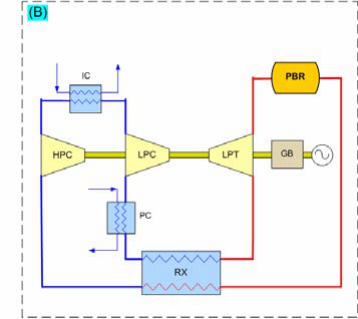

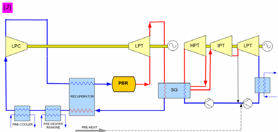

Figure. 2  Gas-turbine combined cycle:  single-shaft recuperative Brayton cycle without inter-cooling (Cycle J) 

> e Figure number is given in du Plessis 2007. 

> f See Fig. 1 below. 

> g See Fig. 2 below. 

> h See Fig. 3 below. 

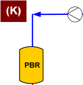

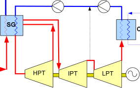

The influence of a direct versus indirect PCS was also investigated for each group of cycle configurations.  As expected, it was indicated that the net cycle efficiency of the cycles in each group decreases for an indirect configuration. 

The influence of the coupling configuration of the hydrogen plant with the PCS, as well as the size of the hydrogen production plant, was also considered.  The sensitivity of cycle efficiency to the hydrogen plant size was compared for Brayton and Rankine cycles.  It was found that the net cycle efficiency of the representative Rankine cycle is not as sensitive to the coupling configuration and hydrogen production plant size as the representative Brayton cycle. 

## **Comparison of the AREVA and Westinghouse Results** 

The AREVA Westinghouse Teams combined to evaluate nine Power Conversion System (PCS) configurations: 

Table 1.  AREVA/Westinghouse PCS configurations 

These configurations and the information provided by AREVA and Westinghouse on each configuration are summarized and compared in Tables 2 and 3. 

Table 2.  Comparison of studies done by AREVA and Westinghouse concerning PCS:  Power cycles, system performance, and flexibility & operability 

> i Westinghouse terms a “direct” Rankine cycle as one where the reactor piping is used in the steam generator to boil water.  An “indirect” Rankine cycle is one where an intermediate loop exists between the reactor loop and the Rankine loop such that an IHX exists between the reactor piping and the steam generator.  By this definition all of the AREVA Rankine cycles are “direct.” 

> j Minimum reactor inlet temperature given on page 19 of du Plessis 2007.  It was not clear what reactor inlet temperatures could be used to compare Westinghouse design to AREVA design since M-Technologies varied the inlet temperatures (e.g., see pages 14, 26 and 31 of du Plessis 2007). 

Table 3.  Comparison of studies done by AREVA and Westinghouse concerning PCS adaptability, technology risks, decision hierarchy, required input, optimal solutions, etc. 

## **Conclusions / Recommendations** 

The AREVA team and the Westinghouse team evaluated nine different PCS general configurations and Westinghouse performed optimization studies for two of the general configurations.  The general findings by both teams are summarized in Tables 1 and 2.  Several conclusions are apparent based on this short study: 

1. The AREVA team considers the direct Brayton cycle to have relatively high technological risk. Westinghouse PTY - PBMR is developing a direct Brayton cycle PCS for the Demonstration Power Plant (DPP) in South Africa.  (Note that General Atomics also recommends a direct-cycle PCS in the GT-MHR design currently being designed by OKBM for use in Russia.)  The difference in the Teams’ evaluation of the maturity of a direct Brayton-cycle PCS and the translation of that maturity to technological risk should be reconciled. 

2. Neither Westinghouse nor GA consider radioactive contamination nor dust as a problem for a direct Brayton cycle PCS.  AREVA considers that radioactive contamination will have on the maintenance and long term reliability of direct-cycle power conversion equipment. 

3. There are significant differences in the net plant efficiencies calculated for the several different PCS configurations considered by Westinghouse and AREVA.  The predicted operating efficiencies of the options selected for further evaluation for NGNP will be developed as the design progresses. 

4. The AREVA Team prepared a more comprehensive evaluation of several PCS concepts that will be of use in further design efforts for NGNP. 

5. Neither of the teams considered the impact of the transient characteristics of the various cycles in their evaluations of alternatives.  These will need to be considered in the design of the PCS for NGNP.  Such transients include loss-of-load, compressor surge, and other scenarios as defined in a typical plant safety analysis report. 

## **NGNP Engineering White Paper: By-Products Trade Study** 

Doug S. Vandel Sam Bader 

## April 2007 

This information was prepared as an account of work sponsored by an agency of the U.S. Government. Neither the U.S. Government nor any agency thereof, nor any of their employees, makes any warranty, expressed or implied, or assumes any legal liability or responsibility for the accuracy, completeness, or usefulness, of any information, apparatus, product, or process disclosed, or represents that its use would not infringe privately owned rights. References herein to any specific commercial product, process, or service by trade name, trade mark, manufacturer, or otherwise, does not necessarily constitute or imply its endorsement, recommendation, or favoring by the U.S. Government or any agency thereof. The views and opinions of authors expressed herein do not necessarily state or reflect those of the U.S. Government or any agency thereof. 

# **NGNP Engineering White Paper: By-Products Trade Study** 

**Doug S. Vandel Sam Bader** 

**Prepared for the U.S. Department of Energy Office of Nuclear Energy Under DOE Idaho Operations Office Contract DE-AC07-05ID14517** 

The U.S. Department of Energy (DOE) has adopted the Very High Temperature Reactor (VHTR) for the Next Generation Nuclear Plant (NGNP) Project. This reactor will be a helium-cooled, graphitemoderated thermal reactor that will be designed to produce electricity and hydrogen as delineated by the Energy Policy Act of 2005. DOE has contracted with three industrial teams, led by Westinghouse, AREVA, and General Atomics, for the pre-conceptual design engineering services phase. As part of this work scope, Westinghouse and General Atomics were tasked with performing specific studies to identify, quantify and describe the disposition of end products that will be produced by the NGNP and by commercial VHTRs that will be based on the NGNP demonstration. The purpose of this white paper is to compare the information presented by the two teams in their respective By-Products Special Studies.  The overall by-products that apply to both the prototype and the commercial plants are: 

- Excess electricity and hydrogen. 

- Large quantities of high purity oxygen (8 kg of O2/kg of H2). 

- Nuclear spent fuel. 

- Radioactive and chemical waste streams from reactor operations. 

- Limited amounts of gaseous, liquid, and chemical wastes from hydrogen production processes. 

- Small quantities of corrosion products (mainly metal sulfates from reaction of sulfuric acid with structural metals) from hydrogen production processes. 

- Spent solid oxide electrolyzer cells from high temperature steam electrolysis. 

- Tritium 

- Graphite 

The following recommendations apply to the NGNP demonstration plant and follow-on commercial VHTRs. 

- The size of the NGNP Hydrogen Plant should be a full commercial train. 

- The NGNP demonstration plant should be designed such that excess electricity produced by the NGNP (beyond that needed for hydrogen production) can be sold to the local utility grid. 

- Local markets for hydrogen and oxygen produced by the NGNP demonstration plant should be aggressively pursued and developed. 

- A more comprehensive market survey of the potential future customers for hydrogen, oxygen, high-temperature process heat, and process steam should be performed for a variety of sites. 

- The fuel burnup should be maximized to the fullest extent practical to minimize the amount of spent fuel per unit electrical production and unit mass of hydrogen production. 

- Every effort should be made to minimize the radioactive and chemical waste streams. Stringent radionuclide design criteria should be adopted to limit fission release from the core to the fullest 

extent practical. A design goal for the hydrogen plant should be “zero-discharge” of pollutants to the environment. 

- The recovery and potential recycle of the hazardous constituents from the spent solid oxide electrolyzer cells should be a high-priority R&D task. 

- An overall tritium mass balance for the NGNP demonstration reactor should be made using the available design methods. The emphasis should be on estimating the degree of product contamination. The results will provide guidance on sizing the helium purification systems for the primary and secondary coolant circuits. 

- The international radiological regulations should be reviewed to provide a logical basis for setting limits in the allowable tritium contamination in the product hydrogen. 

- The extensive literature on tritium permeation through heat exchanger materials should be acquired, reviewed, and evaluated as a basis for selecting the best available correlations for predicting tritium permeation from the primary to the secondary coolant loops and from the secondary loop to the hydrogen production plant. 

- The extensive literature on tritium permeation barrier coatings should be acquired, reviewed, and evaluated for possible application in a VHTR. A feasibility study should be made to determine if there is a practical means of applying such coatings to the intermediate heat exchanger. 

- Trade studies should be performed to identify the optimal combination of design options for assuring tritium contamination levels will be well below anticipated regulatory limits. 

## **Spent Fuel Disposition** 

The confirmatory testing and analysis to qualify VHTR spent fuel elements as a suitable waste form for disposal in a geologic repository and to assess the transport of radionuclides from spent fuel elements in the repository to the environment should be conducted. 

- The contamination of the reactor plant by long-lived radionuclides (e.g., 30 yr- Cs-137, 27-yr Sr90, etc.) should be minimized by adopting stringent limits on fission product release limits from the core during operation. 

- The cobalt content of structural metals subjected to significant neutron fluxes should be minimized to the extent practical to minimize the amount of neutron activation. 

- The reactor plant should be properly instrumented (i.e., plateout probes) such that the plateout inventories in the primary circuit can be accurately monitored throughout the operating lifetime. 

- A reactor surveillance program should be planned and conducted to determine the radionuclide inventories of components changed out of the reactor during plant operation. In particular, replaceable reflector blocks should be surveyed to determine their radionuclide inventories and LLW classification. 

## **NGNP Engineering White Paper: By-Products Trade Study** 

The specific work scope identified to be performed by Westinghouse included performing a study to identify the NGNP hydrogen plant size for demonstration of commercial feasibility, the production rate for each demonstration case, the product and by-product markets, the additional by-product processing requirements, and the waste streams and disposal means. Three different water-splitting technologies were considered for hydrogen production in this work scope: High Temperature Steam Electrolysis (HTSE), Hybrid Sulfur (HyS), and Sulfur-Iodine (SI) processes. The results of this study will be used as input to various sections of the Pre-conceptual Design Report prepared by Westinghouse. 

The specific work scope identified to be performed by General Atomics included performing a study to identify, quantify and discuss disposition of end products produced by commercial-scale electricity and hydrogen-production plants that are based upon the NGNP demonstration. General Atomics’ approach included by-product identification, evaluation of potential disposition paths including an assessment of potential risks and benefits, options for by-product management, and estimating the current or potential market for by-products with a commercial value. Two different water-splitting technologies were considered for hydrogen production in this work scope: High Temperature Steam Electrolysis (HTSE) and Sulfur-Iodine (S-I) processes. The results of this study will be used as input to various sections of the Pre-conceptual Design Report prepared by General Atomics. 

Figure 1 shows a schematic of a proposed NGNP for the production of electricity and hydrogen. 

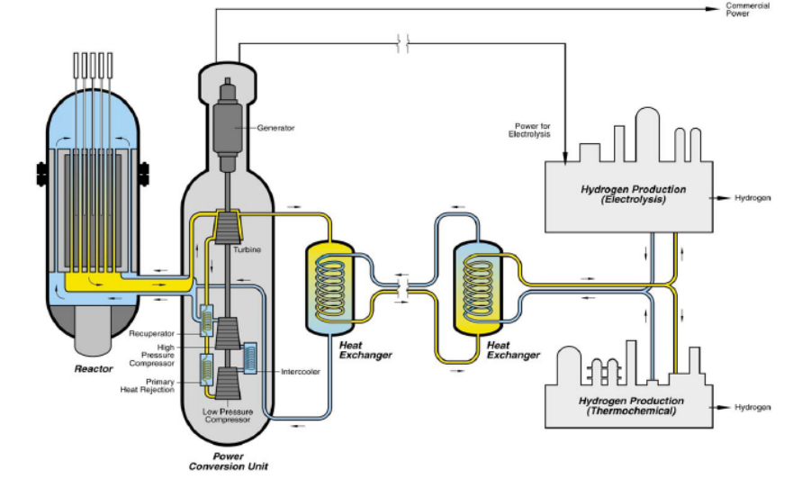

**Figure 1.  Proposed NGNP for the production of electricity and hydrogen.** 

Although the specific work scopes performed by the two industrial teams are slightly different, the major areas and issues have been addressed in both By-Product Studies. 

The following is a summary of the Westinghouse By-Products Study: 

- In the case of the Hydrogen Plant, there are two size limits that were considered in demonstrating the hydrogen production technology: the smallest practical scale to meet the requirements of commercial demonstration and a single train of a full-scale plant.  Most of the demonstration criteria will be met if the hydrogen plant is large enough to demonstrate that the critical pieces of equipment (typically the process-coupled heat exchangers) for each process can be fabricated. The specific information is included Tables 1 – 3 below. 

Table 1. PCHX Thermal Duty technology. 

Table 2. Hydrogen production / Oxygen production technology. 

**----- Start of picture text -----** 
Hydrogen Production  Oxygen Production (x10 [6]  SCFD)  (x10 [6]  SCFD) **----- End of picture text -----** 

Table 3. NGNP market price comparison. 

- Whatever technology or size is chosen for hydrogen production, electric power will be a major product of the NGNP demonstration, resulting in up to 160 MWe of electricity available for sale to the local utility grid. 

- A preliminary market analysis indicates there are limited opportunities for distributing the product hydrogen from the NGNP demonstration into the local market within reasonable transportation distances of the INL site. However, if a market could be developed, up to 972 kg/hr of hydrogen could be available for sale or on site use. 

- Post-production purification of the hydrogen will be required since hydrogen purity requirements are typically 99.9% or greater. The HyS and SI processes will require removal of sulfur compounds and iodine species from the hydrogen gas stream. 

- Waste streams from the operation of this facility will include the following: 

   - Tritium removed from Helium coolant (~115 Ci/yr) 

- Gas purification wastes (i.e., caustic liquid, spent carbon) 

- Process steam blowdown 

   - Cooling system blowdown 

- Pump seal water 

- Solid waste (i.e., spent electrolyzers, absorber packing and catalysts) 

- Feed water treatment process waste 

- Spent water treatment media/membranes/resins 

- Miscellaneous solid and universal waste 

- Potentially contaminated storm water 

- Oily wastes 

- Sanitary wastes 

The following is a summary of the General Atomics By-Products Study: 

- The primary commercial products produced by the NGNP demonstration and follow-on commercial VHTRs will be electricity and hydrogen. The plants will also produce large quantities of high purity oxygen (8 kg of O2/kg of H2), which there is currently no identified local market. 

- Table 4 is a summary of the General Atomics end products: 

Table 4.  Summary of end products. 

- Table 5 is the estimated future price of commodities: 

## Table 5.  Estimated future price of commodities. 

- Post-production purification of the hydrogen may be required to meet market requirements. The S-I processes may require removal of sulfur compounds and iodine species from the hydrogen gas stream. 

- The excess electricity produced by the NGNP demonstration can be sold to the local utility grid. 

- An attractive end use of the NGNP demonstration hydrogen would be for the production of ammonia to supply the large agricultural fertilizer maker in the region. 

- Conceivably, the NGNP demonstration hydrogen might be transported for use at refineries in northern Utah. 

- The HTSE-based hydrogen plant will generate very little chemical waste as a result of plant operation. The primary waste stream will be spent solid oxide electrolyzer cells (SOEC) which will need to be replaced periodically since they are expected to have a maximum design life of 5 – 10 years. These spent cells will be produced in quantity and will contain hazardous constituents, which cannot be disposed of in municipal landfills. 

## **Comparison of the Westinghouse and General Atomics Results** 

Table 6 was prepared by comparing the results of the two By-Product Studies: 

Table 6.  Comparison of By-Products Studies. 

A direct comparison between the Westinghouse and General Atomics results is difficult at best due to the following factors: 

- The Westinghouse Study is based upon a 500 MWth Pebble Bed Modular Reactor (PBMR) with an indirect cycle (estimated electricity conversion efficiency of 40%). 

- The General Atomics Study is based upon a 600 MWth Modular High Temperature Reactor (MHR) with a direct cycle (estimated electricity conversion efficiency of 50%). 

- The hydrogen and oxygen production rates are tentative values, at best, derived from commercial designs; in fact, the design parameters for the SI, HTSE, and HyS demonstration plants have not been chosen yet. 

Both studies identified a number of waste streams that will have to be quantified during the actual design phase. 

Both studies identified similar estimated future prices of commodities. 

Even though the two studies had notable differences, the conclusions and recommendations were very similar. 

The following conclusions apply to both studies and are also considered applicable to both the NGNP demonstration plant and follow-on commercial VHTRs. 

- The primary commercial products produced will be electricity and hydrogen. Hydrogen is perceived to be primarily a future replacement for fossil fuels although it is also used extensively in petroleum refining, chemical processing, ammonia production, and metal processing. 

- Both studies concluded that the size of the NGNP hydrogen plant be a single train of a full-scale plant. 

- The future market value of hydrogen can reasonably be determined by the future cost of natural gas; the real cost of natural gas will increase significantly in future decades because of supplyand-demand forces as well as because of an anticipated carbon penalty. 

- Large quantities of high purity oxygen will also be produced. There is a significant industrial market for high purity oxygen, but the real future market value will probably remain stable because it is economically produced by cryogenic distillation of air. 

- The excess electricity produced (beyond that needed for hydrogen production) can be sold to the local grid in the vicinity of the plant site. 

- The NGNP demonstration plant and follow-on commercial VHTRs will inevitably generate certain waste streams, both radioactive and chemical. As with all nuclear power plants, the most significant waste stream will be the spent fuel elements from the nuclear heat source. 

- In general, the most effective means of waste minimization is source reduction, especially during the design phase. 

- The key to minimizing radioactive waste is the use of high quality, high performance TRISOcoated fuel to retain fission products in the reactor core to the fullest extent practical. 

- The HyS and SI based hydrogen plants can be designed to limit the gaseous and liquid chemical waste streams to very low levels. The only feedstock is water, and the only products are hydrogen and oxygen; the most hazardous process materials (e.g., sulfuric acid, iodine) are fully contained and recycled. 

- The hydrogen and oxygen product streams generated using the HyS will likely contain traces of sulfur dioxide and that generated using the S-I process will likely contain traces of sulfur dioxide and iodine, which may require polishing by caustic scrubbing. A small quantity of corrosion products (mainly metal sulfates form the reaction of sulfuric acid with structural metals) will also be generated. 

- The HTSE based hydrogen plant will generate very little chemical waste as a result of plant operation. The primary waste stream will be spent solid oxide electrolyzer cells which require replacement every 5-10 years. 

- The HTSE and HyS processes will require feed water clean up which will generate waste streams. 

- Tritium will be produced in the NGNP demonstration plant and in the follow-on commercial VHTRs by various nuclear reactions. Ternary fission will produce the largest inventory of tritium, but that tritium will be largely retained in the TRISO fuel particles. The major source of tritium in the primary coolant will likely be the neutron activation of the He-3 in the primary coolant helium. 

- Given its high mobility, especially at high temperatures, some tritium will permeate through the intermediate heat exchanger and the hydrogen plant process vessels, contaminating the product hydrogen. 

- The most cost effective means of controlling tritium contamination appears to be the addition of a helium purification system to the secondary coolant loop which transfers heat from the primary coolant containing the reactor to the hydrogen production plant.  Coating of the intermediate heat exchanger between the primary and secondary loops to reduce tritium migration may also be feasible. 

- The NGNP demonstration plant and the follow-on commercial VHTRs will be designed to have a 60 year operating life. At the end of this operating life, the physical plant will represent the ultimate “by-product” of electricity and hydrogen production, both the reactor plant and the hydrogen plant will have to be decontaminated and decommissioned. 

The following recommendations apply to both studies and are also considered applicable to both the NGNP demonstration plant and follow-on commercial VHTRs. 

- The size of the NGNP Hydrogen Plant should be a full commercial train. 

- The NGNP demonstration plant should be designed such that excess electricity produced by the NGNP (beyond that needed for hydrogen production) can be sold to the local utility grid. 

- Local markets for hydrogen and oxygen produced by the NGNP demonstration plant should be aggressively pursued and developed. 

- A more comprehensive market survey of the potential future customers for hydrogen, oxygen, high-temperature process heat, and process steam should be performed for a variety of sites. 

- The fuel burnup should be maximized to the fullest extent practical to minimize the amount of spent fuel per unit electrical production and unit mass of hydrogen production. 

- Every effort should be made to minimize the radioactive and chemical waste streams. Stringent radionuclide design criteria should be adopted to limit fission release from the core to the fullest extent practical. A design goal for the hydrogen plant should be “zero-discharge” of pollutants to the environment. 

- The recovery and potential recycle of the hazardous constituents from the spent solid oxide electrolyzer cells should be a high-priority R&D task. 

- An overall tritium mass balance for the NGNP demonstration reactor should be made using the available design methods. The emphasis should be on estimating the degree of product contamination. The results will provide guidance on sizing the helium purification systems for the primary and secondary coolant circuits. 

- The international radiological regulations should be reviewed to provide a logical basis for setting limits in the allowable tritium contamination in the product hydrogen. 

- The extensive literature on tritium permeation through heat exchanger materials should be acquired, reviewed, and evaluated as a basis for selecting the best available correlations for predicting tritium permeation from the primary to the secondary coolant loops and from the secondary loop to the hydrogen production plant. 

- The extensive literature on tritium permeation barrier coatings should be acquired, reviewed, and evaluated for possible application in a VHTR. A feasibility study should be made to determine if there is a practical means of applying such coatings to the intermediate heat exchanger. 

- Trade studies should be performed to identify the optimal combination of design options for assuring tritium contamination levels will be well below anticipated regulatory limits. 

## **Spent Fuel Disposition** 

The confirmatory testing and analysis to qualify VHTR spent fuel elements as a suitable waste form for disposal in a geologic repository and to assess the transport of radionuclides from spent fuel elements in the repository to the environment should be conducted. 

- The contamination of the reactor plant by long-lived radionuclides (e.g., 30 yr- Cs-137, 27-yr Sr90, etc.) should be minimized by adopting stringent limits on fission product release limits from the core during operation. 

- The cobalt content of structural metals subjected to significant neutron fluxes should be minimized to the extent practical to minimize the amount of neutron activation. 

- The reactor plant should be properly instrumented (i.e., plateout probes) such that the plateout inventories in the primary circuit can be accurately monitored throughout the operating lifetime. 

- A reactor surveillance program should be planned and conducted to determine the radionuclide inventories of components changed out of the reactor during plant operation. In particular, replaceable reflector blocks should be surveyed to determine their radionuclide inventories and LLW classification. 

## **NGNP Engineering White Paper: Reactor Type Trade Study** 

Kevan D. Weaver 

This information was prepared as an account of work sponsored by an agency of the U.S. Government. Neither the U.S. Government nor any agency thereof, nor any of their employees, makes any warranty, expressed or implied, or assumes any legal liability or responsibility for the accuracy, completeness, or usefulness, of any information, apparatus, product, or process disclosed, or represents that its use would not infringe privately owned rights. References herein to any specific commercial product, process, or service by trade name, trade mark, manufacturer, or otherwise, does not necessarily constitute or imply its endorsement, recommendation, or favoring by the U.S. Government or any agency thereof. The views and opinions of authors expressed herein do not necessarily state or reflect those of the U.S. Government or any agency thereof. 

# **NGNP Engineering White Paper: Reactor Type Trade Study** 

## **Kevan D. Weaver** 

**Prepared for the U.S. Department of Energy Office of Nuclear Energy Under DOE Idaho Operations Office Contract DE-AC07-05ID14517** 

Preconceptual design studies for the Next Generation Nuclear Plant (NGNP) were initiated by three teams led by the following companies: AREVA, General Atomics, and Westinghouse Electric Company. The Statement of Work for the preconceptual design (under Section 6.3.1) requires that a special study be performed for the choice of reactor type (i.e., the choice between pebble bed and prismatic block cores), and each of the three teams were asked to develop discriminating criteria for each design, and compare the relative merits of the pebble bed and prismatic reactor designs to produce electricity and/or process heat. The three teams independently proposed prioritized lists of criteria based on design details that each considered important. While several of the criteria were common, their relative rankings were not. One of the highest ranked items was the core performance (power density/level, core pressure drop, outlet temperature, etc.) criterion, where it was rated as high/important by all three teams. However, the resulting choice was different: AREVA and General Atomics gave the advantage to their prismatic designs, while Westinghouse gave the advantage to their pebble bed design. Economics was also ranked high by all three teams, but AREVA and General Atomics give the advantage to the prismatic design, while Westinghouse considers the pebble bed and prismatic designs to be comparable. Some of those criteria that were ranked differently by each team include safety, R&D needs/design maturity, and project schedule. 

Based on each of the separate criteria and ranking lists, AREVA and General Atomics recommended the prismatic block core concept, and Westinghouse recommended the pebble bed core concept. However, as the criteria priority were not equal among the teams, and conflicted in some cases, a final recommendation will only be possible after the priority differences are reconciled, and concurrence on the priorities is reached. As such, a recommendation on reactor type cannot be made from the special studies alone. Further studies should be performed that allow each design to be optimized, and discriminating criteria developed that can be jointly used by each design. 

## **NGNP Engineering White Paper: Reactor Type Trade Study** 

## **Introduction – Scope and Participants** 

The Energy Policy Act of 2005 authorizes the Next Generation Nuclear Plant (NGNP) as a project to demonstrate a first-of-a-kind, very-high-temperature gas-cooled nuclear system with the capability to generate electrical power and produce hydrogen using process heat. In order to focus the research and fulfill the requirements of DOE Order 413.3, preconceptual design studies were initiated by three teams led by the following companies: AREVA, General Atomics, and Westinghouse Electric Company. The Statement of Work (under Section 6.3.1) requires that a special study be performed for the choice of reactor type: 

_“Prepare a trade study based on currently available information supplemented as required by this work scope comparing the pebble bed reactor concept to the prismatic block reactor concept.  Identify the most important discriminating criteria between the two concepts and provide an assessment of the important technical, operational and maintenance differences, including the important development risks for each.  Discriminating criteria may include: thermal power rating, commercial scalability, licensability, design and operational considerations (e.g., fabricability, fuel handling systems and material accountability systems), development risks, life cycle cost, nuclear safety, non--proliferation, etc.”_ 

Each of the three teams made a recommendation on which design would best accomplish the goals of producing electricity and/or process heat based on discriminating criteria that each identified. As the discriminating criteria for the selection of reactor type were formulated independently by each preconceptual design team, the criteria differed between teams based on their own assessments of priority and importance. It is important to note that the selection criteria and recommendations from each team will help to form the final criteria for a future down selection of reactor type. 

There are many criteria that can be used to differentiate the pebble and prismatic reactor types. However, the most important requirement for the NGNP is the ability to produce process heat for both efficient electricity and hydrogen production. In addition to the high outlet temperature, the NGNP is to demonstrate the exceptional passive safety features cited as a principal advantage by the designers and operators of gas-cooled reactors, and by obtaining an NRC license to demonstrate commercial viability of such a reactor. 

Historically, both reactor types have been capable of producing temperatures that approach 850950°C, and both reactor types have the capability to overcome some of the most severe accidents without intervention, (i.e., the fuel and core structure due not fail under all potential operating and accident conditions).  Additionally, the time constants for changes in fuel and core conditions in response to accidents are measured in hours or days that allow for long lead times to take action. As such, the choice between either type, pebble or prismatic, will most likely be based on design details that give a technical, schedule and cost advantage to one design, and/or end-user preferences that will influence a decision on the design. 

All three teams have designs in various stages of maturity with design details that each considers important. These details manifest themselves in the prioritized criteria developed by each team, where each team has ranked their criteria. The criteria and their rankings/ratings can be found below. 

## **AREVA discriminating criteria and rankings** 

AREVA compared the prismatic reactor based on the ANTARES design (600MWt), to the PBMRDPP pebble bed reactor (400MWt). The AREVA rating scheme for each criterion is as follows: 

- No clear advantage or disadvantage 

- + Weak or small advantage 

- ++ Moderate advantage 

- +++  Strong advantage 

In addition, the criteria are ordered based on the difference between options and the relative importance of each criterion.  For seven of the criteria, both options are shown as equivalent or the prismatic option has a small advantage. However, for six of the top nine criteria, the prismatic reactor is considered to have a moderate advantage, and the top criterion is considered to have a strong advantage. This criterion includes the higher power density and lower pressure drop, leading to higher power capabilities and higher thermal efficiencies for the prismatic core. The pebble bed is considered to have a moderate schedule advantage based on the PBMR schedule status. 

Based on the rankings and ratings, AREVA has chosen the prismatic design. 

## **General Atomics discriminating criteria and rankings** 

General Atomics compared the prismatic reactor based on the GT-MHR design (550-600MWt), to the PBMR-DPP pebble bed reactor (400MWt). Additionally, the criteria are rated based on whether they are considered an important discriminator, and which design has the advantage if they are a discriminator. The top two criteria appear as the first two items in the table, where the advantage is given to the prismatic design based on the higher power density and higher efficiency of the prismatic design. Of the remaining discriminating criteria, the pebble bed has the design advantage in only two areas: plant availability and fuel design/performance. The pebble bed is given the advantage in plant availability due to the continuous refueling of the pebble bed, i.e., planned outages are on 20-year intervals allowing for high capacity factors. The fuel design/performance advantage is given to the pebble bed due to the large amount of data and experience, and the fuel temperatures during normal/steady-state operation remain lower than for prismatic block fuel. 

Based on the rankings and ratings, General Atomics has chosen the prismatic design. 

## **Westinghouse discriminating criteria and rankings** 

Westinghouse compared a variation on the PBMR-DPP pebble bed reactor (the PBMR-PHP: 500MWt) to the prismatic reactor based on the H2-MHR design (600MWt). The discriminating criteria are grouped into three areas: Readiness, Performance, and Enhancement Potential. Of the nine criteria, four are weighted as high, and all but one of these shows that the pebble bed has the advantage. The remaining criterion weighted as high (cost competitiveness) is considered comparable with the prismatic design. 

Based on the rankings and ratings, Westinghouse has chosen the pebble bed design. 

Several of the criteria are common to all three design studies, but their relative rankings are not. It is important to note that in comparing the designs, each team chose different base designs to compare. AREVA compared the ANTARES design to the PBMR-DPP, General Atomics compared the GT-MHR to the PBMR-DPP, and Westinghouse compared the PBMR-PHP (a variation on the PBMR-DPP with higher core power and outlet temperature) to the H2-MHR. While in some cases the differences are minimal, there are other factors that might change the relative ranking or weighting. For example, the PBMR-DPP is a 400 MWt plant, and has a power level that is 50% less than any of the prismatic designs. Whereas the PBMR-PHP is a 500 MWt plant, and only has a power level that is 20% less than the prismatic designs. This power level difference is important for both performance and economics of the plant. 

One of the highest ranked items was the core performance (power density/level, core pressure drop, outlet temperature, etc.) criterion, where it was rated as high/important by all three teams. However, the resulting choice was different: AREVA and General Atomics gave the advantage to their prismatic designs, while Westinghouse gave the advantage to their pebble bed design. The differences lie mainly in 

which sub-criteria were considered more important, where the prismatic designs consider power density/level of high importance, and pebble bed designs consider core outlet temperature of higher importance. Economics was also ranked high by all three teams, but AREVA and General Atomics give the advantage to the prismatic design, while Westinghouse considers the pebble bed and prismatic designs to be comparable. 

Some of those criteria that were ranked differently include safety, R&D needs/design maturity, and project schedule. Safety was considered of low importance by AREVA and General Atomics, but high by Westinghouse. R&D was considered of moderate importance by AREVA, hard to judge by General Atomics, and high by Westinghouse. Of particular interest is the ability to meet the 2016-2018 schedule: Westinghouse ranked this criterion as high; General Atomics did not consider it a discriminating criterion, and stated that it should not be a deciding factor; and AREVA ranked it as low. 

Not all comparisons made were equal due to the lack of fully optimized designs, or lack of information by all teams. It is clear that more work is needed in order to make an equivalent comparison of the prismatic and pebble bed designs. In particular, an identical set of criteria should be used, and optimized designs should be compared. 

AREVA evaluations show the prismatic concept is more advantageous than the pebble bed concept in all but the following criteria: 

- Prismatic and pebble are equal in fuel fabrication and qualification, R&D, key components, and post accident behavior. 

- The pebble bed design has an advantage over the prismatic design in plant layout and schedule. 

General Atomics evaluations show the prismatic concept is more advantageous than the pebble bed concept in all but the following criteria: 

- The pebble bed’s ability to more easily supply a higher core coolant temperature outlet, for VHTR applications, and its online refueling capability, which contributes to a superior capacity factor potential. 

- The pebble bed design has an advantage over the prismatic design in schedule, but this is not/should not be considered a discriminating criteria. 

Both the AREVA and General Atomics studies found that the main advantage of the prismatic design is its higher power density, resulting in greater economic potential. In addition, fuel temperatures during accident conditions are lower in the prismatic fuel, which is considered important for fission product release and defining the boundaries for the emergency planning zone. 

Westinghouse evaluations show the prismatic concept is more advantageous than the pebble bed concept in all but the following criteria: 

- The prismatic design is capable of higher power densities, and lower pumping power (due to the lower pressure drop across the prismatic core), resulting in higher power levels and higher efficiency. 

The Westinghouse study found that the main advantages of the pebble bed concept were the ability to produce process heat at the required temperature, and the reduced R&D needs for fuel (due to the German experience) and the reactor pressure vessel. Although fuel temperatures during accident conditions are higher in a pebble bed, fuel temperatures during normal/steady-state conditions are lower. Based on historical data, Westinghouse claims that since most fuel failure and thus fission product release occurs during normal operations, the lower fuel temperatures during normal conditions give the advantage to the pebble bed.  Additionally, the superior economic potential of the prismatic design is refuted by the Westinghouse study due to the above pebble bed advantages, and based on the higher capacity factor potential. 

Given the conclusions by the teams, AREVA and General Atomics recommend the prismatic design, and Westinghouse recommends the pebble bed design. 

However, as stated earlier, the criteria priority for the studies was not equal among the teams, and conflicted in some cases. A final recommendation will only be possible after the priority differences are reconciled, and concurrence on the priorities is reached. As such, a recommendation on reactor type cannot be made from the special studies alone. Further studies should be performed that allow each design to be optimized, and discriminating criteria developed that can be jointly used by each design. 

## **NGNP Engineering White Paper: NGNP Project PreConceptual Heat Transfer and Transport Studies** 

## Steven R. Sherman 

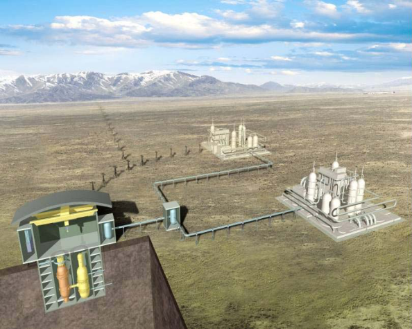

This information was prepared as an account of work sponsored by an agency of the U.S. Government. Neither the U.S. Government nor any agency thereof, nor any of their employees, makes any warranty, expressed or implied, or assumes any legal liability or responsibility for the accuracy, completeness, or usefulness, of any information, apparatus, product, or process disclosed, or represents that its use would not infringe privately owned rights. References herein to any specific commercial product, process, or service by trade name, trade mark, manufacturer, or otherwise, does not necessarily constitute or imply its endorsement, recommendation, or favoring by the U.S. Government or any agency thereof. The views and opinions of authors expressed herein do not necessarily state or reflect those of the U.S. Government or any agency thereof. 

# **NGNP Engineering White Paper: Pre-conceptual Heat Transfer and Transport Studies** 

## **Steven R. Sherman** 

**Prepared for the U.S. Department of Energy Office of Nuclear Energy Under DOE Idaho Operations Office Contract DE-AC07-05ID14517** 

Pre-conceptual design studies for the Next Generation Nuclear Plant (NGNP) were initiated by three industrial teams headed by Westinghouse, AREVA, and General Atomics.  The Statement of Work for pre-conceptual design (under Section 6.3.3) required that a special study be performed on hightemperature heat transfer and transport related to the transfer of thermal energy to the hydrogen production plant and electrical power conversion unit.  The studies revealed that there is some consensus between the industrial teams on certain technical issues, and some differences.  All recommend the use of helium for the NGNP hydrogen plant heat transport loop.  All recommend that the loop operate at a pressure approximately equal to the nuclear reactor pressure to minimize the mechanical stresses across the intermediate heat exchangers (IHXs).  All recommend a maximum nuclear reactor operating temperature of 900-950°C that is determined by the material and design constraints of the IHX and the need to provide high-temperature thermal energy to the hydrogen production plant.  The AREVA and Westinghouse Teams recommend PCS indirect arrangements that include Rankine cycles with gas to steam generation components.  Westinghouse and General Atomics recommend He as the secondary loop fluid; AREVA recommends a Nitrogen / Helium mixture.  The General Atomics arrangement includes a direct cycle Brayton cycle PCS and a small He to He IHX to supply the hydrogen plant.  There are some differences of opinion on whether tubular or compact heat exchangers should be used for the intermediate heat exchangers, but all recommend the use of metallic IHXs.  There is debate over whether a parallel or serial configuration of the H2 heat transport loop and the PCU are desired, and further analysis is needed to resolve it.  Ceramic heat exchangers and molten salt heat transfer fluids might be used in the future, but considerable technical research is needed to make these a reality, and there is general skepticism that such technology can be prepared in time to meet the current NGNP schedule. 

## NGNP Engineering White Paper: INL/EXT-07-12730 Heat Transfer and Transport April 2007 **NGNP Engineering White Paper: Pre-conceptual Heat Transfer and Transport Studies Introduction** 

In FY07, three industrial teams were awarded contracts by the Next Generation Nuclear Plant Project (NGNP) and the Idaho National Laboratory (INL) to perform pre-conceptual design studies for the NGNP, to include several special studies on various topics related to the design and operational requirements.  These teams were led by Westinghouse, AREVA, and General Atomics. 

One of the special studies concerned analyses of the heat transfer and transport requirements and methods for the intermediate heat transfer loop that will connect the nuclear reactor to the hydrogen production plant and, in some configurations, to the Power Conversion Unit.  The Pre-Conceptual Design Statement of Work (SOW) for this special study calls for the following in Section 6.3.3 (Ref. 1): 

_The design features, proposed thermal cycle, required equipment and tradeoffs considered in selecting the method of transferring and transporting process heat shall be described and the basis for the selected concept(s) described.  The design approach to critical equipment (e.g., heat exchangers) and media (e.g., heat transport fluid) shall be developed and described at a pre-conceptual level._ 

This special study scope was awarded to the Westinghouse and General Atomics teams, their results are addressed in special studies reports that are specific to this particular special study (Ref. 3 and Ref. 2 respectively).  The AREVA team, in the performance of their pre-conceptual design proposal effort, also addressed these issues and have developed and provided similar information, in particular a report (Ref. 4) generated in response to another section of the SOW, Section 6.3.5 (Ref. 5): 

_Prepare a trade study for the primary and secondary cycle concept that selects and justifies system used in the pre-conceptual design work, which among other issues specifically addresses: the reactor inlet and outlet temperatures, primary and secondary loop system operating pressures and temperatures, the extent of contamination anticipated in the primary loop, acceptability of contamination levels for maintenance functions and the associated hydrogen production system concept._ 

The two sections of the SOW overlap in their areas of interest in that the reactor outlet temperature and system pressure help determine the intermediate heat exchanger (IHX) materials and design, and the IHX materials and design help determine the intermediate heat transport loop fluid, design, and operating conditions.  The reporting of results concerning heat transfer and transport through dedicated studies or as part of a larger study are both valid approaches, and both sources are used here to provide a summary of the results provided by all three teams in this technical area. 

The information provided by the three teams is sufficient to draw conclusions on specific items. These items are the reactor operating temperature, IHX materials, IHX design, intermediate heat transport fluids, and intermediate heat transport design (configuration).  The results and conclusions drawn from the special studies concerning these items are presented here. 

## **Summary of Results** 

## _**AREVA**_ 

In their pre-conceptual design special study report regarding primary and secondary cycle concepts (Ref. 4), AREVA adopted a reference design and then examined perturbations of that design for their effects on perceived schedule risk, system efficiency and functionality, component durability, and other considerations.  Their reference NGNP design was chosen as an extension of their ANTARES reactor concept, which is designed to operate at a nominal reactor outlet temperature of 850°C.  Some conclusions were drawn from this analysis, and those conclusions are provided below. 

## **H2 Loop Temperature** 

AREVA recommends a nuclear reactor outlet temperature of 900°C and has identified 875°C as the assumed maximum temperature in the intermediate heat transport loop to the H2 production plant.  In their report, AREVA states that they believe a 900°C reactor outlet temperature provides the best compromise between energy efficiency and the ability to produce hydrogen, and the durability of equipment.  Above 900°C, the probability of success of building and operating the nuclear heat supply system (NHS) and metallic compact heat exchangers in the time frame of the NGNP schedule becomes lower with increasing temperature, while below 900°C the ability to deliver thermal energy to the hydrogen production plant at temperatures sufficient to eliminate the need for supplemental heating becomes marginal at best.   900°C is also the highest temperature at which AREVA is comfortable using He/N2 mixtures for the PCU electrical turbines, because of nitriding concerns. 

AREVA concludes that the NGNP can operate successfully at a pressure of 5 MPa.  They state that the operational losses would be small, and would be balanced by the reduced capital costs associated with using thinner vessel walls for pressure containment. 

AREVA recommends a parallel arrangement of the power conversion unit (PCU) and the H2 transport loop.  They believe it would provide the greatest system flexibility and would lead to a lower overall system cost.   With a parallel arrangement, the IHX for the H2 loop can be sized and configured independently of the PCU IHX without having to design for the full flow rate of helium through both IHXs.  Also, an indirect coupling of the PCU is favored over a direct coupling due to the increased potential of contaminating the PCU equipment with a direct coupling. 

In a supporting study (Ref. 5), the AREVA team examined power conversion system options on the basis of performance, economics, and technical maturity.  The options examined were:  direct Brayton cycle, indirect Brayton cycle, supercritical CO2, cascaded supercritical CO2, combined cycle gas turbine, sub-critical steam, and supercritical steam.  The conclusions from this study were that supercritical CO2 cycles perhaps offered the best efficiencies but further technical development is needed to realize their promise.  In the nearer term, steam-Rankine cycles with possible extension into supercritical conditions offer the best fit for near-term applications such as NGNP because of their technical maturity and acceptable efficiencies.  The study questioned whether Brayton cycles should be pursued further due to their lower projected efficiencies than for supercritical CO2 cycles.  Given the choice of developing one new PCU, it is preferred that development work be channeled toward supercritical CO2 rather than helium-driven Brayton cycles.  Areva has recommended an indirect combined cycle PCU consistent with their ANTARES design. 

AREVA recommends that metallic tubular IHXs should be used for the PCU because of their mature design, greater known reliability, and operational experience, especially in the operation of the German PNP.  The IHXs for the PCU will be large, and AREVA believes that such heat exchangers could be designed and built to operate at the NGNP conditions within the given NGNP schedule and acceptable costs. 

For the H2 Loop IHX, AREVA recommends exploring the use of metallic compact heat exchangers.  Metallic compact heat exchangers have a reasonable probability of being developed, tested, and ASME-certified in the NGNP time frame, and may offer breakthroughs for better economics for commercial-scale VHTRs.  Due to the experimental nature of metallic compact heat exchangers at the temperatures and pressures of interest, AREVA recommends that the H2 Loop IHX be replaceable so that multiple IHX designs and configurations can be tested. 

AREVA did not examine the use of molten salts for this loop and has assumed that the H2 transport loop would contain helium at nominally 5 MPa in order to balance the pressure between the primary loop and the H2 transport loop. 

AREVA’s conclusions in regard to heat transfer and transport are provided in Table 1. 

Table 1:  AREVA Recommendations 

|Table 1:  AREVA Recommendations||
|---|---|
|**Parameter**|**Value**|
|Reactor Outlet Temp|900°C|
|Reactor Pressure|5 MPa|
|IHX for PCU|Metallic, Tubular|
|IHX for H2loop|Metallic, Compact|
|PCU/H2Loop Config.|Parallel|
|PCU Loop Fluid|Steam or SC CO2|
|PCU Loop Pressure|System-dependent|
|H2Loop Fluid|Helium|
|H2Loop Pressure|4.9 MPa|

## _**General Atomics**_ 

The General Atomics team wrote a focused report (Ref. 2) that specifically examined the H2 thermal transport loop in terms of its operating temperatures, pressures, fluids, and operating configurations.  The use of helium and molten salt was examined in detail.  The results from this report are provided below. 

## **Reactor Outlet Temperature** 

The General Atomics team believes that a GT-MHR design and a pebble bed design operating with a 900°C reactor outlet temperature are both achievable in the NGNP time frame (Ref. 6).  The heat transfer and transport special study (Ref. 2), however, assumed a reactor outlet temperature of 950°C and 

an H2 heat transport loop temperature of 925°C.  This assumption is not consistent with the reactor type study, but is consistent with an earlier publication provided by General Atomics for a GT-MHR operating in combination with a General Atomics Sulfur-Iodine H2 production plant (Ref. 7). 

The reactor pressure was assumed to be 7 MPa, and no parametric examination of other pressures was performed. 

The General Atomics team has selected a directly coupled PCU (no secondary loop) with an indirect long-distance heat transfer loop arranged in a parallel with the PCU. No information is provided in the heat transfer and transport report about a preferred configuration.  The power of the H2 heat transport loop IHX is defined to be 50 MW. 

The report assumes that the IHX for the H2 heat transport loop would be a Heatric-style metallic printed circuit heat exchanger.  Alternative concepts and ceramics were not examined. 

The use of helium and molten salts are examined in detail, and General Atomics concludes that helium is the best choice for the H2 heat transport loop, at least for the NGNP.  If helium is used for the long-distance piping, insulation of known composition and availability can be applied to the inside of the transport pipes to lower the metal temperature and reduce or eliminate creep.  Corrosion is also less of a concern, and helium is much better characterized in terms of fluid properties and corrosion effects than most molten salts of interest.  A molten salt loop would operate more efficiently and would most likely have lower capital costs, but the technical risks would likely prevent its deployment by 2018.  Further research into molten salt technologies is needed to answer key technical questions before it is considered for deployment in a VHTR hydrogen production system. 

A summary of General Atomics assumptions and recommendations in the area of heat transfer and transport is provided in Table 2. 

Table 2:  General Atomics Assumptions/Recommendations 

|||
|---|---|
|**Parameter**|**Value**|
|Reactor Outlet Temp|950°C|
|Reactor Pressure|7 MPa|
|IHX for PCU|--|
|IHX for H2loop|Metallic, Compact|
|PCU/H2Loop Config.|Parallel|
|PCU Loop Fluid|Helium|
|PCU Loop Pressure|7 MPa|
|H2Loop Fluid|Helium|
|H2Loop Pressure|7 MPa|

## _**Westinghouse Electric Company**_ 

The Westinghouse team wrote a focused report (Ref. 3) that specifically examined the H2 thermal transport loop in terms of its operating temperatures, pressures, fluids, and operating configurations.  The results from this report are provided below. 

## **Reactor Outlet Temperature** 

The Westinghouse team assumed a maximum reactor outlet temperature of 950°C and a temperature drop of 50°C across the IHX for both the H2 heat transport loop and the PCU.  No parametric studies were performed to examine operational and equipment effects at lower temperatures. 

The reactor pressure is 9 MPa.  No parametric studies were performed to examine the effects on system design and operation at lower pressures. 

A serial arrangement of the IHX and the PCU is recommended, with the IHX for the hydrogen plant leading the PCU in order to utilize the highest available primary loop temperature.  The IHX for the H2 heat transport loop would remove 50 MW from the primary loop, and the cooled primary loop gas would then go to the PCU to harvest the remaining useful thermal energy using a steam generator. Westinghouse prefers the serial arrangement because of lower costs and a simpler mechanical arrangement.  A serial arrangement is also the chosen arrangement for Japan’s HTTR facility, though the HTTR will deploy an IHX instead of a steam generator for the power conversion unit. 

Special discussion was given to various heat exchanger designs, and it was concluded that a twopart, compact heat exchanger be adopted.  The first part of the heat exchanger could be made out of available and ASME-certified metallic materials, and would be designed to operate up to 800°C and a design lifetime of 60 years.  The second part of the heat exchanger would be made out of ASME-certified metallic or ceramic materials, and would be designed to be replaced periodically.   The second part would be designed to operate in the temperature range above 800°C.  The NGNP deployment schedule may prevent the use of ceramic materials for the high-temperature section of the IHX, and metallic materials may have to be used during initial deployment until ceramic components can be tested and certified. 

Tubular heat exchanger designs were examined and rejected due to the belief that they would never be economical at the scales and conditions needed by the NGNP.  This belief is based upon some information offered by Westinghouse in this report that a 10 MW shell-and-tube heat exchanger constructed for use by the German PNP program weighed 130 metric tons.  This information may not be correct. According to some earlier design reports on the German PNP IHX (Ref. 8 and 9), a full-sized IHX capable of transmitting 125 MW at 950°C would weigh approximately 160-170 metric tons.  A smaller test unit designed to operate at a 10 MW capacity was constructed, but it contained only 117 tubes as opposed 1484 tubes in the full-sized unit, and its mass, though not listed in the available publications, is certainly much less than 160 metric tons.  By comparison, the IHX constructed for the HTTR is designed to operate at 10 MW, and its mass is 65 metric tons.  It is generally known that compact metallic heat exchangers require less material than conventional shell-and-tube heat exchangers, and this will result in lower material costs for the same power load, but the lower material costs must be balanced by 

the potentially higher manufacturing costs and technical risk.  It is unknown whether the Westinghouse team would revise their recommendations in light of this additional information. 

Helium, carbon dioxide, liquid salts, and liquid metal were examined for use, and Westinghouse concluded that helium would be the best choice for the NGNP.  Liquid or molten salts were examined, and it was determined that there are still technical issues to be solved before He/liquid salt heat exchangers are deployed, while for He/He heat exchangers there are fewer technical issues, and deployment of a full-sized heat exchanger is much more likely within the scope of the NGNP schedule. CO2 operates in a similar manner as He, but costs were projected to be higher for CO2 and it was rejected. Cost savings might be realized in the future (after NGNP) if liquid salts and ceramic heat exchangers can be deployed in combination for the long-distance H2 heat transport loop. 

A summary of the Westinghouse team assumptions and recommendations in the area of heat transfer and transport is provided in Table 3. 

Table 3:  Westinghouse Assumptions/Recommendations 

|Table 3:  Westinghouse Assumptions/Recommendations||
|---|---|
|**Parameter**|**Value**|
|Reactor Outlet Temp|950°C|
|Reactor Pressure|9 MPa|
|IHX for PCU|--|
|IHX for H2loop|2-Section Compact|
|PCU/H2Loop Config.|Serial|
|PCU Loop Fluid|Helium|
|PCU Loop Pressure|9 MPa|
|H2Loop Fluid|Helium|
|H2Loop Pressure|9 MPa|

## **Comparison of Results** 

All three teams assumed or recommended nuclear reactor temperatures and pressures in the range of 900-950°C and 5-9 MPa.  Of the three, only AREVA studied these conditions parametrically and defended their choice of operating conditions in terms of economic viability and technical risk.  The other teams assumed conditions that matched their reactor concepts and did not look at other temperature and pressure conditions. 

AREVA recommended the use of an indirect parallel configuration for the H2 heat transport loop and the PCU, while Westinghouse recommended the use of an indirect serial arrangement.  AREVA argued that a parallel arrangement allows for greater flexibility, while Westinghouse argued that a serial arrangement would be more economical.  General Atomics also recommended a direct coupling of the reactor and power conversion unit with the IHX placed in a parallel configuration.  The arguments over whether which configuration is better for the NGNP are still not clear, and this issue will need to be resolved based upon more detailed analysis in the future. 

For the IHX design and materials, AREVA argued that a tubular metallic heat exchanger for the PCU would provide the best starting point for the NGNP and that a compact heat exchanger, initially metallic, might be used for the H2 heat transport loop IHX.  General Atomics did not examine tubular heat exchangers at all and assumed that a compact metallic heat exchanger would be used.  Westinghouse cursorily examined tubular heat exchangers and rejected them based upon some questionable information, and endorsed the use of compact heat exchangers for the H2 heat transport loop IHX.  Westinghouse did offer some innovations in this area, however, and suggested that a two-section IHX be used for the H2 heat transport loop.  The lower temperature section would be designed for a 60-year lifetime and would operate up to about 800°C, and the higher temperature section would be made from metal or ceramics and would be designed for shorter operating lifetimes and/or periodic replacement.  AREVA and Westinghouse recommended further work on ceramics. 

There was agreement between the AREVA and Westinghouse teams in that a Rankine cycle using a gas to steam generation component should be included in the power conversion system.  The Westinghouse team recommended the use of a sub-critical steam Rankine cycle, while the AREVA team stated that both sub-critical and supercritical steam systems might be considered, with the final choice of system being determined by schedule, cost, and the level of acceptable risk.  The AREVA team favored continued research into supercritical CO2 systems because of their greater potential for higher efficiencies than for helium-driven Brayton cycles. 

Multiple heat transfer fluids were examined for the H2 heat transfer loop, and all teams recommended the use of helium for the NGNP H2 heat transfer loop with the pressure of the helium matched to the pressure of the nuclear reactor to reduce the mechanical stress across the IHX.  Molten salts were examined by General Atomics and Westinghouse, and both firms decided that future cost savings could be realized, but that considerable research and development work is still needed in this area to answer questions related to corrosion, tritium transport, internal pipe insulation, and heat exchanger design, and that the completion of such research in time to meet the aggressive NGNP schedule is not likely. 

## **Conclusions / Recommendations** 

There is consensus among the three teams on a few technical items.  The outlet temperature of the reactor is driven by the material limits of the IHX and the needs to supply high temperature heat to the hydrogen production process.  This limits the maximum outlet temperature of the NGNP to no higher than 900 to 950°C. 

Helium is universally endorsed as the working fluid for the H2 heat transport loop, and the pressure of the helium is recommended to approximately equal the helium pressure in the nuclear reactor primary loop in order to increase energy transport efficiency and minimize mechanical stresses in the IHX.  The pressure drop across the hydrogen process heat exchanger was not addressed in any study, and this is an issue that will need to be addressed once the hydrogen generation process is selected, and hydrogen process heat exchanger designs are refined. 

Metals are endorsed as the construction material of choice for the IHX, though there is some debate about whether a tubular IHX or a compact heat exchanger must be used for the IHX.  AREVA endorsed the idea of using both types in their system, while Westinghouse dismissed the use of tubular designs as being uneconomical.  Their two-section IHX concept, however, opens the door to the use of both types of heat exchangers for their system too, and may even be recommended.  Tubular designs might be used for the lower temperature, longer-life IHX section since they are more easily inspected and repaired, or for the higher-temperature section where they might more easily be accepted for use by the NRC. Such 

questions will have to be considered along side the economic arguments before accepting or rejecting any individual heat exchanger technology or design. 

Because of the potential benefits, longer term research on the use of molten salts and ceramics in heat exchanger and heat transport applications is encouraged. 

In the nearer term, more analysis is needed to determine whether a parallel or serial arrangement of the H2 heat transport loop IHX and the PCU is desired. 

For the NGNP in particular, the AREVA and Westinghouse Teams recommend PCS indirect arrangements that include Rankine cycles with gas to steam generation components instead of only Brayton cycles due to the much greater technical maturity of steam-driven turbines. 

## **REFERENCES** 

1. Project 23843, “Statement of Work, Preconceptual Engineering Services for the Next Generation Nuclear Plant with Hydrogen Production”, INL Document SOW-3963 Rev. 0, Section 6.3.3, July 26, 2006. 

2. General Atomics Team, “NGNP High Temperature Process Heat Transfer and Transport Study”, 911105 Rev. 0, draft report, March 2007. 

3. Westinghouse Team, “Special Study 20.3:  High Temperature Process heat Transfer and Transport”, NGNP-20RPT-003 Rev. 0, January 2007. 

4. AREVA Team, “NGNP with Hydrogen Production:  Primary and Secondary Cycle Concept Study”, 129045707-000, March 2007. 

5. AREVA Team, “NGNP with Hydrogen Production Power Conversion System (PCS) Special Study, 389049582-0000, AREVA NP, Inc., April 2007. 

6. Project 23843, “Statement of Work, Preconceptual Engineering Services for the Next Generation Nuclear Plant with Hydrogen Production”, INL Document SOW-3963 Rev. 0, Section 6.3.5, July 26, 2006. 

7. General Atomics Team, “NGNP Reactor Type Comparison Study Report”, 911103 Rev. 0, draft report, March 2007. 

8. Richards, M.B., Shenoy, A.S., Brown, L.C., Buckinham, R.T., Harvego, E.A., Peddicord, K.L., Reza, S.M.M., Coupey, J.P., “H2-MHR Pre-Conceptual Design Report:  SI-Based Plant”, General Atomics Report GAA25401, April 2006. 

9. P. 75, IWGHTR/6, “International Working Group on High Temperature Reactors:  Specialist Meeting on Process Heat Application Technology”, Julich, Germany, 27-29 September 1979, released October 1980 by the IAEA.  See http://www.iaea.or.at/programmes/inis/aws/htgr/fulltext/iwghtr6.pdf. 

10. A. Czimczik, G. Hirschle, “IAEA Specialist Meeting on Heat Exchanging Components of Gas-Cooled Reactors:  Development of a Helium/Helium Intermediate Heat Exchanger with Helical Coil Tube Bundle”, Dusseldorf, Germany, 16 April 1984.  See http://www.iaea.or.at/programmes/inis/aws/htgr/fulltext/iwghtr6.pdf. 

## **NGNP Engineering White Paper: Power Level Trade Study** 

## Kevan D. Weaver 

## April 2007 

This information was prepared as an account of work sponsored by an agency of the U.S. Government. Neither the U.S. Government nor any agency thereof, nor any of their employees, makes any warranty, expressed or implied, or assumes any legal liability or responsibility for the accuracy, completeness, or usefulness, of any information, apparatus, product, or process disclosed, or represents that its use would not infringe privately owned rights. References herein to any specific commercial product, process, or service by trade name, trade mark, manufacturer, or otherwise, does not necessarily constitute or imply its endorsement, recommendation, or favoring by the U.S. Government or any agency thereof. The views and opinions of authors expressed herein do not necessarily state or reflect those of the U.S. Government or any agency thereof. 

# **NGNP Engineering White Paper: Power Level Trade Study** 

## **Kevan D. Weaver** 

**Prepared for the U.S. Department of Energy Office of Nuclear Energy Under DOE Idaho Operations Office Contract DE-AC07-05ID14517** 

Preconceptual design studies for the Next Generation Nuclear Plant (NGNP) were initiated by three teams led by the following companies: AREVA, General Atomics, and Westinghouse Electric Company. The Statement of Work for the preconceptual design (under Section 6.3.2) requires that a special study be performed for the power level of the prototype NGNP, the hydrogen plant to be connected to the prototype, and the commercial NGNP. The three teams independently proposed discriminating criteria based on design details that each considered important. The majority of the criteria were common between the teams, including safety, economics, and licensing. 

All recommended that the prototype be of the same power level as the commercial version to minimize effort to transfer NGNP experience in areas such as safety, economics, and licensing, to the commercial plant. AREVA chose a prismatic reactor at 565 MWt, General Atomics chose a prismatic reactor at 550/600 MWt, and Westinghouse chose a pebble bed reactor at 500 MWt. Also, all recommended that the hydrogen plant should be a percentage of the power level of the prototype, where the thermal chemical processes should be 50-60MWt (i.e., approximately 10% of the thermal output of the reactor). However, the high temperature electrolysis (HTE) power level recommendation is different among the teams. AREVA recommends a 1.2 MWt HTE plant, General Atomics recommends a 4 MWt HTE plant, and Westinghouse recommends a 13 MWt HTE plant. The differences are due mainly to the number of recommended modules needed to demonstrate the operability, economics, and safety of the coupled reactor/HTE process. 

Due to the different recommended power levels by each team, additional studies should be performed that better address and rank the factors that determine the maximum achievable power level. In addition, other questions regarding the reactor pressure vessel and licensing scalability should also be answered in further studies before the power levels can be determined. 

# **NGNP Engineering White Paper: Power Level Trade Study** 

## **Introduction – Scope and Participants** 

The _Energy Policy Act of 2005_ authorizes the Next Generation Nuclear Plant (NGNP) project to demonstrate a first-of-a-kind, very-high-temperature gas-cooled nuclear system with the capability to generate electrical power and produce hydrogen using process heat. To focus the research and fulfill the requirements of DOE Order 413.3, preconceptual design studies were initiated by three teams led by the following companies: AREVA, General Atomics, and Westinghouse Electric Company. The Statement of Work (under Section 6.3.2) requires that a special study be performed for the power level of the prototype NGNP, the hydrogen plant to be connected to the prototype, and the commercial NGNP: 

_“The vendor shall prepare a study that evaluates and recommends a power level for the NGNP prototype nuclear system, which is scaleable and meets all the necessary requirements as a “commercial” prototype and is licensable as a commercial prototype. In addition, the subcontractor shall evaluate and recommend minimum optimal prototype hydrogen plant size that will be scaleable to a future commercial scale plant.”_ 

Each of the three teams were asked to compare the relative merits of the chosen power levels, and make a recommendation on which power level would best accomplish the NGNP goals of licensing and commercialization. 

The most important requirement for the NGNP is the ability to produce process heat for both efficient electricity and hydrogen production. In addition to the high outlet temperature, the NGNP is to demonstrate the exceptional passive safety features touted by the designers and operators of gas-cooled reactors, and to demonstrate commercial viability of such a reactor by obtaining a Nuclear Regulatory Commission (NRC) license. 

All three teams have designs in various stages of maturity with design details that each considers important. These designs were used as the basis for the selection of power level for the prototype, process heat plant (i.e., hydrogen), and commercial version of the NGNP. A summary of the criteria used to determine these power levels can be found below. 

## **AREVA Discriminating Criteria** 

AREVA’s key discriminating criteria for the choice of power level for the prototype and commercial versions are as follows: 

- Market view (hydrogen production, industrial applications, electricity, etc.) 

- Economic considerations (economy of scale, first-of-a-kind to Nth-of-a-kind, etc.) 

- Plant safety limits (power level, outlet temperature, etc.) 

- Licensing issues 

- Demonstration of passive safety features. 

The criteria used for the hydrogen production system were based on technology availability and scalability of the chosen process, where AREVA considered both the sulfur-iodine (SI) and hightemperature electrolysis (HTE) processes. 

Based on these criteria, AREVA chose the prismatic reactor (based on the ANTARES design) at 565 MWt for both the commercial version and prototype, i.e., the prototype scaling to the commercial version should be 1. The power level for the SI process was chosen to be 60 MWt from process heat and 20 MWe from the power conversion system; while the HTE process was chosen to be 1.2 MWt from process heat and 5 MWe from the power conversion system. 

## **General Atomics Discriminating Criteria** 

General Atomics key criteria for the choice of power level for the prototype and commercial versions are as follows: 

- NGNP reactor power capacity (product of power level and capacity factor) 

- NGNP reactor engineering, procurement, and construction (EPC) cost 

- NGNP reactor EPC schedule 

- Support NGNP deployment in 2016 – 2018 time frame 

- Provide basis for Design Certification of the Very High Temperature Reactor (VHTR) by NRC 

- Provide basis for operation and maintenance costs for the VHTR 

- Provide basis for fuel costs for the VHTR. 

Although not explicitly listed, the power level study focused on the ability to maintain passive safety. The criteria used for the hydrogen production system were based on technology availability and scalability of the chosen process, where General Atomics considered both the SI and HTE processes. 

Based on these criteria, General Atomics chose the prismatic reactor (based on the Gas TurbineModular Helium Reactor [GT-MHR] design) at 550-600 MWt for both the commercial version and prototype, i.e., the prototype scaling to the commercial version should be 1. The power level for the SI process was chosen to be 60 MWt from process heat; while the HTE process was chosen to be 4 MWt from process heat. 

## **Westinghouse Discriminating Criteria** 

Westinghouse key criteria for the choice of power level for the prototype and commercial versions are as follows: 

- Technology enabling research and development (R&D; including fuel) 

- Design development and schedule 

- Safety considerations (depressurized loss of forced coolant flow [DLOFC]) 

- Capital cost (reactor, etc.) 

- Normal operation 

- Investment protection (pressurized loss of forced coolant flow [PLOFC]) 

- Operating cost (including fuel cycle costs). 

The criteria used for the hydrogen production system were based on technology availability and scalability of the chosen process, where Westinghouse considered the SI, the hybrid-sulfur (HyS), and HTE processes. 

Based on these criteria, Westinghouse chose the pebble bed reactor (based on the Pebble Bed Modular Reactor-Process Heat Plant [PBMR-PHP] design) at 500 MWt for both the commercial version and prototype, i.e., the prototype scaling to the commercial version should be 1. The power level for the SI and HyS processes was chosen to be 50-60 MWt from process heat; while the HTE process was chosen to be 13 MWt from process. 

Although both chose the prismatic reactor design, the AREVA and General Atomics designs do have several differing features (e.g., for the power conversion unit AREVA proposes and indirect Brayton combined cycle; General Atomics proposes a direct Brayton cycle), but are both 550-600MWt prismatic reactors using uranium oxycarbine (UCO) tri-isotopic (TRISO) coated fuel.  *NOTE: General Atomics indicates that the first core will likely by UO2 because of a belief that UCO fuel will not be available in time to support a 2018 startup of NGNP.  The Westinghouse pebble bed design is a variant on the PBMRDemonstration Power Plant (DPP; called the PBMR-PHP) to be built and operated in South Africa using UO2 TRISO coated fuel. However, some of the differing features from the PBMR-DPP design include the uprated power from 400MWt to 500MWt by slightly increasing the power density and lengthening the core, and the use of a bottoming Rankine steam cycle located at the back end of the process heat plant, rather than a direct Brayton cycle. 

Based on each team’s analysis, many of the criteria can be grouped under economics/costs and safety. In addition, common criteria exist between AREVA and General Atomics under licensing; and between AREVA and Westinghouse under schedule. The remaining criteria that differ between participants are: market view on process heat (AREVA), technology readiness (Westinghouse), and normal operation (Westinghouse). The tables below compare the different criteria and results. 

|**Criteria**|**AREVA**|**General Atomics**|**Westinghouse**|
|---|---|---|---|
|Economics/Costs|�|�|�|
|Safety|�|�|�|
|Licensing|�|�||
|Schedule|�||�|
|Market view|�|||
|Technologyreadiness|||�|
|Normal operation|||�|

It is interesting to note that while the HTE process is the same for all three teams, there are differences in the proposed power level for each. This is due to the assumptions of the minimum size of each module, and the number of modules necessary to demonstrate scalability. 

## **Conclusions and Recommendations** 

The specific conclusions and recommendations by each team are given below. 

Based on AREVA’s analyses, the following is recommended: 

- The commercial VHTR module should be designed to operate at 565 MWt. This recommendation is based on commercial applications that are expected to support large module sizes and an evaluation of plant safety limits, which indicate that the maximum power for NGNP initial conditions that provides acceptable results for the design basis depressurized conduction cooldown (DCC) accident is 565 MWt. 

- The NGNP prototype plant should be designed and operated at 100% of the planned commercial power level, that is, 565MWth. This recommendation is made to support demonstration of plant passive safety features, portability of licensing experience, development of better estimates of costs and schedule for construction and sharing of first-of-a-kind engineering costs. 

- The demonstration SI plant will require 60 MWt of process heat and 20 MWe from the power conversion system. The demonstration HTE plant will require 1.2 MWt of process heat and 5 MWe from the power conversion system. These recommendations are based on an examination of the current state-of-the-art for these two systems and the expected development progress between now and NGNP plant startup in 2018. 

Based on General Atomics’ analyses, the following is recommended: 

- Both the prototype and commercial versions should be designed to operate at the 550/600 MWt power level. This recommendation is based on the maturity of design as compared to any other candidate power level (i.e., lower power level versions would actually increase the schedule requirements), the need to demonstrate passive safety and licensability, and the economy of scale for the commercial version. 

- The demonstration SI plant should be a minimum of 20 MWt, but should be operated as a threetrain system, for a total of 60 MWt with an output of 7.5 million standard cubic feet of hydrogen per day.  From considerations of scalability and economics, an HTE module size of 600 Nm3/hr 

(@0.6A/cm2) would be best for both the NGNP demonstration and follow-on commercial VHTR HTE hydrogen production plant. From considerations of the hydrogen plant control, operation and protection, 10 or more HTE modules are required to confirm operational capability of the commercial scale plant.  A 10-module demonstration plant would require about 4 MWt of heat energy, and would produce 6000 Nm3/hr (@0.6A/cm2).  This is equal to about 5 million standard cubic feet per day. 

Based on Westinghouse’s analyses, the following is recommended: 

- The NGNP reactor (prototype and commercial versions) should be 500 MWt with geometry similar to the PBMR-DPP. This is based on the following criteria: 

   - The PBMR-DPP reactor can be immediately used as a basis, and the PBMR-PHP is within the operational envelope of the PBMR-DPP, e.g., fuel temperatures, power density. 

   - The NGNP schedule will be met - minimal R&D required. 

   - No design development is required. 

   - 25 percent higher power output is achievable 

   - The PBMR-PHP capital cost for the reactor and auxiliary systems and building are comparable to that for the PBMR-DPP. 

- The minimum demonstration size for the various hydrogen production methods (HTE, SI, and HyS) should be based on the size of the most practical “train”. For HTE, this size is 13 MWt; for the SI and HyS process, this size is 50-60 MWt. 

There is consensus with all the teams that the power level of the NGNP prototype and commercial versions should both be the same size to reduce developmental cost; demonstrate passive safety; provide better bases for the cost, schedule, and economics of the commercial plant; and demonstrate the licensability with the least amount of risk. 

There is consensus on the needed size of the process heat plant (i.e., the hydrogen plant), with the exception of the HTE process. This was due to the assumption of the size and number of modules necessary to demonstrate scalability. 

Although there was also consensus that the commercial power level be the maximum power level achievable, the recommended power level from each team differed. The basis for the chosen maximum power achievable is the same due to the following factors: 

- Passive safety considerations (e.g., power density as related to decay heat removal and fuel temperature response under design basis accident conditions) 

- Fabrication and transportation issues of large components 

- Neutronic/thermal fluid stability issues. 

It is important to note that the three factors above are actually in competition. For example, the pebble bed has a lower power density than the prismatic, but the pebble bed is able to have a taller core than the prismatic due to better neutronic/thermal fluid stability. However, a taller core will result in a 

larger pressure drop, affecting the efficiency of the plant and resulting in greater costs due to the larger vessel. Based on these factors, the actual power level of the commercial version/prototype for each team was different. 

It is recommended that an additional study be performed that addresses these competing factors, and ranks them according to importance to better understand which factor (if any) will dominate in the choice of the commercial (or prototype) power level. 

In addition, it is recommended that the following questions be answered before the prototype power level is chosen: 

1. Is it feasible to fabricate a single purpose reactor pressure vessel (RPV; i.e., a single RPV that could accommodate either a pebble bed or prismatic core)? 

2. What is the cost and viability of constructing two half-size reactors (i.e., one pebble bed and one prismatic reactor) versus one full size reactor? Would the engineering and construction costs be comparable? Which R&D would double? Would the smaller RPV’s be easier to acquire? 

3. What is the smallest power for the prototype that will still satisfy the licensing case (including safety) for the commercial version? 

4. What effect does the power level of the hydrogen plant have on licensing? Is a full-scale process heat plant (or a similar load) coupled to the reactor necessary to demonstrate licensing? 

## **NGNP Engineering White Paper: Primary and Secondary Cycle Trade Study** 

Doug S. Vandel 

This information was prepared as an account of work sponsored by an agency of the U.S. Government. Neither the U.S. Government nor any agency thereof, nor any of their employees, makes any warranty, expressed or implied, or assumes any legal liability or responsibility for the accuracy, completeness, or usefulness, of any information, apparatus, product, or process disclosed, or represents that its use would not infringe privately owned rights. References herein to any specific commercial product, process, or service by trade name, trade mark, manufacturer, or otherwise, does not necessarily constitute or imply its endorsement, recommendation, or favoring by the U.S. Government or any agency thereof. The views and opinions of authors expressed herein do not necessarily state or reflect those of the U.S. Government or any agency thereof. 

# **NGNP Engineering White Paper: Primary and Secondary Cycle Trade Study** 

## **Doug S. Vandel** 

**Prepared for the U.S. Department of Energy Office of Nuclear Energy Under DOE Idaho Operations Office Contract DE-AC07-05ID14517** 

The U.S. Department of Energy (DOE) has adopted the Very High Temperature Reactor (VHTR) for the Next Generation Nuclear Plant (NGNP) Project. This reactor will be a helium-cooled, graphitemoderated thermal reactor that will be designed to produce electricity and hydrogen as delineated by the Energy Policy Act of 2005. DOE has contracted with three industrial teams, led by Westinghouse, AREVA, and General Atomics, for the pre-conceptual design engineering services phase. As part of this work scope, Westinghouse and AREVA were tasked with performing a specific study to establish the basic NGNP operating parameters, specifically the primary and secondary temperatures, operating pressures, and the basic configuration of the nuclear heat supply system.  General Atomics also performed similar work scope as part of their other special studies and pre-conceptual design reports. The purpose of this special study is to confirm or modify key parameters in the NGNP Pre-Conceptual Design Report and enhance the basis for the Design Baseline. 

Although the operating parameters vary between the individual contractors, each contractor recommended the operating parameters that they believe best fit the NGNP mission based upon their specific reactor design, power conversion system, and experience. 

## **NGNP Engineering White Paper: Primary and Secondary Cycle Trade Study** 

The Statement of Work for NGNP pre-conceptual design activities (SOW-3963) requires in Section 6.3.5 that a special study be performed to evaluate primary and secondary cycle concepts for the NGNP: 

_“Prepare a trade study for the primary and secondary cycle concept that selects and justifies system used in the preconceptual design work, which among other issues specifically addresses: the reactor inlet and outlet temperatures, primary and secondary loop system operating pressures and temperatures, the extent of contamination anticipated in the primary loop, acceptability of contamination levels for maintenance functions and the associated hydrogen production system concept.”_ 

This special study work scope was tasked directly to the Westinghouse and AREVA design teams. The General Atomics design team also had to address many of these same issues during the development of their design baseline proposed for the NGNP. 

This special study work scope is closely related to that for the special studies and pre-conceptual design work scope for the High Temperature Process Heat, Transfer and Transport system, specifically involving the fluid medium and design of the Intermediate Heat Exchanger (IHX) and also the Power Conversion System (PCS).  For that reason, Westinghouse chose to include their primary and secondary cycle concept studies primarily in their Special Study 20.3, High Temperature Process Heat Transfer and Transport.  General Atomics performed a similar evaluation with their report, GA Report No. 911105, NGNP High Temperature Process Heat Transfer and Transport Study 

The specific work scope performed by AREVA included performing a study to recommend operating parameters for the NGNP nuclear heat supply system and associated systems. The detailed design of those systems and the implementation of the selected parameters is not part of this study scope. The operating parameters recommended in this special study will be used in separate design activities where plant systems and components will be developed as part of the Pre-Conceptual Design Report.  The results of the AREVA special study are provided in AREVA Document No. 12-9045707-000, Primary and Secondary Cycle Concept Study. 

Implicit in this study is the fact that each team’s design activity is limited to an adaptation of their specific commercial high temperature reactor design concept (Westinghouse – PBMR, AREVA – ANTARES, General Atomics – GT-MHR). Therefore, it is predetermined that each contractor’s conclusions will be based upon their specific reactor design concept and power conversion system. 

Figure 1 shows a schematic of the NGNP as proposed by Westinghouse: 

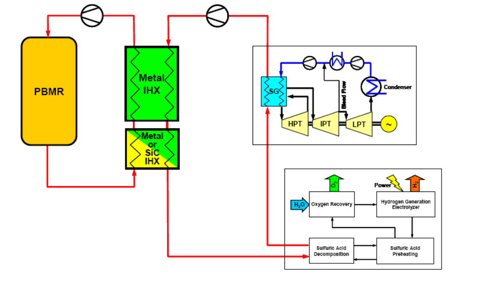

Figure 2 shows a schematic of the NGNP as proposed by AREVA: 

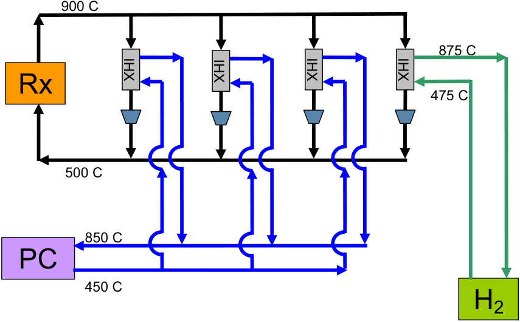

**----- Start of picture text -----** 
900 C 875 C Rx 475 C 500 C 850 C PC 450 C H 2 IHX IHX IHX IHX **----- End of picture text -----** 

Figure 2.  NGNP as proposed by AREVA 

Figure 3 shows a schematic of the NGNP as proposed by General Atomics: 

The following is a summary of the Westinghouse primary and secondary cycle parameters developed in their special studies: 

- NGNP Concept 

- Reactor outlet temperature 

- Reactor inlet temperature 

- System Configuration 

- Number of Loops 

- Secondary temperatures 

- System Pressure 

Indirect cycle pebble bed design coupled to a secondary steam cycle, series PCHX with a Rankine cycle generating system 

950�C 

350�C 

H2 and PCS in series 

- 1 loop 

900�C (50�C approach) 

9.0 MPa 

The following is a summary of the AREVA Primary and Secondary Cycle Study: 

- NGNP concept Indirect cycle prismatic block design coupled to a combined cycle gas turbine generating system 

- Reactor outlet temperature 900�C 

- Reactor inlet temperature 500�C 

- System Configuration H2 and PCS in parallel 

- Number of Loops 4 loops (3 with tubular IHXs for PCS ) (1 with compact IHX for H2) 

- Secondary temperatures 450-850�C for PCS (50�C approach) 475-875�C for H2 (25�C approach) 

- System pressure 5.0 MPa 

The following is a summary of the General Atomics primary and secondary cycle parameters developed in their special studies: 

- NGNP Concept 

Direct cycle prismatic design coupled to a  Brayton Cycle gas turbine generating system and an IHX 

- Reactor outlet temperature 950�C 

- Reactor inlet temperature 590�C 

- System Configuration PCS in direct cycle H2 in indirect cycle 

- Number of Loops 2 

- � Secondary temperatures 925�C/565�C 

- System Pressure 7.0 MPa 

When selecting the NGNP operating parameters, each contractor team had to consider whether their resulting NGNP concept would satisfy the following requirements: 

- Demonstrate scalability to commercial electricity and hydrogen production 

- Demonstrate advanced hydrogen production processes 

- Meet initial NGNP operation by 2018. 

The first driving requirement is intended to ensure that the NGNP will provide a near term step to commercial electricity and hydrogen production using a VHTR. The NGNP must demonstrate technologies and approaches applicable to a commercial plant, and the demonstration must be such that the NGNP concepts can be scaled directly to a commercial plant. The second driving requirement is intended to ensure that the NGNP will demonstrate advanced hydrogen production processes in order to maximize the performance of the resulting system. The Sulfur-Iodine (SI), Hybrid Sulfur (HyS), and High Temperature Electrolysis (HTSE) processes are widely considered to be the most likely candidate 

processes. The third main driving requirement is intended to ensure that the NGNP demonstration will provide the required technology for commercial deployment on a timescale compatible with end user considerations and the need for alternate energy sources.  Together these driving requirements dictate the performance requirements that will be imposed on the NGNP and the level of feasibility and technical maturity required of potential NGNP systems. 

Figure 4 illustrates the versatility provided by the VHTR in producing process heat: 

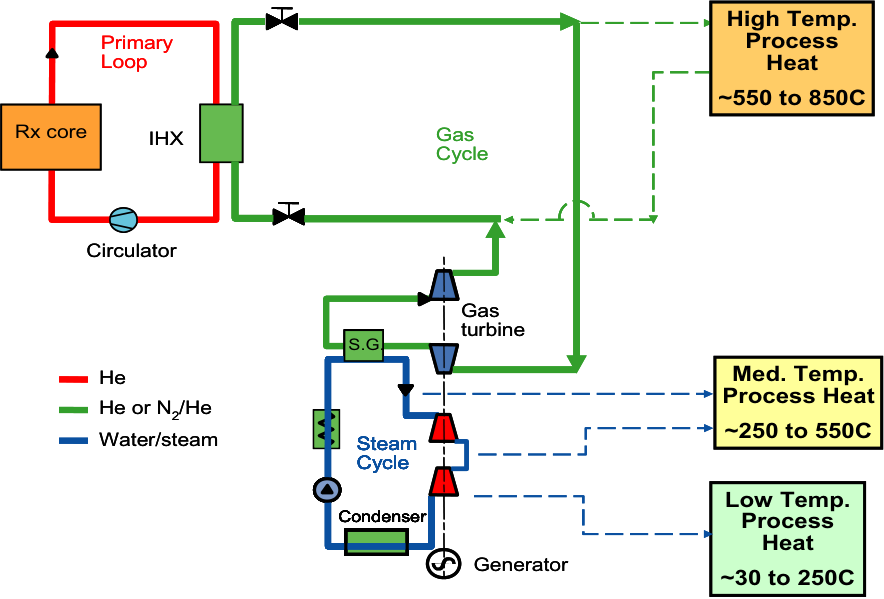

**----- Start of picture text -----** 
High Temp. Primary  Process Loop Heat ~550 to 850C Rx core IHX Gas Cycle Circulator Gas turbine S.G. He Med. Temp. Process Heat He or N2/He ~250 to 550C Water/steam Steam Cycle Low Temp. Condenser Process Heat Generator ~30 to 250C **----- End of picture text -----** 

Figure 4.  VHTR  process heat production versatility. 

A derivative of this special study is that the versatility the VHTR provides as a potential process heat plant for a variety of potential market applications was illustrated.  The figure shown above illustrates the capability of the VHTR to support multiple market applications.  The figure shown was provided by AREVA and shows their combined cycle concept, but the versatility of the VHTR is inherent to the Westinghouse and GA concepts as well. 

The high temperature process heat ranges can support the advanced hydrogen production processes, such as SI, HyS, HTSE, and also steam-methane reforming.  The medium temperature process heat ranges can support numerous production processes including those related to oil shale, oil/tar sands, coal gasification, coal liquefaction, medium temperature electrolysis.  The low temperature process heat can also support numerous processes and uses, such as district heating and desalination. 

The results of the special studies did not allow for any particular conclusions regarding radioactive contamination of the primary and secondary loop cycles and the potential impact on both maintenance and the product hydrogen.  The primary nuclide contaminant of concern, tritium, does have the capability of migrating into the secondary loop cycles regardless of the primary and secondary cycle concept that 

may be chosen.  Even if steam is chosen for the secondary cycle fluid, tritium migration would be an issue once the closed steam/water inventory became saturated with tritium.  For that reason, inclusion of a helium purification system was mentioned in the Westinghouse and GA special studies regarding endproducts (SOW-3963, Section 6.3.7).  Sizing and development of such a purification system will depend upon the performance of an overall tritium mass balance for the NGNP once the reactor type and primary and secondary cycle concepts are defined.  Also, a recommendation has been made to perform a feasibility study to review the practical application of tritium permeation barrier coatings in potential NGNP systems and components. 

The results of special study and pre-conceptual design work by the three contractors regarding primary and secondary cycle concepts do not easily facilitate direct comparisons due to the following factors: 

- The Westinghouse parameters are based upon a 500 MWth Pebble Bed Modular Reactor (PBMR) with an indirect cycle. 

- The AREVA parameters are based upon a 600 MWth ANTARES Reactor with an indirect cycle. 

- The General Atomics parameters are based upon a 600 MWth Modular High Temperature Reactor (GT-MHR) with a direct cycle. 

All three contractors have specified similar reactor outlet temperatures. These are similar because the reactor outlet temperature was specified in the Independent Technology Review Group (ITRG) report titled “Design Features and Technology Uncertainties for the Next Generation Nuclear Plant” (INEEL/EXT-04-01816). 

The remaining parameters vary among the three contractors due to the fact that each team’s design activity is limited to an adaptation of their specific commercial high temperature reactor design concept (AREVA – ANTARES, Westinghouse – PBMR, General Atomics – GT-MHR) and each contractor’s conclusions are based upon their specific reactor design concept and proposed power conversion system. 

Each contractor recommended the parameters that best fit the NGNP mission based upon their specific reactor design, proposed power conversion system, and experience.  The greatest detail of the contractors’ recommendations regarding primary and secondary cycle concepts can be found in the special studies and pre-conceptual design work for the process heat transfer and transport systems and the power conversion systems. 

Although all of the contractor’s parameters appear feasible for their specific reactor design concept and power conversion systems, it is recommended that these parameters be reconfirmed early in the conceptual design phase in order to take into consideration the final results of the pre-conceptual design studies and any modification of mission requirements at the beginning of the next project phase.  Also, it is recommended that feasibility studies regarding helium purification systems and tritium permeation barrier coating applicability be performed early in conceptual design. 

## **Appendix D** 

## **Systems Requirements Manual** 

D-1 

D-2 

## **Next Generation Nuclear Plant System Requirements Manual** 

Doug Vandel 

This information was prepared as an account of work sponsored by an agency of the U.S. Government. Neither the U.S. Government nor any agency thereof, nor any of their employees, makes any warranty, expressed or implied, or assumes any legal liability or responsibility for the accuracy, completeness, or usefulness, of any information, apparatus, product, or process disclosed, or represents that its use would not infringe privately owned rights. References herein to any specific commercial product, process, or service by trade name, trade mark, manufacturer, or otherwise, does not necessarily constitute or imply its endorsement, recommendation, or favoring by the U.S. Government or any agency thereof. The views and opinions of authors expressed herein do not necessarily state or reflect those of the U.S. Government or any agency thereof. 

## **Doug Vandel** 

**Prepared for the U.S. Department of Energy Office of Nuclear Energy Under DOE Idaho Operations Office Contract DE-AC07-05ID14517** 

## **INL/EXT-07-12999** 

## **September 2007** 

## **Approved by:** 

Rafael Soto Deputy Project Manager 

Date 

Table 1.  Preliminary Selections for the NGNP Design................................................................................2 Table 2.  INL NGNP High-Level Functions and Requirements...................................................................4 Table 3.  INL General Design Requirements for the NGNP ........................................................................8 Table 4.  Design Duty Cycles .....................................................................................................................14 Table 5.  Commercial Plant Electricity Generation Cost Advantage (%) Over Comparably Sized Clean Coal Plants........................................................................................................................15 

||**ACRONYMS**|
|---|---|
|ALWR|Advanced Light Water Reactor|
|ASME|American Society of Mechanical Engineers|
|BOP|Balance Of Plant|
|CFR|Code of Federal Regulation|
|DBA|Design Basis Accident|
|DOE|(United States) Department of Energy|
|EAB|Exclusion Area Boundary|
|EPRI|Electric Power Research Institute|
|EPZ|Emergency Planning Zone|
|FIMA|Fissions per Initial Metal Atom|
|GA|General Atomics|
|GT-MHR|Gas Turbine – Modular Helium Reactor|
|H2-MHR|Hydrogen Production - Modular Helium Reactor|
|THE|High Temperature Electrolysis|
|HTGR|High Temperature Gas-Cooled Reactor|
|HTS|Heat Transport System|
|HyS|Hybrid Sulfur|
|IAEA|International Atomic Energy Agency|
|IHX|Intermediate Heat Exchanger|
|INL|Idaho National Laboratory|
|MHR|Modular Helium Reactor|
|NGNP|Next Generation Nuclear Plant|
|NP-MHTGR|New Production – Modular High Temperature Gas Reactor|
|NRC|Nuclear Regulatory Commission|
|PCS|Power Conversion System|
|PPMP|(NGNP) Preliminary Project Management Plan|
|QA|Quality Assurance|
|SCS|Shutdown Cooling System|
|SI|Sulfur-iodine|
|SOEC|Solid Oxide Electrolyzer Cell|
|SRM|System Requirements Manual|
|TBD|To be determined|
|TRISO|TRi-ISOtropic coated fuel particle design with three materials in coating system|
||(low-density PyC, high-density PyC, and SiC)|

## **1. INTRODUCTION AND SCOPE** 

## **1.1 Introduction** 

The Energy Policy Act of 2005 (H.R. 6), which was signed into law by the President in August 2005, required the Secretary of the U.S. Department of Energy (DOE) to establish a project to be known as the Next Generation Nuclear Plant (NGNP) Project.  According to the Energy Policy Act, the NGNP Project shall consist of the research, development, design, construction, and operation of a prototype plant (to be referred to herein as the NGNP) that (1) includes a nuclear reactor based on the research and development activities supported by the Generation IV Nuclear Energy Systems initiative, and (2) shall be used to generate electricity, to produce hydrogen, or to both generate electricity and produce hydrogen.  The NGNP Project supports both the national need to develop safe, clean, economical nuclear energy and the Bush Administration’s National Hydrogen Fuel Initiative, which has the goal of establishing greenhousegas-free technologies for the production of hydrogen.  The DOE has selected the helium-cooled High Temperature Gas-Cooled Reactor (HTGR) as the reactor concept to be used for the NGNP because it is the only near-term Generation IV concept that has the capability to provide process heat at high-enough temperatures for highly-efficient production of hydrogen.  The DOE has also selected the Idaho National Laboratory (INL), the DOE’s lead national laboratory for nuclear energy research, to lead the development of the NGNP under the direction of the DOE. 

## **1.2 Scope** 

The System Requirements Manual (SRM) is the top-level design document for the NGNP.  The SRM serves as the roadmap document that identifies the source of the NGNP top-level requirements (i.e., mission needs and objectives), and how these top-level requirements flow down through subordinate requirements at the plant, system, subsystem, and ultimately the component level. The scope of this preconceptual SRM has been limited to a flow-down of NGNP requirements to the plant level (see Section 3); deferring lower-level requirements definition until after NGNP concept down-selection during the follow-on design phases of the project. 

Design requirements for the NGNP include both institutionally imposed and functionally derived requirements.  At the top level, the requirements define the objectives for the plant, and at lower levels they specify how the objectives will be achieved.  The topmost requirements include the project mission as defined in the Energy Policy Act of 2005 and the NGNP Project objectives as defined by DOE/INL in the NGNP Preliminary Project Management Plan (PPMP) (Ref. 1).  At the next level are the high-level functions and requirements defined by the INL (Ref. 2), as modified based on the recommendations of the Independent Technology Review Group (ITRG) (Ref. 3).  The high-level functions and requirements establish the performance definitions for what the NGNP will achieve, and are intended to serve as the basis for preconceptual design.  Achievement of these high-level functions and requirements will be accomplished through implementation of plant-level requirements derived from the high-level requirements and other institutional sources such as utility/user requirements for commercial reactors, or that are developed though plant-level functional analysis including trade studies, plant performance analyses, engineering decisions, etc.  The plant-level requirements are either allocated directly to the systems to which they apply or are used as the basis for developing more-specific requirements for the plant systems, subsystems, and components. 

The organization of this SRM and the approach used for requirements flow-down are based on the Plant Design Requirements Document (Ref. 4) developed by General Atomics (CEGA) for the NPMHTGR and the Overall Plant Design Specification (Ref. 5) developed by General Atomics for the GTMHR.  Section 2 of the SRM identifies the institutional requirements that comprise the basis for the NGNP design.  These requirements include the mission statement, the mission objectives, and the highlevel functions and requirements established by the INL.  Section 2 also identifies other institutional requirements that must be considered in defining the NGNP plant-level requirements.  These institutional requirements include DOE/INL programmatic requirements, regulatory requirements, environmental and safety requirements, utility/user recommendations for the NGNP, and utility/user requirements for a commercial MHR.  The latter requirements are particularly pertinent given that a primary mission of the NGNP is to serve as a prototype for a commercial HTGR.  Section 3 lists the plant-level requirements derived from the high-level institutional requirements identified in Section 2. 

The primary purpose of the SRM at this early stage of the project is “to define the design independent high-level requirements that establish the framework within which subsequent work will be performed to establish the specific design attributes of the NGNP (e.g., type of reactor, direct versus indirect power conversion, hydrogen production processes, etc.)”.  These requirements include, for example, reactor plant power level, primary coolant conditions, secondary coolant conditions, thermal power split between the power conversion system and the hydrogen production system, hydrogen plant heat flow and temperature requirements, hydrogen production goals, etc. 

Given the purpose of the initial version of the SRM, it is appropriate to limit the scope of this SRM to a flow-down of NGNP requirements to the plant level (see Section 3); deferring lower-level requirements definition until after NGNP concept down-selection during the follow-on design phases of the project.  As such, requirements listed in Section 3 have been assigned individual tracking numbers.  This will be done during the Conceptual Design phase of the project as the lower-level requirements are finalized. 

Table 1 presents a set of preliminary selections for the NGNP design that are based preconceptual design studies.  These preliminary selections serve as the point of departure for the NGNP conceptual design effort and are the basis for the design-specific system-level requirements presented in Section 4. 

Table 1.  Preliminary Selections for the NGNP Design 

|Table 1.  Preliminary Selections for the NGNP Design||
|---|---|
|**Property**|**Design Selection**|
|Reactor type|Prismatic block or Pebble Bed|
|Reactor power|~500 MW(t) to 600 MW(t)|
|Power conversion cycle|TBD|
|Number of loops|TBD|
|Primary coolant|Helium|
|Core inlet helium temperature|350°C - 500°C|
|Core outlet helium temperature|850°C - 950°C|
|Secondary loop working fluid|Helium|
|Hydrogen production process|SI, HyS, HTE|

The systems, the functions of the systems, and the design-specific requirements for these systems defined in this initial version of the SRM are preliminary in nature and will need to be updated as the design of the NGNP evolves. 

## **2. INSTITUTIONAL REQUIREMENTS** 

This section identifies the mission and objectives of the NGNP Project and the high-level functions and requirements for the NGNP that define how the project objectives will be achieved.  This section also identifies other institutional requirements including DOE/INL programmatic requirements, regulatory requirements, environmental and safety requirements, and utility/user requirements.  The high-level requirements identified in this section are the basis for the plant-level requirements defined in Section 3. 

## **2.1 NGNP Project Mission and Objectives** 

The NGNP project mission as defined by the Energy Policy Act of 2005 and by the DOE is to design, build, and operate a prototype plant, including a prototype HTGR nuclear reactor, that will be used to generate electricity, to produce hydrogen, or to both generate electricity and produce hydrogen in a cogeneration mode.  The project objectives that support the NGNP mission and DOE’s vision are defined in the NGNP Preliminary Project Management Plan (PPMP) (Ref. 1) as follows: 

- a. Develop and implement the technologies important to achieving the functional performance and design requirements determined through close collaboration with commercial industry end-users 

- b. Demonstrate the basis for commercialization of the nuclear system, the hydrogen production facility, and the power conversion concept.  An essential part of the prototype operations will be demonstrating that the requisite reliability and capacity factor can be achieved over an extended period of operation. 

- c. Establish the basis for licensing the commercial version of the NGNP by the Nuclear Regulatory Commission (NRC).  This will be achieved in major part through licensing of the prototype by NRC, and by initiating the process for certification of the nuclear system design 

- d. Foster rebuilding of the U.S. nuclear industrial infrastructure and contributing to making the U.S. industry self-sufficient for its nuclear energy production needs 

Additional objectives that are not explicitly stated in Ref. 1, but should be considered applicable include: 

- e. Provide a level of safety assurance that meets or exceeds that afforded to the public by modern commercial nuclear power plants 

- f. Meet or exceed all applicable federal, state, and local regulations or standards for environmental compliance 

## **2.2 High-Level Functions and Requirements** 

The high-level functions and requirements for the NGNP are defined in Ref. 2 in order to establish performance definitions for what the NGNP must achieve.  These high-level functions and requirements were developed as input to the preconceptual design effort and were intended to provide the foundation on which to define the requirements for the NGNP.  Ref. 2 was reviewed by the ITRG, as required by the Energy Policy Act of 2005.  The ITRG evaluated the design features and technology risks associated with the design concepts that could satisfy the high-level functions and requirements and made recommendations for managing these risks (Ref. 3).  The NGNP PPMP specifies that the high-level functions and requirements in Ref. 2, as modified based on the recommendations of the ITRG, are the 

second set of requirements (after the Energy Policy Act) that are to be used as the basis for NGNP Project preliminary planning.  Appendix B of the PPMP describes the impact of the ITRG review on these highlevel functions and requirements. 

The high-level functions for the NGNP, as defined in Ref. 2, are as follows: 

- Develop and demonstrate a commercial-scale prototype HTGR 

- Develop and demonstrate the production of electricity at high efficiencies 

- Obtain licenses and permits to construct/operate the NGNP 

- Develop and demonstrate the capability for efficient production of hydrogen 

- Enable the demonstration of energy products and processes 

- Provide the capability for future testing to enhance plant safety and operational performance 

The requirements developed for these high-level functions are listed in a condensed form in Table 2. Ref. 2 provides the basis for each requirement. 

Table 2.  INL NGNP High-Level Functions and Requirements 

Table 2.  INL NGNP High-Level Functions and Requirements (cont.) 

## **2.3 Other Institutional Requirements** 

## **2.3.1 Key Programmatic Requirements** 

The NGNP PPMP provides programmatic goals and guidance that must be considered in developing the design of the NGNP.  Key requirements are listed below along with the PPMP section number (in brackets) in which they are stated. 

The NGNP prototype concept shall be based on the lowest risk technology development that would achieve the needed commercial functional requirements to provide an economically competitive heat source and hydrogen production capability.  Such concepts are preferred over other concepts that unacceptably increase the uncertainties for project completion on a schedule considered commercially unattractive.  These more aggressive capabilities may form a longer-term goal beyond the NGNP Project where the risks can be accommodated. [Executive Summary] 

Planning option 2 (balanced risk) has been selected as the basis for the preliminary NGNP Project schedule.  Under this option, startup of the NGNP should be initiated in 2018. This option allows for a two to three year period of operation (prior to 2021) simulating a commercial power reactor operating cycle that is followed by an extensive outage during which the equipment performance is confirmed by detailed disassembly and inspection.  This proof-of-principle operating period is intended to provide the basis for commercialization decisions by industry.  [Section titled “Planning Options”] 

DOE Order 413.3, “Program and Project Management for the Acquisition of Capital Assets,” and Manual 413.3-1, “Project Management for the Acquisition of Capital Assets,” will be followed to the extent possible, as they provide an excellent systems approach to managing projects.  However, as planning continues through the Definition Phase and Preliminary Design, “tailoring” of the Order may be used to accommodate the unique requirements of the NGNP Project. [Section 3.4] 

## **2.3.2 Applicable Regulations** 

Section 4.1.2 of Ref. 2 identifies the following regulations as having specific applicability to the NGNP.  The authors have added the italicized text to identify the applicable sections of certain of the CFR’s. 

- 10 CFR 20, Standards for Protection against Radiation 

- 10 CFR 50, Domestic Licensing of Production and Utilization _Facilities (Appendix I, “Numerical Guides for Design Objectives and Limiting Conditions for Operation to Meet the Criterion As Low as is Reasonably Achievable  for Radioactive Material in Light-WaterCooled Nuclear Power Reactor Effluents” and Part 34(a), “Content of Applications (Technical Information: Radiological Dose Consequences)”_ 

- 10 CFR 50, Appendix B, Quality Assurance Criteria for Nuclear Power Plants and Fuel Processing Plants 

- 10 CFR 51, Environmental Protection Regulations for Domestic Licensing and Related Regulatory Functions _(NRC regulations implementing the National Environmental Policy Act)_ 

- 10 CFR 52, Early Site Permits; Standard Design Certifications; and Combined Licenses for Nuclear Power Plants 

- 10 CFR 73, Physical Protection of Plants and Materials 

- 10 CFR 74, Materials Control and Accountability of Special Nuclear Material 

- 10 CFR 75, Safeguards on Nuclear Material – Implementation of US/IAEA Agreement 

- 10 CFR 95, Security Facility Approval and Safeguarding of National Security Information and Restricted Data 

- 10 CFR 100, Reactor Site Criteria 

- 29 CFR 1910, Occupational Safety and Health Standards, Subpart H – Hazardous Materials 

- 40 CFR 50 – 99, Clean Air Act 

- 40 CFR 100 – 149, Clean Water Act 

- 10 CFR 835, Occupational Radiation Protection 

- 40 CFR 1502, Environmental Impact Statement 

- 40 CFR 190, “Environmental Radiation Protection Standards for Nuclear Power Operations.” 

Other applicable regulatory documents that are not listed in Section 4.2 of Ref.2 include: 

- Reactor Safety Goal Policy Statement:  As documented in Federal Register, Vol. 51, No. 149, pp. 28044-28049, August 4, 1986 

- EPA-400-R-92-001, “Manual of Protective Action Guides and Protective Actions for Nuclear Incidents,” U.S. Environmental Protection Agency (EPA) 

## **2.3.3 Applicable DOE Orders** 

Per Section 4.1.1 of Ref. 2, codes and standards applicable to the design and construction of the NGNP shall where practical be commercial codes and standards.  However, to the extent that the NGNP will be built within a DOE facility and will interface with existing facilities, the project must evaluate DOE Orders for applicable requirements to ensure that the NGNP can interface with the DOE site and be acceptable to the DOE.  DOE Orders that potentially apply include, but are not limited, to the following list. 

- DOE O 413.3, Program and Project Management for the Acquisition of Capital Assets 

- DOE O 420.1, Facility Safety 

- DOE O 435.1, Radioactive Waste Management 

- DOE Policy 450.4, Safety Management System Policy 

## **2.3.4 General Design Requirements** 

INL has also specified general design requirements for the NGNP.  Table 3 provides a summary of these requirements in condensed form.  The detailed requirements can be found in Sections 4.2 and 4.3 of Ref. 2. 

Table 3.  INL General Design Requirements for the NGNP 

## **2.3.5 Utility/User Requirements for the GT-MHR and the NGNP** 

Document DOE-GT-MHR-100248, “Utility/User Incentives, Policies and Requirements for the Gas Turbine – Modular Helium Reactor,” (Ref. 9) provides utility/user requirements for a commercial GTMHR.  These requirements were developed from Utility requirements for advanced light water reactors (ALWRs) (Ref. 10), from input provided by constituents of the GT-MHR Program, and from pertinent information from IAEA-TECDOC-801, “Development of Safety Principles for the Design of Future Nuclear Power Plants”.  These requirements have not been imposed directly by INL/DOE, but they are pertinent to the NGNP because a primary mission of the NGNP is to serve as a prototype of a commercial HTGR.  Thus, these requirements have been considered in developing the plant-level and system-level requirements specified in Sections 3 and 4 of this SRM. 

The Utility/User requirements presented in DOE-GT-MHR-100248 are extensive and are presented under the following categories: plant configuration, performance requirements, fuel, site parameters and external interfaces, safety and licensing, reliability and availability, control/man-machine interfaces, maintenance and ISI, design process requirements, plant fabrication/construction, plant staffing, and plant decommissioning.  The key utility/user design requirements for a commercial GT-MHR are summarized in Table ES-2 of DOE-GT-MHR-100248.  General Atomics updated these key utility/user requirements for inclusion in this SRM based on recent discussions with members of General Atomics’ Utility Advisory Board (UAB) and Academic Advisory Group (AAG).  In the course of these discussions, the UAB and AAG provided General Atomics with the following recommendations with respect to the mission of the NGNP. 

1. The NGNP should be a full-size prototype of a commercial HTGR module. 

2. The initial power level for the NGNP could be somewhat lower than the power level for a commercial MHR module, but the NGNP should be designed for up-rating to the full commercial MHR module power level 

3. The mission of the NGNP should include demonstration of process-heat applications, including steam methane reforming for hydrogen production.  From a utility/users viewpoint, process heat applications are a more important near-term mission than demonstration of hydrogen production. 

4. The NGNP should be capable of demonstrating use of alternate fuels, including Pu-based fuel and actinide-based fuel (i.e., “deep-burn” fuel) from re-processed LWR spent fuel. 

5. The NGNP should be designed to demonstrate a commercial MHR that meets the key Utility/User design requirements for a commercial MHR as stated in Figure 1. 

## _Key Utility/User Design Requirements for a Commercial MHR Plant_ 

## Application 

- Commercial plant objective 

- Fuel cycle 

   - Reference plant size:  Four MHR power modules with each module having a nominal output of 250 – 300 MWe 

   - Brayton power conversion system with > 40% thermal conversion efficiency <$1500/kwe overnight plant capital cost (mature plant, not including owner’s costs) Capable of being sited with dry cooling at low economic penalty Once-through uranium cycle with enrichment <20% 

   - Capable of utilizing alternate fuel cycles (Pu fuel, deep-burn of LWR spent fuel, etc.) 

- Licensing objective 

- Public safety objective 

- NRC design certification of the standard power module design 

- Passive safety design:  No reliance on the operator, the control room and its contents, or any AC-powered equipment to satisfy NRC design basis accident limits/requirements 

- The plant shall not disrupt the public’s normal day-to-day activities. Specifically, no need for public sheltering, evacuation drills Exclusion Area Boundary (EAB) = Emergency Planning Zone (EPZ) = 425 meters 

Probability of exposure exceeding the Protective Action Guides at or beyond the EAB shall be < 5 x 10[-7] per plant year Maximum Accident Dose Limit 

- < 1 rem total effective dose equivalent to the whole body 

- < 5 rem thyroid (EPA Protective Action Guidelines) 

## Plant Performance 

- Plant service life 

- Plant service life � 60 years 

- � Load follow Automatic over the range 50 – 100% power � Rapid load change ±5% per minute over the range 50 – 100% power � Step load rejection 100% - house load without trip 

- Cold shutdown to hot critical (or vice versa) 

- 24 hours 

## Availability 

- Design capacity factor 

   - �94%, from start up after refueling to shut down for refueling (i.e., breaker to breaker 

- Fuel cycle length � 18 months, from startup to startup (after refueling), shall be 18 months 

- � Refueling outage � 30 days 

Figure 1.  Key utility/user design requirements for a commercial MHR plant 

## _Key Utility/User Design Requirements for a Commercial MHR Plant (cont.)_ 

Figure 1.  Key utility/user design requirements for a commercial MHR plant (cont.) 

## **3. PLANT-LEVEL REQUIREMENTS** 

This section identifies NGNP plant-level requirements.  These plant-level requirements are either institutional requirements from Section 2 or functionally-derived requirements established through trade studies, plant performance evaluations, engineering analyses and decisions, etc.  If the plant-level requirement is an institutional requirement, the source of the requirement is given in brackets following the requirement.  If a source is not shown following the statement of the requirement, the requirement is a functionally-derived requirement.  A number is assigned to each requirement for identification purposes. The identification number has the format 3.x.y where 3.x is the SRM section number and y is the requirement number.  If a requirement is subordinate to a higher-level requirement (i.e., it stems from the higher-level requirement), the subordinate requirement has the format 3.x.y.z, where 3.x.y is the identification number for the higher-level requirement and z is the unique number for the subordinate requirement.  Brackets { } are used herein to identify a value that is preliminary in nature because of design uncertainty or insufficient documentation, or that requires verification.  TBD is used as a placeholder for information that is to be added in a future revision of the SRM. 

Requirements that apply to the overall NGNP plant, including the systems that accomplish the hydrogen production mission, are listed below.  Requirements that are specific to achievement of the six NGNP high-level functions identified in Section 2.2 (as defined in Ref. 2) are listed in Sections 3.1 through 3.6. 

PLT 3.0.1 - The NGNP shall include a nuclear reactor based on the research and development activities supported by the Generation IV Nuclear Energy Systems initiative.  [Energy Policy Act of 2005] 

PLT 3.0.2 - The NGNP shall be used to generate electricity, to produce hydrogen, or to both generate electricity and produce hydrogen.  [Energy Policy Act of 2005] 

PLT 3.0.3 - The NGNP design shall be based on the lowest risk technology development that would achieve the needed commercial functional requirements to provide an economically competitive heat source and hydrogen production capability.  [Ref. 1, Executive Summary] 

PLT 3.0.4 - The NGNP design shall accommodate a licensing strategy and construction schedule that allows for NGNP startup and testing by a date (currently given as 2018) that is commercially attractive and consistent with the NGNP Project schedule.  [Ref. 1, Section titled “Planning Options”] 

PLT 3.0.5 - The NGNP shall comply with all applicable requirements of the regulations identified in Section 2.3.2.  [Ref. 2, Section 4.1.2] 

PLT 3.0.6 - Buildings and structural design for the NGNP non-nuclear facilities shall comply with the applicable DOE, Federal, state, and local codes.  [Ref. 2, Section 4.2.1] 

PLT 3.0.7 - Commercial codes and standards applicable to design and construction shall be followed, as appropriate, for all structures and systems including the reactor, power conversion unit, and the hydrogen plant.  [Ref. 2, Section 4.2.2] 

PLT 3.0.8 - The NGNP shall be designed for high reliability, availability, maintainability, and inspectability (RAMI).  Innovative designs to maximize RAMI and minimize human error shall be considered, including techniques for remote maintenance and easy replacement or repair of components. [Ref. 2, Section 4.2.3] 

PLT 3.0.9 - The NGNP shall be designed for an operating life of �60 calendar years from the date of authorization to operate.  Provisions shall be made for economic replacement of components that cannot 

be designed for 60-year operation.  [Ref. 2, Section 3.1.11; U/U Requirement, Ref. 9, Section 3.1.2 and SRM Section 2.3.5, Figure 1] 

PLT 3.0.10 - The plant shall be designed to locate the power unit systems, structures and components (SSCs) that perform nuclear safety functions within a nuclear island that is physically separated from the balance of the plant.  [U/U Requirement, Ref. 9, Section 3.1.1, paragraph 4] 

PLT 3.0.11 - Provisions for site security shall be provided for the protection of the reactor, reactor fuel, spent fuel, electrical power, and hydrogen in accordance with NRC and other applicable regulations. Plant security shall be a consideration in developing plant equipment layouts.   [Ref. 2, Section 4.2.5; U/U Requirement, SRM Section 2.3.5, Figure 1] 

PLT 3.0.12 - NGNP design activities shall be conducted under a Quality Assurance Program that complies with the U.S. national consensus standard ASME NQA-1-1997 and Subpart 4.2 of ASME NQA-1-2000 for project specific development R&D activities, and with 10CFR50, Appendix B, when appropriate.  [Ref. 2, Section 4.3.1] 

PLT 3.0.13 – The design of the NGNP shall be based on the site parameters and external interfaces for the INL site selected for the NGNP.  [Ref. 2, Section 1.1.5] 

## **3.1 Develop and Demonstrate a Commercial-Scale Prototype HTGR** 

PLT 3.1.1 - The reactor concept to be used for the NGNP shall be the helium – cooled High Temperature Gas-Cooled Reactor (HTGR).  [Ref. 2, Section 1] 

PLT 3.1.1.1 - The NGNP reactor shall be graphite moderated.  [Ref. 2, Section 3.1.5] 

PLT 3.1.1.2 - The NGNP reactor shall have either a prismatic block or pebble bed core. 

PLT 3.1.1.3 - The NGNP reactor system shall be designed to operate with an average core outlet coolant temperature range of 850°C to 950°C.  [Ref. 1, Section 3.3] 

PLT 3.1.1.4 - The NGNP shall use qualified TRISO-coated uranium oxycarbide (UCO) or uranium dioxide fuel. The fuel particles shall be agglomerated into cylindrical compacts or pebbles.  Qualified uranium dioxide fuel may be acceptable for initial fuel loading, but shall be replaced by UCO, when it is has been qualified.  [Ref. 2, Sections 3.1.7 and 3.1.10] 

PLT 3.1.1.5 - The NGNP shall include a vessel system for ducting high temperature, high pressure helium coolant throughout the NGNP systems and for containing the components that interface with the helium coolant. 

PLT 3.1.1.6 - The NGNP shall include a helium storage and transfer system. 

PLT 3.1.1.7 - The NGNP shall include helium purification systems to maintain the helium coolant purity. 

PLT 3.1.2 - The NGNP reactor shall be a full-size prototype of a commercial HTGR module.  The reactor core power level shall be as high as possible consistent with the use of passive safety features.  [Ref. 2, Section 3.1.1; SRM Section 2.3.5, U/U recommendation #1] 

PLT 3.1.2.1 - The reactor shall have a nominal power level of 500-600 MW(t). 

PLT 3.1.2.2 - The initial power level for the NGNP could be somewhat lower than the power level for a commercial MHR module, but the NGNP should be designed for up-rating to the full commercial MHR module power level.  [SRM Section 2.3.5, U/U recommendation #2] 

PLT 3.1.3 - The NGNP reactor shall have adequate passive safety systems to cool the reactor core down from full power to a safe shutdown mode and limit the fuel temperatures under accident conditions to levels consistent with limiting radionuclide releases and resultant doses to within regulatory requirements. [Ref. 2, Section 3.1.2] 

PLT 3.1.3.1 - The reactor core configuration shall be designed to enable the core heat to be transferred from the active core to the reactor vessel (the vessel system component containing the core) by natural heat transfer mechanisms (conduction, thermal radiation, and natural convection). 

PLT 3.1.3.2 - The reactor core power density (w/cc) shall be designed to limit the fuel temperatures under accident conditions to levels consistent with limiting radionuclide releases and resultant doses to within regulatory requirements (see requirement PLT 3.1.9). 

PLT 3.1.3.3 - The reactor vessel shall be constructed of a metallic material to enable it to passively transfer accident event core heat by thermal radiation to a passive cooling system, that is located outside and is physically separate from the reactor vessel, for rejection of the core heat to the ultimate heat sink (the atmosphere). 

PLT 3.1.3.4 - The reactor vessel shall be designed to maintain the reactor core in cool-able geometry for passive cool-down accident events (as well as during normal forced cooling operating conditions). 

PLT 3.1.3.5 - The plant design shall require no reliance on the operator, the control room and its contents, or any AC-powered equipment to satisfy the NRC design basis accident limits/requirements.  [U/U Requirement, Section 2.3.5, Figure 1] 

PLT 3.1.4 - The NGNP reactor shall be designed to achieve and maintain a cold shutdown condition. This condition shall be maintained as required to perform required maintenance or inspection procedures and to support routine refueling of the reactor. 

PLT 3.1.5 - The NGNP reactor shall be designed with two diverse and independent means by which a complete shutdown of the reactor core can be achieved. 

PLT 3.1.6 - The NGNP reference fuel cycle shall be a once-through uranium fuel cycle with uranium enrichment of <20% U-235.   [Ref. 2, Sections 3.1.6 & 3.1.8; U/U Requirement, SRM Section 2.3.5, Figure 1] 

PLT 3.1.7 - The NGNP shall be capable of utilizing alternate fuel cycles (Pu fuel, deep-burn of LWR spent fuel, etc.)  [SRM Section 2.3.5, U/U recommendation #3] 

PLT 3.1.8 - The NGNP shall be designed to achieve fuel burnup consistent with maximum fuel utilization while minimizing waste streams, optimizing fuel economics, and ensuring low proliferation risk.  [Ref. 2, Section. 3.1.9] 

PLT 3.1.9 - The NGNP shall be designed to satisfy the following top-level radionuclide control regulatory requirements 

- a. During normal operation, offsite radiation doses to the public shall be < limits specified in Appendix I of 10 CFR 50 and 40 CFR 190 

- b. Occupational radiation exposures shall be �10% of the limits specified in 10 CFR 20 

- c. During DBAs, offsite doses at the site EAB shall be less than those specified in the Manual of Protective Action Guides and Protective Actions for Nuclear Incidents (EPA-520/1-75-001) for sheltering and evacuation 

[Ref. 2, Section 3.1.13 and U/U Requirement, SRM Section 2.3.5, Figure 1] 

PLT 3.1.10 - The design of the NGNP systems and processes shall be such that the volume of low-level radioactive dry and wet waste, as shipped off-site, shall be less than 3.6 m3, annually (excluding replaceable reflector elements).  [U/U Requirement, SRM Section 2.3.5, Figure 1] 

PLT 3.1.11 - The NGNP shall be capable of demonstrating the operational and safety performance of a commercial-scale HTGR power unit over a range of normal and transient conditions and to provide the cost and performance characteristics required to demonstrate commercial plant economic performance. [Ref. 2, Section 3.1 and SRM Section 2.3.5, U/U recommendation 5] 

PLT 3.1.11.1 - The NGNP shall be designed to demonstrate a capacity factor for electricity generation of �94% over the plant operating period from startup following a refueling to shutdown for refueling (i.e., “breaker-to-breaker”).  [U/U Requirement, SRM Section 2.3.5, Figure 1] 

PLT 3.1.11.2 - The NGNP shall be designed to demonstrate the capability of the power unit to accommodate the duty cycle events identified in Table 4. 

Table 4.  Design Duty Cycles 

PLT 3.1.11.3 - The NGNP shall be designed with the systems and features necessary to accomplish reactor refueling within a time interval of � 30 days.  [U/U Requirement, SRM Section 2.3.5, Figure 1] 

PLT 3.1.11.4 - The NGNP shall be designed with a shutdown cooling system, separate from the main cooling loop, to enable rapid cool down of the reactor for plant maintenance operations in the event the main cooling loop is not available.  [U/U Requirement, Ref. 9, Section 3.6.2] 

PLT 3.1.11.5 - The NGNP shall be designed to demonstrate a comparative advantage in the evaluated mean (or expected) levelized generation costs of electricity for reference commercial plants versus comparably sized, "clean" coal plant; i.e., a coal plant that meets environmental standards and regulations projected for deployment in the 2020s.  Generation cost advantages are provided in Table 5 for the initial and final plants within a first series of commercial plants (nominally 16 modules in any combination of 2 or 4 module plants).  [U/U Requirement, Ref. 9, Section 4] 

Table 5.  Commercial Plant Electricity Generation Cost Advantage (%) Over Comparably Sized Clean Coal Plants 

PLT 3.1.11.6 - The NGNP shall be designed to demonstrate a probability of < 5 x 10[-7] per plant year that offsite doses at or beyond the site EAB of 425 meters will exceed the limits specified in the Manual of Protective Action Guides and Protective Actions for Nuclear Incidents (EPA520/1-75-001) for sheltering and evacuation.  [U/U Requirement, SRM Section 2.3.5, Figure 1] 

PLT 3.1.11.7 - The NGNP shall be designed to demonstrate plant personnel exposure of < 70 person-rem/GWe-year.  [U/U Requirement, SRM Section 2.3.5, Figure 1] 

PLT 3.1.11.8 - The NGNP shall be designed such that the likelihood of an event resulting in conditions outside the licensing basis is < 1 x 10[-5] /plant year.  [U/U Requirement, SRM Section 2.3.5, Figure1] 

PLT 3.1.11.9 - The NGNP design shall include provisions for controlling the plant environment and the man-machine interfaces as specified in Section 3.7 of Ref. 9.  [U/U Requirement, Ref. 9, Section 3.7] 

PLT 3.1.11.10 - The NGNP design shall include provisions for satisfying the maintenance and inservice inspection requirements as specified in Section 3.8 of Ref. 9.  [U/U Requirement, Ref. 9, Section 3.8] 

PLT 3.1.11.11 - The NGNP design shall include provisions for satisfying the design process requirements as specified in Section 3.9 of Ref. 9.  [U/U Requirement, Ref. 9, Section 3.9] 

PLT 3.1.11.12 - The NGNP design shall include provisions for satisfying the plant fabrication/construction requirements as specified in Section 3.10 of Ref. 9, including modular construction techniques as appropriate to reduce risk and cost.  [U/U Requirement, Ref. 9, Section 3.10] 

PLT 3.1.11.13 - The NGNP design shall include provisions for satisfying the plant staffing requirements as specified in Section 3.11 of Ref. 9.  [U/U Requirement, Ref. 9, Section 3.11] 

PLT 3.1.11.14 - The NGNP design shall include provisions for satisfying the plant decommissioning requirements as specified in Section 3.12 of Ref. 9.  [U/U Requirement, Ref. 9, Section 3.12] 

PLT 3.1.12 - The NGNP shall be designed to demonstrate the capability for a HTGR to be sited with dry cooling at low economic penalty.  [U/U Requirement, SRM Section 2.3.5, Figure 1] 

PLT 3.1.13 - Failures or upset conditions in the reactor primary system shall not result in failures or adverse impacts to the hydrogen production plant or any other process heat systems.  [Ref. 2, Section 3.1.14] 

PLT 3.1.14 - Measures shall be incorporated in the NGNP design as necessary to prevent unauthorized access to nuclear material, theft, diversion, and other malevolent acts, including sabotage intended to release radioactivity or disrupt operations.  [Ref. 2, Section 4.2.4] 

## **3.2 Develop and Demonstrate High-Efficiency Power Conversion** 

PLT 3.2.1 - The NGNP shall generate electric power using a TBD power conversion system.  [Ref. 2, Section 3.2.1] 

PLT 3.2.2 - Overall efficiency shall be as high as possible, and consistent with other key commercial parameters, to optimize economics.  [Ref. 2, Section 3.2.2 

PLT 3.2.3 - The power conversion system shall be designed and sized to produce electricity at commercial scale using 100% of the NGNP thermal energy from the reactor.  [Ref. 2, Section 3.2.3] 

PLT 3.2.3.1 - The NGNP shall nominally produce 250 - 300 MWe net of electricity at 60 Hz. [U/U Requirement, SRM Section 2.3.5, Figure 1] 

PLT 3.2.4 - The power conversion system shall be designed for high reliability, to provide accessibility to system components for maintenance, and to allow for replacement of system components.  [U/U requirement, SRM Section 2.3.5, Figure 1] 

## **3.3 Obtain Licenses and Permits to Construct/Operate the NGNP** 

PLT 3.3.1 - The NGNP shall obtain an NRC license via 10 CFR 50 and/or 10 CFR 52 rules for operation by a date consistent with the NGNP Project schedule (currently the end of 2017).   [Ref. 2, Section 3.3.1] 

PLT 3.3.2 - The NGNP project shall use a risk-informed, performance-based approach to regulatory decision-making.  [Ref. 2, Section 3.3.2] 

PLT 3.3.2.1 - Licensing of the NGNP shall be based on the criteria and methodologies identified in ANS Standard 53.1, Nuclear Safety Criteria for the Design of Modular Helium-Cooled Reactor Plants (Draft). 

PLT 3.3.3 - The NGNP license application shall be supported by a full-scope probabilistic risk assessment analysis for internal and external events. The analysis shall be conducted in accordance with the requirements of either 10 CFR 50 or 10 CFR 52.   [Ref. 2, Section 3.3.3] 

PLT 3.3.4 - The NGNP shall serve as the basis for obtaining NRC design certification of a commercial plant.  The reference commercial plant design and certification envelope demonstrated by the NGNP shall provide the flexibility for deployment of from one to four power units of the same design as the NGNP. 

## **3.4 Develop and Demonstrate Hydrogen Production** 

PLT 3.4.1 - The NGNP shall be designed for continuous operation in either the 100% electric power production mode or in the cogeneration mode with the equivalent of up to 65 MW(t) of the reactor’s thermal energy used for hydrogen production.  [Ref. 2, Section 3.4.1] 

PLT 3.4.2 - Hydrogen production shall be demonstrated using a thermochemical, thermochemical hybrid process, or a high-temperature steam electrolysis (HTE) process.  [Ref. 2, Section 3.4.2] 

PLT 3.4.2.1 - The thermochemical process to be demonstrated by the NGNP may be the sulfuriodine (SI) process, the Hybrid Sulfur Process, or other alternative process, as recommended by the DOE Nuclear Hydrogen Initiative. 

PLT 3.4.2.2 - The hydrogen production plant(s) shall produce {TBD} metric tonnes of hydrogen per year. 

PLT 3.4.2.3 - The hydrogen production plant(s) shall be capable of long-term continuous operation sufficient to demonstrate adequate process reliability and availability to potential hydrogen end users. 

PLT 3.4.2.4 - The hydrogen product gas shall have purity levels consistent with current industry standards for hydrogen applications.  [Ref. 2, Section 3.4.7] 

PLT 3.4.3 - The NGNP design shall include a Primary Heat Transport System for transporting up to 65 MW(t) of thermal energy from the reactor to an intermediate heat exchanger (IHX) for transfer to a secondary loop that supplies the hydrogen process. 

PLT 3.4.4 - The NGNP shall include a Secondary Heat Transport System to provide thermal energy to the hydrogen production plant. 

PLT 3.4.4.1 - The Secondary Heat Transport System shall deliver process heat to the hydrogen production process at the required temperature and at pressure conditions that minimize the technical risk associated with the IHX, the process heat exchanger(s), and the hydrogen production process design. 

PLT 3.4.4.2 - Heat losses to the environment associated with transfer of heat from the reactor to the hydrogen production system shall be limited to less than {1%} of 65 MW(t 

PLT 3.4.4.3 - Leakage of the Secondary Heat Transport System fluid shall be limited to {10%} per year, or to a lesser amount as necessary to ensure compliance with requirement PLT 3.1.9. 

PLT 3.4.4.4 - The NGNP shall include a Secondary Fluid Purification System to maintain the purity of the Secondary Heat Transfer System (HTS) fluid. 

PLT 3.4.5 - The interface between the NGNP reactor and the hydrogen production plant(s) shall be designed to allow for safe transitions between all-electric power production at levels up to 100% to the production of hydrogen and electric power in the cogeneration mode where the hydrogen production consumes up to 65 MW(t) without reactor shutdown.  [Ref. 2, Section 3.4.3] 

PLT 3.4.6 - The interfaces between the hydrogen production plant(s) and the NGNP reactor shall be designed to ensure that failures or upset conditions in the hydrogen production plant do not result in failures or adverse impacts to the NGNP reactor.   [Ref. 2, Section 3.4.4] 

PLT 3.4.7 - The interface system between the NGNP and the hydrogen production plant(s) shall be designed to ensure that tritium migration into the hydrogen production systems will be limited, such that the maximum amount of tritium released from the integrated NGNP facilities, including system leaks, or found in drinking water does not exceed EPA and NRC standards.  [Ref. 2, Section 3.4.5 

PLT 3.4.8 - The total concentration of radioactive contaminants in the hydrogen product gas and associated hydrogen production systems shall be minimized to ensure that worker and public dose limits for the integrated NGNP and hydrogen production facilities do not exceed NRC regulatory limits.  [Ref. 2, Section 3.4.6] 

PLT 3.4.9 - The hydrogen production plant(s) shall be designed to contain industrial safety features that afford adequate protection to the public and plant workers.  [Ref. 2, Section 4] 

PLT 3.4.9.1 - The hydrogen production and storage facilities shall comply with 29 CFR 1910.103.  If the hydrogen facility produces and stores significant quantities of oxygen, compliance with 29 CFR 1910.104 shall also be required.  [Ref. 2, Section 4.2.5] 

PLT 3.4.9.2 - Emissions from the hydrogen production plant(s) shall comply with all applicable requirements of the Clean Water Act/Water Programs (CWA), 40 CFR 100-149, as well as compliance with all state and local requirements.  [Ref. 2, Section 4.1.2] 

PLT 3.4.9.3 - Emissions from the hydrogen production plant(s) shall comply with the requirements of 40 CFR 61, National Emissions Standards for Hazardous Air Pollutants (NESHAP), and all applicable state and local air permit requirements.  [Ref. 2, Section 4.1.2] 

PLT 3.4.9.4 - Exposures to any given hazardous chemical shall not exceed the maximum acceptable levels as stated in OSHA 29 CFR1910.1000, Subpart Z, plus other OSHA substancespecific standards. 

PLT 3.4.9.5 - The plant shall comply with all applicable OSHA General Industry Standards, including 29 CFR 1910.132, .133, .135, and .136. 

## **3.5 Include Testing Provisions** 

PLT 3.5.1 - The NGNP design shall include sufficient flexibility to allow for the future investigation of safety and operational performance margins in the plant responses to anticipated operating occurrences and risk-important events, as advancements and modifications for future designs are considered.  [Ref. 2, Section 3.5.1] 

PLT 3.5.2 - In addition to the control and investment protection requirements covered by PLT 3.1.11.9, the NGNP shall include provisions for assessing proposed new, improved or advanced investment protection systems.  [Ref. 2, Section 3.5.2] 

PLT 3.5.3 - In addition to the man-machine interface requirements provided by PLT 3.1.11.9, the NGNP design shall include provisions for evaluation of advanced control room designs for commercial plants based on human factors engineering principles and operating experience to the extent possible for a single integrated reactor and hydrogen plant without compromising plant safety.  [Ref. 2, Section 3.5.3] 

PLT 3.5.4 - In addition to the plant operator requirements provided by PLT 3.1.11.9, the NGNP design shall include provisions for evaluating methods to minimize the need and maximize the time available for operator actions in response to plant transients, and other routine/non-routine activities during normal operations, startup, shutdown, and surveillance/testing.  [Ref. 2, Section 3.5.4] 

PLT 3.5.5 - In addition to the requirements provided by PLT 3.1.11.9 requiring the capability for manual mode plant operation, the NGNP shall be designed to enable training of reactor operators for taking control of the reactor and support processes from within the single integrated control room using the manual mode at any time.  [Ref. 2, Section 3.5.5] 

PLT 3.5.6 - In addition to the plant staffing requirements provided by PLT 3.1.11.13, the NGNP facility shall include provisions for evaluations to optimize the staffing needed for integrated operation and maintenance activities to the extent possible without compromising plant safety.  [Ref. 2, Section 3.5.6] 

PLT 3.5.7 - The NGNP shall be designed to provide the capability for testing alternate and/or advanced lead fuel test assemblies.  [PLT 3.1.1.3; PLT 3.1.7] 

PLT 3.5.8 - For demonstration of commercial plant radiological source terms, the NGNP shall be designed to experimentally determine the fission product activity that could potentially be released should there be a rupture in the primary coolant boundary.  [PLT 3.1.9; PLT 3.1.11.6] 

## **3.6 Enable Demonstration of Energy Products and Processes** 

PLT 3.6.1 - The NGNP Project shall establish a test bed for evaluating various uses of hydrogen produced by the NGNP hydrogen production plant(s).  [Ref. 2, Section 3.6.1] 

PLT 3.6.2 - The NGNP Project shall establish hydrogen storage and distribution systems adequate to support the needs of the hydrogen infrastructure test bed, and designed to demonstrate the safety and economics of the different hydrogen storage and distribution technologies.  [Ref. 2, Section 3.6.2] 

PLT 3.6.2.1 - The NGNP shall have an onsite hydrogen storage capacity of at least {TBD} kg. 

PLT 3.6.2.2 - The product hydrogen gas shall be supplied at a working pressure of {4.0 MPa}. 

PLT 3.6.2.3 - The product hydrogen gas shall be supplied at a nominal temperature of {30°C}. 

PLT 3.6.2.4 - The hydrogen storage facilities shall comply with 29 CFR 1910.103.  [Ref. 2, Section 4.2.5] 

PLT 3.6.3 - The NGNP shall include provisions for the later addition of an indirect supercritical-CO2 Brayton cycle power conversion system that uses up to 50 MW(t) from the NGNP reactor to produce electricity at a target overall power conversion efficiency of 45%.  [Ref. 2, Section 3.6.3] 

PLT 3.6.4 - The NGNP shall include provisions for testing systems for utilization of the process heat capabilities of the plant to support future energy infrastructure R&D needs.  [SRM Section 2.3.5, U/U recommendation #3] 

PLT 3.6.4.1 - Provisions shall be included in the design of the NGNP to add capability to produce �540°C (1000°F) steam to develop/demonstrate the production of process steam to displace coal, oil and natural gas use in process industries such as petrochemical plants, refineries, aluminum mills, and steel mills 

PLT 3.6.4.2 - The provisions made in the NGNP design to add steam production capability shall be equally adaptable to adding additional capability for high temperature process heat to develop/demonstrate production of reducing gas for steel making, substitute pipeline gas, ammonia and methanol. 

PLT 3.6.4.3 - The NGNP shall include provisions to add process systems (e.g., a steam-methane reformation process for H2 production and/or a methanol production process) to develop/demonstrate 

## **4. REFERENCES** 

1. “Next Generation Nuclear Plant Project, Project Management Plan,” INL/EXT-05-00952, Rev. 1, Idaho National Laboratory, March 2006 

2. “Next Generation Nuclear Plant – High Level Functions and Requirements,” INEEL/EXT-03-01163, Idaho National Laboratory, September 2003 

3. “Design Features and Technology Uncertainties for the Next Generation Nuclear Plant, Independent Technology Review Group,” INEEL/EXT-04-01816, Idaho National Laboratory, June 30, 2004 

4. “Overall Plant Design Specification; 600 MW(t) GT-MHR,” DOE-GT-MHR-100001, Rev. 0, General Atomics, December 1994 

5. “NP-MHTGR Plant Design Requirements Document, Preliminary Issue,” CEGA-000002, Rev. 3 (Draft), General Atomics, June 25, 1993 

6. “GT-MHR Conceptual Design Description Report, Document 910720, Rev. 1, General Atomics. July 16, 1996 

7. “H2-MHR Pre-Conceptual Design Report: SI-Based Plant,” Report GA-A25401, General Atomics, April 2006 

8. “H2-MHR Pre-Conceptual Design Report: HTE-Based Plant,” Report GA-A25402, General Atomics, April 2006 

9. “Utility/User Incentives, Policies, and Requirements for the Gas Turbine-Modular Helium Reactor,” DOE-GT-MHR-100248, Rev. 0, Technology Insights, September 1995 

10. “Advanced Light Water Reactor Utility Requirements Document; Volume 1, ALWR Policy and Summary of Top-Tier Requirements,”  Electric Power Research Institute (EPRI), March 1990 

## **Appendix E** 

## **Design Data Needs and R&D** 

## **Appendix E Design Data Needs and R&D** 

## **E-1 Introduction** 

This appendix summarizes the DDNs and associated technology development/ R&D that each PCD team has recommended for the NGNP based on their own design.  For purposes of this appendix, the recommended DDNs and associated R&D have been grouped into five major categories: 

1. Fuel 

2. Materials (reactor, heat transport, and power conversion) 

3. Computer codes and methods 

4. Hydrogen processes and materials 

5. Other (e.g., spent fuel, basic data, etc.) 

Note that each of these categories can be subdivided into several subcategories, and are outlined in each of the design team sections below.  In addition to the summaries of the proposed DDNs/R&D, the conclusions section of this appendix also discusses the gaps based on current research results and/or engineering judgment. 

## **E-2 Westinghouse Summary** 

## **E-2.1 Fuel** 

Westinghouse identified the following fuel DDNs/R&D: 

- Fuel irradiation test for normal operational conditions 

- Fuel heating tests for accident conditions 

- Fuel graphite irradiation tests 

## **E-2.2 Materials** 

- Core structure ceramics 

      - Extended properties of irradiated graphite at low temperatures 

      - Extended properties of irradiated graphite at high temperatures 

- IHX - metallic 

   - Needs for Alloy 617 

         - Establish reference specifications for Alloy 617 

         - Thermal/physical and mechanical properties of Alloy 617 

         - Welding and as-welded properties of materials of Alloy 617 for compact heat exchangers 

         - Aging effects of Alloy 617 

         - Environmental effects of impure helium on Alloy 617 

         - Influence of grain size on materials properties on Alloy 617 

Needs for Alloy 230 

- Establish reference specifications for Alloy 230 

- Thermal/physical and mechanical properties of Alloy 230 

- Welding and as-welded properties of materials of Alloy 230 for compact heat exchangers 

- Aging effects of Alloy 230 

- Environmental effects of impure helium on Alloy 230 

- Influence of grain size on materials properties on Alloy 230 

– Criteria for structural adequacy of plate-type compact heat exchangers at very high temperatures 

   - Methods for performance modeling of plate-type compact heat exchangers 

- IHX performance verification 

      - Data supporting materials code case 

      - Data supporting design code case 

- IHX - ceramic 

   - Review existing technology 

   - Materials property database 

- Design methods 

      - Performance verification 

      - Manufacturing technology 

   - Codes and standards 

- High temperature ducts and insulation 

      - Evaluation of high temperature ducts and insulation systems 

- Supplementary Materials 

   - Develop gasket materials and design 

   - Develop seal materials and design 

- Develop welding materials 

- Develop cladding and coating materials 

- Develop piping materials and design methods 

## **E-2.3 Computer Codes and Methods** 

The computer codes and methods DDNs/R&D needs were outlined as: 

- Methods for thermal/fluid modeling of plate-type compact heat exchangers 

- Methods for stress/strain modeling of plate-type compact heat exchangers 

## **E-2.4 Hydrogen Processes and Materials** 

The hydrogen processes and materials DDNs/R&D needs were outlined as: 

- SHTS helium mixing chamber 

- Mixing chamber performance test 

- Basic data 

   - Confirm thermodynamic data for the HyS process 

- Gather reaction kinetics data 

      - Analyze data and improve simulation 

- Feed purification 

      - Determine decomposer tolerance for impurities 

      - Determine electrolyzer tolerance for impurities 

      - Test sulfuric acid decomposition methods 

      - Test feed water purification methods 

- Decomposer 

Develop a commercial sulfuric acid decomposition catalyst 

   - Test silicon carbide and other ceramic material in decomposition service 

- Test Alloy 230 and Alloy 617 in a high temperature sulfuric acid, sulfur dioxide and oxygen atmosphere 

- Develop a method to bond Alloy 230 or Alloy 617 or similar materials to silicon carbide and other ceramics 

- Develop materials to seal the joints between ceramic decomposer elements and the metallic tubesheet or vessel 

      - Test a pilot-scale decomposer 

      - Data supporting design code case 

- Sulfuric acid concentrator 

      - Measure the height equivalent to a theoretical plate (HETP) for the concentrator 

- SO2 absorbers 

      - Measure the HETP for the SO2 absorbers 

- Electrolyzers 

      - Optimize catalyst loading in the electrodes 

      - Develop a cell membrane 

      - Develop a cell configuration and materials 

      - Build and test a prototype cell 

      - Build and test a pilot-scale cell 

      - Build and test a stack of cells in a pilot plant 

- Product purification 

      - Identify product impurities 

      - Test product purification methods 

- Instrumentation and controls 

   - Test sensors in the pilot plant 

- Develop valves for high-temperature acid service 

- Test valves in the pilot plant 

## **E-2.5 Other** 

- Steam Generator 

   - Secondary side corrosion characteristics 800H & 2-1/4Cr-1Mo and weldments 

- Helium environment effects on 2-1/4 Cr-1Mo 

- Helium environment effects on 800H 

   - Acoustic response of helical bundle 

   - Large helical coil fabrication methods 

- Inlet flow distribution 

- Insulation verification test 

- Fretting & sliding wear protection tests 

- Tube wear protection device testing 

- Shroud seal test 

- Lead-in/lead-out/transition/expansion loop mockups 

- Flow induced vibration testing of helical bundle 

- Orifice qualification test 

- Instrumentation attachment test 

- Bi-metallic weld structural integrity 

- Helical bundle and transition region heat transfer test 

- Tubing inspection methods and equipment 

- Review and reassemble existing SG development data 

## **E-3 AREVA Summary** 

## **E-3.1 General** 

AREVA identified the key R&D needs for the NGNP project as: 

- Fuel 

      - Manufacturing and qualification 

      - Graphite qualification 

   - Modified 9Cr-1Mo qualification and codification for the RPV 

   - High temperature materials 

- Computer codes and methods qualification 

## **E-3.2 Fuels** 

The fuel DDNs/R&D needs were outlined as: 

- Kernel materials and manufacturing 

   - Whether to use UCO or UO2, and the best method to fabricate the kernels 

- Coating materials and manufacturing 

   - Needed/ideal temperatures, pressures, process precursors, etc. 

- Compact materials and manufacturing 

   - What graphitic material is best, and the best method to fabricate the compacts 

- Quality control methods 

- Inspection techniques 

- Fuel mass production 

- Optimum size for coaters, etc. 

## **E-3.3 Materials** 

- Metallics 

Vessel materials (high temperature steel) 

      - Testing and codification of modified 9Cr-1Mo 

   - Reactor Internals 

      - Testing and codification of candidate core barrel materials 

   - IHX 

      - Testing and codification of Inconel 617 and/or Haynes 230 

- Ceramics 

   - Reactor Internals 

      - Testing and codification of candidate materials 

      - Control rod sheaths 

         - Testing and codification of Carbon-Carbon composites 

- Graphite Materials (initial) 

      - Qualification at low dose, limited temperature 

- Graphite Materials (subsequent) 

      - Qualification at high dose, high temperature 

- Core Internal Structures and Supports 

   - Qualification at high dose, high temperature 

## **E-3.4 Computer Codes and Methods** 

The computer codes and methods development DDNs/R&D needs were outlined as: 

- Code development 

   - Improvement/development of neutronics codes (e.g., MCNP, MONTEBURNS, NEPHTYS) 

   - Improvement/development of thermal/hydraulics/pneumatics codes 

   - Improvement/development of other codes 

      - Mechanical analysis 

- Fuel performance models and codes 

   - Develop fuel performance models based on fuel irradiation experiments 

- Code qualification of existing codes 

   - ATLAS 

   - MCNP 

   - MONTERBURNS 

   - NEPHTYS 

   - MANTA 

   - RELAP 

   - CABERNET 

   - STAR-CD 

## **E-3.5 Other** 

- A gas test loop is needed for testing of the following components 

   - Circulators 

   - Tube type IHX 

      - Plate type IHX 

   - Isolation valves 

- Other system/subsystem/component testing needs 

   - Helium purification system 

- Shutdown cooling system 

   - Fuel handling system 

   - Neutron Control System Drive Mechanism 

- RCCS 

   - Plant Control, Investment Protection, and Safety Protection 

- Hot Gas Duct 

      - Instrumentation 

- PCS 

Brayton Cycle testing 

   - Turbo-machinery testing 

- Generator and electrical equipment testing 

- Helium cycle control & ducting testing 

- Heat recovery steam generator testing 

- Steam cycle testing 

## **E-4 General Atomics Summary** 

## **E-4.1 General** 

General Atomics identified the following general DDNs: 

- Fuel/fission products 

      - Reactor system materials 

   - Energy transfer technology 

   - PCS 

- Computer codes and methods 

      - Design verification and support 

- Hydrogen production 

- Other 

Spent fuel disposal 

## **E-4.2 Fuel / Fission Products** 

The fuel/fission products DDNs/R&D needs were outlined as: 

- Fuel process development – including kernel, coating, and compacting development 

- Fuel materials qualification – for compacting and other materials 

- Radionuclide transport – including the testing/validation part of computer codes and methods 

## **E-4.3 Materials** 

- Core graphites 

   - Qualification 

- C/C and SiC-SiC composite materials 

- High-temperature metals 

- RPV materials 

- Development of a materials handbook/database 

- Materials issues associated with the NGNP power conversion unit 

- RPV fabrication and transportation issues 

## **E-4.4 Hydrogen Production** 

The hydrogen production DDNs/R&D needs were outlined as: 

- Hydrogen production programs 

- SI thermochemical water-splitting 

      - Process testing and materials qualification 

- High temperature electrolysis 

   - Process testing 

## **E-4.5 Design Methods** 

The design methods and validation DDNs/R&D needs were outlined as: 

- As needed development and validation of computer codes and methods 

## **E-4.6 Other** 

- IHX program to test and validate the performance of the IHX (e.g., thermal-fluid characteristics) 

- PCS program to test and validate the direct Brayton cycle 

   - Technology for 850 C operation 

   - Technology for 950 C operation 

- Spent fuel disposal program 

## **E-5 Conclusions** 

Although each team chose a specific design, the vast majority of proposed DDNs and associated technology development needs were similar.  There were, however, differences in the detail of the needed technology development. 

It is important to note that certain technology choices will incur specific risks, e.g., the choice of RPV material.  Although the chromium-based metals can withstand higher temperatures, it is not clear that the high temperature advantage will outweigh the through thickness properties or post-weld heat treatment difficulties.  In addition, it is not clear that the chromium-based options could be fabricated into a desirable configuration (e.g., ring forgings). 

Finally, where there are several choices to be made for a particular system (e.g., the RPV or IHX material), experiments can be designed that will create sufficient data for a down-selection without having to perform all of the R&D.  These types of experiments should be scheduled first, and then a somewhat generic path forward could be identified.  For example, choosing between Inconel 617 and Haynes 230 (for the IHX material) could be simplified by performing scoping experiments to determine which of the two alloys will perform better under corrosion and creep.  This will allow for an earlier decision point, and thus reduce unneeded work.  This process can be used for each general area: fuel, materials, computer codes and methods, hydrogen processes and materials, and other related/proposed R&D. 

## **Appendix F** 

## **NGNP Schedule** 

F-1 

F-2 

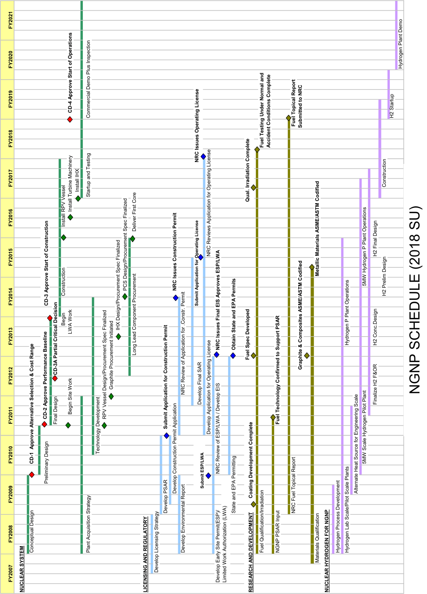

**----- Start of picture text -----** 
FY2021 FY2020 Hydrogen Plant Demo FY2019 CD-4 Approve Start of Operations Commercial Demo Plus Inspection H2 Startup  Fuel Topical Report Submitted to NRC FY2018 Fuel Testing Under Normal and Accident Conditions Complete NRC Issues Operating License FY2017 Construction Install IHX Startup and Testing Qual. Irradiation Complete Install Turbine Machinery FY2016 Install RPV Vessel Deliver First Core NRC Reviews Application for Operating License H2 Final Design FY2015 Metallic Materials ASME/ASTM Codified 5MW Hydrogen P Plant Operations PCS Design/Procurement Spec Finalized NRC Issues Construction Permit Construction H2 Prelim Design FY2014 CD-3 Approve Start of Construction Submit Application for Operating License  (60% CONF, 2018 SU)DULE (2018 SU) E Begin IHX Design/Procurement Spec Finalized  LWA Work FY2013 Hydrogen P Plant Operations H2 Conc.Design NRC Issues Final EIS Approves ESP/LWA Obtain State and EPA Permits Long Lead Component Procurement Fuel Spec Developed Graphite & Composites ASME/ASTM Codified CD-3A Partial Critical Decision FY2012 Graphite Procurement Initiated NRC Review of Application for .Constr. Permit NGNP SCH Develop Final SAR Finalize H2 F&OR Begin Site Work CD-2 Approve Performance Baseline RPV Vessel Design/Procurement Spec Finalized FY2011 Final Design Fuel Technology Confirmed to Support PSAR Submit Application for Construction Permit NGNP SCHEDUL Develop Application for Operating License Technology Development FY2010 CD-1  Approve Alternative Selection & Cost Range 5MW Scale Hydrogen Pilot Plant NRC Review of ESP/LWA / Develop EIS Preliminary Design Submit ESP/LWA Develop Construction Permit Application Alternate Heat Source for Engineering Scale Coating Development Complete FY2009 Develop PSAR State and EPA Permitting NRC Fuel Topical Report FY2008 Conceptual Design Plant Acquisition Strategy Develop Environmental Report Fuel Qualification/Irradiation NGNP PSAR Input Hydrogen Process Development Hydrogen Lab Scale/Pilot Scale Plants Develop Licensing Strategy Materials Qualification FY2007 Develop Early Site Permit(ESP)/ Limited Work Authorization (LWA) UCLEAR SYSTEM ICENSING AND REGULATORY ESEARCH AND DEVELOPMENT N L R NUCLEAR HYDROGEN FOR NGNP **----- End of picture text -----** 

## **Appendix G** 

## **Project Work Breakdown Structure** 

G-1 

G-2 

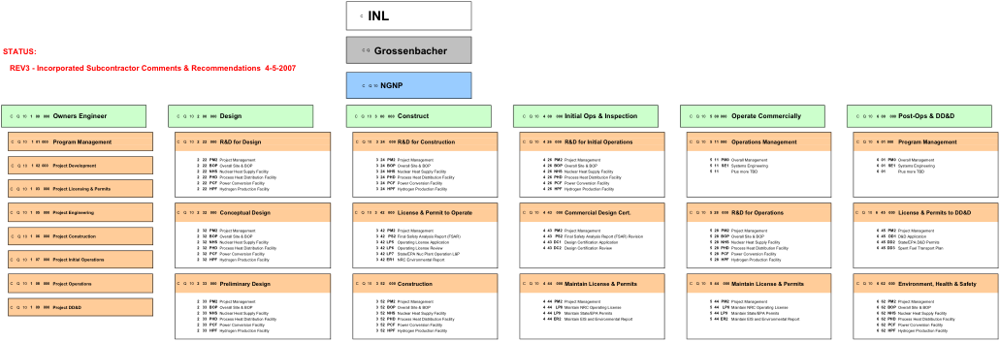

**----- Start of picture text -----** 
C INL STATUS: C Q Grossenbacher REV3 - Incorporated Subcontractor Comments & Recommendations  4-5-2007 C Q 10 NGNP C Q 10 1 00 000 Owners Engineer C Q 10 2 00 000 Design C Q 10 3 00 000 Construct C Q 10 4 00 000 Initial Ops & Inspection C Q 10 5 00 000 Operate Commercially C Q 10 6 00 000 Post-Ops & DD&D C Q 10 1 01 000 Program Management C Q 10 2 22 000 R&D for Design C Q 10 3 24 000 R&D for Construction C Q 10 4 26 000 R&D for Initial Operations C Q 10 5 11 000 Operations Management C Q 10 6 01 000 Program Management CC QQ 1010 11 0302 000000 Project DevelopmentProject Licensing & Permits 222222 222222222222 BOPNHSPHDPM2HPFPCF Project ManagementOverall Site & BOPHydrogen Production FacilityNuclear Heat Supply FacilityProcess Heat Distribution FacilityPower Conversion Facility 333333 242424242424 BOPNHSPHDPM2HPFPCF Project ManagementOverall Site & BOPHydrogen Production FacilityNuclear Heat Supply FacilityProcess Heat Distribution FacilityPower Conversion Facility 444444 262626262626 BOPNHSPHDPM2HPFPCF Project ManagementOverall Site & BOPHydrogen Production FacilityNuclear Heat Supply FacilityProcess Heat Distribution FacilityPower Conversion Facility 555 111111 PM0SE1 Overall ManagementSystems EngineeringPlus more TBD 666 010101 PM0SE1 Overall ManagementSystems EngineeringPlus more TBD C Q 10 1 05 000 Project Engineering C Q 10 2 32 000 Conceptual Design C Q 10 3 42 000 License & Permit to Operate C Q 10 4 43 000 Commercial Design Cert. C Q 10 5 28 000 R&D for Operations C Q 10 6 45 000 License & Permits to DD&D CC QQ 1010 11 0607 000000 Project ConstructionProject Initial Operations 222222 323232323232 BOPNHSPHDPM2HPFPCF Project ManagementOverall Site & BOPHydrogen Production FacilityNuclear Heat Supply FacilityProcess Heat Distribution FacilityPower Conversion Facility 333333 424242424242 ER1LP5 LP6LP7PM2PS2 Project ManagementFinal Safety Analysis Report (FSAR)NRC Environmental ReportOperating License ApplicationOperating License ReviewState/EPA Nuc Plant Operation L&P  4444 43434343 DC1DC2PM2PS2 Project ManagementFinal Safety Analysis Report (FSAR) RevisionDesign Certification ApplicationDesign Certification Review 555555 282828282828 BOPNHSPHDPM2HPFPCF Project ManagementOverall Site & BOPHydrogen Production FacilityNuclear Heat Supply FacilityProcess Heat Distribution FacilityPower Conversion Facility 6666 45454545 DD2DD3PM2DD1 Project ManagementD&D ApplicationState/EPA D&D PermitsSpent Fuel Transport Plan C Q 10 1 08 000 Project Operations C Q 10 2 33 000 Preliminary Design C Q 10 3 52 000 Construction C Q 10 4 44 000 Maintain License & Permits C Q 10 5 44 000 Maintain License & Permits C Q 10 6 62 000 Environment, Health & Safety C Q 10 1 09 000 Project DD&D 222222 333333333333 BOPNHSPHDPM2PCFHPF Project ManagementOverall Site & BOPNuclear Heat Supply FacilityProcess Heat Distribution FacilityPower Conversion FacilityHydrogen Production Facility 333333 525252525252 BOPNHSPHDPM2PCFHPF Project ManagementOverall Site & BOPNuclear Heat Supply FacilityProcess Heat Distribution FacilityPower Conversion FacilityHydrogen Production Facility 4444 44444444 LP9ER2PM2LP8 Project ManagementMaintain NRC Operating LicenseMaintain State/EPA PermitsMaintain EIS and Environmental Report 5555 44444444 LP9ER2PM2LP8 Project ManagementMaintain NRC Operating LicenseMaintain State/EPA PermitsMaintain EIS and Environmental Report 666666 626262626262 BOPNHSPHDPM2PCFHPF Project ManagementOverall Site & BOPNuclear Heat Supply FacilityProcess Heat Distribution FacilityPower Conversion FacilityHydrogen Production Facility **----- End of picture text -----** 

Next Generation Nuclear Plant ProjectWork Breakdown Structure(Sheet 1 of 2) 

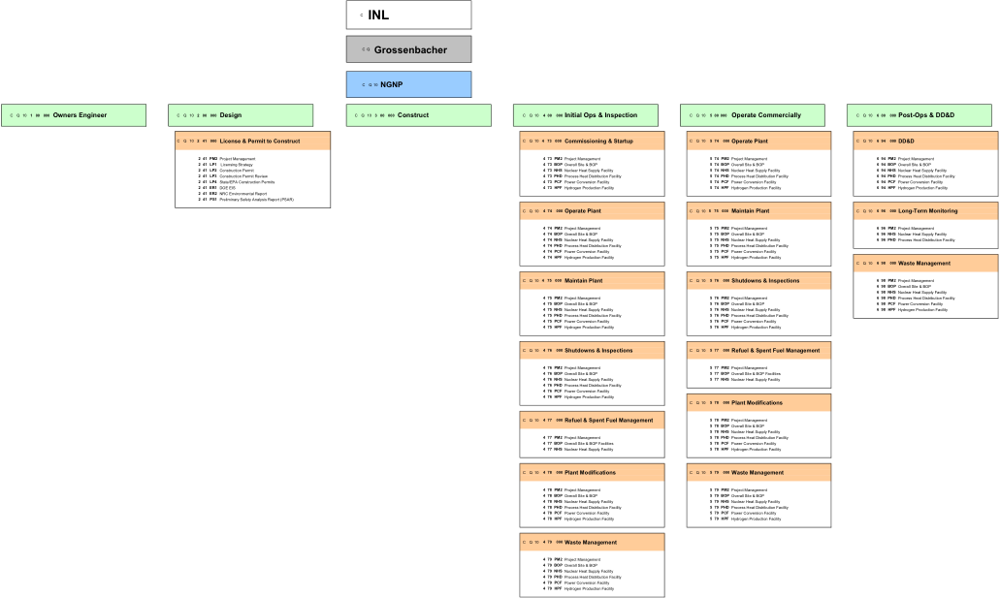

**----- Start of picture text -----** 
C INL C Q Grossenbacher C Q 10 NGNP C Q 10 1 00 000 Owners Engineer C Q 10 2 00 000 Design C Q 10 3 00 000 Construct C Q 10 4 00 000 Initial Ops & Inspection C Q 10 5 00 000 Operate Commercially C Q 10 6 00 000 Post-Ops & DD&D C Q 10 2 41 000 License & Permit to Construct C Q 10 4 73 000 Commissioning & Startup C Q 10 5 74 000 Operate Plant C Q 10 6 94 000 DD&D 22222222 4141414141414141 PM2ER1ER2LP1LP2LP3LP4PS1 Project Management Licensing StrategyConstruction PermitConstruction Permit ReviewState/EPA Construction PermitsDOE EISNRC Environmental ReportPreliminary Safety Analysis Report (PSAR) 444444 737373737373 BOPNHSPHDPM2PCFHPF Project ManagementOverall Site & BOPNuclear Heat Supply FacilityProcess Heat Distribution FacilityPower Conversion FacilityHydrogen Production Facility 555555 747474747474 BOPNHSPHDPM2PCFHPF Project ManagementOverall Site & BOPNuclear Heat Supply FacilityProcess Heat Distribution FacilityPower Conversion FacilityHydrogen Production Facility 666666 949494949494 BOPNHSPHDPM2PCFHPF Project ManagementOverall Site & BOPNuclear Heat Supply FacilityProcess Heat Distribution FacilityPower Conversion FacilityHydrogen Production Facility C Q 10 4 74 000 Operate Plant C Q 10 5 75 000 Maintain Plant C Q 10 6 96 000 Long-Term Monitoring 444444 747474747474 BOPNHSPHDPM2PCFHPF Project ManagementOverall Site & BOPNuclear Heat Supply FacilityProcess Heat Distribution FacilityPower Conversion FacilityHydrogen Production Facility 555555 757575757575 BOPNHSPHDPM2PCFHPF Project ManagementOverall Site & BOPNuclear Heat Supply FacilityProcess Heat Distribution FacilityPower Conversion FacilityHydrogen Production Facility C Q 10 6666 96969698 NHSPHDPM2000 Project ManagementNuclear Heat Supply FacilityProcess Heat Distribution Facility Waste Management C Q 10 4444444 75757575757575 BOPNHSPHDPM2PCFHPF000 Project ManagementOverall Site & BOPNuclear Heat Supply FacilityProcess Heat Distribution FacilityPower Conversion FacilityHydrogen Production Facility Maintain Plant C Q 10 5555555 76767676767676 BOPNHSPHDPM2PCFHPF000 Project ManagementOverall Site & BOPNuclear Heat Supply FacilityProcess Heat Distribution FacilityPower Conversion FacilityHydrogen Production Facility Shutdowns & Inspections 666666 989898989898 BOPNHSPHDPM2PCFHPF Project ManagementOverall Site & BOPNuclear Heat Supply FacilityProcess Heat Distribution FacilityPower Conversion FacilityHydrogen Production Facility C Q 10 4 76 000 Shutdowns & Inspections C Q 10 5 77 000 Refuel & Spent Fuel Management 444444 767676767676 BOPNHSPHDPM2PCFHPF Project ManagementOverall Site & BOPNuclear Heat Supply FacilityProcess Heat Distribution FacilityPower Conversion FacilityHydrogen Production Facility C Q 10 5555 77777778 BOPNHSPM2000 Project ManagementOverall Site & BOP FacilitiesNuclear Heat Supply Facility Plant Modifications C Q 10 4444 77777777 BOPNHSPM2000 Project ManagementOverall Site & BOP FacilitiesNuclear Heat Supply Facility Refuel & Spent Fuel Management 555555 787878787878 BOPNHSPHDPM2PCFHPF Project ManagementOverall Site & BOPNuclear Heat Supply FacilityProcess Heat Distribution FacilityPower Conversion FacilityHydrogen Production Facility C Q 10 4 78 000 Plant Modifications C Q 10 5 79 000 Waste Management 444444 787878787878 BOPNHSPHDPM2PCFHPF Project ManagementOverall Site & BOPNuclear Heat Supply FacilityProcess Heat Distribution FacilityPower Conversion FacilityHydrogen Production Facility 555555 797979797979 BOPNHSPHDPM2PCFHPF Project ManagementOverall Site & BOPNuclear Heat Supply FacilityProcess Heat Distribution FacilityPower Conversion FacilityHydrogen Production Facility C Q 10 4 79 000 Waste Management 444444 797979797979 BOPNHSPHDPM2PCFHPF Project ManagementOverall Site & BOPNuclear Heat Supply FacilityProcess Heat Distribution FacilityPower Conversion FacilityHydrogen Production Facility **----- End of picture text -----** 

Next Generation Nuclear Plant ProjectWork Breakdown Structure(Sheet 2 of 2) 

## **Appendix H** 

## **High Temperature Gas Reactor – Component Test Facility White Paper** 

H-1 

H-2 

INL/EXT-07-13146 Revision 1 

**NGNP Engineering White Paper: High Temperature Gas Reactor – Component Test Facility** 

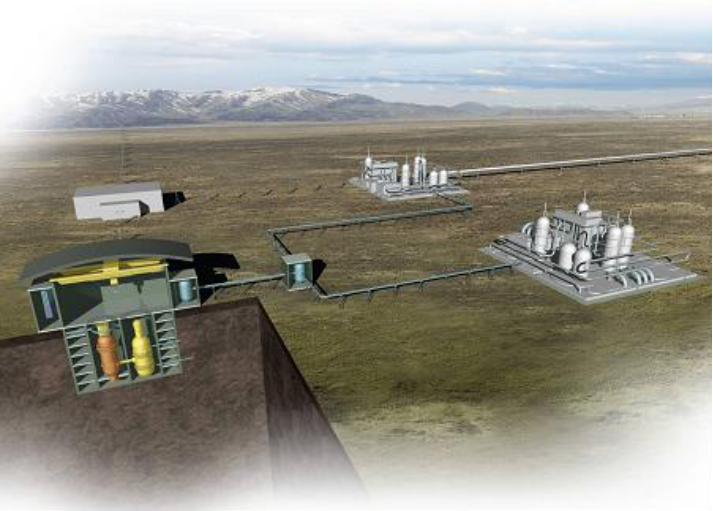

This information was prepared as an account of work sponsored by an agency of the U.S. Government. Neither the U.S. Government nor any agency thereof, nor any of their employees, makes any warranty, expressed or implied, or assumes any legal liability or responsibility for the accuracy, completeness, or usefulness, of any information, apparatus, product, or process disclosed, or represents that its use would not infringe privately owned rights. References herein to any specific commercial product, process, or service by trade name, trade mark, manufacturer, or otherwise, does not necessarily constitute or imply its endorsement, recommendation, or favoring by the U.S. Government or any agency thereof. The views and opinions of authors expressed herein do not necessarily state or reflect those of the U.S. Government or any agency thereof. 

## **INL/EXT-07-13146 Revision 1** 

# **NGNP Engineering White Paper: High Temperature Gas Reactor – Component Test Facility** 

## **November 2007** 

**Prepared for the U.S. Department of Energy Office of Nuclear Energy Under DOE Idaho Operations Office Contract DE-AC07-05ID14517** 

**NGNP Engineering White Paper: High Temperature Gas Reactor – Component Test Facility** 

**INL/EXT-07-13146 Revision 1** 

## **ABSTRACT** 

The follow brief white paper discusses the needs for, functional and operational requirements for, and potential configuration of a High Temperature Gas Reactor – Component Test Facility to support NGNP and commercial applications of High Temperature Gas Reactor technology. 

Table 1.  Summary of Existing and Planned Fluid Flow Test Facilities.......................................................8 Table 2.  High Temperature Gas Loop Test Facility Specifications.............................................................9 

||**ACRONYMS**|
|---|---|
|AFCI|Advanced Fuel Cycle Initiative|
|ATR|Advanced Test Reactor|
|BEA|Battelle Energy Alliance|
|CTF|Component Test Facility|
|DOE|Department of Energy|
|EPAct|Environmental Policy Act of 2005|
|EPC|Engineering, Procurement, and Construction|
|F&OR|Functional and operational requirement|
|GT-MHR|Gas Turbine-Modular Helium Reactor|
|HTE|High Temperature Electrolysis|
|HTGR|High Temperature Gas Reactor|
|HX|heat exchange|
|IHX|Intermediate Heat Exchanger|
|INL|Idaho National Laboratory|
|KVK|Komponenten Versuchs Kreislauf (German test loop)|
|MWt|mega-watt (thermal)|
|NGNP|Next Generation Nuclear Plant|
|NHI|Nuclear Hydrogen Initiative|
|OKBM|OKB Mechanical Engineering (Russia)|
|PBMR|Pebble Bed Modular Reactor|
|PED|Project Engineering and Design|
|R&D|Research and Development|
|RFP|Request for Proposal|
|ROM|Rough Order of Magnitude|
|RSA|Republic of South Africa|
|THX|Tertiary Heat Exchanger|
|TRL|Technology Readiness Level|
|V&V|verification and validation|

## **High Temperature Gas Reactor – Component Test Facility** 

The following is a brief white paper discussing the needs for, functional and operational requirements for, and potential configuration of a High Temperature Gas Reactor – Component Test Facility (hereinafter referred to as the CTF) to support the Next Generation Nuclear Plant (NGNP) and commercial applications of High Temperature Gas Reactor (HTGR) technology. 

## **1. Mission Statement** 

A test facility (referred to as the CTF) shall be sited at the Idaho National Laboratory (INL) for the purposes of supporting development of high-temperature gas-thermal hydraulic technologies, (e.g., helium, helium-nitrogen, CO2) as applied in heat transport and heat transfer applications in HTGR.  Such applications include but are not limited to primary coolant; secondary coolant; direct cycle power conversion; intermediate, secondary, and tertiary heat transfer; and demonstration of processes requiring high temperatures, (e.g., hydrogen production).  The initial use of this facility will be in support of the completion of the NGNP.  This test facility shall be open for use by the full range of suppliers, end-users, facilitators, government laboratories, and others in the domestic and international community supporting the development and application of HTGR technology. 

The facility shall provide for full scale: 

- Testing and qualification of high-temperature Fluid Flow systems, components, and equipment (e.g., circulators, Intermediate and Tertiary Heat Exchangers [IHX and THX], piping, isolation valves) 

- Control and Instrumentation development and qualification, (e.g., reliability, calibration, response, stability, and transient response) 

- Verification and validation (V&V) of methods/codes to support licensing and future commercial applications (thermal, hydraulic, transients, etc.) 

- Heat transfer component development and fluid testing (e.g., shell & tube and compact heat exchangers, sulfuric acid decomposers) 

- Materials performance, (e.g., metallics and ceramics) 

- Mock-up for high-temperature heat applications testing and research (e.g., prior to installation into the NGNP). 

- Fluid inventory and quality control systems (e.g., contamination cleanup and control) 

- Control room human factors 

- Operations procedure development and qualification training (e.g., for NGNP and for future commercial plants). 

- Operational problem/trouble shooting (e.g. for the NGNP prior to hot system repair/modifications and to support future commercial applications). 

- High-temperature gas applications mockup engineering scale testing and qualifications (e.g., hydrogen production, coal to liquids, steam generators for Alberta Oil Sands application, etc...) 

- Maintenance and repair program and process development 

- Component replacement program and process development. 

The following discusses justification for the facility; describes complementary activities in the Nuclear Hydrogen Initiative (NHI) program; summarizes the characteristics of existing test loop facilities; provides a preliminary summary of the functional and operational requirements (F&ORs) for the facility; discusses program management, cost, and schedule for design, construction and commissioning of the facility; and provides examples of technical risk mitigation supported by the facility. 

## **2. Justification** 

The 2005 Environmental Policy Act (EPAct) charges the Department of Energy (DOE) and INL with demonstration of the HTGR technology for the production of electricity and hydrogen by the year 2021 in an NGNP demonstration.  Meeting this commitment requires INL to coordinate the efforts of several commercial and governmental entities over a wide range of technical areas.  A significant fraction of the technology development required to meet this commitment lies in the transfer of heat from the reactor to the processes used to produce electricity and hydrogen in the NGNP, and ultimately in wider range commercial application of this technology following the NGNP.  This heat transfer occurs in the primary helium and secondary (and possibly tertiary) fluid flow loops.  In the NGNP, and in the early commercial applications of HTGR technology, the fluids in these loops will be gaseous, for example, pure helium, a 1 mixture of helium and nitrogen, or other gases such as CO2 .  Current efforts for development of the technologies supporting design, construction, operation, and maintenance of these loops are concentrated in test loops at laboratory and pilot scales.  There are few facilities available or planned that have the capacity to develop and test equipment at a scalable engineering level or at full scale.  Development of a full scale facility at INL provides this capability with the following advantages: 

- Facilitates the INL role in coordinating, consolidating, and leading the development of the heat transfer and transport technologies needed to advance the application of HTGR technology 

- Ensures the availability of the facility for NGNP and beyond development; the limited capacity and availability of other facilities (most of which are international and supporting other projects; see discussion below) could adversely affect NGNP schedule. 

- Improves the efficiency of technology development for NGNP and follow-on technology upgrades 

- Establishes INL as a world-class leader in development of HTGR technologies 

- Provides a means for off-line trouble shooting of component and system problems and for development of programs and processes to ultimately support a growing commercial HTGR fleet 

- Provides a long-term U.S.-based facility for continued development of advanced technologies to increase the capabilities and broaden the applications of the HTGR. 

Department of Energy support of this initiative would demonstrate full commitment to development of HTGR technology well before the NGNP is scheduled for operation.  Demonstration of this commitment will also support achieving industry participation in the Alliance and Public-Private Partnership, which is central to success of the NGNP project. 

> 1 A long-term objective is to identify and qualify higher heat capacity fluids, such as liquid metals and molten salts for use in the secondary and tertiary loops. 

The development of this facility is a key part of the NGNP development project with an early start date required to ensure its timely availability.  As discussed below, the current NGNP schedule shows initiation of a facility Feasibility Study in FY-08.  This requires sufficient funding of the NGNP project to support this as well as the other tasks required to support NGNP starting the beginning of FY-08. Realization of the project will require additional funding in FY-09 to complete the design, construction, commissioning, and operation of the facility within FY-11. 

## **3. Current NHI Component and Process Development Programs** 

## **3.1 Existing HX Testing Capabilities for the DOE Nuclear Hydrogen Initiative** 

The United States has only limited ability to test high-temperature (>700ºC) lab-scale heat exchangers.  Ohio State University is constructing a bench-top helium closed-loop test apparatus that will allow testing of small (~1 kW) heat exchangers beginning early 2008.  Plans also exist for a laboratoryscale single-effects heat exchanger testing laboratory at an Idaho State University facility adjacent to the INL that will allow for the performance of room temperature pressure-drop testing, static helium highpressure leak testing at temperature, high-temperature air-to-air heat transfer flow experiments, thermal cycling experiments, and other such tests.  If funded, the single-effects laboratory would be ready for use by the end of FY-08.  Also, the University of Nevada Las Vegas, under their High Temperature Heat Exchanger Project, has developed capabilities to test simple heat exchanger configurations under scaled fluid conditions.  The scaled tests are not performed at high temperatures, but the data can be easily scaled to high-temperature high-pressure conditions for the purposes of constructing and testing better heat exchanger models and optimizing heat exchanger designs. 

Currently, there is no capability to test high-temperature heat exchangers that are larger than the laboratory-scale.  Additional investment is needed to secure test data from foreign countries and to construct larger test loops in the United States. 

## **3.2 Relevance of Large Helium Loop Test Facility to the DOE Nuclear Hydrogen Initiative** 

The construction and qualification of a large (~10’s of MW) high-temperature helium loop facility in the 2011-2013 timeframe is crucial to the design effort for the heat transport loop that will connect the high-temperature nuclear reactor to the hydrogen production plant.  The current DOE NHI long-term schedule shows pilot-scale operations (1-5 MW) of proposed nuclear hydrogen production processes beginning in 2011, and one goal of this testing phase is to power one or more of those processes using helium heat exchangers instead of direct heating.  Without a large-scale helium loop test facility, the data needed to qualify and optimize heat exchanger designs and to test heat exchanger durability would be unavailable prior to larger-scale deployment.  If built, the helium loop facility would be used to test pilotscale and engineering-scale IHXs and hydrogen process heat exchanger designs (i.e., sulfuric acid decomposer modules, steam generators, helium-to-CO2 heat exchangers, etc.). 

To be of greatest relevance to the DOE NHI mission, a large-scale helium loop would need to be designed with the flexibility to perform multiple experiments side-by-side and at differing scales and with differing fluids, in addition to its ability to power a single full-sized helium heat exchanger.  Figure 1 provides an example of a loop facility with this flexibility.  In the figure, the primary loop is full-sized and can deliver the full power rating of the furnace to the full-sized heat exchanger.  The secondary loops are spurs that also contain helium and can be used to test smaller helium-to-helium heat exchangers.  The tertiary loops are used to test heat exchangers for non-helium fluids, such as supercritical CO2, sulfuric acid, molten salts, and other such fluids.  Non-helium fluids would be tested using the tertiary loop installations in order to protect the primary loop from chemical contamination.  Other loop configurations are possible. 

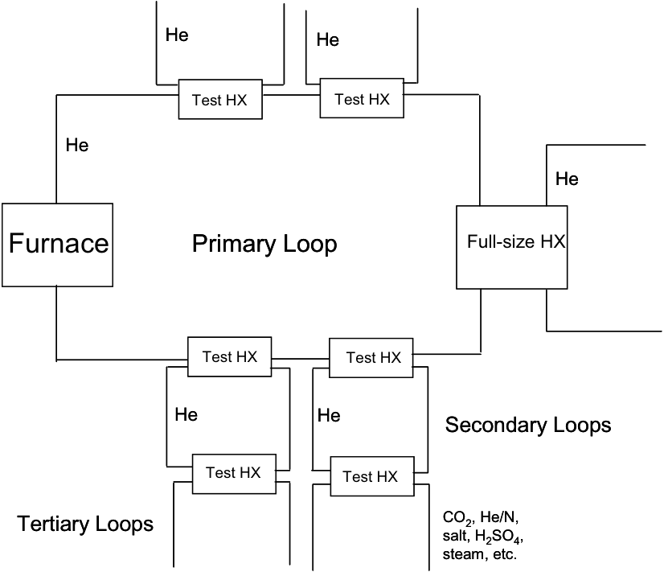

**----- Start of picture text -----** 
He He Test HX Test HX He He Furnace Primary Loop Full-size HX Test HX Test HX He He Secondary Loops Test HX Test HX Tertiary Loops COsalt, H2, He/N, 2SO4, steam, etc. **----- End of picture text -----** 

Figure 1.  One possible configuration of a flexible helium loop facility. 

In addition to heat exchanger testing, establishing and operating the loop facility would provide excellent information on managing and controlling heat loads, helium circulator technologies, hightemperature instrumentation, high-temperature valves and flow control devices, and materials performance.  Such information is highly valued by the DOE NHI, and having this information prior to full-scale deployment would greatly enhance the reliability of the heat transport systems at the engineering scale. 

## **3.3 Relevance of the High Temperature Helium Test Facility to High Temperature Electrolysis Testing** 

The High Temperature Electrolysis (HTE) process for splitting steam in hydrogen and oxygen needs heat at 800 – 850°C to heat the initial reagent water at 25°C to the inlet conditions for the HTE cell, 830°C.  Depending on the amount of heat recuperation from the hydrogen and oxygen streams, steam generation and superheating consumes about 15 – 20% of the total energy needed in the hydrogen production process.  The remainder of the energy is supplied as electricity.  The operating pressures of the electrolytic cells will be 0.1 to 2.0 MPa, where the H2 production efficiency favors low pressures and the sizing of manifolds is easier at the upper end of the range. 

In its simplest configuration, high-temperature helium from the NGNP would heat the reagent water from the liquid state to 830°C using a counter-flow arrangement where the helium at reactor outlet conditions first flows through the superheater and then through the steam generator.  In more thermallyoptimized configurations, the heat of the hydrogen and oxygen products, exiting the cells at 800 – 830°C, 

is used in the superheaters and then in the steam generator.  In this configuration, reactor heat at 850 – 900°C is needed only for the final superheating of the steam from about 750 – 830°C.  If either the hydrogen or oxygen is to be used in various gasification or fuel-synthesis processes at the 830°C cell exit temperature, then correspondingly more reactor heat would be needed. 

Thus, the primary needs for experiments in the CTF on the part of the HTE process would focus of the design of the superheaters and steam generators needed for the reagent steam flow to the cells.  In a 600 MWt NGNP-HTE hydrogen plant, the steam flow to the cells would be about 22.5 kg/s.  The steam would be deionized and would contain no additives, so the conditions would be very similar to those in a 1525°F, low-pressure steam turbine plant. 

In our experiments to date, we have been using Inconel tubing, coiled in the furnace interior, to heat the incoming steam to cell conditions.  If there is little need for pure oxygen and/or if materials available for the balance of the hydrogen plant cannot tolerate a pure O2 environment, the oxygen may be diluted with air or steam and swept from the cells.  The “sweep gas,” (air or steam) would have to be heated to the cell temperature first by the exiting sweep gas – oxygen mixture and finally for reactor helium at the reactor outlet conditions.  Therefore, there may also be a need to test He/air heat exchangers in this facility. 

## **4. Preliminary Functional & Operational Requirements:** 

The CTF shall be a high-power and high-temperature facility with the following operational and configuration characteristics _[Note: all values are preliminary – final values will be established during the conceptual design phase for the test facility.]_ : 

Temperature Ranges {300 – 1000°C} Primary Gas Flow Rate {10 – 20 kg/sec} Secondary Gas Flow Rate {Variable} Power {25 – 50 MWt} Pressure {9 MPA Maximum} Gases {Helium, Helium / Nitrogen, CO2, etc.} Other Fluids (long term) {Molten Salt, Liquid Metals} Components {Ducting and insulation Circulators Heat Exchangers (e.g., shell & tube, compact) Valves (e.g., isolation, check, control) Hydrogen Production Components} Materials {SA508/533 Inconel 617 Haynes 230 Incoloy 800H 2-1/4 Cr-1Mo-V 9Cr – 1Mo Ceramics}. 

Uses of the facility shall include, but not be limited to: 

- Development and testing: 

   - Active components (e.g., circulators, valves, ducting) 

- Heat transfer components (e.g., heat exchanger designs such as shell and tube and compact at the engineering level, alternative materials such as ceramics, primary and secondary interface designs) 

- Instrumentation 

- Control systems, including confirmation of stability and transient response 

- Operator human factors 

      - Power Conversion System (PCS) 

- Training: 

      - Operation 

   - Maintenance 

   - Repair 

   - Component replacement 

- Trouble shooting 

   - Creep 

- Creep-fatigue 

- Erosion / corrosion 

- Other high-temperature material properties. 

## **5. Current and Planned Test Facilities:** 

Table 1 summarizes the capacities and status of existing, in-development, and decommissioned hightemperature gas loops.  A review of this table shows that the only test loops with close to full-scale test capacity include those in the Republic of South Africa (RSA) and that in Russia for OKB Mechanical Engineering (OKBM).  The other large scale loop, the German Komponenten Versuchs Kreislauf (KVK) test loop, is no longer in operation.  The remainder have much smaller capacities (i.e., laboratory and pilot scale) designed for special purpose testing. 

As shown in Table 1, none of the test facilities listed is in the United States.  Although this table may not include all of the test loops in the world, it is understood that those with significant capacity that could meet the objectives of the CTF have been identified.  Not only are these test loops located outside the United States, they are each related to a specific project, (e.g., the RSA He Test Facility on Pebble Bed Modular Reactor [PBMR] development, the OKBM test facility on development of the Gas TurbineModular Helium Reactor [GT-MHR]).  Accordingly, if NGNP or other related HTGR projects wanted to use the facility, that use would have to be coordinated with the schedule for the principal project in that country (e.g., coordinate with the PBMR testing in South Africa).  The NGNP Project would not, therefore, have control of its testing schedule, a situation that could have an adverse impact on the Project’s schedule for completion.  Additionally, many of the expected uses for the CTF do not have a fixed schedule, (e.g., trouble shooting of operational problems in NGNP or commercial plants).  As noted in the mission statement, a key objective of this facility is to support the development and maintenance of HTGR technology not only for NGNP but for the long term in commercial applications of the technology. The scheduling and capabilities of the facility must be flexible to adapt to evolutions in the technologies and emerging needs of those applying the technologies.  It is not practical or desirable to rely on an offshore test facility over which the project has no control to meet these objectives.  Accordingly, it is concluded that there is no current or planned fluid flow test facility that could be used to satisfy the mission needs of the CTF proposed herein.  Such a facility should be built at the INL in a time frame that supports the NGNP.  The required schedule is discussed below. 

Some of the data in the table was extracted from an INL report[2] , INL/EXT-06-11648 completed in August 2006, that describes a feasibility study for a High Temperature Gas Loop Test Facility to support NGNP.  This loop has a heating capacity of about 2 MWt.  Table 2 and Figure 2 were extracted from that report and summarize the basic operational data and configuration for that design.  These are shown as an illustration of one concept of the test facility.  It is judged that this facility will not be of sufficient capacity to fulfill the objectives of the CTF. 

In the current planning for NGNP, the required size for a test loop that satisfies the requirements outlined above (see Section 1.0) will be determined as an initial activity of the feasibility study for that facility, see schedule discussion below.  It is judged based on current information that the facility will be significantly larger than that covered in the August 2006 feasibility study, or other available or planned test facilities listed in the table. 

> 2 Note that although the title of this report states that a conceptual design was performed, the design development, cost estimate and schedule addressed primarily the component and subsystem level to establish feasibility.  Significant additional work is required to complete a conceptual design of the facility. 

Table 1.  Summary of Existing and Planned Fluid Flow Test Facilities 

Table 2.  High Temperature Gas Loop Test Facility Specifications 

|Table 2.  High Temperature Gas Loop Test Facility Specifications|Table 2.  High Temperature Gas Loop Test Facility Specifications|
|---|---|
|||
|**Primary Loop**||
|Composition|Pure He|
|Mass Flow|0.80 kg/s|
|Supply Temperature to IHX|950°C|
|Return Temperature from IHX|550°C|
|**Secondary Loop**||
|Composition|80% N2, 20% He|
|Mass Flow|2.12 kg/s|
|Supply Temperature to IHX|500°C|
|Return Temperature from IHX|900°C|

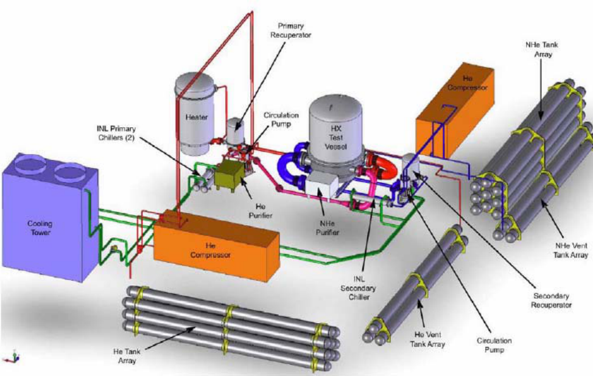

For reference, the NGNP power may be as high as 500 – 600 MWt with primary flow rates of ~160 – ~280 kg/sec; a maximum outlet temperature of 950°C, and a minimum inlet temperature of 350°C.  The current judgment is that the CTF should be in the range of 25 – 50 MWt with gas flow rates of 10 – 20 kg/sec, and temperatures that bound those for NGNP.  This would permit full-scale testing of the major components (e.g., IHX modules or scale models) and hydrogen process modules (e.g., sulfur-iodine or hybrid sulfur sulfuric acid decomposer modules) before installation in the NGNP. 

The last line in Table 1 summarizes the characteristics of a helium test loop proposed by AREVA as part of the NGNP Pre-Conceptual Design work (see Figure 3).  It is anticipated that the test facility proposed herein could be somewhat larger (25 – 50 MWt) but will have similar characteristics.  The 

facility shown in Figure 3 is the German KVK 10 MWt test facility.  It is no longer operating but is recommended by AREVA as a model for the INL facility.  A larger depiction of this facility is shown in Figure 4.  Such a facility at 25 to 50 MWt will represent a significant extension in worldwide hightemperature fluid flow testing capacities.  The characteristics of this facility have been used to develop the basis of estimate for the costs and development schedule provided below. 

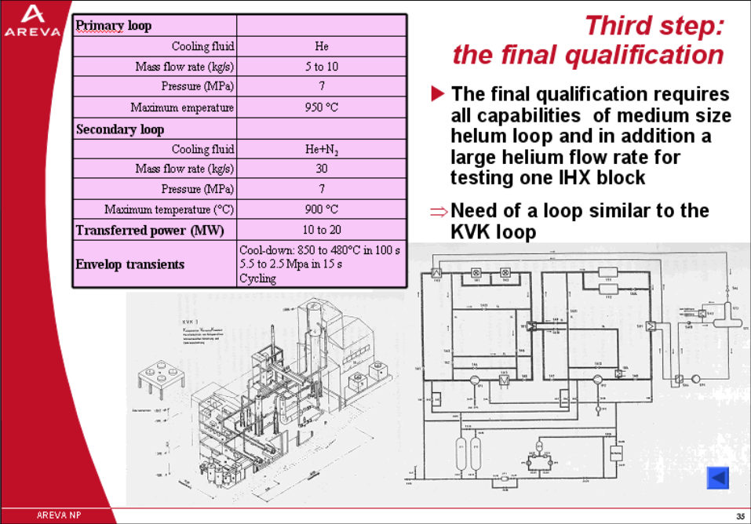

It is noted that prior work has also been done to scope the costs and schedule for installing a gas loop in the INL Advanced Test Reactor (ATR) for the purposes of supporting development and irradiation testing of advanced fuel designs under the Generation IV, Advanced Reactor Design and Advanced Fuel Cycle Initiative (AFCI) programs [Ref: Memorandum, R.J. Turk to W.R. Ridgeway, “CD-1 Life Cycle Cost Summary for the ATR Gas Loop Project,” July 18, 2005].  The F&ORs, configuration, and uses of this loop are different than that proposed herein; however, this is a program that is complementary to the CTF and should be pursued to support the NGNP fuel development and acquisition program. 

Figure 4 shows the German KVK 10 MWt Helium Test Facility, which is no longer operating but is similar to the 1MWt Test Facility that AREVA has designed and is waiting for funding to build.  It is also similar to the 10 to 20 MWt facility that they recommended for NGNP support as part of the preconceptual design work.  This facility is significantly more complex than that developed in the August 2006 feasibility study shown in Figure 2.  An adaptation of this facility design in the to 50 MWt range is judged to be necessary and sufficient to meet CTF objectives.  The characteristics of this facility were used to develop the basis of estimate for the costs and schedule presented below. 

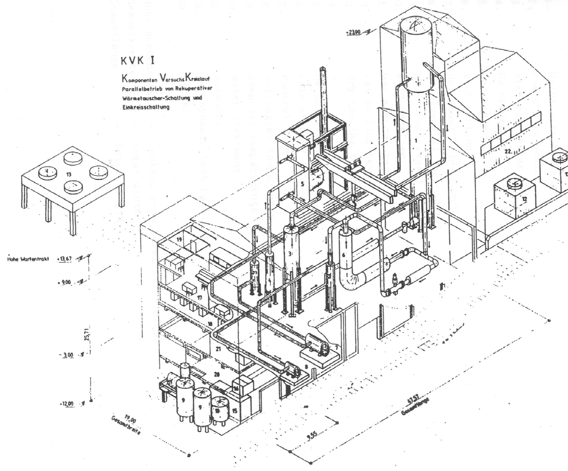

## **6. Program Management, Schedule and Cost Estimate** 

## **6.1 Program Management** 

The CTF will be designed, constructed, and turned over to operations under DOE O-413.3.  It will be funded by DOE and managed by Battelle Energy Alliance (BEA) as a subproject to the NGNP Project. Due to the critical nature and constrained schedule, full funding is required to complete this facility in a timely manner.  This will require a Project Execution Plan that includes the elements of DOE O 413.3 on an accelerated effort. 

## **6.2 Schedule** 

The attached schedule fragnet shows that the NGNP Project currently plans to complete a feasibility study for the CTF beginning in early FY-08.  At that time, the BEA NGNP Project will also be leading the conceptual design effort for NGNP and conducting several design development studies addressing key technical high-risk and configuration issues that need to be resolved to define the final F&ORs and basic configuration of the NGNP.  This latter work is to be performed through directed tasks defined by the NGNP Project, to be completed by the sub-contractor teams that performed pre-conceptual design work in FY-07 and selected subject matter experts.  With sufficient funding, the NGNP project will include the development of the CTF design work at that time using the resources of the subcontractor teams. 

Part of the feasibility study activities for the CTF will be to develop the F&ORs and basic configuration of the facility, as well as establish the schedule for initiating operation.  This will be set to support the NGNP project.  Based on the current NGNP schedule, which supports initial operation in 2018, it is judged that the CTF will need to be on-line in the 2011 time frame.  This also coordinates well with the NHI programs for hydrogen production and heat transfer/transport development, which plan to be ready to transition from the pilot/engineering-scale testing to full-scale testing in that same time frame. During FY-08, NGNP Engineering and BEA Procurement personnel will prepare and issue an Engineering, Procurement, and Construction (EPC) Request for Proposal (RFP) for the facility, obtain proposals from qualified suppliers, evaluate the proposals, select the supplier, and negotiate the contract so that Conceptual Design can begin October 1, 2008. 

In summary, to meet the NGNP Project needs, the feasibility study should be initiated early in FY-08, with Conceptual Design starting in October 2008 and completion of Final Design in FY-09.  Construction should be started in FY-09, with Testing and Turnover complete in FY-11.  These dates will become more definitive during Conceptual Design. 

## **6.3 Cost Estimate** 

With the limited information established at the date of this paper for the operational characteristics and configuration of the test facility, an accurate estimate of cost is not possible.  A more detailed estimate will be prepared as part of the feasibility study and conceptual design for the facility.  As part of pre-conceptual design work, AREVA provided a rough order of magnitude (ROM) estimate of $110M for design, construction, and commissioning of a 10 MWt helium test loop that they specified as required for prototype tests of components.  As noted above, this recommendation and cost was based on experience with the German KVK facility.  On this basis, it is estimated that the design, construction, commissioning equipment, testing, and qualification costs for the larger test facility discussed herein could be in the $150M range. 

Assuming that sufficient funding is provided in FY-08, the Feasibility Study for the CTF will be funded under the NGNP Project Engineering work scope.  However, additional funding will be required specifically for completing the design, construction, commissioning, and operation of this facility 

beginning in FY-09.  The required funding schedule will be established during the conceptual design activities.  A rough estimate of the required funding schedule based on a total project cost of $150M is shown with the attached schedule. 

## **7. Examples of Technical Risk Mitigation Supported by the Test Facility** 

A full-scale helium test facility is needed to provide prototype testing and qualification of heat transfer system components (e.g., IHX, valves, hot gas duct), to mitigate the associated technical risks, and to increase the Technology Readiness Levels (TRLs) for these components.  Since such a facility does not exist at the capacity needed for NGNP, it must be built.  Failure to complete the facility in time to do prototype testing could delay NGNP startup or could result in incomplete risk mitigation with potential adverse impact on plant performance if the NGNP was started up without prototype component testing and qualification.  The following are brief examples of high-level testing requirements for three of the key high-temperature loop components: the IHX, Primary Loop Isolation Valves, and the Hot Gas Duct (Note: these were identified during the pre-conceptual design work for NGNP). 

## **7.1 IHX** 

- Primary concerns are performance, temperature level, corrosion, manufacturing, and thermal mechanical resistance.  The IHX research and development (R&D) needs, which are “High Priority,” include: 

   1. Development of visco-plastic model (material data-base to be completed) 

   2. Corrosion tests on base and coated materials in a representative environment 

   3. Development of manufacturing techniques 

   4. Tests on representative IHX mock-ups from both thermo-hydraulic and manufacturing point of views. 

- A three-step approach is recommended for component qualification.  These are: 

   1. Tests in air with sub-scale mock-ups 

   2. Tests in helium with sub-scale mock-ups (about 1 MWt test loop).  These tests will provide a basis for recommendations on which type of concept should be used for the NGNP. 

   3. Final qualification on a full-scale mock-up in a full-scale test facility. 

## **7.2 Isolation Valves** 

- Qualification of the isolation valve has a “High Priority.”  Qualification steps are: 

   1. Elementary tests to characterize the operating conditions, assembly techniques, spacers, etc. 

   2. Full-scale mock-up tests in a relevant helium-nitrogen environment. 

- These tests should cover: 

   1. Manufacturing parameters 

   2. Depressurization tests 

3. Pressure loss, heat loss, support tube temperature tests in a relevant helium-nitrogen environment 

4. Leak tightness tests of the valve 

5. Closing and opening 

6. Fatigue and creep-fatigue of specific areas. 

## **7.3 Hot gas duct** 

- The hot gas duct designs appear to be compatible with the reactor expected outlet temperature, subject to demonstrating that no significant hot streaks occur.  The hot gas duct testing and qualification should be performed in three steps: 

   1. Elementary tests to characterize the material conditions, assembly techniques, spacers, etc. 

   2. Sub-scale mock-up tests, about 1 MWt in helium, to validate material specifications 

   3. Full-scale mock-up tests. 

- These tests should at least cover: 

   1. Depressurization tests 

   2. Pressure loss, heat loss, temperature of the support tube (in helium) 3. Leak tightness tests of connections 

   4. Fatigue and creep-fatigue tests (e.g., bellows, spacers, etc). 

NGNP Engineering White Paper: HTGR – Component Test Facility 

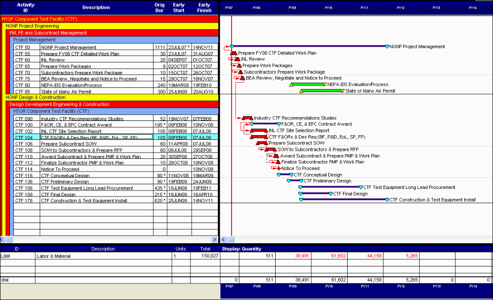

NGNP Project schedule showing planned completion of a feasibility study for the CTF beginning in early FY-08 

## **Appendix I** 

## **Westinghouse Executive Summary Report** 

I-1 

I-2 

**NGNP-ESR-RPT-001 Revision 1** 

**June 2007** 

# **NGNP and Hydrogen Production Preconceptual Design Report** 

## **EXECUTIVE SUMMARY REPORT** 

## **Revision 1** 

## **APPROVALS** 

**Westinghouse Electric Company LLC** Nuclear Power Plants Post Office Box 355 Pittsburgh, PA 15230-0355 

�2007 Westinghouse Electric Company LLC All Rights Reserved 

## **LIST OF CONTRIBUTORS** 

## **BACKGROUND INTELLECTUAL PROPERTY** 

## **REVISION HISTORY** 

## **RECORD OF CHANGES** 

## **DOCUMENT TRACEABILITY** 

## **TABLE OF CONTENTS** 

## **LIST OF TABLES** 

Table ES-1:  Reference Process Heat Design Selections.............................................................. 21 Table ES-2:  NGNP and Hydrogen Production Preconceptual Design Report Road Map .......... 33 Table ES-3:  Technology Development Cost Schedule ($M) ...................................................... 62 Table ES-4:  Top Level Risks and Approach to Mitigation ......................................................... 80 

## **LIST OF FIGURES** 

Figure ES-1:  Rendering of PBMR DPP – National Strategic Project in South Africa................ 14 Figure ES-2: Cutaway of Main Power System for PBMR DPP................................................... 14 Figure ES-3:  PBMR DPP Building Cutaway .............................................................................. 15 Figure ES-4:  PBMR DPP Long-Lead Components in Manufacturing........................................ 15 Figure ES-5:  Two-Section IHX Concept..................................................................................... 26 Figure ES-6: Recommended HTS Configuration........................................................................ 27 Figure ES-7:  Representative Brayton Cycle................................................................................ 28 Figure ES-8:  Representative GTCC............................................................................................. 29 Figure ES-9:  Representative Rankine Cycle................................................................................ 29 Figure ES-10: Requirements Flow Down to Design .................................................................... 35 Figure ES-11: Requirements Flow Down to Pre-conceptual Design Development (PCDR Sections Identified)............................................................................................... 36 Figure ES-12:  Proposed Layout of the Reactor Unit System in Relation to the PHTS, SHTS, SG and PCHX....................................................................................................... 38 Figure ES-13:  Diagram of the General Layout of the PBMR Fuel Sphere Design..................... 41 Figure ES-14:  NGNP Demonstration Preconceptual Design Schematic..................................... 43 Figure ES-15:  HyS Chemical Process ......................................................................................... 46 Figure ES-16:  NGNP Plot Plan.................................................................................................... 51 Figure ES-17:  Commercial PHP Site Key Plan........................................................................... 52 Figure ES-18:  Modes Diagram.................................................................................................... 53 Figure ES-19:  Overall Technology Development Schedule........................................................ 61 Figure ES-20:  NGNP Project Schedule and Funding Profile Summary...................................... 71 Figure ES-21:  NGNP Conceptual Design Schedule Summary ................................................... 72 Figure ES-22:  PBMR NGNP Demonstration Project Cash Flow................................................ 74 Figure ES-23:  Summary of PBMR NGNP Demonstration Project Costs ($M).......................... 75 Figure ES-24:  NGNP Demonstration Project Operating Costs (As-Spent $).............................. 75 Figure ES-25:  NGNP Demonstration Project Revenue Projections (As-Spent $) ...................... 76 Figure ES-26:  Summary of Commercial Plant Project Capital Cost ($M).................................. 77 Figure ES-27:  Sensitivity of Required Hydrogen Price to Equity ROR...................................... 79 

## **EXECUTIVE SUMMARY REPORT** 

## **I  NGNP BACKGROUND** 

Over the past decade, the US has cooperated with other countries in the development of advanced nuclear energy systems that are envisioned to follow the Advanced Light Water Reactor (ALWR) systems that are now leading the resurgence of nuclear power.  These advanced non-ALWR systems have been coined “Generation IV” (Gen IV) concepts.  An international forum of these countries and a framework for cooperation have been established – the Generation IV International Forum (GIF). 

The GIF model envisions that individual countries will take the lead for developing and demonstrating Gen IV nuclear systems in which they have particular interests, and that other countries will provide support through implementing agreements.  The first of such implementing agreements have been recently signed.  Early in the process, the US took the lead for developing the High Temperature Gas-Cooled Reactor (HTGR) – also referred to as the Very High Temperature Reactor (VHTR) within the GIF forum. 

The HTGR technology offers enhanced safety features based on inherent material properties and passive design features, plus improved reliability, proliferation resistance, security and waste management capabilities.  Further, the HTGR is evaluated to be competitive for a broad range of applications, including small-to-medium high efficiency power generation that is well suited for dry cooling, cogeneration and water desalination, plus unique high temperature process heat applications such as bulk hydrogen production.  High pressure steam, well beyond the temperatures available with water reactor systems, can also be provided to displace natural gas for enhanced oil recovery and tar sands production - all without greenhouse gas emissions. Accordingly, HTGR plants can promote the utilization of indigenous coal and uranium resources and extend domestic oil and gas resources, thereby reducing dependence and costs associated with imported oil and natural gas. 

Within the US, the Department of Energy (DOE) has focused the development of the HTGR technology through the Next Generation Nuclear Plant (NGNP) Demonstration Project which is the dominant part of the US Gen IV Program.  From the start, the NGNP Project was centered at the Idaho National Laboratory (INL) and, initially, the goals were set for at least 1000ºC core outlet temperatures to drive Brayton cycle gas turbines and/or water splitting processes for the production of hydrogen. 

Relatedly, in the 2003 State of the Union Address, President Bush launched a new National Hydrogen Fuel Initiative to provide domestically produced, clean-burning hydrogen to the transportation sector as an alternative to imported oil. 

The NGNP Project was subjected to a critical review by a group of experts known as the Independent Technology Review Group (ITRG) over the period November 2003 through April 2004.  The objective was to provide a critical review of the proposed NGNP Project and to identify areas of R&D that needed attention.  In the report, the ITRG observations and recommendations focused on overall design features and important technology uncertainties.  A key recommendation was to reduce the core outlet temperature to the range of 900 to 950ºC and, hence, reduce the technology uncertainties to achieve a more timely deployment plan. 

## **Energy Policy Act of 2005** 

In July of 2005, Congress passed the Energy Policy Act of 2005, which was signed into law by President Bush in August of 2005.  Under Section 641, the Act states, “The Secretary shall establish a project to be known as the Next Generation Nuclear Plant Project.”  Guidelines for the NGNP Project designate that it shall be sited at INL and shall provide the capability for hydrogen production and/or electricity generation, using advanced technologies based on Generation IV concepts.  INL was identified as the lead National Laboratory and directed to organize a consortium of industrial partners that would participate in the development of the NGNP and share in its cost, consistent with their roles in the Project.  Major project elements were identified, including high-temperature hydrogen production, energy conversion technology, nuclear fuel, and materials, plus design of the reactor and the other elements of the plant. 

Two phases were identified in the Act for the NGNP Project.  The objectives identified for the first phase were: 

- Select the technology 

- Carry out research 

- Determine whether it is appropriate to combine electricity generation and hydrogen production in a single demonstration plant 

- Conduct initial demonstration plant design 

During the second phase, a final design will be selected through a competitive process and the plant will be constructed, licensed and operated. 

The Act calls for the maximum technical interchange and transfer of technologies and ideas into the Project, including the nuclear power industry, the chemical processing industry and relevant international efforts.  With regard to the latter, the Act directs that the Secretary shall seek international cooperation, participation and financial contribution for the Project.  For example, INL may contract for assistance from specialists or facilities from member countries of the GIF or other countries as deemed cost effective. 

With regard to licensing, the NRC shall have such authority and, by August 2008, the Secretary and the Chairman of the NRC shall jointly submit to Congress a licensing strategy for the Project which will include: 

- A description of ways in which current requirements relating to LWRs need to be adapted for the specific nuclear technology of the Project 

- A description of the analytical tools that the NRC will have to develop to independently verify design and performance characteristics of components, equipment, systems or structures associated with the Project 

- Other R&D activities that may be required by the NRC in order to review a license application for the Project 

- An estimate of the budgetary requirements associated with the licensing strategy 

The Secretary shall seek the active participation of the NRC throughout the duration of the Project. 

With regard to funding, the Act authorizes $1.25B for the period of fiscal years 2006 through 2015, and such sums as are necessary for each of fiscal years 2016 through 2021. 

## **Overall Project Objectives** 

As presented in the Energy Policy Act of 2005, there is a national strategic need to foster further reliance on safe, clean, economical nuclear energy.  The combination of these strategic objectives and the objectives of the National Hydrogen Fuel Initiative are uniquely supported with the NGNP Project.  More broadly, the Project will enable the expanded use of nuclear energy as a greenhouse gas-free option for a broad range of process heat applications, including the production of hydrogen, thereby supporting DOE’s broad strategic objectives for a diverse supply of clean energy options. 

Accordingly, the primary objectives of the NGNP are to develop and demonstrate design, performance, operational, licensing and economic viability of HTGR and leading process heat technologies and, thereby, to support timely commercialization.  Key near-term tradeoffs address: 

- Balancing performance objectives, development risk and schedule for commercialization 

- Assessing alternatives in design concepts to minimize development risks 

- Establishing a reference commercial configuration for NGNP development and licensing 

To realize such, the Project must demonstrate the commercial potential of the HTGR and the related technologies, establish the commercial vendor/owner/user infrastructure, and support the timely Design Certification by the NRC such that successful commercialization is assured. Toward that end, a public/private partnership is being formed to focus the development and deployment of the NGNP.  The partners are DOE and an evolving NGNP Alliance of end-users, vendors and other private stakeholders.  A cost/risk sharing model between the DOE and industry will assure a new commercialization phase for nuclear energy for production of process heat and bulk hydrogen - without carbon emissions. 

## **II BASIS FOR PRECONCEPTUAL DESIGN** 

In July 2006, DOE/INL issued a Request for Proposal (RFP) for Preconceptual Design and Engineering Services for the NGNP Project.  The RFP was the culmination of planning and preparation conducted by the INL management team to establish high-level functions and requirements for the Project and a preliminary Project Management Plan. 

Consistent with Energy Policy Act requirements for the first phase of the NGNP Project, the following key objectives were specified for the preconceptual design: 

- Assist in focusing the technical scope and priorities for research and development activities for the NGNP. 

- Provide a basis for subsequent development of the technical and functional specifications for the facilities for the NGNP. 

The Statement of Work (SOW) specified in the RFP provided for an initial series of “Special Studies” that would address fundamental issues and tradeoffs.  The following were specifically noted: 

- Reactor Type (Pebble/Prism) 

- Power Level and Key Operating Parameters 

- Process Heat Transfer and Transport 

- Power Conversion Concept 

- Licensing Strategy 

- Hydrogen Production 

Based on the results of the Special Studies, a Preconceptual Design was to be developed to establish the basic geometry, layout and operating parameters of a single module NGNP demonstration plant that represents the optimal basis for serving as a “commercial scale prototype reactor” for electrical power generation, optimal hydrogen production and other industry applications of high-temperature process heat.  The resulting design was to be documented in a Preconceptual Design Report (PCDR) that was outlined in the RFP. 

Initial plant-level assessments of the resulting Preconceptual Design were specified, such as availability, maintainability, etc.  Assessments of complexity and risk were also identified for inclusion. 

A further emphasis of the SOW was the identification of R&D requirements and the associated schedule and cost requirements for the corresponding R&D program.  A licensing assessment was identified to consider options for licensing a first-of-a-kind Generation IV advanced reactor in the U.S. 

Based on the above, a schedule was to be developed for the design, construction, licensing and initial operation of the NGNP, plus the supporting R&D activities.  Cost estimating requirements included design, licensing, R&D, equipment, construction, startup and operating costs.  The cost estimating activity was also to include a lifecycle analysis of the economic viability of corresponding commercial plants. 

Finally, the SOW requested inputs supporting the definition of follow-on development phases.  Of particular note in this regard were: 

- Proposed scope, schedule and cost for Conceptual Design 

- Initial definition of the supporting R&D program, including schedule and cost 

## **III APPROACH** 

In response to the RFP, three competing vendor teams submitted proposals, which have resulted subsequently in three contracts with INL for preconceptual design and engineering services for the NGNP Project.  The first and primary contract was awarded to the Westinghouse NGNP Team on September 29, 2006.  This Team builds upon the Westinghouse equity position with the Pebble Bed Modular Reactor (Pty) Ltd. that is underway with the deployment of the Pebble Bed Modular Reactor (PBMR) version of the HTGR concept in South Africa.  This report and a companion Special Studies Report are the resultant products from this initial contract with the Westinghouse NGNP Team. 

In addition to Westinghouse, the Team consists of Pebble Bed Modular Reactor (Pty) Ltd. and M-Tech Industrial (Pty) Ltd., both of South Africa; The Shaw Group (Shaw); Technology Insights; Air Products and Chemicals, Inc.; Nuclear Fuel Services, and Kadak Associates.  The Team members have substantial experience and expertise in all of the areas to execute not only the preconceptual engineering services for the NGNP, but also to serve as the core Team to implement the Project through to detailed design, licensing, construction, startup and operations – with the commitment to follow-on commercialization. 

## **PBMR Baseline for NGNP Success** 

The proposed PBMR-based NGNP builds upon the substantial and ongoing design, technology and licensing development plus related facility investments to build a PBMR Demonstration Power Plant (DPP) in South Africa – designated a National Strategic Project by the South African Government.  The PBMR DPP is a 400 MWt / 165 MWe all-electric plant that utilizes the advanced Brayton power cycle.  To date, over $500 million have been invested in the design, technology and related fuel and test facilities to advance the PBMR DPP.  Approximately 700 full-time equivalent staff are currently engaged in South Africa and approximately 1200 people total are working on the PBMR DPP Project worldwide. 

Long-lead component manufacturing is underway, start of construction is scheduled for early 2009 and commercial operation in 2014.  Figure ES-1 through Figure ES-4 highlight the design concept, major components in manufacturing and the related fuel and test facilities.  Note that the PBMR fuel manufacturing facility will be able to supply the initial core and early reloads for the NGNP and hence eliminate otherwise major costs and risks to the NGNP Project.  The fuel supply strategy is elaborated in PCDR Section 5.  Likewise the PBMR test facilities are elaborated in Section 16. 

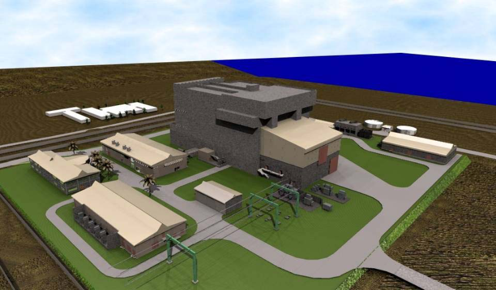

**Figure ES-1:  Rendering of PBMR DPP – National Strategic Project in South Africa** 

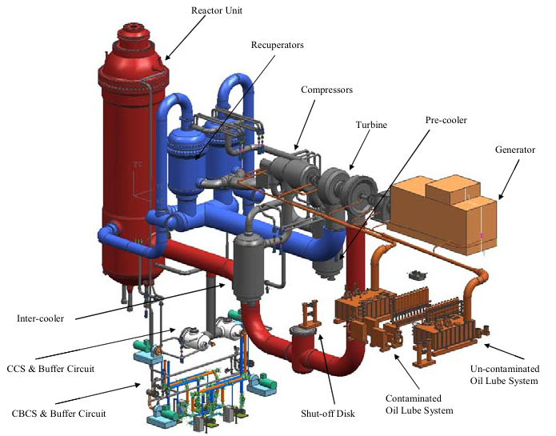

**----- Start of picture text -----** 
Reactor Unit Recuperators Compressors Turbine Pre-cooler Generator Inter-cooler CCS & Buffer Circuit Un-contaminated Oil Lube System Contaminated CBCS & Buffer Circuit Shut-off Disk Oil Lube System **----- End of picture text -----** 

**Figure ES-2: Cutaway of Main Power System for PBMR DPP** 

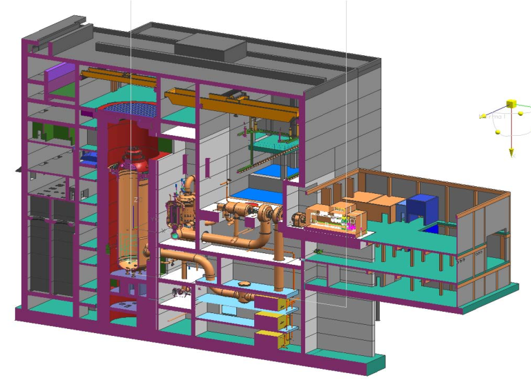

## **Figure ES-3:  PBMR DPP Building Cutaway** 

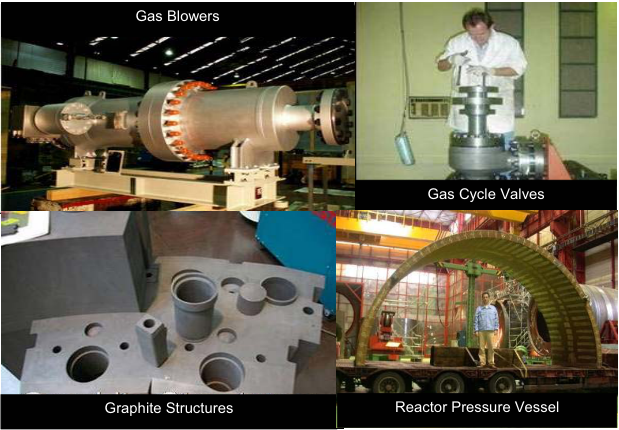

**----- Start of picture text -----** 
Gas Blowers Gas Cycle Valves Graphite Structures Reactor Pressure Vessel Reactor Pressure Vessel **----- End of picture text -----** 

**Figure ES-4:  PBMR DPP Long-Lead Components in Manufacturing** 

Eskom, the State utility in South Africa, selected the PBMR technology based on the proven experience with pebble bed reactors in Germany, particularly the superior pebble bedbased fuel performance experience, plus the baseline of common HTGR technology developed in the US, Japan and elsewhere.  Eskom has signed a letter-of-intent to deploy an initial capacity of follow-on, multi-module commercial PBMR power plants representing a backlog of at least 24 modules. 

As elaborated in the related sections of this report, the proposed PBMR-based NGNP concept adapts the PBMR DPP reactor and fuel designs, with minimal incremental development and testing costs.  Additionally, the systems, materials and component designs used in the PBMR DPP have been chosen based on proven operating experience from prior gas-cooled reactors and light water reactors.  This approach reduces the technical and commercial risks to the PBMR DPP project, and is directly translatable to benefit the NGNP Project.  This knowledge and experience has been factored into the preconceptual design for the PBMR based NGNP.  On the other hand, advanced materials and component R&D programs required for the PBMR NGNP have been addressed herein. 

Another key PBMR baseline to build upon for NGNP success is the ongoing PBMR Design Certification Pre-Application Program with the NRC, as elaborated in the Licensing section.  In addition, a US-based PBMR team has been developing preconceptual designs and performing economic evaluations of various process heat applications with the PBMR technology.  These applications have been developed with potential end-users as a basis for moving forward with further project feasibility assessments and serve as potential commercial follow-on projects or fall-back options to the NGNP. 

Building upon the PBMR DPP reactor and fuel experience along with the US base of vendor/supplier Team members plus the Pre-application Program and other project initiatives offers a compelling opportunity for the US, South Africa and others to deploy a PBMR-based NGNP for the least costs and risks, plus an assured commercial outcome.  The Westinghouse Team is proud to present the PCDR and is ready, capable and committed to proceed with the Path Forward for the PBMR-based NGNP. 

## **IV KEY ASSUMPTIONS** 

Each of the PCDR design and assessment sections lists the related assumptions as a means of tracking and future reference.  Key generic assumptions that apply to the institutional and programmatic arrangements for the NGNP Project are consolidated below as part of this Introduction: 

- A NGNP Alliance is established to consolidate the User stakeholder interests and support. 

- A Public (DOE led) / Private (Alliance led) Partnership (PPP) entity is the Project Manager and Applicant. 

- DOE owns the NGNP plant and receives offsetting revenues from the sale of power, hydrogen, and oxygen. 

- INL provides staff support to the PPP, including the coordination of US Laboratory based R&D. 

- NRC licenses the plant and conducts selected R&D needed to independently verify the safety performance of the design. 

- A PPP selected vendor team provides the full scope of plant design, delivery and startup, plus fuel supply and services. 

- The vendor team concurrently advances follow-on commercial projects with User clients. 

- A PPP selected commercial based nuclear operator operates the plant. 

- The NGNP will serve a long-term mission to demonstrate multiple advanced hydrogen production technologies, plus serve as a test bed for advanced fuels, materials, components, etc. 

Likewise, key assumptions that are PBMR-specific for the NGNP Project are consolidated below: 

- The Reactor Facility is the first unit outside South Africa and has full advantage of the PBMR DPP experience.  In particular, the Reactor and Fuel related design and R&D are incremental to the PBMR DPP effort. 

- The Heat Transport System, including the IHX and helium circulators, is the first-ofa-kind full scale demonstration unit. 

- The Hydrogen Production Facility is the first-of-a-kind commercial size train unit. 

- The initial core and reload fuel for the first 6 years is provided by Pebble Bed Modular Reactor (Pty) Ltd.’s pilot fuel plant in South Africa. 

- Reload fuel thereafter will be provided by a commercial fuel plant in the US established by PBMR (Pty) Ltd., Westinghouse and NFS as the PBMR market expands in the US. 

## **V SPECIAL STUDIES** 

The documentation of the NGNP preconceptual design performed by the Westinghouse PBMR Team consists of the Special Study Reports, the Preconceptual Design Report (PCDR), and this Executive Summary Report. 

The first segment of the NGNP preconceptual design effort centered on six Special Studies: 

- A comparative evaluation of the pebble and prismatic core – based on high temperature process heat delivery capability, 

- A power level trade study to select the PBMR-PHP core output rating, 

- A heat transport trade study to select the configuration for coupling the reactor system with the preferred hydrogen production system and the preferred power conversion system, 

- A power conversion system study, 

- A licensing and permitting strategy study, and 

- A hydrogen demonstration sizing study that also evaluated the by-products and effluents. 

It is noted that the heat transport special study combined the prescribed “20.3 High Temperature Process Heat, Transfer and Transport Study” with the “20.5 Primary and Secondary Cycle Concept Study” in the SOW.  Per agreement with INL, the logic was that it was inefficient and very difficult to separate the topics of primary and secondary cycles from the special study on transfer of the nuclear reactor heat to the hydrogen production and electricity generation systems. 

## **V.A REACTOR TYPE COMPARISON** 

The objective of this special study was to provide a comparative assessment of the relative merits of the pebble and prismatic modular HTGR core designs.  Both fundamentals and design specifics were addressed with the latter based on process heat delivery at 950ºC. 

The fundamental differences between the pebble and prismatic fuel designs can be grouped into those related to fuel-graphite geometry in the fuel elements, the fuel elementcoolant geometry, core refueling, and equilibrium core conditions.  The major fundamental differences between the pebble and the prismatic cores can be summarized as follows. 

- The pebble core has a higher outlet temperature for a given normal operation maximum fuel temperature limit.  Although there is a lower power density within the fueled region of the fuel element, there is lower resistance for heat transfer from the fuel to the fuel element surface, and greater heat transfer from the fuel element surface to the coolant. 

- Because of its lower coolant volume, the prismatic core can achieve greater power within a given core volume and geometry, for a given fuel element (solid) power density, and a given Depressurized Loss of Forced Cooling (DLOFC) maximum fuel temperature limit. 

- The pebble core can be taller than the prismatic core because it is not as limited by axial neutronic stability. 

- Because of greater coolant mixing in the pebble core, hot streaks downstream from the core are a non-issue versus a major issue for the prismatic – particularly for core outlet mean temperatures greater than 900ºC. 

- Because the pebble core has a higher resistance to flow, it requires a relatively larger circulator/compressor. 

- The pebble core on-line refueling offers the basis for a higher capacity factor and simplifies fuel manufacturing, reload complexity, and quality assurance, plus it is compatible with continuous process heat applications. 

For process heat applications and specifically for hydrogen production, reactor designs are optimized that take advantage of the above fundamentals of the fuel technology.  There are significant differences in selections made for the pebble and prismatic reference process heat designs. These include reactor dimensions and power level, reactor operating parameters, fuel and structural (core barrel and reactor vessel) materials, and fuel maximum temperature limits. Specific differences between the pebble core-based PBMR Process Heat Plant (PBMR PHP) and the prismatic core-based Modular Helium Reactor for Hydrogen production (H2-MHR) are illustrated in Table ES-1.  As an example of the first factor above, the pebble core has a power level of 500 MWt as opposed to 600 MWt for the prismatic core.  Although the core outlet temperatures specified for both systems are identical (950[0] C), both the core inlet temperatures and helium pressure are different.  The fuel materials for the two systems are different - fissile UO2 for the pebble versus fissile/fertile UCO for the prismatic.  Another significant difference in the designs is that different maximum fuel temperature limits, both for normal operation and for DLOFC events, have been selected.  Any comparison of specific reference designs is strongly influenced both by the pebble/prismatic fundamental differences discussed earlier and the vendor-specific design selections themselves. 

## **Table ES-1:  Reference Process Heat Design Selections** 

The comparison of the merits of these pebble and prismatic reference process heat designs requires that the designs be compared on the basis of specific and relevant discriminating criteria.  The following criteria and their relative weight (WEIGHT) were selected: 

- Readiness 

   - Design maturity and limited enabling technology R&D required (HIGH) 

   - o Vendor/supplier infrastructure (MEDIUM) 

- Performance 

   - Process heat delivery (HIGH) 

   - Capacity factor/investment protection (MEDIUM) 

   - Public safety (HIGH) 

   - Safeguards (MEDIUM) 

   - Wastes and other environmental impact minimization (MEDIUM) 

   - Cost competitiveness (HIGH) 

- Enhancement Potential 

   - Fuel cycle flexibility and enhancement opportunities (LOW) 

The results of the comparison against these discriminating criteria led to the following conclusions: 

- The pebble fuel PBMR PHP has a clear advantage over the prismatic block H2-MHR relative to R&D needs for fuel because of the German experience with UO2 fuels in the AVR and THTR and because of the pebble’s fundamental lower normal fuel operation temperatures.  DPP experience, especially the selection of LWR reactor vessel steels and other code-qualified materials, also results in much reduced R&D needs for the PBMR PHP. 

- The advantage for process heat delivery also goes to the PBMR PHP because of the much lower risk for achieving the desired very high core outlet temperature (950[0] C). Capacity factor for the PBMR PHP should also be superior to that for the H2-MHR because of on-line refueling.  Safety in terms of potential radionuclide releases should also be better for the PBMR PHP because of the demonstrated superior performance of the fuel and its lower normal temperature of operation. 

- The estimated unit capital cost for mature, multi-module plants is lower for the H2MHR than for the PBMR PHP given identical assumptions.  This is primarily because of the lower power level of the latter.  However, resultant process heat or H2 costs should be lower for the PBMR PHP because of its higher capacity factor, simpler fuel cycle and lower O&M costs.  Altogether, the PBMR PHP is competitive with the H2 MHR concept at much lower overall risks. 

The evaluation of the PBMR PHP relative to the H2-MHR in terms of the discriminating criteria illustrates that for all of the discriminating criteria the PBMR PHP is better than or comparable to the H2-MHR. 

In summary, pebble core technology offers many fundamental advantages over the prismatic core for high temperature process heat applications and adapts well qualified and demonstrated German-based fuel and on-line refueling experience.  The PBMR PHP is superior in essentially all respects to the H2-MHR for the high temperature process heat/H2 production NGNP.  This is true primarily because of lower development costs and risks for the pebble fuel, minimization of development costs and risks because of the DPP baseline, a much stronger vendor/supplier infrastructure, and a higher performance capability.  Lower fuel temperatures and normal operation radionuclide releases result for the same required process heat temperature and on-line refueling is consistent with continuous process industries.  Finally, the PBMR PHP is attainable at lower overall forward costs and risks. 

## **V.B PROTOTYPE POWER LEVEL** 

The prototype power level special study provides results for the recommended power level for the NGNP plant with a pebble bed high-temperature reactor. 

The NGNP Project vision and mission is to launch commercial deployment of a worthy HTGR product(s).  To achieve this mission, the Project must demonstrate key licensing, performance, economic and industrial infrastructure development objectives using a mature technology reference as the base.  The shortcomings of achieving this mission with a small-scale NGNP test reactor (approximately 25-50 MWt) are the following. 

The proposed Licensing Strategy of the PBMR-based NGNP seeks to apply Part 52 rules to demonstrate the one-step licensing process.  This strategy builds upon the PBMR-DPP reactor design, licensing and deployment experience, plus it seeks the value for demonstrating such in support of early design certification for follow-on commercial projects.  A small-scale NGNP test reactor would do little to advance these objectives. 

Likewise, achieving the performance demonstration objectives of the NGNP is critical for commercial acceptance and requires a commercial-scale or scaleable reactor. 

Economic objectives include minimizing the front-end development costs and risks as well as the product costs for the NGNP and particularly for the follow-on commercial plants. For the PBMR, a small-scale NGNP test reactor would forego the benefits of building on the PBMR-DPP development investment in exchange for the expected lower capital costs of the plant.  Worse yet, the one-of-a-kind design development costs for a small-scale NGNP test reactor would have limited transfer value to any commercial design, and expected higher net costs. 

Since four reactors of block and pebble fuel types have been built in the past, the foundation of basic performance, safety and operational issues derived from small reactors is well proven. 

With regard to industrial infrastructure development objectives, a small-scale NGNP test reactor would be a resource distraction.  Broad industry and government efforts are underway to form a utility and end-user-based NGNP Alliance as the private partner in a public/private partnership with DOE for deploying a commercial-scale NGNP. Such efforts are incompatible with a small-scale NGNP test reactor. 

A small-scale (25-50 MWt) NGNP test reactor has little value for advancing the objectives of the NGNP, particularly for the PBMR-based NGNP.  Therefore the Westinghouse Team recommends a commercial scale reactor. 

Given the advanced state of the PBMR DPP in South Africa in terms of design, technology, licensing, project and infrastructure development, the strong recommendation of this power level study for a pebble bed-based NGNP is to build upon the PBMR 400 MWt reactor design as the most appropriate baseline for the NGNP design.  The PBMR project in South Africa will demonstrate an advanced Brayton cycle for all electric applications.  The PBMRbased NGNP will demonstrate the commercial scale PBMR PHP design at a 950ºC Reactor Outlet Temperature (ROT) targeted to support hydrogen production applications.  Hence, the objective of this special study was to establish the appropriate power level for a commercialscale PBMR-PHP for the NGNP in terms of whether it should be larger or smaller than the reference 400 MWt design. 

The major design parameter difference between the proposed NGNP and PBMR DPP is the difference between the Reactor Inlet Temperature (RIT) and the reactor outlet temperature (ROT), i.e., 350°C/950°C for NGNP versus 500°C/900ºC for the PBMR DPP.  The full range of energy of the reactor is utilized by process heat applications on the top end and by power generation applications on the lower end respectively.  It is important to note that in the approach to determine the NGNP power level the German fuel envelope of burnup-fluence-temperature and the limitation of having the maximum fuel temperature lower than 1250°C during normal operation are still assumed.  The aim is to perform limited R&D and design development for the NGNP to minimize impact on schedule. 

The different options were evaluated according to discriminating criteria to determine the most suitable option.  Readiness, Performance during off design conditions and Capital Cost carried the most weight in the evaluation. 

Based on the analyzed cases a power level of 500 MWt was proposed for the conceptual design of the NGNP.  The required R&D anticipated is limited to the qualification of the fuel performance for Depressurized Loss of Forced Cooling (DLOFC) operation up to 1700°C by the time of plant construction.  Further it is suggested to keep the geometry similar to the PBMRDPP after careful consideration of the following motivating factors: 

- The PBMR-DPP reactor can be immediately used as the basis for NGNP design - within the operational envelope of the PBMR- DPP. 

- The NGNP schedule will be met - minimal R&D required. 

- Minimal design development required. 

- A 25 percent higher power output is achievable for the NGNP reactor, without increasing the capital cost for the reactor and auxiliary systems and building from the base PBMR design. 

In conclusion, a 500 MWt reactor with a core inlet temperature of 350ºC  and a core 

outlet temperature of 950ºC utilizing the PBMR-DPP geometry is recommended for the NGNP design and the follow-on commercial application. 

## **V.C HIGH TEMPERATURE PROCESS HEAT TRANSFER AND TRANSPORT** 

The objective of this study was to select a reference configuration for the NGNP Heat Transport System (HTS).  The selection of a reference HTS configuration is, by necessity, accomplished in close coordination with the NGNP special studies addressing the Power Conversion System (PCS) and Hydrogen Production System (HPS).  The PCS options to be considered in conjunction with the HPS and the minimum size and range of potential sizes of the HPS itself are obtained from companion NGNP special studies. 

This special study includes two important sub-studies that have a significant bearing on HTS configuration options.  The first is an evaluation of prospective Secondary Heat Transport System (SHTS) working fluids.  The second is a specific evaluation of design and materials readiness for the IHX, a key HTS component.  Note that the process coupling heat exchanger (PCHX), which transfers thermal energy to the PCS, is common to all HTS configuration options and, as such, is not directly assessed in this special study. 

## **SHTS Working Fluid Options** 

The conclusion of this evaluation was that helium should be selected as the SHTS working fluid for the NGNP and that the PCHX should be located as close to the IHX as possible.  If future demonstration of liquid salt (LS) thermal energy transport in the NGNP environment is desired, an option is to replace the PCHX with a secondary IHX and to add a tertiary LS loop to transport energy to a more distant location. 

## **IHX Readiness Assessment** 

Both conventional shell-and-tube and compact heat exchangers were considered in this assessment.  Taking into account design tradeoffs, the Printed Circuit Heat Exchanger (PCHE) has been selected on a preliminary basis for the NGNP IHX pre-conceptual design.  The shell and tube HX was eliminated as not being commercially viable for a large IHX.  Tradeoffs include: (1) More difficult inspection and maintenance, and (2) The need to establish design basis for Code acceptance.  The assessment concludes the following: 

- The reactor outlet temperature for the NGNP should not exceed 950ºC, based in part on IHX materials considerations. 

- As a result of this assessment, it is concluded that non-replaceable metallic 

components designed for the full plant lifetime (60 years) should be limited to ~850ºC versus 900ºC, as earlier recommended by the ITRG.  Metallic components operating at temperatures higher than ~850ºC, notably including high-temperature sections of the IHX, are likely to have reduced lifetimes and should be designed for replacement. 

- For configuration options with all of the reactor heat transferred through the IHX, a Two-Section IHX concept is proposed in which the sections operating at the highest temperatures are separated from those operating at lower temperatures (Figure ES-5). 

- A metallic plate-type HX development program should be pursued for the NGNP IHX in conjunction with an appropriate design and materials development program. Other compact heat exchanger designs (e.g., plate-fin) should be given further consideration in follow-on design efforts. 

- Alloys 617 or 230 are recommended for IHX construction depending on the stress and creep requirements of the design. 

- NGNP-specific code cases should be developed to provide an ASME design and fabrication material basis for the NGNP IHX. 

- While ceramic materials hold significant future promise, their selection for the initial NGNP IHX would pose an unacceptable risk to the NGNP schedule.  Nevertheless, their potential for resolving the high-temperature issues associated with metals justifies an aggressive parallel development path. 

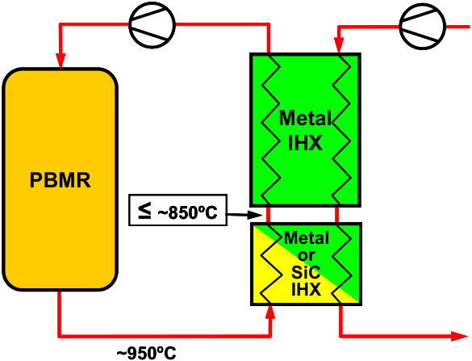

**----- Start of picture text -----** 
Metal IHX PBMR � ~850ºC Metal or SiC IHX ~950ºC **----- End of picture text -----** 

**Figure ES-5:  Two-Section IHX Concept** 

A range of HTS configurations were evaluated as candidates for the NGNP preconceptual design.  The HTS options can be generally categorized in terms of the integration of the PCS relative to the primary coolant circuit and the process coupling.  The application of a full-size IHX best represents and supports commercial designs, and provides the optimum basis for licensing/design certification of the nuclear heat source for commercial process heat applications. As a result of this evaluation, it is recommended that an indirect cycle be selected with a secondary heat transport system transferring the heat to a Process Coupling Heat Exchanger (PCHX) for hydrogen production and a bottoming Rankine cycle for electricity generation, as shown in Figure ES-6.  The process heat application requires an IHX that has high temperature material challenges that could be aggravated by pressure swings that are inherent in the control of a Brayton cycle, whether on the primary or secondary side of the IHX.  This is a key reason for the selection of the Rankine steam cycle after the high temperature heat is utilized by the HPS. 

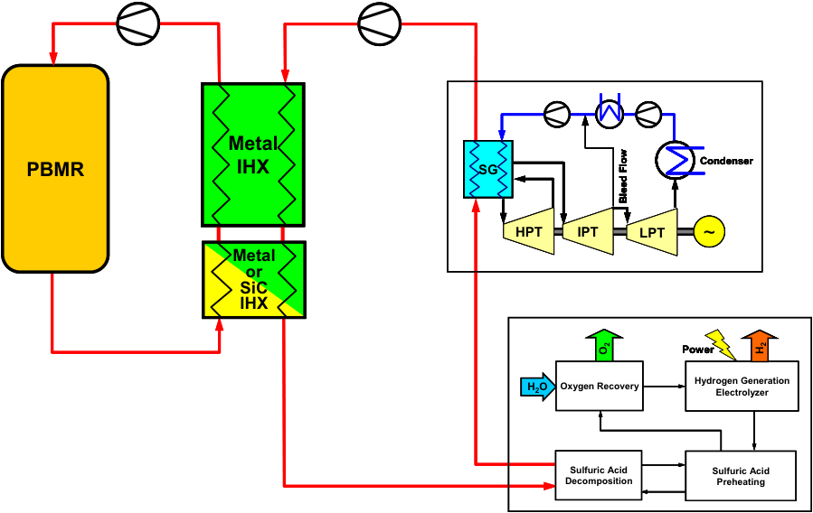

**----- Start of picture text -----** 
Metal PBMR IHX SG Condenser HPT IPT LPT ~ Metal or SiC IHX Power H2O Oxygen Recovery Hydrogen GenerationElectrolyzer Sulfuric Acid Sulfuric Acid Decomposition Preheating Bleed Flow O2 H2 **----- End of picture text -----** 

**Figure ES-6** : **Recommended HTS Configuration** 

## **V.D POWER CONVERSION SYSTEM** 

The objective of this special study was to compare thermodynamic cycle configurations to identify representative Brayton, Combined and Rankine cycles for the NGNP.  The most promising Brayton cycles, Gas-Turbine Combined Cycles (GTCCs) and Rankine cycles were analyzed and compared with respect to thermodynamic performance and practical considerations when employed in conjunction with the PBMR.  A representative cycle was chosen for each group of cycle configurations. 

For the Brayton cycle configurations, this study shows that a single-shaft cycle with intercooling would be the best option in terms of net cycle efficiency and turbo-unit size.  The representative Brayton cycle selected, shown in Figure ES-7, has optimum net cycle efficiency and is achieved at an overall pressure ratio of approximately 3.2. 

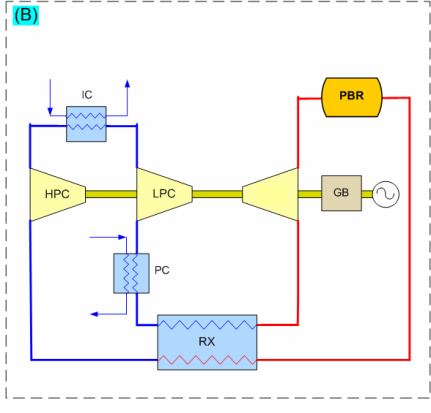

**Figure ES-7:  Representative Brayton Cycle** 

For the GTCCs, a single-shaft recuperative Brayton cycle without inter-cooling was found to be the most suitable cycle configuration.  Although the cycle does not have the highest net cycle efficiency of the GTCCs under investigation, the turbomachine employed by the cycle builds on the PBMR DPP design.  The cycle shown by Figure ES-8 was therefore chosen as the representative GTCC on the basis of readiness of technology. 

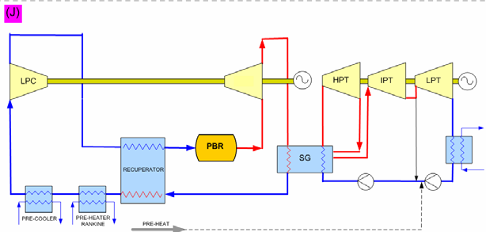

**Figure ES-8:  Representative GTCC** 

A single conventional Rankine cycle coupled to a PBMR through a steam generator was chosen as the representative Rankine cycle (Figure ES-9).  The representative Rankine configuration uses proven Rankine cycle technology and has a net cycle efficiency of about 36%. 

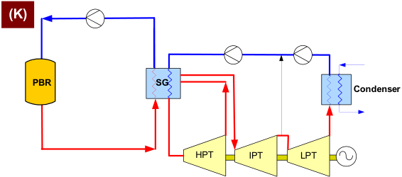

**----- Start of picture text -----** 
(K) PBR SG Condenser HPT IPT LPT **----- End of picture text -----** 

**Figure ES-9:  Representative Rankine Cycle** 

The influence of a direct versus indirect Power Conversion System (PCS) was also investigated for each group of cycle configurations.  As expected, it was indicated that the net cycle efficiency of the cycles in each group decreases for an indirect configuration. 

The influence of the coupling configuration of the HPS with the PCS, as well as the size of the hydrogen production plant, was also considered.  The sensitivity of cycle efficiency to the hydrogen plant size was compared for Brayton and Rankine cycles.  It was found that the net cycle efficiency of the representative Rankine cycle is not as sensitive to the coupling configuration and hydrogen production plant size as the representative Brayton cycle. 

Finally, the design point parameters for the representative cycle configurations are 

presented together with a diagram showing the major components of each cycle. 

## **V.E NGNP LICENSING AND PERMITTING STUDY** 

This special study addressed specific tasks related to NGNP licensing given in the Statement of Work.  Pertinent NRC regulations and the corresponding industry experience were reviewed and recommendations made.  The key recommendations from this study are: 

- Build on Pebble Bed Modular Reactor (Pty) Ltd.’s pre-application interactions with the NRC, which are based on  risk-informed, performance-based licensing methods, 

- Adopt an NGNP licensing strategy, based on Part 52, to obtain an Early Site Permit with an embedded Limited Work Authorization followed by a Combined License. Maintain a Part 50 fallback strategy for a two-step license pending the success of the pre-application interactions. 

- Use License-By-Test as warranted by expected benefits to achieve timely full-power operation of the NGNP, and Design Certification for the Commercial plant. 

- Establish and demonstrate the licensing requirements commensurate with the chosen hydrogen production design(s) reflecting separation distance and facility interactions stemming from such design(s). 

EPA, state and local permitting are not expected to present any significant licensing impediment for the NGNP. 

It is also recommended that:  (1) NRC progress on licensing rulemakings (i.e., Part 50, Part 52) be followed and results incorporated into the NGNP Licensing Strategy, (2) licensing research and development needs specific to the NGNP safety analysis evaluation models be identified as the basic design is developed and (3) the “site selection” report for the New Production Reactor site at INL be reviewed to identify any limiting environmental conditions. 

The above recommendations and the actions identified are inputs to this area in the PCDR, whose major objective is the development and recommendation of an overall licensing strategy for the NGNP, including approximate cost estimates and schedule impacts.  This approach will support development and receipt of a Design Certification for follow-on commercial plants due to the valuable precedents established in the NGNP licensing. 

## **V.F HYDROGEN DEMO PROCESS SIZING, BY-PRODUCTS AND EFFLUENTS STUDY** 

This study identified and quantified the products, by-products and waste streams produced by the NGNP facilities and identified potential markets or other disposition of these streams.  Quantification as well as characterization of these streams is necessary to identify markets or proper disposal.  Therefore, the capacity of the hydrogen production facility must be estimated to quantify products and waste streams. 

The hydrogen production facility is intended to be a commercial demonstration and must therefore meet all the appropriate requirements for such an installation.  This study enumerates these requirements, determines the smallest practical size that could be considered for such a plant, and considers an option of making the demonstration a full-scale commercial train.  These options are considered for each of the leading water-splitting technologies:  High-Temperature Steam Electrolysis (HTSE), the Hybrid Sulfur (HyS) thermo-electrical cycle and the SulfurIodine (S-I) thermo-chemical cycle. 

Once the hydrogen and oxygen capacities are identified, potential markets for these gases as well as the power generated are surveyed and potential revenue streams estimated.  In addition, industrial gas markets depend upon the purity of the products produced.  Achieving the required purity generally requires further processing.  Additional purification processing of the products is therefore identified for each of the products and water-splitting technologies. Furthermore, this additional processing usually produces additional waste streams that may not be evident from the main process mass balances. 

The PBMR, hydrogen production and product purification generate wastes that must be disposed of properly.  This study finally examined the nature, quantity and disposal options for these streams. 

This study makes recommendations in those cases for which it is possible at this early stage of design development.  In several other cases, firm recommendations are not advisable. The study recommendations are shown below: 

1. The size of the NGNP Hydrogen Production Facility should be a full commercial train. The capacity of this train has been determined based on a full commercial size PCHX. An appropriate size was estimated to have a thermal duty of 50 MW. 

2. A local market for the product hydrogen must be developed.  A fleet of buses using hydrogen in internal combustion engines should be investigated, and a clear product 

specification for this market should be developed. 

3. Feed pre-treatment, product purification, waste treatment and disposal should be included in the Hydrogen Production Facility conceptual design. 

4. Focus research and development by selecting a preferred NGNP water-splitting technology by the beginning of the NGNP Conceptual Design Phase and executing a process design for the hydrogen plant including items in the recommendation above. 

5. Focus attention on developing practical flowsheets, gathering vital thermodynamic and phase equilibrium data, obtaining converged mass and energy balances, developing materials of construction, equipment design and involving industrial partners in the effort. 

## **VI NGNP AND HYDROGEN PRODUCTION PRECONCEPTUAL DESIGN REPORT OUTLINE** 

The contents of the Preconceptual Design Report (PCDR) are shown in Table ES-2. After the Top Level Requirements (Section 2), the framework for Functional Analyses and Plant Level Integration is established in Section 3.  The design for the major systems plus the Fuel follow (Sections 4, 5, 6, 7, 8, 9 and 10), followed by the Plant Level Assessments (Sections 11, 12, 13, 14, and 15), and finally the R&D, Licensing and Permitting, Schedule and Economic Assessment topical sections (Sections 16, 17, 18 and 19). 

**Table ES-2:  NGNP and Hydrogen Production Preconceptual Design Report Road Map** 

## **VII  PLANT DESIGN** 

The process for the preconceptual design of the NGNP is initiated with top level requirements that flow down to plant level design and integration and are allocated to four Facilities and to the Balance of Plant.  This Plant Level section presents those requirements, the preconceptual designs of the Facilities and key plant level assessments. 

## **VII.A PCDR SECTION 2 - TOP LEVEL REQUIREMENTS** 

The top-level requirements provide design, licensing and mission-specific requirements for the NGNP to serve as the demonstration plant for follow-on multi-module commercial plants. While NGNP Project emphasis is on hydrogen production, the commercial PBMR PHP design will supply nuclear-generated process heat for a broad range of applications.  These top level requirements draw from and consolidate information from the following sources: 

- Recent NGNP Public/Private Partnership Working Group perspectives and plans for a NGNP Alliance of end-users to support Project development and drive deployment. 

- DOE guidance via the INL/BEA issued NGNP related Project Management Plan, High-Level Functions and Requirements (as modified by the Independent Technology Review Group (ITRG) report), and Statement of Work documents, plus related DOE requirements associated with the NGNP being a DOE-owned facility on a DOE site. 

- User requirements from past utility/user groups engaged with High-Temperature GasCooled Reactor (HTGR) development as well as Advanced Light Water Reactor (ALWR) design and certification efforts.  Such efforts have also served to provide a user perspective on the commercial PBMR PHP market incentives, needs, opportunities and development strategy. 

- Utility/user requirements and experience from the PBMR Demonstration Power Plant (DPP) Project in South Africa. 

- Ongoing user interactions with PBMR process heat project initiatives. 

- Ongoing regulatory experience in the US and South Africa, which builds upon the decades of experience in the US, Germany and elsewhere. 

- Special Studies and analyses conducted by the PBMR-based team at the front-end of the BEA preconceptual design and engineering services contract that have served to establish key plant design features. 

Figure ES-10 depicts the inputs to the top level requirements.  Note that they include the 

results of the special studies discussed in Section IV.  The key top level requirements for the PBMR PHP-based NGNP Project are: 

- The NGNP Project shall develop, license, build, test and operate a one module PBMR PHP as a demonstration for subsequent multi-module commercial plants. 

- The NGNP Project shall support the timely Design Certification (DC) of the standard NHSS suitable for a broad range of applications and an envelope of site conditions. 

- The NGNP Project shall develop, permit, build, test and operate a reference hydrogen process at the full commercial train scale as a demonstration for multi-train commercial plants. 

- The NGNP Project shall also accommodate the demonstration of other advanced hydrogen production processes and process heat applications as well as follow-on advanced fuels, components and systems plus serve to train future operators. 

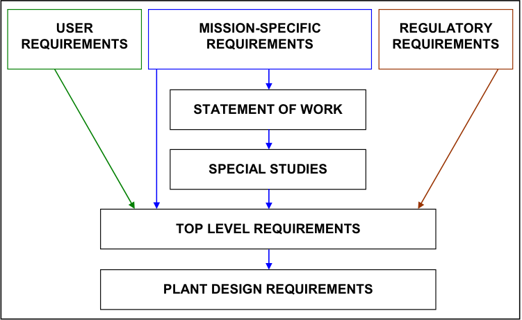

**----- Start of picture text -----** 
USER  MISSION-SPECIFIC  REGULATORY REQUIREMENTS  REQUIREMENTS  REQUIREMENTS STATEMENT OF WORK SPECIAL STUDIES TOP LEVEL REQUIREMENTS PLANT DESIGN REQUIREMENTS **----- End of picture text -----** 

## **Figure ES-10: Requirements Flow Down to Design** 

Further development of the top level requirements will be conducted in concert and cooperation with the development of the user-based NGNP Alliance. 

The sources of these top level requirements for the NGNP Project and the relationship to the Plant Design Requirements plus the overall relationships of the other sections of the PCDR 

are illustrated in Figure ES-11. 

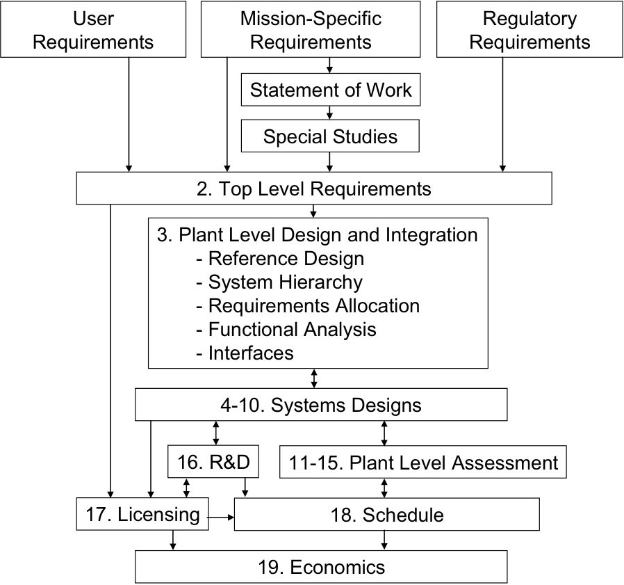

**----- Start of picture text -----** 
User Mission-Specific Regulatory Requirements Requirements Requirements Statement of Work Special Studies 2. Top Level Requirements 3. Plant Level Design and Integration - Reference Design - System Hierarchy - Requirements Allocation - Functional Analysis - Interfaces 4-10. Systems Designs 16. R&D 11-15. Plant Level Assessment 17. Licensing 18. Schedule 19. Economics **----- End of picture text -----** 

**Figure ES-11: Requirements Flow Down to Pre-conceptual Design Development (PCDR Sections Identified)** 

## **VII.B PCDR SECTION 3 - PLANT LEVEL DESIGN AND INTEGRATION** 

The top level requirements development leads to plant level design and integration with the development of a preconceptual design reference, system hierarchy, requirements allocation, functional analyses, and plant system interfaces. 

The plant level design and systems integration utilizes systems engineering, a disciplined approach to managing and designing complex systems, for the successful attainment of the Project Goals across the divergent nuclear reactor, hydrogen process, and power conversion engineering technologies and disciplines. 

The plant level design and systems integration utilizes systems engineering, a disciplined approach to managing and designing complex systems, for the successful attainment of the Project Goals across the divergent nuclear heat supply system (nuclear reactor and heat transport), hydrogen process, and power conversion engineering technologies and disciplines. 

The core of the systems integration process in the preconceptual and conceptual design phases is the development of design requirements.  The process is vital at the beginning of the design process, and system integration needs to be maintained as a process during design, capturing, linking, analyzing, and managing changes to requirements and their traceability. Successful system integration also ensures conformance to the plant user’s goals and the compliance of the resulting design with regulations and standards. 

This process and the resulting requirements flow-down are one step down from the “top” of the documentation “pyramid” and at the convergence of the documentation of the Overall Systems.  Documentation includes: 

- Summary Description of the Reference Design 

- The Plant Work Breakdown Structure 

- Organization of the Plant Systems 

- Identification of Critical Systems, Structures and Components 

- Allocation of Top Level Requirements to Overall Systems 

- Allocation of Functions to Overall Systems 

- Tabulation of Plant Interfaces 

- Tabulation of Overall System to System Interfaces 

The plant level design and integration effort is the starting point for the subsequent sections on system and building descriptions. 

## **VII.C PCDR SECTION 4 - NUCLEAR HEAT SUPPLY SYSTEM** 

The NHSS configuration is based on the PBMR DPP reactor design.  The NHSS provides heat to the Primary Heat Transport System (PHTS) by means of the nuclear heat generation in the Reactor Unit System (RUS).  The PHTS circulates the primary coolant from the NHSS to the Intermediate Heat Exchanger (IHX), where the heat from the NHSS is transferred to the Secondary Heat Transport System (SHTS). The SHTS transports heat to the HPS and the PCS, where the heat is either utilized or, in certain plant operating modes, rejected to the environment via the air cooled condenser.  A proposed layout of the Reactor Unit in relation to the rest of the plant is shown in Figure ES-12.  This section discusses all of the NHSS systems with the exception of the PHTS and SHTS, which are discussed in PCDR Section 6. 

**----- Start of picture text -----** 
H2SO4 Column Decomposer Primary Circulator & Check Valve Mixing Recuperator Chamber Reactor Secondary Circulator Core Conditioning System Steam Generator IHX A IHX B **----- End of picture text -----** 

**Figure ES-12:  Proposed Layout of the Reactor Unit System in Relation to the PHTS, SHTS, SG and PCHX** 

The NHSS consists of the Reactor Unit System and all the support and auxiliary systems required for its operation and maintenance.  The Reactor Unit System consists of the following systems: 

- Core Barrel Assembly 

- Core Structure Ceramics 

- Reactor Pressure Vessel 

- Reactivity Control System 

- Reserve Shutdown System 

- In-Core Delivery System 

The support and auxiliary systems for the Reactor Unit System are: 

- Core Conditioning System 

- Reactor Cavity Cooling System 

- Fuel Handling and Storage System 

- Helium Services System 

- NHSS Control and Instrumentation System 

- NHSS Cooling Water System 

- NHSS Electrical System 

- Nuclear Heat Supply Building HVAC System 

- Primary Loop Initial Clean-up System. 

For application in the NGNP project, the most significant change to the PBMR DPP reactor is an uprating of the continuous power level from 400 MWt to 500 MWt.  The reactor inlet/outlet temperatures changed from 500ºC/900ºC to 350ºC/950ºC, while the reactor mass flow reduced from 193kg/s to 161kg/s.  Details have been provided in NGNP Special Study 20.2. 

Another important change to the PBMR DPP reactor for NGNP application is that the Core Barrel Conditioning System (CBCS) is not necessary, due to the lowering of the reactor inlet temperature.  In the NGNP, the function of the CBCS is fulfilled by rerouting the flow path of the primary coolant, which is at a lower temperature than in the PBMR DPP.  The change in primary coolant flow path necessitates moving the Primary Heat Transport System cold pipe (reactor inlet) from the bottom part of the Reactor Unit (as it is on the PBMR DPP reactor) to the top of the Reactor Pressure Vessel. 

Thus, the main focus of design and development for the NHSS is determining the implications of the increased power level, neutron flux and decay heat during shutdown on systems that were developed for the PBMR DPP, including component design lifetime.  The increased power level also implies a higher processing rate of fuel, which impacts the Fuel Handling and Storage System. 

## **VII.D PCDR SECTION 5 - REACTOR FUEL** 

The NGNP fuel core evolves from the core of the PBMR DPP.  The DPP fuel core consists of uranium fuel elements which generate heat by means of fission reactions.  The fuel elements are spherical and consist of a matrix graphite body pressed into a spherical shape.  A fuel sphere is divided into two regions, the inner spherical “fuel” region and an outer shell surrounding the fuel region, known as the “fuel-free” region.  The fuel region of each fuel sphere contains approximately 14,500 of evenly dispersed spherical particles known as coated particles, in which the fuel is contained, while there are no coated particles in the fuel-free region. 

Each coated particle consists of a spherical kernel of uranium dioxide (UO2) surrounded by four coating layers.  The innermost coating layer is known as the buffer layer and it is followed in turn by a pyrocarbon layer known as the inner pyrocarbon (IPyC) layer, a silicon carbide (SiC) layer, and another pyrocarbon layer known as the outer pyrocarbon (OPyC) layer. This coated particle design is known as the TRISO design. 

The general design layout of the PBMR/NGNP fuel sphere is presented in Figure ES-13. 

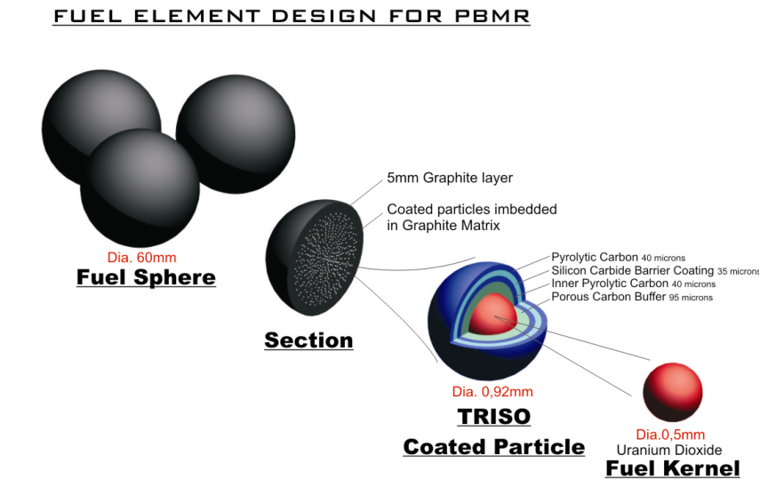

## **Figure ES-13:  Diagram of the General Layout of the PBMR Fuel Sphere Design** 

The fuel provides the primary barrier against the release of fission products.  This section shows the ability of the fuel to provide sufficient retention for the conditions expected in the fuel core during normal operation and credible accidents as calculated by the nuclear and thermodynamic design. 

The PBMR DPP operates at 400 MWt with an inlet temperature of 500ºC and an outlet temperature of 900ºC.  As part of a Special Study it was concluded that the optimum power level for the NGNP is 500 MWt with an inlet temperature of 350ºC and an outlet temperature of 950ºC.  The selected power level was chosen because it builds on the PBMR DPP reactor and fuel technology, meets the NGNP schedule, requires no design development, and achieves higher power levels at the same cost and with minimal fuel qualification. 

Since the NGNP fuel requirements in terms of operating conditions are higher that those of the German program, it is foreseen that more testing will be required. 

The testing and qualification strategy being followed by PBMR can be summarized as: 

- Fuel and Matrix Graphite irradiation to envelope normal operating conditions 

- Fuel heating tests to envelope accident conditions 

A reliable supply of high quality fuel that is available when required is critical to the success of the NGNP project.  Based on the Westinghouse Team review of:  (1) the NGNP target schedule, (2) a detailed fuel development program and (3) the large database of German operating experience for the TRISO fuel design, it is concluded that the only way to meet the NGNP schedule is to use fuel provided by Pebble Bed Modular Reactor (Pty) Ltd.  PBMR fuel is based on the proven German fuel design and a modern fuel manufacturing process which is equivalent to the demonstrated German manufacturing process. 

The PBMR fuel qualification and test program will demonstrate that the fuel manufacturing process is equivalent to or better than the German manufacturing process.  In addition, the PBMR test program will statistically strengthen the German database. 

In parallel with the PBMR DPP test program, some additional testing of the fuel will be required to meet the higher operating fluence and accident temperatures predicted for the NGNP. The development program would be carried out on production fuel under conditions that would envelope NGNP conditions.  The Westinghouse Team recommends that such additional testing be done as part of a collaborative effort with INL to:  (1) complete NGNP fuel qualification, (2) advance domestic manufacturing capability as the commercial market develops and (3) develop advanced fuel manufacturing processes for the reference UO2 fuel as well as for advanced fuel designs. 

## **VII.E PCDR SECTION 6 - HEAT TRANSPORT SYSTEM** 

The HTF is one of the four key plant facilities.  It is closely aligned with the NHSF.  The functions, requirements and interfaces flow down from the plant level design and integration. The HTS serves to transport thermal energy from the reactor, where it is produced within the NHSS, to the HPS and the PCS, where it is utilized or, in certain plant operating modes, rejected via the PCS.  The HTS comprises a PHTS and a SHTS that are coupled by two IHXs in series. Figure ES-14 provides a schematic of the configuration. 

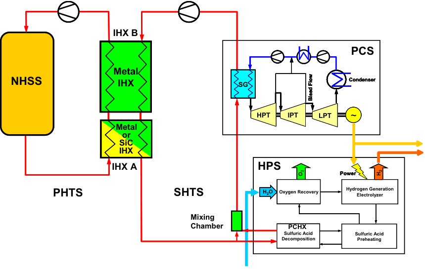

**----- Start of picture text -----** 
IHX B PCS Metal NHSS PBMR IHX SG Condenser HPT IPT LPT ~ Metal or SiC IHX IHX A  HPS Power PHTS  SHTS  H2O Oxygen Recovery Hydrogen GenerationElectrolyzer Mixing Chamber  PCHX Sulfuric Acid Sulfuric Acid Decomposition Preheating Bleed Flow O2 H2 **----- End of picture text -----** 

**Figure ES-14:  NGNP Demonstration Preconceptual Design Schematic** 

The PHTS includes the IHXs, the primary piping, its associated internal ducts, insulation and supports, the primary circulator and a check valve. 

The SHTS comprises the secondary piping, its associated internal ducts, insulation and supports, the secondary circulator and a helium-mixing chamber.  Helium from the secondary side of the IHXs is split into two paths.  One-fourth of the flow is routed to the PCHX, which is the interface with the HPS.  The remaining flow is routed directly to the SG of the PCS via the mixing chamber.  After transferring thermal energy to the HPS, the stream exiting the PCHX is rejoined to the main stream at the helium-mixing chamber.  A fixed orifice, upstream of the mixing chamber in the main helium flow path, is used to establish the relative flow rates to the PCHX and the SG. 

The high temperature components of the HTS, and particularly the heat transfer core of the IHXs, pose significant design and development challenges for the NGNP; however, much foundation work has already been done.  For metallic IHX options, the starting point for addressing materials challenges will be earlier work in Germany and both earlier and on-going work in Japan on high-temperature tubular heat exchangers and associated materials.  The compact recuperator of the PBMR DPP provides an initial design basis, albeit at lower temperatures.  For advanced heat exchanger materials, the IHX development will build on work underway within the Nuclear Hydrogen Initiative Program. 

The HTS Special Study determined that the IHX should be split into high and low temperature sections, designated IHX A and IHX B.  The high temperature section, IHX A, would be designed for replacement within the plant lifetime, whereas IHX B would be designed as a full lifetime component.  The maximum temperature for IHX B has been tentatively specified at 760ºC to allow the use of established ASME Section III materials, based on Subsection NH for IHX B.  The reference material specifically recommended for IHX B is Alloy 800H.  Both the breakpoint temperature and the IHX B material are to be confirmed through future studies during conceptual design. 

Significant Design Data Needs (DDNs) are associated with the IHX.  Given both the critical nature and technical challenges associated with this component, multi-pronged development paths have been identified.  The present reference for IHX A is a compact metallic heat exchanger design that uses Alloy 617 as the reference material.  In addition to the operating temperature being above the established useful range for this material, the thin heat transfer cross-sections associated with compact exchangers pose difficulties with the large grain sizes associated with Alloy 617 of the current reference specification.  DDNs identified with this material include both optimization of the current specification and extending the database to the required temperature range.  An alternate material, Alloy-230, has also been identified for further optimization and characterization.  Additional DDNs are identified to extend the available design methods and associated codes and standards to the higher temperature range required for the NGNP IHX.  Performance verification of high temperature IHX modules is also identified in DDNs as a basis for confirming material suitability and design methods, as well as supporting the development of codes and standards. 

Metallic materials are marginal for the IHX A at the highest temperatures of interest.  For this reason, the parallel development of ceramic and/or composite heat exchangers has also been recommended and identified within the HTS DDNs.  Other DDNs address design and technology gaps associated with the internal components of the highest temperature piping sections and the SHTS helium-mixing chamber. 

The HTS piping also represents a critical focus of design and development.  The designs of the highest temperature sections of the PHTS piping are based upon the high-temperature gas cycle piping of the DPP, which utilizes both insulation and active cooling.  The NGNP-specific design is complicated by the higher reactor outlet temperature (950ºC versus 900ºC) and the higher temperatures of potential active cooling sources (350ºC at the PHTS circulator outlet versus 120°C at the high-pressure compressor outlet in the DPP).  The complexities associated with active cooling also imply high costs.  For this reason, passive insulation has been tentatively selected for the highest temperature sections of the SHTS.  The technical and economic tradeoffs of active cooling versus passive insulation for both the PHTS and SHTS will be addressed through future studies during conceptual design. 

The complexities associated with insulation and cooling of piping and ducts in the 

highest temperature sections of the PHTS and SHTS pose both technical risks and high costs. These will be addressed both by R&D in response to DDNs, and by future studies to optimize the insulation and/or cooling designs and associated material selections. 

Finally, the SHTS helium-mixing chamber, which is unique to demonstrating one train of the HPS in the NGNP, poses technical challenges related to both the high-temperatures of the streams to be mixed and the concerns with thermal cycling effects.  These challenges will be addressed through further design and R&D in response to DDNs. 

In summary, the HTS is a key system of the NGNP with significant technical barriers to its realization.  The scope of these barriers and the challenges associated therewith have been narrowed and focused by reference design selections, notably the two-section IHX.  Where technical issues are unavoidable, multiple design and development paths have been established to minimize and/or manage risks. 

## **VII.F PCDR SECTION 7 - HYDROGEN PRODUCTION SYSTEM** 

The Hydrogen Production System (HPS) takes thermal energy from the Heat Transport System (HTS) and electrical energy and water from the Balance of Plant Systems (BOP), and decomposes the water into hydrogen and oxygen. 

For the NGNP, three water-splitting technologies were evaluated:  Sulfur Iodine (SI), Hybrid Sulfur (HyS), and High-Temperature Steam Electrolysis (HTSE).  All three have advantages and disadvantages in terms of the technology available, the energy required, and the adaptability to commercial-scale operation, and a detailed comparison is provided in the PCDR. 

For the NGNP, the HyS process was selected as the reference HPS process with HTSE as the backup technology, even though HyS has more technical challenges.  This selection was made since HTSE will likely have both higher capital and final hydrogen costs than will the HyS process, and the NGNP program is aimed at a commercial demonstration of a hydrogen process. Both processes are recommended for consideration because the HTSE process has hardware that is already available while the HyS process still requires development work in both the sulfuric acid decomposition and the electrolysis cells. 

The HyS chemical process is shown in Figure ES-15 below. 

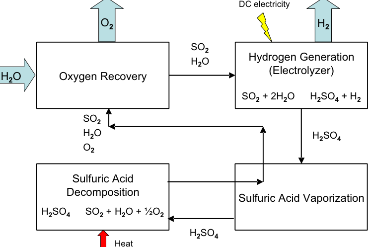

**----- Start of picture text -----** 
DC electricity O 2 H 2 SO 2 H 2 O Hydrogen Generation (Electrolyzer) H 2 O Oxygen Recovery SO 2  + 2H 2 O H 2 SO 4  + H 2 SO 2 H 2 O H 2 SO 4 O 2 Sulfuric Acid Decomposition Sulfuric Acid Vaporization H 2 SO 4 SO 2  + H 2 O + ½O 2 H 2 SO 4 Heat **----- End of picture text -----** 

**Figure ES-15:  HyS Chemical Process** 

The interface of the HPS with the NHSS is defined by the helium inlets and outlets on the Process-Coupling Heat Exchanger (PCHX).  The PCHX is therefore completely within the HPS. 

The overall NGNP HPS is comprised of seven sub-systems:  a Feed and Utility Supply System (FUS), a Sulfuric Acid Decomposition System (SAD), an Electrolysis System (ELE), a Product Purification System (PPU), a Product Storage and Delivery System (PSD), a Waste Treatment and Disposal System (WTD), and an Instrumentation and Control System (PCN). 

The main components include the Sulfuric Acid Concentrator (Concentrator), the Sulfuric Acid Decomposer (Decomposer), the SOx Cooler, the SO2 absorbers (Absorbers) and the Electrolyzers. 

The functions currently identified for the Feed and Utility Supply System (FUS) include the purification of feed water to the Electrolysis System (ELE) and the supply of sulfuric acid to the Sulfuric Acid Decomposition System (SAD) and caustic to the Product Purification System (PPU). 

The Sulfuric Acid Decomposition System is made up of the Sulfuric Acid Storage Tank and the piping, equipment and pumps that deliver acid to the Concentrator.  The Sulfuric Acid Concentrator and its associated Recuperator concentrate the sulfuric acid feed to the Decomposer.  The Decomposer takes thermal energy from the HTS and uses it first to 

decompose sulfuric acid to sulfur trioxide and water and then to decompose the sulfur trioxide into sulfur dioxide and oxygen.  The decomposed vapors consisting of oxygen, sulfur dioxide, sulfur trioxide and steam pass through the Recuperator and Concentrator to recover heat and are cooled and partially condensed in the SOx Cooler before being delivered to the Electrolysis System.  The largest technology challenges associated with this technology are in this system. 

The Electrolysis System consists of the Electrolyzers, Absorbers and their associated piping, pumps and auxiliary vessels.  The sulfur dioxide-laden oxygen is separated from the condensed acid leaving the SOx Cooler.  This oxygen passes up through five stages of absorption where the sulfur dioxide is scrubbed countercurrently from the product oxygen.  The sulfur dioxide concentration is lowered between stages by oxidation to sulfuric acid at the Electrolyzer anodes. The oxygen is delivered to the PPU for final purification. The acid combined with the separated liquid from the SOx Cooler is returned to the Sulfuric Acid Storage Tank after being stripped of any remaining oxygen. Hydrogen, produced by reduction of protons at the cathodes of the Electrolyzer, is also sent to the PPU for purification.  The main benefit of this technology over water or steam electrolysis is that the acid electrolyte reduces the voltage requirement significantly and thus improves the efficiency. 

The Product Purification System (PPU) is made up of two sub-systems: an oxygen purification system and a hydrogen purification system.  The oxygen system consists of a caustic scrubber and two sets of adsorption beds along with associated regeneration equipment.  The hydrogen system adsorbs moisture from the gas stream, hydrogenates trace sulfur species to hydrogen sulfide and collects that in a zinc oxide adsorber / reactor.  The effluent is further dried in a second adsorption bed.  The oxygen is assumed to be vented to atmosphere.  Commercially available technology can reach purities of 1 to 2 parts per million by volume (ppmv) of sulfur.  It is not known whether it can reach 4 parts per billion by volume (ppbv) as is required by SAE J 2719, the specification for hydrogen fuel for use in transportation fuel cells.  The requirements for this system depend heavily upon the final use of the products. Some industrial applications may not require a PPU at all. 

The Product Storage and Delivery System (PSD) for the NGNP HPS takes hydrogen from the PPU and delivers it to a hydrogen pipeline at the plant battery limits.  Any process blowdown required to maintain electrolyte purity as well as spent caustic from the Product purification system is sent to the Waste Treatment and Disposal System (WTD).  This system treats these wastes by neutralization and sends them to the BOP facilities for evaporation and final disposal.  The system consists of commercially available package units.  The Instrumentation and Control System (PCN) performs the control function for the other systems. 

The HyS System proposed for NGNP presents several technical challenges and risks, and requires additional component development, future studies, and alternative designs for parallel or fall-back positions.  Materials of construction selection and development are a major task in the development of this technology.  The closed-loop nature of the HyS process poses additional 

challenges. Possible impurity accumulation in the circulating loop is a concern that may require additional development. 

## **VII.G PCDR SECTION 8 - POWER CONVERSION SYSTEM** 

The PCS for the NGNP demonstration uses a conventional turbine-generator operating with a non-reheat Rankine water vapor cycle and regenerative feedwater heating.  The use of a conventional Rankine cycle provides a flexible, well proven, highly reliable system with the potential for process integration and use of waste heat from the HPS.  The energy input to the system is via heat exchange with the NHSS through the PHTS and then the SHTS helium loop. A non-reheat cycle is chosen due to both the anticipated cost of a reheater, and the economics typical of a demonstration facility. 

Key features of the PCS are: 

- With the exception of the Steam Generator, the system is designed using commercially available components, to minimize R&D and technology development needs, 

- High temperature helium piping is minimized to limit leakage and system heat losses, 

- The system has capability to interact and accommodate operational transients associated with the Hydrogen Production Unit Facility, 

- INL is a dry site so air cooled condensing is selected to reduce water requirements, 

- The system is adaptable to commercial sized application of Hydrogen/Power cogeneration, 

- The PCS for the demonstration unit is sized for full NHSS thermal power, allowing for additional power export during periods when the HPS is not in operation, and 

- In the NGNP, the PCS is completely independent from the HPS.  In the commercial facility, the cycle efficiency can be improved by recovering waste heat from the HPS effluent streams. 

The Steam Generator is identified as a developmental component based on prior design development experience for other HTGR applications.  The requirements, configuration, materials and design features of this component require that a number of development needs be satisfied for successful design, manufacturing, delivery and long term operation of the prototype and follow-on components. 

## **VII.H PCDR SECTION 9 - BALANCE OF PLANT SYSTEMS** 

The BOP systems provide the mechanical and electrical support utilities for all areas and processes in the plant, and environmental control systems for those buildings in the PCS, HPS, and BOP buildings.  Also included are the site security systems and environmental monitoring systems. 

The pre-conceptual design of the BOP systems has been based on similar systems and components developed for the Advanced Light Water Reactor and systems used on typical power plant and industrial projects. 

The BOP systems interface with the NHSS, HTS, HPS, and PCS major systems to supply and receive electric power, make up water, cooling water, waste water, compressed air, control and supervision, solid and liquid waste, compressed gases and laboratory support. 

In order to minimize water consumption by the BOP systems, it is proposed to use closed circuit cooling towers for the component cooling water heat sink, and to use air-cooled chillers for Heating Ventilation and Air Conditioning (HVAC) chilled water.  This approach reduces evaporation, blow-down, and drift losses associated with standard cooling towers. 

It has been determined that the HPS system makeup needs and evaporative coolers for the NHSS, PCS, and HPS call for a very significant amount of water requiring treatment and recycling. The wastewater treatment system is designed to use an evaporator to remove solids and recover water for reuse by the Plant (Service) Water system. 

The CCSS is a non-nuclear safety related system.  It is not relied upon or credited to function during or mitigate any NHSS design basis event or initiating event.  The CCSS is isolated from all systems that are required to mitigate design basis events.  The CCSS is located outside the vital area security boundary. 

The electric power systems supply power to the plant safety and non-safety equipment for normal plant operation, startup and normal shutdown, and for accident mitigation and safe shutdown as required.  High voltage systems provide Alternating Current (AC) power from the turbine generator to large components such as main transformers and large motors (i.e., Helium Circulators) on site and off site to the utility grid.  High voltage power is also fed from off site when the turbine generator is not operating.  Medium voltage systems provide electrical power to major system components (> 600 V motors).  Low voltage systems power small motors, control systems, and lighting.  The HPS electrolyzers require dedicated Direct Current (DC) power at low voltage, but very high amperage.  Dedicated AC/DC converters are provided for this function. 

## **VII.I PCDR SECTION 10 - SITE, BUILDINGS AND STRUCTURES** 

The NGNP site selection process and characteristics as well as arrangement of buildings and systems are addressed.  The NGNP is located on the former site for the New Production Reactor (NPR).  The selection of the NPR site is based primarily on maximizing the distances from site boundaries, volcanic areas, and existing INL facilities. 

The Advanced Test Reactor (ATR) is located on the INL site.  That facility has an Exclusion Population Zone (EPZ), and the NPR site falls within this EPZ.  This concern will be addressed as required during conceptual design.  The NPR site is located far enough from the other facilities at INL that it requires new self contained utilities, with the exception of electric power.  A Plot Plan showing the arrangement of buildings and systems is included as Figure ES12. 

Key considerations in the development of the plot plan are: 

- The Nuclear Heat Supply Building (NHSB) is based on development of the PBMR DPP and the PHP designs, 

- The location of the HPS Acid Decomposer and PCS Steam Generator is kept close to the NHSB to minimize helium piping length, 

- The NHSB is partially embedded into the rock site to provide a stable foundation and to reduce seismic amplified response. A future study is recommended to optimize the depth of burial taking into consideration, seismic design, and requirements to protect the NHSS from natural and manmade phenomena, 

- The portions of the HPS handling hydrogen are located at least 100 meters away from the NHSB, 

- Non-nuclear Structures, Systems, and Components (SSC) are placed outside security areas required by 10CFR73, and 

- The control building is located upwind and separated from chemical locations. 

The layout accommodates adaptation to commercial scale by use of multiple trains using a slide along arrangement, or expansion of single systems where appropriate. 

The primary buildings on the site are shown on Figure ES-16; a detailed list of the buildings is provided.  Figure ES-17 is a commercial site key plan which shows the potential arrangement of a commercial scale plant with four NHSS modules and sixteen HPS modules. 

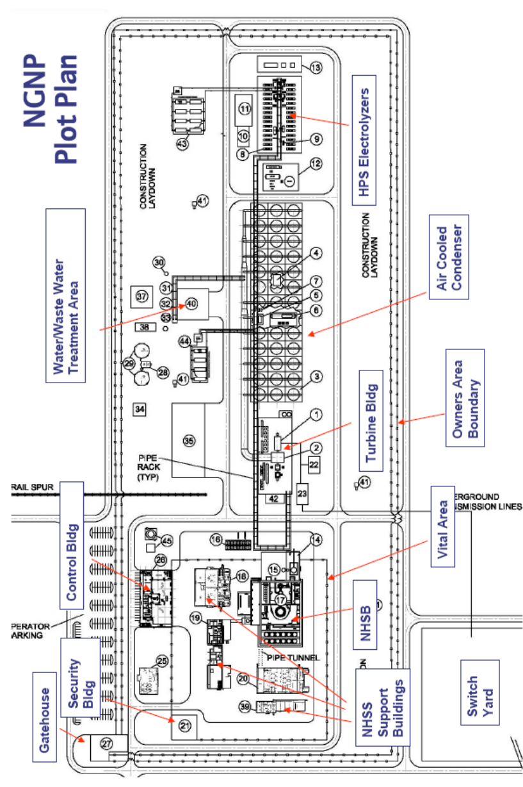

**----- Start of picture text -----** 
Figure ES-16:  NGNP Plot Plan **----- End of picture text -----** 

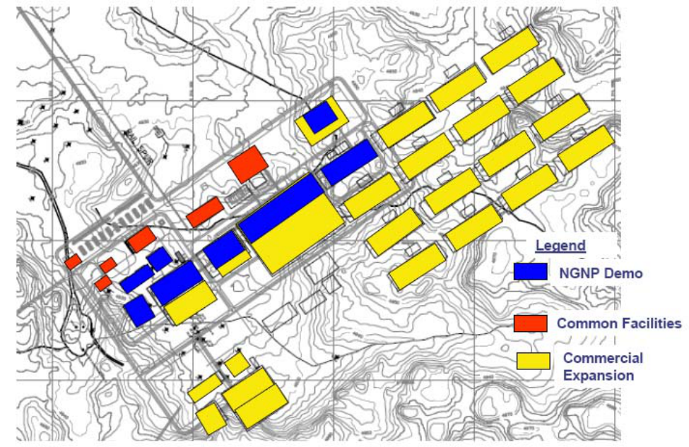

**Figure ES-17:  Commercial PHP Site Key Plan** 

## **VII.J PCDR SECTION 11 - OVERALL NGNP OPERATION** 

A description of the integrated NGNP operational and control philosophy as well as a description of the NGNP plant simulator are provided.  Various modes of operation, performance and control philosophies as defined and described for the facilities, i.e., the NHSS, HTS, HPS and PCS will be integrated into an overall NGNP operational and control philosophy.  This philosophy includes interdependencies that include the steady state, transition and transient operation suitable for a preconceptual design level. 

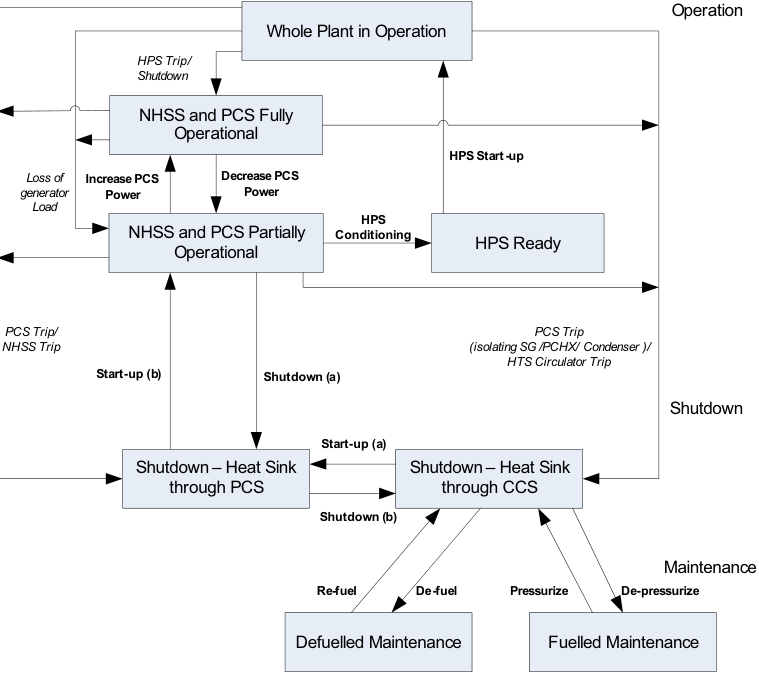

**----- Start of picture text -----** 
Operation Whole Plant in Operation HPS Trip/ Shutdown NHSS and PCS Fully Operational HPS Start -up Loss of  Increase PCS  Decrease PCS generator  Power Power Load HPS NHSS and PCS Partially  Conditioning HPS Ready Operational PCS Trip/ PCS Trip NHSS Trip (isolating SG /PCHX/ Condenser )/ HTS Circulator Trip Start-up (b) Shutdown (a) Shutdown Start-up (a) Shutdown – Heat Sink  Shutdown – Heat Sink through PCS through CCS Shutdown (b) Maintenance Re-fuel De-fuel Pressurize De-pressurize Defuelled Maintenance Fuelled Maintenance **----- End of picture text -----** 

**Figure ES-18:  Modes Diagram** 

The integrated design requirements for the NGNP simulator will be specified as well as the simulator operational requirements to ensure that the plant simulator for the NGNP can be used to: 

- Design, integrate and verify plant control philosophies before plant construction and commissioning to ensure safe plant operation. 

- Train plant operators and test their skill levels before they operate the actual plant. 

- Test the impact of modifications on the plant after commissioning. 

- Develop operating procedures. 

It is concluded that the NGNP demonstration plant will be able to operate in a stable and reliable manner.  The different modes of operation, however, as well as transition and transient 

events, will be further investigated in the conceptual design phase.  An integrated simulation tool capable of simulating the steady state and transient operation of the entire plant is required to perform detailed simulations of the identified transition and transient events.  The prediction of the plant performance during these events will aid in the design of the different components in the various systems.  The simulation tool will also be used to test the overall control strategies of the plant. 

## **VII.K PCDR SECTION 12 - MAINTAINABILITY** 

The NGNP is to be monitored, inspected, tested, assessed and maintained to ensure that structures, systems and components function as per name plate specification.  Preventive and predictive maintenance must be scheduled so that optimal performance of components is maintained and corrective maintenance is minimized.  The planning and execution of preventive, predictive and corrective maintenance must be done such that outage time is minimized and the capacity factor and availability requirements are met. 

In order to meet the availability and capacity factor requirements, SSCs must be designed for maintainability. Aiding the design for maintainability with respect to the SSCs of the NGNP, this section provides the anticipated maintainability concept and strategy for the NGNP.  The maintenance principles, inspectability approach and access requirements are described. 

Anticipated maintenance requirements are described along with the maintenance approach for systems and subsystems to ensure trouble free operation and radiation dose to personnel that does not exceed regulatory and statutory limits. 

The major systems of the NGNP which dominate the maintainability are identified, and time intervals of 5 years are proposed between maintenance outages.  This interval is mainly influenced by the anticipated replacement of the Intermediate Heat Exchanger A (IHX) after 10 years.  The possibility of longer time intervals between maintenance and inspection could be considered if the IHX A can be replaced at intervals longer than 10 years. 

The basic maintenance requirements for the major components are described to give the anticipated level of inspection required. 

## **VII.L PCDR SECTION 13 - AVAILABILITY** 

The assessment and allocation of plant availability requirements for the preconceptual design of the NGNP is structured to correspond to the four facilities and BOP systems and buildings. 

This initial allocation of plant availability resulted in target availability factors and target capacity factors for several modes of operation.  For the plant operating mode with both PCS and HPS in operation (electric power and hydrogen being produced) and with the planned outages for the NHSS, HTS, PCS and HPS fully coordinated, the target availability factor is ~85%.  For this operating mode, the target capacity factor is ~83%. 

For the plant operating mode with only PCS operation (electric power being produced, but no hydrogen), the corresponding target availability factor is ~90%.  For this operating mode, the target capacity factor is ~88%. 

This plant level assessment will be further evolved and expanded into a stand-alone plant reliability and availability assessment report during the conceptual design phase. 

## **VII.M PCDR SECTION 14 - SAFETY** 

The safety design approach for the NGNP is addressed together with the safety evaluations that will be performed to confirm that the principles of the safety design approach are fulfilled and that the Top Level Requirements associated with safety and licensing are achieved.  The risk-informed and performance-based safety design approach is derived from that developed by Pebble Bed Modular Reactor (Pty) Ltd. in support of the design certification for future U.S.-sited plants. 

The safety design philosophy is to apply the principles of defense-in-depth at a fundamental level in which a diverse combination of inherent reactor characteristics, passive design features and SSCs, active engineered systems, and operator actions are deployed to maintain the integrity of robust passive barriers to radionuclide release.  The reactor-specific key safety functions are derived in a top-down manner with the objective of protecting the integrity of the multiple barriers to radionuclide release; these include the control of heat generation, control of heat removal, control of chemical attack, and maintenance of reactor geometry.  A fundamental aspect of the safety design philosophy is to provide the capability to perform safety functions first through the selection of inherent reactor characteristics and engineered systems that operate on passive design principles and then to support these safety functions with combinations of diverse active engineered systems and operator actions.  This sequence of priorities is reversed from that of currently licensed reactors whose engineered safety features are framed to compensate for rather than complement the inherent characteristics. 

The safety design approach for the NGNP is derived from a risk-informed and performance-based model of defense-in-depth.  This approach recognizes three major elements: Plant Capability Defense-in-Depth, Programmatic Defense-in-Depth, and a Risk-Informed Evaluation of Defense-in-Depth.  These three elements enable the examination of a plant’s defense-in-depth capability from different perspectives including those of: 

- Designing the plant and the capabilities of its SSCs that perform safety functions. 

- Defining the programs that ensure the plant will be built as designed and will operate safely throughout the plant lifetime while preserving the intended defense-in-depth capabilities. 

- Evaluating how the plant performs its safety functions in the prevention and mitigation of accidents and determining the adequacy of defense-in-depth. 

The NGNP safety design approach is framed in terms of reactor-specific safety functions that were developed from the top goal of containing the inventory of radioactive material and then considering the specific functions that when satisfied would protect the integrity of the fuel and other radionuclide transport barriers.  The required safety functions include those to: 

- Maintain control of radionuclides 

- Control heat generation (reactivity) 

- Control heat removal 

- Control chemical attack 

- Maintain core and reactor vessel geometry 

- Maintain reactor building structural integrity 

The safety evaluation for the NGNP during the conceptual design phase will be performed using a risk-informed and performance-based approach.  The key elements of this technology-neutral approach include:  (1) the use of accident frequency vs. radiological dose criteria that are derived from current U.S. licensing requirements, referred to as Top Level Regulatory Criteria (TLRC), (2) use of a full-scope Probabilistic Risk Assessment (PRA) to select the Licensing Basis Events (LBEs), (3) development of reactor-specific functions, selection of the corresponding safety-related Structures, Systems, and Components (SSCs), and their regulatory design criteria, (4) deterministic design conditions and special treatment requirements for the safety-related SSCs, and (5) a risk-informed evaluation of defense-in-depth. 

The approach to the treatment of hazards associated with the HPF in the safety evaluation of the NGNP is comprised of the following elements: 

- Performance of a Process Hazards Assessment to support the design of the HPF, which includes the HPS and buildings 

- Preliminary screening evaluation of event sequences associated with HPS process hazards 

- Detailed risk analysis of event sequences associated with HPS process hazards 

There are several complexities and risks which must be addressed during the conceptual design and subsequent licensing phases.  These include: 

- Lack of experience with licensing non-LWR power plants. 

- Lack of experience with licensing non-electric power plants. 

- Lack of experience with PRA involving combustible material facilities. 

During the conceptual design of the NGNP, the above issues will be specifically addressed in the successful completion of the safety evaluation.  A key element of that evaluation will be the completion of the conceptual design phase of a full scope PRA that addresses all internal and external hazards, including those associated with the HPF and other facilities of the NGNP. 

## **VII.N PCDR SECTION 15 - SAFEGUARDS AND SECURITY** 

The various aspects of Safeguards and Security related to the PBMR NGNP are described and the design requirements and features for security are integrated into the preconceptual design of the plant.  It is based upon the lessons learned while developing the Combined License Application for the Westinghouse AP1000 Reactor.  Many aspects of security are now included in various rules of Title 10 of the Code of Federal Regulations (CFR).  Other details and expectations are embedded in documentation that is classified as Safeguards and Confidential. The efforts for this preconceptual phase of NGNP are unclassified.  The results of these efforts are guidance and recommendations for layout to enhance the potential to pass a rigorous security assessment. 

The NRC has mandated that licensees must establish and maintain physical protection systems that protect against radiological sabotage and theft and diversion of special nuclear materials.  This mandate is included in the rules of Title 10 and in subsequent NRC regulations and orders.  As a result of the attacks of September 11, 2001, the NRC issued a number of Interim Compensatory Measures (ICMs) related to security that had the force of rule in advance of the revised rules being processed.  Since that time, operating plants have made revisions to their physical and operational security features and programs.  NRC has audited these modifications and has performed Force-on-Force exercises to evaluate their effectiveness.  Both the NRC and the nuclear industry, with the lead of the Nuclear Energy Institute (NEI), have established lessons learned programs and industry templates for compliance with the current expectation of the NRC. 

Insights and guidelines are provided to the designers and reviewers of the PBMR NGNP related to the physical security of the fuel and the power plant itself.  The focus of this section is on physical design, since operational programs, such as security force makeup, training, fitness for duty, etc., will be established at the time of plant licensing and are not directly dependent upon the physical design.  It is an abbreviated compilation of primary requirements, criteria, NRC guidance and industry practice.  It will be updated and maintained in conceptual design. 

Security of the fuel including its transport and handling at site, Nuclear Heat Supply Facility security related to the Design Basis Threat (DBT), and aspects of the beyond DBT features currently implemented by operating and new nuclear power plant designs in response to the attacks of September 11 are discussed. 

Since the work is unclassified, many such details of the NRC rules and regulations cannot be specified.  Following preconceptual design, designers and reviewers will be required to obtain clearance from the NRC to review and handle Safeguards Information (SGI). 

By its very nature, the PBMR design is inherently more resistant to attacks than LWR designs currently deployed and being licensed.  Accordingly, it is envisioned that the current NRC rules and regulations for LWR-based security can be amended in the future to account for the relative inherent robustness of the PBMR design. 

## **VIII TECHNOLOGY DEVELOPMENT** 

The PBMR NGNP technology development plans have been developed in response to Design Data Needs (DDNs) that were identified in the course of developing the NGNP preconceptual design.  The technology development plans are based on a 2018 operational date for the NGNP.  Many of these plans are driven by the procurement requirements for the respective components and require significant early R&D as a basis for completing the design of these components, since some have yet to be built and tested.  The critical path components include the Intermediate Heat Exchanger (IHX), several components in the Hybrid Sulfur-based Hydrogen Production System, including the electrolyzer and decomposer, and the hightemperature Steam Generator (SG) of the Power Conversion System (PCS).  Confirmatory testing of the fuel and graphite must be started as soon as possible, since demonstration that the fuel and graphite are capable of the extended operating envelope of the NGNP compared to the PBMR DPP is critical for early licensing acceptance.  Most critical is the fuel.  Early fuel spheres from a production-scale coater will be available from Pebble Bed Modular Reactor (Pty) Ltd. in early 2008 for characterization and pre-qualification testing and full production spheres will be available by 2012 for qualification testing. 

It is noted that the technology development plans for the PBMR NGNP have focused on the “enabling” technologies which are considered essential in order to meet the NGNP schedules, and hence are the highest priority for funding.  Further, these enabling technologies are incremental to the extensive past and ongoing R&D effort by PBMR in South Africa and at other research institutions around the globe to support the design and licensing of the PBMR DPP and the PBMR Pilot Fuel Plant.  The differences between the DPP and NGNP designs have been identified in the NHSS and Fuel sections and the corresponding enabling DDNs are focused on addressing those differences. 

To date, over $500 M has been invested in the overall DPP Project.  Preliminary estimates of the past and forward investments related to the PBMR NHSS and fuel development and tests related to the fuel production facilities that serve to offset costs otherwise required for the PBMR NGNP are in the range of a total of $750 M.  The incremental enabling technology development for the NHSS and Fuel are addressed in this section and the other incremental costs are addressed in Section 19. 

The total incremental enabling Technology Development effort foreseen for the PBMR NGNP is in the range of $184 M (2007$) and will take about 8 years to complete.  The overall summary schedule and cost for Technology Development is shown in Figure ES-19 and Table ES-3.  Enhancing technology development candidates are also identified that need to be considered for product improvements and/or risk reduction. 

As elaborated in Section 19, the cost estimates presented in this PCDR are considered “mean” or “expected” values whereby there is a 50% weighted probability of the actual costs being higher or lower. As appropriate, contingencies are included to achieve the expected value. Further, a percent range of high-to-low confidence is provided at the summary level in Section 19 to represent the relative degree of uncertainties. 

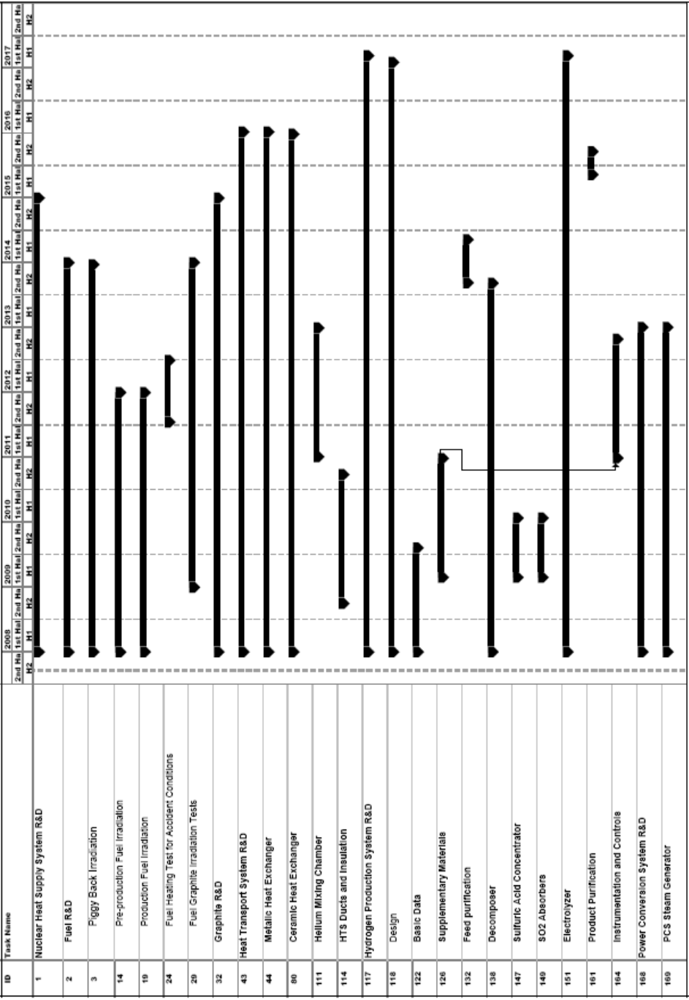

## **VIII.A NUCLEAR HEAT SUPPLY SYSTEM** 

## **Fuel Irradiation** 

DDNs have identified the need for additional fuel irradiation capsules that will provide confirmation of meeting the extended performance envelope of the NGNP and assure an adequate statistical database for the design and licensing efforts.  It will require additional data covering the increased fluence and the operating and limiting accident temperatures of the reference UO2 fuel.  Burnups as high as 109 MWD/MT are to be tested at peak operating temperatures of 1300 C, with peak temperatures during accident conditions of 1800 C.  Budget estimates are subject to irradiation facility plans and overall cooperative arrangements.  The PBMR DPP baseline plans assume continued use of the Russian IVV-2M test reactor.  In the near-term, process qualification fuel particles and spheres made with prototypical production equipment need to be characterized, including unirradiated fuel data and initial irradiated fuel data to confirm production specifications.  This fuel will be available in 2008, and presents a mutual opportunity for INL and Pebble Bed Modular Reactor (Pty) Ltd. to collaborate on efforts that will help develop needed experience at INL/ATR and perhaps other facilities.  Assuming a collaborative INL/PBMR fuel qualification program, a preliminary budget allowance for incremental fuel development is $45 M.  Pilot plant production fuel for such capsules is projected to be available in the 2012 timeframe, and the baseline schedule for supplemental testing requires about 6 years. 

## **Graphite** 

DDNs for the incremental graphite qualification program for the NGNP address gaps in data covering the fluence-temperature operating range at both low and high temperatures.  In order to take mutual advantage of PBMR’s ongoing program to qualify SGL graphite, plus INL’s and PBMR’s mutual interests to cooperate on graphite qualification with SGL and Graftek, efforts are underway to develop a collaborative INL/PBMR program.  Priority activities in FY2008 include continued planning and preparation for the initiation of capsule irradiation tests at INL/ATR.  Assuming a collaborative INL/PBMR graphite qualification program, a preliminary allowance for the budget is $5 M. 

## **VIII.B HEAT TRANSPORT SYSTEM** 

The Intermediate Heat Exchanger (IHX) is a critical component of the NGNP and a fundamental enabling technology for high-temperature process heat applications in general.  The IHX requires a significant development effort, largely in the materials area, to demonstrate that a design can be developed for the high temperatures, pressures and transients expected for the NGNP.  Parallel efforts are recommended that address the most promising metallic and ceramic materials.  The results will support an ASME code case and a final design for the IHX that will 

need to be prototyped and tested.  The total cost for IHX development is estimated to be $53 Million, which includes approximately $10 M for an IHX test facility.  The IHX technology development is projected to take about 8 years to complete. 

## **VIII.C HYDROGEN PRODUCTION PLANT** 

The Hybrid Sulfur (HyS) process has been selected as the initial reference hydrogen production technology for the NGNP preconceptual design, on the basis that it has the best chance of early commercial deployment.  However, the HyS technology poses significant research and development challenges.  While the process has been demonstrated on a laboratory scale, converting the laboratory performance into a production plant requires significant R&D in the areas of basic thermo-chemical reaction and kinetic data and the development of key components, including the decomposer and electrolyzer, followed closely by the sulfuric acid concentrator and SO2 absorber.   The total technology development cost is $58 M which includes a pilot plant to test individual components, system dynamics and the effects of low levels of impurities on sensitive components.  The scope of the R&D effort described herein is only a rough first estimate.  With additional design, research, and study work, the scope may change in important ways.  Development related to materials of construction appears at this point to be the most important source of risk. 

## **VIII.D POWER CONVERSION SYSTEM** 

The power conversion cycle chosen for the NGNP is a Rankine cycle, requiring a steam generator.  While helium-to-steam generators have been previously built, the NGNP Steam Generator requires incremental development, due to its larger size and the increased helium temperatures that would be present under some operating conditions.  Since the Steam Generator is a long lead time procurement component, key elements of the Steam Generator Technology Development Program need to be started no later than FY 2009.  Significant prototype testing is also included in the technology development plans.  The total cost of the Steam Generator technology development is $22.5 M, and will take 5 years to complete. 

## **VIII.E  ENHANCING TECHNOLOGY DEVELOPMENT OPPORTUNITIES** 

As previously noted, the NGNP Technology Development Plan, described herein, is incremental to the presently ongoing PBMR DPP R&D effort and includes enabling technology development only.  In this context, the term “enabling technology development” refers to the minimum required to design, license and operate the NGNP.  Although not specifically scoped, scheduled or estimated in this plan, “enhancing technology” development opportunities were identified that would be useful for long term research to enhance the performance of the PBMR NGNP and/or further reduce cost and risk, particularly in follow-on commercial applications. 

Areas in which enhancing technology development opportunities were identified include: 

- Advanced Fuel Development 

- Advanced Fuel Manufacturing 

- Advanced Fuel Cycle Investigations 

- Design Code Development Verification & Validation Collaboration 

- Extended Graphite Development and Characterization 

- Liquid Salt Heat Transport Media 

It should be noted that the Technology Development needs for other process heat applications have not been included and will be the subject of future special studies. 

## **IX LICENSING AND PERMITTING** 

Licensing is recognized as a major cost and schedule risk for the NGNP project.  This section presents a licensing strategy for the PBMR-based NGNP project that seeks to mitigate such risks.  Key elements include:  (1) a license application strategy, (2) the treatment of risks, (3) regulatory compliance, (4) technical issue resolution and (5) strategy execution. Schedule and cost estimates for executing the NGNP licensing strategy are included in PCDR Sections 18 and 19, respectively.  The resultant strategy supports a NGNP operation date of 2018, assuming adequate resources for the overall project plus NRC acceptance of the PBMR’s nuclear safety concept.  An overview of the strategy follows: 

- The PBMR-based NGNP licensing strategy fulfills the requirements in the Energy Policy Act of 2005 for licensing by the NRC. 

- The PBMR-based NGNP licensing strategy supports the NGNP strategy concurrently being advanced by the NGNP Working Group that seeks to establish a Public/Private Partnership between DOE and an end-user based Alliance that can serve as the applicant for the DOE-owned NGNP. 

- The PBMR-based NGNP licensing strategy builds upon the ongoing PBMR Design Certification Pre-Application Program. 

- An integrated NGNP pre-application program (of approximately 48 months duration) should be conducted with NRC. 

- The license application strategy for NGNP should include:  (1) review and receipt of an Early Site Permit (ESP) within about 21 months, (2) review and receipt of a Combined License (COL, for construction and operation) within about 36 months and (3) a Limited Work Authorization (LWA) for early site work. 

- Implementation of risk-informed, performance-based methods provides a means for logical evaluation and resolution of regulatory compliance issues – especially those related to non-LWR technology. 

- Successful collaboration with supporting industry programs is important to the timely resolution of safety issues with the NRC staff, including coordination of R&D with the NRC, national laboratories, and other supporting programs. 

- The ESP and COL for the NGNP at INL will establish a precedent for applying Part 52 to a non-LWR design and, specifically, will provide a firm basis for timely Design Certification, licensing, and operation of follow-on NGNP derivative commercial plants. 

The proposed licensing strategy is further developed in the conceptual design phase of the NGNP program including the following major activities: 

Establish an integrated NGNP Licensing Strategy, including a project schedule, acceptable to all stakeholders. 

Establish the NGNP Licensing Review Basis document to coordinate planning with the 

NRC. 

- Establish an integrated Regulatory Technology Development Plan that will serve as the basis for any independent R&D needs by the NRC. 

- Establish an integrated plan for the preparation of environmental permitting applications. 

## **X SCHEDULE** 

The PBMR NGNP Project schedule establishes a project road map from conceptual design, through construction and startup of the demonstration plant by the end of FY 2018. The schedule identifies various activities and key milestones.  Subsequent resource loading of schedule activities provides yearly funding profiles starting at the beginning of the conceptual design in 2008, and through the anticipated plant shutdown for inspection and analysis in 2021. 

In general, the activities presented in the schedule are categorized into project level activities and facility level activities.  For consistency with other NGNP-related work, project level activities are identified and grouped in accordance with the Work Breakdown Structure (WBS) provided by INL/BEA.  The NGNP Project schedule integrates the project and facility level activities into a cohesive presentation for the execution of the project. 

The schedule of activities for the Nuclear Heat Supply Facility (NHSF) has been developed with the project schedule for the PBMR DPP used as input.  All NHSF activities, activity durations, and activity linking have been reviewed by Pebble Bed Modular Reactor (Pty) Ltd. and reflect NGNP Project-specific issues.  The development schedules for both the Intermediate Heat Exchanger (IHX) and the Hydrogen Production Facility (HPF) represent the best available logic and expectations for achieving critical development targets. The schedules for the Power Conversion Facility (PCF) and BOP facilities represent conventional scheduling experience. 

The NGNP Project schedule was prepared so as to be consistent with DOE Order 413.3 project and budget cycle and Critical Decision (CD) points (CD-0, CD-1, CD-2, etc.).  The schedule shows two sets of critical decision points for the two plant facilities that will have most significant cost and/or risk impact associated with the NGNP mission: the NHSF and the HPF. Separate CD milestones are shown for the HPF, due to the differences in schedule logic. Preliminary Design and Final Design for the HPF need to wait for technology development to occur. 

The overall NGNP Project schedule from start to full power is 11 years in duration, with an additional 3 years of operation thereafter.  At the end of 3 years of operation there will be a one month shutdown for inspections.  A summary of the NGNP Project Schedule is shown in Figure ES-20.  The schedule begins with the start of conceptual design in early October 2007. The final completion date, meaning the completion of startup and testing activities and operation of the facility at full power, is at the end of September 2018. 

Licensing activities, whether application preparation activities by the NGNP Project team or NRC review activities, occur during approximately the first 7½ years.  The NRC licensing process includes both an Early Site Permit (ESP)/Limited Work Authorization (LWA) and a Combined Construction Operating License (COL) application review process.  The anticipated 

NRC review duration for each is anticipated to be 21 months and 36 months, respectively, and will occur during the latter part of the 7½ year period. 

A critical path analysis of the schedule resulted in the identification of three potential critical paths: 

1. NHSF engineering/design, safety analysis, licensing, and construction 

2. IHX technology development 

3. Hybrid Sulfur (HyS) technology development. 

The first critical path results from analyzing the scheduled activities and identifying activities through precedent and antecedent links between activities.  The second two potential critical paths are derived from an assessment of less tangible risks inherent in the schedule; specifically, the uncertainties associated with the technology development of the IHX and HyS process. 

The approach adopted for the NGNP Project Schedule is one that assumes a balanced risk.  Invariably, any risk inherent in the schedule will have an associated risk to the project cost estimate.  Therefore, mitigation of schedule risks will not only ensure timely completion of the project, but also reduce the likelihood of significant cost variances from the estimated project cost.  In brief, identified risks include: 

- Licensing Cost and Schedule Risks; 

- Technology Development Costs and Schedule Risks; 

- Project Development Costs and Schedule Risks; 

- Project Experience Risks; 

- Adequate Resource Risks, and 

- Commercial Infrastructure Risks. 

The following recommendations concerning the NGNP Project Schedule are made in order to address the risks and reduce the uncertainty in meeting the project completion date at the end of fiscal year 2018: 

- Begin implementation of the future studies and conceptual design, as soon as possible. 

- Start NGNP pre-application interactions with the NRC as soon as possible to secure the licensing strategy basis for the schedule. 

- Immediately implement the recommended technology development programs, 

particularly in the areas of the IHX and limiting hydrogen production processes. 

- Begin developing the acquisition strategies and long lead procurement programs for the major equipment identified in the schedule. 

- Develop and implement risk mitigation strategies. 

During the course of the preconceptual design effort, the Westinghouse Team developed more detail for conceptual design activities.  A summary of the Conceptual Design schedule is shown in Figure ES-21. 

The Conceptual Design schedule is arranged in a similar manner as the NGNP Project schedule, utilizing the BEA WBS as much as practicable.   In addition to design activities, the schedule also shows programmatic activities such as program level plan and procedure development and design reviews by BEA at 35 and 90% Conceptual Design milestones.  Other important activities shown include pre-application interactions with the NRC and the immediate start of essential technology development tasks, as recommended by the Team. 

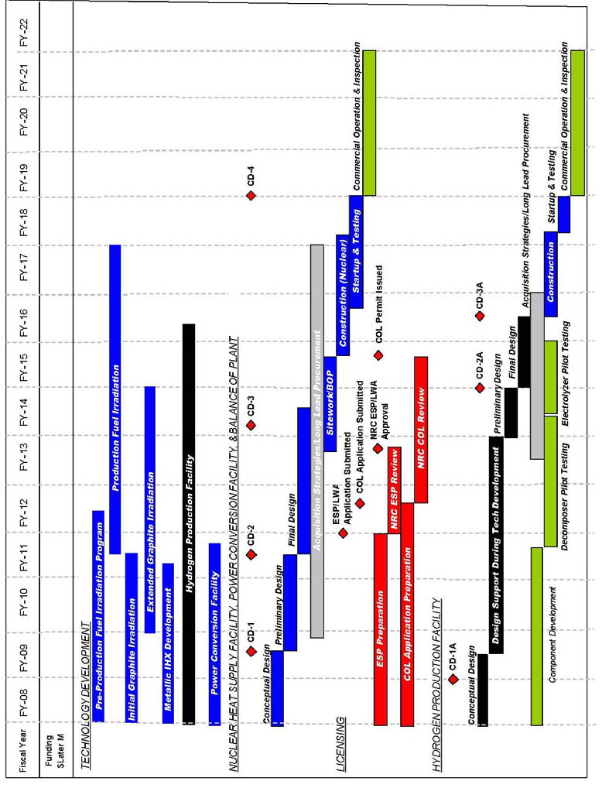

**----- Start of picture text -----** 
Figure ES-20:  NGNP Project Schedule and Funding Profile Summary **----- End of picture text -----** 

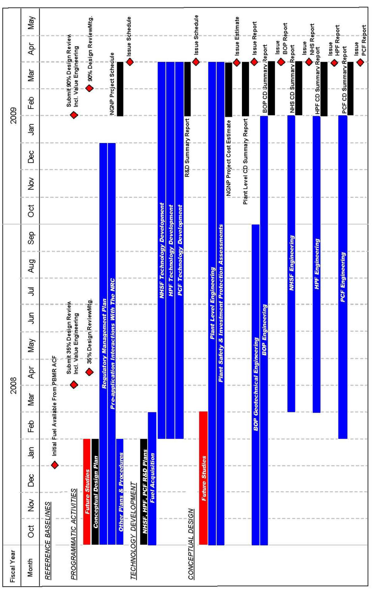

## **XI ECONOMICS** 

This section investigates the capital costs, operating costs and the economic performance for the PBMR-based Next Generation Nuclear Plant (NGNP).  This includes the development, construction and 6 years of operation of the NGNP integrated facilities as well as the future construction and operation of a mature full-scale, four-module commercial plant. 

## **NGNP Demonstration Project** 

The capital costs are estimated based on the preconceptual design information presented in other sections of this report.  The major capital cost components of these projects are: 

- Nuclear Heat Supply Facility (NHSF), 

- Hydrogen Production Facility (HPF), 

- Power Conversion Facility (PCF), and 

- Site and Balance of Plant (BOP). 

Other significant initial expenditures included in the estimate for the NGNP Demonstration Project are: 

- NGNP design development, 

- NGNP licensing and permitting, 

- Technology development (R&D), 

- Project management for the design, licensing, construction and startup by the vendor/supplier team 

- Project development and management by the evolving Public/Private Partnership (PPP) entity and INL/BEA staff support, 

- Project startup costs including the plant operating staff, and 

- First-of-a-kind (FOAK) reference commercial plant design and design certification of a standard NHSS and its associated auxiliaries and structures. 

The NGNP Demonstration Project costs are applied to the schedule developed in Section 18 to calculate yearly cash flows beginning with Conceptual Design in 2008. The resulting summary schedule and fiscal-year, resource-loaded schedule are included in Appendix A of this section. Costs for labor and materials are identified at a summary level for the major WBS elements of the Project (e.g., Technology Development, Licensing, Design and Construction) for each of the major facilities and for Project management. 

Operating revenues and expenses are projected for the NGNP Demonstration Project. 

The NGNP Demonstration Project is projected to begin operation in 2018 with an anticipated plant shutdown in 2020 for inspection and maintenance.  Afterwards, outage maintenance will be done on a six-year cycle. 

The key results of this analysis are: 

- The total cost for the PBMR-based NGNP Project is $2.08B in 2007$ plus an estimated $338 million in inflation plus escalation (based on an assumed 2%/yr underlying inflation with the assumption there is no escalation in capital above inflation).  Total project expenditures by year are summarized in Figure ES-22.  Costs by major area are shown in Figure ES-23.  These estimates are sensitive to the uncertainty range for some of the major equipment cost estimates and related development costs, where such equipment is not currently available commercially. 

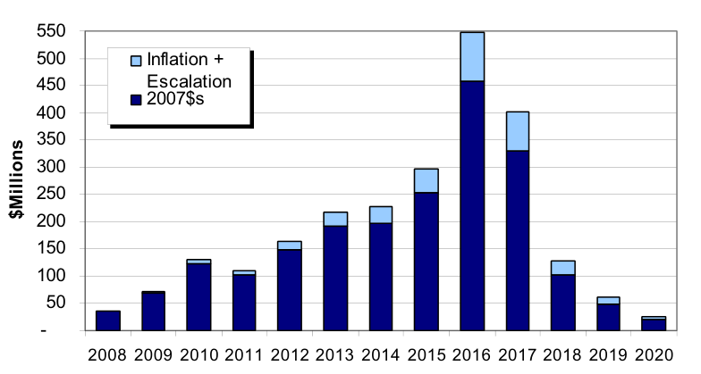

**----- Start of picture text -----** 
550 500 Inflation + 450 Escalation 2007$s 400 350 300 250 200 150 100 50 - 2008 2009 2010 2011 2012 2013 2014 2015 2016 2017 2018 2019 2020 $Millions **----- End of picture text -----** 

## **Figure ES-22:  PBMR NGNP Demonstration Project Cash Flow** 

The PBMR nuclear reactor system plus related equipment and fuel will be demonstrated in South Africa with the PBMR Demonstration Power Plant (DPP).  PBMR (Pty) Ltd. has provided provisional estimates for their expected scope of supply that builds on extensive ongoing work to support the DPP. 

Major components of the Hybrid Sulfur Process, including the internals of the thermochemical reactor and the electrochemical cells, require further development and demonstration to confirm cost estimates that have been prepared based on experience with similar equipment and systems and inputs from suppliers.  Costs of the electrochemical cells are based on expectations that appropriate materials and functional technology development objectives will be achieved. 

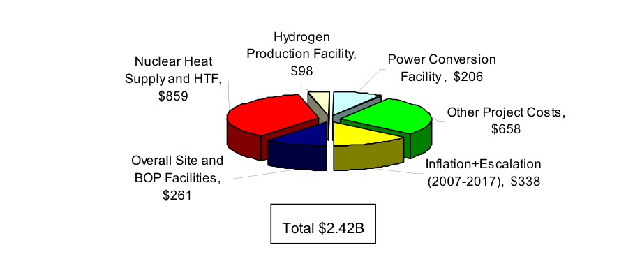

**----- Start of picture text -----** 
Hydrogen Nuclear Heat  Production Facility,  Power Conversion $98 Supply and HTF,  Facility ,  $206 $859 Other Project Costs, $658 Overall Site and  Inflation+Escalation BOP Facilities,   (2007-2017),  $338 $261 Total $2.42B **----- End of picture text -----** 

## **Figure ES-23:  Summary of PBMR NGNP Demonstration Project Costs ($M)** 

Operating costs for the first six years of operation are shown in Figure ES-24.  Operating costs include fuel costs, fixed costs and variable operating costs. 

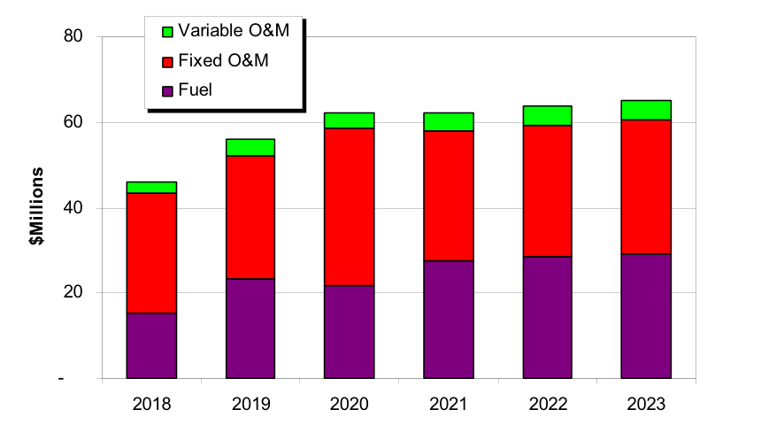

**----- Start of picture text -----** 
80 Variable O&M Fixed O&M Fuel 60 40 20 - 2018 2019 2020 2021 2022 2023 $Millions **----- End of picture text -----** 

**Figure ES-24:  NGNP Demonstration Project Operating Costs (As-Spent $)** 

The revenues projected for the first six years of operation of the demonstration plant are shown in Figure ES-25.  These include power, hydrogen and oxygen sales. The revenues are based on market prices of $2/kg for hydrogen with a 2%/yr real escalation, $50/MWh for power with a 1%/yr real escalation, $40/tonne for oxygen with a 0.5%/yr real escalation and $30/tonne for CO2 credits with a 1.5%/yr real escalation.  The drop in 2020 is due to a shutdown and inspection of the developmental components and systems plus first routine maintenance. Afterwards, schedule maintenance outages are done on a six-year cycle. 

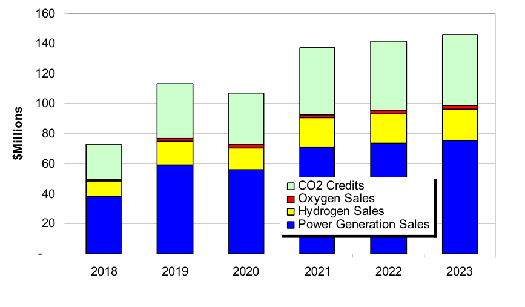

**----- Start of picture text -----** 
160 140 120 100 80 60 CO2 Credits 40 Oxygen Sales Hydrogen Sales 20 Power Generation Sales - 2018 2019 2020 2021 2022 2023 $Millions **----- End of picture text -----** 

## **Figure ES-25:  NGNP Demonstration Project Revenue Projections (As-Spent $)** 

If the costs and revenues presented above can be achieved, the NGNP Project should be able to operate with a net positive cash flow.  Key uncertainties include: 

- Ability to achieve the estimated operating costs, 

- Ability to achieve plant output and availability, 

- Access to markets for hydrogen, oxygen, power and CO2 credits, and 

- Ability to secure hydrogen, oxygen and power revenues plus CO2 credits. 

## **Commercial Plant Project** 

The mature Commercial Plant Project is projected to enter operation in 2026 and the life cycle costs are based on 40 years of operation.  The resulting economic model for the 

commercial plant calculates the required price for hydrogen to recover the required return on investment and cover plant operating costs. 

The design of the Commercial Plant Project is derived from the NGNP Demonstration Project with the following major differences: 

- The NHSF includes four nuclear reactor modules and heat transport system modules, each module coupled to a dedicated HPF module and a single steam generator, 

- A single turbine generator uses heat from all four HPF modules and is optimized to use recovered heat for feedwater heating, 

- One larger IHX is provided per NHSS module vs. two smaller IHX’s in the Demonstration plant; IHX service life is extended to match plant economic life, 

- Each steam generator is sized for the amount of heat available with the HPF operating, 

- A Gulf Coast site that provides lower labor cost and higher productivity, good access for heavy equipment delivery, ability to use wet cooling towers, and close access to power delivery for transmission and bulk pipeline distribution systems for hydrogen and oxygen delivery to industrial markets. 

The cost for the Commercial Plant Project is summarized in Figure ES-26.  The total cost is, $3.72B in 2007$ plus $1.56 billion in inflation and escalation. 

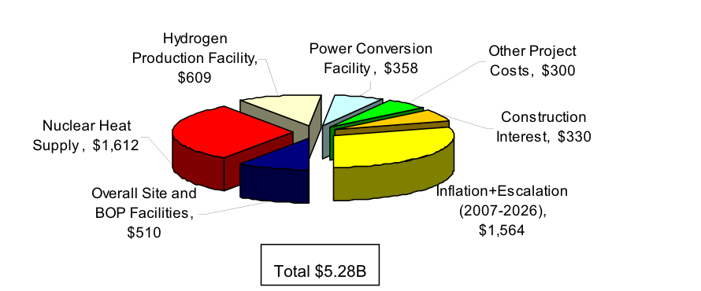

**----- Start of picture text -----** 
Hydrogen Power Conversion  Other Project Production Facility, Facility ,  $358  Costs,  $300 $609 Construction Nuclear Heat Interest,  $330 Supply ,  $1,612 Overall Site and  Inflation+Escalation BOP Facilities,   (2007-2026), $510  $1,564 Total $5.28B **----- End of picture text -----** 

**Figure ES-26:  Summary of Commercial Plant Project Capital Cost ($M)** 

A cash flow model was developed to determine the required price of hydrogen to cover the capital, fuel and operating costs of the Commercial Plant Project.  As a mature “n-th plant” project, this assumes a number of other projects are successfully implemented between the time 

the NGNP is completed and before the mature Commercial Plant is deployed.  The following key assumptions and targets illustrate the circumstances under which the Commercial Plant Project achieves economic viability: 

- Positive outcomes of nuclear technology and design certification efforts that support plant simplification and staffing targets, 

- Positive outcomes from technology development that support key plant design, performance and maintenance targets, 

- Achievement of major gains in mature technology, supply chain and project experience that support project implementation and cost targets, 

- Positive economic conditions that support the labor, material and equipment costing and other economic assumptions embedded in this analysis, 

- Achievement of 95% average plant capacity factor through plant design, operations and preventive maintenance, 

- Achievement of suitable project risk management approaches that support project financing through equity and debt arrangements associated with mature power projects, possibly in combination with some forms of public and/or regulated ratepayer risk sharing arrangements, consistent with the history of US nuclear and infrastructure projects that provide long term benefits to ratepayers and the public. 

- Markets for new hydrogen and oxygen capacity that support revenue targets for the project, 

- Markets for new power generation capacity and energy that support the power revenue targets for the project, and 

- Continued real escalation of natural gas prices, hydrogen prices and power generation prices plus implementation of a CO2 emission trading system that provides revenue from sale of credits. 

These assumptions support an economic analysis of a mature Commercial Plant Project that can produce hydrogen at an equivalent 2007 base price of $2/kg, or at an equivalent natural gas price of about $7.75/MMBtu for a new conventional steam methane reforming plant producing hydrogen over the same period.  These results are sensitive to the assumptions, e.g. a 2%/yr real escalation rate for hydrogen, applied for this analysis, which are described further in other parts of this report. 

The required price of hydrogen is highly sensitive to the required equity Rate of Return (“ROR”).  The required equity ROR reflects the amount of risk taken by investors compared to other investments available to them.  A representative equity ROR of 16% is assumed as a base case value to reflect the cost of equity that is associated with mature projects covered by strong contracts that virtually eliminate construction risk and market risk.  If these risks are not eliminated then investor perceptions may require higher equity ROR.  Conversely, if some or all of the equity is replaced with investment secured by the public or by a regulated rate base, a lower return will acceptable which has a dramatic impact on the required price of hydrogen. 

Figure ES-27 shows the sensitivity of required hydrogen price to variations in the ROR. A one percent reduction in the equity rate of return is roughly equal to $0.40/kg – $0.50/kg.  This clearly demonstrates how critical the cost of capital is for capital intensive projects.  If the project is financed entirely by government bonds, for example, the required cost of hydrogen would drop below current hydrogen pricing given the assumptions used in these calculations. Alternatively, if the equity has to carry a lot of risk, the high rate of return results in a cost of hydrogen well above expected market prices.  This forms the philosophical basis for a public/private partnership with some combination of risk sharing that reflects the long term value of such a project to the public based on environmental and energy security benefits. 

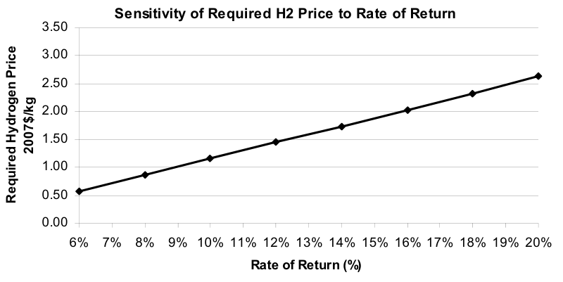

**----- Start of picture text -----** 
Sensitivity of Required H2 Price to Rate of Return 3.50 3.00 2.50 2.00 1.50 1.00 0.50 0.00 6% 7% 8% 9% 10% 11% 12% 13% 14% 15% 16% 17% 18% 19% 20% Rate of Return (%) 2007$/kg Required Hydrogen Price **----- End of picture text -----** 

**Figure ES-27:  Sensitivity of Required Hydrogen Price to Equity ROR** 

## **XII   RISKS AND APPROACH TO MITIGATION** 

Each of the PCDR design and assessment sections lists the related complexity and risks as a means of tracking alignment with the corresponding mitigation strategy that may warrant a R&D or programmatic priority.  A summary of the top level risks follows per principal areas: 

Licensing Technology Development Project Development Project Experience Adequate Resources Commercial Infrastructure 

For each of these principal areas, Table ES-4 identifies the risks, a summary of the basis for the risks; and the planned approach to mitigate them. 

**Table ES-4:  Top Level Risks and Approach to Mitigation** 

## **XIII PATH FORWARD** 

Each of the PCDR design and assessment sections lists the related future studies which serve as priority scope candidates for the next phase of design development.  The overall conceptual design scope and schedule is described in Section 18, and path forward priorities are noted below.  Recommended future studies are also summarized as they will likely lead path forward activities. 

## **XIII.A  PATH FORWARD PRIORITIES** 

The following recommendations concerning the NGNP Project Schedule are made in order to address the risks and reduce the uncertainty in meeting the project completion date at the end of fiscal year 2018: 

- Begin implementation of the future studies (see below) and conceptual design, as soon as possible. 

- Start NGNP pre-application interactions with the NRC as soon as possible to secure the licensing strategy basis for the schedule. 

- Immediately implement the recommended technology development programs, particularly in the areas of the IHX and limiting hydrogen production processes. 

- Begin developing the acquisition strategies and long lead procurement programs for the major equipment identified in the schedule. 

- Develop and implement risk mitigation strategies. 

## **XIII.B  FUTURE STUDIES FOR THE START OF CONCEPTUAL DESIGN** 

This section summarizes the major future studies recommended to be performed as part of the conceptual design.  Section XIII.B.1 includes most of the future studies contained in the individual sections of the PCDR.  Section XIII.B.2 addresses additional major future studies identified as a result of dialog during the PCDR 90% Design Review Meeting. 

## **XIII.B.1 Major Future Studies Contained in Individual PCDR Sections** 

## **Consolidate Reference Top Level Requirements** 

A front-end, thorough review and comment resolution process with INL/BEA and other stakeholders on the top level requirements proposed for the reference commercial version of the PBMR NGNP is needed to assure that the conceptual design effort is well grounded. Additionally, the NGNP-specific requirements (e.g., site and demonstration related) need to be compared with those needed for a commercial plant for a generic site to assure that any differences are reconciled. 

## **Applications Study** 

The portfolio of leading applications accessible with the reference NHSS design is needed for the advancement of the NGNP Alliance as well as for the development of additional and/or enveloping top level requirements for the NGNP.  The Westinghouse Team will build upon past and ongoing internal work on such applications to effect a significant cost-sharing contribution to the overall effort.  To date, the following applications have been identified for this task. 

- Oil Sands (OS) Applications 

- Enhanced Oil Recovery (EOR) Applications 

- Steam Methane Reforming (SMR) Applications 

- High Temperature Steam Electrolysis (HTSE) Applications 

- Coal-to-Gas (CTG) and Coal-to-Liquids (CTL) Applications 

For each family of applications, the following scope topics will be addressed: 

- Describe the application and market conditions in order to frame the basic market opportunity for HTGR process heat in this market. 

- Develop a reference summary level flowsheet and scoping economic assessment for coupling a PBMR-PHP for the applications. 

- Develop a reference scoping economic assessment for the conventional fossil fired production systems envisioned as the comparative bases. 

- Develop economic comparisons of the above and identify key drivers such as capital costs, price of natural gas and cost of CO2 sequestration (or related tax). 

- Characterize the environmental, energy security or other benefits and issues derived from the application of PBMR process heat in this application. 

- Based on the economic potential above, develop one or more strategy options for demonstrating such applications as part of the NGNP Project, including cooperative initiatives with other stakeholders. 

Building upon the results of the Preconceptual Design Report and the results from the above subtasks, this study will develop the likely integrated demonstration strategy for one or more of the applications, including the relative pros and cons.  This study will also provide recommendations and rationale for overall NGNP Project and Alliance development. 

Based on the results of the above, the top level requirements will be revised to envelope the mutually agreed-upon applications. 

## **Initial Licensing Basis Events** 

This study extends the preconceptual design safety effort by determining an initial set of Licensing Basis Events (Anticipated Operational Occurrences, Design Basis Events and Accidents, and Beyond Design Basis Events) for use during conceptual design.  This initial set of LBEs for the NGNP demonstration will be based on prior work and form the starting point for the iterative design – safety analyses process. 

## **NHSS Configuration** 

This study revisits and more thoroughly evaluates the trade offs with the Reactor and HTS design selections of the preconceptual design.  The scope of this NHSS study includes: 

- Reactor inlet return piping location 

- Concentric versus separate hot and cold piping 

- Core Conditioning System (for forced decay heat removal) location, size, redundancy, and independence 

- Number of IHXs and/or circulators 

- Arrangement and replacement of the very high temperature section of the IHX 

- Location of the secondary circulator(s) 

- Safety functions of the Heat Transport System (HTS) and their allocation to Primary HTS/Secondary HTS Systems, Structures and Components 

- Need for tritium and other cleanup systems for the SHTS 

## **Plant Layout** 

This study extends the preconceptual design layout effort in the following areas: 

- Reactor embedment – Identify all applicable requirements and regulatory sources pertaining to the protection of the Nuclear Heat Supply System against natural and man-made phenomena.  This study will evaluate and assess alternatives for partially burying or not burying the NHSB. 

- Separation distance vs. building design robustness vs. physical barriers – This study will evaluate cost/safety/licensing/security tradeoffs for NHSS building, HPS/decomposer component/building and PCS/SG component/building. 

- Shared NHSS building walls and systems - Evaluate and assess alternatives for the degree of shared NHSS building walls and support systems. 

- Control system design and layout - Evaluate and assess alternatives for the integrated vs. distributed control systems and their locations. 

- Geotechnical data - Evaluate the acceptability of the current geotechnical data for the INL site – This study will review and assess the validity and acceptability of available geotechnical data obtained in the NPR program and by others for the INL site.  This study will also determine the extent to which additional geotechnical investigations, including new borings and topographical surveys, are required to support foundation design for the PBMR NGNP site layout. 

- Seismic Hazards Analysis data - Review and verify validity and applicability of existing Probabilistic Seismic Hazard Analysis data that have been assembled for other INL facilities.  It is anticipated that the conclusion of this study would be that the design ground level response spectra developed for these other facilities is representative and bounding for application to the PBMR NGNP with respect to NRC regulatory standards.  If this is the case, a site specific Probabilistic Seismic Hazard Analysis may not be required for the PBMR NGNP. 

## **Hydrogen Process and Material Selections** 

This study will make a more detailed comparison of the HyS and HTSE technologies. This study will include a more detailed risk assessment of the HTSE process and compare the results with those for the HyS process.  Additional process development for both HyS and HTSE will be carried out.  The study will also pursue continued development of preferred hydrogen processes, design selections and materials, to prepare for a conceptual design that is both technically feasible and cost effective.  In addition, this study will build upon the initial selections and findings in the PCDR and evaluate concept alternatives that may be more cost effective, evaluate the maximum temperature for the hydrogen process, perform a hazards analysis of decomposers, and expand studies on life cycle costs for alternate technologies **.** . Selection and validation of process concepts and materials of construction will take place during the conceptual design phase. 

## **Value Engineering Study** 

This study involves performing a Value Engineering study within the first 6 months of the conceptual design work.  Value Engineering is a systematic evaluation to find solutions which will improve system performance and/or reduce cost compared to the initial selections. The Value Engineering structured study would be at the facility or system level, or a combination, based on an initial screening process. 

## **COLA Pre-application Strategy** 

This study is a follow-on to Licensing Special Study 20.6 and PCDR Section 17.  It develops the plan for pre-application interactions with the NRC for the NGNP Combined License Application (COLA), building on the ongoing PBMR design certification preapplication interactions.  The objectives, scope, cost, and schedule for the COLA pre-application interactions will be addressed, including the bases for the COLA schedule estimates.  The generic white papers from the ongoing PBMR interactions will be supplemented with NGNPspecific topics that:  1) are necessary to obtain NRC feedback prior to the COLA and 2) are potentially critical path items, e.g., requiring long lead technology development.  Candidate topics may include those related to the extension of the power rating to 500 MWt, the regulatory treatment of the IHX Helium Pressure Boundary, and the proximity of process hazards to the Nuclear Heat Supply System. 

## **Construction Modularization Study** 

This study will build upon the pre-conceptual design, and evaluate alternative construction techniques that could potentially improve the onsite construction schedule, reduce the cost estimate,, and reduce the risk in both areas.  The study will evaluate design concepts that would facilitate construction modularization, including but not limited to altering the site arrangement and/or building arrangements to enhance constructability, selecting different materials of construction, such as replacing conventional concrete forming concepts, preassembly of rooms and/or buildings, and preassembly of bulk materials and/or subsystems. 

## **Water and Waste Water System Optimization Trade Study** 

This study will optimize the approach to water and waste water usage, treatment, and disposal.  This recommended study is based on the assumption that the NGNP will be a zero liquid discharge site and knowing that:  (1) large amounts of water are required for make up and cooling of HPS, PCS and BOP systems and (2) treatment is required for process waste water discharge and blow-down from these systems. 

## **Steam Generator Design Trade Study** 

This study will evaluate alternative approaches for the steam generator including more 

conventional designs (e.g., refractory lined, U tubes) compared to the once-through helical SG proposed in the preconceptual design.  Single vs. multiple trains will be evaluated.  The results of the study will establish a path forward for design development of the steam generator. 

## **Rankine Cycle Trade Study** 

Further engineering studies are recommended for the conceptual design stage to optimize the Rankine Cycle configuration and performance.  The study will assess costs and performance benefits of more efficient cycles with steam reheat vs. more simple and less costly, but less efficient systems.  The study will proceed in conjunction with the steam generator design trade study discussed above. 

## **Major Equipment Transportation Trade Study / Major Component Field Fabrication** 

Detailed studies of the:  (1) transportation routes and size constraints for transport of large components or sub-components such as the reactor and steam generator and (2) potential modularization for major components are recommended early in the conceptual design phase. This latter study will assess schedule and cost advantages and disadvantages of final assembly of major items at or near the site.  These studies will influence the design of access roads and a rail spur shown on the site plan and plot plan as well as plans for modification to other roads in the vicinity of the INL site. 

## **XIII.B.2 Major Future Studies Identified as a Result of the 90% Design Review Meeting** 

The following is an overview of additional future studies identified as a result of the 90% Design Review Meeting between INL/BEA and the Westinghouse Team. 

## **Stochastic Analysis of the Pebble Bed Reactor** 

Prepare a white paper on the treatment of stochastic analysis of the behavior of the pebble-bed reactor in the safety analyses and associated uncertainties. 

## **Evaluation of the Control Room Location** 

Perform an evaluation of the cost savings associated with placing the control room outside of the vital area including the cost of construction and cost impact on day-to-day operations.  This would include analyzing the safety considerations of the control room and of required operator actions, and the impact of the rest of the plant on the control room.  The safety hazard protection of the control room would be included.  This study would also include evaluating the use of digital control systems. 

## **Licensing Aspects of Nuclear Heat Supply System Connection with Other Plant Facilities** 

The licensing of the NHSS facility independent of other facilities needs to be further developed.  This study includes developing a model to determine whether there is a safety case that isolates the NHSS from the rest of the plant.  This has been discussed, but needs to be documented to determine the extent of interactions, and how it would impact the plant layout to keep the NHSF separate from and the HPF, PCF and BOP from a licensing perspective. 

## **PBMR Reactor Building Requirements, Functions and Features** 

Prepare a white paper on the requirements, functions, and design features of the PBMR reactor building.  Clearly identify all requirements, including performance, costs, investment protection and safety.  Perform an analysis of the safety considerations of the PBMR designed with a confinement versus an LWR-type containment.  Identify benefits and adverse consequences of selecting an LWR-type containment.  Consider the citadel concept of the DPP for either alternative. 

## **Dust Control** 

Prepare a white paper on dust control for the NGNP NHSS.  Determine whether it is necessary to test the IHX for dust blockage and release during accidents.  Consider similarities and differences with the DPP and its approach to dust management. 

## **Post-Irradiation Examination Facility** 

Perform preconceptual design work and assess the cost for adding a Post-Irradiation Examination (PIE) facility to NGNP.  This study will be to perform PIE on core ceramics and similar materials, but not fuel elements.  The pre-conceptual PIE facility design would include the shielding concepts and the facility description. 

## **Evaluation of the NPR Site versus Other Sites on INL** 

Evaluate the benefits of using the NPR site versus other available site locations at INL. Consider existing geotechnical and seismic data and analysis, water table, location relative to road, railroad access and electrical transmission lines, topography and other relevant factors. 

## **Simulation Modeling** 

Survey potential simulation modeling tools for the PBMR NGNP configuration and implement an integrated simulation tool required to perform transient analysis of an integrated plant. 

## **Transient Analysis of NHSS, HTS, and PCS** 

Perform a transient analysis to identify and analyze transient cases that could effect the design requirements of the PCS with respect to ensuring safety of the NHSS.  Demonstration cases and commercial configurations will be assessed to ensure that the NHSS and HPS function within their design basis envelopes throughout the assumed transient conditions. 

## **Water Availability** 

Evaluate water availability to determine whether air cooling is necessary for the INL site, considering the extra cost associated with the large cooling surface required for air cooling. 

## **Air Ingress White Paper** 

Prepare a white paper on air ingress relative to meeting the NGNP safety offsite requirements under abnormal events.  Consider similarities and differences with the DPP design and its approach to chemical attack. 

## **Quality Assurance Considerations of Fuel** 

Evaluate the Quality Assurance considerations of German fuel and Russian test data for licensing with the U.S. NRC. 

## **Cyber Security** 

Evaluate the cyber security impacts on the overall plant safeguards and security system. 

## **Continuing Interaction Related to Technology Development** 

In addition to the above future studies, which are specific in nature to the individual topics, it is recommended that there be a task which fosters continued interaction with INL/BEA regarding technology development and related cost estimates. 

## **XIV BENEFITS OF A PBMR NGNP** 

Traditionally, nuclear energy has been used for the production of bulk electricity using predominately LWR technology at a delivery temperature of about 300ºC.  The deployment of ALWRs is underway which are ideally suited for large capacity additions of baseload power. The leading Generation IV nuclear technology is the HTGR which can provide high temperature, emission-free heat for industrial processes. 

The NGNP Project will serve to demonstrate and commercialize the HTGR as the first Generation IV system.  The PBMR offers a compelling opportunity for the NGNP Project.  Its capability to deliver process heat at temperatures up to 900ºC with current reactor and fuel technology, plus the on-line refueling design, are key discriminating design features within the family of competing modular HTGRs.  The PBMR technology also offers improved safety, reliability, proliferation resistance, security and waste management features.  Further, the PBMR is evaluated to be competitive for a broad range of applications, particularly when displacing natural gas and taking credits for the elimination of CO2 emissions.  The NGNP Project will demonstrate such commercial potential of the PBMR and associated technologies plus support timely Design Certification and the related commercial infrastructure. 

The Westinghouse NGNP Team of world-class developers, suppliers and users has supported the development of a user-based NGNP Alliance and the concept of such an Alliance and DOE creating a public/private partnership to drive the NGNP development and deployment. This effort has been conducted in parallel with this initial cost-shared contract with DOE/INL to develop a NGNP preconceptual design, cost and schedule, plus the related licensing strategy and R&D plan. 

The Westinghouse Team’s design for the NGNP adapts the reactor system and fuel from the Brayton cycle-based PBMR DPP which is nearing the start of construction in South Africa. Value transfer from the PBMR DPP Project and related fuel manufacturing and test facilities plus the ongoing PBMR pre-application program with the NRC and PHP project initiatives assure a new commercialization phase for nuclear energy for production of process heat and bulk hydrogen without carbon emissions – at the lowest costs and risks for the US taxpayers. 

The PBMR DPP reactor and fuel value transfer along with the US base of vendor/supplier capability, the Pre-application Program and other project initiatives offer a compelling opportunity for the US, South Africa and others to deploy a PBMR-based NGNP for the least costs and risks, plus an assured commercial outcome.  The Westinghouse Team is ready, capable and committed to this end. 

## **REFERENCES** 

NONE 

## **APPENDICES** 

NONE 

## **Appendix J** 

## **AREVA Executive Summary Report** 

J-1 

J-2 

Document No. 12-9052076-000 

## **NGNP with Hydrogen Production Preconceptual Design Studies Report Executive Summary** 

## **June 2007** 

## _**Disclaimer**_ 

_This report was prepared as an account of work sponsored by an agency of the United States Government. Neither the United States Government nor any agency thereof, nor any of their employees, nor their contractors and subcontractors, makes any warranty, express or implied, or assumes any legal liability or responsibility for the accuracy, completeness, or usefulness of any information, apparatus, product, or process disclosed, or represents that its use would not infringe privately owned rights. Reference herein to any specific commercial product, process, or service by trade name, trademark, manufacturer, or otherwise does not necessarily constitute or imply its endorsement, recommendation, or favoring by the United States Government or any agency thereof. The views and opinions of authors expressed herein do not necessarily state or reflect those of the United States Government or any agency thereof._ 

**BEA Contract No. 000 60209** 

## **Record of Revisions** 

|**Revision**|**Date**|**Pages/Sections Changed**|**Brief Description**|
|---|---|---|---|
|000|6/05/2007|None.|Original Issue|
|||||
|||||

## **Table of Contents** 

## **Table of Contents (continued)** 

## **List of Tables** 

Table 3-1:  Normal Operating Parameters..............................................................................................14 Table 3-2:  Main Parameters of the PCS system....................................................................................18 Table 4-1:  General Fuel Quality Requirements .....................................................................................22 Table 8-1:  Suggested NGNP Future Studies.........................................................................................38 **List of Figures Page** Figure 1-1:  AREVA NGNP Team Organization .......................................................................................7 Figure 3-1:  AREVA HTR Indirect Cycle NGNP Schematic....................................................................13 Figure 3-2:  Internal Structure of TRISO Coated Fuel Particle ...............................................................14 Figure 3-3:  Core Layout.........................................................................................................................15 Figure 3-4:  Vessels Arrangement ..........................................................................................................16 Figure 3-5:  PCS Configuration...............................................................................................................17 Figure 3-6:  Plant Layout.........................................................................................................................20 Figure 4-1:  NGNP Fuel Program Schedule ...........................................................................................26 Figure 6-1:  NGNP High Level Schedule ................................................................................................30 

## **1.0 INTRODUCTION** 

This report summarizes the Next Generation Nuclear Plant (NGNP) preconceptual design studies performed by the AREVA NGNP team for the Battelle Energy Alliance (BEA), the Management & Operating Contractor of the Idaho National Laboratory (INL) as part of the Department of Energy’s (DOE) NGNP Project.  These studies are documented more fully in the AREVA report _NGNP with Hydrogen Production Preconceptual Design Studies Report_ (document 12-9051191). 

## **1.1 NGNP Preconceptual Design Studies Objectives** 

DOE’s NGNP Project, as authorized by the Energy Policy Act of 2005, will develop and demonstrate a first-of-akind very-high-temperature gas-cooled nuclear system with the capability to generate electrical power and demonstrate nuclear hydrogen production. The overall objectives of this project include: 

- Development and implementation of technology required for the NGNP mission 

- Demonstration of a commercially scaleable  prototype nuclear heat source, hydrogen production facility, and power generating system 

- Development of a regulatory framework (requirements and process) for licensing the NGNP prototype and for future HTR commercialization 

- Fostering rebuilding of U.S. nuclear industrial infrastructure 

The purpose of INL in authorizing the preconceptual design studies summarized herein is two-fold: 

1. Assist INL in focusing the technical scope and priorities of research & development activities for the NGNP. 

2. Provide INL a basis for subsequent development of the technical and functional specifications for the 

   - prototype facilities for NGNP. 

The preconceptual design studies as performed by AREVA within the authorized work scope and as reported herein are also consistent with the corresponding elements of the Phase I scope of work defined for the NGNP Project in the Energy Policy Act of 2005. 

## **1.2 Scope of Work** 

The Scope of Work assigned to the AREVA NGNP team consisted of the preparation of a preconceptual design studies report on the adaptation of AREVA’s ANTARES HTR concept to NGNP requirements and four supporting special studies. Because BEA/INL issued multiple awards, the final scope of work reported on herein is a reduced scope of work relative to the initial scope of work requested by BEA/INL in their Statement of Work No. 3963, “Preconceptual Engineering Services for the Next Generation Nuclear Plant with Hydrogen Production,” (Project No. 23843, July 26, 2006). 

Key work elements developed within the framework of the scope of work are listed below: 

- NGNP System Requirements Manual 

- Develop NGNP preconceptual design 

- Four supporting special studies: 

   - Reactor Type Comparison Study 

   - Prototype Power Level Study 

   - Power Conversion System Study 

   - Primary and Secondary Cycle Concept Study 

- Identification of R&D needs and project risks 

- Cost and economic analysis 

- Project schedule 

- Preconceptual Design Studies Report 

Of the above special studies, only the results of the reactor power level and primary-secondary systems study are factored into the NGNP preconceptual design. The direction to adapt the ANTARES indirect cycle CCGT concept to the NGNP made the results of the reactor type and power conversion system moot relative to the preconceptual design, nevertheless, they were performed due to the valuable insights they would provide BEA/INL for the NGNP conceptual design. 

## **1.3 AREVA NGNP Team** 

AREVA, as the lead contractor for this work scope, has the overall project responsibility.  In support of the NGNP preconceptual design work, AREVA assembled a team of sub-contractor companies with the key technical competencies needed to cover the full breadth and scope of the NGNP project including final design, construction, and operations. 

The AREVA NGNP Team includes Burns & Roe, Washington Group International, BWXT, Dominion Engineering, Air Products, Hamilton-Sundstrand-Rocketdyne, Mitsubishi Heavy Industries (MHI), NovaTech, and Entergy. The team organization is show graphically on Figure 1-1 below 

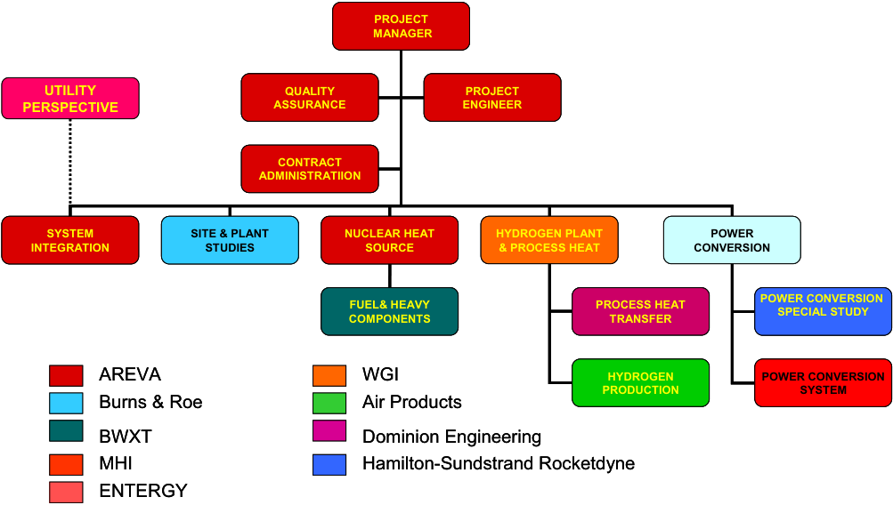

**----- Start of picture text -----** 
PROJECT MANAGER UTILITY QUALITY PROJECT PERSPECTIVE ASSURANCE ENGINEER CONTRACT ADMINISTRATIION SYSTEM SITE & PLANT NUCLEAR HEAT HYDROGEN PLANT POWER INTEGRATION STUDIES SOURCE & PROCESS HEAT CONVERSION POWER CONVERSION FUEL& HEAVY PROCESS HEAT SPECIAL STUDY COMPONENTS TRANSFER AREVA WGI HYDROGEN POWER CONVERSION PRODUCTION SYSTEM Burns & Roe Air Products BWXT Dominion Engineering MHI Hamilton-Sundstrand Rocketdyne ENTERGY **----- End of picture text -----** 

**Figure 1-1:  AREVA NGNP Team Organization** 

## **2.0 NGNP PRECONCEPTUAL DESIGN SPECIAL STUDIES** 

The DOE-AREVA work plan governing NGNP preconceptual work specified that the NGNP design be an adaptation of ANTARES, the AREVA HTR concept.  ANTARES is an indirect cycle, 600 MWth prismatic graphite block reactor that, via an intermediate heat exchanger, is coupled to a combined cycle gas turbine (CCGT) power conversion system.  In this context, the following special studies were performed as part of the preconceptual design scope of work: 

1. Reactor Type Comparison Study 

2. Prototype Power Level Study 

3. Power Conversion System  (PCS) Study 

4. Primary and Secondary Cycle Concept Study 

The results of the power level study and the primary-secondary cycle concept study were integrated into the NGNP preconceptual design.  The results of the reactor type comparison study and the PCS study were not integrated into the NGNP design adaptation, because the key design features were set by AREVA’s assigned scope of work.  Nevertheless, the results of these studies will provide important input to INL’s overall selection process to establish the NGNP path forward. 

The key results from these studies are summarized in the following sections. 

## **2.1 Reactor Type Comparison Study** 

The Reactor Type Comparison Study compared the prismatic reactor concept to the pebble bed reactor concept. The report identified the most important discriminating criteria between the two concepts and provided an assessment of the important technical, operational and maintenance differences and the important developmental risks for each. The report concluded that the prismatic reactor concept best fulfills the needs of the NGNP Program because the prismatic reactor offers the following key advantages over the pebble reactor alternative: 

- Higher power level and passive safety 

- More useable power (i.e., less parasitic power loss) 

- Greater economic potential 

- Higher degree of license-ability (i.e., concept previously licensed in the USA (FSV)) 

- Higher degree of predictability 

   - Core performance 

   - Less chance of forced outages 

   - Scheduled outages 

   - Greater design flexibility 

The prismatic reactor represents the best technological foundation for a commercially attractive, multi-use high temperature reactor concept. Of all the benefits it offers, it is the prismatic reactor’s superior power level capability that makes it most attractive. 

The results of the reactor type study were moot relative to the NGNP design adaptation because the reactor type selection was fixed by contract (i.e., it specified the adaptation of the ANTARES design). 

## **2.2 Prototype Power Level Study** 

This special study was conducted to answer the following questions: 

- What should be the rated power level of the Nth of a Kind (NOAK) commercial VHTR module? 

- Given the desired power level of the commercial VHTR module, what should be the rated power level of the NGNP prototype plant? 

- In order to demonstrate commercial scalability of an associated hydrogen production plant, what is the power requirement for a demonstration plant to be associated with the NGNP reactor? 

The study examined key discriminating criteria that were selected because of the insight they would provide relative to these many faceted questions. As a result, the study arrived at the following answers to the three study questions: 

1. The commercial VHTR module should be designed to operate at 565MWth. 

This provides the most economical module size achievable within the passive decay heat removal constraint for the NGNP operating conditions. 

2. The NGNP prototype plant should be designed and operated at 100% of the planned commercial power level, that is, 565MWth. 

This maximizes the benefit of the NGNP prototype to support technology development, licensing, and component design for direct commercialization, thus minimizing risk for the first commercial plant. 

3. The hydrogen generation demonstration loop using the SI process will require 60MWth of process heat and 20MWe from the power conversion system while the hydrogen demonstration loop using the HTE process will require only 1.2 MWth of process heat and 5MWe from the power conversion system 

This represents the best balance between the current state of hydrogen process technology, the expected state of the technology when the NGNP prototype is scheduled to enter service, and the design to step directly to full scale commercial deployment following demonstration in the NGNP. 

As stated above, building the NGNP prototype at full size minimizes the deployment risk and difficulty for the first commercial plant.  However, in doing so, it places greater risk and effort on the NGNP.  Therefore, it might be beneficial to confirm the initial study results in a more detailed evaluation of the partitioning of required R&D, risk, and design effort between the prototype plant and the first commercial plant.  Such a study is recommended as part of the future studies identified later in this report.  The recommended study would evaluate these factors in greater detail than was possible in the initial study and would also consider the impact on prototype deployment schedule and program political sustainability. 

## **2.3 Power Conversion System Study** 

The Power Conversion System (PCS) Study examined two closely related questions; namely: 

- What type of PCS should be used? � How should the PCS be coupled to the reactor? o Brayton cycle o Directly o Rankine cycle o Indirectly 

   - Combined cycle gas turbine 

   - Supercritical CO2 (SCCO2) 

   - Cascaded Supercritical CO2 (SC CO2) 

Considerations driving the selection are system performance; flexibility and operability; adaptability of existing technology; technology maturity; deployment schedule, system costs including development, capital, and operation and maintenance; reliability; availability; and maintainability. 

Further, the relationship between the NGNP and a commercial plant must be considered.  The NGNP must serve both electricity (PCS) and the hydrogen plant.  The NGNP conditions are driven largely by hydrogen process. 

However, the commercial electricity plant would likely have different conditions.  Also, the optimum PCS for the commercial plant may not be the same as the optimum PCS for the NGNP. 

The best PCS cycle for the NGNP is dependent upon the worth of cycle efficiency and the importance of cycle maturity, especially as it relates to achieving NGNP startup in 2018: 

1. Steam-Rankine cycles are the most mature, but the cost of steam turbines and supporting equipment reduces their attractiveness.  The supercritical steam cycle with two reheats is the best steam cycle option. 

2. The supercritical CO2 cycles are very promising for longer term applications.  The need for development is a disadvantage for near term applications.  The ability to arrange them in a cascaded configuration for large �T applications is a plus. 

3. The Brayton cycles are marginal in cost and performance.  Operation and maintenance difficulties from radioactive contamination of the PCS are a negative for the direct Brayton cycle.  The loss of efficiency as a result of the temperature drop across the IHX reduces the attractiveness of the indirect Brayton cycle. Further, because of the relative unattractiveness of the Brayton cycles when compared to the supercritical CO2 cycles brings further pursuit of Brayton cycle development into question. 

4. The CCGT performance is good but the costs, added complexity and lower maturity when compared with Steam-Rankine cycles reduces its attractiveness.  The potential for long term economic advantage from small efficiency differences when compared to the supercritical steam-Rankine cycle or the indirect Brayton cycle may swing the advantage to the CCGT. 

Based on the above results, the steam-Rankine cycle (possibly supercritical) is clearly the best fit for a near term applications such as the NGNP.  It provides high efficiency electricity production and can readily service near term process heat markets.  Moreover, it is a familiar technology that is directly coupled to reactor system. 

The results of the PCS Study were not integrated into the design adaptation because the PCS concept was fixed by contract to the adaptation of the ANTARES design. 

However, as noted in the discussion of future studies later in this summary report, a thorough evaluation of the potential to apply a steam cycle design to the NGNP mission us strongly recommended.  This evaluation should include the development of a preconceptual steam cycle design based on the prismatic HTR and a comparative evaluation of the R&D requirements and technical risk of a steam cycle concept compared to the reference VHTR concept. 

## **2.4 Primary and Secondary Cycle Concept Study** 

The Primary and Secondary Cycle Concept Study establishes the basic NGNP operating parameters for the primary and secondary cycle and establishes the reference configuration for NGNP preconceptual design adaptation. Furthermore, it enhances the basis for NGNP Design Baseline. 

The main objective of the study is to answer the following questions: 

- What is the recommended reactor Tout? 

- What is the recommended reactor Tin? 

- What should the system configuration be? And, 

   - Should the heat supply to the hydrogen process be in parallel or in series with power generating system? 

   - How many loops should the system have? 

- What is the secondary side Thot and Tcold? 

- What are the primary and secondary system pressures? 

The answers to the above questions are driven by the following high level NGNP objectives; namely: 

- The demonstration of commercial scale electricity generation and scalable hydrogen production 

- The demonstration of advanced hydrogen production processes (i.e., Sulfur-Iodine and High Temperature Electrolysis), and 

- Achieving initial NGNP operation by 2018. 

Additionally, the answers to these questions were based on the governing design considerations:  feasibility and risk, safety, performance, flexibility, cost and schedule. As a result, the answers to the main questions posed in the study are summarized below: 

Reactor outlet temperature 900°C 

(The selection of the reactor outlet temperature is driven primarily by a balance between hydrogen process performance and nuclear heat source feasibility.) 

Reactor inlet temperature 500°C 

(The reactor inlet temperature is driven by a number of nuclear heat source design considerations.) 

System configuration Parallel heat supply to electricity generating system (PCS) and hydrogen plant 3 loops with tubular IHXs for PCS 1 loop with compact IHX for hydrogen plant 

(The system configuration is driven by both component design feasibility issues and operational flexibility considerations.) 

Secondary temperatures 450-850°C for PCS 

475-875°C for hydrogen plant heat transport loop 

(The secondary temperatures are optimized by IHX cost considerations and the different relative impact of temperature on system performance between anticipated hydrogen processes and the PCS.) 

Primary system pressure 5.0 MPa primary circuit Secondary balanced with primary 

(The system pressure is linked to a balance between circulator power requirements and vessel loading.) 

The above data, along with the selected power level of 565 MWth, constitutes the basic parameter set for the reference NGNP design adaptation. 

## **3.0 REFERENCE NGNP PRECONCEPTUAL DESIGN** 

The NGNP is aimed at producing both electricity and hydrogen in a cogeneration mode. The plant can operate in an all-electric mode and it can also produce hydrogen and electricity simultaneously.  The NGNP is envisioned as a flexible demonstration and R&D facility, and it is expected that multiple high temperature hydrogen production processes and components will be demonstrated. 

The NGNP plant consists of the following: 

- Nuclear Heat Source 

- Power Conversion System 

- High Temperature Heat Transport Loop 

- Hydrogen Production Plant 

- Site facilities 

The reference AREVA NGNP design studied within the present preconceptual design work is based on an adaptation of the ANTARES design. It consists of a modular Very High Temperature Reactor (VHTR) coupled to a combined cycle gas turbine (CCGT) generating system. The design is based on an indirect cycle configuration in which heat from the reactor is transferred to a closed loop Brayton cycle through Intermediate Heat eXchangers (IHXs). A nitrogen based fluid is used in the secondary circuit in order to allow air-breathing gas turbine technology to be used. In addition, heat is also provided to a heat transport loop connected to a hydrogen production plant. The proposed concept is illustrated schematically in Figure 3-1. 

The indirect cycle offers several advantages to reduce the overall development risk in contrast to a direct cycle concept. As already noted, the indirect cycle allows the use of air-breathing gas turbine technology, avoiding the development of helium turbomachinery. The indirect cycle also makes maintenance and potential modification and adjustment of the system more practical, since the equipment is distributed rather than being in a tightly integrated configuration. Also, contamination of the power generating equipment is minimized, since any circulating radiocontaminants are confined to the primary circuit. In addition, operation and analysis of plant performance is simplified, because the dynamics of the reactor and primary circuit are partially decoupled from the power generating system.  The indirect cycle also allows considering similar nuclear heat sources for a variety of applications, i.e., electricity generation or process heat application. 

The values of the normal operating parameters used during the Preconceptual Design Phase are indicated in Table 3-1. 

The design options and the operating parameters selected for the Preconceptual Design are assessed to be the best compromise for direct production of hydrogen at high temperature. Such a design is considered as challenging but feasible with adequate reasonable R&D. 

## **3.1 Nuclear System Arrangement** 

The Nuclear Heat Source (NHS) of the AREVA NGNP plant is a modular graphite-moderated, helium-cooled nuclear reactor, located in a metallic vessel. This type of reactor has the capability to supply high temperature heat for a variety of applications, and its safety characteristics provide advantages in plant sitting, in protection of capital investment, and in minimizing the number of safety systems required. The AREVA NGNP design uses a completely ceramic prismatic block reactor core. The absence of metal alloys in the core allows very high reactor outlet temperatures to be achieved during normal operation. 

The fuel consists of approximately 20 billion ceramic coated fuel particles, each being about 1 mm in diameter. Each “TRISO” particle has a fuel kernel at the center surrounded by three successive layers of low and high 

density carbon and silicon carbide. Figure 3-2 illustrates the coating layers, including a final outer layer of high density carbon which protects the SiC during manufacturing. These layers retain fission products within the fuel particles during normal operation and accident conditions. The fuel particles are molded into cylindrical rods called compacts, and loaded into the prismatic graphite fuel blocks. 

The AREVA NGNP concept uses an annular core. The active portion of the core consists of 102 columns of 10 blocks each, for a total 1020 fuel elements. Among them, 30 columns have a dedicated channel for the introduction of an absorber element, 12 start-up for CPS control rod (start-up rods) and 18 for reserve shutdown system control element. Figure 3-3 gives the detail of the core layout. This configuration was selected based on experience from AREVA NP participation in the early phases of the General Atomics/OKBM GT-MHR program. 

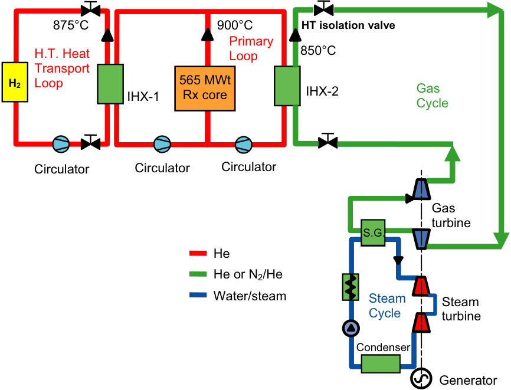

**----- Start of picture text -----** 
875°C 900°C HT isolation valve Primary H.T. Heat  Loop 850°C Transport H2 Loop 565 MWt  IHX-2 Gas IHX-1 Rx core Cycle Circulator Circulator Circulator Gas turbine S.G. He He or N2/He Water/steam Steam Steam Cycle turbine Condenser Generator **----- End of picture text -----** 

**Figure 3-1:  AREVA HTR Indirect Cycle NGNP Schematic** 

Heat produced in the reactor is transferred to IHXs via the Primary Heat Transfer System (PHTS). The IHX is the functional interface between the NHS and the energy user. Two types of IHX are proposed for the NGNP: tubular IHXs for heat transfer to Power Conversion System and a compact IHX for the H2 plant. 

Tubular IHXs are preferred over compact IHXs for the PCS due to the inherent robustness of this type of concept and the maturity of this design to operate at temperatures of 900 ºC or above for a design life of 20 years. Compact IHX technology is selected for the H2 plant due to the more benign service conditions and to the limited impact of a shorter design life for the smaller IHX on the overall plant costs.  Moreover, it is expected that this IHX will be replaced more frequently in any event in order to test alternate technologies. 

In addition to the IHXs, the PHTS includes the main helium circulators, and the required ducting to channel the coolant from the reactor to the IHX, from the IHX to the circulator, and from the circulator back to the reactor inlet. 

**Table 3-1:  Normal Operating Parameters** 

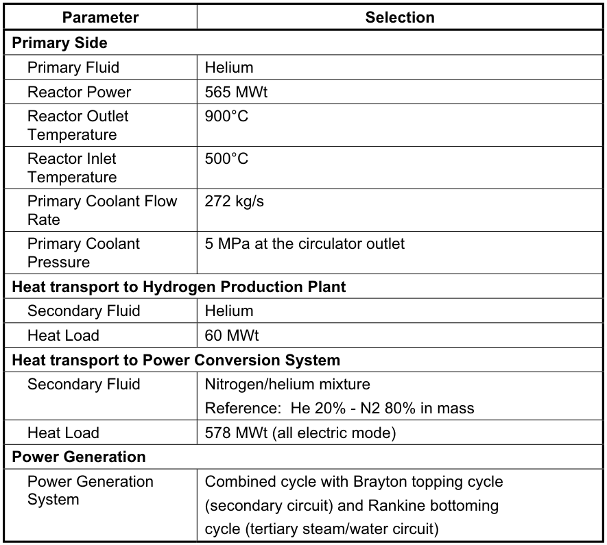

**----- Start of picture text -----** 
Parameter Selection Primary Side Primary Fluid  Helium Reactor Power  565 MWt Reactor Outlet  900°C Temperature Reactor Inlet  500°C Temperature Primary Coolant Flow  272 kg/s Rate Primary Coolant  5 MPa at the circulator outlet Pressure Heat transport to Hydrogen Production Plant Secondary Fluid  Helium Heat Load  60 MWt Heat transport to Power Conversion System Secondary Fluid  Nitrogen/helium mixture Reference:  He 20% - N2 80% in mass Heat Load  578 MWt (all electric mode) Power Generation Power Generation  Combined cycle with Brayton topping cycle System (secondary circuit) and Rankine bottoming cycle (tertiary steam/water circuit) **----- End of picture text -----** 

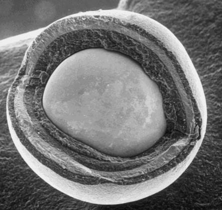

**Figure 3-2:  Internal Structure of TRISO Coated Fuel Particle** 

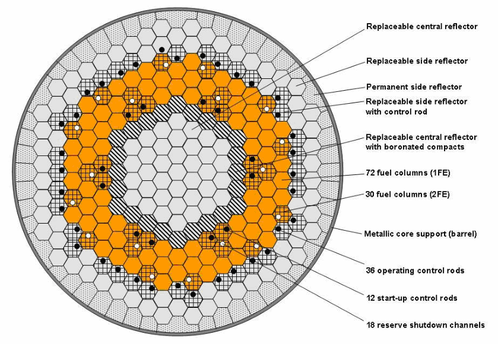

**Figure 3-3:  Core Layout** 

The NHS systems are contained in a steel vessel system. The reactor pressure vessel is fabricated from Modified 9 Cr – 1 Mo. This alloy provides increased high temperature capability which is compatible with the reactor operating temperatures and provides sufficient margin for off-normal events. 

The Reactor Vessel contains the reactor core and internals.  Each IHX Vessel contains IHX modules, main circulator, and the necessary interconnecting primary and secondary coolant ducts.  The Cross Vessels connect the Reactor Vessel and the IHX Vessels, and they maintain concentric flow paths between the reactor and IHXs. Figure 3-4 shows the proposed Vessels system arrangement. 

During normal operation the IHX separates the primary and secondary coolant, however isolation valves are provided to complete the primary coolant boundary in case of IHX or secondary duct leakage.  More generally, the circuits interfacing the primary circuit are equipped with isolating devices for minimizing the consequences of failures. 

## **3.2 Nuclear Support Systems** 

The Nuclear Heat Source is complemented by a series of support systems designed either to fulfill one specific function or to improve the overall plant safety. 

The Start-up and Decay Heat Removal System (SDHRS), the reactor Shutdown Cooling Systems (SCS), and the Reactor Cavity Cooling System (RCCS) provide decay and residual heat removal capabilities, in addition to the primary heat transfer loop and secondary loop. 

Refueling capabilities are provided by the Fuel Handling System (FHS). This automated system is based on the design of Fort St. Vrain and GT-MHR with the exception of the Fuel Storage Server (FSS) instead of Fuel Transfer Casks. The FSS reduces the calculated refueling time through more efficient transfer of fuel elements 

between the vessel and the local fuel storage module. It is anticipated that outages will occur after approximately 417 full-power days of operation; however, design burn up of NGNP fuel is achieved only after fuel has been irradiated for two cycles, so half of the 1020 fuel blocks are replaced in each outage. The core must be completely un-stacked and re-stacked, on a segment by segment basis, using a mix of new and partly spent fuel.  The estimated refueling time is 20.9 days and includes approximately 25% contingency. This refueling duration satisfies the required availability allocation. This estimate assumes that 25% of the replaceable reflector blocks are replaced during each refueling outage. One advantage of refueling envisioned for prismatic reactors vs. online refueling for pebble bed reactor is that it confines downtime to scheduled period and avoids the negative impact of forced outages. 

## **Tubular IHX Vessels** 

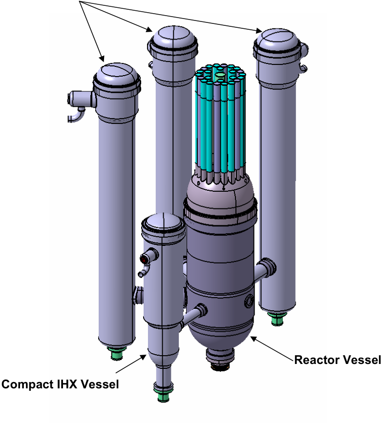

**----- Start of picture text -----** 
Reactor Vessel Compact IHX Vessel **----- End of picture text -----** 

**Figure 3-4:  Vessels Arrangement** 

## **3.3 Power Conversion System Arrangement** 

The AREVA NGNP PCS system is based on the adaptation of the ANTARES combined cycle gas turbine concept to NGNP design conditions. 

The Brayton cycle consists of the gas turbine unit (gas turbine, compressor and auxiliaries) and the interconnecting ductwork. The main function of the gas turbine unit is to convert the thermal energy contained in secondary circuit gas exiting the IHX into electrical power. The shaft power generated by the gas turbine drives both the gas compressor and electrical generator. The heat content of the turbine exhaust gas is significant and much of it is transferred to the tertiary steam cycle. 

The major components of the tertiary circuit are the Heat Recovery Steam Generator (HRSG), the HP/IP/LP turbine units and the generator, and the condensate system. Superheated high pressure steam from the HRSG goes into high pressure (HP) turbine and then, upon exhaust, is conducted to the HRSG reheating zone. The reheat steam from the HRSG goes to the intermediate pressure (IP) turbine. The exhaust steam from IP turbine is conducted to the low pressure (LP) turbine. The exhaust steam from the LP turbine flows directly to the steam condenser. The condensate system condenses the steam from the LP turbine exhaust and supplies condensate to the feed water heaters. 

Pipes are used to transport the hot gas (850ºC) from IHX outlet to gas turbine inlet and from gas turbine outlet to HRSG inlet. Pipes conveying high temperature gas are insulated on the inner surface to keep their operating temperature low. 

The PCS configuration considered for NGNP is shown schematically in Figure 3-5. 

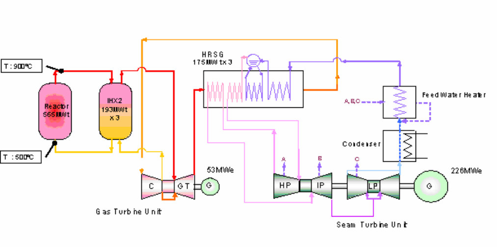

**Figure 3-5: PCS Configuration** 

This NGNP PCS configuration allows the demonstration of separate turbine generator sets and permits each power unit to be uniquely optimized for its given conditions. Furthermore, in a multiple-module setting, it is feasible to feed a common steam-turbine unit from two or more reactor modules. The NGNP PCS configuration allows the demonstration of the key control features that would be required by such an arrangement. 

Table 3-2 provides a summary of the parameters of the PCS system. 

With the NHS and PCS system described in sections 3.1 and 3.2, the performance expected for the NGNP for electricity production is the following: 

- Gas turbine/generator unit: 53 MWe 

- Steam turbine/generator unit: 226 MWe 

- Total Power Generation: 279 MWe 

This would correspond to a net efficiency of the NGNP plant of 45.8 %. 

**Table 3-2:  Main Parameters of the PCS system** 

## **3.4 Heat Transport Loop** 

Not included in the AREVA NGNP team’s scope of work. 

## **3.5 Hydrogen Production Plant** 

Not included in the AREVA NGNP team’s scope of work. 

## **3.6 Plant Layout** 

The Reactor and IHX vessels are located in a dedicated Reactor Building. The entire Reactor Building is located below grade, except for the associated portion which houses the Reactor Cavity Cooling System water storage 

tanks. The Reactor Building structure provides protection against external hazards including seismic events and aircraft threats. 

The Reactor Service Building is located at one end of the reactor complex. It houses the new fuel preparation and storage area and irradiated fuel storage. The Reactor Auxiliary Building houses waste processing and other necessary functions. Non-nuclear activities are housed in other adjacent buildings where the main control room is also located. Additional long-term irradiated fuel storage would be provided in a separate storage facility. 

Figure 3-6 shows the overall plant layout. 

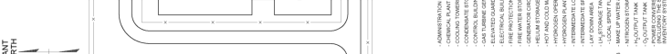

**Figure 3-6:  Plant Layout** 

## **4.0 FUEL SUPPLY STRATEGY** 

The NGNP fuel program will establish a domestic production facility with a robust fuel fabrication process which will be capable of reliably delivering finished fuel to the NGNP on the desired reload schedule.  The processes selected, including the internal gelation process for the kernels, continuous coatings, thermosetting resins for the compacts, etc. have been demonstrated to produce high quality fuel.  The fuel fabrication system will be able to be expanded as necessary, by adding modules to the production facility, as the demand for high temperature gas cooled reactors, and subsequently the need for fuel increases in the coming years. 

Building on the current development and scale-up activities, the AREVA/BWXT team will be able to implement a strategy utilizing the existing BWXT pilot fuel facility while constructing and commissioning a production facility capable of meeting the reload needs of the NGNP reactor.  The approach identified herein will deliver first core on time with the potential to deliver the core several years early, as well as be in a position to deliver the reload fuel on schedule. 

In addition to meeting the schedule needs of the program, the strategy meets all of the objectives identified in the _NGNP Preliminary Project Management Plan_ , namely development of a fuel system that will allow the NGNP to demonstrate all performance aspects of the plant, including economic feasibility of a fuel system capable of higher burn ups. 

## **4.1 Fuel Strategy** 

The TRISO fuel development, qualification, and production program must ensure the following high-level objectives of the NGNP are met: 

1. Develop and implement the technologies important to achieving the functional performance and design requirements determined through close collaboration with commercial industry end-users. 

2. Demonstrate the basis for commercialization of the nuclear system, the hydrogen production facility, and the power conversion concept.  An essential part of the prototype operations will be demonstrating that the requisite reliability and capacity factor can be achieved over an extended period of operation. 

3. Establishing the basis for licensing the commercial version of NGNP by the Nuclear Regulatory Commission.  This will be achieved in major part through licensing the prototype by NRC and initiating the process for certification of the nuclear system design. 

4. Fostering rebuilding of the US nuclear industrial infrastructure and contributing to making the US industry self-sufficient for our nuclear energy production needs. 

For NGNP to be fully successful in achieving the identified high-level objectives, a fuel development strategy has been formulated that utilizes and expands existing commercial fuel facilities, and enables the NGNP program to meet the anticipated reactor performance requirements, which will demonstrate the basis for commercialization of the nuclear island, as well as establish the basis for licensing the reactor and fuel system by the NRC, and developing a domestic fuel supply. 

Equally important to meeting these high-level objectives, the strategy developed meets the anticipated delivery requirements to support reactor startup in the 2018 timeframe, assuming the start dates are met and funding profiles identified are provided. 

Fuel related requirements and key parameter values have been specified in two top-level NGNP project requirements documents, the System Requirements Manual and the NGNP Prototype Design Baseline.  These documents specify that the base fuel for the NGNP will be a TRISO coated particle containing a less than 20% enriched fuel kernel. These particles will be fixed into cylindrical, graphite matrix compacts, which are, in turn, placed into hexagonal graphite blocks. 

In addition to these requirements and values, expected fuel performance characteristics will eventually be defined by required plant radionuclide release performance under operational and accident conditions to meet regulatory offsite and worker dose limits. The limiting radionuclide releases associated with the key accident analyses have not yet been determined. As such, the NGNP plant specific required fuel performance characteristics have not yet been defined. Until these are defined, the following general requirements are being utilized. 

**Table 4-1:  General Fuel Quality Requirements** 

* Fuel defects are particle layer failures or those conditions that would reasonably lead to particle layer failure under normal operation and accident conditions. 

## **4.2 Fuel Design** 

At this point in the preconceptual design process it is not considered necessary to specify explicit design details of the fuel particle, fuel compact, and fuel element. However, if the fuel qualification and fabrication schedules presented in this document are to be met, such parameters must be defined fairly early in the conceptual design process. 

The ANTARES design (from which the reference NGNP is adapted) assumes a reference fuel form of UO2 SiC TRISO fuel in order to minimize development risk.  The NGNP has requires aggressive fuel performance capability and encourages a domestic source for the fuel, as well as seeking to foster continued development in key HTR areas.  Therefore, though the least risk recommendation would be expanding existing US capability to manufacture TRISO fuel using a UO2 kernel, this path might not fully meet all of the NGNP long term goals. Because the time to develop, design, and construct the NGNP allows adequate time to develop UCO based TRISO fuel, we have looked at both UO2 and UCO.  There does not appear to be a significant time difference in preparing either, therefore, the baseline schedule shown in this chapter assumes UCO. 

It is still AREVA’s opinion that pursuing UO2 may have lower overall risk, and this fuel type must be included in early fuel irradiation activities along with UCO to provide a robust backup.  Should unforeseen complications arise from the continued development of the UCO kernel, UO2 would be considered as a backup kernel for the first NGNP fuel load.  This backup position should be considered, if the performance of the UCO is not as expected. 

The worldwide TRISO database is considerably larger for UO2 kernels than for UCO kernels.  Therefore, there is more risk in using UCO than in using UO2 as the reference fuel.  To ameliorate this risk, sufficient time to conduct a second performance fuel test using UO2 is provided, in the event issues arise with UCO.  It may be useful to run both performance test capsules in parallel to minimize risk while retaining the earliest benefit of UCO burnup and temperature capability. 

## **4.3 Fuel Qualification Plan** 

In order to meet the fuel performance requirements that would allow reliable operation under specified NGNP operating conditions, fuel with fabricated quality and operational characteristics at least as good as past German particle fuel will be required. There are two approaches that can be considered to meet this goal. Past German fabrication processes, practices, and equipment can be replicated, to the extent possible, in the hopes of producing product with similar characteristics. Alternatively, past German experience can be examined and key fabrication concepts coupled with modern fabrication techniques. AREVA/BWXT has chosen the latter approach for its fuel qualification program. Though this approach may require a more rigorous testing and qualification program, it will allow easier extrapolation to operational conditions beyond the German experience. 

The NGNP operational date of 2018 presents significant challenges to the development of a fuel qualification program. In order to meet this date and conduct the irradiation and testing necessary to support the plant safety case, the fuel qualification must be success-based. That is, the steps are defined with the assumption that each irradiation will be successful and that acceptable fuel performance will be demonstrated at each step. . In the schedule for fuel development and production provided below, there is adequate time built in for one repeated test capsule, if unexpected fuel failures are seen. 

There are three fabrication-irradiation-test sequences envisioned for the fuel qualification program. In each case, coating will be done in a 6" coater to baseline conditions, and a range of certain variables to provide a range of fabrication conditions, using BWXT fabrication processes.  Coated particles will be certified to a NGNP fuel specification. Compacts will be fabricated to baseline conditions in the pilot facility in Lynchburg using the AREVA compacting process. Each of the irradiation capsules used during these sequences will be monitored to detect particle failure such that appropriate actions can be taken on a timely basis. 

The first test sequence is designed to provide an early indication that the fuel and testing equipment will perform as expected. A smaller quantity of fuel would be irradiated in this sequence, since no statistical inferences will be drawn from the results. It is in this sequence that consideration should be given to irradiation of some UO2 particles as backup to the UCO fuel. Should the UCO fuel fail to perform as expected, the NGNP startup date of 2018 would still be in jeopardy, but the head start provided by the presence of the UO2 would mitigate the schedule impact. All of the fuel in this sequence would be fabricated in the pilot facility. 

The second sequence is designed to provide the data used to qualify the fuel for use in the NGNP plant. A quantity of fuel would be fabricated, irradiated, and inspected that would yield the statistics required to demonstrate that the fuel supports the plant safety case. This fuel would also be fabricated in the pilot line. It is envisioned that several batches would be made and blended to form a homogeneous lot upon which the results would be based. This process will be used to as closely as possible reflect anticipated commercial scale fabrication techniques. The statistical basis and acceptance criteria for the test will reflect this processing technique. 

The last sequence will provide the data necessary to verify that the commercial production line is capable of reliably and repeatably producing fuel with the same performance characteristics as that produced on the pilot line. The majority of fuel for this sequence will be fabricated on the commercial production line, though some limited quantity of fuel from the pilot line may be included to provide the opportunity for direct comparisons of particle performance. The quantity of fuel contained in this sequence will be determined by the extent of difference between the pilot and production lines. 

## **4.4 Fuel Fabrication Plan** 

The steps required for development and qualification of UO2 fuel and UCO fuel are essentially identical.  The plan discussed in this chapter mentions UCO fuel form, since questions have been raised regarding the development path for UCO.  However, the steps would be the same if the selected fuel form is UO2.  Similar 

steps would be followed whether for an initial UO2 program to be subsequently complemented with UCO, for an all UCO program, or for a parallel UO2/UCO program. 

Until a detailed design for the NGNP is complete, the quantity of fuel needed for the first core and reloads is not clearly defined.  For this preconceptual design report, it is assumed that the initial core will contain 5000 kg of uranium in the form of TRISO coated UCO particles.  In addition, it is assumed that half of the core will be reloaded every 18 months. 

To support the NGNP reactor long-term and minimize capital expenditures, a fuel facility needs to be constructed that can meet the desired reload schedule.  For this report, the facility output is assumed to be 2,000 kg uranium per year.  This quantity meets the 2,500 kg uranium per 18 months with a 20% excess capacity to accommodate production upsets which may occur during initial commissioning of the facility. 

Although several particle fuel fabrication facilities throughout the world have existing capacity to support their needs, there does not appear to be significant excess capacity to take on the additional needs of the NGNP. Therefore, the facility construction, commissioning, licensing, and qualification steps that must be undertaken for a US supplier, must also be undertaken for existing international suppliers as well. 

For the NGNP to fully meet the high level objectives, the fuel fabrication facility must: 

1. Demonstrate the performance of fuel fabricated in existing facilities to meet the enhanced requirements of the NGNP; 

2. Qualify fuel fabrication capabilities in existing facilities; 

3. Upgrade or construct a production facility capable of meeting the reload schedule of NGNP; 

4. Verify fuel performance from the production line; 

5. Support NRC licensing of production facility; and 

6. Produce NGNP fuel by the project delivery date. 

For these reasons, we believe that the preferred overall fuel supply option is to support development of a domestic fuel fabrication facility. 

The existing pilot facility on the BWXT site would be used to produce the Performance Test fuel.  The existing facility is licensed under the regulatory authority of the NRC and has recently successfully completed the triannual audit of the NQA-1 quality program. 

This fuel will be tested under operating and accident conditions to demonstrate the performance characteristics of the fuel fabricated using current-technology, in near-production sized equipment, including a 6” coating furnace. 

While the Performance Test fuel is being irradiated and after some burnup has accumulated, Qualification Fuel will be fabricated and pressed into compacts for qualification testing.  For this qualification, several more compacts will be fabricated to ensure a statistically significant number of particles are tested to demonstrate performance and qualify the manufacturing and inspection techniques. 

During the Performance Test fuel fabrication and irradiation program, the design and construction of the manufacturing facility will begin.  The production facility will utilize the technology employed in the pilot facility, but scaled-up and enhanced for continuous high-volume throughput. 

To meet the schedule objectives, the production facility needs to be complete, commissioned, and in production by mid-2012. 

In order to be fully successful using this option, some programmatic risk must be assumed.  For example, Qualification Fuel must be fabricated before the Performance Test fuel has completed its irradiation and post- 

irradiation examination.  The technical risk to the program, should this strategy be implemented, can be somewhat mitigated by the design of the irradiation test, i.e. the capsule design will permit real time in-core fuel failure monitoring which will give an indication of performance during normal operating conditions. 

Another opportunity to accelerate the schedule is to design and construct the fabrication facility based on the fabrication experience gained and the preliminary in-core results of the performance test fuel.  The risk to the program is judged to be very small.  A significant portion of the schedule acceleration is in the design and construction of the production building itself.  The overall size will be unaffected by the performance of the irradiation tests.  Several of the long-lead equipment items, likewise, will be unaffected by the preliminary results of the performance test fuel.  Minute processing details which could be affected by the irradiation test results have short delivery times and minimal cost.  Therefore, these parts of the equipment can be made last-minute if necessary, or remade with minimal cost should the need arise. 

The final opportunity to accelerate the schedule is to “qualify” the fuel fabrication process using the pilot-scaled facility, including the 6” coating furnace.  Then, once the production facility is completed and commissioned, a “verification” run will be made to prove the performance of the fuel fabricated in the production facility matches the performance of the qualification fuel fabricated in the pilot facility. 

Figure 4-1 shows a high-level schedule of what the fuel development/qualification/ production strategy would be. Note that the dashed lines are used to schematically represent data flows between activities and do not represent the expected timing of the data transfer. 

Although this schedule meets the first core delivery milestone of 2018, a significant feature is the use of the pilot fuel facility to manufacture fuel for four years.  During this time, the qualification irradiations are being performed and the production facility is being constructed. 

Use of the pilot facility reduces overall risk to the program because: 

- Experienced operators will maintain their skills 

- Opportunities to improve the process and develop alternative procedures will be available 

- Pilot facilities will be maintained, allowing the possibility to reproduce materials in pilot -scaled equipment. 

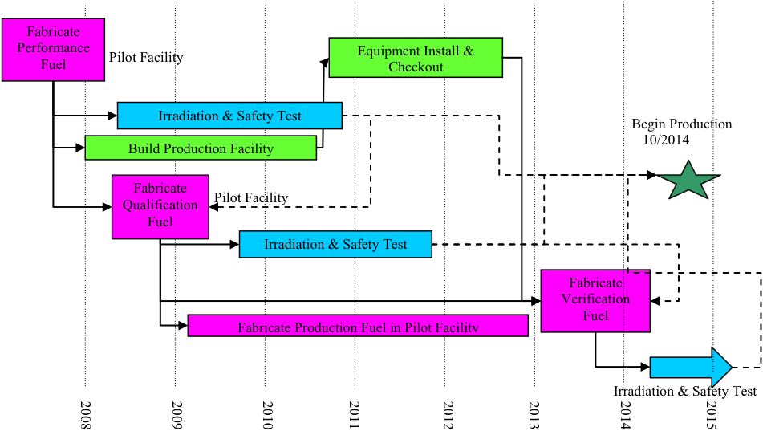

**----- Start of picture text -----** 
Fabricate Performance  Equipment Install & Fuel  Pilot Facility  Checkout Irradiation & Safety Test Begin Production 10/2014 Build Production Facility Fabricate Pilot Facility Qualification Fuel Irradiation & Safety Test Fabricate Verification Fuel Fabricate Production Fuel in Pilot Facility Irradiation & Safety Test 2008  2009  2010  2011  2012  2013  2014  2015 **----- End of picture text -----** 

**Figure 4-1:  NGNP Fuel Program Schedule** 

## **5.0 SAFETY AND LICENSING** 

## **5.1 Safety** 

The safety of the AREVA NGNP concept relies on passive systems and inherent design characteristics that provide a high confidence that the plant safety mission is met without dependence on redundant active systems. Implementation of this safety philosophy with added adherence to the traditional concept of design defense-indepth where execution of plant safety functions do not depend on a single system or component leads to a simplified safety case.   This reliance on natural laws provides high confidence that the safety requirements are met in the event of failure of engineered systems that rely on motive power. 

The high level of safety of the AREVA NGNP concept stems from the following design choices: 

_**Ceramic Fuel Particles**_ - The particle fuel coatings form billions of independent primary fission product barriers made from multiple ceramic materials covering the fuel kernel.  These coatings individually and independently stop, contain and retain a large fraction of the fission products produced in the fuel kernel. 

_**Graphite Core** -_ The high heat capacity and the low power density of the graphite annular core results in very slow and predictable temperature transients.  In addition, the strength of graphite increases with temperature up to levels well above those associated with licensing basis events.  Adequate passive core heat removal is achieved under both pressurized and depressurized primary system conditions. 

_**Helium Coolant**_ - The use of an inert, single phase gaseous coolant eliminates the possibility of a complete loss of coolant event.  Pump/circulator cavitations can not occur, and no chemical reaction between the coolant and graphite, or fuel is possible.  Furthermore, adequate active core heat removal can be achieved under either pressurized or depressurized primary system conditions. 

_**Negative Reactivity Feedback**_ – Reactor core design retains an inherent negative reactivity feedback characteristic.  If core temperatures increase, power level decreases.  This property ensures that fuel temperature rise is self-limited for loss of heat removal events. 

_**Core Region Structural Configuration**_ – The annular geometry of the core, the low power density, and the high thermal capacity ensure the cooldown of the shutdown reactor under emergency conditions by passive removal of heat from the reactor vessel using heat emission, conduction, and convection.  As a result, fuel and core temperatures remain within allowable limits in all relevant accident scenarios. 

In addition to the above inherent design features, the AREVA NGNP concept has multiple reactor trip mechanisms and decay and residual heat removal systems, including the normal shutdown system, the reserve shutdown system, the secondary nitrogen/helium loop in conjunction with the primary heat transport loop, the SDHRS, the reactor SCS, and the RCCS. The combination of inherent safety characteristics and the engineered plant protective features result in peak post-accident fuel temperatures that fall well below the range of fuel temperatures that would cause significant fuel damage leading to release of fission products. 

Furthermore, a key inherent characteristic of the AREVA NGNP concept plant is its slow response which, combined with passive residual heat removal, simplifies the operator's role and provides long time intervals for deliberate actions, thus minimizing the opportunity for operator error. 

As a result of these safety features, the AREVA NGNP plant is highly resistant to significant plant damage, even after design basis events, such the owner’s investment is continuously protected and a high degree of public safety is achieved without the reliance on off-site emergency management measures. 

## **5.2 Licensing** 

The NGNP must obtain a license from the NRC in accordance with the requirements of 10 CFR Part 50 or 10 CFR Part 52. NRC licensure is a key requirement specified in the NGNP leads to a successful plant commercialization.  Furthermore, as a first-of-a-kind (FOAK) non-light-water reactor licensed as a demonstration plant for both electricity production and hydrogen generation, the NGNP form the required regulatory technical bases that will serve the future commercialization of similarly designed plants. 

## **5.2.1 Prototype Licensing** 

Experience from the operation and prototype testing of the demonstration NGNP will be needed to support the design certification of future commercial versions.  Therefore, the NGNP as the FOAK prototype will be licensed under the conventional two step 10CFR50 licensing process: 

1. Secure a construction permit based on the review of a preliminary safety analysis report (PSAR); and, 

2. Secure an operating license based on the review of a final safety analysis report (FSAR). The license will initially be a Class 104 (c) license that will be converted to a commercial Class 103 license following a successful safety demonstration period. 

Additionally, AREVA recommends that elements of 10 CFR 52 be carried out in parallel with the Part 50 licensing process, in particular, maintaining close liaison with the NRC through pre-application technical exchanges and interactions that will be necessary to develop technology neutral licensing framework and HTR technology specific licensing bases for the NGNP demonstration facility license leading to development of regulatory bases for commercial plants of similar design. 

The proposed hybrid approach satisfies the need to initiate construction activities as early as possible but also minimizes the risk of construction prior to obtaining an operating license. However, the opportunity that the Part 50 approach offers in terms of an early construction start can only be seized if the key licensing issues such as containment versus confinement can be resolved early in the licensing process and later demonstrated by plant performance tests. 

## **5.2.2 Commercial Plant Licensing** 

It is essential that NGNP licensing process and the risk-informed performance-based licensing initiative be closely coupled to ensure the successful transition from NGNP licensing to the commercial licensing framework. This initiative is expected to result in the codification of the proposed risk-informed and performance-based alternative to Part 50 regulations. 

Once the commercial licensing framework is in place, reactor vendors can seek design certification (DC) from the NRC for their designs and plant owners can seek a combined construction-operation license under a one-step process (i.e., 10 CFR 50.52 or equivalent). 

## **5.2.3 Regulatory Requirements Development** 

The development of the regulatory framework (i.e., requirements and process) for the licensing of future commercial non-LWR nuclear power plants has been outlined by the NRC staff in draft NUREG-1860. The purpose of this framework is to provide the technical basis to support the development of a technology-neutral, risk-informed and performance-based process for the licensing of new nuclear power plants (NPP). 

This framework approach, scope and criteria may eventually be used by the NRC staff to develop a set of regulations that would serve as an alternative to 10 CFR 50 for licensing future nuclear power plants. The regulations developed from the framework approach could still be used in conjunction with 10 CFR 52 for carrying out the licensing process, i.e., obtaining a combined operating license and/or design certification.  The NGNP licensing process proposed by AREVA team can be used to exercise the framework and develop the technical bases that will be needed for the new regulation. 

## **6.0 PLANNING FOR COMPLETION OF NGNP PROJECT** 

As discussed previously the preconceptual design scope of work performed by the AREVA team was limited to the nuclear heat source, and the power conversion system for the electric generating plant.  Therefore, the depth and level of detail of the associated with the plant cost estimate and project schedule is commensurate with the AREVA scope of work and the project design status, i.e. pre-conceptual design stage. 

## **6.1 Cost and Economics** 

The NGNP cost estimate was prepared in accordance with the BEA latest work Breakdown Structure (WBS) provided to AREVA.  The WBS covers the entire lifecycle of the NGNP prototype facility beginning with the Design and terminating after several years of DD&D phase. 

At INL’s request, the cost estimate and economic analysis is not included in this summary report.  This information is being submitted to INL/BEA separately. 

## **6.2 Project Schedule** 

The NGNP project schedule encompasses the total time span beginning with the project conceptual design phase, concurrent supporting research and development activities identified in this report, licensing and permitting activities necessary to obtain an operating license, plant construction activities, long-lead component procurement including steps to be taken for key hardware acquisition, plant commissioning, testing and initial operation, leading to commercial plant demonstration and operations.  Although not shown or detailed, the project schedule includes the 38 years of the NHS and PCS commercial operation and a final six year period of decommissioning, decontamination, and dismantling/disposition (DD&D). The NGNP high level project schedule is shown in Figure 6-1.  A more detailed project schedule is provided separately 

Key elements of the AREVA NGNP project schedule consist of: 

- Plant Design 

- Research and Development 

- Licensing and Permitting 

- Procurement 

- Construction 

- Initial Startup and Commissioning 

- Commercial Operations 

- Decommissioning 

The NGNP plant design will be completed in three successive phases of conceptual, preliminary and final design. The six year phased approach to plant design although aggressive is considered achievable.  The plant design is followed up by six years of plant construction that begins after an LWA is received from the NRC for the silo excavation. 

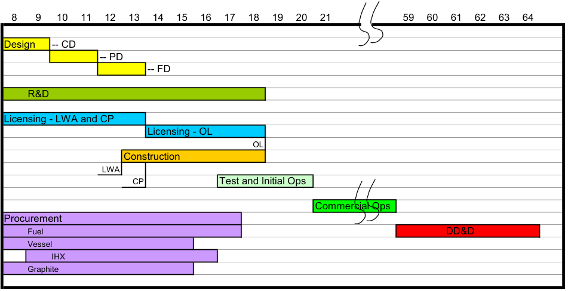

**----- Start of picture text -----** 
8 9 10 11 12 13 14 15 16 17 18 19 20 21 59 60 61 62 63 64 Design -- CD -- PD -- FD R&D Licensing - LWA and CP Licensing - OL OL Construction LWA CP Test and Initial Ops Commercial Ops Procurement Fuel DD&D Vessel IHX Graphite **----- End of picture text -----** 

## **Figure 6-1:  NGNP High Level Schedule** 

The traditional start of the nuclear plant construction (first pour of concrete) is after the NRC grants a construction permit in accordance with regulations of 10 CFR Part 50.  The total construction phase lasts six years and includes on site final assembly of the reactor vessel.  This deemed necessary due to location of the Idaho site and access and size limitations for large component transportation. 

Concurrent with the design and construction of the NGNP two important elements of the schedule must also come to successful conclusions.  The first element is licensing and permitting.  The Nuclear regulatory commission must review the design of the NGNP and grant an operating license.  This is accomplished through many reviews and independent safety analyses by the regulator.  The licensing path being recommended by AREVA is a combination of demonstration plant test (104c) and commercial plant (103) class license application.  This path will be discussed with the NRC staff and agreed on at the start of pre-application interactions.   The necessary regulations for licensing the nuclear plant technology used by the NGNP (modular high temperature gas cooled and graphite moderated reactor) does not exist, therefore, ample time is allocated for extensive review and safety assessment of this technology. 

The second of the key elements of the NGNP prototype facility schedule is the development and procurement of long-lead components.  The NGNP prototype facility is scheduled for initial plant startup and criticality in 2018. This requirement will drive the design choices and long lead acquisition of major components especially the following long term items: 

_**Fuel**_ – The R&D necessary for fuel acquisition and the design of the commercial fuel plant must begin concurrent with the conceptual design phase of the reactor plant in order to produce qualified fuel and perform qualification irradiation and safety design bases of the coated particle fuel and manufacture the initial core by 2018 plant startup and maintain an infrastructure for subsequent fuel supply for the NGNP prototype facility. 

_**Reactor Vessel**_ – the material used for the NGNP reactor vessel is Modified 9Cr-1Mo which requires ASME codification and manufacturing process development.  The large size of the NGNP vessel demands large forging.  World metal forging capacity and suppliers are quite limited and the upsurge in the nuclear renaissance demand early action for acquisition of forging material to meet the 2018 reactor 

startup date.  AREVA estimates that an order for the vessel forgings must be placed in 2008 in order to meet the 2018 startup date.  It is proposed to base the design of the reactor vessel on a combination of plates and forgings in order to minimize costs and risks by reducing the number of large forgings required. 

_**IHX**_ – Another important element of the NGNP facility is the intermediate heat exchanger that must be designed, procured, and built in time for the 2018 plant startup.  This drives the choices of the IHX and the plant heat transport system configuration.  A compact heat exchanger He-to-He IHX was selected for the heat transport loop to the hydrogen production plant.  The multi-loop design of the AREVA NGNP offers a test bed for experimentation and demonstration of a variety of advanced IHX designs throughout the life of the NGNP plant including the yet to be developed ceramic IHX.  A fundamental objective of the NGNP is the commercial demonstration of the electric plant and for this part of the NGNP heat transport three robust shell and tube heat exchangers have been recommended.  The design and manufacturing of the tubular IHX is considered near critical path. 

_**Graphite**_ – Extensive use of graphite throughout the NGNP design and lack of current experience with the supply of nuclear grade graphite will require an aggressive R&D and acquisition strategy to ensure qualification data is available and that a supply of nuclear grade graphite is available for fuel, reflector, and core support manufacturing and delivery in time for the 2018 plant startup.  The on-going international qualification effort must be supported and accelerated to meet the NGNP design and delivery requirements. 

_**Other Components**_ - the gas circulators, hot gas duct, and isolation valves are NGNP components that require special attention to be paid to their design, testing, and procurement.  Although these components are not considered on critical path, they are close to critical path.  Therefore, special attention must be paid to the schedule of these procurements to ensure they remain off the critical path. 

## **7.0 RISK MANAGEMENT AND R&D** 

Risk management is a continuous process that identifies, analyzes, prioritizes, mitigates and tracks risks associated with a project. The scope of risk management applies to all phases of the NGNP project: design, construction, start-up, and operation. 

Research and development is closely related to the risk management process. Successful development of the NGNP will depend to a large extent on the research done to address the technical risks identified in the risk management process. Additionally, the relationship between risk management and R&D is an iterative one. An identified risk may be mitigated by focused R&D aimed at resolving the risk whereas R&D, by its very nature, will explore the limits of current knowledge and experience and in turn identify additional risk. Also, it must be recognized that R&D may only resolve technical issues and that risk management also includes non-technical risks (e.g., social, political, financial etc.). 

The AREVA NGNP team identified NGNP project risks and prioritized them by use of a standard probability/consequence of occurrence ranking technique. Similarly, the AREVA NGNP team has borrowed from the aerospace industry the technology readiness level (TRL) ranking technique and coupled it with the phenomenon importance ranking technique (PIRT) technique to identify R&D needs. The results are summarized in the following sections. 

## **7.1 Project Risk Management** 

## **7.1.1 Key Risks** 

In applying the Risk Management approach described above, five areas emerge as presenting the greatest risk to the NGNP project.  These “key” risk areas are discussed below.  These areas have the highest unmitigated probability/consequence (P/C) scores, and as such, need to be targeted for immediate action and monitoring by management. 

- Fuel Development and Performance 

With respect to fuel, risks items include insufficient funding to allow a full fuel qualification program (D005), unavailability of required test reactors (D-006), overall fuel performance during irradiation and safety testing (D-007), and fuel coating challenges (D-009).  In the case of fuel performance, the probability of the risk can be reduced, but the potential consequence cannot be significantly minimized. Collective mitigation strategies include: 

   - Initiate and fully fund the fuel development and qualification effort in the near future. 

   - Identify fuel irradiation and inspection needs immediately and reserve required resources. 

   - Fuels team is set up to consider a wide range of fuel variables that should result in an acceptable qualification effort. 

   - Develop fuel fabrication process based on the use of multiple, proven coaters. 

- Nitriding of Materials 

Nitriding of materials (Risk D-001) is a risk because of the high nitrogen content of the secondary gas. This could affect the IHXs serving the PCS and some PCS components.  Steps that will be taken to mitigate this risk include the following: 

- Tests will be performed to determine severity of the nitriding effect. 

- Based on the test results, nitriding protection methods or use of alternate secondary gas may be employed. 

- Heavy Component Procurement and Fabrication 

With respect to procurement and fabrication of large forgings of Mod 9 Cr 1 Mo for the reactor vessel, industrial capacity is limited in forging size and experience such that the delivery timeframe of the forgings may not be compatible with the NGNP schedule (Risk P-002). For other, more standard large components (e.g., gas and steam turbines), feasibility is not an issue but timely procurement is because of the lengthy procurement lead times (4-5 years) arising from the world-wide demand for these components (Risk P-001). To mitigate these risks, the following actions can be taken: 

   - Book large forgings and casting material at the basic design stage. Engage the potential primary supplier for Mod 9 Cr 1 Mo forgings early in the conceptual design process assess feasibility and schedule issues. 

   - Ensure commitments for the procurement of standard large components are placed on a schedule compatible with 2018 NGNP startup. 

- Licensing 

In the area of licensing, one key risk is the NRC may find the radionuclide containment approach unacceptable (L-001).  This risk is also tied to fuel performance goals.  Mitigation strategies here include: 

   - Close interaction with the NRC on this issue. 

   - Ensure fuel performance goals are met so that a hard containment is unnecessary. 

- Project Funding 

Project funding also affects many other risk and programmatic areas.  Consistent funding is required for R&D, design, procurement, and construction in order to achieve the NGNP mission. 

To mitigate this risk: 

Closely monitor funding through the DOE – may need to rework schedule and/or scope to accommodate revised funding scenarios 

## **7.2 Research and Development Needs** 

Although the VHTR is an unprecedented first of a kind (FOAK) system, the basic technology for the next generation nuclear plant (NGNP) has been established in former high temperature gas-cooled reactor plants and in current day research scale projects such as the Japanese HTTR and Chinese HTR-10 which are scaled reactors demonstrating the feasibility of some of the planned NGNP technology and materials.  Nevertheless, additional research and development (R&D) is needed to increase coolant temperature beyond 850 ºC core outlet temperature and to develop the interface between the Nuclear Heat Source (NHS) and the heat utilization systems. 

## **7.2.1 Approach to Define R&D Needs** 

The general approach AREVA took to define applicable R&D needs for the NGNP is as follows: 

First, the objectives and scope of VHTR hardware and analytical computer codes were determined from the work breakdown structure (WBS).  Next, Subject Matter Experts (SMEs) were surveyed to determine current technology maturity, R&D needs to mitigate technical risk and/or resolve critical issues, prioritize R&D needs, estimate cost and schedule, and identify facilities to perform the R&D.  An adaptation of the aerospace Technology Readiness Level (TRL) approach was used to define technological maturity.  The “Importance” and “Knowledge” parameters of the Phenomena Identification and Ranking Technique (PIRT) were used to prioritize R&D needs.  The surveys were then compiled, compared to previous applicable VHTR work, and iterated for completeness and consistency.  The risks and risk mitigation approaches identified in the risk management process were then used to confirm that all R&D needs have been identified. 

## **7.2.2** 

## **R&D Needs** 

Application of the approach described above resulted in the identification of the following R&D needs that are crucial to the success of the project: 

- Fuel development and qualification, particularly irradiation and testing of compacts and mass production processes.  R&D costs in this area are about $207 million. 

- Materials development and qualification.  This covers certain high-temperature steels, composites, and graphite selection/qualification.  The associated R&D costs are estimated at $33 million. 

- Components testing.  A large (10 MW) helium test loop is required for prototype tests of components. This loop could cost as much as $110 million.  An additional $50 million would be needed for actual hardware tests (includes a smaller 1 MW test facility). 

- Computer codes & methods development/qualification.  Included here are neutronics, fuel performance, heat transfer, and mechanical analysis codes.  The total R&D expense is estimated at over $26 million with $8 million associated with neutronics code benchmarking to critical experiment data. 

- Power Conversion System.  This covers nitriding tests and future improvement of compressor blade performance. The associated R&D costs are estimated at $10 million. 

In total, the R&D program is expected to cost about $440 million and span 60 months 

## **7.3 Overall Risk/R&D Implications** 

Without a doubt, the risk represented by fuel development impacts the potential success of the NGNP project in many areas. 

First and foremost at risk is the validation of the safety case for the NGNP. Without superior fuel performance, the safety case is severely jeopardized and the licensing strategy becomes void. The implication is a costlier plant due to the requirement for a hard containment plus an emergency planning zone that expands well beyond the site boundary, necessitating complicated and costly emergency planning measures. This seriously affects locating the commercial plant near population centers. 

Second, there is the attendant schedule risk. The fuel development, qualification, and fabrication activities comprise the project’s critical path and there is not sufficient contingency to accommodate any setbacks in the process. Should any of the fuel irradiations produce bad results, it will be difficult to maintain a schedule that meets the 2018 startup target. 

Other risk areas are manageable to a much higher degree. In the heavy components area, the nuclear resurgence is spurring growth in the industry such that manufactures are expanding existing facilities or are considering opening new facilities or revitalizing old ones. 

There is no clear fall back position with regards fuel performance that is palatable with respect to schedule or redeeming with respect to plant economics. It is possible that the NGNP design or operating strategy could be adjusted such that much less demand is placed on the fuel resulting in a more favorable or acceptable operating regime relative to fuel performance. However, this implicitly assumes that a minimum level of acceptable fuel performance commensurate with past German fuel experience can be obtained. 

## **8.0 NEXT STEPS** 

Once the results of the NGNP Preconceptual Design Engineering Studies have been evaluated, a reference concept can be established as the starting point for Conceptual Design.  During Conceptual Design this concept will be more fully developed and evaluated.  The resulting mature design will then be detailed during the remaining design phases in preparation for fabrication and construction. 

The AREVA NGNP team has identified several additional studies that would be very beneficial prior to the formal initiation of Conceptual Design.  These studies include both new work completely outside the current NGNP preconceptual design effort as well as the extension of important existing work.  These future studies should be given high priority early in the next phase of the NGNP program, whether that is at the initiation of Conceptual Design or an extension of the current Preconceptual Design Studies phase. 

The recommended studies vary significantly in both magnitude and importance.  Some are fundamental to the basic concept definition of the NGNP.  It is important that those studies be resolved at the very beginning of conceptual design phase.  Others are precursors or complementary to the normal engineering design activities of Conceptual Design and subsequent phases.  Those studies should be addressed during the Conceptual Design phase.  The remaining future studies would likely not directly impact NGNP, but they could have significant potential benefit for future plants beyond the NGNP.  The suggested future studies are listed in Table 8-1. 

The critical studies which have the potential to modify the basic configuration of the NGNP and which should therefore be resolved prior to the start of major conceptual design work include the following: 

- Steam Cycle Concept Evaluation 

- Water Ingress White Paper 

- Demonstration Plant Size Confirmation 

- H2 Process Selection 

- In-Depth Analysis of MTE H2 Process 

Special attention is directed to the recommended elements of the proposed Steam Cycle Concept Evaluation.  This evaluation is fundamental, since it has the potential to completely redefine the NGNP concept.  AREVA believes very strongly that the steam cycle concept should be considered as a probable replacement for the current very high temperature NGNP approach.  The steam cycle concept is judged to be the most likely concept capable of leading to large scale commercial deployment in the foreseeable future.  It requires less R&D and it has less technical and schedule risk compared to other concepts.  Finally, it has much greater market flexibility. 

AREVA strongly recommends that a thorough evaluation of the steam cycle concept’s capability to fulfill the NGNP mission objectives be performed prior to the start of full Conceptual Design. 

The Steam Cycle Concept Evaluation Study and the Demonstration Plant Size Confirmation Study are noteworthy, since, of all the studies, they arguably have the largest potential impact on the NGNP concept to be selected for the initiation of Conceptual Design.  These two studies are discussed in the following two sections. 

## **8.1 Steam Cycle Concept Evaluation** 

A steam cycle HTR concept provides an attractive alternative to other concepts such as the direct or indirect Brayton cycle or the combined cycle gas turbine (CCGT).  In the steam cycle concept, the reactor outlet helium supplies heat directly to a steam generator which produces high temperature, high pressure steam.  Modern steam systems can achieve electricity generating efficiencies comparable to those of Brayton cycles (40-48%) but with less demanding reactor operating conditions. 

Perhaps more importantly, high temperature steam is directly applicable to many process heat markets, and it is relatively easy to deliver.  High temperature steam (~550°C) can be transported over longer distances compared to very high temperature gas.  This temperature range encompasses the majority of potential process heat markets. For very high temperature applications, a variety of means exist to augment the steam heat with supplemental electrical heating.  While this imposes the inefficiency of the electricity generating process on part of the delivered energy, it minimizes the pumping and heat losses associated with very high temperature heat delivery. It also provides greater flexibility in the design of the chemical plant or other process heat facility.  For example, scoping analyses of high temperature hydrogen production processes supplied with steam and electricity suggest that the actual impact on overall performance is small compared to a facility supplied directly with very high temperature heat. 

A major advantage of steam cycle systems is that they can be ready to meet these energy needs in a shorter time frame with less R&D and less technical risk than higher temperature systems.  Steam cycle systems require reactor outlet temperature on the order of 750°C compared to a reactor outlet temperature in the range of 850950°C for high performance Brayton systems or very high temperature heat delivery systems.  They also avoid the need for very high temperature heat exchangers or for advanced helium turbomachinery.  The resulting reduction in development reduces the project schedule risk to a reasonable level. 

In summary, the major potential advantages of the steam cycle concept include: 

- Greater reliance on existing technology 

- Reduced risk (technical, schedule, and cost) 

- Shorter development and deployment schedule 

- Less demanding performance for reactor and associated systems 

- Comparable electricity generating efficiency to more advanced concepts 

- Broad applicability to a variety of process heat markets 

- Greater commercialization potential (market flexibility and earlier deployment) 

AREVA strongly recommends that the steam cycle concept be strongly considered as an alternative to the higher risk reference NGNP approach.  The following four activities are proposed in order to better define the characteristics of a steam cycle NGNP configuration and to characterize its relative advantage compared to the reference concept. 

- Develop alternate NGNP Preconceptual Design employing steam cycle instead of high temperature IHX or direct Brayton. 

- Evaluate adaptability of a separate high temperature test loop to the basic steam cycle configuration (in parallel with the steam generator in order to allow testing of high temperature components). 

- Define required R&D for the steam cycle concept relative to the R&D required for the reference (~900°C) NGNP concept. 

- Define project schedule for steam cycle concept relative to the reference NGNP concept. 

## **8.2 Demonstration Plant Size Confirmation** 

The NGNP Power Level Special Study concluded that the NGNP should be built at the full commercial size in order to maximize the benefit of the project in support of subsequent HTR commercialization.  Building the NGNP at full size minimizes the technical risk, design cost, and licensing risk and effort for the future commercial plant. 

However, while building the NGNP at full size minimizes these risk elements, it does not completely eliminate them.  The actual level of minimization of risk and residual FOAK design cost for the first commercial plant that the NGNP project will provide is dependent on the similarity between the commercial plant and the NGNP prototype. 

Moreover, placing the entire risk burden on the NGNP FOAK plant with the resulting impact on design and construction costs may actually maximize the risk of funding discontinuity for the NGNP, if the total project cost is a significant determinant of this risk.  This consideration was not part of the existing plant power level study. 

Since the completion of the Prototype Power Level Study, it has been recognized that previous assumptions regarding the relationships between prototype capital cost, design cost, plant size, and NGNP and commercial plant design differences should be refined.  This is particularly true in light of the recommendation to refocus future efforts on the steam cycle concept. 

Therefore, AREVA suggests a further effort with the two objectives 

- (1) Confirm the conclusion of the initial power level study and 

- (2) Explore approaches to minimize the residual FOAK design costs and risks that might affect the first subsequent commercial plant. 

This follow-on study should take into account FOAK vs. NOAK development costs, fabrication costs, and risks, and the partitioning of these between the initial demonstration plant and subsequent first commercial plant. Reevaluate major breakpoints based on component transportability, capital cost (overall, number of loops, etc.), technology demonstration, etc. 

It is anticipated that the conclusions of the power level study will not change substantially.  Nonetheless, it would be prudent to reconfirm the study results, and it is important to identify clear strategies to minimize the residual risk and FOAK development cost in the first commercial plant. 

**Table 8-1:  Suggested NGNP Future Studies** 

## **9.0 CONCLUSIONS/RECOMMENDATIONS** 

This section captures the main conclusions of AREVA’s NGNP preconceptual design studies. 

## **9.1 Special Study Conclusions** 

The AREVA NGNP team was asked to perform four of the special studies identified in the original INL/BEA Scope of Work. 

**Reactor Type Comparison Study** – The AREVA study concluded that the prismatic block HTR was the preferred option in order to maximize the unit power level for best economic performance. 

**Prototype Power Level Study** – The AREVA study tentatively concluded that the NGNP prototype should be full size (565 MWth) in order to maximize the benefit to future commercial plants.  This study also concluded that 60 MWth should be provided to the test loop supporting the hydrogen process demonstration facility. 

**Power Conversion System Study** – The AREVA study concluded that a steam cycle system was preferred for near-term deployment.  The study also concluded that supercritical CO2 systems may have significant potential advantages and should continue to be pursued for long-term deployment. 

**Primary and Secondary Cycle Concept Study** – The AREVA study concluded that the reference NGNP should have reactor inlet/outlet temperatures of 500°C /900°C as the best compromise between hydrogen production performance and NHS feasibility.  The study also concluded that a multiple loop primary circuit configuration using robust tubular IHXs for the main energy transfer to the PCS should be used to maximize feasibility and minimize risk. 

## **9.2 Design Adaptation Conclusions** 

_**The AREVA NGNP preconceptual design work scope required that AREVA develop an NGNP design concept adapted directly from AREVA’s existing ANTARES HTR concept employing an indirect cycle combined cycle gas turbine (CCGT) energy utilization system.**_ AREVA’s scope did not include either the hydrogen production facility or the high temperature heat transport loop. 

Therefore, the adapted NGNP design retains this configuration. 

The resulting reference NGNP design is a 565 MWth prismatic HTR with a modified 9Cr-1Mo reactor vessel. Heat is supplied to three parallel loops each with a helical coil tubular IHX and a dedicated primary circulator. Tubular IHXs are used to maximize design feasibility and component lifetime for very high temperature service. 

The secondary coolant from the three IHXs is combined to drive a single closed loop gas turbine.  The secondary coolant is a mixture of nitrogen and helium selected to allow the use of air-breathing gas turbine technology. Residual heat from the turbine outlet drives the Rankine bottoming cycle through a heat recovery steam generator. 

A fourth primary loop is included to provide heat for demonstration of high temperature hydrogen processes. Given the smaller size of this loop and the use of helium as the secondary fluid in the heat transfer loop, a compact heat exchanger is specified for this loop in order to demonstrate that new technology. 

The resulting configuration is the best configuration that can be achieved in the near-term for direct high temperature heat supply.  It minimizes technical risk to the maximum extent possible. 

_**However, AREVA does not actually recommend this configuration at this temperature unless direct high temperature heat supply is the sole objective regardless of the technical challenges.  As concluded in AREVA’s**_ 

_**PCS study and further recommended in the future studies section of this report, a simple steam cycle concept is the preferred configuration based on increased market flexibility, minimized technical risk, and most rapid deployment schedule.**_ 

## **9.3 Hydrogen Production Conclusions** 

While the design of the hydrogen production plant was not part of the AREVA team’s assigned scope, the AREVA team did agree to perform an evaluation of high temperature steam electrolysis.  This evaluation focused on overall system performance assuming heat was supplied using extraction steam from an adjacent steam cycle HTR and electric energy.  Over a range of electrolyzer operating temperature of 600°C to 800°C, the best system performance was predicted at 600°C.  This result is based on the overall system performance, not just the electrolyzer.  Alternate electrolyzer materials would probably be needed at this lower operating temperature. 

## **9.4 Risk and R&D Conclusions** 

The key risks identified for the NGNP project are 

- Fuel performance (the probability of this risk can be reduced, but the potential consequence can not be minimized) 

- Heavy component procurement and fabrication (industrial capacity is limited both in forging size and supply schedule in the current market) 

- Licensing 

- Funding continuity (consistent effort is required for R&D, design, and procurement/construction in order to achieve the NGNP mission) 

The key R&D needs identified for the NGNP project are 

- Fuel manufacturing and qualification 

- Graphite qualification 

- Modified 9Cr-1Mo qualification and codification 

- High temperature materials 

- Methods qualification 

## **9.5 Cost and Economic Conclusions** 

Costs were estimated for the First-of-a-Kind reference NGNP prototype, including R&D, design, capital, operation, and decommissioning. 

An economic analysis was also performed to estimate the output product cost for the commercial Nth-of-a-Kind VHTR plant.  The resulting product cost and plant profitability is very sensitive to assumed escalation rates. 

While the AREVA team did not assess the cost or economic performance of a comparable steam cycle NGNP alternative, it is clear that both the development cost and the capital cost of the steam cycle would be significantly lower than for the reference concept (probably 20-30%), while the reduction in electricity or hydrogen production efficiency would be relatively minor. 

## **9.6 Recommended Future Studies** 

A number of future studies have been identified as being important in determining the future direction of the NGNP project, as being necessary to support anticipated conceptual design activities, or as being beneficial to the long-term deployment of future HTRs. 

Two key studies are important in determining the future direction of the program.  The first is a thorough evaluation of the steam cycle as an alternative path to fulfill the NGNP mission on the desired near-term schedule with greater probability of success and greater potential for near-term commercialization.  The second key study is related to confirmation of the recommended size of the NGNP prototype plant considering the partitioning of design cost, R&D, and risk between the prototype and the first commercial plant. 

## **9.7 Overall Conclusion** 

AREVA believes that the HTR has the potential to make a major impact on the broader energy market, if the necessary technology hurdles can be surmounted. 

The AREVA reference NGNP concept using multiple tubular IHXs is the best approach, if the direct delivery of nuclear high temperature heat is a fundamental requirement.  However, the remaining technical challenges are significant. 

In fact, AREVA believes that the steam cycle concept is the best path forward for near-term HTR deployment. High temperature steam best meets the near-term process heat market for liquid fuels production and is suitable for steam electrolysis hydrogen production.  It also provides a more solid foundation for the long-range deployment of advanced concepts as more advanced technology becomes available. 

## **Appendix K** 

## **General Atomics Executive Summary Report** 

K-1 

K-2 

**PC-000544 ISSUED 2007/07/10 Revision 0** 

# **Preconceptual Engineering Services For The Next Generation Nuclear Plant (NGNP) With Hydrogen Production** 

**Executive Summary Report - NGNP and Hydrogen Production Preconceptual Design Studies Report** 

**Prepared by General Atomics for the Battelle Energy Alliance, LLC** 

**Subcontract No. 00060845 Uniform Filing Code UFC:8201-4.1.4** 

**GA Project 30283** 

## **LIST OF EFFECTIVE PAGES** 

## **TABLE OF CONTENTS** 

Figure 3-33.  SI Cycle Process Efficiency vs. Temperature........................................................84 Figure 3-34.  Primary Helium Purification Sub-System Schematic Diagram ..............................85 Figure 3-35.  NGNP Reactor Plant Temperature Control ...........................................................92 Figure 4-1.  Elevation View of Reactor Building – Section A-A.................................................100 Figure 4-2.  Elevation View of Reactor Building – Section B-B.................................................101 Figure 4-3.  Plan View of Reactor Building – Elevation -93’ –0” ...............................................102 Figure 5-1.  MHR Radionuclide Containment System ..............................................................107 Figure 6-1.  Resource Loading (Hours) Based on Levelized Schedule ....................................120 Figure 6-2.  Cash-Flow by Year Based on Levelized Schedule (with Contingency).................120 Figure 7-1.  Integration of Design with Technology Development ............................................122 Figure 7-2.  Schedule for NGNP Fuel Qualification and Acquisition.........................................129 Figure 7-3.  NGNP Initial Test and Inspection Program Schedule............................................132 

## **LIST OF TABLES** 

Table 1-1.  NGNP End-Product Commercial Value Predictions (in 2007$) ................................14 Table 2-1.  Key Features of NGNP Design.................................................................................17 Table 2-2.  NGNP Nominal Plant Design Parameters 850°C Reactor Outlet Gas Temperature 22 Table 2-3.  NGNP Nominal Plant Design Parameters 950°C Reactor Outlet Gas Temperature 23 Table 3-1.  GT-MHR Coated Particle Design Parameters ..........................................................31 Table 3-2.  Physical Properties of NFI Fuel, AGR Reference Fuel, & German Fuel...................33 Table 3-3.  Peak Fuel Temperatures and Bypass Flow Fractions ..............................................36 Table 3-4.  Peak Fuel and Vessel Temperatures During HPCC and LPCC Events ...................38 Table 3-5.  Service Conditions for Fissile and Fertile Fuel .........................................................41 Table 3-6.  As-Manufactured Quality Requirements for Fissile and Fertile Fuel.........................41 Table 3-7.  In-Service Performance Requirements for Fissile and Fertile Fuel ..........................41 Table 3-8.  Basic Geometric Parameters of He-He PCHE IHX...................................................64 Table 3-9.  Toshiba PCHE-Type IHX Design Conditions............................................................64 Table 3-10.  Basic Geometric Parameters of Toshiba PCHE IHX ..............................................65 Table 3-11.  Helical-Coil IHX Design Conditions ........................................................................69 Table 3-12.  SOE Module Design Parameters............................................................................75 Table 3-13.  NGNP Design Basis Events for Reactor Protection System...................................89 Table 3-14.  NGNP Design Basis Events Requiring Automatic IPS Action ................................89 Table 3-15.  NGNP Operating Modes.........................................................................................95 Table 3-16.  Hydrogen Plant Shutdown Type .............................................................................96 Table 5-1.  Summary of NGNP Capital Costs...........................................................................113 Table 5-2.  Commercial Plant Hydrogen Production Costs vs. Hydrogen Market Value ..........115 Table 5-3.  SI-H2-MHR H2 Production Cost Sensitivity Analysis .............................................116 Table 5-4.  HTE-H2-MHR H2 Production Cost Sensitivity Analysis..........................................117 Table 7-1.  Key NGNP DDNs and Technology Development Requirements ...........................125 

## **Acronyms** 

|AC|Alternating Current|
|---|---|
|AGR|Advanced Gas Reactor|
|ALWR|Advanced Light Water Reactor|
|ASME|American Society of Mechanical Engineers|
|ATR|Advanced Test Reactor|
|AVR|Arbeitsgemeinschaft Versuchsreaktor (in Germany)|
|BAF|Bacon Anisotropy Factor|
|BCC|Base Construction Cost|
|BEA|Battelle Energy Alliance|
|BOP|Balance of Plant|
|C-C|Carbon-Fiber Reinforced Carbon|
|CB|Catcher Bearing|
|CDC|Capitalized Direct Costs|
|CEA|French Commissariat à l’Energie Atomique|
|CFC|Capitalized Financial Cost|
|CFR|Code of Federal Regulations|
|CIC|Capitalized Indirect Services Cost|
|COC|Capitalized Owner Cost|
|COLA|Combined Operating License Application|
|CPC|Capitalized Pre-construction Costs|
|CSC|Capitalized Supplementary Costs|
|DBE|Design Basis Event|
|DC|Direct Current|
|DCC|Direct Construction Costs|
|DDN|Design Data Need|
|DOE|US Department of Energy|
|DV&S|Design Verification and Support|
|EFPD|Effective Full Power Days|
|EM|Electromagnetic|
|EMB|Electromagnetic Bearing|
|EPRI|Electric Power Research Institute|
|FES|Fuji Electric Systems|
|FFF|Fuel Fabrication Facility|
|FIC|Field Indirect Costs|
|FIMA|Fissions per Initial Metal Atom|
|FMC|Field Management Cost|
|FSV|Fort St. Vrain Nuclear Power Station|

|GA|General Atomics|
|---|---|
|GCRA|Gas-Cooled Reactor Associates|
|GIF|Generation IV International Forum|
|GNEP|Global Nuclear Energy Partnership|
|GT|Gas Turbine|
|GT-MHR|Gas Turbine – Modular Helium Reactor|
|H2-MHR|Hydrogen Production – Modular Helium Reactor|
|HEU|High-Enriched Uranium|
|HFR|High Flux Reactor (Petten, Netherlands)|
|HI|Hydriodic Acid|
|HM|Heavy Metal|
|HPC|High Pressure Compressor|
|HPCC|High Pressure Conduction Cooldown|
|HPS|Helium Purification System|
|HSS|Helium Services System|
|HTGR|High Temperature Gas-Cooled Reactor|
|HTIV|High Temperature Isolation Valve|
|HTS|Heat Transport System|
|HTTR|High Temperature Engineering Test Reactor (Japan)|
|HVAC|Heating, Ventilation, and Air Conditioning|
|IAEA|International Atomic Energy Agency|
|IHX|Intermediate Heat Exchanger|
|ILS|Integrated Laboratory-Scale (experiment to demonstrate SI process)|
|INL|Idaho National Laboratory|
|I-NERI|International Nuclear Energy Research Initiative|
|IPS|Investment Protection System|
|IPyC|Inner Pyrocarbon|
|ISI|In-Service Inspection|
|ITRG|Independent Technology Review Group|
|IVM|In-Vessel Metalworks|
|JAEA|Japan Atomic Energy Agency|
|JSW|Japan Steel Works|
|KAERI|Korean Atomic Energy Research Institute|
|KIER|Korea Institute of Energy Research|
|KIST|Korea Institute of Science and Technology|
|LEU|Low Enriched Uranium|
|LMTD|Log Mean Temperature Difference|
|LPC|Low Pressure Compressor|
|LPCC|Low Pressure Conduction Cooldown|
|LWA|Limited Work Authorization|

|LWR|Light Water Reactor|
|---|---|
|MHR|Modular Helium Reactor|
|MMBtu|Million (thousand-thousand) Btu|
|MS|Molten Salt|
|MWe|Megawatt - electric|
|MWt|Megawatt - thermal|
|NERI|Nuclear Energy Research Initiative|
|NFI|Nuclear Fuel Industries (Japan)|
|NGNP|Next Generation Nuclear Plant|
|NHDD|Nuclear Hydrogen Development and Demonstration|
|NHI|Nuclear Hydrogen Initiative|
|NI|Nuclear Island|
|NNSA|National Nuclear Security Administration|
|NOAK|Nth of a Kind|
|NRC|US Nuclear Regulatory Commission|
|O&M|Operations & Maintenance|
|OC|Operations Center|
|OCC|Overnight Construction Costs|
|OKBM|OKB Mechanical Design (Russian Federation)|
|OPyC|Outer Pyrocarbon|
|ORNL|Oak Ridge National Laboratory|
|PBMR|Pebble Bed Modular Reactor|
|PBR|Pebble Bed Modular Reactor|
|PCDIS|Plant Control, Data, and Instrumentation System|
|PCDSR|Preconceptual Design Studies Report|
|PCHE|Printed-Circuit Heat Exchanger|
|PCS|Power Conversion System|
|PH|Process Heat|
|PHA|Preliminary Hazards Assessment|
|PHC|Primary Helium Circulator|
|PHX|Process Heat Exchanger|
|PIE|Post-irradiation Examination|
|PMR|Prismatic Modular Reactor|
|PPMP|Preliminary Project Management Plan|
|PRA|Probabilistic Risk Assessment|
|PSAR|Preliminary Safety Analysis Report|
|PSR|Permanent Side Reflector|
|PyC|Pyrocarbon|
|QA|Quality Assurance|
|R/B|Release Rate to Birth Rate|

xi 

|RB|Reactor Building|
|---|---|
|RCCS|Reactor Cavity Cooling System|
|RF|Russian Federation|
|RN|Radionuclide|
|ROK|Republic of Korea|
|RPS|Reactor Protection System|
|RV|Reactor Pressure Vessel|
|RSB|Reactor Service Building|
|RSC|Reserve Shutdown Control|
|SAR|Safety Analysis Report|
|SCS|Shutdown Cooling System|
|SDD|System Design Description|
|SFC|Static Frequency Converter|
|SFSS|Spent Fuel Storage System|
|SHC|Secondary Helium Circulator|
|SI|Sulfur-Iodine|
|SiC|Silicon Carbide|
|SMR|Steam Methane Reforming|
|SNF|Spent Nuclear Fuel|
|SNL|Sandia National Laboratories|
|SOE|Solid Oxide Electrolyzer|
|SOEC|Solid Oxide Electrolyzer Cell|
|SOFC|Solid Oxide Fuel Cells|
|SRM|System Requirements Manual|
|SSC|Systems, Structures, and Components|
|TBD|To Be Determined|
|TC|Turbocompressor|
|TDP|Technology Development Plan|
|THTR|Thorium High Temperature Reactor|
|TM|Turbomachine|
|TRISO|TRI-material, ISOtropic|
|TRU|Transuranic|
|UA|Product of Overall Heat Transfer Coefficient and Heat Transfer Area|
|UCO|Uranium Oxycarbide (a mixture of uranium oxide and uranium carbide)|
|VHTR|Very High Temperature Reactor (an MHR capable of reactor outlet temperatures|
||>850°C)|
|VLPC|Vented Low Pressure Containment|
|w-Pu|Weapons Grade Plutonium|
|WBS|Work Breakdown Structure|

xii 

## **1. INTRODUCTION** 

## **1.1 Scope** 

The Energy Policy Act of 2005 required the Secretary of the U.S. Department of Energy (DOE) to establish the Next Generation Nuclear Plant (NGNP) Project.  In accordance with the Energy Policy Act, the NGNP Project consists of the research, development, design, construction, and operation of a prototype plant (to be referred to herein as the NGNP) that (1) includes a nuclear reactor based on the research and development activities supported by the Generation IV Nuclear Energy Systems initiative, and (2) shall be used to generate electricity, to produce hydrogen, or to both generate electricity and produce hydrogen.  The NGNP Project supports both the national need to develop safe, clean, economical nuclear energy and the National Hydrogen Fuel Initiative (NHI), which has the goal of establishing greenhouse-gas-free technologies for the production of hydrogen.  The DOE has selected the helium-cooled Very High Temperature Reactor (VHTR) as the reactor concept to be used for the NGNP because it is the only near-term Generation IV concept that has the capability to provide process heat at high-enough temperatures for highly efficient production of hydrogen.  The DOE has also selected the Idaho National Laboratory (INL), the DOE’s lead national laboratory for nuclear energy research, to lead the development of the NGNP under the direction of the DOE. 

As part of the initial design phase of the NGNP Project, the Battelle Energy Alliance (BEA), operator of the INL, contracted with three modular helium reactor technology development teams, including a team led by General Atomics (GA), to provide preconceptual engineering services.  The GA team consists of Washington Group International (Washington Group), RollsRoyce in the United Kingdom, Toshiba Corporation and Fuji Electric Systems (FES) in Japan, the Korean Atomic Energy Research Institute (KAERI) and DOOSAN Heavy Industries and Construction (DOOSAN) in the Republic of Korea, and OKB Mechanical Design (OKBM) in the Russian Federation.  A Work Plan was prepared by GA and approved by BEA to define the work scope to be performed by the GA team.  The tasks defined in the Work Plan include: 

- Prepare a system requirements manual (SRM) to identify the NGNP top-level requirements (i.e., mission needs and objectives) and to show how these top-level requirements flow down through subordinate requirements at the plant, system, and component level 

- Perform four special studies: 

- A study to compare the two modular helium reactor variations being considered for the NGNP; namely, the pebble bed reactor (PBR) and the prismatic modular reactor (PMR) 

- A study to develop a recommendation with respect to the NGNP reactor power level and the size of the NGNP hydrogen production plant(s) 

- A study to compare potential working fluids for the NGNP secondary heat transport system (HTS) and to recommend a working fluid 

- A study to identify the end-products and by-products of the NGNP and to estimate the economic value or economic penalties associated with these products 

- Prepare a Technology Development Plan (TDP) to define the design data needs (DDNs) for the NGNP and to help focus the NGNP and NHI R&D Programs to be responsive to these DDNs 

- Develop a preconceptual plant design to the extent necessary to support preparation of an NGNP project cost estimate and schedule 

- Perform a safety assessment for the proposed NGNP design 

- Evaluate NGNP licensing options and recommend a licensing approach 

- Develop capital cost and 30-year operating cost estimates for the NGNP 

- Prepare an NGNP Project schedule 

- Prepare a life cycle cost analysis and economic assessment for a follow-on commercial plant based on the NGNP 

The Preconceptual Design Studies Report (PCDSR) [PCDSR 2007] covers all of the work performed by the GA Team as identified above.  This Executive Summary Report has been prepared to satisfy a requirement of the INL Statement of Work.  The approach used in preparing this Executive Summary Report has been to present essentially all of the information in the PCDSR in summary fashion and to maintain a one-to-one correspondence with the firstand second-level section numbers in the PCDSR such that a reader of this summary report can easily go to the PCDSR and find more detailed information on topics of interest. 

Sections 2 and 3 provide preconceptual design information on the overall NGNP and on the various plant systems, respectively.  Section 4 describes the NGNP buildings and structures. Section 5 presents plant assessments, including a safety assessment, a recommended NGNP licensing approach, and NGNP capital cost and operating cost estimates developed based on the preconceptual design information presented in Sections 2 through 4.  Section 5 also presents a life cycle cost estimate and economic assessment for two variations of commercial hydrogen production plants that are based on the NGNP.  Section 6 presents a resource-loaded NGNP project schedule based on the NGNP Project Work Breakdown Structure (WBS) 

provided by INL and the NGNP capital cost estimate.  Section 7 addresses the R&D required to support design and construction of the NGNP, and presents GA’s fuel acquisition strategy for the NGNP.  Section 8 lists the references cited throughout document. 

## **1.2 NGNP Mission** 

As defined in the NGNP Preliminary Project Management Plan (PPMP) [PPMP 2006], the NGNP Project objectives that support the NGNP mission and DOE’s vision are as follows: 

- a. Develop and implement the technologies important to achieving the functional performance and design requirements determined through close collaboration with commercial industry end-users 

- b. Demonstrate the basis for commercialization of the nuclear system, the hydrogen production facility, and the power conversion concept.  An essential part of the prototype operations will be demonstrating that the requisite reliability and capacity factor can be achieved over an extended period of operation. 

- c. Establish the basis for licensing the commercial version of the NGNP by the Nuclear Regulatory Commission (NRC).  This will be achieved in major part through licensing of the prototype by NRC, and by initiating the process for certification of the nuclear system design. 

- d. Foster rebuilding of the U.S. nuclear industrial infrastructure and contributing to making the U.S. industry self-sufficient for its nuclear energy production needs 

GA is in agreement with the above objectives, but believes that the NGNP Project as described in the PPMP is missing a program element that is essential to achieving objectives b and d. Specifically, GA believes that the NGNP Project should include a demonstration of the viability of commercial-scale coated-particle fuel fabrication by building, licensing, and operating an NGNP Fuel Fabrication Facility (FFF) in Idaho to supply UCO fuel for the NGNP and to demonstrate the fuel fabrication technology needed for a commercial fuel supply business, thereby greatly reducing the costs and risk associated with a first-of-a-kind commercial fuel fabrication facility. 

GA also believes that the NGNP mission should be expanded to include demonstration of the “Deep Burn” concept that has been proposed by GA for destruction of weapons-grade Pu (wPu) and transuranics (TRU) in the spent nuclear fuel from LWRs.  GA’s economic analysis indicates that the extremely large burnup that can be achieved in MHRs with fully enriched Pu and TRU fuels opens entirely new possibilities with respect to the economics of fuel recycle and material disposition. 

As shown in Figure 1-1, the flexible fuel cycle capability of the MHR, combined with its flexible energy output capability results in a design concept that is very well suited for a wide variety of energy-growth scenarios.  It is a potential major advantage for gas-cooled reactors that MHR technology, which will be demonstrated by the NGNP as a major new reactor system for commercial application, is well suited to contribute to the disposition/recycling mission and is capable of destroying the heat generating actinides that limit repository capacity.  MHRs are uniquely attractive for this reason, because they will require no subsidies to compete with LWRs (particularly in the large energy market segments where LWRs currently cannot penetrate at all) beyond support for first-of-a-kind engineering and commercialization costs. 

Consequently, the NGNP Project could play an important role with respect to both Russian w- Pu destruction and DOE’s Global Nuclear Energy Partnership (GNEP), and much could be gained by better coordinating the three activities.  This is because the MHR core and fuel designs for these missions are expected to be substantially identical and easily testable in an NGNP PMR.  At the very least, success of the NGNP would likely lead to commercial deployment of MHRs capable of operating with Pu and TRU-based fuel cycles.  In other words, extensive commercial deployment of MHRs will benefit, not hinder, GNEP objectives, and the NGNP could make a major contribution to GNEP by demonstrating an MHR with the same engineering features as the reactor system planned for use in GNEP.  Consequently, technology development (including fuel cycle issues) should be consistent with the objectives of all of the programs.  Further, the NGNP could be used as a test bed for demonstrating the irradiation performance of advanced Deep Burn fuels that can significantly improve the economics and public acceptance of the closed fuel cycles being advocated as part of GNEP. 

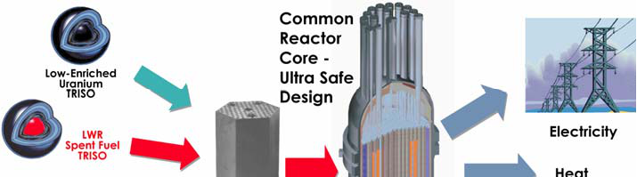

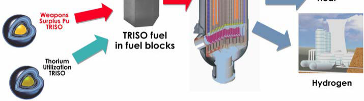

_Figure 1-1.   MHR Fuel Cycle and Energy Output Options_ 

## **1.3 Modular Helium Reactor Technology Status** 

High-temperature gas-cooled reactor (HTGR) technology has been under development since the middle 1960s for electricity production and a variety of process-heat applications, including the production of hydrogen.  Two HTGR concepts, the PMR and the PBR, were developed and demonstrated in commercial-size plants in the 1970s and 1980s.  The PMR concept was demonstrated in the Fort St. Vrain (FSV) nuclear power station in the U.S.  The PBR concept was demonstrated in the AVR and THTR in Germany. 

Since the mid 1980s, General Atomics (GA) has been developing a passively safe, modularsized design referred to as the Modular Helium Reactor (MHR).  In 1986, a task force consisting of General Atomics (GA), Bechtel, Combustion Engineering, EG&G Idaho, Gas-Cooled Reactor Associates (GCRA), General Electric, Oak Ridge National Laboratory (ORNL), and Stone and Webster Engineering performed an evaluation of the PBR and PMR concepts to determine which of these concepts could best meet the requirements of potential commercial users in the United States.  At that time, commercial interest in the MHR was focused on highly efficient production of electricity and cogeneration of electricity and process steam.  The strategy was to develop a standard passively safe MHR design that was amenable to serial production and to design certification by the U.S. Nuclear Regulatory Commission (NRC).  The ranking of the two concepts was close, but plant economics (i.e., the overall electricity generation busbar cost) favored the PMR, which resulted in selection of a 4 x 350 MWt PMR as the reference plant design to be developed by the U.S. MHR Program. 

Both the PMR and PBR concepts have gone through considerable design evolution since the 1986 study.  The motivation for this evolution has been to reach higher power levels within the constraint of passive safety, and to achieve greater thermal energy conversion efficiency in order to improve the economics of the reactors relative to other options for electricity production. For the PMR, the reactor core diameter was first enlarged to increase the power level from 350 to 450 MWt.  The power level was the increased to 550 MWt by further enlarging the core diameter.  Finally, the design power was increased to 600 MWt by increasing the core power density of the 550-MWt design.  The core outer diameter that GA selected for the 450-MWt, 550-MWt, and 600-MWt PMR designs was based on the results of a GA vendor survey that was performed to determine the largest diameter reactor vessel (RV) that could be fabricated using available commercial vessel manufacturing capability.  The initial MHR plants had a Rankine (steam) power conversion cycle for the generation of electricity.  Starting with the 450 MWt design, the steam generator was replaced with a gas turbine to obtain the higher efficiency available from a Brayton power conversion cycle.  This concept (Figure 1-2) is referred to as the Gas Turbine MHR (GT-MHR) and is described in [Shenoy 1996].  This concept operates with a thermal power level of 600 MW and an outlet helium temperature of 850°C to drive the direct 

Brayton cycle power conversion system with a thermal-to-electrical conversion efficiency of about 48 percent. 

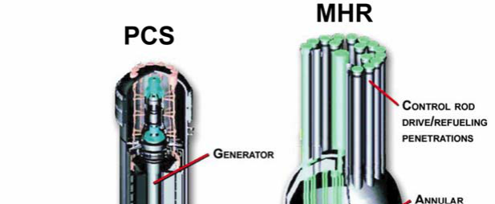

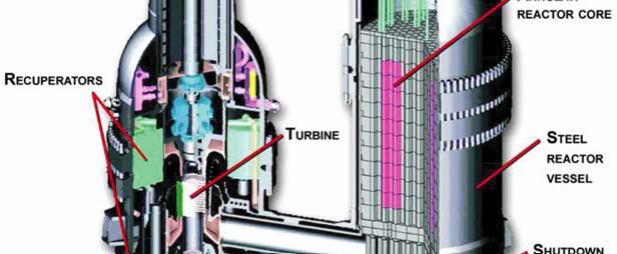

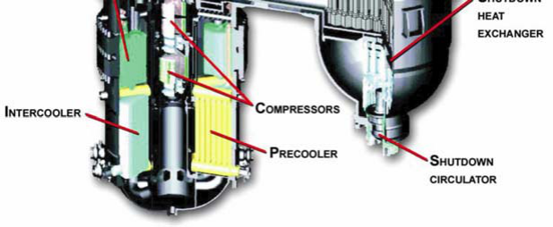

_Figure 1-2.  The Gas-Turbine Modular Helium Reactor_ 

The DOE-sponsored HTGR Technology Development Program under which the GT-MHR conceptual design was developed was terminated in 1995, but development of the GT-MHR continued under the International GT-MHR Project, which was started in 1995 by GA and Minatom (currently Rosatom) of Russia for the disposition of surplus w-Pu.  The project is currently being funded on a parity basis by the U.S. and Russian governments.  The design work and technology development is being performed in Russia, but U.S. organizations, including GA and ORNL, have assisted the project through oversight and by sharing technology and experience related to design and operation of gas-cooled reactors. 

The conceptual design for the w-Pu disposition GT-MHR was completed in 1997 and was independently reviewed by a panel of experts representing the U.S., Russia, Japan, Germany and France.  The panel concluded that the GT-MHR is a viable design for deeply burning w-Pu in a once-through fuel cycle and that there were no insurmountable obstacles to prevent construction of a GT-MHR on a reasonable schedule.  The preliminary design phase was completed in 2002.  Work is currently focused on areas related to technical risks, including coated particle fuel development, demonstration of the Power Conversion System (PCS) with electromagnetic bearings, and verification/validation of computer codes for core design, including core physics, thermal hydraulics, fuel performance, and fission product transport. [LaBar 2003] provides additional information on the w-Pu disposition GT-MHR design and its technology background. 

## **1.4 Hydrogen Production Technology Status** 

In principle, nuclear electricity can be used to split water using conventional low-temperature electrolyzers.  However, even the high-efficiency electricity production available with a GT-MHR, economic evaluations of coupling nuclear energy to low-temperature electrolysis have generally not been favorable when compared to hydrogen production by steam-methane reforming (SMR).  For this reason, two concepts that make direct use of the high-temperature process heat available from a MHR are being investigated to improve the efficiency and economics of hydrogen production.  The first concept involves coupling the MHR to the Sulfur-Iodine (SI) thermochemical water splitting process.  The second concept involves coupling the MHR to high-temperature electrolysis (HTE).  Both processes have the potential to produce hydrogen with high efficiency and have been proven to work at the laboratory scale.  A brief summary of the current status of these advanced hydrogen-production technologies is presented below. 

## **1.4.1 Thermochemical Water Splitting Technology Status** 

Water thermally dissociates at significant rates into hydrogen and oxygen at temperatures approaching 4000°C.  As part of an earlier study sponsored by the DOE Nuclear Energy Research Initiative (NERI), a team headed by GA and supported by Sandia National Laboratories (SNL) and the University of Kentucky evaluated 115 different thermochemical cycles that produce hydrogen [Brown 2003] at much lower temperatures.  The sulfur-iodine (SI) cycle was determined to be the best cycle for coupling to the MHR because of its high efficiency and potential for further improvement. 

The US DOE research and development effort on the SI process has been done primarily in collaboration with the French Commissariat à l’Energie Atomique (CEA) under an International NERI (I-NERI) agreement since 2003.  As discussed in Section 3.8.2, the SI process consists of 

three primary chemical reactions.  There is close coordination between the project participants in developing the three component reaction sections — the H2SO4 decomposition section, done by Sandia National Labs; the HI decomposition section, done by General Atomics (GA); and the Bunsen reaction equipment, provided by CEA.  Each participant has designed and constructed their respective section, and is working to integrate them in an SI Integrated Laboratory-Scale Experiment (ILS) to be conducted at the GA site in San Diego, CA.  This experiment is on track to begin integrated operations in late 2007. 

Through 2004 and 2005, experimental work in glass equipment was conducted to evaluate and choose appropriate methods for carrying out the reactions in each section.  Design work in 2006 allowed for lab-scale devices to be constructed in 2007 from engineering materials that are expected to be used in a pilot-scale hydrogen production facility scheduled for operation beginning in 2013.  These lab-scale devices make up the equipment of the ILS.  Unlike previous demonstrations elsewhere, the ILS will operate at temperatures and pressures expected to be seen at larger scales.  The ILS is expected to operate at least through the end of 2008. 

The highly corrosive nature of chemical streams in the SI process has led to significant research work in the area of materials compatibility.  Early screenings showed that alloys of tantalum appeared suitable, and current work is exploring long-term performance and corrosion resistance of materials stressed or machined in ways that materials of construction for larger scale plants will be subjected to.  The ILS will be a test bed for corrosion resistance of engineering materials during its operation. 

Other areas of research include membrane and catalyst development.  High-temperature inorganic membranes are being developed for use in separation of SO2 and O2 from other chemical species in the high-temperature decomposition of H2SO4.  This separation has the potential to shift the equilibrium of the reaction resulting in a potentially lower reaction temperature or increased process efficiency.  The use of membranes for dewatering process streams is also being investigated.  Most importantly, the removal of water from a mixture of water, elemental iodine, and hydriodic acid (HI) is being studied.  Catalysts are also being developed that will be highly active and stable in the harsh acidic environments and high temperatures encountered in the SI cycle.  Iron oxide catalysts for sulfuric acid decomposition are suitable at higher temperatures (above 870°C), and platinum-based catalysts can be used when the peak process temperature is below 870°C.  Platinum-based catalysts are not suitable for use in HI decomposition reactors, but activated carbon catalysts have been shown to be effective and inexpensive. 

The Japanese Atomic Energy Agency (JAEA) has also selected the SI process for further development and has successfully completed bench-scale demonstrations of the SI process at 

atmospheric pressure.  JAEA also plans to proceed with pilot-scale demonstrations of the SI process and eventually plans to couple an SI demonstration plant to its High Temperature Test Reactor (HTTR).  Development of the SI process is also being performed in South Korea by the Korea Institute of Energy Research (KIER) and the Korea Institute of Science and Technology (KIST).  KAERI and DOOOSAN are also participating in the project, which is known as the Nuclear Hydrogen Production and Technology Development and Demonstration Project (NHDD). 

## **1.4.2 High Temperature Electrolysis** 

The Solid Oxide Electrolyzer Cell (SOEC) is the key component of the HTE process.  Two SOEC designs are under development internationally, a planar design and a tubular design. For comparison, a tubular type SOEC and a planar type SOEC are shown in Figure 1-3.  A high-level description of each SOEC design is provided below. 

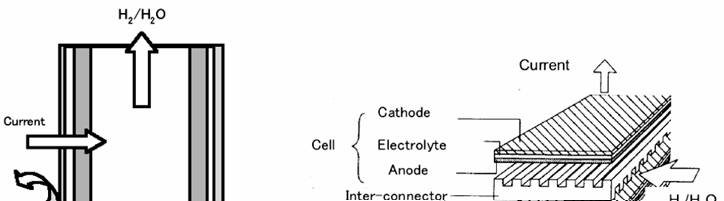

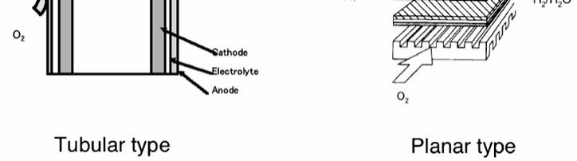

_Figure 1-3.  Comparison of Tubular-Type and Planar-Type HTE SOECs_ 

## **1.4.2.1 Planar Cell Technology** 

SOE modules based on the planar cell technology are being developed under a collaborative project between Idaho National Laboratory (INL) and Ceramatec [Herring 2005].  Stacked assemblies of 100-mm × 100-mm cells have been tested successfully at INL.  Figure 1-4 shows a schematic diagram of a unit cell.  When operated at or near the thermal-neutral voltage (1.288 V at 850°C), the endothermic heat of reaction is balanced by ohmic heating in the electrolysis 

stack, such that no additional heat is required for the stack to maintain high temperature.  The cell electrolyte is fabricated from either yttria- or scandia-stabilized zirconia.  A 1.5 mm cathode plate made of nickel cermet material is bonded to one side of the electrolyte.  A 0.05 mm anode plate is bonded to the other side of the electrolyte.  The anode is composed of a mixed (i.e., both electronic and ionic) conducting perovskite, lanthanum manganate (LaMnO3) material. Bipolar plates with a doped lanthanum chromite (e.g., La0.8Ca0.2CrO3) are attached to the outside of the anode and cathode, and join the anode and cathode of adjacent units to form the stack.  The bipolar plates also provide flow passages between each of the units in a stack for the steam-hydrogen mixture and separate passages for the steam/oxygen sweep gas.  The relatively small active area of the individual cells is determined by the thermal expansion compatibility between the electrolyte and the electrodes. 

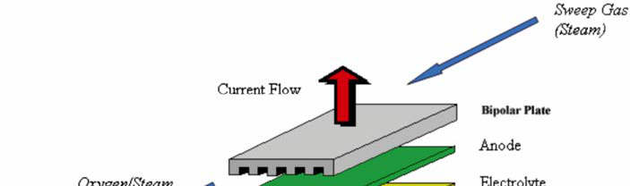

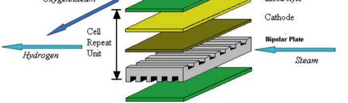

_Figure 1-4.  SOE Unit Cell Schematic_ 

## **1.4.2.2 Tubular Cell Technology** 

Figure 1-5 shows the general configuration of a tubular SOEC module.  It consists of an internally insulated pressure vessel housing electrolysis cells.  Scale up of the SOEC hydrogen production process can be accomplished by having more pressure vessel modules or by using larger modules having larger pressure vessels containing more electrolysis cells.  Figure 1-6 shows a tubular SOEC developed by Toshiba Corporation.  The electrolyte is YSZ (YttriaStabilized Zirconia), the anode (oxygen electrode) is LSM (Strontium-doped Lanthanum Manganite), and the cathode (hydrogen electrode) is Ni-YSZ (a mixture of metallic Nickel and Yttria-Stabilized Zirconia). 

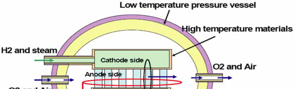

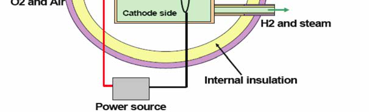

_Figure 1-5.  High Pressure SOEC Module Configuration_ 

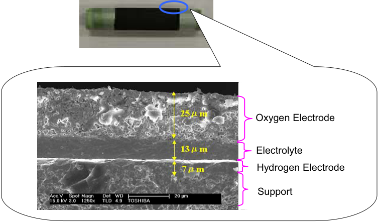

**----- Start of picture text -----** 
Oxygen Electrode Electrolyte Hydrogen Electrode Support **----- End of picture text -----** 

_Figure 1-6. Tubular SOE Cell Developed by Toshiba Corporation_ 

## **1.5 NGNP Trade Studies** 

The NGNP preconceptual design information presented herein is based on the requirements of the SRM [SRM 2007] and on the results of the reactor type comparison study [Baxter 2007], the reactor power level study [Labar 2007], and the heat transfer/transport system study [Bolin 2007].  An NGNP end-products study [Hanson 2007a] was also performed to develop the requisite data needed for the commercial plant economic assessment presented in Section 5.4. A brief summary of each study is presented below. 

## **1.5.1 Reactor Type Comparison Study** 

The objective of the study was to identify the reactor type (i.e., either the PMR or PBR) that is best suited for the VHTR commercial mission of cogeneration of electricity and process heat for production of hydrogen using advanced, highly-efficient processes such as the SI and THE processes.  It is important to note that the objective of the study was to identify the best choice for a commercial VHTR as opposed to identifying the design that best fits into the current schedule for the NGNP Project.  This is because the best design for the VHTR should drive the selection of the NGNP design, and, hence, the NGNP project schedule, as opposed to the NGNP schedule driving selection of the NGNP design and, hence, the VHTR design. 

A systematic comparison of the 600-MWt GT-MHR design and the 400-MWt PBMR-400 design (as described in the open literature) was performed against a set of evaluation criteria selected by GA based on the requirements for a commercial VHTR and the NGNP, and the perceived capability of the criteria to discriminate between the designs.  The comparison revealed that the PMR has a clear advantage over the PBR as the MHR type best suited for commercial deployment.  This is because the PMR inherently allows higher reactor power levels, which results in better plant economics.  The PMR concept also has a clear advantage in that it involves fewer uncertainties (and therefore less risk) with respect to dust in the primary coolant circuit, core thermal/hydraulic performance, replacement of graphite reflector elements, and nuclear fuel accountability.  The PMR also allows more flexibility with respect to the use of alternate fuel cycles, such as those fabricated from w-Pu or TRU from spent LWR fuel. Consequently, the PMR is also the best choice for the NGNP, and the NGNP preconceptual design presented herein is for a PMR. 

## **1.5.2 Reactor Power Level Study** 

For the commercial VHTR plant, the reactor power level should be as high as possible for economy-of-scale reasons.  The design of the 550/600 MWt metallic RV is at, or close to, the largest practical size that can be constructed based on current manufacturing capabilities. Selecting the commercial VHTR reactor power as 600 MWt with a reference commercial plant 

consisting of four reactor modules is projected to result in a commercial VHTR plant having a significant economic advantage relative to alternatives for electricity and/or process heat generation. 

The study recommended that the NGNP be a full-size prototype of a commercial VHTR module having a power level of 600 MWt.  This reactor size was judged to best satisfy the evaluation criteria that the NGNP should be designed such that construction, licensing, and operation of the NGNP would eliminate much of the uncertainty associated with utility/user costs to build, license, and operate a commercial VHTR.  The elimination of such uncertainty was judged essential to demonstrate to potential utility/users that a VHTR would enjoy a significant cost advantage with respect to alternate means of electricity and/or process heat generation (without which there would be no incentive for a utility/user to build a VHTR. 

The minimum sizes for the NGNP hydrogen production facilities, in terms of the thermal energy required from the reactor, were recommended to be ~4 MWt for an HTE-based plant and 60 MWt for an SI-based plant.  These sizes were recommended to allow for ten SOEC modules in the HTE-based plant and three process trains of 20 MWt each in the SI-plant, which was deemed desirable to demonstrate process reliability and process control methodologies. 

## **1.5.3 Heat Transfer/Transport System Study** 

Helium and the molten salt (MS) FLiNak, were evaluated and compared as potential working fluids for the NGNP secondary HTS.  The evaluation focused on economics and technical risk. The capital cost of a He HTS was estimated to be about $16 million higher than a MS HTS primarily due to the cost of the helium circulator.  However, the operating cost for a MS system was estimated to be substantially higher due to the higher replacement cost of a He-MS intermediate heat exchanger (IHX).  Overall, the difference in cost was relatively insignificant compared to the total NGNP cost.  However, the technical risk associated with use of molten salt was judged to be much greater than that associated with use of helium.  For these reasons, it was concluded that there is no compelling reason to choose molten salt over high-pressure helium, particularly in view of the high-level NGNP Project requirement to use the lowest-risk technology consistent with satisfying the NGNP objectives.  Thus, the NGNP preconceptual design presented herein uses high-pressure helium as the working fluid for the secondary HTS. 

## **1.5.4 NGNP End-Products Study** 

The purpose of this study was to identify the NGNP commercial end-products (e.g., electricity, hydrogen, and oxygen) and by-products such as radioactive and chemical wastes, to evaluate potential management options for these products, and to assess the market value of the commercial end-products and the economic penalties associated with the by-products.  This 

study was a prerequisite for the commercial plant economic assessment in that the end-product values and by-product economic penalties were inputs to the assessment.  Table 1-1 lists the commercial value (in 2007$) established for each of the NGNP end-products in the 2020 – 2060 time frame. 

**Table 1-1.  NGNP End-Product Commercial Value Predictions (in 2007$)** 

## **2. OVERALL NGNP PLANT DESCRIPTION** 

## **2.1 Summary of NGNP Plant Design** 

The nuclear heat source for the NGNP consists of a single 600-MW prismatic MHR module with two primary coolant loops for transport of the high-temperature helium exiting the reactor core to a direct cycle PCS and to an IHX (Figure 2-1).  The reactor design is essentially the same as for the GT-MHR, but includes the additional primary coolant loop to transport heat to the IHX and other modifications to allow operation with a coolant-outlet temperature of 950°C (vs. 850°C for the GT-MHR).  The IHX transfers a nominal 65 MW of thermal energy to the secondary heat transport loop, which transports the heat energy to both an SI-based hydrogen production facility (60 MW) and an HTE-based hydrogen production facility (~4 MW).  Figure 2-2 shows a schematic process flow diagram of the NGNP preconceptual plant design. Table 2-1 summarizes the key design features. 

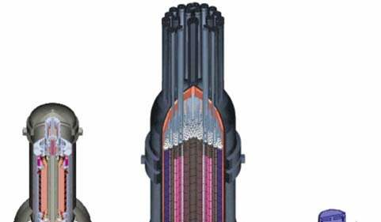

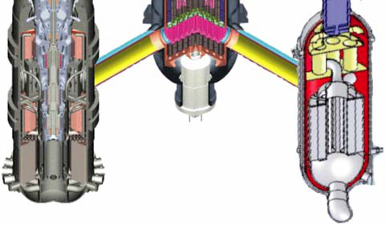

_Figure 2-1.  The MHR Module is Connected to a Direct Cycle PCS and an IHX_ 

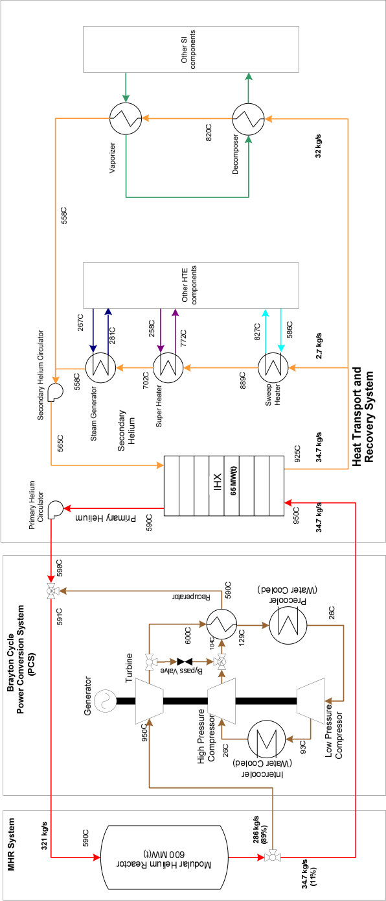

**Table 2-1.  Key Features of NGNP Design** 

## **2.2 Plant Level Functions and Performance Requirements** 

The topmost requirements for the NGNP include the project mission as defined in the Energy Policy Act of 2005 and the NGNP Project objectives as defined by DOE/INL in the NGNP PPMP.  At the next level are the high-level functions and requirements defined by INL [Functions & Requirements 2003], as modified based on the recommendations of the Independent Technology Review Group (ITRG) [ITRG 2004].  These high-level functions and 

requirements will be accomplished through implementation of plant-level requirements derived from the INL high-level requirements and other institutional sources such as utility/user requirements for commercial reactors, or that are developed though plant-level functional analysis including trade studies, plant performance analyses, engineering decisions, etc. 

The high-level functions for the NGNP as defined in [Functions & Requirements 2003] are as follows: 

- Develop and demonstrate a commercial-scale prototype VHTR 

- Develop and demonstrate the production of electricity at high efficiencies 

- Obtain licenses and permits to construct/operate the NGNP 

- Develop and demonstrate the capability for efficient production of hydrogen 

- Enable the demonstration of energy products and processes 

- Provide capability for future testing to enhance plant safety and operational performance 

Document DOE-GT-MHR-100248 [Utility/User Requirements 1995] provides extensive Utility/user requirements for a commercial GT-MHR.  These requirements were developed from Utility requirements for advanced light water reactors (ALWRs) [ALWR Requirements 1991], input provided by constituents of the GT-MHR Program, and pertinent information from IAEATECDOC-801, “Development of Safety Principles for the Design of Future Nuclear Power Plants”.  GA had discussions with members of GA’s Utility Advisory Board and Academic Advisory Group, who made the following recommendations with respect to the mission of the NGNP. 

- a. The NGNP should be a full-size prototype of a commercial VHTR module. 

- b. The initial power level for the NGNP could be somewhat lower than the power level for a commercial MHR module, but the NGNP should be designed for up-rating to the full commercial MHR module power level 

- c. The mission of the NGNP should include demonstration of process-heat applications, including steam methane reforming for hydrogen production.  From a utility/users viewpoint, process heat applications are a more important near-term mission than demonstration of hydrogen production. 

- d. The NGNP should be capable of demonstrating use of alternate fuels, including Pubased and actinide-based fuel (i.e., “deep-burn” fuel) from re-processed LWR spent fuel. 

- e. The NGNP should be designed to demonstrate a commercial MHR that meets the key Utility/User design requirements for a commercial MHR 

Based on the above institutional requirements, GA has defined preliminary plant and systemlevel requirements for the NGNP in the SRM.  As defined by INL, the primary purpose of the 

SRM at this early stage of the project is “to define the design independent high-level requirements that establish the framework within which subsequent work will be performed to establish the specific design attributes of the NGNP (e.g., type of reactor, direct versus indirect power conversion, hydrogen production processes, etc.)”.  However, in recognition of past DOEsponsored work by GA that has resulted in a relatively-mature definition of the GT-MHR concept[1] and in preconceptual designs for both SI-based and HTE-based commercial H2-MHR plants, GA expanded the scope of the initial version of the SRM to include lower-level, designspecific requirements for the NGNP based on the GT-MHR and the H2-MHR designs.  Although the systems, the functions of the systems, and the design-specific requirements for these systems defined in the initial version of the SRM are preliminary in nature, GA included this information to provide guidance to the NGNP pre-conceptual design effort and to establish a methodology and framework for further development of the requirements for the NGNP during conceptual design. 

## **2.3 Overall Plant Arrangement** 

A layout for the NGNP plant is shown in Figure 2-3.  The plant layout consists of the Reactor Building (RB), the two hydrogen generation plants and several support buildings and facilities. Systems containing radionuclides and safety-related systems are located in the Nuclear Island, which is separated physically and functionally from the remainder of the plant.  A key consideration for safety and licensing of the NGNP is co-location of the MHR module with the hydrogen production plants.  It is proposed to locate the two hydrogen production facilities at a distance of 90 meters from the MHR in order to limit the distance over which high-temperature heat is transferred.  This separation distance is consistent an INL engineering evaluation that concluded that separation distances in the range of 60 m to 120 m should be adequate in terms of safety [INL 2006].  No earthen berm or blast suppression barrier is considered necessary between the hydrogen production facilities and the reactor with a separation distance of 90 meters because the reactor is below grade.  However, the hydrogen production facilities are surrounded by a low berm, which serves as a chemical spill retention barrier.  The plant also includes a below-grade hydrogen storage tank for on-site storage of up to 100 kg of hydrogen, which is the limit suggested in [INL 2006], and space for a large dry-cooling tower. 

Because of uncertainties associated with potential uses of the NGNP, the preconceptual design of the plant includes features that allow some flexibility in adjusting the mission of the NGNP. As shown in Figure 4-3 in Section 4, the below-grade concrete portion of the reactor building is 

1 The previous work on the GT-MHR included essentially the same concept selection studies that are being performed currently as part of the scope of NGNP preconceptual design. 

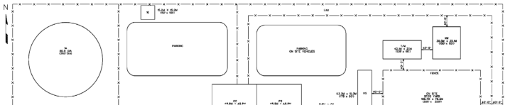

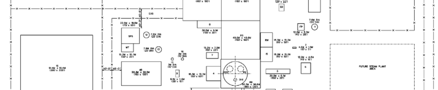

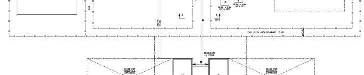

_Figure 2-3.  NGNP Plant Layout_ 

designed to include a cavity for an IHX that is large enough to accommodate a printed-circuit type heat exchanger of much greater size than needed to transfer 65 MW of heat energy.  Also, the cross vessel from the RV to the IHX vessel and the nozzle on the RV side are the same diameter as for the RV-to-PCS cross vessel.  For initial NGNP operation with 65 MW of heat energy being transferred to the IHX, the RV-to-IHX vessel cross vessel will have a conical area reducing section to reduce the cross vessel diameter to the size needed for the small IHX. However, in the event that the small IHX is replaced with a larger IHX, the area reducing section and smaller diameter portion of the cross vessel adjoining the IHX vessel will be replaced with a larger-diameter cross vessel.  Also, the plot plan includes extra space to allow for addition of a facility for some yet-to-be-determined process heat or process steam application, and for expansion of the hydrogen facilities to increase hydrogen production capacity. 

## **2.4 Nominal Plant Design Parameters** 

The NGNP must be designed for both electricity-only production and for cogeneration of electricity and process heat to satisfy the requirement that the NGNP be capable of generating electricity, hydrogen, or both electricity and hydrogen.  When the NGNP is operating in cogeneration mode with 65 MWt of the 600 MWt reactor output diverted to the IHX, the maximum system pressure is reduced from 7 MPa to 6.23 MPa, which reduces the electrical output of the PCS while maintaining high efficiency.  The reduced pressure and density increases the pressure drop in the reactor core and PSR coolant holes from 80 kPa to 90 kPa. Tables 2-2 and 2-3 give the nominal plant design parameters for both modes for operation of the reactor with outlet gas temperatures of 850°C and 950°C, respectively. 

Two of the major design decisions for the NGNP include selection of the reactor outlet helium temperature and the choice of an indirect or direct power conversion cycle.  Both of these decisions have a major impact on the overall NGNP plant design and on the level of programmatic risk.  These key issues are discussed below. 

## **2.4.1 Reactor Outlet Gas Temperature** 

The original goal with respect to the reactor outlet coolant temperature for the NGNP was 1000°C [Functions & Requirements 2003].  However, based on its review of the NGNP Program, the ITRG concluded that there are materials development risks at a reactor outlet temperature of 1000°C that make it impossible to achieve an operational date of 2020 (let alone 2018) for the NGNP.  The ITRG identified the IHX, hot duct, turbine inlet components, and incore metallic materials as being the high-risk components.  Consequently, the ITRG recommended that the NGNP start operation with a reactor outlet gas temperature of 900°C to 950°C in order to maintain maximum metal temperatures at or below 900°C.  The ITRG also 

## **Table 2-2.  NGNP Nominal Plant Design Parameters 850°C Reactor Outlet Gas Temperature** 

## **Table 2-3.  NGNP Nominal Plant Design Parameters 950°C Reactor Outlet Gas Temperature** 

outlined a potential approach for up-rating the NGNP to operate with a reactor outlet gas temperature of 1000°C.  This approach calls for the NGNP to be designed to allow for replacement of the critical metal components with higher-temperature materials developed and qualified in parallel with construction and early operation of the NGNP. 

In addition to discussing the technical issues associated with a reactor outlet gas temperature greater than 950°C, the ITRG questioned the practicality of attempting to achieve a gas temperature of 1000°C in the NGNP.  The ITRG also questioned the significance of any economic benefit to be gained by increasing the reactor outlet gas temperature to 1000°C and recommended against embarking on the extensive and costly research and development program that would be necessary to achieve such a goal unless the need to do so could be justified on an economic basis. 

The GA Team agrees with the ITRG’s assessment and suggests that the same logic could be applied in questioning the need for a reactor outlet gas temperature of 950°C versus 900°C, or even 850°C given the relatively small difference in efficiency of either the SI or HTE hydrogen production processes at temperatures of 825°C and 925°C.  Consequently, the GA Team recommends an approach for NGNP operation that is similar to that recommended by the ITRG, except that initial operation of the NGNP should be with a reactor outlet gas temperature of 850°C.  However, all of the NGNP plant systems should be designed to operate with a reactor outlet gas temperature of up to 950°C.  After an initial operating period with a reactor outlet gas temperature of 850°C, the plant could be up-rated to operate with a reactor outlet gas temperature of 900°C to 950°C depending on the results of economic evaluations performed to justify such operation and on the success of the R&D programs to develop materials and/or qualify designs for higher-temperature operation. 

## **2.4.2 Direct vs. Indirect Power Conversion Cycle** 

The ITRG reviewed the design, fabrication, and operation of the various power conversion systems proposed by the proponents of the NGNP, including the vertical integrated PCS design developed by GA/OKBM, with the objective of identifying the major risks associated with these systems.  Based on this review, the ITRG concluded that given the “large number and formidable nature of the risks associated with the direct cycle and their potential impact on the NGNP schedule,” the “NGNP should proceed on the basis of a lower-risk indirect cycle”.  The ITRG acknowledged that the indirect cycle necessitates use of a large IHX, which is itself a component having significant developmental risks, but the ITRG considered these risks to be more manageable than the aggregate of the risks associated with the direct cycle concepts. 

However, the ITRG also concluded that it is highly unlikely that a metallic material will become available that will not require replacement of the IHX at least once, and probably more than once, during the plant life, even for an operating temperature limited to 900°C.  The ITRG further concluded that it is not clear that a metallic material will become available for IHX operation at 1000°C on any reasonable time scale, or at all, and that it is unlikely that an IHX could be fabricated from a ceramic material.  Thus, the ITRG concluded that from a material standpoint, operation at 1000°C or higher favors the use of the direct cycle. 

GA and its team members are well aware of the technical challenges associated with the GTMHR vertical integrated PCS design and appreciate the ITRG’s concerns.  Nevertheless, the GA Team remains convinced that a direct power conversion cycle is a better choice for the NGNP than an indirect power conversion cycle, and the NGNP preconceptual design presented herein reflects this choice.  The reasons for this design selection are as follows: 

- Past GA studies of direct vs. indirect cycle (albeit for an MHR for electricity generation), have concluded that a direct cycle is the clear choice over an indirect cycle for electricity generation at low cost. 

- The GA Team was not tasked to perform the PCS trade study that was included in the statement of work for the original NGNP preconceptual engineering services solicitation. Consequently, the GA team has not developed any indirect cycle concepts nor systematically evaluated the pros and cons of a direct cycle versus an indirect cycle for a MHR whose primary purpose is to provide process heat (as opposed to electricity generation).  Consequently, the GA team has no basis for replacing its direct cycle GTMHR design with an indirect cycle design. 

- GA is not convinced that the technical risks associated with a 600-MWt IHX and a 600MWt helium circulator are more manageable than the risks associated with the vertical integrated PCS design.  Furthermore, GA suspects that the cost associated with a 600MWt IHX capable of operating at 950°C may be prohibitive. 

- Construction of the NGNP with an indirect cycle would likely preclude operation of the NGNP with a gas outlet temperature of 1000°C because, as concluded by the ITRG, it is unlikely that an IHX can be fabricated for operation at 1000°C in any reasonable time frame, if at all.  Although it is doubtful that operation of the NGNP at 1000°C reactor outlet temperature can be justified on an economic basis (Section 2.4.1), it would be desirable if the NGNP design does not preclude such operation. 

- An extensive effort is in progress under the U.S./Russian International GT-MHR Program to develop and demonstrate the vertical integrated PCS design.  If this program proceeds according to schedule, this PCS design will be fully demonstrated in time for deployment in the NGNP. 

- Rolls-Royce has reviewed the GA/OKBM vertical integrated PCS design and has made a number of recommendations for design modifications that could improve the design and reduce the cost and/or risk associated with the design[2] (Section 3.6.2). 

- Rolls-Royce has developed a pre-conceptual design for a direct combined cycle PCS as a backup to the reference vertical integrated PCS design.  This design eliminates or reduces some of the more significant risks in the reference design, but would add to the complexity and cost of the plant.  This design requires further evaluation and development during conceptual design, but appears to be a viable backup for the reference design should the need for a fallback become apparent based on results from the OKBM design demonstration program. 

## **2.5 Plant Operation** 

The NGNP must be designed for both electricity-only production and for cogeneration of electricity and process heat to satisfy the requirement that the NGNP be capable of generating electricity, hydrogen, or both electricity and hydrogen.  Tables 2-2 and 2-3 give the nominal plant design parameters for both operating modes for operation of the reactor with reactor outlet helium temperatures of 850°C and 950°C, respectively.  As discussed in Section 2.4.1, GA recommends that initial operation of the NGNP be with a reactor outlet helium temperature of 850°C. 

The two primary coolant loops and the requirement to operate in either an electricity-only mode or a cogeneration mode introduce some complexity into the plant design and operation that will have to be addressed during subsequent design phases.  However, GA’s preliminary evaluation of plant operation as discussed in Section 3.10 provides reasonable confidence that the plant can be operated in either mode.  The plant will require a helium inventory control system for the secondary heat transport loop and a plant control system that is designed to include the necessary instrumentation and controls to make the necessary simultaneous adjustments to the primary and secondary helium inventories to maintain the pressure difference across the IHX within acceptable limits. 

2 The Rolls-Royce recommendations need to be jointly evaluated in more detail by Rolls-Royce, OKBM, and GA during conceptual design. 

## **3. PLANT TECHNICAL DESCRIPTION** 

This Section provides a technical description of the entire NGNP plant, including the nuclear systems, the PCS, the HTS, the hydrogen production facilities, the Helium Services System, the Plant Operation and Control System, and the Balance of Plant (BOP).  The nuclear systems include the Reactor System, the Vessel System, the Shutdown Cooling System (SCS), the Fuel Handling System, and the Reactor Cavity Cooling System (RCCS). 

## **3.1 Reactor System** 

## **3.1.1 System Configuration** 

The NGNP nuclear heat source will be a single MHR module based on the GT-MHR design with some modifications to permit operation with a reactor outlet helium temperature of 950°C (vs. 850°C for the GT-MHR).  Figure 3-1 shows a cross-sectional view of an MHR.  Figure 3-2 shows a cross section of the GT-MHR core at vessel midplane.  The reactor power level is 600 MWt; the core thermal power density is 6.6 MWt/m[3] .  The MHR active core consists of 102 fuel columns in three annular rings with 10 fuel elements per fuel column, for a total of 1020 fuel elements in the active core.  The effective inner diameter and outer diameter of the active core are 2.96 m and 4.83 m, respectively.  The active core height is 7.93 m. 

In addition to the fuel elements, other graphite reactor internal components include the side, central, top, and bottom graphite reflector elements and the graphite core support assembly. Metallic reactor internal components include the metallic core support, the upper core restraint, and the upper plenum shroud.  These metallic components are manufactured from hightemperature alloys (e.g., Incoloy 800H, Hastelloy-X, or Inconel 617). 

From top to bottom, the graphite core support assembly consists of two layers of hexagonal elements, support pedestals for the fuel and reflector columns that form the lower plenum, and the lower plenum floor, which consists of a layer of graphite elements and two layers of ceramic elements that insulate the metallic core support from the hot helium in the lower plenum.  The upper core restraint elements have the same hexagonal cross sections as the graphite elements below them and are one-half the height of a standard fuel element.  Dowel/socket connections are used to align the core-restraint elements with the graphite blocks.  The core restraint elements are also keyed to each other and to the core barrel.  The upper core restraint blocks provide stability during refueling and maintain relatively uniform and small gaps between columns during operation.  The metallic core support surrounds the core and includes a floor section and a core barrel that are welded together.  The metallic core support is supported both vertically and laterally by the RV.  The upper plenum shroud is a welded, continuous dome that rests on top of the core barrel to form the upper plenum.  The upper plenum shroud includes 

penetrations for inserting control rods and reserve shutdown material, for refueling, and for core component replacement. 

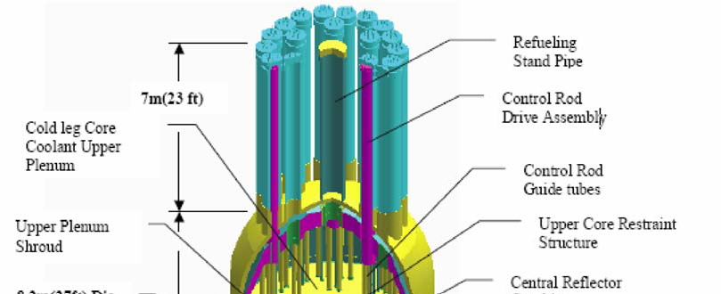

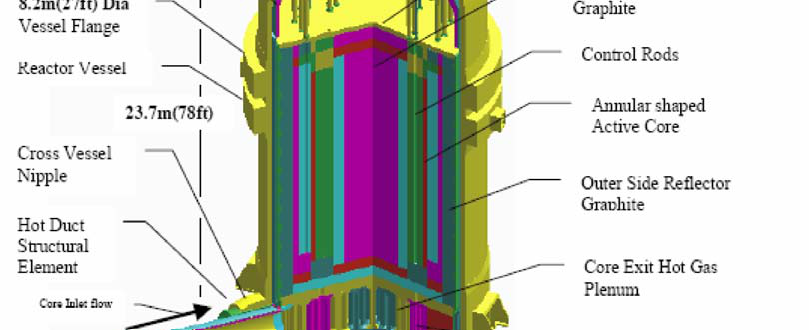

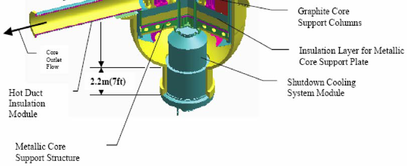

_Figure 3-1.  Cross-Sectional View of MHR_ 

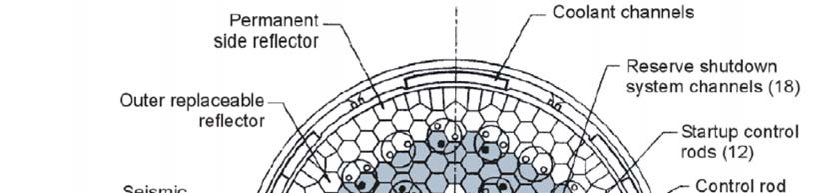

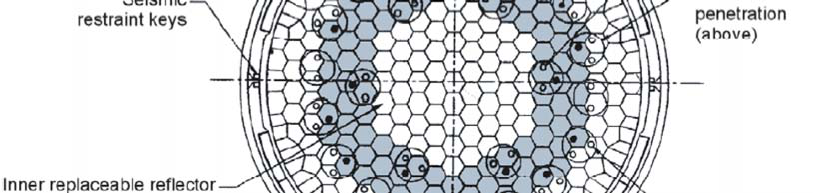

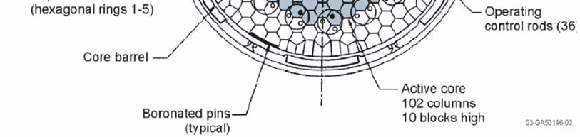

_Figure 3-2.  MHR Core Cross Section at Vessel Midplane_ 

## **3.1.2 GT-MHR Fuel Design** 

Figure 3-3 shows the NGNP MHR fuel element and its components.  The fuel for the GT-MHR consists of microspheres of uranium oxycarbide (UCO) that are coated with multiple layers of pyrolytic carbon (pyrocarbon) and silicon carbide.  The buffer, inner pyrolytic carbon (IPyC), silicon carbide (SiC), and outer pyrolytic carbon (OPyC) layers are referred to collectively as a TRISO coating.  The coating system has been engineered to serve as a miniature pressure vessel that provides containment of radionuclides and gases during normal operation and all design basis events (DBEs).  This coating system is also an excellent engineered barrier for long-term retention of radionuclides in a repository environment. 

The UCO kernel composition was selected for the GT-MHR because of its ability to perform well at relatively high burnup.  The carbide component of the kernel undergoes oxidation to getter excess oxygen released during fission.  If the carbide component were not present, excess 

oxygen would react with carbon in the buffer to form carbon monoxide.  High levels of carbon monoxide can lead to failure of the coating system by overpressurization or by the amoeba effect (i.e., kernel migration).  The oxide component of the kernel is highly effective at retaining many radionuclides that can chemically attack or diffuse through the coating layers. 

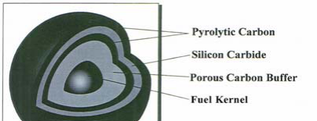

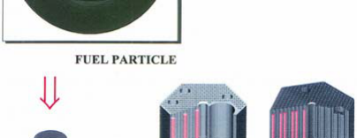

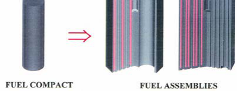

_Figure 3-3.  GT-MHR Fuel Element Components_ 

The GT-MHR core is designed to use a blend of two different particle types; a fissile particle that is enriched to 19.8% U-235 and fertile particle with natural uranium (NU, enrichment of 0.7% U- 235).  The fissile/fertile loading ratio is varied with location in the core, in order to optimize reactivity control, minimize power peaking, and maximize fuel cycle length.  The GT-MHR coated particle design parameters are given in Table 3-1.  The fissile and fertile particle designs are somewhat different, with the fertile particle having a larger kernel and a thinner buffer coating layer.  Preliminary core physics calculations performed by INL for an NGNP prismatic MHR suggest that the reactor may be able to utilize a single fuel particle design, with the fuel particles potentially having different U-235 enrichments.  However, more detailed calculations are needed to confirm that a single fuel particle design provides adequate core design flexibility. 

The TRISO fuel particles are bonded together in a carbonaceous matrix to form cylindrical compacts having nominal dimensions 12.45 mm (0.49 in.) in diameter and 49.3 mm (1.94 in.). The fuel compacts are stacked in the blind fuel holes of the graphite fuel element.  Graphite plugs are cemented into the tops of the fuel holes to enclose the stacked compacts.  The stacks 

under each of the four dowels per graphite fuel element block contain 14 fuel compacts; all other stacks contain 15 fuel compacts.  Because of sorption mechanisms, the fuel compacts can provide an additional barrier to the release of metallic fission products. 

**Table 3-1.  GT-MHR Coated Particle Design Parameters** 

The graphite blocks are fabricated from high-purity, nuclear-grade graphite.  Each block is a right hexagonal prism with dimensions 794 mm (31.2 in.) in length and 360 mm (14.2 in.) across the flats of the hexagonal cross section.  Fuel and coolant holes run parallel through the length of the block in a regular triangular pattern of nominally two fuel holes per coolant hole.  The pitch of the coolant and fuel-hole array is 18.8 mm (0.74 in.).  The minimum web thickness 

between a coolant hole and fuel hole is 4.5 mm (0.18 in.).  This web provides an additional barrier to release of metallic fission products.  A standard fuel element has 210 blind fuel holes, 108 coolant holes, and contains 3126 fuel compacts. The GT-MHR active core also contains some fuel elements having a single 4.0 in. diameter channel to allow for insertion of control rods and two 3.75 in. diameter channels for insertion of reserve shutdown control (RSC) material.  A control/RSC element has 186 blind fuel holes, 95 coolant holes, and contains 2766 fuel compacts. 

## **3.1.3 Use of Japanese Fuel in NGNP** 

As stated above, the reference fuel type for the NGNP preconceptual design is UCO.  However, there is no current supplier of UCO fuel that can support startup of the NGNP in the required time frame (i.e., by 2018).  Furthermore, there are no current domestic U.S. sources for fabrication of large quantities of coated-particle fuel of any type, such as would be required for the NGNP.  Consequently, GA has formulated a fuel acquisition strategy for the NGNP based on obtaining TRISO-coated UO2 for the first core fuel load (and possibly one or more reload segments) from Nuclear Fuel Industries (NFI) in Japan, which has a large-scale, coated-particle fuel manufacturing capability for the HTTR. 

Under the envisioned plan, NFI would fabricate the kernels, coated particles, and fuel compacts for the initial core of the NGNP and send the fuel compacts to the U.S. for loading into the graphite fuel blocks.  The NFI extended burnup fuel particle design was selected rather than the reference HTTR fuel particle design because this fuel particle is designed for irradiation to higher burnup and is more consistent with the reference German fuel particle design.  Table 3-2 summarizes the physical properties of the two NFI fuel particle types and compares them to the reference German particle and to the reference fuel particle for the DOE AGR Fuel Development and Qualification Program (AGR Fuel Program) as defined in the preliminary AGR Fuel Product Specification [AGR Fuel Spec. 2004].  The as-manufactured quality of the NFI fuel would be consistent with the desired quality level for NGNP as specified in the preliminary AGR fuel product specification. 

The primary implications of this approach are that the kernel will be UO2 (rather than UCO), the U-235 enrichment will be limited to 10%, the fuel compacts will be made using the HTTR matrix material, and the particle packing fraction in the fuel compacts will be limited to about 35%.  GA has evaluated two different reload strategies for a 10% LEU core and determined both to be feasible: (1) operate initial cycle through 425 EFPD and then reload the entire core with U.S. made fuel, and (2) reload at ~300 EFPD intervals with 10% LEU fuel fabricated by NFI.  If a U.S. fuel source is available soon after NGNP startup, NFI strategy 1 would be implemented. Otherwise, NFI strategy 2 would be implemented continuously until the U.S. fuel source is 

available.  The results also indicated that the NGNP loaded with NFI made fuel, with some further optimization of fuel and burnable poison loadings/zonings, can meet a satisfactory core physics design with respect to power peaking and fast fluxes. 

**Table 3-2.  Physical Properties of NFI Fuel, AGR Reference Fuel, & German Fuel** 

GA’s overall fuel acquisition strategy for the NGNP, including use of NFI fuel for the initial core fuel load, is discussed in Section 7.3 

## **3.1.4 Design Modifications for Higher Temperature Operation** 

The GT-MHR was designed to operate with core inlet and core outlet helium temperatures of 490°C and 850°C, respectively.  For the GT-MHR, the inlet coolant flow is routed through riser channel boxes between the core barrel and vessel as indicated in Figure 3-2.  With this configuration, the design of the RV (including wall thickness and materials selection) is driven in large measure by the design point selected for the reactor inlet coolant temperature.  The design point of 490°C ensures acceptable operating conditions for a RV manufactured from steels that do not experience creep damage at higher temperatures (e.g., 2¼Cr-1Mo or 9Cr1Mo-V). 

For the NGNP design, the core outlet helium temperature has been increased from 850°C to 950°C, in part to compensate for temperature drops through the IHX and maintain high thermal efficiency for hydrogen production and other process-heat applications.  The coolant inlet temperature was also increased by 100°C to 590°C to provide a sufficiently high coolant flow and convective heat-transfer rate within the MHR core that ensures acceptable fuel 

performance and to limit release of Ag-110m and other noble-metal fission products that can diffuse through intact SiC coatings at high temperatures.  However, this higher coolant inlet temperature could result in RV temperatures that exceed the limits for Cr-Mo steels if the current GT-MHR flow configuration were used.  For this reason, one of the design modifications for NGNP is to route the inlet flow through holes in the permanent side reflector (PSR), which places additional thermal resistance between the inlet flow path and RV and lowers vessel temperatures.  Thermal analyses show this design modification can reduce vessel temperatures by approximately 100°C. 

Other design modifications that have been investigated as part of the preconceptual engineering studies include modifications to the reactor internal design to reduce bypass flow and modifications to the fuel-element design to enhance heat transfer.  In addition, fuel shuffling strategies have been investigated that can reduce power peaking factors.  These modifications can provide additional margin for fuel temperatures during normal operation, and may allow additional reduction of the coolant inlet temperature, such that SA-533/SA-508 steel (used for LWR RVs) could be used for the NGNP RV. 

**Bypass Flow Reduction.** Fuel temperatures can be reduced by reducing bypass flow.  Bypass flow is defined as any flow that bypasses the coolant holes of the fuel elements.  Bypass flow channels include gaps between fuel columns and leakage between/from PSR blocks.  Bypass flow can be reduced by using graphite sealing keys below the active core to provide additional flow resistance for bypass flow occurring between fuel columns.  Lateral restraint devices and sealing tubes in the PSR riser channels can reduce the leakage flow between/from the PSR blocks. 

FES has analyzed the flow distribution in the RV using a 3-D, 120°-sector ANSYS model.  For the reference GT-MHR design, the bypass flow fraction is approximately 0.20.  Routing the inlet flow through the PSR increases the bypass flow fraction to 0.37, primarily because of the relatively large lateral pressure gradients between the inlet flow path and reactor core.  Adding sealing sleeves and lateral restraints reduces the bypass flow fraction to 0.14.  Adding sealing keys at the bottom of the core further reduces the bypass flow fraction to 0.10.  Reducing the bypass flow fraction from 0.20 to 0.10 reduces peak fuel temperatures by approximately 50°C. 

**Fuel-Element Modifications.** The thermal performance of the graphite fuel element can be improved by reducing the temperature rise from the bulk coolant to the fuel compact centerline. This can be accomplished by reducing the diameters of the coolant holes and fuel compacts. This modified design is referred to as a 12-row block because the number of rows of fuel holes across the flats of the hexagonal block was increased from 10 to 12 (excluding boundary rows). For the 12-row block design, the minimum web thickness between the fuel and coolant holes 

was kept the same as the 10-row block for structural/strength considerations.  As shown in Figure 3-4, the 12-row block design can reduce peak fuel temperatures by 30°C to 40°C, which can allow for reduction of the coolant inlet temperature.  The higher flow resistance for the 12row block is compensated for by the lower flow rate associated with a lower inlet temperature. 

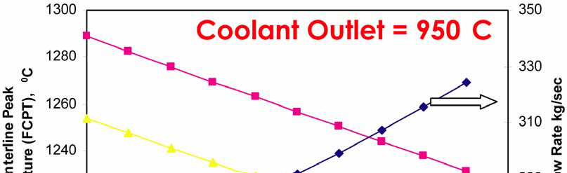

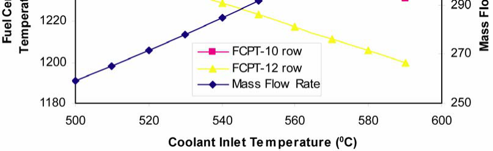

_Figure 3-4.  Comparison of 10-Row and 12-Row Block Thermal Performance_ 

**Fuel Management Strategies.** As part of their work with GA on nuclear hydrogen development, KAERI has been investigating a block-shuffling refueling scheme for a 3-batch core.  The KAERI concept uses 9 fuel elements (slightly longer than standard) per column to facilitate a 3-batch shuffling scheme, and adds 6 additional columns (108 fuel columns) to reduce the average power density by 5.6%.  KAERI has performed 3-dimensional physics calculations to evaluate this concept, using 12% enriched fissile fuel only and zoning the particle packing fraction to reduce radial peaking factors.  For these calculations, the bypass flow fraction was assumed to be 0.10 for each column.  Figure 3-5 shows the calculated core temperature distributions for the 10-row and 12-row block designs with a coolant outlet temperature of 950°C and the coolant inlet temperature reduced to 490°C.  Because of the relatively flat power and flow distributions, the calculated peak fuel temperature is below 1250°C, even with the reduced inlet temperature and coolant flow rate.  Only about 20% to 30% of the fuel is predicted to be above 1000°C, which helps limit release of Ag-110m and other noble metallic fission products. 

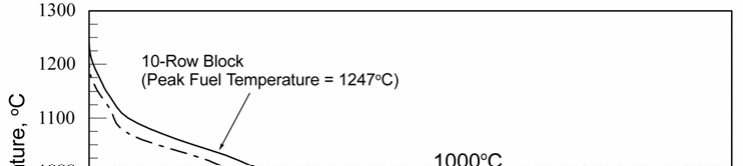

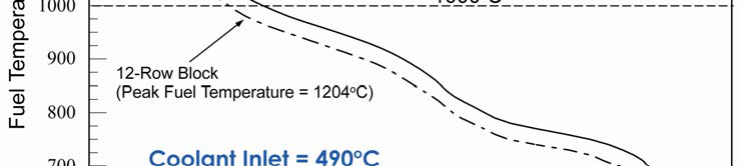

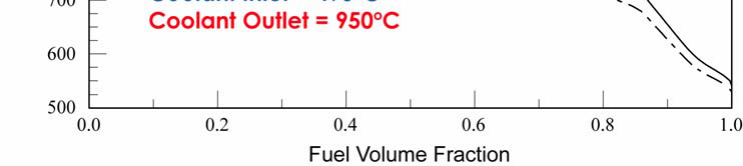

_Figure 3-5.  Calculated Fuel Temperature Distribution with KAERI Fuel Shuffling Scheme_ 

Using this core configuration and power distributions, FES has performed normal-operation and safety assessments to determine under what conditions SA533 (SA508) steel could be used for the RV without using direct vessel cooling.    Results are summarized in Table 3-3.  The minimum bypass flow fraction was approximately 0.13 and was predicted to occur near the bottom of the core (where fuel temperatures are the highest).  The peak fuel temperatures ranged from 1212°C to 1267°C for the four cases.  Lowering the inlet temperature from 590°C to 490°C increased peak fuel temperatures by about 40°C, and raising the power level from 550 MWt to 600 MWt increased peak fuel temperatures by about 10°C. 

**Table 3-3.  Peak Fuel Temperatures and Bypass Flow Fractions** 

A 30-deg. sector ANSYS model was used to analyze both low-pressure conduction cooldown (LPCC) and high-pressure conduction cooldown (HPCC) events.  In order to reduce vessel temperatures during these accidents, the reactor internal design was modified to include a 100-mm layer of carbon insulation on the outer radial boundary of the PSR.  This carbon insulation was also assumed to contain B4C to reduce neutron fluence to the RV.  In the axial direction, the carbon insulation is applied over a length corresponding to the 3rd through 7th layers of fuel blocks. 

A key parameter for these calculations is the graphite thermal conductivity, which decreases with damage caused by neutron irradiation.  For these studies, calculations were performed using both irradiated and unirradiated graphite properties.  Calculations were also performed assuming annealing of irradiation damage as the graphite temperature increases according to the GA model for H-451 graphite.  Full recovery from irradiation damage is assumed to occur at temperatures greater than 1300°C.  Other key parameters that affect heat transfer to the RCCS are the emissivities of the PSR, core barrel, RV, and RCCS panels.  The PSR, RV outer face, and RCCS panels were assumed to have emissivities of 0.8.  The core barrel inner and outer faces and inner face of the RV were assumed to have emissivities of 0.6.  RCCS heat removal was assumed to occur by natural convection of air with an inlet temperature of 40°C and a stack height of 30 m.  The decay heat rate was assumed to be 15% higher than the nominal rate in order to account for uncertainties in thermal properties, i.e., uncertainties in decay heat, thermal conductivities, emissivities, etc. were approximately accounted for by lumping them into a higher decay heat rate.  Results for peak fuel and vessel temperatures for seven cases are summarized in Table 3-4.  In addition to the different assumptions regarding graphite thermal conductivity discussed above, thermal power levels of 500 MW, 550 MW, and 600 MW were also analyzed.  These cases all correspond to coolant inlet/outlet temperatures of 490°C/950°C. 

Based on these results, the following conclusions are made: 

- The reduction in graphite thermal conductivity with irradiation results in a peak fuel temperature increase of approximately 100°C.  Accounting for thermal annealing of the irradiation damage reduces peak fuel temperatures by approximately 30°C.  However, the effect of irradiation on graphite thermal conductivity has little impact on peak vessel temperatures. 

- With the current reactor configuration and RCCS design, the reactor power level would have to be reduced to approximately 500 MWt in order for peak vessel temperatures to remain below the 538°C limit for SA533 (SA508) steel. 

**Table 3-4.  Peak Fuel and Vessel Temperatures During HPCC and LPCC Events** 

## **Conclusions and Recommendations** 

1. Routing the inlet flow through the PSR appears to be a feasible concept that can significantly reduce vessel temperatures.  Some additional trade studies should be performed to evaluate benefits/drawbacks of the OKBM design that uses both PSR and central reflector coolant risers. 

2. Design modifications to reduce bypass flow include sealing sleeves in the PSR risers, lateral restraints, and sealing keys below the core.  Independent analyses by FES and OKBM indicate that bypass flow can be reduced to about 10%.  The reactor internals design should be developed in more detail and include these modifications. 

3. The block-core design provides great flexibility to optimize power distributions using fuel shuffling schemes.  Scoping studies show fuel shuffling can significantly reduce power peaking factors and flatten flow distributions.  More detailed assessments of fuel shuffling should be performed, including coupled physics/thermal analyses and assessing the impact of control-rod movement. 

4. An additional 30°C to 40°C margin for peak fuel temperatures can be obtained using a modified, 12-row block design, which could allow for further reduction in the coolant inlet temperature.  More detailed assessments of this concept include manufacturability, structural/stress analyses, and impacts on fuel costs. 

5. Direct vessel cooling using a 140°C slipstream flow of helium can reduce vessel temperatures to levels acceptable for use of SA-533/SA-508 steel for the RV.  More detailed accident analyses are needed to further evaluate this concept, and the impacts on passive safety and investment risk should be evaluated in detail. 

6. Additional optimization studies should be performed to determine if the NGNP reactor system can be designed to use SA-533/SA-508 steel for the RV without requiring direct vessel cooling.  Preliminary results show coolant inlet temperatures of 490�C or lower would be required and enhanced RCCS heat removal would also be required for operation with reactor power levels above about 500 MWt. 

## **3.1.5 Neutron Control System** 

The neutron control system design is the same as that for the GT-MHR.  The system components consist of inner and outer neutron control assemblies, neutron source, sourcerange detector assemblies, ex-vessel neutron detector assemblies, and the in-core flux mapping system.  Figure 3-2 above shows the locations of the neutron control assemblies and channels. 

The neutron control assemblies are located in the top head of the RV.  The structural equipment consists of an upper structural frame, gamma shielding, neutron shielding, thermal barrier, upper and lower guide tubes, and seals.  The control rod guide tubes extend from the gamma shielding downward through the top head of the RV and upper plenum shroud to the upper core restraint elements.  The guide tubes provide a clear passage for the control rods as they are inserted into and withdrawn from the core.  All neutron control assemblies are equipped with two independent control rod drive units.  The control rod drive equipment is located in the upper part of the neutron control assembly.  The control rod is lowered and raised with a flexible highnickel alloy cable. 

The neutron absorber material consists of B4C granules uniformly dispersed in a graphite matrix and formed into annular compacts.  The compacts are enclosed in Incoloy 800H canisters for structural support.  Alternatively, carbon-fiber reinforced carbon (C-C) composite canisters may be used for structural support.  The control rod consists of a string of 18 canisters with sufficient mechanical flexibility to accommodate any postulated offset between elements, even during a seismic event. 

The reserve shutdown control material is of the same composition as that for the control rods, except the B4C granules and graphite matrix are formed into cylindrical pellets with rounded ends.  The B4C granules are coated with dense PyC to prevent oxidation during off-normal 

events.  The pellets are stored in hoppers located above the reactor core in both the both the inner and outer neutron control assemblies. 

During normal operation, the neutron flux levels are monitored by 6 symmetrically-spaced exvessel fission chamber thermal neutron detectors.  The signals from these detectors interface with the automatic control and protection systems to operate the control rod drives or the reserve shutdown control equipment.  Three fission chamber source-range detectors are used to monitor neutron flux during startup and shutdown.  These detectors are symmetrically spaced in reentrant penetrations located in the bottom head of the RV.  These penetrations extend into vertical channels in the reflector elements near the bottom of the core.  The in-core flux mapping system consists of movable detectors in the central column of the inner reflector and in the outer permanent reflectors.  The system enters from a housing located above the RV and vertically traverses down through the core to the bottom reflectors.  The system contains two independent fission chambers and a single thermocouple. 

## **3.1.6 Fuel Quality and Performance Requirements** 

As discussed in Section 3.1.2.2, optimization of the NGNP core nuclear and thermal hydraulic design should result in fuel service conditions that are not significantly different from those for the GT-MHR.  As a result, the fuel quality and performance requirements for the NGNP are expected to be the same as for the GT-MHR.  The expected service conditions, asmanufactured quality requirements, and in-service performance requirements for NGNP fuel are given in Tables 3-5 through 3-7.  The requirements for in-service performance are specified on a core-average basis.  The allowable release fractions for Cs-137 and Ag-110m are included in Table 3-7 because these nuclides are expected to be the strongest contributors to worker dose. 

The Germans have manufactured high-quality, TRISO-coated fuel that have exhibited irradiation performance consistent with the expected fuel-performance requirements listed in Table 3-7 for the NGNP.  The Japanese have achieved very high as-manufactured fuel quality and excellent irradiation performance with their low-enriched UO2 fuel.  The U.S. is developing UCO coatedparticle fuel with similar requirements for as-manufactured quality and performance during normal operation and accident conditions [AGR Plan 2005]. 

**Table 3-5.  Service Conditions for Fissile and Fertile Fuel** 

**Table 3-6.  As-Manufactured Quality Requirements for Fissile and Fertile Fuel** 

**Table 3-7.  In-Service Performance Requirements for Fissile and Fertile Fuel** 

Two advanced coated particle designs are being considered to provide additional performance margins at higher temperatures.  These particle designs incorporate ZrC either as a replacement for the SiC layer or as an oxygen getter within the particle.  These particle designs are discussed in more detail in [Richards 2006a] and have been included as part of the development plan prepared by GA for advanced coated-particle fuel [Hanson 2004b]. 

## **3.2 Vessel System** 

The NGNP Vessel System includes the RV, the PCS vessel, the IHX vessel, and the cross vessels that connect these vessels.  Because of the large size of the RV and PCS vessel, transportation of the vessels to the Idaho NGNP site may be problematic.  Some on-site assembly of these vessels may therefore be necessary.  A study is needed to assess the feasibility of vessel transportation to the NGNP site and on-site assembly operations. 

## **3.2.1 Reactor Vessel** 

As shown in Figure 3-6, the RV is composed of a main cylindrical section with hemispherical upper and lower heads.  In the GT-MHR design, the upper head is bolted to the cylindrical section.  An alternative to bolting the upper head to the vessel is to use a weld joint since the head is not intended to be removed during the lifetime of the reactor.  The upper head includes penetration housings for the neutron control assemblies and the in-vessel flux monitoring unit. These housings are sealed with a blind flange.  The lower head is welded to the cylindrical section and includes penetrations for the SCS, in-service inspection access, and source-range neutron detectors.  The upper portion of the lower head incorporates a ring forging that provides support to the core through the core support structure.  The cylindrical section includes a nozzle forging for attachment of the cross vessel, RV support lugs, and lateral restraint keys.  Lateral seismic restraint is provided to the core by lugs welded to the interior surface of the vessel, near the top of the cylindrical section. 

The reference GT-MHR design selected 9Cr-1Mo-V steel for the RV.  However, GA material specialists have recommended against using 9Cr-1Mo-V steel for the NGNP, primarily due to expected welding difficulties and lack of manufacturing and operating experience.  Although the primary coolant temperature for the NGNP is higher than that for the GT-MHR, the results of core optimization studies indicate that RV temperatures can be maintained within limits that allow selection of a vessel material having temperature limits lower than 9Cr-1Mo-V steel. Accordingly, the material selected for the RV for the NGNP preconceptual design is 2¼Cr-1Mo steel.  However, design alternatives are being considered that could potentially lower RV temperatures to a level that would allow use of proven LWR vessel materials (e.g., SA508/SA533 steel). 

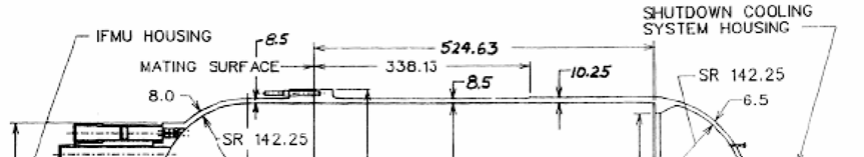

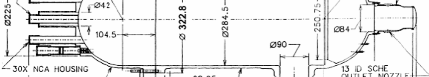

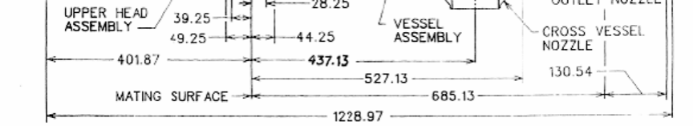

_Figure 3-6.  RV (dimensions are in inches)_ 

GA has had discussions with two RV manufactures concerning NGNP vessel fabrication, specifically Japan Steel Works (JSW) and DOOSAN Heavy Industries and Construction (DOOSAN).  The current maximum cylindrical forging size is limited to 8.2 m diameter.  As an alternative approach to forgings, GA material experts suggest manufacturing the RV from rolled plate, or a combination of rolled plant and forgings.  DOOSAN has provided GA with vessel manufacturing schemes for both design approaches. 

## **3.2.2 Cross Vessel and Hot Duct Assembly** 

The NGNP design includes cross vessels that connect the RV to the PCS vessel and the RV to the IHX vessel.  The hot ducts that provide the hot-leg primary coolant flow path from the RV to the PCS and IHX vessels are concentrically located within the cross vessels.  The annular space between the hot duct and cross vessel provides the cold-leg primary coolant flow path from the PCS and IHX vessels to the RV.  The hot duct assembly includes a ceramic fiber insulation layer to minimize heat transfer between the hot-leg and cold-leg flow paths.  A similar insulation layer may also be included on the inside diameter of the cross vessel. 

As shown in Figure 4-3 in Section 4, the IHX cross vessel does not have a constant diameter. The RV nozzle side is sized to accommodate a full-size (600 MWt) IHX.  An area reducer is 

provided in the cross vessel to accommodate the 65 MWt printed-circuit type heat exchanger that is planned for initial installation in the NGNP. 

The NGNP hot duct material will be a high-temperature alloy (e.g., Incoloy 800H, Hastelloy-XR, or Inconel 617).  The material selected for the cross vessels for the NGNP preconceptual design is 2¼Cr-1Mo steel; however, it may be feasible to use LWR vessel materials for the cross vessels as well as for the RV. 

## **3.2.3 Power Conversion System Vessel** 

The PCS vessel consists of a cylindrical shell with a lower head that is welded to the shell and an upper cylindrical closure head that is bolted to the lower vessel shell.  The lower cylindrical shell contains the penetrations for the cooling water inlet and outlet of the precooler and intercooler modules.  The upper closure head contains the turbomachine penetration.  The outer diameter of the vessel (at flange) is 8.5 m.  The material selected for the PCS vessel is SA508/SA533 (LWR steel). 

## **3.2.4 IHX Vessel** 

The IHX vessel is a pressure boundary for the primary helium coolant and will be designed according to Section III of the ASME Code.  The material selected for the IHX vessel for the NGNP preconceptual design is 2¼Cr-1Mo steel.  The IHX vessel may include a ceramic fiber insulation layer, such as Kaowool, on inside surfaces to maintain operating temperatures within the material temperature limits.  The vessel has an inner diameter of 3.81 m and is approximately 16 m in height. 

## **3.2.5 Vessel System Support Arrangement** 

Vertical vessel support is provided at the same building elevation for the reactor, PCS, and IHX vessels.  This feature minimizes differential vertical thermal expansion between connecting vessels at the cross vessel elevation, thus minimizing shear and bending moments on either cross vessel.  The vertical support is provided through sliding pads which allow unrestrained thermal and pressure expansions of the vessel system in the horizontal plane, minimizing axial loads on the cross vessels.  The vessel support design limits relative motions between the vessels and RB during a seismic event. 

## **3.3 Fuel Handling System** 

The Fuel Handling System for the NGNP reactor will be similar to that designed for the GTMHR.  The GT-MHR system includes a fuel handling machine, two fuel transfer casks, an 

auxiliary transfer cask, a fuel handling equipment positioner, a fuel handling equipment support structure, and local spent fuel storage and handling facilities.  Two or three large, portable, isolation gate valves are also included in the fuel handling system equipment inventory.  These valves are placed over the RV refueling penetrations, spent fuel storage wells, or spent fuel sealing and inspection facility whenever elements are moved in or out of these locations.  All operations and movements of the machines and the associated fuel and reflector elements are automatically monitored and recorded to maintain full accountability.  Each fuel and reflector element is uniquely identified as necessary to support this accountability requirement.  The fuel sealing and inspection facility is included in the system to provide for receipt and inspection of new fuel, and for packaging of spent fuel that is to be transported for storage or disposition either within the plant area or off-site. 

The refueling procedure for the NGNP will also be essentially the same as that developed for the GT-MHR.  Refueling takes place on a specific schedule, and involves the entire 1020 fuel element inventory in the reactor core, plus certain replaceable reflector elements as may be required.  The arrangement of fuel handling equipment is shown in Figure 3-7.  A routine refueling commences with depressurization of the vessel system and installation of the fuel handling support structure above the RV.  This support structure is moved and handled using the fuel handling equipment positioner.  Using the auxiliary service cask, the nuclear instrumentation equipment is removed from the RV centerline penetration.  A fuel element guide sleeve and support plate assembly is then inserted into this penetration, also using the auxiliary service cask.  Under controlled conditions, a neutron control assembly (control rod drive) is removed from one of the vessel top head inner penetrations using the auxiliary service cask. Using the fuel handling equipment positioner, the fuel handling machine is installed over that same penetration.  Also using the fuel handling equipment positioner, a fuel transfer cask is mounted over the RV centerline penetration, immediately adjacent to the fuel handling machine. Both machines are anchored to the support structure to assure seismic integrity. 

Fuel and reflector elements are removed from the reactor in a specific order and placed in the fuel transfer cask, one by one.  When full, this cask is moved to the spent fuel storage area where all or a portion of these elements are placed in a helium-filled spent fuel storage well for interim cooling.  New fuel elements are then loaded into the fuel transfer cask and moved to the reactor where they are placed into the core, also in a specific order. 

Replacement of certain fuel and reflector elements near the outer edges of the core requires that the control rods (and guide tubes) and reserve shutdown guide tubes associated with the neutron control assemblies in the outer penetrations to be withdrawn to allow access into this area by the fuel handling machine.  All such control rod withdrawals must be fully approved prior 

to withdrawal, and carefully controlled and monitored during the actual withdrawal.  When all element moves are completed in this outer area, the rods and guide tubes are re-inserted. 

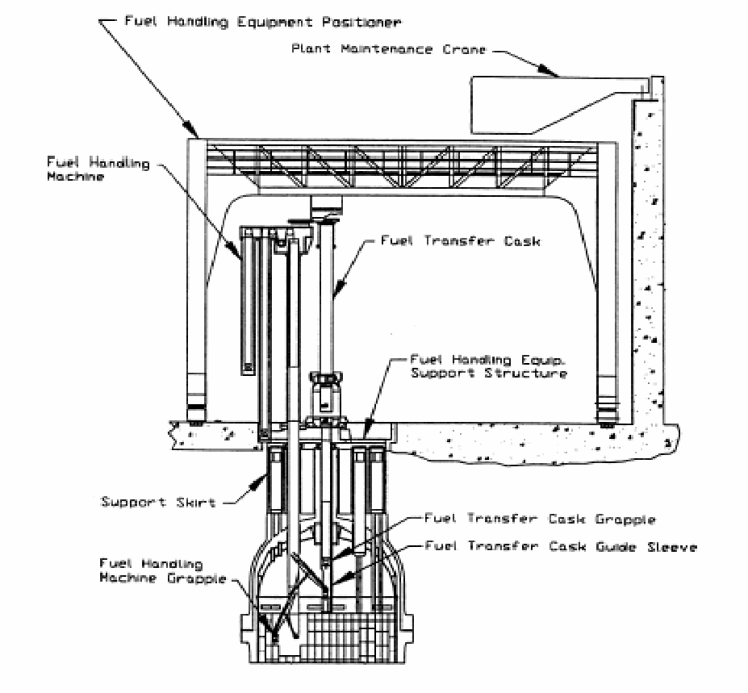

_Figure 3-7.  GT-MHR Fuel Handling Equipment_ 

When the current one-sixth region of the reactor has been refueled, the fuel handling machine is removed and the neutron control assembly is replaced in that penetration.  The fuel handling support structure is then rotated as needed to obtain access to the next inner top head penetration for continuation of the refueling procedure.  This process continues until the entire reactor core has been refueled in accordance with a predetermined sequence of fuel and 

reflector movements, after which the fuel handling support structure is removed and the reactor is recovered and prepared for resumption of operations. 

## **3.4 Shutdown Cooling System** 

The NGNP design has three diverse active heat-removal systems, the PCS, the HTS, and the SCS, all of which can be used for removal of decay heat from the reactor.  The SCS is designed to provide decay heat removal when the primary heat removal systems are off line.  The SCS consists of a circulator with shutoff valve, a heat exchanger, a control system, a shutdown cooling water system, and equipment for servicing the circulator and heat exchanger. 

The SCS consists of a single loop with the heat exchanger in series with the circulator and loop shutoff valve assembly.  These components are located at the bottom of the RV.  Hot helium from the core outlet plenum flows through multiple parallel openings (pipes) in the center of the core support structure and into the heat exchanger.  Once cooled, the helium continues downward through the loop shutoff valve to the circulator where it is compressed and discharged into the RV bottom head cavity.  The cool helium then flows through the internal passage formed by the core support structure, up through the flow channels in the PSR, and into the core inlet plenum.  The loop is completed as the helium flows down through the reactor core.  The heat is transferred to a cooling water system that rejects the heat to the atmosphere through an air-cooled heat exchanger. 

Because of the pressure drop associated with the IHX and PCS, there will be some back flow of helium through the IHX and PCS vessels.  This backflow is factored into the SCS design in order to prevent local flow reversals and ensure adequate core cooling. 

The SCS is sized to remove decay heat under both pressurized and depressurized conditions. Under pressurized conditions the SCS is sized to remove up to 40 MWt.  When the reactor system is shutdown and depressurized for maintenance or refueling, the SCS is sized to remove up to 14.1 MWt.  To ensure high reliability, the SCS can draw electrical power from either normal or standby systems. 

During normal operation of the reactor system, the SCS operates in a standby mode.  During this mode, a small amount of cold leg helium leaks (back flows) through the closed shutdown valve and flows opposite the normal flow direction through the SCS circulator and over the SCS heat exchanger tubes.  In this mode the circulator is not operating, but the SCS cooling water system supplies a small amount of water flow to the heat exchanger.  This water flow prevents thermal shock when the SCS switches to an active cooling mode, but also results in a parasitic heat loss of up to 1.3 MWt during normal operation.  During standby mode, the primary coolant 

helium pressure is higher than the SCS water pressure to prevent water ingress into the reactor system during normal operation.  The SCS is manually switched from standby mode to an active cooling mode at the discretion of an operator. 

## **3.5 Reactor Cavity Cooling System** 

The Reactor Cavity Cooling System (RCCS) is a safety-related system that provides a passive means of removing core decay heat when the PCS, the HTS, and the SCS are unavailable for decay heat removal.  Shown in Figure 3-8, the RCCS is a completely passive design that has no pumps, circulators, valves, or other active components.  The RCCS receives heat transferred from the RV by thermal radiation and natural convection.  RCCS components include cooling panels that surround the RV (as shown in Figure 4-3 in Section 4), inlet/outlet structures that are located above grade, and a concentric duct system with the annular, outer flow path acting as the cold leg and the inner flow path acting as the hot leg.  Through a balance of buoyancy and gravitational forces, natural convection airflow is established through the RCCS circuit. 

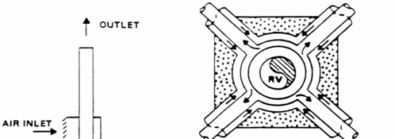

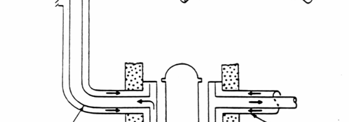

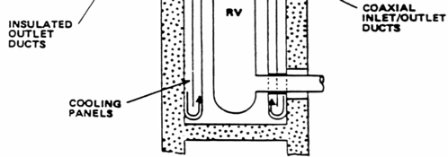

_Figure 3-8.  Passive Air-Cooled RCCS_ 

For passive removal of decay heat, the core power density and annular core configuration have been designed such that the core decay heat can be removed by conduction to the pressure vessel and transferred by radiation from the vessel to the natural circulation RCCS without exceeding the fuel particle temperature limit.  The RCCS has multiple inlet/outlet ports and interconnected parallel flow paths to ensure cooling in the event of blockage of any single duct or opening, and is robustly designed to survive all credible accidents scenarios.  However, even if the RCS is assumed to fail, passive heat conduction from the core, thermal radiation from the vessel, and conduction into the silo walls and surrounding earth are sufficient to maintain peak fuel temperatures below the 1600°C design limit. 

The RCCS is designed to passively remove ~4 MWt when the primary cooling circuit is either pressurized or depressurized.  During normal operation, the RCCS provides cooling to the reactor cavity concrete structure.  Also, during normal power operation, there is some parasitic heat loss to the RCCS. 

## **3.6 Power Conversion System** 

A vertical integrated PCS design was selected for the GT-MHR from trade studies performed as part of the GT-MHR preconceptual design developed under a joint initiative of the DOE and U.S. Utilities over the period 1991 - 1994.  The PCS design concept was developed by GA, General Electric, and Allied Signal.  In 1994, the GT-MHR was selected as the basis for a joint effort by the U.S. and Russia to design a MHR to be used for disposition of w-Pu.  OKBM was given responsibility for the GT-MHR design development.  Starting with the U.S. GT-MHR PCS design, OKBM has further developed the PCS through preliminary design and has made several design improvements.  Figure 3-9 illustrates the vertical integrated PCS design. 

The PCS consists of four major components: a turbomachine (TM), a recuperator, a precooler and intercooler, and the in-vessel metalwork (IVM).  The TM speed is 4400 rpm; a frequency converter is used to connect the generator with the outside grid with standard current frequency of 60 Hz.  The attractive features of this PCD design include: (1) a direct Brayton cycle that provides high efficiency and superior economics, (2) a vertical shaft that minimizes blade/stator clearances to reduce bypass flows, reduces plant footprint and associated capital costs, allows vertical lifts for maintenance, and the use of gravity to offset turbine thrust, (3) electromagnetic bearings (EMBs) that reduce energy losses and eliminate the possibility of lubricant ingress into the primary circuit, (4) a single stage of intercooling that improves thermal efficiency by about 2% over a non-intercooled cycle, and (5) a submerged generator that eliminates a rotating seal in the primary pressure boundary and reduces leakage of primary helium coolant. 

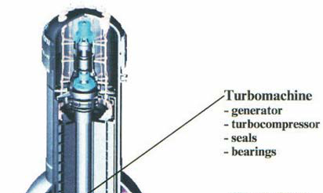

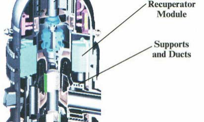

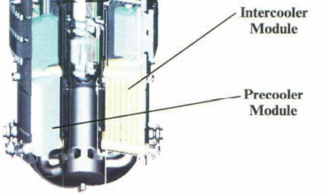

_Figure 3-9.   GT-MHR Power Conversion System Design Concept_ 

Figure 3-10 shows how the helium circulates within the PCS.  High-pressure helium from the reactor core outlet plenum flows through the hot duct inside the PCS cross vessel to the turbine where it expands.  The mechanical energy generated in the turbine is used to drive the generator, the low-pressure compressor (LPC), and the high-pressure compressor (HPC), which are arranged on a common shaft.  Downstream of the turbine, the helium flows through the low-pressure side of a recuperator where heat is transferred to the helium flowing back to the reactor through the high-pressure side of the recuperator.  Upon exiting the low-pressure side of the recuperator, the helium passes through a precooler, where it is cooled to about 25°C, before passing through the LPC.  Following the LPC, the helium passes through an intercooler where it is again cooled to about 25°C before entering the HPC.  After exiting the HPC, the helium flows through the recuperator high-pressure side, where it is heated to the reactor inlet temperature and flows back to the reactor through the annular gap between the PCS cross vessel and hot duct. 

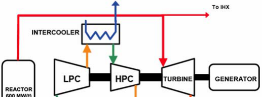

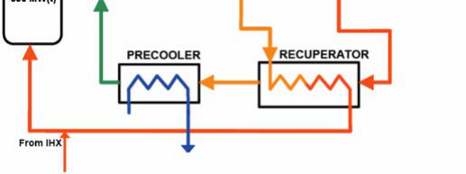

_Figure 3-10.  PCS Flow Diagram_ 

The PCS operating conditions depend upon its operating modes, which include plant startup and shutdown, electric-only mode at any power level within the required NGNP operating range, and cogeneration mode during which ~90% of the reactor outlet helium flow is transferred from the reactor to the PCS.  When the reactor power level is changed, helium is supplied or removed from the primary circuit to increase (or decrease) the mass flow rate while maintaining constant volumetric flow rate into the turbine and the same efficiency of thermal-to-electric power conversion.  If a quick power decrease is needed, the TM bypass control valve is used to bypass helium flow from the HPC outlet to the turbine outlet. 

## **3.6.1.1 Turbomachine Design** 

**Turbocompressor (TC).** The TC consists of the turbine, the LPC, the HPC, and the TC electromagnetic bearing (EMB) support system.  Figure 3-11 illustrates the design of the TC. The turbine and compressor stators constitute a single load-bearing structure, which protects other PCS components and the PCS vessel against TC breakdowns (de-blading, etc.).  The turbine and compressors are multistage and axial.  The TC design provides rotor seals at the upper end (buffer and repair seals) and sliding seals for the TC stators.  The buffer and repair seals are designed to prevent helium egress of the primary helium coolant into the PCS vessel upper section that contains the generator.  Procedures and equipment designs have been developed for TC replacement if the design lifetime has been reached or in case of failure. 

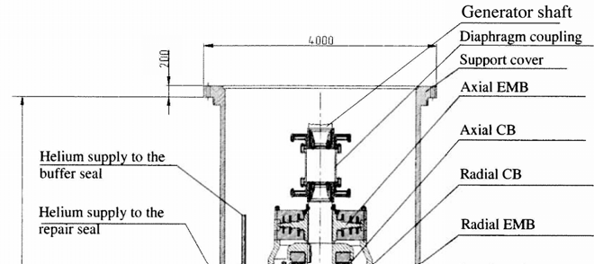

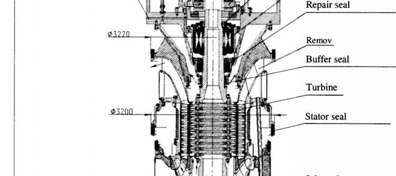

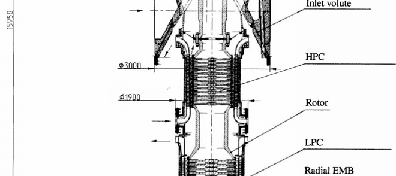

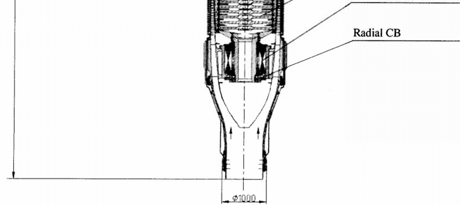

_Figure 3-11.  Turbocompressor (dimensions shown in millimeters)_ 

**Generator.** The generator is a vertical rotating asynchronous machine consisting of a main generator, exciter, and a generator support system. The generator stator is enclosed in a casing, which is a load bearing structure for the rotor and the TC stator.  The generator stator and rotor, exciter, and electric terminals are cooled with helium, which is circulated in a closed circuit by a fan installed on the generator rotor; heat is removed via gas coolers using a water cooling system.  Helium flow from the TC cavity to the generator cavity is controlled by the buffer seal located between the two cavities.  A higher pressure is maintained in the generator cavity than in the TC cavity.  A supply of clean helium is provided to the helium cavity in the seal to prevent flow from the TC cavity to the generator cavity. 

**Electromagnetic Bearings Support System Design.** The TC rotor and generator are connected by a flexible diaphragm coupling, which allows for separation of the TM EMB support system into two systems: one system for the TC rotor and another system for the generator rotor.  The TC and generator EMB support systems consist of two radial and one axial EMB, catcher bearings for each of these EMBs, and an EMB control system (EMB CS).  The CBs, which take the rotor load during TM mounting/dismounting and long-term outage, EMB failure, and external impacts exceeding EMB load-bearing capacity, are provided as a part of the EMB support system. 

## **3.6.1.2 Recuperator Design** 

The recuperator is a gas-to-gas modular heat exchanger.  It consists of twenty vertical modules, half arranged above and half below the hot gas duct.  Each recuperator module contains approximately 200 individual heat transfer elements that are based upon a plate-type heat exchange surface design.  The recuperator layout and design is shown in Figures 3-12 and 3- 13, respectively.  The recuperator is designed for the life of the plant, but removal and replacement of recuperator modules would be necessary if the modules started to leak. Replacement of recuperator modules, if necessary, would be accomplished through the use of remotely controlled devices because the recuperator modules are expected to be highly radioactive. 

## **3.6.1.3 Precooler, Intercooler, and Generator Gas Cooler Design** 

The precooler, intercooler and generator gas cooler are shell-and-tube heat exchangers with helium on the shell side and water on the tube side.  Reduced bending radius coils were selected as heat exchange surface. 

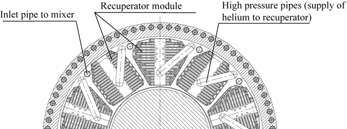

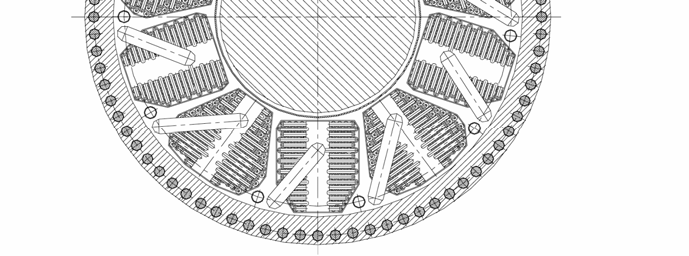

_Figure 3-12.  Recuperator Layout_ 

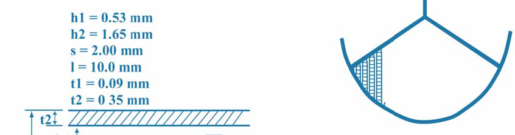

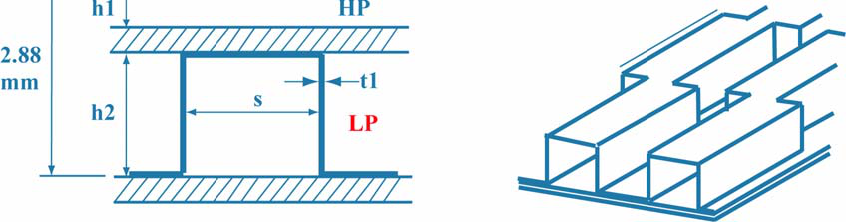

_Figure 3-13.   Recuperator Design (based on plate-type heat exchanger)_ 

## **3.6.1.4 Power Conversion Unit In-Vessel Metalwork (IVM) Design** 

The PCS IVM forms the PCS helium circulation path, limits inter-circuit leaks, limits heat exchange between helium flows with different temperatures, and ensures components are fastened to the PCS vessel.  The PCS IVM consists of component supports, gas ducts, thermal expansion compensators, and a mixer.  The mixer is designed to mix helium at the turbine exhaust with helium from the HPC outlet when a portion of the helium flow is bypassed in power control modes and when protecting the turbine against acceleration. 

## **3.6.2 Rolls-Royce Assessment of GT-MHR PCS Design** 

As part of the NGNP preconceptual design engineering studies, Rolls-Royce was tasked to perform a technical assessment of the OKBM design described in Section 3.6.1.  The key results of the assessment are summarized below.  [Rolls-Royce 2007] provides a detailed discussion concerning the scope, methodology, and results of the technical assessment. 

- More work is needed to resolve key areas of uncertainty with respect to off-design and transient performance.  The performance of the cycle under fault and accident conditions will be very important for the preparation of safety cases for the nuclear plant.  Of particular interest is the loss of grid event and the management of it using bypass flow. 

- The recuperator design is of particular concern.  The OKBM design should work as intended, but it is expected to be quite expensive and difficult to manufacture given that the design requires an estimated 50 km of welds in the heat transfer elements alone.  To mitigate the risk associated with the recuperator, an alternate cross-corrugated design (shown in Figure 3-14) that would be more compact, much lighter in weight, and likely less expensive is recommended. 

- Although the temperatures experienced in the recuperator are not too challenging (and don’t require special high temperature capable materials), the pressure differences between the two sides are relatively large.  Making a delicate structure to survive a 60year lifetime in this environment is very challenging.  Consequently, both the OKBM reference design and the alternative cross-corrugated design should be considered to have a moderately high risk of not achieving the required life. 

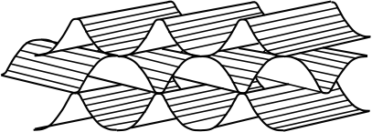

_Figure 3-14.   Cross-Corrugated Heat Exchanger_ 

During the PCS study, it became apparent that certain areas require further study.  Some of the more significant are: 

- 1) Transient performance.  The start-up and transient behavior of the PCS needs to be better understood so that the transient requirements for the components can be properly assessed.  This will require a transient performance model to be constructed for the cycles and is a significant undertaking. 

- 2) A study of the control system for the PCS needs to be made.  This system’s behavior is intimately bound up with the PCS’s transient requirements. 

- 3) Further refinement of turbine designs to increase confidence of achieving 60,000 hours creep life with uncooled turbine blades at 850°C. 

- 4) Further exploration of the implications of 950°C operation, particularly cost, complexity, and performance trade-offs (including blade cooling and thermal barrier coatings). 

- 5) A more thorough investigation into EMB capabilities and alternative technologies. 

These studies should be performed during the next design phase. 

## **3.6.3 Rolls-Royce Evaluation of Alternate PCS Designs** 

The vertical integrated PCS concept has long been recognized to pose several technical challenges with respect to individual equipment design and equipment arrangement within a single PCS vessel.  Given these challenges, PCS design development was carefully monitored 

by the U.S./Russian International GT-MHR Program through a series of design reviews, both by internal experts and by independent third party experts.  The results of these technical reviews have been thoroughly reviewed and evaluated to identify the uncertainties and assumptions (i.e., technical issues) in the science or engineering on which the design is based.  (In general, the key risks identified by Rolls-Royce are consistent with the results of these earlier reviews.) A series of design data needs were prepared to define the data needed to resolve these uncertainties and assumptions, technology development plans were prepared for the various system components, and a comprehensive PCS technology demonstration plan was prepared to describe the overall technology development and demonstration program. 

OKBM, in collaboration with GA and ORNL, is currently conducting this comprehensive technology development and demonstration program under the U.S./Russian International GTMHR Program to qualify the OKBM PCS design, which GA has identified to be the reference design for the NGNP at this time.  GA believes that this PCS technology demonstration program has a high probability of establishing the viability of the design before the end of NGNP preliminary design.  Nevertheless, the GA Team believes that it would be prudent to develop an alternate backup PCS design to mitigate the risk associated with development and demonstration of the OKBM design. 

Accordingly, Rolls-Royce was also tasked as part of the NGNP preconceptual design studies to explore options for, and recommend, a potential alternate PCS design for the NGNP.  The results of this evaluation are summarized below.  [Rolls-Royce 2007] provides detailed information concerning the scope and results of the evaluation. 

Several alternate PCS concepts were evaluated.  The most promising of the alternative concepts appears to be a direct combined cycle consisting of a 66 MWt gas turbine generator with the remainder of the thermal power taken by a conventional steam cycle (Figure 3-15). This cycle was worked up to a pre-concept level to understand feasibility and to make comparisons with the reference cycle.  The conclusion of this work is that the combined cycle option looks feasible and may be slightly more efficient than the reference cycle.  Its costs should be similar to that of the reference design and the concept mitigates some of the key risks identified with the reference design.  The key features of this concept are: 

- The recuperator is no longer required.  A steam generator would be required, but this is considered much lower risk. 

- EMB risks are reduced by reducing generator weight from 35 tons to around 10 tons, and the TC shaft weight from 32 tons to around 10 tons. 

- Frequency converter Power electronics costs are reduced (since the generator is reduced from ~300 MW to ~66 MW in the gas turbine part). 

- Plant efficiency is increased, compared with the GT-MHR Brayton cycle. 

- Steam turbines and steam cycle electrical generators are commercial off-the-shelf items - 

   - low cost and low risk. 

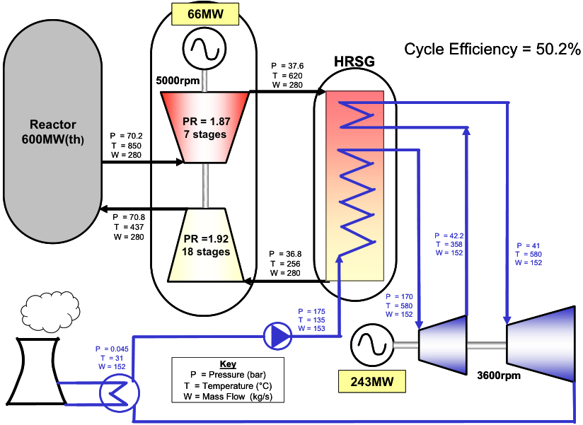

**----- Start of picture text -----** 
66MW Cycle Efficiency = 50.2% P  = 37.6 HRSG 5000rpm W = 280T  = 620 Reactor PR = 1.87 P  = 70.2 7 stages 600MW(th) T  = 850 W = 280 P  = 70.8 T  = 437 W = 280 PR =1.92 P  = 42.2T  = 358 P  = 41 18 stages P  = 36.8 W = 152 T  = 580 T  = 256 W = 152 W = 280 P  = 170 T  = 580 P  = 175 W = 152 T  = 135 W = 153 P  = 0.045 T  = 31 W = 152 Key P  = Pressure (bar) 3600rpm T  = Temperature (°C) 243MW W = Mass Flow  (kg/s) **----- End of picture text -----** 

_Figure 3-15.  Combined Cycle Alternative Proposed by Rolls-Royce_ 

The combined cycle alternative could have lower plant costs because much of the steam machinery is commercial off the shelf, but this saving would be offset by requiring a bigger RB and the extra maintenance burden of the steam cycle equipment. 

Figure 3-16 shows the proposed layout for the combined cycle includes two separate pressure vessels, one containing the TC and generator and another containing the steam generator.  The rest of the plant is considered to be low risk commercial off-the-shelf equipment and as such was not analyzed in any detail.  In fact, the bottoming steam cycle is very similar to the steam cycles employed in U.K. nuclear plants, in particular the Advanced Gas Reactor (AGR) stations. The similarities to the AGR plant lend credibility to the choice of a combined cycle because of the generally successful performance of the AGR plant over the last 30 years. 

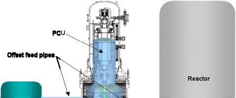

_Figure 3-16.  Layout of Combined Cycle Alternative in 3 Pressure Vessels_ 

Advantages of the combined cycle include: 

- Reduced EMB risk. 

   - Generator from ~35 tons to ~12 tons. 

   - TC from ~32 tons to 12 tons (due to shorter shaft). 

- Elimination of recuperator risk. 

- Commercial, off-the-shelf steam equipment (excluding steam generator).  Total equipment costs should be lower. 

- Flexibility to provide process steam instead of electricity from steam plant 

Disadvantages of the combined cycle are: 

- Increased equipment footprint, both inside RB and outside 

- Increased complexity (but mainly commercial off-the-shelf steam plant) 

For the combined cycle option to progress further, further study is needed with respect to the following design issues: 

- Because there is no intercooler the number of times helium must be taken into and out of the TC is reduced.  It may be possible to reduce costs and simplify the sealing arrangement between turbine inlet and the hot gas duct. 

- Any helium leaking from the high pressure section of the gas turbine or exhaust will combine with flow entering the compressor and could cause hot streaks.  It may be beneficial to move the economizer section of the boiler close to the GT inlet to mitigate this issue. 

- The surfaces of gas turbine and steam generator outer casing and the inner surface of the pressure boundary will need to be insulated.  The integrity and reliability of the fixing system needs to be demonstrated due to the potential to damage the compressor caused by debris ingestion. 

- Power leads and instrumentation connections to the TC could be taken out to another interconnection at the bottom of the pressure vessel easing the problem of running such connections through the high pressure/temperature section.  However this may lead to issues where such leads pass through the pressure vessel. 

- The ambient temperature of the EMBs may become an issue if suitable thermal insulation and cooling strategy cannot be adequately demonstrated.  The plate out of silver could also cause reliability issues for the EMB coils. 

## **3.6.4 PCS Cooling Water System** 

This system is a closed loop piping arrangement that absorbs heat from the pre-cooler and intercooler heat exchangers in the PCS.  This system also provides cooling water to the various coolers within the main plant electricity generating system, such as the generator cavity coolers, the stator windings, and the magnetic bearing system.  The absorbed heat is rejected through a series of heat exchangers in the auxiliary building located outside the RB. 

## **3.6.5 Power Generation Facility** 

Three-phase electric power delivered by the main facility generator is routed to the main power transformer for voltage upgrading (e.g. to 240 kV) as required for compatibility with the off-site power distribution and transmission system (the grid).  A unit auxiliary transformer is connected to the high-voltage side of the main power transformer to supply power to the facility at reduced voltages (typically as 4.16 kV input to the various in-plant system transformers).  This arrangement allows either the main facility generator or the outside power transmission system to provide house power to the plant.  A reserve auxiliary transformer may also be included in the overall power generation and distribution system as may be needed if the unit auxiliary transformer is not available.  The reserve auxiliary transformer takes power directly from the grid and feeds 

directly into the plant electrical system.  A number of circuit breakers are included in the power distribution system to control the flow of power to and from the various sources and users. 

## **3.7 Heat Transport System** 

The Heat Transport System (HTS) includes the systems, subsystems and components necessary to transport 65 MWt of high-temperature heat from the primary system of the NGNP to the process heat exchangers in the hydrogen production plants.  It consists of both the Primary HTS and the Secondary HTS. 

## **3.7.1 Primary Heat Transport System** 

The Primary HTS consists of the IHX and primary helium circulator (PHC).  Both of these components, along with associated internal ductwork, are contained within the IHX vessel.  The IHX vessel is connected to the RV by the IHX cross vessel and associated IHX hot duct.  The Primary HTS diverts a portion of the primary coolant flow from the hot plenum of the reactor and sends it through the IHX in order to transfer the heat to the Secondary HTS.  The Primary HTS helium circulator located on top of the IHX vessel returns the diverted primary coolant to the RV where it rejoins with the helium returning from the PCS on its way back to the inlet plenum at the top of the reactor core. 

## **3.7.1.1 Intermediate Heat Exchanger** 

Two alternate IHX designs were developed based on the printed circuit heat exchanger (PCHE) concept developed by Heatric Corporation (Figure 3-17).  This design consists of metal plates that are diffusion bonded to restore the properties of the base metal.  Fluid-flow channels are chemically milled into the plates using a technique that is similar to that used for etching printed electrical circuits.  The PCHE concept allows for simultaneous high-temperature and highpressure operation with relatively thin wall thicknesses between the primary and secondary coolants.  PCHEs are typically four to six times smaller than conventional shell-and-tube heat exchangers of equivalent heat duty, and designs have been developed with thermal effectiveness greater than 98%. 

In the first PCHE-type IHX design, the arrangement of the flow paths through the PCHE modules is slightly different from that depicted in Figure 3-17.  In order to bathe the exterior of the IHX in cold primary coolant helium, the flow arrangement depicted in Figure 3-18 was devised.  The cross-sectional view shows the primary flow path on the lower half and the secondary flow path on the upper half which would represent the PCHE plate just above or below the plate used by the primary flow.  Primary and secondary PCHE plates are stacked one on top of the other to form each PCHE module.  The primary coolant inlet and secondary 

coolant inlets and exits would be at the top of the IHX.  The primary coolant exits would be all along the north and south sides of the IHX as depicted in Figure 3-18. 

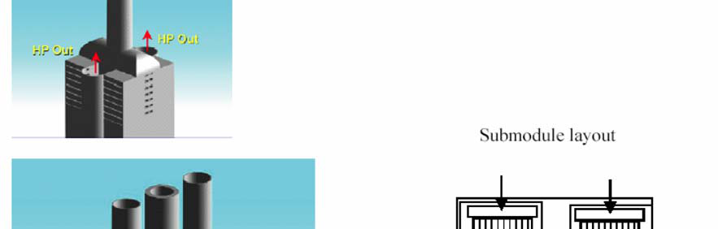

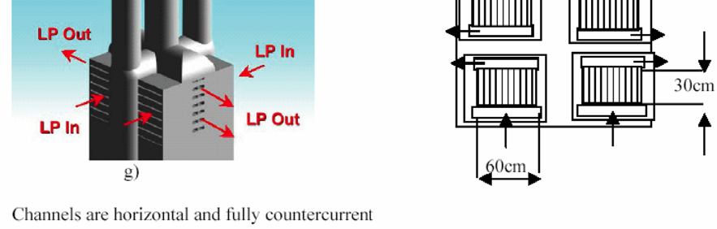

_Figure 3-17.  Counter Flow Heatric[R] Heat Exchanger (courtesy of HEATRIC Corp.)_ 

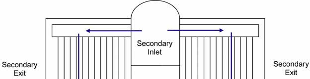

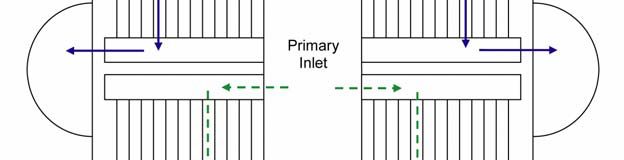

_Figure 3-18.  Primary and Secondary Flow Through IHX_ 

The basic geometric parameters of this IHX design are presented in Table 3-8.  Both the primary side and secondary side IHX flow channels are the same size.  The log-mean temperature difference (LMTD) of the heat exchanger is 25°C and its effectiveness is 93.5%. The flow rates and pressures on the primary and secondary sides of the IHX are essentially the same.  When the NGNP is operating in cogeneration mode to produce both electricity and hydrogen, the pressure in the primary system is reduced from 7 MPa to 6.23 MPa in order to maintain high efficiency in the PCS which is receiving 535 MWt of heat from the reactor.  The pressure drop on the primary side is 31.2 kPa (4.53 psi).  The pressure drop on the secondary side is essentially the same at 30.3 kPa (4.40 psi). 

The NGNP IHX requires a nickel-based alloy, such as Alloy 617 due to the requirement to operate at temperatures of up to 950°C.  Although the ASME Code does not presently support the use of Alloy 617 for stand-alone pressure containment, there appears to be adequate data to support design of PCHE modules as internals of the IHX pressure vessel.  The external IHX pressure vessel will be designed and fabricated from existing ASME Code material.  The IHX vessel is a pressure boundary for the primary helium coolant and will be designed according to the ASME Code, Section III. 

**Table 3-8.  Basic Geometric Parameters of He-He PCHE IHX** 

The second PCHE-type IHX design was prepared by Toshiba by Toshiba.  The design conditions for this IHX are presented in Table 3-9.  The basic geometric parameters of the PCHE are shown in Table 3-10.  The metal volume before etching the flow channels is 8.05 m[3] and has a mass of 67.3 tons.  The large mass of the PCHE is due to the small log mean temperature difference (LMTD) which requires the PCHE to be quite long.  Consequently, it would be desirable to increase the LMTD relative to the point design value of 25°C used in the NGNP preconceptual design. 

**Table 3-9.  Toshiba PCHE-Type IHX Design Conditions** 

**Table 3-10.  Basic Geometric Parameters of Toshiba PCHE IHX** 

Eight PCHE modules are assembled by tungsten inert gas (TIG) welding to form a PCHE unit. The plenums are attached to both sides of the PCHE modules by TIG welding to form the flow passage for the secondary helium coolant.  The material used for the plenum is Alloy 617, the same material as used for the PCHE.  The cross section of the PCHE units is shown in Figure 3-19. 

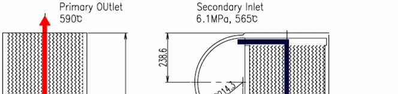

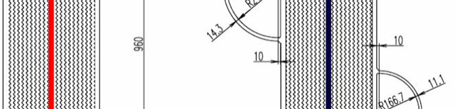

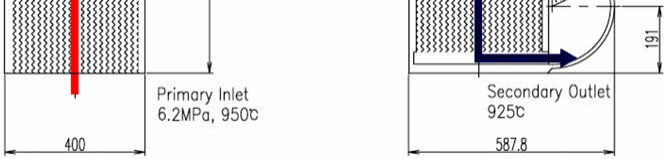

_Figure 3-19.  Horizontal Cross Section of PCHE Unit_ 

The general arrangement of the IHX is shown in Figures 3-20 and 3-21.  The primary coolant flows through the RV – IHX hot duct and upward into the bottom of the PCHE unit shell.  The primary coolant at 950°C and 6 MPa flows upward through the PCHE units.  Heat is transferred from the primary coolant to the secondary HTS helium in the PCHE units.  The temperature of the primary coolant drops to 590°C and the coolant descends downward in the IHX and is carried to the helium circulator.  The primary coolant is pressurized by the helium circulator, goes upward between the pressure vessel and shroud, and is transported through the annulus between the hot duct and cross-vessel to the RV.  On the secondary side, the secondary HTS helium enters at 565°C and 6 MPa, flows into the inside of the IHX through the 8 inlet nozzles installed at the top spherical shell, goes through the piping, and is transported up to the plenum of the PCHE units.  The helium flows through the PCHE unit where it heats up to 925°C, goes through the internally insulated piping, collects in the secondary outlet header, and is transported to the hydrogen production plants by the secondary HTS circulator.  Kaowool is used as the thermal insulation for the piping. 

Development of the PCHE IHX concepts for the NGNP preconceptual design have identified a number of design issues that need to be addressed by more detailed analyses as the design progresses.  The following issues need to be addressed in conceptual design. 

- The method for installation of the thermal insulation into the small pipe 

- The size of cross-vessel and the helium circulator 

- Maintenance considerations with respect to working space, fabrication methods, etc. 

- Confirmation of secondary piping and PCHE support design feasibility 

- IHX is lifetime; the IHX vessel is designed for 60 years, but the internals may need to be replaced in 

- Implications of ISI on the PCHE as required by ASME Code.  (Because of this, the primary coolant pressure boundary might be considered to extend to the isolation valves in the secondary HTS.) 

- Methodology for monitoring the IHX for leakage 

- Determination of the precise pressure drop through the PCHE by experiment 

- Structural analysis is needed to confirm the feasibility of the design selections 

- Many slide joints are used to enable maintenance of the IHX.  An evaluation of leak rates due to the many slide joints used to accommodate maintenance 

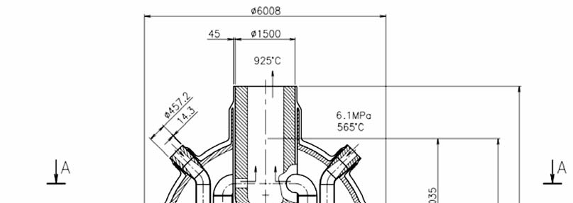

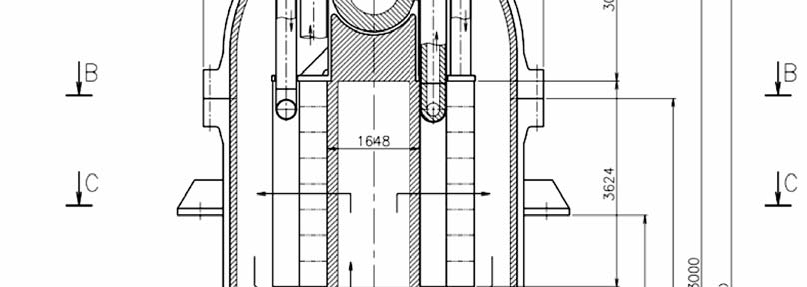

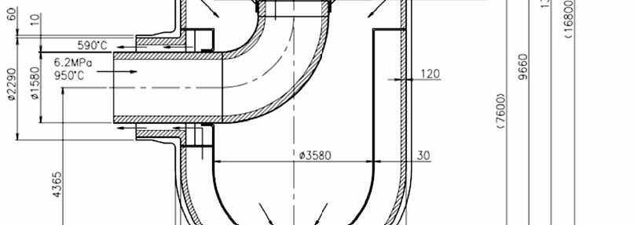

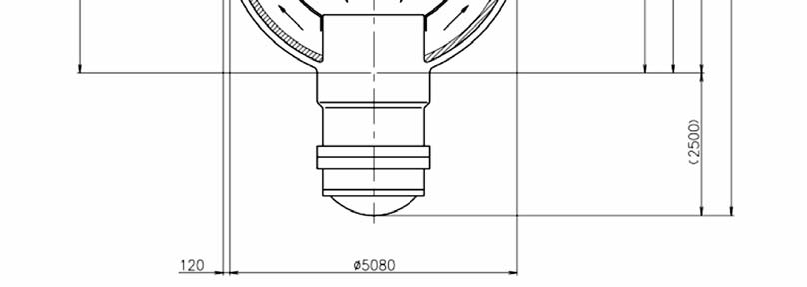

_Figure 3-20.  General Arrangement of PCHE IHX_ 

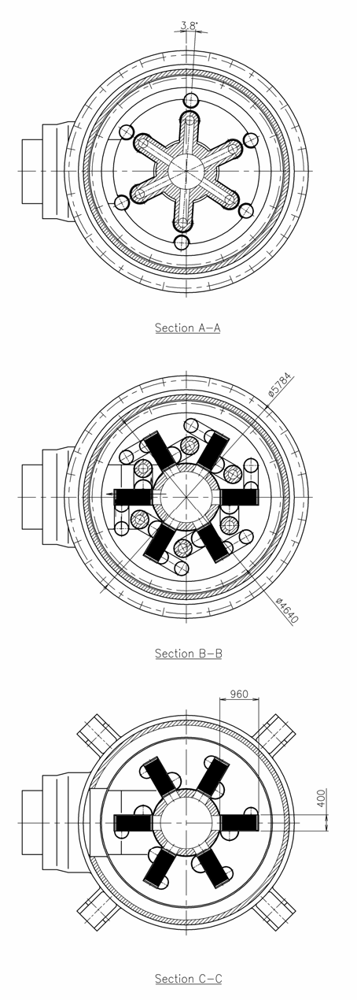

_Figure 3-21.  Horizontal Cross Section of PCHE IHX_ 

The alternate Toshiba IHX design is a shell and tube, counter-flow heat exchanger, using a helically coiled tube.  For an equivalent heat duty and LMTD, this type of heat exchanger is considerably larger than a PCHE.  However, this design allows for in-service inspection (ISI) of the heat transfer tubes, and an IHX design of this type is connected to the HTTR and has successfully operated at 950°C for extended periods.  To reduce the size of the helical-coil IHX, the LMTD would be increased to 91°C, which would alter the overall system heat balance and results in somewhat lower-temperature heat being transferred to the hydrogen-production processes.  The design conditions for this IHX design are given in Table 3-11 

The helical-coil type IHX concept is shown in Figure 3-22.  In this figure, “1ry” stands for primary and “2ry” stands for secondary.  Primary helium gas enters the center of the inlet nozzle, flows up through the region of tube bundles, returns at the upper end of the vessel, flows down through annulus path between inner shell and outer shell into the circulator, and from the circulator to the reactor through the annulus between the hot duct and the cross vessel. Secondary helium enters into four tube sheets at the head of the IHX, flows down through the helically-coiled tubes to a hot manifold header at the bottom of the center pipe, flows up through the center pipe and exits from the outlet nozzle at the top head of the IHX. 

**Table 3-11.  Helical-Coil IHX Design Conditions** 

_Figure 3-22.  General Arrangement of Helical-Coil IHX_ 

## **3.7.1.2 Primary Helium Circulator** 

The primary HTS helium circulator is mounted vertically at the top of the IHX vessel closure head and is part of the pressure boundary for the primary coolant.  The helium flow rate can be adjusted by varying the speed of the motor.  The circulator includes a loop shutoff valve for shutting off primary coolant flow through the circulator (and the primary HTS) when either the SCS circulator is operating or the NGNP is operating only to produce electricity. 

The PHC is configured to accommodate the following items: (1) a variable speed electric motor, (2) an axial flow impeller and diffuser, (3) a loop shutoff valve (LSV), (4) an electric motor control and power subsystem (EMCPS), (5) a magnetic bearing control and power subsystem, (6) a labyrinth seal, (7) an internal circulator cooler, and (8) a barrier plate and motor outer sleeve. Figure 3-23 shows the general arrangement of the PHC. 

The PHC is mounted vertically at the top of the IHX vessel (IHXV) closure head and is part of the pressure boundary for the primary coolant.  Helium flow rate can be adjusted by varying the speed of the motor.  The axial flow impeller is mounted to the bottom of the motor shaft.  The cold return helium enters the circulator inlet, flows downwards through the impeller and the LSV, and is discharged into the circulator outlet plenums of the IHXV.  The helium collected in the IHX vessel’s outlet plenum is then returned to the RV via the IHX cross vessel.  The LSV assembly shuts off primary coolant flow through the PHC when either the SCS circulator is operating or the NGNP is only operating to only produce electricity.  Using a conservative value of 80% for the efficiency of the PHC, an initial estimated power requirement for the PHC motor is 1.5 MWe. 

## **3.7.2 Secondary Heat Transport System** 

The Secondary HTS uses helium to remove heat from the IHX and transport it out of the RB to the hydrogen production plants.  At the hydrogen production plants, the secondary coolant is divided into two flow paths in order to supply 60 MWt to the SI hydrogen production process and ~4 MWt to the HTE hydrogen production process.  The secondary HTS circulators return the helium from the process heat exchangers back to the IHX.  The secondary HTS consists of the secondary helium circulators, piping, and isolation valves.  The preconceptual design of the Secondary HTS is based on the Heat Transfer/Transport study performed by GA [Bolin 2007]. 

Parallel hot leg and cold leg piping is used to transfer the process heat from the IHX to the hydrogen production plants.  The piping is assumed to run 90 m in length between the IHX and process heat exchangers (PHXs) of either the SI or the HTE hydrogen production plant.  The parallel pipe configuration is a simpler design compared to a concentric pipe configuration and 

can more easily accommodate the design features necessary to address thermal expansion and isolation valves.  To reduce the pipe wall temperature and to meet the requirement for <1% heat loss to the environment, internal insulation is used for both the hot leg and cold leg piping.  The internal insulation would be made of Kaowool with cover plates holding it in place.  The same design approach was used in the FSV HTGR and is proposed for the hot ducts and cross vessels of the NGNP primary system.  External insulation is also used to further reduce the heat loss to the environment.  The addition of external insulation raises the pipe wall temperature. 

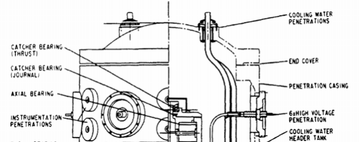

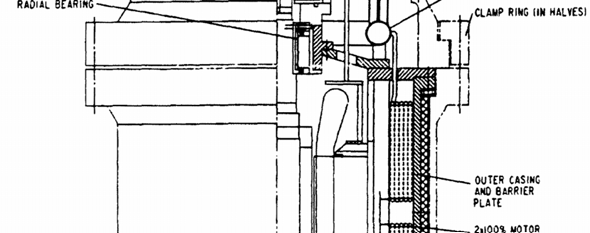

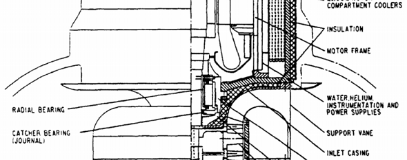

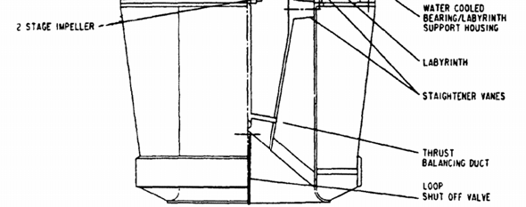

_Figure 3-23.  General Arrangement of Primary Helium Circulator_ 

The secondary HTS is assumed to have three isolation valves on each leg – two near the IHX and one near the PHX.  Isolation valves are necessary to prevent the propagation of events in either the NGNP reactor or hydrogen production plant from affecting the other.  Double isolation valves on the hot leg and cold leg sides of the IHX allow these isolation valves to be part of the primary coolant pressure boundary and part of the containment building boundary.  Isolation valves are also necessary to perform maintenance on the heat transport loop.  Figure 3-24 presents a diagram of a potential high temperature isolation valve (HTIV) being developed for use on HTTR by the Japan Atomic Energy Agency (JAEA).  For HTTR, a ½ scale prototype of the HTIV has been tested.  The valve, as shown in Figure 3-24, is an angle valve with internal glass wool insulation.  The rod body and seat were made of Hastelloy X and the seat had a coating metal of Stellite No. 6 and 30 wt% Cr3C2.  The casing of the valve was made of carbon steel which was limited to 350°C due to the internal insulation.  Testing was performed at 4.0 MPa and 900°C. 

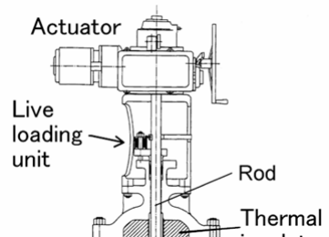

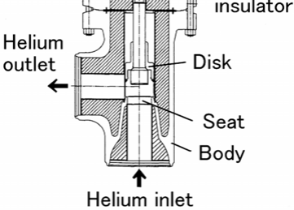

_Figure 3-24.  High Temperature Isolation Valve_ 

The design of the secondary HTS helium circulator is expected to be either the same or very similar to the primary HTS helium circulator.  The major difference between the secondary HTS circulator and the primary HTS circulator is the absence of a loop shutoff valve whose function is performed by the secondary loop isolation valves.  The total pressure drop in the secondary HTS is the sum of pressure drops in the IHX, PHXs and piping system.  The design of the PHX 

for either the SI or HTE hydrogen production process is expected to have a pressure drop no greater than the pressure drop in the IHX.  Assuming the system uses a single circulator with an efficiency of 80%, the total system pumping power would be 1.6 MWe.  An alternate configuration is to have two circulators – one dedicated to SI hydrogen production and the other dedicated to HTE hydrogen production.  The SI secondary HTS circulator would be sized at 1.45 MWe while the HTE secondary HTS circulator would be sized at only 120 kW. 

## **3.8 Hydrogen Production Systems** 

## **3.8.1 High-Temperature Electrolysis System** 

As described in [Richard 2006b], GA and INL developed a pre-conceptual commercial H2-MHR design based on coupling the MHR to SOE modules.  In that H2-MHR concept, the SOE modules are based on the planar-cell technology being developed by INL and Ceramatec of Salt Lake City, UT under the NHI. 

For the current study, GA has worked with Toshiba Corporation to develop a concept based on tubular-cell technology.  The tubular-cell concept requires more cell area per unit volume (which may impact capital costs), but appears to have fewer technical issues with regard to sealing individual cells, which can have a significant impact on long-term performance.  GA believes both the planar-cell and tubular-cell technologies are promising concepts for future commercialization, and recommends that both concepts be developed through at least the pilotscale demonstration stage so that tradeoffs between capital costs and long-term performance can be accurately characterized. 

High-temperature electrolysis requires SOE cells that can operate at temperatures up to approximately 850°C.   Figure 3-25 shows a schematic of the Toshiba SOE cell design.  The electrolyte is Yttria-Stabilized Zirconia, the anode (oxygen electrode) is LSM (Strontium-doped Lanthanum Manganite), and the cathode (hydrogen electrode) is Ni-YSZ (a mixture of metallic Nickel and Yttria-Stabilized Zirconia). 

The HTE-based hydrogen production plant for the NGNP will utilize ten SOE modules, with each module containing approximately 18,000 SOE cells and producing 600 Nm[3] of hydrogen per hour (0.015 kg/s).  Modules of the same size would be used for a commercial-scale plant. The SOE module design parameters are given in Table 3-12.  Figure 3-26 shows the preconceptual SOE module concept.  The module pressure vessel is designed to last the 60-yr plant lifetime.  The electrolyzer cells are expected to last between 5 and 10 years before requiring replacement, but additional technology development/demonstration is required to determine actual cell lifetime. 

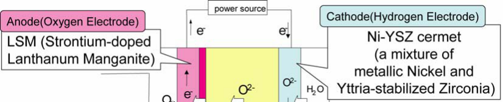

_Figure 3-25.  Schematic of SOE Cell Concept_ 

**Table 3-12.  SOE Module Design Parameters** 

|**Design Parameter**|**Value**|
|---|---|
|Internal design temperature, °C|900|
|Inlet/outlet temperatures, °C|815/849|
|Vessel temperature, °C|200|
|Vessel pressure, MPa|5|
|�P between anode and cathode, MPa|0|
|Hydrogen electrode inlet gas composition, H2/H2O mole fraction|0.1/0.9|
|Hydrogen electrode outlet gas composition, H2/H2O mole fraction|0.9/0.1|
|Oxygen electrode inlet gas composition, O2/H2O mole fraction|0.0/1.0|
|Oxygen electrode outlet gas composition, O2/H2O mole fraction|0.6/0.4|
|Electrolysis cell shape|Cylindrical|
|Current density, A/cm2|0.6|
|Operating voltage, volts|1.304|
|Electrical energy input, MW|1.86|
|Hydrogen production rate, Nm3/h|600|

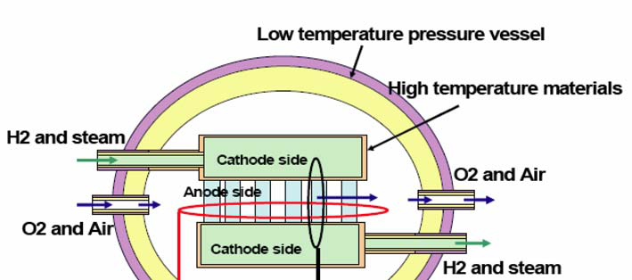

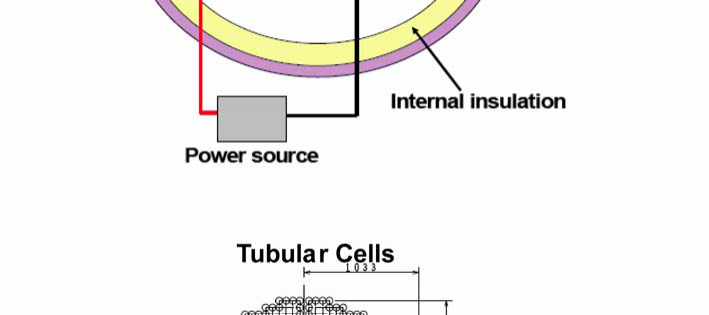

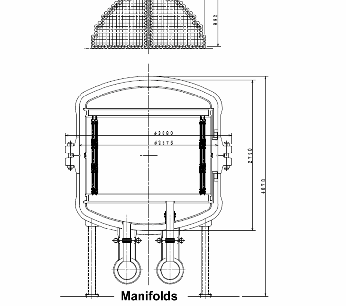

_Figure 3-26.  Pre-Conceptual SOE Module Concept (dimensions are in mm)_ 

As indicated in Table 3-12, the cells are designed to operate at 1.304 volts and at a current density of 0.6 A/cm[2] .  Figure 3-27 shows the current-voltage characteristics measured for a single, 15-cm[2] cell at temperatures of 800°C and 900°C with PH2O = 0.5 atm, PH2 = 0.5 atm, and PO2 = 0.2 atm.  The measured open-cell potentials (corresponding to a current density of zero) at 800°C and 900°C were 0.94 volts and 0.91 volts, respectively, which are in good agreement with the theoretical values predicted using the Nernst equation.  For this test, current densities of approximately 0.45 A/cm[2] were achieved.  In order to operate at higher current densities, it is important that the cells have low area-specific resistance, ASR = (E – EOCV)/I, where E is the operating voltage, E is the open-cell potential, and I is the current density.  The ASR values were 0.63 ohm-cm[2] at 800°C and 0.37 ohm-cm[2] at 900°C.  Testing of a 75-cm[2] cell (3 times the length of the 15 cm[2] cell) at 800°C resulted in a current density of about 0.3 A/cm[2] at the thermal neutral voltage and an ASR of approximately 1.2 ohm-cm[2] .  Under the same test conditions, testing of a cell assembly consisting of three banks of five 75-cm[2] cells (total of 15 cells, see Figure 3-28) resulted in a current density of about 0.2 A/cm[2] at the thermal neutral voltage and an ASR of about 1.9 ohm-cm[2] .  Based on these results, additional technology development is needed to achieve high current densities for engineering-scale units. 

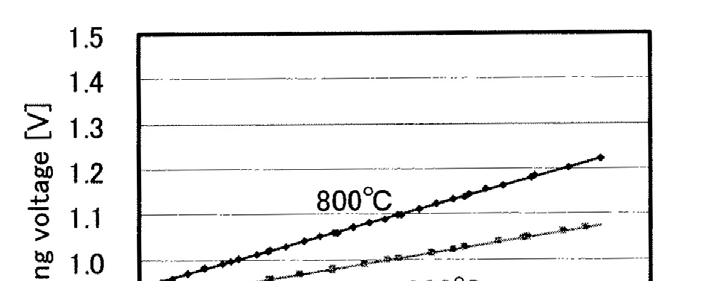

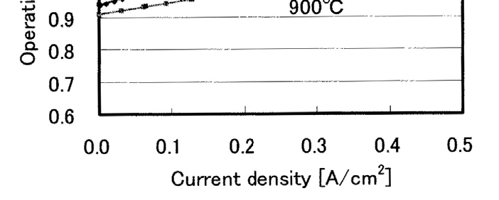

_Figure 3-27.  Current-Voltage Characteristics of a Single, 15-cm[2] Tubular Cell_ 

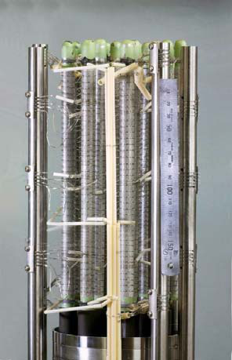

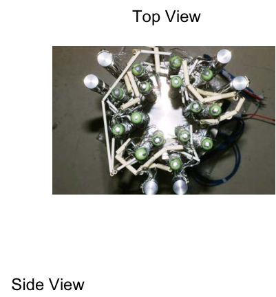

**----- Start of picture text -----** 
Top View Side View **----- End of picture text -----** 

_Figure 3-28.  Toshiba 15-Cell Assembly_ 

Figure 3-29 shows the flowsheet developed for the NGNP, which was analyzed using the commercial HYSYS process simulation software.  For this pre-conceptual study, heat losses associated with process equipment and piping were neglected, losses associated with AC to DC conversion were neglected, and pressure losses associated with components were assumed to be 1% of the inlet pressures to these components.  SOE cell performance was based on data developed by Toshiba as part of their HTE technology-development program [Matsunaga 2006]. Make-up water is mixed with recycled water and then heated and vaporized.  The steam is mixed with recycled hydrogen before it is supplied to the SOE modules in order to ensure reducing conditions and prevent oxidation of the hydrogen electrodes. The flow sheet includes heat exchangers to recuperate heat from the hydrogen/steam and oxygen/steam streams exiting the electrolyzer modules and drums to separate moisture from these streams.  A small expander turbine (T-201) is used to recover energy from oxygen stream and generate more than sufficient electricity for pumps, compressors, and other electrical loads associated with the process.  [PCDSR 2007] includes tables giving the stream compositions, vapor fractions, flow rates, and temperatures for the flowsheet and also the design conditions and equipment size estimates for the heat exchangers, compressors, turbine, drums, and pumps. 

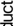

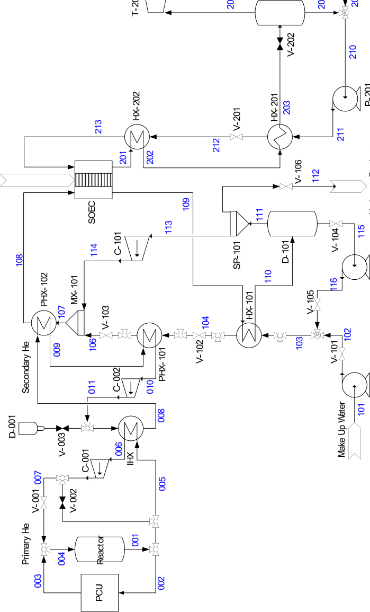

For the present study, electricity is generated in co-generation mode with a thermal efficiency of 50.5%.  The 10 SOE modules require a total of 18.7 MWe and T-201 produces a net 0.41 MWe after process electrical loads are taken into account.  A total of 3.59 MWt of heat is supplied to the process through the IHX.  Using the higher-heating value of hydrogen, the thermal energy of the hydrogen produced is 21.3 MWt.  The overall efficiency of the process is estimated to be: 

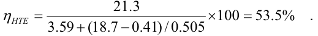

Sensitivity studies were performed to determine the effect of operating pressure and temperature on overall system efficiency.  For a reduced operating pressure of 0.5 MPa, the predicted efficiency was only about 1% lower.  For SOE module inlet temperatures over the range 750°C to 850°C, there is a small increase in IHX heat duty [from 3.42 MWt to 3.67 MWt] and a small decrease in SOE module electric power requirement [from 18.81 MWe to 18.56 MWe], which results in only a slight increase in efficiency (about 0.3%) over this temperature range.  This estimate assumes the electricity generation efficiency remains constant at 50.5%. 

## **3.8.2 Sulfur-Iodine Cycle Process** 

The Sulfur-Iodine (SI) cycle produces hydrogen from water through a series of three chemical steps (or sections) as depicted in Figure 3-30. 

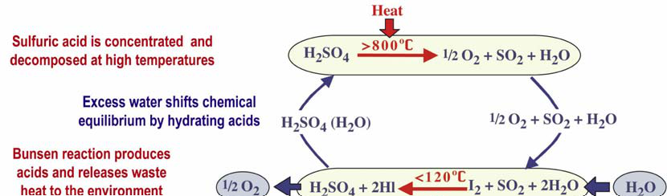

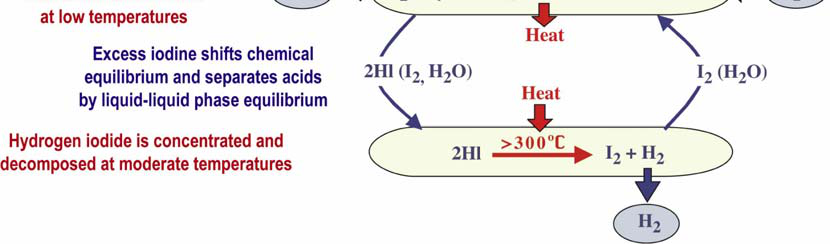

_Figure 3-30.  Sulfur-Iodine Cycle_ 

Two immiscible acid phases are created by combining excess water with iodine and sulfur dioxide, and their separation is facilitated by an excess of iodine.  This step is known as the Bunsen reaction and is designated as Section 1.  The resulting sulfuric acid phase is decomposed back into sulfur dioxide for reuse.  This step (Section 2) is the highest temperature point (>800[o] C) in the process.  Hydrogen iodide is separated from water and iodine in Section 3 before being decomposed into hydrogen and more iodine.  Decomposition typically occurs between 300-500[o] C.  The water and iodine are returned for reuse.  It can be driven purely by energy in the form of heat, but electrical energy is often used in flowsheets where appropriate to boost efficiency.  Heat pumps and vapor recompression equipment are examples of electricallypowered equipment seen in SI cycle flowsheets. 

Figure 3-31 is a block diagram of the SI cycle.  It shows the material connections between the chemical steps and the fundamental energy requirements for the key chemical reactions.  �H is the enthalpy demand and �G is the associated Gibbs free energy.  The acid-generating step in Section 1 is endothermic, and efficient recovery of this low-temperature heat can boost process efficiency.  The decompositions of sulfuric acid and hydrogen iodide are exothermic, and minimizing energy inputs to these sections is the focus of design of high-efficiency flowsheets. Each process section and its flowsheets are discussed in more detail below. 

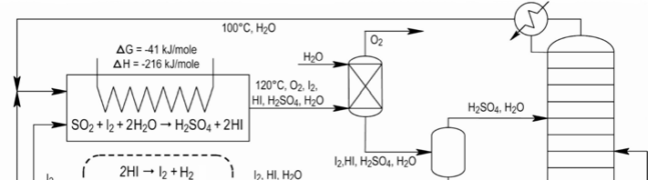

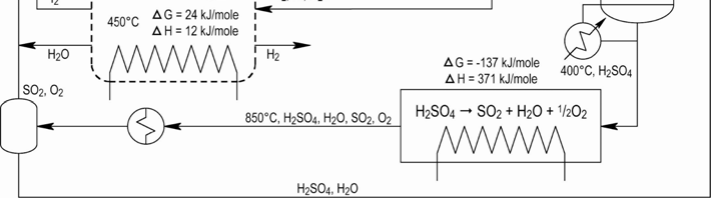

_Figure 3-31.  Basic Flowsheet of the SI Cycle_ 

## **3.8.2.1 Bunsen Reaction (Section 1)** 

The Bunsen reaction is the initial step in the SI process.  Gaseous sulfur dioxide is contacted with water and molten iodine to form sulfuric acid and hydrogen iodide (HI).  The melting point of iodine is 114°C, so the minimum pressure to run the reactor with liquid water is 1.6 bar (23 psia).  Typical operating conditions are 5 to 7 bar pressure and 120°C in temperature.  Products are exchanged in each direction between Sections 1 and 2, and between Sections 1 and 3. Acid concentrations are increased in a multi-step process within Section 1, and sulfur compounds are stripped from the HI phase before it is sent to Section 3.  The oxygen product from the SI cycle is vented from Section 1.  No heat energy is required in Section 1 and only liquid pumping power is necessary.  The unused energy of the SI cycle is largely ejected in Section 1 in the form of low-grade heat. 

## **3.8.2.2 Sulfuric Acid Decomposition (Section 2)** 

The sulfuric acid phase generated by the Bunsen reaction is decomposed back into sulfur dioxide for recycle and reuse in Section 2.  Figure 3-32 is a detail of the Section 2 flowsheet that shows the decomposition steps.  The acid is concentrated in a series of vaporizers before boiling.  Sulfur trioxide is produced in the gas phase and sent to a high-temperature (>800°C) decomposition step to produce sulfur dioxide and oxygen.  As shown in Figure 3-32, process heat transported from the reactor via the secondary HTS is introduced into the cycle in Section 2.  The only link between the nuclear heat source and the SI process is through heat exchange in the sulfuric acid decomposition step. 

## **3.8.2.3 Hydriodic Acid Decomposition (Section 3)** 

Several methods have been proposed for decomposition of HI.  Electro-electrodialysis has been studied, yet there have been difficulties in experimental verification of the technique.  Reactive distillation is attractive, as the flowsheet estimated efficiency is approximately 45%.  However, the only recent experimental work done (by GA) did not show promising results.  The presence of iodine in the distillation column severely hampered conversion of HI.  Thus, extractive distillation (previously demonstrated by GA) of the HI-water-iodine (known as HIx) feed has been chosen as the technique to be used in the ILS experimental device described in Section 1.3.1. 

With this method, the HIx feed is contacted with concentrated phosphoric acid in a liquid-liquid extraction step.  The HI and water are pulled into the acid phase, and the iodine is returned to Section 1.  Pure HI is distilled from the water and phosphoric acid and decomposed over a carbon catalyst to produce hydrogen.  The acid is reconcentrated and recycled. 

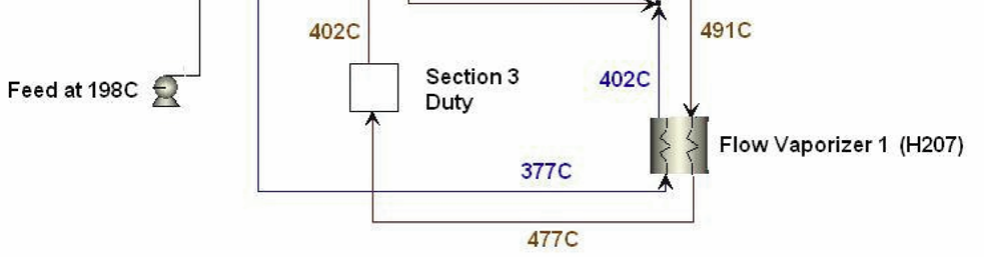

_Figure 3-32.  Flow Diagram of Sulfuric Acid Decomposition Step_ 

## **3.8.2.4 Major Equipment Description** 

The NGNP SI-hydrogen plant will consist of three trains of equipment.  This will demonstrate the multi-train process control scheme expected to be used in a full-scale plant.  Lists of the vessels, the heat exchangers, and the turbo-machinery to be used in the NGNP SI demonstration plant are provided in [PCDSR 2007]. 

## **3.8.2.5 Flowsheet Analysis and Efficiency Assessment** 

The flowsheets for each portion of the process have been shown in the above.  Also, as noted, there is significant heat exchange between Sections 2 and 3.  Each flowsheet has undergone analysis and optimization to maximize overall efficiency.  However, the overall efficiency will be dependent upon the temperature supplied by the nuclear heat source.  Figure 3-33 is a plot of SI cycle process thermal efficiency as a function of temperature. 

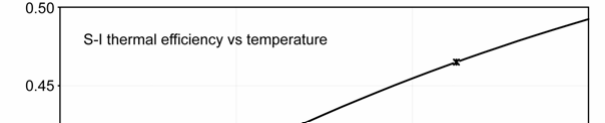

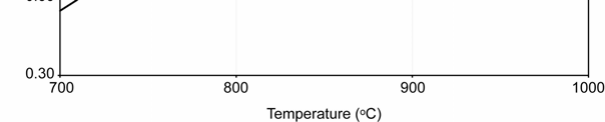

_Figure 3-33.  SI Cycle Process Efficiency vs. Temperature_ 

The realistic estimates for the overall efficiency of the SI process are under 50% for the temperature ranges within reasonable consideration.  However, the thermal efficiency will remain above 40% for temperatures as low as 800°C. 

## **3.9 Helium Services System (HSS)** 

The Helium Services System includes the Primary Helium Purification System (HPS), the Helium Transfer and Storage System, and the Liquid Nitrogen System.  The designs of these systems for the NGNP are the same as for the GT-MHR.  However, an additional helium 

purification system will be needed for the secondary HTS.  Although the primary purpose of the secondary HTS HPS will be to remove tritium, it will have essentially the same design as the Primary HPS.  These systems are summarized briefly below and are described in more detail in [PCDSR 2007]. 

. 

## **3.9.1 Primary Helium Purification System** 

This subsystem provides a means to remove circulating impurities from the primary coolant helium, and to transfer those impurities to the radioactive liquid and gas waste systems of the facility.  A separate regeneration section within this subsystem is used to remove the impurities that accumulate in the purification subsystem adsorbers.  The regeneration section is operated periodically under automatic control whenever regeneration is required. 

The primary coolant helium purification subsystem consists of two separate, independent, but identical trains of components as shown in Figure 3-34.  One of these trains is always on-line, while the other is either being regenerated or is otherwise maintained in a stand-by status ready for immediate use.  All of the components that make up the trains are mechanically passive in nature; however, the adsorber elements become radioactive as the removed impurities are concentrated within the various media.  Each purification train must therefore be located in a shielded vault to minimize personnel exposure to radiation. 

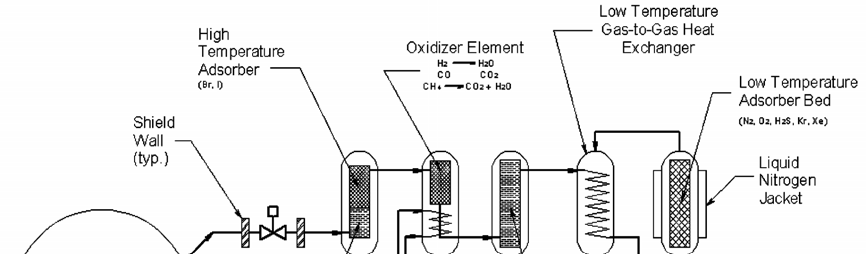

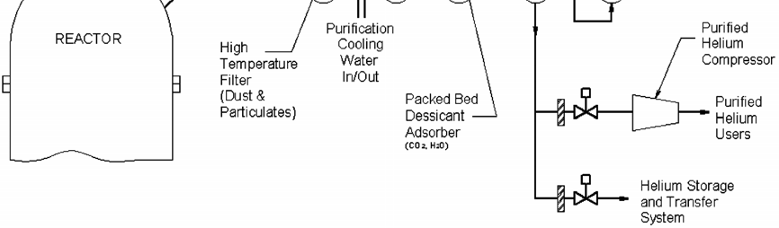

_Figure 3-34.  Primary Helium Purification Sub-System Schematic Diagram_ 

Helium purification is accomplished by routing a small side stream of helium from the primary coolant system through a series of purification components as shown in Figure 3-34.  These components remove the following chemical impurities:  Br, I, H2O, CO, CO2, H2 (including Tritium), N2, O2, H2S, Kr, Xe, CH4, and other hydrocarbons.  In addition, certain metallic chemical elements and filterable particulates are also removed.  All helium transferred from the primary coolant system must first pass through a purification train before entering the helium storage subsystem. 

When the adsorber elements in a purification train become saturated with impurities, the train is taken off-line for regeneration, which is accomplished using the equipment in the regeneration section of the helium purification subsystem.  The regeneration section is described in [PCDSR 2007], 

## **3.9.2 Helium Transfer and Storage System** 

The helium transfer and storage subsystem provides for the movement of primary coolant helium to and from the vessel system and the nearby helium storage tanks.  During normal plant operational load changes, helium is either released to the storage system from the vessel system (via the on-line helium purification train), or added [via equalization or the transfer compressor(s)], as required to maintain the correct helium inventory in the vessel system. Helium is also provided by this system as needed for various purging operations around the plant as well as for the maintenance of buffer seal flows and pressures at various locations within the primary system. 

## **3.9.3 Liquid Nitrogen System** 

Liquid nitrogen is supplied to the low temperature adsorbers in the helium purification systems via vacuum-jacketed (or other equivalently insulated) transfer piping.  The liquid nitrogen subsystem provides a flow rate sufficient to service the low temperature adsorbers on a continuous basis.  Liquid nitrogen is stored in a large cryogenic tank situated at a physical elevation above that of the low temperature adsorber units in the helium purification system trains.  Elevation of the storage tank relative to the adsorbers allows the system to operate on a gravity feed basis, thus allowing the two-phase flow exiting the adsorber to rise by natural convection back to the storage tank.  A small cryogenic pump can be used if it is determined that the subsystem pressures are insufficient to provide adequate flow. 

## **3.9.4 Tritium Control** 

The important function of the primary coolant HPS is to remove chemical impurities from the circulating helium.  One of the more important of those impurities is tritium.  This isotope of hydrogen has several sources, all of which are inherent in the design of a high temperature graphite moderated reactor.  These sources are: ternary fission, neutron activation of the He-3 isotope found in the helium coolant, activation of Li-6 impurities in the core materials, principally graphite, and neutron activation of the B-10 contained in the poison materials used to control the reactor.  Some degree of restraint over these sources can be obtained by careful engineering and manufacturing of the elements from which the impurities could be generated. To the extent that the production of tritium from these sources can be minimized, there will always be a certain inventory of tritium circulating in the primary coolant. 

The primary means of minimizing the concentration of circulating tritium, beyond the quality of the design and engineering of the sources, is to constantly remove it.  There are two primary processes by which this removal can occur in a high temperature graphite moderated reactor. One is through chemisorption on graphite, and the second is by way of a primary coolant helium purification system.  Studies and investigations over many years have concluded that a very large portion of the circulating tritium is adsorbed within the core graphite as a routine function of reactor operation.  However, it is considered imperative that an active process should be included in the plant design to remove the tritium, thereby maximizing control over this isotope. As above, helium purification systems for both the primary helium and for the helium working fluid in the secondary HTS are included in the plant design to accomplish the necessary removal process. 

## **3.10 Plant Operation and Control Systems** 

The Reactor Protection System (RPS) and the non-safety-related Investment Protection System (IPS) in the NGNP specifically provide the “defense in depth” design strategy that is required for modern reactor plants.  The Plant Control, Data, and Instrumentation System (PCDIS) provides normal control and instrumentation functions, and also provides overall integration of the control and protection functions into a combined plant control system.  This system provides normal (main loop) cooling if possible following a reactor trip, broadening “defense in depth” design features by making the SCS or RCCS less likely to be used for reactor cooling. 

## **3.10.1 Reactor Protection System and Investment Protection System Functions** 

The function of the combined protection systems is to detect and provide corrective action as follows: 

- In the event of changes (including changes in neutron flux and primary coolant flow rate, or temperature) indicating neutron flux elevations in the reactor are beyond the range of normal reactor operation. 

- If changes in the RB (including changes in temperature, pressure and radiation levels) indicate a release of primary coolant at a level that could expose the general public to low-level radiation effects. 

- If conditions of pressure, temperature or flow indicate an interruption of normal cooling functions. 

- If upset of reactor power utilization processes creates a condition which could damage major components, such as the TM. 

- If conditions of pressure and temperature, within and around the Vessel System primary coolant boundary, indicate a level of operation that exceeds the normal Vessel System design levels. 

- If conditions of environment or service to the reactor system indicate an interruption of normal processes that are not protected by 1E electric services or are not suited for particular environmental events.  Conditions such as an earthquake fall into this category. 

A specific event that invokes automatic protective action, such as reactor trip, SCS startup, RB Isolation, etc is referred to as a DBE.  DBEs are representative of abnormal plant operation scenarios, each occurring frequently enough to exceed the “beyond design” cut-off of 1x10[-5] occurrences per plant year.  In the GT-MHR design, these events were separately classified as “safety-related” or “non-safety.”  The RPS and IPS provide logic and overrides that interrupt normal control actions during a DBE.  Tables 3-13 and 3-14 contain a list of the expected DBEs for the NGNP.  In Table 3-13, the events are classified as “safety-related” because they lead to a control rod trip or isolation of the RB, which are both NGNP “safety-related” end actions.  The events in Table 3-14 do not lead to “safety-related” end actions. 

The Protection Systems incorporate setpoints, processed data, and single or multiple “Trip Request” pathways, plus end-action hardware to perform the necessary “System Trip” operations.  A portion of the RPS and IPS hardware contains logic processors which provide outputs that ultimately initiate specific protection actions — this is called the Decision Logic. Previous MHR designs, including the GT-MHR design, used 2-out-of-4 protection logic for the RPS and IPS hardware to provide nuclear safety design redundancy and separation. 

## **Table 3-13.  NGNP Design Basis Events for Reactor Protection System** 

**Table 3-14.  NGNP Design Basis Events Requiring Automatic IPS Action** 

## **3.10.2 Plant Control, Data, and Instrumentation System** 

The RPS and IPS also provide real-time status, warning, and alarm information to the PCDIS consoles and displays in the Control Room.  Additionally, the PCDIS receives information regarding protection-events-in-progress to provide follow-up control action and real-time information to the plant operators.  Since the PCDIS ultimately provides overall integration of all plant control and operation processes, the scope of the PCDIS design effort must include yet-tobe-developed top-level NGNP operational features as well as development of the Reactor Plant control, operation, and information functions.  It is anticipated that, as in past programs, a Control Development Simulator (CDS) model will be developed and used to obtain RPS, IPS and PCDIS algorithm sets. 

## **3.10.2.1 Plant Control Design** 

Plant control (PCDIS) design relies on a selection process using detailed computer-based simulation of control and plant features.  The following control related features are of great importance to operation of the NGNP plant. 

**Reactor Power Control and Nuclear Instrumentation System.** Reactor outlet temperature is either stabilized (held constant) or adjusted up or down by the PCDIS during many of the plant operations (e.g. startup, shutdown, electric power change or load loss, H2 plant changes, etc) by interaction with the Control Rod Drive system.  Also, reactor criticality and low level power control is achieved through control rod movement and use of Source Range nuclear instrumentation. 

**PCS Electric Power Generation and TM “Motoring” Control.** The PCDIS uses the Bypass Control Valve System and the Inventory Control System to establish electric power output.  To regulate TM speed, a Static Frequency Converter (SFC) and equipment for interaction with the electric power grid is provided.  This equipment also provides the means to drive the electric generator as a motor during off-grid startup and shutdown operations.  The PCDIS uses the generator “motoring” feature to establish self-sustaining flow and pressures in the TM during startup and to maintain TM flow below self-sustaining conditions during shutdown. 

**PCS TM Bypass Control Valve System.** The PCDIS not only uses this system for TM control during startup and shutdown, but also during rapid (5% per minute) electric load changes (load reduction only). The Bypass System also provides TM overspeed protection in the event of electric load loss (DBE 11 in Table 3-13). 

**Helium Supply System Primary Helium Charging and Removal/Purification Inventory Control System.** This system allows electric power output adjustment under fixed-speed TM operation without impairing NGNP power generating efficiency because inventory management allows primary helium mass flow rate to change without significant deviation from the ideal TM operating line.  If bypass control is used as the means of adjusting electric power output instead, efficiency is greatly diminished as the electric output is reduced[3] .  Of further note is the GT-MHR requirement that only purified helium should be stored during “inventory control” operation. While electric power output adjustments at a slow rate, such as 0.5% per minute, can be accomplished with inventory control, helium cannot be purified fast enough to reduce electric output at a fast rate, such as 5% per minute.  This resulted in combined inventory/bypass control for rapid electric power reduction.  However, short-term assistance from the bypass system does not significantly affect overall efficiency.  And for an electric power increase, there is no comparative difficulty since stored helium can be returned rapidly to the PCS if re-injected at the compressor inlet.  The NGNP Electric Plant needs both inventory control and bypass control features for electric load adjustment.  The PCDIS operates these simultaneously to obtain the required electric power ramps or steps. 

**Helium Circulation Systems.** The primary helium circulator allows control of a portion (approximately 11%) of the total reactor flow.  It is anticipated that the Primary Helium Circulation System will include variable frequency speed control electronics, and that these features will control that portion of the reactor flow which is used by the IHX.  The Secondary Helium Circulation System will similarly control secondary helium flow to manage temperature at the level needed for the hydrogen production plants.  Figure 3-35 shows the top level temperature control scheme for the Reactor Plant as well as Electric Plant inventory and bypass control features.  It is assumed that the GT-MHR inventory-bypass control-command scheme can be used for the NGNP Electric Plant.  The NGNP Electric Plant includes Reactor Plant features, shown in Figure 3-35, along with necessary facilities such as waste-heat rejection, electric supply, electric power generation, etc contained in the BOP. 

**Hydrogen Production Plants Pressure and Flow Control Systems.** The PCDIS will require specific control related functions in each of the Hydrogen Production Plants to adjust/balance flow rates and to adjust temperatures in tertiary flow systems.  Real-time simulator analysis sequences will be completed to determine the exact nature of these functions. 

> 3 However, less efficient electric power generation might be acceptable for some dualproduction operations not requiring formal demonstration of the optimized electric power production capability. 

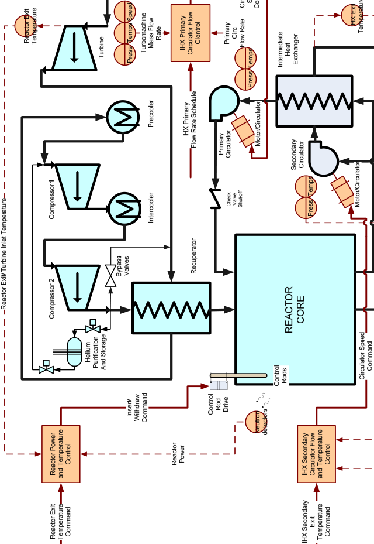

## **3.10.2.2 NGNP Startup** 

The plant control scheme developed for the GT-MHR provided a preliminary basis for the type of control actions depicted for NGNP in Figure 3-35.  Since documentation describing GT-MHR analytical modeling, control algorithms and command parameters related to the electric production might also be useful to the NGNP control, one area explored in the GT-MHR design — plant startup — is discussed below. 

A GT-MHR simulation run helped determine the essential operations involved in starting the GTMHR electric plant from cold reactor conditions.  It is anticipated that the NGNP can utilize essentially the same method, with the exception that IHX warm-up will have to be started near the end of the electric plant startup sequence. The GT-MHR startup sequence took approximately 12 hours, so it is likely that NGNP will require a longer period to bring all facilities to full operating condition.  The steps identified in the GT-MHR sequence are listed below. 

- 1) The Vessel System is pressurized to a low level (about 7% of operating inventory).  The heat rejection system is started with cooling water flow through the Precooler and Intercooler. 

- 2) The TM overspeed bypass valves are fully opened.  (It appears that this is part of a strategy to minimize the generator “motoring mode” loads, and thus reduce the required Static Frequency Converter [SFC] power required for TM spin up and acceleration to operating speed.)  The TM shaft is levitated and centered prior to the start of rotation and the SFC is then used to motor the TM up to operating speed[4] . 

- 3) The reactor starting conditions are zero power and zero decay heat with all rod banks inserted and the reactor subcritical.  Control rod withdrawal is initiated after about 1 ½ hours in the GT-MHR simulation run.  (This could be started sooner.)  Nuclear power control is initiated at a very low power level (< 0.5%), and the inventory and reactor power are raised manually[5] in small increments and the bypass is gradually closed to about 15%.  In about 6 ½ hours the inventory had been increased to 50%. 

> 4 As for the GT-MHR, a SFC will be needed to motor the NGNP TM during startup and shutdown.  The required SFC power level varies, but should not exceed the 20 MW capability provided for in the GT-MHR design.  Per OKBM, the SFC design power for the U.S./RUSSIAN International GT-MHR for w-Pu disposition is only 6 MW. 

> 5 Design of the startup automation features for the GT-MHR was never fully completed. 

- 4) At about 7 ½ hours, with reactor power raised to approximately 20% for core heat up, and with reactor exit temperature transiently at roughly 350°C, the TM becomes capable of self-sustained operation at zero net power and is synchronized to the grid. 

- 5) At about 9 ½ hours, after reactor temperatures stabilize, the automatic reactor exit temperature control loop is closed and the reactor exit temperature setpoint is advanced to 850°C at about 5 1/2° C per minute.  This is actually accomplished by advancing the electric power setpoint to 50% because this automatically advances temperature at the 5.5°C per minute rate if it is low (as during startup).  The bypass valve, which is automated as part of the electric output control (when inventory control is insufficient), then automatically closes as the operation ensues. 

- 6) The approximate 50% operating conditions are reached in about 11 hours.  The inventory control loop is then closed and the electric power setpoint is advanced from 50% to 100%.  This allows inventory and reactor power to increase automatically in response to the electric power rate-of-advance schedule selected by the operator for the load-ramp up to the 100% condition.  The GT-MHR plant is stable at 100% electric power output in about 12 hours. 

In the NGNP startup operation, it is anticipated that a series of operations following step 6, above, will be developed to bring the hydrogen production plants on-line after reaching an “electric only” production level at about 89% reactor power. This is the “All Electric 1” mode shown in Table 3-15 below. This intermediate stage was excluded in the GT-MHR because the dual production objectives of the NGNP did not exist.  It may also be necessary to include preliminary steps for IHX warm-up and secondary pressurization in earlier stages of the NGNP startup process as well. 

## **3.10.2.3 NGNP Operating Modes** 

The anticipated NGNP operating modes shown in Table 3-15 should provide flexibility to demonstrate stand-alone electric production as well as the dual-mode NGNP production capabilities. 

**Table 3-15.  NGNP Operating Modes** 

The Hydrogen Production capability will involve Reactor Plant control features to manage IHX heat transfer, secondary helium flow, and IHX temperatures.  These features were, of course, not included in the GT-MHR electric plant.  Figure 3-35 shows some of the new NGNP controls with those previously developed for the GT-MHR plant.  Further explanation follows briefly below: 

**Reactor Power and Temperature Control** .  This previously developed control scheme is used for NGNP steady or transitory Reactor Exit temperature control.  The control uses an outer temperature control loop, feeding an inner reactor flux control loop, and connected to a Control Rod Drive System.  Control rod withdrawal/insertion sequencing is based on selective “one-at-atime” rod withdrawal or insertion from predetermined control rod banks.  Also, as in past designs, a non-linear configuration of the temperature control algorithm is applied through inclusion of total reactor mass flow rate to adjust for reactor core thermal “time-constant” variation over a wide range of reactor flow rate.  This is based on the sum of the two primary flow measurements which are shown.  This scheme allows consistent “tight” adjustment of reactor power through the operating range in spite of the large core thermal effects which are characteristic of HTGR reactors. 

**Primary Helium Circulator Flow Control** .  This control feature is added for NGNP.  The 

control scheme will be developed on the basis of maintaining IHX primary flow in proportion to the reactor flow.  Circulator �p and speed measurements to obtain primary helium flow rate will need to be added to the instrumentation scheme to ensure that the total reactor flow rate measurement is available for control and protection. 

**Secondary Helium Circulator Flow and Temperature Control** .  Also an added control feature. This control will be used to balance flow rates, but its primary purpose will be to maintain secondary helium exit temperature at the level required for hydrogen production. 

**Helium Inventory and Bypass Valve Control** .  These are primary control features for the electric production plant. The Bypass Valves are the only means of arresting the TM speed transient following a load loss event. 

None of the auxiliary system controls, including those for the hydrogen plants have been considered at this point.  It is likely that the hydrogen production facilities will require automation features to assure compatibility with Reactor Plant operations and to deal with upset events where termination of the hydrogen production operations is required.  Several types of Hydrogen Plant shutdowns are identified in Table 3-16. 

**Table 3-16.  Hydrogen Plant Shutdown Type** 

## **3.10.2.2.3 NGNP Plant Interactions** 

Table 3-16 also identifies areas of plant interaction to be considered in the next stage of the control development effort.  It will be necessary to develop the plant simulation capabilities mentioned previously in order to identify interactions which require automatic overrides or shutdown controls. 

Important plant interactions that should be addressed in the preliminary control development analysis efforts are explained as follows: 

   - Reactor trip (initiated by the RPS) will immediately initiate the Electric plant shutdown sequence.  A major objective in the control response sequence following a control rod trip is to lower the reactor exit temperature as rapidly as possible. This is to protect PCS components.  For this reason the Electric Plant remains connected to the grid for two minutes to allow TM flow rates to remain high and to maintain helium exiting the turbine at normal temperature levels during the early part of the shutdown transient while the reactor is cooling.  In the GT-MHR, Reactor Exit temperature was reduced about 200°C within the first 2 ½ minutes following a reactor trip, and was reduced from 850°C to about 540°C within 15 minutes after the trip.  It is anticipated that Hydrogen Plant processes will have to be stopped in a similar rapid-response fashion. 

   - Overspeed protection following loss of the Electric Plant grid connection (initiated by the Investment Protection System) requires diversion of a large part of the reactor flow. Reactor flow rate drops to about 70% within 10 seconds following loss of the grid connection.  While the bypass control scheme for Electric Plant can recover and maintain the TM speed, it is undesirable to stay at high reactor power and temperature because the large heat rejection loads through the Precooler and Intercooler pose limiting requirements for this event.  It is anticipated that the Hydrogen Plant processes will have to be shutdown immediately in this event.  But, it is also possible that protection action to isolate the IHX will be required to assure that reactor flow rates stay as high as possible. Since reactor pressure also drops about 10%, it may be necessary to operate the IHX Pressure Balance System[6] during this transient.  The GT-MHR scheme to reduce inventory and temperature for Electric Plant standby in this event will also have to be re-evaluated. 

   - Hydrogen Plant multiple upset events pose a new category of Design Basis Events (DBEs).  A loss of the secondary helium circulator is one new DBE that would cause a multiple Hydrogen Plant upset.  Protective action may be required because of a potential 

- 6 Table 3.10-4, end-action 7 shows the IHX Pressure Balance System. Its purpose is to reduce high-temperature IHX pressure loads. 

36° C rise in reactor inlet temperature following this event.  Although the Reactor Exit Temperature control system reduces exit temperature following a rise of reactor inlet temperature, a thorough evaluation of this scenario should be completed to assure that Electric Plant stability can be retained.  An important consideration is that Reactor Exit temperature (aka Turbine Inlet temperature) is a reactor trip parameter. 

- Hydrogen Plant single upset events must also be included as a new category of Design Basis Events (DBEs).  For example, a disruption of the heat utilization process in one of the Hydrogen Plants might in turn cause a proportional reduction in secondary helium flow. However, this should not prevent continued operation of the other Hydrogen Plant or the Electric Plant.  The design of the “IHX Secondary Circulator Flow and Temperature Control,” shown in Figure 3-35, might include adjustment of the “IHX Primary Flow Rate Schedule” to stabilize the remaining Hydrogen Production plant following this event. 

## **3.11 Balance of Plant and Auxiliary Systems** 

No work was performed on design of the NGNP Nuclear Plant BOP systems as part of preconceptual design studies.  Consequently, in developing the NGNP cost estimate, it was assumed that the NGNP BOP systems would be essentially identical to those for the GT-MHR and that the capital costs would be the same as those developed by GA for a one-module GTMHR prototype plant.  Summary level descriptions for the Nuclear Plant BOP systems are provided in [PCDSR 2007].  A more detailed description of these systems can be found in [Shenoy 1996]. 

- Waste Heat Rejection System 

- Spent Fuel Cooling System 

- Nuclear Island Cooling System 

- Essential Plant AC Electrical System 

- Essential Plant DC Electrical System 

- Nuclear Island HVAC System 

- Power Conversion Component Handling System 

- Balance of Hydrogen Plant 

## **4. BUILDINGS AND STRUCTURES** 

The plant layout, shown in Figure 2-3 (in Section 2) consists of the RB, the two hydrogen production plants, the Reactor Service Building (RSB), Operations Center (OC), heat transport pipes, and other buildings and structures that provide various supporting functions for the overall complex.  Systems containing radionuclides and safety-related systems are located in the Nuclear Island (NI) area, which is separated physically and functionally from the remainder of the plant. 

## **4.1 Reactor Building** 

The RB for the NGNP 600-MWt reactor is classified as a vented low-pressure containment (VLPC).  The RB consists of a below-grade multi-celled, embedded structure and the RCCS inlet/outlet structures, both of which are constructed of cast-in-place reinforced concrete.  The degree of embedment was selected to serve a number of objectives, including reduced cost and complexity of construction, ease of operation, minimization of shielding, and good seismic performance.  The operating floor of the plant is set at site grade, with a maintenance enclosure covering the operating area, which is traversed by refueling equipment.  Figure 4-1 shows the RB and the above-grade maintenance enclosure. 

There are two floors below grade with a rectangular footprint which are used to house mechanical, electrical, and instrumentation systems.  Below elevation -30 ft, the RB is configured as a cylinder to enable it to resist soil and groundwater pressure.  This portion of the RB is called the silo.  The Reactor System, Vessel System, and PCS are located within this space as shown in Figures 4-1 and 4-2.  The RV, PCS vessel, and IHX vessel are housed within separate concrete compartments of roughly equal dimensions as shown in Figure 4-3. The IHX is expected to be only about 3.8 m in diameter and 16 m high, but the compartment for the IHX is about the same size as the compartment for the PCS.  This large cavity for the IHX allows for use of a much larger heat exchanger should this become desirable or necessary. The reactor core and IHX are connected by a cross vessel that is tapered to allow for IHX size adaptation while maintaining vessel integrity at the reactor nozzle end. 

The length and diameter of the PCS vessel control the dimensions of the silo.  The silo depth must also accommodate the machinery used to service the shutdown cooling circulator and heat exchanger.  Access to and from the cylindrical portion of the building for piping, electrical services, personnel, and the concentric RCCS ducting is made from the rectangular portion of the building between elevations -30 ft and grade. 

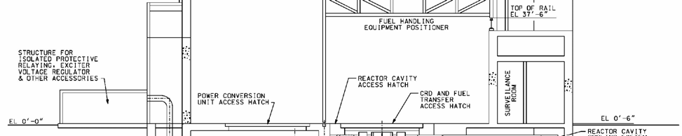

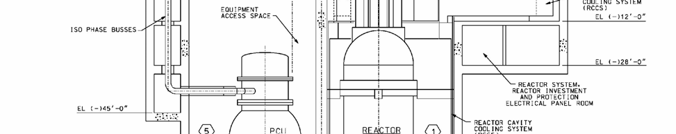

_Figure 4-1.  Elevation View of Reactor Building – Section A-A_ 

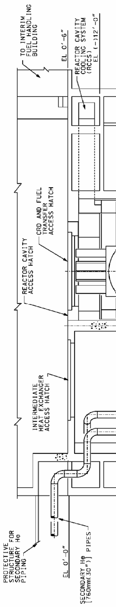

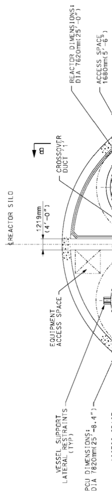

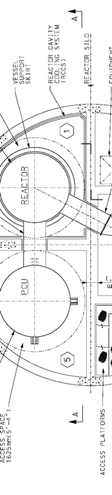

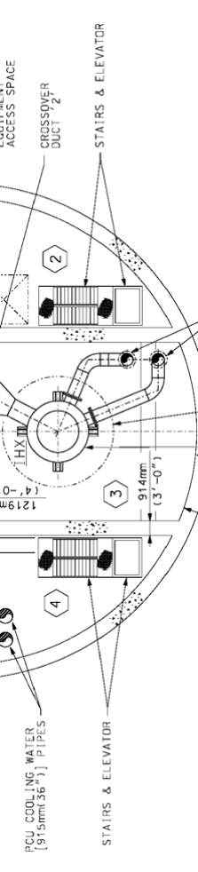

The maintenance enclosure is a 29-m (95-ft) high rectangular steel framed structure that spans the area above the below-grade RB.  Access for refueling and for major maintenance activities is from this operating floor.  There are two extensions of the reinforced concrete RB above grade.  To one side of the RB, the reinforced concrete portion of the building extends to elevation +95 ft 6 in. (29 m) to serve as the RCCS inlet-outlet structure.  The above-grade area, called the Maintenance Enclosure, houses the part of the Fuel Handling System that transports the fuel and reflector elements between the receiving facility and the reactor core, the helium transfer and circulation system, and various piping and electrical equipment. 

The RCCS panels, at the location where they enter the closed portion of the RB, are regarded as part of the VLPC boundary.  In essence, air flowing inside the RCCS ducts and panels is outside the containment boundary.  The walls, doors, plugs, and other barriers which separate the closed, recirculated portion of the building from the once-through cooled portion of the building or from the outside environment (including the RCCS panels and ducts) constitute the fourth containment barrier.  Leakage from within this portion of the RB to the other part of the RB or to the environment has the potential to transport fission products from the containment to 

the environment.  This space is also the portion of the RB that is affected by the specified building leak rate.  It is expected that essentially none of the leakage which occurs will be from the surfaces of the building which are in contact with the soil, and that the specified leak rate represents an upper bound on the exchange which could occur between the building interior and the environment, since the pressure (and therefore the leakage) will normally decrease over the course of an accident. 

## **4.2 Reactor Service Building** 

The Reactor Service Building (RSB) is a three-story reinforced concrete structure at grade level next to the RB.  The fuel handling area is located within the RSB.  This area includes facilities for introducing new fuel, for loading and shipping spent fuel casks, for storing new fuel, and for inspecting new and spent fuel.  The Helium Services System, which includes the helium purification system and the helium transfer and storage system, is also located in the RSB. 

The Hot Service Facility is located inside a shielded vault in the RSB adjacent to the fuel sealing and inspection facility.  The Hot Service Facility is used for inspection, maintenance, and repair of reactor service equipment and tools.  The facility includes viewing windows, operating galleries outside the vault, manipulators to perform the inspection, maintenance, and repair services, as well as portable decontamination equipment. 

## **4.3 Operations Center** 

The OC building is a steel framed structure founded on grade beams and individual footings. The Operations Center (OC) houses: 

- The plant security access and egress area, 

- Security administration, 

- Plant operation offices and engineering space, 

- Primary and secondary alarm stations, 

- Training rooms, conference rooms, and lunch areas. 

The total floor area of the OC is approximately 56,000 ft[2] .  It is two stories high, with a 2,000 ft[2] basement.  The above-ground area houses the security, engineering, and administration functions.  The basement houses the central alarm station. 

The ground floor of the OC contains plant access and egress, security administration, the secondary alarm station, the electronic equipment room, lunch room, first aid suite, classroom and training area, a mechanical equipment room, and an emergency electrical power source room.  Plant access and egress areas contain the inspection, detection, and access control into the vital and nonvital areas of the plant.  Physical protection from acts of sabotage against the plant access and egress areas will satisfy Federal Regulations. 

The second floor contains the plant administration areas for the operation, maintenance, and technical divisions, the control room, and a mechanical equipment room.  The administration areas will provide office space, conference rooms, a reception and waiting area, storage space, and an engineering office area. 

## **4.4 Hydrogen Plant Area** 

For the preconceptual design stage, the following conditions are specified for the area that contains the SI-based and HTE-based hydrogen production facilities: 

- The production plants will be located a minimum of 90 m (~300 ft) away from the nearest boundary of the RB in order to preclude damage to the building as a result of a hydrogen plant accident. 

- The plants will be open to the environment, i.e., buildings are not provided to enclose the equipment.  A perimeter fence will enclose the area. 

- A 2 ft high earthen berm will be provided along the perimeter of the production facilities’ area to contain any potential spills.  Because of the separation distance between the 

hydrogen plants and the RB and because of the underground location of the NGNP MHR, added protection for the MHR against hydrogen plant accidents (e.g., a high earthen berm or other blast containment structure) are not included. 

- One 2.1 m (7 ft) diameter underground Hydrogen Storage Tank is included in the preconceptual design.  At a pressure of 450 bars, this tank will be capable of storing approximately 100 kg of hydrogen.  A truck loading area is also included in the preconceptual design. 

- Extended areas as shown in Figure 2-3 (in Section 2) are included in the overall plant layout to accommodate potential expansion of the hydrogen plants and the hydrogen storage area. 

## **4.5 High-Temperature Helium Transfer System Pipes** 

Heated helium from the IHX will be routed via pipes from the RB to the hydrogen plants and back.  The helium supply and return lines will run parallel to each other.  They will be supported on regularly spaced concrete piers and will be provided with adequate thermal expansion loops. Because of the high temperature of the external surfaces of these pipes while in service, a protective roof will be placed above the pipes to prevent excessive exposure to rainfall (to reduce evaporation and consequent heat loss).  The roof will be supported on regularly spaced metal columns and will be vented for heat relief (see Figure 2-3, Section A-A).  As a safety precaution, the protective enclosure will feature a perimeter fence and bird screens. 

## **4.6 Other Facilities** 

There are several facilities that provide important support functions for the overall NGNP complex.  These include: 

- Personnel Services Building 

- Spent Fuel Storage Building 

- Helium Storage Structure 

- Auxiliary Building 

- Nuclear Island Warehouse and Turbo-Machinery Maintenance Facility 

- Fire Protection Services Buildings and Structures 

- Water Treatment Building 

- Standby Power System Building 

## **5. PLANT ASSESSMENTS** 

As part of this pre-conceptual design study, assessments of the NGNP were performed in the areas of safety, licensing, and economics. 

## **5.1 Safety Assessment** 

The following sections describe the safety features of the NGNP and assessments of bounding accidents involving loss of flow and loss of coolant. 

## **5.1.1 Key Inherent Safety Features and Design Provisions** 

Passive safety features of the MHR concept include the (1) ceramic, coated-particle fuel that maintains its integrity at high temperatures during normal operation and loss of cooling events; (2) an annular graphite core with high heat capacity and a low power density that limits the temperature rise during loss of cooling; (3) a relatively low power density that helps to maintain acceptable temperatures during normal operation and accidents; (4) helium coolant that is inert, remains single phase, and is neutronically transparent; and (5) a negative temperature coefficient of reactivity that ensures control of the reactor for all credible reactivity insertion and loss-of-coolant events.  These features assure sufficient decay heat removal to an ultimate heat sink by the natural processes of radiation, conduction, and convection, to preclude any significant particle coating failure or radionuclide release under all conditions of loss of forced cooling or loss of coolant pressure.  The fuel, the graphite, the primary coolant pressure boundary, and the low-pressure vented containment building provide multiple barriers to the release of fission products. 

In the design of the NGNP, the desirable inherent characteristics of the helium coolant, graphite core, and coated fuel particles are supplemented with specific design features to ensure passive safety.  The release of large quantities of radionuclides is essentially precluded by the fuel particle ceramic coatings, which are designed to retain nearly all fission products during normal operation and to remain essentially intact during licensing basis events.  The integrity of the particle coatings as a barrier is maintained by limiting heat generation, assuring means of heat removal and by limiting the potential effect of air and water ingress on the particles under all potential accident conditions.  These characteristics tend to dominate the safety of the plant as a whole and serve to prevent and mitigate accidents.  In particular, these characteristics, supported by safety system design, are effective in retaining radionuclides at the source within the coated fuel particles.  Containing radionuclides at the source reduces all risks, including health and safety risks, environmental risks, and risks that operation will be interrupted by a release and lengthy recovery time. 

Although the fuel particle ceramic coatings are the most important barrier to the release of fission products, there are actually five principal fission product barriers in the NGNP as shown in Figure 5-1.  Three of the barriers are pressure-retaining barriers (e.g., the fuel particle coatings, the primary coolant pressure boundary, and the vented low-pressure containment building) that are capable of retaining radionuclides.  The other two barriers are the fuel kernels and graphite structural elements; these barriers provide effective retention of some radionuclides. 

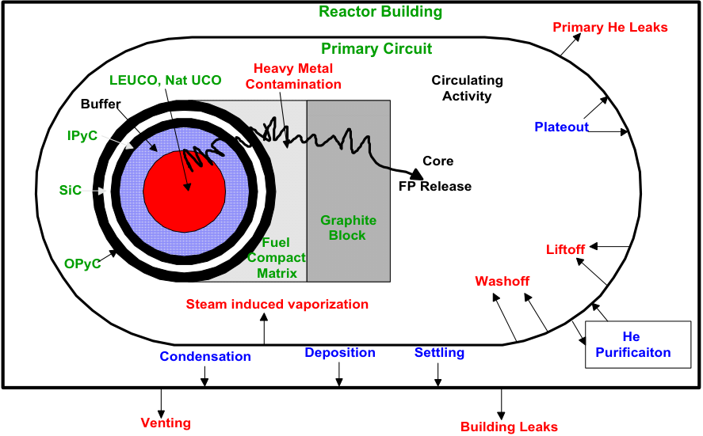

**----- Start of picture text -----** 
Reactor Building Primary He Leaks Primary Circuit Heavy Metal LEUCO, Nat UCO Contamination Circulating Activity Buffer Plateout IPyC Core SiC FP Release Graphite Block Fuel Liftoff Compact OPyC Matrix Washoff Steam induced vaporization He Condensation Deposition Settling Purificaiton Venting Building Leaks **----- End of picture text -----** 

_Figure 5-1.  MHR Radionuclide Containment System_ 

**Kernels.** The first barrier to fission product release from the fuel is the kernel itself.  The fuel kernels retain a significant fraction of the radiologically important, short-lived fission gases such as Kr-88 and I-131.  However, the effectiveness of the kernel for retaining gases can be reduced if exposed kernels are hydrolyzed by reaction with trace amounts of water vapor.  The fuel kernels will also retain long-lived, volatile fission metals such as Cs, Ag, and Sr, depending upon temperature and burnup. 

**Particle Coatings.** The second and most important barrier to radionuclide release is the fuel particle coatings.  The coatings provide a high-integrity pressure vessel which is extremely 

retentive of radionuclides.  The layers of the TRISO-coated fuel particles have specialized purposes.  The purpose of the buffer layer (low density carbon) is to provide a reservoir for fission gases released from the kernel and to attenuate fission recoils (fuel particles only).  The most important coating is the silicon carbide (SiC), which provides most of the structural strength and dimensional stability.  In the fuel particle, it serves as the primary barrier to the release of fission products, particularly metallic fission products, because of their low solubilities and diffusion coefficients. 

**Graphite.** The carbonaceous fuel compact matrix materials and the core structural graphite collectively are the third release barrier.  Core graphite is highly retentive of some fission products (i.e., Sr, Rb, Cs, rare earths), but is virtually nonretentive to others (i.e., noble gases). For example, under typical core conditions, the fuel element graphite attenuates the release of Cs and Ag from the core by more than an order of magnitude, and Sr is essentially completely retained. 

**Primary Coolant Pressure Boundary.** The fourth release barrier is the primary coolant pressure boundary.  This barrier is provided by the steel pressure vessels, which will be designed and constructed to ASME Section III Division 1 requirements.  The chemically inert helium coolant minimizes corrosion and eliminates the need for the complications of steel internal cladding.  The entire reactor module is protected by the underground RB from external events and is conservatively designed to accommodate internal events.  The helium purification train is very effective at removing long-lived fission gases and contaminates from the primary coolant.  However, for short-lived fission gases, the dominant removal mechanism is radioactive decay, and for the condensable fission products, the dominant removal mechanism is deposition, or plateout, on the various helium-wetted surfaces in the primary circuit. 

**Containment.** The reinforced concrete, vented low-pressure containment is the fifth barrier to the release of radionuclides.  It is a normally closed space, located below grade.  It is equipped with a vent that opens if the pressure inside the containment exceeds its design set point, releasing mass and energy associated with a blow down and protecting the integrity of the building and the RCCS.  Even if the vent opens, natural removal mechanisms (including radioactive decay, condensation, fallout, and plateout) reduce the concentration of radionuclides in the containment atmosphere, reducing the offsite releases.  While the vent allows the release of radionuclides released promptly, the release of associated gases early in the event eliminates the driving pressure that could transport the delayed source term out of the building.  After release of the initial blow-down energy pulse, the vent is designed to close for containment of radionuclides that might diffuse out of the fuel during time-at-temperature conditions.  Robust design features protect the containment function from degradation by external events.  Inclusion of a broad spectrum of DBEs protects the containment function from damage by internal events 

## **5.1.2 Safety Related Systems, Structures, and Components** 

On the basis of prior safety assessments, the major systems, structures, and components (SSCs) that are relied upon to perform one or more safety functions (e.g., ensuring safe shutdown and protection of the primary coolant pressure boundary), or are otherwise relied upon to meet the dose criteria at the site boundary are as follows: 

- Reactor System including neutron control assemblies, ex-vessel neutron detectors, the reactor internals, reactor core, and fuel. 

- Vessel System including the ASME Section III vessels and pressure relief. 

- RCCS including the entire system as required for removal of residual heat. 

- Reactor Protection System (RPS) including all sensors, control logic, and housings supporting safety trips. 

- Fuel storage pools and wells which are part of the Reactor Service Building. 

- Essential AC and DC power systems. 

These safety systems have been provided to mitigate the consequences of all design basis accidents and to protect the five barriers to the release of radionuclides.  Some of these systems act to protect the fuel particles; some protect the primary coolant pressure boundary; some protect the containment; and some protect several barriers at the same time.  Maintaining barrier integrity constitutes the NGNP safety function; accident prevention and mitigation is the process by which these functions are accomplished.  Consistent with the simple, yet robust, safety design approach of the GT-MHR, only this relatively modest number of SSCs is seen as being important for ensuring public health and safety.  Equally important, this equipment can be seen to reflect the utilization of passive features. 

## **5.1.3 Accident/Transient Analysis** 

The bounding design basis events (DBEs) for the NGNP will be a loss of flow leading to a high pressure conduction cooldown (HPCC) and loss of coolant leading to a low pressure conduction cooldown (LPCC).  The HPCC event is typically initiated by trip of the PCS.  The RPS automatically initiates a reactor trip on low flow or turbomachine trip.  Because the system remains at high pressure, the decay heat is more uniformly distributed within the core and vessel than during a LPCC event.  The LPCC event is typically initiated by a small primary coolant leak, causing the system to depressurize to atmospheric pressure.  The RPS automatically initiates a reactor trip on low coolant pressure.  For both events, the SCS fails to start and decay heat is removed by thermal radiation and natural convection from the RV to the RCCS. 

These events have been analyzed in detail for a MHR operating with a reactor outlet coolant temperature of 950°C, and the results show that peak fuel temperatures remain below the design goal of 1600°C, and the temperatures for the vessel and other safety-related SSCs also remain below acceptable limits.  For the LPCC event, the peak fuel temperature is 1525°C and occurs about 60 hours following initiation of the event.  For the HPCC event, the peak fuel temperature is 1349°C and occurs about 50 hours following initiation of the event.  The calculated peak vessel temperatures for the HPCC and LPCC events are approximately 478°C and 517°C, respectively.  For both events, the peak vessel temperatures occurred about 72 hours following initiation of the event. 

## **5.2 Licensing Strategy** 

All nuclear power plant applications in the United States require a safety review, an environmental review, and an antitrust review by the NRC.  The NGNP is subject to Title 10, "Energy," of the Code of Federal Regulations and those regulations applicable to a Class 103 Commercial Power Reactor, as defined in 10CFR50.22.  The regulations and licensing options that are potentially available for licensing the NGNP include 10CFR50, 10CFR52, 10CFR53 and "License by Test."  The licensing approach for the NGNP is expected to reflect existing regulatory regulations and guidance, deterministic safety criteria, and risk-informed evaluations. 

10CFR50, “Domestic Licensing of Production and Utilization Facilities” is the two-step licensing process used by currently operating commercial nuclear power plants.  The 10CFR50 licensing process has been in use for more than forty years and is well understood.  Thus, the risks associated with licensing under 10CFR50 are known.  This process requires both a construction permit and an operating license.  NGNP licensing using this process will require a Preliminary Safety Analysis Report, a Final Safety Analysis Report and the supporting Environmental Report and Environmental Impact Statement.  The 10CFR50 licensing process supports plant design and construction as parallel activities.  Taking advantage of the ability to start construction in parallel with design evolution has potential schedule advantages, but also involves some risks. 

Implementation of a 10CFR52 licensing process for the NGNP would be problematic given that the plant design will lack the design maturity needed to support the required Combined Operating License Application (COLA).  The project schedule does not support development of a detailed COLA.  In addition, there is considerable uncertainty associated with the 10CFR52 process. 

10CFR53 is not a viable option for the NGNP because two major activities yet to be developed by the NRC in support of Part 53 include development of the technical basis for 10CFR53 and rulemaking development of the regulations and associated guidance. 

A “license by test” philosophy for the NGNP has been discussed in a variety of forums including meetings of the Advisory Committee on Reactor Safeguards.  The discussions have centered on building a full-size demonstration facility and performing a series of tests to identify the dominant risk contributors for the facility and to preclude extra features in the design that do not provide additional margin of safety.  The data from the testing would by used to certify the design.  However, no current regulatory framework exists and no regulatory framework has been formally proposed by the NRC for “license by test”. 

Besides the absence of a licensing framework, a "license by test" approach would be a high-risk option.  Testing could severely stress structures, systems and components (SSCs) necessitating repair, supplemental analysis, reductions in qualified life, and possible component replacements.  This could adversely affect the ability of the facility to achieve its long-term mission of 30-years operation, and the potential loss of availability and additional operational costs could significantly impact investment.  The ability to secure financial backing could also be adversely affected given the implications of negative testing results on an essentially completed plant. 

Based upon the above factors, a "license by test" approach does not appear to be viable for obtaining a NRC license for the NGNP demonstration facility.  However, while testing alone will not be sufficient for facility licensing, testing will undoubtedly be a very important constituent of the NGNP licensing process.  Testing can be used to validate many of the analytical results presented in the SAR regardless of the licensing process used.  One key area of concern is whether full fuel qualification can be achieved in time to support the planned NGNP operation date and so fuel qualification may be a candidate for licensing by test. 

In conclusion, following the 10CFR50 licensing process for the NGNP is the most prudent approach at this time.  The 10CFR50 licensing process supports plant design and construction as parallel activities.  Taking advantage of the ability to start construction in parallel with design evolution has schedule advantages and a chance to manage the better understood financial risk.  Also, the 10CFR52 (or perhaps 10CFR53) licensing documents needed to support NGNPbased follow-on commercial plants should be developed based upon the NGNP 10CFR50 Operating License (OL) phase documents including the Probabilistic Risk Assessment as approved by the NRC.  This will facilitate the submittal and approval of future commercial plant license applications.  Under either 10CFR50 or 10CFR52, extensive pre-construction permit 

application interaction with the NRC will be necessary to apprise the NRC staff and to better define the acceptance criteria for licensing the NGNP. 

In addition to NRC licensing requirements, environmental permitting will also be required. Permits will be required from the US Environmental Protection Agency, the Idaho Department of Environmental Quality, the US Army Corps of Engineers, and other cooperating local agencies. 

## **5.2.2 Preliminary Hydrogen Plant Hazards Assessment** 

A preliminary hazards assessment (PHA) for the NGNP prototype SI-Hydrogen plant was performed.  Both the SI-based plant and HTE-based plant have hazards associated with hydrogen, electricity, and high-temperature heat, but the hazards for the SI-based plant are expected to be more bounding because of the chemicals involved. 

The results of the NGNP SI-hydrogen plant PHA are typical for a modern chemical plant built in the United States.  The unit operations in the hydrogen plant (distillation columns, chemical reactors, heat exchangers, etc.) are standard chemical processes with mature technology that will be extensively tested prior to deployment in the NGNP.  There is no currently anticipated inherent excessive risk in the thermochemical production of hydrogen that would preclude licensing of the NGNP or commercial-scale hydrogen productions plants based on the processes demonstrated in the NGNP. 

An attractive feature of the GT-MHR plant for electricity production is siting flexibility, because no plan for public evacuation is required as the result of the MHR’s passive-safety features.  For a commercial-scale H2-MHR, a potential issue that requires further evaluation is whether or not a public evacuation plan is required because of potential accidents that could cause chemical releases from the SI-hydrogen plant.  However, chemical releases should not impact the passive safety of the reactor system. 

## **5.3 NGNP Cost Estimates** 

## **5.3.1 Capital Costs** 

An NGNP capital cost estimate was prepared using the Generation IV International Forum Code of Accounts [GIF 2006] in organizing the capital costs.  The estimate was based on prior capital cost estimates for the GT-MHR as supplemented by hydrogen plant cost estimates developed by the GA Team.  Table 5-1 summarizes the NGNP capital costs.  The groundrules used in developing the cost estimate are given in [PCSDR 2007]. 

## **Table 5-1. Summary of NGNP Capital Costs** 

## **5.3.2 Operating Costs for 30-year Period** 

The 30-year NGNP operating costs are estimated to consist of (1) operations and maintenance (O&M) costs, (2) nuclear fuel costs, and (3) decommissioning costs.  The total estimated NGNP 30-year operating costs in constant 2007$ is $2,975.  Each of the 30-year cost components is the product of cost per year in 2007$ times 30 years.  The as-spent (or nominal $) 30 year costs would be the summation of the nominal cost for each of the years where the nominal cost for each year is the 2007$ cost per year times the cumulative inflation rate for each year.  The methodology used in developing the NGNP operating cost estimate are presented in [PCDSR 2007]. 

## **5.4 Economic Assessment for Commercialization** 

Two commercial nuclear hydrogen plant variations were evaluated with respect to their hydrogen production cost versus a projection of the future market value of hydrogen.  The two plant variations include: 

- 1) An nth-of-a-kind nuclear hydrogen production plant consisting of two 600-MWt MHR modules providing process heat to a SI-based hydrogen production plant and two 600MWt MHR modules dedicated to electricity production to provide the electric power needed by the SI-based hydrogen production plant 

- 2) An nth-of-a-kind HTE-based nuclear hydrogen production plant consisting of four 600MWt MHR modules providing both process heat and electricity to the HTE-based hydrogen production plant having 292 H2 production units each consisting of eight modules of planar SOE cells 

The commercial assessment for each of the plant variations involved development of a capital cost estimate and an operating cost estimate (including O&M, fuel, and decommissioning costs) and an estimate of the amount of hydrogen produced by the plant in order to calculate the unit cost of hydrogen production.  This unit cost was then compared against the projected market value of hydrogen that was estimated as part of the NGNP end-products study [Hanson 2007a]. The groundrules and methodology used to develop the capital cost and operating cost estimates and the amount of hydrogen produced are by the plants is presented in detail in [PCDSR 2007]. 

Table 5-2 summarizes the result of the commercial assessment.  The overall hydrogen production cost in the SI-based plant and the HTE-based plant were estimated to be about 2.26 

$/kg and 2.22 $/kg, respectively.  In both plants the hydrogen production cost is about 10% below the projected market value of hydrogen. 

**Table 5-2.  Commercial Plant Hydrogen Production Costs vs. Hydrogen Market Value** 

## **Sensitivity Analysis for SI-H2-MHR Hydrogen Production Cost** 

Sensitivity analyses were performed for the SI-H2-MHR model to determine the impact of three factors on the production cost of hydrogen: 

- Process risk in terms of the technology maturity of the hydrogen production portion of the plant 

- Process efficiency 

- Construction time in months 

Table 5-3 provides the results of the sensitivity analyses. 

Technical maturity was addressed by increasing the contingency applied to the capital cost component of the production cost from 5% to 20% to reflect impact of process risk.  This resulted in an increase of 0.30 $/kg in the H2 production cost, or about 13.3%. 

Process efficiency was addressed by assessing the effect of targeting a process efficiency of 49% as opposed to the current 45%.  This can be achieved by reducing the electric power consumed by the SI process equipment.  49% efficiency can be achieved if the power 

consumption is reduced by 89 MWe.  This also allows the plant to make an additional 89 MWe available for sale on the grid.  The additional power sales reduces the H2 production cost by 0.41 $/kg, or about 18.1%. 

**Table 5-3.  SI-H2-MHR H2 Production Cost Sensitivity Analysis** 

The effect of construction learning was addressed by assessing the impact of reduced construction time from 48 months to 36 months.  This results in reduced IDC costs.  The H2 production cost was reduced by 0.13 $/kg, or about 5.2%. 

## **Sensitivity Analysis for HTE-H2-MHR Hydrogen Production Cost** 

Sensitivity analyses were performed for the HTE-H2-MHR model to determine the impact of two factors on the production cost of hydrogen: 

- Technical maturity in terms of the operating life of the SOE cells 

- Construction time in months 

Table 5-4 provides the results of the sensitivity analyses 

Technical maturity was addressed by doubling the annual maintenance materials component of the annual O&M cost to account for more frequent replacement of the SOE cells.  This resulted in an increase 0.18 $/kg of the H2 production cost, or about 8.1%. 

The effect of construction learning was addressed by assessing the impact of reduced construction time from 48 months to 36 months.  This resulted in reduced IDC costs.  The H2 production cost was reduced by 0.11 $/kg, or about 4.9%. 

**Table 5-4.  HTE-H2-MHR H2 Production Cost Sensitivity Analysis** 

## **6. NEXT GENERATION NUCLEAR PLANT PROJECT SCHEDULE ANALYSIS** 

The integrated NGNP Project schedule developed by the GA Team is provided in Appendix B of [PCSDR 2007].  As requested by INL, a D-size summary level integrated project schedule and a D-size Conceptual Design phase schedule are also provided in Appendix B of [PCSDR 2007]. 

The integrated NGNP Project schedule based on the Work Breakdown Structure (WBS) provided by INL was developed consistent with NGNP Project execution option 2 presented in the NGNP Preliminary Project Management Plan.  For this schedule option, Critical Decision-1 is scheduled for 2008, with the expected date for initial operations (following completion of the pre-operational test program) in 2018.  A two-to-three-year demonstration period to demonstrate proof of performance, including inspections to assess component performance, follows the start of initial operations.  The approach taken in developing the NGNP Project schedule was to “lock-in” the initial operation milestone (2018) and completion of the demonstration period (2021), while working backward to determine the front-end milestones and durations necessary to support project completion in these timeframes.  By definition, this “backward pass” through the schedule logic identifies key interface points between the responsible team members and organizations.  This approach serves the dual purpose of establishing priorities (critical path) and key decision points for the management team to focus on in order to minimize schedule risk for the overall project. 

Consistent with INL’s requirements, the schedule was developed to Level III detail, with additional detail (Level IV) for the Conceptual Design phase.  Key schedule milestones include: 

- Initiate Conceptual Design/Trade Studies - 2007 

- Approve Preliminary Baseline (CD-1) – Oct 2008 

- Approve Performance Baseline (CD-2) – Oct 2010 

- Approve Long Lead Procurement (CD 2/3) – Nov 2011 

- Approve PSAR – Dec 2011 

- Approve Start of Construction (CD-3) – Dec 2012 

- Issue NRC Operating License – Dec 2017 

- Approve Start of Operations (CD-4) – Dec 2018 

- Commercial Demo plus Inspections – 2018 to 2021 

The schedule was resource loaded using the capital cost estimate.  The direct hour loading on the levelized schedule shows a peak craft loading of approximately 625 (FTE).  This number does not necessarily represent onsite personnel, as offsite fabrication and multi-shifting will be utilized.  Figure 6-1 shows resource loading (man hours) by year based on the levelized 

schedule.  Figure 6-2 shows a cash-flow profile developed from the levelized schedule (with contingency). 

Given the current level of available detail, the schedule represents what can generally be viewed as an achievable plan to meet the goal of the PPMP.  However, the current execution plan indicated to the GA Team by INL is to start “Conceptual Design” (or more specifically, additional trade studies to support design selection) on or about October 1, 2007 under contract extensions with the current reactor vendor teams.  Completion of the Conceptual Design report would be scheduled for July 2009, with CD-1 shortly thereafter.  This puts the project schedule approximately one year behind the timeline established in the PPMP.  Due to current uncertainties with respect to project execution, this apparent delay is not addressed in the NGNP Project schedule presented herein.  However, the following observations are relevant: 

- Based on a critical path analysis, Conceptual Design is on the zero float critical path. Therefore, any delay in the completion of Conceptual Design will have a day for day impact on the Project Completion date, unless mitigating steps are taken.  Principally, these steps would start with attempting to shorten the overall duration of Conceptual, Preliminary, and/or Final Design, as these phases are in series and can only be minimally overlapped.  One specific measure that has been mentioned that may shorten the Conceptual Design phase is the use of the US/Russian International GT-MHR design information.  Other options also need to be explored. 

- Less likely options for shortening the overall critical path include fabrication and delivery of the RV (36 months is already considered minimal lead time for a non-forged vessel), and the Licensing and Regulatory phase (lead times and review durations fixed by others). 

- Although there may be some room for improvement in the construction schedule (which at this time exists at a moderately high level of detail), the likelihood of gaining up to a year in duration is remote. 

In summary, it is likely that any recovery time to be gained in the schedule will come from a combination of compressing the design schedule (Conceptual, Preliminary, Final), as well as detailing out the Construction schedule to develop strategies for possible schedule compression during that phase.  As discussed, approximately one year will need to be recovered if the 2018/2021 timetable is to be maintained. 

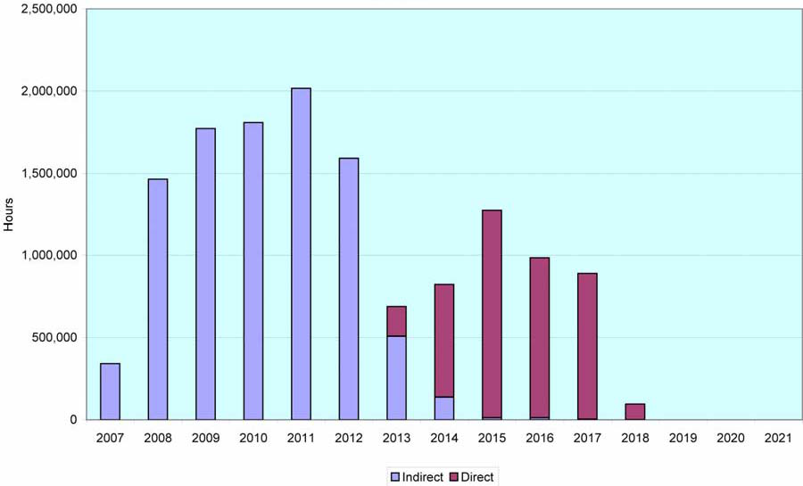

_Figure 6-1.  Resource Loading (Hours) Based on Levelized Schedule_ 

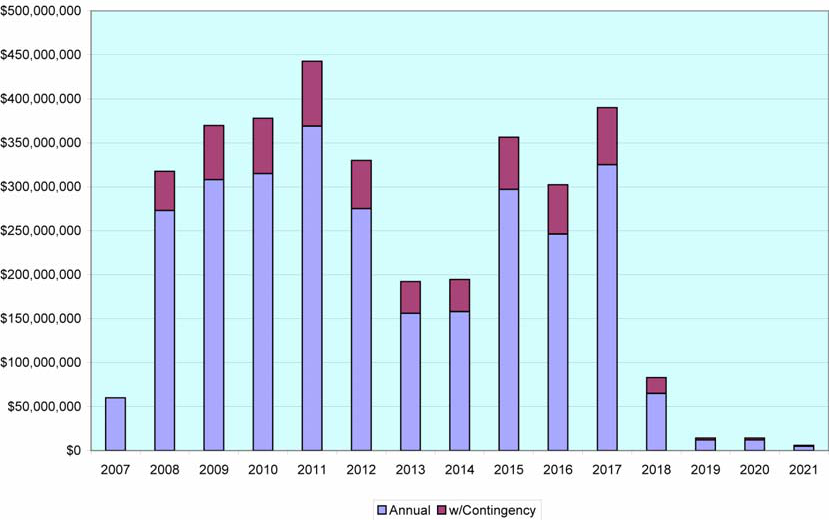

_Figure 6-2.  Cash-Flow by Year Based on Levelized Schedule (with Contingency)_ 

## **7. TECHNOLOGY DEVELOPMENT** 

This section discusses the technology development required for the NGNP.  Section 7.1 discusses GA’s methodology for integrating MHR design and technology development.  Section 7.2 summarizes the Technology Development Plan (TDP) that was prepared as a separate stand-alone document [TDP 2007] to focus and prioritize the R&D programs needed to support the NGNP based on the preconceptual design information presented in this PCDSR.  Section 7.3 discusses the NGNP fuel acquisition strategy that GA has developed in recognition of the critical importance of a viable fuel supply to the success of the NGNP Project and for deployment of MHRs in the U.S.  This fuel acquisition strategy allows for startup of the NGNP by 2018 and for timely demonstration by the NGNP Project of successful mass-production and irradiation of the UCO fuel that GA believes is essential for commercial deployment of MHRs. Section 7.4 presents recommendations for a testing and inspection program to be carried out at the start of NGNP operations. 

## **7.1 Methodology for Integration of Design with Technology Development** 

GA uses the protocol illustrated in Figure 7-1 for integration of design with technology development in order to maximize the benefit of the technology-development programs in terms of supporting a plant design and minimizing the technical risk of the design.  This model is based on successful Engineering Development and Demonstration programs conducted and managed by GA for DOE projects, including Accelerator Production of Tritium, the Salt Waste Processing Facility, the commercial GT-MHR, and the New Production Reactor. 

As shown in Figure 7-1, the process begins by evaluating design requirements and reviewing existing design data from a variety of sources.  Design assessments and trade studies are performed, eventually leading to key design selections and a technical baseline that meets all design requirements.  It may be reasonable to revise one or more design requirements during the process if the overall impact is small.  At this point, a design has been developed that meets all requirements, but requires some technology development to confirm assumptions upon which the design is based.  Also, if necessary, the process allows for an early testing path to provide early confirmation of basic assumptions. 

The technology development process begins with the design organization preparing design data needs (DDNs), which are formal project documents that include fallback positions in the event the testing programs do not produce acceptable results or the test could not be performed for budgetary or other reasons.  The DDNs provide a concise statement of the required data and the associated schedule, quality, and accuracy requirements.  In addition to preparing DDNs, the design organization also prepares a Test Specification that defines the data requirements in more detail.  The technology organization is responsible for developing Technology 

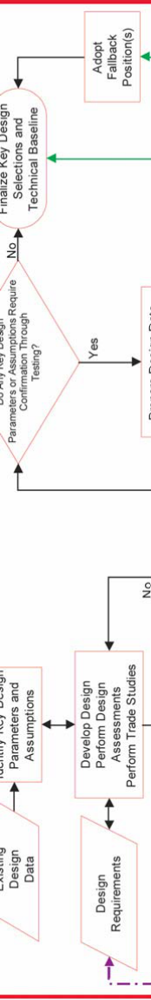

Executive Summary Report - NGNP and Hydrogen Production Report Preconceptual Design Studies 

Development Plans and Test Plans for specific tests.  The design and technology organizations work together during preparation of the DDNs, Test Specifications, Technology Development Plans, and specific Test Plans. 

The technology organization conducts the technology development programs and generates the design data.  If feasible, the technology organization may integrate its activities with other (e.g., international) programs in order to minimize costs.  After the design data are obtained, the design and technology organizations work together to determine if the DDNs are satisfied.  If the DDNs are satisfied, the key design selections and technical baseline are finalized and the design is completed.  If a DDN is not satisfied, the most likely path forward is to adopt the fallback position, which could mean additional margin is added to a certain area of plant design 

in order to reduce technical risk.  However, depending on the results of a specific test program, a more reasonable path forward may be to re-evaluate a key design selection and return to the design process.  An Independent Review and Verification organization is established at the start of the process to provide oversight of both the design and technology development processes. 

## **7.2 Technology Development** 

[TDP 2007] was prepared by the GA Team to focus and prioritize the R&D programs needed to support the NGNP based on the preconceptual design presented in this PCDSR.  The status of the various technologies needed to support NGNP design and licensing was reviewed and summarized (to define the state of the technology), and DDNs were defined where the current data base was judged to be inadequate (to define what needs to be done to advance the technology to support NGNP design and construction).  The DOE-sponsored technology programs intended to support the NGNP, including the various NGNP R&D programs and the DOE Nuclear Hydrogen Initiative (NHI) programs, were then evaluated and their responsiveness to the DDNs was assessed. 

The Statement of Work for the preconceptual engineering services contract under which this PCDSR has been prepared defines critical structures, systems, and components (SSCs) as “those components that are not commercially available or do not have proven industry experience,” and requires that the critical SSCs for the NGNP be identified and defined down to the component level.  By definition, the critical SSCs are those components for which technology development and/or design verification testing is required.  These critical SSCs include essentially all of the components of the reactor system (e.g., the fuel, the control rods, the hot ducts, and other reactor internals); the reactor, PCS, and IHX vessels; certain components of the PCS and the PCS as a whole; the helium circulators, IHX, and isolation valves in the heat transport systems; the process heat exchangers in the hydrogen production 

Executive Summary Report - NGNP and Hydrogen Production Report Preconceptual Design Studies 

processes, the SOEC’s in the HTE-hydrogen plant; the SI-process as a whole, and the various plant instrumentation and control systems.  The NGNP critical SSCs and the associated design data needs (DDNs) for these SSCs have been systematically identified in the TDP 

Consistent, with the above identification of critical SSCs, the effort in preparing the TDP was concentrated in the five specific areas of research, called “Major Project Elements,” outlined in The Energy Policy Act of 2005, plus an additional research area that was added in the NGNP PPMP.  These areas include: 

- High-temperature hydrogen production technology development and validation 

- Power conversion technology development and validation 

- Nuclear fuel development, characterization, and qualification 

- Materials selection, development, testing, and qualification 

- Reactor and balance-of-plant design, engineering, safety analysis, and qualification 

- Energy transfer, which includes the IHX and the secondary HTS. 

In principle, the GA Team agrees that these are the priority R&D areas for the NGNP and this is reflected by the structure and content of the TDP. 

Many of the resulting NGNP DDNs, particularly those related to the Reactor System and PCS are the same or similar to the commercial GT-MHR DDNs, but new DDNs have been identified, particularly for the IHX and the hydrogen production processes.  When the NGNP reference design is officially declared and subsequently matures, additional DDNs will undoubtedly be defined, but it is anticipated that the major ones have been identified in the TDP.  The DOEsponsored technology programs intended to support the NGNP, including the various NGNP R&D programs and the DOE Nuclear Hydrogen Initiative (NHI) programs, were then evaluated, and their responsiveness to the DDNs was assessed.  Table 7-1 summarizes the results of the evaluation. 

Overall, the current NGNP and NHI R&D plans appear largely adequate to meet the DDNs with a number of important exceptions that are described below by technology area.  However, with the notable exception of the technical program plan for the AGR Fuel Development and Qualification Program (AGR Fuel Program), these R&D plans are, in general, too high level and largely qualitative in nature (e.g., few test matrices, etc.).  Consequently, a general recommendation is that the NGNP and NHI program plans be revised to tie them directly to the NGNP DDNs and that they be better quantified.  Without more specificity, it is not clear what data will be available at what time, and it is not possible to judge the reasonableness of the R&D cost presented in those plans. 

## **7.3 Fuel Acquisition Strategy** 

## NGNP Fuel Acquisition Strategy 

GA believes that for successful commercial deployment of prismatic block VHTRs, UCO fuel with higher burnup capability must be demonstrated during operation of the NGNP.  However, it is unlikely that the AGR Fuel Program will be able to qualify UCO fuel in time to support the current NGNP option 2 strategy schedule, which calls for startup of the NGNP by 2018.  Another problem for early startup of the NGNP is that there is currently no capability anywhere in the world to mass produce TRISO-coated UCO fuel and it is unlikely that such capability will arise in time to manufacture the first core fuel load for the NGNP by 2018.  Furthermore, there is currently no fuel vendor in the U.S. that has the capability to make an initial core of coatedparticle fuel of any type for a 600-MWt prismatic-block MHR within a time frame compatible with the option 2 timeline in the NGNP PPMP.  GA believes that NFI, which has produced the TRISO-coated UO2 fuel for the 30-MWt HTTR in Japan has the largest and most advanced capability to mass produce coated-particle fuel at this time. 

Given these realities, GA has formulated a fuel acquisition strategy for the NGNP based on obtaining TRISO-coated UO2 for the first core fuel load from NFI.  However, GA views use of NFI fuel for the NGNP first core fuel load (and possibly one or more reloads) only as an expedient to allow startup of the NGNP by 2018.  GA strongly recommends that the NGNP Project develop a domestic supply of UCO coated-particle fuel (assuming that the NGNP is a prismatic block MHR) In order to meet the NGNP project objectives. 

Because the irradiation testing and accident conditions testing data base for the NFI extended burnup fuel is somewhat limited and the available data are insufficient to show that NFI fuel could meet the anticipated NGNP fuel performance requirements, a proof test of fuel from NFI’s NGNP fuel manufacturing line should be irradiated and safety tested in the U.S. to acquire additional fuel performance data to support NGNP licensing.  Consequently, GA endorses the approach described in the NGNP PPMP to irradiate UCO fuel and NFI UO2 fuel in AGR-2 and AGR-2a, respectively.  However, consistent with GA’s view that demonstration of UCO fuel in the NGNP is essential for deployment of commercial VHTRs in the U.S., GA does not agree that a down selection between these two fuel types be made for qualification testing in AGR-5 and AGR-6.  Rather, UCO fuel should be qualified in AGR-5 and AGR-6 as currently planned, and NFI UO2 fuel should be qualified for use in NGNP based on Japanese irradiation and safety test data, proof testing in AGR-2a, and fuel performance monitoring, as necessary, in the NGNP. 

Also consistent with GA’s view that it is essential that the NGNP Project demonstrate the viability of economical mass production of coated-particle fuel and develop a domestic source 

(or sources) of UCO fuel supply, GA recommends that an NGNP Fuel Fabrication Facility (FFF) be built in Idaho to supply the fuel for the NGNP.  The NGNP FFF should be designed for a production capacity of 510 fuel elements per year.  The facility would be operated at full capacity for two years to produce the initial core and the production rate would then be reduced to 340 fuel elements per year, at which rate the facility would produce a reload segment every eighteen months. 

The NGNP FFF would serve as the pilot line for the first commercial fuel fabrication facility.  The 510 fuel element/year process line that would be built and demonstrated in the NGNP FFF would be the basic production module that could be replicated in the commercial fuel fabrication facility.  Thus, the NGNP would demonstrate the fuel fabrication technology needed for the commercial fuel supply business, thereby greatly reducing the costs and risk that would be associated with a first-of-a-kind facility.  The estimated capital cost for design, construction, and licensing of the NGNP FFF based on the assumption that the NGNP FFF would be built using an existing facility on the INL site is about $200M in 2007$ 

Figure 7-2 shows a potential schedule for NGNP fuel acquisition.  This schedule assumes that NFI will make only the first core fuel load and that the fuel would be entirely replaced with UCO fuel at the beginning of 2022 following the NGNP commercial operation demonstration period. Based on NFI’s input that they would require five years to fabricate the fuel for the first core fuel load, funding of NFI to begin compact fabrication process development should begin no later than the beginning of 2008. 

|Year|2008|2009|2010|2011|2012|2013|2014|2015|2016|2017|2018|2019|2020|2021|2022|
|---|---|---|---|---|---|---|---|---|---|---|---|---|---|---|---|
|NFI compact dvlp & facility mods.||||||||||||||||
|||||||||||||||||
|NFI trial production & proof test fuel fab.||||||||||||||||
|AGR-2a irradiation||||||||||||||||
|||||||||||||||||
|AGR-2a PIE & safety testing||||||||||||||||
|||||||||||||||||
|NFI fab. first core fuel load (600 MW(t) NGNP)||||||||||||||||
|||||||||||||||||
|AGR-2 irradiation||||||||||||||||
|||||||||||||||||
|AGR-2 safety testing||||||||||||||||
|||||||||||||||||
|AGR-5 & AGR-6 irradiation||||||||||||||||
|||||||||||||||||
|NGNP FFF design||||||||||||||||
|||||||||||||||||
|NGNP FFF construction, startup, shakedown||||||||||||||||
|||||||||||||||||
|NGNP FFF process qual. & proof-test fuel fab.||||||||||||||||
|||||||||||||||||
|Proof-test irradiation||||||||||||||||
|||||||||||||||||
|Fab. second core fuel load (600 MW(t) NGNP||||||||||||||||
|||||||||||||||||
|NGNP startup and testing||||||||||||||||
|||||||||||||||||
|NGNP commercial operation demonstration||||||||||||||||
|||||||||||||||||
|NGNP operation with AGR UCO fuel||||||||||||||||
|||||||||||||||||

_Figure 7-2.  Schedule for NGNP Fuel Qualification and Acquisition_ 

An alternate, much more aggressive schedule for the NGNP FFF would be to start design in 2008 and to design and construct the facility in parallel with fuel demonstration and qualification in AGR-2, AGR-5, and AGR-6 under the AGR Fuel Program.  Under this schedule, the plant would be designed, constructed, and licensed from 2008 through 2012; started up, demonstrated, and used to make proof test fuel in 2013 and 2014.  Based on satisfactory, early on-line fission gas release results from the proof test irradiation, fabrication of the first core fuel load would begin in 2016 and be completed in 2017.  Although very aggressive and more risky than the alternate approach of obtaining the initial fuel for the NGNP from NFI, this approach would eliminate the substantial additional costs associated with the NFI approach. 

## **7.4 NGNP Initial Testing and Inspection Program** 

A testing and inspection program is proposed to be carried out at the start of NGNP operations. The testing and inspection program, as currently envisioned, is expected to be performed over a period of approximately one year prior to startup and two years following startup.  The general objective of the testing, beyond qualification of the facility for power operation, is to effectively compress the operating time by inducing events that would not normally be expected to occur during a two year operating period, to support the following NGNP Project objectives: 

- Demonstrating the basis for commercialization of the nuclear system, the hydrogen production facility, and the power conversion concept.  Essential elements of this objective include: 

- Demonstrating that the requisite reliability and capacity factor can be achieved over an extended period of operation. 

- Demonstrating normal O&M activities including activities required during major outages for equipment replacement or maintenance as well as O&M that might be required in the event of major equipment failures. 

- Establishing the basis for licensing the commercial version of NGNP by the NRC.  This will be achieved in major part through licensing the prototype by NRC and initiating the process for certification of the nuclear system design. 

The proposed testing and inspections to be performed are divided into the following categories: 

Preoperational Tests – These tests address the capability of selected SSCs to meet performance requirements, to the extent they can be tested outside of full plant service conditions.  Successful completion of preoperational tests demonstrates that individual system performance is acceptable and the plant is ready for hot functional tests.  The preoperational tests and inspections to be performed will be specified in the SSC System Design Description (SDD) documents 

Baseline In-service Inspection – These are pre-operational tests of all the in-service-inspections (ISI) to be performed through out the plant’s lifetime.  These tests provide baseline data for comparison with future in-service inspection results. 

Hot Functional Tests – In these tests, the nuclear heat supply facility (the reactor primary system) will be operated at full power reactor gas inlet temperature, flow, and helium pressure with heat supplied by motoring the helium compressor and IHX circulator.  The tests will provide data on flow performance through out the primary system (pressures, temperatures, vibrations, etc) as well as functional testing of all monitoring instrumentation.  In addition, a first check on vessel heat and temperature management and operation of the RCCS will be provided. 

Fuel Loading – As fuel loading progresses, neutron flux monitoring results can be compared with predictions. 

Startup Tests – Startup testing includes pre-critical, low power, and power ascension testing. Following verification of the core physics design, power is increased in steps to full power operation.  Plant operating parameters will be verified to be within design limits, and response to load changes, transition of loads between the PCS and the hydrogen production plants and reactor trips will be demonstrated throughout the power ascension program. 

Performance Tests – These tests will subject the plant to less frequent events expected to occur during normal operation including power PCS trip, loss of secondary system flow or pressure, etc. 

Response to Accident Tests – These tests are intended to demonstrate the inherent response characteristics of the reactor module.  Four basic categories of events are proposed: (1) reactivity transients, (2) pressurized cool down, (3) water ingress, and (4) depressurized cool down.  These categories cover the performance of the key systems which provide safety and investment protection 

Post Test Inspections and Maintenance Demonstrations – Following the completion of the above testing at power operating conditions, a shutdown would be scheduled for performance of inspections and to demonstrate major maintenance operations.  Inspections would be performed of all the systems to ascertain any abnormal effects of the above tests.  Major maintenance operations would be demonstrated such as refueling, reflector replacement, performance of remote ISI operations, and removal and replacement of major equipment items such as a TM rotor, IHX heat transfer element, major hydrogen production equipment, and other plant items not designed for the life of the plant. 

The anticipated schedule for performing the testing program is shown in Figure 7-3.  The data and experience gained during the test program are expected to provide a verification of commercial feasibility and a basis for design certification. 

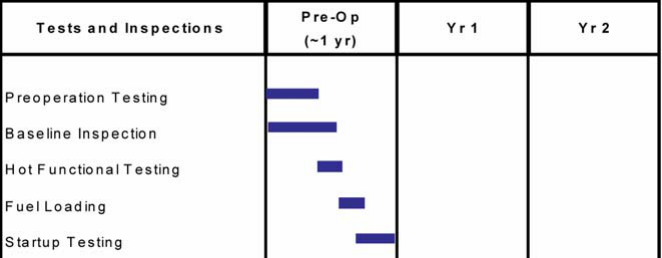

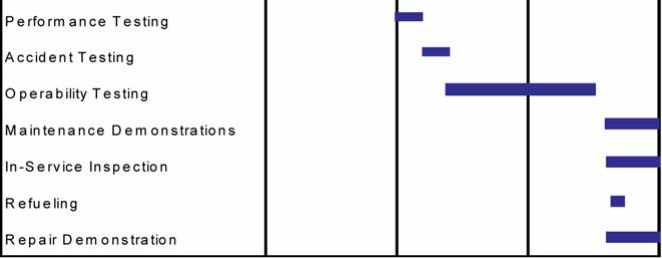

_Figure 7-3.  NGNP Initial Test and Inspection Program Schedule_ 

Although preliminary planning indicates that the response to accident testing will comprise only a small fraction of the total testing interval, the tests are a major element of the total program. The tests to be performed have been developed based on a preliminary evaluation, and will be adjusted based on further evaluation of design and licensing issues as the project proceeds. The ability to demonstrate the response to low probability events in a full scale plant without damage which would preclude subsequent long term operation is a key feature of the modular helium-cooled reactor. Demonstrating this capability is a vital element in the successful development of a commercial plant which is economically competitive, and generally accepted by utility/users, the financial community, and general public. 

## **8. REFERENCES** 

[AGR Plan 2005] “Technical Program Plan for the Advanced Gas Reactor Fuel Development and Qualification Program,” Document INL/EXT-05-00465, Rev. 1, Idaho National Laboratory, August 2005 

[AGR Fuel Spec. 2004]  Petti, D., et al., “Preliminary AGR Fuel Specification,” Document EDF4198, Rev. 1, Idaho National Laboratory, April 2004 

[ALWR Requirements 1991]  “Advanced Light Water Reactor Utility Requirements Document; Volume 1, ALWR Policy and Summary of Top-Tier Requirements,”  Electric Power Research Institute (EPRI), March 1990 

[Baxter 2007]  Baxter, A., and C. Ellis, “NGNP Reactor Type Comparison Study,” Document 911103, Rev. 0, General Atomics, April 25, 2007 

[Bolin 2007]  Bolin, J.M., and D. P. Carosella, “NGNP High Temperature Process Heat Transfer and Transport Study, Document 911105, Rev. 0, General Atomics, April 6, 2007 

[Brown 2003]  Brown, L. C., et al., “High Efficiency Generation of Hydrogen Fuels Using Nuclear Power,” GA-A24285, Rev. 1, General Atomics, December 2003 

[Functions & Requirements 2003]  “Next Generation Nuclear Plant – High Level Functions and Requirements,” INEEL/EXT-03-01163, Idaho National Laboratory, September 2003 

[GCRA 1994]  “Projections of O&M and Owner’s Costs for GT-MHR Plants,” GCRA 94-003, December 1994 

[GIF 2006]  “Cost Estimating Guidelines for Generation IV Nuclear Energy Systems,”  GEN IV International Forum, Rev. 3.01, August 23, 2006 

[Hanson 2004b] Hanson, D. and J. Saurwein, “Development Plan for Advanced High Temperature Coated-Particle Fuels,” Document PC-000513, Rev. 0, General Atomics, 2004 

[Hanson 2007]  Hanson, D. L., and P. Gupta, ‘’NGNP End-Products Study,” Document 911106, Rev. 0, General Atomics, April 2007 

[Herring 2005]  Herring, J.S., et al., “Progress in High-Temperature Electrolysis for Hydrogen Production Using Planar SOFC Technology,” Proceedings of the 2005 AlChE Spring National Meeting, Atlanta, GA, April 10 -14, 2005, Paper 74f 

[INL 2006] Smith, C., et al., “An Engineering Analysis for Separation Requirements of a Hydrogen Production Plant and High-Temperature Nuclear Reactor,” INL/EXT-05-00137, Rev. 1, Idaho National Laboratory, July 2006 

[ITRG 2004]  “Design Features and Technology Uncertainties for the Next Generation Nuclear Plant, Independent Technology Review Group,” INEEL/EXT-04-01816, Idaho National Laboratory, June 30, 2004 

[Labar 2003]  Labar, M., et. al., “The Gas Turbine Modular Helium Reactor,” Nuclear News, Vol. 46, No. 11, p. 28 (2003) 

[Labar 2007]  LaBar, M., “NGNP Reactor Power Level Study,”  RGE 911104, Rev. 0, General Atomics, San Diego, CA, April 2007 

[PCDSR 2007]  “NGNP and Hydrogen Production Preconceptual Design Studies Report,” Document 911107/0, General Atomics, July 2007 

[PPMP 2006]  “Next Generation Nuclear Plant Project, Project Management Plan,” INL/EXT-0500952, Rev. 1, Idaho National Laboratory, March 2006 

[Richards 2006a]  Richards, M.B., et. al., “H2-MHR Conceptual Design Report: SI-Based Plant,’ GA-A25401, General Atomics April 2006 

[Richards 2006b]  Richards, M.B., et al., “H2-MHR Pre-Conceptual Design Report: HTE-Based Plant,” GA-A25402, General Atomics, April 2006 

[Rolls-Royce 2007] Thomas, P., and M. Hillel, “Preliminary Assessment of the GT-MHR Power Conversion System, Document DNS 133534V1.0, Rolls-Royce, July 2007 

[Shenoy 1996]  “GT-MHR Conceptual Design Description Report, Document 910720, Rev. 1, General Atomics. July 16, 1996 

[SRM 2007]  Saurwein, J., et al., “NGNP System Requirements Manual,” Document 911102, Rev. 0, General Atomics, March 2007 

[TDP 2007]  Hanson, D. L., “NGNP Umbrella Technology Development Plan,“ Document PC000543/0, General Atomics, July 2007 

[Utility/User Requirements 1995]  “Utility/User Incentives, Policies, and Requirements for the Gas Turbine-Modular Helium Reactor,” DOE-GT-MHR-100248, Rev. 0, Technology Insights, September 1995 

P.O. BOX 85608  SAN DIEGO, CA  92186-5608 (858) 455-3000 

## **Appendix L** 

L-1 

L-2 

Keith J. Perry September 2007 

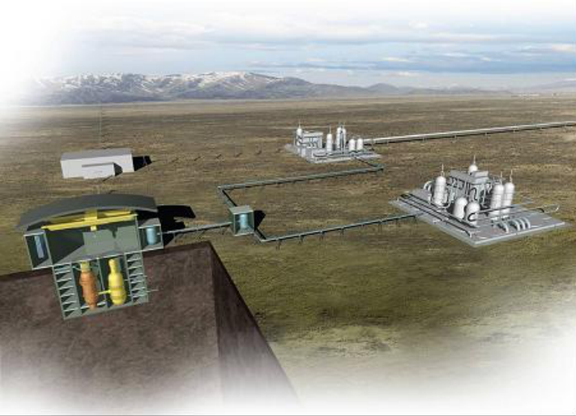

This information was prepared as an account of work sponsored by an agency of the U.S. Government. Neither the U.S. Government nor any agency thereof, nor any of their employees, makes any warranty, expressed or implied, or assumes any legal liability or responsibility for the accuracy, completeness, or usefulness, of any information, apparatus, product, or process disclosed, or represents that its use would not infringe privately owned rights. References herein to any specific commercial product, process, or service by trade name, trade mark, manufacturer, or otherwise, does not necessarily constitute or imply its endorsement, recommendation, or favoring by the U.S. Government or any agency thereof. The views and opinions of authors expressed herein do not necessarily state or reflect those of the U.S. Government or any agency thereof. 

# **Technical Risk Management for the NGNP Project** 

## **Keith J. Perry** 

**Prepared for the U.S. Department of Energy Office of Nuclear Energy Under DOE Idaho Operations Office Contract DE-AC07-05ID14517** 

# **Technical Risk Management for the NGNP Project** 

## **INL/EXT-07-13148** 

## **September 2007** 

## **Approved by:** 

Larry Demick Date NGNP Engineering Director Rafael Soto Date NGNP Deputy Director 

## **ABSTRACT** 

Technical risk management for the Next Generation Nuclear Plant (NGNP) project will incorporate experience from Department of Defense, NASA, and other systems engineering projects.  The methodology will be applied to any alternative that is proposed, and is designed to help provide discriminating information for decision-making as well as make each alternative perform at its best by reducing technical uncertainty in a timely manner.  A summary of the risk management methodology is provided herein. 

Table 1. RPV discriminating criteria and weights [For illustrative purposes only]......................................3 

DRL Design Readiness Level GAO Government Accountability Office NASA National Aeronautic and Space Administration NGNP Next Generation Nuclear Plant R&D research and development ROI return on investment RPV Reactor Pressure Vessel T&FR technical and functional requirement TRL Technology Readiness Level 

## **1. Introduction** 

Technical risk management for the Next Generation Nuclear Plant (NGNP) project will incorporate experience from Department of Defense, NASA, and other systems engineering projects.  The methodology will be applied to any alternative that is proposed, and is designed to help provide discriminating information for decision-making as well as make each alternative perform at its best by reducing technical uncertainty in a timely manner.  A summary of the risk management methodology is provided below, with the remainder of this primer devoted to explaining the details of how the steps would be accomplished.  The steps for the risk management are: 

- System performance requirements are defined as part of the technical and functional requirements (T&FRs), and performance goals are defined in concert with performance criteria. In this context, performance criteria and measurements are not limited to physical performance characteristics of the reactor system or its components, but rather performance includes how the system solutions address the mission need and other technical requirements / goals that are not just physical (see example below).  The criteria are weighted based on relative importance to the decision-maker. 

- Expected performance of the systems is defined based on published data or specific submittals provided by technology providers or subject matter experts. 

- The relative maturity of the input is defined based on either a Technology Readiness Level (TRL) scale for technology development related input, or a Design Readiness Level (DRL) scale for design basis related input.  Both types of input are often needed for development of discriminating data and risk reduction methodology.  The maturity of the systems or component, which directly relates to the maturity of the information about the performance, defines the level of uncertainty for the performance.  This information is vital in both understanding the decision-based ramifications and the needs for additional research and development (R&D) and design development. 

- Risk identification tools are used to catalog the known risks associated with the performance of the alternatives.  The risks are quantified in terms of how much uncertainty they add to any of the performance factors. 

- The performance and uncertainty data are combined to form an overall performance score range for each alternative. 

- The performance score ranges are compared to see if there is, in the presence of uncertainty, a risk-informed decision that can be made to either eliminate some alternatives or select a preferred alternative. 

- Using the results of the decision analysis, risk reduction plans are defined that both mitigate the known risks as well as increase the maturity of the technology and design, as needed.  These plans may include specific R&D, design development, or other uncertainty reducing activities. The product of this effort is very similar to a normal R&D plan or schedule. 

- The specific risk reducing and technology / design maturing events are mapped to the risk reduction plan, and the extent to which each risk / maturation is accomplished by the given task is quantified.  This allows for development of a risk reduction chart, also known as a risk waterfall chart, which shows how risk can be reduced over time based on expected execution of the risk reduction plan. 

- Expected risk reduction can be combined with expected performance measure to evaluate when it is anticipated that future risk-informed decisions can be made.  Used iteratively, these charts and data can be used to focus R&D and design development on tasks that reduce decision uncertainty in the most expedient manner. 

## **2. Requirements, Goals, and Performance Criteria Definition** 

Systems requirements define the minimum system performance.  Performance goals describe desired system attributes and are valuable in defining trade-off studies and alternatives discrimination activities. The system owners define both the requirements and the goals; the project can then turn the goals into performance criteria and measures. 

For example, the Reactor Pressure Vessel (RPV) must meet a set of safety, containment / confinement, and other performance criteria with respect to the material properties (e.g. the creep temperature of the material shall be above the temperature that the reactor will experience during the high bound of standard operation).  Beyond those requirements, there may be aspects of the RPV that are desirable but not required.  For example, the expected time needed to qualify the RPV materials of construction for operation should be minimized; the shorter the time, the better the “performance” of that alternative.  A criterion could be established called “expected schedule to qualify RPV material.”  The measure of such a criterion would be duration or time. 

Criteria and measures would be set relative to each goal for the system, after which those criteria would be weighted.  Weighting is an important part of the process as it establishes the relative importance of the criteria and their impact on the final decision.  Given the role of uncertainty in the risk-informed decision (described below), the weighting of the criteria may also drive the emphasis of development work.  Criteria weights can be developed by a consensus amongst the decision-makers, or each decisionmaker could provide their own weighting, allowing the development of a base case of criteria weights (the average of the submitted weights) along with room for sensitivity analysis that might explore the bounds of the weights offered by the decision-makers.  In either case, the weights are tabulated for later use in developing the combined score for a given alternative. 

For illustrative purposes only, Table 1 shows a set of criteria that could be used to rate the performance of RPV alternatives.  Table 1 also shows the various weights that results from the use of a Delphi Method, where a team of experts submitted their weights and the average was calculated. 

The criteria weights are all fractions, and at various levels the fractions sum to unity. The common levels are represented by the tab level.  In the example, the level 1 criteria are related to material properties, design, fabrication and assembly, and operations.  Their weights sum to one.  For the material properties, the level 2 criteria are related to the max temperature and material codification.  The weights of those criteria sum to 0.288, or the weight of the level 1 criterion.  Criteria weights are broken down in this way so that the lowest level criteria are the ones that are actually scored, and those scores can be rolled up to the level 1 criteria.  This will be shown in the continuation of the example. 

Table 1. RPV discriminating criteria and weights [For illustrative purposes only]. 

|**Criteria**|**Weight**|
|---|---|
|**Material Property Issues**|**0.288**|
|Max Temp|0.155|
|_Emissivity_|_0.063_|
|_Thermal-mechanical props (Creep)_|_0.092_|
|Code|0.133|
|_In code?_|_0.052_|
|_R&D (effort) to get into code_|_0.081_|
|**Design Issues**|**0.191**|
|Size (volume)|0.109|
|Thickness|0.082|
|**Fabrication and Assembly**|**0.289**|
|Forging|0.175|
|_Availability_|_0.091_|
|_Interest in forging these materials_|_0.084_|
|Welding|0.114|
|_Complexity_|_0.055_|
|_Heat treatments_|_0.022_|
|_Methods / procedures_|_0.018_|
|_Filler metal_|_0.014_|
|_Experience_|_0.059_|
|**Operations**|**0.232**|
|Environmental Effects|0.159|
|_Corrosion, impact on emissivity_|_0.081_|
|_Radiation_|_0.078_|
|Repairability|0.073|

## **3. Definition of Expected Performance** 

Subject matter experts or design and technology providers can identify the expected performance of an alternative with respect to the performance criteria.  In each case, literature is required to document the statement of performance and what kind of effort was used to develop the data itself.  The data could come from an R&D activity (e.g., test, experiment), design activity, or previous reactor system experience.  The performance must be defined in terms of the criteria measures to allow for criteria scoring. 

As the data are gathered, the performance criteria can be scored.  Scoring can be qualitative, semiquantitative, or continuously quantitative.  Utility theory is used to translate the performance measure into a value between 0 and 1.  In most cases, the translation is linear, meaning a 50% increase in performance measure translates into a 50% increase in performance score.  However, the decision-maker should 

reserve the right to establish non-linear translations from performance measure to performance score.  For example, if R&D on a given RPV material causes a significant creep performance improvement at ranges well below the temperatures experienced during operations, this would not cause as big a performance score shift as R&D that shows improvement at or above the temperatures at operation.  This scoring system drives the researchers to focus improvement in the areas of greatest impact. 

It is important to recognize that at this point of the process the _expected_ performance is what is being scored.  The actual performance has some probability of varying from this expected performance due to known risks coming to fruition, unknown risks having an impact, or even revolutionary advances that are not expected to occur between evaluation and deployment.  Only the expected performance, supported by some documentation of test results or engineering/science-based estimates, can be used at this point in the evaluation process.  Uncertainty around these expectations is managed later in the process and is included in the decision-support documentation. 

## **4. Identification of Known Risks / Uncertainty** 

Risk identification is critical to any project, not to mention one as technically complex as the NGNP. Many excellent templates and texts exist on how to systematically identify risks on a technical development project.  That process shall be executed for the NGNP to identify all known risks. 

It is understood that the less mature sub-systems and components will have fewer known, but these areas should not be considered “less risky.”  Risk identification can be compared to a colloquial analogy of a person who wants to buy one of two ships, the first is at the dock, with all of its warts and blemishes readily distinguishable.  The other is out at sea, at the very edge of the potential buyer’s field of vision. The boat at sea looks pristine and elegant, much better than the boat at the dock.  As the second boat approaches the dock, larger problems and issues come into view.  When the boat arrives, the buyer is happy they did not make their choice based upon first impressions.  Two alternatives of differing maturity can present the same problem, which is why technology and design maturity scales are used to provide an estimate of the potential unknown risks (see below). 

Known risks shall be quantified using a probability and consequence scale as found in typical risk management methodology.  The higher the product of probability and consequence, the higher will be the risk and associated uncertainty.  The uncertainty associated with certain risks must then be applied to the appropriate category, be it alternative performance criteria, project cost, or project schedule.  One risk may impact just one area or any combination of areas. 

An example of this might be the risk that no supplier desires to fabricate the RPV materials in sufficient size or quantity for NGNP.  While this seems initially like a show stopping risk, one mitigation could be for the project to develop material fabrication capability itself.  Developing this capability would be both very expensive and very time consuming, probably impacting the critical path of the project. Furthermore, it is not clear whether the newly developed fabrication plant would be more or less able than an existing plant to create the material with the ability to perform as expected in service.  Therefore, this known risk could impact all three main areas (performance, cost, and schedule).  The extent to which it would impact the areas would need to be traded off, as the impacts are not always independent (e.g., a more costly facility may take more time to build but would allow for better performance characteristics for the material). 

A detailed set of known risk was not developed for the example, but rather a combined known/unknown risk level was used and will be explained below. 

## **5. Definition of Maturity** 

Technical maturity and design maturity are used to estimate the level of unknown risk associated with the performance of a given sub-system or component.  The maturity is defined using scales called Technology Readiness Level (TRL) for technology development or Design Readiness Level (DRL) for design basis development.  Tables 2 shows the TRL scale adapted for NGNP use, and Table 3 shows the DRL scale developed by the NGNP project. 

Table 2. TRL scale. 

## Table 3. DRL scale. 

The scales of maturity allow for a rule of thumb estimation of the overall uncertainty that should be applied to any estimation of performance of a given sub-system or component.  For example, if the measure of effectiveness used for evaluation of creep performance for the RPV is said to be at a level that achieves a utility score of 0.7 out of 1, but the maturity of the sub-system or component only has a TRL rating of a 4, it is possible that the measure and associated utility score could vary significantly.  Perhaps 0.7 is the most likely score at the time of evaluation, but the true score could lie in the range of 0.25 to 0.9.  That range should be accounted for in any evaluation of the scores, and this methodology allows for that accounting. 

The maturity scales also allow for clearer R&D and design activity goals to be developed in terms of maturity advancement in addition to goals and activity related to resolving known risks.  Any R&D activity or design activity must be able to answer this question: what known risk will this activity make progress toward resolving or what maturity increase will result from this activity?  If there is no answer, then the activity is not increasing the certainty of the performance, cost, or schedule of the project. 

Continuing the _for illustrative purposes only_ example, the RPV for the given designs most likely has a TRL range of anywhere from 4 to 7, depending on if the materials of construction have been tested on their own (e.g., coupons or billets) in relevant environments (e.g., temperatures, fluences), have been integrated with other interfacing components (e.g., reactor core, active cooling systems, if required), and have been fabricated and used at prototypical scale.  Some vendors contend that the level is actually an 8, but no data have been presented to document that the an RPV of this material, size, and interfacing complexity has been fabricated and operated in the appropriate environmental test, all of which is necessary to obtain a TRL level of 8.  The DRL range is smaller, from a 4 to 6, as the designs have progressed beyond conceptual in nature for the RPVs.  Some have moved to initial preliminary design levels, while others are closer to a complete preliminary design. 

Maturity evaluations were used semi-quantitatively in an extensive example.  A Delphi method was used to query experts on the relative maturity of the given RPV concepts in terms of the decision criteria. Maturity was categorized using a Red, Yellow, Green scale.  Red indicated the least mature (least certain), and Green indicated the most mature (most certain).  Table 4 shows the relative maturities developed using the Delphi method. 

Table 4. Maturities of RPV concepts relative to decision criteria. 

|**Criteria**|**WEC**|**AREVA**|**GA**|
|---|---|---|---|
|**Material Property Issues**||||
|Max Temp||||
|_Emissivity_|G|G|G|
|_Thermal-mechanicalprops (Creep)_|G|G|G|
|Code||||
|_In code?_|G|G|G|
|_R&D (effort) to get into code_|Y|Y|R|
|**Design Issues**||||
|Size(volume)|G|Y|Y|
|Thickness|G|Y|Y|
|**Fabrication and Assembly**||||
|Forging|Y|Y|Y|
|_Availability_|Y|Y|Y|
|_Interest inforging these materials_||||
|Welding||||
|_Complexity_||||
|_Heat treatments_|G|Y|Y|
|_Methods /procedures_|Y|Y|Y|
|_Filler metal_|G|G|G|
|_Experience_|G|Y|Y|
|**Operations**||||
|Environmental Effects||||
|_Corrosion, impact on emissivity_|R|R|R|
|_Radiation_|Y|Y|Y|
|Repairability|Y|Y|R|

These values, arrived at purely by expert judgment, form the basis of the uncertainty calculations that occur below. 

## **6. Performance Score Range** 

With the weighting, utility scoring, and uncertainty calculations in hand, the overall performance score for the alternative can be calculated.  Each criterion score gets converted to a score range as the uncertainty impact (per alternative) on that criterion is used. 

In the example, the Red, Yellow, and Green scores form the subjective basis of the uncertainty range (in an actual risk management system development, historical data would be used to relate the maturity scores to the uncertainty ranges and, when combined with the uncertainty from the known risks, would form the to uncertainty range).  Red equates to 90% uncertainty, meaning that the score could be as low as 10% or as high as 190% of the value calculated from the utility scoring process.  Yellow equates to 60% uncertainty, and Green equates to 25% uncertainty.  Given these values as well as the scores provided using the Delphi method, Table 5 shows the overall comparative results of the RPV alternatives. 

Table 5. Overall performance scores and ranges for the three alternatives. 

|**Summary**|**High**|**Medium**|**Low**|
|---|---|---|---|
|**WEC**|0.69|0.28|-0.12|
|**AREVA**|0.44|-0.04|-0.51|
|**GA**|0.17|-0.37|-0.91|

These values are certainly disputable and are _for illustrative purposes only_ .  If they were accurate and substantiated by documentation and data, it would indicate that while WEC’s RPV is the highest nominal performer, its lowest level of conceivable performance is lower than the worst alternative’s highest level of performance.  This overlap indicates that on the basis of decision criteria performance alone, there is no clear cut winner. 

In a complete example, the applicable uncertainties would also be applied to the cost and schedule, forming similar high, medium, and low values for those measures for each alternative.  It is possible from these data to form graphs that combine the performance uncertainty data with the cost or schedule data. Such a graph for this example could be presented as shown in Figure 1. 

Figure 1 does not yield any additional insight to allow for decision making, even for example purposes.  However, one can hypothesize the conditions under which a decision could have been made.  If the cost uncertainty for the WEC alternative were much lower, say on the order of $20M instead of the $40M shown, and the GA RPV were nominally $80M with a range of $20M as well, then the graph in Figure 2 would have resulted. 

At least in this hypothetical example there is separation between the alternatives, even though there was no change in the performance range.  One might initially jump to the conclusion that the separation allows for a clear decision to be made.  That is not entirely the case, as can be explained by the “value lines.”  The dashed line represents the values of a decision-maker who is cost focused. That person wants a lot of performance for little money.  They tend to select acceptably performing, lower-cost alternatives. That person would see a clear separation between these two alternatives and would probably choose to move forward with the WEC RPV.  However, a performance focused person, who is willing to spend quite a bit of money to get modest performance improvements and who’s values are represented by the solid line, would still see value in keeping the GA alternative on the table, because if it performed at its highest possible range it could out-perform the WEC alternative.  For the performance focused decisionmaker, more technical or design work would need to be done to reduce the uncertainty of either or both alternatives before complete differentiation could occur. 

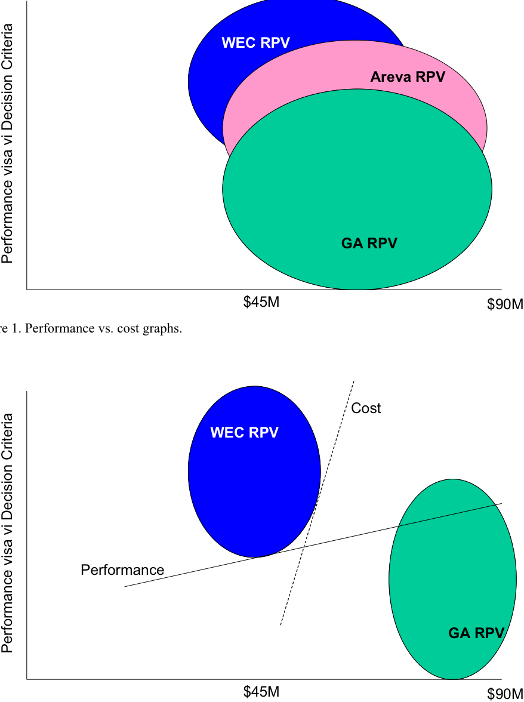

**----- Start of picture text -----** 
WEC RPV Areva RPV GA RPV $45M $90M Figure 1. Performance vs. cost graphs. Cost WEC RPV Performance GA RPV $45M $90M Performance visa vi Decision Criteria Performance visa vi Decision Criteria **----- End of picture text -----** 

Figure 1. Performance vs. cost graphs. 

Figure 2. Hypothetical example, reduced cost uncertainty, including value-based lines. 

## **7. Risk Reduction Planning** 

With the detailed uncertainty, performance, cost, and schedule data, plans can be developed to reduce known uncertainty and increase maturity, providing further differentiation for risk-informed decision making.  As describe earlier, each R&D and design task has to be able to specify how they are reducing known uncertainty or increasing maturity.  Linkages can be defined between tasks, their outcomes, and the overall uncertainty reduction they provide.  This allows for the development of a time phased uncertainty reduction graph, or risk waterfall chart, to be developed.  And example is provided in Figure 3. 

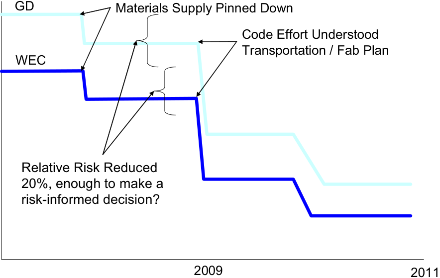

**----- Start of picture text -----** 
GD Materials Supply Pinned Down Code Effort Understood Transportation / Fab Plan WEC Relative Risk Reduced 20%, enough to make a risk-informed decision? 2009 2011 **----- End of picture text -----** 

Figure 3. Risk waterfall chart. 

These graphs do not show any specific relationship to the nominal performance score for the alternative, but rather how the range of score changes over time if the R&D and design plans are followed.  For example, clarifying who will supply the RPV materials will reduce the overall uncertainty, as will defining the codification effort, transportation plan, and fabrication plan.  Understanding these elements may cause the performance of the given alternative to improve, decrease, or remain the same. The same can be said of the cost or schedule basis. Uncertainty reduction does not make the nominal values better, it just makes the project more certain of the likelihood of achieving the nominal values, a vital aspect of decision making as well as cost and schedule planning. 

Initially, risk waterfall charts tend to show a back-end-loaded risk reduction process.  This is caused by researchers and designers not always being focused on reducing risk and increasing maturity up front. Using the risk waterfall diagram as a feedback tool can improve the prioritization of project work scope and can even provide a return-on-investment (ROI) calculation of sorts (i.e., uncertainty reduction per dollar spent). 

In tandem with risk waterfall charts, performance vs. cost or schedule uncertainty graphs can be used to show when differentiation can be expected in support of a risk-informed decision.  Since the waterfall translates to uncertainty reduction, predictions can be made about what the performance vs. cost/schedule uncertainty graphs will look like at certain times.  These graphs assume that the nominal performance and cost/schedule values do not change, which is not always the case, but still the graphs can help project management to communicate to the customer an expectation of the duration of the alternative differentiation phase of the project, which can also be helpful in communicating the basis of multi-year funding requests.  In any case, these graphs and analysis tools are very powerful in managing risk and developing the basis for risk-informed decisions. 

## **8. A Note on Risk Reduction for a Single Alternative** 

While the above discussion and _for illustrative purposes only_ example focuses on differentiating between multiple alternatives, risk reduction methodologies are important when only one alternative is on the table.  Such an effort focuses on reducing uncertainties around the design basis for that alternative, which still improves the ability to predict the nominal cost and schedule needed to complete the project. Performance against decision criteria is no longer important in this scenario and is discarded, but risk management remains.  The Government Accountability Office (GAO) emphasized this aspect of risk management recently in their report _Department of Energy: Major Construction Projects Need a Consistent Approach for Assessing Technology Readiness to Help Avoid Cost Increases and Delays_ . They highlight the need to follow just a portion of the process defined here, namely the use of TRLs, to help manage cost uncertainty.  This method goes a step further, developing tools and techniques to both manage risk and assure the fastest reduction possible. 

