## **3.2** 

## **Cryoplant and Cryodistribution** 

|3.2.1|System Description __________________________________________________________1|
|---|---|
|3.2.1.1|Cryoplant _______________________________________________________________1|
|3.2.1.2|LHe Plant_______________________________________________________________4|
|3.2.1.3|80K He Loop and LN2Subsystem ____________________________________________5|
|3.2.1.4|Cryodistribution System____________________________________________________6|
|3.2.1.5|System of Cryogenic Lines and Manifolds______________________________________8|
|3.2.2|Component Design Descriptions _______________________________________________11|
|3.2.2.1|Warm Gaseous Compressors _______________________________________________11|
|3.2.2.2|Cold Process Boxes of the Cryoplant _________________________________________11|
|3.2.2.3|Typical ACB of the Magnet System__________________________________________14|
|3.2.3|Performance Analysis _______________________________________________________14|
|3.2.3.1|Controlling a Constant Heat Load on the LHe Plant______________________________14|
|3.2.3.2|Cool-Down of the ITER Machine from 300K to 4.5K ____________________________17|
|3.2.3.3|Helium Exhaust to the Cold Quench Tank during Fast Energy Discharge _____________18|
|3.2.3.4|Cool-Down of the TF Coils after Fast Energy Discharge __________________________19|

## **3.2.1 System Description** 

One of the key requirements for the cryogenic system is to operate in a steady state cooling mode as is usual for conventional large cryogenic plants. However, the heat load of the magnet system is largely deposited in pulses due to magnetic field variation, DT neutron production, etc.  Each of plasma scenarios results in different nuclear and other heat loads and consequently the liquid He (LHe) plant must be able to cope with varying ratios of refrigeration to liquefaction capacity as well as with different total plant loads.  The smoothing of the pulsed heat load, the maintenance of stable operation over the wide range of plasma scenarios, as well as cost minimisation by using standardised components, are the main guidelines for the design of the ITER cryogenic system. 

The ITER cryogenic system is subdivided into three parts: the cryoplant, the cryodistribution system and the system of cryogenic lines and manifolds. 

## 3.2.1.1 Cryoplant 

The principal process and flow diagram of the cryoplant is shown in Figure 3.2.1.1-1.  The cryoplant equipment includes the following components: 

- ¥ four identical cold process boxes of the LHe plant; 

- ¥ helium gas compression station of the LHe plant; 

- ¥ external He gas purification unit; 

- ¥ 1.8 MPa warm (300K) and 80K tanks for storing the gaseous He; 

- ¥ two identical 80K He cold boxes linked to two identical liquid nitrogen (LN2) auxiliary cold boxes for final cooling of the He flow to 80K; 

- ¥ helium gas compression station of the 80K He loop; 

- ¥ LN2 subsystem with two identical cold process boxes and LN2 storage; 

- ¥ nitrogen gas compression station. 

The cryoplant equipment is located in two buildings: the cryoplant compressor building and the cryoplant cold box building (see Figure 3.2.1.1-2).  The compressor building houses all the warm compressors for the LHe plant, the liquid nitrogen (LN2) subsystem and the 80K He loop as well as the He and N2 gas dryers.  All cold boxes of the LHe plant, the LN2 

N 34 GR 20 00-12-22 F 1 

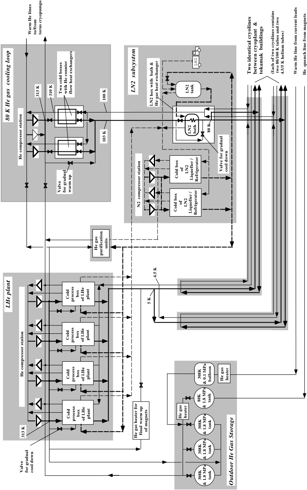

**----- Start of picture text -----** 
Warm He lines to/from torus cryopumps LN2 Two identical cryolines between cryoplant  & tokamak  buildings (Each of two cryolines contains  two 80/100 K tubes and two 4.5/5 K helium tubes) Warm He line from current leads He  quench line from magnets 313 K 310 K Two cold boxes with He counter flow heat exchangers LN2  subsystem LN2 tank 100 K LN2 box with  bath & He gas heat exchanger  80 K He gas  cooling loop LN2 bath 80 K 103 K He compressor station of LN2 Valve for gradual cool down Cold box Liquefier / Refrigerator Valve for gradual warm up N2  compressor station of LN2 Cold box Liquefier / Refrigerator He gas units purification 4.5 K Cold process  box of LHe plant 5 K  LHe plant Cold process  box of LHe plant He compressor station Cold process  box of LHe plant 308K balloon He gas heater & 0.1 MPa 80K tank & 1.8 MPa Cold process  box of LHe plant He gas heater 308K tank of magnets 313 K He gas heater for final warm up & 1.8 MPa 308K tank & 1.8 MPa Valve for gradual cool down 308K tank & 1.8 MPa Outdoor He Gas Storage **----- End of picture text -----** 

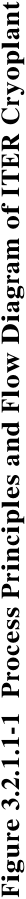

**----- Start of picture text -----** 
Figure 3.2.1.1-1  Process Principles and Flow Diagram of ITER Cryoplant **----- End of picture text -----** 

N 34 GR 21 00-12-22 F 1 

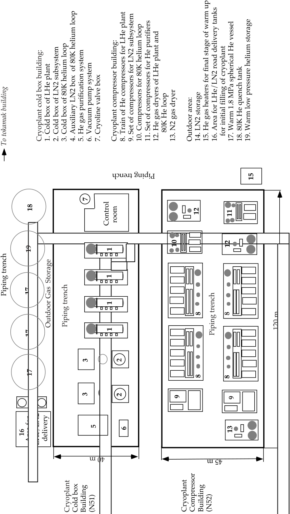

**----- Start of picture text -----** 
Cryoplant cold box building: 1. Cold box of LHe plant 2. Cold box of LN2 subsystem 3. Cold box of 80K helium loop 4. Auxiliary LN2 box  of 80K helium loop 5. He gas purification system 6. Vacuum pump system 7. Cryoline valve box Cryoplant compressor building: 8. Train of He compressors for LHe plant 9. Set of compressors for LN2 subsystem10. Compressors for 80K helium loop 11. Set of compressors for He purifiers 12. He gas dryers of LHe plant and      80K He loop 13. N2 gas dryer Outdoor area: 14. LN2 storage 15. He gas heaters for final stage of warm up 16. Area for LHe/LN2 road delivery tanks    for initial filling of cryoplant17. Warm 1.8 MPa spherical He vessel 18. 80K He quench tank 19. Warm low pressure helium storage To tokamak building 15 7 18 12 11 room  Control 10 12 19 1 1 Piping trench 17 1 8 8 Outdoor Gas  Storage Piping trench 1 120 m 17 Piping trench 3 4 2 17 8 8 3 4 2 9 9 5 6 13 16 Area for LHe/LN2  delivery Cryoplant Cold box Building (N51) Cryoplant Compressor Building (N52) Piping trench 14 40 m 45 m **----- End of picture text -----** 

**----- Start of picture text -----** 
Figure 3.2.1.1-2 ITER Cryoplant Layout **----- End of picture text -----** 

subsystem, the 80K He cooling loop, and He gas purification unit, are installed in the cryoplant cold box building.  The external dual-operated purification unit is incorporated in the LHe plant to allow continuous processing during normal operation of about 5 % of the total mass flow rate produced by the He gas compressor station.  The capacity of the He purification system is also available for cleaning the gaseous He from all the ITER cryogenic components within 7 days before starting the cool-down of the tokamak. 

Three 1.8 MPa warm He tanks, one 80K He quench tank, a low pressure He balloon, and liquid nitrogen tanks, are placed in an outside area, adjacent to the cryoplant cold box building.  The 1.8 MPa warm He tanks are used to store the He inventory of the cryogenic components of ITER after machine warm-up.  The cold 1.8 MPa tank is needed for expelling cold He from the TF coils during fast energy discharge (see 3.2.3.3). 

Two 25 m[3] LHe tanks are used for storing LHe when the plasma pulsing allows an accumulation of LHe.  These tanks are installed in the main tokamak building. 

All cryoplant components are of a high industrial quality standard and are chosen from industrially proven technology. 

## 3.2.1.2 LHe Plant 

The heat loads for the different components of the ITER machine are summarised in Table 3.2.1.2-1.  The design point of the LHe plant is 43.2 kW of refrigeration plus 0.17 kg/s of liquefaction to satisfy the nominal plasma pulsing with 1,800 s plasma repetition time and 400 s burn at 100 % availability for plasma pulsing. 

The total refrigeration capacity of the LHe plant includes both the heat load deposited in the different ITER components and an additional heat load associated with the work of He circulating pumps and cold compressors. 

**Table 3.2.1.2-1 Total Heat Load Requirements of the LHe Plant** 

Notes: 

[1] The requirements on each He pump are shown in Table 3.2.1.4-1. 

- [2] The cold He compressors operate at 4.3K for cooling the magnet system. 

- [3] NB injector system, the pellet fueling system and the EC H&CD gyrotrons. 

The largest cryogenic user is the magnet system that includes the 18 TF coils, the CS, 6 PF coils together with the correction coils (CCs) and the magnet mechanical structures (MS). Liquefaction capacity of 0.1 kg/s is required for cooling the coil current leads.  The heat load deposited in the magnet system includes both the static loads due to thermal radiation from 80K shields, and the thermal conduction through gravity supports, as well as the averaged 

value of the large pulsed heat loads of electromagnetic losses and nuclear heating.  The electromagnetic losses and nuclear heating are intrinsically pulsed heat loads and the ITER cryogenic system is designed to smooth this pulsed heat load to enable steady-state operation of the LHe plant (see 3.2.3.1). 

Another large cryogenic user is the tokamak vacuum pumping system that includes the 10 cryopumps of the torus primary vacuum system, the 4 cryopumps of the neutral beam injector system and the 2 cryopumps of the cryostat.  The mean value of the liquefaction capacity for the fast cool-down of the torus cryopumps together with the total refrigeration load and work of the circulating He pump of other cryopumps is shown in Table 3.2.1.2-1. 

The LHe plant consists of four identical LHe process modules each of the equivalent refrigeration capacity of 18 kW.  The unit size of 18 kW is used in CERN and therefore is within the current manufacturing technology base. 

## 3.2.1.3 80K He Loop and LN2 Subsystem 

An 80K flow of compressed He is used for the active cooling of the 80K thermal shields of the ITER machine.  For nominal operation, the He temperature at the inlet and outlet of the shields is 80K and 100K respectively. Liquid nitrogen is used for pre-cooling He to 80K for the thermal shields. 

The LN2 production subsystem together with the 80K He loop provides for cooling the following ITER components: 

- ¥ VV and other 80K thermal shields inside the cryostat; 

- ¥ gravity supports of the magnet system and the VV; 

- ¥ 80K chevron baffles and thermal shields of the cryopumps; 

- ¥ 80K thermal shields of all cryogenic transfer lines and cryo-manifolds; 

- ¥ pre-cooling the He to 80K as required for the cryogenic cycle of the LHe plant; 

- ¥ external He purification unit. 

The cooling scheme of the 80K He loop together with the LN2 subsystem and the LHe plant is shown in Figure 3.2.1.1-1.  The 80K He cooling loop includes two identical cold He boxes and two LN2 auxiliary cold boxes.  If one 80K He box or LN2 auxiliary box is removed from service, another box will cool the thermal shields with a higher outlet temperature of 120K. This design provides a very high level of reliability for keeping the magnet system at low temperature despite some malfunction in the cryoplant. 

Each 80K He box contains a counter flow He heat exchanger (HX) for cooling the supply He flow from 310K to about 103K by a return He flow heated from 100K to 307K.  The temperature difference between the supply and return He flows of this HX is 3K.  Final cooling of the He flow from 103K to 80K occurs in the LN2 auxiliary cold box. 

The heat loads of the 80K He loop for the nominal operation and baking of the VV together with requirements for the LN2 supply are summarised in Table 3.2.1.3-1. 

## **Table 3.2.1.3-1 Heat Loads on the LN2 Subsystem (kW)** 

|**Components**|**Normal operation**|**VV baking**|
|---|---|---|
|Thermal shields and gravity supports of the tokamak|385|740|
|Thermal shields of all cryogenic lines|50|50|
|Thermal shielding of cryopumps|180|60|
|LN2for supplying the LHe plant|280|70|
|Total heat load of different components|895|930|
|Total cooling capacity of the LN2refrigerators|987|1,000|

The LN2 subsystem operates close to the refrigeration mode.  Two LN2 refrigeration units each of 450 kW are incorporated in the cryoplant.  These units are of conventional design, such as used in air separation plants.  The LN2 subsystem includes also two LN2 tanks (see Figure 3.2.1.1-2), each of 50 m[3] , to improve operation flexibility of the cryoplant. 

## 3.2.1.4 Cryodistribution System 

The principal process and flow diagram of the cryodistribution system is shown in Figure 3.2.1.4-1.  The cryodistribution system provides forced flow cooling of the magnet system and cryopumps by using cold circulating pumps.  These pumps are able to deliver circulation of large He flows in the ITER cryogenic components that are much higher than the He flow produced by the LHe plant itself.  The cold circulating pumps of the ITER machine are located in five separate auxiliary cold boxes (ACBs). A typical ACB for the magnet system is shown in Figure 3.2.2.3-1. 

The cryodistribution system contains also two identical cryoplant termination cold boxes (CTCBs) that are required for final cooling of the supercritical He (SHe) flow of the coil current leads to 4.6K. 

Cold compressors are incorporated in the cryodistribution system for maintaining a temperature of 4.3K in the boiling He baths of all the ACBs of the magnet system.  These compressors are located in a cold compressor box (CCB). 

All cold boxes of the cryodistribution system are installed inside the main tokamak building, as shown in Figure 3.2.1.4-2.  Each ACB is connected through long cryolines and ring cryogenic manifolds with several cold termination boxes (CTB) or cold valve boxes (CVBs) of each individual cryogenic ITER user.  These CTBs and CVBs are not part of the cryodistribution system and belong to the individual cryogenic user system. 

The principle arrangement of a typical ACB of the magnet system is described in 3.2.2.3. Each ACB contains two circulating pumps.  Using two pumps for each ACB provides redundancy against pump failure.  Since each pump will be equipped with variable speed motor and be operated at 50% of its full capacity, the nominal He flow rate can be maintained when one of the two pumps is suddenly stopped, or can be minimised when the plasma experiments allow reduced pump parameters. 

The He mass flow rate and pressure drop requirements for the He circulating pumps and cold compressors as well as the heat loads on the heat exchanger of each ACB are summarised in Table 3.2.1.4-1. 

One type of large capacity pump with variable motor speed has been designed.  The design point is 1.5 kg/s and 0.12 MPa.  The design efficiency of the pump is 0.8. 

N 34 GR 22 00-12-22 F 1 

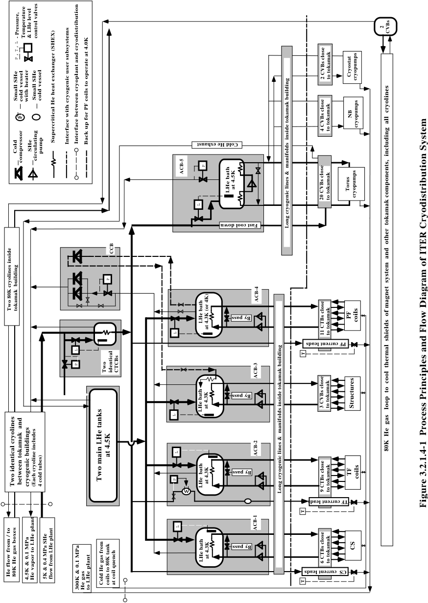

**----- Start of picture text -----** 
2 CVBs - Pressure, Temperature & LHe level control valves P , T , L 2 CVBs close to tokamak Cryostat cryopumps Small SHe cold vessel with heater Small SHe cold vessel NB 4 CVBs close to tokamak cryopumps  Supercritical He heat exchanger (SHEX) Interface with cryogenic user subsystems Interface between cryoplant and cryodistribution Back up for PF coils to operate at 4.0K Cold SHe pump compressor circulating P ACB-5 LHe bath at 4.5K Torus 20 CVBs close to tokamak cryopumps L Long cryogenic lines &  manifolds  inside tokamak building CCB P ACB-4 Two 80K cryolines inside tokamak  building PF LHe bath coils at 4.3K (or 4K) L 11 CTBs close to tokamak L T P Two identical CTCBs ACB-3 LHe bath at 4.3K 3 CVBs close to tokamak Structures L at 4.5K L ACB-2 80K  He  gas   loop  to  cool  thermal  shields  of magnet  system  and  other  tokamak components,  including  all  cryolines Two identical cryolines  between tokamak  and cryogenic buildings (Each cryoline includes 4 cold tubes) Two main LHe tanks P LHe  bath at 4.3K Long cryogenic lines &  manifolds inside tokamak building 9 CTBs close to tokamak TF coils Figure 3.2.1.4-1  Process Principles and Flow Diagram of ITER Cryodistribution System T L ACB-1 LHe bath at 4.3K 6 CTBs close to tokamak CS He flow from / to 80K He gas boxes 4.5K & 0.1 MPa He vapor to LHe plant 5K & 0.4 MPa SHe flow from LHe plant Cold He gas from coils to 80K tank at coil quench T 300K & 0.1 MPa He gas to LHe plant Cold He exhaust Fast cool down By pass PF current leads By pass By pass TF current leads By pass CS  current leads **----- End of picture text -----** 

**----- Start of picture text -----** 
N 34 GR 23 00-12-22 F 1 **----- End of picture text -----** 

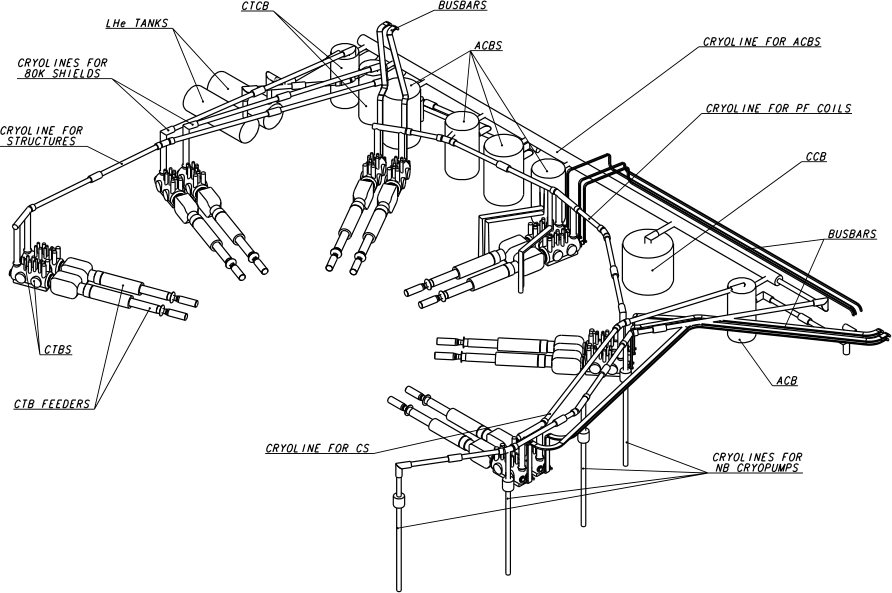

**Figure 3.2.1.4-2 Isometrical View of Cryodistribution Boxes and Cryolines at the Upper CTB Level of the Tokamak Building** 

**Table 3.2.1.4-1 Requirements for Cold Pumps and Compressors** 

Cold compressors with variable motor speed have been designed to operate with the magnet system.  The cold compressors compress the 4.3K He vapour from the saturated pressure of 0.1055 MPa to 0.1355 MPa that is equivalent to the saturated He temperature of 4.5K. 

## 3.2.1.5 System of Cryogenic Lines and Manifolds 

The system of the cryogenic transfer lines and manifolds that is located inside the tokamak building includes the following components: 

- ¥ manifold for connecting the ACBs, the CCB and the two CTCBs; 

- ¥ two cryolines and two half ring manifolds for supplying the 9 CTBs of the TF coils; 

- ¥ cryoline and two manifolds for supplying 11 CTBs of the PF coils and correction coils; 

- ¥ cryoline and two manifolds for supplying the 6 CTBs of the CS; 

- ¥ two cryolines for supplying the 3 CVBs of the magnet structures; 

- ¥ two cryolines from the CTCBs for supplying the 2 CVBs of the 80 K thermal shields; 

- ¥ cryoline and manifold for supplying the 4 CVBs of the NB cryopumps; 

- ¥ cryoline for supplying the one CVB of the cryostat cryopumps; 

- ¥ four cryolines and four manifolds for supplying the 20 CVBs of the torus cryopumps, 

- ¥ four short cryolines to connect the ACB of the magnet structure with the two CTCBs and two LHe tanks. 

The cryolines and ring-shaped manifolds that connect the ACBs with the CTBs and CVBs of each individual ITER cryogenic component are located around the tokamak cryostat on three different levels of the tokamak building, in particular the TCWS vault level (upper CTB level), the basemat level (lower CTB level) and the lower pipe chase level.  The routing of the cryolines and manifolds of the upper and lower CTB levels is shown in Figures 3.2.1.4-2 and 3.2.1.5Ð1. 

To minimise cost and allow space allocation for all the cryolines and manifolds in very restricted areas of the tokamak pit, the following design principles have been used: 

- ¥ design of the cryolines and manifolds is simplified, no cold valves or temperature/pressure sensors are installed in the cryolines or manifolds (all cold valves and cryogenic sensors are housed in the ACBs, CTBs and CVBs); 

- ¥ manifolds are designed with a minimum (50 mm) separation between cold tubes for using a welding (or cutting) tool for installation or repair; 

- ¥ only welded joints are used for connecting the sections of the cryolines or manifolds during their assembly; 

- ¥ minimum numbers of vacuum barriers are installed in any manifold.  These vacuum barriers are located only between the manifold and each CTB, and between the cryoline and ACB. 

The typical design of the manifold for the magnet system has been developed on the basis of designing the two half ring manifolds of the TF coils.  These two manifolds are terminated with two cryolines that lead to the ACB.  The TF manifold or manifolds of other coils consists of several straight pipe sections of 10 to 15 m in length and several bend sections of short length (1.5 to 2.2 m) which are connected in a such a way as to build the ring-shaped manifold. 

A cross sectional view of the TF manifold is shown in Figure 3.2.1.5-2.  The manifold includes five internal cold tubes.  One of the two 80K He tubes is attached to the aluminium shield for its active cooling. 

Each straight pipe section of the manifold includes cold bellows, to allow free longitudinal thermal contraction of cold tubes, one fixed support, and several sliding supports for guiding the bellows. 

N 34 GR 30 01-01-22 F 1 

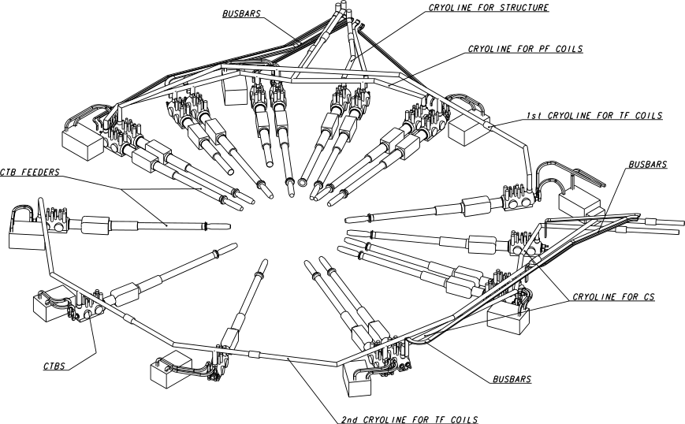

**Figure 3.2.1.5-1 Isometrical View of Cryolines at the Lower CTB level of the Tokamak building** 

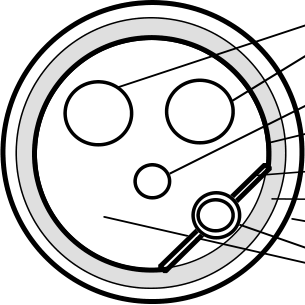

N 34 GR 26 00-12-22 F 1 Two (supply /return) 4.5 K tubes  (Dia=80 mm) 4.5 K tube to supply current leads (Dia= 40 mm) 80 K aluminium thermal shield (Dia= 340 mm) Contact with 80 K thermal shield Multilayer superinsulation Outer vacuum tube (Dia=406 mm) Two 80 K tubes (supply /return) (Dia=40 mm) 

**Figure 3.2.1.5-2 Cross Sectional View of TF Ring Manifold** 

The bend section has an internal design identical with that of the straight section.  The outer vacuum tube has a mitre-type design and the inner cold tubes are bent to the required angle. Each bend section contains 1 fixed support.  The cold tubes include a bellows section to facilitate thermal contraction. 

Nine tee-sections are used for connecting the TF manifold with the 9 CTBs. Each tee section contains a vacuum connector with the branched cold tubes for attaching to the CTB.  Each 

branched tube is formed to allow free thermal contraction, or has a flexible braided hose (bellows section).  Each tee section has a vacuum barrier with the CTB. 

The same internal design as for the TF manifolds has been used for the cryolines and manifolds of other components of the magnet system as well as for the torus and other cryopumps.  The difference is that the supply (and return) manifolds of the torus crypumps includes three internal cold tubes, and six cold tubes for the NB and cryostat cryopumps. 

The system of the cryolines includes also two, identical cryolines of 100 m in length to connect the cold process boxes of the cryoplant with the main tokamak building in which the CTCBs are installed. 

There is also a system of long quench manifolds and lines that allow the exhaust of cold He from the TF coils during fast energy discharge or coil quench. (see 3.2.3.3). 

## **3.2.2 Component Design Descriptions** 

## 3.2.2.1 Warm Gaseous Compressors 

Oil injection screw type compressors are the reference design for the LHe plant.  Four He compressor trains are installed in the cryoplant compressor building as shown in Figure 3.2.1.1-2.  One compressor train consists of 3 units for the first compression stage (from 0.1 to 0.36 MPa), 2 units for the second stage (from 0.36 to 1.9 MPa), and two oil separators and water coolers for He and oil.  The small amount of oil remaining in He after the oil separator of the second pressure stage is separated with three coalescing filters connected in series and finally with an activated charcoal adsorber.  Two oil injection screw-type compressors are also used for the 80K He loop.  One screw-type compressor set is installed in the cryoplant compressor building for operation with the He purification unit.  Two sets of centrifugal compressors are used for the LN2 subsystem.  The two dual-operated He gas dryers are installed in the cryoplant compressor building for operating with both the LHe plant and 80K He loop.  One dual-operated N2 gas dryer is used for the LN2 process boxes. 

## 3.2.2.2 Cold Process Boxes of the Cryoplant 

The cold box reference design is based on a modified 18 kW CERN 4.5K process module using a LN2 pre-cooled, three-pressure He cycle as shown in Figure 3.2.2.2-1.  The LHe module contains the first stage with LN2 pre-cooling, several counter flow He HXs, and four cold He turbines (expanders). 

The cold box of the LHe module consists of two vacuum cylinders, a vertical one and a horizontal one, connected together forming an L-shape as shown in Figure 3.2.2.2-2.  The vertical cylinder of 4 m in diameter and 9 m in height contains all the He HXs.  The horizontal cylinder of 3.5 m in diameter and 12 m long includes all the cold turbines, cryogenic valves and a LN2 bath. 

The 80K He loop includes the two vertical He cold boxes of 8 m in height, and two auxiliary LN2 boxes of 5 m in height. All these boxes are of conventional design.  The 80K box contains the He counter flow HX and the auxiliary LN2 box includes the LN2 bath and He HX immersed in this bath. 

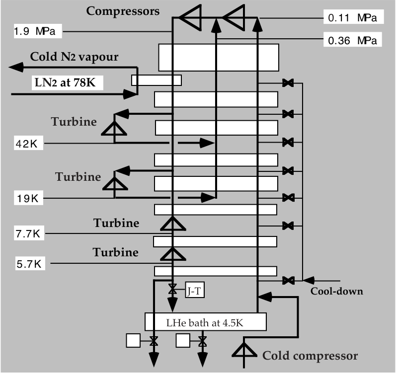

**----- Start of picture text -----** 
Compressors 0.11 MPa 1.9 MPa 0.36 MPa Cold N2 vapour LN2 at 78K Turbine 4 2K Turbine 19K Turbine 7.7K Turbine 5.7K J-T Cool-down LHe bath at 4.5K Cold compressor **----- End of picture text -----** 

N 34 GR 31 01-01-22 F1 

**Figure 3.2.2.2-1 Cooling Cycle of the ITER Lhe Plant** 

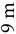

**----- Start of picture text -----** 
9 m **----- End of picture text -----** 

N 34 GR 32 01-01-22 F1 

**Figure 3.2.2.2-2 Sketch of the 18 kW CERN Module of the LHe Plant** 

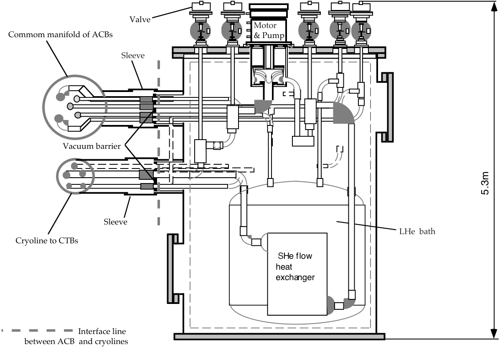

**----- Start of picture text -----** 
Valve Motor Commom manifold of ACBs & Pump Sleeve Vacuum barrier Sleeve LHe  bath Cryoline to CTBs  SHe flow heat exchanger                           Interface line between ACB  and cryolines 5.3m **----- End of picture text -----** 

**----- Start of picture text -----** 
N 34 GR 27 00-12-22 F 1 **----- End of picture text -----** 

## **Figure 3.2.2.3-1  Vertical Cross Sectional View of Typical ACB of Magnet System** 

The LN2 subsystem includes two, vertical, 10 m high cold boxes plus two appendages for locating expander machines.  These boxes are of conventional design as used in industrial air separation plant. 

## 3.2.2.3 Typical ACB of the Magnet System 

All the ACBs of the magnet system are of identical design.  The vertical cross sectional view of the ACB of the TF coils is shown in Figure 3.2.2.3-1.  This ACB contain the following components: 

- ¥ vertically-oriented cylindrical vacuum enclosure with connectors for attaching the common manifold of the ACBs and two cryolines of the TF coils; 

- ¥ two He-circulating pumps (only one pump is shown in Figure 3.2.2.3-1); 

- ¥ a bath with boiling He; 

- ¥ a supercritical flow heat exchanger of fin-plate type immersed in the He bath; 

- ¥ cold control, isolating and bypass valves; 

- ¥ set of cryogenic sensors and a heater as a dummy load. 

Note that the arrangement of the cold compressor box (CCB) is similar to the ACB design. The CCB contains a warm vacuum enclosure, cold valves and cold compressors.  The possibility to install an additional cold compressor for allowing back-up operation of the PF coils at a reduced inlet temperature of 4.1-4.2K is also considered for this CCB. 

## **3.2.3 Performance Analysis** 

Detailed evaluation of plant performance has been largely limited to plasma scenarios with up to 400 s burn.  Initial comparison with the conditions for the hybrid scenario with 1,000 s burn indicates that the present plant design should meet the requirements.  As for the noninductive, 3,000 s burn, scenario operation details have still to be developed, and detailed analyses performed. 

## 3.2.3.1 Controlling a Constant Heat Load on the LHe Plant 

ITER plasma experiments start with hydrogen (then deuterium) plasmas (minimum cooling demands for plasma pulsing).  Then tritium plasma experiments will be conducted at reduced requirements on the duration of plasma burn and plasma current, or with increased dwell time between pulses (reduced cooling demands for plasma pulsing compared with the reference plasma scenario). 

The LHe plant is designed to be adjustable for plasma operation during the initial years at any reduced cooling demand as well as for the nominal pulsed plasma operation.  The LHe plant can be also adjusted for stand-by, cool-down and ready-for-plasma-pulsing operating modes. The liquefaction vs. refrigeration working characteristics of the LHe plant cope with varying operation patterns for plasma pulsing, including the situation where one period of several hours is devoted to plasma pulsing at the maximum possible heat loads to the LHe plant, and the subsequent period of several hours is performed at reduced plasma pulsing parameters. During the reduced plasma pulsing, net liquid He production takes place and this LHe is stored in the LHe tanks for use during a further period of plasma pulsing at maximum heat loads.  This operating pattern can be repeated indefinitely. 

The following, simplified sequence of active operating actions is required during preparation for each set of plasma pulses. 

- ¥ The level in the main LHe storage of 50 m[3] is examined.  If the volume of LHe is greater than 20 m[3] , the maximum cooling capacity is available for plasma pulsing.  If the volume is less than 20 m[3] , plasma pulsing at reduced cooling capacity can be performed to increase the level in the LHe tanks to 20 m[3] in 4 - 10 hours. 

- ¥ According to the intended plasma operation scenario, the heat load for the next set of pulses is specified and the speed of the cold circulating pumps and cold compressor is adjusted and held constant during those pulses. 

- ¥ Reduction of the cooling capacity of the LHe plant for stand-by can be achieved by reducing the operating pressure in the compressors of the LHe plant from 1.8 MPa to 1.3 MPa. 

One of the most challenging requirements for the LHe plant is the removal of large, pulsed heat loads deposited in the magnet system, because conventional LHe plant operation can become unstable above a certain (small) level of heat load fluctuation. 

For smoothing the pulsed heat load, a special cooling procedure has been developed.  Each ACB contains a bypass valve (see Figure 3.2.1.4-1) that allows part of the He flow heated in the magnet system to be returned to the coils or structures without passing through the heat exchanger of the LHe bath.  This control procedure is based on periodic opening and closing of the bypass valve so as to maintain a constant total heat load on the supercritical He flow heat exchanger of the ACB. 

The following additional automatically controlled valves and regulators (see Figure 3.2.1.4-1) are incorporated in the ACBs and CCB for active cooling control: 

- ¥ control valves to maintain a constant level of boiling He in the LHe baths of each ACB at any instantaneous heat load; 

- ¥ regulators to adjust the revolution rate and hence capacity of the cold compressors and the He circulating pumps in accordance with the heat load expected for the next plasma operating period; 

- ¥ control valves of the current leads to maintain the minimum mass flow rate in the current leads under conditions with maximum electrical current or without current in the leads; 

- ¥ a regulator interconnected with an electric heater, to maintain the heat load on the LHe bath constant when the heat load on the LHe baths coming from the magnet system is suddenly less than specified for this plasma pulsing period; 

- ¥ a cold valve of the CCB to maintain He vapour pressure constant at the inlet of the cold compressor - due to operation of this valve a constant He flow returns through the cold compressor to the LHe plant, even though the heat load on the LHe baths rises above the value for which the revolution rate of cold compressor is fixed. 

An active cooling control procedure using the bypass valves has been analysed for the PF coils, the CS and TF winding packs together with TF cases.  The comprehensive VINCENTA[1] code v.4.2 has been developed and used for these cooling simulations.  The VINCENTA code allows combined 1D, 2D and quasi-3D transient thermal and hydraulic 

> 1Design of the ITER-FEAT cryoplant to achieve stable operation over a wide range of experimental parameters and operation scenarios (G. Claudet, N. Chatil, V Kalinine, N. Mitchell, P. Roussel). 21-st SOFT Ð2000, Spain, Madrid, Sept.11-15 (to be published). 

analysis of the coils and magnet structures to be made.  The code allows investigation of the detailed temperature profiles along the conductor length when there is a thermal contact between the different turns and layers of each coil as well as between the coil and magnet structure.  This code models (in space and time) non-uniform distributions of the heat loads due to AC /eddy losses and nuclear heating along and across the coils and magnet structures. The models of the cryogenic lines, He feeders, the heat exchanger of the ACB, the bypass valves for active smoothing the pulsed heat loads, as well as the circulating He pumps, are also included in this code. 

The active cooling control associated with repeated opening and closing of the bypass valves results in repeated increases of the He temperature at the inlet of the conductor or increase of the heat load from the TF case to the conductor.  The VINCENTA code allows careful checking of the possible temperature rise of the conductor, and hence guarantees that its temperature is within the limit for its design despite the active cooling control of the LHe plant. 

The results of the numerical hydraulic and thermal simulations of the cooling control demonstrate that the temperatures of the TF, CS and PF conductors do not exceed maximum allowed values despite the inlet temperature variation.  However, the cold He compressors must maintain an operating temperature of 4.3K. 

As an example, Figures 3.2.3.1-1 and 3.2.3.1-2 show the results of the thermal simulations for the largest component of the magnet system i.e. the TF coil winding packs and their cases. Two different cooling procedures has been studied: one without smoothing the pulsed heat loads, and the other with active cooling control.  As shown in Figure 3.2.3.1-1, the heat load 

N 34 GR 28 00-12-22 F 1 

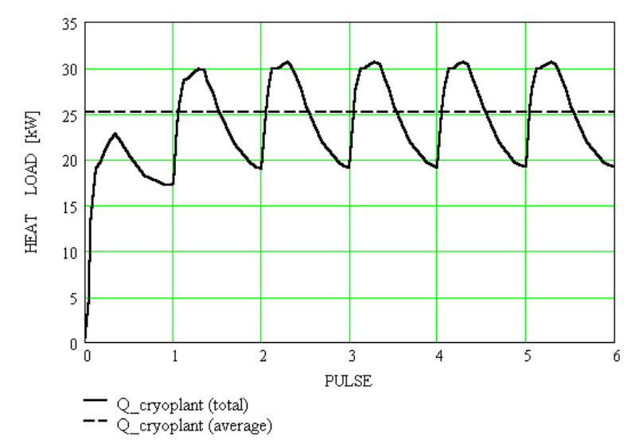

**Figure 3.2.3.1-1 Evolution of the Total Heat Load from the TF Winding Packs, their Cases and Circulating Pumps for No Active Cooling Control** 

N 34 GR 29 00-12-22 F 1 

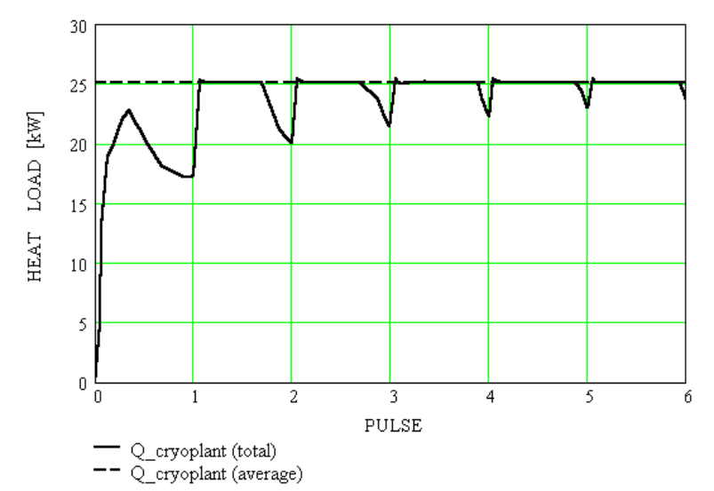

**Figure 3.2.3.1-2 Evolution of the Total Heat Load from the TF Winding Packs, their Cases and Circulating Pumps for Active Cooling Control** 

on the LHe plant varies during each plasma pulse from 20 kW to 30 kW, if there is no active cooling control.  Figure 3.2.3.1-2 illustrates that practically a constant heat load of 25 kW is maintained on the LHe plant for the active cooling control after the third plasma pulse. 

## 3.2.3.2 Cool-Down of the ITER Machine from 300K to 4.5K 

The cool-down scenario of the ITER machine is mainly determined by cool-down of the magnet system.  The cool-down is subdivided in two stages, namely from 300K to 80K and from 80K to 4.5K. During the first cool-down stage, the inlet He temperature is gradually decreased at a rate of 0.4 - 0.5K per hour.  This gradual cool-down is required to limit mechanical stresses in the magnet system to acceptable values.  The gradual cool-down is provided by compressed He flow from the LHe plant. 

A transient cool-down analysis of the magnet system has shown that the most restrictive hydraulic parameters are those of the TF coils.  A temperature gradient of 40K arises along the TF conductor during cool-down at the temperature decrease rate of 0.5 K per hour.  The PF coils, the CS, the magnet structures and the 80K thermal shields will follow the same cool-down scenario as that of the TF coils, because all portions of the magnet system must be simultaneously cooled to keep them as closely as possible in thermal equilibrium. 

A special cooling scheme for the gradual decrease of the He flow temperature at the inlet of the magnet system has been developed.  This cooling scheme is based on mixing in a controlled way the warm and 80K He flows.  This cooling cycle, in which the He flowing out of the coils returns to the heat exchanger of the LHe plant, and cold N2 vapour returns to the LN2 subsystem, allows operation of the LN2 subsystem in the most effective refrigeration mode.  The cooling capacity of the installed LN2 subsystem can thereby be maximised.  The 

total refrigerating capacity of the LN2 subsystem for the cool-down of the magnet system, together with the thermal shields and gravity supports is 900 kW, as shown in TableÊ3.2.1.2-1.  It is expected that the duration of the first cool-down stage of the ITER machine will not exceed 20 days. 

Supercritical He is used during the second stage of cool-down from 80K to 4.5K.  The return cold He gas at gradually decreasing temperature can be recycled to the LHe plant cold boxes to reduce LN2 consumption during this cool-down stage.  Cold valves are incorporated in the LHe cold boxes to return He flow to the heat exchangers at the requisite temperature level. With this cool-down technique, the LN2 consumption will be the same as that for the nominal operation of the LHe modules at 4.5K.  It is expected that the duration of the second cooldown stage will not exceed 7 days. 

A procedure that is the reverse of cool-down is expected for the warm-up of the ITER machine.  The gradual temperature increase of 0.5K per hour is maintained for warm-up from 80K to 310K.  The heaters (see Figure 3.2.1.1-1) are incorporated in the cryoplant for final warm-up of the magnet system to 310K before opening the cryostat. 

## 3.2.3.3 Helium Exhaust to the Cold Quench Tank during Fast Energy Discharge 

A large energy of approximately 5 GJ will be deposited inside the radial plates of the 18 TF winding packs and the 18 TF coil cases during a fast TF coil discharge.  This energy deposition has a transient nature and results in a temperature increase of the radial plates and TF coil cases from 4.5K to approximately 50K in 15 s.  Due to the high temperature rise the He inventory of 40 m[3] and 12 m[3] will be expelled from the 18 TF coil winding packs and their cases respectively. 

To avoid loss of a large quantity of He to the atmosphere, a cold quench tank of 700 m[3] is incorporated in the ITER cryoplant.  This tank has active cooling at 80K.  The cold tank is installed at a distance of 60 m from the tokamak building and connected with the magnet system through a system of half-ring shaped manifolds and long He quench lines. 

The VINCENTA code v.4.2 (see 3.2.3.1) has been used for the transient analysis of the He exhaust to the cold quench tank.  In this analysis it was assumed that the fast energy discharge appears at the end of the plasma burn phase of the fourth nominal plasma pulse. The He relief valves of the CTBs and CVBs are opened when the pressure is increased to 1.6 MPa at the inlet of the relief valves. 

The main purpose of this transient analysis is to quantify the required diameters of the long quench He lines.  The diameters of the quench lines should be chosen to limit He exhaust pressure to approximately 2.5 MPa in the cryogenic manifolds and He circulating pumps. 

The main results of the analysis as the follows: 

- ¥ the quench lines should be designed for expelling the maximum He flow of 140 kg/s that occurs 15 s after beginning the fast energy discharge - then He flow rate exponentially decays to zero during the next 130 s; 

- ¥ the common quench line is 60 m in length and 300 mm in diameter; 

- ¥ the diameter of each of the two parallel ring-shaped 100-m manifolds that connect the CTBs of the TF winding packs with the common quench line is 100 mm; 

- ¥ the TF case manifold that connects the CVBs of the TF coil cases with the common quench line is 150 mm in diameter and is 40 m in length; 

- ¥ the maximum He pressure inside the 18 TF winding packs is 12.0 MPa, but the maximum pressure at the inlet of the relief valves is 2.5 MPa and 2.0 MPa respectively for the TF coil cases and TF coil winding packs; 

- ¥ quench of the TF coil winding pack occurs after 12 s of the energy discharge due to active thermal contact between the ÔhotÕ radial plates and the ÔcoldÕ TF conductor.  However, this additional energy deposition does not exceed 10 % of the total energy of 5 MJ and does not practically affect the pressure rise in the quench lines. 

## 3.2.3.4 Cool-Down of the TF Coils after Fast Energy Discharge 

The TF coil fast energy discharge results in temperature increase of the TF coil winding packs and TF coil cases to 50K, and cool-down is required for restoring the operating temperature of these two components of the magnet system. 

A special cooling procedure has been developed for the cool-down of the TF coil winding packs and TF coil cases and maintaining in parallel a 4.5K stand-by for the PF coils and CS. This cool-down procedure allows maximum reduction of cool-down time and is subdivided in the following two stages: 

- ¥ cool down of the TF coil winding packs and cases from 50K to 10K - during this stage the LHe plant operates at the maximum refrigeration capacity of 72 kW; 

- ¥ filling the TF winding packs and cases with supercritical He - during this stage the LHe plant operates at the maximum liquefaction capacity of 0.2 kg/s. 

During the first stage, a part of the cooling capacity of about 20 kW is required for maintaining the PF coils and CS at 4.5 K, and 52 kW can be used for cool-down of the TF coil winding packs and TF coil cases.  The cold mass of the 18 TF coil winding packs and their cases is 1,710 t and 1,840 t respectively and 25 kW of the refrigeration capacity is available for cooling the TF coil winding packs and 27 kW for cooling the TF coil cases. 

The second cool-down stage starts, when the heat load on the LHe plant is getting lower than 72 kW, despite increasing the He flow through the TF coil winding packs and their cases.  At this cool-down stage the He stored in the cold quench tank is re-liquefied for filling the cooling channels of the TF coil winding packs of 40 m[3] and TF coil cases of 12 m[3] with supercritical He at 4.5K and 0.5 MPa.  The refrigeration capacity of 20 kW is also required for maintaining the stand-by capability of the PF coils and CS. 

Transient thermal hydraulic analysis (using VINCENTA v3.9) has been carried out to quantify the time required for cool-down of the TF coil winding packs.  The constant refrigeration heat load of 25 kW is maintained on the LHe plant and the He mass flow rate through the TF coil winding packs varies from the minimum to the maximum in such a way as to keep the constant heat load of 25 kW. 

The main results of this analysis are the following: 

- ¥ time for cool-down of the TF coil winding packs from 50K to about 10K is 28 hours; 

- ¥ 12 hours will be required to fill the TF coil winding packs of 40 m[3] with 4.5K He if the liquefaction capacity of the LHe plant is 0.1 kg/s. 

It is expected that the time for the cool-down of the TF coil cases will be the same as for the cool-down of the TF coil winding packs, because the cold masses of these two components 

are very similar.  Taking into account that there is a transition period for changing the operation of the LHe plant from the total refrigeration to the liquefaction mode, the cooldown of the TF winding packs plus the TF coil cases is expected to be 2 to 2.5 days. 

