WPPMI-CPR(17) 17578 

B Koncar et al. 

## **Heat Loads and Design Temperature Optimization of DEMO Thermal Shields** 

## Preprint of Paper to be submitted for publication in Proceeding of 13th International Symposium on Fusion Nuclear Technology (ISFNT) 

This work has been carried out within the framework of the EUROfusion Consortium and has received funding from the Euratom research and training programme 2014-2018 under grant agreement No 633053. The views and opinions expressed herein do not necessarily reflect those of the European Commission. 

This document is intended for publication in the open literature. It is made available on the clear understanding that it may not be further circulated and extracts or references may not be published prior to publication of the original when applicable, or without the consent of the Publications Officer, EUROfusion Programme Management Unit, Culham Science Centre, Abingdon, Oxon, OX14 3DB, UK or e-mail Publications.Officer@euro-fusion.org 

Enquiries about Copyright and reproduction should be addressed to the Publications Officer, EUROfusion Programme Management Unit, Culham Science Centre, Abingdon, Oxon, OX14 3DB, UK or e-mail Publications.Officer@euro-fusion.org 

The contents of this preprint and all other EUROfusion Preprints, Reports and Conference Papers are available to view online free at http://www.euro-fusionscipub.org. This site has full search facilities and e-mail alert options. In the JET specific papers the diagrams contained within the PDFs on this site are hyperlinked 

# **Heat Loads and Design Temperature Optimization of DEMO Thermal Shields** 

Boštjan Končar[a] , Martin Draksler[a] , Richard Brown[b] , Christian Bachmann[b] 

_aJožef Stefan Institute, Reactor Engineering Division bPPPT, PMU, Eurofusion_ 

The initial concept of DEMO thermal shields is analyzed, based on the static heat loads evaluation and optimization of thermal  shields  design  temperature.  Evaluation  of  heat  loads  involve  thermal  analysis  of  thermal  shields  and superconducting magnets. Thermal radiation between the surfaces and heat conduction loads due to physical contacts are considered. The influence of thermal shields temperature on the refrigeration power of the cryogenic system is analyzed. Sensitivity studies have been performed aiming to improve the efficiency of thermal shielding and reduce the total refrigeration power. The effects  of the following parameters  were analyzed: vacuum vessel operating temperature, possibility of independent cooling loops for vacuum vessel and cryostat thermal shields and inclusion of additional passive thermal radiation shields. 

Keywords: thermal shields, DEMO, heat loads, refrigeration power, temperature optimization. 

## **1. Introduction** 

The  superconducting  magnets  in  DEMO  will  be cooled by helium at about 4 K and enclosed between the hot vacuum vessel, with operational temperature of 200 oC, and the cryostat at room temperature. Thermal shields will  be  used  to  protect  the  magnet  system  from  the thermal radiation transferred from the vacuum vessel and the  cryostat.  To  effectively  reduce  thermal  radiation, thermal shields should have surfaces with low emissivity and should be actively cooled in  the temperature range between 80 K and 120 K [1][2]. 

The concept of DEMO thermal shields is analyzed and optimized, based on thermal analysis of static heat loads and  reduction  of  the  refrigeration  power  required  to actively cool the magnets and thermal shields. Analysis of static heat loads takes into account the thermal radiation between component surfaces and heat conduction losses at the  component  supports.  In  terms  of  reducing  the refrigeration power, a series of sensitivity cases have been performed  to  study  the  influence  of  vacuum  vessel temperature, thermal shields temperature optimisation and the effect of additional passive thermal shields. 

## **2. Calculation methods** 

The present study evaluates static heat loads on the thermal shields and superconducting magnets located in the interspace between the vacuum vessel and the cryostat. The  accumulated  heat  is  removed  by  active  cooling system connected to the cryogenic plant. The heat loads are calculated by analytical methods, which have been prior  validated  by  numerical  simulations  on  the  real DEMO tokamak geometry [3],[4]. Operating temperature of the thermal shields influences the heat load distribution and affects the total refrigeration power of the cryogenic system.  Optimal  temperature  of  the thermal  shields  is sought to minimize the refrigeration power. 

## **2.1 Heat load calculations** 

Steady-state  heat  loads  include  thermal  radiation exchange between the hot surfaces (vacuum vessel (VV) and  cryostat)  and  cold  surfaces  (thermal  shields  and magnets) and heat conduction losses through the various supports and attachments. 

In high vacuum conditions of the cryostat and at high temperature differences between the hot and cold component surfaces, thermal radiation represents one of the main contributions to the overall heat load. Nuclear heating is not considered in the present analysis though it may importantly affect the heat load on magnets [5]. The relative effect on thermal shields is not expected to be high. In the ITER case [6] the neutron heating contributes to about 1% of the heat load on the thermal shields. The expected influence of nuclear heating on the total heat load and consequently on the refrigeration power can be important, but it will not affect the optimal configuration and  temperature  of  thermal  shields  discussed  in  the present study. 

Thermal radiation exchange (in Watts) between the hot and cold surfaces _Ah_ and _Ac_ at temperatures _T h_ , _T c_ with surface emissivities _ε h,ε c_ , can be calculated as: 

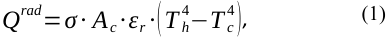

> where _σ_ is the Stefan-Boltzmann constant and _ε r_ is the relative emissivity between the surfaces. In the case of cold  magnets  shielded  by  the  vacuum  vessel  thermal shield (VVTS) and the cryostat thermal shield (CTS) at equal temperature _T h_ , the relative emissivity is defined as: 

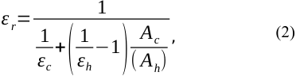

Relative emissivity can be simplified for the large, 

_________________________________________________________________________________ 

approximately similar surfaces ( _Ah_ = _A c_ ¿that are placed together at a small distance: 

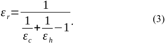

The relation (3) describes  the  relative  emissivity between the vacuum vessel and VVTS and between the cryostat and CTS. 

Heat conduction loads at the components supports and attachments are described by the Fourier law: 

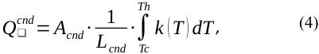

where _Acnd_ is the contact area, _Lcnd_ is the conductive length between the cold and hot component and _k_ ( _T_ ) is the temperature  dependent  thermal  conductivity of the material  [7]. Heat conduction losses occur at the VVTS and  CTS  supports.  VVTS  is  attached  directly  to  the toroidal magnet field coils (TFC), while CTS is supported from the cryostat. The highest heat conduction losses can be expected  through the gravity supports (GS), which support the heavy TFC magnets. Direct heat conduction between the cryostat pedestal ring and TFC is reduced by the thermal anchor, which removes part of the conducted heat  through  the  CTS  cooling  system [8].  Details  on individual heat load calculations are given in [9]. 

Table 1 summarizes the calculated thermal radiation and  heat  conduction  contributions  at  normal  operating conditions. It is assumed that at DEMO normal operation the vacuum vessel and superconducting magnets operate at 473 K and 4 K, respectively  [10],[11]. Both thermal shields (VVTS and CTS) are cooled to the same working temperature of 80 K. This set of boundary conditions in Table 1 denotes  the “base case”. Temperatures  of the components and heat load sources are listed in the first two columns of  Table 1, calculated heat loads on the magnets  and thermal  shields  are  collected  in  adjacent columns. It can be seen that VVTS intercepts more than 80%  of  the  total  heat  load  (912.6  kW)  owing  to the 

thermal radiation from the vacuum vessel. The heat load on the CTS is nearly five times lower (189.4 kW) with thermal  radiation  being  the  main  contributor.  Heat conduction through the gravity supports (38.4 kW) also presents a substantial portion of the total CTS heat load. Heat conduction between the thermal anchor at 80 K and TFC at 4K is the largest contributor to the total magnets heat load (~6 kW). Though the heat load on the magnets is rather low comparing to the thermal shields, it requires high refrigeration power for its removal to the ambient. Note, that DEMO thermal shielding concept is similar to the ITER one [13]. 

## **2.2 Theoretical refrigeration power** 

The  heat  intercepted  by  the  thermal  shields  and magnets  has  to  be  removed  through  the  refrigeration process.  The  minimum  theoretical  power  required  to pump the heat from a cold temperature _T c_ to the heat sink at higher ambient temperature _T amb_ (293K) can be written as follows [12]: 

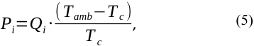

where _Pi_ and _Qi_ denote  theoretical  refrigeration power and heat load of i-th cooled component, − respectively. The ratio  ( _T amb T c_ )/ _T c_ in Eq.  (5) is the Carnot factor that defines the refrigeration cost of an ideal cooling cycle. Namely, in an ideal case a minimum 72.2 W of power would be needed to remove 1W of heat (Carnot  factor 72.2) from  the magnets at _T c_ =4K. For cooling of the thermal shields ( _T c_ =80K), merely 2.6 W would be sufficient. The total power for cooling of all components (VVTS, CTS and magnets) is defined as the sum  of  individual  refrigeration  powers  ( _Ptot_ =∑ _Pi_ ). Due  to  the  inevitable  entropy  losses,  the  refrigeration power in the real cryoplant may be up to 5 times higher than the theoretical value. The mechanical efficiency of the  cryoplant  depends  on  the  cryogenic  process  and thermo-hydraulic parameters of the cryogenic loop [12]. 

Table 1: Estimated total heat loads on magnets, VVTS and CTS due to thermal radiation and heat conduction (base case) 

_________________________________________________________________________________ 

## **3. Results and discussion** 

The heat load distributions on the magnets and thermal shields at varied thermal shields working temperatures are discussed  first.  Second,  the  sensitivity  analyses  are performed, which evaluate the effects of separate cooling of the CTS and VVTS, VV operating temperature and additional  passive  thermal  radiation  shielding  on  the refrigeration power. 

## **3.1 Heat load distributions** 

Variation  of  heat  load  distribution on the  magnets thermal shields over the range of thermal shield temperatures  is  presented  in  Fig. 1 and  Fig. 2. Other operating and boundary conditions are the same as in Table 1 (base case). Note that the analysis assumes equal temperatures of the VVTS and CTS ( _T vvt s_ = _T ct s_ ). It can be seen that the heat load contributions to the magnets in Fig. 1 increase with thermal shield temperature _T vvt s_ . For a thermal shield temperature of 100K the radiation heat load on the magnets is 3.3 kW and the heat conduction load on the magnets is around 6 kW (0.32 kW from VVTS supports and 5.6 kW from thermal anchor) which is still considered  as  reasonably  low.  The  maximum  thermal shield operating temperature is therefore recommended to be around  100K. At _T vvt s_ around  120 K the thermal radiation contribution _Qrad_ (6.7 kW) surpasses the heat conduction to the magnets. 

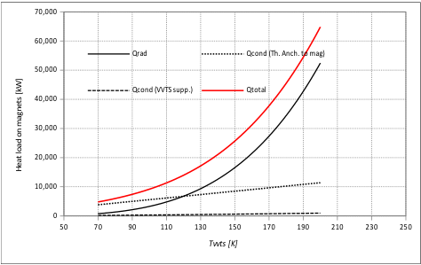

**----- Start of picture text -----** 
70,000 60,000 Qrad Qcond (Th. Anch. to mag) 50,000 Qcond (VVTS supp.) Qtotal 40,000 30,000 20,000 10,000 0 50 70 90 110 130 150 170 190 210 230 250 Tvvts [K] Heat load on magnets [kW] **----- End of picture text -----** 

Fig. 1: Heat load contributions on magnets. 

On the contrary, heat loads to the VVTS and CTS decrease moderately with rising _T vvt s_ (see Fig. 2). In general, the total heat load on VVTS and CTS  is by two orders of magnitude higher  than  the  heat  load  intercepted  by  magnets.  Thermal radiation  to  the  VVTS  represents  the  largest  heat  load contribution.  Heat  conduction  losses  due  to  thermal  shield supports and attachments represent only a smaller part of the 

total thermal shields heat load. 

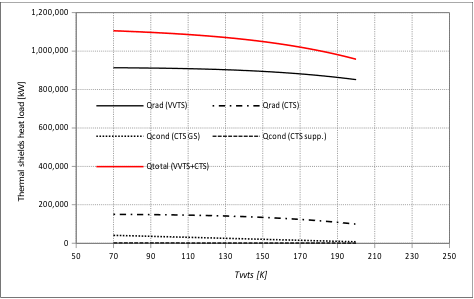

**----- Start of picture text -----** 
1,200,000 1,000,000 800,000 Qrad (VVTS) Qrad (CTS) 600,000 Qcond (CTS GS) Qcond (CTS supp.) 400,000 Qtotal (VVTS+CTS) 200,000 0 50 70 90 110 130 150 170 190 210 230 250 Tvvts [K] Thermal shields heat load [kW] **----- End of picture text -----** 

Fig. 2: Heat load contributions to thermal shields. 

## **3.2  Sensitivity  analyses  to  minimize  refrigeration power** 

Heat loads on the thermal shields and magnets have to be removed by the cryogenic system that shall provide helium cooling at different temperature levels. Considering the fixed temperature of the cooled magnets (4 K), it is very useful to found an optimal operating temperatures of VVTS ( _T vvt s_ ) and CTS ( _T ct s_ ), where the total refrigeration power _Ptot_ has a minimum value. This is an important step already at the early developmental stage of the thermal shields. Trying to reduce the total refrigeration power, parametric analyses have been performed. The considered sensitivity cases are collected in Table 2. In Cases 2 to 4, the effect of separate VVTS and  CTS  cooling  loops  is  analysed.  Different  VV operating temperatures are considered in Cases 5 and 6, whereas the Cases 1-1 to 1-4 analyse the influence of additional  passive  thermal  radiation  shields.  The  main results representing the minimum total refrigeration power _Ptot_ ( _min_ ) at optimal VVTS temperature _T vvt s_ ( _opt_ ) are listed in the last two columns of Table 2. 

The variation of refrigeration power with _T vvt s_ , for the base case scenario (Case 1 in Table 2) is shown in Fig. 3. In Case 1 equal temperatures of the VVTS and CTS ( _T vvt s_ = _T ct s_ ) are assumed.  The refrigeration power for the magnets _Pmag_ is rapidly growing with _T vvt s_ . Dashed line representing the refrigeration power of both thermal shields decreases with _T vvt s_ . As shown in Fig. 3 and in Table 2, the total refrigeration power reached its minimum at the optimal temperature _T vvt s_ ( _opt_ )=123 K. 

Table 2: Parametric cases: minimized total power at optimal VVTS temperature _T vvts_ 

_________________________________________________________________________________ 

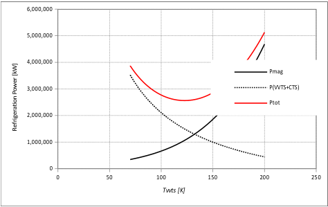

**----- Start of picture text -----** 
6,000,000 5,000,000 4,000,000 Pmag 3,000,000 P(VVTS+CTS) Ptot 2,000,000 1,000,000 0 0 50 100 150 200 250 Tvvts [K] Refrigeration Power [kW] **----- End of picture text -----** 

Fig. 3: Dependence of theoretical refrigeration power on the VVTS temperature. 

Sensitivity  analysis  of  separate  cooling  loops  for VVTS and CTS is presented in  Fig. 4. The temperature _T vvts_ is varied, while the CTS temperature _T cts_ is kept constant at values 80K, 60K and 150K for the Cases 2,3 and 4, respectively. For each of the cases the variation of _Ptot_ with _T vvts_ is shown. Comparing to the reference Case 1, _Ptot_ is reduced by a small amount (4%) only in the Case 2 ( _T cts_ = 80K). The total power is slightly higher for the other two cases. The optimum temperature _T vvt s_ ( _opt_ )is 134 K (see Table 2) for all three cases. 

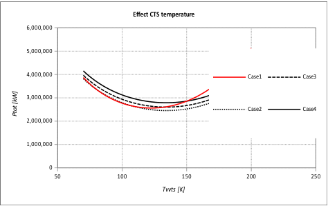

**----- Start of picture text -----** 
Effect CTS temperature 6,000,000 5,000,000 4,000,000 Case1 Case3 3,000,000 Case2 Case4 2,000,000 1,000,000 0 50 100 150 200 250 Tvvts [K] Ptot [kW] **----- End of picture text -----** 

Fig. 4: Influence of separate CTS cooling. 

To investigate a wider range of CTS temperatures the variation of minimum refrigeration power _Ptot_ ( _min_ ) with _T cts_ is shown in Fig. 5. Each point on the graph represents the optimal design point for different case. Cases listed in Table 2 are labelled on the graph. Comparison with the base Case 1 shows that separate cooling of CTS cannot significantly reduce _Ptot_ ( _min_ ), hence it does not bring any substantial benefits. 

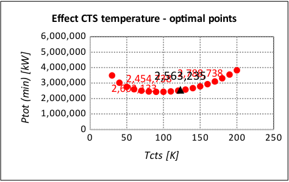

**----- Start of picture text -----** 
Effect CTS temperature - optimal points 6,000,000 5,000,000 4,000,000 3,000,000 2,454,7382,563 [2,788,738] ,235 2,602,133 2,000,000 1,000,000 0 0 50 100 150 200 250 Tcts [K] Ptot (min) [kW] **----- End of picture text -----** 

Fig.  5: Influence CTS temperature on the minimum total refrigeration power. 

_________________________________________________________________________________ 

The foreseen VV normal operation temperature of 473 K (Case 1) is beneficial as it avoids regular baking cycles as in ITER [11]. However this substantially increases the heat loads on VVTS and subsequently the total refrigeration power. The cases with lower VV operating temperature (Case 5 and 6) are compared with the base case  in Fig. 6.  Reduced  VV  temperature  significantly decreases _Ptot_ and  lowers  the  optimal  temperature _T vvt s_ ( _opt_ ). Decrease of VV temperature from 473 k to 373 K (Case 5) reduces the total refrigeration power by 35% and shifts _T vvt s_ ( _opt_ ) from 123 K to 104 K (see Table 2). 

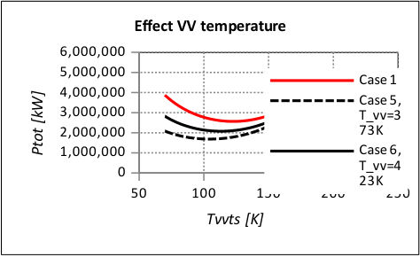

**----- Start of picture text -----** 
Effect VV temperature 6,000,000 5,000,000 Case 1 4,000,000 Case 5, 3,000,000 T_vv=3 2,000,000 73K 1,000,000 Case 6, 0 T_vv=4 23K 50 100 150 200 250 Tvvts [K] Ptot [kW] **----- End of picture text -----** 

Fig. 6: Influence of vacuum vessel operating temperature. 

The influence of additional passive thermal radiation shields is analysed in Fig. 7. In the Case 1-1 the option of having a fully passive CTS is studied. The non-cooled CTS structure is equipped with one passive Multi-LayerInsulation (MLI) package on the side facing the cryostat. The characteristics of MLI insulation are taken from [14]. One MLI package consists of 20 layers and has the same emissivity as CTS and thermal conductivity of 0.1 W/mK. Compared to the Case 1, the minimum refrigeration power 

_Ptot_ ( _min_ ) in Case 1-1 is increased by 60%, to nearly 4,000 kW. Such high increase shows that active cooling of the CTS cannot be omitted. In the Case 1-2, MLI is added on the side of actively cooled CTS. Although the _Ptot_ ( _min_ ) is reduced comparing to the Case 1, the reduction is rather small (~5%). Adding of MLI on the side of VVTS (Case 1-3) is much more effective and reduces the _Ptot_ ( _min_ ) by 35%. The optimal temperature _T vvt s_ ( _opt_ ) is lower (104 K) than in the base case (123 K). Addition of MLIs on both thermal shields (Case 1-4) further reduces the _Ptot_ ( _min_ ), but the impact of additional MLI on the CTS side is small comparing to the previous. Comparison of Cases 5 and 1- 3 in Table 2 further shows that the influence of reduced VV temperature  on the _Ptot_ ( _min_ ) is  comparable  to the effect of additional passive thermal shield on the side of VVTS. 

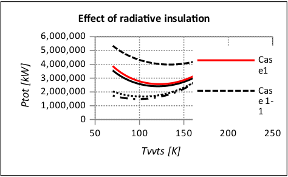

**----- Start of picture text -----** 
Effect of radiative insulation 6,000,000 5,000,000 Cas 4,000,000 e1 3,000,000 2,000,000 Cas e 1- 1,000,000 1 0 50 100 150 200 250 Tvvts [K] Ptot [kW] **----- End of picture text -----** 

Fig. 7: Influence of additional radiative insulation. 

## **4. Conclusions** 

Static heat loads on the magnets and thermal shields have been evaluated using the theoretical model. Parametric  studies  were  performed  to  optimize  the operating temperature of the thermal shields and to reduce the  refrigeration  power  of  the  cryogenic  system.  The effects  of  the  following  parameters  were  evaluated: vacuum  vessel  operating  temperature,  possibility  of independent  thermal  shields  cooling loops and passive radiative insulation on the warm side of thermal shields. Main findings are the following: 

 Thermal radiation on the VVTS presents the largest contribution to the total heat load (more than 80% at 80 K of thermal shields temperature).  It is shown that separate cooling of the CTS  and  VVTS  does  not  bring  any  substantial benefits to the reduction of refrigeration power. Equal operating temperature of the CTS and VVTS (the same cooling cycle) is therefore recommended.  The  option  with  passive  CTS  shows high increase of total refrigeration power, indicating that  active  CTS  cooling  cannot  be  omitted.  The actively cooled CTS has a small impact on the total refrigeration power. Inclusion of additional passive shield on the actively cooled CTS does not bring substantial reduction of the total refrigeration power.  Significantl reduction of the total refrigeration power can be realized by lowering the VV temperature or by additional passive shielding on the side of VVTS. The effect of additional passive thermal shield on the VVTS side is comparable to the effect of reducing the VV temperature from 473K to 373 K. The total theoretical refrigeration power of the base case (2.56 MW) is reduced by 35% in both cases,  to  approximately  1.66  MW.   The  optimal thermal  shields  temperature  in  both  recommended cases is around 100 K and is higher than in the base case (80 K). 

## **Acknowledgments** 

This work has been carried out within the framework of the EUROfusion Consortium and has received funding from the Euratom research and training programme 2014 - 2018 under grant agreement No 633053. The views and 

_________________________________________________________________________________ 

opinions expressed herein do not necessarily reflect those of the European Commission. 

## **References** 

- [1] M. Wanner et al., Monte Carlo approach to define the refrigerator capacities for JT-60SA, Fusion Eng. Des. 86 (2011) 1511-1513. 

- [2] K. Nam et al. Thermal analysis on detailed 3D models of ITER thermal shield, Fusion Eng. Des. 89 (2014) 18431847. 

- [3] B. Končar, M. Draksler, O. Costa Garrido, B. Meszaros, Thermal  radiation  analysis  of  DEMO  tokamak,  Fusion Eng. Des. (2017) In Press. 

- [4] B.  Končar,  M.  Draksler,  O.  Costa  Garrido,  I.  Vavtar, Thermal analysis of DEMO tokamak 2015, Deliverable PMI-3.2-T03-D01, Jožef Stefan Institute, 2016. 

- [5] M. Coleman, Advanced definition of neutronic heat load density map on DEMO TF coils, Eurofusion report, July 2016. 

- [6] C. Hamlyn-Harris et al., Thermal Loads To and From the Thermal Shield, ITER report, April 2011. 

- [7] V. Barabash, Summary of Material Data For Structural Analysis of the ITER Cryostat, 2010. 

- [8] M. Coleman, Definition of the external static radiative and conductive heart loads on the TF coil casing. Eurofusion report, Sept. 2016. 

- [9] B. Končar, M. Draksler, Initial Definition of the DEMO Thermal Shields concept. PMI-6.3-T001-D001, February 2017. 

- [10] C.  Bachmann  et  al.,  Initial  DEMO  tokamak  design configuration studies. Fusion Eng Des 98-99 (2015) 14231426. 

- [11] G. Federici et al. European DEMO Design Strategy and Consequences  for  Materials.  Nuclear  Fusion  (2017)  In Press. 

- [12] T. Flynn, Cryogenic Engineering, 2nd ed., Marcel Dekker, New York, 2005. 

- [13] C.  Hamlyn-Harris  et  al.,  System  Design  Description (DDD) 27 Thermal Shield, June 2014. 

- [14] M. Nagel, S. Freundt, H. Posselt, Thermal and mechanical analysis of Wendelstein 7-X thermal shield, Fusion Eng. Des. 86 (2011) 1830-1833. 

_________________________________________________________________________________ 

