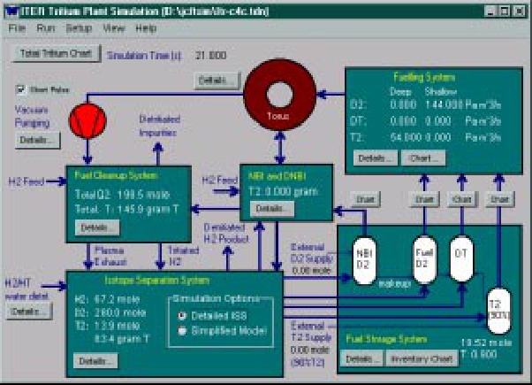
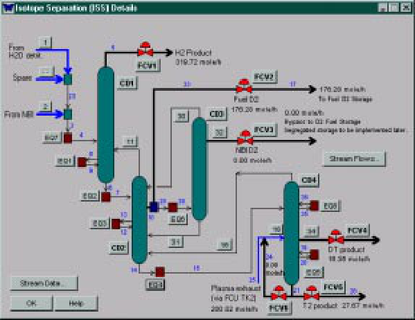
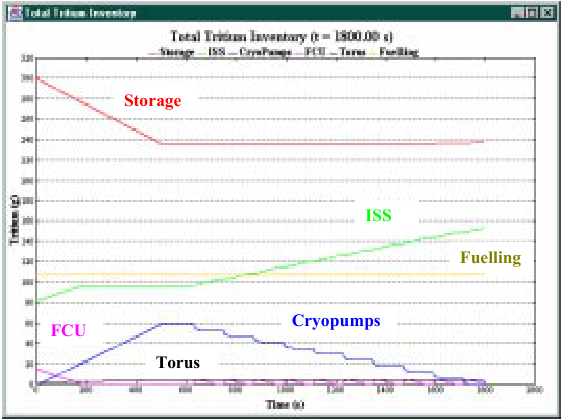

## **ITER Fuel Cycle** 

P. Ladd 1), A. Antipenkov 1), A. Busigin 2), M. Glugla 3), S. Konishi 4), D. K. Murdoch 5), M. Nishi 4), H. Yoshida 6) 

- 1) ITER, Max Planck Institut.-fŸr Plasmaphysik, Boltzmannstr. 2, 85748 Garching, Germany 

- 2) NITEK Corporation, 38 Longview CRT, London ON N6K 4J1, Canada 

- 3) Forschungszentrum Karlsruhe, Postfach 3640, D-76021 Karlsruhe, Germany 

- 4) Japan Atomic Energy Research Institute, Tokai, Naka-gun, Ibaraki, 319-1195, Japan 

- 5) EFDA-CSU, Max Planck Institut.-fŸr Plasmaphysik, Boltzmannstr. 2, 85748 Garching, Germany 

- 6) ITER, 801-1 Mukouyama, Naka-machi, Naka-gun, Ibaraki-ken, 311-0193 Japan 

## e-mail contact of main author: laddp@itereu.de 

**Abstract:** The Fuel Cycle, which includes plasma fuelling and exhaust, as well as exhaust processing and isotope separation, is one of the key elements on which the successful operation of ITER will depend. This paper provides an overview of this system, reviewing requirements, operational scenarios, and the integration of the various subsystems using the ITER fuel cycle dynamic simulation program CFTSIM. The requirements to provide a plasma fuelling rate of 200 Pam[3] s[-1] , with a flat-top burn of ~400s and a repetition rate of two pulses per hour have the greatest influence on the design. However, while a flat-top burn of ~400s is the initial design basis, the capability to extend the pulse to 3,000s in the longer term is essential from an operational perspective. 

## **1. Introduction** 

With the exception of a change in the isotopic composition of the fuelling gas the requirements for fuelling and plasma exhaust will remain unchanged as the experimental program progresses from H plasmas, through a brief D phase, before entering the final DT stage. However, this is not the case with the plasma exhaust processing and isotope separation systems (tritium plant) for which only a limited capacity is needed at the start of DD operations, with the full operational capability not being required until DT operations commence. Two basic fuelling scenarios are foreseen to provide the experimental flexibility needed. The first will use isotropic mixtures, variable from essentially 100% D2 to 100% T2, with a 50/50 DT mixture being the nominal scenario envisaged, and the second using deep fuelling with T2 pellets coupled with a strong D2 gas puff. 

To integrate the design of the various subsystems of the fuel cycle, a simulation program has been developed to study the dynamic behaviour of the overall loop. The results of these simulations provide valuable data for the sizing of components and the minimisation of the tritium inventory. Further, optimisation studies of the time-dependent behaviour of the various elements of the fuel cycle can be made for the different fuelling scenarios currently envisaged and for those which will undoubtedly evolve in the future. These studies allow particular strategies to be developed e.g. for the regeneration of the plasma exhaust pumping system and the neutral beam (NB) injectors, and the management of the fuel storage and delivery systems for inventory minimisation. Another important aspect within the overall inventory management strategy is the short term dynamics of first wall interactions and the longer term formation of co-deposited layers. As well as modelling these effects, the program has the flexibility to allow remedial wall conditioning scenarios to be studied. 

## **2. The Overall Fuel Cycle Model** 

The overall fuel cycle model consists of a number of self-contained interactive modules, which are displayed on the control panel shown in Figure 1. This panel allows specific fuel 

_**FIG. 1. CFTSIM Control Panel.**_ 

cycle elements to be selected and input data added or modified. The code operates by incrementally integrating differential equations describing every element. The torus element includes parameters that also model plasma wall interactions. The set-up menu provides the ability, to select short or long pulse operation (see section 4), set the length of the plasma burn, and to set the dwell time between pulses and the incremental time step over which each computation is made. The distribution of the total tritium within the fuel 

cycle loop at any time during the simulation can be displayed. The model for the isotope separation system (ISS) allows either a "detailed" or "simplified" model to be selected. The use of the simplified model allows scoping studies to be rapidly conducted due to the reduction in computational time. 

## **3. Plasma Fuelling** 

Plasma fuelling is provided by a combination of gas and pellet injection. Gas injection is provided at the upper and divertor port levels with four injection points uniformly distributed toroidally at each level. A total nominal flow rate of up to 200 Pam[3] s[-1] is provided with peaks to 400 Pam[3] s[-1] being available for plasma control for up to 10s several times during the pulse. Pellet injection is provided at steady-state fuelling rates up to 100 Pam[3] s[-1] for all hydrogen species, except T2, which is limited to 50 Pam[3] s[-1] . In the simulations, either gas, pellet or a combination of both fuelling methods may be selected with variable isotropic mixtures and fuelling time profiles selected for each over the burn cycle. 

## **4. Plasma Exhaust** 

Plasma exhaust is provided by six batch regenerating cryogenic pumps, which are cooled with supercritical helium. These pumps are uniformly distributed toroidally to the maximum extent possible to balance the exhaust flow from the divertor. Positioning of the inlet valve allows the pumping speed and throughput and hence plasma exhaust conditions to be regulated. At a divertor neutral pressure of 3 Pa a helium pumping speed of ~ 60 m[3] s[-1] is needed to exhaust 0.67 Pam[3] s[-1] of helium, commensurate with a fusion power of 500 MW. Cryopump regeneration is undertaken after an accumulated pulse length of 450s. This time limitation is imposed to control the hydrogen inventory within the pump and limit the deflagration 

pressure that could arise under "off-normal" conditions. For long pulse operation (>450s), four additional cryopumps are needed to allow on-line regeneration during the burn to overcome this constraint and retain pumping speed. This regeneration strategy results in ~ 5.9 mole being exhausted to the tritium plant every 170s during the 1350s dwell of short pulse operation and every 75s (the incremental cycle time, Tic) during long pulse operation when the pumping time of each pump will be 450s. The value of Tic is variable and depends upon the time needed to heat-up, exhaust the desorbed gases (hydrogen and helium) and cool down the cryopumps during regeneration. 75s has been selected as a reasonable compromise to satisfy these and other system variables. With the exception of the additional four pumps no further changes are needed to accommodate long pulse operation. 

The representation of the vacuum pumping system in CFTSIM provides the capability to model both modes of operation. The maximum inventory of each cryopump is equal to the fuelling rate times Tic, which for the parameters listed is ~6.6 mole. The total inventory within the cryopumps will also increase as the burn progresses reaching ~36 mole (18 mole T2) during long pulse operation. 

## **5. Tritium Plant** 

The major elements of the tritium plant that form part of the fuel cycle loop are the front-end permeator (FEP), used to separate hydrogen isotopes from impurities, the hydrogen isotope separation system (ISS), the fuel storage and delivery (SDS), and the impurity detritiation system (IDS) to recover tritium from tritiated impurities in the plasma exhaust prior to their release. To satisfy the requirement for long pulse operation of up to 3,000s, a throughput of 317 mole/hr will be needed in the later phases of tokamak operation. However, time averaging of the throughput does offer the opportunity to optimise the size and capacity of critical items e.g. the FEP during the early the phases of operation. For instance, the plasma exhaust may be time averaged over the nominal pulse, resulting in a throughput of about 100 mole/hr.  The buffer storage for both the plasma exhaust and fuel delivery systems must then offset the differences between real time and time averaged throughputs. A further consideration is the practicality to upgrade or  retrofit  equipment at a later date, which, in general, would be the ideal for all equipment except the ISS. Metal hydride, inter-metallic ZrCo has been selected for the fuel storage and delivery beds with the tritium inventory of each bed limited to < 100g for safety. For the nominal 450s pulse the FEP consists of two units which use Pd/Ag alloy membranes. Exhaust buffer storage is provided within the exhaust processing loop to accommodate time-averaging. The outlet stream of hydrogen isotopes passes from the plasma exhaust processing system to the ISS. These streams flow from the ISS to the fuel delivery storage beds from where the fuelling gas is stored in preparation for delivery. The products from the ISS for the 450s pulse are D2 (< 0.01% T2) for the NB injectors, and D2 (<0.7% T2) and T2 (< 10% D2) for fuelling. While the high purity D2 is intermittently stored in holding tanks, the isotropic mixtures for fuelling are stored in two dedicated ZrCo storage bed batteries in the SDS. For fuelling, the gas can be supplied as isotropic streams or blended to the required isotopic mixture to satisfy fuelling requirements. 

Either an increase in buffer storage, an increase of the time average processing rate, a change in the ISS products (DT in addition to the D2, and T2), or a combination of all of these will be required to satisfy the need for long pulse operation. Dynamic simulation is indispensable in selecting the optimum approach. CFTSIM includes three major elements that represent the tritium plant: the fuel clean-up system (FCU) which comprises the FEP and IDS, the ISS and the fuel storage system. The FCU is provided with 3 feed streams, the plasma exhaust from the regenerating cryopumps, the regenerated gas from the NB injectors and a hydrogen gas stream from water detritiation that is fed directly to the ISS. The variables of this CFTSIM 

_**FIG. 2. ISS Detailed Model.**_ 

element, include buffer storage capacity with initial isotopic composition, permeator feed rates and recovery fractions, and the limiting ISS delivery rate to column 4 from the plasma exhaust intermediate buffer tank. Variation in tank volume and isotopic composition during the pulse can be displayed. In the simplified version of the ISS model the isotope separation rates are described by first order time constants. The detailed model (figure 2) contains numerous cascading loops, inlet and outlet flow streams and control algorithms for providing 

the required product quality all of which must satisfy a dynamic mass balance. Although no gas is delivered to the ISS from the plasma exhaust during the first 450s of a pulse, a small feed stream from the IDS to column 4 results in a small product stream (D2 and T2) being produced which flows from this column to the storage beds of the SDS. As a result, the total amount of tritium (~120g) that is required during this period is supplied to the fuelling system directly from the SDS. However, for long pulses the operation of the tritium plant becomes steady state and the product streams D2, DT and T2 can supply directly the fuelling system via the SDS without the need for temporary storage. To sustain steady-state operation, make-up gas from the SDS will need to be added to compensate for the burn-up fraction and losses due to first wall interaction. With this strategy the total number of storage beds can be reduced and any problem avoided with isotopic composition of the delivery gas, due to isotope effects during loading and unloading of the storage beds. 

## **6. Other Elements of the Fuel Cycle Model** 

While not specifically a part of the fuel cycle the NB injectors need to be supplied with neutralising gas which will build up on the cryopanels and which will subsequently need to be regenerated. The flow rate to each injector during H operation is 35 Pam[3] s[-1] H2 and 13 Pa m[3] s[-] 1 D2 during D and DT operations. While the regeneration scenarios have yet to be finalised, regeneration during short pulse operation will need to be completed within ~1,200s to satisfy the pulse repetition rate, while the 3,000s pulse will require buffer storage to allow complete regeneration of the total inventory. The final scenario developed will require a fine balance between the considerable buffer storage needed to cope with the 3,000s pulse and that needed to limit the time-averaged throughput of the tritium plant. Modelling of the NB injectors 

allows the number of injectors, the neutraliser flow rate and isotopic composition to be defined, together with the throughput characteristics of the mechanical pump used for regeneration which exhausts to the buffer tank of the FCU noted above. 

The torus model of CFTSIM is used to define the He generated as a result of the DT reaction, the pressure profile within the torus, and the particle flux which results in the uptake and release of gases from the torus walls, and solved simultaneously with the wall models. These models represent the physical processes of the plasma wall interaction which result in the uptake of fuelling gases during the burn and the partial release of these gases during the dwell. For the simulation the torus wall model is divided into four separate regions representing the first wall, divertor, limiter and baffles, each of which is characterised by bulk and surface regions. Saturation, recombination and bulk diffusion are among the physical processes modelled for each of the defined zones. Three wall materials are currently described, beryllium, carbon and tungsten for which the material characteristics are derived from ongoing experiments. Dust and co-deposited layers eroded from the various wall regions are modelled separately, with dust being defined as a fraction of the total eroded material. While wall interactions have only a limited impact on the short term dynamics of the fuel cycle, longer term effects of these processes cannot be ignored since they lead to increased invessel inventories and corresponding reductions in the available inventory within the fuel cycle if not replaced. A simplified model to study the effectiveness of wall conditions on the reduction of in-vessel inventories is a recent addition to the program. The program uses input data that has been developed through ongoing experimental activities and this data will be used as a tool to study the longer term dynamics and develop the scenarios for wall conditioning intervention in order to limit the build up of in-vessel inventories. 

## **7. Conclusions** 

A brief overview of the major elements of the fuel cycle has been provided together with descriptions of the models used to describe their behaviour in the integrated dynamic simulation program CFTSIM. This program is an essential tool not only in the optimisation of the  fuel  cycle loop but in  developing  the  design  parameters  of  major  components  of  the 

**----- Start of picture text -----** 
Storage ISS Fuelling Cryopumps FCU Torus **----- End of picture text -----** 

system. It allows performance, safety and cost issues to be studied in an integrated manner for the numerous operating scenarios that need to be considered in arriving at a solution that best satisfies all requirements. The dynamic inventory of the fuel cycle as a whole and that of each subsystem can be studied. Figure 3 is a typical output from the program showing the total tritium inventory and the distribution of this inventory within the subsystems for a representative operating scenario. 

_FIG. 3. Tritium Inventory Distribution_ 

