**Layered Thermal Insulation Systems for Industrial and Commercial Applications** 

**James E. Fesmire** 

**Cryogenics Test Laboratory NASA Kennedy Space Center, FL USA NASA Tech Briefs Webinar August 26, 2015** 

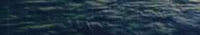

**T** he **Cryogenics Test Laboratory** of NASA Kennedy Space Center works to _-_ provide _practical solutions to low temperature problems_ while focusing _-_ on long-term technology targets for the _energy efficient_ use of cryogenics on Earth and in space. 

## Technology Focus Areas: 

- _Thermal insulation systems_ 

- _Integrated refrigeration systems_ 

- _Propellant transfer systems_ 

- _Novel components and materials_ 

- _Low-temperature applications_ 

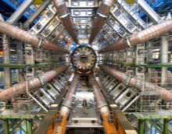

_Space launch and exploration is an energy intensive endeavor; cryogenics is an energy intensive discipline._ 

**----- Start of picture text -----** 
Abstract Layered Thermal Insulation Systems for Industrial and Commercial Applications **----- End of picture text -----** 

**F** rom the high performance arena of cryogenic equipment, several different layered thermal insulation systems have been developed for industrial and commercial applications. In addition to the proven areas in cold-work applications for piping and tanks, the new Layered Composite Insulation for Extreme Environments (LCX) has potential for broader industrial use as well as for commercial applications. The LCX technology provides a unique combination of thermal, mechanical, and weathering performance capability that is both cost-effective and enabling. 

Industry applications may include, for example, liquid nitrogen (LN2) systems for food processing, liquefied natural gas (LNG) systems for transportation or power, and chilled water cooling facilities. Example commercial applications may include commercial/residential building construction, hot water piping, HVAC systems, refrigerated trucks, cold chain shipping containers, and a various consumer products. The LCX system is highly tailorable to the end-use application and can be pre-fabricated or field assembled as needed. Product forms of LCX include rigid sheets, semi-flexible sheets, cylindrical clam-shells, removable covers, or flexible strips for wrapping. 

With increasing system control and reliability requirements as well as demands for higher energy efficiencies, thermal insulation in harsh environments is a growing challenge. The LCX technology grew out of solving problems in the insulation of mechanically complex cryogenic systems that must operate in outdoor, humid conditions. Insulation for cold work includes equipment for everything from liquid helium to chilled water. And in the middle are systems for LNG, LN2, liquid oxygen (LO2), liquid hydrogen (LH2) that must operate in the ambient environment. Different LCX systems have been demonstrated for sub-ambient conditions but are capable of moderately high temperature applications as well. 

**----- Start of picture text -----** 
Goals Layered Thermal Insulation Systems for Industrial and Commercial Applications **----- End of picture text -----** 

- Overview of common insulation materials & requirements. 

- Provide basic understanding of total heat flow through layered thermal insulation systems. 

- Explain three primary performance ranges and their environments: High Vacuum, Soft Vacuum, and No Vacuum. 

- Briefly describe three types of layered insulation systems: 

   - Multilayer Insulation (MLI), 

   - Layered Composite Insulation (LCI), and 

   - Layered Composite Extreme (LCX). 

- Examine LCX design, thermal properties, and mechanical performance. 

- . 

- Show LCX installation practices and examples of field applications 

**I.** 

## **Common Insulation Materials & Requirements** 

**----- Start of picture text -----** 
Thermal Insulation System Requirements **----- End of picture text -----** 

- Often, thermal insulation is an afterthought or something that will be dealt with later in the design process. 

- Some level of thermal isolation is needed for the working fluid: chilled water, cold air, Freon, CO2, LO2, LN2, LNG (or LCH4), LH2, or LHe, etc. 

- Thermal isolation is needed for system control, safety, reliability, and/or energy efficiency and preservation of the cryogen. 

- High complexity in most space launch vehicles, facilities, propulsion test stands. Challenges are increased multifold for: 

   - Mechanical/vibration loads, 

   - Weathering/ascent pressure environments, 

   - Accessibility/maintenance. 

- Also: thermal insulation system must be lightweight and meet a wide range of fire, compatibility, outgassing, and other physical and chemical requirements. 

   - High thermal performance is important but usually not at the top of the list! 

**----- Start of picture text -----** 
Which thermal insulation system is best? **----- End of picture text -----** 

- Thermal insulation provides: 

   - energy savings over time, 

   - system control, 

   - and/or process safety. 

- Which thermal insulation system is best? It depends on the operational environment, mechanical design, and insulation materials. 

- Economic objectives underscore the technical approach: _thermal_ . 

- _performance must justify the cost_ 

- • Vacuum or No Vacuum, that is the (first) question. 

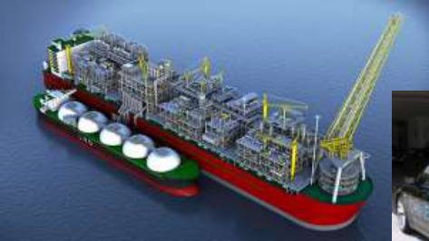

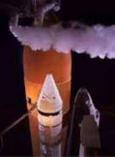

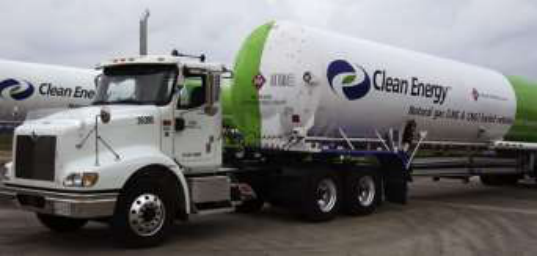

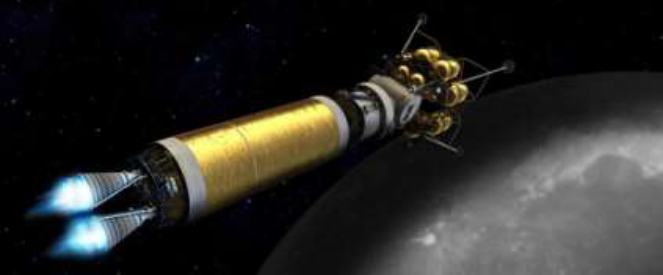

**----- Start of picture text -----** 
The 1 [st] question **----- End of picture text -----** 

## **st** • Vacuum or No Vacuum, that is the **1** question: 

## – Vacuum or Vacuum-Jacketed (VJ)? 

- How high a vacuum? 

- Vacuum monitoring? 

- What about degraded vacuum over time? 

- What about catastrophic loss of vacuum? 

## – No Vacuum (NV)? 

- Ambient pressure? 

- Air or other gas? 

- Humidity level? 

- Still air or convection? 

**----- Start of picture text -----** 
The 2 [nd] question **----- End of picture text -----** 

## • Environment, that is the **2[nd]** question: 

– Pressure and gas composition 

- Hot side temperature range? 

- Cold side temperature range? 

- What is the heat load or heat flux target? 

**----- Start of picture text -----** 
The 3 [rd] question **----- End of picture text -----** 

- Installation **3[rd]** , that is the question: 

   - What are the size & weight constraints? 

   - How will be materials be installed? 

   - If VJ, what are the leak testing, vacuum monitoring, outgassing, vacuum pumping, and vacuum retention protocols? 

   - If NV, will materials be exposed to the weather? 

**----- Start of picture text -----** 
Insulating the Somewhat Practical **----- End of picture text -----** 

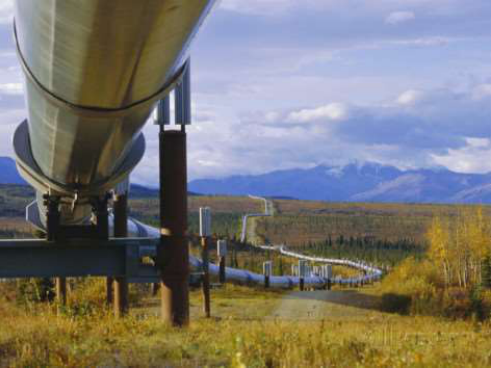

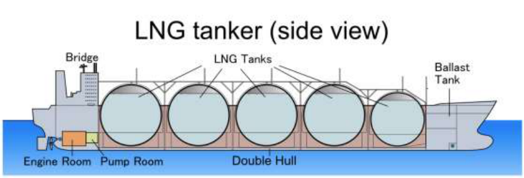

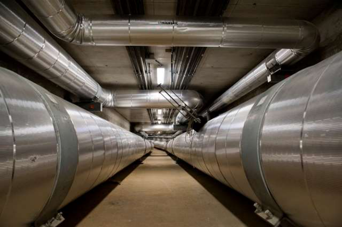

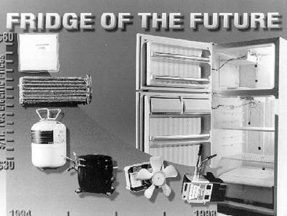

**----- Start of picture text -----** 
Insulating the Somewhat Impossible **----- End of picture text -----** 

- Insulation as an afterthought. 

- Insulation as a “bolt-on” element. 

- Insulation as a material. 

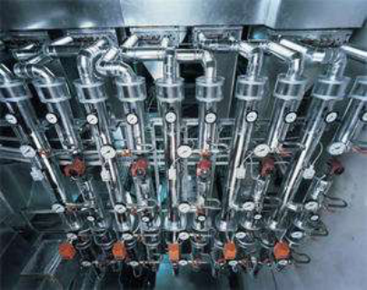

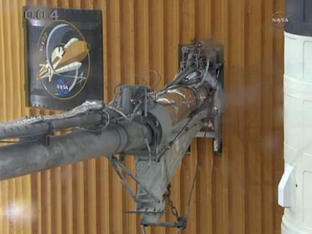

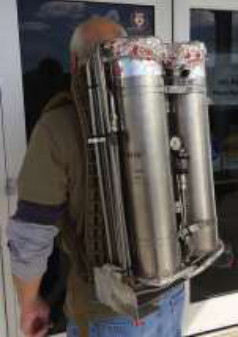

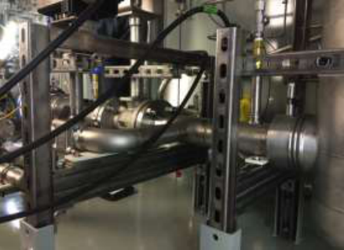

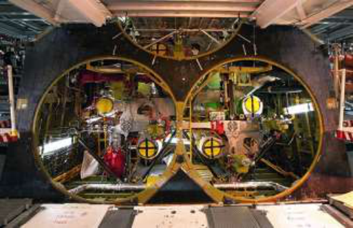

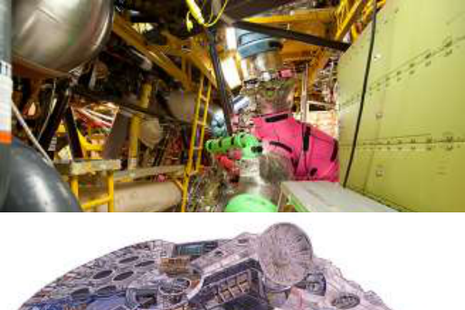

**----- Start of picture text -----** 
Some Common Thermal Insulation Materials **----- End of picture text -----** 

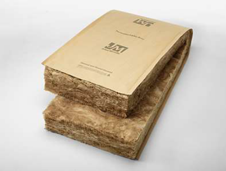

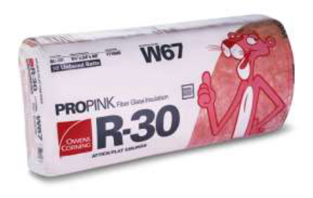

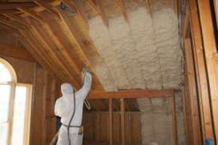

Fiberglass Batt by Johns Manville 

Fiberglass Batt by Owens Corning 

Spray Foam by Certainteed 

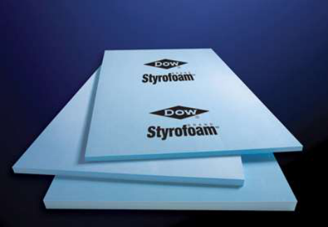

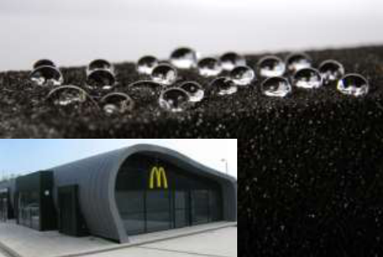

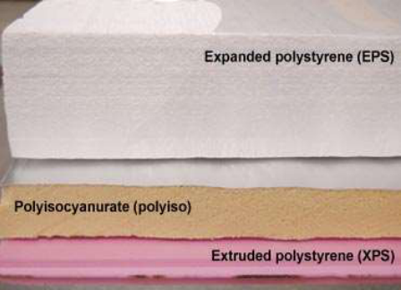

Extruded Polystrene by Dow 

Foamglas by Pittsburgh Corning 

Rigid foams: Polyiso, EPS, XPS 

**----- Start of picture text -----** 
Bulk-Fill Insulation Materials **----- End of picture text -----** 

**----- Start of picture text -----** 
10x  100x **----- End of picture text -----** 

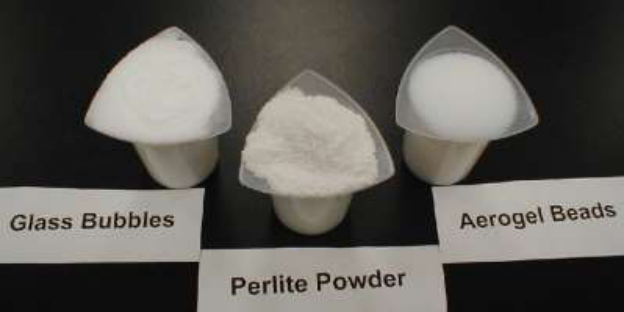

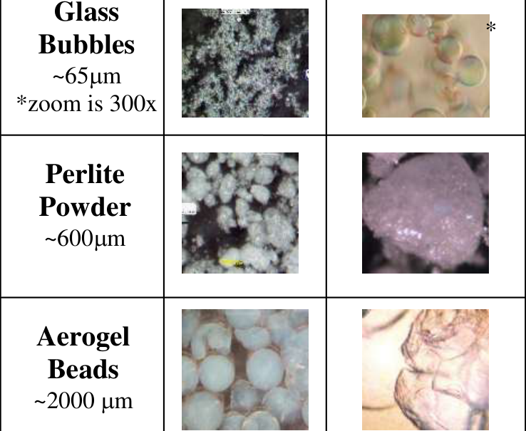

**----- Start of picture text -----** 
Glass * Bubbles ~65 m  *zoom is 300x Perlite Powder ~600 m  Aerogel Beads ~2000  m  **----- End of picture text -----** 

**----- Start of picture text -----** 
Flexible Aerogel Blanket **----- End of picture text -----** 

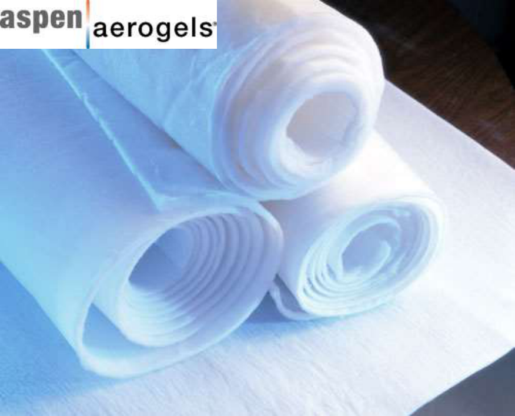

Aspen Aerogels, Inc. and NASA Kennedy Space Center 

R&D 100 – 2003 

Space Technology Hall of Fame – 2012 

**----- Start of picture text -----** 
Thermal Conductivities of Various Materials/Systems **----- End of picture text -----** 

## **THERMAL INSULATING PERFORMANCE IN K-VALUE OF VARIOUS MATERIALS** 

MLI System @ HV LCI System @ HV k-value = 20 mW/m-K Glass Bubbles @ HV Perlite Powder @ HV LCI System @ SV Aerogel Blanket LCX Polyurethane Foam Fiberglass Cellular Glass Cork Oak Board Whale Blubber Water Concrete Ice Stainless Steel Pure Copper 0.01 0.1 1 10 100 1000 10000 100000 1000000 

**Thermal Conductivity or K-value (milliWatt per meter-Kelvin)** 

**----- Start of picture text -----** 
Thermal Resistivities of Various Materials/Systems **----- End of picture text -----** 

## **THERMAL INSULATING PERFORMANCE IN R-VALUE OF VARIOUS MATERIALS** 

**- ° Thermal Resistance or R-value (hour-foot[2] F per Btu-inch)** 

**----- Start of picture text -----** 
Effective Thermal Conductivities (ke) of Cryogenic Insulation Systems **----- End of picture text -----** 

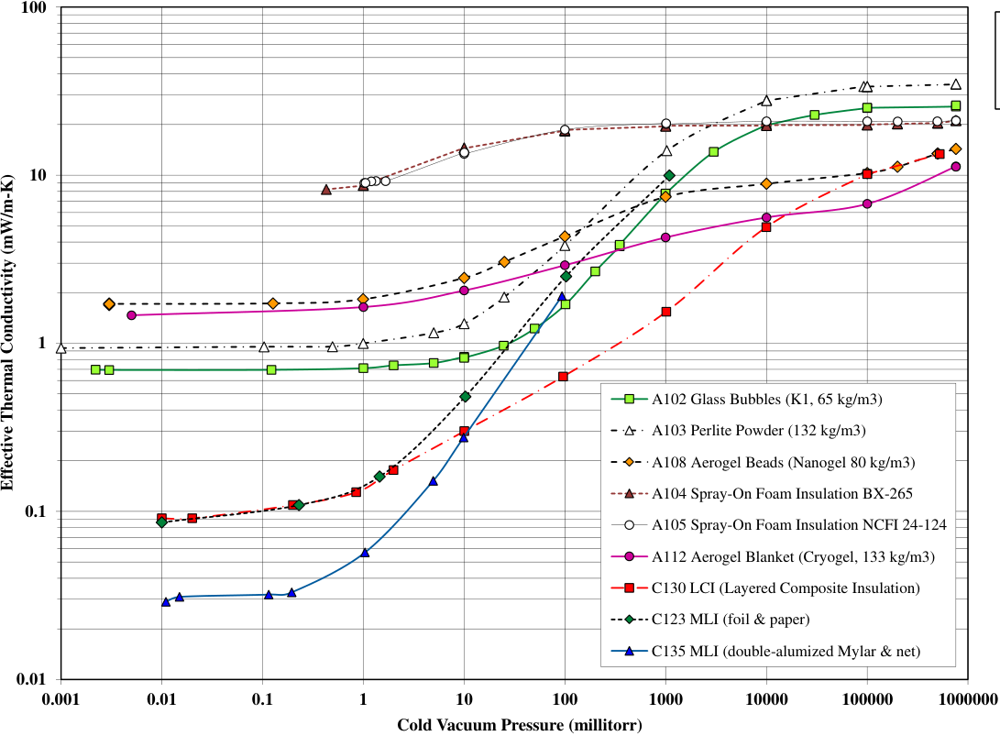

**----- Start of picture text -----** 
100 10 1 A102 Glass Bubbles (K1, 65 kg/m3) A103 Perlite Powder (132 kg/m3) A108 Aerogel Beads (Nanogel 80 kg/m3) A104 Spray-On Foam Insulation BX-265 0.1 A105 Spray-On Foam Insulation NCFI 24-124 A112 Aerogel Blanket (Cryogel, 133 kg/m3) C130 LCI (Layered Composite Insulation) C123 MLI (foil & paper) C135 MLI (double-alumized Mylar & net) 0.01 0.001 0.01 0.1 1 10 100 1000 10000 100000 1000000 Cold Vacuum Pressure (millitorr) Effective Thermal Conductivity (mW/m-K) **----- End of picture text -----** 

See ASTM C740: Cryogenic MLI Systems 

Variation of Effective Thermal Conductivity (ke) with Cold Vacuum Pressure for Different Cryogenic Thermal Insulation Materials. Boundary temperatures 78 K & 293 K; nitrogen residual gas.  [Note: 1 millitorr = 0.133 Pa] 

## **II.** 

# **Total Heat Flow Through Layered Thermal Insulation Systems** 

**----- Start of picture text -----** 
Thermal Insulation System Design **----- End of picture text -----** 

## **Heat Transfer Considerations (Full Vacuum Range)** 

- **MLI/HV:** Designed and installed right, multilayer insulation (MLI) systems can provide the ultimate in thermal insulation performance for high vacuum (HV) environments: 

   - Heat flux ( _q_ )  < 1 W/m[2] 

   - Effective thermal conductivity ( _ke_ ) < 0.1 mW/m-K (for 300 K / 77 K) 

   - _Typical layer density ~2 per mm_ 

- **LCI/SV:** Layered Composite Insulation (LCI) systems can provide the ultimate in thermal performance for soft vacuum (SV) environments: 

   - Heat flux ( _q_ )  < 20 W/m[2] 

   - Effective thermal conductivity ( _ke_ ) < 2 mW/m-K   (for 300 K / 77 K) 

   - _Typical layer density ~1 per mm_ 

- **LCX/NV:** Layered Composite Extreme (LCX) systems provide excellent, longlife thermal performance for non-vacuum (NV) environments: 

   - Heat flux ( _q_ )  < 90 W/m[2] 

   - Effective thermal conductivity ( _ke_ ) < 20 mW/m-K   (for 300 K / 77 K) 

   - _Typical layer density ~0.2 per mm_ 

**----- Start of picture text -----** 
Thermal Insulation System Design **----- End of picture text -----** 

## **Multilayer Insulation (MLI) Systems** 

- MLI systems are strictly for vacuum environments or evacuated metal jackets: 

   - At NV, comparable to the best foam insulations in heat leak but will not hold up in the ambient (wet) conditions. 

   - Long-term vacuum maintenance must be addressed as well as catastrophic loss of vacuum. 

- reflectors and . 

- Alternating layers of spacers 

   - Reflectors: aluminum foil, aluminized Mylar, etc. 

- Spacers: fiberglass paper, polyester net, polyester fabric, etc. 

- • Attachments, joints, seams, layer density, number of layers, etc. must all be carefully worked out. 

- Getter packs installation; evacuation and heating processes; …many factors to understand for an MLI system. 

- • Physics-based equation (McIntosh) addresses radiation, gaseous conduction, and solid conduction. 

Reference: ASTM C740 _Standard Practice Guide for Evacuated Reflective Insulation in Cryogenic Service, 2013._ 

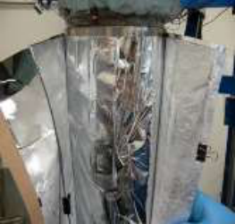

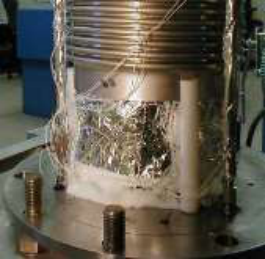

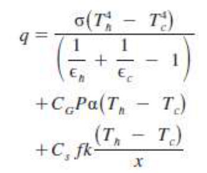

**Heat Flux Equation for MLI** 

**----- Start of picture text -----** 
Thermal Insulation System Design **----- End of picture text -----** 

## **Layered Composite Insulation (LCI) Systems** 

- Layered Composite Insulation (LCI) is designed for a soft vacuum (SV) system: 

   - Plastic or metal jacketing can be used 

   - World’s lowest thermal conductivity at ~1 torr air environments (6X better than MLI) 

   - Thermal performance benefits in case of loss of vacuum or degraded vacuum 

   - Comparable to MLI systems in high vacuum environments 

- Three-component system includes radiation shield layers, powder layers (aerogel or fumed silica), and carrier layers (non-woven fabric or fiberglass paper). 

- Benchmark MLI compared to LCI: 

   - 0.086 versus 0.091 mW/m-K at HV 

   - 10.0 versus 1.6 mW/m-K at SV 

- Aerogel composite blanket (Aspen Aerogel’s Cryogel) compared to LCI: 

   - 4.3 versus 1.6 mW/m-K at SV 

   - 11.2 versus 13.4 mW/m-K at NV 

Reference: Augustynowicz, S.D. and Fesmire, J.E., “Thermal Insulation Systems,” US Patent 6,967,051 B1 November 22, 2005. 

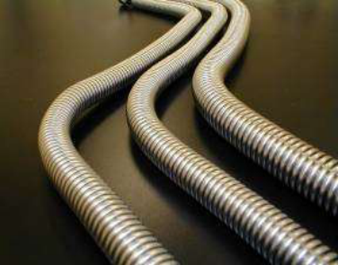

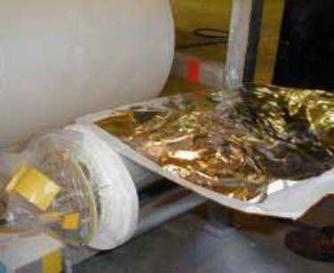

LCI production: The three components are layered by a continuous roll-wrap process. 

**----- Start of picture text -----** 
Total Heat Transfer (full vacuum range) **----- End of picture text -----** 

## _**Qtotal = Qsolid conduction + Qgaseous conduction + Qconvection + Qradiation**_ 

Heat Leakage Rate (Q), W Heat Flux (q), W/m[2] 

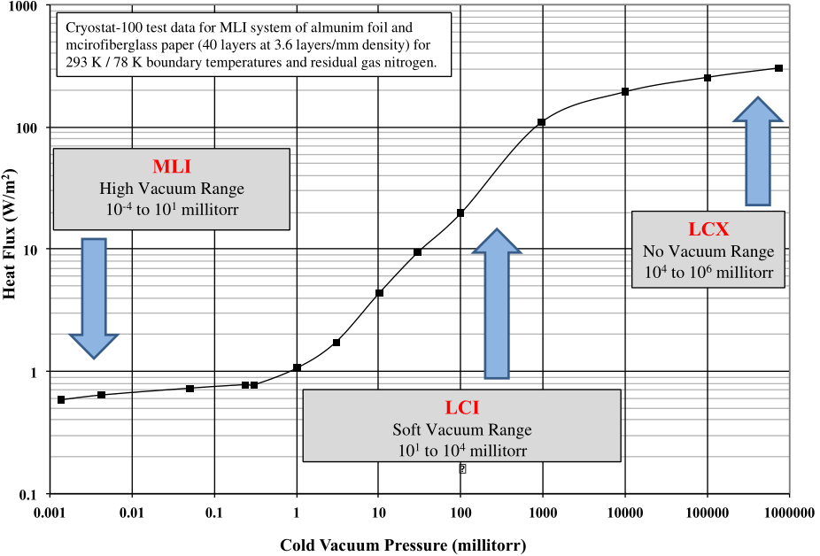

**----- Start of picture text -----** 
1000 Cryostat-100 test data for MLI system of almunim foil and mcirofiberglass paper (40 layers at 3.6 layers/mm density) for 293 K / 78 K boundary temperatures and residual gas nitrogen. 100 MLI High Vacuum Range 10-4 to 101 millitorr LCX 10  No Vacuum Range 104 to 106 millitorr 1 LCI Soft Vacuum Range 101 to 104 millitorr � 0.1 0.001  0.01  0.1  1  10  100  1000  10000  100000  1000000 Cold Vacuum Pressure (millitorr) ) 2 Heat Flux (W/m **----- End of picture text -----** 

Variation of heat flux with cold vacuum pressure for an MLI system, showing the optimum type of system for each category or range of vacuum level. 

**----- Start of picture text -----** 
Motivation for LCX **----- End of picture text -----** 

- LCX = _Layered Composite Extreme_ 

- The LCX technology builds on prior work in the areas of layered thermal insulation systems (LCI and MLI) and aerogel composite blanket development. 

- Focus = non-vacuum systems in the below-ambient environment 

- What are the top three problems with below-ambient temperature thermal insulation systems? 

   1. Moisture (dramatically degrades thermal performance) 

   2. Moisture (leads to corrosion under insulation) 

   3. Moisture (ice bridging and cracking) 

- Added to these problems are environmental degradation and mechanical damage from personnel/equipment. 

## **IV.** 

## **LCX Design Types and Configurations** 

**----- Start of picture text -----** 
LCX Design Basics **----- End of picture text -----** 

- Layered Composite Extreme (LCX) has been developed for thermal + mechanical service requirements. 

- The LCX system works using two main components: a primary insulation blanket layer and a compressible barrier blanket layer (both hydrophobic). 

- Insulation blanket layer: always the first layer (cold inner surface): – Aerogel composite blanket or flexible foam material. 

- Compressible barrier layer: always the second layer: 

   - Insulating layer, but primarily offering mechanical compliance, compressibility, and placement to enable a overall good fit-up with optimal closure of seams and gaps. 

   - May incorporate an aluminum foil layer for conforming to complex shapes or for close out around a component. 

- Overwrap layer: as required for overall system requirements: 

   - Appearance and level of permanence are key features. 

- Layer pairs are applied to comprise a stack (per the heat leak design requirements). 

- Installation: field applied or pre-fabricated per specifications for piping, tanks, or flat panels. 

**----- Start of picture text -----** 
LCX Design Considerations **----- End of picture text -----** 

- **Multifunctional Design Considerations (Thermal and Mechanical)** • Layered systems are designed to address the total heat transmission (i.e., all modes of heat transfer): 

_**Qtotal = Qsolid conduction + Qgaseous conduction + Qconvection + Qradiation**_ 

- The structural capability is enhanced by the compliance and compressibility of the two different layers of the multilayered composite working together for an easy to work and install system. 

- • Without the compressible barrier layer, gaps between thermal insulation layers will occur and allow additional convection heat transfer as well as localized areas to harbor water or other contaminants. 

**----- Start of picture text -----** 
LCX Basic Concept **----- End of picture text -----** 

- The LCX system works using two main components: an insulation blanket layer and a compressible barrier layer, working together in pairs. 

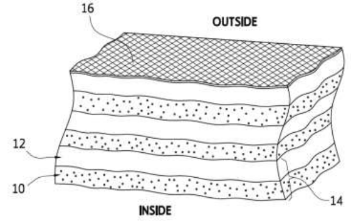

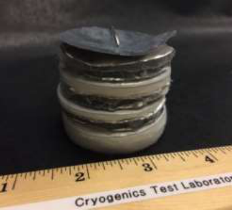

Basic concept of LCX (left) and sample construction for laboratory testing (right). 

**----- Start of picture text -----** 
LCX Design Types **----- End of picture text -----** 

- The LCX system is designed for different types of geometries and components 

- Layers are built up singularly or in pairs; pre-fabricated or field applied. 

- Each pair is an insulation blanket layer plus a compressible barrier layer. 

- The insulation blanket layer always goes first to cover the cold surface as well as possible. 

- The outermost compressible barrier layer may incorporate an aluminum foil external facing. 

- The overwrap layer can be any suitable finish based on overall system suitability and cost: aluminum foil, vinyl, shrink wrap film, etc. 

**----- Start of picture text -----** 
LCX Configurations **----- End of picture text -----** 

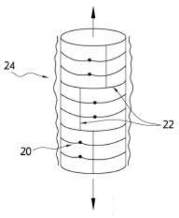

Application of LCX on vertical cylindrical tank or piping. 

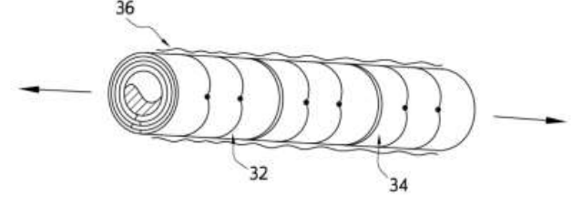

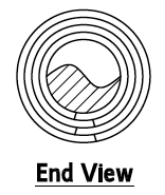

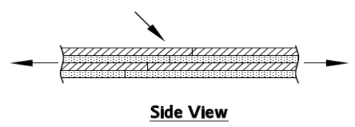

Application of LCX on vertical cylindrical tank or piping. 

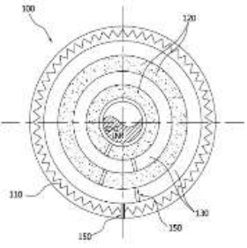

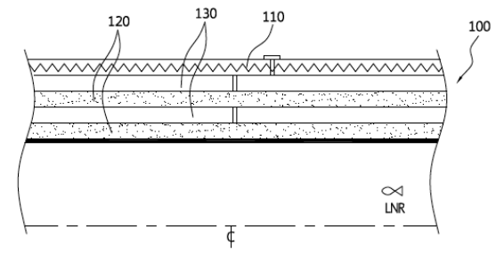

Example piping application: end view (left) and side view (right). 

**----- Start of picture text -----** 
LCX Configurations **----- End of picture text -----** 

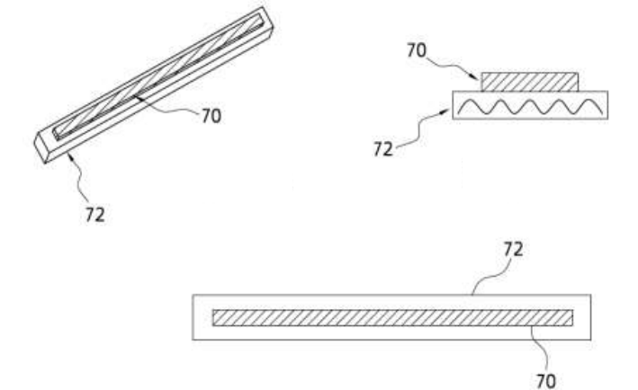

Insulation strips for small-diameter piping and tubing insulation. 

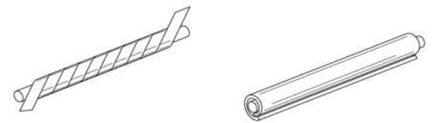

Small-diameter piping and tubing insulation wrap: spiral style (left) and cigar style (right). 

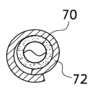

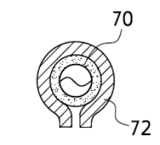

Seam closures for tubing insulation wrap: overlap style (left) and flare style (right). 

**----- Start of picture text -----** 
LCX Removable Cover Example **----- End of picture text -----** 

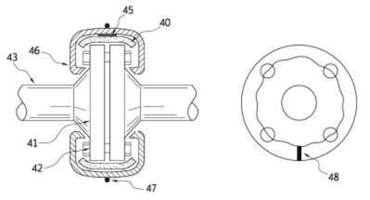

Pipe flange insulation approach. 

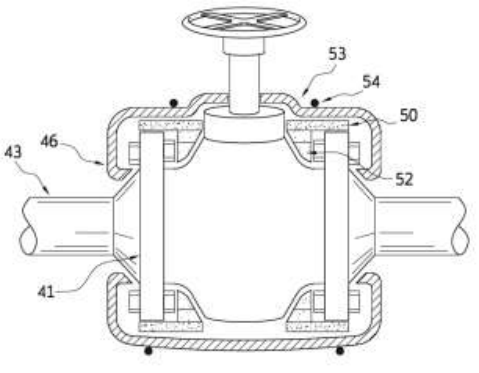

Valve flange insulation approach. 

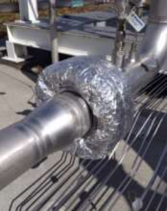

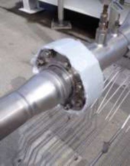

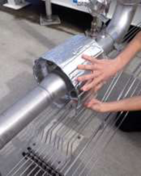

Basic installation sequence of LCX on a piping flange assembly (bolted joint). 

**----- Start of picture text -----** 
LCX Panels, Tiles, and Boxes **----- End of picture text -----** 

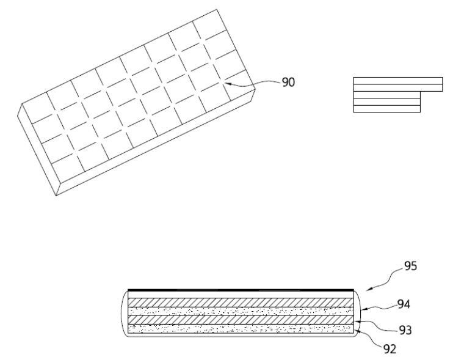

Standard panel cut into tiles for fabrication, equipment outfitting, or construction. 

Standard panel example for building construction: four layer design with face sheet. 

Boxes for refrigerated shipping of perishable or temperature sensitive products such as pharmaceuticals, food, or electronics. 

**V.** 

## **LCX Thermal/Mechanical Properties** 

**----- Start of picture text -----** 
LCX Thermal Testing and Evaluation **----- End of picture text -----** 

## **Thermal Performance Testing** 

- Five layered composite test specimens. 

- Using Cryostat-100: guarded LN2 boiloff calorimeter with a one-meter long cold mass for testing cylindrical test specimens. 

## Physical characteristics of Cryostat-100 test specimens. 

*Effective heat transfer length of Cryostat-100 = 0.580 m. 

Cryostat-100 apparatus with Lift Mechanism 

**----- Start of picture text -----** 
LCX Thermal Testing and Evaluation **----- End of picture text -----** 

The Cryostat-100 insulation test instrument provides:  Testing under representativeuse conditions.  Direct energy rate measurement by LN2 boiloff calorimetry.  Reliable testing of nonhomogenous, non-isotropic thermal insulation systems. Reference: ASTM C1774, Annex A1 

**----- Start of picture text -----** 
LCX Thermal Testing and Evaluation **----- End of picture text -----** 

**----- Start of picture text -----** 
Cryostat-100 A163 LCX C5, RP, RA, Test 2, 760 torr - 062912 18000 F1 sccm 16000 F2-A sccm F3 sccm 14000 F 12000 l o 10000 w S 8000 C C 6000 M 4000 2000 0 0 1 2 3 4 5 6 7 8 Time (hours) **----- End of picture text -----** 

Example Cryostat-100 test result per ASTM C1774, Annex A1: Variation of boiloff flow rate with time for test specimen A163 in 760 torr nitrogen (boundary temperatures of 78 K and 293 K). 

**----- Start of picture text -----** 
LCX Thermal Testing and Evaluation **----- End of picture text -----** 

## Summary of thermal performance results for Cryostat-100 testing. 

*Boundary temperatures are approximately 293 K and 78 K; ASTM C1774, Annex A1. 

**CVP = cold vacuum pressure (residual gas is nitrogen). 

**----- Start of picture text -----** 
LCX Mechanical Testing and Evaluation **----- End of picture text -----** 

## **Load – Displacement Mechanical Testing** 

- Mechanical testing of a six-layer LCX system was performed. 

- 76-mm diameter test article was comprised of the following stack-up of materials: C10, RP, C5, RP, C5, and RA (outermost layer); total thickness of 49-mm. 

- The settled thickness, and nominal test thickness, was 39-mm. 

**----- Start of picture text -----** 
20� 30� 100� 18� 90� 25� 16� 80� 14� 70� 20� 12� 60� 10� 15� 50� 8� 40� 10� 6� Displacement� 30� Run�1� 4� 20� 5� %�Compression� 2� Run�2� 10� 0� 0� 0� 0� 5� 10� 15� 20� 25� 30� 35� 40� 0� 20� 40� 60� 80� 100� 120� 140� 160� 180� 200� Compressive�Load�(kPa)� Compressive�Load�(kPa)� Displacement�(mm)� %�Compression� Displacement�(mm)� **----- End of picture text -----** 

Displacement as a function of compressive load for a six-layer LCX stack with 39 mm nominal thickness. The sample is shown to be settled after its initial compression. 

Extrapolated full-range displacement as a function of compressive load for a six-layer LCX stack with 39 mm nominal thickness. 

**----- Start of picture text -----** 
LCX Mechanical Testing and Evaluation **----- End of picture text -----** 

## **Load – Displacement Mechanical Testing** 

- The LCX system can be substantially compressed to more than 50% of its thickness, and up to approximately 75%, with full elastic recovery when the load is removed. � y � � � � � **�** 

**----- Start of picture text -----** 
� y � � � � � � 30� � 25� 20� 15� 10� 5� 0� Inial� Final� Start�Run�1�23%�Compress�Relaxed�Start�Run�2�36%�Compress�Relaxed�Start�Run�3�49%�Compress�Relaxed�Start�Run�4�62%�Compress�Relaxed�Start�Run�5�74%�Compress�Relaxed� Compression�(mm)� **----- End of picture text -----** 

Compression recovery test fixture. 

Compression loading recovery for a six-layer LCX stack with 39 mm nominal thickness. 

**----- Start of picture text -----** 
LCX Environmental Testing and Evaluation **----- End of picture text -----** 

## **Environmental Exposure and Cryopumping** 

- Water absorption tests have shown negligible mass increase even after full immersion in water (returned to within 0.1% of its initial weight after two hours ambient air drying). 

- Any condensed air is safely kept within the nanopores of the aerogel in a (non-liquid phase) physi-sorbed state. 

- Extreme exposure test (LN2 cold soak followed by water bath) showed no adverse effect and no visible change. 

Exposure test specimens of LCX six-layer stack system. 

Extreme (cryo-water) exposure test: during LN 2 soak (left); after water bath (right). 

**----- Start of picture text -----** 
LCX Testing and Evaluation – Summary **----- End of picture text -----** 

## **LCX Torture Test Video Sequence** 

## **IV.** 

## **LCX Installation and Field Applications** 

**----- Start of picture text -----** 
LCX Field Applications **----- End of picture text -----** 

Rapid Cryogenic Propellant Loading System at the KSC Cryogenics Test Laboratory 

**----- Start of picture text -----** 
LCX Field Applications **----- End of picture text -----** 

## **Cryogenic Tank** 

## • Water-draining, breathable design and installation method. 

Tank dome insulation: side view of top of vertical cylindrical tank application (top left), view of completed insulation system installed on top dome of tank (top right), and view of bottom dome of tank during installation with moisture drain/vent features (bottom). 

Vertical cylindrical cryogenic tank (7570-liter capacity) for flight tank simulation: completed LCX installation (left); during operation, fully loaded with LN2 (right). 

**----- Start of picture text -----** 
LCX Field Applications **----- End of picture text -----** 

## **Cryogenic Tank** 

- Estimated thermal performance of tank with different insulation materials/systems. 

Temperature profile of the flight tank simulator during cooldown with LN 2 from the ambient at 296 K. Layer temperatures after stabilization at 78 K were 201 K (layer 1), 239 K (layer 2), and 294 K (layer 3). 

**----- Start of picture text -----** 
LCX Field Applications **----- End of picture text -----** 

## **Cryogenic Piping** 

Completed LCX installation on the Rapid Propellant Loading System at Kennedy Space Center, showing a combination of piping, valves, pipe supports, and flanges. 

Completed LCX installation on a valve skid for a cryofuel servicing system (LCH4). 

**----- Start of picture text -----** 
Summary **----- End of picture text -----** 

- Overcoming vapor drive toward the cold side and preventing moisture accumulation inside are the major challenges of insulating complex cryogenic equipment in the ambient environment. 

- LCX technology, for non-vacuum applications, was developed to provide a practical solution for complex systems operating under dynamic, transient conditions in extreme environments. 

- Such conditions are common for aerospace vehicles, launch 

- pad facilities, and propulsion test stands and other industry applications such as LNG and LH2 cryofuels for transportation and power. 

**----- Start of picture text -----** 
Summary and Wrap-up **----- End of picture text -----** 

- Materials experimental development and testing has shown the LCX system to provide favorable mechanical + thermal properties in its integrated/layered approach: 

   - Physical resilience against damaging mechanical effects including compression, flexure, impact, vibration, and thermal expansion/contraction. 

   - Low effective thermal conductivity is achieved by managing all modes of heat transfer by combination of materials and method of installation. 

   - Long life ensured by the hydrophobic properties and compressible barrier layers in combination with moisture draining and venting features of the installed system. 

- Different LCX systems have been successfully executed for field installations of cryogenic tanks, piping, and valve control skid applications. 

_Insulating the Impossible   Ω Now Possible!_ 

**----- Start of picture text -----** 
Preservation of the Cold **----- End of picture text -----** 

**----- Start of picture text -----** 
ΔT = 500 °F LH 2 H O 2 ΔT = 500 °F **----- End of picture text -----** 

## **T hank you for your attention!** 

**----- Start of picture text -----** 
Cryogenics Test **----- End of picture text -----** 

**----- Start of picture text -----** 
NASA Kennedy Space Center, FL **----- End of picture text -----** 

**----- Start of picture text -----** 
- R1 **----- End of picture text -----** 

