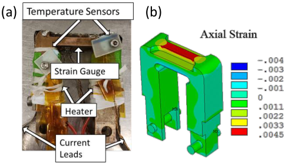
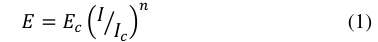
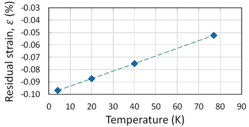
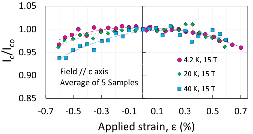
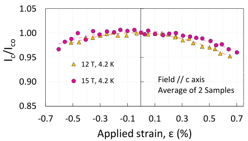

This is the author's version of an article that has been published in this journal. Changes were made to this version by the publisher prior to publication. The final version of record is available at http://dx.doi.org/10.1109/TASC.2019.2902458 

ASC18 3MPo1C-03 

## Measurements of the Strain Dependence of Critical Current of Commercial REBCO Tapes at 15 T between 4.2 and 40 K for High Field Magnets 

Federica Pierro, Mario Delgado, Luisa Chiesa, Xiaorong Wang and Soren O. Prestemon 

_**Abstract**_ **—Interest for high magnetic fields (>16 T) for applications in high energy physics (HEP) and fusion machines, requires the development of high current cables capable to withstand the large forces, mechanical and electromagnetic, experienced during manufacturing and operations. The critical current (** _**I**_ **c) of REBCO tapes depends on strain, magnetic fields and operational temperatures. Understanding how these parameters affect the** _**Ic**_ **of the conductor will be critical to develop robust high-current REBCO cables. However, there are limited reports on the strain dependence of** _**I**_ **c, in particular at high fields and elevated temperatures relevant for future high-field compact fusion reactor magnets.** 

**We present** _**I**_ **c of commercial REBCO tapes measured as a function of compressive and tensile strain (between -0.6% and +0.65%) at high magnetic fields (12 T and 15 T) and different temperatures (within 4.2 K- 40 K). Results at 4.2 K and 20 K showed less than 5% reduction in the normalized** _**I**_ **c at high strain, while a stronger strain dependence was observed at 40 K. Samples tested at 12 T and 4.2 K showed similar strain dependence as 15 T and 4.2 K. In all tested conditions, the tape experienced reversible** _**I**_ **c reduction in both tension and compression. Finite element analysis was used to predict the residual thermal strain accumulated in the REBCO layer prior of testing to account for the effect of the cooldown. A method was also developed to account for the current sharing observed between the sample and the sample holder during the ramp of the current. Our results provide useful input for the development of high-field fusion and HEP magnets using REBCO conductors.** 

_**Index Terms**_ **—High-field fusion magnets, high-temperature superconductors, strain measurement, superconducting cables, yttrium barium copper oxide.** 

## I. INTRODUCTION 

**R** EBadidate for the development of the next-generation high-2Cu3O7-x (RE=Rare Earth) tapes are a promising canfields magnets due to higher current and magnetic field capabilities compared to low-temperature superconductors (LTS). For application in fusion reactors, research on high-current REBCO cables is mainly driven by the prospect of developing magnets that can operate at either high fields and low temperatures (18-20 T, 4.2 K), or medium fields and high temperatures (12 T-15 T, 50-65 K) [1], [2]. For particle accelerators, future 

dipole magnets will need to generate magnetic fields as high as 20 T [3]. High-temperature superconducting (HTS) cables are essential for both applications. 

When operating at high magnetic fields and high currents, the effects of the large electromagnetic Lorentz loads on the conductor are of great interest. It is well known that the current carrying capability of the superconductor depends on operating temperatures, magnetic fields, and accumulated strain experienced during magnet manufacturing and operation [4]. Therefore, to develop high current cables with robust transport performance under mechanical loads, it is crucial to characterize the electro-mechanical behavior of single tapes as discussed in this work. The influence of field and temperature on the _I_ c of REBCO tapes has been studied in the past [5]-[8]. However, most research is limited at 77 K self-field [4], [8],[9] or high field and low temperatures (12 T and 4.2 K [10], and 19 T and 4.2 K [11]). Few reports on the strain dependence exist to date, especially at elevated temperatures, that are relevant for highfield fusion magnet applications. 

In this work, the influence of tensile and compressive strain on the critical current behavior of REBCO tapes (SuperPower Inc., 30 µm thick substrate and 40 µm thick copper stabilizer) is investigated at high fields (12 T and 15 T) and different temperatures ranging from 4.2 to 40 K. Finite element analysis (FEA) is used to evaluate the residual thermal strain accumulated in the REBCO layer during cooldown. Although additional experiments are necessary, the results presented here can be useful to design and optimize high-current REBCO cables for future high-field magnets for fusion and HEP applications. 

## II. EXPERIMENTAL SETUP 

## _A. U-spring Bending Device_ 

A U-shaped bending device (U-spring, shown in Fig. 1) [12] was used to apply axial strain to a REBCO tape that was soldered on the top surface of the U-spring. Up to now devices 

This work was supported by the Director, Office of Science, Office of Fusion Energy Sciences, of the US Department of Energy under Contract No. DEAC0205CH11231. _(Corresponding author: Federica Pierro.)_ 

F. Pierro and L. Chiesa are with the Mechanical Engineering Department, Tufts University, Medford, MA 02155 USA (Federica.Pierro@tufts.edu; Luisa.Chiesa@tufts.edu). 

Xiaorong Wang and Soren O. Prestemon are with Lawrence Berkeley National Laboratory, Berkeley, CA 94720-8203 USA (e-mail: xrwang@lbl.gov, soprestemon@lbl.gov). 

Color versions of one or more of the figures in this paper are available online at http://ieeexplore.ieee.org. Digital Object Identifier will be inserted here upon acceptance. 

Mario Delgado is with the Physics Department, Tufts University, Medford, Ma 02155 USA (Mario.Delgado@tufts.edu) 

Template version 8.0d, 22 August 2017. IEEE will put copyright information in this area See http://www.ieee.org/publications_standards/publications/rights/index.html for more information. 

Copyright (c) 2019 IEEE. Personal use is permitted. For any other purposes, permission must be obtained from the IEEE by emailing pubs-permissions@ieee.org. 

This is the author's version of an article that has been published in this journal. Changes were made to this version by the publisher prior to publication. The final version of record is available at http://dx.doi.org/10.1109/TASC.2019.2902458 

have been made with both Ti-6Al-4V [10] (resistivity 1.7 µΩ·m at room temperature, [13]) and Be2-Cu [4] (resistivity 0.1 µΩ·m at room temperature, [14]). Although Be2-Cu provides better solderability compared to Ti-6Al-4V, we were not allowed to acquire and machine Be2-Cu material due to safety regulation. Instead, we used Cu-Ni3-Si (UNS C70250), a copper alloy which has a good solderability and an elastic behavior within the strain range of interest. The resistivity at room temperature is about 0.05 µΩ·m [14]. The axial strain is applied through a shaft operated outside the cryostat. The shaft is connected to a gear set that applies the strain to the U-spring and the sample soldered on it. 

Strain was measured with a strain gauge mounted on the bottom side of the U-spring (Fig. 1a). The strain gauge was first calibrated without sample by mounting an additional strain gauge on the top side of the U-spring (where the sample would typically be soldered). A linear correlation was found between the two strain gauges based on the readings of both gauges at room temperature and 77 K. The linear coefficient between bottom and top gauges was determined to be  = -1.47. This relation was verified with FEA and was used to predict the mechanical strain experienced by the sample based on the reading of the bottom strain gauge. FEA was also used to confirm a uniform axial strain distribution of the Cu-Ni3-Si U-spring under tension (Fig. 1b). The temperature of the sample can be controlled by two polyamide heaters installed on the legs of the U- spring. Each heater has a maximum output power of 3.6 W. The temperature is monitored by two Cernox sensors, positioned close to the heaters and the sample respectively. A wooden cup wrapped with polyamide sheets covered the U-spring to improve the temperature stability of the sample when operating between 20 and 40 K. The position of the cup determines how much of the sample holder is covered so that the desired testing temperature can be obtained and maintained constant during the ramp of the current. 

**----- Start of picture text -----** 
(a) (b) **----- End of picture text -----** 

Fig. 1. (a) Cu-Ni3-Si U-spring with instrumentation and soldered REBCO sample. (b) Axial strain distribution on the region where the tape is soldered on the U-spring. 

The magnetic field is generated with a superconducting solenoid magnet with a bore diameter of 60 mm. The magnetic field is parallel to the _c_ axis of the tape and is maximum 15 T. 

The voltage across the U-spring was also recorded, using voltage taps on the U-spring legs, to estimate the amount of current flowing in the sample holder. 

## _B. Residual thermal strain in the REBCO layer: FEA study_ 

To prepare for the test, the sample is soldered to the holder using Pb40/Sn60 solder at 493 K. The sample, bonded to the sample holder, cools down to room temperature and cryogenic temperature (4.2 - 77 K). The mismatch between the Coefficient of Thermal Expansions (CTE) of the different layers of the tape and between the tape, solder, and the U-spring, generates residual thermal strain in the REBCO layer. It is important to quantify the residual strain so that it can be distinguished from the mechanical strain applied by the U-spring during the experiment. 

It is impossible for us to estimate the intrinsic strain of the REBCO during the tape manufacturing process (before we purchase it for our experiments), but the thermal residual strain during the test preparation can be calculated using FEA. Employing ANSYS we estimated the thermal residual strain caused by the cooldown from soldering (493 K) to test temperatures (77- 4.2 K). 

The tape was modeled using SOLSH190, an 8-node solid shell element which prescribes the tape to be a uniform volume with specified material properties of each individual layer [15]. A thin layer of solder was modelled between the tape and the U-spring, and bonded contact conditions were used. For the U- spring, thermal material proprieties of pure copper were assigned. Mechanical and thermal properties of the materials can be found in [15]-[17]. Based on the FEA results, a residual thermal strain of -0.05% was estimated for the REBCO layer prior to testing at 77 K (Fig. 2). This value agrees with the one observed experimentally (maximum _Ic_ was observed at 0.03% of strain, suggesting a residual thermal strain of -0.03%).  A residual strain of  0.01% and -0.2% is reported in literature when Ti6Al-4V [10] and  Be2-Cu [4] are used instead. Fig. 2 also shows the dependence between residual strain and temperature, which is mainly driven by the difference in the contraction rate between the U-spring (made of Cu-Ni3-Si) and the REBCO. 

The _I_ c is estimated by measuring the voltages across two sections (1 and 2 cm long) of the tape. _I_ c and _n_ value are estimated using 1 μV/cm and 10 μV/cm electric-field ( _E_ ) criteria according to (1). 

Copyright (c) 2019 IEEE. Personal use is permitted. For any other purposes, permission must be obtained from the IEEE by emailing pubs-permissions@ieee.org. 

This is the author's version of an article that has been published in this journal. Changes were made to this version by the publisher prior to publication. The final version of record is available at 

http://dx.doi.org/10.1109/TASC.2019.2902458 

## _C. Current sharing in the sample holder._ 

Current sharing was observed in the U-spring during the test. Due to the limited joint length between the sample and the current leads, some current will flow into the sample holder. 

To determine the current in the sample holder, the resistance of the U-spring was measured at: 77 K with no background field; 4.2 K, 20 K and 40 K at 15 T; and 4.2 K at 12 T. With the sample soldered to the U-spring, three voltage signals were recorded during the ramp of the current: two voltage signals for the sample (1 and 2 cm long) and one for the sample holder (mounted on the leg of the U-spring). Assuming the tape and the U-spring are electrically in parallel, the amount of current in the sample holder was calculated with the recorded voltage and the resistance of the sample holder measured at the conditions specified above. The current in the sample holder was then subtracted from the total current to determine the current in the sample. At 77 K, an _Ic_ of 146 A was determined with 25 A in the sample holder. The _I_ c obtained with this method and its strain dependence agreed with experiments performed with a different device (described in section C) validating our methodology and supporting our observation that the current in the sample holder is constant over the entire strain range for each measured sample (therefore does not affect the strain behavior of the _Ic_ of the REBCO samples). The amount of current in the sample holder does not vary with strain for a given sample, but some variation in the value of current sharing has been observed for different samples. This variation is highest for samples at 4.2 K and 15 T (Table I). 

The length of the joints between the sample and current leads has been recently identified as the cause of the observed current sharing. A new joint technique to enhance current redistribution is under development to minimize this effect. This recent finding is also supported by previous work [4]. In this case, small current sharing was observed for a bending device made of Be2Cu and was neglected. The sample was 10 cm in length (vs. 3.5 cm in our setup) greatly improving the current redistribution between joints and sample. Current sharing has not been reported in earlier tests with a Ti-6Al-4V U-spring [10] 

In the next sections, the normalized _I_ c data _(Ic/Ic0_ where _Ic0_ is the _Ic_ at zero strain value) are determined by using the total current reading from the shunt resistor (current in the sample plus current in the holder). We verified that if we use the sample 

TABLE I 

CURRENT SHARING AT 4.2 K AND 15 T 

current in the definition of _Ic/Ic0_ instead, the normalized critical current behavior vs. strain is not affected (results are within 1%). We believe this validates our measurements and methodology and supports the evidence that the current in the sample holder is constant and does not change with strain (for each given sample). 

## III. RESULTS AND DISCUSSION 

During a typical experiment, the _I_ c is measured as function of the mechanical strain applied to the U-spring. The peak of _I_ c will generally shift from 0% applied strain because of the thermal and intrinsic strains in the REBCO layer after the manufacturing process and cooldown. 

## _A. 77 K and self-field: U-spring vs tensile apparatus._ 

Critical current measurements as function of strain were performed at 77 K using the U-spring and a tensile apparatus. In the tensile apparatus, strain is measured directly on the tape using extensometers and the sample can start from a strain-free condition, because thermal contraction can be prevented by unloading the sample when necessary during the cooldown. However, this system is limited to tensile measurements only. The tensile apparatus was used to compare and validate the result obtained with the U-spring device. 

SuperPower tapes (SCS4030-AP) were tested at 77 K and self-field. A total of three samples were measured with the U- spring, while four samples were measured using the tensile apparatus. Normalized _Ic_ as function of strain is shown in Fig.3 for both test configurations. Error bars are included in the two curves to account for uncertainties generated by the instrumentation as well as the standard deviation between samples. For the U-spring, the maximum _Ic_ was observed at the applied strain of 0.03% (corresponding to 0% strain in Fig. 3 where only the mechanical strain is considered). This behavior was expected considering the residual thermal strain in the REBCO layer. This also agreed with the results of the FEA simulations, which predicted an initial compressive strain of 0.05%. 

To compare the results from the U-spring and the tensile apparatus, it is necessary to consider this residual strain so that the 

Copyright (c) 2019 IEEE. Personal use is permitted. For any other purposes, permission must be obtained from the IEEE by emailing pubs-permissions@ieee.org. 

This is the author's version of an article that has been published in this journal. Changes were made to this version by the publisher prior to publication. The final version of record is available at http://dx.doi.org/10.1109/TASC.2019.2902458 

measurements are compared starting from their strain-free configuration. In Fig.3, the curve for the U-spring measurements has been shifted so that the maximum _Ic_ corresponds to the strain free behavior. The figure shows a reasonable agreement between the two test configurations. A maximum _Ic_ of 146 A (with an additional 25 A in the sample holder) was measured for the samples with the U-spring device, while an average of 144 A was measured with the tensile apparatus. 

## _B. Ic vs temperature and strain at 15 T and 12 T_ 

The strain and temperature dependence of the _Ic_ of SuperPower tapes (SCS4030-AP) was tested in different conditions as summarized in Table II. The table shows the _I_ c and _n_ values at zero mechanical strain for different temperatures and magnetic fields. The data were averaged from all the samples measured in a particular condition. The estimated current in the sample holder is also shown. 

At 15 T the samples were tested at 4.2 K, 20 and 40 K. The results are shown in Fig. 4 (each point is the average of 5 samples). In this case, the peak of the current is not at 0% as the applied strain (x-axis) includes the thermal residual strain. Five samples have been tested at each temperature with the applied strain ranging from -0.60% to +0.65%. We defined the degradation to be reversible if the normalized _Ic_ measured after releasing the applied strain was higher than 99% [18]. Reversible strain behavior was observed in most samples. At 4.2 K, only two samples degraded irreversibly at -0.4% strain. The strain dependence also changed with the test temperature. At 4.2 and 20 K, the strain dependence was weak, while at 40 K the strain dependence was more pronounced. 

Fig. 5 compares the _Ic_ vs strain at 12 T and 15 T, both at 4.2 K. The normalized critical current as function of strain is less affected by the applied magnetic field than the test temperatures (Fig. 4). This is consistent with the results reported in [6]. All the samples presented had advanced pinning properties (7.5% Zr doping) [19]. Measurements on samples without artificial pinning (for example, Theva [20]) will be performed in the future. 

## TABLE II 

CRITICAL CURRENT AND N VALUES AT ZERO MECHANICAL STRAIN 

## IV. CONCLUSION 

Critical current dependence of mechanical strain has been studied for REBCO tapes at various temperatures between 4.2 and 40 K and magnetic fields between 12 and 15 T using a U- spring device made of Cu-Ni3-Si. Compared to other materials, 

**----- Start of picture text -----** 
1.05 1.00 0.95 4.2 K, 15 T 0.90 Field // c axis 20 K, 15 T Average of 5 Samples 40 K, 15 T 0.85 -0.7 -0.5 -0.3 -0.1 0.1 0.3 0.5 0.7 Applied strain, ε (%) co /I c I **----- End of picture text -----** 

Fig. 4. _Ic_ vs strain behavior of the SCS4030-AP tape at 4.2 K, 20 K and 40 K and 15 T. Trend lines (order 2) are used to fit the data. 

**----- Start of picture text -----** 
1.05 1.00 0.95 12 T, 4.2 K 0.90 15 T, 4.2 K Field // c axis Average of 2 Samples 0.85 -0.7 -0.5 -0.3 -0.1 0.1 0.3 0.5 0.7 Applied strain, ε (%) co /I c I **----- End of picture text -----** 

Fig. 5. _Ic_ vs strain behavior of the SCS4030-AP tape at 4.2 K and 12 T and 15 T . Trend lines (order 2) are used to fit the data. 

e.g., Ti-6Al-4V and Be2-Cu, this copper alloy demonstrated good solderability and an elastic mechanical performance suitable for the strain range of interest discussed in this work. Although a relatively high current was shared into the sample holder (up to 110 A at 4.2 K and 15 T), our results and their behavior with strain, temperature and field agreed with those obtained with a tensile device and existing data found in literature. At 15 T, the samples were tested at 4.2, 20 and 40 K. The tape maintained a reversible _Ic_ reduction as a function of applied strain up to 0.6% in both tension and compression at all tested temperatures. For the same applied strain, higher reversible _Ic_ reduction was observed at increasing temperatures. For samples tested at the same temperature (4.2 K) but at different magnetic fields (12 T and 15 T), the results suggested that the effect of magnetic field on strain dependence of the _Ic_ was minimal. All the samples considered in this work were SuperPower tapes with artificial pinning centers. 

More measurements at 4.2 K and 15 T will be necessary to assess the feasibility of using tapes with thinner substrates, thinner copper stabilizer and different REBCO thicknesses. In addition, it will be important to characterize samples from different manufacturers (with and without artificial pinning centers). The data obtained from these measurements will provide essential information for the development of high current cables for high field fusion and HEP magnets. 

## ACKNOWLEDGEMENT 

The authors would like to thank Hugh Higley and Timothy Bogdanof for their strong dedication to this project. 

Copyright (c) 2019 IEEE. Personal use is permitted. For any other purposes, permission must be obtained from the IEEE by emailing pubs-permissions@ieee.org. 

This is the author's version of an article that has been published in this journal. Changes were made to this version by the publisher prior to publication. The final version of record is available at http://dx.doi.org/10.1109/TASC.2019.2902458 

## REFERENCES 

- [1] G. Janeschitz _et al._ , "High temperature superconductors for future fusion magnet systems–status, prospects and challenges," in _21st IAEA Fusion Eng. Conf., Chengdu, China_ , 2006, vol. 16, no. 21, pp. 10-2006: Citeseer. 

- [2] B. Sorbom _et al._ , "ARC: A compact, high-field, fusion nuclear science facility and demonstration power plant with demountable magnets," _Fusion Engineering and Design,_ vol. 100, pp. 378-405, 2015. 

- [3] L. Rossi _et al._ , "The EuCARD-2 future magnets European collaboration for accelerator-quality HTS magnets," _IEEE transactions on applied superconductivity,_ vol. 25, no. 3, pp. 1-7, June 2015. 

- [4] D. C. van der Laan and J. Ekin, "Dependence of the critical current of YBa2Cu3O7− δ coated conductors on in-plane bending," _Superconductor Science and Technology,_ vol. 21, no. 11, p. 115002, 2008. 

- [5] C. Senatore, C. Barth, M. Bonura, M. Kulich, and G. Mondonico, "Field and temperature scaling of the critical current density in commercial REBCO coated conductors," _Superconductor Science and Technology,_ vol. 29, no. 1, p. 014002, 2015. 

- [6] M. Sugano, K. Shikimachi, N. Hirano, and S. Nagaya, "The reversible strain effect on critical current over a wide range of temperatures and magnetic fields for YBCO coated conductors," _Superconductor Science and Technology,_ vol. 23, no. 8, p. 085013, 2010. 

- [7] G. De Marzi, G. Celentano, A. Augieri, L. Muzzi, G. Tomassetti, and A. della Corte, "Characterization of the critical current capabilities of commercial REBCO coated conductors for an HTS cable-in-conduit conductor," _IEEE Transactions on Applied Superconductivity,_ vol. 25, no. 3, pp. 1-4, June 2015. 

- [8] V. Lombardo, E. Barzi, D. Turrioni, and A. Zlobin, "Critical current of YBa2Cu3O7 Tapes and Bi2Sr2CaCu2Ox Wires at Different Temperatures and Magnetic Fields," _IEEE Transactions on Applied Superconductivity,_ vol. 21, no. 3, pp. 3247-3250, 2011. 

- [9] N. Cheggour, J. Ekin, Y.-Y. Xie, V. Selvamanickam, C. Thieme, and D. Verebelyi, "Enhancement of the irreversible axial-strain limit of Y-BaCu-O-coated conductors with the addition of a Cu layer," _Applied Physics Letters,_ vol. 87, no. 21, p. 212505, 2005. 

- [10] C. Zhou, K. Yagotintsev, P. Gao, T. Haugan, D. van Der Laan, and A. Nijhuis, "Critical current of various REBCO tapes under uniaxial strain," _IEEE transactions on applied superconductivity,_ vol. 26, no. 4, pp. 1-4, June 2016. 

- [11] C. Barth, G. Mondonico, and C. Senatore, "Electro-mechanical properties of REBCO coated conductors from various industrial manufacturers at 77 K, self-field and 4.2 K, 19 T," _Superconductor Science and Technology,_ vol. 28, no. 4, p. 045011, 2015. 

- [12] A. Godeke _et al._ , "A device to investigate the axial strain dependence of the critical current density in superconductors," _Review of scientific instruments,_ vol. 75, no. 12, pp. 5112-5118, 2004. 

- [13] _Conductivity and Resistivity Values for Titanium & Alloys._ [On- line] Available: https://www.ndeed.org/GeneralResources/MaterialProperties/ET/Conductivity_Ti.pdf. Accessed on February 2019. 

- [14] _Conductivity and Resistivity Values for Copper & Alloys._ [On- line] Available: https://www.ndeed.org/GeneralResources/MaterialProperties/ET/Conductivity_Copper.p df. Accessed on February 2019. 

- [15] N. Allen, L. Chiesa, and M. Takayasu, "Structural modeling of HTS tapes and cables," _Cryogenics,_ vol. 80, pp. 405-418, 2016. 

- [16] J. Ekin, _Experimental techniques for low-temperature measurements: cryostat design, material properties and superconductor critical-current testing_ . Oxford university press, 2006. 

- [17] N. J. D. Simon, E. S.; Reed, R. P. , _Properties of Copper and Copper Alloys at Cryogenic Temperatures_ . U.S. Government Printing Office, 1992. 

- [18] K. Osamura, S. Machiya, and G. Nishijima, "Reversible stress and strain limits of the critical current of practical REBCO and BSCCO wires," _Superconductor Science and Technology,_ vol. 29, no. 9, p. 094003, 2016. 

- [19] D. W. Hazelton. _Superpower 2G HTS._ [On- line] Available: http://www.superpower-inc.com/system/files/WAMHTS1.pdf. Accessed on January 2019. 

- [20] _Theva Pro-Line_ . [On- line]. Available: https://www.theva.com/products/. Accessed on  January 2019. 

Copyright (c) 2019 IEEE. Personal use is permitted. For any other purposes, permission must be obtained from the IEEE by emailing pubs-permissions@ieee.org. 

