**----- Start of picture text -----** 
(617) 452-2660 canes@mit.edu canes.mit.edu Center for  Advanced Nuclear Energy Systems Massachusetts Institute of Technology 77 Massachusetts Avenue, 24-215  Cambridge, MA 02139-4307 **----- End of picture text -----** 

## Advanced Nuclear Power Program 

**Capital Cost Evaluation of Advanced Water-Cooled Reactor Designs With Consideration of Uncertainty and Risk** 

## **W. Robb Stewart and Koroush Shirvan** 

John Clark Harwick (1986) Carrer Development Professor Department of Nulcear Science and Engineering 

MIT-ANP-TR-194 June 2022 

## **Capital Cost Evaluation of Advanced Water-Cooled Reactor Designs With Consideration of Uncertainty and Risk** 

Graduate Student: W. Robb Stewart Department of Nuclear Science and Engineering 

Principal Investigator: Koroush Shirvan John Clark Hardwick (1986) Career Development Professor Department of Nuclear Science and Engineering 

Final Report – CANES ANP-TR-194 

June 2022 

## **Acknowledgements** 

This work to create an open-source nuclear cost construction estimate tool available on GitHub [https://github.com/mit-crpg/TIMCAT] has been primarily supported by Fortum, www.fortum.com. 

Partial financial support by Department of Energy: Nuclear Energy University Program (DOENE0008989), ARC-20 (DE-NE0009049) and ARPA-E (DEAR0000978) and by Électricité De France (EDF) is also acknowledged. 

Comments and feedback by Prof. Jacopo Buongiorno, Dr. Jeremy Gregory and Prof. Olivier L de Weck on this report were appreciated. 

## **Abstract** 

Decarbonization incentives present an enormous market opportunity for the nuclear industry. To stay within the 1.5°C limit by 2050, across a range of scenarios, the IPCC forecasted a 2.5x average increase in global nuclear generation. High capital costs and the risk of overruns and delays may prevent the industry from realizing this new potential. Recent nuclear projects in the U.S. and Europe have averaged cost overruns more than 2x the original estimate. However, new suites of reactor architectures are under development, and they may solve some or all elements of the cost problem. These new architectures leverage modularization, intra-plant learning rates, passive safety, advanced construction, and advanced manufacturing in their endeavor to lower capital costs. This thesis systematically analyzes the cost saving potential of each of these strategies for eight unique reactor architectures. The aim was to understand which architectures and strategies have the greatest potential to reduce cost and risk to cost overruns, and then, apply that understanding to help utilities, policymakers, and other stakeholders in investment decision making and long-term planning. 

Total capital costs include direct costs, indirect costs, and financing costs, each based on several uncertain parameters and processes. The first section of this thesis presents a bottom-up methodology for estimating direct and indirect costs of nuclear plants to estimate an overnight cost that does not include the construction schedule and its impact on cost. The method scaled a set of reference costs from the Economic Energy Data Base for nuclear projects. The methodology featured novel components and technologies, such as standalone steel containments, e-beam welded vessels, steel plate composites, and structural and system modules. Of these technologies, advanced construction techniques such as steel plate composites were not effective in reducing the overnight direct costs, but advanced vessel manufacturing technologies were highly impactful especially for small- and multi-module architectures with heavy use of steel vessels with cost reduction up to 9% of overnight cost. Passive safety systems usually required new, expensive structures that offset the cost reduction in other systems including electrical and safeguards systems. Modularization did not substantively reduce the overnight construction costs, but it increased the impact of learning-by-doing for sequentially deployed plants. Learning-bydoing was one of the most effective cost reduction strategies, reducing capital costs 30-45%. 

The second section of this thesis presents a methodology to estimate the construction duration of a reactor architecture given the specific shape factor constraints to that architecture, local labor supply, and set of site activities and ordered dependencies. Interest accrued during construction is significant for nuclear projects because they have very long construction durations. Large reactor architectures were very sensitive to the local labor market conditions and experienced long delays when the labor pool was insufficient. Small reactors were more robust to labor conditions. Both large and small architectures can, in theory, deliver projects in 30-40 months depending on the level of structural modularization. Modularization can dramatically reduce the construction duration and associated financing costs for both large and small reactors 65-75% which was 15-25% of all total costs. 

Capital cost estimation is a highly uncertain process, particularly for nuclear projects, and the literature contains conflicting guidelines for scaling the costs of certain components. Further, the proposed modularization, learning, and indirect cost models built are subject to much uncertainty as well. The third section of this thesis quantified the uncertainty of the overnight cost estimates. Indirect costs were a significant source of uncertainty for all reactor architectures. Learning-by-doing cost reductions were also a large contributor to uncertainty for all architectures but especially the multi-module plants where there was intra-plant learning. Input data, specifically commodity volumes such as concrete and steel, were a large source of uncertainty as well. Typical first-of-a-kind costs had +/- 10% uncertainty at the 95% confidence interval, and +/20% for 10[th] -OAK projects. 

The final section reviews the specific construction delay drivers for the Vogtle Units 3 & 4 project. This case study provided input data for supply chain delay and change order risks. Human error risks were also modeled using data from other large megaprojects. Change order and human error risk were the dominant drivers of construction delays, with supply chain delays having a small effect. Most of the cost and schedule risk were mitigated after the first of a kind project. Smaller projects were not immune to the construction schedule risks and delays seen in large nuclear projects, but they were able to overcome the risks with a smaller absolute cost project. Therefore, for equal size capacity deployments (i.e. several small reactors vs. fewer large reactors), smaller reactor architectures had narrower cost distributions and lower risk to cost overrun. Smaller reactor cost escalation extended 10-11% ($700-800/kWe) above the median cost overrun, but larger reactor escalations extended 16-24% ($1,100-2,200/kWe) above the median cost overrun. However, these lower risks did not usually translate to lower median costs. By providing cost and risk to cost overrun estimates for the leading nuclear power plant architectures, this thesis work can better inform the utilities and policy makers on economics of nuclear energy and most effective technological pathways to improve its attractiveness. 

## **CANES PUBLICATIONS** 

Topical and progress reports are published under seven series: 

Advances in Nuclear Energy Disciplines (ANED) Series Advanced Nuclear Power Technology (ANP) Series Nuclear Fuel Cycle Technology and Policy (NFC) Series Nuclear Systems Enhanced Performance (NSP) Series MIT Reactor Redesign (MITRR) Series Nuclear Energy and Sustainability (NES) Series Nuclear Space Applications (NSA) Series 

Please visit our website (mit.edu/canes/) to view more publication lists. 

- MIT-ANP-TR-193 K. Shirvan (MIT), **Overnight Capital Cost of the Next AP1000** (March 2022). MIT-ANP-TR-192 R. MacDonald and J. Parsons (MIT), **The Value of Nuclear Microreactors in Providing Heat and Electricity to Alaskan Communities** (October 2021). 

- MIT-ANP-TR-191 C. W. Forsberg (MIT) and A. W. Foss (INL), **Markets and Economic Requirements for Fission Batteries and Other Nuclear Systems** (March 2021). 

- MIT-ANP-TR-190 J. Buongiorno (MIT), **An Economic Evaluation of Micro-Reactors for the State of Washington** (January 2021). 

- MIT-ANP-TR-189 C. W. Forsberg (MIT), P. Sabharwall (INL)and A. Sowder (EPRI), **Separating Nuclear Reactors from the Power Block with Heat Storage:** A New Power Plant Design Paradigm (November 2020). 

- MIT-ANP-TR-188 X. Zhao and M. Golay, **Symptom-Based Conditional Failure Probability Estimation for Selected Structures, Systems, and Components:** Minor Milestone Report: Project on Design of Risk-Informed Autonomous Operation for Advanced Reactors DOE/EXT- DE-NE0008873 Project number: 19-17435 (July 2020). 

- MIT-ANP-TR-187 J. Buongiorno, K. Shirvan, E. Baglietto, C. Forsberg, M. Driscoll, W. Robb Stewart, Enrique Velez-Lopez (MIT), H. Einstein (Civil & Environmental Engineering), Iain Macdonald (ArtEZ), Kennard Johnston (Morgan State Univ.) and Go Hashimoto (Univ. of Tokyo), **Japan’s Next Nuclear Energy System (JNext)** (March 2020). 

- MIT-ANP-TR-186 Y. Cai and M. W. Golay, **A Framework for Analyzing Nuclear Power Multiunit Accident Scenarios and Providing Accident Mitigation and Site Improvement Suggestions** (September 2019). 

- MIT-ANP-TR-185 C. W. Forsberg (MIT), P. Sabharwall and H. D. Gougar (INL), **Heat Storage Coupled to Generation IV Reactors for Variable Electricity from Base-load Reactors: Changing Markets, Technology, Nuclear-Renewables Integration and** 

**Synergisms with Solar Thermal Power Systems** INL/EXT-19-54909 (September 2019). 

- MIT-ANP-TR-184 C. W. Forsberg, **Implications of Carbon Constraints on (1) the Electricity Generation Mix For the United States, China, France and United Kingdom and (2) Future Nuclear System Requirements** (March 2019). 

- MIT-ANP-TR-183 C. W. Forsberg, **Fluoride-Salt-Cooled High-temperature Reactor (FHR) Temperature Control Options: Removing Decay Heat and Avoiding Salt Freezing** (January 2019). 

- MIT-ANP-TR-182 J. Buongiorno, N. Sepulveda and L. Rush, **White Paper: Potential Applications of the Modern Nuclear Fuel Cycle to (South) Australia** (November 2018). 

- MIT-ANP-TR-181 C. Forsberg and P. Sabharwall, **Heat Storage Options for Sodium, Salt and Helium Cooled Reactors to Enable Variable Electricity to the Grid and Heat to Industry with Base-Load Reactor Operations** (September 2018). 

- MIT-ANP-TR-180 C. W. Forsberg, et al. **Integrated FHR Technology Development Final Report: Tritium Management, Materials Testing, Salt Chemistry Control, Thermal Hydraulics and Neutronics with Associated Benchmarking** (September 2018). 

- MIT-ANP-TR-179 C. W. Forsberg, N. Sepulveda and K. Dawson **Implications of Carbon Constraints on Electricity Generation Mix For the United States, China, France and United Kingdom** (August 2018). 

- MIT-ANP-TR-178 C. W. Forsberg, N. Sepulveda and K. Dawson **Commercialization Basis for Fluoride-salt-cooled High-Temperature Reactors (FHRs): Base-load Reactor with Heat Storage for Variable Electricity and High-Temperature Heat to Industry** (August 2018). 

- MIT-ANP-TR-177 S.T. Lam, C. W. Forsberg, and R. Ballinger **Understanding Hydrogen/Tritium Behavior on Carbon to Predict and Control Tritium in Salt Reactors: Experiments, Modeling and Simulation** (August 2018). 

- MIT-ANP-TR-176 J. Conway, N. Todreas, and J. Buongiorno **Security and the Offshore Nuclear Plant (ONP): Security Simulation Testing and Analysis of the Multi-Layer Security System** (August 2018). 

- MIT-ANP-TR-175 P. A. Champlin, D. Petti, and J. Buongiorno **Techno-Economic Evaluation of CrossCutting Technologies for Cost Reduction in Nuclear Power Plants** (August 2018). 

- MIT-ANP-TR-174 L. T. Rush, D. Petti, and J. Buongiorno **Critical Assessment of Techniques, Markets and Overall Economics of Generation III+ and IV Reactors** (August 2018). 

- MIT-ANP-TR-173 C. W. Forsberg, et al. **Technoeconomic Modeling of Heat Storage and Added Assured Capacity for Steam Cycle Nuclear Power Plants** (September 2018). 

- MIT-ANP-TR-172 G. Locatelli, University of Leeds **WHY ARE MEGAPROJECTS, INCLUDING NUCLEAR POWER PLANTS, DELIVERED OVERBUDGET AND LATE?** (January 2018). 

- MIT-ANP-TR-171 C. W. Forsberg, et al. **MIT-Japan Study Future of Nuclear Power in a Low-Carbon World:  The Need for Dispatchable Energy** (September 2017). 

## **Table of Contents** 

8 

## **Chapter 1 – Introduction** 

## **1.1 Why nuclear power?** 

Climate change is one of critical global challenges of this century. To meet a 1.5°C global warming limit with little to no overshoot, the 2018 Intergovernmental Panel on Climate Change (IPCC) report finds that carbon emissions must decline from 2010 levels by 45% in 2030 and to net-zero by 2050. Increasing the limit to 2°C extends these deadlines to a 25% reduction by 2030 and net-zero by 2070 [1]. 

To stay within the 1.5°C limit, the IPCC studied a range of scenarios and on average they estimated that global nuclear generation would increase 2.5x, and in some scenarios it may increase five-fold [2]. According to the United Nations Economic Council for Europe (UNECE), nuclear power accounts for 43% of low-carbon electricity in the UNECE region. Further, the UNECE stated that “at the world’s climate objectives will not be met if nuclear technologies are excluded” [3]. Similarly, in the US, nuclear power accounts for roughly 20% of total electricity production and about half of all low-carbon electricity [4]. Other work has shown the value of dispatchable energy sources for lowering total system costs [5]. For example, Sepulveda et al. studied the role of firm resources in deep decarbonization scenarios and found cost savings up to 60% [6]. Therefore, in recent years, the support for nuclear energy by several governments, including the U.S. has increased and climate change provides an enormous opportunity for growth for the nuclear industry. 

## **1.2 The problem of cost** 

## **1.2.1 Nuclear cost overruns** 

In the 2018 _The Future of Nuclear in a Carbon Constrained World_ (2018 FoN) report from MIT, the authors frame the future of the nuclear industry in a delicate balance. On the one hand, there is an enormous market opportunity in decarbonizing the global economy, and on the other: 

_“…the prospects for the expansion of nuclear energy remain decidedly dim in many parts of the world._ _**The fundamental problem is cost** . Other generation technologies have become cheaper in recent decades, while new nuclear plants have only become costlier_ [emphasis added].” [5] 

The high-cost challenge in the nuclear industry is not a new problem, however. In 2003, MIT published a similar report, _The Future of nuclear power: an interdisciplinary MIT study (2003 FoN),_ that stated: 

“The U.S. public is unlikely to support nuclear power expansion without substantial improvements in costs and technology.”[7] 

At the time of the 2003 FoN report, nuclear was already more expensive than coal and natural gas, but the report stated that “cost improvements were plausible but unproven.” In response, the 2018 FoN report stated “Gen III+ designs in the United States and Western Europe failed that test spectacularly”. Figure 1.1 compares the overnight construction costs of recent nuclear projects to a cost benchmark from the 2009 update to the 2003 FoN report. Since publication, the V.C. Summer 2&3 project was cancelled due 

to cost overruns, and the Flamanville project escalated another $1,000/kWe [8]. All of the U.S. and European nuclear projects were at least 60% over the cost benchmark. 

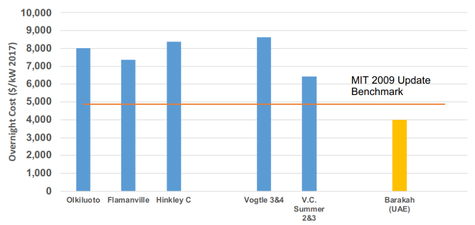

_Figure 1.1 Overnight cost of recent Gen III+ nuclear plants compared to the 2009 FoN Update benchmark_ [5] _._ 

Others have highlighted the cost challenges facing the industry. In 2020, the Nuclear Energy Agency (NEA) published a report titled, “Unlocking Reductions in the Construction Costs of Nuclear” that documented the cost escalations and construction delays of ten recent Gen III+ FOAK nuclear power plants. Figure 1.2 shows the cost escalation, and Figure 1.3 shows the construction delay. On average, these plants were 2.3x over their initial budget and 2.4x beyond their initial construction duration. Considering just the plants in the US and Europe, on average the projects escalated from overnight capital costs of $2,700/kWe to $7,600/kWe and from 4.5 years to 13 years [8]. 

In 2017, the Energy Technologies Institute (ETI) commissioned LucidCatalyst on a “knowledge gathering project to provide an evidence-based understanding of the range of factors influencing the cost of energy from new nuclear plants.” The result was another report on the cost escalating factors facing the nuclear industry published in 2020 [9]. The aim of the study was to equip the UK Government and nuclear industry to develop nuclear technology while avoiding the cost escalations experienced elsewhere. All of these reports indicate that the industry is well aware of the cost problem. 

Each of the four previously cited reports (two FoN, NEA, and ETI) all made recommendations for reducing the cost of new nuclear. These recommendations generally center around eight ideas: government support, contracting practices, project management practices, construction, standardization, modularization, simplification, learning-by-doing, and multi-unit sites. The first three are context specific – that is they unique to the environment outside of the nuclear plant. Local governments, utilities, reactor vendors, and construction firms impact these factors. The last five are design specific – that is they vary from one reactor architecture, independent to the outside environment. The focus of this thesis is on these five factors. 

The cost escalation problem is not recent to the last two decades. An extensive review of historical nuclear construction costs from Lovering et al., shown in Figure 1.4, reveals that over time only South Korea has consistently reduced nuclear construction costs in this dataset [10]. When normalizing 

overnight construction costs to the cost of the first non-demonstration reactor, Figure 1.4(b), it is only South Korea with recent normalized costs below one, and Japan, however, also had cost reductions with the introduction of the ABWR in the 1990s. Further, in both plots in  Figure 1.4, the dramatic cost escalations are clear in the US, Germany, Canada, and to a lesser extent in France, India, and Japan. The cost escalations began in the US in the late 1960s, sharply increased after the Three Mile Island accident, and effectively continued to present day given the challenges at V.C. Summer and Vogtle. 

The global nuclear cost data make clear the magnitude of the problem of cost, but they also provide promise that lower construction costs are possible. There were several periods of substantial cost reduction in each “problem” country: 1964-1967 in the US, 1957-1966 in France, 1957-1974 in Canada, 1958-1973 in Germany, and 1980-2007 in Japan. However, Lovering et al. reported that “utility structure, reactor size, regulatory regime, and international collaboration may play larger effect” than learning-bydoing as cost drivers. They also highlighted the “importance of reactor standardization, “multi-unit builds, and regulatory stability” in reducing the cost of future nuclear. 

More recently, nuclear construction in China has shown significant schedule improvements. Data from the IAEA Power Reactor Information System (PRIS) database for China, in Figure 1.5, shows a 25% reduction in durations from the 1980s (~7 years) to the 2010s (~5 years). Construction cost data were not publicly available for these reactors, but the reduced schedules are a stronger indicator that cost performance has also likely improved. However, this improvement excluded the AP1000 and EPR experience that was captured in Figure 1.2 and Figure 1.3 because these reactor architectures experienced significant construction delays globally. 

The 2018 FoN Report also highlighted the low capital costs of nuclear plants in China. Table 1.1 has the cost inputs for nuclear, wind, solar, coal, and gas generators in various countries from a decarbonization analysis as part of the 2018 FoN. Costs in China are ~50% of US costs, and costs in France and the UK are 20 and 50% higher than the US. Across the board, nuclear capital costs were 60-600% higher than the other generators except for coal with carbon capture. 

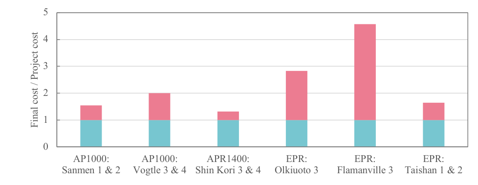

**----- Start of picture text -----** 
5 4 3 2 1 0 AP1000: AP1000: APR1400: EPR: EPR: EPR: Sanmen 1 & 2 Vogtle 3 & 4 Shin Kori 3 & 4 Olkiuoto 3 Flamanville 3 Taishan 1 & 2 Final cost / Project cost **----- End of picture text -----** 

_Figure 1.2 Construction cost overruns of recent FOAK Gen III+ designs. Data from NEA_ [8] _._ 

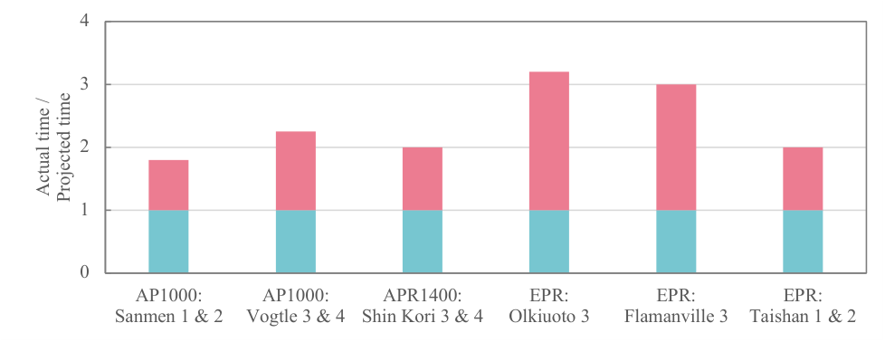

**----- Start of picture text -----** 
4 3 2 1 0 AP1000: AP1000: APR1400: EPR: EPR: EPR: Sanmen 1 & 2 Vogtle 3 & 4 Shin Kori 3 & 4 Olkiuoto 3 Flamanville 3 Taishan 1 & 2 Actual time /  Projected time **----- End of picture text -----** 

_Figure 1.3 Construction schedule delays of recent FOAK Gen III+ designs. Data from NEA_ [8] _._ 

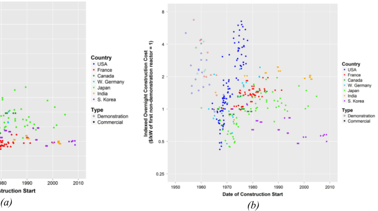

**----- Start of picture text -----** 
(a)  (b) **----- End of picture text -----** 

_Figure 1.4 (a) Overnight construction costs of global nuclear power plants in 2010 USD; (b) Overnight construction costs normalized to the cost of the first non-demonstration reactor; both from Lovering et al._ [10] _._ 

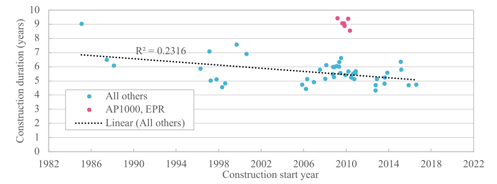

**----- Start of picture text -----** 
10 9 8 7 R² = 0.2316 6 5 4 All others 3 AP1000, EPR 2 Linear (All others) 1 0 1982 1986 1990 1994 1998 2002 2006 2010 2014 2018 2022 Construction start year Construction duration (years) **----- End of picture text -----** 

_Figure 1.5 Construction durations for nuclear plants in China. Data:_ [11] 

_Table 1.1 Overnight costs from the 2018 FoN Report_ [5] 

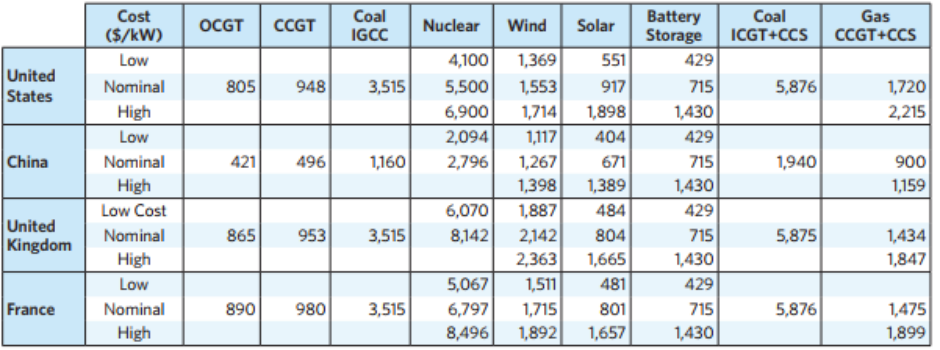

## **1.2.2 Nuclear cost premiums** 

An additional part of the cost challenge stems from the reality that the same material and labor used in other industries can have substantially higher costs in the nuclear industry. This is not a new phenomenon – a 1993 report from Oak Ridge National Laboratory published material and labor rates for different construction activities at nuclear and non-nuclear construction sites [12]. These cost escalation factors for structural, piping, and electrical commodities are shown in Figure 1.6 and they range from 1-4.4x nonnuclear costs. The material cost escalation factors average 1.5x, and the labor cost escalation factors average 2.3x. These are not cost-overrun factors, so the higher material and labor costs for nuclear projects in these data are not the result of re-work, delays, project management, etc. These cost escalations are _inherent_ to the nuclear industry primarily due to the regulatory quality assurance and quality control (QA/QC) and inspection requirements. For example, a nuclear quality assured welder has an 81% higher salary than a standard welder [13,14], and the impact of this is in the labor costs in Figure 1.6(b). 

Despite the ever-growing importance of understanding these costs, there does not exist an open-source, benchmarked tool for estimating the capital cost of new nuclear concepts. The remainder of this chapter provides an overview of the elements of LCOE and more specifically the elements required to estimate total capital costs (TCC): overnight capital costs (OCC), construction duration (IDC), and their uncertainties. The remainder of the thesis describes a methodology to assess these costs and their uncertainties, including case studies to inform decision making for designers, utilities, and governments. 

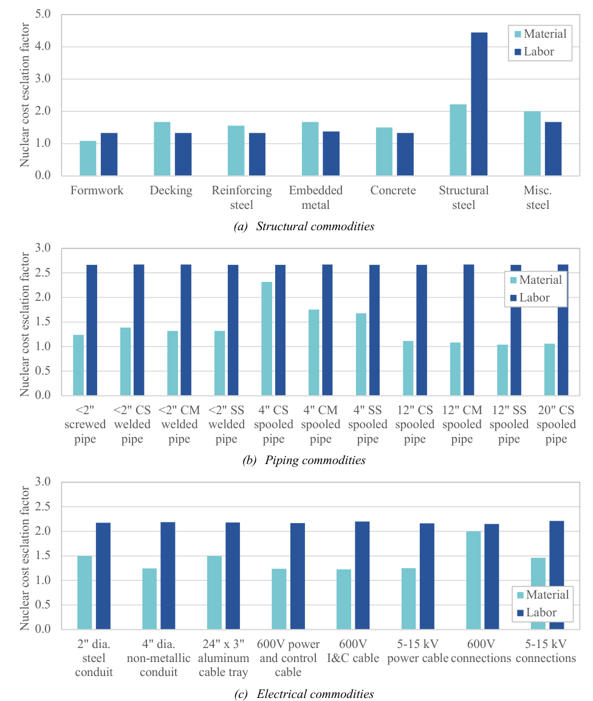

**----- Start of picture text -----** 
5.0 Material 4.0 Labor 3.0 2.0 1.0 0.0 Formwork Decking Reinforcing Embedded Concrete Structural Misc. steel metal steel steel (a) Structural commodities 3.0 2.5 Material 2.0 Labor 1.5 1.0 0.5 0.0 <2" <2" CS <2" CM <2" SS 4" CS 4" CM 4" SS 12" CS 12" CM 12" SS 20" CS screwed welded welded welded spooled spooled spooled spooled spooled spooled spooled pipe pipe pipe pipe pipe pipe pipe pipe pipe pipe pipe (b) Piping commodities 3.0 2.5 2.0 1.5 1.0 Material 0.5 Labor 0.0 2" dia. 4" dia. 24" x 3" 600V power 600V 5-15 kV 600V 5-15 kV steel non-metallic aluminum and control I&C cable power cable connections connections conduit conduit cable tray cable (c) Electrical commodities Nuclear cost esclation factor Nuclear cost esclation factor Nuclear cost esclation factor **----- End of picture text -----** 

_Figure 1.6 Material and labor cost escalation factors for nuclear projects_ [12] _._ 

## **1.3 The elements of the cost of nuclear** 

The costs of energy generating technologies are often compared using the levelized cost of electricity (LCOE): 

_Equation 1.1_ 

𝐿𝐶𝑂𝐸= !"# %& '(( )*+*,'-.%+ /%0-0 

1%-'( *+*,)2 )*+*,'-*3 

Or more specifically: 

_Equation 1.2_ 

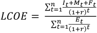

Where _It_ is the investment expenditure in year _t_ , _Mt_ are O&M costs in year _t_ , _Ft_ are fuel costs in year _t_ , _Et_ is the electricity generation in year _t_ , _r_ is the discount rate, and _n_ is the system lifetime [15].  In the context of nuclear plants, investment expenditures include overnight capital costs (OCC), interest accrued during construction (IDC), and contributions to a decommissioning fund; and fuel costs include both production and disposal. So Equation 1.2 can be rewritten as: 

567×1559!77:;<5 9;&> $ $ _Equation 1.3_ 𝐿𝐶𝑂𝐸= ?('+- /'@'/.-2 [>B*]×57×DEFG + 𝐹𝑢𝑒𝑙,>BI ~~-~~ + 𝑊𝑎𝑠𝑡𝑒,>BI ~~-~~ 

Where CRF is the capital recovery factor, TCC is the total capital cost including OCC and IDC, SFF is the sinking fund factor, ODC is the overnight decommission cost, and CF is the capacity factor. The CRF and SFF depend on the discount rate. 

Binning these costs into three categories simplifies comparing them to other sources of electricity: (1) levelized capital costs, (2) levelized fixed O&M which includes fixed O&M, and (3) variable costs which includes fuel and waste costs. Table 1.2 compares the LCOE, with these three bins, for nuclear, coal, gas, geothermal, wind, solar, and hydro generators. Compared to combined cycle natural gas, nuclear plants had 63% lower fuel costs (including waste costs), but levelized capital costs were 6.5x higher. This disparity is why natural gas plants do the load following for much of the U.S. grid and nuclear plants operate as baseload. 

_Table 1.2 Estimated levelized cost of electricity and levelized cost of storage for new resources entering service in 2026_ [16] _._ 

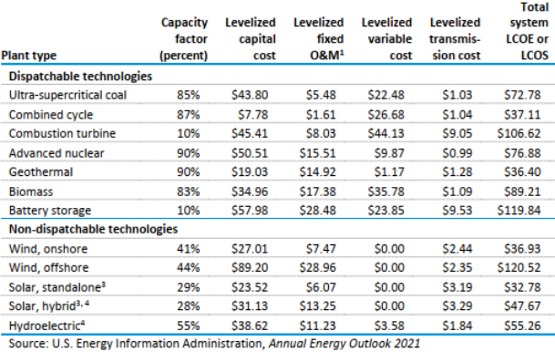

Despite being the most used metric, LCOE is not without issues. For example, LCOE does not capture system costs, grid price fluctuation timing, or externalities. Both Becker et al. and Sepulveda et al. showed that variable renewable electricity sources can have high system costs because their variability, lack of dispatchability, and forced curtailment [6,17]. According to Nissen and Harfst, energy investments can be profitable even if the LCOE is above average electricity market prices, and conversely an investment can lose money even if the LCOE is below average electricity market prices. This is because the time of production, daily and seasonally, impacts the value of the electricity produced [18]. Finally, LCOE does not include externalities such as the cost carbon emissions and other pollutants. 

Even though LCOE is an inclusive cost metric of capital, operations, and fuel, in the nuclear industry lifetime costs are so dominated by capital expenditures, that the latter two are only marginal in the context of new construction. For example, the 2018 FoN reported that capital costs account for more than 80% of lifetime cost energy from nuclear, as shown in Figure 1.7 [5]. For a $4,500/kWe generic nuclear project with a seven-year construction schedule, 9% interest rate, and 85% capacity factor, the NEA made a similar estimate – O&M and fuel costs were 22% of LCOE while capital costs and associated financing costs were 78%, as shown in Figure 1.8 [8]. 

_Figure 1.7 Lifetime cost distribution percentage between capital, operations, and fuel expenditures for nuclear power plants_ [5] _._ 

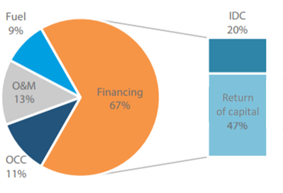

_Figure 1.8 Cost breakdown for nuclear power levelized cost of electricity for a $4,500/kWe OCC, sevenyear construction schedule, 9% interest rate, and 85% capacity factor_ [8] _._ 

Despite the overwhelming contribution of capital costs, significant research has been devoted in recent decades to operations optimization [19] and the fuel cycle optimization [20], and this has likely been due to the high value of long-term operation of the existing reactor fleet [21]. For example, the loan lifetime for the initial capital cost for nuclear plants is typically 20-40 years, and after the loan has been paid off, the LCOE of the nuclear plant drops significantly. The 2020 Nuclear by the Numbers report from the Nuclear Energy Institute reported that the average levelized capital costs in the U.S. nuclear fleet was $5.72/MWh – 89% lower than Table 1.2. This was because the U.S. nuclear fleet is fully amortized, so levelized capital costs only included life extension service and component upgrades. 

To have a significant role in decarbonization, global nuclear capacity needs to expand which will require building a new generation of reactors, and the first challenge these reactors will face is capital construction costs. Therefore, this thesis focuses on modeling, understanding, and contextualizing the elements of capital costs. 

## **1.4 The elements of nuclear total capital cost** 

The standard definition of total capital cost for nuclear plants includes overnight capital cost and interest accrued during construction. OCC is the sum of all pre-operation investment expenditures as if they were spent “overnight”, that is without interest. However, nuclear projects require 3-15 years to construct, and therefore, expenditures throughout the project accrue interest until the asset begins generating revenue, and this is interest during construction or IDC. 

There are several published categorical breakdowns of OCC, one from Black & Veatch is in Figure 1.9 and based on the Westinghouse AP1000 in 2009 USD [22]. This is a standard division of costs: nuclear island which includes the nuclear steam supply system equipment; turbine island which includes the steam turbine, generator, feedwater heaters, etc.; and yard/cooling/installation which includes structures and improvements, heat rejection equipment, and site preparation. These three categories are generally considered _direct costs_ or costs directly related to plant equipment and construction. Engineering, procurement, and construction management includes QA/QC, home office engineering, site management, and some forms of taxes and insurance. Black & Veatch provide a detailed definition of owner’s costs in 

their report, but at a high level these are land costs, project development costs, financial management costs, other taxes and insurance, and other project management and support costs. Both categories are _indirect costs._ In this example, indirect costs were only 54% of direct costs, but FOAK nuclear projects often have a higher ratio of indirect costs to direct costs approaching 1:1 [23]. 

Owner’s costs were not included in the capital cost estimation methodology developed in Chapter 2 because they are more site and utility dependent than reactor architecture dependent. Also, there were many ways to categorize and breakdown capital costs, and Figure 1.9 was just one example. Another example from the DOE will be mentioned in Chapter 2. 

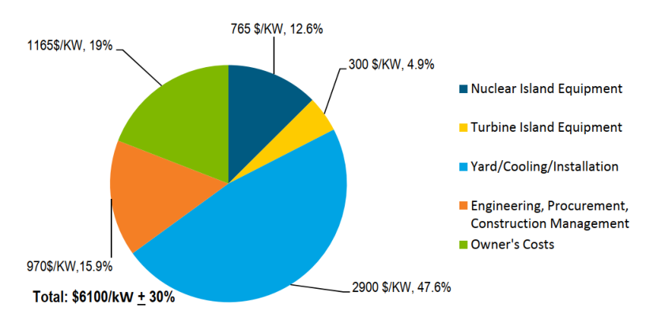

_Figure 1.9 Overnight capital cost (2009 USD) breakdown for nuclear power plant from Black & Veatch, produced for the National Renewable Energy Laboratory_ [22] _._ 

## **1.4.1 Nuclear direct cost drivers** 

The technical specifications of the structures, systems, and components (SSCs) most clearly drive the direct costs for a nuclear project. These can be interpreted as the volume of concrete, mass of reinforcing steel, mass of the reactor pressure vessel, surface area of heat exchangers, etc. Chapter 2 will discuss these in depth. However, these SSC costs also have _functional drivers_ – that are dependent on the environmental context of the nuclear project. Carelli et al. (and later the International Atomic Energy Agency [IAEA]) presented these drivers visually to demonstrate that small and medium sized nuclear reactors could be capital cost competitive with large reactors, as shown in Figure 1.10 [24,25]. Note that the capital cost in the figure is normalized to the plant capacity. 

The first functional cost driver is the economy of scale, i.e. larger equipment has a lower specific cost. This effect is intuitive; for example, a larger tank will be more cost efficient per unit volume than a smaller tank. The economy of scale has been the primary expected driver of historical cost reductions in the nuclear industry [10], but recent experience with construction megaprojects and nuclear cost overruns has led to more serious consideration of small modular reactors (SMRs). SMRs are designed to leverage the remaining five functional drivers in Figure 1.10. 

The second functional cost driver results from cost savings for multi-unit sites. These are cost savings from sharing construction and operation equipment, land costs, owner’s project development costs, and costs to upgrade bridges, roads, railroads, and docks for transporting heavy equipment. Multi-unit sites also experience an enhanced effect from the third driver, learning-by-doing, because it is the same 

construction crew for each new build, as opposed to a different set of sub-contractors which would be the case in a new location. 

The third cost driver is the learning curve. This stems from the idea that as more plants are constructed, the plant design will become more robust, the construction process will be better defined, the supply chain will be more robust, and the management and worker experience will be higher. This effect has been observed extensively in other fields, especially in factory manufacturing processes [26], and to a lesser extent in the nuclear industry [10,27,28]. 

The fourth and fifth functional cost drivers are construction schedules and unit deployment timing. In theory, SMRs may have shorter construction schedules, lowering the IDC, and the shorter construction schedules allows capacity additions to match incremental increases in demand. The incremental demand increases may be more representative of the needs of already developed electricity grids. For example, very few places in the world need 1+GWe of capacity added overnight – most societies are growing at a more modest pace or plan to use nuclear to replace other generators that typically have lower capacities. Therefore, a sudden >1 GWe capacity addition would likely create overcapacity, so the more economically efficient way to deploy resources is to more evenly space them out to match the demand increase. 

The sixth and final cost driver is the plant design. This factor mirrors the “simplification, standardization, and modularization” ideas from the 2003 FoN, 2018 FoN, NEA and ETI reports. 

The quantitative impact of each of these functional cost drivers will depend on the specifics of a particular reactor architecture. Therefore, whether a given SMR concept achieves cost parity with a large reactor will be a highly variable and case-by-case answer. The aim of this thesis is to build a tool capable of modeling these dynamics and exercise that tool on proposed water-cooled reactors including leading SMR and large reactor architectures. 

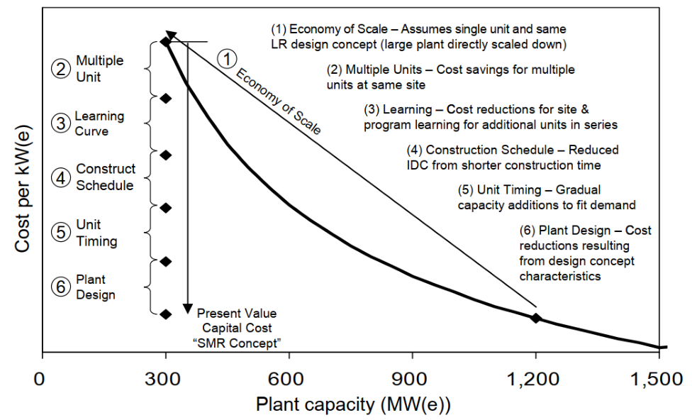

_Figure 1.10 Generic view of the factors affecting comparative costs of small and medium sized reactors. Originally from Carelli et al._ [24], _later republished by the IAEA_ [25]. 

Kuznetsov highlighted a similar set of factors for SMRs to overcome the loss of economy of scale: reduced complexity, increased SSC transportability, off-site refueling, multi-unit sites, and increased thermal efficiency [29]. There are, however, several studies that challenge these cost saving factors. Ramana specifically addressed how modularization and learning-by-doing may not be sufficient to overcome the lost economy of scale for small reactors [30]. Ramana also suggested that the proposed markets for advanced nuclear reactors may not be receptive to them. These challenges reiterated the need for a cost analysis using a consistent set of assumptions and including uncertainty. 

## **1.4.2 Nuclear indirect cost drivers** 

Indirect costs are primarily driven by the direct costs, the quantity of site labor, number of on-site workers, length of the construction schedule, experience of the regulator, and other owner’s costs. Therefore, to model these costs, one must have an estimate of the direct costs, site labor person-hours, and number of on-site workers. The key is that all of these require knowledge of the construction schedule for the nuclear project which requires a tool or methodology to estimate the schedule for a broad set of reactor concepts. These parameters can vary greatly from one nuclear reactor architecture to another and from one site to another with the same reactor architecture. 

Historically, indirect costs have been much higher for FOAK units than NOAK units. For example, in the Economic Energy Data Base (EEDB), the better experience plant had indirect costs that were near 50% of direct costs, but the median experience plant had indirect costs equal to direct costs. The higher indirect costs resulted from construction delays that required longer tool rentals and temporary facilities and regulatory changes that required more QA/QC, field supervision, and home office engineering services. 

## **1.4.3 Interest accrued during construction** 

IDC is driven by the spend rate, construction timeline, and interest rate of the project. The IDC multiplier (IDCM) is a factor to multiply the OCC to include the IDC. Assuming a uniform spend rate and discrete annual borrowing, the IDCM is: 

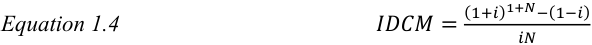

Where _i_ is the interest rate and _N_ is the number years of construction [31,32]. The ETI report provides a helpful visualization of the consequences of longer construction durations on the IDC in Figure 1.11 for a 7% interest rate. In year 10, the interest accrued on investment expenditures in year 1 is more than $1,000/kWe or almost 20% of the OCC, and the total IDC is more than $3,000/kWe. This may lead to a scenario where shorter construction schedules can create more capital cost saving value than the direct cost savings enabled by design optimization. 

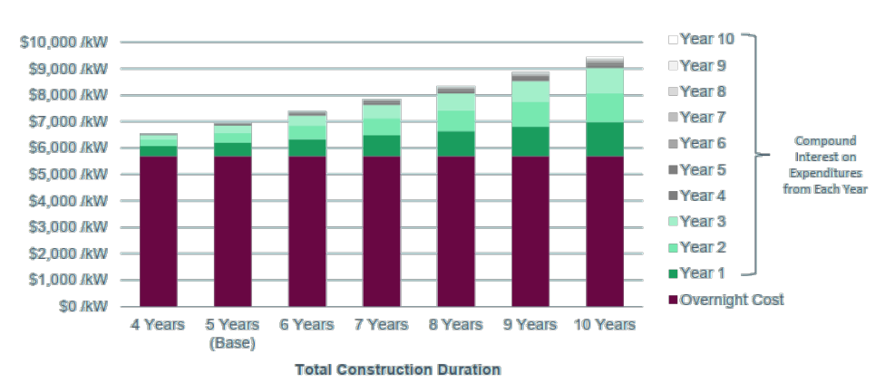

_Figure 1.11 Construction duration impacts on interest during construction with a 7% interest rate_ [9] _._ 

## **1.4.4 Uncertainty analysis and risk assessment** 

There is significant uncertainty and variation in the literature around the quantification of the direct and indirect cost drivers. So, to produce a robust capital cost estimate of a nuclear project, this thesis includes an uncertainty analysis. Further, from the cost overruns in Figure 1.2, we know that the estimated cost is often far from the realized cost due to supply chain delays, human error, change orders, and optimism bias [33]. These factors drive rework, productivity misses, and cost escalations. Any assessment of nuclear capital cost must include these dynamics probabilistically, so these were analyzed in Chapter 4. 

## **1.5 Advanced manufacturing and construction techniques** 

Some of the cost saving advantages claimed by advanced nuclear reactor designers and vendors rely on advanced manufacturing and construction techniques, some of which are already state of the art in other industries. The Electric Power Research Institute is leading the development of a number of manufacturing advances for reactor pressure vessels, and they aim to reduce total vessel cost by 40% 

[34,35]. These technologies include e-beam welding, powder metallurgy, and laser cladding. Both the IAEA and the NEA have published reports highlighting construction techniques such as open-top construction, very heave lift cranes, modularization, and steel plate composites [8,36]. These techniques will be discussed in more depth in Chapters 2 and 3, respectively. 

## **1.6 Nuclear reactor architectures** 

This thesis evaluated overnight capital cost, construction schedule, and associated uncertainties and risks for eight reactor architectures. The aim was to capture the breadth of attributes considered in Gen III+ reactors: passive safety, smaller sizes, different containment strategies, and different levels of modularization. Table 1.3 summarizes the reactors considered, their features, and the source material used for generating the input data. Note that each architecture was a derivative of a commercial architecture either completed or under development. These estimates provided in this thesis were not intended to be representative of the commercial versions, and no vendor provided detailed design data to use as input. collected the input data from Nuclear Regulatory Commission (NRC) licensing documents, company websites, IAEA reports, and published articles to construct a surrogate to the commercial reactor that was representative of the design attributes. As such, the level of detail was not perfectly consistent between each reactor architecture, especially because some designs were more developed than others, so the data were subject to error, and the reader should consider the detailed assumptions for each cost item in the supplementary data to this thesis. 

The PWR12 was based on a 1200 MWe four-loop Westinghouse pressurized water reactor (PWR) that is the basis of the EEDB. The EEDB supplied the base costs for all the cost scaling relationships outlined in Chapter 2. The PWR12 was a stick built (no modularization), Generation III light water reactor (LWR). The input data representing the PWR12 came from the EEDB [23]. 

The large-passive-safety-reactor (LPSR) was based on the Westinghouse AP1000. The LPSR was a Gen III+ LWR with fully passive safety systems. The passive safety systems were mostly powered by an elevated tank above the containment building. The containment was a standalone steel building as opposed to a steel-lined reinforced concrete containment. Instead of four-loops with four steam generators, the LPSR had four pumps but only two steam generators. The primary documentation used for the LPSR input were the Nuclear Regulatory Commission (NRC) licensing documents for the AP1000 [37]. 

The large-active-safety-reactor (LASR) was based on the KEPCO APR1400. The LASR was a Gen III+ with safety graded active safety systems and some passive safety systems. The containment was a traditional steel lined reinforced concrete. Similar to the LPSR, the LASR had four primary coolant pumps with only two steam generators. The source documents for the LASR design inputs were the NRC documents [38] and the IAEA status report [39]. 

The double-containment PWR (DC-PWR) was based on the Framatome EPR. The DC-PWR has both active and passive safety systems, as well as a core-catcher that is a concrete basin below the reactor pressure vessel. The primary containment was a steel lined reinforced concrete structure, and the secondary containment was reinforced concrete, and it covered the upper portion of the reactor building above the adjacent structures and become a shared wall in the lower section with the adjacent structures. The source documents for the DC-PWR were the NRC documents [40,41]and the IAEA status report [42]. 

The natural convection small modular reactor (NC-SMR) was based on the Holtec SMR-160. The NCSMR had passive safety systems with a standalone steel containment and an elevated water storage tank. Instead of primary coolant pumps, the primary coolant was powered by natural convection. Source documentation were documents on the company website [43] and presentations given by company executives[44]. 

The multi-module natural convection SMR (MMNC) was based on the NuScale reactor architecture. The MMNC was a fully passive safety architecture with a steel-vessel containment submerged in a pool of water that served as the ultimate heat sink. The MMNC could consist of 12, 6, or 4 units submerged in varying size pools. Instead of reactor coolant pumps, the primary coolant was driven by natural convection. The steam generator used a helical coil instead of the traditional shell and tube design. The primary source of input details were NRC documents [45] and the IAEA status report [46]. We primarily considered the 12x77 MWe version of the NuScale architecture which was uprated from the NRC licensed 12x50 MWe version. NuScale uprated to lower costs and is now considering 4- and 6-module plants to lower the capital required. We considered these design variations in Chapter 2. 

The final two architectures were boiling water reactors (BWRs). The first was the large-modular BWR (LM-BWR) which was a heavily modularized large BWR based on the GE-Hitachi ABWR. The ABWR had the fast construction experience among large LWRs, making it an important case study. The LMBWR source material were ABWR licensing documents from the NRC and other reports on the ABWR [47–49]. The second was the small-modular BWR (SM-BWR) based on the GE-Hitachi BWRX-300. The SM-BWR was a passive safety SMR BWR. The source material was a GE-Hitachi topical report submitted to the NRC [50] and an IAEA status report [51]. 

25 

## **1.7 Thesis organization** 

The aim of this study is to model the capital cost dynamics for advanced nuclear power plants under uncertainty to gain insight for proper investment decisions for utilities and governments and proper design decisions for reactor vendors. To do so requires a model of direct cost, indirect cost, construction schedule, IDC, and the associated uncertainties and risks. The input to the model must be the design details of a nuclear power plant. The structure of the model is shown in Figure 1.12. The green arrows indicate the flow of information: the direct cost model requires information about the nuclear plant design, the construction model requires information about the direct costs, etc. The direct and indirect cost model methodology and results are in Chapter 2. The construction schedule building methodology and results are in Chapter 3. An uncertainty analysis of the model parameters and a risk assessment of total capital costs is in Chapter 4. Each chapter contains case studies examining the costs of different surrogate reactor architectures to demonstrate key takeaways and findings from the model. 

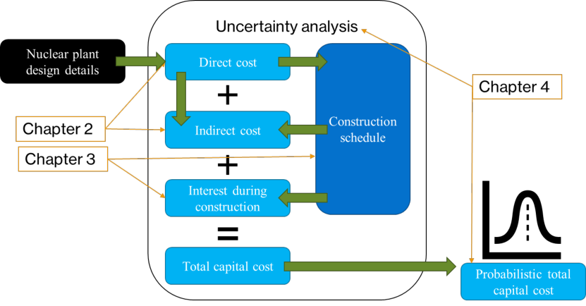

_Figure 1.12 Information flow for direct cost, indirect cost, construction scheduling_ 

## **Chapter 2 – Overnight capital cost estimation** 

## **2.1 Literature review** 

Published cost estimates fit into two categories: independent estimates of generic SMR features or reactor concepts and commercial vendor marketing documents. The former generally tries to answer questions such as, “how much can modularization lower costs?” or “how much cost savings result from passive safety?” These estimates are not typically tied to a particular design, but the authors are transparent and forthcoming with the assumptions behind their analysis. The latter category of estimates is found on company websites or marketing materials and do not contain many details regarding the assumptions in the estimate. Further, commercial estimates are sometimes framed as a “target”, only adding to the ambiguity. The following section reviews both categories of estimates. 

## **2.1.1 Independent estimates** 

Material use comparisons are a great first-order method for comparing the expected costs of new reactor concepts because the labor and material for installing reinforcing and structural steel and concrete, and the associated indirect costs, are a significant portion of the overnight cost. They avoid the complications of international inflation, material, and labor indices, as well as the construction experience of the contractors, so the comparisons are pure. Peterson et al. estimated the concrete and metal requirements for several Gen III+ reactors [52], and the 2018 FoN report expanded the comparisons to include other Gen III+ and Gen IV reactor concepts [5]. Figure 2.1, from the 2018 FoN, shows how dramatically the concrete and metal usage can vary. It is important to note that some of these estimates come directly from the vendors, and therefore, their trustworthiness should be questioned. For example, the NuScale reported metal per MWe was dramatically lower than the other reactor architectures, but NRC licensing documents indicated high (>4%) rebar density for the reactor building which was on par with typical reactor building rebar densities, and the higher concrete volume would then imply a high metal volume. One of the aims of this cost analysis was to compare the metal and concrete volumes with a uniform set of assumptions. Further, going from material volume to cost is not necessarily linear, so the challenge comes in accounting for the relative cost of the two commodities, the architecture complexity, and the modularization of SSCs. 

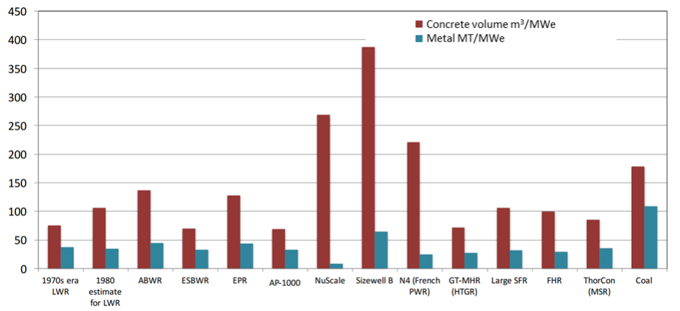

_Figure 2.1 Concrete and metal use for various Gen III+ and Gen IV reactor architectures. Note the NuScale numbers are for the 12x50 MWe version_ [5] _._ 

Independent cost estimates fit into two sub-categories: guidelines and applied methodologies. The guidelines come from non-governmental organizations such as the IAEA, and the applied methodologies come from research institutions and engineering consulting firms. The applied methodologies are generally focused on estimating the value of different solutions to the cost challenge. Large reactors require extensive amounts of custom-built equipment and machinery, making standardization and simplification a challenge. Smaller reactors can be easier to standardize, simplify, and make passively safe. Many of the capital cost estimates in the literature have been for SMR architectures, specifically focusing on these features. 

The IAEA and the Gen IV International Forum Economic Modeling Working Group (GIF EMWG) have reports with cost estimating guidelines for nuclear plants. [25,32]. The IAEA guidelines are for “feature cost scaling methods” that scale known costs from historical experience based on design features to estimate the capital costs for new architectures. The features include a short list of nine plant attributes: thermal power, thermal efficiency, power density, reactor vessel mass, heat exchanger mass, volume of the primary system, number of fuel elements, core length, and primary pump power. This methodology is intended for estimating the cost of new architectures where the design is only marginally different from the known cost design. Therefore, it cannot account for innovative features such as passive safety or vessel style containments. The GIF EMWG provides more philosophical guidance for the cost estimating process and recommendations for the power law scaling relationships for specific SSCs such as pumps, motors, tanks, heat exchangers and other equipment. Their report also provides labor and material cost data for nuclear and non-nuclear construction. The applied methodologies often take many assumptions and model parameters from the guideline publications. 

Carelli et al. estimated the value of the six factors in Figure 1.10 for a four-unit International Reactor Innovative and Secure (IRIS). Each unit had a 335 MWe power capacity. The design philosophy was “safety by design” to reduce and simplify safety systems and lower costs. For IRIS, the economy of scale escalated prices by a factor of 1.7x, but the remaining factors between 6-17%, as shown in Table 2.1 [24,53]. The net effect was IRIS had a 5% higher capital cost than a traditional large PWR. The most 

valuable cost-reducing factors were modularity and design simplifications with a 17% cost savings. Cositing multiple units was also very valuable with a 14% cost reduction. 

_Table 2.1 Cost factors for large and small reactor architectures from Carelli et al._ [53]. 

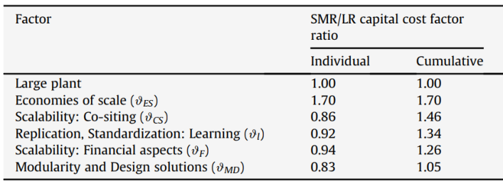

Zhang et al. performed a cost breakdown of the HTR-PM high temperature gas reactor SMR [54]. Their analysis showed that the 2-unit HTR-PM had only a 5% higher capital cost than a single unit version with equivalent thermal power capacity. The cost-savings resulted from plant simplicity, modularization, and the economy of multiples. 

Ganda [55] and Maronati et al. [56] published methodologies for estimating capital costs for nuclear plants. Ganda scaled reference costs from the Economic Energy Data Base (EEDB) based on 30 nuclear plant design attributes. These attributes were volumes of concrete, surface areas of walls, masses of components, and other equipment design specifications. The SSC capital costs were scaled using a power law relation based on the relative difference in the SSC attributes. Ganda applied this methodology to the ABR1000, a sodium cooled fast reactor. In an update to the original report, Ganda included labor and material cost uncertainty in the cost estimate, highlighting the importance of stochasticity for modeling nuclear project costs that occur over long timelines. Maronati et al. used a similar methodology to Ganda of scaling EEDB costs using power law relations and SSC design attributes to estimate the cost of the I[2] S- LWR. The I[2] S-LWR is a large LWR that is integral and inherently safe. Their studies showed the passive safety and design simplification lowered costs 3-13% from a traditional LWR for sites with varying peak ground accelerations. 

Lloyd et al. analyzed the cost saving potential of modularization for SMRs [57]. They considered how the degree of modularization (DoM), i.e. how much of the construction can be modularized, varied with reactor size from 150-1350 MWe, and how the resulting cost savings balanced with the loss of the economy of scale. The analysis was for a generic nuclear power plant architecture, not for a specific concept. A 300 MWe reactor was able to achieve a DoM of 0.8, but a 750 MWe reactor was only able to achieve a DoM of 0.25. The difference results from the size and transportability of the SSCs. Figure 2.2 shows how the DoM lowers costs for different reactor power levels. For a 300 MWe reactor at a DoM of 0.8, modularization can reduce overnight capital costs up to 45%. However, experience in the nuclear industry shows very little correlation between modularizability and reactor size. For example, the ABWR was heavily modularized, reduced non-civil construction person-hours of work 40% from stick-built BWRs, and had the shortest construction schedule in global commercial reactor history [58]. Therefore, the specifics of the reactor architecture are more crucial to cost and modularizability, and analyzing a _generic_ architecture fails to consider specifics and how architectures differ. Further, global construction experience has suggested there is no correlation between DoM and cost. The consulting firm McKinsey & Company reviewed a number of construction projects and found that modularization can increase 

construction costs, not decrease. Modularization increases off-site factory and labor costs, and material costs sometimes increase and sometimes decrease [59]. 

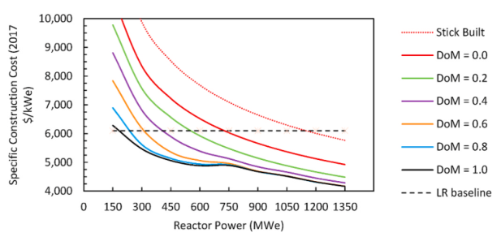

_Figure 2.2 Specific overnight capital costs for varying degrees of modularity (DoM) and reactor power from Lloyd et al._ [57] 

## **2.1.2 Commercial estimates** 

Each company either publishes a NOAK estimate or simply claims their reactor is low-cost. On their website, NuScale cites an article from Black et al. reporting an overnight capital cost of $3,500/kWe, significantly lower than the PWR12 capital cost for the 12x60 MWe version. Most of the cost savings were in the indirect cost category, and the majority of the NuScale cost estimate justification was hidden behind “proprietary cost estimates performed internally by NuScale” [60]. Other NuScale cost estimates were $4,630/kWe for the 12x45 MWe version [61]and $2,850/kWe for the 12x74 MWe version [62]. Each of these estimates comes to a total plant cost of $2.5B, implying the power uprates came at no additional cost. GE-Hitachi published a $2,000/kWe cost target for the BWRX-300 – almost half the specific cost of the NuScale plant [51]. TerraPower describes the molten chloride salt fast reactor as a “low cost reactor” [63]. Kairos uses the ambiguous term “affordable” to describe their advanced reactor [64]. EDF says their SMR, Nuward, will be a “competitive solution” [65]. 

The 2020 IAEA report titled, “Advances in Small Modular Technology Developments” reported overnight capital cost estimates from reactor vendors [66]. The estimates vary dramatically from the SMART reactor from KAERI at $10,000/kWe for the first-of-a-kind (FOAK) to Moltex at <$1,000/kWe. UxC also published a report in 2013 that included SMR vendor cost estimates for NuScale ($4,630/kWe), mPower ($5,000/kWe), and the Holtec SMR-160 ($5,000/kWe)[61]. These estimates and statements leave much to be desired in terms of specificity. 

The most detailed cost breakdown from a commercial reactor vendor is for the Open100 concept from the Energy Impact Center [67]. This PWR SMR used a linear cost scaling to estimate the capital cost based on the EEDB cost data. The linear scaling assumption ignores the economy of scale effect, underestimating the costs for smaller reactors. In addition, the Open100 estimate includes significant “cost reduction factors” based on leveraging best practices from other industries. The net effect of these assumptions is an almost 65% capital cost reduction over the reference large PWR in EEDB. 

To summarize, there is not a shortage of cost estimates and methodologies in the literature, but there is a lack of consistency in assumptions that would allow for proper comparisons between estimates. In fact, in a review article of the nuclear capital cost literature, Mignacca et al. stated, “there is a lack of standardized approach in the evaluation and economic performance of SMRs” [68]. The aim of this 

chapter is to provide a methodology and an open-source codebase for consistent analysis of nuclear capital costs. 

## **2.2 Overnight capital cost methodology** 

The cost basis for the developed methodology in this thesis was the PWR12 Median Experience from EEDB. EEDB contained over 1400 individual SSC costs from the surface area of formwork for each building substructure to mass of piping for every mechanical system. The data, in its entirety, can be retrieved from Oak Ridge National Laboratory, and a subset of the data used in this thesis is in the supplemental data to this thesis. 

EEDB organized costs into a code-of-accounts system. The highest-level costs were simply Direct Costs, or Account 2, and Indirect Costs, or Account 9. Sub-categories were defined by additional indices. For example, Direct Costs consisted of: Account 21 Structures & Improvements, Account 22 Reactor Plant Equipment, Account 23 Turbine Plant Equipment, Account 24 Electrical Plant Equipment, Account 25 Miscellaneous Plant Equipment, and Account 26 Main Condensing Heat Rejection System. Sub-subcategories within these followed the same pattern of adding integers to the account label, and so forth. 

EEDB reported costs for a Median Experience (PWR12-ME) and a Better Experience (PWR12-BE). Median Experience accounted for the cost escalations the nuclear industry experience from when the DOE started collected data in the 1970s to the last EEDB report in 1987. The PWR12-BE costs represented the best-case construction cost experience for the industry at the time, and the PWR12-ME represented the median experience. PWR12-ME had a 74% total cost, 31% higher direct cost, and 144% higher indirect cost. The full set of cost escalations for PWR120ME are in Figure 2.3 for the one- and two-digit accounts. The greatest direct cost escalations were for structures and improvements and miscellaneous plant equipment. The greatest indirect cost escalations were field supervision and field office services. The indirect cost overruns were significantly higher, and this was primarily due to the delay construction schedule from 72 to 98 months, as well as other factors such as re-work and regulatory changes. 

In this thesis, the PWR-ME costs were considered a best-case FOAK cost (e.g. plant with completed design, reliable supply chain, and knowledge workforce), and the PWR12-BE costs were NOAK costs. Given that these are just median cost escalations above the best experience, it is reasonable to assume significant cost escalations, on the order of 74%, above the PWR12-ME are possible as well. Further, others have proposed above inflation nuclear cost escalation indices for escalating EEDB costs from 1987 to present (or 2018 in the case of this thesis) [55,69]. These above inflation indices account for loss of experience in the nuclear industry, changing regulations, and other factors. Hence the clarifier, “best-case FOAK”. Chapter 4 explored the probabilities of above-best-case FOAK cost escalations. 

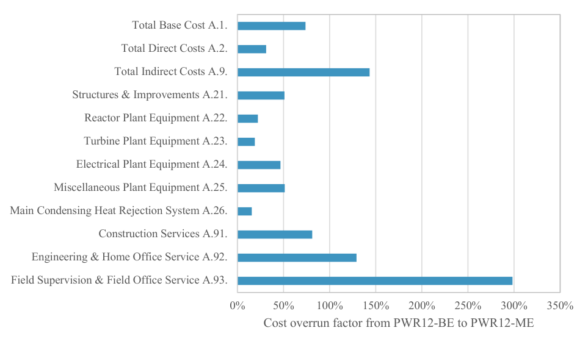

**----- Start of picture text -----** 
Total Base Cost A.1. Total Direct Costs A.2. Total Indirect Costs A.9. Structures & Improvements A.21. Reactor Plant Equipment A.22. Turbine Plant Equipment A.23. Electrical Plant Equipment A.24. Miscellaneous Plant Equipment A.25. Main Condensing Heat Rejection System A.26. Construction Services A.91. Engineering & Home Office Service A.92. Field Supervision & Field Office Service A.93. 0% 50% 100% 150% 200% 250% 300% 350% Cost overrun factor from PWR12-BE to PWR12-ME **----- End of picture text -----** 

_Figure 2.3 Cost overrun percentage from PWR12-BE to PWR12-ME for the one- and two-digit accounts_ 

In EEDB, the PWR12-ME costs only go to the three-digit account level where the PWR12-BE costs go all the way to specific SSC costs, ten-digits in some cases. To use the PWR12-ME costs as the best-case FOAK, therefore, we escalated the higher digit PWR12-BE costs with the associated three-digit overrun factor. 

Although EEDB contained more than 1400 individual SSC costs, that was too many specific inputs to be known at the conceptual design phase which is where many advanced reactor concepts are. Further, such a detailed level of analysis is unnecessary to get a reasonable estimate of the total cost because not all 1400 were significant contributors to the total cost. For example, in EEDB the top 119 cost items made up 75% of the direct costs, and the top 282 cost items made up 90% of the direct costs. Many of these cost items were related as well. For example, the reinforcing steel used in a structure was directly correlated with the volume of concrete and the formwork used. Therefore, we selected 235 high cost items to be used as the cost basis for estimates in this study. These 235 items can be found in the supplemental data to this thesis. The cumulative distribution of these 235 items is in Figure 2.4, and the top 15 cost items are listed in Table 2.2. From Table 2.2, it becomes clear that estimating the cost of the primary system components (RPV, pump, steam generator), containment structure, heat rejection system, and turbine system accounted for 40% of total direct costs. 

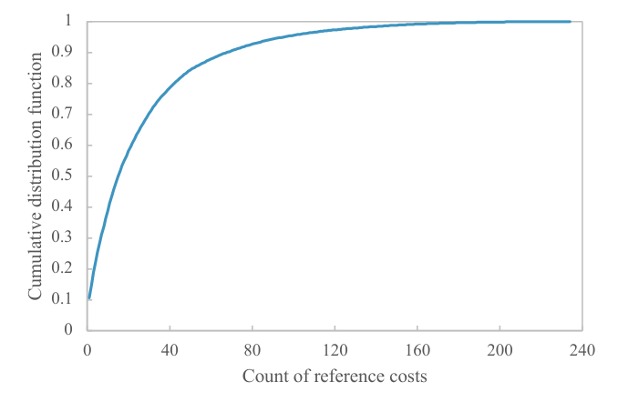

**----- Start of picture text -----** 
1 0.9 0.8 0.7 0.6 0.5 0.4 0.3 0.2 0.1 0 0 40 80 120 160 200 240 Count of reference costs Cumulative distribution function **----- End of picture text -----** 

_Figure 2.4 CDF of the 235 basis direct costs used in this thesis._ 

_Table 2.2 Top 15 cost items from the EEDB subset_ 

To estimate the cost for a new plant, the 235 reference costs were scaled using a known cost scaling relationship. Then specific adjustments were made based on the design. Then modularization and learning-by-doing cost adjustments applied. Finally, we estimate the indirect costs based on the direct costs to arrive at the overnight cost estimate. Figure 2.5 portrays this process graphically, and the following sections describe in detail the assumptions behind each step. Of the 235 reference costs, four were added later for high temperature gas reactors. These additions were discussed by Stewart et al. [70], and they were not relevant to this thesis where the focus was LWRs. 

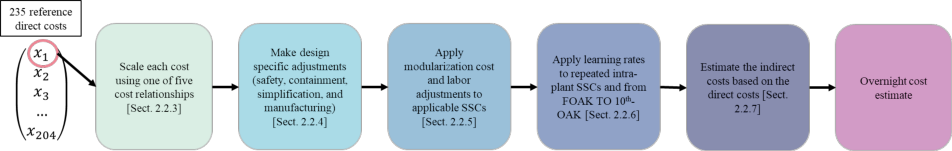

_Figure 2.5 Graphical representation of the process to estimate the overnight capital cost for an advanced nuclear power plant. The following sections describe each step-in detail._ 

## **2.2.1 Nuclear steam supply system breakdown** 

EEDB combines all systems in the nuclear steam system (NSSS) together into a three-digit account, Account 220A: Nuclear Steam Supply. The cost breakdown between the reactor pressure vessel (RPV), vessel internals, primary system piping, steam generator, pressurizer, residual heat removal system, and safety injections was unknown. However, Argonne National Lab conducted an extensive study on these component costs filled in the unknown costs [55]. The recreated cost data from Ganda et al. is in Table 2.3. Ganda et al. reported these data in 2017 USD, but Ganda applied both a 2.2x CPI cost inflation and a 1.3x above inflation nuclear escalation factor. These factors were removed for Table 2.3 because We used a different price inflation index for this thesis, but otherwise the cost breakdown from Ganda et al. was adopted for this overnight cost estimation methodology. 

_Table 2.3 Account 220A cost breakdown from Ganda et al._ [55]. 

## **2.2.2 Inflation and cost escalation** 

The DOE last published the EEDB in 1987, so the costs need to be inflated to the year 2018 (the year this work started). There are several inflation indices that are options. Ganda et al. used the consumer price index (CPI) [55], others have used the chemical engineering plant cost index (CEPCI). Over such a long time period, different cost categories inflate at different rates, and Vatavuk reported that plant level indices such as CEPCI should not be applied beyond five-year time intervals [71]. Therefore, as best as possible, the 1987 EEDB costs were inflated using produce price index (PPI) for specific material commodities and the labor specific indices from the Bureau of Labor Statistics (BLS). 

For each SSC, we matched the appropriate labor craft from EEDB to the available BLS data. For example, pipe fitters did all piping labor, laborers poured concrete, electricians installed electrical equipment, boilermakers installed tanks and vessels, etc. Then, the labor cost in EEDB was inflated from 1987 to 2018 according to the indices in Table 2.4. The material and factory costs were inflated using the PPI for associated commodity from the St. Louis Fed, seen in Table 2.5. Where there was not a match between an available index and a specific SSC, CPI was used similar to Ganda et al. 

_Table 2.4 Labor cost inflation indices from BLS, 1987-2018_ [72] 

|**Craft**|**Index**|
|---|---|
|All Others|2.27|
|Boilermakers|2.27|
|Bricklayers|2.31|
|Carpenters|2.57|
|Electricians|2.24|
|Ironworkers|2.22|
|Laborer|2.4|
|Millwrights|2.11|
|Operating Engineers|2.24|
|Painters|2.5|
|Pipe Fitters|2.21|
|Sheet Metal Workers|2.28|
|Teamsters|2.26|

_Table 2.5 Material cost inflation indices from the St. Louis Fed, produce price index from 1987-2018_ [73] 

|**Commodity**|**PPI Index**|**Index**|
|---|---|---|
|Carbon Steel Piping|Iron and Steel|2.18|
|ConcreteFill|Concreteingredientsandrelated products|2.75|
|Embedded Steel|Iron and Steel|2.18|
|Reinforcing Steel|Iron and Steel|2.18|
|Special Steel Liners|Iron and Steel|2.18|
|Stainless Steel Piping|Iron and Steel|2.18|
|Structural Concrete|Cement|2.51|
|Structural Steel|Iron and Steel|2.18|
|Valves|Machinery and equipment-Metal valves|3.08|
|Wireand Cable|Electronic wireand cable|2.32|

Two important notes regarding inflation indices. First, since this work began in 2018, inflation has caused substantial labor and material cost increases, and in some cases almost 70% higher in 2022 than in 2018. However, for the sake of consistency with previous publications, the 2018 cost basis was kept. Second, as previously mentioned, we did not apply an above-inflation-nuclear-escalation as done by others. Applying such an index implied that We knew what the value of that index should be, but there has been so little nuclear construction in the US in the last 40 years, quantifying this index is challenging, resulting in a wide range of estimates, from 30-70%, from 1987-2018. It was also unclear if these nuclear cost escalations were driven by inflation specific to the industry or supply chain and productivity challenges at a few plants. Therefore, the cost estimates presented in this thesis are best viewed relative to one another and not as standalone absolute cost estimates of a given architecture. This was consistent with the aim of the thesis – to understand the cost driving differences between different reactor architectures. 

## **2.2.3 Direct cost scaling methods** 

There were five different methods available to estimate the cost of the 231 SSCs. The five methods applied based on the available information for a specific reactor architecture and the specific SSC. The first method came from Towler et al. [74] and applied to vessels, pumps, heat exchangers, and cranes, twelve of the 231 SSCs. The equation from Towler et al. was: 

_Equation 2.1_ 𝐶= 𝐴∗[𝐵+ 𝐷∗𝑃[+] ] 

Where _B_ , _D_ , and _n_ were constants from a capital cost estimation handbook, _A_ was a nuclear adjustment factor, and _P_ was a reference parameter such as mass, flow rate, surface area, or capacity. The nuclear adjustment factor came from comparing estimates using Towler’s equations to values in EEDB. Towler provided a range of appropriate parameters where the equation was valid, and in some cases, we applied the equation outside the appropriate range. Therefore, the nuclear adjustment factor accounted for both the increased quality assurance for nuclear grade components as well as the error induced by extrapolating these cost curves. The values for _B_ and _D_ from Towler were for CEPCI reference year 2010, so they were inflated to a 2018 cost basis. They are reported in Table 2.6. The crane parameters applied to six different cranes including the fuel cask crane, diesel generator crane, heater bay crane, turbine bay crane, fuel crane, and containment crane. The crane parameters were not from Towler, but were a least-squares fit to data from EEDB for these six cranes ranging from 1.8-380 tons in capacity. 

Table 2.6 also provides the valid ranges for the curves from Towler and the PWR12 value from EEDB. The primary coolant pump was far beyond the valid range, so the nuclear escalation factor, _A,_ accounted more for the extrapolation than nuclear cost escalation. However, the vessel and steam generator were closer to the valid ranges, so the nuclear escalation factor was a purer representation of the quality assurance cost for nuclear SSCs. 

_Table 2.6 Direct cost estimation values for Equation 2.1. Values inflated from Towler et al., except the cranes where the values were the result of a curve fit to EEDB data for different cranes._ 

The second cost estimation method scaled the reference EEDB costs for PWR12 using a base parameter specific to the SSC such as volume, mass, or surface area. This method primarily applied to the Account 21 Structures and Improvements sub-accounts for formwork, rebar, concrete, and other structure related costs. The service air, water, and steam systems used this method and the building volumes as the base parameter, as did the control rods with the count as the base parameter, and the waste process systems with the primary coolant flow rate as the base parameter. _Equation_ 2.2 shows the relationship where _P_ is the base parameter. 

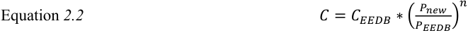

The exponent, _n_ , came from a number of different sources, including Wibowo [75], GIF EMWG [32], Saccheri [76], and Towler [74]. _Equation_ 2.2 applied to up to 171 SSCs depending on the level of detail known for a given reactor architecture. The exact SSCs where this correlation applied for each architecture can be found the supplementary information to this thesis. 

The third method also used _Equation_ 2.2, but the base parameter was either the plant or unit level thermal or electrical power. This method applied for any of the 231 costs where the base parameter was unknown, so its use varied across the reactor architectures. However, it usually applied to about 30 SSCs. 

The fourth method was a direct cost input. This method was implemented for cases where input costs were known using a quote from a vendor or a similar source. This method was useful for the open-source applicability of the code but was not used in this thesis. 

The final method simply fixed the SSC costs at the EEDB PWR12 value. This method applied to 20 SSCs such as the fire pump house, the technical support center, wastewater treatment, and some environmental monitoring systems. EEDB also recommended keeping these as fixed costs when they analyzed a 600 MWe version of PWR12, called PWR6. In addition, these SSCs were typically low-value SSCs in the context of the other cost items. 

The specific method used for any particular reactor architecture’s SSC can be found the supplementary information. 

## **2.2.4 Design specific cost adjustments** 

The cost scaling relationships described in Section 2.2.3 only scaled the reference costs in EEDB, but some reactors added new systems, eliminated old systems, changed quality assurance requirements for some systems, and leveraged new low-cost manufacturing techniques. This section describes how the new base costs were adjusted after scaling. 

## _2.2.4.1 Containments_ 

The MMNC plant uses a containment vessel that is partial low-carbon steel and partial stainless-steel vessel as opposed to a steel lined reinforced concrete containment. To account for this adjustment, 

Equation 2.1 applied with the values in Table 2.6 for containment vessels. This relationship was very similar to the relationship for reactor pressure vessels because the MMNC containment vessel was similar in diameter to some reactor pressure vessels. 

The NC-SMR, LPSR, and SM-BWR have standalone steel containments as opposed to steel lined reinforced concrete containments. In addition to the PWR12 costs, EEDB reported three-digit account costs for the Advanced PWR6 (APWR6) which was a 600 MWe reactor with a standalone steel containment. EEDB also reported costs for a PWR6, a traditional Gen III PWR at 600 MWe. The Account 212: Reactor Containment building costs for the APWR6 were 2.05x higher than for the PWR6. The only difference between these Account 212 costs was the containment structure, so the cost escalation was lumped into Account 212.15 Containment Liner. To equal 2.05x higher costs at the threedigit account level, the five-digit account cost categories were escalated using the values in Table 2.7. To benchmark these factors, using them to estimate the cost of the MMNC containment vessel resulted in a cost that was within 10% of the containment vessel equation for the LPSR. 

_Table 2.7 Account 212.15 Containment liner cost escalations for standalone steel containments._ 

_2.2.4.2 Safety strategy: active vs. passive_ 

Several advanced reactors adopt passive safety systems either to replace their active systems or to work in parallel to them. For the LPSR, MMNC, SM-BWR, and NC-SMR, a large pool of water above or around the RPV provided long term cooling. The cost of large water tanks was scaled based on the spent fuel pool cost in EEDB for the PWR12-ME, and the base unit was the surface area of the pool/tank for the given reactor at a cost of $17,866/m[2] with linear cost scaling. 

Passive safety systems reduced the functional requirements of Account 24: Electrical Plant Equipment because the passive systems required less redundancy and do not require power to perform their functions. Inside EEDB, there were cost estimates for a PWR SMR called the PWR6 (~600 MWe PWR) and an advanced, passive-safety PWR SMR called the APWR6 [23]. To estimate the electrical equipment cost savings from passive safety, we compared the Account 24 costs between these two reactors. Table 2.8 shows the cost factors (ratios) that applied to passive safety reactor architectures. 

Passive safety systems also allowed for significant design simplification of the Account 22: Reactor Plant Equipment. For example, the Westinghouse AP1000 notoriously reduced the mass of the reactor coolant piping, the number of valves, the linear feet of wire and cable, and other systems. To estimate the value of these simplifications, we looked again to the APWR6 and PWR6 and compared the costs of the threedigit accounts in Account 22. Table 2.9 shows the Account 22 cost reductions due to passive safety that applied to all passively safe architectures. These reductions were the ratio of the APWR6/PWR6 costs. 

_Table 2.9 Passive safety systems design simplification cost reductions_ 

## _2.2.4.3 Steel plate composites_ 

Westinghouse introduced steel plate composites (SPCs) to modularize the shield building for the AP1000, and other reactor vendors are now considering adopting the technology as well. We adopted to the SPC cost methodology of Champlin et al. that escalated rebar costs by 1.48x for high density reinforced concrete, eliminated formwork and cadweld costs, and added in 87 hours of welding and 8 hours of operating engineer per SPC [77]. Each SPC was 30 m[2] . GE has proposed using steel bricks for the construction of the BWRX-300 reactor building, but We did not include a cost or labor adjustment for this technology, as it is so early in its development. 

## _2.2.4.4 Design simplifications_ 

Several of the architectures had structural consolidation as part of their design simplification strategy. For example, the LPSR eliminated several structures because of their passive safety systems, such as the emergency feedwater pump building, the ultimate heat sink structure, diesel generator building, etc. Both the LM-BWR and the SM-BWR did fuel storage in the auxiliary building, eliminating the fuel storage building. 

Integral reactor concepts had another set of cost reduction because they eliminated the reactor coolant pump, reactor coolant piping, the pressurizer, and the steam generator shell. So, for integral reactors the reactor coolant pump and piping costs were set to zero. In Ganda et al.’s report, steam generator costs scaled with mass, and EEDB reported that one half of the PWR12’s steam generator mass was the shell and the remainder was the tubing. So, integral PWRs had a 50% cost reduction due to eliminating the shell cost. Chen et al. reported that the dominate pressurized cost was the vessel and not the spray nozzle, relief valve, and heater [78], so We reduced the pressurizer cost by 90% for integral reactors that did not have a pressurizer. 

## _2.2.4.5 Advanced manufacturing_ 

The Electric Power Research Institute (EPRI) had a research program on nuclear pressure vessel manufacturing. The aim of the program was two-fold: reduce the lead time by one half and reduce the total cost by 40% [34,35,79]. EPRI developed powder metallurgy, laser cladding, and e-beam welding technology for SMR vessels. Though EPRI did not provide specifications for when these technologies apply because the focus was SMR vessels, we assumed technical limitations. Therefore, the RPV cost reduction by advanced manufacturing lowered costs by 40% for vessels less than 11 cm thick and less than 4.2 meters in diameter (see Table 2.10). 

_Table 2.10 Integral PWR and SMR vessel cost reduction factors_ 

## **2.2.5 Modularization** 

Dividing nuclear plants into factory-fabricated modules to lower costs and accelerate construction has been the proposed and implemented for the last thirty years. The most successful modularization was the ABWR from GE-Hitachi [49], and every SMR vendor plans substantial modularization. Modularization 

shifts site labor and material cost to factory cost; the question is how much and at what efficiency improvement. 

The model allows the user to specify the fraction of site labor and material moved to a factory and the increased labor efficiency in doing so. However, we provided a default recommendation based on an analysis of modular construction from McKinsey & Company that applied for all reactor architectures studied in this thesis.  Figure 2.6 shows that site labor costs can be reduced 25-62.5% while off-site labor increases at roughly half the cost of the savings. Material costs can decrease 33% or increase 50%. In sum, modularization does not reduce the total project cost, but it does reduce the site labor which can accelerate the construction time resulting in financing cost savings. Chapter 4 explored the full range of these uncertainties, but the deterministic methodology built in this chapter assumed a 50% reduction in site labor. That site labor cost was moved to the factory at twice the efficiency, so 25% of the original site labor cost was added to the factory cost. The cost of building the factory was also a contributor to the total cost. McKinsey suggested this came to 5-15% of the total project cost which was reasonable given the $210M Westinghouse and the Shaw Group had originally intended to invest in factory module production facilities in Louisiana [80]. So, 10% was added to the total cost in the factory cost category. These assumptions were similar to recommendations from GIF EMWG [32]and Lyons et al. [81]. 

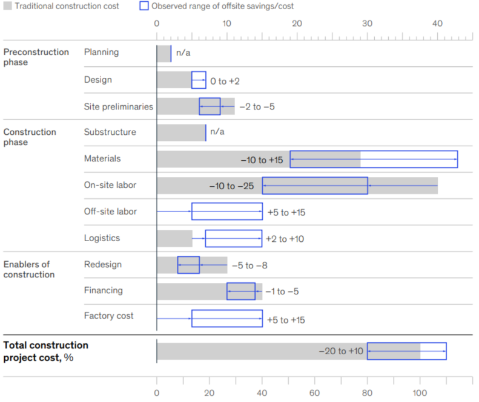

_Figure 2.6 Construction costs and how modularization shifts costs, from McKinsey & Company_ [59] 

## **2.2.6 Learning-by-doing** 

Learning-by-doing has been an effective means to reduce construction costs of nuclear power plants. By having the same construction crew fabricate, construct, and install equipment for multiple units, the crew gains experience and performs each task more quickly using less resources. This effect has primarily been observed in factories. Duffey conducted a broad review of learning-by-doing, analyzing gas turbines, wind turbines, small airplanes, and other industrial equipment. Across all these industries, he observed a 16% learning rate. Learning rate refers to the cost reduction for every doubling of production. _Equation 2.3_ describes how the learning rate, _r_ , is applied for cost reductions from unit number C0 to CN. 

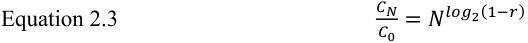

Less often, but still occasionally, the learning rate model is applied to construction projects. Because site crews can change entirely from site-to-site, and learning gains can reset, learning rates for construction projects are typically much lower than for factories. For example, a University of Chicago study suggested a 3-10% learning rate was appropriate for nuclear construction projects [82], and Lyons et al. used a range from 2-15% [81]. The data from Lovering et al. presented in Chapter 1 showed negative learning rates for many reactor series [10]. Berthelemy and Escobar Rangel showed that learning rates were positive conditional on design standardization and that each plant was built by the same architectengineering firm [27]. Therefore, we look to the two most consistent reactor series with available cost data for quantifying nuclear learning rates, the French P4 series and the Korean OPR-1000 series. Figure 2.7 shows the overnight capital costs for reactors built in these series normalized to the first-of-a-kind (FOAK) plant, data from Lovering et al. Both the P4 and the OPR-1000 series were built in pairs, and the costs for each reactor were not reported independently, so the site costs were equally divided between the - pair, and the data in Figure 2.7 reflects this. Interesting, there was minimal cost reductions after the 8[th] OAK, and in the case of the OPR-1000, there were cost escalations afterward. The ETI report indicated most learning effects occur in the first four plants which was consistent with these data [9]. Cost reductions did not exceed 29% of the FOAK cost for either reactor architecture. 

The thesis considered several approaches to modeling learning effects. The first was a simple implementation of Equation 2.3. Minimizing the root mean square error (RMSE) to find the optimal learning rate, _r,_ resulted in the “Learning model” curve in Figure 2.8. The learning rate was 6.1%. The second implementation added a threshold that limited the maximum cost reduction from learning by doing. In this case, the learning rate was 8.6% and the threshold limited cost reductions to 19% of the FOAK cost. The basic learning model had an RMSE of 0.072, and the learning model with a threshold had an RMSE of 0.066, a marginal improvement. 

In both implementations there was not a pathway to implementing the higher learning rates expected for system and structural modules that moved site labor offsite. EEDB reported costs as Factory, Labor, and Material, so We estimated learning rates for each cost category independently. The PWR12-ME factory, labor, and material costs were 45%, 43%, and 14% of total direct costs, and the PWR12-BE breakdown was 57%, 31%, 12% respectively. The direct cost reduction from the PWR12-ME to the PWR12-BE was 24% which was very aligned with the FOAK to NOAK cost reductions for the OPR-1000 and P4 series. 

There were now six unknowns: the learning rates and thresholds for factory, labor, and material costs. To avoid over-fitting the data, four of the unknowns were based on the EEDB data and analysis from Duffey. The factory learning rate was set to 16% with no threshold, consistent with Duffey’s observations. However, from the PWR12-ME to PWR12-BE plants, the factory costs only reduced 2.5%. This was likely because the factory components were not new, so they did not start at N = 1 on the learning curve. 

To limit the cost reductions for factory equipment, N started at 100 which was 2.2% cost savings by N=110 and 4.3% by N=120. This was reset for new systems that were newly modularized where N started at 0. The thresholds for labor and material costs came from the PWR12-ME to BE experience as well. Labor costs for PWR12-BE were 45% lower than PWR12-ME, and material costs were 27% lower, so the thresholds were set at 55% and 73% respectively. 

The same RMSE minimization routine solved for the labor and material learning rates matching the learning curve to the OPR-1000 and P4 data. The labor learning rate was 13.1%, and the material learning rate was 7.1%. As a secondary benchmark, the factory, labor, and material cost breakdown at the 20-OAK was identical to the PWR12-BE breakdown, and the 10-OAK breakdown was very similar with 54% factory costs, 33% labor costs, and 12% material costs. The model performed worse than the standard learning model with a threshold, with an RMSE of 0.076, but it permitted modeling modularization cost savings, so it became the baseline model for the remainder of the thesis. Table 2.11 summarizes the model parameters for the “EEDB based aggregate learning model”. 

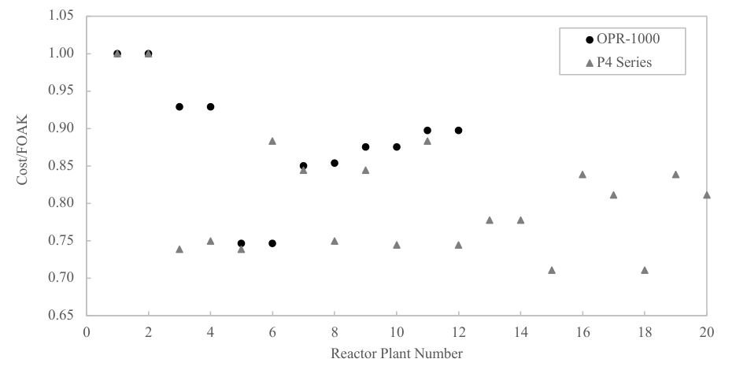

**----- Start of picture text -----** 
1.05 OPR-1000 1.00 P4 Series 0.95 0.90 0.85 0.80 0.75 0.70 0.65 0 2 4 6 8 10 12 14 16 18 20 Reactor Plant Number Cost/FOAK **----- End of picture text -----** 

_Figure 2.7 Cost reductions over time from the first-of-a-kind plant to N-of-a-kind plants for the OPR1000 and P4 reactor series. Data from Lovering et al._ [10] 

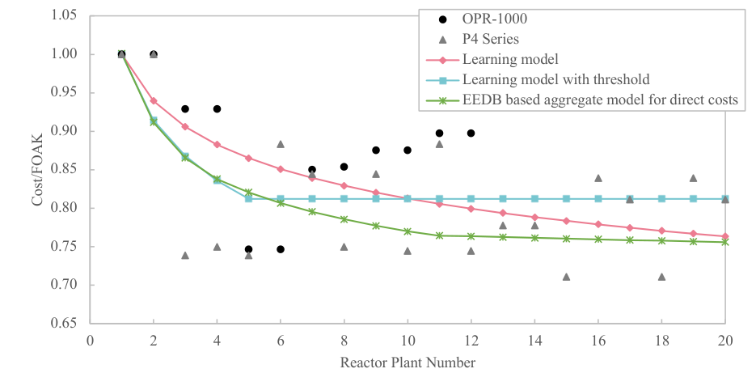

**----- Start of picture text -----** 
1.05 OPR-1000 P4 Series 1.00 Learning model Learning model with threshold 0.95 EEDB based aggregate model for direct costs 0.90 0.85 0.80 0.75 0.70 0.65 0 2 4 6 8 10 12 14 16 18 20 Reactor Plant Number Cost/FOAK **----- End of picture text -----** 

_Figure 2.8 The basic learning model implementation, with a 6.1% learning rate; the learning model with maximum cost reduction limitation, with a learning rate of 8.6% and cost reduction limit of 0.81; and the EEDB based aggregate learning model._ 

_Table 2.11 EEDB based aggregate learning model parameters_ 

## **2.2.7 Indirect cost estimation** 

Indirect costs accounted for 53% of total overnight costs for PWR12-ME and 38% of overnight costs for PWR12-BE (original 1987 costs, not inflated), so they were an important cost driver to quantify. The EEDB indirect costs included construction services, engineering services, home office services, field supervision, and field offices. It also included temporary roads, parking, laydown area, quality assurance, security, insurance, payroll taxes, startup costs, and construction tools. Notably, that excluded what others include, specifically: owner’s land costs, property taxes, financial management costs, and owner’s project management costs. However, these excluded costs were site specific and not generalizable, so they were kept from the overnight cost estimation methodology. 

To estimate the indirect costs, we analyzed the direct and indirect cost escalations and correlations from PWR12-ME and PWR12-BE. The basic model form was: 

## _Equation 2.4_ 𝐼𝑛𝑑𝑖𝑟𝑒𝑐𝑡_𝑐𝑜𝑠𝑡: = 𝐷𝑖𝑟𝑒𝑐𝑡_𝑐𝑜𝑠𝑡2 ∗𝐹: ∗𝐸: 

Where x was factory, labor, or material costs. _F_ was a scaling factor to capture what the primary correlation driving the cost, and _E_ was an escalation factor to capture a secondary effect that increased costs. Indirect labor costs were mostly temporary construction facilities which likely scaled with the 

volume of site labor, so _Direct_costy was Direct_costlabor_ . For both PWR12-ME and PWR12-BE, the indirect labor costs were 36-38% of the direct labor costs, so the _Flabor_ was set 0.36 and _Elabor_ to 1. 

Indirect material costs were mostly major construction equipment and tools purchases and maintenance which likely scaled with the volume of site material cost, so _Direct_costy was Direct_costmaterial_ . For PWR12-BE, indirect material costs were 79% of direct material costs, but for PWR12-ME they were 95%. However, the PWR12-ME averaged 33% more workers onsite during construction than the PWR12-BE, so they likely purchased more equipment to match the increased staff. Therefore, _Fmaterial_ was set to 0.785, and _Ematerial_ was 33% or a given reactor architecture’s average number of works relative to the PWR12-BE. 

Indirect factory costs were mostly field supervision and quality assurance, so they likely scaled with the direct site labor costs not direct factory costs, so _Direct_costy was Direct_costlabor_ . For PWR12-BE indirect factory costs were 132% of direct labor costs, but similar to material costs, the PWR12-ME relationship was higher at 190%. The construction duration for PWR12-ME was 36% longer than the PWR12-BE duration, and this likely escalated the indirect costs accordingly. Therefore, _Ffactory_ was set to 1.32, and _Efactory_ was 36% or a given reactor architecture’s construction duration relative to the PWR12BE. 

Table 2.12 summarizes the indirect cost scaling parameters. This model formulation was highly sensitive to the construction duration. A longer duration escalated the indirect factory costs, but lowered the average number of workers, decreasing the indirect material costs. Figure 2.9 graphically shows the impact of a varying construction duration for a given set of fixed direct costs on the indirect cost elements. These data were for the PWR12-ME in 1987 USD. Interestingly, there was a period where indirect costs were insensitive from about 35-75 months, but extended delays can cause indirect cost escalations over 40%. Therefore, knowing the construction duration was a critical input to the model, so at this stage, durations were taken from vendor estimates, but Chapter 3 describes a methodology for estimating the construction duration for a particular plant, so from Chapter 3 onwards this thesis used the independent estimates. 

_Table 2.12 Indirect cost scaling parameters for Equation 2.4_ 

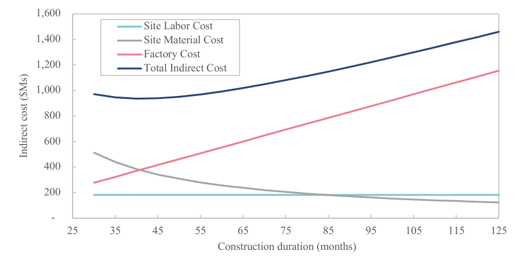

**----- Start of picture text -----** 
 1,600 Site Labor Cost  1,400 Site Material Cost Factory Cost  1,200 Total Indirect Cost  1,000  800  600  400  200  - 25 35 45 55 65 75 85 95 105 115 125 Construction duration (months) Indirect cost ($Ms) **----- End of picture text -----** 

_Figure 2.9 Demonstration of how the indirect cost elements change for varying construction duration. These data were for the PWR12-ME in 1987 USD._ 

## **2.3 Overnight capital cost results** 

The following sections present the cost results starting from intermediate and input SSC values and then total direct and indirect costs. The input values discussed are reactor plant equipment details such as RPV mass, reactor coolant pump (RCP) power, and steam generator (SG) heat transfer area. The full detailed input files are available in the supplementary information to this thesis. The intermediate values are concrete volumes and turbine costs. The full detailed cost breakdowns are available in the supplementary information. Table 2.13 summarizes the modularity, safety, integral reactor, and manufacturing assumptions for the eight reactor architectures. 

_Table 2.13 Summary of assumptions for eight reactor architectures_ 

## **2.3.1 Structures, systems, and components comparisons** 

The specific SSC design and cost data discussed are the total and safety grade concrete, the RPV, the RCP, the SG, the reactor building (RB), the containment liner, and turbine equipment costs. 

## _2.3.1.1 Concrete volumes and structures cost_ 

To estimate the cost of structures, we calculated the total volume of safety and non-safety grade concrete for each of the eight architectures. Some of these values were a valuable benchmark against previous publications shown in Figure 2.1. Figure 2.10 shows the total concrete volume per MWe benchmarked against the values from the 2018 FoN and Peterson et al. The FOAK estimates come from scaled PWR12ME volumes, and the NOAK estimates comes from scaled PWR12-BE volumes. The higher PWR12-ME volumes accounted for rework. The MMNC reference value was for a 12x50 MWe plant, so We updated the reference value to be for a 12x74 MWe plant. There was strong agreement between the reference concrete volumes and the NOAK volumes We estimated as part of the cost analysis. 

Figure 2.11 shows the total and safety grade concrete usage in thousands of cubic meters. The eight reactor architectures varied widely in concrete usage in their structures. For example, the LPSR was designed specifically to reduce building and concrete volumes, and as a result, it had a low concrete volume and the lowest concrete volume per MWe. The NC-SMR had the lowest overall concrete volume but the second highest concrete volume per MWe due to the loss of economy of scale. The MMNC used the highest amount of concrete per MWe of all plants due to the very large size of the reactor building. Interesting to note that despite having a wide variation in absolute concrete usage, the concrete volume per MWe was similar for all architectures except the PWR12 and LPSR. The LASR, DC-PWR, and LMBWR had high volumes of safety grade concrete due to the very large auxiliary buildings surrounding the reactor buildings. 

The structural steel mass for each reactor architecture is in Figure 2.12. These values include the reinforcing steel (rebar), structural steel, and embedded steel.  For the LPSR, NC-SMR, and SM-BWR the mass of the containment vessels was included as well. Similar to the concrete volumes, the LPSR design strategy to minimize the civil structures resulted in the minimum steel mass per MWe. In stark contrast to the steel mass NuScale report to MIT for the 2018 FoN Report, the MMNC plant required the highest mass of steel per MWe – even compared to the smaller reactors such as the NC-SMR and SMBWR. 

Concrete volumes were not perfect predictors of cost. Figure 2.13 shows the Account 21: Structures and Improvements cost for the eight reactor architectures. The strongest correlation was between safety grade concrete and cost, recognizing that the economy of scale lowers the Account 21 cost for some of the high concrete volume designs. There are some Account 21 costs that cannot be eliminated or reduced with smaller reactors, such as the fire house, security building, water and waste treatment, etc. Therefore, even 

with large volumes of concrete, the DC-PWR, LASR, and LM-BWR can achieve costs only marginally higher than the other reactors. Further, reactor containment strategy significantly affects costs. For example, the LPSR had the lowest concrete volume per MWe by at least 40%, but this resulted in only a 4% lower Account 21 cost per kWe due to the higher cost of the standalone steel containment. In Figure 2.13, the cost of the containment vessels for the MMNC plant are shown with a faded color because some may not consider these structures costs. The MMNC containment vessels were modular, factory fabricated, and e-beam welded, so the higher learning rate can be observed in the significant reduction between the FOAK and 10-OAK costs, especially when compared to the cost reductions for the other architectures. 

Figure 2.14 compares the concrete volume and steel mass usage to the Account 21: Structures & Improvements costs for the eight reactor architectures. The correlation was stronger for steel than concrete because steel was the more expensive material and required more labor. For both commodities, the correlation breaks down for the SMRs: NC-SMR and SM-BWR. At the smaller power capacities, even if the structural materials have scaled reasonably well with power rating, other Account 21 costs such as HVAC equipment, formwork, ductwork, etc. account for a larger portion of the cost.  The MMNC was also off the primary trend, but if the containment vessel (CV) mass and cost were included, the MMNC was closer to the trend. 

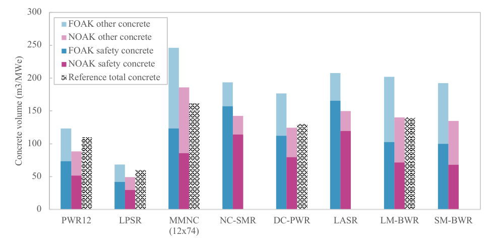

**----- Start of picture text -----** 
300 FOAK other concrete NOAK other concrete 250 FOAK safety concrete NOAK safety concrete 200 Reference total concrete 150 100 50 0 PWR12 LPSR MMNC NC-SMR DC-PWR LASR LM-BWR SM-BWR (12x74) Concrete volume (m3/MWe) **----- End of picture text -----** 

_Figure 2.10 Concrete volume usage per MWe of plant capacity. Reference values from the 2018 FoN report_ [5] _and Peterson et al._ [52] _. MMNC scaled to new capacity of 888 MWe from 600 MWe._ 

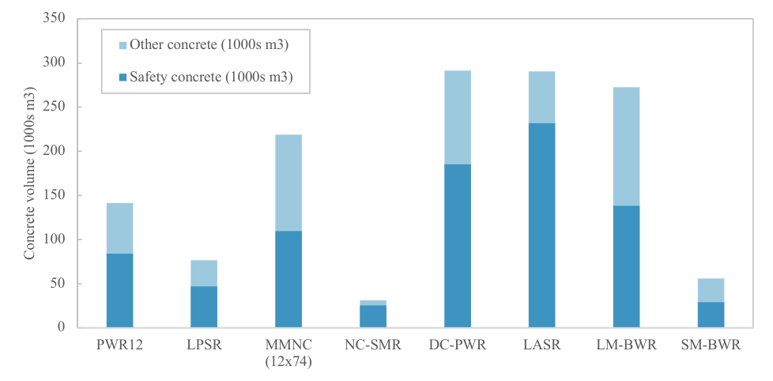

**----- Start of picture text -----** 
350 Other concrete (1000s m3) 300 Safety concrete (1000s m3) 250 200 150 100 50 0 PWR12 LPSR MMNC NC-SMR DC-PWR LASR LM-BWR SM-BWR (12x74) Concrete volume (1000s m3) **----- End of picture text -----** 

_Figure 2.11 FOAK concrete volume for eight reactor architectures_ 

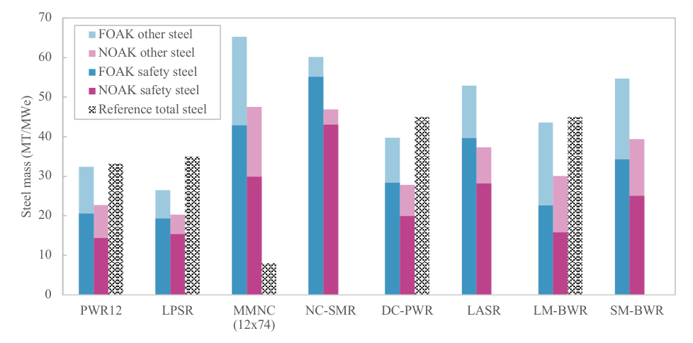

**----- Start of picture text -----** 
70 FOAK other steel 60 NOAK other steel FOAK safety steel 50 NOAK safety steel Reference total steel 40 30 20 10 0 PWR12 LPSR MMNC NC-SMR DC-PWR LASR LM-BWR SM-BWR (12x74) Steel mass (MT/MWe) **----- End of picture text -----** 

_Figure 2.12 FOAK and NOAK steel mass for the eight reactor architectures. Reference values from the 2018 FoN Report_ [5]. 

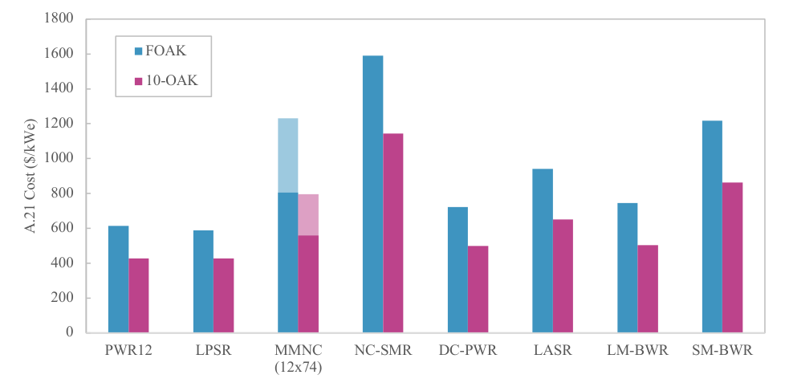

**----- Start of picture text -----** 
1800 1600 FOAK 10-OAK 1400 1200 1000 800 600 400 200 0 PWR12 LPSR MMNC NC-SMR DC-PWR LASR LM-BWR SM-BWR (12x74) A.21 Cost ($/kWe) **----- End of picture text -----** 

_Figure 2.13 A.21 Structures and Improvements specific direct cost per kWe. The faded region for the MMNC is the containment cost which may not be considered a structure._ 

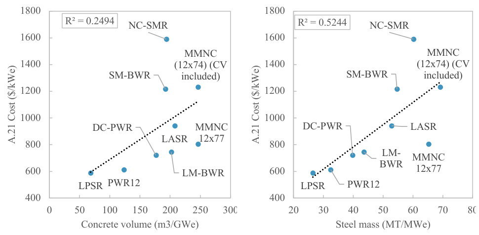

**----- Start of picture text -----** 
1800 1800 R² = 0.2494 NC-SMR R² = 0.5244 NC-SMR 1600 1600 MMNC  MMNC 1400 (12x74) (CV  1400 (12x74) (CV SM-BWR included) SM-BWR included) 1200 1200 1000 1000 DC-PWR MMNC  DC-PWR LASR LASR 12x77 800 800 LM- MMNC BWR 600 LM-BWR 600 12x77 LPSR PWR12 LPSR PWR12 400 400 0 50 100 150 200 250 300 20 30 40 50 60 70 80 Concrete volume (m3/GWe) Steel mass (MT/MWe) A.21 Cost ($/kWe) A.21 Cost ($/kWe) **----- End of picture text -----** 

_Figure 2.14 FOAK material use and structures costs. Left: Account 21: Structures & Improvements cost plotted against the concrete volume. Right: Account 21: Structures & Improvements cost plotted against the steel mass. Note: R[2] includes the MMNC datapoint with the containment vessel._ 

Within Account 21: Structures and Improvements, we can compare the reactor building and containment liners costs for each architecture. The reactor building cost included the containment cost except in the case of the MMNC where the containment was a vessel and are shown in Figure 2.15. Even with this exclusion, the MMNC reactor building was the second most expensive, behind the NC-SMR which had both an expensive standalone steel containment and a loss of economy of scale. The DC-PWR had a 

secondary containment structure over the roof of the reactor building that did not have a steel liner. The DC-PWR secondary containment was a notable feature because the basic cost scaling relations used here project a low cost for the added safety benefit, but the costs presented here did not account for the added difficulty in constructing some structures over others that escalates costs beyond simple relations. The LM-BWR reactor building was wholly inside the auxiliary building, so the auxiliary building cost was included as a secondary RB in Figure 2.15. 

Figure 2.16 has the containment liner costs which were sub-components of the reactor building costs except in the case of the MMNC where the containment was an additional cost. The NC-SMR had the most expensive reactor building and containment cost per unit capacity, but the second lowest absolute cost reactor building at $151M. In contrast, the MMNC had the most expensive RB at $760M, and the LPSR and MMNC had the most expensive containment costs, both at $380M. 

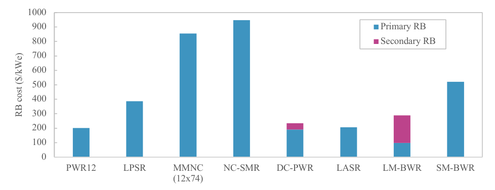

**----- Start of picture text -----** 
1000 900 Primary RB 800 Secondary RB 700 600 500 400 300 200 100 0 PWR12 LPSR MMNC NC-SMR DC-PWR LASR LM-BWR SM-BWR (12x74) RB cost ($/kWe) **----- End of picture text -----** 

_Figure 2.15 Reactor building FOAK specific costs ($/kWe). The DC-PWR had a secondary containment over the roof of the primary reactor building, and the LM-BWR reactor building was inside the auxiliary building, so these secondary structures were included in pink._ 

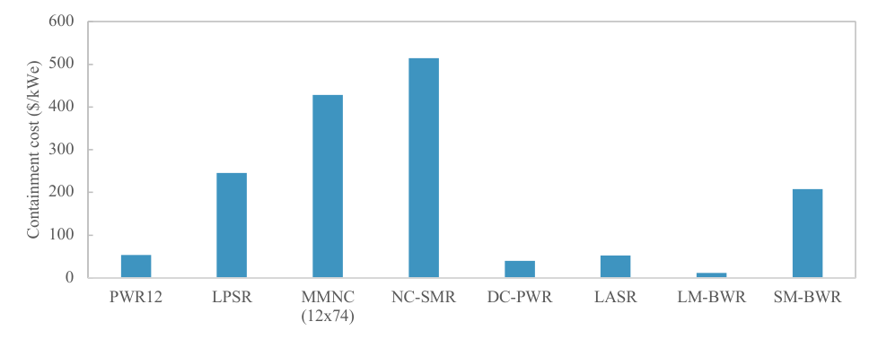

**----- Start of picture text -----** 
600 500 400 300 200 100 0 PWR12 LPSR MMNC NC-SMR DC-PWR LASR LM-BWR SM-BWR (12x74) Containment cost ($/kWe) **----- End of picture text -----** 

_Figure 2.16 Containment liner or structure FOAK specific cost ($/kWe)._ 

## _2.3.1.2 Reactor equipment details and costs_ 

According to Ganda et al., the top three costs inside Account 22: Reactor Equipment Costs accounted for more than half of the total cost, these included: the reactor pressure vessel (RPV), reactor coolant pumps 

(RCP), and the steam generators (SG).  The RPV cost scaled with mass, the RCP cost scaled with count and power, and the SG cost scaled with count and heat transfer area. 

The BWRs had much higher mass RPVs than the PWRs simply due to the power density of the reactor core. The LM-BWR vessel was more than double the mass of the next largest vessel which was the LASR. The DC-PWR and LASR vessels were very similar in mass, but the DC-PWR vessel produced 18% more power, so the cost per kWe was much lower. The MMNC had the most expensive vessel per kWe because the vessel was 26% lighter than the LPSR vessel but each MMNC module only produced 7% of the power of the LPSR. Some of the higher cost was offset by the advanced manufacturing methods developed by EPRI and some by learning by doing. The learning cost reduction for installing 12 modules lowered the labor costs by 28%, the material costs by 16%, and the factory costs by 33% for the RPV. Absent these factors, the MMNC vessel cost would have been 2.5x higher. 

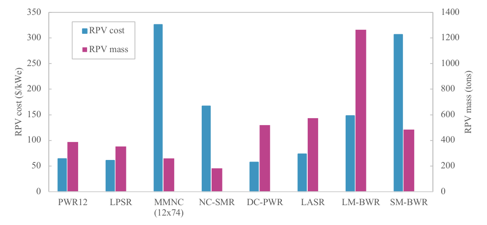

**----- Start of picture text -----** 
350 1400 RPV cost 300 1200 RPV mass 250 1000 200 800 150 600 100 400 50 200 0 0 PWR12 LPSR MMNC NC-SMR DC-PWR LASR LM-BWR SM-BWR (12x74) RPV cost ($/kWe) RPV mass (tons) **----- End of picture text -----** 

_Figure 2.17 RPV mass and FOAK cost for the eight reactor architectures (includes vessel, internals, supports, and transport costs)_ 

The SG was one of the only SSCs with a cost scaling exponent greater than one, thus having negative economies of scale. Negative economies of scale mean that it was more cost effective to have multiple smaller SGs than fewer large ones. However, there are knock-on effects to SG size such as RB crane size and spacing inside the RB that might drive a designer to choose a costlier SG design. The PWR12 and DC-PWR had four SGs, the MMNC had one SG per reactor, and the rest had two SGs. Figure 2.18 has the SG costs. The BWRs had no SGs, somewhat making up for the lower core power density and high vessel costs. The MMNC plant had an integral RPV and SG, so it did not have a separate vessel for the SG – resulting in lower SG costs that somewhat offset the higher vessel cost. The MMNC SG was a helical coil type SG instead of a traditional U-Tube steam generator. Ganda et al. noted that SG costs were more mass driven than design driven. As such, the cost estimate methodology assumed the same heat transfer area-based scaling from a shell and tube type SG. Nevertheless, manufacturing costs may be higher for this novel SG type. The four-SG architecture of the PWR12 and DC-PWR led to lower costs than the two-SG architecture of the LPSR and DC-PWR. The lost economy of scale raised the NC-SMR costs. 

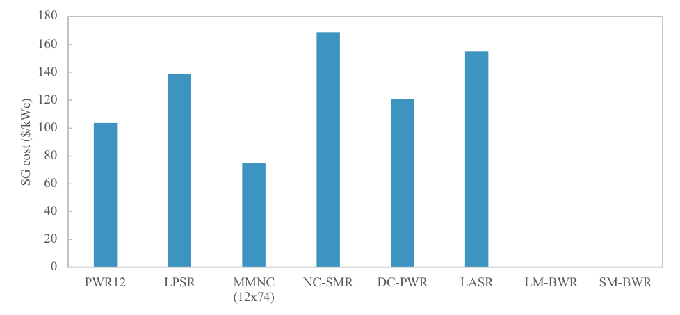

**----- Start of picture text -----** 
180 160 140 120 100 80 60 40 20 0 PWR12 LPSR MMNC NC-SMR DC-PWR LASR LM-BWR SM-BWR (12x74) SG cost ($/kWe) **----- End of picture text -----** 

_Figure 2.18 FOAK steam generator costs for the eight reactor architectures_ 

The RCP costs and powers did not vary significantly among the architectures except the natural convection plants did not have them and the LM-BWR had much smaller internal recirculation pumps. Figure 2.19 has the RCP power demand and costs. The pumps were similar in power as well, so the economy of scale drove much of the cost variation. The LM-BWR had ten low power internal recirculation pumps that were much lower cost than the large RCPs for PWRs. 

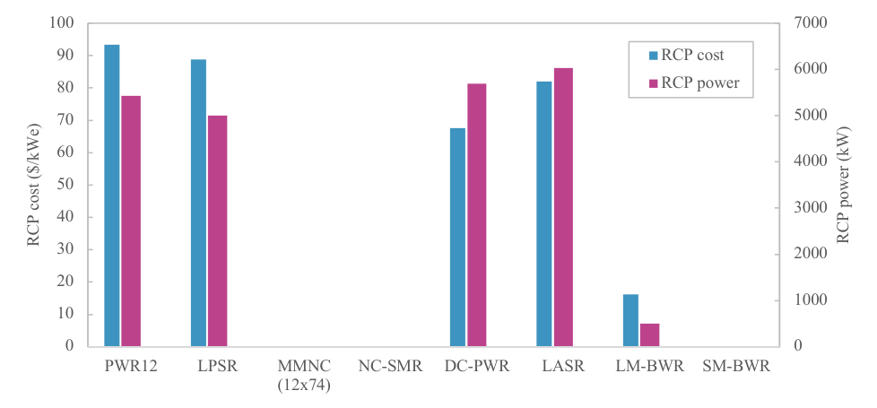

**----- Start of picture text -----** 
100 7000 90 RCP cost 6000 80 RCP power 70 5000 60 4000 50 3000 40 30 2000 20 1000 10 0 0 PWR12 LPSR MMNC NC-SMR DC-PWR LASR LM-BWR SM-BWR (12x74) RCP cost ($/kWe) RCP power (kW) **----- End of picture text -----** 

_Figure 2.19 RCP power and FOAK costs for the eight reactor architectures_ 

The Account 22: Reactor Plant Equipment costs in Figure 2.20 show that the net result of these primary system SSC costs led to the SMRs having the highest FOAK costs. However, modularization greatly increased the learning rate of the SMRs, so the NOAK costs were near the NOAK costs for the PWR12, LPSR, and LASR. The LM-BWR had the lowest cost by balancing simplicity, modularization, and economies of scale, and the DC-PWR also had low reactor equipment costs due to economy of scale. 

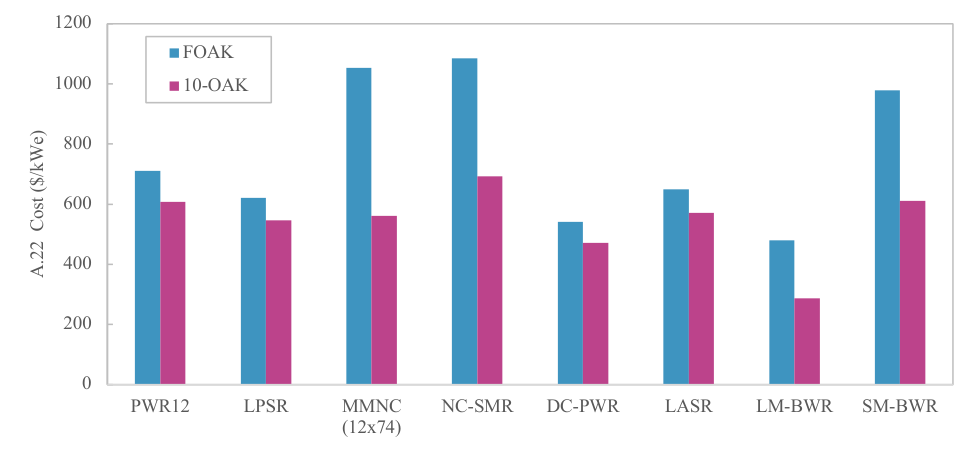

**----- Start of picture text -----** 
1200 FOAK 1000 10-OAK 800 600 400 200 0 PWR12 LPSR MMNC NC-SMR DC-PWR LASR LM-BWR SM-BWR (12x74) A.22  Cost ($/kWe) **----- End of picture text -----** 

_Figure 2.20 Account 22: Reactor plant equipment costs for the eight reactor architectures_ 

## _2.3.1.3 Sensitivity of RPV and reactor building height to cost_ 

All the U.S. leading LWR SMRs operate with natural circulation. In general, natural circulation gives rise to tall RPVs resulting in tall reactor buildings. To quantify the sensitivity of costs to the height of the reactor building, we considered a case where the SM-BWR was assumed to be designed with a 2-metertall core as opposed to the planned 4-meter core. A 2-meter shorter fuel height, results in a 3-meter shorter RPV, and an 8-meter shorter reactor building because the control rod drive mechanisms are shorter, and the bottom of the vessel requires less space. The shorter RPV lowered RPV cost by 11%, Account 22: Reactor Plant Equipment costs by 3.6% ($35/kWe or $10M) for the FOAK plant. Account 21: Structures & Improvements costs decreased 5% ($61/kWe or $18M). The total direct cost savings was $28M, and the total direct and indirect cost savings was $54M. 

## _2.3.1.4 Turbine costs_ 

The turbine costs were also very similar across the reactor architectures despite large variations in power capacity and economy of scale. Modularization of the SMR turbines (MMNC, NC-SMR, and SM-BWR) lowered the cost, and learning by doing for the twelve module MMNC plant lowered turbine factory costs an additional 33% for the FOAK. Other strategies for lowering turbine costs include eliminating the feedwater heating system to simplify the turbine piping and equipment as the NC-SMR does. Account 234: Feedwater Heating System was typically 13% of Account 23 costs, so eliminating this system lowered the Turbine Plant Equipment costs by 13% for the NC-SMR ($13M or 2% of direct costs). There is also potential for cost savings by using “off the shelf” turbines that OEMs produce more regularly. However, these “off the shelf” turbines typically have significantly different steam conditions (565°C as opposed to 290°C and >150 bar as opposed to 35 bar) because they are placed inside combined cycle gas turbines. Thus, this may be a better cost reduction strategy for high temperature reactors. 

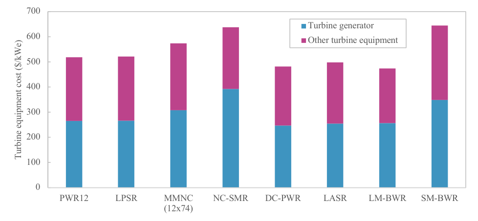

**----- Start of picture text -----** 
700 Turbine generator 600 Other turbine equipment 500 400 300 200 100 0 PWR12 LPSR MMNC NC-SMR DC-PWR LASR LM-BWR SM-BWR (12x74) Turbine equipment cost ($/kWe) **----- End of picture text -----** 

_Figure 2.21 Turbine generator and other turbine equipment FOAK costs for the eight reactor architectures_ 

## **2.3.2 Benchmarks** 

Table 2.14 shows the overnight cost benchmarks between these estimates and other public estimates. These were intentionally not labeled validation or verification because nuclear project costs are site dependent and volatile, but they provided a valuable benchmark that the methodology was appropriately capturing cost trends. 

The LPSR reference FOAK cost estimate came from a report by the NEA which was very close to the estimate, but the realized cost was much higher than both estimates. Recall that the FOAK cost estimates did not include the effects of an inexperience workforce, an incomplete design, and a novel supply chain, so they were termed a “best-case” FOAK estimate.  A RAND Corporation report on megaprojects from Merrow et al. conducted an extensive regression analysis on a database of large infrastructure projects including nuclear projects. Their work stated that projects with FOAK construction technology can expect 59% cost escalations on average, and projects that face regulatory issues can expect 78% cost escalations on average [83]. Others have suggested that all large infrastructure projects face significant cost escalations due to optimism bias and/or management challenges [84,85]. These were additional reasons that the estimates produced in this thesis are best considered relative to one another as opposed to standalone estimates. Section 2.6 and Chapters 3 and 4 explored the megaproject risks associated with each project. The FOAK – China estimate for the LPSR came from assuming labor rates in China were 5- 18% of US labor rates [5], that 30-50% of factory costs were labor costs [78], and commodity prices were up to 25% lower [86]. These two benchmarks suggested that both the total cost estimates were on track and that the breakdown of material, labor, and factory costs was reasonable. 

The LASR benchmark came from the Barakah site in the United Arab Emirates (UAE). These four reactors were not the first four APR1400s constructed, but they were the first four in the UAE, so We treated them as a FOAK project. To make the comparison, we averaged the FOAK to 4-OAK cost estimates for the LASR. This estimate was not corrected labor and material indices because it was more difficult to find concrete labor and material indices for the UAE, but an international construction cost index from Arcadis indicated that UAE construction costs are 85-105% of US construction costs [87]. 

The MMNC benchmark came directly from a NuScale Power press release to World Nuclear News after announcing their power uprate from 60 to 77 MWe modules. This estimate from NuScale was similar to an estimate by Black et al. [60] that estimated $3,466/kWe for the 60 MWe module version which would be $2,700/kWe for the uprated version. In a press release to World Nuclear News, NuScale indicated the power uprate lowered specific costs $750/kWe – similar to $840/kWe savings estimate in this work. Black et al. also estimated the NuScale plant cost by scaling the EEDB PWR12 costs, but in their work several EEDB costs were replaced by proprietary vendor estimates provided by NuScale. The two-digit accounts with the greatest differences between my estimate and that of Black et al. were Account 21: Structures and Improvements and Account 23: Turbine Plant Equipment. We included the containment vessel in Account 21 which may explain some of the difference, but then the primary difference would be in Account 22: Reactor Equipment where Black et al. cites the proprietary data. Also, Black et al. reported that the NuScale Account 21 costs were lower than the PWR12 costs which seems unlikely given the vast amount of concrete required for the MMNC reactor building (see Figure 2.11 and Figure 2.13). 

The Energy Policy Institute of Chicago updated a 2004 cost estimate from TVA for the ABWR to be $2,800/kWe in 2010 USD ($3,200/kWe in 2018 USD) [88]. However, this estimate included $1,000/kWe in contingency and owner’s costs, and owner’s costs were excluded from the estimates in this thesis. 

A report from Pricewaterhouse Coopers LLP stated that GE-Hitachi and Ontario Power Generation would spend $2B (Canadian dollars) over seven years in Canada to deploy a FOAK BWRX-300 [89]. Assuming these were all plant costs, that would be $5,520/kWe – within 9% of the $6,089 estimated here. 

_Table 2.14 Overnight capital cost benchmarks_ 

## **2.3.3 Results** 

This section presents the total, direct, and indirect overnight costs for the eight reactor architectures, as well as the cost reductions due to learning-by-doing for the first 10 plants. 

## _2.3.3.1 Best-case FOAK & 10-OAK estimates_ 

Recall that the FOAK estimates produced here were considered “best-case” FOAK costs. These only accounted for the median cost overruns experienced in the 1970s and 1980s, and, therefore, much higher cost overruns were possible. The 10-OAK costs resulted from the learning model applied over ten plants. 

Figure 2.22 has the overnight direct costs for the FOAK and the 10-OAK costs. First, there was not significant variation in direct costs among the large single unit LWRs. The FOAK LPSR was 10% lower cost than the PWR12, and the DC-PWR and LM-BWR were 7% and 5% lower cost, respectively. The LASR was 14% higher cost because the SSCs were similar in size to the DC-PWR SSCs but at a lower power capacity. The MMNC, NC-SMR, and SM-BWR had 45%, 75%, and 47% higher FOAK cost than the PWR12, respectively. By the 10-OAK, the MMNC, NC-SMR, and SM-BWR only had 10%, 50%, and 24% higher direct costs than the PWR12, respectively. So, learning by doing closed some of the direct cost gap because the total effective learning rate was higher for the more modular plants. 

The LM-BWR and the MMNC had the greatest FOAK to 10-OAK direct cost reduction with 36% and 40% reductions, respectively. The LPSR, DC-PWR, LASR, and PWR12 had the smallest direct cost reductions, all near 20%. These FOAK to 10-OAK cost reduction variations were due to the enhanced learning by doing effect for more modular plants. 

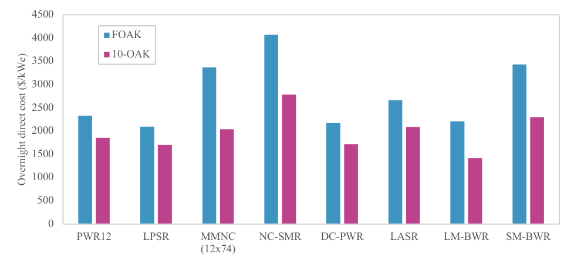

**----- Start of picture text -----** 
4500 4000 FOAK 10-OAK 3500 3000 2500 2000 1500 1000 500 0 PWR12 LPSR MMNC NC-SMR DC-PWR LASR LM-BWR SM-BWR (12x74) Overnight direct cost ($/kWe) **----- End of picture text -----** 

_Figure 2.22 Overnight direct costs for the eight reactor architectures_ 

Indirect costs heavily depended on the construction duration estimate, as shown in Figure 2.9, and therefore, reducing indirect costs was both a function of reducing the direct costs and the construction schedule. Reducing construction times for the 10-OAK showed the greatest reduction in indirect costs, such as the LPSR with a 44% reduction in indirect costs. Other more modular plants such as the MMNC and LM-BWR only reduced indirect costs 25% and 37%, respectively. This was because the high degree of modularization in these plants lowered the site supervision and construction durations for the “bestcase” FOAK. The DC-PWR had the smallest decrease in indirect costs because Framatome claimed a 40month FOAK construction timeline for the EPR, so there was only marginal room for improvement. These assumed construction schedules were revisited in Chapter 3, and the indirect cost estimates were updated. Specifically, the DC-PWR duration estimate was 50-100% longer than the estimate given by Framatome, so the DC-PWR indirect cost in Figure 2.23 likely underestimate the indirect costs. Clearly, this claim was proven untrue, and the FOAK schedule was significantly longer. Chapter 3 explored construction times, and their indirect cost impacts more thoroughly. 

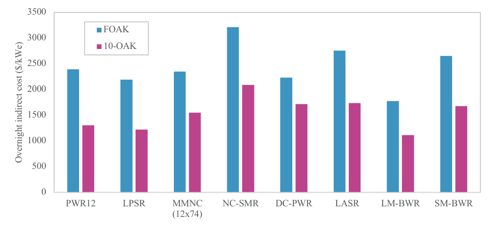

**----- Start of picture text -----** 
3500 FOAK 3000 10-OAK 2500 2000 1500 1000 500 0 PWR12 LPSR MMNC NC-SMR DC-PWR LASR LM-BWR SM-BWR (12x74) Overnight indirect cost ($/kWe) **----- End of picture text -----** 

_Figure 2.23 Overnight indirect costs for the eight reactor architectures._ 

Figure 2.24 has the total overnight costs for the eight architectures. The LM-BWR was the lowest cost both FOAK and 10-OAK, and the NC-SMR was the most expensive in both cases. The MMNC’s lost economy of scale was mitigated by the intra-plant learning rate for multiple reactors and turbine systems. However, in the case of the SMRs, the proper comparison is the cumulative cost for equivalent capacity deployed which is discussed in the following section. 

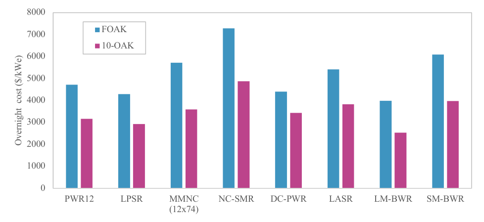

**----- Start of picture text -----** 
8000 FOAK 7000 10-OAK 6000 5000 4000 3000 2000 1000 0 PWR12 LPSR MMNC NC-SMR DC-PWR LASR LM-BWR SM-BWR (12x74) Overnight  cost ($/kWe) **----- End of picture text -----** 

_Figure 2.24 Overnight total costs for the eight reactor architectures_ 

## **2.4 Cumulative capacity and cumulative cost** 

One of the SMR cost saving factors discussed by Carelli et al. and the IAEA were the financial aspects from sequential deployment. Constructing 5-10 smaller reactors puts less total capital at risk at any given 

point in time and leverages learning rates. So, Figure 2.25 shows the cumulative cost for sequential deployments of the eight reactor architectures. 

For very large deployment markets, greater than 3-4 GWe of cumulative demand, the LM-BWR and LPSR were the unequivocally the lowest cost options. However, the cost-optimal choice becomes less clear at lower cumulative demand capacities. For example, in Figure 2.26, we see that although the SMBWR had a higher overnight capital cost (both FOAK and 10-OAK) than the MMNC plant, the learningby-doing effect of sequential deployments meant the SM-BWR was the lower cost option for all cases. This was similarly true of the SM-BWR and the LASR, where the LASR had a lower FOAK cost, but the cumulative deployment cost for ~1400 MWe of capacity was lower with five SM-BWRs than a single LASR. In both cases, the SM-BWR never required deploying more than $1.8B in capital, the cost for the FOAK plant. In contrast, the FOAK MMNC required $5B and the LASR required more than $7B. The risk of megaproject style cost overruns escalates dramatically at this higher cost points. The NC-SMR remained the most expensive option compared to the other reactors but by the 3-OAK required less than $1B to deploy each sequential unit. Six NC-SMRs required $6.6B to deploy 1.1 GWe of capacity compared to a single LPSR for $4.8B, but the risk profile for FOAK cost overruns and delays was much larger for the LPSR. This chart was revisited in Chapter 5 considering above-median FOAK cost overrun risks. 

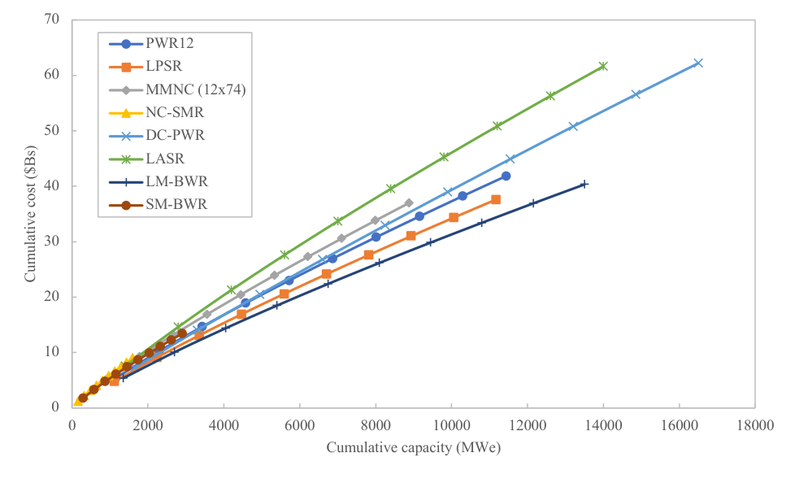

**----- Start of picture text -----** 
70 PWR12 LPSR 60 MMNC (12x74) NC-SMR 50 DC-PWR LASR 40 LM-BWR SM-BWR 30 20 10 0 0 2000 4000 6000 8000 10000 12000 14000 16000 18000 Cumulative capacity (MWe) Cumulative cost ($Bs) **----- End of picture text -----** 

_Figure 2.25 Cumulative cost and capacity for sequential deployments of each reactor architecture. Only includes the overnight costs. After calculating the construction durations, this plot was recreated to include IDC in Chapter 3._ 

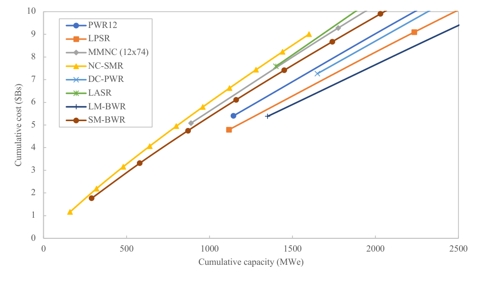

**----- Start of picture text -----** 
10 PWR12 9 LPSR 8 MMNC (12x74) NC-SMR 7 DC-PWR LASR 6 LM-BWR SM-BWR 5 4 3 2 1 0 0 500 1000 1500 2000 2500 Cumulative capacity (MWe) Cumulative cost ($Bs) **----- End of picture text -----** 

_Figure 2.26 Zoomed-in cumulative cost and capacity for sequential deployments of each reactor architecture. Only includes the overnight costs. After calculating the construction durations, this plot was recreated to include IDC in Chapter 3._ 

## **2.5 MMNC design variations** 

Giving designers insight into the consequences of different design options was one of the intended purposes of developing the cost estimation tool. With design-specific cost information, designers can make more cost-optimal design decisions. To demonstrate this capability, we explored four different versions of the MMNC architecture: 12x57 MWe plant (representative of a previous version of the NuScale plant), the uprated 12x74 MWe plant, a 6x74 MWe plant, and a 12x74 MWe plant that replaced the passive safety systems with active ones. 

Structurally, nothing changes for the 57 MWe module plants compared to the 74 MWe module plant, so the size of the reactor, waste process, control room, turbine and other buildings remained unchanged. Similarly, the size of the RPV, SG, containment vessel, and safety cooling pool were the same. For the 6- module plant, the reactor and turbine buildings decreased from 107 meters long to 88 meters long. The 19-meter decrease was roughly the width of three module bays. Instead of two turbine buildings, the 6- module plant only had one turbine building. The active safety MMNC plant eliminated the reactor building pool liner and introduced safety injection systems, residual heat removal systems, and combustible gas control. There was one system per reactor module in the plant. Further, the active safety plant required safety grade electrical plant equipment. 

I compared these four designer variations on several cost metrics: overnight cost, overnight cost per kWe, two-digit account cost, and cumulative cost for cumulative capacity. The first comparison, in Figure 2.27, showed that the overnight absolute cost was not substantially different for the three 12 module architectures. The 12x57 plant was 5% lower cost ($250M) than the 12x74 plant, and the 6x74 plant was 

34% lower cost ($1.7B). The power uprate from 57 to 74 MWe modules came at almost no additional cost. Despite having 50% less modules, the cost did not decrease 50% because there were significant shared structural space and systems. Therefore, Figure 2.28, which has the overnight cost per kWe capacity, shows significantly higher costs for the 12x57 plant (+24%) and the 6x74 plant (+33%). Figure 2.29 shows the two-digit account breakdown of direct costs, and Account 21: Structures & Improvements accounted for most of the cost escalation for both the 12x57 MWe and 6x74 MWe plants. This implied that structures were the least scalable cost for reactor plants – recall the RB shrank only 20% despite removing half the modules. The 6-module plant cost $3.3B for the FOAK, and $2.1B for the 10-OAK, not quite into megaproject risk-free territory, but closer than either 12 module plant. 

The active safety MMNC plant cost was essentially equal the reference passive safety plant. The costs in Figure 2.27 and Figure 2.28 are only different by 1-1.5% or about $55M. The two-digit cost breakdown in Figure 2.29 gives better insight into how the costs were redistributed for the active safety version. The Account 21: Structures & Improvements costs were 11% lower ($342/kWe) due to the elimination of the reactor building pool. The Account 22: Reactor Equipment costs were 8% higher ($132/kWe) due to the added safety systems, and the Account 24: Electrical Equipment were 86% higher ($36/kWe) due to the necessary redundancy and safety graded equipment. In net, these effects make the active/passive safety strategy decision unclear, so Chapters 3 and 4 explore the construction and risk impacts of these design variations. 

Figure 2.30 shows the cumulative cost for cumulative installed capacity for the four MMNC variations. Interestingly, the 12x57 and 6x74 plants follow almost an identical trajectory, but the 6x74 plant requires less capital deployed at any given time. The active and passive safety 12x74 MWe versions also followed very similar trajectories. The FOAK cost differences between the 6x74 and 12x74 plants was 33%, but cumulative cost difference to install 7 GWe was only 16% different ($5B), so the learning-by-doing of the smaller plant was able to close the gap while lowering the overall financial risk. 

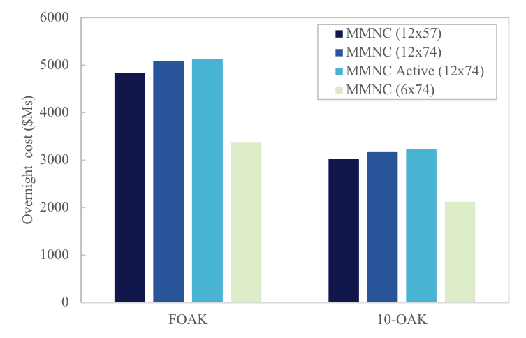

**----- Start of picture text -----** 
6000 MMNC (12x57) MMNC (12x74) 5000 MMNC Active (12x74) MMNC (6x74) 4000 3000 2000 1000 0 FOAK 10-OAK Overnight  cost ($Ms) **----- End of picture text -----** 

_Figure 2.27 Overnight cost in millions of dollars for the four MMNC variations_ 

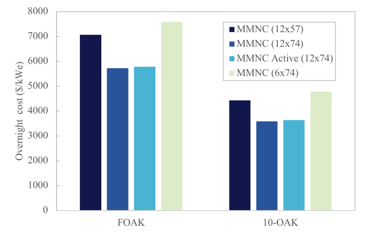

**----- Start of picture text -----** 
8000 MMNC (12x57) 7000 MMNC (12x74) 6000 MMNC Active (12x74) MMNC (6x74) 5000 4000 3000 2000 1000 0 FOAK 10-OAK Overnight  cost ($/kWe) **----- End of picture text -----** 

_Figure 2.28 Overnight cost in $/kWe for the four MMNC variations_ 

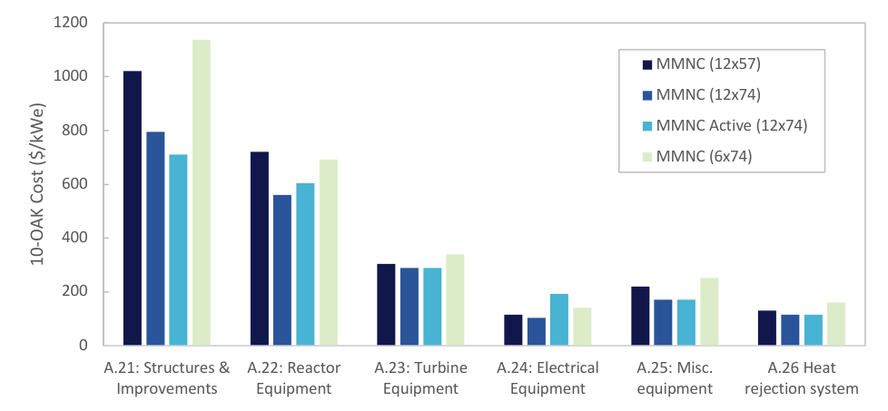

**----- Start of picture text -----** 
1200 MMNC (12x57) 1000 MMNC (12x74) 800 MMNC Active (12x74) MMNC (6x74) 600 400 200 0 A.21: Structures & A.22: Reactor A.23: Turbine A.24: Electrical A.25: Misc. A.26 Heat Improvements Equipment Equipment Equipment equipment rejection system 10-OAK Cost ($/kWe) **----- End of picture text -----** 

_Figure 2.29 Two-digit costs ($/kWe) for the four MMNC variations_ 

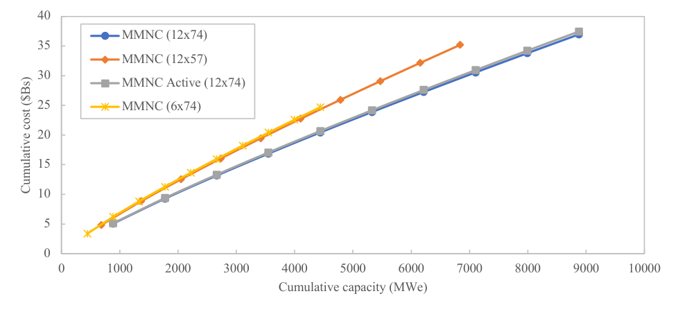

**----- Start of picture text -----** 
40 MMNC (12x74) 35 MMNC (12x57) 30 MMNC Active (12x74) 25 MMNC (6x74) 20 15 10 5 0 0 1000 2000 3000 4000 5000 6000 7000 8000 9000 10000 Cumulative capacity (MWe) Cumulative cost ($Bs) **----- End of picture text -----** 

_Figure 2.30 Cumulative cost per cumulative capacity for the MMNC variations. Only includes the overnight costs. After calculating the construction durations, this plot was recreated to include IDC in Chapter 3._ 

## **2.6 Megaproject risk table** 

Chapters 3 and 4 will perform an in-depth exploration of megaproject risk, but it is important to list highlevel attributes in this chapter to provide the appropriate context for the cost estimates shown thus far. As previously stated, the FOAK cost estimates made here were really “best case” FOAK costs in that they were scaled from the PWR12-ME which was not representative of the highest cost overrun plants constructed in the US. Further, experience at the US Vogtle site with two new AP1000s constructed for 2x their original estimates suggests that FOAK costs are much higher in practice. Therefore, Table 2.15 highlights some megaproject risk factors for the eight reactor architectures. 

Megaprojects are a whole field of study with countless publications exploring the factors that cause cost overruns and construction delays. There is not agreement within the field as to whether any such list of factors are causal or if more elusive factors such as optimism bias, stakeholder conflict, and organizational complexity are the problem [91]. Other risk factors are true for all nuclear projects: interdependent systems, regulation, multidisciplinary teams. However, properly contextualizing the cost estimates required creating a link between design-specific attributes and megaproject risk. 

Therefore, a literature review ([33,83–85,91–93]) resulted in the factors shown in Table 2.15. The NCSMR was the only FOAK project that cost less than $1.5B, although the SM-BWR was close at $1.8B. Most of the reactors proposed using a new construction method, or at least a method that is new to the nuclear industry. These were steel plate composites, steel bricks, standalone steel containment structures, etc. The best-case FOAK labor hours were greater than 17 million person-hours of onsite work for all of the large reactor plants, including the MMNC. This was an important takeaway, although the modules of the MMNC were considered SMRs, the large size of the reactor building and total plant size makes it more risk-aligned with other large reactors, not other SMRs. The LM-BWR was the most modular of the large reactors Most of the reactors increased the level of modularization over previous generations of nuclear plants, but even still there was some variation. The high labor cost designs of the DC-PWR and 

LASR were well suited to markets and regions where labor costs are low and there is ample supply of workers. In other words, these were sub-optimal designs for the US and Europe but more reasonable for China, South Korea, and the UAE. A final factor that was not included in Table 2.15 was the experience of the engineering, procurement, and construction (EPC) contractor. An EPC that is new to the nuclear industry and has not fabricated, transported, and installed nuclear equipment will likely experience cost escalations and construction delays. However, each reactor vendor can select the EPC contractor to construct their architecture, so this factor was not inherent to a particular design. 

## **Chapter 3 – Construction duration estimation** 

## **3.1 Literature review** 

For nuclear projects, financing costs are such a large fraction of total costs that estimating the construction duration is a critical element of accurate cost estimates. Supply chain delays, human error, and design changes can cause construction delays that further escalate financing costs by both increasing the IDC and increasing the interest rate by being a higher risk project. To evaluate the consequence of these factors on cost and schedule requires a reference schedule to perturb. Therefore, this chapter discusses the ways others have estimated nuclear construction schedules and then presents a new methodology. We applied the new method to the eight reactor architectures and evaluated the sensitivity to labor constraints and indirect cost effects. 

Estimates of construction durations fit into five categories in decreasing order of detail: vendor estimates, Gantt charts, material consumption rates, system dynamics, and power law scaling. 

## **3.1.1 Vendor estimates** 

In a DOE sponsored study, Dominion Energy, Bechtel Power Corporation, TLG, and MPR Associates reviewed the technical details of the ABWR, ACR-700, AP1000, and ESBWR including the construction schedules [94]. The reactor vendors provided estimates of the construction durations (site prep to fuel load) for FOAK projects in the US, shown in Table 3.1. Both GE and Toshiba provided estimates for the ABWR schedule which, interestingly, were the longest and shortest durations of the list. All of the estimates were within +/-3.5 months of each other which was likely well into the uncertainty of the estimates and may suggest that these schedules were back fit into a predetermined timeline, as opposed to independent estimates. 

_Table 3.1 Vendor construction durations provided to Dominion Energy in 2004_ [94] _._ 

To evaluate the validity of these schedules, Dominion et al. compared them to historical construction rates in the US. They produced  Table 3.2 that has the average construction duration by year for nuclear projects from 1970-1986. These were the durations from the start of site preparation to receiving the operating license. The vendor estimates from Table 3.1 were more aggressive than even the best year in nuclear construction in the US: 1970, and they were a 75% reduction in schedule from the most recent experience in 1986 where the average duration was 125 months. These significant discrepancies reiterate the need for independent review of schedules published by reactor vendors. 

_Table 3.2 Construction schedules for U.S. nuclear plants 1970-1986. Data from Dominion Energy_ [94] _._ 

Since the 2004 Dominion study, other reactor vendors published FOAK and NOAK construction estimates for some of the eight reactors considered in this thesis, and the APR1400 has completed a FOAK plant. Table 3.3 shows published estimates of construction schedules for the eight reactor architectures. Note that these were estimates, and only the APR1400 and ABWR have completed a FOAK plant as of this work. The AP1000 and EPR both have completed projects in China and nearly completed projects in the US and Europe, respectively. However, these projects have been plagued with worse than “best case” FOAK delays, so they were excluded from Table 3.3. 

_Table 3.3 Published construction durations for the eight reactor architectures_ 

In addition to the reactor vendor estimates, there have been estimates from research institutions on other reactor concepts. For example, Maronati et al. stated that the Inherently Safe Light Water Reactor would have a four-year construction schedule [56]. However, there was no detailed information provided for this estimate. For generic SMR construction timelines, Abdulla elicited expert opinions to estimate the 

reduced construction times for SMRs compared to large reactors [96]. On average, the sixteen experts projected three-year schedules for SMRs and five-year schedules for large reactors. These expert opinions highlight the importance of design specific estimates as opposed to generic architecture estimates because the ABWR, a large reactor, has achieved near three-year construction schedules [49]. 

## **3.1.2 Gantt charts** 

The vendor estimates were likely produced by creating detailed Gantt charts of construction activities. Gantt charts are timelines of interdependent engineering and construction tasks that organize site activities for planning purposes. Each task typically has a predecessor task that must be partially or fully complete before the next task can begin. Gantt charts are effective tools for identifying the critical path for large projects. Figure 3.1 shows the Gantt chart for engineering and construction activities for the PWR12 Better Experience plant. In this Gantt chart, the critical path was NRC review of the construction permit application, the reactor building foundation, the containment liner and other reactor building structures, and finally the reactor equipment and piping. In parallel, the other tasks were scheduled such as erecting the other structures, installing other equipment, and laying cable and pipe. Organizing a project into a Gantt chart gives the project manager the high-level view of the project to level load staffing level and fabrication. 

Figure 3.2shows the nuclear steam supply section of the construction schedule for the Open-100 PWR from the Energy Impact Center. This was an example of more specific level of depth from the PWR12 Gantt chart, and the level detail can increase greatly from here as well. The proposed timelines between the two schedules was stark. For example, the PWR12 timeline allotted 12 months to pouring the reactor building foundation, and the Open-100 timeline only scheduled 2.5 months. The difference was likely both the result of significantly different construction pace assumptions and design differences between the two reactors. Building a detailed Gantt chart unique to a particular reactor requires thousands of engineering hours and millions of dollars, and to compare reactors in an “apples to apples” fashion, Gantt charts must be built under the same set of assumptions. Therefore, it is unreasonable to assume a single entity could conduct independent estimates of construction durations by building Gantt charts for each reactor architecture. 

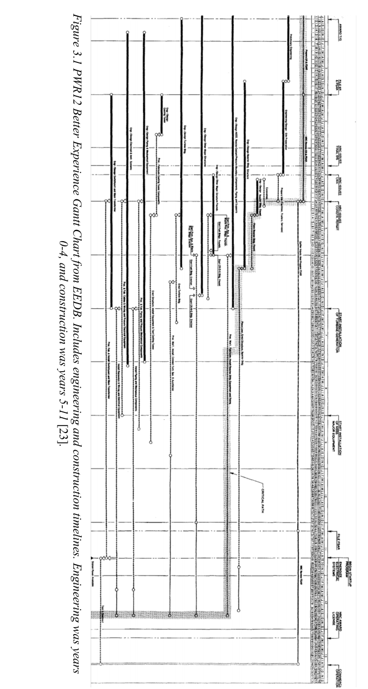

**----- Start of picture text -----** 
0-4, and construction was years 5-11 [23] . Figure 3.1 PWR12 Better Experience Gantt Chart from EEDB. Includes engineering and construction timelines. Engineering was years **----- End of picture text -----** 

68 

## **3.1.3 Material consumption rates** 

Because building detailed Gantt charts can be time consuming and subject to varying assumptions, another way to compare schedules was considering material consumption rates. This was akin to the commodity use estimates discussed in Chapter 2, just adding in a time element. In their study of advanced reactors in 2004, Dominion Energy published a table of historical sustain rates of commodity installation for concrete, pipe, and cable, shown in Table 3.4 [94]. The range of concrete installation rates was quite interesting with 3x variation between the slowest and fastest installation rates. Taking the concrete volumes calculated in Chapter 2 and using the vendor published construction timelines from Table 3.3, Table 3.5 shows the monthly concrete installation rates for the eight reactor architectures. They all fit within the historical range except the NOAK LASR, but KEPCO explicitly stated that achieving the 40month schedule for the APR1400 would require extensive modularization beyond the current design [39]. The next highest rates were the LM-BWR and MMNC NOAK plants. The LM-BWR schedule was based on a realized ABWR construction timeline, so the rate is trustworthy. For citing itself as an SMR, the MMNC requires a massive mobilization of concrete compared to the NC-SMR and SM-BWR 1/8 and 1/3 the concrete installation rates per month. 

The challenge with commodity installation rates is they do not account for the physical plant constraints and design. For example, the SM-BWR concrete installation rate may be low compared to historical rates, but physical space limitations of the compact plant design may inhibit that installation rate. Additionally, although the LPSR had less than ½ the concrete of the LM-BWR and a significantly reduced concrete installation rate, Westinghouse openly acknowledged that the ABWR was an easier plant to construct [5]. 

_Table 3.4 Historical commodity installation rates for US nuclear plants_ [94] 

_Table 3.5 Concrete installation rates for the eight reactor architectures from vendor published construction durations._ 

## **3.1.4 System dynamics** 

Minelli built a system dynamics (SD) model to estimate nuclear construction schedules and apply perturbations [97]. SD models use a set of differential equations to represent project dynamics. The coefficients of these differential equations are then calibrated to historical experience, so the model can be 

extrapolated to new projects. Figure 3.3 is an example of an SD model from Minelli’s thesis for nuclear construction. The model includes many important dynamics for accurate schedule evaluation, including the productivity, rework generation, error propagation, work coordination, etc. However, there were two main challenges with using this methodology for evaluating new construction schedules. The first was that SD models take “work to do” as input. In other words, the SD model cannot provide an estimate of the number and type of labor hours required for a given reactor architecture. The SD model can only evolve a model of completing a pre-determined work scope. Second, calibrating each dynamic effect accurately requires a large source of high-quality validation data that is specific to each effect. For example, the “build errors into downstream work” dynamic, in Figure 3.3, requires a deep understanding of the quantity and type of errors and their consequences. The same is true for available staff resources, rework generation, coordination expansion, and all the dynamic models. In the nuclear industry, there has not been sufficient recent experience to build accurate models of these effects in a deterministic way. 

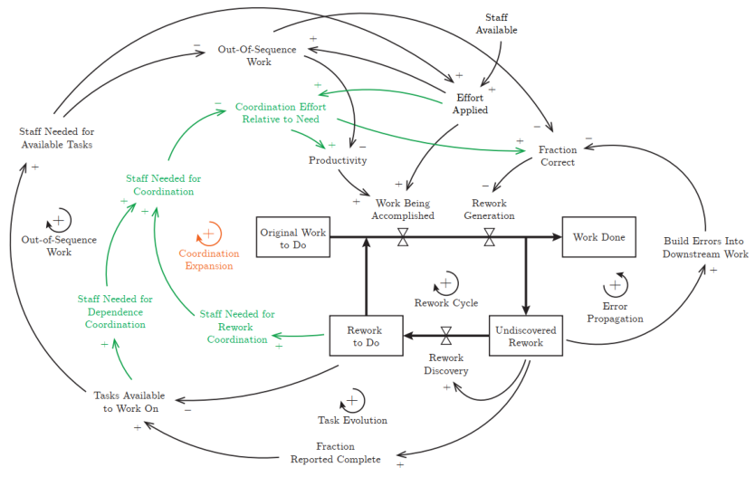

_Figure 3.3 Example system dynamics model from Minelli_ [97] _._ 

## **3.1.5 Power capacity scaling** 

In an analysis of variables (ANOVA), Berthélemy and Escobar Rangel studied the role of standardization, country and builder experience, power capacity, future electricity demand, and other effects on historical construction lead times in the US, France, Japan, South Korea, United Kingdom, and Canada [27]. They analyzed the log-log relationship between these variables and lead time to identify statistically significant correlations. The most significant effects were future electricity demand, nuclear experience of the country and vendor, generating capacity of the plant, and whether the construction started before or after the accidents at Three Mile Island (TMI) and Chernobyl. However, there was significant unexplained variation even with these factors, and the study did not include any design specific attributes except the plant power capacity. In addition, across the six countries, plant power capacity was only statistically significant at the 10% confidence level, as opposed to future energy demand, construction experience, and time relative to TMI and Chernobyl which were significant at the 1% confidence level. However, some have interpreted this result as a methodology where the plant power capacity is predictive of the 

construction duration. To visualize how the large scatter in data vs. using this correlation as a predictive tool, see Figure 3.4. Firstly, there was wide unexplained variation using the power law fit. Secondly, if one were to fit the data, a log law was not the appropriate relationship because the trend escalates at the higher power ratings, so an exponential, or even a linear, fit would be more appropriate. In fact, both a linear fit and an exponential fit have >40% higher Pearson correlation coefficients, and a piecewise linear fit had been previous proposed by Carajilescov and Moreira [98]. 

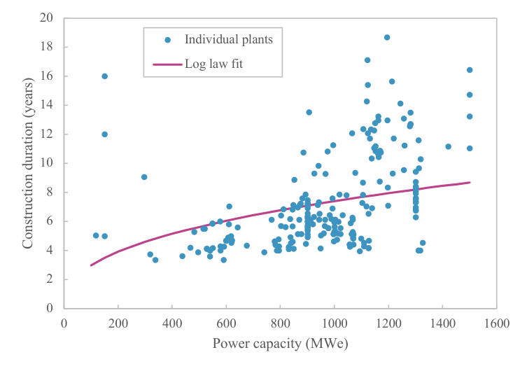

**----- Start of picture text -----** 
20 Individual plants 18 Log law fit 16 14 12 10 8 6 4 2 0 0 200 400 600 800 1000 1200 1400 1600 Power capacity (MWe) Construction duration (years) **----- End of picture text -----** 

_Figure 3.4 Nuclear construction durations in UK, US, France, Canada, Japan, and South Korea against plant power capacity. Data from_ [10] 

Lloyd and Roulstone collected 120 activity durations for the Sizewell B nuclear construction project which was a four-loop PWR, similar to the PWR12 architecture with additional passive safety systems [99]. They then split each activity into a wait and process time, and the process time scaled with the power capacity of a generic PWR. Using this method, they estimated that the construction duration for a generic SMR was 5.1 years and a large reactor was 6.4 years. However, the only input parameter was the plant power capacity, so there was no consideration of the physical constraints specific to a unique reactor architecture or the specifics of the systems that may vary from one reactor to another. To evaluate the impact of modularization, they then made generic assumptions about how the degree of modularization (DoM) increased with decreasing power capacity. Reactors with higher DoM scaled back the process times, resulting in shorter construction schedules. As a result, with modularization, large reactors had 5- year construction schedules, and SMRs had 3.5-year construction schedules. 

There were major gaps in the existing open literature for creating design specific nuclear construction schedule estimates. Vendor estimates were subject to proprietary assumptions, and therefore were difficult to compare “apples-to-apples”. Building detailed Gantt charts for each architecture would be too costly and time consuming. Commodity use rates do not consider how those commodities may be modularized, or the special constraints installing them. System dynamics still requires an estimate of the “work to do” and is subject to field calibration. Power capacity scaling has historically poor performance and ignores design specific details. Therefore, we formulated a Gantt-chart-building scheduleoptimization routine to estimate the construction duration for nuclear projects. 

## **3.2 Construction duration methodology** 

The following section describes how the output of the overnight cost model is transformed into a construction schedule for each reactor architecture. In all cases, unless specified otherwise, NOAK refers to the 10-OAK plant. A genetic algorithm (GA) set the staffing allocation to accomplish a set of tasks based on the output of the cost model. The objective of the GA was to minimize the total construction time subject to constraints on resource availability and spatial limitation. 

## **3.2.1 Problem formulation** 

This section describes how the cost model output was translated into an input file for the GA model. This process included building a table of labor hours for each SSC, a set of dependencies between the plant SSCs, resource and space constraints, and introduction of construction technology. 

## _3.2.1.1 Labor hours per task_ 

In addition to costs per SSC, the output of the overnight capital cost model included the site labor hours for each account. The site labor hours were scaled using the same methods as the costs, and the site learning rate for costs applied to the labor hours as well. Also, recall that the modularization assumptions that moved one half of site labor to the factor costs category, reducing the labor hours associated with an SSC. Table 3.6 shows the labor hours for the SSCs in the reactor building that were in Account 21: Structures & Improvements, and the full list of tasks and hours are in the supplemental data to this thesis. In total, there were 226 SSC activities included in the scheduling tool. Some SSCs were combined from the 235 cost items in Chapter 2 and others were split. For example, the rebar, formwork, and concrete pouring tasks were combined into a single “concrete” task, but the electrical plant equipment was divided into switchgear, station service equipment, switchboards, protective equipment, electrical structures and wiring, and power and control wiring. The reorganization of costs into tasks had two purposes: to divide activities into work that had unique physical locations and category of staffing resources, and to limit the number of total tasks to avoid overburdening the GA. 

73 

## _3.2.1.2 Task dependencies_ 

The next step was to identify the dependencies between the 226 tasks. The idea was for a new task set a “predecessor task” that had to be between 0-100% complete before the new task could be begin. As references, we used the Gantt charts from the EEDB, the Open-100, and a private conversation with Holtec to inform creation of these linkages. An example of the task dependencies for some of the reactor building activities is in Table 3.7. The ordering was logical – after 50% of the site preparation was completed, the reactor building substructure can be poured, after 90% of the substructure was completed, the superstructure can be poured, and after 50% of the superstructure was completed, the interior concrete can be poured. Figure 3.5 shows the process graphically. 

_Table 3.7 Sample subset of tasks, predecessor tasks, and resource category._ 

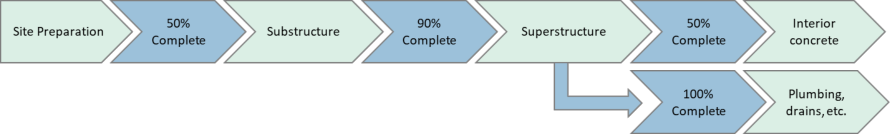

_Figure 3.5 Graphical representation of the task-predecessor task dynamics from Table 3.7_ 

The full set of task dependencies was included in supplemental data to this thesis. The dependencies did not change substantially for the eight reactor architectures, except in cases where certain SSCs were eliminated in a design. For example, the LPSR had several buildings and SSCs combined into the auxiliary building, so the tasks that were dependent on the fuel storage building for the PWR12, changed to the parallel SSC in the auxiliary building. 

In the schedule evaluator, for a given schedule, each task had a _task length_ and a _delay,_ both in months. The task length was the number of months required to complete the task, and the resources (number of workers) required was back calculated from the task length, labor hours, and an assumed 160-hour work month. The delay parameter delayed a task from beginning by a set number of months even if the predecessor task had reached the required completion fraction. The purpose of the delay parameter was to give the GA a parameter to smooth the resource allocation over time. The _task length_ and _delay_ split were similar to that of Lloyd and Roulstone [99]. 

A simple time marching routine evaluated the schedule by progressively moving from one month to the next. At each month, the routine calculated the progress (completion fraction) of each task. Then, using the known completion fractions, the routine checked if any new tasks had met the criteria and then launched. After launch, the delay time began, and after the delay the task length began and task progress. The routine was simple but allowed for many iterations of task-predecessor task relationships. 

Table 3.1 also includes a resource designation: civil, mechanical, or electrical work. The categories were not used to constrain or allocate resources in the schedule building algorithm, but they were used to benchmark the staffing profile. The IAEA published a generic staffing profile for a four-loop PWR that 

divided the labor into civil, mechanical, electrical, and management and QA/QC designations, shown in Figure 3.6. These profiles were also useful for setting the task dependencies. Civil construction labor peaks first, and the mechanical and electrical labor levels peak around the same time, four years into the project. The results section compares this profile with the schedule built for the PWR12 NOAK. 

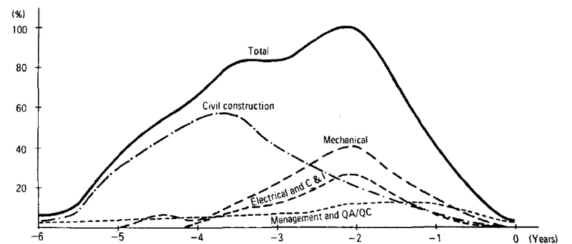

_Figure 3.6 Staffing profiles by category for construction of a four-loop PWR, from the IAEA_ [100] _._ 

## _3.2.1.3 Constraints_ 

I considered three constraints on the optimization routine: peak site staffing, maximum monthly labor change, and workspace limits. The first two constraints aim to capture the dynamics of the labor market for a given region and estimate how sensitive a reactor architecture was to resource availability. The latter constraint captured how the specifics of the plant design constrained work progress. The constraints applied as linear exterior penalty functions and are summarized in Table 3.8. The constraint violation was summed over each timestep and, in the case of the building staffing limit, summed over each building. 

_Table 3.8 Scheduling constraints as applied using linear exterior penalty functions._ 

## 3.2.1.3.1 Peak site staffing 

In scheduling optimization problems, resource availability constraints are typically the primary constraint [101], and nuclear reactors are no exception. For example, at the Vogtle site in Georgia, Westinghouse was unable to hire sufficient local workers for the construction of two AP1000s, so they tried to import workers from Canada but were denied by the U.S. State Department [102]. To find a reasonable peak site staffing constraint, we reviewed two recent projects: the Barakah nuclear plant in the United Arab Emirates, and the Hinkley Point C (HPC) plant in the United Kingdom. The Barakah site peaked at 18,000 workers, constructing four APR1400s, for 3.2 workers/MWe [103]. In a proposal from EDF, the 

HPC site planned to peak at 5,500 workers, construction two EPRs, for 1.7 workers/MWe [104]. This vastly different staffing levels were indicative of the local labor conditions. In the UAE, construction labor can be easily imported from nearby countries but doing so is less feasible in the UK. Therefore, the upper-bound peak site staffing constraint was 4,500 direct workers, i.e. not including management and supervision. 

To explore the sensitivity to this constraint, a lower-bound constraint was set to 2,500 direct workers. The lower-bound constraint was consistent with what the peak site staffing would be for the IAEA staffing profile in Figure 3.6, if the integrated labor hours was scaled to be equal to the PWR12 NOAK labor which was equal to the PWR12-BE labor hours. 

3.2.1.3.2 Maximum monthly labor change 

The second labor constraint was how quickly projects could ramp up and down the number of workers on site, or the monthly labor change. The historical rate for different nuclear projects varied significantly based on the regional labor market. For the HPC Application Summary Document, EDF proposed a very fast ramp up that required hiring ~800 new workers some months. The full staffing profile is in Figure 3.7. So, the upper-bound maximum monthly labor change constraint was 800 new workers a month. This included both hiring and firing. 

To set the lower-bound constraint, we returned to the IAEA staffing profile in Figure 3.6. Again, scaling the integrated labor hours to match the PWR12-BE, the peak staffing was ~2,500 workers, and the maximum monthly change was 160 workers. So, the lower-bound maximum monthly labor change constraint was 160 new workers a month. 

The discretion of site activities to the 226 tasks was not a uniform distribution of labor hours, so some tasks had significantly larger labor hours than others. As a consequence, some tasks would ideally be assigned more than 160 workers, making it difficult for the GA to converge. Therefore, for the lowerbound constraint, the monthly labor change limit was applied to a three-month running average. This allowed for an individual monthly to be greater than 160 workers as long as the three-month average hiring rate was below the constraint. 

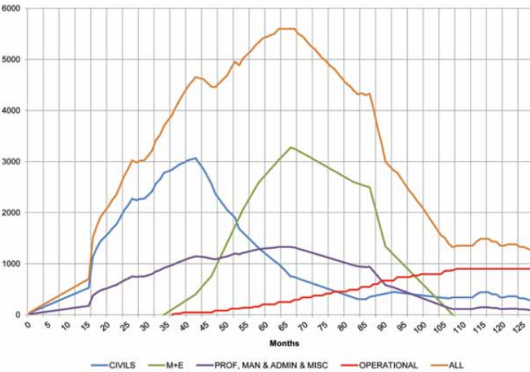

_Figure 3.7 HPC project site staffing from EDF's application summary document_ [104] _._ 

## 3.2.1.3.3 Workspace limits 

The final constraint limited the number of workers that could be in the same physical space. The construction scheduler needed to be design specific in two aspects: how much work an architecture required and how constructible that work was. The first aspect was the aim of Chapter 2. The second aspect was to quantitatively estimate how parallelizable tasks were across the construction site, and physical workspace limited this. A true constructability analysis was too complicated and time consuming for the large number of architectures considered in this thesis, so a simplified formula was ideal. For each building of each architecture, the floor workspace was estimated using the substructure area. Then to estimate the number of workers that could co-exist in that workspace, we postulated a relationship the following relationship: 

_Equation 3.1_ 𝑀𝑎𝑥 𝑤𝑜𝑟𝑘𝑒𝑟𝑠= 𝐴∗(𝑏𝑢𝑖𝑙𝑑𝑖𝑛𝑔 𝑓𝑙𝑜𝑜𝑟 𝑎𝑟𝑒𝑎)[+] 

In Equation 3.1, _A_ and _n_ were unknown parameters. However, we had two datapoints from the PWR12 case: the PWR12-ME was constructed in 98 months, and the PWR12-BE was constructed in 72 months. Therefore, we used to the solution methodology described in Section 3.2.2 to iterate on _A_ and _n_ until We produced reasonably close estimates these benchmarks. The result was _A_ =2.1, and _n_ =0.7. We further benchmark these values in Section 3.3.3. Figure 3.8 shows the scaling relationship for floor area to allowable workers with data labels pointing to key PWR12 structures. 

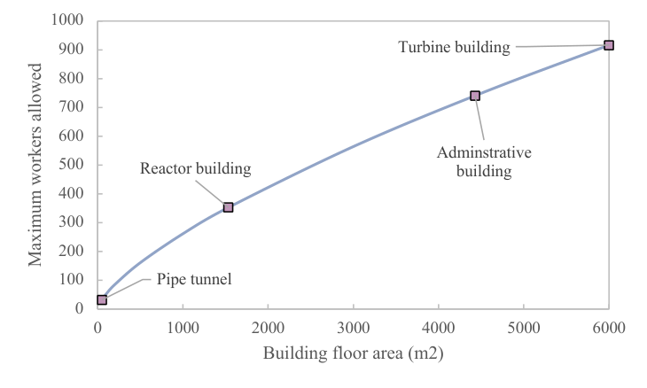

**----- Start of picture text -----** 
1000 900 Turbine building 800 700 600 Adminstrative 500 Reactor building building 400 300 200 100 Pipe tunnel 0 0 1000 2000 3000 4000 5000 6000 Building floor area (m2) Maximum workers allowed **----- End of picture text -----** 

_Figure 3.8 Scaling relationship between the building floor area and the allowable number of workers. The data labels indicate the values for the PWR12 reference plant._ 

## _3.2.1.4 Modularization and VHLC_ 

One advantage of modularization was that it shifted 50% of site labor to factory costs reducing the site labor hours. The second advantage was the parallelization of site labor using very heavy lift cranes (VHLC) and open top construction. Figure 3.9 shows a VHLC lifting a containment liner ring for an EPR under construction in Finland. VHLC allows for multiple worksites to fabricate modules that will then be lifted into place by the VHLC. Often, these site-built modules were separate from the traditional modularization because they can be much larger, such as in the case of the containment ring for the EPR or the AP1000. To model this dynamic in the construction scheduler, we relax the building staffing constraint through creation of parallel workspace. For tasks that leveraged a VHLC and open-top construction, the workable building floor area either doubled or tripled. For example, the interior concrete for the LPSR, LM-BWR, and others had three times the workspace as raw floor area because there were parallel workspaces for these architectures. Maronati et al. described modularization functioning on nuclear construction sites and accelerating the construction process in an identical fashion [105]. The supplemental data to this thesis lists the parallelization workspace increase assumptions for the 226 tasks of all eight architectures. 

This parallelization of site labor applied to both system and structural modules. System modules referred to mechanical systems such as piping modules, electrical modules, water treatment modules, reactor I&C modules, etc. Structural modules referred to civil structures that were installed with the VHLC. For example, these were the containment rings of the LPSR, the interior concrete of the LM-BWR, the reactor building exterior walls for the SM-BWR, and many other structural elements. 

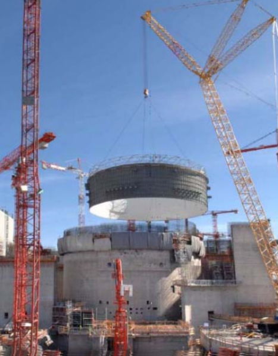

_Figure 3.9 VHLC installing the containment liner for Olkiluoto 3 in Finland_ [36] 

## **3.2.2 Solution methodology** 

With the mathematical formulation of the problem, the next step was to solve for the minimum schedule that satisfied the constraints. The literature contains a variety of optimization techniques to for scheduling problems. The most common techniques were linear and nonlinear programming, heuristics, and evolutionary methods. For some problems, linear and nonlinear programming methods are preferred because they guarantee finding the true optimum schedule that satisfies the Karush-Kuhn-Tucker conditions: (1) the solution satisfies the constraints, (2) at least one constraint is precisely satisfied or if a constraint is not satisfied there is no slack (it could not be closer to being satisfied), and (3) the gradient of the Lagrangian is zero [106,107]. However, many problems, including the one at hand, contain complex constraints and many decision variables (470), making these methods computationally prohibitive [101]. Heuristics, in this context, create a set of rules that iteratively move towards an optimal solution. Before the onset of genetic algorithms (GA), simulated annealing, particle swarm, and other evolutionary heuristics, non-evolutionary heuristics were highly specific to a particular optimization problem. As a result, they were not generalizable, thus not useful for this application [101]. Evolutionary methods are generalizable heuristics that perform well for a broad range of optimization problems. They do not guarantee finding the true optimum because they are stochastic in nature, but for this problem, the cost of this uncertainty was minimal compared to the gain in broad applicability. 

GA’s evolve a population of candidate solutions over generations until some convergence criteria is met to find the best solution. For each generation, the GA selects the best solutions in the population; then the GA crosses-over each selected solution with one of the other selected solutions; then the GA randomly mutates a fraction of the crossed-over solutions. The result is a new generation of candidate solutions. The GA evaluates the new population, identifies the best solutions, and the process repeats until convergence. 

In this case, the convergence criteria was that neither the objective function (total construction months) or the decision variables (task length and delay length) changed by more than 1 month for 20 consecutive generations. 

There were 452 decision variables: 226 task lengths and 226 delay lengths. The large number of decision variables required an even larger population size for the GA, so We used the Pymoo implementation of a GA because it offered vector-based evaluation of a population which greatly accelerated computation time [108]. Vectorizing the schedule and constraint evaluation code dramatically reduced the evaluation time for each architecture which was critical to conducting a robust sensitivity analysis in a reasonable amount of time. We adopted the default settings from Pymoo for selection, cross-over, mutation, and convergence. 

The solution process was in two steps: _full-scale GA_ and _subproblem GA._ For each FOAK unit, the GA solved for all 452 decision variables in a single pass, finding the solution the _full-scale_ problem. Although the GA had converged with all constraints satisfied, repeatability tests showed the solution at this stage could usually be improved. So, the _full-scale_ solution passed to the _subproblem GA_ that broke the problem up into many smaller problems, reducing the number of decision variables _._ At each timestep, the decision variables were only the tasks who met their predecessor task completion criteria but had not progressed (either due to just starting or the delay). Figure 3.10 visualizes the process. The GA minimized the total duration of this subset of tasks subject to the _full-scale_ constraints. This strategy reduced the number of decision variables to 2-50 for any given timestep, so the population size could be ten times the number of decision variables. The process repeated going through each timestep four times to ensure convergence. 

The _subproblem GA_ formulation required a good initial guess that satisfied the constraints. Meeting the constraints required balancing resources across all tasks which was a problem better suited to the _fullscale GA_ process. However, for finding the minimum schedule, often multiple tasks constrained the solution, so an improvement to one task would not appear to the GA as a superior solution because all the GA “saw” was that the number of months to complete all tasks was the same. Therefore, once the constraints were satisfied, the _subproblem GA_ found more optimal solutions because the formulation exposed the impact of changes to each task to the GA. The _full-scale_ GA ran for each FOAK unit for each architecture, and then the _subproblem GA_ ran for every unit from FOAK to 10-OAK using the _full-scale GA_ FOAK solution as the good initial guess. 

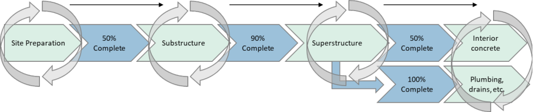

_Figure 3.10 Graphical representation of the subproblem formulation._ 

Please note that while an optimization routine built the final schedule, the intent was not optimization of the schedule in and of itself, but to find a schedule that satisfied the constraints, captured the critical path tasks, and was a reasonable approximation of an achievable schedule for a given architecture. 

## **3.3 Construction duration results** 

## **3.3.1 Total labor hours for each architecture** 

Table 3.9 shows the direct costs and site labor hours for the FOAK and 10-OAK plants. The hours are both in total hours and total hours per kWe. Direct costs and site labor hours excluded QA/QC, management, field office engineering, and field supervision. Figure 3.11 compares the direct cost to the site labor hour for the eight reactor architectures. In general, there was very strong correlation between the direct costs and site labor hours, but there were three interesting deviations. First, the LM-BWR and the MMNC had lower site labor hours compared to the general trend for their direct costs because of their very high degree of assumed modularization. Second, despite assuming a large degree of modularization, the labor hours for the NC-SMR and SM-BWR were essentially on trend because of the lost economy of scale.  Third, the DC-PWR and LASR had labor hours above the trend due to the large concrete and steel use for these architectures. 

_Table 3.9 Direct costs and labor hours for each reactor architecture for the FOAK and 10-OAK plants._ 

_Figure 3.11 Site labor hours and direct cost comparison for the eight reactor architectures_ 

## **3.3.2 Repeatability of stochastic solution** 

The GA solution process was a stochastic process and did not guarantee finding the true optimal solution, so running the solver repeatedly yielded varying results. Therefore, it was necessary to estimate how close, or with what uncertainty, any individual solution would be to the true optimal solution. To do this, we ran two sets of repeatability tests: running the _full-scale GA_ ten times and comparing the results and running the _full-scale GA_ + _subproblem GA_ five times and comparing the results. 

Figure 3.12 shows evolution of the construction duration for the best solution in the GA population for all generations until convergence for ten runs of the _full-scale GA_ with population size 1000. The runs all converged between 250-350 generations, and the solutions were all between 73-80 months. This translated to +/- 5 months duration for the 95% confidence interval. We repeated this exercise for population sizes of 500 and 1500. The 500 population solutions were between 78-85 months, so not as converged as the 1000 population solution. The 1500 population solutions were 70-81 months, so essentially the same range as the population 1000 solutions. Therefore, the population size of 1000 was sufficient. 

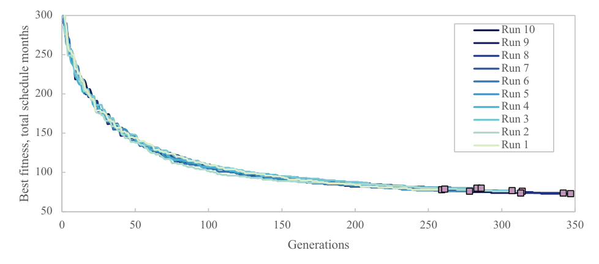

**----- Start of picture text -----** 
300 Run 10 Run 9 250 Run 8 Run 7 Run 6 200 Run 5 Run 4 Run 3 150 Run 2 Run 1 100 50 0 50 100 150 200 250 300 350 Generations Best fitness, total schedule months **----- End of picture text -----** 

_Figure 3.12 Repeatability of the full-scale GA solution for the PWR12 NOAK (PWR12-BE). Squares ae the end points of each run. Population size: 1000, f-tolerance: 1e-3, x-tolerance, 1e-3._ 

The joint formulation with the _full-scale GA_ coupled to the _subproblem GA_ also showed excellent repeatability. Figure 3.13 shows the lower-bound construction duration solutions for four runs of the joint formulation, for 10 units of the eight reactors. In general, the results repeated very well from run to run with minimal deviation except in a few cases. To quantify the probability of any individual solution deviating from the “true” minimum, we compared each solution to the minimum duration in its group (a group was an architecture and unit number). Figure 3.14 shows the CDF of the deviation from the minimum in each grouping. Interpreting this graph, we see that 95% of solutions were within 21% of the minimum duration. Therefore the 95% confidence interval for schedule durations produced by this method is +0% to -21%. 

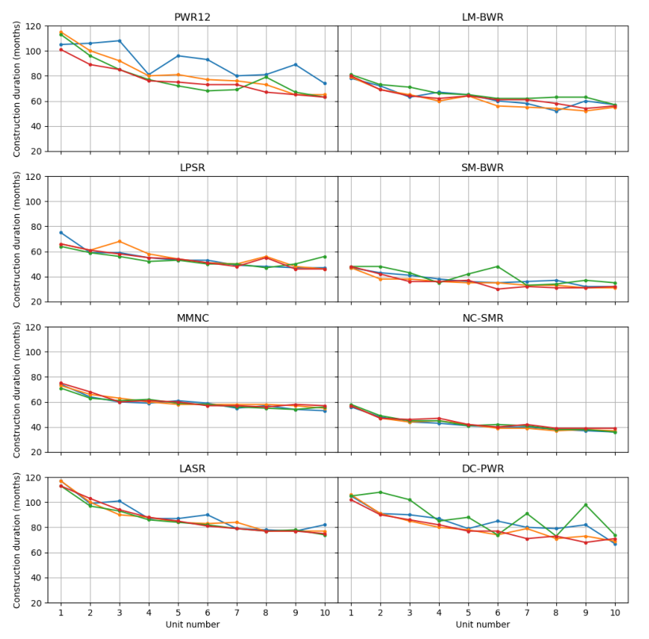

_Figure 3.13 Construction duration repeatability for the eight reactors under the lower-bound solutions_ 

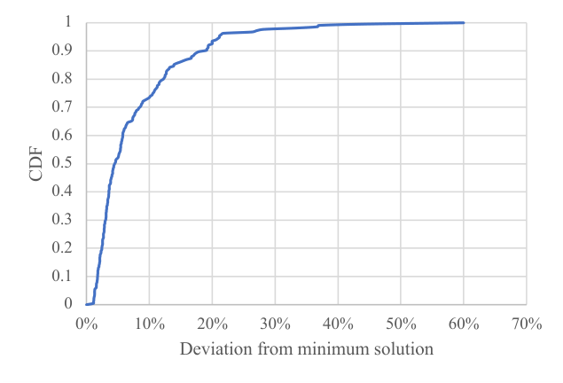

**----- Start of picture text -----** 
1 0.9 0.8 0.7 0.6 0.5 0.4 0.3 0.2 0.1 0 0% 10% 20% 30% 40% 50% 60% 70% Deviation from minimum solution CDF **----- End of picture text -----** 

_Figure 3.14 CDF solutions for the 320 cases excluding the minimum solution for a given reactor and unit (4 runs, 8 reactor architectures, FOAK to 10-OAK)_ 

## **3.3.3 Benchmarks** 

This section compares the solutions produced by the joint formulation solver to reference construction schedule durations. When compared to reference schedules, the results from the developed method are labeled NCET: Nuclear Cost Estimating Tool. 

## _3.3.3.1 IAEA staffing profile benchmark_ 

Recall the construction staffing profile from the IAEA in Figure 3.6. The reference plant for the IAEA profile was similar to the PWR12, and the PWR12-BE had a 72-month construction schedule – the same as the IAEA profile. Figure 3.15 compares the total, civil, mechanical, and electrical staffing levels for IAEA data and the estimated schedule using the lower-bound constraints. The lower-bound constraints derived from the IAEA profiles, so they were the appropriate comparison. 

The two staffing profiles had both similarities and differences. In both cases, the civil construction staffing peaked early, followed by simultaneous peaks in the mechanical and electrical staffing. The IAEA curves were smoother than the NCET results, and this was likely because the IAEA results were not representative of an actual project but simply an example visualization. The “jaggedness” of the NCET staffing profiles resulted from the discretization of task sizes to the 226 site activities. Each task was uniformly staffed from beginning to end, so as a new task launch or a task completed, there could be sharp drop in staffing level unless a new task(s) perfectly accounted for the change in workers. Also, many of the tasks were not critical path activities, so their task length and delay results could vary significantly but yield the same construction duration, and construction duration was the figure of merit. So, the _subproblem GA_ would shift forward in time non-critical path activities due to the dynamics of the problem formulation, but in practice, these activities would be staffed to “level-load” the staffing over time. Further, many nuclear sites construct two units in parallel, so staff moves from one site to the next to smooth the labor profile and level-load the project. 

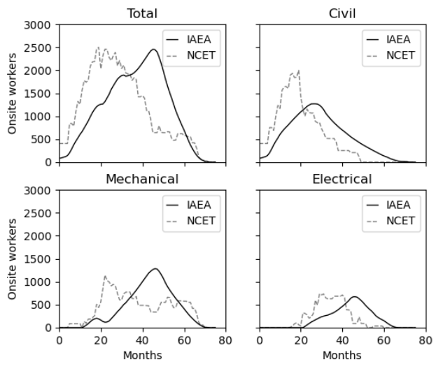

_Figure 3.15 Staffing profiles comparing the IAEA data to the PWR12 10-OAK (PWR12-BE) solution from the construction scheduler using the lower-bound constraints._ 

## _3.3.3.2 Vendor duration benchmarks_ 

The second set of benchmarks came from the reference construction durations in Table 3.3 Published construction durations for the eight reactor architectures. Table 3.10 compares the estimated durations using both the upper (4500 peak, 800 monthly change) and lower (2500 peak, 160 monthly change) bound staffing constraints. The results were surprisingly consistent, especially between the reference durations and the upper-bound constraint results. Note that there were more reference values in open literature, and the values in Table 3.10 do not necessarily represent the average. Table 3.10 included the root mean square error (RMSE) which was 5.8 months for the upper-bound constraints and 18 months for the lower-bound constraints. The upper-bound constraint results were well within the -20% uncertainty, but they extended the +0% bound to be +17% at the highest for the DC-PWR FOAK case. The lowerbound constraints deviated further from the reference results with -85% to +12% deviations. Given that most of the reference durations were vendor estimates, this suggested that vendors did not assume significant staffing resource constraints. Figure 3.15 plotted the data from Table 3.1. The upper-bound constraints clearly captured the construction duration dynamics in a way more consistent with reactor vendor estimates. 

_Table 3.10 Benchmark construction durations (in months) comparing reference durations and the NCET results for both the upper and lower-bound constraints._ 

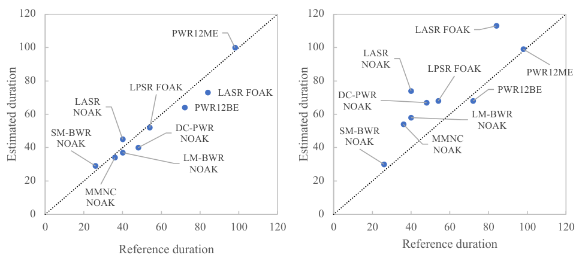

**----- Start of picture text -----** 
120 120 PWR12ME LASR FOAK 100 100 LASR NOAK LPSR FOAK PWR12ME 80 80 LPSR FOAK LASR FOAK DC-PWR  PWR12BE LASR PWR12BE NOAK 60 NOAK 60 LM-BWR SM-BWR  DC-PWR  SM-BWR  NOAK 40 NOAK NOAK 40 NOAK MMNC NOAK LM-BWR NOAK 20 20 MMNC NOAK 0 0 0 20 40 60 80 100 120 0 20 40 60 80 100 120 Reference duration Reference duration Estimated duration Estimated duration **----- End of picture text -----** 

_Figure 3.16 Left: NCET estimated durations (in months) vs. reference durations for the upper-bound constraints. Right: NCET estimated durations vs. reference durations fur the lower-bound constraints._ 

## **3.3.4 Construction durations** 

_3.3.4.1 Baseline results and constraint sensitivities_ 

The staffing profiles during construction revealed the difference dynamics at play for each reactor architecture and the some of the model limitations. Figure 3.17 shows the staffing profiles for the FOAK and 10-OAK units under the upper-bound constraints (4500 peak site staffing and 800 maximum monthly labor change). Note that these FOAK durations were remarkably shorter than the realized schedules for the AP1000, EPR and others which motivates the work of Chapter 4 on uncertainty and risk analysis. The LM-BWR, LASR, and DC-PWR plants all hovered near the peak site staffing limit for several months, indicating that these architectures were constrained by the peak site staffing, not either of the other two constraints. The LPSR and MMNC still hit the peak site staffing constraint but only for a few months, so they were less constrained by resource availability. The PWR12, NC-SMR, and SM-BWR had long tails in their staffing profiles indicating that there were critical path tasks that were building space limited, not labor resource limited. For these architectures, the _subproblem GA_ front-loaded non-critical path tasks as the objective function formulation drove it to do (in reality, planners would level-load this staffing over time). The PWR12 was stick built with no modularization or parallel labor sites which aligned with this result. The NC-SMR and SM-BWR simply required fewer overall workers. 

Figure 3.18 shows the staffing profiles for the lower-bound constraint case for the FOAK and 10-OAK plants. In this case, the NC-SMR and SM-BWR were almost identical to the profiles for the upper-bound constraint case except for a few months where staffing spiked in the upper-bound results. Figure 3.19 overlays the upper-bound and lower-bound constraint results, and it confirms the similarity between the NC-SMR and SM-BWR profiles. The PWR12 bumps up against the peak site staffing constraint for a few months, but the rest of the large plants (MMNC, LM-BWR, LPSR, DC-PWR, and LASR) spent many months at the peak site staffing limit. When Westinghouse was constructing the two AP1000 units at the Vogtle site in Georgia, they faced challenges hiring sufficient workers, indicating they were more resource constrained than space constrained [102]. SMR’s resilience to these constraints is a key advantage for scaling to new markets. 

In Figure 3.19, the lower-bound constraint case extended the construction duration of the large plants (LM-BWR, LPSR, DC-PWR, LASR, MMNC) considerably. Table 3.11 shows the quantitative impact of the different constraints. On average, the lower-bound constraints extended construction times 31%, but it was 41% for the large plants and only 3% for the small plants. The effect was more extreme for the 10OAK plants where the average delay was 37% and the large plant delay was 49%. The lower total labor hours of the small plants benefited them greatly, and this is a key advantage of SMRs. Geographic locations or markets where there is not a developed workforce may be better suited to adopting SMR technology because it will be more challenging to realize the economy of scale advantages of the large plants. The PWR12 also broke the large plant mold in that it was insensitive to the constraints, but that was because the PWR12 had no modularization or use of a VHLC, so it was building space constrained, not resource constrained. 

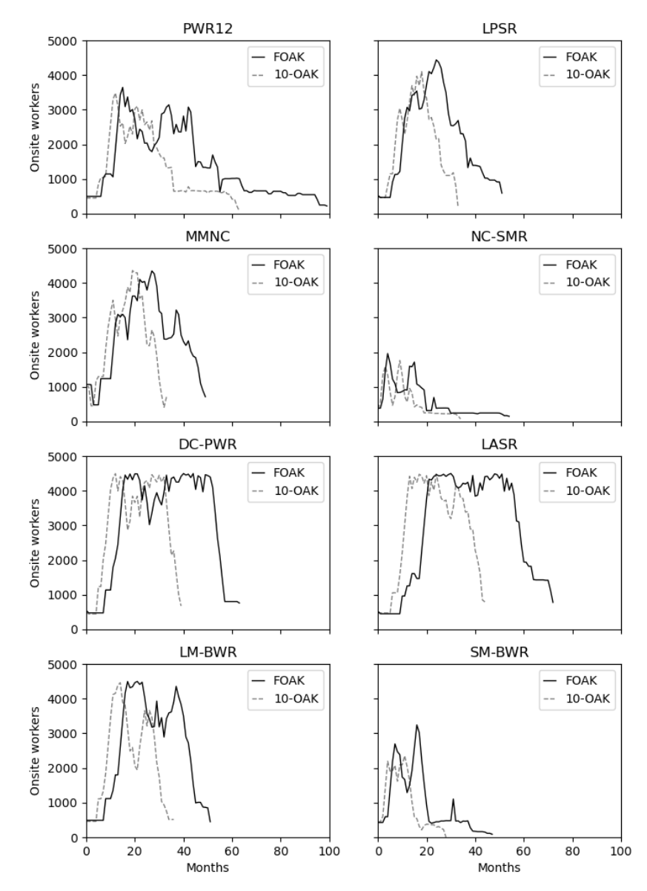

_Figure 3.17 Staffing profiles for the FOAK and 10-OAK units construction schedule estimates using the upper-bound constraints (4500 peak site staffing, 800 maximum monthly labor change)_ 

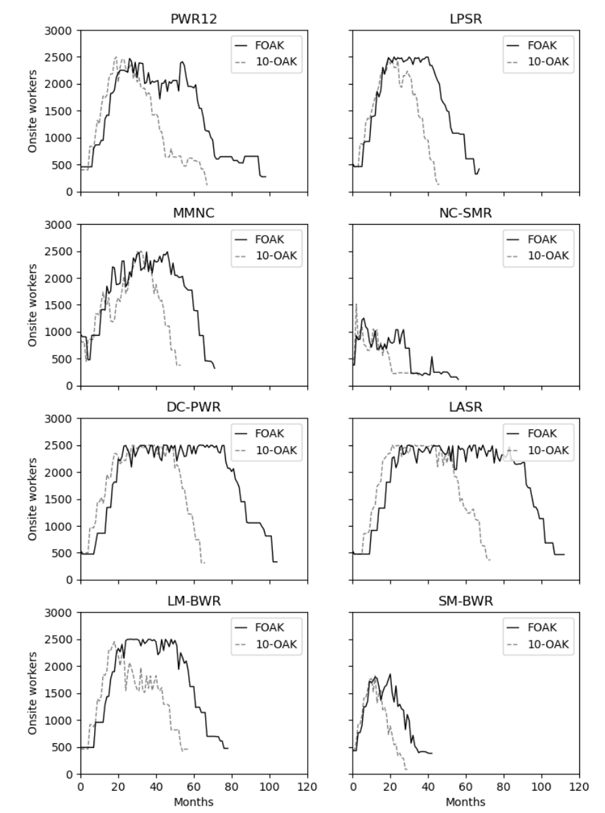

_Figure 3.18 Staffing profiles for the FOAK and 10-OAK units construction schedule estimates using the lower-bound constraints (2500 peak site staffing, 160 maximum monthly labor change)_ 

_Figure 3.19 Staffing profiles for the FOAK unit construction schedule estimates using the upper and lower-bound constraints_ 

Table 3.11 also breaks out the separate effects of the peak site staffing and the maximum monthly labor change constraints. The monthly hiring rate was the more restrictive constraint which was an interesting 

result for project planners and policy makers. Deploying new nuclear quickly will require a large labor resource pool that is ready to be deployed quickly, and without a large labor resource pool, delays of 20% and up can be expected for large nuclear projects. In the U.S. the Tennessee Valley Authority originally projected a 2015 startup with a $2.5B cost for Watts Bar Unit 2, but the plant finally came online in 2016 at a cost of $4.7B. An Inspector General report on the issues at Watts Bar Unit 2 confirmed that hiring rate and availability of workers was a key management and schedule issue [109]. This is a key benefit of multi-site plants where already trained workers can be shifted from unit to unit during sequential construction. 

Figure 3.20 shows the effects of the different constraints on the individual reactor architectures. Some plants were more robust than others to the resource constraints, such as the PWR12, NC-SMR, SM-BWR, and to a lesser extent the LPSR. The DC-PWR was the most impacted by resource constraints with up to a 64% increase in construction duration. The other large plants also experienced critical delays between 25-55% of the original estimate. 

_Table 3.11 FOAK and 10-OAK construction duration estimates in months under different constraints. The percentages are the difference relative to the upper-bound constraints. Large plants: PWR12, LPSR, MMNC, DC-PWR, LASR, LM-BWR. Small plants: NC-SMR and SM-BWR._ 

|||FOAK|FOAK|||10-OAK|10-OAK||
|---|---|---|---|---|---|---|---|---|
||4500-800|2500-160|4500-160|2500-800|4500-800|2500-160|4500-160|2500-800|
|PWR12|100|99 (-1%)|99 (-1%)|98 (-2%)|64|68 (+6%)|68 (+6%)|66 (+3%)|
|LPSR|52|68 (+31%)|64 (+23%)|58 (+12%)|34|47 (+38%)|47 (+38%)|36 (+6%)|
|MMNC|50|72 (+44%)|70 (+40%)|63 (+26%)|34|54 (+59%)|54 (+59%)|41 (+21%)|
|NC-SMR|55|57 (4%)|57 (+4%)|58 (+5%)|35|36 (+3%)|35 (0%)|35 (0%)|
|DC-PWR|64|105 (+64%)|90 (+41%)|92 (+44%)|40|67 (+68%)|67 (+68%)|60 (+50%)|
|LASR|73|113(+55%)|99 (+36%)|100(+37%)|45|74(+64%)|77 (+71%)|69 (+53%)|
|LM-BWR|52|79 (+52%)|75 (+44%)|71 (+37%)|37|58 (+57%)|59 (+59%)|42 (+14%)|
|SM-BWR|42|43 (+2%)|45 (+7%)|43 (+2%)|29|30 (+3%)|30 (+3%)|28 (-3%)|
|Average||+31%|+24%|+20%||+37%|+38%|+18%|
|Large plant average||+41%|+30%|+25%||+49%|+50%|+24%|
|Small plant average||+3%|+5%|+4%||+3%|+2%|-2%|

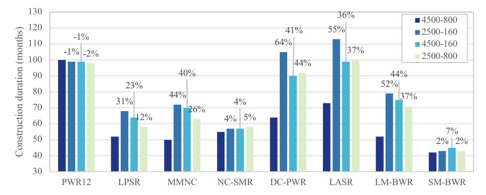

**----- Start of picture text -----** 
130 36% 4500-800 120 41% 55% 2500-160 -1% 110 64% 4500-160 -1% -2% 37% 2500-800 100 44% 90 40% 44% 23% 52% 80 44% 37% 31% 4% 70 26% 12% 4% 5% 60 7% 50 2% 2% 40 30 PWR12 LPSR MMNC NC-SMR DC-PWR LASR LM-BWR SM-BWR Construction duration (months) **----- End of picture text -----** 

_Figure 3.20 FOAK construction duration estimates under different constraints. The data labels are percentage difference from the upper-bound constraint (4500 peak site staffing, 800 max monthly labor change)._ 

Figure 3.21 shows the FOAK average number of staff during construction and the average staff normalized to the plant power capacity for the upper-bound constraint case. As was expected, the NCSMR and SM-BWR had the lowest average staffing because they were small units. The PWR12 also had relatively low average staffing because the plant did not use modularization and a VHLC, and the PWR12 FOAK had the longest construction schedule at ~100 months. Normalizing the staff by the plant capacity showed that the staffing reduction for the NC-SMR and SM-BWR was not proportional to their lower plant capacity – these architectures had the highest staffing per MWe. 

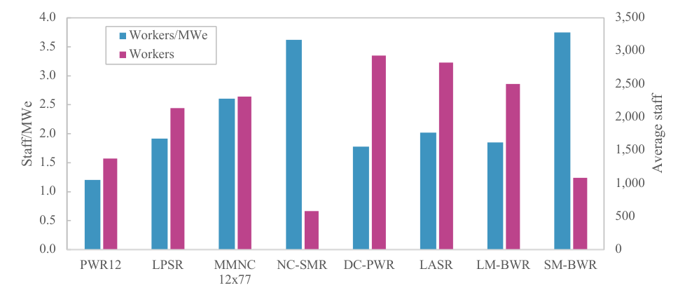

**----- Start of picture text -----** 
4.0 3,500 Workers/MWe 3.5 Workers 3,000 3.0 2,500 2.5 2,000 2.0 1,500 1.5 1,000 1.0 0.5 500 0.0 0 PWR12 LPSR MMNC NC-SMR DC-PWR LASR LM-BWR SM-BWR 12x77 Staff/MWe Average staff **----- End of picture text -----** 

_Figure 3.21 FOAK average number of direct-labor staff onsite during construction and average staff per MWe of capacity, both under the upper-bound constraints_ 

## _3.3.4.2 Construction duration and total site labor hours_ 

Figure 3.22 compares the construction durations and site labor hours for all eight reactor architectures and shows a reasonable correlation. These figures were for the NOAK plants, but the results for the FOAK plants were similar. The upper-bound constraints showed a moderate correlation with the PWR12 as the outlier. The PWR12 was an obvious outlier as the only plant with no modularization and no use of a VHLC. Under the lower-bound constraints, all architectures fit on the same trend. The NC-SMR was marginally above the trend for duration given its site labor hours indicating that something about the NCSMR that made it more difficult to construct. The tall and narrow building structures likely caused the increased construction schedule relative to the other architectures. 

In both the upper-bound and lower-bound constraint cases, a linear fit and a power law fit the data the well, with the power law having a statistically insignificant better fit. Under the upper-bound constraints, the linear fit was flat with a coefficient of 0.83, and the power law was similarly flat with an exponent of 0.21. The linear coefficient was 2.4 for the lower-bound case, and the power law exponent was 0.49. This indicated that where labor constraints are loose, most reactor architectures can be constructed in similar times, but where labor constraints are tight, small reactor architectures have a construction duration advantage. 

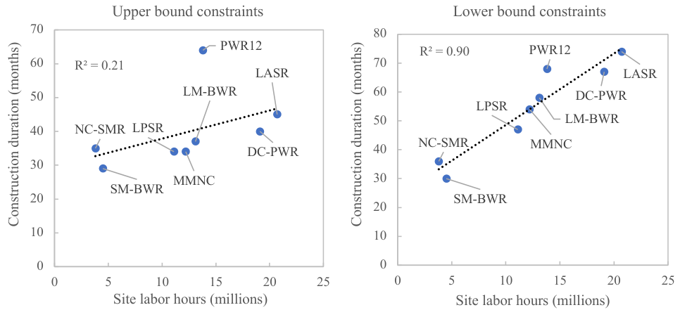

**----- Start of picture text -----** 
Upper bound constraints Lower bound constraints 70 80 PWR12 R² = 0.90 PWR12 60 R² = 0.21 70 LASR LASR 50 LM-BWR 60 DC-PWR LPSR 50 LM-BWR 40 NC-SMR LPSR NC-SMR MMNC DC-PWR 40 30 MMNC 30 SM-BWR 20 SM-BWR 20 10 10 0 0 0 5 10 15 20 25 0 5 10 15 20 25 Site labor hours (millions) Site labor hours (millions) Construction duration (months) Construction duration (months) **----- End of picture text -----** 

_Figure 3.22 NOAK construction duration compared to the total site labor hours. Left: upper-bound constraints. Right: lower-bound constraints_ 

## _3.3.4.3 Schedule reduction and indirect cost savings from modularization_ 

Modularization coupled with a VHLC accelerates the construction process through parallel work and reduced onsite labor. We evaluated the schedule and cost impact of two categories of modularization: structural and systems. Structural modules were steel plate composites, interior concrete modules, containment ring sections, etc. System modules were piping systems, reactor I&C systems, safety injection systems, electrical equipment, etc. The cost impacts resulted from two effects: reduced site supervision duration and lower interest accrued during construction (IDC). The reduced site supervision effect can be seen in Figure 2.9, where longer construction durations resulted in escalated indirect factory costs. In EEDB, indirect factory costs were primarily site supervision and QA/QC costs, and longer durations required having the supervision and QA/QC staff onsite longer, raising costs. IDC results from interest payments made on debt financed for construction of the nuclear plant. Nuclear plants have multiyear construction durations that require interest payments on debt before the plant completes construction. Figure 1.11showed how large a fraction of the total capital costs IDC can be: up to 30%. There are at least two forms of calculating the IDC: discrete expenditure each annum or continuous spending. We used to continuous spending form here: 

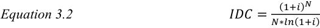

Where _N_ is the number of years of construction, and _i_ is the cost of capital. The results have two cases for the interest rate: 3% and 8%. The 8% case was representative of a typical nuclear project’s cost of capital. The 3% case represented the low interest rate made possible through loan guarantees from the federal government. In today’s environment, the U.S. government seems likely to offer loan guarantees for SMRs, lowering their cost of capital relative to large reactors. 

I considered one SMR: the NC-SMR, and one large reactor: the LPSR, for the comparison. These plants were similar in architecture: both used standalone steel containments, suspended water tanks, and concrete shield buildings, but the LPSR was ~7x larger in power capacity. There were three cases: _fully_ 

_modularized_ with both system and structural modules, _no system modules_ but still with structural modules, and _no modules_ for either category. Table 3.12 summarizes the construction duration results for the 3 cases and 2 architectures. Removing the system modules increased the duration 29% for the SMR and 44% for the large reactor which indicated that SMR architectures may be more dependent on system modules due to a more compact workspace. Removing structural modules had a much greater impact on the construction timelines – the NC-SMR schedule increased 108% and the LPSR increased 63% from the _no system modules_ case. 

_Table 3.12 Construction schedule changes with modularization_ 

Propagating these schedule extensions to indirect costs gives Figure 3.23 and Figure 3.24. In Figure 3.23, the specific indirect costs were higher for the NC-SMR than the LPSR for all cases. The high specific indirect costs relative to the LPSR for the NC-SMR were the result of the lack of economy of scale for the SMR. As a proportion of total costs, the NC-SMR indirect costs were not higher than those of the LPSR. The NC-SMR with 3% interest had a lower specific IDC than the LPSR at 8% interest, but the total indirect costs were still higher for the NC-SMR. For the LPSR, modularization reduced costs by $921/kWe for the 8% interest case and $534/kWe for the 3% interest case. For the NC-SMR, modularization reduced costs by $2371/kWe for the 8% interest case and $1441/kWe for the 3% interest case. The standard narrative around SMRs and modularization has been that SMRs **can be** more modularizable which is a technical advantage. However, these results suggest that SMRs **must be** modularized to avoid very high indirect costs. 

In Figure 3.24, the indirect costs for the LPSR were always higher than the NC-SMR because the LPSR was a plant 7x larger. This meant that the magnitude of the cost benefit of modularization was significant. In the case of the LPSR with 8% interest, the structural modules saved $700M and the system modules another $200M through lower indirect costs. For the NC-SMR with 8% interest, structural modules saved $300M and system modules saved $50M. 

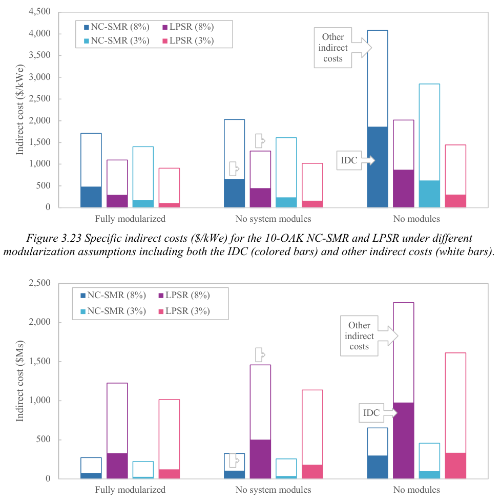

**----- Start of picture text -----** 
4,500 NC-SMR (8%) LPSR (8%) 4,000 Other NC-SMR (3%) LPSR (3%) indirect 3,500 costs 3,000 2,500 2,000 1,500 1,000 IDC 500 0 Fully modularized No system modules No modules Figure 3.23 Specific indirect costs ($/kWe) for the 10-OAK NC-SMR and LPSR under different modularization assumptions including both the IDC (colored bars) and other indirect costs (white bars). 2,500 NC-SMR (8%) LPSR (8%) NC-SMR (3%) LPSR (3%) 2,000 Other indirect costs 1,500 1,000 IDC 500 0 Fully modularized No system modules No modules Indirect cost ($/kWe) Indirect cost ($Ms) **----- End of picture text -----** 

_Figure 3.24 Indirect costs ($Ms) for the 10-OAK NC-SMR and LPSR under different modularization assumptions including both the IDC (colored bars) and other indirect costs (white bars)._ 

## **Chapter 4 – Overnight cost uncertainty** 

## **4.1 Literature review** 

As a result of the construction cost overruns and delays in recent decades, there has been a growing interest in estimates of the uncertainty and risk for nuclear construction costs and schedules. These studies have examined the effects of commodity and labor price fluctuations, construction delays, and unknown unknowns on nuclear construction costs. 

Ganda et al. quantified the uncertainty in key material and labor costs for nuclear projects and then propagated these uncertainties through a capital cost estimation model [55]. They removed the seasonal trends from historical costs in the Producer Price Index, data from the BLS, and other sources, and then they fit a log-normal distribution to the resulting data. Table 4.1 shows the parameters of the log-normal distribution for each cost element: labor, material, concrete, steel, and welding. They also estimated the correlation matrix for these distributions and performed a Monte Carlo analysis. Propagating these uncertainties through their overnight capital cost model yielded the cost distribution in Figure 4.1 for the reactor building cost of PWR12-BE. The standard deviation was 8.3% of the mean, so the 95% confidence interval was +/-16.6% which was much below the 2x cost overruns experience in true projects. This indicated that there were elements of uncertainty and risk beyond labor and material index uncertainty when it comes to nuclear projects. 

_Table 4.1 Probability density functions estimate parameters for different elements of cost uncertainty_ 

_from Ganda et al._ [55] 

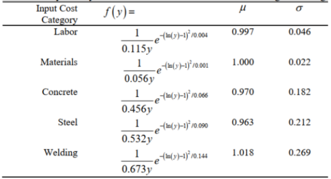

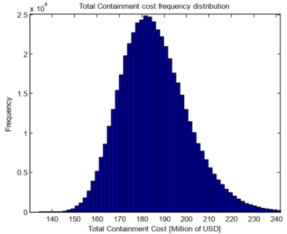

_Figure 4.1 Reactor building cost uncertainty for the PWR12-BE from Ganda et al._ [55] 

Maronati and Petrovic also estimated the impact of labor and material commodity uncertainty on nuclear costs, but their study also included schedule delays and the consequence on IDC [110]. They started with a review of historical nuclear costs and schedules in the U.S. prior to 2007, shown in Table 4.2.  The standard deviation for overnight costs was 51% and for duration was 23% of the mean for the post Three Mile Island accident plants. For labor and material commodity price uncertainties, they expanded from Ganda et al.’s five elements to 18. Some of the additional factors considered were: HVAC systems, tanks, pumps, heat exchangers, turbine systems, and electrical equipment. The most significant difference was the additional consideration of schedule delays. They used a sample Gantt chart that was representative of the PWR12-BE schedule (Figure 4.2 and perturbed the schedule using a set of delay probabilities from a private conversation with a Westinghouse employee. The delay probabilities were triangle distributions shown in Table 4.3. Concrete pouring activities had the greatest probability of delays, followed by all other on-site construction activities, and then component fabrication. The most recent nuclear construction projects in the U.S. and Europe had average delays of over 200% for the full schedule[8], so these values were below what more recent historical experience has shown. 

The resulting uncertainty distributions for schedule, overnight cost, and total costs including IDC and owner’s costs are in Figure 4.3.  The average schedule delay was 33%, and the median cost overrun was 0%. A delay of 100% was within the 95% confidence interval, but a large cost overrun of 100% was outside the distribution entirely. Therefore, this method did not capture the breadth of risk dynamics at play for more recent experience in construction AP1000s, EPRs, and APR1400s which average more than 100% cost overrun and schedule slippage. Specifically, they did not consider supply chain delays, the labor and material cost of rework, and change orders and their impact on productivity. Similar to the results from Ganda et al., Maronati and Petrovic found that their uncertainty analysis did not sufficiently capture the historical observed variation in nuclear costs, so they extended their study to include unknown unknowns [111]. 

_Table 4.2 Overnight costs and durations of U.S. power plants (before 2007)_ [110] 

|||Pre-1979|Post-1979|
|---|---|---|---|
|OCC ($/kW)|µ|1,606|3,946|
||σ/µ|36%|51%|
|Duration (years)|µ|7.8|10.6|
||σ/µ|52%|23%|

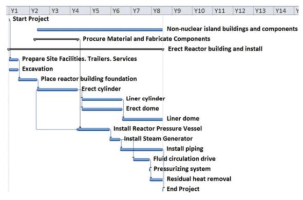

_Figure 4.2 Derived PWR12-BE schedule from EEDB and Maronati and Petrovic_ [110]. 

_Table 4.3 Triangle distribution minimums and maximums for duration probabilities from Maronati and Petrovic_ [110] 

||Minimum|Maximum|
|---|---|---|
|Components fabrication|-10%|30%|
|Concrete pouring|-5%|200%|
|On-site construction|-10%|80%|

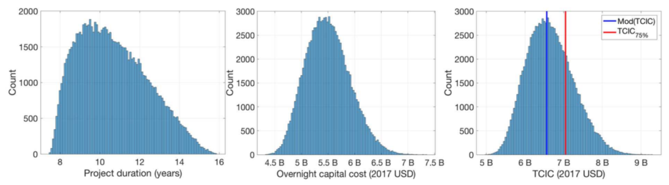

_Figure 4.3 Distributions of schedule duration, overnight cost, and total cost for the PWR12-BE from Maronati and Petrovic_ [110] 

A follow up study from Maronati and Petrovic examined how unknown unknowns, such as the Three Mile Island Accident could escalate nuclear construction costs [111]. They found that the project contingency should grow linearly with the project lead’s assessment of the probability of a major unknown unknown occurring. By definition it is impossible to know how likely such an event is to occur. Further, to assess how the impact of such an event would vary for different reactor architectures would require analyzing a suite of potential unknown unknowns, but then they are no longer unknowns. Therefore, the study is useful for planners considering nuclear construction projects at a high level, but it does not provide any insight into differentiating the risks that different reactor architectures would be exposed to. 

Minelli used a system dynamics and discounted cash flow model to assess a range of project management resource allocation decisions on nuclear project construction schedule and cost [97]. The study did not consider stochastic risk factors, but by analyzing a wide array of options, one can observe the median effect of different management decisions such as overlap between engineering and construction, plant capacity options, and other levers. Minelli reported that the risk of a negative project value went from 15% to 9% with large, early investment in engineering and design before construction starts. Further, the same early investment reduced the build time roughly 10% on average. 

For many of the cost model parameters, e.g. the scaling law exponents from Chapter 2, there are numerous sources in the literature for what the correct value that parameter should be. There is no assessment in the literature of how using different scaling laws creates cost estimate uncertainty. The closest effort in this regard comes from the cost estimating guidelines from the Association for the Advancement of Cost Engineering (AACE). Figure 4.4 comes from the AACE and dictates the recommended uncertainty bounds for cost estimates at different stages of a project. The cost estimates in this work would be considered Class 4 cost estimates with -30 to +50% cost uncertainty. These bounds are useful for utilities and policy makers considering the estimates made here from a high-level planning perspective, but they do not differentiate between the different reactor architectures. 

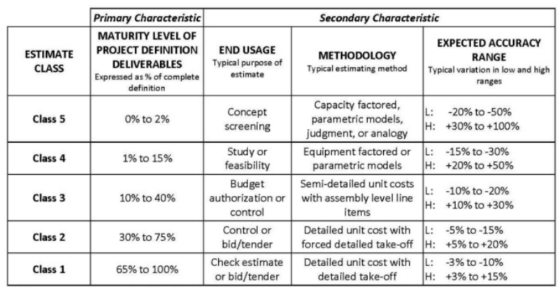

_Figure 4.4 Cost estimate uncertainty guidelines from the AACE_ [112] 

## **4.2 Elements of uncertainty studied** 

The aim of this work was to create a model of cost uncertainty and risk that would capture the different attributes of a reactor architecture. In this way, we can observe how design decisions impact the cost and schedule uncertainty and risk. We categorized the uncertainties into two bins: model uncertainty and execution uncertainty, shown in Figure 4.5. Model uncertainty related to the assumptions made in the model, i.e. the scaling parameters, indirect cost method, modularization, and learning assumptions. These were all decisions made in building the method to which there was some subjectivity, so the model uncertainty quantifies the impact of this. Execution uncertainty related to the “above median” delays and cost overruns a new nuclear project may face. These factors apply outside the cost estimation methods. 

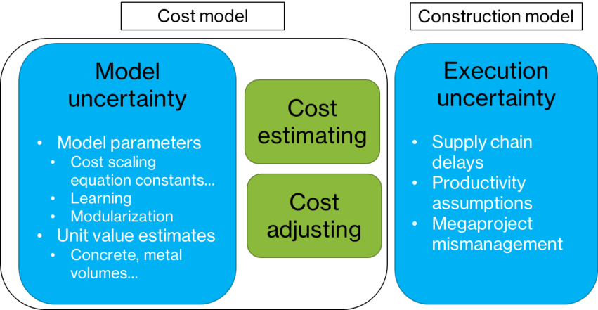

_Figure 4.5 Uncertainties and risks analyzed in this thesis_ 

## **4.3 Overnight cost model uncertainty methods** 

Each of the cost estimation methods discussed in Section 2.2 had uncertainty in its formulation. These were the direct cost power law scaling, indirect cost estimation method, cost reductions from passive safety and integral PWRs, learning-by-doing, modularization, and steel plate composites. The following sections outline the uncertainty quantification for these factors as well as for the model input data. This work did not consider labor and commodity price uncertainties because Ganda et al. and Maronati and Petrovic covered this extensively. 

## **4.3.1 Direct cost: Power law scaling uncertainty** 

Table 4.4 shows the uncertainty distributions and parameters for the direct cost estimation methods. Recall Equations 2.1 and 2.2 raised the input parameter (surface area, volume, mass, etc.) to an exponent to estimate the direct cost. There are several references for what the exponent should be: Ganda et al. [55], Saccheri et al. [76], Towler et al. [74], EMWG [32], and EEDB [23], but there were not sufficient references to estimate the distribution form. Therefore, the distributions were uniform with the range set by the minimum and maximum values found in the literature. For cases where there were not multiple values in the literature, the range was set so that the uncertainty distribution was -15%/+20% (AACE Class 4 Low) at the 1/10[th] scale. This is indicated by the “+” in Table 4.4. Note that this assumption may not reflect reality but was the most rational given the information available. The 1/10[th] scale was the ratio of the new plant parameter to the EEDB parameter in Equation 2.2. Note that mathematically, the impact of exponent uncertainty grows the further from the reference parameter value in EEDB, and this accurately captured the increased uncertainty that comes from estimating the cost of SMRs based on reference costs from a large PWR. 

The nuclear escalation factors, found from fitting the Towler capital cost estimation method to the EEDB data for RPVs, steam generators, pumps, and pressurizers had uncertainty also. These scalars fit to lognormal distributions with the 95% confidence interval set to the AACE Class 4 -15%/+20% range, and the median set to the base value. The parameters of the lognormal distribution are reflected in Table 4.4 as 𝜇 and 𝜎 that fit Equation 4.1: 

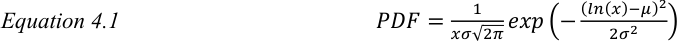

102 

## **4.3.2 Indirect cost estimation uncertainty** 

The indirect cost method derived entirely from the EEDB for the PWR12-BE and -ME. Chapter 2 discussed how the correlations mapped from direct costs and labor hours to indirect costs and labor hours. Table 2.12 summarized the scaling relations and factors. For the indirect costs, we again used the AACE recommended -15%/+20% Class 4 uncertainty range to set the 95% confidence interval for lognormal distributions of the scaling factors with the median set to the base value. 

_Table 4.5 Indirect cost scaling parameter uncertainty_ 

## **4.3.3 Passive safety cost reduction uncertainty** 

Similar to the indirect costs, the passive safety cost reductions came from data in the EEDB, but instead of the PWR12-BE and -ME it was the PWR6 and APWR6. This was only one datapoint, so there was insufficient data to build a distribution. Therefore, the AACE Class 4 uncertainty range was applied again. Table 4.6 summarizes the lognormal distribution parameters. 

_Table 4.6 Passive safety systems simplification cost reduction uncertainty_ 

## **4.3.4 Steel-plate composite and advanced manufacturing uncertainty** 

The AACE Class 4 uncertainty range was applied to the SPC rebar cost escalation, operating engineer time, welding time per SPC section, and the EPRI RPV advanced manufacturing cost reduction. The advanced manufacturing RPV cost reduction from EPRI only had positive uncertainty for the cost reduction because it was assumed the 40% cost reduction was a “best case” estimate. Therefore, the uncertainty range for the cost reduction was 20-40%. Table 4.7 summarizes the distribution parameters. 

_Table 4.7 Advanced construction and manufacturing cost and labor adjustment uncertainty. *The advanced manufacturing cost reduction only had positive uncertainty at +20% cost reduction_ 

## **4.3.5 Learning-by-doing uncertainty** 

Recall from Chapter 2 that the learning model parameters (Table 2.11) came from a least-squares fit of the OPR-1000 and P4 cost data from Lovering and Nordhaus [10]. Lyons and Roulstone cited 2% for a low learning rate and 15% for a high learning rate in an analysis of SMR supply chains [81]. A study from the University of Chicago reported a 3% low learning rate and a 10% high learning rate[113]. The average minimum learning rate was 2.5%, and the average maximum learning rate was 12.5%. The effective learning rate from the composite learning model in Chapter 2 was 6.4%, so the 95% confidence interval for learning rates was set to +195%/-39% of the baseline learning rates. Figure 4.6 shows how this uncertainty band captured 2/3 of the P4 and OPR-1000 cost data at the 95% confidence interval and was within 1% of 27/30 data points. The Site material and site labor learning rates were very likely correlated, so they received the same perturbation, but factory learning rate was sufficiently disconnected, so it received an independent perturbation. The thresholds on maximum cost reduction from learning-bydoing for the site labor and material costs held constant. 

_Table 4.8 Learning model uncertainty_ 

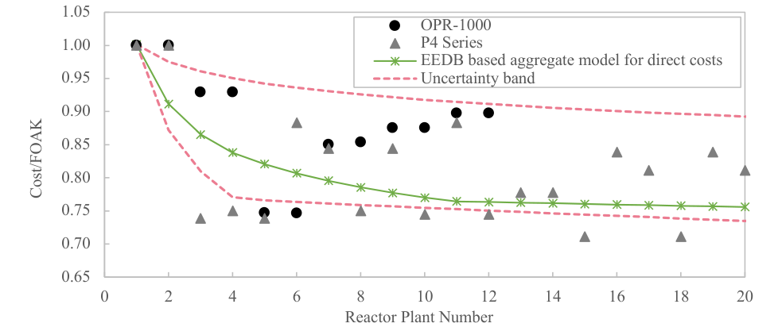

**----- Start of picture text -----** 
1.05 OPR-1000 1.00 P4 Series EEDB based aggregate model for direct costs 0.95 Uncertainty band 0.90 0.85 0.80 0.75 0.70 0.65 0 2 4 6 8 10 12 14 16 18 20 Reactor Plant Number Cost/FOAK **----- End of picture text -----** 

_Figure 4.6 Direct cost learning rate model with the uncertainty range from Table 4.8_ 

## **4.3.6 Modularization uncertainty** 

The modularization uncertainty came directly from the modularization cost report from McKinsey & Company (Figure 2.6). They not only report median expected factory, labor and material cost changes, but they also reported uncertainty bands. The input file for the overnight cost estimation tool allowed the user to set the fraction of site labor moved to a factory and the increased efficiency of the factory labor even though this work developed recommended values for these parameters. Therefore, the modularization uncertainty distributions were set as scalar values of what the user selects in the input file. For all the reactor architectures in this work, the baseline assumptions from Chapter 2 were unchanged. The bands from the McKinsey & Company chart were fit to a 95% confidence interval using a lognormal distribution, seen in Table 4.9. 

_Table 4.9 Modularization model uncertainty_ 

## **4.3.7 Input parameter variation** 

Based on an expert solicitation the expected concrete and steel volumes across selected concepts was found to be +/- 15%. To account for this variation, the input values for each scaling parameter were perturbed with a lognormal distribution with 0.85 and 1.15 as the 95% confidence interval. Further, input uncertainty is likely strongly correlated, so the perturbations were uniform within the two-digit accounts: structures & improvements, reactor plant equipment, turbine plant equipment, electrical plant equipment, misc. plant equipment, and heat rejection system. 

## **4.4 Overnight cost model uncertainty results** 

## **4.4.1 Updated overnight costs results with estimated durations** 

For this analysis, the overnight cost model input files used the construction durations estimated using the lower-bound constraints from Chapter 3. With design specific durations for the FOAK and 10-OAK reactors, the indirect cost model for factory costs updated to include architecture specific FOAK construction delays as the escalation factor in Table 2.12. As a result, the FOAK indirect factory costs were escalated using the ratio of the FOAK/10-OAK construction duration for that plant instead of the ratio of the FOAK/PWR12-BE construction time. Figure 4.7 shows the updated overnight costs for the FOAK and 10-OAK units. The direct costs were unchanged from the results in Chapter 2, but the FOAK indirect costs were higher for plants that were previously assumed to have shorter FOAK construction durations than the PWR12BE: MMNC, NC-SMR, LM-BWR, and SM-BWR. The FOAK indirect costs were unchanged for the other plants. The 10-OAK indirect costs were within 4% of the previously reported 10-OAK indirect costs. 

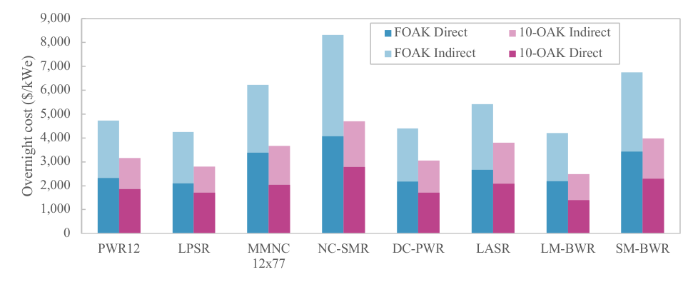

**----- Start of picture text -----** 
9,000 FOAK Direct 10-OAK Indirect 8,000 FOAK Indirect 10-OAK Direct 7,000 6,000 5,000 4,000 3,000 2,000 1,000 0 PWR12 LPSR MMNC NC-SMR DC-PWR LASR LM-BWR SM-BWR 12x77 Overnight cost ($/kWe) **----- End of picture text -----** 

_Figure 4.7 Updated specific overnight costs with the construction durations from Chapter 3._ 

## **4.4.2 Monte Carlo results** 

Each architecture was run with 500 Monte Carlo (MC) samples of each distribution. Figure 4.8 shows the running standard deviation divided by the running mean (also called the Coefficient of Variation, CoV) of the 500 MC samples for the eight architectures. In all cases, the CoV had converged within 0.5% by the 200[th] sample. The 10-OAK CoV was higher in all cases due to the uncertainty introduced in the learning rates. The PWR12 had the lowest CoVs 4% and 10% for the FOAK and 10-OAK, respectively which was expected because the costs referenced to the PWR12, so all the scaling exponent variation creates no cost variation. The LPSR, DC-PWR, LM-BWR, and LASR had the next lowest levels of uncertainty: between 4-5% at FOAK and 10-12% at 10-OAK. The small plants, NC-SMR and SM-BWR, were in the next uncertainty bucket: 5-6% at FOAK and 12-14% at 10-OAK. The MMNC had the highest CoV with 8% at FOAK and 14% at 10-OAK. 

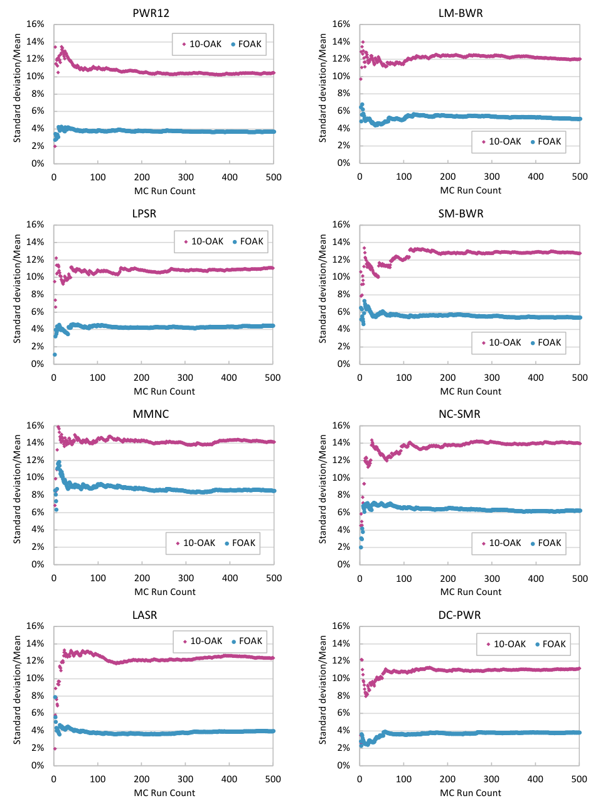

**----- Start of picture text -----** 
PWR12 LM-BWR 16% 16% 14% 10-OAK FOAK 14% 12% 12% 10% 10% 8% 8% 6% 6% 4% 4% 2% 2% 10-OAK FOAK 0% 0% 0 100 200 300 400 500 0 100 200 300 400 500 MC Run Count MC Run Count LPSR SM-BWR 16% 16% 14% 10-OAK FOAK 14% 12% 12% 10% 10% 8% 8% 6% 6% 4% 4% 2% 2% 10-OAK FOAK 0% 0% 0 100 200 300 400 500 0 100 200 300 400 500 MC Run Count MC Run Count MMNC NC-SMR 16% 16% 14% 14% 12% 12% 10% 10% 8% 8% 6% 6% 4% 4% 2% 10-OAK FOAK 2% 10-OAK FOAK 0% 0% 0 100 200 300 400 500 0 100 200 300 400 500 MC Run Count MC Run Count LASR DC-PWR 16% 16% 14% 10-OAK FOAK 14% 10-OAK FOAK 12% 12% 10% 10% 8% 8% 6% 6% 4% 4% 2% 2% 0% 0% 0 100 200 300 400 500 0 100 200 300 400 500 MC Run Count MC Run Count Standard deviation/Mean Standard deviation/Mean Standard deviation/Mean Standard deviation/Mean Standard deviation/Mean Standard deviation/Mean Standard deviation/Mean Standard deviation/Mean **----- End of picture text -----** 

_Figure 4.8 Running standard deviation for the 500 MC runs showing convergence_ 

Figure 4.9 shows the overnight costs as boxplots for units 1-10, and Figure 4.10 shows the overnight costs per capacity as boxplots for units 1-10. In Figure 4.9, there were several interesting trends. First, in all cases the cost uncertainty grows from the FOAK to the 10-OAK due the uncertainty in the learning model. This was a key distinction from the expected results for the execution uncertainty where the cost variation is expected to decrease from unit 1 to 10. Second, the FOAK uncertainties were similar in magnitude (+/- $500M) for the plants with generally similar architectures: PWR12, LPSR, LASR, DCPWR. The FOAK uncertainties was largest for the most unique architecture: the MMNC plant. With the most novel components, and most deviation from standard reactor sized components, the cost estimates had the largest variation. 

In total overnight cost (i.e. not specific costs), the SM-BWR and NC-SMR had the lowest uncertainties because the costs were smallest. However, considering the specific costs in Figure 4.10, the MMNC, SMBWR and NC-SMR had the largest uncertainties. Three factors drove this. First, as SMRs the component parameters were the most different from the PWR12, and the effect of cost scaling uncertainty grows with distance from the reference value. Second, these architectures had significant modularization which introduced additional uncertainty, and the learning rate had a higher impact for modularized plants. Third, they had the highest specific costs, and uncertainty grew with specific cost. However, it is interesting to note that the 10-OAK total cost of the SM-BWR and NC-SMR ($1.3B and $900M, respectively) was on the order of the 2-sigma uncertainty of the MMNC, LM-BWR, LASR, and DC-PWR. In other words, one could build an SMR at the cost of the expected variation of some large architectures. 

Figure 4.11 shows the overnight costs normalized to the median 10-OAK cost of each reactor. The architectures with the most modularization showed the greatest FOAK cost increases because their 10OAK costs benefitted heavily from the learning-by-doing effect (LM-BWR, SM-BWR, MMNC, and NCSMR). Most of the architectures were -15% to +20% at the 95% confidence level which was consistent with the AACE Class 4 cost categorization. 

To identify which model parameters were creating the most uncertainty for each reactor architecture, we performed a sensitivity analysis of the 500 MC samples. The variation of each parameter was normalized to a mean of zero and a standard deviation of one. Then an analysis of variance (ANOVA) of the normalized parameters gave sum of squares for each model parameter. The sum of squares can be translated to percentage of total variance explained because the sampling process in the MC was wholly independent, so there were no correlations in the model parameters. Table 4.10 shows the top ten most sensitive parameters for FOAK and 10-OAK of each architecture sorted from most sensitive to least. The most common parameters were color-coded to aid in visually seeing the similarities and differences for each architecture. 

For the 10-OAK units, the site learning rate was consistently a critical parameter. For the heavily modularized plants (MMNC, NC-SMR, SM-BWR, and LM-BWR), the factory learning rate was a critical 10-OAK parameter, and also for the MMNC FOAK because of the multi-module intra-plant learning effect. The modularization assumptions were also highly sensitive parameters for the modularized plants (MMNC, NC-SMR, LM-BWR, and SM-BWR). Material input uncertainty for Account 21: Structures & Improvements and Account 22: Reactor Plant Equipment was important for all architectures, as were the indirect labor and factory cost estimation methods. The MMNC plant was sensitive to the advanced manufacturing cost reduction for e-beam welded RPVs and the RPV nuclear escalation factor because there were 24 nuclear vessels in the plant (12 reactor vessels, 12 containment vessels). The LM-BWR was sensitive to the RCP cost scaling because the size of the internal recirculating pumps was vastly different from the PWR12 RCP which was the cost basis, so the exponent uncertainty had a large effect. 

Figure 4.12 shows the maximum and average variance explained for each of the 61 model parameters had across the sixteen regressions (eight architectures, FOAK and 10-OAK). The parameters were sorted from greatest maximum variance explained to least to identify a cutoff for the most critical model parameters. There was a jump down in impact around parameter 21, so Table 4.11 lists the top 21 most sensitive parameters across all reactor architectures. Model parameters that impacted multiple component costs were more likely to be near the top of the list because they had broad cost impact. The input uncertainty on structural inputs and reactor equipment inputs was not large, only +/-15%, but this was a high impact uncertainty for all reactors. Assessing the total volume of concrete for a reactor architecture within 15% would be a highly accurate estimate, so the uncertainty analysis could have considered a wider range. This highlighted the importance of knowing the structural inputs in cost estimating. The same was true of the reactor plant equipment. As expected, the primary system component cost scaling parameters were the most critical: RPV nuclear escalation, heat exchanger scaling exponent (steam generator), reactor coolant pump, and E-beam welding cost reduction. 

The same analysis revealed which parameters were the least important. These were elements of the SPC cost such as welding and rebar reduction. The transportation cost of modules had a maximum coefficient of 0.05 and an average of 0.02, indicating that the cost estimates were not strongly dependent on accurate transportation costs. Many of the passive safety cost reductions for the primary reactor and electrical equipment were near the bottom of the list. It is important to note small regression coefficients did not imply that these cost reductions were insignificant (though in some cases they may be) but that the total cost impact was insensitive to the variation in the magnitude of the assumed uncertainty range. 

In general, the most sensitive parameters were those that affected many cost items such as the learning rates, the indirect cost model, and modularization method. Therefore, to increase the accuracy of these cost estimates, future work should focus on reducing these uncertainties. However, it is very likely that these uncertainties will remain until enough projects are built to analyze. Beyond these broad impact parameters, when a component level parameter, such as the nuclear escalation factor for RPVs appeared in Table 4.10, that indicated that a given architecture was taking a large risk on that component. For example, the MMNC overnight cost was highly sensitive to the RPV escalation factor and E-beam weld cost reduction factor, and this means there is a lot of cost-risk in the containment vessel, integral RPV strategy. 

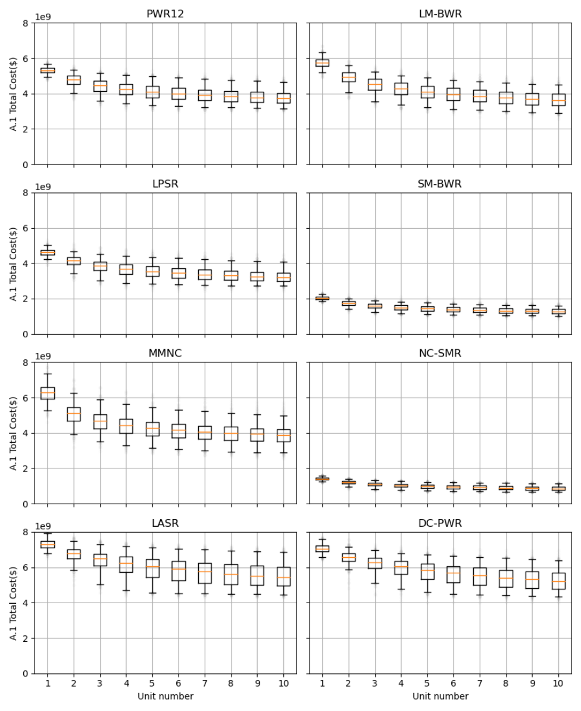

_Figure 4.9 Monte Carlo results of the overnight costs for eight architectures from FOAK to 10-OAK. Box shows the two inner-quartiles, the whiskers are the 95% confidence interval._ 

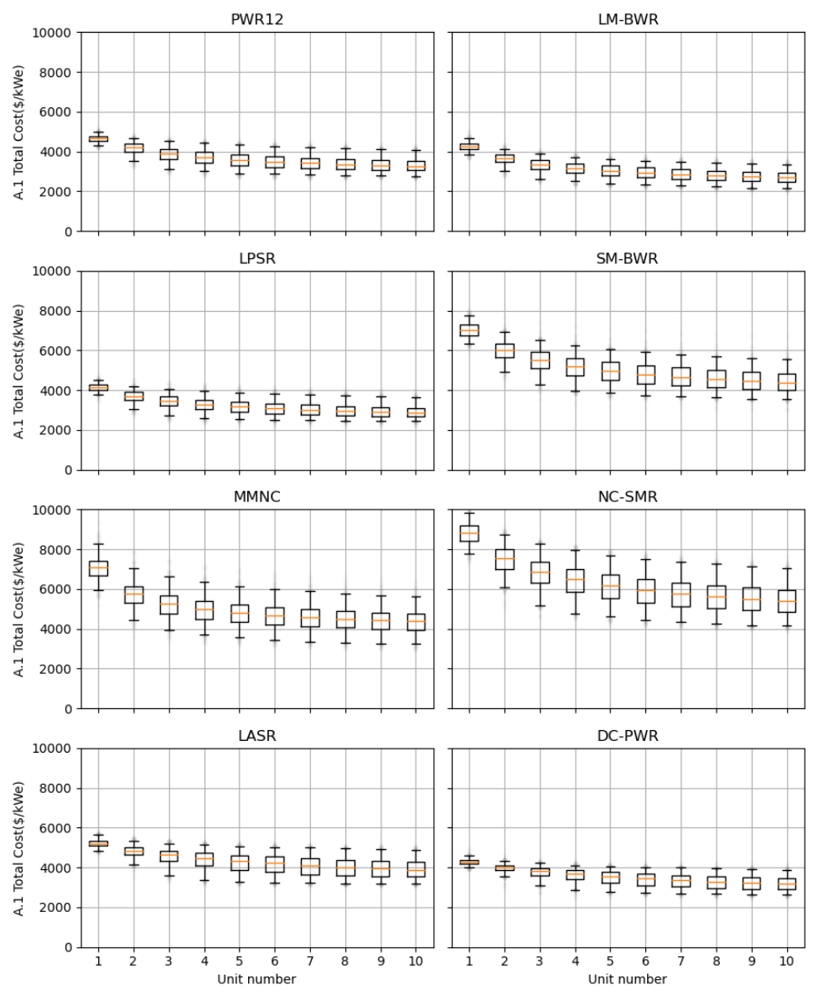

_Figure 4.10 Monte Carlo results of the specific overnight costs for eight architectures from FOAK to 10OAK. Box shows the two inner-quartiles, the whiskers are the 95% confidence interval._ 

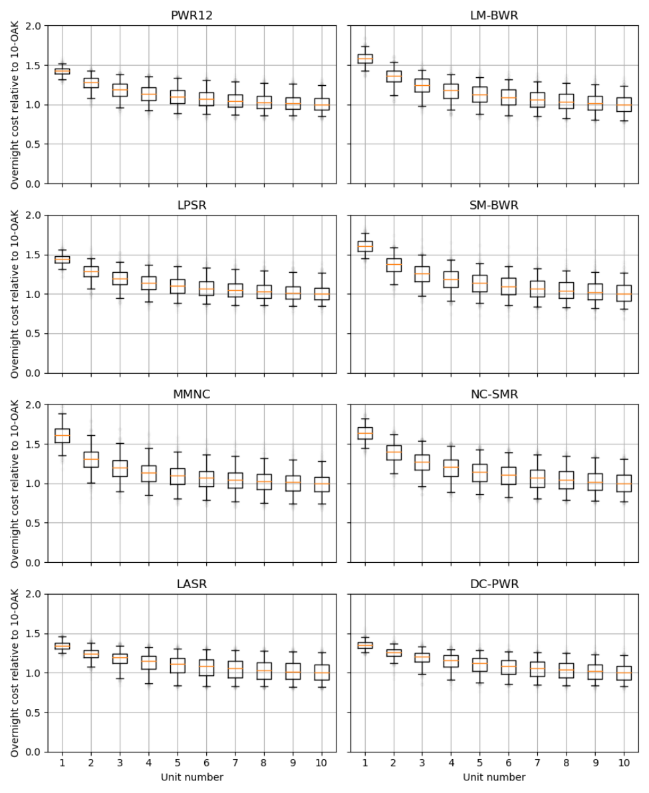

_Figure 4.11 Monte Carlo results of the overnight costs normalized to the median 10-OAK cost for eight architectures from FOAK to 10-OAK. Box shows the two inner-quartiles, the whiskers are the 95% confidence interval._ 

113 

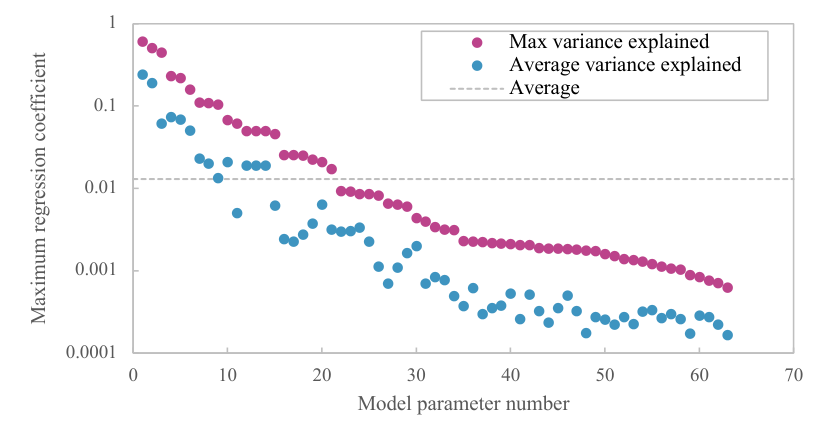

**----- Start of picture text -----** 
1 Max variance explained Average variance explained Average 0.1 0.01 0.001 0.0001 0 10 20 30 40 50 60 70 Model parameter number Maximum regression coefficient **----- End of picture text -----** 

_Figure 4.12 Maximum and average variance explained for each model parameter across all eight architecture and FOAK and 10-OAK plant model parameters sorted from greatest to least._ 

_Table 4.11 Top 21 most sensitive cost estimation model parameters_ 

## **Chapter 5 – Construction schedule and total cost risk** 

The NEA report discussed in Chapter 1 highlighted construction delays at several international nuclear projects: Sanmen in China, Vogtle in the US, Shin Kori and South Korea, Olkiluoto in Finland, Flamanville in France, and Taishan in China. Of these, the most public information is available regarding the problems faced at the Vogtle site because the Georgia Public Service Commission published bi-annual reports called, Voglte Construction Monitoring (VCM) reports. The VCM reports cover in depth the delays, challenges, and costs experienced. We used these reports and other reporting on Vogtle as a case study to assess the types of risks nuclear construction projects faced. Reports from the cancelled construction of two AP1000s at the V.C. Summer site augmented the analysis. Then, we conducted a literature review of other industries that face these issues to quantify the cost and probability of their occurrence. 

## **5.1 Construction risk methodology** 

## **5.1.1 U.S. AP100 case study** 

A 2016 Bechtel report on the V.C. Summer project stated that the project “suffered from flawed construction plans, faulty designs, inadequate management of contractors, low worker morale, and high turnover” [114]. The report describes the failures in management, engineering, productivity, and supply chain. As early as January 2015, a deposition provided for VCM report number 12 stated, 

“the Contractor has faced numerous, challenges to the execution of the schedule related to engineering design, design changes, major equipment fabrication and deliveries, module fabrication and deliveries, and field construction performance.” [115] 

The consequence of these issues was an 18-month delay. The report goes into a few specific causes of the delay saying “any of these challenges may become the top critical path”: 

- “…performance delays in Nuclear Island concrete placement” 

- “…an extended forecast duration of Shield Building panel installation” 

- “…delays in the concrete placements required to support multiple major structural modules” 

- “…delays and increased duration forecasted for the … reactor vessel, steam generator, reactor coolant pumps, squib valves, core make-up tanks, and polar crane” 

The deposition discussed in depth manufacturing and performance issues with the reactor coolant pump, squib valve, and core make-up tanks that were causing supply chain delays. The supply chain delays were not just in equipment but also in the structural modules. Westinghouse designed the AP1000 to have 146 structural modules such as steel plate composite formwork for the interior concrete in the reactor building. For the V.C. Summer project, only 100 of the 146 modules were delivered on time, with the remaining 46 being delayed 6-18 months[116]. Several of these modules were critical path and stopped progression of critical construction activities until they were delivered. For example, the CA01 module, the steel formwork for the steam generator cavity, could not be lifted over two rings of the containment vessel. So, the second ring could not be placed until the CA01 module was delivered, and the CA01 module was 

made of 47 sub-modules, so a delay in any of the sub-modules had a significant impact. Capturing these critical-path knock-on effects will be key to estimating the uncertainty risk for nuclear projects. 

VCM 12 and VCM 24 (and others) also reported how low productivity drove performance delays on critical construction activities. For example, Figure 5.1 shows the ratio of hours spent to hours earned as the cost performance index. This metric is the inverse of productivity, so a cost performance index of 2 means work is progressing at 50% efficiency. Supply chain delays, design changes, license amendments, COVID-19, and low worker morale all caused the low productivity rates[115,117,118]. 

Eash-Gates et al. used a model-based approach to assess historical nuclear project costs and found that a drop-in productivity, sometimes up to 13x lower than expectations, was a major cause for project cost overruns [119]. Their study reported that some of the productivity loss came as a result of the change from active safety systems to passive safety systems and the engineering consequences on the technical specification of the reactor containment. This highlighted the importance of design-specific construction scheduling risk. 

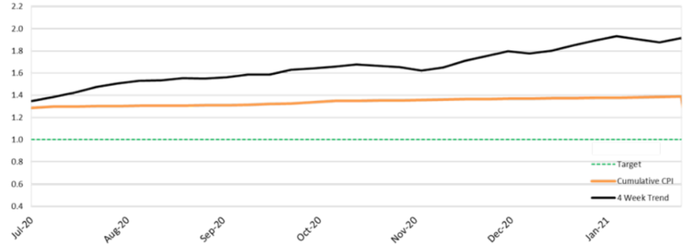

_Figure 5.1 Direct construction cost performance index (ratio of hours spent to hours earned)_ [117] _._ 

When the Vogtle and V.C. Summer sites began construction, the detailed design of the AP1000 was not complete, so there were several design changes during construction. Without access to internal Westinghouse documentation, we can only estimate the extent of the design changes that occurred during construction. One way to do this was to review the license amendments submitted to the Nuclear Regulatory Commission. For Vogtle Unit 3, Westinghouse submitted 188 license amendments and exemptions [120]. Of these, 50 were changes in the structural design of the plant, such as rebar and stud spacing, building layout changes, and other design details. Another 55 were equipment specification changes, such as core make-up tank volume, piping layouts, and sampling equipment. Another 17 were electrical equipment, such as cable routing, penetrations, loading changes, and battery room changes. The remaining 66 were miscellaneous, including operational changes and emergency planning procedure changes. Each of these design changes impacted the progress and productivity of construction activities, so the execution uncertainty analysis needs to include an estimate of the impact of an incomplete engineering design. It should be noted that there was significant pressure to begin construction of Vogtle site prior to completion of the detailed design due to the expiring loan guarantee program from the DOE and commercial pressure to be the first U.S. project of the 2010 era nuclear renaissance. 

Another element of construction delay was “above median” human error during construction due to the lack of institutional knowledge and experience in the U.S. nuclear workforce. In the U.S., we had not 

started a new nuclear project in over two decades, so there was a lack a familiarity with the specific nature of nuclear construction including regulatory oversight. For example, one half of the engineering backfill moved during site preparation did not meet regulatory standards creating a 6-month delay in 2009 before the combined operating license was even issued [121]. Another example, in 2012, the rebar in the basemat was installed incorrectly [122]. These were just two among several issues the site faced there created delays above the median case for a FOAK reactor. 

In summary, the execution uncertainty analysis needs to include modeling of supply chain delays, human error, change orders, and productivity. The following section outlines the modeling techniques. 

## **5.1.2 Elements of risk** 

## _5.1.2.1 Supply chain delays_ 

Sodhi and Tang identify three supply side risks for an organization: (1) supplier failure, (2) supply commitment, and (3) supply cost [123]. Supplier failure risk is risk of collapse of the supplier, such as when UPF-Thompson filed for bankruptcy and failed to deliver car chassis to Land Rover. Supply commitment risk happens when the supplier must make large equipment purchases or other capital investments without certainty of future demand. Supply cost risk accounts for supplier price escalations or a change in exchange rates for international supply chains. Supply cost risk is greater for single-source supply chains, such as the module production facilities by the Shaw Group for the Westinghouse AP1000. 

All three of these risks existed for the U.S. AP1000 projects. First, in 2012, a report from Bill Jacobs, selected by the Georgia Public Service Commission to monitor the Vogtle project, stated that the Shaw Group, the manufacturer of the AP1000 modules, “lacked experience … to successfully manufacture nuclear components”, indicating significant supplier failure risk [124]. Second, after the price of natural gas dropped in 2010, there were seventeen cancelled nuclear projects in the US, six of which were AP1000s, and this loss of demand created supply commitment risk [125]. Finally, the Shaw Group was the sole manufacturer of the AP1000 structural modules, so there was supply cost risk. 

Through detailed modelling of a specialty chemicals supply chain, Acar showed that demand uncertainty had the most negative impact on supply chain performance, followed by production uncertainty [126]. Figure 5.2 shows the weighted impact on lateness of demand uncertainty, lead time uncertainty (transportation time), and production uncertainty (supplier failure) from Acar. Demand uncertainty accounted for slightly more than one half of the weighted lateness. 

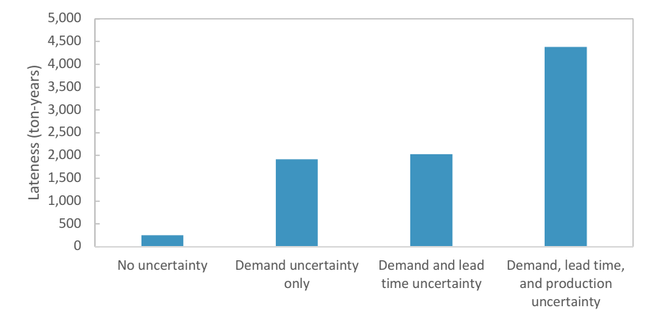

**----- Start of picture text -----** 
5,000 4,500 4,000 3,500 3,000 2,500 2,000 1,500 1,000 500 0 No uncertainty Demand uncertainty Demand and lead Demand, lead time, only time uncertainty and production uncertainty Lateness (ton-years) **----- End of picture text -----** 

_Figure 5.2 Effect of supply chain uncertainties on lateness, approximated from Acar_ [126] 

Therefore, to model supply chain delay effects in the construction schedules, we focused on all new components, i.e. components without a steady, existing supply chain. Then, given that 46/146 modules were delayed, we assumed that each new component had a 1/3 chance of a delay. The modules were delayed between 6-18 months, with an average delay of 12 months. The 95% confidence interval of a Poisson distribution with a mean of 12 months was 5-19 months, so a Poisson distribution was sampled for the delay length. For every nth-unit the mean of the delay distribution dropped by one half, so the FOAK had a 12-month average, the 2-OAK had a 6-month average, etc. One benefit of the Poisson distribution was that the variance decreased in conjunction with the mean. It is probable that for SMRs, the 1/3 probability should be reduced to 1/6 because a multi-site plant with several reactors may alleviate the demand uncertainty, and this is proposed future work. 

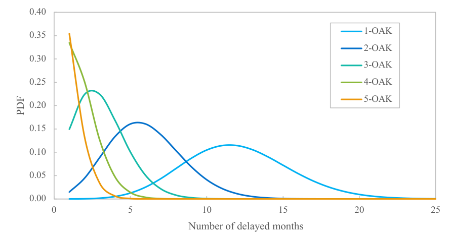

**----- Start of picture text -----** 
0.40 1-OAK 0.35 2-OAK 0.30 3-OAK 0.25 4-OAK 5-OAK 0.20 0.15 0.10 0.05 0.00 0 5 10 15 20 25 Number of delayed months PDF **----- End of picture text -----** 

_Figure 5.3 Supply chain delay length sampling distributions_ 

## _5.1.2.2 Human error_ 

In a review of megaprojects and their delays, Merrow conducted a multi-variate regression to identify key factors that drove schedule slippage [83]. Figure 5.4 shows the statistically significant factors from the study. On average, FOAK technology caused a 23% construction delay, and construction of FOAK technology is where human error was most likely concentrated. Therefore, for FOAK units, all construction activities had a 46% chance of human error occurring, and the human error occurred with uniform randomness during the activity (mean of 50% completion), so the net result was a median delay of 23%. 

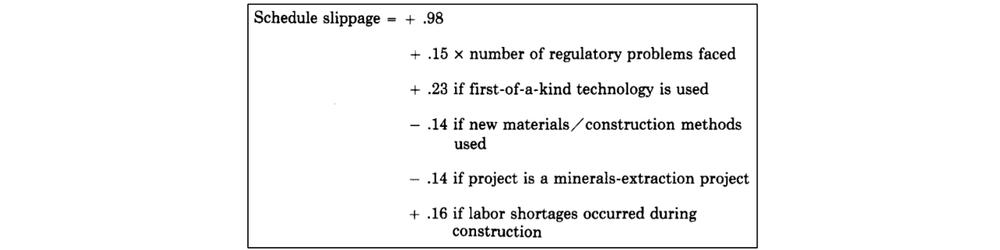

_Figure 5.4 Factors driving schedule delays from RAND megaproject study_ [83] 

However, Hadipriono reported that the probability of human error scaled with the number of site activities [127]. Assuming that the number of site activities correlates linearly with number of onsite labor hours, and using a power law fit of the data from Hadipriono in Figure 5.5, We scaled the 46% probability of error based on the total site labor hours for each architecture. The equation for scaling the error probability assumed that the PWR12-ME base error rate was 46%: 

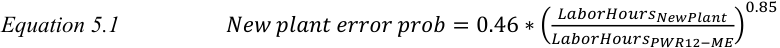

The 0.85 exponent came from fitting the data in Figure 5.5. Human error should reduce from one unit to the next as both the workforce and project management team become more familiar with the construction process. The 2018 FoN report cited a 40% reduction in labor from the FOAK to the 4-OAK APR1400 at the Barakah site in the U.A.E. [5]. This was a 23% learning rate, significantly higher than the 13% learning rate observed in the EEDB, P4, and OPR1000 data, and it implied an “above baseline” 11% learning rate from error reduction. Therefore, the 46% probability of human error decreased from unit to unit with an 11% learning rate, so the 10-OAK tasks had a 31% probability of error, and that further decreased to 25% after considering the site labor hour reduction from FOAK to 10-OAK and Equation 4.2. The resulting median delay for the 10-OAK PWR12 was 11% schedule slippage. 

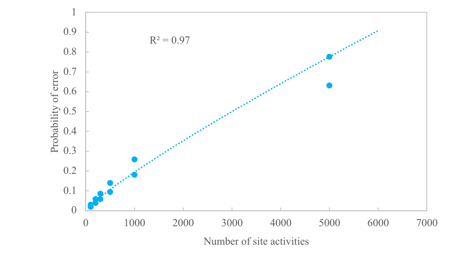

**----- Start of picture text -----** 
1 0.9 R² = 0.97 0.8 0.7 0.6 0.5 0.4 0.3 0.2 0.1 0 0 1000 2000 3000 4000 5000 6000 7000 Number of site activities Probability of error **----- End of picture text -----** 

_Figure 5.5 Probability of construction human error for construction project with different numbers of site activities. Data from Hadipriono_ [127] 

Where Hadipriono reported a link between site activities and errors (and implicitly delays), Merrow et al. did not find a statistically significant link. Going into the literature review, the expectation was that human error delays would be correlated with large “megaproject” scale construction projects due to a loss of management efficiency at the mega scale. If this was the case, we would observe increased cost growth or schedule slippage for projects with high peak labor forces, large numbers of subcontractors, etc. Indeed, the megaproject review conducted by Merrow et al. did find positive correlations between these factors and schedule slippage, shown in Figure 5.6, but the correlations were not statistically significant. In other words, in the multivariate analysis, these correlations disappear after accounting for other variables. It was unclear how to reconcile these disparate studies, so it was hypothesized that the human error delays were primarily associated with FOAK projects. Therefore, in one case study, the human error risk was eliminated after the FOAK. 

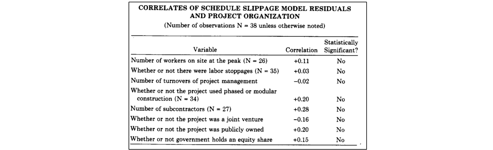

_Figure 5.6 Correlations of schedule slippage model residuals and project organization_ [83] _._ 

## _5.1.2.3 Change orders and productivity_ 

A 1987 Revay Report article from Charles Leonard diagnosed low productivity construction projects as a consequence of change orders, or changes to the engineering design [128]. Vogtle Unit 3 underwent 188 license amendments, many of which were also change orders, so it was very likely that the Vogtle low productivity work was a result of the change orders. In his article, Leonard correlated the time spent on change orders relative to the original contract, “% change orders” to time wasted relative to the original contract, “% loss of productivity” to create Figure 5.7. We used the mathematical form of Figure 5.7 to increase the construction duration of an activity that experienced a change order. 

To do this, however, required an estimate of which construction activities had a change order and the time spent on the change order. For each of the 226 site activities modeled in Chapter 3, We counted the number of license amendments corresponding to that activity using the Vogtle Unit 3 license amendments. The combined construction and operation license (COL) required the licensee to layout a series of Inspections, Tests, Analyses, and Acceptance Criteria (ITAAC) that “provide reasonable assurance that the facility has been constructed and will operate in conformity with the combined license” [129]. Change orders associated with ITAAC can be especially costly. There were several ITAAC license amendments, but half of these were related to emergency planning or consolidation of multiple ITAAC. The remainder were primarily associated with structural components and reactor components. 

Touran proposed a Poisson process for a stochastic model of change orders in a review of U.S. Army Corps of Engineers projects [130]. Therefore, the count of affiliated license amendments became the mean of a Poisson distribution. Table 5.1 shows the site activities and Poisson means. 

To estimate the time spent on a change order, we sampled a distribution of the amount of progress made towards a task before the change order was issued. The amount of progress completed, but then required to be redone, was the time spent on the change order. The change order could be issued at any time before, during, or after a task. There was no corresponding Gantt chart of site activities to compare with the license amendments dates that could be used to estimate the distribution of when change orders occurred. It seemed more likely that change orders would be issued early in the work progress phase as opposed to near the completion of the task. Therefore, we used an exponential distribution with a mean of 20% as the sampling distribution for fraction of work completed before a change order was issued. Figure 5.8 compares the exponential distribution used to a uniform random distribution to show how the exponential biased the probabilities to earlier in the task phase. 

Finally, change orders were assumed to be the result of an incomplete (or untested) detailed plant design. Therefore, the change order risk only applied to the FOAK unit, and all units from 2- to 10-OAK did not experience change order risk in the modeling done in this work. 

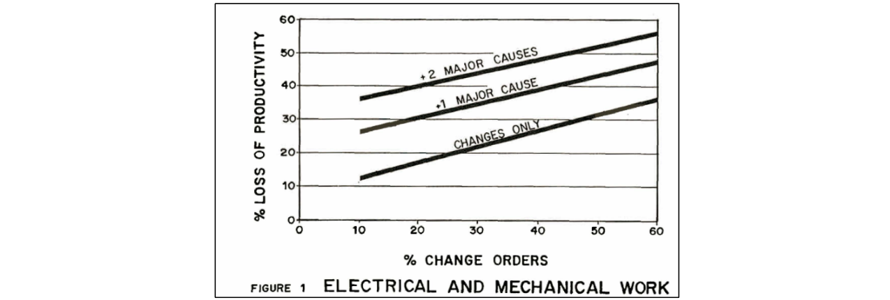

_Figure 5.7 Correlation between loss of productivity and time spent on change orders from Leonard_ [128] _._ 

_Table 5.1 Poisson distribution means for site activities based on Vogtle license amendments._ 

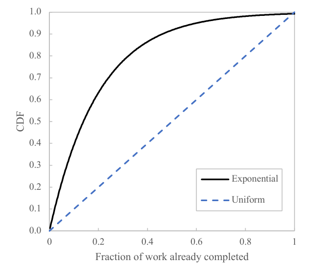

**----- Start of picture text -----** 
1.0 0.9 0.8 0.7 0.6 0.5 0.4 0.3 Exponential 0.2 Uniform 0.1 0.0 0 0.2 0.4 0.6 0.8 1 Fraction of work already completed CDF **----- End of picture text -----** 

_Figure 5.8 CDF of the exponential distribution used to sample the fraction of work completed before the change order was issued._ 

## **5.1.3 Assumptions for each architecture** 

Table 5.2 shows the construction schedule risk modelling assumptions for the eight reactor architectures. Th PWR12 had the reference 46% human error rate probability at the FOAK which reduced to 25% by the 10-OAK. The error risk was lower for plants with less onsite labor, such as the LPSR, MMNC, NCSMR, LM-BWR, and SM-BWR, but the risk was higher for the plants with more onsite labor, such as the DC-PWR and LASR. The very small plants, NC-SMR and SM-BWR, had FOAK error risks lower than the 10-OAK risks of the other architectures. 

The PWR12 had no new supply chain components because it was a very traditional PWR architecture. For the other architectures, the FOAK components are listed in Table 5.2. These FOAK components included structural modules such as the interior concrete for the LPSR, NC-SMR, LM-BWR, and SMBWR. It also included passive safety systems such as the passive cooling pools in the LPSR, MMNC, and SM-BWR, and the isolation condensers in the SM-BWR. In several cases, the RPV, steam generator, and reactor coolant pump were FOAK components because the associated vendors had not produced or procured reactor primary components in multiple decades. The I&C systems were also new for all plants except the PWR12 due to the introduction of digital I&C. Finally, the MMNC refueling systems and control room structure and components were FOAK components. 

_Table 5.2 Construction schedule risk model assumptions for each reactor architecture_ 

## **5.1.4 Results and discussion** 

To ensure convergence of the Monte Carlo runs of the construction risk model, Figure 5.9 shows the running CoV for 1000 runs of the FOAK DC-PWR using the schedule built under the lower-bound constraints. The CoV converged to within 0.2% after 400 MC runs. However, all reactors were evaluated with 1000 MC runs, so there would be enough samples for a sensitivity analysis. 

Figure 5.10 shows box plots of the construction durations including the effects of delays for the eight reactors and first 10 units for the schedules built using the upper-bound constraints (peak site staffing of 4500, max monthly labor change of 800). The width of the variation and magnitude of the median delay was most significant delay for the FOAK units. This was because the change order problems were managed by the 2-OAK, human error was slowly learned away, and supply chain issues reduced over time as well. By the 10-OAK units, almost all delays were human error. Human error remained an issue for the stick-built PWR12 where building space limitations drove a more linear work structure. The small plants, NC-SMR and SM-BWR, had the lowest 10-OAK variations due to the dramatically lower human error probabilities given the smaller projects. 

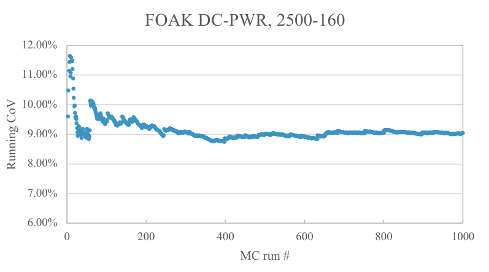

**----- Start of picture text -----** 
FOAK DC-PWR, 2500-160 12.00% 11.00% 10.00% 9.00% 8.00% 7.00% 6.00% 0 200 400 600 800 1000 MC run # Running CoV **----- End of picture text -----** 

_Figure 5.9 Running coefficient of variance (CoV) showing convergence of the first and second moments of the construction schedule distribution_ 

Figure 5.11 shows the same construction duration delays but for the lower-bound construction constraints (peak site staffing of 2500, max monthly labor change of 160). At the median, with the tighter labor restrictions, the delays averaged 57% longer, and total schedules averaged 34% longer, and the impacts were more significant for some plants than for others. The delayed months were within 10% for both labor constraints for the PWR12, LPSR, and SM-BWR, and the total delayed schedule months were nearly identical between the two cases for the PWR12, NC-SMR, and SM-BWR. This result was similar to the construction scheduling results in Chapter 3 where the stick built and smaller plants were more constrained by building workspace than the site staffing limitations. The delays were significantly longer for the MMNC, DC-PWR, and LASR, which all had total schedule extensions of about 70% at the median. At the 97.5 percentile, the MMNC and DC-PWR had the greatest sensitivity to the tighter labor restrictions with total schedule delays of 75-110%. 

The median delay and delay at 97.5% of the distribution for each reactor is in Table 5.3. For the FOAK, PWR12 had the greatest delay with 31 months of median delay, and the LPSR closely followed with 27 months of delay. The rest of the reactors were close with 11-17 months of FOAK delay.  At the upper end of the distributions, the 97.5% level, the PWR12, LPSR, and NC-SMR all had 59+ month delays which more than doubled the durations of the LPSR and NC-SMR. The standalone steel containment and elevated passive cooling tank both caused delays driven by change orders, supply chain issues, and human error. Table 5.5 shows the top five delay drivers for each architecture which confirms the criticality of the containment structure for the NC-SMR and LPSR. The PWR12 delays were more distributed across several SSCs: interior concrete, service water, etc. because the absence of 

modularization increased the impact of the building workspace constraint, so all shared activities inside a workspace equally drove delays. In other words, modularization removed some of the interconnectedness because more tasks can be done in parallel, whereas the linear nature of stick-built plants created more downstream consequences. 

In Table 5.3, the delays from the 5- to 10-OAK units were averaged to remove some of the random variation that came from the stochastic nature of the construction scheduler. For these later units, the delays were very short relative to the FOAK delays, ranging from 0-10 months for both sets of labor constraints. The delays were very similar across both sets of labor constraints, with averages of 3-6 

months of delay at the median and 14-18 months of delay at the 97.5 percentile. The median FOAK delays were on average about 5x longer than the 5- to 10-OAK average delays, and the 97.5 percentiles were on average about 3x longer. 

Under both sets of labor constraints, at FOAK and 10-OAK, the shortest median and 97.5 percentile build time was the SM-BWR. The SM-BWR demonstrated relative robustness to execution uncertainty with modularization and a traditional containment strategy. The PWR12, DC-PWR, and LASR had the longest durations at 10-OAK under both labor constraints. The PWR12 schedule was lengthy due to the lack of modularization. The DC-PWR and LASR schedules were the longest because despite modularization they had the most labor hours of work, and the high labor hours extended the schedule and created more opportunity for human error even at the 10-OAK. The NC-SMR was “most improved” from FOAK to 10OAK, essentially eliminating all delay. The NC-SMR was the smallest project with the lowest probability of human error during construction, so after the change order and supply chain problems were solved, construction was low risk. 

To assess the which tasks and which types of uncertainty were the most responsible for the construction delays, we regressed the delays for each task and type of uncertainty against the total schedule duration for all 1000 MC runs. The regression was done separately for each unit number and labor constraint. The coefficient of the regression indicated how one month of a delay for one pair of task and uncertainty type translated to total schedule extension. For example, a coefficient of one would indicate that a five month change order delay for the containment would translate, on average, to a five-month delay in the total schedule. The task-uncertainty type combinations were sorted based on the product of the coefficient and the mean delay of the task-uncertainty type from the MC runs. The top five task-uncertainty type combinations with the highest mean delay for each reactor architecture and FOAK and 10-OAK units is in Table 5.5. 

In general, Table 5.5 shows that the reactor building, containment, electrical plant equipment, and the air, water, and steam service system were the most responsible for delays, but there were some differences worth noting. The MMNC, LPSR and NC-SMR were uniquely sensitive to the change orders in the containment, and this was likely because they have the most novel and expensive containment strategies. The DC-PWR was uniquely sensitive to turbine systems delays at the 10-OAK unit because the turbine for the DC-PWR is the largest in the world and installing it may always come with increased delay risk. Both the DC-PWR and LASR had significant sensitivity to the electrical plant equipment because they were not fully passive safety systems. Service air, water, and steam delays were top five for every reactor architecture because this was very labor intensive (7% of all labor hours for the LPSR) requiring more labor hours than most tasks except the containment, interior concrete, and some elements of the turbine and electrical equipment. 

To aggregate across the reactor types to find the most common issues, the task-uncertainty type combinations were grouped in two ways: by the three-digit account number and the uncertainty type. Summarizing each group required another statistical measure, so Table 5.6 shows three statistical aggregations of the FOAK reactor architectures for the three-digit accounts: (1) average across of the mean delay effect, (2) maximum of the mean delay effect, and (3) maximum of the maximum delay effect. To interpret the table, account 245: Electrical structure and wire container on average caused a 2.1month delay across all reactor architectures and labor constraint conditions. The maximum mean (of the MC runs) delay it caused for any one reactor architecture and set of labor constraint conditions was 14 months. The maximum delay for the worst MC run was 109 months. This table reiterated the importance of the reactor building structure, electrical plant equipment, and station service air, water and steam. We also see in some extreme cases, the auxiliary building can drive extended delays. 

The same analysis was done for the three types of uncertainty: human error delay, change order delay, and supply chain delay. Table 5.7 shows the same three quantities as before (average of the mean delay, maximum of the mean delay, and maximum of the maximum delay) but for the uncertainty types. Here we see that change orders were primarily responsible for schedule delays, while human error and supply chain were similar in their statistical impact. Several recent reports have highlighted the importance of completing detailed design before starting construction, and this analysis reiterates the value in doing so [5,9]. However, it should be noted that in some cases “completing detailed design” only occurs during the construction of the first unit, as the constructability of novel elements is put to the test. An ANOVA of the total schedule delays showed that change orders explained 73% of FOAK delays, human error explained 23%, and supply chain delays explained the final 4%. At the 10-OAK unit, human error was responsible for >99% of the delays. Given these results, future work should explore in more depth how to assess constructability more thoroughly before starting construction. Further, a cross reactor study of supply chain delays including the global experience, not just the U.S. AP1000 experience, would help confirm if supply chain delays are actually of negligible consequence. 

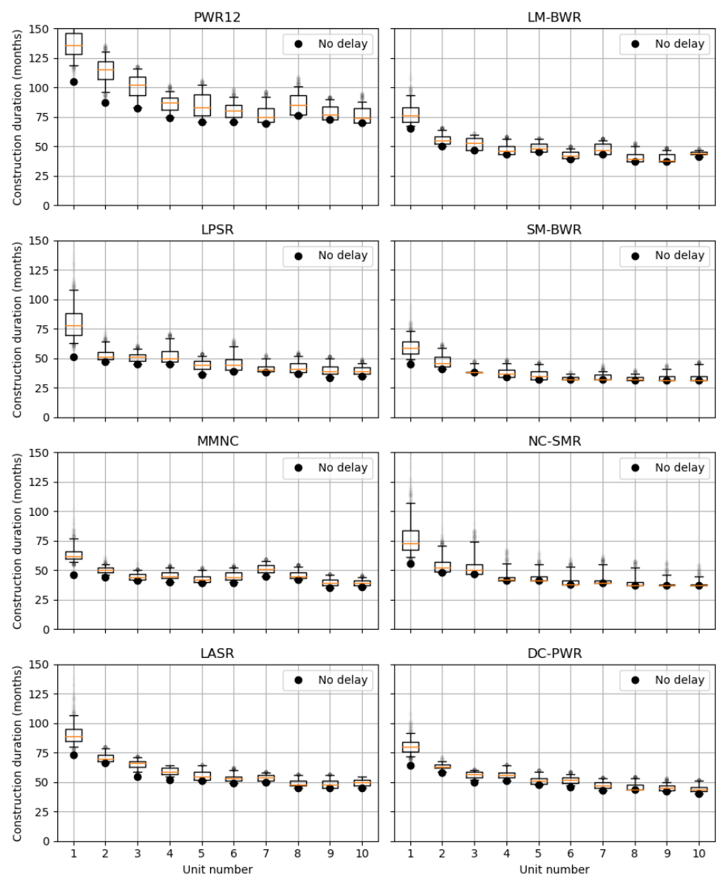

_Figure 5.10 Monte Carlo results of the construction durations for eight architectures from FOAK to 10OAK, under the upper-bound constraints (peak site staffing of 4500, max monthly deployable labor of 800 workers). Box shows the two inner-quartiles, the whiskers are the 95% confidence interval._ 

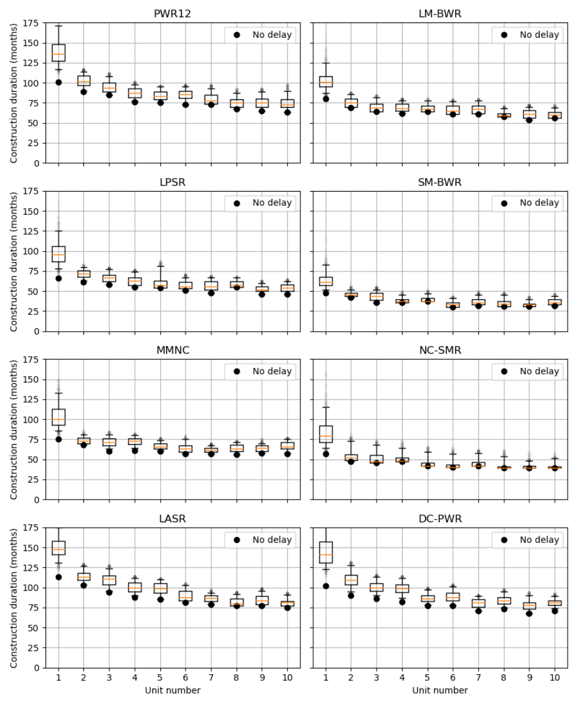

_Figure 5.11 Monte Carlo results of the construction durations for eight architectures from FOAK to 10OAK, under the lower-bound constraints (peak site staffing of 2500, max monthly deployable labor of 160 workers). Box shows the two inner-quartiles, the whiskers are the 95% confidence interval._ 

_Table 5.3 Median and 97.5% of the construction durations for the eight reactor architectures under the upper-bound constraints (4500 peak site staffing, 800 max monthly labor change)._ 

_Table 5.4 Median and 97.5% of the construction durations for the eight reactor architectures under the lower-bound constraints (2500 peak site staffing, 160 max monthly labor change)._ 

_Table 5.5 Top five drivers of schedule delays for the FOAK and 10-OAK units of the eight reactor architectures._ 

_Table 5.6 Top ten three-digit account sorted by the average of the mean delay effect for the FOAK units under both labor constraints (months)._ 

_Table 5.7 Statistical aggregation of the delay effects from the three types of uncertainty (months)_ 

## **5.2 Total cumulative installed cost with uncertainty and risk** 

This section compared the total capital cost, including uncertainty and risk, of the reactor concepts.  This was a four-step process for each of the 1000 MC schedule uncertainty runs: 

1. Sample one of the 500 overnight cost MC runs (if model uncertainty included, otherwise choose median) 

2. Escalate the direct labor and material overnight costs by the relative delay 

3. Escalate the indirect labor, material, and factory costs by the increased direct labor and material cost and the increased schedule 

4. Evaluate the total cost from the escalated overnight cost by including the IDC 

In the end, for each architecture and unit, we had 1000 total cost samples. The intent was to investigate the following question, would smaller reactors that have higher specific overnight costs but can reduce risk early with a low cost FOAK be a lower risk option for medium capacity sites? 

The answer, of course, will be that it depends. When considering the different interest rates, labor constraint assumptions, and model uncertainty, there were more cases than can be meaningfully explored here (though the python code is available on GitHub [https://github.com/mit-crpg/TIMCAT], and the reader is welcome to conduct their own comparisons). Therefore, we first considered only an 8% interest 

rate and the two labor constraint cases for all eight reactor architectures with model uncertainty. Then, we explored the sensitivity to interest rate for 3 roughly equal sized projects: 2 LM-BWRs, 9 SM-BWRs, or 3 MMNC which all have 2600-2700 MWe of capacity. 

Figure 5.12 shows the cumulative total installed cost under the lower-bound staffing constraints at 8% interest with model uncertainty. The error bars represent the 95% confidence interval around the median, and in all cases the tall was long towards higher costs. Under these conditions, there were three groupings of architectures by cost and risk: high-cost high risk PWRs such as the MMNC and LASR; moderate cost and high risk PWRs such as the NC-SMR, DC-PWR, and PWR12, and low cost and high-risk plants such as the LM-BWR and LPSR. The SM-BWR was somewhere between the low and moderate cost groups. The uncertainty bands were very wide for all architectures, but the small plants (NC-SMR and SM-BWR) had the lowest variation, and the MMNC, LASR, PWR12, and LPSR had the largest cost variations. 

Under the upper-bound labor constraints, total cumulative costs were lower by 3 GWe of installed capacity, shown in Figure 5.13. The total installed costs went from $18-30B under the lower-bound constraints to $15-$25B under the upper-bound constraints, or about 17% in savings. In other words, a tighter labor market, all else equal, will increase costs 17% on average. The upper-bound constraint cases also had lower cost uncertainty for most architectures, except the LPSR, NC-SMR and PWR12 had similar uncertainty band widths for both cases. In both labor constraint cases, the LASR had very high cost and uncertainty, however the realized experience of the APR1400 has been much better than estimated here. In particular the estimated construction delays were longer than the experience at Barakah and Shin-Kori. This better-than-expected performance was likely due to two effects: (1) essentially unlimited labor constraints at both sites and (2) the APR1400 was a gradual evolution from the OPR1000 and its design was completed prior to construction so change orders were likely limited. 

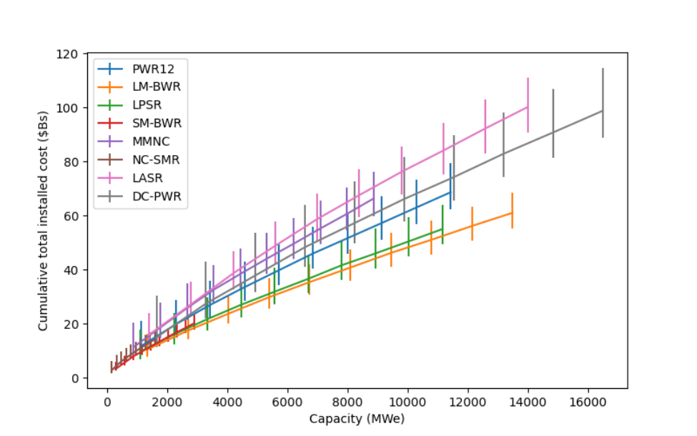

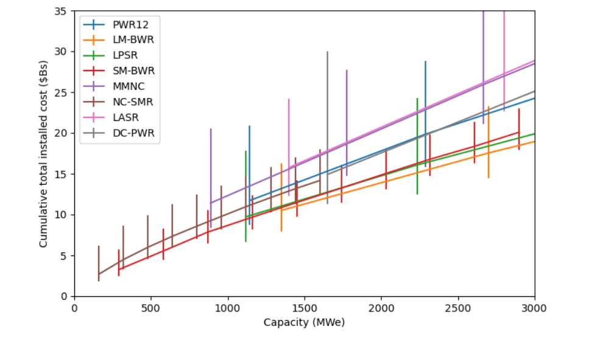

_Figure 5.12 Cumulative total installed cost for the eight reactor architectures under the lower-bound labor constraints with 8% interest. Chart below is zoomed in subset of chart above._ 

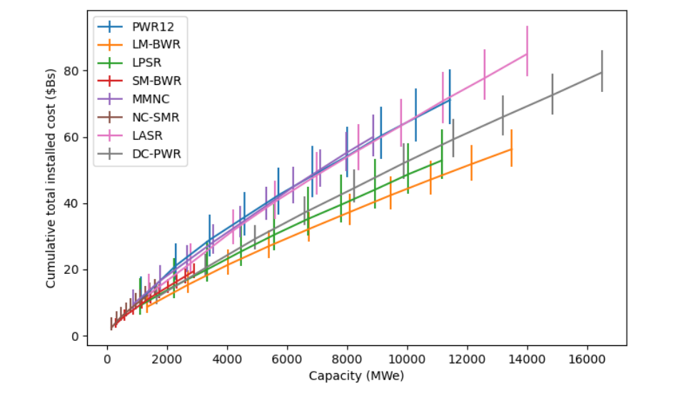

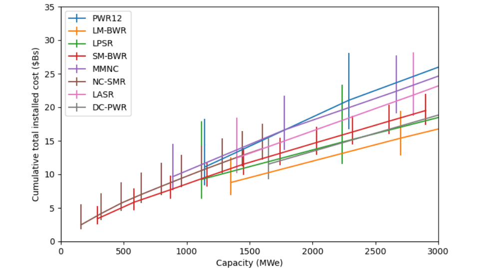

_Figure 5.13 Cumulative total installed cost for the eight reactor architectures under the upper-bound labor constraints with 8% interest. Chart below is zoomed in subset of chart above._ 

## **5.2.1 Case study: 2 LM-BWRs or 9 SM-BWRs or 3 MMNC** 

To explore the sensitivity to the interest rate and the staffing constraints, we considered six combinations of cases: interest rates of 5, 8, and 12% with high and low staffing constraints for the LM-BWR, SMBWR, and MMNC comparison. Figure 5.14 shows the total cost in billions of dollars for each scenario and architecture. The MMNC plant was consistently the most expensive and most high risk of the options 

with median costs 40-50% higher than the LM-BWR and 20-45% higher than the SM-BWR. Further, there was a small but real possibility of costs exceeding $30B for the MMNC project. Between the LMBWR and the SM-BWR, the LM-BWR had a wider cost distribution but lower median costs in all but one case. For high interest (12%), tight labor market conditions, the median SM-BWR was marginally lower cost than the median LM-BWR, but the width of the cost distribution was much narrower. These results open a set of further questions for a utility that can lead to better decision making. For example, if exploring a ~2.6 GWe project, is that an upper bound for future nuclear installation? If so, it is likely better to slowly meet the total capacity demand with the SM-BWR because it requires less capital, makes revenue sooner, and would be lower cost if the demand turns out to be lower. However, if 2.6 GWe is the lower bound for future demand, perhaps committing to the larger architecture will be prudent in the long term with lower future costs. Further, such a decision cannot be based entirely on the capital cost, and several other factors including owner’s cost, transmission, operating costs, capacity factors, and fuel costs would factor into the decision making. 

Higher interest rates had a more negative effect for the large project cases than the small project case. For example, the 12% interest rate case increased median costs 20-30% from the 5% case for the LM-BWR and MMNC, but it only increased median costs 13% for the SM-BWR project. Further, for the SM-BWR case, the deployed capital per project at any point in time is significantly lower, so the financial risk profile is also likely lower from the perspective of the lender. Therefore, it may be possible for the SMBWR (and other small plants) to access lower cost sources of capital. For example, the SM-BWR case may be financed with 80% debt and only 20% equity which, depending on the cost of each, would result in a weighted average cost of capital (WACC) between 5-8%, but the LM-BWR may require 20% debt and 80% equity which could result in an 8-12% WACC. In this scenario, the LM-BWR still had lower median costs under the upper-bound labor constraints, but under the lower-bound labor constraints the SM-BWR had lower median costs when the LM-BWR had 12% WACC and the SM-BWR had 8% WACC. 

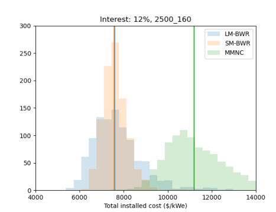

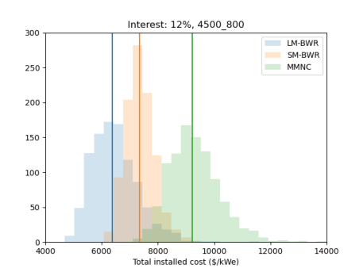

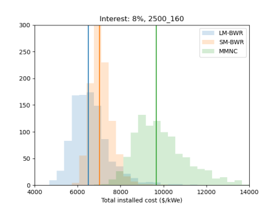

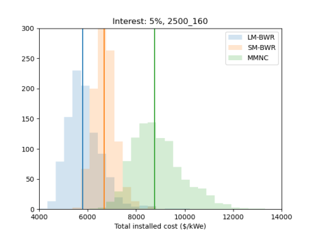

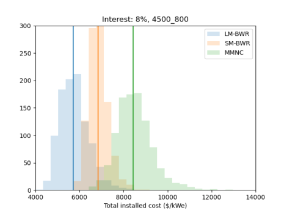

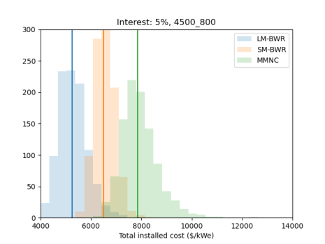

_Figure 5.14 Distributions of cumulative total installed cost for 2 LM-BWRs, 3 MMNC, and 9 SMBWRs with 5, 8, and 12% interest rates and both labor constraints._ 

There is a case to be made that for a project started today, the LM-BWR would likely not undergo change order uncertainty because the architecture has been constructed several times in Japan. Therefore, the design should be fixed, and there will not be design changes that happen during construction of the first unit. Change orders were the largest source of cost variation and escalation in the construction risk model, so eliminating change order uncertainty should lower the total installed cost significantly. This was the equivalent of “completing detailed design” before starting construction. It should be noted that while this line of thinking is rational, there are many reasons to question whether a newly constructed LM-BWR would actually avoid change order risk entirely. For example, to license the ABWR in the U.K., GEHitachi spent several years and more then £2B undergoing design changes and licensing processes [131,132]. Even though the ABWR was licensed in Japan and the U.S., the U.K. required extensive changes to the design, and therefore, the construction experience in Japan might not translate to construction in the U.K. Therefore, Figure 5.15 shows the 3 plant options but with change order risk removed for the LM-BWR. Eliminating the change order risk reduced the median cost by 5-6%, but the more significant impact was reducing the high-cost tail. The upper tail of the distribution was truncated, and the cost performance was better known for the LM-BWR plant. 

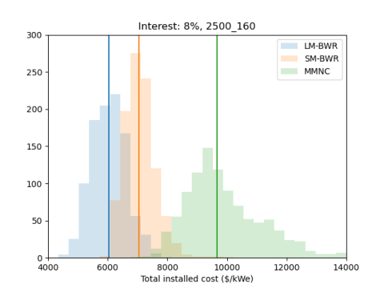

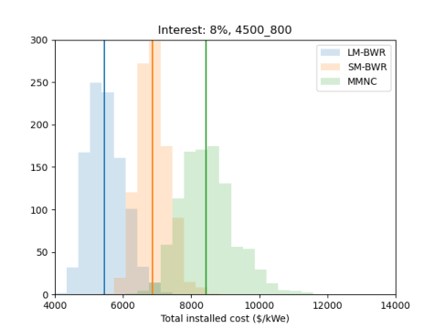

_Figure 5.15 Distributions of cumulative total installed cost for 2 LM-BWRs, 3 MMNC, and 9 SM-BWRs with 8% interest rate, both labor constraints, and no change order uncertainty for the LM-BWR._ 

There was concern that the wide cost distribution for the MMNC was a function of the cost model uncertainty, and not the construction risk uncertainty, and that eliminating this uncertainty might reduce the tail risk of the MMNC cost distribution and make it more competitive with the LM-BWR and SMBWR. In Figure 5.16, We removed the cost model uncertainty by only sampling the median of the overnight cost distribution. The cost distributions were narrower after removing the overnight cost estimation uncertainty, but the conclusion that the SM-BWR or LM-BWR have superior capital cost performance was the same. 

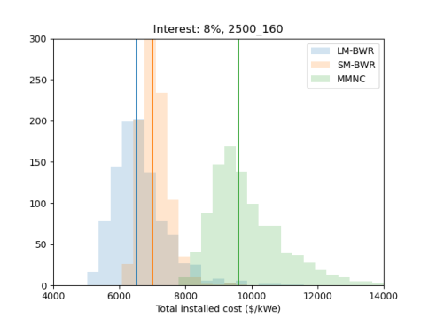

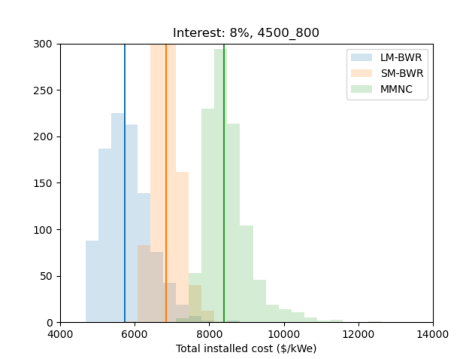

_Figure 5.16 Distributions of cumulative total installed cost for 2 LM-BWRs, 3 MMNC, and 9 SM-BWRs with 8% interest rate, both labor constraints, and no model uncertainty._ 

To understand the consequence of human error after the FOAK on total costs, we evaluated a case with no human error after the FOAK. The purpose of this case was twofold: (1) assess the impact that the FOAK cost overrun has on total project cost and (2) assess the consequence of perpetuating human error beyond FOAK as suggested by Hadipriono and contrasted in the data from Merrow. Figure 5.17 shows the total cost distributions. The median costs were $300-800/kWe lower than the reference case. The distance from the median to the 95[th] percentile was unchanged for the upper bound labor constraint case, but for the lower bound labor constraint, the distributions were $100-400/kWe narrower. Assuming no 

human error after the FOAK had a more significant effect on the SM-BWR case because the assumption simply impacted more units. 

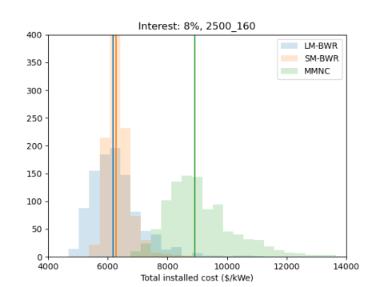

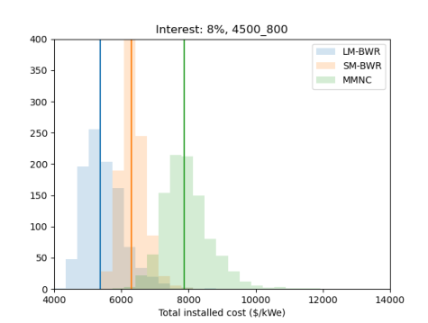

_Figure 5.17 Distributions of cumulative total installed cost for 2 LM-BWRs, 3 MMNC, and 9 SM-BWRs with 8% interest rate, both labor constraints, and no human error after FOAK._ 

Knowing now that the primary source of cost uncertainty and risk, even for multi-unit sites, occurred in the FOAK, we evaluated the potential benefit of a non-nuclear FOAK to test for constructability. A nonnuclear demonstration only needed to include the structures (Account 21), reactor equipment (Account 22), power and control wiring (Account 246), miscellaneous equipment (Account 25), and associated indirect costs. Because this was a non-nuclear demo, the costs were lower according to Figure 1.6 and Table 2.6. Account 21 costs were reduced by 33%, Account 22 costs were reduced by 90%, Account 246 costs were reduced by 50%, and Account 25 costs were reduced by 50%. The indirect costs were assumed to be 60% of direct costs. In net, this yielded a non-nuclear demonstration overnight cost 30% of the cost of the FOAK nuclear plant for the SM-BWR, LM-BWR, and MMNC. Figure 5.18 shows the total installed costs including a non-nuclear demo that experienced the FOAK cost overruns. In all cases, total installed costs were lower than reference case. Median costs were $100-500/kWe lower for the LM-BWR, $300/kWe lower for the SM-BWR, and $400-500/kWe lower for the MMNC. The 95[th] percentile costs were reduced as well: $800-1000/kWe for the LM-BWR, $500/kWe for the SM-BWR, and $6002000/kWe for the MMNC. 

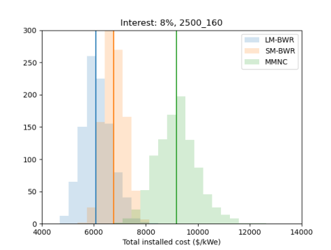

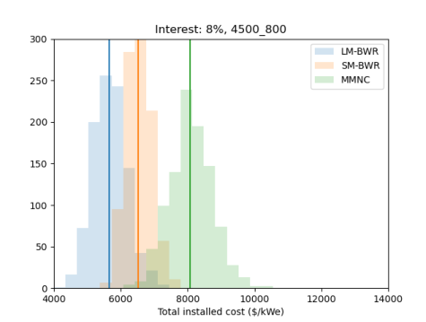

_Figure 5.18 Distributions of cumulative total installed cost for 2 LM-BWRs, 3 MMNC, and 9 SM-BWRs with 8% interest rate, both labor constraints, and a non-nuclear demo._ 

If there was potential for increased demand in the future, there may be a long-term scenario with 4 LMBWRs, 18 SM-BWRs, or 6 MMNC units and 5.2-5.4 GWe of total capacity. Figure 5.19 shows the total installed costs for this case. Here, the specific median costs were 10-15% lower which reiterated the impact of learning-by-doing. Further, the cost distributions were considerably narrower with the distance between the median cost and the 95[th] percentile reduced by one half. In other words, cost certainty was the result of time, investment, and experience. 

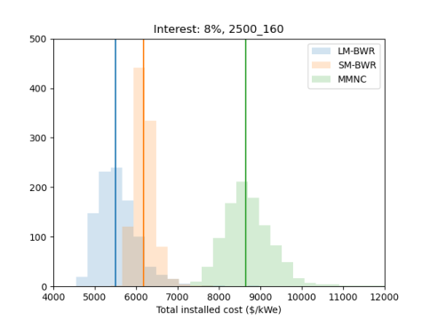

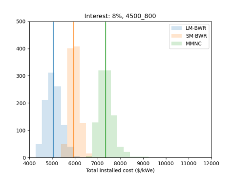

_Figure 5.19 Distributions of cumulative total installed cost for 4 LM-BWRs, 6 MMNC, and 18 SMBWRs with 8% interest rate, both labor constraints._ 

Table 5.8 has the specific costs ($/kWe) for the three projects. In both labor constraint cases, the SMBWR had the narrowest cost distribution (~$800/kWe), followed by the LM-BWR (~$1300/kWe), and the MMNC had the widest cost distribution (~$1300-2800/kWe). The SM-BWR option had a higher median cost under the lower-bound labor constraint, but it had a lower cost at the 95[th] percentile, indicating it was at a lower risk of significant overrun. Figure 5.20 shows the costs from Table 5.8. These types of data allow utilities and other decision makers to weigh their options: larger reactors with lower median costs but higher tail probabilities of higher costs when compared to smaller reactors. 

_Table 5.8 Total specific costs for the three plant options at the median and the 95% of the distribution_ 

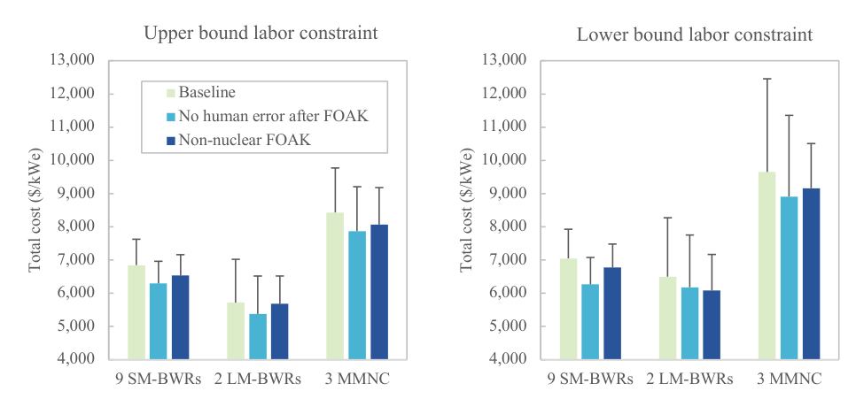

**----- Start of picture text -----** 
Upper bound labor constraint Lower bound labor constraint 13,000 13,000 12,000 Baseline 12,000 No human error after FOAK 11,000 11,000 Non-nuclear FOAK 10,000 10,000 9,000 9,000 8,000 8,000 7,000 7,000 6,000 6,000 5,000 5,000 4,000 4,000 9 SM-BWRs 2 LM-BWRs 3 MMNC 9 SM-BWRs 2 LM-BWRs 3 MMNC Total cost ($/kWe) Total cost ($/kWe) **----- End of picture text -----** 

_Figure 5.20 Median and 95[th] percentile costs for the three plant options, showing the baseline case, no human error after FOAK case, and non-nuclear FOAK case._ 

## **5.2.2 Case study: 4 6-unit MMNC or 2 12-unit MMNC** 

In theory, the MMNC plant can be configured with any number of modules, and Chapter 2 considered a 6-unit version. Table 5.9 shows the construction schedule risk assumptions for the 6-unit MMNC plant. Note that the plant has one half the power capacity (444 MWe) but only 26% lower onsite labor hours. Therefore, the cost (and risk) per unit capacity has increased, but the overall risk is lower, and the ability to retire change order risk at lower total cost is reduced. Figure 5.21 and Table 5.10 show the total installed costs for two MMNC plant options: 4 6-unit plants and 2 12-unit plants. Under loose labor conditions, the 6-unit version had a 16% higher median cost, but under tight labor conditions, that premium was only 6%. Further, under the tight labor conditions, the tail risk for the 6-unit plants was 12% lower at the 95[th] percentile. 

_Table 5.9 Construction schedule risk model assumptions for both MMNC options_ 

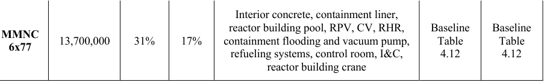

**----- Start of picture text -----** 
Interior concrete, containment liner, reactor building pool, RPV, CV, RHR,  Baseline  Baseline MMNC 13,700,000  31%  17%  containment flooding and vacuum pump,  Table  Table 6x77 refueling systems, control room, I&C,  4.12  4.12 reactor building crane **----- End of picture text -----** 

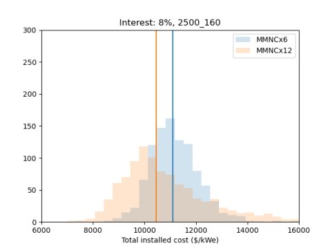

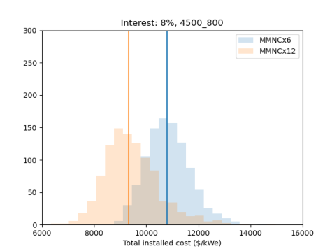

_Figure 5.21 Distributions of cumulative total installed cost for 2 12-unit and 4 6-unit MMNC plants with 8% interest rate, both labor constraints._ 

_Table 5.10 MMNC plant median and 95[th] percentile costs_ 

## **Chapter 6 – Conclusions and future work** 

## **6.1 Methodology review and summary** 

## **6.1.1 Overnight cost estimation** 

As construction costs continue to plague nuclear projects in the U.S. and Europe, the nuclear industry must focus on design-to-cost and -risk. In the literature, thorough cost estimates by research institutions typically focus on a single design concept [55,56,60], while the vendor cost estimates are often given without a detailed explanation [51,61,62]. Studies often shy away from comparing different reactor architectures and perform comparative studies based on specific design decisions. The studies that did analyze several reactor architectures were limited to commodity use comparisons [5,52], but these studies ignore the shape factors of those commodities, factory equipment costs, and indirect costs. 

Therefore, in this thesis, we developed a bottom-up cost scaling methodology to compare the cost consequences of different reactor architecture decisions. We compared eight reactor architectures that were surrogates of commercial reactors. The list included: 

- Small modular BWR (SM-BWR) similar to the BWRX-300 

- Large modular BWR (LM-BWR) similar to the ABWR 

- Natural convection SMR PWR (NC-SMR) similar to the SMR-160 

- Multi-module natural convection SMR PWR (MMNC) similar to NuScale 

- Large passive safety PWR (LPSR) similar to AP1000 

- Double containment PWR (DC-PWR) similar to EPR 

- 

- Large active safety PWR (LASR) similar to APR1400 

The methodology scaled more than 200 reference SSC costs from a database of PWR costs published by the DOE called EEDB [23]. Costs scaled using parameters such as the mass of the RPV, heat transfer area of the steam generator, primary pump power, volume of concrete, mass of reinforcing steel, and others. The cost scaling relations used model constants from a variety of sources including chemical engineering cost estimation handbooks, the Generation IV Economic Modeling Working Group, the International Atomic Energy Agency, national labs, and other institutions [12,32,55,59,74]. In many cases there were conflicting recommendations from the literature for a particular model constant, but in Chapter 2, the model constants were deterministic, so the cost estimates were point values, but Chapter 4 presented probabilistic cost estimates using all published values. 

Many reactors had novel technology not included in the EEDB for PWR12, such as the containment vessel for the MMNC; the standalone steel containment for the LPSR and NC-SMR; the passive safety features of the NC-SMR, LPSR, SM-BWR, and MMNC; the integral RPV and steam generator for the MMNC; advanced manufacturing techniques to lower RPV costs; and advanced construction techniques. There were other important dynamics to capture that were not reflected in the EEDB including modularization and learning-by-doing. The methodology, therefore, included sub-models to capture these novel cost SSCs and cost dynamics. Chapter 2 described these techniques in detail and presented overnight capital cost estimations for the eight reactor architectures. 

## **6.1.2 Construction duration estimation** 

For nuclear projects, overnight costs are only a portion of total installed costs, and interest during construction (IDC) can account for more than 30% in cases where construction is delayed or interest rates are high. Any accounting of nuclear architecture costs must, therefore, include an estimate of the construction duration. Prior work (in the literature) in this area typically has scaled the construction duration based on the total power capacity of the project, but this ignored the importance of shape factor, modularization, and other design-specific attributes. Reactor vendors report estimates of the NOAK construction duration for commercial reactors by building detailed schedules of all site activities. However, reactor vendors do not directly provide an estimate of their competitor schedule using their methodology, leaving a gap in the literature. 

Therefore, in Chapter 3, We described a scheduling methodology to estimate the construction duration for a nuclear plant given design details and a set of constraints. The method takes as input the output of the overnight cost method from Chapter 2. As part of the cost estimate, the model reports the site labor hours required for each of the >200 SSCs which were converted to site tasks. We then established an ordering of tasks by assigning each task a dependent, so that the succeeding task could not be started until the preceding task completed to some predefined fraction. The ordering dependence varied across the eight 

reactor architectures because each architecture was unique in its design. Then a genetic algorithm optimized the total schedule duration by assigning labor resources and task durations to each activity subject to a set of constraints. 

The constraints were peak site staffing, maximum monthly labor change, and building workspace limits. For the first two, Chapter 3 described two cases: a high labor constraint case with a peak site staffing limit of 4500 and maximum monthly labor change of 800 workers, and a low labor constraint case with a peak site staffing limit of 2500 and maximum monthly labor change of 160 workers. The third constraint limited the number of workers who could work in the same space at the same time. To apply this constraint, each task was assigned to a building (unique to each architecture), and each building had a peak number of workers allowed based on the workspace floor area. This constraint intended to capture how the shape factor of different architectures impacted the pace of construction. The construction methodology also accounted for construction accelerating strategies such as modularization and use of a very heavy lift crane. The combination of these two enabled parallel workspaces which alleviated the building workspace constraint to some extent. 

## **6.1.3 Model uncertainty and risk estimation** 

Utilities and other stakeholders for new nuclear projects are equally interested in the expected cost of a new nuclear project and the probability of a significant cost overrun. Therefore, there is keen interest in developing probabilistic cost estimates for new nuclear projects. There has been some effort in this vein in the literature, but it primarily includes material and labor cost uncertainty. Material and labor cost uncertainty are real cost variations experienced at nuclear projects, but they are not the primary driver of cost overruns and construction delays. One study expanded their uncertainty analysis to include disruptions to construction activities such as component fabrication and concrete pouring. However, the analysis was limited to a generic reactor architecture and the delay estimates insufficiently represented realized construction delays at modern nuclear projects. Therefore, in Chapter 4 and 5, We presented a cost uncertainty and construction risk analysis that compared how different reactor architecture’s costs escalated. 

Chapter 4 discussed model uncertainty, and Chapter 5 discussed execution uncertainty. Model uncertainty referred to the uncertainty in the modeling approach to estimate the overnight cost. A Monte Carlo analysis sampled distributions of model parameters and evaluated the overnight cost hundreds of times to create distributions of cost estimates. The parameter distributions were defined using different sources in the literature, where available. The uncertainty of the overnight cost sub-models such as indirect costs, learning rates, and modularization was also included. The analysis also included model input uncertainty to capture the uncertainty in how much concrete, steel, wire and other commodities each architecture required. 

The execution uncertainty analysis estimated the probabilities of different delays during the construction process. A detailed review of the delays constructing two AP1000s at the Vogtle site found four primary drivers: change orders, human error, productivity, and supply chain delays. Using the Vogtle experience, and the construction and supply chain literature, we built models of these four construction delay dynamics. The AP1000s at Vogtle had 188 license amendments with the NRC after construction started, and most of them were related to the construction of the plants. We used the license amendments as estimates of the probability of change orders for construction activities, and these change orders caused delays and productivity losses. Further, the Georgia Public Service Commission required a Vogtle Construction Monitoring semi-annual report that contained detailed information on the supply chain delays. Finally, the construction literature contained modeling estimates for human mistakes made during 

construction that cause delays. These dynamics were all stronger for FOAK projects than 2-NOAK projects. The execution analysis modeled how these delays drivers impacted the total installed costs for each of the eight reactor architectures. 

Finally, in this thesis, we compared the cumulative total installed costs for progressively increasing capacity nuclear projects, and the uncertainty in these costs. This type of analysis can be instrumental for utilities and other stakeholders when considering investments in advanced nuclear. 

## **6.2 Key findings and contributions** 

## **6.2.1 Overnight cost and construction modeling** 

The overnight cost estimation (without the consideration of schedule and uncertainty analysis) revealed six key insights: 

1. Modularization does not lower FOAK overnight costs (Section 2.3.3.1) 

2. Passive safety does not lower overnight costs (Section 2.5) 

3. Learning by doing and the economy of scale do lower overnight costs (Section 2.3.3.1) 

4. SMRs required more onsite labor per MWe than large plants, and their cost advantages were insufficient to realize lower overnight costs than large reactors (Section 2.3.3.1 and Section 2.4) 

5. Advanced manufacturing techniques can result in meaningful SMR cost reduction (Section 2.5) 

6. Concrete and steel commodity use were good first-order predictors of overnight cost except in cases with unique containment strategies such as the LPSR, NC-SMR, and MMNC 

The construction scheduling revealed four key findings: 

1. Large reactors are heavily dependent on access to quickly deployable and large labor forces (Section 3.3.4.1) 

2. Modularization dramatically reduces the construction time (Section 3.3.4.3) 

3. Both large and small reactors can achieve 35-45 month construction schedules under optimal labor market conditions at 10-OAK (Section 3.3.4.1) 

4. Total site labor hours were a good first-order linear predictor of construction duration except in the case of compact designs such as the NC-SMR or in the case of stick built such the PWR12 

Modularization shifted costs from the site to the factory, but the increased factory and transportation costs offset the reduced site costs. Thus, for even the most modularized reactors, such as the MMNC and LMBWR, the direct overnight costs were only marginally affected. However, pairing modularization with a very heavy lift crane to create parallel workspaces accelerated the construction and reduced interest accrued during construction 65-75% and other indirect costs 30-50%. The value of modularization, therefore, lies not in reduced overnight costs but the accelerated construction, reduced interest, and other reduced indirect costs. 

Passive safety required substantial investment in novel architectures, with only minimal reductions in other costs. For example, the MMNC passive safety strategy required the large passive cooling pool and the most expensive containment strategy. The large pool liner increased costs $175/kWe but eliminating the safeguards systems and their associated piping and wiring only reduced costs $185/kWe, for a net savings of only $10/kWe. Further, this did not account for the increased cost of the reactor building that had to be designed to contain the pool. Similarly, the standalone steel containment of the LPSR and NCSMR were significantly more expensive than traditional containments, and their costs were not fully 

offset by reductions in safety systems, piping and safety electrical systems. However, this does mean that the benefits of passive safety (licensing, social acceptance, etc.) can be achieve with only a marginal cost penalty. 

Advanced manufacturing of reactor vessels could be a key cost reduction strategy for the MMNC. With 24 nuclear quality pressure vessels in its plant, the MMNC analyzed here was heavily dependent on advanced manufacturing techniques to lower vessel costs, such as e-beam welding, laser cladding, and powder metallurgy. A 40% assumed vessel cost reduction reduced the overnight cost by about 9%, or >$500/kWe. Further, if these techniques can provide the assumed cost reduction for vessel manufacturing, they can have broad applicability beyond the analyzed SMRs. Therefore, R&D in this area should continue to advance the technology and overcome the relevant regulatory hurdles. 

In general, large reactors had lower specific overnight costs than small reactors, indicating that the economy of scale remains the dominant strategy to reducing specific overnight costs. However, it was not true that the largest reactor had the lowest cost, and the DC-PWR, with 1650 MWe of capacity, had higher specific overnight costs than the LM-BWR and LPSR. Therefore, there are design decisions that reactor vendors can make that lead to lower costs beyond just the economy of scale. 

The most effective cost-reducing strategy was learning-by-doing. More than passive safety, modularization, advanced manufacturing, and economy of scale, the cost reduction from FOAK to 10OAK was significant for all architectures, and it was more significant for the highly modularized reactors. For example, the LM-BWR, SM-BWR, NC-SMR, and MMNC all had cost reductions 40-45% from FOAK to 10-OAK, while the other architectures had cost reductions 30-35%. Additionally, for the MMNC plant, intra-plant learning from the first power module to the 12[th] lowered the reactor equipment costs 21%. 

Both large and small architectures achieved short construction schedules by the 10-OAK unit under conditions with minimal labor constraints. The construction schedules of small reactors, such as the NCSMR and SM-BWR, were robust and insensitive to labor constraints, and therefore, these architectures are well suited for markets without large, skilled construction labor forces that are easily deployable. These conditions exist in parts of the U.S., Canada, Europe, and Africa. Tight labor constraints delayed the construction schedules for large reactors (MMNC, LPSR, LASR, and DC-PWR) by 40-50%. However, in markets with widely available labor resources, the large reactors achieved construction durations on part with, if not shorter than, the small reactors. Achieving these short construction schedules requires developing a skilled, experienced workforce. 

For successive deployments of reactors to supply cumulative demand, the higher specific cost small reactors, such as the NC-SMR and SM-BWR, did achieve lower cumulative costs than some of the large reactors such as the PWR12, LASR, and DC-PWR. The cumulative learning benefit of deploying more reactors largely contributed to this advantage. However, the lowest cost options for cumulative deployments were the large reactors: the LM-BWR and the LPSR. 

Total site labor hours were a good predictor of construction duration except in cases where there were workspace constraints such as the compact design of the NC-SMR or the stick-built strategy of the PWR12. Similarly, total concrete and structural steel were good predictors of overnight costs except in cases with dramatically different containment strategies, such as the MMNC, LPSR, and NC-SMR. These types of metrics can be good first order predictors, but the robust cost comparisons of reactor architectures required investigating the details. 

## **6.2.2 Total installed cost with uncertainty and risk** 

The uncertainty of cost estimates was higher for reactor architectures that were increasingly different from the reference plant, the PWR12. Therefore, the more novel a proposed reactor architecture is, the more uncertain claims of cost estimates should be. At the low end of the spectrum, the reference plant overnight cost had a coefficient of variation (CoV) of 4% for the FOAK and 10% for the 10-OAK. At the high end of the spectrum, the MMNC had an 8.5% CoV for the FOAK and a 14% CoV for the 10-OAK. 

In all cases, the 10-OAK costs had higher uncertainty driven by the assumed uncertainty for the learning rate. The analysis in Chapter 2 led to an estimated 6.4% learning rate for direct costs, and indirect costs learn more rapidly due to the combined effect of reduced direct costs and reduced construction schedules after FOAK. Published learning rates in the literature for nuclear projects, however, range from 2 to 15%, and there have not been a sufficient number of recent projects in the U.S. to confirm what a reasonable learning rate should be. Further, reactors that depended heavily on modularization and factory production, where learning rates could be higher, also experienced significant cost uncertainty because the factory labor learning rates for nuclear equipment remain uncertain. 

Architectures that leveraged novel technology or design strategies had higher cost uncertainty. For example, the advanced manufacturing cost reduction potential for nuclear vessel was one of the leading cost uncertainty drivers for the MMNC. For architectures with extensive modularization, the uncertainty in the modularization cost assumptions drove significant cost uncertainty. The standalone steel containments for the NC-SMR and LPSR were responsible for much of the cost uncertainty for their respective architectures. 

Across all architectures, uncertainty in the indirect cost modeling was a major cause of cost variation. Similar to the learning rate, there have been insufficient recent nuclear projects to know what indirect costs will be for future nuclear projects. In the best cases, historically, indirect costs were less than 40% of total overnight costs, but essentially all plants in the U.S. since the 1980s have had indirect costs greater than 50% (sometimes close to 75%) of overnight costs. 

Specific cost uncertainty was high for small reactors such as the SM-BWR and NC-SMR  (+/-$10001500/kWe) relative to the large reactors (+/-$500-1000/kWe). This was simply because the denominator was smaller for these architectures for specific cost. The large reactors had much larger cost uncertainty in absolute dollar value, so much so that in some cases an NC-SMR could be built for just the width uncertainty for an MMNC or other large reactor. In other words, the total cost of an NC-SMR was almost equal to the difference between the median and the 95[th] percentile for the MMNC. 

Change orders (and resulting productivity penalties) were the primary driver of construction delays, followed by human error, and the assumed supply chain delays had the least impact. Change orders were pervasive across several SSCs, and they are incredibly disruptive to the productivity. This speaks to the importance of “completing the detailed design” before starting construction. However, it many ways it can be impossible to complete the detailed design before starting construction because testing the constructability of a design requires trying to build it. A non-nuclear FOAK was shown to reduce cost and risk 2.6 GWe project of 2 LM-BWRs, 9 SM-BWRS, or 3 MMNCs. Supply chain delays seldom caused significant total project delays because oftentimes these delays were swamped by other delayed construction activities. 

Change orders in the reactor building were the top individual contributors to construction delays and cost overruns for almost all architectures. Therefore, the more novel technology in the reactor building, the more likely there were long construction delays. Electrical plant equipment including wire and cable were 

also responsible for many construction delays, especially in active safety plants such as the DC-PWR and LASR where there was redundant cabling and systems. Delays in electrical equipment caused delays in the total project schedule for two reasons: (1) they were one of the last site activities and (2) they were very labor-intensive tasks. Similarly, the service, air, water, and steam systems were labor-intensive and late in the schedule activities, so it was also responsible for many delays. 

On a relative scale, smaller reactors were not more robust to construction risks than larger reactors, but on an absolute scale the consequences of these delays were drastically lower. Both large and small reactors had 30-35% delays at the median, and 60-120% delays at the 97.5 percentile. Even at 10-OAK, some large reactors still had 6-12 month delays at the median due to human error (after supply chain and change order issues were resolved) because the probability of human error was still high for high labor cost plants even with the learning rate. Thus, the width of the delay distributions was narrower in some cases for the small reactors. However, the presence and quantity of human error after FOAK was unknown, and two separate studies reported conflicting results, so it may be that both large and small reactors will eliminate this risk. 

Tighter labor markets increased the impact of construction delays more than 50% on average across the reactor architectures for the FOAK units. The relative delays were similar between the high and low labor market cases, but the total delay months was 50% longer under tight labor markets because the baseline schedule was already longer. 

So much of the delay risk and associated costs were resolved after the FOAK unit that sequential deployments of small reactors with higher deterministic overnight costs led to lower total installed costs in some cases with high interest rates and a tight labor market. This finding showed that it is not as much the learning rate of SMRs that can create cost equivalency with large reactors, but the ability to retire risks with lower cost FOAK units. This also reduced the width of the probability distributions (see Figure 5.14) for total installed costs relative to large reactors, creating the unique situation where the larger reactor had a lower median cost but higher tail cost. This analysis can begin to help utilities and other stakeholders ask the right cost questions in their early decision making for new investments. For example: how does uncertainty around future demand impact the right decision today? How deployable and scalable is the local labor market? Is it financial preferable to lump risk into a large singular project? 

## **6.3 Implications** 

Retiring constructability risks is critical to increasing cost certainty and achieving the lowest total installed cost, so retiring constructability risk should be pursued but at the lowest possible cost. This was the case for the small reactors where expensive change order driven construction delays were de-risked with a lower cost FOAK than a large reactor. For example, a small reactor with a $2B FOAK cost that experienced a 150% cost overrun, de-risked its constructability for $3B, but a large reactor with a $5B FOAK cost with a 150% cost overrun, de-risked its constructability for $7.5B. So, for the smaller reactor, the FOAK cost overrun had a smaller impact on the total cost of 10 deployed units. However, there may be other strategies to de-risking the constructability of new nuclear architectures. Recently, the U.S. government financially supported the demonstration of two advanced reactor architectures with a 50% cost share as part of the Advanced Reactor Demonstration Program (ARDP). This is an important program to aid the nuclear industry by augmenting private capital and retiring risks at lower costs to private investors. However, a lower cost, future version of this program could support non-nuclear fullscale constructability demonstrations of these reactors to de-risk the FOAK projects. Further, such a 

program could assist in evaluating which architectures of a given reactor class (HTGR, PWR, MSR, BWR, etc.) will be most constructible and scalable in today’s construction labor markets. Such a program must include some degree of regulatory licensing, so the non-nuclear demonstrations were sufficiently representative of the commercial versions. There are already efforts underway at Kairos Power to construct a non-nuclear prototype [133], and GE-Hitachi has a program with the National Reactor Innovation Center to improve construction [134]. A non-nuclear demonstration program would not provide feedback on the operations or fuel cost of a reactor, so it would be less useful for comparisons between reactor types such as comparing molten salt reactors to sodium fast reactors, but it would be helpful for converging on the optimal architecture within reactor types for constructability. 

The analysis in Chapter 5 showed that a non-nuclear FOAK that cost 30% of a nuclear FOAK but still experienced the full scope of FOAK cost overruns and delays reduced the total installed cost and risk. Therefore, even absent public funding for a non-nuclear demonstration program, this is a valuable strategy for all reactor developers to consider. Further, funding in this area will grow the pool of nuclear construction experience, alleviating some of the labor market constraints that were costly to many reactor architectures. 

Second, there is significant risk and uncertainty when deploying innovative technologies in nuclear projects, and the cost of the risk and uncertainty is high, especially for FOAK projects. Therefore, the expected value of cost savings for an innovative technology must be significantly beneficial to justify the increased cost and risk. In other words, technologies that reduce costs in the $10-$100/kWe range must be highly certain in the cost advantage and low in the deployment risk to be worth pursuing. For example, steel plate composites had only a marginal cost savings, but introduced significant volatility and risk into the shield building construction for the AP1000. However, the recommendation is not to shy away from innovation, but to lean into two types of innovation: (1) risk reducing innovation and (2) high-saving, high risk innovation. 

## **6.4 Future work** 

There is significant white space to expand several of the modeling elements in this thesis: 

1. Improved constructability analysis for better risk and duration assessment 

2. Include global experience in modeling elements of risk (supply chain, human error, change orders) 

3. A more detailed model of project indirect costs 

4. Dynamic construction management in response to delays and overruns 

5. Revenue and net present value comparisons between SMRs and large reactors, not just total capital cost 

6. Expanding the model to include microreactors which are likely to be significantly more robust to risk but at a much higher median capital cost. 

The construction scheduling analysis done in this thesis was a dramatic simplification of the dynamics impacting constructability. A key finding of this study is that true cost estimation requires a detailed constructability analysis. For example, in this study, the surrogate reactor architectures that were representative of the AP1000 and EPR cost estimates were lower than the ABWR and APR1400, but in practice, the ABWR and APR1400 have shown to be dramatically lower cost – primarily due to avoided cost overruns and delays. Some of this variation is explained by modularization, iterative design evolution from a previous architecture, and an experience construction firm. Some of the variation is more complex, 

and while the cost estimates in this study account for more efficient commodity usage for some architectures, they fall short in estimating the day-to-day construction challenges. For example, in some architectures welding, installing rebar, and pouring concrete are likely to be much easier than in others. The construction scheduling tool accounted for the shape factors of the reactor architectures, but future work should explore the next level of detail of constructability. For example, such an analysis could include the probabilities of tolerance and quality assurance issues affecting modularization installation, or the difficulty of welding large components, or installing rebar in certain shape factors and densities. 

The construction risk analysis was almost exclusively based on the Westinghouse experience in constructing the AP1000s at Vogtle and V.C. Summer. However, there has been extensive international experience in nuclear construction delays, including Sanmen, Flamanville, Olkiluoto, and others. In these other cases, supply chain delays may have been a more significant cause of total schedule delays whereas they were a less significant, so understanding the different dynamics experienced internationally would lead to improvements in the construction delay risk modeling. Also, this model assumed all components of a particular class had similar supply chain and change order risk, but it is likely that the unique features of each reactor architecture will impact the delay and change order risk. For example, a larger pressure vessel may have more supply chain delay risk than a smaller vessel. Therefore, future work should focus on more design-specific uncertainty bands for construction risk modeling. 

Indirect costs were one of the largest sources of cost uncertainty, and the indirect cost model developed in this thesis only used the site material and labor hours as parameters for scaling the required site supervision. A more robust indirect cost model that could differentiate between the types of site labor and the required supervision by labor type would add valuable accuracy to the cost estimation methodology. For example, the management and regulatory supervision required for one hour of welding the standalone steel containment was likely different than the supervision required for the formwork for the reactor building substructure or installing the supports for the reactor vessel. Therefore, properly modeling these differences could provide insight into how the indirect costs might vary from one reactor architecture to another. Further, some reactors are considering pre-case concrete panels, but the required regulatory supervision is unknown for structural elements partially completed in a factory and partially completed onsite. 

In response to construction delays, unlike in the U.S., many nuclear construction projects overstaff projects to accelerate the process. Overstaffing, however, has an associated drop in productivity. Overstaffing can refer 24/7 construction activities, running three shifts, but this approach requires passing along quality status information between shifts which leads to productivity losses. Another option is to increase the number of work hours from 40 to 50 or higher, but over long periods this strategy leads to exhausted workers and a drop-in efficiency. A third option is to overfill the workspace with workers, but this too creates inefficiencies. Future work on the construction scheduler could expand the staffing options to allow for breaking of some of the constraints, especially on delayed activities, at an efficiency penalty. This type of reactive (or dynamic) modeling would be more representative of project management practices than the static staffing level approach adopted in this thesis and would be particularly interesting for small reactors where the required peak site staffing was so far below the labor constraint. For example, both the NC-SMR and SM-BWR had peak deployed site staffing levels 5002000 workers below the constrained limit, so there was significant margin to deploy workers above the optimal efficiency rate in order to accelerate construction and reduce the impact of the delay. Therefore, it is expected that small reactors should be even more robust to construction delays than was modeled in this thesis because they will be less resource constrained, but resolving this question requires further modeling. 

The total installed cost comparison between the SM-BWR, LM-BWR, and MMNC did not consider the timing of the deployments, the impact on revenue streams, and the net present value of each investment option, but this is the real decision criteria for utilities or other stakeholders. Therefore, future work should include operations, maintenance, and fuel costs for each reactor architecture. Then, these costs can be used to build revenue models, and net present values of different investment options. Smaller reactors may realize revenue streams earlier and after less capital investment because of the shorter construction timelines. Additionally, these earlier revenue streams could lower the cost of future capital which would even further reduce the cost of successive deployments. This is important future work because even in cases where the total installed cost of smaller reactors is lower, if they have higher operations and maintenance cost that could offset these advantages. However, the true operations cost of SMRs is largely unknown at this point. 

## **References** 

- [1] Intergovernmental Panel on Climate Change. Headline Statements from the Summary for Policymakers Understanding Global Warming of 1.5°C. 2018. 

- [2] Rogelj J, Shindell D, Jiang K, Fifita S, Forster P, Ginzburg V, et al. 2018: Mitigation Pathways Compatible with 1.5°C in the Context of Sustainable Development. Pallav Purohit; 2018. 

- [3] United Nations Economic Council for Europe. Technology Brief: Nuclear Power. 2020. 

- [4] U.S. Energy Information Administration. Annual Energy Outlook 2021. 2021. 

- [5] Buongiorno J, Parsons J, Corradini M. The Future of Nuclear Energy in a Carbon-Constrained World AN INTERDISCIPLINARY MIT STUDY. 2018. 

- [6] Sepulveda NA, Jenkins JD, de Sisternes FJ, Lester RK. The Role of Firm Low-Carbon Electricity Resources in Deep Decarbonization of Power Generation. Joule 2018;2:2403–20. https://doi.org/10.1016/j.joule.2018.08.006. 

- [7] Massachusetts Institute of Technology. The Future of nuclear power : an interdisciplinary MIT Study. MIT; 2003. 

- [8] Nuclear Energy Agency. Unlocking Reductions in the Construction Costs of Nuclear. Paris: 2020. 

- [9] Ingersoll E, Gogan K, Herter J, Foss A. The ETI Nuclear Cost Drivers Project: Full Technical Report. 2020. 

- [10] Lovering JR, Yip A, Nordhaus T. Historical construction costs of global nuclear power reactors. Energy Policy 2016;91:371–82. https://doi.org/10.1016/J.ENPOL.2016.01.011. 

- [11] PRIS - Country Details n.d. https://pris.iaea.org/PRIS/CountryStatistics/CountryDetails.aspx?current=CN (accessed March 13, 2022). 

- [12] Delene JG, Hudson CR. Cost Estimate Guidelines for Advanced Nuclear Power Technologies. 1993. 

- [13] Welder Annual Salary ($36,884 Avg | Jan 2022) - ZipRecruiter n.d. https://www.ziprecruiter.com/Salaries/Welder-Salary (accessed February 7, 2022). 

- [14] Nuclear Welder Annual Salary ($66,978 Avg | Jan 2022) - ZipRecruiter n.d. https://www.ziprecruiter.com/Salaries/Nuclear-Welder-Salary (accessed February 7, 2022). 

- [15] US Department of Energy: DOE Office of Indian Energy. Levelized Cost of Energy (LCOE). 2017. 

- [16] US Energy Information Administration. Levelized Costs of New Generation Resources in the Annual Energy Outlook 2021. 2021. 

- [17] Becker S, Frew BA, Andresen GB, Jacobson MZ, Schramm S, Greiner M. Renewable build-up pathways for the US: Generation costs are not system costs. Energy 2015;81:437–45. https://doi.org/10.1016/J.ENERGY.2014.12.056. 

- [18] Nissen U, Harfst N. Shortcomings of the traditional “levelized cost of energy” [LCOE] for the determination of grid parity. Energy 2019;171:1009–16. https://doi.org/10.1016/J.ENERGY.2019.01.093. 

- [19] Loflin L, McRimmon B. Advanced Nuclear Technology: Using Technology for Small Modular Reactor Staff Optimization, Improved Effectiveness, and Cost Containment. 2016. 

- [20] Massachusetts Institute of Technology. The future of nuclear fuel cycle : an interdisciplinary MIT study. Massachusetts Institute of Technology; 2011. 

- [21] Nuclear Energy Agency. Long-Term Operation of Nuclear Power Plants and Decarbonisation Strategies. 2021. 

- [22] Black & Veatch. COST AND PERFORMANCE DATA FOR POWER GENERATION TECHNOLOGIES. 2012. 

- [23] United Engineers and Constructors Inc. Phase 9 update (1987) report for the Energy Economic Data Base Program EEDB-IX. U.S. Department of Energy: 1988. https://doi.org/10.2172/7227212. 

- [24] Carelli MD, Petrovic B, Mycoff CW, Trucco P, Ricotti ME, Locatelli G. Smaller sized reactors can be economically attractive. International Congress on Advances in Nuclear Power Plants, Nice, Frrance: 2007. 

- [25] International Atomic Energy Agency. Approaches for assessing the economic competitiveness of small and medium sized reactors. 2013. 

- [26] Duffey R. Size and cost optimization of nuclear reactors in energy markets: the need for new approaches and advances. First International Conference on Generation IV, 2018. 

- [27] Berthélemy M, Escobar Rangel L. Nuclear reactors’ construction costs: The role of lead-time, standardization and technological progress. Energy Policy 2015;82:118–30. https://doi.org/10.1016/J.ENPOL.2015.03.015. 

- [28] THE ECONOMIC FUTURE OF NUCLEAR POWER. 2004. 

- [29] Kuznetsov V. Options for small and medium sized reactors (SMRs) to overcome loss of economies of scale and incorporate increased proliferation resistance and energy security n.d. https://doi.org/10.1016/j.pnucene.2007.11.006. 

- [30] Ramana M v. Small Modular and Advanced Nuclear Reactors: A Reality Check. IEEE Access 2021;9:42090–9. https://doi.org/10.1109/ACCESS.2021.3064948. 

- [31] Champlin PA. Techno-economic evaluation of cross-cutting technologies for cost reduction in nuclear power plants. Massachusetts Institute of Technology, 2018. 

- [32] The Economic Modeling Working Group of the Generation IV International Forum. GIF/EMWG/2007/004 COST ESTIMATING GUIDELINES FOR GENERATION IV NUCLEAR ENERGY SYSTEMS Revision 4.2. 2007. 

- [33] Locatelli G. Why are Megaprojects, Including Nuclear Power Plants, Delivered Overbudget and Late? Reasons and Remedies. 2018. https://doi.org/10.48550/arxiv.1802.07312. 

- [34] Gandy D, Albert M. SMR Pressure Vessel Manufacturing and Fabrication. 2019. 

- [35] Gandy D, Albert M. SMR Pressure Vessel Manufacturing and Fabrication. DOE AMM Technical Review Webinar, 2019. 

- [36] IAEA. Construction Technologies for Nuclear Power Plants. Vienna: 2011. 

- [37] Westinghouse Electric Corporation. NRC: Package ML083230868 - Westinghouse AP1000 Design Control Document Rev. 17 2009. https://www.nrc.gov/docs/ML0832/ML083230868.html (accessed December 26, 2021). 

- [38] KEPCO/KHNP. APR1400 DESIGN CONTROL DOCUMENT TIER 2 CHAPTER 3 DESIGN OF STRUCTURES, SYSTEMS, COMPONENTS, AND EQUIPMENT. 2018. 

- [39] KEPCO, KHNP. Status report -Advanced Power Reactor 1400 MWe (APR1400). 2011. 

- [40] AREVA. U.S. EPR Final Safety Analysis Report: 5.3 Reactor Vessel. n.d. 

- [41] AREVA. U.S. EPR Final Safety Analysis Report: 2.1-1 2.0 System Based Design Description of ITAAC. n.d. 

- [42] Areva. Status report - The Evolutionary Power Reactor (EPR). 2011. 

- [43] SMR LLC. SMR-160 A Safe and Secure Nuclear Energy Future for Ukraine. 2017. 

- [44] Singh K. SMR-160: A Walk-away Safe Small Modular Nuclear Reactor. Washington D.C.: 2013. 

- [45] NuScale Power LLC. Application Documents For The NuScale Design 2020. https://www.nrc.gov/reactors/new-reactors/smr/nuscale/documents.html (accessed December 26, 2021). 

- [46] NuScale SMR. Status Report - NuScale SMR. 2020. 

- [47] GE-Hitachi. ABWR | NRC.gov 1997. https://www.nrc.gov/reactors/new-reactors/designcert/abwr.html#dcd (accessed December 26, 2021). 

- [48] ABWR Nuclear Power Plant | GE Hitachi Nuclear Energy n.d. https://nuclear.gepower.com/builda-plant/products/nuclear-power-plants-overview/abwr (accessed February 9, 2022). 

- [49] Inoue T, Miura J, Murayama K. Hitachi’s experience and achievements in ABWR construction. International conference on global environment and advanced nuclear power plants, Kyoto: 2003. 

- [50] GE-Hitachi. Revision 0, BWRX-300 Advanced Civil Construction and Design Approach. 2021. 

- [51] GE-Hitachi, Hitachi GE Nuclear Energy. Status Report - BWRX-300. 2019. 

- [52] Peterson PF, Zhao H, Petroski R. Metal And Concrete Inputs For Several Nuclear Power Plants. 2005. 

- [53] Carelli MD, Garrone P, Locatelli G, Mancini M, Mycoff C, Trucco P, et al. Economic features of integral, modular, small-to-medium size reactors. Progress in Nuclear Energy 2010;52:403–14. https://doi.org/10.1016/j.pnucene.2009.09.003. 

- [54] Zhang Z, Sun Y. Economic potential of modular reactor nuclear power plants based on the Chinese HTR-PM project. Nuclear Engineering and Design 2007;237:2265–74. https://doi.org/10.1016/J.NUCENGDES.2007.04.001. 

- [55] Ganda F, Hoffman E, Taiwo TA, Kim TK, Hansen J. Nuclear Fuel Cycle and Supply Chain Report on the ACCERT Cost Algorithms Tool. 2019. 

- [56] Maronati G, Petrovic B, Ferroni P. Assessing I2S-LWR economic competitiveness using systematic differential capital cost evaluation methodology. Annals of Nuclear Energy 2020;145:106202. https://doi.org/10.1016/J.ANUCENE.2018.05.057. 

- [57] Lloyd CA, Roulstone T, Lyons RE. Transport, constructability, and economic advantages of SMR modularization. Progress in Nuclear Energy 2021;134. https://doi.org/10.1016/J.PNUCENE.2021.103672. 

- [58] Tuohy J. Challenges of Engineering and Constructing the Next Generation of Nuclear Plants. 2008. 

- [59] Bertram N, Fuchs S, Mischke J, Palter R, Strube G, Woetzel J. Modular construction: From projects to products. 2019. 

- [60] Black GA, Aydogan F, Koerner CL. Economic viability of light water small modular nuclear reactors: General methodology and vendor data. Renewable and Sustainable Energy Reviews 2019;103:248–58. https://doi.org/10.1016/J.RSER.2018.12.041. 

- [61] UxC LLC. UxC Annual Report, SMR Market Outlook. 2013. 

- [62] World Nuclear News. NuScale announces SMR power uprate 2020. https://www.world-nuclearnews.org/Articles/NuScale-announces-SMR-power-uprate (accessed January 27, 2021). 

- [63] Terrapower. Terrapower’s Molten Chloride Fast Reactor Technology: Retooling Nuclear for a Changing Energy Sector. 2020. 

- [64] Homepage - Kairos Power n.d. https://kairospower.com/ (accessed February 13, 2022). 

- [65] CEA, EDF, Naval Group and TechnicAtome unveil “NUWARD”[TM] : jointly developed Small Modular Reactor (SMR) project | EDF France n.d. https://www.edf.fr/en/edf/cea-edf-naval-groupand-technicatome-unveil-nuward-tm-jointly-developed-small-modular-reactor-smr-project (accessed February 13, 2022). 

- [66] International Atomic Energy Agency. ADVANCES IN SMALL MODULAR REACTOR TECHNOLOGY DEVELOPMENTS 2020 Edition. 2020. 

- [67] Energy Impact Center. CONSTRUCTION | Open100 2020. https://www.open100.com/construction (accessed December 15, 2021). 

- [68] Mignacca B, Locatelli G. Economics and finance of Small Modular Reactors: A systematic review and research agenda. Renewable and Sustainable Energy Reviews 2020;118:109519. https://doi.org/10.1016/J.RSER.2019.109519. 

- [69] Electric Power Research Institute. Workshop about Economics-Based R&D for Nuclear Power Construction. 2019. 

- [70] Stewart WR, Velez-Lopez E, Wiser R, Shirvan K. Economic solution for low carbon process heat: A horizontal, compact high temperature gas reactor. Applied Energy 2021;304:117650. https://doi.org/10.1016/J.APENERGY.2021.117650. 

- [71] Vatavuk WM. Updating the CE plant cost index. Chemical Engineering 2002. 

- [72] May 2020 National Occupational Employment and Wage Estimates n.d. https://www.bls.gov/oes/current/oes_nat.htm (accessed February 17, 2022). 

- [73] Commodity Based | FRED | St. Louis Fed n.d. https://fred.stlouisfed.org/categories/33583 (accessed February 20, 2022). 

- [74] Towler G, Sinnott R. Capital Cost Estimating. Chemical Engineering Design, Gulf Publ Co; 2013, p. 307–54. https://doi.org/10.1016/b978-0-08-096659-5.00007-9. 

- [75] Wibowo A. ScienceDirect Returns to scale in buildings construction costs: Indonesian cases. Procedia Engineering 2015;125:18–24. https://doi.org/10.1016/j.proeng.2015.11.004. 

- [76] Saccheri JGB, Todreas NE, Driscoll MJ. Design and economic evaluation of an advanced tightlattice core for the IRIS integral primary system reactor. Nuclear Technology 2007;158:315–47. https://doi.org/10.13182/NT07-A3845. 

- [77] Champlin P, Buongiorno J, Petti D. Quantitative Analysis of Advanced Concrete Technologies for Cost Reduction of Nuclear Power Plants. International Congress on Advances in Nuclear Power, 2019. 

- [78] Chen X, Kotlyarevsky A, Kumiega A, Terry J, Wu B, Goldberg S, et al. Small Modular Nuclear Reactors: Parametric Modeling of Integrated Reactor Vessel Manufacturing Within A Factory Environment Volume 2, Detailed Analysis. 2013. 

- [79] Gandy, David. Factory Fabrication of Small Modular Reactor Vessel Assemblies. 2019. 

- [80] Shaw Group Announces Nuclear Component Manufacturing Plant Joint Venture - Atomic Insights n.d. https://atomicinsights.com/shaw-group-announces-nuclear-component-manufacturing-plantjoint-venture/ (accessed February 20, 2022). 

- [81] Lyons R, Roulstone T. Production Learning in a Small Modular Reactor Supply Chain. The International Congress on Advances in Nuclear Power Plants, Charlotte, NC: 2018. 

- [82] Tolley GS, Jones DW. The Economic Future of Nuclear Power. 2004. 

- [83] Merrow EW, McDonnell LM, Arguden RY. Understanding the Outcomes of Mega-Projects: A Quantitative Analysis of Very Large Civilian Projects 1988. 

- [84] Fayek AR, Revay SO, Rowan D, Mouseau D. Assessing performance trends on industrial construction mega projects. Cost Engineering 2006;48:16–21. 

- [85] Flyvbjerg B. What you Should Know about Megaprojects and Why: An Overview. Project Management Journal 2014;45:6–19. https://doi.org/10.1002/pmj.21409. 

- [86] SteelHome n.d. https://www.steelhome.cn/english/gjshpi/ (accessed March 1, 2022). 

- [87] Arcadis International. INTERNATIONAL CONSTRUCTION COSTS 2021. 2021. 

- [88] Rosner R, Goldberg S, Hezir JS, Davis EM. ANALYSIS OF GW-SCALE OVERNIGHT CAPITAL COSTS. 2011. 

- [89] Transforming Canada’s energy future: The socio-economic impact of GE-Hitachi SMRs. 2021. 

- [90] Kepco and Enec set up joint venture for Barakah NPP - Nuclear Engineering International n.d. https://www.neimagazine.com/news/newskepco-and-enec-set-up-joint-venture-for-barakah-npp5647366 (accessed February 28, 2022). 

- [91] Locatelli G. WHY ARE MEGAPROJECTS, INCLUDING NUCLEAR POWER PLANTS, DELIVERED OVERBUDGET AND LATE? REASONS AND REMEDIES. 2018. 

- [92] Locatelli G, Mikic M, Kovacevic M, Brookes N, Ivanisevic N. The Successful Delivery of Megaprojects: A Novel Research Method: Https://DoiOrg/101177/875697281704800506 2017;48:78–94. https://doi.org/10.1177/875697281704800506. 

- [93] Chanmeka A, Thomas SR, Caldas CH, Mulva SP. Assessing key factors impacting the performance and productivity of oil and gas projects in Alberta. Canadian Journal of Civil Engineering 2012;39:259–70. https://doi.org/10.1139/L11-128. 

- [94] Dominion Energy Inc., Bechtel Power Corporation, TLG Inc, MPR Associates. Study of Construction Technologies and Schedules, O&M Staffing and Cost, Decommissioning Costs and Funding Requirements for Advanced Reactor Designs. 2004. 

- [95] First Korean APR-1400 enters commercial operation - World Nuclear News n.d. https://www.world-nuclear-news.org/NN-First-Korean-APR-1400-enters-commercial-operation2012164.html (accessed March 16, 2022). 

- [96] Abdulla A, Azevedo IL, Morgan MG. Expert assessments of the cost of light water small modular reactors. Proc Natl Acad Sci U S A 2013;110:9686–91. https://doi.org/10.1073/PNAS.1300195110/-/DCSUPPLEMENTAL. 

- [97] Minelli P. Improved Methods for Managing Megaprojects. MIT, 2019. 

- [98] Carajilescov P, Moreira JML. CONSTRUCTION TIME OF PWRs. International Nuclear Atlantic Conference, Belo Horizonte, Brazil: 2011. 

- [99] Lloyd CA, Roulstone A. A methodology to determine SMR build schedule and the impact of modularisation. International Conference on Nuclear Engineering, Proceedings, ICONE 2018;1. https://doi.org/10.1115/ICONE26-81550. 

- [100] IAEA. Manpower Development for Nuclear Power. 1980. 

- [101] Wall MB. A genetic algorithm for resource-constrained scheduling. Massachusetts Institute of Technology, 1996. 

- [102] Trump Administration Issues Shock Visa Denial to Canadian Members. The Electrical Worker Online 2018. http://www.ibew.org/articles/18ElectricalWorker/EW1810/north49a.1018.html (accessed January 2, 2022). 

- [103] World Nuclear News. UAE’s fourth power reactor under construction. World Nuclear News 2015. https://www.world-nuclear-news.org/NN-UAEs-fourth-power-reactor-under-construction0209155.html (accessed December 20, 2021). 

- [104] EDF. Hinkley Point C Application Summary Document. 2011. 

- [105] Maronati G, Petrovic B, van Wyk JJ, Kelley MH, White CC. Impact of testing activities on small modular reactor total capital investment cost. International Conference on Nuclear Engineering, Proceedings, ICONE 2016;2. https://doi.org/10.1115/ICONE24-60675. 

- [106] Kuhn HW, Tucker AW. Nonlinear Programming. Berkeley Symposium on Mathematical Statistics and Probability, 1950. 

- [107] Karush W. Minima of functions of several variables with inequalities as side conditions. 1939. 

- [108] Blank J, Deb K. Pymoo: Multi-Objective Optimization in Python. IEEE Access 2020;8:89497– 509. https://doi.org/10.1109/ACCESS.2020.2990567. 

- [109] Tennessee Valley Authority Office of the Inspector General. Inspection Report: WATTS BAR NUCLEAR PLANT UNIT 2 PROJECT SET-UP AND MANAGEMENT ISSUES AFFECTED COST AND SCHEDULE. 2012. 

- [110] Maronati G, Petrovic B. Estimating cost uncertainties in nuclear power plant construction through Monte Carlo sampled correlated random variables. Progress in Nuclear Energy 2019;111:211–22. https://doi.org/10.1016/J.PNUCENE.2018.11.011. 

- [111] Maronati G, Petrovic B. Making Construction Cost Estimate of Nuclear Power Plants Credible: Assessing Impact of Unknown Unknowns. Nuclear Technology 2020. https://doi.org/10.1080/00295450.2020.1738829. 

- [112] 18R-97 Cost Estimate Classification System - As Applied in Engineering, Procurement, and Construction for the Process Industries. AACE Recommended Practice, AACE International; 2022. 

- [113] Tolley G, Jones D. THE ECONOMIC FUTURE OF NUCLEAR POWER. 2004. 

- [114] Bechtel. V.C. Summer Project Assessment Report. 2016. 

- [115] Chiock AR, Clem DJ, Mckinney DL. DIRECT TESTIMONY OF IN SUPPORT OF GEORGIA POWER COMPANY’S TWELFTH SEMI-ANNUAL VOGTLE CONSTRUCTION MONITORING REPORT. 2015. 

- [116] SCE&G forced to revise Summer project. World Nuclear News 2014. https://www.world-nuclearnews.org/Articles/SCE-G-forced-to-revise-Summer-schedule (accessed April 6, 2022). 

- [117] Georgia Public Service Commission. Vogtle Construction Monitoring Report 24. 2021. 

- [118] Georgia Public Service Commission. Vogtle Construction Monitoring Report 25. 2022. 

- [119] Eash-Gates P, Klemun MM, Kavlak G, McNerney J, Buongiorno J, Trancik JE. Sources of Cost Overrun in Nuclear Power Plant Construction Call for a New Approach to Engineering Design. Joule 2020;4:2348–73. 

   - https://doi.org/10.1016/J.JOULE.2020.10.001/ATTACHMENT/0F662E69-14CD-4E85-99325B6EF4488BD0/MMC1.PDF. 

- [120] Nuclear Regulatory Commission. LIST OF ISSUED AMENDMENTS, EXEMPTIONS, AND CODE ALTERNATIVES FOR VOGTLE ELECTRIC GENERATING PLANT UNIT 3. 2021. 

- [121] Hals T, Flitter E. How two cutting edge U.S. nuclear projects bankrupted Westinghouse | Reuters. Reuters n.d. 

- [122] Patel S. How the Vogtle Nuclear Expansion’s Costs Escalated. Power Magazine 2018. 

- [123] Sodhi MS, Tang CS. Risk Identification. vol. 172. Springer; 2012. https://doi.org/10.1007/978-14614-3238-8_2. 

- [124] Nuke plant delayed at least 1 year n.d. https://www.statesboroherald.com/local/nuke-plantdelayed-at-least-1-year/ (accessed April 9, 2022). 

- [125] List of cancelled nuclear reactors in the United States - Wikipedia n.d. https://en.wikipedia.org/wiki/List_of_cancelled_nuclear_reactors_in_the_United_States (accessed April 9, 2022). 

- [126] Acar Y. SUPPLY CHAIN MODELING AND FORECASTING METHOD SELECTION. University of Houston, 2007. 

- [127] Hadipriono F, Lin C. Errors in Construction. In: Nowak A, editor. Modeling Human Error in Structural Design and Construction, Ann Arbor: American Society of Civil Engineers; 1986. 

- [128] Leonard CA. The effect of change orders on productivity. 1987. 

- [129] Inspections, Tests, Analyses, And Acceptance Criteria (ITAAC) | NRC.gov n.d. https://www.nrc.gov/reactors/new-reactors/oversight/itaac.html (accessed April 23, 2022). 

- [130] Touran A. Probabilistic Model for Cost Contingency. Journal of Construction Engineering and Management 2003;129:280–4. https://doi.org/10.1061/(ASCE)0733-9364(2003)129:3(280). 

- [131] Hughes O. Why Hitachi’s £2bn Wylfa Newydd gamble has not paid off. Business Live 2020. 

- [132] Watson D. Licensing of UK ABWR in an international environment. OECD - Nuclear Energy Agency, OECD - Nuclear Energy Agency; 2017. 

- [133] Kairos Power Joins with Bruce Power, Constellation, Southern Company and TVA to Form Advanced Nuclear Development Consortium - Kairos Power n.d. https://kairospower.com/external_updates/kairos-power-joins-with-bruce-power-constellationsouthern-company-and-tva-to-form-advanced-nuclear-development-consortium/ (accessed April 25, 2022). 

- [134] DOE and GE Hitachi Team Up to Lower Costs of Building New Nuclear Reactors | Department of Energy n.d. https://www.energy.gov/ne/articles/doe-and-ge-hitachi-team-lower-costs-buildingnew-nuclear-reactors (accessed April 25, 2022). 

- [135] Guili M di. Severe Accident Simulation in Small Modular Reactor. 2014. 

- [136] EDF’s nuclear troubles rooted in caution | Financial Times n.d. https://www.ft.com/content/a31b76ae-ec2a-11e5-888e-2eadd5fbc4a4 (accessed February 9, 2022). 

- [137] KEPCO E&C - KEPCO Engineering & Construction Company, Inc. n.d. https://www.kepcoenc.com/eng/contents.do?key=1533 (accessed February 10, 2022). 

- [138] BWRX-300 n.d. https://nuclear.gepower.com/build-a-plant/products/nuclear-power-plantsoverview/bwrx-300 (accessed February 9, 2022). 

## **Appendix I – The cost of height** 

Several of the reactor architectures considered in this thesis have structures more than 50 meters tall (LPSR, LASR, SMR-160, DC-PWR, LM-BWR, and MMNC) and others more than 40 meters tall (SMBWR, PWR12). Several factors drive the height of the reactor building, including but not limited to: tall SSCs such as steam generators, limiting the aspect ratio for pressure containing structures, natural circulation systems that require taller components, and elevated passive cooling pools to provide long term potential energy for cooling. The consequence of these tall structures, however, is increased cost and structural complexity. Elevated construction activities are increasingly difficult because they limit spatial access, require extensive use of cranes, increase the flatness requirement of the basemat, and require more structural support. For example, when comparing the containment shell and dome versus the substructure in the EEDB, the labor hours per cubic yard of concrete was 75% higher, the labor hours per ton of rebar was 46% higher, and the labor hours per square foot of formwork was 40% higher. Further, the long clear heights and clear spans of tall structures can require mechanical coupling of rebar. In low density rebar buildings, rebar can be joined with splicing and ties, but in high density rebar buildings such as a containment structure, there is not always space for splicing and ties, so rebar requires mechanical couplers or CADWELDs. The need to join rebar can be driven by several factors: sections of concrete that are longer than standard rebar lengths (60 feet), the need to join rebar at member interfaces, and others. This is important because CADWELDs were 31% of the containment dome cost but only 6-13% of the basemat or interior concrete cost. The dome and shell required 2-4x more CADWELDs per ton of rebar than the basemat or interior concrete. 

Modeling the cost difference between a tall structure and a flat structure is not trivial and very likely to be case-specific. However, we made a first-order approximation using the concrete costs in EEDB. Table I.1 shows the escalation factor for superstructure unit costs over substructure unit costs for the reactor building in EEDB. These factors include labor and material cost escalation. Note that these were per unit costs, so the escalation did not account for the required increase in formwork and CADWELDs for the superstructure. The weighted average of these yielded a 21% higher cost per unit of concrete for superstructures compared to substructures, but there were similar cost escalations between the dome and shell despite the dome being on average at a higher height. 

_Table I.1 Superstructure escalation factors for elements of concrete_ 

|Formwork|1.41|
|---|---|
|Reinforcing Steel|1.23|
|Concrete|1.36|
|Cadwelds|1.00|

An alternative method was to consider the all-in costs per unit concrete for the substructure compared to the superstructure. This scenario included the increased formwork and CADWELDs required per unit of concrete for the superstructure. Figure I.1 shows how cost escalation increased for the reactor building shell and dome. These data indicate about a 50% cost escalation for a mean height of 22 meters, and 85% escalation for a mean height of 54 meters. 

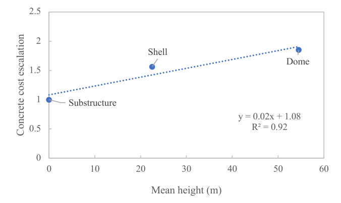

**----- Start of picture text -----** 
2.5 2 Shell Dome 1.5 1 Substructure y = 0.02x + 1.08 0.5 R² = 0.92 0 0 10 20 30 40 50 60 Mean height (m) Concrete cost escalation **----- End of picture text -----** 

_Figure I.1 Concrete cost escalation including increased material use (formwork and CADWELDs)_ 

## **LPSR cost and schedule case study** 

To synthesize these cost escalation approaches, we assumed a linear trend between cost and height, and the cost of activities at 40 meters was 40% higher, and the cost at grade was 0% higher. As a case study, we considered the implication of these factors on the cost of the LPSR shield building, containment, and core makeup tank. This was a hypothetical scenario where the height was reduced by a factor of 4, and the footprint increased by a factor of 4. In this scenario, the reactor building height drops from 55 meters to 14 meters. Table I.2 shows the new costs for all SSCs compared to base case with height cost escalation factors. The reference case had costs escalated on average 30% compared to all structures at grade, and the 14-meter-tall RB case had costs escalated 11% compared to all structures at grade. The net result is a 15% lower cost reactor building including the steel containment and cooling pool. A more precise estimate of the cost of the elevated structures requires a detailed analysis, but this first-order approach suggests that reactor designers should consider approaches to reducing the height of structures. 

_Table I.2 Costs for reactor building SSCs_ 

The FOAK containment liner for the LPSR requires 33 months to construct under the upper-bound labor constraints based on the construction schedule modeling in Chapter 3. The shorter reactor building would require 15% less labor hours. Chapter 3 showed a relatively linear trend between construction duration and labor hours, so the total schedule for the containment liner would be reduced to 28 months. Further, the flatter structure increased the workspace footprint, allowing more staff to work in parallel. Under constant volume, at 1/4 the height, the footprint grows 4x, giving space for 4x as many workers, reducing 

the construction time to 7 months. Therefore, the real value in low, flat structures may be in the reduced construction schedule, not just the reduced installation cost for tall buildings. 

## **Appendix II – The Economic Energy Data Base** 

The Economic Energy Data Base (EEDB) contained a detailed accounting of material quantities and labor hours in addition to costs. EEDB had this data for the “Better Experience” (BE) case and the “Median Experience” (ME) case of the PWR12. Figure II.2 shows the total labor cost in 1987 USD, binned by category, for the BE and ME cases. These data were a useful way to visual the drivers of the ME cost overruns. It is important to note that the labor cost per hour was not escalated between the ME and BE case, and, therefore, the cost escalations were entirely due to increased labor hours. These increases were the fault of re-work, productivity misses, increased welder qualification requirements, increased piping quantities, and other delays. Pipefitters and electricians accounted for 61% of the total direct labor cost escalation (50% of the total direct cost escalation) with increases of $99M and $40M, respectively. In general, mechanical labor accounted for 53%, structural labor accounted for 26%, and electrical labor accounted for 21% of the labor cost escalation for the ME case. 

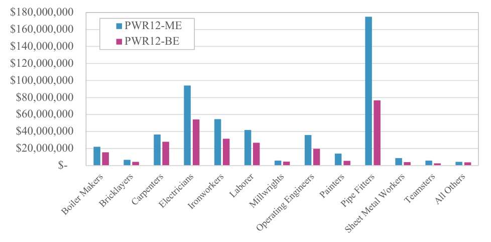

**----- Start of picture text -----** 
 $180,000,000  $160,000,000 PWR12-ME PWR12-BE  $140,000,000  $120,000,000  $100,000,000  $80,000,000  $60,000,000  $40,000,000  $20,000,000  $- Boiler MakersBricklayersCarpentersElectriciansIronworkers LaborerMillwrightsOperating Engineers PaintersPipe FittersSheet Metal WorkersTeamstersAll Others **----- End of picture text -----** 

_Figure II.2 PWR12 labor cost from EEDB for the Better Experience and Median Experience cases by labor type (1987 USD)._ 

Figure II.3 shows the material costs for the ME and BE cases. Similar to the labor cost data, the elevated material costs for the ME case reflected increased quantities not increased unit costs. These data align with the labor cost data: where pipe fitters had the greatest labor cost escalations, piping (specifically nonnuclear safety carbon steel piping) accounted for the greatest material cost escalation. The highest percentage increase in material use was stainless steel nuclear safety piping, and the primary purpose of stainless-steel nuclear safety piping was the nuclear service water system (32% by mass). Other large applications of stainless-steel piping were the primary component cooling system (15%) and the chemical and volume control system (15%).  More than 50% of the non-nuclear safety carbon steel piping was associated with the turbine plant, and another 25% was for the service air, water, and steam system. Recall from the construction risk assessment in Chapter 5 that the service air, water, and steam system was a top contributor to construction delays. 

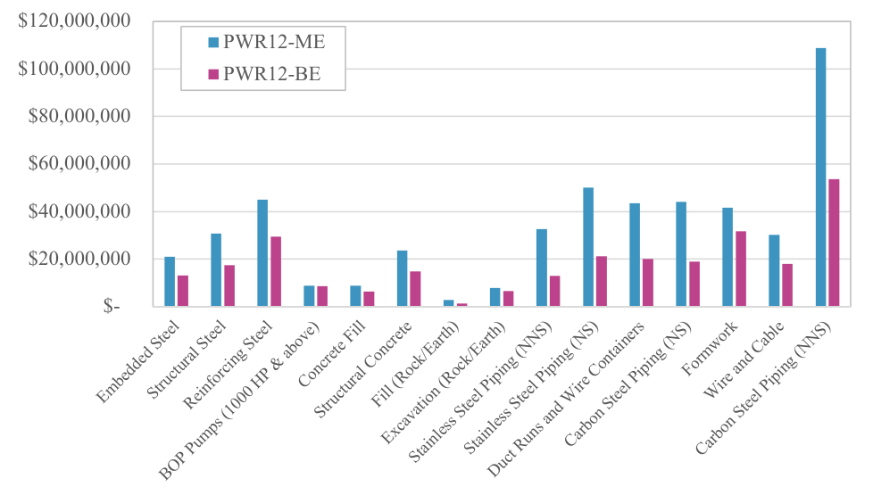

**----- Start of picture text -----** 
 $120,000,000 PWR12-ME  $100,000,000 PWR12-BE  $80,000,000  $60,000,000  $40,000,000  $20,000,000  $- Embedded SteelStructural SteelBOP Pumps (1000 HP & above)Reinforcing Steel Concrete FillStructural ConcreteFill (Rock/Earth)Excavation (Rock/Earth)Stainless Steel Piping (NNS)Stainless Steel Piping (NS)Duct Runs and Wire ContainersCarbon Steel Piping (NS)FormworkCarbon Steel Piping (NNS)Wire and Cable **----- End of picture text -----** 

_Figure II.3 PWR12 material cost from EEDB for the Better Experience and Median Experience cases by material type (1987 USD)._ 

The cost contribution of each two-digit account is in Figure II.4. Both the structures and the electrical plant equipment cost escalations for the PWR12 ME were 50% above the BE case. The reactor and turbine equipment accounts escalated about 20% over the BE case. The largest magnitude escalation was the structures account with more than $100M in overrun, followed by reactor equipment with $68M in overrun. 

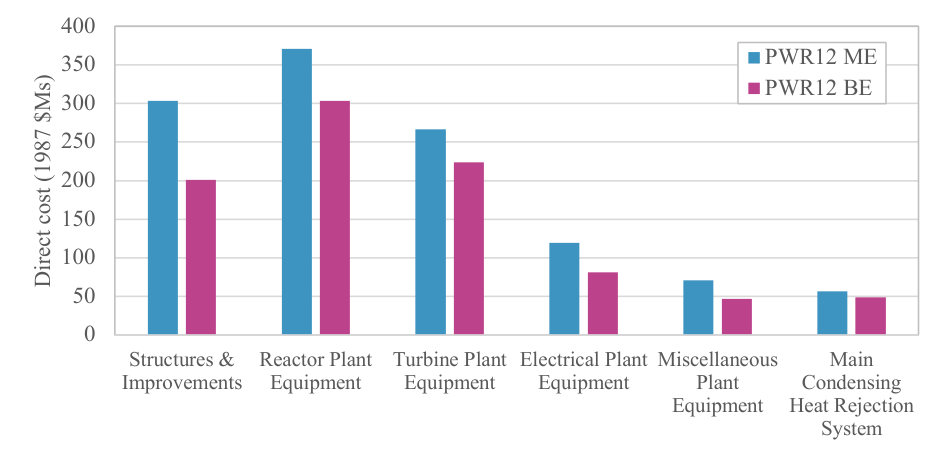

**----- Start of picture text -----** 
400 PWR12 ME 350 PWR12 BE 300 250 200 150 100 50 0 Structures & Reactor Plant Turbine Plant Electrical Plant Miscellaneous Main Improvements Equipment Equipment Equipment Plant Condensing Equipment Heat Rejection System Direct cost (1987 $Ms) **----- End of picture text -----** 

_Figure II.4 Two-digit account direct costs for the PWR12 ME and BE cases._ 

There were 21 structures in EEDB, and the top ten cost contributors are in Figure II.5. As expected, the reactor containment building was the costliest, but all of the top ten structures experienced significant cost escalations (30-70%). The primary structures (reactor containment, turbine, control room, auxiliary and waste process building) were on average 60% higher for the PWR12 ME than the BE, and the bulk of these increases were in labor costs. 

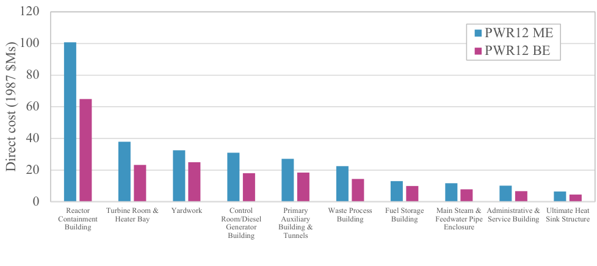

**----- Start of picture text -----** 
120 PWR12 ME 100 PWR12 BE 80 60 40 20 0 Reactor Turbine Room & Yardwork Control Primary Waste Process Fuel Storage Main Steam & Administrative & Ultimate Heat Containment Heater Bay Room/Diesel Auxiliary Building Building Feedwater Pipe Service Building Sink Structure Building Generator Building & Enclosure Building Tunnels Direct cost (1987 $Ms) **----- End of picture text -----** 

_Figure II.5 Top ten Account 21: Structures & Improvements three-digit accounts for the ME and BE._ 

The nuclear steam supply system saw no cost increase from the BE to the ME case, as seen in Figure II.6. Other reactor plant equipment accounted for most of the Account 22: Reactor Plant Equipment cost increase from the BE to the ME case. This broad category included: reactor makeup water system, chemical and volume control, boron recycle, leak detection, nuclear service water, primary component cooling, and other mechanical systems. This account was likely associated with many of the piping material cost escalations shown in Figure II.3. 

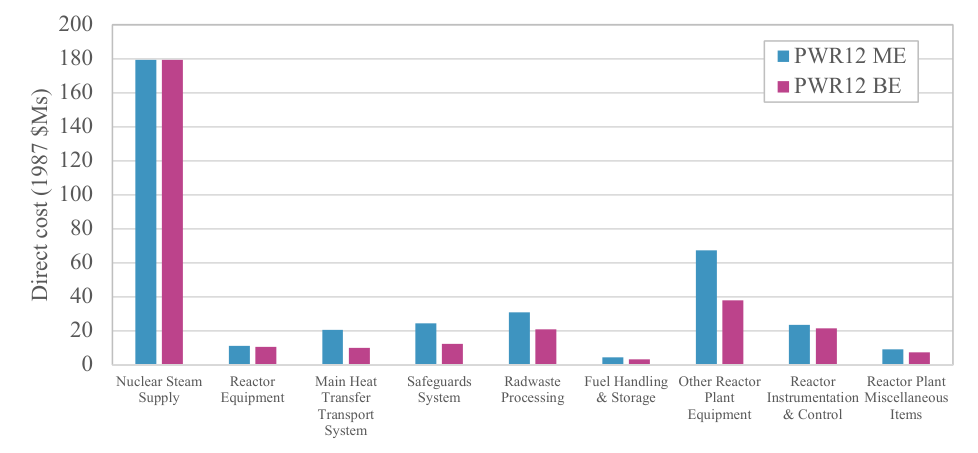

**----- Start of picture text -----** 
200 180 PWR12 ME 160 PWR12 BE 140 120 100 80 60 40 20 0 Nuclear Steam Reactor Main Heat Safeguards Radwaste Fuel Handling Other Reactor Reactor Reactor Plant Supply Equipment Transfer System Processing & Storage Plant Instrumentation Miscellaneous Transport Equipment & Control Items System Direct cost (1987 $Ms) **----- End of picture text -----** 

_Figure II.6 Account 22: Reactor Plant Equipment three-digit account costs for the ME and BE case._ 

The Account 24: Electrical Plant Equipment cost increases were primarily electrical structures and power & control wiring, as shown in Figure II.7. The electrical structures and wiring containers were underground duct runs, cable trays, and other structures that provided physical and environmental protection for wire and cable routed between buildings and within buildings. 

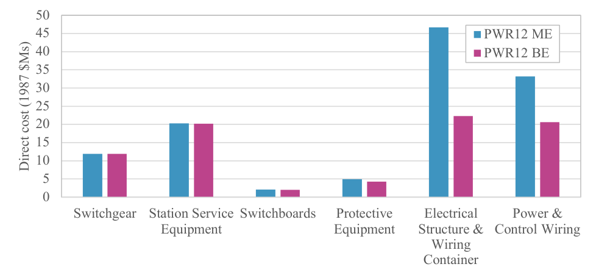

**----- Start of picture text -----** 
50 45 PWR12 ME 40 PWR12 BE 35 30 25 20 15 10 5 0 Switchgear Station Service Switchboards Protective Electrical Power & Equipment Equipment Structure & Control Wiring Wiring Container Direct cost (1987 $Ms) **----- End of picture text -----** 

_Figure II.7 Account 24: Electrical Plant Equipment three-digit account costs for the ME and BE._ 

