## **PAPER • OPEN ACCESS** 

## Multiphysics analysis with CAD-based parametric breeding blanket creation for rapid design iteration 

To cite this article: Jonathan Shimwell _et al_ 2019 _Nucl. Fusion_ **59** 046019 

View the article online for updates and enhancements. 

This content was downloaded from IP address 194.81.223.66 on 11/03/2019 at 15:27 

Nuclear Fusion 

International Atomic Energy Agency 

Nucl. Fusion **59** (2019) 046019 (12pp) 

https://doi.org/10.1088/1741-4326/ab0016 

## **Multiphysics analysis with CAD-based parametric breeding blanket creation for rapid design iteration** 

**Jonathan Shimwell**[1] **, R é mi Delaporte-Mathurin**[2] **, Jean-Charles Jaboulay**[3] **, Julien Aubert**[3] **, Chris Richardson**[4] **, Chris Bowman**[5] **, Andrew Davis**[1] **, Andrew Lahiff**[1] **, James Bernardi**[6] **, Sikander Yasin**[7] **[,]**[8] **and Xiaoying Tang**[7] **[,]**[9] 

1 Culham Centre for Fusion Energy (CCFE), Culham Science Centre, Abingdon, Oxfordshire OX14 3DB, United Kingdom of Great Britain and Northern Ireland 

2 Département Thermique-Énergétique, Polytech Nantes, Université de Nantes, Rue Christian Pauc, CS 50609, 44306 Nantes Cedex 3, France 

3 Den-Département de Modélisation des Systèmes et Structures (DM2S), CEA, Université Paris-Saclay, F-91191 Gif-sur-Yvette, France 

4 BP Institute, Bullard Laboratories, Madingley Road, Cambridge CB3 0EZ, United Kingdom of Great Britain and Northern Ireland 

5 York Plasma Institute, University of York, Heslington YO10 5DD, United Kingdom of Great Britain and Northern Ireland 

6 University of Cambridge, The Old Schools, Trinity Lane, Cambridge CB2 1TN, United Kingdom of Great Britain and Northern Ireland 

7 University of Manchester, Oxford Road, Manchester M13 9PL, United Kingdom of Great Britain and Northern Ireland 

8 Blackpool and The Fylde College, Ashfield Rd, Blackpool FY2 0HB, United Kingdom of Great Britain and Northern Ireland 

9 School of Mechanical Engineering, Shanghai Jiao Tong University, Shanghai 200240, China 

E-mail: mail@jshimwell.com 

Received 27 September 2018, revised 21 December 2018 Accepted for publication 18 January 2019 Published 8 March 2019 

## **Abstract** 

Breeding blankets are designed to ensure tritium self-sufficiency in deuterium–tritium fusion power plants. In addition to this, breeder blankets play a vital role in shielding key components of the reactor, and provide the main source of heat which will ultimately be used to generate electricity. Blanket design is critical to the success of fusion reactors and integral to the design process. Neutronic simulations of breeder blankets are regularly performed to ascertain the performance of a particular design. An iterative process of design improvements and parametric studies are required to optimize the design and meet performance targets. Within the EU DEMO program the breeding blanket design cycle is repeated for each new baseline design. One of the key steps is to create three-dimensional models suitable primarily for use in neutronics, but could be used in other computer-aided design (CAD)-based physics and engineering analyses. This article presents a novel blanket design tool which automates the process of producing heterogeneous 3D CAD-based geometries of the helium-cooled pebble bed, water-cooled lithium lead, helium-cooled lithium lead and dual-coolant lithium lead blanket types. The paper shows a method of integrating neutronics, thermal analysis 

Original content from this work may be used under the terms of the Creative Commons Attribution 3.0 licence. Any further distribution of this work must maintain attribution to the author(s) and the title of the work, journal citation and DOI. 

1741-4326/19/046019+12$33.00 

© EURATOM 2019 Printed in the UK 

and mechanical analysis with parametric CAD to facilitate the design process. The blanket design tool described in this paper provides parametric geometry for use in neutronics and engineering simulations. This paper explains the methodology of the design tool and demonstrates use of the design tool by generating all four EU blanket designs using the EU DEMO baseline. Neutronics and heat transfer simulations using the models have been carried out. The approach described has the potential to considerably speed up the design cycle and greatly facilitate the integration of multiphysics studies. 

Keywords: fusion, parametric, CAD, neutronics, 3D model, breeder blanket 

(Some figures may appear in colour only in the online journal) 

## **1. Introduction** 

Breeding blankets are designed to fulfil several high-level plant requirements, including tritium self-sufficiency, shielding non-sacrificial components from the intense neutron flux and producing heat which is ultimately used to generate electricity. Designing and engineering components for use within fusion reactors is challenging due to the high radiation fluxes and significant heat loads that they experience. Maintaining an operational and safe component within the inner vessel of a fusion reactor presents a range of difficulties; however, adding functional requirements such as tritium breeding, heat generation and heat removal further complicates the task. 

Methods of design optimization such as parameter studies and a ‘designing by analysis’ approach are possible avenues for designing fusion reactor components that could provide solutions to this challenge. Such methods rely on human intuition and iterative analysis of models to close in on an optimal solution. Performing analysis in an isolated discipline will only find the optimal solution for performance metrics that are obtainable within that discipline. For instance neutronics optimizations may find the tritium breeding ratio (TBR) but may find unacceptable temperatures. Multiphysics analysis is required to optimize component design. To maintain data provenance it would be preferable to have a single model basis when sharing data between analysis techniques. 

Traditionally, models are generated for neutronics using constructive solid geometry (CSG) and the models are suitable for use in parametric studies. Engineering analysis tends to require computer-aided design (CAD) models and CSG models are typically not compatible with engineering programs. Models for use in engineering analysis are often created via graphical user interfaces. The process of creating new engineering and neutronics models can be a time-consuming exercise. This is compounded since the models must be generated with the release of a new EU DEMO baseline design, and there are also four EU blanket designs for each iteration. 

To analyze the performance of different designs within the parameter space it would be desirable to be able to produce an accurate three-dimensional (3D) geometry rapidly. Adopting a common geometry format would allow geometry to be used in multiple domains. Allowing fine details (such as cooling pipes) to be included or excluded during model generation can facilitate specific requirements of the particular 

analysis. Use of open source geometry-producing software such as FreeCAD [1] (used for this project), Salome [2] or PythonOCC [3] can be used to quickly generate parametric CAD geometry which can be exported into a variety of formats. CAD files in STEP format [4] are an open file standard compatible with engineering simulation software. STEP files can be easily converted into surface faceted geometry (e.g. h5m or STL files) for use in neutronics codes such as Serpent 2 [5] (used for this project) and DAG-MCNP5/6 [6]. Ideally any solution to making component models would be flexible enough to work with new DEMO baseline models and also to produce different blanket designs. 

## **2. Method** 

## _2.1. Geometry creation_ 

It is clear that in order for any advanced method to generate any detailed geometry it must require the minimum human intervention, so it was determined that a software library should be created that allows arbitrary geometric operations to be performed, with the end goal of creating parametrically built blanket modules for the EU Demo program. This software is called the ‘Breeder Blanket Model Maker’ and can be found here [7]. Routines for the generation, modification and serialization of blanket envelopes were created that ultimately automatically produce detailed heterogeneous blankets for use in DEMO modelling. Demonstration neutronic and heat diffusion simulations were performed to illustrate the ease of carrying out parameter studies. Parametric models of all four EU blanket designs were generated to demonstrate the design tool. These include the helium-cooled pebble bed blanket (HCPB) [8–10], helium-cooled lithium lead blanket (HCLL) [11, 12], water-cooled lithium lead blanket (WCLL) [13] and dual-coolant lithium lead blanket (DCLL) [14]. The process has been broken down into two parts, the first flowchart (see figure 1) summarizes the construction of all the non-breeder zone components, this includes the first wall, armour and rear plates. The second flowchart (see figure 2) summarizes the construction of the breeder zone structure. 

The breeding blanket is segmented into different modules which have different shapes, orientations and positions depending upon the positioning within the reactor (see stage 1 in figure 1). The blanket designs share some common features 

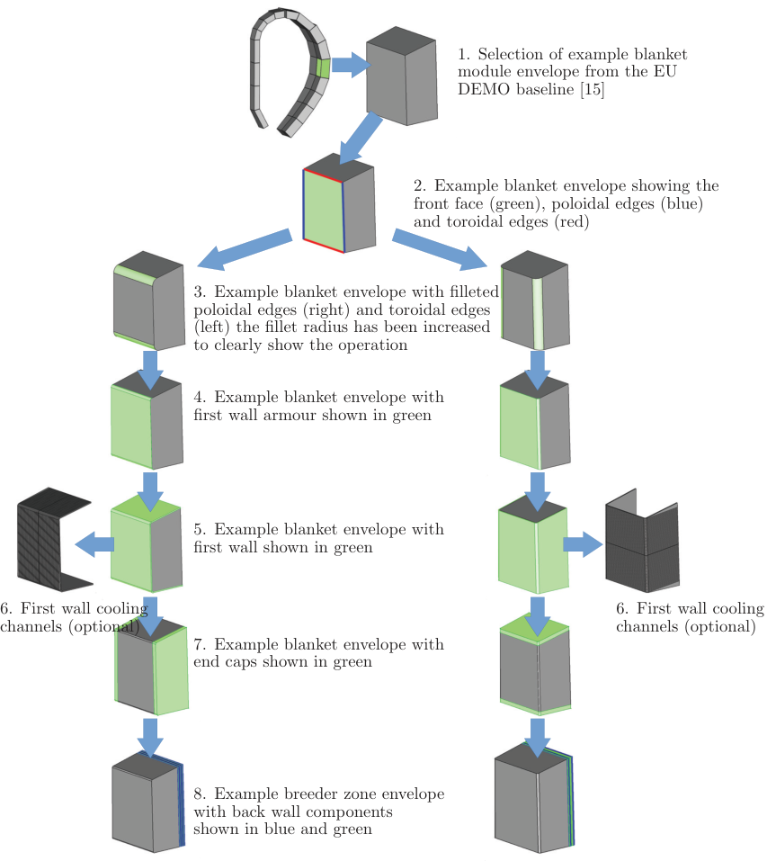

**----- Start of picture text -----** 
1. Selection of example blanket module envelope from the EU DEMO baseline [15] 2. Example blanket envelope showing the front face (green), poloidal edges (blue) and toroidal edges (red) 3. Example blanket envelope with filleted poloidal edges (right) and toroidal edges (left) the fillet radius has been increased to clearly show the operation 4. Example blanket envelope with first wall armour shown in green 5. Example blanket envelope with first wall shown in green 6. First wall cooling 6. First wall cooling channels (optional) channels (optional) 7. Example blanket envelope with end caps shown in green 8. Example breeder zone envelope with back wall components shown in blue and green **----- End of picture text -----** 

**Figure 1.** Automated workflow for generating first wall, end caps and back plates from EU DEMO baseline [15] blanket envelopes. 

such as: filleted corners on the toroidal HCPB, HCLL and WCLL designs or poloidal DCLL edges. 

_2.1.1. Structural components._ The procedure for the creation of the structural part of the blanket module is performed first. A number of key parameters define the structure of the blanket: first wall armour thickness, first wall thickness, rear plate count and thickness, and end cap thickness. An automated procedure regarding the automatic construction of a full detailed blanket structure was defined, and the full implementation details can be found in [7]. Additional fine detail is also included at the user’s discretion including the introduction of fillets and cooling channels. The overall programmatic flow is shown in figure 2, where differing blankets follow different logical routes. 

_2.1.2. Breeder zone components._ In order to generate the full heterogeneous blanket description the internal detail of the breeder zone must be generated. This is a two-stage process: first the cooling structure is generated starting from the breeder zone envelope and generating the cooling structure from it then the cooling structure is subtracted from the breeder zone envelope, leaving the non-structural breeding material (lithium lead/lithium ceramic/neutron multiplier). 

_2.1.3. Cooling structure generation._ The segmentation of the cooling structure varies for each of the four breeder blanket modules, but is almost entirely a combination of poloidal-, toroidal- and radial-based segmentations. The cooling structure of the HCLL advanced plus module [12] can be represented by a series of poloidal segmentations with alternating layers of 

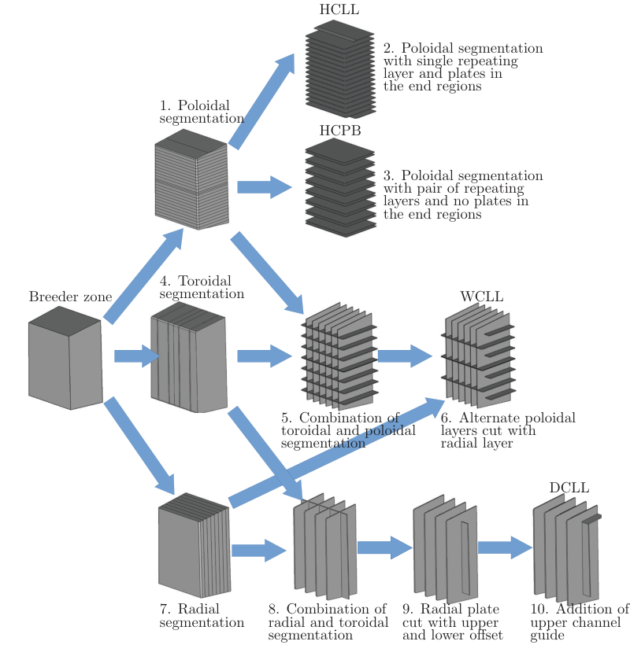

**----- Start of picture text -----** 
HCLL 2. Poloidal segmentation with single repeating layer and plates in the end regions 1. Poloidal segmentation HCPB 3. Poloidal segmentation with pair of repeating layers and no plates in the end regions 4. Toroidal Breeder zone segmentation WCLL 5. Combination of 6. Alternate poloidal toroidal and poloidal layers cut with segmentation radial layer DCLL 7. Radial 8. Combination of 9. Radial plate 10. Addition of segmentation radial and toroidal cut with upper upper channel segmentation and lower offset guide **----- End of picture text -----** 

**Figure 2.** Creation of internal breeder zone structure using a combination of toroidal, poloidal and radial segmentations. 

stiffening plates. This can be reproduced using alternate poloidal segmentation with alternating poloidal extrusion lengths, as shown in figure 2 section 2. In the case of the HCPB module there are alternating poloidal layers of lithium ceramic and neutron multiplier between the stiffening plates. The poloidal segmentation functions have been designed to allow any number of layer repetitions; this is demonstrated in stage 3 of figure 2). The wedge-shaped regions at the upper and lower extremities of the HCPB module are filled with neutron multiplier and are therefore not considered part of the cooling structure. The software is able to identify these wedge-shaped regions and group them with the other neutron multiplier regions. 

Radial cuts, and thereby radial segmentation, are also implemented; these are required for both the WCLL and the DCLL blanket designs. The WCLL cooling structure can be generated with a combination of poloidal and toroidal segmentation (see stage 6 in figure 2). Both the toroidal and poloidal directions have alternating thicknesses for the structural plates and the lithium lead regions. Every other layer of the poloidal structural plate has an offset from the first wall that allows lithium lead to flow between plates. The poloidal segmentation for such a model can be carried out in a similar 

way to the HCLL, but the WCLL has an additional complication which requires radial segmentation. The WCLL model requires toroidal segmentation and additionally requires that the upper and lower wedge volumes should be considered to be entirely lithium lead. The resulting product of the toroidal segmentation can be seen in stage 6 in figure 2. 

The DCLL cooling structure can be formed from a combination of radial and toroidal segmentation plus some detail to guide the flow of lithium lead. The procedure used was to first radially segment the blankets into three or five parts (depending upon the radial depth of the blanket). In general most of the inboard blankets accommodate three radial layers and the outboard blankets accommodate five radial layers. The addition of toroidal segmentation to the previously radial segmented breeder zone forms the first stage of the DCLL model (see stage 8 of figure 2). The DCLL blanket design allows the lithium lead to flow around the structure. An additional structural component at the upper end of each blanket module is also required by the DCLL design, the only additional complication is that a Boolean subtraction with the first radial layer is also required to obtain the desired structural plate shape (see stage 10 of figure 2). 

**----- Start of picture text -----** 
Nucl. Fusion  59  (2019) 046019 **----- End of picture text -----** 

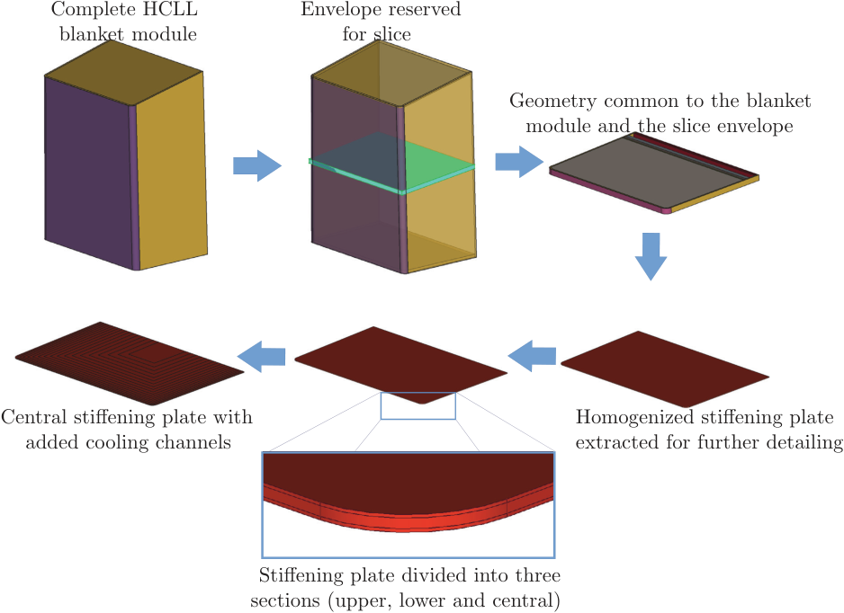

**----- Start of picture text -----** 
Complete HCLL Envelope reserved blanket module for slice Geometry common to the blanket module and the slice envelope Central stiffening plate with Homogenized stiffening plate added cooling channels extracted for further detailing Stiffening plate divided into three sections (upper, lower and central) **----- End of picture text -----** 

**Figure 3.** Creation of the slice geometry structure used in thermal analysis. 

_2.1.4. Breeding material._ The complete description of the breeder zone comprises the description of the cooling structure and the description of the breeding material. The final stage is take the original breeder zone envelope and subtract the newly created cooling plates/stiffening plates from it, thus defining the description of the complete breeding zone. HCLL, WCLL and DCLL all require that the end regions are lithium lead and HCPB requires the end regions to be neutron multiplier. 

_2.1.5. Slice geometry generation._ The slice geometry used in the thermal simulation can also be generated automatically. The procedure for generating the slice geometry of the HCLL is outlined in figure 3. The user specifies the blanket module from which to extract a slice. A slice envelope is created with a poloidal height equal to the poloidal height of a stiffening plate plus the poloidal height of the breeder zone. The envelope poloidal position is centred around the stiffening plate so that the slice contains half a breeder zone above and half a breeder zone bellow the stiffening plate. The cooling channel positions were found by offsetting the first wall towards the rear of the blanket, with the size of the offset progressively increasing. Surface identification for cooling surfaces was carried out by merging the coolant volumes with the structure volumes and searching for merged surfaces in the resulting geometry. The identification was manually checked after this stage to ensure a robust procedure. 

## _2.2. Parametric geometries_ 

As a result of the method previously described there is now an automated procedure for obtaining semi-detailed CAD geometry for the HCPB, HCLL, WCLL and DCLL blankets. The process relies on a library of common functions which can be mixed and matched to create particular blanket designs. The breeder blanket design tool is released as an open source project under the Apache 2.0 license and distributed via the UKAEA Github repository [7]. The software is subject to a test suite and the build status is updated automatically with every commit. Continuous integration practices are employed using Circle CI and Docker. 

The model construction process is parametric, which allows models required for parameter studies to be generated rapidly. Currently the parameters that a user can input are: 

- filename of blanket envelope required for segmentation 

- blanket type (HCPB, HCLL, WCLL, DCLL) which also defines the geometry layout as shown in figures 1 and 2 

- poloidal fillet radius for the first wall and first wall armour 

- toroidal fillet radius for the first wall and first wall armour 

- first wall armour thickness 

- first wall thickness 

- end cap thickness 

- thickness of each rear plate 

- thickness of each poloidal segmentation 

- thickness of each toroidal segmentation 

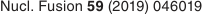

**----- Start of picture text -----** 
Nucl. Fusion  59  (2019) 046019 **----- End of picture text -----** 

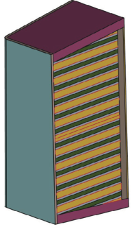

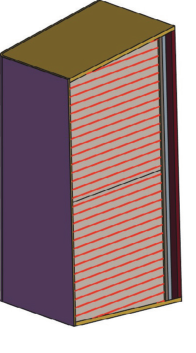

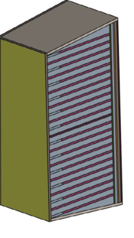

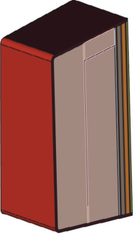

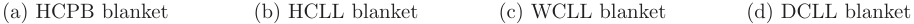

**----- Start of picture text -----** 
(a) HCPB blanket (b) HCLL blanket (c) WCLL blanket (d) DCLL blanket **----- End of picture text -----** 

**Figure 4.** Example parametric blanket modules; parameter values have been enlarged in some cases to increase the visibility of components. 

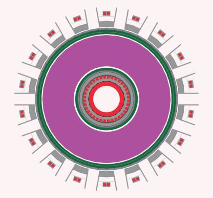

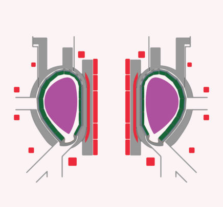

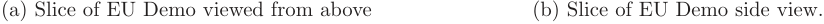

**----- Start of picture text -----** 
(a) Slice of EU Demo viewed from above (b) Slice of EU Demo side view. **----- End of picture text -----** 

**Figure 5.** A neutronics model of EU DEMO using faceted geometry (STL) with detailed HCLL blankets, showing plasma (purple), lithium lead (green), magnets (red), and structural steels (grey). 

- thickness of each radial segmentation 

- first wall coolant channel poloidal height 

- first wall coolant channel radial height 

- first wall coolant channel pitch 

- first wall coolant channel offset from the front face 

- output file format (STEP or STL) and tolerance. 

Not all parameters are needed for each design as some are not applicable, for instance the breeder zone in the HCPB blanket has no radial segmentation option and does not require this input. Figure 4 shows each of the four blanket designs formed from a particular module from the baseline DEMO model [15]. Currently the tool requires that the first wall is a flat plane to determine the location of the internal structure. The tool would therefore need some alterations to work with blanket envelopes with curved front surfaces (i.e. full bananashaped segments). 

The process of building a blanket module from an envelope typically takes a few seconds on a single core. Build time 

depends on the input parameters, as many very small layers would necessitate more Boolean operations than for the case of a few large layers. The process is parallelizable, and therefore a model such as the EU DEMO with 26 blanket modules typically takes less than 5 min on a quad core Intel i5 7600 CPU. 

## **3. Results** 

## _3.1. Neutronics model creation_ 

Once the parametric CAD models have been created, one potential use is in neutronics simulations. There are several routes from CAD to neutronics models, such as conversion to CSG using conversion software such as McCad [16] or SuperMC [17]). Alternatively the use of faceted geometry is also possible. Previously, parameter studies for fusion blanket optimization have converted parametric CAD models to CSG 

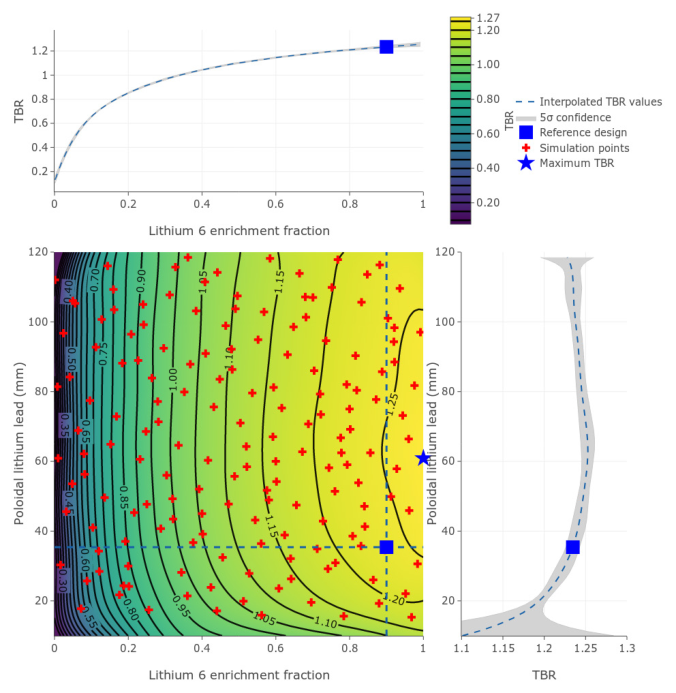

**Figure 6.** Showing interpolated TBR values with a 5 _σ_ confidence for a range of different[6] Li enrichments and poloidal lithium lead heights. The Gaussian process software used [30] was able to fit the TBR values along with their statistical errors and find the confidence values. The reference design HCLL has 90%[6] Li enrichment, 34.5 mm of poloidal lithium lead and achieves a TBR of 1.235. 

models using McCad and performed the simulation using MCNP [18]. This study opted to simulate using faceted geometry in the STL file format and perform the neutronics simulation using Serpent 2, which natively supports STL geometry. The process of converting from STEP to STL is quicker than from STEP to CSG and the results are easier to visually verify. To demonstrate practical use of the parametric geometry, a series of tritium breeding simulations were obtained for the HCLL. The poloidal height of the lithium lead sections and the[6] Li enrichment of the lithium lead were varied independently. The thickness of the first wall and the stiffening plates were varied simultaneously with the poloidal height of the lithium lead sections using equations (1) and (2). 

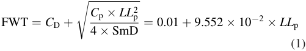

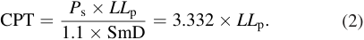

Here FWT is the firstwall thickness (m), CPT is the stiffening plate thickness (m), _C_ D is the radial width of the first wall cooling channel (0.01 m), _C_ p is the specific heat capacity (J K[–1] ), _P_ s is the coolant pressure (10 MPa for the helium coolant), SmD is the stress limit criterion for EUROfer (274 MPa) [19] in case of accident and _LL_ p (m) is the poloidal 

height of the lithium lead sections. These equations are described in more detail in [11] and [20]. This HCLL study is a demonstration of the model-making tool developed and thermal-mechanical constraints are not taken into account. 

Halton sampling [21] was used as the sampling technique to select points within the parameter space. The parameter space encompassed blankets with a poloidal height of lithium lead between 0.01 m and 0.12 m and[6] Li enrichment between 0% and 100%. The requested simulation points found using the Halton sampling method are shown as red crosses in figure 6. These requested input parameters were uploaded to a online cloud-based database (Mongo Atlas [22]). Entries within the database were flagged with ‘in progress’, ‘completed’ or ‘requested’ to indicate their simulation status. The centralized accessible database allowed independent simulations to be carried out in parallel and the results to be coordinated. A containerized workflow was implemented using Docker [23] which held the breeder blanket model-maker software along with all the dependences required, such as neutron interaction data, FreeCAD, Python and MongoDB. Containers were then launched on EGI FedCloud resources [24] and connected to the cloud database to retrieve their simulation input parameters ([6] Li enrichment and lithium lead poloidal height) and ‘ ’ set the database entry for the simulation to in progress . Once the simulation input parameters were received the CAD models were automatically built and combined with material 

properties to create the neutronics model. Upon completion of the neutronics simulation the results (TBR and heating tallies) were uploaded to the cloud-based database and the entry flag was set to ‘completed’. At this point the container would either continue with the next requested simulation in the database or terminate and free up resources if all the requested simulations were complete. 

FENDL 3.1b [25] cross sections were used for neutron transport. Neutronics materials definitions from the EUROfusion material composition [26] were used in the model and a parametric plasma source based on [27] with plasma parameters from [28] was used. The number of starting particles run for each TBR simulation was 1 _×_ 10[7] . 

## _3.2. Neutronics simulations_ 

The models generated are suitable for neutronics simulations and figure 5 shows the blanket models within a Serpent 2 geometry. Figure 6 shows the resulting TBR values from a neutronics parameter study. The TBR was found to change with the poloidal height of lithium lead. Models with a small lithium lead poloidal height contain a relatively large EUROfer fraction compared with models with a large lithium lead poloidal height. This is due to the large number of stiffening plates and it appears to have reduced tritium production. However, models with a large poloidal height can also have large quantities of EUROfer in the breeder blanket. As the poloidal height of lithium lead increases the thickness of the EUROfer first wall (see equation (1)) and the thickness of the EUROfer stiffening plates (see equation (2)) also increase. 

There appears to be an optimal poloidal height which becomes more pronounced with[6] Li enrichment. Figure 5 shows the variation of TBR with[6] Li atom fraction within the lithium lead. Increasing[6] Li enrichment shows an increase in TBR as confirmed by previous studies [29]. Figure 5 shows the variation of TBR with the poloidal height of the lithium lead regions within the breeder zone of the blanket. The poloidal height has less of an effect on TBR but can be optimized. The achievable increase in TBR depends upon the[6] Li enrichment. Figure 6 shows that each different enrichment of[6] Li has a different optimal height for the poloidal lithium lead. At 90%[6] Li enrichment a TBR increase of nearly 0.1 is possible (see figure 6). The size of the 5 _σ_ confidence regions varies depending on the proximity and statistical error of nearby simulations. This is most noticeable towards the extremities of the search space where there are fewer simulations and the size of the 5 _σ_ confidence regions is larger. The variation in height of the poloidal lithium lead also has mechanical considerations as the first wall thickness and stiffening plate thickness are also increased when the lithium lead poloidal height is increased (see equations (1) and (2)). This helps explain why we observe an optimal lithium lead poloidal height for TBR values from the neutronics model. 

A maximum TBR of 1.278 _±_ 0.010 (5 _σ_ confidence) was found using Gaussian process software [30] to fit the simulation data and statistical error (see figure 6). The highest TBR value was found for a blanket design with a lithium lead 

poloidal height of 0.061 m and a[6] Li enrichment of 100%. Additional constraints such as the capability of the thermalhydraulic design to cool the structure with reasonable pressure drops must also be considered, and the maximum TBR design may not meet such requirements. Thermal modes are developed in the next section. 

## _3.3. Creation of the heat diffusion model_ 

A slice of the HCLL blanket geometry was used to create a simplified model of the temperature field in the tungsten, EUROfer and lithium lead. Dimensions for the first wall thickness and stiffening plate thickness were calculated using equations (1) and (2) with the poloidal height of lithium lead set at 34.5 mm. The model contains a single stiffening plate with cooling channels and lithium lead either side, encased with a first wall; the material layout is shown in figure 8. A mesh with 2.3 million tetrahedra was created using Trelis [31] complete with boundary conditions and volumetric source terms. Heat diffusion simulations were carried out using FEniCS [32] which was able to apply boundary conditions to surfaces and temperature-dependent materials properties to different volumes. The heat diffusion equation used is described by equation (3). 

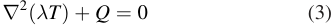

where _T_ is the temperature in K, _λ_ is the thermal conductivity of the given material expressed in W m[−][1] K[−][1] and _Q_ is the volumetric source term in W m[−][3] . As this equation is solved using the finite elements method, equation (3) needs to be brought to its weak formulation (or variational for mulation) as follows: 

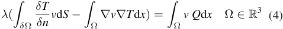

where Ω is the domain on which equation (4) is solved, _n_ is the normal direction on the external surface and _v_ is a test function. The integration term on the boundary of Ω is determined by the boundary conditions. 

_3.3.1. The Robin boundary condition._ The Robin boundary condition allows the assignment of a convective heat flux on a boundary. In equations (5) and (6), it is shown that the heat flux depends on the temperature of the fluid and the convective coefficient _h_ (W m[−][2] K[−][1] ). This coefficient depends on the type of convection (natural, forced, laminar or turbulent) and the fluid in contact with the surface: 

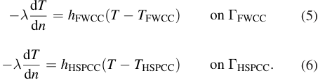

ΓFWCC and ΓHSPCC are surface domains and are shown in blue and purple, respectively, in figure 7. This condition is used on the surfaces of the helium cooling channels. The coefficients _h_ have been calculated for the first wall cooling channels (FWCC) and horizontal stiffening plate 

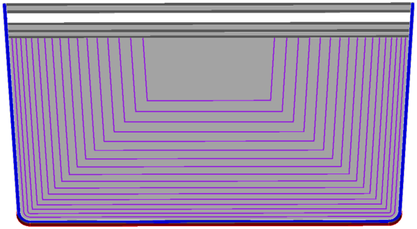

**Figure 7.** Cut of a HCLL module slice showing the surfaces used for boundary conditions: ΓFW (red), ΓFWCC (blue) and ΓHSPCC (purple). 

**Table 1.** Parameters used for the determination of the convective coefficients _h_ FWCC and _h_ HSPCC. 

||**Table 1.**Parameters used for the determination of the|convective coeffcients_h_FWCCan|d_h_HSPCC.|
|---|---|---|---|
|Symbol|Description|Value of FWCC|Value of HSPCC|
|_ReD_|Reynolds number|1.310_×_105|3.018_×_104|
|_Pr_|Prandtl number|6.599_×_10_−_1|6.599_×_10_−_1|
|_ξ_|Darcy–Weisbach friction factor|3.000_×_10_−_2|2.000_×_10_−_2|
|_D_h|Hydraulic diameter (m)|1.500_×_10_−_2|3.000_×_10_−_3|
|_h_|Convective coeffcient (W m−2K−1)|4.531_×_103|4.848_×_103|
|_T_coolant|Average temperature of coolant (K)|6.230_×_102|7.160_×_102|

cooling channels (HSPCC). They are determined using Gnielinski correlation (equation (7)) with the parameters in table 1 in accordance with [33]. 

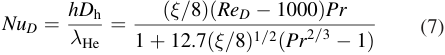

where _NuD_ is the Nusselt number, _D_ h is the hydraulic diameter in m, _λ_ He is the thermal conductivity of the fluid in W m[−][1] K[−][1] , _ReD_ is the Reynolds number and _Pr_ is the Prandtl number. We consider a smooth surface, and thereby the Darcy–Weisbach friction factor _ξ_ is then given by: 

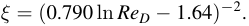

Finally, the distribution of the volumetric source term _Q_ in equations (3) and (4) was taken from [35] and is inputted into the finite element model using the following equations: 

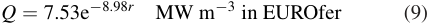

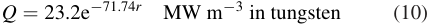

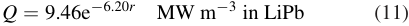

where _r_ is the radial distance from the front face of the breeder blanket in m. The resulting spatial distribution of volumetric heating ( _Q_ ) in MW m[−][3] is shown in figure 9. 

## _3.4. Heat diffusion simulations_ 

_3.3.2. Neumann boundary conditions._ By using Neumann boundary conditions, fixed heat flux can be assigned to the front wall armour surface shown in red in figure 7, as described in equation (8): 

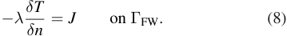

Here, _J_ is a fixed flux density in W m[−][2] on a boundary. This condition is used on the surface ΓFW which corresponds to the front wall (shown in red in figure 7) with a flux of _J_ =  0.5 MW m[−][2] which corresponds to the heat flux emitted by the plasma. 

The rest of the external surfaces are considered as insulated. This assumption is valid as long as these surfaces are part of a vacuum and are not exposed to an intense heat flux. The values of the thermal conductivity _λ_ in W m[−][1] K[−][1] in equation (4) were found in [34]. 

Using the same CAD-generated models as in section 3.2, heat diffusion simulations have been performed. The steady state solution of the temperature field is shown in figure 10. Thanks to these simulations, we are able to determine the maximum temperature reached by each material and determine if the design allows the materials to stay within their maximum operating temperature limits (550 °C for EUROfer and 1300 °C for tungsten [36]). Although the design limit of 550 °C is reached in part of the stiffening plates, this design could be refined with additional cooling channels to reduce the temperature. Additional assessments involving computational fluid dynamics could be performed to check the accuracy of the temperatures predicted and the conservatism of assumptions made in this simulation. The maximum temperatures are shown in table 2. 

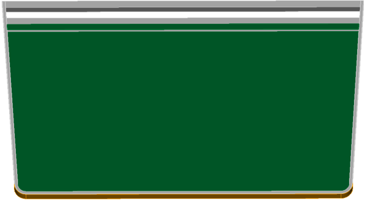

**Figure 8.** HCLL module slice showing the materials: tungsten (brown), lithium lead (green) and EUROfer (grey). 

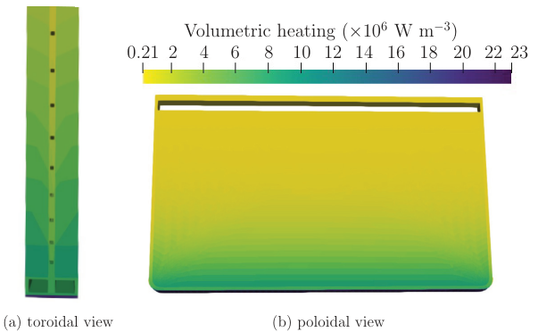

**----- Start of picture text -----** 
Volumetric heating ( × 10 [6] W m [−] [3] ) 0.21 2 4 6 8 10 12 14 16 18 20 22 23 (a) toroidal view (b) poloidal view **----- End of picture text -----** 

**Figure 9.** Volumetric heating source term applied to a slice from middle of the equatorial outboard blanket module in W m[−][3] . 

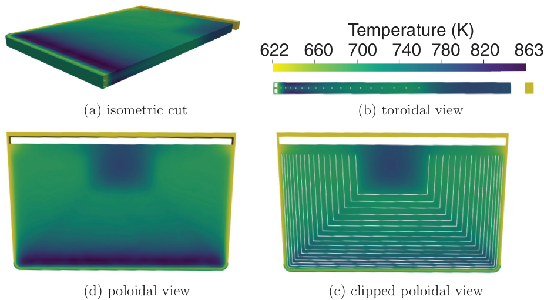

**----- Start of picture text -----** 
Temperature (K) 622 660 700 740 780 820 863 (a) isometric cut (b) toroidal view (d) poloidal view (c) clipped poloidal view **----- End of picture text -----** 

**Figure 10.** Resulting temperature field of a slice from the middle of the equatorial outboard blanket module in K. 

**Table 2.** Maximum temperatures of each material. 

## _3.5. Discussion_ 

The simulation results show that the materials stay within their maximum operating temperature limits. However, one must be aware that some assumptions have been made that could introduce inaccuracy. The convective boundary condition on ΓHSPCC and ΓFWCC are set with constant average coolant temperatures along the channel. This assumption is reliable in term of flux balance in the module although it may introduce errors in the region near the inlets and the outlets of the channels where the coolant should be, respectively, colder and hotter than the average. One way to solve this issue would be to allow _T_ coolant to vary along the channel. Actual cooling channel designs for HCLL might also differ from the one used in this paper, leading to variation in the temperature field. One can also notice that the simulation has been run in steady state. Running transient simulation could allow new hot spots to be spotted before the module reaches steady state. The volumetric heat source used in this paper is a fitted exponential function mapped on a mesh using discontinuous Galerkin elements of order 0. In other words, the volumetric heat source has been discretized. Again, this might lead to inaccuracy in some big cells. This can be solved by refining the mesh, as currently the model contains 2.3 million tetrahedral elements. Finally, the lithium lead flow is not modelled in this paper for simplification purposes. Lithium lead has been considered as a solid. However, considering the very low velocity of lithium lead in HCLL modules, this assumption can be made. 

## **4. Conclusion** 

A design tool capable of generating parametric designs for fusion breeder blankets has been demonstrated on singlemodule blanket envelopes for HCLL, HCPB, WCLL and DCLL. A wide range of design parameters can be changed to generate CAD geometry for use in parameter studies. The geometry generated is available in CAD format (STEP) and faceted geometry (STL and h5m). Conversion to CSG for neutronics simulation is achievable via existing software such as McCad or MCAM. The option of faceted geometry allows CSG geometry to be avoided in favour of more CAD-based neutronic simulation techniques such as DAGMC or Serpent 2. The provision of CAD geometry also enables manipulation to be performed with standard CAD software as opposed to CSG geometry where manipulation of the shapes is less convenient. A demonstration neutronics parameter study was performed, where poloidal lithium lead height and[6] Li enrichment 

were varied. This was done in order to optimize TBR for the HCLL module. A maximum TBR of 1.278 _±_ 0.010 (5 _σ_ confidence) was found using Gaussian processing to fit the data. The highest TBR value was found for a blanket design with a lithium lead poloidal height of 0.061 m and a[6] Li enrichment of 100%. Currently the tool allows for a large range of specific blanket module geometries to be made for use in simulations. Thermal-mechanical and other constraints are not taken into account when constructing the geometries and future research will be required to identify allowable design parameters that satisfy thermal-mechanical and thermal-hydraulic requirements. The geometry created can also be used in finite element and finite volume software to simulate heat diffusion, tritium diffusion and stress. A simplified heat diffusion problem was demonstrated in this paper. The maximum temperature within the different materials present in the midplane geometry slice of the HCLL outboard equatorial blanket module was found to be similar to previous research [33]. Maximum temper atures were 774 K for tungsten, 863 K for lithium lead and 824 K for EUROfer. The work performed here shows the value of _in silico_ design processes, multiphysics workflows and, critically, integration with automated systems for the generation, submission and analysis of calculations. The workflow was built using modern scalable techniques to run the simulations (containerized cloud computing), store the output of the simulations (centralised cloud databases) and analyze the results (machine learning). The tool is open for extension and additional analysis such as thermal stress, mechanical stress and tritium diffusion should be the next steps for development. 

## **Acknowledgments** 

The authors would like to acknowledge the financial support of EUROfusion and EPSRC. This work has been carried out within the framework of the EUROfusion Consortium and has received funding from the Euratom research and training – programme 2014 2018 under grant agreement no. 633053. The views and opinions expressed herein do not necessarily reflect those of the European Commission. This work has also been part-funded by the RCUK Energy Programme (grant number EP/I501045/1). This work benefited from services and resources provided by the fedcloud.egi.eu Virtual Organization, supported by the national resource providers of the EGI Federation. The authors would also like to thank the HCLL, HCPB, DCLL and WCLL breeder blanket design teams, and Dr Lidija Shimwell Pasuljevic and Helen Gale. 

## **ORCID iDs** 

Jonathan Shimwell https://orcid.org/0000-0001-6909-0946 Rémi Delaporte-Mathurin https://orcid.org/0000-00031064-8882 

Chris Richardson https://orcid.org/0000-0003-3137-1392 Andrew Davis https://orcid.org/0000-0003-4397-0712 James Bernardi https://orcid.org/0000-0001-9229-4613 

Sikander Yasin https://orcid.org/0000-0001-8701-6205 Xiaoying Tang https://orcid.org/0000-0002-7894-6774 

## **References** 

- [1] Riegel J., Mayer W. and van Havre Y. 2001–2018 Freecad version 0.17 (http://freecadweb.org/) 

- [2] Ribes A. and Caremoli C. 2007 Salome platform component model for numerical simulation _Proc. of the 31st Annual Int. Computer Software and Applications Conf. (24–27_ – 

- _July 2007, Beijing, China)_ pp 553 64 (http://conferences. computer.org/compsac/2007/) 

- [3] Paviot T. 2015–2018 PythonOCC—3D CAD for python (www.pythonocc.org/) 

- [4] ISO 10303-21 2016 Industrial automation systems and — — 

- integration Product data representation and exchange Part 21: implementation methods: clear text encoding of the exchange structure (International Organization for Standardization) 

- [5] Leppänen J. _et al_ 2015 The Serpent Monte Carlo code: status, development and applications in 2013 _Ann. Nucl. Energy_ **82** 142–50 

- [6] Wilson P. _et al_ 2010 Acceleration techniques for the direct use of CAD-based geometry in fusion neutronics analysis _Fusion Eng. Des._ **85** 1759–65 

- [7] Shimwell J. 2018 Breeder blanket model maker (https://doi. org/10.5281/zenodo.1421059) 

- [8] Hernàndez F. _et al_ Overview of the HCPB research activities in EUROfusion _IEEE Trans. Plasma Sci._ **46** 2247–61 

- [9] Hernàndez F. _et al_ A new HCPB breeding blanket for the EU DEMO: evolution, rationale and preliminary performances _Fusion Eng. Des._ **124** 882–6 

- [10] Pereslavtsev P. _et al_ 2017 Neutronic analyses for the optimization of the advanced HCPB breeder blanket design for DEMO _Fusion Eng. Des._ **124** 910–4 

- [11] Aubert J. _et al_ 2018 Status of the EU DEMO HCLL breeding blanket design development _Fusion Eng. Des._ B **136** 1428–32 

- [12] Jaboulay J. _et al_ 2017 Nuclear analysis of the HCLL blanket for the European DEMO _Fusion Eng. Des._ **124** 896–900 

- [13] Del Nevo A. _et al_ 2017 WCLL breeding blanket design and integration for DEMO 2015: status and perspectives _Fusion Eng. Des._ **124** 682–6 

- [14] Palermo I. _et al_ 2017 Neutronic design studies of a conceptual DCLL fusion reactor for a DEMO and a commercial power plant _Nucl. Fusion_ **56** 016001 

- [15] Pereslavstev P. _et al_ 2013 Generation of the MCNP model that serves as a common basis for the integration of the different blanket concepts EFDA D 2M7GA5 V.1.0 

- [16] Lu L. _et al_ 2017 Improved solid decomposition algorithms for the CAD-to-MC conversion tool McCad _Fusion Eng. Des._ **124** 1269–72 

- [17] Wu Y. _et al_ 2015 CAD-based Monte Carlo program for integrated simulation of nuclear system SuperMC _Ann. Nucl. Energy_ **82** 161–8 

- [18] Shimwell J. _et al_ 2017 Automated parametric neutronics analysis of the helium cooled pebble bed breeder blanket with Be12Ti _Fusion Eng. Des._ **124** 940–3 

- [19] AFCEN 2018 RCC-MRx, design and construction rules for mechanical components of nuclear installations (http:// afcen.com/en/publications/rcc-mrx/170/rcc-mrx-2018) 

- [20] Peyraud J. 2017 Optimization of the horizontal stiffening plates channels layout design for the advanced-plus concept of the DEMO HCLL breeding blanket DEN/DANS/DM2S/ SEMT/BCCR/NT/17-013/A 

- [21] Halton J. 1964 Radical-inverse quasi-random point sequence _Commun. ACM_ **7** 701–2 

- [22] MongoDB 2018 Mongo Atlas automated cloud MongoDB service (www.mongodb.com/cloud/atlas) 

- [23] Docker 2018 Container platform. Build manage and secure your apps anywhere (https://docs.docker.com/) 

- [24] EGI FedCloud 2018 Cloud platform. Build Manage and Secure your apps anywhere (www.egi.eu/services/ cloud-compute/) 

- [25] IAEA 2018 FENDL-3.1d: fusion evaluated nuclear data library ver.3.1d (www-nds.iaea.org/fendl/) 

- [26] Fischer U. 2017 EFDA D 2MM3A6 v1.0—material 

- compositions for PPPT neutronics and activation analyses (https://idm.euro-fusion.org/?uid=2MM3A6) 

- [27] Fausser C. _et al_ 2012 Tokamak _D_ - _T_ neutron source models for diffierent plasma physics confinement modes _Fusion Eng. Des._ **87** 787–92 

- [28] Fischer U. 2017 EFDA D 2L8TR9 v1.6—PMI-3.3-T014D001—guidelines for neutronic analyses (https://idm.eurofusion.org/?uid=2L8TR9) 

- [29] Jordanova J. _et al_ 2006 Parametric neutronic analysis of HCLL blanket for DEMO fusion reactor utilizing vacuum vessel ITER FDR design _Fusion Eng. Des._ **81** 2213–20 

- [30] Bowman C. 2018 Inference tools (https://doi.org/10.5281/ zenodo.1423552) 

- [31] CSimSoft 2018 Trelis version 16.5 (www.csimsoft.com/) 

- [32] Richardson C. and Wells G.N. 2016 High performance multi-physics simulations with FEniCS/DOLFIN 5 _Report_ eCSE03-10 (www.archer.ac.uk/community/eCSE/eCSE0310/eCSE03-10-TechnicalReport.pdf) 

- [33] Aubert J. _et al_ 2017 Design description document (DDD) 2016 for HCLL DEN/DANS/DM2S/SEMT/BCCR/ RT/17-027/A 

- [34] Aubert J. _et al_ 2016 Design description document (DDD) 2016 for HCLL _CEA rapport technique DEN_ 

- [35] Aubert J. _et al_ 2016 _Design Engineering HCLL Design Report 2016_ EUROfusion IDM EFDA _D_ 2N8YZS 

- [36] Zinkle S.J. and Ghoniem N.M. 2000 Operating temperature windows for fusion reactor structural materials _Fusion Eng. Des._ **51–2** 55–71 

