## Final Thesis **Industrial Engineer** 

# **Development of a surrogate model for simplified neutronic calculations involved in the design stage of a thermonuclear fusion reactor** 

## **Volume I** 

## **REPORT** 

**Author:** Javier Martínez Arroyo **Thesis Director:** Antonella Li Puma **Thesis Co-Director:** Jean-Charles Jaboulay **University Director:** Javier Dies Llovera **Session** : September 2012 

Commissariat à l’Energie Atomique DEN/DANS/DM2S/SERMA/LPEC Centre de Saclay 

Escola Tècnica Superior d’Enginyeria Industrial de Barcelona 

Methodology developed during the project, results and conclusions will be presented at the conference _**27[th] Symposium on Fusion Technology (SOFT 2012)**_ (1) on September the 24[th,] 2012 

in Liège (Belgium). 

A scientific paper based on the work developed on this report will be published in the scientific journal _**Fusion Engineering and Design**_ (2). 

## **Documents included:** 

Registration sheet 

Authorization to disseminate copyrighted academic works 

Abstract Final thesis report Acknowledgements Budget 

Bibliography 

Electronic version of all the documentation 

_1_ 

## **Abstract** 

Several system codes have been developed since the eighties, with different objectives and appropriate architecture and level of development, aiming to explore possible operating condition ranges of a fusion power reactor. 

In some “system codes” technology/engineering assumptions/models (e.g. thermodynamic efficiency of coolant cycle, neutron multiplication coefficient, Tritium Breeding Ratio, radial built) are treated as input data inserted by the user and integrated in a main module essentially describing “plasma physics” aspects. In a first stage, these values come from previous studies on equivalent reactor concepts. Subsequent and more complete analyses with detailed models allow to confirm/deny these values and modify, if needed, for a second run and most likely several run, up to convergence. Some other codes consist of different specific modules (calculation tools) each one treating a separate aspects (e.g. physics, engineering, costing...) and integrated together in a common multiphysics calculation platform. Appropriate modules consistently calculate needed values using simplified models or surrogate models that enable an acceleration of the convergence of these systems codes. A system code based on this approach, SYCOMORE, is under development at CEA. The characteristics of the plasma and of the various reactor subsystems are addressed by various codes/models which are linked together via an integrated tokamak modelling platform. This platform allows creating a system design workflow by chaining the execution of the various modules. 

In this framework, this document describes a methodology developed to build the neutronic module of SYCOMORE: a surrogate model, based on neural network giving main neutronic parameters characterizing a fusion reactor (tokamak): tritium breeding ration (TBR), multiplication factor, and nuclear heating as a function of the reactor main geometrical parameters (major radius, elongation…), of the radial built, Li enrichment, blanket and shield thickness, etc. (3) 

In order to obtain a reliable surrogate model, a consistent database is needed. Simplified 1D and 2D neutronic calculation carried out with APOLLO2 (deterministic) and and TRIPOLI-4 (Montecarlo) codes codes are therefore used to fill the database. The URANIE platform is used to build the surrogate model from neutronic results. The simplified 1D and 2D models are validated against more detailed 3D Monte-Carlo model conducted with TRIPOLI-4. This methodology is devoted to helium cooled lithium lead (HCLL) blanket, but it could be applied to any breeder blanket concept provided that appropriate validation could be carried out. 

_3_ 

## **Table of Contents** 

## **(Volume I)** 

## Registration Sheet 

## Abstract 

_5_ 

_7_ 

## **Glossary of signs, symbols, abbreviations, acronyms and terms** 

BP: Back Plate 

## BZ: Breeding Zone 

CEA: Comissariat à l’Energie Atomique et aux Energies Alternatives 

cm: centimeters 

DANS: Direction déléguée aux Activités Nucléaires de Saclay 

DE: Deposited energy 

DEMO: DEMonstration thermonuclear fusion reactor 

DEN: Direction de l’Energie Nucléaire 

DM2S: Département de modélisation des systèmes et structures 

EFDA: European Fusion Development Agreement 

EURATOM: European Atomic Energy Community 

F4E: Fusion for Energy (European Domestic Agency for Fusion Energy) 

FW: First Wall 

GEDEMO: Groupe d’Etudes du réacteur à fusion de DEMOnstration 

HCLL: Helium Cooled Lithium Lead 

HCPB: Helium Cooled Pebble Bed 

## Ib: Inboard 

IRFM: Institut de recherche sur la fusion par confinement magnétique 

ITER: International Thermonuclear Experimental Reactor 

JET: Joint European Torus 

LHS: Latin Hypercube Sampling 

LPEC: Laboratoire de Protection, d’Études et de Conception 

m: meters 

MAN: Manifold 

MC: Monte Carlo simulation method 

ME: Multiplication factor 

MeV: Mega electronvolts 

MW: Mega Watts 

NN: Neural Network 

Ob: Ouboard 

s: seconds 

SERMA: Service d’Etudes des Réacteurs et de Mathématiques 

Apliquées 

SH: Shield 

TBR: Trithium Breeding Ratio 

TFC: Toroidal Field Coils 

TFSWP: Toroidal Field Structure in front of the Winding Package 

TOL: Tolerance 

VV: Vacuum Vessel 

W: Watts 

_9_ 

## **Preface** 

## **i. Context** 

The world’s increasing energy demand has pushed the international community to look for new energy sources. Among the existing options the thermonuclear fusion energy represents an area of active research, mostly due to its environmental-friendly and safe nature. Many institutions worldwide are working on developing the technologies necessary for the establishment of an industrial fusion reactor. 

There are currently several international projects of thermonuclear fusion reactors among them: ITER (International Thermonuclear Experimental Reactor) and DEMO (DEMOnstration Power Plant). 

_ITER is a large-scale scientific experiment intended to prove the viability of fusion as an energy source, and to collect the data necessary for the design and subsequent operation of the first electricity-producing fusion power plant. Launched as an idea for international collaboration in 1985, the ITER Agreement includes China, the European Union, India, Japan, Korea, Russia and the United States. […] ITER will be built adjacent to the CEA Cadarache research center […]. This site in Southern France was chosen for the ITER project in June 2005 by the seven ITER Members._ (4) 

_Beyond ITER, it is envisaged that demonstration fusion reactor could be constructed that can produce electrical power and be commercialized. […] While the final design of DEMO will depend to a large extent on the results obtained from the exploitation of ITER and other fusion experiments, it is envisaged that a program of research and development activities in preparation for DEMO will be coordinated by F4E to perform studies, validate technologies, develop prototypes, etc._ (5) 

## **ii. Organizations overview** 

_The seven Members of the international ITER project have all created Domestic Agencies to act as the liaison between national governments and the ITER Organization. In the case of the European Union, the European Domestic Agency serves as the link between the European Commission and the ITER Organization. The Domestic Agencies’ role is to handle the procurement of each Member’s in-kind contributions to ITER. The Domestic Agencies employ_ 

_their own staff and have their own budget, and place contracts with suppliers. They are responsible for organizing and carrying out the procurement for each ITER Member._ (6) 

The European Domestic Agency is Fusion for Energy (F4E). _F4E is the European Union’s Joint Undertaking for ITER and the Development of Fusion Energy. The organization was created under the EURATOM Treaty by a decision of the Council of the European Union in order to meet three objectives:_ 

- _F4E is responsible for providing Europe’s contribution to ITER […]_ 

- _F4E also supports fusion research and development initiatives through the Broader Approach Agreement signed with Japan – a fusion energy partnership which will last for 10 years_ 

- _Ultimately, F4E will contribute towards the construction of demonstration fusion reactors_ 

_F4E is established for a period of 35 year from 19 April 2007 and is located in Barcelona._ (5) 

_The EURATOM Treaty establishing the European Atomic Energy Community (EURATOM) was initially created to coordinate the Member States’ research programs for the peaceful use of nuclear energy. The EURATOM Treaty today helps to pool knowledge, infrastructure, and funding of nuclear energy. It ensures the security of atomic energy supply within the framework of a centralized monitoring system._ (3) 

**----- Start of picture text -----** 
ITER Organization **----- End of picture text -----** 

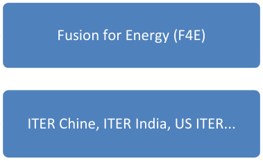

**----- Start of picture text -----** 
Fusion for Energy (F4E) ITER Chine, ITER India, US ITER... **----- End of picture text -----** 

**Figure 0-1 : Organizations overview** 

_11_ 

Among the international institutions working on fusion reactors, the CEA is one of the major players. CEA’s responsibilities include, within the European Commission, the design of the HCLL breeding blanket (Helium Cooled Lithium Lead) (see vi) and its mock test for ITER, the TBM (Test Blanket Module). In addition to working on projects for Tore Supra(7), ITER and JET, one of the objectives of the CEA is the creation of a system code that takes into account all the physics involved in a thermonuclear fusion reactor in order to simplify the design process. 

In parallel of F4E, there is also the European Fusion Development Agreement (EFDA) which coordinates research about fusion within the European Union. _This is an agreement between European fusion research institutions and the European Commission to strengthen their coordination and collaboration, and participate in collective activities. EFDA activities include coordination of fusion physics and technology research in EU laboratories, the exploitation of the world’s largest fusion experiment, the Joint European Torus (JET) in the UK, training and career development in fusion and EU contributions to international collaborations. [4]_ 

## **iii. Thesis topic in the context** 

In the report _Decision of the governing board adopting the project plan (Edition 2010) of the European Joint Undertaking for ITER and the development of fusion energy_ , we can read: 

_“DEMO Design_ 

_The activity has two phases:_ 

- _Phase One: Analyze common elements for DEMO (2007-2010)_ 

- _Phase Two: Develop Potential DEMO Designs (2011-mid 2017)_ 

_Phase One activities have so far been conducted by a number of workshops/meetings. At the end of Phase One, a major review took place to recommend specific goals for Phase Two, and a small group of experts outlined a proposal for Phase Two joint activities. Proposed Terms of Reference for DEMO Design Activities (DDA) are to be presented at the BASC in December 2010. The joint work would be organized as follows:_ 

- _Phase Two-A, Jan 2011-Dec 2012: Consolidation of knowledge, to define a sound common basis for DEMO design, definition of priorities for R&D tasks_ 

- _Definition of design criteria and cost models_ 

- _Analysis of key design issues and options and launch preliminary work_ 

- _**Preparation and start implementation of system design code**_ 

- _Phase Two-B, Jan 2013-Dec 2014: Detailed studies_ 

- _Follow-up work on key design issues and options and narrow down design options on which concentrate further analysis work_ 

- _Adjustment of Design Criteria, Design Equations, and cost models_ 

- _Evaluation of sets of DEMO parameters as a function of uncertainties_ 

- _Preparation of intermediate documentation._ 

- _Phase Two-C, Jan 2015-Jun2017: Development of pre-conceptual design options for DEMO_ 

- _Develop integrated conceptual design/work final review and_ 

- _Preparation of final documentation._ 

_It is expected that this design activity will also suggest specific R&D activities, some of which would be carried out on ITER, or on the Satellite Tokamaks (JT-60SA) and other facilities.” [F4E10]_ (5) 

CEA participates to European reactor studies aiming to define a power plant as a whole system, therefore integrating various aspects intervening in its design (plasma physics, handling, heating and current drive systems, coils, breeding blankets ...). A CEA working group has been namely created: GEDEMO (Groupe d’Etudes du réacteur à fusion de DEMOnstration) in this frame. One of GEDEMO objectives is to build a system code for the pre-design of a fusion reactor, i.e. a computational tool that integrates in a coherent way various tools specialized on the dimensioning of various aspects of a reactor. In such a type of tool the rapidity of execution and flexibility play an important role. For this reason, models aim to estimate trends more than to finely describe concerned phenomena. 

Some of the modules of this system code are already available (plasma physics, coils design…) while the neutronic module is missing. So far, in fact, the approach has been to perform neutronic calculations on the Tokamak designs provided by the plasma physics and coil design teams using Monte Carlo simulations that can take weeks. This approach does not lend itself to integration in a system code. It is therefore necessary to find a completely new approach to neutronic calculations in order to create a neutronic module that can be fitted in a system code. 

**In this frame the scope of this study was to develop a tool able to assess fair-enough calculations on the main neutronic parameters that are concerned in the design stage of a thermonuclear fusion reactor.** 

_13_ 

## **iv. Host organization** 

The CEA is the French Alternative Energies and Atomic Energy Commission (Commissariat à l’énergie atomique et aux énergies alternatives). It is a government-funded technological research organization established in 1945 by General de Gaulle. The CEA is active in four main areas: low-carbon energies, defense and security, information technologies and health technologies and is based in ten research centers in France. 

This final thesis took place in a laboratory called _Laboratoire de Protection, d’Études et de Conception_ (LPEC) in the CEA Saclay Center. Besides its historical activity on fission reactors simulation focused on the development and improvement of Gen III and Gen IV reactors, radioprotection, neutron fluence on the cuve and the study of RIA’s (reactivity initiated accidents); part of the laboratory work is focused on the design of other experimental devices such as a Test Blanket Module for ITER, the design of radioactive waste transport casks as well as the design of experimental irradiation devices for the reactor Osiris… This laboratory is under the authority of a section called the SERMA (Service d’Etudes des Réacteurs et de Mathématiques Apliqées) which is also under the authority of a department called the DM2S (Département de modélisation des systèmes et structures). This department is under the direction of the DANS (Direction déléguée aux Activités Nucléaires de Saclay) which is also under the direction of the DEN (Direction de l’Energie Nucléaire). 

## **v. Brief introduction to fusion reactors** 

The goal of a fusion reactor is to exploit the energy released by a fusion reaction to produce electricity. Among the possible reactions, the reaction considered here is that between deuterium and tritium (because it is the easiest to implement and control): 

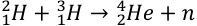

This reaction is achieved in a deuterium-tritium plasma where high temperatures and high neutron fluxes are present. The plasma confinement is the most challenging part involved in a thermonuclear fusion reactor. The plasma physics studies the confinement of the plasma which is achieved using superconducting coils that will generate high fields (up to 5.3 T  in ITER) up to ~10T in DEMO). 

However, tritium is a rare isotope and industrially very expensive to manufacture, so the fusion reactors have a component called breeding blanket responsible for generating tritium in order to 

maintain the fusion reaction. The breeding blanket is made out of a lithiated material that when subjected to a neutron flux from the plasma produces tritium according to the reactions: 

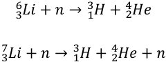

The breeding blanket is also responsible for converting the energy of neutrons in heat operable to generate electricity, and, protecting the superconducting coils against damage due to irradiation by neutrons. 

## **vi. Presentation of the HCLL DEMO thermonuclear reactor** 

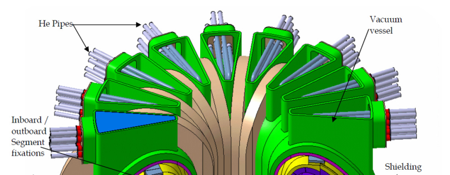

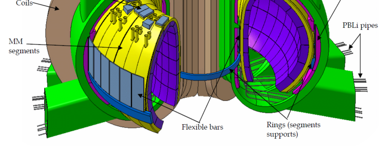

**Figure 0-2 : CEA HCLL DEMO-2007 Reactor (8)** 

DEMO is based on the 'tokamak' concept of magnetic confinement, in which the plasma is contained in a torus-shaped vacuum vessel. The fuel - a mixture of Deuterium and Tritium - is heated to temperatures in excess of 150 million °C, forming hot plasma. Strong magnetic fields are used to keep the plasma away from the walls; these are produced by superconducting coils surrounding the vessel, and by an electrical current driven through the plasma. 

One of tritium breeding blankets being studied in Europe as possible candidate for a fusion reactor is the HCLL blanket. This coverage uses lithium-lead (LiPb) as a generator and carrier of 

_15_ 

tritium and neutron multiplier, helium as a coolant and a low-activation martensitic steel, 

Eurofer, as structural material. 

Blanket modules (in purple) extract heat from thermal loads, provide shielding from the highenergy neutrons produced by the fusion reactions and achieve tritium self-sufficiency. 

_17_ 

## **1. Introduction** 

The creation of a system code for the design-stage of a thermonuclear fusion reactor requires the creation of a neutronic module that performs calculations on the basic neutronic parameters and constraints. Within this context the utilization of neutronic models such as Monte Carlo or deterministic simulations is not foreseeable due to integration complexity and long computation times. It is therefore necessary to use a different method based on response functions that permits an easy integration and instant response. 

The aim of the project is the creation of this parameterizable response function that given a certain Tokamak configuration, in terms of geometry, materials, and spatial disposition, is able to calculate some important and necessary parameters for the design stage of a Tokamak: the tritium breeding ratio (TBR), deposited energy and the fast neutron flux on the inboard magnet. 

It should be pointed that the model developed here is only a pre-design tool and it should be used only in the design stage to prevent long design iterations involving different services, laboratories and teams. Therefore the program should not be used to make accurate and precise load but to get good-enough results that simplify the design stage of the different parts of the Tokamak. 

The study has been performed in different stages that lead to the final response function that will be introduced in the system code. The steps involved in the creation of the response function are shown in Figure 1-1. After presenting the methodology and tools used during the project on chapter 2, creation and validation of physical models are done on chapters 3 and 4, plans of experience are detailed on chapter 5 and response functions are done on chapters 6 and 7. An environmental impact is also presented on chapter 8. 

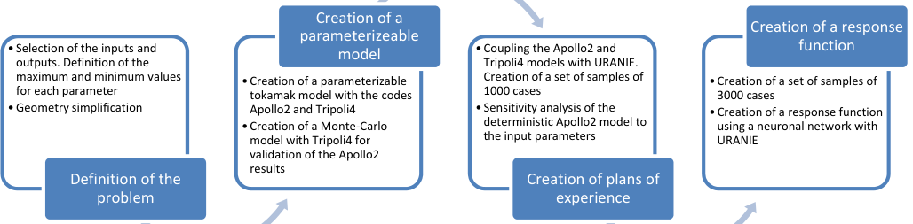

**----- Start of picture text -----** 
Creation of a Creation of a response parameterizeable •Selection of the inputs and  model •Coupling the Apollo2 and  function outputs. Definition of the  Tripoli4 models with URANIE. maximum and minimum values  •Creation of a parameterizable  Creation of a set of samples of  •Creation of a set of samples of for each parameter tokamak model with the codes  1000 cases 3000 cases •Geometry simplification Apollo2 and Tripoli4 •Sensitivity analysis of the  •Creation of a response function •Creation of a Monte-Carlo  deterministic Apollo2 model to  using a neuronal network with model with Tripoli4 for  the input parameters URANIE validation of the Apollo2 results Definition of the  Creation of plans of problem experience **----- End of picture text -----** 

**Figure 1-1 : Stages involved in the creation of a response function using a neuronal network** 

_19_ 

## **2. Methodology** 

In this section the methodology and steps followed to obtain a surrogate model will be presented. The approach will be first described referencing the programs and tools that have been used in our particular case to solve each of the steps, then a general description of the tools will be done. 

## **2.1. Approach** 

The objective of the project being the creation of a neutronic module that can be easily integrated in a system code for the pre-design stage of a thermonuclear fusion reactor, a response function based on neural network has been created. Zooming out, this module needs to relate geometries, material compositions and plasma physics variables to key neutronic parameters. The ideal neural network should work as shown in Figure 2-1. 

**Ideal response function** Input design parameters Ideal neural network which gives a Output design parameters unique and optimized solution Criterions (geometry restrictions, material compositions, ..) 

**Figure 2-1 : Flowchart showing the ideal behavior of the response function** 

The process that allows us to obtain a response function consists on many different stages involving different programs, tools and competences. The steps followed in this study can be applied to almost any engineering problem with similar characteristics, the main restriction being the model that represents the physics of the problem. 

## **2.1.1. Selection of a physical model for the proposed problem** 

In order to create a response function using neural networking it is imperative to possess a physical model that describes the studied model’s physics. The calculation method used by the model, the physics behind it or the accuracy of the program are not relevant to the creation of a response function, the neural network will _copy_ the results obtained by this physical model by creating a neural network that adapts itself to it. This physical model is then a black box that 

gives us the answer to a given problem. The accuracy of the original program will be a characteristic of the created response function. 

A representation of what this physical problem should do is done in Figure 2-2. 

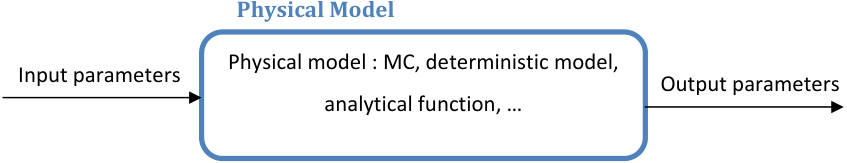

**----- Start of picture text -----** 
Physical Model Physical model : MC, deterministic model, Input parameters Output parameters analytical function, … **----- End of picture text -----** 

**Figure 2-2 : Flowchart showing the behavior of the physical model that will be used** 

One could be skeptic about the necessity of a response function if a physical model represents the problem and gives us a more accurate result. Just as it is true that a physical model can be parameterized and is more accurate than a response function that adapts itself to a given model, the difficulty to integrate a physical model based on a complex scientific program in a system code and its long computation times makes it complicate and difficult to envisage this solution. 

Nevertheless some conditions need to be fulfilled by the physical model: modifications have to be introduced to make it parameterizable, it needs to have reasonable calculation times in order to create a plan of experience of 1.000 to 10.000 cases and it needs to be based on a physical problem to be represented by a neural network. 

In our case, previous studies (9) shown that an acceptable method to represent a Tokamak model given the imposed restrictions (parameterizability, calculation time, accuracy, …) is a deterministic model using a 1D or RZ geometries. This model will be created with the code Apollo2 (see section 2.2.1) and validated with the Monte-Carlo program Tripoli4 (see section 2.2.2). Another Monte Carlo Tripoli4 model will be also used to calculate the deposited energy on the tokamak’s layers due to the restrictions imposed by the deterministic model. The creation of the physical models will be described in chapter 3. 

## **2.1.2. Creation of a plan of experience** 

The next step after the creation and validation of the physical model is the creation of a plan of experience, or in other words, perform a large number of calculations varying the input parameters in order to study the impact on output parameters. 

_21_ 

The first stage that will guide us to the creation of this set of samples is the definition of the operating window of each of the input parameters. The minimum and maximum values of each parameter need to be previously defined; in this case it has been done in collaboration with breeding blanket, plasma physics and coils experts to study a wide range of possible tokamak configurations.  Discretization of the possible values in the space will be performed following the Uniform Law in order to cover the whole space between the variation limits. For example, the histogram for a given input variable that can oscillate between the limits ��2,3� following a Uniform Law with 300 entries would look like the one shown in Figure 2-3. The main characteristic of this method is that each of the possible values of the variable has the same probability than the others, so we can evaluate the performance of our physical model within the whole space of phases. 

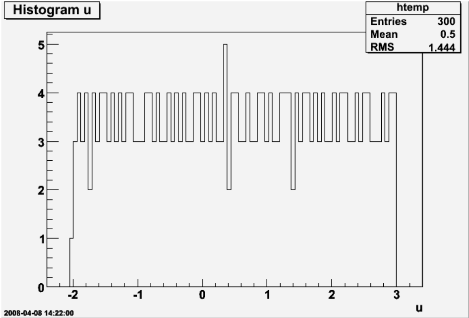

**Figure 2-3 : LHS sampling with a size of 300 entries following a Uniform Law** 

It can be interesting to use other distribution laws such as the Normal Law in order to study the performance of the physical model in a given region of the space that has a greater probability than another. Our goal being the creation of a set of samples that covers the whole operating zone, the Uniform Law has been used. 

Normally the physics involved in an engineering problem is complicated and depends on more than one parameter. This being the case in our problem, the strategy will be to create a set of 

samples that covers the full space of phases following a Latin Hypercube Sampling (LHS) (10) technique that consists on applying a Uniform Law for each of the variables. For example in Figure 2-4, the two variables � and � are uniformly distributed in the space and cover the full space of possible solutions following a LHS distribution. The same approach needs to be followed but in a space of � dimensions, � being the number of input parameters. 

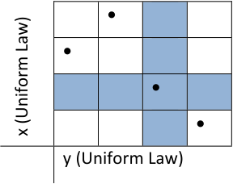

**----- Start of picture text -----** 
• • • • y (Uniform Law) x (Uniform Law) **----- End of picture text -----** 

**Figure 2-4 : Example of application of LHS application with two variables** � **and** � **following a Uniform Law** 

This large plan of experience of input parameters will be tested in the parameterized physical model and the results of each case will be collected and stored in the same database. The result is the creation of a set of samples, a large database where input and output variables are stored in columns and samples are stored in rows. 

It is difficult to determine the number of cases needed to obtain a reliable plan of experience. It depends on the complexity of the physics, the variation limits and the reliability of the physical model. In our case we will be working with samples of 1.000 to 10.000 cases. Various tests have been performed and showed that these constitute indeed a good compromise between achieved accuracy and computation time. 

In order to create this plan of experience we have used a tool called Uranie (see 2.2.3). This program allows to automatically create the set of samples, launch the physical model to perform the calculations, recuperate the values of the output parameters and store all these values in a database object called TData Server, an object that will be directly used to create the surrogate model. 

## **2.1.3. Sensitivity analysis and creation of a response function** 

Once the plan of experience is created we have all necessary elements to create a surrogate model based on a neural network. Prior to that, and even if it is not imperative, it is useful to study the sensitivity of the output variables to the input parameters, or the variation of a certain output variable given a change in an input parameter. This will allow identifying those 

_23_ 

parameters whose impact on output variables is negligible (at least in the considered operating window). 

This sensitivity analysis can be done using different methods; in our case we will use a “Brute Force” method, in which a base case simulation is performed, and then the simulation is repeated using a change in some model input(11). The impact of each input parameter on each variable can be plotted as shown, e.g., in Figure 2-5. This kind of figure allows studying the physics behind the problem and verify expected trends; in this case, as expected, a reduction of the neutron flux in the external layers of the tokamak is observed when the thickness of a middle layer, the shield, is incremented. In order to compare the impact on the response of input parameter we will use the sensitivity indexes of each of the variables. Sensitivity indexes are compared to understand the implication of each variable on the result (Figure 2-6). In this case the analysis allows affirming that the thickness of the shield, the thickness of the vacuum vessel and the compositions of both the first wall and the breeding zone have a great impact on the estimation of the neutron flux on the toroidal field coils. 

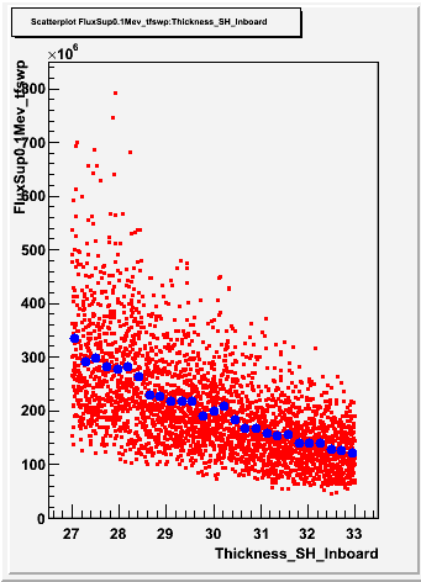

**Figure 2-5 : Variation of the peak neutron flux as a function of the inboard shield thickness** 

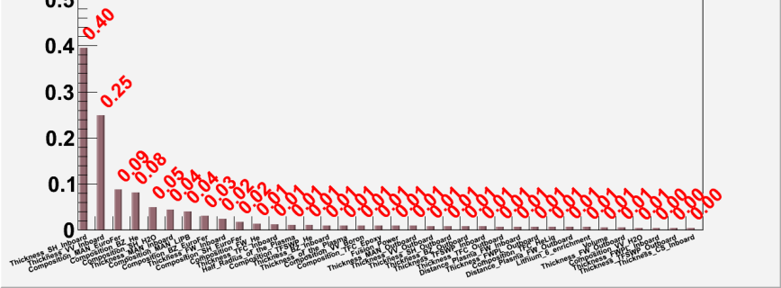

**Figure 2-6 : Sensitivity indexes of input parameters on the neutron flux** 

After creating both neural networks with a reduced number of variables and with the whole set of variables, we decided to keep all the original input parameters in the creation of our neural network because the performance of the neural network is almost the same keeping all the variables in our final response function. This will avoid neglecting some of parameters which are “negligible” in the set of operating windows here considered, which could become relevant if operating windows were different. 

The last stage of the approach is the creation of a response function based on a neural network. At this point it is imperative to use a program that allows us to create neural networks that are able to automatically _learn_ and are capable of creating a response function for a given set of inputs and outputs. In our case we use the library Modeler of Uranie. 

The plan of experience defined in 2.1.2 is recuperated and introduced into Uranie, where the neural network is created. The theory behind the neural network creation is behind the scope of this report and will not be repeated here, a short explanation can be found in chapter 6; one of main points to retain is that some hidden layers are introduced between the output variable and the input parameters, each layer having a defined number of neurons or points that try to define the physics that relate the inputs and outputs. It is necessary to try to prevent the overlearning 

_25_ 

of the neural network, a common phenomenon that adapts the neural network to the given set of samples but does not learn the physics behind the problem. In order to avoid this situation, dozens of neural network need to be created, named trials, evaluating its performance against the original set of samples and another set of samples called “test”. This “test” set of samples is introduced in the neural network and estimations are benchmarked with the original results obtained with the physical model. Overlearning is avoided thanks to this methodology. 

The result obtained with Uranie, and most of the programs used to create neural networks, is a program, such a C++ function, that can run in any computer. This program can easily be integrated in the reactor system code. It is important to note that one neural network will be identified for each variable, so we need to create as neural networks as output variables in the problem. 

To evaluate the performance of the neural network some indicators have been selected, which give the “quality” of results obtained by the neural network with regard to those obtained by the original physical model. Those parameters are: 

- Standard deviation between the physical model and the neural network 

- Standard normalized deviation between the physical model and the neural network 

- Average deviation between the physical model and the neural network 

- Absolute average deviation between the physical model and the neural network 

- Maximum deviation between the physical model and the neural network 

- Maximum normalized deviation between the physical model and the neural network 

Taking into account all these parameters, we need to select the best neural network. A graphic method can also be used which consist in plotting the results obtained with the neural network against the original physical problem. If the neural network represents accurately the physics of the problem the result would be a perfect line as shown in Figure 2-7. 

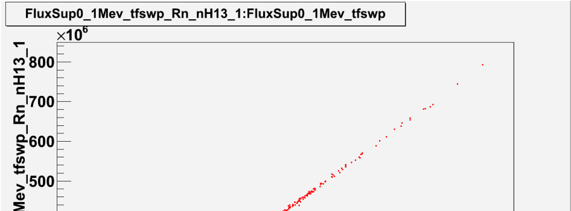

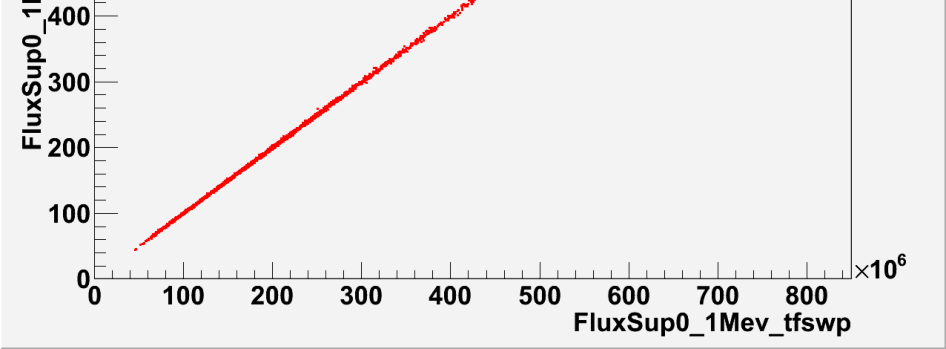

**Figure 2-7 : Plot of the radial neutron flux obtained with the neural network against the radial neutronic flux obtained with the physical model** 

After following steps presented before, the result is a set of functions represented by C++ programs that given a certain configuration of our initial engineering problem give the output parameters defined in the first stage. These programs run fast and in any up-to-date computer, and are easy to integrate in any system code. The performance of the response function depends on the neural network (standard deviation, average deviation, …) and the performance of the original physical model used to build the neural network. 

## **2.2. Presentation of the codes and tools** 

Different codes and tools were used during the project to attain the expected results. These programs are developed by the CEA DM2S teams, thus permit us to be in direct touch with the developers and allows us to have access to all the documentation and previous works performed with these codes. A brief presentation of the codes is done in this section but each of the programs will be further presented during the report as they are used to resolve our particular problem. 

_27_ 

**2.2.1. Apollo2** 

In a certain physical medium, the angular neutron flux ����, �, Ω[���] � of energy � located at a given position �� and directed along the angle Ω[�][��] obeys the Boltzmann equation: 

Ω[�] ��� **�** �����, �, Ω�����Σ����, ������, �, Ω���� 

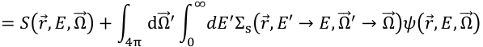

where Σ����, �� is the macroscopic cross section of reactions on �� involving neutrons of energy � , ����, �, Ω[���] � is the source term, and Σ����, ����, Ω[���][�] �Ω[���] � is the macroscopic cross section of reactions on �� which produce neutrons of energy � directed along Ω[���] from neutrons of energy �� and directed along Ω[���][�] . 

APOLLO-2 (12) solves the Boltzmann equation numerically, using discretization in space, energy and solid angle. We will come back on this last particular discretization which involves cutting the energy continuum in a number of groups and define the average cross sections for each reaction. The values of these average cross sections are grouped in libraries. 

APOLLO-2 calculations reported hereafter were performed using the SN discrete ordinates solver, with an angular order S8 and an anisotropy order P3. 

## **2.2.2. Tripoli4** 

Tripoli-4 (13) code is a three-dimensional, continuous energy computer code for particle transport based on the Monte-Carlo method. The code currently treats neutrons, photons, electrons, and positrons. Few physical simplifications are done as it uses the statistical-based Monte-Carlo method. 

Monte Carlo (14) can be used to duplicate theoretically a statistical process (such as the interaction of nuclear particles with materials) and is particularly useful for complex problems that cannot be modeled by computer codes that use deterministic methods. The individual probabilistic events that comprise a process are simulated sequentially. The probability distributions governing these events are statistically sampled to describe the total phenomenon. In general, the simulation is performed on a digital computer because the number of trials necessary to adequately describe the phenomenon is usually quite large. The statistical sampling process is based on the selection of random numbers—analogous to throwing dice in a gambling casino—hence the name “Monte Carlo.” In particle transport, the Monte Carlo technique is pre- 

eminently realistic (a numerical experiment). It consists of actually following each of many particles from a source throughout its life to its death in some terminal category (absorption, escape, etc.). Probability distributions are randomly sampled using transport data to determine the outcome at each step of its life. 

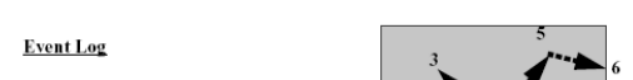

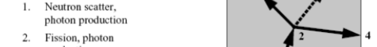

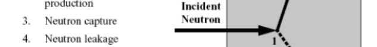

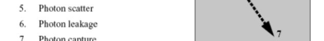

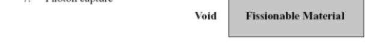

**Figure 2-8 : Random history of a neutron incident on a slab of material that can undergo fission** 

Once the particle history (i.e. Figure 2-8) is complete Monte Carlo methode records some aspects (tallies) of its average behavior. As more and more such histories are followed, the neutron and photon distributions become better known. The quantities of interest (whatever the user requests) are tallied, along with estimates of the statistical precision (uncertainty) of the results. 

## **2.2.3. Uranie** 

Uranie (15) is the uncertainty platform of the CEA/DEN. It allows for studies of propagation of uncertainty, sensitivity analysis and calibration of computer code in an integrated environment. It is based on the framework Root (Version v5.18) developed by CERN for particle physics (analysis of data generated by the LHC ("Large Hadron Collider “)) whose website is root.cern.ch. Thus, Uranie has many features offered by Root, and in particular: 

- A C++ interpreter; 

- Access to the database like SQL; 

- Advanced data visualization; 

It consists of a set of libraries, called libraries _“métiers_ ” (Figure 2-9), each addressing a specific task to take into account the uncertainties or the calibration of computer code. 

_29_ 

**Figure 2-9 : Functional diagram of the libraries** _**métiers**_ 

The central library is the library DataServer and contains the central object of Uranie: the TDATA-Server. This object contains all information required to describe variables (i.e. name, units, laws of probability index in which it is located, etc.) of a problem and it is this object that will "navigate" through the other libraries “ _métier_ s”. 

The library Sampler is used to create a set of samples with the attributes of the TDataServer that are random variables. The aim of the library Launcher is to evaluate a computer code or an analytic function for all the elements of a TDataServer. These elements can come either from a set of samples or an external database (ASCII file, SQL, etc.). The construction of a response surface ("surrogate model") between the "variables of interest y" and the "predictors x" is provided by the library Modeler which are polynomial models, neural networks, etc. 

For the Launcher module, Uranie is based on the library Club (version v9.3) developed by CNES regarding the substitution of parameters in files. 

_31_ 

**3. Creation of a parameterized physical model describing the neutronic behaviors of a thermonuclear fusion reactor** 

As mentioned in previous section (2.1.1) it is necessary to develop a physical model that will be used to create a response function. In our case, one (or more if needed) physical model representing a thermonuclear fusion reactor will be created and validated. This(ese) model(s) needs to be completely parameterized, so that the values of the key input parameters can be easily changed. 

Four neutronic parameters need to be estimated: 

- TBR (see appendix A.5) : The number of tritium isotopes created for each fusion reaction that takes place in the plasma 

- ME (power multiplication factor) (see appendix A.5): total deposited energy on the tokamak for each neutron created of 14,07 MeV. 

- DE (Deposited energy): deposited energy on each of the tokamak layers. In this case the peak deposited energy is calculated: 1D models overestimate the energy deposition (see 4.3.2). 

- Fast neutron flux radial profile (Neutron Flux). In this case the peak neutron flux is calculated: 1D models overestimate the neutron flux (see 4.3.2). 

The complexity of the tokamak’s geometry, represented on Figure 0-2, forces us to develop a simplified model. The simplification that has been used is based on previous studies that show that local parameters, such as peak fluxes or deposited energy, can be represented with an infinite cylindrical geometry while integral parameters, such as the tritium breeding ratio, need to be represented with a more complex two-dimension geometry that takes into account the surfaces and volumes of the original tokamak(9). Keeping this in mind, two models have been built: one model based on concentric one-dimension infinite cylinders and a second model based on a R-Z with closed volumes that conserve the original surfaces of the tokamak. Both models will be used afterwards for the creation of the neural networks. 

Apollo2, a deterministic code, has been used for neutronic analysis chosen for the rapidity of execution. Apollo2 was developed for fission reactors, nonetheless its suitability for fusion has been proven provided that some necessary corrections to the energy deposition. Tripoli4 is also used both for the validation and creation of plans of experience, see section 4.3. 

## **3.1. Parameterization of the Apollo2 model** 

The first condition imposed for the creation of the physical model is the parameterization of this model for all the input parameters. In order to do so, chosen input parameters need to be declared in a certain way so that they can easily be changed, both by the user and Uranie. The declaration is done as shown in Code 3-1. It is also important to give the output results in a certain way so that Uranie can read them, an example of this special writing is given in Code 3-2. 

dr_fw_ib = VALUE 

**Code 3-1 : Declaration of the input parameters on the Apollo2 code** 

Flux_TFSWP_ib = VALUE 

**Code 3-2 : Writing the output variables by the Apollo2 code** 

## **3.2. Geometry definition of the Apollo2 model** 

As mentioned before, two geometries will be used to represent the original tokamak. They will be based on geometrical parameters described in (16). Obtained results will be therefore directly compared with those presented in the report in terms of peak neutron flux and TBR. 

Before the creation of the models it is imperative to define all the input parameters and the operating windows. The results of this study are shown in appendix A.1, where each parameter is defined and named. 

## **3.2.1. 1-Dimension Cylindrical Geometry** 

This model will be used to calculate the peak neutron flux in the different layers or materials of the Tokamak. The neutron flux in the winding package of the inboard coils is one of the key parameters in the design of a thermonuclear fusion reactor and the optimization of this parameter will drive the performance studies. 

A first Apollo2 model was developed using the geometry shown in Figure 3-1. In the model, the different components from the first wall to the coils are represented as homogeneous layers. Thicknesses of layers as well as their material composition are variable parameters. 

The one dimension model represents a cylindrical geometry, with a height of 1 centimeter. The flux is calculated both volume integrated and per unit of volume. 

_33_ 

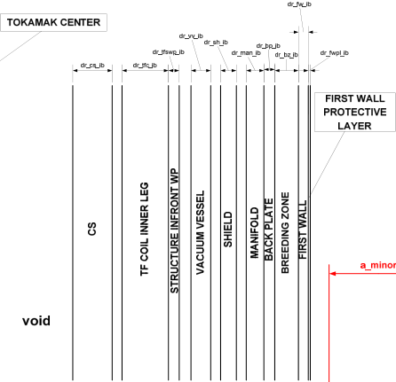

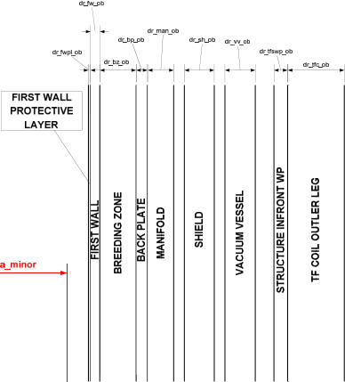

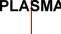

**Figure 3-1 : Geometry represented in the Apollo2 cylindrical model** 

All layers of the tokamak radial build are identified in this model, including the gaps between layers and the gap between the plasma and the first wall protective layer. 

It is also important to note that all output parameters will be scaled in order to obtain the relevant values. The calculated flux, namely, will be normalized to the fusion power, which is �� ��� also an input variable, and the energy deposition will be converted to from the original �[�] ��[�] calculated by Apollo2. 

## **3.2.2. R-Z Square-Based Geometry** 

The second model is used for the calculation of integral parameters such as the TBR or the energy multiplication factor. It represents a vertical section of the tokamak from his axis to the toroidal field coils outer leg. 

Apollo2 presents some restrictions on the creation of complex geometries, keeping this in mind, the geometry used is an R-Z model based on squares that are rotated according to the central axis of the tokamak. The geometry described before is represented on Figure 3-2. Previous studies have shown that the most suitable method to guarantee the equivalence between this 

“squared” geometry ant the real ones is to keep surfaces equivalences between the two geometries. 

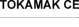

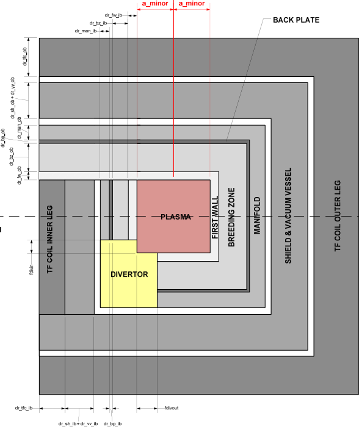

**Figure 3-2 : Geometry of the tokamak used in the Apollo2 R-Z model** 

This geometry presents some big challenges, the greatest one being the transformation of the plasma chamber into a square and the positioning of the divertor regarding the plasma chamber. To solve this problem a program that calculates the width and the length of the square plasma chamber maintaining the original plasma chamber surface and the surface of the divertor that covers the plasma chamber in the inboard and outboard is created. This program takes into account the surface of the divertor in each side and the plasma parameters such as: triangularity (δ), elongation (El), major and minor radii (R0) and (a) of the original plasma chamber. These parameters are used to automatically create the model. 

As observed in Figure 3-2 the model does not detail all tokamak’s layers. The objective of this model is to calculate the TBR and the energy multiplication factor; therefore layers beyond the manifold can be simplified because there is no tritium generation in these external layers, even if 

_35_ 

they need to be represented to maintain the neutron reflections. This will allow to considerably reduce the calculation time. 

## **3.3. Materials’ compositions and definitions** 

After the definition of the geometries it is necessary to identify the different materials. In this case material compositions have been parameterized so that the effect of the variation of the material’s composition (due, e.g., to geometry variations) can be observed in the output variables. Both the 1D model and the RZ model will use the exact same compositions for each layer except for the shield and vacuum vessel in the RZ model, where a mixture of 50% of both compositions is used on the shield-vv layer. 

The strategy followed to identify the materials was to create some basic compounds that afterwards will be combined to create the mixtures and alloys of each layer. In this case we used as reference the same compounds as in (16), in order to easily compare, as mentioned before, obtained results. 

The basic compounds, Table 3-1, have been defined with great accuracy, using the chemical composition of each material, after having defined each chemical element according to its natural isotopic abundance. 

|**Symbol**|**Definition**|
|---|---|
|**void**|Void|
|**eufer**|Eurofer|
|**lipb**|Lithium-Plomb|
|**ss316**|Stainless steel 316|
|**w**|Tungsten|
|**wc**|Tungsten Carbide|
|**h2o**|Water|
|**he**|Helium|
|**boron**|Boron|
|**cu**|Copper|
|**bronze**|Bronze|
|**nb3sn**|Niobiun-tin|
|**epoxy**|Epoxy|
|**heliq**|Liquid Helium|

**Table 3-1 : Basic compounds used in the creation of the tokamak’s materials** 

For each of mixtures and alloys the maximum and minimum values of the percentage in volume of each basic material have been defined, these being the input parameters. Reference values are summarized on Table 3-2, the detailed table of values and names can be found on appendix A.2. 

**Table 3-2 : Materials’ compositions for each of Tokamak’s layers** 

The composition for the central solenoid is not yet clear, but it has no repercussion on the calculations that will be performed as they are beyond the coils in the inboard side. 

The percentage of minority compounds is explicitly defined, determining the percentage of the most common compound for each layer by substraction, i.e.: in the case of the breeding zone the percentage of both Eurofer and helium is defined and parameterizable while the percentage of lithium-lead is automatically calculated. 

## **3.4. Source definition** 

One of the key aspects that affect the performance of the Apollo2 model is the definition of the source (17). Energy of neutrons created on a fusion reaction follows a Gaussian distribution centered on 14,07 ��� . Different energy grid will be used and tested in order to asses the impact on obtained results. Apollo2 does not allow to define a continuous-energy source, 

_37_ 

instead a meshing of the neutron source needs to be performed. The source used will have a ������� power of 1 ~~.~~ ������ 

It is important to keep in mind that the objective is to find a compromise between the performance of the code and the calculation time. In regard of that, the objective will be to use lowest number of meshes to define the source keeping accurate results. 

## **3.4.1. Energy spectrum** 

Based on the original Gaussian distribution of the neutron source we consider here four energy grids: ecco1968, RNR1200, RNR600 and RNR300. Those energy grids have 1968, 1200, 600 and 300 groups respectively. These meshes were originally defined for the study of fast neutron reactors (FNR) (18); the energy groups present fine discretizations from energies close to 14,07 ��� to 0,1 ��� , which allows a better energy distribution and a better representation of physic phenomenas such as neutron slow down or threshold reaction. From those energy grids, the energy groups covering the energies under the Gaussian distribution for the fusion neutrons are chosen. The chosen groups are presented in Table 3-3. 

|**Energy grid**|**Scope of the group (MeV)**|**Energy groups chosen**|
|---|---|---|
|**RNR300**|12,944357 - 15,255644|4 to 5|
|**RNR600**|12,2957759 - 15,3880675|8 to 14|
|**RNR1200**|12,7037249 - 15,3880675|13 to 22|
|**Ecco1968**|12,5 - 15,30|32 to 50|

**Table 3-3 : Selected groups of each energy grid for source definition** 

When passing from an energy mesh to another less fine, two effects are taken into account: the first is the spectral broadening of the source and the second is the fineness of the mesh itself, namely the impact of averaging coarser mesh on the calculation algorithm. These two effects are shown on Figure 3-3. 

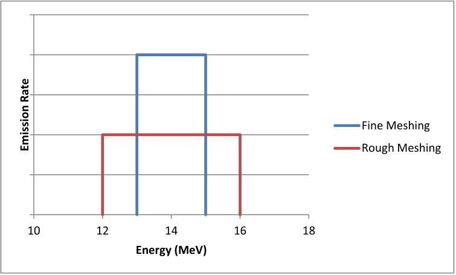

**----- Start of picture text -----** 
Fine Meshing Rough Meshing 10 12 14 16 18 Energy (MeV) Emission Rate **----- End of picture text -----** 

**Figure 3-3: Spectral broadening of a source centered on 14,07 MeV** 

Energy grids only provide information regarding the division of the source in energy groups, but in order to create an energy spectrum it is necessary to define the emission rate of each of those groups. The calculation of the emission rate for each of the concerned energy groups of each energy grid is done based on a prior work(19) that defined precisely the energy spectrum emitted by a fusion reactor. A python program has been created to calculate these emission rates; based on the reference Gaussian-distributed energy spectrum the program weights the original emission rates to the energy grids considered here calculating the emission rates for each energy group. 

Energy spectra of the source for each of energy grids have been plotted on Figure 3-4, Figure 3-5, Figure 3-6 and Figure 3-7, where they are compared to the Gaussian distribution of the fusion neutrons. These figures give a visual idea of the lost information when using rough grids. 

_39_ 

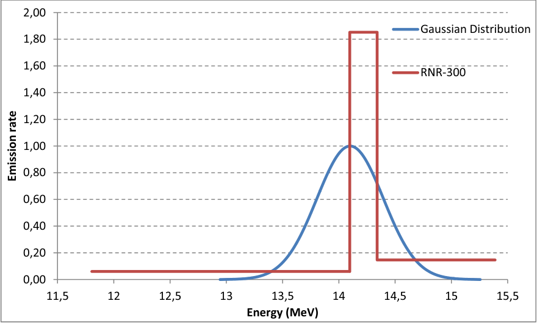

**----- Start of picture text -----** 
2,00 Gaussian Distribution 1,80 1,60 RNR-300 1,40 1,20 1,00 0,80 0,60 0,40 0,20 0,00 11,5 12 12,5 13 13,5 14 14,5 15 15,5 Energy (MeV) Emission rate **----- End of picture text -----** 

**Figure 3-4 : Emission spectrum of the source for RNR300 energy grid. A correction on the emission rate has been performed in order to assure the value of the integrate emission rate** 

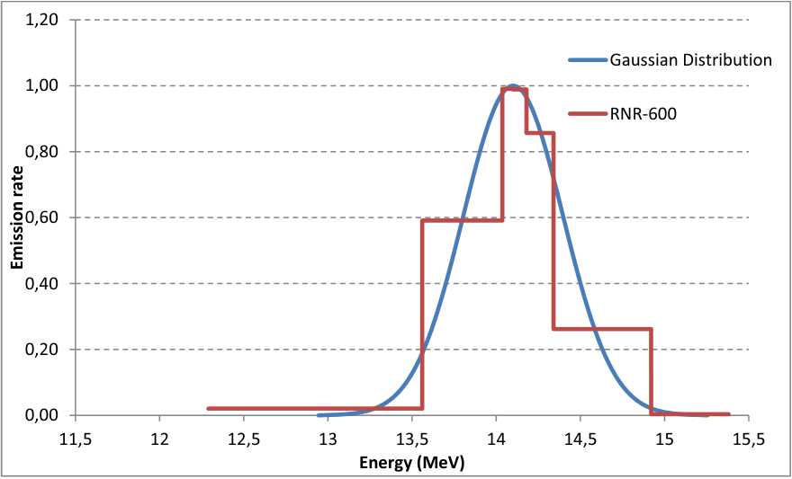

**----- Start of picture text -----** 
1,20 Gaussian Distribution 1,00 RNR-600 0,80 0,60 0,40 0,20 0,00 11,5 12 12,5 13 13,5 14 14,5 15 15,5 Energy (MeV) Emission rate **----- End of picture text -----** 

**Figure 3-5 : Emission spectrum of the source for RNR600 energy grid** 

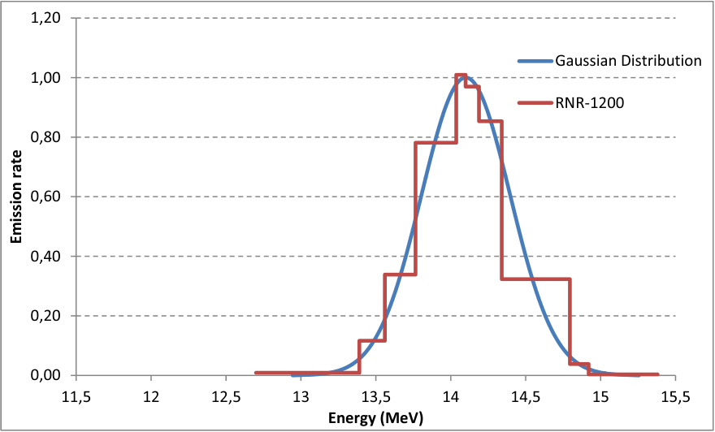

**----- Start of picture text -----** 
1,20 Gaussian Distribution 1,00 RNR-1200 0,80 0,60 0,40 0,20 0,00 11,5 12 12,5 13 13,5 14 14,5 15 15,5 Energy (MeV) Emission rate **----- End of picture text -----** 

**Figure 3-6 : Emission spectrum of the source for RNR1200 energy grid** 

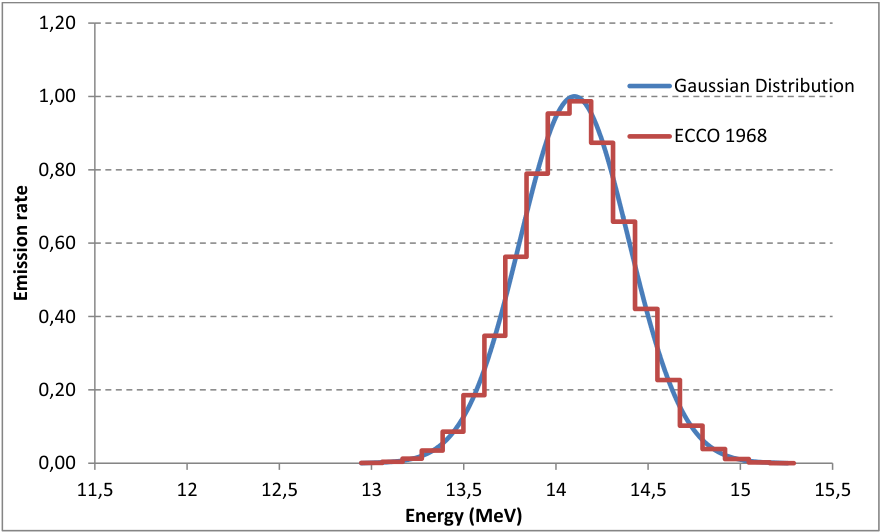

**----- Start of picture text -----** 
1,20 Gaussian Distribution 1,00 ECCO 1968 0,80 0,60 0,40 0,20 0,00 11,5 12 12,5 13 13,5 14 14,5 15 15,5 Energy (MeV) Emission rate **----- End of picture text -----** 

**Figure 3-7 : Emission spectrum of the source for ECCO1968 energy grid** 

_41_ 

## **3.4.2. Spatial Spectrum** 

In addition to the energy spectrum, it is important to study the influence of the spatial distribution of the source. The neutron source intensity will be higher at the center of the plasma, so we should design a source of stronger emission rate in the center of the fusion chamber. Nevertheless, previous studies (17)(20) show that the difference in terms of TBR between a homogeneous source and a spatial distributed source are in the range of 1%. Nevertheless the spatial distribution of the source has greater impact on local parameters such as deposited energy or neutron flux, because the poloidal distribution of the energy is not taken into account. As the peak neutron flux and peak deposited energy are present on the middle plane of a 3D tokamak, neutron flux and deposited energy estimated on this project represent the highest values achieved on a tokamak.  Homogeneous spatial-distributed sources seem therefore adequate for this study. 

## **3.5. Energy corrections and gamma transport** 

Because of the deterministic code Apollo2, the cross-sections libraries are designed to work in the range of fission energy neutrons. This characteristic poses some problems when performing calculations on deposited energy. Some manual corrections will be done on the calculated deposited energy. 

Apollo2 considers that when a neutron experiences a nuclear reaction in a given material, it deposes all its energy on this material. However this is not true in the case of endoenergetic reactions suffered by the neutrons. This kind of reaction consumes energy and therefore decreases the deposited energy in the tokamak. The deposited energy due to neutron reactions in each layer of the tokamak, will be therefore corrected to take into account this issue for some neutronic reactions such as ��, 2�� , ��, �� , and ��, �� . In addition, the gamma transport is not considered, meaning that a gamma created on a layer will deposit all its energy in this layer, when in many cases this gamma ray can travel through the tokamak and interact somewhere else (see later section 4.4). 

## **3.6. Scores and result post-treatment** 

Once the parameterized geometry and material compositions are defined and the source is defined it is necessary to create the scores, Apollo2 results. These scores are not always calculated in the expected units, and some post-treatment is needed. Score definition and posttreatment for each variable are presented below. 

## **3.6.1. 1D Model** 

The 1D model is used for calculation of local phenomena, the deposited energy and the local radial flux. These two parameters need to be normalized to the real fusion power of the ������� tokamak. Apollo2 model calculates variables for a source of 1 , so it ���������������� ��������� 

is imperative to apply a normalization factor, the number of neutrons for the given fusion energy of the reactor, to calculated results, as detailed on Equation 3-1. This normalization is done outside Apollo2, so that the fusion power is not a parameter of the program and is not taken into account in the creation of neural networks. 

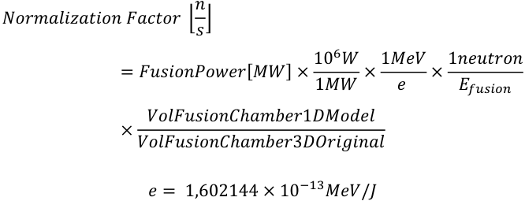

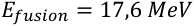

## **Equation 3-1 : Normalization factor applied to the deposited energy and neutron flux** 

**Deposited energy:** The deposited energy is a parameter directly calculated by Apollo2. This deposited energy will be differentially calculated, meaning that the result is not dependant on �� the volume of the layer. In our case we decided that the output must be expressed on from �[�] ��� the original calculated by Apollo2; the change of units is detailed on Equation 3-2. ��[�] 

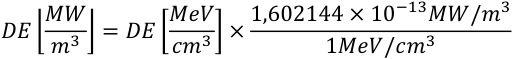

## **Equation 3-2 : Change of units applied to the deposited energy** 

**Neutron flux** : the neutron flux is directly calculated by Apollo2. The score is obtained directly in ������� differential form in ~~.~~ No special post-treatment is needed for the radial flux calculation ��[�] �� beyond the application of the normalization factor. Neutron flux on the inboard toroidal fields is a critic measurement for a thermonuclear reactor due to important impact of high neutron fluxes on physical properties of the superconducting materials used on the coils. Obtaining a good neutron flux resolution on the inboard coils guides then the selection of the model. 

_43_ 

## **3.6.2. RZ Model** 

This Apollo2 model is used for the calculation of integral parameters such as the tritium breeding ratio and the multiplication factor. The scores leading to these two magnitudes are presented below. 

**Tritium breeding ratio** (see Appendix A.5): the tritium breeding ratio is defined as the number of tritium isotopes created on the breeding zone for each tritium consumed on a fusion reaction. The score that permits the calculation of the tritium production on Apollo2 is defined as the rate of nuclear reactions between neutrons and lithium on the breeding zone. As the source is defined as 1 neutron per second and each neutron comes from the fusion of a tritium and deuterium, the interaction rate obtained from the Apollo2 simulation is the tritium breeding ratio. 

**Multiplication factor** (see Appendix A.5): The multiplication factor is defined as the total deposited energy by the neutrons on the tokamak due to nuclear interactions divided by the energy of a neutron released in a fusion nuclear reaction. The total deposed energy on the tokamak (corrected for certain isotopes as presented on section 3.5) is divided by 14,07MeV, the typical energy of a neutron released on a fusion reaction between tritium and deuterium. Again, as for the tritium breeding ratio, the total deposited energy is calculated for 1 neutron, so it is not necessary to normalize the results to the source. 

Two parametrizable deterministic Apollo2 models have been created. Those models are capable of calculating the “characteristic” neutronic parameters of a thermonuclear fusion reactor such as the TBR, multiplication factor, deposited energy and the neutron flux. The performances of these models are studied on chapter 4, where a comparison between the different energy meshes will be done. A reference Monte Carlo model will be furthermore used to compare Apollo2 results to those obtained by TRIPOLI4.8 reference model. 

_45_ 

## **4. Validation of the Apollo2 model** 

## **4.1. Comparison between different Apollo2 energy grids** 

After creating the Apollo2 models it is necessary to compare the performances of the models for the different energy grids presented on 3.4.1. These comparisons are not going to define which of the energy grids will be used to create the plans of experience; this will be done by comparing the Apollo2 models to the Tripoli4 reference model. Nevertheless, it is important to study the performances of each of the energy grids to understand the behavior of the model. The study will be done for the 1D model because due to long calculation times the RZ model is limited to the 300 group energy grid. 

## **4.1.1. 1D Apollo2 model** 

This cylindrical one-dimension model is studied for the energy grids Ecco1968(21), RNR1200 and RNR600 (18). Comparisons are done for the neutron flux profile and deposited energy. 

The first analysis is done for the neutron flux in the inboard side of the tokamak. It is important to note that the objective is to obtain a good resolution of the neutron flux in the inboard coils, leaving the rest of the fluxes in a secondary plane. A table containing the fast and slow neutron fluxes is presented on appendix B.1. 

It is interesting to study deviations due to different energy grids compared to the calculation time. This is done in Table 4-1. The neutron flux that will be used from now on is the flux calculated in the first centimeter of each layer. The peak neutron flux in the inboard coils is marked in red in Table 4-1, the peak neutron flux in the toroidal field structure in front of the winding package. Small deviations are observed between different energy grids until the first centimeters of the inboard coils, those are due to the smallest resolution obtained when using less energy groups. Nevertheless, when using large energy grids some convergence problems appear, a performance study will be done comparing those results to the ones obtained with a reference Monte Carlo model to choose the best energy grid in terms of calculation time and performance. The results obtained with Apollo2 models are plotted on Figure 4-1, a figure that shows that deviations due to different energy grids are depreciable when represented in a logarithmic scale. 

## _46                                                                Surrogate model for simplified neutronic fusion calculations_ 

**Table 4-1 : Deviation of the peak neutron fluxes obtained with the 3 Apollo2 models** 

_47_ 

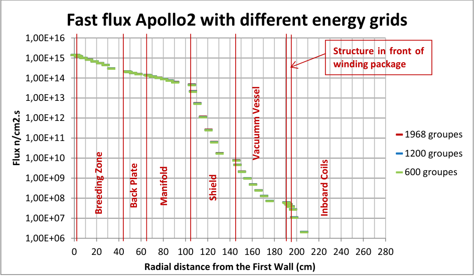

**----- Start of picture text -----** 
Fast flux Apollo2 with different energy grids 1,00E+16 Structure in front of 1,00E+15 winding package 1,00E+14 1,00E+13 1,00E+12 1,00E+11 1968 groupes 1200 groupes 1,00E+10 600 groupes 1,00E+09 1,00E+08 1,00E+07 1,00E+06 0 20 40 60 80 100 120 140 160 180 200 220 240 260 280 Radial distance from the First Wall (cm) Vacuumm Vessel Flux n/cm2.s Shield Back Plate  Manifold Breeding Zone  Inboard Coils **----- End of picture text -----** 

**Figure 4-1 : Radial profile of the peak neutron flux across the inboard estimated with different energy grids** 

Once the study of the deviation in the radial flux deviation is done it is necessary to study the performance of the Apollo2 model in terms of deposited energy. The deposited energy is defined as the average deposited energy in each of the tokamak’s layers per unit of volume. 

**Table 4-2 : Apollo2 deposited energy deviations for each of the energy grids** 

As shown in Table 4-2 (more detailed on appendix B.2) deviations due to different energy grids are not constant and as predictable as for the neutron flux. The reason for this random behavior is bad convergence of Apollo2 for regions with a high percentage of void, such as the vacuum vessel. The conclusion in this case is the same as for the neutron flux calculation, it is necessary to compare this model to a Monte Carlo reference model. It is important to point that a calculation of the deposited energy has been done for the first 10 cm of the breeding zone in order to obtain the maximum deposited energy deposited in the breeding zone to make thermohydraulic calculations. 

## **4.2. Development of a Monte-Carlo model using Tripoli4** 

In order to validate the Apollo2 model a numeric benchmark using Monte Carlo models has been performed. It would be suitable to develop a 3D parameterizable tokamak Tripoli4 model featuring the “real” DEMO geometry. Nevertheless, due to the complexity of this geometry this is difficult. Instead, a 3D Tripoli4 Monte Carlo DEMO model previously developed by (22) is used. A second 1D-geometry Tripoli4 model is developed specially to compare neutron flux results. These two models are described below. 

## **4.2.1. 3D Geometry Tripoli4** 

A model developed in the frame of previous DEMO studies will be used as reference model. This model has been built appropriately importing and modifying a CAD model and it is therefore not entirely parameterizable; only some minor modifications are feasible so the available points for the validation of the APOLLO2 model are limited. The model represents a DEMO thermonuclear fusion reactor with a helium cooled lithium lead breeding zone as conceived on 2007. 

This model is a very accurate representation of the tokamak, including the divertor, blanket modules and shields, and relevant material compositions. A vertical section view is provided on Figure 4-2, while the original CAD 3D model view is available on Figure 4-3 as represented by(20). 

_49_ 

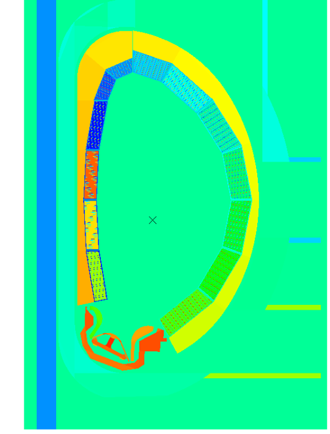

**Figure 4-2 : Tripoli4 HCLL 2007 DEMO reactor model vertical section view** 

Starting from the original Tripoli4 3D model, 6 different geometry configurations  and 3 different lithium-6 enrichment (for the original geometry) have been assessed. The characteristics of these geometries are summarized on Table 4-3. The main difference is the thickness of the breeding zone, a key parameter for the neutronic calculations as the creation of tritium is done on this layer. The Apollo2 model performances are compared to these models.. 

To have more than one validation point the tokamak is divided in 13 sections on the poloidal direction, of 11,25 degrees each. The ME and neutron flux are estimated on each of these sections and the highest value is retained in order to assure that the studied fluxes and deposited energies correspond to the peak ones. 

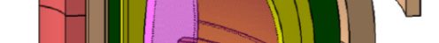

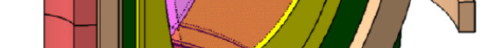

**Figure 4-3 : Generic CAD model of DEMO (22.5◦ torus sector) constructed with CATIA V5** 

**Table 4-3 : Tripoli4 HCLL 2007 DEMO reactor model assessed configurations** 

This Tripoli4 model uses the original Gaussian-distributed source, directly using the results provided in (19). The source presents both an energy distribution and a spatial distribution (corresponding to H-mode plasma), as shown on Figure 4-4, which makes it the realest model 

_51_ 

������� available. Nevertheless, as the source will be defined for 1 a normalization factor for the ������ 

differential variables will be again used, as it is defined on Equation 3-1. 

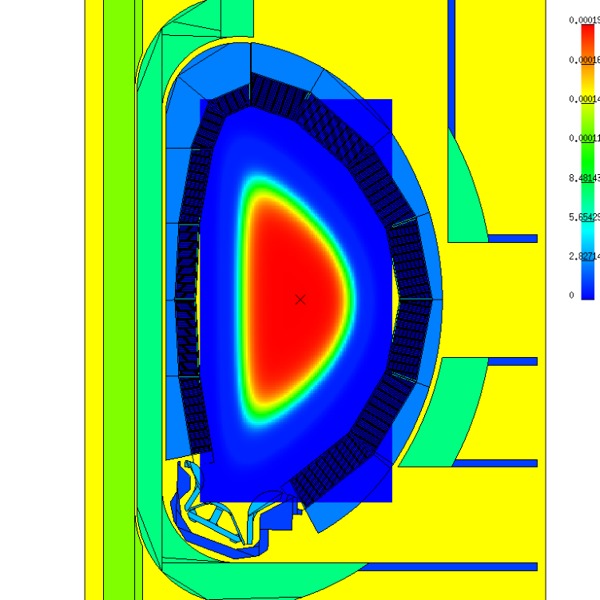

**Figure 4-4 : H-mode spatial distribution of the neutron source density** 

## **4.2.2. 1D Geometry Tripoli4** 

The Tripoli4 3D model presented before is a good reference model but presents some restrictions due to its unparameterizable character. In order to validate the Apollo2 model within larger operating windows a one-dimension cylindrical Tripoli4 model is developed which represents the horizontal section of the tokamak at the equatorial plane . The geometry used to create the Tripoli4 model is the same as in Figure 3-1, except for the height of the cylinders which in this case will be fixed to 200 cm. The scores are calculated as in the Apollo2 model. 

As for the one-dimension deterministic model, this kind of model is not suitable to calculate integral parameters such as the TBR and the multiplication factor. This model will be used to compare differential variables, in particular the peak neutron flux and the deposited energy. The 

normalization factor used in this case is the same as used by the Apollo2 model, shown in Equation 3-1. 

The representation of this Tripoli4 model is shown in Figure 4-5, where all tokamak’s layers are represented in different colors, the blue represents void while yellow represents the plasma chamber. This model is fully parameterizable in terms of geometry, the material compositions are parameterized using python scripts and Apollo2. 

**----- Start of picture text -----** 
Inboard **----- End of picture text -----** 

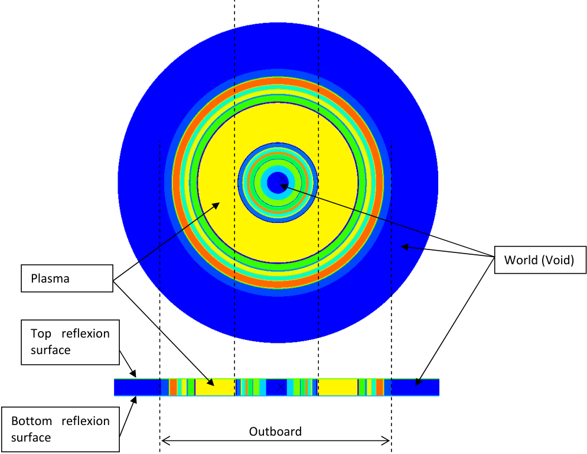

**----- Start of picture text -----** 
World (Void) Plasma Top reflexion surface Bottom reflexion Outboard surface **----- End of picture text -----** 

**Figure 4-5 : Tripoli4 1D geometry model representation** 

**----- Start of picture text -----** 
4.2.3. Neutron and Neutron-Photon simulations **----- End of picture text -----** 

Tripoli4 simulates the neutron flux and energy deposition, but it also secondary photons created 

by nuclear reactions. This option gives more accurate results in terms of deposited energy profile. In this study the two simulations will be done, studying the performance of Apollo2 against a neutron-only simulation or a neutron-photon simulation. 

_53_ 

Nuclear reactions producing photons are important because they introduce a different distribution of the deposited energy: using the neutron-only simulation when a neutron suffers a nuclear reaction in, for example, the breeding zone, it deposites all the energy in the breeding zone; using the neutron-photon simulation when a neutron suffers a nuclear reaction it can create secondary photons capable of traveling through the different layers of the tokamak depositing its energy in the more external layers. Figure 4-6 represents the track of a neutron using a neutron-only simulation, the neutron suffers scattering until it reacts and it deposited all its energy. Figure 4-7 represents a neutron track using a neutron-photon simulation; the neutron suffers a nuclear reaction creating a very energetic photon that travels through the tokamak depositing its energy in deeper zones. Figure 4-8 shows the Tripoli4 behavior with neutronphoton simulations; red tracks represent neutron trajectories while yellow tracks represent photon’s ones, blue points represent neutron collision sites, the length of the track represents the distance travelled by each particle, concluding that the photons have greater speeds than the neutrons, which confirms that photons are more penetrating  than neutrons. 

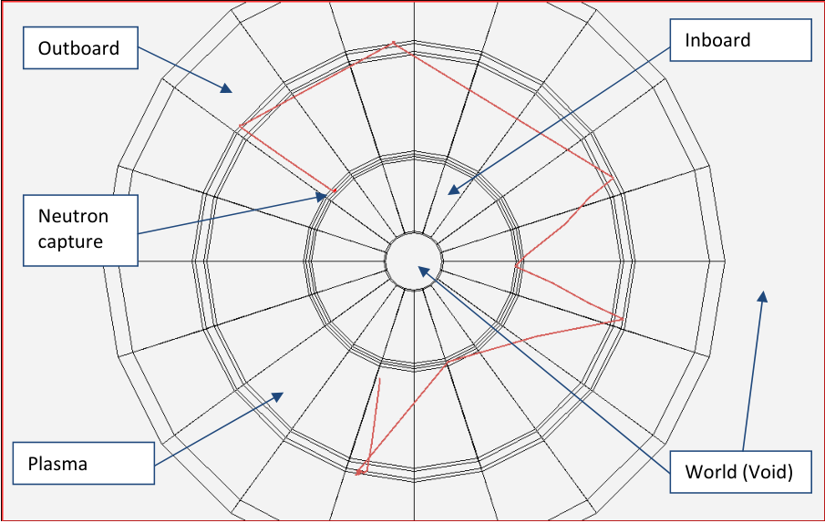

**----- Start of picture text -----** 
Inboard Outboard Neutron capture Plasma World (Void) **----- End of picture text -----** 

**Figure 4-6 : One neutron track simulation in the tokamak (neutron simulation)** 

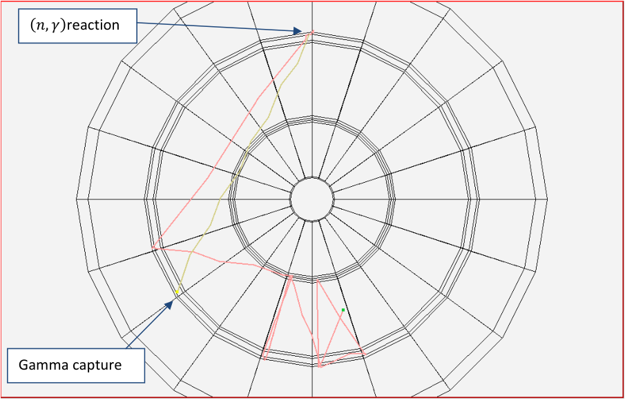

**----- Start of picture text -----** 
��, �� reaction Gamma capture **----- End of picture text -----** 

**Figure 4-7 : Secondary photon track simulation in the tokamak (neutron-photon simulation).** 

***Neutron and photon desviations inside the plasma chamber are due to reflections with both top and bottom reflection surfaces.** 

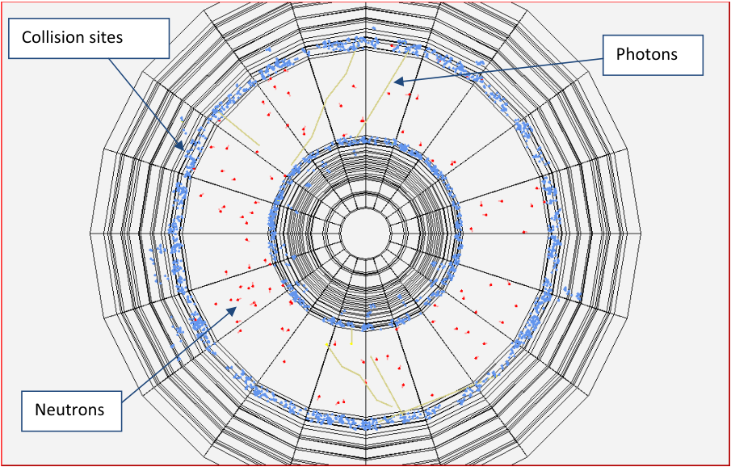

**----- Start of picture text -----** 
Collision sites Photons Neutrons **----- End of picture text -----** 

**Figure 4-8 : Neutron and photon tracks in a 10ms time window (neutron-photon simulation)** 

_55_ 

## **4.3. Validation of the Apollo2 model with Tripoli4** 

## **4.3.1. RZ geometry model** 

The first validation stage is based on the RZ square-based model presented on section  3.2.2. Estimated variables by this model are the TBR and multiplication factor, two integral parameters that depend on the volume of the different tokamak layers; thus the three-dimension DEMO HCLL Tripoli4 reference model is used to validate the results. 

A benchmark has been done using the different geometries and compositions introduced on Table 4-3. The results are summarized on Table 4-4, where the deviations between Apollo2 and Tripoli4 are presented. A more detailed table summarizing obtained absolute values is provided on appendix B.3. 

**Table 4-4 : Deviations between RZ Apollo2 model and 3D Tripoli4 model** 

The RZ square-based geometry presents a very accurate performance both for the TBR and the multiplication factor. The worst deviation is obtained for OBIBminus20 case, the smallest breeding zone both on the inboard and outboard; the TBR presents a deviation of 1,42% and the multiplication factor is overestimated by a factor of 2,63%. These deviations are negligible when compared to typical uncertainties related to physical quantities: nuclear data for certain isotopes present incertitudes of up to 2% (23) or average difference between simulated TBR and experimental TBR up to 14% (20). 

It can be concluded that the RZ model is suitable to compute integral parameters, i.e. the TBR and the energy multiplication factor. Maximumdiscrepancies between APOLLO2 and TRIPOLI-4 models will be used afterwards to correct the values calculated with Apollo2 (see section 6.2). 

## **4.3.2. 1D geometry model** 

Following the results obtained in (24), instead of directly comparing the results between the 3D Tripoli4 reference model and Apollo2 the strategy followed in this study is to develop a Tripoli4 one-dimension geometry model with the same parameters as the Apollo2. This 1D Tripoli4 model will be validated with the 3D Tripoli4 DEMO model for the first tokamak layers. Results obtained with Apollo2 will be compared to the 1D Tripoli4 model. 

## **4.3.2.1 1D Tripoli4 model validation** 

This model has been described on 4.2.2 and, as mentioned above, it will be used as reference model to validate the Apollo2 1D model. Performance of this 1D Tripoli4 model has been tested against 3D DEMO model on test cases described before, comparing the radial profile neutron flux and the deposited energy in the first wall, breeding zone and back plate. Obtained deviations are summarized on Table 4-5.  A detailed table of absolute values is provided on appendix B.4. 

_57_ 

**Table 4-5 : Deviations between 3D DEMO Tripoli4 model and 1D Tripoli4 model.** 

As predicted by (24), obtained deviations show an overestimation of the deposited energy and the peak neutron flux. Beginning in the first wall, the deposited energy is overestimated in all layers, but an amelioration of deviations is observed in deeper (farer from the plasma) layers. This behavior is partly due to the presence of the divertor in the 3D DEMO model; previous studies (20) have indeed shown that 10 to 20% of the neutron flux is lost in the divertor, reducing the deposited energy in the first wall and the first layers of the tokamak. 

It is important to remark that this study has been done using neutron-photon Monte Carlo simulation, which takes into account the possibility of creating secondary photons due to nuclear interactions of neutrons. The peak neutron flux is studied for both fast and slow neutrons. 

Both the deposited energy and neutron flux are overestimated but are within reasonable deviation windows: an overestimation factor of ~200% is typically used on neutron fluxes, normally studied on a logarithmical scale a ~90% deviation represents a small deviation from the main value. Given the goal of creating a pre-design tool, a decision is taken to embrace the results obtained by the 1D geometry Tripoli4 model. Given this fact, Apollo2 calculations will be directly compared to 1D Monte Carlo Model. 

## **4.3.2.2 1D Apollo2 model peak fast neutron flux** 

The deposited energy and peak neutron fast flux are calculated using the 1D geometry deterministic Apollo2 model introduced on section 3.2.1. The validation of this model will be done comparing it to the Monte Carlo 1D Tripoli4 model introduced on section 4.2.2, studying the performances for each energy grid. 

The deterministic calculation is done for a neutron-only simulation. Simulations with neutrononly model and neutron-photon model will be carried out with Tripoli4. Actually this comparison has no sense when studying the peak neutron flux because the creation of secondary photons does not affect the neutron fluxes. The results of this benchmark for the peak neutron fast flux on the inboard are presented on Table 4-6. A more detailed table is provided on appendix B.5. 

_59_ 

**Table 4-6 : Deviations between Apollo2 and Tripoli4 on peak fast flux** 

The relative difference between Monte Carlo and deterministic code results is shown on Figure 4-9. In the first centimeters of the tokamak’s inboard layers the finest the energy grid is, the most accurate the results are. After reaching a maximum deviation in the manifold and shield, the Apollo2 600 groups model presents lower deviations in the first layers of the coils region. The important deviations observed on the deeper regions of the TFC are due to low precision of Tripoli4 calculations, for which relative standard deviations are near to 50%. 

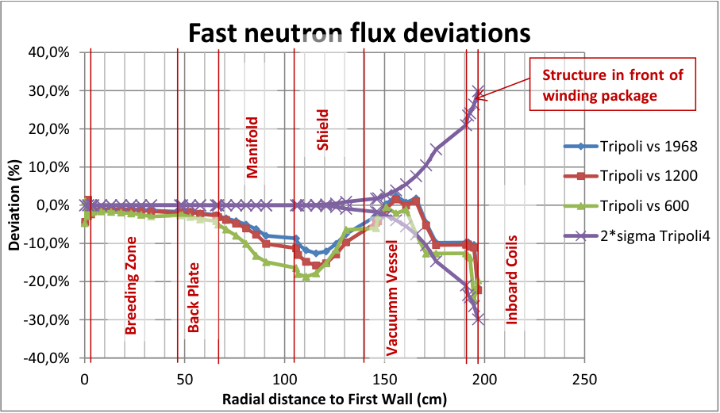

**----- Start of picture text -----** 
Fast neutron flux deviations 40,0% Structure in front of 30,0% winding package 20,0% Tripoli vs 1968 10,0% Tripoli vs 1200 0,0% Tripoli vs 600 2*sigma Tripoli4 -10,0% -20,0% -30,0% -40,0% 0 50 100 150 200 250 Radial distance to First Wall (cm) Shield Manifold Deviation (%) Inboard Coils Breeding Zone  Back Plate  Vacuumm Vessel **----- End of picture text -----** 

**Figure 4-9 : Relative difference between Apollo2 and Tripoli4 results (on peak heat flux)** 

Deviations obtained between Tripoli4 and Apollo2 show that the deterministic model presents an accurate behavior for the estimation of the peak fast neutron flux. It is clear from these results that deviations from 3D TRIPOLI-4 model results in terms of peak neutron flux are not due to the deterministic model but due to the 1D geometry. Apollo2 is therefore selected to create the plan of experience afterwards; keeping in mind that the most restrictive parameter is the peak fast flux on the inboard coils, the Apollo2 600 groups energy grid model is chosen due to its low deviation for the peak radial flux on the toroidal field structure in front of the winding package and the vacuum vessel but mostly due to a lower calculation time, of about 100s in front of the 400s for the 1200 groups and 600s for the 1968 groups. These features make this model the best choice in terms of performance and CPU usage.  A representation of the peak fast heat flux radial profile obtained with Tripoli4 and the Apollo2 600 is presented on Figure 4-10. 

_61_ 

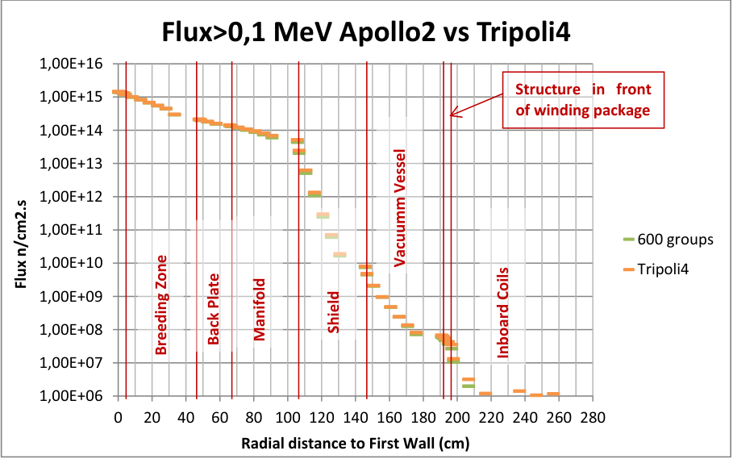

**----- Start of picture text -----** 
Flux>0,1 MeV Apollo2 vs Tripoli4 1,00E+16 Structure in front 1,00E+15 of winding package 1,00E+14 1,00E+13 1,00E+12 1,00E+11 600 groups 1,00E+10 Tripoli4 1,00E+09 1,00E+08 1,00E+07 1,00E+06 0 20 40 60 80 100 120 140 160 180 200 220 240 260 280 Radial distance to First Wall (cm) Vacuumm Vessel Flux n/cm2.s Shield Back Plate  Manifold Breeding Zone  Inboard Coils **----- End of picture text -----** 

**Figure 4-10 : Tripoli4 versus Apollo2 600 peak fast neutron flux profile** 

It is important to note that in all cases the peak flux obtained with Apollo2 underestimates the results derived from Tripoli4 in the first centimeters. This underestimation coupled with the overestimation committed by the Tripoli4 1D geometry model compared to the real 3D DEMO Tripoli4 model allows to affirm that Apollo2 overestimates of about 50% the fast heat flux in the first centimeters of the tokamak and of about 10% in deeper layers. Therefore, and given the accuracy expected from the pre-design tool and the principle of conservatism that guides this project, the fluxes calculated by the Apollo2 model won’t be corrected when creating the plan of experience. 

A last validation is done to this 1D geometry model: a comparison between the obtained results and the ones presented on (16). This is done by visually comparing the Figure 4-10 to the radial profile presented on Figure 4-12. The same geometry and composition is used, observing that the calculated peak fast neutron flux on the first centimeters of the inboard toroidal coils is just below the 10[�] decades in both cases. The 1D model is then validated against a reference model but also against studies performed by other teams. 

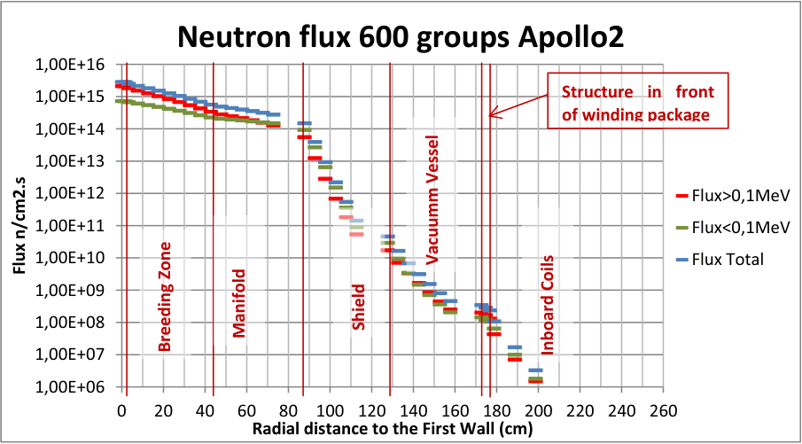

**----- Start of picture text -----** 
Neutron flux 600 groups Apollo2 1,00E+16 1,00E+15 Structure in front of winding package 1,00E+14 1,00E+13 1,00E+12 Flux>0,1MeV 1,00E+11 Flux<0,1MeV 1,00E+10 Flux Total 1,00E+09 1,00E+08 1,00E+07 1,00E+06 0 20 40 60 80 100 120 140 160 180 200 220 240 260 Radial distance to the First Wall (cm) Vacuumm Vessel Flux n/cm2.s Shield Manifold Breeding Zone  Inboard Coils **----- End of picture text -----** 

**Figure 4-11 : Apollo2 600 neutron flux profile** 

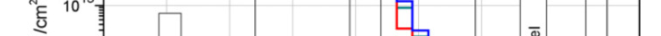

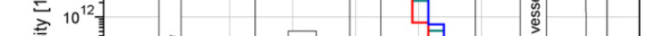

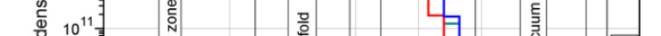

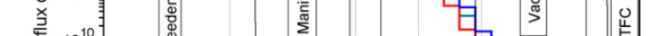

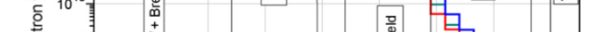

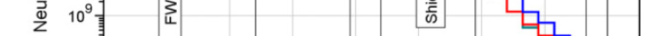

**Figure 4-12 : Radial profiles of the neutron fluxes across the inboard torus mid-plane** 

## **4.3.2.3 1D Apollo2 model deposited energy** 

Deposited energy is the last of the studied neutronic variables to be validated. As introduced on 4.3.2.1 the performances study is done comparing the Apollo2 model to the 1D Tripoli4 model. In this case is important to compare the deposited energy derived from the deterministic code with Monte Carlo simulations both with neutron-only and neutron-photon simulations. 

As shown in 4.1.1, the energy grid used for calculations on deposited energy is not relevant because deviations do not follow a pattern; the study will be done only with the 600 group 

_63_ 

Apollo2 model because it presents the best performances and computation time in terms of peak neutron flux. summarizes the relative deviations on deposited energy Table 4-7. A more detailed table presenting absolurte values is provided on appendix B.6. 

**Table 4-7 : Apollo2 deposited energy deviations compared to Tripoli4 1D model** 

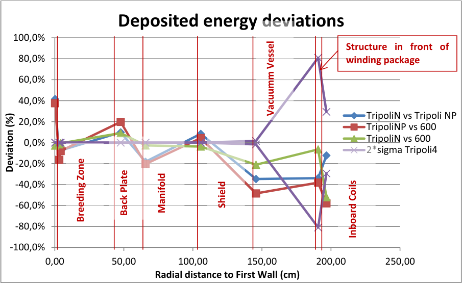

**----- Start of picture text -----** 
Deposited energy deviations 100,0% Structure in front of 80,0% winding package 60,0% 40,0% TripoliN vs Tripoli NP 20,0% TripoliNP vs 600 TripoliN vs 600 0,0% 2*sigma Tripoli4 -20,0% -40,0% -60,0% -80,0% -100,0% 0,00 50,00 100,00 150,00 200,00 250,00 Radial distance to First Wall (cm) Vacuumm Vessel Deviation (%) Shield Back Plate  Manifold Breeding Zone Inboard Coils **----- End of picture text -----** 

**Figure 4-13 : Relative difference between Apollo2 and Tripoli4 results (on deposited energy)** 

While deviations between Apollo2 and Tripoli4 neutron simulations are within the expected values, study shows that the main error committed is due to neutron-only simulation: 

differences between Tripoli4 neutron and neutron-photon simulations are very significant even in the first centimeters of the tokamak. This effect might be observed on Figure 4-13. In addition the committed error is an underestimation of the deposited energy, what might lead to problems with the principle of conservatism. For these reasons the 1D Apollo2 model cannot be used to estimate the deposited energy, at least in critic regions of the tokamak. 

Instead, a decision is taken to use the 1D geometry Tripoli4 model to create the plan of experience for estimation of deposited energy in the first layers of the tokamak: first wall, breeding zone, back plate, manifold and shield. In these first tokamak layers calculation time is short enough (about 3000s) to create a plan of experience big enough to design neural networks. Deposited energy on vacuum vessel, TFCs and toroidal coils will be calculated using Apollo2 using a correcting factor that takes into account the deviation observed in Table 4-7 between Apollo2 and Tripoli4 neutron-photon simulation. 

## **4.4. Selection of the final physical models: correcting factors** 

A benchmark study of each of the models used to calculate the different key neutronic parameters has been performed. Deviations arising from this study are used to define correcting factors used for each neutronic parameter. These correcting factors allow assuring that the results obtained by the physical models used to create neural networks are found within the limits of validity, and no parameter is underestimated or overestimated. All this information has been summarized on Table 4-8. It is important to remark that each neutronic parameter is corrected following the conservatism principle, i.e.: the TBR is underestimated while the peak flux is overestimated. 

**Table 4-8 : Physical model, deviation and correcting factor for each of the key neutronic parameters studied** 

Correcting factors calculated here will be used afterwards when creating the surrogate model 

_65_ 

## **5. Coupling the physical model with URANIE** 

As exposed on methodology, section 2.1, after creating a physical model that represents the physics behind the problem is necessary to create a plan of experience, a big set of samples of input and output parameters. This data base is created with the tool URANIE. As already mentioned a set of input and output parameters is created using LHS method, physical model calculations are performed and results are recuperated and integrated on the plan of experience. A more detailed study is done for each of the physical models. 

## **5.1. Plan of experience RZ geometry Apollo2 model** 

## **5.1.1. Creation** 

This model is used for the estimation of the TBR and deposited energy. An URANIE macro creates a TData Server (TDS), an output file containing the plan of experience. Steps taken to create this TDS are: 

2. Input parameters are introduced on _calcSurf.py_ , the python program described on 3.2.2 that estimates internal parameters used by RZ Apollo2. 

3. Input parameters are introduced on the RZ model. 

4. Output variables are retrieved from the output Apollo2 file and added to TDS. 

Given the calculation time for the RZ Apollo2 model of around 500s, a 5.000 samples plan of experience is created. 

## **5.1.2. Evaluation** 

After creating the plan of experience it is necessary to evaluate its performances. The sensitivity of each parameter to the input variables is assessed and the histogram of the output variables checked. As an example on Figure 5-1 and Figure 5-2 the sensitivity of the TBR to each variable is studied, concluding that the TBR is very sensitive to variations of the BZ composition (a 10% variation on the Eurofer composition corresponds to a 10% variation on the TBR) as well as to the Lithium-6 enrichment and the thicknesses of both the shield and breeding zone. The histogram of the TBR, shown on Figure 5-3, provides information about the representation of all 

the regions of the space by the model, in this case a correct distribution is observed, concluding that the plan of experience represents correctly all the possible TBR values. 

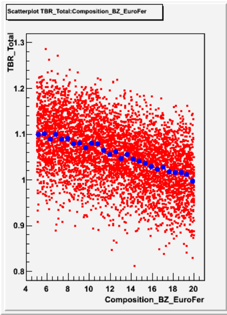

**Figure 5-1 : TBR sensitivity to the composition of the Breeding Zone** 

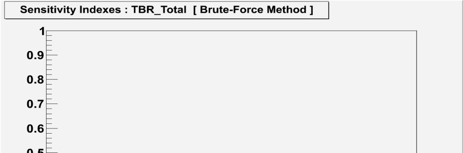

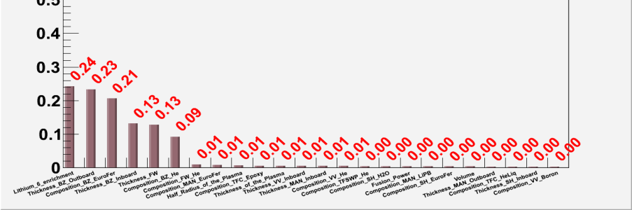

**Figure 5-2 : Sensitivity indexes of the TBR** 

_67_ 

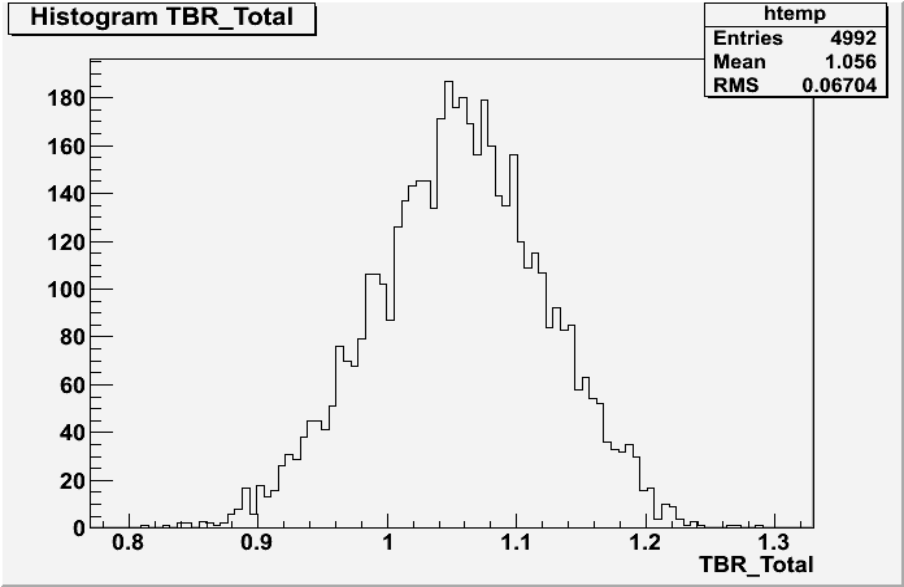

**Figure 5-3 : Histogram of the TBR for the 5.000 samples** 

## **5.2. Plan of experience 1D geometry Apollo2 model** 

## **5.2.1. Creation** 

This model is used for the estimation of the peak fast neutron flux and deposited energy on the vacuum vessel, TFSWP and TFC. An URANIE macro creates a TData Server (TDS), an output file containing the plan of experience. Steps taken to create this TDS are: 

2. Input parameters are introduced on the 1D model. 

3. Output variables are retrieved from the output Apollo2 file and added to TDS. 

Given the calculation time for the 1D Apollo2 model of around 200s, a 10.000 samples plan of experience is created. 

## **5.2.2. Evaluation** 

After early studies it is clear that because of the large variations of the neutron flux the plan of experience does no behave as expected. In this case it is observed that the large operating 

windows of the breeding zone and shield cause important variations on the inboard neutron flux and are not suitable for neural network creation. The histogram on Figure 5-4 shows this poor behavior; a large variation zone is represented, two decades, while most of the cases are stuck in a small zone. This poor behavior of the plan of experience makes difficult difficulties the representation of all the space and can cause problems when creating the neural networks. 

To solve this issue, the operating range is divided as specified on Figure 5-5. 

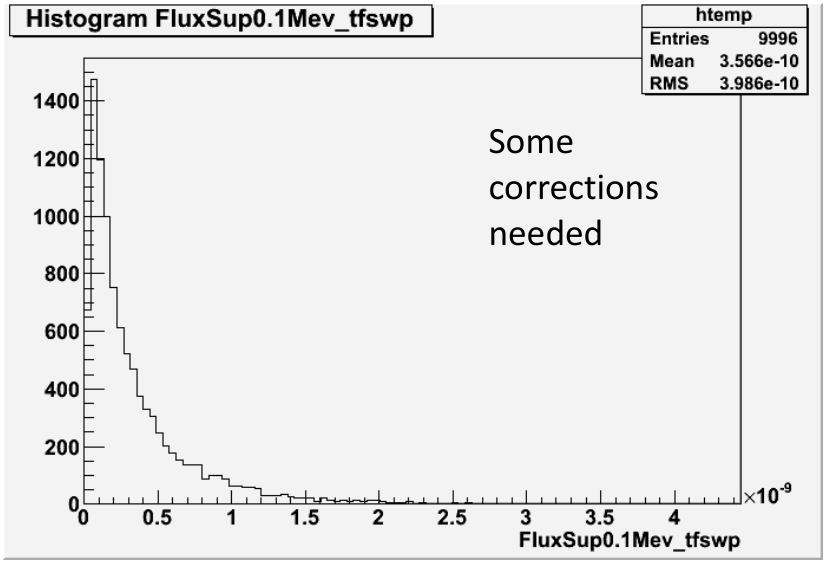

**----- Start of picture text -----** 
Some corrections needed **----- End of picture text -----** 

**Figure 5-4 :  Histogram of the peak neutron flux on the TFSWP** 

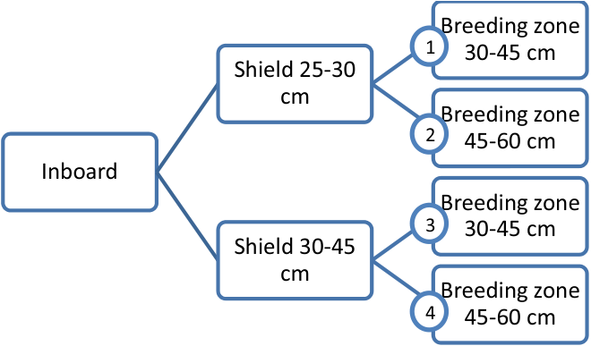

**----- Start of picture text -----** 
Breeding zone 1 30-45 cm Shield 25-30 cm Breeding zone 2 45-60 cm Inboard Breeding zone 3 30-45 cm Shield 30-45 cm Breeding zone 4 45-60 cm **----- End of picture text -----** 

**Figure 5-5 : Space phases division to improve neural network performances** 

_69_ 

## _Surrogate model for simplified neutronic fusion calculations Javier Martínez Arroyo_ 

After this space division four plans of experience are created for each operating zone, which allows to obtain a better representation of the phases space. Sensitivity indexes, Figure 5-6 and Figure 5-7, and histogram, Figure 5-8, for the 4[th] zone defined before show this performance amelioration. In the case of the sensitivity indexes it is clear that the division of the space allows a better representation of the physical phenomena, observing a correct response of the neutron flux to variations of the thickness of both the shield and breeding zone. In addition the histogram presents lower variation windows, and the estimated cases are better distributed in space, eliminated the stuck effect observed before. In this case, the most relevant variables when estimating the neutron flux are the thicknesses of shield, breeding zone and vacuum vessel as well as the composition of the breeding zone. 

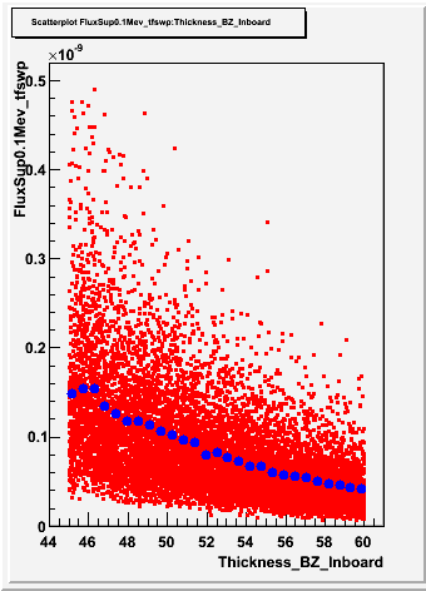

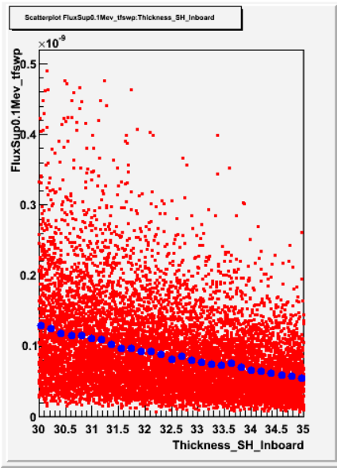

**Figure 5-6 : Peak neutron flux on the TFSWP sensitivity to the thickness of the BZ and Shield** 

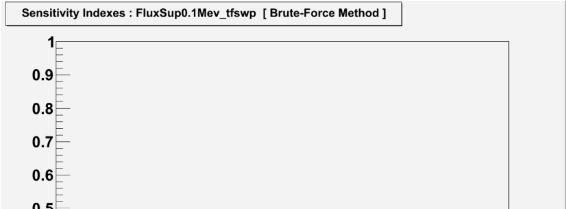

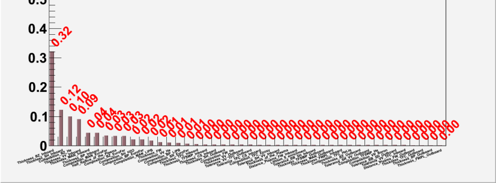

**Figure 5-7 : Sensitivity indexes of the peak neutron flux on the TFSWP** 

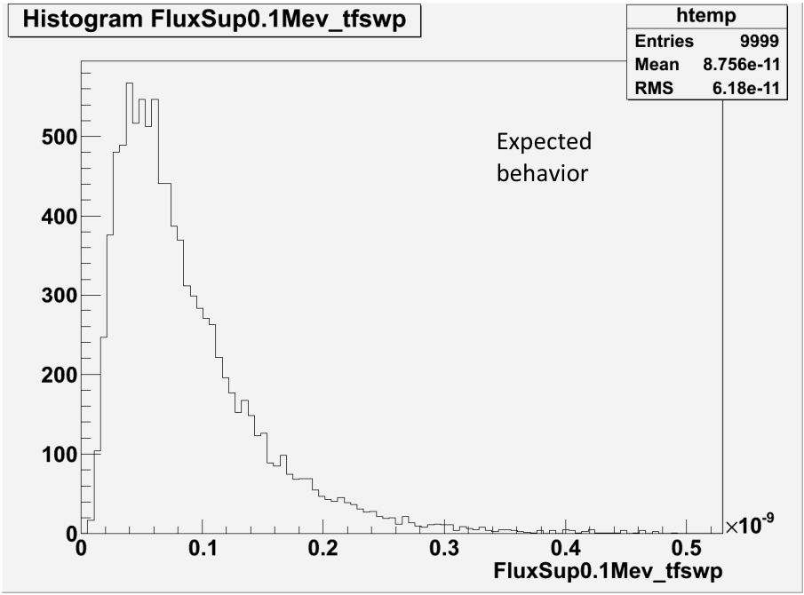

**----- Start of picture text -----** 
Expected behavior **----- End of picture text -----** 

**Figure 5-8 : Histogram of the peak neutron flux on the TFSWP for 10.000 samples** 

_71_ 

## **5.3. Plan of experience 1D geometry Tripoli4 model** 

## **5.3.1. Creation** 

This model is used for the estimation of the deposited energy on the First Wall, Breeding Zone, Back Plate, Manifold and Shield. To parameterize Tripoli4 for URANIE, python macros are created. In addition, isotopic material compositions are calculated with Apollo2 and embedded on Tripoli4. 

An URANIE macro creates a TDS, an output file containing the plan of experience. Steps taken to create this TDS are: 

2. Input parameters are introduced on the file _param.py_ and Apollo2 compositions model. 

3. A CShell script called _launcherTripoli.sh_ is launched by URANIE. 

   - a. Launch of the python macro _cylinder.py_ that calculates the Tripoli4 geometry for the given inputs. 

   - b. The Apollo2 compositions model is launched and isotopic compositions are recuperated and embedded on Tripoli4 with the macro _preparation.py_ . 

   - c. The Tripoli4 calculation is launched. 

   - d. The python macro _recup.py_ reads the Tripoli4 output file, calculates the total deposited energy by adding the neutron and photon deposited energies and writes a file called _ouput.dat_ that gets the results comprehensible for URANIE. 

4. Output variables are retrieved from _output.dat_ file and added to TDS. 

Given the calculation time for the 1D Tripoli4 model of around 5000s, a 1.000 samples plan of experience is created. 

## **5.3.2. Evaluation** 

The evaluation of the plan of experience is done as for the other models. In this case correct behavior in terms of distribution is observed, as shown in Figure 5-9 which represents the obtained histogram for the deposited energy. This histogram is correctly distributed in the whole variation window validating the plan of experience. 

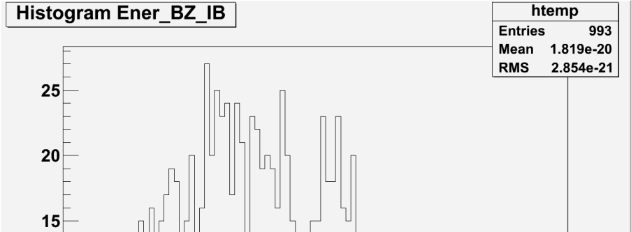

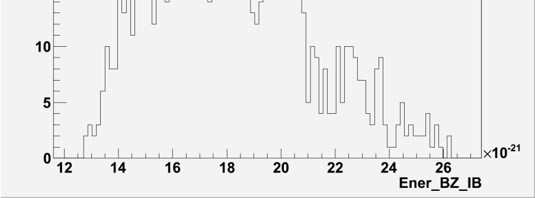

**Figure 5-9 : Histogram of the deposited energy on the Breeding Zone inboard for 1.000 samples** 

**5.4. Conclusions on plans of experience** 

Two plans of experience with the same characteristics have been created for each model, except for the 1D model where 10 plans of experience have been built due to the division of the input paramters operating window. The first plan of experience will be used as training base for the neutral network and the other one as test base. 

The quality of obtained plans has been assessed  and the 1D model has been modified in order to improve its behavior. The sensitivity of the output variables to the input parameters has also been checked giving the expected trends. 

_73_ 

## **6. Creation of neural networks using URANIE** 

The creation of physical models describing the neutronic phenomena taking place in a thermonuclear reactor has been performed to create a surrogate model that allows the estimation of key neutronic parameters. Neural networks have been chosen to build this surrogate model. In this chapter the creation of neural networks will be described. The selection of the neural networks to be used by the surrogate model will also be specified. 

## **6.1. Neural networks** 

## **6.1.1. Creation of neural networks** 

An introduction to neural networks (NN) has been done on 2.1.3 and will be extended here. The science behind the creation of NN is complex and is not the object of this study, nonetheless a short description is given hereafter for completeness. A neural network is a complex response function composed of interconnecting artificial neurons, programming constructors, which mimic the properties of a given physical model. The creation a neural network is then based on the _training_ of the artificial networks to behave as predicted by a given physical model. In this case, the neural network is an adaptive system that changes its structure based on the information provided by a set of known cases that flows through the network during the learning phase. The neural network is then a non-linear statistical data modeling tool used to model complex relationships between inputs and outputs as shown on Figure 6-1. 

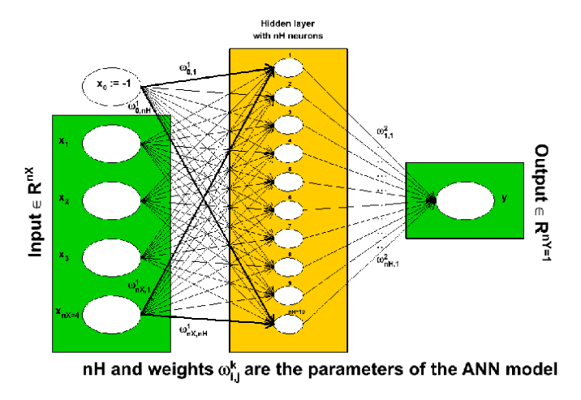

**Figure 6-1 :  Artificial neural network schema** 

The Uranie tool used to create plans of experience contains a module called _Modeler_ that allows the creation of neural networks. This module allows creating neural networks with one hidden layer by defining the input parameters and the desired output variable of a given plan of experience created before. The number of neurons of the hidden layer needs to be also specified. The creation of the neural network is launched by using a specific Uranie macro called _TANNModele_ r. The number of interconnections depends on the number of inputs, samples on the plan of experience and number of parameters used, and the number of neurons of the hidden layer. 

The _TANNModele_ r macro reads all the samples in the plan of experience, _base of training_ , rearranges them randomly to avoid any dependence due to correlations present during the creation of the plan of experience and creates a neural network with the specified number of neurons on the hidden layer. The result is a C++ function that uses a pointer to an array of doubles as input and gives a pointer to an array of doubles as output, as shown on Code 6-1. The active function used by Uranie is the hyperbolic tangent, a function that allows the estimation of the output variable with each neuron of the hidden layer. An example of neural network estimating the TBR is provided on appendix B.7. 

**#define ActivationFunction(sum)         ( tanh(sum) ) void** Fctener_man_ob_W_Rn_1_0( **double** *param, **double** *res) 

**Code 6-1 : Neural network C++ function header** 

## **6.1.2. Evaluation of neural networks** 

After creating a neural network its performances are evaluated. In order to do so two plans of experience are used: the same plan of experience used to create the neural network, or _base of training_ , and a “virgin” plan of experience never seen by the neural network called _base of test._ 

The evaluation of the neural networks is done by studying the differences between the output variables estimated by the neural networks and the original physical model. In this case the deviations studied are: 

- Standard deviation between the physical model and the neural network 

- Standard normalized deviation between the physical model and the neural network 

- Average deviation between the physical model and the neural network 

- Absolute average deviation between the physical model and the neural network 

- Maximum deviation between the physical model and the neural network 

- Maximum normalized deviation between the physical model and the neural network 

_75_ 

These parameters allow to choose the optimal number neurons of the hidden layers for each output variable and are calculated for the two plans of experience: _base of training_ and _base of test_ . One might think that the larger the number of neurons on the hidden layers the more accurate the results are; however an overlearning phenomenon occurs during the creation of neural networks, causing the neural network to follow the plan of experience points more than the physical phenomena that links inputs to outputs, as shown, e.g., on Figure 6-2 and Figure 6-3. The utilization of the _base of test_ seeks to avoid this phenomenon by evaluating the neural network with samples never evaluated. An example of the typical behavior of a neural network for different neurons of the hidden layer is provided on Figure 6-4, it is also important to remark that due to stochastical effects when creating neural networks it is important to create different trials with the same number of neurons on the hidden layer to obtain a performing neural network. 

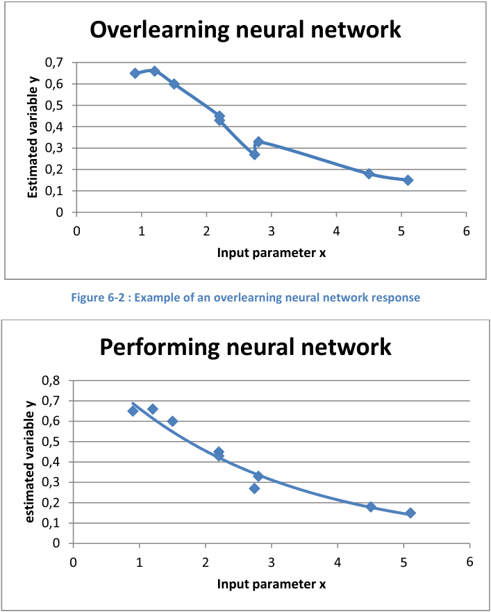

**----- Start of picture text -----** 
Overlearning neural network 0,7 0,6 0,5 0,4 0,3 0,2 0,1 0 0 1 2 3 4 5 6 Input parameter x Figure 6-2 : Example of an overlearning neural network response Performing neural network 0,8 0,7 0,6 0,5 0,4 0,3 0,2 0,1 0 0 1 2 3 4 5 6 Input parameter x Estimated variable y estimated variable y **----- End of picture text -----** 

**Figure 6-3 : Example of a performing neural network response** 

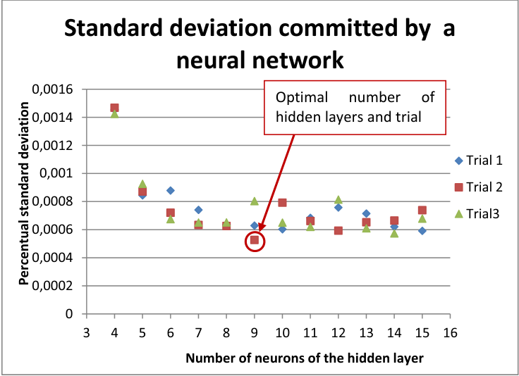

**----- Start of picture text -----** 
Standard deviation committed by  a neural network 0,0016 Optimal  number  of 0,0014 hidden layers and trial 0,0012 Trial 1 0,001 Trial 2 0,0008 Trial3 0,0006 0,0004 0,0002 0 3 4 5 6 7 8 9 10 11 12 13 14 15 16 Number of neurons of the hidden layer Percentual standard deviation **----- End of picture text -----** 

**Figure 6-4 : Standard deviations observed for different NN depending on number of hidden layers for the total TBR** 

It is also possible to evaluate the performances of a neural network by plotting the results obtained with the neural network against the original values calculated with the reference physical model, an example for the TBR is provided on Figure 6-5. This analysis allows a visual study of the performances of a neural network and the localization of strange samples if they exist. 

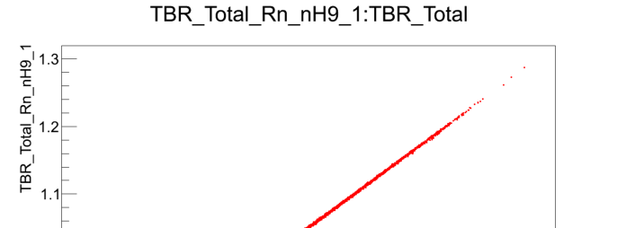

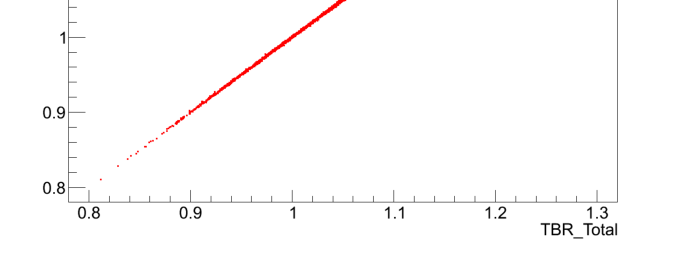

**Figure 6-5 : Total TBR estimated with a neural network of 9 neurons against TBR estimated with Apollo2** 

_77_ 

Previous studies (25) concluded that for a non-linear artificial neural network the 95% of the estimated values are valid in a range of three sigma. Following this argument obtained results are corrected to overestimate or underestimate, following the principle of conservatism, three times the standard deviation obtained from the performance study of the neural network. 

## **6.1.3. Automatization of the creation and evaluation of neural networks** 

Based on previous works (25) an Uranie macro that simplifies and automates the creation of neural networks is written. This macro creates a large number of neural networks within a previously defined window of possible neurons of the hidden layer, evaluates their behavior for the _base of traning_ and the _base of test_ and creates a file summarizing the errors and deviations observed. It is a fully parameterizable macro where input parameters and the desired output variable are defined as well as the names of the training and test bases. An example of the file created by this macro is reported on appendix B.8. 

This macro gives a note to each neural network.. This note is calculated by weighting each of the deviations studied according to some predefined factors. The neural network with the lowest note is then chosen because it presents the lowest deviations. 

## **6.2. Neural networks  and correcting factors** 

Neural networks for each parameter are created using the plans of experience defined on chapter 5. All the neural networks created for each parameter are studied and evaluated and the most performing one is chosen to be used in the surrogate model. A detailed table containing the neural networks’ characteristics as well as their performances is provided on appendix B.9. 

At this point all the possible sources of error have been studied. Deviations due to the physical models have been studied on section 4.4 and those due to the neural networks have been studied on this section. With all this information a table summarizing the correcting factors applied to the estimated neutronic parameters is created and shown on Table 6-1. In this table the standard deviation between the neural network and the physical model and the percentual standard deviation, the percentual overestimation or underestimation comparing the NN and the reference code, as well as the three sigma correction applied to the obtained results and the correcting factor due to the physical model are reported. 

_79_ 

|**FluxBZIbsh2bz2**|7,47E-07|(1/cm2s)|2,24E-06|0,05%|0,00%|
|---|---|---|---|---|---|
|**FluxBPIbsh2bz2**|4,32E-07|(1/cm2s)|1,30E-06|0,20%|0,00%|
|**FluxMANIbsh2bz2**|3,86E-07|(1/cm2s)|1,16E-06|0,29%|0,00%|
|**FluxSHIbsh2bz2**|1,23E-07|(1/cm2s)|3,70E-07|0,32%|0,00%|
|**FluxVVIbsh2bz2**|3,30E-11|(1/cm2s)|9,91E-11|1,08%|0,00%|
|**FluxTFSWPIbsh2bz2**|2,12E-12|(1/cm2s)|6,35E-12|1,34%|0,00%|
|**FluxTFCIbsh2bz2**|1,06E-12|(1/cm2s)|3,18E-12|1,30%|0,00%|

**Table 6-1 : Correcting factors due to neural networks deviations and physical model** 

***For the deposited energy on FW, BZ, BP, MAN and SH this is the Tripoli4 uncertainty (sigma)** 

_81_ 

## **7. Creation of the surrogate model** 

At this stage of the project a large number of functions, neural networks, capable of calculating key neutronic parameters of a thermonuclear fusion reactor have been created. It is now necessary to integrate all these neural networks in a program that treats input parameters, performs the geometry check, launches calculations with neural networks and presents the results in a suitable form. This program will practically represent the surrogate model, the main objective of the project. 

This surrogate model will be integrated on SYCOMORE, a multiphysics platform that serves as basis for the thermonuclear fusion reactor system code. It is therefore necessary to meet certain requirements imposed by the platform: 

1. The model could be written on python, C++, Matlab, Scilab, Fortran, xml, and should avoid to rely on any external software (Apollo, Tripoli or Uranie) in order to avoid any installation/compilation/licence issue. 

2. It is suitable that it is self sufficient and contains all necessary modules to execute it on any machine. 

3. External variables (input and output parameters) need to be declared on a specific way and accordingly to a nomenclature that has been chosen to declare them in specific SYCOMORE databases which represents Consistent Physical Objects (CPO), as e.g. the breeding blanket. 

These restrictions imposed by the platform complicate the surrogate model creation. Steps taken to create the surrogate model are detailed in this chapter. 

## **7.1. Coupling python and C++** 

The first step to integrate the surrogate model in SYCOMORE is the coupling of the neural networks written on C++ with python. Different macros and modules that allow python to directly call functions written on C++ (such as Swig) are considered, but those are refused due to their complexity and their non-standard character. 

Instead, a less polyvalent but easier and more elegant solution is taken: the compilation of the C++ neural network programs into dynamic libraries easily callable from python with the standard module _ctypes_ (26). 

The compilation of a C++ program is an easy step, but in this case it is necessary to change the header of the program in order to make the function callable from external programs. The original header and the modified one are presented on Code 7-1 and Code 7-2 respectively. 

**#define ActivationFunction(sum)         ( tanh(sum) ) void** Fctener_man_ob_W_Rn_1_0( **double** *param, **double** *res) 

**Code 7-1 : Neural network C++ function original header** 

**#include <stdio.h> #include <math.h> #define ActivationFunction(sum)         ( tanh(sum) ) extern** "C" void fct_nn ( **double** *param, **double** *res) **Code 7-2 : Neural network C++ function lodified header** 

This modification of the header allows calling the function “fct_nn” from python using the _ctypes_ module. It is important to keep in mind the kind of variables used by the C++ program, a pointer to an array of real both for the input and outputs. Once the header is modified the compilation of the C++ function is done, Code 7-3, creating a shared library “.so” callable from python. The code that allows charging the dynamic libraries from python and sends the input and output pointers is presented on Code 7-4. 

g++ --shared my_NN.C –o my_NN.so **Code 7-3 : Compilation of a C++ function into a shared library** 

def load_nn(key,param,res): function = cdll.LoadLibrary(nn_files[LuT[key],2]) return function.fct_nn(param.ctypes.data_as(c_void_p), byref(res)) 

**Code 7-4 : Charging a C++ shared library from python** 

The neural network functions created on chapter 6 are now usable objects that a python 

program is capable of calling to estimate neutronic parameters. 

## **7.2. The Neutronic Module** 

The neutronic surrogate model is now ready to plug it in SYCOMORE. It is written in the form of a universal python program that calls dynamic libraries to estimate the neutronic parameters defined at the beginning of the project. The structure used is detailed on Figure 7-1, the following structure of files can be found on the distribution package: (all files are available on appendix C.1) 

- launcher.py – main python script file that launches the calculations 

- functions.py – a python file containing support functions for the main script 

- neuralnetworks.py – a python file containing the path to call the NN and their performances 

- inputs.py – a python file containing the input parameters values 

_83_ 

- NN – a folder containing the NN used by the model in form of dynamic libraries “.so” 

- HCLL_DEMO_NEUTRONIC_MODULE_ReleaseNotes.pdf – a user manual 

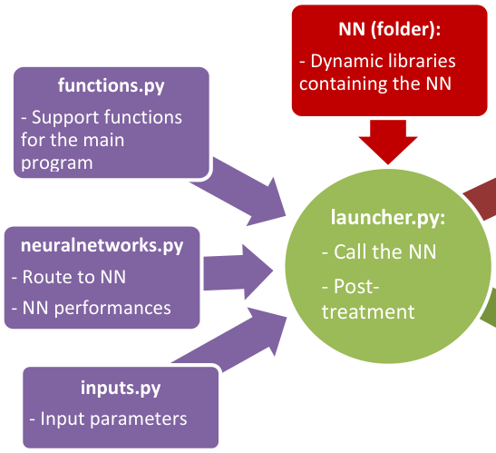

**----- Start of picture text -----** 
NN (folder): - Dynamic libraries functions.py containing the NN - Support functions for the main program launcher.py: neuralnetworks.py - Call the NN - Route to NN - Post- - NN performances treatment inputs.py - Input parameters **----- End of picture text -----** 

**----- Start of picture text -----** 
check.out -  Geometry check -  NN results -  Correction parameters **----- End of picture text -----** 

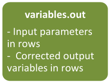

**----- Start of picture text -----** 
variables.out - Input parameters in rows -  Corrected output variables in rows **----- End of picture text -----** 

**Figure 7-1 : structure of the python neutronic module** 

One of the restrictions imposed by SYCOMORE is the declaration of the input parameters. The _inputs.py_ file is created following these guidelines and is shown on Code 7-5. 

#Input parameters stored in rows Fusion_Power = 2385 # MW Volume = 1870 # m^3 Lithium_6_enrichment =    0.90 # % Half_Radius_of_the_Plasma =  7.5000 # m Thickness_of_the_Plasma =  2.4600 # m Thickness_CS_Inboard =   0.7430 # m Thickness_TFC_Inboard =   0.7400 # m Thickness_TFSWP_Inboard =    0.0600 # m Thickness_VV_Inboard =   0.3500 # m Thickness_SH_Inboard =   0.3000 # m Thickness_MAN_Inboard =   0.3000 # m Thickness_BP_Inboard =   0.1800 # m Thickness_BZ_Inboard =   0.4450 # m Thickness_FW =    0.0300 # m Thickness_FWPL_Inboard =    0.0020 # m Thickness_TFC_Outboard =   0.9300 # m Thickness_TFSWP_Outboard =    0.0800 # m Thickness_VV_Outboard =   0.8000 # m Thickness_SH_Outboard =   0.5000 # m Thickness_MAN_Outboard =   0.5000 # m Thickness_BP_Outboard =   0.1800 # m Thickness_BZ_Outboard =   0.7700 # m Thickness_FWPL_Outboard =    0.0020 # m Tolerance_TFC_CS_Inboard =   0.1000 # m Tolerance_VV_TFC_Inboard =   0.1000 # m 

|Tolerance_SH_VV_Inboard =   0.1000|# m|
|---|---|
|Tolerance_BB_SH_Inboard =   0.1000|# m|
|Tolerance_VV_TFC_Outboard =   0.1000|# m|
|Tolerance_SH_VV_Outboard =   0.1000|# m|
|Tolerance_BB_SH_Outboard =   0.1000|# m|
|Distance_Plasma_FW_Inboard =   0.1300|# m|
|Distance_Plasma_FW_Outboard =   0.1500|# m|
|Composition_FW_He =   30.00|# %|
|Composition_BZ_EuroFer =   10.00|# %|
|Composition_BZ_He =   10.00|# %|
|Composition_BP_LiPB =    5.00|# %|
|Composition_BP_EuroFer =   28.00|# %|
|Composition_MAN_LiPB =    5.00|# %|
|Composition_MAN_EuroFer =   28.00|# %|
|Composition_SH_EuroFer =   10.00|# %|
|Composition_SH_H2O =   25.00|# %|
|Composition_VV_He =   37.00|# %|
|Composition_VV_Boron =    2.00|# %|
|Composition_TFSWP_He =    5.00|# %|
|Composition_TFC_Epoxy =   18.00|# %|
|Composition_TFC_HeLiq =   17.00|# %|
|Triangulation =    0.47|# no unit|
|Elongation =    1.90|# no unit|
|Surface_Div_Inboard =    5.50|# %|
|Surface_Div_Outboard =    6.50|# %|

**Code 7-5 : Declaration of the input variables in** _**inputs.py**_ 

The _launch.py_ file, the main program, reads the input parameters and checks that they are within the operating windows of the model, creates the arrays of parameters used by each neural network, charges the dynamic libraries, recuperates the estimated values, corrects them taking into account the corresiton factors presented on Table 6-1, normalizes them and creates two output text files. 

The two output files containing detailed information about the steps followed by the program and the estimated parameters are simple text files that store information on rows. An example of these generated files is available on appendix C.1. The characteristics of the output files are: 

- check.out : 

   - Geometry check: checkup of the geometry consistency. 

   - Creation: checkup of the creation of the variables arrays 

   - Neural network calculations: writing of the calculated value, the correcting factors and the final estimated value derived corrected and normalised 

- variables.out ( see Code 7-6 ) : 

   - Input parameters: rewriting of the input parameters and dimensions 

   - Normalization factor: writing of the normalization factors used by the program 

   - Output variables: writing of the estimated neutronic parameters in rows. Dimensions are also specified. 

_85_ 

TBRTot =  1.1164 no unit TBRIb =  0.2768 no unit TBROb =  0.8348 no unit ME =  1.1534 no unit EnerFWIb =   11.67 MW.m^-3 EnerBZ10Ib =   9.372 MW.m^-3 EnerBZIb =    4.36 MW.m^-3 EnerBPIb =  0.2578 MW.m^-3 EnerMANIb =  0.2887 MW.m^-3 EnerSHIb =  0.8013 MW.m^-3 EnerVVIb = 0.0003293 MW.m^-3 EnerTFSWPIb = 3.497e-05 MW.m^-3 EnerFWOb =   15.07 MW.m^-3 EnerBZ10Ob =   11.59 MW.m^-3 EnerBZOb =   3.194 MW.m^-3 EnerBPOb = 0.07182 MW.m^-3 EnerMANOb =   0.061 MW.m^-3 EnerSHOb = 0.08902 MW.m^-3 EnerVVOb = 1.366e-07 MW.m^-3 EnerTFSWPOb = 8.958e-10 MW.m^-3 FluxFWIb = 1.3989e+15 n.cm^-2.s^-1 FluxBZIb = 1.2861e+15 n.cm^-2.s^-1 FluxBPIb = 2.1098e+14 n.cm^-2.s^-1 FluxMANIb = 1.4107e+14 n.cm^-2.s^-1 FluxSHIb = 4.4966e+13 n.cm^-2.s^-1 FluxVVIb = 8.0649e+09 n.cm^-2.s^-1 FluxTFSWPIb = 3.9139e+08 n.cm^-2.s^-1 

**Code 7-6** _**: variables.out**_ **automatically generated file** 

The _variables.out_ file contains the output parameters stored in rows in order to make them readable for the SYCOMORE code. 

It should be emphasized that this neutronic module can be used individually without being integrated into SYCOMORE. The user only needs to edit the _inputs.py_ file and change the variables for numeric values in the specified magnitudes. 

_87_ 

## **8. Environmental impact** 

The ultimate goal of the SYCOMORE code is to perform optimization of the main parameters of a tokamak, in terms of geometries and material compositions, complying with a number of key parameters of the physic of plasmas and neutronics. A multi-criteria optimization is based on a large number of iterations around a base model that lead to an optimal model that meets the restrictions. The number of iterations can range from 1.000 to 10.000 or even 100.000 cases. 

The neutronic module developed here performs one estimation of the neutronic parameters in about 0.1 seconds using one processor, while a Monte Carlo Tripoli-4 simulation, with uncertainty values similar to the ones obtained with the developed model, takes about 48 hours using 60 processors[1] . It is therefore clear that the developed model is able to save not only computation time but also electric energy. 

The power consumption is calculated for the IBM x3755 M3 servers used by the CEA clusters, which uses a 1100W power supply. These servers feature 4 processors with 8-cores per processor, so 32 cores per server. The power consumption per core is 34.375 W. 

Another source of power consumption is the large refrigeration systems needed to refrigerate those servers. A hypothesis is done here considering that all the power consumed by a processor is transformed into heat, therefore it is necessary to cool 34.375 W per core. Considering a 33% efficiency of the refrigeration systems the power consumed per core is 103.125 W per core. 

The total consumption per core is estimated to be 137.5 W. The total energy consumptions for the 1.000 and 10.000 cases are estimated on Table 8-1. Energy savings are also detailed as well as the CO2 emissions[2] . It is noted that the reduction in both electricity consumption and in emissions is substantial, involving reductions of almost 100% in power consumption and CO2 emissions. 

> 1 Benchmark for a cluster using 8-core AMD Opteron 6200 @ 3.0GHz processor with 36Gb ram (30) 

> 2 As estimated by the French _Réseau de Transport d’Electricité_ 83kg CO2/MWh during 2011 (29) 

**Table 8-1 : Energy consumptions, CO2 emissions and savings** 

Beyond the environmental impact that the project has in terms of energy consumption, the reduction of computation time and the development of a system code for fusion reactors facilitates research in this area, improving the long iterative processes of research and therefore shortening, slightly, the terms to create nuclear fusion reactors. An improvement in delays concerning the investigation of fusion energy has great depth both environmentally and socially, bringing a clean, safe and cheap energy to society. 

_89_ 

## **Conclusions** 

The methodology, based on the utilization of neural networks for the creation of a surrogate model, has been validated. Deterministic fully-parameterizable 1D and RZ tokamak models have been created and validated against a Monte Carlo reference model. Correcting factors have been chosen to assure the compliance with the principle of conservatism. Large set of samples containing input and output parameters, called plans of experience, have been created using the tokamak model. Response functions estimating the neutronic parameters have been created using neural networks. A surrogate model for the HCLL-blanket thermonuclear-fusion-reactor neutronic-parameters estimation has been created following the guidelines imposed by SYCOMORE. 

The tool estimates the neutronic parameters: TBR; multiplication factor (ME); radial profile of the peak fast neutron flux and deposited energy on each layer of the tokamak. The calculations are valid within the operating windows of the surrogate model. 

Compared to a Monte Carlo TRIPOLI-4 DEMO HCLL 3D reference model, deviations up to ~3% are observed for the TBR and the ME, and can attain values as high as ~10% to ~50% for the peak neutron flux. Deviations on deposited energy for the first layers of the tokamak, from first wall to shield, range from ~1% to ~50%, while they can attain values as high as ~60% for the vacuum vessel and toroidal field coils a overestimation factor of 200% has been used on these layers. Obtained values are corrected with these deviations automatically. 

The project’s objective has been achieved, creating a parameterizable surrogate model that allows estimating key neutronic parameters of an HCLL-blanket thermonuclear fusion reactor with short computation times, of about 0.1 seconds, with acceptable performances for a predesign tool. 

Improvement in future stages of the project is to be had by ameliorating the physical model that represents the tokamak. A TRIPOLI-4 parameterizable model based on elliptic toroids could be used to improve results substantially in terms of TBR, ME, peak neutron flux and deposited energy. Computation time of the surrogate model does not depend on the physical model but higher computation times to create the plans of experience should be expected when using Monte Carlo simulations as a physical model. 

_91_ 

## **Budget** 

The project being a research work, associated costs to the development of the surrogate model are mostly due to codes and tools, access to scientific reports and previous knowledge, computational resources and the salary of a trained nuclear engineer. Following these premises, total costs that have allowed the development of the project and the creation of the program have been calculated. A table summarizing costs and revenues is available on Table 0-1. 

**Table 0-1 : Project budget** 

It is important to stress that due to the complexity of computing the overall costs of a research institution as large as the CEA to a single project, the costs due to scientific sources and computational resources are estimated, but in all cases overestimated compared to the actual cost computed to the CEA. 

With all this estimations the total cost of the project is 83.568€. 

> 3 As estimated by the CEA human resources 

> 4 Estimated price for (28) and other sources 

> 5 As estimated by the CEA technical and computational services 

> 6 Price of a licence for research objectives 

_93_ 

## **Acknowledgments** 

I want to thank all those who have framed and helped me during these past 5 months internship at SERMA. I thank first of all my tutors, Antonella Li Puma and Jean Charles Jaboulay, for their enthusiasm, their patient, their explanations, their guidance and their invaluable advice and support. I also thank Javier Dies for his help and support from the UPC since the beginning of the project. 

I particularly want to thank Pierre Lasseur and Karim Ammar for their availability and unwavering support dealing with problems and bugs. I also thank Clement Fausser for his teachings in nuclear fusion technologies, and other topics, and Celine Guenaut for her assistance with IT problems. 

I also thank Patrick Blanc-Tranchant and Alain Aggery, officials SERMA and LPEC respectively, for welcoming me in the service and Jocelyne Corona and Jocelyne Sevilla for their help in the administrative field. 

A big thank to students and PhD students of SERMA for their help and support on a daily basis, and the entire LPEC team. 

Also give thanks to the international relations services of the UPC, especially to Jose Parra for his dedication and attention during this year and the previous ones, thanking them for the granted Erasmus internship scholarship. 

Finally thank the indispensable help of all my family and friends throughout the project. Especially thank the unconditional support of my parents who have helped and encouraged me to the realization of this project. 

_95_ 

## **Bibliography** 

1. **SOFT 2012.** _27th Symposium on Fusion Technology (SOFT)._ [Online] 2012. http://www.soft2012.eu/. 

2. **Fusion Engineering and Design.** Fusion Engineering and Design. _Elsevier._ [Online] 2012. http://www.journals.elsevier.com/fusion-engineering-and-design/. 

3. **The European Atomic Energy Community .** _EURATOM._ [Online] 08 2012. http://www.euratom.org/. 

4. **International Thermonuclear Experimental Reactor.** _ITER._ [Online] 08 2012. www.iter.org. 

5. **Fusion for Energy.** F4E. [Online] 08 2012. http://fusionforenergy.europa.eu. 

6. **European Fusion Development Agreement.** _EFDA._ [Online] 08 2012. http://www.efda.org. 

7. **Comissariat à l'Energie Atomique.** _Tore Supra._ [Online] EURATOM-CEA, 2012. http://wwwdrfc.cea.fr/cea/ts/ts.htm. 

8. **A. Li Puma, J. Bonnemason, L. Cachon, J.L. Duchateau, F. Gabriel.** Consistent integration in preparing the helium cooled lithium lead DEMO-2007 reactor. _Fusion Engineering and Design._ June 2009, Vol. 84, 7-11, pp. 1197-1205. 

9. **Jordanova, Jordan.** _Evaluation of the volumetric heat distribution, shielding and tritium breeding capabilities of the HCLL DEMO breeder blanket._ Bulgaria : EFDA Technology Workprogramme 2004, 2005. FU06-CT-2004-00025. 

10. **McKay, M. D. and Beckman, R. J.** _Technometrics._ Los Alamos : American Statistical Association, 1979. 

11. **Chinnek, John W.** _Practical Optimization: A Gentle Introduction._ Ottawa, Canada : Carleton University, 2000. 

12. **PROJET APOLLO2.** _APOLLO2: MANUEL DE REFERENCE DE LA VERSION 2.8-3._ Saclay : CEA, 2011. SERMA/LLPR/RT/11-5070/. 

13. **TRIPOLI-4 Project Team.** _TRIPOLI-4 VERSION 8 USER GUIDE._ Saclay : CEA, 2011. SERMA/LTSD/RT/11-5185/A. 

14. **X-5 Monte Carlo Team.** _MCNP — A General Monte Carlo N-Particle Transport Code, Version 5._ Los Alamos : Los Alamos National Laboratory, 2008. LA-UR-03-1987. 

15. **Gaudier, Fabrice.** _User manual for Uranie._ Saclay : CEA DEN/DANS/DM2S/SFME/LGLS, 2012. 

16. **U. Fischer, P. Pereslavtsev, D. Grosse, V. Weber, A. Li Puma, F. Gabriel.** Nuclear design analyses of the helium cooled lithium lead blanket for a fusion. _Fusion Engineering and Design._ Elsevier, 2010, Vol. 85, 1133-1138. 

17. **VIGNITCHOUK, Ladislas.** _Modélisation d’une couverture tritigène et de son shield avec le code APOLLO-2._ Saclay : CEA, 2011. 

18. **MOSCA, Pietro.** _Conception et développement d'un mailleur énergétique adaptatif pour la génération des bibliothèques multigroupes des codes de transport._ Saclay : CEA, 2010. CEA-R6245. 

19. **Fausser, Clément, et al.** _Tokamak D-T neutron source & transgen code._ Saclay : Commissariat à l'Energie Atomique, December 2010. DEN/DANS/DM2S/SERMA/LPEC/RT/10-4992. 

20. **F.Gabriel, C. Fausser and.** _TRIPOLI-4 Validation & Use for Fusion Blankets._ Saclay : s.n., 2010. DEN/DANS/DM2S/SERMA/LPEC/RT/10-4993/A. 

21. _Principes théoriques et méthodologie pour la validation de JEF2.2. Application à la réalisation d'ERALIB1, bibliothèque de données neutroniques pour le calcul des systèmes à spectre rapide._ **Fort, E., Assal, W., Rimpault, G., Rowlands, J., Smith, P., Soule, R.** Saclay : CEA, 2003. 

22. **Fausser, Clement, et al.** _Tokamak D-T neutron source models for different plasma physics confinement modes._ Saclay : CEA, 2011. 

23. **Fausser, Clément.** _Notice et outil de calcul pour tests d’échanges de données sans objectif de pré-dimensionnement._ Saclay : CEA DEN/DANS/DM2S/SERMA/LPEC, 2011. 11MMBV000049. 

24. **Fischer, U.** _Multi-dimensional Neutronics Analysis of the "Canister Blanket" for NET._ Karlsruhe, Germany : Kernforschungszentrum Karlsruhe, 1987. KfK4255. 

25. **Ammar, Karim.** _Mise en place d’une démarche de conception de cœur de RnR-Na par plan d’expérience ._ Saclay : INSTN, 2010. 

26. **Martelli, Alex, et al.** _Python par l'example._ s.l. : O'Reilly Editions, 2006. 2841773795 . 

_97_ 

27. **U. Fischer, P. Pereslavtsev.** _Neutronic Analyses for the Conceptual Design of a HCLL Reactor._ 

Germany : Forschungszentrum Karlsruhe, March 2005. Final Report on task TW4-TRP-002. 

28. **Stacey, Weston N.** _Fusion, An introduction to the Physics and Technology of Magnetic Confinement Fusion._ 2nd Edition. Atlanta : WILEY-VCH, 2011. 

29. **Réseau de transport d'électricité.** _Bilan electrique._ La Defense : PARIMAGE, 2012. 

30. **IBM.** IBM System X. _IBM smarter computing._ [Online] 2012. http://www03.ibm.com/systems/x/. 

_99_ 

## **Electronic version** 

## Final Thesis **Industrial Engineer** 

# **Development of a surrogate model for simplified neutronic calculations involved in the design stage of a thermonuclear fusion reactor** 

## **Volume II** 

**APPENDIX A: Parameters, geometries and definitions APPENDIX B: Results APPENDIX C: Programs and codes** 

**Author:** Javier Martínez Arroyo **Thesis Director:** Antonella Li Puma **Thesis Co-Director:** Jean-Charles Jaboulay **University Director:** Javier Dies Llovera **Session** : September 2012 

Commissariat à l’Energie Atomique DEN/DANS/DM2S/SERMA/LPEC Centre de Saclay 

Escola Tècnica Superior d’Enginyeria Industrial de Barcelona 

## **Table of Contents** 

## **(Volume I)** 

_104_ 

_106_ 

_107_ 

## **A. Appendix : Parameters, geometries and definitions** 

## **A.1. Input geometry parameters** 

_109_ 

## **A.2. Input materials’ composition parameters** 

_111_ 

## **A.3. Other input parameters** 

## **A.4. Output variables** 

_113_ 

## **A.5. TBR and ME definitions** 

Definition of the TBR (20) : 

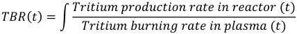

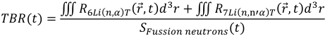

� � ������� ����������· ��� �������,������· ����, �, ��������[�] ������������· ��� �������,��������· ����, �, ��������[�] � �������� ����������� 

## Where: 

- _t_ is the time (in s) and is often omitted because of the usual steady-state assumption for _TBR_ , 

- _E_ is the neutron energy (in MeV), 

- 

- • **�** is the space vector defining the 3 coordinates in space (in cm), 

- _R_ are the local reaction rates (in cm-3.s-1), 

- _N6Li_ and _N7Li_ are respectively the local atoms concentrations of[6] Li and[7] Li (in atoms.cm-3), 

- _S fusion neutrons_ is the fusion neutron source (in neutrons.s-1), which formulae are proposed in, 

- _σ6Li_ ( _n,α_ ) _T_ and _σ7Li_ ( _n,n'α_ ) _T_ are the[6] Li and[7] Li cross-sections producing tritium (in cm2), 

- ����, �, �� is called in neutronics the “scalar neutronic flux” (in neutrons.cm[-2] .s[-1] .MeV[-1] ����, �, �� is itself the integration for all solid angles �[��] (in steradian) of ����, �, �[��] , �� (in neutrons.cm[-2] .s-[1] .MeV[-1] .steradian-[1] ). ����, �, �[��] , �� is called in neutronics the “angular neutronic flux” and is defined as: �� **�** �, �, �[���] , ��� �� **�** �, �, �[���] , ���� 

Where : 

- � is the speed of neutron (cm.s-1) 

- ����, �, �[��] , �� (in neutrons.cm[-3] .[s-1] .MeV[-1] ) is the volumic density (in neutron.cm[-3] ) of the neutron population having the same energy E, i.e. the same speed � , and the same solid angle �[��] at the time t. 

The needed _TBRglobal_ , average in time of _TBR(t)_ , is design dependent. On the basis of that, the minimum _TBRglobal_ , for a fusion reactor should be between 1.04 and 1.07 andmay be higher if a fast development of industrial tokamaks is wanted. Considering, furthermore,uncertainties due to 3D MC calculations including nuclear data ones, a value of _TBRglobal_ = 1.10 is considered sufficient. 

Definition of the multiplication facotr ME (20) : 

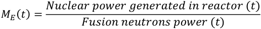

������[����� ����] ������� ������ �� � ������ ������� ���[��][ ��][�][������� ][�][�� ������ �������][�][�][�] 

Time is often omitted in _ME_ because of the usual steady-state assumption _. ME_ is typically between 1.1 and 1.3. Only a part of the deposited energy is recovered by energy conversion system and then useful in terms of electricity production (i.e. typically energy deposited into the vacuum vessel or into the coils is lost for electricity production). 

_115_ 

## **A.6. 1-Dimension Cylindrical Geometry** 

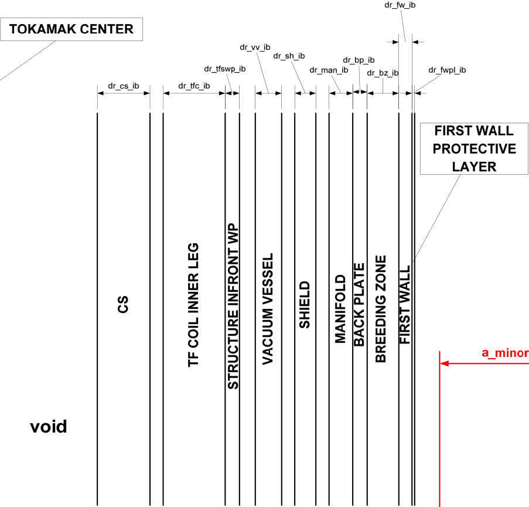

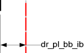

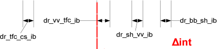

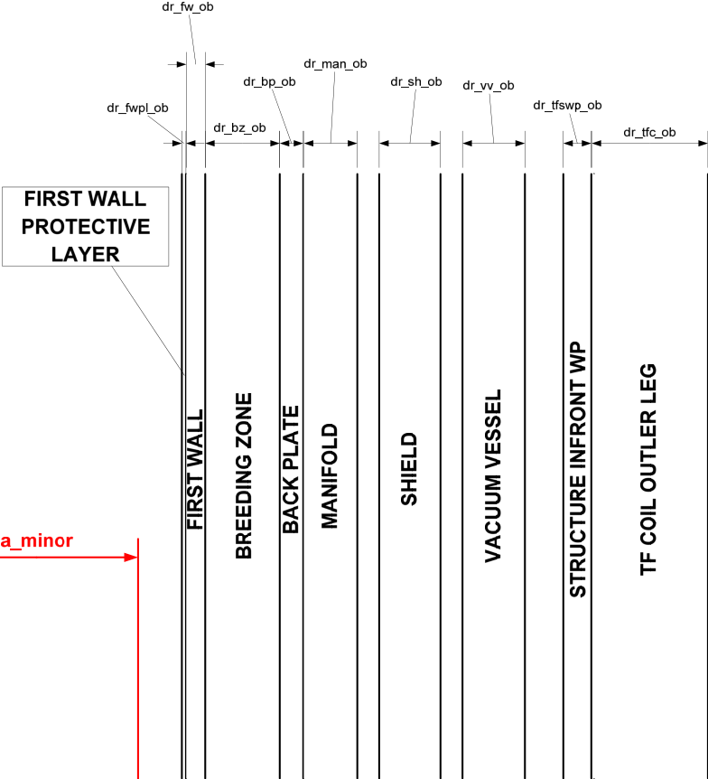

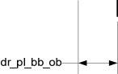

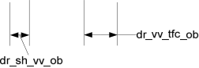

_117_ 

## **A.7. RZ Square-Based Geometry** 

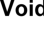

_119_ 

## **B. Apendix : Results** 

## **B.1. Apollo2 Peak Radial Flux Results** 

1D geometry Apollo2 model performances with different energy grids. 

## **B.2. Apollo2 Energy Deposition Results** 

1D geometry Apollo2 model performances with different energy grids. 

_121_ 

## **B.3. RZ Apollo2 performances** 

RZ square-based geometry Apollo2 model performances compared to the 3D DEMO Tripoli4 simulations. 

## **B.4. 1D Tripoli4 performances** 

1D geometry Tripoli4 model performances compared to the 3D DEMO Tripoli4 simulations. 

_123_ 

Peak neutron flux on the radial direction calculated with 1D Tripoli4 simulation 

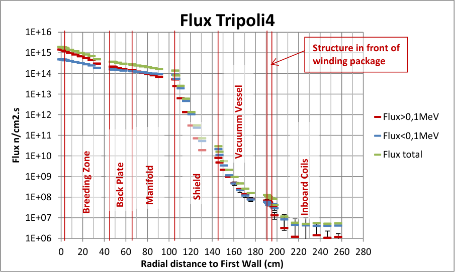

**----- Start of picture text -----** 
Flux Tripoli4 1E+16 Structure in front of 1E+15 winding package 1E+14 1E+13 1E+12 Flux>0,1MeV 1E+11 Flux<0,1MeV 1E+10 Flux total 1E+09 1E+08 1E+07 1E+06 0 20 40 60 80 100 120 140 160 180 200 220 240 260 280 Radial distance to First Wall (cm) Vacuumm Vessel Flux n/cm2.s Shield Back Plate  Manifold Breeding Zone  Inboard Coils **----- End of picture text -----** 

_125_ 

## **B.5. 1D Apollo2 peak neutron flux performances** 

## 1D geometry Apollo2 model performances compared to the 1D Tripoli4 simulations. 

|226,7|9,21E+04|9,13E+04|8,73E+04|7,86E+005|28,718|
|---|---|---|---|---|---|
|236,7|4,09E+04|4,05E+04|3,86E+04|1,42E+006|35,429|
|246,7|1,11E+03|1,08E+03|9,36E+02|1,07E+006|33,944|
|256,7|1,13E+02|1,10E+02|9,72E+01|1,17E+006|30,697|

## **Flux>0,1 MeV Apollo2 vs Tripoli4** 

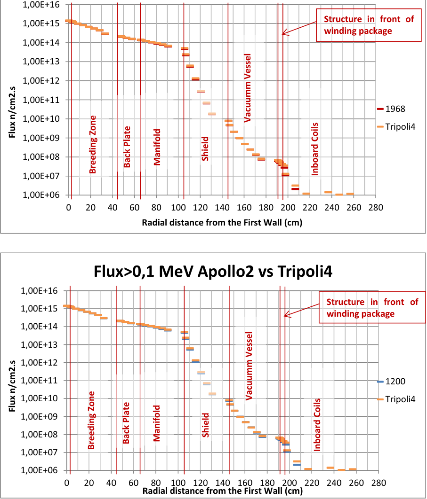

**----- Start of picture text -----** 
1,00E+16 Structure in front of 1,00E+15 winding package 1,00E+14 1,00E+13 1,00E+12 1,00E+11 1968 1,00E+10 Tripoli4 1,00E+09 1,00E+08 1,00E+07 1,00E+06 0 20 40 60 80 100 120 140 160 180 200 220 240 260 280 Radial distance from the First Wall (cm) Flux>0,1 MeV Apollo2 vs Tripoli4 1,00E+16 Structure in front of 1,00E+15 winding package 1,00E+14 1,00E+13 1,00E+12 1,00E+11 1200 1,00E+10 Tripoli4 1,00E+09 1,00E+08 1,00E+07 1,00E+06 0 20 40 60 80 100 120 140 160 180 200 220 240 260 280 Radial distance from the First Wall (cm) Vacuumm Vessel Flux n/cm2.s Shield Back Plate  Manifold Breeding Zone  Inboard Coils Vacuumm Vessel Flux n/cm2.s Shield Back Plate  Manifold Breeding Zone  Inboard Coils **----- End of picture text -----** 

_127_ 

## **Flux>0,1 MeV Apollo2 vs Tripoli4** 

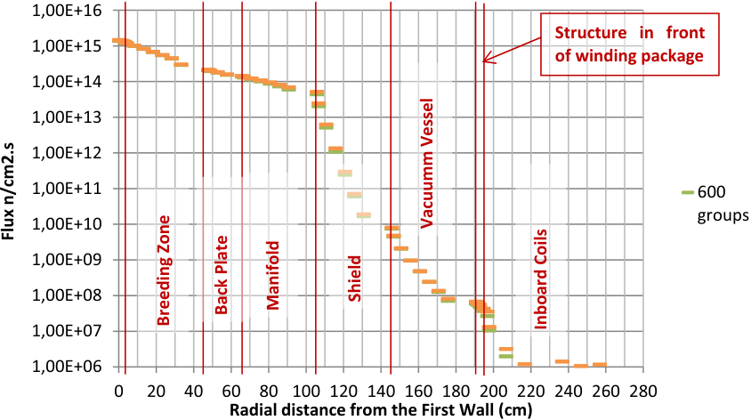

**----- Start of picture text -----** 
1,00E+16 Structure in front 1,00E+15 of winding package 1,00E+14 1,00E+13 1,00E+12 1,00E+11 600 groups 1,00E+10 1,00E+09 1,00E+08 1,00E+07 1,00E+06 0 20 40 60 80 100 120 140 160 180 200 220 240 260 280 Radial distance from the First Wall (cm) Vacuumm Vessel Flux n/cm2.s Shield Back Plate  Manifold Breeding Zone  Inboard Coils **----- End of picture text -----** 

## **B.6. 1D Apollo2 deposited energy performances** 

## 1D geometry Apollo2 model performances compared to the 1D Tripoli4 simulations. 

_129_ 

## **B.7. Example of neural network** 

## C++ program containing a neural network that estimates the TBR. 

#define ActivationFunction(sum)         ( tanh(sum) ) void FctTBR_Total_Rn_9_0(double *param, double *res) { ////////////////////////////// // //     ********************************************* //     ** Uranie  Wed Jun  6 15:22:46 2012 //     **   Version : v2.3/2 //     **      Date : Wed Mar 07, 2012 //     ********************************************* // // //     ********************************************* //     ** BF_Rn ** //     ** //     **  ** //     ********************************************* // //    INPUT : 26 //             Half_Radius_of_the_Plasma ( Half_Radius_of_the_Plasma ) //             Thickness_VV_Inboard ( Thickness_VV_Inboard ) //             Thickness_SH_Inboard ( Thickness_SH_Inboard ) //             Thickness_MAN_Inboard ( Thickness_MAN_Inboard ) //             Thickness_BZ_Inboard ( Thickness_BZ_Inboard ) //             Thickness_FW ( Thickness_FW ) //             Thickness_of_the_Plasma ( Thickness_of_the_Plasma ) //             Thickness_MAN_Outboard ( Thickness_MAN_Outboard ) //             Thickness_BZ_Outboard ( Thickness_BZ_Outboard ) //             Lithium_6_enrichment ( Lithium_6_enrichment ) //             Composition_FW_He ( Composition_FW_He ) //             Composition_BZ_EuroFer ( Composition_BZ_EuroFer ) //             Composition_BZ_He ( Composition_BZ_He ) //             Composition_MAN_LiPB ( Composition_MAN_LiPB ) //             Composition_MAN_EuroFer ( Composition_MAN_EuroFer ) //             Composition_SH_EuroFer ( Composition_SH_EuroFer ) //             Composition_SH_H2O ( Composition_SH_H2O ) //             Composition_VV_He ( Composition_VV_He ) //             Composition_VV_Boron ( Composition_VV_Boron ) //             Composition_TFSWP_He ( Composition_TFSWP_He ) //             Composition_TFC_Epoxy ( Composition_TFC_Epoxy ) //             Composition_TFC_HeLiq ( Composition_TFC_HeLiq ) //             Triangulation ( Triangulation ) //             Elongation ( Elongation ) //             Surface_Div_Inboard ( Surface_Div_Inboard ) //             Surface_Div_Outboard ( Surface_Div_Outboard ) // //    HIDDEN : 9 // //    OUTPUT : 1 //             TBR_Total ( TBR_Total ) // ////////////////////////////// int nInput   = 26; int nOuput   = 1; int nHidden  = 9; const int nNeurones  = 36; double FctTBR_Total_Rn_9_0_act[nNeurones]; // --- Pretraitment of the inputs and outputs double FctTBR_Total_Rn_9_0_minInput[] = { 700.027, 30.0008, 25.0012, 25.0013, 30.004, 2.00016, 240.002, 40.0015, 50.0066, 0.600045, 25.0011, 5.00222, 5.00134, 0.000179968, 25.001, 5.00087, 20.0018, 35.001, 1.00004, 0.00105174, 15.001, 13.0002, 0.400003, 1.8, 0.0500017, 0.0600001, }; double FctTBR_Total_Rn_9_0_minOuput[] = { 

0.8116,   }; double FctTBR_Total_Rn_9_0_maxInput[] = { 899.991, 39.9985, 34.9989, 34.9984, 59.9976, 3.99996, 259.997, 59.9971, 89.9958, 0.989939, 34.9996, 19.9977, 19.9998, 9.99884, 34.9992, 14.9983, 30, 39.9995, 2.99975, 9.99985, 24.9985, 19.9999, 0.699999, 2.19999, 0.06, 0.0699996, }; double FctTBR_Total_Rn_9_0_maxOuput[] = { 1.28595,   }; // --- Values of the weights double FctTBR_Total_Rn_9_0_valW[] = { -0.770503, -0.41701, -0.365062, 0.00748932, 0.00295046, 0.00203292, 0.00796074, 0.122025, 0.10879, -0.00384605, 0.00355137, -0.0109447, -0.064051, -0.128022, -0.0485073, -0.0634014, 0.008742, 0.0127396, -0.00108845, -0.00566644, -0.00144493, 0.000365803, 0.0033791, 0.000712315, -0.00141671, -0.00729155, -0.00775967, 0.0205796, 0.0161141, -0.0009466, -0.286987, -0.673256, 0.690277, 1.62677, 0.879966, -1.62892, -0.65816, 0.261458, 1.79952, -0.830435, -0.151052, -0.00183584, 0.49168, 2.13363, -0.668357, 0.381465, 0.0541227, -0.67419, -0.383398, -0.726098, -0.0150234, -1.6811, -1.3721, 0.784842, -0.422099, -0.858814, 0.0257492, 0.00281103, -0.924063, 0.943711, 0.296202, -0.0435597, 0.000954333, -0.189686, -0.83575, -0.248009, 0.18671, 0.0952223, -0.089727, -1.42836, 0.476611, -0.0903414, -0.264497, -0.0535293, 0.0165653, -0.209324, 0.239533, 0.256478, 0.0943184, -0.269124, -0.303051, 0.603791, -0.545882, 0.502966, -0.235403, -0.841119, -1.13427, 0.000151469, -0.000460163, -0.00168479, 1.643e-05, -0.0096084, -0.0198637, -0.000940162, -0.000390213, -0.015843, -0.383224, 0.0163927, 0.0273961, 0.0114247, -0.0240531, 0.00247994, 0.00183277, 0.000340355, -0.00050983, -0.000832667, -0.00155477, -0.00184639, 0.000287451, 8.49932e-05, 0.000952165, -0.00176677, 0.000828718, 0.797215, 1.0542, -0.0494095, -0.00143265, 0.000722249, 0.0242915, 0.414508, 0.0132581, 0.0138992, 0.00128125, -0.0093475, 0.032112, 0.0117303, 0.0713432, 0.010499, 0.00607154, 0.0167218, -0.00190306, -0.00579686, 0.000489116, -1.35903e-05, 0.00240901, 0.00157214, -0.000603431, 0.0432602, -0.0116913, 0.00569366, -0.00346953, -1.06365, -1.10414, -0.0227595, 0.000412701, 6.78779e-05, -6.97775e-05, 0.00374682, -0.0592056, 0.00700191, -0.0202186, -0.523984, -0.0619691, 0.0115967, -0.077947, 0.0676499, -0.00823138, -0.0194779, -0.000317695, 0.00369104, -0.00113327, -5.3444e-05, 0.000697444, -0.000742812, -3.9401e-05, 0.0159359, -0.00430074, -0.00274163, -0.00561686, -2.99803, 0.757833, 0.00609582, -0.000498689, -0.000207196, -0.00107892, -0.022916, 0.0958661, -0.00307953, -0.000983546, 0.00554005, -0.00829994, -0.000313094, 0.0997375, 0.025635, 0.00264543, -0.00412672, 0.000304029, 0.00106788, 0.00101378, 0.000217847, -0.000131415, -0.000258623, -0.000182101, 0.000684372, -0.00323913, 0.00808579, 0.008599, -0.813495, -0.662911, 0.00930383, -0.00122413, -0.000216768, -0.00503985, -0.0781939, -0.00713892, -0.00649209, 0.000989081, -0.0410093, -0.0916615, 0.00883855, 0.197953, 0.17109, 0.00445988, -0.00420201, -0.00166514, 0.00226193, 0.000294848, 0.000568471, -0.000170057, 0.00210311, 0.0016579, -0.000957386, -0.00168051, 0.00450953, 0.00649519, -0.000751702, 1.10303, -0.726772, 0.66379, -0.915479, 0.411347, -1.11326, -0.381297, 0.512392, 2.16415, 0.427017, -0.240469, -1.80094, 1.66976, -0.231898, -0.0274794, 1.16326, -0.10856, 0.966408, -1.96549, 0.268139, 0.146961, 2.28708, -1.03568, -1.05558, -0.959071, -0.229529, 0.0506664, }; // --- Constantes int indNeurone = 0; int CrtW; double sum; // --- Input Layers for(int i = 0; i < nInput; i++) { FctTBR_Total_Rn_9_0_act[indNeurone++] = 2.0 * ( param[i] - FctTBR_Total_Rn_9_0_minInput[i] ) / ( FctTBR_Total_Rn_9_0_maxInput[i] - FctTBR_Total_Rn_9_0_minInput[i] ) - 1.0; 

_131_ 

} // --- Hidden Layers for (int member = 0; member < nHidden; member++) { int CrtW = member * ( nInput + 2) + 2; sum = FctTBR_Total_Rn_9_0_valW[CrtW++]; for (int source = 0; source < nInput; source++) { sum += FctTBR_Total_Rn_9_0_act[source] * FctTBR_Total_Rn_9_0_valW[CrtW++]; } FctTBR_Total_Rn_9_0_act[indNeurone++] = ActivationFunction(sum); } // --- Output for (int member = 0; member < nOuput; member++) { sum = FctTBR_Total_Rn_9_0_valW[0]; for (int source = 0; source < nHidden; source++) { CrtW = source * ( nInput + 2) + 1; sum += FctTBR_Total_Rn_9_0_act[nInput+source] * FctTBR_Total_Rn_9_0_valW[CrtW]; } FctTBR_Total_Rn_9_0_act[indNeurone++] = sum; res[member] = FctTBR_Total_Rn_9_0_minOuput[member] + 0.5 * ( FctTBR_Total_Rn_9_0_maxOuput[member] - FctTBR_Total_Rn_9_0_minOuput[member] ) * ( sum + 1.0); } } 

_132_ 

## **B.8. Neural network performances example** 

Automatically generated file containing the neural network performances for different hiding layers and iterations. 

Essai MSE moyenne moyenne_abs ecart type ecart type perc ecart Max ecart Max perc Note 0 1.3342e-03 1.2205e-04 7.1559e-03 8.8904e-03 5.1062e-03 4.2868e-02 4.7704e-02 1.0796e01 1 1.2958e-03 1.4131e-04 7.1605e-03 8.8958e-03 5.1011e-03 4.2418e-02 4.6631e-02 1.0747e01 2 1.3556e-03 2.5109e-04 7.1305e-03 8.8963e-03 5.1795e-03 4.5108e-02 4.9093e-02 1.0836e01 

02 02 02 

Essai MSE moyenne moyenne_abs ecart type ecart type perc ecart Max ecart Max perc Note 0 5.6857e-04 7.5366e-05 4.4929e-03 5.6364e-03 3.2701e-03 2.9540e-02 3.0656e-02 6.5541e1 5.1697e-04 1.0875e-05 4.4985e-03 5.6416e-03 3.2647e-03 3.0599e-02 3.1720e-02 6.5293e2 5.6203e-04 2.8079e-04 4.4975e-03 5.6711e-03 3.3344e-03 3.0075e-02 3.1194e-02 6.5727e- 

Essai MSE moyenne moyenne_abs ecart type ecart type perc ecart Max ecart Max perc Note 0 2.8943e-04 3.9709e-05 3.1815e-03 4.0299e-03 2.3770e-03 2.1614e-02 2.1973e-02 4.5475e02 1 3.3068e-04 3.3691e-04 3.4391e-03 4.3598e-03 2.5958e-03 2.0543e-02 1.9837e-02 4.8691e02 2 2.7599e-04 2.5864e-05 3.2398e-03 4.1126e-03 2.4410e-03 2.2503e-02 2.4933e-02 4.6455e02 

_133_ 

Essai MSE moyenne moyenne_abs ecart type ecart type perc ecart Max ecart Max perc Note 0 9.7440e-05 5.5697e-05 1.7495e-03 2.3165e-03 1.4537e-03 1.2685e-02 1.1935e-02 2.4702e02 1 9.6959e-05 1.9162e-04 1.7298e-03 2.2990e-03 1.4684e-03 1.3220e-02 1.3668e-02 2.4723e02 2 8.5833e-05 6.7761e-05 1.7544e-03 2.2993e-03 1.4246e-03 1.1843e-02 1.2262e-02 2.4537e02 

Essai MSE moyenne moyenne_abs ecart type ecart type perc ecart Max ecart Max perc Note 0 3.6953e-05 1.4426e-04 1.0895e-03 1.3986e-03 8.4464e-04 7.6229e-03 6.5488e-03 1.4925e02 1 3.4770e-05 4.3617e-05 1.1193e-03 1.4425e-03 8.7213e-04 7.6237e-03 7.5155e-03 1.5369e02 2 4.5417e-05 4.7776e-05 1.1780e-03 1.5270e-03 9.2651e-04 1.1094e-02 1.1286e-02 1.6926e02 

Essai MSE moyenne moyenne_abs ecart type ecart type perc ecart Max ecart Max perc Note 0 4.2188e-05 7.3508e-06 1.1260e-03 1.4525e-03 8.7899e-04 8.0089e-03 7.8922e-03 1.5603e02 1 2.8112e-05 3.3706e-04 9.4493e-04 1.1618e-03 7.2113e-04 5.6682e-03 5.9067e-03 1.2771e02 2 2.3919e-05 6.1193e-05 8.5781e-04 1.1020e-03 6.7541e-04 5.9896e-03 5.0463e-03 1.1698e02 

Nombre de neurones de la couche cachee : 7 Essai MSE moyenne moyenne_abs ecart type ecart type perc ecart Max ecart Max perc Note 0 2.5492e-05 4.8987e-05 8.8061e-04 1.1686e-03 7.4103e-04 9.4176e-03 9.7755e-03 1.2890e- 

_134_ 

1 2.0434e-05 3.9255e-05 8.1358e-04 1.0507e-03 6.3412e-04 5.3205e-03 5.4757e-03 1.1105e02 2 1.9908e-05 2.2119e-04 8.1431e-04 1.0384e-03 6.5072e-04 4.7585e-03 5.0299e-03 1.1010e02 

Essai MSE moyenne moyenne_abs ecart type ecart type perc ecart Max ecart Max perc Note 0 2.1540e-05 3.0268e-05 8.0827e-04 1.0451e-03 6.3571e-04 4.8528e-03 4.7436e-03 1.0939e02 1 1.9415e-05 2.4224e-05 7.7984e-04 1.0193e-03 6.2621e-04 5.1436e-03 4.4805e-03 1.0600e02 2 2.1293e-05 9.4595e-05 8.3006e-04 1.0702e-03 6.5203e-04 4.8699e-03 4.8835e-03 1.1211e02 

Essai MSE moyenne moyenne_abs ecart type ecart type perc ecart Max ecart Max perc Note 0 2.0187e-05 8.2823e-05 8.2545e-04 1.0532e-03 6.2928e-04 4.9867e-03 4.5731e-03 1.1095e02 1 1.3811e-05 2.9151e-05 6.7702e-04 8.7342e-04 5.2745e-04 4.4525e-03 4.2245e-03 9.1769e03 2 3.2663e-05 2.6305e-04 1.0569e-03 1.3278e-03 8.0386e-04 6.3489e-03 7.4607e-03 1.4409e02 

Essai MSE moyenne moyenne_abs ecart type ecart type perc ecart Max ecart Max perc Note 0 1.8102e-05 2.2629e-05 7.7668e-04 1.0011e-03 6.0337e-04 4.9456e-03 4.5686e-03 1.0504e02 1 3.1249e-05 5.6763e-05 1.0221e-03 1.3141e-03 7.9270e-04 7.3116e-03 7.0855e-03 1.4080e02 2 2.1582e-05 2.2686e-05 8.2993e-04 1.0710e-03 6.5028e-04 4.7191e-03 4.8694e-03 1.1195e02 

_135_ 

Essai MSE moyenne moyenne_abs ecart type ecart type perc ecart Max ecart Max perc Note 0 2.3016e-05 8.2102e-05 8.4414e-04 1.1002e-03 6.8435e-04 6.9218e-03 7.2035e-03 1.1869e02 1 2.0537e-05 7.3624e-05 8.3491e-04 1.0782e-03 6.6192e-04 5.6456e-03 6.2438e-03 1.1484e02 2 1.8775e-05 1.3793e-04 7.8505e-04 1.0092e-03 6.1994e-04 5.5018e-03 5.7342e-03 1.0791e02 

Nombre de neurones de la couche cachee : 12 Essai MSE moyenne moyenne_abs ecart type ecart type perc ecart Max ecart Max perc Note 0 2.7996e-05 9.3369e-05 9.7235e-04 1.2506e-03 7.5804e-04 6.3051e-03 6.0606e-03 1.3249e02 1 1.7056e-05 3.4085e-05 7.5807e-04 9.8224e-04 5.9341e-04 5.1772e-03 4.6552e-03 1.0310e02 2 3.6235e-05 1.0255e-04 1.0579e-03 1.3495e-03 8.1430e-04 6.9707e-03 7.2674e-03 1.4529e02 

Nombre de neurones de la couche cachee : 13 Essai MSE moyenne moyenne_abs ecart type ecart type perc ecart Max ecart Max perc Note 0 2.2280e-05 5.9113e-05 8.7419e-04 1.1436e-03 7.1510e-04 7.3071e-03 7.6015e-03 1.2314e02 1 2.1336e-05 2.3286e-05 8.4456e-04 1.0871e-03 6.5307e-04 5.0627e-03 4.5679e-03 1.1362e02 2 1.9212e-05 6.7073e-05 7.7708e-04 1.0017e-03 6.0977e-04 4.7160e-03 4.9852e-03 1.0544e02 Nombre de neurones de la couche cachee : 14 Essai MSE moyenne moyenne_abs ecart type ecart type perc ecart Max ecart Max perc Note 0 1.7687e-05 1.0746e-04 7.9148e-04 1.0197e-03 6.2136e-04 5.5452e-03 5.3829e-03 1.0826e02 1 2.2655e-05 4.2048e-05 8.5191e-04 1.0957e-03 6.6532e-04 5.2296e-03 5.6590e-03 1.1595e- 

_136_ 

2 1.6385e-05 1.6176e-05 7.1834e-04 9.3907e-04 5.7350e-04 03 

5.5987e-03 4.8653e-03 9.9063e- 

Essai MSE moyenne moyenne_abs ecart type ecart type perc ecart Max ecart Max perc Note 0 1.8482e-05 1.0738e-04 7.6727e-04 9.8250e-04 5.9169e-04 4.4203e-03 4.8270e-03 1.0356e02 1 2.5554e-05 2.0299e-05 9.4551e-04 1.2242e-03 7.3913e-04 5.7897e-03 5.3606e-03 1.2789e02 2 2.2865e-05 6.3994e-05 8.8242e-04 1.1285e-03 6.7918e-04 6.2335e-03 6.0471e-03 1.2089e02 

The chosen one... 

Nombre de neurones caches = 9 Essai   = 1 Moyenne = 2.9151e-05 Moyenne abs = 6.7702e-04 MSE = 1.3811e-05 Ecart type = 8.7342e-04 Ecart type pourcentage= 5.2745e-04 Ecart maxi = 4.4525e-03 Ecart maxi perc =  4.2245e-03 Note = 9.1769e-03 

## Parametres en entree : 

Half_Radius_of_the_Plasma:Thickness_VV_Inboard:Thickness_SH_Inboard:Thickness_MAN_Inboard:Thickness_BZ_Inboard:Thick ness_FW:Thickness_of_the_Plasma:Thickness_MAN_Outboard:Thickness_BZ_Outboard:Lithium_6_enrichment:Composition_FW_He: Composition_BZ_EuroFer:Composition_BZ_He:Composition_MAN_LiPB:Composition_MAN_EuroFer:Composition_SH_EuroFer:Composi tion_SH_H2O:Composition_VV_He:Composition_VV_Boron:Composition_TFSWP_He:Composition_TFC_Epoxy:Composition_TFC_HeLiq: Triangulation:Elongation:Surface_Div_Inboard:Surface_Div_Outboard 

_137_ 

_138_ 

## **B.9. Chosen neural network performances** 

Chosen neural networks for the creation of the surrogate model 

Rn_TBRTot Nombre de neurones de la couche cachee : 9 Essai MSE moyenne moyenne_abs ecart type ecart type perc 1 1.3811e-05 2.9151e-05 6.7702e-04 8.7342e-04 5.2745e-04 03 

Rn_TBRInboard Nombre de neurones de la couche cachee : 13 Essai MSE moyenne moyenne_abs ecart type ecart type perc 1 1.1455e-05 9.7215e-06 2.4586e-04 3.1914e-04 7.5818e-04 03 

Rn_TBROutboard Nombre de neurones de la couche cachee : 14 Essai MSE moyenne moyenne_abs ecart type ecart type perc 1 2.4405e-05 8.9766e-05 6.8191e-04 8.6985e-04 6.9636e-04 03 

Facteur de multiplication Nombre de neurones de la couche cachee : 9 Essai MSE moyenne moyenne_abs ecart type ecart type perc 0 2.5049e-05 1.6236e-05 1.0485e-04 1.3868e-04 7.6902e-05 03 

Energie FWI Nombre de neurones de la couche cachee : 2 Essai MSE moyenne moyenne_abs ecart type ecart type perc 0 1.5087e-03 8.2564e-24 2.3766e-22 3.0889e-22 4.0279e-03 02 

ecart Max ecart Max perc Note 4.4525e-03 4.2245e-03 9.1769e- 

ecart Max ecart Max perc Note 1.7299e-03 7.7373e-03 4.5972e- 

ecart Max ecart Max perc Note 4.0384e-03 5.0772e-03 9.5410e- 

ecart Max ecart Max perc Note 7.7808e-04 6.4845e-04 1.6573e- 

ecart Max ecart Max perc Note 1.2503e-21 2.5187e-02 2.1634e- 

Energie FWO Nombre de neurones de la couche cachee : 5 

_139_ 

Essai MSE moyenne moyenne_abs ecart type ecart type perc ecart Max ecart Max perc Note 0 2.1390e-04 1.7865e-24 1.9654e-22 2.4552e-22 2.3502e-03 9.5821e-22 1.6529e-02 6.1422e- 

Energie BZI Nombre de neurones de la couche cachee : 2 Essai MSE moyenne moyenne_abs ecart type ecart type perc ecart Max ecart Max perc Note 0 1.1462e-04 6.0330e-24 5.6443e-23 7.2404e-23 2.3794e-03 2.9000e-22 1.3152e-02 4.8408e03 Energie BZO Nombre de neurones de la couche cachee : 6 Essai MSE moyenne moyenne_abs ecart type ecart type perc ecart Max ecart Max perc Note 2 6.3801e-05 1.7080e-24 3.8695e-23 5.0698e-23 2.0694e-03 1.8305e-22 1.2539e-02 3.9613e03 Energie BZ10I Nombre de neurones de la couche cachee : 1 Essai MSE moyenne moyenne_abs ecart type ecart type perc ecart Max ecart Max perc Note 0 3.8021e-04 8.5045e-24 1.2768e-22 1.6013e-22 2.4908e-03 5.7443e-22 1.3479e-02 7.6408e03 Energie BZ10O Nombre de neurones de la couche cachee : 5 Essai MSE moyenne moyenne_abs ecart type ecart type perc ecart Max ecart Max perc Note 0 1.7942e-04 5.3551e-24 1.2514e-22 1.5930e-22 2.0677e-03 6.4539e-22 1.2137e-02 5.0757e03 Energie BPI Nombre de neurones de la couche cachee : 3 Essai MSE moyenne moyenne_abs ecart type ecart type perc ecart Max ecart Max perc Note 2 2.9661e-04 2.0103e-25 1.8906e-23 2.4882e-23 1.3870e-02 1.2774e-22 8.1975e-02 2.5033e02 Energie BPO 

_140_ 

Nombre de neurones de la couche cachee : 6 Essai MSE moyenne moyenne_abs ecart type ecart type perc 2 3.0685e-04 1.3761e-25 1.0181e-23 1.3628e-23 2.3607e-02 02 

ecart Max ecart Max perc Note 7.3594e-23 1.7966e-01 4.4641e- 

Energie MANI Nombre de neurones de la couche cachee : 4 Essai MSE moyenne moyenne_abs ecart type ecart type perc 1 3.0373e-04 6.1346e-25 1.9500e-23 2.5852e-23 1.4068e-02 02 

ecart Max ecart Max perc Note 1.8448e-22 9.9401e-02 2.7046e- 

Energie MANO Nombre de neurones de la couche cachee : 2 Essai MSE moyenne moyenne_abs ecart type ecart type perc 1 2.4291e-04 3.4123e-25 7.8202e-24 1.0780e-23 1.7099e-02 02 

ecart Max ecart Max perc Note 5.0724e-23 9.6231e-02 2.9151e- 

Energie SHI Nombre de neurones de la couche cachee : 4 Essai MSE moyenne moyenne_abs ecart type ecart type perc 0 1.7536e-04 3.7263e-25 4.0460e-23 5.4033e-23 9.9887e-03 02 

ecart Max ecart Max perc Note 2.1300e-22 6.2306e-02 1.7973e- 

Energie SHO Nombre de neurones de la couche cachee : 2 

Essai MSE moyenne moyenne_abs ecart type ecart type perc 0 2.2230e-04 8.4246e-25 1.0534e-23 1.4775e-23 1.6652e-02 

ecart Max ecart Max perc Note 7.7593e-23 1.0939e-01 2.9814e- 

Energie VV Nombre de neurones de la couche cachee : 4 Essai MSE moyenne moyenne_abs ecart type ecart type perc 4 5.0766e-05 8.0903e-26 2.3044e-24 3.9530e-24 1.9609e-02 

ecart Max ecart Max perc Note 7.0152e-23 1.6437e-01 3.6554e- 

_141_ 

Energie VVO Nombre de neurones de la couche cachee : 2 Essai MSE moyenne moyenne_abs ecart type ecart type perc ecart Max ecart Max perc Note 5 5.3056e-04 1.7515e-28 1.6890e-26 2.3430e-26 8.1016e-01 2.4769e-25 1.1448e+01 1.9603e+00 Energie TFSWP Nombre de neurones de la couche cachee : 3 Essai MSE moyenne moyenne_abs ecart type ecart type perc ecart Max ecart Max perc Note 1 3.9912e-05 6.7203e-26 3.2249e-25 5.7246e-25 2.3633e-02 1.6735e-23 1.9957e-01 4.3990e02 Energie TFSWPO Nombre de neurones de la couche cachee : 1 Essai MSE moyenne moyenne_abs ecart type ecart type perc ecart Max ecart Max perc Note 1 1.3674e-05 1.6649e-30 4.0799e-29 9.2181e-29 5.9634e-02 1.2579e-27 3.9095e-01 9.8866e02 

Energie TFC Nombre de neurones de la couche cachee : 4 Essai MSE moyenne moyenne_abs ecart type ecart type perc ecart Max ecart Max perc Note 7 6.3971e-05 9.3692e-27 5.9923e-26 1.1030e-25 2.6476e-02 2.9900e-24 2.3508e-01 5.0624e02 Energie TFCO Nombre de neurones de la couche cachee : 1 Essai MSE moyenne moyenne_abs ecart type ecart type perc ecart Max ecart Max perc Note 5 1.9533e-05 1.5856e-31 4.4984e-30 1.0654e-29 5.9387e-02 2.3982e-28 3.9853e-01 9.9436e02 

## **Flux sh1bz1 (1st zone)** 

fw Nombre de neurones de la couche cachee : 15 Essai MSE moyenne moyenne_abs ecart type ecart type perc ecart Max ecart Max perc Note 

_142_ 

0 1.4256e-05 2.0736e-07 5.7367e-07 7.8429e-07 4.7730e-04 4.7939e-06 3.8264e-03 1.0095e03 bz Nombre de neurones de la couche cachee : 9 Essai MSE moyenne moyenne_abs ecart type ecart type perc ecart Max ecart Max perc Note 0 1.3258e-05 6.9620e-08 6.1813e-07 8.4528e-07 5.1783e-04 4.9671e-06 3.7553e-03 1.0335e03 bp Nombre de neurones de la couche cachee : 15 Essai MSE moyenne moyenne_abs ecart type ecart type perc ecart Max ecart Max perc Note 1 7.6039e-06 5.4340e-08 3.8240e-07 5.0790e-07 1.3198e-03 3.8156e-06 1.4950e-02 2.8956e03 man Nombre de neurones de la couche cachee : 13 Essai MSE moyenne moyenne_abs ecart type ecart type perc ecart Max ecart Max perc Note 0 2.2272e-05 1.0455e-08 4.2142e-07 5.6667e-07 2.3728e-03 4.7107e-06 3.0617e-02 5.6624e03 sh Nombre de neurones de la couche cachee : 14 Essai MSE moyenne moyenne_abs ecart type ecart type perc ecart Max ecart Max perc Note 0 3.0310e-05 3.5048e-08 1.9278e-07 2.6123e-07 3.3514e-03 1.9885e-06 3.8260e-02 7.4829e03 

vv Nombre de neurones de la couche cachee : 12 Essai MSE moyenne moyenne_abs ecart type ecart type perc 0 8.3889e-05 4.8392e-12 2.5328e-10 3.7401e-10 1.3193e-02 02 

ecart Max ecart Max perc Note 2.8808e-09 1.0837e-01 2.4869e- 

tfswp Nombre de neurones de la couche cachee : 9 Essai MSE moyenne moyenne_abs ecart type ecart type perc ecart Max ecart Max perc Note 

_143_ 

0 3.2432e-05 1.0970e-12 1.3388e-11 1.9887e-11 1.5313e-02 1.7376e-10 1.7736e-01 3.3373e02 tfc Nombre de neurones de la couche cachee : 4 Essai MSE moyenne moyenne_abs ecart type ecart type perc ecart Max ecart Max perc Note 1 4.9855e-05 4.9881e-14 8.2481e-12 1.2487e-11 1.8027e-02 1.1032e-10 1.4710e-01 3.3236e02 

## **Flux sh1bz2 (2nd zone)** 

fw Nombre de neurones de la couche cachee : 8 Essai MSE moyenne moyenne_abs ecart type ecart type perc ecart Max ecart Max perc Note 4 1.3425e-05 3.3978e-08 6.2845e-07 8.3867e-07 4.5600e-04 4.9953e-06 4.1338e-03 1.0113e03 bz Nombre de neurones de la couche cachee : 9 Essai MSE moyenne moyenne_abs ecart type ecart type perc ecart Max ecart Max perc Note 2 1.1874e-05 2.1911e-07 6.3637e-07 7.7751e-07 4.4072e-04 4.5806e-06 3.6446e-03 9.3151e04 bp Nombre de neurones de la couche cachee : 11 Essai MSE moyenne moyenne_abs ecart type ecart type perc ecart Max ecart Max perc Note 1 1.1090e-05 8.1910e-09 2.7330e-07 3.6551e-07 1.7888e-03 2.9078e-06 2.2404e-02 4.1435e03 man Nombre de neurones de la couche cachee : 12 Essai MSE moyenne moyenne_abs ecart type ecart type perc ecart Max ecart Max perc Note 0 1.5423e-05 5.3051e-09 2.2724e-07 3.0936e-07 2.4392e-03 2.9650e-06 2.7356e-02 5.3319e03 sh Nombre de neurones de la couche cachee : 10 

_144_ 

Essai MSE moyenne moyenne_abs ecart type ecart type perc ecart Max ecart Max perc Note 1 2.0201e-05 4.4685e-09 8.5807e-08 1.2026e-07 3.0511e-03 9.3412e-07 3.0846e-02 6.3388e- 

vv Nombre de neurones de la couche cachee : 6 Essai MSE moyenne moyenne_abs ecart type ecart type perc ecart Max ecart Max perc Note 1 5.9089e-05 1.0065e-11 8.5290e-11 1.2636e-10 1.2450e-02 1.2287e-09 9.6383e-02 2.2680e02 tfswp Nombre de neurones de la couche cachee : 5 Essai MSE moyenne moyenne_abs ecart type ecart type perc ecart Max ecart Max perc Note 1 5.4932e-05 4.6132e-13 3.3986e-12 5.3509e-12 1.3891e-02 1.3796e-10 1.1627e-01 2.6067e02 tfc Nombre de neurones de la couche cachee : 4 Essai MSE moyenne moyenne_abs ecart type ecart type perc ecart Max ecart Max perc Note 1 8.1275e-05 7.3925e-15 1.9198e-12 2.9865e-12 1.6448e-02 3.3386e-11 1.4580e-01 3.1841e02 

## **Flux sh2bz1 (3rd zone)** 

fw Nombre de neurones de la couche cachee : 8 Essai MSE moyenne moyenne_abs ecart type ecart type perc ecart Max ecart Max perc Note 3 1.3327e-05 1.5382e-07 5.8328e-07 7.8899e-07 4.5079e-04 5.2682e-06 3.7074e-03 9.6194e04 bz Nombre de neurones de la couche cachee : 7 Essai MSE moyenne moyenne_abs ecart type ecart type perc ecart Max ecart Max perc Note 4 1.2327e-05 4.3008e-08 5.9738e-07 8.0241e-07 4.8365e-04 5.1675e-06 3.8725e-03 1.0015e03 

_145_ 

bp Nombre de neurones de la couche cachee : 7 Essai MSE moyenne moyenne_abs ecart type ecart type perc ecart Max ecart Max perc Note 1 1.1686e-05 9.3697e-09 4.2704e-07 5.7242e-07 1.4696e-03 3.8583e-06 2.7053e-02 4.2970e03 man Nombre de neurones de la couche cachee : 11 Essai MSE moyenne moyenne_abs ecart type ecart type perc ecart Max ecart Max perc Note 0 2.8323e-05 8.0835e-09 4.6222e-07 6.2390e-07 2.5033e-03 3.7029e-06 1.9958e-02 4.7879e03 sh Nombre de neurones de la couche cachee : 11 Essai MSE moyenne moyenne_abs ecart type ecart type perc ecart Max ecart Max perc Note 3 1.3548e-05 2.4813e-08 1.3639e-07 1.8067e-07 2.4850e-03 1.3689e-06 3.3675e-02 5.9896e03 vv Nombre de neurones de la couche cachee : 9 Essai MSE moyenne moyenne_abs ecart type ecart type perc ecart Max ecart Max perc Note 4 4.5530e-05 1.0927e-11 8.7985e-11 1.2549e-10 1.2362e-02 1.2157e-09 1.0986e-01 2.3803e02 tfswp Nombre de neurones de la couche cachee : 8 Essai MSE moyenne moyenne_abs ecart type ecart type perc ecart Max ecart Max perc Note 1 4.7918e-05 1.5457e-13 5.1213e-12 7.5725e-12 1.2330e-02 6.3897e-11 1.1414e-01 2.4223e02 tfc Nombre de neurones de la couche cachee : 7 Essai MSE moyenne moyenne_abs ecart type ecart type perc ecart Max ecart Max perc Note 0 6.8000e-05 1.3371e-14 2.7591e-12 4.2064e-12 1.4076e-02 4.7824e-11 1.2631e-01 2.7387e02 

**Flux sh2bz2 (4th zone)** 

_146_ 

fw Nombre de neurones de la couche cachee : 9 Essai MSE moyenne moyenne_abs ecart type ecart type perc ecart Max ecart Max perc Note 4 1.5371e-05 6.8993e-08 6.6105e-07 8.9962e-07 5.0115e-04 5.4024e-06 4.2910e-03 1.0920e03 bz Nombre de neurones de la couche cachee : 10 Essai MSE moyenne moyenne_abs ecart type ecart type perc ecart Max ecart Max perc Note 3 1.0447e-05 1.0263e-07 5.3557e-07 7.4695e-07 4.7634e-04 4.2271e-06 3.8489e-03 9.7223e04 bp Nombre de neurones de la couche cachee : 10 Essai MSE moyenne moyenne_abs ecart type ecart type perc ecart Max ecart Max perc Note 0 1.6672e-05 5.6283e-08 3.2678e-07 4.3223e-07 2.0050e-03 3.8673e-06 1.7518e-02 3.9276e03 man Nombre de neurones de la couche cachee : 11 Essai MSE moyenne moyenne_abs ecart type ecart type perc ecart Max ecart Max perc Note 3 2.2187e-05 6.6251e-09 2.8552e-07 3.8647e-07 2.9416e-03 3.5018e-06 2.5397e-02 5.7067e03 sh Nombre de neurones de la couche cachee : 11 Essai MSE moyenne moyenne_abs ecart type ecart type perc ecart Max ecart Max perc Note 0 2.4793e-05 5.1289e-10 9.0656e-08 1.2321e-07 3.2041e-03 9.3988e-07 3.3755e-02 6.8286e03 vv Nombre de neurones de la couche cachee : 9 Essai MSE moyenne moyenne_abs ecart type ecart type perc ecart Max ecart Max perc Note 4 6.0370e-05 4.0617e-13 2.1959e-11 3.3040e-11 1.0753e-02 3.6414e-10 1.0152e-01 2.1509e02 

_147_ 

tfswp Nombre de neurones de la couche cachee : 8 Essai MSE moyenne moyenne_abs ecart type ecart type perc ecart Max ecart Max perc Note 0 6.6995e-05 2.1477e-14 1.3814e-12 2.1162e-12 1.3378e-02 2.0879e-11 1.3489e-01 2.7537e02 tfc Nombre de neurones de la couche cachee : 6 Essai MSE moyenne moyenne_abs ecart type ecart type perc ecart Max ecart Max perc Note 4 5.9494e-05 3.7779e-14 6.6616e-13 1.0592e-12 1.3042e-02 1.0835e-11 1.0014e-01 2.3651e02 

_149_ 

## **C. Apendix : Programs and Codes** 

## **C.1. Neutronic Module** 

- Launcher.py 

from math import * import glob import sys import math import os from ctypes import * from numpy  import * from functions import * from neuralnetworks import * from inputs import * 

##################1. Declaration of the Neural Networks used to perform the calculations (shared libraries .so) ################ 

################### 2. Opening the input file ############################ 

#output = open('input.dat','r') 

################### 3. Creation of the output files ####################### print 'LOADING THE PROGRAM...' output = open('check.out','w') var = open('variables.out','w') var.write('NEUTRONIC MODULE\n\n') var.write('File created automatically by the neutronic module.\n') var.write('File containing output variables stored in rows \n\n') output.write('NEUTRONIC MODULE\n\n') output.write('File created automatically by the neutronic module.\n') output.write('File containing the geometry check and output variables stored in rows \n\n') 

############### 4. Definition of the variables ########################### print 'GEOMETRY VALIDATION' 

#Matrix containing the index, name, value and operable window of each parameter used by the neural networks #The matrix columns are: [Index,Name,Value,MinValue,MaxValue,Dimension] 

param_values = array([ 

[0,'Lithium_6_enrichment', Lithium_6_enrichment,  0.6, 0.99, 'cm'], #General parameters [1,'Half_Radius_of_the_Plasma',Half_Radius_of_the_Plasma*100,  700, 900, 'cm'], #Thickness [2,'Thickness_of_the_Plasma', Thickness_of_the_Plasma*100,  240, 250, 'cm'], [3,'Thickness_CS_Inboard', Thickness_CS_Inboard*100, 72, 76, 'cm'], [4,'Thickness_TFC_Inboard', Thickness_TFC_Inboard*100 ,  70, 78 , 'cm'], [5,'Thickness_TFSWP_Inboard', Thickness_TFSWP_Inboard*100 ,   5, 7 , 'cm'], [6,'Thickness_VV_Inboard',Thickness_VV_Inboard*100 ,  30, 40, 'cm'], [7,'Thickness_SH_Inboard',Thickness_SH_Inboard*100 ,  25, 35 , 'cm'], [8,'Thickness_MAN_Inboard',Thickness_MAN_Inboard*100 ,  25, 35 , 'cm'], [9,'Thickness_BP_Inboard',Thickness_BP_Inboard*100 ,   15, 25   , 'cm'], [10,'Thickness_BZ_Inboard',Thickness_BZ_Inboard*100 ,  30, 60  , 'cm'], [11,'Thickness_FW',Thickness_FW*100 ,   2, 4  , 'cm'], [12,'Thickness_FWPL_Inboard',Thickness_FWPL_Inboard*100,  0.1, 0.3  , 'cm'], [13,'Thickness_TFC_Outboard',Thickness_TFC_Outboard*100 ,  90, 96   , 'cm'], [14,'Thickness_TFSWP_Outboard',Thickness_TFSWP_Outboard*100,    7, 9 , 'cm'], [15,'Thickness_VV_Outboard', Thickness_VV_Outboard*100,   77, 83   , 'cm'], [16,'Thickness_SH_Outboard', Thickness_SH_Outboard*100,   45, 55   , 'cm'], [17,'Thickness_MAN_Outboard',Thickness_MAN_Outboard*100 ,   45, 55  , 'cm'], [18,'Thickness_BP_Outboard',Thickness_BP_Outboard*100 ,  15, 25  , 'cm'], [19,'Thickness_BZ_Outboard', Thickness_BZ_Outboard*100  , 60, 90  , 'cm'], [20,'Thickness_FWPL_Outboard',Thickness_FWPL_Outboard*100 ,  0.1, 0.3 , 'cm'], 

[21,'Tolerance_TFC_CS_Inboard', Tolerance_TFC_CS_Inboard*100,   8, 12 , 'cm'], #Tolerances [22,'Tolerance_VV_TFC_Inboard', Tolerance_VV_TFC_Inboard*100,   8, 12, 'cm'], [23,'Tolerance_SH_VV_Inboard', Tolerance_SH_VV_Inboard*100,   8, 12, 'cm'], [24,'Tolerance_BB_SH_Inboard',Tolerance_BB_SH_Inboard*100 ,   8, 12, 'cm'], [25,'Tolerance_VV_TFC_Outboard',Tolerance_VV_TFC_Outboard*100 ,  8, 12, 'cm'], [26,'Tolerance_SH_VV_Outboard',Tolerance_SH_VV_Outboard*100 ,   8, 12, 'cm'], [27,'Tolerance_BB_SH_Outboard', Tolerance_BB_SH_Outboard*100 ,  8, 12, 'cm'], [28,'Distance_Plasma_FW_Inboard',Distance_Plasma_FW_Inboard*100 , 5, 15, 'cm'], [29,'Distance_Plasma_FW_Outboard',Distance_Plasma_FW_Outboard*100 , 5, 20, 'cm'], [30,'Composition_FW_He',Composition_FW_He , 25, 35 , '%'], #Materials compositions [31,'Composition_BZ_EuroFer', Composition_BZ_EuroFer,   5, 20 , '%'], [32,'Composition_BZ_He',Composition_BZ_He ,   5, 20, '%'], [33,'Composition_BP_LiPB',Composition_BP_LiPB , 0, 10, '%'], [34,'Composition_BP_EuroFer',Composition_BP_EuroFer ,  25, 35   , '%'], [35,'Composition_MAN_LiPB',Composition_MAN_LiPB , 0, 10 , '%'], [36,'Composition_MAN_EuroFer', Composition_MAN_EuroFer,  25, 35  , '%'], [37,'Composition_SH_EuroFer',Composition_SH_EuroFer, 5, 15, '%'], [38,'Composition_SH_H2O', Composition_SH_H2O,20, 30 , '%'], [39,'Composition_VV_He',Composition_VV_He , 35, 40, '%'], [40,'Composition_VV_Boron',Composition_VV_Boron ,  1, 3, '%'], [41,'Composition_TFSWP_He',Composition_TFSWP_He , 0, 10, '%'], [42,'Composition_TFC_Epoxy', Composition_TFC_Epoxy, 15, 25, '%' ], [43,'Composition_TFC_HeLiq',Composition_TFC_HeLiq ,  13, 20, '%'], [44,'Triangulation', Triangulation,  0.4, 0.7 , 'no unit'], #Plasma parameters [45,'Elongation',Elongation ,  1.8, 2.2 , 'no unit'], [46,'Surface_Div_Inboard', Surface_Div_Inboard,  5, 6 , '%'], [47,'Surface_Div_Outboard',Surface_Div_Outboard ,   6, 7 , '%']]) 

#Parameters for the validation of the geometry 

correctgeom = sel_value(param_values,'Half_Radius_of_the_Plasma') - (sel_value(param_values,'Thickness_of_the_Plasma') + sel_value(param_values,'Thickness_CS_Inboard') + sel_value(param_values,'Thickness_TFC_Inboard') + sel_value(param_values,'Thickness_TFSWP_Inboard') + sel_value(param_values,'Thickness_VV_Inboard') + sel_value(param_values,'Thickness_SH_Inboard') + sel_value(param_values,'Thickness_MAN_Inboard') + sel_value(param_values,'Thickness_BP_Inboard') + sel_value(param_values,'Thickness_BZ_Inboard') + sel_value(param_values,'Thickness_FW') + sel_value(param_values,'Thickness_FWPL_Inboard') + sel_value(param_values,'Distance_Plasma_FW_Inboard') + sel_value(param_values,'Tolerance_TFC_CS_Inboard') + sel_value(param_values,'Tolerance_VV_TFC_Inboard') + sel_value(param_values,'Tolerance_SH_VV_Inboard') + sel_value(param_values,'Tolerance_BB_SH_Inboard')) norm_1D_flux = Fusion_Power*1000000/0.00000000000016021773/17.6/(Volume*1000000)*pi*((sel_value(param_val ues,'Half_Radius_of_the_Plasma')+sel_value(param_values,'Thickness_of_the_Plasma')+sel_val ue(param_values,'Distance_Plasma_FW_Outboard'))**2(sel_value(param_values,'Half_Radius_of_the_Plasma')sel_value(param_values,'Thickness_of_the_Plasma')sel_value(param_values,'Distance_Plasma_FW_Inboard'))**2) norm_tripoli = Fusion_Power*1000000/0.00000000000016021773/17.6/(Volume*1000000)*pi*((sel_value(param_val ues,'Half_Radius_of_the_Plasma')+sel_value(param_values,'Thickness_of_the_Plasma')+sel_val ue(param_values,'Distance_Plasma_FW_Outboard'))**2(sel_value(param_values,'Half_Radius_of_the_Plasma')sel_value(param_values,'Thickness_of_the_Plasma')sel_value(param_values,'Distance_Plasma_FW_Inboard'))**2)*200 print norm_tripoli MeV_to_W = 0.00000000000016021773 

################# 5. Validation of the geometry ######################## output.write('BEGINNING OF GEOMETRY CHECK \n') i=0 while (i<len(param_values)): if (sel_min(param_values,param_values[i][1])<= sel_value(param_values,param_values[i][1]) <= sel_max(param_values,param_values[i][1])): output.write('\tCHECK GEOM (%s): OK \n' % param_values[i][1]) 

else: 

_151_ 

output.write('\tCHECK GEOM (%s): FALSE \n' % param_values[i][1]) output.write('\tThe thickness of %s (%7.2f%s) is not within the limits (%7.2f-%7.2f%s) \n' %(param_values[i][1],sel_value(param_values,param_values[i][1]),sel_dim(param_values,param _values[i][1]),sel_min(param_values,param_values[i][1]),sel_max(param_values,param_values[ i][1]),sel_dim(param_values,param_values[i][1]))) output.write('PROGRAM STOP\n') print 'PROGRAM STOP' print 'OPS! The geomtry entered is not valid, check the output file "check.out' sys.exit() i=i+1 if (correctgeom<0): output.write('\tCHECK GEOM Inboard Total Thicknes: FALSE \n') output.write('\tThe thickness of the inboard components exceeds the half radius of the plasma \n') print 'PROGRAM STOP' print 'OPS! The geomtry entered is not valid, check the output file "check.out' else: output.write('\tCHECK GEOM Inboard Total Thickness: OK \n') output.write('END OF GEOMETRY CHECK \n\n') ################### 6. Creation of the arrays that will be send to the Neural Networks ########################## output.write('BEGINNING THE CREATION OF THE ARRAYS SEND TO THE NEURAL NETWORKS \n') #Creation of an array containing the input parameters for the 1D model neural networks param1D= array([sel_value(param_values,'Half_Radius_of_the_Plasma'), sel_value(param_values,'Thickness_CS_Inboard'), sel_value(param_values,'Thickness_TFC_Inboard'), sel_value(param_values,'Thickness_TFSWP_Inboard'), sel_value(param_values,'Thickness_VV_Inboard'), sel_value(param_values,'Thickness_SH_Inboard'), sel_value(param_values,'Thickness_MAN_Inboard'), sel_value(param_values,'Thickness_BP_Inboard'), sel_value(param_values,'Thickness_BZ_Inboard'), sel_value(param_values,'Thickness_FW'), sel_value(param_values,'Thickness_FWPL_Inboard'), sel_value(param_values,'Distance_Plasma_FW_Inboard'), sel_value(param_values,'Thickness_of_the_Plasma'), sel_value(param_values,'Distance_Plasma_FW_Outboard'), sel_value(param_values,'Thickness_TFC_Outboard'), sel_value(param_values,'Thickness_TFSWP_Outboard'), sel_value(param_values,'Thickness_VV_Outboard'), sel_value(param_values,'Thickness_SH_Outboard'), sel_value(param_values,'Thickness_MAN_Outboard'), sel_value(param_values,'Thickness_BP_Outboard'), sel_value(param_values,'Thickness_BZ_Outboard'), sel_value(param_values,'Thickness_FWPL_Outboard'), sel_value(param_values,'Tolerance_TFC_CS_Inboard'), sel_value(param_values,'Tolerance_VV_TFC_Inboard'), sel_value(param_values,'Tolerance_SH_VV_Inboard'), sel_value(param_values,'Tolerance_BB_SH_Inboard'), sel_value(param_values,'Tolerance_VV_TFC_Outboard'), sel_value(param_values,'Tolerance_SH_VV_Outboard'), sel_value(param_values,'Tolerance_BB_SH_Outboard'), sel_value(param_values,'Lithium_6_enrichment'), sel_value(param_values,'Composition_FW_He'), sel_value(param_values,'Composition_BZ_EuroFer'), sel_value(param_values,'Composition_BZ_He'), sel_value(param_values,'Composition_MAN_LiPB'), sel_value(param_values,'Composition_MAN_EuroFer'), sel_value(param_values,'Composition_BP_LiPB'), sel_value(param_values,'Composition_BP_EuroFer'), sel_value(param_values,'Composition_SH_EuroFer'), sel_value(param_values,'Composition_SH_H2O'), sel_value(param_values,'Composition_VV_He'), sel_value(param_values,'Composition_VV_Boron'), sel_value(param_values,'Composition_TFSWP_He'), sel_value(param_values,'Composition_TFC_Epoxy'), sel_value(param_values,'Composition_TFC_HeLiq')]) output.write('\tCHECK ARRAY INPUTS 1D MODEL: OK \n') 

#Creation of an array containing the input parameters for the RZ model neural networks paramRZ= array([sel_value(param_values,'Half_Radius_of_the_Plasma'), sel_value(param_values,'Thickness_VV_Inboard'), 

sel_value(param_values,'Thickness_SH_Inboard'), sel_value(param_values,'Thickness_MAN_Inboard'), sel_value(param_values,'Thickness_BZ_Inboard'), sel_value(param_values,'Thickness_FW'), sel_value(param_values,'Thickness_of_the_Plasma'), sel_value(param_values,'Thickness_MAN_Outboard'), sel_value(param_values,'Thickness_BZ_Outboard'), sel_value(param_values,'Lithium_6_enrichment'), sel_value(param_values,'Composition_FW_He'), sel_value(param_values,'Composition_BZ_EuroFer'), sel_value(param_values,'Composition_BZ_He'), sel_value(param_values,'Composition_MAN_LiPB'), sel_value(param_values,'Composition_MAN_EuroFer'), sel_value(param_values,'Composition_SH_EuroFer'), sel_value(param_values,'Composition_SH_H2O'), sel_value(param_values,'Composition_VV_He'), sel_value(param_values,'Composition_VV_Boron'), sel_value(param_values,'Composition_TFSWP_He'), sel_value(param_values,'Composition_TFC_Epoxy'), sel_value(param_values,'Composition_TFC_HeLiq'), sel_value(param_values,'Triangulation'), sel_value(param_values,'Elongation'), (sel_value(param_values,'Surface_Div_Inboard')/100), (sel_value(param_values,'Surface_Div_Outboard')/100)]) output.write('\tCHECK ARRAY INPUTS RZ MODEL: OK \n') output.write('END OF ARRAY CHECK \n\n') 

########################## 7. Import of the Neural networks to python using ctypes (import of a dynamic library.so) ############### print 'LOADING AND PROCESSING THE NEURAL NETWORKS' output.write('BEGINNING NEURAL NETWORK LOADING AND CALCULATIONS \n') 

#Creation of a matrix with the names of the output parameters. The result and dimension given by the neural networks will be added to the matrix later on 

#The matrix columns are: [Index,Name,Value,Corrected Value,Dimension] 

output_RZ= array([[0,'TBRTot',float,float,0.], [1,'TBRIb',float,float,0.], [2,'TBROb',float,float,0.], [3,'ME',float,float,0.]]) 

#The matrix columns for the energy are: [Index,Name,Value,Corrected Value MW/m3,Corrected Value MW/m2,Dimension] 

output_ener=array ([[0,'EnerFWIb',float,float,0.], 

[1,'EnerBZ10Ib',float,float,0.], [2,'EnerBZIb',float,float,0.], [3,'EnerBPIb',float,float,0.], [4,'EnerMANIb',float,float,0.], [5,'EnerSHIb',float,float,0.], [6,'EnerVVIb',float,float,0.], [7,'EnerTFSWPIb',float,float,0.], [8,'EnerFWOb',float,float,0.], [9,'EnerBZ10Ob',float,float,0.], [10,'EnerBZOb',float,float,0.], [11,'EnerBPOb',float,float,0.], [12,'EnerMANOb',float,float,0.], [13,'EnerSHOb',float,float,0.], [14,'EnerVVOb',float,float,0.], [15,'EnerTFSWPOb',float,float,0.]]) #The matrix columns for the flux are: [Index,Name,Value,Corrected Value,Dimension] output_flux= array([[0,'FluxFWIb',float,float,0.], [1,'FluxBZIb',float,float,0.], [2,'FluxBPIb',float,float,0.], [3,'FluxMANIb',float,float,0.], [4,'FluxSHIb',float,float,0.], [5,'FluxVVIb',float,float,0.], [6,'FluxTFSWPIb',float,float,0.]]) 

########################## 8. Import of the Neural networks to python using ctypes (import of a dynamic library.so) and calculation ############### 

#Calculation of the TBR and ME 

_153_ 

i=0 while (i<len(output_RZ)): res=c_double() load_nn(output_RZ[i][1],paramRZ,res) #function that load the neural network and performs de calculation output_RZ[i][2] = res.value output_RZ[i][3] = res.value*(1.-sel_error_ph(output_RZ[i][1]))3*sel_sigma_nn(output_RZ[i][1]) output_RZ[i][4]='no unit' output.write('\tCHECK CALCULATION (%s): OK \n' % output_RZ[i][1]) output.write('\t\tNeural Network calculation: %g %s \n' % (output_RZ[i][2],output_RZ[i][4])) output.write('\t\tSigma of the nn: %f \n' % (sel_sigma_nn(output_RZ[i][1]))) output.write('\t\tStandard Error committed by the nn: %f  \n' % ((sel_error_nn(output_RZ[i][1]))*100)) output.write('\t\tMaximum Error commited by the nn: %f \n' % ((sel_maxperf_nn(output_RZ[i][1]))*100)) output.write('\t\tError commited by the physical model: %f \n' % ((sel_error_ph(output_RZ[i][1]))*100)) output.write('\t\tFinal value after correction: %s %s \n\n' % (output_RZ[i][3],output_RZ[i][4])) i=i+1 

#Calculation of the Deposited Energy i=0 while (i<len(output_ener)): if (output_ener[i][1]=='EnerVVIb' or output_ener[i][1]=='EnerTFSWPIb' or output_ener[i][1]=='EnerVVOb' or output_ener[i][1]=='EnerTFSWPOb'): res=c_double() load_nn(output_ener[i][1],param1D,res) #function that load the neural network and performs de calculation output_ener[i][2] = res.value output_ener[i][3] = (res.value*(1.+sel_error_ph(output_ener[i][1]))+3*sel_sigma_nn(output_ener[i][1]))*norm_1D _flux output_ener[i][4]='MW.m^-3' output.write('\tCHECK CALCULATION (%s): OK \n' % output_ener[i][1]) output.write('\t\tNeural Network calculation: %e %s \n' % ((output_ener[i][2]),output_ener[i][4])) output.write('\t\tNeural Network calculation after normalization: %g %s \n' % (((output_ener[i][2])*norm_1D_flux),output_ener[i][4])) else: res=c_double() load_nn(output_ener[i][1],param1D,res) #function that load the neural network and performs de calculation output_ener[i][2] = res.value output_ener[i][3] = (res.value*(1.+2*sel_error_ph(output_ener[i][1]))+3*sel_sigma_nn(output_ener[i][1]))*norm_ tripoli output_ener[i][4]='MW.m^-3' output.write('\tCHECK CALCULATION (%s): OK \n' % output_ener[i][1]) output.write('\t\tNeural Network calculation: %e MeV/s \n' % ((output_ener[i][2]))) output.write('\t\tNeural Network calculation after normalization: %g %s \n' % (((output_ener[i][2])*norm_tripoli),output_ener[i][4])) output.write('\t\tSigma of the nn: %g \n' % (sel_sigma_nn(output_ener[i][1]))) output.write('\t\tStandard Error committed by the nn: %f \n' % ((sel_error_nn(output_ener[i][1]))*100)) output.write('\t\tMaximum Error commited by the nn: %f \n' % ((sel_maxperf_nn(output_ener[i][1]))*100)) output.write('\t\tError commited by the physical model: %f \n' % ((sel_error_ph(output_ener[i][1]))*100)) output.write('\t\tFinal value after correction and normalization: %g %s \n\n' % (output_ener[i][3],output_ener[i][4])) i=i+1 

#Function to choose the nn that will calculate the Flux according to the operating window of both the BZ and SH if (sel_value(param_values,'Thickness_SH_Inboard')<=30): if (sel_value(param_values,'Thickness_BZ_Inboard')<=45): oper_zone = 'sh1bz1' else : oper_zone = 'sh1bz2' else: 

if (sel_value(param_values,'Thickness_BZ_Inboard')<=45): oper_zone = 'sh2bz1' else : oper_zone = 'sh2bz2' #Calculation of the Flux i=0 while (i<len(output_flux)): res=c_double() load_nn((output_flux[i][1]+'%s'%oper_zone),param1D,res) #function that load the neural network and performs de calculation output_flux[i][2] = res.value output_flux[i][3] = (res.value*(1.+sel_error_ph(output_flux[i][1]+'%s'%oper_zone))+3*sel_sigma_nn(output_flux[ i][1]+'%s'%oper_zone))*norm_1D_flux output_flux[i][4]='n.cm^-2.s^-1' output.write('\tCHECK CALCULATION (%s): OK \n' % output_flux[i][1]) output.write('\t\tNeural Network calculation: %e %s \n' % ((output_flux[i][2]),output_flux[i][4])) output.write('\t\tNeural Network calculation after normalization: %e %s \n' % (((output_flux[i][2])*norm_1D_flux),output_flux[i][4])) output.write('\t\tSigma of the nn: %e \n' % (sel_sigma_nn(output_flux[i][1]+'%s'%oper_zone))) output.write('\t\tStandard Error committed by the nn: %f \n' % ((sel_error_nn(output_flux[i][1]+'%s'%oper_zone))*100)) output.write('\t\tMaximum Error commited by the nn: %f \n' % ((sel_maxperf_nn(output_flux[i][1]+'%s'%oper_zone))*100)) output.write('\t\tError commited by the physical model: %f \n' % ((sel_error_ph(output_flux[i][1]+'%s'%oper_zone))*100)) output.write('\t\tFinal value after correction and normalization: %e %s \n\n' % (output_flux[i][3],output_flux[i][4])) i=i+1 output.write('END NEURAL NETWORK LOADING AND CALCULATIONS \n\n') ########################## 9. Writing the output variables in the output file ##### print 'WRITING THE OUTPUT VALUES' output.write('BEGINNING WRITING THE RESULTS ON DE variables.out FILE \n') var.write('BEGINNING INPUT PARAMETERS \n') i=0 while (i<len(param_values)): var.write('\t%s = %7.2f%s \n' %(param_values[i][1],sel_value(param_values,param_values[i][1]),sel_dim(param_values,param _values[i][1]))) i=i+1 var.write('END INPUT PARAMETERS \n\n') var.write('BEGINNING NORMALIZATION FACTORS \n') var.write('\tNormalization factor: %7.4e n.s^-1 \n' %norm_1D_flux) var.write('END NORMALIZATION FACTORS \n\n') var.write('BEGINNING OUTPUT VARIABLES \n') var.write('note: corrected for the maximum error of the physcal model and 3*sigma of the Neural Networks \n') var.write('this correction assures that 95% of the samples present accurate results. \n\n') i=0 while (i<len(output_RZ)): var.write('\t%s = %7.4f %s \n' % (output_RZ[i][1], output_RZ[i][3],output_RZ[i][4])) i=i+1 var.write('\n') i=0 while (i<len(output_ener)): var.write('\t%s = %7.4g %s \n' % (output_ener[i][1], output_ener[i][3],output_ener[i][4])) i=i+1 var.write('\n') i=0 while (i<len(output_flux)): var.write('\t%s = %7.4e %s \n' % (output_flux[i][1], output_flux[i][3],output_flux[i][4])) i=i+1 

var.write('\n') 

_155_ 

var.write('END OUTPUT VARIABLES \n\n') print 'END OF THE PROGRAM: CONGRATULATIONS!' print 'RESULTS: available on "variables.out", if you want further information read the auto-generated file "check.out"' output.write('END OF THE PROGRAM') 

- neuralnetworks.py 

from math import * import glob import sys import math import os from ctypes import * from numpy  import * from functions import * 

############### Creation of a matrix containing the name of the .so files ####### 

#Creation of a matrix including: name of the output variable, 

#neural network file and correction to the value obtained in % 

# [Index, Name, NN File, sigmaNN, Percent error, Maxium Percent Error, Percent Error Physical model, 

nn_files= array([[0,'TBRTot','NN/tbr_me/TBR_Total.so',8.7342e-04,5.2745e-04,4.2245e03,0.0142], 

[1,'TBRIb','NN/tbr_me/TBR_Inboard.so',3.1914e-04,7.5818e-04,7.7373e-03,0.0465], 

[2,'TBROb','NN/tbr_me/TBR_Outboard.so',8.6985e-04,6.9636e-04,5.0772e-03,0.0081], 

- [3,'ME','NN/tbr_me/facteur_de_multiplication.so',1.3868e-04,7.6902e-05,6.4845e- 

- 04,0.0263], 

[4,'EnerFWIb','NN/ener/ener_fw_ib.so',3.0889e-22,4.0279e-03,2.5187e-02,0.0091448], [5,'EnerBZ10Ib','NN/ener/ener_bz10_ib.so',1.6013e-22,2.4908e-03,1.3479e02,0.00404934], 

- [6,'EnerBZIb','NN/ener/ener_bz_ib.so',7.2404e-23,2.3794e-03,1.3152e- 

- 02,0.00309039], 

[7,'EnerBPIb','NN/ener/ener_bp_ib.so',2.4882e-23,1.3870e-02,8.1975e-02,0.0197396], [8,'EnerMANIb','NN/ener/ener_man_ib.so',2.5852e-23,1.4068e-02,9.9401e02,0.0154213], 

[9,'EnerSHIb','NN/ener/ener_sh_ib.so',5.4033e-23,9.9887e-03,6.2306e02,0.00948404], 

[10,'EnerVVIb','NN/ener/ener_vv_ib.so',3.9530e-24,1.9609e-02,1.6437e-01,2], [11,'EnerTFSWPIb','NN/ener/ener_tfswp_ib.so',5.7246e-25,2.3633e-02,1.9957e-01,2], [12,'EnerTFCIb','NN/ener/ener_tfc_ib.so',1.1030e-25,2.6476e-02,2.3508e-01,2], 

[13,'EnerFWOb','NN/ener/ener_fw_ob.so',2.4552e-22,2.3502e-03,1.6529e02,0.00578448], 

[14,'EnerBZ10Ob','NN/ener/ener_bz10_ob.so',1.5930e-22,2.0677e-03,1.2137e02,0.0025382], 

[15,'EnerBZOb','NN/ener/ener_bz_ob.so',5.0698e-23,2.0694e-03,1.2539e02,0.0017707], 

[16,'EnerBPOb','NN/ener/ener_bp_ob.so',1.3628e-23,2.3607e-02,1.7966e01,0.0218179], 

[17,'EnerMANOb','NN/ener/ener_man_ob.so',1.0780e-23,1.7099e-02,9.6231e02,0.0142667], 

[18,'EnerSHOb','NN/ener/ener_sh_ob.so',1.4775e-23,1.6652e-02,1.0939e01,0.0108162], 

[19,'EnerVVOb','NN/ener/ener_vv_ob.so',2.3430e-26,8.1016e-01,1.1448e+01,2], [20,'EnerTFSWPOb','NN/ener/ener_tfswp_ob.so',9.2181e-29,5.9634e-02,3.9095e-01,2], [21,'EnerTFCOb','NN/ener/ener_tfc_ob.so',1.0654e-29,5.9387e-02,3.9853e-01,2], 

[22,'FluxFWIbsh1bz1','NN/sh1bz1/FluxSup0_1Mev_fw.so',7.8429e-07,4.7730e04,3.8264e-03,0.], 

[23,'FluxBZIbsh1bz1','NN/sh1bz1/FluxSup0_1Mev_bz.so',8.4528e-07,5.1783e04,3.7553e-03,0.], 

[24,'FluxBPIbsh1bz1','NN/sh1bz1/FluxSup0_1Mev_bp.so',5.0790e-07,1.3198e03,1.4950e-02,0.], 

[25,'FluxMANIbsh1bz1','NN/sh1bz1/FluxSup0_1Mev_man.so',5.6667e-07,2.3728e03,3.0617e-02,0.], 

[26,'FluxSHIbsh1bz1','NN/sh1bz1/FluxSup0_1Mev_sh.so',2.6123e-07,3.3514e03,3.8260e-02,0.], 

[27,'FluxVVIbsh1bz1','NN/sh1bz1/FluxSup0_1Mev_vv.so',3.7401e-10,1.3193e02,1.0837e-01,0.], 

[28,'FluxTFSWPIbsh1bz1','NN/sh1bz1/FluxSup0_1Mev_tfswp.so',1.9887e-11,1.5313e02,1.7736e-01,0.], 

[29,'FluxTFCIbsh1bz1','NN/sh1bz1/FluxSup0_1Mev_tfc.so',1.2487e-11,1.8027e02,1.4710e-01,0.], 

[30,'FluxFWIbsh1bz2','NN/sh1bz2/FluxSup0_1Mev_fw.so',8.3867e-07,4.5600e04,4.1338e-03,0.], 

[31,'FluxBZIbsh1bz2','NN/sh1bz2/FluxSup0_1Mev_bz.so',7.7751e-07,4.4072e04,3.6446e-03,0.], 

[32,'FluxBPIbsh1bz2','NN/sh1bz2/FluxSup0_1Mev_bp.so',3.6551e-07,1.7888e03,2.2404e-02,0.], 

_157_ 

[33,'FluxMANIbsh1bz2','NN/sh1bz2/FluxSup0_1Mev_man.so',3.0936e-07,2.4392e03,2.7356e-02,0.], 

[34,'FluxSHIbsh1bz2','NN/sh1bz2/FluxSup0_1Mev_sh.so',1.2026e-07,3.0511e03,3.0846e-02,0.], 

[35,'FluxVVIbsh1bz2','NN/sh1bz2/FluxSup0_1Mev_vv.so',1.2636e-10,1.2450e02,9.6383e-02,0.], [36,'FluxTFSWPIbsh1bz2','NN/sh1bz2/FluxSup0_1Mev_tfswp.so',5.3509e-12,1.3891e02,1.1627e-01,0.], [37,'FluxTFCIbsh1bz2','NN/sh1bz2/FluxSup0_1Mev_tfc.so',2.9865e-12,1.6448e02,1.4580e-01,0.], 

[38,'FluxFWIbsh2bz1','NN/sh2bz1/FluxSup0_1Mev_fw.so',7.8899e-07,4.5079e04,3.7074e-03,0.], [39,'FluxBZIbsh2bz1','NN/sh2bz1/FluxSup0_1Mev_bz.so',8.0241e-07,4.8365e04,3.8725e-03,0.], [40,'FluxBPIbsh2bz1','NN/sh2bz1/FluxSup0_1Mev_bp.so',5.7242e-07,1.4696e03,2.7053e-02,0.], [41,'FluxMANIbsh2bz1','NN/sh2bz1/FluxSup0_1Mev_man.so',6.2390e-07,2.5033e03,1.9958e-02,0.], [42,'FluxSHIbsh2bz1','NN/sh2bz1/FluxSup0_1Mev_sh_Rn_nH11_3_C.so',1.8067e07,2.4850e-03,3.3675e-02,0.], [43,'FluxVVIbsh2bz1','NN/sh2bz1/FluxSup0_1Mev_vv_Rn_nH9_4_C.so',1.2549e10,1.2362e-02,1.0986e-01,0.], [44,'FluxTFSWPIbsh2bz1','NN/sh2bz1/FluxSup0_1Mev_tfswp.so',7.5725e-12,1.2330e02,1.1414e-01,0.], [45,'FluxTFCIbsh2bz1','NN/sh2bz1/FluxSup0_1Mev_tfc.so',4.2064e-12,1.4076e02,1.2631e-01,0.], [46,'FluxFWIbsh2bz2','NN/sh2bz2/FluxSup0_1Mev_fw.so',8.9962e-07,5.0115e04,4.2910e-03,0.], [47,'FluxBZIbsh2bz2','NN/sh2bz2/FluxSup0_1Mev_bz.so',7.4695e-07,4.7634e04,3.8489e-03,0.], [48,'FluxBPIbsh2bz2','NN/sh2bz2/FluxSup0_1Mev_bp.so',4.3223e-07,2.0050e03,1.7518e-02,0.], 

[49,'FluxMANIbsh2bz2','NN/sh2bz2/FluxSup0_1Mev_man.so',3.8647e-07,2.9416e03,2.5397e-02,0.], [50,'FluxSHIbsh2bz2','NN/sh2bz2/FluxSup0_1Mev_sh.so',1.2321e-07,3.2041e03,3.3755e-02,0.], 

[51,'FluxVVIbsh2bz2','NN/sh2bz2/FluxSup0_1Mev_vv.so',3.3040e-11,1.0753e02,1.0152e-01,0.], [52,'FluxTFSWPIbsh2bz2','NN/sh2bz2/FluxSup0_1Mev_tfswp.so',2.1162e-12,1.3378e02,1.3489e-01,0.], 

[53,'FluxTFCIbsh2bz2','NN/sh2bz2/FluxSup0_1Mev_tfc.so',1.0592e-12,1.3042e02,1.0014e-01,0.] 

]) 

#Creation of the arrays for the look up's nn_names=array(['TBRTot','TBRIb','TBROb','ME','EnerFWIb','EnerBZ10Ib','EnerBZIb','EnerBPIb ','EnerMANIb','EnerSHIb','EnerVVIb','EnerTFSWPIb','EnerTFCIb','EnerFWOb','EnerBZ10Ob','Ene rBZOb','EnerBPOb','EnerMANOb','EnerSHOb','EnerVVOb','EnerTFSWPOb','EnerTFCOb','FluxFWIbsh1 bz1','FluxBZIbsh1bz1','FluxBPIbsh1bz1','FluxMANIbsh1bz1','FluxSHIbsh1bz1','FluxVVIbsh1bz1' ,'FluxTFSWPIbsh1bz1','FluxTFCIbsh1bz1','FluxFWIbsh1bz2','FluxBZIbsh1bz2','FluxBPIbsh1bz2', 'FluxMANIbsh1bz2','FluxSHIbsh1bz2','FluxVVIbsh1bz2','FluxTFSWPIbsh1bz2','FluxTFCIbsh1bz2', 'FluxFWIbsh2bz1','FluxBZIbsh2bz1','FluxBPIbsh2bz1','FluxMANIbsh2bz1','FluxSHIbsh2bz1','Flu xVVIbsh2bz1','FluxTFSWPIbsh2bz1','FluxTFCIbsh2bz1','FluxFWIbsh2bz2','FluxBZIbsh2bz2','Flux BPIbsh2bz2','FluxMANIbsh2bz2','FluxSHIbsh2bz2','FluxVVIbsh2bz2','FluxTFSWPIbsh2bz2','FluxT FCIbsh2bz2']) nn_index = arange(53) 

#Obtain index of a given parameter LuT = dict(zip(nn_names, nn_index)) 

def load_nn(key,param,res): function = cdll.LoadLibrary(nn_files[LuT[key],2]) return function.fct_nn(param.ctypes.data_as(c_void_p), byref(res)) 

def sel_sigma_nn(key): return nn_files[LuT[key],3].astype(float) def sel_error_nn(key): return nn_files[LuT[key],4].astype(float) def sel_maxperf_nn(key): return float(nn_files[LuT[key],5]) def sel_error_ph(key): return float(nn_files[LuT[key],6]) 

- functions.py 

from math import* from numpy  import * 

#-------------------------------------------------------------------------#Support functions for Lanceur.py #-------------------------------------------------------------------------- 

###########################LOOKUP############################### 

#Matrix containing the names of each value used to look up for values on param_values param_names = array(['Lithium_6_enrichment', 

'Half_Radius_of_the_Plasma', 'Thickness_of_the_Plasma', 'Thickness_CS_Inboard', 'Thickness_TFC_Inboard', 'Thickness_TFSWP_Inboard', 'Thickness_VV_Inboard', 'Thickness_SH_Inboard', 'Thickness_MAN_Inboard', 'Thickness_BP_Inboard', 'Thickness_BZ_Inboard', 'Thickness_FW', 'Thickness_FWPL_Inboard', 'Thickness_TFC_Outboard', 'Thickness_TFSWP_Outboard', 'Thickness_VV_Outboard', 'Thickness_SH_Outboard', 'Thickness_MAN_Outboard', 'Thickness_BP_Outboard', 'Thickness_BZ_Outboard', 'Thickness_FWPL_Outboard', 'Tolerance_TFC_CS_Inboard', 'Tolerance_VV_TFC_Inboard', 'Tolerance_SH_VV_Inboard', 'Tolerance_BB_SH_Inboard', 'Tolerance_VV_TFC_Outboard', 'Tolerance_SH_VV_Outboard', 'Tolerance_BB_SH_Outboard', 'Distance_Plasma_FW_Inboard', 'Distance_Plasma_FW_Outboard', 'Composition_FW_He', 'Composition_BZ_EuroFer', 'Composition_BZ_He', 'Composition_BP_LiPB', 'Composition_BP_EuroFer', 'Composition_MAN_LiPB', 'Composition_MAN_EuroFer', 'Composition_SH_EuroFer', 'Composition_SH_H2O', 'Composition_VV_He', 'Composition_VV_Boron', 'Composition_TFSWP_He', 'Composition_TFC_Epoxy', 'Composition_TFC_HeLiq', 'Triangulation', 'Elongation', 'Surface_Div_Inboard', 'Surface_Div_Outboard']) 

#Matrix containing the index of each parameter used to look up for values on pram_values param_index = array ([0, 

1, 

2, 3, 4, 5, 6, 7, 8, 9, 10, 11, 

_159_ 

12, 13, 14, 15, 16, 17, 18, 19, 20, 21, 22, 23, 24, 25, 26, 27, 28, 29, 30, 31, 32, 33, 34, 35, 36, 37, 38, 39, 40, 41, 42, 43, 44, 45, 46, 47, ]) 

#Obtain index of a given parameter LuT = dict(zip(param_names, param_index)) 

# function to look up for value of a given parameter def sel_value(matrix,key): return float(matrix[LuT[key],2]) 

# function to look up for min of a given parameter def sel_min(matrix,key): return float(matrix[LuT[key],3]) 

# function to look up for max of a given parameter def sel_max(matrix,key): return float(matrix[LuT[key],4]) 

# function to look up for dimension of a given parameter def sel_dim(matrix,key): return matrix[LuT[key],5] 

## • check.out 

## NEUTRONIC MODULE 

File created automatically by the neutronic module. File containing the geometry check and output variables stored in rows 

## BEGINNING OF GEOMETRY CHECK 

CHECK GEOM (Lithium_6_enrichment): OK CHECK GEOM (Half_Radius_of_the_Plasma): OK CHECK GEOM (Thickness_of_the_Plasma): OK CHECK GEOM (Thickness_CS_Inboard): OK CHECK GEOM (Thickness_TFC_Inboard): OK CHECK GEOM (Thickness_TFSWP_Inboard): OK CHECK GEOM (Thickness_VV_Inboard): OK CHECK GEOM (Thickness_SH_Inboard): OK CHECK GEOM (Thickness_MAN_Inboard): OK CHECK GEOM (Thickness_BP_Inboard): OK CHECK GEOM (Thickness_BZ_Inboard): OK CHECK GEOM (Thickness_FW): OK CHECK GEOM (Thickness_FWPL_Inboard): OK CHECK GEOM (Thickness_TFC_Outboard): OK CHECK GEOM (Thickness_TFSWP_Outboard): OK CHECK GEOM (Thickness_VV_Outboard): OK CHECK GEOM (Thickness_SH_Outboard): OK CHECK GEOM (Thickness_MAN_Outboard): OK CHECK GEOM (Thickness_BP_Outboard): OK CHECK GEOM (Thickness_BZ_Outboard): OK CHECK GEOM (Thickness_FWPL_Outboard): OK CHECK GEOM (Tolerance_TFC_CS_Inboard): OK CHECK GEOM (Tolerance_VV_TFC_Inboard): OK CHECK GEOM (Tolerance_SH_VV_Inboard): OK CHECK GEOM (Tolerance_BB_SH_Inboard): OK CHECK GEOM (Tolerance_VV_TFC_Outboard): OK CHECK GEOM (Tolerance_SH_VV_Outboard): OK CHECK GEOM (Tolerance_BB_SH_Outboard): OK CHECK GEOM (Distance_Plasma_FW_Inboard): OK CHECK GEOM (Distance_Plasma_FW_Outboard): OK CHECK GEOM (Composition_FW_He): OK CHECK GEOM (Composition_BZ_EuroFer): OK CHECK GEOM (Composition_BZ_He): OK CHECK GEOM (Composition_BP_LiPB): OK CHECK GEOM (Composition_BP_EuroFer): OK CHECK GEOM (Composition_MAN_LiPB): OK CHECK GEOM (Composition_MAN_EuroFer): OK CHECK GEOM (Composition_SH_EuroFer): OK CHECK GEOM (Composition_SH_H2O): OK CHECK GEOM (Composition_VV_He): OK CHECK GEOM (Composition_VV_Boron): OK CHECK GEOM (Composition_TFSWP_He): OK CHECK GEOM (Composition_TFC_Epoxy): OK CHECK GEOM (Composition_TFC_HeLiq): OK CHECK GEOM (Triangulation): OK CHECK GEOM (Elongation): OK CHECK GEOM (Surface_Div_Inboard): OK CHECK GEOM (Surface_Div_Outboard): OK CHECK GEOM Inboard Total Thickness: OK END OF GEOMETRY CHECK 

BEGINNING THE CREATION OF THE ARRAYS SEND TO THE NEURAL NETWORKS CHECK ARRAY INPUTS 1D MODEL: OK CHECK ARRAY INPUTS RZ MODEL: OK END OF ARRAY CHECK 

BEGINNING NEURAL NETWORK LOADING AND CALCULATIONS CHECK CALCULATION (TBRTot): OK Neural Network calculation: 1.13509 no unit Sigma of the nn: 0.000873 Standard Error committed by the nn: 0.052745 Maximum Error commited by the nn: 0.422450 Error commited by the physical model: 1.420000 Final value after correction: 1.11635116861 no unit 

CHECK CALCULATION (TBRIb): OK 

_161_ 

Neural Network calculation: 0.291268 no unit Sigma of the nn: 0.000319 Standard Error committed by the nn: 0.075818 Maximum Error commited by the nn: 0.773730 Error commited by the physical model: 4.650000 Final value after correction: 0.276766277737 no unit CHECK CALCULATION (TBROb): OK Neural Network calculation: 0.844204 no unit Sigma of the nn: 0.000870 Standard Error committed by the nn: 0.069636 Maximum Error commited by the nn: 0.507720 Error commited by the physical model: 0.810000 Final value after correction: 0.834756347425 no unit CHECK CALCULATION (ME): OK Neural Network calculation: 1.18494 no unit Sigma of the nn: 0.000139 Standard Error committed by the nn: 0.007690 Maximum Error commited by the nn: 0.064845 Error commited by the physical model: 2.630000 Final value after correction: 1.15336365235 no unit CHECK CALCULATION (EnerFWIb): OK Corrected with 2sigma from Tripoli4 and 3sigma from NN Neural Network calculation: 4.974528e-20 MeV/s Neural Network calculation after normalization: 11.0415 MW.m^-3 Sigma of the nn: 3.0889e-22 Standard Error committed by the nn: 0.402790 Maximum Error commited by the nn: 2.518700 Error commited by the physical model: 0.914480 Final value after correction and normalization: 11.4491 MW.m^-3 CHECK CALCULATION (EnerBZ10Ib): OK Corrected with 2sigma from Tripoli4 and 3sigma from NN Neural Network calculation: 4.095834e-20 MeV/s Neural Network calculation after normalization: 9.09116 MW.m^-3 Sigma of the nn: 1.6013e-22 Standard Error committed by the nn: 0.249080 Maximum Error commited by the nn: 1.347900 Error commited by the physical model: 0.404934 Final value after correction and normalization: 9.27141 MW.m^-3 CHECK CALCULATION (EnerBZIb): OK Corrected with 2sigma from Tripoli4 and 3sigma from NN Neural Network calculation: 1.915665e-20 MeV/s Neural Network calculation after normalization: 4.25203 MW.m^-3 Sigma of the nn: 7.2404e-23 Standard Error committed by the nn: 0.237940 Maximum Error commited by the nn: 1.315200 Error commited by the physical model: 0.309039 Final value after correction and normalization: 4.32652 MW.m^-3 CHECK CALCULATION (EnerBPIb): OK Corrected with 2sigma from Tripoli4 and 3sigma from NN Neural Network calculation: 9.937550e-22 MeV/s Neural Network calculation after normalization: 0.220575 MW.m^-3 Sigma of the nn: 2.4882e-23 Standard Error committed by the nn: 1.387000 Maximum Error commited by the nn: 8.197500 Error commited by the physical model: 1.973960 Final value after correction and normalization: 0.245851 MW.m^-3 CHECK CALCULATION (EnerMANIb): OK Corrected with 2sigma from Tripoli4 and 3sigma from NN Neural Network calculation: 1.157896e-21 MeV/s Neural Network calculation after normalization: 0.257008 MW.m^-3 Sigma of the nn: 2.5852e-23 Standard Error committed by the nn: 1.406800 Maximum Error commited by the nn: 9.940100 Error commited by the physical model: 1.542130 Final value after correction and normalization: 0.282149 MW.m^-3 CHECK CALCULATION (EnerSHIb): OK Corrected with 2sigma from Tripoli4 and 3sigma from NN Neural Network calculation: 3.293703e-21 MeV/s 

Neural Network calculation after normalization: 0.731074 MW.m^-3 Sigma of the nn: 5.4033e-23 Standard Error committed by the nn: 0.998870 Maximum Error commited by the nn: 6.230600 Error commited by the physical model: 0.948404 Final value after correction and normalization: 0.78092 MW.m^-3 CHECK CALCULATION (EnerVVIb): OK Neural Network calculation: 9.495278e-23 MW.m^-3 Neural Network calculation after normalization: 0.000105379 MW.m^-3 Sigma of the nn: 3.953e-24 Standard Error committed by the nn: 1.960900 Maximum Error commited by the nn: 16.437000 Error commited by the physical model: 200.000000 Final value after correction and normalization: 0.000329298 MW.m^-3 CHECK CALCULATION (EnerTFSWPIb): OK Neural Network calculation: 9.932315e-24 MW.m^-3 Neural Network calculation after normalization: 1.10229e-05 MW.m^-3 Sigma of the nn: 5.7246e-25 Standard Error committed by the nn: 2.363300 Maximum Error commited by the nn: 19.957000 Error commited by the physical model: 200.000000 Final value after correction and normalization: 3.49748e-05 MW.m^-3 CHECK CALCULATION (EnerFWOb): OK Corrected with 2sigma from Tripoli4 and 3sigma from NN Neural Network calculation: 6.548105e-20 MeV/s Neural Network calculation after normalization: 14.5342 MW.m^-3 Sigma of the nn: 2.4552e-22 Standard Error committed by the nn: 0.235020 Maximum Error commited by the nn: 1.652900 Error commited by the physical model: 0.578448 Final value after correction and normalization: 14.8659 MW.m^-3 CHECK CALCULATION (EnerBZ10Ob): OK Corrected with 2sigma from Tripoli4 and 3sigma from NN Neural Network calculation: 5.123015e-20 MeV/s Neural Network calculation after normalization: 11.3711 MW.m^-3 Sigma of the nn: 1.593e-22 Standard Error committed by the nn: 0.206770 Maximum Error commited by the nn: 1.213700 Error commited by the physical model: 0.253820 Final value after correction and normalization: 11.5349 MW.m^-3 CHECK CALCULATION (EnerBZOb): OK Corrected with 2sigma from Tripoli4 and 3sigma from NN Neural Network calculation: 1.410535e-20 MeV/s Neural Network calculation after normalization: 3.13084 MW.m^-3 Sigma of the nn: 5.0698e-23 Standard Error committed by the nn: 0.206940 Maximum Error commited by the nn: 1.253900 Error commited by the physical model: 0.177070 Final value after correction and normalization: 3.17568 MW.m^-3 CHECK CALCULATION (EnerBPOb): OK Corrected with 2sigma from Tripoli4 and 3sigma from NN Neural Network calculation: 2.393140e-22 MeV/s Neural Network calculation after normalization: 0.0531184 MW.m^-3 Sigma of the nn: 1.3628e-23 Standard Error committed by the nn: 2.360700 Maximum Error commited by the nn: 17.966000 Error commited by the physical model: 2.181790 Final value after correction and normalization: 0.0645109 MW.m^-3 CHECK CALCULATION (EnerMANOb): OK Corrected with 2sigma from Tripoli4 and 3sigma from NN Neural Network calculation: 2.273533e-22 MeV/s Neural Network calculation after normalization: 0.0504636 MW.m^-3 Sigma of the nn: 1.078e-23 Standard Error committed by the nn: 1.709900 Maximum Error commited by the nn: 9.623100 Error commited by the physical model: 1.426670 Final value after correction and normalization: 0.0590817 MW.m^-3 

CHECK CALCULATION (EnerSHOb): OK 

_163_ 

Corrected with 2sigma from Tripoli4 and 3sigma from NN Neural Network calculation: 3.392507e-22 MeV/s Neural Network calculation after normalization: 0.0753004 MW.m^-3 Sigma of the nn: 1.4775e-23 Standard Error committed by the nn: 1.665200 Maximum Error commited by the nn: 10.939000 Error commited by the physical model: 1.081620 Final value after correction and normalization: 0.0867678 MW.m^-3 CHECK CALCULATION (EnerVVOb): OK Neural Network calculation: 1.760812e-26 MW.m^-3 Neural Network calculation after normalization: 1.95416e-08 MW.m^-3 Sigma of the nn: 2.343e-26 Standard Error committed by the nn: 81.016000 Maximum Error commited by the nn: 1144.800000 Error commited by the physical model: 200.000000 Final value after correction and normalization: 1.36633e-07 MW.m^-3 CHECK CALCULATION (EnerTFSWPOb): OK Neural Network calculation: 1.768877e-28 MW.m^-3 Neural Network calculation after normalization: 1.96311e-10 MW.m^-3 Sigma of the nn: 9.2181e-29 Standard Error committed by the nn: 5.963400 Maximum Error commited by the nn: 39.095000 Error commited by the physical model: 200.000000 Final value after correction and normalization: 8.95841e-10 MW.m^-3 CHECK CALCULATION (FluxFWIb): OK Neural Network calculation: 1.258146e-03 n.cm^-2.s^-1 Neural Network calculation after normalization: 1.396297e+15 n.cm^-2.s^-1 Sigma of the nn: 7.842900e-07 Standard Error committed by the nn: 0.047730 Maximum Error commited by the nn: 0.382640 Error commited by the physical model: 0.000000 Final value after correction and normalization: 1.398908e+15 n.cm^-2.s^-1 CHECK CALCULATION (FluxBZIb): OK Neural Network calculation: 1.156347e-03 n.cm^-2.s^-1 Neural Network calculation after normalization: 1.283319e+15 n.cm^-2.s^-1 Sigma of the nn: 8.452800e-07 Standard Error committed by the nn: 0.051783 Maximum Error commited by the nn: 0.375530 Error commited by the physical model: 0.000000 Final value after correction and normalization: 1.286134e+15 n.cm^-2.s^-1 CHECK CALCULATION (FluxBPIb): OK Neural Network calculation: 1.885853e-04 n.cm^-2.s^-1 Neural Network calculation after normalization: 2.092929e+14 n.cm^-2.s^-1 Sigma of the nn: 5.079000e-07 Standard Error committed by the nn: 0.131980 Maximum Error commited by the nn: 1.495000 Error commited by the physical model: 0.000000 Final value after correction and normalization: 2.109839e+14 n.cm^-2.s^-1 CHECK CALCULATION (FluxMANIb): OK Neural Network calculation: 1.254116e-04 n.cm^-2.s^-1 Neural Network calculation after normalization: 1.391824e+14 n.cm^-2.s^-1 Sigma of the nn: 5.666700e-07 Standard Error committed by the nn: 0.237280 Maximum Error commited by the nn: 3.061700 Error commited by the physical model: 0.000000 Final value after correction and normalization: 1.410691e+14 n.cm^-2.s^-1 CHECK CALCULATION (FluxSHIb): OK Neural Network calculation: 3.973296e-05 n.cm^-2.s^-1 Neural Network calculation after normalization: 4.409584e+13 n.cm^-2.s^-1 Sigma of the nn: 2.612300e-07 Standard Error committed by the nn: 0.335140 Maximum Error commited by the nn: 3.826000 Error commited by the physical model: 0.000000 Final value after correction and normalization: 4.496559e+13 n.cm^-2.s^-1 CHECK CALCULATION (FluxVVIb): OK Neural Network calculation: 6.144883e-09 n.cm^-2.s^-1 Neural Network calculation after normalization: 6.819622e+09 n.cm^-2.s^-1 Sigma of the nn: 3.740100e-10 

## _Javier Martínez Arroyo_ 

Standard Error committed by the nn: 1.319300 Maximum Error commited by the nn: 10.837000 Error commited by the physical model: 0.000000 Final value after correction and normalization: 8.064857e+09 n.cm^-2.s^-1 CHECK CALCULATION (FluxTFSWPIb): OK Neural Network calculation: 2.930061e-10 n.cm^-2.s^-1 Neural Network calculation after normalization: 3.251796e+08 n.cm^-2.s^-1 Sigma of the nn: 1.988700e-11 Standard Error committed by the nn: 1.531300 Maximum Error commited by the nn: 17.736000 Error commited by the physical model: 0.000000 Final value after correction and normalization: 3.913917e+08 n.cm^-2.s^-1 

END NEURAL NETWORK LOADING AND CALCULATIONS 

BEGINNING WRITING THE RESULTS ON DE variables.out FILE END OF THE PROGRAM 

_165_ 

## • check.out 

## NEUTRONIC MODULE 

File created automatically by the neutronic module. File containing output variables stored in rows 

BEGINNING INPUT PARAMETERS Lithium_6_enrichment =    0.90cm Half_Radius_of_the_Plasma =  750.00cm Thickness_of_the_Plasma =  246.00cm Thickness_CS_Inboard =   74.30cm Thickness_TFC_Inboard =   74.00cm Thickness_TFSWP_Inboard =    6.00cm Thickness_VV_Inboard =   35.00cm Thickness_SH_Inboard =   30.00cm Thickness_MAN_Inboard =   30.00cm Thickness_BP_Inboard =   18.00cm Thickness_BZ_Inboard =   44.50cm Thickness_FW =    3.00cm Thickness_FWPL_Inboard =    0.20cm Thickness_TFC_Outboard =   93.00cm Thickness_TFSWP_Outboard =    8.00cm Thickness_VV_Outboard =   80.00cm Thickness_SH_Outboard =   50.00cm Thickness_MAN_Outboard =   50.00cm Thickness_BP_Outboard =   18.00cm Thickness_BZ_Outboard =   77.00cm Thickness_FWPL_Outboard =    0.20cm Tolerance_TFC_CS_Inboard =   10.00cm Tolerance_VV_TFC_Inboard =   10.00cm Tolerance_SH_VV_Inboard =   10.00cm Tolerance_BB_SH_Inboard =   10.00cm Tolerance_VV_TFC_Outboard =   10.00cm Tolerance_SH_VV_Outboard =   10.00cm Tolerance_BB_SH_Outboard =   10.00cm Distance_Plasma_FW_Inboard =   13.00cm Distance_Plasma_FW_Outboard =   15.00cm Composition_FW_He =   30.00% Composition_BZ_EuroFer =   10.00% Composition_BZ_He =   10.00% Composition_BP_LiPB =    5.00% Composition_BP_EuroFer =   28.00% Composition_MAN_LiPB =    5.00% Composition_MAN_EuroFer =   28.00% Composition_SH_EuroFer =   10.00% Composition_SH_H2O =   25.00% Composition_VV_He =   37.00% Composition_VV_Boron =    2.00% Composition_TFSWP_He =    5.00% Composition_TFC_Epoxy =   18.00% Composition_TFC_HeLiq =   17.00% Triangulation =    0.47no unit Elongation =    1.90no unit Surface_Div_Inboard =    5.50% Surface_Div_Outboard =    6.50% 

END INPUT PARAMETERS 

## BEGINNING NORMALIZATION FACTORS 

Normalization factor Apollo2 based model: 1.1098e+18 n.s^-1 

Normalization factor tripoli4 based model: 2.2196e+20 n.s^-1 END NORMALIZATION FACTORS 

## BEGINNING OUTPUT VARIABLES 

note: corrected for the maximum error of the physcal model and 3*sigma of the Neural Networks 

this correction assures that 95% of the samples present accurate results. 

For DepEner on the FW, BZ, BP, MAN and SH the the error of the physical model is estimated as 3sigma from Tripoli4. 

TBRTot =  1.1164 no unit 

TBRIb =  0.2768 no unit 

TBROb =  0.8348 no unit ME =  1.1534 no unit EnerFWIb =   11.45 MW.m^-3 EnerBZ10Ib =   9.271 MW.m^-3 EnerBZIb =   4.327 MW.m^-3 EnerBPIb =  0.2459 MW.m^-3 EnerMANIb =  0.2821 MW.m^-3 EnerSHIb =  0.7809 MW.m^-3 EnerVVIb = 0.0003293 MW.m^-3 EnerTFSWPIb = 3.497e-05 MW.m^-3 EnerFWOb =   14.87 MW.m^-3 EnerBZ10Ob =   11.53 MW.m^-3 EnerBZOb =   3.176 MW.m^-3 EnerBPOb = 0.06451 MW.m^-3 EnerMANOb = 0.05908 MW.m^-3 EnerSHOb = 0.08677 MW.m^-3 EnerVVOb = 1.366e-07 MW.m^-3 EnerTFSWPOb = 8.958e-10 MW.m^-3 FluxFWIb = 1.3989e+15 n.cm^-2.s^-1 FluxBZIb = 1.2861e+15 n.cm^-2.s^-1 FluxBPIb = 2.1098e+14 n.cm^-2.s^-1 FluxMANIb = 1.4107e+14 n.cm^-2.s^-1 FluxSHIb = 4.4966e+13 n.cm^-2.s^-1 FluxVVIb = 8.0649e+09 n.cm^-2.s^-1 FluxTFSWPIb = 3.9139e+08 n.cm^-2.s^-1 

END OUTPUT VARIABLES 

_167_ 

- Release Notes 

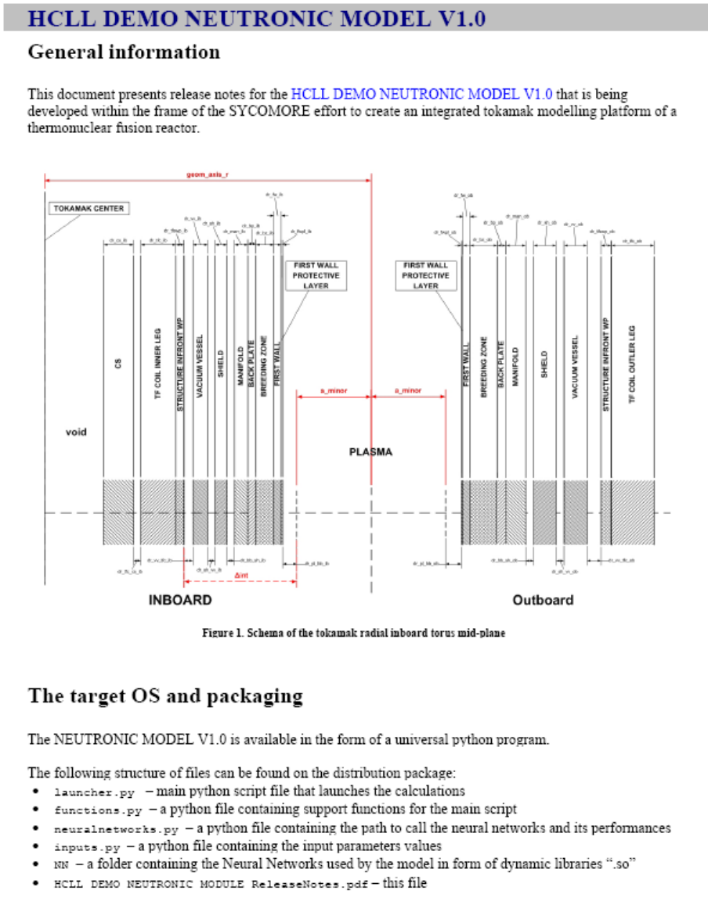

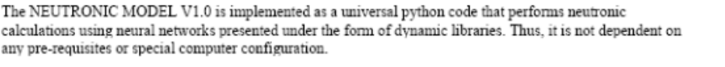

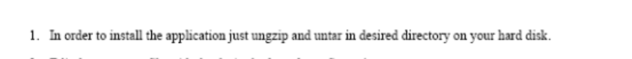

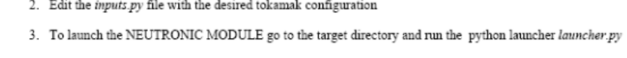

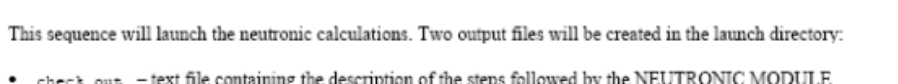

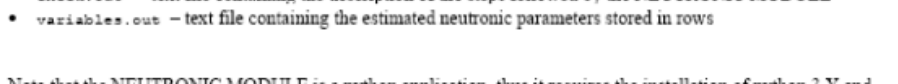

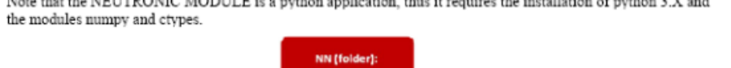

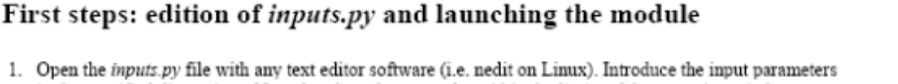

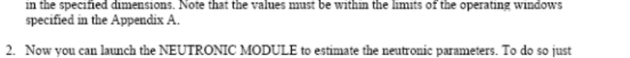

_169_ 

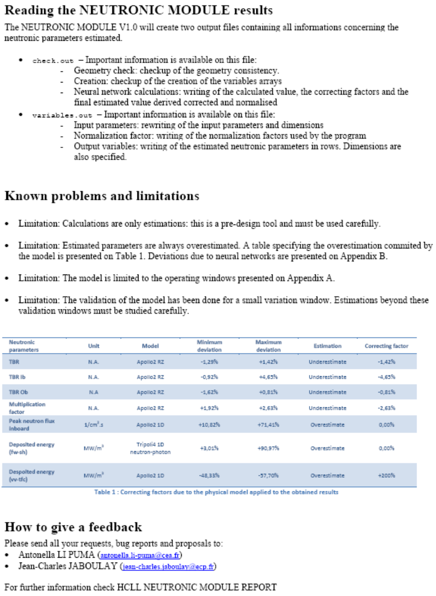

