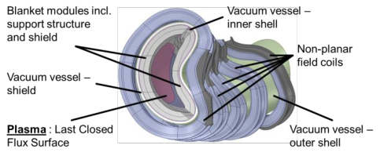
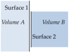
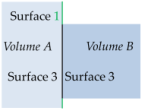
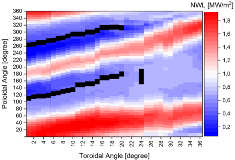
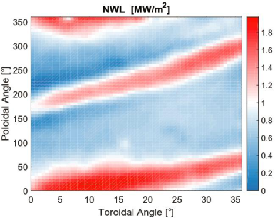
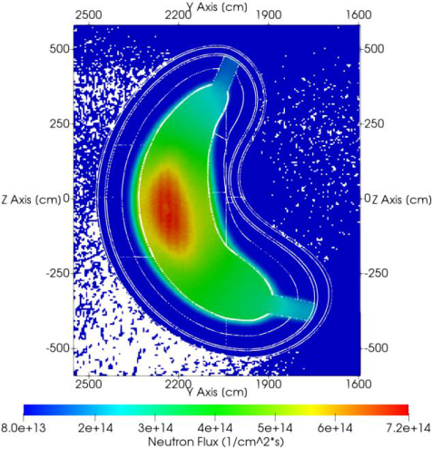
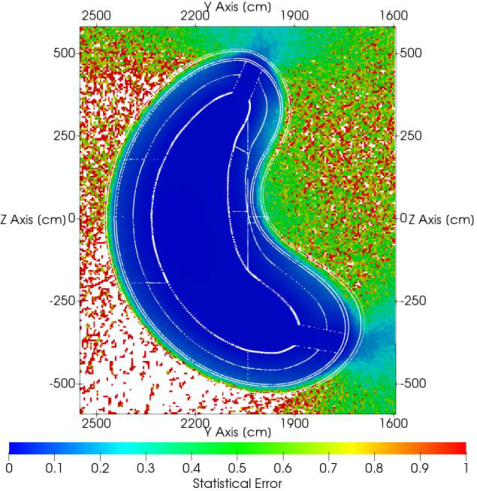

## **Neutronics analyses for a stellarator power reactor based on the HELIAS concept** 

André Häußler[a] , Felix Warmer[b] , Ulrich Fischer[a] 

_aKarlsruhe Institute of Technology (KIT), Institute for Neutron Physics and Reactor Technology (INR), 76344 EggensteinLeopoldshafen, Germany_ 

_bMax Planck Institute for Plasma Physics (IPP), 17491 Greifswald, Germany_ 

A first neutronics analysis of the Helical-Axis Advanced Stellarator (HELIAS) power reactor is conducted in this work. It is based on Monte Carlo (MC) particle transport simulations with the Direct Accelerated Geometry Monte Carlo (DAGMC) approach which enables particle tracking directly on the CAD geometry. A suitable geometry model of the HELIAS reactor is developed, including a rough model of a breeder blanket based on the Helium Cooled Pebble Bed (HCPB) breeder blanket concept. 

The resulting model allows to perform first neutronic calculations providing a 2D map of the neutron wall loading, a 3D distribution of the neutron flux, and a rough assessment of the tritium breeding capability. It is concluded that the applied methodology, making use of MC particle transport simulations based on the DAGMC approach, is suitable for performing nuclear analyses for the HELIAS power reactor. 

Keywords: STELLARATOR; HELIAS; NEUTRONICS; CAD; MCNP; DAGMC 

## **1. Introduction** 

The Helical-Axis Advanced Stellarator (HELIAS) is a conceptual design of a fusion power reactor proposed by the Max Planck Institute for Plasma Physics (IPP) in Greifswald, Germany. HELIAS-5B is a specific 5-fieldperiod concept using the Deuterium-Tritium fusion reaction with a fusion power of 3000 MW [1]. A thorough neutronic design analysis has to be performed for this stellarator in order to provide the input required for the reactor design. 

A stellarator confines the hot plasma with external magnetic fields only produced by non-planar shaped modular field coils. The use of specific non-planar shaped modular field coils is necessary to generate the rotational transform of the magnetic field in the plasma chamber. This type of fusion reactor represents a challenging task for the design and maintenance of technological components such as the breeder blanket and the radiation shield as outlined in figure 1. 

The standard approach to develop geometry models for neutronics design analysis is to use computer aided 

design (CAD). The developed models are usually not directly applicable for Monte Carlo (MC) particle transport codes and need preprocessing with regard to the geometrical simplification and adaption to the requirements of neutronic simulations including the decomposition of complex CAD models. 

The CAD model of the HELIAS reactor is very complex and contains mostly spline surfaces which are commonly used in CAD geometry. Spline surfaces are higher order surfaces and not directly applicable for MC simulations. This makes a conversion approach necessary for CAD to MC geometry which is able to take spline surfaces into account in the processing of the models. 

The purpose of this paper is to present the neutronics analysis performed for the HELIAS power reactor to assess its nuclear performance in terms of breeding and shielding capability. The CAD to MC geometry conversion approaches are discussed in section 2. Section 3 focused on the selected DAGMC approach. First results of the neutronic analysis are presented and discussed in section 4. 

## **2. Methodology** 

Three different approaches to generate a CAD based MC geometry were investigated in [2] which show, that all these approaches can be used to translate CAD data into MC geometry and generate the same results in neutronic calculations afterwards. These approaches are first, the translation approach with KIT’s CAD to MC conversion tool McCad [3]; second, the unstructured mesh (UM) geometry description approach [4,5]; third, the direct usage of CAD geometry in MC codes with DAGMC (Direct Accelerated Geometry Monte Carlo) [6]. 

_________________________________________________________________________________ 

_Author’s email: andre.haeussler@kit.edu_ 

The mentioned approaches have all pros and cons. An important criterion is the handling of spline surfaces of the geometry during the conversion process. This is not possible with the traditional approach for the translation into constructive solid geometry (CSG), thus it will not be further investigated at the moment for neutronics calculations with the HELIAS stellarator model. The remaining approaches are UM and DAGMC. MCNP6 includes as a new feature the capability to use an UM geometry representation in the particle tracking simulation. This feature enables the possibility to construct an UM model which allows using all types of surface descriptions in the CAD model. This leads to the advantage that very complex geometries can be handled in MC simulations without the need to apply heavy simplifications or decompositions. A limitation is that only one specific mesh type can be handled in one simulation at the same time. Another limitation is that surface tallies are not supported in UM geometry. The generation of a suitable, error free UM geometry for MCNP6 is in addition a challenging task. For this reason this approach is not further investigated in this work. 

The third method is the DAGMC approach for the direct use of the CAD geometry in the MC transport simulation. Several DAGMC adaptations to different MC radiation transport codes are available. For this work, the DAGMC patch for MCNP5 was applied. DAGMC needs a CAD geometry converted into facetted solids for the tracking of particles. The tracking algorithm implemented is based on the established raytracing technique. With this technique it is possible to perform simple calculations to determine the next surface boundary, depending on the particle position and its movement trajectory [6].  DAGMC can solve analytically a number of lower order surfaces, but higher order surfaces require iterative numerical root-finding approaches which are implemented in DAGMC with a number of acceleration techniques and approximations [6]. This ensures that the method can be efficiently used for high order spline surfaces. The CAD geometry is prepared with Trelis 16 [7] to ensure that all bodies and surfaces are preprocessed and facetted in the correct way for the use with DAGMC. 

MCNP is a general-purpose Monte Carlo N-Particle code which is used worldwide, very well validated and applied in the fields of fission, fusion and accelerator calculations. For DAGMC calculations it is important to apply a special patch to MCNP. In this work, the patch for DAGMC was applied to MCNP5.1.60 [8], because this combination is used in a wide range of applications [6]. 

## **3. Transfer of CAD data into MC geometry** 

The CAD model of HELIAS needs to be processed for the first neutronic calculations. It is a rough model with a layered configuration. Nevertheless, it contains a lot of spline surfaces which makes the transfer into MC geometry a time consuming and error prone task. 

zone (BZ) was used with a radial thickness of 50 cm. The BZ covers the whole plasma chamber except two small gaps. The minimum distance between the last closed flux surface of the plasma and the tungsten armor is set at 10 cm. Additionally the vacuum vessel including shielding is fixed, because it depends on the position of the non-planar shaped field coils outside of the vacuum vessel. The space between the BZ and the vacuum vessel is filled with a layer representing the back support structure of the blanket. Its thickness varies due to the aforementioned assumptions. Adjacent BZ layers are modelled with no gaps in between. 

Tab. 1: Radial build of the HELIAS geometry starting from the plasma facing layer to the outside 

|**Thickness [cm]**|**Component / Material**|
|---|---|
|0.2|Tungsten Armor|
|2.5|First Wall|
|50|Breeding Zone|
|~10 - 40|Back Support Structure|
|6.0|Inner Vacuum Vessel|
|20|Vacuum Vessel Shield|
|6.0|OuterVacuumVessel|

The layered model represents the first rough blanket and shield configuration assumed for the HELIAS-5B. Each layer contains a homogenized material mixture. For the BZ, the Helium Cooled Pebble Bed (HCPB) breeder blanket concept [9,10] with a Lithium-6 enrichment of 60% is assumed as primary option for the tritium breeding. It is modelled as single volume, uniformly filled with a homogenized material mixture derived from the engineering design of the HCPB blanket for a Tokamak DEMO [10]. The back support structure is a homogenized mixture of the back plate, made of low activation steel, and the manifold. It thus contains mainly steel at a low density taking into account the cooling channels. A mixture of 60 % stainless steel and 40 % water is used as a shielding layer inside the vacuum vessel. 

The main benefit of the DAGMC approach is its ability to handle every type of surface description. Nevertheless, a suitable CAD model for the DAGMC geometry preparation is needed. This means that the model must be clean without any overlaps, gaps or poorly defined geometry. Trelis, which includes the Cubit libraries that are necessary to use the DAGMC approach, was used to process and transfer the CAD files. 

An important step during the geometry preparation is to imprint and merge the geometry, which is shown in figure 2. Usually CAD tools generate manifold geometric models where two volumes are independent from each other. Two touching surfaces can be logically merged which provides benefits on the particle transport, like an easy determination of the next entering volume by a simple topological check, and the particles only needs to cross the surface once [6]. 

The radial build of the stellarator is shown in table 1. For the first calculations, a fixed size for the breeding 

![Fig. 2: Imprint and merge steps in Trelis for geometry preparation, inspired by [6].](images/tmpas6jrogt.pdf-0003-02.png)

As it is shown in figure 2, the imprint and merge step combine the boundary surfaces of two volumes, which are very close to each other, to create better volume boundaries for the MC geometry. Both volumes must be very close to each other, the relevant tolerance can be chosen by the user in Trelis. If Trelis detects such close volumes, like volume A and B in figure 2, in the imprint step, it will generate a new surface, which has the same size of the contact face of the two volumes. At the merge step, Trelis will connect the volumes at the previously created surface. The result of the imprint and merge step is a set of continuous volumes that are separated from each other by surfaces that are shared by no more than two volumes [6]. 

The neutronic results presented in the subsequent section were produced with a DAGMC model which has some geometry errors and creates lost particles. A lost particle is a particle, which comes to an ill-defined position in the geometry, and will be deleted including all its performed interactions and secondary particles from the simulation. The lost particle rate was 6 per 1 million histories, which is too high compared to the DAGMC developers quality assurance lost particle rate criterion of 1 per 5 million histories. The regions where lost particles occur are evenly distributed throughout the model and the model is still under investigation to fix all occurring problems. 

## **4. Computation and Results** 

A dedicated neutron source for the HELIAS stellarator was developed previously based on plasma physics calculations [11]. It was validated for both MCNP5 and 6 and is used in all HELIAS neutronics calculations. 

## **4.1 Neutron Wall Loading (NWL)** 

An important quantity for nuclear analysis is the Neutron Wall Loading (NWL). It denotes the fusion neutron power loaded to the first wall per unit area. It can be calculated with MCNP using the *F1 tally which counts the number of particles crossing a surface. When multiplied by the energy of the 14 MeV source neutrons and normalized to the fusion power, the NWL is given in units of MW/m[2] . The NWL distribution, calculated with DAGMC, is shown in a 2D (poloidal-toroidal) distribution in figure 4. The areas with higher neutron loads can be easily seen which helps for further design developments and breeder blanket optimizations. For this calculation, a simple DAGMC model only containing the tungsten layer, was created without any geometry errors and lost particles. The tungsten was split into 1845 tiles in total to get a smooth distribution for the post-processing of the results. To verify this procedure, a second calculation with another approach from IPP 

Greifswald was performed. The IPP approach utilizes an in-house developed plasma physics MC code (nflux) based on the ray-tracing technique for the collision less propagation of the source neutrons emitted from the plasma [12]. The resulting NWL distribution of the IPP approach is shown in figure 5. Both approaches use the same plasma facing surface. 

The results shown in figure 4 and 5 are displayed from the toroidal angle 0° for the bean shape side and 36° for the triangular shape side. The 0° to 36° transformation of the stellarator can be seen in figure 3. The poloidal angle starts at 0° at the midplane outboard, going down to the lower divertor, then to the inboard area at around 120° to 280° and finally back from the upper divertor to the midplane. The black line in figure 4 at toroidal angle 0° to around 20° indicates the openings for the lower and upper divertor, and the black line at toroidal angle of 24° is caused by a lack of data due to the twisted geometry. The differentiation in inboard and outboard side of the stellarator is only possible at the bean shape area, because of the twisted structure of the stellarator. 

The differences in the boundary areas of figure 4 and 5 are due to coordinate transformation. While figure 4 uses ordinary polar coordinates, figure 5 is represented in flux coordinates. 

Numerical results of the NWL calculation are presented in table 2. The NWL distribution show that the locations with a high NWL is meandering over the whole plasma facing area. The total maximum NWL is located at the bean shape side at the outboard midplane, at around 8° poloidal and 20° toroidal angel. The average NWL was determined by calculating the total NWL divided by the total plasma facing area. 

Tab. 2: Comparison of the NWL results generated with two different approaches 

||**KIT**|**IPP**|
|---|---|---|
||**(DAGMC)**|**(nflux)**|
|Maximum|||
|NWL|1.936|1.958|
|[MW/m2]|||
|Average|||
|NWL|0.953|0.926|
|[MW/m2]|||
|Statistical|< 0.7% at|<0.5% at each|
|Error|each surface|surface|
|||3800 triangles,|
|Surfaces|1845 tiles|interpolated on a|
|||60 x 60grid|

As it can be seen in figure 4 and 5, a very good visual agreement of the two methods is found. This is confirmed by the numerical results given in table 2 and showing an agreement within the statistical uncertainties provided by the two approaches. This gives confidence in the results provided by DAGMC for the HELIAS model. 

## **4.2 Neutron Flux** 

The neutron flux is an important quantity which needs to be known for the calculation of any nuclear response. Figure 6 shows a vertical cut of the neutron flux distribution as calculated with DAGMC for the beanshape side of the HELIAS reactor. The corresponding statistical error is shown in figure 7. 

As it can be seen in figure 6, the neutron flux distribution is very smooth and shows a decreasing flux across the stellarator components, as expected. The calculations were performed without any variance reduction techniques (“analogue Monte Carlo”) which are necessary to get reliable results for volumes beyond the breeder blanket area. This can be seen in the vacuum vessel area, where the statistical error increases significantly in figure 7. The white regions outside the reactor show in figure 6 and 7 are not reached by any neutron in the analogue simulation. 

## **4.3 Tritium Breeding Ratio (TBR)** 

Tritium self-sufficiency is a pre-condition for any power reactor based on the Deuterium-Tritium fusion reaction. To this end a breeder blanket need to be installed in the reactor producing the tritium which is required to sustain the fusion reaction in the plasma. The HCPB breeder blanket, developed in the frame of the PPPT program for a Tokamak DEMO [10], is considered as a suitable option for the HELIAS power reactor. For a rough estimation of the tritium breeding capability of the HCPB in HELIAS, a homogenized breeder material mixture with a Li-6 enrichment of 60 % is used in the calculations. With this rough HELIAS model, a very high TBR value of 1.387±0.001 is obtained. This high value is due to the very idealistic assumptions including a homogenized breeder material zone which covers nearly the entire plasma chamber and does not take into account any gaps between the breeder blankets or the structural components of the breeder elements. 

Nevertheless, this result can be seen as a very good starting point for the stellarator breeder blanket development. It indicates that it should be possible to design a realistic breeder blanket for the HELIAS power reactor which can fulfill the tritium self-sufficiency requirement. 

## **5. Conclusion** 

A first neutronics analysis of the HELIAS power reactor was conducted in this work. It is based on Monte Carlo transport simulations with the DAGMC code which enables particle tracking on the CAD geometry. A suitable geometry model of the HELIAS reactor was developed to this end including a rough model of a breeder blanket based on the HCPB concept. 

The DAGMC approach was shown to be a suitable Monte Carlo particle transport method although the generation of the HELIAS simulation model, starting from a very complex CAD model with many spline surfaces, is a very demanding and time consuming task. The resulting model allowed to perform first neutronic calculations providing a 2D map of the neutron wall loading and a 3D distribution of the neutron flux, as well as a rough assessment of the tritium breeding capability based in the HCPB breeder blanket concept. The assessment of other breeder blanket concepts (DCLL, etc.) is to follow in the future in order to compare their suitability for a stellarator reactor. 

It is concluded that the applied methodology, based on the DAGMC approach, is suitable for performing nuclear analysis for the HELIAS power reactor. An observation of the presented work was, that a less complex basic CAD configuration is more suited for the DAGMC approach. Furthermore, such a basic configuration is more favorable for the integration of technology components such as the breeder blanket which will require a more realistic geometry description with sufficient details according to the engineering design. 

## **Acknowledgments** 

This work has been carried out within the framework of the EUROfusion Consortium and has received funding from the Euratom research and training programme 2014-2018 under grant agreement No 633053. The views and opinions expressed herein do not necessarily reflect those of the European Commission. 

This work was performed on the computational resource ForHLR II funded by the Ministry of Science, Research and the Arts Baden-Württemberg and DFG ("Deutsche Forschungsgemeinschaft"). 

Sincere thanks to the DAGMC developers, mainly to Paul Wilson, Andrew Davis and Tim Bohm, for their very kind and patient help with problems of DAGMC. 

## **References** 

- [1] F. Schauer and K. Egorov and V. Bykov, HELIAS 5-B magnet system structure and maintenance concept, Fusion Engineering and Design 88 (2013), Pages 1619 – 1622 

- [2] A. Häußler et al., Verification of different Monte Carlo approaches for the neutronic analysis of a stellarator, Fusion Eng. Des. (2017), https://doi.org/10.1016/j.fusengdes.2017.04.010 

- [3] L. Lu and U. Fischer and P. Pereslavtsev, Improved algorithms and advanced features of the CAD to MC conversion tool McCad, Fusion Engineering and Design, Volume 89, Issues 9 – 10, October 2014, Pages 1885 – 1888 

- [4] R. Martz, The MCNP6 Book on Unstructured Mesh Geometry: User's Guide, 2014, LA-UR-11-05668 Rev 8 

- [5] Y. Qiu and L. Lu and U. Fischer, Integrated approach for fusion multi-physics coupled analyses based on hybrid CAD and mesh geometries, Fusion Engineering and Design (2015), Volume 96, Pages 159 - 164 

- [6] P.P.H. Wilson et al., Acceleration techniques for the direct use of CAD-based geometry in fusion neutronics analysis, Fusion Engineering and Design 85 (2010), Issues 10 –12, Pages 1759 – 1765 

- [7] Trelis User Guide: http://www.csimsoft.com/help/trelishelp.htm 

- [8] X-5 Monte Carlo Team, "MCNP - Version 5, Vol. I: Overview and Theory", LA-UR-03-1987 (2003). 

- [9] P. Pereslavtsev et al., Neutronic analyses for the optimization of the advanced HCPB breeder blanket design for DEMO, Fusion Engineering and Design (2017), 

   - doi:http://dx.doi.org/10.1016/j.fusengdes.2017.01.028 

- [10] F. Hernández, et al., A new HCPB breeding blanket for the EU DEMO: Evolution, rationale and preliminary performances, Fusion Eng. Des. (2017), http://dx.doi.org/10.1016/j.fusengdes.2017.02.008 

- [11] F. Warmer, Comparative study of the neutron wall load in stellarator type fusion reactors, (in preparation) 

