Journal of Fusion Energy (2019) 38:3–10 https://doi.org/10.1007/s10894-018-0177-y 

ORIGINAL RESEARCH 

## On the Use of High Magnetic Field in Reactor Grade Tokamaks 

## Hartmut Zohm[1] 

Published online: 9 August 2018 � The Author(s) 2018 

## Abstract 

A 0-D model is developed to explore, from the physics point of view, the design options for future reactor grade tokamaks at values of the confining magnetic field exceeding the present technology. It is found that steady state devices with consistent exhaust parameters can indeed be designed at more compact geometry than presently envisaged, but the plasma performance, in particular the stability, is still at the upper end of what has been achieved in present day experiments, i.e. requires an ‘advanced tokamak’ approach. 

Keywords Fusion power plant � Tokamak � Magnetic confinement 

## Introduction 

The performance of magnetically confined fusion plasmas usually increases with increasing magnetic field B for given size, expressed by the torus major radius R. Simple scalings [1] show that the fusion power scales as B[4] R[3] , and the power amplification Q increases with 1/(B[-][3.7] R[-][2.7] -const) so that conversely, the major radius R can be decreased if B is increased according to these relations, keeping the plasma performance constant. This has even been interpreted misleadingly as ‘fusion performance not depending on size’ [2, 3]. Present designs for next step reactor grade experimental devices differ strongly in their assumptions about the technically achievable toroidal field. Relying either on ITER technology (Nb3Sn), the value of Bmax at the inner leg of the TF conductor of the order of 12 T [4]), or new High Tc (HTSC) superconductors of the REBCO type that could allow up to 24 T at the inner leg [5], although this value would, using present technology, require exceedingly large support structure to withstand the forces. 

This contribution aims at analyzing the principal merits of high field tokamaks (where the term ‘high field’ means a field above the field possible using state-of the-art ITER 

> & Hartmut Zohm zohm@ipp.mpg.de 

> 1 Max-Planck-Institut fu¨r Plasmaphysik, 8748 Garching, Germany 

technology) and the new challenges arising, e.g. for exhaust of power through a poloidal divertor which can be more challenging in a compact device. We explicitly leave out a discussion of the technological challenges on the route to using HTSC in fusion, but remind the reader that solving these issues will be a pre-requisite for using high field tokamaks as FPPs and remains a serious R&D task (at present, there is no convincing demonstration of a HTSC high field solution on the scale needed for a reactor-grade device). 

In ‘‘The 0-D Model’’ section, we describe the 0-D model used for the analysis, an extension of the model used in [6] for application in a wider parameter range. In ‘‘Exploration of High Field Solutions’’ section, we discuss suitable figures of merit for quantifying the gain that high field operation may bring and analyze several routes to tokamak FPPs for their prospects on the high field path. In ‘‘Discussion and Conclusions’’ section, a concluding discussion is given. 

## The 0-D Model 

We use a 0-D model based on the equations presented in [6], improved to explore a larger parameter space. This required to update the calculation of the fusion power for higher temperatures as well as a more detailed radiation model, including separately Bremsstrahlung, impurity radiation and synchrotron radiation (which specifically becomes important when exploring high field solutions). 

In the model, we prescribe the following main plasma parameters (for a definition of the different quantities, see [6]: 

- normalized pressure bN, related to ideal MHD stability, 

- safety factor q95, related to the plasma current 

- normalized confinement time H = sE/sE,ITER98p, assuming that confinement scales similar to the ITER H-mode scaling 

- normalized density fGW = n/nGW. 

Together with the machine geometry parameters, major radius R,[1] aspect ratio A and toroidal magnetic field B, these allow the calculation of fusion power Pfus, radiation losses Prad and auxiliary power needed to sustain the power balance or current drive power PCD needed to drive the difference between total current and bootstrap current, i.e. for fully non-inductive operation. 

The formula for the fusion power used previously assumed a quadratic dependence on bN, i.e. a scaling with n[2] T[2] . It is well known that the T[2] dependence of the reactivity RDT is only valid in the temperature range around 10–20 keV. Since FPP designs often exceed this temperature, we use the fit formula derived for RDT in [7], divided by T[2] , so that the equation for the fusion power becomes 

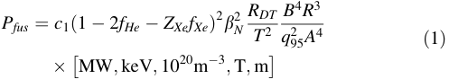

The function RDT/T[2] , normalized to its maximum value, is shown in Fig. 1. Chosing T = 1.3 Tave, where Tave is the volume averaged temperature derived via 

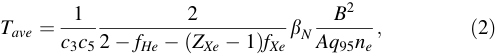

we can reproduce well the fusion power for the three machines studied in [6], i.e. the model is suited well for the kinetic profile shapes used in [6]. On the other hand, we benchmarked the model to ARC [5] and found that we had to increase the coefficient c1 by a factor of 1.3, which could be explained by the relatively broad temperature profiles used in [5] as compared to the cases in Table 1 as well as the different shape of the poloidal cross section. 

In Eqs. (1) and (2), we have accounted for the dilution due to Helium ash and the Xenon seed impurities which are assumed to be injected to increase the radiation from inside the separatrix (no other impurities are considered in this work). Both densities are normalized to the electron density, i.e. fHe = nHe/ne and fXe = nXe/ne. The quantity ZXe is the average charge state of Xenon in the core plasma (He is fully ionized under these conditions). We note that we do 

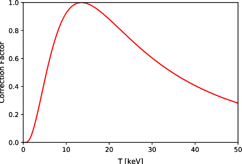

Fig. 1 The function RDT/T[2] used to correct the reactivity from the simple T[2] scaling 

not correct the heating power for the radiation losses, motivated by the finding that for stiff temperature profiles, confinement is hardly affected by radiation losses as long as Prad(r) does not overlap with Pfus(r) [8], which is the case for Xenon for typical profiles in reactor grade devices that tend to be peaked off-axis [8]. 

The radiation model used in [6] was very simplistic, assuming a direct scaling of the radiated power with Zeff. In the new version, we explicitly separate the Bremsstrahlung 

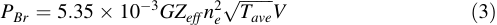

where G is the Gaunt factor (set to 1.1 in this work), V is the plasma volume and the average charge is calculated as 

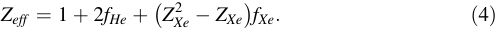

As mentioned above, Xe is used as seed impurity used for controlling the core radiation and assumed to dominate the impurity radiation so that no other impurity is considered. The line radiation due to Xe is inferred using the radiative potential LZ(T): 

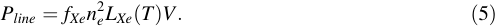

For the cases treated in [6], which employed Xe as seed impurity, it was found that the main radiation comes from the zone where 10 keV \ T \ 15 keV, for which we can use LXe = 370 MW m[3] and ZXe = 50. Finally, the synchrotron radiation is evaluated as 

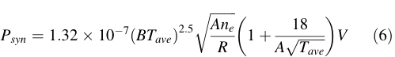

according to [9], using a wall reflectivity of 0.8. The total radiation Ptot is calculated by summing up the three contributions (3), (5) and (6). We determine fXe by the criterion that the power across the separatrix exceeds the L–H threshold power by a factor fLH 

> 1 Plasma shape is assumed to be that of ITER so that the volume can be calculated as V = VITER (R/6.2 m)[3] /(A/3.1)[2] . 

Table 1 Input parameters used in the study of the 4 plasma scenarios 

||ITER|Q|=|10|AUG|hybrid|Stepladder|DIII-D/EAST|
|---|---|---|---|---|---|---|---|---|
|q95|3.1||||5.4||4.5|6.5|
|H|1.0||||1.1||1.2|1.5|
|bN|1.8||||2.8||3.5|3.0|
|fGW|0.85||||0.7||1.2|1.0|

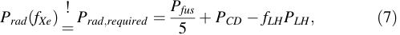

assuming that PCD [ PAUX, i.e. always sufficient to guarantee burn. We note that by applying this procedure, the impurity seeding directly feeds back into PCD via the (5 ? Zeff) dependence of 

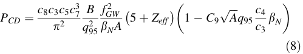

which means fXe has to be determined iteratively. As outlined in [6], Eq. (8) assumes a generic RF current drive efficiency of the form PCD* n R/T and should hence be a good approximation for ECCD, but less well suited for NBCD. 

## Exploration of High Field Solutions 

In this section, we apply the model described in the previous section to study the possible parameter space of future reactor-grade tokamaks allowing high toroidal field and neglecting, for the moment, the present technological limitations to the increase of the field. The study will analyse different routes from present day experiments to reactor grade plasmas, namely the ITER Q = 10 scenario at low q95 [10], a ‘hybrid’-type steady state scenario demonstrated on ASDEX Upgrade [11] and DIII-D [12] at intermediate q95 as well as a lower q95 version proposed for the ‘stepladder’ in [6] and a high q95 variant demonstrated on DIII-D and EAST [13] for use on CFETR [14]. In choosing these cases, the study is limited to conventional aspect ratio of A = 3.1 (the ITER value is used throughout). A study of compact solutions at low aspect ratio is subject to further work. 

Table 1 shows the parameters q95, H, bN and fGW for these 4 cases, noting that fHe = 0.05, fLH = 1.1 and A = 3.1 are kept constant in the study. The values for ITER Q = 10, AUG Hybrid and Stepladder have been taken directly from refs [6, 10, 11], respectively. For the DIII-D/EAST scenario, we took the values for the discharge discussed in [13], and chose q95 such that the value of the plasma 

current is matched. Due to the slightly differing aspect ratio and shape, this leads to a lower value than quoted in [13]. For these cases, we will discuss the following parameters in the R–B plane: 

- Fusion power Pfus: even though high field may allow smaller unit sizes, we still anticipate that an FPP will generate several GW of fusion power in order to arrive at reasonable recirculating power fraction due to the relatively large auxiliary power needed for a tokamak. Hence, we explore Pfus up to 3.5 GW, aiming at around 1 GW of electrical power at conventional efficiency. 

- Power amplification w.r.t. power balance, QPB = Pfus/ PAUX: this shows how close the plasma is to ignition, and how effective it can be in generating electrical power. Assuming that PAUX is the dominant electrical power needed to sustain the plant, the recirculating power is 

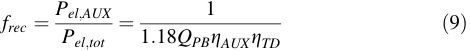

where we have accounted for the thermal power generated in the blanket by nuclear reactions by the factor 1.18 and introduced the efficiencies gAUX (wall plug efficiency of the auxiliary heating system) and gTD (thermodynamic efficiency to generate electricity from heat). For example, for gAUX = 0.4 and gTD = 0.35, we obtain frec = 6/QPB and a reasonable value of frec \ 10% will require QPB [ 60. We note here that in our approach, for an ignited plasma, there is no attempt to fulfill exactly the power balance, i.e. these cases would strictly not be stationary, but for the scoping studies shown here this is not considered to be too important. 

- Power amplification w.r.t. current drive power QCD = Pfus/PCD: while QPB is calculated from the power balance, the requirement of steady state will often lead to values of PCD [see Eq. (8)] that exceed PAUX and in this case QCD will determine the recirculating power fraction, calculated by using QCD and gCD in Eq. (9), where gCD is the wall plug efficiency of the CD system (the current drive efficiency in the plasma is already taken into account by calculating PCD according to (8)). Hence, we also map out this quantity in the R–B space, noting that for a pulsed tokamak FPP, this constraint will not exist. In principle, PCD and PAUX should have the same value for a stationary solution, but usually, PCD [ PAUX is found. In these cases, the fusion performance might be higher than estimated by our model, since there is excess heating, but as for the ignited cases discussed above, this is not considered to be too important for the scoping studies shown here. 

- Contribution of synchrotron radiation: a particularity of high field tokamaks is the possibility of synchrotron 

   - radiation dominating the power balance. We define as a rough indicator of this the quantity fsync = Psync/ Prad,required, where Prad,required is defined by Eq. (7). If fsync [ 1, the radiation power exceeds the required power even at fXe = 0, i.e. the synchrotron losses are intolerable. Operation above this line will not be possible. 

- Similarity in exhaust: in principle, an exhaust solution should be modelled using more sophisticated codes than the one discussed here to find the seed impurity concentration needed in the SOL and divertor to provide a detached solution. This concentration would then have to be fed back to the core plasma, assuming a certain compression ratio. Such a model has been recently developed and applied in [15]. However, this is beyond the scope of the present study. Hence, we rather adopt a similarity criterion put forward in [16], that states that the impurity concentration in the SOL and divertor needed to obtained a detached divertor solution is expected to scale like 

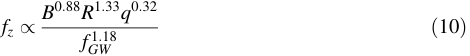

at constant fLH, A and shape. Note that fixing fLH means that fXe varies with fusion power, feeding back into the power balance via Eq. (1). This scaling has also been found in [15]. In the following, we use it to connect the existing model points from Table 1 to other points in parameter space, arguing that the exhaust problem will be similar along this line and the solution developed for the points in Table 1 will apply for all points on the line. For scenarios where no exhaust scenario has been studied, we plot an ‘ITER Q = 10 exhaust similarity line’ 

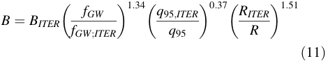

These parameters will now be analysed for the 4 cases from Table 1. 

We start by discussing the ITER Q = 10 scenario, shown in Fig. 2. It can be seen that due to the low q95, ignition (i.e. large QPB) is relatively easy to achieve, e.g. by lowering R to 5 m and increasing B to 7.4 T. On the other hand, the low q95 leads to a low bootstrap fraction and steady state needs a lot of current drive power. Hence, QCD has low values, hardly exceeding QCD = 5, across the whole range under consideration (Pfus \ 3.5 GW). As a result of the substantial PCD, the Xe concentration is quite high up to the line where synchrotron radiation takes over, which in this case is at very large values of B and R and has been indicated in the plot by fsync = 0.8 (fsync = 1.0 actually 

lies outside the plotted window). We conclude that for this scenario, it is not possible to obtain an attractive steady state reactor, even if B is allowed to be increased substantially. 

The conclusion for the ITER Q = 10 point is of course in line with many previous studies and steady state solutions are usually explored at higher q95, which will increase the bootstrap fraction, but at the same time, reduce the fusion power at given bN and also make ignition harder due to the reduced current. 

This route has been explored in the ASDEX Upgrade hybrid scenario [11], and hence, as an example of a direct extrapolation of presently achieved parameters, we plot the R–B space for this set in Fig. 3. It can be seen that the objective of increasing QCD at reasonable Pfus is met (note the different scale for QCD w.r.t. Figure 2), i.e. compact high field devices in this scenario can have QCD around 30 at roughly 2 GW of fusion power. This is mainly due to the combination of a relatively low Greenwald fraction with high q95, which leads to low absolute density and very high temperature. In fact, it can be seen that now the synchrotron limit becomes substantial, restricting operational space to Pfus below 2.5 GW. We also note that no study of a consistent exhaust scenario exists for this approach and, due to the low absolute density, it may be hard to find detached solutions. In fact, assuming exhaust similarity to ITER Q = 10 using Eq. (11) shows that this is not fulfilled anywhere in the R–B space shown in Fig. 3. 

These limitations have led to the study of the so-called stepladder scenario in [6], which employs higher fGW and lower q95, in an attempt to keep the absolute density high and still provide a reasonable bootstrap fraction. For this scenario, it has been argued that the exhaust problem is similar to that of ITER Q = 10 and hence, the solution developed for this scenario should also apply to the stepladder. In Fig. 4, we show the R–B space for the stepladder scenario and insert 3 blue lines which indicate the steps on the ladder, extrapolated with the exhaust similarity criterion from [16]. The red dots refer to ITER, DEMO and the FPP on the stepladder (ITER is not visible since it has B = 4.5 T in this scenario). 

It can be seen that the approach is indeed successful in avoiding the synchrotron limit and providing reasonable QCD. If one wants to reduce the size of the FPP point along the exhaust similarity line, one quickly enters the region of too high Pfus, meaning that this process should start from a smaller machine, e.g. the DEMO point. One notes, however, that this leads into the region of relatively high fXe, which has the effect that QCD does not rise too strongly along this line. 

Obviously, a problem in our approach is that the exhaust similarity line does not deviate too strongly from the lines of constant QCD, making it hard to profit from the smaller 

Fig. 2 Contours of Pfus, QPB, QCD and fXe in the R, B plane for the ITER Q = 10 scenario. The red dot represents the ITER Q = 10 operational point, the blue line indicates the exhaust similarity scaling. The green line is the synchrotron limit, in this case taken to be fsync = 0.8. Note that the scale for QCD is a factor of 10 lower than for the following plots, and the scale for fXe is higher by a factor of 3.75 (Color figure online) 

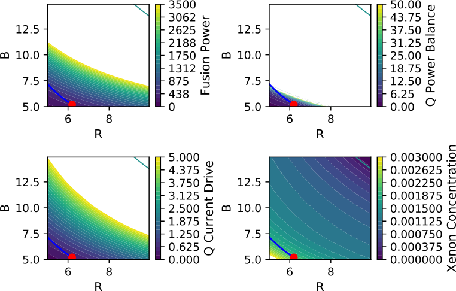

Fig. 3 Contours of Pfus, QPB, QCD and fXe in the R, B plane for the ASDEX Upgrade hybrid scenario. The green line is the synchrotron limit, fsync = 1 (Color figure online) 

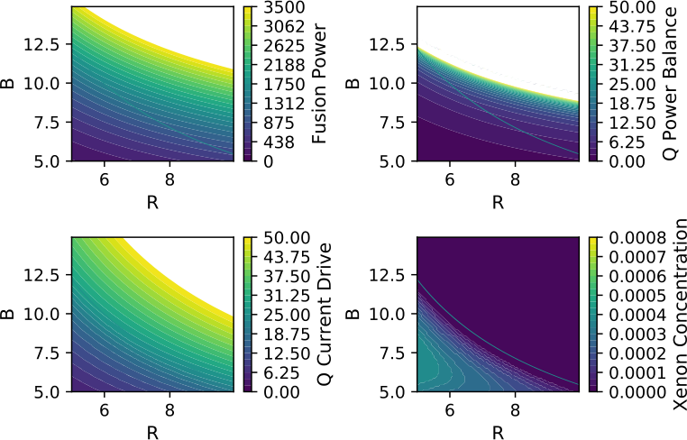

size along this line w.r.t. steady state. This is an inherent problem, because from a combination of (1) and (8), one can see that QCD roughly scales like B[3] R[3] , and on top of this, the decease of size leads to an increase in fXe which decreases the CD efficiency. Inserting the exhaust similarity, Eq. (10), leads to QCD* 1/R[1.5] , i.e. a decrease of size by a factor of 2 will lead to a gain in QCD of 2.8 at best. On the contrary, the fusion power will increase by up to a factor of 1/R[3] = 8 along the same route, slightly diminished 

if the temperature becomes so high that the correction shown in Fig. 1 applies. 

Hence, a possible way to benefit from high field is to use a scenario with high q95, which has a high bootstrap fraction and hence high QCD, but low Pfus for conventional field. The higher field is then used to increase fusion power and decrease machine size. This philosophy has been employed for the high q95 scenario developed on EAST and DIII-D and projected to be used on CFETR, for which the R–B space is shown in Fig. 5. 

Fig. 4 Contours of Pfus, QPB, QCD and fXe in the R, B plane for the stepladder scenario. The red dots represent the DEMO and FPP operational points, the blue lines indicates the exhaust similarity scaling for the respective devices. The green line is the synchrotron limit fsync = 1.0 (Color figure online) 

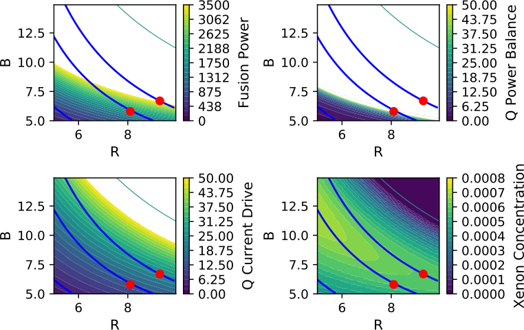

Fig. 5 Contours of Pfus, QPB, QCD and fXe in the R, B plane for the DIII-D/EAST scenario. The red point represents an examples at (6 m, 10 T) discussed in the text, the blue line indicates the exhaust similarity scaling to the ITER Q = 10 scenario. The green line is the synchrotron limit fsync = 1.0 (Color figure online) 

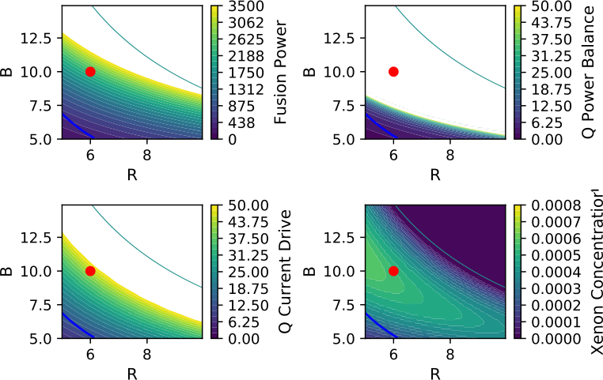

From the plots in Fig. 5, one can see that this indeed represents a step in a direction where QCD becomes higher, synchrotron radiation is not a problem, and fusion power stays below the 3.5 GW limit. We have highlighted a point at R = 6 m, B = 10 T, which sits at QCD= 43 and Pfus = 2.35 GW and might be an attractive steady state scenario. We note from the plot of QPB that from the view of power balance, the point already sits deeply in the ignited regime, meaning that the assumption H = 1.5 could even be relaxed (QCD = QPB for H = 1.17 in this case). We also note that no studies of a consistent exhaust scenario exist for this 

point. The ITER Q = 10 exhaust scenario line according to (11) is indicated in blue in the diagram, showing that finding a consistent exhaust scenario for this approach may also be challenging. 

## Discussion and Conclusions 

In the previous sections, we have analysed how different optimization strategies developed for reactor-grade tokamaks with conventional magnetic field values would 

Fig. 6 Contours of Pfus, QPB, QCD and fXe in the R, B plane for an scenario optimized for compact steady state tokamak operation at low recirculating power. The red point represents an example at (5 m, 9.3 T) discussed in the text, the blue line indicates the exhaust similarity scaling to the ITER Q = 10 scenario. The green line is the synchrotron limit fsync = 1.0 (Color figure online) 

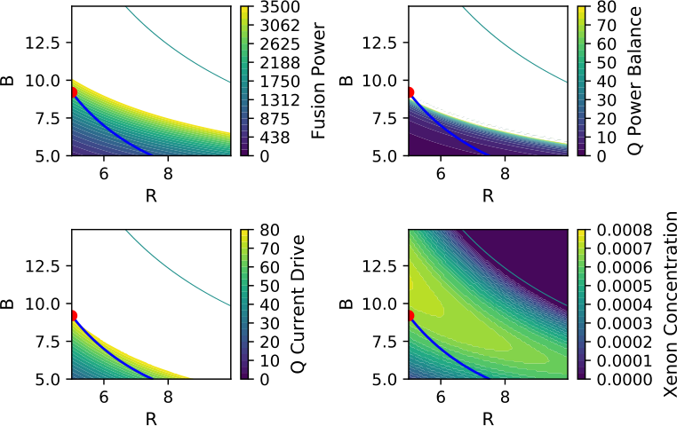

extrapolate to higher B. It is clear that none of these really leads directly to an optimized high field device, since the different approaches encounter various problems: 

- a low q95, low bN approach, which is applied to maximize fusion power in pulsed ITER discharges, does not extrapolate to steady state at higher B since the gain in QCD is relatively small when moving on the exhaust similarity line 

- in the usual advanced tokamak approach of increasing q95 and bN for higher bootstrap fraction and, at the same time, H to compensate for the lower confinement and higher q95, the Greenwald fraction also has to be increased because otherwise, the absolute density gets so low that no exhaust scenario compatible with present day approaches exists. In addition, high q95 at low fGW also leads very high temperatures at which, together with the high field, synchrotron radiation becomes important. On the other hand, high fGW will also help solving the exhaust problem. 

Hence, the use of high field in an advanced tokamak approach will require high fGW, an ingredient which is presently not integrated with this approach. 

To study a possible target for such a scenario, we show the R–B space for an advanced tokamak (bN = 4.0, H = 1.3, fGW = 1.2, q95 = 5.7). It can be seen that this choice of parameters leads to an attractive operational point at R = 5 m, B = 9.3 T, producing 2.7 GW of fusion power at QCD = 80, i.e. with the prospect to reach low recirculating power fraction below 10%. Due to the high fGW, the average electron density is 1.6 9 10[20] m[-][3] and the average temperature is 20 keV, leading to a large margin against 

synchrotron radiation and compatibility with the ITER exhaust requirements. This point, by no means optimized, can be taken as a start for optimization studies to find how to best exploit the high field. 

We note that the plasma parameters assumed in Fig. 7 are still quite challenging, and the question arises if higher B can actually be used to design devices that are attractive with more conservative assumptions about the plasma performance. Figure 7 illustrates the difficulty in finding such a parameter set. In the left part, the plasma parameters from the example in Fig. 6 have been used. The ITER exhaust similarity line is shown in red, and any solution that lies below this line will be acceptable form the exhaust point of view. The blue line shows the line on which QCD = 80, and any solution that lies beyond this line is acceptable w.r.t. recirculating power. This defines a region between the two curves in which acceptable solutions can lie. However, we also have to make sure that QPB is of the order of QCD to be consistent in the power balance. Hence, we have overplotted the contours of the H-factor needed to obtain QPB = 80. Consistent the assumptions used in Fig. 6, the region of interest is accessible with H around 1.2 (the values from Fig. 6 are not precisely matched since we have set fXe = 0 to be able to invert the equations for the plot). 

The right side of Fig. 7 shows a similar approach for more conservative parameters, bN = 3.0 and fGW = 1.0. Due to the lower bN, it is difficult to open up a region of interest since for q95 \ 7, there is no overlap at all between the red and the blue line. The case shown in Fig. 7, employing q95 = 8.3, is close to 100% bootstrap fraction and hence opens up an acceptable region. However, it can be seen that in this region, due to the high q95, the required 

Fig. 7 Left: contours of the H-factor needed for QPB = 80 for the parameter set from Fig. 6 (bN = 4.0, fGW = 1.2, q95 = 5.7). The red line shows the ITER exhaust similarity line, the blue line the line on which QCD = 80. Right: the same for a more conservative set (bN = 3.0, fGW = 1.0, q95 = 8.3) (Color figure online) 

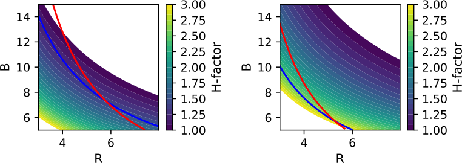

H-factor has very high values in excess of 2. It seems impossible to find, with our assumptions, a set of parameters in which all 3 quantities H, bN and fGW have conservative values and the operation point represents an attractive steady state tokamak in terms of QPB and QCD as well as the exhaust criterion (10). 

In conclusion, we have shown that the possibility to build tokamaks at higher field than is presently possible calls for an optimization procedure that is not necessarily similar to that applied for present designs of reactor-grade devices. We have proposed a procedure to obtain design points which are steady state and fulfill an exhaust similarity criterion with ITER, meaning that the exhaust scheme could be validated there. An important finding is, however, that attractive points in operational space, especially if they should be steady state, still require quite optimistic assumptions about the plasma performance in terms of H and/or bN. This is also evident from previous studies of high field devices [2, 3, 5]. 

Finally, we remind the reader that a rigorous technology R&D programme will be needed to solve the presently unresolved issues, such as high mechanical forces or neutron shielding at reduced radial build, if the high field approach should be pursued in future. 

Consortium and has received funding from the Euratom research and training programme 2014–2018 under Grant Agreement Number 633053. The views and opinions expressed herein do not reflect those of the European Commission. 

Open Access This article is distributed under the terms of the Creative Commons Attribution 4.0 International License (http://creative commons.org/licenses/by/4.0/), which permits unrestricted use, distribution, and reproduction in any medium, provided you give appropriate credit to the original author(s) and the source, provide a link to the Creative Commons license, and indicate if changes were made. 

## References 

1. H. Zohm, Fusion Sci. Technol. 58, 613 (2010) 

2. A. Costley et al., Nucl. Fusion 56, 066003 (2017) 

3. W. Biel et al., Nucl. Fusion 57, 038001 (2017) 

4. G.F. Federici et al., Fusion Eng. Des. 89, 882 (2014) 

5. B. Sorbom et al., Fusion Eng. Des. 100, 378 (2015) 

6. H. Zohm et al., Nucl. Fusion 57, 086002 (2017) 

7. H.-S. Bosch, M. Hale, Nucl. Fusion 32, 611 (1992) 

8. E. Fable et al., Nucl. Fusion 57, 022015 (2017) 

9. N. Uckan et al ITER physics design guidelines: 1989, ITER documentation series 10 (Vienna: IAEA), based on B.A. Trubnikov, Rev. Plasma Physics 7 (1979), ed. M. Leontovich (New York: Plenum Press) p. 345 

10. E. Dyole et al., Nucl. Fusion 47, S18 (2010) 

11. A. Bock et al., Nucl. Fusion 57, 126041 (2017) 

Acknowledgements Open access funding provided by Max Planck Society. The author wants to acknowledge enlightening discussions with V. Chan, E. Fable, T. Pu¨tterich and M. Siccinio as well as the programming support by A. Bock. The help of P. Bonoli with the comparison to ARC is also gratefully acknowledged. This work has been carried out within the framework of the EUROfusion 

12. F. Turco et al., Phys. Plasmas 22, 056113 (2015) 

13. A. Garofalo et al., Nucl. Fusion 55, 123025 (2015) 

14. Y.X. Wan, Nucl. Fusion 57, 102009 (2017) 

15. M. Siccinio et al., Nucl. Fusion 58, 016032 (2018) 

16. M.L. Reinke, Nucl. Fusion 57, 034004 (2017) 

