|||**`Quality`**|**`(*)`**||
|---|---|---|---|---|
||**`<1`**|**`1-10`**|**`10-100`**|**`>100`**|
|**`<10`**|**`Greater of`**|**`Pool nucleate`**|**`Mist-flow`**|**`Vapor`**|
||**`liquid con-`**|**`boiling`**|**`boiling`**|**`convection`**|
||**`voction or`**||||
||**`pool nucleate`**||||
||**`boiling`**||||
|**`10-12`**|**`Pool nucleate`**|**`Pool nucleate`**|**`Mist-flow`**|**`Vapor`**|
||**`boiling`**|**`boiling`**|**`boiling`**|**`convection`**|
|**`12-50`**|**`Transition`**|**`Transition`**|**`Mist-flow`**|**`Vapor`**|
||**`boiling`**|**`boiling`**|**`boiling`**|**`convectior`**|
|**`>50`**|**`Pool film`**|**`Pool film`**|**`Mist-flow`**|**`Vapor`**|
||**`boiling`**|**`boiling`**|**`boiling`**|**`convection`**|

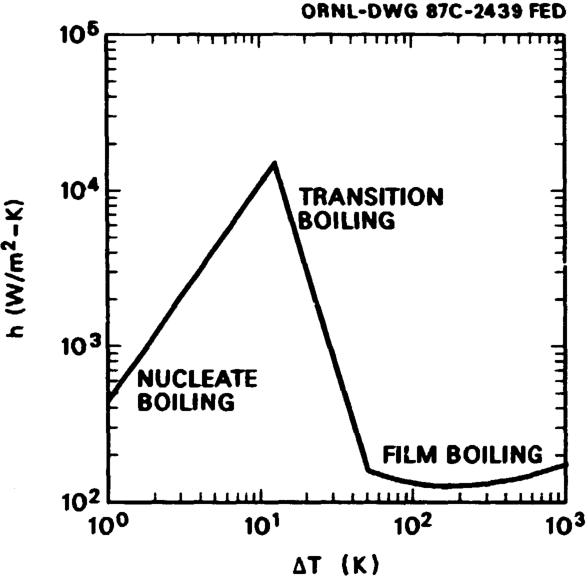

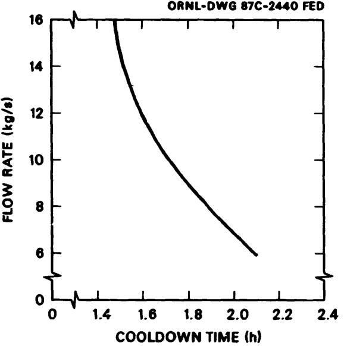

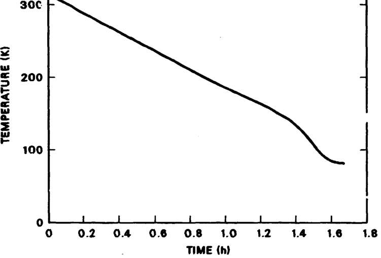

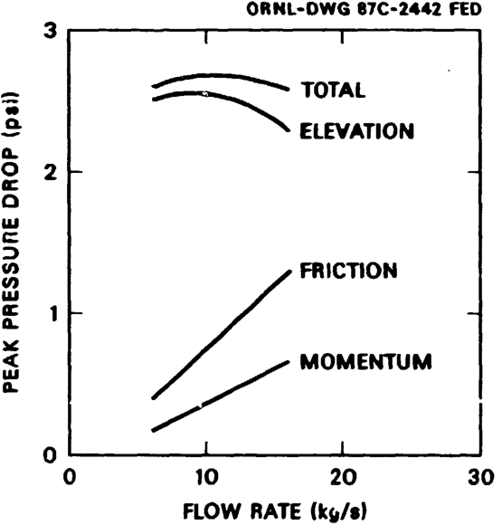

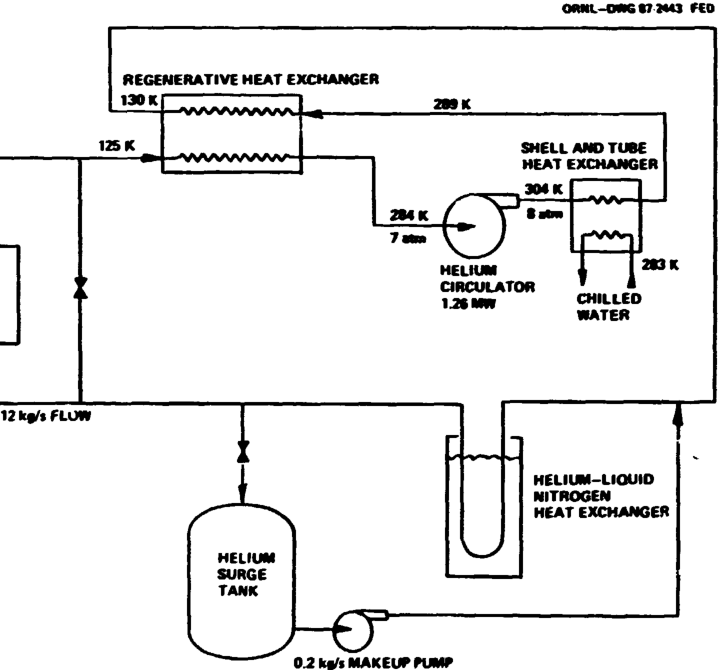

|**`Desired`**|**`cooidown time, h`**|**`<l`**|
|---|---|---|
|**`Helium`**|**`flow rate, kg/s`**|**`12`**|
|**`Maximum`**|**`operating pressure, atm`**|**`8`**|
|**`Design`**|**`pressure, psig`**|**`13t>`**|
|**`System`**|**`pressure drop, atm`**|**`1`**|
|**`Maximum`**|**`design temperature, K`**|**`320`**|
|**`Helium`**|**`circulator power, MW`**|**`1.25`**|

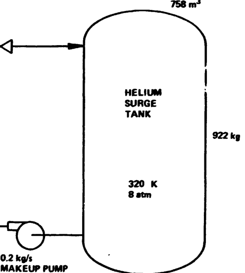

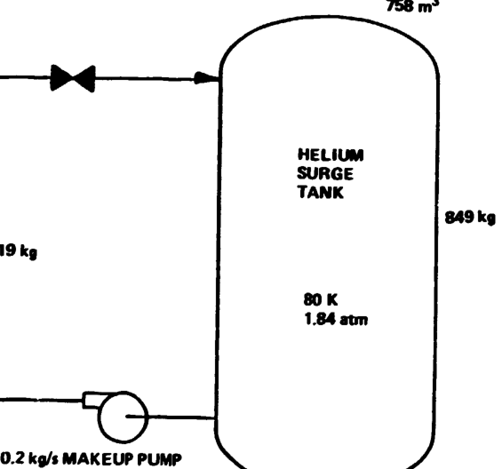

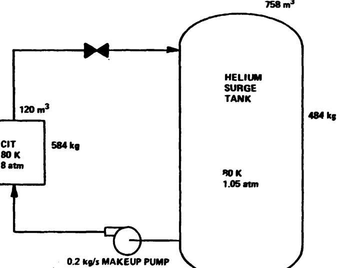

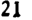

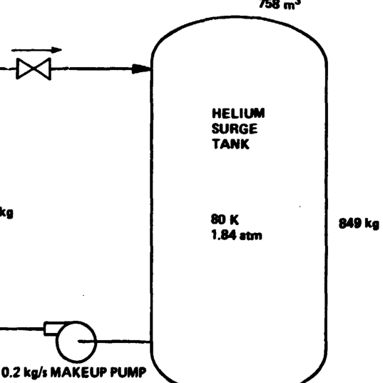

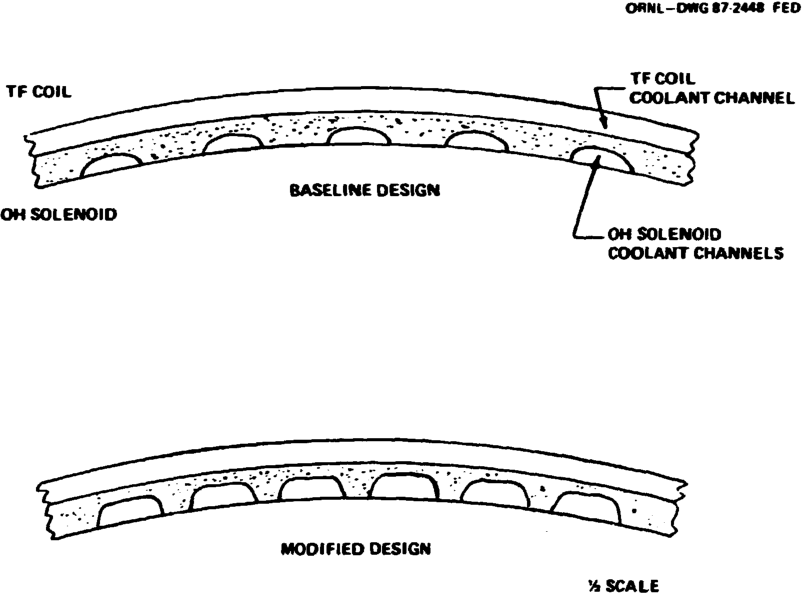

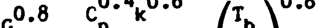

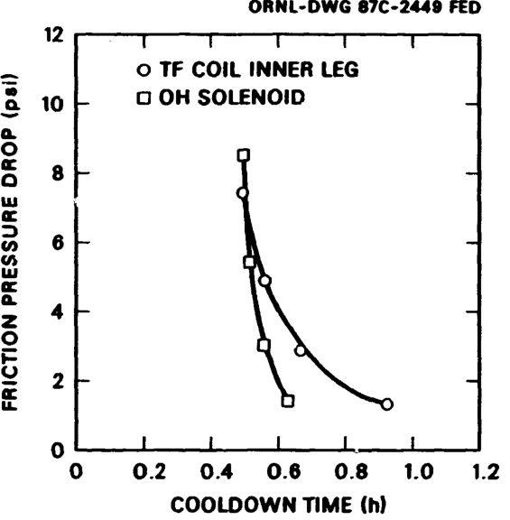

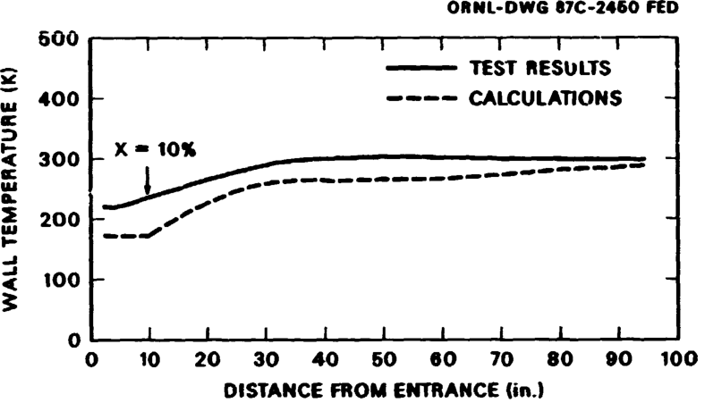

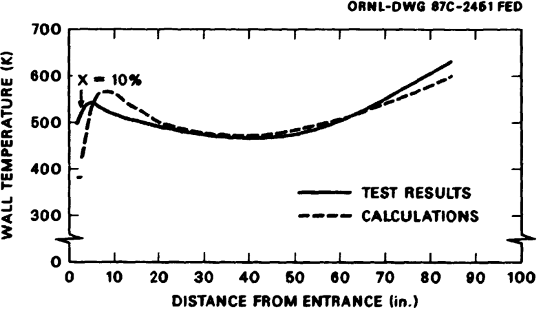

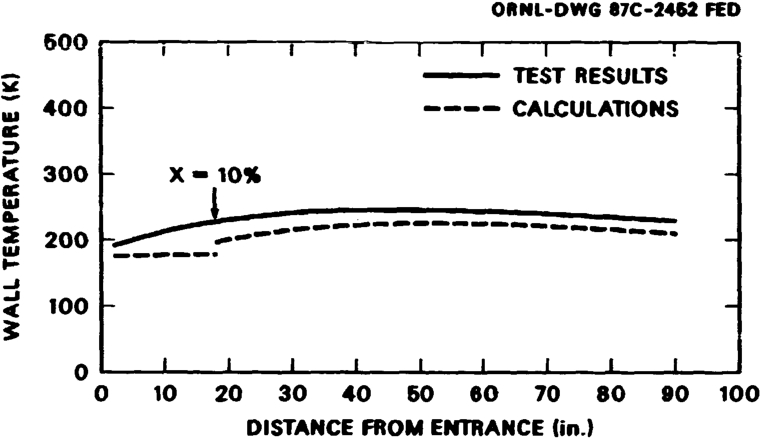

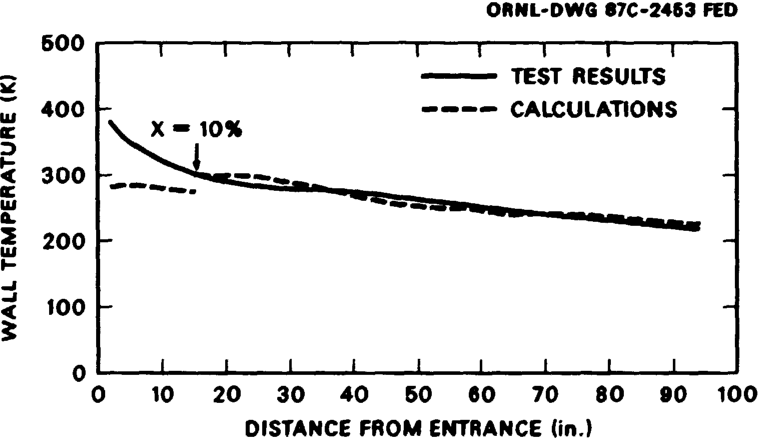

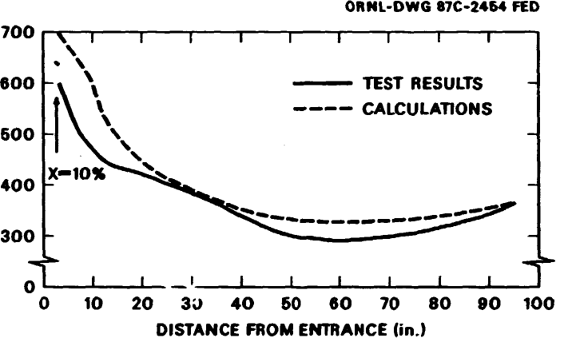

