**ORNL-TM-3777** 

HEAT TRANSFER SALT FOR 

HIGH TEMPERATURE STEAM GENERATION 

**E. G. Bohlmann** 

**WSTRffiUTION OF THIS nonriMCMT is hmi i«jrrn»** 

## **DISCLAIMER** 

**This report was prepared as an account of work sponsored by an agency of the United States Government. Neither the United States Government nor any agency thereof, nor any of their employees, makes any warranty, express or implied, or assumes any legal liability or responsibility for the accuracy, completeness, or usefulness of any information, apparatus, product, or process disclosed, or represents that its use would not infringe privately owned rights. Reference herein to any specific commercial product, process, or service by trade name, trademark, manufacturer, or otherwise does not necessarily constitute or imply its endorsement, recommendation, or favoring by the United States Government or any agency thereof. The views and opinions of authors expressed herein do not necessarily state or reflect those of the United States Government or any agency thereof.** 

## **DISCLAIM ER** 

**Portions of this document may be illegible in electronic image products. Images are produced from the best available original document.** 

_%_ 

This report was prepared as an account of work sponsored by the United States Government. Neither the United States nor the United States Atomic Energy Commission, nor any of their employees, nor any of their contractors, subcontractors, or their employees, makes any warranty, express or implied, or assumes any legal liability or responsibility for the accuracy, completeness or usefulness of any information, apparatus, product or process disclosed, or represents that its use would not infringe privately owned rights. 

**`OML-TM-3777`** 

**`Contract No, W-7405-eng-26`** 

**`Reactor Chemistry Division`** 

**`HEAT TRANSFER SALT FOR HIGH TEMPERATURE STEAM GENERATION`** 

**`E. G. Bohlmann`** 

## DECEMBER 1972 

> **-------------------------------- -------NOTICE-------------------------------------- ---** This report was prepared as an account of work sponsored by the United States Government. Neither the United States nor the United States Atomic Energy Commission, nor any of their employees, nor any of their contractors, subcontractors, or their employees, makes any warranty, express or implied, or assumes any legal liability or responsibility for the accuracy, com­ pleteness or usefulness of any information, apparatus, product or process disclosed, or represents that its use would not infringe privately owned rights. 

**`OAK RIDGE NATIONAL LABORATORY Oak Ridge, Tennessee 37830 operated by UNION CARBIDE CORPORATION for the U.S. ATOMIC ENERGY COMMISSION`** 

**----- Start of picture text -----** 
'i **----- End of picture text -----** 

**flSTMil Of Ills ttBCWEII IS WUfimi** 

**f!** 

**`iii`** 

**`*`** 

||`CONTENTS`||
|---|---|---|
|||**`Page`**|
|**`ABSTRACT AND SUMMARY. „ . . .`**||**`1`**|
|**`INTRODUCTION. ..............`**||`3`|
|**`COMPOSITION AND STABILITY . .`**||`4`|
|**`CORROSION ..........`**||**`16`**|
|**`PHYSICAL PROPERTIES . . . . .`**||`23`|
|**`Freezing Point ......`**||**`23`**|
|**`Viscosity. ........`**||`23`|
|**`Electrical Resistivity . .`**||**`23`**|
|**`Density. .........`**||**`26`**|
|**`Thermal Conductivity . . .`**||**`26`**|
|**`Heat Transfer Coefficient.`**||**`26`**|
|**`Thermal Expansion. . . . .`**||**`28`**|
|**`Specific andLatentHeat .`**||**`28`**|
|**`Efficiency ........`**||**`28`**|
|**`SAFETY PRECAUTIONS. . . „ , »`**||`31`|
|**`Principal Hazards. . .`**||`31`|
|**`Combustion Hazards . .`**||`31`|
|**`APPENDIX A. .`**||`35`|
|**`APPENDIX`**`B. .`||`37`|
|**`REFERENCES. ,`**||`39`|

**`1`** 

**`HEAT TRANSFER SALT FOR HIGH TEMPERATURE STEAM GENERATION`** 

## **`E. G. Bohlmann`** 

## **`ABSTRACT AND SUMMARY`** 

**`A literature review and`** `canvass` **`of vendors reveals no experience and sparse, short term data bearing on the possible use of`** `heat` **`transfer`** `salt` **`(HTS -`** `40%` **`NaN02, 7% NaN03,`** `53%` **`KN03) at temperatures > 1000°Fo Stability data found indicate that in a steam generator loop running with a maximum temperature of 1100°F about 0.5% of the NaN02 would decompose per day according to the overall reaction`** 

**`In the size loop envisioned for a Molten Salt Breeder Reactor (MSBR) the nitrogen produced would amount to 3400 ft3/d„`** 

**`Austenitic stainless steels are recommended materials of construction above 850°F and short term test data suggest high nickel alloys`** `like` **`Incoloy, and Inconel would also`** `be` **`suitable. I would infer that Hastelloy-N would be resistant`** `also.` 

**`A tertiary HTS steam generator`** `loop` **`would provide an effective barrier to transfer of tritium formed in an MSBR to the steam generator. The tertiary loop is required to eliminate the possibility of a violent moderator graphite - HTS reaction. How­ ever, projected use in`** `an` **`MSBR at temperatures to ^ 1100°F would require a substantial development`** `program directed` **`at stability and/or composition re-adjustment and verification of materials compatibility. Thus, the presence of appreciable Na20 and/or NaOH, depending on steam leakage, at such temperatures might appreciably alter the corrosion picture.`** 

**`An industrial installation`** `for` **`drying NaOH was operated one and one half`** `years` **`with a maximum temperature of 980°F without`** `difficulties` **`due`** `to` **`corrosion`** `or` **`stability. The salt loop was constructed of ASTM 106`** `Grade` **`A steel.`** 

**`3`** 

## `INTRODUCTION` 

**`It is estimated`** `that a` **`molten salt breeder`** `reactor` **`will produce ^2500`** `C.j 3T per day. Transfer of appreciable percentages of this 3T to the steam generator system must be prevented to avoid resultant contamination and containment problems. A substantial barrier to such transferwould be provided by the use of heat transfer salt- HTS (Na-K, nitrite-nitrate mixture) in the reactor steam generator circuit. The HTS would be expected to block the tritium transfer in several ways!` 

**`1. Conversion of hydrogen to water by the reactions: (Cf Appendix A).`** 

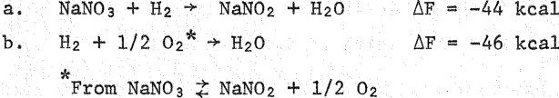

`2. HTS systems are compatible with steam (used as inert cover gas in` **`industrial`** `applications^')` **`so the water formed in 1 would not be corrosive`** `to the steam generator tubing, thereby eliminating that possible alternate tritium transport mechanism.` 

**`3. The tritiated water could be`** `stripped` **`from the`** `HTS` **`as required.`** `4. Protective oxides, which inhibit tritium diffusion, are formed 2 on` **`alloys in contact with HTS.`** 

`Originally, consideration was given to the substitution of the HTS for the` **`fluoroborate`** `secondary coolant. However, the probability of a` **`3 4`** `violent interaction 5 between the HTS and the graphite moderator (see section, Safety Precautions) in the event of contact during an accident eliminated this possibility. Such a violent interaction has been con­ firmed by an investigation carried out by Bamberger and Ross (Cf. Appendix B). Use of HTS as the secondary coolant would also necessitate extensive demonstration of compatibility with the very high radiation intensities in the primary heat exchanger.` 

`An alternate possibility is the use of HTS in a separate, tertiary steam generator loop;` **`7LiF-BeF2`** `, or 92 NaBFit-8NaF, would be used in the secondary loop. Increased cost would make this approach untenable were it not for other positive considerations. These include;` 

**`4`** 

**`1. The low, 288°F, melting point of HTS makes possible significant simplification of the steam system; cheaper alloys would also be useable * 2. Steam leaks into HTS will not enhance corrosion as it would in 92NaBF.u-8NaF or other fluoride coolants. Assuming all the water leaking into the fluoroborate participates, 'u 5 moles/h is equivalent to 1 mpy (uniform) for the entire secondary loop of an MSBR.`** 

**`3. Use of 7LiF-BeF2 in the secondary loop would eliminate poisoning of the fuel by leakage of secondary salt into the fuel; minor reverse leakage would also be more tolerable since the secondary loop could be included in the reactor cell. A substantially cheaper alternate might be MaF-ZrFi, which has a reasonably low cross section and which probably is removable by the presently considered fuel processing methods.`** 

**`5 Robertson has estimated the added cost of a third HTS loop, taking into account savings due to the above and other considerations. He con­ cluded, "Addition of the (12® and HTS) loops would increase the power production costs by 0.2 - 0.3 mills/kwhr, making the total cost about 5.5 mills/kwhr." The added capital cost amounted to 10 to 13 million dollars (206 total) depending on whether Incoloy 800 could be substituted for Hastelloy N in the secondary loop.`** 

**`While this estimated increased cost was not favorable to the third loop approach to tritium control, this survey of the "state of the art" as regards use of HTS under MSBR conditions was also conducted. At first blush it appeared that the widespread industrial experience would minimize the development required for such adaptation; unfortunately the survey showed such optimism was not well founded.`** 

## **`COMPOSITION AND STABILITY`** 

**`Heat transfer salt was developed by duPont in the thirties^* for use in the chemical and petroleum process industries, notably the Houdry catalytic cracking and refining units. The usual weight % composition is 40NaNO2, 7NaN03, 53 KNO3 which melts at 288°F; the melting point is not greatly affected by appreciable alterations as shown in Table 1.`** 

**`5`** 

## **`Table 1* - The Freezing Points of NaNOz-NaNOs-KNOs`** 

## **`Mixtures`** 

|**`; NaN02`**|**`% NaNOs`**|**`% `**`kno3`|**`Freezing`**|
|---|---|---|---|
|**`by `**`wt.`|**`by wt.`**|**`by wt.`**|**`Point °F`**|
|**`100`**|**`0`**|**`0`**|**`540`**|
|**`50`**|**`0`**|**`50`**|**`282`**|
|`44`|**`3`**|**`53`**|**`284`**|
|**`42`**|**`3`**|**`55`**|**`287`**|
|**`40`**|**`0`**|**`60`**|**`289`**|
|**`40`**|`7`|**`53`**|**`288 ("HTS")`**|
|**`38.5`**|**`11`**|**`50.5`**|**`293`**|
|**`38`**|**`6`**|**`56`**|**`292`**|
|**`35`**|`7`|**`58`**|**`311`**|
|**`34`**|**`13`**|**`53`**|**`305`**|
|**`34`**|**`3`**|**`63`**|**`328`**|
|**`30`**|**`20`**|**`50`**|**`305`**|
|**`30`**|**`10`**|**`60`**|**`312`**|
|**`30`**|**`0`**|**`70`**|**`333`**|
|**`0`**|**`100`**|**`0`**|**`586`**|
|**`0`**|**`0`**|**`100`**|**`633`**|

_**`•k`**_ **`Table II, page 375,`** `from` **`Ref. 1.`** 

**`Apparently the technology grew`** `"like` **`Topsy," as regards`** `both` **`composition and materials of construction, out of many years experience with salt baths used in heat treating and cleaning metals.`** 

**`Presumably because of`** `this` **`and proprietary considerations, there is a paucity of quantitative data on stability and corrosion in the open and vendor literature; this in spite of`** `widespread` **`use in substantial quantities — one Houdry unit used ^ 106`** `lb.` **`Low cost (still 15q/lb) and tractability under "rough and ready" handling also may have contributed. At the time of its introduction the low,`** `288°F,` **`melting point was a major advantage since it was below the temperature at which steam was available in most plants. The need for steam jackets and tracers, design`** 

**`6`** 

`for complete` **`gravity drainage, and other freeze-melt problems, however, gave the competitive nod to organics like "Dowtherm" for temperatures below`** `700°F.` **`A patented European development available under license in the U.S,`** `7 8` **`by American Hydrotherm Corp., * eliminates these problems by "salt dilution," This involves adding sufficient water to the salt at startup-and starting at 500°F on cooldown—to keep the salt in solution at ambient 50°F) temperature. The water is gradually flashed off at 200 - 500°F while circulating through the system; this eliminates the severe thermal shock of starting circulation at 500°F in a cold system or need for provision of an alternate preheat capability. Ten pilot plant and thirty-two plant size systems of this kind have been in operation since 1961 or are now under construction,, American Hydrotherm claims a 20% saving on capital costs for the use of salt dilution instead of dry salt,^ with no resultant materials or handling problems. A point by point comparison by American 9 in Hydrotherm ’ of "Dowtherm A" with HTS using salt dilution indicates substantially lower costs for the latter. The dilution process also eliminates problems which may be caused by increases in melting point due to`** `oxidation` **`of nitrite to nitrate or formation of relatively insoluble 8 11 NagCOs from pickup of COa, J. Alexander, Jr., and S. G. Hindin have published detailed studies of the freezing points of the system sodium and potassium nitrites and`** `nitrates` **`and the effects of impurities on them, Commercially used measures for countering these effects also discussed`** 

**`included:`** 

**`I,, Use of hydrogen treatment in a bypass adsorption tower to reduce excess nitrate to nitrite,`** 

`2,` **`Addition of concentrated HNO3 or gaseous NO2 to convert hydroxides and carbonates to nitrates and nitrites,`** 

**`3, Cold trap use to reduce carbonate levels.`** 

**`Sodium hydroxide is formed by the reaction of the Na20 thermal`** 

**`decomposition product of HTS with water.`** 

`:` **`12`** 

**`Paul Larson indicated hydrogen treatment was no longer used because addition of fresh salt proved cheaper than providing for doing the reduction.`** 

**`7`** 

`Various attempts to find definitive data` **`on thermal`** `stability at elevated temperatures were fruitless` **`in spite`** `of vendor and open literature` **`178 13—15`** `recommendations for use to 1000 and` **`1100°F. s`** `* 5 These efforts are well characterized by one lead which reported successful use of HTS at temperatures as high as` **`1200 - 1300°F.`** `A couple of phone calls located my original informant's source but produced the usual disclaimer. The use at such temperatures was occasional and involved only several pounds` **`of HTS, which gave no trouble "if changed frequently."`** `When` **`asked`** `what` **`happened to the HTS, the reply was, "It`** `gets` **`pretty lumpy.... fast."`** 

**`Up to`** `'u 850°F` **`widespread experience indicates HTS`** `is` **`stable in carbon steel systems even when operated with air`** `access` **`to the system. Slow oxidation of nitrite to nitrate and carbonate formation may increase the freezing point slowly, but these changes apparently do not result in any difficulties. Thus, Crowley and Helms trip report gives the`** `composition` 

**`%`** 

`NaN03` **`9.28`** `NaN02` **`30.3 KNOs 48.7 K2CO3* 3.38 KCl 0,27`** 

**`£91.93`** 

**`& 11 Alexander and Hindinxx indicate`** `NazCOs` **`would be`** `more` **`likely.`** 

**`for bulk salt after an indeterminate`** `period of` **`operation (probably > 2 years). The system has remained in operation with`** `this` **`salt`** `charge` **`since April 1967 24000 h @`** `800°F` **`maximum) with no requirement`** `for` **`composition adjustment;`** `new salt` **`is added only to make up for losses. Helms also reports 8 years use of the`** `same` **`batch of "Hitec" at`** `a` **`maximum bulk salt temperature of`** `843°F` **`without observable deterioration; air access was prevented by nitrogen blanketing in this application. Vendor literature recommends such nitrogen, or steam, blanketing 9 above 850°F, but`** `contacts` **`with vendor personnel uncovered no experience`** `at` **`such temperatures.`** 

**`Data for the rate of disappearance of nitrite`** `are` **`given by`** `W.` **`H.`** `v.d.` **`Broek`** `18` **`for`** `heat` **`transfer salt used in finishing (drying to ^ 100 %) NaOH.`** 

**`8`** 

**`In this application the composition`** 

**`48% KNOs`** 

**`49% NaNOa 3% NaaCrCH`** 

**`19 was used. The addition of chromate is reported (ca. 1940) to inhibit 3 decomposition of the nitrite to nitrate and oxide but PvOttenberg (1957) 12. states that the claims had not been established, Paul Larson also indicated that duPont had not found such additions either harmful or 18 beneficial; but some users insisted on making them, W. H. v.d. Broek showed nitrite decrease rates graphically for 11/2 and 2 1/2 year periods of operation at maximum temperatures of 980 and 800°F respectively as shown in Fig, 1. Unfortunately only the plots for nitrite loss were given, so it is not possible (no analyses) to determine how the two possible reactions`** 

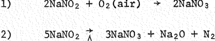

**`contributed to the observed changes. Also, during the high temperature operation, concern about the pump caused the system to be opened to the atmosphere frequently; this was minimized during the second run at 800°F, Still another factor may have contributed to the rapid loss of nitrite 20 at 980°F; it is reported that the decomposition of alkali nitrate - nitrite mixtures is catalyzed by iron above 520°C, and the system described by v„d, Broek was made of carbon steel. Stainless steel does not catalyze 21 decomposition of alkali nitrate - nitrite mixtures even at 800°F.`** 

**`Some laboratory studies in 316 stainless steel containers have been 12 carried out at 1100°F, Figure 2 shows the effect of various blanket gases on the melting point of "Hitec;" "melting point" in HTS parlance refers to the temperature at which any solid phase appears. Reactions considered significant in the decomposition of nitrate - nitrite mixtures 21 (the sodium salts are indicated because they are less stable ) include:`** 

**`9`** 

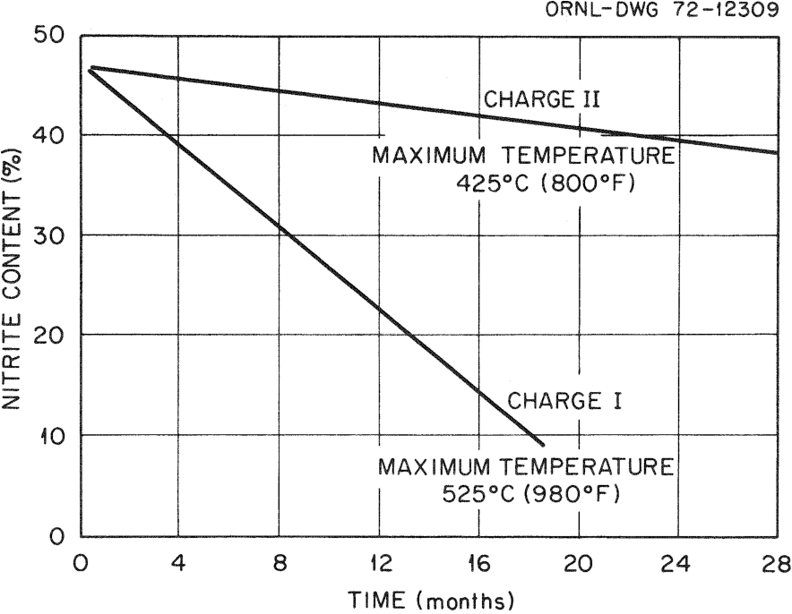

**----- Start of picture text -----** 
ORNL-DWG 72-12309 CHARGE II MAXIMUM TEMPERATURE CHARGE I MAXIMUM TEMPERATURE 0 4 8 12 16 20 24 28 TIME (months) **----- End of picture text -----** 

**`Fig. 1. Nitrite Decomposition in Industrial Process Loop Using HTS*`** _**`■k`**_ **`Per W. H. v.d. Broek, see Ref. 18.`** 

**`10`** 

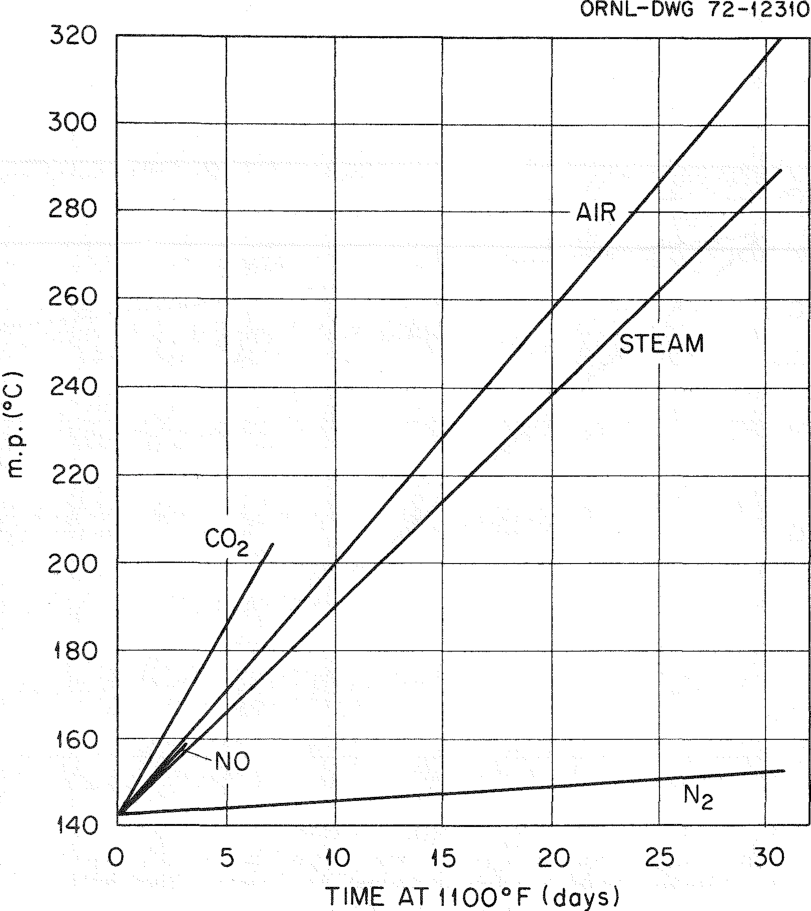

**----- Start of picture text -----** 
ORNL-DWG 72-12310 STEAM o 240 E 220 0 5 10 15 20 25 30 TIME AT 1100°F (days) **----- End of picture text -----** 

**`Fig. 2. Effect of Various Blanket Gases on HTS m.p. (See Ref. 12)`** 

**`il`** 

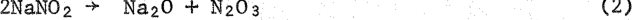

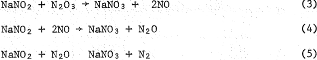

**`The formation of NaaCOs and/or NaOH from reactions of carbon dioxide or`** `water with the` **`Na20`** `formed in` **`(2)`** `account for the melting point increases with air9 steam, and carbon dioxide blankets. Conversion of the nitrite to nitrate by reactions (4) and (5) probably accounts for the rapid increase in melting point with NO as the blanket gas. Reactions (2) thru (5) produce the rise under nitrogen, again through conversion of nitrite to nitrate. This is indicated by analysis of a salt mixture` **`after six weeks under nitrogen at 1100°F which showed the composition`** `12` **`to be that given in Table 2, with a melting point of`** `329°` **`F.`** 

`Table 2.` **`Change in "Hitec" Composition After Six Weeks at 1100°F`** 

||**`% Composition`**||
|---|---|---|
|**`Compound`**|**`Original`**|**`Final`**|
|**`NaN03`**|`7`|**`18`**|
|**`NaNOa`**|**`40`**|**`28`**|
|**`KN03`**|**`53`**|**`52`**|
|**`Na20`**|**`"`**|**`2`**|

**`Analysis of gas evolved gave 98.5% N2 and 1.5% N20.`** 

`22` **`23 Gurovich and`** `Shtokman` **`and Voskresenskaya and Berul* also conducted laboratory Investigations of HTS stability at temperatures >`** `1000°F` **`and`** `found` **`appreciable nitrogen evolution.`** 

**`The studies from which decomposition data are available are summarized in Table 3. After an initial period, the generally accepted overall`** 

**`Table`** `3` **`_ Long Term Decomposition Studies of Heat Transfer Salt`** 

`*Assuming over-all reaction is SNaNOj INaNOj + Na^O + .` 

**`13`** 

## `decomposition reaction is` 

## **`5NaN02 -> 3NaN0 3 + Na20 + N2 .`** 

`This stoichiometry was used to calculate the nitrogen evolution rate from the results reported by the` **`experimenters; the`** `rate was necessarily assumed` **`23`** `to be constant, although Voskresenskaya and Berul' and others indicate it decreases with time. The calculated` **`N2 evolution rates are those given`** `in the` **`final column in Table 3 and`** `are` **`plotted in Figure`** `3.` **`Considering the disparate conditions of the several investigations`** `the` **`results are pleasantly consistent although more data would be helpful in more firmly removing the possibility`** `of` **`coincidence. The two low points due to Voskresenskaya and Berul'`** `are` **`for the experiments performed in silver; they and other investigators reported lower decomposition rates in`** `noble` **`metal`** `containers` **`than in`** `carbon` **`and alloy steels. The data`** `due` **`to v.d. Broek are of particular interest; recall that they were obtained from HTS in use`** `in an` **`industrial process loop (dewatering NaOH) and the only temperatures given were the maximums in the loop. Thus the`** `average` **`temperatures were appreciably lower and the data should fall below those from the isothermal studies of Larson and Gurovich and Shtokman — as they do.`** `The` **`consistency in allthese studies suggests that the measured decomposition rates may be reasonably accurate for an engineering operation.`** 

**`If one accepts then that these data may be considered reasonably representative of the tertiary loop as envisioned by Robertson (maximum temperature 1100°F), a decomposition rate of about`** `40` **`cc N2/mole NaN02/d would be`** `anticipated.` **`For the 9 x 105 lb of HTS (40% NaN02) in the tertiary loop, this amountsto 4200 moles (3400 ft3) N2/d. The nitrite loss would amount`** `to` **`21,200`** `(2200` **`lb) moles per`** `day;` **`i.e., 1.0%/d.`** 

**`Extrapolation to temperatures above`** `110OOF` **`is questionable since 23 24 various workers ’ report nitrogen oxides are also evolved above`** `600°` **`C. These`** `were` **`short term studies, however, and it may be that the evolution of`** `oxides` **`of nitrogen would not continue after`** `a` **`period, as happened in 23 the longer term studies at lower temperatures. Voskresenskaya and Berul' also reported substantial attack on the containers in some`** `of` **`their experiments, unlike other experimenters. When this occurred with high`** `Cr` **`alloys, appreciable amounts`** `of` **`chromate were found in the`** `melts.` 

**`14`** 

**----- Start of picture text -----** 
ONRL-DWG 72-12311 **----- End of picture text -----** 

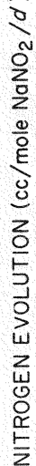

**----- Start of picture text -----** 
/ ^ ) 2 NaN0 (cc/mo!e EVOLUTION NITROGEN **----- End of picture text -----** 

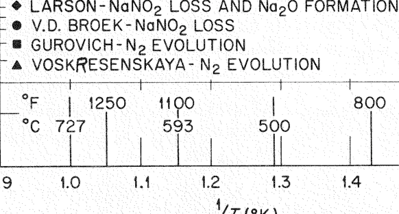

**----- Start of picture text -----** 
-♦ LARSON-NaNO? LOSS AND Na20 FORMATION !• V.D, BROEK-NaNOg LOSS -■ GUROVICH-Ng EVOLUTION -A VOSKRESENSKAYA - N2 EVOLUTION C 727 Vt-(ok) **----- End of picture text -----** 

**`Fig. 3. Rate of Nitrogen Evolution from HTS vs Temperature`** 

**`15`** 

**`23 Voskresenskaya and Berul' also present data showing the rate of nitrogen evolution as a function of nitrite concentration. These data, interpolated from a small graph and given in Table 4, are only indicative, but they are consistent with other observations. This suggests that a mixture consisting of 8% NaNOa, 42% NaNOs and 50% KNOs might result in lower Na evolution rates. The sodium nitrate-sodium nitrite ratio was 25 chosen on the basis of Freeman's observation that the ratio (under one atmosphere of oxygen) is 5.9 at 600°C. Curiously, no observer mentions the evolution of oxygen from the usual mixtures at such temperatures. Alexander and Hindin's"^ data indicate a melting point of 'V 420°F for such a mixture, still adequately low for simplification of the steam cycle.`** 

**`Apparently the equilibrium`** 

**`NaNOa ^ NaNOa +`** _**`^02`**_ 

**`is substantially shifted to the left in HTS; Freeman's data indicate O2 would be about 0.3 atm at 600°C for the usual mixture. Presumably, however, the equilibrium would shift to the right as the percent nitrate is increased, with resultant evolution of oxygen. Perhaps a mechanism change also occurs and the oxygen appears as the oxides of nitrogen observed by some observers 24 ’ 25 at temperatures > 1100°F.`** 

**`Table 4. Rate of Nitrogen Evolution vs NaNOa Concentration at 550°C*`** 

**`These were short term (to 20 h) studies and are therefore only indicative.`** 

**`16`** 

## **`CORROSION`** 

**`As with thermal stability, corrosion data are sparse, and then only from relatively short term tests. Considerable experience has demonstrated acceptable, economic performance with no apparent necessity for quantita­ tive, long term corrosion data. The vendors recommend against use of carbon steel above 850°F; at lower temperatures it gives excellent, long term service. 313X6’ * Rottenberg 3 gives the following description of how troubles can arise in a poorly designed maloperated, direct fired heater,`** 

**`"The main danger is, as usual, overheating in the stagnant film at heating surfaces. The danger is accentuated in this case by the ability of HTS to detach particles of rust and scale from the inside of the plant and deposit it as sludge at the bottom. Even more important is the fact that with gross overheating, at local temperatures above 700°C, a new reaction sets in with the rapid breakdown of nitrate to oxygen, nitrogen, and oxide. In the presence of a mild steel surface, the oxygen combines with it in a thermite type reaction which is self-sustaining and rapidly burns through the metal. No reaction takes place with stainless steel. In plants operating at high bulk temperatures heating sections should be constructed of stainless steel to obviate this danger."`** 

`18` 

**`In the operation described previously, however, v.d, Broek observed no corrosion of the system during 11/2 years of operation with a maximum temperature of 980°F. The heater section and the rest of the heat transfer loop were made of carbon steel (ASTM a106) with nickel and "Incoloy" at the interfaces in the NaOH concentrator. Conventional use of nickel and nickel alloys for materials of construction in caustic concentrators`** `26` **`using heat transfer salt and v.d. Broek*s experience indicate good compatibility for these materials to •\> 1000°F. Other qualitative assessments of corrosion by heat transfer salt during extended operating periods are summarized in Table 5.`** 

**`Miscellaneous corrosion data are shown in Table 6, taken from the`** `13` **`"Hitec" pamphlet." While no experimental details are provided, it is probable that the results are from quite short term (a few hundred hours) tests. The two period tests at 1058°F indicate the corrosion rates of the highly alloyed materials decrease with time. Note, however, that Inconel was an exception in spite of the excellent results at 1000°F and for nickel at 1100°Fo Similar results are shown by data furnished 27 by J. Friedman which are presented in Table 7. The relatively short`** 

`Table 5. Qualitative Assessments of Corrosion by Heat Transfer Salt` 

## **TABLE** **`6`** 

## **CORROSION OF METALS BY "HITEC"** 

||Metals|||**Corrosion **|**Rate, Inches Penetration Per Month**|**Rate, Inches Penetration Per Month**|**Rate, Inches Penetration Per Month**||
|---|---|---|---|---|---|---|---|---|
|||**612°F.**|785°F.|**850°F.**|**1000°F.**|**1058°F.**||**1100°F.**|
|||||||**1 st Period **|**2nd Period**||
|**Steel**—**open hearth (ASME #S-17)**||||**0.0003**|**0.001 to 0.002**|||**0.01 to 0.05**|
|**Alloy steels**|||||||||
|**15-16% chromium iron**||`_`|`__`|—|**0.0000**|—|—|—|
|**"Alcrosil" #3**||`—`|—|**0.0002**|**0.001**|`__`|`_`|**0.002 to 0.006**|
|**"Alcrosil" #5**||`_`|`__`|**0.0002**|**0.0005**|—|—|**0.001 to 0.002**|
|**Stainless steels**|||||||||
|**Type 304**||—|`—`|—|**0.0007**|`—`|•—|—|
|**Type **3041||`__`|—|`—`|**0.0006**|—|—|—|
|**Type 309 (annealed)**||**0.00002**|**0.00001**|**0.0000**|—|**0.00110**|**0.00064**|`. _`|
|**Type 309 Cb**||—■|`__`|—|`_`|**0.00156**|**0.00094**|—|
|**Type 310**||`_`|—|`_`|—|**0.00117**|**0.00077**|—|
|**Type 316**||`_`|—|—|**0.0000**|—|—|—|
|**Type 321**||`—`|`_`|`_`|—|**0.00111**|**0.00056**|—|
|**Type 347**||`—`||—|**0.0004**|**0.00109**|**0.00068**|—|
|**Type 446**||`_`|—|—|—|**0.00146**|**0.00072**|`—`|
|**Inconel**||`—`|—|—|**0.0000**|**0.00153**|**0.00151**|—|
|**Carpenter 20**||`__`|`__`|`__`|`—`|**0.00097**|**0.00059**|`_`|
|**"Hastelloy” B**||**0.00011**|**0.000003**||—|—|—|—|
|**Monel**||—|—|`__`|**0.0001**|—|`_`|—|
|**Bronze**||**0.00006**|**0.00008**|**0.0001**|`__`|`_`|—|—|
|**Phosphorized **|**Admiralty**|**0.00006**|**0.00005**|**0.0001**|—|—|—|—|
|**Copper**||—|—|—|**0,03**|—|`—`|`—`|
|**Nickel**||||||||**0.00025**|

**`Table`** `7.` **`Resistance of Steels to Molten High Temperature Eutectic Salt at 900 and`** `1100®F` 

|**`Quality`**|**`Testing`**|**`900“F - 482®C`**|**`900“F - 482®C`**|||**`1100®F - 593®C`**|**`1100®F - 593®C`**||
|---|---|---|---|---|---|---|---|---|
|**`and`**|**`Time in`**|**`Loss in Wt.a`**|`Extrapolated*5`||**`Loss in Wt.a`**||**`Extrapolated*3`**||
|**`Cast No.`**|**`Hours`**|**`MGMS/CM2`**|**`Penetration`**||**`MGMS/CM2`**||**`Penetration`**||
||||**`at `**|**`1 year`**|||**`at `**|**`1 year`**|
||**`24`**|**`2.0`**||||**`21.4`**|||
|**`MILD`**|**`100`**|**`3.6`**||**`7.1`**|**`39.6`**|**`31.7`**||**`18.4`**|
|**`STEEL`**|||||||||
||**`500`**|**`21.0`**||||**`-`**|||
||**`24`**|**`2.9`**||||**`9.8`**|||
|**`ESSHETE`**|||||||||
|**`CML`**|**`100`**|`3.3`||**`2.4`**|**`14.0`**|**`9.2`**||**`6.4`**|
||**`500`**|**`9.2`**||||**`-`**|||
|**`ESSHETE`**|**`24`**|**`2.0`**||||**`9.2`**|||
|**`CRM. 2`**|**`100`**|**`3.1`**||**`2.74`**|**`13.9`**|**`10.4`**||**`5.9`**|
||**`500`**|**`11.0`**|||**`29.3`**|**`18.5`**|||
|**`ESSHETE`**|**`24`**|**`1.5`**||||**`4.1`**|||
|**`CRM.5`**|**`100`**|**`2.4`**||**`2.3`**|**`8.0`**|**`6.3`**||**`3.6`**|
||**`500`**|**`9.3`**|||**`17.2`**|**`14.7`**|||
|**`RED FOX`**|**`24`**|**`0.3`**||||**`2.7`**|||
|**`(Type 321`**|**`100`**|**`0.3`**||**`0.5`**||**`4.0`**||**`2.3`**|
|**`SS)`**|**`500`**|**`1.9`**|||**`10.1`**|**`7.4`**|||
|**`SILVER FOX`**|**`24`**|**`NIL`**||||**`2.2`**|||
|**`(Type 316`**|**`100`**|**`NIL`**||**`0.03`**||**`3.5`**||**`0.60`**|
|**`SS)`**|**`500`**|**`0.1`**|||**`4.8`**|**`3.8`**|||

**`aThe loss in weight was determined after descaling in sodium hydride bAssumes adherence to parabolic rate law.`** 

**`20`** 

**`term data presented are consistent with parabolic rate law behavior — mils penetration = k /t; the extrapolated penetrations at one year are calculated from the data using this expression. The alloy compositions tested are given in Table 8.`** 

**`13 The "Hitec" pamphlet (page 10) indicates copper is useable at moderate temperatures (to 600°F), but corrodes rapidly at higher 3 temperatures — 30 mils/mo at 1000°F, see Table 6. Rottenberg Indicates, "Copper, aluminum, magnesium, and their alloys are all attacked more or less rapidly and should not be allowed to come into contact with HTS." (See additional comment on aluminum and magnesium under Safety Pre­ cautions .)`** 

**`The presence of sulfate is said to be deleterious to the low alloy 3 steels like CML and CKM2 (see Table 8), and Rottenberg states, "the corrosive action of HTS is greatly affected by the presence of oxide and hydroxide." Insolubles, like carbonate, may lead to erosion or localised 16 overheating problems. The oxide and hydroxide effects would require investigation since temperatures of interest in MSBR's presumably would produce appreciable oxide which would be converted to hydroxide by any steam leakage.`** 

`Table 8= Analysis and Heat Treatment` **`of Materials`** 

**`23`** 

## **`PHYSICAL PROPERTIES`** 

`Table` **`9,`** `compiled by` **`Robertson,^`** `compares several salts useable in MSBR's.` **`Hitec`** `compares` **`favorably with the`** `other` **`two coolant salts.`** 

**`The remainder`** `of` **`this section, and the`** `subsequent` **`one on Safety`** `13` **`Precautions is taken from the`** `"Hitec" pamphlet.` **`Figure and Table numbers are those used in the pamphlet.`** 

`"Freshly` **`prepared "Hitec"`** `is` **`a white, granular solid; in the molten state, it has a pale yellow color. It is a eutectic mixture of inorganic salts having the following composition:`** 

**`Potassium Nitrate 53%`** 

**`Sodium`** `Nitrite` **`40% Sodium Nitrate 7%`** 

## **`Freezing Point`** 

**`"The freezing point of fresh "Hitec" is 288°F, and it can therefore be melted readily by plant steam at a pressure as low as 50 psig. The presence of a small amount of moisture sharply`** `reduces` **`the freezing point, and in order to determine the freezing point accurately, it is recommended that the salt be melted and dried`** `by` **`heating at about 480°F. Driving off water vapor in this manner may cause effervescence or frothing, depending on the amount of moisture present, and it is recommended that suitable precautions be taken to protect personnel from spattering by the hot, molten salt.`** 

## **`Viscosity`** 

**`"The viscosity of molten "Hitec" was measured over the temperature range from 300 to`** `820°F,` **`and these data were extrapolated to 1000°F with an accuracy believed sufficient for design purposes. The experimental points and extrapolated curve are shown in the graph of viscosity versus temperature, Figure 6.`** 

## **`Electrical Resistivity`** 

**`"The electrical resistivity of molten "Hitec" is 1.7 ohms per cu.cm. This value is approximately midway between that of water, 25 x`** `10®` **`ohms per cu.cm., and that of mercury, 95.9 x`** `10”6` **`ohms per cu.cm.`** 

## **`Table 9, S`** `elected Properties of` **`the MSBR Molten Salts`** 

||**`7L`**`iF-BeF `**`2-ThF4-UF4`**|`NaF-NaBFt*`|**`7LiF-BeF2`**|`KNOs-NaNOa-NaNQs`|
|---|---|---|---|---|
|**`Composition, mole %`**|**`71.7-16-12-0.3`**|**`92-8`**|**`66-34`**|**`44.2-48.9-6.9a`**|
|`Molecular weight, approximate`|**`64`**|**`104`**|**`33`**|**`84`**|
|**`Density, lb/ft3 at 1000°F`**|**`212`**|**`117`**|**`124`**|**`105`**|
|**`Viscosity, lb/ft-hr at 1000°F`**|**`41`**|**`3`**|**`29`**|**`3`**|
|**`Specific heat, Btu/lb~°F`**|**`0.32`**|**`0.36`**|**`0.57`**|**`0.37`**|
|`Thermal conductivity, `**`Btu/ft-hr-°F`**|**`0.67 to 0.68`**|**`0.23`**|**`0.58`**|**`0.33`**|
|**`Estimated cost, $/lb`**|**`57.00`**|**`0.50`**|**`12.00`**|**`0.15`**|
|**`Circulation required per loop'3`**|||||
|**`for 556-MW(t) heat load:`**|||||
|`lb/hr`|**`23.4 x 106`**|**`18.3 x 106`**|**`13.3 x 106`**|**`14.7 x 106`**|
|`gpm`|**`14,260`**|**`19,500c`**|**`13,380`**|**`17,370`**|
|**`Liquidus temperature, °F`**|**`930`**|**`725`**|**`850`**|**`288`**|

**`aEutectic composition=`** 

**`kfiased`** `on properties at average` **`temperatures in MSBR system.`** 

**`CBased on 250°F At In modified MSBR.`** 

**`25`** 

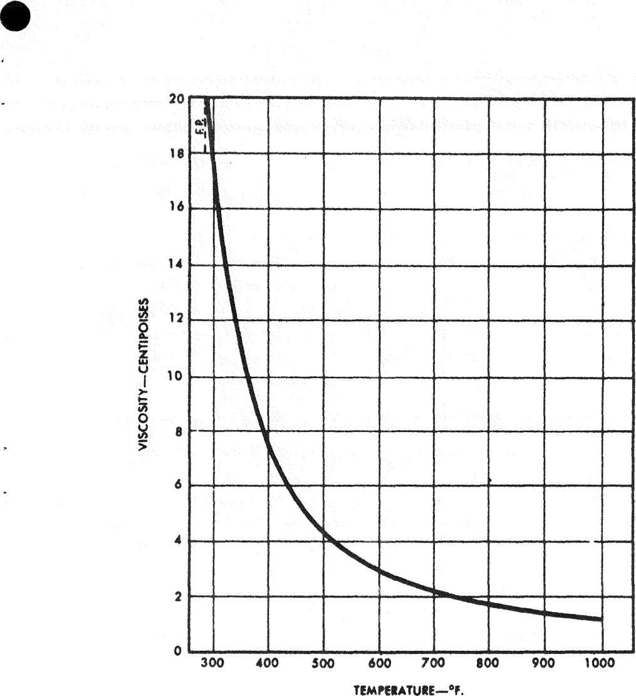

**`Fig.`** `6.` **`Viscosity of Liquid HITEC`** 

**`26`** 

## **`Density`** 

**`"The density-temperature relationship for molten "Hitec" is presented in the alignment chart of Figure 7. By drawing a straight line from the desired point on the temperature scale through the reference point, density can be read from the chart in grams per cu.cm., pounds per cu.ft., or pounds per U.S. gallon.`** 

## **`Thermal`** `Conductivity` 

**`"Thermal conductivity measurements on "Hitec" heat transfer salt have been reported by W. D» Powers, ANP Quarterly Progress Report, September 30, 1957, OKNL-2387 (Classified). A value of 0.35 B.T.U./(hr.) (sq.ft.) (°F./ft.) independent of temperature in the range from 468 to 689°F was obtained using a parallel-plate, variable sample gap apparatus such as that described in ASME paper 56-SA-31 by C. F. Lucks and H. W. Deem. Battelle Memorial Institute, in a similar apparatus, extended the tem­ perature range and obtained a value of 0.33 B.T.U./(hr.) (°F./ft.) independent of temperature in the range from 400 to 900°F. (private communication from H. W. Hoffman, Oak Ridge`** `National` **`Laboratory and`** 

## **`Battelle Memorial Institute).`** 

**`"An earlier Russian article by Vargaftik, Neimark,`** `and` **`Oleshchuck which appeared in the Bulletin of the V.T.I., September 1952, No. 9 had reported values in the temperature range from 302 to 932°F which ranged from 0.26 to 0.17 B.T.U./(hr.) (sq.ft.) (°F,/ft.),`** 

## **`Heat Transfer Coefficient`** 

**`"Heat transfer coefficients (h) for "Hitec" flowing in turbulent motion inside horizontal circular, iron pipes have been determined over the temperature range of 580 to 960°F at linear velocities up to 6 feet per second. Details of this experimental work are published in Transactions of American Institute of Chemical Engineers _36, 371 (1940). Data on the thermal conductivity of "Hitec" were lacking, and the experi­ mental results, therefore, were correlated in terms of the function`** li!D **`Since the publication of this work, additional determinations of the heat transfer coefficient were reported by H. W. Hoffman and S. I. Cohen in a paper entitled Fused Salt Heat Transfer — Part III: Forced-`** 

**`27`** 

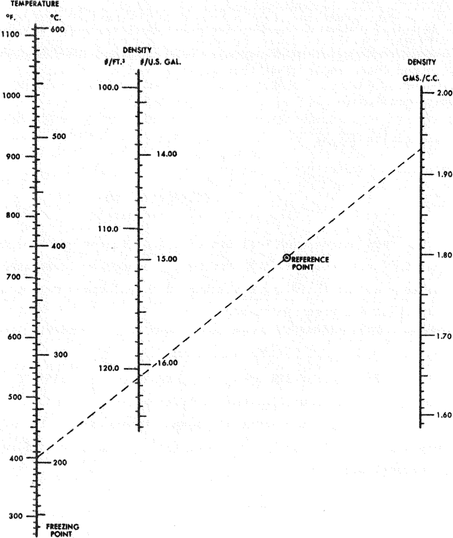

**----- Start of picture text -----** 
TfMWcAruu «». «c. uoo —f ’i0° DENSITY l/rr.* ms. i DENSITY GMS./CX. 100.0 • 1000 ■ 2.00 300 900 — 14.00 ■ 1.90 800 — 110.0 / / -400 / 13.00 jS^tEFEMMCE • 1.80 . POINT 700 / 600 • - 1.70 300 / 120.0 , 16.00 300 • 1.60 . ■ y s 400 - -200 300 • FREEZING POINT **----- End of picture text -----** 

**----- Start of picture text -----** 
NOTEi TO FIND DENSITY, DRAW A STRAIGHT UNE FROM DESIRED POINT ON TEMPERATURE SCALE THROUGH THE REFERENCE POINT. **----- End of picture text -----** 

**`Fig. 7.`** `Density` **`of Liquid HITEC`** 

**`28`** 

**`Convection Heat Transfer in Circular Tubes Containing the Salt Mixture`** 

**`NaNOa-NaNOa-KNOss ORNL-2433 (1957). The latter work apparently utilized a mnrp amuratp an-narartiR fHau that hrpH in tha aarliAr dptarm-f-nations.`** `f h ^ [CPU` **`2/3 The data`** _**`was`**_ **`correlated using the Colburn`** _**`j_`**_ **`function,`** `(cpcj l k` **`Hoffman and Cohen report that the variables ranged as follows:`** 

**`DG Reynolds modulus (N_ ), 4850-24,710`** _**`J`**_ **`Re U`** 

**`Prandtl modulus (N_`** `Fr` **`),`** `k` **`Average fluid temperature`** 

**`4.2-9.1`** 

**`552-828°F.`** 

**`Heat flux`** 

**`62,800-194,500^ B.T.U./hr.-ft.2`** 

**`Under these conditions, the heat transfer coefficient varied from 800 to 2900 B.T.U./(hr.) (sq.ft.) (°F). In heat transfer applications, "Hitec” behaves as a normal fluid and the standard correlations may be used in designing heat exchange equipment.`** 

## **`Thermal Expansion`** 

**`"The coefficient of linear thermal expansion for solid "Hitec", measured by the Dilatometer method of ASTM-D696-44, is 2.85 x 10~5 per °Fc The coefficient of cubical thermal expansion for liquid "Hitec" is 2.016 x 10-4 per °F. (private communication from H.`** _**`W.`**_ **`Hoffman, Oak Ridge National Laboratory).`** 

## **`Specific and Latent Heat`** 

**`"The total heat of "Hitec" was measured calorimetrically over the temperature range of 70 to 1100°F, The slopes of the total heattemperature lines. Figure 8, indicated that the specific heat of solid "Hitec" is 0.32 and that of the melt 0.373 calories per gram per °C (or B.T.U. per pound per °F). Latent heat: of fusion appeared to be approximately 20 calories per gram (35 B.T.U. per pound).`** 

## **`Efficiency`** 

**`"The efficiency of "Hitec" heat transfer salt is well illustrated by a direct comparison to hot air, or flue gas, on a performance basis.`** 

**`2.9`** 

**`Such`** `a` **`comparison is given in Table I, and the details of the calcu­ lations used to obtain these data are given in the previously cited article appearing`** `in` **`Transactions of American Institute of`** `Chemical` **`Engineers 36, 371 (1940),`** 

**----- Start of picture text -----** 
TSMPWATUtK—•*. **----- End of picture text -----** 

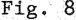

**----- Start of picture text -----** 
Fig, 8 **----- End of picture text -----** 

**TABLE I** 

**----- Start of picture text -----** 
COMPARISON OF "HITEC" AND AIR AS HEAT TRANSFER FLUIDS **----- End of picture text -----** 

|**COMPARISON OF "HITEC" AND AIR AS HEAT TRA**|**COMPARISON OF "HITEC" AND AIR AS HEAT TRA**|**COMPARISON OF "HITEC" AND AIR AS HEAT TRA**|**NSFER **FLUIDS||
|---|---|---|---|---|
|Basis of Comparison:|||||
|Fluid|Conduit:|1* LD. Tubas|||
|Average Fluid Temperature: 800°F.|||||
|Pressure Drop due to Friction: 3.5 lbs./(sq.m.) /100|||ft. of tubing||
|Difference between inlet and outlet fluid temperatures* 50°F,|||||
|||**"HITEC"**||**AIR**|
||||at **3 atm.prest.**|**at 10 atm.preis.**|
|Press. drop./lOO ft.................................................|||3.5 lbs. /sq.irs.|3,5 lbs,/sq.in.|
|lbs. /Hr. /tube.........................................................|. 6000||185|360|
|Heat carrrying capacity /tube..............................|. Ill.900 B.T.U./hr.||2310 B.T.U. /hr.|4500 B.T.U, /hr.|
|No. of 1' tubes required to transfer 111 ,900|||||
|B.T.U. /hr. at 50°F. temperature difference. .|. 1||48'/j|25|
|Total lbs./hr..............................................................|. 6000||8970|8970|
|Theoretical HP required to overcome friction. .|. 0.014||24.1|7.2|
|Individual coefficient of heat transfer.................|. 858||28|40|

**`31`** 

## `SAFETY` **`PRECAUTIONS`** 

## `Principal Hazards` 

`"The principal hazards associated with "Hitec" are those which` **`apply`** `to any operation involving the use of liquids at elevated temperatures. Adequate precautions should be taken to protect operating personnel from burns in case of equipment failure. There is a lesser danger that "Hitec," by supporting the combustion` **`of`** `other materials, may escalate an existing fire hazard. Similarly, there is a danger that prolonged contact of` **`"Hitec" with human skin may cause dermatitis. Finally, "Hitec" should not be ingested by operating personnel in more than trace amounts because of the sodium nitrite`** `which` **`it contains.`** 

**`"'Hitec' itself liberates no toxic vapors, but adequate ventilation should be supplied to remove products of combustion due to accidental or process contamination of the "Hitec" system. Although the combustion products of most organic compounds`** `are` **`principally carbon dioxide and water,`** `traces` **`of highly toxic gases such as`** `carbon` **`monoxide, oxides of nitrogen, etc., may also be present. It is reported that, in instances where a process utilizing "Hitec" generates steam, operating personnel complain of a salty taste after being in the area`** `for` **`a period of time, particularly when the weather is humid. Adequate ventilation will relieve this`** `condition.` 

## **`Combustion Hazards`** 

**`"Although "Hitec"`** `itself` **`is nonflammable, it will support the combustion of other materials, and salt units should not be located in the vicinity of wooden construction. Similarly, contamination of the`** `work` **`area with`** `"Hitec"` **`may increase any fire hazard`** `created` **`by the presence of combustible materials. These problems may be minimized by washing the work area regularly with water and by substituting non­ flammable materials for combustible materials. For example, sand rather than sawdust should be used for clean-up, diking, etc. A number`** `of` **`tests have`** `been carried` **`out`** `to` **`estimate the`** `hazards` **`associated with the accidental contact of flammable materials with hot,`** `molten` **`"Hitec,"`** `but` 

**`32`** 

**`since it is impossible to anticipate all conditions under which this product may be used, it is recommended that the user carry out additional tests before undertaking any novel applications.`** 

**`"Combustible vapors generally react relatively slowly with "Hitec" and escape before combustion is complete. Gasoline vapors, high in unsaturated compounds, were bubbled through the molten salt for two hours at 1100°F, and over 90% of the gasoline was recovered unchanged. The reaction between "Hitec" and ammonia was also studied under similar conditions, and less than 50% of the ammonia reacted with the "Hitec" over a two-hour period at 1100°F. In both cases, changes in the salt were minor.`** 

**`"Flammable liquids tend to vaporize rapidly in contact with molten "Hitec" and burn at the surface in the same manner as they might be ignited on any hot surface. Crude oil, for example, burned in a similar manner on the surface of "Hitec" at 1150°F. and on the surface of molten lead at the same temperature. Motor gasoline, cracked gasoline, gas oil, and crude oil mixed with sulfur were released below the surface of an open container of "Hitec" at 1100°F. In all cases, the hydrocarbons vaporized and burned, and in the cases of crude oil and gasoline, there was considerable spattering of hot salt due to the rapid, sub-surface vaporization of the liquids. Again, there was little change in the salt composition, indicating that the principal reactions were between the vaporized hydrocarbons and the air above the salt bath.`** 

**`"Combustible solids, such as wood, coke, paper, plastics, cyanides, chlorates, ammonium salts, and active metals, such as aluminum and magnesium, offer somewhat greater hazards. Magnesium, except as an alloying agent in low concentration, must not come in contact with "Hitec." Heat treatment of aluminum parts in molten "Hitec" is a common and safe practice when suitable precautions are taken, as discussed in "Potential Hazards in Molten Salt Baths for Heat Treatment of Metals," Research Report No. 2, The National Board of Fire Underwriters (1946), 85 John Street, New York 7, New York. Thus, we strongly recommend that before attempting to use "Hitec" in this type application the potential hazards as discussed in the reference article be reviewed.`** 

**`"In these cases it is possible for the solid combustible materials to remain in contact with the hot salt until they are completely oxidized.`** 

**`33`** 

`and large volumes of combustion gases can be formed rapidly beneath the salt surface. This could, of course, result in rupture of equipment or violent spattering of hot salt.` 

`"Violent combustion resulted when ground petroleum coke was held beneath the surface of "Hitec" at` **`1150°F.`** `, and` **`in`** `contact with iron, a thermite-like reaction took place. Similarly, mixtures` **`of fine`** `aluminum and iron filings reacted with "Hitec" at` **`1000°F.`** `with the evolution of enough heat to burn through a nickel crucible.` 

`"Finely divided charcoal flared up and burned vigorously when placed on the surface of "Hitec" at` **`1200°F.`** `, but grease burned quietly under the same conditions. When an oxygen-balanced mixture of "Hitec" and paraffin was heated rapidly to` **`1100°F.`** `, the paraffin merely volatilized and burned, leaving the salt practically unchanged. However, an 80/20 mixture of "Hitec" and nylon burned vigorously at` **`750°F.`** `, and subsequent analysis indicated the oxidizing salts had taken part in this reaction, as they had in the case of the coke held beneath the salt surface.` 

`"All attempts to detonate "Hitec"` **`or mixtures`** `of "Hitec" with combustible products, such as paraffin, petroleum, nylon, and topped` **`Houdry`** `condensate, at 375°F. and 25` **`inches of`** `mercury vacuum, were unsuccessful using either a No. 8 blasting cap or 0.5 lb. of blasting gelatin as the initiator. The salt was similarly insensitive at` **`1100°F. Attempts to detonate`** `oxygen-balanced mixtures of "Hitec" and either finely divided charcoal or topped Houdry concentrate by heating the mixtures vigorously under confinement were also unsuccessful. It was estimated that pressures as high as 18,000 psi were attained during these tests.` 

`"Water from spray sprinklers or low-velocity fog nozzles will not penetrate the surface of molten "Hitec" sufficiently to cause dangerous spattering, and this type of fire protection is` **`recommended`** `for oil-fired units and for processes involving combustible materials. Carbon dioxide and approved dry-powder type fire extinguishers can be used satisfactorily to extinguish fires in the vicinity of a salt unit, but vaporizing liquid (carbon tetrachloride), foam, and aqueous types, other than sprinklers or low-velocity fog types, should not be used. An adequate supply of clean, dry sand is useful for slagging and diking to confine the spread of escaped molten salt.` 

`34` 

`"If, for some reason, water is introduced into` **`a unit`** `containing` **`"Hitec,"`** `the heat input should he kept low until all the water has been` **`evaporated, and the system should`** `be` **`vented adequately in order to release the steam which is formed."`** 

`35` 

# INTRA-LABORATORY CORRESPONDENCE OAK **`RIDGE`** NATIONAL LABORATORY 

## `APPENDIX` **`A`** 

## **`November 4, 1970`** 

`To` **`W. R.`** `Grimes` 

## **`From`** 

## **`S. Cantor`** 

`Subject:` **`The Reaction, H2(g) + (Na,K)N03(£)`** _**`t`**_ **`(Na,K)N02(&) + H20(g)`** 

`I` **`concur with`** `the` **`conclusion of Ed Bohlmann, namely, that the equilibrium, given above can prevent tritium from reaching the feed water and steam of a molten-salt reactor.`** 

**`The basic data and considerations are as follows:`** 

## **`Nominal Composition of HTS`** 

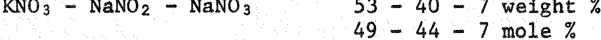

**`HTS is a reciprocal system:`** 

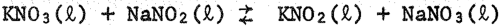

`Assuming` **`that nitrate ion is larger than nitrite ion, this equilibrium`** `is` **`shifted somewhat to the left (the "large-large, small-small" rule in reciprocal systems). The ratio of activities, KN03/KN02 and NaN02/NaN03 would, therefore, be greater than unity.`** 

**`Three equilibria to consider are:`** 

**`(i) KN03(JI)`** _**`t`**_ **`KN02(Jt) + 1/2`** `02(g),` **`AG“(kcal) = 27.6 - 24.4(T/1000)`** 

**`Ref. - R. F. Bartholomew, J. Phys. Chem. 70, 3442 (1966).`** 

**`(ii) NaN03(Jl)`** _**`t`**_ **`NaN02 (£) + 1/2 02(g), AG°(kcal) = 24.0 - 24.0(T/1000)`** 

**`Ref. - E. S. Freeman,`** `J.` **`Phys. Chem. 60, 1487 (1956). Freeman's data reworked by L. E. Gastwirt and E. F. Johnson, MATT-98, Aug. 1961, p. 157.`** 

**`(iii) H2(g) + 1/2 02(g)`** _**`t`**_ **`H20(g),`** `AG°(kcal)` **`= -58.9 + 13.1(1/1000)`** 

**`Ref. - 0. Kubaschewski, E. L. Evans, and C. B. Alcock,`** `Metallurgical` **`Thermochemistry, 4th Edition (1967), p. 424.`** 

## **`Combining (i) and (iii),`** 

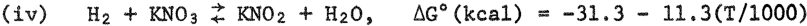

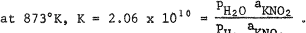

`Guessing` **`that “ 0-1» then`** `PH2 “ 5 X 10"12 PH20S` **`Assuming that p„n2 should be less than 10“13 atm, then pun.2U_ < .02 atm is tolerable.`** 

`U C N-430 (3 5-61)` 

**`36`** 

**`W. R.`** `Grimes` **`2`** 

**`November 4, 1970`** 

**`Similarly`** `when` **`we combine`** `(ii) and` **`(iii),`** 

**`(v) Hz + NaN03`** _**`t`**_ **`NaNOz + H20, AG°(kcal) = -34.9 - 10.9(T/1000)`** 

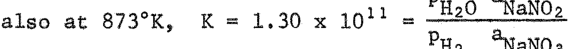

**`Now assuming that ^^Qz^NaNOa ^ ^ mole fraction ratio when HTS is`** 

**`initially constituted), then`** 

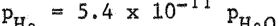

**`Thus at 873°K, equilibrium (v) rather than (iv) fixes the tolerable`** `PH2q.` **`Again, supposing that p^ should be less than 10"13 atm, then`** `Pjj2q should` **`be maintained at less than 2 x 10"3 atm.`** 

**`Finally, please note that the equilibrium constant for reaction (v) increases with decreasing temperature. For instance, at 800°K, the equilibrium constant = 8.25 x 1011, which for a„ N /aNaNO = means that the tolerable p is a factor of 6 higher than at 873°K.`** `rl2^` 

**`S. Cantor`** 

## **`SC:mp`** 

**`cc: E. G. Bohlmann`** 

**`37`** 

## `APPENDIX B` 

`Reactions of` **`HITEC`** `with Graphite and` **`with 72-16-12`** `(llF-BeF2-ThFit)` **`Salt`** 

`C. E. Bamberger and R. G. Ross*` 

`A batch of 50 g of HITEC was prepared by melting the analytical grade components` **`(NaNOa, NaNOs,`** `KNO3) in a quartz tube under argon. After meltings argon was bubbled through the liquid for 15 minutes (in order to remove any significant amount of` **`moisture); the`** `melt was cooled under flowing argon and stored in a` **`dessicator.`** 

`In the first experiment a 10 g portion of HITEC was melted in an open quartz tube giving a liquid layer of 3/4" depth. A piece of 4.5 g of` **`"MSRE" graphite hanging from a platinum`** `wire` **`was dipped briefly (30 to 120`** `sec)` **`into the melt at successive increasing temperatures and the visible signs of reaction were noted. Following is a`** `listing` **`of the observations. It made no difference whether the quartz tube was open to the`** `atmosphere` **`or was blanketed by flowing`** `argon.` 

## **`No`** `graphite` **`introduced`** 

`340°C:` **`Very small`** `bubbles` **`formed in the bulk of the melt which on`** `raising` **`did`** `not` **`seem to disturb`** `the` **`surface of`** `the` **`liquid. The bubbles were so`** `small` **`that they were observed only by means of`** `a catheto-` **`meter.`** 

## **`Graphite in`** `the Melt` 

- `340°C:` **`Large bubbles`** `formed` **`at the interface.`** 

- **`440°C: Faster evolution of large bubbles at the interface, the melt remained clear yellow.`** 

**`490°C: The melt became black 10-20 sec. after the graphite was introduced. The`** `formation` **`of bubbles was`** `more` **`vigorous than before. After removing`** `the` **`graphite the melt`** `cleared` **`up in ca. 5 minutes.`** 

_`■k`_ `Private` **`communication -`** `MSR` **`72-5, February 2, 1972.`** 

`38` 

**`545°C:`** `The melt became black again, then the melt started foaming vigorously` **`and`** `after approximately 45` **`seconds`** `the` **`graphite piece`** `became suddenly incandescent. At this point a sharp rise of tem­ perature` **`was recorded. The graphite`** `was` **`removed and after`** `approxi­ mately` **`10 minutes the melt cleared up again„ The experiment`** `was terminated.` 

**`The experiment was repeated and the reactions were recorded on 16 mm movie film, the only`** `difference` **`being that the`** `melt was heated` **`rapidly to 440°C`** `and then` **`to 550°C. The observations were the same as above but`** `the time` **`required for the incandescence of the graphite was ca. 2 minutes. After removal`** `and cooling` **`the graphite used in both experiments was`** `washed and` **`examined visually; it revealed a high degree of pitting and enhancement of`** `the` **`cracks that were initially present.`** 

**`In a third experiment,`** `approximately` **`9 g`** `each` **`of HITEC and`** `72-16-12 (LiF-BeFa-ThFit)` **`salt were loaded into a quartz tube (the HITEC at the bottom) and were gradually heated. At 250°C the molten HITEC bubbled at the interface with the lumps of fluoride salt and became cloudy-white, then completely opaque. In the range 350-410°C`** `a large` **`amount of yellowbrownish gas was`** `evolved.` **`The lumps of`** `salt` **`were no longer visible. At 430°C vigorous foaming occurred which displaced liquid and suspended material upwards. The experiment`** `was` **`terminated. Upon cooling, the solids were`** `digested` **`in hot water and repeatedly washed prior to analyzing the residue by x-ray diffraction. The`** `results indicated` **`the presence of`** `ThOz (major` **`phase), BeO and LiF. (A few unidentified lines were also present.)`** 

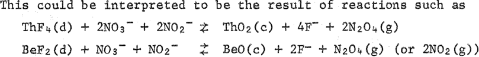

**`From`** `what` **`is known`** `of` **`the oxide chemistry of U(IV) there is no`** `doubt` **`that U02 would be the`** `first` **`insoluble phase to form if fuel salt is contacted by`** `HITEC.` 

`39` 

## **`References`** 

**`1. Ho P, Voznick and V. W. Uhl, "Molten Salt for Heat Transfer," Chem. Engrg. 70, 129 (May 27, 1963).`** 

**`2. Arminio Conte and Serge Casadlo, "Potentiodynamic Study of the Behavior of Various Metals in Molten Alkali Nitrates," Ricera Scientifica, 36_(6), 433 (1966).`** 

**`3. P. A. Rottenberg, "Heat Transfer Media for Use at Elevated Temperatures," Trans. Instn, Chem. Engrs. 35, 25 (1957).`** 

**`4. R. H. Newton and H. G. Shimp, Trans. Am. Inst. Chem. Engrs., 41, 197 (1945).`** 

**`5. R. C. Robertson, "Estimated Cost of Adding a Third Salt-Circulating System for Controlling Tritium Migration in the 1000 MW(e) MSBR," ORNL-TM-3428 (July 1971).`** 

**`6. W. E. Kirst, M. W. Nagle, and J. B. Castner, "A New Heat Transfer Medium for High Temperatures," Trans. Am. Inst. Chem. Engrs. 36_, 371 (1940).`** 

`7.` **`Alfred Bruhn, "Capital Costs Trimmed by 20% by Heat Transfer Process," Chemical Processing J33(8), 15-30 (Aug. 1970).`** 

**`8. J. Friedman and A. A. Bruhn, "Diluted Salt Transfers Heat," Oil and Gas J. 68, 76 (1970).`** 

- **`9„ Private communication available from the author or American Hydrotherm, See Ref. 14.`** 

- **`10o "U.S. Heat Transfer Systems Get a European Challenger," Chem. Engrg.`** `77,` **`26 (Nov. 30, 1970).`** 

**`11. J. Alexander, Jr., and S. G. Hindin, "Phase Relations in Heat Transfer Salt Systems," Ind. and Engrg. Chem. 39, 1044 (Aug. 1947).`** 

**`12. Paul Larson (phone conversations), E. I. duPont de Nemours and Co,, Explosive Dept., Res. & Devel. Div., Technical Service Section, Eastern Laboratory, Gibbstown, New Jersey 08027.`** 

**`13. "DuPont Hitec® Heat Transfer Salt," E. I. duPont de Nemours and`** 

   - **`Co., Explosives Dept., Chem. Products Sales Div., Wilmington, Del. 19898.`** 

**`14. "Hydrotherm Molten Salt Heat Transfer System," American Hydrotherm Corp., 470 Park Ave. South, New York, N. Y. 10016,`** 

**`40`** 

- **`15o V. W. Uhl and H. P. Voznick, "High Temperature Heating Media," Chem. Engrg. Progress 59_(5), 33 (May 1963).`** 

**`16. J. L. Crowley and R. E. Helms, "Visit to Hooker Chem. Corp. of Niagara Concerning Their Use of "Hitec" (HTS) Salt," MSR-70-94, Dec. 2, 1970.`** 

**`17. R. E. Helms, "E. I. duPont de Nemours and Company and Their Use of "Hitec" (HTS) Salt," MSR 71-24, March 1, 1971.`** 

**`18. W. H. v.d. Broek, private communication to J. R. McWherter, paper presented at Royal Netherlands Institution of Engineers on operating experience with HTS by W. H. v.d. Broek.`** 

**`19. J. M. Michel, U.S. Patents: 2,166,364; 2,196,153; 2,245,155. 20. K. Leschewski and W. Degenhard, "The Chemical Changes of Molten Alkali Nitrates at Temperatures Between 460° and 600°C," Berichte der Deutsche Chemie Geselschaft, 72B, 1763 (1939).`** 

**`21. E. S. Freeman, "The Kinetics of the Thermal Decomposition of Potassium Nitrate and of the Reaction Between Potassium Nitrite and Oxygen," J. Am. Chem. Soc. 79, 838 (1957).`** 

**`22. E. I. Gurovich and G. P. Shtokman, "Corrosion Activity of a Nitrate-Nitrite Molten Mixture," Zh. Prikl. Khim. 30, 1547 (1957).`** 

**`23. N. K. Voskresenskaya and S. I. Berul', "Thermal Stability of a Low-Melting Mixture of Nitrites and Nitrates of Sodium and Potassium," Zhurnal Neorganicheskoi Khimii, Vol. I, No. 8, 1956, pp. 1867-1876.`** 

**`24. Larry L. Anderson and George Richard Hill, "Corrosion of Zirconium and Zircaloy-2 in Fused KNOs-NaNOa-NaNOs," Electrochem. Technology 4(3-4), 157-162 (1966).`** 

**`25. Eli S. Freeman, "The Kinetics of the Thermal Decomposition of Sodium Nitrate and of the Reaction Between Sodium Nitrite and Oxygen," Thermal Decomposition of Sodium Nitrate 60, 1487 (1956).`** 

**`26. C. C. Van Soye, "Concentrator Breaks Heat Barrier," Chem. Engrg. _66_, 98 (Sept. 21, 1959).`** 

**`27. Private communication: Joel Friedman, American Hydrotherm Corp., 470 Park Ave. South, New York, N. Y. 10016.`** 

## `Internal` **`Distribution`** 

`R. G.` **`Affel`** _**`G.`**_ `E. Bamberger` **`H.`** `F. Bauman. S8 Eo Beall` **`H.`** `R. Beatty M.` **`Bender`** `C. E. Bettis E. So Bettis R. E. Blanco F. F. Blankenship J.` **`0. Blomeke`** `R.` **`Blumberg`** `E. G.` **`Bohlmann (20)`** `G. E.` **`Boyd`** `J.` **`Braunstein`** `M. A.` **`Bredig`** `R. B.` **`Briggs`** `H. R.` **`Bronstein`** `R. E.` **`Brooksbank`** `S. Cantor w. Lo Carter Oo Bo` **`Gavin`** `Go Jo` **`Claffey`** `F.` **`H. Clark`** `C. Wo` **`Collins`** `E. Lo` **`Compere`** `W. Ho` **`Cook`** `J. Wo` **`Cooke`** `J. Lo` **`Crowley`** `Fo Lo` **`Culler`** `R. Jo DeBakker Jo Ho` **`DeVan`** `Jo Ro` **`DiStefano`** `So Jo Ditto Fo Ao` **`Doss`** `Ao So` **`Dworkin`** `Wo p.` **`Eatherly`** `Jo Ro Engel D. E.` **`Ferguson`** `Lo Mo` **`Ferris`** `Ao P.` **`Fraas`** `Jo Ho Frye Eo L.` **`Fuller`** `L. C.` **`Fuller`** `Co Ho` **`Gabbard`** `L. Oo Gilpatrick Wo Ro` **`Grimes`** `Ao G.` **`Grindell`** `Ro Ho` **`Guymon`** 

> **`B.`** `A.` **`Hannaford`** `T.` **`H. Harley`** `W.` **`0. Harms`** `P, N.` **`Haubenreich`** `R. E.` **`Helms`** `P. W.` **`Hembree`** 

> `D. Mo` **`Hewett`** `J. Ro` **`Hightower`** `E. C.` **`Hise`** `Bo F.` **`Hitch`** 

> `Ho W.` **`Hoffman`** `D.` **`K. Holmes`** `P. P.` **`Holz`** `Wo R.` **`Huntley`** `p. R.` **`Hasten`** `R. J. Kedl` 

> `C. W. Kee` 

> `C. R.` **`Kennedy`** `J. J.` **`Keyes`** `S. So` **`Kirslis`** `J. A.` **`Klein`** 

> `Jo Wo Roger A. lo Krakoviak T. So` **`Kress`** `J. w.` **`Krewson Kermit Laughon, AEC-OSR`** `J. A.` **`Lenhard`** `K.` **`H. Lin`** `R. B.` **`Lindauer`** `E.` **`L. Long M.`** `I.` **`Lundin`** `R. No Lyon Ho Go` **`Mat`** `Pherson Ro Eo MacPherson W. Ro` **`Martin`** `Co L.` **`Matthews, AEC-OSR`** `Ho Eo` **`McCoy`** 

> **`H.`** `F.` **`McDuffie`** `Do Lo` **`McElroy`** `Co Jo` **`McHargue`** `H. A.` **`McLain`** 

> **`L.`** `Eo` **`McNeese`** `A. P.` **`Malinauskas`** `Go` **`Mamantov`** 

> `Ho J. Metz` **`A.`** `So` **`Meyer`** `Ro L.` **`Moore`** `F. Ho` **`Neill`** `J. Po Nichols` 

**`42`** 

> **`E. L. Nicholson S. M. Ohr`** 

- **`P. Patriarca`** 

- **`A. M. Perry`** 

- **`T. W. Pickel`** `H.` **`B. Piper C. B. Pollock B.`** `E.` **`Prince A. S. Quist G.`** `L.` **`Ragan G. D. Robbins`** 

- **`R. C. Robertson M. W. Rosenthal (3) R. G. Ross`** 

- **`J. P. Sanders`** 

- **`H. C. Savage W.`** `F.` **`Schaffer Dunlap Scott`** 

- `H.` **`E. Seagren R. L. Senn`** 

- **`J. H. Shaffer`** 

- **`W. H. Sides`** `M.` **`J. Skinner`** 

`A.` **`N. Smith`** 

- **`G.`** `P.` **`Smith 0. L. Smith`** 

- **`I. Spiewak`** 

- **`R. A. Strehlow`** 

- `J.` **`R, Tallackson`** 

**`0. K. Tallent`** 

- **`R. E. Thoma`** 

- **`L. M. Toth`** 

- **`D. B. Trauger`** 

- **`W. E. Unger`** 

- `C. F.` **`Weaver`** 

- **`A.`** `M.` **`Weinberg`** 

- `J. R.` **`Weir`** 

- **`W. J. Werner`** 

- **`M. E. Whatley`** 

- **`J.`** `C.` **`White`** 

- **`R.`** `P.` **`Wichner`** 

- **`W. M. Woods`** 

- **`H.`** `C.` **`Young`** 

- `J.` **`P. Young`** 

- `E. L.` **`Youngblood`** 

## **`Central Research`** 

**`Document Referen Laboratory Recor`** 

**`Laboratory Records (LRD-RC) Division of Technical Information`** 

**`Extension (2 )`** 

**`Research and Development Division, 0R0 (1)`** 

## **`External Distribution`** 

`A.` **`A. Bruhn, American Hydrotherm Corp„`** `, 470` **`Park Ave.,`** `Sc,` **`New York, N. Y. 10016.`** 

**`Joel Friedman, American Hydrotherm Corp,-,, 470 Park Ave., S., New York, N. Y. 10016. P. A. Larson, E. I. duPont de Nemours & Coc., Eastern Lab,., Paulsboro, New Jersey.`** `A, B.` **`Palmer, E. 1. duPont de Nemours & Co,, Wilmington, Delaware.`** 

**`M. Shaw, AEC-Washington.`** 

**`MSRP Program Manager, AEC-Washington.`** 

