<!-- PAGE:1 -->

Overview of the Helios Design: A Practical Planar Coil Stellarator Fusion Power
Plant

C.P.S. Swanson [a], S.T.A. Kumar [a], D.W. Dudt [a], E.R. Flom [a], W.B. Kalb [a], T.G. Kruger [a], M.F. Martin [a], J.R. Olatunji [a],
S. Pasmann [a], L.Z. Tang [a], J. von der Linden [a], J. Wasserman [a], M. Avida [a], A.S. Basurto [a], M. Dickerson [a], N. de Boer [a],
M.J. Donovan [a], A.H. Doudna Cate [a], D. Fort [a], W. Harris [a], U. Khera [a], A. Koen [a], J.A. Labbate [b], N. Maitra [a], A.
Ottaviano [a], R.K. Parmar [a], E.J. Paul [b], B. Reydel [a], A. van Riel [a], P.K. Romano [c], M. Savastianov [a], S. Saxena [a], S.
Seethalla [a], S. Srinivasan [a], R.H. Wu [a], D. Nash [a], J. Priebe [a], M. Slepchenkov [a], S. Walsh [a], B. Berzin [a], D.A. Gates [a], and
the Thea Energy team

_aThea Energy, Inc., 1 Eastern Road, Suite 3-04, Kearny, 07032, NJ, USA_
_bDepartment of Applied Physics and Applied Mathematics, Columbia University, New York, NY, 10027, USA_
_cIndependent contractor,_

**Abstract**

Thea Energy, Inc. has developed the preconceptual design for “Helios,” a fusion power plant based on the planar coil
stellarator architecture. In this overview paper, the design is summarized and the reader is referred to the papers in
this special issue for more detail. The Helios design is based around a two-field-period quasi-axisymmetric (“QA”)
stellarator equilibrium with aspect ratio 4.5 and a novel tokamak-like X-point divertor. The natural stability, low recirculating power, and steady-state capability of the stellarator are leveraged. Stability and transport are calculated using
state-of-the-art, high-fidelity codes and grounded in measured performance of existing experiments. The electromagnetic coil set is high-temperature superconducting (“HTS”) and consists of 12 large, plasma-encircling coils like the
toroidal field coils of a tokamak, and 324 smaller, field-shaping coils. All coils are planar and convex. A maximum
of 20 T on-coil is enforced, a value which has been achieved in existing large-bore HTS coils. There is a minimum
of 1.2 m between plasma and coils, leaving space for tritium breeding blanket and neutron shielding. Because of
this thick shielding, all coils have a minimum 40-year operational lifetime, the same minimum lifetime of the overall
power plant system. 1.1 GW of thermal power and 390 MW of net electric power are produced. The shaping coils are
individually controllable, enabling a uniquely configurable magnetic field for relaxed manufacturing and assembly
tolerances as well as plasma control in the presence of bootstrap current. A practical maintenance architecture is
a primary driver of the design; maintenance is performed on entire toroidal sectors that are removed from between
the encircling coils. A biennial maintenance cycle is estimated to take approximately 84 days, resulting in an 88%
capacity factor. In all systems, rigorous engineering constraints such as temperature and stress limits are enforced.

## 1. Introduction
Thea Energy, Inc. has developed the preconceptual
design for “Helios,” a fusion power plant based on the
planar coil stellarator architecture [1, 2, 3, 4, 5]. In this
overview paper, the design is summarized and the reader
is referred to the papers in this special issue for more
detail [6, 7, 8, 9, 10, 11, 12, 13, 14, 15, 16, 17, 18, 19,
20].
As a plasma confinement device, the stellarator [21,
22, 23] has a mature physics basis, alongside the tokamak [24]. There are more than a dozen large ( _R_ - 1
m), high-field ( _B_ 0 > 1 T) stellarator experiments in the
International Stellarator Database [25], spanning four

decades and many countries. Critical performance parameters such as stability and transport may now be predicted with reasonable accuracy.

## Stellarator Advantages

From a power plant basis, stellarators are recognized
as having practical advantages over other architectures.
There is no need to drive electrical current within the
plasma itself, leading to an inherently steady-state and
low-recirculating-power facility. The stability of the
stellarator is excellent, and they are immune from the
damaging disruptions seen in tokamaks. Finally, there
is no Greenwald density limit in stellarators, permitting them to operate at higher density than tokamaks

[26, 27]. Comparative analyses of tokamak-based and

<!-- PAGE:2 -->

stellarator-based pilot plant architectures have favored
the latter [28].
## Historical Challenges

However, stellarators initially lagged behind tokamaks in this area. The earliest power plant design studies used what would now be called un-optimized stellarators such as the torsatron and the heliac [29, 30].
Consequently these designs were predicted to lose significant fractions (> 40%) of the fusion-product alpha
particles. These designs had to make compromises to
produce significant self-heating. Some were impractically large. Some were designed to operate colder and
denser than optimal, resulting in a lower power density.
Some had to extend plasma physics assumptions into
the realm of the implausibly aggressive.
A turning point in the field of stellarator theory came
in the 1980s and 1990s, when categories of stellarators were developed whose particle transport were similar to that of tokamaks, so-called optimized stellarators

[31, 32, 33, 34, 22]. Early power plant designs based
on these configurations revealed that the improved thermal and energetic particle confinement was enabling
to the concept [30, 35], though new difficulties were
identified (an alternate research track continues on the
Heliotron approach, informed by the LHD experiment

[36, 37, 38]). These optimized stellarators required socalled modular coils, 3D-curved electromagnetic coils
with no particular symmetry and tight hardware tolerances. In these optimized stellarators, close proximity between the coils and the plasma boundary was
required. This latter requirement resulted in designs
which were often just as large as prior generations of
un-optimized stellarators. [30, 39].
At the same time, three modular-coil experiments
were designed to implement these optimized stellarators: HSX, NCSX, and W7-X [40, 41, 42]. Of these, all
three exhibited cost and schedule overruns, and identified significant practical difficulty in designing, manufacturing, and assembling complexly curved, 3D coils
to the required precision [43, 44, 45, 46]. NCSX was
canceled partway through manufacturing.
## Recent Breakthroughs

Recent breakthroughs led to the possibility of a practical, compact stellarator power plant. The first was
the development of quasi-axisymmetric (“QA”) stellarator equilibria. This type of equilibrium can be more
compact, their boundaries can be less strongly magnetically shaped, their coils can consequently be further away from the boundary [41, 47, 48]. The second
was the invention of the planar coil stellarator architecture, which utilizes planar, convex coils that can be
manufactured conventionally by winding in tension, and
individually controllable planar field-shaping coils that
can both correct for hardware defects or assembly er

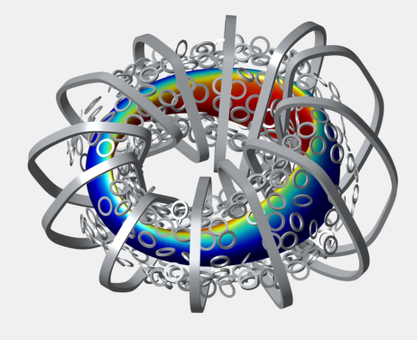
planar and convex. The quasi-axisymmetric plasma equilibrium (red
to blue) is shaded by the magnetic field amplitude on the surface produced by that coil set. Very good quasi-symmetry is visible.

rors and control the bootstrap current of the QA plasma

[1, 2, 3, 4, 5]. The third was the commercialization of
high-temperature superconductor (“HTS”) [49, 50, 51],
which can carry significantly higher current, at a higher
magnetic field, at a higher temperature, than Low Temperature Superconductor (“LTS”). This higher current
density and temperature is enabling to the compactness
and power balance of the superconducting stellarator.
Combined here for the first time, the Helios power
plant design leverages all three of these features. The
design considers the interrelation between physics, engineering, and economic considerations. Helios does
not have the highest power density of the realistically
proposed fusion power plants; nor does it have the highest magnetic field or beta; nor is it the most compact.
Rather, it combines engineering constraints that are either known (temperature, stress) or extrapolated (neutron damage thresholds, heat flux) with achieved normalized plasma performance (confinement, stability),
into an integrated power plant design. Practicality, conservatism, and engineering margin are primary design
drivers.
## Comparison to ARIES-CS

An important touchstone in the field of stellarator
power plant design is the ARIES-CS study [52, 47]. Helios bears a resemblance to that design. The size and
magnetic field strength are similar. However, the assumed plasma beta and confinement multiplier are significantly less aggressive. These changes are informed
by higher-fidelity modeling than what was available
when ARIES-CS was designed, as discussed later in this
paper.

<!-- PAGE:3 -->

Additionally, the quasi-symmetry error of the Helios equilibrium is lower than that of ARIES-CS, owing
in part to advances in the optimization procedure [53].
This results in improved energetic particle confinement,
easing self-heating thresholds and decreasing the constraints on the divertor. This degree of quasi-symmetry
can be seen in the smooth, toroidal bands of | _B_ | visible
on the plasma boundary shown in Figure 1.

The Helios equilibrium is less strongly shaped, allowing the coils to be further away. This significantly eases
the design of the breeding blanket while protecting the
coils for the 40-year lifetime of the plant. ARIES-CS
required a highly optimized non-uniform blanket that
prioritizes shielding at the expense of breeding zone in
certain places [54].

The ARIES-CS coil structure was 3,000 tons and envisioned to be 3D printed on-site, as it was too big to
transport [55]. Tight coil tolerances were required, perhaps impractically so. The Helios coils, on the other
hand, are all planar and convex, and can be wound
in tension. The coil winding packs can be seen in
Figure 1. Additionally, tolerances are significantly relaxed as manufacturing and assembly errors can be corrected during operation by the device’s control system,
which independently adjusts the operating currents of
the shaping coils.

Because of the small gaps between ARIES-CS coils,
there were only three small ports envisioned for maintenance. Consequently 222 individual components had to
be serially removed through these ports [56]. Helios has
large gaps between large, planar encircling coils, and
the shaping coils can be removed from between them.
Entire toroidal sectors may be removed and replaced at
a time.

At one point during the ARIES-CS development, the
field-period-based maintenance scheme was considered

[57]. In this scheme, entire field periods are removed
and maintained. ARIES-CS rejected this approach because it involved removing 4,000-ton components (entire thirds of the stellarator), and the removal, replacement, and realignment of the superconducting coils each
time. The Helios sector-based maintenance scheme removes much smaller components, toroidal sectors that
can fit between the encircling coils. The encircling coils
do not have to be removed and re-integrated.

Together, these considerations result in a design
which is significantly more practical than a plant based
on an approach similar to ARIES-CS.

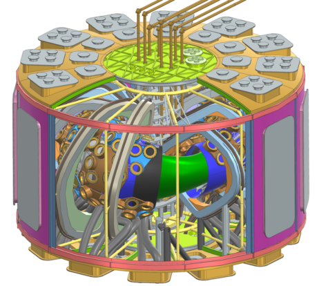
(orange), the encircling coils (gray). The cryostat surrounds all with
removable panels. The divertor pump ducts, cryogen delivery manifold, and microwave waveguides are also shown.

## 2. Summary of the design
### Global Parameters

The most important global parameters of the Helios
facility are tabulated in Table 1. A rendering of the stellarator itself, including many of the key features, can be
seen in Figure 2.
### Plasma Configuration

Helios has an 8 m major radius, aspect ratio 4.5, and 6
T axial magnetic field. It is a two-field-period QA stellarator. Its plasma is a mixture of deuterium and tritium
and undergoes thermonuclear fusion at a rate sufficient
to produce 960 MW of fusion power. The plasma is
started up by high-frequency microwaves (electron cyclotron resonance heating) and fueled by gas puffing at
the edge and pellet fueling of the core. Operating in
steady state it is essentially ignited, self-heating via the
fusion reaction. The stability and confinement of the
Helios plasma was targeted using the normalized performance of existing stellarators and verified using highfidelity, 3D models of the relevant phenomena.
### Divertor System

Helios has a novel toroidally continuous nonresonant X-point divertor like that of a tokamak, a first
for a stellarator power plant design. This divertor can
be expected to exhaust gas 10 times more effectively
than existing stellarator divertors [58]. The Helios design incorporates a tokamak-like divertor into a fully optimized stellarator configuration, leveraging decades of
practical tokamak experience and permitting more conservative vacuum-pumping solutions. The divertor targets are tungsten, cooled with helium.

<!-- PAGE:4 -->

|Parameter|Symbol|Quantity|
|---|---|---|
|Major radius|_R_|8 m|
|Aspect ratio|_A_|4.5|
|Minor radius|_a_|1.8 m|
|Magnetic feld on-axis|_B_0|6 T|
|Auxiliary ECRH heating power|_Paux_|10 MW (startup)<br><1 MW (ignited)|
|Volume-averaged beta|⟨β⟩_V_|2.7 %|
|Rotational transform at 2/3 surface|ι2/3|0.46|
|ISS04 confnement enhancement factor|_HIS S_ 04|1.4|
|Energy confnement time|τ_E_|1.8 s<br>|
|Peak electron density|_ne_0|2.1 × 10~~20 ~~/m~~3~~|
|Peak ion temperature|_Ti_0|20 keV|
|Sudo density limit multiplication factor|_fS udo_|1.25 (startup)<br>1.1 (ignited)|
|Plasma volume|_V_|500 m~~3~~|
|Fusion power|_Pfus_|958 MW|
|Total thermal power|_Ptherm_|1.1 GW|
|Thermal conversion efciency|η|40 %|
|Net electric power|_Pnet_,_e_|390 MW_e_|
|Magnet operating temperature|_Tcoil_|20 K|
|Maximum magnetic feld on-coil|_Bmax_|20 T|
|Minimum plasma-coil distance||1.2 m|
|Idealized tritium breeding ratio|_T BR_|1.3|
|Coil minimum lifetime||40 years|
|Tritium startup inventory|_I_0|1-2 kg|

Table 1: A Summary of Helios’s key geometric, physics, and engineering properties

<!-- PAGE:5 -->

### Radial Build and Neutronics

Helios is designed with a minimum of 1.2 m between
the plasma and any part of a coil. This permits a uniform
radial build. The first wall is a vanadium alloy, chosen
for its long survival (15 years) under high-energy neutron flux. The tritium breeding blanket is a lead-lithium
eutectic with 65% isotopic enrichment of lithium-6. The
idealized tritium breeding ratio is 1.3. There is ample
room for a multi-layer neutron shield, which limits the
heating and neutron damage of the coils. The blanket,
first wall, and shield are cooled with helium. The coils
are well-shielded from neutrons and last a minimum 40year lifetime (the lifetime of the stellarator), a key enabler of economic operation. An approximately twometer-thick concrete bioshield surrounds the stellarator
hall. The neutronic properties were modeled using 3D
Monte Carlo neutron and photon transport simulation.
Including the tritium breeding reaction in the blanket,
1.1 GW of thermal power is produced in total. 390 MW
of net electric power is produced via a steam Rankine
cycle. Around 1-2 kg of tritium is required to start up
the plant; thereafter it is self-sufficient with respect to
tritium.
### Superconducting Coils

The coils are HTS operated at 20 K. All coils are
planar and convex. 12 plasma-encircling coils act similar to tokamak toroidal field coils. The 324 fieldshaping coils are individually controllable, permitting
good quasi-symmetry and divertor strike point control
during startup and through to ignited operation. Coil
tolerances can be relaxed by magnetic configurability
of this type. The encircling coils are insulated. Upon
a detected quench, their currents are actively dumped
into external resistors. The shaping coils are partiallyinsulated and self-protecting in the case of a quench.
Helios is designed subject to the constraint that
the maximum field on-coil is 20 T. This value is set
via a tradeoff between magnet practicality and fusion
power density. Large-bore high-field HTS magnets
have achieved 20.1 T in practice [59]. Using achieved
physics and engineering limits such as this field limit is
deemed an engineering requirement. If, in the future,
25 T on-tape is found to be plausible, the field on-axis
would be 7.5 T, the total fusion power would be 2.3 GW
and the net electric power would be 1.0 GW. However, a
higher-field coil is more likely to destructively quench,
with 60% higher quench energy released at 25 T. Likewise, the magnetic forces are 60% higher. Using a 20 T
maximum field permits the material stresses to remain
within the capabilities of ordinary steel and not require
the use of exotic alloys. The quench dynamics of the
coil are modeled using multi-physics COMSOL. The
coil support structure is modeled using a commercial
3D CAD/FEA package.

### Maintenance Approach

The Helios maintenance operation occurs during one
planned outage of approximately 84 days every two
years, enabling an 88% capacity factor. Entire toroidal
sectors of the radial build are removed from between the
encircling coils.

## 3. Plasma design and simulation
In this section, the design of the Helios equilibrium,
plasma, operational scenario, and divertor is discussed
in more detail. Each subsection discusses a plasma
physics phenomenon. The reader is referred to the other
papers in this special issue for more detail on each subject.
In Section 3.1, a low-fidelity scoping activity is discussed. In Section 3.2, the plasma equilibrium is described. In Section 3.3, simulations of energetic particle
confinement are shown. Section 3.4 discusses considerations of magnetohydrodynamic stability and evolution. In Section 3.5, turbulent transport is simulated,
and the temperature profile evolution is simulated under self-consistent transport models. In Section 3.6,
the physics design of the coils is provided. In Section
3.7, the tokamak-like X-point divertor is described and
shown.

_3.1. Scoping studies, heating and fueling, and dynamic_
_accessibility_

### 0D and 1D Scoping Models

Before detailed equilibrium design and plasma
physics analysis, reduced 0D scoping models were used
to target the stellarator scale and bulk parameters. 1D
profile-dependent models were further used to refine the
design and develop operational and startup scenarios.
The 0D scoping step is common and commensurate
with other stellarator systems codes [3, 60, 29, 61, 37].
Transport in Helios is assumed to follow the ISS04 scaling [25], with a confinement enhancement multiplier of
_HIS S_ 04 = 1.4. This value has been achieved in the W7-X
stellarator [62, 63]. This assumption is verified by selfconsistent gyrokinetic calculations in Section 3.5. The
empirical Sudo line-averaged density limit is used [64],
and is exceeded by less than 10% at ignition, and transiently by less than 25% during startup. It is commonly
assumed that the Sudo density limit can be exceeded by
50% [60, 26], or more if the plasma is very pure [65].
For the purposes of 0D scoping, the density and
temperature profiles are assumed to follow a parabolic
power law, which allows for analytic evaluation of
volume-averaged quantities [66, 67]. Impurity and ash

<!-- PAGE:6 -->

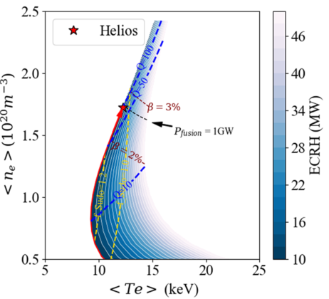
from zero plasma pressure through an ignited state. 10 MW of ECH
power is required to start up. No operational constraints are violated.

dilution is included based on an assumed fraction. Thermal conversion and auxiliary heating efficiencies are assumed based on likely and achieved values. A facility power balance model was developed commensurate
with this level of detail. This systems model was used
to widely explore the design space of possible scales,
magnetic field strengths, and equilibrium types.
### Startup Scenario Development

Next, the 1D BP3 code was used to further explore
the available operational scenarios [68, 69]. This includes 1D profiles that are self-consistent with respect to
an assumed W7-X-like thermal diffusivity profile shape,
and radiation effects. BP3 was used to further refine the
power plant operational point.
BP3 was also used to develop startup scenarios. The
POPCON approach is used to visualize the path from
zero plasma pressure through an ignited mode. Magnetic control of the plasma during startup is not considered in the POPCON plot but is required. Magnetic control is required to maintain nested flux surfaces, maintain good quasi-symmetry, and ensure that the divertor
strike points stay within their dedicated plasma-facing
components. Preliminary modeling suggests that the
planar coil set described in Section 3.6 is sufficient to
provide this control. This startup procedure is currently
envisioned to occur over a timescale of ∼ 2 hours.
The POPCON plot is shown in Figure 3. It highlights
that only 10 MW of electron cyclotron resonance heating (“ECRH”) power is required to start up Helios. The
plasma starts up in a hot and tenuous mode, then densifies slowly over time via additional core and edge fuel

ing. The Sudo density limit is never exceeded by more
than 25%, and in the ignited state is exceeded by less
than 10%. The beta is never higher than 2.7%, which
is enforced as a hard limit for conservatism. Stability
at this beta is confirmed in Section 3.4. Figure 3 differs
from a typical POPCON plot because only the thermally
stable branch is shown. Typically, POPCON plots include an unstable cooler, denser branch, but this branch
does not appear in the initial-value BP3 code because it
is thermally unstable.
### Heating and Fueling Systems

Heating occurs via ECRH at 170 GHz using ITERspec gyrotron tubes [70]. The microwaves are launched
from the high-field side in the X1 polarization. 10 MW
of heating is required during startup operation, then only
nominal heating (1 MW) is required once the plasma
self-heats in the ignited phase, to expel impurities from
the core [71]. Fueling occurs via deuterium and tritium
ice pellet injection and edge gas puffing. Hydrogenic ice
pellet injection has occurred in plasma physics experiments, using a single isotope species and for limitedduration discharges [72]. Edge gas puffing is required
to maintain edge conditions suitable for the divertor.
For more information on the scoping studies, heating
and fueling, and dynamic accessibility of Helios, see the
dedicated companion paper in this special issue: [6].

_3.2. The stellarator equilibrium_

### Equilibrium Optimization

A two-field-period, quasi-axisymmetric equilibrium
was developed to serve as the reference equilibrium for
Helios. The preliminary targets for the scale and parameters of the equilibrium were determined using 0D
scoping models discussed in Section 3.1. The DESC
stellarator optimization suite was used to represent the
equilibrium and optimize it for techno-economic (including plasma physics) figures of merit [73].
These figures of merit included (in part) quasisymmetry for neoclassical particle confinement [22],
the Mercier criterion for ideal MHD stability [74], the
ideal ballooning growth rate [75], and consistency with
the pressure-driven bootstrap current [76]. A set of encircling coils were co-optimized along with the plasma
equilibrium in so-called single-stage optimization [77].
A shell of scalar current potential [78, 79] was cooptimized, standing in for the shaping coils. In this
manner, metrics of coil feasibility were directly targeted
in the equilibrium, including proxies for magnetic field
strength, stress, and total coil cost.
### Equilibrium Properties

The resultant equilibrium is shown in 3D rendering in
Figure 1, and four toroidal cross-sections of the boundary can be seen in Figure 4. It has 8 m major radius, an
aspect ratio 4.5, and 6.0 T magnetic field strength onaxis. The value of beta is 2.7%. The maximum value

<!-- PAGE:7 -->

3

1

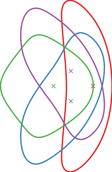

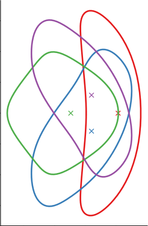
techno-economic figures of merit including proxies for coil cost and
complexity.

of rotational transform occurs at outer-mid-radius and
is ι _max_ = 0.46, of which roughly 1/3 is due to vacuum
field shaping and 2/3 is due to bootstrap current.

While Figures 1 and 4 depict the fixed-boundary target equilibrium, four near-identical equilibria are actually analyzed in this report. The fixed-boundary equilibrium is used to model MHD behavior and turbulent
transport (Sections 3.4 and 3.5), and to design electromagnetic coils (Section 3.6). An identical equilibrium
with the same beta but hotter and more tenuous plasma
was developed using the BP3 code during scenario development (Section 3.1). A free-boundary equilibrium
fit to the reference coil set (Section 3.6) was used for energetic fusion product confinement (Section 3.3). A second free-boundary equilibrium fit to a re-optimization
of the reference coil set was used to study the divertor
(Section 3.7), as the X-point of the reference coil set
is 10 cm further from the plasma boundary. The fusion product confinement of the free-boundary of the
re-optimized coil set is similar to that of the reference
coil set.

For more information on the design and properties of
the stellarator equilibrium, see the dedicated companion
paper in this special issue: [7].

_3.3. Energetic particle confinement_

### Energetic Particle Simulation

Confinement of energetic fusion products is not guaranteed in stellarators; rather it must be directly optimized for via one of several proxies [22, 80, 81]. For
Helios, quasi-symmetry was found to be the most effective at producing equilibria which confine energetic
particles.
The ASCOT5 code was used to simulate the behavior
of energetic fusion products within the Helios equilibrium, including collisions [82]. A free-boundary equilibrium was used to include the effect of discrete coils.
6.6% of the fusion product energy is simulated to be lost
to the wall. While this is higher than some examples
in academic literature [53], it is entirely sufficient for
plasma self-heating and ignition. The energetic particle power deposition to the walls is highly peaked, with
some areas receiving up to 4 MW/m [2] of heat flux; this
is an area of ongoing optimization.
Diffusive drift is the dominant loss mechanism. The
majority of lost alpha orbits exhibit significant variation
in _J_ || associated with diffusive drift [83], Further optimizations will target this loss channel.
For more information on the confinement of the energetic fusion products, see the dedicated companion paper in this special issue: [8].

_3.4. Magnetohydrodynamic stability and evolution_

### MHD Stability Analysis

The magnetohydrodynamic (“MHD”) properties of
the Helios plasma have been evaluated using the ideal,
linear, spectral stability code TERPSICHORE [84, 85]
and the resistive, nonlinear, time-domain evolution code
M3D-C1 [86, 87, 88]. The TERPSICHORE results are
generally consistent with stability, though interpretation
is required. No large-scale unstable mode is seen in the
M3D-C1 simulations.
### TERPSICHORE Results

The growth rate of the most unstable mode found by
TERPSICHORE is positive at the operating beta, with
a value of γ/ω _A_ = 1.42% where ω _A_ is the Alfvén frequency. The interpretation of TERPSICHORE results
is non-trivial but best practices have been developed by
comparing the results to stellarator experiments [89].
A mode is typically considered serious if its growth
rate exceeds 2% of the Alfvén frequency. The Helios
equilibrium at the operational beta has a most-unstable
growth rate below this value, thus we move on to a
higher-fidelity code to further characterize the MHD behavior.
### M3D-C1 Nonlinear Evolution

M3D-C1 is a resistive, nonlinear, time-domain, MHD
evolution code first developed for tokamaks [86] and
later extended to stellarators [87]. We have recently
added a model of stellarator bootstrap current to the

<!-- PAGE:8 -->

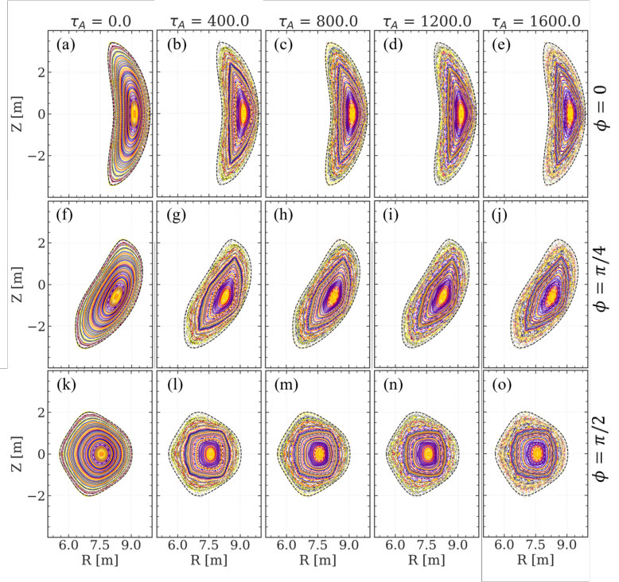
for 0 ≤ _t_ ≤ 1600τ _A_ (left to right). Perfect stability would be indicated by nested flux surface of different colors, and little change between times.
Small island chains do appear. Stochastic regions occur at the edge but do not result in pressure profile flattening. No large-scale unstable modes
are in evidence.

<!-- PAGE:9 -->

code [88]. A perfectly conducting wall is placed 10 cm
from the plasma boundary. A ratio of κ⊥/κ∥ = 10 [−][5]

is used, a realistic anisotropy of the thermal diffusivity.
Poincaré sections of the magnetic field at three toroidal
locations and five times are shown in Figure 5.
No large-scale instability is seen. The fluid kinetic
energy (not plotted) has an initial spike as the idealized
DESC equilibrium relaxes, then decreases over time indicating no growing mode. Some stochastization of the
magnetic field can be seen at the edge, but the pressure profile (not plotted) remains peaked even at this
high thermal diffusivity anisotropy, indicating that the
stochastization is not a major contributor to transport.
For more information on the ideal MHD stability and
nonlinear MHD evolution of the plasma within Helios,
see the dedicated companion paper in this special issue:

[9].

_3.4.1. A note on the e_ ff _ects of an abrupt plasma termi-_
_nation in Helios_
While Helios is designed and simulated to be stable,
any plasma may suddenly stop. Off-nominal scenarios
can not be prevented with absolute certainty; for example, objects can fall through the plasma (“UFOs”, often
wall tiles) and end the discharge [90]. It is important to
note that an abrupt termination in Helios would resemble a radiative collapse of a stellarator plasma more than
a potentially damaging disruption of a tokamak plasma.
Helios is designed not to take damage during a termination, and be easily re-started.
Unlike in a stellarator, the stored magnetic energy in a
tokamak plasma due to the plasma current is larger than
the thermal energy within the plasma. In ITER, there is
approximately 1 GJ of plasma magnetic energy and 350
MJ of plasma thermal energy [91]. This GJ of magnetic
energy concentrates nonuniformly as eddy currents in
conductive structures and causes large Lorentz forces.
ITER is designed to survive only 15 un-mitigated disruptions due to this challenging dynamical system.
In Helios, the scenario is very different. The Helios equilibrium carries plasma current due to neoclassical effects (bootstrap current), but it does not approach
that of a similarly scaled tokamak. The much smaller
JET tokamak experiment routinely carried more plasma
current than the power-plant-scale Helios. The plasma
magnetic energy from the bootstrap current is only approximately 100 MJ, 10% that of ITER. The plasma
thermal energy is double this, making the dynamics
more stellarator-like than tokamak-like. Because of the
existence of vacuum rotational transform, it is likely that
the plasma current is magnetically confined even in the
case of an abrupt termination. While modeling abrupt

termination is left to future work, this difference in scale
and kind give confidence that it would not damage the
stellarator system.

For more discussion, see the MHD companion paper
in this special issue: [9].

_3.5. Turbulence, transport, and profile prediction_

### Transport Assumptions

For the purposes of scoping and scenario development (see Section 3.1), transport in Helios was assumed
to follow the ISS04 scaling [25], with a confinement enhancement multiplier of _HIS S_ 04 = 1.4. This value has
been achieved in the W7-X stellarator[62, 63]. However
this level of turbulent transport should also be justified
via high-fidelity, first-principles simulation.

### Gyrokinetic Simulations

The GENE code was used to simulate electrostatic
gyrokinetic evolution within a flux tube [92]. This analysis produces the local plasma heat flux. This calculation was coupled to the Trinity 3D (“T3D”) code [93],
an extension of the Trinity code [94, 95] to the stellarator geometry. This code evolves the temperature profile across a larger temporal and spatial domain than
the gyrokinetic simulation, efficiently reaching a selfconsistent, steady-state profile. Additionally, neoclassical transport, electron-ion collisional equilibration, auxiliary heating, fusion product heating, and radiation are
considered by T3D. The density profile is fixed, as is
the temperature boundary condition at the outer edge,
ρ = 0.85.

This exploration resulted in a scenario which was
developed with an identical fusion power and slightly
lower confinement multiplication factor of _HIS S_ 04 =
1.33. The density and auxiliary power are commensurately increased to compensate. The ion temperature
is unchanged from the reference case, but the electron
temperature is increased by 5 keV in the core due to
its preferential heating via electron cyclotron resonance
and fusion product heating. The profile shapes are otherwise broadly similar.

The shape of the Helios equilibrium rotational transform ι(ρ) has a wide region of what tokamaks would call
reversed or negative magnetic shear −ρ∂ρι/ι > 0, which
has been shown to strongly suppress turbulence in experiments [96, 97, 98]. This raises the intriguing possibility that Helios would exhibit a much higher _HIS S_ 04,
requiring less heating and/or permitting a smaller device
to produce net electric power.

For more information on transport, turbulence, and
profile prediction in Helios, see the dedicated companion paper in this special issue: [10].

<!-- PAGE:10 -->

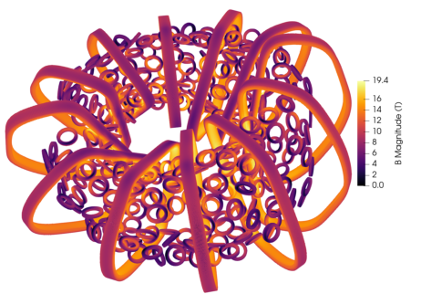
magnetic field strength | _B_ | on the winding pack. No superconductor is
subjected to a magnetic field stronger than 20 T.

_3.6. Electromagnetic coil physics design_

### Planar Coil Architecture

Helios uses a novel planar coil architecture consisting of 12 planar, plasma-encircling coils similar to the
toroidal field coils of a tokamak, and 324 smaller, planar, field-shaping coils that surround the plasma boundary. All shaping coils are circular and have the same
radius, minimizing the number of unique parts. Thea
Energy has previously published on the advantages of
this coil set [1, 2, 3, 4, 5]. All coils are planar and
convex, and can therefore be wound in tension. Hundreds of individually controllable coils permit an unprecedented degree of magnetic field control and configurability. This configurability permits much looser
manufacturing and assembly tolerances, as errors can
be tuned out during operation by controlling the coil
currents. The large gaps between the encircling coils
permit entire toroidal sectors of the radial build to be
removed for maintenance.
### Coil Optimization Procedure

As discussed in Section 3.2, the process of singlestage stellarator equilibrium optimization also produces
an initial guess for a set of encircling coils, and a shell
of scalar current potential that approximates a set of
shaping coils. These are used as the initial guesses in
a second stage of coil optimization, which has been
described previously [4]. The coil winding packs are
shown, along with their on-tape magnetic field strength,
in Figure 6.
In the optimization, the usual quadratic flux penalty
(� _dA_ ( _B_ [⃗] - _n_ ˆ) [2] ) is used to ensure that the equilibrium is accurately reconstructed. The average normal field error
on the equilibrium boundary is 0.21%. The good reconstruction of a quasisymmetric magnetic field can be seen
by the | _B_ | contours on the target (fixed-boundary) equilibrium boundary in Figure 1. The equilibrium is recon

structed sufficiently well that energetic particle confinement is good in a free-boundary equilibrium fit to this
coil set; see Section 3.3.
By using the recent approximate formulation of Landreman _et al._ [99], magnetic field on-coil can be efficiently calculated, and quantities such as maximum
field on-coil and total HTS tape length may be optimized directly. This field on-coil is shown in Figure 6;
the maximum field on-coil is 20 T, limiting quench energy and stress. Large-bore, HTS coils have been constructed and operated at 20 T, indicating achievable engineering feasibility [59].
A minimum distance of 1.2 m between the plasma
and coils is enforced. This leaves space for adequate
breeding blanket and neutron shielding; see Section 4.3.
A novel technique is used to enforce the existence and
location of a tokamak-like X-point divertor; see Section
3.7. Free-boundary plasma equilibria are used for the
plasma physics analyses, so that the effect of finite coils
is included.
The engineering of these coils is described in more
detail in Section 4.1. For more information on the planar
coil architecture and the physics design of the Helios
electromagnetic coil set, see the dedicated companion
paper in this special issue: [11].

_3.7. Divertor physics_

### Tokamak-like X-point Divertor

Helios features a novel toroidally continuous nonresonant X-point divertor, like that of a tokamak. For
a tutorial approach to the tokamak poloidal divertor, see
Chapter 5 of Stangeby’s textbook [100]. This type of
divertor has been theorized in stellarators, and recently
discovered in a database of QA vacuum solutions [101].
This is the first time to our knowledge that a stellarator equilibrium has explicitly designed to include such
a divertor, and the first time that a power-plant-relevant
equilibrium with finite beta and bootstrap current has
been paired with such a divertor. It is the most detailed
exploration of the practicality of such a divertor.
### Divertor Performance Comparison

This novel divertor type has the potential to resolve
an outstanding problem in stellarator design. Several
divertor types have been proposed, well summarized in
Chapter 2.3 of the Stellcon report [102], but none have
a clear scaling to a power plant system. The experimentally verified frontrunner is arguably the island divertor,
as implemented on W7-X [103]. However, the island
divertor is acknowledged by its proponents not to scale
directly to a power plant as its neutral particle compression is insufficient to enable a practical vacuum pumping scheme [104, 105].
In tokamaks, the X-point divertor has been modeled to compress plasma density at the target an or

<!-- PAGE:11 -->

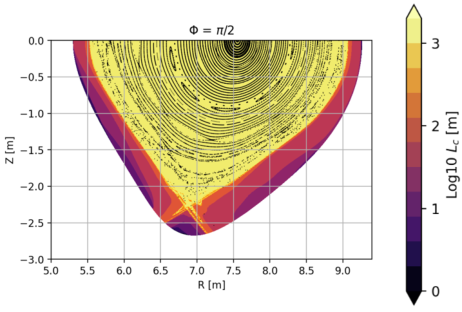
plots for a toroidal cross-section of the equilibrium. Features isomorphic to a tokamak poloidal divertor topology are present, including
divertor legs and a private flux region. The divertor stays on the bottom of the plasma for the entire toroidal domain.

der of magnitude more effectively than the island divertor [58]. This is counterintuitive from the simple twopoint model perspective [100]; the increased connection
length of the island divertor would appear to be superior. However the inclusion of perpendicular transport
into an extended two-point model [58] reveals that the
very low pitch angle that accompanies a high connection length causes saturation of the compression effect.

Additionally, the tokamak-like divertor is more easily
baffled, enabling greater compression of the neutral particles born when the plasma contacts the divertor target.
From a practical standpoint, the tokamak-like X-point
divertor is simpler in that it lies on the bottom of the
plasma and does not multiply link it as do competing
divertor designs.

### Divertor Topology Modeling

The FLARE code [106] has been used to explore the
topology and behavior of this novel divertor in Helios.
The equilibrium used is a free-boundary fit to the planar
coil set, and self-consistent plasma current is included.
A toroidal cross section of this of the wall-to-wall connection length can be seen in Figure 7 and compared to
the familiar tokamak poloidal divertor. This connection
length was used to place divertor target elements and
neutral gas baffles.
A simple field line diffusion model was used to estimate heat flux on the targets, again using FLARE. The
result shows that additional consideration is required
to keep the heat flux below an assumed limit of 10
MW/m [2] ; some combination of radiative impurity seeding in the edge, or detachment, or enhanced core radiation, or finely contoured targets to maximize the strike
point uniformity.

The engineering design of this divertor, including
plasma-facing components, is described in Section 4.2.
For more information on the magnetic topology and
early plasma physics modeling of this tokamak-like Xpoint divertor, see the dedicated companion paper in this
special issue: [12].

## 4. Engineering design of systems
In this section, the engineering design of the systems
that generate the plasma and receive the fusion power
are discussed in more detail. A strong driver of the
design is a facility that is buildable, and maintainable
under unforeseen circumstances. Each subsection discusses a system. The reader is referred to the other papers in this special issue for more detail on each subject.
In Section 4.1, the coil system, including quench and
structure, is described. In Section 4.2, the divertor, first
wall, and vacuum systems are described. In Section 4.3,
neutronic analysis of the blanket and shield is presented.
In Section 4.4, the thermal cycle, fuel cycle, and the
power flow diagram for the facility are shown. In Section 4.5, the sector maintenance scheme, cryostat, and
cryogenic system are discussed. Section 4.6 outlines
the electrical system and power supplies. Section 4.7
discusses the instrumentation and control of the plasma
and facility.

_4.1. Electromagnetic coil engineering_

### Coil Structure and Materials

As described in Section 3.6, Helios uses a set of planar, plasma-encircling coils and planar, field-shaping
coils.
The 12 encircling coils are composed of pancakes of
HTS cable, operated at 20 K. They are similar to tokamak toroidal field coils. Their turns are insulated, and
superconductor quench mitigation is active and external via a dump resistor. The structural solution within
encircling coils is based on a stainless steel case, providing the stiffness to maintain the on-coil strain at less
than 0.4%. The structural solution between encircling
coils includes a central support structure and inter-coil
truss structures. The central support structure is analogous to a tokamak bucking cylinder [107]. The structural solution is compatible with the sector-based maintenance scheme described in 4.5. No part of the structure exceeds 800 MPa, compatible with widely available
stainless steel alloys. With additional design, a maximum stress not exceeding 600 MPa appears achievable.
These reasonable structural requirements are a benefit
both of the less-shaped QA equilibrium choice and of
the decision not to exceed 20 T on-coil. This structure
is shown in Figure 8.

<!-- PAGE:12 -->

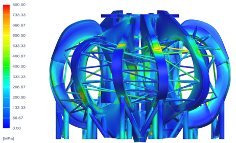
within the encircling coil structure. Red: 800 MPa. The coil cases,
central support structure, and inter-coil trusses are visible and below
acceptable stress limits. The trusses can be removed to access components for maintenance.

### Shaping Coil Design

The 324 shaping coils are composed of pancakes
of partially insulated HTS tape stacks, operated at
20 K. The large number of coils necessitates a highinductance, low-operating-current approach to minimize the heat leak due to charging cables. The shaping coils all have the same inner and outer diameters, enabling only one size of pancake to be manufactured. These pancakes can be stacked in different
numbers to create shaping coils with different magnetic
strengths. The coils are self-protecting with respect to
quench by virtue of the partially insulated approach;
a multi-physics COMSOL analysis simulates this process. Shaping coils are ganged together into fieldshaping units (“FSUs”) which can be removed from between the encircling coils. FSUs route services such as
cryogens, power, and data to shaping coils.
For more information on the engineering of the Helios planar coil set, see the dedicated companion papers
in this special issue: Shaping coils [14] and encircling
coils [13].

_4.2. Divertor engineering and the first wall_

### Divertor Target Design

As described in Section 3.7, Helios has a novel
toroidally continuous non-resonant X-point divertor like
that of a tokamak, a first for the design of an optimized stellarator. The divertor system consists of
high-heat-flux plasma-facing target plates and an ITERlike dome to improve neutral compression lying below
the plasma, as is common in tokamak configurations

[108, 109, 110, 111]. The targets are composed of
51,000 tessellated hexagonal tiles of tungsten 2.5 cm
in width, cooled with a closed system of helium impingement jets. Their location within the system can
be seen in Figure 9. An assumed 10 MW/m [2] of heat

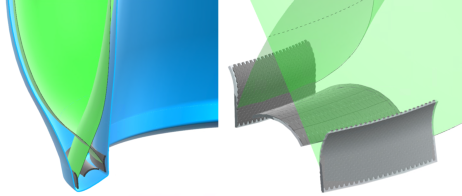
plasma (green) within the first wall (blue), with the targets and dome
(grey). Right: Detail of the targets and dome. Pump ducts are not
pictured.

flux is incident on the targets, using Siemens Simcenter Amesim for thermofluid modeling to design tiles
that remain within acceptable temperature limits. The
hexagonal tiles are mounted to a vanadium alloy support structure. The helium coolant enters from the blanket, where it has been pre-heated to above the ductileto-brittle transition temperature of tungsten.
### Vacuum Pumping System

The vacuum pumping system uses turbomolecular
pumps rather than cryosorption pumps due to their efficiency at pumping helium and steady-state operation
without regeneration. The pumps themselves must be
situated far enough from the stellarator that they can
be magnetically shielded [112, 113]; this necessitates
longer pump ducts than a cryopump based design. The
high neutral compression of the tokamak-like X-point
divertor enables this design. The dimensions and performance of the pump ducts were designed using lumpedelement conductances of choked molecular, transitional,
and fluid flow [114].
### First Wall Materials

The first wall is 2 cm thick with integrated helium
cooling channels. It is composed of a vanadium alloy
layer with a thin layer of tungsten armor. Specifically
the alloy considered is V-4Cr-4Ti (“V44”), though there
are significant uncertainties with respect to the suitability of materials for fusion environments [115]. V44 is
used in this design exercise over EUROFER97 or other
RAFM steels because of its higher operating temperature, no ferromagnetism, high neutron damage tolerance, and low activation properties [115, 116, 117, 118,
119, 120]. The chief advantage of using V44 in the first
wall is its resistance to high-energy neutron damage,
permitting the first wall a lifetime of 15 full-power years
(compared to less than half that for reduced-activation
steels). This is discussed in Section 4.3. The superior
high-temperature creep strength of V44 allows for an
additional factor of safety over RAFM steel. Considerations potentially contraindicating V44 include its high
affinity for hydrogenic species, swelling under irradia

<!-- PAGE:13 -->

tion, and immature supply chain.
For more information on the design of the Helios divertor systems and the first wall, see the dedicated companion paper in this special issue: [15].

_4.3. Neutronics, blanket, shield, and bioshield_

### Lead-Lithium Blanket Design

The reference design for the tritium breeding blanket uses a lead-lithium breeding medium. This is one
of the more common types of blanket architectures. It
is the choice of the ARIES-CS, EU-DEMO, and recent
Stellaris studies, among others [54, 121, 104]. In it, Li-6
nuclei within a flowing molten alloy of lead and lithium,
usually at the eutectic mixture of 17% lithium by atom
(“Pb-17Li”), absorb neutrons and produce tritium via
the [6] Li + n → [3] H + [4] He “breeding” reaction. Typically, the lithium in the mixture is required to be isotopically enriched with lithium-6. Typically, an additional
coolant fluid other than the liquid metal is required to
remove heat at a sufficient rate.
The Helios lead-lithium blanket design is enriched
with 65% lithium-6 isotope. It completely surrounds
the plasma and first wall in a uniform 50-cm-thick layer.
EUROFER97 [122] is used as the structural material
and cooled with helium gas. The lead-lithium flows
at a rate of 6.6 cm/s; it is then run through a heat exchanger and the tritium extraction system and returned
to the blanket. Silicon Carbide (“SiC”) inserts form
an inert and non-conductive break between the flowing
lead-lithium and the EUROFER97 structure, reducing
the MHD pressure drop and pumping power to a reasonable level. The tritium breeding blanket is split into
sectors that fit between the encircling coils and allow for
sector-based maintenance, as discussed in Section 4.5.
### Neutronic Simulations

The OpenMC Monte Carlo neutron and photon transport simulation code was used to calculate the neutronic
properties of the blanket [123]; A novel implementation of the cell-under-voxel algorithm was written and
contributed to OpenMC in order to perform volumeresolved simulations [124]. OpenMC was used to predict the neutron flux, damage rate, tritium yield, material activation, nuclear heating, photon activity, and effective dose in the first wall, blanket, shield, coils, and
in the stellarator hall. A cutaway rendering of the nuclear heating in the structure is given in Figure 10.
The idealized (homogenized, no penetrations) tritium
breeding ratio (“TBR”) is 1.3, a good target for this level
of fidelity to allow for non-ideal reductions [54]. Fuel
cycle modeling indicates that a final TBR of 1.1 is sufficient for tritium self-sufficiency of the facility.
### Neutron Shield Design

As discussed in Section 3.6, a minimum distance of
1.2 m between the plasma and coils was rigorously en

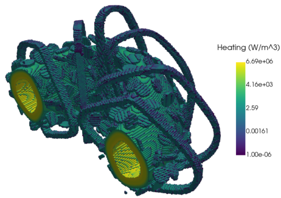
simulated by OpenMC. The heating is highest at the first wall and
decays through the breeding zone and shield.

forced. This distance permits a thick neutron shield between the breeder zone and the coils to protect them
from the damaging high-energy neutron flux. A multilayer shield was designed to absorb and moderate neutrons of successively lower energies. Closest to the
breeding zone is a tungsten carbide (“WC”) shield for
high-energy neutrons, followed by successive layers of
boron carbide (“B4C”), 316L stainless steel constituting
the vacuum vessel, a layer cooled by borated water, and
finally borated high-density polyethylene (“HDPE”) for
the lowest-energy neutrons. This thick, multi-layer
shield strongly attenuates the flux of high-energy neutrons and allows the coils to last more than 40 years,
making them lifetime components. The fast-fluence
limit of the coils was estimated using measurements of
ReBCO HTS exposed to neutrons from a fission core

[125, 126].
An approximately 2.0 m thick concrete bioshield ensures the effective dose outside the stellarator hall is below permitted limits for public exposure by the Nuclear
Regulatory Commission.
For more information on the design of the Helios
blanket, shield, and bioshield, see the dedicated companion paper in this special issue: [16].

_4.4. Thermal cycle, power flows, and fuel cycle_

### Thermal Conversion Cycle

A Rankine cycle for power generation has been designed for Helios. 1.1 GW of thermal power is generated in Helios, both from the fusion reaction itself (958
MW) and from the exothermic [6] Li + n → [3] H + [4] He
breeding reaction within the blanket. Temperatures inside the stellarator are carefully controlled to maximize performance and remain within material capabilities. Power from the blanket, first wall, and divertor

<!-- PAGE:14 -->

is transported via lead-lithium and helium to intermediate heat exchangers. These heat exchangers are part
of a closed cycle loop that transfers heat to boil water into steam while simultaneously cooling the blanket
and helium fluids to their inlet temperatures. The steam
is superheated to 635 [◦] C, and enters a series of three
steam turbines that generate electric power. A simulation of the Rankine cycle design outlines intermediate
flow splits and recombination to increase system efficiency and maximize cycle power generation. The total
generated power is 460 MW _e_, with 22 MW _e_ required
to pump the various coolants, for a gross electric power
of 438 MW _e_ from the thermodynamic cycle. The combined efficiency of the Rankine cycle is approximately
40.2%. If instead the efficiency is computed using the
total generated power, as in some fusion power plant
design studies, the efficiency is approximately 42.2%.
### Facility Power Balance

The global facility power flow is represented by a
Sankey diagram in Figure 11. During steady-state, ignited, power-producing operation, 958 MW of power
is released within the plasma via deuterium-tritium
(“D-T”) fusion. Of this energy, 80% is released as
high-energy neutrons that heat the blanket. There, the
exothermic tritium breeding reaction of lithium-6 absorption (less endothermic reactions) produces an additional 135 MW; lithium-6 is also a power-producing
fuel.
Of the 192 MW of fusion power that is released as
alpha particles within the plasma, 13 MW is lost to
the wall without thermalizing. The remainder heats the
plasma, and makes its way eventually to the wall as light
(electromagnetic radiation from core, edge, and divertor) or particle kinetic energy. In total, 1,094 MW of
thermal energy is generated in the plasma and blankets.
Of this thermal power, 460 MW is converted into
electrical power via the thermal conversion cycle, of
which 22 MW are used to pump coolants, for a gross
electric power of 438 MW. 681 MW is lost as waste
heat. Of the gross electric power, 48 MW are required
to maintain the facility in power producing state, with
similar amounts being required to separate tritium fuel,
keep the cryogenic magnets cold, and other uses. 2.5
MW is budgeted for a nominal amount of ECRH (1
MW) for plasma control and to expel impurities from
the core. This leaves approximately 390 MW of net
electric power available to deliver to the grid.
### Tritium Fuel Cycle

The fuel cycle returns un-fused tritium to storage and
extracts tritium bred in the blanket, thence to re-inject
into the fusing plasma. We have performed preconceptual design and modeling of a tritium fuel cycle.
TMAP8, A network-based model considering flows between reservoirs and residence times of those reservoirs

was used [127]. This model, and the fuel cycle analyzed, is typical of ITER, EU-DEMO, and published
studies from private companies [128, 129, 130, 131].
The tritium residence times and loss fractions are estimates based on ITER and typical assumptions from
literature for each component, and are likely to be of
the correct order of magnitude for present technology

[131].
A sensitivity analysis of plant parameters shows that
the main drivers of inventory and required TBR include
availability factor and doubling time as tradeoff parameters, and tritium burn fraction. fusion power, and reserve time as optimal parameters. Direct internal recycling fraction, breeding zone residence time, and tritium extraction efficiency have minimal impact on system dynamics, but are shown to affect system complexity, blanket inventory, and extraction system inventory
respectively. <1 kg of startup tritium and TBR of <1.15
appear satisfactory for tritium self-sufficiency. Technology advances may reduce requirements further. This
gives confidence that tritium self-sufficiency is achievable for the Helios FPP with a lead-lithium breeding
blanket.
For more information on the thermal cycle, power
flows, and fuel cycle of Helios, see the dedicated companion paper in this special issue: [17].

_4.5. Cryostat, maintenance, and cryogenic system_

### Cryostat Design

The stellarator is encased in a stainless-steel cryostat,
maintaining a vacuum to limit heat leak into the cryogenic components. The cryostat has large removable radial ports through which components are removed and
maintained, in accordance with the sector maintenance
scheme. The heat leak and thermal load is about 40 kW
into the 20 K cold mass, and about 750 kW into the 77
K thermal shields. Cooling is distributed via helium and
nitrogen respectively. There are nominal loads on a 4.5
K system if low-temperature superconducting magnets
are used for the gyrotron tubes; these are handled locally. A large expander cycle cryogenic plant to cool
these loads would require 10 MW of electrical power,
taking a plausible 25% of the Carnot efficiency.
### Sector-Based Maintenance

Helios has a practical maintenance strategy where entire sectors of the radial build are removed, including
first wall, blanket, shield, plasma vessel, and shaping
coils, from between the encircling coils. This is depicted in Figure 12. This permits rapid removal and
replacement of high-wear layers allowing for a high capacity factor of ∼88%. The encircling coils remain integrated into the stellarator during maintenance. The
projected maintenance cadence is one 84-day planned
outage every two years.

<!-- PAGE:15 -->

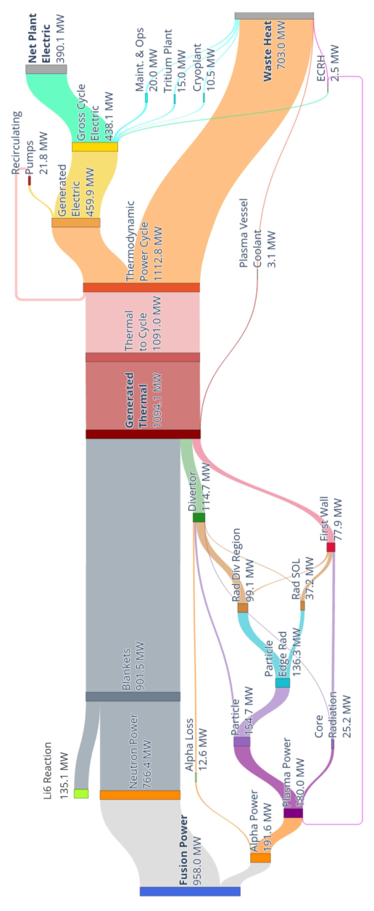

<!-- PAGE:16 -->

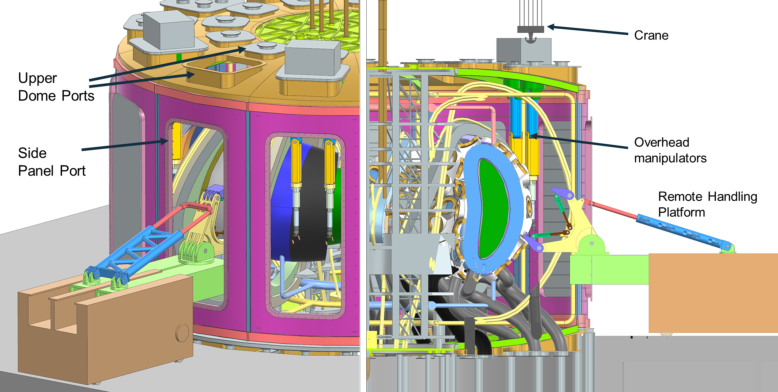
remote handling platform is extended through a side panel port, with overhead manipulators inserted through adjacent upper dome ports.

This is in contrast to alternative stellarator maintenance schemes proposed. ARIES-CS considered a portbased scheme, in which 222 parts are extracted through
three small ports [56]. This scheme was required because only small spaces exist between the modular coils
of the ARIES-CS design. Other studies have considered a field-period-based approach, sometimes called
sector-splitting [57, 104, 105]. In this approach, entire
field periods, including the coils, are removed from the
stellarator and maintained. For the ARIES-CS design,
these field periods were 4,000 tons. This approach was
not chosen because the practical challenges of removing
and reintegrating entire thirds or quarters of the stellarator appear significant.
The toroidal sectors that are removed from between
the encircling coils represent a balance between the
port-based and field-period-based approach. The sectors are not so small that hundreds must be removed
serially, but not so large that they weigh thousands of
tons and are impractical to remove and reintegrate. The
encircling coils remain integrated during maintenance.
The sector-based approach used for Helios is inspired by the same concept in tokamaks, in which entire toroidal sectors of the radial build (first wall, divertor, blanket, shield) are removed from between toroidal
field coils [132]. This sector-based approach has been
proposed for stellarators before now, but it required
the plasma equilibrium to support modular coils whose
outer legs are straight [133, 134]. The addition of shaping coils, which can be removed and replaced from between the encircling coils, eliminates this constraint.
For more information on the maintenance scheme,

cryostat, and cryogenic systems of Helios, see the dedicated companion paper in this special issue: [18].

_4.6. Electrical systems and power supplies_

### Electrical Distribution System

The electrical systems of Helios supply internal plant
loads and provide the grid interface. Steady-state operation requires ∼70 MW of auxiliary power, mainly
for thermal-hydraulics, tritium processing, cryogenics,
and maintenance. This demand is distributed via a
34.5 kV medium-voltage (“MV”) backbone fed by a
station-service transformer from the 345 kV grid. Six
grouped subsystems draw from this backbone: Primary Heat Transfer System (“PHTS”), ECRH and Magnet power supply units (“PSUs”), Cryogenics, Controls & Computing, Utilities & Facilities, and Tritium
Systems. To stabilize transients, the MV system includes a ±200–300 Mvar Static Synchronous Compensator “STATCOM” or Static Var Compensator (“SVC”),
harmonic filters, and a Battery Energy Storage System (“BESS”). At the high-voltage yard, twin 300
MVA transformers connect the Rankine-cycle turbinegenerator to the grid, while the station-service transformer supports auxiliaries during start-up. Power-up
sequences energize controls, cryogenics, fueling, and
ECRH with ramp-rate limits, after which the plant delivers up to 390 MW _e_ net electric power to the grid.
This integrated architecture ensures reliable auxiliary
supply, smooth import-to-export transitions, and highquality grid delivery.
### Magnet Power Supplies

The power supplies of Helios sustain the stellarator’s
magnetic configuration and heating through three families: encircling coil, shaping coil and ECRH. Encircling

<!-- PAGE:17 -->

coil supplies drive the 12 superconducting coils with
modular converters up to 50 kA, offering four-quadrant
control, rapid constant power/current charging, and regenerative discharge with quench protection. Shaping
coil supplies regulate the 324 planar coils via modular DC/DC converters with hot-swappable units, redundancy, and bidirectional energy exchange. The ECRH
system powers twelve gyrotrons (10 MW RF during
startup, 1 MW during power production) using modular pulse-step high-voltage supplies with fast regulation, low fault energy, and N+1 redundancy, supported
by auxiliary anode and body units. Together, these systems emphasize modularity, redundancy, and regenerative operation to deliver efficient, grid-compliant power
for reliable long-pulse operation.
For more information on the electrical systems and
power supplies of Helios, see the dedicated companion
paper in this special issue: [19].

_4.7. Instrumentation and control_

### Control Architecture

The control and instrumentation systems of Helios
enable safe, reliable, and continuous operation through
a hierarchical architecture. At the top, the Main Control Unit (“MCU”) combines Graphics Processing Units
(“GPUs”) for optimization with field-programmable
gate arrays (“FPGAs”) for real-time execution, coordinating distributed controllers. Operating independently,
the Safety Control System (“SCS”) uses programmable
logic controllers (“PLCs”) to enforce interlocks and
manage alarms. The Machine Instrumentation System
collects data from diagnostics such as magnetic probes,
quench-detection fibers, and plasma diagnostics including Thomson Scattering and Electron Cyclotron Emission (“ECE”). These inputs support protection, plasma
control, performance optimization, and predictive maintenance. At the MCU core, the Plasma Control System
(“PCS”) runs multi-rate loops on a GPU/FPGA platform, maintaining a real-time plasma model and adjusting heating, fueling, and shaping coils. Designed for
deterministic timing, redundancy, and graceful degradation, the system ensures steady-state operation with
high reliability and safety compliance.
For more information on the instrumentation and
control of Helios, see the dedicated companion paper
in this special issue: [20].

## 5. Conclusion
## Summary and Future Work

Helios combines the natural steady-state and low recirculating power operation of the stellarator approach

with simpler, programmable magnets. The design is intended to overcome the outstanding concerns around existing stellarator approaches, which include the complex
coils, the required proximity of the coils to the plasma,
the large overall size, and the lack of a divertor solution
with efficient particle compression.

This paper summarizes the results of high-fidelity
analyses that are conducted in the companion papers
in this special issue. These include nonlinear, resistive
MHD evolution, nonlinear electrostatic gyrokinetic heat
flux, 3D finite element structural simulations, 3D Monte
Carlo neutron transport simulations, and more. The results paint a compelling picture of a uniquely practical
stellarator, within the capabilities of present-day engineering, superconductors, and materials. The design
is securely grounded in the last four decades of large,
high-field stellarator experiments.

In the next few years, Thea Energy plans to verify and de-risk the operation of the plasma and subsystems in its large-scale integrated stellarator facility,
“Eos” [3]. In Eos’s initial operational phase, the heating, fueling, confinement, stability, electromagnetic operation, divertor, and wall condition of a Helios-like
architecture will be rigorously demonstrated. A subsequent operational phase is possible, in which beamtarget deuterium-deuterium fusion further de-risks tritium breeding, neutron shielding, neutron exposure effects, tritium processing, fuel cycle, and safety features.
The first plasma in Eos is targeted for 2030. The first
plasma in Helios is targeted in the mid 2030s.

## 6. Acknowledgments
## Acknowledgments

This research was funded by Thea Energy and performed as part of the DOE Milestone-Based Fusion Development Program (DE-SC0024881).

### Computing Resources

This research used resources of the National Energy
Research Scientific Computing Center (“NERSC”), a
Department of Energy User Facility using NERSC
award FES-ERCAP 0031504.

The simulations presented in this article were performed on computational resources managed and supported by Princeton Research Computing, a consortium
of groups including the Princeton Institute for Computational Science and Engineering (“PICSciE”) and
the Office of Information Technology’s High Performance Computing Center and Visualization Laboratory
at Princeton University.

<!-- PAGE:18 -->

**References**

[[1] D. Gates, Planar coil stellarator (Sep. 2024).](https://patents.google.com/patent/US12100520B2/en)
URL `https://patents` . `[google](https://patents.google.com/patent/US12100520B2/en)` . `com/patent/`
```
   US12100520B2/en

[2] D. Gates, S. Aslam, B. Berzin, P. Bonofiglo,
A. Cote, D. Dudt, E. Flom, D. Fort, A. Koen,
T. Kruger, S. Kumar, M. Martin, A. Ottaviano,
S. Pasmann, P. Romano, C. Swanson, L. Tang,
[E. Winkler, R. Wu, Stellarator fusion systems](https://dx.doi.org/10.1088/1741-4326/ada56c)
[enabled by arrays of planar coils, Nuclear Fusion](https://dx.doi.org/10.1088/1741-4326/ada56c)
65 (2) (2025) 026052, publisher: IOP Publishing. `doi:10` . `[1088/1741-4326/ada56c](https://doi.org/10.1088/1741-4326/ada56c)` .
URL `https://dx` . `doi` . `[org/10](https://dx.doi.org/10.1088/1741-4326/ada56c)` . `1088/1741-`
```
   4326/ada56c

[3] C. Swanson, D. Gates, S. Kumar, M. Martin,
T. Kruger, D. Dudt, P. Bonofiglo, t. T. E.
team, The scoping, [design,](https://dx.doi.org/10.1088/1741-4326/ada56a) and plasma
physics optimization of the Eos neutron
source [stellarator,](https://dx.doi.org/10.1088/1741-4326/ada56a) Nuclear Fusion 65 (2)
(2025) 026053, publisher: IOP Publishing.
`doi:10` . `[1088/1741-4326/ada56a](https://doi.org/10.1088/1741-4326/ada56a)` .
URL `https://dx` . `doi` . `[org/10](https://dx.doi.org/10.1088/1741-4326/ada56a)` . `1088/1741-`
```
   4326/ada56a

[4] T. Kruger, M. Martin, D. Gates, t. T. E.
[Team, Coil optimization methods for a pla-](https://dx.doi.org/10.1088/1741-4326/ada56b)
[nar coil stellarator,](https://dx.doi.org/10.1088/1741-4326/ada56b) Nuclear Fusion 65 (2)
(2025) 026051, publisher: IOP Publishing.
`doi:10` . `[1088/1741-4326/ada56b](https://doi.org/10.1088/1741-4326/ada56b)` .
URL `https://dx` . `doi` . `[org/10](https://dx.doi.org/10.1088/1741-4326/ada56b)` . `1088/1741-`
```
   4326/ada56b

[[5] R. Wu, T. Kruger, C. Swanson, Planar coil](https://dx.doi.org/10.1088/1361-6587/adb5b7)
[optimization for the Eos stellarator using sparse](https://dx.doi.org/10.1088/1361-6587/adb5b7)
[regression,](https://dx.doi.org/10.1088/1361-6587/adb5b7) Plasma Physics and Controlled
Fusion 67 (3) (2025) 035019, publisher: IOP
Publishing. `doi:10` . `[1088/1361-6587/adb5b7](https://doi.org/10.1088/1361-6587/adb5b7)` .
URL `https://dx` . `doi` . `[org/10](https://dx.doi.org/10.1088/1361-6587/adb5b7)` . `1088/1361-`
```
   6587/adb5b7

[6] S. T. A. Kumar, et al., Heating, Fueling, and
Power Balance: 0 and 1D Scoping Studies of
the Helios Stellarator Power Plant, Submitted to
the Journal of Fusion Engineering and Design in
2025.

[7] D. W. Dudt, et al., Equilibrium Optimization of
the Helios Planar Coil Stellarator Power Plant,
Submitted to the Journal of Fusion Engineering
and Design in 2025.

[8] J. von der Linden, et al., Alpha Confinement
in the Quasi-Axisymmetric Helios Fusion Power
Plant, Submitted to the Journal of Fusion Engineering and Design in 2025.

[9] M. Martin, S. Saxena, D. Dudt, E. Flom,
D. Gates, MHD Stability Analysis of the Helios Stellarator Fusion Power Plant, Submitted to
the Journal of Fusion Engineering and Design in
2025.

[10] M. Martin, C. Swanson, D. Dudt, D. Gates, Profile Prediction and Transport Analysis of the Helios Stellarator Fusion Power Plant, Submitted to
the Journal of Fusion Engineering and Design in
2025.

[11] T. Kruger, D. Gates, C. Swanson, R. Wu,
D. Dudt, S. Kumar, J. Olatunji, Planar Coil
Design for the Helios Stellarator Fusion Power
Plant, Submitted to the Journal of Fusion Engineering and Design in 2025.

[12] E. Flom, et al., Design and Conceptual Modeling
of A Tokamak-like X-point Divertor for the Helios Quasi-Axisymmetric Stellarator, Submitted
to the Journal of Fusion Engineering and Design
in 2025.

[13] J. Olatunji, D. Nash, D. Fort, B. Harris,
J. Wasserman, S. Walsh, T. Kruger, R. Wu,
D. Gates, C. Swanson, Design of the Superconducting Encircling Coils for Helios, the Planar
Coil Stellarator, Submitted to the Journal of Fusion Engineering and Design in 2025.

[14] J. Olatunji, D. Nash, D. Fort, B. Harris,
J. Wasserman, S. Walsh, T. Kruger, R. Wu,
D. Gates, C. Swanson, Design of the Superconducting Shaping Coils for Helios, the Planar Coil
Stellarator, Submitted to the Journal of Fusion
Engineering and Design in 2025.

[15] W. Kalb, E. Flom, N. Maitra, R. Parmar, A. Ottaviano, A. van Riel, W. Walsh, C. Swanson,
D. Gates, Preliminary Engineering Design of the
First Wall and X-Point Divertor of the Helios
Planar-Coil Stellarator, Submitted to the Journal
of Fusion Engineering and Design in 2025.

[16] S. Pasmann, et al., Preliminary nuclear analysis
of a dual-coolant lead lithium blanket concept
for the helios fusion power plant, Submitted to
the Journal of Fusion Engineering and Design in
2025.

<!-- PAGE:19 -->

[17] L. Tang, et al., Facility Power Balance, Thermal
Blanket, and Fuel Cycle Analysis for the Helios
Fusion Power Plant, Submitted to the Journal of
Fusion Engineering and Design in 2025.

[18] J. Wasserman, B. Harris, et al., The Helios Cryostat, Maintenance Schemes, and Cryogenic Production System, Submitted to the Journal of Fusion Engineering and Design in 2025.

[19] M. Slepchenkov, et al., Electrical and Power Supply Systems of Helios Fusion Power Plant, Submitted to the Journal of Fusion Engineering and
Design in 2025.

[20] M. Slepchenkov, et al., Control, Instrumentation
and Diagnostic Systems of Helios Fusion Power
Plant, Submitted to the Journal of Fusion Engineering and Design in 2025.

[[21] L. Spitzer, Jr., The Stellarator Concept, The](https://doi.org/10.1063/1.1705883)
Physics of Fluids 1 (4) (1958) 253–264. `[doi:](https://doi.org/10.1063/1.1705883)`
`10` . `[1063/1](https://doi.org/10.1063/1.1705883)` . `1705883` .
URL `https://doi` . `[org/10](https://doi.org/10.1063/1.1705883)` . `1063/1` . `1705883`

[22] P. Helander, Theory of plasma confinement in [non-axisymmetric](https://doi.org/10.1088%2F0034-4885%2F77%2F8%2F087001) magnetic
[fields,](https://doi.org/10.1088%2F0034-4885%2F77%2F8%2F087001) Reports on Progress in Physics
77 (8) (2014) 087001, number: 8.
`doi:10` . `[1088/0034-4885/77/8/087001](https://doi.org/10.1088/0034-4885/77/8/087001)` .
URL `https://doi` . `[org/10](https://doi.org/10.1088%2F0034-4885%2F77%2F8%2F087001)` . `1088%2F0034-`
```
  4885%2F77%2F8%2F087001

[23] L.-M. Imbert-Gerard, E. J. Paul, A. M. Wright,
[An Introduction to Stellarators: From magnetic](https://arxiv.org/abs/1908.05360v2)
[fields to symmetries and optimization, 2019.](https://arxiv.org/abs/1908.05360v2)
URL `https://arxiv` . `[org/abs/1908](https://arxiv.org/abs/1908.05360v2)` . `05360v2`

[24] P. Helander, C. D. Beidler, T. M. Bird,
M. Drevlak, Y. Feng, R. Hatzky, F. Jenko,
R. Kleiber, J. H. E. Proll, Y. Turkin,
P. Xanthopoulos, Stellarator and tokamak plasmas: a comparison, Plasma
Physics and Controlled Fusion 54 (12)
(2012) 124009, publisher: IOP Publishing.
`doi:10` . `[1088/0741-3335/54/12/124009](https://doi.org/10.1088/0741-3335/54/12/124009)` .
URL `https://dx` . `doi` . `[org/10](https://dx.doi.org/10.1088/0741-3335/54/12/124009)` . `1088/0741-`
```
  3335/54/12/124009

[25] H. Yamada, J. H. Harris, A. Dinklage, E. Ascasibar, F. Sano, S. Okamura, J. Talmadge,
U. Stroth, A. Kus, S. Murakami, M. Yokoyama,
C. D. Beidler, V. Tribaldos, K. Y. Watanabe,
Y. Suzuki, [Characterization of energy con-](https://doi.org/10.1088/0029-5515/45/12/024)
[finement in net-current free plasmas using the](https://doi.org/10.1088/0029-5515/45/12/024)

extended International Stellarator Database,
Nuclear Fusion 45 (12) (2005) 1684–1693,
number: 12 Publisher: IOP Publishing.
`doi:10` . `[1088/0029-5515/45/12/024](https://doi.org/10.1088/0029-5515/45/12/024)` .
URL `https://doi` . `[org/10](https://doi.org/10.1088/0029-5515/45/12/024)` . `1088/0029-`
```
  5515/45/12/024

[26] B. J. Peterson, J. Miyazawa, K. Nishimura,
[A. Others, Density limit studies in the large he-](https://inis.iaea.org/records/p3enk-ryv36)
[lical device, in: Collection of contributions from](https://inis.iaea.org/records/p3enk-ryv36)
NIFS to 20th IAEA fusion energy conference,
2005, pp. 60–77, number: NIFS–808.
URL `https://inis` . `[iaea](https://inis.iaea.org/records/p3enk-ryv36)` . `org/records/`
```
  p3enk-ryv36

[27] D. A. Gates, L. Delgado-Aparicio, [Ori-](https://link.aps.org/doi/10.1103/PhysRevLett.108.165004)
gin of Tokamak [Density](https://link.aps.org/doi/10.1103/PhysRevLett.108.165004) Limit Scalings,
Physical Review Letters 108 (16) (2012)
165004, publisher: American Physical Society.
`doi:10` . `[1103/PhysRevLett](https://doi.org/10.1103/PhysRevLett.108.165004)` . `108` . `165004` .
URL `https://link` . `aps` [.](https://link.aps.org/doi/10.1103/PhysRevLett.108.165004) `org/doi/10` . `1103/`
`[PhysRevLett](https://link.aps.org/doi/10.1103/PhysRevLett.108.165004)` . `108` . `165004`

[28] J. Menard, L. Bromberg, T. Brown, T. Burgess,
D. Dix, L. El-Guebaly, T. Gerrity, R. Goldston,
R. Hawryluk, R. Kastner, C. Kessel, S. Malang,
J. Minervini, G. Neilson, C. Neumeyer,
S. Prager, M. Sawan, J. Sheffield, A. Sternlieb, L. Waganer, D. Whyte, M. Zarnstorff,
[Prospects for pilot plants based on the tokamak,](https://iopscience.iop.org/article/10.1088/0029-5515/51/10/103014)
spherical [tokamak](https://iopscience.iop.org/article/10.1088/0029-5515/51/10/103014) and stellarator, Nuclear
Fusion 51 (10) (2011) 103014, number: 10.
`doi:10` . `[1088/0029-5515/51/10/103014](https://doi.org/10.1088/0029-5515/51/10/103014)` .
URL `[https://iopscience](https://iopscience.iop.org/article/10.1088/0029-5515/51/10/103014)` . `iop` . `org/`
`article/10` . `[1088/0029-5515/51/10/](https://iopscience.iop.org/article/10.1088/0029-5515/51/10/103014)`
```
  103014

[29] J. F. Lyon, K. Gulec, R. L. Miller, L. ElGuebaly, Status of the [US](https://www.sciencedirect.com/science/article/pii/0920379694900566) stellarator reactor study, Fusion Engineering and Design 25 (1) (1994) 85–103, number: 1.
`doi:10` . `[1016/0920-3796(94)90056-6](https://doi.org/10.1016/0920-3796(94)90056-6)` .
URL `https://www` . `[sciencedirect](https://www.sciencedirect.com/science/article/pii/0920379694900566)` . `com/`
```
  science/article/pii/0920379694900566

[30] J. F. Lyon, J. A. Rome, P. R. Garabedian, D. T.
[Anderson, S. L. Painter, Physics assessment](https://inis.iaea.org/records/jxn10-69s92)
[of stellarators as fusion power plants, IAEA,](https://inis.iaea.org/records/jxn10-69s92)
Seville, Spain, 1994, number: CONF-940933–
28.
URL `https://inis` . `[iaea](https://inis.iaea.org/records/jxn10-69s92)` . `org/records/`
```
  jxn10-69s92

<!-- PAGE:20 -->

[[31] A. Pytte, A. H. Boozer, Neoclassical transport](https://doi.org/10.1063/1.863250)
[in helically symmetric plasmas, The Physics of](https://doi.org/10.1063/1.863250)
Fluids 24 (1) (1981) 88–92. `[doi:10](https://doi.org/10.1063/1.863250)` . `1063/`
`1` . `[863250](https://doi.org/10.1063/1.863250)` .
URL `https://doi` . `[org/10](https://doi.org/10.1063/1.863250)` . `1063/1` . `863250`

[[32] A. H. Boozer, Transport and isomorphic equilib-](https://doi.org/10.1063/1.864166)
[ria, The Physics of Fluids 26 (2) (1983) 496–499.](https://doi.org/10.1063/1.864166)
`doi:10` . `[1063/1](https://doi.org/10.1063/1.864166)` . `864166` .
URL `https://doi` . `[org/10](https://doi.org/10.1063/1.864166)` . `1063/1` . `864166`

[33] J. Nührenberg, R. Zille, [Stable stellarators](https://www.sciencedirect.com/science/article/pii/0375960186905396)
[with medium beta and aspect ratio, Physics](https://www.sciencedirect.com/science/article/pii/0375960186905396)
Letters A 114 (3) (1986) 129–132, number: 3.
`doi:10` . `[1016/0375-9601(86)90539-6](https://doi.org/10.1016/0375-9601(86)90539-6)` .
URL `https://www` . `[sciencedirect](https://www.sciencedirect.com/science/article/pii/0375960186905396)` . `com/`
```
  science/article/pii/0375960186905396

[[34] D. A. Garren, A. H. Boozer, Magnetic field](https://aip.scitation.org/doi/10.1063/1.859915)
[strength of toroidal plasma equilibria, Physics](https://aip.scitation.org/doi/10.1063/1.859915)
of Fluids B: Plasma Physics 3 (10) (1991)
2805–2821, number: 10 Publisher: American
Institute of Physics. `doi:10` . `[1063/1](https://doi.org/10.1063/1.859915)` . `859915` .
URL `https://aip` . `[scitation](https://aip.scitation.org/doi/10.1063/1.859915)` . `org/doi/`
`10` . `[1063/1](https://aip.scitation.org/doi/10.1063/1.859915)` . `859915`

[[35] R. Miller, F. Najmabadi, et al., The Stellarator](http://qedfusion.org/LIB/REPORT/SPPS/final.shtml)
[Power Plant Study – Final Report, UC San](http://qedfusion.org/LIB/REPORT/SPPS/final.shtml)
Diego report UCSD-ENG-004, University of
California, San Diego, Fusion Energy Research
Program, San Diego, CA, USA (1997).
URL `[http://qedfusion](http://qedfusion.org/LIB/REPORT/SPPS/final.shtml)` . `org/LIB/REPORT/`
`[SPPS/final](http://qedfusion.org/LIB/REPORT/SPPS/final.shtml)` . `shtml`

[36] Y. Takeiri, Prospect Toward Steady-State Helical Fusion Reactor Based on Progress of
LHD Project Entering the Deuterium Experiment
Phase, IEEE Transactions on Plasma Science
46 (5) (2018) 1141–1148, conference Name:
IEEE Transactions on Plasma Science. `[doi:](https://doi.org/10.1109/TPS.2017.2771749)`
`10` . `1109/TPS` . `[2017](https://doi.org/10.1109/TPS.2017.2771749)` . `2771749` .

[37] T. Goto, Y. Suzuki, N. Yanagi, K. Y. Watan[abe, S. Imagawa, A. Sagara, Importance of](https://doi.org/10.1088/0029-5515/51/8/083045)
[helical pitch parameter in LHD-type heliotron](https://doi.org/10.1088/0029-5515/51/8/083045)
[reactor designs, Nuclear Fusion 51 (8) (2011)](https://doi.org/10.1088/0029-5515/51/8/083045)
083045, number: 8 Publisher: IOP Publishing.
`doi:10` . `[1088/0029-5515/51/8/083045](https://doi.org/10.1088/0029-5515/51/8/083045)` .
URL `https://doi` . `[org/10](https://doi.org/10.1088/0029-5515/51/8/083045)` . `1088/0029-`
```
  5515/51/8/083045

[[38] J. Miyazawa, T. Goto, Development of steady-](https://doi.org/10.1063/5.0145222)
[state fusion reactor by Helical Fusion, Physics of](https://doi.org/10.1063/5.0145222)
Plasmas 30 (5) (2023) 050601. `[doi:10](https://doi.org/10.1063/5.0145222)` . `1063/`

`5` . `[0145222](https://doi.org/10.1063/5.0145222)` .
URL `https://doi` . `[org/10](https://doi.org/10.1063/5.0145222)` . `1063/5` . `0145222`

[39] F. Warmer, S. B. Torrisi, C. D. Beidler, A. Dinklage, Y. Feng, J. Geiger, F. Schauer, Y. Turkin,
R. Wolf, P. Xanthopoulos, R. Kemp, P. Knight,
H. Lux, D. Ward, System Code Analysis of
HELIAS-Type Fusion Reactor and Economic
Comparison With Tokamaks, IEEE Transactions
on Plasma Science 44 (9) (2016) 1576–1585,
number: 9 Conference Name: IEEE Transactions on Plasma Science. `[doi:10](https://doi.org/10.1109/TPS.2016.2545868)` . `1109/`
`TPS` . `[2016](https://doi.org/10.1109/TPS.2016.2545868)` . `2545868` .

[40] F. S. B. Anderson, A. F. Almagri, D. T.
Anderson, P. G. Matthews, J. N. Talmadge,
[J. L. Shohet, The Helically Symmetric Ex-](https://doi.org/10.13182/FST95-A11947086)
[periment, (HSX) Goals, Design and Status,](https://doi.org/10.13182/FST95-A11947086)
Fusion Technology 27 (3T) (1995) 273–
277, publisher: Taylor & Francis _eprint:
https://doi.org/10.13182/FST95-A11947086.
`doi:10` . `[13182/FST95-A11947086](https://doi.org/10.13182/FST95-A11947086)` .
URL `https://doi` . `[org/10](https://doi.org/10.13182/FST95-A11947086)` . `13182/FST95-`
```
  A11947086

[41] M. C. Zarnstorff, L. A. Berry, A. Brooks,
E. Fredrickson, G.-Y. Fu, S. Hirshman, S. Hudson, L.-P. Ku, E. Lazarus, D. Mikkelsen,
D. Monticello, G. H. Neilson, N. Pomphrey,
A. Reiman, D. Spong, D. Strickler, A. Boozer,
W. A. Cooper, R. Goldston, R. Hatcher, M. Isaev,
C. Kessel, J. Lewandowski, J. F. Lyon, P. Merkel,
H. Mynick, B. E. Nelson, C. Nuehrenberg,
M. Redi, W. Reiersen, P. Rutherford, R. Sanchez,
[J. Schmidt, R. B. White, Physics of the compact](https://dx.doi.org/10.1088/0741-3335/43/12A/318)
[advanced stellarator NCSX, Plasma Physics](https://dx.doi.org/10.1088/0741-3335/43/12A/318)
and Controlled Fusion 43 (12A) (2001) A237.
`doi:10` . `[1088/0741-3335/43/12A/318](https://doi.org/10.1088/0741-3335/43/12A/318)` .
URL `https://dx` . `doi` . `[org/10](https://dx.doi.org/10.1088/0741-3335/43/12A/318)` . `1088/0741-`
```
  3335/43/12A/318

[42] C. Beidler, G. Grieger, F. Herrnegger,
E. Harmeyer, J. Kisslinger, W. Lotz, H. Maassberg, P. Merkel, J. Nührenberg, F. Rau, J. Sapper,
F. Sardei, R. Scardovelli, A. Schlüter, H. Wobig,
[Physics and Engineering Design for Wendelstein](https://www.tandfonline.com/doi/ref/10.13182/FST90-A29178)
[VII-X, Fusion Technology 17 (1) (1990) 148–](https://www.tandfonline.com/doi/ref/10.13182/FST90-A29178)
168, number: 1 Publisher: Taylor & Francis.
`doi:10` . `[13182/FST90-A29178](https://doi.org/10.13182/FST90-A29178)` .
URL `https://www` . `[tandfonline](https://www.tandfonline.com/doi/ref/10.13182/FST90-A29178)` . `com/doi/`
`ref/10` . `[13182/FST90-A29178](https://www.tandfonline.com/doi/ref/10.13182/FST90-A29178)`

[43] B. Geiger, T. H. Team, The HSX Stellarator
(Aug. 2024).

<!-- PAGE:21 -->

URL `gss` . `pppl` . `gov/2024/`
`HSX_stellarator_Simons_PPPL_summer_school` . `pdf`

[44] J. H. Chrzanowski, T. G. Meighan,
S. Raftopolous, L. Dudek, P. J. Fogarty,
[Lessons Learned During the Manufacture of the](https://www.osti.gov/biblio/963972)
[NCSX Modular Coils, Tech. Rep. PPPL-4442,](https://www.osti.gov/biblio/963972)
Princeton Plasma Physics Lab. (PPPL), Princeton, NJ (United States) (Sep. 2009).
URL `https://www` . `osti` . `[gov/biblio/963972](https://www.osti.gov/biblio/963972)`

[45] G. Neilson, C. Gruber, J. Harris, D. Rej,
R. Simmons, R. Strykowsky, Lessons learned
in risk management on NCSX, in: 2009 23rd
IEEE/NPSS Symposium on Fusion Engineering,
2009, pp. 1–6, iSSN: 2155-9953. `[doi:10](https://doi.org/10.1109/FUSION.2009.5226500)` . `1109/`
`FUSION` . `[2009](https://doi.org/10.1109/FUSION.2009.5226500)` . `5226500` .

[46] H.-S. Bosch, T. Andreeva, R. Brakel, T. Bräuer,
D. Hartmann, A. Holtz, T. Klinger, H. Laqua,
M. Nagel, D. Naujoks, K. Risse, A. Spring,
T. S. Pedersen, T. Rummel, P. van Eeten,
A. Werner, R. Wolf, Engineering Challenges
in W7-X: Lessons Learned and Status for the
Second Operation Phase, IEEE Transactions on
Plasma Science 46 (5) (2018) 1131–1140, conference Name: IEEE Transactions on Plasma
Science. `doi:10` . `[1109/TPS](https://doi.org/10.1109/TPS.2018.2818934)` . `2018` . `2818934` .

[47] L. P. Ku, P. R. Garabedian, J. Lyon, A. Turnbull, A. Grossman, T. K. Mau, M. Zarnstorff,
[Physics Design for ARIES-CS, Fusion Sci-](https://www.tandfonline.com/doi/10.13182/FST08-A1899)
ence and Technology 54 (3) (2008) 673–693,
number: 3 Publisher: Taylor & Francis.
`doi:10` . `[13182/FST08-A1899](https://doi.org/10.13182/FST08-A1899)` .
URL `https://www` . `[tandfonline](https://www.tandfonline.com/doi/10.13182/FST08-A1899)` . `com/doi/`
`10` . `[13182/FST08-A1899](https://www.tandfonline.com/doi/10.13182/FST08-A1899)`

[[48] J. Kappel, M. Landreman, D. Malhotra, The](https://dx.doi.org/10.1088/1361-6587/ad1a3e)
[magnetic gradient scale length explains why](https://dx.doi.org/10.1088/1361-6587/ad1a3e)
[certain plasmas require close external magnetic](https://dx.doi.org/10.1088/1361-6587/ad1a3e)
[coils, Plasma Physics and Controlled Fusion](https://dx.doi.org/10.1088/1361-6587/ad1a3e)
66 (2) (2024) 025018, publisher: IOP Publishing. `doi:10` . `[1088/1361-6587/ad1a3e](https://doi.org/10.1088/1361-6587/ad1a3e)` .
URL `https://dx` . `doi` . `[org/10](https://dx.doi.org/10.1088/1361-6587/ad1a3e)` . `1088/1361-`
```
  6587/ad1a3e

[[49] P. M. Grant, T. P. Sheahen, Cost Projections for](http://arxiv.org/abs/cond-mat/0202386)
[High Temperature Superconductors, arXiv:cond-](http://arxiv.org/abs/cond-mat/0202386)
mat/0202386ArXiv: cond-mat/0202386 (Feb.
2002).
URL `http://arxiv` . `[org/abs/cond-mat/](http://arxiv.org/abs/cond-mat/0202386)`
```
  0202386

[50] N. Mitchell, J. Zheng, C. Vorpahl, V. Corato,
C. Sanabria, M. Segal, B. Sorbom, R. Slade,
G. Brittles, R. Bateman, Y. Miyoshi, N. Banno,
K. Saito, A. Kario, H. Ten Kate, P. Bruzzone, R. Wesche, T. Schild, N. Bykovskiy,
A. Dudarev, M. Mentink, F. J. Mangiarotti,
K. Sedlak, D. Evans, D. C. Van Der Laan,
[J. D. Weiss, M. Liao, G. Liu, Superconductors](https://iopscience.iop.org/article/10.1088/1361-6668/ac0992)
for fusion: a roadmap, Superconductor Science and Technology 34 (10) (2021) 103001.
`doi:10` . `[1088/1361-6668/ac0992](https://doi.org/10.1088/1361-6668/ac0992)` .
URL `[https://iopscience](https://iopscience.iop.org/article/10.1088/1361-6668/ac0992)` . `iop` . `org/`
`article/10` . `[1088/1361-6668/ac0992](https://iopscience.iop.org/article/10.1088/1361-6668/ac0992)`

[[51] A. Molodyk, D. C. Larbalestier, The prospects](https://www.science.org/doi/10.1126/science.abq4137)
[of high-temperature superconductors, Science](https://www.science.org/doi/10.1126/science.abq4137)
380 (6651) (2023) 1220–1222, publisher:
American Association for the Advancement of
Science. `doi:10` . `[1126/science](https://doi.org/10.1126/science.abq4137)` . `abq4137` .
URL `https://www` . `[science](https://www.science.org/doi/10.1126/science.abq4137)` . `org/doi/`
`10` . `[1126/science](https://www.science.org/doi/10.1126/science.abq4137)` . `abq4137`

[52] F. Najmabadi, A. R. Raffray, S. I. Abdel-Khalik,
L. Bromberg, L. Crosatti, L. El-Guebaly, P. R.
Garabedian, A. A. Grossman, D. Henderson,
A. Ibrahim, T. Ihli, T. B. Kaiser, B. Kiedrowski,
L. P. Ku, J. F. Lyon, R. Maingi, S. Malang,
C. Martin, T. K. Mau, B. Merrill, R. L. Moore,
R. J. Peipert, D. A. Petti, D. L. Sadowski,
M. Sawan, J. H. Schultz, R. Slaybaugh, K. T.
Slattery, G. Sviatoslavsky, A. Turnbull, L. M.
Waganer, X. R. Wang, J. B. Weathers, P. Wilson,
[J. C. Waldrop, M. Yoda, M. Zarnstorffh, The](https://doi.org/10.13182/FST54-655)
[ARIES-CS Compact Stellarator Fusion Power](https://doi.org/10.13182/FST54-655)
[Plant, Fusion Science and Technology 54 (3)](https://doi.org/10.13182/FST54-655)
(2008) 655–672, number: 3 Publisher: Taylor &
Francis _eprint: https://doi.org/10.13182/FST54655. `doi:10` . `[13182/FST54-655](https://doi.org/10.13182/FST54-655)` .
URL `https://doi` . `[org/10](https://doi.org/10.13182/FST54-655)` . `13182/FST54-`
```
  655

[[53] M. Landreman, E. Paul, Magnetic Fields with](https://link.aps.org/doi/10.1103/PhysRevLett.128.035001)
[Precise Quasisymmetry for Plasma Confinement,](https://link.aps.org/doi/10.1103/PhysRevLett.128.035001)
Physical Review Letters 128 (3) (2022) 035001,
number: 3 Publisher: American Physical Society. `doi:10` . `[1103/PhysRevLett](https://doi.org/10.1103/PhysRevLett.128.035001)` . `128` . `035001` .
URL `https://link` . `aps` [.](https://link.aps.org/doi/10.1103/PhysRevLett.128.035001) `org/doi/10` . `1103/`
`[PhysRevLett](https://link.aps.org/doi/10.1103/PhysRevLett.128.035001)` . `128` . `035001`

[54] L. El-Guebaly, P. Wilson, D. Henderson,
M. Sawan, G. Sviatoslavsky, T. Tautges, R. Slaybaugh, B. Kiedrowski, A. Ibrahim, C. Martin,
R. Raffray, S. Malang, J. Lyon, L. P. Ku,

<!-- PAGE:22 -->

X. Wang, L. Bromberg, B. Merrill, L. Waganer, F. Najmabadi, [Designing ARIES-CS](https://www.tandfonline.com/doi/10.13182/FST54-747)
[Compact Radial Build and Nuclear System:](https://www.tandfonline.com/doi/10.13182/FST54-747)
[Neutronics, Shielding, and Activation, Fusion](https://www.tandfonline.com/doi/10.13182/FST54-747)
Science and Technology 54 (3) (2008) 747–
770, number: 3 Publisher: Taylor & Francis.
`doi:10` . `[13182/FST54-747](https://doi.org/10.13182/FST54-747)` .
URL `https://www` . `[tandfonline](https://www.tandfonline.com/doi/10.13182/FST54-747)` . `com/doi/`
`10` . `[13182/FST54-747](https://www.tandfonline.com/doi/10.13182/FST54-747)`

[55] L. M. Waganer, K. T. Slattery, J. C. Wal[drop III, ARIES-CS Coil Structure Advanced](https://doi.org/10.13182/FST08-A1908)
Fabrication Approach, Fusion Science and
Technology 54 (3) (2008) 878–889, publisher: American Nuclear Society _eprint:
https://doi.org/10.13182/FST08-A1908.
`doi:10` . `[13182/FST08-A1908](https://doi.org/10.13182/FST08-A1908)` .
URL `https://doi` . `[org/10](https://doi.org/10.13182/FST08-A1908)` . `13182/FST08-`
```
  A1908

[56] L. M. Waganer, R. J. Peipert Jr., X. R.
Wang, S. Malang, [ARIES-CS Maintenance](https://doi.org/10.13182/FST08-A1904)
System [Definition](https://doi.org/10.13182/FST08-A1904) and Analysis, Fusion
Science and Technology 54 (3) (2008) 787–
817, publisher: Taylor & Francis _eprint:
https://doi.org/10.13182/FST08-A1904.
`doi:10` . `[13182/FST08-A1904](https://doi.org/10.13182/FST08-A1904)` .
URL `https://doi` . `[org/10](https://doi.org/10.13182/FST08-A1904)` . `13182/FST08-`
```
  A1904

[57] X. R. Wang, S. Malang, A. R. Raffray,
Maintenance [Approaches](https://doi.org/10.13182/FST05-A829) for ARIES-CS
Compact [Stellarator](https://doi.org/10.13182/FST05-A829) Power Core, Fusion
Science and Technology 47 (4) (2005) 1074–
1078, publisher: American Nuclear Society
_eprint: https://doi.org/10.13182/FST05-A829.
`doi:10` . `[13182/FST05-A829](https://doi.org/10.13182/FST05-A829)` .
URL `https://doi` . `[org/10](https://doi.org/10.13182/FST05-A829)` . `13182/FST05-`
```
  A829

[58] Y. Feng, M. Kobayashi, T. Lunt, D. Reiter,
Comparison between stellarator and toka[mak divertor transport, Plasma Physics and](https://dx.doi.org/10.1088/0741-3335/53/2/024009)
Controlled Fusion 53 (2) (2011) 024009.
`doi:10` . `[1088/0741-3335/53/2/024009](https://doi.org/10.1088/0741-3335/53/2/024009)` .
URL `https://dx` . `doi` . `[org/10](https://dx.doi.org/10.1088/0741-3335/53/2/024009)` . `1088/0741-`
```
  3335/53/2/024009

[59] Z. S. Hartwig, R. F. Vieira, D. Dunn,
T. Golfinopoulos, B. LaBombard, C. J. Lammi,
P. C. Michael, S. Agabian, D. Arsenault, R. Barnett, M. Barry, L. Bartoszek, W. K. Beck,
D. Bellofatto, D. Brunner, W. Burke, J. Burrows, W. Byford, C. Cauley, S. Chamberlain,

D. Chavarria, J. Cheng, J. Chicarello, V. Diep,
E. Dombrowski, J. Doody, R. Doos, B. Eberlin,
J. Estrada, V. Fry, M. Fulton, S. Garberg,
R. Granetz, A. Greenberg, M. Greenwald,
S. Heller, A. E. Hubbard, E. Ihloff, J. H. Irby,
M. Iverson, P. Jardin, D. Korsun, S. Kuznetsov,
S. Lane-Walsh, R. Landry, R. Lations, R. Leccacorvi, M. Levine, G. Mackay, K. Metcalfe,
K. Moazeni, J. Mota, T. Mouratidis, R. Mumgaard, J. Muncks, R. A. Murray, D. Nash,
B. Nottingham, C. O’Shea, A. T. Pfeiffer, S. Z.
Pierson, C. Purdy, A. Radovinsky, D. K. Ravikumar, V. Reyes, N. Riva, R. Rosati, M. Rowell,
E. E. Salazar, F. Santoro, A. Sattarov, W. Saunders, P. Schweiger, S. Schweiger, M. Shepard,
S. Shiraiwa, M. Silveira, F. Snowman, B. N.
Sorbom, P. Stahle, K. Stevens, J. Stillerman,
D. Tammana, T. L. Toland, D. Tracey, R. Turcotte, K. Uppalapati, M. Vernacchia, C. Vidal,
E. Voirin, A. Warner, A. Watterson, D. G.
Whyte, S. Wilcox, M. Wolf, B. Wood, L. Zhou,
A. Zhukovsky, [The SPARC Toroidal Field](https://ieeexplore.ieee.org/document/10316582)
[Model Coil Program, IEEE Transactions on Ap-](https://ieeexplore.ieee.org/document/10316582)
plied Superconductivity (2023) 1–18Conference
Name: IEEE Transactions on Applied Superconductivity. `doi:10` . `[1109/TASC](https://doi.org/10.1109/TASC.2023.3332613)` . `2023` . `3332613` .
URL `[https://ieeexplore](https://ieeexplore.ieee.org/document/10316582)` . `ieee` . `org/`
```
  document/10316582

[60] J. F. Lyon, L. P. Ku, L. El-Guebaly, L. Bromberg,
[L. M. Waganer, M. C. Zarnstorff, Systems](https://www.tandfonline.com/doi/10.13182/FST54-694)
[Studies and Optimization of the ARIES-CS](https://www.tandfonline.com/doi/10.13182/FST54-694)
[Power Plant, Fusion Science and Technology](https://www.tandfonline.com/doi/10.13182/FST54-694)
54 (3) (2008) 694–724, number: 3 Publisher:
Taylor & Francis. `doi:10` . `[13182/FST54-694](https://doi.org/10.13182/FST54-694)` .
URL `https://www` . `[tandfonline](https://www.tandfonline.com/doi/10.13182/FST54-694)` . `com/doi/`
`10` . `[13182/FST54-694](https://www.tandfonline.com/doi/10.13182/FST54-694)`

[61] J. Lion, F. Warmer, H. Wang, C. D. Bei[dler, S. I. Muldrew, R. C. Wolf, A general](https://doi.org/10.1088/1741-4326/ac2dbf)
[stellarator version of the systems code PRO-](https://doi.org/10.1088/1741-4326/ac2dbf)
[CESS, Nuclear Fusion 61 (12) (2021) 126021,](https://doi.org/10.1088/1741-4326/ac2dbf)
number: 12 Publisher: IOP Publishing.
`doi:10` . `[1088/1741-4326/ac2dbf](https://doi.org/10.1088/1741-4326/ac2dbf)` .
URL `https://doi` . `[org/10](https://doi.org/10.1088/1741-4326/ac2dbf)` . `1088/1741-`
```
  4326/ac2dbf

[62] M. N. A. Beurskens, S. A. Bozhenkov, O. Ford,
P. Xanthopoulos, A. Zocco, Y. Turkin, A. Alonso,
C. Beidler, I. Calvo, D. Carralero, T. Estrada,
G. Fuchert, O. Grulke, M. Hirsch, K. Ida,
M. Jakubowski, C. Killer, M. Krychowiak,
S. Kwak, S. Lazerson, A. Langenberg,

<!-- PAGE:23 -->

## References

R. Lunsford, N. Pablant, E. Pasch, A. Pavone,
F. Reimold, T. Romba, A. v. Stechow, H. M.
Smith, T. Windisch, M. Yoshinuma, D. Zhang,
[R. C. Wolf, t. W.-X. Team, Ion temperature](https://dx.doi.org/10.1088/1741-4326/ac1653)
clamping in [Wendelstein](https://dx.doi.org/10.1088/1741-4326/ac1653) 7-X electron cy[clotron heated plasmas, Nuclear Fusion 61 (11)](https://dx.doi.org/10.1088/1741-4326/ac1653)
(2021) 116072, publisher: IOP Publishing.
`doi:10` . `[1088/1741-4326/ac1653](https://doi.org/10.1088/1741-4326/ac1653)` .
URL `https://dx` . `doi` . `[org/10](https://dx.doi.org/10.1088/1741-4326/ac1653)` . `1088/1741-`
```
  4326/ac1653

[63] S. A. Bozhenkov, Y. Kazakov, O. P. Ford,
M. N. A. Beurskens, J. Alcusón, J. A. Alonso,
J. Baldzuhn, C. Brandt, K. J. Brunner, H. Damm,
G. Fuchert, J. Geiger, O. Grulke, M. Hirsch,
U. Höfel, Z. Huang, J. Knauer, M. Krychowiak,
A. Langenberg, H. P. Laqua, S. Lazerson, N. B.
Marushchenko, D. Moseev, M. Otte, N. Pablant,
E. Pasch, A. Pavone, J. H. E. Proll, K. Rahbarnia, E. R. Scott, H. M. Smith, T. Stange,
A. v. Stechow, H. Thomsen, Y. Turkin, G. Wurden, P. Xanthopoulos, D. Zhang, R. C. Wolf,
W7-Xteam, [High-performance plasmas after](https://dx.doi.org/10.1088/1741-4326/ab7867)
[pellet injections in Wendelstein 7-X, Nuclear](https://dx.doi.org/10.1088/1741-4326/ab7867)
Fusion 60 (6) (2020) 066011, publisher: IOP
Publishing. `doi:10` . `[1088/1741-4326/ab7867](https://doi.org/10.1088/1741-4326/ab7867)` .
URL `https://dx` . `doi` . `[org/10](https://dx.doi.org/10.1088/1741-4326/ab7867)` . `1088/1741-`
```
  4326/ab7867

[64] S. Sudo, Y. Takeiri, H. Zushi, F. Sano, K. Itoh,
[K. Kondo, A. Iiyoshi, Scalings of energy con-](https://dx.doi.org/10.1088/0029-5515/30/1/002)
[finement and density limit in stellarator/heliotron](https://dx.doi.org/10.1088/0029-5515/30/1/002)
[devices,](https://dx.doi.org/10.1088/0029-5515/30/1/002) Nuclear Fusion 30 (1) (1990) 11.
`doi:10` . `[1088/0029-5515/30/1/002](https://doi.org/10.1088/0029-5515/30/1/002)` .
URL `https://dx` . `doi` . `[org/10](https://dx.doi.org/10.1088/0029-5515/30/1/002)` . `1088/0029-`
```
  5515/30/1/002

[65] J. Miyazawa, S. Masuzaki, R. Sakamoto,
H. Arimoto, K. Kondo, N. Tamura, M. Shoji,
M. Nishiura, S. Murakami, H. Funaba, B. Peterson, S. Sakakibara, M. Kobayashi, K. Tanaka,
K. Narihara, I. Yamada, S. Morita, M. Goto,
M. Osakabe, N. Ashikawa, T. Morisaki,
K. Nishimura, H. Yamada, N. Ohyabu,
A. Komori, O. Motojima, t. L. e. group,
[Self-sustained detachment in the Large Helical](https://dx.doi.org/10.1088/0029-5515/46/5/005)
[Device, Nuclear Fusion 46 (5) (2006) 532.](https://dx.doi.org/10.1088/0029-5515/46/5/005)
`doi:10` . `[1088/0029-5515/46/5/005](https://doi.org/10.1088/0029-5515/46/5/005)` .
URL `https://dx` . `doi` . `[org/10](https://dx.doi.org/10.1088/0029-5515/46/5/005)` . `1088/0029-`
```
  5515/46/5/005

[66] M. Kovari, R. Kemp, H. Lux, P. Knight,
[J. Morris, D. J. Ward, “PROCESS”:](https://www.sciencedirect.com/science/article/pii/S0920379614005961) A systems code for [fusion](https://www.sciencedirect.com/science/article/pii/S0920379614005961) power plants—Part

1: [Physics, Fusion Engineering and Design](https://www.sciencedirect.com/science/article/pii/S0920379614005961)
89 (12) (2014) 3054–3069, number: 12.
`doi:10` . `1016/j` . `[fusengdes](https://doi.org/10.1016/j.fusengdes.2014.09.018)` . `2014` . `09` . `018` .
URL `https://www` . `[sciencedirect](https://www.sciencedirect.com/science/article/pii/S0920379614005961)` . `com/`
```
  science/article/pii/S0920379614005961

[67] J. P. Freidberg, F. J. Mangiarotti, J. Minervini,
[Designing a tokamak fusion reactor—How does](https://aip.scitation.org/doi/10.1063/1.4923266)
[plasma physics fit in?, Physics of Plasmas 22 (7)](https://aip.scitation.org/doi/10.1063/1.4923266)
(2015) 070901, number: 7 Publisher: American
Institute of Physics. `doi:10` . `[1063/1](https://doi.org/10.1063/1.4923266)` . `4923266` .
URL `https://aip` . `[scitation](https://aip.scitation.org/doi/10.1063/1.4923266)` . `org/doi/`
`10` . `[1063/1](https://aip.scitation.org/doi/10.1063/1.4923266)` . `4923266`

[68] B. Geiger, et al., Burning
Plasma Performance Prediction.
(https://gitlab.com/bgeiger3/dt\_reactor\_evaluation).

[69] B. Geiger, T. Bohm, M. J. Gerard, T. Gallenberger, S. Simko, T. Puetterich, M. Weiland,
J. Schmitt, J. N. Talmadge, Prospects of a highfield, large aspect ratio stellarator power plant
(Apr. 2024).

[70] R. Ikeda, K. Kajiwara, T. Nakai, T. Ohgo, S. Yajima, T. Shinya, T. Kobayashi, K. Takahashi,
S. Moriyama, T. Eguchi, Y. Mitsunaka, Y. Oda,
[K. Sakamoto, Progress on performance tests of](https://dx.doi.org/10.1088/1741-4326/ac21f7)
[ITER gyrotrons and design of dual-frequency gy-](https://dx.doi.org/10.1088/1741-4326/ac21f7)
[rotrons for ITER staged operation plan, Nuclear](https://dx.doi.org/10.1088/1741-4326/ac21f7)
Fusion 61 (10) (2021) 106031, publisher: IOP
Publishing. `doi:10` . `[1088/1741-4326/ac21f7](https://doi.org/10.1088/1741-4326/ac21f7)` .
URL `https://dx` . `doi` . `[org/10](https://dx.doi.org/10.1088/1741-4326/ac21f7)` . `1088/1741-`
```
  4326/ac21f7

[71] O. Ford, M. Beurskens, S. Bozhenkov, S. Lazerson, L. Vanó, A. Alonso, J. Baldzuhn,
C. Beidler, C. Biedermann, R. Burhenn,
G. Fuchert, D. Hartmann, M. Hirsch, A. Langenberg, H. Laqua, P. McNeely, N. Pablant,
E. Pasch, F. Reimold, T. Romba, N. Rust,
R. Schroeder, E. Scott, T. Stange, H. Smith,
D. Gradic, R. Wolf, D. Zhang, t. W.-X. Team,
[Turbulence-reduced high-performance scenarios](https://dx.doi.org/10.1088/1741-4326/ad5e99)
[in Wendelstein 7-X, Nuclear Fusion 64 (8)](https://dx.doi.org/10.1088/1741-4326/ad5e99)
(2024) 086067, publisher: IOP Publishing.
`doi:10` . `[1088/1741-4326/ad5e99](https://doi.org/10.1088/1741-4326/ad5e99)` .
URL `https://dx` . `doi` . `[org/10](https://dx.doi.org/10.1088/1741-4326/ad5e99)` . `1088/1741-`
```
  4326/ad5e99

[72] M. Dibon, J. Baldzuhn, M. Beck, A. Cardella,
F. Köchl, G. Kocsis, P. T. Lang, R. Macian-Juan,
[B. Ploeckl, T. Szepesi, W. Weisbart, Blower Gun](https://www.sciencedirect.com/science/article/pii/S0920379615000782)

<!-- PAGE:24 -->

[pellet injection system for W7-X, Fusion Engi-](https://www.sciencedirect.com/science/article/pii/S0920379615000782)
neering and Design 98-99 (2015) 1759–1762.
`doi:10` . `1016/j` . `[fusengdes](https://doi.org/10.1016/j.fusengdes.2015.01.050)` . `2015` . `01` . `050` .
URL `https://www` . `[sciencedirect](https://www.sciencedirect.com/science/article/pii/S0920379615000782)` . `com/`
```
  science/article/pii/S0920379615000782

[[73] D. W. Dudt, E. Kolemen, DESC: A stellarator](http://aip.scitation.org/doi/10.1063/5.0020743)
[equilibrium solver, Physics of Plasmas 27 (10)](http://aip.scitation.org/doi/10.1063/5.0020743)
(2020) 102513, publisher: American Institute of
Physics. `doi:10` . `[1063/5](https://doi.org/10.1063/5.0020743)` . `0020743` .
URL `http://aip` . `[scitation](http://aip.scitation.org/doi/10.1063/5.0020743)` . `org/doi/`
`10` . `[1063/5](http://aip.scitation.org/doi/10.1063/5.0020743)` . `0020743`

[74] C. Mercier, Equilibrium [and](https://dx.doi.org/10.1088/0029-5515/4/3/008) stability of
a toroidal [magnetohydrodynamic](https://dx.doi.org/10.1088/0029-5515/4/3/008) system in the [neighbourhood](https://dx.doi.org/10.1088/0029-5515/4/3/008) of a magnetic
[axis,](https://dx.doi.org/10.1088/0029-5515/4/3/008) Nuclear Fusion 4 (3) (1964) 213.
`doi:10` . `[1088/0029-5515/4/3/008](https://doi.org/10.1088/0029-5515/4/3/008)` .
URL `https://dx` . `doi` . `[org/10](https://dx.doi.org/10.1088/0029-5515/4/3/008)` . `1088/0029-`
```
  5515/4/3/008

[75] R. Gaur, R. Conlin, D. Dickinson, J. Parisi,
D. Panici, D. Dudt, P. Kim, K. Unalmis, W. Dorland, E. Kolemen, Omnigenous stellarators with
improved ideal and kinetic ballooning stability,
Plasma Phys. Control. Fusion (2025). `[doi:](https://doi.org/10.1088/1361-6587/ae1e9e)`
`10` . `[1088/1361-6587/ae1e9e](https://doi.org/10.1088/1361-6587/ae1e9e)` .

[[76] M. Landreman, S. Buller, M. Drevlak, Opti-](https://aip.scitation.org/doi/10.1063/5.0098166)
[mization of quasi-symmetric stellarators with](https://aip.scitation.org/doi/10.1063/5.0098166)
[self-consistent bootstrap current and energetic](https://aip.scitation.org/doi/10.1063/5.0098166)
[particle confinement, Physics of Plasmas 29 (8)](https://aip.scitation.org/doi/10.1063/5.0098166)
(2022) 082501. `doi:10` . `[1063/5](https://doi.org/10.1063/5.0098166)` . `0098166` .
URL `https://aip` . `[scitation](https://aip.scitation.org/doi/10.1063/5.0098166)` . `org/doi/`
`10` . `[1063/5](https://aip.scitation.org/doi/10.1063/5.0098166)` . `0098166`

[77] R. Jorge, A. Goodman, M. Landreman, J. Ro[drigues, F. Wechsung, Single-stage stellarator](https://dx.doi.org/10.1088/1361-6587/acd957)
[optimization: combining coils with fixed bound-](https://dx.doi.org/10.1088/1361-6587/acd957)
[ary equilibria, Plasma Physics and Controlled](https://dx.doi.org/10.1088/1361-6587/acd957)
Fusion 65 (7) (2023) 074003, publisher: IOP
Publishing. `doi:10` . `[1088/1361-6587/acd957](https://doi.org/10.1088/1361-6587/acd957)` .
URL `https://dx` . `doi` . `[org/10](https://dx.doi.org/10.1088/1361-6587/acd957)` . `1088/1361-`
```
  6587/acd957

[78] P. Merkel, Solution of [stellarator](https://iopscience.iop.org/article/10.1088/0029-5515/27/5/018/meta) boundary value problems with external cur[rents,](https://iopscience.iop.org/article/10.1088/0029-5515/27/5/018/meta) Nuclear Fusion 27 (5) (1987) 867,
number: 5 Publisher: IOP Publishing.
`doi:10` . `[1088/0029-5515/27/5/018](https://doi.org/10.1088/0029-5515/27/5/018)` .
URL `[https://iopscience](https://iopscience.iop.org/article/10.1088/0029-5515/27/5/018/meta)` . `iop` . `org/`
`article/10` . `[1088/0029-5515/27/5/018/](https://iopscience.iop.org/article/10.1088/0029-5515/27/5/018/meta)`
```
  meta

[79] M. Landreman, An [improved](https://dx.doi.org/10.1088/1741-4326/aa57d4) current po[tential method for fast computation of stel-](https://dx.doi.org/10.1088/1741-4326/aa57d4)
[larator coil shapes,](https://dx.doi.org/10.1088/1741-4326/aa57d4) Nuclear Fusion 57 (4)
(2017) 046003, publisher: IOP Publishing.
`doi:10` . `[1088/1741-4326/aa57d4](https://doi.org/10.1088/1741-4326/aa57d4)` .
URL `https://dx` . `doi` . `[org/10](https://dx.doi.org/10.1088/1741-4326/aa57d4)` . `1088/1741-`
```
  4326/aa57d4

[80] V. V. Nemov, S. V. Kasilov, W. Kernbichler, M. F.
[Heyn, Evaluation of 1/nu neoclassical transport](https://doi.org/10.1063/1.873749)
[in stellarators, Physics of Plasmas 6 (12) (1999)](https://doi.org/10.1063/1.873749)
4622–4632. `doi:10` . `[1063/1](https://doi.org/10.1063/1.873749)` . `873749` .
URL `https://doi` . `[org/10](https://doi.org/10.1063/1.873749)` . `1063/1` . `873749`

[81] V. V. Nemov, S. V. Kasilov, W. Kernbichler,
[G. O. Leitold, Poloidal motion of trapped par-](https://doi.org/10.1063/1.2912456)
[ticle orbits in real-space coordinates, Physics of](https://doi.org/10.1063/1.2912456)
Plasmas 15 (5) (2008) 052501. `[doi:10](https://doi.org/10.1063/1.2912456)` . `1063/`
`1` . `[2912456](https://doi.org/10.1063/1.2912456)` .
URL `https://doi` . `[org/10](https://doi.org/10.1063/1.2912456)` . `1063/1` . `2912456`

[82] J. Varje, K. Särkimäki, J. Kontula, P. Ollus, T. Kurki-Suonio, A. Snicker, E. Hirvi[joki, S. Äkäslompolo, High-performance orbit-](https://arxiv.org/abs/1908.02482)
[following code ASCOT5 for Monte Carlo sim-](https://arxiv.org/abs/1908.02482)
[ulations in fusion plasmas, version Number: 1](https://arxiv.org/abs/1908.02482)
(2019). `doi:10` . `[48550/ARXIV](https://doi.org/10.48550/ARXIV.1908.02482)` . `1908` . `02482` .
URL `https://arxiv` . `[org/abs/1908](https://arxiv.org/abs/1908.02482)` . `02482`

[83] E. Paul, A. Bhattacharjee, M. Landreman,
[D. Alex, J. Velasco, R. Nies, Energetic particle](https://iopscience.iop.org/article/10.1088/1741-4326/ac9b07)
[loss mechanisms in reactor-scale equilibria close](https://iopscience.iop.org/article/10.1088/1741-4326/ac9b07)
[to quasisymmetry, Nuclear Fusion 62 (12) (2022)](https://iopscience.iop.org/article/10.1088/1741-4326/ac9b07)
126054. `doi:10` . `[1088/1741-4326/ac9b07](https://doi.org/10.1088/1741-4326/ac9b07)` .
URL `[https://iopscience](https://iopscience.iop.org/article/10.1088/1741-4326/ac9b07)` . `iop` . `org/`
`article/10` . `[1088/1741-4326/ac9b07](https://iopscience.iop.org/article/10.1088/1741-4326/ac9b07)`

[84] D. V. Anderson, W. A. Cooper, R. Gruber,
S. Merazzi, U. Schwenn, [TERPSICHORE:](https://doi.org/10.1007/978-1-4613-0659-7_8)
A [Three-Dimensional](https://doi.org/10.1007/978-1-4613-0659-7_8) Ideal Magnetohydrodynamic [Stability](https://doi.org/10.1007/978-1-4613-0659-7_8) Program, in: J. T.
Devreese, P. E. Van Camp (Eds.), Scientific Computing on Supercomputers II,
Springer US, Boston, MA, 1990, pp. 159–174.
`doi:10` . `[1007/978-1-4613-0659-7_8](https://doi.org/10.1007/978-1-4613-0659-7_8)` .
URL `https://doi` . `[org/10](https://doi.org/10.1007/978-1-4613-0659-7_8)` . `1007/978-1-`
```
  4613-0659-7_8

[85] D. Anderson, W. Cooper, R. Gruber, S. Mer[azzi, U. Schwenn, Methods for the Efficient](https://doi.org/10.1177/109434209000400305)
[Calculation of the (Mhd) Magnetohydrody-](https://doi.org/10.1177/109434209000400305)
namic Stability [Properties](https://doi.org/10.1177/109434209000400305) of Magnetically
[Confined Fusion Plasmas,](https://doi.org/10.1177/109434209000400305) The International
Journal of Supercomputing Applications 4 (3)

<!-- PAGE:25 -->

(1990) 34–47, publisher: SAGE Publications.
`doi:10` . `[1177/109434209000400305](https://doi.org/10.1177/109434209000400305)` .
URL `https://doi` [.](https://doi.org/10.1177/109434209000400305) `org/10` . `1177/`
```
  109434209000400305

[86] S. C. Jardin, N. Ferraro, J. Breslau, J. Chen,
Multiple timescale [calculations](https://dx.doi.org/10.1088/1749-4699/5/1/014002) of sawteeth
and other global [macroscopic](https://dx.doi.org/10.1088/1749-4699/5/1/014002) dynamics
of [tokamak](https://dx.doi.org/10.1088/1749-4699/5/1/014002) plasmas, Computational Science & Discovery 5 (1) (2012) 014002.
`doi:10` . `[1088/1749-4699/5/1/014002](https://doi.org/10.1088/1749-4699/5/1/014002)` .
URL `https://dx` . `doi` . `[org/10](https://dx.doi.org/10.1088/1749-4699/5/1/014002)` . `1088/1749-`
```
  4699/5/1/014002

[87] Y. Zhou, N. Ferraro, S. Jardin, H. Strauss,
Approach to [nonlinear](https://iopscience.iop.org/article/10.1088/1741-4326/ac0b35) magnetohydrodynamic simulations [in](https://iopscience.iop.org/article/10.1088/1741-4326/ac0b35) stellarator geome[try, Nuclear Fusion 61 (8) (2021) 086015.](https://iopscience.iop.org/article/10.1088/1741-4326/ac0b35)
`doi:10` . `[1088/1741-4326/ac0b35](https://doi.org/10.1088/1741-4326/ac0b35)` .
URL `[https://iopscience](https://iopscience.iop.org/article/10.1088/1741-4326/ac0b35)` . `iop` . `org/`
`article/10` . `[1088/1741-4326/ac0b35](https://iopscience.iop.org/article/10.1088/1741-4326/ac0b35)`

[88] S. Saxena, N. Ferraro, M. F. Martin, A. M.
[Wright, Bootstrap Current Modeling in M3D-C1,](http://arxiv.org/abs/2507.05166)
arXiv:2507.05166 [physics] (Jul. 2025). `[doi:](https://doi.org/10.48550/arXiv.2507.05166)`
`10` . `[48550/arXiv](https://doi.org/10.48550/arXiv.2507.05166)` . `2507` . `05166` .
URL `http://arxiv` . `[org/abs/2507](http://arxiv.org/abs/2507.05166)` . `05166`

[89] A. D. Turnbull, W. A. Cooper, L. L. Lao,
L.-P. Ku, Ideal MHD [spectrum](https://dx.doi.org/10.1088/0029-5515/51/12/123011) calculations for the [ARIES-CS](https://dx.doi.org/10.1088/0029-5515/51/12/123011) configuration,
Nuclear Fusion 51 (12) (2011) 123011.
`doi:10` . `[1088/0029-5515/51/12/123011](https://doi.org/10.1088/0029-5515/51/12/123011)` .
URL `https://dx` . `doi` . `[org/10](https://dx.doi.org/10.1088/0029-5515/51/12/123011)` . `1088/0029-`
```
  5515/51/12/123011

[90] J. Gaspar, Y. Anquetin, Y. Corre, X. Courtois, M. Diez, A. Ekedahl, N. Fedorczak,
A. Gallo, J.-L. Gardarein, J. Gerardin, J. Gunn,
A. Grosjean, K. Krieger, T. Loarer, P. Manas,
C. Martin, P. Maget, R. Mitteau, P. Moreau,
[F. Rigollet, E. Tsitrone, Thermal and statis-](https://www.sciencedirect.com/science/article/pii/S2352179124001686)
[tical analysis of the high-Z tungsten-based](https://www.sciencedirect.com/science/article/pii/S2352179124001686)
[UFOs observed during the first deuterium high](https://www.sciencedirect.com/science/article/pii/S2352179124001686)
[fluence campaign of the WEST tokamak, Nu-](https://www.sciencedirect.com/science/article/pii/S2352179124001686)
clear Materials and Energy 41 (2024) 101745.
`doi:10` . `1016/j` . `[nme](https://doi.org/10.1016/j.nme.2024.101745)` . `2024` . `101745` .
URL `https://www` . `[sciencedirect](https://www.sciencedirect.com/science/article/pii/S2352179124001686)` . `com/`
```
  science/article/pii/S2352179124001686

[91] E. M. Hollmann, P. B. Aleynikov, T. Fülöp,
D. A. Humphreys, V. A. Izzo, M. Lehnen, V. E.
Lukash, G. Papp, G. Pautasso, F. Saint-Laurent,
[J. A. Snipes, Status of research toward the ITER](https://doi.org/10.1063/1.4901251)

[disruption mitigation system, Physics of Plas-](https://doi.org/10.1063/1.4901251)
mas 22 (2) (2014) 021802. `[doi:10](https://doi.org/10.1063/1.4901251)` . `1063/`
`1` . `[4901251](https://doi.org/10.1063/1.4901251)` .
URL `https://doi` . `[org/10](https://doi.org/10.1063/1.4901251)` . `1063/1` . `4901251`

[92] F. Jenko, W. Dorland, M. Kotschenreuther, B. N.
Rogers, Electron temperature gradient driven turbulence, Phys. Plasmas 7 (5) (2000).

[93] T. Qian, B. Buck, R. Gaur, N. Mandell,
P. Kim, W. Dorland, [Stellarator](https://ui.adsabs.harvard.edu/abs/2022APS..DPPBO3006Q) profile
predictions using [Trinity3D](https://ui.adsabs.harvard.edu/abs/2022APS..DPPBO3006Q) and GX, Vol.
2022, 2022, p. BO03.006, aDS Bibcode:
2022APS..DPPBO3006Q.
URL `https://ui` . `[adsabs](https://ui.adsabs.harvard.edu/abs/2022APS..DPPBO3006Q)` . `harvard` . `edu/abs/`
`2022APS` .. `[DPPBO3006Q](https://ui.adsabs.harvard.edu/abs/2022APS..DPPBO3006Q)`

[[94] M. Barnes, Trinity: A Unified Treatment of Tur-](http://arxiv.org/abs/0901.2868)
[bulence, Transport, and Heating in Magnetized](http://arxiv.org/abs/0901.2868)
[Plasmas, arXiv:0901.2868 [physics] (Jan. 2009).](http://arxiv.org/abs/0901.2868)
`doi:10` . `[48550/arXiv](https://doi.org/10.48550/arXiv.0901.2868)` . `0901` . `2868` .
URL `http://arxiv` . `[org/abs/0901](http://arxiv.org/abs/0901.2868)` . `2868`

[95] M. Barnes, I. G. Abel, W. Dorland, T. Görler,
[G. W. Hammett, F. Jenko, Direct multiscale](https://pubs.aip.org/pop/article/17/5/056109/922000/Direct-multiscale-coupling-of-a-transport-code-to)
[coupling of a transport code to gyrokinetic](https://pubs.aip.org/pop/article/17/5/056109/922000/Direct-multiscale-coupling-of-a-transport-code-to)
[turbulence codes, Physics of Plasmas 17 (5)](https://pubs.aip.org/pop/article/17/5/056109/922000/Direct-multiscale-coupling-of-a-transport-code-to)
(2010) 056109. `doi:10` . `[1063/1](https://doi.org/10.1063/1.3323082)` . `3323082` .
URL `https://pubs` . `aip` . `[org/pop/article/](https://pubs.aip.org/pop/article/17/5/056109/922000/Direct-multiscale-coupling-of-a-transport-code-to)`
```
  17/5/056109/922000/Direct-multiscale  coupling-of-a-transport-code-to

[96] A. M. Garofalo, E. J. Doyle, J. R. Ferron,
C. M. Greenfield, R. J. Groebner, A. W. Hyatt,
G. L. Jackson, R. J. Jayakumar, J. E. Kinsey,
R. J. La Haye, G. R. McKee, M. Murakami,
M. Okabayashi, T. H. Osborne, C. C. Petty,
P. A. Politzer, H. Reimerdes, J. T. Scoville,
W. M. Solomon, H. E. St. John, E. J. Strait,
A. D. Turnbull, M. R. Wade, M. A. VanZeeland,
[Access to sustained high-beta with internal](https://aip.scitation.org/doi/10.1063/1.2185010)
[transport barrier and negative central magnetic](https://aip.scitation.org/doi/10.1063/1.2185010)
[shear in DIII-D, Physics of Plasmas 13 (5)](https://aip.scitation.org/doi/10.1063/1.2185010)
(2006) 056110, number: 5 Publisher: American
Institute of Physics. `doi:10` . `[1063/1](https://doi.org/10.1063/1.2185010)` . `2185010` .
URL `https://aip` . `[scitation](https://aip.scitation.org/doi/10.1063/1.2185010)` . `org/doi/`
`10` . `[1063/1](https://aip.scitation.org/doi/10.1063/1.2185010)` . `2185010`

[97] C. Kessel, J. Manickam, G. Rewoldt, W. M.
[Tang, Improved plasma performance in toka-](https://link.aps.org/doi/10.1103/PhysRevLett.72.1212)
[maks with negative magnetic shear, Physical](https://link.aps.org/doi/10.1103/PhysRevLett.72.1212)
Review Letters 72 (8) (1994) 1212–1215, number: 8 Publisher: American Physical Society.
`doi:10` . `[1103/PhysRevLett](https://doi.org/10.1103/PhysRevLett.72.1212)` . `72` . `1212` .

<!-- PAGE:26 -->

URL `https://link` . `aps` [.](https://link.aps.org/doi/10.1103/PhysRevLett.72.1212) `org/doi/10` . `1103/`
`[PhysRevLett](https://link.aps.org/doi/10.1103/PhysRevLett.72.1212)` . `72` . `1212`

[98] T. S. Taylor, H. S. John, A. D. Turnbull, V. R.
Lin-Liu, K. H. Burrell, V. Chan, M. S. Chu,
J. R. Ferron, L. L. Lao, R. J. L. Haye, E. A.
Lazarus, R. L. Miller, P. A. Politzer, D. P.
[Schissel, E. J. Strait, Optimized profiles for](https://doi.org/10.1088/0741-3335/36/12b/019)
improved confinement and stability in the
[DIII-D tokamak,](https://doi.org/10.1088/0741-3335/36/12b/019) Plasma Physics and Controlled Fusion 36 (12B) (1994) B229–B239,
number: 12B Publisher: IOP Publishing.
`doi:10` . `[1088/0741-3335/36/12B/019](https://doi.org/10.1088/0741-3335/36/12B/019)` .
URL `https://doi` . `[org/10](https://doi.org/10.1088/0741-3335/36/12b/019)` . `1088/0741-`
```
   3335/36/12b/019

[99] M. Landreman, S. Hurwitz, T. M. Antonsen,
[Efficient calculation of self magnetic field, self-](https://dx.doi.org/10.1088/1741-4326/adb04e)
[force, and self-inductance for electromagnetic](https://dx.doi.org/10.1088/1741-4326/adb04e)
[coils with rectangular cross-section, Nuclear](https://dx.doi.org/10.1088/1741-4326/adb04e)
Fusion 65 (3) (2025) 036008, publisher: IOP
Publishing. `doi:10` . `[1088/1741-4326/adb04e](https://doi.org/10.1088/1741-4326/adb04e)` .
URL `https://dx` . `doi` . `[org/10](https://dx.doi.org/10.1088/1741-4326/adb04e)` . `1088/1741-`
```
   4326/adb04e

[100] P. C. Stangeby, The Plasma Boundary of Magnetic Fusion Devices, CRC Press, Boca Raton,
2000. `doi:10` . `[1201/9780367801489](https://doi.org/10.1201/9780367801489)` .

[101] R. Davies, C. B. Smiet, A. Punjabi, A. H. Boozer,
[S. A. Henneberg, The topology of non-resonant](https://doi.org/10.1088/1741-4326/addb5d)
[stellarator divertors,](https://doi.org/10.1088/1741-4326/addb5d) Nuclear Fusion 65 (7)
(2025) 076018, publisher: IOP Publishing.
`doi:10` . `[1088/1741-4326/addb5d](https://doi.org/10.1088/1741-4326/addb5d)` .
URL `https://doi` . `[org/10](https://doi.org/10.1088/1741-4326/addb5d)` . `1088/1741-`
```
   4326/addb5d

[102] D. A. Gates, D. Anderson, S. Anderson,
M. Zarnstorff, D. A. Spong, H. Weitzner, G. H.
Neilson, D. Ruzic, D. Andruczyk, J. H. Harris,
H. Mynick, C. C. Hegna, O. Schmitz, J. N.
Talmadge, D. Curreli, D. Maurer, A. H. Boozer,
S. Knowlton, J. P. Allain, D. Ennis, G. Wurden, A. Reiman, J. D. Lore, M. Landreman,
J. P. Freidberg, S. R. Hudson, M. Porkolab,
D. Demers, J. Terry, E. Edlund, S. A. Lazerson, N. Pablant, R. Fonck, F. Volpe, J. Canik,
R. Granetz, A. Ware, J. D. Hanson, S. Kumar, C. Deng, K. Likin, A. Cerfon, A. Ram,
A. Hassam, S. Prager, C. Paz-Soldan, M. J.
[Pueschel, I. Joseph, A. H. Glasser, Stellara-](https://doi.org/10.1007/s10894-018-0152-7)
[tor Research Opportunities:](https://doi.org/10.1007/s10894-018-0152-7) A Report of the
[National Stellarator Coordinating Committee,](https://doi.org/10.1007/s10894-018-0152-7)
Journal of Fusion Energy 37 (1) (2018) 51–94.

`doi:10` . `[1007/s10894-018-0152-7](https://doi.org/10.1007/s10894-018-0152-7)` .
URL `https://doi` . `[org/10](https://doi.org/10.1007/s10894-018-0152-7)` . `1007/s10894-`
```
   018-0152-7

[103] T. Sunn Pedersen, R. König, M. Jakubowski,
M. Krychowiak, D. Gradic, C. Killer, H. Niemann, T. Szepesi, U. Wenzel, A. Ali, G. Anda,
J. Baldzuhn, T. Barbui, C. Biedermann,
B. Blackwell, H.-S. Bosch, S. Bozhenkov,
R. Brakel, S. Brezinsek, J. Cai, B. Cannas,
J. Coenen, J. Cosfeld, A. Dinklage, T. Dittmar,
P. Drewelow, P. Drews, D. Dunai, F. Effenberg, M. Endler, Y. Feng, J. Fellinger, O. Ford,
H. Frerichs, G. Fuchert, Y. Gao, J. Geiger, A. Goriaev, K. Hammond, J. Harris, D. Hathiramani,
M. Henkel, Y. Kazakov, A. Kirschner, A. Knieps,
M. Kobayashi, G. Kocsis, P. Kornejew, T. Kremeyer, S. Lazerzon, A. LeViness, C. Li, Y. Li,
Y. Liang, S. Liu, J. Lore, S. Masuzaki, V. Moncada, O. Neubauer, T. Ngo, J. Oelmann, M. Otte,
V. Perseo, F. Pisano, A. Puig Sitjes, M. Rack,
M. Rasinski, J. Romazanov, L. Rudischhauser,
G. Schlisio, J. Schmitt, O. Schmitz, B. Schweer,
S. Sereda, M. Sleczka, Y. Suzuki, M. Vecsei,
E. Wang, T. Wauters, S. Wiesen, V. Winters,
G. Wurden, D. Zhang, S. Zoletnik, the W7-X
[Team, First divertor physics studies in Wendel-](https://iopscience.iop.org/article/10.1088/1741-4326/ab280f)
[stein 7-X, Nuclear Fusion 59 (9) (2019) 096014.](https://iopscience.iop.org/article/10.1088/1741-4326/ab280f)
`doi:10` . `[1088/1741-4326/ab280f](https://doi.org/10.1088/1741-4326/ab280f)` .
URL `[https://iopscience](https://iopscience.iop.org/article/10.1088/1741-4326/ab280f)` . `iop` . `org/`
`article/10` . `[1088/1741-4326/ab280f](https://iopscience.iop.org/article/10.1088/1741-4326/ab280f)`

[104] J. Lion, J. C. Anglès, L. Bonauer,
A. Bañón Navarro, S. A. Cadena Ceron,
R. Davies, M. Drevlak, N. Foppiani, J. Geiger,
A. Goodman, W. Guo, E. Guiraud, F. Hernández, S. Henneberg, R. Herrero, C. Hintze,
H. Höchter, J. Jelonnek, F. Jenko, R. Jorge,
M. Kaiser, M. Kubie, E. Lascas Neto,
H. Laqua, M. Leoni, J. F. Lobsien, V. Maurin, A. Merlo, D. Middleton-Gear, M. Pascu,
G. G. Plunk, N. Riva, M. Savtchouk, F. Sciortino,
J. Schilling, J. Shimwell, A. Di Siena, R. Slade,
T. Stange, T. N. Todd, L. Wegener, F. Wilms,
P. Xanthopoulos, M. Zheng, [Stellaris:](https://www.sciencedirect.com/science/article/pii/S0920379625000705) A
[high-field quasi-isodynamic stellarator for a](https://www.sciencedirect.com/science/article/pii/S0920379625000705)
[prototypical fusion power plant, Fusion En-](https://www.sciencedirect.com/science/article/pii/S0920379625000705)
gineering and Design (2025) 114868 `[doi:](https://doi.org/10.1016/j.fusengdes.2025.114868)`
`10` . `1016/j` . `[fusengdes](https://doi.org/10.1016/j.fusengdes.2025.114868)` . `2025` . `114868` .
URL `https://www` . `[sciencedirect](https://www.sciencedirect.com/science/article/pii/S0920379625000705)` . `com/`
```
   science/article/pii/S0920379625000705

[105] C. C. Hegna, D. T. Anderson, E. C. Andrew,

<!-- PAGE:27 -->

A. Ayilaran, A. Bader, T. D. Bohm, K. C. Mata,
J. M. Canik, L. Carbajal, A. Cerfon, D. W. S.
Clark, W. A. Cooper, N. M. Davila, W. D.
Dorland, J. M. Duff, B. Goh, W. Guttenfelder,
C. Holland, D. P. Huet, J. Kessing, M. Knilans,
M. Landreman, C. Lau, G. L. Bars, A. Malkus,
N. R. Mandell, B. Medasani, C. Moreno, J. Morrissey, T. S. Pedersen, E. Pflug, S. Ramirez,
J. Smandych, J. C. Schmitt, P. Sinha, L. Singh,
Y. Suzuki, M. S. Tillack, J. V. Rodriguez,
[K. Willis, P. P. H. Wilson, The Infinity Two](https://www.cambridge.org/core/journals/journal-of-plasma-physics/article/infinity-two-fusion-pilot-plant-baseline-plasma-physics-design/EFAA8FF6D37C95272E9F53AEFFE087A7)
[Fusion Pilot Plant baseline plasma physics](https://www.cambridge.org/core/journals/journal-of-plasma-physics/article/infinity-two-fusion-pilot-plant-baseline-plasma-physics-design/EFAA8FF6D37C95272E9F53AEFFE087A7)
[design, Journal of Plasma Physics (2025) 1–](https://www.cambridge.org/core/journals/journal-of-plasma-physics/article/infinity-two-fusion-pilot-plant-baseline-plasma-physics-design/EFAA8FF6D37C95272E9F53AEFFE087A7)
44 `doi:10` . `[1017/S0022377825000364](https://doi.org/10.1017/S0022377825000364)` .
URL `https://www` . `[cambridge](https://www.cambridge.org/core/journals/journal-of-plasma-physics/article/infinity-two-fusion-pilot-plant-baseline-plasma-physics-design/EFAA8FF6D37C95272E9F53AEFFE087A7)` . `org/`
```
   core/journals/journal-of   plasma-physics/article/infinity   two-fusion-pilot-plant   baseline-plasma-physics-design/
   EFAA8FF6D37C95272E9F53AEFFE087A7

[[106] H. Frerichs, FLARE: field line analysis and re-](http://arxiv.org/abs/2402.05225)
[construction for 3D plasma boundary model-](http://arxiv.org/abs/2402.05225)
[ing, Nuclear Fusion 64 (10) (2024) 106034,](http://arxiv.org/abs/2402.05225)
arXiv:2402.05225 [physics]. `[doi:10](https://doi.org/10.1088/1741-4326/ad7303)` . `1088/`
`[1741-4326/ad7303](https://doi.org/10.1088/1741-4326/ad7303)` .
URL `http://arxiv` . `[org/abs/2402](http://arxiv.org/abs/2402.05225)` . `05225`

[107] L. Bromberg, D. R. Cohn, J. Schultz, J. Schwartz,
P. Titus, J. E. Williams, S. P. Grotz, R. L. Cree[don, C. P. Wong, Magnet design for the ARIES-I](https://dspace.mit.edu/handle/1721.1/95092)
[high-field tokamak reactor, in: Proceedings of](https://dspace.mit.edu/handle/1721.1/95092)
the 16th Symposium on Fusion Technology, MIT
Plasma Science and Fusion Center, London, UK,
1990, accepted: 2015-02-19T19:43:10Z.
URL `https://dspace` [.](https://dspace.mit.edu/handle/1721.1/95092) `mit` . `edu/handle/`
`1721` . `[1/95092](https://dspace.mit.edu/handle/1721.1/95092)`

[108] A. S. Kukushkin, H. D. Pacher, V. Kotov, D. Re[iter, D. P. Coster, G. W. Pacher, Effect of the](https://www.sciencedirect.com/science/article/pii/S0022311507000633)
[dome on divertor performance in ITER, Journal](https://www.sciencedirect.com/science/article/pii/S0022311507000633)
of Nuclear Materials 363-365 (2007) 308–313.
`doi:10` . `1016/j` . `[jnucmat](https://doi.org/10.1016/j.jnucmat.2007.01.094)` . `2007` . `01` . `094` .
URL `https://www` . `[sciencedirect](https://www.sciencedirect.com/science/article/pii/S0022311507000633)` . `com/`
```
   science/article/pii/S0022311507000633

[109] K. Lackner, H. S. Bosch, D. Coster, O. Gruber,
G. Haas, A. Herrmann, A. Kallenbach, M. Kaufmann, V. Mertens, J. Neuhauser, F. Ryter,
M. Weinlich, H. Zohm, M. Albrecht, M. Alexander, K. Asmussen, M. Ballico, K. Behler,
K. Behringer, M. Bessenrodt-Weberpals,
M. Brambilla, K. Buchl, A. Carlson, L. Cupido,

H. J. DeBlank, S. D. Pena-Hempel, S. Deschka,
C. Dorn, R. Drube, R. Dux, A. Eberhagen,
W. Engelhardt, H.-U. Fahrbach, H.-U. Feist,
S. Fiedler, D. Fieg, A. Field, J. C. Fuchs, G. Fussmann, C. Garcia-Rosales, O. Gehre, J. Gernhardt,
W. Herrmann, S. Hirsch, P. Ignacz, B. Juttner,
W. Junker, T. Kass, K. Kiemer, W. Koppendorfer, H. Kollotzek, M. Kornherr, K. Krieger,
B. Kurzan, P. Lang, R. Lang, M. Laux, G. Lieder,
M. E. Manso, M. Maraschek, K.-F. Mast, H.-M.
Mayer, P. McCarthy, D. Meisel, R. Merkel,
H. Murmann, B. Napiontek, W. Poschenrieder,
G. Raupp, H. Richter, T. Richter, H. Rohr,
J. Roth, N. Salmon, H. Salzmann, W. Sandmann,
H.-B. Schilling, M. Schittenhelm, H. Schneider,
R. Schneider, W. Schneider, K. Schonmann,
G. Schramm, U. Schumacher, J. Schweinzer,
U. Seidel, F. Serra, A. Silva, M. Sokoll, E. Speth,
A. Stabler, K.-H. Steuer, J. Stober, B. Streibl,
W. Suttrop, W. Treutterer, M. Troppmann,
M. Ulrich, P. Varela, H. Vernickel, O. Vollmer,
H. Wedler, U. Wenzel, F. Wesner, R. Wunderlich,
[D. Zasche, H. P. Zehrfeld, Recent results from](https://dx.doi.org/10.1088/0741-3335/36/12B/006)
[divertor operation in ASDEX Upgrade, Plasma](https://dx.doi.org/10.1088/0741-3335/36/12B/006)
Physics and Controlled Fusion 36 (12B) (1994)
B79. `doi:10` . `[1088/0741-3335/36/12B/006](https://doi.org/10.1088/0741-3335/36/12B/006)` .
URL `https://dx` . `doi` . `[org/10](https://dx.doi.org/10.1088/0741-3335/36/12B/006)` . `1088/0741-`
```
   3335/36/12B/006

[110] D. Galassi, H. Reimerdes, C. Theiler, M. Wensing, H. Bufferand, G. Ciraolo, P. Innocente,
Y. Marandet, P. Tamain, t. EUROfusion
[MST1 Team, t. TCV Team, Numerical investi-](https://dx.doi.org/10.1088/1361-6587/abb24f)
[gation of optimal divertor gas baffle closure on](https://dx.doi.org/10.1088/1361-6587/abb24f)
[TCV, Plasma Physics and Controlled Fusion](https://dx.doi.org/10.1088/1361-6587/abb24f)
62 (11) (2020) 115009, publisher: IOP Publishing. `doi:10` . `[1088/1361-6587/abb24f](https://doi.org/10.1088/1361-6587/abb24f)` .
URL `https://dx` . `doi` . `[org/10](https://dx.doi.org/10.1088/1361-6587/abb24f)` . `1088/1361-`
```
   6587/abb24f

[111] H. Reimerdes, B. Duval, H. Elaian, A. Fasoli,
O. Février, C. Theiler, F. Bagnato, M. BaqueroRuiz, P. Blanchard, D. Brida, C. Colandrea,
H. De Oliveira, D. Galassi, S. Gorno, S. Henderson, M. Komm, B. Linehan, L. Martinelli,
R. Maurizio, J.-M. Moret, A. Perek, H. Raj,
U. Sheikh, D. Testa, M. Toussaint, C. Tsui,
M. Wensing, t. TCV team, t. EUROfusion
MST1 team, Initial TCV [operation](https://dx.doi.org/10.1088/1741-4326/abd196) with
a [baffled](https://dx.doi.org/10.1088/1741-4326/abd196) divertor, Nuclear Fusion 61 (2)
(2021) 024002, publisher: IOP Publishing.
`doi:10` . `[1088/1741-4326/abd196](https://doi.org/10.1088/1741-4326/abd196)` .

<!-- PAGE:28 -->

URL `https://dx` . `doi` . `[org/10](https://dx.doi.org/10.1088/1741-4326/abd196)` . `1088/1741-`
```
   4326/abd196

[[112] M. De Angeli, G. Gervasini, G. Gittini, Design](https://doi.org/10.1116/1.2771556)
[and test of a magnetic shield for turbomolecular](https://doi.org/10.1116/1.2771556)
[pumps, Journal of Vacuum Science & Technol-](https://doi.org/10.1116/1.2771556)
ogy A 25 (5) (2007) 1475–1479. `[doi:10](https://doi.org/10.1116/1.2771556)` . `1116/`
`1` . `[2771556](https://doi.org/10.1116/1.2771556)` .
URL `https://doi` . `[org/10](https://doi.org/10.1116/1.2771556)` . `1116/1` . `2771556`

[113] J. Wolf, B. Bornschein, G. Drexlin, R. Gehring,
R. Größle, S. Horn, N. Kernert, S. Riegel,
R. Neeb, A. Wagner, [Investigation](https://linkinghub.elsevier.com/retrieve/pii/S0042207X11003101) of
turbo-molecular [pumps](https://linkinghub.elsevier.com/retrieve/pii/S0042207X11003101) in strong magnetic
[fields,](https://linkinghub.elsevier.com/retrieve/pii/S0042207X11003101) Vacuum 86 (4) (2011) 361–369.
`doi:10` . `1016/j` . `[vacuum](https://doi.org/10.1016/j.vacuum.2011.07.063)` . `2011` . `07` . `063` .
URL `[https://linkinghub](https://linkinghub.elsevier.com/retrieve/pii/S0042207X11003101)` . `elsevier` . `com/`
```
   retrieve/pii/S0042207X11003101

[[114] R. G. Livesey, Flow of Gases through Tubes and](https://atomoptics-nas.uoregon.edu/~tbrown/files/strontium_vacuum_system/Research%20Papers/Livesey_mod.pdf)
[Orifices, in:](https://atomoptics-nas.uoregon.edu/~tbrown/files/strontium_vacuum_system/Research%20Papers/Livesey_mod.pdf) Foundations of Vacuum Science
and Technology, John Wiley & Sons, 1998, pp.
81–105.
URL `[https://atomoptics-](https://atomoptics-nas.uoregon.edu/~tbrown/files/strontium_vacuum_system/Research%20Papers/Livesey_mod.pdf)`
`nas` . `uoregon` . `[edu/~tbrown/files/](https://atomoptics-nas.uoregon.edu/~tbrown/files/strontium_vacuum_system/Research%20Papers/Livesey_mod.pdf)`
```
   strontium_vacuum_system/Research%
```

`[20Papers/Livesey_mod](https://atomoptics-nas.uoregon.edu/~tbrown/files/strontium_vacuum_system/Research%20Papers/Livesey_mod.pdf)` . `pdf`

[115] L. A. El-Guebaly, Nuclear [performance](https://www.sciencedirect.com/science/article/pii/S0920379605004163)
assessment [of](https://www.sciencedirect.com/science/article/pii/S0920379605004163) ARIES-AT, Fusion Engineering and Design 80 (1) (2006) 99–110.
`doi:10` . `1016/j` . `[fusengdes](https://doi.org/10.1016/j.fusengdes.2005.06.355)` . `2005` . `06` . `355` .
URL `https://www` . `[sciencedirect](https://www.sciencedirect.com/science/article/pii/S0920379605004163)` . `com/`
```
   science/article/pii/S0920379605004163

[116] D. L. Smith, M. C. Billone, K. Natesan, Vanadium-base [alloys](https://www.sciencedirect.com/science/article/pii/S0263436800000378) for fusion
first-wall/blanket applications, International Journal of Refractory Metals and
Hard Materials 18 (4) (2000) 213–224.
`doi:10` . `[1016/S0263-4368(00)00037-8](https://doi.org/10.1016/S0263-4368(00)00037-8)` .
URL `https://www` . `[sciencedirect](https://www.sciencedirect.com/science/article/pii/S0263436800000378)` . `com/`
```
   science/article/pii/S0263436800000378

[117] T. Sparks, D. Nguyen-Manh, P. Zheng, J. S.
Wróbel, D. Sobieraj, M. Gorley, T. Connolley,
[C. Reinhard, Y. Wang, B. Cai, Mechanical](https://www.sciencedirect.com/science/article/pii/S002231152200397X)
[characterisation of V-4Cr-4Ti alloy:](https://www.sciencedirect.com/science/article/pii/S002231152200397X) Tensile
[tests under high energy synchrotron diffraction,](https://www.sciencedirect.com/science/article/pii/S002231152200397X)
Journal of Nuclear Materials 569 (2022) 153911.
`doi:10` . `1016/j` . `[jnucmat](https://doi.org/10.1016/j.jnucmat.2022.153911)` . `2022` . `153911` .
URL `https://www` . `[sciencedirect](https://www.sciencedirect.com/science/article/pii/S002231152200397X)` . `com/`
```
   science/article/pii/S002231152200397X

[118] J. M. Chen, T. Muroga, T. Nagasaka, S. Y.
[Qiu, C. Li, Y. Chen, B. Liang, Z. Y. Xu, The](https://www.sciencedirect.com/science/article/pii/S0920379606002456)
[mechanical properties of V–4Cr–4Ti in various](https://www.sciencedirect.com/science/article/pii/S0920379606002456)
[thermo-mechanical](https://www.sciencedirect.com/science/article/pii/S0920379606002456) states, Fusion Engineering and Design 81 (23) (2006) 2899–2905.
`doi:10` . `1016/j` . `[fusengdes](https://doi.org/10.1016/j.fusengdes.2006.07.051)` . `2006` . `07` . `051` .
URL `https://www` . `[sciencedirect](https://www.sciencedirect.com/science/article/pii/S0920379606002456)` . `com/`
```
   science/article/pii/S0920379606002456

[[119] X. Li, C. Zhang, J. Zhao, B. Johansson, Me-](https://www.sciencedirect.com/science/article/pii/S0927025611002369)
[chanical properties and defective effects of](https://www.sciencedirect.com/science/article/pii/S0927025611002369)
bcc V–4Cr–4Ti and V–5Cr–5Ti alloys by
first-principles simulations, Computational
Materials Science 50 (9) (2011) 2727–2731.
`doi:10` . `1016/j` . `[commatsci](https://doi.org/10.1016/j.commatsci.2011.04.027)` . `2011` . `04` . `027` .
URL `https://www` . `[sciencedirect](https://www.sciencedirect.com/science/article/pii/S0927025611002369)` . `com/`
```
   science/article/pii/S0927025611002369

[[120] S. J. Zinkle, Thermophysical and mechanical](https://www.osti.gov/biblio/335369)
[properties of V-(4-5)%Cr-(4-5)%Ti alloys, Tech.](https://www.osti.gov/biblio/335369)
Rep. DOE/ER–0313/23, Oak Ridge National
Lab., TN (United States) (Feb. 1998). `[doi:](https://doi.org/10.2172/335369)`
`10` . `[2172/335369](https://doi.org/10.2172/335369)` .
URL `https://www` . `osti` . `[gov/biblio/335369](https://www.osti.gov/biblio/335369)`

[121] J. Aubert, G. Aiello, N. Jonquères,
[A. Li Puma, A. Morin, G. Rampal, Devel-](https://linkinghub.elsevier.com/retrieve/pii/S0920379614000623)
opment of the [water](https://linkinghub.elsevier.com/retrieve/pii/S0920379614000623) cooled lithium lead
blanket [for](https://linkinghub.elsevier.com/retrieve/pii/S0920379614000623) DEMO, Fusion Engineering
and Design 89 (7-8) (2014) 1386–1391.
`doi:10` . `1016/j` . `[fusengdes](https://doi.org/10.1016/j.fusengdes.2014.01.061)` . `2014` . `01` . `061` .
URL `[https://linkinghub](https://linkinghub.elsevier.com/retrieve/pii/S0920379614000623)` . `elsevier` . `com/`
```
   retrieve/pii/S0920379614000623

[122] E. Gaganidze, C. Petersen, E. Materna-Morris,
C. Dethloff, O. J. Weiß, J. Aktaa, A. Povstyanko,
[A. Fedoseev, O. Makarov, V. Prokhorov, Me-](https://www.sciencedirect.com/science/article/pii/S002231151000869X)
[chanical properties and TEM examination of](https://www.sciencedirect.com/science/article/pii/S002231151000869X)
[RAFM steels irradiated up to 70 dpa in BOR-60,](https://www.sciencedirect.com/science/article/pii/S002231151000869X)
Journal of Nuclear Materials 417 (1) (2011)
93–98. `doi:10` . `1016/j` . `[jnucmat](https://doi.org/10.1016/j.jnucmat.2010.12.047)` . `2010` . `12` . `047` .
URL `https://www` . `[sciencedirect](https://www.sciencedirect.com/science/article/pii/S002231151000869X)` . `com/`
```
   science/article/pii/S002231151000869X

[123] P. K. Romano, N. E. Horelik, B. R. Herman, A. G. Nelson, B. Forget, K. Smith,
[OpenMC: A state-of-the-art Monte Carlo code](https://www.sciencedirect.com/science/article/pii/S030645491400379X)
[for research and development, Annals of Nu-](https://www.sciencedirect.com/science/article/pii/S030645491400379X)
clear Energy 82 (2015) 90–97. `[doi:https:](https://doi.org/https://doi.org/10.1016/j.anucene.2014.07.048)`
`//doi` . `org/10` . `[1016/j](https://doi.org/https://doi.org/10.1016/j.anucene.2014.07.048)` . `anucene` . `2014` . `07` . `048` .
URL `https://www` . `[sciencedirect](https://www.sciencedirect.com/science/article/pii/S030645491400379X)` . `com/`
```
   science/article/pii/S030645491400379X

<!-- PAGE:29 -->

[124] P. K. Romano, S. Pasmann, P. C. Shriwise,
[C. P. S. Swanson, Computing material volume](https://www.sciencedirect.com/science/article/pii/S0920379625005605)
[fractions on a superimposed mesh as applied to](https://www.sciencedirect.com/science/article/pii/S0920379625005605)
[Monte Carlo particle transport simulations, Fu-](https://www.sciencedirect.com/science/article/pii/S0920379625005605)
sion Engineering and Design 220 (2025) 115364.
`doi:10` . `1016/j` . `[fusengdes](https://doi.org/10.1016/j.fusengdes.2025.115364)` . `2025` . `115364` .
URL `https://www` . `[sciencedirect](https://www.sciencedirect.com/science/article/pii/S0920379625005605)` . `com/`
```
   science/article/pii/S0920379625005605

[125] R. Prokopec, D. X. Fischer, H. W. Weber,
M. Eisterer, Suitability of [coated](https://doi.org/10.1088/0953-2048/28/1/014005) conductors for fusion [magnets](https://doi.org/10.1088/0953-2048/28/1/014005) in view of their
radiation response 28 (1) (2014) 014005,
number: 1 Publisher: IOP Publishing.
`doi:10` . `[1088/0953-2048/28/1/014005](https://doi.org/10.1088/0953-2048/28/1/014005)` .
URL `https://doi` . `[org/10](https://doi.org/10.1088/0953-2048/28/1/014005)` . `1088/0953-`
```
   2048/28/1/014005

[126] D. X. Fischer, R. Prokopec, J. Emhofer, M. Eis[terer, The effect of fast neutron irradiation on the](https://doi.org/10.1088/1361-6668/aaadf2)
[superconducting properties of REBCO coated](https://doi.org/10.1088/1361-6668/aaadf2)
[conductors with and without artificial pinning](https://doi.org/10.1088/1361-6668/aaadf2)
[centers, Superconductor Science and Technology](https://doi.org/10.1088/1361-6668/aaadf2)
31 (4) (2018) 044006, number: 4 Publisher: IOP
Publishing. `doi:10` . `[1088/1361-6668/aaadf2](https://doi.org/10.1088/1361-6668/aaadf2)` .
URL `https://doi` . `[org/10](https://doi.org/10.1088/1361-6668/aaadf2)` . `1088/1361-`
```
   6668/aaadf2

[127] P.-C. A. Simon, C. T. Icenhour, G. Singh,
A. D. Lindsay, C. Bhave, L. Yang, A. Riet,
Y. Che, P. Humrickhouse, P. Calderoni,
M. Shimada, MOOSE-based Tritium Mi[gration Analysis Program, Version 8 (TMAP8)](https://linkinghub.elsevier.com/retrieve/pii/S0920379625000766)
for advanced [open-source](https://linkinghub.elsevier.com/retrieve/pii/S0920379625000766) tritium transport
and fuel [cycle](https://linkinghub.elsevier.com/retrieve/pii/S0920379625000766) modeling, Fusion Engineering and Design 214 (2025) 114874.
`doi:10` . `1016/j` . `[fusengdes](https://doi.org/10.1016/j.fusengdes.2025.114874)` . `2025` . `114874` .
URL `[https://linkinghub](https://linkinghub.elsevier.com/retrieve/pii/S0920379625000766)` . `elsevier` . `com/`
```
   retrieve/pii/S0920379625000766

[128] D. W. S. Clark, B. Goh, S. Ramirez, E. Pflug,
J. Smandych, J. R. Kessing, C. Moreno, T. D.
Bohm, P. P. H. Wilson, L. Singh, A. Cerfon,
N. R. Mandell, J. C. Schmitt, W. Guttenfelder, C. Lau, M. S. Tillack, J. M. Canik,
[Breeder blanket and tritium fuel cycle fea-](https://www.cambridge.org/core/journals/journal-of-plasma-physics/article/breeder-blanket-and-tritium-fuel-cycle-feasibility-of-the-infinity-two-fusion-pilot-plant/248C49CCA0B7ABEA2F7BF7031290EDC4)
sibility of the [Infinity](https://www.cambridge.org/core/journals/journal-of-plasma-physics/article/breeder-blanket-and-tritium-fuel-cycle-feasibility-of-the-infinity-two-fusion-pilot-plant/248C49CCA0B7ABEA2F7BF7031290EDC4) Two Fusion Pilot
[Plant, Journal of Plasma Physics (2025) 1–](https://www.cambridge.org/core/journals/journal-of-plasma-physics/article/breeder-blanket-and-tritium-fuel-cycle-feasibility-of-the-infinity-two-fusion-pilot-plant/248C49CCA0B7ABEA2F7BF7031290EDC4)
48 `doi:10` . `[1017/S002237782500039X](https://doi.org/10.1017/S002237782500039X)` .
URL `https://www` . `[cambridge](https://www.cambridge.org/core/journals/journal-of-plasma-physics/article/breeder-blanket-and-tritium-fuel-cycle-feasibility-of-the-infinity-two-fusion-pilot-plant/248C49CCA0B7ABEA2F7BF7031290EDC4)` . `org/core/`
```
   journals/journal-of-plasma-physics/
   article/breeder-blanket-and-tritium   fuel-cycle-feasibility-of-the
```

```
   infinity-two-fusion-pilot-plant/
   248C49CCA0B7ABEA2F7BF7031290EDC4

[129] M. Coleman, Y. Hörstensmeyer, F. Cismondi,
[DEMO tritium fuel cycle: performance, param-](https://www.sciencedirect.com/science/article/pii/S092037961930167X)
[eter explorations, and design space constraints,](https://www.sciencedirect.com/science/article/pii/S092037961930167X)
Fusion Engineering and Design 141 (2019) 79–
90. `doi:10` . `1016/j` . `[fusengdes](https://doi.org/10.1016/j.fusengdes.2019.01.150)` . `2019` . `01` . `150` .
URL `https://www` . `[sciencedirect](https://www.sciencedirect.com/science/article/pii/S092037961930167X)` . `com/`
```
   science/article/pii/S092037961930167X

[130] S. Meschini, S. E. Ferry, R. Delaporte-Mathurin,
[D. G. Whyte, Modeling and analysis of the](https://dx.doi.org/10.1088/1741-4326/acf3fc)
[tritium fuel cycle for ARC- and STEP-class D-T](https://dx.doi.org/10.1088/1741-4326/acf3fc)
[fusion power plants, Nuclear Fusion 63 (12)](https://dx.doi.org/10.1088/1741-4326/acf3fc)
(2023) 126005, publisher: IOP Publishing.
`doi:10` . `[1088/1741-4326/acf3fc](https://doi.org/10.1088/1741-4326/acf3fc)` .
URL `https://dx` . `doi` . `[org/10](https://dx.doi.org/10.1088/1741-4326/acf3fc)` . `1088/1741-`
```
   4326/acf3fc

[131] M. Abdou, M. Riva, A. Ying, C. Day,
A. Loarte, L. R. Baylor, P. Humrickhouse,
[T. F. Fuerst, S. Cho, Physics and technol-](https://doi.org/10.1088/1741-4326/abbf35)
[ogy considerations for the deuterium–tritium](https://doi.org/10.1088/1741-4326/abbf35)
[fuel cycle and conditions for tritium fuel self](https://doi.org/10.1088/1741-4326/abbf35)
[sufficiency,](https://doi.org/10.1088/1741-4326/abbf35) Nuclear Fusion 61 (1) (2020)
013001, number: 1 Publisher: IOP Publishing.
`doi:10` . `[1088/1741-4326/abbf35](https://doi.org/10.1088/1741-4326/abbf35)` .
URL `https://doi` . `[org/10](https://doi.org/10.1088/1741-4326/abbf35)` . `1088/1741-`
```
   4326/abbf35

[132] L. M. Waganer, ARIES-AT maintenance
[system definition and analysis, Fusion Engi-](https://www.sciencedirect.com/science/article/pii/S0920379605004187)
neering and Design 80 (1) (2006) 161–180.
`doi:10` . `1016/j` . `[fusengdes](https://doi.org/10.1016/j.fusengdes.2005.06.354)` . `2005` . `06` . `354` .
URL `https://www` . `[sciencedirect](https://www.sciencedirect.com/science/article/pii/S0920379605004187)` . `com/`
```
   science/article/pii/S0920379605004187

[133] T. Brown, J. Breslau, D. Gates, N. Pomphrey, A. Zolfaghari, Engineering optimization
of stellarator coils lead to improvements in device maintenance, in: 2015 IEEE 26th Symposium on Fusion Engineering (SOFE), 2015,
pp. 1–6, iSSN: 2155-9953. `[doi:10](https://doi.org/10.1109/SOFE.2015.7482426)` . `1109/`
`SOFE` . `[2015](https://doi.org/10.1109/SOFE.2015.7482426)` . `7482426` .

[134] D. A. Gates, A. H. Boozer, T. Brown, J. Breslau,
D. Curreli, M. Landreman, S. A. Lazerson, J. Lore, H. Mynick, G. H. Neilson,
N. Pomphrey, P. Xanthopoulos, A. Zolfaghari,
Recent advances in stellarator optimiza[tion, Nuclear Fusion 57 (12) (2017) 126064,](https://doi.org/10.1088/1741-4326/aa8ba0)
number: 12 Publisher: IOP Publishing.
`doi:10` . `[1088/1741-4326/aa8ba0](https://doi.org/10.1088/1741-4326/aa8ba0)` .

<!-- PAGE:30 -->

URL `https://doi` . `[org/10](https://doi.org/10.1088/1741-4326/aa8ba0)` . `1088/1741-`
```
4326/aa8ba0

