## Alma Mater Studiorum Università di Bologna Archivio istituzionale della ricerca 

Performance analysis of the toroidal field ITER production conductors 

This is the final peer-reviewed author’s accepted manuscript (postprint) of the following publication: 

## _Published Version:_ 

M. Breschi, D. Macioce, A. Devred (2017). Performance analysis of the toroidal field ITER production conductors. SUPERCONDUCTOR SCIENCE & TECHNOLOGY, 30(5), 1-13 [10.1088/1361-6668/aa6785]. 

## _Availability:_ 

This version is available at: https://hdl.handle.net/11585/599981 since: 2017-06-15 

## _Published:_ 

DOI: http://doi.org/10.1088/1361-6668/aa6785 

## _Terms of use:_ 

Some rights reserved. The terms and conditions for the reuse of this version of the manuscript are specified in the publishing policy. For all terms of use and more information see the publisher's website. 

This item was downloaded from IRIS Università di Bologna (https://cris.unibo.it/). When citing, please refer to the published version. 

(Article begins on next page) 

30 September 2026 

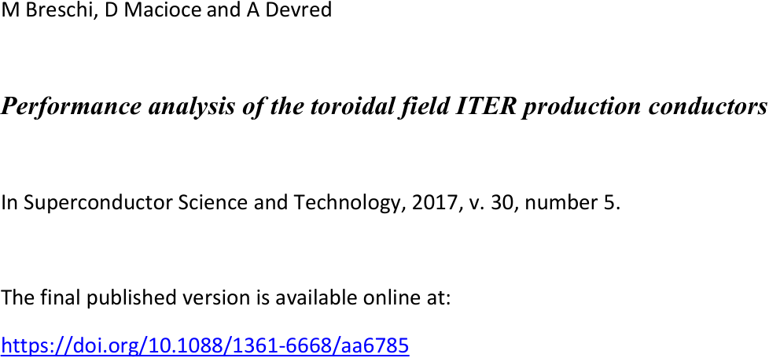

**----- Start of picture text -----** 
M Breschi, D Macioce and A Devred Performance analysis of the toroidal field ITER production conductors In Superconductor Science and Technology, 2017, v. 30, number 5. The final published version is available online at: - https://doi.org/10.1088/1361 6668/aa6785 **----- End of picture text -----** 

## Rights / License: 

The terms and conditions for the reuse of this version of the manuscript are specified in the publishing policy. For all terms of use and more information see the publisher's website. 

_This item was downloaded from IRIS Università di Bologna (https://cris.unibo.it/)_ 

_**When citing, please refer to the published version.**_ 

# **Performance Analysis of the Toroidal Field ITER Production Conductors** 

## M. Breschi[1] , D. Macioce[1] , A. Devred[2] 

> 1DEI, Department of Electrical, Electronic and Information Engineering, University of Bologna, Italy 2Magnet Division, ITER International Organization, Route de Vinon-sur-Verdon, 13067 Saint Paul-LezDurance, France 

Prepared for publication in: 

Superconductor Science and Technology 

## Abstract 

The production of the superconducting cables for the toroidal field (TF) magnets of the ITER machine has recently been completed at the manufacturing companies selected during the previous qualification phase. The quality assurance/quality control programs that have been implemented to ensure production uniformity across numerous suppliers include performance tests of several conductor samples from selected unit lengths. The short full-size samples (4 m long) were subjected to DC and AC tests in the SULTAN facility at CRPP in Villigen, Switzerland. 

In a previous work the results of the tests of the conductor performance qualification samples were reported. This work reports the analyses of the results of the tests of the production conductor samples. The results reported here concern the values of current sharing temperature, critical current, effective strain and _n_ -value from the DC tests and the energy dissipated per cycle from the AC loss tests. A detailed comparison is also presented between the performance of the conductors and that of their constituting strands. 

_Keywords_ : Superconducting cables (A), Current Sharing Temperature (B), Nb3Sn conductor (C), CICC (D), ITER Project (E). 

## **1. Introduction** 

The ITER machine is designed to be the world’s largest experimental fusion facility, with the goal of demonstrating the scientific and technological feasibility of fusion power for peaceful energy purposes [1], [2]. The ITER magnet system is a very sophisticated one, with a large stored energy of 51 GJ. The coils are wound from Cablein-Conduit Conductors (CICCs) made of superconducting and copper strands assembled into a multistage cable, inserted into a conduit of austenitic steel tubes. The superconducting magnet system of the ITER tokamak will include Nb3Sn-based conductors in the 18 Toroidal Field (TF) coils and in the 6 Central Solenoid (CS) modules. Nb-Ti-based conductors will be used in the 6 Poloidal Field (PF) coils, the 9 pairs of Correction Coils (CC), the 21 pairs of Main Busbars (MB) for the TF, CS and PF feeders, and the Corrector Busbars (CB) for the CC feeders. 

The conductors for the toroidal field (TF) coils require about 450 t of Nb3Sn strands. Each TF coil is D-shaped and contains a stack of 5 regular and 2 side Double Pancakes. The total height of the coils is 14 m and their width is 9 m. The TF conductors are procured in kind by six ITER Domestic Agencies, or DAs (People’s Republic of China, Europe, Japan, Russian Federation, Republic of Korea and the United States). The DAs procured in total 89 km of Cable in Conduit Conductor for the TF coils. The cross section of the TF ITER conductor is reported in Fig. 1. The requirements set by the ITER Central Team for the TF conductors specify a lower limit to the current sharing temperature at conditions of operation current and magnetic flux density of interest for the machine operation (5.7 K + 0.1 K error bar) and an upper limit to the AC losses in the strands. Before launching procurement, all DAs qualified their choice of suppliers for strands, cables and jacket through a current sharing temperature test of a short length of conductor in the SULTAN facility at CRPP in Villigen, Switzerland [3]-[5]. After qualification, the mass industrial production of TF cables was started by the DAs and has now finally reached completion [6]-[8]. During production, all DAs were required to provide 4 m long conductor samples to be tested in SULTAN at different stages of the production process. In particular, a sample was tested from about 25 % of the series production Unit Lengths. 

In order to make the results of the tests comparable and reproducible, a remarkable effort was devoted to the development of suited sample preparation, instrumentation sets and test procedures [5], [9], [10]. These developments, associated with the massive production of ITER conductors, led to the creation of the largest technical database on Nb3Sn Cable in Conduit Conductors ever assembled. 

In a previous work [5], the results of the tests of the conductors manufactured in the qualification phase were presented. Similar methodologies utilized for the analyses reported in [5] were applied in this work to perform the study of the tests of the production conductor samples. The tests were aimed at assessing the conductor current sharing temperature as a function of operating current and magnetic flux density. Since Nb3Sn is a brittle and strain sensitive material, the impact of mechanical fatigue associated to electromagnetic (EM) cyclic loading was assessed during the tests. For this assessment, each conductor was subjected to 1000 cycles of the operation current from zero to the design operation value of 68 kA. Furthermore, the experience gained during the qualification phase of the TF conductors showed the impact on conductor performance of the thermal cycles from the supercritical helium temperature (about 5-6 K) to room temperature, referred as Warm-Up-Cool-Down (WUCD) cycles. The impact of this thermal cycle on the conductor performance is also presented. The current sharing temperature measured on each conductor is compared here with the strand performance at different operating conditions. The critical current of the strands inside the Cable in Conduit Conductor is also compared with its expected value. 

In order to derive the expected strand performance at operating conditions close to those experienced inside the Cable in Conduit Conductor, the critical surface parameterization of each wire was utilized. The parameters describing the critical surface of all ITER production strands were determined by dedicated measurements of their critical current as a function of magnetic field, temperature and strain [11], [12]. 

As for the tests in DC conditions, this paper also reports the effective strain, critical current and _n_ -values of the tested ITER TF industrial production samples. To complete the characterization of these conductors, their AC performance before and after the EM cyclic loading is also analysed here. Finally, the dependencies of the AC loss on 

the frequency of the AC magnetic flux density and on the DC background magnetic flux density applied to the conductor are shown. 

## **2. Test description** 

## 2.1 _Sample and instrumentation_ 

In the SULTAN test facility, the sample consists of two conductor legs joined at the bottom and electrically connected at the top to the SULTAN superconducting transformer. The sample is placed vertically in the bore of the magnetic system. A clamping system maintains the two legs in a parallel configuration, against the electromagnetic forces. The peak background field, provided by the SULTAN facility, is applied to a region of the conductor that is about 0.45 m long (referred here as High Field Zone, HFZ) [4]. 

The bottom joint allows both legs to be operated by a single power supply and provides the possibility of testing two conductors simultaneously. However, differently from the qualification phase, in most cases identical conductors were tested in each SULTAN sample during the production phase. The joints are manufactured with the socalled ‘solder filled’ technology described in [13]-[15]. The two conductors are cooled through a forced flow of supercritical helium flowing from the bottom joint to the upper terminations. 

The SULTAN facility is equipped with temperature, mass flow rate, and pressure sensors for the measurement of the relevant physical quantities. Moreover, heaters are mounted on the helium inlet to increase the sample temperature in order to carry out the _Tcs_ tests. The temperature probes and voltage taps are installed on the conductor jacket (see Fig. 2). Two crowns of six voltage taps are placed on each leg, centered in the middle of the HFZ of the test magnet (VH1–VH4). The distance between the crowns on each leg is 450 mm. The sample is further instrumented with four sets of temperature sensors (T1–T4). The temperature sensors are located upstream and downstream of the HFZ at a distance of 800 mm from each other. For each cross section four temperature sensors are located at a 90° angular distance, and the local temperature is obtained as an average of these 4 sensor readings. 

## **3. Experimental results** 

The TF conductor samples tested in the SULTAN facility during the industrial production phase are listed in Table I. The main characteristics of all the production samples approved by the ITER International Organization are reported in Table II. All samples are loaded with 1000 electro-magnetic (EM) cycles before the WUCD procedure. The strand critical current is in the range from 257 to 296 A for Internal Tintype strands (IT), and from 197 to 240 A for the Bronze-type strands (BR). For some samples (TFKO4, TFJA6 and TFUS5) only one of the two conductors tested in the corresponding SULTAN samples is considered here, which is the one manufactured with ITER-type strands relevant for quality control in the production phase. For the TFUS6 sample both legs are made of the same conductor, whereas in other samples different conductors are used for each leg. The results obtained in these tests, concerning _Tcs_ , _Ic_ values, _n_ -values and effective strain and AC losses are presented in the next sections. All analyses were performed according to the standardized data reduction procedure described in [9] and [10]. 

## **3.1.** _**Tcs**_ **and** _**Ic**_ **values** 

## _3.1.1. Effect of electromagnetic (EM) cyclic loading._ 

The _Tcs_ assessment is the most relevant result of SULTAN tests. The conductor electrical characteristic is affected by the EM cyclic loading, which can determine the rupture of filaments [16]-[19] and the modification of the strain distribution in the conductor [20]-[23]. In most cases, the shift of the _E-T_ curves determines a crossing of the critical electric field at decreasing values of temperature. In some cases of interest however, _Tcs_ slightly increases with cyclic loading (shown for example in Fig. 3). The variation of _Tcs_ from the beginning of test campaign is denoted here as Δ _T_ EM. For the same samples, the _Tcs_ evolution with cyclic loading is shown in Fig. 4. 

Figure 5 shows the current sharing temperatures after 1000 EM cycles in comparison with those obtained at the beginning of the test campaign (i.e. cycle #1). A detailed diagram of the _Tcs_ variations Δ _T_ EM is also reported in Fig 6. It is worth noting 

that the Korean sample TFKO7 and all TFRF samples exhibit a slight increase of _Tcs_ during the test campaign. For the TFRF samples this performance improvement has been attributed to a different coating of the strands [24]. As a matter of fact, the strands provided by the Russian Federation are characterized by an unusual Cr coating, thicker than that applied to the other ITER-type strands. The detailed micrographic analyses described in [24] have shown that this coating exhibits a significantly higher surface roughness as compared to those of the other strands. This roughness may lead to a rise of the friction factor between strands, which could limit their relative transverse movement during cyclic loading. According to [24], this feature of the Russian strands may prevent the slip and lock mechanism which could be responsible for the breaking of the filaments in the TF conductors. 

As already observed in [5] for the ITER TF conductors prepared for the qualification phase, it can be noticed in Fig. 5 that _Tcs_ reaches higher values in the Internal Tin-type samples than in the Bronze ones. Figures 6a and 6b show that, excluding the already mentioned cases of a _Tcs_ increase, the _Tcs_ drop between the first and the last EM Cycle is on average greater for the Internal Tin samples. 

Two plots of the performance variation with cyclic loading are reported in Fig. 7, where the same scale has been used to compare IT strands in Fig. 7a and Bronze strands in Fig. 7b. The largest part of the _Tcs_ variation generally occurs within the first 200 EM cycles; in the following part of the test campaign the conductors exhibit slight performance changes. The range of the initial _Tcs_ values of the Internal-Tin samples is broader than that of Bronze-type samples. At EM cycle #1000 however, the conductor performances get closer to each other: most of the _Tcs_ values can be collected in a temperature window of 0.2 K, i.e. 5.9÷6.1 K for Bronze-type and 6.3÷6.5 K for Internal Tin-Type. Even if not all the sample results are included in this window, the average _Tcs_ at the end of the EM cyclic loading is 6.0 K for the Bronze conductors, and 6.4 K for the Internal Tin ones. 

## _3.1.2. Effect of warm-up-cool-down (WUCD)._ 

Apart from two exceptions, a further _Tcs_ drop occurs at the end of EM cyclic loading when the sample is subjected to a warm-up to room temperature followed by a cool-down back to the supercritical helium temperature. This type of test indicates to which extent each sample is susceptible to thermal loading as compared to others. Figure 8 reports the _Tcs_ drop for the conductors under analysis, separated by manufacturing route type. Δ _TWUCD_ indicates the difference between _Tcs_ after WUCD and _Tcs_ at the end of the cyclic loading at EM cycle #1000. Only in three cases, namely TFKO4 R, TFEU12 L and TFUS8 L, is the current sharing temperature slightly increasing with the warm-up-cooldown procedure, while in the case of TFEU13 L no measurable drop is found. The results reported here for the conductor TFUS8, obtained by applying to all runs the standard procedure for the data treatment [9], [10], slightly differ from other assessments of _Tcs_ of the same conductor, for instance performed by the CRPP team [25]. In the procedure applied here, no correction of the _V-I_ characteristics is applied if the voltage offset at 68 kA is less than 1 µV. Instead, by applying this correction, the result of TFUS8 L also exhibits a slight performance drop at WUCD. 

In all the other cases the performance drops with the thermal cycle. The Δ _TWUCD_ values range from −0.32 K to +0.07 K for the Bronze-type conductors, with an average value of −0.13 K, and from −0.27 K to +0.01 K for the Internal Tin-type, with an average drop of −0.09 K. On average, the bronze conductors performance is more affected by the WUCD procedure than that of the IT ones. 

In one case for the Internal Tin conductors (TFEU9R) and in four cases for the Bronze conductors (TFJA6L, TFJA7R, TFJA9L, TFJA9R) the performance drop with WUCD is greater than 0.2 K. This performance reduction is quite severe and may need to be taken into account for the operation of these conductors in the machine, if representative of in-coil performance. However, several authors dispute the representativeness of thermal effects in a conductor short sample where they may be exacerbated, and, therefore, overestimated with respect to a coil [26]. 

## **3.2. Comparison between strand and conductor performance** 

This section is focused at the analysis of the variation of performance of the Nb3Sn strands from their standalone tests as individual wires to their working conditions in the Cable in Conduit Conductors. The purpose of this study is twofold. On one hand the current sharing temperature of the conductor is compared to the critical current of its constituting strands. On the other hand the critical current of the strands inside the CICC during the SULTAN tests is compared with the expected critical current of the strands themselves. In order to perform this study, the critical current of the strand was determined at two different working conditions 

- 1) The first condition is the one experienced by the strands on the ITER barrel, with a compressive strain in the range (-0.20 ÷-0.10%) 

- 2) The second condition is the one experienced by the strands in the Cable in Conduit Conductor during the SULTAN tests. 

The working conditions of the strands in the ITER barrel measurements differ from those of the SULTAN experiments, both for the different magnetic flux density applied to the wires, and for the compressive strain applied to the superconducting filaments. As it appears from magnetic susceptibility measurements [21], from neutron diffractions experiments [27], [28], and from numerical computations [29], the intrinsic axial strain of the filaments, in operating conditions more similar to those of the SULTAN facility, can - be estimated as distributed around an average value included in the range from 0.6% to -0.4%. The axial strain in the filaments plays a crucial role in the Nb3Sn conductor performance; in order to determine the expected _Ic_ in the aforementioned conditions an - arbitrary value of 0.5% strain was selected. This value of intrinsic strain has to be considered as a rough estimation of the average intrinsic strain in the conductor, and as a reference for comparison purposes only. 

In order to perform the extrapolation of the wire performance at the SULTAN test conditions, two main assumptions were made. Since several types of TF strand design have been qualified for use in the ITER magnet system, the first assumption is that the critical current measured on the ITER barrel of one strand per design type is 

representative for all the strands of this type. The second assumption is that the electromechanical behavior of each strand type can be characterized by a given _Ic-vs-eps_ curve, with a critical current slope and a strain sensitivity coefficient directly derived from the corresponding parameterization curve. The critical current slope represents the ratio D _Ic_ /De [A/%] in the range of strain [-0.7%÷-0.3%] [30]. The strain sensitivity coefficient is the ratio between the current measured on the ITER barrel for a given strand and the aforementioned slope computed for the same strand. The parameters of the critical surfaces of the analyzed conductors are reported in Table III; the meaning of the parameters can be found in [11]. 

The methodology adopted in this study can be schematized as follows: 

a) As a first input data the values of effective strain of the representative strands in working conditions of the ITER barrel measurements are considered. These measurements are performed at 4.2 K, 12 T; the assessment of the effective strain is not trivial, since no direct experimental information is available about the axial strain. The methodology to extract the wire intrinsic strain from the ITER barrel measurements is explained in [31]. 

b) A second input data for the analysis is the average strand critical current for each Cable in Conduit Conductor, which is computed as an average of the critical currents of all the strands included in the given cable. The effective strain at ITER barrel conditions found at point a), and the average critical current of each conductor are used as the - starting point for the analysis. The critical current of the conductor at 0.5% strain conditions is then found by means of an extrapolation based on the critical current slope mentioned above. 

## _3.2.1. Current sharing temperature vs critical current_ 

The results obtained with the procedure described in the previous section are shown in Fig. 9a, where the measured _Tcs_ of each production conductor after 1000 EM cycles is plotted as a function of the corresponding average critical current at the intrinsic strain 

conditions of the ITER barrel. The plot indicates that the values of _Tcs_ increase with increasing _Ic_ . In particular, IT samples generally exhibit greater strand critical currents and, correspondingly, better performance in terms of current sharing temperature. At barrel conditions, the average _Ic_ is about 276 A and 220 A for IT and BR wires respectively. The standard deviation is about 15 A for IT conductors and 7 A for BR wires. Figure 9b reports a summary of the same results reported in Fig. 9a, where the _Tcs_ results are averaged over the group of samples manufactured starting from the wires provided by each of the 8 strand suppliers. The error bars represents the standard deviations of the sets of results obtained with the strands produced by each manufacturer. 

## _3.2.2. Critical current: conductor vs wire performance_ 

In this section the expected performance of the strands is compared with the actual one assessed with the tests in the SULTAN facility. 

To compute the critical current of each strand from the SULTAN tests, an uniform distribution of the 68 kA transport current over the 900 superconducting strands was assumed, obtaining a reference value of 75.5 A per strand. At the temperature corresponding to _Tcs_ , when the critical electric field is reached, this current can be considered as the strand critical current in the SULTAN test. Of course, this value of current is the same for all samples, but it is reached at different temperatures since the _Tcs_ values differ from conductor to conductor. 

As for the expected performance of the strands, two cases were considered. In the first case the strand is assumed to be cooled and compacted inside the jacket with all the other strands, as in the actual conductor tests in the SULTAN facility. In the second case, the strand is assumed to be cooled and operated as an individual wire, without introducing it into the jacket. 

In the first case, the expected strand critical current was computed by means of the strand parameterization at the following operating conditions: a temperature equal to the _Tcs_ value obtained in the SULTAN facility after 1000 EM cycles, a magnetic flux density 

- of 11 T and a compressive strain of 0.5%. In the second case the critical current was computed at the same temperature and magnetic field magnitude but at a different value of the axial strain. This value was set to the intrinsic strain found with the ITER barrel measurements on the considered strand. The obtained values of compressive strain are in - - the range between 0.2% and 0.1%. 

The values of the ratio between the critical current of the wire in the SULTAN tests (75.5 A) and the critical current extrapolated in the two conditions mentioned above are reported in Fig. 10. It is worth noting that the wire in the CICC retains on average about 51% of the critical current that it would exhibit at the SULTAN conditions, if it were - subjected to a uniform compressive strain of 0.5 % on the filaments along its length. This performance reduction of the wire inside the conductor can be partly attributed to the filament breaking and partly to the distribution of the physical strain about the average value, which decreases the overall performance with respect to the uniform distribution case [23]. As for the second comparison, the strand in the CICC retains on average about 37% of the critical current that it would carry if it was cooled as an individual wire. Of course, the ratio of critical currents is higher when considering the - comparison with the working conditions at 0.5% compressive strain because the critical current of the strand significantly decreases in this case with respect to that at the ITER barrel strain conditions. Figure 10 shows that a margin of design improvement is present, which may allow in the future to conceive architectures of Nb3Sn CICs able to exploit increasingly greater portions of the available critical current of the strand at the typical working conditions of the superconducting magnets. 

## **3.3.** _**Conductor n-values and effective strain**_ 

The _n-values_ of the conductor have been derived both from the _Ic_ runs and the _Tcs_ measurements by means of the two corresponding methods described in [5]. The results of the analysis for the TF production conductors are reported in Fig. 11. The _n-values_ from the _V-T_ measurements are plotted as a function of the EM cycles in Fig. 12. The _nvalues_ for Bronze-type conductors are generally less than those found for the IT conductors. Moreover, the results found for the Bronze conductors are less dependent on 

cyclic loading, especially after 200 EM cycles. It can be observed that the _n_ -values drop also for the RF DA conductors which do not exhibit a drop in _Tcs_ during EM cyclic loading. 

The _effective strain_ indicates the level of compressive strain that should be applied to the corresponding strand to obtain the same _E–J_ characteristics measured on the full-size conductor. The procedure for its computation is described in [5] and [32]. The variation of the effective strain during the EM cyclic loading for the TF production samples is reported in Fig. 13. Comparing different conductors, a very broad range of effective strains can be observed, ranging from -0.92% to -0.55% at the beginning of the test campaign and from -0.97% to -0.63% at the end of the EM cyclic loading. The absolute values of effective strain of the BR conductors are generally greater than those of the Internal Tin ones. 

In most cases, the _effective strain_ increases in absolute value with cyclic loading; this variation is correlated to the drop in current sharing temperature that occurs for most conductors. It can be observed that the _effective strain_ of the Bronze-type conductors exhibits less dependence on cyclic loading than that of the IT conductors. 

After WUCD, the samples are tested at different transport current and background magnetic flux density conditions; typical values are 55 kA/10.78 T, 50 kA/10 T, 68 kA/10 T. These tests can be used to determine the impact of the transverse electromagnetic load on the conductor performance, expressed in terms of effective strain. The sensitivity of each TF production conductor to the applied electromagnetic load was analysed determining the variation of the effective strain with respect to the product _IxB_ ; the results are plotted in Fig. 14. The Pearson coefficient ( _R-squared_ ) value shows the quality of the linear correlation between the effective strain and the transverse electromagnetic load. The average _R-squared_ value for all samples is 0.75. Similarly to the analysis performed in [32], a correlation with _R-squared_ value greater than 0.90 is considered here as a good linear correlation. In this analysis, only 18 out of 43 ITER TF production conductors exhibit a good linear correlation between these two quantities. Therefore, the assumption of a linear correlation between effective strain and applied transverse load, which can be useful for design purposes, must be carefully checked with the experimental data available for each conductor. 

## **3.4.** _**AC Losses**_ 

The AC losses of all SULTAN samples are measured before and after the electromagnetic cyclic loading. Losses are measured by means of a calorimetric method based on the enthalpy variation of the supercritical helium during the experiments [33]. After cyclic loading, a remarkable reduction of the AC losses can be observed for all samples. 

An example of the AC losses found for the TF production conductors is shown in Fig. 15, where one sample for the Internal Tin-type and one for the Bronze-type conductors have been taken. The energy loss per cycle increases with increasing frequency in this frequency range and exhibits a consistent drop after all EM cycles due to the change of inter-strand resistances [34]. 

For all selected SULTAN samples a summary of AC losses at 1 Hz before and after EM cyclic loading is reported in Fig. 16. On average, for Internal Tin-type conductors, the energy loss per cycle at 1 Hz is 160 mJ/(cm[3] cycle) before cyclic loading, and 49 mJ/(cm[3] cycle) after cyclic loading. As for Bronze-type conductors, the average energy per cycle values are 209 mJ/(cm[3] cycle) before cyclic loading and 46 mJ/(cm[3] cycle) after cyclic loading. It is worth noting that all samples provided by the Korean DA and the sample TFRF5 provided by the Russian DA exhibit losses after cyclic loading at 1 Hz in the range from 53 to 98 mJ/(cm[3] cycle). This level of losses is much lower than that found for the other samples, which exhibit energy losses per cycle greater than 180 mJ/(cm[3] cycle) in the same conditions. 

## **4. Discussion** 

Some issues have been under debate in the scientific community during the qualification phase of the ITER Nb3Sn conductors with regard to the understanding of specific features of the SULTAN test results and the variability of results obtained on nominally identical conductors. These issues, discussed in detail in [5], concerned both the accuracy in the assessment of the Nb3Sn conductor performance and its extrapolation from the straight sample configuration to the in-coil performance. In this section we briefly discuss how some of these issues have been resolved or treated during the mass production of the Nb3Sn TF cables in the SULTAN facility. 

_Tcs values of identical conductors._ In the production phase, most of the tested SULTAN samples are manufactured starting from nominally identical conductors (same strand/cable/jacket combination). In particular, 19 samples out of 24 are made of the same conductor for both the left and the right leg. In general, the differences in performance between the two legs tend to decrease from the beginning to the end of the test campaign. Between these identical legs, 10 conductor pairs exhibit very similar _Tcs_ values both at the beginning and at the end of the test campaign, with a maximal difference about 0.09 K. The other samples exhibit differences between legs up to 0.2 K at most. The difference between identical legs performance during the industrial production phase is less than the corresponding difference found in the qualification phase, which reached a maximum of 0.3 K [35]. In the design phase of CIC conductors, it is worth accounting for this variability of performance when assessing the impact of the design cabling parameters. 

_Current distribution effects_ . In the qualification phase, a solder filling technique was implemented to improve the current redistribution at the joints during the _Tcs_ tests. During the mass production phase, the bottom joint and top termination resistances were monitored for all samples in the SULTAN test campaigns. Top joint resistances, at the last EM cycle (#1000) are in the range from 0.24 to 1.77 nΩ, and are stable with cyclic loading. The bottom joint resistances were assessed both with a voltmetric and a calorimetric procedure. The values obtained with the voltmetric method are included in the range from 0.45 to 0.74 nΩ. The values obtained with the calorimetric method are in line with those found with the voltmetric method, and are included in the range from 0.47 to 0.66 nΩ. 

## _From short sample to in-coil performance_ 

The recent tests of the CS Insert [36], [37] have shown the possibility to extrapolate the results obtained on straight samples of Nb3Sn CICCs in the SULTAN facility to the coil configuration. Taking into account an adequate portion of the hoop strain arising in the circular turns allows one to extrapolate the results in the winding from those in a straight 

sample [38]. Although the Nb3Sn conductors for the Central Solenoid are wound with a different configuration with respect to the TF conductors, this result gives further confidence in the reliability of the SULTAN facility and in the possibility to predict the in-coil performance of Nb3Sn CICCs. 

## **5. Conclusions** 

The industrial mass production of the Nb3Sn conductors for the Toroidal Field coils of the ITER magnet system was successfully completed. The tests of the conductor performance were carried out at the SULTAN facility in Villigen, Switzerland. The tested conductors met their requirements, both in DC and AC conditions. 

Many of the tested conductors exhibit a drop of the current sharing temperature with electromagnetic cyclic loading. However, all the conductors provided by the Russian DA and one conductor provided by the Korean DA, exhibit an increase of performance with the electromagnetic cyclic loading. 

For the conductors exhibiting a performance drop, the maximal reduction of _Tcs_ during the 1000 EM cycles performed is around 0.6 K, with an average reduction of 0.26 K. A significant part of the _Tcs_ reduction occurs in the first 200 EM cycles. Instead, for the conductors exhibiting a _Tcs_ increase with cyclic loading, the maximal performance improvement after 1000 EM cycles is 0.27 K, with an average enhancement of 0.14 K. In most conductors, even those that improve their performance during the EM cyclic loading, the Warm-Up-Cool-Down procedure determines a further performance drop. The maximal reduction of _Tcs_ due to WUCD is about 0.3 K, with an average of 0.11 K that confirms the results previously observed in the qualification phase of the TF ITER conductors. 

Comparing the current sharing temperature of the TF cables after 1000 cycles and the critical current of its constituting strands, as a general trend, the current sharing temperature tends to increase with increasing the strand _Ic_ . The comparison between the strand and the conductor performance allows one to estimate the extent of the Nb3Sn wire current carrying capability that is retained in the CICC. The analyses performed show that the wire retains about 37% of its critical current with respect to the tests in the ITER barrel conditions, where the compressive strain applied to the superconductive filaments 

is less than inside the cable in conduit. Comparing the wire performance inside the conductor with those expected for the same strand subjected to a compressive strain of - 0.5 % (close to the average intrinsic strain expected in SULTAN test conditions), the wires retain about 51 % of their potential critical current. This difference may be attributed to the impact of the strain distribution around its average value. This result shows the margin for design improvement of Nb3Sn CICCs that may partly be exploited in future projects. 

The conductor _n_ -values derived from the _Ic_ tests drop from an average value about 15 before the cyclic loading to about 10 at the end of the test campaign. This variation of the _n_ -index, that clearly indicates a modification of the conductor electrical characteristics, can be noted for both the conductors exhibiting a reduction and an enhancement of the current sharing temperature. 

The energy loss per cycle measured with the AC tests show that all tested conductors met their specifications in terms of AC losses. A substantial drop of the AC losses after EM cyclic loading can be observed on all conductors, confirming similar results obtained during the qualification phase and in previous tests of Nb3Sn cable in conduit conductors. 

## **Acknowledgment** 

The work at the University of Bologna was supported by the ITER International Organization under contract #ITER/CT/12/4300000542. The authors wish to thank the teams at ASIPP and CN-DA, F4E, and RF-DA who supervised the manufacture of the conductors, the teams at ASIPP, CEA and ENEA, and CRPP who prepared the samples, the dedicated team of the SULTAN facility. A. Nijhuis from the University of Twente is gratefully acknowledged for providing the data on the electromechanical strand characterization and D. Bessette and V. Tronza from ITER I/O for useful discussion. 

## **Disclaimer** 

The views and opinions expressed herein do not necessarily reflect those of the ITER Organization. 

## **References** 

[1] N. Mitchell et al., “The ITER Magnet System”, _IEEE Trans. Appl. Supercond_ ., vol. 18 (2), pp. 435–440, 2008. 

[2] N. Mitchell, A. Devred, P. Libeyre, B. Lim, F. Savary, “The ITER Magnets: Design and Construction Status”, _IEEE Trans. Appl. Supercond._ , vol. 22 (3), 4200809, 2012. 

[3] A. Devred et al. “Status of ITER Conductor Development and Production”, _IEEE Trans. Appl. Supercond.,_ vol. 22 (3), 4804909, 2012. 

[4] P. L. Bruzzone, et al., “Methods, Accuracy and Reliability of ITER Conductor Tests in SULTAN”, _IEEE Trans. Appl. Supercond_ ., vol. 19, pp. 1508 – 1511, 2009. 

[5] M. Breschi, A. Devred, et al., “Results of the TF conductor performance qualification samples for the ITER project”, _Supercond. Sci. Technol._ , vol. 25, n. 9, 095004, 2012. 

[6] T. Boutboul, et al., “Status of the procurement of the European superconductors for the ITER magnets”, _IEEE Trans. Appl. Supercond._ , vol. 24, 6001004, 2014. 

[7] V.S. Vysotsky et al., “Status and achievements in production of ITER TF conductors and PF cables in Russian Cable Institute production”, _IEEE Trans. Appl. Supercond._ , vol. 22, 4200505, 2012. 

[8] Y. Takahashi, et al., “Mass Production of Nb3Sn Conductors for ITER Toroidal Field Coils in Japan”, _IEEE Trans. Appl. Supercond._ , vol. 22, 4801904, 2012. 

[9] D. Bessette, “Procedure for _Tcs_ Assessments of the ITER/TF SULTAN Samples”, ITER, Cadarache, France, 2009. 

[10] D. Bessette, M. Breschi, C. Calzolaio, A. Devred, M. Menarini, K. Seo, “Sensitivity Analysis of _Tcs_ Measurement on ITER TF Conductors”, _IEEE Trans. Appl. Supercond._ , vol. 20, n. 3, pp. 1488 – 1491, 2010. 

[11] L. Bottura, B. Bordini, “ _Jc_ ( _B_ , _T_ , _ε_ ) parameterization for the ITER Nb3Sn production”, _IEEE Trans. Appl. Supercond.,_ vol. 19, pp. 1521–1524, 2009. 

[12] I. Pong et al. “Worldwide Benchmarking of ITER Internal Tin Nb3Sn and NbTi Strands Test Facilities”, _IEEE Trans. Appl. Supercond.,_ vol. 27, 044001, 2014. 

[13] B. Stepanov, P. Bruzzone, R. Wesche, N. Martovetsky et al., “Impact of Sample Preparation Procedure on the Test Results of four US ITER TF Conductors”, IEEE Trans. Appl. Supercond., vol. 20, pp. 508–511, 2010. 

[14] C. Y. Gung, et al, “Fabrication of the first US ITER TF conductor sample for qualification in SULTAN facility”, IEEE Trans. Appl. Supercond. 19 1474-1477, 2009. 

[15] N. Martovetsky et al., “Test Results of the First US ITER TF Conductor in SULTAN”, IEEE Trans. Appl. Supercond., vol. 19, pp. 1478–1482, 2009. 

[16] M. Jewell, “The effect of strand architecture on the fracture propensity of Nb3Sn composite wires”, PhD Dissertation, University of Wisconsin, United States, 2008. 

[17] M. K. Sheth, et al. “Study of Filament Cracking Under Uniaxial Repeated Loading for ITER TF Strands”, IEEE Trans. Appl. Supercond. 22 4802504, 2012. 

[18] C. Sanabria, et al. “Metallographic autopsies of full-scale ITER prototype cable-in-conduit conductors after full testing in SULTAN: 1. The mechanical role of copper strands in a CICC”, _Supercond. Sci. Technol._ , vol. 28, 085005, 2015. 

[19] C. Sanabria, et al. “Evidence that filament fracture occurs in an ITER toroidal field conductor after cyclic Lorentz force loading in SULTAN”, _Supercond. Sci. Technol._ , vol. 25, 075007, 2012. 

[20] C. Calzolaio, P. Bruzzone, D. Uglietti, “Measurement of _Tc_ distribution in Nb3Sn CICC”, _Supercond. Sci. Technol._ , vol. 25, 054007, 2012, 

[21] C. Calzolaio, P. Bruzzone, “Analysis of the CICC Performance Through the Measurement of the Thermal Strain Distribution of the Nb3Sn Filaments in the Cable Cross Section”, _IEEE Trans. Appl. Supercond.,_ vol. 24, 4802204, 2014. 

[22] C. Calzolaio, P. Bruzzone, B. Stepanov, “Monitoring of the Thermal Strain Distribution in CICCs During the Cyclic Loading Tests in SULTAN”, _IEEE Trans. Appl. Supercond.,_ vol. 23, 4200404, 2013. 

[23] M. Breschi, P. L. Ribani, H. Bajas, A. Devred, “Modeling of the electro-mechanical behavior of ITER Nb3Sn cable in conduit conductors”, _Supercond. Sci. Technol_ , vol. 25, 054005, 2012 

[24] C. Sanabria, P.J. Lee, A. Devred, D.C. Larbalestier, “The importance of strand surface roughness in Long Twist Pitch ITER conductors as revealed by metallography _”, On the superior performance of Russian ITER conductors, 8[th] MEM Workshop,_ March 2016 _._ 

[25] CRPP TFUS8 SULTAN Sample Test Report, _ITER Database Management https://user.iter.org/?uid=TXSEYF_ , October 2016. 

[26] A. Devred, C. Jong, N. Mitchell, “Strain redistribution effects on current-sharing temperature measurements on straight sample of large Nb3Sn cable-in-conduit conductors”, _Supercond. Sci. Technol._ , vol. 25, 054009, 2012. 

[27] C. Rey, et al., “Post-Test Strain Measurements for a Candidate ITER Superconducting Cable Damaged in High Cycle Load Tests”, unpublished. 

[28] T. Hemmi et al., “Neutron Diffraction Measurements of Internal Strain in Nb3Sn Cable-In-Conduit Conductors”, _IEEE Trans. Appl. Supercond._ , vol. 21, pp. 2028 – 2031, 2011. 

[29] H. Bajas, “Numerical simulation of themechanical behavior of the ITER cable-in-conduit conductors”, PhD Thesis, Ecole Centrale de Paris, Paris, 2011. 

[30] A. Nijhuis et al, “The effect of axial and transverse loading on the transport properties of ITER Nb3Sn strands”, _Supercond. Sci. Technol._ , vol. 26, 084004, 2013. 

[31] N. van den Eijnden, A. Nijhuis, Y. Ilyin and W.A.J. Wessel, H.H.J. ten Kate, “Axial tensile stress strain characterization of ITER Model Coil type Nb3Sn strands in TARSIS”, _Supercond. Sci. Technol_ ., Vol. 18, pp. 1523–1532, 2005. 

[32] M. Breschi, D. Bessette, A. Devred, “Evaluation of effective strain and n-value of ITER TF conductor samples”, _IEEE Trans. Appl. Supercond._ , vol. 21, pp. 1969–73, 2011. 

[33] F. Cau, P.L. Bruzzone , “AC Loss Measurements in CICC With Different Aspect Ratio”, _IEEE Trans. Appl. Supercond._ , vol. 19, pp. 2383 – 2386, 2009. 

- [34] S. Lelekhov, V. Tronza, “AC Loss Before and After Cyclic Mechanical Loading in the ITER RF CICCs”, _IEEE Trans. Appl. Supercond._ , vol. 24, 4201005, 2014. 

- [35] D. Uglietti , R. Wesche, B. Stepanov, P. Bruzzone, “Statistical Analysis of the Current-Sharing Temperature Evolution in Nb3Sn Cable-in- Conduit-Conductors for ITER”, _IEEE Trans. Appl. Supercond._ , vol. 22, 4802204, 2012. 

- [36] H. Tsuji et al., “Progress of the ITER Central Solenoid Model Coil program,” Nuclear Fusion, vol. 41, no. 5, pp. 645-651, May 2001. 

- [37] N. Martovetsky et al., “ITER central solenoid insert test results”, _IEEE Trans. Appl. Supercond_ ., vol. 26, no. 4, Art. no. 4200605, Jun. 2016. 

- [38] N. Martovetsky et al., “Characterization of the ITER CS conductor and projection to the ITER CS performance”, submitted for publication on Fusion Engineering and Design. 

## **Tables** 

**Table I. List of SULTAN samples of TF production conductors** 

**Table II. List of conductor performance production samples approved by ITER** 

21 

## **Table III. List of TF production sample parameters for the critical surface parameterization** 

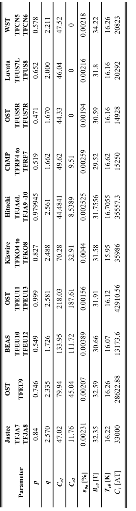

## **Figures** 

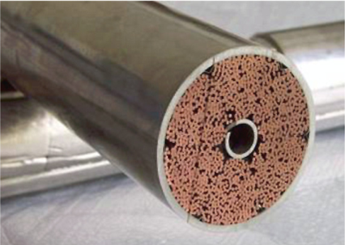

**Figure 1.** Cross section of the TF conductor, with a central channel for forced supercritical helium flow, and an external round jacket. 

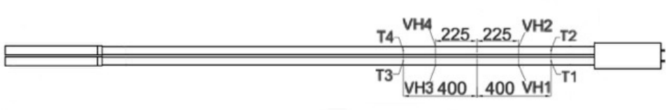

**Figure 2.** Typical instrumentation of a SULTAN sample consisting of two legs of TF conductor 

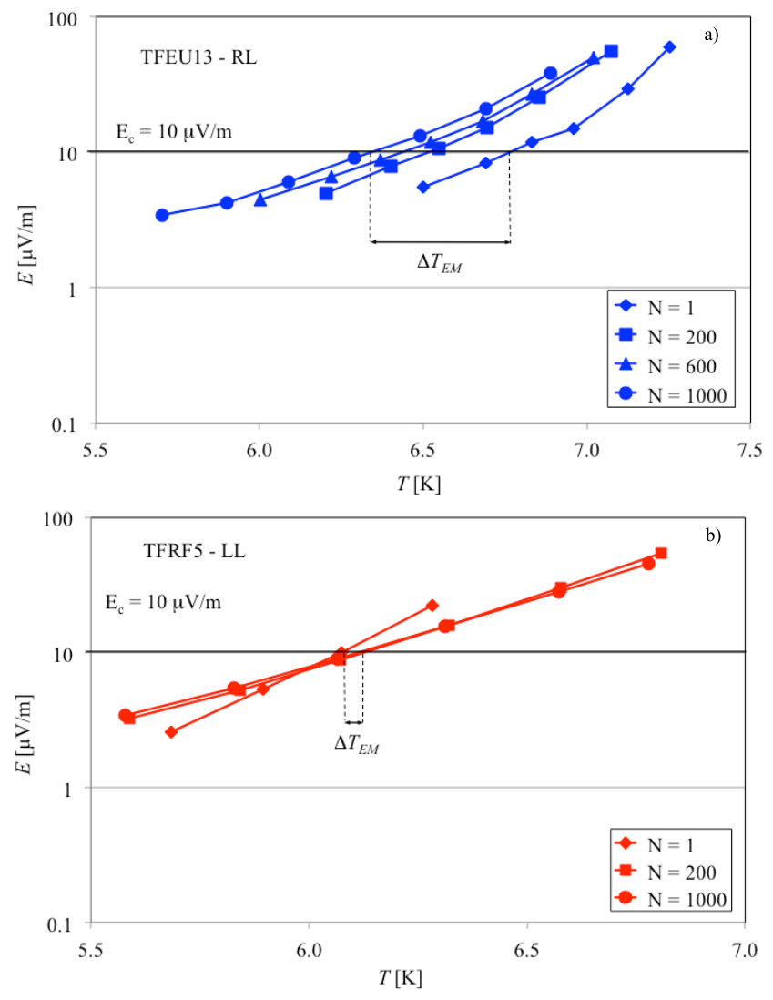

**----- Start of picture text -----** 
a) b) **----- End of picture text -----** 

**Figure 3.** (a) Evolution of the _E–T_ cable characteristics with EM cyclic loading, corresponding to sample TFEU13, right leg. (b) Evolution of the _E–T_ cable characteristics with EM cyclic loading, corresponding to sample TFRF5, left leg. 

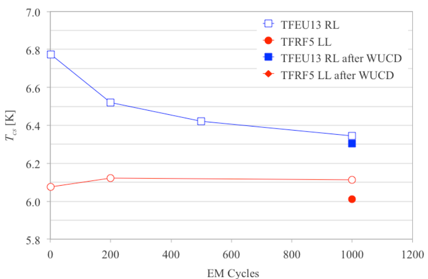

**Figure 4.** Effect of electromagnetic cyclic loading on _Tcs_ , for the conductors of the TFEU13 Right Leg and TFRF5 Left Leg. Contrary to TFEU13, the TFRF5 conductor exhibits a _Tcs_ enhancement during EM cycling. 

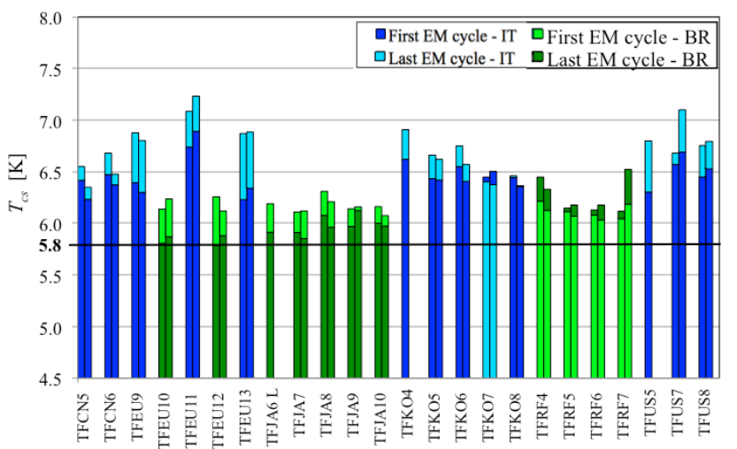

**Figure 5.** Summary of all selected sample test results from SULTAN. Two bars are reported for each conductor, referring to the voltmetric _Tcs_ values before and after EM cyclic loading. 

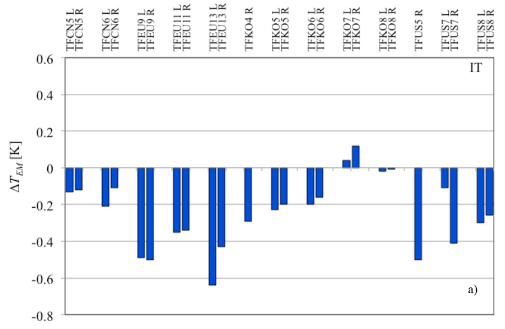

**----- Start of picture text -----** 
a) **----- End of picture text -----** 

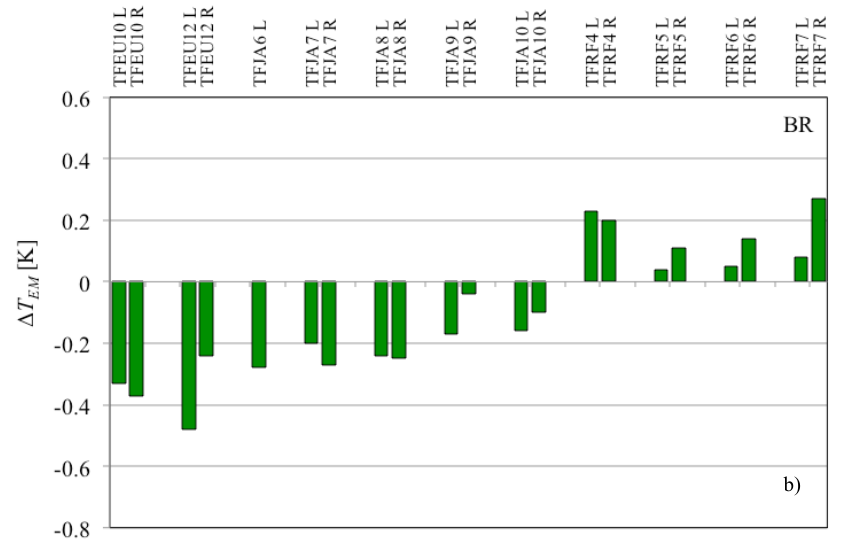

**----- Start of picture text -----** 
b) **----- End of picture text -----** 

**Figure 6.** EM cyclic loading drops of _Tcs_ for (a) IT strand and (b) BR strand conductors. 

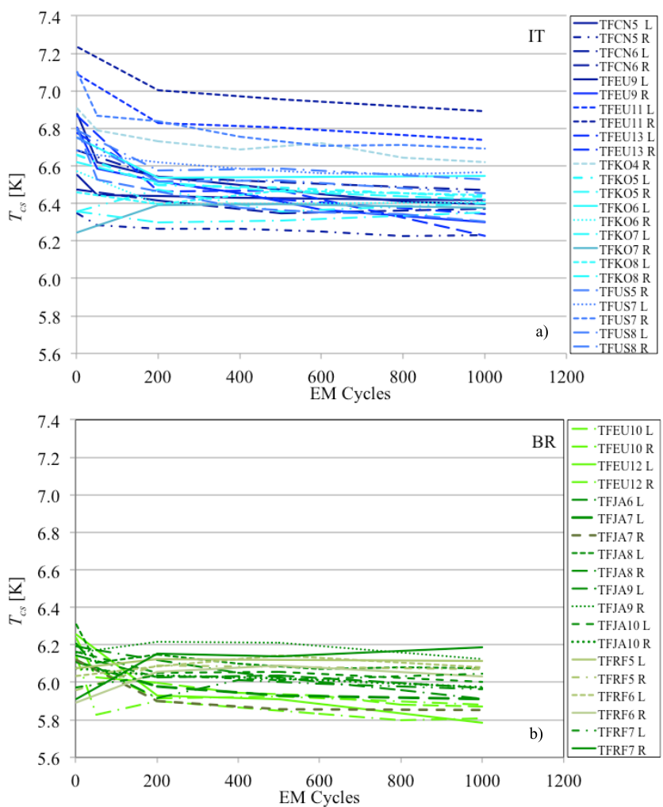

**----- Start of picture text -----** 
a) b) **----- End of picture text -----** 

**Figure 7.** Summary of _Tcs_ variation with EM cyclic loading for (a) IT and (b) BR strand conductors. 

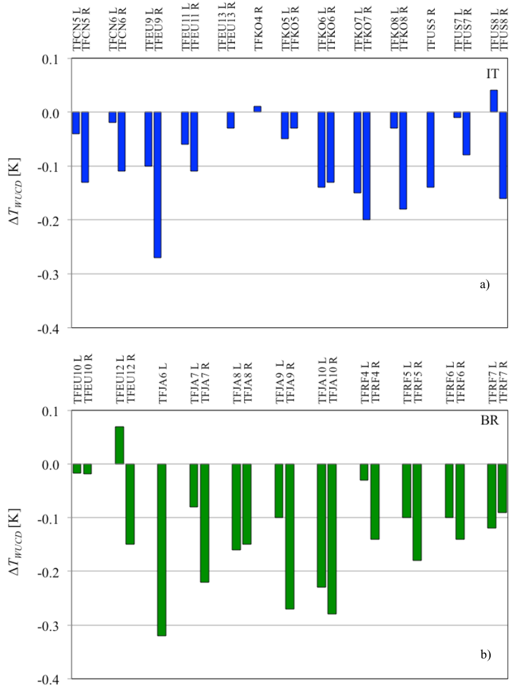

**----- Start of picture text -----** 
a) b) **----- End of picture text -----** 

**Figure 8.** WUCD drops of _Tcs_ for (a) IT and (b) BR strand conductors. 

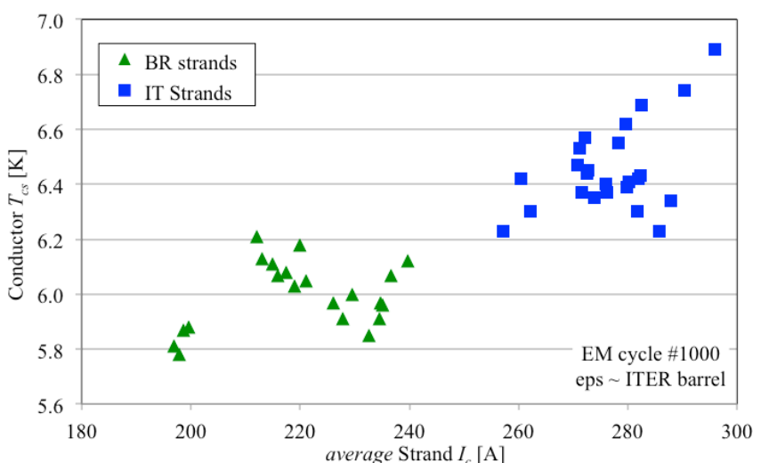

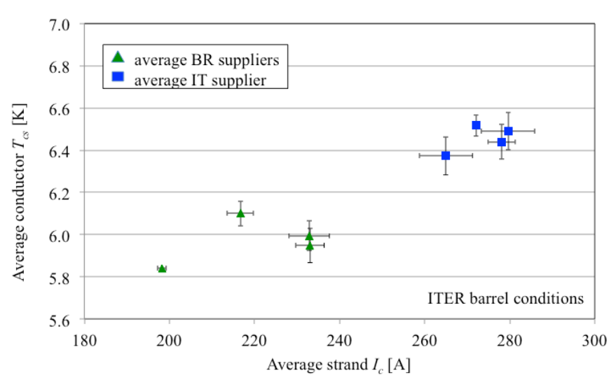

**Figure 9.** a) _Tcs_ and _Ic_ data for all tested samples. The reported _Tcs_ value is the one measured at the last EM cycle; the _Ic_ value is the one measured by suppliers on the ITER barrel, weighted on the strands occurrence in each conductor. b) _Tcs_ and _Ic_ data averaged over the results obtained from the group of samples produced starting from the wires provided by each of the 8 strand suppliers, with the corresponding standard deviations. 

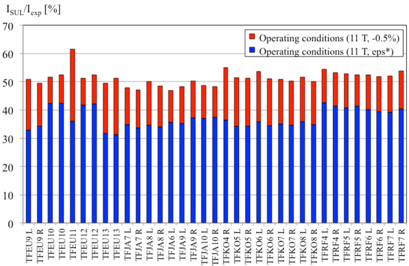

**Figure 10.** In red: ratio between the critical current of the strands in the SULTAN Tcs test ( _ISul_ ) and the expected critical current of the strand ( _Iexp_ ) at -0.5 % effective strain. In blue: ratio between the critical current of the strands in the SULTAN _Tcs_ test ( _ISul_ ) and the expected critical current of the strand at effective strain corresponding to the measurements on the ITER barrel (eps*). 

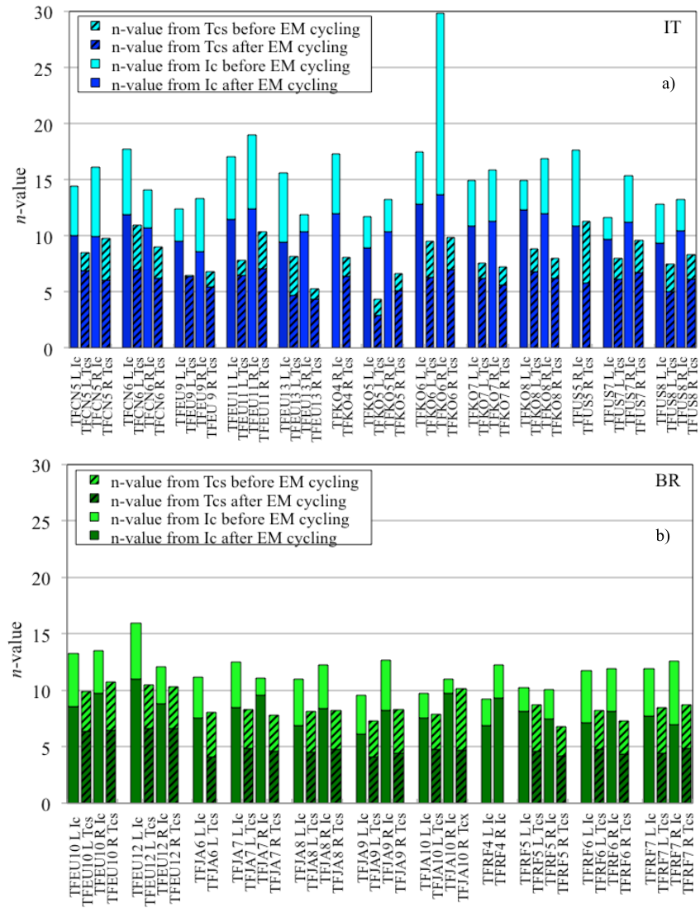

**----- Start of picture text -----** 
a) b) **----- End of picture text -----** 

**Figure 11.** Conductor _n-values_ as derived from _Ic_ and _Tcs_ runs before and after cyclic loading, (a) Internal Tin-type and (b) Bronze-type. 

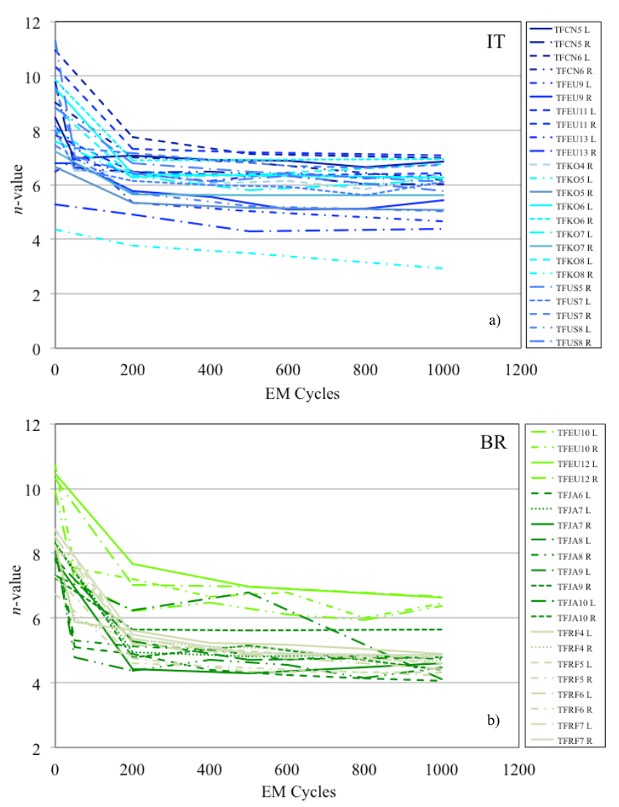

**----- Start of picture text -----** 
a) b) **----- End of picture text -----** 

**Figure 12.** Conductor _n-value_ variation with EM cyclic loading for (a) IT and (b) BR conductors. 

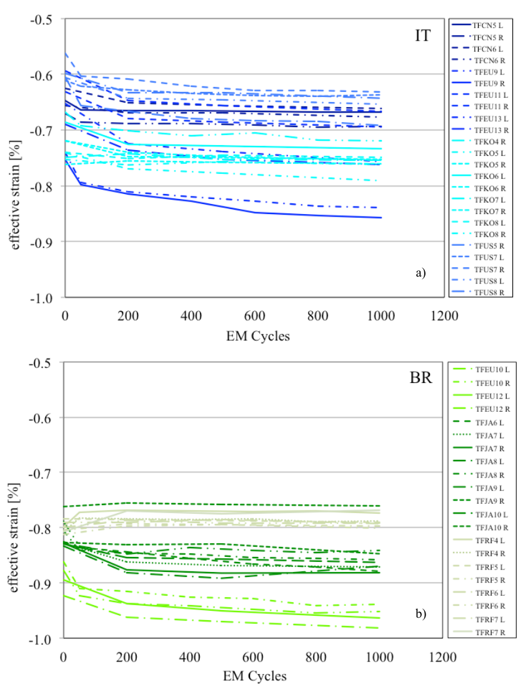

**----- Start of picture text -----** 
a) b) **----- End of picture text -----** 

**Figure 13.** Conductor _effective strain_ variation with cyclic loading for (a) IT and (b) Bronze conductors. 

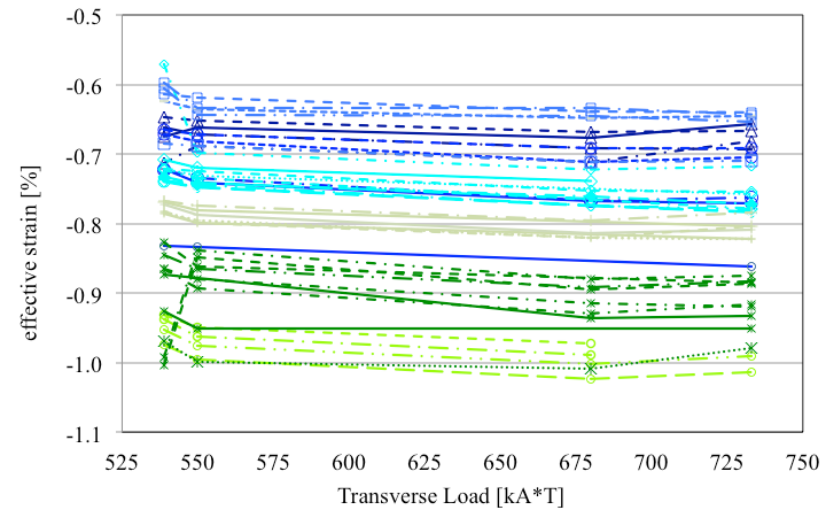

**Figure 14.** Conductor _effective strain_ variation with applied transverse load ( _IxB_ ) for all strand types. Results are derived from the measurements performed after WUCD at different _IxB_ conditions. The same colors used in Fig. 13 indicate the various conductor samples. 

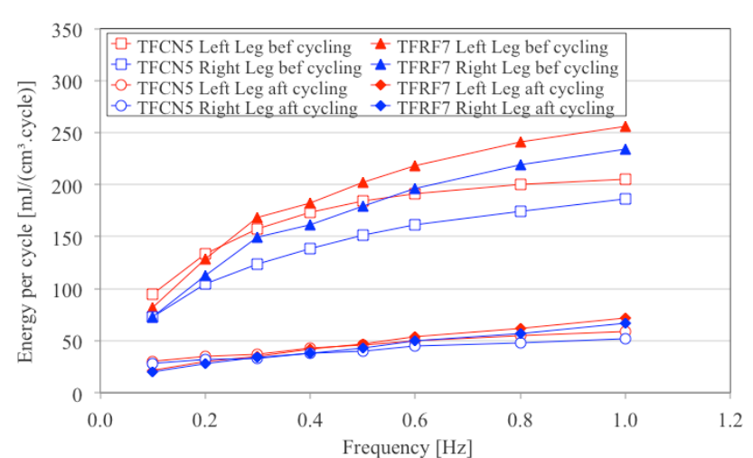

**Figure 15.** Conductor AC losses as a function of frequency before and after EM cyclic loading for one IT and one Bronze sample. 

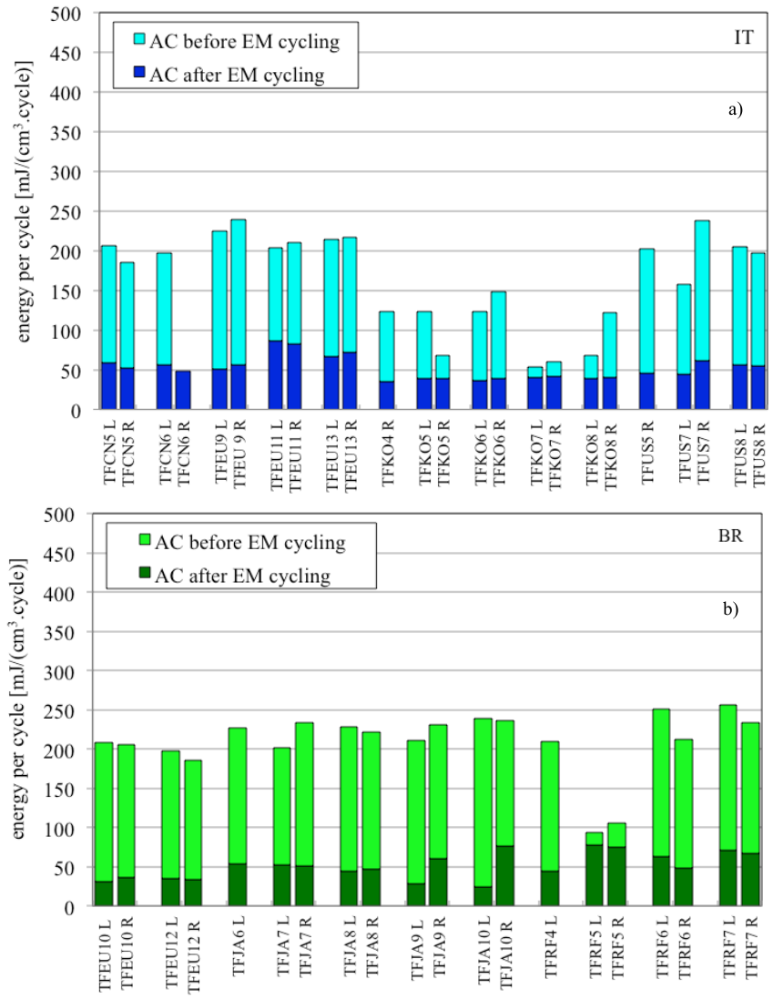

**----- Start of picture text -----** 
a) b) **----- End of picture text -----** 

**Figure 16.** Summary of AC losses at 1 Hz frequency, before and after EM cyclic loading, for (a) IT samples and (b) BR samples. 

