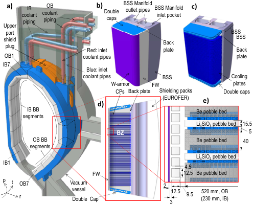
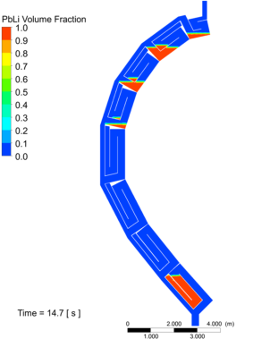
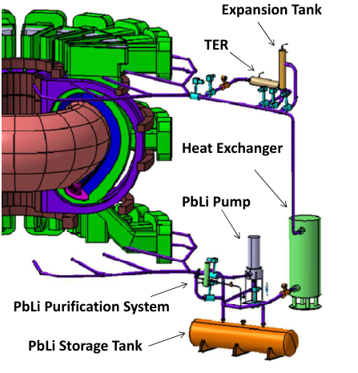
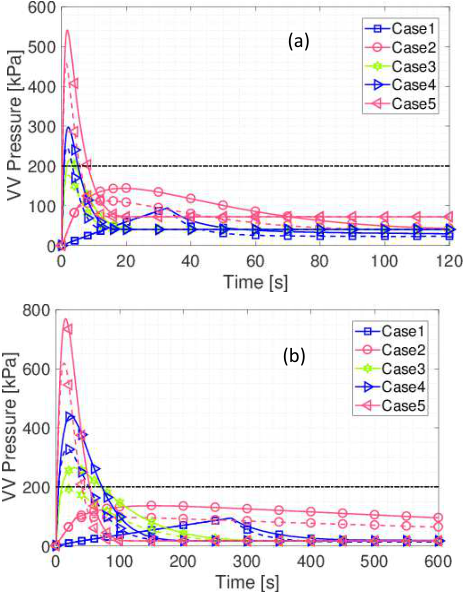
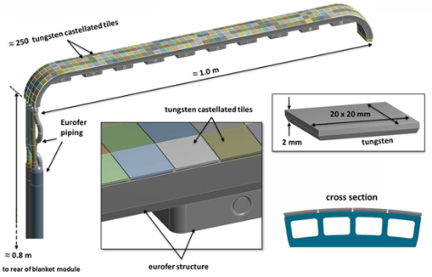
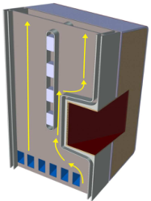
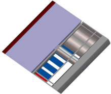

WPPMI-CPR(17) 17709 

FC Cismondi et al. 

## **Progress in EU Breeding Blanket design and integration** 

Preprint of Paper to be submitted for publication in Proceeding of 13th International Symposium on Fusion Nuclear Technology (ISFNT) 

This work has been carried out within the framework of the EUROfusion Consortium and has received funding from the Euratom research and training programme 2014-2018 under grant agreement No 633053. The views and opinions expressed herein do not necessarily reflect those of the European Commission. 

This document is intended for publication in the open literature. It is made available on the clear understanding that it may not be further circulated and extracts or references may not be published prior to publication of the original when applicable, or without the consent of the Publications Officer, EUROfusion Programme Management Unit, Culham Science Centre, Abingdon, Oxon, OX14 3DB, UK or e-mail Publications.Officer@euro-fusion.org 

Enquiries about Copyright and reproduction should be addressed to the Publications Officer, EUROfusion Programme Management Unit, Culham Science Centre, Abingdon, Oxon, OX14 3DB, UK or e-mail Publications.Officer@euro-fusion.org 

The contents of this preprint and all other EUROfusion Preprints, Reports and Conference Papers are available to view online free at http://www.euro-fusionscipub.org. This site has full search facilities and e-mail alert options. In the JET specific papers the diagrams contained within the PDFs on this site are hyperlinked 

## **Progress in EU Breeding Blanket design and integration** 

F. Cismondi[a] , L.V. Boccaccini[b] , G. Aiello[c] , J. Aubert[c] , C. Bachmann[a] , T. Barrett[d] , L. Barucca[e] , E. Bubelis[b] , S. Ciattaglia[a] , A. Del Nevo[f] , E. Diegele[a] , M. Gasparotto, G. Di Gironimo[g] ,  P. A. Di Maio[h] , F. Hernandez[b] , G. Federici[a] , I. Fernández-Berceruelo[i] , T. Franke[a] , A. Froio, C. Gliss[a] , J. Keep[d] , A. Loving[d] , E. Martelli[f] , F. Maviglia[a] , I. Moscato[h] , R. Mozzillo[g] , Y. Poitevin[m] , D. Rapisarda[i] , L. Savoldi[l] , A. Tarallo[g] , M. Utili[f] , L. Vala[n] , G. Veres[o] , R. Zanino[l ] 

_aEUROfusion Consortium, Programme Management Unit, Garching, Germany bKarlsruhe Institute of Technology, Karlsruhe (KIT), Germany cCEA Saclay, France dCCFE, Culham Science Centre, Abingdon OX14 3DB, United Kingdom eAnsaldo Nucleare, Corso Perrone 25, 16152 Genova, Italy_ 

_fENEA, Fusion and Technology for Nuclear Safety and Security Department, Italy gCREATE, University of Naples Federico II - DII, Napoli,Italy hUniversitá di Palermo, Italy_ 

_lNEMO group, Politecnico di Torino, C.so Duca degli Abruzzi 24, 10129 Torino, Italy_ 

_mThe European Joint Undertaking for ITER and the Development of Fusion Energy (F4E), Barcelona, Spain nEnergetics & Fusion Technologies dept, Centrum výzkumu Řež s.r.o. Czech Republic oWigner Research Centre for Physics, Budapest, Hungary_ 

In Europe (EU), in the frame of the EUROfusion consortium activities, four Breeding Blanket (BB) concepts are being developed with the aim of fulfilling the performances required by a near-term fusion power demonstration plant (DEMO) in terms of tritium self-sufficiency and electricity production. The four blanket options cover a wide range of technological possibilities, as water and helium are considered as possible coolants and solid ceramic breeder in combination with beryllium and PbLi as tritium breeder and neutron multipliers. The strategy for the BB selection and operation has to account for the challenging schedule of the EU DEMO, the ambitious operational requirements of the BBs and the still large development needed to have a BB qualified and licensed for operating in DEMO. In parallel to the continuous design efforts on the four blanket concepts, their integration in-vessel and ex-vessel has started. On the one hand it has become clear that despite the numerous systems to be integrated in-vessel the protection of the blanket first wall has to be addressed with highest priority. On the other hand the ex-vessel interfaces and the requirements imposed by the blanket to the primary heat transfer system and to the PbLi loop components have a considerable impact on the whole DEMO Plant layout. 

The aim of this paper is: to present the strategy for the DEMO BB down selection and BB operation in DEMO; to describe the status of the design evolution of the four EU BB concepts; to provide an overview of the challenges of the in-vessel and ex-vessel integration of the main systems interfacing the BBs and describe their design status. 

Keywords: Breeding Blanket, Balance of Plant, In-vessel and ex-vessel components. 

## **1. Introduction** 

As part of the Roadmap to Fusion Electricity Horizon 2020, Europe initiated in 2014 a comprehensive design study of a DEMOnstration Fusion Reactor (DEMO) with the aim of generating around the middle of the century, several hundred MWs of net electricity and operating with a closed tritium fuel-cycle - achieving the so-called tritium self-sufficiency [2]. The component that in DEMO will accomplish the function of breeding the tritium is the Breeding Blanket (BB). Taking into account the ambitious schedule of the DEMO roadmap and the novelty and feasibility concerns of most of the technologies used in the BB design a sustained program of R&D is implemented in EUROfusion, in the Work Package Breeding Blanket (WPBB), to accompany the development and selection of the reference BB concept. 

The design and integration work conducted to date shows clearly that some technical features of the BB (the 

type of coolant, the type of breeder, the technology used for the Tritium extraction) impact not only the design of the BB itself but also the design of the interfacing systems and as a consequence of the overall tokamak layout. The systems most impacted by the architecture and technological choices of the BB are the Primary Heat Transfer System (PHTS) [3], the Tritium extraction and coolant purification system, the Vacuum Vessel Pressure Suppression System (VVPSS), the systems requiring in-vessel penetrations, the Remote Maintenance [4][5] as well as the safety of the plant. It is thus clear that a selection of the BB for DEMO should not be solely based on performance criteria of the BB, but should account for the interfacing systems, the tokamak integration and the safety approach. 

This paper is divided in three main parts which describe: the current strategy for the DEMO BB down selection and BB operation in DEMO; the recent progresses in the design of the four EU BBs concept; the 

_________________________________________________________________________________ 

_author’s email: fabio.cismondi@euro-fusion.org_ 

challenges of the in-vessel and ex-vessel integration of the main systems interfacing the BBs. 

BB in 2024 will enable to prioritize and carry out the R&D needed to reach the DEMO conceptual plant design in 2027. 

## **2. Strategy for the Breeding blanket selection and operation for the EU DEMO** 

## **2.1 Strategy for the Breeding Blanket selection** 

In the EU strategy DEMO should operate shortly after the middle of this century [6]. Considering the time needed to gather essential results from the TBM program in ITER, the time needed to reach the maturity level of the technologies to be implemented in DEMO and the typical time needed for licensing a nuclear facility, it appears clearly that only limited technological extrapolation can be considered for the DEMO BB design and technologies. This approach while minimizing the technical risks for a DEMO BB could leave some gaps to qualify a BB fully usable for a future commercial reactor: in a commercial fusion plant the BB system should achieve acceptable Cost of Electricity (CoE) along with a target lifetime of at least 100-150dpa, high reactor efficiency (roughly net electrical production vs. installed fusion power), high availability, etc. 

The EU DEMO is meant to maintain a certain flexibility and to be operated as a component test facility for the BB, and the key requirements of the BB, namely the electricity production and the operation with a closed tritium fuel cycle, can be pursued by a driver BB making use of available/mature technologies, while the long term goals can be pursued using advanced BB that make use of more risky/performant technologies. The driver BB must be a near-full coverage blanket concept to be installed by day-1. Advanced BB concepts having the potential to be deployed in a commercial reactor should be tested in properly designed and supported segments: in fig.1 a complete sector is dedicated to advanced blanket segments. The test of advanced blankets will be done using an experimental cooling loop (that can be independent and different from the main one) that could be decoupled or only partially integrated in the main power system (see fig. 2). The overall tritium production of driver and advanced BBs must ensure the DEMO tritium self-sufficiency. Remote Maintenance (RM) will be common for all the blankets forcing the BB to have comparable designs in terms of integration and geometry. 

In the activities of the EU WPBB three coolants (helium, water and PbLi) and two combination of breeder/neutron multiplier (PbLi and Lithium ceramics/Beryllium) are presently considered as potential options for the driver BB. The WPBB will consolidate and quantify the list of BB down-selection criteria (whose first release will be issued by the end of 2017) in view of the pre-conceptual design review planned in 2020. The selection of the best option for the DEMO driver and advanced BBs is expected in 2024. The criteria associated to the selection process will take into account elements provided by the design and R&D program, by the inputs of the DEMO key interfacing systems and by the **R** eturn **o** f e **X** perience (RoX) of the ITER TBM program. A selection of driver and advanced 

Fig.1. Possible configuration of advanced blanket tested in one dedicated sector of DEMO. 

Fig.2. Layout of the PHTS for the driver blanket and coolant loop for the advanced blanket. The driver blanket PHTS is the WCLL one where the pressurizers are not displayed to improve the readability. 

In the BB development three main R&D phases have been identified. The present R&D (“Phase I”) to be continued until the driver blanket selection in 2024 aims at investigating single effects at laboratory level (corresponding to the Level 3 of technical readiness according to the DOE definition [7]) and multiple effects on small/medium scale. A “Phase II” of the R&D to be started after 2024 and prolonged at least up to 2040 (when the first results of the TBM tests in ITER nuclear phase are expected) will address multiple effects at medium/large scale to support the conclusion of the conceptual phase and the engineering phase on the selected BB concepts. A “Phase III” of the R&D work will accompany the Engineering design and the DEMO construction. For a complex system like the blanket design verification and reliability data must be developed in integrated non-nuclear tests: no plan exists at the moment but there is the certainty that a large scale multi-effect experiment will be necessary to provide the integrated qualification environment of the blanket 

components including coolants loops, Tritium systems and RM. Considering the costs and effort needed for large facilities necessary in Phase II and III international collaborations can be of great benefit. An example is the on-going upgrade of the MaPLE facility by an integrated US-EUROfusion team, to address complex multiple effects on PbLi flows in high magnetic fields [8]. 

Additionally a consistent decision on the DEMO driver and advanced BBs and then the execution of the engineering design for driver and advanced BBs can be possible only considering the RoX provided by the TBM program in the following areas: regulatory and licensing aspects; design and R&D of TBM set and ancillary systems; safety aspects; manufacturing of TBM and ancillary systems; operation at ITER and fundamental data; maintenance; rad-waste. In the EU a technical assessment is currently in progress to streamline the TBM and DEMO BB programs and make sure that the DEMO BB development can benefit at the most and in all development stages of the EU TBM efforts and results. Other than the essential RoX all along the DEMO R&D program, the timely operation of the TBM in ITER in the nuclear phase remains essential in order to collect nuclear data for validating the tritium production and transport modelling  tools which are used also for the design of DEMO BB. 

## **2.2 Strategy for the Breeding Blanket operation** 

Presently, it is foreseen that DEMO will utilize a first starter blanket with a 20 dpa damage limit in the firstwall (EUROFER) together with conservative design margins and then switch to a second set of blankets with a 50 dpa damage limit with an optimized design, and if available, improved structural materials. Because it is unfeasible to change the BoP, the same coolant must be used while switching from the first set to the second set of blankets. The assumption is that the licensing approval for operation up to moderate damage and activation could be obtained for the starter/driver blanket and for the first set of advanced blankets, while highdose engineering data for more advanced blanket structural materials are being generated. 

In structural materials used in fusion neutron irradiation causes displacement damage (elastic scattering, dpa) and transmutations (gaseous helium and hydrogen, appm) leading to degradation of properties that significantly depend on the irradiation temperature, and that often exhibit steep jumps functions and/or thresholds [9][10][11][12]. Generally, and dependent on stress and strain levels, “critical damage mechanisms” at “low” operational temperatures (e.g. <350°C) include irradiation hardening and embrittlement, reduction in fracture toughness (in particular the shift in the ductilebrittle transition temperature (DBTT)), whereas at “high” temperatures (e.g. >550°C) helium embrittlement and reduction in fatigue(-creep) life are dominant. At “intermediate” temperatures (“non-damaging”) swelling and irradiation creep may lead to dimensional instability. Because of the complex dependency by the operational conditions and multiple parameters it appears meaningful to define “safe” design areas instead of one 

temperature value as limiting condition for the BB operation. 

For some properties the use of material data produced by irradiation campaigns in fission reactors for licensing of the starter/driver blanket is limited by the substantial higher helium production under fusion irradiation. In steel under FW conditions (the location where the fusion spectra is peculiar) there will be ~40 times more helium than under fission neutron spectra and a helium production rate of ~10appm/dpa. There is evidence that “additional” helium effects are modest below 20 dpa and therefore a high scientific confidence in being able to predict the properties of fusion materials up to damage levels of at least 20 dpa on the basis of irradiation tests in fission reactors (supplemented by multi-beam ion irradiation, spallation sources and modeling) [11][13]. Regulatory approval to use fission reactor data will nevertheless require substantial technical interactions with the regulator (including development of appropriate predictive physical models of material properties degradation, and detailed analyses of all credible design basis accident scenarios). Furthermore the parallel completion of the material database with the timely operation of IFMIF/DONES will provide the key information necessary to validate preliminary assumptions on ”design allowable” limit data. For the second phase of the BB the performance limits strongly depend on the operational FW temperature and to give clear evidence is as of today not possible: the 50dpa target could be close to the performance limits of the current RAFM steels. Advanced steels under development and optimized in different routes for “low” and “high” temperature application may be tuned towards a gain in performance in temperature operational window or tolerable neutron flux. To license any BB operated above 20 dpa a comprehensive irradiation campaign in a dedicated fusion-like neutron sources is mandatory. 

The strategy to operate a first set of starter blanket in DEMO is well justified also by BB thermo-mechanical design performances. DEMO will start with several (potentially large) remaining uncertainties in particular in the loading conditions (steady state and transient heat loads on the BB First Wall). This suggests a design of the first set of starter blanket with large margins in the thermo-mechanical design. A possibility is to decouple from the thermo-hydraulic and mechanical point of view the FW, or at least part of it, from the BB main structure [14]. For the second set of blankets these margins can be reduced considering the performance of the machine in the first phase and the possibility to rely on stable and controlled heat loads. Studies are ongoing to quantify the expected uncertainties and to transform them into design margins as requirements for the first set of blankets [15]. 

## **3. Design progresses of the EU Breeding Blankets for DEMO** 

Four different concepts are presently developed in EU [16] as candidates for the DEMO driver BB: Helium Cooled Pebble Bed (HCPB), Helium Cooled Lithium Lead (HCLL), Water Cooled Lithium Lead (WCLL) and 

Dual Coolant Lithium Lead (DCLL). The recent progresses in the design of each concept are summarized in this section. 

## **3.1 HCPB** 

The HCPB is one of the two EU BB concepts to be tested in the TBM program in ITER. A large design review was conducted in 2015 [17] [18] to the former DEMO HCPB design, which resulted to be not adequate to the current reactor needs. The design revision led to the current new design [19] (Fig. HCPB). The current HCPB is built on the basis of the so-called Multi Module Segmentation (MMS), which divides the BB segments into 7 In-Board (IB) and 7 Out-Board (OB) modules. Each module is formed by a U-shaped FW, a backplate and upper and lower caps. The internals of the module are formed by an arrangement of radial-toroidal Cooling Plates (CP), featuring toroidal cooling channels with coolant flowing in counter-current as in the FW. Inbetween the cooling plates, alternate pebble beds of a ternary lithiated compound (Li4SiO4 as reference, 60% 6Li enrichment) and Be are used as breeder and neutron multiplier functional materials respectively. The CPs together with the functional material conform the socalled Breeder Zones (BZ). The structural material is EUROFER97 and Helium is chosen as gas coolant at 80 bar and inlet/outlet temperatures of 300/500 °C, with the option to raise the inlet temperature to 330 °C÷350 °C [17][21]. The produced tritium is purged from the ceramic and Be pebble beds by a separate low-pressure helium purge gas circuit at low velocity [19]. 

Two BZ configurations are defined, corresponding to a “short” BZ (OB BZ: 520 mm, IB BZ: 250 mm) and a “long” BZ (OB BZ: 820 mm, IB BZ: 450 mm). They both address different reactor needs: the “long” version leads to a maximum TBR (1.26), which would be suited for very adverse reactor configurations in terms of blanket coverage, however penalizing the BB radial thickness and the functional material inventory. The “short” version leads to a lower TBR of 1.15, which is at the moment still appropriate (TBR requirement for DEMO is currently set at 1.10), but it allows a radially thinner BB (about 300 mm less than for the “long” version), bringing the VV closer to the plasma and thus increasing its passive vertical stability [20] and resulting in lighter segments with reduced functional material inventories. 

Preliminary thermohydraulic and thermomechanical analyses for normal and off-normal (in-box and exvessel LOCA) analyses have been performed [21][22], showing adequate performance figures in terms of temperature, pressure drops (∆p) and stress distributions. The current maximum ∆pBB = ∆pFW + ∆pBZ ≈ 1.5 bar, is about 50% of the former HCPB BB version. The temperatures globally meets the design limits, showing only very localized hot spots in the functional and structural materials of <5%. The design of the HCPB segments and the BSS have been developed together with the BB fixations system for normal and off-normal (central disruption event (CDE) [21] and CDE+ex-vessel LOCA [22]), fulfilling in all cases the structural assessment. 

**----- Start of picture text -----** 
a)  coolant IB  coolant OB  b)  Double  BSS Manifold outlet pipes  BSS Manifold inlet pocket  c) piping piping caps Upper shield port  Back  BSS BSS plug Red: inlet  plate  Back OB1 coolant pipes plate IB7 Blue: inlet coolant pipes BSS  Cooling W-armor  FW  plates CPs  Back plate  Shielding packs  Double caps d)  (EUROFER)  e) IB BB  Be pebble bed segments Li4SiO4 pebble bed  15.5 BZ  5 OB BB  Be pebble bed  40 segments IB1 Li4SiO4 pebble bed 4.5 FW  12.5  Be pebble bed p t OB7 Vacuum  2 r vesselDouble  Cap  3 12.5  9.5  (230 mm, IB) 520 mm, OB **----- End of picture text -----** 

Fig.3. HCPB BL2015: a) HCPB DEMO1 sector; b), c) 3D views of a module; d) section cut of a module; e) detail of the breeder zone. Coordinate axis: _p_ =poloidal, _t_ =toroidal, _r_ =radial. 

Preliminary thermohydraulic and thermomechanical analyses for normal and off-normal (in-box and exvessel LOCA) analyses have been performed [21][22], showing adequate performance figures in terms of temperature, pressure drops (∆p) and stress distributions. The current maximum ∆pBB = ∆pFW + ∆pBZ ≈ 1.5 bar, is about 50% of the former HCPB BB version. The temperatures globally meets the design limits, showing only very localized hot spots in the functional and structural materials of <5%. The design of the HCPB segments and the BSS have been developed together with the BB fixations system for normal and off-normal (central disruption event (CDE) [21] and CDE+ex-vessel LOCA [22]), fulfilling in all cases the structural assessment. 

Due to the high complexity and integration problems identified for the BoP with the former 50%-“redundant” (or parallel) cooling scheme shown in [19], the current version of the coolant and purge gas feedpipes is solved with a single pipe for the inlet and outlet coolant (OB: DN300 and DN350, IB: DN250 and DN300, respectively) and purge gas (OB and IB, inlet and outlet: DN80) per segment. The pipes are all routed through the upper port, releasing the lower port from RM operations. Due to the relatively large size of the coolant pipes, these are locally connected to the segments with pipe reducers, in order to match the RM requirements of DN200. 

## **3.2 HCLL** 

The HCLL is currently one of the two EU BB concepts to be tested in the TBM program in ITER. The HCLL Blanket System is based on the use of EUROFER as structural material, the eutectic Pb–15.7Li enriched at 90% in[6] Li as breeder, neutron multiplier and tritium carrier and helium gas as coolant with inlet/outlet temperature of 300/500 °C and 80bar pressure. 

The design strategy of the HCLL BB consists in adopting a reference design option while exploring 

possible improvement in two alternative designs. The alternative designs feature a different design of the BZ. These three options are defined as OptimizedConservative, Advanced, and Advanced-Plus [23]. The optimized conservative adopt an internal design similar to the one used for the design of the HCLL TBM box, namely using an array of internal vertical and horizontal stiffening grids and two CPs in each BZ. The Advanced version features horizontal stiffening plates and two CPs, while the Advanced-plus relies only on a higher number of horizontal stiffening plates. The Advanced-plus version is optimized to achieve higher TBR. 

Important efforts have been made in optimizing and analyzing several configurations for the three design options with the goal to enhance their TBR and shielding performances while minimizing the risk not to fulfil design criteria. Considering the promising performances of the Advanced-plus option, it has been decided to define this design as reference for the HCLL, while the Optimized-Conservative one remains as the backup solution (less TBR). Detailed CFD analyses have been performed on the in-modules manifolds area in order to decrease the pressure drops: the re-design of the FW channels connections to the manifolds allowed to decrease by 60% the pressure drops in this area [23]. 

The Back Supporting Structure has been redesigned with the aim to reduce pressure drops, to have a better shielding and to keep the temperature of the BSS structure as low as possible in order to reduce thermomechanical stresses (see fig.5). An effort has still to be made to route all of the pipes through the upper port. The Inboard BSS radial thickness has been increased to reduce the pressure drops without affecting the overall TBR performances. Massive CFD calculations have been performed to optimize the geometry and allowed a reduction of pressure drops in the Inboard by a factor 10 [23]. 

Fig.5. Layout of the HCLL BSS. 

## **3.3 WCLL** 

The WCLL BB relies on the Pb–15.7Li as breedermultiplier, pressurized water as coolant and EUROFER as structural material [24][25]. Latest evolution of the WCLL BB is represented by the Single Module Segment (SMS) approach [24] (Fig.6): the same basic geometry is 

repeated along the poloidal direction. The power is removed by means of radial-toroidal (i.e. horizontal) water cooling tubes in the breeding zone. The lithium lead flows in radial-poloidal direction. On the back of the segment a 100mm thick plate is in charge of withstanding the loads due to normal operation and selected off-normal events. Water and lithium lead manifolds are designed and integrated with a consistent PHTS: after integration and optimization of the BB design with the PHTS the coolant temperature operating conditions have been revisited to 295-328 °C, at 155bar [26]. 

For the SMS WCCL detailed thermo-hydraulics CFD analyses showed that BZ cooling performances are satisfactory, as the maximum temperature reached in the structures is well below the limit (550 °C). Areas of improvement have been identified and efforts are ongoing in order to: guarantee the temperature symmetry in toroidal direction, improve the cooling performances by increasing the coolant velocity, reduce the total length of pipes simplifying the layout. Thermal analyses of inboard and outboard BSS suggested that active cooling of inboard BSS is unavoidable to maintain temperature below limit of 550 °C. 

Fig. 6. WCLL SMS design with view of the BZ and U- sahpe pipe layout. 

While in case of the MMS approach (adopted by the other EU BB concepts) each module has to resist to the possible pressurization due to an in-box LOCA, in case of the SMS the plates closing the top and bottom of the segment have to be reinforced carefully against this event. The SMS approach is expected to bring important advantages for the neutronic performances of the BB (high TBR) as gaps and large steel plates are minimized in the segment. On the other hand, in the MMS approach the gap in between the single modules allows compensating the larger thermal expansion of the FW; in the SMS approach the poloidally continuous FW will undergo larger thermal expansion. As both approaches have advantages and drawback the WCLL design exploiting the SMS approach is an opportunity to gain a deeper insight on the better design solution for the BB [24]. Extensive thermo-mechanic analyses have been carried out to compare the SMS and MMS concepts in terms of their thermo-mechanical performances. Thermo-mechanical and EM loads have been considered, both in normal and off-normal operating scenarios. Results obtained show that, as for the outboard blanket segment, the SMS concept seems to fulfill the SDC-IC structural design criteria with a larger 

margin compared to the MMS approach: the FW structural behaviour is being assessed [27]. The deformation fields for the MMS and SMS in case of central major disruption have been compared: the BB fixations should be designed carefully in case of SMS to compensate for the larger vertical deformation towards the upper port. 

## **3.4 DCLL** 

The DCLL is based on the use of PbLi as breeder, main coolant, neutron multiplier and tritium carrier, while helium at 80bar is used to cool specific parts of the EUROFER structure, mainly the FW. Although historically developed to exploit high temperatures towards high efficiency of the plant by using the liquid metal PbLi as coolant at high temperature, the DCLL studied in EU is mainly characterized for working at the maximum temperature of the EUROFER (<550 °C) [28][29], with the aim of using available materials and technologies (e.g. heat exchanger for PbLi). Thus, the power extracted by both coolants is 66/34%, PbLi/Helium, which is of special interest for the PHTS due to the lowest pumping power required for the liquid metal compared with the gas. The DCLL thermalhydraulics performances have been optimized to have outlet temperatures of 548ºC for the PbLi and of 445ºC for the helium. Inside the modules, the BZ is composed by several PbLi circuits where the liquid metal flows in parallel mainly in poloidal direction. These circuits are separated by means of radial stiffeners, which have been increased to achieve a more robust connection with the FW (the number of PbLi parallel circuits in one module is 5-7, depending on the module, see Fig.7); the toroidal stiffening plates have been reduced from 2 to 1 (therefore reducing the PbLi poloidal channels from 3 to 2). 

characterized [29]. Recent tests have shown excellent electrical and mechanical properties after submitting FCI prototypes to several strong thermal cycles (from room temperature up to 600 ºC) and thermal gradients between surfaces (200 ºC). 

The BSS integrates the service connections for all the modules and accomplishes shielding and supporting functions. It includes a series of poloidal ducts covering the whole length of the segment which feed/recover the coolants to/from the modules. The BSS has been extended in radial direction to improve its structural behavior (with a consequent reduction of the BZ from 910mm to 630 mm for the OB central segment). Thus, more space is allocated for both coolants (PbLi and He) and, consequently, their velocities are lower, implying lower pressure drops and corrosion. This change in the radial length has not compromised the overall TBR of the DCLL, being 1.196. 

After optimization of the internal design and of the BSS design, a customized 3D transient numerical model has been set-up to assess the maximum drainable amount of PbLi by gravity. It shows that the present layout allows draining 90% of the liquid metal in few seconds (see Fig. 7). This result is also relevant for other BB concepts based on PbLi 

## **4. Main systems impacted by the Breeding Blanket architecture and technology** 

## **4.1 Primary Heat Transfer System** 

Fig. 7. DCLL equatorial module: flow scheme in the Back Supporting Structure (left) and PbLi flow scheme inside the module (right). 

The internals of the DCLL modules have been redesigned in order to allow the maximum achievable draining of the segments. In addition, the PbLi internal manifold has changed from concentric pipes to separated square connections, which also considerably reduce the MHD pressure drop. MHD pressure drop in straight channels is mitigated by using Flow Channel Inserts (FCI), and some prototypes are being fabricated and 

Presently, work is ongoing to assess the design and technological problems posed by PHTS of the BB, as the power to be extracted from the BB represents more than 80% of the entire heat generated in the reactor [3][30]. The aims of these investigations are to:  evaluate the dimensions of the PHTS main components (e.g. steam generators, circulators/ pumps, pipes, collectors) and identify technical feasibility issues; understand the commercial availability of components and the potential R&D needs; establish the PHTS layout requirements and evaluate the integration implications with other systems inside the tokamak building. The pulsed nature currently considered for the DEMO reactor operation imposes 

unique design problems on the Power Conversion System (PCS): the energy in DEMO  will be generated for 120 min (burn time) followed by the reactor dwell time (estimated to last 10 min) mandatory in a tokamak device for recharging the transformer. An Intermediate Heat Transfer System (IHTS) equipped with an Energy Storage System (ESS) using Molten Salt as heat transfer fluid is being investigated to mitigate the impact of plasma pulsing on PCS equipment (in particular in the steam turbine) and in electrical grid. 

Preliminary conceptual designs for both BB Helium Cooled Pebble Bed (HCPB) PHTS, operating He at 300500°C and 80 bar, and BB Water Cooled Lithium Lead (WCLL) PHTS, operating water at 295-328 °C and 155bar, and the associated PCS have been developed [31][26].  They are considered to be feasible and no major showstoppers have been identified. In this context, the HCPB PHTS can be also be considered representative for the HCLL concept. The sizing of the PHTS enables the estimation of the coolant inventory and the associated enthalpy, which together with the PHTS system segmentation and layout are essential data for progressing with accidental safety analyses and for the design of key systems like the Vacuum Vessel Pressure Suppression System (VVPSS), which is an important safety-class component. 

Assuming a fusion power of 2037 MW and the power deposited in the HCPB and WCLL of 2389 MW and 2045 MW respectively, the main features and identified issues of the two associated PHTS are briefly discussed here (for more details see [3][30]). The HCPB conceptual design foresees a high degree of segmentation of the BB PHTS cooling loops which are 3 and 6, respectively for IB and OB [31][32] (Fig.8). The BB PHTS delivers, by means of 9 Intermediate Heat Exchangers (IHXs), the thermal power extracted by helium to an Intermediate Heat Transfer System (IHTS) equipped with an Energy Storage System (ESS) that relies on the use of molten salt as coolant. The DEMO WCLL BB is connected with two separate PHTSs, which cool respectively the BZ and the FW [26] (Fig. 9). Both PHTSs present two (dependent) cooling loops but the former is directly connected with the PCS by two Once Through Steam Generators (OTSGs), whereas the latter adopts two IHXs which link it with an IHTS equipped with an ESS. In case of helium the pumping power is ~150MW, one order of magnitude higher than in case of water (~15MW). Accurate design studies are on-going to reduce the pressure drop in the helium loops and consequently the requested pumping power. With the present layout the HCPB PHTS has ~9km of pipes (1,8km for the WCLL PHTS): if larger pipes can be used for helium (from the current DN_max of 800 to diameters of ~1,3m) the pipe length would be reduced to ~3km. Water coolant will load with significant radiation doses during the pulses the area where the PHTS is located due to the production by high energy neutrons of the N16 and N17 isotopes. Activated corrosion products are also an issue in case of water coolant. The chronic release of coolant from the PHTS are potentially an issue for the helium gas coolant (as also experienced in GEN.IV reactors development). In case of in-vessel 

LOCA the incondensable helium obliges to have much larger expansion volumes to contain the evacuated coolants. 

Fig. 8. HCPB PHTS: 6 out of the 9 loops. These 6 loops feed the outboard BB segments. 

Fig. 9. WCLL PHTS: 2 PHTS for Fw and BZ respectively, each with two loops. 

For the thermo-hydraulic analyses of the integrated BB – PHTS systems there is a strong need for fast computational codes, which would allow parametric analyses to identify the system response to different inputs in a reasonable time. For this reason a systemlevel 1D thermal-hydraulic code the GEneral Tokamak THErmal-hydraulic Model (GETTHEM) is being developed using Modelica® with the aim to become a global EU DEMO thermo-hydraulic code. The code has been successfully applied to the modelling of the HCPB and WCLL BB [33][34] and it being extended to include the corresponding design of the PHTS. 

## **4.2 PbLi loop** 

Three EU BB concepts make use of PbLi. In case of the HCLL and WCLL where the PbLi has no cooling function, the main required functions of the PbLi loop are: to provide adequate heating in order to maintain PbLi in the liquid state in all system locations; to circulate the liquid PbLi through the BB; to extract the tritium produced inside the breeder modules from PbLi (this function is shared with the Tritium Extraction and 

Removal, TER); to control PbLi chemistry and remove accumulated impurities; to ensure gravitational draining of the BB module and the PbLi loop; to accommodate possible overpressures of the liquid metal; to release the helium generated into PbLi. The DCLL PbLi loop has additionally the purpose of removing the power extracted by the PbLi from the BB. Thus the DCLL loop has higher volumes and mass flow of PbLi and its integration is more challenging. 

Each PbLi loop is a closed loop with forced circulation of the PbLi. The loops are composed by: piping and valves; storage tank; expansion tank; pumping system; TER; electrical heater; purification system; instrumentation, heating systems and heat exchanger for DCLL. The WCLL and HCLL loop should be isothermal, but as for now a cooler is planned in order to take into account the possible need to remove heating power from the PbLi before routing it to the pumping system. During the normal operation of the loop a part of the PbLi returning from the BB is flown through isolation valves to enter in the TER system (placed in the hot part of the loop). The PbLi mass flow rate to the TER is in the range 10% up to 100% of the total mass flow rate.  Regulation valves allow the exact adjustment of the PbLi mass flows to be sent to TER or even its complete by-pass. An expansion tank is placed vertically after the TER at the highest level of the loop in order to compensate thermal expansion of PbLi and to allow the release of Helium generated inside the BB. A fraction of PbLi is sent to the purification system (presently estimated ~1%) which is placed as a by-pass line of the pump: the PbLi flow adjustment will be possible by a regulation valve. The PbLi during the nonoperation phases is stored in a dedicated storage tank placed at the lowest possible level with respect to the rest of the loop to allow complete gravity drainage. Dedicated failure disks allow the fast drainage of PbLi in the tank in case of in-box LOCA with the isolation valves intercepting the pressure wave through the PbLi. The PbLi mass flow rate to the IB and OB BB segments will be provided by the same PbLi loop with the need to install regulation valve or calibrated orifice at the manifolds to guarantee the correct mass flow distribution. The vertical position of the loop outlet is imposed by the need to drain by gravity the PbLi inventory of the BB segments, assuming that the PbLi pipes will be inclined in the Port Interspace region by at least 3% towards the connection with the storage tank. 

The updated CAD models of the PbLi loops have been integrated with their main components in the tokamak building (see fig.10). An efforts has been made to reduce the number of the loops (9 and 12 in total in the previous version of the WCLL/HCLL and DCLL PbLi loop design respectively) to 3 loops IB and 3 loops OB for HCLL/WCLL and 3 IB and 6 OB loops for DCLL. 

The updated conceptual design of the HCLL/WCLL/DCLL BB PbLi loops includes the Process Flow Diagram (PFD), the Process Instrumentation Diagram P&ID, the sizing of pipe, of the expansion tank, of the storage tank and a market survey of possible companies supplier of PbLi pump. The TER, 

the Purification System and the heat exchanger have also been integrated. The storage tank minimum volume for the HCLL and WCLL is estimated to be ~ 150m[3] and the length ~ 25m. Piping sizing has been done and the issue of corrosion rate evaluated negligible due to the low PbLi temperature for HCLL and WCLL, while for the DCLL measures have to be taken (larger pipe diameters or use of anti-corrosion barriers) in the hot zone of the loop before the heat exchanger (PbLi at 530°C) where a corrosion rate of 40mm in 30 year has been estimated. 

**----- Start of picture text -----** 
Expansion Tank TER Heat Exchanger PbLi Pump PbLi Purification System PbLi Storage Tank **----- End of picture text -----** 

Fig. 10. Proposed DCLL Inboard PbLi loop layout integrated into the tokamak building. 

## **4.3 Vacuum Vessel Pressure Suppression System** 

Following a break into the BB FW the in-vessel loss of coolant will generate a pressure transient into the VV, being the helium and water coolant operated at 80 and 155 bar respectively. As the VV is also the primary confinement barrier against the release of radioactive materials its integrity must be preserved; hence, to avoid overpressures, it is connected to a VVPSS, which must intervene (safety-credited components) to keep the pressure below the limit, which, for the EU DEMO VV, is currently foreseen to be 2 bar (same as ITER). The GETTHEM model is well suited for the analysis of the transient expected in the VV in case of in-vessel LOCA. 

In case of the WCLL the layout of the EU DEMO VVPSS is constituted by a suppression pool, which keeps the pressure constant by condensing water (as it is done in Boiling Water Reactors); the suppression pool is connected to the VV by means of one or more Relief Lines (RL), equipped with Burst Disk (BD). In addition, other smaller lines (Bleed Lines, BL), equipped with actively operated valves, are used to bypass the BD, to avoid unnecessary BD ruptures in case of small leakages. In case of helium cooled blanket the layout is the same a part from the suppression pool which is substituted by an Expansion Volume (EV). A preliminary layout of the Suppression Pool has been developed positioning the tanks into the tokamak 

building, while for the EV the areas of the tokamak building that could potentially be connected and store the helium coolant have been identified. 

The GETTHEM model for the HCPB BB has been calibrated and benchmarked against the already validated CONSEN model [35]; the model for the WCLL BB has been validated against the experimental campaign performed at the ICE facility in Japan in year 2000 [36]. 

After the tool validation, a first approach has been to apply it to analyse an in-vessel LOCA for the EU DEMO for both helium and water. A preliminary analysis of the maximum FW melted portion in case of an unmitigated disruption was performed and is based on simplified assumptions on plasma disruption energy (1.3GJ) and deposition time (4ms) homogeneously applied to the wall. The failure criteria was set to be reached as soon as the EUROFER reaches 1000°C: under those assumptions the maximum surface of melted EUROFER on the FW equal to ≈10 m[2] . It was conservatively assumed that this surface is distributed on the FW as a continuous toroidal ring, thus exposing all of the cooling loops to the leakage making ineffective any possible reduction of the in-vessel LOCA impact by the PHTS segmentation. The same number and cross section of RL and BL as used in ITER has been assumed for this analysis, namely 1 RL of 1m[2] and 2 BLs of .1m[2] . The GETTHEM model highlighted that in both cases the system taken as reference would be insufficient to mitigate the transient and to keep the pressure below the limit for the VV of 2 bar. 

As the break size assumed for the first analyses was recognized to be over-conservative, the current approach is to perform parametric analyses and screen a large range of FW rupture size to assess their impact on the number and area of RL necessary to keep the VV pressure anytime below 2bar. This will allow defining a tolerable break size with the present parameters of the VV and VVPSS. The layout of the VVPSS assumes the use of the NBI ducts (as in ITER) for locating the BD each with a cross section of 0.49 m², a cross section of the BL of .1 m² (as in ITER) and a length of the relief lines of 54 m (as in ITER). The results obtained for the case of both helium and water coolant screening several sizes of FW breaks show that any FW break larger than 1 m² would cause the VV to be pressurized above its limit with the current VVPSS parameters as set above [36]. The computed VV pressure evolution for 5 different cases are reported in Fig. 11. The FW break sizes are 0.01, 0.1, 1, 2 and 5 m[2] (case 1, 2, 3, 4 and 5 respectively). These analyses highlight how the presence of three relief lines instead of two allows reducing sensibly the pressure peak inside the VV. As DEMO is planned to host 3 NBI in 3 adjacent ports, the use of 3 relief lines is possible. Furthermore it is currently studied the possibility to use also the opening provided by the equatorial port adjacent to the 3 NBIs. 

**----- Start of picture text -----** 
 (a)  (b) **----- End of picture text -----** 

Fig. 11. Computed pressure evolution inside the VV for different break size dimension considering two (solid) or three (dashed) RLs, respectively, for the HCPB (a) and WCLL (b) BB concepts. 

## **4.4 Integration of In-Vessel components: the First Wall** 

The present quantification of the heat loads on the DEMO BB FW is affected by important uncertainties [15]. Studies are carried out to investigate the impact of normal and off-normal thermal steady state and transient loads on the designs of the FW. The static heat loads on the BB FW are made-up by the radiation loads and the charged particles. Radiation load amounts to about 95% of the overall power deposed by charged particles and is evenly distributed on the FW surface, while the direct impact of charged particles under controlled equilibria will carry a small fraction of the overall power (5%) but will depose it onto localized areas of the FW (see fig.12) [15]. Transient events will depose for limited times large heat fluxes onto specific portions of the FW: presently the heat fluxes during the ramp-up limiter phase and caused by Vertical Displacement Event are evaluated [15]. The impact of the heat loads on the structural and thermohydraulic design of the BB FW and on the BB system interface with the PHTS are very important. It appears clearly that: i) for the FW modules loaded by higher heat fluxes during steady-state operation a customized thermo-hydraulic or even thermo-mechanical design must be adopted (heat transfer enhancement techniques in integrated or decoupled FW, or specific protections on top of the BB modules structure); ii) for the modules impacted by high heat loads during transient events dedicated protections are going to be required in specific areas. Indeed for the plasma ramp-up phase the protections must be designed to undergo heat loads of 1- 

2 MW/m[2] for 40-60 s. and must be placed on the BB modules at the equatorial mid-plane (with the possibility of RM via the equatorial port); for VDE events the most upper modules of the BB will be impacted by heat loads as high as few GW/m[2] for few ms and local protections protruding towards the plasma are thought to be the most appropriate solution. 

assessment revealed that the design can withstand a uniform heat flux of 1.4 MW/m[2] , in addition to 10 MW/m[3] of volumetric heating throughout [38]. 

## **4.6 Integration of In-Vessel auxiliary systems: NBI** 

Fig. 12. Maximum computed radiative and charged particle heat fluxes onto the BB FW modules. 

In general the FW protections require a customized design of the armor, heat sink and coolant parameters. The design of these components is done involving the BB designers as a mechanical connection and possibly hydraulic connection with the BB will be necessary, PHTS designers to assess how their feeding circuit could be integrated at best into the plant economy, the neutronic analysts to assess the impact of such components on the TBR performances of the BB, and the RM experts. The recent work has focused on developing two concepts proposed for the DEMO first wall [14][38]: a protection “finger” de-coupled from the breeder units in selected locations to shield other breeder units, and a discrete limiter for handling the heat-flux duration plasma start up. 

The current design of the protection fingers is based upon the use of several finger-shaped elements placed side by side on the front of a blanket module aligned in the toroidal direction [14][38] (see Fig. 13). The fingers are made from EUROFER with bonded discrete tungsten tiles forming castellated front faces. Coolant is fed via pipes connected to the back supporting structure and flows in the main EUROFER body. The precise fingers dimensions are variable given the variable nature of the BU sizes, but a typical finger would be approximately 1 m long and 80 mm wide, with approximately 250 castellated tungsten tiles on the plasma facing surface. 

The fingers are connected to the BB module main body via a set of pins and slotted-supports on the front face of the BU, allowing the finger to expand thermally, while still resisting primary loads. An important effort has been done to examine the performance of the current concept for a de-coupled FW finger, using a full 3D model of the finger and coolant feed/return. The best combination found by a thorough parametric study uses water cooling with a 2mm-thick EUROFER front face, and 2mm-thick tungsten castellated into tiles of 20x20mm. In this instance the thermo-mechanical 

Specific studies have been carried out on the NBI integration, as it is perceived as potentially critical also for the size of the system and its requested opening into the BB. The studies are carried out on the DCLL BB [41][42]. The adopted design solution consists in a duct which guides the beam through the blanket, affecting two BB OBs. The duct is thus separated in two parts, one designed on the central OB BB and one on the lateral OB BB, and it is made by the same EUROFER structure as the BB modules covered by a tungsten layer. 

The duct has an important impact on the BSS design of both segments. In particular, the cooling channels (PbLi and helium) have to be re-arranged with the aim of minimizing the perturbations to the PbLi flow, especially near the inlets/outlets to/from the modules where contractions, expansions and turns can impact significantly the liquid metal flow. Fig. 14 shows on the left a view of the DCLL BB module from the back, without the back plate, and highlighted in yellow the PbLi routing along the BSS inlet channel; on the right a top view of the module with the visible obstruction to the PbLi flow by the duct. It has been decided to suppress or diminish the breeding capability of the modules affected by the duct, since the loss in the overall TBR can be lower than 1%. The lateral walls of the duct (called here left wall, right wall, roof and floor) are cooled by helium and the cooling channels arrangements have been optimized to keep the temperature level within the acceptable limits. The heat loads on the walls of the duct have been estimated. The radiation heat load from the plasma has been conservatively set equal to 0.5MW/m[2] ; the heat loads from the neutral beam are made up by the beam direct interception and by the re-ionized particles. These loads are strongly asymmetric and sum-up to heat fluxes of 75, 3, 107 and 89 kW/m[2] on the left wall, right wall, roof and floor of the duct respectively. This made the thermo-hydraulic design more challenging but a satisfying solution was found to keep the structural material temperatures below the limits. 

These studies have assessed that the inclined opening of an NBI duct into the BB allows keeping on both impacted BB modules a consistent part of the BSS and thus to keep the poloidal structural continuity of the BB segment. Thermomechanical analyses are being performed to complete the assessment. Also, a complete neutronic analysis of the proposed solution must be performed: it should provide actual nuclear loads and thus allow optimizing the shielding design and functions of the different materials surrounding the NBI duct. 

## **4.6 Breeding Blanket Remote Maintenance** 

The DEMO concept relies on a viable BB replacement strategy, which to some extent drives the layout of the in-vessel components and the tokamak as a whole. The DEMO BB design is based on the basic idea to have BB segments extracted and maintained vertically using the upper ports of the DEMO VV [4][43][44]. This implies that all the BB pipework should be routed thorough the VV upper ports: this is clearly more difficult for concepts making us of gas coolant (larger pipes) or PbLi as a coolant (large mass flow rates and pipes). Exception to this RM requirement are the concepts using PbLi as for being drained they need a pipe routed through the lower port. 

The maintenance of the BB segments needs to be safe, reliable and efficient. The expected activities required to enable the BB replacement are common to all the blanket design types. The work has identified the key technical risks and has started the development of solutions to these: key requirements are defined and fed back into BB, and/or VV and port design. 

The following are identified among the key technical risks. 

- The requested precision for handling of large components: the VV/port layout with the consequent space constraints means that complex manoeuvres will always be required for the BB. The port space constrains the size of transporter making the design challenging, and the relative stiffness of the device creates a significant control system problem. 

- The environment where the RM equipment shall operate: the gamma radiation expected (1kGy/hr in front of the PFCs at time of maintenance [43]) has a significant effect on RM technologies, especially sensing technologies. 

- The RM shall make and break connections remotely for the blanket pipework: the number of pipes and space available in the port means that all cutting and welding will be in-bore which is yet to be proven. The RM strategy has been to evaluate the technical 

- risks independent of what BB technology is selected. There are some key requirements, important to RM, that may influence the selection. The following points are a collection of the high risk items that have the biggest impact on the RM system. 

- The total mass of the BB segments (including any residual material that cannot be drained) should be minimized. The present transporter design is based on an 80 tonne OB blanket. 

- The levels of residual material should be minimized: ideally all operating fluids are removed from the BB prior to RM (water, helium, PbLi). It is accepted that it will be challenging to remove all PbLi. The uncertainty on expected Centre of Gravity and the total mass creates a significant extra problem for RM. Furthermore, if (as a result of decay heat), some residual PbLi is liquid the dynamic behaviour may exceed the capability of the control system. 

- Possible pipe blockages due to residual PbLi may prevent cutting tools from being able to reach their cutting point. 

- The pipe numbers should be minimized, and the pipe sizes should be within the range expected capability of in-bore welding technology. This range is currently stated in requirements as between 75mm and 200mm. 

- There must be space available for lifting interface: on current design the pipe interface includes the lifting interface. 

- PbLi corrosion problems have implications for the pipe runs: the current in-bore welding technologies being developed present challenges with certain materials (EUROFER). Flexible elements (compensators) required to enable alignment and account for thermal expansion are sensitive to corrosion. 

Due to the large electro-magnetic forces that the BB segments will undergo in case of disruptions and the geometrical and operational constraints of the RM the design of the BB fixations to the VV is one of the major mechanical challenges. The fixations design shall enable the BB kinematics to enable removal, including allowance for breaking any potential stiction between VV and BB. Correspondingly the design of BB and VV shall provide clearances to enable the required BB kinematics (i.e. not locking the BB into position preventing movement to free BB from fixations). A common design of the BB fixations fully compatible with RM requirements and BB manipulator has been adopted by all BB. 

## **5. Conclusions** 

The component that in DEMO will accomplish the function of breeding the tritium is the BB. As the EU DEMO is meant to maintain a certain flexibility and to 

be operated as a component test facility for the BB, the key requirements of the BB, namely the electricity production and the operation with a closed tritium fuel cycle, can be pursued by a starter/driver BB making use of available/mature technologies and to be operated up to an irradiation level of 20 dpa, while the long term goals can be pursued using advanced BB that make use of more risky/performant technologies. 

The DEMO BB design and integration work conducted to date shows clearly that some technical features of the BB (the type of coolant, the type of breeder) impact not only the design of the BB itself but also the design of the interfacing systems and, as a consequence, of the overall tokamak layout. The systems most impacted by the architecture and technological choices of the BB are the PHTS, the VVPSS, the RM, and the systems requiring in-vessel penetrations. It is thus clear that a selection of the BB for DEMO should not be solely based on performance criteria of the BB, but should account for the interfacing systems, the tokamak integration, the safety approach and for the essential RoX provided by all the phases of the EU TBM program for ITER. The timely operational experience of the TBM in ITER in the nuclear phase is indeed essential in order to collect nuclear data for validating the tritium production and transport modelling  tools which are used for the design of DEMO BB. The selection of the best options for the DEMO driver and advanced BBs is expected in 2024. 

## **Acknowledgments** 

This work has been carried out within the framework of the EUROfusion Consortium and has received funding from the Euratom research and training programme 2014-2018 under grant agreement No 633053. The views and opinions expressed herein do not necessarily reflect those of the European Commission. 

## **References** 

- [1] F. Romanelli, Fusion Electricity, A roadmap to the realization of fusion energy, European Fusion Development Agreement, EFDA – Nov. 2012 - ISBN 9783-00-040720-). 

- [2] G. Federici et al., Overview of the design approach and prioritization of R&D activities towards an EU DEMO, Fus. Eng. Des. 109-111 (2016) 1464–1474. 

- [3] L. Barucca, S. Ciattaglia, M. Chantant, A. Del Nevo, W. Hering,  Status of EU DEMO Heat Transport and Power Conversion Systems, this conference. 

- [4] J. Keep, et al., Remote handling of DEMO breeder blanket segments: Blanket transporter conceptual studies, Fusion Eng. Des. (2017), http://dx.doi.org/10.1016/j.fusengdes.2017.02.016. 

- [5] O. Croft, integrated maintenance of a fusion power plant, this conference. 

- [6] G. Federici, Revised DEMO Design and Development Plan (As part of update of the EU Roadmap to Fusion Electricity) 2N2FJB. 

- [7] U.S. DEPARTMENT OF ENERGY Technology Readiness 

Assessment Guide DOE G 413.3-4 10-12-09. 

- [8] [smolent] MaPLE this conference. 

- [9] M. Gorley, Materials Engineering and Design for Fusion – towards DEMO structural criteria, this conference. 

- [10] M. Rieth, et al., Materials for DEMO – How  did we progress during the last decade, to be submitted to the 18th International Conference on Fusion Reactor Materials, (ICFRM18) 5-10 Nov. 2017, Aomori (Japan). 

- [11] E. Gaganidze et al., Mechanical properties and TEM examination of RAFM steels irradiated up to 70 dpa in BOR-60, Journal of Nuclear Materials 417 (2011) 93–98. 

- [12] E. Gaganidze, J. Aktaa, Assessment of neutron irradiation effects on RAFM steels, Fus. Eng. Des. 88 (2013) 118-128. 

- [13] Steven J. Zinkle, Prospects for accelerated development of high performance structural materials, Journal of Nuclear Materials 417 (2011) 2–8. 

- [14] Thomas R. Barrett et al., “Progress in the engineering design and assessment of the European DEMO first wall and divertor plasma facing components”, Fusion Engineering and Design 109–111 (2016) 917–924. 

- [15] F. Maviglia et al., Wall protection strategies for DEMO plasma transients, this conference. 

- [16] L.V. Boccaccini, et al., Objectives and status of EUROfusion DEMO blanket studies, Fusion Eng. Des. 109–111 (Pt. B) (2016) 1199–1206. 

- [17] F. Hernández, P. Pereslavtsev, Q. Kang, P. Norajitra, B. Kiss et al, A new HCPB breeding blanket for the EU DEMO: Evolution, rationale and preliminary performances, Fus. Eng. Des. 2017, in Press. 

- [18] G. Zhou, F. Hernández, L. V. Boccaccini, H. Chen, and M. Ye, "Design study on the new EU DEMO HCPB breeding blanket: thermal analysis," vol. 98, pp. 167-176, July 2017. 

- [19] F. A. Hernández, F. Arbeiter, L. V. Boccaccini, E. Bubelis, V. P. Chakin et al., Overview of the HCPB Research Activities in EUROfusion, Proceedings 27th SOFE, Shanghai, 2017, to be published. 

- [20] C. Bachmann, Overview over DEMO design integration challenges and their impact on component design concepts, this conference. 

- [21] C. Zeile, F. A. Hernandez, I. A. Maione, G. Zhou, C. Bachmann, Structural assessment of the HCPB breeding blanket segments in the EU DEMO reactor under normal operation and a central plasma disruption, Proceeding of the 13[th] ISFNT, Kyoto, Japan, 2017. 

- [22] G. Zhou, F. A. Hernandez, C. Zeile, I. A. Maione, Transient thermal analysis and structural assessment of an ex-vessel LOCA event on the EU DEMO HCPB breeding blanket and the attachment system, Proceedings of the 13[th] ISFNT, Kyoto, Japan, 2017. 

- [23] J. Aubert et al, Status of the EU DEMO HCLL breeding blanket design development, this conference. 

- [24] Del Nevo, et al., WCLL breeding blanket design and integration for DEMO 2015: status and perspectives, Fus. Eng. and Des. (2017), https://doi.org/10.1016/j.fusengdes.2017.03.020. 

- [25] E. Martelli, A. Del Nevo, et al., Advancements in DEMO WCLL breeding blanket design and integration, Int. J. Energy Res. (2017), https://doi.org/10.1002/er.3750. 

- [26] E. Martelli, A. Del Nevo, G. Caruso, F. Giannetti, Study 

of  EU DEMO WCLL Breeding Blanket and Primary Heat Transfer System Integration,  this conference. 

- [27] P. Chiovaro, et al., Multi-Module vs. Single-Module concept: comparison of thermomechanical performances for the DEMO Water-Cooled Lithium Lead breeding blanket, this conference. 

http://dx.doi.org/10.1016/j.fusengdes.2016.05.040. 

   - [44] J. Keep, et al., Remote handling of DEMO breeder blanket segments: Blanket transporter conceptual studies, Fusion Eng. Des. (2017), http://dx.doi.org/10.1016/j.fusengdes.2017.02.016. 

- [28] D. Rapisarda et al., Conceptual design of the EU-DEMO Dual Coolant Lithium Lead equatorial module, IEEE Trans. Plasma Sci. 44-9 (2016) 1603-1612 

- [29] D. Rapisarda et al., Status of the engineering activities carried out on the European DCLL, Fusion Eng. Des. (2017), http://dx.doi.org/10.1016/j.fusengdes.2017.02.022. 

- [30] S. Ciattaglia, et al., "The European DEMO Fusion Reactor: Design Status and Challenges from Balance of Plant Point of View", 17 IEEE International Conference on Environment and Electrical Engineering (EEEIC 2017), Milan, Italy, 6-9 Jun 2017. 

- [31] I. Moscato, et al., Preliminary Design of EU DEMO Helium-Cooled Breeding Blanket Primary Heat Transfer System, this conference. 

- [32] E. Bubelis, W. Hering, S. Perez-Martin, Conceptual Designs of PHTS, ESS and PCS Components for DEMO BoP with Helium Cooled Breeding Blanket Concept, this conference. 

- [33] A. Froio et al., Dynamic thermal-hydraulic modelling of the EU DEMO HCPB breeding blanket cooling loops, Progress in Nuclear Energy 93 (2016) 116-132. 

- [34] A. Froio et al., Dynamic thermal-hydraulic modelling of the EU DEMO WCLL breeding blanket cooling loops, Fusion Engineering and Design (2017), http://dx.doi.org/10.1016/j.fusengdes.2017.01.062. 

- [35] A. Froio et al., Benchmark of the GETTHEM Vacuum Vessel Pressure Suppression System (VVPSS) model for a helium-cooled EU DEMO blanket, in Safety and Reliability – Theory and Applications (2017) 11. 

- [36] A. Froio et al., Modelling an In-Vessel Loss of Coolant Accident in the EU DEMO WCLL Breeding Blanket with the GETTHEM Code, this conference. 

- [37] R. Wenninger, et al., Advances in the physics basis for the EU DEMO design, Nucl. Fusion 55 063003 (2015). 

- [38] Germán Pérez et al., A de-coupled DEMO first wall: design concept and preliminary analysis, submitted for publication. 

- [39] “ITER Structural Design Criteria for In-vessel Components, Version 3.0”. September 2012. ITER IDM ref: ITER_D_222RHC. 

- [40] “Design and Construction Rules for Mechanical Components of nuclear installations, RCC-MRx”. 2012 edition, AFCEN. ISBN 2-913638-40-6. 

- [41] F. Cismondi, et al., Progress in EU-DEMO in-vessel components integration, Fusion Eng. Des. (2017), http://dx.doi.org/10.1016/j.fusengdes.2017.03.147. 

- [42] I. Fernández-Berceruelo et al., Integration of the Neutral Beam Injector System into the DCLL Breeding Blanket for the EU DEMO, SOFE conference, submitted for publication to IEEE Trans. Plasma Sci. 

- [43] C. Bachmann et al, Issues and strategies for DEMO invessel component integration, Fusion Eng. Des. Volume 112, 15 November 2016, Pages 527-534, 

