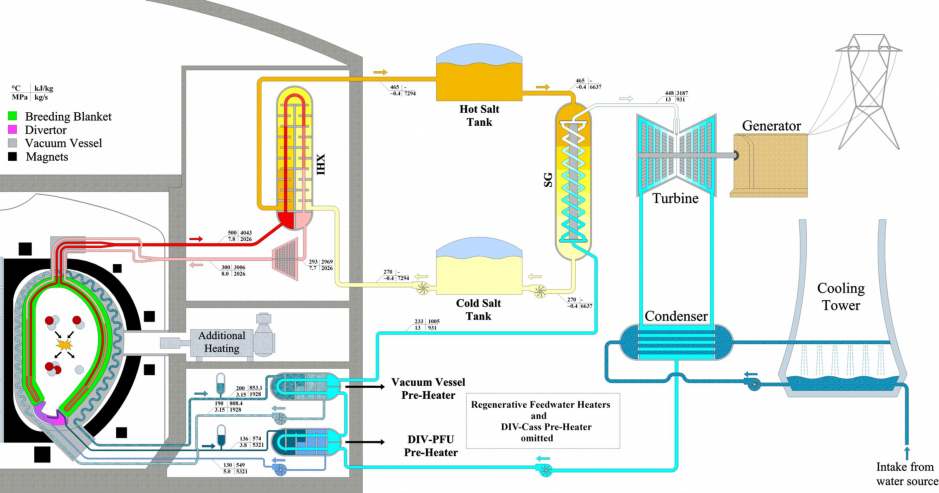
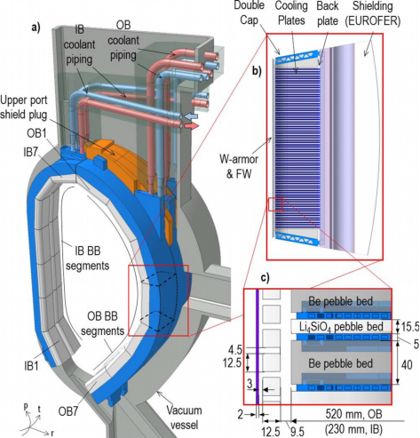
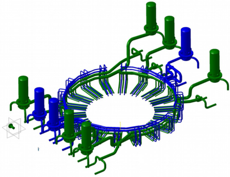
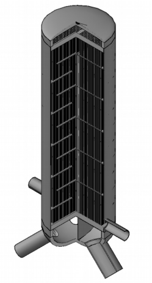

WPBOP-CPR(18) 20276 

I Moscato et al. 

## **Progress in the design development of EU DEMO Helium-Cooled Pebble Bed Primary Heat Transfer System** 

Preprint of Paper to be submitted for publication in Proceeding of 30th Symposium on Fusion Technology (SOFT) 

This work has been carried out within the framework of the EUROfusion Consortium and has received funding from the Euratom research and training programme 2014-2018 under grant agreement No 633053. The views and opinions expressed herein do not necessarily reflect those of the European Commission. 

This document is intended for publication in the open literature. It is made available on the clear understanding that it may not be further circulated and extracts or references may not be published prior to publication of the original when applicable, or without the consent of the Publications Officer, EUROfusion Programme Management Unit, Culham Science Centre, Abingdon, Oxon, OX14 3DB, UK or e-mail Publications.Officer@euro-fusion.org 

Enquiries about Copyright and reproduction should be addressed to the Publications Officer, EUROfusion Programme Management Unit, Culham Science Centre, Abingdon, Oxon, OX14 3DB, UK or e-mail Publications.Officer@euro-fusion.org 

The contents of this preprint and all other EUROfusion Preprints, Reports and Conference Papers are available to view online free at http://www.euro-fusionscipub.org. This site has full search facilities and e-mail alert options. In the JET specific papers the diagrams contained within the PDFs on this site are hyperlinked 

## **Progress in the design development of EU DEMO Helium-Cooled Pebble Bed Primary Heat Transfer System** 

I. Moscato[a,*] , L. Barucca[b] , S. Ciattaglia[c] , F. D’Aleo[a] , P. A. Di Maio[a] , G. Federici[c] , A. Tarallo[d] 

_aDipartimento di Energia, Ingegneria dell’Informazione e Modelli Matematici, Università di Palermo, Viale delle Scienze, I-90128 Palermo, Italy_ 

_bAnsaldo Nucleare, Corso Perrone 25, 16100 Genova, Italy_ 

_cEUROfusion Consortium, PPPT Department, Boltzmannstr. 2, Garching, Germany_ 

_dCREATE Consortium, Università di Napoli Federico II, Via Claudio 21, 80125 Napoli, Italy_ 

In the frame  of the activities  promoted and encouraged  by the EURO-fusion Power Plant Physics  and Technology (PPPT) department aimed at developing the EU-DEMO fusion reactor, strong emphasis has been recently posed to the whole Balance of Plant (BoP) which represents the set of systems devoted to convert the plasma generated thermal power into electricity and to deliver it to the grid. Among these systems, a very important role is played by the Breeding Blanket (BB) Primary Heat Transfer System (PHTS) as it is responsible to extract more than 80% of the fusion plasma power. 

In this framework, University of Palermo, Ansaldo Nucleare and CREATE have focused their work to improve thermal-hydraulic, safety and integration features of the Ex-Vessel PHTS for the Helium-Cooled Pebble Bed (HCPB) BB concept of DEMO. 

Starting from the outcomes obtained last year that have allowed to highlight some criticalities which needed design changes, the paper describes progress and developments of the HCPB PHTS as well as the goals which have been achieved. The results of the research activity carried out show, in fact, an overall increase of both safety characteristics and thermal-hydraulic performances since a reduction in total coolant inventory and total pressure drop has been respectively reached. Nevertheless a critical assessment of these key parameters reveals that some issues are still open in terms of design integration and feasibility of the whole DEMO BoP for the helium-cooled blanket option, indicating that additional efforts are required to make this technology more attractive. 

Keywords: DEMO, Balance of Plant, PHTS, HCPB. 

_________________________________________________________________________________ 

_*Corresponding author: ivo.moscato@unipa.it_ 

## **1. Introduction** 

The EU-DEMO conceptual design is being conducted among research institutions and universities from 26 countries of European Union, Switzerland and Ukraine. Its mission is to realize electricity from nuclear fusion reaction by 2050. The recent European roadmap, has established that several hundred MW of electricity must be produced by DEMO plant which has to ensure an adequate availability and reliability of operation over a reasonable time span  [1],[2]. Due to this reason the EU-DEMO plant design has to be strongly oriented to the Balance of Plant (BoP). 

The BoP in fact is made up of all those systems which  scope  is  to  convert  the  fusion  power  into electricity,  the electrical  power supply, the cryogenic plant and several auxiliaries providing specific fluids and gases to various apparatus according to their need [3]. 

The systems that are the core of the DEMO BoP, since they represent  the fundamental  energy  “chain”, being devoted to the extraction of the plasma generated thermal  power  and  to  its  conversion  into  electricity delivered  to the grid, are  the Primary  Heat  Transfer Systems (PHTSs) of Breeding Blanket (BB), Divertor (Div) and Vacuum Vessel (VV), the Intermediate Heat 

Transfer  System  (IHTS)  and  the  Power  Conversion System (PCS) [4][5], Fig 1. In particular, since the BB has to extract about 85% of the power generated by the tokamak, hence it might be intended as the main hub of the heat transfer chain. 

In this framework, University of Palermo, Ansaldo Nucleare  and  CREATE  have  focused  their  work  to improve thermal-hydraulic, safety and integration features of the Ex-Vessel PHTS for the Helium-Cooled Pebble Bed (HCPB) BB concept of DEMO. 

Starting from the outcomes obtained during the 2016 activities which highlighted some criticalities that needed  design  changes [4][5],  the  paper  describes progress and developments of the HCPB BB PHTS as well as the goals which have been achieved. The results of the research activity carried out show, in fact, an overall  increase  of  both  safety  characteristics  and thermal-hydraulic performances since a reduction in total coolant  inventory  and  total  pressure  drop  has  been respectively reached. Nevertheless a critical assessment of these key parameters reveals that some issues are still open in terms of design integration and feasibility of the whole DEMO BoP for the helium-cooled blanket option, indicating that additional efforts are required to increase the overall performances of the system. 

## **2. HCPB BB PHTS design description** 

## _2.1 Current BB architecture_ 

module structure where First-Wall (FW) and Breeding Zone (BZ) cooling channels are housed [8]. Fig 2 depicts a HCPB sectors and its equatorial module. 

The current HCPB BB PHTS is designed to fulfil requirements  and constrains  dictated by the so-called “sandwich” concept  [6], developed for the EU DEMO 2015  tokamak  baseline [7],  where  the  blanket  is subdivided in 18 sectors, each one of 20°. A sector includes two Inboard Blanket (IB) segments and three Outboard Blanket (OB) segments. An IB/OB segment is subdivided in seven blanket boxes, following a multi- 

## _2.1.1 BB flow scheme and thermal-hydraulic conditions_ 

Each module is made up of a recurring sub-structure where helium at 8 MPa and 300°C coming from the inlet manifold enters, cools in series FW and BZ and, finally, reaches the outlet manifold at 500 °C [8]. A “1-side bottom-top” arrangement is currently selected to route the Ex-Vessel cooling pipes to the In-Vessel components: inlet and outlet pipes are all routed through the  upper  port reducing  the  integration problems identified for the BoP with the former “2-side bottomtop” arrangement [4] as well as decreasing the complexity of Remote Maintenance operations [9]. 

The relatively narrow working window of the coolant (300÷500 °C) is dictated by the lower and upper design limits of the low activation structural steel EUROFER which is affected by irradiation hardening and embrittlement as well as reduction in fracture toughness at temperature below 350 °C whereas helium embrittlement  and  reduction  in  fatigue  life  becomes significant above 550 °C. To be compliant with such BB requirements a helium total mass flowrate of 2025.7 kg/s must be circulated through the whole PHTS in order to remove from the BB a nominal thermal power of 2101.7 MW. 

## _2.2 Ex-Vessel PHTS design_ 

The present Ex-Vessel PHTS has been developed on the basis of the preliminary studies carried out during the 2016 BoP activities and following the same strategies and objectives which had driven the previous design [4] [5]. 

## _2.2.1 PHTS layout_ 

The BB PHTS architecture still relies on the adoption of 9 completely independent cooling loops from both mechanical and functional point of view in order to limit some common mode failures. The IB is cooled by means 

of 3 loops whereas the remaining 6 circuits are employed to remove the thermal power from the OB portion of the tokamak. An IB loop is responsible for providing helium to 6 blanket sectors while an OB loop cools the segments of 3 blanket sectors. Fig. 3 shows the 3D-CAD model of the 2017 HCPB BB PHTS. 

The  choice  to  maintain  a  high  degree  of  loops segmentation  is  due  to  the  necessity  of  limiting  the potential  consequences  of  some  LOCA  events  and keeping the dimensions of main PHTS equipment within reasonable and feasible sizes. 

However, a careful review of analyses performed on the preliminary BB PHTS layout [10][11][12] highlighted criticalities which were mostly related to the huge number of pipes employed and, consequently, to their excessive overall length: hundreds of components and several kilometres of piping with their thousands of welding clearly increase the possibility of the system to fail compromising reliability, availability and safety of the whole plant. Moreover, a tokamak building crowed of  high  energy  pipes  carrying  radioactive  materials among different levels of the structure might generate several  integration,  maintenance  and,  again,  safety problems. 

For abovementioned reasons it was decided to make important modifications to the design and layout of the pipework that is now placed at the height of the upper ports since BB inlet/outlet pipes interface at that level. In addition, even if the flow scheme described in [4] was kept unchanged as well as the structural material, namely AISI 316L(N), a single larger pipe has replaced the three parallel pipes which formerly connected the Intermediate Heat eXchanger (IHX) to the BB manifolds on both cold and hot sides. These changes have allowed to strongly reduce the number of pipes, see Table 1, and their total length  which  was  more  than  halved  respect  to  the previous design  being  around 4  km; as directly consequence, also the coolant volume decreased to 879 cubic meters, with a gain of about 33%. 

On the other hand, the adoption of single hot/cold leg which  nominal  diameter  is  DN1300  and  DN1100, respectively,  will  require  additional  efforts  in  the manufacturing process taking into account the related 

increment of pipes thickness (up to 65 mm for the hot leg). Nevertheless, this option seems doable as many factories on the market offer pipes of the required sizes guaranteeing nuclear quality standards [13]. 

Table 1.  2017 HCPB PHTS main components per loop _._ 

|Component|Inboard|Outboard|
|---|---|---|
|Hot/Cold manifolds|12/12|9/9|
|Hot/Cold legs|1/1|1/1|
|Cold Header|1|1|
|Compressors|2|2|
|Heat exchanger|1|1|

## _2.2.2 Intermediate heat exchanger_ 

The IHX has similar features to the previous model [4] since  the  adoption  of  equipment  widely  used  in nuclear and conventional industrial applications, therefore easily available on the market, is one of the main drivers for the component selection. Therefore, the TEMA NFN type (two-pass tubes, two-pass shell) is the reference design configuration for the heat exchanger, where helium flows on tube side whereas the HITEC salt crosses the shell side. Fig. 4 shows a conceptual 3-D model of the OB IHX. 

Taking into account the results of the 2016, it was decided to increase the temperature difference between primary  and  secondary  loops  to  reduce  the  overall dimensions  of  the  component:  the  secondary  cycle temperatures  were  set  to 270 °C–465 °C  (Tin and  Tout respectively), according to [14]. As can be caught from the Table 2, the size of the IHX for both IB and OB loops, is considerably decreased. 

Table 2.  IHXs main data _._ 

|Table 2.  IHXs main data_._|||
|---|---|---|
|Parameter|IB|OB|
|Thermal Power [MW]|208.1|267.8|
|Tin/Touthelium [°C]|500.0/287.7|500.0/289.3|
|Tin/ToutHITEC salt [°C]|270.0/465.0|270.0/465.0|
|Bundle length [m]|12.2|11.6|
|No. of tubes (1 pass)[-]|5801|7426|

|Tube Dext[mm]|19.05|19.05|
|---|---|---|
|He pressure drop [MPa]|87.9|85.1|
|Total He volume [m3]|49.5|61.5|

Moreover, this new HITEC thermal-hydraulic conditions allowed to decrease the component pressure drop of about 26%-28%, for IB and OB IHX respectively. 

Nevertheless, the total heat transfer area of about 87300 m[2] poses questions regarding the tritium permeation through such a huge surface, revealing that additional  efforts  should  be  made  to  minimize  this potential issue [15]. 

## _2.2.3 Pressure drop and pumping power_ 

The improvements in both In-Vessel and Ex-Vessel components design had a very positive impact on the global  pressure  drop of the BB PHTS. However  the circulators power, see Table 3, is still high respect to the value of 5 MW per compressor previously foresaw in [4]. Further developments of the BB PHTS aimed ad optimize pressure losses of the whole cooling circuits are needed to achieve, or at least approach, such target value in order to avoid the necessity of large R&D campaigns. 

Table 3.  PHTS pressure drop and circulator power _._ 

|Parameter|IB|OB|
|---|---|---|
|In-VV ∆P [kPa]|214.0|174.0|
|Ex-VV piping ∆P [kPa]|62.0|56.6|
|IHX ∆P [kPa]|87.9|85.1|
|Circulator power [MW]|6.8|7.5|

## **3 “Near-term” PHTS** 

The latest EU DEMO 2017 baseline foresees 16 VV sectors in place of 18, as it was in former baseline. This major modification, together with the need to improve the whole HCPB blanket system and its PHTS, has led to a design revision towards establishing a simpler, nearterm blanket configuration. Such option is based on a fission-like hexagonal arrangement of radial fuel-breeder pin assemblies built in Single-Module Segments  [16]. This new HCPB architecture shows enhanced thermalhydraulic performances managing to reach higher helium ⁓ outlet  temperature  ( 520°C) and, in the meanwhile, lower pressure drop. This has led to re-think the PHTS layout encouraging an options based on 8 homogeneous loops where each cooling circuit feeds both IB and OB segments of a VV sector allowing the adoption of the same equipment (e.g. IHX, circulator) in all loops. For the “near-term” HCPB BB PHTS two options of IHX are under investigation focusing on the “tubes and shell” heat  exchanger  technology:  in  particular,  a  “base” configuration foresees a common, easy-to-manufacture, once-through Shell&Tube HX (STHE) with a straight tube bundle, while an “advanced” option conceives the adoption  of  a Coil-Wound  Heat  Exchanger  (CWHE) where tubes are wound into helical coils forming a large bundle.  Preliminary  studies  have  highlighted  good capabilities of both options which virtually would enable the design of circulators which do not need large R&D to be build. The CWHE can ensure better thermal-hydraulic characteristics  than  STHE,  however,  even  if  such 

typology  has  been  widely  commercialized  in  both nuclear and fossil energy systems, analyses are on-going in  order  to  understand  whether  this  option  suits requirements and constrains of DEMO BoP. 

Table  4  summarizes  the  results  of  preliminary analyses  carried  out  on  pressure  drops  and  pumping power for the two “near term” BB PHTS configurations. 

Table 4.  Near-term PHTS: pressure drop and circulator power _._ 

## **4. Conclusion** 

A new reference design for the HCPB BB PHTS has been  outlined.  Significant  improvements  have  been achieved in term of reduction of HXs heat transfer area, piping length, coolant inventory and pumping power. The modifications of PHTS design have had a positive impact on both safety and integration characteristics of the  system,  virtually  increasing  its  reliability  and availability.  However,  further  design  refinements  of equipment such as IHXs and circulators are needed to ensure the overall feasibility of a DEMO BoP based on helium technology. 

An enhanced, near-term PHTS is under development for the new EU DEMO 2017 baseline. It is addressed at overtaking  the  low  technology  readiness  issues,  thus enabling the use of mature and well-known solutions for the main BoP components. 

## **Acknowledgments** 

This work has been carried out within the framework of  the  EUROfusion  Consortium  and  has  received funding from the Euratom research and training programme 2014-2018  under grant agreement No 633053. The views and opinions expressed herein do not necessarily reflect those of the European Commission. 

   - and Power Conversion Systems, Fus. Eng. Des. (2018) https://doi.org/10.1016/j.fusengdes.2018.05.057, in press. 

- [6] F. Hernández et al., A new HCPB breeding blanket for the  EU  DEMO:  Evolution,  rationale  and  preliminary performances, Fusion Eng. Des. 124 (2017) 882–886. 

- [7] M. Coleman et al., On the EU approach for DEMO architecture exploration and dealing with uncertainties, Fusion Eng. Des., 109–111 (2016), pp. 1158-1162. 

- [8] F. Hernández et al., Overview of the HCPB Research Activities in EUROfusion, IEEE Transactions on Plasma Science,  vol.  46,  no.  6,  pp.  2247-2261,  June  2018 10.1109/TPS.2018.2830813. 

- [9] F. Cismondi et al., Progress in EU Breeding Blanket design and integration, Fus. Eng. Des. (2018), https://doi.org/10.1016/j.fusengdes.2018.04.009, in press. 

- [10] X.Z. Jin, BB LOCA analysis for the reference design of the EU DEMO HCPB blanket concept,  Fus. Eng. Des. (2018), https://doi.org/10.1016/j.fusengdes.2018.04.046, in press. 

- [11] T. Pinna et al., Preliminary study of DEMO disruptions due to component failures, Fus. Eng. Des. (2018), https:// doi.org/10.1016/j.fusengdes.2018.04.114 

- [12] C. Gliss et al., Initial Layout of DEMO Buildings and Configuration of the Main Plant Systems, Fus. Eng. Des. (2018), https://doi.org/10.1016/j.fusengdes.2018.02.101, in press. 

- - 

- [13] http://www.pccenergy.com/assets/files/120705 wg nuclear-brochure.pdf 

- [14] E. Bubelis et al., Industry Supported Improved Design of DEMO BoP for HCPB BB Concept with Energy Storage System, Proceeding of the 30[th] SOFT conference (2018). 

- [15] G. Federici et al., An Overview of the EU Breeding Blanket Design Strategy as Integral Part of the DEMO Design Effort, Proceeding of the 30[th] SOFT conference (2018). 

- [16] F.  Hernández  et  al.,  An  enhanced,  near-term  HCPB configuration  as  driver  blanket  for  the  EU  DEMO, Proceeding of the 30[th] SOFT conference (2018) 

## **References** 

- [1] F. Romanelli et al., Fusion Electricity: A roadmap to the realization of fusion energy, EFDA, 2012. 

- [2] G. Federici et al., Overview of EU DEMO design and R&D activities, Fusion Eng. and Des. 89 (2014) 882–889. 

- [3] S. Ciattaglia et al., The European DEMO fusion reactor: Design status and challenges from balance of plant point of view, Proceedings of 17th IEEE International Conference on Environment and Electrical Engineering and 1st IEEE Industrial and Commercial Power Systems Europe, 2017, 10.1109/EEEIC.2017.7977853. 

- [4] I. Moscato et al., Preliminary design of EU DEMO heliumcooled  breeding  blanket  primary  heat  transfer  system, Fusion Eng. Des. (2018) https://doi.org/10.1016/j.fusengdes.2018.05.058, in press. 

- [5] L. Barucca et al., Status of EU DEMO Heat Transport 

