**This is an electronic reprint of the original article. This reprint may differ from the original in pagination and typographic detail.** 

Lyytinen, T.; Snicker, A.; Virtanen, J.; Palermo, I.; Alguacil, J.; Bogaarts, Timo; Warmer, F. Proof-of-principle of parametric stellarator neutronics modeling using Serpent2 

_Published in:_ Nuclear Fusion 

_DOI:_ 10.1088/1741-4326/ad4f9f 

Published: 01/07/2024 

_Document Version_ Publisher's PDF, also known as Version of record 

_Published under the following license:_ CC BY 

_Please cite the original version:_ 

Lyytinen, T., Snicker, A., Virtanen, J., Palermo, I., Alguacil, J., Bogaarts, T., & Warmer, F. (2024). Proof-ofprinciple of parametric stellarator neutronics modeling using Serpent2. _Nuclear Fusion_ , _64_ (7), 1-12. Article 076042. https://doi.org/10.1088/1741-4326/ad4f9f 

This material is protected by copyright and other intellectual property rights, and duplication or sale of all or part of any of the repository collections is not permitted, except that material may be duplicated by you for your research use or educational purposes in electronic or print form. You must obtain permission for any other use. Electronic or print copies may not be offered, whether for sale or otherwise to anyone who is not an authorised user. 

## **PAPER • OPEN ACCESS** 

## Proof-of-principle of parametric stellarator neutronics modeling using Serpent2 

To cite this article: T. Lyytinen et al 2024 Nucl. Fusion 64 076042 

View the article online for updates and enhancements. 

## You may also like 

- Integral analysis of the effect of material dimension and composition on tokamak neutronics 

Jin Whan Bae, Davin Young, Katarzyna Borowiec et al. 

- Impact of substrate and thermal boundary resistance on the performance of AlGaN/GaN HEMTs analyzed by means of electro-thermal Monte Carlo simulations S García, I Íñiguez-de-la-Torre, J Mateos et al. 

- Fusion nuclear science facilities and pilot plants based on the spherical tokamak J.E. Menard, T. Brown, L. El-Guebaly et al. 

This content was downloaded from IP address 130.233.216.130 on 09/07/2024 at 08:49 

Nuclear Fusion 

International Atomic Energy Agency 

Nucl. Fusion **64** (2024) 076042 (12pp) 

https://doi.org/10.1088/1741-4326/ad4f9f 

## **Proof-of-principle of parametric stellarator neutronics modeling using Serpent2** 

**T. Lyytinen**[1][,] _**[∗]**_  **, A. Snicker**[1]  **, J. Virtanen**[2] **, I. Palermo**[3]  **, J. Alguacil**[4]  **, Timo Bogaarts**[5]  **and F. Warmer**[5]  

1 VTT Technical Research Centre of Finland Ltd, Espoo, Finland 

2 Aalto University, Espoo, Finland 

3 CIEMAT, Fusion Technology Division, Madrid, Spain 

4 UNED, Department of Energy Engineering, Madrid, Spain 

5 Eindhoven University of Technology, Eindhoven, Netherlands 

E-mail: tommi.lyytinen@vtt.fi 

Received 12 January 2024, revised 29 April 2024 Accepted for publication 23 May 2024 Published 7 June 2024 

## **Abstract** 

This contribution presents neutron transport studies for the 5-period helical-axis advanced stellarator stellarator using the Serpent2 code. These studies utilize a parametric geometry model, enabling scans in neutronics modeling by varying the thickness of the reactor layers. For example, the tritium breeding ratio (TBR) can be determined by exploring various blanket material options and thicknesses to identify the threshold configuration that meets the TBR design criterion of 1.15. We found out that with the helium-cooled pebble ped candidate option, the TBR criterion is met with a breeding zone thickness of 26 cm, while with the dual-coolant lithium lead the threshold is exceeded at a thickness of 46 cm. Furthermore, the geometry includes non-planar field coils, allowing to study the fast neutron flux in these superconducting coils with a technological limit of 1 _×_ 10[9] 1 _/_ cm[2] s. It is shown that the neutron fast flux is not constant at the coils, necessitating a neutron transport simulation to determine the distribution of the fast-flux at the coils. We show that the peak fast flux can be more than a factor of 2 higher than the average flux, and that the peak flux location rotates helically. 

Keywords: neutronics, HELIAS, parametric modeling, stellarator 

(Some figures may appear in colour only in the online journal) 

## **1. Introduction** 

Finding pathways to produce thermonuclear fusion energy with commercially viable price is a significant ongoing 

- _∗_ Author to whom any correspondence should be addressed. 

Original Content from this work may be used under the terms of the Creative Commons Attribution 4.0 licence. Any further distribution of this work must maintain attribution to the author(s) and the title of the work, journal citation and DOI. 

challenge. Both private companies and public research institutions are constantly looking for new ways to develop a practical fusion reactor. Although the primary focus of research remains on tokamaks, including spherical options, stellarators have emerged as viable alternatives, especially in the long term. As an indication of this, private companies have also started to pursue fusion energy using stellarators. The main benefits of stellarators over the tokamaks are the absence of instability-producing plasma current and the inherent steady-state operation capability [1]. Despite these benefits, stellarators have not yet experimentally demonstrated equal performance with tokamaks [2]. However, 

© 2024 The Author(s). Published by IOP Publishing Ltd on behalf of the IAEA. All rights reserved 

1741-4326/24/076042+12$33.00 Printed in the UK 

the performance can be comparable to tokamaks when the plasma volume of the experiment is considered (see e.g. confinement time measurements in [3]). Recent theoretical and numerical work suggests the potential for significant improvement in fast particle confinement through optimized magnetic field configurations [4, 5], but these advances await experimental validation. Furthermore, Wendelstein 7-X has shown experimental evidence of reduced neoclassical transport [6]. Consequently, ongoing experimental validation and further advancements in addressing engineering challenges will be crucial to fully realizing the potential of stellarators as viable alternatives to tokamaks in fusion research. 

In fusion neutronics, there are two main research aims: (1) to develop a breeding blanket that can breed enough tritium to sustain the D-T reaction in the plasma, (2) to protect the reactor components from excessive particle and heat loads. Since tokamaks have achieved a higher level of development compared to stellarators, many of the required neutronics technologies such as the breeding blanket have predominantly been designed and developed for tokamaks. Although much of this technology is transferable to stellarators, specific requirements exist as well [7, 8]. For example, the intricate modular coil system creating a magnetic field for a 3D plasma configuration impose constraints on the available space for the breeding blanket and remote maintenance schemes. Moreover, simulating the complex 3D reactor geometry necessitates employing CAD-based workflows in conjunction with Monte Carlo codes. Additionally, these workflows should be straightforward and require a minimal amount of additional software and intermediate steps to incorporate the CAD model into the Monte Carlo code. 

In this contribution, the Serpent2 [9] Monte Carlo neutron transport code is used to simulate the helical-axis advanced stellarator (HELIAS) [7] reactor candidate. The main motivation of the study is to use a parametric geometry model, showing a fast route from a standardized geometry information (in this case STL) to neutron transport simulation input. This allows to perform scans over the parameters of the geometry, without much of manual labour with the geometry. Therefore, the neutron transport simulations can be used to calculate the typical neutron responses, such as the tritium breeding ratio (TBR), fast flux ( _E >_ 0.1 MeV), and power density, as a function of the parameters of the geometry model in a relatively fast manner. 

The paper is structured as follows. After this introduction, the parametric geometry model and the simulation tool are briefly presented in section 2. Section 3 shows a benchmark of the parametric model comparison between the Serpent2 and MCNP6 [10]. Then, the parametric model is used to create breeding blanket geometries with different thicknesses, to which neutron responses are calculated. The results of this exercise are presented in section 4. A separate section 5 is dedicated to studying the poloidal distribution of the neutron flux at the non-planar field coils. The work is summarized in section 6. 

## **2. Parametric geometry model and simulation tool** 

In this study, the HELIAS reactor [7] has a five-fold symmetry, consisting of five identical 72 _[◦]_ modules. The designed fusion power of the reactor is 3000 MW, which sets the source rate in the neutronics simulations at 1 _._ 065 _×_ 10[21] ns _[−]_[1] . Additionally, the reactor geometry includes 50 superconductive non-planar coils [11] responsible for generating the confining magnetic field. The major radius of the reactor extends to 22 meters, with an aspect ratio of 12.2 

HELIAS reactor geometry models were created using the HeliasGeom tool [12]. The tool relies on extending the last plasma surface using surface normals to form the shape of the first wall [8]. This approach can be employed to generate an arbitrary number of surfaces that mimic the shape of the first wall at a specified distance. These generated surfaces serve as a basis for creating point clouds, which are then transformed into CAD-based geometries such as STP/STEP (Standard for the Exchange of Product Data or ISO 10303-21) and STL (stereolithography) at specified toroidal and poloidal resolutions. While STL format describes the geometry using triangles (unit normal + vertices), the STP format allows much wider definitions such as curved surfaces and other information besides geometry such as colors of objects. Moreover, the toroidal angle of the reactor can be selected to generate e.g. 36 _[◦]_ half-module, 72 _[◦]_ full-module, or the entire 360 _[◦]_ model of the HELIAS. Examples of the 72 _[◦]_ and 360 _[◦]_ models are shown in figure 1, which are used later in this work. The coarse outer surface of the geometry illustrated in the figure has been addressed and resolved in the latest version of the HeliasGeom. 

Serpent2 transport simulation workflow consists of specifying an input geometry, neutron flux and response detectors, materials and nuclear data, and a neutron source. The HELIAS neutron source routine [13] has been integrated into Serpent2 as a user-defined source routine based on the MCNP code. Parametric models were included in the Serpent2 simulation directly using the STL triangular mesh format. Despite the STL format export capability of HeliasGeom, the models used in this work were converted from STP geometries using FreeCAD (Netgen mesher) [14]. Ensuring high quality of meshes is pivotal for Monte Carlo codes simulating particle transport within STL geometries. Common errors in STL geometries are gaps between facets and degenerate facets, in which all three points are located on the same line. Serpent2 has features to tolerate these errors [15], but larger errors usually require fixing the STL model itself. In this work, simulations up to 1 _×_ 10 _[−]_[9] neutron histories were carried out without loss of neutrons using the converted STL meshes. To give a rough estimate of the computational demands of such simulations, simulating 5 _×_ 10 _[−]_[8] neutrons in the 72 _[◦]_ model benchmark took 4120 core hours with Serpent2. Respectively, simulating 2 _×_ 10 _[−]_[8] neutrons in the 360 _[◦]_ model took 4875 core hours. 

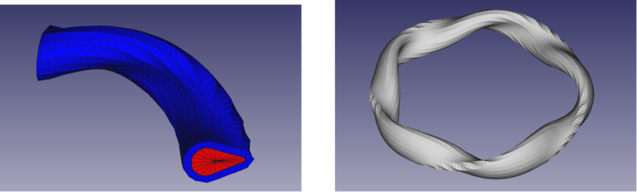

**Figure 1.** ( _a_ ) 72 _[◦]_ and ( _b_ ) 360 _[◦]_ geometry models of HELIAS (red: plasma region, blue: surrounding blanket layer). 

## **3. HELIAS geometry model benchmark of differences between Serpent2 and MCNP6** 

The code benchmark was performed for 72 _[◦]_ and 360 _[◦]_ HELIAS models, shown in figure 1. STL geometry format was used in Serpent2 simulations, while the CAD geometry was converted to a conventional Constructive Solid Geometry (CSG) format in MCNP6 using GEOUNED [16]. Both models consisted of four nested material layers representing: (1) plasma (void), (2) first wall (tungsten), (3) structural layer (EUROFER), (4) breeding zone (LiPb). Layers 2–4 followed the shape of the plasma with thicknesses of 1 mm, 2 cm, and 80 cm. The 72 _[◦]_ model contained 3200 cells, 800 cells for each layer. Respectively, the 360 _[◦]_ model with 5-fold symmetry contained five times the number of cells. Neutron flux was calculated in each cell for the benchmark. Additionally, the total TBR was determined with both models. 

Differences in cell flux results between codes were evaluated using relative differences with combined statistical Monte Carlo error margins. Moreover, a standardized distribution of flux difference was used, defined as 

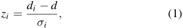

where _di_ is the flux difference in cell _i_ , _d_ is the average of the difference, and _σ_ is the combined statistical Monte Carlo error of the codes in cell _i_ . Comparisons of the 72 _[◦]_ and 360 _[◦]_ models are collected in figure 2. Figures 2( _a_ ) and ( _c_ ) show the relative difference of flux as a function of cell number in the 72 _[◦]_ and 360 _[◦]_ models. With the 72 _[◦]_ model, the relative differences were confined to a range of 1.5%, with an average value of 0.15% taken from the absolute values. Furthermore, 67.5% and 94.8% of the cell flux results were within statistical Monte Carlo error margins of 1 _σ_ and 2 _σ_ . Without systematic errors between codes, it would be expected that 68.3% and 95.5% of the results fall within these confidence intervals of the Gaussian distribution. Respectively, with 360 _[◦]_ model, 67.9% and 95.1% of the cell flux results were within 1 _σ_ and 2 _σ_ . 

The percentages within the statistical uncertainty margins with both models are collected in table 1 together with the simulated neutron histories and the average relative difference 

values. The percentages within the uncertainty margins were closer to the expected percentages with the 360 _[◦]_ model. This was affected by higher statistical uncertainty resulting from fewer neutron histories simulated in Serpent2 compared to MCNP6. With higher statistical accuracy in the 72 _[◦]_ model comparison, the average relative difference was lower compared to the 360 _[◦]_ . Figures 2( _b_ ) and ( _d_ ) show the Gaussian probability density functions (PDF) derived from the standardized distributions of the flux difference in the 72 _[◦]_ and 360 _[◦]_ models. PDFs were compared to the expected standard distribution ( _µ_ = 0, _σ_ = 1), demonstrating a satisfactory fit. The 360 _[◦]_ model showed a closer fit to the expected distribution between codes, with a mean value of 0.08 compared to 0.16 in the 72 _[◦]_ model, which was affected by the higher statistical uncertainty in the 360 _[◦]_ model comparison. 

In figure 3, the TBR ratios between Serpent2 and MCNP6 are shown with the 72 _[◦]_ and 360 _[◦]_ models varying the number of simulated neutron histories. With the exception of the 72 _[◦]_ model simulated with 1 _×_ 10 _[−]_[8] histories, the statistical Monte Carlo error margin of 1 _σ_ overlapped with the expected ratio of one in all results. It should be noted that in the MCNP results with 1 _×_ 10 _[−]_[8] histories, the statistical relative error was zero with four printed decimals. Therefore, the error was estimated by adding a digit to the fifth decimal. 

The remaining deviations in the flux between the codes are most likely related to the volume differences between the STL and CSG geometry formats. Figure 4( _a_ ) shows the relative difference in cell volumes as a function of cell number. The volumes align within the expected statistical error margins of the volume estimation. However, the systematic difference can be identified from the standardized distribution of the volume difference shown in figure 4( _b_ ), where the Serpent volumes are systematically higher. 

## **4. Parametric neutronics studies** 

All results from here on are obtained using Serpent2. Parametric studies of neutron shielding and tritium breeding were performed using the 72 _[◦]_ model. The model consisted of 7 material layers: tungsten armor, first wall (FW), breeding zone (BZ), back-support structure (BSS), and 3 vacuum vessels (VV) (inner shell, shield, outer shell). The thicknesses 

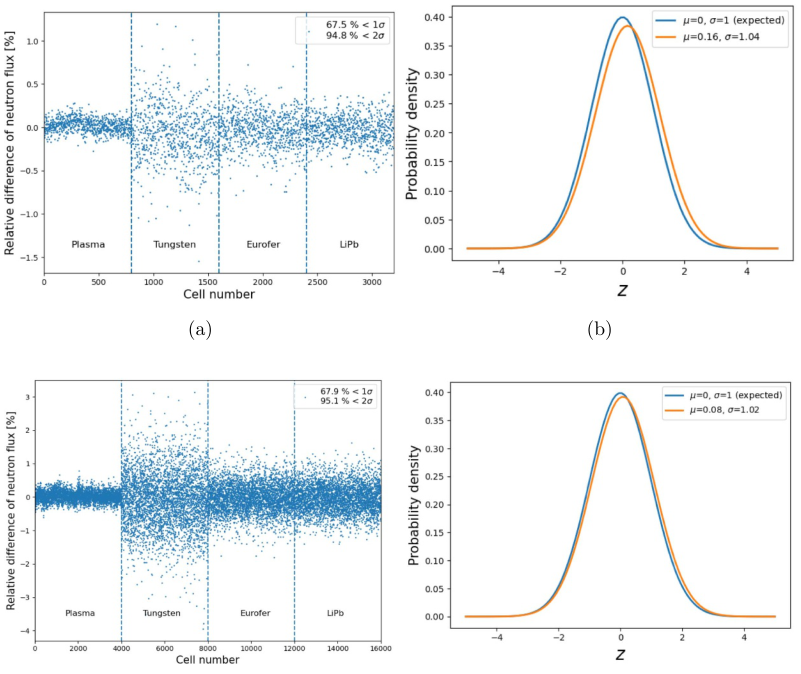

**Figure 2.** Subfigures ( _a_ ) and ( _c_ ) show the relative difference of neutron flux difference as a function of number using 72 _[◦]_ and 360 _[◦]_ models. ( _b_ ) and ( _d_ ) show the Gaussian probability density functions of the standardized difference of the neutron flux with the 72 _[◦]_ and 360 _[◦]_ models. The density functions are compared to the expected standardized distribution ( _µ_ = 0, _σ_ = 1). 

of the reactor layers were specified according to the geometry constraints of the HELIAS 5B design [7] (see figure 2). Table 2 shows the thicknesses used in parametric studies. The BZ thicknesses were chosen from a wide range, spanning from 25 to 75 cm, centered around 50 cm. The thickness of the BSS was also varied between the designed inboard minimum of 12 cm and the outboard maximum of 42.5 cm in neutron shielding studies, while tungsten armor, first wall, and vacuum vessels were kept constant in all cases. The total thickness of the reactor layers was limited to 127.2 cm, achieved with a blanket configuration of BZ = 50 cm and BSS = 42.5 cm. This reactor configuration is shown in figure 5 including the 10 non-planar field coils. The coils are labeled numerically from 1 to 5 and 1 _[′]_ to 5 _[′]_ , with coils 1 _[′]_ to 5 _[′]_ being rotations of coils 1 to 5 and are denoted as rotated (rot.) in figure 5. 

TBR and average neutron fast flux at the coils were calculated using homogenized dual-coolant lithium lead (DCLL) [17] and helium-cooled pebble ped (HCPB) [13] material compositions. The HCPB and DCLL compositions have been adopted from the DEMO design rather than being developed specifically for HELIAS. Consequently, variations between DCLL and HCPB can be expected, necessitating careful consideration when comparing and evaluating the performance of the homogenized DCLL and HCPB models. Figure 6( _a_ ) shows 

**Table 1.** Neutron histories simulated in the benchmark shown with the average relative differences and percentages of cells within 1 _σ_ and 2 _σ_ statistical uncertainty margins.. 

the TBR as a function of the BZ thickness (from [8]) with the two material compositions. With the HCPB composition, the TBR design limit of 1.15 [18] was reached at a thickness of 26 cm, while with DCLL at a thickness of 46 cm. Along with the lithium composition, the TBR is highly affected by the multiplication and moderation characteristics of HCPB and DCLL nuclei, mainly beryllium and lead. These nuclei have a significant impact on flux, especially in the breeding zone, which on the other hand affects tritium production. Figure 6( _b_ ) shows the TBR and the neutron flux of the DCLL and HCPB as a function of energy in the breeding zone. The higher TBR with the HCPB composition was achieved due to the softer flux spectrum in the BZ, as the tritium production cross section 

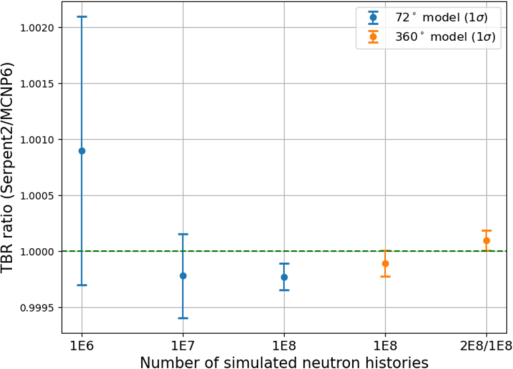

**Figure 3.** TBR ratio of Serpent2 of Serpent2 using the 72 _[◦]_ and 360 _[◦]_ models. TBR ratios are plotted as a function of simulated neutron histories. In MCNP results with 1 _×_ 10 _[−]_[8] histories, the statistical relative error was estimated by adding a digit to the next decimal after the printed zeros. 

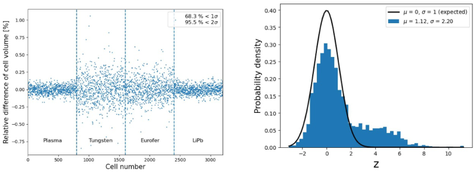

**Figure 4.** ( _a_ ) Relative difference of cell volumes shown as a function of cell number ( _b_ ) standardized distribution of volume difference shown with the expected Gaussian probability density function. 

**Table 2.** Layer thicknesses used in the parametric studies. 

|**Table 2.** Layer thicknesses u|sed in the parametric studies.|
|---|---|
|Layer|Thickness (cm)|
|Tungsten armor|0.7|
|First wall|2|
|Breeding zone|25, 37.5, 50, 62.5, 75|
|Back-support structure|12, 42.5|
|Inner vacuum vessel|6|
|Shield vacuum vessel|20|
|Outer vacuum vessel|6|
|Total thickness|71.7–127.2|

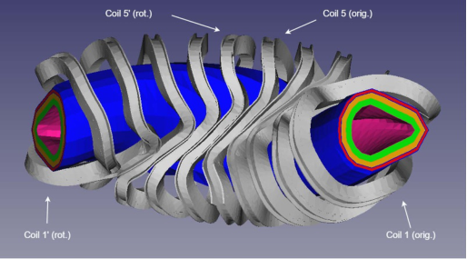

increases at lower energies [19]. The most significant difference in flux and tritium production between the HCPB and DCLL compositions was observed within the energy range of 10 _[−]_[5] –10 _[−]_[2] MeV. 

The average fast flux ( _E >_ 0.1 MeV) in each coil was calculated by varying the thicknesses of BZ and BSS. Figure 7( _a_ ) shows the average flux with DCLL composition using blanket 

**Figure 5.** A parametric geometry model including the non-planar field coils. The five coils on the left labeled as rotated (rot.) are made by rotation from the five coils on the right denoted as original (orig.). 

configurations: BZ = 50 cm, BSS = 42.5 cm (maximum outside) and BZ = 75 cm, BSS = 12 cm. These blanket thickness configurations that fit the space limits of outboard design 

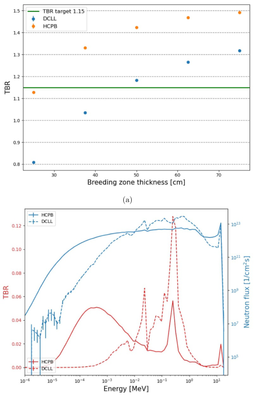

**Figure 6.** ( _a_ ) TBR as a function of breeding zone thickness (Reproduced from [8]. CC BY 4.0.) using DCLL and HCPB blanket compositions. ( _b_ ) Energy spectra of the TBR and the neutron flux in the breeding zone. 

reached the fast flux design limit of 1 _×_ 10[9] 1 _/_ cm[2] s in all coils. Correspondingly, a poorer neutron shielding performance was obtained using the HCPB composition. Figure 7( _b_ ) shows the average fast flux with different HCPB blanket thickness configurations. The fast flux was below the limit only in the coils 5 and 5 _[′]_ with the thickest configuration. These coils were also observed to have the lowest flux with the DCLL composition. Overall, a higher total thickness of the BZ and BSS yielded a lower flux at the coils with both compositions. 

To locate differences in the fast flux shielding characteristics of DCLL and HCPB, fast flux was also studied radially in the middle of the 72 _[◦]_ sector (bean-shaped region). Figure 8( _b_ ) shows the location of the radial flux tally in _xy_ - plane. Figure 8( _a_ ) shows the fast flux as a function of the radial distance from the first wall (sampled with a 20 cm _×_ 20 cm surface area and 4 cm radial binning) using the HCPB and DCLL compositions. The fast flux was higher with the DCLL composition in the FW, BZ, and BSS layers. However, the fast 

flux decreased faster with the DCLL composition and reached a lower value than the HCPB at the end of the VV, as the coil calculations suggested. Similar fast flux behavior has also been observed in a DEMO tokamak study [18] with HCPB and DCLL breeding blanket models. 

Figure 8( _c_ ) shows the fast radial flux with three energy bins in the fast range. The flux in the highest energy range 8–20 MeV is equal for DCLL and HCPB at the first wall, as can be expected. From the beginning of the profile, the flux decreases faster with the DCLL composition in the range of 2–20 MeV. This is primarily due to higher neutron multiplication in the lead of DCLL, resulting in a higher flux within the 0.1–2 MeV energy range, which exceeds the flux within the source energy bin of 8–20 MeV at the first wall. Moreover, the flux within the 0.1–2 MeV energy range is several times higher compared to HCPB, contributing significantly to the higher total fast flux of DCLL in the blanket. To attribute the higher multiplication effect to lead nuclei, lead was replaced by beryllium in the BZ of DCLL. As a result, the fast flux profile closely matched the HCPB, particularly in the first half of the BZ, as shown in figure 8( _d_ ). Closer to the BSS, the radial flux profiles deviated likely due to the LiPb content in the BSS of the DCLL, as the HCPB contained only EUROFER and helium. 

## **5. Poloidal flux distribution** 

Poloidal neutron flux distribution was studied using two coil systems [11, 20]. The first coil system was the same used in the parametric studies, containing nested winding pack and jacket case structures. Figure 9( _a_ ) shows the winding pack of the first coil system divided into 10 poloidal segments. The second coil system shown in figure 9( _b_ ) lacked its own jacket case, and the jacket case of the first coil system was incompatible due to a slight shape deviation. In addition, the winding pack was thinner compared to the first coil system, making it more difficult to obtain sufficient statistics. However, the STL model of the second coil system was poloidally ordered, so dividing it into 10–100 poloidal segments was straightforward. Respectively, the STL model of the first system was irregularly ordered, which complicated the segmentation procedure. 

Each coil in the first coil system was segmented poloidally according to the following steps: (1) transform STL triangle coordinates into center-of-mass coordinates of a coil, (2) transform the triangles into cylindrical coordinates, (3) index the triangles according to polar coordinates using a specified number of segments, (4) transform the triangles exceeding the 72 _[◦]_ simulation sector into the sector. Due to the non-planar nature of the HELIAS coils, the segmentation based on the polar angle resulted in coil segments with varying arc lengths. The inherent poloidal indexing of the second coil system, in turn, naturally led to segments with nearly equal arc lengths. Furthermore, it was possible to omit the first two segmentation steps with the second coil system. The final step of transforming the triangles outside the simulation sector was performed similarly with both coil systems. Figure 10( _a_ ) shows the triangles of the coils that are outside the 72 _[◦]_ sector. In 

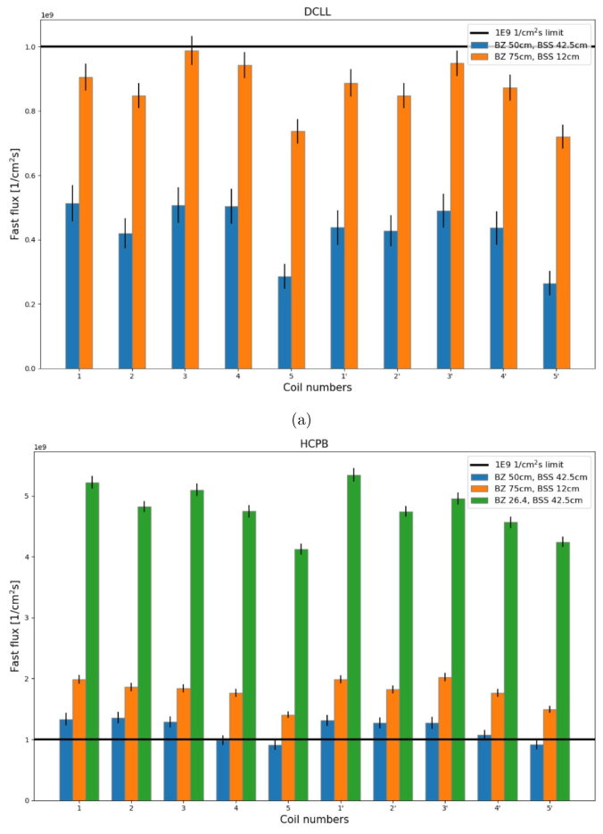

**Figure 7.** Average fast neutron flux in the coil winding packs using ( _a_ ) DCLL and ( _b_ ) HCPB compositions. 

figure 10( _b_ ), these triangles are transformed by periodic rotation to the opposite side of the sector. A similar procedure was performed for the jacket case. 

Figure 11( _a_ ) shows a heatmap of the fast neutron flux using the first coil system with 10 poloidal segments. This calculation used the DCLL breeding blanket configuration: BZ = 50 cm, BSS = 12 cm, which exceeded the fast flux limit in the average flux calculation. The poloidal flux distribution showed that the flux limit was exceeded throughout the coils despite the variations. Moreover, the peak zone of the fast flux rotated helically from the top side of the coils to the bottom when viewed from the right coil to the left. Figure 11( _b_ ) shows peaking factor of fast flux max(flux)/mean(flux) for each coil. The peaking factor ranged from 1.4 to 2.2, where the peaking 

showed a similar pattern between the half modules: coils 1–5 and 1 _[′]_ –5 _[′]_ . 

Figure 11( _c_ ) shows a heatmap of the fast flux using the second coil system with 20 poloidal segments. This calculation used the same blanket configuration, as the first coil system, seen in figure 11( _a_ ). As with the first coil system, the helical rotation of the peak flux was observed. The peaking factor shown in figure 11( _d_ ) ranged from 1.9 to 2.5, where the higher peaking was expected with a smaller segment size. In addition, the fast flux in the second coil system without the jacket case exceeded that of the first coil system by a factor of 4.8 on average. 

The peaking factors were used to extrapolate the maximum flux in the coils based on the average flux results obtained in 

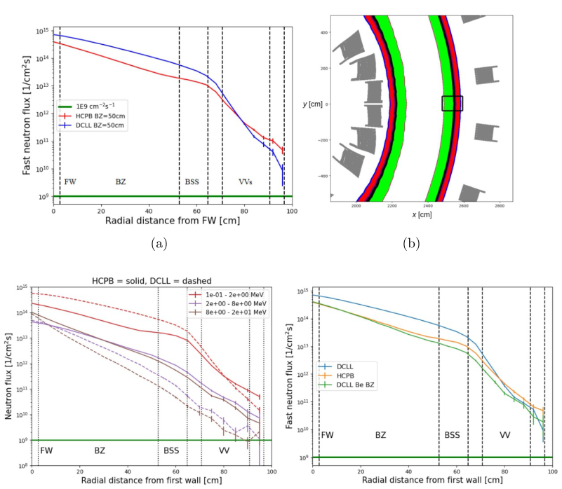

**Figure 8.** ( _a_ ) Radial profile of the fast neutron flux between HCPB and DCLL (BZ = 50 cm, BSS = 12 cm). The profile has 4 cm radial binning, perpendicular area _A_ = 20 _×_ 20 cm. ( _b_ ) Location of the radial flux detector visualized (not in real size). ( _c_ ) Radial fast flux profiles with three fast energy bins. ( _d_ ) Comparison of the radial profile, in which lead is replaced by beryllium in the BZ. 

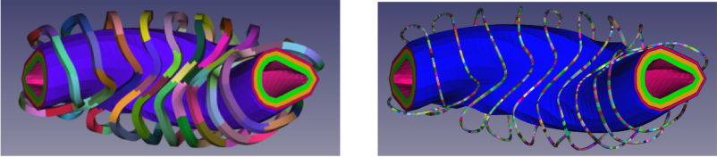

**Figure 9.** ( _a_ ) Winding pack of the first coil system with 10 poloidal segments ( _b_ ) second coil system with 100 segments. 

the parametric study. Figure 12 shows the average flux along with the estimated maximum flux using the thickest BZ configuration of the DCLL. In this case, the average result was multiplied by the peaking factors from the 20-segment simulation, which showed a greater peaking with respect to the 10-segment simulation. Although the lowest average fast flux was achieved with the DCLL configuration, the maximum flux exceeded the limit in six of the coils due to the peaking. This demonstrates the challenge of providing adequate 

shielding for the coils, especially when dealing with even smaller segments. 

To analyze the shape of fast flux at the coils, Pearson and Spearman correlation coefficients [21] were determined to assess the linear and monotonic relationships between sourcecoil distance and fast flux. For each center of the triangle, the distance to the nearest point of the sampled neutron source was calculated. These distances were then avaraged for each coil segment. The neutron source positions were sampled from a 

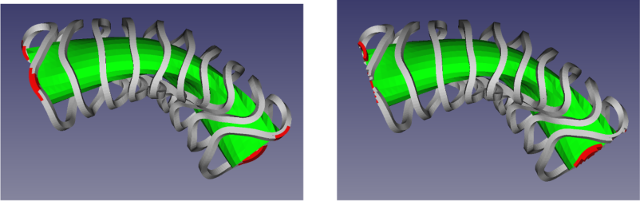

**Figure 10.** ( _a_ ) Coil system including the parts outside the simulation sector (red) ( _b_ ) parts transformed inside the simulation sector. 

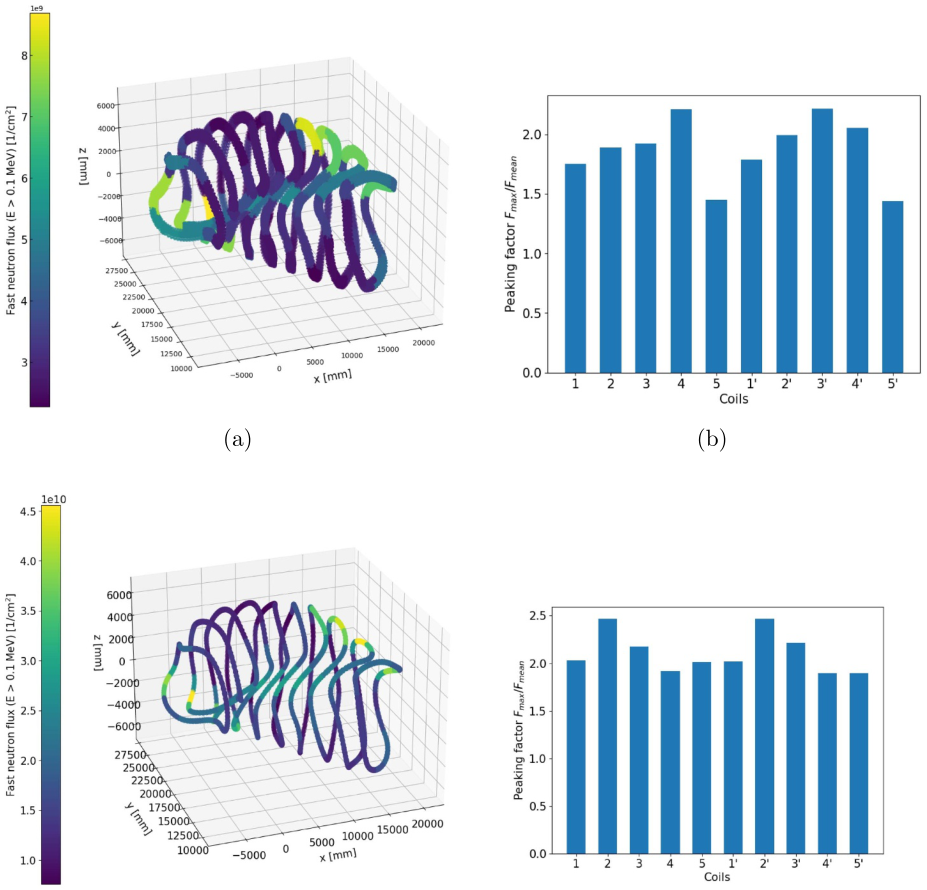

**Figure 11.** Heatmaps of the poloidal fast flux using ( _a_ ) 10 and ( _c_ ) 20 poloidal segments (no jacket case). ( _b_ ) and ( _d_ ) Show the fast flux peaking factors of the coils with the two coil systems. Both calculations used DCLL composition, 50 cm BZ, and 12 cm BSS. 

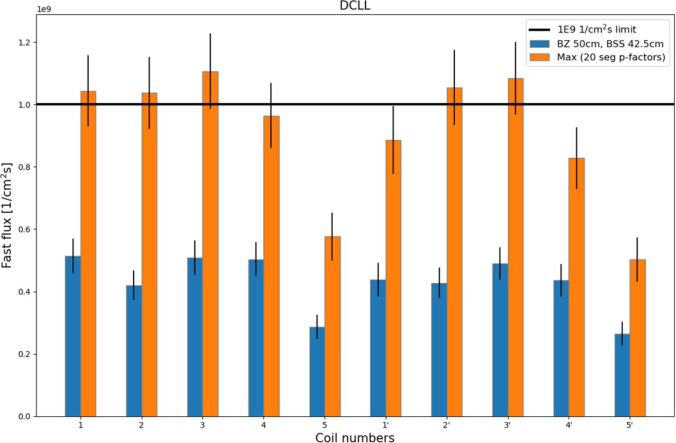

**Figure 12.** Average fast flux in the coils (blue) together with the estimated maximum fast flux using peaking factors (orange). 

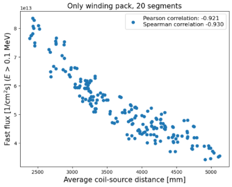

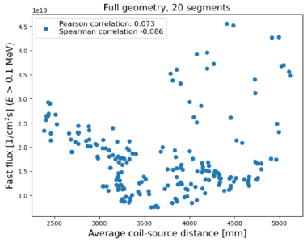

**Figure 13.** Fast neutron flux as a function of average coil–source distance ( _a_ ) using only the coil winding pack ( _b_ ) simulating the full geometry. 

uniform distribution above a half maximum emission probability threshold. The correlation coefficients were determined for the full geometry simulation, as well as for the geometry containing only the coil winding pack and the neutron source. Initially, it was assumed that the fast flux would correlate with the source-coil distance. Therefore, the peak flux would concentrate on the inboard side of coils according to figure 14( _b_ ), which shows the average distance between the coil segments and the sampled neutron source. However, no correlation was observed with the full geometry, while a strong negative correlation was obtained with the winding pack geometry, where the flux was concentrated on the inboard side. In figure 13, the fast flux is shown as a function of the average coil–source distance from the coil winding pack and full geometry simulations using 20 poloidal segments. With the winding pack geometry, Pearson and Spearman correlation 

**Table 3.** Source-coil distance and fast flux correlations. 

||Geometry|Only WP Full geom.|Only WP Full geom.|Only WP Full geom.|Only WP Full geom.|Only WP|
|---|---|---|---|---|---|---|
||Segments|10|10|20|20|100|
||_ρ_(Spearm.)|_−_0.9|_−_0.2|_−_0.9|_−_0.1|_−_0.9|

coefficients were equal to _−_ 0.9, resulting in a higher flux at a shorter distance. Respectively, both correlation coefficients resulted in values of _−_ 0.1 with the full geometry using 20 coil segments, indicating no correlation. Spearman correlation coefficients are collected in table 3 with the two geometry configurations and a varying number of segments, demonstrating that the correlation remains nearly unaffected with the varied segment size. 

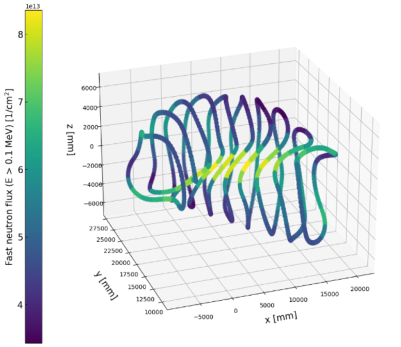

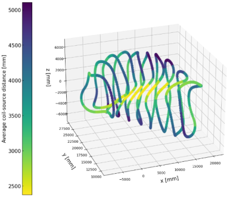

**Figure 14.** ( _a_ ) Heatmap of fast neutron flux simulating only winding pack geometry with 20 poloidal segments. ( _b_ ) Heatmap of the average source-coil distance, the shape of which is to be compared with the shape of ( _a_ ). 

## **6. Summary and conclusions** 

This contribution demonstrated the effective use of STL geometries in parametric neutronics modeling of the HELIAS reactor using the Serpent2 code. A comprehensive neutron flux benchmark was performed against MCNP6 using the 72 _[◦]_ and 360 _[◦]_ models of the HELIAS. Both models showed a good agreement between the codes, as the average difference remained below 0.4% and the differences fell within statistical uncertainty margins. The minor systematic differences arose from the different geometry formats leading to systematic differences in the cell volumes. 

The parametric study of TBR demonstrated the capability to achieve the TBR target of 1.15 with a 50 cm breeding zone thickness using the homogenized DCLL and HCPB material options. In turn, the parametric study of fast neutron flux identified challenges in shielding the coils, as the average flux reached the design limit only with the thickest outboard blanket configuration. Furthermore, these studies supported distinct characteristics of the HCPB and DCLL material compositions. The HCPB composition showed a superior tritium breeding capability, achieving the TBR target already with a 26 cm thick breeding zone, while DCLL achieved it with a thickness of 46 cm. However, the DCLL composition provided better fast neutron shielding of the coils. These differences were primarily attributed to the neutron moderation capability of beryllium and the fast neutron multiplication of lead. 

The analysis of the poloidal fast neutron flux distribution showed variation in flux within the coils, with the peaking factor ranging from 1.4 to 2.5. Moreover, it showed that the hot spots of the flux cannot be predicted by the distance between the coils and the neutron source. Overall, these parametric studies can be considered as a proof-of-principle, as the models contained a significant amount of (over)simplifications that will be corrected in the future. These include: (i) openings in the BB (due to divertors/ports), (ii) variation in the thickness of BZ and BSS (inboard/outboard), (iii) heterogeneous detailed 

geometry/material compositions, (iv) the BB should be considered in view of much more than just TBR and coil flux limit. Considering the early stage of the HELIAS reactor design, this toolchain provides a good platform to further investigate all of these issues. 

## **Acknowledgments** 

This work has been carried out within the framework of the EUROfusion Consortium, funded by the European Union via the Euratom Research and Training Programme (Grant Agreement No 101052200 — EUROfusion). Views and opinions expressed are, however, those of the author(s) only and do not necessarily reflect those of the European Union or the European Commission. Neither the European Union nor the European Commission can be held responsible for them. This work was partially funded by the Academy of Finland Project Nos. 328874, No. 353370 and No. 324759. 

## **ORCID iDs** 

T. Lyytinen  https://orcid.org/0009-0008-6395-4115 A. Snicker  https://orcid.org/0000-0001-9604-9666 I. Palermo  https://orcid.org/0000-0001-8725-8167 J. Alguacil  https://orcid.org/0000-0002-5663-215X Timo Bogaarts  https://orcid.org/0000-0003-2895-3324 F. Warmer  https://orcid.org/0000-0001-9585-5201 

## **References** 

- [1] Helander P. _et al_ 2012 _Plasma Phys. Control. Fusion_ **54** 124009 

- [2] Sunn Pedersen T. _et al_ 2019 _Plasma Phys. Control. Fusion_ **61** 014035 

- [3] Dinklage A. _et al_ 2007 _Nucl. Fusion_ **47** 1265 

- [4] Sánchez E., Velasco J.L., Calvo I. and Mulas S. 2023 _Nucl. Fusion_ **63** 066037 

- [5] Bindel D., Landreman M. and Padidar M. 2023 _Plasma Phys. Control. Fusion_ **65** 065012 

- [6] Beidler C.D. _et al_ 2021 _Nature_ **596** 221–6 

- [7] Warmer F., Bykov V., Drevlak M., Häußler A., Fischer U., Stange T., Beidler C.D. and Wolf R.C. 2017 _Fusion Eng. Des._ **123** 47–53 

- [8] Warmer F. _et al_ 2024 _Fusion Eng. Des._ **202** 114386 

- [9] Leppänen J., Pusa M., Viitanen T., Valtavirta V. and Kaltiaisenaho T. 2015 _Ann. Nucl. Energy_ **82** 142–50 

- [10] W. C. J. (ed) 2017 _MCNP users manual - code version 6.2._ LA-UR-17-29981 (available at: https://mcnp.lanl.gov/ manual.html) 

- [11] Schauer F., Egorov K. and Bykov V. 2013 _Fusion Eng. Des._ **88** 1619–22 

- [12] Palermo I. _et al_ 2024 _Energy_ **289** 129970 

- [13] Häußler A. 2020 Computational approaches for nuclear design analyses of the stellarator power reactor HELIAS Institute 

of Neutron Physics and Reactor Technology (INR) (https:// doi.org/10.5445/IR/1000124072) 

- [14] FreeCAD 2023 FreeCAD - your own 3D parametric modeler (available at: www.freecadweb.org/) 

- [15] Leppänen J. 2022 _Ann. Nucl. Energy_ **176** 109259 

- [16] Catalán J.P. _et al_ 2024 _Nucl. Eng. Technol._ (https://doi.org/ 10.1016/j.net.2024.01.052) 

- [17] Palermo I., Warmer F. and Häußler A. 2021 _Nucl. Fusion_ **61** 076019 

- [18] Fischer U., Bachmann C., Jaboulay J.-C., Moro F., Palermo I., Pereslavtsev P. and Villari R. 2016 _Fusion Eng. Des._ **109-111** 1458–63 

- [19] Brown D.A. _et al_ 2018 _Nucl. Data Sheets_ **148** 1–142 

- [20] Bogaarts T. and Warmer F. 2023 Deterministic neutronics for stellarator system design _ISFNT-15_ ( _Las Palmas, Gran Canaria (Spain)_ , _10–15 September 2023_ ) (available at: https://isfnt2023.com/) 

- [21] Virtanen P. _et al_ 2020 _Nat. Methods_ **17** 261–72 

