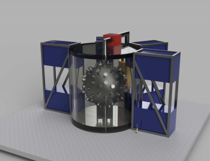
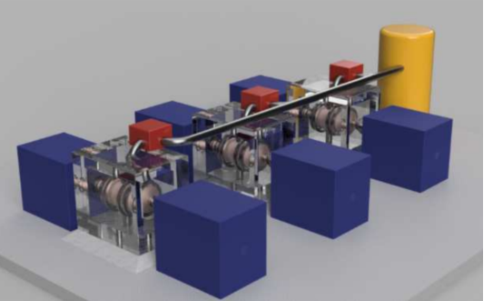
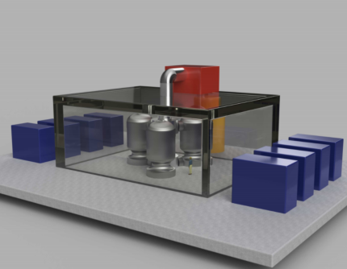
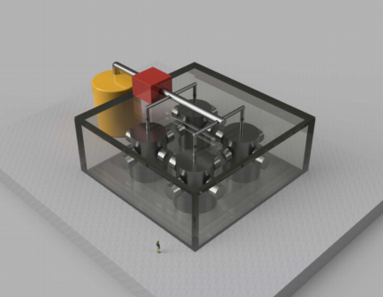

<!-- PAGE:1 -->

Woodruff Scientific, Inc

Revisit of the 2017 Costing for Four ARPA-E ALPHA Concepts

DE-AR001175

## Project Information

**Award:** DE-AR001175
**Sponsoring Agency** USDOE, Advanced Research Project Agency – Energy (ARPA-E)
**Lead Recipient:** Woodruff Scientific
**Project Team Members** Lucid Catalyst, Decysive Systems
**Program Director:** Dr. Scott Hsu
**Principal Investigator:** Dr. Simon Woodruff
**Tech SETA:** Dr. Colleen Nehl
**Date of Report:** 10/19/2020

<!-- PAGE:2 -->

## Acknowledgements

**Acknowledgements**

This work was performed in collaboration with Lucid Catalyst (Eric Ingersoll and Andrew Foss) and
Decysive Systems (Ronald L. Miller). We acknowledge useful conversations with Laila El-Guebaly,
Mark Tillack, Mike Zarnstoff, Dave Gates, Scott Hsu, and Malcolm Handley. We are indebted to
the POCs at the four companies who carefully reviewed the material to provide input and
constructive criticism: Peter J. Turchi, Brian Nelson, Samuel Langendorf, and Hafiz Rahman. We
appreciated guidance and suggestions from Malcolm Handley and Scott Hsu. We are grateful to
ARPA-E for supporting this work under contract no. DE-AR001175.

<!-- PAGE:3 -->

## Executive Summary

**Executive Summary**

This project re-examined the costing analysis performed for four ARPA-E ALPHA program
concepts [1-3] in light of new reactor costing paradigms [4-5], addressing every assumption in
the Cost Accounting Structure (CAS), and revisiting the analysis using the code developed for the
four concepts, touching on most of the recommendations of the prior study and obtaining
reviews by leading experts in the field [6-7]. The work was performed collaboratively between
Woodruff Scientific, Lucid Catalyst, and Decysive Systems. The output from the short study is
this public document, which presents averages of the four concepts and explanations for the
assumptions and calculations given, and a new cost-sensitivity analysis. Proprietary documents
I need to see the image to convert the equation to LaTeX. Could you please share the image/screenshot of the PDF page? You mentioned there's an image showing the original PDF page, but I don't see one attached to your message.
~2.4$/W and $1.2B, and an average Levelized Cost Of Electricity (LCOE) of 43 $/MWh for
~500-MWe power plants, with a range of 34–54 $/MWh for the four concepts.

____________________________________

[1] _Conceptual Cost Study for a Fusion Power Plant Based on Four Technologies from the DOE ARPA-E ALPHA Program_, Bechtel
National, Inc. Report No. 26029-000-30R-G01G-00001 (2017);
[http://woodruffscientific.com/pdf/ARPAE_Costing_Report_2017.pdf.](http://woodruffscientific.com/pdf/ARPAE_Costing_Report_2017.pdf)

[2] S. Woodruff, J. K. Baerny, N. Mattor, D. Stoulil, R. L. Miller, T. Marston “Path to Market for Compact Modular Fusion Power
Cores,” J. Fusion Energy **31** [, 305 (2012); https://doi.org/10.1007/s10894-011-9472-6.](https://doi.org/10.1007/s10894-011-9472-6)

[3] S. Woodruff, R. L. Miller, “Cost sensitivity analysis for a 100 MWe modular power plant and fusion neutron source,” Fus. Eng.
Design **90** [, 7 (2015)); https://doi.org/10.1016/j.fusengdes.2014.09.020.](https://doi.org/10.1016/j.fusengdes.2014.09.020)

[4] _WHAT WILL ADVANCED NUCLEAR POWER PLANTS COST? A Standardized Cost Analysis of Advanced Nuclear Technologies in_
_Commercial Development_, Energy Options Network (2017);
[https://www.innovationreform.org/wp-content/uploads/2018/01/Advanced-Nuclear-Reactors-Cost-Study.pdf.](https://www.innovationreform.org/wp-content/uploads/2018/01/Advanced-Nuclear-Reactors-Cost-Study.pdf)

[5] _The Future of Nuclear Energy in a Carbon-Constrained World_, _An Interdisciplinary MIT Study_, MIT Energy Initiative (2018);
[https://energy.mit.edu/wp-content/uploads/2018/09/The-Future-of-Nuclear-Energy-in-a-Carbon-Constrained-World.pdf.](https://energy.mit.edu/wp-content/uploads/2018/09/The-Future-of-Nuclear-Energy-in-a-Carbon-Constrained-World.pdf)

[6] L. El-Guebaly, L. Mynsberge, A. Davis, C. D’Angelo, A. Rowcliffe, B. Pint & ARIES-ACT, “Team Design and Evaluation of Nuclear
System for ARIES-ACT2 Power Plant with DCLL Blanket,” Fus. Sci. Tech. **72**, 17 (2017);
[https://doi.org/10.1080/15361055.2016.1273669.](https://doi.org/10.1080/15361055.2016.1273669)

[7] C.E. Kessel, J.P. Blanchard, A. Davis, L. El-Guebaly, L.M. Garrison, N.M. Ghoniem, P.W. Humrickhouse, Y. Huang, Y. Katoh, A.
Khodak, E.P. Marriott, S. Malang, N.B. Morley, G.H. Neilson, J. Rapp, M.E. Rensink, T.D. Rognlien, A.F. Rowcliffe, S. Smolentsev, L.L.
Snead, M.S. Tillack, P. Titus, L.M. Waganer, G.M. Wallace, S.J. Wukitch, A. Ying, K. Young, Y. Zhai, “Overview of the fusion nuclear
## science facility, a credible break-in step on the path to fusion energy,” Fus. Eng. Design 135B, 236 (2018);

[https://doi.org/10.1016/j.fusengdes.2017.05.081.](https://doi.org/10.1016/j.fusengdes.2017.05.081)

<!-- PAGE:4 -->

## Principal Findings

**Principal findings**

This project was focused on developing a costing framework for innovative, compact modular
fusion energy systems supported by ARPA-E in the ALPHA program, with the aim of challenging
each cost assumption from our prior work in 2017. We considered each concept and developed
power balances, developed concepts for the power cores based on prior art or existing design
points, and calculated the capital costs according to a Cost Accounting Structure (CAS), borrowed
in part from earlier Gen IV fission costing studies, to calculate the Total Capital Cost (TCC) and
total Capital Expenditure (CapEx). We also produced a Levelized Cost of Electricity calculation for
the four fusion concepts. The results are presented in the following 3 tables in a manner that
anonymizes the concept-specific results of the four proprietary reports that were delivered to the
four companies participating in this study. Table 2 provides some over-arching parameters for the
power cores, showing that the average net electric power is ~500MWe, and the number of
modules in the power core Nmod varied from 2 to 4. Table 3 shows the capital costs that were
calculated for each CAS, noting that there are still significant cost drivers that warrant further
inspection and offer opportunities to further reduce costs. Table 4 shows the Cost of Electricity
calculation (average of 43 $/MWh) as well as the CapEx (average of 2.4$/W and $1.2B). Note that
these costs are favorable and price compact modular fusion systems competitively in the
marketplace of the future.

The major changes relative to the 2017 study are as follows:

 - construction time is shortened from 6 years to 3 years by use of centralized manufacturing
and shipping pre-built subsystems by road or rail to be installed onsite (much in the same
way that Wartsila is doing for their Modular Block concepts). This shortened construction
time reduced the indirect cost categories significantly.

 - all of the costs outside of the fusion power core in the balance of plant are updated
according to recent cost analysis, such as by NETL, scaled with respect to power;

 - while we revisited the power balances for each concept, there were no major innovations
in the fusion power core, except for the use of additional modules, which increased the
total cost of the the power plant, but brought down the cost of electricity;

 - the contingency costs are omitted for this study on the basis that we are considering an _n_ [th]

of a kind power plant, one in which the contingency ought to be close to zero.

Other innovations were reported for the fusion power cores for some concepts, which will be
captured in the next phase of the ARPA-E costing project.

<!-- PAGE:5 -->

Fusion (LANL/HyperJet Fusion); Stabilized Liner Compressor (Compact Fusion Systems, Inc.); Staged

Z-Pinch (MIFTI, Inc.); and, the Flow-stabilized Z-Pinch (Zap Energy, Inc.)

A computer code was developed as part of this work, which we are calling the ‘ARPA-E Fusion
Costing Code,’ as it captures the essential philosophy of the new paradigm for most of the fusion
projects supported by ARPA-E, namely: compactness, low development cost, innovative, and
possibly wholly disruptive.

|Col1|Average|Low|High|Col5|
|---|---|---|---|---|
|Nmod|3.0|2.0|4.0||
|Fusion Power|1352.8|1044.0|1920.0|MW|
|Alpha Power|269.0|207.6|382.0|MW|
|Neutron power|1083.7|836.4|1538.0|MW|
|Thermal power|1554.4|1158.9|2208.4|MW|
|Net electric power|517.0|383.1|814.4|MW|

Table 2. System parameters for the four fusion concepts, showing average, low and high values.

<!-- PAGE:6 -->

## Cost Categories

The cost categories are given here

20. Land/Rights
Purchase of land of requisite size.

21. Structures/Site
Site preparation and all buildings.

22. Reactor Plant Equip.
All equipment needed to provide steam to turbines.

22.1 Reactor Equip.
The fusion power core and all components necessary to sustain continuous operation.

22.2 Main Heat Transfer
Coolant loops from the fusion power core to the steam generators.

22.3 Auxiliary Cooling
All components needed to drive coolant, or provide cooling to other systems outside the reactor
core.

22.4 Rad. Waste Treat.
Disposal facility for solid, liquid and gaseous waste.

22.5 Fuel Processing
Tritium handling and production systems, including fuel injection and recovery systems.

22.6 Other plant equipment
Maintenance systems for all reactor plant equipment.

22.7 Instrumentation and control
Primary systems for monitoring and controlling power core performance.

23. Turbine Plant Equip.
All systems for converting steam into mechanical motion of the turbines, up to and including the
electrical generator..

24. Electric Plant Equip.
All systems for delivering generator power to the grid.

25. Misc. Plant Equip.
Everything not included in prior categories, which can include, for example, transportation, lifting
equipment, communications equipment.

26. Heat Rejection
Primarily the cooling towers, but also includes any mechanical equipment such as water intake and

<!-- PAGE:7 -->

circulating water systems.

27. Special Materials
Primarily this cost category consists of the primary liquid metal coolant.

90. Total Direct Cost
Total direct costs consists of the sum of all prior cost categories.

91. Construction Services and Equipment
Construction management, temporary buildings, and equipment rental.

92. Home Office Engineering Services
Engineering services provided by off-site engineers for specific development projects.

93. Field Office Engineering Services
Engineering services in the field, cost of facilities.

94. Owners Cost
Site permits, plant studies and licenses, staff recruitment, training and housing during construction.

96. Contingency
Mark up to lower capital risk to construction contractor.

97. Interest During Construction
Fixed interest rate applied to capital costs on per annum basis.

99. Total Capital Cost:
Consists of the sum of all cost categories.

<!-- PAGE:8 -->

|Col1|Average|Low|High|Col5|
|---|---|---|---|---|
|20. Land/Rights|14.0|10.3|22.0|M$|
|21. Structures/Site|234.7|173.9|369.7|M$|
|22. Reactor Plant Equip.|422.7|268.8|557.3|M$|
|22.1 Reactor Equip.|172.1|95.0|243.2|M$|
|22.1.1 First Wall/Blanket|57.3|3.6|116.5|M$|
|22.1.2 High Temp. Shield|24.9|22.7|28.5|M$|
|22.1.3 Coils|5.9|0.0|22.8|M$|
|22.1.4 Suppl. Heating|3.0|0.0|12.0|M$|
|22.1.5 Primary Structure|11.6|7.1|15.8|M$|
|22.1.6 Vacuum System|1.4|0.1|4.7|M$|
|22.1.7 Power Supplies|55.8|11.9|140.4|M$|
|22.1.8 Plasma Source|1.4|0.6|3.0|M$|
|22.1.9 Direct E. Conv.|0.0|0.0|0.0|M$|
|22.1.10 ECRH|0.0|0.0|0.0|M$|
|22.1.11 Assembly and installation|10.8|0.3|36.5|M$|
|22.2 Main Heat Transfer|113.2|63.6|184.2|M$|
|22.3 Auxiliary Cooling|2.6|1.3|4.2|M$|
|22.4 Rad. Waste Treat.|4.6|2.4|7.4|M$|
|22.5 Fuel Processing|123.8|92.3|176.0|M$|
|22.6 Other plant equipment|4.2|2.1|6.7|M$|
|22.7 Instrumentation and control|2.1|0.0|3.9|M$|
|23. Turbine Plant Equip.|137.5|101.9|216.6|M$|
|24. Electric Plant Equip.|58.9|43.7|92.8|M$|
|25. Misc. Plant Equip.|39.8|31.9|55.4|M$|
|26. Heat Rejection|55.3|41.0|87.1|M$|
|27. Special Materials|103.1|1.4|266.9|M$|
|90. Total Direct Cost|1066.1|711.0|1454.7|M$|
|91. Construction Serv./Mat.|26.1|19.2|33.7|M$|
|92. Home Office Eng./Serv.|31.3|23.0|40.5|M$|
|93. Field Office Eng./Serv.|10.4|7.7|13.5|M$|
|94. Owners Cost|37.8|27.7|48.8|M$|
|96. Contingency|0.0|0.0|0.0|M$|
|97. Interest During Constr.|51.7|37.9|66.8|M$|
|99. Total Capital Cost:|1223.5|837.7|1638.8|M$|

Table 3. Capital costs showing the average, low and high values.

<!-- PAGE:9 -->

|Col1|Average|Low|High|Col5|
|---|---|---|---|---|
|Capital cost CAC|122.4|83.8|163.9|M$/annum|
|Scheduled Replacement Costs CSCR|17.3|6.1|29.5|M$/annum|
|Operations and Maintenance Costs COM|48.2|42.0|61.3|M$/annum|
|Fuel Costs CF|0.1|0.1|0.1|M$/annum|
|Decontamination and Decommissioning Costs CDD|0.5|0.5|0.5|mills/kWh or M$/MWh|
|COE|51.1|39.7|66.8|mills/kWh or M$/MWh|
|COE2 capturing learning curve credits for CAS22|42.7|33.8|53.7|mills/kWh or M$/MWh|
|COE|5.11|3.97|6.68|c/kWh|
|COE2 capturing learning curve credits for CAS22|4.27|3.38|5.37|c/kWh|
|Dollar per Watt|2.4|2.0|3.3|$/W|

Table 4. Cost of Electricity and CapEx costs for the 4 concepts, note that the COE was calculated with
a plant availability factor of 90%.

Please see the following website for further information:
http://www.woodruffscientific.com/systems.

