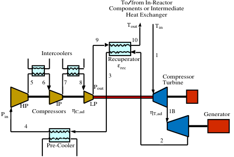
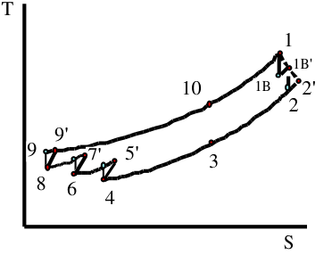
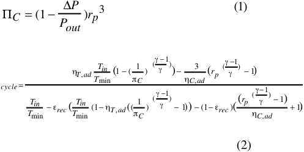
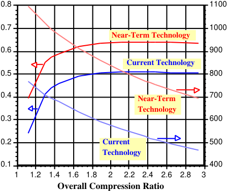
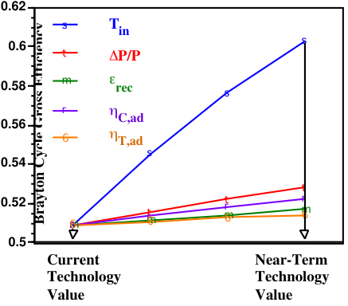
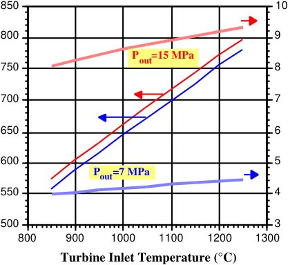

## AN ASSESSMENT OF THE BRAYTON CYCLE FOR HIGH PERFORMANCE POWER PLANTS 

R. Schleicher A. R. Raffray C. P. Wong General Atomics University of California, San Diego General Atomics P.O. Box 85608 EBU-II, Room 458 P.O. Box 85608 San Diego, CA 92186-5608 La Jolla, CA  92093-0417 San Diego, CA 92186-5608 (858)455-4184 (858)534-9720 (858)455-4258 

## ABSTRACT 

The He Brayton cycle appears to be the best nearterm power conversion method for maximizing the economic potential of fusion. Key factors affecting the Brayton cycle efficiency includes the turbine inlet temperature, compressor and turbine adiabatic efficiencies, recuperator effectiveness and cycle fractional pressure loss.  The compression ratio is also important because for fusion conditions, structural and turbomachinery limitations often prevent use of an optimum value. This paper examines in detail these parameters and proposes near-term values for fusion power plant studies based on existing products and test results, current knowledge, and, if justified, reasonable extrapolation. 

## I. INTRODUCTION 

The potential for economically competitive fusion power is largely dependent on achieving a high net thermal efficiency.  This means that heat must be removed from the heat source at the highest possible temperature and it must be converted to electric power in the most efficient thermodynamic cycle.   For fusion systems, however, practical cycle choices are limited by incompatible materials, high heat fluxes, electromagnetic and nuclear radiation fields.  Given these limitations, the helium closed-cycle gas turbine (CCGT) appears to be the best near-term power conversion method for maximizing the economic potential of fusion. 

CCGT development began over sixty years ago with the commissioning of the fossil-fired Pioneer plant in 1939 in Switzerland.   A total of seven fossilfired CCGT units using air, argon and helium working fluids were built in Germany and Switzerland up to 1978.1  Efficiencies were limited to ~30% by the temperature of the primary heat exchanger, which transferred heat to the working fluid from the combustion gases.   In the 1970s, there was strong interest in the U.S. and Germany in the application of direct cycle helium CCGTs to high temperature gascooled reactors.  Although serious development efforts 

were carried out and a major test facility (HHV Plant) was constructed in Germany, the work was discontinued because due to non-competitive economics, mainly attributed to the lack of high effectiveness recuperators and the risk associated with oil lubricated bearings.2  Interest in nuclear CCGTs was revived in the 1990s, after it was shown that high effectiveness plate-fin recuperators and magnetic bearings could lead to near 50% net thermal efficiencies at peak working fluid temperatures of 850oC. 3  At present there are two serious nuclear CCGT development efforts under way.  The Republic of South Africa, with support from U.K. and U.S. companies has committed to construct a 100 MWe helium CCGT plant using a pebble-bed gas-cooled reactor heat source. The U.S. and Russian governments, with support from Framatome, are developing a 300 MWe CCGT plant for plutonium burning at eastern Russian sites using a GT-MHR. 

This new resurgence in CCGT technology development presents a good opportunity to re-examine the applicability of helium CCGTs to fusion power plants. This paper explores fusion plant performance that could be achieved with current technologies and what improvements might be expected with future technology developments. 

## II.  SYSTEM DESIGN CONSIDERATIONS FOR A FUSION BRAYTON CYCLE 

Fig. 1 illustrates the CCGT as ideally applied to fusion and Fig. 2 shows a schematic of the corresponding temperature-isentropy diagram.  It is assumed that ample space is available to incorporate features to maximize performance.  This includes a split-shaft turbine to allow independent optimization of compressor and turbine aerodynamic performance, and multiple stages of intercooling to reduce compressor work. The principal system parameters under the designers control include: 

- Compressor turbine inlet temperature, Tin, 

- Recuperator effectiveness, ε rec, 

- Turbine and compressor adiabatic efficiencies, η T,ad and η C,ad 

- System pressure, Pout, 

- System ∆ P/Pout, where ∆ P is the system pressure drop. 

**----- Start of picture text -----** 
To/from In-Reactor Components or Intermediate Heat Exchanger Tout Tin 9 10 Intercoolers 1 Recuperator ε rec 3 Compressor 5 6 7 8 Turbine Pout HP IP LP Pin Compressors η C,ad η T,ad 1B Generator 4 2 Pre-Cooler **----- End of picture text -----** 

- Fig. 1 Brayton Cycle as ideally applied to fusion power plant 

**----- Start of picture text -----** 
T 1 1B' 10 1B 2' 2 9' 9 7' 5' 3 8 6 4 S **----- End of picture text -----** 

- Fig. 2 Typical temperature-isentropy (T-S) plot for Brayton cycle shown in Fig. 1 

The fusion in-reactor (or intermediate heat exchanger, IHX, if the fusion in-reactor coolant is different from the power cycle He coolant) return temperature, Tout, is ideally a dependent variable that is determined by optimization of the overall compressor pressure ratio, ( Π C=P out/P in).  However, in practical systems, Tout can be constrained by material considerations.  Alternatively, Π C can be constrained by manufacturing considerations. Because of the high specific heat of helium, helium compressors and turbines have a relatively low adiabatic head per stage, hence a large number of stages. Consideration of the number of stages can limit the optimization range of Π C. 

Selection of each of the parameter values is, in principle, constrained by cost. Since the power conversion system (PCS) is likely to be a small fraction of the overall capital cost (~10-20%), it is assumed that the power cost optimization will be driven by efficiency gains over PCS component cost, because these costs are leveraged against a plant cost that is dominated by the reactor plant.   Thus, we can assume that PCS component designs are limited mainly by technology. 

Table 1 shows the current state-of-the-art values of each independent power cycle system variable and the estimated values that could be achieved with future technology development, as will be discussed in the next sections. These were used to estimate the gross cycle efficiency, η cycle, based on the following 4 expressions derived for the cycle shown in Fig. 1 . 

where ∆ _P_ is the system pressure drop; _rp_ is the compression ratio of each compressor; Tmin is the lowest He temperature in the cycle (all temperatures in K); and γ is the ratio of specific heat for He (=1.66). 

Table 1 Range of independent cycle system variables 

*10-20 years in the future 

Fig. 2 shows the estimated gross cycle efficiency for each of the two cases as a function of Π C under the assumption of a 35°C lowest He cycle temperature. The optimum cycle efficiencies for the current and near term technology parameter values are 51% and 64%, corresponding to Π C values of 2.38 and 2.43, respectively. Also shown in the figure for each case is 

the in-reactor or IHX return temperature, Tout, as a function of Π C. The values of Tout corresponding to the optimized Π C values are 522°C and 759°C for the current and near term technology parameter values, respectively. Since η cycle shows virtually no variation with Π C between the optimized Π C value and Π C of ~3, it is possible to change Π C in this range to lower Tout, if required by material consideration, while maintaining a high cycle efficiency. 

**----- Start of picture text -----** 
0.8 1100 0.7 1000 Near-Term Technology 0.6 900 Current Technology 0.5 800 0.4 Near-Term 700 Technology 0.3 600 0.2 Current 500 Technology 0.1 400 1 1.2 1.4 1.6 1.8 2 2.2 2.4 2.6 2.8 3 Overall Compression Ratio **----- End of picture text -----** 

Fig. 2 Brayton cycle gross efficiency and outlet temperature as a function of compression ratio for current and near-term technology cases 

The above results show the cumulative effect on η cycle of changing the cycle system parameters. The individual effect of these parameters on system performance is illustrated in Fig. 3 for the case of optimized Π C.  In this analysis, each independent variable is linearly varied from its current state-of-the art values to its estimated based on future technology development, as indicated in Table 1.  Quite clearly, changing the turbine inlet temperature from 850°C to 1200°C has the major effect on increasing η cycle from 51% to ~60%. Changing the other parameters within the stated range play a lesser but still significant role, cumulatively pushing _cycle to 64%. 

## III. TURBOCOMPRESSOR TECHNOLOGY 

The largest helium turbocompressor constructed to date for the German Oberhausen CCGT was rated at 50 MWe at 750oC inlet temperature, although the actual physical dimensions could support an output of 300 MWe at 850oC1.  The largest helium turbine currently under design has an output of 285 MWe at 850oC inlet temperature as part of the U.S.-Russian GT-MHR design collaboration.  The major issues associated with the design of large helium turbocompressors are: material limitations of the high temperature blades and 

disks, dynamic stability of large flexible rotor assemblies, and the dynamic loading capability of magnetic bearings. 

**----- Start of picture text -----** 
0.62 s Tin 0.6 s t P/P 0.58 m rec s r 0.56 C,ad 6 T,ad s 0.54 t 0.52 6rmts 6rmt 6rmt 6rm 0.5 Current Near-Term Technology Technology Value Value Brayton Cycle Gross Efficiency **----- End of picture text -----** 

Fig. 3 Sensitivity of fusion Brayton cycle gross efficiency to key independent system parameters 

The selection of metal alloys for high temperature turbine blades and disks is limited by resistance to creep and fatigue crack growth at high temperature with trace impurities (such as carbon) in the helium coolant. Candidate materials include cast mono-crystal nickel (e.g. IN-100) and special wrought materials5.  The useable lifetimes of uncooled turbine components fabricated from these materials is projected at 50-60,000 hrs; thus planned blade/disk replacement will be required during the life of the plant.  Based on this work, it is suggested that 850oC is the maximum temperature that could be achieved with uncooled metallic blades/disks.  Cooling of blades/disks with cold bypass helium could enable higher inlet temperatures, but with diminishing improvements to cycle efficiency.  For example, an increase in turbine inlet to from 850 to 950oC results in an ideal efficiency increase ~3.0 points, but cold bypass flow of 2% total flow reduces the increase to only 2.0 points. 

Fabrication of blade and disk materials from refractory and ceramic materials offers high potential gains for gas turbine performance, particularly for helium CCGTs, where corrosion is much less of a concern, thereby offering a wider choice of materials. Arc-cast molybdenum based refractories (e.g. TZM) could allow inlet temperatures as high as 1000oC. SiC/SiC composites could have acceptable mechanical characteristics for use in helium turbine applications up to 1150-1200oC.  Advanced carbon-carbon materials exhibit acceptable strength at temperatures up to 1500oC in low oxidizing helium environments, 

although the availability of compatible fusion in-reactor materials may not enable such temperatures to be reached. 

Helium turbine and compressor adiabatic efficiencies are only indirectly related to the turbine inlet temperature and are more directly dependent on the volumetric flow and rotational speeds.  It is common practice to mechanically connect the turbine and compressor (e.g. through a common shaft) to limit runaway speeds in the event of a loss-of-loads.  This limits optimization of the compressor efficiency, which would perform better at high rotational speeds to compensate for lower volumetric flows.  Splitting the turbine and compressor into two shafts as illustrated in Fig. 1 will give better compressor performances but requires development of fast-acting control techniques to protect against rapid load fluctuations. 

As a general rule it is easier to achieve higher adiabatic efficiencies with larger turbine and compressor sizes. Based on turbine aerodynamic sizing calculations, turbine and compressor adiabatic efficiencies of 94 and 92%, respectively, should be achievable for sizes of ~400 MWe after allowing for blade, entrance and exit losses.   Increasing the turbine size shifts the development burden to the bearing system for load support and maintenance of rotordynamic stability.   Because of the large number of turbine and compressor stages and the slender aspect ratio of the generator, large helium turbocompressors tend to be long and flexible.  The operating speed will be well into the critical speed range.  Operation of large turbines above critical speeds is only possible with magnetic bearings, which can actively control stiffness and damping characteristics to adjust the critical speed relative to the operating speed.  Such rotors are estimated to weight up to 100 tonnes and would require 4-6 radial bearings.  The largest rotor suspended to-date on magnetic bearings is 23 tonnes using 5 active magnetic radial bearings. 

## IV.  RECUPERATOR TECHNOLOGY 

The development of compact, plate-fin recuperators in the last two decades has been the most important technological advanced with respect to improving the performance of CCGTs.  Until the early 1980’s, tubular designs limited large recuperator efectivenesses to ~8182%.  Development of manufacturing techniques for large plate-fin recuperators in the early 1980s by Allied Signal and others made possible the designs of compact helium recuperators with effectivenesses up to 95% and 6 lower heat duty designs with effectiveness up to 96% . Today high temperature, high effectiveness recuperators are available from Allied Signal, Heatrix (U.K.) and IHI (Japan).  OKBM of Nizhny-Novgorad (Russia) has 

recently constructed and tested a modular high temperature helium recuperator for nuclear CCGT service and demonstrated 95% effectiveness at a heat duty of 628 MWt, peak temperature of 508oC and pressure differential of 4.5 MPa. 

The main challenges to advancement of the state-ofthe-art of recuperators for advanced helium CCGT service is the accommodation of increased temperature and pressure.  Fig. 4 shows the recuperator hot-side inlet temperature and heat transfer surface pressure differential (for the Brayton cycle shown in Fig. 1) as a function of turbine inlet temperature, Tin, for optimized turbine performance under outlet compressor pressures, Pout, of 7 and 15 MPa, respectively. As Tin is increased from 850°C to 1200°C, the recuperator inlet temperature increases from ~560°C to ~780°C, the choice of Pout having only a small effect in this case. However, Pout has a much larger effect on the recuperator surface pressure differential, which is over 9 MPa for the case with Pout=15 MPa and Tin=1200°C. This poses quite a challenge for the recuperator design which would need to reliably accommodate such an appreciable pressure differential. 

**----- Start of picture text -----** 
850 10 800 9 Pout=15 MPa 750 8 700 7 650 6 600 5 Pout=7 MPa 550 4 500 3 800 900 1000 1100 1200 1300 Turbine Inlet Temperature (°C) **----- End of picture text -----** 

Fig. 4 Recuperator inlet temperature and pressure differential as a function of turbine inlet temperature for two different compressor Pout cases 

It is difficult to project the temperature limits for metallic recuperators because of the dependence of structural limitation on the specific design.  The onset of the creep-range represents a practical upper limit. For medium priced heat exchanger materials (e.g. SS316), this temperature is ~590-600oC.  For higher, nickel based alloys (e.g. Alloy 800H) this limit is ~750-800oC, but fabrication techniques need to be developed for these materials and the cost is ~10 times that of SS316. 

It may be possible to increase the temperature limit and performance of recuperators by widening the material choice and design configurations. For example, ceramic materials might enable higher temperature operation. They have been investigated for high temperature recuperators in combustion processes, but their applicability for high effectiveness, high pressure, fixed surface recuperator still needs to be demonstrated. The use of high heat flux porous media as heat exchanger configuration might also help in improving future recuperator performance. A detailed study and optimization of a recuperator based on such a configuration would be very useful in helping to determine the practicability and performance of such an application. 

In the absence of such detailed studies, it may be prudent to conservatively assume projected performance values of recuperators based on metallic materials and conventional configurations. In this case, the achievable values of recuperator effectiveness and temperature for fusion reactors are projected to be 96% and 800oC, respectively. 

## V.  SYSTEM PRESSURE AND ∆ P/P 

Since axial turbines and compressors are constant volume machines, the cycle efficiency is theoretically independent of the system pressure.  In fact, as shown in Fig. 3, it is dependent on the fractional pressure drop which is the ratio of pressure drop to system pressure, ∆ P/P. It is expected that He-cooled fusion in-reactor components will have relatively high pressure losses because of the high volumetric flow rates. This can be compensated by increase in the system pressure.  The maximum pressure considered in nuclear design studies to-date is ~7 MPa, where this value is limited to the capability of large, uninsulated, high temperature pressure vessels.  With the use of internal insulation, the pressure capability can be increased.  It is likely that the in-reactor components will establish the pressure limit, but the power conversion system should be able to achieve pressure capabilities of current nuclear pressure vessels and piping components (~15 MPa). 

ratio past its optimized value is relatively small and can be done to reduce the in-reactor inlet temperature with minimal cycle efficiency penalty. 

Based on current technology, this power conversion technique can achieve a gross thermal efficiency of 51%.  With technology developments related to turbine and recuperator materials and increases in turbine size, it may be possible to achieve a gross thermal efficiency of ~64% on a time scale commensurate with fusion reactor development.  As the technology is applicable to both fusion and fission reactors, fusion will benefit from current developments and demonstrations in this area under fission programs. 

## VII. REFERENCES 

- [1] McDonald, C.F. and C.P.C. Wong, “Closed-Cycle Gas Turbine Applications for Fusion Reactors, ASME Publication 81-GT-17, March, 1981. 

- [2] McDonald, C.F., “Direct Cycle HTGR Work Draws Near Prototype Development”, _Energy International_ , Oct, 1978. 

- [3] Staudt, J.E., and L.M. Lidsky, “An MGR Brayton Cycle Power Plant Design,” Paper 879154, Proceedings of 22nd IECEC, Vol. 3, pp. 15491554. 

- [4] S. Malang, H. Schnauder, and M. S. Tillack, “Combination of a self-Cooled Liquid Metal Breeder Blanket with a Gas Turbine Power Conversion System,” Fusion Eng. & Des., 39-40 Part B, 561, Sept. 1998 

- [5] W.R. Johnson, L.D. Thompson and T.A. Lechtenburg, “Design of Wrought Nickel-based Alloys for Advanced HTGR Applications, General Atomics report, GA-A19640, Dec, 1982. 

- [6] Kretzinger, K, S.J. Valentino and K.O. Parker, “Heavy duty Recuperators for Gas Turbines,” Modern Power Systems, Vol. 3, No. 3, pp. 55-61, 1983. 

## VI. CONCLUSION 

Helium closed-cycle gas turbines are a promising technology for future fusion plants.  They can be coupled with fusion in-reactor components using the same He coolant but also using different coolants via an intermediate heat exchanger. The overall compression ratio for given cycle parameters can be optimized for maximum cycle efficiency but can also be adjusted to reduce the in-reactor inlet temperature if required by material consideration. The effect on the gross cycle efficiency of slightly increasing the overall compression 

