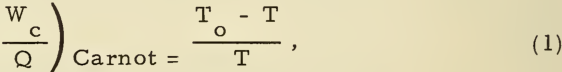
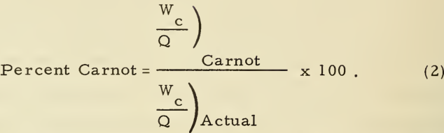
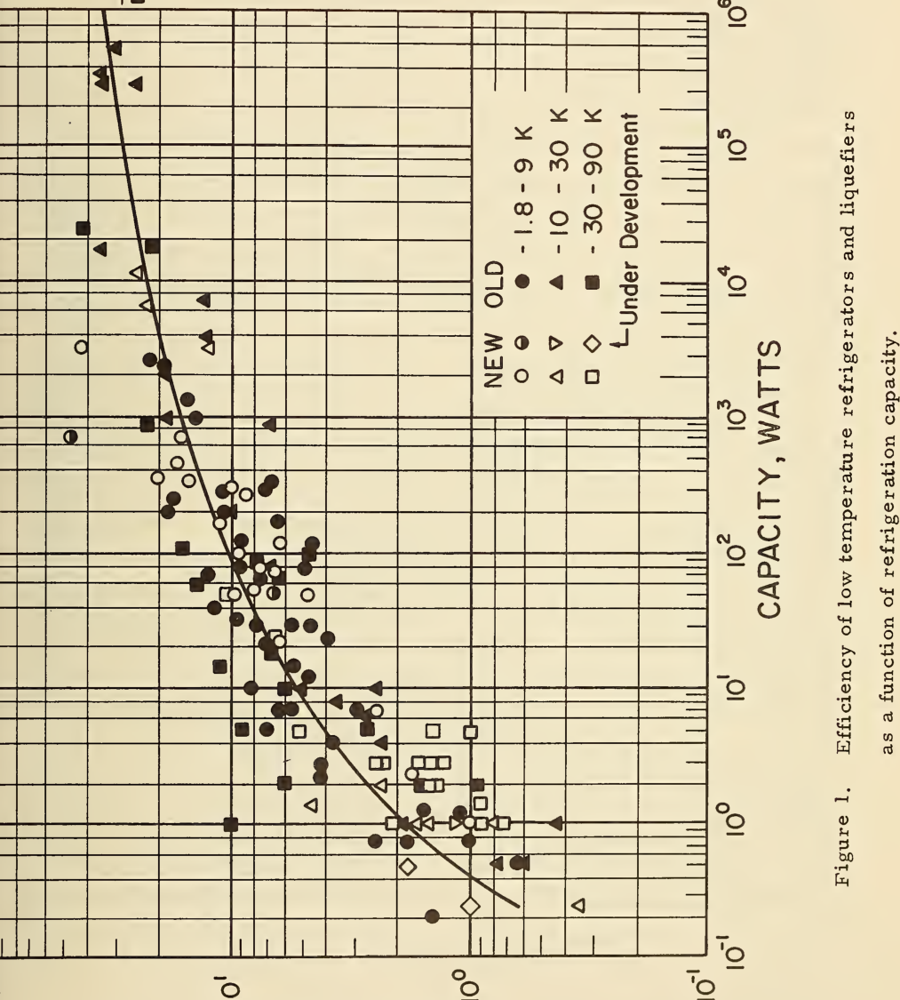
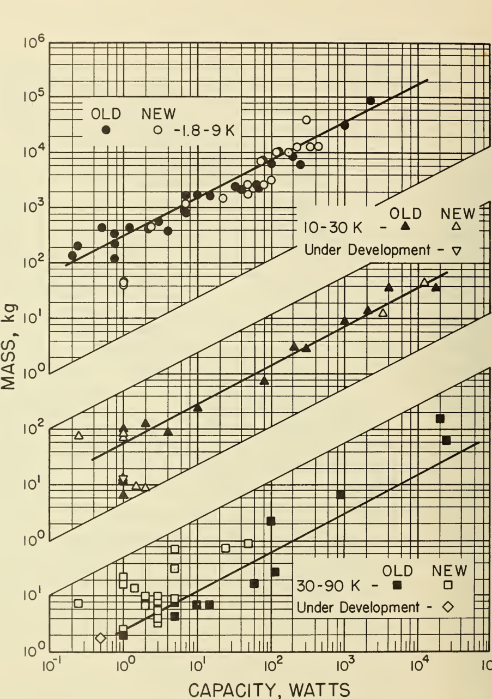
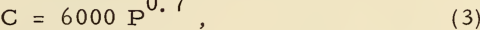
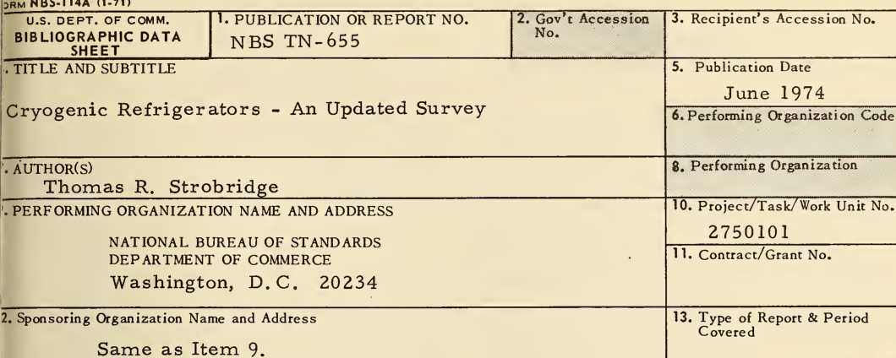

||`Table`|`Table`|`1.`|`Reversible `|`Reversible `|`power requirements.`|`power requirements.`||
|---|---|---|---|---|---|---|---|---|
|`Fluid`|`T`|`Refrigeration`||||`Liquefaction`|`Evap `|`orating Liquid`|
||`(K)`|||`(W/WJ`||`(Whr/liter)`|`Refrige ration *`||
|||||||||`(W/W)`|
|`Helium`|`4. `|`2`||`70. `|`4`|`236`||`326`|
|`Hydrogen`|`20. `|`4`||`13. `|`7`|`278`||`31. 7`|
|`Neon`|`27.`|`1`||`10.`|`1`|`447`||`15. 5`|
|`Nitrogen`|`77.4`|||`2. `|`88`|`173`||`3. 87`|
|`Fluorine`|`85.`|||`2. `|`53`|`238`||`3. 26`|
|`Argon`|`87. `|`3`||`2. `|`44`|`185`||`2. 95`|
|`Oxygen`|`90. `|`2`||`2. `|`33`|`195`||`2. 89`|
|`Methane`|`111. `|`5`||`1. `|`69`|`129`||`2. 15`|

