## **Superconductors for Fusion: a Roadmap** 

## Neil Mitchell[1] 

Jinxing Zheng[2] , Christian Vorpahl[3] , Valentina Corato[4] , Charlie Sanabria[5] , Michael Segal[5] , Brandon Sorbom[5] , Robert Slade[6] , Greg Brittles[6] , Rod Bateman[6] ,Yasuyuki Miyoshi[1] , Nobuya Banno[7] , Kazuyoshi Saito[8] , Anna Kario[9] , Herman ten Kate[9] , Pierluigi Bruzzone[10] , Rainer Wesche[10] , Thierry Schild[1] , Nikolay Bykovskiy[11] , Alexey Dudarev[11] , Matthias Mentink[11] , Franco Julio Mangiarotti[11] , Kamil Sedlak[10] , David Evans[12] ,  Danko C. van der Laan[13, 14] , Jeremy D. Weiss[13] , Min Liao[1] , Gen Liu[1] . 

======================================================== 

1 ITER Organization, 13067, St. Paul-lez-Durance, France 

2 Institute of Plasma Physics, Chinese Academy of Sciences(ASIPP), Hefei, China 

3 EUROfusion, PMU PPPT, Boltzmann Strasse 2, D-85748 Garching, Germany 

4 ENEA, 00044 Frascati, Italy 

5 Commonwealth Fusion Systems, Cambridge, MA 02139, USA 

6 Tokamak Energy Ltd., Oxfordshire, OX14 4SD, UK 

7 National Institute for Materials Science (NIMS), Tsukuba 305-0047, Japan 

8 Japan Superconductor Technology Inc. (JASTEC), 651-2271, Kobe, Japan 

9 Faculty of Science & Technology, Energy Materials and Systems, University of Twente, 7500 AE Enschede, The Netherlands 

10 Ecole Polytechnique Fédérale de Lausanne (EPFL), Swiss Plasma Center (SPC), CH-5232 Villigen PSI, Switzerland 

11 CERN, Experimental Physics Department, Geneva, Switzerland 

12 Advanced Cryogenic Materials Ltd., Oxfordshire, OX14 2HQ, UK 

13 Advanced Conductor Technologies LLC, Boulder, CO 80301, USA 

14 University of Colorado Boulder, CO 80309, USA 

## **Abstract** 

With the first Tokamak designed for full nuclear operation now well into final assembly (ITER), and a new major research Tokamak starting commissioning (JT60SA), nuclear fusion is becoming a mainstream potential energy source for the future. A critical part of the viability of magnetic confinement for fusion is superconductor technology. The experience gained and lessons learned in application of this technology to ITER and JT60SA, together with new and improved superconducting materials, is opening multiple routes to commercial fusion reactors. The object of this roadmap is, through a series of short articles, to outline some of these routes and the materials/technologies that go with them. 

## 1. Background and Introduction to the Roadmap 

Introduction 

Superconductor technology has always been a part of the dream of achieving nuclear fusion by magnetic confinement, pre-dating even the discovery of the best-performing magnetic confinement device, the tokamak, in the 1960s [1]. Throughout the last 50 years, steady progress has been made in the use of superconductors in a range of superconducting magnetic confinement devices, starting with T-7 in 1979 [2] and culminating in the construction of the huge ITER tokamak, the first device designed with full nuclear operation in mind [3]. 

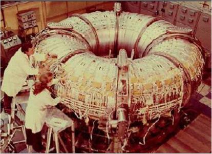

The construction of ITER has been associated also with steady progress in what may be called ‘fusion plasma engineering’ where success in improving energy confinement in experimental machines gives confidence in plasma performance predictions for ITER. This increased confidence is giving rise to a series of proposals for post-ITER machines, capable of producing net nuclear power. These fall into two categories, the first which may be named ‘big machines’ which are DEMO-type fusion reactors based on the ITER design concept and technologies [4, 5], supported by the plasma performance of the large tokamaks that operated in the 1990s. The second category is the ‘compact machines’ based on more advanced technology (especially in superconductivity) [6, 7]. 

Within this progress and conceptual design activity, there is a lack of focus on the targets for the superconducting community to achieve to develop superconductors which will provide the most useful technology for these future nuclear devices. ITER itself is designed, during its operating life, to allow testing of the nuclear/plasma technology, in the areas of irradiation performance of materials, first wall, blanket and divertor technologies and plasma control. However there is no such matching programme for the superconducting magnets, which in ITER remain substantially based on the magnet technologies from the 1980s and 90s. The object of this roadmap article is to provide a series of snapshots by superconducting experts on their personal views of the most important avenues of development for superconducting technology to follow, when applied to a nuclear magnetic confinement device. These articles include of course the obvious avenues of superconducting material including HTS, but also some on the supporting technologies (and demonstrators for them) that are needed to improve the applicability of these materials. These technologies, among them quench protection, operational voltages, reliability and maintainability are tightly 

integrated to the materials and the manufacturing routes for magnets, but also merit development of their own since they play a key role in the ultimate usability of the superconductor materials. 

## Magnetic Confinement 

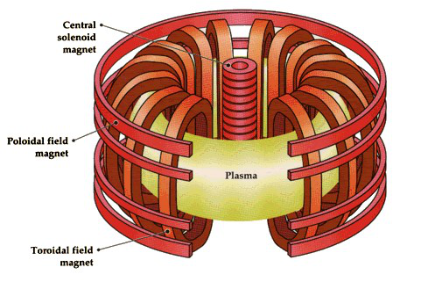

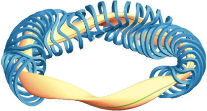

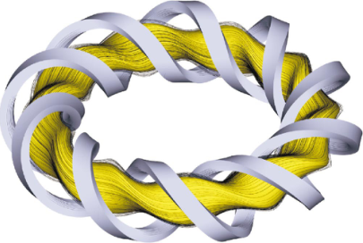

Figure 2 shows the three forms of magnetic confinement devices that appear in this article. The most common (and with the best plasma confinement performance) is the Tokamak, with its three basic sets of coils, the Toroidal Field (TF) coils, the Central Solenoid (CS) coils and the Poloidal Field (PF) coils. Then the stellerator appears in two forms, one with discrete but 3 dimensional coils and the other with largely toroidally wound spiral coils. The tokamak has a plasma current, the stellerators do not. The stellerator (LHD type) is the basic design considered in the article ‘Overview of HTS joints technology for segmented coils’. A specific type of tokamak, the spherical tokamak, appears in ‘REBCO magnet technology – a key enabling technology for compact fusion devices’. 

## Superconductivity and Fusion: a brief history 

The first generation of magnetic confinement devices to use superconductivity were based on NbTi and Nb3Sn strand technology. 

- T-7 Kurchatov 1979 had NbTi TF coils (first with superconductors) 

- Mirror Fusion Test Facility (MFTF) used NbTi and Nb3Sn, fully superconducting, Complete 1984, but not operated. 

- TRIAM-1M Kyushu University 1986 used Nb3Sn superconductor in its 16 D-shaped TF coils, cooled by pool boiling liquid helium (first to operate with Nb3Sn) 

In parallel with these confinement machines, the superconductor community recognised the need for a large scale development and test of ‘magnets for fusion’. This led to the IAEA Large Coil Task, a collaboration between US, Japan and the European Union in the late 70s and 80s, Fig 3 & 4. This was conceived as a stimulus to provide integrated conductor and coil solutions to be tested in a shared environment [8]. The ancestor of the cable-in-conduit Nb3Sn conductors used in the ITER project can be clearly recognised in one of the coils (the Westinghouse one). 

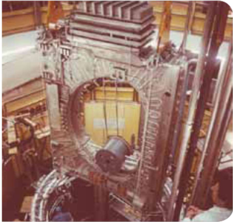

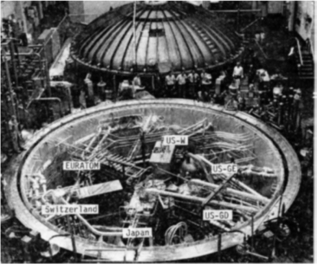

Almost at the same time, a collaboration between US and Japan manufactured and tested model pulsed coils in a facility in Japan [9]. This showed some unforeseen behavior regarding current distribution which prevented several coils reaching the intended performance but also thereby influenced the design of later conductors for ITER. 

Following the start of the ITER project in 1988, one of the activities initiated during the EDA (Engineering Design Activity) phase in the 1990s was that of the ITER model coils. Two of these were produced, a CS MC (Model Coil) and a TF MC and successfully tested, demonstrating many of the critical technologies later used in the ITER Coils [10, 11]. 

Subsequent superconducting magnetic confinement devices have not substantially changed the technology, with cable-in-conduit NbTi and Nb3Sn used exclusively since the 1990s. After the 1980s, the increasing magnetic energy (and hence the need for high voltage during fast discharge to reduce the copper needed for protection) and higher magnetic loads drove the selection of solid insulation systems. Internally cooled conductors, with glass-kaptonresin becoming a general standard. 

- Tore Supra, CEA Cadarache France 1988 NbTi TF coils run at a temperature of 1.8K 

- T15, Kurchatov, 1988, largest Nb3Sn TF coils 

- LHD, Toki, Japan, NbTi, 1998 

- Wendelstein 7X Stellerator 2015 NbTi 

- Kstar, Daejon, S. Korea, Nb3Sn and NbTi, 2008 

- EAST, first fully superconducting tokamak, NbTi, 2006 

- JT60SA, Nb3Sn and NbTi, due 2021 

Future Fusion Reactors and Superconducting Technology 

The main driver of magnetic confinement for fusion is of course the plasma physics and the confinement. Modelling of the plasma core suggests that there are windows for ‘compact’ machines which can exploit high field or very low aspect ratio (or both) to achieve a higher power density than the larger medium field and large machines characterised by ITER and JT60SA. However, the outer plasma boundary and first wall/divertor interaction (and control) with ‘hot’ plasmas is still relatively uncertain. The heat loads on the plasma facing components (PFC) are proportional to surface area, and so, for the same plasma power, large tokamaks have lower PFC heat loads. Minimising these loads has for ITER been one of the main design drivers for the size since the PFC are one of the most technically challenging and uncertain areas for a future fusion power plant. For the future we see compact machines being proposed which aim to exploit a plasma confinement regime which is becoming more attractive due to developments in superconducting technology and materials. By using fewer of these materials they can reasonably claim to be able to exploit novel superconducting materials with a weaker industrial base. These appear alongside ‘traditional’ machines which are built on the ITER technologies and which tend to extrapolate the plasmas obtained in the tokamaks of the 1990s in terms of aspect ratio, dimensions, toroidal field, and PFC performance. 

What could be the key superconductor technologies for the future? Of course the answer depends also on the plasma operational requirements on the magnets to achieve good confinement and also on the capabilities of the components facing the plasma…a compact high field machine ought to produce a high fusion power but also imposes very high thermal and nuclear fluxes on the plasma facing components. But a key technology for fusion is applied superconductivity and the fusion field cannot wait 15 years for plasma performance data to be confirmed by machines like JT60, ITER and the new spherical tokamaks in order to decide the technology that is needed and then spend another 15 in developing it. The point of this roadmap article is to look at directions for superconductivity to be encouraged to develop, to be in a position to deliver what is needed for a fusion reactor. 

Superconducting magnets can be broken down into four components 

1. Conductor 

2. Structures 

3. Insulation 

4. Instrumentation 

and the key factor to use them is integration. The overall usefulness of any integrated solution using these components is also strongly influenced by 

- Quality (and therefore reliability) 

- Repairability 

The integration of the four components depends on final machine parameters but also on the technologies selected for them. In a research environment, the last two items are sometimes not given the weight that they will receive in a nuclear environment. To draw attention to the likely expectations of a nuclear regulator, we have included several articles relating to these last two bullets. 

The roadmap articles each span some parts of the list above but not all. To provide an overview of the roadmap content we have selected five areas for use as a content index (see Table 1) 

- i. Superconductor material 

- ii. Conductor design and manufacturing 

- iii. Conductor integration in magnet (including instrumentation, insulation, selection of conductor current and voltage levels) 

- iv. Systems engineering (quality and repairability which cover items like demountable coils, demonstration coils and proof of reliability) 

- v. Magnet and machine design 

Economics of Superconductors in Fusion 

Absolute cost estimates of the magnets within a fusion reactor, even if available for a detailed design, are difficult to work with, being subject to many assumptions and often considerable optimism. To put the magnet cost within the context of the full plant cost, two sources have been selected, one the ITER FDR report from 2001 [12] and the other a study of the costs of a full electricity generating plant [13]. Figure 5 shows the relative contributions. Neither of these include the engineering costs, which in the case of such first of a kind machines could approach the direct costs [13]. In the case of ITER, experience suggests that the relative contribution of the plant costs (including buildings) was significantly underestimated. Fig 5 indicates that in a future fusion plant, with higher building and balance of plant costs due to power production, we can expect the magnet costs to lie in the range of 10-15% of the total direct cost. 

This roadmap is focused on the technology use issues and does not include much discussion on the costs of superconductors and superconducting technology. Cost assessments for superconducting magnetic confinement devices often focus on a costing based on the superconducting materials because they are simple to obtain—the iterations on ITER during the period 1997-2001 [14] provide an example—but neglect the real costs of an integrated system as these are much more design specific and cannot simply be taken as proportional to the superconductor material costs. 

ITER experience in industrialisation of Nb3Sn is quite relevant [15]. In the early stages Nb3Sn costs (in terms of Euro/kg of material) were high and the quality unpredictable due to the limited industrial base, and led to attempts to design the tokamak to minimise them. In the end with ITER, adroit exploitation of multiple suppliers enabled material costs to be kept under control (even if not as low as originally hoped) despite the natural political desires of the partners to keep a stake in strategic technologies. However, the absolute magnet system costs, particularly from contributions in such basic technologies as large steel forgings, and from complexity caused by an excessively compact design, were far above the original estimates. 

From this, and considering the relatively low fraction of the total cost driven by the magnets (<20%) we suggest that if costs have to be considered, the trap of basing them on very early estimates of the superconducting materials must be avoided. This can lead to decisions that actually enhance the overall cost because good systems engineering is sacrificed in the interests of minimising the use of superconducting materials. 

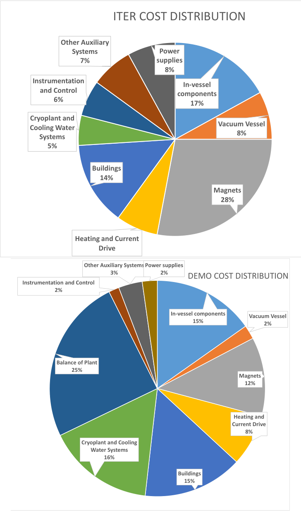

**----- Start of picture text -----** 
ITER COST DISTRIBUTION Other Auxiliary Systems Power 7% supplies 8% Instrumentation In-vessel and Control components 6% 17% Cryoplant and Vacuum Vessel Cooling Water 8% Systems 5% Buildings 14% Magnets 28% Heating and Current Drive Other Auxiliary Systems Power supplies 3% 2% DEMO COST DISTRIBUTION Instrumentation and Control 2% In-vessel components Vacuum Vessel 15% 2% Balance of Plant 25% Magnets 12% Heating and Current Drive 8% Cryoplant and Cooling Water Systems 16% Buildings 15% **----- End of picture text -----** 

Figure 5: Relative predicted cost contributions for ITER (top) and DEMO (bottom) 

## Roadmaps 

To provide an overview of the content range of the individual road-maps, Table 1 has an index. To provide some structure, the articles have been ordered starting with those that give substantially ‘machine overviews’ (i.e. the rightmost column). Following this they are selected on the basis of first appearance, from column 1 to 4 

Table 1: Distribution of Road-Map Content 

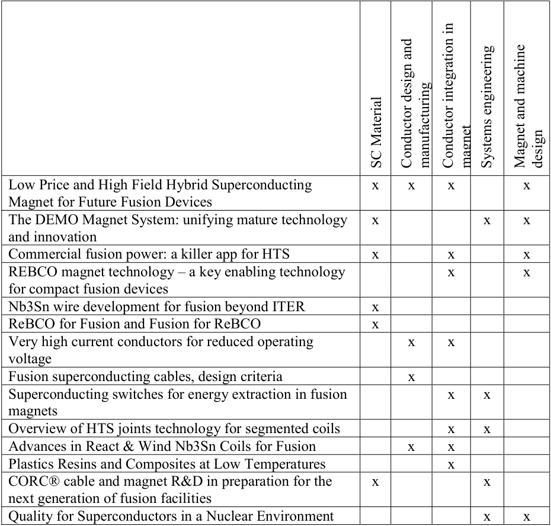

**----- Start of picture text -----** 
Low Price and High Field Hybrid Superconducting  x  x  x  x Magnet for Future Fusion Devices The DEMO Magnet System: unifying mature technology  x  x  x and innovation Commercial fusion power: a killer app for HTS x  x  x REBCO magnet technology – a key enabling technology  x  x for compact fusion devices Nb3Sn wire development for fusion beyond ITER  x ReBCO for Fusion and Fusion for ReBCO x Very high current conductors for reduced operating  x  x voltage Fusion superconducting cables, design criteria  x Superconducting switches for energy extraction in fusion  x  x magnets Overview of HTS joints technology for segmented coils x  x Advances in React & Wind Nb3Sn Coils for Fusion  x  x Plastics Resins and Composites at Low Temperatures x CORC® cable and magnet R&D in preparation for the  x  x next generation of fusion facilities Quality for Superconductors in a Nuclear Environment  x  x SC Material  Conductor design and  manufacturing  Conductor integration in  magnet  Systems engineering  Magnet and machine  design **----- End of picture text -----** 

## Conclusions 

It is clear from the range and subject matter of the 14 articles that have been contributed, that the superconducting magnet community has multiple opinions on the route to follow to provide proven superconducting magnet technology for a future power producing magnetic fusion device. We can see the three drivers behind this in the form of 

1. Progress in magnetic fusion plasma confinement, to the extent that tokamaks presently under construction will be achieving fusion grade plasmas. By doing so they confirm much of the modelling basis for plasma design and support, in particular, the high field compact tokamak configurations. 

2. Progress in high temperature superconductors which has made available a new material with improved operational ranges in temperature and field 

3. Experience in nuclear tokamak construction where repairability and reliability, and improved overall system integration, are recognised as major considerations in a future power plant design 

All of the 14 contributions pick up one or two of these drivers and look at specific ways in which the progress could be further exploited to eventually provide a conceptual power plant. There is not however a common theme that can be obviously picked out so that the multiple specific technologies within the contributions can be integrated to provide a single roadmap for the superconducting field. What we have are several roads on which traffic can proceed rather independently, all with their own difficulties. We have a range of proposals within the articles for assisting to overcome these difficulties with auxiliary technology such as insulation or joints, or design features like high current or quench protection. Our problem in the superconductors-for-fusion area is to identify common themes so that these roads can be linked and difficulties addressed with a common approach, to avoid dissipation of resources into too many possible solutions, none of which end up being brought to completion. We can contrast with the internal (nuclear) components where ITER itself is designed as a test bed which can test future reactor concepts for components like the blankets and first wall. The 14 contributions reflect substantially two fields of activities on nuclear fusion magnets. On one side we have the various contributions related to the “DEMO” projects, e.g. in China, Europe, Korea, Japan, which are the natural follow-up of ITER. The focus of design and R&D for these projects is about the improvement of the reliability, the reduction of risk in operation, the quality assurance procedures and the effectiveness (i.e. the cost) of the  design and manufacturing approach. The lessons learned in the design and construction phase of ITER drive the effort. Typical examples are the reduction of the operating voltage, triggered by the various Paschen test failures during the ITER and W7-X coil manufacture, the reactand-wind revival for very high current Nb3Sn graded windings, triggered by low effectiveness of the wind-and-react CICC, the fatigue in the central solenoid, which becomes a central issue for a power plant with lifetime much higher than ITER, the tolerance requirement on large structural items, e.g. the TF cases, which eventually dominates the manufacturing cost and time for very large tokamaks, the quench management, aiming at a robust and resilient approach, passing the scrutiny of the RAMI analysis and certification for nuclear grade components. 

In most cases, the issues must be dealt and solved at design level, the R&D being the necessary and powerful support of specific conceptual approaches. The roadmap (toward a large pulsed tokamak with electrical power output larger than 500 MW) consists of a number of technology improvements, which are presently addressed without real coordination by the various countries with their own national DEMO project. A better exchange of information on design and R&D at international level is desirable and beneficial for an effective use of resources. 

The second field of activities, addressed by several chapters of this article, is focused on the use of HTS magnets for fusion devices, which are definitely not in the footprint of ITER. In 

contrast to the activities described above, here the main object is to achieve proofs-ofprinciple and demonstrations for novel technology approaches, ranging from demountable magnets and segmented windings with thousands of demountable joints, non-insulated winding packs, very high field magnets, indirect cooling. The challenging character of these activities is surely stimulating and attractive for the young generation of scientists, eager to achieve a technological breakthrough within a reasonably short delay. The proposed R&D plans and demonstrations presently can hardly fit into a well defined roadmap with the many different strategic approaches. An ambitious proof-of-principle, for example the successful test of a full scale demountable joint for HTS winding segments, is surely a necessary condition for the feasibility of a large torsatron magnet, but may be not a sufficient argument to move ahead on that path. 

Similar methods to those already used in the early days of ITER [16] could stimulate DEMO engineering in the magnet area and link these two activities. There are interesting new proposals regarding compact high field tokamaks as pilot fusion plants, which would not rely on ITER superconducting technology, but the lessons learned from ITER show how improvements can be made in the engineering layout of a tokamak fusion reactor. These proposals bring in new sources of funding and the superconducting community needs to encourage these developments. From the roadmap articles we can identify two objective for such a stimulus and focus, which we could call a Superconductor Engineering Concepts Demonstrator: 

1. Testbed for new technology, to engage industry and develop maturity 

2. Testbed for basic engineering improvements (repair, reliability, effectiveness) To launch such a stimulus requires funding and above all, imaginative (and light) technical coordination. The LCT project in Oak Ridge in 1970s, SULTAN from 1980s and ITER CSMC in 1990s were examples of how resources could be combined, engaging many industries by having a modular form, allowing nearly independent in-kind contributions while requiring a common time schedule. Such a combined facility could be designed to allow the different contributions to work under conditions that match their test/demonstration requirements. The LCT project provided a test bed for 6 similar TF coil concepts but the ITER CS Model Coil facility required an inner coil, an outer coil and several insert coils. We could, as an example, imagine a toroidal test facility with perhaps 10-12 TF coils being contributed including advanced insulation, demountable coils, and innovative quench detection/protection. The focus would be on the integration of the basic machine (magnets with feeders and instrumentation, vacuum vessel, cryostat and integration and repairability) rather than a conductor test facility as created by SULTAN and the CSMC. An SECD coordination group could also provide a forum for the magnet engineering of the very different individual ‘next step’ tokamak concepts to be discussed with some engineering exposure and expert review for the different magnet concepts. 

## References 

1. Shafranov, Vitaly, On the history of the research into controlled thermonuclear fusion, Journal of the Russian Academy of Sciences. 44 (8): 835–865, 2001 

2. D. Ivanov; V. Keilin; B. Stavissky; N. Chernoplekov, Some results from the T-7 tokamak superconducting magnet test program, IEEE Transactions on Magnetics Volume: 15, Issue: 1, Jan 1979 

3. D. Campbell, The first fusion reactor: ITER, Europhysics News, vol. 47, issue 5-6, pp. 28-31 

4. G. Zhuang et al, Progress of the CFETR design, 2019 Nucl. Fusion 59 112010 

5. G.Federici et al, DEMO design activity in Europe: Progress and updates, Fusion Engineering and Design, Volume 136, Part A, November 2018, Pages 729-741 

6. A. Sykes et al, Compact fusion energy based on the spherical tokamak, Nucl. Fusion 58 (2018) 016039 

7. B. N. Sorbom et al, ARC: A compact, high-field, fusion nuclear science facility and demonstration power plant with demountable magnets, Fusion Engineering and Design Volume 100, November 2015, Pages 378-405 

8. Beard, D.S.; Klose, W.; Shimamoto, S.; Vecsey, G. (eds.), The IEA Large Coil Task Development of Superconducting Toroidal Field Magnets for Fusion Power, Fusion Engineering and Design, Volume 7, Pages 1-430 (1988–1989) 

9. E. Tada et al, System design of the demonstration poloidal coils and the test facility, IEEE Transactions on Magnetics Volume: 23, Issue: 2, Mar 1987 

10. Maix R 1998 Manufacture of the ITER TF model coil Proc. of 20th Symp. Fusion Technology pp 833–6 

11. Tsuji H and Okuno K 2001 Progress of the ITER central solenoid model coil programme Nucl. Fusion 41 645–51 

12. Final Report of the ITER EDA, IAEA, Vienna, 2001, IAEA/ITER EDA/DS/21 

13. Tetsutarou Oishi, Kozo Yamazaki, Hideki Arimoto et al, Comparative Study of Cost Models for Tokamak DEMO Fusion Reactors, Plasma Fusion Res. 7, 2405115 (2012) 

14. Matsuda, S. Overview of ITER project. Objective, history, status of development, structure and its future. GENES4/ANP2003, Sept. 15-19, 2003, Kyoto, JAPAN 

15. A. Devred et al, Challenges and status of ITER conductor production, March 2014, Superconductor Science and Technology 27(4):044001 

16. N Mitchell1, M Breschi, V Tronza, The use of Nb3Sn in fusion: lessons learned from the ITER production including options for management of performance degradation, Supercond. Sci. Technol. 33 (2020) 054007 

## Contents 

|1.|Background and Introduction to the Roadmap ................................................................... 2|
|---|---|
|2.|Low Price and High Field Hybrid Superconducting Magnet for Future Fusion Devices 13|
|3.|The DEMO Magnet System: unifying mature technology and innovation ...................... 18|
|4.|Commercial fusion power: a killer app for HTS .............................................................. 26|
|5.|REBCO magnet technology – a key enabling technology for compact fusion devices ... 33|
|6.|Nb3Sn wire development for fusion beyond ITER .......................................................... 38|
|7.|ReBCO for Fusion and Fusion for ReBCO ...................................................................... 42|
|8.|Very high current conductors for reduced operating voltage ........................................... 47|
|9.|Fusion superconducting cables, design criteria ................................................................ 51|
|10.|Superconducting switches for energy extraction in fusion magnets ................................ 56|
|11.|Overview of HTS joints technology for segmented coils................................................. 61|
|12.|Advances in React & Wind Nb3Sn Coils for Fusion ....................................................... 66|
|13.|Plastics Resins and Composites at Low Temperatures .................................................... 71|
|14.|CORC® cable and magnet R&D in preparation for the next generation of fusion|
|facilities .................................................................................................................................... 77||
|15.|Quality for Superconductors in a Nuclear Environment .................................................. 82|

2. Low Price and High Field Hybrid Superconducting Magnet for Future Fusion Devices 

Jinxing Zheng 

The needs of superconducting magnet for fusion reactors have been raised since over 40 years. The advanced plasma experiments and future fusion reactors, call for long confinement time and high magnetic fields, which can be reasonably maintained only by superconducting coils. A dozen of fusion devices have been built or under construction with superconducting magnets, for example, EAST, WEST, KSTAR, JT-60SA, and ITER, superconducting magnet system for these fusion devices were manufactured by NbTi or Nb3Sn cable-in-conduit conductor. 

**Table 1** Main parameters of magnet system for EAST, WEST, KSTAR, JT-60SA and ITER 

The magnet field is a key parameter for the fusion device, the plasma confinement time will be increased according with the magnet field increasing. High temperature superconductor (HTS) has been found a nice solution in the current leads for high current fusion magnets, and HTS fusion magnet has been put forward by MIT in SPARC [7]. Aluminium alloy-jacketed Nb3Sn superconductor and indirect cooling using cooling panels within coil was proposed as a candidate magnet system for the LHD-type reactor FFHR [8]. But the basic engineering issues of HTS technology and the high price are the main reasons that cause HTS in winding of fusion magnets is unpractical now. So, hybrid magnet design scheme is the optimal solution for high field magnet manufacturing. For example, hybrid HTS-Sn3Sn-NbTi was designed for the EUDEMO CS coil [9], Nb3Sn and NbTi hybrid has been designed for the CFETR CS modular coil [10].  Benefits of a hybrid CS coil have two-fold, either to reduce the outer radius of the magnet or to increase the generated magnetic flux [11]. So, hybrid magnet will be a trend for high magnetic field in pulsed Tokamak. 

In general, the future fusion reactor magnets must be operated in strong magnetic field environment. From the economic point of view, hybrid magnet is an ideal choice. For 

superconducting magnets, there are two categories of hybrid. For the magnetic field less than 16T, the hybrid is high Jc Nb3Sn and NbTi superconductor. The maximum magnetic field of the CFETR TF magnet is about 15T, which adopts the hybrid of high Jc Nb3Sn, ITER grade Nb3Sn and NbTi. The lengths of each conductor are 2000 meters, 3200 meters and 1700 meters, respectively. So, each TF coil can save about 30 million dollars, and the whole 16 TF coils can save 480 million dollars . However, high Jc Nb3Sn has a large hysteresis loss, so it’s not suitable for CS and PF magnets. Because the operation mode of CS and PF magnets is pulsed, the current and magnetic field will change all the time, so AC losses will be correspondingly large. Due to the intrinsically large hysteresis for high Jc Nb3Sn wire (2500mj/cc for ±5T cycles), it is not suitable for CS and PF magnets at the present stage. For magnetic field higher than 16T, the hybrid is usually HTS (Bi2212, REBCO) and LTS (Nb3Sn, NbTi), such as the conceptual design of CS magnet for EU DEMO. Similar to the LTS, Bi2212 composite can be manufactured in circular strands. Its electromagnetic properties are very similar to that of Nb3Sn superconductor, so the design method of CICC conductor based on cryogenic superconducting material can be fully compatible with Bi2212 material. But the increase of critical current for Bi2212 strand should be obtained by heat treatment under about 100bar high pressure.  And the Ag matrix of Bi2212 has the potential of activation under irradiation environment in fusion devices. The other HTS material, REBCO conductors have been provided only in the form of tapes to ensure grain boundary alignment up to now. The superconducting properties of REBCO tapes are strongly anisotropic. The critical field current Jc|| arranged along the tape width direction is 4-5 times higher than that in the vertical direction (Jc⊥). Due to the weak ‘adhesion’ between the substrate and copper, there is a high mechanical anisotropy in REBCO. The critical transverse tensile stress and peel stress are 10 times and 100 times lower than the axial tensile stress and peel stress [12]. At present, in addition to the relatively high price of HTS-CICC conductor, the preparation technology of CICC conductor based on REBCO tape is still in the stage of development and immature. The Bi2223 is more suitable for current leads than superconducting magnets. On the one hand, Bi2223 cannot be made into wire like Bi2212 for easy winding, on the other hand, Bi2223 cannot like YBCO which have large current carrying capacity even if there is a high vertical magnetic field. 

In view of the technical challenges of hybrid magnets for fusion reactors, a series of new technologies must be developed. The first is the improvement of material properties. Heat treatment of Bi2212 strand in large coils is a technical challenge. Compared with Nb3Sn, the peak temperature of Nb3Sn is higher, up to 878 ℃. The development of heat treatment technology directly affects the properties of Bi2212 strand. For large coil heat treatment, ASIPP suggests using medium pressure Argon in furnace and high-pressure oxygen (up to 100 bar) inside the CICC to improve the Bi2212 properties. The pressure of Argon could be evaluated by the jacket thickness and oxygen pressure. But the overpressure heat treatment make the Bi2212 wires shrink, so the void fraction will be increased. The cable will be loose and may be move under electromagnetic force. The stability of conductor is decreased. So, the cable structure of Bi2212 CICC is a critical technology. ASIPP has carried out lots of R&D activities of Bi2212 strand for the CFETR magnets [11]. The short twist pitch (STP) design solved the problem of performance degradation due to strain. For REBCO tape, great effort should be continuing to improve the performance of the tape by increasing the critical current and its 

uniformity along the tape length, reducing the substrate thickness and overall product price. At present, the maximum length of a single tape with fairly uniform transmission is about 1km. As mentioned above, the current superconducting CICC technology based on wire cannot be compatible with the tape structure, so new HTS-CICC structure must be developed. At present, the three main HTS-CICC structures are divided as Roebel, CORC and TSTC. ASIPP has developed a nine-turn solenoid magnet wound around a 4-meter long CORC cable and tested at 4.2 K in a background magnetic field up to 19T to check the stability of current carrying performance of REBCO cable under the combined action of thermal load and electromagnetic load [12]. No performance degradation was observed after 10 warm-up and cool-down cycles of operation at 90% Ic, which built the basis for future fusion hybrid magnet reaches to 20T. On the other hand, the Lorentz load generated by 20 T magnetic field needs high strength structural materials to support the magnet, which requires new metals or composite structures with very high yield strength `,` ultimate strength, ductility and elastic modulus. In addition, insulation materials should also be developed to achieve excellent radiation resistance for fusion hybrid magnet. 

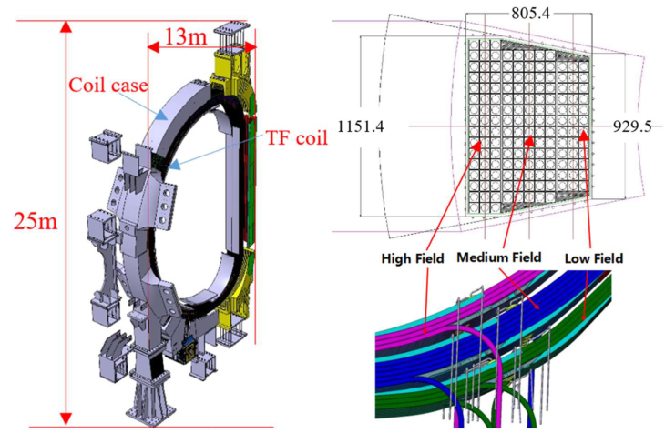

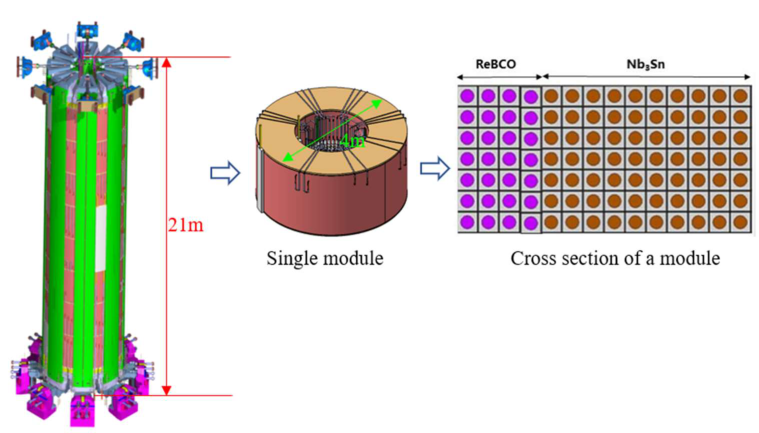

High field hybrid superconducting magnet maybe good choice for future fusion devices. But there are some issues and challenges. High Jc Nb3Sn has a large hysteresis loss and not suitable for CS and PF magnets. Hybrid is usually HTS (Bi2212, REBCO) and LTS (Nb3Sn, NbTi) when magnetic field higher than 16T, Ag matrix of Bi2212 has potential of activation under irradiation, and the superconducting properties of REBCO tapes are strongly anisotropic. In addition to high price of HTS-CICC conductor, the preparation technology of CICC conductor based on REBCO tape is still in the stage of development and immature. New technologies must be developed to meet the technical challenges, which include superconducting magnet material properties, heat treatment technology, new HTS-CICC structure, new metals or composite structures with high yield strength and ultimate strength, high ductility and high elastic modulus, and insulation materials with high radiation resistance. The Bi2223 is suitable for current leads rather than superconducting magnets. 

This work has been supported by China National Science Fund (52077211), Youth Innovation Promotion Association of CAS (201979), Science and Technological Fund of Anhui Province for Distinguished Young Scholars (2008085J28), National Key R&D Program of China (Grant No. 2017YFE0300503). 

> [1] Songtao Wu, the EAST team. An overview of the EAST project [J]. Fusion Engineering and Design, 2007 (82): 463-471. 

> [2] S. Nicollet, A. Torre, S. Girard, B. Lacroix, C. Reux, P. Prochet, WEST Team. Thermohydraulic analysis of Tore Supra/WEST TF coil quench: Associated smooth quench occurrence in tokamak [J]. Cryogenics, 2020, 106: 103042. 

- [3] Hee-Jae Ahn, Hyun-Ki Park, Jinsub Kim, YoungOk Kim, Yong Chu, Kwang Pyo Kim, Kaprai Park, Si-Woo Yoon, Yong Hwan Kim. Prediction of mechanical behavior of the KSTAR CS magnet based on PF coilcurrents [J]. Fusion Engineering and Design, 2019 (146): 594-597. 

- [4] P. Barabaschi, Y. Kamada, H. Shirai and the JT-60SA Integrated Project Team. Progress of the JT-60SA project [J]. Nucl. Fusion, 2019, 59: 112005. 

- [5] Devred A, Senior Member, IEEE, D. Bessette, P. Bruzzone, K. Hamada, T. Isono, N.  Martovetsky, N. Mitchell, Y. Nunoya, K. Okuno, I. Pong, W. Reiersen, C. M. Rey, B. Stepanov, Y. Takahashi, and A. Vostneret al. Conductor qualification program for the ITER central solenoid. IEEE Trans ApplSupercond, 2013, 23: 6001208. 

- [6] Koizumi N, K. Matsui, T. Hemmi, K. Takano, Y.Chida, M. Iguchi, H. Nakajima, M. Shimada, K. Oosemochi, Y. Makino, Y. Nagamoto, and K. Esaki. Development of ITER TF coil in Japan IEEE Trans. Appl. Supercond., 2012, 22: 4200404. 

- [7] Creely, A., Greenwald, M., Ballinger, S., Brunner, D., Canik, J., Doody, J., Zhu, J. (2020). Overview of the SPARC tokamak. Journal of Plasma Physics, 86(5), 865860502. doi:10.1017/S0022377820001257 

- [8] H Tamura, K Takahata, T Mito, S Imagawa, A Sagara. Mechanical behaviour analysis of superconducting magnet in LHD-type reactor FFHR. Journal of Physics: Conference Series, 2008, 97: 012139. 

- [9] Sarasola X, Wesche R, Ivashov I, Kamil Sedlak, Pierluigi Bruzzone. Progress in the Design of a Hybrid HTS-Nb3Sn-NbTi Central Solenoid for the EU DEMO [J]. IEEE Transactions on Applied Superconductivity, 2020, PP (99):1-1. 

- [10] Zheng Jinxing, Song Yuntao, Lu Kun, Liu Xufeng, Qin Jinggang. Overview of the Design Status of Superconducting Magnet System of CFETR [J]. IEEE Transactions on Applied Superconductivity, January 2018, PP (99):1-1. 

- [11] Wesche R, Sarasola X, Dicuonzo O, Ivashov I, Sedlak K, Uglietti D, Bruzzone P. Hybrid HTS-Nb3Sn-NbTi DEMO CS coil design optimized for maximum magnetic flux generation [J]. Fusion Engineering and Design, 2018. 

- [12] Hideaki Maeda, Yoshinori Yanagisawa. Recent Developments in High-Temperature Superconducting Magnet Technology (Review)[J]. IEEE Transactions on Applied Superconductivity, June 2014, 24(3), 4602412 

- [13] Jinggang Qin, Yi Shi, Yu Wu, et al. First AC loss test and analysis of a Bi2212 cable-in-conduit conductor for fusion application [J]. Superconductor Science and Technology, 2018,015010 

- [14] H.Jin, J.G.Qin, C.Zhou,et al. The performance of first CORC cable solenoid insert for development of CFETR high-field magnet [J]. Nuclear Fusion, 2020, 096028 

3. The DEMO Magnet System: unifying mature technology and innovation 

Christian Vorpahl and Valentina Corato 

## _Status_ 

The European DEMO project aims for a tritium self-sufficient plant capable of producing hundreds of MW of electric power. The overall strategy is to systematically increase the technical, manufacturing and integration readiness of all systems, compliant with nuclear licensing and in view of construction, projected to start in 2040. A key pillar of the strategy is to build on ITER technology & physics, keeping the required development steps[1] between ITER, DEMO, and a future commercial power plant credible. In the current DEMO Conceptual Design Phase (CDP, 2021-27), co-existing variants will be further developed to allow downselection to a unique DEMO baseline design with possibly one back-up concept (for all plant systems, including Magnets). At the same time, R&D on attractive technologies with high risk or low maturity (e.g. liquid metal Divertor targets), is pursued in a parallel effort. These options are aimed at improving the commercial viability of future fusion reactors and are not required for DEMO to succeed, but may enter its main programme if deemed useful. The subsequent Engineering Design Phase is intended to de-risk the selected baseline design. With regard to Magnets, the recent DEMO _pre-conceptual gate review_ in 2020 confirmed the feasibility of several concepts per subsystem (TF, CS and PF). The innovative coil options offer improved performance and cost saving potential. The more ‘conventional’ options are mostly ITER-like, where extensive expertise exists and major difficulties, including industrial production, have already been identified and addressed. 

DEMO is a large tokamak with large coils. Its design point at Rmajor ≈ 9m and BT (on axis) ≈ 6T defines a machine roughly 1.5 times the size of ITER in linear dimension. It is however important to note that the available design space is rather narrow. Following for instance the 0-D modelling in [1] for 2 GW fusion power, systematic limits are due to (i) the impurity concentration needed for Divertor detachment _ĉz_ ,det < 1, (ii) H-mode access fLH > 1 and (iii) the allowable Divertor power load Psep*BT/q*A*R < 9MW*T/m. Only small variations are possible without violating these strict limits: The extremal values for Rmajor and BT are 8.3m (more compact) and 6.4T (higher power possible), respectively. However, R&D progress or breakthroughs _in several fields_ e.g. target loads and physics or materials would have a big impact and open up the available design space[2] . 

> 1 These steps are not small. As a physics example, note that the ITER (and DEMO) design relies in terms of confinement time on an empirical scaling, because no first-principles physics model is available. ITER itself is expected to validate predictions for burning plasmas for the first time and will perform D-T experiments during DEMO’s Engineering Design Phase. The findings may alter DEMO design significantly. 

> 2 In practise, the DEMO design point of course depends on more than a few parameters, and so-called system codes [2] take into account many more input variables, such as required thicknesses of components for neutron shielding, breeding etc. In the above model, these are implicit. A general conclusion is valid for both: The more challenging (i.e. risky) the set of input assumptions, the more attractive the power plant concept. Therefore, fusion concepts benefit from well-defined assumptions (i.e. a high _overall_ level of confidence), which are continuously improved through technological development and modeling. 

Carrying the previous example a bit further, the options imply either ‘slimmer’ coils or higher field. In these cases, structural materials with higher strength would be required for the TF inner leg, which is tokamak size-driving and hence dimensioned with minimum margin. Compared to ITER’s 316LN, it may seem justified to assume improved materials will be available in 2040. However, this may also have been the general belief in the 1980s, when a systematic screening for ITER was performed with much effort, see e.g. [3]. From the 89 candidate high-strength cryogenic steels investigated, all promising on the lab scale, only one (JJ-1) was validated for the final application in ITER, and with a relaxed specification. Typically, issues arise during process industrialization, e.g. controlling bulk properties of large material quantities or large-scale forging and welding of materials that are unusual for suppliers [4]. It is unlikely that R&D on advanced steels can contribute to DEMO, at least at reasonable effort, which is why this is not part of the CDP programme. The return of experience from ITER is however of key importance. As a general conclusion, extrapolation of small-scale properties to large components bears risks not to be underestimated. 

The 16-fold segmentation of the DEMO machine is a compromise between vertical port space and breeding blanket segmentation to allow efficient remote maintenance on the one hand, and to limit size and total current to be carried per TF coil on the other. In addition, limiting fast particle losses from the plasma requires the toroidal field variation (‘ripple’) to be less than 0.3%, defined at the equatorial outer mid-plane plasma surface. As DEMO has ‘only’ 16 TF coils, the relative toroidal distances between them are large, resulting in large ripple. In order to flatten the field, the outer TF limb is moved away from the plasma[3] . This results in wider TF coils, as visible in Figure 1, also moving the PF coils further from the plasma. Another major design parameter is the _minimum_ time constant τ of fast TF coil discharges, e.g. triggered by the detection of a quench. A faster discharge causes higher stresses in the vacuum vessel (due to j×B-forces) as well as higher peak voltage to be withstood by the insulation. DEMO is using a time constant as high as τ=35s (ITER τ=11s) as design requirement[4] . This calls for a considerable Cu-fraction in the conductors and thus enlarges the winding pack. In the same context, the TF coil shape was optimized for minimum magnetic stored energy, deviating from a bending-free[5] contour (see the high-curvature region on the bottom), which complicates mechanical design. The Magnet System represents a large part of the mass and cost of the tokamak and may seem to govern its architecture. However, as outlined above, requirements from the plant level and other systems affect Magnet design, sometimes in complex interactions. To produce the 2027 DEMO Conceptual Design, these will be further quantified and balanced. 

An overview of the integrated DEMO Magnet System is given in Figure 1. Table 1 presents main parameters of the system specification. 

> 3 Ferritic inserts in the vacuum vessel also help to reduce the TF variation. 

> 4 The previous vessel design only marginally fulfilled the above stress criterion, but a recent design update with dedicated changes alleviated this issue. 

> 5 Bending-free in self-field, not during operation. 

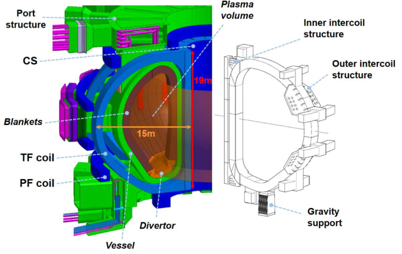

**Figure 1.** Magnet system integrated in DEMO, cut-away view of configuration model (low detail, feeders not shown, left); TF coil 22.5-degree model (right) 

The system architecture is ITER-like and consists of 16 TF coils, 6 PF coils and a Central Solenoid (CS) to enable 2 hour-pulses. The TF and PF coils are mechanically connected and supported by 16 gravity supports located underneath the TF coils. Inter-coil structures between the TF coils, together with the central wedges, bear out-of-plane forces on the coils when subjected to vertical field during operation. Cryogenic coolant and electric power are supplied via Magnet feeders. 

Table 1: Main parameters of DEMO and ITER (for comparison) 

Two options for every coil system are considered in the CDP as presented in Table 2, together with their main design characteristics. Several options overfulfil their specification (for instance, TF option#1 is capable of achieving ~20% higher field). The two TF winding pack options included here were down-selected in 2020 from formerly four options. 

Table 2: Pre-CDP coil options to be further developed in the CDP 

R&W = React & Wind, SS = Stainless Steel, SC = Superconductor, 

W&R = Wind & React, HTS = High Temperature Superconductor 

## _Current and Future Challenges_ 

Although ITER-like concepts are mostly transferrable to the European DEMO magnet system, the following critical issues need to be addressed before the final design selection. 

- **1) Higher mechanical Loads** 

Mechanical loads in DEMO are much higher than in ITER. To give an example, the centring force per DEMO TF coil is 850 MN vs. 400 MN in ITER, and the vertical force on half a TF coil is 520 MN vs. 200 MN [5]. This requires robust concepts for coils, TF cases, and intercoil structures in order to sustain high forces under fatigue load over ~30,000 plasma pulses. 

- 2) **Higher long-term availability of magnets at full performance** 

   - Since DEMO aims to demonstrate the commercial viability of fusion power, the availability of the plant (i.e. the fraction of time it is operational and produces energy over its lifetime) is a key driver.  The strategy to maximize the power production and reduce the maintenance durations is to have a robust design that foresees minimal levels of planned maintenance and guarantees full performance over several decades. A challenging aspect of magnet design is to eliminate the degradation of both the conductor and the insulation due to mechanical and thermal cycles.  Efficient quench detection and protection systems are needed to guarantee availability of the coils in the long term. 

- 3) **Scalability** 

DEMO magnets cannot be built by simply upscaling the ITER design, because industrial and logistic limits are already being stretched for the ITER coils. Examples are forging and welding of the TF coil cases due to very large thicknesses, handling a ~900 ton TF coil, compared to 360 tons of the ITER TF coil, as well as the transportation of a TF coil of 19m height and 15m width. 

- 4) **Cost** 

In a long-term perspective, fusion has to be economically competitive with other sources of energy such as solar and wind. This requires reducing the total cost and increasing the net electricity production through improved reactor performance. To this end, innovative designs and manufacturing approaches will be validated in the CDP of DEMO, including but not limited to layer-wound coils, React&Wind Nb3Sn technology and HTS modules. Cross-system dependencies, e.g. with the Cryoplant, must be closely monitored as well. 

## _Advances in Science and Technology to Meet Challenges_ 

Innovative design and technology solutions are required to meet the challenges of the DEMO magnet system. The strategy concerning Magnets adopted during the Pre-CDP until 2020 is presented in [6] and [7]. Demonstration at industrial level and validation of advanced solutions have been included in the CDP work-plan (2021-27). The main topics are reported below. 

**Structures** to sustain the enormous forces acting on the coils and the fatigue load will be considered at different levels. At conductor level, the jacket in standard Cable-in-ConduitConductors (CICCs) acts both as structural support for the operational loads and as helium containment. In a magnet subjected to cyclic mechanical loads like the CS, the hydraulic containment function imposes the most stringent constraint from a mechanical point of view, since no local crack through the thickness of a single conduit can be tolerated. For this reason, the jackets in the standard CICCs as assumed in the reference DEMO CS design [8] are significantly oversized compared to the static load case, which reduces the current density in the coil and thereby the ability of the CS to generate high flux. In future developments, alternative CS conductor designs will be tested, in which the two main functions of the CICC jacket (structural support and helium containment) are decoupled [9]. Figure 2 shows a sketch of one such proposal. The cable space is solder-filled and indirectly cooled by a separate copper pipe. In this case, penetration of a crack through the steel jacket wall is acceptable, because the helium coolant remains contained inside a separate conduit, made of a more plastic metal. 

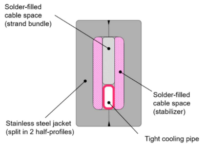

**Figure 2.** Proposal for an alternative CS conductor design decoupling the two functions of the CICC jacket (structural support and helium containment). 

At coil level, due to the higher mechanical forces, the thickness of the DEMO TF casing is up to 510mm, as compared to ≈200mm in ITER. A dedicated study on the TF case manufacturing and the casing procedure (WP insertion, case closing, etc.) was carried out by the company SIMIC [10]. It evidenced that simply extrapolating the ITER manufacturing process would not be possible, one reason being the depth of the closing weld for the case, which is too large for narrow-gap TIG welding. This calls for an entirely different casing procedure, and for splitting the case assembly into a larger number of units because of the limitation of the forging volume. The overall duration for TF case manufacture and casing has been estimated 

to be 30 years[6] , at a cost of 1.5 B€. Under these premises, which do not align with DEMO schedule and cost, a large effort will be devoted to identify alternative solutions for the TF case and casing procedure. 

At Magnets system level, the coil structures and supports will be designed in detail during the CDP, and feasibility studies will be assigned to industrial companies to assess all relevant issues, e.g. in terms of manufacturing tolerances and assembly procedures. 

**Full performance of conductors and electrical insulation** are required throughout the lifetime of the power plant. Degradation of conductor performance under mechanical and thermal cycles, as observed in several ITER TF conductors [11], is a major issue for a machine expected to operate efficiently for tens of years with high availability. In the DEMO conductor design, the issue of degradation was successfully addressed using rectangular samples with a low void fraction and an increased stiffness of the cable. Two sets of samples with Nb3Sn superconductor have been manufactured and tested: one with R&W technology [12], the other using the W&R approach [13]. For both types, no degradation was observed after 1000 electromagnetic cycles and various thermal cycles. 

The long-term integrity of the electrical insulation is of paramount importance as well, because magnets need to withstand high voltages of up to 20 kV across the coil. Developing robust insulation concepts and techniques for all critical areas, in particular insulation discontinuities and penetrations[7] , is a topical subject of the R&D programme of DEMO in the CDP. In order to mitigate the risk of coil degradation due to high voltage, the feasibility of very high current conductors (~100 kA) is being investigated. As fewer turns are required, these allow a reduction of the coil inductance and thereby the maximum operating voltage. More detail is provided in section 8 of the present article ( _Very high current conductors for reduced operating voltage_ ). However, due to higher mechanical loads, demonstrating that conductor cyclic performance degradation remains negligible will be challenging. 

**R&D on innovative conductor and Winding Pack (WP) designs** is a core activity of Magnets development in the DEMO CDP. The main aim for advanced concepts for DEMO TF and CS coils is to improve their efficiency, i.e. to increase the achievable field or flux, while minimizing cost and/or required space. The strategy adopted relies on winding the conductor in layers[8] instead of pancakes like in ITER. In fact, this approach allows _grading_ of both superconductor and steel cross-sections in the different layers based on the local conditions. For the CS design, a hybrid solution has been proposed, with the high-field module made of REBCO conductors, the intermediate-field section with R&W Nb3Sn conductors, and the low-field module made of NbTi conductors, as shown in Figure 3. The advantages and drawbacks of using REBCO and R&W Nb3Sn conductors are summarized in sections 7 ( _ReBCO for Fusion and Fusion for ReBCO_ ) and 12 ( _Advances in React & Wind Nb3Sn Coils for Fusion_ ) of this article. A major challenge for the EU-DEMO project is demonstrating the feasibility of such conductors at industrial level, including non-destructive tests and quality assurance activities. The second step will be to check the electrical performance of short samples under operational cycles and 

> 6 This is a worst case assuming the TF winding packs are available at time zero, but with a single supplier and no duplication of equipment. Assuming two suppliers with full duplication of equipment and manpower (higher cost), the duration is reduced to 12 years. 

> 7 E.g. for instrumentation, helium piping or joints. 

> 8 Extended in the vertical (CS) or toroidal direction (TF), respectively. 

driven quench events. Finally, the manufacture of 50m-long conductors, subsequently wound to insert coils and tested, will validate the innovative technologies in view of the final design selection. It is worth noting that these activities also provide the _building blocks_ for HTS coils other than the CS. Independent of the final choice, the 7-year work plan of the EU-DEMO project will drive the maturation of innovative technologies that will certainly be useful for future power plants. 

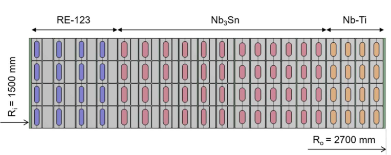

**Figure 3.** DEMO CS advanced hybrid option (HTS-Nb3Sn-NbTi). Radial slice showing four rows of conductors of the CS1 winding pack (tokamak centre is left). Superconductor and Stainless Steel (SC+SS) graded design for maximum flux generating capability. 

## _Concluding Remarks_ 

In the Conceptual Design phase of DEMO, two alternative concepts, one advanced and one ITER-like, are proposed for each coil system (TF, PF & CS). These will further be developed based on previous achievements and supported by an extensive and targeted R&D programme. Prior to the end of this phase in 2027, one concept per coil system will be selected to enter the plant baseline design. The major targets are very high reliability and overall cost reduction as well as tackling specific challenges for Magnets in DEMO. These mostly result from the required machine size (cf. above) and the high plant availability[9] . The development plan outlined above addresses the resulting engineering implications, while a certain conservatism lies in the fact that although R&D progress is of course required, no _breakthroughs_ in any field are relied on. Nevertheless, if unforeseen leaps in technology or physics are made, they may be integrated and lead to higher performance of DEMO or reduced cost or both. 

## _Acknowledgements_ 

The EU-DEMO Magnets team consists of more than 50 members from research units all over Europe. The design presented here illustrates only a small part of the great progress achieved by this team, which is highly acknowledged. 

_This work has been carried out within the framework of the EUROfusion Consortium and has received funding from the Euratom research and training programme 2014-2018 and 20192020 under grant agreement No 633053. The views and opinions expressed herein do not necessarily reflect those of the European Commission._ 

> 9 The assumed availability leads to an accumulated operational time of ~7 full-power years (plasma at full rated power) 

_References_ 

- [1] M. Siccinio et al., _Figure of merit for divertor protection in the preliminary design of the_ - 

- _EU-DEMO reactor,_ 2019 Nucl. Fusion 59 106026, https://doi.org/10.1088/1741 4326/ab3153. 

- [2] M. Kovari, F. Fox, C. Harrington, R. Kembleton, P. Knight, H. Lux, J. Morris, _“PROCESS”: A systems code for fusion power plants – Part 2: Engineering”_ , FED 104, 2016, pp. 9-20, https://doi.org/10.1016/j.fusengdes.2016.01.007 

- [3] H. Nakajima, K. Yoshida, S. Shimamoto, _Development of New Cryogenic Steels for the Superconducting Magnets of the Fusion Experimental Reactor,_ ISIJ International. Vol. 30 (1990), No. 8, pp. 567-578. https://doi.org/10.2355/isijinternational.30.567 

- [4] Campbell, D.J., Akiyama, T., Barnsley, R. et al. _Innovations in Technology and Science R&D for ITER,_ J Fusion Energ 38, 11–71 (2019). https://doi.org/10.1007/s10894-0180187-9. 

- [5] Mitchell N., Devred A., Libeyre P. et al., 2012 _. The ITER Magnets: Design and Construction Status_ . IEEE Trans. Appl. Supercond. 22, 4200809 (9 pp). doi: 10.1109/TASC.2011.2174560 

- [6] Corato V., Bagni T., Biancolini M.E., et al., 2018. _Progress in the design of the superconducting magnets for the EU DEMO_ . Fus. Engin. Des. 136, 1597-1604. https://doi.org/10.1016/j.fusengdes.2018.05.065 

- [7] Sedlak K., Anvar V. A., Bagrets N., et al., 2020. _Advance in the conceptual design of the European DEMO magnet system_ . Supercond. Sci. Technol. 33, 044013 (9pp). - 

- https://doi.org/10.1088/1361 6668/ab75a9 

- [8] R. Wesche et al., _Hybrid HTS-Nb3Sn-NbTi DEMO CS coil design optimized for maximum magnetic flux generation_ , Fus. Eng. and Des. 146, 10-13 (2019). https://doi.org/10.1016/j.fusengdes.2018.10.027 

- [9] X. Sarasola et al., _Progress in the Design of a Hybrid HTS-Nb3Sn-NbTi Central Solenoid for the EU DEMO_ , IEEE Trans. Appl. Supercond. 30, 4200705 (2020). https://doi.org/10.1109/TASC.2020.2965066 

- [10] P. Bruzzone, _Report on studies on the TF case_ , DEMO final report (internal), 2019, ref. 2NQJJY. 

- [11] M Breschi et al. 2012, _Results of the TF conductor performance qualification samples_ - 

- _for the ITER project_ , Supercond. Sci. Technol. 25 095004. https://doi.org/10.1088/0953 2048/25/9/095004 

- [12] Sedlak K., Bruzzone P., Stepanov B., et al., 2019. _DC Test results of the DEMO TF React&Wind conductor prototype No. 2_ . IEEE Trans. Appl. Supercond. 29, 4801005 (5pp). https://doi.org/10.1109/TASC.2019.2901130 

- [13] Muzzi L., Affinito L., Chiarelli S., et al, _Design, manufacture, and test of an 80 kAClass Nb3Sn cable-in-conduit conductor with rectangular geometry and distributed pressure relief channels_ . IEEE Trans. Appl. Supercond. 27, 4800206, 2017. https://doi.org/10.1109/TASC.2016.2627539 

## 4. Commercial fusion power: a killer app for HTS 

Charlie Sanabria, Michael Segal, and Brandon Sorbom 

From the 1960s through the 1990s, the triple product of tokamaks increased by four orders of magnitude—faster than the transistor density scaling famously described by Moore's law. This improvement in fusion’s key figure of merit was significantly driven by advances in conductor technology like Bitter plates, multifilamentary superconductors, and cable-in-conduit conductors [1]. By the 1990s, improvements in the triple product stalled, as copper magnets ran into resistive power-loss limits and low temperature superconductor (LTS) critical field limits necessitated ever-larger and more expensive devices [2]–[4]. This was true for both tokamak and non-tokamak devices [5]. 

The advent of commercially available rare-earth barium copper oxide (REBCO) hightemperature superconductors (HTS) capable of maintaining large critical currents at high magnetic fields is breaking this stalemate. REBCO is particularly impactful because triple product scales with the cube of on-axis field, allowing for energy break-even in compact devices [6]. Beyond high-field capabilities, REBCO enables: 

1. Higher operating temperatures, allowing for greater temperature margins and cryostability [7], [8]. 

2. Ease of manufacturability of cables and joints, with no high-temperature activation heat treatment required; [9]–[12] 

3. Predictable cable and joint performance, without the variability seen in most LTS conductors. It was recently shown [8] that the critical current of a twisted-stack cable can be predicted from the individual characteristics of commercially purchased REBCO tape reels; 

4. Excellent cyclic performance, for example through monolithic conductor designs [8]; 

5. Demountable joints that greatly improve repairability, accessibility, maintenance and inspectability (RAMI) of devices, including tokamaks [12], [13] 

Today, at least three private fusion companies are leveraging these benefits across multiple device classes. They include standard aspect ratio tokamaks [14], low aspect ratio, or spherical, tokamaks [15], , and stellarators [16], [17]. To date, these companies have attracted over $300 M in private capital investment, allowing them to aim for the aggressive timelines required by the climate crisis [18]. 

This private sector support is in turn defining a new set of public-private roles, with governmental organizations (including the US National Laboratories and the UKAEA) focusing on the basic science of plasmas and materials, and private companies taking on commercial fusion technology challenges including the design and manufacture of HTS magnets. These complementary roles are being reinforced by new government programs that directly support private fusion companies [19]–[22], or encourage innovative fusion concepts supported by private companies. For example, the axisymmetric mirror experiment at the University of Wisconsin is enabled by a REBCO magnet produced by a commercial partner [23]. **Current and Future Challenges** 

In 2017, Commonwealth Fusion Systems (CFS) presented REBCO manufacturers with an aggressive specification of _Je_ > 700 A/mm[2] (20 K, 20 T, worst angle), and having piece-length and uniformity that satisfies all the present magnet designs proposed by CFS. By 2018, several suppliers had improved their performance to meet this spec, and by mid-2019 a large order totalling ~500 km was placed with several suppliers. Over the next year, this order was delivered on time while exceeding the required _Je_ specification. CFS is now placing even larger orders for REBCO tape to be used in the SPARC break-even tokamak (described below). 

This exercise proves two important points: first, that present-day REBCO performance is sufficient for next-generation fusion devices, and that REBCO manufacturers are capable of scaling up performance and volume in the face of commercial demand. There, are however, several critical challenges remaining for REBCO tape to make fusion its killer app: 

## _Tape cost_ 

Today, REBCO production is reaching volumes comparable to the production of Nb - Ti in the 1980s, shortly before it became a commodity [24]. The impact on cost is starting to materialize [25]. However, significant further reductions in tape cost will be required before widespread application to commercial fusion can be achieved. 

The HTS field has long hypothesized that large volumes will be able to drive tape prices down through economies of scale. This claim has been historically proven in technologically adjacent industries such as thin-film solar [26], but has yet to be substantiated for HTS. The next challenge the industry faces is to scale volumes up further to the 1000's of km/yr, where cost is expected to decrease to the levels necessary for economical fusion power plants and other applications. This scale-up will likely involve a shifted R&D emphasis away from price improvement through further _Ic_ optimization, which is already offering diminishing returns, and towards novel volume production technologies. 

## _Quench detection_ 

The high electromagnetic noise and complex coupled inductances among magnets in tokamaks complicate the reliable detection of voltage rises indicative of a magnet quench. The use of special voltage tap routing and complex signal processing have yielded reasonable quench detection times in LTS tokamaks [27], [28]. However, quench detection in REBCO-based tokamaks will likely have to be twice as fast as in their LTS counterparts—which may render voltage taps ineffective unless complemented by new technologies such as fiber - optics [29]–[31] and acoustic sensors [32], [33]. The development of these technologies is therefore a priority for both the fusion community and other communities that rely on highfield magnets, such as high energy physics. 

## _AC losses_ 

REBCO magnets operating at 20 K have a higher AC loss tolerance thanks to the improved heat capacity that most materials exhibit at this temperature. Nonetheless, AC losses still represent a significant challenge for REBCO coils on three levels: the tape level [34], [35], the stabilizer level [8], [36], and the structures level. At the tape level, encouraging efforts are being made towards filamentization of REBCO [37–39], however, these processes have yet to prove economically viable and scalable. At the cable stabilizer level, it is likely that conductor geometries will require optimization in order to enable fast ramping magnets such as central solenoid and poloidal field coils in tokamaks. Novel concepts for low-loss, high-current cables have been proposed for tape-based cables [40]–[42]. However, the engineering critical 

current and cooling capacity required for compact pulsed fusion devices have not been met. At the structures level, special manufacturing processes and composite materials may help reduce eddy current loops within and between supporting structures, and therefore heat loads. These and other solutions will require magnet systems integration work to truly be tested. 

## _Demountability_ 

Demountability has been pursued by MIT since the early 2000s [7], [12]. Demountability promises to improve power plant operational costs through improved reliability, availability, maintainability, and inspectability (RAMI) [13]. REBCO conductors are well suited for demountability because they have high thermal stability and do not require post-winding activation heat treatment. Reproducible, low-resistance, demountable REBCO joints that are mechanically stable at high fields have already been demonstrated [8]. However, basic engineering design questions such as coolant routing, cyclic endurance, and remote handling remain open. 

## _High field magnet integration and production_ 

To realize its potential impact on fusion devices, HTS magnets need to be scaled to high fields (>20 T on-coil) and large bores (>1 m). This poses several structure and integration challenges, including the managing of large IxB forces, tape QA, cryogenics, and manufacturing. To realize its potential impact on _climate change_ , these innovations then need to be scaled to production volumes exceeding thousands of magnets per year, with a correspondingly accelerated innovation cycle. This mass production has only been observed in the magnet community at low fields in the MRI industry, and at moderate fields in large research projects like the LHC—where temporary mass production capabilities wind down once a project enters its operation phase. The continual, high-volume mass production of high-field magnets is a new challenge that will require new materials, fabrication, integration and testing methods. 

CFS and MIT are aggressively pursuing solutions to each of the challenges identified above. The two organizations are jointly developing a high-field compact tokamak called SPARC, which is due to begin construction in 2021 and aims to achieve fusion energy breakeven. Using the same conservative plasma physics basis used to design ITER, SPARC will use highfield HTS magnets built with today’s commercially available REBCO tape, and achieve an on-axis magnetic field of 12.2 T with a major radius of 1.85 m [43]. CFS will follow SPARC with ARC, a commercial fusion pilot plant, to be commissioned in the early 2030’s. 

In order to meet this aggressive timeline, CFS is employing a risk-retirement approach, according to which the identification and addressing of system-wide risks is prioritized over comprehensive scientific understanding or complete sequential subsystem builds. Table 1 shows a sample of significant CFS milestones together with the risks each will retire. 

Table 1 - Risk retirement approach used in the ARC roadmap 

The Toroidal Field Model Coil will be a high-field, DC large bore magnet, while the Central Solenoid Model Coil will be a high-filed, fast-ramping magnet. SPARC, for which tape orders are already being placed, is challenging the industry to improve costs and volumes, and ARC will implement demountable magnets so that its vacuum vessel can be periodically replaced. The design, construction, and operation of SPARC itself will be a means to retire certain outstanding risks of an ARC demonstration power plant (Figure 1). Additional risk retirement tests address cyclic loading of cables, quench technology, and AC loss characterization, and are being carried out both in-house and in collaboration with the US National Laboratories, and universities and private companies around the world. These collaborations benefit from growing domestic and international governmental support, and both CFS and MIT continue to actively pursue new collaborative work. 

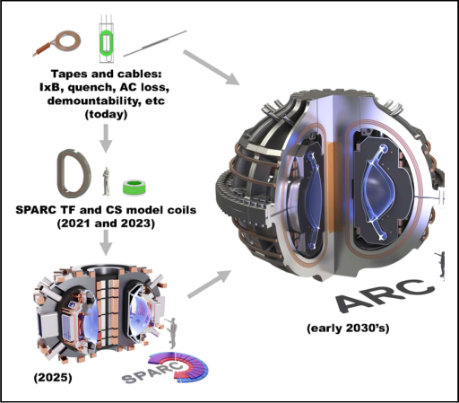

The high-temperature superconductor industry is experiencing a rapid scale-up in volume because of demand from fusion applications. The performance of HTS conductors is already sufficient to enable a break-even fusion device, SPARC, which is due to begin construction in 2021. Major challenges related to HTS conductors on the pathway to widespread commercial fusion are cost, quench, AC losses, demountability, and magnet integration/production, 

approximately in order from most to least critical. If these and other challenges are solved, fusion will become the killer app for REBCO, much like MRI is for Nb-Ti, but at the considerably larger scales involved in the $2tr global energy market. This will enable a virtuous cycle of new applications and new science for magnet technology and plasma physics. In the near term, milestones on the high-field fusion pathway will include significant new magnet builds in the private sector aided by government and educational institutions. These and future innovations will draw on accelerating interest in commercial fusion from both private and public spheres, and leverage public-private partnerships that combine the experience of National Laboratories, educational institutions and international research organizations, with the speed and industrial capability of private companies. 

[1] P. Bruzzone, “30 Years of Conductors for Fusion: A Summary and Perspectives,” _IEEE Trans. Appl. Supercond._ , vol. 16, no. 2, pp. 839–844, Jun. 2006, doi: 10.1109/TASC.2006.873342. 

[2] Y. Wan _et al._ , “Overview of the present progress and activities on the CFETR,” _Nucl. Fusion_ , vol. 57, no. 10, p. 102009, Jun. 2017. 

[3] K. Kim _et al._ , “Design concept of K-DEMO for near-term implementation,” _Nucl. Fusion_ , vol. 55, no. 5, p. 053027, Apr. 2015. 

[4] G. Federici _et al._ , “DEMO design activity in Europe: Progress and updates,” _Fusion Eng. Des._ , vol. 136, pp. 729–741, Nov. 2018, doi: 10.1016/j.fusengdes.2018.04.001. 

[5] T. Rummel _et al._ , “The superconducting magnet system of the stellarator Wendelstein 7-X,” in _2011 IEEE/NPSS 24th Symposium on Fusion Engineering_ , Jun. 2011, pp. 1–6. 

[6] D. G. Whyte, J. Minervini, B. LaBombard, E. Marmar, L. Bromberg, and M. Greenwald, “Smaller & Sooner: Exploiting High Magnetic Fields from New Superconductors for a More Attractive Fusion Energy Development Path,” _J. Fusion Energy_ , vol. 35, no. 1, pp. 41–53, Feb. 2016. 

[7] G. M. Olynyk _et al._ , “Vulcan: A steady-state tokamak for reactor-relevant plasma– material interaction science,” _Fusion Eng. Des._ , vol. 87, no. 3, pp. 224–233, Mar. 2012. 

[8] Z. S. Hartwig _et al._ , “VIPER: An industrially scalable high-current high temperature superconductor cable,” _Supercond. Sci. Technol._ , 2020, doi: 10.1088/1361-6668/abb8c0. 

[9] M. Takayasu, J. V. Minervini, and L. Bromberg, “Superconductor cable,” US8437819B2, May 07, 2013. 

[10] Robert Slade, “CABLE DESIGN IN HTS TOKAMAKS,” 20190267171, Aug. 2019. [11] D. C. van der Laan, “Superconducting cables and methods of making the same,” US8938278B2, Jan. 20, 2015. 

[12] F. J. Mangiarotti and J. V. Minervini, “Advances on the Design of Demountable Toroidal Field Coils With REBCO Superconductors for an ARIES-I Class Fusion Reactor,” _IEEE Trans. Appl. Supercond._ , vol. 25, no. 3, pp. 1–5, Jun. 2015. 

[13] B. N. Sorbom _et al._ , “ARC: A compact, high-field, fusion nuclear science facility and demonstration power plant with demountable magnets,” _Fusion Eng. Des._ , vol. 100, pp. 378–405, Nov. 2015. 

[14] “Nuclear Fusion Startup Gets $84 Million to Enter Next Phase,” _Bloomberg.com_ , May 26, 2020. [15] “Billionaires Chasing Fusion Energy Face a Credibility Test,” _Bloomberg.com_ , Mar. 15, 2020. [16] “Stellarator: nuclear fusion to save the planet,” _Stellarator_ . https://stellarator.energy/ [17] “HOME | Type One Energy.” https://www.typeoneenergy.com/. [18] P. R. Shukla _et al._ , “IPCC, 2019: Climate Change and Land: an IPCC special report on climate change, desertification, land degradation, sustainable land management, food security, and greenhouse gas fluxes in terrestrial ecosystems,” https://www.ipcc.ch/sr15/, 2019. [19] “ARPA-E | Department of Energy Announces $32 Million for Lower-Cost Fusion Concepts.” https://arpa-e.energy.gov/?q=news-item/department-energy-announces-32million-lower-cost-fusion-concepts. 

[20] “What is INFUSE? « INFUSE.” https://infuse.ornl.gov/what-is-infuse/. [21] “Department of Energy Announces $14 Million for Fusion Energy Sciences Research,” _Energy.gov_ . https://www.energy.gov/articles/department-energy-announces-14-millionfusion-energy-sciences-research. 

[22] “UK to take a big ‘STEP’ to fusion electricity,” https://www.gov.uk/. https://www.gov.uk/government/news/uk-to-take-a-big-step-to-fusion-electricity. [23] “Physicists to improve plasma fusion mirror devices with $5 million grant.” https://news.wisc.edu/physicists-to-improve-plasma-fusion-mirror-devices-with-5-milliongrant/. 

[24] P. J. Lee and B. Strauss, _100 Years of Superconductivity - 11.2 Nb-Ti from beginnings to perfection_ . Taylor & Francis, 2011. 

[25] V. Petrykin _et al._ , “New product line of SuperOx 2G HTS tapes customized for application in specific ranges of magnetic fields and temperatures,” presented at the Magnet Technology Conference MT-26, Vancouver, Canada, Sep. 26, 2019,. 

[26] Y. Chen _et al._ , “From Laboratory to Production: Learning Models of Efficiency and Manufacturing Cost of Industrial Crystalline Silicon and Thin-Film Photovoltaic Technologies,” _IEEE J. Photovolt._ , vol. 8, no. 6, pp. 1531–1538, Nov. 2018. 

[27] M. Coatanea-Gouachet, D. Carrillo, S. Lee, and F. Rodríguez-Mateos, “Electromagnetic Quench Detection in ITER Superconducting Magnet Systems,” _IEEE Trans. Appl. Supercond._ , vol. 25, no. 3, pp. 1–7, Jun. 2015. 

[28] A. Gaio _et al._ , “Final Design of the Quench Protection Circuits for the JT-60SA Superconducting Magnets,” _IEEEINPSS 24th Symp. Fusion Eng._ , 2011. 

[29] A. Chiuchiolo _et al._ , “Cryogenic-temperature profiling of high-power superconducting lines using local and distributed optical-fiber sensors,” _Opt. Lett._ , vol. 40, no. 19, pp. 4424– 4427, Oct. 2015. 

[30] M. Fisser, C. Bumby, and R. Badcock, “Hot-spot Detection within an HTS Coated Conductor using an Ultra-Long Fiber Bragg Grating Sensor,” presented at the Applied Superconductivity Conference, Seattle, USA, 2018. 

[31] W. K. Chan, G. Flanagan, and J. Schwartz, “Spatial and temporal resolution requirements for quench detection in (RE)Ba2Cu3Oxmagnets using Rayleigh-scattering- 

based fiber optic distributed sensing,” _Supercond. Sci. Technol._ , vol. 26, no. 10, p. 105015, Aug. 2013. 

[32] Haigun Lee, Ho Min Kim, J. Jankowski, and Y. Iwasa, “Detection of ‘hot spots’ in HTS coils and test samples with acoustic emission signals,” _IEEE Trans. Appl. Supercond._ , vol. 14, no. 2, pp. 1298–1301, Jun. 2004. 

[33] M. Marchevsky and S. A. Gourlay, “Acoustic thermometry for detecting quenches in superconducting coils and conductor stacks,” _Appl. Phys. Lett._ , vol. 110, no. 1, p. 012601, Jan. 2017. 

[34] F. Grilli, E. Pardo, A. Stenvall, D. N. Nguyen, W. Yuan, and F. Gömöry, “Computation of Losses in HTS Under the Action of Varying Magnetic Fields and Currents,” _IEEE Trans. Appl. Supercond._ , vol. 24, no. 1, pp. 78–110, Feb. 2014. 

[35] G. D. Marzi, G. Iannone, and U. Gambardella, “Magnetic losses of commercial REBCO coated conductors in the low frequency range,” _Supercond. Sci. Technol._ , vol. 31, no. 5, p. 055011, Apr. 2018. 

[36] N. Bykovsky, D. Uglietti, R. Wesche, and P. Bruzzone, “AC Loss in HTS Fusion Cables: Measurements, Modeling, and Scaling Laws,” _IEEE Trans. Appl. Supercond._ , vol. 28, no. 4, pp. 1–5, Jun. 2018. 

[37] V. Solovyov, “Rise of second generation HTS cables,” _Supercond. Sci. Technol._ , vol. 32, no. 11, p. 110501, Sep. 2019. 

[38] A. C. Wulff _et al._ , “Two level undercut-profile substrate for filamentary YBa2Cu3O7coated conductors,” _Supercond. Sci. Technol._ , vol. 28, no. 7, p. 072001, May 2015. 

[39] F. Grilli and A. Kario, “How filaments can reduce AC losses in HTS coated conductors: - a review,” _Supercond. Sci. Technol._ , vol. 29, no. 8, p. 083002, Jul. 2016, doi: 10.1088/0953 2048/29/8/083002. 

[40] R. Wesche _et al._ , “Central solenoid winding pack design for DEMO,” _Fusion Eng. Des._ vol. 124, pp. 82–85, Nov. 2017. 

[41] D. C. van der Laan, “YBa2Cu3O7-$\updelta$coated conductor cabling for low ac-loss and high-field magnet applications,” _Supercond. Sci. Technol._ , vol. 22, no. 6, p. 065013, Apr. 2009. 

[42] W. Goldacker, F. Grilli, E. Pardo, A. Kario, S. I. Schlachter, and M. Vojenčiak, “Roebel cables from REBCO coated conductors: a one-century-old concept for the superconductivity of the future,” _Supercond. Sci. Technol._ , vol. 27, no. 9, p. 093001, Aug. 2014. 

[43] A. J. Creely, M. J. Greenwald, S. B. Ballinger, D. Brunner, J. Canik, J. Doody, T. Fülöp, D. T. Garnier, R. Granetz, T. K. Gray, C. Holland, N. T. Howard, J. W. Hughes, J. H. Irby, V. A. Izzo, G. J. Kramer, A. Q. Kuang, B. LaBombard, Y. Lin, B. Lipschultz, N. C. Logan, J. D. Lore, E. S. Marmar, K. Montes, R. T. Mumgaard, C. Paz-Soldan, C. Rea, M. L. Reinke, P. RodriguezFernandez, K. Särkimäki, F. Sciortino, S. D. Scott, A. Snicker, P. B. Snyder, B. N. Sorbom, R. Sweeney, R. A. Tinguely, E. A. Tolman, M. Umansky, O. Vallhagen, J. Varje, D. G. Whyte, J. C. Wright, S. J. Wukitch, and J. Zhu, “Overview of the SPARC tokamak,” _Journal of Plasma Physics_ , vol. 86, no. 5, p. 865860502, 2020.. 

5. REBCO magnet technology – a key enabling technology for compact fusion devices 

Robert Slade, Greg Brittles, Rod Bateman 

## **Status of HTS tokamaks** 

Spherical tokamaks (ST) offer significant advantages for commercial fusion power plants: higher thermal power per unit plasma volume, and significant bootstrap current [1]. These benefits enable smaller, more efficient machines to be developed, accelerating development timescale and reducing recycled power. Progress in understanding the physics of STs is continuing around the world on experimental devices such as MAST [2], NSTX [3], and ST40 [4], which all use pulsed resistive magnets. 

A commercial power plant requires superconducting magnets for long pulse operation or continuous and to maximize net electrical power generation. This has represented a roadblock for STs because the slim centre column of the toroidal field (TF) magnet results in peak field on conductor beyond the capability of conventional low temperature superconductors (LTS). The recent commercial availability of high-performance REBCO coated conductors (“tapes”) from multiple suppliers makes a high field ST, with a mission to demonstrate net power gain (Q > 1) using D-T fuel, feasible at smaller scale than a conventional aspect ratio tokamak using LTS. A 1.4 m major radius HTS ST with 4 T field on axis can achieve this mission if an adequately thick neutron shield (> 25 cm) can be implemented. 

REBCO cable studies for fusion applications generally assume cable-in-conduit conductor (CICC) construction, with twisted and/or transposed strands [5,6]. This typically results in winding pack current density ( _Jwp_ ) less than 100 A/mm[2] . Fig. 1 depicts a segment of the centre column in cross-section for the exemplar 1.4 m ST, comparing two cable schemes: (a) CIC with _Jwp_ ~75 A/mm[2] , and (b) a simple stack of pancake coils wound with multiple tapes-in-hand, with _Jwp_ ~350 A/mm[2] . Figure 2 compares the cable construction in more detail. 

The thinner neutron shield of (a) leads to substantially higher in-pulse nuclear heating to the HTS. The thicker shield of (b) means that conduction cooling to a supercritical He flow annulus is feasible and the risk of neutron induced degradation of critical current is also substantially alleviated [7,8]. 

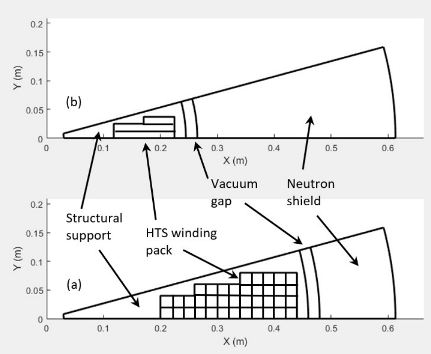

**Figure 1.** Centre column cross-section showing one half of one TF limb of a 1.4 m major radius 12-limb, 4 T ST with a net energy gain mission. Bottom figure (a) assumes CIC and top figure (b) assumes simple pancake coils. The cable details are shown in Fig. 2. The approximate areas allocated to neutron shield, cryogenic insulation, structure and the TF magnet inboard coil packs are shown. 

Tokamak Energy (TE) is developing magnet technology using pancake coils wound from simple stacked HTS tapes, without twisting or transposition (Fig. 2b) and solder impregnated. Indirect cooling is provided by supercritical helium flowing in channels outside the coil pack. Stress management is simplified by the absence of internal cooling channels and the requirement for a high strength jacket, with poor thermal conductivity, around each turn is eliminated. This coil structure minimizes the use of materials with poor thermal conductivity, such as insulation and epoxy potting. 

The quench protection benefits of no-insulation (NI) and partial insulation (PI) coils have been widely reported [e.g: 9]. A small solder-impregnated NI pancake stack tested by TE in 2019 achieved stable quench-safe operation above 24 T peak field on coil at 21 K, with an average _Jwp_ over 700 A/mm[2] [10]. It is believed that this technology can be scaled-up using a novel turn-turn insulation combining high thermal conductivity with the ability to choose the resistance between turns, thus retaining high _Jwp_ without compromising quench protection. This would satisfy the TF centre column conductor requirements for a net fusion gain compact ST. 

The use of cables without twisting or transposition in fusion-scale magnets is perhaps controversial. These features have been carried over from LTS fusion cables, nominally to minimise AC loss and ensure equal current sharing between tapes [5,6]. However, the large size of coated REBCO conductors means that twist pitches are long and loss reduction is minimal in practice. Conversely, the increased thermal stability provided by operation at higher temperatures suggests stable operation of large coils without twisting or transposition is feasible [11]. The simple stacked tape design choice also enables 3-5 times higher critical current to be achieved by better aligning the REBCO _ab_ -plane with the local magnetic field vector; this is possible in the TF centre post. Combined with conduction cooling, the elimination of additional structural material in the cable, and significant reduction in the quantity of normal metal stabilizer for quench protection (as explained below), the target _Jwp_ of 350 A/mm[2] for the TF magnet can be achieved. 

## **Advances in magnet technology to meet fusion scale-up challenges** 

The critical current of a REBCO tape can be degraded in several ways: (a) during tape and coil manufacturing, (b) by operational damage (e.g.: strain/fatigue), or (c) by radiation damage. NI and PI coils are damage tolerant because current can bypass defects in the superconductor by sharing both between tapes in the affected turn, and between adjacent turns. In contrast, a fully insulated coil with the same normal metal fraction could quickly burn out. For this reason, additional normal metal stabilizer, typically copper, is added to the cable to slow the rate of temperature rise. NI and PI technology allows a significant reduction, or even complete elimination, of this additional stabilizer. In the event of a local hotspot developing into a thermal runaway, such that all the tapes in the cable (turn) become normal, current can rapidly transfer to adjacent turns before the temperature of the hotspot becomes too high. The ensuing propagation of the normal zone superficially resembles the quench behaviour of LTS magnets. Working initially in collaboration with researchers at CERN [12] TE have developed detailed 3D thermal-electric network modelling tools to understand quench in NI and PI magnets, including the effect of screening (magnetization), coupling and induced eddy currents in all superconducting and resistive structures. 

The frequently cited disadvantage arising from allowing conduction between turns in a large magnet is the increased charging time. A NI or PI coil can simplistically be modelled as a superconducting inductor (the spiral REBCO path) in parallel with resistor (the normal metal radial path between turns). The resultant charging time scales approximately as the fourth power of the linear dimension of the coil, and would become impractically long if the TF magnet of a fusion-scale coil were uninsulated. However, TE are developing a novel partial insulation technology that allows the resistance between turns to be chosen over a wide range, providing a compromise between charging delay, quench robustness and coil dump characteristics that satisfies the requirements of fusion-scale magnet protection. Depending on the chosen stabiliser content and turn-turn resistance, it is possible to make the magnet extremely resilient to transient energy inputs (eg: caused by a disruption) and to tune the fraction of stored magnetic energy that is dumped into the cold mass and coupled structures, or to an external dump varistor. 

Significant progress has been made developing high field magnet technology that plays to the strengths of REBCO HTS. A change of mind-set is necessary when thinking about superconductivity at temperatures above the conventional liquid helium regime. Increased heat capacity means that, with appropriate design, and in contrast to LTS, stable operation is possible even when current shares between normal and superconducting regions. This behaviour is exploited using simple cable and coil structures that combine high thermal conductivity, and tailored, anisotropic electrical resistivity. Thorough analysis of the novel coil structures under all operating conditions (energization, steady state operation, pulsed nuclear heating, AC loss and plasma interactions, and quench protection scenarios) has been carried out using a novel 3D thermal-electric element network model. This patent-pending technology will be tested in a medium-scale high-field REBCO toroid, including fast-ramping REBCO poloidal field coils, currently under construction at TE. 

- [1] Costley, A. E. "Towards a compact spherical tokamak fusion pilot plant." _Philosophical Transactions of the Royal Society A_ 377.2141 (2019): 20170439. 

- [2] Harrison, James. "Initial results from MAST Upgrade." _Bulletin of the American Physical Society_ (2020). 

- [3] Gerhardt, Stefan, John Galayda, and Leslie Hill. "Overview of Progress on the NSTX-U Recovery Project." _Bulletin of the American Physical Society_ (2020). 

- [4] Dnestrovskij, A. Yu, Jack W. Connor, and Mikhail P. Gryaznevich. "On the confinement modelling of a high field spherical tokamak ST40." _Plasma Physics and Controlled Fusion_ 61.5 (2019): 055009. 

- [5] Bruzzone, Pierluigi, et al. "High temperature superconductors for fusion magnets." Nuclear Fusion 58.10 (2018): 103001. 

- [6] Uglietti, D., et al. "Development of HTS conductors for fusion magnets." IEEE Transactions on Applied Superconductivity 25.3 (2014): 1-6. 

- [7] Prokopec, R., et al. "Suitability of coated conductors for fusion magnets in view of their radiation response." Superconductor Science and Technology 28.1 (2014): 014005. 

- [8] Jirsa, M., et al. "Critical currents in REBaCuO superconducting tapes in response to neutron irradiation." Superconductor Science and Technology 32.5 (2019): 055007.Ref. 5 

- [9] Mataira, Ratu, et al. "Finite-element modelling of no-insulation HTS coils using rotated anisotropic resistivity." Superconductor Science and Technology (2020). 

- [10] Slade. R. “Development of 20+ T conduction cooled NI REBCO magnet technology”, EUCAS 2019, https://www.eucas2019.org/programme/oral-sessions/large-scale. 

- [11] Uglietti, D., et al. " Non-twisted stacks of coated conductors for magnets: Analysis of inductance and AC losses." Cryogenics 110 (2020):103118. 

- [12] https://cds.cern.ch/record/2228249/files/CERN-THESIS-2016-142.pdf 

## 6. Nb3Sn wire development for fusion beyond ITER 

## Yasuyuki. Miyoshi, Nobuya. Banno, Kazuyoshi. Saito 

## _Status and Future challenges of Nb3Sn wires for fusion_ 

ITER has entered into its construction phase and all gigantic Nb3Sn magnets are travelling across the globe. The successors of ITER towards fusion power generation, are DEMO reactors, which conceptual designs are currently being developed [1, 2]. Faced with limits such as power management of diverter and stress tolerance of stainless steel, their design is likely to be an extrapolation of ITER and with Nb3Sn conductors. In short, the DEMO magnets will increase in size and the conductors would carry higher current under higher electromagnetic load (c.f. DEMO TF conductor design current 83 kA in 13.7 T under 800 MPa stress compared to ITER TF conductor current 68 kA in 11.8 T under 670 MPa [1]. 

A review of Nb3Sn cable-in-conduit conductors (CICC) shows a possible route to DEMO conductor by strain management [3]. What has been clear is that the compressive strain applied to the wires by the conductor jacket degrades the performance. For ITER CICC, the wires are under thermal strain in the range -0.7% to -0.5% for TF conductors. By employing react-andwind method, i.e. reacting the wires to form superconducting phase before jacketing and winding, this thermal strain could be reduced to -0.3%. A candidate conductor design for EU DEMO that utilises the react-and-wind method compares such reduced thermal strain corresponds to a doubling of Nb3Sn performance [4]. The choice of jacket material also influences the strand thermal strain [5]. 

Another route is improving the performance of Nb3Sn wire itself, but there has been a lapse of a decade since the last R&D for ITER. For bronze process, the ITER bronze wire is close to the Sn content limit of a workable bronze. For internal-tin process, the restacked-rod-process (RRP[®] ) wires, developed for high energy physics, hold the record Jc-B performance, non-Cu Jc 3000 A/mm[2] at 12 T, 4.2 K. It is three and two times that of bronze and internal-tin wires for ITER, respectively. A key feature of RRP[®] wire is the greater quantity of Nb3Sn achieved by sacrificing Cu fraction. However, it comes with a cost of extensive filament bridging over ~50 µm. This would be unsuitable for a tokamak with CS based operations that requires low hysteresis loss. Consequently, no wire architecture at present can satisfy both high Jc and low hysteresis loss required for DEMO. The need for R&D to cover the lack of performance is illustrated in Figure 1. Here, we identify some of the recent development in materials science that are relevant for the development of next generation Nb3Sn wire for fusion. 

## _Advances in Science and Technology to Meet Challenges_ 

Firstly on the mechanical stress aspect, the wires themselves can be reinforced. It is common practice to have inclusions of reinforcing materials in wires of commercial magnets that operate under high stress condition, e.g. high-field NMR magnets. Such wires typically have a Ta core in the matrix which increases the Young’s modulus of a bronze process wire from ~100 GPa up to ~170 GPa, and 0.2% yield strength from ~170 MPa to ~300 MPa. In CICC, the wires are also subject to multiple bending stress. For reinforcement against bending, a ring of multifilamentary Cu-Nb composite just outside the barrier around Nb3Sn filamentary region 

has been developed [6]. Such reinforcement increases the Young’s modulus up to 190 GPa and 0.2% yield strength up to 350 MPa. 

The Cu-Nb reinforcement exerts strain on Nb3Sn filaments, similarly to the effect of jackets in CICC, that suppresses Ic. Some of this strain can be released by a process of bending a wire or a cable repeatedly at room temperature after the heat treatment, so called pre-bending process. Pre-bending changes the strain state of Nb3Sn filaments, and can enhance Ic as well as shift the peak of Ic-strain characteristic that can be used to optimize the conductor performance under bending strain. The method has been successfully applied with the react-and-wind Nb3Sn coils wound from Cu-Nb reinforced wires for 25 T cryogen free magnet at Tohoku University. Such reinforcement and strain management of the wire could be relevant for a high stress tolerance required for DEMO conductor. 

Alloying the wire matrix material with an element is another way of improving the wire mechanical strength. One candidate element is Zn. It comes with an advantage that added Zn, homogeneously present in matrix, enhances Sn activity during reaction to form Nb3Sn. The alloying can be done for both bronze process and internal-tin process i.e. as an enhancement of already well-established Nb3Sn wire. For bronze process, it will be an optimization to balance the concentrations of Zn and Sn. Recently, Tachikawa et al. proposed the brass process, which is an internal-tin process with brass as a matrix material instead of copper. A detailed report of the brass process and its most recent development are in [7]. 

Key findings of the brass process are in Sn diffusion during a three step heat treatment. In the initial reaction at 215℃, there is a notable absence of porous ε phase as Sn start to diffuse into matrix. Then, at 400℃ dense β-CuZn phase forms at the diffusion front that suppresses the voids before the final reaction at 550℃. In other words, Zn enhances Sn diffusion to Nb filaments by suppressing the formation of porous phase and voids at the diffusion front. This would be a new tool for enhancing Jc-B performance. Since Zn does not dissolve in Nb3Sn, it is compatible with other types of performance enhancements, such as Ti doping through matrix and filaments that increases the amount of fine grain Nb3Sn [7]. 

Another relevant development in wire architecture is an adaptation of internal-tin process called distributed-tin (DT) process. In brief, the wire consists of modules with a single Sn core in copper matrix that are surrounded by several modules of multifilamentary Nb in copper matrix. In this way, the filamentary area is increased while the filament linkages are limited within a module. The architecture has existed since 80’s and it has recently received renewed interest for use in high field NMR magnets. Meanwhile, CERN is currently leading a global effort for the development of Nb3Sn wires for High Energy LHC or Future Circular Collider. These wires have internal-tin architecture with distributed-barrier or distributed-tin, and are developed with a strong emphasis on Jc. The prototype wires have achieved non-Cu Jc ~1800 A/mm[2 ] at 14 T, 4.2 K and ~1000 A/mm[2] at 16 T, 4.2 K [8], which are comparable to High Luminosity LHC specification. 

In a DT wire, a key parameter is the Sn diffusion distance. There is a gradient of Sn concentration that results in Nb3Sn grain size variation from fine grains to coarse grains and unreacted cores from the periphery to the module centre. A simple reduction of dimension by drawing down the same wire showed clear improvement of Jc-B performance [9] due to shortened Sn diffusion distance. Importantly, this indicates that the module size reduction is not limited by the barriers as in the distributed barrier wires. So far, prototype wires with modules ~30 µm in size have been manufactured. The characteristics of these wires are 

compared with the relevant wires in Figure 2. The highest non-Cu Jc at 16 T, 4.2 K of ~1100 A/mm[2] has been achieved. As for the industrial scalability, a piece length of 900 m has been successfully manufactured. For a first trial, the brass process has been applied to a DT wire, which showed enhanced Sn diffusion and suppressed void formation [10]. 

The recent high Jc wire development is focused on increasing Nb3Sn filamentary area, but the extent of filament bridging means the hysteresis loss is much greater than those of ITER wires (Figure 1). Since Jc is now approaching a DEMO relevant level, a directed research effort is in need to reduce the hysteresis loss. While balancing Jc and hysteresis loss, we may take advantage of a recent finding that the grain size is reduced by alloying individual Nb filaments with Ta and Hf [11]. As the method does not restrict itself to any specific wire architecture, it can be used to enhance the performance of candidate Nb3Sn wires for fusion. 

## _Concluding remarks_ 

We have reviewed above what can be the starting materials for the Nb3Sn wire development for fusion, which require enhancement in mechanical properties and Jc-B characteristics, while keeping the hysteresis loss small. With DEMO engineering design phase starting in 15 year time, it is time to start in earnest the development of Nb3Sn wires for the next fusion. 

## _Disclaimer_ 

The views and opinions expressed herein do not necessarily reflect those of the ITER Organization. 

## _Figures_ 

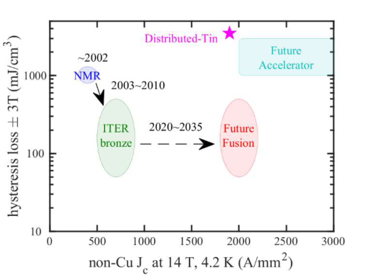

Figure 1 Illustration of wire hysteresis loss with applied field ±3 T plotted against non-Cu Jc at 14 T, 4.2 K. The accelerator applications drive for higher Jc, but ITER-like fusion applications require low hysteresis loss. 

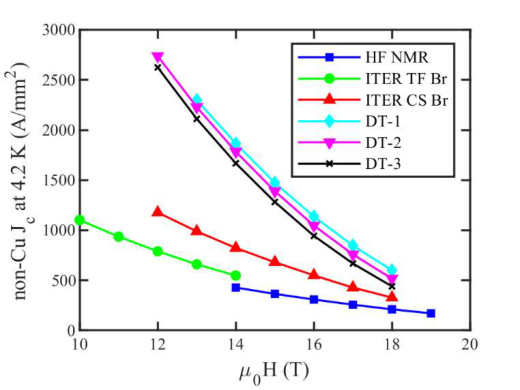

Figure 2 Non-Cu Jc at 4.2 K as a function of applied magnetic field for three prototype DT wires (DT-1,-2,-3) compared against high-field NMR bronze wire and ITER bronze wires for TF and CS coils. 

## _References_ 

[1].K. Tobita et al., Fusion Sci. Technol. 75, 372, 2019. 

[2].G. Federici et al., Fusion Eng. Des. 136, 729, 2018. 

[3].L. Muzzi et al., Supercond. Sci. Technol. 28, 03001, 2015. 

[4].D. Uglietti et al., Supercond. Sci. Technol. 31, 055004, 2018. 

[5].N. Mitchell, Cryogenics 43, 255, 2003. 

[6].M. Sugimoto et al., IEEE Trans. Appl. Supercond. 30, 6000905, 2020. 

[7].N. Banno et al., Supercond. Sci. Technol. 32, 115017, 2019. 

[8].A. Ballarino et al., IEEE Trans. Appl. Supercond.29, 2019. 

[9].S. Kawashima et al., IEEE Trans. Appl. Supercond. 30, 6000105, 2020. 

[10]. N. Banno et al., IEEE Trans. Appl. Supercond. 30, 6000705, 2020. 

[11]. S. Belachandran et al., Supercond Sci. Technol. 32, 044006, 2019. 

## 7. ReBCO for Fusion and Fusion for ReBCO 

Anna Kario and Herman ten Kate, 

Nuclear fusion needs high magnetic field for plasma confinement only achievable with superconductors. We are witnessing ITER, world’s largest tokamak under construction that cannot exist without a NbTi and Nb3Sn based magnet system _._ Parallel to ITER construction, the next generation DEMO reactor is in research and development phase for which naturally the use of high-temperature _Re_ BCO superconductor is considered. _Re_ BCO coated conductor, following _its remarkabl_ y high stability and critical current density, certainly is THE dream conductor for fusion magnets for very good reasons, when ignoring cost for the moment. Is this true for all sizes and flavours of fusion magnets? The fusion magnet developments are happening nowadays on two different scales. 

Firstly, huge-scale technology at low magnetic field (5 to 6 T in plasma, 12 to 13 T in coil), where enormous and complex reactors like ITER and future DEMO are being constructed and developed. In the case of DEMO, _Re_ BCO is not the only choice of superconducting material, and unquestionably not for all type of magnets [1]. In present DEMO program flow, alternative designs using _Re_ BCO are ongoing. Application of _Re_ BCO would eventually allow a future machine to operate at 30 K level taking advantage of quasi-infinite stability and thus profitable operational reliability and availability for power production; also avoiding the use of relatively costly helium as coolant at 4.5 K level and all the associated disadvantages. 

Secondly, a compact technology, by using the highest possible magnetic field (12 to 15 T in plasma and 25 to 30 T in coil), would enable much smaller size machines. Also for accommodating the higher nuclear load on the magnets, an operational temperature of 20 to 30 K may be beneficial [2]. Such compact machines are pursued by the UK based company Tokamak Energy [3], followed by Commonwealth Fusion Systems [4] in the US. Obviously, they cannot be realised without _R_ eBCO technology. Figure 1 shows, as example, a sense of the coil development route at Tokamak Energy, from simple pancake coils stepping up to sizable fusion magnets within a few years. 

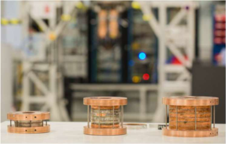

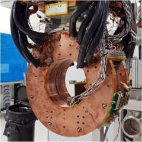

The crucial question is whether _Re_ BCO tape conductors are mature enough, or can become this in the near future to fulfil the requirements. Assuredly, substantial progress is visible in 

the production of unit lengths, production volume as well diversity and competition among manufacturers. 

The companies SuperPower and AMSC in the US, Bruker and THEVA in Germany, Fujikura in Japan, SuperOx in Russia, Shanghai Superconducting Technology (SST) in China and SuNAM in Korea, are manufacturing _Re_ BCO tapes with good quality unit lengths of 50 to 300 m [5]. Shortcomings at this stage of tape development towards all- _Re_ BCO magnets for fusion are primarily (still) high cost, quench protection for high-energy coils, high AC loss, mechanical tape weakness in delamination strength at the _Re_ BCO-substrate interface, low production yield and short unit lengths, as well as delivery time. Most of the issues can be solved or engineered around; but most severe and potential showstoppers on the long term are cost, delamination strength and quench protection. 

_Re_ BCO coated conductor development is too much focusing on increasing critical current in field and temperature by using different technologies. Less attention is on mechanical properties, stabilisation and uniformity in general. Coated conductors are modestly resistive to transverse tensile stress of 10 to 100 MPa, but fragile to local delamination; can take some 20 MPa in shear, but are easy to bend, but only in the so-called easy bending direction [5]. However, the uniformity of the properties, especially for delamination is a concern. Also its response to thermal and high numbers of electromagnetic cycling in magnets is still a field of research. Here a joint effort of manufacturers and research labs can be beneficial. Some drawbacks of single tapes can be mitigated by using cables for magnets instead. Though coated conductor is a tape with a big aspect ratio, ways have been found to assemble them in classical as well as novel cable structures based on creating round cables from stacks of straight tapes (stack cable) or by spinning multilayers of tape on a core (CORC cable), and cutting strands from wide tape in meander shape (Roebel cables). Though some variants of such cables have been demonstrated, there is still a need for inventions, new cable concepts and test of significant demonstrator coils made of these in order to deliver in a convincing way the proof of the technology. 

Quench detection and protection are key issues, unsolved for meter size high-energy _Re_ BCO magnets due to the low normal zone propagation in and high enthalpy of the coil windings. This issue may  be solved at cable level by introducing embedded quench detection sensors [6][7][8][9]. Another route, to be developed in full is to apply a controlled resistance between turns in the coil windings optimized for achieving an acceptable ramp time of the magnet though with sufficient quench protection by allowing current sharing among turns. 

The development of _Re_ BCO conductor not only occurs on tape level, but also through demonstrator magnets. Pancake and racetrack coils, NMR and MRI demonstrators as well as accelerator type magnets are developed. There is still a long way to go and the community would benefit by sharing at best, knowledge, ideas and results. The entire development chain, from material, via tape to practical conductors and magnet design and construction, may enjoy a strong collaborative effort, since a successful magnet needs more than just a high critical current density in the tape. 

Concerning the too high cost of _Re_ BCO tape, a cost reduction by a factor 2 or 3 may be envisaged by optimists due to scaling up in production volume and improving yield, but the 

factor 5 or 10 needed for allowing commercial large-scale applications is hard to imagine. Desperately needed is a much cheaper deposition process still achieving a useful current density. Note that in particular fusion magnets are stress limited in construction materials rather than in conductor cross section. Thus, a much lower current density would be acceptable in tape that can be manufactured at much lower cost. Many other techniques were already tried, but it would make sense to reopen the case and make a new joint effort to find and develop for production such a cost efficient conductor. As said, many problems of coated conductors can be engineered around, but the bottom line is that low cost _Re_ BCO tape is mandatory for enabling large-scale application and true impact on society. 

To arrive at a world with reliable _Re_ BCO superconducting magnets, still a large effort is needed, even when already a remarkable amount of magnets were built as illustrated in figure 2. The tape unit length for larger systems needs to increase with increasing production yield. The quality control of conductor properties needs another step-up, by reporting not only critical current versus length, but also geometrical tolerances, mechanical properties, and delamination strength. Non-destructive methods for detecting delamination needs to be developed, which will also contribute to understanding and better control of this parameter [10]. Systematic research on cycling loading of _Re_ BCO in magnets is another key issue for demonstrating successful application in fusion magnets. 

![Figure 2. Winding pack volume for various high field solenoids. Lines are for guiding the eye. Courtesy picture [5].](images/mitchell2021.pdf-0044-03.png)

Quench detection and protection methods are key as well for a fusion machine that needs to be reliable and available for power production, where long periods of service due to coil quench or even conductor burnout are disastrous. The research in this area may follow up on ideas as modification of the geometry of the coated conductor into so-called current flow diverter architecture for a higher normal zone propagation velocity [9]; and embedding quench detection sensors in the cables for monitoring along the entire length [6][7], for example by using optical fibre sensing [8]. 

The two mentioned burdens, delamination and protection that result in dysfunction of the magnet, might be solved by the non- or partially insulated coil approach [5]. Non-insulated _Re_ BCO coils are being presented as self-protecting due to low resistance between turns providing different radial and circumferential paths for current and heat distribution after the 

quench. But, such coils are not feasible for fusion application due to extreme charging times. This can be mitigated by altered inter turn resistance leading to faster coil charging times. Such approach is, for example, already investigated at Tokamak Energy for development of the demonstrator fusion magnets and by Robinson Research Institute for MRI [11]. 

The _Re_ BCO superconductor certainly plays a remarkable role for achieving nuclear fusion, and vice versa, nuclear fusion plays a crucial role for _Re_ BCO. The material is not necessary obligatory for next generation fusion systems as DEMO and beyond, but for sure unavoidable for compact fusion systems. However, the compact fusion enterprises are investing a lot in our future due to aggressive development and decentralizing potential plant installations, thereby boosting the further development and volume production of _Re_ BCO conductors. The development includes unit length, yield, delamination, delivery time, quench protection issues and very importantly cost. Due to these advancements in _Re_ BCO conductors, compact fusion may be realized, but at the same time by cross-fertilization, _Re_ BCO will be taken more seriously and come closer to the breakeven point for other applications. Definitely, we shall not forget and start to benefit from the huge advantages and potential of _Re_ BCO over lowtemperature superconductors for magnet applications, as extremely high stability margin, all advantages in cryogenics at higher operating temperature of 20 to 30 K, relaxed mechanical limits, and most importantly, reliability, and overall availability of the magnets for their users. **References** 

- [1] K. Sedlak _et al._ , “Advance in the conceptual design of the European DEMO magnet system,” _Supercond. Sci. Technol._ , vol. 33, no. 4, 2020, doi: 10.1088/13616668/ab75a9. 

- [2] A. Sykes _et al._ , “Compact fusion energy based on the spherical tokamak,” _Nucl. Fusion_ , vol. 58, no. 1, 2018, doi: 10.1088/1741-4326/aa8c8d. 

- [3] “Tokamak Energy.” https://www.tokamakenergy.co.uk/. 

- [4] “Commonwealth Fusion Systems.” https://cfs.energy/. 

- [5] D. Uglietti, “A review of commercial high temperature superconducting materials for large magnets: From wires and tapes to cables and conductors,” _Supercond. Sci. Technol._ , vol. 32, no. 5, 2019, doi: 10.1088/1361-6668/ab06a2. 

- [6] L. Rossi _et al._ , “The EuCARD2 Future Magnets Program for Particle Accelerator HighField Dipoles: Review of Results and Next Steps,” _IEEE Trans. Appl. Supercond._ , vol. 28, no. 3, 2018, doi: 10.1109/TASC.2017.2784357. 

- [7] J. D. Weiss _et al._ , “Introduction of the next generation of CORC® wires with engineering current density exceeding 650 A mm-2 at 12 T based on SuperPower’s ReBCO tapes containing substrates of 25 μm thickness,” _Supercond. Sci. Technol._ , vol. 33, no. 4, 2020, doi: 10.1088/1361-6668/ab72c6. 

- [8] A. Akbar, Z. Yang, S. Wang, L. Thévenaz, and B. Dutoit, “Optical fibre sensing for fast hotspot detection in SFCLs,” _Supercond. Sci. Technol._ , vol. 33, no. 11, 2020, doi: 10.1088/1361-6668/abb200. 

- [9] P. Del Vecchio, C. Lacroix, and P. Montr, “Analytical model of 2D electric potential and current transfer in superconducting tapes with a current flow diverter architecture,” 2020. 

- [10] V. Kappatos _et al._ , “Theoretical Assessment of Different Ultrasonic Configurations for Delamination Defects Detection in Composite Components,” _Procedia CIRP_ , vol. 59, no. TESConf 2016, pp. 29–34, 2017, doi: 10.1016/j.procir.2016.10.125. 

- [11] B. Parkinson, “Design considerations and experimental results for Design considerations and experimental results for MRI systems using HTS magnets,” 2017. 

## 8. Very high current conductors for reduced operating voltage 

Pierluigi Bruzzone, Rainer Wesche 

The fusion magnets of the last generations are cooled by forced flow of helium and surrounded by vacuum. The vacuum environment sets severe requirements for the electrical insulation, frequently quoted as “Paschen tightness”. A small crack or defect in the electrical insulation, which ends up exposing the conductor metal surface to vacuum even through a long percolation path, leads to an arc (Paschen failure) with catastrophic consequence for the integrity of the magnet [1]. 

The use of high grade insulating materials is not effective in preventing Paschen failures, which mostly happen where the application of electrical insulation on conductor/winding meets discontinuities, e.g. helium inlets, voltage taps, structure edges. In many cases, the insulation imperfections become evident only upon cool-down (when pockets of pure resin crack under thermal stress) and/or operating loads. The Paschen test, a high voltage test for a magnet in low pressure gas atmosphere, is now routinely applied for the acceptance of fusion magnets. The experience of W7-X, JT60 and ITER [2-3] points at plenty of Paschen failures during acceptance tests despite the QA procedures enforced during the coil manufacture. A repair of a ground insulation defect before installation of the magnet is usually possible. However if worsening of the Paschen limits happens in operation [3], the consequence may be severe, mostly in case of toroidal field (TF) coils, whose replacement is prohibitively demanding. 

The ultimate mitigation of the issues with Paschen limits is lowering by design the operating voltage in fusion magnets. 

## **Voltage and Current for EUROfusion DEMO** 

In fusion magnets, as in any superconducting magnet with insulated turns, the maximum operating voltage, Vmax, is inductive, either at the quench emergency discharge or in pulsed operation, i.e. the voltage is proportional to the self-inductance, L, which is proportional to the square of the number of turns, Nt. For a given magnet, the product of operating current, Iop, and Nt is constant and so is the stored energy E. Hence, the maximum voltage is inversely proportional to the operating current: 

Vmax = L·(dIop/dt)  Nt[2] ·(dIop/dt)   1/Iop , 

or 

Vmax = 2E/(·Iop), 

where  is the discharge time constant. 

For the dc operating TF coils, the maximum voltage occurs at the quench emergency discharge. In this case, a lower voltage could also be achieved applying a slower discharge rate and increasing substantially the copper cross section to preserve the hot spot temperature criterion. However, the engineering current density would decrease because of the larger copper content and the size (radial build) of the coil would dramatically increase [4]. For the central solenoid and the poloidal field coils a slower discharge does not mitigate the high voltage issue as the maximum voltage occurs during pulse operation. The most effective way to reduce the voltage in fusion magnets is an increase of the operating current. 

The ITER project was pioneering the high current conductors, with 68kA for the TF coils proposed in 1995. With the EUROfusion DEMO project, the size of the tokamak is substantially larger than ITER [5]. The first measure to reduce the terminal voltage at discharge is to connect each individual TF coil to a pair of current leads, i.e. each coil has its own protection circuit, opposite to ITER, where two coils are series connected to the protection circuit. Further on, a parametric investigation is carried out in [4] to explore the maximum voltage as a function of the conductor current and discharge time constant, as shown in Fig.1. In DEMO TF coils, the discharge time constant should not be shorter than 35s to limit the electromagnetic loads on the plasma vacuum vessel. According to the green curve ( = 35s) in Fig. 1, an operating current of 118kA, corresponding to only 126 turns per coil, would be sufficient to limit the terminal voltage below 4kV, i.e. below ±2kV to ground, lower than ITER despite the much larger stored energy. To fulfill the hot spot criterion of 150 K, for increasing discharge time constant a decreasing value of Jcu must be retained in the design, see also [4]. 

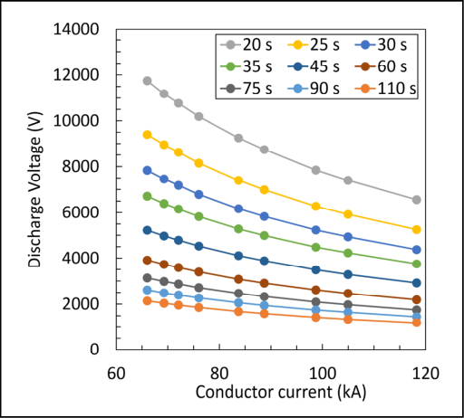

## **Design aspects for conductors with very high operating current** 

Besides the reduction of the operating voltage, the increase of the operating current has two more advantages in the design. The smaller number of turns implies a reduction of the cross section for the electrical insulation at constant thickness of the turn insulation, increasing the engineering current density and reducing the radial build [4]. For the same overall helium cross section in the winding pack, the force flow cooling is also positively affected by the reduced number of turns: the cross section for helium in the conductor increases with the conductor size and the hydraulic length decreases with the number of turns, implying that the residence time of helium decreases and the mass flow rate increases for the same pressure drop. 

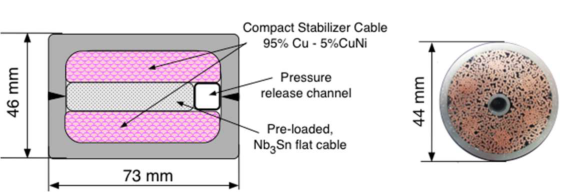

On the other hand, few challenges arise with very big conductors. Figures 2 compares a cartoon of a 118kA / 12T DEMO TF react&wind conductor (similar design approach as in [6]) with the 68kA / 11.7T ITER TF wind&react conductor. 

The minimum winding radius is crucial for the deformation of a large size conductor. A rectangular shape helps reducing the bending strain and plastic deformation compared to square and round shapes, where bending at short radius leads to large keystoning and ovalization. For the 118kA conductor sketched in Fig. 2, the radial size is ≈ 46mm, comparable with ITER CS and PF conductors, which implies acceptably low jacket keystoning for winding radius >2.3m (bending strain <1%). The rectangular shape is anyway the mandatory choice for react&wind Nb3Sn conductors [6]. 

The large cables for fusion magnets are usually encased into a rigid structural armour (“jacket”), which protects the cable from load accumulation from neighbouring conductors. The cable, which is mostly made of brittle high field superconductors (Nb3Sn and HTS), must withstand “only” the internal loads, which are proportional to the field B, the cable space current density J and the cable size – for a square cable of size D, the peak load is B·J·D. The larger the cable, the larger the loads. For an ITER-like Cable-in-Conduit, wind&react, round with ≈30% void fraction, a size increase by 50% would likely lead to unbearable stress/movements. On the other hand, a react&wind, pre-loaded flat cable as in Figure 2 left has better chances to withstand the large internal loads without damage. 

The AC loss, mostly the coupling currents loss in the cable, is an obvious concern for large conductors because the cable pitch is proportional to the cable size and the coupling loss is proportional to the square of the pitch. The ITER conductors have introduced steel barriers between the cable elements to cut the large current loops. On the other hand, the use of resistive barriers must be carefully considered as they hinder the current re-distribution across the cable and the radial convection of coolant, jeopardizing the stability. 

## **The path forward** 

Prototype conductors must be assembled and tested to demonstrate the performance according to the design prediction. The 118kA DEMO conductor represents a reasonable target. The test range for very high current conductors must also be accounted. For the largest conductor test facility (SULTAN), 120kA is the very upper limit. For current above 120kA an upgrade would be necessary. On the other hand, a small scale model coil made by a very large conductor is not a reasonable project because of the plastic deformation at small bending radii. 

Other magnet components also need to be upgraded for higher current, e.g. the power converters, the HTS current leads, bus bars and breakers. For the bus leading to the power 

converters, the large current may make attractive to use HTS conductors at 77K, rather than copper or aluminium bars. 

A reduced operating voltage for fusion magnets is highly desirable to mitigate the manufacturing risks and enhance the overall reliability of a fusion plant. An upgrade of the range of operating current, say up to 120kA, is the most effective way to reduce the voltage both at quench emergency discharge (TF coils) and in pulsed operation (CS and PF coils). Prototype conductors, based on Nb3Sn react and wind and possibly on HTS technology, are deemed feasible with moderate effort, paying attention to the critical design aspects. Most fusion devices aimed at full size demonstration of fusion power plants, will benefit from superconducting cables with high operating current. 

- [14] Ch. Lange, J. Baldzuhn, S. Fink, R. Heller, M. Hollik, W. Fietz et al., Paschen Problems in Large Coil Systems, IEEE Trans. Appl. Supercon. 22, 9501504 (2012). 

- [15] K. Risse, Th. Rummel, Th. Mönnich, F. Füllenbach, H. Bosch, Updates on protection system for Wendelstein 7-X superconducting magnets, submitted to 30[th ] SOFT Conference, 2020. 

- [16] ITER Paschen Test Workshop, November 2019 – Presentations and minutes available at https://user.iter.org/default.aspx?uid=YX47HM 

- **[17]** R. Wesche, X. Sarasola, R. Guarino, K. Sadlak, P. Bruzzone, Alternative TF coil design for reduced voltage, Fusion Eng. Des. 164 112217, March 2021. 

- **[18]** G. Federici et al., 2018 DEMO design activity in Europe: progress and updates Fusion Eng. Des. 136 729–41 

- **[19]** K. Sedlak, P. Bruzzone, X. Sarasola, B. Stepanov, R. Wesche,, Design and R&D for the DEMO Toroidal Field Coils based on Nb3Sn React and Wind Method, IEEE Trans. Appl. Supercon. 27, 4800105 (2017). 

## 9. Fusion superconducting cables, design criteria Thierry Schild 

The superconducting magnets for fusion machines have been developed since early 80s up to today with increasing size from about 50 tons of NbTi conductor for Tore Supra or 90 tons of Nb3Sn conductors for T-15 up to 650 tons of Nb3Sn strands for ITER. All fusion machines ever designed are still first of a kind machines as never built even twice. As the magnetic system is usually about one third of the total tokamak cost, magnets are designed and manufactured with significant margins. The higher the margin are, the higher is the system cost. As large fusion device are billions euros machine, it is essential to optimize margins to support cost effective system development. 

The superconducting conductor is composed of superconducting material (commonly NbTi and Nb3Sn), copper and mechanical material (usually stainless steel or reinforced aluminum). The superconductor weight for a given field and operating temperature is driven by the choice of the temperature margin, T (the difference in between the current sharing temperature and the operating temperature plus the temperature increased due to transient heat loads). In high energy physics and fusion, T is usually initially set at about one kelvin (Iter, W7-X) or more (Kstar, East). The copper mass is mostly driven by the quench protection with the objective to limit the maximum temperature raised in case of quench in the range of 200 K. The mechanical material mass is driven by the maximum stress allowable in material. In case of Nb3Sn, the mechanical reinforcement plays also a major role to limit the strain in the superconducting strand as this material is brittle and its transport current capability is strain sensitive. 

For large fusion device, the optimum conductor layout that required very large current under very high field (up to 70 kA and 12 T for ITER TF) is the helium forced flow cooling Cable In Conduit Conductor (CICC). This is a multistage cable made of superconducting composite strands, copper strands inserted in a mechanical jacket. 

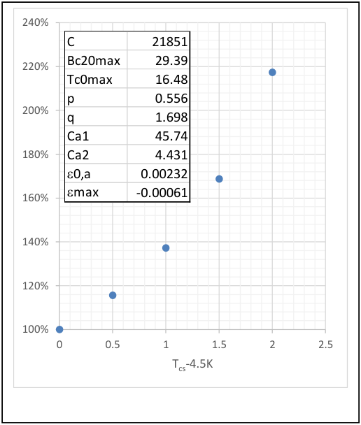

**----- Start of picture text -----** 
240% C 21851 Bc20max 29.39 220% Tc0max 16.48 p 0.556 200% q 1.698 Ca1 45.74 180% Ca2 4.431 e0,a 0.00232 160% emax -0.00061 140% 120% 100% 0 0.5 1 1.5 2 2.5 Tcs-4.5K **----- End of picture text -----** 

**Figure 1.** Percentage of Nb3Sn needed in a conductor as a function of the temperature margin. 100% is the material needed to carry the nominal current at 4.5K without any margin. Peak field is 12 T in this case. 

The most valuable material in the CICC is obviously the superconducting material. It is then interesting to see how this material weight is sensitive to T value. As an example, the Nb3Sn ITER-2008 critical current correlation [1] is used to plot the evolution of the superconductor amount required as a function of T (see Figure 1). The parameters used to calculate the cable critical current are given in the Figure 1. The percentage presented in this plot is STcs-4.5K /Sref. Sref (Tcs-4.5K=0K) is the superconductor cross section needed to have the cable critical current, _Ic_ , at the operating temperature, 4.5 K, equal to the operating current, _Iop_ . STcs-4.5K=1K (137% in the Figure 1)  is the superconductor cross section needed to have the cable critical current, _Ic_ , at one kelvin above the operating temperature, 5.5 K, equal to the operating current, _Iop_ . 

Assuming a classical heat load during plasma operation, the temperature rise is in the range of 0.5 K-1.0 K. This figure shows that the usual margin of 0.5 K-1.0 K raised the superconducting material weight beyond 50% (for ITER TF conductor this margin is 0.7 K) compared to a theoretical no margin design. 

This design criteria is based on the assumption that, above Tcs, the coil will quench, below Tcs, the coil is superconducting. For medium scale NbTi CICC with high n-index (a few 10), this assumption has been proven on fusion machine model coils as W7-X DEMO coil. In [2], we can see that this coil was operated in steady condition at a few tens of millikelvins below Tcs, and then quenched going above this value. For Nb3Sn CICC with low n-index (below 10 [3] [4]), the situation is very different as the coil can be operated even above Tcs in a kind of semiresistive mode [4]. In this case, only the cooling power available is limiting the maximum operating temperature. Figure 2 shows the evolution of the heat load per meter at the peak 

field region as a function of operating temperature, assuming it is above the current sharing temperature. To plot this figure, STop-Tcs the needed superconductor cross section is calculated for a temperature below the operating temperature. As an example, Top-Tcs=1K means the cable critical current is equal to the operating current, Iop, for a temperature 1K below the operating temperature. Then, for the superconductor section STop-Tcs, the cable critical, Ic(TopTcs), is calculated at the operating temperature. Obviously, this critical current value is lower than the operating current. It is then possible to calculate the heat load per unit length that will depend on the n value according to the classical following formula. Ec is the electrical field criteria. 

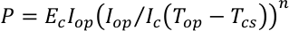

It can be seen that operating 1 K beyond the current sharing temperature (defined here with an electrical field criteria of 10 µV/m) increases the heat load by a factor 3 for an index equal to 5 and by a factor about 10 for an index equal to 10. Depending on the field value along the conductor length, heat load in the range of 1 to 10 W/m can be acceptable for the cryogenic system. Acceptable means it does not lead to a thermal runaway. 

It should be noted that, for the purpose of the comparison, this calculation has been done assuming the individual strand critical performance is not dependent to the cable n value. In fact, very low index is usually the signature of strands degradation. An index equal to 1 would then mean the strands are all resistive, and dissipating unacceptable heat as only copper would carry the current. 

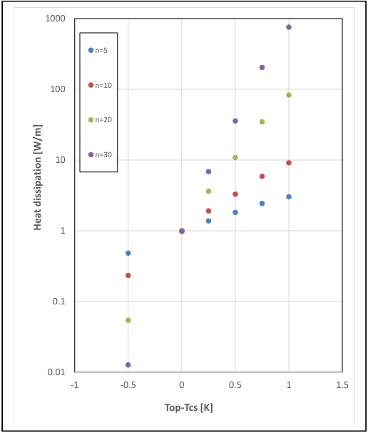

**----- Start of picture text -----** 
1000 n=5 100 n=10 n=20 n=30 10 1 0.1 0.01 -1 -0.5 0 0.5 1 1.5 Top-Tcs [K] Heat dissipation [W/m] **----- End of picture text -----** 

**Figure 2.** Heat dissipation at peak field region assuming Ic  is defined with an electrical field criteria of 10 µV/m for a conductor index n as a function of the operating temperature minus the current sharing temperature. A positive value means then that T is negative. The operating current is 100 kA. 

The usual T margin criteria, associated with an electrical field criteria, is used to determine the superconducting material quantity lead to an over estimation for low index conductor as Nb3Sn CICC as the conductor can be operated beyond the Tcs threshold. This is likely also valid for HTS conductor with also low index value. Due to the Nb3Sn CICC degradation issue management [4], ITER project revised the initial conductor criteria in this way but a posteriori. It is important to remind that even large Nb3Sn that does not experience degradation have also low transition index [3]. 

All the challenge is to determine the acceptable maximum heat load in the high field region as a replacement of the temperature margin to design the conductor. 

Mid-2020, three CICC machines are in operation in the world (EAST, KSTAR, W7-X). W7-X will be commissioned at its full magnets current in 2021 [6]. JT-60SA  is expected to start operation in September 2020 [7]. Usually during the commissioning phase of these machines, the investigation of operating margin is not planned because of the obvious related risks. Indeed, doing such margin test on a model coil or individual serial coil is manageable, but on a full magnet system it leads usually to investment protection considerations. Again, the low index CICC may change this paradigm as it is possible to operate coils in current sharing zone still with significant margin before quenching the coil. As an example, to follow the Iter TF conductor degradation process, it is envisaged to increase locally the coil temperature near the high field region up to some voltage appearance along the machine lifetime. It is considered as feasible only because it was demonstrated during Nb3Sn CICC model coil tests that operation even in current sharing zone is still stable. Such tests performed on machine operating Nb3Sn magnet system would provide a unique database for future machine design. In parallel, the development of fusion oriented multi-physic platform as [8] is needed to simulate magnet system using the above data as benchmark. The challenge is here to develop fast processing to be able to use these codes in an optimization loop. 

If the development of fast processing system codes is achieved and successfully benchmarked, the conductor design could then be integrated in an optimization loop taken into account the cryogenic plant (balancing for example the cryogenic plant kW/€ cost with the kg/€ superconducting material), and the realistic time and spatial heat load distribution over the coil during reference plasma scenario. The main optimization constraints is then the coil thermal stability. 

The superconducting magnet is a cost driver for any fusion machine (see Iter and DEMO cost sharing in Figure 5 in the introduction chapter). The last decade development of large Nb3Sn CICC have shown that the usual temperature margin criteria could be reviewed in a optimization loop balancing the heat load due to operation in semi resistive conditions and the requested cryogenic power. This approach at the conductor and coil design stage requires reliable and fast processing codes that have to be qualified preferably on existing or soon operating fusion devices. The final objective is to develop the most cost effective design 

approach. Such design optimization approach should also be considered on other magnet key cost drivers as manufacturing tolerances versus error field. 

_The author would like to thank Neil Mitchell for its availability to discuss Iter conductor development and design criteria._ 

_"The views and opinions expressed herein do not necessarily reflect those of the ITER Organization"_ 

- [1] L. Bottura and B. Bordini, "Jc(B,T,e)  Parameterization for the ITER  Nb3Sn Production," in IEEE Transactions on Applied Superconductivity, vol. 19, no. 3, pp. 1521-1524, June 2009, doi: 10.1109/TASC.2009.2018278. 

- [2] T. Schild, L. Genini, M. Jacquemet, A. U. Holting, T. Rummel and L. Wegener, "W7-X DEMO coil cryogenic tests in the CEA/Saclay test facility," in IEEE Transactions on Applied Superconductivity, vol. 13, no. 2, pp. 1468-1471, June 2003, doi: 10.1109/TASC.2003.812743. 

- [3] D. Bessette, "Design of a Nb3Sn Cable-in-Conduit Conductor to Withstand the 60 000 Electromagnetic Cycles of the ITER Central Solenoid," in IEEE Transactions on Applied Superconductivity, vol. 24, no. 3, pp. 1-5, June 2014, Art no. 4200505, doi: 10.1109/TASC.2013.2282399. 

- [4] N Mitchell, M Breschi and V Tronza, “The use of Nb3Sn in fusion: lessons learned from the ITER production including options for management of performance degradation”, Published 30 March 2020 • © 2020, ITER Organization, Superconductor Science and Technology, Volume 33, Number 5 

- **[5]** N. Mitchell, D. Bessette and M. Shimada, "Conductor design and optimisation for ITER," in IEEE Transactions on Magnetics, vol. 32, no. 4, pp. 2997-3000, July 1996, doi: 10.1109/20.511506. 

- **[6]** Rummel, Thomas & Riße, Konrad & Nagel, Michael & Mönnich, Thomas & Schneider, Matthias & Füllenbach, Frank & Bosch, Hans-Stephan. (2019). Wendelstein 7-X Magnets: Experiences Gained During the First Years of Operation. Fusion Science and Technology. 1-8. 10.1080/15361055.2019.1629248. 

- **[7]** P. Barabaschi, Y. Kamada, H. Shirai and the JT-60SA Integrated Project Team, 2019 Nucl. Fusion 59 112005 

- **[8]** Louis Zani, Benoît Lacroix, Alexandre Torre, Jean-Claude Vallet, Clément Berthinier, Christophe Bourcier, Nicolas Misiara, François Nunio, Roser Vallcorba, Christian Van Wambeke, François Bonne, Christine Hoa, Slim Constans, Quentin Le Coz, OLYMPE, a multi-physic platform for fusion magnet design: Development status and first applications, Cryogenics,Volume 108,2020,103086, ISSN 00112275,https://doi.org/10.1016/j.cryogenics.2020.103086. 

## 10. Superconducting switches for energy extraction in fusion magnets 

Nikolay Bykovskiy, Alexey Dudarev and Matthias Mentink 

Magnetic energy 𝐸 stored in fusion magnets is ranging from hundreds of MJ for the machines already in operation, up to about 50 GJ for ITER and over 150 GJ pursued for a DEMO power plant. Quench protection for such magnets is commonly based on external discharge resistors and massive commutation switches, resulting in an exponential current decay during a fastdischarge of the magnet. Stabilizing copper is also used in fusion conductors to enhance their quench capacity, though its amount has to be minimized for higher efficiency of the system. In fact, to keep the hot-spot temperature at 150 K, the copper current density scales as 𝑗��[A ∕mm[�] ] ≈500 ∕ �𝜏[s] , where 𝜏= 2𝐸∕𝐼��𝑈� is the decay time constant, 𝐼�� the operating current and 𝑈� the maximum voltage over coil terminals. Hence, in order to achieve high efficiency ( 𝑗�� > 100 A ∕mm[�] ), 𝜏 must not exceed some tens of seconds, which together with 𝐼�� < 100 kA and 𝑈� < 10 kV requires that 𝐸< 10 𝐺𝐽 , highlighting the need for sectioning of large superconducting magnets. 

The ITER TF coils, for instance, are split in 9 sectors each containing 2 coils, resulting in 11 s for the time constant [1]. As sketched in Figure 1, 9 discharge units and 9 pairs of HTS current leads and long busbars are then necessary, leading to the demanding cryogenic requirements [2]. Each discharge unit is essentially composed of discharge resistor, mechanical switch, vacuum and pyro circuit breakers, which are essential to ensure backup switching in case of any failures in current commutation unit.. The components are distributed in two different buildings at the site, and the power supply is situated over 100 m away from the main tokamak building. 

Design solutions of ITER are widely adopted by the DEMO project. However, due to a larger scale, some of them will have to be reconsidered. For instance, accounting also for mechanical aspects of the vacuum vessel, the discharge time constant is further increased up to 35 s, allowing two TF coils per sector operated up to 90 kA. As a result, the copper current density is reduced and the busbars dissipate several MWs, about 1% of the generated electrical power [3, 4]. Potential workaround for these issues is discussed below. 

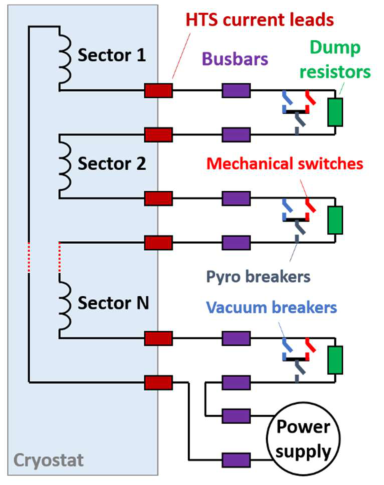

**Figure 1.** Schematic diagram of coil sectioning with discharge units connected between adjacent coil sectors by HTS current leads and busbars. Operating current flows through closed switches of the discharge units in normal operation, whereas the switches are open in the case of a quench and magnet’s stored energy is evacuated by the dump resistors. 

As an alternative to the use of magnet feeders at ambient temperature, ‘cold’ switches were proposed for the coil sectioning [5]. Their basic properties have been evaluated [6] and most promising materials identified [7], thus experimental demonstration should finally be conducted. The switches are used essentially as follows, see Figure 2: 

- They are closed in regular operation. Adjacent coil sectors are shorted and related heat loads are minimized. 

- They are open in the case of a quench. Voltage to ground among coils is not exceeded and the stored energy is extracted. 

In the case of fusion magnets, the discharge resistors at room temperature, connected in parallel by safety leads, are also required to effectively extract large energy and to avoid oversizing of the switch. The safety leads made of stainless steel maintain low cryogenic loads. Hence, using only one pair of HTS current leads and busbars, the electrical power loss and complexity of integration can be reduced substantially. In contrast to the mechanical switches, the high voltage developed on the cold switches during the magnet fast-discharge is not associated with arcing issues, so vacuum breakers are no longer necessary. Subsectioning of individual coils by the cold-switches is also made possible, which allows further reduction of the discharge time constant. 

The stored energy is dumped almost entirely into the discharge resistors, whereas only a small fraction should be taken by the switch for a cost-efficient design, thus the switch resistance is order of Ohms compared to ≈0.1 Ohm for the discharge resistor. The switch needs a large thermal sink in order to further reduce energy absorbed directly by the conductor enthalpy. Using a large thermal mass insulated from the conductor (e.g. existing components of the cryostat) is a simple passive solution, in contrast to more efficient active cooling systems, which would require further development. Synchronous operation of the switches is crucial, as it is for the commutation switches in the conventional circuit. 

Superconducting materials are the most promising to achieve low ‘on’-state and high ‘off’state resistances for the high current and high voltage operation. Considering other potential technologies, mechanical switches would suffer from arcing issues in helium environment, whereas MOSFET and IGBT units are of relatively low voltage and current ratings, respectively. 

The cold switch comprises a number of long composite superconductors with highly resistive matrix, which are arranged in non-inductive windings and also include quench heaters or other appropriate means for the switching. Taking the ITER TF coil parameters as a reference, a fast-discharge of 41 GJ using 9 switches is evaluated for the two promising materials, see Table 1: NbTi wire in CuNi matrix operated at 4 K and non-stabilized ReBCO tape operated at 4 and 50 K. The main technological aspects are assessed then as follows: 

**Material.** The NbTi/CuNi wire is commercially available in long lengths, but the ReBCO tape is customized by reducing the silver layer thickness to 0.1 µm, which is about minimum possible using etching [8]. As a result, the required length is 4 times lower compared to regular tapes (≈2 µm thick Ag) because of much higher resistivity in the normal state. However, the feasibility of the tape treatment over hundreds of meters has to be demonstrated. The cost reduction for ReBCO is necessary and cannot be resolved by boosting its current capacity. 

**Winding.** The sub-cables of some hundred meters are needed to achieve sufficiently high resistance in the normal state. They are insulated from each other and arranged in a bifilar manner, thus minimizing its self-inductance. To reduce the amount of conductor for a given current capacity, the switches are to be placed in a low-field region of the magnet system. **Thermal sink.** About 98% of the energy is evacuated by the discharge resistor, only about 0.1% by the conductor itself and 2% by the heat sink that is assumed to provide a factor 20 increase for the switch enthalpy, thus reducing by a factor 5 the material length. 

**Reliability.** This is a key concern for the NbTi option, given a minimum quench energy is reduced due to the high normal resistance. Proper mechanical fixation of the conductor is essential. 

**Quench.** Protection of the switch is provided by its switching system and the discharge resistor. NbTi features relatively low energy needed to achieve the normal state, whereas demanding requirements are imposed by ReBCO to ensure fast switching. In the case of thermally activated ReBCO, embedded heaters have to be co-wound with the tapes to address slow quench propagation. 

Table 1. Material estimate for a superconducting switch operated at 𝐼�� = 68 𝑘𝐴 , 𝑈� = 10 𝑘𝑉 , 𝐸= 4.5 𝐺𝐽 , 𝑇��� = 200 𝐾. 

Economic considerations in the magnet design are crucial to realize a competitive fusion power plant. Using the superconducting switches for the magnet protection is promising to drastically reduce the complexity of integration, electric power dissipation and overall cost. Using one coil per sector or even subdividing individual coils into sections by the switches is rather straightforward in contrast to the conventional design based on the magnet feeders installed at room environment. The NbTi/CuNi wires are considered the most promising for the application, providing a cost-efficient and robust design. Hence, further development of the required technology for the high-current and high-voltage switches and the following experimental validation can pave the way towards high performance fusion magnets. Using the NbTi/CuNi wires at CERN, operation up to 3 kA of a 4-wire switch featuring 3 Ohm normal resistance was recently demonstrated and a 6-around-1 cable with insulated central heater is procured for further design upscaling (to be presented elsewhere).. 

- [1] N. Mitchell, D. Bessette, R. Gallix, C. Jong, J. Knaster, P. Libeyre, C. Sborchia, and F. Simon, “The ITER Magnet System,” _IEEE Transactions on Applied Superconductivity_ , vol. 18, no. 2, pp. 435–440, Jun. 2008, doi: 10.1109/TASC.2008.921232. 

- [2] A. K. Sahu, C. Y. Gung, K. Lu, P. Bauer, A. Devred, Y. Song, Y. Bi, I. Ilin, F. Rodriguez-Mateos, N. Dolgetta, and N. Mitchell, “Cryogenic Engineering Design of the ITER Superconducting 

Magnet Feeders,” _IEEE Transactions on Applied Superconductivity_ , vol. 22, no. 3, pp. 4800604–4800604, Jun. 2012, doi: 10.1109/TASC.2011.2181936. 

- [3] E. Gaio, A. Ferro, A. Maistrello, M. Dan, F. Lunardon, L. Barucca, S. Ciattaglia, G. Federici, and I. Benfatto, “The EU DEMO Plant Electrical System: Issues and perspective,” _Fusion Engineering and Design_ , vol. 156, p. 111728, Jul. 2020, doi: 10.1016/j.fusengdes.2020.111728. 

- [4] M. Dan, A. Maistrello, and E. Gaio, “Studies on TF circuit, coil sectors number and impact of connection impedance on coil transient voltages,” EFDA_D_2MPHML, May 2020. https://idm.euro-fusion.org/?uid=2MPHML. 

- [5] A. V. Dudarev, V. E. Keilin, Yu. D. Kuroedov, A. A. Konjukhov, and V. S. Vysotsky, “Quench protection of very large superconducting magnets,” _IEEE Transactions on Applied Superconductivity_ , vol. 5, no. 2, pp. 226–229, Jun. 1995, doi: 10.1109/77.402530. 

- [6] A. Ballarino and T. Taylor, “Scaling of Superconducting Switches for Extraction of Magnetic Energy,” _IEEE Transactions on Applied Superconductivity_ , vol. 20, no. 3, pp. 2031–2034, Jun. 2010, doi: 10.1109/TASC.2010.2042044. 

- [7] J. van Nugteren, J. S. Murtomaki, J. Ruuskanen, G. Kirby, P. Hagen, G. DeRijk, H. Ten Kate, L. Bottura, and L. Rossi, “A Fast Quench Protection System for High-Temperature Superconducting Magnets,” _IEEE Transactions on Applied Superconductivity_ , p. 4700108, 2018, doi: 10.1109/TASC.2018.2848229. 

- [8] N. Bykovskiy, A. Dudarev, and H. Ten Kate, “Thermally activated ReBCO switches for charging high current magnets,” IEEE Transactions on Applied Superconductivity, pp. 1–1, 2019, doi: 10.1109/TASC.2019.2895849. 

11. Overview of HTS joints technology for segmented coils Franco Julio Mangiarotti 

The assembly of HTS magnets with segmented coils has a number of advantages compared to traditional coil winding, such as simpler and modular manufacturing, the possibility to use short lengths of high performance superconductor, and increased flexibility in the design, manufacturing and maintenance of other reactor components. This concept was first studied in Japan by Hashizume et al [1] and in the USA by Olynyk et al [2]. Those designs evolved into the recent FFHR-d1 [3] and ARC [4] designs. 

FFHR-d1 is a heliotron whose helical coils are divided in segments of one helical twist pitch [5], and joined in series with a mechanical lap joint. In the joint, the HTS tapes are in face-toface contact, pressed by the copper stabilizer and steel jacket. The steel jacket is welded to ensure good mechanical strength. This winding method is called “joint-winding” and is illustrated in Fig 1 [3]. The reactor has a total of 3900 joints. An industrial robot assembles and welds one joint individually in about one day ; two robots could work simultaneously on two joints in opposite ends of the winding for a total assembly time of 3 years [6]. For FFHRd1, the reduction of magnet manufacturing complexity drives the use of segmented coils: traditional winding would require a large poloidally and toroidally rotating machine installed in the reactor building to continuously wound the helical coils; while the segmented coils could be pre-fabricated elsewhere and assembled on-site. In addition, the joint-winding method would simplify the lead extraction from the magnet by allowing for pancake winding. 

. 

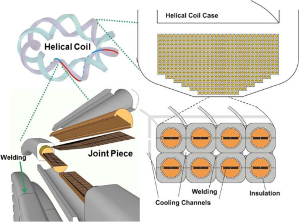

**Figure 1.** Illustration of the FFHR-d1 coils. Top left: helical coils. Bottom left: joint between conductors of two adjacent segments. Right: cross section of the helical coils. Image from [3]. 

The ARC design is a tokamak whose toroidal field coils are divided in two segments at the top and outer midplane. In the joint, the HTS tapes are covered with a copper protection layer, which is the contact interface. The forces are taken by an external structure. The joints are not permanent, as they are disassembled to perform maintenance in the reactor. This design is called “demountable coils”, and is illustrated in Fig 2 [4], [7]. A radiation-resistance robot assembles and disassembles all conductor joints in each TF coil simultaneously; the time 

required was not estimated. For ARC, the main advantage of the use of segmented coils is the simplification of the vacuum vessel and divertor maintenance: instead of using robotic arms for sector maintenance, the entire vacuum vessel can be manufactured elsewhere with tighter tolerances, and be installed as a single piece after the coils are disassembled [4]. 

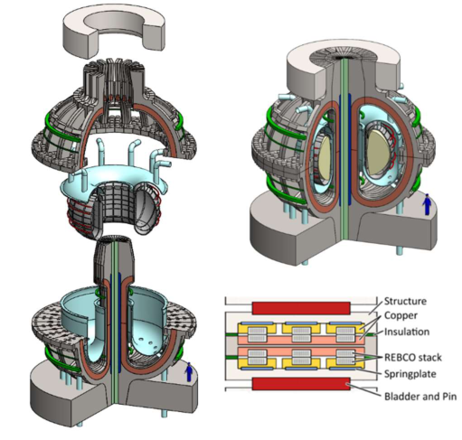

![Figure 2.  Illustration of the ARC coils. Left: reactor disassembled. Top right: reactor assembled. Bottom right: conceptual cross section of a joint. Images from [4], [7].](images/mitchell2021.pdf-0062-02.png)

The FFHR-d1 cable and joint concept is relatively advanced. The 100 kA HTS cable, named STARS (Stacked Tapes Assembled in Rigid Structure) [6], has been designed for this application, and a prototype conductor was tested to full current. A demonstration joint has been assembled and tested, reaching a joint resistance of 15 pΩm[2] . This joint consisted in two terminations with three stacks of REBCO tapes each, arranged in a staircase pattern, with a bridge-type mechanical lap joint; in this joint, each REBCO tape in the conductor is in direct 

contact with the tape in the bridge [3]. By heat-treating the joint to 100 °C, demonstrated in single tape joints, the joint resistance was further reduced to 3.5 pΩm[2] [8]. Alternative joint architectures are under investigation, such as an edge-type joint that reached 25-50 pΩm[2] in a small scale experiment. The main technological challenges for this concept reside on achieving these results with a real scale joint, applying all techniques together in a reasonable time, with an industrial robot. 

The ARC joint design is less advanced. Two conductor designs have been proposed: round and twisted [4], [9], [10]; square and not-twisted [7]. The expected current is around 70100 kA. A small scale, proof-of-concept joint test of one joint design has been done up to 3 kA [7], obtaining a joint resistance of 110 pΩm[2] . This joint consisted in two terminations with a stack of REBCO tapes, soldered in a slot in a copper block with one of their edges exposed; a silver-coated copper plate was soldered on top of the exposed edge of the tapes, and the electrical joint was made by pressing the two silver-coated faces [7]. More recently, a round cable design has been tested up to 50 kA with a double-saddle joint, consisting in a copper intermediary piece between two round cables [10]. This joint design is effective for cable tests, obtaining a joint resistance of around 25-100 pΩm[2] ; however its low tolerance to misalignment does not make it adequate for a reactor design [7]. One of the main technological challenges for the ARC concept is to demonstrate a full current joint and cable, possibly with a lower joint resistance. 

Furthermore, the ARC design requires several individual joints to be assembled simultaneously. Some concepts have been discussed [7], [10], but they have not been demonstrated. The second main technological challenge for this design is to build and demonstrate a multi-joint assembly, including the procedure to make and separate the joints, and the repeatability of its performance at high current. 

There are three common technology advances required for both joint concepts. One fundamental difficulty is the electrical insulation. Neither the FFHR-d1 prototype joint nor the ARC proof-of-concept joint assessed the electrical insulation across the joint. For ARC, small scale tests have been done [11], but its scalability to several simultaneous joints has not been assessed. The insulation scheme at the joint level needs to be carefully designed, its application in the joint tested, and its fabrication demonstrated. 

The assembly procedure of a single full sized joint also needs to be demonstrated. In this regard, the FFHR-d1 is more advanced, as the joint prototype is very similar to the final design; however, this joint was bolted instead of welded, and as discussed above it did not have the electrical insulation. The ARC joint was small scale, and limited to the electrical conductive parts, thus not testing any of the support and alignment elements. 

The third technology to demonstrate is the robotic operation. FFHR-d1 benefits from a robot to assemble the joints in shorter time; ARC requires it because the joints will become radioactive during operation and manual intervention would not possible. The robot should 

perform the joint electrical assembly, electrical insulation, mechanical support (welding, bolting, key insertion depending on the design), and testing. 

In the case of ARC, some additional challenges need to be addressed. The final cable design needs to be determined, either by developing and testing a new concept or by adopting an existing, tested design. The joint design needs then to be adapted to the cable design; this can be challenging in the case of twisted conductors. A conductor and joint prototype then needs to be demonstrated at the operation conditions of current, magnetic field and temperature. In addition, the multi-joint concept reliability and repeatability needs to be assessed and demonstrated. 

The use of HTS segmented coils in fusion reactors allows for greater flexibility in the design and manufacturing of magnet systems, and other internal components such as the vacuum vessel or the divertor. Demonstrating technical and technological feasibility of the jointwinding and demountable coil concepts is critical for the development of the FFHR-d1 and ARC reactor designs, who rely on this technology. Although the FFHR-d1 joint concept is more advanced than ARC’s, both require substantial development in terms of manufacture and operation. Once demonstrated, this technology has the potential to simplify manufacture and/or assembly of any other HTS reactor design. 

- [1] H.Hashizume, S.Ito, K.Yagi, S.Kitajima. Proposal of mechanically jointed superconducting magnet using high critical temperature superconductors. Fus. Eng. Des. Volumes 63–64, December 2002, Pages 449-454. https://doi.org/10.1016/S0920-3796(02)00271-5 

- [2] G.M.Olynyk, Z.S.Hartwig, D.G.Whyte, H.S.Barnard, P.T.Bonoli, L.Bromberg, M.L.Garrett, C.B.Haakonsen, R.T.Mumgaard, Y.A.Podpaly. Vulcan: A steady-state tokamak for reactorrelevant plasma–material interaction science. Fus. Eng. Des. Volume 87, Issue 3, March 2012, Pages 224-233. https://doi.org/10.1016/j.fusengdes.2011.12.009 

- [3] N.Yanagi, S.Ito, Y.Terazaki, Y.Seino, S.Hamaguchi, H.Tamura, J.Miyazawa, T.Mito, H.Hashizume and A. Sagara. Design and development of high-temperature superconducting magnet system with joint-winding for the helical fusion reactor. _Nucl. Fusion_ 55 053021 (2015). https://doi.org/10.1088/0029-5515/55/5/053021 

- [4] Sorbom, B. N.; Ball, J.; Palmer, T. R.; Mangiarotti, F. J.; Sierchio, J. M.; Bonoli, P.; Kasten, C.; Sutherland, D. A.; Barnard, H. S. (2014-09-10). "ARC: A compact, high-field, fusion nuclear science facility and demonstration power plant with demountable magnets". Fus. Eng. Des. 100: 378–405. doi:10.1016/j.fusengdes.2015.07.008. 

- [5] H. Tamura, N.Yanagi, K.Takahata, A.Sagara, S.Ito , and H.Hashizume. Multiscale Stress Analysis and 3D Fitting Structure of Superconducting Coils for the Helical Fusion Reactor. IEEE Trans Appl Supercond, VOL. 26, NO. 3, APRIL 2016 4202405 

- [6] Yanagi, N., Hamaguchi, S., Tamura, H., Tanaka, T., Miyazawa, J., Goto, T., Mito, T., Sagara, A., Terazaki, Y., Ito, S., & Hashizume, H. (May 2018). Helical Coil Design and Development with 100 kA HTS STARS Conductor for FFHR-d1 (IAEA-CN--234). International Atomic Energy Agency (IAEA) 

- [7] F.J.Mangiarotti. Design of demountable toroidal field coils with REBCO superconductors for a fusion reactor. Thesis: Ph. D., Massachusetts Institute of Technology, Department of Nuclear Science and Engineering, 2016. http://hdl.handle.net/1721.1/103659 

- [8] Tatsuki Nishio, Satoshi Ito, Noritaka Yusa, and Hidetoshi Hashizume. Reducing Joint Resistance by Heat Treatment During Fabrication of a Mechanical Joint of HighTemperature Superconducting Conductors. IEEE Trans Appl Supercond, VOL. 26, NO. 4, JUNE 2016 4800505 

- [9] S Sato et al “Investigation of trade-off solution in mechanical edge joint of STARS conductors” 2020 J. Phys.: Conf. Ser. 1559 012110 https://iopscience.iop.org/article/10.1088/1742-6596/1559/1/012110 

- [10] Franco J. Mangiarotti and Joseph V. Minervini. Advances on the Design of Demountable Toroidal Field Coils With REBCO Superconductors for an ARIES-I Class Fusion Reactor. IEEE Trans Appl Supercond, VOL. 25, NO. 3, JUNE 2015 4201905 

- [11] Andrea E. Haight; Mark M. Haynes; Leslie A. Bromberg; Makoto Takayasu, Philip C. Michael, Alexey Radovinsky. Re-Makeable Joint With Insulation for REBCO Superconductor Cables. IEEE Trans Appl Supercond ( Volume: 29 , Issue: 5 , Aug. 2019 ). DOI: 10.1109/TASC.2019.2902124 

## 12. Advances in React & Wind Nb3Sn Coils for Fusion 

Kamil Sedlak 

The largest challenges in building fusion power plants are often claimed to be technological ones, e.g. the development of materials sustaining enormous heat flux on the reactor walls. A challenge that is in our opinion of at least the same importance is related to the costs of produced electricity [1], which blows up with the increasing size of the machine. The corresponding increase in the material costs is of lower importance – the main issue is the increased complexity of manufacture, logistic and handling cost, and the manufacturing time. An extreme example of addressing this problem are the compact HTS-based tokamak concepts, e.g. SPARC developed by Commonwealth Fusion Systems or a spherical tokamak developed by Tokamak Energy Ltd. In this article, we propose a roadmap towards the conventional Nb3Sn-based tokamaks, which is based on an improved conductor design leading to more compact magnets, perhaps with a slightly elevated magnetic field, and reduced manufacturing complexity compared to the present state-of-the-art fusion magnets. This goal is achieved by adapting the react & wind (RW) conductor manufacturing path. 

## **React & Wind Conductor** 

An obvious advantage of the RW method is the lower axial strain (ε≈ -0.3% [2], [3]) in Nb3Sn cable compared to an ITER-like wind & react (WR) cable (ε≈ -0.7% [4]). The lower strain in RW conductor is a direct consequence of the jacketing of the reacted cable at room temperature. The beneficial effect of the lower strain has been experimentally demonstrated by an RW conductor developed for an alternative ITER TF coil [2], [5] and EU DEMO project [3], [6]. When tested in ITER-like conditions (10.9 T, 68 kA), the EU DEMO conductor with 132 mm[2] of Nb3Sn achieved a higher current-sharing temperature (TCS=7.42 K [3]) than a typical ITER TF conductor with 238 mm[2] of Nb3Sn (TCS=6.3-6.5 K [4], internal-tin). Both conductors, compared in Figure 1, are forced-flow cooled. 

However, the main potential of RW technique does not lie in the strain reduction, but in the very different jacketing procedure that opens up completely new possibilities in the coil design and manufacture. The natural choice for the jacketing process is longitudinal welding of two rolled or extruded steel half-profiles surrounding the reacted cable. Even though the total length of welds might look unfavourably large, in recent ~30 years the longitudinal welding became standard, reliable and cheap industrial process, e.g. in the car industry. Contrary to WR, jacket and welds are not exposed to heat treatment, which avoids material embrittlement and simplifies quality assurance. The fundamental advantage is complete freedom in the jacket thickness and shape, and virtually unlimited conductor manufacturing length. 

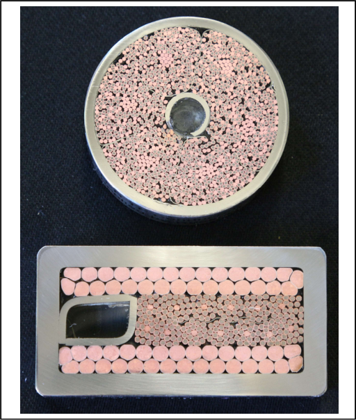

**Figure 1.** Comparison of the ITER TF conductor based on WR technology (upper plot) with the latest EU DEMO TF conductor (lower plot) consisting of a flat RW cable next to a rectangular cooling channel, both surrounded by two Rutherford cables made of coated Cu wires as a stabilizer. The two pictures are to scale. The amount of Nb3Sn in RW cable is 55% of that of ITER one, while the segregated Cu cross-section is exactly two times larger due to the prolonged discharge time (35 s in DEMO cf. 11 s in ITER). 

## **Layer Winding and Conductor Grading** 

The benefits of the RW technology are best exploited when combined with the layer winding. Each layer can be graded independently in Nb3Sn, helium, copper and steel. 

Grading in superconductor is an obvious option that leads to a significant reduction of the total required amount of Nb3Sn strands, which directly reflects into the reduced material costs. As an example, the RW winding pack designed for EU DEMO [6] consists of 12 layers, and the lowest-field layer (6.2 T) needs only 25% of Nb3Sn compared to the highest-field layer (12.2 T). The overall saving of Nb3Sn compared to a non-graded winding pack of the same performance is ~50%. When in addition the Nb3Sn saving due to lower strain in RW technique is taken into account, the total saving in Nb3Sn reaches ~73% compared to an ITER-like DEMO design (222 tons of Nb3Sn strands for RW, compared to 835 tons of strands for pancakewound WR winding pack). 

Grading in steel conduit together with the freedom in its shape is another important benefit of the RW technique. The jacket wall thickness (in both radial and toroidal directions) can be adjusted exactly according to the local stress in the given layer of the winding pack, minimizing the radial build of the coil, and consequently reducing the overall size of the machine. At the first look it might seem that the manufacturing costs of a fusion machine are proportional to its volume, i.e. grow with ~ _R_[3] , as this is how material costs, including standard machining, depend on object size. However, manufacturing complexity, high precision machining and handling of very large and heavy components do not scale linearly with the weight, but much 

steeper. For instance, a crane rated to 800 tons (approx. weight of the EU DEMO TF coil) is not just two times more expensive than a 400-ton one. Some industrial processes, e.g. forging weight or the welding depth required for the TF case, are limited in dimensions, and become extremely challenging in DEMO-size machines. Therefore, any reduction in the radial build of the coils, and consequently of the whole machine, becomes extremely valuable. 

An important advantage of the RW technology is the simplicity of the coil winding done in a continuous process, in which joints are made at the winding table before bending the conductor. Unlike in WR, there is no transfer-insulation process, which simplifies the winding procedure such that it resembles winding of NbTi or copper coils. This simplifies tooling and reduces risks during coil manufacturing. 

## **Possible Future Investigations** 

The manufacture and testing of ~60-70 kA RW conductor prototypes [3] and diffusionbonded joint with 0.54 nΩ resistance [7] provides a solid basis for the next generation of fusion coils. Let us now outline some other (speculative) ideas pushing the R&D further: 

- High- _J_ c Nb3Sn strands: The progress in the development of Nb3Sn strands with artificial pinning centres presented at conferences during the past years looks promising. Once these high- _J_ c strands become available in industrial quantities, they could be employed in the highest-field layer. About 10% increase of the field on plasma axis would become feasible, allowing us further reduction of the tokamak size. Even without exploiting the field increase, at least the cable could be slightly more compact, reducing the dimensions of the steel jacket and thus of the whole winding pack. 

- A jointless TF/CS coil: as the jacketing by longitudinal welding can be done in unlimited lengths, one can imagine manufacturing the conductor length for the whole coil in one go. Joints always constitute weak points. They require a lot of R&D and quality assurance, increase the risk of coil failure, significantly complicate and slow down the coil winding, and call for cold testing with the current. A usual outcome of the RAMI analysis is a request to provide access to the joints for a repair, or even design the machine in a way allowing replacement of a failed TF coil. The jointless coil has two major challenges. Manipulation with the conductor spool and coil winding becomes very demanding, requiring huge tooling. The second challenge is the conductor grading, requiring smooth grade-to-grade transition during the cabling and jacketing processes, likely requesting variable strand diameter or strand joints, strand-to-copper wire joints, change of steel profile inner dimensions, etc. One can anticipate that the conductor grading would need to be simplified or, in an extreme case, sacrificed. Concerning the helium cooling, inlet and outlet cooling pipes can be installed (welded) at the winding pack edges, so that every layer is cooled by fresh helium. 

- Solder filling of the strand bundle: the performance degradation of ITER TF conductors on electromagnetic and thermal cycling, whose significance depends on 

the conductor producer, is a warning lesson for any new conductor concept. Though it seems that degradation can be avoided in RW conductors [3], [5] (in [3] by transverse pre-load applied on the cable during jacketing), an option of solder filling of the strand bundle has been investigated [2], and related R&D is envisaged also within the EU DEMO project. Moreover, solder filled cable relaxes the hydraulic containment function of the jacket, and hence also the issue of the jacket fatigue in case of a CS coil. A high-resistivity soldering alloy is required for keeping the overall AC loss low. 

## **Drawbacks and Risks of the RW concept** 

RW forced-flow conductors have been used in several (fusion) coils in the past, e.g. in Mirror Fusion Test Facility (Livermore, USA), Levitated Dipole Experiment (MIT, USA) and more recently in a 25 T cryogen-free magnet [8] at IMR (Tohoku University, Japan). The disappointing experience from T-15 tokamak, where the TF coils became resistive with ohmic heating in the kW range right from the first operation in 1988, presumably due to handling during which bending strain reached ±0.8% [9], brought a lot of aversion against the RW technology. However, the example of the main DC magnets of the SULTAN test facility [10], built also at the end of eighties and being in a heavy operation since then, proves that the RW magnets can be very reliable, withstanding many electromagnetic and thermal cycles as well as fast discharges. The necessary conditions are not extraordinary demanding – the cable must be flat enough [2] to withstand bending strain during straightening for the jacketing process, and bending back to the final shape. In the case of the 12 T SULTAN coil, the 3.3 mm thick cable was heat-treated at the radius of 0.6 m, jacketed straight, and finally wound to the coils with the radius of 0.3-0.4 m. Since the minimum bending radii in the big fusion magnets are order of magnitude larger, the bending strain can be restricted even to a safer range compared to SULTAN coils. In EU DEMO with cable thickness of ~11 mm, the actual bending strain in operation at various positions along the D-shape varies in the range of ±0.1%, and during the straightening for jacketing ±0.25%. Both ranges can be considered very safe. Industrialization of the historical RW conductor production  is outlined in [12], pages 223-225. The process needs to be updated for the large-size coils. 

During the manufacture of DEMO RW prototypes [6], some of the conductor samples made of heat-treated cables were assembled and disassembled several times – to change the segregated Cu stabilizer for a different one, or to make a joint sample out of a conductor sample. No degradation of the _J_ c has been observed after the re-assemblies, indicating that the relatively rigid flat RW cable is not impractically fragile or delicate to handle. 

The Nb3Sn conductors made with React & Wind technology present a big potential in providing very compact fusion coils that are easy-to-manufacture, of low AC loss, and can reach a higher magnetic field compared to their Wind & React counterparts. The RW conductors can be directly linked to HTS ones, which are also based on the reacted 

conductors, e.g. in a hybrid coil. The research done on the prototype RW conductors and joints provides very encouraging experimental results and stimulates further exploration of this concept. 

This work was supported by the Swiss National Science Foundation (SNF) under contract number 200021_179134. 

- [1] P. Bruzzone, “Superconductivity and fusion energy—the inseparable companions,” _Supercond. Sci. Technol._ , vol. 28, 2015, Art. no. 024001. 

- [2] P. Bruzzone, R. Herzog, B. Stepanov, M. Vogel and R. Wesche, “Test Results of a Large Size, Forced Flow Nb3Sn Conductor, Based on a Design Alternative to the Cable-inConduit,” _IEEE Trans. Appl. Supercond.,_ vol. 17, no. 2, June 2007, pp. 1473-1476. 

- [3] K. Sedlak _et al.,_ “DC Test Results of the DEMO TF React&Wind Conductor Prototype No. 2,” _IEEE Trans. Appl. Supercond.,_ vol. 29, no. 5, Aug. 2019, Art. no. 4801005. 

- [4] M. Breschi, D. Macioce, and A. Devred, “Performance analysis of the toroidal field ITER production conductors,” _Supercond. Sci. Technol._ , vol. 30, 2017, Art. no. 055007. 

- **[5]** P. Bruzzone, M. Bagnasco, F. Cau, B. Stepanov and R. Wesche, “Development of a React & Wind Conductor for the ITER Toroidal Field Coils”, _IEEE Trans. Appl. Supercond.,_ vol. 18, no. 2, June 2008, pp. 467-470. 

- **[6]** K. Sedlak _et al._ , “Design and R&D for the DEMO Toroidal Field Coils Based on Nb3Sn React and Wind Method,” _IEEE Trans. Appl. Supercond.,_ vol. 27, no. 4, June 2017, Art. no. 4800105. 

- **[7]** V. D’Auria, B. Stepanov, K. Sedlak and P. Bruzzone, “Inter-Layer Joint of Nb3Sn React&Wind Cables for Fusion Magnets,” _IEEE Trans. Appl. Supercond.,_ vol. 30, no. 4, June 2020, Art. no. 4200505. 

- **[8]** X. Xu, J. Rochester, X. Peng, M. Sumption and M. Tomsic, “Ternary Nb3Sn superconductors with artificial pinning centers and high upper critical fields,” _Supercond. Sci. Technol._ , vol. 32, 2019, Art. no. 02LT01. 

- **[9]** H. Orugo _et al._ , “Performance of a 14-T CuNb/Nb3Sn Rutherford coil with a 300 mm wide cold bore,” _Supercond. Sci. Technol.,_ vol. 29, 2016, Art. no. 084004. 

- **[10]** E. N. Bondarchuk “Tokamak-15 electromagnet system. Design and test results,” Plasma Dev. Oper., vol. 2, pp 1, 1992. 

- **[11]** E. P. Balsamo _et al._ , “Final tests of the SULTAN 12 T facility in the split coil configuration,” Fusion Technol. 1992, p. 768, 1993. 

- **[12]** P. J. Lee, Engineering Superconductivity, Wiley-IEEE Press, 2001, ISBN 978-0-471-41116-1. 

## 13. Plastics Resins and Composites at Low Temperatures David Evans 

Plastics, resins and composites are being increasingly used in low temperature devices in the form of electrical and thermal insulation, vacuum sealants and matrix materials. A major role is as impregnation materials where they often have the dual purpose of bonding and insulating, Resins and composites have high dielectric strength, and provide reliable turn and layer insulation in magnets,  unidirectional rods are used as high strength, low thermal conductivity support struts and liquid resins can have low viscosity and long useable life for impregnating tightly wound 

In low temperature service conditions, these materials may be subjected to stresses resulting from their difference in thermal shrinkage with metals, tensile and shear forces from other sources and frequently, in an ionising radiation environment. These conditions, along with the anisotropic nature of their thermal and mechanical properties places an onerous burden on the design engineer. 

Additionally, plastics materials are well below their rubber / brittle transition temperature (glass transition temperature Tg) at operating temperatures, meaning that they are brittle and that the relaxation of thermal stresses or stress concentrations cannot take place; radiation damage that may result from the evolution of gasses is still not confirmed or understood. 

Serious research and reporting of the low temperature properties of plastics materials dates from around 1979 with a series of topical conferences [1] dedicated to these materials and major international meetings where low temperature properties formed a major element (See for instance [2]). There were however, a number of important meetings and workshops, initiated by the fusion community prior to 1979. Since that time, the many published reports on physical properties at low temperatures have been scattered throughout the technical literature. There is a real need to gather these data into one, readily available source. 

In more recent years, with a few exceptions, developments in  non-metallic materials technology has not kept pace with the expanding use of these material in fusion technology. The use of cyanate ester / epoxy blend for impregnating magnet structures that are subject to high accumulated dose of high energy radiation was a development of one such system, carried out with a contract sponsored by the ITER organisation. The US ITER Insulation programme was responsible for much work on radiation stability and gas evolution but, as useful as this project was, there are still unanswered questions. 

Engineering design data on bond strengths is sadly lacking and not just at low temperatures, the situation is unsatisfactory at RT. 

## **Current and Future Challenges Radiation and Evolved Gasses** 

The degradation of mechanical properties of epoxide resins and composites, as a function of total integrated dose of ionising radiation, has been documented in numerous publications and summarised, a least up to the late 1990’s, in [3,4,5]. The basic structural 

features that contribute to radiation stability are understood [6] but what is not yet fully understood is the influence that evolved gases may have on long term behaviour of resins and composites. 

For a range of epoxies, gas evolution rates as a function of total dose, derived from irradiating finely powdered resins, are presented in Table 1, [7]. 

Table 1. Rate of Gas Evolution for Three Hardeners (cc’s /g/MGy) 

at Differing Total Dose Levels [7] 

|Resin|Hardener|||Dose|(MGy)|||
|---|---|---|---|---|---|---|---|
|||3|6|9|15|20|30|
||A|0.6|0.5|0.4|0.4|0.4|-|
|DGEBA|B|0.3|0.3|0.2|0.3|0.3|0.3|
||C|1.2|0.7|0.7|0.7|0.7|0.6|
||A|0.5|0.6|0.4|0.4|0.4|0.4|
|EPN|B|0.3|0.2|0.2|0.2|0.2|0.3|
||C|1.3|1.0|0.8|0.7|0.7|0.7|
||A|0.6|0.5|0.5|0.5|0.5|0.5|
|TGDM|B|0.4|0.4|0.3|0.3|0.3|0.3|
||C*|0.8|0.7|0.7|0.6|0.6|0.6|
||C**|1.4|1.2|0.9|1.0|1.0|1.2|

* Cure at 160°C  ** Cure at 100°C 

DGEBA – Diglycidyl ether of Bisphenol A; EPN – Epoxy Novolak resin; TGDM tetraglycidyl diaminodiphenyl methane. Hardeners: A: Aliphatic amine (RT curing), B: Aromatic amine, C: acid anhydride 

It was shown [8] that when specimens were irradiated as small cubes, measured gas evolution rates were up to 50% lower than the comparable material irradiated as fine powders. This raised concerns that when materials are irradiated at low temperatures, the sudden release of gasses on warming, could lead to an internal pressure and an increase in dimensions and / or failure. 

Following this revelation, a number of studies were undertaken on composite materials. One report [9] showed through thickness swelling of up to 2.6% when 3mm thick S-glass composites were reactor irradiated at 5K to a total dose of 57 MGy. A second report [10], showed even more dramatic swelling and results from the three types of composite irradiated are presented in Table 2. 

Table 2. Through Thickness Swelling of Composites Irradiated at 5K [10] 

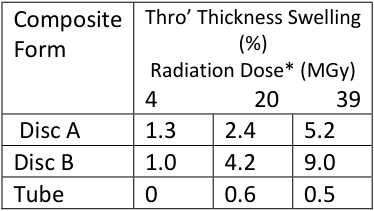

**----- Start of picture text -----** 
Composite  Thro’ Thickness Swelling Form  (%) Radiation Dose* (MGy) 4                 20          39  Disc A  1.3  2.4  5.2 Disc B  1.0  4.2  9.0 Tube   0  0.6  0.5 **----- End of picture text -----** 

* _Converted from fast neutron fluence of 1 x 10[21,] , 5 x 10[21] and 1 x 10[22] n/m[2, ] with associated gamma dose._ 

Disc A: 12 mm diameter, 0.5mm thick; Disc B: As for A but part covered with stainless steel disc; Tube 8mm internal diameter, covered on ID and OD with stainless steel foil, 1mm wall thickness. (Swelling of 9% on 0.5mm thickness = 45microns; swelling of 0.5% on 1 mm wall thickness = 5 microns). 

However, a range of five different epoxy resins, in combination with three different hardeners was prepared as machined cylindrical specimens, without fillers or fibres, 10 mm diameter and 10 mm long. [11]. Specimens were measured individually (reproducibility was ± 0.01. Rectangular composite specimens were irradiated in the same experiment and no measurable swelling was  recorded in any specimen and no change in Young’s modulus was apparent. 

At the neutron fluence and energies used in experiments reported here, it is reasonable to assume that all apparent swelling occurs within the resin phase only and the glass is dimensionally stable _._ Dimensional changes would not be expected to occur in the fibre direction and all changes would be limited to resin expansion (& / or) delamination in the through thickness direction. 

Cyanate ester resins offer radiation stability, long useable life and low viscosity, and possibly a low gas evolution rate. These materials are costly, sensitive to contamination and the cure procedure must be carefully controlled, in order to avoid a ‘runaway exotherm. When a single coil may use a cubic meter or more of resin, cost can be a major consideration. 

Is ‘swelling’ real and likely to prove a problem in fusion reactors and so necessitate using cyanate esters? Or could more economical, easier to control epoxies that offer long life, low viscosity but have higher rates of gas evolution be used? 

In the authors view, gas resulting from irradiation is ‘in solution ‘ in the resin and does not constitute a separate volume, at a high pressure, that if it did exist, could induces swelling. 

## **Measurement of Shear Strength and Bond Durability** 

The reliability of adhesively bonded composite structures is still not fully established and techniques for providing engineering data on shear strength are not readily available. Existing standard test procedures do not offer design data or address bonding of composites. In addition, when composite materials are used in conjunction with metals, through thickness tensile forces may also be present. It has been shown [11] that dramatic reductions in through thickness tensile strength of joints occurs when thermally induced tensile stresses are also present. 

Much of the published data on shear strengths has been obtained using the notoriously unreliable, single lap shear test and although the ‘double lap’ specimen eliminates peel forces, it is more difficult to prepare and still does not generate ‘design data’.  Current standard test methods  do not include the ability to vary bond line thickness, without interfering with the test volume. 

Torsional shear testing of adhesives is said to be relatively free of stress concentrations but the technique is little used. However, a torsion test [12] was used to measure the fatigue life in shear as a function of surface roughness and bond-line thickness. Results on bond line thickness changes are shown in Figure 1. 

Using the same test procedure and a constant bond line thickness of 1 mm, fatigue life was found to peak sharply at a surface roughness of 2.2 µ Ra. 

![Figure 1. Fatigue Life and Adhesive Thickness.( Ra ~ 2.0µ and Shear Stress Amplitude 4.0MPa) [12]](images/mitchell2021.pdf-0074-00.png)

In contrast it was reported [13] that the maximum fatigue life was obtained at Ra 5 µ. There is almost a total absence of reliable, short and long term data on bond strengths at low temperatures. 

## **Breakdown of Wire Insulation** 

A recently highlighted problem concerns the failure of the insulation on HV wires as they exit from the ground insulation around superconductive magnet coils and other structures. As manufactured, these units may pass all electrical tests but numerous failures have been recorded when structures / coils have been thermally cycled. 

A number of possible reasons exist to explain these failures, including possible interaction with resins and hardeners used during installation and assembly. This interaction could result in brittleness  and lead to failure when the insulation is subjected to cool-down or electro-magnetic stresses (Environmental Stress Cracking - ESC). 

Insulation failure due to interaction of polyimide varnish with cyanate ester resin has been confirmed and in the authors view, failure as a result of interaction with aliphatic amine hardeners (ESC), resulting in brittleness /cracking/crazing, followed by stress induced on cooldown, is a strong possibility. 

Does radiation induced gas evolution from organic materials result in ‘swelling’ that may cause resin / composites to crack or lead to unacceptable dimensional changes in magnet coils? 

Based on huge variations in results from studies to date, opinion is divided but a resolution of the question would provide guidance into the long-term viability of polymeric materials in fusion devices. If ‘swelling’ was shown to be unlikely, this would open up the possible field of resins for use in a radiation environment. There are a number of new (to fusion applications at least) resins and aromatic amine hardeners, that have low viscosity, 

offer a long useable life and it is believed, will be radiation stable but are known to have relatively high ‘gas evolution rates. Use of these materials would simplify the impregnation procedure for magnets, while minimising the risk of a ‘runaway’ exotherm and be more economical than cyanate esters. 

Currently, facilities for materials irradiation are scarce. A cost effective irradiation facility could be created using spent reactor fuel rods. Such rods are usually stored underwater for a “cooling off” period and could be utilized during this time for the (gamma) irradiation of materials. Dose rates would be low – (<0.1 MGy / hour?) but irradiations could continue on a 24 hour basis, making for realistic time scales. 

A concerted programme on the measurement of shear strength of adhesively bonded joints at low temperatures is long overdue (information at even RT is poor and unsatisfactory for design purposes). Such a programme could usefully investigate the influence of bond-line thickness, surface roughness, of metals and composites including the use of peel ply on composite surfaces. The long term durability of bonded structures operating under extreme conditions is unknown, as is the combined effect of through thickness tension with shear forces. 

The electrical failures of insulated high voltage wires that has been experienced on coils and sub-assemblies has proven to be difficult to replicate in smaller scale test assemblies. To investigate the possibility that these failures are influenced by chemical effects of resins and hardeners on insulation, a reliable test procedure is required. This would be followed by a detailed programme on the evaluation of effects of resins and hardeners on varnish types, together with the development of an understanding of possible damage mechanisms and mitigation procedures. As an example, extruded polyimide varnish on wires has a largely amorphous structure and is prone to ESC. Annealing the material at an elevated temperature is said to reduce cracking and crazing, possibly because internal relaxations within the polymer allow the transformation to a more crystalline structure that is known to be less prone to ESC effects. 

Much information on the low temperature properties of polymeric materials has been published over the years in a range of journals, conferences and a few books. However, there is a real need for a comprehensive text book that gathers and critically reviews, all available information. This would provide engineers and designers with a common, ‘single source’ reference text. This would be a mammoth task (for instance reference [5] runs to over 400 pages) but would fill a gaping hole in an engineer’s library. 

Plastics, resins and composites represent a small but essential fraction of any fusion device. They are radiation sensitive, with thermal and mechanical properties that may be anisotropic and the production of adhesively bonded joints for low temperature operation is still a ‘black art’  rather than a sophisticated science. Information on the properties of these materials is widely scattered throughout many publications and, in many cases, lacking precise descriptions of the materials being evaluated. 

Radiation damage studies are partly inhibited by the lack of readily available radiation sources, and interest in evaluating new, radiation stable materials, is tempered by an 

incomplete understanding of the effects of radiation induced gasses on dimensional stability of resins and composites. 

Design information on the strength and durability of bonded joints at low temperatures is virtually non-existent and design engineers are further limited by the absence of readily available data source of material properties. 

- [1] See: Clark, A.F, Reed, R.P & Hartwig, G. (Editors) Non-Metallic Materials & Composites at Low Temperatures. Proceedings of ICMC 1978, Munich, Germany. (Plenum Publishing). 

- [2] See: Clark, A.F. (Editor) Advances in Cryogenic Engineering, (materials) Vol. 26 (1980). Proceedings of 1979 ICMC, Wisconsin, 1979 (Plenum publishing) 

- [3] Evans, D. and Morgan, J.T. “A Review of the Effects of Ionising Radiation on Plastic Materials st Low Temperatures” in Advances in Cryogenic Engineering, 28 edited by R.P. Reed and A.F. Clark. Plenum Press, New York,  1982, pp 147-164 

- [4] Maurer, W. Neutron and Gamma Irradiation Effects on Organic Insulating Materials for Fusion Magnets. Report KfK 3974 (October 1985) Kernforschungszentrum, Karlsruhe 

- [5] Simon, N.J. A Review of Irradiation Effects on Organic-Matrix Insulation. National Institute of Standards and Technology, Boulder CO. Report No. NISTR 3999 (Sponsored by US Department of Energy, Office of Fusion Energy). 

- [6] Evans, D & Crook ,M.A. Irradiation of Plastics Materials: Damage & Gas Evolution. MRS Bulletin, Volume 22, No.4, April 1997 (Materials Research Society) 

- [7] Morgan, J.T., Scott, et al., _Rutherford Laboratory Report_ **RHEL/R 196** (1970) 

- [8] Evans, D. and Reed, R.P. “Gas Evolution from Potential ITER Insulating Materials” Report to U.S. ITER Insulation Program, 1995, Office of Fusion Energy, Washington, D.C. 

- [9] Reed, R.P.. Fabian, P.E. & Schutz, J.B. U.S. ITER Insulation Program – Final Report, U.S. ITER Insulation Program, 1995, Office of Fusion Energy, Washington, D.C. 

- [10] Humer, K., Weber, H.W., Hastik,R. Hauser, H. and Gerstenberg, H. _Cryogenics_ , **40** , pp 295-301 (2000) 

- [11] Greenhalgh RJS, Baynham E, Evans D, Canfer S, Robertson S, Morrow, D & Temple S. Strength of Epoxy Resin Based  Insulation Systems in Transverse Tension and Shear Using Two Novel Test Pieces. International Journal of Adhesion and Adhesives, 23, (2003) 485 - 494 

- [12] Lee, D.G, Kim, K.S. and Im, Y.T. An Experimental Study of Fatigue Strength for adhesively Bonded Tubular Single Lap Shear Joints. Journal Adhesion. 35, 39-53 (1991) 

- [13] Azari, S, Papini, M and Spelt, J.K. Effect of Surface Roughness on the Performance of Adhesive Joints under Static and Cycling Loads. The Journal of Adhesion 86: 742-764 2010 

## 14. CORC® cable and magnet R&D in preparation for the next generation of fusion facilities 

Danko C. van der Laan and Jeremy D. Weiss 

High-temperature superconductors (HTS) offer tremendous opportunities for the advancement of fusion science towards fusion energy power production. They allow for more compact fusion machines that operate at magnetic fields exceeding 20 T, compared to lowtemperature superconductors (LTS). HTS could also be operated at elevated temperatures (20 – 30 K), potentially allowing for demountable Toroidal Field (TF) coils [1,2] that provide easy maintenance access during which the vacuum vessel containing the fusion core is replaced in its entirety, removing typical sector maintenance limitations. They also allow the Poloidal Field (PF) coils to be placed within the TF coils. In the United States, HTS magnets are being considered for use in proposed future fusion facilities, such as the Spherical Tokamak (ST) option for a Fusion National Science Facility (FNSF) [3], the Sustained High-Power Density (SHPD) facility [4], alternatively named the National Tokamak User Facility (NTUF) [5], as well as the private industry devices SPARC and ARC [2]. 

Several high-current HTS cables that are based on RE-Ba2Cu3O7- (REBCO) coated conductors have been developed for fusion magnet applications, of which an overview is provided in [6]. Advanced Conductor Technologies (ACT) is commercializing high-current HTS Conductor-on-Round-Core (CORC®) cables and cable-in-conduit-conductors (CICC) for use in fusion magnets and has successfully demonstrated demountable joints between such conductors [7]. Figure 1 shows a range of CORC® fusion conductors, including a low-resistance plate joint between 10 CORC® cables developed specifically for use in demountable TF coils. 

The basic superconducting components needed for HTS fusion magnets have been developed, allowing for the next major step towards realization of HTS-based fusion facilities. Within the next 5 years, significant prototype fusion magnets should be developed, and their operation demonstrated, to advance HTS fusion magnet technology to the level required for large fusion facilities, such as the FNSF or the NTUF, for which construction may start in the next 10 years [4,5]. Demonstration magnets that should be considered include high-field Central Solenoid (CS) coils that operate at high current densities and high current ramp rates, and demountable TF coils that require many low-resistance joints and extensive joint support structures. A brief overview of some of the remaining technical challenges that these demonstration magnets should address is presented using examples based on state-of-theart CORC® cable technology. 

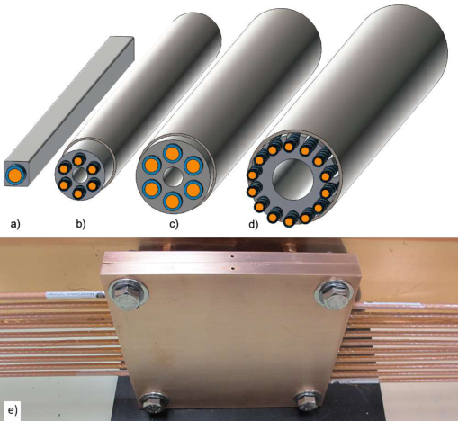

**Figure 1.** Overview showing CORC®-based CICC under development for fusion magnet applications. a) Jacketed single CORC® cable (10 by 10 mm). b) Extruded CICC containing CORC® wires (22 mm diameter). c) Extruded CICC containing CORC® cables (32 mm diameter). d) Grooved 14-strand CICC based on CORC® wires (38 mm diameter). e) Demountable plate joint (0.2 m by 0.2 m) between 10 CORC® cables developed in collaboration with the United Kingdom Atomic Energy Authority. 

The performance of several HTS cable technologies has been demonstrated on a laboratory scale. A limited number of full-scale CICC samples, most relevant for TF coils, were tested at currents up to 60 kA in 12 T background magnetic field in the EDIPO and SULTAN test facilities at the École Polytechnique Fédérale de Lausanne (EPFL), Swiss Plasma Center [8,9]. The samples contained multiple twisted stacks of REBCO tapes [8] or CORC® cables in a 6-around1 configuration [9]. Insufficient mechanical support against the high (cumulative) transverse stresses caused degradation in both types of samples, requiring development of revised layouts in which the CORC® cables within the CICC are mechanically decoupled (Fig. 1b-d). Degradation-free operation of the revised CORC®-based CICCs in SULTAN will likely be confirmed in early 2021. 

Demountable joints in TF coils come with significant technical challenges, including the need for joint resistances of 1 – 5 n, which is achievable in joints between CORC®-CICC. Other challenges include the joint configuration between as many as 100 coil windings, especially considering that each winding contains cooling lines for liquid or gaseous cryogen. Overall stress management of the joints is a major challenge, which depends on the location and overall layout of the joints, as is the effect of the joint layout on the peak magnetic field that determines the overall conductor performance (Fig. 2a). The high number of CICCs and joints also need to be manufactured to high-quality standards. 

Recently, a CORC® insert magnet was successfully tested within a 14 T LTS outsert, resulting in a combined field of 16.77 T at a current of over 4 kA and a winding current density of 169 A/mm[2] [10]. The result is highly promising for the development of high-field CS coils, where hoop stress will likely dominate their performance. Multi-cable CICCs are incompatible with the small bending radii of for instance the CS coil considered for the NTUF, therefore requiring jacketed single-CORC® windings (Fig. 1a). Demonstration of a model CS coil should 

include operation at high current ramp rates to ensure current distribution between tapes remains homogeneous and ramping losses won’t overwhelm the magnet cooling. 

Conceptual designs of CS and demountable TF coils, each operating at a peak field of about 20 T, are provided to guide potential near-term magnet demonstrations. Both coil designs are based on state-of-the-art CORC® cable technology, using 50-tape CORC® cables with current capacity of about 16 kA at 20 T, 4.2 K, or about 8 kA at 20 T, 20 K. 

A combination of 18 TF coils with 0.7 m minor and 1.5 m major radii, operating at 4 MA winding current, would provide a magnetic field on the plasma of 10 T (Fig. 2a). Each TF coil would require 42 6-around-1 CORC®-CICC windings (Fig. 1c) when operated at 4.2 K, or 84 windings when operated at 20 K. A relatively thick square jacket of 40 by 40 mm would result in a winding cross-section of about 0.07 m[2] (4.2 K) or 0.14 m[2] (20 K), which should leave sufficient room for additional external mechanical support. Total dissipation per TF coil would be 774 W at a winding current of 96 kA at 4.2 K (42 turns) or 387 W at a winding current of 48 kA at 20 K (84 turns) in case of a joint resistance of 1 n. Another major benefit of demountable TF coils is that they won’t require conductors of long continuous lengths and that each coil section could be tested before assembly, significantly reducing the magnet fabrication risk and cost. 

The CS coil being considered for the NTUF has an inner radius of 0.27 m, an outer radius of 0.42 m and a height of 3 m (Fig. 2b). The magnet could contain 15 layers of a jacketed CORC® cable (Fig. 1a) of 10 by 10 mm in size, operating at 10.9 kA, resulting in a peak field of 20 T. This would be easily achievable at 4.2 K, but would require a more potent, or thinner CORC® cable when operated at 20 K. The winding current density of 109 A/mm[2] would result in a peak hoop stress of around 595 MPa, for which the jacket would likely suffice. 

With development of fusion facilities towards energy generation on the horizon, HTS magnet technology needs to transition from laboratory-scale to a practical and mature option for high-field fusion magnets in the next 5 years. Demonstration of significant TF and CS coils would address remaining technical challenges associated with conductor development, magnet construction and operation, including quench detection and protection, while initiating large-scale CICC and joint production. Successful completion of such demonstration magnet programs is the only way to ensure HTS fusion magnet technology is ready for implementation into compact high-field fusion facilities for which construction likely starts about 10 years from now. Independent of the conductor technology selected for such magnet demonstrations, not only successes, but also setbacks and lessons learnt should be widely disseminated, allowing the fusion community to learn from mistakes, which is the best way to ensure the next generation of fusion facilities become a success. 

The authors would like to thank Dr. Xiaorong Wang from Lawrence Berkeley National Laboratory for providing the field profile of the demountable TF coil and Dr. Yuhu Zhai from the Princeton Plasma Physics Laboratory for providing the magnetic field profile of the CS coil. 

Their technical discussions are highly appreciated. This work was supported by the United States Department of Energy under grant numbers DE-SC0007660, DE-SC0014009, DESC0013723 and DE-SC0018125. 

- [1] Z. Hartwig, et al., “An initial study of demountable high-temperature superconducting toroidal magnets for the Vulcan tokamak conceptual design”, _Fusion Engineering and Design_ **87(3)** , 201 (2012). 

- [2] B.N. Sorbom, J. Ball, T.R. Palmer, F.J. Mangiarotti, J.M. Sierchio, P. Bonoli, C. Kasten,D.A. Sutherland, H.S. Barnard, C.B. Haakonsen, J. Goh, C. Sung, D.G. Whyte, “ARC: A compact, highfield, fusion nuclear science facility and demonstration power plant with demountable magnets _Fusion Engineering and Design_ **100** , 378–405 (2015) 

- **[3]** T. Brown, J. Menard, L. El-Gueblay & A. Davis, “PPPL ST-FNSF Engineering Design Details”, _Fusion Science and Technology,_ 68(2), 277-281 (2017) 

- **[4]** National Academies of Sciences, Engineering, and Medicine. 2019. Final Report of the Committee on a Strategic Plan for U.S. Burning Plasma Research. Washington, DC: The National Academies Press. https://doi.org/10.17226/25331 

- **[5]** A Community Plan for Fusion Energy and Discovery Plasma Sciences. Report of the 2019–2020 American Physical Society Division of Plasma Physics Community Planning Process. Available at https://drive.google.com/file/d/1w0TKL_Jn0tKUBgUc8RC1s5fIOViH5pRK/view 

- [6] D. Uglietti, “A review of commercial high temperature superconducting materials for large magnets: from wires and tapes to cables and conductors”, _Sueprcond. Sci. Technol._ **32** , 0533001 (2019) 

- **[7]** D.C. van der Laan, J.D. Weiss and D.M. McRae, “Status of CORC® Cables and Wires for Use in HighField Magnets and Power Systems a Decade After Their Introduction”, _Supercond. Sci. and Technol._ 32, 033001 (2019) 

- **[8]** D Uglietti, N Bykovsky, K Sedlak, B Stepanov, R Wesche and P Bruzzone, “Test of 60kA coated conductor cable prototypes for fusion magnets”, _Supercond. Sci. Technol._ 28, 124005 (2015) 

- **[9]** Tim Mulder, Jeremy Weiss, Danko van der Laan, Alexey Dudarev, and Herman ten Kate, “Recent progress in the development of CORC® Cable-In-Conduit Conductors”, _IEEE Trans. Appl. Sup._ 30(4), 4800605 (2020) 

- **[10]** D. C. van der Laan, J. D. Weiss, U.P. Trociewitz, D. Abraimov, A. Francis, J. Gillman, D.S. Davis, Y. Kim, V. Griffin, G. Miller, H.W. Weijers, L.D. Cooley, D.C. Larbalestier and X.R. Wang, “A CORC® cable insert solenoid: the first high-temperature superconducting insert magnet tested at currents exceeding 4 kA in 14 T background magnetic field”, _Supercond. Sci. Technol._ 33, 05LT03 (2020) 

## 15. Quality for Superconductors in a Nuclear Environment 

Min Liao, Neil Mitchell, Gen Liu 

Magnetic fusion machines are different from most nuclear power plants where the implementation of mature ASME and RCCM standards for nuclear power projects provides a secure background in engineering quality. Even if not safety relevant, nuclear fission quality processes are applied with rigorous Codes and Standards based on experience, such as ASME Boiler and Pressure Vessel Code (B&PV Code) [1], Nuclear Quality Assurance (NQA) [2], Qualification of Mechanical Equipment in Nuclear Facilities (QME) [3], ASME/ANS Joint Committee on Nuclear Risk Management (JCNRM) [4], etc. For ITER- as the world largest research and development project- there are not so many standards and codes set for advanced superconductors and magnet technology. From the beginning of the design phase, some technical indicators and technical conditions were uncertain and controversial. For example, the stability and margins of the conductor have been one of the key issues. Superconductors and the associated technologies have to make the step to meet nuclear quality expectations while not over-constraining technical flexibility. The demonstration of the reliability of superconductors, especially on the three basic superconducting technology elements, conductor, structures, and insulation, needs to ensure controllability and flexibility at the same time [5]. 

In tokamak device, successful operation relies on the good quality of superconductors which form the most important part of the magnet system (coils for TF, PF, CS, CC), The superconducting coil works under a complex electromagnetic noise environment, dominated affected by the changing magnetic fields, especially those from the plasma disruption and plasma control, which produce AC losses and a large transient thermal deposition particularly on the toroidal field coils. The superconductor has to be chosen and integrated into a conductor with design parameters chosen in order to avoid the conductor quenching under these disturbance. But as demonstrated by ITER, there are still immaturities in our technical knowledge of important parts of the conductor and coil behaviour. 

Taking one example, there are three important design criteria: temperature margin, limiting current, and stability margin, originally adopted for the design of ITER conductors. To allow to exploit these criteria, in the real production process, quality control is mainly focusing on how to control the superconducting performance with extrusion and heat treatment, and superconducting stability of the conductor through the Cr or Ni coating on the surface of superconducting wires and copper wires [6]. Even nearing the end of ITER conductor manufacture, unanticipated  problems were found with the conductor performance [7]. Following a comprehensive R&D program, a technical solution has been found for the ITER CS conductor, which ensures stable performance versus EM and thermal cycling, but too late for the TF [8]. To solve the superconductor performance degradation after electromagnetic and thermal cycling, we have had to place emphasis on the degradation 

management with extended tests on conductor samples and revision of design criteria. But due to the limitations of knowledge, full understanding of how to achieve the controlled strain behaviour of the filaments inside the jacket with the ideal undamaged jc-strain curves is still on the way. Even if we developed novel Nb3Sn technology by using short twist pitch 45mm in Central Solenoid (CS) conductor and pseudo long twist pitch 80mm in Toroidal Field conductor, the Low ‘n’ behaviour (i.e. degraded) of Nb3Sn conductors and its impact on definition of critical current and operational regime is still not clear. There is weakness of repetitive quality control with qualified procedures in production, e.g, the key mechanical properties of Nb3Sn strands are dominated by controlling the heat treatment (at 650 °C) and the subsequent cool down to 4 K, but we do not understand fully what in this process affects the degradation. The situation has been controlled for ITER but is not mastered yet. For a second example, the ways to make electrical insulation at high voltage >10kV needed for ITER and for next step are uncertain and need new technology for use in cryogenic vacuum. Design criteria and inspection processes are novel and weakly based on experience.  All of these uncertainties and unexpected conditions in the design and production process may lead to the degradation of the mechanical, electromagnetic and superconducting performance of superconducting components in the actual operating environment. While tolerable for a research based device such as ITER with a long commissioning and non-nuclear phase of operation, this novelty will be difficult to accept for a nuclear fusion device. 

As a third and final example, we find that specific solutions for the superconducting cable then produce difficulties in the related technology in other areas, with an example coming for the joints in the CS coil. The cable requires special process control on Cr coating to allow reproducible current transfer between strands in composite cables, but developing the removal of this coating has created several non conformities on CS joints and led to a late new design for CS coaxial joint at the coil terminals. 

Lessons learnt for next generation of DEMO are the critical importance of integrated engineering at all stages. We cannot treat a nuclear machine as a research project, improvising at each step. How to determine the acceptance criteria for superconductor in the design phase, and how to ensure the quality control in the manufacturing process to verify the final superconductor performance is worth thinking about at the conceptual stage of the next step. 

However, quality is planned, designed, and built in, not inspected in. 

Compared with the uncertainty in the design stage, during ITER component design and manufacturing execution, ITER has developed a series of mature quality assurance and traceable quality control methods to achieve the traceability during manufacturing and assembly, such as ITER management quality procedures (MQP) gate views and manufacturing database(MD), conductor database, Deviation Requests (DR)/ Nonconformance Report (NCR) databases etc. The implementation of quality control and traceability management in the production process has demonstrated well how to guarantee the superconductors stability and performance [9]. Due to the global decentralization of suppliers and the inconsistency of the implementation of codes and 

standards among world-wide suppliers, the management and traceability of special processes was particularly challenging for ITER and is a good demonstration of how the ‘project environment’ can be a major consideration in the quality management processes. The ITER magnets are substantially an ‘in-kind’ contribution provided through through 6 out of the 7 ITER partners, with a subdivision that had to reflect also the strategic interests of the partners to learn from the ITER procurement experience: ultimately successful, this system imposed multiple learning curves on the ITER Organisation and many extra interfaces. For the organisation of future DEMO activities, the impact of the project environment on the authority of the central team to apply a strong centralised quality program must be an important consideration. 

In order to monitor the progress of activities and control the quality in compliance with the defined requirements and/or technical requirements, in ITER, the Quality Supervision Plan defines Review Gates and Control Points during whole lifecycle as shown in _figure 1-a_ . It includes not only Factory Acceptance Test (FAT) and Site Acceptance Test (SAT) but also for instance design reviews (CDR, PDR, FDR) and Delivery Readiness Review (DRR). For each control point/gate, we implement MD to keep track of the properties, reports and certificates associated with each step of the manufacturing process as shown in _figure1-b_ . Technical information on raw materials, records on procedures such as welding and testing, inspection certificates, final product documentation and shipment information CAN all be stored and accessed in the database. For example, with the implementation of conductor database, during the 4 years of the conductor production period, the IO has cleared ~ 6900 control points for the strand lots, ~ 27 000 critical measurements are well monitored and qualified. It covered the production for 600 t of Nb3Sn strands for the toroidal field (TF) and central solenoid (CS) coils , while it need around 275 t of Nb–Ti strands for the poloidal field (PF) and correction coil (CC) and busbar conductors. 

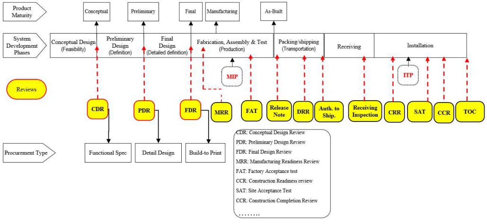

Figure1-a: Gate Reviews and Control Points for Technical/Quality Control 

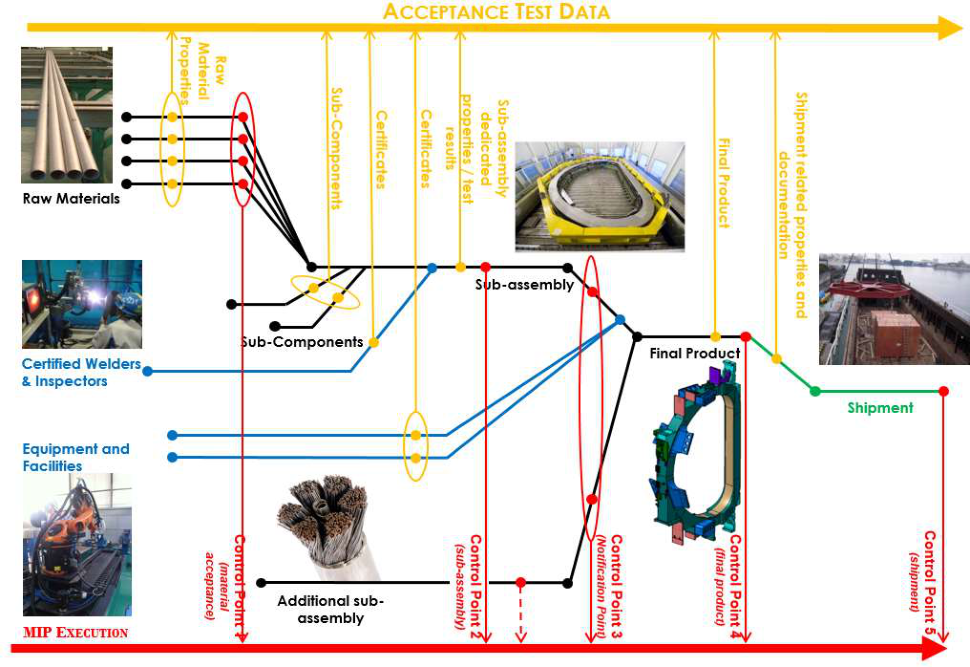

Figure 1-b: The implementation of manufacturing database in ITER conductor coil production. 

To achieve the continuous improvement, and standardise an approach to non-conformances that is accepted over a wide range of company and national systems, ITER implemented a NCR database in Dec 2018. The database can automatically follow up NCR workflow by displaying the full NCR stage identified in the NCR procedure, and clearly identify the root cause analysis, remedial action and corrective action implementation with their associated evidences. Reviewing the statistics of NCRs for magnets on conductor and superconducting coils since 2017, as shown in _figure 2_ , there are 793 NCRs in total, 584 major NCRs which mostly happened in sensitive quality areas such as insulation, He leaks, welding, and in deviations from special process control [10]. 

Taking insulation and Paschen testing as example, there are 21 NCRs in this area, 8 major for different stakeholders, systems affected include 2 TF coils, 2 PF coils ,1 CS module, and 1 feeder control terminal box. Technical root cause focuses on failure near HV instrumentation wire exits from ground Insulation as a common feature of FAT tests, related to local hand wrapping of Polyimide tape to form the ground insulation in the region, in the design, procedure and worker qualification. 

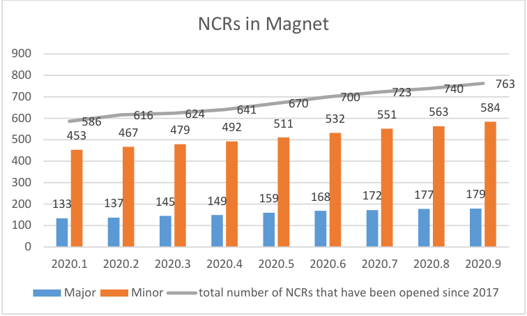

**----- Start of picture text -----** 
NCRs in Magnet 900 800 763 700 700 723 740 600500 453586 467616 479624 492641 511670 532 551 563 584 400 300 200 133 137 145 149 159 168 172 177 179 100 0 2020.1 2020.2 2020.3 2020.4 2020.5 2020.6 2020.7 2020.8 2020.9 Major Minor total number of NCRs that have been opened since 2017 **----- End of picture text -----** 

Figure 2 ． Statistics on NCRs for magnets since 2017, with major and minor NCR numbers 

Taking a general review of the problems and production risk related to the industrial fabrication of prototypes and whole series of superconducting magnets, the main quality issues are He leaks, HV wires cracks, welding defects, and insulation failure by Hi-pot or paschen test. New QC methods needs to be developed as well as improved follow up/testing during manufacturing. E.g. maintain good bonding between the resin and kapton to avoid electron path created along the HV wire after cold tests, reinforce quality inspection during handling in winding impregnation, remove the gap inside or resin flow down from wire extraction through feedthrough. The key is to avoid weakness of too much flexibility on qualified procedures, and choose design and manufacturing with clear quantifiable quality controls that can be implemented easily. It is notable here that the difficulties are not in the ‘bulk’ insulation systems but are related to a particular aspect of superconductivity, the HV quench detection wires. 

Looking back to what we have experienced in ITER, the most important in the quality field is to have set up the quality policy for a nuclear environment and to have ensured the achievement of quality awareness training within the whole staff. It is the fundamental step to improve the staff professional qualifications and competence and promoting creative approaches among employees in order to attain quality performance and environmental awareness. For example, during qualification of superconductor’s strands fabrication and test phase, the following main technical activities were developed into a mature quality control approach, such as the qualification and certification of manufacturing and test procedures (e.g., orbital welding of jacket sections, local and global He leak tests); statistical process control (SPC) on critical parameters; benchmarking of cryogenic test facilities. We managed SULTAN [7, 8] tests for conductor, and set up a huge strand testing activity during conductor production. This can be an example for what will be required for a future DEMO. 

For ITER type DEMO such as CFETR, we can learn from tracing the NCRs in ITER where we have technology problems. These could be solved by improving the technology but clearly better 

quality control is needed as well, to reduce variability in the processes, and to give better testing. Design for testability needs to be a basic design consideration. Large testing of complete sub-units (or possibly complete coils) including operational loads (4K, with current) seems essential to confirm the electrical quality. 

There are examples in ITER of poor design and difficulties in manufacturing quality control in areas such as uncontrollable weld configurations, uncleanable cryogenic pipes contaminated by metallic debris and high voltage faults, all of which are being detected during factory acceptance test before delivery. Detection at this point is often too late for corrective actions to be taken. This represents immature systems engineering and improvements are needed in the future with earlier testing and inspection, and selection of manufacturing routes that allow intermediate tests. 

ITER experience shows that early electrical tests on subcomponents are particularly valuable. Failures may be repairable and there is easy access. For example, it is possible to apply voltages across different insulated surfaces (i.e. between conductor, radial plates and quench detection strip in the ITER TF coils). Thermal cycles at 77K can provide differential thermal contraction as a limited form of proof tests. To avoid the risk in process control on hand fabrication and improve the manufacturing design in reproducibility, we can’t  rely on hand fabrication in critical areas which gives rise to variability and problems in reproducibility and it should be avoided by design, with factory fabrication and test before mounting on the component. 

In conclusion, we can develop test guidelines for superconductors and other special component, specific intermediate test base on the manufacturing routes, status of special process control after components delivery. The difficulty is mainly reflected in the size limitations of test equipment to match the huge superconductors. Moreover, some test methods risk to cause damage to the components, such as cold test, high voltage test and paschen test as well as structural loads. The tests themselves can be special processes and we have experience in ITER where incorrect application of procedures or apparatus can damage the component, even if not damaged at the start. 

There has been remarkable progress from ITER programme on developing and applying quality assurance, with many lessons learned, and a firm footing for DEMO QA/QC has become available, if the criticality is recognised. Main lesson is that this needs to be implemented at development stage, for example during manufacture and operation of test coils, where it might be thought as excessive and unnecessary…but even if test coils can be easily repaired, the experience puts DEMO (large or small) QA/QC with good background. For new technology for nuclear-superconductors, we need to put quality in at the start, and structure the design-manufacturing-inspection and testing around this. 

Many of the quality issues found and resolved in ITER magnet activity need to be turned into lessons learnt for the next steps of fusion. ITER will undergo an extended period of testing/commissioning and an R&D phase before starting nuclear operation lasting several years, and essentially this will provide confidence in superconducting magnet performance adequate to achieve steady nuclear operation. But if problems are found in this phase, they 

will be expensive and time consuming to fix and will transmit a bad message about viability of DEMOs. We need to do better for the next step. 

In summary, due to the newness, uncertainty and technical limitation confidence in magnet system performance in nuclear environment is at present uncertain under complex working conditions. Therefore, how to develop and qualify the design criteria for the superconducting performance, verify the reliability in production process, develop a series of quality control testing including superconducting performance tests, and finally set up the criteria as final acceptance remain the key for superconductors quality and their use in a future DEMO reactor. The detailed main options for quality assurance during manufacturing, including items with a high cost and schedule impact such as insulation, tolerance assessment on site, coil cold tests need to be discussed in future as an integrated part of the fusion roadmap. 

The contributions from members of the former ITER magnet and quality management divisions are gratefully acknowledged. 

## **Disclaimer** 

The views and opinions expressed herein do not necessarily reflect those of the ITER Organization 

- [1] ASME Boiler and Pressure Vessel Code, the American Society of Mechanical Engineers. 

- [2] ASME NQA-1, “Quality Assurance Requirements for Nuclear Facility Applications”, the American Society of Mechanical Engineers. 

- [3] ASME QME-1, “Qualification of Active Mechanical Equipment Used in Nuclear Facilities”, the American Society of Mechanical Engineers. 

- [4] ASME/ANS RA-Sb, “Standard for Level 1/Large Early Release Frequency Probabilistic Risk Assessment For Nuclear Power Plant Applications”, the American Society of Mechanical Engineers and the American Nuclear Society. 

- [5] N. Mitchell, D. Bessette, R. Gallix, C. Jong, J. Knaster, P. Libeyre, C. Sborchia, and F. Simon et al., “The ITER Magnet System”. IEEE TRANSACTIONS ON APPLIED SUPERCONDUCTIVITY, VOL. 18, NO. 2, JUNE 2008 

- [6] A. Nijhuis, Yu. Ilyin, W. Abbas, H. H. J. ten Kate, M. V. Ricci, and A. della Corte et al., “Impact of Void Fraction on Mechanical Properties and Evolution of Coupling Loss in ITER Nb3Sn Conductors Under Cyclic Loading”. IEEE TRANSACTIONS ON APPLIED SUPERCONDUCTIVITY, VOL. 15, NO. 2, JUNE 2005 

- [7] Arnaud Devred, Ina Backbier, Denis Bessette, Gregory Bevillard, Mark Gardner, Mathew Jewell, Neil Mitchell, Ian Pong, and Alexander Vosetner al., “Status of ITER Conductor 

Development and Production”. IEEE TRANSACTIONS ON APPLIED SUPERCONDUCTIVITY, VOL. 22, NO. 3, JUNE 2012, 4804909 

- [8] A Devred, I Backbier, D Bessette, G Bevillard, M Gardner, C Jong, F Lillaz, N Mitchell, G Romano and A Vostner et al., “Challenges and status of ITER conductor production”. A Devred et al 2014 Supercond. Sci. Technol. 27 044001, doi:10.1088/09532048/27/4/044001 

- [9] N. Mitchell, “Quality control in the design, fabrication and operation of the ITER magnets”. Fusion Engineering and Design 81 (2006) 2325–2339 

- [10] N. Mitchell, “Special process procedure for on-site work”, ITER_D_YPP36B 

