## **Systems Code Models for Stellarator Fusion Power Plants and Application to Stellarator Optimisation** 

vorgelegt von M. Sc. Jorrit Lion ORCID: 0000-0002-6249-2368 

– an der Fakultät II Mathematik und Naturwissenschaften der Technischen Universität Berlin zur Erlangung des akademischen Grades 

Doktor der Naturwissenschaften — — Dr. rer. nat. 

genehmigte Dissertation 

Promotionsausschuss: 

Vorsitzender: Prof. Dr. Holger Stark Gutachter: Prof. Dr. Dieter Breitschwerdt Gutachter: Prof. Dr. Robert C. Wolf Gutachterin: Assist. Prof. Dr. H.E. Proll Josefine Tag der wissenschaftlichen Aussprache: 12.04.2023 

Berlin 2023 

## **Abstract** 

Stellarators are attractive candidates for commercial fusion power plants: they inherently operate in steady-state and, unlike tokamaks, do not require a plasma current to obtain magnetic confinement, which can lead to current-driven disruptions. 

The concept of stellarators was first proposed over 70 years ago and now gains renewed interest as a candidate for commercial fusion power plants, mainly caused by the successful operation of the large stellarator experiment ‘Wendelstein 7-X’ [1]. Advances in stellarator optimisation now make it possible to suggest configurations that meet nearly all necessary criteria for a fusion reactor from a physics point of view. In addition, it is possible to find stellarator configurations that are more compact, and thus more economical, and have less turbulent activity than previously suggested configurations. 

Systems code studies are holistic tools, which are crucial to extrapolate a stellarator to a consistent fusion reactor design point, which matches with physics, engineering and economical constraints. By modelling all relevant properties and boundary conditions, using reduced and computationally fast models, it is possible to quantify these design points and also learn about sensitivities, correlations and relevant trade-offs. However, so far, systems-code studies have mainly been employed for the tokamak concept only, as part of the European tokamak DEMO activity. 

Because stellarators are not bound to toroidal symmetry, as tokamaks are, they allow for drastically different configurations, especially with respect to the plasma shape and the non-planar coil geometry. To model this vast design space, it is required to develop systems code models, that allow to model a large space of different stellarator configurations within a single code framework. A systems code for such general stellarators did not exist before this work. 

In this work, a new set of stellarator systems code models is developed and implemented in the European fusion reactor systems code ‘Process’. With these modifications, it is possible to model generic modular stellarators, requiring only the plasma shape and the central coil filaments of the non-planar coils as inputs. This work bases on previous contributions [2], which implemented models for one specific stellarator configuration, namely the Helias 5 stellarator configuration, based on parameters of a respective engineering study [3]. The dependency to such an engineering study was resolved in this work, and a set of models was developed and implemented that are applicable to generic modular stellarators. 

iii 

_Abstract_ 

The new stellarator version of Process is used then to 

1. for the first time find a cost-optimised design point of a Helias 5 stellarator, using differently aggressive technology assumptions, 

2. find a set of design points for a high field, intermediate-step, prototype stellarator, given uncertainties on certain input parameters, 

3. evaluate the relative importance of common targets in stellarator optimisation quantitatively in terms of their economical relevance, 

4. and lastly demonstrate the usage of Process as a penalty function for different stellarator coil-sets and its possible application for stellarator coil optimisation. 

The thesis contributes to the area of stellarator systems code studies for fusion power plants and develops models that take the fact into account that there is a growing number of new stellarator configurations available, made possible by recent optimisation advancements. 

iv 

## **Zusammenfassung** 

Stellaratoren sind attraktive Kandidaten für kommerzielle Fusionsreaktoren: Im Gegensatz zu Tokamaks operieren Stellaratoren intrinsisch kontinuierlich, und sind, um magnetischen Einschluss zu erreichen, nicht auf einen internen Plasmastrom angewiesen, der zu stromgetriebenen Disruptionen führen kann. Das stellarator Konzept wurde bereits vor fast 70 Jahre vorgeschlagen und erlebt vor allem durch die erfolgreiche Inbetriebnahme des Stellarator-Reaktor-Prototypen ‘Wendelstein 7-X’ [1] erneute Aufmerksamkeit als Kandidat für einen kommerziellen Fusionsreaktor. Weitere Fortschritte in den letzten Jahren in der Optimierung von Stellaratoren ermöglichen es nun, Stellarator-Konfigurationen vorzuschlagen, die fast alle für einen Reaktor notwendigen Kriterien erfüllen. Zudem ist es nun möglich, kompakte Stellaratoren zu finden und Konfigurationen mit reduzierter Turbulenz, die momentan maßgeblich den Einschluss in Wendelstein 7-X limitiert. 

System-Code-Studien spielen für die Extrapolation zu einem Reaktor und eine entsprechende Stellarator-Reaktoroptimierung eine wichtige Rolle: Durch das vollständige Modellieren aller relevanten Eigenschaften und Randbedinungen mithilfe reduzierter Modelle in einem integrierten Computer-Code, wird es ermöglicht, Erkenntnisse über Reaktor Design Punkte, Sensitivitäten, Korrelationen, relevante Kompromisse und über ökonomische Eigenschaften zu erlangen. System-Codes haben den Vorteil, dass sie physikalische, technologische und ökonomische Aspekte modellieren und somit Design Punkte finden können, die mit allen drei Aspekten übereinstimmen. Solche System-Code-Studien werden momentan vor allem für die Reaktor Extrapolation von Tokamaks verwendet, zum Beispiel als Teil der europäischen DEMO Aktivität, die das Konzept eines Tokamak-Reaktors verfolgt. 

Da Stellaratoren durch ihre niedrigere axiale Symmetrie weitaus verschiedenere Designlösungen ermöglichen, vor allem im Bezug auf Plasmaform und auf Spulengeometrie, ist es vonnöten, System-Code-Modelle zu entwickeln, die eine große Anzahl möglichst generischer Stellarator Konfigurationen modellieren können. Solch ein Satz von Modellen existierte bis zum Zeitpunkt der vorliegenden Arbeit nicht. 

In dieser Arbeit wird eine Reihe von System-Code-Modellen entwickelt und in den europäischen Fusions-Reaktor System-Code ‘Process’ implementiert, der es anschließend ermöglicht, allgemeine, modulare Stellaratoren zu modellieren, auf Basis der letzten Flussfläche des Stellarator-Plasmas und auf Basis des entsprechenden Spulensets, das in der Regel durch nichtplanare zentrale Spulenfilamente beschrieben 

v 

_Zusammenfassung_ 

wird. Diese Arbeit knüpft an vorige Arbeiten an [2], die einen reduzierten Satz an Modellen für eine bestimmte Stellarator Konfiguration, die Helias 5 Konfiguration, auf Basis einer separaten Studie [3] implementiert hatten. Die Abhängigkeit von solch einer Studie wurde in dieser Arbeit gelöst, sowie ein Satz von Modellen entwickelt und implementiert, die auf generische Stellaratoren anwendbar ist. 

Anschließend an die Beschreibung der in Process implementierten Modelle wird Process, nun für generische modulare Stellaratoren geignet, eingesetzt um 

1. zum ersten Mal einen Kosten-optimierten Designpunkt eines optimierten Helias 5 stellarators vorzuschlagen mit verschieden aggressiven Technologie-Annahmen, 

2. einen Satz an Designpunkten eines Hoch-Feld Prototyp-Stellarators vorzuschlagen, als Zwischenschritt zu einem Reaktor, gegeben einiger Unsicherheiten auf relevante Anfangsparameter, 

3. die relative Wichtigkeit von Optimierungs-Zielen in der Stellarator Optimierung quantitativ zu evaluieren, 

4. und zuletzt den Einsatz von Process als Kostenfunktion für verschiedene Stellarator Spulensätze zu demonstrieren und dessen möglichen Einsatz für Stellarator Spulen Optimierung zu zeigen. 

Die vorliegende Arbeit trägt zu der System-Studien Modellierung von Stellaratoren als Fusionskraftwerke bei. Die Art der implementierten Modelle und die Resultate in dieser Arbeit berücksichtigen den Trend einer stark wachsenden Anzahl an verfügbaren Stellarator-Konfigurationen, die durch Fortschritte in der Stellarator-Optimierung ermöglicht werden. 

vi 

## **Contents** 

vii 

|_Contents_||
|---|---|
|**A. 0D-Power Balance**|**143**|
|**B. Biot-Savart with Finite Conductor Size**|**147**|
|**C. Quench Protection**|**151**|
|**Statutory declaration**|**159**|
|**Publications as frst author**|**161**|
|**Publications as coauthor**|**163**|
|**Bibliography**|**165**|

viii 

**1 Introduction** 

## **1.1. Nuclear Fusion** 

Nuclear fusion is the process when light nuclei fuse together to new, energetically favourable, bound states. There is a variety of different nuclei which produce kinetic energy when they fuse together, the most prominent reactions are 

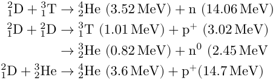

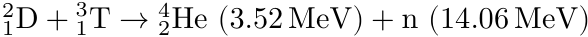

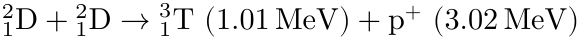
At center of mass energies of ∼10 keV, the first reaction, the fusion of deuterium (D) and tritium (T), features by far the highest cross-section of all possible fusion reactions [4], while also producing a significant amount of fusion power, about 17.1 MeV per reaction. A D-T fuel has thus an energy density of ∼3 ⋅10[8] MJ/kg when fused, which is a factor of 10[7] greater than most other currently available fuels, like natural gas or oil when burned, and still a factor of 4 greater than fission fuels, like Uranium or Thorium. 

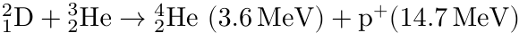
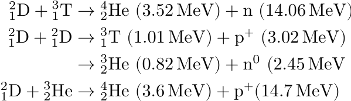
The second most promising fusion reaction to generate energy is D+[3] He, a reaction that releases 18.3 MeV energy in charged particles. Fusion concepts, which rely on magnetic fields to confine the fuel, can use the energy of charged particle products for re-heating. Larger values of the energy of the charged products thus ease the burn conditions in a magnetic confinement fusion concept. D+[3] He however has two major drawbacks: firstly, to achieve a similar value of 𝐸𝑐⟨𝜎𝑣⟩, where 𝐸𝑐 is the energy of the charged reaction product and ⟨𝜎𝑣⟩ is the Maxwellian averaged fusion reactivity (assuming that fuel has a Maxwellian velocity distribution function), it requires temperatures of at least 5 times larger than needed to achieve D+T fusion, which requires about 10 keV temperature. The second drawback of D+[3] He is that[3] He is 

not present on earth.[3] He can be obtained from the moon [5], but this appears hardly economic and should only serve as a long-term vision of the fusion program on Earth. 

D+T is thus the easiest accessible fusion reaction on Earth and comes with two ‘drawbacks’: first, even though one part of the fuel, deuterium, is a naturally occurring isotope of hydrogen, the most abundant element in the universe, the other part of the fuel, tritium, is not naturally available due to its comparably short half-lifetime of 12 years. This issue can be addressed within a fusion reactor by producing tritium in a separate reaction via ‘tritium-breeding’. Tritium-breeding is a process that relies on splitting a separate nucleus with the escaping neutron from the fusion reaction in the process 𝑥+ 𝑛→𝑦+[3] 1[T][,][for][some][reaction][products][𝑥][and][𝑦][.][The][best][candidate] for this reaction is Lithium, which can be used to breed tritium via neutron splitting, 63[Li + 𝑛→] 2[4][He +][3] 1[T][(exothermic)][and][7] 3[Li + 𝑛→] 2[4][He + 𝑛+][3] 1[T][(endothermic).][If] a tritium breeding ratio larger than one should be reached, in addition to lithium, also a neutron multiplier material needs to be present in the breeding material. Most commonly, breeder composite materials make use of beryllium, titanium, manganese, zirconium, iron or lead as such neutron multipliers [6], which feature significant cross sections 𝑥+ 𝑛→𝑦+ 2𝑛, for some reaction products 𝑥 and 𝑦. 

The Lithium land reserves are about 30 Mt [7], and about 200 Gt lithium is available in seawater [8]. 10 Mt lithium, 1/3 of the current on land reserves, could allow a tritium self sufficient generation of 5 ⋅10[8] TWh of useable fusion energy. This is enough energy, to ensure the yearly current global end-energy consumption for 5000 years, which currently is about 10[5] TWh/y. If 10% of the lithium sea-reserves can be accessed, the lithium reserves would be sufficient to ensure a yearly energy consumption of 10[5] TWh/y for 10[7] years. It is thus clear that evaluating fusion for commercial use is of high interest for mankind. 

The most promising approach to pursue fusion economically, is to bring the fuel into a state of ignition, where the heating power by fusion reactions matches any thermal losses of the fuel. This way, the fuel ‘burns’ by itself without any requirement of auxiliary power input. To achieve _ignition_ conditions in any type of fusion fuel, the required heating density 𝑝heat by fusion reactions has to balance the thermal losses 𝑝loss, 

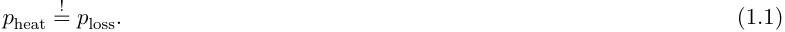

The fusion heating term can be written as 

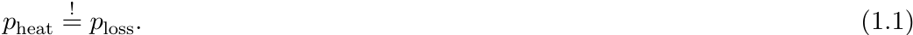
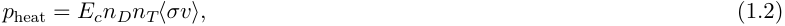

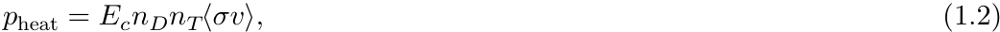

which consists of the D-T fuel number density 𝑛𝐷 and 𝑛𝑇 respectively, the energy of fusion products that re-heat the fuel 𝐸𝑐 and the fusion reactivity ⟨𝜎𝑣⟩, with ⟨...⟩ indicated an ensemble average, usually over a Maxwellian distribution. The loss terms are typically approximated as a function of an _energy confinement time_ 𝜏𝐸, which gives 

_1.1. Nuclear Fusion_ 

the timescale of the energy loss mechanisms of the system. Assuming an exponential energy density decay of the system with respect to time 𝑡 one can write 𝑝loss as 

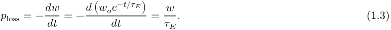

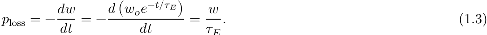

The condition of loss terms balancing the heating terms, 

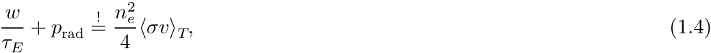

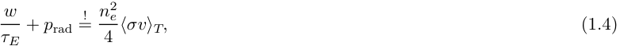

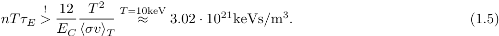

to achieve ignition, then directly leads to the _Lawson condition_ in D-T fuels, which can be written in terms of temperature 𝑇, ion number density 𝑛= 𝑛𝐷+𝑛𝑇 and energy 2 confinement time 𝜏𝐸, using 𝑤= 3𝑛𝑇 as (neglecting the radiation term) 

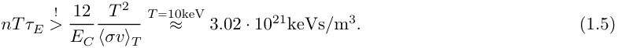

To end up at the numeric value, it was assumed that the fuel is only re-heated by the energy from the charged fusion products, 𝐸𝐶. The ensemble average was taken over a Maxwellian velocity distribution at 𝑇= 10 keV. Bremsstrahlung and other radiation losses were neglected for simplicity. Equation 1.5 gives simplified requirement for the _triple product_ , a quantity that reflects the ‘fusion difficulty’. The triple product multiplies the energy confinement time 𝜏𝐸 with the plasma pressure 𝑛𝑇, both quantities are ‘difficult’ or ‘expensive’ to achieve in most (if not all) fusion concepts. 

Figure 1.1 shows the required triple products in order to achieve ignition using the three previously introduced most relevant fusion fuels, D+T, D+D and D+[3] He, using Maxwellian averaged reactivities from [4]. From this diagram it is clear that achieving a state of fusion ignition is orders of magnitudes more difficult in D+D and D+[3] He reactions as it is in D+T fuels. To achieve ignition in D+[3] He, one would require three times larger magnetic field strengths and 2.5 times the temperature to achieve similar ignition conditions as in a D+T fuel – at constant ratio of kinetic to magnetic pressure 𝛽≡ 3𝜇𝐵0[2] 𝑛𝑇[,][and][𝜏][𝐸][.][Note][however][that][in][most][fusion][concepts][𝜏][𝐸] itself has a strong dependency on the temperature. 

Increasing the 𝑛𝑇𝜏 metric, also called the triple product, has been the focus of fusion research since the early beginnings and led to developments of several types of confinement devices. Many of these concepts use the fuel in the plasma state to achieve the necessary confinement with magnetic fields, strong enough to create the necessary pressure gradients. 

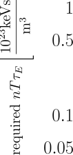

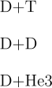

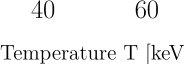

**Figure 1.1.:** A comparison of the three most promising fusion reactions: plotted is the required triple product to achieve ignition in dependence of the temperature 𝑇 for every fuel combination. Grey lines indicate the minimum values for D+T and D+[3] He. For a fixed 𝜏 and a fixed ratio of plasma pressure 𝑛𝑇 to magnetic pressure 𝐵[2] (called 𝛽, a common metric in magnetic confinement fusion) the minimum value for D+[3] He requires 3.2 times the magnetic field strength compared to minimal D+T burn configuration and significantly higher temperatures. Radiation losses are not included here. 

## **1.2. Magnetic Confinement: Historic Context** 

To achieve fusion in a D+T fuel, center of mass energies of ∼20−100 keV are required for the fusion cross-section to reach significant values compared to the Coulomb scattering cross-section. One approach to achieve this energy, is by bringing the fuel to a thermal state of high enough temperature, such that a significant fraction the high energy tail of the Maxwell distribution of the plasma has a relevant fusion crosssection. At these temperatures, the average thermal energy in the matter exceeds the chemical binding energy of the fuel, and a plasma forms, a fully ionized, quasi-neutral state of matter, consisting of charged particles. A plasma can be manipulated and confined with magnetic fields. 

At the beginning of fusion research, several concepts were being studied in terms of their ability to confine a dense enough, high-temperature plasma, which is sufficiently stable to generate a constant, significant fusion gain. One of the earliest, promising contesters at that time were so-called pinch machines, categorized as 𝑧, _reversed_ or 𝜃 pinch devices, dependent on the orientation of the plasma current. These machines made use of the _pinch effect_ – a self-compression of the plasma due to current-induced 

_1.2. Magnetic Confinement: Historic Context_ 

MHD forces. As predicted already in [9] and later in experiments, such as _scyllac_ [10] and _ZETA_ [11], these concepts suffered of kink instabilities (macroscopic current driven plasma instabilities) and inferior confinement properties, compared the other machines. Although recent works showed evidence for some stabilization of certain instabilities [12], pinch machines remained in the shadow of the much more prominent _tokamak_ concept. 

Tokamaks were first proposed and studied in the USSR in the mid-1950s and first machines were built from 1957 onwards [13]. Results from the T3-tokamak were a turning point in tokamak research, which showed significantly increased confinement [14] compared to the long prevalent, unfavorable, Bohm transport scaling, where 𝑇 the 𝐷 scales as 𝐷∝[This][led][to][an][era][of][tokamak][research] diffusion coefficient 𝐵[.] and several new machines, e.g. [15–17]. Another breakthrough was discovered in 1982 at the ASDEX tokamak in Garching, Germany, where a high confinement regime was found experimentally by increasing the heating power sufficiently [18]. The so-called _H-Mode_ , which is the terminology to describe this state of high particle and energy confinement, reduced the prevalent transport magnitude by a factor of about 2. Interestingly, the H-Mode only improved the proportionality factor of the confinement scalings, but not the scaling itself. These promising results led to initiation of the JET [19] and later the ITER project [20, 21]. No further confinement improvements could be obtained since then in tokamaks, and the physics basis for plasma turbulence is now accepted to be ‘Gyro-Bohm like’, in the sense that all experimental confinement time scalings of recently built machines are reasonably close to ‘Gyro-Bohm scaling’: 𝑇 𝐷∝ 𝐵[𝜌][, where][ 𝜌][is the normalized gyro-radius. Although the H-Mode forms the basis] of the ITER design, the operational mode comes with a drawback: edge localized instabilities, or modes, (in short, ELM’s) were found on multiple machines [22–24], which impose a so far unsolved challenge on plasma control and material properties, as significant portions of particles and energies erupt from the plasma in localized, distinct, repetitive events. Recent research activities propose alternative operations modes, such as the intermediate mode, the so-called _I-Mode_ [25], to solve this issue for tokamak reactors in the future. A further drawback of tokamak reactors are plasma disruptions [26], which represent a large challenge of an economic tokamak reactor. Handling these disruption in a tokamak reactor requires strong safety margins for reactor components [27], it requires disruption mitigation techniques, e.g. with shattered pellet injections [28] and real time disruption prediction methods, e.g. by using modern machine learning tools [29]. 

Still, there is a different, and even older concept than the tokamak, which circumvents most of these issues – the stellarator. Stellarator research started slightly before the time of the tokamak and it was first studied by Lyman Spitzer in the 1950s [30]. Early, so-called _classical stellarators_ failed to overcome the Bohm scaling and a simple prediction of instabilities in stellarators by [31] together with the suc- 

cess of the tokamak led to a large abundance of the stellarator concept for nearly two decades. Problems in tokamaks (disruptions, ELM’s, plasma control, no further turbulence reduction), gave incentive to further study stellarators with a few devices, mainly by LHD in Japan [32], HSX in Wisconsin, USA [33], TJ-II [34] and the Wendelstein stellarators [35]. It turned out experimentally, that the transport in stellarators indeed can _also_ be ‘Gyro-Bohm’ like [36, 37], when optimised respectively. The term _optimised stellarator_ or _advanced stellarator_ was coined in contrast to the _classical stellarator_ , and neoclassical transport could be significantly reduced by optimisation techniques [38]. In addition, in Wendelstein 7-AS, an ELM free H-mode could be found [39, 40], as well as a new high-density H-mode [41] with low impurity times. confinement 

The promising experimental results of Wendelstein 7-AS led to the proposal of the Wendelstein 7-X project [42, 43], an optimised stellarator with superconducting coils and a major plasma radius of 5.6 meters and a minor radius of 0.5 m. Wendelstein 7-X went into operation in 2015 [1] and one could show that the required accuracy of the magnetic field could be achieved by the external non-planar field coils to a sufficient degree [44]. The calculated neoclassical optimisation could be demonstrated and it was shown that the transport of Wendelstein 7-X, just like tokamaks, is turbulence dominated [45]. Scaling studies of both, W7-AS and W7-X, showed that optimised stellarators and tokamaks indeed feature similar, likely turbulence dominated transport [46, 47], and from a physics point of view, can now likely be considered to be equivalent in terms of their confinement scaling.[1] 

A historic drawback of stellarators that prevented credible reactor-relevant stellarator designs was the lack of sufficient fast particle confinement. This concern was eliminated, at least for a family of stellarators, in recent computational works [48– 51], where it was shown that quasi-symmetric stellarator fields with very good fast particle confinement can be constructed, and can even exceed the confinement quality of tokamaks. These works removed the last ‘big showstopper’ for stellarator-based power plants compared to tokamaks, and stellarators appear as very attractive reactor candidates now. The next section will introduce stellarators in more detail. 

## **1.3. Stellarators** 

In order to confine the constituents of a plasma toroidally, a strong magnetic field is required. A pure toroidal magnetic field however leads to drift losses of particles by curvature, magnetic field gradients (in a torus the inner magnetic field is typically larger than the field in the outer region) and **E** × **B** drifts, where the electrical field 

> 1Except for H-Mode like confinement which was not shown in stellarators in the relevant physics regime. However, as will be argued in the conclusions, H-Mode-like confinement is likely not even needed in stellarator reactors 

arises from charge separation, as particles with opposite charges drift in opposite directions in a toroidal magnetic field. These drifts can be understood in a single particle picture and is covered in various forms by the literature, e.g. in [52, 53]. 

To average out the single particle drifts, a poloidal magnetic field component, orthogonal to the leading toroidal field component is required. The ratio of poloidal to toroidal magnetic field strength is expressed as the _rotational transform_ 𝜄. In a toroidal magnetic field, 𝜄 can be generated by three mechanisms. These mechanisms can be understood by writing the the expression for 𝜄 near the axis as [54, 55] 

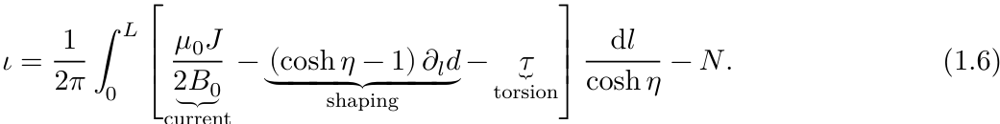

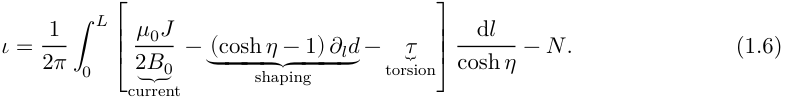

Here, 𝐽 is the toroidal current density on the magnetic axis, 𝜂 is a shaping parameter of the magnetic field, 𝑑 is the tilting angle of the curvature vector, 𝑙 is the length along the fieldline, 𝜏 is the torsion and 𝑁 is the helicity, determined by the symmetry of the magnetic field, 𝐿 is the length of the axis and 𝐵0 is the magnetic field strength on the axis. In tokamaks, only the first term, 2𝐵𝜇0𝐽0[is][used][to][generate][the][required][rotational] transform, where 𝐽 is a combination of a pressure gradient driven internal plasma current, a neoclassically driven current, the bootstrap current, and an artificially generated plasma current, which is driven by auxiliary current drive. In contrast, in stellarators, all three terms of the integrand of Equation 1.6 can be used and a tokamak can thus be seen as a special case of a stellarator. 

However, a toroidal configuration with a plasma current comes with a whole string of drawbacks: a current implies current-driven plasma instabilities and disruptions and thus requires additional safety measures [27], it requires additional plasma control, implies ramp up complications, unfavourable density scaling with plasma current [56], requires current drive and control [57, 58], unfavourable exhaust scaling with the plasma current [59] and as a consequence, pulsed operation, which is undesirable for a fusion power plant for economic reasons. All these problems would not be present in bootstrap-current-free stellarators _by design_ , which generate the required rotational transform usually by the second and third term of the integrand of Equation 1.6. These terms can be produced by external field coils, or even permanent magnets [60, 61]. As a consequence, stellarator magnetic fields are ‘3D’, in the sense that they have a lower degree of toroidal symmetry: while tokamaks typically are 12 to 16 fold symmetric (based on the number of field coils), stellarators have a lower degree of this symmetry, which is typically a 4-10 fold discrete symmetry. This number depends on the fact if a stellarator symmetric configuration is considered which has a flip-mirror symmetry and on the number of field periods. A stellarator symmetric configuration with 2 field periods has 4 identical parts, a 5 field period machine has 10 identical parts. Stellarators also feature ‘non-planar’ magnetic field coils, an example stellarator 

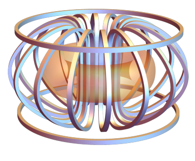

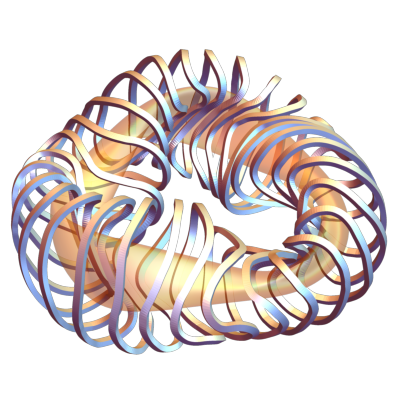

**Figure 1.2.:** Coils (silver) and plasma boundary (orange) of a tokamak (left) and a stellarator (right). The tokamak consists of 16 toroidal field coils and two (or more) poloidal field coils. The stellarator configuration shown here is a Helias 3 type stellarator and has a lower degree of axisymmetry. The shown stellarator consists of three discrete rotational symmetric modules and a flip-mirror symmetry in every third of the machine. 

with modulear coil sis shown in Figure 1.2. 

This ‘3D’ freedom induces a set of computational complications: for example, ‘3D’ magnetic fields do not necessarily feature nested, closed surfaces of constant magnetic flux, so called _flux surfaces_ . In contrast, magnetic configurations with continuos toroidal symmetry guarantee flux surfaces at 𝜄> 0. In addition, stellarator configurations that do trace magnetic surfaces, are not guaranteed to feature confining properties! It is thus required to optimize a stellarator to match a set of desirable optimisation targets. 

The most important one of these targets is omnigeneity [62]. Omnigeneity is fulfilled, when for all particles trapped in the magnetic field it is 

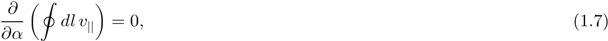
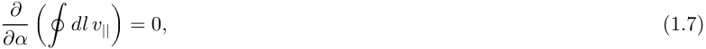

where 𝑙 is a coordinate along a magnetic field line, 𝛼 a field line label, and 𝑣|| the parallel velocity of a test particle within this field. Equation (1.7) states that the second adiabatic invariant is constant on magnetic flux surfaces, which means that collisionless particles are confined perfectly. Wendelstein 7-X has a ‘quasi-’ omnigenous field, which is achieved when equation (1.7) is fulfilled ‘sufficiently good’, namely if 𝜕[= 𝜖≪1][throughout][the][plasma][volume.] 𝜕𝛼[∮𝑑𝑙𝑉][||] 

Next to the discussed (quasi-)omnigenous properties of the nested magnetic flux surfaces, stellarator fields also need to be optimised for fast particle confinement and favourable MHD stability. Other more practicable, but equally important aspects are a low Shafranov shift, which is the radial displacement of magnetic field lines with respect to the plasma 𝛽, or a feasible heat exhaust concept, which can e.g. be achieved by optimizing for magnetic islands near the edge, which then open up the possiblity for an ‘island divertor’. This is discussed in more detail in subsection 2.3.1. 

Generally, for reactor configurations, a typical list of criteria for stellarator configuration to is fulfill 

- Good magnetic flux surfaces 

- MHD stability 

- Low neoclassical energy transport 

- Good fast particle confinement 

- The ‘right amount’ of turbulent transport 

- Favourable Alvènic activity 

- Large impurity transport 

- Large thermal helium transport 

- Low bootstrap and low longitudinal MHD currents 

- Low Shafranov shift 

- A heat-exhaust concept 

- Feasible, distant and ‘insensitive’ coils 

- Optimisation-target resiliency with respect to profile perturbations 

- Economic aspects 

Some of these points can be addressed in a stellarator optimisation framework like STELLOPT [63] or SIMSOPT [64], where the respective parameters are targeted in a squared sum weighting function. A set of degrees of freedoms, either plasma boundary parameters, or coil parameters, or both, are optimised then to match the imposed set of targets. It should be noted that valid reactor concepts that fulfill the whole list of requirements are scarce, or even non-present, dependent on how strong the requirements are being set, but stellarator optimisation is a fast-growing research field and produced increasingly relevant configurations in the last year alone [48, 50, 65]. 

An important driver for recent advancements in stellarator optimisation was the concept of ‘quasi-symmetry’ [66–68], which is a specific symmetry of a stellarator magnetic field, and a subset of the more general set of omnigenous stellarators. 

Quasi-symmetry is obtained if there is a coordinate transformation from so called ‘Boozer-coordinates’, 𝜓, 𝜃𝐵, 𝜙𝐵, which are coordinates in which magnetic field lines are straight, see e.g. section 6.6 in [69] for the definition, to a new set of coordinates 𝜒 and 𝜂, (𝜓, 𝜃𝐵, 𝜙𝐵) →(𝜓, 𝜒, 𝜂), with 𝜂= 𝑀[′] 𝜃𝐵 −𝑁[′] 𝜙𝐵 and 𝜒= 𝑀𝜃𝐵 −𝑁𝜙𝐵, such that the magnitude of the magnetic field is independent of 𝜂 [70], 

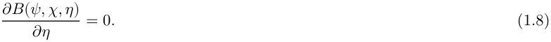

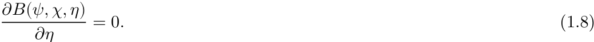

Such a prescription is much easier to optimize for compared to Equation 1.7, as it targets the properties of the field itself rather than the properties of individual particles trapped within this field. Optimizing for magnetic fields with the property Equation 1.8 allowed to find stellarator fields with better neoclassical confinement than tokamaks. [48] 

There is another property of magnetic fields, which is even more attractive than quasi-symmetric fields from a physics point of view: ‘quasi-isodynamicity’ [71–73]. Quasi-isodynamic fields are omnigenous fields with poloidal trapped-particle precession [74], which means that the trapped fraction of the particles that bounce between two points of magnetic field strength 𝐵[⋆] precess poloidally, around the short path of the torus, instead of helically, as in other stellarator geometries. Necessary criteria for quasi-isodynamicity are poloidally closed 𝐵𝑚𝑖𝑛 and 𝐵𝑚𝑎𝑥 curves in Boozer coordinates and constant bounce distances for all possible trapped orbits [71]. Figure 1.3 visualizes these two criteria for an example, constructed, precise quasi-isodynamic in Boozer coordinates. field 

Precise quasi-isodynamic (QI) magnetic fields have attractive features such as minimal parallel net plasma currents (bootstrap and toroidal projections of the diamagnetic current) at reactor relevant collisionalities [74], improved fast particle confinement at finite plasma pressure [72, 75] and stabilized trapped-particle instabilities [76]. No such generic properties can be said about quasi-symmetric configurations (yet) and hence the quasi-isodynamic concept is of highest interest for a stellarator reactor. Although trapped particle turbulence are largely stabilized in QI stellarators due to the maximum-𝒥 geometry[2] , the ion temperature gradient turbulence is typically not. It is state of current research to investigate how well QI stellarators can be optimised with respect to ion temperature gradient turbulence, and first approaches are being proposed [77]. 

In addition, it was discovered that both, quasi-symmetric and quasi-omnigenous stellarator fields allow to implement methods of ‘direct construction’ [65, 66, 78, 79]. The direct construction approach allows for parametrizations of the design space [80]. This method also allows to model MHD effects [64, 81, 82]. The direct construction 

> 2The maximum-𝒥 property describes a decrease of the second adiabatic invariant in radial direction for all particle bounce orbits 

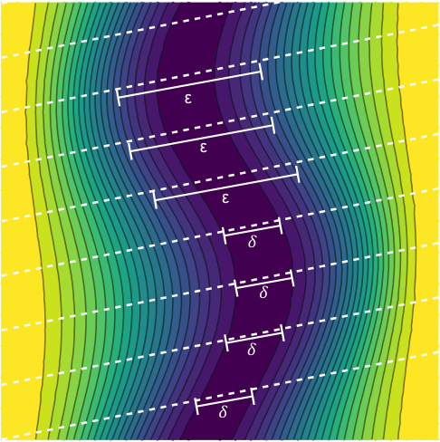

**----- Start of picture text -----** 
ε ε ε 𝛿 𝛿 𝛿 𝛿 **----- End of picture text -----** 

**Figure 1.3.:** An example of a precise, constructed, quasi-isodynamic field structure in Boozer coordinates. Diagonal dashed white lines indicate field line directions. The bounce distances, here indicated as example with 𝛿 and 𝜖 between two bounce points is constant along different field lines for all possible bounce orbits. The plot is inspired by [51]. 

method, also called near-axis expansion method, has the potential to rapidly develop new stellarator configurations. The potential to quickly discover vastly different stellarators geometries with different coil-sets, puts strong requirements on further tools that are developed for the stellarator community: computationally efficient, versatile tools will be needed that can be used on a large class of stellarators and allow for scalable methods to scan the high dimensional space of stellarator configurations. This is relevant as the work conducted in this thesis will follow this philosophy. Here, models and methods are developed and demonstrated to computationally efficiently scale the result of stellarator optimisation to reactor relevant design points, while including most and in the best case, all relevant reactor relevant constraints. One necessary ingredient for this extrapolation is the concept of _scale invariance_ in fusion plasmas, which is addressed in the next section. 

## **1.4. Scale Invariance and Transport Scalings in Fusion Plasmas** 

In order to extrapolate to reactor relevant designs it is useful to explore the scale invariance of the governing, underlying equations. As full numerical solutions of the relevant kinetic equations that govern all plasma effects is still a matter of research, the scaling approach is a commonly used method to extrapolate experimental machines to reactor size. This is usually done in terms of scaling laws, which arise from scale invariant equations which will be discussed in in this section. The section itself is admittedly slightly technical, but as many results later rely on confinement time scalings, it is useful to list to which degree these scalings can also be extracted from the governing equations. 

The core plasma physics effects of toroidal devices are expected to be governed reasonably well by the Vlasov-Maxwell equations with a Focker-Planck collision term. The set of equations is 

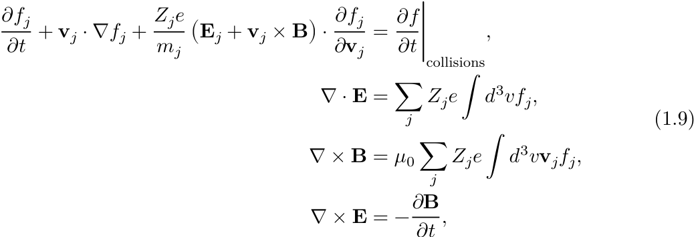
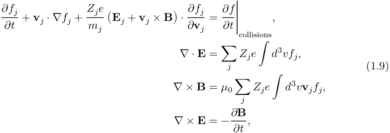

𝑗 here denotes an index for the particle species. 𝑓 is the distribution function, **v** the flow velocity of the species, **E** and **B** the electric and magnetic field respectively, 𝑚𝑗 𝜕𝑓 thebe written in different models [83, 84]. This set of equation is expected to govern mostspecies mass and 𝑍𝑗 the charge number. 𝜕𝑡[∣] collisions[is][a][collision][term,][which][can] of the relevant physics seen in fusion relevant devices, such as turbulent transport, collisional drift waves, dissipative trapped particle waves, finite 𝛽 drift Alvèn waves, and so on. Solving this equation is a very hard numerical problem, due to its high dimensionality (𝑓 is a 6 dimensional scalar field) and its strong non-linearity. Solving reduced versions of Equation 1.9 is a significant research effort [85–89]. To the authors knowledge, up to today, for toroidal fusion devices, there are no global self-consistent solutions for this set of equations available and no absolute heat flux predictions could be made. 

Current stand of research is the numerical solution of reduced equations of Equation 1.9, mainly by taking the electrostatic version of Equation 1.9 with a 𝛿𝑓 model using a Maxwellian 𝑓 distribution function and by averaging the gyro-motion of the 

_1.4. Scale Invariance and Transport Scalings in Fusion Plasmas_ 

particle in then so called ‘gyrokinetic equations’. Solving these equations globally in stellarator experiments is ongoing research [85] but reactor relevant (in terms of reactor relevant normalized gyro-radii) simulations with adiabatic or kinetic electrons are still not available yet due its computational demand. 

Nevertheless, it is possible to extract heuristic information from Equation 1.9 by exploiting its scale invariances. E.g. one can show [90] that the quasi-neutral version of Equation 1.9, i.e. ∇⋅𝐸= 0, is left unchanged if and only if the free fields are transformed under the following prescription, 

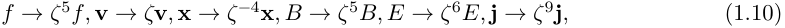

using a scale factor 𝜁∈ℝ. 

This scaling method can help to constrain the functional form of one of the most relevant quantities for fusion research, the heat-flux density 𝑞, which determines the quality of confinement. As this procedure is easy to follow and insightful, it is quickly written out below. 

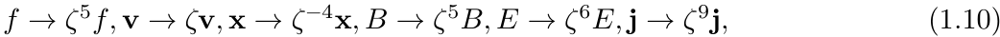
Assuming that the heatflux density 𝑞 is a smooth function of the particle number density 𝑛, the temperature 𝑇, the magnetic field 𝐵 and a characteristic length scale 𝑎, 𝑞 can be expressed as a power expansion like 

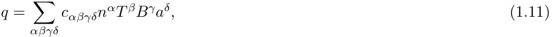

where 𝑐 are real numbers The heat is in terms of the 𝛼𝛽𝛾𝛿 coefficients. flux defined distribution function 𝑓 as 

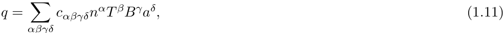
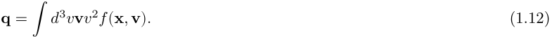

Also one knows how 𝑛 and 𝑇 need to transform, 

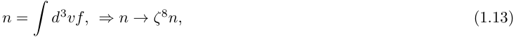

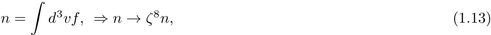

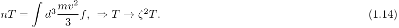

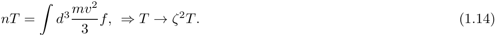

Equalling Equation 1.11 and the norm of Equation 1.12 and imposing the transformation from Equation 1.10 gives 

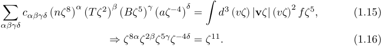

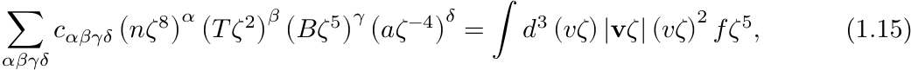

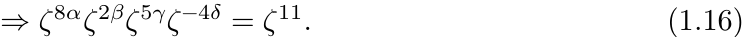

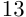

From this one knows 

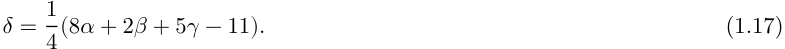

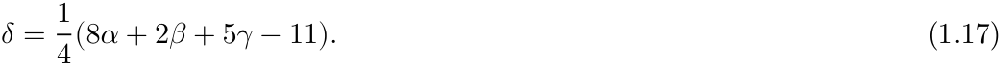
Removing 𝛿 from Equation 1.12 with Equation 1.17 gives 

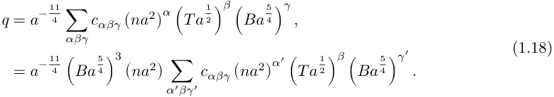

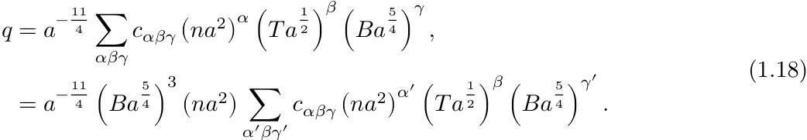

The prefactor equals to 𝑛𝑎[3] 𝐵[3] and one can write the heatflux 𝑞 as 

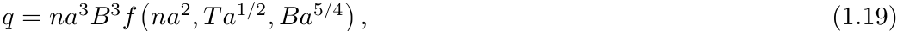

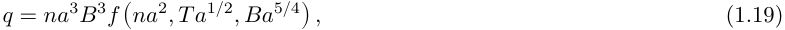

for some function 𝑓 (not to be confused with the distribution function earlier). Equation 1.19 is a result using only scale invariant arguments from Equation 1.9. Why is the result Equation 1.19 significant? Because it shows that there are self similar solutions to the Maxwell-Vlasov equations for plasmas at smaller minor radius. A prototype stellarator at 𝜉-times smaller (or larger) minor radius 𝑎= 𝜉𝑎reactor compared to an anticipated reactor would leave Equation 1.9 and thus also the heat flux density 1 5 𝑞 invariant if 𝑛∼𝜉[−2] 𝑛reactor, 𝑇∼𝜉[−] 2 𝑇reactor, 𝐵∼𝜉[−] 4 𝐵reactor. This is an important result, as it shows that the path towards commercial fusion ‘does not scale well’, in the sense that if one wanted to simulate a large reactor machine by building and operate a small prototype machine, this prototype requires a larger magnetic field strength, a higher density and a higher temperature than the reactor design point. For example, a machine half of the minor radius of a bigger machine requires 4 times the plasma density, 1.4 times the temperature and 2.3 times the magnetic field to feature the same heat flux density as the bigger machine. 

From Equation 1.19, one can also parametrize the exponential energy confinement time 𝜏𝐸, namely by using (integration of a continuity equation with constant integrands), 

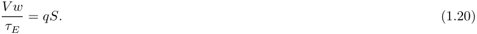

Here, 𝑤 is the plasma energy density, 𝑉 the plasma volume, 𝑆 the plasma surface area. Then, 

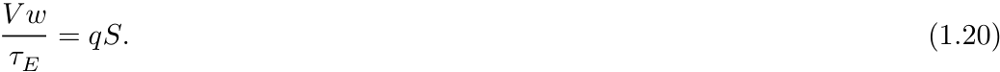

_1.4. Scale Invariance and Transport Scalings in Fusion Plasmas_ 

𝑇 Note that for the last step, the prefactor 𝑎[2] 𝐵[2][can][be][expressed][by][the][second][and] third argument of 𝑓 and can thus be absorbed within the (undefined) function. 

If one wants to extrapolate beyond paths of constant 𝑛𝑎[2] , 𝑇𝑎[1/2] and 𝐵𝑎[5/4] , a parametrization, featuring a free, unknown function 𝑓, as in Equation 1.22 can not be used for absolute statements when extrapolating to reactor machines. However, one can look into sub-models of Equation 1.9, e.g. by taking the non-linear, collisionless, electrostatic, gyro-kinetic limit of the Maxwell-Vlasov equations. Using the same scale-invariance techniques as shown in this section, all functional dependencies of 𝜏 with respect to 𝑛, 𝑇, 𝐵, 𝑎 can be resolved[3] and one finds [91] 

𝐿 here refers to the relevant characteristic length scale of the system, such as the gradient lengths, 𝜌 is the normalized gyro-radius. This scaling is called the GyroBohm scaling, as it is also obtained from a random walk diffusion argument when employing 𝜒∼(𝛥𝑥)[2] /𝛥𝑡, where the characteristic lengthscale (of microturbulence e.g.) is given as the gyro radius, 𝛥𝑥∼𝜌. [92] or Appendix A in [93] gives a heuristic derivation for this point. 

If one allows for geometrical and profile parameters in the scaling (such as ratios of gradient lengths), one instead ends up at a correction of Equation 1.23 [94], 

which is already hinting at aspect ratio 𝐴 and rotational transform 𝜄 dependencies of the transport, which will be seen later in this section in the experimental energy confinement time scalings. 

Another interesting case arises when including collisions and MHD effects, which would correspond more to a reactor scenario. Under these assumptions 𝜏 can be written as [91] 

where 𝜈[⋆] now is the collisionality of the plasma and 𝛽 is the ratio of kinetic to magnetic pressure. 

In even more general models, e.g. by including local effects and geometrical factors, not just global parameters, more factors enter 𝑓, but the proportionality in 𝜒𝐺𝐵 can be derived in a wide range of assumed models [94] and it is thus expected also from a theoretical point of view that energy confinement times show a ‘Gyro-Bohm-like’ scaling. 

> 3One finds that there exist four transformations of the gyrokinetic equations which resolve the four missing exponents in the power law Equation 1.11. 

**Figure 1.4.:** Difference between ISS04 exponents compared to Gyro-Bohm exponents as in Equation 1.23. The exponents (from left to right) correspond to the minor radius, magnetic field strength, temperature, density, Aspect ratio and rotational transform. 

How ‘Gyro-Bohm-like’ the transport in tokamaks and stellarators is, can be probed experimentally: many stellarator and tokamak experiments were realized until now and their experimental data allows to quantify and measure the predicted scaling laws. Experimental scaling laws are usually expressed in terms of easily measurable machine control parameters, such as the integrated auxiliary heating 𝑃, the magnetic field strength 𝐵, plasma density 𝑛 or minor and major radius 𝑎 and 𝑅. The most recent stellarator and heliotron scaling law that describes a wide range of experimental data for the energy confinement time was conducted in [95], and also describes a wide range of tokamaks [46]. 𝜏𝐸 was found to follow the parametric form in the above mentioned quantities 

and is usually called ‘ISS04’ confinement time scaling.[4] Equation 1.26 is not dimensionally correct and implicit units are assumed, namely the plasma minor and major radius 𝑎 and 𝑅 in Meters, the line averaged electron density 𝑛 ~~[0]~~ 𝑒[.52] in 10[20] m[−3] , the toroidal magnetic field 𝐵𝑡 in Teslas and the plasma heating 𝑃 in MW. 𝜄2/3 is the rotational transform at the flux surface label 2/3 and is dimensionless. 

Equation 1.26 can be rewritten as a function of temperature 𝑇, magnetic field 𝐵, minor radius 𝑎, aspect ratio 𝐴 and particle number density 𝑛. By replacing 

> 4Note that different to the usual representation, 𝑛𝑒 is written in 10[20] m[−3] here which leads to the numerical prefactor of 0.444. 

𝑃= 3𝑛𝑇𝑉/𝜏𝐸, and by 𝑅= 𝐴𝑎 in Equation 1.26, where 𝐴 is the aspect ratio, one arrives at 

using 𝑇= 𝑇[keV], which largely resembles Equation 1.23, up to a factor 𝜄[1.05] . Figure 1.4 shows the difference of the exponents, with error-bars as given in [95] compared to Equation 1.23, showing reasonable agreement between the scaling law derived by scale invariance of linearised gyro-kinetic equations and the experimental results. 

It is clear, that despite the success of the Gyro-Bohm scaling in describing the transport scaling in most of tokamaks and stellarators, it is not depicting the full physics. Additional scaling parameters are expected to enter the confinement time via dimensionless ratios, e.g. ratios of gradient lengths scales or species temperature ratios would be expected [94, 96]. At the same time, an ‘isotope effect’ was measured in stellarators [97] and tokamaks [98] that deviates from the expected Gyro-Bohm scaling. Thus, when extrapolating to a reactor, the current scaling laws would need to be tailored to consist only of ‘reactor-relevant’ experiments, matching the expected gradient lengths ratios and other dimensionless ratios (such as ion over electron temperature ratios) of reactor plasmas. Nevertheless, it should be noted that, as reviewed in this section, the Gyro-Bohm scaling itself is rigorous, and derived from first principle mechanisms. This is an important remark, as many extrapolation results, also the ones conducted in this thesis later, in chapter 4, depend on parametrized energy confinement time scaling laws. 

When extrapolating to a reactor, similarly to the extrapolation in physics parameters, also engineering scaling aspects would need to be considered, e.g. considering required neutron fluxes or forces which are expected in fusion power plants. A short introduction of the technological challenge of a stellarator fusion power plant is given in the next section. 

## **1.5. Technological Challenges of a Fusion Reactor: A Brief Overview** 

A fusion reactor is not only solving a set of involved plasma physics problems, but also needs to address nuclear and material engineering issues. 

A typical schematic power plant concept is shown in Figure 1.5: the toroidally closed plasma is surrounded by several technological ‘entities’, starting with the first wall which represents the first plasma facing component. 

## _First wall._ 

An advantage of D+T fusion is the _volumetric_ heat deposition of neutrons, which carry about 80% of the fusion reaction products. Neutrons do not interact with the 

**----- Start of picture text -----** 
Breeding blanket Maintenance Ports Magnetic Field Coils Electricity Grid Heat Exchanger Heating Current Drive D,T,He Divertor T Turbine D,T D Li D He **----- End of picture text -----** 

**Figure 1.5.:** A schematic picture of the components of a fusion power plant. By Karin Hirl, IPP (modified). 

confining magnetic field and deposit their energy in the ‘blanket’ volume (to be introduced later) that surrounds the plasma and not in the first wall. This fact allows relaxed[5] constraints for the heat load requirements of components that experience the remaining 20% of the fusion power output, which deposits its heat load via Brems-, Synchrotron- and Line-radiation radiation onto the first wall as surface heat loads. 

In addition, charge exchange events at the plasma boundary create fast neutrals, which potentially erode wall parts. Plus, unconfined, fast charged particles, e.g. fusion products, potentially damage the wall too. The heat exhaust challenge for the tokamak DEMO first wall is still under investigations [99]. 

In conclusion, the first wall not only has to cope with large thermal loads, but also with plasma-wall interactions and neutral sputtering. Dependent on the chosen technology, the overall machine has to be designed to match the technological wall requirements. 

## _Divertor._ 

Similar constraints to the first wall are shared by the so called ‘divertor’: thermal charged particles and energy from the main plasma species diffuse according to the pressure gradient radially outwards, usually controlled and localized, and deposit their heat on dedicated, heat resistive, highly cooled plates, called the divertor plates. 

> 5compared to a fuel scenario where all the heat would reheat the plasma, like D+He3 

There, the plasma heat load usually forms a strike-line, a narrow band where the heat load is deposited. The task of the divertor, which is the naming for the overall heat exhaust concept, including the magnetic field structure, is to divert this localized heat load. 

In tokamaks, the strike-line width has an unfavourable scaling with respect to plasma performance parameters [59], which adds to the heat exhaust challenge. In comparison, the heat exhaust challenge seems to relax in low-shear stellarators with an island divertor, at least under specific circumstances [100]. This is achieved by comparably broad strike-lines and easy demonstrated access to ‘detachment’, a regime where most of the heat is radiated homogeneously over the first wall instead of depositing on the divertor plates. Most reactor concepts usually require large or even complete detachment, which assumes that close to 85-100% of the energy of the plasma is radiated away in the edge and in the area behind the last closed magnetic surface (the scrape-off-layer). A fusion design thus needs to ensure sufficient radiation in the region between main plasma and divertor and strike-line heat loads below the technological limit. 

## _Breeding blanket._ 

In a reactor, behind the first wall and the divertor there is usually the tritium breeding blanket. The purpose of this technology is not only to transport away most of the heat that is generated in the plasma via neutrons and withstand most of the neutron damage that is caused be frequent neutron scattering events in the material, but also to breed the crucial tritium fuel, which is needed for a closed fuel cycle, as tritium is not easily obtainable outside of a fusion reactor. 

Of all elements in the periodic table, only[6] Li and[10] B feature a significant (n,T) cross section[6] for _slow_ neutrons, with less than 5 MeV [6]. For _fast_ neutrons, with more than 5 MeV energy,[7] Li and[14] N feature similar cross sections to[6] Li and[10] B. For neutrons with energies between 10 MeV and 14 MeV, also[11] B,[9] B and[19] F become relevant. Due to the fact that B features much lower (n,T) cross sections than[6] Li and the fact that B absorbs neutrons, leave the relevant tritium breeding materials to[6] Li only for slow neutrons and[7] Li ,[14] N and[19] F for fast neutrons. As lithium in atomic form is a safety concern in a reactor, most blanket designs feature lithium composition materials of lithium-7 or lithium-6 in connection to one – or multiple – other elements to form a material with desirable properties, such as liquid metals, molten salts or ceramics. In addition to the tritium breeding aspect, a breeding blanket, with sufficient[6] Li enrichment also multiplies the fusion power by its exothermic reaction. This multiplication factor is usually in the order of 10-30% [101– 103], and thus significant for the reactor power balance. 

Evaluating different blanket concepts with different materials is a major research 

> 6(n,T) is a terminology for the reaction 𝑥+ 𝑛→𝑦+ 31[T][for][some][reaction][products][𝑥][and][𝑦][.] 

effort and several designs are being proposed [104–111]. Some of these designs will be tested at ITER [112]. In general, a tritium breeding blanket is subject to the following design drivers 

- high density of breeding material to achieve a ratio of bred tritium to burned tritium (tbr) greater than 1, 

- low material activation, 

- short life-times of activated material, 

- low costs and large availability of the breeding material, 

- low corrosiveness and low toxicity, 

- sufficiently small MHD effects on the plasma (relevant for liquid metal breeders e.g.), 

- structural stability, 

- sufficient thermo-hydraulic properties. 

The major implication for a reactor design is to leave out enough space between magnetic coils and plasma, to fit in a blanket with a size that matches these constraints. Also enough pipe connections to the blanket need to be allowed by the magnetic field coils. For liquid metal breeders, pressure drop aspects restrict the magnetic field strength, the port locations and the geometry of the plasma. 

## _Shield._ 

Behind the breeding blanket area, there is typically a neutron shield. The purpose of the shield is to reduce neutronic loads at the superconducting, cryogenically cooled magnetic coils, which are located behind the shielding area. Advanced materials feature an exponential decay length of 14 MeV neutrons of about 8-20 cm [113], which requires the breeding blanket, together with additional shielding to have a radial thickness of about 1-1.4m. 

The two constraints that are especially relevant for a neutron shield are mitigation of neutron fluences (how many time integrated neutrons reach the magnetic field coil materials) and neutron heating at the superconducting magnetic field coils, which needs to be prevented, as most superconducting magnets are cooled to 4 Kelvins where heat transport by neutrons is especially costly to remove. 

## _Magnetic field coils._ 

Next to the breeding blanket, the most important technology of a stellarator reactor is likely the magnetic field coils, which need to generate the required magnetic field strength to achieve the plasma confinement. They are located behind the shielding area and need to carry a significant amount of electrical current in order to produce the required field strengths of up to 8 to 10 Teslas on axis (5 Teslas in more 

conservative designs), which requires usually between 5 to 15 MA per coil. Only superconducting materials could fulfil the requirement of steady-state economic operation, as conductors with finite electrical resistivity would constantly produce large amounts of heat which would drastically lower the efficiency of the plant. Superconductors have a _critical current density_ 𝑗𝑐 to which they retain their superconducting properties. 𝑗𝑐 is usually parametrized as a function of orthogonal (to the current direction) magnetic field, temperature and conductor strain. For rare earth barium copper oxide based superconductors (REBCO), which are available on thin tapes, there is another distinction in the direction of the magnetic field, namely in orthogonal or parallel direction to the tape orientation, which influences the critical current density. 

Magnetic field coils are subject to two further constraints: first, they usually require to be operated at cryogenic temperatures of values between 2 K (superfluid helium) to 77K (liquid Nitrogen). This also puts restrictions on the cooling by remaining neutrons which reach the coils. Any neutronic heat depositing into the cryogenic coils requires an additional amount of cryogenic power, which hinders the economic aspect of the power plant. Secondly, all known superconductors degrade under constant neutron flux. Thus, for most superconductors, neutron fluence limits are measured, e.g. for NbTi or Nb3Sn[114], which can be taken into account when designing the blanket and shielding dimensions. Interestingly, recent research suggests that modern rare earth barium copper oxide superconductors (REBCO) are less sensitive to this constraint [115]. 

## _Support Structure._ 

As the magnetic field coils are subject to large electromagnetic forces, they need to be hold in place by respective casing and an inter-coil support structure. This structure needs to be dimensioned to cope with energies of ∼10 to 100 GJ stored in the magnetic field produced by the toroidal field coils. Also, the coil winding pack, the inner part of the coil where the cables are laid out, need to have dimensions to withstand inner winding pack stresses and respective thermodynamical requirements of the typically cryogenic environments. 

## _External Heating and Fuelling._ 

External heating such as neutral beam injection, electron- and ion-cyclotron heating is required to ignite a stellarator plasma or to use it as a plasma state control mechanism. Such heating methods are also subject to constraints: e.g. the microwave frequency of electron cyclotron heating schemes is tightly coupled to the plasma frequency, via dispersion relations, which prevents a wave propagation in the plasma if the gyro-frequency matches the plasma frequency. 

## _Others._ 

Lastly, facilities for tritium handling, vacuum pumps, turbines, a bio-shield, remote 

handling ports and facilities, thermal energy storage systems, the cryo-plant and heat exchangers are required as additional technologies for a fusion power plant. 

All in all, the design point of a fusion power plant needs to cope with a large set of technological features and constraints, in line with the plasma-physics of the fusion core. Manoeuvring within this constrained physics and technological parameter space requires holistic tools and methods. One of these methods are so called _systems codes_ . 

## **1.6. Systems Codes** 

As motivated in the last two sections, designing a reactor is an involved problem of different systems. There is a myriad of constraints and properties of both, physics and technological aspects to be considered when designing the whole plant and only an non-exhaustive list of these constraints was given in the previous section. Most often, an optimisation in this realm requires compromises and trade-offs between different aspects. 

To navigate in this space, a ‘naive’ approach would be to hold some parameters fixed or scale parameters along lines of constant quantities, that are determined a priori. For example, often-times, free parameters are scaled along lines of constant 𝛽, which typically is taken as a measure for economics and it is often assumed that fusion power plants need to operate at the beta limit, which is imposed by plasma physics. Another example would be lines of constant fusion- or wall-power, or constant confinement proportionality factors. In general however, imposing a priori relations on free parameters is not necessarily the most optimal choice when designing a fusion plant. Instead, all independent parameters should be free, and be optimised with respect to an overarching optimisation target such as the overall cost of the machine, the fusion gain 𝑄 or the net electricity production of the plant. 

Systems codes represent a systematic way to optimize for a design, which is required to navigate in the above mentioned constrained optimisation space. Numerically they are implementing a function 𝑓∶𝑈⊂ℝ[𝑛] →ℝ that maps an optimisation vector 𝑥∈𝑈⊂ℝ[𝑛] , consisting of parameters that are control parameters, to a scalar penalty value, that reassembles the ‘performance’ or ‘quality’ of the machine. A high level example for 𝑓 would be the cost of electricity, the fusion gain 𝑄 or the capital costs. Of course, at the same time, technological limits, like thermal loads, stresses, radiation loads etc., should be fulfilled, which typically can be written in inequality and equality constraints, in order to ensure technological requirements and limitations. 

To find an optimal point, an optimisation of 𝑓 with respect to the mentioned inequality and equality constraints is required. Such an optimisation problem is a ‘general non-linear programming problem’ and can be written as a saddle point 

_1.6. Systems Codes_ 

problem of the function ℒ as 

𝑔𝑖 and ℎ𝑗 stand for functions mapping the optimisation vector **x** ∈𝑈⊂ℝ[𝑛] to ℝ and ensuring fulfilled constraints if 𝑔𝑖( **x**[∗] ) ≤0 and ℎ𝑗( **x**[∗] ) = 0 respectively ∀𝑖, 𝑗, where **x**[∗] ∈𝑈 is the solution vector. 𝜇𝑖 and 𝜆𝑗 are generalized Lagrange multipliers. 𝑁𝑔 stands for the number of inequality constraints and 𝑁ℎ for the number of equality constraints. ℒ is minimized if the so called Karush-Kuhn-Tucker conditions (KKT conditions) are met, 

with solution vectors **x**[∗] , 𝜇[∗] 𝑖[and][𝜆][∗] 𝑗[,][∀𝑖, 𝑗][.][Sufficient][conditions][are][reached,][if][in] addition, 

Numerically, non-linear programming problems can be solved by ‘sequential quadratic programming’ (SQP) methods [116], which rely on a Taylor expansion of the objective function 𝑓 to second order around the current optimization vector. Here, a two-step problem is solved numerically, consistent of a quadratic sub-problem, which minimizes the to second order Taylor-expanded function 𝑓 with respect to a search direction 𝜹[𝑘] ≡ **x**[𝑘] − **x**[𝑘−1] at an optimization step 𝑘, 

The index 𝑘 in 𝜹[𝑘] was suppressed for clarity. The Hessian ∇ **xx** ℒ( **x**[𝑘−1] ) can be approximated using the BFGS scheme [117], which makes SQP methods usually quasiNewtonian. The second step of the SQP scheme consists of a line search along 𝜹[𝑘] 

such that 

where 𝛼 is found to minimize a penalty function 𝛷, 

Consecutive iterations of the solution of the quadratic subproblem Equation 1.31 and the line-search 1.32 then find local minima (or maxima) of the objective function 𝑓 with fulfilled constraints. It should be noted that it is not guaranteed to obtain global minima using SQP methods. 

## **1.7. Scope & Structure** 

It is clear that systems codes and respective studies provide large value to the fusion community, as these codes provide an up-to date and integrated way to find best current available reactor design points, which are in line with physics, technology and economical constraints. By their holistic implementation, systems codes allow to identify sensitivities of out- and input parameters and inform about possible design trade-offs, including all relevant constraints. 

A reactor systems code, where the models are maintained by the community, provides value beyond the scope of a single reactor studies, as it offers a way to quickly find updated design points when technology or physics knowledge change: in such a case, the respective systems code models can be quickly adapted or newly implemented, and updated reactor design points can be found. A similar logic applies when the deliverable changes. For example, with a systems code it is easy to explore both, designs with the most feasible cost of electricity, and designs with most economical overall capital costs, by simply changing the cost function in a study. 

In the tokamak community, the systems code Process is widely used for 0D studies of the European tokamak demonstration power plant design (DEMO) [118– 120]. Other higher fidelity codes that in parts use Process design points as input are Mira [121, 122] or Blueprint [123]. The wide use of Process for tokamak reactor studies, the prospect of comparing stellarator and tokamak reactors within a similar framework and Process’ modular structure of 0D models, suggests to use Process also for stellarator reactor systems studies. 

However, Process’ capabilities in modelling stellarators as power plants was limited before this thesis: previously, Process had only a model of a fixed, fiveperiodic helical-axis advanced stellarator (HELIAS) [2, 124–126], which was based upon a specific engineering study of Helias -5B [3], a linear extrapolation along the Wendelstein line of stellarators. There was no capability to use Process in 

_1.7. Scope & Structure_ 

design regions farther away from the engineering study [3], as e.g. the winding pack composition was fixed, and the scaling in macroscopic machine parameters was limited. Further, there was no attempt made to cover the vastly different possible stellarator geometries and their different coil-sets. In the last three years alone several new, improved, stellarator configurations were proposed [49, 50, 65, 127–129], with own specific coil-sets and own physics and engineering properties. There is no dedicated engineering study available for these configurations to base systems codes models upon, hence the approach of [2] is unfeasible to cover generic stellarators in Process. A shift in paradigm is needed to variably model _generic_ stellarators, based on the output of stellarator optimisation. 

In this context, the aim of the work conducted in this thesis can be summarized as 

1. an extension of the functionality of the stellarator-specific systems code models in Process to allow for a wide design space coverage of a fixed stellarator, not only in macroscopic machine parameters but also in plasma parameters. The previous stellarator-PROCESS implementation had limited predictability beyond the findings of the underlying engineering study of [3] (for example, the scaling of overall size of the machine was not possible before, as the models were not implemented to constrain the size). 

2. a generalization of the possible input of Process from one type of stellarator only, the Helias -5B, to _any_ modular stellarator based on a pre-calculation step. 

3. an application of the new systems code to stellarator reactors and for the first time, generation of new cost optimised design points for stellarator fusion power plants. 

4. an identification of most important limitations of stellarators in terms of reactor viability and respective cost drivers for a chosen set of input parameters. 

5. an implementation of computational and numerical tools to quickly evaluate technological key parameters based on the output of stellarator optimisation. More specifically, in the scope of this work, a neutron wall load calculation framework and a coil force calculation code was implemented for computationally fast evaluation of key technological quantities based on the input of stellarator optimisation. 

The structure of the thesis is as follows. In chapter 2, new systems code models for generic stellarators are proposed and implemented in Process, based on a stellarator reference MHD equilibrium and the associated central coil filaments. This was implemented in two separate steps, both of which are subject of chapter 2, namely a ‘pre-processing’ step and the systems code model modifications themselves. The logic 

here is that the pre-processing step may involve more time-consuming calculations and serves as an interface between stellarator optimisation and Process, using the MHD equilibrium and coil filaments to prepare a set of effective parameters for the systems code models. The systems codes model themselves then use the pre-calculated values as input parameters for fast models which largely rely on exact scaling relations. More explanations are given in the introduction of the section itself. Significant parts of chapter 2 were published in [130]. In this context, an efficient numerical tool was developed to calculate and optimize for peak neutron wall loads in generic stellarator reactors, which was published in more detail in [131]. 

Some of the models presented in chapter 2, rely on the fraction of confined fast particles in stellarator reactors – foremost the transport model, but also the thermal helium pressure model and the fast particle wall load estimation. To determine the fraction of lost fast particle energy, higher fidelity codes need to be employed to find reference values, which are then used in the more simple, scaling based, systems code models. A workflow with example results for three different stellarator configurations is presented in chapter 3, which also gives for the first time estimation of fast particle induced thermal wall loads in modern optimised stellarator reactor configurations. These wall loads are likely the relevant constraint for the fast particle confinement fraction in a fusion reactor. For a systems code, the degree of _localization_ of these thermal loads for a given configuration is of high interest. 

After this section, the newly implemented and general stellarator systems code models are applied in four use cases in chapter 4: first, a cost optimisation and a more in-depth analysis of two reactor designs points of the Helias 5 stellarator line is performed with the new models. Then, the design space of an intermediate, pilot plant stellarator is explored, given uncertainties on stellarator optimisation targets. Thirdly, the relative weighting of common targets by stellarator optimisation is examined with respect to reactor relevance and a relative hierarchy is given. Finally, the new version of Process for stellarators is used to demonstrate its usage for stellarator coil optimisation, by quickly generating a performance scalar value. This can be achieved without relying on, to some degree arbitrary input constraints, which is usually practiced in stellarator coil-optimisation, such as constraints which enforce specific, a priori imposed geometrical distances (e.g. minimal distances between the coils). 

The thesis is concluded in chapter 5. 

## **Stellarator Systems Code Models** 

This section has been published in substantial parts in [130]. 

Below, we introduce the newly developed stellarator-specific systems code models that aim to describe a general class of stellarators with a modular coil-set, irrespective of their shape. The stellarator modifications to Process are comprehensive in the sense that they allow an equivalent modeling stellarators compared to the tokamak treatment [132, 133]. 

For each model we describe both the external procedure of calculating the effective parameters as well as the systems code internal scaling equations. The effective parameters that are calculated in the external step are distinguished into two categories. The first type are configuration-specific quantities, that are used directly in follow up calculations and these are denoted by 𝑎𝑖(ℭ). The second type of parameters are those that are calculated as a reference point for the scaling equations and these are denoted as hatted values, ̂𝑎𝑖(ℭ), where ℭ represents the configuration stemming from stellarator optimisation (3D MHD equilibrium and associated coil filaments). 

Before the actual models are listed, we address the the pre-processing step and the new in more detail in the next section. workflow 

## **2.1. New for Stellarator - Process Workflow** 

Stellarators, by their 3D geometry, impose non-trivial physics and engineering constraints on a fusion power plant design. For example, in contrast to tokamaks, the magnetic field strength on the inboard side of the coils can be different for every coil, the divertor area depends on the location of the magnetic islands, or the neutron wall load has large variations not only in poloidal, but also in toroidal direction. Further, stellarators can have vastly different coil and plasma boundary shapes. Thus, an accurate representation of systems codes relevant features at low computational cost is quite challenging for general stellarators. To mitigate this issue, we introduce an additional, automated, calculation step between the output stemming from stellarator 

**----- Start of picture text -----** 
Stellarator ℭ Pre-Processing Optimisation 𝑎𝑖(ℭ) Process Optimizes 𝒙 Feedback wrt cost function 𝑓 Reactor Design Point **----- End of picture text -----** 

**Figure 2.1.:** The workflow of the pre-calculation step: A configuration ℭ (coil filaments and flux surfaces) is assumed as input from stellarator optimisation. A set of Process relevant parameters 𝑎𝑖 is calculated based on a reference point ℭ, which Process uses to calculate and optimize an iteration vector 𝑥 for a reactor design point, according to an objective function 𝑓 and according to the applied constraints. The found design point can be used again as feedback for stellarator optimisation. 

optimisation and the inputs that go into the systems code, as schematically shown in Figure 2.1. 

In practice, the work-flow then is as follows. ‘Stellarator optimisation’ provides a 3D MHD equilibrium and a set of corresponding, as fixed considered, coil filaments at a reference point in major radius and aspect ratio. This reference point (equilibrium and coils) we denote with the symbol ℭ from here on, which serves as input for the detailed calculations. The newly introduced intermediate calculation step (essentially the first part of the systems code models), involves accurate, but comparatively slow computations at this reference point. The result of these computations are a set of configuration-dependent effective parameters 𝑎𝑖(ℭ), which serve as input for newly implemented exact, fitted, or empirical scaling equations in the systems code. 

The general idea behind this approach is to separate computationally heavy operations from the systems code. This means that every stellarator-specific systems code model consists of essentially two parts. The first part entails the detailed modelling of a sub-system _outside_ the systems code. The second part, in turn, involves an associated (fast) scaling equation _within_ the systems code that makes use of the results from the detailed calculations. An example here would be the computation of the maximal coil force density 𝑓𝑚𝑎𝑥(ℭ) as effective parameter from 3D calculations for a reference coil-set. In this example the scaling of 𝑓𝑚𝑎𝑥 within the systems code then is a linear scaling law in 𝐵𝑚𝑎𝑥 and the current density 𝑗, both parameters that the systems code optimizes for. 

We implement the systems code models in a way that they reflect extrapolations of the reference point ℭ in the following macroscopic design parameters: The major overall size of the machine (coil and plasma size), the minor plasma radius 𝑎 at constant coil radius, and the total magnetic field strength on axis 𝐵𝑡. For the plasma design, the implemented scaling parameters are the plasma density, temperature, and the ISS04 ‘renormalization’ factor (a measure for the configuration-dependent quality of energy confinement [95]). The stellarator-Process version is capable of optimizing for devices by scaling these parameters as a part of the optimisation vector now. In addition to the above listed set of iteration parameters, Process also optimizes in the engineering parameter design space, with the ‘usual’ parameters such as winding pack size, coil quench times, critical current density safety margins in the superconductor, copper fractions in the winding pack, net electricity output, etc., also see [132, 133]. 

Note that by this prescription the coil number and the coil shapes are considered fixed by stellarator-Process and only the overall size of the coils is scaled. A broader device scan in different stellarator configurations or different coil-sets can be done by sampling different configurations ℭ using stellarator optimisation codes. 

Process Below, we now now list the new stellarator specific systems code models of which were implemented within this thesis if not stated otherwise. For clarity, the thematic order of the models is listed such that they start at the central plasma location and ends at the magnetic field coils. section 2.2 covers the plasma physics aspects and section 2.3 lists the reactor component specific stellarator systems code as developed and implemented in this thesis. Figure 2.2 gives a visual overview over the model section. 

## **2.2. Plasma Physics Systems Code Models** 

For readability, the new stellarator models are split into two sections. This section lists the models dedicated to the necessary core and edge plasma physics systems code models, starting with the model for the overall plasma volume and surface. 

## **2.2.1. Plasma Volume and Surface** 

The plasma volume 𝑉 and the plasma surface area 𝑆 are basic properties in Process. For example, subsequent calculations of the fusion power, fuelling rates, or material loads depend on the plasma volume. Similarly, the surface area is an important quantity to approximate the first wall area and to scale the heat flux densities. 

The spatial location of stellarator-symmetric flux surfaces can be parametrized by a set of Fourier coefficients 𝑅𝑚,𝑛[𝑐][and][𝑍] 𝑚,𝑛[𝑠][,][where][𝑚][and][𝑛][are][the][poloidal][and] toroidal mode numbers respectively. The cylindrical coordinates for each flux surface 

## _Chapter 2. Stellarator Systems Code Models_ 

Modular Coils, subsection 2.3.5 Winding Pack, subsection 2.3.6 Structure Mass, subsection 2.3.7 Build, subsection 2.3.8 Breeding Blanket, subsection 2.3.4 First Wall, subsection 2.3.2 Wall Loads, subsection 2.3.3 Island Divertor, subsection 2.3.1 Plasma Geometry, subsection 2.2.1 Bootstrap Current (QA), subsection 2.2.7 Density limits, subsection 2.2.5 MHD limits, subsection 2.2.6 Core Transport, subsection 2.2.2 Neoclassics Model, subsection 2.2.3 Fast Particle Confinement, subsection 2.2.4 

**Figure 2.2.:** The model structure of the section depicted visualized using an example cross section of a stellarator power plant. 

can be obtained by 

Here, 𝑢 describes a poloidal coordinate, 𝑣 the polar toroidal coordinate, and 𝑠 is a flux surface coordinate [134]. Equation 2.1 and 2.2 hold for stellarator symmetric configurations with a field period symmetry of 𝑁𝑓. 

The volume enclosed by the last closed flux surface can be calculated for a reference size (𝑅, ̂𝑎) according to 

The surface area of a flux surface can be calculated by 

~~√~~ 𝑔 is the Jacobian determinant and |.| is the Euclidean norm. The values ̂𝑉(ℭ) and ̂𝑆(ℭ) are calculated in the pre-processing step for a reference point in major radius ̂𝑅 and minor radius ̂𝑎. Again, hatted values here refer to the values at the reference design point. Within Process, the plasma volume and surface area is then simply obtained by the following scaling equations, 

## **2.2.2. 0D-Transport** 

The temperature and density profile shapes for the electrons are _input parameters_ in Process and, for stellarators, are specified using the parametric form 

Process implements the ion profiles as (user defined) multiples of the electron profiles. 

It should be noted that the imposed profile shapes are not _per se_ consistent with the implied heating schemes or transport properties. However, in practice, the profile shapes can be determined by transport simulations independent of the systems code. Results from such simulations can then be used as input for Process, e.g. in profile shapes or heating source. 

The 0D-transport model in Process imposes a power balance as an equality constraint, 

The left hand side represents the volume averaged loss power density from confinement loss 𝑝Loss[conf][,][from][bremsstrahlung][𝑝] Br[,][line][radiation][𝑝] Line[and][synchrotron][radiation] 𝑝Sync. The right hand side includes heating from fusion alphas 𝑝𝛼, a term of charged 

non-alpha particle heating 𝑝¬𝛼 (e.g. in D-D fusion) and a term for auxiliary heating 𝑝𝑎𝑢𝑥. Writing these expressions explicitly, Equation A.3 becomes 

Here, 𝑓𝛼 is the fraction of the alpha particle energy that is deposited in the plasma, which is an input parameter in Process and depends on the configuration. This factor will be discussed in more detail in subsection 2.2.4 and in section 3.1. Similarly 𝑓¬𝛼 accounts for the particle confinement fraction of non-alpha particles. Process’ model for radiation losses (𝑝Br, 𝑝line, 𝑝Sync) is described in [135, 136]. For 𝑝Loss[conf][,][Pro-] cess uses the effective energy confinement time 𝜏𝐸 to determine the effective power transfer 

where 𝑤 is the volume averaged total plasma energy density which is obtained from the imposed profiles for particle species averaged density 𝑛 and temperature 𝑇, 

In stellarators, 𝜌 is usually chosen as the effective radius, which fulfils 

The energy confinement time 𝜏𝐸 is obtained via empirical scaling laws. The used scaling law for stellarators in Process is the so-called intermachine ISS04 scaling [95], 

where 𝑎 is the minor radius, 𝑅0 is the major radius, 𝑛 is the line averaged electron density, 𝐵𝑡 the toroidal magnetic field, 𝜄2/3 ≡𝜄2/3(ℭ) is the rotational transform (at 𝑠= 2/3), 𝑃 is the combined effective plasma heating, and 𝑓ren is a proportionality factor that measures the magnetic configuration dependent deviation from the ISS04 scaling law. In principle, 𝑓ren is determined by ℭ directly, although a reliable a priori method of calculating this factor is not available up to date. Instead, Process can iterate 𝑓ren within user set boundaries and return a _needed_ configuration factor for the optimised power plant design point. If sufficient data and sufficiently different configurations with data were available, it would seem possible to try to resolve a proportionality factor by finding a set of effective parameters that uniquely determine 𝑓ren in such scaling laws, but the preconditions (sufficient available configurations) are not yet given for such an analysis. 

Equation 2.13 should be considered as the currently best available transport model until a model from first principles becomes available. Although there are first principle model for neoclassical transport [137, 138], reduced models for kinetic turbulence do not exist yet and even full models only recently start to become available [89, 139]. Recent developments in reduced models mainly focus on qualitative transport predictions to be targeted in stellarator optimisation [77, 140–144], but no quantitative models for a predictive energy confinement time parametrization is available yet. 

## **2.2.3. 0.5D Neoclassical Transport Model for Stellarators** 

As Process lets the user choose 𝑇0, 𝑛0, 𝛼𝑛 and 𝛼𝑇 in Equation 2.7 freely, we introduce a ‘sanity check’ of the confinement time here against a neoclassical model. The energy balance equation in steady state is 

Here, **q** is the flux surface averaged energy flux and 𝑝 stands for the flux surface energy density sources and sinks. If one assumes constant energy flux on a flux surface, integrating Equation 2.14 over a volume up to a radius 𝜌𝑥 yields 

where 𝑆(𝜌𝑥) is the surface area at a radius 𝜌𝑥. 𝑃𝑟𝑎𝑑 is the radiation power and 𝑃ℎ𝑒𝑎𝑡 is the heating power as specified in Equation 2.9, both integrated values in the of 𝑆(𝜌𝑥) enclosed volume. In Process, we choose 𝜌𝑥 = 𝜌𝑐𝑜𝑟𝑒, where 𝜌𝑐𝑜𝑟𝑒 is an input parameter in Process, which determines the radius of a binary ‘core’ treatment [132]. 𝜌𝑐𝑜𝑟𝑒 is usually chosen in the order of ∼0.6 (𝜌= 1 matches with the last closed flux surface). The new model in Process now calculates a maximal allowable 𝑞[𝑚𝑎𝑥] with the calculated heating and radiation power as 

Here, ⟨𝑝𝛼,𝑟𝑎𝑑⟩𝑉 denotes the power density averaged over 𝑉(𝜌𝑐𝑜𝑟𝑒). 

The volume over surface ratio at 𝜌𝑐𝑜𝑟𝑒 can be obtained approximately by scaling of Equation 2.5. 

Equation 2.16 can be compared against heat fluxes 𝑞𝑛𝑒𝑜 from neoclassical theory, e.g. [137, 145]. In Process we compare Equation 2.16 against a neoclassical _electron_ flux [137] 

where we take the profile shapes as given by Process and further assume the electrons to be in the 1/𝜈 collisional regime and neglect the effect of the radial electrical field. The collisionality 𝜈(𝑛, 𝑇) can be calculated from classical statistical theory [137]. 𝜖eff ≡𝜖eff(ℭ) is the averaged effective helical ripple and is an input parameter, which is calculated for every configuration ℭ. 

𝑞𝑒,𝑛𝑒𝑜 serves as an order of magnitude check for 𝑞[𝑚𝑎𝑥] , as a design point with 2 𝑞𝑒,𝑛𝑒𝑜 ∼𝑞[𝑚𝑎𝑥] indicates that profile gradients at the found design point cause similar purely neoclassical transport fluxes to 𝑞[𝑚𝑎𝑥] and would not allow for an unknown turbulent heat flux 𝑞[𝑡𝑢𝑟𝑏] . 

Using this model we include a simplified model based on gradient based heat fluxes, to restrict profile gradients in the 0D transport model of Process for stellarators, which is not explicitly sensitive to gradient informations. 

## **2.2.4. Fast Particle Confinement** 

The confinement of fast particle is a crucial quality criterion of a fusion power plant: in first approximation it linearly effects the magnitude of the fast particle power to the the fist wall, or to first wall components[1] . Secondly, the fraction of fast particles plays a role in the power balance: in an integrated power balance, as it is implemented in Process, the fraction of heated fast particle power is included via a factor 𝑓𝛼 ≡𝑓𝛼(ℭ, 𝑎, 𝐵), which enters Equation 2.9. 

As in general the confinement quality of stellarator configurations with respect to fast particles is highly dependent on the configuration, high fidelity models are required to obtain a resonable value for 𝑓𝛼. A recent comparison of different stellarators which respect to fast particle (not energy) confinement was conducted in [146]. The suggested routine to obtain this variable for given configuration ℭ is discussed in section 3.1 and relies on a reference calculation with the code BEAMS3D of the fast particle heating fraction of the scaled configuration at reasonable minor radius of 𝑎∼1.5 m and at fusion realistic plasma densities and temperatures. If 𝑓𝛼 is obtained in this way, it can be used as an input parameters in the same way as the other effective parameters 𝑎𝑖(ℭ) in this section. 

It should be noted that in general, 𝑓𝛼 is not only dependent on the configuration ℭ, but also on the absolute minor radius of the machine (the fast particle energy is 

> 1One could think about installing local plates at locations of high heat loads, which is meant by this term 

fixed at 3.5 MeV and thus introduces a scale), the location of the first wall (this is especially relevant for devices with large drift orbits), the density and temperature of the background plasma and the magnetic field strength. Our current model in Process includes 𝑓𝛼 as a fixed parameter and does not include any scaling in the above mentioned parameters. An improved model could rely on a parametrization of of the probability distribution function of lost particle fraction 𝔇 such that 

Then, the scaling in 𝑛 and 𝑇 could be included by 

where 𝜏𝑆 is the Spitzer ion-electron momentum exhange time (slowing down) of the Process operation point at 𝑛 and 𝑇. 𝜏𝑆[ref] is the Spitzer time of the reference calculation. The underlying assumptions are that the change of confined fast particle energy is similar to the change of lost fast particles. Secondly, this assumes that there will be rapid thermalization after the Spitzer time, which is a resonable assumption, as typically after 𝜏𝑆, ion-ion drag becomes the dominant friction drag term which scales as 1/𝑣[2] . section 3.1 discusses this in more detail and provides a description of the (high fidelity) reference simulations. 

## **2.2.5. Density Limit** 

The density in stellarator reactors is limited by four possible mechanisms: 

- Fuelling (particle transport) 

- Radiation (Energy transport) 

- Operation limits (e.g. by heating schemes) 

- MHD effects (via beta limits) 

In the following, the models for the first three mechanisms will be presented. The density limit by MHD effects will be addressed in the next subsection. 

## **Fuelling (Particle Transport)** 

The maximum achievable density in an experiment is determined by the maximum fuelling capability, which limited several experimental devices in the past [147–149]. In principle, if effective particle and energy transport coefficients were known and could be modelled, this limit can be determined if sources and sinks are known as 

well. Such coefficients can be written down for neoclassical transport, but it is unclear yet if stellarator reactor configurations will be dominated by neoclassical transport in the core. 

However, _iff_ the transport in the core is neoclassically dominated, one can estimate the required fuelling rate by calculating the species flux 𝛤𝛼, for a species 𝛼 (not to be confused with alpha particles), 

For 𝑇𝑒 = 𝑇𝑖 = 𝑇, 𝑛𝑒 = 𝑛𝑖 = 𝑛 and 𝐷11[𝑒][≪𝐷] 11[𝑖][,][then,][the][total][neoclassical][heat][flux] is [45] 

𝐷11 and 𝐷12 can be approximated by Equation 2.18 or by providing the calculated monoenergetic transport coefficients using DKES [150, 151] or KNOSOS [152]. 

The required fuelling rate within an enclosed volume 𝜌< 𝜌𝑥, is then required to be larger than 𝛤𝑛𝑒𝑜 for a given set of a priori profiles. Of course, this estimate is not self consistent, as it would require solving the density and temperature profiles together with parametrized transport coefficients and energy and particle sources. 

Instead, equation (2.22) is a conservative estimation of the required particle fuelling for a given density. This value would add on top of the required fuelling by fusion burn, so that the total required fuelling rate 𝑁fuel is (assuming constant fluxes in the enclosed integration volume) 

It is also possible to approximate the tritium burn-up fraction using the derived expressions for 𝛤𝑖, which is given by the ratio of burned tritium rate to fuelling rate, 

This requires an expression for the helium density, which is usually obtained by assuming a fixed ratio between helium particle confinement and plasma energy confinement time, 𝜏He[⋆][/𝜏] 𝐸[.][With][this][value,][the][helium][density][is][obtained][by][finding][𝑛] 𝐻𝑒[such] that 

Note that the left hand side is provided as a fixed value. ̇𝑛𝐻𝑒 is given by the fusion cross section module, and 𝜏𝐸 is typically provided in terms of confinement time scalings. Equation 2.27 is a consistency equation that Process enforces if activated. 

## **Density Limit by Radiation (Energy Transport)** 

At reasonable temperatures there are two mechanisms that contribute to radiation terms in a reactor, line- and bremstrahlungs radiation. The energy transport can be written as 

where 𝑃𝑟𝑎𝑑 is the power lost by those radiation terms, and 𝑃𝑙𝑜𝑠𝑠 is the power lost by loss of confinement. 

In experiments or reactors where the impurity fraction is coupled to the plasma electron density, so if 𝑓𝑖𝑚𝑝 = 𝑛𝑖𝑚𝑝/𝑛𝑒 = const is considered fixed, the overall density is limited by excessive radiation losses. 

Several attempts have been made to frame this density limit, starting with the Sudo limit [153], which phrases the density limit as power law fit as 

Interestingly, although the Sudo limit is believed to capture radiational plasma collapse due to excessive line radiation, equation (2.29) is independent of the the impurity fractions. Earlier works [154] suggest a more general scaling law in terms of the actual impurity fractions. This was picked up by more recent works [155], which shows that a (generalized) Sudo like scaling law can explain the density limits seen in W-7X. The formula employed there, reads 

Here, 𝑛𝑖𝑚𝑝 is the impurity fraction and 𝑐𝑟𝑎𝑑 a impurity based radiation constant. 

As Process enforces the energy power balance and has models for the impurity line radiation [135], by incorporating species dependent cooling functions, one would expect that Process inherently should reassemble Sudo (𝑛∝𝑃[0.5] ) like density limit scalings. To test this hypothesis, one can employ a minimal Process setup, and only enforce the global power balance: for an arbitrary device, e.g. 𝐵= 3 T, 𝑅= 6 m, 𝐴= 6, and turning the fusion power off by setting the tritium fraction to very zero, one can maximize the density with Process. Figure 2.3 shows the density limit that Process finds by using this setup for variable impurity fractions. It can be seen that a positive scaling of the maximum density limit with respect to the power can be reproduced and even the Sudo like 𝑛∼𝑃[0.5] can be obtained for certain impurity fraction, as can be seen in figure 2.3. From this check, it is probably safe to say that Process’ models already have the density limiting effects of edge and core impurity radiation. 

**----- Start of picture text -----** 
5 × 10 [20] 4 × 10 [20] 0 3 × 10 [20] 10 [-][3] 2 × 10 [20] 2·10 [-][3] 10 [-][2] 1 × 10 [20] 0 0.0 0.5 1.0 1.5 **----- End of picture text -----** 

**Figure 2.3.:** Density limits of Process’ impurity radiation model for different impurities, using ISS04 energy confinement time scalings. Note that the impurity fractions are assumed to be present in the whole plasma, not just the edge. 

## **Operational Limit (ECRH)** 

From the operational point of view, there is another constraint on the density, which is imposed by operational boundaries of the electron cyclotron resonance heating (ECRH) scheme [156]. The commonly assumed heating method for stellarator based reactor devices relies on ECRH. ECRH is the method to heat the electrons only on their respective resonance frequency. For their polarization there are two heating modes available, 𝑋− and 𝑂− mode heating, which are determined by the polarization of the wave vector with respect to the magnetic field vector. 

One can show that each of the different modes are subject to a cut off density above which the propagation of the wave-vector goes to zero, as determined by the dispersion relation. This cut off density is reached when the frequency of the wave matches the plasma frequency 𝜔𝑝𝑒. Useful literature e.g. on this topic is [157]. 

For a reactor scenario, the mode with the highest cut off density is 𝑋1 and 𝑂1 heating, where the number 1 stands for the resonance on which the electrons are heated on. 𝑂2 heating, e.g. uses a microwave with double the frequency of the electrons. As 𝑋1 heating requires special attention, e.g. it requires ports on the high field side of the reactor to have non-zero wave propagation, the usual heating scheme for a reactor is 𝑂1 heating. 

𝑂1 heating implies the operational constraint 

where 𝜔𝑔𝑦𝑟𝑜 the frequency of the 𝑂1 wave and 𝜔𝑚𝑎𝑥 the maximum available gyrotron frequency. 𝜔𝑚𝑎𝑥 depends on the available gyrotron technology. Current available technology allows for 170 GHz gyrotrons in ITER [158], higher frequency gyrotrons 

are under development [159]. An issue to solve for higher frequency gyrotrons are smaller cavities which typically limits the output power. 

Continuing to write the operational density limit for 𝑂1 heating, one can plug in the definition of the plasma frequency. Then, in ECRH heated plasmas, the central electron density 𝑛𝑒 is limited by 

Note that there are heating schemes, such as Electron Bernstein Waves [160] or an X1 heating scheme, which could be used to heat a plasma beyond the expression given in Equation 2.32, but their relevance as a heating scheme in a stellarator reactor are still up for discussion and are not taken into account by Process yet. 

Other operational limits are given by the requirement for central fuelling, as the pellet penetration depth depends on the plasma density. A model for this is left out for future work. 

## **2.2.6. About Modelling the Beta Limit in Stellarator Systems Codes** 

In tokamaks, there are a variety of destabilizing MHD activities, such as ballooning modes [161, 162], sawtooth oscillations [163, 164], kink instabilities [165], drift-wave instablities [166] or resistive [167] and neoclassical tearing modes [168] which are driven by pressure gradients and internal plasma currents. By now, the tokamak community managed to find stabilization strategies for most of these regimes, either by constraining the operational space [169, 170] or by disruption prediction [171–173] and mitigation [163, 174, 175] techniques. 

Although one has to be careful with general statements about stellarators, due to the sheer variety of unexplored possible configurations, it is probably safe to say that in current-free stellarators with negative magnetic shear, many of these instabilities are absent or at least far less present, which also is the result of several analytical and numerical studies [55, 176–181]. 

As a consequence, in contrast to a tokamak, the highest achievable beta is likely set by equilibrium effects and not by MHD stability considerations. 

There are attempts to find generic statements for the equilibrium based beta limit, e.g. based on the Shafranov shift, which can be found in classical stellarators [182]. The Shafranov shift induced a radial displacement of the overall plasma, which scales linearly in the plasma 𝛽. This shift leads to stochastization of field lines and a smaller 

**Figure 2.4.:** Central density limits due to different ECRH heating schemes: The blue region indicates where O1 heating can be applied, the green region where X2 is feasible. Each shape area indicates a minimum required gyrotron frequency. For context, dashed lines indicate ignition according to Lawson criterion with different Volume 𝑉 and volume averaged ion temperature ̄𝑇𝑖 (assuming 𝑛𝑝𝑒𝑎𝑘/̄𝑛=3 and ISS04 scaling from W7X parameters.) 

plasma volume. One calculation for this effect on the W7-X equilbrium was shown in [55]. 

However, so far, relatively little analytical, general, expressions are known for the equilibrium based 𝛽-limits of advanced stellarators. Instead, numerical equilibrium codes, such as SPEC [183, 184], which relies on a stepped-pressure approach to solve for the MHD force balance, can be utilized to determine the effect of finite beta on equilibrium quality. Similar to the study conducted in [127], the beta limit of a fixed stellarator configuration could be found by a scan of several pressure profiles with SPEC. A beta limit obtained by such a study is usually given as the volume averaged 𝛽 value.[2] 

A second 𝛽 constraint is obtained from the optimisation: at the stellarator optimisation stage, the desirable set of parameters is usually only targeted at one specific finite 𝛽𝑜𝑝𝑡 value. If 𝛽≠𝛽𝑜𝑝𝑡, the optimised properties might be lost. The left hand 

> 2Usually the volume averaged 𝛽 is denoted by ⟨𝛽⟩𝑉, but the notation in the following will stick to simply 𝛽. 

**Figure 2.5.:** An example for a ‘soft’ beta limit in an optimised quasi-axisymmetric (QA) stellarator from [50], when deviating from the optimised 𝛽. Left Plot: The boozer spectrum the the optimisation point of 0% 𝛽. Right Plot: The boozer spectrum of the same QA configuration at 2% 𝛽 shows the broken QA symmetry as indicated by the magnitude of the symmetry breaking 𝑚= 0, 𝑛= 1 line. 

side of figure 2.5 shows the Boozer spectrum of a recently proposed example quasiaxisymmetric stellarator configuration, which was optimised at 𝛽= 0% [50]. All 𝑛≠0 lines there represent the symmetry breaking field contributions, which need to be suppressed to reduce neoclassical plasma confinement. A free boundary VMEC calculation at 𝛽= 2% of the same coil-set, and even neglecting bootstrap current effects, shows that the configuration loses its quasi-axisymmetry, which is shown in the right hand side of figure 2.5. 

A BEAMS3D calculation of this configuration shows integrated alpha particle losses of about 3.5% at vacuum, where the optimisation was designed. At 𝛽= 2%, about 41.4% of the energy is lost instead! Hence it is clear, that such a configuration is not reactor relevant as it loses nearly half of the fusion born fast particles to the wall. The set-up of the corresponding BEAMS3D calculation was done analogous to the calculations explained later in section 3.1, and the reader is referred to this section for more technical details. 

It is thus clear that a stellarator configuration design point would not only need to operate below a specific beta but also likely requires a minimal 𝛽𝑙𝑖𝑚[𝑙𝑜𝑤𝑒𝑟] . _For a given configuration_ , these 𝛽 limits are defined by the configuration ℭ, and is given by the optimisation target and its equilibrium properties. In Process, we assume the maximal 𝛽𝑙𝑖𝑚[𝑢𝑝𝑝𝑒𝑟] as an input and we simply limit the calculated 𝛽 in Process by 

## **2.2.7. Bootstrap Current (QA)** 

The bootstrap current is usually optimised to vanish in most quasi-isodynamic (QI)stellarators. However, for quasi-axisymmetric (QA) and quasi-helical (QH) stellarators, the bootstrap current can obtain significant values of several Mega-Amperes in reactor sized machines. It is thus important to model this current also in a systems code framework, not only to match the iota (which enters the confinement time scalings), but also to return an estimate for the magnitude of the current for plasma control, ramp up, or disruption mitigation considerations. 

Here, we propose the model only for QA machines, based on a regression fit of pure regime transport coefficients by [185]. This fit reads for the mono-energetic radial transport coefficient 

where 𝐷𝑃𝑆 stands for the pure Pfirsch-Schlüter transport coefficients, 𝐷𝑏 for the pure banana regime transport coefficient and 𝐷𝑝 for the pure plateau transport regime. The reader shall be referred to [45, 137] for more context. The pure regime transport coefficients can be written in terms of configuration and device parameters, namely in terms of 𝑏10, which is the (normalized) first axisymmetric boozer Fourier coefficient of the magnetic field strength, 𝜖𝑡 the inverse aspect ratio (at the respective flux surface), the rotational transform 𝜄 (which will require a fixpoint iteration later to find a consistent design point), the major radius 𝑅0, and the (mono-energetic) collisionality 𝜈. They read 

The species velocity 𝑣 can be written as 

Here, the relativistic expression is required to regulate the Maxwellian high energy tail of the electron energy integrand in Equation 2.41. 

With these, the relevant mono-energetic 𝐷31 transport coefficient can be computed, 

The bootstrap current 𝑗𝐵𝐶 ≡⟨𝒋⋅𝒃⟩ can be obtained by correct ‘coupling’ of the integrated transport coefficients with the thermodynamical forces [137], 

The 𝐿3𝑖 integrals can be obtained by integrating the mono-energetic transport coefficients of a Maxwellian distribution, 

Numerically, the integral ∫0∞ 𝑑𝐾𝑒[−𝐾] 𝑓(𝐾) for some function 𝑓∶𝑈⊂ℝ→ℝ, can be evaluated using a Gauss-Laguerre quadrature rule. 

Equation 2.40 can be benchmarked against established tools. One such a tool is the linearised drift kinetic equation solving code DKES [151, 186], which can be used to write a set of mono-energetic transport coefficients dependent on 𝑛, 𝑇, 𝐸𝑟, which then again can be used in a transport solver, like NTSS [138] to obtain the bootstrap current. Figure 2.6 shows the prediction of the bootstrap current for a QA stellarator from [127], which shows reasonably good agreement between both methods. 

## **2.3. Reactor Component Systems Code Models** 

Below we now list the stellarator specific reactor component models moving from the plasma facing components, such as the divertor and the first wall, over the blanket module to the coil module. 

## **2.3.1. Island Divertor** 

There are three studied divertor concepts available for stellarator reactors: An ergodic divertor concept, also called helical divertor, for high shear configurations [187], a resilient non-resonant divertor concept [188] and a resonant, island divertor concept [44, 189–192]. For now, we include only a description for an island divertor concept in Process, closely following the (previously implemented) model as proposed in [2]. 

In a stellarator with an island divertor concept, the magnetic field is designed such that the rotational transform 𝜄res at the edge coincides with a low order rational 

**----- Start of picture text -----** 
0.7 0.6 0.5 0.4 0.3 0.2 0.1 0.0 0.0 0.5 1.0 1.5 2.0 2.5 3.0 **----- End of picture text -----** 

**Figure 2.6.:** A benchmark of the boostrap current of the Henneberg-QA configuration [127] as obtained with DKES and NTSS against Equation 2.40. 

number 𝑁𝑝𝑘/𝑛, 

where 𝑚 is the number of poloidal resonances (islands), 𝑘 is the resonance order and 𝑁or shortly behind the last closed flux surface, and, if the respective resonant harmonics𝑝 is the field period of the machine. 𝑘 is determined by radial 𝐵-Field harmonics on are not actively suppressed, is typically equal to 1. The underlying concept of the island divertor is to use the magnetic islands for diverting the heat load coming from the plasma core and then intersect the islands with discontinuous divertor target plates. While the full physics description of the stellarator scrape-off-layer (SOL) is still a challenging and contemporary topic, fundamental geometrical considerations can be used to estimate the heat load on the divertor target plates. It is the goal of the proposed model here to provide an estimation of the peak heat load, as this is the constraining engineering limit, due to material limitations. 

The heat load on the divertor target plates 𝑞div is the ratio of the power arriving at the divertor 𝑃div and the area over which this power is effectively spread, 𝐴eff. One of the major strategies to reduce the heat load arriving at the divertor is to introduce low-Z impurities that are effective at radiating substantial power in the SOL. Consequently, the power arriving at the divertor is the power coming from the plasma core 𝑃core less the radiation from the impurities: 𝑃div = 𝑃core (1 −𝑓rad), where 𝑓rad is the radiation fraction, which needs to be given as an external input parameter. 

The wetted area 𝐴eff on the divertor plates usually has the form of a strike-line with a total length 𝐿tot across all divertors and a width 𝜆int. The heat load is then 

where 𝑃core is provided by the Process’ plasma core model. 

Assuming that the heat load is distributed in equal shares across all divertor plates, then the total length 𝐿tot is simply the sum over all divertor targets 𝐿𝑖, 

Hereplate can be estimated from the field line geometry. To this end, one needs to introduce 𝑛= 𝑘𝑁𝑝, as defined previously. The strike-line length 𝐿strike on a single divertor the pitch-angle 𝛩= 𝑑𝑟/𝑑𝑙, which describes the radial displacement of a field line in the SOL along its arc-length and depends on the specific magnetic configuration ℭ, but it is typically in the range of 10[−3] – 10[−4] for stellarators. The strike-line is limited by the field line that just passes the divertor plate at the front and then after one toroidal turn (𝛥𝑙≈2𝜋𝑅) hits the target plate on the far side. Using the definition of the pitch-angle, the radial projection of the strike-line is 𝛥𝑟= 2𝜋𝑅𝛩. The length of the strike-line on the divertor plate itself is then determined by the angle 𝛼lim = 𝛥𝑟/𝐿strike under which the field line hits the target plate. The strike-line length on the divertor is then simply 

where 𝐹𝑥 is an additional broadening of the flux channel caused by diffusive cross-field transport. A model for this factor is given below in Equation 2.49. A small intersection angle 𝛼lim helps to increase the strike-line length and reduce the heat load density. However, 𝛼lim is limited by the engineering accuracy under which target elements can be arranged, typically around ∼2[∘] . 

Generally, stellarators with an island divertor feature much longer connection lengths than tokamaks [193]. Consequently, the energy and particles have a longer dwell time in the SOL leading to a substantial cross-field broadening of the transport channel compared with tokamaks. We assume here that the cross-field transport is mostly of diffusive nature, allowing us to describe the strike-line width (also referred to as power decay width) by [194], 

Here, 𝜒⟂ is the perpendicular diffusion coefficient, which is an user-defined input, but usually taken in the order of ∼1 m[2] /s [195]. 𝜏‖ is the characteristic dwell time of 

the particles in the SOL before reaching the target. As the particles follow the field lines, the dwell time 𝜏‖ depends on the connection length 𝐿𝑐 of the field line and the average speed of the particle, namely the ion sound speed 𝑐𝑠 = √2𝑇/𝑚 (𝑚 here being the ion mass), and thus 𝜏‖ = 𝐿𝑐/𝑐𝑠. The ion temperature (in the SOL) 𝑇 is again a user-defined input, however since mostly detached scenarios are considered for a reactor design point for divertor protection, 𝑇 must be on the order of 5 – 10 eV [195]. The connection length 𝐿𝑐 can be geometrically estimated by using again the definition of the pitch-angle 𝛩. If we define 𝛥 as the radial distance from the LCFS to the target plate, then the connection length is simply 

The typical radial scale length 𝛥 of the system is for the island divertor the radial extent of the magnetic islands 𝑤𝑖. However, as the island is intersected by the divertor plates, only a fraction 𝑓 of the island width is effectively used 𝛥= 𝑓⋅𝑤𝑖. Usually, the divertor plates are placed at the half radius of the islands, thus 𝑓 is normally in the order of 𝑓∼0.5. The full width of the island can be estimated from analytic theory [196], 

where 𝜄[′] = 𝑑 𝜄/𝑑𝑟 is the magnetic shear at the edge, which is given by the magnetic configuration. Generally, stellarators with an island divertor need a comparably low magnetic shear in order to form sufficiently large magnetic islands. 

Finally, the previously mentioned flux channel broadening 𝐹𝑥 can be derived following the same diffusive ansatz, but for only one toroidal turn, which then becomes 

In conclusion, we have provided equations for all introduced parameters. Consequently, all the here derived relations can be consolidated in order to arrive at a heuristic scaling for the divertor heat load. By replacing the poloidal mode number 𝑚 in terms of 𝜄, 𝑘 and 𝑁𝑝, using Equation 2.42 one obtains 

Here,configuration and can be obtained in the pre-processing step, based on the equilibrium 𝜄(ℭ), 𝜄[′] (ℭ), 𝑁𝑝 (ℭ), 𝑘(ℭ) and 𝛩(ℭ) are specific to the considered magnetic 

**Table 2.1.:** Model values for W7-X as taken for the comparison between model and infrared data, shown in Figure 2.7 and figure 2.8. 

|Parameter|Value|
|---|---|
|𝑘|1|
|𝑚|5|
|𝑁𝑝|5|
|𝛩|10−3|
|𝜄′|0.5|
|𝑓|0.5|
|𝜒⟂|1.5 m2/s|
|𝑅|5.5|
|𝛼lim|2°|
|𝑇div|10 eV|

and the coils. 𝜒⟂, 𝛼lim, 𝑓 and 𝑇 depend on the specific physics regime or the engineering design and must be provided by the user, but usually take values as indicated in the text above. 

## _Comparison against Wendelstein 7-X data_ 

Equation 2.45, 2.46 and 2.50 can be tested against values from the Wendelstein 7-X stellarator, which has, in the standard configuration, a 5/5 island chain at the edge. Table 2.1 reports the required model parameters for W7-X, informed from [193, 195]. The data required for the comparison is obtained from Wendelstein 7-X data using its infrared camera setup [100, 197, 198]. 

For a detailed description on the island divertor structure, the reader shall be referred to the introduction section of [199], which comes with clear visualizations of the divertor plate positions in W7-X. For the model comparison to experimental data, it is important to understand that there are horizontal and vertical targets in W7-X and usually loads are seen on both targets in most configurations. In terms of the model Equation 2.50, the W7-X divertor plate set-up can be understood as twice the amount of divertor plates as assumed in Equation 2.44 and be retrieved from the model by dividing the strike-line length 𝐿strike in Equation 2.45 by factor of 2. 

For the comparison, the W7-X program ‘20180905.030’ (standard configuration) is taken, the 30ths discharge from the 5th of September 2018, and the experimental time between 1.0-3.5 Seconds is considered. In addition, also the experimental time from 1.0-3.5 Seconds of the W7-X program ‘20181002.047’ (low iota) is considered. The data for both programs was published and discussed in Appendix B.3 in [200]. 

Figure 2.7 and 2.8 show a comparison ofEquation 2.45, 2.46 and 2.50 against heat 

flux data as measured by infrared cameras of the divertor plates. In these plots, the gray solid lines show the time average of all available data for all horizontal target plates for this discharge. Gray dashed lines show the divertor loads on the vertical plates. Averaging the data with a central moving average with filter width 20cm, allows to show the data as average line with its standard deviation, here shown as the colored shaded area. 

Despite the simplicity of the assumed model, the predicted divertor strike-line heat flux not only matches approximately in its magnitude with the local divertor heat-flux on the divertor target plates of Wendelstein 7-X, but also the strike-line length and width agrees reasonably well in the considered program. Significant differences however can be seen in the low iota configuration of W7-X, as can be seen in Figure 2.8. The experimental strike-line there is comparably broad and the width deviates significantly from the a priori prediction of the model using the parameters in Table 2.1. The difference could be explained by an increased connection length 𝐿𝑐 or by increased cross field transport 𝜒⟂. Appendix B.3 in [200] discusses the configuration differences and shows larger connection length in program ‘20181002.047’ (low iota) compared to program ‘20180905.030’ (standard configuration). 

Experimentally, a correlation is seen between scrape-off-layer power and wetted area in W7-X [100], which is not reflected in the current model and shows its limitations. 

It should also be noted, since the heat load is usually limited by material constraints, the divertor model is also useful in reversing the parameters: for example, for a fixed design point and heat load limit, one can estimate the required radiation fraction that would be needed to make the design point feasible. 

**Figure 2.7.:** Comparison of the modelled strike-line length 𝐿strike (the width of the black box) and flux magnitude 𝑞𝑑𝑖𝑣 (the height of the black box) against Wendelstein 7-X data as obtained from infrared imaging diagnostics (gray and coloured lines). Shown is a time averaged load for divertor and vertical plates in the W7-X discharge ‘20180905.030’ along the divertor plates, by following the strike-line on the target plates. Gray lines show the data for every target plate, coloured solid lines show the average and the standard deviation of the gray lines. A moving average filter is applied to the coloured curves to smooth the data. 

**Figure 2.8.:** Comparison of the modelled strike-line width 𝜆int (the width of the black box) and flux magnitude 𝑞𝑑𝑖𝑣 (the height of the black box) against divertor heat-flux data as obtained from the infrared diagnostics in the W7-X discharge ‘20180905.030’ (standard configuration) and ‘20181002.047’ (low iota) on the horizontal target plates. The shadings are defined analogously to Figure 2.7. 

## **2.3.2. First Wall** 

In stellarators, the first wall is a hyper-surface that is freely shaped in 3D and usually approximately mimics the shape of the last closed flux surface. A good first guess for such a wall is an equidistant one to the last closed flux surface. 

To obtain a parametric form of the wall, we parametrize the wall using a set of Fourier as coefficients, 

This form is analogue to the usual parametrization of the plasma flux surfaces, see 2.2.1, and uses the same notation. Here, we choose the toroidal coordinate 𝑣 as the cylindrical azimuthal coordinate 𝜙 and 𝑢 as an equi-arclength poloidal coordinate (to be defined below). 

The wall itself can be obtained by generating equidistant points from the 𝑠= 1 surface in a fixed distance and Fourier transform to a set of 𝑅𝑚,𝑛[𝑐][and][ 𝑍] 𝑚,𝑛[𝑠][as defined] in Equation 2.51. 

The equidistant points can be obtained in the following way. Since the last-closedflux-surface (LCFS) is given analytically, also the surface normals on every points of the LCFS can be analytically calculated by 

𝜕 **r** where **r** is the positional vector of any point on the LCFS. The components of 𝜕𝑢 𝜕 **r** and[Cartesian][coordinates][are] 𝜕𝑣[in] 

**e** 𝑥, **e** 𝑦, **e** 𝑧 are the Cartesian unit vectors. Finally, the discretized coordinates of an equidistant wall are then given by 

for a pre-defined plasma-wall distance 𝑑. 

The Fourier transform from cylindrical space to Fourier space is then given by 

where 𝛿 is the Kronecker delta. 𝑑[(𝑅)] and 𝑑[(𝑧)][the][cylindrical][𝑅][and][𝑧][component] 𝑖𝑗 𝑖𝑗[are] of **d** 𝑖𝑗. The Fourier transformation of points generated by the indices 𝑖, 𝑗 in this method requires assigning a poloidal coordinate 𝑢𝑖 (and also in 𝑣, but this is the usual cylindrical azimuthal coordinate). 𝑢 can be defined e.g. by assigning an equal arc-length poloidal coordinate to **d** 𝑖𝑗, 

Before Fourier transforming using Equation 2.55, the points **r** 𝑖𝑗 need to be reinterpolated on an equally spaced grid in 𝑢 and 𝑣, which can be done using dedicated interpolating algorithms, e.g. using a cubic interpolation. The newly obtained Fourier coefficients for the first wall can be used to obtain a set of surface normals analytically, analogue to Equation 2.52. 

This parametrization in terms of Fourier coefficients is a convenient way to define a coordinate system on the wall with analytical expressions for the surface element 𝑑𝐴 in terms of the angles 𝑢 and 𝑣, 

Here,[√] 𝑔 is the Jacobian determinant. This allows to calculate surface areas and wall loads (by providing the required surface element used for wall load calculations). In the future, other wall, blanket or vacuum vessel related calculations can be conducted using this parametrization (their parametrizations would be analogue to the method described here), e.g. force concentration in the vacuum vessel by eddy currents during a quench, liquid lead blanket flow etc. 

Figure 2.9 exemplarily depicts equidistant walls for a quasi-axisymmetric stellarator configuration at different radial positions using this method. 

**Figure 2.9.:** The first wall equidistant initialization in 10 (red), 30 (blue) and 50cm (green) distance from the s=1 surface (black) for a stellarator QA configuration, from [129]. 

## **2.3.3. Reactor-Wall Power Constraints** 

The thermal wall power on the first wall is a significant constraint in a fusion power plant and consists of neutron wall loads, fast charged particles, fast neutrals and photon radiation. Moreover, there are non-thermal plasma-wall interactions, which in principle impose more constraints on the plasma-first wall interaction, but respective model for these interactions are beyond the scope of this thesis. A recent review listing most of the challenges from a material point of view can be found in [201]. 

In the following, we comment on the new Process models of the neutron and radiation wall loads as well as the fast particle wall loads. The section is concluded in a short ‘future outlook’ subsection, where it will be commented on other wall loading constraints. 

## **Neutron Wall Load** 

In contrast to tokamaks, stellarators can feature significant variation of the neutron wall load in toroidal direction. This is reflected by the broken axi-symmetry of stellarator equilibria which can be understood as a non-zero 𝑅𝑚,𝑛[𝑐][and][𝑍] 𝑚,𝑛[𝑠][coefficients,] as defined in Equation 2.1 and 2.2 for 𝑛> 0. To model the toroidal and poloidal load inhomogeneity, a peaking factor 𝑓𝑝𝑒𝑎𝑘 can be added to the already existing model. For a given configuration, this factor for the first wall neutron load can be calculated by 

Here, 𝑞𝑚𝑎𝑥 is the maximum and 𝑞avg the average neutron load in the blanket at the reference design point. When one constructs an intermediate, first wall like, hyper- 

**----- Start of picture text -----** 
1.2 1.0 0.8 0.6 0.4 **----- End of picture text -----** 

**Figure 2.10.:** An example calculation of the neutron flux for a Helias 5 configuration on a conceptional intermediate hyper surface between plasma and coils using a discretized version of Equation 2.62, at 3 GW fusion power. The last closed flux surface is shown in cyan. 

surface between plasma and coils, one can approximately calculate 𝑞 on this surface via 

Here, 𝜃 and 𝜙 are poloidal and toroidal coordinates on the surface, **x** 𝑆 and **x** 𝑊 are the position vectors of the source and the wall respectively, 𝑉𝑆 stands for the volume of the source and **̂n** is the normal vector of the wall, which can be calculated from the parametrization in Equation 2.51. 𝐸𝑛 is the energy carried by a neutron in a 𝐷+ 𝑇 reaction (14.1 MeV). 𝑓𝑆 is the neutron fluence at the source point **x** 𝑆, which can be obtained using the Bosch-Hale fit [4] for a reference density and temperature profile, 

𝜃 and 𝜉 are fit functions (in the order unity up to a factor of 10) and 𝐶1 is a fit parameter, see [4] for their explicit form. An example calculation of the neutron wall load using Equation 2.62 for a wall in a Helias 5 device is shown in Figure 2.10. 

Equation 2.62 simplifies the geometry vessel by neglecting ‘shadowed’ regions in the vacuum vessel and it further does not account for neutron scattering, but it is a method to compute the peaking factor 𝑓𝑝𝑒𝑎𝑘 computationally fast. More sophisticated 

**Figure 2.11.:** optimised walls of a Helias 5 stellarator reactor first wall using Equation 2.62. The outermost dashed line (red) visualizes a surface of constant 1.4 m distance to the coils. The innermost dashed line (purple) is the 30 cm equidistant wall geometry. The yellow (light grey) solid line is the optimised wall which is allowed to violate the required minimum distance to the coils. The green (darker grey) solid line corresponds to a ‘converged’ wall, where the minimum distance to the coils is preserved. The resulting neutron wall load of these walls are are shown in [131] and the peak neutron load of originally 1.9 MW/m[2] for the equidistant wall could be optimised down to 1.2 MW/m[2] for the optimised wall that respects the coil constraints and to 0.9 MW/m[2] if one assumes that one can find more distant coils. 

values for 𝑓𝑝𝑒𝑎𝑘 can be obtained [202] by dedicated 3D Monte-Carlo codes such as MCNP [203], which can include neutron scattering and further are able to resolve in detail vessel and blanket geometries at the cost of computational time. 

A more detailed description, also on the numerical methods to calculate Equation 2.62, was published in [131] and shall not be repeated here. In short, the key results from this paper is the presentation of a rapid and accurate calculation method of the neutron wall load in arbitrary stellarator geometries, which was also used to calculate the results in Figure 2.10. This even allows for optimisation of the first wall geometry itself with respect to peak loads. Figure 2.11 shows such an application of a first wall optimisation in a Helias 5 configuration: By optimizing the first wall geometry and respecting the distance constraint from the coils (the required radial distance between wall and coils was assumed to be 1.4 m for this exercise), the peak neutron wall load could be reduced from 1.9 MW/m[2] down to 1.2 MW/m[2] . If one assumes that the coils can be re-optimised in a greater distance, a reduction to 0.9 MW/m[2] peak neutron wall load can be reached. 

## **Radiation Wall Loads** 

In addition to neutron wall loads, also photon radiation loads, stemming from bremsstrahlung, synchrotron- and line-radiation adds on to the wall power. In prin- 

ciple, the bremsstrahlung and synchrotron radiation deposition pattern can be obtained using Equation 2.62 with modifications of the source function. In praxis, the overall magnitude of brems- and synchrotronradiation as well as line-radiation stemming from the plasma core is comparably small compared to the peak thermal wall load as induced by edge and scrape-off-layer radiation, which are in the order of several hundreds MW in a full reactor. A fully detached plasma scenario e.g. requires that nearly 100% of the heating power is radiated away in SOL and edge region. As an order of magnitude estimate, a typical reactor design with an average thermal power density of ⟨𝑝th⟩𝑉 ∼1MW/m[3] and a minor radius of 1.5 m, features an average radiation wall loading of about 1.5 MW/m[2] . 

The SOL radiation has a distinct source function, and the peak loads would very much depend on the exhaust solution. E.g., in an island divertor concept, the peak loads would depend on the island locations and on the component geometry. A divertor plate, even in a completely detached scenario, might still experience a significant amount of radiation power. An estimation of the radiation ‘peaking factor’, in the 𝑃𝛾 sense that the peak load can be estimated by 𝑝peak = 𝐴wall[𝑓][peak][,][where][𝑃][𝛾][is][the][total] power radiated by photons. Is thus difficult to estimate without knowledge of the exact vessel geometry (including divertor plates) and without modelling the island geometry (which is not yet done in this work). For now, this peaking factor stays an input parameter of Process, and is likely in the order of 2 to 10. 

## **Fast Particle Loads** 

Fast particles loads from fusion alphas not only dependent on the fraction of lost fast particles, 𝑓𝛼, as discussed in subsection 2.2.4, but also on the _localization_ of these particles near the wall. Coil magnetic mirror trapped particles e.g. can cause an increased heat-load, compare Figure 3.12 from a later section, where it will be shown that hotspot like wall loads can be obtained from values with low energy over magnetic moment, ℰ/𝜇 values, which confines them in local magnetic mirrors of ℰ/𝜇< 𝐵max, where 𝐵max refers to the maximum magnetic field in the respective local magnetic mirror. Also, the location of the wall has a significant influence on the magnitude of the loads. 

As the localization of fast particle loads is a highly variate and configuration dependent value, higher fidelity methods need to be used to obtain realistic estimates. Here, this is approached by conducting reference calculations of the fast particle wall load using the gyro-center Monte-Carlo code BEAMS3D, which can be used to obtain a pre-calculated peaking factor 𝑓peak[𝛼][(ℭ)][,][such][that][the][peak][alpha][particle][wall][load] 𝑝peak[𝛼][can][be][estimated][as] 

56 

The peaking factor needs to be obtained for every configuration separately and with sufficient statistics. For conventional Monte-Carlo techniques, i.e. by initializing randomly within the plasma volume and then following the particles towards the wall, a high number of particles (or ‘markers’) is required to achieve sufficient statistics at the respective wall tiles. This approach is computationally very expensive for sufficient statistics. We find that about 10[5] −10[6] simulated particle trajectories are required for results with reasonable statistics, which requires about 10[4] to 10[5] CPU hours. One workflow of how to obtain this peaking factor with example results is explained in section 3.1. 

## **Future Improvements** 

Another important aspect to model in the context of wall loading, are sputtering effects by fast neutrals, which arise through charge exchange near the scrape-offlayer (SOL). An estimation for DEMO parameters obtained a sputtering yield of 0.5 mm/fpy, dependent on the chosen SOL width and the pedestal profiles [204]. Stellarator geometries are typically characterized by larger edge densities (induced by typically higher density operation of stellarators) and larger connection lengths, which refers to the average distance of edge particles circling the torus before finally hitting plasma facing components. In [205], there is an estimation for the net tungsten sputtering yield in stellarator based geometries, which is based on higher SOL density and larger connection lengths compared to a tokamak case. This estimation finds drastic between stellarators and tokamaks in terms of the modelled net differences erosion rate: while tokamaks require a scrape-off-layer width of > 20 cm to get to a net erosion rate of 75 𝜇m/fpy (compare page 97 in [205]), stellarator SOL fulfil ≪40 𝜇m/fpy for all distances 5 ≤𝛥SOL ≤42.5 cm and achieve ∼4.6 𝜇m/fpy at 𝛥SOL ∼28 cm. The reason for this drastic difference are the shorter charge exchange mean free path lengths in the SOL and the larger connection paths. 

There are more constraints related to the first wall as the first plasma-facing component, which would need to be modelled in a systems code context, these include 

- swelling and blistering as a lifetime limiting factor of the wall, e.g. as investigated in [206, 207], 

- tritium retention properties, e.g. as investigated in, [208–210] 

- and wall induced edge particle transport sources and its impact on the plasma particle balance, e.g. as investigate in [211]. 

The implementation of respective models for this however is expected to be sufficiently similar for stellarators and tokamaks, with the above mentioned exception of higher connection lengths, larger SOL densities and lower field line inclination angles 

on the wall in stellarators. Detailed models for the mentioned constraints and first restrictions are left out for future improvements. 

## **2.3.4. Breeding Blanket** 

To model the lithium blanket in a fusion reactor, Process contains an Helium-Cooled Pebble Bed (HCPB) systems code model developed at CCFE (Culham Centre for Fusion Energy) [133] and an HCPB systems code model developed by KIT (Karlsruhe Institute of Technology) [212]. For the CCFE HCPB model, the energy deposited in the armour and first wall, blanket and shield are calculated using parametric fits to an MCNP neutron and photon transport model for a sector of a tokamak. The blanket contains Lithium Orthosilicate (Li2SiO4), Titanium Beryllide (TiBe12), Helium and Eurofer steel. The ‘energy multiplication’ (more strictly speaking this is a _power multiplication_ ) by nuclear reactions in the blanket is given as 1.269. 

The KIT HCPB model allows for the energy multiplication factor, shielding requirements and tritium breeding ratio to be calculated self-consistently with the blanket and shielding materials and sub-assembly thicknesses. It also allows constraints to be set to meet engineering requirements. The blanket is split into sub-assemblies: The breeding zone, box manifold and back plate. Three breeder materials can be selected from: Lithium Orthosilicate (Li4SiO4), Lithium Metatitanate (Li2TiO3) and Lithium Zirconate (Li2ZrO3). Together, the three sub-assemblies make up the total blanket thickness. Constraints can be set on the tritium breeding ratio, maximum allowed Toroidal Field (TF) coil fluence, maximum allowed heating of the TF coils and/or the maximum allowed Helium concentration in the vacuum vessel. Through these constraint, the code can determine the thicknesses of the sub-assemblies and the overall blanket thickness. 

For now, we assume these models to hold to first approximation also for stellarator devices. The effect of the neutron inhomogeneity was implemented in the HCPB models in Process now, using a calculation of 𝑓𝑝𝑒𝑎𝑘 in the pre-processing step. 

Future improvements of this model should replace the used tokamak-specific blanket models by stellarator specific models based on stellarator reference calculations, as conducted e.g. in [213, 214], which achieved tritium breeding ratios comfortably exceeding 1 in a DCLL stellarator blanket. Structural assessments and thermo-hydraulics aspects are conducted e.g. in [215]. 

Generally, a generic stellarator blanket model is desired, that not only evaluates the tritium breeding ratio, the volumetric displacement per atom in the shaped stellarator blanket, but also models thermo-hydraulic effects including estimates for the magnitude of the pressure-drop in liquid metal breeders and reflecting the 3D magnetic field structure near the coils (which again is important to estimate the pressure drop and thus the pumping efficiency of a liquid metal breeding blanket). 

## **2.3.5. Stellarator Coils** 

For a given, averaged, toroidal magnetic field strength 𝐵𝑡 along the magnetic axis, Process should calculate the required coil current in the pre-defined coil filaments. This is achieved by using a simple linear scaling from a pre-calculated value for the averaged norm of the toroidal field along the magnetic axis, ⟨𝐵𝑡⟩𝑎𝑥𝑖𝑠, which can be obtained by integrating along the magnetic axis, 

where ℓ is the length of the magnetic axis, 𝐵𝑡 the magnetic field on the axis and 𝑠 is a coordinate parametrizing the axis (not to be confused with the flux surface coordinate). Once determined for a reference point, the scaling of the coil current with respect to 𝐵𝑡 and 𝑅 is of course linear, 

The needed coil current 𝐼0(ℭ) for the respective 𝐵𝑡 at the reference design point can be calculated using the Biot-Savart equation, which is done numerically in the pre-processing step. The (vacuum) axis can be obtained by a field line tracer, e.g. [216], or as output by the equilibrium code VMEC [217]. 

Another important parameter for the coil design in a systems code is the maximum magnetic field on the coil surface 𝐵𝑚𝑎𝑥, which is crucial for the superconductor material constraints. 𝐵𝑚𝑎𝑥 depends on the coil cross-section area and for its calculation at the reference design point with ̂𝑅, ̂𝐵, and the winding pack thickness 𝐴𝑊𝑃 we proceed as follows. 

For stellarators in Process, and for the calculation of 𝐵𝑚𝑎𝑥 only, we approximate the winding pack to be of rectangular shape and to be homogeneously filled with a current carrying material. With these assumptions, Biot-Savarts volume integral can be in good approximation reduced to a Riemann sum of analytically solvable integrals of the magnetic field due to homogeneously filled straight cuboid beams [218, 219]. For reasonable accuracies, each coil is discretised into 𝒪(100) straight beams, each producing a magnetic field **B**[Beam] 𝑖 at position **x** . The total contribution of a coil to the magnetic field at a position **x** can then be approximated by 

The derivation and an explicit formula for **B**[Beam] 𝑖 is given in Appendix B. 𝐵𝑚𝑎𝑥 then becomes 

This descriptions allows, for our purposes, an accurate calculation of the magnetic field at the surface of the coils and in the current carrying material. The latter will be important for the force calculations that will be described further below. 

𝐵𝑚𝑎𝑥 depends on the winding pack cross-section. To reflect this scaling in the systems code, we calculate Equation 2.68 for varying winding pack sizes in the preprocessing step and parametrized 𝐵𝑚𝑎𝑥 in Process via a fit function, which we choose here in the form of 

The first summand approximates the ideal part (due to an ideal toroid), the second summand includes the fitted scaling with changing winding pack size. 𝑎𝑐𝑜𝑖𝑙 is the average minor coil radius, 𝑁 the number of coils, and 𝐴𝑤𝑝 the cross-sectional area of the winding pack. 𝑎0 and 𝑎1 are fit parameters that are obtained in the pre-processing step by varying 𝐴𝑤𝑝. 

The electromagnetic forces that act on the coils are important output and constraint parameters, as the integrity of the structural material is limited by the stress, which again scales with the force magnitude. This fact is especially limiting for compact devices at higher magnetic field, as those typically imply high operating current densities resulting in high force-magnitudes. The force density, as other effective parameters before, is calculated for a reference coil size and then scaled within Process. For this purpose, the magnetic field **B** is calculated _inside_ the winding pack, using the finite winding pack Biot-Savart approximation introduced in Equation 2.67. The Lorentz force density at a point **x** in the winding pack is then simply 

if the magnitude of **j** , the current density, is assumed to be constant and homogenous across the coil cross section and points along the tangential direction **t** of the coil. Figure 2.12 shows an example calculation of the force density distribution in a stellarator coil: In every poloidal cross section of the coil we discretize the winding pack cross-section into 𝑁× 𝑁 volume elements 𝑑𝑉 for which we calculate a force density **f** using Equation 2.70. **f** can be integrated over 𝐴𝑤𝑝 to obtain a force density ̄𝑓 in N/m, or over the whole coil volume 𝑉𝑐𝑜𝑖𝑙 to obtain a coil force 𝐹 in Newton (𝑁). The maximal value of 𝑓 needs to be supported by the structural material in the winding pack, ̄𝑓result in coil jacket and coil insulation stresses and 𝐹 is relevant for the outer coil support structure. 

We calculate the effective parameter as the maximum of each of these forces according to 𝑓𝑚𝑎𝑥(ℭ) ≡ max𝜃,𝑖 | **f** | (𝜃 a poloidal coil coordinate, 𝑖 indicates the coil number) 

for every configuration and scale it in Process according to 

Here, 𝑗 is the current density, 𝐼 the coil current, ℓ the length of the respective coil (in Process). Hatted values again denote the values at the reference point where 𝑓𝑚𝑎𝑥(ℭ), ̄𝑓𝑚𝑎𝑥(ℭ) and 𝐹𝑚𝑎𝑥(ℭ) are calculated. 

It should be noted that one needs to make an assumption about the orientation of the winding pack in order to calculate the force density. To this end, we choose the normal vectors of the winding pack to point into the cylindrical toroidal and radial (defined as pointing to the center of the coil) direction respectively. In a realistic winding pack, which is optimised with respect to torsion and stresses, this normal vector might deviate from this assumption, however, 𝑓𝑚𝑎𝑥 will most likely not be affected significantly by this choice. 

Process also returns lateral and As stellarators can have significant lateral forces, radial projections of Equation 2.70 which are scaled analogously to Equation 2.72. Figure 2.13 shows the order of magnitude of lateral projection of ̄𝑓 in a Helias 5 coil-set. Figure 2.14 shows the force magnitude calculation for a Helias 3 coil-set using the method presented in this chapter. 

To estimate the stress on the ground insulation[3] of a coil-set, we use a simple model and only consider normal uniaxial stresses which depend on the poloidal coil coordinate 𝜃, namely 

We assume that the forces **F** (𝜃) point orthogonal towards the outer boundary of the coil and thus create a pressure on the radially outward area of the coil 𝐴, which depends on the winding pack size. Assuming a fixed outer coil boundary condition, the maximal stress on this area, induced by the winding pack forces, then is 

where 𝑑𝑊𝑃 is the radial thickness of the winding pack as calculated by Process from Equation 2.79 (below). 

> 3The ground insulation is the insulation around the winding pack and is located between the conductors and coil jacket. It typically is the coil component with the highest stresses [221]. An example references for the ground insulation in the ITER coils is [222] 

**----- Start of picture text -----** 
12.5 10.0 7.5 5.0 2.5 0 **----- End of picture text -----** 

**Figure 2.12.:** Cross section through a quadratic winding pack of dimensions 60 cm in a high field region of a stellarator coil. The cross section homogeneously carries a current of 14 MA (which produces 5.6 T on axis in a Helias 5 configuration at 22m major radius). Colour coded is the absolute magnetic field strength. Axes are set in local coordinates. Black arrows indicate directions and magnitude of local forces in the winding pack. Color coded is the average force density in MN/m[3] in every module. 

**----- Start of picture text -----** 
100 50 0 -50 1 2 3 4 5 0.0 0.2 0.4 0.6 0.8 1.0 **----- End of picture text -----** 

**Figure 2.13.:** The magnitude of the radial and lateral force density on the non-planar coils in one half-module of a Helias 5-B coil-set [220] with 5.6 T on axis and 22m outer radius. 𝜃 is a periodic poloidal coil coordinate. Maximum absolute values for radial and lateral projections are taken as effective parameters. 

**----- Start of picture text -----** 
150 125 100 75 50 25 0 **----- End of picture text -----** 

**Figure 2.14.:** The coil forces in a full Helias 3 coil-module as calculated by the model in the text: The cuboids demonstrate orientation and discretization of Equation 2.67 to calculate the inner-winding pack magnetic field and the respective forces, here with the black arrows for the orientation and the color for the magnitude of the force density. The black arrows are calculated as the net force from the discretization as shown in Figure 2.12. 

This stress is subject to the elastic limit of the material under pressure. If a coil design as in [220] is assumed, this stress exerts on the ground insulation and its upper limit will be in the order of ∼100 MPa. In our implementation Process will optimize the design to fulfill the constraint that limits 𝜎𝑚𝑎𝑥 from Equation 2.75 to a user defined parameter 𝜎𝑚𝑎𝑥[allowable] , 

It should be noted that we ignore stresses in the coil structural material for now, as accurate values for the peak stresses would require a detailed design of the coil support structure. Possibly, some simplifications of the support structure could be made, like a thin massive inter-coil shell, which could provide an idea about stresses in the coil support structure with the help of finite element calculations, but this is beyond the scope of this thesis. 

Another stellarator-specific output parameter of the coil module is the maximal curvature in the coils. This parameter is especially relevant for stellarators as the nonplanar coils can have small bending radii that might not be in line with limitations imposed by the superconductor material. Again, in Process, the maximal curvature is implemented by a scaling equation, using a reference value 𝜅max that has been 

**----- Start of picture text -----** 
Insulation Structure Copper Others Superconductor Helium **----- End of picture text -----** 

**Figure 2.15.:** The used winding pack architecture of one turn. The whole winding pack consists of 𝑁 such turns. The shown fractions are not to scale. 

obtained in the pre-processing step, 

−1 Here, 𝑑𝑊𝑃 is the radial thickness of the winding pack. The term 𝑑𝑊𝑃 (1 − 2𝑎𝐶𝑜𝑖𝑙[)] estimates the curvature increasing effect of a radially extended winding pack. The reference value for the maximal curvature 𝜅𝑚𝑎𝑥(ℭ) is calculated in the pre-processing step according to 

where 𝛾𝑖 ∶𝐼⊂ℝ→ℝ[3] parametrizes the 𝑖-th coil in the set and 𝜃 is a local coil coordinate. 𝜅𝑚𝑎𝑥 can be used to model the bending strain in the superconductor, which has direct implication on the critical current density of the superconductor. A bending strain model based on Equation 2.78 is not yet implemented in Process for stellarators, but, once a respective model is available, can easily be added, as the critical current density models implemented in Process already reflect a dependency in the strain. 

## **2.3.6. Winding Pack Design** 

For tokamaks, Process is capable of optimizing the winding pack constituents (copper and superconductor fractions) with respect to respective optimisation target. In [124] this degree of freedom was not implemented for stellarators, which we now enable using the following prescription. 

For the stellarator version of Process, we model the winding pack with 𝑁 squared turns, surrounded by a coil jacket and some user defined ground insulation thickness on top of this coil jacket. Each of the 𝑁 turns has a composition as shown in Figure 2.15. The inner part of the conduit contains an approximate squared conductor area. The 

**Figure 2.16.:** Critical superconductor strand/tape current densities at 4.2 K and 0% strain as implemented in Process. Temperature and strain dependence are not shown here, but are included in Process by fitted models against measurements from [223]. 

structure and helium fraction as well as the insulation thickness in the conduit cross section are user defined parameters, whose values are subject to external specifications. Especially the fraction for the structural material needs to match the inner winding pack stress constraints, which are non-trivial in 3D coils and require a sophisticated treatment. The copper- and superconductor fractions, in contrast, are subject to quench protection and can be calculated by Process, as will be addressed later in this section. The overall dimension of the turn area is a user defined parameter. 

For stellarator coils, Process now optimizes the copper and the superconductor fractions according to the consistency equation 

Here, 𝑓𝑗 ≤1, is an iteration parameter and is bounded by user defined values. 𝑗𝑐𝑟𝑖𝑡 is a parametric form for the critical current density of the superconductor, which depends on 𝑇, the temperature in the superconductor, 𝐵𝑚𝑎𝑥(𝐴𝑤𝑝) as given from Equation 2.69 and 𝜖 the maximal strain in the superconductor. Currently, the implemented superconductor material parametrizations in Process cover Nb3Sn, NbTi, Bi-2212 and a REBCO-material [133]. Some of the critical current density parametrizations as implemented in Process are shown in Figure 2.16. 

The superconductor fraction 𝑓𝑠𝑐𝑢 in the winding pack is a resulting parameter from 

the winding pack material area fractions, 

where 𝑓𝑐𝑎𝑠𝑒 is the case and insulation fraction of the whole _turn area_ , 𝑓𝐻𝑒 is the helium fraction in the _conduit area_ and 𝑓𝐶𝑢 and 𝑓𝑜𝑡ℎ are copper and other material fractions in the _conductor area_ . 

Process finds the appropriate winding pack dimensions then by solving Equation 2.79 for 𝐴𝑤𝑝, which is a simple root finding problem and is solved by Newton’s method within Process. In Equation 2.80, 𝑓𝐶𝑢 is an iteration parameter in Process and is bounded by quench protection arguments, which we will address below. 

In the case of a coil quench, the internal TF coil current needs to be dumped into external resistors. The exponential decay time of the coil current during the quench is parametrized in Process by 𝜏𝑄. This value is an iteration parameter, subject to the constraints: 

1. Maximum voltage in the TF coils (lower boundary) 

2. Temperature rise in the TF coils (upper boundary) 

3. Stress on the vacuum vessel by eddy currents (lower boundary) 

The first constraint restricts 𝜏𝑄 by the maximal allowable voltage across a coil and during a quench which is, for large resistances, approximately given by [133] 

𝐸𝑠𝑡𝑜𝑇𝐹 is the approximative average stored energy per coil, 𝐿 the inductance of the coil-set, 𝑁𝑇𝐹 the number of coils, and 𝐼 is the average coil current. The inductance of a stellarator coil-set is calculated in the pre-processing step (e.g. by assuming a filamentary 3D curve approximation of the coils [224, 225]) for a reference point and can be scaled in Process according to 

This scaling is based on an ideal toroid, where 𝑎𝑐𝑜𝑖𝑙 is the minor average coil radius. The value 𝐿(ℭ) can be calculated from the filamentary coil-set as [224] 

Here, 𝑑 is the conductor radius, which can be fixed to a ‘small’ value, e.g. to 10[−2] of the coil circumference. The indices 𝑚, 𝑛 run over all coils. **x** 𝑛 is the position vector of the central filament of the 𝑛’th coil. The closed line integrals in Equation 2.83 can be numerically integrated by respective discrete integration techniques, e.g. the trapezoidal rule. 

The restriction for the exponential quench time 𝜏𝑄 is then 

where 𝑈𝑚𝑎𝑥 is the maximal allowable voltage during a quench. 𝐼 is the coil current and and 𝑁coils is the number of toroidal field coils. 

The second constraint for 𝜏𝑄 due to the temperature rise during a quench can be quantified using an energy conservation argument leading to a restriction of the coil winding pack cross section averaged current density 𝐽𝑊𝑃, 

A derivation of this equation is provided in Appendix C. 

Finally, the third constraint considers the fact that the changing current in the coils during a quench induces a stress in the vacuum vessel via eddy currents. The maximum allowable force density in the vacuum vessel during a quench 𝑓VV puts another lower bound on 𝜏𝑄. We use a scaling equation to calculate the maximum force density based on a reference value according to 

where 𝑑VV is the vacuum vessel thickness, 𝑅VV the (approximate) major radius of the vacuum vessel and 𝐵 the average toroidal magnetic field on axis. The scaling 𝑑𝛷 𝑎[2] 𝐵 in Equation 2.87 reflects the electromotive force relation, ℰ= 𝑑𝑡[∝] 𝜏𝑄 which 

determines the poloidal current that flows within the vessel during a quench, where 𝛷 is the magnetic flux within the vessel, 𝑎 is the minor plasma radius, 𝐵 the average magnetic field within the plasma and 𝑡 is time. The current then is multiplied linearly with the magnetic field at the vessel with scales as 𝐼/𝑅𝑉𝑉, where 𝐼 is the coil current and 𝑅𝑉𝑉 is the major radius of the vacuum vessel. In addition, Equation 2.87 is multiplied with a linear scaling of the force density with respect to the vacuum vessel thickness, resembling the linear scaling fo the current density with respect to the vessel thickness. 

For now, we choose a sophisticated Ansys simulation from W7-X as a reference value for the peak force density, as illustrated in Figure 2.17, where 2.54 MN/m[3] is the maximum value of the force density. Note that this step is not done in every pre-processing step, but instead is only provided once for the W7-X vacuum vessel. Due to lack of available models for generic 3D vacuum vessel, we assume for now that, in first approximation, this value also reflects the general inhomogeneity for any type of stellarator vacuum vessel. However, the reference value can be easily adapted for designs where more detailed simulation results exist. With values from W7-X, Equation 2.87 becomes 

! In Process, 𝑓VV is then limited by a user defined parameter 𝑓VV[max][,][such][that][𝑓] VV < 𝑓VV[max][and][serves][as][an][inequality][constraint.][Also][note][that][this][constraint][could][in] principle be overcome by a poloidal electric break, e.g. as suggested in [226]. 

## **2.3.7. Structure Mass** 

As shown in the previous section, large lateral forces can act on the non-planar stellarator coils. However, the details of the force distribution depend very much on the coil shapes and winding pack. This puts not only great demands on the support structure, but also makes it difficult to design an appropriate structure. Consequently, such designs for large stellarators are scarce. There exist only a few design concepts for a stellarator reactor, such as a bolted or welded plates [3] or support elements with ‘stiffeners’ [227]. 

Instead of implementing a specific design in Process, we choose to model only the total structure mass, which is not sensitive to the details of support structure. The total mass is a good proxy, both for the cost and the support structure complexity. As introduced already in [2], we stick here to an empirical scaling law from existing devices, as described in [228] to calculate the structure mass in Process based on magnetic energy 𝑊𝑚𝑎𝑔 in the coil-set, 

**Figure 2.17.:** Ansys calculation of the force densities in the W7-X vacuum vessel without ports induced by eddy currents during a coil quench. Peak value is 2.54⋅10[6] N/m[3] . By courtesy of Jiawu Zhu. 

This fit is given with 𝑊𝑚𝑎𝑔 in MJ and 𝑀𝑠𝑡𝑟𝑢𝑐𝑡 in metric tons. Although Equation 2.89 is based on good empirical agreement (it is a regression fit after all), it does not show whether the design point has local regions with unsupportable forces. In reality, the optimisation of the support structure is a difficult task to ensure the integrity of the device while avoiding local overloads. 

## **2.3.8. Build consistency and port sizes** 

Scaling in 𝑅 and the winding pack requires that Process checks the inner coil-coil distances in toroidal direction to prevent that coils come too close. We incorporate this constraint via an effective parameter of the minimal distance between two central coil filaments 𝑑𝑚𝑖𝑛(ℭ), which is calculated in the pre-processing step. This distance scales linearly with the major radius and is subject to the constraint 

where 𝑤𝑊𝑃 denotes the toroidal width of the winding pack as calculated by the routine described in subsection 2.3.6 and 𝑤𝑐𝑎𝑠𝑒 is the implied coil casing width in toroidal direction. 

Furthermore, the radial distance between the plasma and the coils is also subject to build constraints. The most critical location is the point, where the coils come closest to the plasma. One value for this distance at a reference device size is calculated in the pre-processing step and defines an effective value as 𝑑𝑝𝑐(ℭ). In Process we then implement the scaling 

𝜕𝑑𝑝𝑐 Here, 𝑓𝑔𝑒𝑜 = 𝜕𝑎 accounts for how much the plasma wall distance changes when decreasing the minor radius in the same configuration. 𝐴 is the (scaled) aspect ratio and 𝐴 the aspect ratio at the reference point. 

In Process, 𝑑𝑝𝑐 is then subject to the constraint 

where 𝑑coil is the radial thickness of the coil (winding pack plus coil jacket and insulation), 𝑑VV is the thickness of the vacuum vessel, 𝑑shield of the thermal shield, 𝑑blanket the thickness of the blanket, 𝑑fw the thickness of the first wall and 𝑑SOL describes the width of the scrape-off layer. 𝑔𝑎𝑝 accounts for the left available space. 

Note that by this prescription, Process only ensures radial build consistency along one radial line in the stellarator geometry and in general the gap 𝑔ap is a function of a poloidal and toroidal angle, 𝑔ap = 𝑔ap(𝜙, 𝜃). Equation 2.92 is implemented via a stellarator specific inequality constraint in Process. 

To enable remote maintenance via ports, the largest free vertical port size area is of interest. The size of this area determines the size of the blanket segments, which need to be removed through this port. Smaller blanket segments are usually considered to be a cost driver, as additional piping and more remote-welding during the maintenance is required to remove the segments. 

Here, we calculate the maximum vertical port size area 𝐴[𝑚𝑎𝑥] Port[(ℭ)][in][the][pre-] processing step for a reference point (at a fixed device size with major radius ̂𝑅). This is done by calculating a rectangular port opening as 

if the 𝑖-th coil is discretized in a set of points **x**[(𝑗)] 𝑖[,][and][𝑥][(𝑗)] 𝑖 and 𝑦𝑖[(𝑗)] are the Cartesian 𝑥 and 𝑦 coordinates of the 𝑖-th coil respectively. 𝑎[𝑐𝑜𝑖𝑙] 𝑖 is the average radius of the 𝑖’th 

coil, 𝑓𝑟 is a ‘fudge’-factor to transfer the radius to the radial free port opening, which we choose as 1.2. 𝑈⊂ℕ includes indices that are running over the _upper quarter_ of the coil, such that ∀𝑗∈𝑈∶𝑧[(𝑗)] > (𝑧max − 𝑧max−𝑧4 min ), and 𝑧max and 𝑧min being the maximal and minimal 𝑧 coordinate of the respective coil. Equation 2.93 approximates the port size area by the projected rectangular vertical free space in the top quarter of the coil-sets. Figure 2.18 visualizes this method for the W7-X coil-set. 

Within Process, each dimension of the vertical port size is then scaled linearly with the major radius, so that the maximal vertical port size area per module, 𝐴[max] Port is calculated as 

where 𝑑𝜙 is the full toroidal width of the coil cross section as iterated by Process. 

**----- Start of picture text -----** 
l w 𝑧max−𝑧min 𝑧> (𝑧max − 4 ) 𝑧max−𝑧min 𝑧≤(𝑧max − 4 ) **----- End of picture text -----** 

**Figure 2.18.:** Top view of one module of the central coil filaments of the W7-X coil-set. The red shaded area is the area that Equation 2.93 identifies as the largest available vertical portsize area. Here the finite width of the coils is not yet taken into account, which is subtracted within the systems code using Equation 2.94. Red lines indicate the ‘upper quarter’ of the coils, between which the minimum toroidal distance is taken for the port opening calculation. 

Note that only the maximal _vertical_ port-size area per module was modelled here, as this is likely the relevant port opening for heavy component lifting for remote maintenance. This logic follows the the current tokamak DEMO maintenance concept [229], where the blanket components are lifted out of the machine vertically against the gravitational force. However, the difference here is that in the tokamak maintenance concept, vertical ports are foreseen between every coil, while it is assumed here that the components can be moved horizontally to the vertical port opening within a 

module, before they are then taken out of the vessel, similar to a rail system that was proposed in [3]. However, it is unclear, if such a rail system can indeed carry the heavy blanket segments, which can weight up to 80 metric tons [229]. 

Other maintenance concepts than lifting individual segments through vertical ports are likely demountable coil joints as proposed in [230], which allows to access the full blanket from above, once the top half of the coils are removed. Such a splitting method might be possible with rare-earth-barium-copper-oxide based conductors, but the research on these kind of joints and their application to fusion reactor relevant coils is still in its infancy. Another proposed method for remote maintenance is the splitting of the vacuum vessel by welding it apart and removing the segments radially outwards, e.g. on a rail system. This method however requires welding and re-welding the vacuum vessel which might be of concern for the neutron deteriorated steel of the vacuum vessel [231, 232]. The vacuum vessel splitting also raises the question of reactor hall contamination, which is not reasonably well explored up to now. 

In general, possible remote maintenance concepts for stellarators are poorly researched. 

## **2.4. Concluding remarks** 

We listed the implemented changes in which Process’ prescriptions of a stellarator power plants now differs from the tokamak prescription. For this, we identified important reactor relevant stellarator-specific features and implemented them to sufficient accuracy in Process using an additional pre-calculation step. However, the following lists of models can be added or improved: 

- estimations for winding pack, conductor and support structure stress for stellarator devices can only be inferred from values of the now calculated force densities. However, the exact values for the stresses very much depend on the design solution for the inter-coil structure. Likely respective finite-element method calculations would need to be put in place here to obtain accurate values. 

- the model for particle balance equation and impurity transport in stellarators can be improved. Especially, the stellarator version of Process should include some reduced 1 dimensional transport model. 

- the blanket model in Process only adapts the tokamak based models for differently proposed blanket concepts, with a modification of the neutron load peaking. In the future, the model should be expanded to stellarator specific blanket concepts and based on stellarator specific neutronic calculations, modelling the thermo-hydraulics properties of the breeding blanket. 

_2.4. Concluding remarks_ 

- the peak radiation on the first wall or the divertor is currently only modelled by a peaking factor, which is an input parameter. In reality, this factor is determined by the vacuum vessel geometry and the plasma edge geometry which determines where the radiation heat flux is largest. The description for this model should function analogue to the method presented in subsection 2.3.3 with a changed source function. 

- The beta limit in Process can be improved, when respective analytical expressions for the beta limit become available. 

- A model for the conductor strain in generic stellarators should be added. This however will also depend on the support structure design. 

- An updated cost model, that reflects the complexity of stellarators should put in place. 

Most of the proposed modifications require more detailed calculations and stellarator design studies and solutions. Respective systems codes models can then be added in future work, when the required detailed studies are available. 

## **Alpha Particles in Stellarator Reactors** 

The previous chapter listed a set of physics and technology models that were implemented in Process . Most of these models rely on computational efficient calculations or on (exact or empirical) scaling relations. Sometimes however, higher fidelity methods are required to calculate crucial reactor properties and constraints. One example for such a higher fidelity calculation is the simulation of alpha particles in a stellarator reactor. In the following chapter the procedure is explained to obtain information on fast alpha-particle wall loads, confinement fractions and values for helium depositions profiles. 

## **3.1. Alpha Particle Constraints in Stellarator Fusion Reactors** 

Dealing with fusion born alpha particles is a major constraint in a reactor. Their confinement quality influences the reactor design point in several aspects: first, the burn point is determined by the quality of fast particle confinement. Higher fast particle confinement results in easier burn condition which characterized by the point where the operational heating point is solely heated by fusion alpha particles. Secondly, the heating- and the particle-deposition profile of thermal helium ash is crucial for transport models. Both profiles also strongly influence stable burn conditions. Lastly, and probably most importantly, unconfined fast particles are deposited on the first wall, carrying high fractions of their original energies of 3.5 MeV. This might lead to high heat and particle loads, which might not be tolerable in steady state operation with current technologies. 

Historically, stellarators confined fast particle much worse than tokamaks. Only recently, stellarator configurations demonstrated improved confinement of fast particles [48, 50, 233]. To which degree this confinement quality can be maintained when other constraints are being considered, such as finite beta effects, MHD stability or coil geometries, is unclear to this date. Only very recently, first fast particle optimised stellarators with coils are being proposed [234]. 

Hence, the question of fast particle induced wall loads is still a relevant topic in stellarators compared to tokamaks, where the thermal wall power induced by alpha particles usually diminishes with respect to the other wall power factors, such as radiation- or neutron loads [99]. 

In order to estimate fast particle wall loads it is required to simulate the energy of the particles at the wall, which requires to model slowing down effects of the particle during their trajectory to the wall. The energy loss of the particles during their slowing down time is induced by repetitive coulomb interactions with mainly electrons, which is referred to as ‘friction drag’. If the energy of the fast ion falls below a value such that the velocity of the particle is below a critical velocity, Coulomb interactions with ions take over and the friction drag is much larger, which leads to rapid thermalization of the fast ions then. The mathematical description of this process and how it is implemented in the code BEAMS3D is given in the next section. 

After this, results for the fast particle induced thermal wall load for example configurations are obtained, and the required systems code models for the fast particle confinement fraction and the fast particle wall load values are described. 

## **3.1.1. Equations** 

In a reactor configuration, the gyro-radius of high energy particles escaping the plasma is in the order of 1 cm, assuming magnetic fields of about 8 Teslas and 3.5 MeV alpha particles. The gyro-center approximation is valid as long as the gyro radius is much smaller than the relative radial change of the magnetic field strength, 𝑟𝑔𝑦𝑟𝑜 ≪(𝜕𝑟 ln 𝐵)[−1] . For typical reactor scenarios this can safely be assumed, as 𝑟𝑔𝑦𝑟𝑜 ≪𝑎 and 𝐵0 ∼𝐵𝐿𝐶𝐹𝑆, where 𝑎 is the minor plasma radius, 𝐵0 the average magnetic field strength on axis and 𝐵𝐿𝐶𝐹𝑆 the average magnetic field strength at the last-closed- 𝑟= 𝑎 . Gyro-orbit effects will broaden the deposition load on the first wall in the order of the gyro-radius.[1] 

There are several established codes to simulate gyro-center orbits of fast particles in helical magnetic fields, e.g. Ants [235], Ascot [236], Simple [237] or BEAMS3D [238]. BEAMS3D was recently extended to include fusion sources [239], and was benchmarked against analytical models and other energetic particle codes [240], which is why BEAMS3D is chosen here. 

BEAMS3D solves the classical first order guiding center equations for single particles 

> 1One example to model the broadening is by applying a convolution of the wall load with a Gaussian Kernel that has a gyro-radius as its Kernel-width. 

in magnetic fields. Neglecting electrical fields, those can be written as 

Here, **R** is the position of the gyro-center and 𝜇= 𝑚𝑣[2] ⟂ is the, to lowest order 2𝐵 conserved, magnetic moment. 𝑚 and 𝑞 are are mass and charge of the respective particle. 

BEAMS3D solves these equations using the LSODE (Livermore Solver for Ordinary Differential Equations) numerical scheme [241]. Slowing down effects are computed by simulating friction drag to every marker in every integration step [242, 243], 

Here, 𝑣𝑐 is the critical velocity at which ion drag dominantly takes over, 𝜏𝑠 is the Spitzer ion-electron momentum exchange time. For alpha-electron drag, the 𝜏𝑠 can be written as 

Pitch angle scattering is simulated similarly in every integration step by using the formulation from [243]. The implementation of the frictional drag effect in BEAMS3D was benchmarked against a solution of the drag equations to reasonable accuracy [238]. The pitch angle scattering implementation is yet to be benchmarked to our knowledge, but also plays a minor role in a fusion plasma due to the comparably low collisionality. 

The workflow for the BEAMS3D setup is shown in Figure 3.1. A free boundary VMEC equilibrium is being passed to BEAMS3D to determine the magnetic field in the confining region. The magnetic field in the SOL is obtained from the coils directly, using Biot-Savart and from the MHD internal currents, using the virtual casing principle [244]. The simulation boundary is constrained by a generated first wall which can be obtained from the Equisurf code from the LCFS of the VMEC equilbrium. The profiles are used in the pressure profiles of the VMEC equilibrium. For BEAMS3D, they are used to determine the initial weights (by the fusion reactivity rate at the respective location), and to calculate the friction drag terms. The simulation of the initialized markers (weighted particles) is tracked until all the markers either 

**----- Start of picture text -----** 
Profiles Fixed Boundary FOCUS Coil Set Equilibrium MAKEGRID + VMEC Free Boundary Plasma Field BEAMS3D Equilibrium EQUI-SURF Slowing Down Equi-distant Wall Wall - Loads Bound Simulation SOL F ield Profile Pressure B irt h r a tes **----- End of picture text -----** 

**Figure 3.1.:** An example workflow to obtain the full requirements of BEAMS3D inputs to generate the wall loads. Here, we only obtain new coils for the QA configuration and only a finite beta vacuum VMEC free boundary run for Helias 5 . For the other two configurations we use vacuum fields as explained in the text. The here shown coil optimisation workflow is only correct when optimizing for vacuum fields. 

thermalize, in the code indicated by falling below a fixed energy threshold of 100 keV (the edge of the high energetic tail of the thermal plasma ions at fusion relevant temperatures), or by hitting the simulation boundary of the first wall. For the initial state of the simulations we choose, for all configurations, parametric in the form profiles, 

𝜌 here is the normalized radius 𝜌≡ 𝑟[where][𝑎][is][the][minor][radius][of][the][plasma.][For] 𝑎[,] simplicity, the ion profiles are assumed as 𝑛𝑖 = 𝑛𝑒 and 𝑇𝑖 = 𝑇𝑒. A equal fuel mix of deuterium-tritium of 𝑛𝐷/𝑛𝑇 = 1 is assumed. The helium fraction in the plasma is neglected. The alpha particle birth rates, as reported in [239], are computed based on the fit by Bosch-Hale [4], 

𝜃 and 𝜉 are fit functions and 𝐶1 is a fit parameter, see [4] for their explicit form. 

Figure 3.2 shows the profile form and the resulting fusion alpha birth power. Dashed profiles in Figure 3.2 depict Helias 5 profiles. The exponent of the temperature profile is based on neoclassical transport calculations conducted in [2]. The density profiles are assumed, similar to [2]. Of course, an optimised stellarator device would likely feature dominant turbulence transport, as is seen already in W7-X [45], but no validated 1D transport simulations for stellarators is available up to date, hence we are sticking to the transport calculations conducted in the cited research. Nonetheless, the exact profile shape only enters the equilibrium and the birth profile of the alpha particles, and the point of this section is to obtain qualitative order of magnitude estimates for the alpha particle wall load in stellarator reactors. Smaller deviations from the profile form as assumed in Equation 3.7 are thus not expected to significantly influence the results that are being aimed for in this section. 

## **3.1.2. Configurations** 

For this study, we choose three configurations with different magnetic field symmetries: a quasi-helical (QH) symmetric configuration, Wistell-A [128] as shown in Figure 3.4, a quasi-isodynamic (QI) configuration, Helias 5 [245], as shown in Figure 3.5 and a new configuration with precise quasi-axisymmetry (QA) throughout the plasma volume as introduced in fixed boundary in [129]. For the new quasi-symmetric configuration we optimize a coil-set with Focus [246] which is shown in Figure 3.3. This coil-set largely preserves the optimisation criterion of quasi-axisymmetry, although it introduces symmetry breaking terms in the order of 𝑏𝑚,𝑛/𝑏0,0 ∼10[−2] . For Wistell-A and Helias 5 we take existing coil-sets as produced in their original publications. 

It shall be noted that Wistell-A and the QA configuration are only optimised at 𝛽= 0%. To the authors knowledge, there are no self consistent stellarator configurations available up to now, that produce finite beta equilibria with reactor relevant fast particle confinement, while including consistent coils and bootstrap current. Producing such configurations however is a matter of computational effort, as it would require running a coil optimisation code together with a free boundary MHD code like VMEC. The tools to produce such a configurations should be present by now [247– 251]. Very recent, first results on this end are shown in [234], where the authors achieve a lost particle fractions of about 5% from the 𝑠= 0.25 flux surface. 

Even though Wistell-A and the QA configuration are inconsistent in the way that at relevant beta values of about 2%-3% they would lose their confinement quality, caused by the occurring diamagnetic effect of the plasma, and by an eventual bootstrap current, we still take the vacuum field for our BEAMS3D simulation which distorts the 𝜄 values, as this was the respective optimisation target. This is an assumption practised also in similar studies [146] and is a necessary step to gain valuable insights into consequences in a reactor design of such configurations, even though fully consistent 

**Figure 3.2.:** Imposed Density and temperature profiles and the resulting fusion alpha particle birth power. Electron and ion temperature are assumed to be equal. Dashed profiles are assumed for Helias 5, which has a significant larger plasma volume than the other two configurations. 

configurations with coils are yet to be proposed. However, an optimisation for magnetic fields at finite 𝛽, is similar to an optimisation at vacuum from a numerical point of view. 

The device parameters of the three configurations are listed in Table 3.1. For every configuration we scale the coil current according to an averaged value of 6 T on the vacuum magnetic axis. The fusion power of the operating point was chosen as about 800 MW for the QA configuration and Wistell-A. The design point for Helias 5 

**Figure 3.3.:** Left: the QA configuration with coils, the colour shows the magnetic field strength on the plasma boundary. Right: Magnetic field strengths in Boozercoordinates of this configurations as produced by 24 FOCUS coils. 

**Figure 3.4.:** Left: the Wistell-A configuration with coils, the colour shows the magnetic field strength on the plasma boundary. Right: Magnetic field strengths in Boozer-coordinates of this configurations as produced by 48 coils (coils and plasma from the original publication, [233]). 

**Figure 3.5.:** Left: the Helias 5 configuration with coils, the colour shows the magnetic field strength on the plasma boundary. Right: Magnetic field strengths in Boozercoordinates of this configurations as produced by 50 coils (coils and plasma from the original publication, [245]). 

is chosen to match a fusion power of about 2800 MW, mainly imposed by the larger aspect ratio and slightly larger minor radius at the original design point of Helias 5. 

## **3.2. Results** 

Using BEAMS3D, we initialize 3⋅10[5] markers in one module (between 𝜙= 0 and 𝜙= 2𝜋/nfp, where nfp is the number of field periods) and evolve them, according to Equation 3.2, to the imposed first wall. Within volume enclosed by the 𝜌= 1 surface, the weighted markers are slowed down, taking into account friction drag and pitch angle scattering as mentioned in subsection 3.1.1. BEAMS3D then follows the particle’s trajectory until its energy falls below a threshold value, below which BEAMS3D assumes equilibration and the particle is not further followed. 

## **3.2.1. Loss Fractions** 

This way, it is possible to obtain integrated energy loss fractions 𝑓𝛼−𝑙𝑜𝑠𝑠[energy][= 𝑝] wall[/𝑝] thermalized[,] that represent the fraction of the alpha particle energy which is lost to the wall. The fraction of lost particles in the different configurations with respect to the slowing down time is shown in Figure 3.6. For comparison, also the HSR-4 configuration 

**Table 3.1.:** Device parameters of the chosen devices. Note that consistency between the assumed 𝛽 values of the VMEC equilibrium (determined by the optimization) and the 𝛽 values by imposed profiles (determined by required fusion power) is not enforced here, which is discussed in the text. 

||Helias 5|Wistell-a|QA|
|---|---|---|---|
|Minor Radius [m]|1.7|1.5|1.49|
|Major Radius|22|10.17|9.32|
|Plasma Volume [m3]|1600|450|410|
|𝐵0 [T]|6.0|6.0|6.0|
|𝑛0|2|3|3|
|𝑇0|15|15|15|
|𝛽VMEC|4%|0%|0%|
|𝛽profles|3%|4%|4%|
|Alpha Power [MW]|530|161|158|
|Fusion Power [MW]|2650|805|791|
|Wall Area [m2]|2300|962|939|

**Figure 3.6.:** Loss-rate of fusion born fast particles as obtained with BEAMS3D in four different stellarator configurations. The 𝑦-axis represents the probability density (PDF) of the loss times of the lost particles, multiplied with the lost fraction 𝑓𝛼 = 𝑝wall/𝑝thermalized. The 𝑥-axis is normalized to the (volume-) averaged Spitzer time 𝜏𝑠, as defined in Equation 3.5, to accommodate for profile differences (Helias 4 and Helias 5 were calculated with central peak densities of 2 ⋅10[20] m[−3] compared to 3 ⋅10[20] m[−3] for Wistell-A and the QA configuration). 

from [252] was included. It can be seen that the modern configurations, Wistell-A and the QA configuration largely suppress prompt losses which are still present in Helias 4 and Helias 5. The two QI configurations lose a significant fraction of fast particles at 10[−3] −10[−2] 𝜏𝑠. Prompt losses need to be avoided for reactors as these particles still carry the full 3.5 MeV energy and induce significant local thermal heat loads on inner vessel reactor components. After the time 𝜏𝑠, the particles start to thermalize rapidly as their energy approach the critical energy, where ion-electron drag is overshadowed by ion-ion drag. For the QH and QA configuration, values for 𝑓𝛼−𝑙𝑜𝑠𝑠[energy][are][about][8%][and][5%][respectively.][For][Helias 5][,][28%][of][the][fast][particles] energy is lost to the wall. For comparison, Helias 4 loses more than 40% of its fast particle energy at ⟨𝛽⟩𝑉 = 4%, which corresponds to large fraction of the trapped particle population. Note that approximately the other half of the born fast particle population are passing particles which have a low pitch and are always confined in toroidally closed magnetic fields with 𝜄> 0. 

Values for 𝑓𝛼−𝑙𝑜𝑠𝑠[energy][can][be][used][in][a][0D][power][balance,][such][as] 

This is a necessary input parameter for reactor design studies which rely on 0D scalings, such as those conducted in section 4.1. 

In reality however, the above mentioned exact values for 𝑓𝛼[energy] will depend on the birth profiles and thus on the profile choice. Oftentimes, stellarator configurations have better confinement in the innermost flux surfaces. For Wistell-A e.g. we observe much better confinement fractions, when increasing the aspect ratio, which would be equivalent to peaking the profiles at the center. With higher aspect ratio, and thus lower plasma volume, we obtain integrated energy confinement fractions of 98% and about 2 MW alpha particle power reaching the wall when decreasing the minor radius to about 70% of its original value. 

Also, the wall distance plays a role for the confinement fraction, as gyro-orbits of toroidally trapped particles are sometimes exceeding the 𝜌= 1 surface and are re-entering the plasma if they were not being stopped by a closely situated wall. This is especially relevant for configurations with low rotational transform, as banana widths approximately scale proportional with 1/𝜄. Some exemplary gyro-orbits for the QA configuration are shown in Figure 3.7, showing the described behaviour. The banana widths of this configuration are exceeding half the plasma radius and escape and re-enter the last closed flux surface 𝜌= 1. 

## **3.2.2. Deposition Profiles** 

Alpha particle power and particle deposition profiles are important for transport simulations such as [138]. Usually, the fast alpha particle power deposition profile is 

**Figure 3.7.:** Example trajectories of trapped particles in the QA configuration. Shown are projections of the particle orbits in a poloidal cross section for different particle orbits. The cyan orbit is a passing particle, the other two orbits trace out ‘banana’like (as in a tokamak) orbits and are trapped particles. The width of the drift orbit is a significant fraction of the minor plasma radius. Interesting here is that the shown orbits leave the 𝑠= 1 surface (the as outermost defined flux surface) and re-enter. In a normal fixed-boundary VMEC run, these orbits would be considered lost, which demonstrates the advantage of using BEAMS3D in this setup. 

assumed as 

where 𝑛𝐷 is the deuterium-, 𝑛𝑇 the tritium density, ⟨𝜎𝑣⟩𝑇 the Maxwellian averaged fusion reactivity at temperature 𝑇. The factor 𝑔 estimates the relative heating of electrons or ions by fast particles and can be parametrized by [253] 

Similarly, an ‘easy’ choice for the thermal helium particle deposition profile is 

𝑠𝛼 ≡𝑠𝛼(𝑟) would determine where helium ash is being born and strongly influences burn conditions. 𝑠𝛼, 𝑠𝐷 and 𝑠𝑇 are particle density source functions. 

Power and particle deposition profiles according to Equation 3.13 and 3.11 can be compared with BEAMS3D slowing down runs. To generate the power deposition profiles, BEAMS3D sums up lost power of the markers during slowing down on a fixed spatial grid. This way it is possible to generate power depositions, which can be compared to Equation 3.11. The comparison is shown in Figure 3.8. It can observed that Equation 3.11 over-estimates the heating in the central region, while BEAMS3D obtains a larger heating power in the edge region. The ion heat deposition differs by a factor of 50% at the axis. From Figure 3.8 one might think that BEAMS3D underestimates the heating in general, but remember that we are plotting the profiles with respect to the cylindrical 𝜌 coordinate, and the integrated quantities, when integrating over a cylindrical Jacobian, 𝜌, match exactly to the integrated power density of the profile-based model Equation 3.13. This means that BEAMS3D is simulating the expected total transferred power correctly, but simulates a radially outwards shifted heating profile compared to the simple profile-based model. Also note that the statistics in the central region is much smaller than in the outboard part, which is a result of the Monte Carlo based method that BEAMS3D uses, produces large errors for regions with small volumes. 

Similar to the power deposition, also the deposition profile of helium ash can be simulated. For this, the markers at their thermalization point can be extracted. Then, a flux surface can be associated, and a Gaussian density probability distribution can be fitted to the data. This allows to write the probability density distribution as 

where ℎ is the used bandwidth, which can e.g. determined by Silverman’s rule [254], 𝑘 is the smoothing kernel which we chose as a truncated Gaussian. To match ̂𝑠𝛼 to 𝑠𝛼 from Equation 3.13 one can define 

where 𝑤𝑖 are the weights per marker, which correspond to particles per second, and 𝑉plasma corresponds to the plasma volume. 𝑠𝛼 then corresponds to 𝜌⋅𝑠𝛼 – the 

**Figure 3.8.:** Fusion born alpha particle heating profiles as calculated by BEAMS3D slowing down calculations (colored). Dashed lines indicate the direct model Equation 3.11 from profiles only, using the Bosch-Hale parametrisation for the fusion reactivity [4], for 𝑛0 = 3 ⋅10[20] m[−3] (dark gray line, corresponds to QA and Wistell-A) and 𝑛0 = 2 ⋅10[20] m[−3] (light gray line, corresponds to Helias 5) as defined in the profile shapes in Equation 3.7. The top plot shows the power to electrons the bottom plot the power to ions. 

density deposition profile multiplied with the (cylindrical) Jacobian determinant. The helium ash deposition profile as obtained by the BEAMS3D simulation result as defined in Equation 3.14, as well as the profile model from Equation 3.13 for comparison, is plotted in Figure 3.9. As before, the dashed lines refer to the profile model values. The coloured lines correspond to the BEAMS3D results for the different configurations. The region around the origin is left out due to poor statistics. The error band estimates are obtained by randomly selecting 400 sub-samples with 1% of the weighted thermalized BEAMS3D particle data each and then extracting the 95% confidence interval. From Figure 3.9, one can see that the simple model drastically overestimates the central helium deposition, and the more sophisticated simulation (BEAMS3D) gives a value of 50 % less in the central region. The fact that the Helias 5 line differs even more is explained by the fact that the thermalized fast particle fraction is much lower (about 30 % of the fast particles do not thermalize). The thermalization fraction for the other two configurations is negligibly small for this purpose. When 1 checking the integrated values, ∫0[𝑟𝑠][𝛼][,][both][values][agree.][This][observation][is][in] agreement with the expectation that helium particles do not thermalize where they are being born. Instead they are transported outwards, either by a non-zero radial drift, by pitch angle scattering, or just by the finite banana or super-banana width of their orbits (compare Figure 3.7), which gives a higher statistical chance for them to thermalize at an outer flux surface. This effect is expected to be especially true for configurations with large banana widths, such as QA configurations. 

A model like Equation 3.13, commonly applied in transport models like NTSS [138], could thus be improved by ‘shifting’ the deposition profile radially outwards, e.g. by tan(𝜌) using a transformation 𝜌→𝜌[′] with 𝜌[′] ≡[An][improved][model][𝑠][′] 𝛼[could][then][be] tan(1)[.] 

The fact that thermal helium may not deposit where it is born, would have a noticeable effect also on fusion reactor design points. If one modifies the helium fraction 𝑓𝐻𝑒 in a 0D power balance, as defined e.g. in Equation A.7, to 𝑓𝐻𝑒 → 𝑓reduced 𝑓𝐻𝑒 with 𝑓reduced ∈[0, 1] one can compare the effect of 𝑓reduced = 1 (commonly taken) to 𝑓reduced = 0.5, as suggested by Figure 3.9. One example of such an effect on iso-contour lines fo the fusion gain is shown in a POPCON plot in Figure 3.10, using the 0D power balance equation listed in Equation A.4. This shows that if a reactor design point could count on reduction of 𝑓reduced to 0.5 in the core, it would significantly ease the requirements for a large fusion gain from ⟨𝑛⟩𝑉 = 6.5⋅10[20] m[−3] , ⟨𝑇⟩𝑉 = 13 keV to ⟨𝑛⟩𝑉 = 4 ⋅10[20] m[−3] , ⟨𝑇⟩𝑉 = 11 keV. 

**Figure 3.9.:** Deposition profiles of fusion born helium ash as calculated from BEAMS3D slowing down calculations (colored). Error bands correspond to 95% confidence intervals using subsamples of the BEAMS3D Monte Carlo particles. Dashed lines indicate the ‘naive’ model Equation 3.13, for 𝑛0 = 3 ⋅10[20] m[−3] (dark gray line, corresponds to QA and Wistell-A) and 𝑛0 = 2⋅10[20] m[−3] (light gray line, corresponds to Helias 5). 

## **3.2.3. Localized Wall Power Estimates** 

The simulated weighted particles that do not equilibrate in the plasma deposit their energy on the imposed wall. As loss rates are only a few percent, the statistics of markers reaching the wall is significantly decreased. However, one can make use of the fact that the losses have rotational symmetry in every module, which is why the lost markers can be rotated to every module, increasing the statistics of the intitialized 3 ⋅10[5] markers by a factor which is equal to the number of field periods. Note, that the stellarator symmetry (flip symmetry) is not applicable. With this, we bin the remaining markers to about 7 ⋅10[4] wall tiles and sum up their weights, which consist of their birth rate and the associated volume. The resulting wall load deposition patterns are shown in Figure 3.11. 

Two features become apparent: First, we find deposition patterns at regions with high curvature of the vacuum vessel at the outboard side and less pronounced also at the inboard side. Secondly, deposition patterns between the coils are visible, likely stemming from lost particles with energies low enough to be trapped in toroidal ℰ magnetic mirrors, produced by coil ripples. Mirror trapped particles fulfil 𝜇[< 𝐵][max][,] 

**----- Start of picture text -----** 
20 22 10 10 15 20 10 5 5 5 1 0 2 4 6 8 10 **----- End of picture text -----** 

**Figure 3.10.:** Impact of a changed helium deposition profile on constant fusion gain lines in a POPCON plot showing iso-contourlines of constant fusion gain 𝑄 using the 0D power balance from Equation A.4. Parameter chosen for the power balance equation were 𝑓𝛼 = 0.95, 𝜏𝜏𝐻𝑒[⋆] 𝐸[=][8][,][𝑓][imp][=][1%][,][𝑍][𝑖𝑚𝑝][=][16][,][𝑓][ren][=][1.4][,][𝜄][2/3][=][0.9][,] 𝑅= 9 m, 𝐵= 8 T and 𝑎= 1.2 m. Dashed lines refer to a reduced thermal helium core deposition of about 50% compared to the deposition of the solid lines. 

where 𝐵max is the largest magnetic field strength in the respective mirror, ℰ is the ℰ kinetic energy of the particle and 𝜇 is the magnetic moment. Plotting[the][un-] 𝜇[of] weighted markers at the wall, see Figure 3.12, supports this hypothesis: The localized wall load deposition spots in between the coils are stemming from particles with comℰ parably low[Mitigation][techniques][of][these][patterns][would][include][a][reduction][of] 𝜇[.] magnetic mirror terms near the wall, e.g. by placing the coils farther away where such patterns occur or by using ferritic inserts [255]. Another method would be targeting 𝐵𝑚𝑎𝑥/𝐵𝑚𝑖𝑛 in a volume near the wall surface as an optimisation criterion in coil optimisation codes, as only particles meeting the condition 

are trapped in mirrors. 

For identifying the maximum wall load in the analysed devices, we introduce a 1/√𝑁 error on the wall load of every discretized wall element, where 𝑁 is the number 

**Figure 3.11.:** Deposition patterns of fusion born fast particle loads. Top: the QA configurations as produced by 24 FOCUS coils, Middle: Wistell-A configuration, Bottom: Helias 5. 

**Figure 3.12.:** ℰ/𝜇 of the unweighted markers at the wall. The wall coordinates are chosen according to the definition in Equation 2.51. Low values of ℰ/𝜇 (here clusters of red) likely correspond to coil mirror trapped particle in an equivalent magnetic mirror, with peak fields 𝐵[⋆] near the wall such that all particles ℰ/𝜇< 𝐵[⋆] are trapped in this mirror, leading to the localized clusters one can observe in this plot and in Figure 3.11. 

of markers at this element. The area of the discretized wall elements is chosen as ∼10 cm[2] , which is in the order the gyro-radius. This accounts for the fact that the finite gyro-orbit should have averaging effect on the wall. In principle, this effect can be simulated by convoluting the resulting wall load with a respective kernel, a Gaussian kernel which, however was not done in this study. Binning the discretized wall tiles we obtain thermal loads for the three configurations as shown in Figure 3.13. It becomes apparat that the tiles with highest load are ‘hotspot’-like: Most of the wall tiles have comparably low thermal loads. Only about 0.5 m[2] are exceeding the wall load of 1 MW/m[2] . Peak heat loads for the three configurations are between 1.5 MW/m[2] for the QA configuration and 16 MW/m[2] for Helias 5. Wistell-A would feature has about 6 MW/m[2] peak loads at the chosen design point according to the simulation results. Figure 3.13 also reports on the peaking factor which is obtained by 

where 𝑝𝛼[peak] is the peak heat load at the wall, 𝑆wall is the wall area and 𝑃𝛼[𝑤𝑎𝑙𝑙] the alpha particle power that reaches the wall. 𝑓peak can be used for systems code models 

92 

as discussed in section 2.3.3. 

## _A remark on the tungsten sputtering yield by fast particles_ 

Fast particles could eventually also lead to sputtering at the first wall. It is in this context also of interest to investigate to which degree the fast particles loads contribute to an erosion of the plasma facing components. Estimating the net erosion by fast particles can be answered by obtaining a yield function (number of sputtered wall particles per incident ion) from experimental data. The most prominent collection of yield functions for the event[4] 2[He][on][tungsten,][the][most][commonly][discussed][material] for the first wall [256], is the report [257]. From [257], an average yield of 10[−2] and maximal wall power of 𝑝peak = 1.5 MW/m[2] at the highest load location, compare Figure 3.13. Using an average energy of 1 MeV for the particles at the wall, compare to Figure 3.14, one can estimate the particle flux: 

Multiplying this flux with the ‘volume’ of a tungsten atom, 𝑉𝑊 (here taken as a sphere with radius 1 Å), gives the following estimation 

fpy here stands for ‘full power year’. Considering that most often several mm of tungsten are proposed for the first wall armour [256, 258], the erosion value in Equation 3.20 suggests a a sufficient tungsten thickness for at least ∼100 full power years. Other sputtering effects, e.g. by charge exchange near the scrape-off-layer are expected to be in a similar magnitude [205] as the value obtained here in Equation 3.20. Of course, the lifetime of the wall is also determined by other factors, most likely by degradation of the underlying structural material by neutron bombardment. 

## **3.2.4. Summary** 

In this section, a workflow and an example study was proposed to obtain estimations for fast particle induced wall loads, for the fraction of confined fast particle energy within the plasma and for the reduction of the fuel dilution by thermal helium. These three values are very relevant for stellarator reactor design studies, either as constraints or as free parameters with significant impact on the feasibility of the found design point. 

To obtain these effective parameters, it was proposed to use the recently implemented fusion birth rate capabilities of BEAMS3D [239] to simulate the evolution of fusion born fast particles in a stellarator magnetic field. As a demonstration, this was shown in two recently proposed stellarator magnetic fields, and in addition, in the 

**----- Start of picture text -----** 
10 5 1 0.50 0.10 0.05 0.0 0.5 1.0 1.5 5 1 0.500 0.100 0.050 0.010 0.005 0 1 2 3 4 5 6 100 10 1 0.1 0 5 10 15 **----- End of picture text -----** 

**Figure 3.13.:** Estimated binned thermal wall loads of fusion born fast particles on 94 wall tiles. The connecting line should guide the eye. Error bars are estimated by ∼1/√𝑁, where 𝑁 is the number of markers reaching the respective wall tile. Top: the QA configuration from [129], but produced by 24 FOCUS coils, Middle: the Wistell-A configuration, Bottom: Helias 5 at 22m major radius. 

**Figure 3.14.:** The energy distribution of alpha particles for the six highest load wall bins at the investigated QA stellarator configuration. The 𝑦 axis is multiplied with the local power density 𝑝max to allow for a better relative comparison. 

older Helias 5 stellarator. For the quasi-axisymmetric configuration, we optimised a set of coils with the coil optimisation code FOCUS. For the two other configurations, pre-existing coils were used. A vacuum MHD equilbrium was then found for the QH and QA configuration with free boundary VMEC, a finite beta MHD equilibrium was obtained for Helias 5. A bootstrap current, the electric field and collective effects, e.g. Alvèn waves interacting with the fast particles, were neglected. An equidistant wall was created based on the 𝜌= 1 surface as obtained from VMEC. Using BEAMS3D, about 3 ⋅10[5] markers were initialized according to the fusion birth profile and their slowing down was then simulated using the gyro-center equations for single particles. Friction drag and pitch angle scattering terms were included in the simulation. The necessary profiles for the scattering terms and the birth profile were obtained from assumed parametrized a-priori profiles. The electron and ions profiles were taken as equal. A potential re-iteration with a transport model and BEAMS3D’s power source functions was not conducted in this study. 

As a result we obtained values for the fractions of confined fast particle energy, 𝑓𝛼−𝑙𝑜𝑠𝑠[energy][as][relevant][for][0D][power][balance][studies,][simulation][results][for][the][peaking] factors of the fast particle induced wall load, and helium ash deposition profiles as simulated by a slowing-down run. 

Factors that influenced the loss rates and/or the wall power are 

1. the distance of the first wall to the plasma. As visualized in Figure 3.7, particles leaving the 𝜌= 1 surface were found to re-enter. In an example calculation to quantify this effect, we found that the amount of lost markers nearly halved when placing the wall in double distance for the QA configuration. 

2. the magnetic mirror terms, e.g. induced by finite coils, near the wall. A large 

factor in accumulating markers at the wall were produced by particles with comparably low ℰ/𝜇 as seen in Figure 3.12. 

3. the banana orbit width. A smaller banana orbit width to minor radius ratio leads to a lower fraction of particles leaving the confinement regime. 

4. the position and shaping of the first wall. An ideal wall should likely be chosen as a surface with constant second adiabatic invariant 𝒥 for a large fraction of the lost particles. Also higher inclination of wall tiles in locations with high heat loads might help to mitigate the loads. 

5. Higher ergodization of the scrape off layer region could help too to diffuse the losses. Field line ergodization is mainly achieved by high rotational transform 𝜄 at the edge and high magnetic shear. 

The question when the fast particle confinement is ‘good enough’ to not be optimised further in future stellarator optimisation problems is likely by answered by material limits on the first wall: The heat load limit of a first wall design based on EUROFER-97 (ferritic-martensitic steel) was found to be in the order between 0.5 and 2 MW/m[2] [99]. These values however were found to be dependent on the tungsten coating thickness and the coolant temperature and flow parameters. An ITER like CuCrZr wall [259] would probably allow for slightly higher wall loads, due to roughly ten times higher thermal conductivity [99]. 

In context of reactor studies and systems code analyses, the demonstrated workflow here allows to obtain 

- values for the fraction of confined energy by fast particles, 𝑓𝛼[energy] 

- estimated values ‘peaking factors’ of the maximum fast particle induced thermal wall power to be scaled by systems codes outputs 

- estimated values for the thermal helium deposition 

Once obtained, these values can be treated as ‘configuration dependent effective values’ in the sense introduced in chapter 2. 

## **Applications to Stellarator Optimisation** 

In this section the newly implemented systems code models are applied in four different scenarios, starting with an updated, cost optimized, design point of the Helias 5 stellarators using different technology assumptions. 

## **4.1. Helias Reactor Design Points** 

The Helias reactor studies have a long tradition: the Helias is the reactor extrapolation of the W7-X line and subject to several research activities in the past [3, 252, 260–264]. It is characterized by relatively high aspect ratios, of 6-12 [261], by the minimization of the bootstrap current and parallel MHD currents, by minimization of the Shafranov shift, by low magnetic shear and by an island divertor concept as the heat and particle exhaust solution. Due to its proof of concept by the prototype, Wendelstein 7-X, the Helias reactor is likely also the most risk-averse path towards a stellarator-based fusion power plant, if reactor relevant specifics like fast particle confinement can be further optimised. 

A comparative study of the different proposed Helias devices with different field periods and thus different aspect ratios was already published in [130]. This shall not be repeated here. Instead, the goal should be on providing an updated design point for the Helias line, using new developments such as rare-earth barium copper oxide superconductors (REBCO) for the electromagnetic coils as well as FLiBe immersion blanket concepts for neutron shielding and tritium breeding. REBCO type superconductors are interesting for fusion machines, as they can feature much higher critical current densities than conventional superconductors, and since recently can be produced in relevant quantities for fusion applications [265, 266]. In addition, these type of superconductors show larger resilience to fast fusion neutrons fluxes compared to low temperature conductors [115]. Immersion blankets on the other side are a preliminary design concept that was first proposed in [230]. The basic idea consists of a design simplification of the blanket to only keep a single blanket fluid, in the case 

**Table 4.1.:** Input parameters for two Helias 5-like configurations. The conservative case refers to Helias 5 parameters, the optimistic case refers to a scenario where improved parameters can be achieved without changing the configuration and the coils ‘too much’. 

of [230] a molten FLiBe salt, in a toroidal container between plasma and coils. Such a concept features a higher neutron absorption rate and a features less radially extended structural material than usually proposed blanket concepts. A more compact blanket concept is especially attractive, as radial space is particularly precious in a fusion reactor. The thermohydraulic and corrosion properties of immersion blankets however are not entirely clear yet and the publication history to molten FLiBe salts compared to other breeding materials is particularly thin. Both technologies, REBCO based magnetic field coils and immersion blankets, are still under development, and their technological feasibility is not entirely clear. The benefit of both technologies however for the Helias reactor line would be as shown in this section. significant, 

It is interesting to use Process to find updated design points for the Helias 5 reactor, using differently aggressive technology and physics assumptions. In order to compare the design using these technologies with the previous assumptions, two setups with different assumptions are prepared. For this, a ‘conservative’ approach, using ‘established’ technology and concepts[1] , and secondly, a ‘more advanced’ approach, with more aggressive, but (hopefully) not too ‘futuristic’ assumptions. The relevant assumptions for both scenarios are listed in Table 4.1. 

The values are chosen on the following basis. The conservative value for 𝑓ren is obtained from W7-X high performance pellet discharges [267]. The optimistic value of 𝑓ren = 1.8 corresponds to slightly inferior confinement compared to typical tokamak 

> 1In the sense that these technologies are used for the tokamak DEMO design studies. 

H-Mode like confinement [46], which was not yet observed in W7-X, but does not appear unrealistic for a future machine, considering that H-Mode like confinement regimes was measured in W7-AS [39, 40] and considering that turbulence Optimisation techniques for stellarators come into reach [268]. How relevant the measured H-Modes in W7-AS are for stellarator reactors is yet to be determined though: the so called high-density H-Mode (HDH-Mode) was shown in a high collisionality regime and thus its extrapolation to more reactor relevant, lower, collisionalities is unclear. 

Values for the ratio of thermal helium particle confinement time to energy confinement time in the core, 𝜏𝜏𝐻𝑒[⋆] 𝐸[,][are][assumed][here.][First][results][from][W7-X][operation] 𝜏 measure the particle confinement time 𝑝 without recycling fluxes, as well as the global effective particle dwell time 𝜏𝑝[⋆][from][[269].][These][two][values][can][be][used][to][constrain] 𝜏𝐻𝑒[⋆] the ratio[very][weak][bounds][between][2][and][80][(compare][with][Figure][9][in][[269]] 𝜏𝐸[in] for the numeric values). No direct measurement of the ratio 𝜏𝜏𝐻𝑒[⋆] 𝐸[is][available][yet][in] W7-X, due to poor understanding of the particle balance and particularly difficulties in modelling capabilities of the recycling fluxes, which would require complex atomic physics models, wall physics and modelling of respective ionization cross sections. 

The conservative value for 𝑓𝛼 is obtained for the existing Helias 5 device by own calculations, see subsection 3.2.1. Advanced scenarios assume that optimisations can achieve a quasi-isodynamic (QI)-accuracy in stellarator fields to similar accuracy as has been demonstrated in quasi-axisymmetric (QA) or quasi-helical symmetric (QH) stellarator fields, which was demonstrated in [48, 50]. Respective values for 𝑓𝛼 for recently proposed QA and QH configurations are also reported in subsection 3.2.1. First demonstrations of fast particle suppression in QI configurations were conducted in two very recent publications [51, 234], showing significant improvements of fast particle confinement compared to W7-X or Helias 5 levels. Values for 𝑓𝛼,wall-peak are modelled in subsection 3.2.3. The optimistic value for 𝑓𝛼,wall-peak assumes a reduction of hotspot like thermal loads at the walls by a factor of 3 (arbitrarily chosen), e.g. by coil ripple reducing techniques, stochastisation in the scrape-off-layer (a higher edge 𝜄) or by other means of load mitigations. Note, that the alpha wall load power will not serve as a direct constraint here, as the potential mitigation techniques of heat loads by reduction of losses by optimisation or by employing respective technology is not yet sufficiently explored: e.g. it appears possible to reasonably address localized heat loads by installing divertor like cooling at respective positions if the losses are localized and the location of the deposition patterns are resilient for different plasma parameters. To address for this uncertainty, the respective thermal fast particle peak wall-power is only reported as output parameter after the optimisation. 

The conservative value for the static first wall thermal load by radiation is taken from calculations in [99], which used a EUROFER-97 first wall, relying on water cooling with flow speeds of 8 m/s and a heat transfer coefficient of 100 kW/m[2] /K 

(1.5 MW/m[2] is chosen here as a mean value for the reported parameters in [99]). 

The conservative blanket size takes the required radial size from [213] for an ‘heliumcooled-pebble-bed’ (HCPB) blanket concept [270]. As mentioned earlier, the advanced value of only 60 cm required radial space can be assumed when taking a blanket concepts with less structural materials, without the typical box manifolds or back-platings, which are parts with pure structural and no breeding or neutron multiplicative purposes, that most blanket designs require. An example of such a concept is the FLiBe immersion blanket, as proposed by the ‘ARC’ project [230]. 

Available gyrotron frequencies refer to slightly higher frequency gyrotrons than forseen for ITER (170 GHz). The respective limit was presented in section 2.2.5. Advanced values of 400 GHz should be realizable too: pulsed gyrotrons with > 1MW power, 10 ms pulse length and up to 670 GHz were proposed already in 2012 [271]. This pulse length might even be sufficient for reaching ignition, but this hypothesis would require further investigations. In general, higher gyrotron frequencies in first order only require higher magnetic fields within the gyrotrons, which appears technologically possible, given the recent advancements in fabricating high temperature superconductors at industrial relevant scales [265]. 

There are numerous other assumptions and specific models included in Process, e.g. the models to calculate electric power demand by the superconducting coils, pumping powers of coolants in first wall, shield and blanket, as well as electricity conversion efficiencies. No further in-depth assumptions or model descriptions of them can be provided here, but the most prominent underlying models are described in [132, 133] and in respective publications to dedicated models, e.g. [121, 212, 272]. Also chapter 4.4 in a recent PhD Thesis [273] gives a short revision of the 1990$ cost model that is also used in the following Process runs. 

The respective Process setup in this section is listed in Table 4.2. Here, the capabilities of Process shall be used to find most cost-effective, ignited reactor design point, that is consistent with all applied constraints. More specifically, with the setup used here, a two step optimisation is performed. First, Process converges to the most cost effective ignited design points, varying magnetic field 𝐵, major radius 𝑅, overall density 𝑛, overall temperature 𝑇, coil width and winding pack material compositions. Then, a second optimisation of the found design point is performed at a fixed major radius, but the rest of the other parameters stay free iteration parameters and a maximization of net electric power is performed. This two step approach ensures a design point that is feasible not only from a capital costs perspective but also targets ‘economic’ operation by maximizing the fusion performance at fixed device size. 

## _Design point analysis (Physics parameters)._ 

A selection of Process output parameters of this run are listed in Table 4.3. Due to less restrictive blanket constraints (only 40cm blanket + 20cm shield space are assumed), the advanced design point can operate at a minor radius of 1.02 m, while 

**Table 4.2.:** Process set-up as used in this section. The optimisation is run in two steps. First the design is optimised for capital costs, then the found point is used for a second run, where the major radius is fixed and Process is used to vary the optimisation vector with respect to maximized net electricity output. Enforced consistency equations, like thermal helium pressure or the global power balance, are not listed here. 

1. Minimize capital costs 2. Maximize net electricity output 

**Optimisation Vector** 1. 𝐵, 𝑅, 𝑛, 𝑇, coil width, winding pack composition 

2. 𝐵, 𝑛, 𝑇, coil width, winding pack composition 

**Constraints** 

   - Require ignited design points, 𝑄∼∞ 

   - • An upper beta limit, 𝛽< 5% • Coil quench protection • Build consistency • A fixed blanket space (as defined in Table 4.1) • A maximal coil ground insulation stress of 400 MPa • An upper divertor heat flux limit of 10 MW/m[2] (Assuming 85% radiated power in SOL due to detachment) 

   - • O1 ECRH ignitability • Max. 1.5 (2) MW/m[2] neutron wall flux 

   - Max. 1 MW/m[2] thermal radiation wall power density 

the conservative point with an imposed 1.2 m blanket space is found at 1.39 m minor radius to achieve the required blanket space for the blanket. Both design points are significantly smaller than the Helias 5-22 engineering study [3], while still operating at similar magnetic field strength of 5.8 T on axis. The trade-off is a lower fusion power, of about 2300 MW for the conservative design and 1000 MW for the advanced design. Still, both design points are modelled to run ignited, 𝑄∼∞. 

From a physics point of view, both design points are in a similar regime, which can be seen from the 𝛽 values, the collisionality 𝜈[⋆] and the normalized gyro-radius 𝜌[⋆] values. Figure 4.1 puts the normalized gyro-radius and the collisionality into perspective with other experiments and suggested designs. Both of the here suggested designs, together with the actual Helias 5-22 design point [3, 245], are located at moderate 

**Table 4.3.:** ‘Optimal’ design points of a configuration with ‘advanced’ and ‘conservative’ technology assumptions of the Helias 5 line. The designs were first optimised with respect to capital costs and then, at fixed major radius, maximized with respect to net electric output. 

**Figure 4.1.:** Normalized Gyroradius against collisionality of several proposed and realized tokamaks and stellarators. The advanced and conservative Helias 5 design points suggested in this section are denoted with ‘Helias 5-Cons.’ and ‘Helias 5- Adv.’ Italic font refers to suggested or planned designs, upright fonts to actual experiments. Note that most of the experiments operate in a range of 𝜈[⋆] and 𝜌[⋆] , and only their ‘typical’ values are shown here. 

collisionalities compared to most tokamaks reactor or pilot plant design-concepts. In fact, in this representation, the Helias reactor line is situated between Wendelstein 7-X and JET and near ASDEX Upgrade (AUG). That stellarator reactors can operate in a regime of 𝜌[⋆] and 𝜈[⋆] that is already experimentally probed, is a consequence of the decoupling of the plasma density from the Greenwald limit, which allows stellarators to operate at significantly higher densities and thus lower temperatures compared to tokamaks. An operation point at lower temperatures is also required from a transport perspective in stellarators: neoclassical heatfluxes scale with 𝑇[9/2] in stellarators and are only suppressed by respective optimisation of the effective helical magnetic ripple 𝜖eff. 

Here, the advanced design point was assumed to feature an effective helical ripple of 𝜖eff ∼10[−3] . The conservative assumptions had 𝜖eff ∼10[−2] , in line with the actual value for the Helias 5 configuration [245]. The resulting (approximate) neoclassical heat fluxes for these values and their share to the required overall heat flux is shown in Figure 4.2, using the model from Equation 2.17. The logic of this diagram is as follows: the confinement time scaling induces a certain heat flux which is the length of the overall bar in Figure 4.2. Based on the gradients, the neoclassics model then estimates a neoclassical share of the heatflux. To achieve consistency, the left-over between the total heatflux and the neoclassically modelled flux is required to be filled by turbulent fluxes. Of course, the neoclassical model is more an order of magnitude check than a 

rigorous calculation. It is a conservative estimation of the neoclassical 1/𝜈 transport. The results from Figure 4.2 indicate that a value of 𝜖eff ∼10[−2] is likely not sufficient for this design point, as the design point would be dominated by neoclassical transport and the turbulent flux would need to be suppressed to negligible values. To this date, it is unclear, how far the turbulent flux can be suppressed, as predictive calculations for the turbulent flux are barely available and have not been demonstrated to sufficient levels. A value of 𝜖eff ∼10[−3] instead leads to a scenario where most of the energy confinement time heat flux can be caused by a turbulent contribution and thus the modelled total heat flux by using the energy confinement time is thus more in line with the expected turbulent heat flux. It should be noted that Equation 2.17 is only an estimation for the neoclassical fluxes in the 1/𝜈 regime, and an exact calculation of neoclassical fluxes would provide more quantitative answers. Such a calculation can be made, as soon as first reactor relevant stellarator configurations, with sufficiently suppressed neoclassical transport are available. First configurations for next step quasi-isodynamic configurations are proposed in [51]. 

The local fast particle wall loads can be estimated too: by using the simulated wall peaking factor for Helias 5 from section 3.1 and the calculated alpha particle confinement factor 𝑓𝛼, the peak fast particle flux for the conservative design is obtained. From Figure 3.13, the wall peaking factor, determined by the ratio of peak heat flux divided by average heat flux, for the fast particle load was simulated to be 𝑓peak[𝛼][=] 𝑝𝑝[𝛼] peak[𝛼] peak[≃320][.][For][the][advanced][design,][a][mitigation][method][of][the][peak][loads] by a factor of 3 was assumed, so 𝑓peak[𝛼][= 100][instead][of][320,][and][the][fast][particle][con-] finement fraction was assumed to be 95%. A possible list of hypotheses of mitigation techniques for fast particle load peaking was discussed in subsection 3.2.4. Figure 4.3 shows the resulting fast alpha particle wall power magnitudes: the first wall would need to cope with ∼12 MW/m[2] peak fast particle thermal loads for the conservative design and with ∼0.8 MW/m[2] peak loads using the advanced assumptions. To stay below a commonly taken peak wall load limit of 1 MW/m[2] , this means that a Helias 5 design would require an improvement of the fast particle confinement fraction from 80% to 95% and in addition a reduction of the fast particle wall loading peaking factors by a factor of 3 by appropriate measures. 

## _Design point analysis (Engineering parameters)._ 

The tritium burn-up fraction, which describes the fraction of tritium that is fused to helium ash after injection, of both designs differ significantly: The burn-up fraction is 6% for the advanced design compared to 14% for the conservative design. This difference is a consequence of the imposed helium particle confinement time to energy 𝜏𝐻𝑒[⋆] 𝜏𝐻𝑒[⋆] confinement time, 𝜏𝐸[. This shows that a trade-off has to be taken when designing] 𝜏𝐸[,] as easier burn conditions are reached when 𝜏𝐻𝑒[⋆][low][(less][helium][ash][accumulation] 𝜏𝐸[is] 

**Figure 4.2.:** Comparison of the heat flux as modelled by Process using ISS04 with the modelled neoclassical flux magnitude using Equation 2.17. 

**Figure 4.3.:** Peak fast particle heat fluxes of the two Helias 5 designs as obtained by differently imposed fast particle confinement fraction 𝑓𝛼. The peaking factor of the fast particle heat loads is obtained by gyro-center monte carlo slowing down simulations of the full Helias 5 configuration and is found to be 320 (compare to Figure 3.13). 

in the core), but then again tritium handling is aggravated. The ratio 𝜏𝜏𝐻𝑒[⋆] 𝐸[can][be] designed for if and only if the particle transport can be manipulated independently of the energy transport. Tools here could be anomalous particle pinches [274–276] as well as neoclassical particle transport [185, 277]. 

The peak force densities per coil are about 40 and 50 MN/m respectively, which is about 50% smaller than the tokamak DEMO 2015 design [130, 278]. A qualitatively smaller value here is expected, as the forces scale with peak magnetic fields, which again scale with the aspect ratio of the machine. This scaling can be understood in 1 first order from the peak magnetic field in an ideal toroid, which scales with ∼ 𝐴[at] fixed minor radius, where 𝐴 is the aspect ratio. 

Even though a stellarator has no current drive and the design points were assumed to be ignited, they both still feature a significant recirculating power fraction of 36% and 26% respectively. This is due to the power consumption by the cryoplant, the non-superconducting bus joints of the coils, which generate heat losses by their finite electrical resistivity, and, most importantly, the primary pumps of the coolant for the breeding blanket and the neutron shield. A detailed analysis of electric power balance 

**Figure 4.4.:** Top: Total modelled capital costs of investments. Bottom: Breakdown of the plant direct costs (the bottom bar in the top plot). 

is beyond of the scope of this thesis. 

The blanket lifetime of 4 to 5 full power years (fpy) corresponds to an imposed material limit of assumed 50 dpa (displacements per atom) in EUROFER-97 steel. For this, the model within Process assumes that a static neutronic load of 1 MW/m[2] corresponds to 10 dpa/fpy in EUROFER-97 steel. The peaking factor calculated in subsection 2.3.3 would further reduce this lifetime by a factor between 1.2 and 1.6 (dependent on the wall geometry, as it was shown in [131]). 

Also the overall plant cost was modelled: despite the fact that the smaller device has less than half of the total cryogenically cooled mass, the overall capital cost of the advanced point was only modelled to be be reduced by about 30%. The compositions of the modelled capital costs for both designs are shown in Figure 4.4. The main difference in the cost arises from larger costs in structure and site facilities (due to a larger machine), a larger cost for reactor systems (due differences in fusion power) and a larger contribution for magnet costs. Other costs are fixed costs, such as maintenance equipment, instrumentation and control or fuel handling. Next to a relative comparison, Figure 4.4 also serves as a quantitative estimation of component costs of a stellarator fusion power plant, as modelled by Process. Assumptions for the cost model were a cost of money of 15% during construction, a construction time of 6 years, a contingency factor of 15%, a cost of money factor of 6% during operation and no discount factor. 

## _Conclusion._ 

In conclusion, new, quantitative values for a two Helias 5 designs points were modelled for optimised costs and high fusion performance. Such an analysis was enabled by the implementation of the models in chapter 2 in Process and is done here for the first time. In addition, two differently aggressive sets of physics and technology assumptions were taken, which lead to different design points. The ‘advanced’ set of assumptions leads to a design point which is about 30% more cost effective than the conservative set of assumptions, but only features 1 GW fusion power compared to 2.3 GW fusion power but the conservative design point. The difference here is a consequence of the imposed deliverable: Process was set-up to find the _smallest ignited_ device size for both set of assumptions. 

Figure 4.5 shows the limiting constraints of both found design points: the conservative design is limited by the imposed neutron power wall load limit, while the advanced design point is limited by quench restrictions due to a higher winding pack current density. Both designs are at the same time also limited by the coil-plasma distance, which was also found to be the case for 3 and 4 field period HELIAS-devices with lower aspect ratios, which was shown and reported in [130] and is not repeated here. The coil-plasma distance constraint is interconnected to the limiting coil quench protection constraint, as a higher coil-plasma distance would also allow for larger winding packs, thus easing coil quench protection. 

It appears confusing at first sight that the maximum magnetic field of the REBCO superconducting design is limited to 12.7 T at the coils. Such field strengths could be obtained with the ‘conventional’ low temperature Nb3Sn superconducting material as well, as the conservative design point shows, and it appears even be possible with NbTi at superfluid helium temperatures of 1.9 K [279]. In fact, an ignited design at 13.0 m major radius with the implementation of NbTi at 2.2 K (1.9 K plus 0.3 K safety margin) and with the same blanket assumptions of the ‘advanced’ configuration could be found (not shown) at nearly identical plasma and machine parameters. Considering that REBCO type superconductors can in principle reach twice the fields, makes it clear that it requires improvements in other technologies in order to exploit their advantages. Foremost, the quench restriction needs to be improved, which could be done e.g. by using a higher degree of copper purity[2] , compare Figure C.1 in Appendix C. This would increase the cryogenic electric resistance and thermal conductivity of copper, which drastically would ease quench protection by allowing higher quench dumping times. Another method would involve decreasing the vacuum vessel stress during a quench (this is the limiting factor as can be seen from Figure 4.5), as a mitigation of this factor would allow for smaller exponential quench dumping times. At the same time, the quench detection time has to be kept low, which is exceptionally difficult for high temperature superconductors. 

> 2the effect of neutron damage on the copper purity (RRR) value needs to be considered here 

**Figure 4.5.:** Constraints of found Process design points of the two configurations as defined in Table 4.1, at 2370 MWt (thermal MW) and at 1070 MWt fusion power respectively. A value of 1 means that the respective value is at the imposed limit/constraint. 

In addition to a reduced quench restriction, also the neutron and photon wall load limits need to be relaxed in order to fully benefit from the high critical current density of REBCO: when relaxing the quench constraints and the heat flux limits (by simply turning them off), a REBCO design can be found with Process at 8.5 T magnetic field strength on axis, 22 T strength at the coils, 11.8 m major radius, 3 GW fusion power, 3 MW/m[2] peak photon loads (using a peaking factor of 3) and 5 MW/m[2] neutron loads. The benefits of high temperature superconductors for fusion power plants are thus tightly coupled to quench constraints, as well as first wall and blanket technology advancements. 

## **– 4.2. Sensitivity of Stellarator Pilot Plant Design-Points An Uncertainty Propagation** 

In the previous section, Process was used to find design points for an ignited power plant using different technology and physics assumptions. However, by changing the cost function, the code can also be used to evaluate design points of ‘inter-mediate size’ machines. This is demonstrated in this section, taking uncertainties on certain input parameters into account. 

To bridge the gap between experimental devices and full fusion power plants, it is 

common practice to propose intermediate step devices, which are situated between an anticipated fusion power plant in terms of plasma physics (𝛽, 𝜌[⋆] , 𝜈[⋆] ) but also in terms of engineering parameters, like major radius, magnetic field and heat exhaust power. Such a device allows to quantify or mitigate not only physics risks but also allows to gain experience in manufacturing, handling and reactor technology on a comparably short timescale, as relevant steps, like fabrication and machining methods can be learned without the requirement of constructing the full scale machine. It is not obvious however if intermediate machines accelerate the path to commercial fusion in general though, but they certainly allow for a more risk-averse path. 

Prominent examples for intermediate step devices are ITER [280], CFETR [281] or SPARC [282], although ITER probably would not fall under the criterion ‘short timescale’. SPARC e.g. will be useful to test and compare technologies at required heatand high 14 MeV neutron fluxes, as well as investigating fusion burn in a magnetic confinement device. A similar idea for stellarators was presented in [283], suggesting an intermediate step size stellarator along the Wendelstein 7-X line with NbTi superconductors using a previous version of Process. A stellarator intermediate step would not only be useful to demonstrate fusion burn in a stellarator magnetic field, but also to explore 3D complications in blanket manufacturing and handling as well as coil manufacturing at a relevant scale. 

## _Methodology._ 

It is useful to repeat a similar exercise as conducted in [283] with two modifications developed in this work: First, high-temperature superconductors (HTS) can be used as current carrying material in the coils. This technology features dramatically higher critical current density at high magnetic field strengths than conventional low temperature superconductors. As discussed in the previous section, Process uses a parametric form of the critical current density to model the critical behaviour of the superconductor. For REBCO superconductor material, the model relies on measurements from [223], while using the material values for the Ginzburg-Landau critical surface model for the fit function from [284]. When considering HTS, it is important to also include a form of stress constraint, limiting the winding pack current density from above. For this study, we use the model presented in Equation 2.74 with pre-calculated values of the coil forces. 

The study in [283] required ∼1 day for 256 Process runs (in serial). The preprocessing step, as reported in section 2.1, allows executing the same number of runs in the order of 1 minute on a single CPU, depending on the dimensionality of the problem (higher dimensional problems can take up to ∼5 minutes on a single CPU). This speed-up allows to include uncertainties in Process runs for parameters that are not exactly known a priori. Such a parameter is e.g. the energy confinement quality of a device. For instance, it is not clear to which degree a stellarator can achieve H-mode-like and under which conditions. Turbulence reduction methods confinement 

used in stellarator optimisation are still under development [143, 144, 285, 286] and the respective uncertainty is unknown. For this purpose, the turbulence mitigation uncertainty will be expressed by the ISS04 energy confinement time proportionality factor 𝑓ren. In addition to energy transport, also the particle confinement time is crucial and especially the transport of thermal helium, which can be expressed by the ratio of thermal helium particle confinement time to energy confinement time 𝜏𝐻𝑒[⋆][/𝜏] 𝐸[.] Lastly, uncertainties of the heating fraction of the fast particle energy, 𝑓𝛼, will be included, which ranges between 90 % and close to 100% for optimised stellarators [50, 146]. It is not yet clear to which degree the confinement quality shown in recent publications can be maintained in multi-objective optimisation problems. Recent work has shown that the metric can be maintained at finite 𝛽 [49], but to which degree other metrics such as MHD stability, coil simplicity or iota targets can be fulfilled remains to be investigated. 

If one quantifies the uncertainties of these parameters, one can create respective stochastic samples, drawn from the assumed initial distribution function. This allows to answer questions such as: if we were to design a 𝑄= 10 stellarator device now, which device, in major radius 𝑅 and magnetic field 𝐵 would result in a 95% confidence of achieving 𝑄= 10, given uncertainties in 𝑓ren, 𝜏𝐻𝑒[⋆][/𝜏] 𝐸[and][𝑓] 𝛼[.] 

To answer this question, Process can serve here as a black-box function, mapping the machine parameters 𝐵, 𝑅 to 𝑄, given normal-distributed uncertainties 𝜎𝑖 around mean values 𝜇𝑖 with 𝑖∈{𝑓ren, 𝑓𝛼, 𝜏𝐻𝑒[⋆][/𝜏] 𝐸[}][and][similarly][respect][imposed][constraints,] such as heat flux limits. The idea behind this approach is to find a set of machine parameters 𝐵, 𝑅 such that _once the machine is built_ , a certain minimal 𝑄 is achieved with a required probability, given the assumed models and uncertainties. It thus asks the question of how much over-engineering, or safety margin, would be required for a 𝑄= 10 device. 

The respective Process set-up for every fixed 𝐵, 𝑅, 𝑃aux is listed in Table 4.4. Only 𝑛𝑒,0, 𝑇𝑒,0 are varied here and the fusion gain 𝑄 is maximized, subject to constraints on the beta limit, a neutron wall power limit and a radiation wall power limit of 2 MW/m[2] each. Also the build consistency and the max. coil ground insulation stress is enforced, but although not changed by the optimisation of 𝑛𝑒,0 and 𝑇𝑒,0 alone. 

In addition, the input parameters 𝑓ren, 𝑓𝛼, 𝜏𝐻𝑒[⋆][/𝜏] 𝐸[are][randomly][sampled,][indexed] by 𝑖, according to a probability function 𝑃 in 

where 𝑃 is the probability of the value 𝑋𝑖 that is sampled with 1300 samples for every 𝐵, 𝑅, 𝑃𝑎𝑢𝑥 value. 𝜎𝑖 refers to the standard deviation around the mean value 𝜇𝑖. The assumed uncertainty are 𝑓ren = 1.4 ± 0.07, 𝑓𝛼 = 0.94 ± 0.02 and 𝜏𝐻𝑒[⋆][/𝜏] 𝐸[= 6 ± 1] (the uncertainty here refers to 𝜎𝑖), and the respective prior probability distribution 

**Table 4.4.:** The Process set-up in this section. The parameters 𝑛𝑒,0, 𝑇𝑒,0 are varied while keeping 𝐵, 𝑅, 𝑃aux fixed for several combinations. In total, 1.6 Million Process runs are performed with this set-up for varying 𝐵, 𝑅, 𝑃aux and the imposed uncertainties on the input parameters, listed in Figure 4.6. 

• Maximize fusion gain 𝑄 **Optimisation Vector** 

• Optimised for 𝑛𝑒,0, 𝑇𝑒,0 **Constraints** 

• An upper beta limit, 𝛽< 5% 

• Build consistency 

• Max. coil ground insulation stress of 400 MPa • Max. 2 MW/m[2] neutron wall power • Max. 2 MW/m[2] radiation wall power 

functions are taken as normal distributed and are shown in Figure 4.6. The uncertainty in 𝑓𝛼 is informed by current best configurations (compare values from subsection 3.2.1). To which degree the assumed uncertainties in 𝑓ren and 𝜏𝐻𝑒[⋆][/𝜏] 𝐸[reflect][reality][is][not] fully settled. There are no a priori models for the uncertainties of 𝑓ren in turbulence dominated operational regimes of stellarators, as well as for 𝜏𝐻𝑒[⋆][/𝜏] 𝐸[,][which][likely][is] also turbulence dominated. The degree of uncertainty on 𝜏𝐻𝑒[⋆][/𝜏] 𝐸[can][in][principle] be estimated by data from Wendelstein 7-X, but no publication on the regard is present yet. This is due to the fact that in order to estimate the particle confinement time, the particle fluxes need to be well known, which is again dependent on the recycling flux. There is no direct diagnostic measurement of the recycling flux profile, which makes it hard to estimate the uncertainty on 𝜏𝐻𝑒[⋆][/𝜏] 𝐸[within][physically][relevant] bounds. For now, the assumed uncertainties in Figure 4.6 should be taken as assumed input distributions. 

Note that, differently to the study in the previous section, there is no blanket constraint enforced and in addition, no quench constraint is being used (only the stress constraint in Equation 2.76), which allows Process to find design points with significantly larger magnetic field strength. However, the peak magnetic fields relevant for the REBCO superconductor are still being calculated rigorously, so all design points are in line with imposed critical current density parametrization of REBCO, as shown in Figure 2.16. 

## _Chapter 4. Applications to Stellarator Optimisation_ 

**Figure 4.6.:** The assumed probability distribution functions on the uncertainty of the three chosen stellarator optimisation targets, 𝑓ren, 𝑓𝛼 and 𝜏𝐻𝑒[⋆][/𝜏] 𝐸[,][which][is][used][to] model the sensitivity on the fusion gain 𝑄 in this section. 

**Figure 4.7.:** Found uncertainties on 𝑄 of a stellarator fusion pilot plant using an aspect ratio of 12.5 and with fixed device size, magnetic field and auxiliary power. 𝑎 stands for the minor radius of the machine, 𝐵 for the axis averaged magnetic field strength. Prior uncertainties were 𝑓ren = 1.4 ± 0.1, 𝜏𝐻𝑒[⋆][/𝜏] 𝐸[=][6 ± 1][and][𝑓] 𝛼[=][0.94 ± 0.02][.] Error values refer to the 1𝜎 interval of a normal distribution. Dashed vertical lines indicate the 95 % quantile of each distribution: 95% of the distribution is to the right of these vertical lines. The second peak arising stems from points that would ignite if not due to 𝛽 

## _Results._ 

A selective set of output distributions of the fusion gain 𝑄 with respect to varying magnetic field and device size is shown in Figure 4.7. Figure 4.7 shows the probability distribution function of 𝑄 for a machine size, a fixed installed power and for a fixed magnetic field strength. For every set of machine parameters 𝐵, 𝑅 and 𝑃aux, the probability distribution function is obtained from 10[3] Process runs of the fixed input point with Monte Carlo sampled 𝑓ren, 𝑓𝛼, 𝜏𝐻𝑒[⋆][/𝜏] 𝐸[using][a][truncated][Gaussian] kernel. In Figure 4.7, two peaks are apparent, one peak at lower Q values of 1 −10 and a separate family of peaks at higher 𝑄 values, located at 𝑄> 20. Dashed vertical lines show 95% confidence intervals, and solid vertical lines refer to the 50% quantile, or the expected value. 

The fact that two peaks are visible in Figure 4.7 is arising from the fact that the right peak, at higher 𝑄 values, is situated past the ‘Cordey-Pass’, which refers to the point in density and temperature at which the installed auxiliary heating power is sufficient to reach ignition if it were not for the exhaust and 𝛽 limit preventing this: the second peak not reaching ignition (𝑄∼∞) is due to the imposed < 2 MW/m[2] peak radiation wall load limit. Figure 4.8 demonstrates this point in a ‘POPCON’ plot, which shows iso-contour lines of different quantities in an ⟨𝑛⟩-⟨𝑇⟩-diagram. Shown there are the two peaks for the design point with 9 Teslas and 𝑎= 0.64 Meters at 45 MW auxiliary power. The 1300 Process points are shown by plotting the 20%, 68% and 95% quantiles in closed black circles. The first peak at low 𝑛, 𝑇 refers to values with comparably low 𝑓ren, while the second peak is the point where the installed auxiliary power is sufficient to achieve ignition. Lines of constant auxiliary power density are plotted by the grey background lines in Figure 4.8. In the middle there is the ‘Cordey-Pass’, which acts like a ‘hill’ that needs to be overcome on the way to ignition. 

From Figure 4.7 one can see that, in order to achieve 𝑄∼10 with 95% certainty, a magnetic field of 𝐵> 9 T and a minor radius of 𝑎> 0.72 Meters would be required, or a magnetic field strength of 𝐵> 10 T and a minor radius of 𝑎> 0.64 Meters. The 95% quantile is close to the 𝑄= 10 value for both of these parameter sets, as indicated by the vertical dashed line in the plot, which means that 95% of the distribution is modelled to be situated at higher fusion gain values. Most of the high-𝑄 part of the distribution is gathered in the ‘second peak’, which refers to design point that _could_ ignite, if not for an imposed plasma-𝛽 or the imposed thermal radiation wall load limit. 

These design points here refer to scenarios that likely can be achieved with the critical current density of modern REBCO superconductor cables if the respective stresses can be coped with. The calculated field strength at the coils were calculated as 19 Teslas. The stress on the coil ground insulation was modelled as 300 MPa, which is potentially very close to the stress limit. 

Note, that these results obtained in this section depend on the assumed inputs: not 

**Figure 4.8.:** POPCON plot of a Process design point with 9 Teslas and 𝑎= 0.65 Meters. The two red region indicate the found Process design points for the prior uncertainties as defined in Figure 4.6. The background lines are calculated using a 0D power balance as defined in Appendix A for a fixed set of parameters: a minor radius of 𝑎= 0.65 Meters, a on axis magnetic field strength of 𝐵= 9 Teslas, a helium particle confinement time over energy confinement time of 𝜌= 5, a small impurity fraction and an ISS04 confinement time improvement factor of 𝑓ren = 1.6. Grey background lines indicated required auxiliary heating power density in MW/m[3] . The black circles around red regions enclose respectively 20%, 68% and 95% of the found design points. One can observe that one peak is below the maximum required auxiliary power density while the other peak (consistent of points with comparably high 𝑓ren) is located at the imposed peak thermal radiation load limit of 2 MW/m[2] . If not for the wall load limit (and eventually the 𝛽 limit, here indicated in blue), these design points would be ignited, given the imposed models. 

only on the chosen values of 𝑓ren, 𝑓𝛼, 𝜏𝐻𝑒[⋆][/𝜏] 𝐸[,][but][also][on][their][uncertainties.] 

_Conclusion._ 

Based on the results of this section, a stellarator pilot plant design which aims for 𝑄= 10 design goal with 95% confidence and with the given a priori uncertainties in 𝑓ren, 𝑓𝛼, 𝜏𝐻𝑒[⋆][/𝜏] 𝐸[,][would][have][high][chances][of][igniting][if][the][imposed][thermal][wall] load limit can be mitigated. A stellarator pilot plant design with 𝑓ren = 1.4 ± 0.07, 𝑓𝛼 = 0.94 ± 0.02 and 𝜏𝐻𝑒[⋆][/𝜏] 𝐸[= 6 ± 1][designed][at][a][minor][radius][of][𝑎= 0.72][Meters] and magnetic field of 9 Teslas, as well as with an installed auxiliary heating of 45 MW (at an aspect ratio of 12.5) fulfils the 𝑄= 10 with 95% confidence, but at the same time could also operate ignited with 95% confidence, if not a wall load limit would prevent this. 

These results suggest that probably there would be no point in pursuing a new stellarator pilot plant device with a _robust_ target of 𝑄= 10: given the high ignition chances of such a device, it likely should be designed to be operate-able in ignition mode, in terms of wall loading and control mechanisms. This argument relies on the fact that one wants to achieve the desired 𝑄= 10 goal within a high confidence level of 95%. 

## **4.3. Addressing the Weighting Problem in Stellarator Optimisation** 

As systems codes employ holistic models to simulate overall properties of consistent design points, and implement a single penalty cost function, e.g. the overall economics of the plant, such tools can also be used to investigate importances of targets in stellarator optimisation. Such an application is demonstrated in this section. 

Stellarator optimisation is a necessary step when designing modern advanced stellarator configurations. Usually, stellarator optimisation uses a squared sum penalty function, 

where every constraint 𝑓𝑖 is associated with a weight 𝑤𝑖 and a target value 𝑓𝑖0. Examples for 𝑓𝑖 are good fast particle confinement, low coil curvature, large coil-coil gaps, large coil-plasma gaps or good MHD properties.[3] When the cost function is written like in Equation 4.2, the relative weighting is usually unclear a priori. 

This problem is not present, when there is a well defined cost function available: in a fusion pilot- or power plant, this cost function likely is the capital costs at certain 

> 3There are more of these constraints and stellarator optimisation is fast growing field. The community will likely add to this list in the future. 

requirements (constraints), like a minimum required fusion gain 𝑄 or a minimum required net electricity output. One way of transferring this economic cost function to the framework of stellarator optimisation is by modelling the capital costs directly in a stellarator optimisation code, or by using proxy functions. However, achieving a coherent model for the capital costs is a tedious task, as the development of a systems code already demonstrates, which requires contributions from many different fields of expertise to model the requirements of physics, technological and economical properties. Extracting meaningful proxies while including the relevant constraints is not only a challenge by itself, but also requires advanced numerical solvers which solve general non-linear constrained optimisation problems for a very large optimisation space: for comparison, coil optimisation codes require input vectors of dimension ∼100 or larger. 

The more approachable ansatz is to use the already existing systems code, whose purpose it is to directly address such ‘importance’ questions. A systems code framework can provide information about the relative weighting importance ‘problem’ for a fusion power plant. We will demonstrate such an application, by varying common stellarator optimisation targets in a fusion pilot plant scenario in Process, and identify their influence on the performance factor of such a plant, in this case the capital costs, via a correlation analysis. 

## _Methodology._ 

To explore this question a Process scenario of an ignited fusion demonstration power plant is set up, using REBCO type superconductors at liquid helium temperatures of 4.5 K. 

More precisely, the important aspects of the set-up are listed in Table 4.5. Process is set-up to iterate the magnetic field 𝐵, the major radius 𝑅, the overall electron density 𝑛𝑒,0, the overall temperature 𝑇𝑒,0, the winding pack material composition to find ignited design points with minimal capital costs. For this optimisation a set of constraints is imposed that is listed in Table 4.5. If the explicit value of the constraint is not given, it is varied according to the parameters in Table 4.6. 

Typical targets in stellarator optimisation are thermal plasma confinement (neoclassical and turbulent), fast particle confinement, the ratio of particle to energy transport (although this is not very well explored up to now), the target beta, minimal peak coil forces (which is not yet a main focus either, a first approach can be found in [287]), geometrical distances (coil-coil and coil-plasma) and impurity transport. And in principle, also the peak neutron wall load is a potential optimisation target [131]. 

For all these optimisation targets, we Monte Carlo sample the respective Process parameters within ‘reasonable’ bounds, as listed in Table 4.6, using a **uniform** distribution between the minimum and maximum values. The uncertainty should reflect the order of magnitude of the uncertainties that stellarator optimisation has up 

- **Table 4.5.:** The Process set-up in this section. Ignited power plants are optimized for with respect to minimal capital costs. 

- Minimize capital costs 

## **Optimisation Vector** 

- Optimised for 𝐵, 𝑅, 𝑛𝑒,0, 𝑇𝑒,0 and the winding pack composition 

- **Constraints** 

   - Ignition, 𝑄∼∞ 

   - An upper beta limit, varied according to Table 4.6 

   - Enforce quench protection (neglecting quench detection times) 

   - Build consistency where constraint violation is allowed, according to Table 4.6 

   - Fix a blanket and shield size of 90cm total 

   - Max. coil ground insulation stress, varied according to Table 4.6 

   - Max. (variable) neutron wall power, varied according to Table 4.6 

   - Max. (variable) radiation wall power, varied according to Table 4.6 

   - Require a maximal divertor heat load of 10 MW/m[2] (85 % SOL radiation fraction) 

   - Require O1-Mode ignition (at arbitrary gyrotron frequency) 

to date. In parts, this uncertainty was chosen rather large: e.g. the ISS04 ‘configuration’ factor 𝑓ren was varied in a range from 1.0 to 1.8. This corresponds to a range between L-Mode and H-Mode-like confinement [46]. Although H-Mode like confinement was seen in Wendelstein 7-AS, as discussed in the previous section, so far in Wendelstein 7-X such a regime was not yet observed. In W7-X, highest values for 𝑓ren are obtained transiently in pellet discharges with 𝑓ren ∼1.4 [288]. 

Using the new Process version for stellarators, with modifications reported in the previous sections, 3⋅10[4] Process runs were conducted, using randomly sampled input parameters. Density, temperature, magnetic field strength and major radius were optimised, minimizing the capital costs. This exercise was done for three configurations, a QA configuration (from [129] with newly optimised coils, produced by FOCUS within this work, as presented already in section 3.1), a QH configuration (from [129], with preliminary coils produced by ONSET), see Figure 4.9, and a QI machine (Helias 5, from [245], which was used already in the previous two sections). 

## _Results: Uncertainty Quantification._ 

The uncertainties of the input parameters can be mapped to the derived output parameters. Figure 4.10 shows the uncertainty on the found toroidal magnetic field 

**Table 4.6.:** Chosen parameters for uncertainty propagation. The parameter range should reflect the magnitude of ‘typical’ uncertainty for every value chosen. 

**Figure 4.9.:** The QH configuration optimised at 𝛽= 5%, with consistent bootstrap current by [49] with a (preliminary) coil-set for the QH configuration, as used in this section. The coil-set was produced by J.-F. Lobsien with the coil optimisation code ONSET in the scope of this work. 

𝐵𝑡, the major radius 𝑅, the found central electron density 𝑛𝑒,0, the required peak temperature 𝑇𝑒,0, the fusion power 𝑃fus, the average neutron wall load 𝑃nwl, the average divertor plate power 𝑃div, and the capital costs 𝐶cap in Process Cost Units (PCU), which translate to 1990 US$. Process’ costs module should be seen as an indicative value, rather than a solid price prediction, as specific cost-benchmarks were not yet published. From Figure 4.10, the expected range of parameters can be extracted within a confidence interval. Relatively large uncertainties are found in the device parameters 𝑅 and 𝐵𝑡, following the relatively large uncertainties on 𝑓fren, 𝑑c-p and 𝑛He[[.]] 

𝑛𝑒[[.]] 

The inferred design points vary between 13 −17 Meters major radius and between 6 −10 Teslas magnetic field strength. Peak densities vary between 3 −7 ⋅10[20] m[−3] and central temperatures between 12 −16 keV. The resulting fusion power ranges from 500 MW to 2 GW. The divertor power is obtained by applying the model from subsection 2.3.1 assuming 85 % of the power radiated in the SOL region. With these assumptions, the divertor heat load was modelled between 1 and 2 MW/m[2] . The capital costs, the optimisation target, varies between 5000 −8000 Process Cost Units (PCU). 

Figure 4.11 shows the correlation of the input parameters to in Figure 4.10 chosen output parameters. This information should assist the reader to address the question on which input parameters had which influence on the output parameters in Figure 4.10, or to which degree parameters need to be improved to achieve a changed output parameter. 

## _Results: Weighting Hierarchy_ 

The relative importance of every randomly varied input parameter can be addressed by evaluating their importance with respect to a performance value of the plant, in this case the capital cost 𝐶Cap. Figure 4.12 shows the dependence of the capital costs with respect to the input parameters. Shown are 80% and 95% confidence intervals, as well as the distribution of successful runs (the lower line in green). If the green line is flat in these plots it means that a solution for all the values was found. If the line varies along the parameter region, this means that Process finds less valid solutions in parameter regimes where the green line is comparably low. One example here is the factor 𝑓ren, where Process does not find valid solutions below 1.4 for the QA configuration (top row, second left plot in Figure 4.12). 

As expected, the most sensitive parameter for the capital cost is identified to be the confinement factor 𝑓ren in the assumed parameters _for a device without imposed net electricity output_ . But also, depending on the configuration, the geometrical distances, the coil-coil distance 𝑑𝑐−𝑐 and the coil-plasma distance 𝑑𝑐−𝑝 have significant influence on the capital cost. Generally, for the given uncertainties, the capital cost varies between 4000 and 6000 Process cost units (PCU), which is about ±20%. At 

**Figure 4.10.:** Probability-densities of Process’ output parameters using uncertainties as defined in Table 4.6 for an ignited Helias 5 based stellarator reactor, optimised for minimal capital costs. Thick red lines are iso-contourlines including 20% of the distribution function, the solid red line includes 68% and the dashed line includes 95%. Note that the plot-grid is symmetric along the diagonal. The diagonal shows the probability distribution of every chosen output parameter. 

𝑓ren ∼1.8 this uncertainty lowers and is ±10% for the QI and the QH device, for the QA device, this factor is even lower and about ±7%. 

To show the relative importance in a more condensed, but also more approximate way, one can take the derivative with respect to the chosen midpoint of the varied input parameter, which can be calculated by fitting a linear model to the 10[5] Process runs, using a least squares fit. The value 𝐶𝑋Cap 𝜕𝐶𝜕𝑋Cap[,][with][𝑋][being][the][varied][input] parameter (e.g. 𝑋= 𝑓𝛼), should then be usable as a relative comparison between every 

**----- Start of picture text -----** 
0.89 0.45 0 -0.43 -0.85 **----- End of picture text -----** 

**Figure 4.11.:** Correlation matrix of the Monte Carlo sampled input parameters with respect to the chosen output parameters. The definition of the shown symbols is explained in Table 4.6. Large negative (red) values indicate negative correlation: an increase of the value on the left leads to a decrease of the top value. Large positive values (blue) mean the opposite: an increase in magnitude of the values on the left lead to an increase of the output parameters. 

optimisation target with respect to the capital costs of the plant. This normalized gradient is listed in Figure 4.13 and demonstrates that large differences exist in the relative importance of the optimisation target, depending on the design. Every significant value in Figure 4.13, correlates with the capital costs and the optimisation should likely be weighted according their relative importance. E.g., stress limits[4] are not important at all for the Helias 5 (QI) device, but somehow important for the QA device. For the QI device instead, the coil-plasma distance should be targeted more prominently, while for the QA configuration this distance is sufficiently fulfilled and the weighting is not important. 

## _Conclusion_ 

In this section, the sensitivity of the capital costs with respect to targetable stellarator optimisation parameters was modelled and quantified. For this, a _pilot plant scenario_ was modelled, where ignition should be reached as cheap as possible. Such a deliverable is in contrast to a _power plant scenario_ , where a net electricity output of 1 GW was imposed. 

Main results on the sensitivity were shown in Figure 4.12. From these results 

> 4With the simplified stress model assumed here, see Equation 2.74. 

**Figure 4.12.:** Sensitivity of the capital costs of three ignited, different stellarator configurations, with respect to several, uniformly distributed input parameters as defined in Table 4.6. The designs were optimised for capital costs. No net electricity output was imposed. Little variation (near constant lines) correspond to low sensitivity. The labels correspond to the fraction of confined fast particles, the ISS04 energy confinement time proportionality factor, the ratio of thermal helium particle transport to electron energy confinement time, the distance between coil and plasma, the minimum distance between coils, the oxygen impurity fraction in the plasma, the tungsten impurity fraction in the plasma, the maximum plasma 𝛽 limit, the max. allowable neutron wall load and the max. allowable stress level in the coils. The green curve in the bottom shows the probability distribution function of the convergence of Process: a large value of the green curve indicates that more valid solutions are found there. 

**Figure 4.13.:** Local linear derivatives of capital costs with respect to changes in common stellarator optimisation targets. From the left, these are fast particle confinement (𝑓𝛼), thermal plasma energy confinement (𝑓ren), thermal helium particle confinement (𝜏𝐻𝑒[⋆][/𝜏] 𝐸[),][impurity][confinement][of][light][𝑓] 𝑖𝑚𝑝[𝑂][and][heavy][𝑓] 𝑖𝑚𝑝[𝑊][impurities,][maximal] 𝛽, maximal neutron wall load 𝑃𝑤𝑎𝑙𝑙 and stress constraints 𝜎𝑐𝑜𝑖𝑙𝑠. The range of the parameters are listed in Table 4.6. 

one can see that, for a pilot plant setup, the research and optimisation focus likely should lie on further increase of confinement, as a relatively good confinement of 𝑓ren ∼1.8 is not only the most efficient cost reduction method but also mitigates other uncertainties for all three designs, as can be seen from Figure 4.12. 

_This premise changes_ when imposing a minimal required net electricity for the plant, and thus studying a ‘power plant scenario’. When repeating the previous study, but this time imposing 1000 MWe electricity generation and finding the cheapest design point with Process with this net power output, the new corresponding sensitivity plot is shown in Figure 4.14 for the Helias 5 device. The change in sensitivities stems from the changed deliverables. From Figure 4.14 it can be seen that a confinement above a factor of 1.4 is not beneficial anymore for the economics of a commercial fusion plant: the capital costs become insensitive to further suppression of turbulence at 𝑓ren > 1.4. This can be understood as at high confinement factor, a valid design point at density, temperature, magnetic field strength and machine size is difficult to find that is in line with heat load limits and 𝛽 constraints. 

**Figure 4.14.:** Sensitivity of the capital costs of a Helias 5 power plant with respect to uniformly varied input parameters. The terminology of the symbols is explained in Table 4.6 and in the text. The runs to obtain the diagram were optimised for capital costs at an imposed net electricity output of 1000 MWe. This is a different requirement as the one in Figure 4.12. To allow direct comparison, compare sensitivities shown here with the lowest row in Figure 4.12, which was optimised for cheapest possible ignition (no net electricity imposed). Dependencies in 𝑓ren, 𝛽max and 𝑃NWL are specifically different with changing deliverables of the machine. 

## **4.4. Application to Stellarator Coil Optimisation** 

The generalization of Process to generic stellarator coil-sets can be used to compare and ‘judge’ different stellarator coil configurations, which is demonstrated in this section. 

Stellarator coil optimisation is a crucial step when creating a new stellarator configuration. A stellarator coil-set can be optimised in two ways, by the ‘two-step’ or the ‘single-step’ approach. In the two step approach, a plasma shape is optimised first, using a fixed boundary description of the MHD equilibrium. Afterwards, an inner flux surface is used as target surface for the coil optimisation stage, where the coil degrees of freedom are optimised to minimize **B** ⋅ **n** on the target surface, where **B** is the magnetic field vector as created by the coils and **n** is the normal vector on the target surface. A respective cost function would be 

where 𝑇𝐵𝑛 is the magnetic field contribution by the plasma, normal to the plasma boundary, which vanishes for vacuum optimisations. 𝐵 here is the magnetic field as produced by the coils and **n** is the normal vector of the target boundary. Several 

other constraints can be targeted too, like coil length, torsion, curvature, port access, coil-coil or coil-plasma distances [289–292]. 

The second method is the single step approach to optimize plasma boundary and coils at the same time [250, 293]. This approach has already shown very promising results for vacuum QA and QH configurations [50]. Expanding this method to QI stellarators or configurations at finite plasma pressure is current object of research efforts. 

One target which is usually left out so far during the coil optimisation stage in both of mentioned optimisation techniques, are ‘economic’ coil configurations. These are configurations which require less material to be build, feature smaller forces, or show a smaller maximal magnetic field strength in the coils but still resemble the required field to reasonable accuracy. The new coil module in Process, presented in subsection 2.3.5, allows to model a reactor design point based on different coil-sets and thus allows for an ‘economic’ comparison of different coil-sets, by calculating the magnetic field within the conductor area, optimizing for the required winding pack size and by including super-conductor properties. 

To demonstrate such a case, we optimize 200 alternative coil-sets targeting the Wendelstein 7-X magnetic field using the coil optimisation code FOCUS [246]. Within the 200 optimisations the coil number is varied, the minor coil radius, and the weight for the coil length optimisation penalty 𝑓𝐿 (the weight regarding the penalty term for coils with large conductor lengths). The field error of most of the produced configurations is likely too large to be considered viable from a confinement point of view, the best configurations feature an average magnetic field error || **B** ⋅ **n** ||𝑆 along the target surface 𝑆 of 2.4⋅10[−3] . For comparison, the Wendelstein 7-X coil-set achieves a value of ∼7.4 ⋅10[−4] for the same metric, as calculated with FOCUS within the scope of this work. Here, also coil complexity is targeted in the object function, which usually lowers field accuracy. The reduced coil complexity can be seen in Figure 4.15. Despite the larger error fields, all the included coil-sets trace out magnetic surfaces at vacuum: the Poincaré plots for three configurations with different numbers of coils are shown in Figure 4.16. Good vacuum flux surfaces are observed for all 200 configurations. Generally, good accuracy between target boundary (black) and flux surface is seen, especially in coil-sets with more coils per period. Figure 4.16 also shows that resonant islands outside of the targetted boundary are not consistently reached – only in some of the 200 coil-sets. The reason for this is that the resonance was not specifically targetted and thus only appears if the field is sufficiently well matched. 

Magnetic islands at the edge are important to allow for island divertors, as discussed earlier in subsection 2.3.1 and thus, some of the designs included in this study would not be feasible as coil-sets for a reactor. 

Nonetheless, it is not the goal of this section to propose equivalent coil-sets to W7-X in terms of field accuracy, but rather to demonstrate the capability of the 

**Figure 4.15.:** Three optimised coil-sets targetting the W7-X vacuum magnetic field. Blue: The original W7-X coil-set. Yellow: A configuration with 70 coils, Red: A configuration with 50 coils (similar to W7-X). Only one half-module is shown, the rest of the coils can be constructed using a flip-mirror symmetry and a discrete rotational symmetry (stellarator-symmetry). 

**----- Start of picture text -----** 
1.00 1.0 1.0 0.75 0.5 0.5 0.50 0.25 0.0 0.0 0.00 0.25 0.5 0.5 0.50 0.75 1.0 1.0 1.00 5.2 5.4 5.6 5.8 6.0 6.2 5.4 5.6 5.8 6.0 6.2 5.4 5.6 5.8 6.0 6.2 R [m] R [m] R [m] Z [m] Z [m] Z [m] **----- End of picture text -----** 

**Figure 4.16.:** Vacuum Poincaré plots of the 𝜙= 0 plane of three of the 200 coil-sets, tracing out magnetic flux surfaces. Left: A configuration with 6 coil per period, Middle: 10 coils per period, Right: 14 coils per period. The black surface denotes the target boundary at which **B** ⋅ **n** was minimized. Colour-coded is a flux surface coordinate. In the two right plots, one can see the desired island structure at the edge, which allows for island divertor concepts. The coil-set on the left does not have the edge island-chain due to comparably large field error. 

**Table 4.7.:** The Process set-up for the runs in this section. 

- Minimize Capital costs (strongly correlated with major radius) 

- **Optimisation Vector** • Optimised for 𝐵, 𝑅, 𝑛𝑒,0, 𝑇𝑒,0, 𝑓ren, Winding Pack Composition and quench timings. 

## **Constraints** 

- Ignition, 𝑄∼∞ 

- An upper beta limit, 𝛽< 5% 

- • Enforce quench protection (neglecting quench detection times) • Toroidal and radial build consistency • Fix a blanket and shield size of 90cm total (similar to ARC’s anticipated FLiBe immersion blanket concept [230]) 

- • Max. coil ground insulation stress with variable max. value • Max. 2 MW/m[2] neutron wall power • Require a maximal divertor heat load of 10 MW/m[2] (85 % SOL radiation fraction) • Require O1-Mode ignition (at arbitrary gyrotron frequency) 

new stellarator-PROCESS code to serve as a quick performance indicator for several coil-sets, hence we also include the coil-sets with less accuracy in the following study. 

To determine reactor design points the Process setup as listed in Table 4.7 is used. Here Nb3Sn at 4.7 K is used as superconductor. Process varies the magnetic field 𝐵, the overall size of the machine 𝑅, the density 𝑛𝑒,0, the electron temperature 𝑇𝑒,0, the ISS04 confinement factor 𝑓ren, the winding pack composition and the quench timings in order to minimize capital costs, which strongly correlates with the major radius. The optimisation is done for ignited design points, while constrained by the listed constraints in Table 4.7. 

Figure 4.17 shows the resulting major radii of the reactor design points for all 200 coil-sets using this Process setup: as expected, the major radii of the design points strongly correlate with the free distance between coils and plasma at the reference size. The overall size of the devices is found between 18 and 26 Meters. For comparison, the original Helias 5 design point was set to 22 Meters major radius [261]. A correlation between the number of coils and the found major radius is found, reflecting that less coils require higher coil currents, which again lead to larger cross sections if the winding pack current density needs to stay constant. As can be seen from the bottom plot of Figure 4.17, the field accuracy and thus the quality of the coil-set is relatively 

uncorrelated with performance of the device, indicating that more economical coil-sets can be actively optimised for. 

The modification of Process to generic stellarators and thus generic stellarator coil-sets, allows to use Process in principle as an economic evaluation tool. In this section, Process was not directly used within an optimisation loop, but it was instead used as a ‘Post-Optimisation’ evaluation of coil-sets and it was demonstrated that a penalty value, here the overall size of the resulting reactor machine, can be found, using the new Process version. In a next step, one could use Process or the respective sub-module (developed in this work) directly in a coil optimization loop. 

**----- Start of picture text -----** 
○ 14 12 10 ○ 8 6 500 400 ○ 300 200 **----- End of picture text -----** 

**Figure 4.17.:** Top: Major radius as found by Process against minimal plasma coil distance as obtained at the W7-X reference size. Colour coded is the number of coils per period. Bottom: Major as found by Process against flux surface averaged field error. Colour coded is the total (filamentary) coil length. The red circle indicates the original W7-X coil-set. 

**5 Summary & Conclusion** 

## **5.1. Summary** 

This thesis consists of three major parts: 

_Systems code modifications._ 

The first part of the thesis reports on the generalization of the fusion reactor systems code Process to generic stellarators. The previous workflow to run Process has been modified, so that different stellarators can be modelled, based on the output of stellarator optimisation, which is here taken as a coil-set, described by its central current filaments, and the respective (free boundary) MHD equilibrium. For this, several new models for generic stellarators are suggested and implemented, covering physics and engineering constraints. The modules are listed and explained in chapter 2. They were implemented in a two-step approach: first, a ‘pre-processing’ is employed, which calculates a set of effective parameters, relevant for systems code relevant modules at a reference point of the device, which is given by the overall device size and a specific magnetic field strength. Effective parameters are magnetic field properties like the effective helical ripple or the fraction of lost fast particles, but also coil currents, coil forces, peak magnetic fields, inductances and key geometrical distances between coils and plasma boundary are being computed. Most of the computations for these parameters were implemented in a python code, called ‘pre-sPROCESS’, and can be run automatically on coil filaments and a plasma boundary now. 

Then, in a second step, new systems code models are proposed, described and implemented in Process, which used the effective parameters as input to their equations. Such models are e.g. neoclassical 1/𝜈 transport estimations based on the effective helical ripple, peak wall load calculations, coil-force calculations, clearances, winding pack modules, etc. 

This workflow enables an accurate modelling of key constraining parameters for arbitrary stellarators, such as geometrical distances in generally complicated 3D shaped stellarator geometries or peak magnetic fields within and outside of the conductor. 

The description also allows calculating bending radii, plasma surfaces and volumes, wall peak load factors, force concentrations and orientations and quench relevant coil parameters, such as inductances and magnetic energy. Moreover, it enables calculating confined fast particle fractions and wall loads, by relying on corresponding BEAMS3D runs. It includes stellarator relevant density limits and enforces respective equilibrium MHD limits by imposing constraints on the plasma beta. The island divertor model was already written very generically in [2] and was adapted to fit in the framework of the pre-processing step as described in chapter 2. 

Together, these changes allow for a conceptional reactor modelling within the Process framework for generic modular stellarators, based on their coil filaments and their plasma shape only. It thus opens up relative comparisons between tokamaks and stellarators within a similar framework and relative comparison between different stellarator concepts within the same framework. It should be highlighted, that systems codes runs fill the need for fast holistic systems and operation point Optimisations, and by no means replaces higher fidelity calculations which are required to test the respective operation point and can be used to validate the respective systems code models. 

The implementation using the pre-processing step also drastically sped up the computation of stellarator design points in Process: compared to the Helias 5-Process version from [125], a speed-up by of a factor of 10[3] could be achieved. This not only opens up the possibility to perform Monte-Carlo sampling analyses with high statistics at low computational cost, but also enables large scale design space exploration of different stellarator machines and the possibility to use Process, or subsets of it, directly in a stellarator optimisation loop in the future. 

## _Reactor relevant constraint modelling._ 

The second contribution of the thesis is the development of some missing models and workflows for reactor relevant key parameters. More precisely, models for the determination of neutronic peak loads to the 3D shaped walls, force magnitudes in arbitrary shaped 3D coils and localized fast particle wall loads were developed within the scope of the thesis. There were no tools available so far to determine these three quantities systematically and for arbitrary stellarators in a reasonable amount of time and without involving manual interactions. The first two methods were provided in dedicated software packages, namely in a code called _nflux_ , published in [131], to calculate arbitrary neutron wall loads and the force calculation is part of the new python code ‘pre-sPROCESS’, which allows force calculations based on filamentary coils by assigning a material dependent thickness. ‘pre-sPROCESS’ is also capable of calculating a new configuration file that consists of the previously mentioned effective parameters for a Process run, called 𝑎𝑖(ℭ) in the thesis. In addition, an equidistant wall generation tool was packaged to a code called Equisurf. This tool serves as an equidistant hyper-surface generator for arbitrary toroidally shaped stellarator flux 

surfaces. Equisurf implements the formulas and routines from subsection 2.3.2 and was used for all calculations in chapter 3 and the design points in chapter 4. 

Another aspect, where no modelling capabilities was implemented or demonstrated so far, is the thermal load on the first wall in a stellarator as induced by lost fast, D-T fusion generated, alpha particles. In this thesis, the code BEAMS3D was used to fill this gap: in order to estimate confined fast particle fractions and fast particle induced thermal loads on a simplified first wall, a workflow was demonstrated and example results were obtained in chapter 3. This was done for three exemplary stellarator fields. The three configurations examined were found to have peak heat loads in forms of localized hotspots or ‘ridges’, which could be quantified to have a factor of 200 to 400 higher peak heat loads than the averaged fast particle wall load over the full first wall area. It is worth noting again that the calculations were gyro-center simulations, instead of full gyro-orbit simulations, which would mitigate the wall load magnitude. In this way, the conducted simulations are a conservative estimate of the expected overall loads. In addition to the wall load results, it was demonstrated that BEAMS3D can also be used to obtain inputs for transport modelling by simulating heating power densities and thermal helium ash deposition profiles. A significant difference to the usually employed profile based deposition profile was found and a specific modification of the profile based method was suggested with significant implications on the stellarator fusion burn point. 

## _Application of the new systems code to stellarator optimisation._ 

Lastly, four applications of the new modifications of Process together with the preprocessing tool were conducted and reported in chapter 4. A field-period-comparative, cost-optimised, Helias reactor design analysis with the new Process version for stellarators was published already in [130] and was not repeated here. Instead, two Helias 5 design points were analysed with differently optimistic physics and technology assumptions. The conservative assumptions were based on currently available or proposed technology and experimental values, while the optimistic scenario assumed improvements in turbulence mitigation, blanket technology, superconductors and first wall cooling mechanisms. With Process, both design points were first optimised with respect to capital costs and then, at fixed major radius, with respect to maximized net electricity output. This way, both aspects, a small capital cost machine and an operation point at the maximal allowable power at that machine-size is targetted. Several key physics and technological quantities were presented for the found design points, which can be seen as an updated version of the older Helias 5 design points from [3, 245, 261]. From these results it is clear that the costs of a Helias 5 design would heavily benefit from a compact blanket design which requires less radial space. This was also a result of [130], compare Figure 11 therein. One blanket concept which can potentially contribute to more compact devices are immersion blankets, a concept that is based on the hope to circumvent volumetric structure elements of the blanket, 

called box manifolds and back platings, found in helium-cooled-pebble-bed [105] or helium-cooled-liquid-lead [294] blanket concepts, which do not contribute significantly to neutron shielding or tritium breeding, but instead provide structural integrity. The technological readiness of the immersion blanket concept however still needs to be shown. Together with the other assumptions, as increased confinement, such a blanket concept would allow for a reduction of the major radius of Helias 5 from 17.1 Meters using the conservative assumptions down to 12.5 Meters, at a minor radius of 1.02 Meters and a field strength of 5.86 Teslas, while running ignited. 

It was found that the potential high critical current density of the assumed REBCO superconductor could not be successfully exploited in the design points here: the optimistic design, using REBCO based superconductors, features maximal magnetic field of 12 T at the coils, which is far below the allowed critical value for high temperature superconductors. The reason for this is due to imposed restrictions in quench protection and the maximal allowable neutron wall load. A design with 12 T on the coils can also be found with conventional NbTi superconductors at superfluid helium temperatures. Only when lifting these the quench protection and the neutron wall load constraints, a design with 8.5 T on axis and 22 T at the coils can be found using REBCO superconductors, and only then, the actual advantage of high temperature superconductors, namely their high critical field, can be reasonably exploited. 

The new Helias 5 designs points are also classified in terms of their dimensionless physics-parameters (𝜈[⋆] , 𝜌[⋆] ,𝛽) and are put into context with other existing and proposed machines. It was argued, that the newly proposed Helias 5 designs lie in the vicinity of existing experiments like W7-X, JET and ASDEX Upgrade in terms of 𝜈[⋆] , 𝜌[⋆] , and contrary to proposed tokamak reactor designs, thus might pose a lower risk in terms of physics effects at reactor scale, as less physics extrapolation is required. 

The employed neoclassical model suggested that a value of 𝜖eff ∼10[−2] might be not sufficient for a stellarator reactor configuration: Figure 4.3 shows that a design with 𝜖eff ∼10[−2] would likely be neoclassically dominated with potentially undesirable impurity transport. These results relied on the analytical model presented in subsection 2.2.3 and would need to require further back-up by dedicated neoclassical calculations, e.g. with DKES, SFINCS, NEO or KNOSOS. 

The fast particle thermal heat load on the first wall was found to be ∼12 MW/m[2] for the conservative design point and about ∼1 MW/m[2] for the advanced design point. Usually, ∼1 MW/m[2] is taken for the maximum heat load limit of the first wall [99], so in order to reduce the peaked first wall alpha particle load in the conservative Helias 5 design, a large reduction of the localization of the loads is required or high fast particle confinement needs to be reached. However, a QI reactor relevant configuration with coils, and sufficiently good fast particle confinement at finite beta, is yet to be proposed. A first re-optimised version of W7-X in this regard was shown in [234]. Also other possible localization mitigation techniques appear possible for 

evaluation, such as field line ergodization in the scrape-off-layer, tilted target plates for fast particles or ferritic inserts, but these solutions were not explored further here. In section 4.2, the new Process version implemented in this thesis was used to explore possible design points of intermediate sized stellarators, with the design target of reaching a fusion gain of 𝑄= 10 robustly. More precisely, uncertainties on most uncertain input parameters were assumed and propagated to the fusion gain 𝑄, using Process, and the target design that reaches the 𝑄= 10 goal with 95% confidence was determined. The input uncertainties were applied to the three most relevant physics key parameters, 𝑓ren, 𝑓𝛼, 𝜏𝐻𝑒[⋆][/𝜏] 𝐸[,][representing][plasma][confinement,][fast][particle] confinement and thermal helium confinement, using most available ‘best guesses’, if possible, based on W7-X results and on results of recent stellarator Optimisation efforts. 

To resemble a scenario, at which the uncertainties on performance are evaluated, once the machine is built, a scan over different device sizes, magnetic fields and auxiliary powers was executed and a respective set of Process runs was run at each of these fixed device sizes. For every every major radius, magnetic field strength and auxiliary power, Process was run 1300 times for different values of 𝑓ren, 𝑓𝛼, 𝜏𝐻𝑒[⋆][/𝜏] 𝐸[,] optimizing the plasma parameters for maximized fusion gain 𝑄, using a deuteriumtritium fuel. The output distribution function on 𝑄, could then be evaluated. 

It was found that in order to reach at least 𝑄= 10 with a confidence level of 95%, a W7-X like device (with advanced fast particle confinement) would need to be constructed at 0.72 Meter minor radius and 9 Teslas magnetic field, or at 10 Teslas magnetic field and 0.64 m minor radius. Both these values correspond to an auxiliary power during operation of 45 MW. However, for all design points analysed, a higher installed heating power increased also the fusion gain, while still staying below the imposed heat flux limits. For example the 0.72 Meter minor radius and 9 Teslas magnetic field machine would barely match the 𝑄= 10 with 95% confidence at 35 MW installed power, but would do so with 45 MW. 

An important result from the study in section 4.2 is also that if a robust 𝑄= 10 stellarator is targetted, there is a high chance that this device could run ignited, 𝑄= ∞, if not prevented by the imposed heat flux limit of 𝑝wall < 2MW/m[2] . This is particularly visible in the respective POPCON plot (Figure 4.8), which showed that the 𝑄> 10 design points are past the point of maximal required auxiliary power, and, if higher heat fluxes would have been allowed in the Process runs, could have run in ignited state. 

In section 4.3 the question of importance of common targets of stellarator Optimisation was investigated. This was investigated for two scenarios: a ‘pilot-plant’-scenario, which targetted a machine that reaches ignition as cost effective as possible, as well as a ‘power-plant’-scenario, where a net electricity output of 1 GW was targetted with Process. This distinction can easily be made in Process by switching on the ‘required net-electricity’ constraint. For the study, the uncertainty propagation 

of section 4.2 was generalized to include uncertainties of a set of common targets of stellarator optimisation, namely fast particle confinement, plasma confinement, thermal helium transport, the beta limit, maximal allowable neutron load, maximal allowable photon load, coil stresses, coil-plasma distances, coil-coil distances, light impurity transport (oxygen) and heavy impurity transport (tungsten). Three different types of stellarator configurations were chosen for this analysis: a Helias 5 design, as this configuration still is closest to a full, coherent reactor configuration, even though it is already nearly 30 years old, a quasi-helical symmetric version from [49] with newly optimised coils and a quasi-axisymmetric stellarator configuration from [49] with new coils, optimised within this thesis. The corresponding Process parameters were Monte-Carlo sampled and a minimum-size ignited stellarator reactor version was optimised for with Process. The used Monte Carlo sampling range should correspond to the current uncertainties of proposed stellarator configurations, although of course, more approximately, than exactly, as accurate data on uncertainties is not yet available. 

Then, the chosen uncertainties were propagated to respective cost-minimized design points, as found by Process. This analysis answers the question in which regimes cost-effective reactor design points would be situated, given our current best guesses on physics and technology, and to which approximate uncertainty these parameter are valid. Such a quantitative analysis was not done before in the literature and is presented here for the first time for stellarator reactors. 

As comparably large initial errors were assumed, the output parameter range is also comparably large: for example, the minimal required major radius to achieve ignition varies from 14 to 20 Meters major radius for a Helias 5 reactor design point. One example: a design with coils situated 20% farther away from the plasma, together with respective improvement in confinement would result in machines at 14 Meters major radius, while designs, where the coils are situated 20% closer to the plasma (and thus would require Process to scale up the overall machine by a respective factor, to fit in a blanket between plasma and coils) and worse confinement would result into machines with 20 Meters major plasma radius. Despite of the large uncertainties, a minimally ignited stellarator, optimised with respect to capital costs, with the given specifications would likely operate at densities between 2 and 4 ⋅10[20] 1/m[3] volume averaged plasma density, central temperatures between 11 and 13 keV, fusion powers between 800 MW and 1.5 GW, neutronic wall loads of 1 MW/m[2] , low divertor heat loads of less than 2 MW/m[2] (assuming 85 % SOL radiation) and a cost variation between 4000 and 6000 Process cost units (1990 US$). 

The uncertainty propagation also allows to quantify the importance of the varied input parameters with respect to the cost and thus allows for a ranking of most ‘influential’ input parameters with respect to the overall plant costs. As the uncertainty propagation is conducted for three different stellarators, also the configuration dependent differences in this ranking could be quantified. It is found that the considered 

quasi-axisymmetric and the quasi-helical configuration, with their respective coil-sets, would largely benefit from improvement in confinement and larger coil-coil distances (or relaxed quench constraints, which is analogue), while the quasi-isodynamic configuration would benefit from increased plasma confinement and larger coil-plasma distances (or relaxed blanket constraints, i.e. thinner blankets). 

Also, an imbalance in the relative importance of the input parameters is found: for example, for the QI configuration, the coil-plasma distance is a comparably large cost driver. In its importance for the overall cost of the machine, the distance is comparable to the importance of reducing turbulence (here modelled by increasing the confinement time pre-factor). From an economical point view, from these results, one could argue that the research effort to improve the coil-plasma distance, or equivalently, looking for more compact blanket designs, should experience the same degree of focus as the mitigation of turbulence, at least when reducing the capital costs of a future fusion power plant. 

Stress mitigations seems to be significantly more important for the quasi-axisymmetric configuration than for the other two configurations, which is influenced by the aspect ratio (the ratio 𝐵max/𝐵axis decreases with increasing aspect ratio), but also by the limiting constraint: a design that is limited by the required blanket space, like Helias 5, will not benefit by a reduction of forces. 

Of course, the optimisation target strongly influences the result conducted in this section: it is shown that if a certain minimal net electricity is imposed, the weighting changes, and heat exhaust mitigations will be more prominent as a cost driver. 

In the last section of chapter 4, in section 4.4, it is demonstrated that the new Process version can not only be applied to different stellarator configurations now, but can also be used as a technology and economics informed cost function for different stellarator coil-sets, targetting the same magnetic equilibrium. 

For this, 200 coil-sets with varying coil numbers and varying distances were created, targetting the W7-X magnetic field. The field accuracy has been evaluated, and, even though the flux surface averaged error fields were comparably high, between 10[−3] and 10[−2] , the flux surfaces could be retained, as shown by respective vacuum Poincaré plots, and, in some cases, even the desired 5/5 resonance outside of the target surface could be obtained, despite not explicitly targetted. 

For each of the 200 coil-sets, a Process run has been conducted, minimizing the major radius of the device. It is shown that the minimal size strongly correlates with the minimal plasma coil distance, which coincides with the findings of the previous section and also with the findings in [130], where it is found that the Helias type configurations are largely constrained in its size by the required blanket space. It is also suggested that it is possible to create more feasible, reactor relevant coil-sets, than the original W7-X coil-set – mainly by optimising for coil-sets with increased coil-plasma distance. Also, configurations with a higher number of coils were found to be more economical than configurations with a smaller number of coils. At first sight 

this is counter-intuitive, but can be understood that two equivalent configurations with different numbers of magnetic field coils of course require the same total electric current in the coils. The total current flows through several separated wires within the coils and is either stacked in less, but then thicker coils, or in more, but thinner coils, as for the design with more coils. Distributing the current in multiple coils is more feasible here as the peak magnetic fields are reduced, and, the costly radial space is not taken up the radial extension of the coils. 

By applying Process to these different coil-sets and finding a clear differentiation in the economic feasibility of these coil-sets, it was shown as a proof-of-principle that the new Process version is in principle feasible as a technological and economical cost function for stellarator coil optimisation. Such an ‘economical’ cost function is not present yet in the today’s stellarator coil optimisation routines. 

## **5.2. Conclusion** 

A systems code framework is part of the ‘right’ way to approach an involved systemsdesign problem like a fusion power plant. Holistic, systematic tools are required to identify design regions which are optimised for a high level target, like the capital costs. 

The generalization of Process conducted in this thesis now allows for the first time to apply a systems code to nearly arbitrary stellarators. With this change, it is now possible to directly map filamentary stellarator coils and the plasma shape to an ‘optimal’, conceptional, reactor design point, with more in-depth key numbers such as required plasma transport parameters, thermal loads, electricity output, component dimensions, systems requirements or neutronic parameters. Such designs are consistent reactor designs points with respect to both, physics and technology, in the sense that they match the imposed constraints. The models used for the reactor designs points are mostly simplified 0D models and often rely on higher fidelity reference calculations or scaling laws. It is clear, that reactor design points achieved by systems codes, would need to be cross-validated with high fidelity codes, e.g. global turbulence codes and high fidelity engineering codes, which however impose both, significant computational and personnel effort. 

With the changes conducted in this thesis, it is for the first time possible to find reactor design points for given, generic stellarator configurations now with respect to their costs, fully automated and computationally fast (in the timescale of ∼1 sec), given an already optimised stellarator configuration with coils and plasma. This opens up the possibility to not only optimise machine sizes, profiles or technological parameters, but also to change the configuration (coils and plasma) themselves in the optimisation loop to find more economically viable stellarator configurations in an automated manner. 

_5.2. Conclusion_ 

This development fits in the context of current stellarator optimisation research, which moves towards large design space explorations with parametric near axisexpansions and automated optimisation frameworks. The work conducted here thus provides a solution for the missing link between the outcome of these efforts (the filamentary coils and plasma) and the corresponding conceptional reactor design point. 

In the application chapter of this thesis, several stellarator reactor or pilot plant design points were presented, including model based uncertainties. These design points appear very attractive for a fusion power plant, as most designs are situated at a minor radius of 1.4 m and below. The advanced in section 4.1 even was configuration found with a minor radius of 1 Meter, and thus only has 1/4th of ITER’s plasma cross section size. The stellarator configuration however, contrary to ITER, would run ignited (following the imposed models) at 1000 MW fusion power, producing 300 MWe output power, which is a consequence of the higher operational space of a stellarator, mainly characterized by a missing Greenwald density limit. 

On the down-side, stellarators usually have a comparably large aspect ratio, which lead to, approximately linear, increased costs, compared to a design with lower aspect ratio, at the same minor radius. However, in this scenario, the large aspect ratio machine would also produce higher fusion power, which likely lead to similar levelized cost of electricity in machines with different aspect ratio. 

Results of section 4.2 suggest, that if an intermediate-size stellarator is targetted as a next step after W7-X, it might be meaningful to already target an ignited plasma instead of a robustly designed 𝑄= 10 design, as no to little extra machine size and magnetic field would be required, as it was found that designs that reach the 𝑄= 10 target with 95% certainty, also could run ignited with the same probability. For ignited running devices, the wall materials would need to be designed to cope with respective higher neutron and heat fluxes and respective control mechanisms would need to be developed and installed. 

The historical drawback for stellarators as fusion power plants was largely diminished by the construction of Wendelstein 7-X, experimentally showing the reduction of neoclassical transport, showing the design and construction of 3D shaped coils and components. With recent rapid advancement in stellarator optimisation (near-axis expansion, precise quasi-symmetric and quasi-isodynamic optimisation and combined coil-plasma optimisation methods) it likely is a matter of willpower now to create a new, modern, consistent, optimised, cost effective stellarator reactor concept. Advancements of turbulence codes can help mitigating the risk of such conceptional device points. 

Nevertheless, already the existing, but quite outdated, Helias reactor concepts would likely be sufficient for attractive reactor concepts. However, it is expected that such Helias concepts would suffer the same degree of ion temperature gradient driven turbulence, that W7-X experiences, given the fact that they follow the W7-X 

**Figure 5.1.:** Optimised confinement factor 𝑓ren against imposed maximal allowable confinement factor for the same dataset as in section 4.3. Left: For a device without imposed minimal fusion power, but with imposed ignition condition, the optimised 𝑓ren always matches the imposed limit. Right: For a cost effective fusion power plant with at least 1000 MWe, the upper limit of 𝑓ren is far less important for the design as long as it is above a value 1.2. This is seen as above 1.2, the found 𝑓ren is not at the maximal allowable value. 

line. Still, if the heat fluxes scale as Gyro-Bohm transport, so like the experimentally found ISS04 transport energy confinement time scaling, an improvement factor of 1.21.4, as seen in pellet discharges in W7-X, is likely sufficient to extrapolate to a feasible reactor design. Figure 5.1 demonstrates this point (based on computational data from section 4.3), showing (the right plot) that a confinement enhancement above a factor of 1.2 is likely ‘over-engineered’ for reactor concepts with an imposed net electricity output of 1 GW electric. This conclusion is a consequence of the requirement to limit the temperature and thus the fusion power, which is related to the imposed heat load limits on the components. Only devices without this imposed minimal fusion power (the left plot Figure 5.1) would need to operate at the maximum of the available confinement quality. Thus, a turbulence mitigation above the levels of the pellet shots in W7-X [267] might even be undesirable in a fusion reactor with a required net electric output of 1 GW, at least under the given assumptions. If one wants to decrease the magnetic field if higher turbulence suppression is available, it would require a higher 𝛽 limit. 

The intrinsic steady-state prospect of stellarator reactors, the absence of disruptions, the resiliency of confinement with respect to plasma parameters and the attractive island divertor concept as heat exhaust solution would likely make stellarators a comparably _safe_ candidate for a fusion power plant. This point is also argued in [295]. The easier ignition threshold at higher plasma densities, their lower recirculating power fraction by lack of current drive and the prospect of higher degree of turbulence optimisation are arguments that stellarators might be more economical than tokamaks as fusion power plants. Nevertheless, the simpler design, as well as the 

_5.2. Conclusion_ 

higher symmetry, is a strong argument also for tokamaks as fusion power plants. 

In conclusion, the work in this thesis contributed to the systematic, holistic modelling of stellarator fusion power plants using systems codes, provided an updated, quantified view on current stellarator configurations as fusion power plants, gave incentive to further pursue stellarator configurations as such, filled a missing link between stellarator optimisation and holistic reactor modelling and thus contributed to the advancements of stellarators towards fusion power plant candidates. 

**A** 

## **0D-Power Balance** 

A 0D power balance analysis is usually written in integrated quantities, so e.g. in terms of the heating or loss power density 𝑝≡⟨𝑝⟩𝑉 ≡∫𝑉 𝑝𝑑𝑉, where 𝑉 is the plasma volume, usually taken of the confining plasma volume up to a certain ‘core’ radius 𝑟. If we adapt this terminology, the power balance is written as 

In these equations, 𝑝loss is the volume averaged loss power density, 𝑝heat the heating power density, 𝑝rad the loss power density by radiation and 𝑝conf the loss power density by lack of confinement. 𝑓𝛼 is the quality how good the configuration confines fast particles, 𝑝𝛼 is heating power density by fusion alpha particles, and 𝑝𝑎𝑢𝑥 is the auxiliary heating power density. We have used that 𝑝rad ∼𝑝Brems, so the radiation 𝑤 power density is dominated by bremstrahlungs effects and that 𝑝conf = 𝜏𝐸[,][where][𝑤] is the energy density in the plasma and 𝜏𝐸 is the energy confinement time. 𝐸𝛼 is the energy carried by fast fusion alpha particles (3.5 MeV), 𝑛𝐷 and 𝑛𝑇 are densities of deuterium and tritium in the plasma respectively. ⟨𝜎𝑣⟩𝑇 is the Maxwellian averaged fusion reactivity. The left hand side of Equation A.3 represents the loss terms and the right hand side of the equation the fusion and the auxiliary heating term. With 𝐷−𝑇 fusion, the charged particle fraction is 1/5th of the total fusion power in good approximation. Then, the fusion gain 𝑄 can be written as 𝑄≡ 𝑃𝑓𝑢𝑠 5𝑝𝛼 𝑃𝑎𝑢𝑥[≃] 𝑝𝑎𝑢𝑥[.] 

Introducing implicit units now, one can write the integrated energy power balance as 

_Appendix A. 0D-Power Balance_ 

with parameters 𝑎= 5.355 ⋅10[−3] , 𝑏= 2.4 ⋅10[−2] , and 𝑐= 14. Here the non-relativistic expression for the bremsstrahlungs losses is taken, e.g. from [296]. Now, 𝑇≡𝑇[keV], 𝑛≡𝑛[10[20] m[−3] ], ⟨𝜎𝑣⟩≡⟨𝜎𝑣⟩[10[20] m[3] /s]. To resolve the helium fraction 𝑓He, one introduces the alpha particle balance equation, 

where we have used 𝑓𝑖 = 1 −𝑍𝑓𝑧 −2𝑓He and 𝜌≡ 𝜏𝛼[⋆][Solving][this][for][𝑓][𝐻𝑒][gives:] 𝜏𝐸[.] 

where only the + root is of physical relevance. This expression can be substituted into the energy balance equation Equation A.4. 

To extrapolate to a reactor, one can use the ISS04 inter-machine scaling, which reads [95] 

Rewriting 𝑃 in terms of 𝑇, 𝑃= 𝑊/𝜏𝐸, where 𝑊 is the plasma energy, one arrives at 

which is a useful expression for 0D exploratory studies. 

This expression can be used in Equation A.4, together with Equation A.7. Of this, then algebraically lengthy expression, lines of constant fusion gain 𝑄, constant heat flux densities or other quantities can be extracted and plotted. This was shown in particular in Figure 4.8. 

For this plot, in addition the ‘Sudo Radiation Collapse Zone’ was extracted. The maximum density achievable in a stellarator is set by the power balance, which can be understood on the basis of transport modelling (including radiation effects). Such a limit was expressed in terms of engineering (machine) parameters for W7-AS as 

where 𝑝 is the volume-averaged loss power density. The so-called ‘Sudo’ limit of stellarators takes a similar form, 

which can be written in terms of volume-averaged power density as 

Densities above this limit typically lead to radiation collapses and were indicated like this in the POPCON plot Figure 4.8. As discussed in subsection 2.2.5, the radiation limit is very dependent on the chosen impurity fractions, while the proposed limit itself is not. Thus the limit should not be used carelessly in a reactor-setting. [155] proposes an alternative form. 

**B** 

## **Biot-Savart with Finite Conductor Size** 

This section was published also in [130]. 

Here we derive the magnetic field 𝐵 at a point **p** due to a current carrying rectangular cuboid (Beam) as it is used in Equation 2.67. The cuboid and used conventions in the following is shown in Figure B.1. 

When a 3D stellarator coil is approximated by 𝑁 such beams, this procedure allows a fast evaluation of the magnetic field near and, very useful for force calculations and superconductor constraints, within the conductor. This method was also used in [218]. 

Let **b** be the vector in longitudinal (𝑦-) direction of the beam, while **n** points in 

**----- Start of picture text -----** 
p α=4 α=1 t α=3 α=2 z α=8 y α=5 x α=7 α=6 **----- End of picture text -----** 

**Figure B.1.:** Nomenclature of the formulas in the text: A straight cuboid, carrying a homogenous current (Beam) is parametrized by 8 points. Those points are indexed by 𝛼 in the text. The current flows in **t** direction. The **B** field at the point **p** is derived in the text. 

_Appendix B. Biot-Savart with Finite Conductor Size_ 

normal (𝑥-) direction. Define the functions: 

where 𝑥𝑝 are projections according to: 𝑥𝑝 = **p** ⋅ **e** 𝑥. 2𝑏 is the dimension of the Beam in 𝑥 and 2𝑑 in 𝑦 direction. 

If the current density **j** in the winding pack is approximated as a continuous constant function across a rectangular cross section, pointing w.l.o.g. in Cartesian 𝑧 direction, Biot-Savart’s volume integral can be written as: 

The integral over 𝐹1 and 𝐹2 have an analytical form then, as it is shown below. For convenience, define 

and (note the changed order of the arguments) 

Then 

And analogously for 𝐹2 it is 

This simplifies Equation B.4 to a one dimensional integral along the 𝑧-direction, which can be solved numerically. However, using Equation B.6, the integral in 𝑧-direction can also be solved analytically, and the magnetic field **B** can then be written as 

The magnetic field at a point **p** due to a coil with finite size can be obtained by a simple Riemann sum over the contribution of every Beam **B**[Beam] 𝑖 , 

The accuracy of Equation B.10 depends on the number of discretization points and lies in the order of 𝛥𝐵/𝐵∼10[−4] . The left panel in Figure B.2 shows a benchmark of Equation B.10 for an ideal toroid, which converges to the analytical solution at negligable coil width sizes. The right panel in Figure B.2 shows a benchmark of Equation B.10 against the result of an independent filamentary Biot-Savart implementation in the bean shaped plane of a Wendelstein-7X configuration. For both, small (0.01 m) and realistic (0.18 m) winding pack (WP) sizes, both implementation deviate by 𝛥𝐵/𝐵∼10[−4] at the axis (𝑥∼5.6 m). Near the coils however (𝑥∼5.2 m), the filamentary Biot-Savart method diverges and Equation B.10 gives the more accurate result, which explains the large deviation, 𝛥𝐵/𝐵∼1. 

_Appendix B. Biot-Savart with Finite Conductor Size_ 

**----- Start of picture text -----** 
10 [−] [3] 10 [0] WP width dWP : 0.001 10 [−] [1] 0.18 10 [−] [4] Normalized winding pack width d/R 10 [−] [2] 0.0002 0.02 10 [−] [3] 10 [−] [5] 10 [−] [4] 200 400 600 800 5 6 7 8 Number of discretization points x [ m ] B/B B/B ∆ ∆ **----- End of picture text -----** 

**Figure B.2.:** Left: The relative field error of Equation B.10 compared to the analytical correct 𝜇0𝐼/(2𝜋𝑅), plotted against different number of discretization points in the centre of an ideal toroid. Right: Comparison of magnetic field strength values from Equation B.10 in the bean shaped plane of W7-X at 𝑧= 0 against values calculated by an independent _filament_ Biot-Savart integration. The dashed line in both plots show deviations by a significant coil thickness. 

**C** 

## **Quench Protection** 

This section was published also in substantial parts in [130]. 

We shortly provide the derivation of the critical current density as limited by a simple coil quench protection argument as given in the final form in [133]. 

In thermal equilibrium and without losses the heat produced by the copper resistivity during a quench is equal to the heat needed to rise the temperature in the material by 𝑑𝑇, 

Assuming the materials in the winding pack are thermally equilibrated, Equation C.1 takes the form 

where 𝑃 is the power produced by the (resistive) current in copper fraction in time 𝑡. The index 𝑖 runs over all winding pack materials and 𝑉𝑖 stands for the volume of the 𝑖th material in the winding pack. With 𝑃= 𝐽[2] 𝜂𝑉, where 𝜂 is the electrical resistivity, Equation C.2 becomes 

Now, the quench restriction is to impose 

The integral on the left hand side runs over the whole quench time while the integral on the right hand side goes from the operation temperature 𝑇𝑜𝑝 to a maximal 𝑇𝑚𝑎𝑥. The difference 𝑇𝑚𝑎𝑥 −𝑇𝑜𝑝 is usually chosen in the order of 150 K. 

If one assumes an exponential decay of 𝐽 after a quench detection time 𝑡𝑑 as: 

Using the definition of the relative winding pack material fractions 𝑓 as in Equation 2.80 the volume fractions can be rewritten in terms of the conduit volume 𝑉conduit: 

With this, one ends up with (identifying 𝐽0 with the copper current 𝐽𝑐𝑢) 

In terms of the total winding pack current density, Equation C.13 can be rewritten using 1 −𝑓𝐻𝑒 = 𝑓𝑐𝑜𝑛𝑑 and 𝐽𝑊𝑃 = 𝐽𝐶𝑢𝑓𝐶𝑢𝑓𝑐𝑜𝑛𝑑(1 −𝑓𝑐𝑎𝑠𝑒): 

152 

**----- Start of picture text -----** 
1000 500 100 1 2 5 10 20 50 **----- End of picture text -----** 

**Figure C.1.:** Maximum allowable exponential quench dumping times with respect to different copper purity (RRR) levels. A higher copper purity improves both, electric and thermal conductivity of cryogenic copper. 

Equation C.14 constrains the winding pack current density by a temperature rise during a coil quench. This value is dependent on the chosen copper alloy, which enters in 𝜂 and 𝑐𝑖. Example curves for different copper purity levels are plotted in Figure C.1. Needed are: 

- Copper Resistivity 𝜂𝐶𝑢(𝑇) 

- Copper isobaric heat capacity 𝑐𝐶𝑢(𝑇) 

- Copper density 𝜌𝐶𝑢 

- Helium isobaric heat capacity 𝑐𝐻𝑒(𝑇) 

- Helium density 𝜌𝐻𝑒(𝑇) 

- Superconductor isobaric heat capacity 𝑐𝑠𝑐𝑢(𝑇) 

- Superconductor density 𝜌𝑠𝑐𝑢(𝑇) 

One can use a Bloch-Grüneisen parametrization for the copper resistivity, 

This fit produces Figure C.2. One can store the respective material properties as a list for a certain RRR value. For helium at 6 bar, all required cryogenic material properties are listed at Table C.1. 

**Figure C.2.:** Equation C.15 against experimental data from [297] with different copper purity levels. 

Only the 𝑞 integrals will be useful in the function so they can be pre-calculated in advance and then included in the function later. Assume a maximal temperature rise of 150 K, no matter from which operating temperature. The 𝑞 integrals are then only dependent on the operating temperature and can be calculated by the above given formula (RRR=100) to the values listed in Table C.2. 

**Table C.1.:** Cryogenic material properties needed for quench protection, as implemented in Process now. 

**Table C.2.:** 𝑞 integrals as obtained with data from Table C.1. 

|𝑇𝑜𝑝[𝐾]|𝑞𝐻𝑒[sA2/m4]|𝑞𝐶𝑢[sA2/m4]|
|---|---|---|
|4|3.44562 ⋅1016|1.08514 ⋅1017|
|14|9.92398 ⋅1015|1.12043 ⋅1017|
|24|4.90462 ⋅1015|1.12406 ⋅1017|
|34|2.41524 ⋅1015|1.0594 ⋅1017|
|44|1.26368 ⋅1015|9.49741 ⋅1016|
|54|7.51617 ⋅1014|8.43757 ⋅1016|
|64|5.01632 ⋅1014|7.56346 ⋅1016|
|74|3.63641 ⋅1014|6.85924 ⋅1016|
|84|2.79164 ⋅1014|6.28575 ⋅1016|
|94|2.23193 ⋅1014|5.81004 ⋅1016|
|104|1.83832 ⋅1014|5.40838 ⋅1016|
|114|1.54863 ⋅1014|5.06414 ⋅1016|
|124|1.32773 ⋅1014|4.76531 ⋅1016|

## **Acknowledgements** 

Many thanks to Felix Warmer and Prof. Robert Wolf, who made this exciting PhD project happen in the first place and supported me all the way. 

I would also like to thank my mentors at IPP for their support either by answering my many questions or by opening doors, or both: foremost Craig Beidler, Samuel Lazerson, Thomas Sunn Pedersen, Joachim Geiger, Yuriy Turkin, Victor Bykov and Michael Drevlak. 

I would like to thank the Process team at CCFE for their collaboration on the Process code. 

Aaron Bader is acknowledged for sharing the coils to the Wistell-A configuration, Matt Landreman for sharing his quasi-helical stellarator configuration and Florian Wechsung and Andrew Giuliani for sharing optimised coils for their precise quasisymmetric stellarators. Thanks to Jim-Felix Lobsien for providing coils to the finitebeta quasi-helical configuration as used in this thesis. Thanks to Caoxiang Zhu for developing and sharing FOCUS. 

Thanks to Huaijin Wang, Nathan Lee Smith, Jarno Wienefeld, Mingyang Ye and Michael Goddijn for working with me in various internships, research projects or BA-Theses. 

Also, I would like to thank my fellow doctorate and postdoctoral researchers at IPP for plenty of motivation, many useful discussion and much input. Especially, I’d like to thank Andrea Merlo, Jonathan Schilling, Sara Mendes, Sebastian Bannmann, Udo Höfel, Holger Niemann and Alan Goodman. 

And lastly, thanks to all developers that write and maintain open-source software, like numpy, scipy and trimesh, on which many of the results in this thesis rely. 

## **Statutory declaration** 

I hereby declare in accordance with the examination regulations that I myself have written this document, that no other sources as those indicated were used and all direct and indirect citations are properly designated, that the document handed in was neither fully nor partly subject to another examination procedure or published and that the content of the electronic exemplar is identical to the printing copy. 

Greifswald, 18th June 2023 

Lion 

## **Publications as author first** 

## **Peer-reviewed articles** 

- [1] J. Lion, F. Warmer and H. Wang. »A deterministic method for the fast evaluation and optimisation of the 3D neutron wall load for generic stellarator configurations«. In: _Nuclear Fusion_ , Vol. 62.7 (May 2022), page 076040. doi: `10.1088/1741-4326/ac6a67` . 

- [2] J. Lion et al. »A general stellarator version of the systems code PROCESS«. In: _Nuclear Fusion_ , Vol. 61.12 (Oct. 2021), page 126021. doi: `10.1088/17414326/ac2dbf` . 

**Publications as coauthor** 

## **Peer-reviewed articles** 

- [1] T. S. Pedersen et al. »Experimental confirmation of efficient island divertor operation and successful neoclassical transport optimization in Wendelstein 7-X«. In: _Nuclear Fusion_ , Vol. 62.4 (Apr. 2022), page 042022. doi: `10.1088/ 1741-4326/ac2cf5` . 

- [2] S. A. Lazerson, A. LeViness and J. Lion. »Simulating fusion alpha heating in a stellarator reactor«. In: _Plasma Physics and Controlled Fusion_ , Vol. 63.12 (Nov. 2021), page 125033. doi: `10.1088/1361-6587/ac35ee` . 

- [3] S. I. Muldrew et al. »Design uncertainty for a HELIAS 5-B stellarator fusion power plant«. In: _Fusion Engineering and Design_ , Vol. 170 (Sept. 2021), page 112708. doi: `10.1016/j.fusengdes.2021.112708` . 

## **Bibliography** 

- [1] R. C. Wolf et al. »Major results from the first plasma campaign of the Wendelstein 7-X stellarator«. In: _Nuclear Fusion_ , Vol. 57.10 (2017), page 102020. doi: `10.1088/1741-4326/aa770d` . 

- [2] F. Warmer et al. »HELIAS Module Development for Systems Codes«. In: _Fusion Engineering and Design_ , Vol. 91 (2014), page 60. doi: `10.1016/j. fusengdes.2014.12.028` . 

- [3] F. Schauer, K. Egorov and V. Bykov. »HELIAS 5-B magnet system structure and maintenance concept«. In: _Fusion Engineering and Design_ , Vol. 88.9-10 (Oct. 2013), pages 1619–1622. doi: `10.1016/j.fusengdes.2013. 01.035` . 

- [4] H.-S. Bosch and G. M. Hale. »Improved formulas for fusion cross-sections and thermal reactivities«. In: _Nuclear Fusion_ , Vol. 32 (1992), page 611. 

- [5] F. H. Cocks. »3He in permanently shadowed lunar polar surfaces«. In: _Icarus_ , Vol. 206.2 (2010), pages 778–779. doi: `10.1016/j.icarus.2009.12.032` . 

- [6] F. Hernández and P. Pereslavtsev. »First principles review of options for tritium breeder and neutron multiplier materials for breeding blankets in fusion reactors«. In: _Fusion Engineering and Design_ , Vol. 137 (2018), pages 243– 256. doi: `10.1016/j.fusengdes.2018.09.014` . 

- [7] S. E. Kesler et al. »Global lithium resources: Relative importance of pegmatite, brine and other deposits«. In: _Ore Geology Reviews_ , Vol. 48 (Oct. 2012), pages 55–69. doi: `10.1016/j.oregeorev.2012.05.006` . 

- [8] X. He, S. Kaur and R. Kostecki. »Mining Lithium from Seawater«. In: _Joule_ , Vol. 4.7 (July 2020), pages 1357–1358. doi: `10.1016/j.joule.2020. 06.015` . 

- [9] M. D. Kruskal and M. Schwarzschild. »Some instabilities of a completely ionized plasma«. In: _Proceedings of the Royal Society of London. Series A. Mathematical and Physical Sciences_ , Vol. 223.1154 (1954), pages 348–360. doi: `10.1098/rspa.1954.0120` . 

- [10] J. Freidberg and R. Gerwin. »Stability of a closed-line Scyllac, revisited«. In: _Nuclear Fusion_ , Vol. 17.3 (1977), pages 443–450. doi: `10.1088/00295515/17/3/004` . 

- [11] E. Butt et al. »The design and performance of Zeta«. In: _Proceedings of the IEE Part A: Power Engineering_ , Vol. 106.2S (1959), page 12. doi: `10.1049/pia.1959.0003` . 

- [12] U. Shumlak et al. »Evidence of Stabilization in the Z-Pinch«. In: _Physical Review Letters_ , Vol. 87.20 (Oct. 2001), page 205005. doi: `10.1103/physrevl ett.87.205005` . 

- [13] V. Smirnov. »Tokamak foundation in USSR/Russia 1950–1990«. In: _Nuclear Fusion_ , Vol. 50.1 (2009), page 014003. doi: `10.1088/0029-5515/50/1/ 014003` . 

- [14] N. J. Peacock et al. »Measurement of the Electron Temperature by Thomson Scattering in Tokamak T3«. In: _Nature_ , Vol. 224.5218 (1969), pages 488– 490. doi: `10.1038/224488a0` . 

- [15] R. J. Hawryluk et al. »Fusion plasma experiments on TFTR: A 20 year retrospective«. In: _Physics of Plasmas_ , Vol. 5.5 (1998), pages 1577–1589. doi: `10.1063/1.872825` . 

- [16] P. H. Rebut and B. E. Keen. »The JET Experiment: Evolution, Present Status, and Prospects«. In: _Fusion Technology_ , Vol. 11.1 (1987), pages 13–42. doi: `10.13182/fst87-a24999` . 

- [17] N. Akaoka et al. »Recent results of LH experiments on the JT-60 tokamak«. In: _Plasma Physics and Controlled Fusion_ , Vol. 32.11 (1990), pages 853–867. doi: `10.1088/0741-3335/32/11/003` . 

- [18] F. Wagner et al. »Regime of Improved Confinement and High Beta in Neutral-Beam-Heated Divertor Discharges of the ASDEX Tokamak«. In: _Phys. Rev. Lett._ , Vol. 49.19 (1982), pages 1408–1412. doi: `10.1103/physrevlett. 49.1408` . 

- [19] JET-Team. »Fusion energy production from a deuterium-tritium plasma in the JET tokamak«. In: _Nuclear Fusion_ , Vol. 32.2 (Feb. 1992), pages 187–203. doi: `10.1088/0029-5515/32/2/i01` . 

- [20] D. Post. »ITER: Physics basis«. In: _1990 Plasma Science IEEE Conference Record - Abstracts_ . IEEE, 1990. doi: `10.1109/plasma.1990.110570` . 

- [21] P. Yushmanov et al. »Scalings for tokamak energy confinement«. In: _Nuclear Fusion_ , Vol. 30.10 (1990), pages 1999–2006. doi: `10.1088/0029-5515/30/ 10/001` . 

- [22] C. E. Bush et al. »Peaked density profiles in circular-limiter Hmodes on the TFTR tokamak«. In: _Physical Review Letters_ , Vol. 65.4 (1990), pages 424–427. doi: `10.1103/physrevlett.65.424` . 

- [23] T. Ozeki et al. »Plasma shaping, edge ballooning stability and ELM behaviour in DIII-D«. In: _Nuclear Fusion_ , Vol. 30.8 (1990), pages 1425–1432. doi: `10.1088/0029-5515/30/8/003` . 

- [24] H. Zohm et al. »Studies of edge localized modes on ASDEX«. In: _Nuclear Fusion_ , Vol. 32.3 (1992), pages 489–494. doi: `10.1088/0029-5515/32/3/i11` . 

- [25] P. Manz et al. »Physical mechanism behind and access to the I-mode confinement regime in tokamaks«. In: _Nuclear Fusion_ , Vol. 60.9 (2020), page 096011. doi: `10.1088/1741-4326/ab9e17` . 

- [26] A. H. Boozer. »Theory of tokamak disruptions«. In: _Physics of Plasmas_ , Vol. 19.5 (May 2012), page 058101. doi: `10.1063/1.3703327` . 

- [27] N. W. Eidietis. »Prospects for Disruption Handling in a Tokamak-Based Fusion Reactor«. In: _Fusion Science and Technology_ , Vol. 77.7-8 (Apr. 2021), pages 738–744. doi: `10.1080/15361055.2021.1889919` . 

- [28] Y. Li et al. »Design of a shattered pellet injection system on J-TEXT tokamak«. In: _Review of Scientific Instruments_ , Vol. 89.10 (Oct. 2018), 10K116. doi: `10.1063/1.5035186` . 

- [29] J. Vega et al. »Disruption prediction with artificial intelligence techniques in tokamak plasmas«. In: _Nature Physics_ , (June 2022). doi: `10.1038/s41567022-01602-2` . 

- [30] L. Spitzer. »The Stellarator Concept«. In: _Physics of Fluids_ , Vol. 1.4 (1958), page 253. doi: `10.1063/1.1705883` . 

- [31] E. Teller. _Peaceful uses of fusion_ . Technical report. 1958. doi: `10.2172/ 4304490` . 

- [32] M. Fujiwara et al. »Overview of LHD experiments«. In: _Nuclear Fusion_ , Vol. 41.10 (2001), pages 1355–1367. doi: `10.1088/0029-5515/41/10/305` . 

- [33] A. Almagri et al. »A helically symmetric stellarator (HSX)«. In: _IEEE Transactions on Plasma Science_ , Vol. 27.1 (1999), pages 114–115. doi: `10. 1109/27.763074` . 

- [34] C. Alejaldre et al. »TJ-II Project: A Flexible Heliac Stellarator«. In: _Fusion Technology_ , Vol. 17.1 (1990), pages 131–139. doi: `10.13182/fst17-131-139` . 

- [35] G. Grieger, H. Renner and H. Wobig. »Wendelstein stellarators«. In: _Nuclear Fusion_ , Vol. 25.9 (1985), pages 1231–1242. doi: `10 . 1088 / 0029 - 5515/25/9/040` . 

- [36] U. Stroth et al. »Dimensionally similar discharges in the W7-AS stellarator«. In: _Physical Review Letters_ , Vol. 70.7 (1993), pages 936–939. doi: `10.1103/ physrevlett.70.936` . 

- [37] A. Komori et al. »Overview of the Large Helical Device«. In: _Plasma Physics and Controlled Fusion_ , Vol. 42.11 (2000), pages 1165–1177. doi: `10.1088/ 0741-3335/42/11/303` . 

- [38] C. D. Beidler and W. N. G. Hitchon. »Ripple transport in helical-axis advanced stellarators: a comparison with classical stellarator/torsatrons«. In: _Plasma Physics and Controlled Fusion_ , Vol. 36.2 (1994), pages 317–353. doi: `10.1088/0741-3335/36/2/007` . 

- [39] F. Wagner et al. »H-mode of W7-AS stellarator«. In: _Plasma Physics and Controlled Fusion_ , Vol. 36.7A (July 1994), A61–A74. doi: `10.1088/07413335/36/7a/006` . 

- [40] M. Hirsch et al. »Major results from the stellarator Wendelstein 7-AS«. In: _Plasma Physics and Controlled Fusion_ , Vol. 50.5 (Mar. 2008), page 053001. doi: `10.1088/0741-3335/50/5/053001` . 

- [41] K. McCormick et al. »New Advanced Operational Regime on the W7-AS Stellarator«. In: _Physical Review Letters_ , Vol. 89.1 (June 2002), page 015001. doi: `10.1103/physrevlett.89.015001` . 

- [42] C. Beidler et al. »Physics and Engineering Design for Wendelstein VII-X«. In: _Fusion Technology_ , Vol. 17.1 (Jan. 1990), pages 148–168. doi: `10.13182/ fst90-a29178` . 

- [43] G. Grieger et al. »Physics optimization of stellarators«. In: _Physics of Fluids B: Plasma Physics_ , Vol. 4.7 (Mar. 1992), pages 2081–2091. doi: `10. 1063/1.860481` . 

- [44] T. S. Pedersen et al. »First results from divertor operation in Wendelstein 7-X«. In: _Plasma Physics and Controlled Fusion_ , Vol. 61.1 (2018), page 014035. doi: `10.1088/1361-6587/aaec25` . 

- [45] C. D. Beidler et al. »Demonstration of reduced neoclassical energy transport in Wendelstein 7-X«. In: _Nature_ , Vol. 596.7871 (Aug. 2021), pages 221–226. doi: `10.1038/s41586-021-03687-w` . 

- [46] A. Dinklage et al. »Magnetic configuration effects on the Wendelstein 7-X stellarator«. In: _Nature Physics_ , (2018). doi: `10.1038/s41567-018-0141-9` . 

- [47] U. Stroth et al. »Stellarator-tokamak energy confinement comparison based on ASDEX Upgrade and Wendelstein 7-X hydrogen plasmas«. In: _Nuclear Fusion_ , Vol. 61.1 (Nov. 2020), page 016003. doi: `10.1088/1741-4326/abbc4a` . 

- [48] M. Landreman and E. Paul. »Magnetic Fields with Precise Quasisymmetry for Plasma Confinement«. In: _Physical Review Letters_ , Vol. 128.3 (Jan. 2022), page 035001. doi: `10.1103/physrevlett.128.035001` . 

- [49] M. Landreman, S. Buller and M. Drevlak. »Optimization of quasisymmetric stellarators with self-consistent bootstrap current and energetic particle confinement«. In: (2022). doi: `10.48550/ARXIV.2205.02914` . 

- [50] F. Wechsung et al. »Precise stellarator quasi-symmetry can be achieved with electromagnetic coils«. In: _Proceedings of the National Academy of Sciences_ , Vol. 119.13 (Mar. 2022). doi: `10.1073/pnas.2202084119` . 

- [51] A. Goodman et al. »Constructing precisely quasi-isodynamic magnetic fields«. 2022. doi: `10.48550/ARXIV.2211.09829` . 

- [52] F. F. Chen. _Introduction to plasma physics_ . Springer Science & Business Media, 2012. 

- [53] R. J. Goldston. _Introduction to plasma physics_ . CRC Press, 2020. 

- [54] C. Mercier. »Equilibrium and stability of a toroidal magnetohydrodynamic system in the neighbourhood of a magnetic axis«. In: _Nuclear Fusion_ , Vol. 4.3 (1964), pages 213–226. doi: `10.1088/0029-5515/4/3/008` . 

- [55] P. Helander et al. »Stellarator and tokamak plasmas: a comparison«. In: _Plasma Physics and Controlled Fusion_ , Vol. 54.12 (Nov. 2012), page 124009. doi: `10.1088/0741-3335/54/12/124009` . 

- [56] M. Greenwald. »Density limits in toroidal plasmas«. In: _Plasma Physics and Controlled Fusion_ , Vol. 44.8 (July 2002), R27–R53. doi: `10.1088/07413335/44/8/201` . 

- [57] H. Zohm et al. »MHD limits to tokamak operation and their control«. In: Vol. 45.12A (Nov. 2003), A163–A173. doi: `10.1088/0741-3335/45/12a/012` . 

- [58] H. Zohm et al. »Control of MHD instabilities by ECCD: ASDEX Upgrade results and implications for ITER«. In: _Nuclear Fusion_ , Vol. 47.3 (Mar. 2007), pages 228–232. doi: `10.1088/0029-5515/47/3/010` . 

- [59] T. Eich et al. »Empiricial scaling of inter-ELM power widths in ASDEX Upgrade and JET«. In: _Journal of Nuclear Materials_ , Vol. 438 (July 2013), S72–S77. doi: `10.1016/j.jnucmat.2013.01.011` . 

- [60] P. Helander et al. »Stellarators with Permanent Magnets«. In: _Physical Review Letters_ , Vol. 124.9 (Mar. 2020), page 095001. doi: `10.1103/physrev lett.124.095001` . 

- [61] C. Zhu et al. »Topology optimization of permanent magnets for stellarators«. In: _Nuclear Fusion_ , Vol. 60.10 (2020), page 106002. doi: `10.1088/17414326/aba453` . 

- [62] L. S. Hall and B. McNamara. »Three-dimensional equilibrium of the anisotropic, finite-pressure guiding-center plasma: Theory of the magnetic plasma«. In: _Physics of Fluids_ , Vol. 18.5 (1975), page 552. doi: `10.1063/1. 861189` . 

- [63] S. Lazerson et al. »STELLOPT«. en. 2020. doi: `10.11578/DC.20180627.6` . 

- [64] M. Landreman and R. Jorge. »Magnetic well and Mercier stability of stellarators near the magnetic axis«. In: _Journal of Plasma Physics_ , Vol. 86.5 (Oct. 2020). doi: `10.1017/s002237782000121x` . 

- [65] R. Jorge et al. »A single-field-period quasi-isodynamic stellarator«. In: _Journal of Plasma Physics_ , Vol. 88.5 (Sept. 2022). doi: `10.1017/s00223 77822000873` . 

- [66] M. Landreman and W. Sengupta. »Constructing stellarators with quasisymmetry to high order«. In: _Journal of Plasma Physics_ , Vol. 85.6 (Nov. 2019). doi: `10.1017/s0022377819000783` . 

- [67] E. Rodrı́guez, P. Helander and A. Bhattacharjee. »Necessary and sufficient conditions for quasisymmetry«. In: _Physics of Plasmas_ , Vol. 27.6 (June 2020), page 062501. doi: `10.1063/5.0008551` . 

- [68] E. Rodriguez et al. _Quasisymmetry_ . PhD thesis. 2022. eprint: `ttp:// arks.princeton.edu/ark:/88435/dsp01x633f4257` . url: `http://arks. princeton.edu/ark:/88435/dsp01x633f4257` . 

- [69] W. D. D’haeseleer et al. _Flux Coordinates and Magnetic Field Structure_ . Springer, New York, 1991. 

- [70] A. H. Boozer. »Quasi-helical symmetry in stellarators«. In: _Plasma Physics and Controlled Fusion_ , Vol. 37.11A (1995), A103–A117. doi: `10.1088/07413335/37/11a/007` . 

- [71] J. R. Cary and S. G. Shasharina. »Omnigenity and quasihelicity in helical plasma confinement systems«. In: _Physics of Plasmas_ , Vol. 4.9 (Sept. 1997), pages 3323–3333. doi: `10.1063/1.872473` . 

- [72] A. Subbotin et al. »Integrated physics optimization of a quasi-isodynamic stellarator with poloidally closed contours of the magnetic field strength«. In: _Nuclear Fusion_ , Vol. 46.11 (Sept. 2006), pages 921–927. doi: `10.1088/00295515/46/11/006` . 

- [73] J. Nührenberg. »Development of quasi-isodynamic stellarators«. In: _Plasma Physics and Controlled Fusion_ , Vol. 52.12 (Nov. 2010), page 124003. doi: `10.1088/0741-3335/52/12/124003` . 

- [74] P. Helander and J. Nührenberg. »Bootstrap current and neoclassical transport in quasi-isodynamic stellarators«. In: _Plasma Physics and Controlled Fusion_ , Vol. 51.5 (Feb. 2009), page 055004. doi: `10.1088/0741-3335/51/5/ 055004` . 

- [75] M. Rosenbluth. »Finite-β Stabilization of the Collisionless Trapped Particle Instability«. In: _Physics of Fluids_ , Vol. 14.8 (1971), page 1725. doi: `10.1063/ 1.1693669` . 

- [76] J. H. E. Proll et al. »Resilience of Quasi-Isodynamic Stellarators against Trapped-Particle Instabilities«. In: _Physical Review Letters_ , Vol. 108.24 (June 2012), page 245002. doi: `10.1103/physrevlett.108.245002` . 

- [77] G. T. Roberg-Clark, G. G. Plunk and P. Xanthopoulos. »Coarsegrained gyrokinetics for the critical ion temperature gradient in stellarators«. In: _Physical Review Research_ , Vol. 4.3 (Aug. 2022), page l032028. doi: `10. 1103/physrevresearch.4.l032028` . 

- [78] M. Landreman, W. Sengupta and G. G. Plunk. »Direct construction of optimized stellarator shapes. Part 2. Numerical quasisymmetric solutions«. In: _Journal of Plasma Physics_ , Vol. 85.1 (Jan. 2019). doi: `10.1017/s002237 7818001344` . 

- [79] G. G. Plunk, M. Landreman and P. Helander. »Direct construction of optimized stellarator shapes. Part 3. Omnigenity near the magnetic axis«. In: _Journal of Plasma Physics_ , Vol. 85.6 (Nov. 2019). doi: `10.1017/s002237 781900062x` . 

- [80] R. Jorge, W. Sengupta and M. Landreman. »Construction of quasisymmetric stellarators using a direct coordinate approach«. In: _Nuclear Fusion_ , Vol. 60.7 (June 2020), page 076021. doi: `10.1088/1741-4326/ab90ca` . 

- [81] P. Kim, R. Jorge and W. Dorland. »The on-axis magnetic well and Mercier’s criterion for arbitrary stellarator geometries«. In: _Journal of Plasma Physics_ , Vol. 87.2 (Apr. 2021). doi: `10.1017/s0022377821000465` . 

- [82] M. Landreman. »Figures of merit for stellarators near the magnetic axis«. In: _Journal of Plasma Physics_ , Vol. 87.1 (Feb. 2021). doi: `10.1017/s002237 7820001658` . 

- [83] R. Balescu. »Irreversible Processes in Ionized Gases«. In: _Physics of Fluids_ , Vol. 3.1 (1960), page 52. doi: `10.1063/1.1706002` . 

- [84] J. Lacina. »Similarity rules in plasma physics«. In: _Plasma Physics_ , Vol. 13.4 (Apr. 1971), pages 303–312. doi: `10.1088/0032-1028/13/4/003` . 

- [85] A. B. Navarro et al. »Global gyrokinetic simulations of ITG turbulence in the magnetic configuration space of the Wendelstein 7-X stellarator«. In: _Plasma Physics and Controlled Fusion_ , Vol. 62.10 (Aug. 2020), page 105005. doi: `10.1088/1361-6587/aba858` . 

- [86] M. D. J. Cole et al. »Nonlinear global gyrokinetic delta-<i>f</i> turbulence simulations in a quasi-axisymmetric stellarator«. In: _Physics of Plasmas_ , Vol. 27.4 (Apr. 2020), page 044501. doi: `10.1063/1.5140232` . 

- [87] E. Sánchez et al. »Nonlinear gyrokinetic PIC simulations in stellarators with the code EUTERPE«. In: _Journal of Plasma Physics_ , Vol. 86.5 (Sept. 2020). doi: `10.1017/s0022377820000926` . 

- [88] H. Y. Wang et al. »Global gyrokinetic particle simulations of microturbulence in W7-X and LHD stellarators«. In: _Physics of Plasmas_ , Vol. 27.8 (Aug. 2020), page 082305. doi: `10.1063/5.0014198` . 

- [89] M. Maurer et al. »GENE-3D: A global gyrokinetic turbulence code for stellarators«. In: _Journal of Computational Physics_ , Vol. 420 (Nov. 2020), page 109694. doi: `10.1016/j.jcp.2020.109694` . 

- [90] J. Connor and J. Taylor. »Scaling laws for plasma confinement«. In: _Nuclear Fusion_ , Vol. 17.5 (Oct. 1977), pages 1047–1055. doi: `10.1088/00295515/17/5/015` . 

- [91] W. K. Hagan and E. A. Frieman. »Nonlinear gyrokinetic theory, the direct interaction approximation, and anomalous thermal transport in tokamaks«. In: _Physics of Fluids_ , Vol. 29.11 (1986), page 3635. doi: `10.1063/1.865793` . 

- [92] J. W. Connor and J. B. Taylor. »Resistive fluid turbulence and energy confinement«. In: _Physics of Fluids_ , Vol. 27.11 (1984), page 2676. doi: `10. 1063/1.864570` . 

- [93] A. H. Boozer. »Why carbon dioxide makes stellarators so important«. In: _Nuclear Fusion_ , Vol. 60.6 (2020), page 065001. doi: `10 . 1088 / 1741 - 4326/ab87af` . 

- [94] J. W. Connor. »Invariance principles and plasma confinement«. In: _Plasma Physics and Controlled Fusion_ , Vol. 30.6 (June 1988), pages 619–650. doi: `10.1088/0741-3335/30/6/001` . 

- [95] H. Yamada et al. »Characterization of energy confinement in net-current free plasmas using the extended International Stellarator Database«. In: _Nuclear Fusion_ , Vol. 45.12 (Nov. 2005), pages 1684–1693. doi: `10.1088/0029-5515/ 45/12/024` . 

- [96] T. C. Luce, C. C. Petty and J. G. Cordey. »Application of dimensionless parameter scaling techniques to the design and interpretation of magnetic fusion experiments«. In: _Plasma Physics and Controlled Fusion_ , Vol. 50.4 (Mar. 2008), page 043001. doi: `10.1088/0741-3335/50/4/043001` . 

- [97] H. Yamada et al. »Isotope Effect on Energy Confinement Time and Thermal Transport in Neutral-Beam-Heated Stellarator-Heliotron Plasmas«. In: _Physical Review Letters_ , Vol. 123.18 (Oct. 2019), page 185001. doi: `10.1103/ physrevlett.123.185001` . 

- [98] C. F. Maggi et al. »Isotope effects on L-H threshold and confinement in tokamak plasmas«. In: _Plasma Physics and Controlled Fusion_ , Vol. 60.1 (Nov. 2017), page 014045. doi: `10.1088/1361-6587/aa9901` . 

- [99] R. Wenninger et al. »The DEMO wall load challenge«. In: Vol. 57.4 (Feb. 2017), page 046002. doi: `10.1088/1741-4326/aa4fb4` . 

- [100] H. Niemann et al. »Large wetted areas of divertor power loads at Wendelstein 7-X«. In: _Nuclear Fusion_ , Vol. 60.8 (July 2020), page 084003. doi: `10.1088/ 1741-4326/ab937a` . 

- [101] Y. Chen, U. Fischer and P. Pereslavtsev. »Neutronic design issues of the WCLL and HCPB power plant models«. In: _Fusion Engineering and Design_ , Vol. 69.1-4 (Sept. 2003), pages 655–661. doi: `10.1016/s0920-3796 (03)00202-3` . 

- [102] X. Shi et al. »Neutronics conceptual research on a hybrid blanket of china fusion engineering test reactor«. In: _Fusion Engineering and Design_ , Vol. 156 (July 2020), page 111715. doi: `10.1016/j.fusengdes.2020.111715` . 

- [103] I. R. Maemunah et al. »Tritium Breeding Performance Analysis of HCLL Blanket Fusion Reactor Employing Vanadium Alloy (V-5Cr-5Ti) as First Wall Material«. In: _Science and Technology of Nuclear Installations_ , Vol. 2022 (Dec. 2022). Edited by D. Kastanya, pages 1–12. doi: `10.1155/2022/5300160` . 

- [104] S. Malang et al. »Development of the Lead Lithium (DCLL) Blanket Concept«. In: _Fusion Science and Technology_ , Vol. 60.1 (2011), pages 249–256. doi: `10.13182/fst10-212` . 

- [105] F. Hernández et al. »A new HCPB breeding blanket for the EU DEMO: Evolution, rationale and preliminary performances«. In: _Fusion Engineering and Design_ , Vol. 124 (Nov. 2017), pages 882–886. doi: `10.1016/j.fusengdes. 2017.02.008` . 

- [106] G. Aiello et al. »Development of the Helium Cooled Lithium Lead blanket for DEMO«. In: _Fusion Engineering and Design_ , Vol. 89.7-8 (2014), pages 1444– 1450. doi: `10.1016/j.fusengdes.2013.12.036` . 

- [107] A. Tassone et al. »Recent Progress in the WCLL Breeding Blanket Design for the DEMO Fusion Reactor«. In: _IEEE Transactions on Plasma Science_ , Vol. 46.5 (2018), pages 1446–1457. doi: `10.1109/tps.2017.2786046` . 

- [108] X. Wang et al. »Current design and R&amp;D progress of the Chinese helium cooled ceramic breeder test blanket system«. In: _Nuclear Fusion_ , Vol. 59.7 (June 2019), page 076019. doi: `10.1088/1741-4326/ab0c32` . 

- [109] D. Rapisarda et al. »Conceptual Design of the EU-DEMO Dual Coolant Lithium Lead Equatorial Module«. In: _IEEE Transactions on Plasma Science_ , Vol. 44.9 (Sept. 2016), pages 1603–1612. doi: `10.1109/tps.2016.2561204` . 

- [110] T. Ihli et al. »Review of blanket designs for advanced fusion reactors«. In: _Fusion Engineering and Design_ , Vol. 83.7-9 (Dec. 2008), pages 912–919. doi: `10.1016/j.fusengdes.2008.07.039` . 

- [111] S. Akio et al. »Studies on Flibe Blanket Designs in Helical Reactor FFHR«. In: _Fusion Technology_ , Vol. 39.2P2 (Mar. 2001), pages 753–757. doi: `10 . 13182/fst01-a11963329` . 

- [112] L. Giancarli et al. »Test blanket modules in ITER: An overview on proposed designs and required DEMO-relevant materials«. In: _Journal of Nuclear Materials_ , Vol. 367-370 (2007), pages 1271–1280. doi: `10.1016/j.jnucmat. 2007.03.234` . 

- [113] P. Pereslavtsev et al. »Neutronic analyses for the optimization of the advanced HCPB breeder blanket design for DEMO«. In: _Fusion Engineering and Design_ , Vol. 124 (Nov. 2017), pages 910–914. doi: `10.1016/j.fusengdes. 2017.01.028` . 

- [114] T. Okada and Y. Hayashiuchi. »Neutron irradiation effect on NbTi and Nb3Sn and their application in superconducting magnets for fusion reactors«. In: _Journal of Nuclear Materials_ , Vol. 72.1-2 (Mar. 1978), pages 177–181. doi: `10.1016/0022-3115(78)90400-2` . 

- [115] D. X. Fischer et al. »The effect of fast neutron irradiation on the superconducting properties of REBCO coated conductors with and without artificial pinning centers«. In: _Superconductor Science and Technology_ , Vol. 31.4 (Mar. 2018), page 044006. doi: `10.1088/1361-6668/aaadf2` . 

- [116] P. T. Boggs and J. W. Tolle. »Sequential Quadratic Programming«. In: _Acta Numerica_ , Vol. 4 (Jan. 1995), pages 1–51. doi: `10.1017/s09624929000 02518` . 

- [117] R. Fletcher. _Practical methods of optimization_ . John Wiley & Sons, 2013. 

- [118] G. Federici et al. »European DEMO design strategy and consequences for materials«. In: _Nuclear Fusion_ , Vol. 57.9 (2017), page 092002. doi: `10.1088/ 1741-4326/57/9/092002` . 

- [119] G. Federici et al. »DEMO design activity in Europe: Progress and updates«. In: _Fusion Engineering and Design_ , Vol. 136 (2018), pages 729–741. doi: `10.1016/j.fusengdes.2018.04.001` . 

- [120] R. Wenninger et al. »The physics and technology basis entering European system code studies for DEMO«. In: _Nuclear Fusion_ , Vol. 57.1 (Oct. 2016), page 016011. doi: `10.1088/0029-5515/57/1/016011` . 

- [121] F. Franza. »Development and Validation of a Computational Tool for Fusion Reactors’ System Analysis«. en. In: (2019). doi: `10.5445/IR/1000095873` . 

- [122] F. Franza et al. »MIRA: a multi-physics approach to designing a fusion power plant«. In: _Nuclear Fusion_ , Vol. 62.7 (June 2022), page 076042. doi: `10.1088/1741-4326/ac6433` . 

- [123] M. Coleman and S. McIntosh. »BLUEPRINT: A novel approach to fusion reactor design«. In: _Fusion Engineering and Design_ , Vol. 139 (2019), pages 26–38. doi: `10.1016/j.fusengdes.2018.12.036` . 

- [124] F. Warmer et al. »Implementation and Verification of a HELIAS module for the Systems Code Process «. In: _Fusion Engineering and Design_ , Vol. 98-99 (2014), page 2227. doi: `10.1016/j.fusengdes.2014.12.021` . 

- [125] F. Warmer et al. »Systems Code Analysis of HELIAS-type Fusion Reactor and Economic Comparison to Tokamaks«. In: _IEEE Transactions on Plasma Science_ , Vol. 44 (9 2016), pages 1576–1585. doi: `10.1109/TPS.2016.2545868` . 

- [126] S. I. Muldrew et al. »Design uncertainty for a HELIAS 5-B stellarator fusion power plant«. In: _Fusion Engineering and Design_ , Vol. 170 (Sept. 2021), page 112708. doi: `10.1016/j.fusengdes.2021.112708` . 

- [127] S. Henneberg et al. »Properties of a new quasi-axisymmetric configuration«. In: _Nuclear Fusion_ , Vol. 59.2 (2019), page 026014. doi: `10 . 1088 / 1741 - 4326/aaf604` . 

- [128] A. Bader et al. »Advancing the physics basis for quasi-helically symmetric stellarators«. In: _Journal of Plasma Physics_ , Vol. 86.5 (2020). doi: `10.1017/ s0022377820000963` . 

- [129] M. Landreman, B. Medasani and C. Zhu. »Stellarator optimization for good magnetic surfaces at the same time as quasisymmetry«. In: _Physics of Plasmas_ , Vol. 28.9 (Sept. 2021), page 092505. doi: `10.1063/5.0061665` . 

- [130] J. Lion et al. »A general stellarator version of the systems code PROCESS«. In: _Nuclear Fusion_ , Vol. 61.12 (Oct. 2021), page 126021. doi: `10.1088/17414326/ac2dbf` . 

- [131] J. Lion, F. Warmer and H. Wang. »A deterministic method for the fast evaluation and optimisation of the 3D neutron wall load for generic stellarator configurations«. In: _Nuclear Fusion_ , Vol. 62.7 (May 2022), page 076040. doi: `10.1088/1741-4326/ac6a67` . 

- [132] M. Kovari et al. »“PROCESS”: A systems code for fusion power plants—Part 1: Physics«. In: _Fusion Engineering and Design_ , Vol. 89.12 (Dec. 2014), pages 3054– 3069. doi: `10.1016/j.fusengdes.2014.09.018` . 

- [133] M. Kovari et al. »“PROCESS”: A systems code for fusion power plants – Part 2: Engineering«. In: _Fusion Engineering and Design_ , Vol. 104 (Mar. 2016), pages 9–20. doi: `10.1016/j.fusengdes.2016.01.007` . 

- [134] W. D. D’haeseleer et al. _Flux coordinates and magnetic field structure: a guide to a fundamental tool of plasma theory_ . Springer Science & Business Media, 2012. 

- [135] H. Lux et al. »Impurity radiation in DEMO systems modelling«. In: _Fusion Engineering and Design_ , Vol. 101 (2015), pages 42–51. doi: `10.1016/j. fusengdes.2015.10.002` . 

- [136] H. Lux et al. »Radiation and confinement in 0D fusion systems codes«. In: _Plasma Physics and Controlled Fusion_ , Vol. 58.7 (2016), page 075001. doi: `10.1088/0741-3335/58/7/075001` . 

- [137] C. Beidler et al. »Benchmarking of the mono-energetic transport coefficients—results from the International Collaboration on Neoclassical Transport in Stellarators (ICNTS)«. In: _Nuclear Fusion_ , Vol. 51.7 (June 2011), page 076001. doi: `10.1088/0029-5515/51/7/076001` . 

- [138] Y. Turkin et al. »Neoclassical transport simulations for stellarators«. In: _Physics of Plasmas_ , Vol. 18 (2011), page 022505. doi: `10.1063/1.3553025` . 

- [139] F. Wilms et al. »Global electromagnetic turbulence simulations of W7-Xlike plasmas with GENE-3D«. In: _Journal of Plasma Physics_ , Vol. 87.6 (Nov. 2021). doi: `10.1017/s0022377821001082` . 

- [140] H. E. Mynick, N. Pomphrey and P. Xanthopoulos. »Optimizing Stellarators for Turbulent Transport«. In: _Physical Review Letters_ , Vol. 105.9 (Aug. 2010), page 095004. doi: `10.1103/physrevlett.105.095004` . 

- [141] C. C. Hegna, P. W. Terry and B. J. Faber. »Theory of ITG turbulent saturation in stellarators: Identifying mechanisms to reduce turbulent transport«. In: _Physics of Plasmas_ , Vol. 25.2 (Feb. 2018), page 022511. doi: `10.1063/1.5018198` . 

- [142] A. D. Siena, A. B. Navarro and F. Jenko. »Turbulence Suppression by Energetic Particle Effects in Modern Optimized Stellarators«. In: _Physical Review Letters_ , Vol. 125.10 (Sept. 2020), page 105002. doi: `10.1103/physre vlett.125.105002` . 

- [143] J. Proll et al. »Turbulence mitigation in maximum-J stellarators with electron-density gradient«. In: _Journal of Plasma Physics_ , Vol. 88.1 (Feb. 2022). doi: `10.1017/s002237782200006x` . 

- [144] R. Mackenbach, J. Proll and P. Helander. »Available Energy of Trapped Electrons and Its Relation to Turbulent Transport«. In: _Physical Review Letters_ , Vol. 128.17 (Apr. 2022), page 175001. doi: `10.1103/physrev lett.128.175001` . 

- [145] I. Calvo et al. »Stellarators close to quasisymmetry«. In: _Plasma Physics and Controlled Fusion_ , Vol. 55.12 (Nov. 2013), page 125014. doi: `10.1088/07413335/55/12/125014` . 

- [146] A. Bader et al. »Modeling of energetic particle transport in optimized stellarators«. In: Vol. 61.11 (Oct. 2021), page 116060. doi: `10.1088/1741-4326/ ac2991` . 

- [147] Y. Kamada et al. »Study of the density limit with pellet fuelling in JT-60«. In: _Nuclear Fusion_ , Vol. 31.10 (Oct. 1991), pages 1827–1833. doi: `10.1088/00295515/31/10/002` . 

- [148] V. Mertens et al. »High density operation close to Greenwald limit and H mode limit in ASDEX upgrade«. In: _Nuclear Fusion_ , Vol. 37.11 (Nov. 1997), pages 1607–1614. doi: `10.1088/0029-5515/37/11/i10` . 

- [149] D. Frigione et al. »High density operation on Frascati Tokamak Upgrade«. In: _Nuclear Fusion_ , Vol. 36.11 (Nov. 1996), pages 1489–1499. doi: `10.1088/ 0029-5515/36/11/i04` . 

- [150] S. Hirshman, W. van RIJ and P. Merkel. »Three-dimensional free boundary calculations using a spectral Green’s function method«. In: _Computer Physics Communications_ , Vol. 43.1 (Dec. 1986), pages 143–155. doi: `10.1016/0010-4655(86)90058-5` . 

- [151] W. I. van Rij and S. P. Hirshman. »Variational bounds for transport coefficients in three-dimensional toroidal plasmas«. In: _Physics of Fluids B: Plasma Physics_ , Vol. 1.3 (Mar. 1989), pages 563–569. doi: `10.1063/1.859116` . 

- [152] J. Velasco et al. »KNOSOS: A fast orbit-averaging neoclassical code for stellarator geometry«. In: _Journal of Computational Physics_ , Vol. 418 (Oct. 2020), page 109512. doi: `10.1016/j.jcp.2020.109512` . 

- [153] S. Sudo et al. »Scalings of energy confinement and density limit in stellarator/heliotron devices«. In: _Nuclear Fusion_ , Vol. 30.1 (1990), page 11. doi: `10.1088/0029-5515/30/1/002` . 

- [154] K. Itoh and S.-I. Itoh. »Detached and Attached Plasma in Stellarators«. In: _Journal of the Physical Society of Japan_ , Vol. 57.4 (Apr. 1988), pages 1269– 1272. doi: `10.1143/jpsj.57.1269` . 

- [155] G. Fuchert et al. »Increasing the density in Wendelstein 7-X: benefits and limitations«. In: _Nuclear Fusion_ , Vol. 60.3 (2020), page 036020. doi: `10.1088/1741-4326/ab6d40` . 

- [156] J. Preinhaelter. »Penetration of an ordinary wave into a weakly inhomogeneous magnetoplasma at oblique incidence«. In: _Czechoslovak Journal of Physics_ , Vol. 25.1 (1975), pages 39–50. doi: `10.1007/bf01589670` . 

- [157] F. F. Chen. _Plasma Physics and Controlled Fusion_ . Second. Volume 1. Introduction To Plasma Physics And Controlled Fusion. 233 Spring Street, New York, N.Y. 10013: Plenum Press, New York, 1984, page 421. 

- [158] C. Darbos. »Status of the ITER EC system«. In: _2013 Abstracts IEEE International Conference on Plasma Science (ICOPS)_ . IEEE, June 2013. doi: `10.1109/plasma.2013.6635124` . 

- [159] J. Jelonnek et al. »Design considerations for future DEMO gyrotrons: A review on related gyrotron activities within EUROfusion«. In: _Fusion Engineering and Design_ , Vol. 123 (Nov. 2017), pages 241–246. doi: `10.1016/j. fusengdes.2017.01.047` . 

- [160] F. R. Hansen, J. P. Lynov and P. Michelsen. »The O-X-B mode conversion scheme for ECRH of a high-density Tokamak plasma«. In: _Plasma Physics and Controlled Fusion_ , Vol. 27.10 (1985), pages 1077–1100. doi: `10. 1088/0741-3335/27/10/002` . 

- [161] E. J. Strait. »Stability of high beta tokamak plasmas∗«. In: _Physics of Plasmas_ , Vol. 1.5 (May 1994), pages 1415–1431. doi: `10.1063/1.870691` . 

- [162] S. Medvedev et al. »The negative triangularity tokamak: stability limits and prospects as a fusion energy system«. In: _Nuclear Fusion_ , Vol. 55.6 (May 2015), page 063013. doi: `10.1088/0029-5515/55/6/063013` . 

- [163] R. B. White, M. N. Bussac and F. Romanelli. »High-𝛽, Sawtooth-Free Tokamak Operation Using Energetic Trapped Particles«. In: _Physical Review Letters_ , Vol. 62.5 (Jan. 1989), pages 539–542. doi: `10.1103/physrevlett.62. 539` . 

- [164] R. J. Hastie. »Sawtooth Instability in Tokamak Plasmas«. In: _Astrophysics and Space Science_ , Vol. 256.1/2 (1997), pages 177–204. doi: `10.1023/a: 1001728227899` . 

- [165] J. P. Freidberg. »Kink instabilities in a high-β tokamak«. In: _Physics of Fluids_ , Vol. 16.11 (1973), page 1909. doi: `10.1063/1.1694233` . 

- [166] A. Hasegawa. »Drift-Wave Instabilities of a Compressional Mode in a High-𝛽 Plasma«. In: _Physical Review Letters_ , Vol. 27.1 (July 1971), pages 11–14. doi: `10.1103/physrevlett.27.11` . 

- [167] P. H. Rutherford. »Nonlinear growth of the tearing mode«. In: _Physics of Fluids_ , Vol. 16.11 (1973), page 1903. doi: `10.1063/1.1694232` . 

- [168] R. J. Buttery et al. »Neoclassical tearing modes«. In: _Plasma Physics and Controlled Fusion_ , Vol. 42.12B (Dec. 2000), B61–B73. doi: `10.1088/07413335/42/12b/306` . 

- [169] L. Bernard et al. »Stabilization of ideal MHD modes«. In: _Nuclear Fusion_ , Vol. 20.10 (Oct. 1980), pages 1199–1206. doi: `10.1088/0029-5515/20/10/ 001` . 

- [170] F. Troyon et al. »MHD-Limits to Plasma Confinement«. In: _Plasma Physics and Controlled Fusion_ , Vol. 26.1A (Jan. 1984), pages 209–215. doi: `10.1088/ 0741-3335/26/1a/319` . 

- [171] D. Wroblewski, G. Jahns and J. Leuer. »Tokamak disruption alarm based on a neural network model of the high- beta limit«. In: _Nuclear Fusion_ , Vol. 37.6 (June 1997), pages 725–741. doi: `10.1088/0029-5515/37/6/i02` . 

- [172] Y. Liu et al. »Neural network based prediction of no-wall 𝛽N limits due to ideal external kink instabilities«. In: _Plasma Physics and Controlled Fusion_ , Vol. 62.4 (Feb. 2020), page 045001. doi: `10.1088/1361-6587/ab6f56` . 

- [173] J. Degrave et al. »Magnetic control of tokamak plasmas through deep reinforcement learning«. In: _Nature_ , Vol. 602.7897 (Feb. 2022), pages 414–419. doi: `10.1038/s41586-021-04301-9` . 

- [174] S. Wang, Z. W. Ma and W. Zhang. »Influence of driven current on resistive tearing mode in Tokamaks«. In: _Physics of Plasmas_ , Vol. 23.5 (May 2016), page 052503. doi: `10.1063/1.4948474` . 

- [175] K. Nagasaki et al. »Stabilization of neoclassical tearing mode by ECCD and its evolution simulation on JT-60U tokamak«. In: _Nuclear Fusion_ , Vol. 45.12 (Nov. 2005), pages 1608–1617. doi: `10.1088/0029-5515/45/12/016` . 

- [176] T. Hayashi et al. »Formation and ‘self-healing’ of magnetic islands in finite-β Helias equilibria«. In: _Physics of Plasmas_ , Vol. 1.10 (Oct. 1994), pages 3262– 3268. doi: `10.1063/1.870478` . 

- [177] Y. Narushima et al. »Dependence of spontaneous growth and suppression of the magnetic island on beta and collisionality in the LHD«. In: _Nuclear Fusion_ , Vol. 48.7 (June 2008), page 075010. doi: `10.1088/0029-5515/48/7/075010` . 

- [178] M. Nadeem, T. Rafiq and M. Persson. »Local magnetic shear and drift waves in stellarators«. In: _Physics of Plasmas_ , Vol. 8.10 (Oct. 2001), pages 4375–4385. doi: `10.1063/1.1396842` . 

- [179] A. Weller et al. »Significance of MHD Effects in Stellarator Confinement«. In: _Fusion Science and Technology_ , Vol. 50.2 (Aug. 2006), pages 158–170. doi: `10.13182/fst06-a1231` . 

- [180] Y. Xu. »A general comparison between tokamak and stellarator plasmas«. In: _Matter and Radiation at Extremes_ , Vol. 1.4 (July 2016), pages 192–200. doi: `10.1016/j.mre.2016.07.001` . 

- [181] K. Aleynikova et al. »Kinetic ballooning modes in tokamaks and stellarators«. In: _Journal of Plasma Physics_ , Vol. 84.6 (Dec. 2018). doi: `10.1017/ s0022377818001186` . 

- [182] J. Loizu et al. »Equilibrium -limits in classical stellarators«. In: _Journal of Plasma Physics_ , Vol. 83.6 (Nov. 2017). doi: `10.1017/s0022377817000861` . 

- [183] S. R. Hudson et al. »Computation of multi-region relaxed magnetohydrodynamic equilibria«. In: _Physics of Plasmas_ , Vol. 19.11 (Nov. 2012), page 112502. doi: `10.1063/1.4765691` . 

- [184] J. Loizu, S. R. Hudson and C. Nührenberg. »Verification of the SPEC code in stellarator geometries«. In: _Physics of Plasmas_ , Vol. 23.11 (Nov. 2016), page 112505. doi: `10.1063/1.4967709` . 

- [185] H. Maaßberg, C. D. Beidler and E. E. Simmet. »Density control problems in large stellarators with neoclassical transport«. In: _Plasma Physics and Controlled Fusion_ , Vol. 41.9 (Aug. 1999), pages 1135–1153. doi: `10.1088/ 0741-3335/41/9/306` . 

- [186] S. P. Hirshman et al. »Plasma transport coefficients for nonsymmetric toroidal confinement systems«. In: _Physics of Fluids_ , Vol. 29.9 (Sept. 1986), pages 2951–2959. doi: `10.1063/1.865495` . 

- [187] N. Ohyabo et al. »The Large Helical Device (LHD) helical divertor«. In: _Nuclear Fusion_ , Vol. 34 (1994), page 387. 

- [188] A. Bader et al. »HSX as an example of a resilient non-resonant divertor«. In: _Physics of Plasmas_ , Vol. 24.3 (2017), page 032506. doi: `10.1063/1.4978494` . 

- [189] P. Grigull et al. »First island divertor experiments on the W7-AS stellarator«. In: _Plasma Physics and Controlled Fusion_ , Vol. 43.12A (2001), A175– A193. doi: `10.1088/0741-3335/43/12a/313` . 

- [190] R. Koenig et al. »The divertor program in stellarators«. In: _Plasma Physics and Controlled Fusion_ , Vol. 44.11 (2002), pages 2365–2422. doi: `10.1088/ 0741-3335/44/11/306` . 

- [191] Y. Feng et al. »On the W7-X divertor performance under detached conditions«. In: _Nuclear Fusion_ , Vol. 56.12 (2016), page 126011. doi: `10.1088/00295515/56/12/126011` . 

- [192] T. S. Pedersen et al. »Experimental confirmation of efficient island divertor operation and successful neoclassical transport optimization in Wendelstein 7-X«. In: _Nuclear Fusion_ , Vol. 62.4 (Apr. 2022), page 042022. doi: `10.1088/ 1741-4326/ac2cf5` . 

- [193] Y. Feng et al. »Comparison between stellarator and tokamak divertor transport«. In: _Plasma Physics and Controlled Fusion_ , Vol. 53.2 (Jan. 2011), page 024009. doi: `10.1088/0741-3335/53/2/024009` . 

- [194] P. Stangeby. _The Plasma Boundary of Magnetic Fusion Devices_ . CRC Press, 2000. doi: `10.1201/9780367801489` . 

- [195] Y. Feng. »Up-scaling the island divertor along the W7-stellarator line«. In: _Journal of Nuclear Materials_ , Vol. 438 (July 2013), S497–S500. doi: `10.1016/ j.jnucmat.2013.01.102` . 

- [196] M. Rosenbluth et al. »Destruction of magnetic surfaces by magnetic field irregularities«. In: _Nuclear Fusion_ , Vol. 6.4 (1966), pages 297–300. doi: `10. 1088/0029-5515/6/4/008` . 

- [197] M. Jakubowski et al. »Infrared imaging systems for wall protection in the W7-X stellarator (invited)«. In: _Review of Scientific Instruments_ , Vol. 89.10 (Oct. 2018), 10E116. doi: `10.1063/1.5038634` . 

- [198] T. S. Pedersen et al. »First divertor physics studies in Wendelstein 7-X«. In: _Nuclear Fusion_ , Vol. 59.9 (July 2019), page 096014. doi: `10.1088/17414326/ab280f` . 

- [199] Y. Gao et al. »Methods for quantitative study of divertor heat loads on W7X«. In: _Nuclear Fusion_ , Vol. 59.6 (Apr. 2019), page 066007. doi: `10.1088/ 1741-4326/ab0f49` . 

- [200] H. Niemann. _Power decay in the scrape-off layer of Wendelstein 7-X_ . en. PhD thesis. Universität Greifswald, Mathematisch-Naturwissenschaftliche Fakultät, 24th Nov. 2020. eprint: `urn:nbn:de:gbv:9-opus-41240` . url: `https://nbnresolving.org/urn:nbn:de:gbv:9-opus-41240` . 

- [201] J. Linke et al. »Challenges for plasma-facing components in nuclear fusion«. In: _Matter and Radiation at Extremes_ , Vol. 4.5 (Sept. 2019), page 056201. doi: `10.1063/1.5090100` . 

- [202] A. H”außler, U. Fischer and F. Warmer. »Verification of different Monte Carlo approaches for the neutronic analysis of a stellarator«. In: _Fusion Engineering and Design_ , Vol. 124 (2017), pages 1207–1210. doi: `10.1016/j. fusengdes.2017.04.010` . 

- [203] R. A. Forster and T. N. K. Godfrey. »MCNP - a general Monte Carlo code for neutron and photon transport«. In: _Monte-Carlo Methods and Applications in Neutronics, Photonics and Statistical Physics_ . Springer-Verlag, pages 33–55. doi: `10.1007/bfb0049033` . 

- [204] M. Beckers et al. »Investigations of the first-wall erosion of DEMO with the CELLSOR code«. In: _Nuclear Materials and Energy_ , Vol. 12 (Aug. 2017), pages 1163–1170. doi: `10.1016/j.nme.2017.01.006` . 

- [205] M. Beckers. _Entwicklung eines Werkzeugs zur Modellierung der Nettoerosion im Hauptraum der Brennkammer eines Tokamaks und Studium der PlasmaWand-Wechselwirkung an DEMO1_ . PhD thesis. University of Düsseldorf, Jan. 2018. url: `https://docserv.uni-duesseldorf.de/servlets/DocumentSe rvlet?id=44726` . 

- [206] F. I. Allen, P. Hosemann and M. Balooch. »Key mechanistic features of swelling and blistering of helium-ion-irradiated tungsten«. In: _Scripta Materialia_ , Vol. 178 (Mar. 2020), pages 256–260. doi: `10.1016/j.scriptamat. 2019.11.039` . 

- [207] T. Wang et al. »Helium retention, bubble superlattice formation and surface blistering in helium-irradiated tungsten«. In: _Journal of Nuclear Materials_ , Vol. 545 (Mar. 2021), page 152722. doi: `10.1016/j.jnucmat.2020.152722` . 

- [208] G. Federici et al. »In-vessel tritium retention and removal in ITER«. In: _Journal of Nuclear Materials_ , Vol. 266-269 (Mar. 1999), pages 14–29. doi: `10.1016/s0022-3115(98)00876-9` . 

- [209] R. Delaporte-Mathurin et al. »Finite element analysis of hydrogen retention in ITER plasma facing components using FESTIM«. In: _Nuclear Materials and Energy_ , Vol. 21 (Dec. 2019), page 100709. doi: `10.1016/j.nme.2019. 100709` . 

- [210] E. Pajuste et al. »Tritium in plasma-facing components of JET with the ITER-Like-Wall«. In: _Physica Scripta_ , Vol. 96.12 (Nov. 2021), page 124050. doi: `10.1088/1402-4896/ac29db` . 

- [211] A. B. Kukushkin et al. »Ballistic Model of recycling of atomic and molecular hydrogen and its application to the ITER main chamber«. In: _Plasma Physics and Controlled Fusion_ , (Jan. 2021). doi: `10.1088/1361-6587/abd97f` . 

- [212] L. V. B. A Li Puma F. Franza. »WP12-SYS01-T02 - Model Improvements (Blanket Model)«. In: _EUROfusion, IDM (EFDA_D_2LKMCT)_ , (2013). 

- [213] A. Häußler. »Computational approaches for nuclear design analyses of the stellarator power reactor HELIAS«. en. In: (2020). doi: `10.5445/IR/ 1000124072` . 

- [214] I. Palermo, F. Warmer and A. Häußler. »Nuclear design and assessments of helical-axis advanced stellarator with dual-coolant lithium-lead breeding blanket: adaptation from DEMO tokamak reactor«. In: _Nuclear Fusion_ , Vol. 61.7 (June 2021), page 076019. doi: `10.1088/1741-4326/abfd71` . 

- [215] G. Bongiovı̀, A. Häußler and P. Arena. »Preliminary structural assessment of the HELIAS 5-B breeding blanket«. In: _Fusion Engineering and Design_ , Vol. 146 (Sept. 2019), pages 55–58. doi: `10.1016/j.fusengdes.2018.11.027` . 

- [216] S. Bozhenkov et al. »Service oriented architecture for scientific analysis at W7-X. An example of a field line tracer«. In: _Fusion Engineering and Design_ , Vol. 88.11 (2013), pages 2997–3006. doi: `10.1016/j.fusengdes.2013.07. 003` . 

- [217] S. P. Hirshman. »Steepest-descent moment method for three-dimensional magnetohydrodynamic equilibria«. In: _Physics of Fluids_ , Vol. 26.12 (1983), page 3553. doi: `10.1063/1.864116` . 

- [218] S. J. Sackett. »EFFI: A code for calculating the electromagnetic field, force, and inductance in coil systems of arbitrary geometry«. In: _LLL, Univ. California, Oakland, CA, USA, Tech. Rep. UCRL-52402_ , (1978). 

- [219] L. Urankar. »Vector potential and magnetic field of current-carrying finite arc segment in analytical form, Part III: Exact computation for rectangular cross section«. In: _IEEE Transactions on Magnetics_ , Vol. 18.6 (1982), pages 1860–1867. doi: `10.1109/tmag.1982.1062166` . 

- [220] F. Schauer, K. Egorov and V. Bykov. »Coil winding pack FE-analysis for a HELIAS reactor«. In: _Fusion Engineering and Design_ , Vol. 86.6-8 (Oct. 2011), pages 636–639. doi: `10.1016/j.fusengdes.2011.01.058` . 

- [221] D. Evans. »Turn, layer and ground insulation for superconducting magnets«. In: _Physica C: Superconductivity_ , Vol. 354.1-4 (May 2001), pages 136–142. doi: `10.1016/s0921-4534(01)00135-6` . 

- [222] K. Bittner-Rohrhofer et al. »Mechanical behavior of the ITER TF model coil ground insulation system after reactor irradiation«. In: _Cryogenics_ , Vol. 42.11 (Nov. 2002), pages 697–704. doi: `10.1016/s0011-2275(02)00142x` . 

- [223] P. Branch, K. Osamura and D. Hampshire. »Weak emergence in the angular dependence of the critical current density of the high temperature superconductor coated conductor REBCO«. In: _Superconductor Science and Technology_ , Vol. 33.10 (Sept. 2020), page 104006. doi: `10.1088/1361-6668/ abaebe` . 

- [224] F. E. Neumann. »Allgemeine Gesetze der inducirten elektrischen Str”ome«. In: _Annalen der Physik und Chemie_ , Vol. 143.1 (1846), pages 31–44. doi: `10.1002/andp.18461430103` . 

- [225] R. Dengler. »Self inductance of a wire loop as a curve integral«. In: _Advanced Electromagnetics_ , Vol. 5.1 (2016), page 1. doi: `10.7716/aem.v5i1.331` . 

- [226] P. B. Cumyn and J. P. F. Rosen. »Engineering features of the Tokamak de Varennes«. In: _Fusion technology 1988. V. 1_ . 1989. 

- [227] N. Jaksic, B. Mendelevitch and J. Tretter. »Alternative conceptual design of a magnet support structure for plasma fusion devices of stellarator type«. In: _Fusion Engineering and Design_ , Vol. 86.6-8 (2011), pages 689–693. doi: `10.1016/j.fusengdes.2011.01.139` . 

- [228] F. C. Moon. »The virial theorem and scaling laws for superconducting magnet systems«. In: _Journal of Applied Physics_ , Vol. 53 (1982), page 9112. 

- [229] O. Crofts et al. »Overview of progress on the European DEMO remote maintenance strategy«. In: _Fusion Engineering and Design_ , Vol. 109-111 (Nov. 2016), pages 1392–1398. doi: `10.1016/j.fusengdes.2015.12.013` . 

- [230] B. Sorbom et al. »ARC: A compact, high-field, fusion nuclear science facility and demonstration power plant with demountable magnets«. In: _Fusion Engineering and Design_ , Vol. 100 (Nov. 2015), pages 378–405. doi: `10.1016/ j.fusengdes.2015.07.008` . 

- [231] V. Barabash et al. »Materials challenges for ITER – Current status and future activities«. In: _Journal of Nuclear Materials_ , Vol. 367-370 (Aug. 2007), pages 21–32. doi: `10.1016/j.jnucmat.2007.03.017` . 

- [232] U. Fischer et al. »Neutronics requirements for a DEMO fusion power plant«. In: _Fusion Engineering and Design_ , Vol. 98-99 (Oct. 2015), pages 2134–2137. doi: `10.1016/j.fusengdes.2015.02.029` . 

- [233] A. Bader et al. »Stellarator equilibria with reactor relevant energetic particle losses«. In: _Journal of Plasma Physics_ , Vol. 85.5 (2019). doi: `10 . 1017 / s0022377819000680` . 

- [234] E. Sánchez et al. »A quasi-isodynamic configuration with good confinement of fast ions at low plasma 𝛽«. 2022. doi: `10.48550/ARXIV.2212.01143` . 

- [235] M. Drevlak et al. »Fast particle confinement with optimized coil currents in the W7-X stellarator«. In: _Nuclear Fusion_ , Vol. 54.7 (2014), page 073002. url: `http://stacks.iop.org/0029-5515/54/i=7/a=073002` . 

- [236] E. Hirvijoki et al. »ASCOT: Solving the kinetic equation of minority particle species in tokamak plasmas«. In: Vol. 185.4 (Apr. 2014), pages 1310–1321. doi: `10.1016/j.cpc.2014.01.014` . 

- [237] C. G. Albert, S. V. Kasilov and W. Kernbichler. »Accelerated methods for direct computation of fusion alpha particle losses within, stellarator optimization«. In: Vol. 86.2 (Mar. 2020). doi: `10.1017/s0022377820000203` . 

- [238] M. McMillan and S. A. Lazerson. »BEAMS3D Neutral Beam Injection Model«. In: _Plasma Physics and Controlled Fusion_ , Vol. 56.9 (2014), page 095019. doi: `10.1088/0741-3335/56/9/095019` . 

- [239] S. A. Lazerson, A. LeViness and J. Lion. »Simulating fusion alpha heating in a stellarator reactor«. In: _Plasma Physics and Controlled Fusion_ , Vol. 63.12 (Nov. 2021), page 125033. doi: `10.1088/1361-6587/ac35ee` . 

- [240] S. A. Lazerson et al. »Modeling and measurement of energetic particle slowing down in Wendelstein 7-X«. In: Vol. 61.9 (July 2021), page 096005. doi: `10.1088/1741-4326/ac0771` . 

- [241] K. Radhakrishnan and A. C. Hindmarsh. _Description and use of LSODE, the Livemore Solver for Ordinary Differential Equations_ . Technical report. 1993. doi: `10.2172/15013302` . 

- [242] M. N. Rosenbluth, W. M. MacDonald and D. L. Judd. »FokkerPlanck Equation for an Inverse-Square Force«. In: _Physical Review_ , Vol. 107.1 (1957), pages 1–6. doi: `10.1103/physrev.107.1` . 

- [243] R. Fowler et al. »Neutral beam injection benchmark studies for stellarators/heliotrons«. In: _Nuclear Fusion_ , Vol. 30.6 (1990), pages 997–1010. doi: `10.1088/0029-5515/30/6/002` . 

- [244] S. A. Lazerson. »The virtual-casing principle for 3D toroidal systems«. In: _Plasma Physics and Controlled Fusion_ , Vol. 54.12 (Nov. 2012), page 122002. doi: `10.1088/0741-3335/54/12/122002` . 

- [245] C. D. Beidler et al. »The HELIAS Reactor«. In: _Proceedings of the 16th Int. Conference on Fusion Energy (Montreal, 1996)_ (1996). Vol. vol 3. vol 3 volumes. IAEA, 1997, p. 407–419. url: `https://www.iaea.org/publications/5091/ fusion-energy-1996-proceedings-of-an-international-conferencein-montreal-canada-7-11-october-1996` . 

- [246] C. Zhu et al. »New method to design stellarator coils without the winding surface«. In: _Nuclear Fusion_ , Vol. 58.1 (2017), page 016008. doi: `10.1088/ 1741-4326/aa8e0a` . 

- [247] M. Landreman et al. »SIMSOPT: A flexible framework for stellarator optimization«. In: _Journal of Open Source Software_ , Vol. 6.65 (2021), page 3525. doi: `10.21105/joss.03525` . 

- [248] A. Giuliani et al. »Single-stage gradient-based stellarator coil design: Optimization for near-axis quasi-symmetry«. In: _Journal of Computational Physics_ , Vol. 459 (June 2022), page 111147. doi: `10.1016/j.jcp.2022.111147` . 

- [249] F. Wechsung et al. »Single-stage gradient-based stellarator coil design: stochastic optimization«. In: _Nuclear Fusion_ , Vol. 62.7 (May 2022), page 076034. doi: `10.1088/1741-4326/ac45f3` . 

- [250] S. A. Henneberg et al. »Combined plasma–coil optimization algorithms«. In: _Journal of Plasma Physics_ , Vol. 87.2 (Apr. 2021). doi: `10.1017/s002237 7821000271` . 

- [251] M. Drevlak et al. »Optimisation of stellarator equilibria with ROSE«. In: _Nuclear Fusion_ , Vol. 59.1 (2018), page 016010. doi: `10 . 1088 / 1741 - 4326/aaed50` . 

- [252] C. Beidler et al. »The Helias reactor HSR4/18«. In: _Nuclear Fusion_ , Vol. 41.12 (Dec. 2001), pages 1759–1766. doi: `10.1088/0029-5515/41/12/303` . 

- [253] D. R. Mikkelsen and C. E. Singer. »Optimization of Steady-State BeamDriven Tokamak Reactors«. In: _Nuclear Technology - Fusion_ , Vol. 4.2P1 (Sept. 1983), pages 237–252. doi: `10.13182/fst83-a22816` . 

- [254] B. Silverman. _Density Estimation for Statistics and Data Analysis_ . Routledge, Feb. 2018. doi: `10.1201/9781315140919` . 

- [255] D. Kaltenbrunner. »On the effect of the toroidal field ripple on the MHD equilibria of DEMO«. In: (Apr. 2022). url: `https://hdl.handle.net/21. 11116/0000-000A-279E-9` . 

- [256] M. Kaufmann and R. Neu. »Tungsten as first wall material in fusion devices«. In: _Fusion Engineering and Design_ , Vol. 82.5-14 (Oct. 2007), pages 521– 527. doi: `10.1016/j.fusengdes.2007.03.045` . 

- [257] W. Eckstein et al. »Sputtering data«. In: _IPP Report 9/82_ , (1993). 

- [258] N. Taylor and R. Pampin. »Activation properties of tungsten as a first wall protection in fusion power plants«. In: _Fusion Engineering and Design_ , Vol. 81.8-14 (Feb. 2006), pages 1333–1338. doi: `10.1016/j.fusengdes.2005. 05.010` . 

- [259] M. Li, M. Sokolov and S. Zinkle. »Tensile and fracture toughness properties of neutron-irradiated CuCrZr«. In: Vol. 393.1 (Aug. 2009), pages 36–46. doi: `10.1016/j.jnucmat.2009.05.003` . 

- [260] H. Wobig et al. »Concept of Helias ignition experiment«. In: _Nuclear Fusion_ , Vol. 43 (2003), page 889. 

- [261] T. Andreeva et al. »The Helias Reactor Concept: Comparative Analysis of Different Field Period Configurations«. In: _Fusion Science and Technology_ , Vol. 46.2 (2004), pages 395–400. doi: `10.13182/fst04-a579` . 

- [262] Y. Igitkhanov et al. »Status of HELIAS reactor studies«. In: _Fusion Engineering and Design_ , Vol. 81.23-24 (2006), pages 2695–2702. doi: `10.1016/ j.fusengdes.2006.07.049` . 

- [263] F. Warmer et al. »From W7-X to a HELIAS fusion power plant: On engineering considerations for next-step stellarator devices«. In: _Fusion Engineering and Design_ , Vol. 123 (2017). Proceedings of the 29th Symposium on Fusion Technology (SOFT-29) Prague, Czech Republic, September 5-9, 2016, pages 47–53. doi: `10.1016/j.fusengdes.2017.05.034` . 

- [264] F. Warmer and E. Bubelis. »First considerations on the Balance of Plant for a HELIAS fusion power plant«. In: _Fusion Engineering and Design_ , Vol. 146 (Sept. 2019), pages 2259–2263. doi: `10.1016/j.fusengdes.2019.03.167` . 

- [265] Z. S. Hartwig et al. »VIPER: an industrially scalable high-current hightemperature superconductor cable«. In: _Superconductor Science and Technology_ , Vol. 33.11 (Oct. 2020), 11LT01. doi: `10.1088/1361-6668/abb8c0` . 

- [266] A. Molodyk et al. »Development and large volume production of extremely high current density YBa2Cu3O7 superconducting wires for fusion«. In: _Scientific Reports_ , Vol. 11.1 (Jan. 2021). doi: `10.1038/s41598-021-81559-z` . 

- [267] J. Baldzuhn et al. »Enhanced energy confinement after series of pellets in Wendelstein 7-X«. In: _Plasma Physics and Controlled Fusion_ , Vol. 62.5 (Apr. 2020), page 055012. doi: `10.1088/1361-6587/ab8112` . 

- [268] G. T. Roberg-Clark et al. »Critical gradient turbulence optimization toward a compact stellarator reactor concept«. 2023. doi: `10.48550/ARXIV. 2301.06773` . 

- [269] T. Kremeyer et al. »Analysis of hydrogen fueling, recycling, and confinement at Wendelstein 7-X via a single-reservoir particle balance«. In: _Nuclear Fusion_ , Vol. 62.3 (Mar. 2022), page 036023. doi: `10.1088/1741-4326/ac4acb` . 

- [270] F. A. Hernández et al. »Advancements in the Helium-Cooled Pebble Bed Breeding Blanket for the EU DEMO: Holistic Design Approach and Lessons Learned«. In: _Fusion Science and Technology_ , Vol. 75.5 (May 2019), pages 352– 364. doi: `10.1080/15361055.2019.1607695` . 

- [271] M. Y. Glyavin et al. »A 670 GHz gyrotron with record power and efficiency«. In: _Applied Physics Letters_ , Vol. 101.15 (Oct. 2012), page 153503. doi: `10. 1063/1.4757290` . 

- [272] F. Franza et al. »On the implementation of new technology modules for fusion reactor systems codes«. In: _Fusion Engineering and Design_ , Vol. 98-99 (Oct. 2015), pages 1767–1770. doi: `10.1016/j.fusengdes.2015.03.034` . 

- [273] S. B. L. Chislett-McDonald. _Designing a Fusion Power Plant with Superconducting Training Magnets_ . PhD thesis. Durham University, Apr. 2022. 

- [274] M. B. Isichenko et al. »Anomalous pinch effect and energy exchange in tokamaks«. In: _Physics of Plasmas_ , Vol. 3.5 (May 1996), pages 1916–1925. doi: `10.1063/1.871987` . 

- [275] A. Mishchenko, P. Helander and Y. Turkin. »Curvature particle pinch in tokamak and stellarator geometry«. In: _Physics of Plasmas_ , Vol. 14.10 (Oct. 2007), page 102308. doi: `10.1063/1.2789988` . 

- [276] T. Tala et al. »Density peaking in JET—determined by fuelling or transport?« In: _Nuclear Fusion_ , Vol. 59.12 (Oct. 2019), page 126030. doi: `10.1088/ 1741-4326/ab4248` . 

- [277] A. A. Ware. »Pinch Effect for Trapped Particles in a Tokamak«. In: _Physical Review Letters_ , Vol. 25.1 (July 1970), pages 15–17. doi: `10.1103/physrevle tt.25.15` . 

- [278] G. Federici et al. »Overview of EU DEMO design and R&amp;D activities«. In: _Fusion Engineering and Design_ , Vol. 89.7-8 (Oct. 2014), pages 882–889. doi: `10.1016/j.fusengdes.2014.01.070` . 

- [279] S. B. L. Chislett-Mcdonald et al. »The magnetic field, temperature, strain and angular dependence of the critical current density for Nb-Ti«. In: _Journal of Physics: Conference Series_ , Vol. 1559.1 (June 2020), page 012063. doi: `10.1088/1742-6596/1559/1/012063` . 

- [280] N. Holtkamp. »An overview of the ITER project«. In: _Fusion Engineering and Design_ , Vol. 82.5-14 (Oct. 2007), pages 427–434. doi: `10.1016/j.fusen gdes.2007.03.029` . 

- [281] G. Zhuang et al. »Progress of the CFETR design«. In: _Nuclear Fusion_ , Vol. 59.11 (June 2019), page 112010. doi: `10.1088/1741-4326/ab0e27` . 

- [282] A. J. Creely et al. »Overview of the SPARC tokamak«. In: _Journal of Plasma Physics_ , Vol. 86.5 (Sept. 2020). doi: `10.1017/s0022377820001257` . 

- [283] F. Warmer et al. »From W7-X to a HELIAS fusion power plant: motivation and options for an intermediate-step burning-plasma stellarator«. In: _Plasma Physics and Controlled Fusion_ , Vol. 58.7 (June 2016), page 074006. doi: `10. 1088/0741-3335/58/7/074006` . 

- [284] V. Braccini et al. »Properties of recent IBAD–MOCVD coated conductors relevant to their high field, low temperature magnet use«. In: _Superconductor Science and Technology_ , Vol. 24.3 (Dec. 2010), page 035001. doi: `10.1088/ 0953-2048/24/3/035001` . 

- [285] G. Roberg-Clark, G. Plunk and P. Xanthopoulos. »Calculating the linear critical gradient for the ion-temperature-gradient mode in magnetically confined plasmas«. In: _Journal of Plasma Physics_ , Vol. 87.3 (May 2021). doi: `10.1017/s0022377821000507` . 

- [286] P. Helander and G. Plunk. »Energetic bounds on gyrokinetic instabilities. Part 1. Fundamentals«. In: _Journal of Plasma Physics_ , Vol. 88.2 (Apr. 2022). doi: `10.1017/s0022377822000277` . 

- [287] R. Robin and F. Volpe. »Minimization of magnetic forces on Stellarator coils«. 2021. doi: `10.48550/ARXIV.2103.13195` . 

- [288] S. Bozhenkov et al. »High-performance plasmas after pellet injections in Wendelstein 7-X«. In: _Nuclear Fusion_ , Vol. 60.6 (May 2020), page 066011. doi: `10.1088/1741-4326/ab7867` . 

- [289] M. Drevlak. »Automated Optimization of Stellarator Coils«. In: _Fusion Technology_ , Vol. 33.2 (Mar. 1998), pages 106–117. doi: `10.13182/fst98-a21` . 

- [290] C. Zhu et al. »Designing stellarator coils by a modified Newton method using FOCUS«. In: _Plasma Physics and Controlled Fusion_ , Vol. 60.6 (2018), page 065008. doi: `10.1088/1361-6587/aab8c2` . 

- [291] T. G. Kruger et al. »Constrained stellarator coil curvature optimization with FOCUS«. In: _Journal of Plasma Physics_ , Vol. 87.2 (Mar. 2021). doi: `10.1017/s0022377821000106` . 

- [292] N. Lonigro and C. Zhu. »Stellarator coil design using cubic splines for improved access on the outboard side«. In: _Nuclear Fusion_ , Vol. 62.6 (Apr. 2022), page 066009. doi: `10.1088/1741-4326/ac2ff3` . 

- [293] S. Hudson et al. »Differentiating the shape of stellarator coils with respect to the plasma boundary«. In: _Physics Letters A_ , Vol. 382.38 (Sept. 2018), pages 2732–2737. doi: `10.1016/j.physleta.2018.07.016` . 

- [294] J.-C. Jaboulay et al. »Nuclear analysis of the HCLL blanket for the European DEMO«. In: _Fusion Engineering and Design_ , Vol. 124 (Nov. 2017), pages 896–900. doi: `10.1016/j.fusengdes.2017.01.050` . 

- [295] A. H. Boozer. »Stellarators as a fast path to fusion«. In: _Nuclear Fusion_ , Vol. 61.9 (Aug. 2021), page 096024. doi: `10.1088/1741-4326/ac170f` . 

- [296] J. Jean. »HELIOS: A Zero-Dimensional Tool for Next Step and Reactor Studies«. In: _Fusion Science and Technology_ , Vol. 59.2 (Feb. 2011), pages 308– 349. doi: `10.13182/fst11-a11650` . 

- [297] N. Simon, E. Drexler and R. Reed. _Properties of copper and copper alloys at cryogenic temperatures. Final report_ . Technical report. Feb. 1992. doi: `10.2172/5340308` . 

