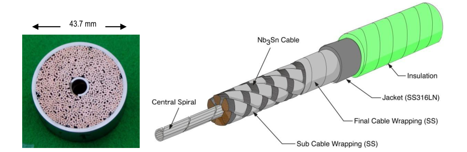
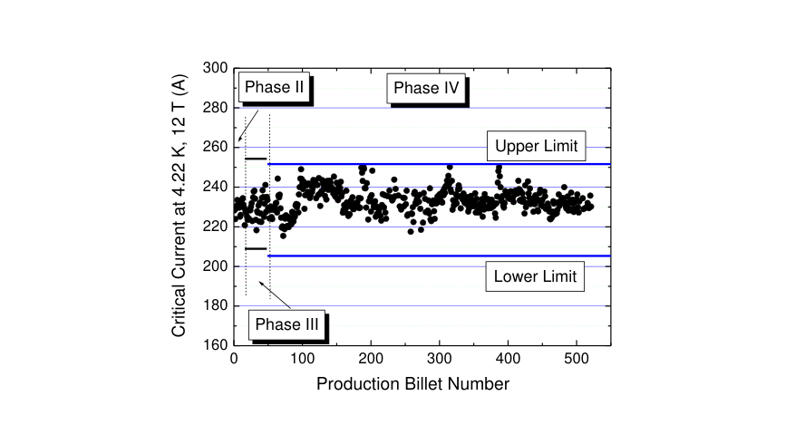
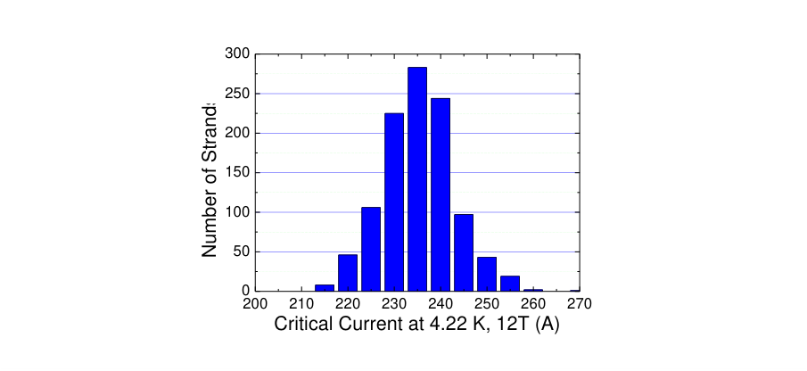
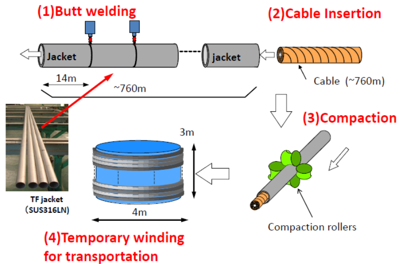
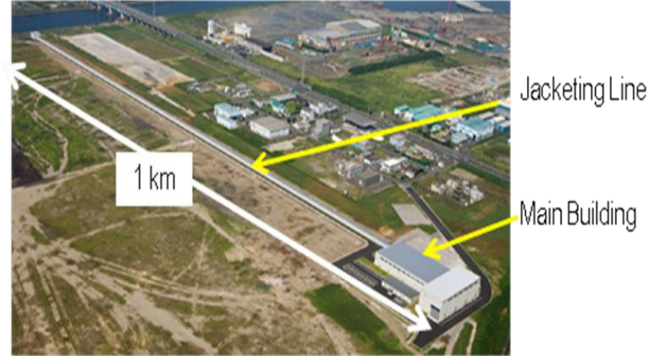
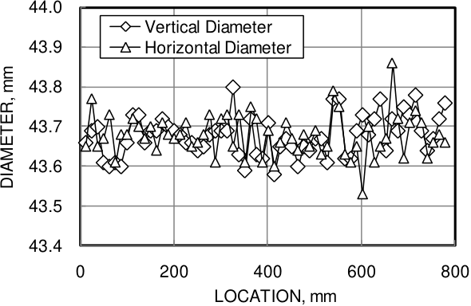

## **Technology Development for the Manufacture of Nb3Sn Conductors for ITER Toroidal Field Coils** 

## **Y. Takahashi[1] , T. Isono[1] , K. Hamada[1] , Y. Nunoya[1] , Y. Nabara[1] , K. Matsui[1] , T. Hemmi[1] , K. Kawano[1] , N. Koizumi[1] , M. Oshikiri[1] , Y. Uno[1] , S. Ito[1] , M. Yoshikawa[1] , H. Nakajima[1] , K. Okuno[1] , A. Devred[2] , N. Mitchell[2 ]** 

1Japan Atomic Energy Agency, 801-1-Mukouyama, Naka 311-0193, Japan 

2 ITER Organization, Cadarache Centre, 13067 St Paul lez Durance Cedex, France 

E-mail: takahashi.yoshikazu@jaea.go.jp 

**Abstract.** Japan Atomic Energy Agency is procuring the Nb3Sn superconductors for Toroidal Field (TF) Coils as part of the ITER project. Because the required tonnage of Nb3Sn strand is quite large compared to past experience and the required superconducting performance is higher than that of the model coils fabricated and tested during the ITER-EDA period, quality control techniques are very important for the successful manufacture of the strand. Approximately 40 tons of Nb3Sn strand have been successfully completed under a severe quality control regiment and all strand meets ITER specifications.  Sophisticated control techniques also are required during the jacketing process, in order to fabricate conductors with a precise outer diameter and without any defects in the welds. Inspection of the inner surface of welds using lasers is an example of the rigorous quality control techniques developed. 

A full-length (760 m) Cu dummy conductor has been fabricated successfully, and the suitability of all jacketing technology was confirmed during this fabrication. Specifications for manufacturing procedures which satisfy ITER requirements were established, enabling the start of fabrication of Nb3Sn conductors for the TF coils in March 2010. 

## **1. Introduction** 

The superconducting magnet system in the ITER machine consists of 18 Toroidal Field (TF) coils, one set of Central Solenoid (CS) and 6 Poloidal Field (PF) coils [1]. The height and width of the TF coils are 14 m and 9 m, respectively. The TF coil contains a stack of 5 regular and 2 side D-shape double pancakes. Each double pancake contains a single conductor. The regular and side double pancakes have conductors that are 760 m and 430 m in length, respectively, with an operating current of 68 kA. Because the maximum magnetic field in the TF coils is 11.8 T, Nb3Sn is selected as superconducting material. The conductor is cable-in-conduit conductor (CICC) with a central spiral, as shown in Fig. 1. A circular multistage superconducting cable is inserted into a circular stainless steel jacket with a thickness of 2 mm. A total of 900 Nb3Sn strands and 522 copper strands are cabled around the central spiral and then wrapped with stainless steel tape whose thickness is 0.1 mm. 

Japan, China, the EU, Korea, Russia and the US are procuring TF conductors. The Japan Atomic 

**----- Start of picture text -----** 
43.7 mm **----- End of picture text -----** 

Fig. 1 Nb3Sn cable-in-conduit type conductor with central spiral for ITER toroidal field coils. 

Energy Agency (JAEA) has responsibility for the procurement as Japanese Domestic Agency. JAEA signed s procurement arrangement in November 2007 and started the manufacturing process in May 2008. Approximately 48 tons of Nb3Sn strand have be completed in March 2010. This amount corresponds to approximately 40% of the Japanese contribution under the first two contracts with suppliers. A 760-m Cu dummy conductor was successfully fabricated prior to the manufacture of the Nb3Sn conductors. Suitable manufacturing techniques for the long TF conductors were established during fabrication of the dummy conductor. The manufacture of the actual Nb3Sn conductors for the TF coils started in March 2010, with Japan in the lead among the 6 parties. This paper focuses on the technology developed for the manufacture of Nb3Sn strand and the jacketing procedure. 

## **2. Procurement of ITER TF conductor in Japan** 

JAEA is procuring 24 conductors of the regular double pancake (rDP) type whose length is 760 m and 9 conductors of the side double pancake (sDP) type whose length is 430 m, corresponding to 25% of all TF conductors. This amount is the largest among the 6 parties who have the responsibility for the manufacture of TF conductors. The total length of all conductors is 22.1 km. 

- Procurement of the TF conductors in the ITER project will be executed in the following four phases: Phase I:  Call for Tender Phase II: Process Qualification, based on the manufacture of a dummy copper rDP Conductor (760 m) and one 100 m/sDP Nb3Sn Conductor 

   - Phase III: Pre-Production, based on the first Conductor 

Phase IV: Production of remaining rDP and sDP Conductors 

JAEA has contracts with two Japanese companies for fabrication of strand, one for cabling and one for jacketing procedure. During Phase II, a 760-m dummy copper conductor was successfully fabricated to demonstrate the feasibility of manufacturing the actual Nb3Sn conductors. Conductor manufacturing procedures were established during fabrication of the dummy conductor. Subsequently, a 430 m and a 100 m Nb3Sn conductor were completed to qualify the procedure. JAEA has already completed the first conductors in Phase III and is proceeding with the fabrication of the actual Nb3Sn conductors in Phase IV. 

## **3. Technology for manufacturing of Nb3Sn conductor** 

According to the procurement arrangement, a performance test of a full-size conductor must be performed on each combination of strand and cable/jacket designs. JAEA has performed tests on 2 conductor strand samples manufactured by two different suppliers. Results demonstrate that both conductors possess a sufficient temperature margin [2, 3], thereby meeting ITER requirements. Both strand and cable must be manufactured in a manner identical to that of the full-size conductors which were subjected to testing. The technology for the manufacturing process was developed to ensure the manufacture of strand possessing identical design and performance. 

## _3.1. Strand_ 

The manufacture of strand started in May 2008, using the bronze process technique. Specifications for the strand are listed in table 1. Japan will manufacture a total of over 100 tons of Nb3Sn strand for the TF coils. No company or organization has experience manufacturing this amount of Nb3Sn strand possessing superior superconducting performance [4] and which complies with the specifications for the ITER model coils [5]. Successful manufacture requires a high level quality assurance system employing a statistical process control method to ensure strand compliance with the following key parameters in order to have confidence in the identical quality and performance of the resulting strand. 

- 1) Critical current at 4.2 K and 12 T 

- 2) Hysteresis loss at 4.2 K over ± 3 T cycle 

- 3) Copper-to-non-copper volume ratio 

- 4) Residual Resistance Ratio after heat treatment 

## 5) Average strand diameter before plating 

## 6) Average strand diameter after plating 

**Table 1.** Strand specification 

|**Table 1.**Strand specification||
|---|---|
|**Item**|**Specification**|
|Minimum critical current at 4.22 K, 12 T|190 A*|
|Outer diameter|0.820 ± 0.005 mm|
|Twist pitch|15 ± 2 mm|
|Cr Plating thickness|1.0 – 2.0 μm|
|Cu to non-Cu volume ratio|1.0 ± 0.1|
|Minimum Residual Resistance Ratio|100|
|Maximum Hysteresis loss at 4.22 K over ±3 T cycle|500 mJ/cm3|

*) The final minimum critical current is the maximum of (Icav - 3σ) and 190 A. Icav and σ are average critical current and standard deviation during Phase II and III, respectively. 

An example is shown in Fig. 2. Control limits are determined by strand fabrication data from the previous phase, using the following formula. For the critical current, the limits for the strand whose billet number is from 1 to 15 in Phase II are set by strand data in the preproduction phase. 

(1) 

where Iclimit and Icav are control limit respectively and σ is standard deviation. The upper and lower limits are set at 254.3 and 208.9 A in Phase III and 251.6 and 205.3 A in Phase IV respectively. Though the number of billets in Phase is much larger than those for Phase II and III, the Ic values in Phase IV are controlled rigorously. 

Approximately 48 tons of strand were manufactured in March 2010. This amount corresponds to approximately 40% of the total contribution from Japan. A histogram of the critical current for the strand is shown in Fig. 3. The average critical current Icav and the standard deviation are 231.4 A and 7.6 A, respectively. These results demonstrate that the quality control system and the statistical process control method used in the current mass production process are sufficient to produce strand which satisfies all ITER requirements. 

Possible defects inside the strand are checked continuously by an eddy current sensor along the entire length of the strand. The outer diameter of the strand is also measured continuously by a laser system located on the production line. Tolerances for the outer diameter are controlled to within ± 0.005 mm. 

JAEA performs measurements at both room and low temperatures to verify compliance by manufacturers with Reference Laboratory values as qualified by the ITER organization. Items subject to verification are as follows; 

- 1) Critical current 

- 2) Hysteresis loss 

- 3) Outer diameter after plating 

- 4) Chromium plating thickness 

- 5) Twist pitch length and direction 

- 6) Cu to non-Cu volume ratio 

- 7) Residual Resistance Ratio 

**----- Start of picture text -----** 
300 Phase II Phase IV 280 260 Upper Limit 240 220 200 Lower Limit 180 Phase III 160 0 100 200 300 400 500 Production Billet Number Critical Current at 4.22 K, 12 T (A) **----- End of picture text -----** 

Fig. 2 Result of statistical process control for critical current 

**----- Start of picture text -----** 
300 250 200 150 100 50 0 200 210 220 230 240 250 260 270 Critical Current at 4.22 K, 12T (A) Number of Strands **----- End of picture text -----** 

Fig. 3 Critical current histogram of fabricated strand for ITER TF coil. Iav: 231.4A, σ: 7.6 A 

## _3.2. Jacketing_ 

The jacketing procedure is shown in Fig. 4. Specifications for the conductors are listed in table 2. Jackets with a length of 13 m are butt-welded with an automatic welding machine. The following non-destructive examinations are performed on the welds. These important examinations are designed to detect even small defects which, if left undetected, may have a very large impact on the operation of the Tokamak machine. Any defective weld is removed and discarded, and the entire weld performed anew. 

- 1) Helium leak test with a pressure of 3 MPa 

- 2) Dye penetrant test 

- 3) Radiographic inspection 

- 4) Laser inspection along the inner surface of welds 

**Table 2** . Specification of TF conductors 

Fig. 4 Jacketing procedure for TF conductors 

The superconducting cables are inserted into the assembled jacket whose length is 760m. Because the cable is inserted into a straight jacket with a length of 760 m, a very long facility is required. The completed jacketing facility is shown in Fig. 5. The cable is wound on a drum that is located at the end of the jacketing line and which is pulled toward the main building using a winch. Cable insertion is one of the key technologies in the jacketing process because the gap between the inner surface of the jacket and the outer diameter of the superconducting cable is only 2 mm in diameter. No company has experience inserting such a long and heavy cable. The pulling force is limited to 5.5 tons in order to avoid damaging the cable. Any projection along the inner surface of a weld might increase the required pulling force. From the viewpoint of mechanical strength, the metal should melt fully over the thickness of the jacket. Therefore, a laser inspection process to confirm the shape of the inner surface of the weld was developed to achieve an accuracy of 0.1 mm. In addition, the inner surface of the jacket is cleaned at least 4 times using a nonwoven cloth to reduce friction and, thus, the required pulling force. The maximum pulling force is listed in table 2. The overall coefficient of friction is 

estimated by the following formula. 

**Table 3.** Overall coefficient of friction in cable insertion work 

*) Cu: Copper dummy cable, SC: Superconducting Cable 

(2) 

where F, W and μ are the final pulling force for the cable length, cable weight and overall coefficient of friction (COF), respectively. The weight of cable per unit length is 73 kN/m. The overall COF for the 7 conductors ranges from 0.56 to 0.63, as shown in table 3. This value is useful for the design of the future facilities. 

Following cable insertion, the jacket is compacted in one step to the specified diameter with a tolerance of 0.2 mm using a compaction roller system. The outer diameter of the compacted conductor is measured continuously in both the horizontal and vertical directions by a laser measuring system. The conductor subsequently is wound in one-layer solenoid with a diameter of 4 m for transportation. The outer diameter after winding must measure 43.7 ± 0.3 mm to comply with requirements. Figure 6 shows the outer diameter of the conductor after winding. The outer diameter in both directions is reliably within requirements. 

**----- Start of picture text -----** 
44.0 Vertical Diameter 43.9  Horizontal Diameter 43.8 43.7 43.6 43.5 43.4 0 200 400 600 800 LOCATION, mm DIAMETER, mm **----- End of picture text -----** 

Fig. 5 Outer diameter of conductor along length after winding 

After winding, the following acceptance tests are carried out. 

## 1) Helium leak test at 3 MPa 

- 2) Dye penetrant test 

- 3) Gas flow test 

A conductor wound with a diameter of 4 m is installed in a vacuum chamber with a diameter of 5 m for the Helium leak test conducted at room temperature is carried out. The acceptance criterion is a helium leak rate of 1 x 10-8 Pa*m[3] /s. The dye penetrant test also is performed after the leak test. Pressure difference between the inlet and the outlet of the conductor is measured with several flow levels of nitrogen gas at room temperature in a gas flow test to confirm the hydraulic performance. 

## **4. Conclusions** 

Prior to the production of the actual conductors, high performance Nb3Sn strand manufactured using a bronze process technique and consistent with a high level quality assurance system was fabricated for mass production with the goal of producing over 100 tons of strand. Butt welding of a circular jacket [6] whose quality is ensured through a series of nondestructive examinations, cable insertion of a 760 m long cable with a clearance of 2 mm, a one-step compaction process using a 4-roller machine and winding using a bending roller system are processes which have been developed during the process qualification program using a 760-m dummy conductor in Phase II. 

JAEA is the first to start the manufacture of the TF conductors in Phase IV in March 2010 among the 6 parties who are procuring the TF conductors in the ITER project. Two sDP conductors and one rDP conductor in Phase IV have been completed. Five conductor lengths which will be used in the TF coils have been completed totally, because two sDP conductors in Phase III (the first conductors) had been fabricated prior to Phase IV. 

JADA is manufacturing one conductor per month under the contract with two Japanese companies for strands, one company for cabling and one company for jacketing. 

The views and opinions expressed herein do not necessarily reflect those of the ITER Organization. 

## **Acknowledgments** 

The manufacturing contributions for the TF conductors by Hitachi Cable Ltd., Japan Superconductor 

Technology, INC. and Nippon Steel Engineering Co., LTD. are gratefully acknowledged. The authors would like to thank Drs. H. Ninomiya, H. Takatsu and R. Yoshino for their strong supports and encouragements on this work. 

## **References** 

- [1] Mitchell N, et al., Status of the ITER magnets, _Fusion Eng. Des_ ., **84** (2009) 113-121 

- [2] Takahashi Y, et al. _IEEE Trans. on Appli. Super._ , **18** (2008) 471 

- [3] Nunoya Y, et al., 2010 Appli. Super. Conference, 2LP2B-10 

- [4] Nunoya Y, et al., _IEEE Trans. on Appli. Super._ , **20** (2010) 1443-1445 

- [5] H. Tsuji, et al., Fusion Engineering and Design, **55** (2001) 141-151 

- [6] Hamada K, et al., Development of jacketing technologies for ITER CS and TF conductor, _Adv. Cry. Eng. (Material)_ **54** (2008)76-83 

