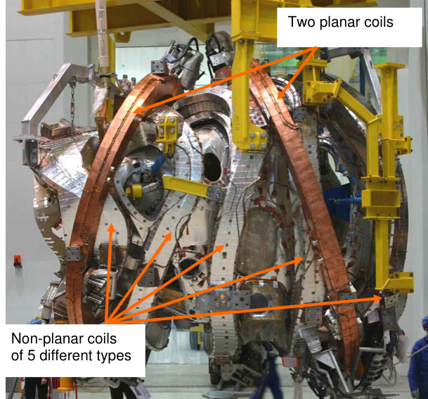
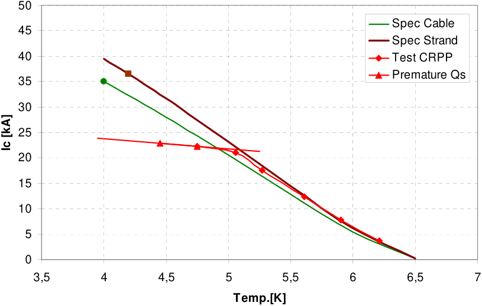
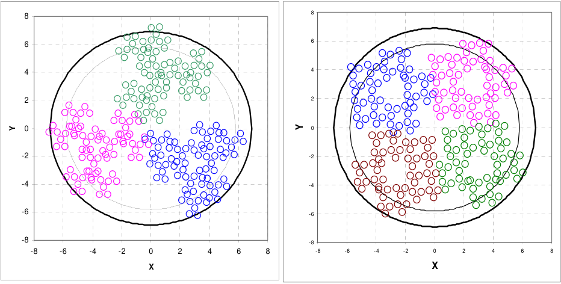
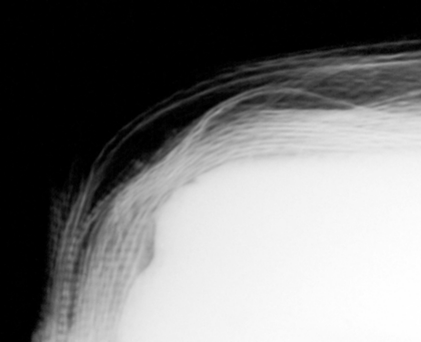

## **Experiences from Design and Production of Wendelstein 7-X Magnets** 

## K. Riße for the W7-X team 

Max-Planck Institut für Plasmaphysik, EURATOM Association, Teilinstitut Greifswald, Wendelsteinstraße 1, D 17491 Greifswald Phone: +49 3834 882720 FAX: +49 3834 882709 _mail: konrad.risse@ipp.mpg.de_ 

Abstract: The Max-Planck-Institut für Plasmaphysik in Greifswald is building the stellarator fusion experiment Wendelstein 7-X (W7-X). The manufacturing of the W7-X superconducting magnet system, which consists of 50 non-planar and 20 planar coils, was finished in March 2008. The production was a technical challenge for the W7-X design crew as well for the manufacturer due to the complex 3 D shape of the non-planar coils and the stringent requirements for geometrical tolerances. The manufacturers had to solve several technical problems and to consider major design changes even at advanced stages of manufacture. Finally the coils are passing the acceptance tests at cryogenic temperatures at CEA Saclay with a very good performance. Results of the W7-X coil production will be given and critical production steps will be identified. Lessons will be taken from the experiences gained from design, 

manufacturing and test methods. The reasons for the considerable time delays will be explained. Keywords: Superconducting Coils, Stellarator, Wendelstein 7-X, Insulation, Magnet production 1. INTRODUCTION 

The W7-X fusion experiment of the stellarator type is presently under construction at the MaxPlanck-Institut für Plasmaphysik (IPP) in Greifswald Germany, see figure 1 [1]. To allow steady state operation W7-X has a superconducting coil system consisting of 50 non-planar coils to provide the main magnetic field and 20 planar coils for magnetic field modifications. The nonplanar coils were ordered from a consortium of Babcock Noell GmbH Germany and ASG 

Superconductors S.p.A. Italy in 1998. The planar coils were produced by Tesla Engineering Ltd. 

**25th SOFT Page 1 of 11** 

England. The production of the superconducting coils was finished in March 2008. Each coil is subjected to an acceptance test at CEA Saclay in France under cryogenic conditions. It is to emphasize that the already accepted coils, 27 non-planar and 16 planar coils, presented very good results during the cold tests. The paper is concentrated on the experiences gained from the larger contract of the non-planar coils. 

## **2. COIL DESIGN AND PRODUCTION WITH RELEVANT CONCLUSIONS** 

## _2.1. Superconductor_ 

Both types of magnets use the same cable in conduit superconductor. The conductor uses a cable consisting of 243 NbTi strands enveloped by an Aluminium (Al) jacket. The Al material for the jacket was chosen to allow the conductor winding in soft conditions into the curved shape of the non-planar coils with limited spring back effect. A hardening process after winding at 165° C yields the final Al material mechanical properties. In total around 400 double layer lengths, which represent a length of 60 km, were produced for the coils and additional spare lengths. The conductors show a very good and stable cryogenic behaviour during the cold tests of the coils at CEA Saclay. 

Tests on cable samples at CRPP-Fusion Technology in Villigen (Switzerland) revealed the occurrence of premature quenches for temperatures below 5 K with a current above 21 kA [2]. Figure 2 shows the Ic lines for the strand (strand Ic multiplied by number of strands not including the self field degradation effect) and the cable based on the specified values which were extrapolated to higher temperatures [2] in comparison to the line of the CRPP Ic test data [2, 3]. The premature quenches can be explained by the inhomogeneous current distribution caused by different strand contact resistances inside the joints [4], the relative short length of the test sample which did not allow an even current distribution between the strands in the cable [4] and a local superposition of the background field with the self field of the conductor on the high 

**25th SOFT Page 2 of 11** 

field side when the current density increases [5]. The W7-X magnet operation is not influenced because the operating current is around 18 kA. 

The cabling law for the W7-X conductor is 3x3x3x3x3. The figure 3 shows a schematic view on the strand distribution inside of the W7-X cable jacket. Due to the triangular shape of the subcables the chosen cabling law leads to deep grooves between the sub-cables, which cannot be avoided [3]. This irregular distribution resulted in problems during cabling and jacket coextrusion e.g. broken strands, slopes of sub-cables during co-extrusion and a high rate of nonconform conductors. The manufacturer was not able to meet the specified tolerances for mass flow and void fraction and asked to double the tolerances to +/- 20 % for mass flow and +/- 2 % for the void fraction. An optimised cabling law e.g. of 3x4x5x4 could probably avoid these difficulties, see figure 4. 

The milestone for the first conductor length was passed with a delay of 12 months. The origin of the delay came from cabling difficulties, larger delays during set up of the co-extrusion and at the beginning the final testing procedures of the conductor worked not stable. Over the production period the difficulties during conductor testing were solved but the winding pack manufacturer suffered nearly the whole production period on a lack of available conductor lengths. 

## _2.2. Winding Pack_ 

The winding pack of the non-planar coils consists of 6 double layers with 108 turns in total. The double layers are connected electrically in series and hydraulically in parallel by so called joints in the connection area. The manufacturer solved the challenge to achieve a geometry of the windings over the circumference within a tolerance of -0 mm/+3 mm. The reliability and the function of the used components is in good accordance with the specification e.g. the electrical joint resistance is every time below the required 1 nano-ohm, the material transition pieces, the potential separators and the joint casing work reliable without leakages. A test program on the 

**25th SOFT Page 3 of 11** 

used potential separator type with 1000 thermal cycles down to LN2 temperature within 60 s cool down time was performed without detection of He leakages. As consequence of the complicate geometry in the connection area great efforts were done to reach the position tolerance e.g. for the joints of +/-10 mm and to check the deviations regarding the collision inside the W7-X machine with other components. The connection area was insulated separately by hand and not included in the vacuum pressure impregnation of the winding packs. The complex outer shape of the joints and the curved conductor caused large efforts during the application of the hand made insulation. The technology for the Al welds between the conductor jacket and the joint body was specially qualified. Investigations by IPP on Al welds coming from the coil production and the W7-X assembly revealed small pores and small cracks in the Al welds. Improvements for the welding procedures could not be found and extensive tests with mechanical loads and thermal cycles on samples showed the He leak tightness and the mechanical firmness [10]. Despite the fixation of welding and inspection standards in the coil specification it was necessary during the production to define more precisely the criteria for welds of stainless steel and Al. In future projects the technical specification should set up a very detailed catalogue for the weld requirements to achieve a common view e.g. for allowed welding tarnish, excess of penetration or angular misalignment. 

While the main winding pack body was every time correctly impregnated the technology for the vacuum pressure impregnation of the non-planar winding of type 1 and 5 did not fill properly the connection box with resin and in addition the used filling material was not compacted enough to reach a glass content of 60 %. The resulting gaps, cavities and resin rich areas were repaired within an extensive repair program. In addition on four coils of these types shortages were found and repaired. The shortages were caused by local over pressing of the conductor insulation inside the connection box during the impregnation process. Especially the type 2, 3 and 4 windings revealed a number of defects in the hand made insulation which were found by the high voltage 

**25th SOFT Page 4 of 11** 

tests under Paschen conditions (see chapter 3). The defects were caused by insufficient glass content, bubbles, resin rich areas. In addition the specified insulation thickness of 5 mm was reduced to 3 mm. It is recommended to use for the insulation thickness a safety factor of 18. This value was successfully used for the W7-X magnets and also for the hand made insulation of the KSTAR [6] magnets under the assumption of 22 kV/mm break through voltage. To avoid 

individual defects on the insulation it is recommended to perform a comprehensive qualification of the working procedure and the workers. For the hand made insulation made of epoxy glass tape wrappings attention should be paid on the full penetration of resin into the glass tapes, tight wrapping and on a strong pressing e.g. by thermal shrinking tapes. The manufacturer needs special trained and certified worker; work samples must be regularly investigated. X-ray investigations could be useful as non destructive test method to check the proper packing and thickness of the insulation (Fig. 5). 

## _2.3. Coil Casing_ 

The coil casings consist of 2 cast half shells of 1.3960 material and additional support blocks. The manufacturer had to solve two challenges: First to reach the geometric tolerances and 

second to detect imperfections in the cast e.g. cavities. Since the last problem was only detected during the running production it was necessary to submit all already manufactured coil casings as well as whole coils to a LINAC (linear accelerator ) which is able to test materials up to 500 mm thickness whereas the at first applied x-ray method has a limit of 70 mm. During assembly at IPP the liability to hot cracking of the material during welding caused additional efforts for repairs. 

## _2.4. Embedding Procedure_ 

The winding pack is embedded into the casings by a special embedding procedure which should introduce a pre-stress between the winding pack and the coil casing at room temperature. The purpose is to balance the different thermal expansion coefficients between Aluminium 

**25th SOFT Page 5 of 11** 

(determining the thermal behaviour of the winding pack) and the stainless steel casing in such a way that at operating temperature of 4 K the winding pack is embedded stress free but tightly to the casing. During embedding the coil casing is heated to 120° C, the gap between winding pack and casing is filled with sand and the complete coil will be vibrated during cool down. Measurements and evaluations performed by IPP show that the foreseen pre-stress could not be achieved due to the following main reason: at the end of the heating phase the winding pack expanded almost by the same amount as the casing. This knowledge came too late to change the embedding process for the serial production to an active cooling of the winding pack during the heating process [7]. During the cold acceptance tests at CEA France and nominal current operation no special effects of load jumps could be observed [8] being in mind that the operational forces of W7-X will be 3 times higher. 

_2.5. Coil case machining and geometrical measurements_ 

The final machining was performed with a 5 axis milling machine. During the machining process the coil needs to be turned depending of the type one or two times. As geometrical orientation the so called Pin holes on the winding pack were used. The position of these pin holes in reference to the individual winding pack geometry is known by 3D measurements and best fit operations. The lowest allowed tolerance during machining of threads and surfaces was 0,2 mm compared to the 3D model position. This range of required tolerances is not practical for a serial production on coils with a weight of 5 t and dimensions of 3 m. Though a milling machine is able to achieve an accuracy of hundredth of mm the accompanying measurement processes are leading to an addition of the single measurement failures before, during and after machining. Constructive measures, e.g. shims, need to be taken to ensure that the coils are still mountable with a suggested tolerance for hole, surfaces and thread positions larger than 0.6mm. 

_2.6. Cooling system on coil casing and instrumentation_ 

**25th SOFT Page 6 of 11** 

According to the results from the Demo coil test which showed a rather large heat load the cooling system for the non-planar coils was enlarged to 4 cooling pipes placed on the coil casings. The coil shape itself and non existing clearance to neighbouring components led to a strongly curved routing of the cooling pipes with much restricted tolerances. Copper stripes, placed every 20 mm, soldered to the cooling pipes and welded to the casing give the thermal contact between the pipes and the casing. The cooling system works well during the 4 K tests at CEA Saclay. The coils are equipped with 7 temperature sensors and 2 redundant strain gauges. 

## 3 **. ELECTRICAL TESTS ON THE INSULATION SYSTEM** 

The most critical item during the production of the non-planer coils was the insulation between the turns or the layers and against ground potential. Apart from improved production procedures, the electrical testing must be a uniform line over the whole production cycle according to the highest standard reachable for the serial production. The testing methods must be specially qualified for the application case and applied on each coil at least after the main production steps. To test the ground insulation, high voltage tests at air and under different vacuum pressures – so called Paschen conditions - should be applied. For checks of the interturn insulation the following tests are proposed: measurement of the ohmic resistances and of the impedance spectrum, high voltage tests with permanent AC current for short time and tests with the capacitor discharge method. The impedance spectrum test is much more sensitive to determine short circuits than the ohmic measurements or the AC tests [9]. The combination of the high-voltage AC and low voltage impedance spectrum tests is recommended for application during production and cold tests. 

## **4. SUMMARY** 

The production of the 50 non-planar and 20 planar superconducting coils was finished in March 2008. The most difficult challenges during production like the strongly curved geometry with narrow tolerances or the superconductive behaviour were successfully solved by the industry. 

**25th SOFT Page 7 of 11** 

The production of the non-planar coils was influenced by larger design changes especially on the non-planar coil casings, a lack of available conductor at the beginning of the winding pack 

production, repair programs on the winding pack insulation and additional LINAC investigations on the coil casings with related repairs. During the production the problems were solved and the coils are passing the acceptance tests at nominal operating conditions with good results and according to the technical coil specification. To reach a common understanding between the contractual partners and to avoid changes during the production the technical requirements, the design details and the used components and production methods must be clearly described, readily developed and thoroughly tested before the production starts. Standardized and for the special application proofed electrical test sequences have to accompany the whole production cycle independent from the manufacturer site. The design for the insulation needs a high safety margin. Especially the hand made insulation could contain individual defects which could be reduced by special certified workers who will be continuously monitored. The quality level of the production can be assured by full qualified production processes; comprehensive 

accompanying tests, the installation of a total quality management system, competent and high qualified personnel and a close contact between the contractual partners. 

Acknowledgement 

The collaboration with the involved industrial partners of the non-planar coil consortium 

Babcock Noell GmbH and ASG Superconductors S.p.A and the planar coil manufacturer 

TESLA Ltd. is gratefully acknowledged. Sincere thanks to all my colleagues for their support. 

## REFERENCES 

- [1] L. Wegener, “Status of Wendelstein 7-X Construction”, SOFT 25[th] 2008 

> [2] CRPP- Report Fusion Technology in Villigen (Switzerland) “Report on the tests of two samples of W7-X joint and conductor” 2003 

- [3] R.K. Maix, “Design, Production and QA test results of the NbTi CIC conductors for the W7-X magnet system”, EUCAS, Vienna Sept.2005 

**25th SOFT Page 8 of 11** 

- [4] N. Mitchell, “Steady state analysis of non-uniform current distributions in cable-in-conduit conductors and comparison with experimental data”, Cryogenics 40 (2000) 99-116 

- [5] P. Bruzzone, “30 Years of Conductors for Fusion: A Summary and Perspectives” in IEEE Transactions on Applied Superconductivity Vol.16, No.1 June 

- [6] W. Chung, “Electrical Insulation of KSTAR Magnet Lead”, Journal of the Korean Physical Society, Vol. 49, December 2006 

- [7] M. Endler, “Measurements investigating the embedding procedure of the Wendelstein 7-X non-planar coils”, SOFT 25[th] 2008 

- [8] V. Tomarchio, “Data analysis of the strain Gauges system of the W7-X superconducting coils”, SOFT 25[th] 2008 

- [9] H. Ehmler, “AC modelling and impedance spectrum tests of the superconducting magnetic field coils for the Wendelstein 7-X fusion experiment”, Review of scientific instruments 78, 104705 (2007) 

- [10] J. Fellinger, “Weld integrity of the superconducting cable aluminium jackets of W7-X”, SOFT 25[th] 2008 

**25th SOFT Page 9 of 11** 

**----- Start of picture text -----** 
Two planar coils Non-planar coils of 5 different types **----- End of picture text -----** 

**Fig.1** 5 non-planar coils and 2 planar coils assembled as half module 

**Specified and measured Ic at 6 T** 

**----- Start of picture text -----** 
50 Spec Cable 45 Spec Strand 40 Test CRPP Premature Qs 35 30 25 20 15 10 5 0 3,5 4 4,5 5 5,5 6 6,5 7 Temp.[K] Ic [kA] **----- End of picture text -----** 

**Fig.2** Premature Quenches on W 7-X conductor [2, 3] 

**25th SOFT Page 10 of 11** 

**----- Start of picture text -----** 
8 8 6 6 4 4 2 2 0 0 -2 -2 -4 -4 -6 -6 -8 -8 -8 -6 -4 -2 0 2 4 6 8 -8 -6 -4 -2 0 2 4 6 8 X X Y Y **----- End of picture text -----** 

**Fig.3** Schematic view on strand distribution inside W7-X cable jacket [3] 

**Fig.4** Schematic view on strand distribution by cabling law 3x4x5x4 [3] 

**Fig.5** Section of X-ray photo of insulated Al joint body with several glass layers 

**25th SOFT Page 11 of 11** 

