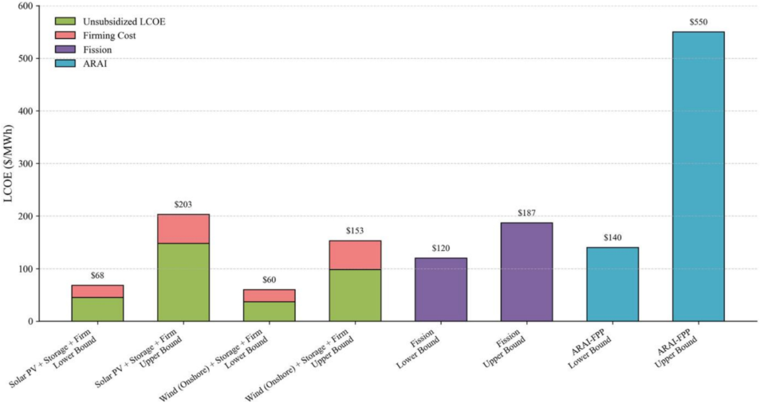
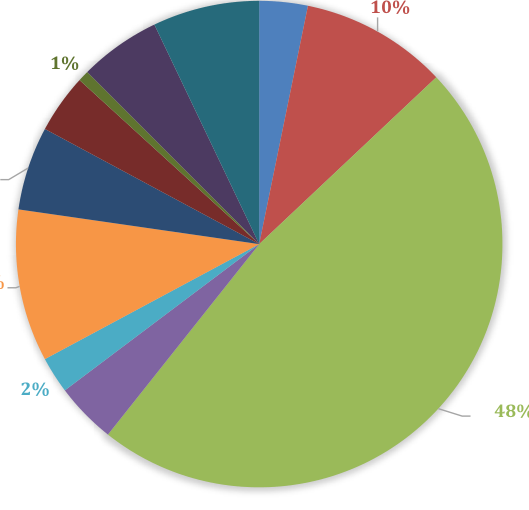
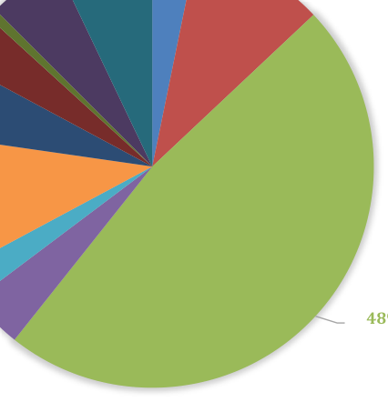

[Applied Energy 401 (2025) 126567](https://doi.org/10.1016/j.apenergy.2025.126567)

Contents lists available at ScienceDirect
# Applied Energy

[journal homepage: www.elsevier.com/locate/apenergy](https://www.elsevier.com/locate/apenergy)

## Techno-economic analysis of deuterium-tritium magnetic confinement fusion power plants

Layla S. Araiinejad [*], Koroush Shirvan

_Massachusetts Institute of Technology, Cambridge, MA, United States_

H I G H L I G H T S

- Development of a bottom-up techno-economic analysis that provides a capital cost framework.

- Regulatory alignment is essential for Fusion’s economic viability.

- Fusion-specific components and manufacturing costs are highly sensitive parameters.

- Fusion LCOE of $140–$550/MWh highlights its competitive potential.

A R T I C L E I N F O

_Keywords:_
Fusion power plants
Techno-economic analysis
Tokamak
Overnight capital costs
Economic viability
Regulatory frameworks

## **1. Introduction**

A B S T R A C T

This techno-economic analysis of deuterium-tritium magnetic confinement fusion power plants (FPP) aims to
assess the economic viability and scalability of FPPs in addressing global energy challenges and climate change.
Amidst a backdrop of substantial investments in fusion technology, totaling $7.1 billion to date, this study
critically assesses the Nth-of-a-kind overnight capital costs of a FPP that hosts ARAI, a 350 MWe tokamak reactor
based on the MIT ARC fusion concept. The overnight capital costs for ARAI-FPP are estimated to range between
$8800/kW and $22,200/kW, with this variation largely driven by differing regulatory and manufacturing as­
sumptions. The overall cost breakdown is found to be similar to past and recent fusion literature, where the direct
cost of fusion reactor equipment is the largest cost driver. The levelized cost of electricity, which includes
projections for operation and maintenance costs, are estimated to be between $140/MWh and $550/MWh. The
findings aim to deepen the understanding of absolute and relative cost drivers in fusion energy and suggest
strategies to improve its economic feasibility. The analysis underscores the crucial impact of fabrication costs and
regulatory frameworks on cost dynamics, while also recognizing the substantial uncertainty in FPP cost estimates
due to the low technology readiness level of several key components.

As a major contributor to global CO2 emissions, the United States (U.
S.) actively engages in global initiatives to reduce its carbon footprint

and decarbonize its electric power systems to achieve net-zero carbon
goals [1]. Energy use, through the burning of fossil fuels, is the largest
driver of greenhouse emissions globally [2]. Renewable energy sources
such as wind and solar are imperative for this transition but suffer from

_Abbreviations:_ ARAI, Advanced Reactor Affordable Integration; ARAI-FPP, Advanced Reactor Affordable Integration Fusion Power Plant; ARC, Affordable Robust
Compact; ARIES-AT, Advanced Research Innovation and Evaluation Study – Advanced Tokamak; ARIES-CS, Advanced Research Innovation and Evaluation Study –
Compact Stellarator; ARIES-ST, Advanced Research Innovation and Evaluation Study - Spherical Torus; CF, Capacity Factor; COA, Code of Accounts; DOE,
Department of Energy; D-T, Deuterium-Tritium; EEDB, Energy Economic Data Base; FOAK, First-of-a-kind; FPP, Fusion Power Plant; FPY, Full Power Years; HTS,
High-Temperature Superconductor; IAEA, International Atomic Energy Agency; ITER, International Thermonuclear Experimental Reactor; kW, Kilowatt; LCOE,
Levelized Cost of Electricity; MC, Magnetic Confinement; MIT, Massachusetts Institute of Technology; MWe, Megawatts Electric; MWh, Megawatt-hour; MWth,
Megawatts Thermal; NCET, Nuclear Cost Estimation Tool; NRC, U.S. Nuclear Regulatory Commission; NOAK, Nth-of-a-Kind; NPP, Nuclear Fission Power Plant; OCC,
Overnight Capital Costs; O&M, Operation and Maintenance; PWR12, 1200 MWe Westinghouse Pressurized Water Reactor; REBCO, Rare-earth barium copper oxide;
R&D, Research and Development; TEA, Techno-Economic Analysis; TRL, Technology Readiness Level; U.S., United States; W, Watt.

- Corresponding author.

_E-mail addresses:_ [layla00@alum.mit.edu, layla00@psfc.mit.edu (L.S. Araiinejad).](mailto:layla00@alum.mit.edu)

[https://doi.org/10.1016/j.apenergy.2025.126567](https://doi.org/10.1016/j.apenergy.2025.126567)
Received 5 December 2024; Received in revised form 16 June 2025; Accepted 30 July 2025

Available online 9 September 2025
0306-2619/© 2025 Elsevier Ltd. All rights are reserved, including those for text and data mining, AI training, and similar technologies.

low power density, inefficient baseload performance, and a lack of energy storage solutions. Meanwhile, nuclear fusion, while supplying a remarkable portion of the non carbon-emitting energy in the world, faces high capital costs, cost overruns, and regulatory burden, mainly due to long permitting processes and safety requirements for fission reactors [1]. These challenges prevent renewable and fission from displacing fossil fuels in the existing energy system. Fortunately, fusion energy provides a solution. Fusion energy misses the sun's energy-producing processes and will generate virtually unlimited, clean energy. Its development may revolutionize power generation, altering our reliance on carbon-based fuels and facilitating a sustainable future in the U.S. and globally.

In 2022, the Biden-Harris Administration initiated a strategy to expedite the advancement of fusion power, setting a clear objective to extend the break-even point (where the fusion system generates more energy than it consumes) [1]. This approach represents a substantial change from the 1970s, when most fusion research was predominantly confined to colleges and national laboratories with a focus on scientific demonstrations. Notably, in 2022, Lawrence Livermore National Lab surpassed the break-even point and successfully replicated the experiment three times, achieving a target gain of greater than one [1]. Today, this landscape has altered significantly due to the increase in private-sector investments and improved public-private partnerships, which have fostered meaningful progress toward the commercialization of fusion energy. To date, the fusion industry has accumulated over $7.1 billion in investments; Commonwealth Fusion Systems has led the charge, raising over $2 billion based on MIT's ARC concept, a Compact Titanium [?] Di-Magnet Confinement (MC) reactor [1].

This analysis will present a methodology used to construct a techno-economic model for costing an Nth-of-a-Kind (NOAK) Fusion Power Plant (FPP) with a focus on D-T MC technology. Therefore, both the capital investment found and capital layout should be studied as NOAK. Additionally, this analysis addresses the impact of regulatory frameworks on capital costs, identifying how these requirements can affect cost escalations. As elucidated by Stewart and Shriners [?], the extent of the regulatory-related escalation in labor costs, materials, and equipment drives critical requirements for quality assurance, control, and inspection. By integrating the latest technological innovations, including advanced superconductors, superconducting magnets, and advanced manufacturing capabilities, this analysis assesses how these advances can reduce anticipated cost drivers. Moreover, this research will contribute its findings as a part of a new study by the MIT Energy Initiative aimed at assessing the role of fusion energy in a decarbonized electricity system [2].

According to the 2024 fusion company survey by the Fusion Industry Association, the MC approach (51 %) represents the most adopted approach by the private fusion Industry; similarly, the most pursued fuel source is D-T [1]. Moreover, D-T MC approaches have the most data available in the literature due to the extent to which MC reactors have been studied in universities and national laboratories. The D-T MC reactor technologies proposed by the ARIES studies and MIT's ARC conceptual design are potential candidates for cost comparisons [3]. As such, this analysis positions batteries as capital cost methodology for a D-T MC FPP.

Furthermore, this publication encompasses FPP cost configurations; substantial uncertainty remains in cost estimation due to the absence of a demonstrative FPP and a commercial supply chain for essential components. In order to partially address this uncertainty, the TEA literature on the NOAK cost and provides a cost estimation of FPPs given their proposed architectures. Estimating a NOAK cost avoids consideration of highly uncertain and sometimes controversial First-of-a-kind (FOAK) costs for initial demonstration power plants. Furthermore, various existing studies of FPPs, Fission, and other renewable energy sources will be leveraged to arrive at a range of possible capital and operating costs for FPPs. In particular, a discussion on the impact of regulation on the cost relative to a fusion power plant will be made,

**Table 1**
General reactor parameters of a D-T MC Reactor.

| Parameter(s) | Symbol | Base Case Value |
|---|---|---|
| Thermal Power (MWth) | $P_{th}$ | 1600 MW |
| Electric Power (MWe) | $P_e$ | 500 MWe |
| Reactor Output (MWe) | | 500 MWe |
| Efficiency (%) | | 38% |
| Capacity Factor | | TBR |
| Tritium Breeding Ratio | | TBR |

given the inherent merits of FPPs and lower overall radioactive inventory. Sensitivity to the identified cost drivers is also applied where deemed appropriate.

## 2. Methods

### 2.1. Code of accounts and scaling

Within this study, a cost accounting methodology was derived to estimate the Overnight Capital Cost (OCC), operations and maintenance costs (O&M), and Levelized Cost of Electricity (LCOE) for D-T MC reactors. A Code of Accounts (COA) system used in nuclear fission power plant (NPP) estimates is from the U.S. Department of Energy (DOE) Nuclear Energy Cost Data Base (EEDB). The COA has been accepted by the International Atomic Energy Agency, benchmarked by the Generation IV International Forum Economic Modeling Working Group [3], and adapted to some fusion applications [3] [1]. A widely used cost accounting methodology facilitates uniformity and consistency when comparing the capital costs of NPPs across diverse eras. The effectiveness of this COA system allows direct applications across nearly all nuclear power designs, which simplifies comparisons between NPP technologies. This flexibility explains why it has been used in many studies to estimate the costs of new power plants and compare costs across different nuclear and commercially-owned power plant designs [5] [6] [7]. However, despite its flexibility and usage for comparisons across several nuclear power generations, the COA system used thus far was not designed for specific fusion applications. As a result, the COA was modified to accommodate the differences between an FPP and NPP. These modifications are summarized in the next two previous adaptations of EEDB COA to fusion reactors [3] [8]. The OCC within this TEA consists of Account 20: Direct Capital Costs, Account 90: Indirect Capital Costs, Account 91: Plant Decommissioning Cost, Account 60: Owner's Cost. Equation 1 depicts the OCC calculation.

$$OCC = Direct Cost + Indirect Costs + Decommissioning Cost + Owner's Cost$$

$$P_{net} = 1,000$$

(1)

### 2.1.1. Concepts and assumptions

There are several assumptions affecting the FPP costs, its supporting equipment, and the facilities that house them. [Table 1](#) depicts relevant assumptions regarding the D-T MC FPP system in this study. Many of the MC reactor discussed within the analysis are based on the leading candidate materials shown in the annual Fusion Industry Association report, where companies self-report their expertise [1][8]. The assumption behind the tritium breeding ratio results is assumed to be a first-of-its-kind cost for this NOAK analysis. This analysis also acknowledges the uncertainty of several items within this system and highlights the need for technological advancements to advance economically critical features. The following are noteworthy assumptions in the TEA:

- Publicly available data was used for the costs of materials involved in the construction and annual operation of a FPP. Therefore, it cannot, by definition, capture recent improvements in science or manufacturing held by private companies, yet will still provide a relative basis from which to assent fusion economic provide a

## Table 2
Direct costs.

| COA Number and Name | Source |
|---|---|
| 20 | Direct Costs |
| 21 | Land & Land Rights |
| 22 | Structures & Site Facilities |
| 23 | Turbine Plant Equipment |
| 24 | Electric Plant Equipment |
| 25 | Miscellaneous Plant Equipment |
| 26 | Main Heat Rejection |

| COA | Description |
|---|---|
| 20 | Direct Costs |
| 21 | Land & Land Rights |
| 22 | Structures & Site Facilities: Various vessel, Blanket, Magnet, Fuel Handling System, Tritium Extraction and Removal, Auxiliary Cooling System, Cryostat, Other Reactor Plant Equipment (e.g., *divertor*), Instrumentation and Control |
| 23 | Turbine Generator: Rankine Cycle assumed Turbine Generators, Condensing Systems, Feed Heating System, Turbine Plant Miscellaneous, Power and Control Wiring, Switchgear, Power and Control Writing |
| 24 | Electric Plant Equipment: Switchgear, Station Service Equipment, Electrical Structures and Wiring Containers, Electrical Lighting |
| 25 | Miscellaneous Plant Equipment: Heat exchangers and main generators for steam transportation, Pumps, piping, valves required for basic heat transport system |
| 26 | Main Heat Rejection: For transportation and modification of the reactor plant equipment |

$$P_{aux}$$ represents the value of a new parameter such as superstructure

volume, superstructure area, building volume, substructure area, etc. $P_{EEDB}$ represents the reference parameter from the EEDB. $C_{raw}$ represents the reference/raw in the EEDB. The exponent n represents a scaling factor which depends on each structure, system and component. Lastly, C represents the new cost of the scaled component n then taken to and divided by the reference EEDB cost. Given that an FPP has never been constructed, no historical data exists to validate the fusion-specific cost numbers. Thus, this methodology will be used to examine the relative economics of a D-T FPP. PWR2 costs include factory costs, site labor hours, material costs, and quantity. The direct costs are composed of 7 top-level accounts and 27 subaccounts. The top-level direct accounts are structures and improvements (representing the civil works), reactor plant equipment (will be replaced with FPP specific equipment), turbine-generator equipment (assumes steam Rankine cycle similar to FPPs), electrical plant equipment, miscellaneous equipment, and the main heat rejection system.

$$C = C_{raw} \times \left(\frac{P_{aux}}{P_{EEDB}}\right)^n \tag{2.2}$$

### 2.2.1. D-T concepts

Given that MC concepts have been researched for decades, there is extensive literature describing various MC designs. Advanced Reactor Innovation and Evaluation Study (ARIES) presented several capital cost studies for various MC concepts which will be referenced in this analysis, specifically the Spherical Torus (ARIES-ST) and Compact Stellarator (ARIES-CS). The costs of these concepts will be discussed in the results section. Affordable, Robust, Compact reactor (ARC), piloted out of MIT, utilizes rare-earth barium copper oxide (REBCO) high-temperature superconductors (HTS), and anolithic-type original [?] ARIES cost study for a 70KA REBCO cable was provided [11]. All ARIES concepts were designed to produce 1000 MW of net electric power. The ARIES-ST concept core weighs approximately 8613 t, and the ARIES-CS power core weighs roughly 12,555 t [11] [12]. Meanwhile, ARC was designed to produce 190 MWe of net electric, and its power core weighs a fraction of 719 t. Therefore, ARC features a significantly higher mass-to-power ratio compared to the ARIES series. Given ARIES FPPs in particular and continued presence in the fusion industry, this TEA models the ARC concept as a basis for the bottom-up estimates. Modifications were made to the ARC concept to apply leading candidate materials, such as vanadium alloys, to the design of the replaceable components, including the vacuum vessel and plasma-facing components. Within the ARC, a total of 5370 m of 70KA REBCO cable were utilized, and the same amount will be assumed within this analysis. Each cable consisted of a stack of REBCO tapes, each tape measuring 12 mm in width and 0.1 mm in thickness. Again, these modifications were based on the leading candidate materials discussed in the Fusion Industry Supply Chain report [13]. In addition, the ARC concept will be labeled as the Advanced Practical Affordable Interchangeable (APAI). ARAA will be compared to ARIES-ST and ARIES-CS to demonstrate the flexibility in the utilization of the bottom-up cost approach.

Tokamak designs researched in the U.S., first studied at the University of Wisconsin–Madison, were considerably larger than ARC, for example, UWMAK I & II (1970s) had projected masses of approximately 16,000 t [14]. True to the nature in the 1970s, funding priorities and research directions in U.S. fusion programs emphasized cost-effectiveness as a central objective in fusion reactor design – one of the motivating pillars at ARIES [15]. Large reactors were widely viewed as capital-intensive, which motivated the pursuit of technologies such as HTS. HTS allowed for stronger magnetic fields and, ultimately, a key requirement of compact devices, such as the ARC concept.

The International Thermonuclear Experimental Reactor (ITER), a major D-T MC fusion research and engineering project, has experienced delays and cost overruns throughout the course of its development. The U.S. halted its participation in 1998 due to concerns over the program's cost, rejoining in 2003 after more technical and economic refinements were introduced [1] [3]. ITER's technical and economic trajectory should not be considered representative of what a FOAK fusion power plant would cost, as ITER was not designed to be a power plant and it faced

| Table 4 |  |  |  |
|---|---|---|---|
| **Components of ARAL** |  |  |  |
| Account Number and Name | Tonnes | Material assumed |  |

| 22.11 | **Vacuum vessel** | 281 |  |
|---|---|---|---|
| 22.1.1 | First wall | 3.72 | Tungsten |
| 22.1.2 | Inner vacuum vessel wall | 198 | V-4Cr-4Ti |
| 22.1.4 | Outer vacuum vessel wall | 86.4 | V-4Cr-4Ti |
| 22.1.5 | Vacuum vessel structure | 7.4 | V-4Cr-4Ti |
| 22.1.5 | Vacuum vessel ports | 4.16 | V-4Cr-4Ti |
| 22.1.6 | Vacuum vessel support | 0.8 |  |
| 22.12 | **Blanket** | 731.A |  |
| 22.1.2.1 | Blanket tank | 497 | SS316 LN |
| 22.1.2.2 | TBL shield | 4.4 |  |
| 22.2.3 | Channel/Elbe [?] | 8.1 |  |
| 22.2.4 | Blanket tank FLiBe | 309 | FLiBe |
| 22.2.5 | Heat exchanger FLiBe | 200 | FLiBe |
| 22.12.3 | Magnet | 3398 |  |
| 22.1.3.1 | Magnet structure | 3084 | SS316 LN |
| 22.1.3.2 | REBCO tape/structured cable | 358 | Copper |

**Table 5**

Material cost assumptions.

| Material Type | Material Cost |
|---|---|
| V-4Cr-4Ti | $7.9/kg |
| SS316 LN | $10/kg |
| FLiBe | $126/kg |
| Tungsten | $26/kg |
| Copper | $83.3/kg [?] |

challenges in its development partly due to its structure as a multinational collaboration with fluctuations in its funding and resources. However, ITER demonstrates a history of maturing technical and economic considerations that have parallels to the history of and expectations around the development of cost-effective fusion, and this ultimately, reflects a broader commitment within the U.S. D.T Fusion based to build fusion energy with cost-effectiveness in mind.

## 2.2.2. Reactor plant equipment

The reactor plant equipment (Account 22) will harbor the power core of ARAL and the majority of the fusion-specific technology. ARAL will use the following components for its assembly. The blanket and the magnet structure will be crafted from stainless steel SS316 LN. Excluding the first wall, a neutron shield composed of titanium diboride (TiB₂) will be designated as the shield. The vacuum vessel will utilize the vanadium alloy V-4Cr-4Ti, and the first wall will be composed of tungsten tiles. Additionally, the blanket is molten salt fluxes, comprised of beryllium and FLiBe. Table 4 lists the mass of these components. The power core of ARAL composed of the vacuum vessel, blanket, and magnet, weighs 4291 t.

There exists great pertaining to the cost of FLiBe, vanadium alloys, tritium, REBCO, and other specialized materials needed for the power core and its operation. In addition, due to the immature nature of these materials, there is an absence of publicly accessible costing data. Hence, why the material costs were obtained from a diversity of sources. A FOAK cost of FLiBe was taken from an internal study, and no NOAK cost was derived by applying a 20 % learning rate. The raw material costs of most of the components except the vacuum vessel were obtained from Sorbom et al. but not scaled to $2021, and these costs are comprised of both Material data and primary source obtained from vendors (Table 4) [1]. For the vacuum vessel material, V-4Cr-4Ti, was created by obtaining material cost of Vanadium, Chromium, and Titanium and costing the V-4Cr-4Ti based on its composition [25–28]. After costing the alloy based on composition, a 15 % premium was added for the removal of impurities, resulting in a cost of $37/kg (Table 5). It should be noted that material costs are a sensitive

parameter, and impacts on it inevitably will affect the total cost of the lifetime and replaceable components. Table 6 depicts the material costs utilized.

In addition to the vacuum vessel, blanket, and magnet system costs, the reactor plant equipment includes costs of the vacuum systems (cryopumps, cryopanels, divector, supplemental heating/current drive systems, tritium handling, and heat exchangers (Table 3).

Cost assumptions for the vacuum systems include $0.7 million for 48 cryopumps, based on commercial rates. The supplemental heating/ current drive systems and power supplies are estimated to cost about $2.3/W and $1.5/W, respectively. The costs for the divertor include the purchase of 18 tungsten tiles for $310 million, while the cryostats costs account for both material and fabrication expenses, alongside a fixed cost per kW for cryocooling at 20 K, totaling approximately $300/kWe.

Other cost estimates within the reactor plant equipment are derived using the NCRR tool, with adaptation for technologies like tritium handling and heat exchangers based on fusion technology costs. Cost adjustments for magnets from the ARC design incorporate learning rates and manufacturing complexity, differentiating between FOAM and NOAK assumptions. These cost data and comparisons with ARIES-ST and KRES5-CS are discussed in Tables 1. Additionally, while some of these technologies—such as tritium handling systems, advanced heat exhaust solutions, and high field HTS magnets—currently possess relatively low Technology Readiness Levels (TRL), this analysis assumes a NOAK deployment scenario, where present TRL limitations are not directly modeled as cost adders.

## 2.2.3. Structure and site facilities

Utilizing NCRR scaling methods and the ITER facility layout, this study identified and scaled necessary facilities for ARC fusion designs. Structure and Site Facilities (Account 21.2) emerge as a significant cost category, mainly due to sifety [?] requirements. Unlike fusion plants, U.S. fusion plants might face stricter regulations, suggesting a potential for cost reductions. Regulatory impacts typically double building costs by a factor of about 2.4:1. This matters, therefore, adjusts the capital costs for nuclear to reactor buildings by this ratio, considering the cost differential to regulatory impacts between fission and fusion sources.

Key architectural references from ITER were used to adjust the site and design of containment buildings for compact MC reactors using ITER, which require smaller facilities compared to those using low-temperature superconductors. Calculations of material volumes and surface areas—such as concrete and steel—provided the basis for bottom-up cost estimates of various building sections, including the control room and waste processing facilities. Additionally, the functional separation of turbine generators with those used in existing nuclear and conventional power systems was assumed.

## 2.2.4. Costs assumptions, comparisons, and adjustments

When beginning a bottom-up estimate, it is important to distinguish NOAK assumptions relevant to existing technology and processes with available cost data. Thus, several assumptions in this analysis rely on cost data for conventional thermal plants. Turbine Generator Equipment (Account 23), Electric Plant Equipment (Account 24), and Heat rejection system (Account 26) reflect components used in conventional thermal

**Table 3**

Additional reactor plant equipment cost accounts.

| 22.14 | Supplemental Heating System |
|---|---|
| 22.15 | Primary Structure Support |
| 22.16 | Reactor Vacuum Systems |
| 22.17 | Power Supply, Switching & Energy Storage |
| 22.18 | Main Heat Transfer & Transport Systems |
| 22.19 | Radioactive Waste Treatment & Disposal |
| 22.4 | Fuel Handling System |
| 22.5 | Fuel Handling Systems |
| 22.6 | Other Reactor Plant Equipment |

## Table 6
Indirect cost formulas.

| # | Indirect Costs | Formula Used |
|---|---|---|
| 91 | Design Services at Home Office | 0.14 × Direct Costs |
| 92 | Project & Construction Management at Home Office | 0.14 × Direct Costs |
| 93 | Field Indirect Costs/Construction Supervision at Plant Site | 0.09 × Direct Costs |
| 94 | Field Construction Supervision at Plant Site | 0.03 × Direct Costs |
| 95 | Temporary Construction Facilities | 0.05 × Direct Costs |
| 96 | Plant Commissioning Service | 0.01 × Direct Costs |

plants, and, therefore, possess NOAK costs. These assumptions can also be used to estimate the savings that can be achieved through brownfield siting, by purchasing from brownfield existing rail, equipment, and tunnels that, therefore, will not need to be repurchased or reconstructed, as the sum of the costs in Accounts 25, 24 and 26 give a rough approximation of how much can be saved by not having to purchase those components. This provides an upper bound for brownfield savings since it is likely that only the switchyard and parts of the heat rejection cycle can be fully reused.

### 2.3. Indirect costs

The top level indirect costs are construction engineering, engineering and home office services, and field supervision and office services, as listed in [1,7]. The Indirect Costs were estimated as a percentage of direct costs. The percentages given are based on Gen 4 Fission data sets that approximate indirect costs to reflect the experience of the design and construction techniques [17]. The indirect costs will depend on factors for direct cost, learning rate, modularization (percent of work onsite versus offsite), and standardization of design. The indirect costs have great potential to be a cost driver within the analysis, as experience and regulatory constraints can impact indirect costs. In many FPP cost studies found in the literature, indirect costs align with direct costs [1]. For other fission power plants, indirect cost as a percentage of the total cost can be as much as  ~50 % of the cost [21] while for natural gas plants are about 20 % of the total cost [21]. In the EER database, the better performing plants scored about 40 % indirect cost as a portion of the total. In this TEA, the indirect cost was assumed to be 20 % and 40 % of the total cost, for the lower and upper bound respectively, since a fusion NOAK FPP will likely lie between a natural gas plant and an advanced fission plant.

### 2.4. Operation and maintenance cost

Different reactor designs necessitate different maintenance approaches, horizontal or vertical integrated maintenance strategies being prominent contenders. Within the reactor building, the bottom-up or reinstate assumes a vertical maintenance approach where the reactor vessel would be lifted by a crane to perform certain maintenance tasks. The reactor building layout allows for remote O&M operations through a combination of vertical and port-based maintenance. An optimized maintenance schedule would include planned and unplanned maintenance timeframes for the reactor and auxiliary plant systems. Again,

## Table 7
O&M cost assumptions.

| Account # | Category | Lower Bound | Upper Bound |
|---|---|---|---|
| 70 | Fixed O&M | | |
| | FTE Costs (Assuming each employee has a Salary of $200,000) | 50 Employees | 95 Employees |
| 72 | Annual Variable O&M | $^a$ | |
| 73 | Annual Equipment Maintenance | | |
| | (without Replaceable Components) | | |
| 74 | Annual Power Core Replaceable Components | $^b$ | |

$^a$ Annual Equipment Maintenance = Power Core Replaceable Components.

$^b$ $\frac{\text{9\% } \times \text{ [Reactor Plant Equipment cost (not including replaceable components) + Turbine Generator}}{\text{Equipment Cost + Electric Plant Equipment Cost]}}$

$\frac{\text{Cost of Replaceable Components}}{\text{Annual Power Core Replaceable Components}} = \frac{\text{(Transportation Costs + Installation Costs)}}{\text{Frequency of Replacement}}$

given the amount of uncertainty in the maintenance schemes and material lifetimes, we are challenged to estimate an annual O&M cost based on the cost of process. Thus, for this analysis, O&M costs are based as a percentage of costs in the Reactor Plant Equipment, Turbine Generator Equipment, and Electrical Plant Equipment. The modularity of replaceable components is critical to efficient maintenance. Ultimately, the maintenance of power core components needs to be efficient and timely to ensure that maintenance downtimes are minimized. A great amount of R&D is required in order to have a remote handling system capable of effectively and efficiently evaluating, diagnosing, removing, and installing power core components. The O&M costs have three categories: Fixed O&M, Variable O&M, and Replaceable Components costs.

**Fixed O&M** (Account 70) provides the number of full-time employees (FTE) expected to be at a NOAK FPP. Numbers from other industries were utilized to estimate the number of FTEs at a NOAK FPP. For instance, a thermal plant, whose power conversion system closely resembles D-T fusion energy systems (sodium salt storage with superheated power cycle), currently employs 95 FTEs at a site in the U. S., which will be used as the lower bound assumption. An advanced nuclear fission plant has been noted to potentially require 200 FTEs, half of which are dedicated to security forces [1]. 95 FTEs are assumed for the upper bound in recognition of the added complexity of operating a fusion power plant compared to a solar thermal [?]. As the lower bound, approximately half that number is assumed based on a scenario in which multiple reactors are installed at the same site or the ability of staff to efficiently support multiple plants [?].

**Annual Variable O&M** (Account 72) represents the sum of the Annual Equipment Maintenance and the Replaceable Component Costs. Annual Equipment Maintenance consists of roughly 3 % of costs associated with Reactor Plant Equipment (not including replaceable Fusion reactor components), Turbine Generator Equipment, and Electric Plant Equipment without including installation and transportation costs [1].

**Replaceable Component** costs and frequency of replacement will depend on the specific design of the FPP [Table 8]. Choices such as fusion fuel, containment method, material of construction, and neutron flux for each component are key differences. D-T compact FPP concepts will have more frequent first wall component replacement costs than aneutronic FPP concepts. In ARAK, the replacement components of the reactor core include the vacuum vessel and plasma-facing components.

### 2.5. Decommissioning and owner's cost

Decommissioning costs (Account 40) were calculated as 5 % of total capital costs. It should be noted that the amount of solid waste created by the disposal of replaced components is an important topic in terms of both worker health and safety [21]. The decommissioning of FPPs is an area that has not been significantly researched, but lessons can be learned from the fission industry.

Owner's Cost (Account 60) is bundled with typical contingency costs and computed by multiplying the direct cost lower bound by 25 %, which results in the owner's cost representing ~17 % of the overnight capital costs in the lower bound case. This amount is similar to a typical thermal power plant assumption. For NPPs, this value is closer to 45 %

L.S. Arambujal and K. Shirvan Applied Energy 401 (2023) 126567

[Figure 5: High level capital cost breakdown for the ARIES-ST from literature compared to ARAI-FPP lower and upper bound.]

[^19], for the upper bound, the direct cost was multiplied by 35 % to capture limited nuclear safety escalation.

## 2.6. Capacity factor and levelized cost of electricity

### 2.6.1. Capacity factor

By 2012, water-cooled NPPs achieved a capacity factor (CF) over 90 % for the last decades, significantly higher than offshore wind and solar PV, which did not exceed 45 % and 18 % respectively [^11],[^3]. This positions nuclear as a promising low-carbon option. Initially, NPPs struggled with high CFs, but adaptation and significant operational costs drove improvements.

In this TEA, NOAR fusion plants' CF ranges from 0.5 to 0.7. The upper CF reflects non-water-cooled NPPs and fossil plants, targeted replacements in the energy grid [^11]. The lower CF incorporates a 0.2 penalty for challenging maintenance, influencing the LCOE.

FOAK steady-state tokamaks need to address high recirculated power and low CF to boost efficiency. Conversely, NOAR devices should achieve low recirculated power and high CF for economic competitiveness [^13].

### 2.6.2. Levelized cost of electricity

The LCOE is characterized as the price at which the generated electricity should be sold for the system to break even at the end of its lifetime [^14]. A simplified LCOE calculation was taken from National Renewable Energy Laboratory [^11] and adapted for an equation that calculates an LCOE based on the following inputs:

- $r$ – discount rate per year (6 %)
- $N$ – total plant lifetime in years (30 years)
- Capacity Factor – between 0.5 and 0.7
- Hours in a year – 8766 h
- Annual O&M

| **Table 8** |
|---|

Direct plus indirect cost comparison for the ARIES-ST, ARIES-CS, and ARAI-FPP lower and upper bound.

| Magnetic Confinement Concept | Direct + Indirect Cost |
|---|---|
| ARIES-ST | $9006/kW |
| ARIES-CS | $8894/kW |
| ARAI-FPP Lower Bound | $7191/kW |
| ARAI-FPP Upper Bound | $14,908/kW |

$$\text{Capital Recovery Factor (CRF)} = \frac{r(1+r)^N}{(1+r)^N - 1}$$

$$\text{LCOE} = \frac{\text{OCC} \times \text{CRF}}{\text{CF} \times \text{Hours} \times 1,000} + \text{Annual O\&M}$$

## 3. Results

### 3.1. Overnight capital cost results

Fig. 5 displays a comparison of the direct cost breakdown amongst the ARAI-FPP lower and upper bound, ARIES-ST. The ARAI-FPP upper and lower bounds show similar breakdowns of direct, indirect, and owner's cost plus contingency to literature findings. These comparisons demonstrate areas of relative importance provided in the fusion literature.

### 3.2. Direct cost

In the MC cases noted, the direct cost constitutes most of the OCC, as

*L.S. Areistead and K. Shirvan* — *Applied Energy 401 (2025) 135047*

[Figure 2: Direct Cost Breakdown Comparison amongst lower and upper bound of ARAI-FPP, ARIES-ST, and ARIES-CS. Percentages less than 3 % are excluded from labels to maintain readability.]

**Table 9**
O&M, decommissioning and owner's costs.

| Account # | Account Name | Lower Bound | Upper Bound |
|---|---|---|---|
| 71 | Fixed annual O&M | $5/MWh | $12.9/MWh |
| 72 | Variable general O&M | — | — |
| 73 | Scheduled Component Replacement (without Replicable Components) | $53/MWh | $370/MWh |
| 73.1 | **Annual Blanket Replacement Cost** | $11/MWh | $65/MWh |
| 73.2 | **Annual Power Core Replicable Components** | $11/MWh | $107/MWh |
| 74 | Annual fuel handling | — | — |
| 40 | **Plant Decommissioning Cost** | $64.4 M | $6.6 B |
| 63 | **Owner's Cost** | $1003.1 M | $200 kW |

shown in Fig. 2. Table 8 captures the total direct cost for the MG cost steps divided by the respective LW power output assumptions. Fig. 2 shows the relative breakdown of this direct cost. These results show the potential of each approach in reaching viability from the point of view of physics and engineering. The lower bound direct cost estimate for ARAI-FPP aligns with the literature values of ARIES-ST and ARIES-CS. This consistency and similarity amongst the lower bound are expected since the ARIES costing analysis and the literature both assumed a conventional manufacturing cost per kg of material input for the cost analysis.

The upper bound ARAI-FPP is nearly 3× the cost of the lower bound and about double the cost of the ARIES-ST. This is due to the differences in direct and indirect cost assumptions. To better understand this source of difference, it is necessary to further break down the direct cost to understand the origin of these costs. To facilitate a similar comparison between the ARIES-CS, ARIES-ST, and ARAI-FPP, the direct cost accounts have been modified to reflect a similar structure to the ARAI-FPP. As shown, the direct cost accounts of ARAI-FPP aligns with the ARIES-ST and ARIES-CS. The cost drivers of the analysis primarily reside in the reactor plant equipment. Thus, a cost driver analysis was conducted to further understand the cost driver within the reactor plant equipment.

## 3.3. Operations and maintenance, decommissioning and owner's cost

Section 2.3 explains how a range of potential O&M costs for ARAI-FPP were calculated. The O&M costs for the ARIES studies were anticipated to be lower than ARAI-FPP since the vacuum vessel in those designs have less neutron fluence relative to the ARAI-FPP concept. Most of the existing literature, including ARIES, quotes O&M cost in the range of $20-30/MWh when inflated to S2021, they are line with the lower bound for ARAI-FPP. The Decommissioning and Owner's Costs were calculated based on the methodology discussed in Sections 2.3. As shown in Fig. 1, the owner's cost assumptions of the ARAI-FPP in line with the costs posed in the ARIES studies. Table 9 shows the lower and upper bound Decommissioning and Owner's Costs.

## 3.4. Levelized cost of electricity

Comparing the LCOE of other energy generation technologies through an unsubsidized cost analysis provides a more suitable point of comparison for the cost of a FPP to both renewable and conventional energy technologies. Fig. 3 depicts the lower and upper bound LCOE of the ARAI-FPP alongside the LCOEs captured through using

_L.S. Araiinejad and K. Shirvan                                                                                                       Applied_ _Energy_ _401_ _(2025)_ _126567_

**Fig. 3.** LCOE Comparison with Lazard 2024 unsubsidized input data and firming cost for renewables using eq. 2.3 compared to NOAK ARAI LCOE estimates.

**6%**

**Fig. 4.** Reactor plant equipment breakdown.

unsubsidized cost data by Lazard 2024 report as input to eq. 2.3. The
cost of Wind (Onshore) and Solar PV reflect the cost of firming their
intermittency and storage [36]. As shown, the NOAK lower bound for
the considered FPP can be competitive with the upper bound of other
clean sources of electricity. Meanwhile, the upper bound cost is not
competitive with the other sources of electricity, which motivates
further exploration of cost reduction strategies for the FPP, including
consideration of other less mature fusion concepts such as magnetoinertial. The costs for Solar PV and Wind (Onshore) are based on Laz­
ard 2024’s estimates for the CAISO region. In CAISO, Lazard’s total
LCOE for renewables includes both generation and firming costs, with

firming based on the Net Cost of New Entry for a 4-h lithium-ion battery
system. Firming needs are determined using Effective Load-Carrying
Capability, which is relatively low for wind (often ~15 %), requiring
most of its capacity to be supplemented by additional firm resources to
meet reliability targets. For PV + Storage systems, Lazard assumes 50 %
of the PV nameplate capacity is paired with 4-h storage, and only the
portion that can be charged directly by solar and discharged during peak
demand is counted as firm—resulting in a total cost that exceeds un­
subsidized LCOE values alone. Lazard’s LCOE estimate for conventional
nuclear energy ranges are based on assumptions pertaining to Vogtle
Plant Units 3 and 4. These values reflect high capital costs (~$31.5

billion for ~2.2 GW), a 97 % capacity factor, and an assumed plant lifetime of 60-80 years. The financial assumptions—60 % debt at 8 % interest and 40 % equity at 12 % return—are consistent across tech- nologies. It should be noted that Lazard's data for the other sources may not represent true NOAK costs as well as Lazard's firming cost which is derived from using combined cycle natural gas peakers, making the renewable energy sources not truly zero-emission [↓6].

## 4. Discussion

### 4.1. Cost driver analysis

This section delves into the cost drivers outlined by the ABAD-FPP. A more in-depth examination of these cost drivers is essential, given that our current cost estimates for the tokamak are based on a nascent un- derstanding of the technology and processes required to build FPPs. Outside of the potential cost escalation borne by regulatory re- quirements, the most significant capital cost components within MC concepts are related to the reactor plant equipment.

### 4.2. Overview and reactor plant equipment breakdown

To start, the reactor plant equipment, the cost driver of the OCC, will be discussed, as shown in Fig. 5.

The power core comprises the vacuum vessel, blanket, magnet sys- tem (toroidal field coils, poloidal field coils, auxiliary coils, supercon- ductors), and divertor. The power core components are the cost drivers of the reactor plant equipment. However, upon further examination, it is apparent that most of the costs of the power components pertain to the manufacturing and fabrication of raw materials used in the components themselves.

The magnet system represents ~48 % of the Total Reactor Plant Equip- ment costs (Fig. 5). While tokamaks have transitioned to adopting HTS magnet devices, thus reducing the mass of magnets per/gross fusion power produced by more than 50 % compared to ITER, magnet com- ponents remain significant cost drivers. The magnet structure, unlike other reactor components, has established supply chains for its core material, and its raw material cost is comparatively lower than the raw material costs for the vacuum vessel and blanket. The difference be- tween the fabricated cost of a component and its material cost is notable. In the 2015 ARC paper, the fabrication costs were estimated to be a factor of 2× greater than the raw material cost [↓1]. Thus, in addition to providing an overview of the ARC fabrication costing, the deduction of the FOAK cost will be made and compared with NOAK fabrication cost assumptions. Given that Foster's deployment of the NOAK FPP is pro- jected between the 2040 to 2050 timeframe, it is important to under- stand how advanced technologies can alter standardized manufacturing processes and costs. Thus, there will be a discussion about different cost assumptions, such as alternative low-cost fabrication methods through different manufacturing approaches and the costs of mass-manufactured components. Finally, this section will explore alternative costing methods to understand the impacts on the overall capital cost by providing a new lower bound to the fabrication costs. But first, it is important to note the fabrication costs included within fusion technology.

### 4.3. Assumptions in fabrication cost estimates and FOAK fabrication costs

Existing fusion economics models often lack clarity regarding the assumptions underlying the cost of component fabrication. Addi- tionally, existing simplified fabrication cost methods can bring large uncertainty in fabrication cost estimates because they are nonspecific to reactor components or materials [↓1]. Highly referenced sources such as ARC, a compact, high field, fusion nuclear science facility and demonstra- tion power plant with demountable magnets utilize these simplified

[Figure 5: FOAK to NOAK fabrication cost reduction vs. number of FPPs.]

| | |
|---|---|
| **Wright's Law: FOAK Fab. Cost to NOAK Fab. Cost** | |

The figure shows a learning curve plot with:
- Y-axis: Cost to Fabricate $/KG ranging from ~$159/kg to ~$1,000/kg
- X-axis: Number of Units Produced (1 to 350)
- A 20% Learning Rate curve declining from ~$1,000/kg at 1 unit to $159/kg at ~350 units

**Table 10**
Cost of fabricated power components.

| Fabricated Power Core Components | |
|---|---|
| Fabricated Blanket Cost (2015 $) | $317.5M |
| Fabricated Blanket Tank Cost (TF16) | $17.5M |
| Fabricated VV Cost (*mfld VV + Cyl → First Wall (Tungsten)) | $16M |
| HTS Fabricated Coils | $14M |
| Divertor Components | $2M |
| Fabricated Structure Cost of VV → First Wall of → Limiters of → | $8M |
| Plant 180 | |

fabrication methods, and, as a result, fabrication cost represents 93 % of the total costs associated with the vacuum vessel, blanket, and magnet system [↓1]. The method used involved comparing the overall di- mensions of four burning plasma designs, namely FIRE, ARIES-RS, BPNS, and ARIES-RS-4, against the weight of each device from the 6ystem te- hnology [?]. The methods used in the ARC paper result in the cost of a FOAK fabrication. Whereas the goal of this paper's cost assumptions represents a NOAK fabrication cost (thus a NOAK fabrication cost). Thus, for this TEA, the $1000/kg assumption will be used as an upper-bound for FOAK cost. This section will demonstrate how a NOAK cost can be derived from this FOAK cost.

A variety of methods were employed to derive the lower and upper bound of the NOAK fabrication cost. To understand the timeline of the NOAK plant, the following assumptions will be made: there will be 1 GW FPPs installed capacity by 2050, and at 1.00 GWe, there will be ~300-350/1000 MWe(s) [↓1]. There are several ways to derive a NOAK cost, and arrive at the lower fabrication cost of ~$150/kg. Firstly, by re- applying Wright's law to the FOAK cost assumption (Fig. [↓]), by the 300th unit, fabrication cost per kg is in line with the lower bound assumption. To assess the full impact of a learning rate, the learning rate of solar technology, which follows Wright's Law, was considered; thus, the impact of applying a 20 % learning rate is shown in [↓1] [↓3]. The magnets are expected to be mass-produced in a factory-like environ- ment, similar to Solar PV, and as such, the application of this learning rate is somewhat justified. However, applying this learning rate to the entire ABAD-FPP is not justifiable. In addition, for context, even highly modularized thermal power plants, like natural gas plants, experience learning of about 25 % [↓1].

**Table 11**
Applying a factor of 10 cost savings to Lower Bound Fabrication Cost.

| OT Magnets Confinement | Conventional fab. | Advanced Manufacturing Cost |
|---|---|---|
| Blanket (cost $1/kg) | ($1/kg) | ($1/kg) |
| Fabricated Magnet Cost | $1371/kW | $1131/kW |
| Fabricated Blanket Tank – TBR₁ | $63/kW | $4.8/kW |
| Fabricated VV – First Wall Cost | $100/kW | $30/kW |
| FTF/Fabricated cost | $1534/kW | $1170/kW |
| Lifetime of Replaceable | 24 months | |
| equipment | | |
| Replacement of VV + First Wall: | $1632/kW | $948/kW |
| end of Titan Level | | |

Similarly, the lower bound cost of approximately $150/kg for fabrication represents costs associated with conventional fabrication of low-alloy steel for NPP pressure vessel costs, inclusive of labor, factory equipment costs, quality assurance, and qualifications [3,4]. Hence, $150/kg was selected as the lower bound NOAR fabrication cost. Table 10 shows the cost of the fabricated power core components with this assumption.

#### 4.4. Sensitivity on fabrication cost

Applying fabrication costs (naming NOAR) based on conventional fabrication methods such as welding dramatically reduces fabrication costs from what is estimated in ARC [16]. However, two additional assumptions have to be made to further reduce the fabrication costs of these components per Table 11. After the rollout bound fabrication cost of mass manufactured technologies to the lower bound fabrication costs of the IFE 23, Assume that with advanced manufacturing or additive manufacturing, the fabrication cost will drop significantly. Both costs are assumed to reduce the cost of fabrication by a factor of 10 as discussed in this section.

The ARFS-ST fabrication study utilized a method of applying additive manufacturing techniques to the most critical component of the power core, which is also a replaceable component, the centerpost [1,3]. Unlike AML, the ARFS-ST has a large centerpost that will need to be replaced every 2-3 FPY. The lifetime of power core components differs from reactor design. An example of this difference is related to the blanket in this ARFS-ST approach, where the blanket serves as a replaceable component. While the vacuum vessel in the ARFS-ST is designed to last the lifetime of the plant, the TEA assumes that the vacuum vessel and plasma-facing components are replaceable. Within the ARFS-ST studies, a low-cost fabrication approach and advanced fabrication approach were studied and applied to specific power core components and the cost and processes were compared. All costs reported pertaining to the ARFS-ST fabrication study will be inflated to $1152/kW using CPI [25].

The ARFS-ST fabrication study approximated the centerpost to cost $1132/kW. Compared to Table 8, it gives a fabricated to manufactured material mass which is indicative of the material cost. The study also detailed the cost to conventionally fabricate a vacuum vessel using upper welding, and the Total Cost of Finished mass ($9,765) was estimated to be $1160/kg. This is in the same order of magnitude as the lower bound assumptions of fabrication in this study, $150/kg. Assuming a low-cost fabrication method, they estimated a cost for the fabrication of the centerpost using the bent-by plasma Arc/advanced technology, making the unit cost approximately $113.9/kg. This cost is based on scaling up the production of smaller components in a system that is assumed to be highly automated with minimal operator oversight. Additionally, the hardware costs for the laser advanced technology are not included in the $/kg estimate, as they are expected to be accounted for as a one-time capital expenditure. Nevertheless, the costs of conventional and advanced technology approaches both assume NOAR assumptions that

**Table 12**
Estimate of parameters impacted by regulatory assumptions.

| Parameters Sensitive to Regulatory | Lower | Regulatory Escalation on |
|---|---|---|
| Assumptions | Bound | Cost |
| Structures & Site Facilities | $815/kW | $1137/kW |
| Direct Costs (2.LW) | $8055/kW | $9257/kW [?] |
| Indirect Costs (3.LW) | $1146/kW | $2246/kW |
| Operations and Maintenance | $14/kW | $31/kW |
| LCOE | | |
| Capacity Factor | 0.7 | 0.5 |

reflect costs associated with mature design and NOAK fabrication processes. The study concluded that the cost of the centerpost would be "approximately ten times higher if constructed using conventional fabrication approaches. The laser forming process, allowing a generous allowance for downtime resulted in a fabrication of 8 months or so. The study recommends the fabrication of the centerpost to be done on the reactor site because shipping would be challenging. If one were to take the conclusions of the low-cost approach to fabricating the centerpost and apply it to other fabricated components, one would see a tremendous reduction in capital costs. For application of lower fab/kg fabrication cost to ARAP-FPP, it is reasonable to assume that the $/kg of fabrication cannot be less than the cost of fabrication of solar PV panels or conversion mass-produced products such as cars, which are extrapolated about ~$15/kg [1]. Excluding the reactor component fabrication costs, a factor of 10, from $150 to $15 [?] would cause the FPP to reduce capital costs by roughly $120/kW over the plant's lifetime. Table 11 shows the costs after applying this factor, which will be labeled as "Advanced Manufacturing Cost" future ATAL [?] learning rates, and economies of scale, the equivalent to ARAP-FPP will need to show the cost potential. However, Wright's law has limitations and must be applied cautiously by fusion industry business planners to relevant analogues.

There are other considerations that drive learning and capital cost considerations, for example, CI projects have fast NOAK and learning can be achieved. With any new technology with high capital costs, having a high CF so that the first several years of operation will be challenging, as demonstrated by the fusion and carbon-capture fossil power plants as well as many solar thermal power plant and offshore wind. Slower deployment rates for new technologies lead to a slower decline in their FOAK costs. In addition, wind turbines, photovoltaics, and lithium-ion batteries have realized very steep learning rates, as assumed for the lower bound of this work, because their low overnight capital cost per unit (and therefore to rapid prototyping), R&D, and manufacturing at reasonable investment levels. Even at the lower bound of NOAK overnight capital cost estimate, $3 billion is required to deploy a single FPP.

#### 4.5. Impact of regulatory framework on cost

Regulatory considerations are also relevant when understanding the sources of capital cost escalation. As noted in this analysis, the lower using upper bounds for the cost estimates mainly differ in the assumed expertise [?] layers oversight required for the construction and installation of FPPs. Table 12 depicts the impacts of the regulatory assumption on the relevant cost accounts. The calculations were performed by applying the upper bound cost assumptions as outlined in previous sections; leaving the fabrication cost the same as the lower bound case [?]. The significant financial impacts induced by regulation can motivate the fusion industry to reduce its nuclear footprint as much as possible. Fusion energy systems do not pose the same risks as fission energy because the radioactive inventory in fusion is significantly lower than fission per fusion power produced. Thus, major portions of the regulatory framework for fusion energy are not germane to fusion. In addition to regulatory considerations, social acceptance can play a critical role in the deployment and

**Table 13**
Overnight Capital Cost, Annual Operations and Maintenance Cost, and LCOE.

|                | Lower Bound | Upper Bound |
|----------------|-------------|-------------|
| Annual O&M     | $903.1 M/y  | $2,213.1 M/y |
| LCOE           | 6.04¢/kWh   | $330.8¢/kWh |

of fusion energy projects. Drawing on lessons from the fusion industry, where a lack of social acceptance has resulted in higher capital costs and regulatory burdens, the fusion industry should proactively engage the public to build trust and understanding [6–11]. By encouraging open dialogues about the benefits and risks, fusion can differentiate itself from fission, potentially easing regulatory policy and reducing costs.

In April 2024, the U.S. Nuclear Regulatory Commission (NRC) approved NRC's staff option to regulate fusion technology under 10 CFR part 30, "Rules of General Applicability to Domestic Licensing of Byproduct Materials," which focuses on material that may pose a hazard [15]. The fusion industry has been supportive of this NRC decision. Note that this decision calls for a new volume of "Consolidated Guidance About Materials Licenses" dedicated to fusion energy systems and layers upon that additional regulations may be required if the "anticipated fusion design presents hazards sufficiently beyond those of near-term fusion technologies" [15]. However, the regulatory details of the NRC rulemaking are presently being worked on and are expected to evolve as industry stakeholders and regulatory bodies continue to collaborate and refine the guidelines to better align with the unique characteristics and safety profile of fusion energy technology.

In July 2024, the U.S. Congress passed the Fusion Energy Act of 2024 as part of the bipartisan Fire Grants and Safety Act [16]. The legislation repeals the Atomic Energy Act of 1954 for removing fission machines separately from fusion reactors and requires the NRC to develop a dedicated licensing scheme for fusion devices by 2027. The policy intent is to remove the classification of fusion within a governance structure crafted for fission to extent, more appropriately, a riskbased regulatory scope commensurate with the safety and risk features of fusion.

While the focus of this TEA has been on D-T reactors, it should be noted that both D-T and non-D-T designs can realize reduced regulatory burdens compared to fission. The recent ruling by the U.S. NRC changed the past thinking that only non-D-T fusion could leverage regulatory benefits. D-T FPPs maintain a low radioactive inventory by relying on low activation materials in the construction of FPPs and reduced tritium usage, they have the potential to be regulated under the same framework as non D-T fusion. This reduced scope is expected to result in significantly (<2×) lower costs of fusion-related equipment and civil structures, as shown by the sensitivity of the lower and upper bound costs for ARAI FPP. All in all, the fusion industry should work to strike a balance amongst economies of scale, fusion fuel type, regulatory oversight, and engaging public support, which is instrumental in navigating the path to commercial fusion technology.

Fusion technology currently hosts uncertainties that cast a speculative shadow over the results of this analysis. Nevertheless, this paper provided a unique capital cost methodology and comprehensive evaluation of NOAE technologies for an FPP while identifying the requisite fusion-specific FOAE technologies despite their inherent uncertainty. The OCC and the annual O&M costs greatly impact the LCOE of an FPP. Meanwhile, the direct costs are the dominant cost of the OCC of a NOAE FPP. It was shown that the reactor plant equipment, which hosts the most fusion-specific technology, is the cost driver of the direct costs. A cost driver analysis of the reactor plant equipment revealed the significant impact of fabrication costs on power core components, thus suggesting that reducing costs by a factor of 10 could save at least ~1200 $/A-kW (for the lower bound estimate) over the plant's lifetime. Additionally, this cost driver analysis and the assumptions regarding reactor plant equipment directly affect variable O&M costs, as these costs encompass the fabrication of replaceable components.

Moreover, given the large cost increase in fusion, driven by regulatory oversight, provided the fusion industry succeeds in maintaining a minimal radioactive footprint and gains social acceptance, it is reasonable to anticipate that regulatory frameworks will not impose severe cost penalties in the U.S. This harmony amongst regulation, cost management, and societal engagement is essential for rendering safe and economically viable fusion energy.

This analysis recognition many sensitive parameters and acknowledges that the cost figures presented are the best estimates based on currently available information. The recommended best estimate for FPPs shown in Table 11, which only is applicable to the magneticconfinement concept. The most effective method to bring the anticipated capital cost estimates for FPPs would be for companies to share their cost data transparently. Despite this, the true cost of building an FPP will remain uncertain until the FOAE plant is constructed. Nonetheless, this analysis is a vital reference in understanding the economic landscape of fusion technology, informing future R&D decisions and policy decisions.

## CRediT authorship contribution statement

**Laila A. El-Guebaly:** Writing – original draft, Visualization, Validation, Software, Methodology, Investigation, Formal analysis, Conceptualization. **Koroush Shirvan:** Writing – review & editing, Validation, Supervision, Software, Methodology, Investigation, Formal analysis, Conceptualization.

## Declaration of competing interest

The authors declare that they have no known competing financial interests or personal relationships that could have appeared to influence the work reported in this paper.

## Acknowledgements

The authors appreciate comments provided by Randall Field of the MIT Energy Initiative and Dennis Whyte of the Plasma Science and Fusion Center at MIT.

## Data availability

Data will be made available on request.

## References

- [1] Schwarz MA. The Paris climate agreement and the three largest emitters: China, the United States, and the European Union. *Polit Governance* 2024;4(3): 224–33. https://doi.org/10.17645/pag.7636.
- [2] US EIA. Electricity Data Browser, Net Generation from All Utility-Scale and Small-Scale Solar Photovoltaic, Annual. Available at: <https://www.eia.gov/ electricity/data/browser/#>. 2024a.
- [3] IEF Energy Initiative. The Future of an Electrified Economy. MIT Energy Initiative. 2024.
- [4] Office of Science and Technology. Bold Decadal Vision for Commercial Fusion Energy. The White House. 2022.
- [5] Livermore National Laboratory. Tearing the Reign at LLNL's Fusion Facility. Lawrence Livermore National Laboratory. 2024.
- [6] Shrinik D, el Kaliouby R. Capital cost allowance of a commercially relevant fusion power plant: who bears the risk? 2024. APS DPP 2024.
- [7] MIT Energy Initiative. The Role of Fusion Energy in a Decarbonized Electricity System. MIT Energy Initiative. 2024.
- [8] Segantin S, et al. T [?] fusion breeding blanket: optimiz [?] energy generation for a DEMO reactor. Acad Eng 2023.
- [9] Neilhanalal [?] P, Tran TA. Spherical torus concept as power plants: the ARIES-ST study (Online). Available: https://tinyurl.com/ariesst2.
- [10] CATF. Cost Projections for Utility-Scale Battery Storage. Estimates from the 2023 Cost ARPA-E ALPHA Program. 2025.

_L.S. Araiinejad and K. Shirvan                                                                                                       Applied_ _Energy_ _401_ _(2025)_ _126567_

[[12] T. I. Economic Modeling Working Group of the Generation International Forum.](http://refhub.elsevier.com/S0306-2619(25)01297-8/rf0065)
[GIF/EMWG/2007/004 COST ESTIMATING GUIDELINES FOR GENERATION IV](http://refhub.elsevier.com/S0306-2619(25)01297-8/rf0065)
[NUCLEAR ENERGY SYSTEMS Revision 4.2. 2007.](http://refhub.elsevier.com/S0306-2619(25)01297-8/rf0065)

[13] Asuega A, Limb BJ, Quinn JC. Techno-economic analysis of advanced small
[modular nuclear reactors. Appl Energy Mar. 2023;334. https://doi.org/10.1016/j.](https://doi.org/10.1016/j.apenergy.2023.120669)
[apenergy.2023.120669.](https://doi.org/10.1016/j.apenergy.2023.120669)

[14] Stewart WR, Shirvan K. Capital cost estimation for advanced nuclear power plants.
[Renew Sust Energ Rev Mar. 2022;155:111880. https://doi.org/10.1016/J.](https://doi.org/10.1016/J.RSER.2021.111880)
[RSER.2021.111880.](https://doi.org/10.1016/J.RSER.2021.111880)

[[15] Fusion Industry Association. The Fusion Industry Supply Chain: Opportunities and](http://refhub.elsevier.com/S0306-2619(25)01297-8/rf0060)
[Challenges. 2023.](http://refhub.elsevier.com/S0306-2619(25)01297-8/rf0060)

[16] Sorbom BN, et al. ARC: a compact, high-field, fusion nuclear science facility and
demonstration power plant with demountable magnets. Fusion Eng Des Nov. 2015;
[100:378–405. https://doi.org/10.1016/j.fusengdes.2015.07.008.](https://doi.org/10.1016/j.fusengdes.2015.07.008)

[17] Miller RL. ARIES-ST design point selection. Fusion Eng Des Feb. 2003;65(2):
[199–213. https://doi.org/10.1016/S0920-3796(02)00304-6.](https://doi.org/10.1016/S0920-3796(02)00304-6)

[18] Lyon JF, Ku LP, El-Guebaly L, Bromberg L, Waganer LM, Zarnstorff MC. Systems
studies and optimization of the ARIES-CS power plant. Fusion Sci Technol Oct.
[2008;54(3):694–724. https://doi.org/10.13182/FST54-694.](https://doi.org/10.13182/FST54-694)

[19] Lerede D, Nicoli M, Savoldi L, Trotta A. Analysis of the possible contribution of
different nuclear fusion technologies to the global energy transition. Energ Strat
[Rev Sep. 2023;49:101144. https://doi.org/10.1016/J.ESR.2023.101144.](https://doi.org/10.1016/J.ESR.2023.101144)

[[20] Division of Magnetic Fusion Energy: U.S. Energy Research and Development](http://refhub.elsevier.com/S0306-2619(25)01297-8/rf0100)
[Administration. Fusion Power by Magnetic Confinement Program Plan Vol. 1](http://refhub.elsevier.com/S0306-2619(25)01297-8/rf0100)
[Summary. Jul. 1976.](http://refhub.elsevier.com/S0306-2619(25)01297-8/rf0100)

[[21] ITER Organization. On the Road to ITER. 2025.](http://refhub.elsevier.com/S0306-2619(25)01297-8/rf0105)

[[22] Ferro Vanadium 80% Price USD / kg. 2025.](http://refhub.elsevier.com/S0306-2619(25)01297-8/rf0110)

[[23] TITANIUM AND TITANIUM DIOXIDE. Jan. 2022.](http://refhub.elsevier.com/S0306-2619(25)01297-8/rf0115)

[[24] CHROMIUM. Jan. 2022.](http://refhub.elsevier.com/S0306-2619(25)01297-8/rf0120)

[25] Holcomb DE, Peretz FJ, Qualls AL. Advanced High Temperature Reactor Systems
[and Economic Analysis [Online]. Available: http://www.osti.gov/contact.html;](http://www.osti.gov/contact.html)
2011.

[26] Eash-Gates P, Klemun MM, Kavlak G, McNerney J, Buongiorno J, Trancik JE.
Sources of cost overrun in nuclear power plant construction call for a new
[approach to engineering design. Joule Nov. 2020;4(11):2348–73. https://doi.org/](https://doi.org/10.1016/j.joule.2020.10.001)
[10.1016/j.joule.2020.10.001.](https://doi.org/10.1016/j.joule.2020.10.001)

[[27] Annual Technology Baseline. National Renewable Energy Laboratory. 2025.](http://refhub.elsevier.com/S0306-2619(25)01297-8/rf0135)

[28] Di L, El-Guebaly L, Kolbasov B, Massaut V, Zucchetti M. Radioactive waste
[management of fusion power plants. In: Radioactive Waste. InTech; 2012. https://](https://doi.org/10.5772/35045)
[doi.org/10.5772/35045.](https://doi.org/10.5772/35045)

[[29] National Renewable Energy Laboratory and Black & Veatch. Cost and Performance](http://refhub.elsevier.com/S0306-2619(25)01297-8/rf0145)
[Data For Power Generation Technologies. Feb. 2012.](http://refhub.elsevier.com/S0306-2619(25)01297-8/rf0145)

[30] IRENA, “Average capacity factor for offshore wind power worldwide from 2010 to
2022,” Statistica.

[31] IRENA, “Average capacity factor for utility-scale solar PV systems worldwide from
2010 to 2022,” Statistica.

[32] EIA, “Capacity factor of coal power plants in the United States from 2010 to 2022,”
Statistas.

[33] Mulder RA, Melese YG, Lopes Cardozo NJ. Plant efficiency: a sensitivity analysis of
the capacity factor for fusion power plants with high recirculated power. Nuclear
[Fusion Apr. 2021;61(4):046032. https://doi.org/10.1088/1741-4326/abe68b.](https://doi.org/10.1088/1741-4326/abe68b)

[34] Papapetrou M, Kosmadakis G. Resource, environmental, and economic aspects of
[SGHE. Salinity Gradient Heat Eng Jan. 2022:319–53. https://doi.org/10.1016/](https://doi.org/10.1016/B978-0-08-102847-6.00006-1)
[B978-0-08-102847-6.00006-1.](https://doi.org/10.1016/B978-0-08-102847-6.00006-1)

[[35] NREL. Simple Levelized Cost of Energy (LCOE) Calculator Documentation. 2024.](http://refhub.elsevier.com/S0306-2619(25)01297-8/rf0160)

[[36] Lazard’s Levelized Cost of Energy Analysis – Version 17.0. Jun. 2024.](http://refhub.elsevier.com/S0306-2619(25)01297-8/rf0165)

[37] Meade D. FIRE Lighting the Way to Fusion A Comparison of Unit Costs for FIRE and
[ITER [Online]. Available: http://fire.pppl.gov; 2002.](http://fire.pppl.gov)

[[38] Roser M. Learning curves: What does it mean for a technology to follow Wright’s](http://refhub.elsevier.com/S0306-2619(25)01297-8/rf0175)
[Law?. 2025.](http://refhub.elsevier.com/S0306-2619(25)01297-8/rf0175)

[39] Rubin ES, Azevedo IML, Jaramillo P, Yeh S. A review of learning rates for
[electricity supply technologies. Energy Policy Nov. 2015;86:198–218. https://doi.](https://doi.org/10.1016/j.enpol.2015.06.011)
[org/10.1016/j.enpol.2015.06.011.](https://doi.org/10.1016/j.enpol.2015.06.011)

[[40] Holcomb D, Peretz F, Qualls A. Advanced high temperature reactor systems and](http://refhub.elsevier.com/S0306-2619(25)01297-8/rf0185)
[economic analysis. Sep. 2011.](http://refhub.elsevier.com/S0306-2619(25)01297-8/rf0185)

[[41] Ganda F, Taiwo T, Kim T. Report on the update of fuel cycle cost algorithms. Jun.](http://refhub.elsevier.com/S0306-2619(25)01297-8/rf0190)
[2018.](http://refhub.elsevier.com/S0306-2619(25)01297-8/rf0190)

[42] Waganer LM, Deuser DA, Slattery KT, Wille GW, Arcella F, Cleveland B. Ultra-low
[cost coil fabrication approach for ARIES-ST [Online]. Available: www.elsevier.](http://www.elsevier.com/locate/fusengdes)
[com/locate/fusengdes; 2003.](http://www.elsevier.com/locate/fusengdes)

[[43] Solar Energy Technologies Office and Office of Energy Efficiency and Renewable](http://refhub.elsevier.com/S0306-2619(25)01297-8/rf0200)
[Energy. Quarterly Solar Industry Update; 2025.](http://refhub.elsevier.com/S0306-2619(25)01297-8/rf0200)

[44] Hoedl S. Social acceptance is as important as low costs and net energy production
[for climate and energy poverty impact. Springer; Jun. 01, 2023. https://doi.org/](https://doi.org/10.1007/s10894-023-00355-x)
[10.1007/s10894-023-00355-x.](https://doi.org/10.1007/s10894-023-00355-x)

[[45] Clark B. Staff requirements – SECY-23-0001 – options for licensing and regulating](http://refhub.elsevier.com/S0306-2619(25)01297-8/rf0210)
[fusion energy systems, Washington D.C.. Apr. 2023.](http://refhub.elsevier.com/S0306-2619(25)01297-8/rf0210)

[[46] S.870 - 118th Congress (2023-2024): An act to authorize appropriations for the](http://refhub.elsevier.com/S0306-2619(25)01297-8/rf0215)
[United States Fire Administration and firefighter assistance grant programs, to](http://refhub.elsevier.com/S0306-2619(25)01297-8/rf0215)
[advance the benefits of nuclear energy, and for other purposes. 2024.](http://refhub.elsevier.com/S0306-2619(25)01297-8/rf0215)

