## **ORNL/TM-1999-243**

# **An Assessment of the Economics** **of Future Electric Power Generation** **Options and the Implications** **for Fusion**

**Project Lead**
**J. G. Delene**

**Contributing Authors**
**J. Sheffield**
**K. A. Williams**
**R. L. Reid**
**S. Hadley**

This report has been reproduced from the best available copy.

Reports are available to the public from the following source.

National Technical Information Service
5285 Port Royal Road
Springfield, VA 22161
**Telephone** 703-605-6000 (1-800-553-6847)
## TDD 703-487-4639

**Fax** 703-605-6900
**E-mail** orders@ntis.fedworld.gov
**Web site** http://www.ntis.gov/ordering.htm

Reports are available to U.S. Department of Energy (DOE) employees, DOE contractors, Energy Technology Data
Exchange (ETDE) representatives, and International Nuclear Information System (INIS) representatives from the
following source.

Office of Scientific and Technical Information
P.O. Box 62
Oak Ridge, TN 37831
**Telephone** 423-576-8401
**Fax** 423-576-5728
**E-mail** reports@adonis.osti.gov
**Web site** http://www.osti.gov/products/sources.html

Reports produced after January 1, 1996, are generally available via the DOE Information Bridge.
**Web site** http://www.doe.gov/bridge

This report was prepared as an account of work sponsored by an agency of the United States Government. Neither the
United States Government nor any agency thereof, nor any of their employees, makes any warranty, express or
implied, or assumes any legal liability or responsibility for the accuracy, completeness, or usefulness of any information, apparatus, product, or process disclosed, or represents that its use would not infringe privately owned rights.
Reference herein to any specific commercial product, process, or service by trade name, trademark, manufacturer, or
otherwise, does not necessarily constitute or imply its endorsement, recommendation, or favoring by the United States
Government or any agency thereof. The views and opinions of authors expressed herein do not necessarily state or
reflect those of the United States Government or any agency thereof.

ORNL/TM-1999-243

**Engineering Technology Division**

## **AN ASSESSMENT OF THE ECONOMICS OF FUTURE ELECTRIC** **POWER GENERATION OPTIONS AND THE** **IMPLICATIONS FOR FUSION**

**Project Lead**
J. G. Delene*

**Contributing Authors**
J. Sheffield [†]
K. A. Williams
R. L. Reid
S. Hadley [‡]

*Consultant.

**†** Executive Director, ORNL/TVA/UTK Joint Institute for Energy & Environment.

**‡** Energy Division.

Date Published: September 1999

Prepared by the
OAK RIDGE NATIONAL LABORATORY
Oak Ridge, Tennessee 37831
managed by
LOCKHEED MARTIN ENERGY RESEARCH CORP.
for the
U.S. DEPARTMENT OF ENERGY
under contract DE-AC05-96OR22464

The image appears to be a blank white page with no visible text, figures, tables, or other content to extract.

## **CONTENTS**

**Page**

LIST OF FIGURES...................................................................................................................... v
LIST OF TABLES........................................................................................................................ vii
ACRONYMS................................................................................................................................ ix
ABSTRACT.................................................................................................................................. 1
1. INTRODUCTION................................................................................................................... 1
2. ANALYSIS PROCEDURES.................................................................................................. 2
3. PLANT DESIGNS .................................................................................................................. 2
4. COST MODELS...................................................................................................................... 5
4.1 FINANCE COSTS .......................................................................................................... 5
4.2 CAPITAL INVESTMENT COSTS................................................................................ 5
4.3 O&M COSTS .................................................................................................................. 9
4.4 FUEL COSTS.................................................................................................................. 9
4.5 DECOMMISSIONING COSTS..................................................................................... 15
4.6 EMISSIONS ABATEMENT COSTS............................................................................ 15
5. RESULTS................................................................................................................................ 16
6. DISCUSSION OF RESULTS................................................................................................. 21
7. CONCLUSION........................................................................................................................ 24
REFERENCES ............................................................................................................................. 25

iii

This page is blank (page iv — no substantive content).

## **LIST OF FIGURES**

**Figure** **Page**

1 Historic cost of coal to electric utilities.......................................................................... 12
2 Price paid by electric utilities for natural gas................................................................. 12
3 Coal price projections ..................................................................................................... 13
4 Natural gas cost projections............................................................................................ 14
5 Range of COE for coal-burning plants........................................................................... 18
6 Range of COE for coal gasification plants..................................................................... 18
7 Range of COE for natural gas......................................................................................... 19
8 Range of COE for nuclear plants.................................................................................... 19
9 Range of COE for wind .................................................................................................. 20
10 Range of COE for fusion power plants .......................................................................... 21
11 Range of COE for concepts without carbon sequestration............................................ 22
12 Range of COE for concepts including carbon sequestration......................................... 22
13 Cost range summary........................................................................................................ 23

v

vi

## **LIST OF TABLES**

**Table** **Page**

1 Technical and financial parameters............................................................................... 4
2 Coal-fired plant construction costs ............................................................................... 5
3 GCC plant capital cost................................................................................................... 6
4 CCCT plant capital cost ................................................................................................ 6
5 Advanced fission plant base construction costs ........................................................... 7
6 Wind turbine electric generation plant capital cost...................................................... 8
7 Magnetic fusion base construction costs ...................................................................... 8
8 Total capitalized cost..................................................................................................... 10
9 Nonfuel O&M costs....................................................................................................... 11
10 Fuel costs for plant startups in year 2050 ..................................................................... 11
11 Levelized COE............................................................................................................... 17

vii

viii

## **ACRONYMS**

AFUDC allowance for funds used during construction
ALMR advanced liquid-metal reactor
ALWR advanced light-water reactor
ARIES Advanced Reactor Innovation and Evaluation Studies
BWR boiling-water reactor
CCCT natural gas-fired combined cycle combustion turbine
CEG cost estimating guideline
COE cost of electricity
DOE Department of Energy
EEDB Energy Economic Data Base
EIA Energy Information Administration
EPRI Electric Power Research Institute
GCC coal gasification combined cycle
GW(e) gigawatt (10 [9] watts) of electricity
HM heavy metal (uranium and plutonium in a fuel assembly)
IFE inertial fusion energy
ION refers to ion drivers with inertial fusion energy
kg kilogram
kWh kilowatt (10 [3] watts) hour of electricity
LASER laser drivers with inertial fusion plants
lb pound
LEU low-enriched uranium
LWR light-water reactor
MBtu million British thermal units
MHR gas-cooled modular helium reactor
MW(e) megawatt (10 [6] watts) of electricity
MOX mixed (uranium and plutonium) oxide
NECDB Nuclear Energy Cost Data Base
NOAK Nth-of-a-kind
ORNL Oak Ridge National Laboratory
O&M Operation and Maintenance
PC-FGD pulverized coal-burning plant with flue gas desulfurization
PFBC pressurized fluidized-bed combustion
PWR pressurized-water reactor
RS reverse shear
SWU separative work unit
TAG [TM] technical assessment guide
TC technology characterization
tonne metric ton (1000 kilograms)
USCEA U.S. Council for Energy Awareness

ix

This page is blank.

## **AN ASSESSMENT OF THE ECONOMICS OF FUTURE ELECTRIC** **POWER GENERATION OPTIONS AND THE** **IMPLICATIONS FOR FUSION**

J. G. Delene J. Sheffield
K. A. Williams R. L. Reid
S. Hadley

## **ABSTRACT**

This study examines the potential range of electric power costs for some major alternatives
to fusion electric power generation when it is ultimately deployed in the middle of the 21st century and, thus, offers a perspective on the cost levels that fusion must achieve to be competitive.
The alternative technologies include coal burning, coal gasification, natural gas, nuclear fission,
and renewable energy. The cost of electricity (COE) from the alternatives to fusion should
remain in the 30–50 mills/kWh (1999 dollars) range of today if carbon sequestration is not
needed, 30–60 mills/kWh if sequestration is required, or as high as 75 mills/kWh for the
worst-case scenario for cost uncertainty. The reference COE range for fusion was estimated at
70–100 mills/kWh for 1- to 1.3-GW(e) scale power plants. Fusion costs will have to be reduced
and/or alternative concepts devised before fusion will be competitive with the alternatives for the
future production of electricity. Fortunately, there are routes to achieve this goal.

## **1. INTRODUCTION**

The ultimate viability of the fusion option will depend on its economic competitiveness with
other options available in the same time frame. The purpose of this study is to examine the potential range of electric power costs for some major alternatives to fusion in the time frame where
fusion will be available and, thus, offer a perspective on the cost levels that fusion must achieve
to be competitive. It is projected that electric generation from fusion could be a contender for
electric supply toward the middle of the 21st century. We have, therefore, chosen a nominal plant
startup date of 2050 for this study of competing power generation options.
The 1997 electric generating capacity in the United States was 747 GW(e). [1] In its reference
case projections, [2] the Department of Energy (DOE) Energy Information Administration (EIA)
predicts that this capacity will grow to 974 GW(e) by 2020 with a range of 906–1044 GW(e) for
the low- and high-growth projections. Continuing the 2010–2020 growth rate yields expected
generating capacity needs of 1200–1700 GW(e) by 2050. The large number of plant additions,
both for new capacity and to replace plant shutdowns, implies that no single technology will meet
the entire need. The best policy for the long term should be to depend on a balanced mixture of
energy sources. Current (1998) power generation [1] is dominated by coal at 52%; with nuclear,
19%; natural gas, 15%; conventional hydro, 9%; petroleum, 3%; and others, 2%. Although other
sources of electric power are always possible, especially 50 years in the future, coal will probably
remain the dominant contender. The U.S. coal resources are immense. [3] The estimated recoverable reserves of coal are adequate to last about 250 years at current (1997) U.S. coal production
rates. The total U.S. identified coal resource is equal to more than 1500 years at 1997 mining
rates. With advanced technology, some of the presently unrecoverable coal resources could be
converted into recoverable reserves, thereby extending the duration of any coal-based energy
option far into the future.

Nuclear fission and gas-fired technologies should also remain as viable alternatives for
future large-scale base-load power generation. It is expected that renewable energy sources such
as wind power and solar photovoltaic electric power will also be viable in some localities. Some
technologies, however, may have environmental and safety concerns that may add to their cost or
even eventually make them unacceptable.
There are concerns about fossil fuel burning technologies and their greenhouse gas emissions. Improved plant efficiencies and coal gasification with CO2 sequestering can significantly
reduce the amount of CO2 released to the atmosphere per kilowatt hour of electricity generated,
but with incremental costs. Future fission reactors will reduce some of nuclear power’s safety
concerns with their “passive safety” features. Such concepts include advanced light-water reactors (ALWRs), advanced liquid-metal reactors (ALMRs), and gas-cooled modular helium reactors (MHRs). These concepts offer the prospect of reduced costs in addition to improved safety
and environmental impact.
This report presents estimates of the projected cost of electricity (COE) from advanced coalfired plants [both a pulverized coal with flue gas desulfurization (PC-FGD) and the pressurized
fluidized-bed combustion plant (PFBC)], a coal-gasification combined cycle (GCC), the ALWR
and ALMR nuclear fission plants, a combined cycle natural gas-fired combustion turbine
(CCCT), and a wind turbine power generator. This later technology is used as a surrogate for the
renewables. The cost estimates from these technologies are compared with projected costs for
fusion power.

## **2. ANALYSIS PROCEDURES**

The basic data used to derive plant costs were obtained from published information and from
industry sources. These data were adjusted for consistency with Oak Ridge National Laboratory
(ORNL) methodologies and cost factors as given in the “Nuclear Energy Cost Data Base” [4]
(NECDB) and the “Cost Estimate Guidelines for Advanced Nuclear Power Technologies” [5]
(CEG). The NECDB methodology was developed for fission reactor studies, but it also provides a
basis for consistent comparisons between fusion and alternatives. The CEG was developed to
provide comparable cost estimates for advanced fission reactor concepts. It follows the NECDB
in general methodology and provides uniform procedures, guidelines, and cost factors for developing cost estimates. Cost models include capital costs, operation and maintenance (O&M) costs,
fuel costs and CO2 sequestering, and plant decommissioning costs where applicable. The basic
cost information available is often in differing years’ dollars. All costs were adjusted to constant
1999 dollars to provide a consistent comparison.
Bottom-line capital investment costs and the unit COE are compared for all plant types considered. The resulting COE in mills per kilowatt hour is quoted in constant 1999 dollars.

## **3. PLANT DESIGNS**

**Fossil.** The fossil-fired plants are of advanced design. It is expected that the PC-FGD plant
of today will give way to the more efficient PFBC plant in the future. The PFBC plant is more
efficient, but it will still have large CO2 emissions. To reduce or even eliminate CO2 emissions in
the future, a GCC with a combined cycle gas turbine and CO2 sequestering is also included. The
use of natural gas as a combustion fuel should also remain a competitor. A CCCT is included as
the gas-burning technology. The PC-FGD, PFBC, GCC, and the CCCT plants are based on

technical and cost information given in the Electric Power Research Institute (EPRI) technical
assessment guide (TAG [TM] ) document. [6]

**Fission.** Several ALWR designs may provide the basis for a resurgence of the nuclear fission option. These include large evolutionary plant designs by General Electric [7] and ABB–
Combustion Engineering, [8] as well as a smaller passively safe plant designed by Westinghouse. [9]
For this study we have chosen a large ALWR plant consistent with a U.S. Council for Energy
Awareness (USCEA) cost study. [10] The COE from this plant design is taken as representative of
all the ALWR designs, including pressurized-water reactors (PWRs) and boiling-water reactors
(BWRs).
The General Electric ALMR design [11] is a modular fast reactor concept consisting of three
modules with a modular power of 496 MW(e) each. Several fuel schemes were proposed for this
reactor. We considered one for a break-even breeder (produces as much fuel as it consumes) for
this study.
In addition to the ALWR and ALMR fission reactor concepts, the MHR could become a
contender in the next century. As with the ALMR, there are advantages due to smaller size units
because reactor components and structures might be factory-produced instead of site-constructed.
Also, the high temperature and the use of a direct cycle lead to higher thermal efficiencies. The
South African utility ESKOM is developing a pebble-bed version [12] of this option in conjunction
with European and Russian partners. In the United States, General Atomics is developing a prismatic fuel concept [13] with Russia as part of a weapons plutonium disposition project. The economics for these options are not available at this time.
**Wind.** A wind generator plant is considered here as a surrogate for renewable energy
sources. The worldwide installed capacity of wind turbines has been growing at the rate of 22%
per year [14 ] since 1991 and appears to be accelerating with a 35% growth rate [14] in 1998. Worldwide capacity now exceeds 10 GW(e) [14] and is projected to reach 20 GW(e) [15] in 2002. The plant
considered here consists of 100 tower-mounted wind turbines with a power of 1 MW(e) each for
a total station power of 100 MW(e). This plant is based on information from the EPRI/DOE
renewable energy technology characterization (TC) document. [16] Wind turbine sizes are increasing with U.S. firms beginning to build 1- to 2-MW(e) machines and European firms exploring
5-MW(e) units. [14] However, for now, unit “sizes near 1 MW(e) appear to yield the approximate
optimal trade-offs between cost, performance and reliability for large wind farm operations.” [16]
**Fusion.** Magnetic fusion energy (MFE) reactor designs were also considered. Two tokamak
fusion plants from the Advanced Reactor Innovation and Evaluation Studies (ARIES) design
studies, the ARIES-RS and ARIES-ST, are examined. [17,18] Inertial fusion energy (IFE) power
plants such as those from the HYLIFE design [19,20] series may also be contenders for economic
fusion power in the future but are not included explicitly in this report.
Various technical parameters for the plants are shown in Table 1. For all plants except wind,
a nominal capacity factor of 80% was used in the base case analysis with a range of 70–90%.
Nuclear plant designers claim that future nuclear plants will achieve capacity factors in the upper
80% range, with many of today’s plants routinely achieving capacity factors in that range. For
wind, a 35% base capacity factor was chosen. This is consistent with the high end of the 1997
capacity factor range (26–36%) for wind turbines. [16] The possibility of siting wind turbines in
areas with more favorable wind conditions and improvements in design could raise the capacity
factor to the 45% level. A capacity factor range of 25% to 45% was used for wind turbines. The
use of energy storage or gas turbines during periods of low wind could raise the overall system
capacity factor into the 70% to 90% range considered for the other technologies. In this study, the
CCCT technology is assumed to provide such a backup when applicable.

**Table 1. Technical and financial parameters**

| Parameter | Reference value | Range |
|---|---|---|
| Capacity factor, % | | |
| Wind | 35 | 25–45 |
| Other than wind | 80 | 70–90 |
| | | |
| Design and construction time, years | | |
| Coal-fired plants | 4 | |
| GCC plants | 4 | |
| CCCT plants | 2.75 | |
| ALWR plants | 6 | |
| ALMR plants | 5 | |
| Fusion plants | 6 | |
| Wind | 2 | |
| | | |
| Fossil plant heat rates, Btu/kWh | | |
| Pulverized coal | 9400 | 8500–9400 |
| PFBC coal | 8100 | 6800–8300 |
| GCC | 8100 | 6000–8500 |
| CCCT | 6900 | 5000–7000 |
| | | |
| Levelization period, years | 30 | |
| Reference cost year | 1999 | |
| Year of plant startup | 2050 | |
| Average inflation rate, % | 3 | |
| | | |
| Cost of money factors, % | *Capitalization* | *Cost of Money* |
| Debt | 47 | 7.4 (4.27)$^a$ |
| Preferred stock | 6 | 6.9 (3.79)$^a$ |
| Common equity | 47 | 12.0 (8.74)$^a$ |
| | | |
| Cost of money during construction, % | 9.53 (6.34)$^a$ | |
| Effective cost of money (discount rate), % | 8.18 (5.02)$^a$ | |
| | | |
| Income tax rates, % | | |
| Federal | 35 | |
| State | 6 | |
| Combined | 38.9 | |

$^a$ Real (inflation adjusted) parameters in parentheses.

The design and construction times shown for nuclear plants are shorter than past experience, but are consistent with foreign experience, such as in Japan and Korea, and with improved regulatory practices. Fossil plant heat rates have improved and could continue to improve. The reference heat rates shown are from the EPRI-TAG$^{TM}$. The low-end range values are consistent with DOE program goals.$^{21}$

# 4. COST MODELS

## 4.1 FINANCE COSTS

The financial parameters, which form the economic basis for the COE estimates, are also shown in Table 1. Consistent with other past studies, a 30-year plant cost recovery period is used. The reference year for all costs in this report is January 1, 1999. A 2050 plant startup date was chosen as a date when large fusion electric plants could be available. The cost of money factors assume an average general inflation rate of 5% over the study period. The DOE-EIA projections⁴ show inflation increasing to 2020. The rate exceeds 3% in the later years. We assume an eventual leveling off at the 3% rate. The cost of money is shown in nominal dollars with the constant dollar (with the inflation component removed) figure in parenthesis. The combined income tax rate assumes that state income taxes are deductible for federal income tax purposes, but not vice versa.

## 4.2 CAPITAL INVESTMENT COSTS

**Fossil.** The capital investment costs for the fossil-fired plants are based on cost models given in the EPRI-TAG™ escalated to 1999 dollars and scaled to the plant sizes considered. The PC-FGD costs are for a two-unit, 600 MWe) per unit plant. The PFBC plant costs are for a three-unit, 400 MW(e) per unit plant, and the GCC investment costs are for a two-unit, 600 MW(e) per unit plant. The CCCT plant is also based on information in the EPRI TAG™. The CCCT cost model in this paper assumes a four-unit plant with a unit capacity of 300 MW(e). Base construction costs for the PC-FGD and PFBC plants are shown in Table 2. The base construction cost for the GCC plant is shown in Table 3, and the cost for the CCCT plant is given in Table 4. An uncertainty range is given for each of the technologies. The lower end of the range for coal-based technologies reflects DOE cost goals, while the upper end includes a bias of 5% for PC-FGD, 10% for the PFBC, and 15% for the GCC. The upper end of the uncertainty range generally reflects the maturity of each concept. The CCCT cost range considers a 200 MW(e) plant to derive the high-end costs and a 400 MW(e) plant to derive the low-range costs.

**Table 2. Coal-fired plant construction costs**

| | Capital investment cost (1999 $M) | |
|---|---|---|
| Account | PC-FGD | PFBC |
| | Units × [MW(e) per unit] | |
| | 2 × 600 | 3 × 400 |
| Land and land rights | 2 | 2 |
| Steam generator | 563 | 552 |
| Turbine generator | 339 | 204 |
| Coal handling equipment | 119 | 108 |
| Balance of plant | 120 | 218 |
| Environmental capital | 207 | 0 |
| General facilities and engineering | 187 | 202 |
| Base construction cost | 1538 | 1287 |
| | [1282 $/kW(e)] | [1072 $/kW(e)] |
| Range, $/kW(e) | 800–1350 | 800–1180 |

**Table 3. GCC plant capital costa**

| Account | Capital investment cost (1999 $M) |
|---|---|
| Land and land rights | 2 |
| Air separation | 172 |
| Gasification/gas cooling | 412 |
| Gas cleanup | 50 |
| Combined cycle | 523 |
| Other balance of plant | 102 |
| General facilities and engineering | 240 |
| Base construction cost | 1502 [1252 $/kW(e)] |
| Range, $/kW(e) | 800–1440 |

aTwo units × 600 MW(e) per unit.

**Table 4. CCCT plant capital costa**

| Account | Capital investment cost (1999 $M) |
|---|---|
| Land and land rights | 1 |
| Combustion turbine and auxiliaries | 193 |
| Heat recovery steam generator | 78 |
| Steam turbine, generator, and auxiliaries | 73 |
| General facilities and engineering | 245 |
| Base construction cost | 590 [492 $/kW(e)] |
| Range, $/kW(e) | 480–550 |

aFour units × 300 MW(e) per unit.

**Fission.** Capital investment costs for the ALWR and ALMR were derived from nuclear industry sources. The cost estimates are for Nth-of-a-kind (NOAK) plants. An NOAK plant is an equilibrium commercial plant of identical design to previous plants of its type. NOAK plant costs include only those costs that are repetitive from plant to plant and reflect the experience of prior plants or a "learning curve" leading to the NOAK plant.

Cost models for the ALWR nuclear plants were derived from the same basic cost information used in the 1992 USCEA study.10 This information is for an evolutionary reactor with a unit size of about 1300 MW(e). The USCEA costs were adjusted to 1999 dollars and a 1300 MW(e) unit size to obtain the capital costs in this study.

The ALMR capital costs are consistent with reported information.11,22 This information for a 1488 MW(e) total plant size was adjusted to 1999 dollars. Table 5 shows a breakdown of the base construction costs for both the ALWR and ALMR plants.

A nominal uncertainty range is also shown in Table 5. There is considerable uncertainty in the capital investment costs for future nuclear power plants. The uncertainty ranges considered do not reflect potential institutional problems, which could negate the nuclear option altogether. For the ALWR, the nominal uncertainty adds about 15% to the cost on the high end and subtracts

## Table 5. Advanced fission plant base construction costs

|  | Capital investment cost (1999 $M) |  |
|---|---|---|
| Account | ALWR | ALMR |
|  | Units × 1MW(e) per unit |  |
|  | 1 × 1300 | 3 × 496 |
| Land and land rights | 5 | 5 |
| Structures and improvements | 339 | 360 |
| Reactor plant equipment | 349 | 865 |
| Turbine plant equipment | 331 | 265 |
| Electric plant equipment | 97 | 115 |
| Miscellaneous plant equipment | 63 | 39 |
| Heat rejection system | 70 | 38 |
| Total direct costs | 1255 | 1685 |
| Construction services | 291 | 170 |
| Home office engineering and services | 74 | 125 |
| Field office engineering and services | 108 | 83 |
| Base construction cost | 1728 | 2063 |
|  | [1329 $/kW(e)] | [1386 $/kW(e)] |
| Range, $/kW(e) | 1200–1530 | 1200–1730 |

about 10% on the low end. For the ALMR, the cost is the same dollar per kilowatt hour cost as the ALWR on the low end and 25% above the reference ALMR cost for the high end of the uncertainty range.

**Wind.** Wind was chosen for this study as a stand-in for the other renewable energy sources such as solar photovoltaic. Renewables, such as wind and solar photovoltaic, will not be practical in all regions of the country because they depend on the availability of the forces of nature, such as the wind blowing and on the latitude and cloud cover. They can, however, offer an attractive economic choice in various regions of the country and for specific applications. The wind turbine cost model was derived from the EPRI/DOE Renewable Energy Characterization TC Study.16

The capital investment costs from the TC report were adjusted to 1999 dollars. These costs are for a 1-MW(e) unit size and a 50-MW(e) station. The TC costs were reduced by 5% for the 100-MW(e) station considered here.16 There are economies of scale with station size. Larger size stations, which may be present toward the middle of the next century, should cut costs even further. A breakdown of the base construction cost for a wind turbine plant is shown in Table 6. A nominal ±20% uncertainty range is shown for wind turbines consistent with the uncertainty range in the TC document. This is a developing technology with expected increases in turbine size and efficiency and room for other technological improvements in the next 50 years. The principal uncertainty in wind turbine electric generation performance and economics is the plant capacity factor.

**Fusion.** Construction cost information for the MFE designs was escalated to 1999 dollars. The base construction cost breakdowns for the magnetic confinement ARIES-RS and ARIES-ST designs are shown in Table 7. The ARIES power plant studies17,18 are referenced here because they use a costing methodology consistent with other costs in this paper. There are also studies19,20 for IFE for which the costing approach differs. These IFE studies show lower costs than those given in the ARIES studies for the structures and improvements, turbine plant equipment and electric plant equipment accounts for the same electric output plants. In the future,

**Table 6. Wind turbine electric generation plant capital costa**

| Account | Capital investment cost (1999 $M) |
|---|---|
| Land and land rights | 1 |
| Rotor assembly | 14.1 |
| Tower | 23.7 |
| Generator | 4.1 |
| Electrical | 6.6 |
| Transmission and drive train | 3.0 |
| Balance of systemb | 12.6 |
| Base construction cost | 65.2 [650 $/kW(e)] |
| Range, $/kW(e) | 530–790 |

a100 units × 1 MW(e) per unit.
bIncludes facilities, engineering, and owner's cost.

**Table 7. Magnetic fusion base construction costs**

| | Construction costa (1999 $M) | |
|---|---|---|
| Account | ARIES-RS | ARIES-ST |
| Land and land rights | 5 | 5 |
| Structures and improvements | 399.7 | 432.3 |
| Reactor plant equipment | 1600.0 | 1534.9 |
| Turbine plant equipment | 344.2 | 410.5 |
| Electric plant equipment | 130.4 | 147.9 |
| Miscellaneous plant equipment | 66.2 | 91.8 |
| Heat rejection system | *b | 69.5 |
| Special materials | 13.1 | 128.4 |
| Total direct costs | 2558.6 | 2820.3 |
| Construction and engineering services | 562.9 | 620.5 |
| Total base construction cost | 3121.5 [3120 $/kW(e)] | 3440.8 [3440 $/kW(e)] |
| Range,c $/kW(e) | 2700–3120 | 3045–3440 |

a1000-MW(e) plant size.
bIncluded with reactor plant equipment.
cRange for 1000- to 1300-MW(e) plant sizes.

resolutions of costing methodology differences are needed. The reference costs for the fusion
designs are for a 1000-MW(e) plant size. Because fusion island costs are a weak function of plant
size, an increase in the fusion plant size will lead to a lower COE, opening one route to competitive fusion energy. The low end of the cost range shown in Table 7 assumes a 1300-MW(e) plant
size consistent with the size of the ALWR plant.
The breakdown of the base capital cost for nuclear fission follows the Energy Economic
Data Base (EEDB) code of accounts. The base cost breakdowns for the other plants follow the
account structure provided in the source documentation. The indirect costs (construction services,
engineering costs, and owner’s cost) for the fusion plants were assumed to be the same percentage of direct costs as for the ALWR.
Tables 2–7 showed the base construction costs before owner’s cost and contingency. Table 8
contains the total capitalized cost for the various plants. Owner's costs are based on proponent
estimates and on information from the EPRI-TAG [TM] . The same percentage was used for fusion
plants as for the ALWR. Contingency factors will depend on the state of development of the
technology. Contingency factors were applied to the sum of all other costs for each concept as
follows: fusion plants 20%; ALMR fission, 17.5%; ALWR, PFBC, and GCC plants, 15%;
PC-FGD, CCCT, and wind turbine plants, 10%. These contingencies reflect design uncertainties
only and do not include the possible effects of major technology difficulties (or advancements) or
large construction schedule delays. Calculation of interest during construction assumes a chopped
cosine spending pattern during construction. The design and construction times were shown in
Table 1. Other construction cash flow profiles will give somewhat different capitalization factors.

### **4.3 O&M COSTS**

The O&M costs for each of the plants considered are shown in Table 9. These are divided
into a fixed cost [$/kW(e) per year] and a variable cost (mill/kWh). The costs for the nuclear fission and fossil-fired plants are based on calculations performed using an updated version of the
ORNL O&M cost code, OMCOST. [23] The O&M costs for the wind turbine are those given in the
renewable energy TC document [16] adjusted to 1999 dollars. The O&M costs for fusion plants
should be similar to those for the advanced fission plants at the same level of safety assurance.
The fusion O&M costs were assumed to be the same as for a passively safe ALWR, adjusted for
unit size. All costs were adjusted to 1999 dollars.

### **4.4 FUEL COSTS**

Fuel cost assumptions used for the study are shown in Table 10. Future fossil fuel and
nuclear fuel prices are very uncertain. In past studies, [24,25] projections of rapidly increasing fuel
commodity prices have been used to justify the competitiveness of various advanced concepts.
Recent history indicates that assumptions of increasing real fuel prices may be foolhardy.
**Fossil.** The real prices paid by electric utilities for coal [26,27] and natural gas [28] since 1980,
adjusted to 1999 dollars, are shown in Figs. 1 and 2. These figures show a steady decrease in the
price of coal and, since 1990, a generally flat price for natural gas. The price of coal reflects
strong year-to-year increases in mine productivity and a competitive world market. The recent
annual variability in the price of natural gas reflects seasonal demand differences and an adequate
supply.
The DOE–EIA makes projections of the future price of fossil fuels as part of its annual
energy outlook report. [2] These projections currently run through 2020. The average projected

**Table 8. Total capitalized cost**

|  | Coal technologies |  |  | Nuclear fission |  | Gas | Renewable | Magnetic fusion |  |
|---|---|---|---|---|---|---|---|---|---|
|  | PC-FGD | PFBC | GCC | ALWR | ALMR | CCCT | Wind | ARIES-RS | ARIES-ST |
| Base construction cost | 1538 | 1287 | 1502 | 1728 | 2063 | 590 | 65.2 | 3121 | 3441 |
| Owners' cost | 132 | 69 | 87 | 240 | 264 | 17 | a | 400 | 440 |
| Contingency | 167 | 207 | 238 | 295 | 406 | 61 | 6.5 | 704 | 776 |
| Overnight cost | 1837 | 1559 | 1827 | 2263 | 2734 | 668 | 71.7 | 4225 | 4657 |
| AFUDC cost | 305 | 248 | 304 | 387 | 398 | 70 | 3.8 | 722 | 796 |
| Total construction cost |  |  |  |  |  |  |  |  |  |
| Millions of 1999 dollars | 2142 | 1807 | 2131 | 2650 | 3132 | 738 | 75.5 | 4947 | 5453 |
| Dollars per kilowatt electric | 1785 | 1506 | 1776 | 2038 | 2105 | 615 | 755 | 4947 | 5453 |
| Range, $/kW(e) |  |  |  |  |  |  |  |  |  |
| Low | 1140 | 1125 | 1135 | 1835 | 1835 | 580 | 620 | 4275$^b$ | 4380$^b$ |
| High | 1875 | 1665 | 2040 | 2345 | 2630 | 670 | 920 | 4950$^c$ | 5450$^c$ |

$^a$Included in base construction cost.

$^b$Low based on 1300 MW(e) plant size.

$^c$High based on 1000 MW(e) plant size.

## Table 9. Nonfuel O&M costs

| Plant type | Fixed cost [\$/kW(e) per year] | Variable cost (mill/kWh) | O&M cost$^a$ (mill/kWh) |
|---|---|---|---|
| ALMR | 57.6 | 0.4 | 8.6 |
| ALMR | 70.2 | 0.4 | 10.4 |
| PC-FGD coal | 36.7 | 3.2 | 8.5 |
| PFBC | 36.8 | 2.0 | 7.2 |
| GCC—coal gasification | 54.8 | 1.6 | 9.4 |
| CCCT—natural gas | 28.1 | 0.5 | 4.5 |
| Wind turbine | 14.2 | 0.0 | 4.6 |
| Fusion | 60.0 | 0.4 | 9.0 |

$^a$ At reference plant size and capacity factors.

## Table 10. Fuel costs for plant startups in year 2050

|  | 1999 dollars |  |
|---|---|---|
|  | Reference | Range |
| Nuclear fuel prices |  |  |
| Uranium, \$/lb U$_3$O$_8$ | 25 | 15–145 |
| Conversion, \$/kg uranium | 7 | 4–7 |
| Enrichment, \$/SWU | 80 | 40–100 |
| Low-enriched uranium (LEU) |  |  |
| fabrication, \$/kg uranium | 270 | 200–300 |
| LWR mixed-oxide (MOX) fuel, |  |  |
| \$/kg heavy metal (HM) | 3200 | 2000–4000 |
| ALMR fuel recycle, \$/kg HM | 5150 | 4600–7700 |
| Waste disposal, mill/kWh | 1 | 0.5–1.5 |
| Fossil fuel prices, \$/MBtu |  |  |
| Coal | 1.00 | 0.60–1.35 |
| Natural gas | 3.85 | 2.90–5.05 |
| CO$_2$ capture and sequestration costs |  |  |
| Energy penalty, % |  |  |
| PC-FGD and PFBC | 15 | 12–18 |
| CCG and CCCT | 10 | 8–12 |
| Other costs, \$/tonne CO$_2$ | 10 | 5–15 |

ORNL 99-1407 EFG

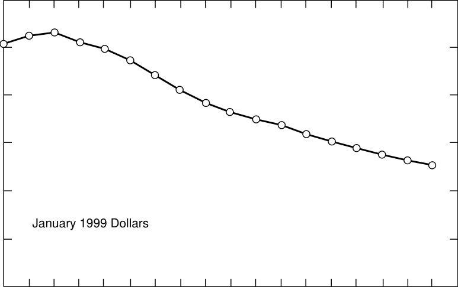

1980 1982 1984 1986 1988 1990 1992 1994 1996 1998

Year

**Fig. 1. Historic cost of coal to electric utilities.**

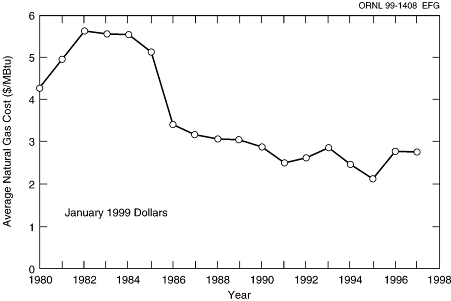

prices that utilities pay for coal and natural gas through 2020 for the low-growth, midgrowth, and
high-growth EIA projections are shown in Fig. 3 for coal and in Fig. 4 for natural gas. The reference value in this report of $1/MBtu for coal assumes a small recovery and then a leveling off of
the cost of coal as demand strengthens with the need for more electric energy. The low projection
assumes that the EIA low-growth price projection for coal continues to decline before leveling off
at $0.60/MBtu in the year 2050. The high coal projection assumes that the price of coal escalates
in real terms at 1% per year from the EIA 2020 high projection before leveling off at $1.35/MBtu
(1999 dollars) after 2050.
The reference gas price is based on the DOE–EIA midgrowth case with a continued real
price escalation at the 2010–2020 growth rate (about 0.51% per year) to 2050 with a leveling off
at $3.85/MBtu (1999 dollars) after 2050. The low-range case assumes a continuation of the
DOE–EIA low-growth case projection, which shows no real growth in the price of natural gas
past 2010. The high-range gas price assumes a continuation of the EIA high-growth projection
(about 1% per year) leveling off at $5.05/MBtu (1999 dollars) after the year 2050.
**Fission.** Nuclear fuel prices have also decreased. Uranium spot market prices [29] have
recently been in the range of $9–$12/lb of U3O8. The current uranium price reflects the market
dampening effect of Russian uranium and uranium from the dismantling of weapons being
directed toward the civilian market. If the nuclear industry revives, the price of uranium will have
to rise to a point where it is economical to open new mines. Other costs such as fuel enrichment
have also decreased with a current price quoted [30] of $87/SWU. The costs for the other nuclear
fuel components, such as U3O8 to UF6 conversion and LEU fuel fabrication, have remained relatively constant in nominal dollar terms, so these costs have been decreasing in constant dollars.
For the reference value, we assume that the uranium price will recover to $25/lb of U3O8
in 1999 dollars by the year 2050. The lower end of the price range assumes that uranium will

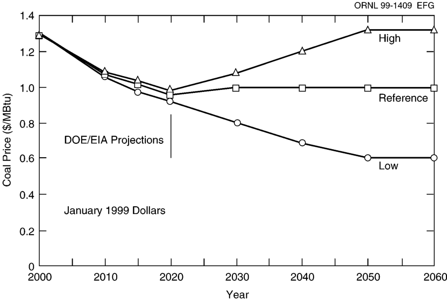

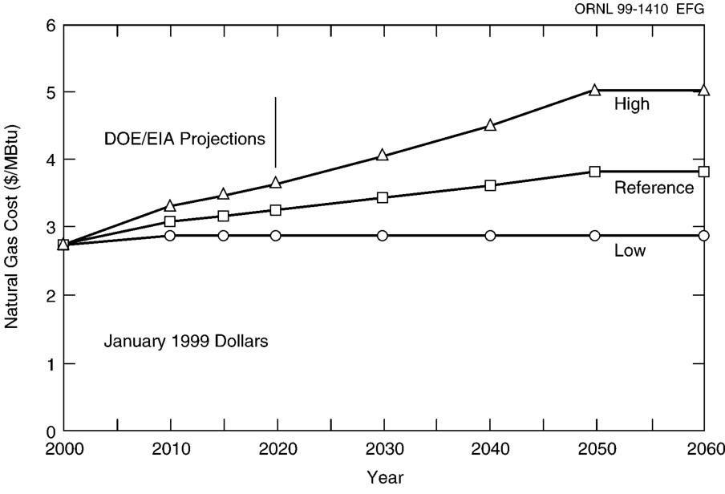

recover from the depressed prices of today, and it will be economic to open new mines but that
new ore finds and mining technology improvements will provide an adequate supply of uranium
at $15/lb of U3O8. The price of $145/lb of U3O8 at the high end of the range assumes a large
nuclear power expansion to meet the national energy needs with increased demand and limited
supply driving up the uranium price. The high-end price is limited by the cost of fueling an
ALWR with plutonium as discussed below. The other nuclear fuel commodity prices include fuel
conversion, enrichment, and fuel fabrication. The reference prices shown in Table 10 are near
today’s levels. The low-end of the range assumes technology and productivity advances between
now and 2050. The high-end of the range assumes moderate price increases from current market
values.
The upper end of the range for LWR nuclear fuel cycle costs is limited by the advent of
plutonium thermal recycle. Fabricated MOX (uranium and plutonium) fuel for LWRs is being
offered at $3200/kg of HM. [31] Although it is not entirely clear what this cost includes, it is
assumed that it includes the recovery and storage charge for the plutonium used in the assembly,
accounting for approximately $1800/kg of HM and about $1400/kg of HM for the fabrication of
the MOX fuel assembly. At such a price, the LEU and MOX fuel cycle costs for the ALWR
model used for this study are equal at a uranium price of about $145/lb of U3O8, assuming an
optimum tails assay, with all other parameters held at their reference values. It is also possible
that in 2050 the weapons-derived plutonium may still be used for MOX fuel. The use of this
material may provide a cap on the cost of MOX fuel. A range for ALWR MOX fuel costs of from
$2000 to $4000/kg of HM is shown. The low-end of the range assumes learning in an expanding
industry, technological advances, and possible continuing use of weapons-derived plutonium as
nuclear weapon stockpiles are reduced by today’s nuclear powers. The high-end of the range

assumes recognition of as yet undefined costs. This high-end cost was used to estimate the upper
range for ALWR fuel cycle costs.
If plutonium recycle in thermal reactors becomes a reality, the advent of the ALMR fast
reactor should follow. This concept is limited by economic and proliferation questions. The
ALMR fuel recycle cost shown is based on the reactor being started up and refueled by recycled
plutonium from it and other ALMRs. The range in costs shows a considerable uncertainty in
ALMR fuel recycle costs. The range assumes a 10% reduction in costs from technology advances
for low-end costs and a 50% increase in the high-end costs, reflecting unrecognized costs and the
need to start some plants on reprocessed LWR fuel.
The current waste disposal charge on nuclear electric production is 1 mill/kWh. A nominal
range of from 0.5 to 1.5 mills/kWh is assumed for this study. Geologic repository storage of spent
fuel is the assumed technology. Concepts for separating and transmuting the long-lived fission
product and actinide wastes in spent fuel are being studied as a means of enhancing the acceptability of geologic storage. The use of such concepts might begin in the 2030 time frame and use
accelerators or subcritical reactors as neutron sources. Detailed cost estimates are not yet available for these technologies and their economic impact on nuclear high-level waste disposal costs.

### **4.5 DECOMMISSIONING COSTS**

Decommissioning costs for all plants were assumed to be negligible except those for nuclear
fission and fusion. Decommissioning costs for LWR plants are currently estimated at $400M or
more. [32] The advanced plants should not cost this much to decommission because the designs are
simpler. The ALWR fission plant decommissioning costs were assumed to be $300M in 1999
dollars. The ALMR consists of three smaller units. The cost for the ALMR decommissioning
($680M) is based on proponent estimates, escalated to 1999 dollars.
Decommissioning costs for the fusion plants were assumed to be the same as those for the
ALWR scaled for plant size.

### **4.6 EMISSIONS ABATEMENT COSTS**

If the emissions of CO2 and other greenhouse gases represent a real global environmental
threat, reduction or elimination of these releases will be imperative. Based on current technology,
the cost of chemically extracting CO2 from coal-fired plant flue gases is very expensive with
estimates [33Ð35 ] in the range of $20/tonne of CO2 extracted to more than $70/tonne depending on
the power plant and the source of the information. This is in addition to the cost of transportation
and the disposal or storage. Recovered CO2 can be stored underground in saline deposits, in old
oil or gas wells (possibly enhancing oil recovery), and in the deep ocean. With current absorption
technology, capture from the flue gases requires significant energy, thereby reducing the plant’s
net electrical output. Energy penalties today [34] are estimated at 27%–37% for conventional coal,
15%–24% for natural gas combustion, and 13%–27% for coal gasification. Future improvements
in capture technology and increased scale of operation should reduce the cost of capture and
sequestration significantly. Projected technologies [34] should reduce these energy penalties to
about 15% for conventional coal, 10% for natural gas combustion, and 9% for coal gasification.
For the coal-burning plants in this study (PC-FGD and PFBC plants), a reference energy penalty
of 15%, with a range of 12%–18%, is assumed. This means that a coal-fired power station that
typically produces 1200 MW(e) will only have 1020 MW(e) for sale because it is using
180 MW(e) internally for CO2 capture. In the case of the GCC and CCCT plants, a reference
energy penalty of 10% is assumed with a range of 8%–12%. In addition, a reference cost of
$10/tonne of CO2 (range = $5 to $15/tonne) is assumed for other costs associated with the capture
and for transportation and ultimate storage of the CO2.

## **5. RESULTS**

Table 11 shows the baseline estimated levelized COE in mills per kilowatt hour, including
the estimated cost of CO2 capture and disposal for each concept for plant start-up in the year
2050. The capital-related portion of the COE is proportional to the capital investment cost and
inversely proportional to the plant capacity factor. It is the largest component of COE for all
technologies except the natural-gas-fired CCCT where the cost of the fuel (natural gas) is the
dominant cost component. The calculated COE ranges are also tabulated in Table 11. The high
end of the unit COE range was computed assuming the most pessimistic of the cost uncertainties
for each cost component. The low end of the cost range assumes that the most optimistic parameters prevail.
Except for the capacity factor and plant size, uncertainty ranges were not applied to the
fusion cost estimates. The range shown in Table 11 for the fusion plants assumes a 70% capacity
factor to obtain the high-end costs and a 90% capacity factor for the low-end costs.
**Coal-Fired Plants.** The transition from present day PC-FGD plants to future PFBC plants
with carbon sequestration is shown in Fig. 5. The decline in COE for the PC-FGD between 1999
and 2050 is a result of falling coal prices. The transition to the PFBC as the preferred means
of burning coal for electric power produces a further cost reduction of about 5–7 mills/kWh.
Even when the fuel cost uncertainty is included, the overall COE range for the PFBC is about
30–45 mills/kWh. If capture of CO2 from the flue gas and sequestration are included, the COE
range at reference parameters increases by about 19 mills/kWh, bringing the overall COE range
with carbon sequestration to about 40–74 mills/kWh.
**Coal Gasification.** The COE associated with the GCC plant is shown in Fig. 6. As with
the PFBC, the COE range is fairly insensitive to coal price. When the coal price uncertainty
range is included, the overall uncertainty range (without CO2 capture and disposal) is about
35–53 mills/kWh, whereas the COE range is 37–50 mills/kWh if the reference coal price is
assumed throughout. If the cost of carbon capture and sequestration is included, the reference
COE is increased by about 15 mills/kWh to about 59 mills/kWh, and the overall COE range
becomes 42–76 mills/kWh.
**Natural Gas.** The use of natural gas also includes potential greenhouse gas problems. Both
methane (principal component of natural gas) and CO2 formed by natural gas burning are greenhouse gases. Release of methane to the atmosphere would occur if there was leakage from the
system or incomplete combustion. A methane penalty was not assessed in this study. The COE
associated with the natural-gas-fired CCCT plant is shown in Fig. 7. The present day (year 1999)
costs are based on a $2.75/MBtu natural gas price. By 2050, the natural gas price is expected to
increase to the $3.85/MBtu reference price, but the plant heat rates are expected to improve, producing a COE range of about 31–43 mills/kWh at the reference gas price. When the natural gas
price uncertainty is included, the overall COE uncertainty range without carbon sequestration is
about 26–52 mills/kWh. If the energy penalty and cost of carbon disposal are included, the reference COE increases by about 9 mills/kWh, and the overall COE uncertainty range becomes
30–65 mills/kWh.
**Nuclear Fission.** The COEs for the ALWR and ALMR nuclear power plants are shown
in Fig. 8. The range of costs for nuclear fission includes the assumption that it will be an acceptable future option. The upper cost ranges for the ALWR and ALMR were found to be nearly
equal at about 62 mills/kWh. The ALWR high-end COE was calculated assuming a MOX fuel
cost of $4000/kg HM or LEU fuel with a uranium cost of $190/lb of U3O8. The COE at reference
parameters is about 45 mills/kWh for the ALWR and about 51 mills/kWh for the ALMR. The
COE range at reference fuel prices is about 40–50 mills/kWh for the ALWR and about

**Table 11. Levelized COE**

|                  | COE (1999$ mill/kWh) |          |          |       |      |      |      | Magnetic fusion |              |
|------------------|----------------------|----------|----------|-------|------|------|------|-----------------|--------------|
|                  | PC-FGD               | PFBC     | CCG      | CCCT  | ALWR | ALMR | Wind | Aries-RS        | Aries-ST     |
| Capital          | 26.7                 | 22.5     | 26.5     | 8.8   | 29.7 | 30.6 | 24.7 | 72.1            | 79.5         |
| O&M              | 8.5                  | 7.2      | 9.4      | 4.5   | 8.6  | 10.4 | 4.6  | 9.0$^c$         | 9.0$^c$      |
| Fuel             | 9.4                  | 8.1      | 8.1      | 26.6  | 5.6  | 8.8  |      | 5.4$^d$         | 3.8$^d$      |
| Decommissioning  |                      |          |          |       | 0.8  | 1.5  |      | 0.9             | 0.9          |
| Other            | 20.0$^a$             | 18.9$^a$ | 15.3$^a$ | 8.7   |      |      |      |                 |              |
| Total COE        | 64.6                 | 50.8     | 59.3     | 48.6  | 44.7 | 51.3 | 29.3$^b$ | 87.4        | 93.2         |
| Range            | 47–82                | 39–74    | 42–76    | 30–65 | 38–62 | 45–62 | 18–62 | 69–99$^f$  | 74–106$^f$   |

$^a$Cost of CO$_2$ sequestering or emissions charge.

$^b$Full capacity credit for wind turbine; add 17.8 mills/kWh if full backup CCCT plant is included to obtain reference 80% capacity factor.

$^c$From procedure used to calculate O&M costs for passively safe ALWRs.

$^d$Includes blanket replacement.

$^e$No separate provision made for target replacement, included with O&M costs in source document.

$^f$Range for fusion includes capacity factor range (70%–90%) and plant size range [1000–1300 MW(e)].

60

20

100

60

20

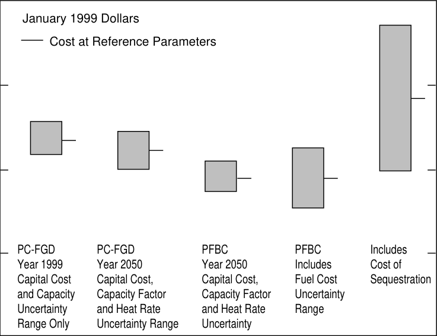

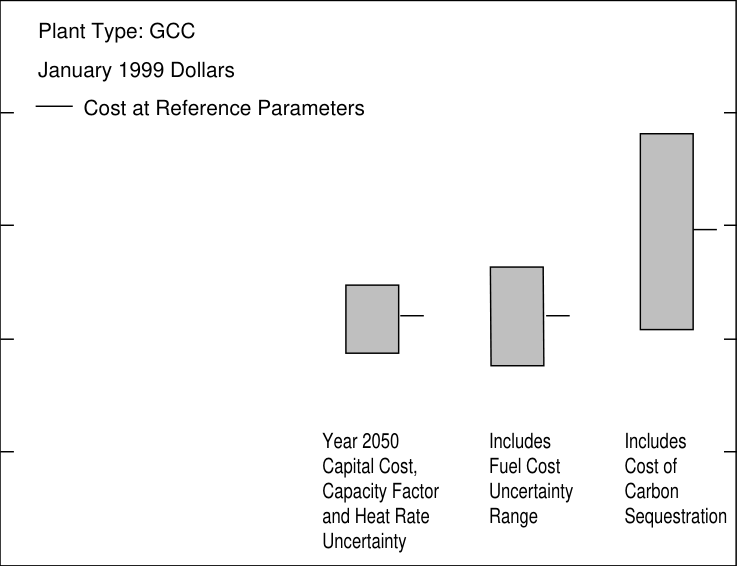

**Fig. 6. Range of COE for coal gasification plants.**

ORNL 99-1411 EFG

**Fig. 5. Range of COE for coal-burning plants.**

ORNL 99-1412 EFG

60

40

20

0

60

20

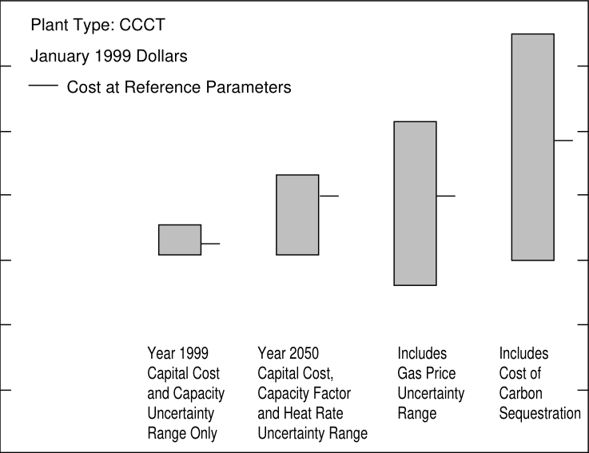

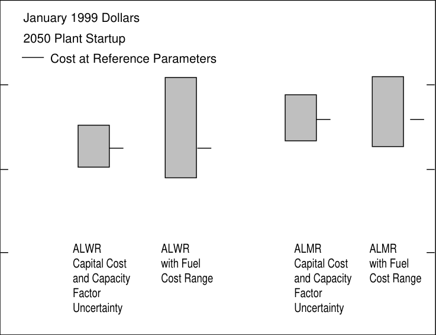

**Fig. 8. Range of COE for nuclear plants.**

ORNL 99-1413 EFG

**Fig. 7. Range of COE for natural gas.**

ORNL 99-1414 EFG

46–57 mills/kWh for the ALMR. If the fuel cost range is included, the overall COE range is about
38–62 mills/kWh for the ALWR and about 45–62 mills/kWh for the ALMR.
**Wind.** The COE associated with wind power is shown in Fig. 9. The year 2000 cost range
assumes some technological advancements as given in the Renewable Energy TC document. [16]
Further advancements are projected. The resulting COE range for 2050 plant startup and the reference 35% capacity factor is about 23–35 mills/kWh with a reference COE of about
29 mills/kWh. If the assumed range in capacity factor is included, the overall COE range
becomes about 18–50 mills/kWh.
The previous COE estimates assume that wind can be counted on for its full capacity on the
electric grid. This is probably so for wind turbine penetrations up to 5% of the system capacity. [16]
However, wind is intermittent; for large wind power penetrations, additional backup capacity may
have to be built or electric energy storage devices installed. The amount of storage capacity or
backup needed depends on the overall power system characteristics and is beyond the scope of
this study.
The final bar in Fig. 9 assumes that a full-size CCCT plant is installed as backup for the
wind turbine capacity. The CCCT operates whenever the wind turbine station does not operate.
If the wind turbine has a 35% capacity factor and if an 80% overall capacity factor is to be
achieved, the CCCT plant is assumed to operate an equivalent 45% of the time. The wind turbine
facility thus acts as a fuel (and carbon sequestration cost) saver for the CCCT plant. The overall
COE range for this combined plant is about 30–64 mills/kWh with a 47-mills/kWh COE at reference parameters. Because some wind capacity will be able to be credited, the COE range for wind
turbines will lie somewhere between the results shown on the final two bars in Fig. 9.
**Fusion.** The COE range for fusion power plants is shown in Fig. 10. The first bar shows
the calculated COE range between the ARIES-RS and the ARIES-ST at the reference 80%

60

40

20

0

ORNL 99-1415 EFG

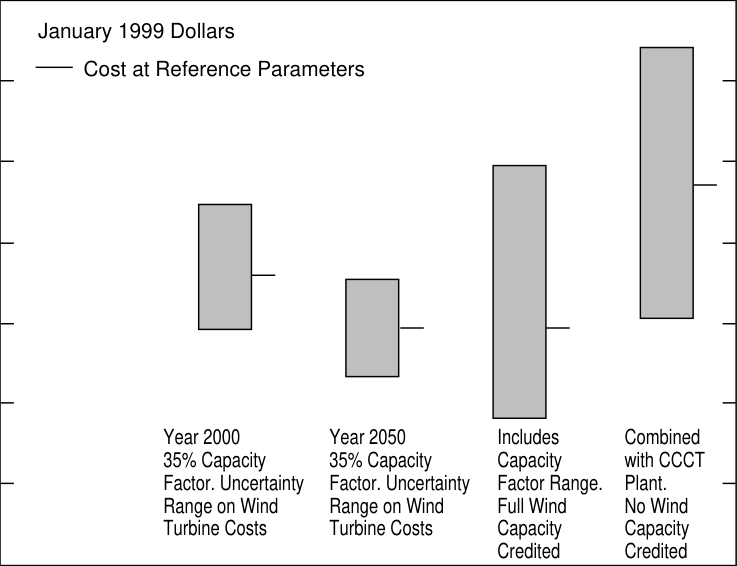

**Fig. 9. Range of COE for wind.**

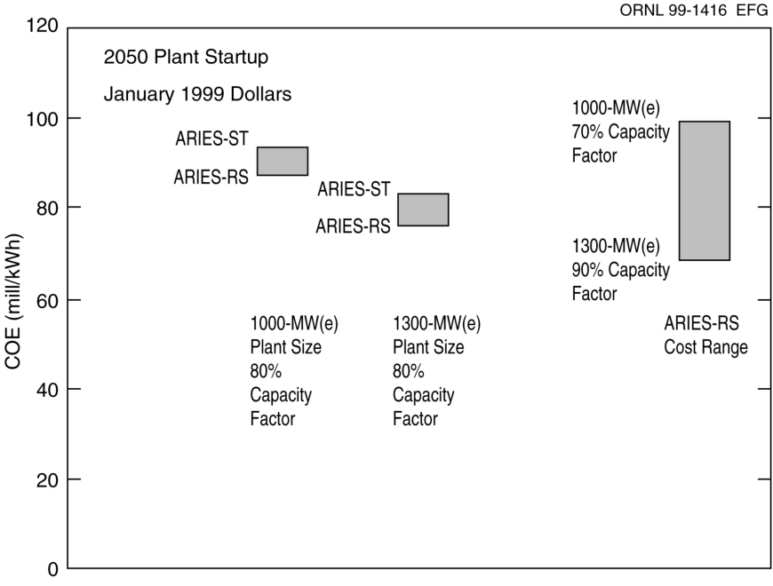

capacity factor. The second bar shows the effect of increasing the plant size to 1300 MW(e).
It is estimated that the COE is reduced by about 10 mills/kWh by this 30% increase in unit size.
The final bar shows the COE range with uncertainty for the ARIES-RS. The high end of the
range assumes a 1000-MW(e) plant size and 70% capacity factor. The low end of the range
assumes a 1300-MW(e) plant size and 90% capacity factor. This COE range of approximately
70–100 mills/kWh is the reference cost range for fusion for this study.

## **6. DISCUSSION OF RESULTS**

The COE ranges for each of the concepts considered in this study are shown in Figs. 11 and
12. Figure 11 excludes the cost associated with carbon sequestration, whereas Fig. 12 includes
these costs. The COEs at reference parameters are marked for each concept.
The COE ranges for the coal-burning technologies assume that the PC-FGD will be phased
out and replaced by the PFBC by the 2050 startup date considered here. If natural gas supplies
remain adequate at the prices assumed in this study, then natural gas will remain a competitive
option well into the future.
The effect on the COE for fossil-fired plants of the need to extract and permanently dispose
of CO2 from the flue gas can be significant. Comparing the first three bars from Figs. 11 and 12
shows an increase in the reference COE of about 9–19 mills/kWh due to carbon sequestration.
The cost is less for natural gas combustion and greatest for coal burning. The high end of the
uncertainty range is increased by about 14–30 mills/kWh, and the low-end costs are increased by
about 4–9 mills/kWh.

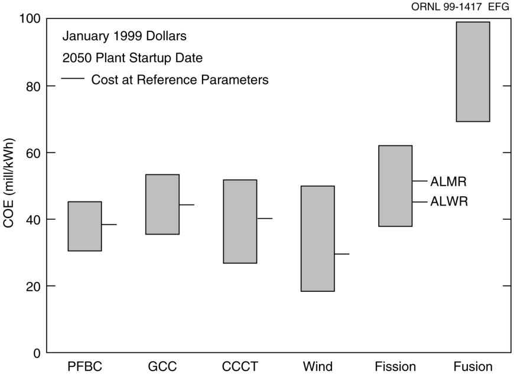

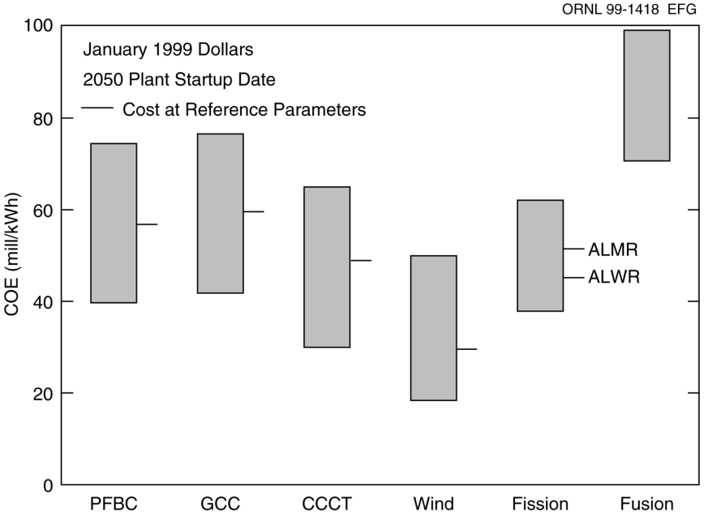

Wind turbines will be competitive in areas where they can operate at moderate to high
capacity factors. However, wind is intermittent, and the added cost of electric energy storage or
the use of gas turbines as backup will raise the COE for this technology if large grid penetrations
are to be achieved.
Nuclear fission should remain as a future option based on its projected economics. Questions
of safety and public acceptance will have to be resolved before nuclear fission’s full potential can
be achieved.
The cost ranges shown for fusion in Figs. 11 and 12 use the ARIES-RS at 70% capacity
factor and 1000-MW(e) plant size for the high end of the COE range and 90% capacity factor and
1300-MW(e) plant size at the low end. There is, of course, a great deal of uncertainty here, and
the numbers shown should be used with care. Capital investment is the principal cost driver for
fusion. The fusion island is a large cost component whose cost is relatively insensitive to plant
size; thus, fusion economics improve significantly for larger sized plants. As electric grids
become larger, the system penalties for large unit sizes will diminish, and coal and nuclear fission
plants will also become larger. The French currently are proposing a series of 1750-MW(e)
nuclear units [36] that they think will be more economical than current nuclear plants. The large
recirculating power needs for fusion also drive up the capital investment because the plant must
be sized to produce more power than it actually sells. Fossil energy plants with sequestration also
suffer from the large recirculating power needs, however, because their fixed costs (capital
investment and fixed O&M) are less than for fusion; the effect on COE is less for the same recirculating power fraction.
The results from this study are summarized in Fig. 13. Here the COE range for fusion is
compared with the COE range for the alternatives using different sets of assumptions. For

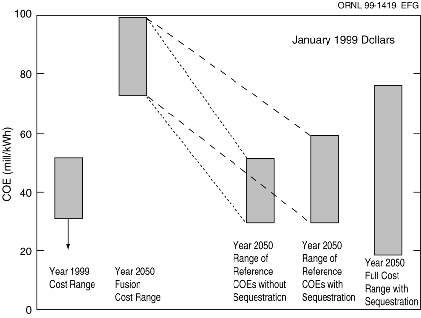

perspective, the COE range (including uncertainty) is also shown for plants that could be built
today.
Based on full cost recovery, the COE from a plant built today should be about
30–50 mills/kWh. However, since deregulation, some electricity is being sold at its marginal
cost of production, which does not include capital recovery. This is indicated by the downward
pointing arrow on the first bar in Fig. 13.
For 2050 plant startup, the COE range at reference parameters is still 30–50 mills/kWh if
power producers are not required to sequester CO2. Wind power provides the low point in this
range. If carbon sequestration is required, the COE range based on reference parameters becomes
about 30–59 mills/kWh or about 18–76 mills/kWh, if the full range of cost parameter uncertainties is included. The low-end cost includes wind generation with full credit for the capacity on the
grid. If wind is excluded, the low end is about 30 mills/kWh.

## **7. CONCLUSION**

If fusion is to become a viable electric energy supplier in the future, ways must be found to
reduce its costs. Technology advancements and cost reductions are projected for the technologies
that fusion will be competing against when it is ultimately deployed in the middle of the next
century. In addition, the costs of fossil fuels are declining instead of increasing as was projected
in the past. The COE from renewable energy sources such as wind is also being reduced, and it
can be a viable contender in the next century.
The COE from the alternatives to fusion for a plant starting operation in 2050 should
remain in the 30- to 50-mills/kWh range if capture of CO2 and its disposal are not required. If
carbon sequestration is required, this range should increase to 30–60 mills/kWh or as high as
76 mills/kWh if the full range of cost parameter uncertainties is considered.
The COE for fusion is generally above the range for the alternatives except for the high end
of the alternative uncertainty. Fusion costs will have to be reduced and/or alternative concepts
devised before fusion will become competitive. Fortunately, there are routes to achieve this goal,
such as building larger plants.

## **REFERENCES**

1. Electric Power Annual 1998 Volume 1, U.S. Department of Energy, Energy Information
Administration, DOE/EIA-0348 (98)/1.
2. Annual Energy Outlook 1998, U.S. Department of Energy, Energy Information Administration, DOE/EIA-0383 (1999), December 1998.
3. U.S. Coal Reserves: 1997 Update, U.S. Department of Energy, Energy Information
Administration, DOE/EIA-0529 (97), February 1999.
4. Nuclear Energy Cost Data Base: A Reference Data Base for Nuclear and Coal Fired
Power Plant Power Generation Cost Analysis, U.S. Department of Energy, Office of Nuclear
Energy, DOE/NE-0095, 1988.
5. J.G. Delene and C.R. Hudson, Cost Estimate Guidelines for Advanced Nuclear Power
Technologies, ORNL/TM-10071/R3, Lockheed Martin Energy Systems, Inc., Oak Ridge
National Laboratory, 1993.
6. TAG [TM ] Technical Assessment Guide Electricity Supply-1993, Electric Power Research
Institute, EPRI TR-102276-ViR7, June 1993.
7. J. R. Redding and P. R. MacGregor, “Advanced Nuclear Plants: Meeting the Economic
Challenge,” presented at the American Nuclear Society 1993 Winter Meeting, San Francisco,
California, 1993.
8. G. A. Davis et al, “Lessons Learned from Design Certification of System 80+ [TM],”
pp. 277–281 in Proceedings of the Ninth Pacific Basin Nuclear Conference, Sydney Australia,
1994.
9. J. D. Mottley, “Electricity Generation Cost Reduction with the AP600 Reactor,” presented at the American Nuclear Society 1993 Winter Meeting, San Francisco, California, 1993.
10. Advanced Design Nuclear Power Plants: Competitive Economical Electricity, U.S.
Council for Energy Awareness, 1992.
11. B. A. Hutchins, “Economic Acceptance of the ALMR,” presented at the American
Nuclear Society 1993 Winter Meeting, San Francisco, California, 1993.
12. “Pebble Bed Model Goes Critical Moving ESKOM Closer to Decision,” Nucleonics
Week, **40** (29) (July 22, 1999).
13. Nuclear Fuel, **23** (21), 14 (October 19, 1998).
14. “Bright Future—or Brief Flare—for Renewable Energy,” Science, **285,** 678–680
(1999).
15. “Fact File,” Renewable Energy World, **2** (3), 135 (May 1999).
16. Renewable Energy Technology Characterizations, A Joint Project of Electric Power
Research Institute and Office of Utility Technologies, Energy Efficiency and Renewable Energy,
U.S. Department of Energy, EPRI TR-109496, December 1997.
17. Personal communication from R. Miller, University of California–San Diego, to J. G.
Delene, Lockheed Martin Energy Systems, Inc., Oak Ridge National Laboratory, July 2, 1999.
18. C. G. Bathke, The ARIES Team, “Systems Analysis in Support of the Selection of the
ARIES-RS Design Point,” Fusion Engineering and Design, **38**, 59–86 (1997).
19. R. W. Moir, “Inertial Fusion Energy Power Plants Based on Laser or Ion Beams,”
Proceedings of ICENES’98 The Ninth International Conference on Emerging Nuclear Energy
Systems, Herzila, June 28–July 2, 1998.
20. R. W. Moir et al., “Hylife-II A Molten-Salt Inertial Fusion Energy Power Plant
Design—Final Report,” Fusion Technology, **25**, 5–25 (1994).
21. Vision 21 Strategic Plan and Multiyear Program Plans, U.S. Department of Energy,
Office of Fossil Energy Coal and Power Systems, January 1999.

22. J. G. Delene, L. C. Fuller, and C. R. Hudson, “ALMR Deployment Economic
Analysis,” ORNL/TM-12344, Lockheed Martin Energy Systems, Oak Ridge National Laboratory, 1993.
23. H. I. Bowers, L. C. Fuller, and M. L. Myers, Cost Estimating Relationships for Nuclear
Power Plant Operation and Maintenance, Lockheed Martin Energy Systems, Inc., Oak Ridge
National Laboratory, ORNL/TM-10563, November 1987.
24. J. G. Delene, “Advanced Fission and Fossil Plant Economics—Implications for
Fusion,” Fusion Technology, **26**, 1105–1110 (1994).
25. J. G. Delene et al., “Economic Potential for Future Water Reactors,” presented at the
American Nuclear Society/European Nuclear Society 1988 International Conference,
October 30–November 4, 1988, Washington, D.C.
26. Historic Monthly Energy Review 1973–1992, U.S. Department of Energy, Energy
Information Administration, DOE/EIA-0035 (73-92).
27. Cost and Quality of Fuels for Electric Utility Plants 1998, U.S. Department
of Energy, Energy Information Administration, Internet-only publication
http://www.eia.doe.gov/cneaf/electricity/
28. Historical Natural Gas Annual 1930 Through 1997, U.S. Department of Energy, Energy
Information Administration, DOE/EIA-E-0110(97), October 1998.
29. Nuclear Fuel (various issues such as January 15, 1999).
30. Nuclear News Flashes, May 20, 1999.
31. Nuclear Fuel (November 30, 1998).
32. Nucleonics Week, p. 15 (March 18, 1999).
33. H. J. Herzog, “The Economics of CO2 Capture,” p. 101–106 in Greenhouse Gas Control
Technologies, R. Riemer, B. Eliasson, and A Woxaun, Eds., 1999.
34. “Hydrogen—Today and Tomorrow,” p. 12 in IEA Greenhouse Gas R&D Programme,
April 1999.
35. “Ocean Storage of CO2,” IEA Greenhouse Gas R&D Programme, February 1999.
36. Nucleonics Week, p. 15 (March 18, 1999).

ORNL/TM-1999-243

## INTERNAL DISTRIBUTION

| # | Name | # | Name |
|---|------|---|------|
| 1. | D. B. Batchelor | 24. | S. L. Milora |
| 2. | L. A. Berry | 25. | P. K. Mioduszewski |
| 3. | M. A. Brown | 26. | D. A. Rasmussen |
| 4. | B. A. Carreras | 27–28. | R. L. Reid |
| 5. | T. R. Curtise | 29–33. | J. Sheffield |
| 6–15. | J. G. Delene | 34. | R. B. Shelton |
| 16. | E. C. Fox | 35–39. | K. A. Williams |
| 17. | R. G. Gilliland | 40. | D. J. Williams, Jr. |
| 18–19. | S. Hadley | 41. | Central Research Library |
| 20. | M. A. Kuliasha | 42. | Fusion Energy Division Library |
| 21. | R. Lee | 43. | ORNL Laboratory Records–RC |
| 22. | G. T. Mays | 44–45. | ORNL Laboratory Records–OSTI |
| 23. | G. E. Michaels | | |

## EXTERNAL DISTRIBUTION

46. W. F. Dove, SC-55, U.S. Department of Energy, 19901 Germantown Rd., Room G-255, Germantown, MD 20874
47. B. G. Logan, Lawrence Livermore National Laboratory, P.O. Box 808, L-644, Livermore, CA 94550
48. W. D. Magwood IV, NE-1, U.S. Department of Energy, Forrestal Bldg., Room 5A-143, 1000 Independence Avenue SW, Washington, DC 20585
49. R. W. Miller, University of California–San Diego, 9599 Gilman Drive, La Jolla, CA 92093-0417
50. R. Moir, Lawrence Livermore National Laboratory, P.O. Box 808, L-637, Livermore, CA 94550
51. F. Najmabadi, 6291 Boelter Hall, University of California, Los Angeles, CA 90024
52. J. M. Stamos, NE-20, U.S. Department of Energy, 19901 Germantown Rd., Room B-406, Germantown, MD 20874