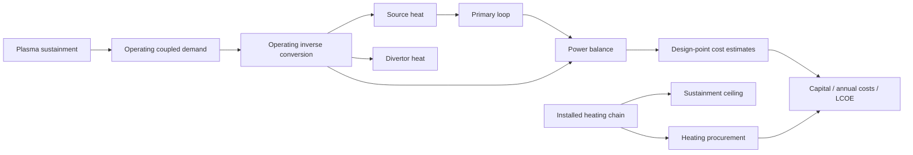

# WI-050 design: separate operating heating from installed capacity

## Authority and scope

[INHERITED] Contract: `spec.md@54a0725e`; immutable alignment: `work/orchestration/mfe-operating-heating-repair.md@d621ef14`. The parent handles routine stage approval. This design remains agent-originated, including choices ratified later. No source, financial, module, concept, residual-acceptance, study or integration authority is added.

[AGENT] Keep the installed chain and add one inverse conversion producer for sustained operation. The stellarator binds its computed signed demand to that producer. The generic definition defaults to its existing coupled heating, preserving direct callers. Installed delivered power continues to price ECRH equipment; installed coupled power remains the sustainment ceiling. Thermal/electrical operation reads the new producer.

[INHERITED] Fixed installation means fixed heating equipment. Existing power-scaled plant equipment estimates remain design-point sizing estimates. A demand change may change them. This design does not add independently sized BOP equipment or dispatch states. Constant efficiencies are an approximation; startup, standby and part-load efficiency curves remain outside this item.

## Research and existing callers

The library's two-stage conversion and procurement meaning are documented in `models/library/analyses/mfe_heating_chain.sysml:4–83`. The installed inputs belong to the generic plant at `models/designs/generic_mfe/mfe_plant.sysml:503–518`. The only concrete canonical MFE specialization is `stellarator_09::stellaris`; `tests/model_families.py:58–83` names its canonical family and exploration twin. The instance binds 100 MW electrical capacity, source efficiency 0.5, coupling 1.0, and both direct terms zero at `stellarator_plant.sysml:714–779`. Non-ECRH procurement powers are separately declared delivered equipment powers, all zero in this instance at `:1099–1105`.

[AGENT] Caller inventory:

| Caller | Existing meaning | Proposed behavior |
|---|---|---|
| Standalone `Heating Power Chain` callers | Capacity/source procurement and legacy direct heating arithmetic | Existing interface and arithmetic remain intact |
| Generic MFE default with wall-plug chain active | Coupled heat `W*eta_source*eta_couple`; electrical draw W | Default operating demand equals installed coupled output; inverse chain reproduces coupled/electrical behavior within floating-point tolerance |
| Generic direct-only dormant chain | Installed delivered and coupled powers supplied independently; draw is coupled divided by both efficiencies | Preserve procurement operand exactly; default operation derives delivered power from coupled demand, reproduces old electrical draw |
| Generic mixed direct and chain powers | Additive installed delivered/coupled capacities and electrical equivalent | Same installed arithmetic; operating inverse reproduces old coupled/electrical totals algebraically |
| Generic all-zero heating | Dormant efficiencies default to one, all powers zero | Zero operating/procurement powers; no unbound sustainment demand becomes authoritative |
| Stellarator concrete instance | Live installed chain, independent sustainment demand, one module | Redefine operating demand as sustainment output; all operating consumers read new producer |
| MFE exploration family twin | Exact duplicate logical source files | Implementation syncs the four changed logical source files and power-balance comments |
| Direct oracle and single runner | Mirror installed heating in operation and assert old baseline anchors | Update operation and baseline expectations; retain separate installed keys; update constraint count and expose new channels |
| IFE family | Shares three foundation files only | No shared foundation or IFE change |

The dormant fixture deliberately supplies delivered procurement 50 MW and coupled capacity 30 MW at source/coupling efficiencies 0.5/0.75. It retains 50 MW procurement and 80 MW electrical draw. Its coherent operating delivered heat is 40 MW. Independent procurement and coupled inputs were already allowed; deriving operating delivery does not rewrite procurement or silently assert equality between those separately supplied values. No new technology allocation or mixed-heating dispatch claim follows.

Source inventory was read at `knowledge/SOURCE_INDEX.md`, including registered 1costingFE and Stellaris references. The delegated cost review inspected the cited `1costingfe` source `layers/cas22.py:630–731` and `layers/costs.py:319–357`. These support equipment sizing and staffing-scaled O&M. No new source or source-image transcription is claimed. The inherited source assumptions and historical records remain at their recorded revisions.

## Design decisions and elements

All decisions below are [AGENT].

1. Add `'Operating Heating Power'` beside the installed chain in `models/library/analyses/mfe_heating_chain.sysml`. Inputs: `p_required_in` [MW], `eta_source_in` [1], `eta_couple_in` [1]. Outputs: `p_coupled = p_required_in`, `p_delivered = p_required_in / eta_couple_in`, `p_wallplug = p_delivered / eta_source_in`. This is the algebraic inverse of the existing two efficiencies. No new empirical relation is introduced. Keep signed demand without clipping at capacity or zero.
2. Add generic `p_operating_coupled_heat : Real default heat.p_coupled`. The stellarator redefines it with the pure exposure `:>> p_operating_coupled_heat = sustain.p_aux_required`. The prototype proves this default/redefinition lowers as a producer edge, with no new execution entry point. There is no public demand override in the stellarator package.
3. Instantiate `operating_heat` on the generic plant. Bind its three inputs to the exposed operating demand and existing efficiencies. Source heat and power-balance coupled heat read `operating_heat.p_coupled`; power-balance recirculating heat reads `operating_heat.p_wallplug`.
4. Keep heating procurement `heat.p_delivered` and sustainment ceiling `heat.p_coupled`. Preserve the installed chain's outputs and names for existing consumers, but amend its documentation: its coupled/electrical outputs now describe installed capacity and the legacy default operation.
5. Give `'Divertor Heat Ledger'` an explicit `p_installed_coupled_in` in addition to its operating `p_coupled_in`. Keep the existing diagnostic name `p_heat_operating_minus_installed`, computed as original `p_aux_required_in - p_installed_coupled_in`. This preserves the signed required-minus-capacity diagnostic while its heat ledger uses operating heat. Do not accidentally turn this channel into required-minus-required zero. All direct callers must supply the new installed operand.
6. Add two scalar constraint definitions in the heating library: `'Heating Efficiency Positive'` with formal `efficiency > 0.0`, and `'Heating Efficiency Upper'` with formal `efficiency <= 1.0`. Assert each separately for source and coupling: `heating_source_positive_ok`, `heating_source_upper_ok`, `heating_couple_positive_ok`, `heating_couple_upper_ok`, binding formal `efficiency` to existing `eta_source_heat` or `eta_couple_heat`. Existing net-power/loop constraints have power-unit semantics, so these dimensionless definitions avoid reusing a mismatched engineering definition. The fractions' declared conversion meaning supplies this domain; it is not a fitted performance bound. Negative or over-unit fractions may produce diagnostic arithmetic but violate this gate. Zero efficiency causes an explicit native evaluation failure on division, even at zero demand; such a point has no accepted operating result. Do not replace zero with an epsilon or a default efficiency. The four assertions add four verdicts; sustainment and burn hold retain their definitions and operands. Each predicate is a single comparison with one feature and one literal, supported by the current indicator parser and verifier.
7. Leave the primary-loop, sustainment, radiation, lifecycle and financial relations unchanged. Amend power-balance documentation to name operating heating. Retain plain Real quantities with documented units and resolving Source/Ref/Basis citations (AD-001/004 and MR-3/4/6).

The executable SysML stencil is retained at `prototype-r1/operating.sysml`. `prototype-r1/proposed.patch` records the four source changes used in the full-family disposable prototype. These are not production-polished comments or the implementation commit.

## Binding ledger and dataflow

| Consumer input | Current producer | Proposed producer | Meaning |
|---|---|---|---|
| Generic operating demand | Absent | `heat.p_coupled` default | Preserve generic legacy/direct behavior |
| Stellarator operating demand | Absent | `sustain.p_aux_required` exposure | One computed sustained demand |
| `operating_heat.p_required_in` | Absent | `p_operating_coupled_heat` | Signed demand [MW] |
| `operating_heat.eta_source_in`, `.eta_couple_in` | Absent | Existing plant efficiency attributes | Held conversion fractions |
| `source_heat.p_input_in` | `heat.p_coupled` | `operating_heat.p_coupled` | Reactor source heat |
| `primary_loop.q_source_in` | `source_heat.q_source` | Unchanged | Flow, compression work and recovered heat follow operation |
| `pb.p_input_in` | `heat.p_coupled` | `operating_heat.p_coupled` | Same thermal heating |
| `pb.p_wallplug_in` | `heat.p_wallplug_total` | `operating_heat.p_wallplug` | Online electrical heating |
| `pb.q_recovered_in`, `.p_pump_total_in` | Primary-loop outputs | Unchanged | Coupled thermal/electric loop ledger |
| `divheat.p_coupled_in` | `heat.p_coupled` | `operating_heat.p_coupled` | Absorbed operating heat |
| `divheat.p_installed_coupled_in` | Absent | `heat.p_coupled` | Diagnostic installed ceiling |
| `divheat.p_aux_required_in` | `sustain.p_aux_required` | Unchanged | Signed original requirement |
| `heating_cost.p_ecrh_in` | `heat.p_delivered` | Unchanged | Installed source procurement |
| `sustainment_ok.p_aux_installed_in` | `heat.p_coupled` | Unchanged | Installed capacity ceiling |
| `burn_hold_ok.p_aux_required_in` | `sustain.p_aux_required` | Unchanged | Nonnegative sustained demand |
| New efficiency gate | Absent | Both existing efficiencies | Explicit inverse-conversion domain |



Existing `mfe_heating_chain::*` imports already make the new definitions visible. Generic default operation adds a dependency on the installed chain only; stellarator operation depends on sustainment instead. Sustainment does not consume operating heat. Neither source heat nor the primary loop feeds back to sustainment, so the graph remains acyclic.

## Complete cost operand classification

[AGENT] This is the pre-production cost gate. Direct cost input bindings are retained; their thermal/gross/net aliases change origin through the repaired power balance. `T = p_th`, `E = p_the`, `G = p_et`, `N = pb.p_net`, `m = n_mod`. Unless noted, every proposed binding is the same displayed operand. References below use `P` for `models/designs/generic_mfe/mfe_plant.sysml` and `C` for `models/library/analyses/mfe_account_costs.sysml` at accepted-spec revision. Reserve means only installed ECRH wall-plug capacity changes. Demand response in this table isolates heating demand with fusion, geometry and other controls held; the full-plant physical-control case's additional alpha effect is discussed below.

| Cost operand and current → proposed binding | Class | Reserve response | Demand response and evidence |
|---|---|---|---|
| ECRH `heat.p_delivered → same` | Installed capacity | Linear increase | Fixed; P:681–689, C:196–223 |
| NBI/ICRF/LHCD direct delivered powers → same | Installed capacity | Fixed | Fixed; P:683–689, C:199–205 |
| Blanket `T → T` | Design-point sizing | Fixed | `(T/2500)^0.6`; geometry held; P:629–634, C:22–49 |
| Shield `T → T` | Design-point sizing | Fixed | `(T/2500)^0.6`; volume/fuel held; P:637–642, C:52–78 |
| Structure `G → G` | Design-point sizing | Fixed | `(G/1100)^0.5`; P:645–649, C:81–105 |
| Vessel `G → G` | Design-point sizing | Fixed | `(G/1100)^0.6`; P:652–656, C:108–137 |
| Supplies `G → G` | Design-point sizing | Fixed | `(G/1100)^0.7`; P:659–662, C:140–165 |
| Divertor capital `T → T` | Design-point sizing | Fixed | `(T/1000)^0.5`, independent of target-flux diagnostic; P:667–670, C:168–193 |
| Turbine `E → E` | Design-point sizing | Fixed | Linear `m*E*rate`; P:696–700, C:226–252 |
| Electric plant `G → G` | Design-point sizing | Fixed | Linear `m*G*rate`; P:701–705, C:226–252 |
| Heat rejection `T → T` | Design-point sizing | Fixed | Linear `m*T*rate`; P:706–710, C:226–252 |
| Miscellaneous plant `G → G` | Design-point sizing | Fixed | Linear `m*G*rate`; P:711–715, C:226–252 |
| Buildings fixed/fusion terms → same | Design-point sizing | Fixed | Fixed for isolated heating; P:725–731, C:357–359 |
| Buildings staffing/thermal-electric/thermal/gross `G,E,T,G → same` | Design-point sizing | Fixed | `sqrt(mG/1100)` plus linear `mE/1100`, `mT/2500`, `mG/1100`; P:727–734, C:360–363 |
| Preconstruction land `N → N` and fixed terms | Design-point sizing | Fixed | Land `sqrt(mN*1000)`; fixed adders held; P:739–742, C:385–400 |
| Raw annual O&M `N → N` | Annual design-point staffing estimate | Fixed | `om_ref*sqrt(mN/1000)+om_direct`; P:746–749, C:403–434; source costs.py:346–353 |
| Remote handling `G → G` | Design-point sizing | Fixed | `base*concept_scale*sqrt(G/1100)`, per module; P:780–784, C:475–499 |
| Coolant primary `N → N` | Design-point sizing | Fixed | Linear `primary_base*mN/1000`; P:803–809, C:525–555 |
| Coolant intermediate `T → T` | Design-point sizing | Fixed | `intermediate_base*(mT/3500)^0.55`; same references |
| Auxiliary cooling `T → T` | Design-point sizing | Fixed | Linear `aux_per_mw*mT`; P:815–820, C:587 |
| Cryoplant cost `cryo_elec.p_elec → same` | Design-point sizing | Fixed | Fixed for isolated heating, `base*(p_cryo/30)^0.7`; P:819, C:588 |
| Waste `T → T` | Design-point sizing | Fixed | Linear `base*mT/1000`; P:827–830, C:449–472 |
| Fuel handling `N → N` | Design-point sizing | Fixed | `base*(mN/1000)^0.7`; P:833–836, C:449–472 |
| Other reactor equipment `N → N` | Design-point sizing | Fixed | `base*(mN/1000)^0.8`; P:839–842, C:449–472 |
| I&C `T → T` | Design-point sizing | Fixed | `base*(mT/3500)^0.65`; P:845–848, C:449–472 |
| Owner cost `N → N` | Design-point sizing | Fixed | `base*sqrt(mN/1000)`; P:912–915, C:449–472 |
| Supplementary startup/decommissioning `N → N` | Design-point allowances | Fixed | Linear `mN/1000`; P:924–932, C:639–641 |
| Annual fuel `fusion.p_fus`, `calendar.availability` → same | Operating consumption over annual time | Fixed | Fixed if fusion/calendar held; otherwise separately attribute; P:997–1016, C:784–792 |
| Annual net energy `N`, availability → same | Operating net energy | Fixed | Follows N; availability scales time, not online demand; P:1154–1161/1186–1193 |

Fractional-power equipment formulas retain their existing nonnegative-base domain. Invalid full-plant points are diagnostics or execution failures, never feasible cost/LCOE claims. There is no metered heating-electricity cost line to subtract: the electrical effect belongs in net energy. O&M uses net power as a staffing-size proxy, not heating consumption.

### Capital, replacement and financial propagation

All formulas/bindings in this table remain unchanged. The changing leaf costs above propagate through their existing operands.

| Dependent | Reserve response | Demand response | Evidence |
|---|---|---|---|
| Power-core sum | Heating delta only | Power-scaled core accounts; heating fixed | P:759–762 |
| BOP sum | Fixed | Four BOP changes | P:765–767 |
| Installation `fraction*(powercore+remote)` | Follows heating delta | Follows equipment subtotal | P:792–796; C:522 |
| CAS22 sum | Core heating plus installation | All affected reactor equipment | P:865–868 |
| CAS27 special materials / CAS28 | Fixed | Fixed with geometry | P:872/878; stellarator:1163 |
| Pre-contingency CAS2x buildings+CAS22+BOP+CAS27+CAS28 | CAS22 delta | All affected constituents | P:876–878 |
| CAS29 contingency and CAS20 | Propagate capital delta; zero fraction stays zero | Same rule | P:884–890; C:272 |
| CAS30 indirect cost | Follows CAS20 and held construction ratio | Same rule | P:898–903; C:299–301 |
| CAS23–28 spares basis | Fixed | BOP delta | P:906–907 |
| CAS50 shipping/tax/insurance | CAS20 and CAS20+30 portions change | Corresponding capital bases change | P:928–930; C:635–638 |
| CAS50 spares | Fixed | BOP delta | C:636 |
| CAS50 startup/decommissioning and internal contingency | Net-power allowances fixed; apply existing contingency to changed subtotal | Net-power and capital portions change | C:634–641 |
| Overnight/total capital CAS10+20+30+40+50 | Increases with procurement and allowances | Reconcile full net effect | P:941–943/960–962 |
| Reported CAS60 IDC `f_idc*overnight` | Follows overnight | Same | P:947–953; C:665–668 |
| Replacement event `(blanket+divertor)*m` | Fixed | Thermal-scaled replacement costs change | P:1094–1095 |
| Calendar timing/availability | Fixed | Fixed for isolated heating (wall neutron load/lifetimes/outages held) | P:1112–1120 |
| CAS72 calendar replacement annual cost | Fixed | Event cost proportional if dates held | P:1111–1123; mfe_lifecycle.sysml:14–31/95 |
| CAS71 levelized staffing O&M | Fixed | Follows raw staffing estimate | P:976–984; C:717–728 |
| CAS80 levelized fuel | Fixed | Fixed if fusion/calendar held | P:1007–1019 |
| CAS70 CAS71+72; annual total +CAS80 | Fixed | Follows individual annual accounts | P:1125–1144; C:824–825 |
| Headline LCOE `(overnight*midpoint_IDC*CRF+annual)/(8760*N*A)` | Capital numerator increases; energy fixed | Separate capital, annual and energy effects | P:1154–1161; mfe_lcoe_dcf.sysml:54–67 |
| CAS90 annual capital `CRF*(overnight+reported CAS60)` and comparison LCOE | Capital numerator increases; energy fixed | Same attribution, distinct financing formula and existing module factor | P:1178–1193; C:855/879–881 |

[AGENT] No classification requires new source, scope or finance authority. Preserve the two LCOE interpretations; do not replace either IDC convention. The source O&M doc's old WI-025 statement that CAS71/72 are absent is stale prose; current wiring supplies both. Correcting that incidental comment can be separately included in implementation documentation without changing its formula.

## Prototype execution and validation

The probe materializes the canonical MFE family under `/tmp`, applies the retained patch, copies the existing generated package to scratch to retain normative manual implementations, then uses native `run_codegen` and a strict `ProvisionalPackageLoader` with `PreparedEvaluator`. It performs no study, package promotion, shared generation, model mutation or pin. Generated payloads stay in scratch; source stencil, fixture, probe, patch, reports and numeric outputs are retained under `prototype-r1/`.

Commands from repository root:

```bash
.codex-test/run python work/active/WI-050_mfe-coherent-operating-heating/prototype-r1/probe.py
.codex-test/run python work/active/WI-050_mfe-coherent-operating-heating/prototype-r1/boundaries.py
.codex-test/run python work/active/WI-050_mfe-coherent-operating-heating/prototype-r1/check_results.py
```

[AGENT] Full-family native results, held source efficiency 0.5/coupling 1.0 unless stated:

| Case | Coupled operating MW | Net MW | Heating capital dollars | Headline LCOE $/MWh |
|---|---:|---:|---:|---:|
| Repaired baseline, 100 MW installed wall-plug | 49.07960078792678 | 1013.9319325539626 | 264145000 | 224.26923288439 |
| Reserve, 120 MW installed wall-plug | 49.07960078792678 | 1013.9319325539626 | 316974000 | 225.41307293395366 |
| Demand control, retained alpha fraction 0.95→0.96 | 43.7691691363666 | 1022.9723337575351 | 264145000 | 222.32628438579454 |
| Coupling 0.8 at 100 MW installed wall-plug | 49.07960078792678 | 989.3921321599993 | 264145000 | Diagnostic: insufficient installed coupled capacity |

The baseline-to-T-015 bridge is retained in `prototype-r1/checks.json` for every one of the 73 changed scalar outputs. Installed heating cost remains fixed. Total capital increases by $187911.245916 despite lower thermal sizing because higher net output increases net-power-scaled equipment and allowances. Annual total rises by $35069.373548; annual net energy rises by 12392.853823 MWh. Headline LCOE changes by −0.340291843655 $/MWh: +0.002479291687 from capital charge, +0.004380321379 from annual cost and −0.347151456721 from energy. Comparison LCOE changes by −0.333756415879: +0.002425724810 capital, +0.004380321379 annual and −0.340562462069 energy. The financial bridge reconstructs annualized capital from reported LCOE times energy minus annual costs; it is numerical attribution, not an independent reimplementation of finance. Production verification must additionally check the unchanged explicit financial formulas. No unexplained baseline residual remains in this prototype bridge.

The physical demand control changes the retained alpha heating by +5.31043165156 MW and required auxiliary by the opposite amount. Fusion power and ash/profile solution are unchanged because this control enters the sustainment heating subtraction after the fixed point. The divertor's retained-alpha-plus-auxiliary sum therefore remains fixed; this is conservation, not an unresponsive auxiliary binding. Reactor source heat uses the full D-T alpha term, so reducing auxiliary still reduces source heat, loop flow/work and gross power. This case is not a pure single-variable artificial demand injection; the separate native boundary fixture isolates that relation.

Baseline target peak is 10.517841546036793 MW/m², matching the T-015 algebraic comparator and still violating the unchanged 10 MW/m² limit. Baseline and reserve have 18 executed verdicts: the existing 14 plus four scalar efficiency assertions. The count is read from the revised generated contract, with 28 feature-reference occurrences (24 retained plus four new). The response map also contains one aggregate `headline` entry, so it has 19 records; the preservation harness initially counted that aggregate and was corrected to count individual verdicts only. Only divertor heat violates. The 0.8-coupling case also violates sustainment (capacity 40 MW versus demand 49.0796); its outputs are retained as invalid-operation diagnostics.

The fixture uses 100 MW electrical installed capacity and efficiencies 0.5/0.75, giving 37.5 MW coupled capacity. Positive 12 MW, exact equality 37.5 MW and exact zero satisfy both demand bounds. Demand 38 MW violates the upper bound; demand −1 MW violates burn hold and remains signed in all three operating channels. Zero demand produces exactly zero coupled/delivered/electrical operation with positive installed procurement. These are component fixtures, not feasible full plants. They reproduce the generic direct-mode behavior described above.

Efficiency-domain behavior is explicit: negative and greater-than-one efficiencies violate the corresponding scalar gate for either stage; zero source or coupling efficiency fails native evaluation with `EvaluationFailed: module_execution: ZeroDivisionError`. Dependent outputs for such fractions have no valid physical/economic interpretation. The availability-only case changes unplanned outage fraction, holds online heating and power outputs, and changes annual energy/calendar quantities only.

The generated public input count stays 247 and contains no operating-demand entry. The actual changed dependency edges are retained by the prototype patch and generated contract. Generation and strict execution succeed without changing any manual implementation. This is native translation/wiring evidence, separate from the independent conservation and response assertions in `check_results.py`.

### Quality levels and limitations

Full copied-family `agentic-mbse validate --complete` results are in `prototype-r1/validation.log`, with a fresh canonical entering-family materialization in `prototype-r1/validation_diff.py` and the retained original entering log at `prototype/validation-entering.log`. Level 1 syntax, Level 3 dependencies, Level 4 coverage and Level 5 documentation pass. Level 2 reports ten unchanged literal-input placeholder warnings (five existing power-scaled equipment calcs), with zero new issues. Level 6 increases from 227 entering issues to 229. The two new diagnostics are `Unsupported operator dot` on the generic default exposure and `L6_DESIGN_ATTR_UNEXTRACTABLE` because that exposure is not a numeric default. `prototype-r1/validation-diff.json` records their exact text and confirms no removed or added Level 2 issue. These are introduced checker limitations, not inherited debt: the native generator accepts the same exposure, the generic fixture executes its producer default, and the stellarator package has no operating-demand entry. Parent disposition in `design-dispositions.md`: retain the supported pure exposure and document both introduced checker findings; Level 6 remains failing. The revised differential reproduces exactly the same two introduced findings. Native package generation itself succeeds. No introduced Level 1–3 issue is accepted. The differential results and focused fixture checks must be read alongside the inherited failures and two new Level 6 findings; this is not an all-levels pass or production certification.

Prototype construction required correcting evidence serialization: immutable mapping wrappers initially serialized as strings. The retained results use explicit mappings and retain structured report trees. An initial standalone tool inspection omitted the TEAx runtime path and failed import; the final probes explicitly load its existing sealed checkout path through the launcher. No dependency installation occurred.

### Revised native consumer evidence

[AGENT] `prototype-r1/consumer-results.json` records the actual `scripts.study.indicators.predicate_operands` result for all 18 generated entries and actual `scripts.study.verify.derive_verdict` results for every new entry. Each new assertion resolves exactly one feature occurrence through an explicit input binding; literals come from the generated predicate IR. Both efficiencies are tested independently at 1.0 (valid), −0.5, 0.0 and 1.01. The verifier rejects the appropriate nonpositive/over-one domain at each boundary. Native baseline, negative-source and over-one-source verdicts match those independent input-only rederivations. `prototype-r1/boundary-results.json` additionally records native execution for both stages at those endpoints; zero division rejects native evaluation before a complete report, while the verifier still rederives the violated positive-domain assertion from the actual generated entry and explicit input. This proves these predicate consumers accept the revised representation without modifying shared tooling. It does not claim that the still-unmodified live oracle already implements the repaired plant.

[AGENT] The retained fixture executes positive demand 12 MW, exact capacity equality 37.5 MW, zero, insufficient 38 MW and negative −1 MW, preserving the original signed demand and bound outcomes. It also executes three producer-default cases: direct-only (50 MW delivered procurement, 30 MW coupled, 80 MW electric), mixed (100 MW wall-plug plus those direct terms; 100 MW delivered procurement, 67.5 MW coupled, 180 MW electric), and all-zero with efficiencies 1.0 (zero procurement and operation). Mixed operation delivers 90 MW under its coupling fraction; procurement remains the independently supplied 100 MW. These are component compatibility fixtures, not new supported technology or dispatch models.

Reproduce the revised evidence after the full-family probe above:

```bash
.codex-test/run python work/active/WI-050_mfe-coherent-operating-heating/prototype-r1/consumers.py
.codex-test/run python work/active/WI-050_mfe-coherent-operating-heating/prototype-r1/validation_diff.py
.codex-test/run python work/active/WI-050_mfe-coherent-operating-heating/prototype-r1/check_repair.py
.codex-test/run agentic-mbse validate "$(cat work/active/WI-050_mfe-coherent-operating-heating/prototype-r1/scratch.txt)/models" --complete
```

[AGENT] The complete validator exits 1 because Level 2 and Level 6 remain failing. Levels 1, 3, 4 and 5 pass; no test case was skipped. `validation_diff.py` materializes a fresh entering family rather than depending on the original temporary directory. Original failure evidence remains in `prototype/` and `review.md@d28ac7e3`; their preservation and unchanged numerical outputs are checked in `prototype-r1/repair-diff-checks.json`.

### Affected live consumer inventory and implementation obligations

[AGENT] The following files are direct consumers or assertions on their live generated contract. Each required change remains an implementation obligation, with this prototype's actual-parser/verifier proof establishing interface compatibility before that work starts. Read-only historical study outputs and frozen package identities are evidence, not update targets.

| Live consumer | Required implementation change and verification |
|---|---|
| `exploration/stellarator_e2e/verify_stellaris.py:593` | Keep installed chain channels/procurement; derive signed operating coupled/delivered/electrical channels from sustainment demand and both efficiencies. Replace source heat `:617`, thermal `:649`, recirculation `:661`, and divertor operation `:842` with operating channels. Keep heating cost `:686` installed-delivered and required-minus-installed `:850` installed-coupled. Compare native/direct baseline, reserve, demand and availability cases with bound/error status visible. |
| `exploration/stellarator_e2e/run_stellaris_single.py:99` | Replace count 14 with regenerated 18; include four satisfied efficiency verdicts in the baseline map; expose operating channels; update independently checked baseline anchors and retain violated divertor status. |
| `exploration/stellarator_e2e/studies/oracle_entry.py:409` | Preserve sustainment's installed-capacity channel binding and burn hold's signed demand binding. Add the four exact generated IDs and input bindings retained in `prototype-r1/consumer-results.json`, with formal `efficiency` bound to `eta_source_heat` or `eta_couple_heat`. Extend returned channels for operating power and verify every binding against regenerated input/output keys. |
| `exploration/stellarator_e2e/studies/study_route.py:49` | Replace current expected constraint count 14 with regenerated 18; retain exact catalog/response-set agreement. |
| `tests/study/test_operand_bindings.py:94` | Re-derive census from the regenerated contract: 18 assertions, 28 feature occurrences, each new input key present. Verify exact generated identities rather than guessing hash suffixes. |
| `tests/study/test_verify.py:97` | Extend the expected local-identity set with all four scalar assertions and require exactly one resolved feature each. Preserve missing-binding and planted-mismatch failures. |
| `tests/study/test_valid_empty.py:39` | For the declared no-response axis, expect all 18 bounds and unreachable constraints; do not alter which axes are physically reachable without checking the graph. |
| `tests/study/test_known_answers.py:145` | Re-derive the availability-only unreachable set/count (18) and relevant heating-axis reachability from the regenerated graph. |
| `tests/model_families.py:58`, `tests/models/test_model_family_spines.py` | Keep canonical/twin ownership boundaries, regenerate copied families, verify 247 inputs and no stellarator operating-demand entry, unchanged IFE isolation and native direct/default behavior. |
| `exploration/stellarator_e2e/studies/manifest.json`, `tests/study/conftest.py:24` | The live study suite reads a package plus fingerprinted study manifest. Any package identity/fingerprint/manifest refresh belongs to a separately recorded native study-package preparation task after model implementation, before study execution. Preserve all historical study records. This design's compatibility proof runs the actual parser/verifier directly on the scratch contract, so it does not depend on refreshing that metadata or running a study. |

[AGENT] Named implementation tests to retain: `test_operating_heat_signed_demand_bounds` (positive/equality/zero/insufficient/negative); `test_generic_heating_default_modes` (chain/direct/mixed/all-zero, installed procurement unchanged); `test_heating_efficiency_scalar_consumers` (all four generated entries, both stages at 1/negative/zero/over-one, native error versus verifier verdict distinguished); `test_stellarator_operating_heat_has_no_public_demand_input` (247 inputs and producer edge); `test_operating_heat_reserve_invariance` (100/120 MW procurement and operation); `test_operating_heat_direct_native_parity` (updated direct oracle and exact verdict set); `test_operating_heat_financial_attribution` (explicit unchanged finance formulas plus cost/energy bridge). These test names are proposed implementation targets, not claims of existing production tests. The four existing study test files above must also be updated and run against a declared current package/manifest; report any deferred package preparation separately rather than counting stale-fixture failures as model regressions.

## Implementation and verification plan

- [ ] Refine the operating calculation and two scalar efficiency constraint definitions and domain docs; update installed-chain comments; keep all existing installed arithmetic and defaults.
- [ ] Apply generic operation wiring, stellarator demand exposure and explicit divertor installed diagnostic input. Update power-balance/divertor comments and the direct oracle's separate installed/operating channels.
- [ ] Add focused native tests for exact boundaries, both efficiencies, invalid domains, all-zero/direct/mixed generic defaults and absence of a public stellarator demand knob.
- [ ] Synchronize owned MFE twins, regenerate using preserved normative handwritten implementations and rederive the census from the generated public contract. Update direct runner anchors, channel maps and 18-verdict expectation only after verified generation.
- [ ] Before production acceptance executions, retain independent expected conservation equations and reserve/demand/cost-response expectations. Repeat baseline/reserve/demand/availability cases, verify every binding and reconcile all changed material costs and both financial outputs with the tables above.
- [ ] Run targeted model tests, family isolation/native generation tests, direct/generated parity and applicable Levels 1–6. Report inherited failures separately. Run the full required regression suite once after production changes, following the parent's entering baseline.
- [ ] Obtain fresh independent native design review and implementation audit; keep residual acceptance, close/archive and integration study/pin outside this stage.

Independent expectations use `Q_source = mn*(P_fus-P_alpha)+P_alpha+D`, `P_alpha=(3.52/17.58)*P_fus`, `P_thermal=Q_source+Q_recovered`, `P_gross=eta_th*P_thermal`, and net power as gross minus all recirculating loads including `D/(eta_source*eta_couple)`. Divertor absorbed heat is retained alpha plus D; its target power follows the existing total-radiated fraction. Procurement remains installed delivered MW times unchanged method rates. Cost reconciliation must show numerator and energy contributions separately; matching the translated direct oracle alone is not independent validation.

## Risks and open concerns

[AGENT] The four new efficiency assertions change verdict population and fingerprint even though the baseline is in-domain. Consumers that hard-code count 14 or old fingerprints require deliberate regeneration and updated expectations. The operating producer adds outputs but no public parameter. Invalid signed diagnostic arithmetic can improve apparent net power or produce nonsensical costs; verdict/error status must remain attached and must exclude those points from feasibility. Nonnegative-cost domains may fail before a report for extreme invalid inputs; an execution failure is rejection, not accepted zero-demand operation.

[AGENT] Power-scaled equipment costs remain design-point estimates. Their dependence on net output can oppose their dependence on thermal power when demand changes; do not infer a sign for total capital without the full bridge. Heating reserve changes more than the heating leaf cost because installation/allowance formulas reference that capital. Replacement costs follow blanket/divertor sizing, not heating procurement. The full-plant demand-control case's divertor invariance must remain explained by its alpha compensation.

[AGENT] No source, scope, finance or baseline-surprise blocker was found. Routine approval and independent review are pending with the parent. The prototype is working; production implementation and acceptance remain outstanding.

## Parent routing — 2026-09-11

[AGENT] Original design/prototype `8abebd1d` received negative independent review `d28ac7e3`. Parent accepted R1/R2 repair and the bounded R3 disposition in `design-dispositions.md`. This revised design and `prototype-r1/` are ready for fresh independent review before planning. Original `prototype/` and negative `review.md` remain byte-identical; original failure evidence remains authoritative for that revision. The parent accepted the bounded Level 6 disposition in `design-dispositions.md`; the revised differential repeats its supporting evidence. The generated unified diff preserves two blank context lines whose single space is patch syntax; whitespace verification excludes only `prototype-r1/proposed.patch` and checks every other staged file.
