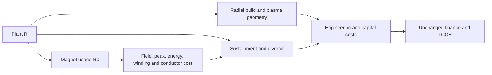

# WI-051: one model-owned major radius

## Design outcome and authority

[AGENT] Bind the generic plant's magnet usage to its containing plant's `R`, and remove the stellarator magnet's duplicate literal. Native generation proves that this produces one public radius entry feeding all nine required consumer/formal pairs. The isolated package has 246 inputs, preserves the complete baseline, and reproduces the pre-repair coordinated R14 result when only plant R changes. This is a working design prototype, not production implementation or independent certification.

[INHERITED] Authority is the accepted [spec](spec.md) at `99aee8cd`, immutable [alignment](../../orchestration/mfe-model-owned-major-radius.md) at `b847558b`, and T-021 assessment/evidence at `2f8856b7`. Parent holds orchestration and routine approvals. All new choices in this design remain agent-originated. No approval or independent review is claimed here.

[INHERITED, REFERENT] T-021's source meaning is inherited, not independently re-reviewed: [frozen-source-meaning.md](prototype/frozen-source-meaning.md). Table 2 names major plasma radius 12.7 m and minor plasma radius 1.3 m. The existing axis-field calculation uses that same major radius, while the reusable magnet definition distinguishes major radius from coil bore. This expresses the current model's intended plasma/axis scale; it does not equate every real modular-coil surface or establish an operating envelope. The source index, AD-001–AD-007, model inventory and process were read. No new source or quantitative calibration is proposed.

## Components, semantics and source placement

[AGENT] Only two logical model files change. Production implementation must apply each change to its canonical file and the matching `exploration/stellarator_e2e/models/` twin. All 21 other MFE logical files, including every library calculation, remain unchanged. The current 23-file boundary comes from `tests/model_families.py:58`.

| Element / proposed file | Meaning and change | Basis |
|---|---|---|
| `magnet.R0` usage in `models/designs/generic_mfe/mfe_plant.sysml:58` | Redefine to the containing plant's `R`; pure value binding in metres, no calculation or new formal | MR-051-01/02; existing plant composition and T-021 source assessment |
| Magnet specialization in `models/designs/stellarator_09/stellarator_plant.sysml:136` | Remove the independent `:>> R0 = 12.7` and its literal-specific comment | MR-051-01/03; plant R remains the sourced 12.7 m baseline |
| Plant `R` in generic `:133`, stellarator `:528` (entering line numbers) | Existing authoritative `Real` quantity in metres; same default and source citation | Existing Table 2 source; AD-001 |
| `'Magnet System'::R0` in `models/library/cost_structure/mfe_power_core.sysml:89` | Retain reusable, explicit major-radius formal | MR-051-02; AD-006/007 |
| Radius-bearing library calculations | Retain formulas, formal names, defaults and documentation | MR-051-02/06; no new physics equation |

The exact source delta is [proposed.patch](prototype/proposed.patch); the parseable family is [prototype/models](prototype/models/). The core stencil is:

```sysml
part magnet : 'Magnet System' {
    // Major plasma/axis radius [m], owned by the containing plant.
    // Source: models/library/cost_structure/mfe_power_core.sysml; R0.
    // Basis: T-021 source-meaning assessment at 2f8856b7; WI-051.
    :>> R0 = R;
    // Existing bindings follow unchanged.
}
```

[AGENT] This placement makes ownership a property of the supported generic toroidal plant, while standalone magnet definitions remain parameterized. Keeping a second literal plus an equality assertion would retain a contradictory public interface. Changing all five magnet consumers individually would duplicate the ownership rule. A concrete-only binding is unnecessary under the accepted supported-caller inventory; contrary evidence of a supported independent surface would reopen that premise with the parent.

[AGENT] No import or package is added. The existing generic plant imports the magnet and analysis definitions, and the stellarator specializes the generic plant. Data flows from plant geometry through magnet field, plasma operation and engineering costs to finance. No calculation or backward dependency is introduced in the design layer, consistent with AD-003/004/006/007 and the existing pure exposure pattern.

## Exact producer and consumer edges

[AGENT] The actual generated pipeline, not suffix matching or module reachability, supplies the evidence in [edges.json](prototype/edges.json). Every row originates at `(stellarator_plant_params, stellarator_09__stellaris__R)`. Module names below carry the prefix `stellarator_09__stellaris__`.

| Module | Formal | Generated input binding |
|---|---|---|
| `rb` | `R_in` | `float stellarator_plant_params.stellarator_09__stellaris__R` |
| `geom` | `R_in` | `float stellarator_plant_params.stellarator_09__stellaris__R` |
| `sustain` | `R_in` | `float stellarator_plant_params.stellarator_09__stellaris__R` |
| `divheat` | `R_in` | `float stellarator_plant_params.stellarator_09__stellaris__R` |
| `coil_length` | `R0` | `float stellarator_plant_params.stellarator_09__stellaris__R` |
| `field_calc` | `R0` | `float stellarator_plant_params.stellarator_09__stellaris__R` |
| `peak_field_calc` | `R_in` | `float stellarator_plant_params.stellarator_09__stellaris__R` |
| `magnet_cost` | `R0` | `float stellarator_plant_params.stellarator_09__stellaris__R` |
| `stored_energy` | `R0` | `float stellarator_plant_params.stellarator_09__stellaris__R` |



The diagram shows source semantics; native codegen resolves the usage alias into the nine direct entry/formal edges above.

## Public contract and direct caller design

[AGENT] The [complete old/new census](prototype/contract-delta.json) is independently enumerated from both generated contracts using each parameter's `param_group` and `qualified_name`. Old count is 247; new count is 246. The only removed pair is `(stellarator_plant_params, stellarator_09__stellaris__magnet__R0)`. There are no additions. Plant R remains in `stellarator_plant_params`; no public replacement alias or duplicate control is created.

[AGENT] [contract-checks.json](prototype/contract-checks.json) additionally proves all 246 surviving complete parameter records and input values are exact. Across every pipeline input binding, exactly the five former magnet-radius operands change; all other bindings, including every fixed-anchor edge, remain exact.

[AGENT] The actual callers have no flat override dictionary API. `run_stellaris.py:116` accepts only an output tag; `run_stellaris_single.py:107` takes no arguments. Both use stock `execute_pipeline`, whose input interface is pipeline YAML referencing typed JSON files. The generated parameter schema already uses `extra='forbid'`; file loading constructs that schema from the entire JSON payload. The native CandidateBridge also rejects unknown flat keys. No generator or TEAx repair is needed.

[AGENT] Add optional keyword-only `pipeline_path` and `output_dir` to those two existing functions. Defaults preserve baseline invocation. A caller supplies an isolated pipeline referring to complete input JSON groups, changing only the existing plant R field. The sealed package remains strict-loaded by the existing loader. Inputs are validated intact; no filtering, aliasing, equality special case or `model_copy(update=...)` bypass is introduced. These arguments expose the existing native input mechanism rather than inventing a new flat-key convention. The single-runner CLI remains baseline-only and explicitly rejects unsupported trailing arguments, including the retired key, instead of ignoring them.

[AGENT] The tested scratch YAML is a byte-for-byte copy of the sealed pipeline; its relative JSON references resolve within the isolated input directory. Package strict loading verifies the package seal, not arbitrary caller-supplied YAML. The supported control exercised here is an unchanged generated graph with changed input JSON; arbitrary alternate graphs receive no compatibility claim from this prototype.

[AGENT] The prototype establishes one necessary local caller repair: the entering helper cannot execute the current structured outputs. Its router omits the constraint schemas, producing `PipelineValidationError`, and its final comprehension also attempts to convert structured results to float. Give it the same deduplicated schema-name registration and scalar filtering already used by the single runner. The helper returns all 158 scalars; the single runner retains all 177 raw outputs. This is an inherited direct-helper defect, not a new radius-binding defect. The bounded fix is demonstrated in [caller-proposed.patch](prototype/caller-proposed.patch), with the original failure retained in [direct-entering.json](prototype/direct-entering.json).

| Input path exercised | Baseline / R-only14 | Obsolete key alone / equal / conflicting / zero |
|---|---|---|
| Strict PreparedEvaluator + native generated entry models | 158 outputs and all responses compare | Explicit `EvaluationFailed` naming the retired key |
| Copied `run_stellaris.run_pipeline` with scratch pipeline JSON | All 158 scalar channels compare | Generated `ValidationError` names the retired key |
| Copied `run_stellaris_single._execute_package` with scratch pipeline JSON | All 177 raw channels compare | Generated `ValidationError` names the retired key |
| Single-runner CLI | Baseline gate families pass | Unsupported arguments rejected with their exact text; three radius combinations tested |

See [direct-prototype.json](prototype/direct-prototype.json), [results.json](prototype/results.json) and [cli-checks.json](prototype/cli-checks.json). R14 execution through the functions bypasses only the CLI's baseline-specific oracle/anchor gates; the frozen full native comparator supplies the off-baseline check. The unchanged oracle is not claimed as current-study certification.

## Fixed anchors and standalone preservation

[AGENT] The independent anchors remain: `magnet.R_ref = 12.7 m`, `magnet.a_coil_ref = 3.1500000000000004 m`, `wall_peak_R_ref = 12.7 m`, and `R_ref_divertor = 12.7 m`. Only plant R is mutated in repaired diagnostic controls. Source preservation and the generated input evidence establish that none of these anchors becomes an alias of live R. The vessel/bore radius remains `3.0000000000000004 m`; coil centre remains `3.1500000000000004 m`; the complete outer build remains `3.5500000000000003 m`. These distinct minor geometry surfaces retain their meanings.

[AGENT] [standalone.json](prototype/standalone.json) executes generated input schemas and unchanged functions for winding length, axis field, stored energy and conductor procurement. Each accepts explicit `R0`. Holding other formals fixed, R0-only 14 m gives winding/procurement ratios `14/12.7` and field/stored-energy ratios `12.7/14`. Standalone conductor cost changes because B is held fixed there; supported plant conductor cost remains invariant because computed B changes inversely with R. The five peak-component controls independently preserve the existing `R_in` interface and adverse behavior.

## Frozen expectations and numerical validation

[INHERITED, REFERENT] [expectations.json](prototype/expectations.json) was written at `2026-09-11T23:28:01.937500+00:00`, before prototype generation, from git objects at `2f8856b7`. It freezes complete input controls, 158-channel coverage, 19 response IDs, the nine edges, retired-key controls, invalid radii, component cases and independent ratios. It records source hashes; [execution-start.json](prototype/execution-start.json) records the expectation hash before generation. `frozen-results.json` retains the original plant-zero and magnet-zero evidence as well as coordinated controls. Expectations were never derived from repaired outputs.

[AGENT] Before repaired execution, `direct.py entering` captured all 177 raw baseline and tied-R14 channels through the original single runner, including all 18 structured evaluations and the aggregate report. There are no additional numeric direct-runner channels beyond the 158 frozen native outputs. This extends raw representation coverage without replacing the independent pre-repair numeric oracle.

[AGENT] [numerical-report.md](prototype/numerical-report.md) lists every baseline expected/actual and R14 expected/actual number, including all downstream cost and finance channels, and all exact named verdict IDs. Baseline scalars, raw evaluations, observed operands, margins and report are exact after serialization. Off-baseline scalars use relative and absolute tolerance `1e-9` in each channel's existing documented units; sets and verdicts are exact. Both LCOE channels are included. No metadata change is excused as a numeric change.

| Independent R14 / baseline identity | Expected | Observed |
|---|---:|---:|
| Plasma volume and winding length | `14/12.7 = 1.1023622047244095` | Both within `1e-9` |
| Axis field and stored magnetic energy | `12.7/14 = 0.9071428571428571` | Both within `1e-9` |
| Peak field | `(12.7-c)/(14-c) = 0.880184331797235`, `c=3.1500000000000004` | `0.8801843317972349` |
| Conductor procurement capital | `1.0` from B×R cancellation at fixed current | `1.0` |

The precise executed ratios are in [checks.json](prototype/checks.json). Decomposed magnet capital, winding/casing consequences, all other costs and both finance outputs compare against retained coordinated controls. No universal total-cost scaling law is asserted. Baseline violates divertor heat; R14 additionally violates wall load, sustainment and loop capacity. Neither is a feasible plant.

## Invalid behavior and F07

[AGENT] All five unified full-plant probes fail explicitly under strict execution and both direct callers. There is no clipping or fallback:

| Plant R [m] | Direct native arithmetic failure | Strict evaluator result |
|---|---|---|
| `4.0` | `SustainmentError`, non-positive fuel density | `EvaluationFailed` |
| `3.1500000000000004` (exact coil centre) | `ZeroDivisionError` | `EvaluationFailed` |
| `3.0` | `SustainmentError`, non-positive fuel density | `EvaluationFailed` |
| `0.0` | `ZeroDivisionError` | `EvaluationFailed` |
| `-1.0` | `TypeError` from complex arithmetic | `EvaluationFailed` |

[AGENT] Unified zero now encounters magnet division by zero; the original plant-only zero record instead encountered zero raised to a negative power. Both original records are retained and both are rejected; no stable scheduler/error-message ordering is promised. The retired magnet-zero request fails schema/entry validation instead of being ignored.

[INHERITED] Original F07 remains open. The unchanged peak component returns `-792.6499999999979 T` for original_negative, which still satisfies the upper-bound comparison. Live equality and reference equality still raise `ZeroDivisionError`. The inverted reference returns `-0.7821989528795832 T`, also satisfying the upper comparison. Full inputs and exact results are in the frozen and executed evidence. These finite probes do not certify a general model domain or close F07. No new binding-induced accepted-invalid case was observed.

## Native generation and quality report

[AGENT] Generation starts in an isolated empty package seeded with exactly four known handwritten implementations. It freshly generates the other 65 bodies, all schemas, contracts, pipeline and seal. This avoids the L-006 failure mode where preservation retains stale autogenerated implementations. The actual changed binding is verified in the generated pipeline and by R-only execution. No hand-edited generated body substitutes for source translation.

[AGENT] [manual-preservation.json](prototype/manual-preservation.json) records exact unchanged hashes for lifecycle calendar, DT fusion power, plasma sustainment and power-cycle efficiency. [generated-hashes.json](prototype/generated-hashes.json) inventories the complete isolated package. A fresh native instance-graph snapshot and a second generation from that snapshot produce a byte-identical package, including those manual bodies. [preservation.json](prototype/preservation.json) records this and verifies the entering production package and canonical sources remained unchanged and all 23 twins remain equal. No IFE/shared source is changed. Full production family regression and current census/snapshot updates belong to implementation.

| Native level | Result | Evidence / interpretation |
|---|---|---|
| 1 Syntax | PASS | Complete family parses through native tools |
| 2 Structure | FAIL, ten inherited findings | Existing literal `ref_power`/`alpha` bindings in waste, fuel handling, other RPE, instrumentation/control and maintenance equipment calculations; no added/removed diagnostic |
| 3 Dependencies | PASS | No introduced cycle or binding failure |
| 4 Coverage | PASS | Existing authored assertion coverage preserved |
| 5 Documentation | PASS | Native definition documentation check |
| 6 Architecture/readiness | FAIL, 229 inherited findings | Exact diagnostic multiset unchanged; no new operator, extraction, dropped-expression or readiness finding |

[AGENT] [validation.log](prototype/validation.log) retains the complete six-level run (exit 1). [validation-diff.json](prototype/validation-diff.json) enumerates every inherited L2/L6 message and compares normalized diagnostic multisets against a separately materialized entering family, ignoring only location shifts. Thus counts are not the sole preservation evidence. The accepted spec explicitly requires reporting inherited L2/L6 failures; this is not an all-level pass or a waiver of introduced failures. Native generation, strict execution and snapshot agreement pass independently.

[AGENT] Initial negative attempts are retained. `execute-attempt-1.py/.log` compared a runtime report object directly to serialized JSON; serialization revealed exact content equality, with no model adjustment. `direct-attempt-1.py` registered the root schema twice; deduplicating names as the existing single runner does fixes that harness error. `standalone-attempt-1.py/.log` misclassified an output `.root` reference as an input group; the corrected resolver reads the frozen baseline output. Original failed results and logs remain. Missing-file discovery attempts (`prototype-r1/build.py`, `prototype-r1/prototype.py`, WI-050 `implementation/regenerate.py`, and `coil_set_field.py`) were read-only; actual APIs/files were then inspected. Reproduction commands and exits are in [commands.md](prototype/commands.md).

## Exact downstream coding migration handoff

[INHERITED] Current-study compatibility remains incomplete. The following excluded surfaces were not edited or certified by this design. They need a separately scoped coding migration against the final shipped package, after the model item passes its independent audit.

| Later surface | Required migration and evidence |
|---|---|
| `exploration/stellarator_e2e/verify_stellaris.py:111,512` | Sustainment must use plant R consistently; field, peak, winding, stored energy and conductor calculations must use that same live radius. Retire the independent operational magnet radius override. Preserve fixed references, cost/finance formulas and component adverse records. T-021's isolated operand experiment diagnoses the incorrect sustainment operand; it is not already a repair. |
| `exploration/stellarator_e2e/studies/oracle_entry.py:53` and evaluation mapping | Remove the retired public key mapping. Reject obsolete flat keys before filtering or parameter conversion, including equal/conflicting submissions. Use plant R for both magnet operation and sustainment. Match the complete new census and exact nine edges. |
| Current `studies/manifest.json`, `study_route.py:63,95`, `ANNEX.md` | Retire the radius tie and proposal injection, describe the model-owned producer, refresh package identities and live contract/census expectations. Preserve the distinction between study validity masks and native failure/constraint behavior. |
| `tests/study/` current fixtures and expectations | Refresh declared package/fixture identities, adapter mapping, no-tie R-only controls, contract census, graph reachability and any changed independent-axis expectations. Compare baseline and R14 against this frozen full record at stated tolerances. Preserve generic tie-mechanism tests and historical study records/pins. |

[AGENT] The handoff payload is the exact pair delta/full census in `contract-delta.json`, nine pairs in `edges.json`, baseline/tied expectations in `frozen-results.json`, ordinary R14 execution and invalid controls in `results.json`, raw direct controls in `direct-entering.json`, exact four reference anchors in `checks.json`, complete source/manual/package hashes, and every channel/verdict in `numerical-report.md`. The prototype semantic fingerprint is `15ed665c374729a984f29fa753f444677805939ffb195933419b3489debbd47e`; executable fingerprint is `89a5531397080ad76734fe09d098aea9e5c56f2020976ca9f9a56a5d48a3d943`. Production identities must be re-derived, not copied as an assertion.

## Remaining implementation obligations and stopping point

[AGENT] MR-051-01/03/05 are proven at prototype level by native edges, re-derived contract, both caller paths and full numerical controls (SV-083/085/087). MR-051-02/06 are covered by standalone, anchor and adverse probes (SV-084/088). MR-051-04 has complete frozen scalar/raw baseline coverage (SV-086). MR-051-07/08 have isolated family, source, handwritten and snapshot preservation evidence; production regression tests, current census/snapshot and native traceability/validation records remain implementation work (SV-089). MR-051-09 is addressed by the explicit later coding handoff and compatibility limitation.

[AGENT] Implementation must apply the two canonical/twin deltas and bounded direct-caller patch, regenerate with verified manual preservation, update the current MFE census/snapshot, add exact edge/refusal/full-output controls in model tests, run focused and required model regression, and record native validation/traceability through the appropriate operations. Preserve source citations on the plant-owned radius and the usage binding; no new requirement promotion is needed. This list states review obligations, not an implementation plan or completed production work.

[AGENT] No source, premise, supported-scope or native generation capability blocker was found. The inherited direct-helper failure is surfaced above with a working bounded repair. Parent must assess the design and its inherited validation limitations before planning. No goal state, production source, generated package, direct runner, current study/oracle/metadata/fixture, plan or review was edited. No commit, self-review, archive, source approval, finance change or residual acceptance occurred. Stop here for the parent's independent design-review dispatch.
