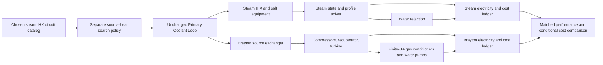

# WI-096 design: matched conversion subsystems

## 1. Decision and review boundary

[AGENT] Build one additive package with the unchanged Primary Coolant Loop as shared source owner and two disjoint conversion branches. Select a small catalog of complete steam IHX circuits first. A separately recorded operating search locates public source heat for which the loop's actual delivered duty and required return match that fixed steam exchanger. Evaluate Brayton at those same loop outputs. This avoids introducing an unpriced source bypass in either branch.

The coordinator accepted the 10/11/12-circuit source-loop refinement during this design task. This is an agent design decision, not owner-originated settled intent. Source return may vary between the three designs and must match within each steam/Brayton pair. The bounded probe in goal `evidence/source-coupling-probe.json` executes the unchanged loop body and an independent exchanger check; the reviewer independently reproduced every channel. No assembled new model has been executed.

**Review must resolve before implementation:** the coolant-flow closure and low-grade loss sink assumptions in §5; the exact rating/price interpretation of offered services in §6; the conditional economic release rule. A positive algebraic balance does not qualify the heat source, equipment or sink.

## 2. Architecture and owned interfaces



| Owner | Chosen/public inputs | Calculated interface | Consumers |
|---|---|---|---|
| `source_basis` and `primary_loop` | Public source heat selected by recorded policy; fixed 573.15 K inlet, 200 K rise, cp 5193 J/(kg K), 8 MPa, 14 primary loops and inherited machinery/loss parameters | Actual delivered duty, hot/required-return temperatures, mass flow, pressure loss/suction, fluid/electric work and fixed-capacity margins | Both conversion branches, source match check; upstream work remains excluded from the isolated metric |
| `steam.transport` | IHX geometry inherited unchanged; salt machinery count/design points and purchased stock | IHX transfer/return check, salt flow, shaft/electricity, steam heat, costs by disjoint scope | Steam cycle, source checks, steam ledger |
| `steam.cycle` | Inherited rated thermodynamic states, efficiencies and installed ratings | States, flow, full-profile SG/reheat UA, work, losses and condenser duty | Steam conditions/capacity checks, water sink |
| `brayton` | Selected primary-HX area; cycle flow and selected stage ratio; offered machinery/services | Native closure, shaft/electricity and individual conditioner endpoints/duties | Return check, conditioner water solves, capacity checks |
| `finance` | Common rate/life/availability and explicit currency factors/scenarios | Annual energy, DCF factors, cost contributions and unresolved corrections | Subsystem comparison |

The source boundary is at the helium terminals of each conversion subsystem. Reactor, primary circulators, primary piping and primary helium inventory are upstream and excluded equally. Delivered heat contains the loop's calculated recovered circulation work at each located operating point; it is not reactor heat. Branch salt equipment, conversion-side helium equipment, connecting exchangers and heat rejection are inside. The cooling body reads actual loop temperatures, pressure loss, total shaft/electric work and supplied design-point context. Its primary subaccounts remain excluded: its IHX count is 10/11/12, while the actual source-loop count remains 14; the body's unused primary count-based outputs do not redefine that source hardware or qualify it.

[AGENT] Keep the loop's 8 MPa nominal pressure and all installed loop/machine inputs fixed. Its existing law calculates total pressure loss, suction pressure and pumping at each located source heat. However, the original loss anchor includes IHX losses as well as vessel/piping (`models/designs/stellarator_09/stellarator_plant.sysml:1288–1300`); changing to 10/11/12 exchangers while retaining that law imposes a total-resistance assumption. It is not a prediction of the new branch distribution or exchanger pressure loss. The same actual loop output tuple is supplied to both conversion alternatives within each pair. This supports conditional source-model thermal consistency, not unchanged physical hydraulics or an optimized whole plant. A future qualified full-plant comparison must resolve branch-dependent exchanger losses and actual reactor operating support.

## 3. Shared source and matched steam IHX

Instantiate `Primary Coolant Loop` and its unchanged body with public source heat `q_source`; fixed inputs are exactly those retained in the probe: inlet 573.15 K, rise 200 K, cp 5193 J/(kg K), gamma 5/3, pressure 8 MPa, primary loop count 14, reference and rated per-loop flow 225.07777777777778 kg/s, reference loss 329187.1856931558 Pa, loss factor 1, isentropic efficiency 0.772796639536644, drive efficiency 1, live flag 1 and direct pump/recovery terms zero. Keep reference values, installed ratings and calculated demands distinct. A new generic `Source Exchanger Match` reports exchanger capability and residual from actual loop outputs; it does not calculate source flow or temperature independently. Chosen IHX catalog values are `n = {10,11,12}`, tube count 14852, OD 0.01905 m and length 11.6 m. Use the existing U normalization:

```text
A_one = pi × 14852 × 0.01905 × 11.6
L_ref = (35 − 19.3) / ln(35 / 19.3)
U = 267.8e6 / (A_one × L_ref)                 W/(m² K)
d_hot = T_helium_hot − 738.15                 K
d_cold = T_helium_return − 543.15             K
L = (d_hot − d_cold) / ln(d_hot / d_cold)      K
Q_IHX_capability = n × A_one × U × L / 1e6    MW
source_match_residual = primary_loop.q_ihx − Q_IHX_capability
```

Use the continuous equal-gap LMTD limit and refuse nonpositive gaps or invalid geometry/count. The separate composition policy brackets `q_source` on `[1000,3125.9322770825056] MW`, calls the package-owned source/loop/match oracle and bisects the signed residual to 1e-9 MW, with at most 200 iterations. Retain brackets, evaluations and no-root cases. This search operates only the independent source/loop/match calculation subset, so a downstream failed cost or conversion case cannot erase source evidence. Execute each located `q_source` as a public input in the full native package and re-derive the loop, exchanger and capacity checks. No model binding installs source heat from a demand or sizes any equipment; the policy result is a replayable selected operating point.

| Chosen IHX circuits | Located source heat MW | Loop delivered heat MW | Loop required return K | Primary per-loop flow margin kg/s |
|---:|---:|---:|---:|---:|
| 10 | 2706.008896600919 | 2819.513747949731 | 564.760903312891 | 38.97499541959516 |
| 11 | 2886.207018998959 | 3024.031024187687 | 563.599471969164 | 26.582067962438515 |
| 12 | 3051.705559705915 | 3214.739980462504 | 562.4651932539455 | 15.200088050815992 |

The JSON's full-precision loop outputs are the diagnostic authority; displayed values above aid review, not a new baseline override. All are below nominal source and delivered heat and have positive suction and flow margins. Primary electrical demands are approximately 113.505, 137.824 and 163.034 MW, excluded equally from the conversion metric but retained explicitly. Hot temperature remains 773.15 K. The loop is the sole owner of delivered heat, required return and flow; both branches bind those outputs.

An independent constant-property counterflow effectiveness-NTU check uses chosen total UA, actual loop hot temperature/flow and calculated salt inlet/flow. It computes achieved duty and helium outlet independently of the LMTD matching residual. Require both duty and return agreement at numerical precision; the probe's largest return residual was below 6.8e-12 K. Retain the original nominal source with 14 IHX circuits as an adverse diagnostic: excess installed UA must be reported as unmatched without control. Perturbing public source heat with fixed hardware must change loop flow/loss/return/pumping and usually fail the source match; preserve that failure.

Sources: existing loop definition `models/library/analyses/mfe_primary_loop.sysml:14–44`; unchanged actual body and its hash in goal `evidence/source-coupling-probe.json`; cooling body `exploration/stellarator_e2e/generated/handwritten/mfe_cooling_equipment/cooling_equipment_impl.py:63–78`. Exact nominal controls remain in goal `evidence/readiness-screen.json`. The source match is conditional on the inherited hydraulic law; no actual plasma/blanket turndown model has been added.

## 4. Steam branch and the bounded cooling-body variant

### Chosen salt machinery

With four pumps per circuit, the coupled source points require per-pump salt flows 231.7154625, 225.9302361 and 220.1635424 kg/s. Select the independent **250 kg/s design offer**, head 40 m, pump efficiency 0.75, motor efficiency 0.95 and one uninstalled plant spare. This design point is approximately 175.35 shaft hp, below the inherited 200 hp type limit. Retain the independently priced 225 kg/s offer: it fails the first two points by 6.71546 and 0.93024 kg/s and passes the third flow ceiling. Retain the two/three-pump adverse offers and their actual flow/shaft/range failures. These are [AGENT] hypothetical design inputs, not vendor ratings; the 250 kg/s offer is explicitly selected before native execution and is never calculated as demand plus margin. Every source/purchase/range/head/power screen still runs. Purchased salt stock remains independently fixed at 1,608,750.9823889225 kg for all three IHX circuit-count offers. Required fill and reserve target remain diagnostics.

Create additive `Cooling Equipment With Selected Salt Pump Count`, copied from the complete existing definition/body and changed only as follows:

1. Add positive integer `salt_pumps_per_circuit` input. Replace salt-side occurrences of `2*n` with `k*n`: operating per-pump flow/shaft/electricity, pump count, active vendor purchases and installation. Primary-side `2*n` remains unchanged. Pipe geometry, exchanger geometry, total salt flow, head and total salt work remain unchanged.
2. Keep all independently chosen per-machine price inputs and stock inputs. No selected input comes from the demand. The retained one-spare convention stays one per plant.
3. Expose salt machine replacement purchase `sv`, installation `si`, removal `si × removal_multiplier` separately from primary machines. Expose the existing bundle replacement terms unchanged. Expose per-pump electric demand if absent. All other outputs preserve equations and ordering through the new typed ABI.
4. Replaying `k=2` must reproduce every old output bit for bit on retained valid inputs. Record an exact whole-body diff and classify every changed expression; a prefix-only reuse claim would be false for this variant.

Salt flow remains `Q_delivered × 1e6/(1560×195)`, where `Q_delivered = primary_loop.q_ihx`. Salt shaft/electricity remain `mdot × g × head / eta_p / 1e6` and shaft divided by motor efficiency. Steam receives `Q_delivered + P_salt_shaft`; pre-pump salt return is `270 − P_salt_shaft × 1e6/(mdot_salt×1560)` °C. This correctly adds recovered shaft heat once. Keep the nominal constant return 269.6647299145299 °C at these head/efficiency choices. Primary electricity is excluded from the conversion ledger and retained in source context.

### Steam cycle and checks

Reuse `Matched Steam Cycle` unchanged at 6.2/0.8 MPa, steam/reheat 445/445 °C, condenser 42 °C, HP/LP efficiencies 0.9, steam pump efficiencies 0.8, motor 0.95, mechanical 0.99 and generator 0.98. Retain the exact offered-condition checks and captured equipment ceilings from `models/designs/stellarator_09/stellarator_plant.sysml:743–795`: gross 1219.9981701764736 MW; SG/reheat UA 41.07437838721364/11.18676341684029 MW/K; HP/LP flow and shaft ratings; condenser 2058.639911447174 MW; steam-pump flow, pressure and electric ratings. Bind demands to the actual cycle outputs, not the selected ratings.

Reuse steam water rejection at 25→35 °C, head 20 m, efficiencies 0.8/0.95. Its input rejection includes the cycle's condenser plus mechanical/generator/steam-pump motor losses, and adds salt-pump motor loss once. Retain independently selected water flow 50463.801850311946 kg/s, pump electric 13.023180063562146 MW and ultimate rejection 2109.621069383624 MW. Adding the salt motor loss is new boundary accounting; the source rate may need to fail the held offer. The inherited lumped rejection treats losses as removable under the 42 °C sink scenario; it is a conditional sink assumption, not a model of each loss-producing machine's cooling circuit.

### Operating-search fairness

[NEED, owner brief] Both branches get the opportunity for bounded operating and explicit equipment investigations. Screen the available steam controls before interpreting a technology difference: steam/reheat temperature, condenser temperature, salt head and pump count. The fixed WI-080 offer supports the captured 445/445/42 °C states, not a temperature envelope; varying those temperatures requires a different supported offer. Changing salt head changes the salt return temperature and therefore the captured steam offered-condition check. Those directions remain unsupported under the held offer, rather than being set aside because their result might be unfavorable. Pump count is a hardware choice: retain the two/three/four-pump offers and prices, and evaluate demand across the matched source catalog without claiming an operating optimization. Machine-efficiency sensitivity is common to both branches and explicitly hypothetical.

The Brayton flow/ratio search is consequently broader than the supported steam operating choices. Compare the supplied steam offer against the best tested feasible Brayton choices in the declared catalog; do not call this an equally optimized technology comparison. Record the rejected steam control directions and why they are unsupported in the candidate ledger. If equal supported operating freedom is necessary for the requested recommendation, that criterion remains partial until steam off-design offer/performance evidence exists; no invented temperature ratings are added merely to equalize the grid.

## 5. Brayton branch, return and cooler closure

Reuse the C-1 compressor/intercooler/turbine/recuperator/pressure-loss/network definitions and unchanged bodies. Bind the actual shared loop outputs to the active helium stage, with the other stages dormant at zero UA/duty and their existing positive dummy-domain values. Choose primary HX area 50000 m² and U 1000 W/(m² K). Choose cycle flows from `{1500,1750,2000,2250,2500}` kg/s; search equal compressor ratios in `[1.20,1.80]` for `capability − primary_loop.q_ihx = 0`, using the package-owned oracle and then executing the located ratio natively. This is a separate recorded operating-point search; it never changes source heat or hardware. Preserve no-root and failed-rating cases. The old solver's small positive bypass target must not be copied: B1 in the readiness record has bypass approximately 1.00008e-6, not exact zero. New acceptance uses independently computed hot/return and duty residuals, not a rounded bypass display.

### Conditioner water operating point

Add `Finite Water Cooler` for the two intercoolers and precooler. Inputs: actual gas inlet, required gas outlet, calculated removed heat Q, chosen installed UA, reservoir inlet temperature, chosen head/efficiencies and independent installed water-flow/electric/duty ratings. The gas target remains an operating requirement; coolant flow becomes the calculated operating setting needed to achieve it on the supplied UA. This is additional behavior, not a renamed condenser approach.

Use the retained saturation-liquid property table and interpolation, with no extrapolation. Pump all circulation electricity into water before the exchanger, matching the existing water body's total-heat convention; this conservatively includes motor loss in water. Let `e = g H/(eta_p eta_motor)/1000` kJ/kg and `h_in_after = h(T_reservoir)+e`; invert the liquid table for `T_in_after`. For a candidate water outlet `T_wout`,

```text
mdot_water = 1000 Q / [h(T_wout) − h(T_reservoir) − e]
P_water = mdot_water × e / 1000
d_cold = T_gas_out − T_in_after
d_hot = T_gas_in − T_wout
```

Calculate required UA by the existing steam solver's piecewise-profile method rather than an endpoint LMTD approximation with variable water heat capacity. Parameterize cumulative transferred heat `q` from the cold terminal, `0 <= q <= Q`: `T_gas(q) = T_gas_out + (T_gas_in−T_gas_out) q/Q`, `h_water(q) = h_in_after + 1000 q/mdot_water`. Invert the table's piecewise-linear liquid `h(T)` to obtain `T_water(q)`. Partition at every crossed liquid enthalpy knot, including both endpoints. The gap is linear within each segment. Its exact contribution is `Δq × ln(gap_b/gap_a)/(gap_b−gap_a)` MW/K, with equal-gap limit `Δq/gap_a`; sum these to obtain `UA_required`. Evaluate every knot gap and refuse any nonpositive gap. Use `log1p` or the existing stable equal-gap treatment. This is exact for the chosen constant-cp helium and piecewise-linear water-property model, not a claim about continuous empirical fluid properties. Reference: `exploration/stellarator_e2e/generated/handwritten/mfe_matched_steam_cycle/matched_steam_cycle_impl.py:129–157`.

Solve `UA_required = UA_installed` over `T_in_after < T_wout < min(T_gas_in,60 °C)` with positive endpoint and interior knot gaps, retaining the 20–60 °C property domain. Use a bracket and bisection; exclude singular endpoints using represented inward endpoints and explicitly diagnose no bracket. Increasing outlet temperature increases water temperature at every interior fractional heat coordinate, reducing each gas/water gap and increasing the integral, so the valid root is unique. A missing root returns an unsupported/failed operating result with its reason; do not substitute a clamped water outlet. Once solved, report flow/power/duty margins, minimum full-profile gap and the heat balance `mdot × [h_out − h_reservoir]/1000 = Q + P_water`. A fixed outlet with merely positive endpoint gaps is not a passing capacity result.

Water head 20 m, reservoir inlet 25 °C and efficiencies 0.8/0.95 match steam. Predeclare several hypothetical service specifications before screening; initial catalog UA triples `(IC1,IC2,pre)` in MW/K: `(25,25,40)`, `(30,30,50)`, `(40,40,60)`. These are independently offered assumptions; retain the full catalog, including incompatible matches. All use selected per-cooler water-flow capacity 100000 kg/s, electric capacity 30 MW and thermal duty capacity 2000 MW. Their physical applicability, finite-UA fit, property-domain limits and price are separately reported. These values are not demand-derived or empirically qualified.

Generator loss must enter the ultimate rejected-heat ledger and cooling electricity. For the bounded conditional model, use one additional lumped water rejection instance for that loss at a supplied 42 °C service boundary, with 25→35 °C water and the same head/efficiencies. This inherits the steam sink's lumped loss-removal assumption; it does not predict generator jacket transfer. Its selected service heat/flow/electric capacities are 100 MW, 3000 kg/s and 1 MW. Label detailed generator cooling **unverified**, in both branches, and do not claim complete thermal-equipment qualification. Independent review may reject that approximation; then matched complete-performance interpretation is parked and the missing generator heat-transfer boundary is the named dependency.

### Recuperator

Calculate actual effectiveness from independently chosen installed UA and cycle flow: `C = mdot×cp/1e6`, `eps = UA/(UA+C)` for the existing balanced counterflow assumption, and `Q_rec = eps C max(T_hot−T_cold,0)`. Bind that calculated effectiveness into both the native heat-driven closure and the passive recuperator; it is no longer an independent operating input. The first two service offers select UA 60 MW/K; the third selects 80 MW/K. All select transferred-duty rating 4000 MW. This explicit MR-7 role change avoids assuming an unmodeled controller that reduces an oversized recuperator to fixed effectiveness. Keep the native passive bypass when no positive temperature difference exists. The existing 4.5% aggregate cycle pressure loss remains an assumed offered condition, not predicted recuperator hydraulics. UA changes are priced hardware alternatives; fixed-hardware flow changes alter effectiveness physically. Source of the relation: the balanced counterflow limit in `models/library/analyses/loop_return_control.sysml:15–19`; existing ideal-gas recuperator equations in `models/library/analyses/ideal_gas_brayton_components.sysml:41–50`.

## 6. Explicit offers, money and ledgers

| Account | Selection and price ownership | Admission / unresolved scope |
|---|---|---|
| Steam IHX and salt train | Chosen n=10/11/12 and k=4; Cooling Equipment variant prices fixed exchanger geometry, selected salt pumps, salt piping, chosen salt stock and one salt spare. | Include `hx_purchase + hx_installation + secondary_vendor + secondary_installation + secondary_pipe_purchase + secondary_pipe_installation + salt_inventory_cost + secondary_spare`. Exclude every primary term. Valves/supports/insulation/salt auxiliaries remain an explicit missing installed-scope correction. |
| Steam conversion/rejection | Keep supplied 247464428.83859593 and 115939531.80564217 aggregate amounts, with captured ratings above, on their source-declared USD2025 basis. | WI-079 includes represented SG/reheater and pump children; no duplicate individual purchases. Goal `evidence/monetary-basis.md` records the original code's matching USD2025 coefficients. The original historical source hash and claimed escalation remain unverified; the rejection comment's gross/thermal mismatch remains a price-basis limitation. Preserve the fixed captured amounts. |
| Brayton machines and primary HX | Independently offered 3200 MW compressors, 7000 MW turbine, 3600 MW generator and 50000 m² primary HX. | Use existing selected-quantity purchases and their source-base prices. The HX purchase owns its heat-transfer assembly; machine purchases own the named machine packages. Preserve extrapolation flags. These are predecessor I-R selections, not inferred ratings. |
| Brayton primary interface allowance | Independently offered 3500 MW thermal-duty package, using the retained helium-duty price basis. | [AGENT] Assign the budget to the conversion inlet/outlet headers, local isolation/instrumentation and pressure-boundary assembly around the separately purchased primary HX. Exclude the HX heat-transfer assembly, upstream circulators/piping/stock and conversion-cycle transport. This disjoint scope is an assumed allocation, not authenticated equipment coverage; any unsupported residual stays a cost correction. |
| Brayton services | One combined recuperator/conditioner/generator-cooling service package with the selected capabilities in §5; quote-scenario base 62.9116 MUSD2004. | Own recuperator, three gas/water coolers, their four water-circulation pump sets including the generator-loss service, and local controls. Pair each hypothetical specification explicitly with its own assumed quote multiplier; `(25,25,40)`, `(30,30,50)`, `(40,40,60)` receive factors 1, 1.25, 1.5 respectively. This is a hypothetical offer catalog, not a sourced marginal UA price law. Installation and unconfirmed local accessories remain an explicit scope correction. |
| Brayton secondary transport | One selected combined transport allowance at 85.933 MUSD2004. | [AGENT] Own conversion-cycle helium distribution piping, working-fluid stock and local transport auxiliaries, excluding machine packages, primary interface headers, recuperator/coolers, water pumps and ultimate water infrastructure. Do not carry inactive ARIES PbLi/divertor hardware into this isolated assembly. Scope accuracy remains unverified. |
| Brayton ultimate rejection | Independently offered 5000 MW rejected-heat capacity using the retained selected-rating purchase law. | [AGENT] Own reservoir/intake/outfall infrastructure, water distribution and external heat disposal after the separately purchased coolers/pumps. Use the same conditional once-through water boundary as the circulation model: 25 °C inlet supplied by the site, warmed water discharged; no cooling tower/fan is modeled. A tower-based interpretation would require its omitted power and equipment. This scope allocation is hypothetical, with site qualification and installed-price coverage unverified. |

Price uncertainty changes explicitly selected quote factors, not physical ratings. Steam and Brayton nominal machinery efficiencies are assumptions; apply efficiency offsets of ±0.03 absolute to applicable turbine/compressor efficiencies, respecting (0,1], and report unsupported performance sensitivity. Recuperator UA 60/80 MW/K belongs to the explicitly priced service offers; effectiveness follows selected UA and flow. These are agent-selected alternatives/stress levels, not confidence intervals.

Use common scenario availability 0.85, real discount 0.05, life 30 calendar years, construction 0 years (comparison at commissioning), no source fuel. Each is [AGENT], openly replaceable; use the same values within a pair. Reuse currency-agnostic `LCOE DCF` and existing financial-factor helpers, not `Lifecycle Cashflow Accounts`' hardcoded `currency_year=2004` output. Use USD2025: retained cooling prices already have that basis; steam has its source-declared basis; multiply explicit ARIES USD2004 amounts by `321.9/188.9`. Goal `evidence/currency-conversion.md` records the already registered original CPI table rows. This is a general purchasing-power proxy, not validated equipment-price escalation. Preserve raw monetary categories and adjustment factors in outputs; equipment-price uncertainty remains independent.

Split salt replacements exactly: machine event `sv + si + removal_multiplier×si`; bundle event remains the cooling body's existing purchase/installation/removal terms. Dates are `k×life < horizon`, using existing machine life 10 years and bundle life 15 years. Exclude primary replacement and helium makeup. Salt makeup is purchased-salt cost times the chosen 0.001/year rate. New subsystem operating expenses and conversion replacements are unknown inputs, not inherited whole-plant 70 MUSD/year or blanket replacement schedules. Demonstration scenarios may explicitly quote nonfuel service at 2% of selected conversion/rejection/transport package capital per year and replacement at 20% of those same disjoint package costs in year 15, with 0.5/1/1.5 factors. Exclude salt-machine/bundle costs already replaced on their own schedules. These are hypothetical allowances, and economic support stays conditional.

New `Conversion Subsystem Ledger` exports gross, each electrical load, net, thermal rejection, independent energy residual, each disjoint capital component, dated replacement PV and annual nonfuel contributions. Steam net is gross minus steam pumps, salt pumps and all water pumps. Brayton net is generated shaft net minus conditioner/loss-service water pumps; exclude upstream primary pumps and the old 65 MW whole-plant register. Preserve failed/nonpositive net without invoking a positive-energy financial calculation; cost per MWh is undefined for those cases.

Keep cost corrections visible: with accounted PV costs K and discounted energies E, unresolved corrections X satisfy the break-even frontier `X_S = (E_S/E_B)(K_B+X_B) − K_S`. Emit accounted costs and frontier coefficients. The account map above is a disjoint assumed allocation; it does not establish the source budgets' actual procurement scope. Preserve that distinction for the inherited steam rejection package too, whose captured price remains fixed while the conditional water-boundary use is hypothetical. A finite assumed quote multiplier cannot qualify missing physical scope. If consequential recurring/scope corrections remain unknown, economic-comparison completion stays partial and no unconditional preferred technology is reported.

Source fuel and upstream costs are excluded equally. The reported metric therefore establishes neither whole-plant LCOE nor fuel-supply qualification or a whole-plant economic recommendation. Without extending implementation, the correction frontier can show an optional common source-service PV charge C in both branches: its contribution to the steam-minus-Brayton cost difference is `C × (1/E_S − 1/E_B)`. This is the electricity-denominator effect of the same supplied heat-service cost, not a tritium-price or breeding model.

## 7. Changed/reused inventory and modeling route

| Artifact | Treatment |
|---|---|
| `models/designs/component_alternatives/plant.sysml` | New branch occurrences, values and bindings only; chosen offers and quantities have doc provenance. |
| `models/library/analyses/component_alternatives_thermal.sysml` | Additive generic `Source Exchanger Match`, independent counterflow transfer check, `Finite Water Cooler`, recuperator-capacity calculation, ledger/selection checks. Source physics remains in the unchanged Primary Coolant Loop. No existing consumers change. |
| `models/library/analyses/cooling_equipment_selected_pumps.sysml` | Additive renamed cooling variant with selected salt count and disjoint replacement outputs. |
| `exploration/component_alternatives/` | Isolated build, staged sources, reviewed bodies, native package, source property assets, manifest/oracle/interface/verifier and study handoff. |
| Existing primary-loop, steam, gas, purchase, screen, financial bodies | Copy with import-prefix changes only where unchanged; include property tables plus their retained hashes and helpers. Cooling variant and added definitions have separately reviewed bodies. |

The author must coordinate the two new library paths with the coordinator before writing; no existing file changes are required. Use private imports, exposed producer attributes, distinct calc input names and bindings-only asserted constraints under ADR-002. No calculation on another part's output in a design attribute. Definitions are generic; named offers and all concept values live in the design. Retain a file/body reuse manifest with old/new hash and exact transformation for every source. The implementation plan must enumerate new output ABI schemas before assigning copied bodies.

Build route follows `exploration/costed_loop_brayton/build.py`: explicit source set, generator, installed reviewed completion bodies, regeneration to fixed point, snapshot and census. Use `.codex-test/run` only. Then add package-owned oracle and native study interface, execute baseline/adverse cases, verify every result/check, obtain the integration seam return and release the study through the goal workflow. This design has no execution receipt or integration verdict yet.

Before the large generation/integration pass, run one bounded scalar development check of the complete selected thermal tuple through the authored bodies: matched source point, located Brayton ratio, actual recuperator effectiveness and every cooler water-flow root. Excess installed cooler UA can require water outlet above the 60 °C property bound, so a bigger offer is not automatically feasible. Retain all no-root diagnostics. Any catalog revision must be an explicitly recorded offered design and price-scope change before the main study, never point-by-point installed-UA sizing. This development check supplements the later native proof; it does not replace it or justify new generic infrastructure.

## 8. Acceptance evidence and stopping rules

| Case/check | Required observation | Requirements |
|---|---|---|
| Cooling variant k=2 on original nominal and one adverse duty | Every old channel bit-exact; no primary expression changes. | R3, R7 |
| Matched n=10/11/12 source catalog | Replay the located public source heats from §3 through unchanged loop; both technologies receive its same full actual tuple; independent NTU/LMTD and source energy identities agree; source/delivered heat below nominal and primary capacity/suction checks pass. | R1, R2 |
| Original nominal source with fixed 14-IHX offer | Explicit unmatched return/capability outcome; no capacity-only success promoted to steady source match. | R2 |
| k=2/3/4 salt offers at one matched duty | Two-pump flow-domain and three-pump shaft-hp failures retained; four-pump candidate evaluated; price/count follows chosen k and each declared per-pump design. | R3, R5 |
| Salt selected per-pump flow 225 versus 250 kg/s with k=4 | At n=10/11, the 225 offer fails and 250 passes flow capacity; n=12 remains the sufficient 225 control. Selected inventory and corresponding price are preserved; no demand resizing. | R5 |
| Fixed source-loop and k=4 hardware with public source heat ±5% | Loop flow, loss, required return, pumping and downstream demands change; installed selections/purchases do not. Unmatched IHX/source cases fail and remain recorded. | R2, R5 |
| Brayton source closure | Located ratio satisfies actual heat/return residuals; near-zero historical bypass is not treated as an exact result. Include below-boundary unremoved-heat case. | R1, R3 |
| Cooler UA and water-flow adverse offers | Insufficient heat removal/no-bracket or exceeded pump flow/power reported. Increase independent offer only through the catalog; valid root reproduces endpoint/interior knot gaps and water balance. Compare piecewise-UA integral with independent refined numerical quadrature, including a case crossing several liquid-property knots; test equal-gap segment limit and property boundary refusal. | R4, R5 |
| Recuperator UA 60/80 offers and fixed-UA flow changes | Actual effectiveness changes as UA/(UA+C); selected price changes only with its offered package. Transferred-duty failures remain. No silent UA sizing to preserve 0.8 effectiveness. | R3, R5 |
| Both complete energy ledgers | Source heat equals exported net plus rejected heat; changing generator efficiency moves gross and rejection consistently. Changing water head changes electricity and its recovered heat once. | R4 |
| Cost scope and replacements | Child capital sums equal totals; primary terms excluded; k changes salt counts/purchases/events; replacement PV independently summed at r=0 and r=0.05; no duplicated source or SG/reheater cost. | R6 |
| Original preservation and native translation | Hash original models/packages/studies before and after; original control replays exact; new generated/oracle scalar and predicate comparisons pass with complete response coverage. | R7, R8 |

Numerical starting classes: heat/shaft identities `max(1e-6 MW,1e-9×boundary heat)`; source return root residual 1e-6 K; cooler heat root 1e-8 MW or UA equivalent at that heat scale; ordinary values use existing manifest classes. Root convergence tolerances are numerical, never physical deficit allowances. Offer margins remain signed; retain underlying residuals and solver bracket information. Independently review any tolerance needed beyond inherited classes before execution. Validate all six static levels on the explicit new source set and retain individual diagnostics; no blanket inheritance of old L6 exceptions.

Stop and return an exact dependency if the source cannot match, the coolant solver needs unsupported property extrapolation, the offered catalog yields no matched pair, or the loss-sink approximation fails review. Do not grow an unbounded machine/cooling design effort. Missing qualified costs lead to the declared partial threshold result, not an invented economic ranking. Fresh review is the next step; implementation remains pending.
